# Bioinformatics and Drug Discovery

Richard S. Larson · Tudor I. Oprea Editors

# Preface

A remarkable number of novel bioinformatics methods and techniques have become available in recent years, enabling us to more rapidly identify new molecular and cellular therapeutic targets. It is safe to say that bioinformatics has now taken its place as an essential tool in the process of rational drug discovery.

The first (2005), second (2012), and now third editions of Bioinformatics and Drug Discovery offer many examples that illustrate the dramatic improvement in our ability to understand the requirements for manipulating proteins and genes toward desired therapeutic and clinical effects.

This is partly due to our growing ability to modulate protein and gene functions, which has been facilitated by the emergence of novel technologies and their seamless digital integration. To address the rapidly changing landscape of bioinformatics methods and technologies, this edition has been updated to include four major topics: (1) Translational Bioinformatics in Drug Discovery; (2) Informatics in Drug Discovery; (3) Clinical Research Informatics in Drug Discovery; and (4) Clinical Informatics in Drug discovery. The topics covered range from new technologies in target identification, genomic analysis, cheminformatics and chemical mixture informatics, protein analysis, text mining and network or pathway analyses, as well as drug repurposing.

It is virtually impossible for an individual investigator to be familiar with all these techniques, so we have adopted a slightly different chapter format than other titles published by Methods in Molecular Biology. Each chapter introduces the theory and application of the technology, followed by practical procedures derived from these technologies and software. Meanwhile, the pipeline of methodologies and the biologic analysis that they perform has grown over time.

Bioinformatics and Drug Discovery is intended for those interested in the different aspects of drug design, including academicians (biologists, informaticists, chemists, and biochemists), clinicians, and scientists at pharmaceutical companies. This edition’s chapters have been written by well-established investigators who regularly employ the methods they discuss. The editors hope this book will provide readers with insight into key topics, accompanied by reliable step-by-step directions for reproducing the techniques described.

Albuquerque, NM, USA

Richard S. Larson

Tudor I. Oprea

# PART I TRANSLATIONAL BIOINFORMATICS IN DRUG DISCOVERY

Miniaturized Checkerboard Assays to Measure Antibiotic Interactions. . 3 Melike Cokol-Cakmak and Murat Cokol   
2 High-Throughput Screening for Drug Combinations 11 Paul Shinn, Lu Chen, Marc Ferrer, Zina Itkin, Carleen Klumpp-Thomas, Crystal McKnight, Sam Michael, Tim Mierzwa, Craig Thomas, Kelli Wilson, and Rajarshi Guha   
3 Post-processing of Large Bioactivity Data . 37 Jason Bret Harris   
4 How to Develop a Drug Target Ontology: KNowledge Acquisition and Representation Methodology (KNARM) . 49 Hande Ku¨c¸u¨k McGinty, Ubbo Visser, and Stephan Schu¨rer

# PART II INFORMATICS IN DRUG DISCOVERY

5 A Guide to Dictionary-Based Text Mining . 73 Helen V. Cook and Lars Juhl Jensen   
6 Leveraging Big Data to Transform Drug Discovery 91 Benjamin S. Glicksberg, Li Li, Rong Chen, Joel Dudley, and Bin Chen   
How to Prepare a Compound Collection Prior to Virtual Screening . . . 119 Cristian G. Bologa, Oleg Ursu, and Tudor I. Oprea   
8 Building a Quantitative Structure-Property Relationship (QSPR) Model 139 Robert D. Clark and Pankaj R. Daga   
9 Isomeric and Conformational Analysis of Small Drug and Drug-Like Molecules by Ion Mobility-Mass Spectrometry (IM-MS). 161 Shawn T. Phillips, James N. Dodds, Jody C. May, and John A. McLean

# PART III CLINICAL RESEARCH INFORMATICS IN DRUG DISCOVERY

10 A Computational Platform and Guide for Acceleration of Novel Medicines and Personalized Medicine . 181 Ioannis N. Melas, Theodore Sakellaropoulos, Junguk Hur, Dimitris Messinis, Ellen Y. Guo, Leonidas G. Alexopoulos, and Jane P. F. Bai   
11 Omics Data Integration and Analysis for Systems Pharmacology . 199 Hansaim Lim and Lei Xie

12 Bioinformatics-Based Tools and Software in Clinical Research: A New Emerging Area 215 Parveen Bansal, Malika Arora, Vikas Gupta, and Mukesh Maithani   
13 Text Mining for Drug Discovery. 231 Si Zheng, Shazia Dharssi, Meng Wu, Jiao Li, and Zhiyong Lu

# PART IV CLINICAL INFORMATICS IN DRUG DISCOVERY

14 Big Data Cohort Extraction for Personalized Statin Treatment and Machine Learning. 255 Terrence J. Adam and Chih-Lin Chi   
15 Drug Signature Detection Based on L1000 Genomic and Proteomic Big Data 273 Wei Chen and Xiaobo Zhou   
16 Drug Effect Prediction by Integrating L1000 Genomic and Proteomic Big Data 287 Wei Chen and Xiaobo Zhou   
17 A Bayesian Network Approach to Disease Subtype Discovery 299 Mei-Sing Ong

Index 323

# Contributors

TERRENCE J. ADAM  Department of Pharmaceutical Care and Health Systems, Health Informatics, Social and Administrative Pharmacy, University of Minnesota College of Pharmacy, Minneapolis, MN, USA   
LEONIDAS G. ALEXOPOULOS  School of Mechanical Engineering, National Technical University of Athens, Zografou, Greece   
MALIKA ARORA  Multidisciplinary Research Unit, Guru Gobind Singh Medical College, Faridkot, India   
JANE P. F. BAI  Office of Clinical Pharmacology, Center for Drug Evaluation and Research, US Food and Drug Administration, Silver Spring, MD, USA   
PARVEEN BANSAL  University Centre of Excellence in Research, Baba Farid University of Health Sciences, Faridkot, India   
CRISTIAN G. BOLOGA  Division of Translational Informatics, Department of Internal Medicine, University of New Mexico School of Medicine, Albuquerque, NM, USA   
BIN CHEN  Bakar Computational Health Sciences Institute, University of California, San Francisco, CA, USA; Department of Pediatrics and Human Development, Michigan State University, Grand Rapids, MI, USA; Department of Pharmacology and Toxicology, Michigan State University, Grand Rapids, MI, USA   
LU CHEN  National Center for Advancing Translational Science, Rockville, MD, USA   
RONG CHEN Department of Genetics and Genomic Sciences, Institute of Next Generation Healthcare, Icahn School of Medicine at Mount Sinai, New York, NY, USA; Sema4, A Mount Sinai Venture, Stamford, CT, USA   
WEI CHEN  Department of Radiology, Wake Forest University Medical School, Winston-Salem, NC, USA   
CHIH-LIN CHI  University of Minnesota School of Nursing, Minneapolis, MN, USA   
ROBERT D. CLARK  Simulations Plus, Inc., Lancaster, CA, USA   
MURAT COKOL  Department of Molecular Biology and Microbiology, Tufts University School of Medicine, Boston, MA, USA; Laboratory of Systems Pharmacology, Harvard Medical School, Boston, MA, USA   
MELIKE COKOL-CAKMAK  Faculty of Engineering and Natural Sciences, Sabanci University, Tuzla, Istanbul, Turkey   
HELEN V. COOK  School of Clinical Medicine, University of Cambridge, Cambridge, UK; Novo Nordisk Foundation Center for Protein Research, Faculty of Health and Medical Sciences, University of Copenhagen, Copenhagen, Denmark   
PANKAJ R. DAGA  Simulations Plus, Inc., Lancaster, CA, USA   
SHAZIA DHARSSI  National Center for Biotechnology Information (NCBI), National Library of Medicine (NLM), National Institutes of Health (NIH), Bethesda, MD, USA   
JAMES N. DODDS  Department of Chemistry, Center for Innovative Technology, Vanderbilt-Ingram Cancer Center, Vanderbilt Institute of Chemical Biology, Vanderbilt Institute for Integrative Biosystems Research and Education, Vanderbilt University, Nashville, TN, USA   
JOEL DUDLEY  Department of Genetics and Genomic Sciences, Institute of Next Generation Healthcare, Icahn School of Medicine at Mount Sinai, New York, NY, USA   
MARC FERRER  National Center for Advancing Translational Science, Rockville, MD, USA

BENJAMIN S. GLICKSBERG  Bakar Computational Health Sciences Institute, University of California, San Francisco, CA, USA; Department of Genetics and Genomic Sciences, Institute of Next Generation Healthcare, Icahn School of Medicine at Mount Sinai, New York, NY, USA   
RAJARSHI GUHA  Vertex Pharmaceuticals, Rockville, MD, USA   
ELLEN Y. GUO  College of Pharmacy, University of Illinois at Chicago, Chicago, IL, USA   
VIKAS GUPTA  University Centre of Excellence in Research, Baba Farid University of Health Sciences, Faridkot, India   
JASON BRET HARRIS  Collaborative Drug Discovery (CDD), Inc., Burlingame, CA, USA   
JUNGUK HUR  Office of Clinical Pharmacology, Center for Drug Evaluation and Research, US Food and Drug Administration, Silver Spring, MD, USA; Department of Biomedical Sciences, University of North Dakota, School of Medicine and Health Sciences, Grand Forks, ND, USA   
ZINA ITKIN  National Center for Advancing Translational Science, Rockville, MD, USA   
LARS JUHL JENSEN  Novo Nordisk Foundation Center for Protein Research, Faculty of Health and Medical Sciences, University of Copenhagen, Copenhagen, Denmark   
CARLEEN KLUMPP-THOMAS  National Center for Advancing Translational Science, Rockville, MD, USA   
HANDE KU¨ C¸ U¨ K MCGINTY  Department of Computer Science, University of Miami, Coral Gables, FL, USA; Collaborative Drug Discovery, Inc., Burlingame, CA, USA   
JIAO LI  Institute of Medical Information and Library, Chinese Academy of Medical Sciences and Peking Union Medical College, Beijing, China   
LI LI  Department of Genetics and Genomic Sciences, Institute of Next Generation Healthcare, Icahn School of Medicine at Mount Sinai, New York, NY, USA; Sema4, A Mount Sinai Venture, Stamford, CT, USA   
HANSAIM LIM  The Ph.D. Program in Biochemistry, The Graduate Center, The City University of New York, New York, NY, USA   
ZHIYONG LU  National Center for Biotechnology Information (NCBI), National Library of Medicine (NLM), National Institutes of Health (NIH), Bethesda, MD, USA   
MUKESH MAITHANI  Multidisciplinary Research Unit, Guru Gobind Singh Medical College, Faridkot, India   
JODY C. MAY  Department of Chemistry, Center for Innovative Technology, Vanderbilt-Ingram Cancer Center, Vanderbilt Institute of Chemical Biology, Vanderbilt Institute for Integrative Biosystems Research and Education, Vanderbilt University, Nashville, TN, USA   
CRYSTAL MCKNIGHT  National Center for Advancing Translational Science, Rockville, MD, USA   
JOHN A. MCLEAN  Department of Chemistry, Center for Innovative Technology, Vanderbilt-Ingram Cancer Center, Vanderbilt Institute of Chemical Biology, Vanderbilt Institute for Integrative Biosystems Research and Education, Vanderbilt University, Nashville, TN, USA   
IOANNIS N. MELAS  Office of Clinical Pharmacology, Center for Drug Evaluation and Research, US Food and Drug Administration, Silver Spring, MD, USA; Translational Bioinformatics, UCB Pharma, Slough, UK   
DIMITRIS MESSINIS  Office of Clinical Pharmacology, Center for Drug Evaluation and Research, US Food and Drug Administration, Silver Spring, MD, USA; School of Mechanical Engineering, National Technical University of Athens, Zografou, Greece   
SAM MICHAEL  National Center for Advancing Translational Science, Rockville, MD, USA

TIM MIERZWA  National Center for Advancing Translational Science, Rockville, MD, USA   
MEI-SING ONG  Department of Population Medicine, Harvard Medical School and Harvard Pilgrim Health Care Institute, Boston, MA, USA; Computational Health Informatics Program, Boston Children‘s Hospital, Boston, MA, USA   
TUDOR I. OPREA  Division of Translational Informatics, Department of Internal Medicine, University of New Mexico School of Medicine, Albuquerque, NM, USA   
SHAWN T. PHILLIPS  Department of Chemistry, Center for Innovative Technology, Vanderbilt-Ingram Cancer Center, Vanderbilt Institute of Chemical Biology, Vanderbilt Institute for Integrative Biosystems Research and Education, Vanderbilt University, Nashville, TN, USA   
THEODORE SAKELLAROPOULOS  Office of Clinical Pharmacology, Center for Drug Evaluation and Research, US Food and Drug Administration, Silver Spring, MD, USA; Department of Pathology, New York University School of Medicine, New York, USA   
STEPHAN SCHU¨ RER  Department of Molecular and Cellular Pharmacology, Miller School of Medicine, University of Miami, Miami, FL, USA; Center for Computational Science, University of Miami, Coral Gables, FL, USA   
PAUL SHINN  National Center for Advancing Translational Science, Rockville, MD, USA   
CRAIG THOMAS  National Center for Advancing Translational Science, Rockville, MD, USA   
OLEG URSU  Merck Research Laboratories, Boston, MA, USA; Division of Translational Informatics, Department of Internal Medicine, University of New Mexico School of Medicine, Albuquerque, NM, USA   
UBBO VISSER  Department of Computer Science, University of Miami, Coral Gables, FL, USA   
KELLI WILSON  National Center for Advancing Translational Science, Rockville, MD, USA   
MENG WU  Institute of Medical Information and Library, Chinese Academy of Medical Sciences and Peking Union Medical College, Beijing, China   
LEI XIE  The Ph.D. Program in Biochemistry, The Graduate Center, The City University of New York, New York, NY, USA; Department of Computer Science, Hunter College, The City University of New York, New York, NY, USA   
SI ZHENG  Institute of Medical Information and Library, Chinese Academy of Medical Sciences and Peking Union Medical College, Beijing, China   
XIAOBO ZHOU  Department of Radiology, Wake Forest University Medical School, Winston-Salem, NC, USA; School of Biomedical Informatics, The University of Texas, Health Science Center at Houston, Houston, TX, USA

# Part I

Translational Bioinformatics in Drug Discovery

# Miniaturized Checkerboard Assays to Measure Antibiotic Interactions

Melike Cokol-Cakmak and Murat Cokol

# Abstract

Drugs may have synergistic or antagonistic interactions when combined. Checkerboard assays, where two drugs are combined in many doses, allow sensitive measurement of drug interactions. Here, we describe a protocol to measure the pairwise interactions among three antibiotics, in duplicate, in 5 days, using only two 96-well microplates and standard laboratory equipment.

Key words Drug interactions, Checkerboard assay, Drug synergy

# 1 Introduction

Drug combinations may exhibit surprisingly high or low effect on a phenotype given the effects of constituent drugs, corresponding to synergistic or antagonistic drug interactions, respectively [1–4]. Experimental measurement of a drug interaction involves the preparation of combinations of constituent drugs in various concentrations [5]. A commonly used experimental setup for pairwise drug interaction measurement is the checkerboard assay, where two drugs are combined in a 2D matrix where the dose of each drug is linearly increased in one axis [6]. In such a setting, synergistic drug pairs will be more efficacious in many of the combinations, while high growth will be observed in antagonistic pairs.

Although in use for many decades, the preparation of a checkerboard assay is difficult, due to experimental variation of singledrug effects. In addition, checkerboard assays are often conducted in an $8 \times 8$ matrix of concentration combinations, resulting in significant cost in time and resources [6]. Here, we describe a simple and reproducible protocol to determine the pairwise antibiotic interactions using miniaturized checkerboard assays.

# 2 Materials

# 2.1 Preparation of Bacterial Culture

1. Aliquots of Escherichia coli in $2 5 \%$ glycerol (see Note 1).   
2. LB Broth Powder.   
3. 15 ml breathable cell culture tube.   
4. Pipette pump.   
5. 5 ml cell culture serological pipette.   
6. Manual pipette.   
7. $2 0 0 ~ \mu \mathrm { l }$ tips.   
8. Incubator.   
9. Tube rotator.   
10. 1.5 ml semi-micro cuvette.   
11. Spectrophotometer.

# 2.2 Dose-Response and Checkerboard Assays

1. Drugs X, Y, and Z (see Note 2).   
2. DMSO.   
3. 1.5 ml Eppendorf microcentrifuge tubes.   
4. Manual pipette.   
5. $2 0 ~ \mu \mathrm { l }$ and $1 0 0 0 \mu \mathrm { l }$ tips.   
6. Vortex mixer.   
7. 96-well plates.   
8. Reagent reservoir.   
9. Breathable sealing film.   
10. Microplate reader.

# 3 Methods

Carry out all protocols at room temperature. Thaw new aliquots of bacteria and drugs each day. Prior to experiments, prepare LB Broth with adding $2 5 \mathrm { g }$ of powder to 1 l distillated water, autoclave it at $1 2 1 ~ ^ { \circ } \mathrm { C }$ for $1 5 ~ \mathrm { m i n }$ , and store the autoclaved media at room temperature. Dissolve drugs X, Y, and Z in DMSO at a concentration of $2 \ \mathrm { m M }$ , and freeze aliquots in $1 . 5 ~ \mathrm { m l }$ Eppendorf tubes at $- 2 0 ~ ^ { \circ } \mathrm { C }$ .

# 3.1 Day 1: Start Bacterial Culture

1. Take one aliquot of Escherichia coli from $- 8 0 ~ ^ { \circ } \mathrm { C }$ .   
2. Add $1 0 0 ~ \mu \mathrm { l }$ of bacterial culture in $5 ~ \mathrm { m l }$ of growth media in a culture tube.   
3. Leave to grow overnight on a tube rotator in a $3 7 ^ { \circ } \mathrm { C }$ incubator.

# 3.2 Day 2: Serial Dilution Dose Response

1. Take one aliquot of drugs X, Y, and Z from $- 2 0 { } ^ { \circ } \mathrm { C }$ , leave them in room temperature for $1 0 ~ \mathrm { m i n }$ , and prepare for serial dilution of these drugs.   
2. Prepare LB- $1 0 \%$ sol by mixing LB media and solvent (DMSO) in a 9:1 ratio.   
3. Prepare LB- $1 0 \%$ drug X by mixing LB media and drug X in a 9:1 ratio.   
4. Vortex and add $2 0 ~ \mu \mathrm { l }$ of the 1:10 diluted solvent (LB- $1 0 \%$ sol) to 10 wells in a 96-well plate.   
5. Vortex and add $2 0 \mu \mathrm { l }$ of the 1:10 diluted drug X (LB- $1 0 \%$ drug X) into the first well.   
6. Take $2 0 ~ \mu \mathrm { l }$ of content from first well and add to second well. Dilute the drug concentration serially in each well by adding $2 0 \mu \mathrm { l }$ of content to its bottom adjacent well until ninth well (see Fig. 1a).   
7. Discard the last $2 0 ~ \mu \mathrm { l }$ of content from ninth well (Last well of the column is used as a no drug control).   
8. Repeat steps 3–7 for the drugs Y and Z (see Note 3).   
9. Measure the $\mathrm { O D } _ { 6 0 0 }$ of the 1:10 dilution of the culture started in Day 1.   
10. Dilute the cells in growth media to an OD of 0.01 (see Note 4).   
11. Add $8 0 \mu \mathrm { l }$ cells on drug serial dilutions prepared in step 8. The final drug concentration in each well is shown in Fig. 1a.   
12. Seal plate to avoid evaporation.   
13. Leave plate for $^ { 1 2 \mathrm { ~ h ~ } }$ at $3 7 ~ ^ { \circ } \mathrm { C }$ in a shaker with $1 5 0 ~ \mathrm { r p m }$ .   
14. Start new bacterial culture to use in Day 3 (repeat Subheading 3.1).

# 3.3 Day 3: Linear Dilution Dose Response

1. Measure $\mathrm { O D } _ { 6 0 0 }$ absorbance for serial dilution dose-response plate from Day 2 (see Fig. 1b).   
2. Normalize growth by dividing growth in each well with the growth in no drug control. For each drug, choose $1 \times$ as the dose which is twice the minimum concentration that results in no growth.   
3. For each drug, prepare LB- $1 0 \%$ drug by mixing LB media and drug in a 9:1 ratio, where drug’s concentration is $5 0 \times$ of what is chosen at step 2. Similarly, prepare LB- $1 0 \%$ sol by mixing LB media and solvent (DMSO) in a 9:1 ratio.   
4. Prepare linearly increasing doses of drugs X, Y, and Z in ten concentrations, by mixing LB- $1 0 \%$ drug and LB- $1 0 \%$ sol in volumes shown in Fig. 2a (see Note 3).   
5. Measure the $\mathrm { O D } _ { 6 0 0 }$ of the 1:10 dilution of the culture started in Day 2.

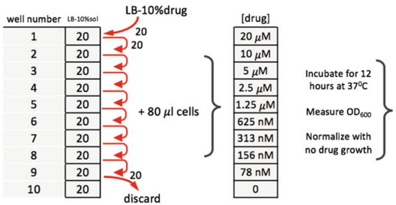

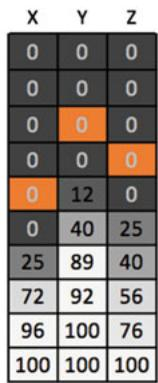  
  
Fig. 1 Serial dilution dose-response experiment. (a) Preparation of serial dilution dose response for one drug and corresponding final concentrations of the drug. (b) Normalized growth in serial dilution of drugs X, Y, and Z. Each rectangle here represents a well of 96-well plate. Concentrations of each drug chosen for the next experiment are shown in orange

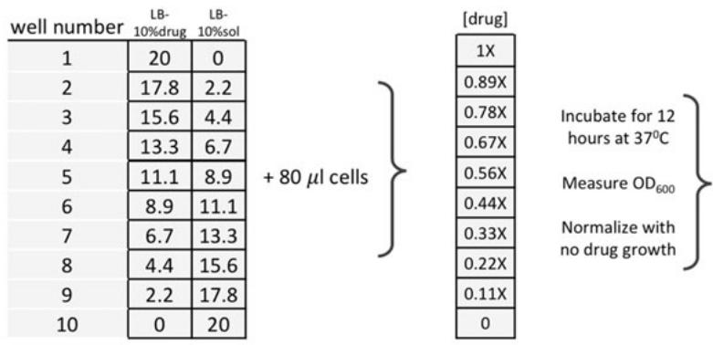  
A)

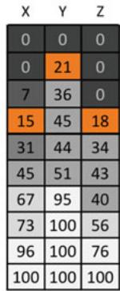  
Fig. 2 Linear dilution dose-response experiment. (a) Preparation of linear dilution dose response for each drug and corresponding final concentrations of the drug. (b) Normalized growth in linear dilution of drugs X, Y, and Z. Each rectangle here represents a well of 96-well plate. Concentrations of each drug chosen for the next experiment are shown in orange

6. Dilute the cells in growth media to an OD of 0.01 (see Note 4).   
7. Add $8 0 ~ \mu \mathrm { l }$ cells on drug linear dilutions prepared in step 4. The final drug concentration in each well is shown in Fig. 2a as ratios of $1 \times$ .   
8. Seal plate to avoid evaporation.   
9. Leave plate for $^ { 1 2 \mathrm { ~ h ~ } }$ at $3 7 ~ ^ { \circ } \mathrm { C }$ in a shaker with $1 5 0 ~ \mathrm { r p m }$   
10. Start new bacterial culture to use in Day 4 (repeat Subheading 3.1).

# 3.4 Day 4: Checkerboard Assay Experiment

1. Measure $\mathrm { O D } _ { 6 0 0 }$ absorbance for linear dilution dose-response plate from Day 3 (see Fig. 2b).   
2. For each drug, choose the concentration that resulted in $8 0 \%$ growth inhibition (IC80) as 1 (see Note 5).   
3. For drug X, label four tubes as LB-drugX0, LB-drugX1, LB-drugX2, and LB-drugX3, and add $1 8 9 ~ \mu \mathrm { l }$ of LB media to these tubes.   
4. In each tube, add 0, 7, 14, or $2 1 \mu \mathrm { l }$ of $1 0 0 \times$ drug X, and add 21, 14, 7, or $0 ~ \mu \mathrm { l }$ of solvent (DMSO), as shown in Fig. 3a.   
5. Repeat steps 3 and 4 for the drugs Y and Z (see Note 6).   
6. Preparation of a $4 \mathrm { x } 4$ checkerboard assay for drug $\mathrm { X + }$ drug Y is shown in Fig. 3a.

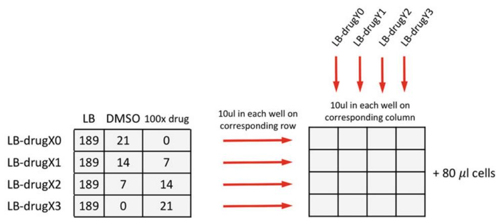  
A)

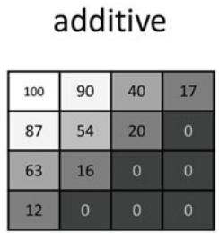  
B)

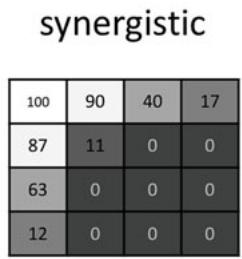

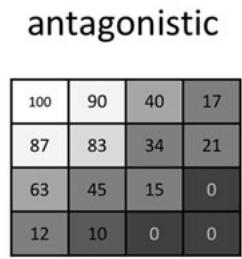  
Fig. 3 Miniaturized checkerboard assay. (a) Preparation of drug mixes and placement of each drug in 96-well plate for $4 \times 4$ checkerboard. Each rectangle here represents a well of 96-well plate. Drug X and drug Y pairs are used as an example for preparation. (b) Interpretation of drug pairs results in $4 \times 4$ checkerboard assay as additive, synergistic, or antagonistic

7. Add $1 0 ~ \mu \mathrm { l }$ of LB-drugX0, LB-drugX1, LB-drugX2, and LB-drugX3 in each well on first, second, third, and fourth rows, respectively.   
8. Add $1 0 ~ \mu \mu \up$ of LB-drugY0, LB-drugY1, LB-drugY2, and LB-drugY3 in each well on first, second, third, and fourth columns, respectively.   
9. Repeat the steps 6–8 for $\Chi + Z$ and $\mathrm { Y } + \mathrm { Z }$ , in duplicate, which corresponds to one 96-well plate $( 4 \times 4 \times 6 = 9 6$ ) $s e e$ Note 3).   
10. Measure the $\mathrm { O D } _ { 6 0 0 }$ of the 1:10 dilution of the culture started in Day 3.   
11. Dilute the cells in growth media to an OD of 0.01 (see Note 4).   
12. Add $8 0 ~ \mu \mathrm { l }$ cells on $4 \times 4$ checkerboards assay.   
13. Seal plate to avoid evaporation.   
14. Leave plate for $^ { 1 2 \mathrm { ~ h ~ } }$ at $3 7 ~ ^ { \circ } \mathrm { C }$ on a shaker with $1 5 0 ~ \mathrm { r p m }$

# 3.5 Day 5: Checkerboard Assay Result

1. Measure $\mathrm { O D } _ { 6 0 0 }$ absorbance for checkerboard assay experiment plate from Day 4.   
2. Example results for additive, synergistic, or antagonistic drug pairs are shown in Fig. 3b.   
3. For each experiment, count the number of wells where there is no growth. This count will be high for synergistic drug pairs, medium in additive drug pairs, and low in antagonistic drug pairs. Compare results from replicates.   
4. For further exploration on how to score checkerboard assays, the reader is suggested to consult refs. 2, 4, 6–8.

We have previously used this miniaturized checkerboard assay protocol in two antibiotic interaction screens, where all pairwise interaction scores for 24 compounds (276 pairs) were determined in replicate. For these screens, we developed a scoring method based on Loewe additivity model, where negative, zero, or positive values correspond to synergy, additivity, or antagonism. MATLAB functions that use $4 \times 4$ growth metrics and compute a drug interaction score are shared as the supplementary material of ref. 8, as well as all the raw growth measurements recorded in this screen.

In this screen, we have found that the pairwise interactions among fusidic acid, oxacillin, and amikacin cover all possible three drug interaction types: Fusidic acid and oxacillin are synergistic; fusidic acid and amikacin are additive; and oxacillin and amikacin are antagonistic. We suggest that the reader use these three drugs for trying this protocol, in order to observe the full extent of the drug interaction phenotypes. The reader may use the simple scoring method described in the protocol’s Day 5 step 3 or the more involved synergy metric described in ref. 8. With materials that can

be found in an undergraduate laboratory class, our protocol describes an efficient and reproducible method to measure antibiotic interactions.

# 4 Notes

1. While antibiotic interaction in E. coli is the example here, any species can be substituted here, with their respective growth media and growth conditions supplanted.   
2. Any small molecule that inhibits growth and corresponding solvent can be used.   
3. In our protocol, there is $2 \%$ solvent in all microplate growth experiments, ensuring the effects we observe are not due to the solvent.   
4. Since the cell density influences the inhibitory concentration of a drug, it is important that cells used are at an $\mathrm { { O D } } = 0 . 0 1$ .   
5. In our experience, we have found IC80 is the most informative top concentration in a miniaturized checkerboard assay.   
6. Although we need $1 6 0 \mu \mathrm { l }$ for each concentration $( 1 0 \mu \nu 4$ per interaction assay $\times ~ 4$ interaction assays), we prepare $2 1 0 ~ \mu \mathrm { l }$ because of ease of calculation and pipetting.

# References

1. Zimmermann GR, Leha´r J, Keith CT (2007) Multi-target therapeutics: when the whole is greater than the sum of the parts. Drug Discov Today 12:34–42   
2. Berenbaum MC (1989) What is synergy? Pharmacol Rev 41:93–141   
3. Chevereau G, Bollenbach T (2015) Systematic discovery of drug interaction mechanisms. Mol Syst Biol 11:807–807   
4. Cokol M (2013) Drugs and their interactions. Curr Drug Discov Technol 10:106–113   
5. Chandrasekaran S et al (2016) Chemogenomics and orthology-based design of antibiotic combination therapies. Mol Syst Biol 12:872

6. Cokol M et al (2011) Systematic exploration of synergistic drug pairs. Mol Syst Biol 7:544–544   
7. Greco WR, Bravo G, Parsons JC (1995) The search for synergy: a critical review from a response surface perspective. Pharmacol Rev 47:331–385   
8. Mason DJ, Stott I, Ashenden S, Karakoc I, Meral S, Weinstein ZB, Kuru N, Bender A, Cokol M (2017) Prediction of antibiotic interactions using descriptors derived from compound molecular structure. J Med Chem 60 (9):3902–3912. https://doi.org/10.1021/acs. jmedchem.7b00204.

# High-Throughput Screening for Drug Combinations

Paul Shinn, Lu Chen, Marc Ferrer, Zina Itkin, Carleen Klumpp-Thomas, Crystal McKnight, Sam Michael, Tim Mierzwa, Craig Thomas, Kelli Wilson, and Rajarshi Guha

# Abstract

The identification of drug combinations as alternatives to single-agent therapeutics has traditionally been a slow, largely manual process. In the last 10 years, high-throughput screening platforms have been developed that enable routine screening of thousands of drug pairs in an in vitro setting. In this chapter, we describe the workflow involved in screening a single agent versus a library of mechanistically annotated, investigation, and approved drugs using a full dose-response matrix scheme using viability as the readout. We provide details of the automation required to run the screen and the informatics required to process data from screening robot and subsequent analysis and visualization of the datasets.

Key words Drug combination screening, Acoustic dispensing, Automation, Compound management, Synergy

# 1 Introduction

High-throughput screening for compounds that affect cell viability has been utilized as a method for discovery of novel treatments for various human diseases. For patients with cancer and certain infectious diseases, combinations of drugs are given to achieve maximal clinical benefit. An additional benefit of a clinically synergistic drug combination is that both drugs may be synergistic at a low dose, which can reduce off target toxicities. For infectious diseases such as HIV, drug combinations are critical to prevent infectious agents from acquiring mutations to evade the action of a single drug. The search for novel synergistic drug pairs requires the development of a systematic, large-scale screening platform. CombinatoRX, a biotech company acquired in 2014 by Horizon Discovery, was the first to publish a series of papers utilizing drug combination screening to explore synergistic drug responses in various disease models such as cancer and drug-resistant bacteria [1–3]. A recent study spearheaded by AstraZeneca and NCI-DREAM utilized a

crowdsourcing approach to predict synergistic drug combinations for treatment of B-cell lymphoma [4].

The development of a methodology for large-scale testing of drug combinations in vitro was advanced by the incorporation of acoustic dispensing technology, which allows for the flexibility of an anywhere-to-anywhere compound transfer. Given that drug combination screening requires two or more compounds present in a single well, contact-based transfer methods would be costly in time and resources to reduce the possibility of contamination between transfer steps. Using a noncontact dispenser greatly reduces the amount of sample and consumables used as well as the complexity that would be involved if traditional contact-based pipetting had been applied.

Here we report the methods and workflow specifically for drug combination screening that has been implemented and optimized at the National Institutes of Health’s National Center for Advancing Translational Sciences (NCATS). This drug combination screening platform has been applied to multiple areas of drug discovery including cancer, malaria, Ebola, and various other disease models [5–8] and as of 2016 has tested over 200,000 discrete drug combinations. This automated screening platform has required the use of in-house software development as well as integration of various instrumentations in order to achieve an almost fully automated workflow. We typically refer to this as Matrix screening, due to the layout of the drug combinations in a grid format on the final plate. The workflow presented here was utilized for screening of the Ewing’s sarcoma cell line and has been published [8].

# 2 Materials

The DMSO stock solutions are stored at $- 2 0 ~ ^ { \circ } \mathrm { C }$ , but all other operations occur at room temperature.

# 2.1 Consumables

1. Dimethyl sulfoxide (DMSO): $1 0 0 \%$ DMSO, ACS grade.   
2. 1.4 mL Matrix 2D barcode tube (sample tube): Thermo Scientific, #3711.   
3. 96-well Society for Biomolecular Screening (SBS) footprint rack that holds sample tubes (compound source rack).   
4. SepraSeal cap (cap): Thermo Scientific, # 4463.   
5. 96-well polypropylene compound plate (intermediate plate): VWR, #82006-704.   
6. 384-well polypropylene compound plate (mother plate): Greiner, #784201.   
7. SBS footprint reservoir (DMSO reservoir).

8. 384-well cyclic olefin copolymer (COC) plate (acoustic source plate): Greiner, #788876.   
9. P25 JANUS tips (P25 tips): Perkin-Elmer, #6000689.   
10. Biomek FX P30XL tips (P30XL tips): Beckman Coulter, #A22288.   
11. Biomek FX P30 tips (P30 tips): Axygen, FX-1536-30FP-R-S.   
12. DMSO-resistant adhesive foil seal (foil seal): 4titude, 4Ti-0512.   
13. Deionized water.   
14. $7 0 \%$ ethanol.   
15. White 1536, tissue culture treated, high base plates (assay plate): Aurora, EWB04100A.   
16. T175 tissue culture flasks.   
17. TC71, Ewing’s sarcoma cancer cell line, DSMZ repository #ACC 516.   
18. RPMI-1640 cell culture media, Thermo Fisher Scientific #11875093.   
19. Fetal Bovine Serum, GE Healthcare Life Sciences, #SH30071.03.   
20. Penicillin-streptomycin, Thermo Fisher Scientific #15140122.   
21. $0 . 2 5 \%$ Trypsin-EDTA, Thermo Fisher Scientific #25200056.   
22. CellTiter-Glo® One Solution (CellTiter-Glo): Promega G7573.

# 2.2 Equipment and Instrumentation

1. Benchtop vortex mixer.   
2. Sonicating water bath.   
3. Automated compound store (ACS): Brooks Automation, ${ \mathrm { A } } 3 +$ .   
4. Automated decapper: Univo, #DC480.   
5. TubeAuditor: automated volume measurement device from Brooks Automation.   
6. JANUS liquid handler (JANUS): Perkin-Elmer.   
7. Handheld barcode scanner.   
8. Matrix WellMate bulk liquid dispenser (WellMate), Thermo Scientific.   
9. Handheld 8-channel pipettor.   
10. Biomek FX liquid handler (FX), Beckman Coulter.   
11. Benchtop centrifuge.   
12. Handheld pipettor.   
13. Rubber roller.

<table><tr><td></td><td>14. ATS-100 acoustic dispenser (ATS-100), EDC Biosystems, Gen4+.</td></tr><tr><td></td><td>15. Multidrop Combi dispenser (Multidrop), Thermo Fisher Scientific, 5840300.</td></tr><tr><td></td><td>16. Multidrop Combi dispensing cassette (cassette), Thermo Fisher Scientific #24073290.</td></tr><tr><td></td><td>17. Metal, foam gasketed lid (compound plate lid).</td></tr><tr><td></td><td>18. Clear assay lid.</td></tr><tr><td></td><td>19. Stainless steel, rubber gasketed assay lid (assay lid).</td></tr><tr><td></td><td>20. ViewLux reader (ViewLux): Perkin-Elmer.</td></tr><tr><td></td><td>21. Polystyrene Universal Microplate Lid (plastic lid), Corning #3098.</td></tr><tr><td></td><td>22. Automated acoustic plate reformatter (HRB): HighRes Biosolutions, ACell.</td></tr><tr><td>2.3 Software Components</td><td>1. Microsoft Excel or equivalent spreadsheet program.</td></tr><tr><td></td><td>2. Matrix Script Plate Generator (MSPG).</td></tr><tr><td></td><td>3. R 3.3.1 and the ncgcmatrix package.</td></tr><tr><td>3 Methods</td><td></td></tr><tr><td>3.1 Preparation of Stock Compound Solution</td><td>1. Prepare compound stock solutions by weighing compound into sample tube to make 800 μL of 10 mM DMSO solution.</td></tr><tr><td></td><td>2. Cap and vortex the sample tube for 10 s at 3200 rpm. Visually inspect that the compound has completely dissolved; sonicate the sample tube for up to 10 s in a sonicating water bath to assist in dissolution, if necessary.</td></tr><tr><td></td><td>3. Register the sample tube barcode to sample ID association in the database, and load the sample tube to the ACS.</td></tr><tr><td>3.2 Compound Source Rack Plate Map Creation</td><td>1. Based on prior IC50 determination of the compounds of interest, prepare a Matrix screening request form following the template format as shown in Figs. 1a and 2.</td></tr><tr><td></td><td>2. Identify a list of available sample tubes from the chemical inventory system, and input the list of sample tube barcodes to the ACS to cherry-pick the compounds needed to prepare the acoustic source plate.</td></tr><tr><td></td><td>3. Remove the compound source racks from the ACS, and allow the samples to thaw at room temperature. Briefly centrifuge the compound source racks for 30 s at 234 × g (see Note 1). Export the cherry-pick plate map from the ACS database to Microsoft Excel, and save (Fig. 1b). This file is called the compound source rack plate map.</td></tr></table>

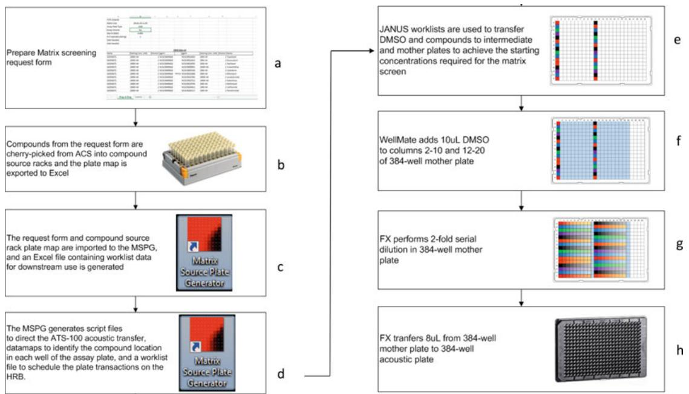  
Fig. 1 An overview of the process to prepare an acoustic source plate and related files

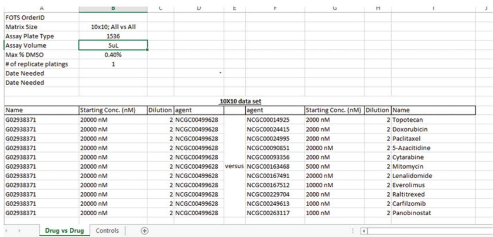  
Fig. 2 An example of the matrix screening request form in Microsoft Excel format with the required information filled in. Each drug combination should be listed by row. Drug A should be listed with the name, starting concentration in the assay in nanomolar (nM), dilution factor of the drug in the screen, and internal compound ID. Drug B in the combination should be listed next with the same information. The researcher should also specify the size of the matrix block as well as information regarding the number of replicates needed and assay types used

# 3.3 Preparation of All Files Needed for Creation of the Acoustic Source Plate

The MSPG application will create the appropriate files needed for each critical instrument used in creation of the acoustic source plate. MSPG will take the submitted requestor form and create the JANUS worklist file to prepare the mother plates which is then transferred to acoustic source plates. It will also generate transfer script files that are used on the ATS-100 for acoustic dispensing, a worklist file used to schedule the movement of plates on the HRB, and a plate map of the assay plate which is used for data analysis (see Note 2).

1. Open the MSPG application, and click on Matrix Order which will open the “Import Compound Combinations Wizard” (Figs. 1c and 3).   
2. Click Next to begin the Wizard. On the second window, select the “Browse” button, and select the Matrix screening request form (Fig. 2) containing all the drug combinations you wish to process. After selecting the file, a preview of the combinations will appear in the window as seen in Fig. 4. Click “Next” to advance to the next screen.   
3. Use the drop-down menu to select the Excel worksheet tab that contains the compound pairs. For each Compound A and

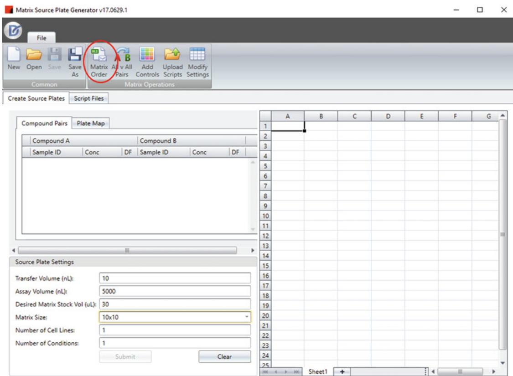  
Fig. 3 Select the “Matrix Order” menu item to initiate the wizard that will walk you through the use of the tool, which will open the import compound combination wizards

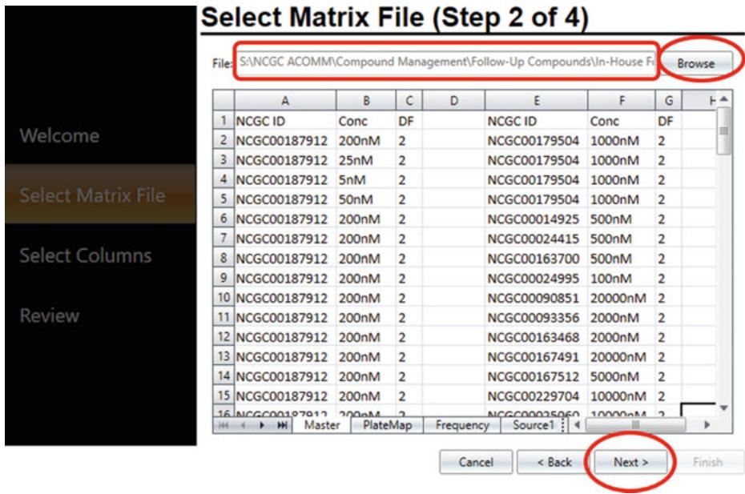  
Fig. 4 Browse to and select the request form to display a preview of the desired matrix combinations

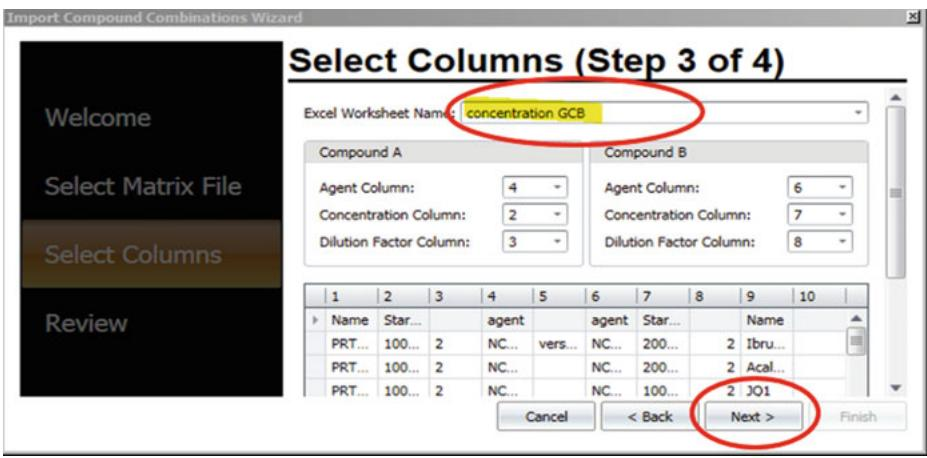  
Fig. 5 Data fields from the matrix request form are associated with the variable fields in the MSPG

Compound B pair, use the drop-down menus to map the appropriate columns in the spreadsheet to the appropriate column headers named “Agent Column,” “Concentration Column,” and “Dilution Factor Column.”. Click “Next” (Fig. 5). Verify that the columns in the Review window have been mapped properly, and click Finish (Fig. 6). The software has now recorded the requested drug combinations to be made.

4. In the next window, input the assay parameters in the Source Plate Settings window (Fig. 7a). Copy the Compound source

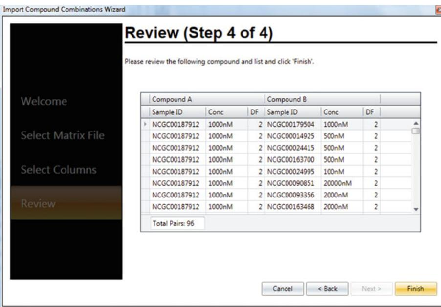  
Fig. 6 The review window provides verification that the columns from the spreadsheet were mapped correctly

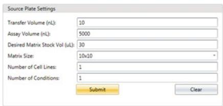  
a.Input parameters appropriate for the matrix screen are entered

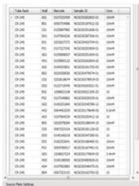  
The compound source plate map is pasted into the MSPG

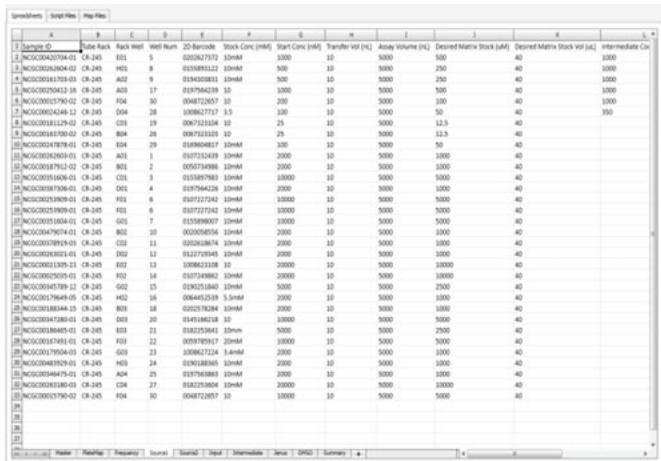  
c. Successful generation of a "Master" Excel file is visible in the MSPG "Spreadsheets" window.   
Fig. 7 (a) Input parameters appropriate for the matrix screen are entered; (b) the compound source plate map is pasted into the MSPG; (c) successful generation of a “Master” Excel file is visible in the MSPG “Spreadsheets” window

rack plate map from Excel and Paste into the Plate Map window of the MSPG, and click “Submit” to create the Master file (Fig. 7b). The various tabs of the Master file will be visible in the MSPG “Spreadsheets” tab (Fig. 7c). Save the Master file from the MSPG as an Excel file in a folder where you want all future MPSG files deposited (see Note 2).

5. Click on the “Script Files” tab within MSPG, and select the “Source Plate” type, “Destination Plate” type, and “Matrix Size” pertaining to the parameters in the Matrix order request form. Click on “Load Picklist” and browse and open the Master file. Click “Create Scripts” to generate the ATS-100 scripts, HRB worklist, and assay plate maps which will be automatically saved to a sub-folder of the project folder where the Master file resides (Figs. 8 and 9).   
6. Close the MSPG.   
7. Open the Master file in Excel, and separately save each of the “Janus,” “Intermediate,” and “DMSO” tabs as commaseparated value (CSV) files in the same folder location as the Master file (see Note 3). Close the Master file.

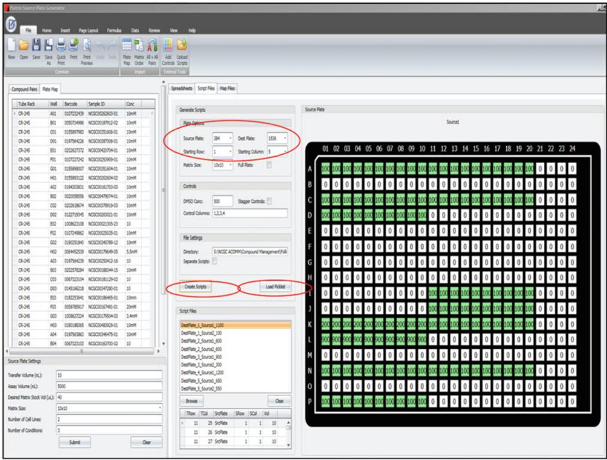  
Fig. 8 After the script, datamap, and worklist files are successfully created, you can preview the compound dispense patterns from source to destination in the MSPG

JANUS Worklist   

<table><tr><td>Source</td><td>Well</td><td>Dest</td><td>Well</td><td>Volume</td></tr><tr><td>CR-286</td><td>2</td><td>Source1</td><td>10</td><td>20</td></tr><tr><td>CR-286</td><td>2</td><td>Source1</td><td>10</td><td>20</td></tr><tr><td>CR-286</td><td>3</td><td>Source1</td><td>11</td><td>20</td></tr><tr><td>CR-286</td><td>3</td><td>Source1</td><td>11</td><td>20</td></tr><tr><td>CR-286</td><td>4</td><td>Source1</td><td>12</td><td>20</td></tr><tr><td>CR-286</td><td>4</td><td>Source1</td><td>12</td><td>20</td></tr><tr><td>CR-286</td><td>6</td><td>Source1</td><td>13</td><td>4</td></tr><tr><td>CR-286</td><td>10</td><td>Source1</td><td>14</td><td>20</td></tr><tr><td>CR-286</td><td>10</td><td>Source1</td><td>14</td><td>20</td></tr><tr><td>CR-286</td><td>11</td><td>Source1</td><td>15</td><td>5</td></tr><tr><td>CR-286</td><td>13</td><td>Source1</td><td>16</td><td>4</td></tr><tr><td>CR-286</td><td>14</td><td>Source1</td><td>161</td><td>10</td></tr><tr><td>CR-286</td><td>15</td><td>Source1</td><td>162</td><td>20</td></tr><tr><td>CR-286</td><td>18</td><td>Source1</td><td>163</td><td>13.33</td></tr><tr><td>CR-286</td><td>19</td><td>Source1</td><td>164</td><td>20</td></tr></table>

HRB Worklist   

<table><tr><td>Source Barcode</td><td>Source Well</td><td>Dest Barcode</td><td>Dest Well</td><td>Volume</td><td>Calibration</td><td>Map File</td></tr><tr><td>Source1</td><td>1</td><td>Dest1</td><td>1</td><td>1</td><td></td><td></td></tr><tr><td>Source1</td><td>1</td><td>Dest2</td><td>1</td><td>1</td><td></td><td></td></tr><tr><td>Source1</td><td>1</td><td>Dest3</td><td>1</td><td>1</td><td></td><td></td></tr><tr><td>Source2</td><td>1</td><td>Dest3</td><td>1</td><td>1</td><td></td><td></td></tr><tr><td>Source1</td><td>1</td><td>Dest4</td><td>1</td><td>1</td><td></td><td></td></tr><tr><td>Source2</td><td>1</td><td>Dest4</td><td>1</td><td>1</td><td></td><td></td></tr><tr><td>Source1</td><td>1</td><td>Dest5</td><td>1</td><td>1</td><td></td><td></td></tr><tr><td>Source1</td><td>1</td><td>Dest6</td><td>1</td><td>1</td><td></td><td></td></tr><tr><td>Source2</td><td>1</td><td>Dest6</td><td>1</td><td>1</td><td></td><td></td></tr><tr><td>Source1</td><td>1</td><td>Dest7</td><td>1</td><td>1</td><td></td><td></td></tr><tr><td>Source2</td><td>1</td><td>Dest7</td><td>1</td><td>1</td><td></td><td></td></tr></table>

Acoustic Transfer Script   

<table><tr><td>TRow</td><td>TCol</td><td>SrcPlate</td><td>SRow</td><td>SCol</td><td>Volume</td></tr><tr><td>1</td><td>5</td><td>SrcPlate</td><td>1</td><td>1</td><td>10</td></tr><tr><td>1</td><td>6</td><td>SrcPlate</td><td>1</td><td>1</td><td>10</td></tr><tr><td>1</td><td>7</td><td>SrcPlate</td><td>1</td><td>1</td><td>10</td></tr><tr><td>1</td><td>8</td><td>SrcPlate</td><td>1</td><td>1</td><td>10</td></tr><tr><td>1</td><td>9</td><td>SrcPlate</td><td>1</td><td>1</td><td>10</td></tr><tr><td>1</td><td>10</td><td>SrcPlate</td><td>1</td><td>1</td><td>10</td></tr><tr><td>1</td><td>11</td><td>SrcPlate</td><td>1</td><td>1</td><td>10</td></tr><tr><td>1</td><td>12</td><td>SrcPlate</td><td>1</td><td>1</td><td>10</td></tr><tr><td>1</td><td>13</td><td>SrcPlate</td><td>1</td><td>1</td><td>10</td></tr><tr><td>1</td><td>14</td><td>SrcPlate</td><td>1</td><td>1</td><td>10</td></tr><tr><td>2</td><td>5</td><td>SrcPlate</td><td>1</td><td>2</td><td>10</td></tr><tr><td>2</td><td>6</td><td>SrcPlate</td><td>1</td><td>2</td><td>10</td></tr><tr><td>2</td><td>7</td><td>SrcPlate</td><td>1</td><td>2</td><td>10</td></tr><tr><td>2</td><td>8</td><td>SrcPlate</td><td>1</td><td>2</td><td>10</td></tr><tr><td>2</td><td>9</td><td>SrcPlate</td><td>1</td><td>2</td><td>10</td></tr></table>

Datamap   

<table><tr><td colspan="2">#MatrixSize 10x10</td><td></td><td></td><td></td><td></td><td></td><td></td><td></td></tr><tr><td>BlockIndex</td><td>TPlateID</td><td>TWellID</td><td>SampleID1</td><td>SampleID1_stock_conc_in_uM</td><td>Vol_SampleID1_in_nL</td><td>SampleID2</td><td>SampleID2_stock_conc_in_uM</td><td>Vol_SampleID2_in_nL</td></tr><tr><td>1</td><td>DestPlate_1</td><td>A05</td><td>NCGCO0242481-08</td><td>250</td><td>10</td><td>NCGCO0346656-03</td><td>100</td><td>10</td></tr><tr><td>1</td><td>DestPlate_1</td><td>B05</td><td>NCGCO0242481-08</td><td>250</td><td>10</td><td>NCGCO0346656-03</td><td>50</td><td>10</td></tr><tr><td>1</td><td>DestPlate_1</td><td>C05</td><td>NCGCO0242481-08</td><td>250</td><td>10</td><td>NCGCO0346656-03</td><td>25</td><td>10</td></tr><tr><td>1</td><td>DestPlate_1</td><td>D05</td><td>NCGCO0242481-08</td><td>250</td><td>10</td><td>NCGCO0346656-03</td><td>12.5</td><td>10</td></tr><tr><td>1</td><td>DestPlate_1</td><td>E05</td><td>NCGCO0242481-08</td><td>250</td><td>10</td><td>NCGCO0346656-03</td><td>6.25</td><td>10</td></tr><tr><td>1</td><td>DestPlate_1</td><td>F05</td><td>NCGCO0242481-08</td><td>250</td><td>10</td><td>NCGCO0346656-03</td><td>3.125</td><td>10</td></tr><tr><td>1</td><td>DestPlate_1</td><td>G05</td><td>NCGCO0242481-08</td><td>250</td><td>10</td><td>NCGCO0346656-03</td><td>1.5625</td><td>10</td></tr><tr><td>1</td><td>DestPlate_1</td><td>H05</td><td>NCGCO0242481-08</td><td>250</td><td>10</td><td>NCGCO0346656-03</td><td>0.7812</td><td>10</td></tr><tr><td>1</td><td>DestPlate_1</td><td>I05</td><td>NCGCO0242481-08</td><td>250</td><td>10</td><td>NCGCO0346656-03</td><td>0.3906</td><td>10</td></tr><tr><td>1</td><td>DestPlate_1</td><td>J05</td><td>NCGCO0242481-08</td><td>250</td><td>10</td><td>DMSO</td><td>500</td><td>10</td></tr></table>

Fig. 9 The JANUS worklist files define the source to destination compound transfers from compound source rack to mother plate. The HRB worklist directs the Cellario scheduler to move plates through the HRB, pairing the source (acoustic source plate) and destination (assay plate) plates at the ATS-100 to perform the acoustic liquid transfer. The acoustic transfer script (ATS) file instructs the ATS-100 to dispense compound from a specific source well location to a specific destination well location. *Continued—The datamap file is loaded to the data analysis system to identify the compound pair IDs, concentrations, and volumes dispensed to each well

# 3.4 384-Well Mother Plate and Acoustic Source Plate Preparation

1. Prime the JANUS tubing with water until all air bubbles are flushed out (see Note 4). Remove the caps from the sample tubes using the automated decapper.   
2. Scan and associate the compound source rack barcodes to the JANUS deck positions using the attached handheld barcode scanner, and then place the compound source racks into their assigned deck locations. Supply P25 tip boxes, the necessary number of empty mother plates as determined by the JANUS worklist file, and a filled DMSO reservoir to the JANUS deck (see Fig. 10 and Note 5).   
3. Start the JANUS protocol, and when prompted, import the “DMSO” worklist file to begin the transfer. This worklist file directs the JANUS to transfer the required amount of DMSO

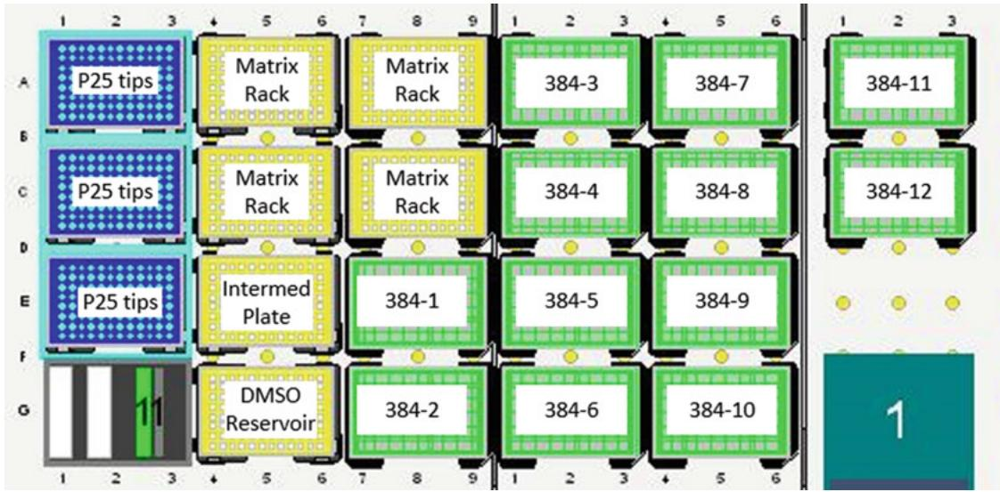  
Fig. 10 JANUS deck layout

from the reservoir into the mother plates to create the requested dilution for screening.

4. If no intermediate plate is needed, proceed to step 5. If an intermediate plate is needed (see Note 3), fill all the wells of an intermediate plate with $4 5 ~ \mu \mathrm { L }$ DMSO using the WellMate, and place the intermediate plate into the “Intermed Plate” location on the JANUS deck. Start the JANUS protocol, and when prompted, import the “Intermediate” worklist file which will transfer compounds from the compound source rack into the intermediate plate. Remove the intermediate plate from the JANUS, and mix the odd columns of the intermediate plate ten times using a handheld 8-channel pipettor. Using clean tips, transfer $5 ~ \mu \mathrm { L }$ of solution from every odd column to every adjacent even column, and repeat the mixing after each transfer. Return the intermediate plate to the JANUS.   
5. Start the JANUS protocol, and when prompted, import the “Janus” worklist file. This will transfer compound from the compound source rack and intermediate plate into columns 1 and 11 of the mother plates (Fig. 1e).   
6. Remove the compound source racks from the JANUS, and apply caps manually.   
7. Process the sample tubes through the TubeAuditor to update the database with the new volumes, and load them back into the ACS for long-term storage.   
8. Transfer the mother plates to the WellMate, and dispense $1 0 ~ \mu \mathrm { L }$ DMSO to columns 2–10 and 12–20 of each mother

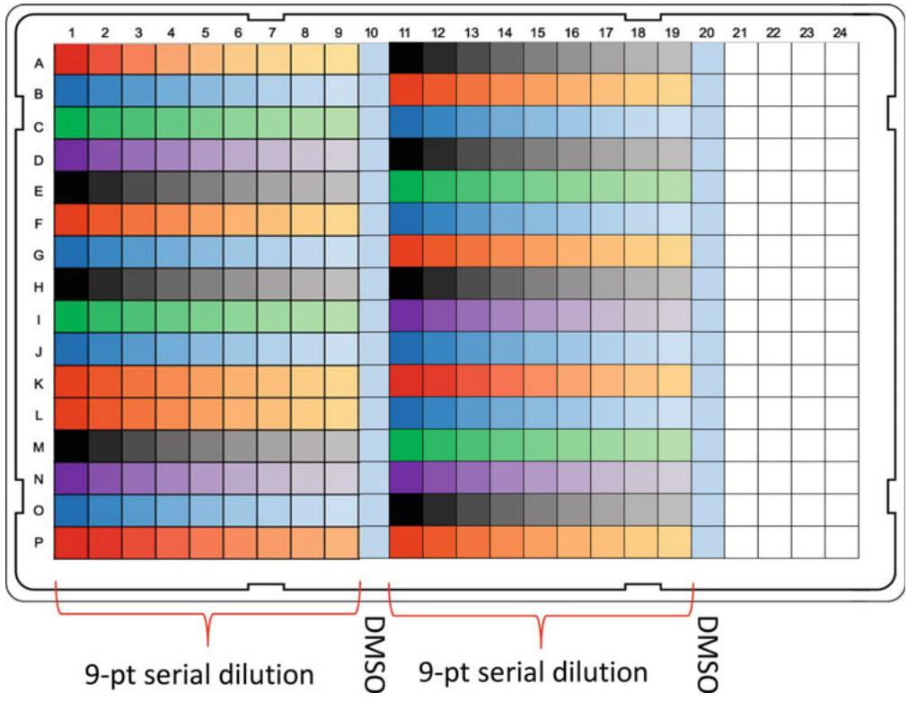  
Fig. 11 The ${ \mathrm { ~ \ddot { ~ } ~ } } 1 0 \times 1 0$ matrix serial dilution” protocol performs a twofold serial dilution from columns 1 to 9 and 11 to 19 of each mother plate. Columns 10 and 20 remain DMSO only

plate (Fig. 1f). Briefly centrifuge the mother plates for 30 s at $2 3 4 \times g \left( s e e \mathbf { N o t e } \mathbf { 6 } \right)$ .

9. Place the mother plates on to the FX in the appropriate locations (see Notes 7 and 8). Run the $^ { \infty } 1 0 ~ \times ~ 1 0$ matrix serial dilution” protocol which will perform intraplate serial dilutions in each mother plate (see Figs. $\mathrm { l g }$ and 11).   
10. Transfer $8 ~ \mu \mathrm { L }$ of sample from the mother plate to the acoustic source plate using the $\mathfrak { a } _ { 3 8 4 }$ -well to 384-well acoustic transfer” protocol on the FX (see Note 9). Briefly centrifuge the acoustic source plate for 30 s at $2 3 4 \times g$ (Fig. 1h).   
11. Press a foil seal on to each acoustic source plate using a rubber roller, and store at room temperature until it is ready for use (see Note 10).

3.5 Acoustic Dispensing from Acoustic Source Plate to Assay Plate on the HRB System

1. In Cellario 2.0 of the HRB computer, create a new order using Cellario’s Cherry Pick Wizard (Figs. 12a–d and 13, Note 11). Copy the acoustic transfer scripts from the network folder to the “EDC_Scripts” folder on the HRB computer.   
2. Spin down the acoustic source plates for 60 s at $2 3 4 \times g$ . Manually remove the foil seals, and apply compound plate lids

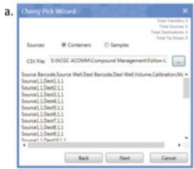

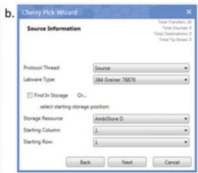

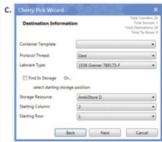

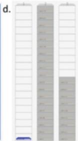  
Fig. 12 Using the Cellario Cherry Pick Wizard to create an order. (a). Import the HRB worklist to Cellario using the Cherry Pick Wizard. (b). Define the source and (c). destination plate types as well as the starting location for the first plate of each type in the Ambistore. (d). Verify that the physical location of the source and destination plates matches what is virtually represented in Cellario

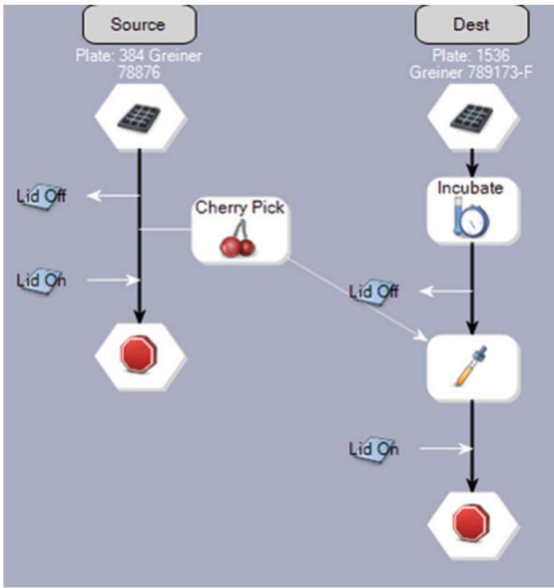  
Fig. 13 The acoustic transfer protocol has separately defined steps (threads) for each source and destination (Dest) plates. The ACell robot shuttles the source and Dest plates according to the plate order in the HRB worklist from device to device as each step in their respective threads is executed. The source and Dest plates intersect at the Cherry Pick step where the Cellario scheduling software instructs the ATS-100 to dispense a specific script file from the appropriate acoustic source plate to the designated assay plate

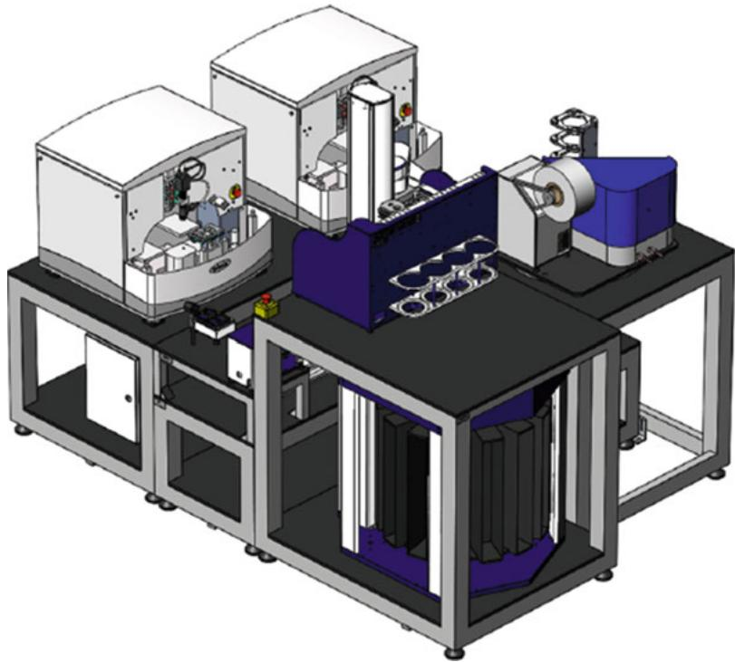  
Fig. 14 The HRB automated acoustic plate reformatting system

to the acoustic source plates, and load them to available slots in the AmbiStore hotel.

3. Cover each assay plate with a clear assay lid, and load the assay plates to a free slot in the AmbiStore (Fig. 14). All plates should have A1 facing outward.   
4. Perform an inventory scan of the AmbiStore which will scan and record all AmbiStore column barcodes into the internal database. Export the barcodes from the database to Excel.   
5. Using Excel, associate the barcodes and AmbiStore positions to the plate names in the HRB worklist file. This will be used later to update the datamaps with the plate barcode for data analysis.   
6. Initialize the HRB system (see Notes 12 and 13), and start the order to automatically transfer compounds from the acoustic source plates to the assay plates.   
7. After all the transfers are complete, remove the acoustic source plates from the AmbiStore, and apply foil seals with a rubber roller. Transfer the assay plates to the laboratory for cell addition.   
8. Update the datamaps with the actual assay plate barcodes, and copy the datamaps to the primary screening system’s project folder.

# 3.6 Cell Plating

1. Visually inspect cells in the flask to ensure the cell morphology appears uniform and that there are not large numbers of detached cells. Ensure that media is not cloudy or oddly colored which can be an indication of fungal or bacterial contamination. Move flasks into a sterile biosafety cabinet.   
2. Aspirate all media from the flask and discard. Add $7 ~ \mathrm { m L }$ o f trypsin, and place the flask into a standard tissue culture incubator for 5 min. Visually inspect flasks periodically until all cells are detached.   
3. Add 7 mL of complete culture media to the flask to neutralize the trypsin. Transfer all contents of the flask to a $1 5 ~ \mathrm { m L }$ conical tube and put on the lid. Place conical tube into a tabletop centrifuge along with an equally weighted balance tube, and spin at $2 3 3 \times g$ for 5 min to pellet cells.   
4. Remove the tube from the centrifuge and verify that a cell pellet is present. Aspirate as much volume from the tube as possible and discard. Do not aspirate the cell pellet.   
5. Add complete media to the cell pellet, and use a pipettor to resuspend the pellet in media. Ensure the cells are homogenously distributed in the media (see Note 14).   
6. Count the cells using the desired method, and determine the number of cells per mL. Determine the total number of cells needed for plating by multiplying the number of cells per well by the total number of plates by 1536. Calculate the total volume of media for plating by multiplying the volume per well by the total number of plates by 1536. Add $2 0 \%$ additional volume to account for dead volume, priming volume, and extra plates needed for imaging and growth rate calculations (see Note 15).   
7. Add the total number of cells needed into the total volume of media needed to fill all assay plates. Ensure the solution is well mixed and without clumps to ensure homogenous distribution of cells. Ensure the vessel used for diluting the cells has a wide enough opening to accommodate the Multidrop cassette tubing.   
8. Load the cassette onto the Multidrop. Clean the cassette by priming $1 0 ~ \mathrm { m L }$ of deionized water followed by $1 0 ~ \mathrm { m L }$ of $7 0 \%$ ethanol followed by $1 0 ~ \mathrm { m L }$ of deionized water. While cleaning, ensure that dispenser streams are linear and continuous.   
9. Program the Multidrop to dispense $5 \mu \mathrm { L }$ per well to 1536-well standard height plates and filling columns 2–48 for dispensing. Column 1 is left empty as a background control.   
10. Place the cassette tubing into the cell solution, and prime for 10 s to ensure all tubing is filled with the cell solution. Cover the opening of the cell dilution vessel with its lid to ensure no

large objects drop into the vessel. Remove all plastic lids from the assay plates.

11. Place the first plate on the Multidrop in the correct orientation, well A01 should be in the upper-left-hand corner of the platform. Press start to begin dispensing cells. This can be done in a biosafety cabinet or in an open laboratory environment (see Note 16).   
12. Once the 1536-well assay plate is filled, remove the 1536-well assay plate from the Multidrop, and ensure that all wells are uniform in appearance. If the liquid level is uniform, apply an assay lid to the 1536-well assay plate (see Note 17). Repeat until all assay plates are complete.   
13. All lidded 1536-well assay plates should then be moved to the incubator on the primary screening system with standard conditions, $3 7 ~ ^ { \circ } \mathrm { C }$ , $9 5 \%$ humidity, and $5 \%$ $\mathrm { C O } _ { 2 }$ , and the odd numbered plate barcode facing outward.   
14. Following plating, the cassette should be cleaned using the same protocol in step 3. If any tips appear to be clogged, use the syringe tool that comes with the cassette to clear any blockages. After cleaning is complete, empty all liquid from the tubing using the empty button on the Multidrop. Store the cassette in the box provided.   
15. All vessels that contained cells should be discarded in a biohazard disposal box.

# 3.7 Reading Assay Plates on the Priming Screening System

1. Scan and inventory the assay plate barcodes in the primary screening system’s assay plate incubator (see Note 18).   
2. Incubate the assay plates for $4 8 \ \mathrm { h }$ .   
3. Set up to run the read protocol on the primary screening system (Fig. 15). Using the barcodes in the inventory database, create an assay file in CSV format containing the assay plate barcodes which were originally loaded. The assay plates will be handled in the order the barcodes are listed in the CSV file.   
4. Create a method file containing the steps of the read protocol using the Method Editor software on the Dispatcher computer for the robotic system (see Note 19).   
5. Compress the ViewLux data files, 1536-well assay datamaps, ATS-100 dispense error logs, and assay file with cell line names to a ZIP file, and save to a shared network folder for retrieval from informatics for data analysis.

# 3.8 Data Processing

1. Plate data files along with the plate maps which specify the compound/control composition, and concentrations are loaded into an Oracle database using an in-house software

  
Fig. 15 A typical ViewLux read of a 1536-well assay plate tested in pairwise drug combination screening

stack that parses a wide variety of formats, such as envision, ViewLux, InCell, and others (see Note 20).

2. Apply necessary correction if plate material-specific artifact is observed. For example, luminescent cross talk is found necessary when using CellTiter-Glo readout on cyclo olefin polymer plates. Calibration of the parameters needed for cross talk correction (e.g., percentage of signal bleeding) before assay is required.   
3. A number of plate-level quality control metrics are computed on the raw or corrected data (e.g., coefficient of variation (CV), $\mathbf { Z } '$ [9], signal to background ratio, SSMD [10]). Plates that fail quality control may be rerun or else removed from consideration in the following steps (resulting in the loss of some combinations).   
4. Plate data are visualized in the form of heatmaps (one per plate) and manually inspected for assay artifacts (e.g., layout-specific pattern). If observed, a correction algorithm is applied. If the result of the correction is unsatisfactory, the affected blocks (based on the wells affected by the artifact) are ignored from future analysis (see Note 21).   
5. Sample wells are normalized to the in-plate positive and negative controls based on the raw or corrected data (e.g., bortezomib and DMSO, respectively) (see Note 22).

6. Using the pre-specified combination layout mapping file (see Subheading 3.5), plate-level data is deconvoluted into individual $6 \times 6$ or $1 0 ~ \times ~ 1 0$ blocks using the normalized (or the corrected, if necessary) data.   
7. A Matrix Quality Control (mQC) evaluation [11] is computed for each block that classifies the quality of the combination responses as bad, medium, and good along with a confidence score (ranging between 0 and 1) for each category. Other reproducibility metrics (e.g., minimum significant ratio (MSR), standard deviation, etc.) using replicates may also be computed to check for other assay artifacts. This allows the users and downstream analyses to ignore failed or low-quality combination responses (see Note 22).   
8. The combination response for each block is then analyzed to compute multiple synergy metrics. These metrics have been described previously [12, 13] and provide multiple characterizations of the combination response by quantifying the deviation of the observed response from a predefined model of additivity. Currently we compute synergy metrics based on the highest single agent (HSA) [14] and Bliss [12] additivity models.   
9. Each block, comprising the combination response and computed properties (synergy metrics, mQC score), is stored in an Oracle database and made available to users via a web interface (https://tripod.nih.gov/matrix-client). For the exemplar screen discussed in this chapter, the processed data can be found at https://tripod.nih.gov/matrix-client/rest/matrix/ blocks/265/table.   
10. After processed data has been deployed to the public website, it may be downloaded for alternative in-depth analyses.

# 4 Notes

1. Samples in the Matrix racks can splash up to the cap during routine handling. Centrifugation before removing the cap prevents cross-contamination between adjacent wells.   
2. The MSPG creates an Excel file (Master file) that contains all the assay-specific details and can be modified and reused at a later date. The Master file contains multiple tabs, each of which contains a file needed to operate an instrument used in the process. The tabs are as follows:   
(a) “Master”—summarized version of the combinations requested in the request form   
(b) “PlateMap” —copy of the imported compound source rack plate map

(c) “Frequency” —displays the volume usage of each compound in the whole screen   
(d) “Source#”—summary of the sample IDs, their initial source well location, final destination well location, and dilutions needed to prepare the compound dilutions on each source plate   
(e) “Input” —spreadsheet that can be imported to the MSPG to create all the ATS files, datamaps, and robot worklists to perform the acoustic compound transfers   
(f) “Intermediate” —JANUS worklist used to transfer compound from the compound source rack plate to the intermediate plate   
(g) “Janus” —JANUS worklist used to transfer compound from the compound source rack plate and intermediate plates to the mother plate   
(h) “DMSO” —JANUS worklist used to transfer compound from the DMSO reservoir to the mother plate   
(i) “Summary” —overview of the total screening parameters

3. The “Janus,” “Intermediate,” and “DMSO” JANUS files are needed in the next protocol section to create the desired starting concentrations for each compound using the $1 0 ~ \mathrm { ~ m M }$ DMSO stock solution. If the final concentration cannot be practically achieved by diluting the 10 mM DMSO stock with the addition of DMSO in the mother plate, the MSPG will call for the creation of an intermediate plate. The intermediate plate will contain 10- and 100-fold dilutions of the $1 0 ~ \mathrm { m M }$ DMSO stock. If using an intermediate plate, the Janus process will proceed in this order: Intermediate, DMSO, Janus.   
4. Flushing all the air bubbles out of the JANUS tubing is necessary to ensure accurate pipetting.   
5. Unless otherwise noted, each plate placed on any instrument in this protocol should be oriented with the A01 well in the upper-left corner as viewed from the operator’s perspective standing in front of the instrument.   
6. A centrifugation step is necessary after compound addition on the JANUS and DMSO addition on the WellMate to concentrate the liquid to the bottom of the well and eliminate air bubbles. This will ensure that the serial dilution was performed accurately.

# 7. FX deck layout

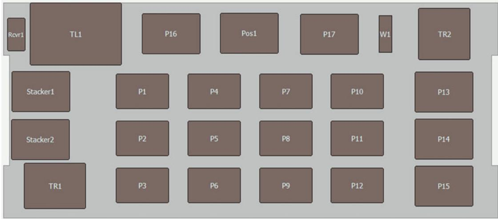

8. The $^ { \infty } 1 0 \times 1 0$ matrix serial dilution” FX protocol can process up to six 384-well mother plates in one run. Place the mother plates into the front input stacker (Stacker2) of the FX. Place an empty P30XL tip box at TL1 and a full box of P30XL tips at P16. The FX is programmed to automatically rearray the P30XL tips at P16 to columns 1 and 12 of the empty P30XL tip box at TL1 using the Advanced Selective Tip head. After a mother plate is delivered to the pipetting zone at Stacker2, the FX attaches tips at TL1 then begins the serial dilution by indexing the head from left to right aspirating, dispensing, and mixing the user-defined sample volumes from well to well. P30XL tips are discarded after five serial dilution steps and new tips are attached to reduce the carryover effect. To ensure proper mixing, the FX is programmed to mix $8 0 \%$ of the total well volume ten times in each well by aspirating at $0 . 5 \mathrm { m m }$ above the well bottom and dispensing at $2 . 5 \mathrm { m m }$ above the well bottom [6]. After each mother plate is processed, the Stacker returns the mother plate to the output location and the cycle is repeated until all the mother plates are serially diluted.   
9. The “384-well to 384-well acoustic transfer” protocol will load up to 384 tips, pipette up a defined volume from the mother plate and deposit that volume into an empty acoustic source plate. Place the mother plate at P1, the empty acoustic source plate at P4, and a box of P30 tips at TL1. The P30 tip box is arrayed with tips only in the locations that correspond to real sample in the mother plate. Start the protocol and transfer $8 \mu \mathrm { L }$ of sample from the mother plate to the acoustic source plate. Repeat the protocol until each mother plates have been transferred to acoustic source plates.

10. Since DMSO is hygroscopic, it is best to use the acoustic source plates as soon as possible to avoid compound dilution in the well. The excessive uptake of water can also negatively affect the operation of the ATS-100 dispenser causing the liquid level height to be out of range of the dispenser’s calibration setting. To avoid this problem, we do not dispense more than $1 0 ~ \mu \mathrm { L }$ into the acoustic source plates. Heat sealing the acoustic source plates should be avoided. The cyclic olefin copolymer (COC) material that comprises the source plate requires higher sealing temperatures for a longer time compared to standard polypropylene plates. This can deform the wells and warp the plate which can result in poor performance on the ATS-100.   
11. For troubleshooting purposes, it is helpful to physically segregate the 384-well acoustic plates from the 1536-well assay plates into separate columns of the HRB AmbiStore. Additionally, it is helpful to load the plates in sequential barcode order according to the HRB worklist file into the HRB AmbiStore with the lowest plate number at the bottom of each HRB AmbiStore hotel column. The HRB AmbiStore numbers the rows ascending from bottom to top. Finally, it is also helpful to load the 1536-well assay plates in sequential barcode order. The HRB is equipped with two ATS-100s. The HRB worklist file can be divided into two orders and the assay plates can be prepared on both ATS-100s simultaneously to reduce the overall run time.   
12. Before the ATS-100 is used for an acoustic transfer, the 1536- well destination gripper needs to be attached and clean distilled water should be refilled into the system. The ATS-100 should be thoroughly primed with distilled water using the onboard software and pump immediately prior to operation. The agitator should be checked for any large air bubbles as this can slow down the transfer time. Any air in the agitator should be released by slightly unscrewing the screw on top to allow air to escape while priming the instrument. Once the water level has reached the top of the agitator, stop priming the instrument, then retighten the screw.   
13. Before starting the acoustic transfer on the HRB, do a walkthrough of the system and visually verify there are no foreign objects at any of the instrument stations where a source or destination plate may be moved. You can expect the system to produce four completed assay plates per hour per ATS-100. Add cells to the 1536-well assay plates within $2 4 \mathrm { h }$ of spotting to avoid compound evaporation in the plate.   
14. When selecting a volume for resuspension of cell pellets, attempt to resuspend in a volume that will result in

approximately 1 million cells/mL. Most automated cell counters report a large range of cell densities that can be accurately counted; however the accuracy of the cell count is typically poor at very low (less than 50,000 cells/mL) or very high cell (more than 5 million cells/mL) densities. One million cells/ mL is a density which can be accurately counted manually or with an automated counter.

15. Extra plates are highly recommended to include during cell plating. One clear bottom plate for imaging should be made in which at least four columns of cells are plated. This plate should be imaged throughout the assay to ensure cells are healthy with the usual morphology. If the imaging plate begins to show signs of contamination or unhealthy cells, it can be assumed that all assay plates are also contaminated and should be discarded to prevent waste of expensive reagents. One additional assay plate should be made as well to allow for cell growth rate calculations. A recent publication demonstrated that cell growth rate can have a large effect on compound $\mathrm { I C } _ { 5 0 }$ [7]. One way to correct for this effect is to incorporate the cell doubling time into the $\mathrm { I C } _ { 5 0 }$ calculation. This can be done by adding CellTiter-Glo to an assay plate immediately after cell plating to determine the time 0 signal. The assay endpoint data should have a DMSO control that can be used as the final signal and growth rate from time 0 to assay endpoint can be determined.

16. Plating of cells in an open laboratory environment typically has a low risk of contamination of the cells during plating. If gloves are worn and clean lids are applied shortly after plating, the exposure of the cells to the open air is limited. If the assay is to be shorter than $^ { 7 2 \mathrm { ~ h ~ } }$ , contamination of cells during the course of the assay is uncommon. However, longer assays have more time to allow contaminants to proliferate. If contamination does occur within a short-term assay, the cell flasks should be examined for contamination as it is likely that the cells were contaminated prior to plating. If the assay is to last longer than $^ { 7 2 \mathrm { ~ h ~ } }$ , plating cells in a biosafety cabinet is preferred to reduce the possibility of contamination.

17. Each cassette contains eight tips that each fill four rows of a 1536-well assay plate. This arrangement means that if a single tip has some sort of issue during plating, then a four-row block of the plate will be compromised. This can sometimes be seen right after cell plating as four rows of wells with too much or too little volume compared to the adjacent four rows. This often will appear in the final data as a four-row stripe across the plate where the signal in that four-row stripe will be higher or lower than surrounding rows. We refer to this as a “Multidrop effect,” which can affect the data in that portion of the

plate. To prevent this, ensure all tips are clean and unclogged prior to cell plating and monitor Multidrop tips while plating to ensure streams are linear and consistent. If a tip becomes clogged while plating, attempt to unblock the tip before starting a new plate.

18. An inventory is done on the system where the barcode of each plate is read and added into the database to track the location of each plate in the incubator. It is important that the barcodes of these plates are in the inventory database; this way when other processes are running on the system there is no possibility that the slots will be accessed causing a crash. A Keyence barcode reader attached to the gripper on the robotic arm allows the barcodes to be read in an automated fashion.

19. The Method File typically consists of the following:

(a) Dispense $2 ~ \mu \mathrm { L }$ CellTiter-Glo into each of the 32 rows of the 1536-well assay plates, containing cells which have incubated with compound, using four tips in parallel on a solenoid valve dispenser.   
(b) Incubate at room temperature in an auxiliary hotel on the system for 15 min.   
(c) Read luminescence on the ViewLux using 2 s exposure time with slow speed, medium gain, and $2 \times$ binning. The units are relative luminescence units (Fig. 5).   
(d) Plate is returned to the home location after the read has finished.

20. For inhibition assay where the positive control has lower signal than negative control (e.g., viability, toxicity assay), sample wells are normalized using the formula $1 \dot { 0 0 } \times \frac { ( \dot { c } - \dot { n } ) } { ( n - p ) } + 1 \dot { 0 } 0$ , where $c , ~ n$ , and $\boldsymbol { p }$ are the sample well value, median of the negative control well values, and the median of the positive control well values, respectively. Activation assay where positive control has higher signal; on the other hand, sample wells are normalized using the formula $1 0 0 \times { \frac { ( c - n ) } { ( n - p ) } }$ . In some assays, the positive control may not be available or dispensed properly. This issue can be overcome by inclusion of an empty column with no cells, particularly for inhibition assay, and then we employ the median value of no cell wells as a proxy for the positive control assuming that cytotoxic compound leads to maximum cell killing.

21. When measuring the synergy, the absolute response to drug treatment, not always EC50, is crucial to the accurate estimation of synergy. However, the responses within a plate may be drifted due to unexpected artifact (edge effect, variability in liquid dispense, signal crosstalk, etc.). To correct for minor artifact, we take all the intraplate replicates (e.g., controls, no

cells, single/combination replicates) and fit the raw values as a function of compound composition, row and column using a generalized additive model. Here we assume that each well is differentially but linearly affected by layout-specific artifact. Then we compute the expected control value on a per well basis and normalize the response using these corrected control values. For inhibition assay for example, sample wells are normalized using the formula $\begin{array} { r } { 1 0 0 \times \frac { \left[ c - E \left( n \right) \right] } { \left[ E \left( n \right) - p \right] } + 1 0 0 } \end{array}$ , where we substitute n with $E ( n )$ which is denoted as the corrected negative control value.

22. The mQC method is a classification model trained on a set of crowdsourced assessment of combination response quality. The model takes into account a number of features of the combination response including DMSO response, spatial autocorrelation of responses, and the presence or absence of dose response of the single agents. The current implementation of mQC is not very fast and for large combination screens can take a long time to run. While it can be sped up by reducing the number of randomizations required for $\boldsymbol { p }$ -value computation, this can lead to loss of accuracy. In practice, we do not compute mQC during the data processing step and instead batch up the mQC computation for multiple screens and run the calculations in batch on our cluster.

# Acknowledgments

We would like to thank Lesley Mathews-Griner, John Keller, and Don Liu for their contributions to the development of the NCATS combination screening platform.

# References

1. Borisy AA et al (2003) Systematic discovery of multicomponent therapeutics. Proc. Nat. Acad. Sci 100:7977–7982   
2. Leha´r J et al (2007) Chemical combination effects predict connectivity in biological systems. Mol Sys Bio 3:80   
3. Leha´r J et al (2009) Synergistic drug combinations tend to improve therapeutically relevant selectivity. Nat. Biotech. 27:659–666   
4. Bansal M et al (2014) A community computational challenge to predict the activity of pairs of compounds. Nat. Biotech. 32:1213–1222   
5. Attene-Ramos M et al (2013) The Tox21 robotic platform for the assessment of

environmental chemicals—from vision to reality. Drug Discov Today 18:716–723   
6. Yasgar A, Shinn P, Jadhav A et al (2008) Compound management for quantitative highthroughput screening. JALA 13:79–89   
7. Hafner M et al (2016) Growth rate inhibition metrics correct for confounders in measuring sensitivity to cancer drugs. Nat Meth 13:521–527   
8. Heske CM et al (2017) Matrix screen identifies synergistic combination of PARP inhibitors and nicotinamide phosphoribosyltransferase (NAMPT) inhibitors in Ewing sarcoma. Clin Cancer Res 23(23):7301–7311

9. Malo N, Hanley J, Cerquozzi S, Pelletier J, Nadon R (2006) Statistical practice in highthroughput screening data analysis. Nat Biotech 24:167–175   
10. Zhang XD (2007) A pair of new statistical parameters for quality control in RNA interference high-throughput screening assays. Genomics 89:552–561   
11. Chen L et al (2016) mQC: a heuristic qualitycontrol metric for high-throughput drug combination screening. Sci Rep 6:37741

12. Borisy AA et al (2003) Systematic discovery of multicomponent therapeutics. Proc. Natl. Acad. Sci 100:7977–7982   
13. Schindler M (2017) Theory of synergistic effects: hill-type response surfaces as ‘nullinteraction’ models for mixtures. Theor Biol Med Model 14:15   
14. Cokol M et al (2011) Systematic exploration of synergistic drug pairs. Mol Syst Biol 7:544

# Post-processing of Large Bioactivity Data

Jason Bret Harris

# Abstract

Bioactivity data is a valuable scientific data type that needs to be findable, accessible, interoperable, and reusable (FAIR) (Wilkinson et al. Sci Data 3:160018, 2016). However, results from bioassay experiments often exist in formats that are difficult to interoperate across and reuse in follow-up research, especially when attempting to combine experimental records from many different sources. This chapter details common issues associated with the processing of large bioactivity data and methods for handling these issues in a post-processing scenario. Specifically described are observations from a recent effort (Harris, http://www. scrubchem.org, 2017) to post-process massive amounts of bioactivity data from the NIH’s PubChem Bioassay repository (Wang et al., Nucleic Acids Res 42:1075–1082, 2014).

Key words Bioactivity, Bioassay, ScrubChem, PubChem, Hit-calls, Big data, Data integration

# 1 Introduction

This chapter will explain an approach that was used in a recent data integration project (http://www.ScrubChem.org) [1] to efficiently process billions of data points from a large public bioassay repository known as PubChem [2]. The approach is generalizable and applicable to other data types and sources. It is also designed to be efficient in cost, time, and ease of development. For example, ScrubChem is the largest curation effort of public bioactivity data, containing millions of bioassay records; yet it rebuilds entirely in less than a day, and it requires only limited scientific programming and data science skills to develop. The goal of this chapter is to provide a how-to-guide for other technically inclined researchers who are subject matter experts in their respective fields and in need of post-processing their research data.

There are many research uses for aggregating and repurposing legacy bioactivity data. The simplest use is referencing of experimental protocols from previous efforts in order to inform and accelerate the design of a current research goal. Prior results can also be used to create predictive models from

computational technologies such as QSAR, docking, and machine learning. These data-driven reuse cases are mostly applied in pharmacology and toxicological research to aid in the discovery and safety evaluation for new products and therapeutics. Despite the many applications in reusing data, there is a highly disconnected cycle between those generating, storing, distributing, and reusing it. Due to this disunion, data is often not readily reusable and requires significant post-processing.

Post-processing bioassay data generally involves harmonization of terminologies, concepts, and formats. The complexity of bioassay designs makes this a difficult task. The problems to resolve become increasingly large as data is made increasingly more available in public repositories (e.g., PubChem [2], ChEMBL [3], DrugBank [4], BindingDB [5], Tox21 [6], Toxcast [7], CTD [8], Pharos [9],ILINCS [10]). The PubChem project is by far the largest collection of public bioactivity data. It was created as a free repository in order to increase the FAIR-ness (findable, accessible, interoperable, and reusable) [11] of chemical and biological data. Within a relatively short period, over 87 authoritative sources of experimental data contributed approximately 1.2 million bioassay records with results from 2.3 million compounds and thousands of biological targets. PubChem easily succeeded in making bioassay data more findable and accessible; however, timproving he interoperability and reusability of data between these now large amounts of records is an ongoing challenge. Many specific issues related to interoperability are presented in this chapter, and examples from the ScrubChem effort to post-process PubChem are provided to illustrate these issues.

Post-processing large bioactivity data involves integrating results from separate experimental records into an interoperable and relational database. To be interoperable, a database should be designed to facilitate structured queries that reliably access and aggregate data across many records. The quality of data, diversity of data types, and reuse cases will affect the exact design of the database as well as the amount of curation and enrichment of metainformation needed in order to achieve a desired level of interoperability. Ontologies such as BAO [12] and MIABE [13] are available that can aid in designing the database so that it can represent important bioassay concepts. The most basic concepts include target (e.g., protein, gene, cell, tissue, organism, metabolism), taxonomy (e.g., human, mouse, yeast), perturbagen (e.g., chemical, substance), endpoint (e.g., IC50, EC50, CC50, phenotype), outcome (active, inactive), endpoint measurement(s) or value(s), concentration(s) or dose(s), exposure time (e.g., $^ { 2 4 \mathrm { ~ h ~ } }$ , every $^ { 2 \mathrm { ~ h ~ } }$ ), system or format (e.g., cell-based, tissue, whole organism), detection technology or method (e.g., bioluminescence, radiolabeling), and modality or mode-of-action (e.g., inhibition, agonism, antagonism). Additional metadata such as source or publication are

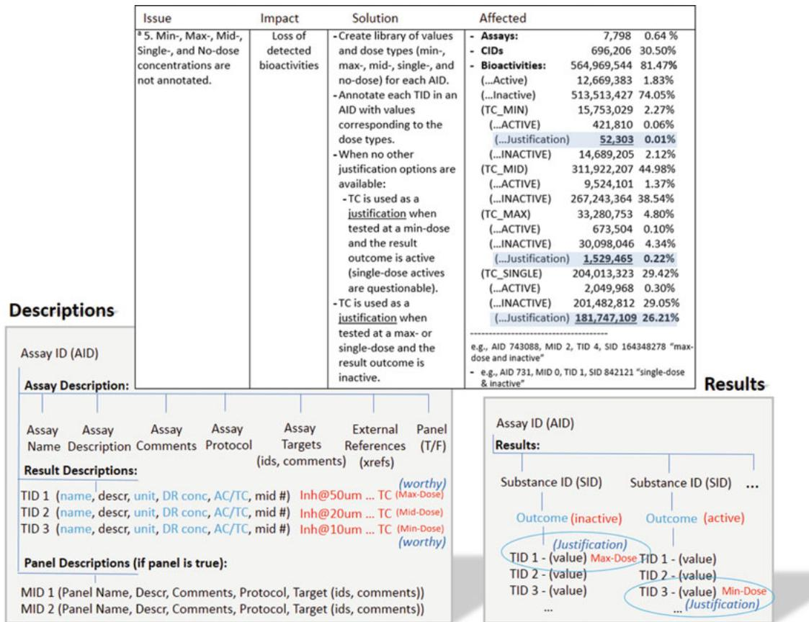  
Fig. 1 Annotating a Justification (concentration ranges)

useful to retain for maintaining provenance. A more complex concept called a Justification, as referred to in ScrubChem [1], is also useful to resolve. Resolving a Justification involves flagging data points that are most relevant for justifying an experimental Outcome. For example, a value describing an IC50 measurement would be flagged as a Justification for an Outcome as compared to other available data points comprising each single-dose measurement used in its derivation. Figure 1 illustrates this concept, and it is further described in Subheading 4 at the end of the chapter.

In Fig. 1, two gray boxes represent the general format of a PubChem Bioassay record. Each assay (AID) contains a Description section for defining the assay protocol and definitions (name and description, unit, etc.) for each test result value (TID). There is also a Results section which contains each tested perturbagen (SID), an Outcome for each SID, and all TID values used to support the Outcome. Shown in red are pseudo-values that relate to the light blue fields on their immediate lefts. The table above each gray box is a summary of a single post-processing issue involving the lack of annotations to describe concentration ranges. The

impact of this issue is an inability to distinguish some of the useful TID values used to justify reported Outcomes. The pseudosolution involves categorizing TIDs as a max-, min-, mid-, or single-dose concentration value. Counts for affected record types (assays, chemicals, bioactivities) and a few example assays (AIDs) affected by this issue are shown in the last column. Highlighted in a light blue box is a count for 181 million bioactivity results that were tested at a single concentration and resulted in substances with an inactive outcome. This observation is significant because high-throughput screening campaigns usually test many compounds at a single dose and in high concentration to quickly detect and remove inactive compounds before proceeding forward with an experiment involving a range of dose-response concentrations. This means that the majority of compounds confirmed as inactive do not have an activity at $5 0 \%$ concentration summary value (AC value) as their Justification. This is important since PubChem provides a true or false flag (AC flag) to mark AC50-like values and also their individual test concentrations (TC flag); however, inactive compounds with only a single-test concentration as a Justification are not immediately distinguishable from cases where a summary AC50-like value is used. Such values are significant to use as Justifications for inactive outcomes (approximately 181 million times). To resolve this issue, further post-processing is needed to better flag the results from single-dose experiments.

In Fig. 2, results from 887 experiments targeting the human estrogen receptor (ESR1) are shown before and after applying a filtered view on ScrubChem.org. This figure is meant to highlight the usefulness of filtering that can be done across assays which is only achievable after annotating a Justification for the readouts in each assay. Without filtering (top view), there are over 11 million result records (test values) available. As shown in the Records count. Using the Filter by Justifications changes the amount of records viewed to approximately 262,000 values. A significant difference between the two data tables is that records with a test value name (TID name) of “RBA Published Value” are retained and “RBA Activity Comment” removed after applying the Filter by Justifications. This particular filter is useful to identify result values immediately of importance for summarizing (i.e., justifying) the Outcome of each experiment. Many other readout types (e.g., $\%$ inhibition, percent inhibition, IC50, inhibition concentration at $5 0 \%$ ) can similarly be flagged and retained as Justifications with the use of relatively simple dictionaries.

The goal of extracting Justifications from many bioassay records is to have a representative value that can be combined into a single consensus result for comparing similar experiments, referred to as a hit-call. Hit-calls can be created to summarize data points with the same chemical, target, and general assay design (e.g., a similar modality and endpoint). The exact requirements

# Search Results for Target: ESR1

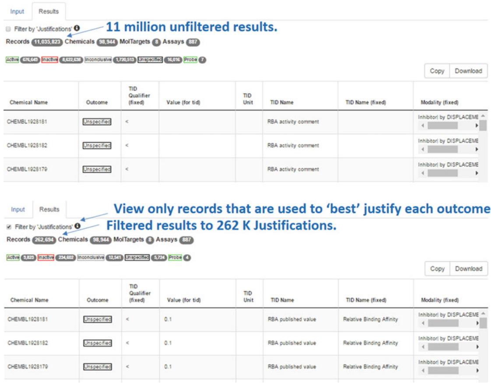  
Fig. 2 Selecting Justification across assay records

for comparing and aggregating data into hit-calls will vary and depend on an intended reuse case for the data. Simple quality metrics about hit-calls can also be used to interrogate the reproducibility of data, such as the number of records or evidences used to support the hit-call and also the total agreement between those evidences.

A case study involving these introductory concepts is presented in Subheading 3. The Methods explain how to choose hardware and software for parsing large amounts of data quickly and affordably. Also explained are general approaches to download, parse, annotate/curate, add metadata, and set up a scalable database. This chapter concludes with a conceptual example of how to query a database using Justifications as a filter and aggregate this data into summary hit-calls.

# 2 Materials

An object-oriented programming language such as C# or Java is recommended to process source data. Sources usually provide data in json and xml formats which can be transformed into class objects for easier processing. It is also recommended to use schemas for creating template classes. In cases where no schema is available, free services such as jsontoclass [14] or xmltocsharp [15] can be used to build model classes from representative source files. An advantage of using a high-level language such as C# or Java is the ability to create try-catch [16] statements which are helpful when data does not follow a well-structured format. Format exceptions are common when processing data from many sources. Familiarity with a structured query language (SQL) and database engine such as MySQL is needed for storing and extracting transformed data. If the database will be made available through web services, an enterprise database solution such as MS SQL or ORACLE is recommended. Programming and database environments can be substituted as needed to accommodate license restrictions, available computing environment, and specific developer experience. The goal for establishing a developing environment is to have efficiency in both compute and development time. A 64-bit workstation/ server environment with multiple cores and approximately 8GB of RAM per logical processor is recommended for parallelization and scaling during the data parsing/processing. At least four storage disks, preferably solid-state, are also recommended in order to optimize IO (read/write) during data parsing/processing. A database management engine such as MySQL Workbench or SSMS (MSQL Server Management Studio) and SSIS (SQL Server Integration Services) is also recommended for easier setup of the database, importing of data, indexing of fields, and performing SQL queries during data exploration.

# 3 Methods

# 3.1 Hardware Configuration

Processing individual assay records is scalable by distributing loads across many processors, depending on the available system memory and disk IO speeds. In the case of ScrubChem, 11 separate processors were efficiently used in a system with 12-core dual Xeon processors, 64-bit OS, and 192GB of RAM. A single drive (storage disk #1) is needed for storing all 1.2 million raw data records. A second drive (storage disk #2) is needed for dedicated writing of data processed in memory to disk. If write or read times become bottlenecked, additional disks (striped or separated) can be used to increase IO speeds. Each processor handles around 100,000 records with a maximum memory utilization per record of

approximately 20 GB. PubChem bioassay records can range from MBs to GBs in size, and memory will often be the bottleneck for processing such large records. For other projects, the utilization of additional processors can be benchmarked in trial runs to determine the memory and IO requirements. The goal during benchmarking is to balance the system with enough jobs to utilize the bulk of its memory throughout an entire runtime. Another drive (storage disk #3) is useful for keeping caches of web pages/data taken from API calls to external resources. A final drive (storage disk #4) will be used for storing the database.

# 3.2 Basic Software

Setting up a development environment is straightforward. It is recommended to follow installation instructions and tools provided with each software. For developing in C#, MS Visual Studios is a convenient tool for project management and source control. The project code should be designated to build/run on a 64-bit system in order to utilize greater than 2 GB of memory per process. The database in this case is MS SQL, and it should be designated to build on a dedicated drive (storage disk #4). SSIS is to be used for recursive data importing. It can also be used for simple data transformations. Microsoft SSMS is used for indexing fields and querying the database. Similar tools are available within the Java development environment.

# 3.3 Downloading Primary Data (Disk 1)

Bulk data is usually made available via an FTP site (e.g., ftp://ftp. ncbi.nlm.nih.gov/pubchem/Bioassay/XML). There is often a schema available (e.g., ftp://ftp.ncbi.nlm.nih.gov/pubchem/ specifications/pubchem.xsd) to use as a template for creating classes to store and process the data. Data records are not guaranteed to follow expected formats, and try-catch [16] statements are useful to implement during processing in order to handle those errors cleanly. Many records do not change often, and a change log (e.g., ftp://ftp.ncbi.nlm.nih.gov/pubchem/Bioassay/assay. ftpdump.history) can be used to save in bandwidth or processing time if implemented. After decompression, the PubChem bioassays fit on 557GB of disk space.

# 3.4 Parsing Primary Data and Annotating (Disk 2)

# 3.4.1 Parser

A Parser simply identifies a class of data (e.g., assay title, assay target, source) and extracts it. The Parser works on a single bioassay record at a time, but it can be split up to work in parallel across many processors. Each processor should have dedicated output files for writing all data onto the storage disk #2. In the case of Scrub-Chem, outputs can be separated by the processor and a result (e.g., output_results_processor_1.txt) and description (e.g., output_descriptions_processor_1.txt) file which later can be more easily imported into a normalized database schema. These output files are a reflection of the database tables, and appropriate keys (e.g., assay ID, test ID, panel ID) should be maintained for joining their

data records. Optimization of the parsing process is explained in Subheading 3.1 of the Methods and is dependent on data size and available resources. The configuration used on the ScrubChem project takes approximately $^ { 4 \mathrm { ~ h ~ } }$ to finish parsing.

# 3.4.2 Annotator

The Annotator makes changes to the data and is incrementally constructed over the course of a project. Building up the functions of an Annotator involves querying of the database after each iteration of building it in order to identify quality issues involving missing, unresolved, or incorrect data/concepts. The Annotator is then updated to incorporate logical and programmatic fixes to address the identified issues. The database is then rebuilt to accommodate the desired changes. This approach is faster than performing case-by-case updates on a large relational database, especially after it has been indexed.

The complexity of the Annotator will depend on the quality of original data and a user’s intended applications for the data. Minimum information, as described in the Introduction, is needed in order to derive basic hit-calls. Particularly important is a Justification (measurement) and Modality (action) which are used in an experimental design to test the perturbation of a molecular target. These concepts are further discussed in Subheading 4.

# 3.5 Enriching Primary Data with External Linkages to Metadata (Disk 3)

Primary data is usually basic in detail, and therefore additional metadata is often needed to enrich the descriptions of an experiment. In the case of ScrubChem, other NCBI databases such as GenBank and PubChem compound are accessed through API services to gather additional information for targets or chemicals. This allows integrating in useful features such as additional identifiers, taxonomies, synonyms, physical properties, sequences, etc. The number of API calls can become very large (nearly 300,000,000 pages in the case of ScrubChem), and due to the iterative process of building up an Annotator, it is useful to cache many of these pages on a local disk (storage disk #3). The simple syntax of most API URLs allows keeping a local copy of the page using a transformation of the URL in regular file structures for reference before making a call to the web version. The local cache of pages can be cleaned up over time to bring in updated data as needed.

# 3.6 Bulk Uploading Parsed Data into a Database (Disk 4)

This step involves building a loader function to bulk upload output data from the Parser’s output on storage disk #2 into a database on storage disk # 4. This bulk reading and writing is faster if the read and write disks are separated. The schema for a database needs to be described within SSIS when setting it up for loading. Since parsing is done in parallel and output records are stored across separate files for each processor, primary keys need to be generated at the same time as loading. SSIS allows for bulk uploading separate files into a

database and also the building of primary keys with an auto increment. Simple transformations and checks on the data can also be managed from within an SSIS workflow. If an alternative database engine is used, it is recommended to identify the bulk loading features of that engine. Since loading uses an auto increment to build primary keys, this procedure has to be done serially. However, the description and result tables can be loaded independently, taking 30 min and $^ { 2 \mathrm { ~ h ~ } }$ , respectively.

# 3.7 Building, Indexing, and Querying the Database

Microsoft’s SSMS can be used to initialize the database tables and fields. It is also useful for adding indexes and querying the database. It provides a typical workbench environment for managing and exploring the database. Field data types (e.g., int, char, varchar) should be assigned carefully in order to optimize disk space utilization. For assigning appropriate lengths to fields, it is useful to keep a report of the longest records during parsing. Long varchars slow down loading but can be useful in avoiding truncated data. MS SQL does a decent job at compressing (shrinking) the database after loading. Indexes should be built only for the fields most often used in queries. SSIS allows for profiling queries to see which fields add the most time and are good candidates for indexing. For example, CID (chemical ID) is a ScrubChem data type that is indexed because it is often used to access data points for specific chemicals. The descriptions table is relatively small (approximately seven million rows) and has a fairly low cost to add indexes (about 5 min compute time/index). The results table is relatively large (approximately 1.5 billion rows) and therefore should have very few indexes outside of its primary key. Once indexed the database can be quickly queried on specific tables or joined across tables. An example query might conceptually be described as “select all chemicals, outcomes, and their Justifications for the androgen receptor protein target and the modality of inhibition.” The specific fields used in the SQL syntax of this query will depend on the structure of the database.

# 3.8 Building a Hit-Call

The previously described query in Subheading 3.7 of the Methods section would return records with a single Justification for each outcome of a chemical tested for inhibition against the human androgen receptor. In many cases, there are multiple records for the same chemical that are tests from separate bioassay experiments. These can be treated as replicates, and a hit-call is needed to combine all available replicates into a single consensus result. For example, a chemical such as estradiol may have been tested three separate times all with an outcome of active with respect to inhibition. These three evidences for active outcomes can be combined into a single consensus hit-call of active $( n = 3$ , where n is the number of evidences and $r = 3 / 3$ or 1, where $r$ is the ratio of agreement between all evidences). If desired, this hit-call can be

compared to other hit-calls for its relative reproducibility using the n and $r$ values. It is important to define the target as human androgen receptor inhibition and to not combine data from another modality (e.g., agonism) into constructing this hit-call. If the retrieved Justifications for the outcome are based off of similar endpoints such as IC50s, then the quantities can be averaged as part of the hit-call.

# 4 Notes

Justifications, illustrated in Figs. 1 and 2, is a concept needed to interoperate on data across a large amount of records. Experimental records vary widely in their reported metadata (e.g., control runs, prior replicates, comments, statistical tests), and these can contain values that are not relevant to the experimental measurements used as a Justification for the reported experimental Outcome. Annotating the Justifications for each assay allows easier extraction and then comparison of significant results from sets of different experiments. PubChem Bioassay records often lack annotations to identify Justifications. This provides an opportunity to demonstrate how an Annotator can be built to iteratively find and mark Justifications.

For example, after building and attempting to query data in the first version of ScrubChem, a question was left unanswered: “What are the Justifications for each outcome?” There were many different kinds of results to consider as Justifications between different assays. PubChem does provide a true or false flag, called an active concentration (AC), for depositors to mark summary doseresponse values (e.g., IC50, EC50, AC50). Also provided is a flag, called a test concentration (TC) flag, for depositors to mark individual test concentration values. Extracting meaningful values from experiments is made easier with these flags. However, a subject matter expert immediately will realize that many assay designs only contain a single-test dose at a high concentration or a small range of doses in order to efficiently screen for activity before proceeding to further testing. In this tiered approach, any chemical not showing activity at a high dose range is considered inactive and no longer pursued with a more accurate series of full dose-response concentrations. Therefore, there are no AC50-like values available as Justifications for most inactive results. Recognizing this screening design concept allowed for a function to be built in the Annotator which flags inactive results from assays that have no AC flag and only TC flags. The function was further developed to flag the highest concentration values tested and use them as a Justification for inactive outcomes. This logic was applied during a subsequent parsing and rebuild of the database, and in the new database over 181 million, data points were available as Justifications from inactive screening results.

# References

1. Harris J (2017) ScrubChem. http://www. scrubchem.org   
2. Wang Y et al (2014) PubChem BioAssay: 2014 update. Nucleic Acids Res 42:1075–1082   
3. Bento AP et al (2014) The ChEMBL bioactivity database: an update. Nucleic Acids Res 42:1083–1090   
4. Wishart DS et al (2006) DrugBank: a comprehensive resource for in silico drug discovery and exploration. Nucleic Acids Res 34: D668–D672   
5. Gilson MK et al (2016) BindingDB in 2015: a public database for medicinal chemistry, computational chemistry and systems pharmacology. Nucleic Acids Res 44: D1045–D1053   
6. Toxicology in the 21st Century   
7. Dix DJ et al (2007) The toxcast program for prioritizing toxicity testing of environmental chemicals. Toxicol Sci 95:5–12   
8. Davis AP et al (2017) The comparative Toxicogenomics database: update 2017. Nucleic Acids Res 45:D972–D978

9. Nguyen DT et al (2017) Pharos: collating protein information to shed light on the druggable genome. Nucleic Acids Res 45:D995–D1002   
10. Pilarczyk M, Medvedovic M, Fazel Najafabadi M, Naim M, Michal K, Nicholas C, Shana W, Mark B, Wen N, John R, Juozas V, Jarek M, Mario M (2016) iLINCS: Web-Platform For Analysis Of Lincs Data And Signatures, ilincs. org. https://doi.org/10.5281/zenodo.167472   
11. Wilkinson MD et al (2016) The FAIR guiding principles for scientific data management and stewardship. Sci Data 3:160018   
12. Visser U et al (2011) BioAssay ontology (BAO): a semantic description of bioassays and high-throughput screening results. BMC Bioinformatics 12:257   
13. Orchard S et al (2011) Minimum information about a bioactive entity (MIABE). Nat Rev Drug Discov 10:661–669   
14. jsontoclass. http://www.jsontoclass.com   
15. xmltocsharp. http://xmltocsharp.azurewebsites. net   
16. try-catch (C# Reference). https://msdn. microsoft.com/en-us/library/6dekhbbc.aspx

# How to Develop a Drug Target Ontology: KNowledge Acquisition and Representation Methodology (KNARM)

Hande Ku¨ c¸ u¨ k McGinty, Ubbo Visser, and Stephan Schu¨ rer

# Abstract

Technological advancements in many fields have led to huge increases in data production, including data volume, diversity, and the speed at which new data is becoming available. In accordance with this, there is a lack of conformity in the ways data is interpreted. This era of “big data” provides unprecedented opportunities for data-driven research and “big picture” models. However, in-depth analyses—making use of various data types and data sources and extracting knowledge—have become a more daunting task. This is especially the case in life sciences where simplification and flattening of diverse data types often lead to incorrect predictions. Effective applications of big data approaches in life sciences require better, knowledge-based, semantic models that are suitable as a framework for big data integration, while avoiding oversimplifications, such as reducing various biological data types to the gene level. A huge hurdle in developing such semantic knowledge models, or ontologies, is the knowledge acquisition bottleneck. Automated methods are still very limited, and significant human expertise is required. In this chapter, we describe a methodology to systematize this knowledge acquisition and representation challenge, termed KNowledge Acquisition and Representation Methodology (KNARM). We then describe application of the methodology while implementing the Drug Target Ontology (DTO). We aimed to create an approach, involving domain experts and knowledge engineers, to build useful, comprehensive, consistent ontologies that will enable big data approaches in the domain of drug discovery, without the currently common simplifications.

Key words Knowledge acquisition, Ontology, Drug target ontology, Semantic web, Big data, Semantic model, KNARM

# 1 Introduction

Gruber defines an ontology as a formal and explicit specification of a shared conceptualization for a domain of interest [1]. Almost three decades ago, CommonKADS presented a widely accepted methodology for knowledge acquisition and ontology building which described workflows for manual ontology building [2, 3]. Following that, nearly two decades ago, the idea of using semantic web applications for representing life sciences data and knowledge started gaining more attention in the life sciences

community [4–9]. Wache and colleagues [10] summarized the existing approaches and tools that can help scientists build powerful ontologies. Around the same time, Blagosklonny and colleagues [4, 5] described how ontologies could be utilized for bioinformatics and drug discovery research and that they can be powerful tools for life scientists. Today’s well-cited, highly accessed, welldescribed, and well-maintained ontologies such as Gene Ontology (GO) [11] and ChEBI [12] are among the first that showed how semantic web technologies could be wielded into creating common vocabularies. However, two decades after the abovementioned milestones were developed, we still lack sophisticated methodologies for knowledge acquisition and data representation using semantic web technologies [2, 4–6, 9, 13–24].

Understanding the bigger picture without oversimplification, by making use of different databases available and extracting knowledge from data, is becoming a more daunting task in the era of big data [18]. Life sciences data are not only increasing in numbers but also are fitting more into the description of big data by being too large, too dynamic, and too complex for conventional data tools to handle [20, 25]. Screening technologies and computational algorithms have become very powerful, capable of creating diverse types of data increasingly faster and cheaper, such as gene sequencing, RNASeq gene expression, and microscopy imaging data. Such large and dynamic data are typically scattered in different databases, in many different formats (i.e., traditional relational databases, NoSQL databases, ontologies, etc.). Additionally, currently available complex life sciences data is not being efficiently translated into a format that is unambiguously readable and understandable by humans and machines. Furthermore, different types of data from gene expression, small molecule biochemical data to cell phenotyping via imaging, make it harder to manage, consolidate, integrate, and analyze these data.

For our purposes, we define big data as data that is high in volume (terabytes and larger), complex (interconnected with over 25 highly accessed databases [18] and over 600 ontologies [23]) with various types of data (varying from gene sequencing to cell imaging), and dynamic (growing exponentially [18, 25]) for conventional data tools to store, manage, and analyze.

Related with our research, we have created two major ontologies: BioAssay Ontology (BAO) [20, 21, 26–28] and Drug Target Ontology (DTO) [20, 24, 29]. BioAssay Ontology (BAO) [28] is aimed at describing and modeling assay data by using formal description logic (DL) and semantic web technologies. Drug Target Ontology (DTO) uses formal description logic to provide a classification of (protein) drug targets based on function and phylogenetics. Rich annotations of (protein) drug targets along with other chemical, biological, and clinical classifications and relations to diseases and tissue expression are also formally described in DTO

using DL. Large number of different assays as well as their complexity with data types motivated us to look for a methodology that helped us acquire knowledge and formalize large amounts of data in the development of BAO.

Many different approaches have been presented for handling biological and chemical data for ontologies [1, 9, 11, 15, 23, 30–40]. Currently, one focus is on combining existing databases and using machine-operated data mining tools or relying on complete manual ontology building. However, creating a systematic methodology that effectively combines human and machine capabilities for extracting knowledge and representing it in an ontology is crucial for better understanding of the data. The existing literature lacks a formal methodology or workflow dealing with knowledge acquisition of large amounts of textual data and formalizing that information into a semantic knowledge model.

Confronted with that challenge and as part of our research, we created and implemented a hybrid methodology, KNowledge Acquisition and Representation Methodology (KNARM), that handles big data in life sciences in the form of large amounts of textual information and translates it into axioms by using description logic (DL). In addition, the methodology and tools we built help update the ontologies faster and more accurately by semiautomating the ontology building process (Fig. 1). As our projects grew in size and focus, we also developed a systematically deepening modeling (SDM) approach for modeling life sciences data described in detail in the Metadata Creation and Knowledge Modeling section of this methodology.

# 2 Methods

KNowledge Acquisition and Representation Methodology (KNARM) consists of nine steps that allow domain experts and knowledge engineers to build useful, consistent ontologies formalizing biomedical knowledge. This methodology aims at acquiring knowledge from data scattered in different databases and ontologies, combining them in a meaningful fashion that is understandable by humans and machines by effectively combining human and machine capabilities. In this way, we attempt to allow users to understand, query, and analyze their data better by formalizing it using semantic web technologies.

# 2.1 Sub-language Analysis

Sub-language analysis is a technique for discovering units of information or knowledge and the relationships among these units within existing knowledge sources, including published literature or corpora of narrative text. As the first step of formalization of the data, we recommend starting with the existing literature and/or reports for the data. While reading the text data, we recommend an

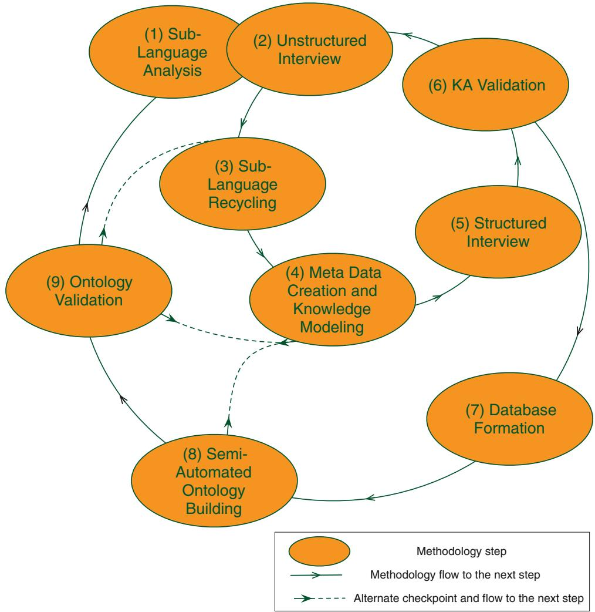  
Fig. 1 Steps of KNowledge Acquisition and Representation Methodology (KNARM). This figure shows the nine steps and flow of KNARM. Following agile principles, there are feedback loops present before finalizing ontologies. The circular flow also represents that ontology building process is a continuous effort, allowing ontology engineers to iteratively add more concepts and knowledge

active reading by creating use cases and taking notes aiming to identify patterns and the units of information, concepts and facts in data, that have a recurring pattern.

A “unit of information” is a concept, relationship, or data property contained in the data in hand. A use case is a list of actions, event steps that users might follow, questions that can be asked by users, and/or scenarios that users may find themselves in. Example use cases might be:

1. Search for proteins are in the same kinase branch as target X where there were validated chemical hits from external or internal sources.

2. I have assay X. What are the other assays that have the same design or technology but different targets?   
3. What assay technologies have been used against my kinase of interest? Which cell lines?

After identifying units of information and patterns followed by listing some possible use cases, the ontology engineers can introduce the domain experts to their preliminary analysis or continue to work with them toward the next steps of the methodology.

# 2.2 In-House Unstructured Interview

After identification of the key concepts and units of information during sub-language analysis, we perform an interview with the domain experts who work in the same team. This step can be performed separately after the sub-language analysis or in a hybrid fashion with the previous step. The unstructured interview is aimed at understanding the data and their purposes better with the help of the domain experts. It can be performed in a more directed fashion by using the previously identified knowledge units or could be treated as a separate process. Together with the previous step, this step also helps identify the knowledge units and key concepts of the data.

# 2.3 Sub-language Recycling

Following the identification of knowledge units through the textual data of the domain, literature, and unstructured interview with the domain experts, we perform a search on the existing ontologies and databases. The aim of the search on the databases and ontologies is to ascertain the already formalized knowledge units that are identified. We perform and encourage reuse of existing—relevant and well-maintained—ontologies, aligning them with ontology in development and using cross-references (annotated as Xref in the ontology) to the various databases that contain the same knowledge units and concepts that we determined to formalize. By recycling the sub-language, not only we save time and effort but also reuse widely accepted conceptualization of knowledge. In this way, we also aim to help life scientists by sparing them the painful data alignment practices and by helping them avoid redundant and/or irrelevant data available in different data resources.

# 2.4 Metadata Creation and Knowledge Modeling

In this step, we combine the knowledge units and essential concepts identified with those recycled from the existing databases and ontologies to create the metadata describing the domain of the data to be modeled. The metadata creation can be a cumbersome task that could be performed in different levels by defining subsets of metadata on various details of the data. For example, with our systematically deepening approach of formalization (i.e., systematically deepening modeling approach (SDM)), we started with the metadata for proteins and genes, followed by metadata for diseases, tissues, and small molecules. The SDM approach allows us to focus

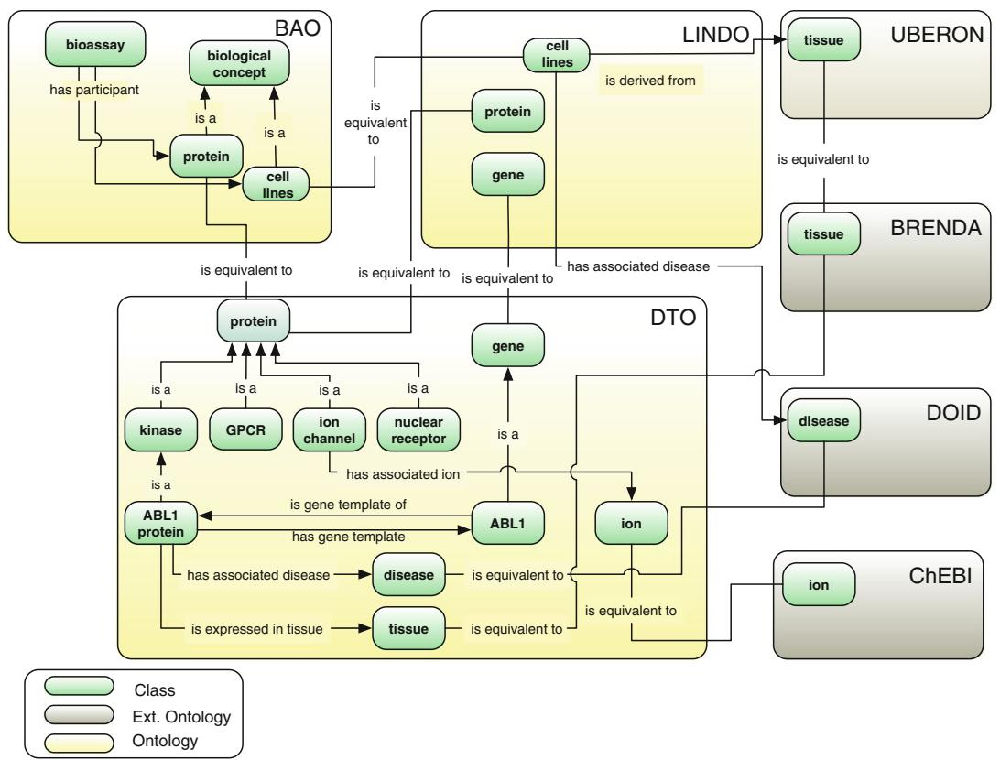  
Fig. 2 Conceptual modeling example, showing modeling of an example kinase (ABL1) and how some of its axioms relate to the different ontologies created using KNARM

on one aspect at a time and extract more detailed (i.e., deeper) metadata, which later allows creating more complex axioms (i.e., modeling of concepts).

In combination with the metadata creation comes a very important step in knowledge acquisition and representation: knowledge modeling. Here, we define knowledge modeling as using axioms to define concepts and aim to help infer new knowledge based on existing data using this axiomatic modeling of concepts.

While modeling, we focus on one aspect at a time and create more complex axioms as going deeper into the knowledge. The detailed metadata extracted is utilized on different levels to create axioms that can be modeled without overwhelming the reasoners and other semantic web technologies by creating nested axioms. By dividing the knowledge into detail levels and representing different detail levels of the knowledge in different ontologies, we allow reuse of concepts and axioms easily as well (also see modular architecture in Semi-Automated Ontology Building section and Fig. 2).

This step can be performed within the team first and then can be discussed with the collaborators and other scientists. Alternatively, a bigger initiative can be set up to agree on the metadata, axioms, and knowledge models (examples include OBO Foundry ontologies [22]).

# 2.5 Structured Interview

Structured interview consists of close-ended questions that are aimed at the domain experts. For our purposes, we use metadata created for the knowledge obtained so far to perform an interview with collaborators who are involved in data creation as well as scientists who are not involved in data creation. The aim of the structured interview is to identify any important points that might have been missed by knowledge engineers and domain experts so far. In this step, the metadata identified is presented in context of the data obtained by knowledge engineers. This data could be dissected based on the metadata identified, and this dissected information could also be presented to the collaborators.

# 2.6 Knowledge Acquisition Validation

This step could be considered the first feedback. The aim in this step is to identify any knowledge that is missed or misinterpreted. By this step, the sub-language identified and recycled, the metadata is created, and the data dissected based on the metadata are presented to domain experts by knowledge engineers. It could also be presented to a small group of users based on use cases. If missed or misinterpreted knowledge exists, we recommend starting from the first step and reiterating the steps listed above.

# 2.7 Database Formation

After validating the knowledge acquired is correct and consistent, we start building the backbone for the representation of the knowledge. The first step is to create a database to collect the data in a schema that will facilitate the knowledge engineering. Typically, this will be a relational database. The domain experts may prefer to use different means of handling and editing their data, such as a set of flat files, but we recommend using a database as the main data feed to the ontology that will be created as the final product. The details of the database are designed based on the acquired metadata and data types collected and their relations (Fig. 3 shows an example database schema). Ideally, the databases should contain the metadata as well as the knowledge units and the key concepts identified in the knowledge acquisition steps. Information that the database may not hold directly includes specific relationships or axioms involving the different knowledge units and key concepts that are identified during the knowledge acquisition. We placed the relationships among the pieces of data in the next step during the ontology building process.

# 2.8 Semiautomated Ontology Building

After placing the data dissected based on the metadata as well as the metadata into the database, we convert the data to a more

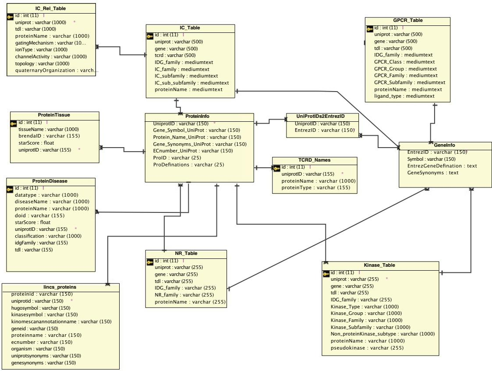  
Fig. 3 Excerpt of the database schema used to create DTO

meaningful format that allows inference of new knowledge that is not explicit in the flat representation in the database. This is achieved using semantic web technologies, mainly an ontology. Building an ontology is particularly relevant for representing complex knowledge involving hierarchies of concepts (i.e., classes in ontology) and many specific relationships (i.e., object properties in ontology) among concepts and their data properties (i.e., data properties in ontology). In this way, flat data obtained can be used to create axioms that represent current knowledge. With the help of DL reasoners, inference of new knowledge and performing complex queries for analysis and exploration become possible and easily operable. We previously reported a modular architecture [20, 24, 26] while building ontologies. The modular architecture allows easier management and sharing of ontology files, standardized vocabularies, and axiomatic representations of knowledge. Modularization and ontology development can be performed manually. However, especially while building DTO, we created all vocabulary files and some of the axioms from the database using a Java application, OntoJog [24], which will be released soon. This process adds another layer into the modularization to separate

axioms that are automatically created by a software from axioms that are manually asserted in the ontology by expert knowledge engineers [20] (Fig. 3).

# 2.9 Ontology Validation

The final step in the proposed workflow is the ontology validation. The domain experts as well as the knowledge engineer perform different tests in order to find out if the information in the ontology is accurate. In addition, different reasoners can be run on the ontology to check its consistency. Additional software can be implemented to test the different aspects of the ontology (e.g., Java programs that compare the database with the ontology classes, object properties, data properties, etc.) Finally, queries for the different use cases can be run to check if the ontology implementation answers questions it was meant to answer. If there are any inconsistencies or inaccuracies in the ontology, the knowledge engineer and the domain expert should try to go back to the ontology building step. If the inconsistencies are fundamental, we recommend starting from the first step and retracing the steps that lead to the inconsistent knowledge. Domain experts and ontology engineers can also choose to go back to “Metadata Creation and Knowledge Modeling” or “Sub-language Recycling” step.

# 2.10 Implementation of the Drug Target Ontology (DTO) Using KNARM

As a part of the Illuminating the Druggable Genome (IDG) [41] project, we designed and implemented the Drug Target Ontology (DTO) [29]. The long-term goal of the IDG project [41] is to catalyze the development of novel therapeutics that act on novel drug targets, which are currently poorly understood and poorly annotated, but are likely targetable. The project puts particular emphasis on the most common drug target protein families, Gprotein-coupled receptors (GPCRs), nuclear receptors, ion channels, and protein kinases. Therefore, we focused initially on formally classifying, annotating, and modeling these specific protein families in their role as drug targets, and DTO is focused on proteins known as putative drug targets including many aspects to describe the relevant properties of these proteins in their role as a drug target. While creating DTO, we further advanced the methodology and ontology architecture that we used for the BAO [26] and other application ontologies from the LINCS project (e.g. LIFE ontology) [20]. A longer-term goal for DTO is to integrate it with the assays (formally described in BAO) that are used to identify and characterize small molecules that modulate these targets. This will result in an integrated drug discovery knowledge framework.

# 2.10.1 Sub-language Analysis and In-House Unstructured Interview for DTO

The initial interviews and sub-language analysis steps involved determining the different classifications of the drug targets and the properties of them. The IDG project defined drug target [24, 29, 42] as “A material entity, such as native (gene product)

protein, protein complex, microorganism, DNA, etc., that physically interacts with a therapeutic or prophylactic drug (with some binding affinity) and where this physical interaction is (at least partially) the cause of a (detectable) clinical effect” [24]. Currently, DTO focuses on protein targets.

The IDG drug targets have been categorized as four major classes with respect to the depth of investigation from a clinical, biological, and chemical standpoint:

1. Tclin are targets for which a molecule in advanced stages of development, or an approved drug, exists and is known to bind to that target with high potency.   
2. Tchem are proteins for which no approved drug or molecule in clinical trials is known to bind with high potency but which can be specifically manipulated with small molecules in vitro.   
3. Tbio are targets that do not have known drug or small molecule activities that satisfy the Tchem activity thresholds but were annotated with a Gene Ontology Molecular Function or biological process with an experimental evidence code or targets with confirmed OMIM phenotype(s) [43].   
4. Tdark refers to proteins that have been described at the sequence level, do not satisfy Tclin/Tchem/Tbio criteria, and meet two of the following three conditions: a fractional PubMed publication count [44] below five, three or more NCBI gene RIF annotations [45], or 50 or more commercial antibodies, counted from data made available by the Antibodypedia database [46].

DTO proteins have further been classified based on their structural (sequence/domains) and functional properties. Here we give a high-level summary of the classifications for kinases, ion channels, GPCRs, and nuclear receptors.

Most of the 578 kinases covered in the current version of DTO are protein kinases (PK). These 514 PKs are categorized in ten groups that are further subcategorized in 131 families and 82 subfamilies. The 62 nonprotein kinases are categorized in five groups depending upon the substrate that are phosphorylated by these proteins. These five groups are further subcategorized in 25 families and 7 subfamilies. There are two kinases that have not been categorized yet in any of the above types or groups.

The 334 ion channel proteins (out of 342 covered in the current version of DTO) are categorized in 46 families, 111 subfamilies, and 107 sub-subfamilies. Similarly, the 827 GPCRs covered in the current version of DTO are categorized in 6 classes, 61 families, and 14 subfamilies. The additional information whether any receptor has a known endogenous ligand or is currently orphan is mapped with the individual proteins. Finally, the 48 nuclear hormone receptors are categorized in 19 NR families.

Following our reviews of the free-form text about the data in hand, the domain experts in the group provided help with answering the ontology engineers’ questions. At times, the reviews of the free-form text were performed together with the domain experts. This process is defined as the unstructured interview, because there are no predefined set of questions asked to the domain expert. The questions are asked in a conversation-like environment to better understand the various characteristics of proteins as drug targets— such as protein domains, binding ligands, functions, mutation, binding site, tissue expression, disease association, and many protein family-specific concepts—and identify a pattern among the various kinds of molecular entities, their parts, functions, roles, related biomedical concepts, their uses, as well as their functions in drug discovery assays and projects.

Above classifications of the proteins were performed by the domain experts and provided to the ontology engineers in Excel sheets. Other classification questions were also discussed such as how to best classify mutated and modified proteins. The different properties identified in the first step are used in subsequent steps to create metadata, model the knowledge, and axiomize in the ontology building process.

2.10.2 Sub-language Recycling for DTO

While designing the ontology, we decided to add the UniProt IDs for the proteins and the Entrez IDs [30] for the genes as crossreferences. In addition to this, we wanted to include the textual definitions for the genes and the proteins. We also cross-referenced the synonymous names and symbols for the molecules that already exist in different databases.

We aimed at creating the Drug Target Ontology (DTO) as a comprehensive resource by importing existing information about the biological and chemical molecules that DTO contains. In this way, we aim to help the life scientists’ query and retrieve information about the different drug targets that they are working on. To do that, we wrote various scripts using Java to retrieve information from different databases. These databases include UniProt and NCBI databases for Entrez IDs for the genes.

In addition to several publicly available databases and data including the DISEASES and TISSUES databases [44, 47], we also used the collaborators TCRD databases [42] in order retrieve information about proteins, genes, and their related target development levels (TDLs), as well as the tissue and disease information.

The DISEASES and TISSUES databases were developed in the Jensen group from several resources including using advanced text mining. They include a scoring system to provide a consensus of the various integrated data sources. We retrieved the proteins with their tissue and disease relationships and the confidence scores that are given for the relationships. This data was loaded into our database

and later used to create the ontology axioms that refer to the probabilistic values of the relationships.

In addition to the larger-scale information derived from the databases mentioned above, a vast amount of manual curation for the proteins and genes was performed in the team by the curators and domain experts. Most significantly improved were the drug target classifications for kinases, ion channels, nuclear receptors, and GPCRs. For most protein kinases, we followed the phylogenetic tree classification originally proposed by Sugen and the Salk Institute [48]. Protein kinases not covered by this resource were manually curated and classified mainly based on information in UniProt [49] and also the literature. Non-protein kinases were curated and classified based on their substrate chemotypes. We also added pseudokinases, which are becoming more recognized and relevant drug targets. We continue updating manual annotations and classifications as new data becomes available. Nuclear receptors were organized following the IUPHAR classification. GPCRs were classified based on information from several sources primarily using GPCRDB (http://www.gpcr.org/7tm/) and IUPHAR as we have previously implemented in our GPCR ontology [50]. However, not all GPCRs were covered, and we are aligning GPCR ontology with other resources to complete classification for several understudied receptors. We are also incorporating ligand chemotype-based classification. A basic classification of ion channels is available in IUPHAR [51]. Manual classification is in progress for 342 ion channels in order to provide better classifications as required including for domain functions, subunit topology, and heteromer and homomer formation.

Protein domains were annotated using the Pfam web service. The domain sequences and domain annotations were extracted using custom scripts. Several of the kinase domains were manually curated based on their descriptions. For nuclear receptors, we identified and annotated the ligand-binding domains, which are most relevant as drug targets. For GPCRs, we identified 7TM domains for majority (780 out of 827) of GPCRs. Ion channel domains were annotated, and transmembrane domains were identified; additional ion channel characteristics—such as regulatory and, gating mechanism, transported ion—were curated for ion channel drug targets. Additional subclassification and annotation are in progress and will further improve that module.

In addition to the curated drug target family function-specific domain annotations, we generated comprehensive Pfam domain annotations for the kinase module [42]. The domain sequences were compared to the PDB chain sequences by BLAST, and e-values were calculated. For significant hits, domain identities were computed using the EMBOSS software suite. These results were used to align and identify critical selectivity residues, such as

gatekeeper and the hinge-binding motif (publication in preparation). These annotations also allowed the integration with KINO-MEscan assays from the LINCS project [52]. These domains are classified manually based on curated annotations to generate meaningful interpretable assertions in DTO.

# 2.10.3 Metadata Creation for DTO and Knowledge Modeling

Based on the sub-language analysis, the in-house unstructured interview, and sub-language recycling, the next step in formalizing descriptions is creating a set of metadata.

The metadata creation step is a combination of analyzing the standards already existing (e.g., Pfam annotations) and understanding the patterns of the data at hand. For the first version of the DTO, we decided to add the following axioms for the different protein classes (not a complete list):

# 1. Kinase relationships.

(a) Protein-gene relationships.   
(b) Protein-disease relationships.   
(c) Protein-tissue relationships.   
(d) Target development level relationships.   
(e) Has quality pseudokinase relationships.

# 2. GPCR relationships.

(a) Protein-gene relationships.   
(b) Protein-disease relationships.   
(c) Protein-tissue relationships.   
(d) Target development level relationships.   
(e) Has ligand-type relationships.

# 3. IC relationships.

(a) Protein-gene relationships.   
(b) Protein-disease relationships.   
(c) Protein-tissue relationships.   
(d) Target development level relationships.   
(e) Has channel activity.   
(f) Has gating mechanism.   
(g) Has quaternary organization.   
(h) Has topology.

# 4. NR relationships.

(a) Protein-gene relationships.   
(b) Protein-disease relationships.   
(c) Protein-tissue relationships.   
(d) Target development level relationships.

Target development levels (TDL: Tclin, Tchem, Tbio, Tdark) from TCRD [42] were assigned using has target development level relationship and based on the criteria set by the IDG project. Each protein has an axiom annotating a target development level (TDL), i.e., Tclin, Tchem, Tbio, and Tdark. The protein is linked to gene by has gene template relation.

The gene is associated with disease based on evidence from the DISEASES database. The protein is also associated with some organ, tissue, or cell line using some evidence from TISSUES database. Important disease targets based on the protein-disease associations were modeled as strong, at least some, or at least weak evidence. DTO uses the following hierarchical relations to declare the relation between a protein and the associated disease extracted from the DISEASES database. In the DISEASES database [44], the associated disease and protein are measured by a Z-score. In DTO the relationships are translated as follows:

1. Has associated disease with at least weak evidence from DIS-EASES (translated for Z-scores between zero and 2.4).   
2. Has associated disease with at least some evidence from DIS-EASES (translated for Z-scores between 2.5 and 3.5).   
3. Has associated disease with strong evidence from DISEASES (translated for Z-scores between 3.6 and 5).

2.10.4 Structured Interview for DTO

Based on the metadata created, we have interviewed the researchers in the group and outside of the group. This step is to confirm that the interpretation of the text data is correct and accurate. Additionally, this step can be used in combination with other methods in order to decide on a concept’s proper name. In this case, we chose to use existing names in well-known databases such as UniProt [49].

With this step, the aim is to finalize names and types of concepts used in the metadata. Furthermore, it is to make sure that the ontology engineer is on the same page as the domain experts before starting to write the axioms. Therefore, this step can be combined with the next step, i.e., knowledge acquisition validation.

2.10.5 Knowledge Acquisition Validation (KA Validation) for DTO

In this case after the metadata creation, various interviews, and reviews of the data, an ontology engineer runs several scripts to check the consistency of the data. In addition, a domain expert performs a thorough manual expert review of the extracted data. Before the database formation, metadata is also reviewed. Domain experts use metadata for grouping the extracted data. Modeling of the knowledge is confirmed with ontology engineer and domain expert reviews. Structured data is then shared with the research scientists inside and outside of the team, especially with the scientists in the IDG project to make sure that the information

contained was valid. Corrections, if necessary, were made on the data and metadata provided.

2.10.6 Database Formation for DTO

Previously we had engineered BioAssay Ontology (BAO) ontology in a rigorous way using version control and Prote´ge´. However, the modularization approach, although it has many benefits, requires tracking of many vocabulary files and ID ranges (to avoid conflicts). In addition to the vocabulary files, BAO has mostly expertconstructed, manual axioms defining assays and various related BAO concepts. For DTO on the other hand, much information was extracted from third-party databases and then consolidated by curators and domain experts. The use of external resources also requires a mechanism for frequent updates of the ontology. To facilitate that process and to better track DTO modules, vocabularies, and ID ranges, a more efficient and less error-prone method to manage all information was required.

For the DTO, a new MySQL database was built to handle all data and metadata. Drug Target Ontology (DTO) uses various external databases and ontologies as information sources. Data from these databases was retrieved via web-based applications and in-house-built scripts. All data were stored in a relational database. The database schema for the DTO is provided in Fig. 3.

2.10.7 Semiautomated Ontology Building for DTO

The ontology was then built from this database in an automated way using a Java application, OntoJog [24], which will be released and described separately soon. This process builds all vocabulary files, modules, and the axioms that can be automatically constructed given information in the database. In addition, all the external modules were built. The various vocabularies and modules are organized hierarchically via direct and indirect imports leading to DTO_core. DTO_core is then imported, along with the expertasserted axioms and the external modules, to DTO_complete (Fig. 4).

2.11 Knowledge Modeling of the Drug Target Ontology

In BAO, the formal descriptions of assays were manually axiomized. DTO, which was created for the IDG project, focuses on the bio-molecules and their binding partners such as the specific ions for ion-channeling proteins or small molecule ligands for GPCRs, as well as their relationships to the specific diseases and tissues.

We used several tools, including Java, OWL API, and Jena to build the ontology in a semiautomated way leveraging our local database and implementing a new modularization architecture given in detail below.

2.12 A New Modular Architecture for the Drug Target Ontology

The modular design of the DTO adds an additional layer on top of our previously reported modular architecture developed for BAO [26]. Specifically, we separate the module with auto-generated simple axioms, which are created using native-DTO concepts

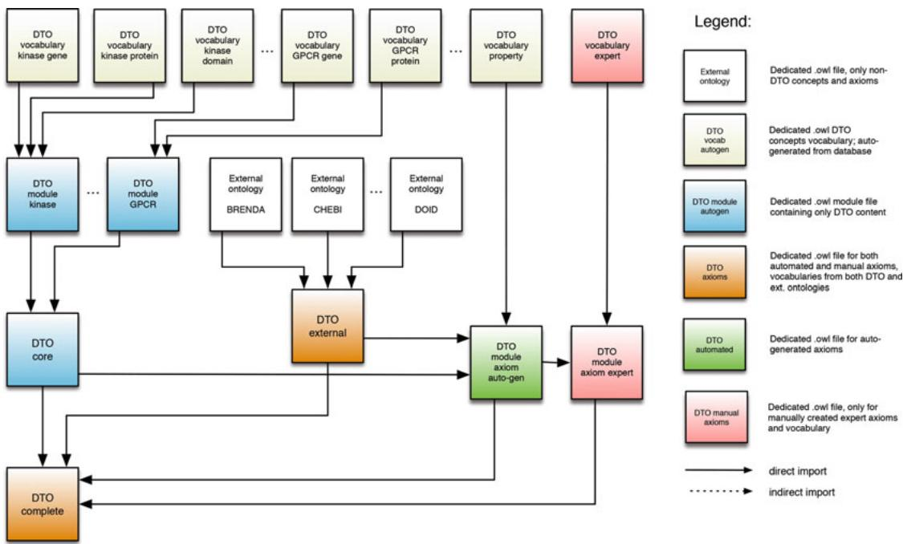  
Fig. 4 Modular architecture of DTO showing the core principles and levels of DTO’s architecture with direct and indirect imports

and/or various pieces of data imported from external databases after internal preprocessing. Following the auto-generated axioms, complex axioms are formed by ontologists or knowledge engineers. This way, auto-updates do not affect expert-formalized knowledge. The modular design is illustrated in Fig. 4. The new approach is detailed below.

First, we determine an abstract horizon between TBox and ABox. TBox contains vocabularies and modules. Vocabularies define the conceptualization without dependencies. The vocabularies are self-contained and well-defined with respect to the domain, and they contain concepts, relations, and data properties (i.e., native-DTO concepts). We can have n of these vocabularies and modules which are combined into DTO_core.

Second, once the number of native vocabularies and modules are defined, we can design modules that import modules from our domain of discourse and also from third-party ontologies. Once these ontologies are imported, the alignment takes place. The alignments are defined for concepts and relations using equivalence or subsumption-DL constructs. The alignment depends on the domain experts and/or cross-references made in the ontologies. For DTO, the most significant alignment made is between UBERON and BRENDA ontologies for the tissue information.

We combine these modules in the DTO_complete level. We can have one DTO_complete file or multiple files; each may be modeled for a different purpose, e.g., tailored for a different user group or area of research (e.g., kinases, GPCRs).

At the third level, the modules with axioms that can be generated automatically are created. The auto-generated modules have interdependent axioms, i.e., these axioms can be generated using native-DTO concepts and/or concepts imported from external ontologies. At this level one could create any number of gluing modules, which import other modules without dependencies or with dependencies.

The fourth level contains axioms created manually. The manual modules are an optional level, and they inherit the axioms created automatically. Examples of axioms that may be seen at this level include protein modifications and mutations and protein drug interactions.

The fifth level contains the TBox released based on the modules created from the fourth phase. Depending on the end users, the modules are combined without loss of generality. With this methodology, we make sure that we only send out physical files that contain our (and the absolute necessary) knowledge.

At the sixth and last level, the necessary modules ABoxes (i.e., instances of concepts created in the TBoxes) can be created. ABoxes can be loaded to a triple store or to a distributed file system (Hadoop DFS [53]) in a way that one could achieve pseudo-parallel reasoning. In another layer, using modules, we can define views on the knowledge base. These are files that contain imports (both direct and indirect) from various TBoxes and ABoxes modules for the end user. It can be seen as a view, using database terminology.

2.12.1 Ontology Validation for DTO

Several check points for data validation are performed throughout the methodology. For example, after the data is extracted in Sublanguage Recycling step, the ontology engineer runs several scripts to check the consistency of the data. In addition, the domain expert performs a thorough manual expert review of the extracted data. The second check point in the methodology is during the Database Formation step. Several scripts are used to check if the extracted data is properly imported to the database under the appropriate metadata categories as a unit of information along with the metadata. Once the Semiautomated Ontology Building step is complete, the ontology engineer runs available reasoners to check the consistency of information. Furthermore, several SPARQL queries are run to flag any discrepancies. If there are any issues in the ontology, the ontology engineer and domain experts could decide to step back and repeat the previous steps in the methodology. Another ontology validation script for DTO is designed to read DTO vocabulary and module files and compare them to the

previous version of the ontology. This script generates reports with all new (i.e., not present in the previous version), deleted (i.e., not present in the current version), and changed classes or properties based on their URIs and labels.

Any issues resulting from the tests are then discussed among ontology engineers and domain experts. GitHub is used to store the different versions of the ontology to help audit the quality control (QC) and ontology validation (OV) process. Once all the QC and OV procedures are completed with no errors, then DTO is released on the public GitHub and its web page [29].

# 3 Notes

Complex life sciences data is fitting the big data description due to the large volume (terabytes and larger), complexity (interconnected with over 25 highly accessed databases [18] and over 600 ontologies [23]), variety (many technologies generating different data types, such as gene sequencing, RNASeq gene expression, microscopy imaging data), and dynamic nature (growing exponentially and changing fast [25, 18]). New tools are required to store, manage, integrate, and analyze such data while avoiding oversimplification. It is a challenge to design applications involving such big data sets aimed at advancing human knowledge. One approach is to develop a knowledge-based integrative semantic framework, such as an ontology that formalizes how the different data types fit together given the current understanding of the domain of investigation. Building ontologies is time-consuming and limited by the knowledge acquisition process, which is typically done manually via domain experts and knowledge engineers.

In this chapter, we described a methodology, KNowledge Acquisition and Representation Methodology (KNARM), as a guided approach, involving domain experts and knowledge engineers, to build useful, comprehensive, consistent ontologies that will enable big data approaches in the domain of drug discovery, without the currently common simplifications. It is designed to help with the challenge of acquiring and representing knowledge in a systematic, semiautomated way. We applied this methodology in the implementation of the Drug Target Ontology (DTO).

While technological innovations continue to drive the increase of data generation in the biomedical domains across all dimensions of big data, novel bioinformatics and computational methodologies will facilitate better integration and modeling of complex data and knowledge.

Although the above-described methodology is still a work in progress, it provided a systematic process for building concordant ontologies such as BioAssay Ontology (BAO) and Drug Target

Ontology (DTO) [20]. The proposed method helps to find a starting point and facilitates the practical implementation of an ontology. The interview steps in our methodology, which involve domain experts’ manual contributions, are crucial to acquire the knowledge and formalize it accurately and consistently. A critical current effort is to further formalize and automate this approach.

Beyond the methodology for ontology generation and in particular knowledge acquisition, we are also developing new tools to improve the interaction between ontology developers and users given the reality of rapidly advancing knowledge and the need for more dynamic environment in which user requests can be incorporated in real time via direct information exchange with ontology developers. The long-term prospect is a global dynamic knowledge framework to integrate and model increasingly large and complex datasets to help solve the most challenging biomedical research problems.

# Acknowledgments and Funding

This work was supported by NIH grants U54CA189205 (Illuminating the Druggable Genome Knowledge Management Center, IDG-KMC), U24TR002278 (Illuminating the Druggable Genome Resource Dissemination and Outreach Center, IDG-RDOC), U54HL127624 (BD2K LINCS Data Coordination and Integration Center, DCIC), and U01LM012630-02 (BD2K, Enhancing the efficiency and effectiveness of digital curation for biomedical “big data”). The IDG-KMC and IDG-RDOC (http:// druggablegenome.net/) are components of the Illuminating the Druggable Genome (IDG) project (https://commonfund.nih. gov/idg) awarded by the National Cancer Institute (NCI) and National Center for Advancing Translational Sciences (NCATS), respectively. The BD2K LINC DCIC is awarded by the National Heart, Lung, and Blood Institute through funds provided by the trans-NIH Library of Integrated Network-Based Cellular Signatures (LINCS) Program (http://www.lincsproject.org/) and the trans-NIH Big Data to Knowledge (BD2K) initiative (https:// commonfund.nih.gov/bd2k). IDG, LINCS, and BD2K are NIH Common Fund projects.

# References

1. Gruber TR (1993) Towards principles for the Design of Ontologies Used for knowledge sharing. Int J Hum Comput Stud 43 (5–6):907–928   
2. CommonKADS CommonKADS. http://com monkads.org/

3. Schreiber G, Wielinga B, de Hoog R, Akkermans H, Van de Velde W (1994) CommonKADS: a comprehensive methodology for KBS development. IEEE Expert 9(6):28–37   
4. Barnes JC (2002) Conceptual biology: a semantic issue and more. Nature 417 (6889):587–588

5. Blagosklonny MV, Pardee AB (2002) Conceptual biology: unearthing the gems. Nature 416 (6879):373–373   
6. Benson DA, Karsch-Mizrachi I, Lipman DJ, Ostell J, Rapp BA, Wheeler DL (2000) Gen-Bank. Nucleic Acids Res 28(1):15–18   
7. Heflin J, Hendler J (2000) Semantic interoperability on the web. Maryland University, College Park, Department of Computer Science, Maryland   
8. Noy NF, Fergerson RW, Musen MA (2000) The knowledge model of Protege-2000: combining interoperability and flexibility. In: Knowledge engineering and knowledge management methods, models, and tools. Springer, New York, pp 17–32   
9. Stevens R, Goble CA, Bechhofer S (2000) Ontology-based knowledge representation for bioinformatics. Brief Bioinform 1(4):398–414   
10. Wache H, Voegele T, Visser U, Stuckenschmidt H, Schuster G, Neumann H, Hu¨bner S (2001) Ontology-based integration of information-a survey of existing approaches. In: IJCAI-01 workshop: ontologies and information sharing. Citeseer, New Jersey, pp 108–117   
11. Yeh I, Karp PD, Noy NF, Altman RB (2003) Knowledge acquisition, consistency checking and concurrency control for gene ontology (GO). Bioinformatics 19(2):241–248   
12. Degtyarenko K, De Matos P, Ennis M, Hastings J, Zbinden M, McNaught A, Alca´ntara R, Darsow M, Guedj M, Ashburner M (2008) ChEBI: a database and ontology for chemical entities of biological interest. Nucleic Acids Res 36(suppl 1):D344–D350   
13. Baader F, Calvanese D, McGuinness DL, Nardi D, Patel-Schneider PF (2010) The description logic handbook: theory, implementation and applications, 2nd edn. Cambridge University Press, New York, NY   
14. Buchanan BG, Barstow D, Bechtal R, Bennett J, Clancey W, Kulikowski C, Mitchell T, Waterman DA (1983) Constructing an expert system. Build Exper Sys 50:127–167   
15. Natale DA, Arighi CN, Blake JA, Bona J, Chen C, Chen S-C, Christie KR, Cowart J, D’Eustachio P, Diehl AD, Drabkin HJ, Duncan WD, Huang H, Ren J, Ross K, Ruttenberg A, Shamovsky V, Smith B, Wang Q, Zhang J, El-Sayed A, Wu CH (2011) The representation of protein complexes in the protein ontology (PRO). BMC bioinformatics 12(1):1   
16. Clark AM, Litterman NK, Kranz JE, Gund P, Gregory K, Bunin BA, Cao L (2016) BioAssay

templates for the semantic web data science: challenges and directions. PeerJ Comput Sci 2 (8):e61   
17. Belleau F, Nolin M-A, Tourigny N, Rigault P, Morissette J (2008) Bio2RDF: towards a mashup to build bioinformatics knowledge systems. J Biomed Inform 41(5):706–716   
18. Cook CE, Bergman MT, Finn RD, Cochrane G, Birney E, Apweiler R (2015) The European bioinformatics institute in 2016: data growth and integration. Nucleic Acids Res 44(D1):D20–D26   
19. Hitzler P, Kro¨tzsch M, Rudolph S (2009) Foundations of semantic web technologies. Chapman and Hall (CRC), Florida   
20. Ku¨c¸u¨k-Mcginty H, Metha S, Lin Y, Nabizadeh N, Stathias V, Vidovic D, Koleti A, Mader C, Duan J, Visser U (2016) Schurer S IT405: building concordant ontologies for drug discovery. In: International conference on biomedical ontology and BioCreative. (ICBO BioCreative 2016), Oregon   
21. Schurer SC, Vempati U, Smith R, Southern M, Lemmon V (2011) BioAssay ontology annotations facilitate cross-analysis of diverse highthroughput screening data sets. J Biomol Screen 16(4):415–426   
22. Smith B, Ashburner M, Rosse C, Bard J, Bug W, Ceusters W, Goldberg LJ, Eilbeck K, Ireland A, Mungall CJ et al (2007) The OBO foundry: coordinated evolution of ontologies to support biomedical data integration. Nat Biotechnol 25(11):1251–1255   
23. Whetzel PL, Noy NF, Shah NH, Alexander PR, Nyulas C, Tudorache T, Musen MA (2011) BioPortal: enhanced functionality via new web services from the National Center for biomedical ontology to access and use ontologies in software applications. Nucleic Acids Res 39(2):W541–W545   
24. Lin Y, Mehta S, Ku¨c¸u¨k-McGinty H, Turner JP, Vidovic D, Forlin M, Koleti A, Nguyen D-T, Jensen LJ, Guha R, Mathias SL, Ursu O, Stathias V, Duan J, Nabizadeh N, Chung C, Mader C, Visser U, Yang JJ, Bologa CG, Oprea TI, Schu¨rer SC (2017) Drug target ontology to classify and integrate drug discovery data. J Biomed Semantics 8(1):50   
25. Ma’ayan A (2017) Complex systems biology. J R Soc Interface 14(134):1742–5689   
26. Abeyruwan S, Vempati UD, Ku¨c¸u¨k-McGinty H, Visser U, Koleti A, Mir A, Sakurai K, Chung C, Bittker JA, Clemons PA, Chung C, Bittker JA, Clemons PA, Brudz S, Siripala A, Morales AJ, Romacker M, Twomey D, Bureeva S, Lemmon V, Schu¨rer SC (2014) Evolving BioAssay ontology

(BAO): modularization, integration and applications. J Biomed Semantics 5(Suppl 1):S5   
27. BAOSearch. http://baosearch.ccs.miami.edu/   
28. Visser U, Abeyruwan S, Vempati U, Smith R, Lemmon V, Schurer S (2011) BioAssay ontology (BAO): a semantic description of bioassays and high-throughput screening results. BMC Bioinformatics 12(1):257   
29. Drug Target Ontology. http:// drugtargetontology.org/   
30. Brinkman RR, Courtot M, Derom D, Fostel JM, He Y, Lord P, Malone J, Parkinson H, Peters B, Rocca-Serra P, Ruttenberg A, Sansone SA, Soldatova LN, Stoeckert CJ Jr, Turner JA, Zheng J (2010) Modeling biomedical experimental processes with OBI. J Biomed Semantics 1(Suppl 1):S7   
31. Callahan A, Cruz-Toledo J, Dumontier M (2013) Ontology-based querying with Bio2RDF’s linked open data. Journal of Biomedical Semantics 4(Suppl 1):S1   
32. Ceusters W, Smith B (2006) A realism-based approach to the evolution of biomedical ontologies. AMIA Annu Symp Proc:121–125   
33. Consortium TGO (2015) Gene ontology consortium: going forward. Nucleic Acids Res 43 (D1):D1049–D1056. https://doi.org/10. 1093/nar/gku1179   
34. Decker S, Erdmann M, Fensel D, Studer R (1999) Ontobroker: ontology based access to distributed and semi-structured information. In: Database semantics. Springer, New York, pp 351–369   
35. Gruber TR (1993) A translation approach to portable ontology specifications. Knowl Acquis 5(2):199–220   
36. Ko¨hler J, Philippi S, Lange M (2003) SEMEDA: ontology based semantic integration of biological databases. Bioinformatics 19 (18):2420–2427   
37. Ontology BF Basic Formal Ontology (BFO) Project. http://www.ifomis.org/bfo   
38. Pease A, Niles I, Li J (2002) The suggested upper merged ontology: a large ontology for the semantic web and its applications. In: Working notes of the AAAI-2002 workshop on ontologies and the semantic web   
39. Sure Y, Erdmann M, Angele J, Staab S, Studer R, Wenke D (2002) OntoEdit: collaborative ontology development for the semantic web. Springer, New York   
40. Welty CA, Fikes R (2006) A reusable ontology for Fluents in OWL. In: Formal ontology in information systems Frontiers in artificial Intel. And apps. IOS, pp 226–236

41. NIH Illuminating the Druggable Genome NIH Common Fund. https://commonfund. nih.gov/idg/index   
42. TCRD Database. http://habanero.health. unm.edu/tcrd/   
43. Hamosh AS, Alan F, Amberger JS, Bocchini CA, McKusick VA (2005) Online Mendelian inheritance in man (OMIM), a knowledgebase of human genes and genetic disorders. Nucleic Acids Res 33:D514–D517   
44. Pletscher-Frankild S, Palleja` A, Tsafou K, Binder JX, Jensen LJ (2015) DISEASES: text mining and data integration of disease–gene associations. Methods 74:83–89   
45. NCBI (2017) https://www.ncbi.nlm.nih.gov/ gene/about-generif. 2017   
46. Kiermer V (2008) Antibodypedia. Nat Methods 5(10):860–860   
47. Santos A, Tsafou K, Stolte C, Pletscher-Frankild S, O’Donoghue SI, Jensen LJ (2015) Comprehensive comparison of largescale tissue expression datasets. PeerJ 3:e1054   
48. Sugen and the Salk Institute. (2012). http:// kinase.com/human/kinome/phylogeny.html   
49. Consortium TU (2015) UniProt: a hub for protein information. Nucleic Acids Res 43 (D1):D204–D212. https://doi.org/10. 1093/nar/gku989   
50. Przydzial MJ, Bhhatarai B, Koleti A, Vempati U, Schu¨rer SC (2013) GPCR ontology: development and application of a G protein-coupled receptor pharmacology knowledge framework. Bioinformatics 29 (24):3211–3219   
51. Pawson AJ, Sharman JL, Benson HE, Faccenda E, Alexander SP, Buneman OP, Davenport AP, JC MG, Peters JA, Southan C, Spedding M, Yu W, Harmar AJ, NC-IUPHAR (2013) The IUPHAR/BPS guide to PHARMACOLOGY: an expertdriven knowledgebase of drug targets and their ligands. Nucleic Acids Res 42(D1): D1098–D1106   
52. Vidovic´ D, Koleti A, Schu¨rer SC (2014) Largescale integration of small molecule-induced genome-wide transcriptional responses, Kinome-wide binding affinities and cellgrowth inhibition profiles reveal global trends characterizing systems-level drug action. Front Genet 5:342   
53. Shvachko K, Kuang H, Radia S, Chansler R (2010) The Hadoop distributed file system. In: Proceedings of the 2010 IEEE 26th symposium on mass storage systems and technologies (MSST). IEEE Computer Society, Washington, DC, USA, pp 1–10

# Part II

Informatics in Drug Discovery

# A Guide to Dictionary-Based Text Mining

Helen V. Cook and Lars Juhl Jensen

# Abstract

PubMed contains more than 27 million documents, and this number is growing at an estimated $4 \%$ per year. Even within specialized topics, it is no longer possible for a researcher to read any field in its entirety, and thus nobody has a complete picture of the scientific knowledge in any given field at any time. Text mining provides a means to automatically read this corpus and to extract the relations found therein as structured information. Having data in a structured format is a huge boon for computational efforts to access, cross reference, and mine the data stored therein. This is increasingly useful as biological research is becoming more focused on systems and multi-omics integration. This chapter provides an overview of the steps that are required for text mining: tokenization, named entity recognition, normalization, event extraction, and benchmarking. It discusses a variety of approaches to these tasks and then goes into detail on how to prepare data for use specifically with the JensenLab tagger. This software uses a dictionary-based approach and provides the text mining evidence for STRING and several other databases.

Key words Automated text processing, Dictionary-based approach, Named entity recognition, PubMed, Structured information, Text mining, Text normalization

# 1 Introduction

PubMed contains more than 27 million documents, and this number is growing at an estimated $4 \%$ per year [1]. Even within specialized topics, it is not possible for a researcher to read any field in its entirety, so everyone is lacking a complete picture of the scientific knowledge in any given field at any time. This dearth of perspective is in part compensated for by databases such as UniProt that manually curate domain-specific knowledge and provide it in a structured form [2]. Such databases are essential collections of information as they facilitate finding information about the properties and functions of proteins and provide programmatic access to it. Efforts to curate scientific facts into databases are greatly valued by the community for the ease with which structured information can be extracted, but they require significant investments of time, resources, and money to create and maintain [3]. Further, where databases do exist, they are necessarily limited in scope—as

comprehensive as UniProt is for proteins, it makes no effort to also cover noncoding RNAs.

Biomedical text mining, sometimes called BioNLP, is becoming an essential part of the research toolbox as it can be used to automatically and quickly extract and organize facts that are scattered throughout the literature into a comprehensive structured collection. NLP refers to natural language processing, a term that can mean processing text in general sense using a variety of methods or more specifically parsing the grammatical sentence structure to better understand the text. The term BioNLP refers to the more general meaning of NLP to mean processing biomedical text by any method.

Biomedical text mining spans a wide range of entities and their relations. Relations that can be extracted using text mining include protein interactions with diseases [4], RNA [5], cellular compartments [6] or tissues [7], or any other pairs that could be part of a biologically interesting relation. In addition to describing biological relationships, text mining has also been used to describe trends in biomedical research [8] and to identify proteins that have not been researched compared to their importance [9].

As text mining uses the existing literature as a source, the individual facts extracted by text mining are inherently not novel. However, text mining enables information to be combined from multiple papers in potentially novel ways to facilitate discovery [10, 11]. For example, an early result of text mining is the discovery of a connection between magnesium deficiency and migraines, an example of such “undiscovered public knowledge” [12]. Text mining further gives new life to facts that are buried in old articles that are unlikely to be unearthed manually by human researchers, but that can be quickly searched by computers. Having data in the structured format provided by the text mining results is a huge boon for computational efforts to access, cross reference, and mine the data stored therein. This is increasingly useful as biological research is becoming more focused on systems and multi-omics integration.

Beyond providing a resource to make interactions available, the results of text mining can be used in other ways. Text mining is used to prefilter abstracts for hand curation for the biomarker database miRandola [13] and also for the protein-protein interaction databases MINT, DIP, and BIND [14–17]. Reflect [18] is a browser plug-in that will augment web pages by tagging proteins and chemicals in the text and providing a clickable link that opens a pop-up containing more information about each entity.

The aims of this chapter are twofold: first, to provide an implementation agnostic overview of the process of text mining and, second, to describe how to use the dictionary-based tagger from the JensenLab [19]. This tagger is used to provide the proteinprotein interactions for the text mining channel of the STRING

database [20] and gives good recall and precision also on other domains [21]. In the next section, we walk through the process of text mining in general and briefly introduce the different approaches that can be taken along with their respective merits. The third section focuses on the data that will need to be prepared in order to apply a dictionary-based system, using the specific example of the JensenLab tagger. We will then discuss some limitations of text mining in general and this system in particular as well as ways to circumvent them.

# 2 Text Mining Fundamentals

Information retrieval and information extraction are two closely related but different tasks [22]. Information retrieval describes the task of retrieving documents that match a given query, whereas information extraction describes the task of retrieving facts from documents. In this article, we are interested in the latter—our goal is to extract facts, relationships, or interactions between given entities directly out of the text without human intervention or assistance.

Information extraction can be implemented in a variety of ways, including purely statistical methods that consider the frequency of words in the document and NLP methods that parse the text and attempt to understand the specific context that words are used in. The BioCreative [23] and BioNLP shared task [24] contests are run every year or two, respectively, and pose challenges of biological interest and relevance to the text mining community. Reference [25] reviews the many other community challenges that have been run, their impacts on the field, and their limitations. The organizers provide training data, and submissions to each contest are evaluated against a common test set. These submissions are good resources to survey for a comparison of the efficacy and speed of a range of different approaches to biomedical text mining.

# 2.1 Corpora

Text mining is performed on a set of documents, often abstracts or full texts from biomedical journals, but also supplemental materials [26], patient records [27–29], drug information sheets, or package inserts [30] can be used to discover correlations between diseases and stratify patients or to discover drug interactions. Semistructured sources, such as encyclopedia entries and UniProt descriptions, are also good sources, as the structure of the document can provide additional information to infer relations. For example, if a habitat is found within the subsection of the Encyclopedia of Life for habitat for a given species, it is extremely likely that the species lives in the discovered habitat without requiring any further evidence from co-occurrence counts [31]. As an extreme example, the genome itself can also be used as a corpus, as in [32]

which used text mining techniques to discover motifs in the enhancer regions of the human genome.

Medline abstracts and full texts are available through an API [33] and can be downloaded for free. Although only a subset of full texts are available as open-access, it is worth using this content where it is possible. Compared to abstracts only, using full texts gives a higher recall for protein-protein and disease-gene interactions while maintaining the same precision [34]. That open-access articles are readily available for text mining is another compelling reason for authors to prefer open-access publishing to traditional publication venues [35, 36]. Documents that are available in PDF format can be converted to text using conversion software, for example, pdftotext [37], or layout-aware programs, such as LAPDFText [38]. Tables and figures are often discarded, but can also be a source of information [39].

Different sources of documents will use language differently; patient records use a much different language and a different set of abbreviations than scientific articles; however, these can also be successfully text mined, even if written in a non-English language [29].

The encoding of the corpus should be consistent between all documents in the corpus. Documents are generally encoded in ASCII or UTF-8, but older documents and documents in other languages may use other encodings, for example, Windows code pages or Japanese Shift JIS. Document encodings can be converted by using the Unix and Mac command line utility GNU iconv [40] or an encoding-aware editor such as vim [41].

Further details on corpora are out of scope for this document, but the 2016 review by Przybyla et al. [42] covers publications and other sources that can be used for text mining in some more detail, as well as the structured formats that these documents will be found in.

# 2.2 Tokenization

Any text mining approach must first prepare the text to be read by the software by dividing the text into individual words. This process of identifying the word boundaries is called tokenization, and each word is referred to as a token. Word boundaries are for the most part obvious for text in English and other languages in which words are separated by spaces; however, contractions and hyphenated words can make tokenization less straightforward. For most text mining methods, text must also be segmented into sentences. Here, abbreviations that are terminated with a period are the main challenge, since in all other cases, a period will clearly denote the end of the sentence. Documents that have been converted from PDF and that contain columns can give additional complication, where text segment boundaries have not been split correctly and words can run together. Layout-aware PDF conversion software may help mitigate this problem.

Many text mining packages use the Stanford parser [43], which provides tokenization along with some other useful features such as co-reference resolution [44]. The Python natural language toolkit [45] is another popular option.

# 2.3 NER and Normalization

Named entity recognition (NER) refers to the task of locating any terms of interest in the corpus. Under a dictionary approach, this involves scanning the corpus for all terms that appear in the dictionary. Once a term has been identified, it can then be mapped onto a single corresponding identifier in a predefined ontology or taxonomic resource, for example, a taxonomic identifier for species [46] or a database identifier for a protein [2]. This process is called normalization. With a dictionary, normalization is essentially automatic (modulo any disambiguation that needs to take place) since the dictionary will be originally constructed from an ontology, where each name is already tied to its normalized form. Conversely, under machine learning methods, normalization is a separate task that will be learned after observing sufficient training examples.

The JensenLab tagger and LINNAEUS are both dictionarybased systems that perform joint NER and normalization and that are broadly applicable to any domain [19, 47]. Alternatively, TaggerOne, which uses semi-Markov models, requires training data and can be applied to any domain [48]. NERsuite takes a third approach and performs part-of-speech tagging (to determine which words are nouns, verbs, adjectives, and so forth), lemmatization (to reduce nouns to their singular forms and verbs to their infinitive forms), and chunking (to identify noun phrases) prior to named entity recognition and normalization [49]. All the software mentioned here is open source.

# 2.4 Event Extraction

Once entities are located in the text, the next step is to find relations between them. This process is referred to as event extraction. Following NER, the JensenLab tagger uses co-occurrence counts to determine relationships between entities, but other statistical methods can be used to determine co-occurrence relationships [50]. A similar method to the tagger’s co-occurrence scoring are term frequency-inverse document frequency (tf-idf) counts [51]. This gives more weight to terms that are globally rare but that are used frequently within a small set of documents. Frequencies of co-occurring words can be captured with N-grams, which are lists of all sequences of N words that occur in sequence in a document [52]. N-grams can be compared to identify documents on similar topics or rare phrases within a document. These methods tend to require a large corpus to generate accurate statistics, and they do not use the meaning of the words in the document to influence the statistics.

Whereas co-occurrence relies on statistical relationships between word occurrences, grammar-based approaches use part-

of-speech tagging to determine the semantics of the sentence by parsing its grammatical structure. Many machine learning techniques use the parts of speech, and possibly other characteristics, as features to build a model on. A full review of machine learningbased systems is beyond the scope of this chapter; however, examples include the Turku Event Extraction System (TEES) [53] and the VERSE system, which expands on TEES [54].

A new and fundamentally different approach to mapping relationships between terms is word embedding, such as word2vec [55]. This class of methods associates each word in a document with a vector in a high-dimensional space and then adjusts the values of the vectors to bring together vectors of words that occur in similar contexts. This has the effect that words that are synonyms will have similar vectors, and relationships between concepts will be preserved. GloVe [56] and fastText [57] are two newer implementations of word embedding. FastText is unique in that it uses sub-word frequencies to determine the vector representations of words. The implementation of word2vec, from [55], has been run over abstracts in PubMed, and the resulting vectors are available for use [58].

# 2.5 Benchmarking

There are two ways that the results of text mining can be evaluated. First, the entities that are identified can be compared against a manually annotated corpus to evaluate how well the system performs compared to trained humans. Since humans too are prone to error, and texts are often truly ambiguous, annotations made by different human annotators will not always agree. To reliably assess the results of text mining, there should be good agreement between annotators (e.g., above $9 0 \%$ ) to ensure that the corpus has been annotated as consistently as possible. Both the interannotator agreement and the text mining system’s agreement with the consensus of the human annotators are generally reported as F-score, as the harmonic mean of precision and recall, or as Cohen’s kappa if annotations are of a set number of classes. To create annotations, browser-based tools such as tagtog [59] and brat [60] provide simple interfaces to highlight entities in text and normalize them. PubAnnotation is a repository of hand-annotated corpora that is used by the biomedical text mining community to distribute annotations [61]. Creators of new corpora are encouraged to upload their work here so that it may be found and reused.

The second benchmarking strategy is to evaluate the co-occurrence results against a gold standard. Here, we look directly at the end result, e.g., co-occurrences, instead of the precision and recall of specific matches. In some domains, well-defined gold standard sets are available, for example, disease-protein interactions from OMIM [62] or drug-protein interactions from Drug-Bank [63]. The resulting scores can be compared against known values, and a probability or a confidence can be assigned to the text

mining results. Calibration curves can be used to map the co-occurrence scores onto a probability that the interaction is true. Ideally, the curve would be S-shaped such that the probability is low for low co-occurrence scores, but becomes high after a threshold co-occurrence score is reached. The curve can be defined for entities in the gold standard, and then the curve can be applied to all entities.

The text mining for STRING is benchmarked using the second approach, where the gold standard for functional protein interactions comes from KEGG pathways [64]. Protein interactions are considered to be true positives if the proteins appear in the same KEGG pathway together. In order to assign a probability to each interaction, STRING draws a benchmarking curve based on the number of interactions mentioned in a publication and the percentage of the interactions that are true according to the gold standard. Publications that contain very many interactions are reporting on high-throughput screens which are prone to high false-positive rates, whereas studies that report a smaller number of protein interactions have a higher probability of each interaction being true. By generating these curves for proteins that are in KEGG, benchmarking scores can be extrapolated for protein interactions where neither protein is in KEGG.

# 3 Dictionary-Based Text Mining with the JensenLab Tagger

This section details the input formats that are required to use the JensenLab tagger. Although we focus on a particular implementation here, the same information will be needed as input to other dictionary-based text mining pipelines. The tagger internally tokenizes the text, performs named entity recognition and normalization, and can optionally calculate co-occurrences between userprovided pairs of item types. However, benchmarking of the results must be done by the user of the software.

The tagger is made available as a Docker [65] which can be downloaded from http://hub.docker.com/r/larsjuhljensen/tag ger/. Alternatively, the source code is available at http:// bitbucket.org/larsjuhljensen/tagger, and instructions are available in the readme on how to install this on a Mac or Linux system.

The tagger interface can be used directly from the command line, or it can be called with a Python wrapper. The tagger reads all documents bytewise and matches bytes from the dictionary against bytes of the corpus. This means that words containing Unicode characters will be matched correctly, but the tagger will report all positions in byte coordinates (as opposed to character coordinates). If you use UTF-8 text in the dictionary or the corpus, the Python wrapper can be used to convert positions between bytes and

# 3.1 Dictionary Creation: Entities and Names

characters so that the reported positions are correct. The tagger will process the tens of millions of documents in PubMed in under $^ { 2 \mathrm { ~ h ~ } }$ on most servers [19].

When performing text mining on corpora that cover a broad range of topics, the recall of dictionary approaches is limited due to the vast multitude of entities that need to be covered by the dictionary. However, in the biomedical space, the terms of interest are generally better defined and limited in scope. Thus, it is feasible and straightforward to make dictionaries that comprehensively cover all the terms of a given type.

The dictionary, also sometimes called a lexicon, thesaurus, or gazetteer, is simply a list of all the entities of interest and all of their possible synonyms with common spelling, or orthographic, variations. The tagging software will then match each of these terms against the text and return the locations at which they match. Additionally, the results are filtered through a stopword list, which will reject matches of any words that are known to give many false positives.

It can be a significant investment of work to create a new dictionary from scratch, so most dictionaries are built either from existing databases or ontologies. For example, the dictionary used to text mine the diseases database [4] was created from the disease ontology [66]. Ontologies define the vocabularies, properties, and relationships for the entities in a given subject. Many ontologies have already been created for a range of biomedical domains, which may provide a starting point for a new dictionary. The Open Biomedical Ontologies Foundry [67] is a collection of ontologies that are intended to be interoperable and standardized. BioPortal hosts a library of more than 260 different ontologies, along with related resources and tools that can be used to aid dictionary creation [68].

What makes an ontology useful for text mining is primarily having a complete list of entities and all of their possible synonyms. This is not necessarily the same as what makes the ontology useful for answering questions about the relationships between entities, a more traditional use of ontologies. For text mining, having a loose hierarchy of terms is sufficient in terms of structure, and an extensive set of interrelationships between entities is not needed.

Since it is essential to have a good list of synonyms to have good recall, it is worth putting some care into assembling the dictionary from as many diverse sources as possible to cover lexical variants and names that are commonly used in different disciplines. For example, if you are using Ensembl identifiers for proteins, it would be worthwhile to import their UniProt synonyms as well. Be aware that terms that are used in a controlled vocabulary such as an ontology may become out of date and incomplete as new terms are generated too quickly to be included. If the ontology does not

include synonyms for each term, it may be possible to map synonyms from other resources or other ontologies. Ontology alignment tools, such as AgreementMaker [69], may be helpful to map one ontology onto another. The OntoBiotope ontology [70], which describes bacterial environments, contains the eukaryotes branch of NCBI taxonomy since any eukaryote is a possible environment for bacteria to live in. If both bacterial habitats and eukaryotes are to be tagged, the user must decide whether such duplication of terms is desired—does it make sense for a tomato to be tagged as both types? In the dictionaries we built, we decided that terms should only be tagged with one type, and we include the item only in the class it resembles most. If you are tagging only one type of entity, this is not an issue. Plurals and any alternate forms of the word, such as adjectives, must be added to the dictionary explicitly. For proteins, the species prefixes should also be added, for example, the synonyms hCDK1 and mCDK1 for human and mouse CDK1, respectively. The dictionary is case insensitive, meaning that terms in the dictionary with any case will match terms in the text with any case. The JensenLab tagger uses a custom hashing algorithm that ignores case and hyphens. For example, “cyclindependent kinase $1 ^ { \dag }$ will hash to the same result as “Cyclin Dependent Kinase 1” so alternate forms involving hyphens do not need to be added to the dictionary. Note that the run time of the tagger does not scale with the size of the dictionary, so whereas adding ten times as many names to the dictionary will increase memory use, it will not noticeably slow down the tagger performance. It is therefore safe to generate both $^ { \mathfrak { c } } \mathfrak { s } ^ { \mathfrak { s } }$ and “es” plural forms, and so forth, for each entry in the dictionary even if this results in many nonsense words, as it will improve recall without impacting performance or precision. These steps to expand the recall may result in falsepositive matches that can then be blocked with the stopword list.

To make the tagger memory efficient and to facilitate the use of very large dictionaries, it represents each entity by an integer (called a serial) rather than by their names as strings. The dictionary files are prepared by assigning a serial number to each entity. The entities file contains the assigned serial number, another numeric value that represents the type of the entity, and lastly a string that represents the normalized form of the entity. The names file then cross references the serial number and contains an entry for all synonyms for the entity. Scripts that convert the ontology format, obo, to this dictionary format are also available in the larsjuhljensen bitbucket repository.

A list of predefined entity types is available in the readme file for the tagger, but more can be added. The convention we follow is that the types of protein entities are specified by using the taxid of their species as the type, and all positive types are interpreted as genes/proteins from the corresponding NCBI taxonomic identifier, but it is possible to use alternative type definitions with the

tagger. The proteins for a species will only be tagged if a name for the species corresponding to the protein type has also been tagged in the document. This helps prevent false positives caused by gene names from organisms that the text is not about and further helps reduce the ambiguity caused by many organisms sharing gene names, which will be discussed later.

Expanding the list of synonyms with all possible plurals and variants is done to gain recall. In some cases, this will lead to generating terms that have a different meaning or that should not be tagged. These false positives will be filtered out in the next step, where we apply a stopword list to increase precision.

Pre-made dictionaries for proteins, species, GO terms, tissues, diseases, environments, chemicals, and phenotypes are linked from the readme file in the bitbucket repository. Stopwords and groups files for these dictionaries are also available from the same location.

# 3.2 Stopwords

After generating the dictionaries, the tagger should be run over the intended corpus, and the output should be inspected for false positives. Depending on the size of the corpus, it will be impossible to look at all the results, so priority should be given to the terms that result in the most hits, since these will affect the overall quality the most. Any terms that should not be tagged should be added to the stopword list so that this specific term will not be tagged. Whereas the dictionary is case insensitive, the stopwords are case sensitive, which allows for specific case variants to be stopworded while still tagging other variants that are not on the stopword list. This includes hyphens, so “cm-1’” can be stopworded (likely meaning per centimeter, $\mathrm { c m } ^ { - 1 }$ ), while $^ { \mathfrak { a } } \mathrm { c m } \mathrm { - } 1 ^ { \mathfrak { s } }$ (a gene found in Arabidopsis) would still tagged if it were present in the dictionary. Similarly, “ran” is the symbol for a human gene and is tagged, but “ran” is stopworded as it otherwise would result in a plethora of false positives.

The format of the stopwords file is two columns separated by a tab, the first containing the term and the second containing “t” if the term is a stopword and “f” if it is not a stopword.

# 3.3 Groups

Providing the hierarchical relationships between the entities in a groups file enables more general categories of the entity to be tagged along with the specific term. For example, the disease ontology provides the relationship that Parkinson’s disease is a subclass of neurodegenerative diseases. Running the tagger with a groups file that includes this relation will result in every instance of Parkinson’s disease in the text also being tagged with neurodegenerative disease. This is useful for building an index, so that a query for neurodegenerative diseases could also retrieve mentions of Parkinson’s disease even though the more general term did not appear in the text. Groups files are also used for disambiguation and for co-occurrence counting, which is discussed in later sections. The

groups file uses the serial numbers defined in the entities file to map children to parents. In case of a tree structure or directed acyclic graph, all relationships must be specified in the groups file, i.e., a child term must be explicitly linked not only to its parents but also to its grandparents. Because relationships are not inferred through indirect relationships, it is also possible to represent group memberships that do not fit a tree structure.

# 3.4 Disambiguation

The same name is often used to refer to multiple entities; such names are referred to as homonyms or ambiguous names. We try to disambiguate them at several stages of the text mining process.

During the dictionary build, if a gene name is the prescribed standard gene name for one gene, and is also a rarely used synonym for another gene, it is most likely that any term in the corpus refers to the former, and so the term will only be added as a name for it. Names may also conflict across types of entities, for example, “ECD” can be used to refer to the recommended human gene symbol for ecdysoneless homolog, a regulator of p53 stability and function, or to refer to the abbreviation for endocardial cushion defect, a congenital heart condition. In such cases, the dictionary build should only allow this name to appear in one of the dictionaries. There is no strict rule that dictionaries must not contain the same name for different types, and the tagger will tag them all, but it is better to disambiguate them prior to doing named entity recognition so that the results are much easier to work with.

If protein names conflict across organisms, these are all added to the dictionary and are disambiguated at tagging time. For example, the gene cyclin-dependent kinase 1, or CDK1, which promotes progression through the cell cycle has the same name in both human and mouse. In order to not tag all instances of this protein as both mouse and human CDK1 when only one was intended by the author, the tagger will require the species to be tagged in the text first. The only exception to this rule is for human proteins, which can be tagged without requiring that the species be explicitly mentioned in the text, because very often the species is implied to be human in biomedical abstracts. This differs from the tagging of other types, which have no interdependencies.

Using a groups file will further help disambiguate terms. Groups files for proteins are generated from eggNOG orthology relationships between proteins, which are hierarchical as of egg-NOG 4.5 [71]. Often protein names refer to the same gene in multiple organisms, as with CDK1, but this is not always the case. For example, the gene symbol CDC2 refers to different genes in S. cerevisiae and Sz. pombe, and these should be treated differently than matches in the CDK1 example. If the text refers to a term that is the name of a protein for two different species, and the names of both species are present in the document, and the proteins are in the same orthology group, then the protein will be tagged as

belonging to both species. If both species are identified, but the proteins are not in the same orthologous group, then it will not be tagged. In the last case, when both species are identified, the tagger attempts to determine if one of the species is the main topic of the article, and if it can determine this by counting the number of other protein mentions that are unique to that organism, then it will disambiguate the ambiguous protein to that species.

# 3.5 Co-occurrences

The tagger will optionally score co-occurrences between terms of the same or different types, as specified in the type-pairs file. To score co-occurrences, the tagger will count terms that occur in the same sentence, same paragraph, and same document with decreasing levels of weight. The score is then adjusted for the fact that some terms occur very frequently in the corpus, and so they have a high prior probability of co-occurring with any other protein just by their abundance.

$$
c _ {i, j} = \sum \delta_ {s (i, j)} w _ {s} + \delta_ {p (i, j)} w _ {p} + \delta_ {d (i, j)} w _ {d} \tag {1}
$$

where the sum is over all sentences, paragraphs, and documents, and $\delta s ( i , j )$ evaluates to 1 if term $i$ and $j$ occur in the same sentence and 0 otherwise and similarly for paragraphs and documents.

$$
s _ {(i, j)} = c ^ {\alpha} _ {i, j} \left(\frac {c _ {i , j} c _ {\bullet , \bullet}}{c _ {i , \bullet} c _ {\bullet , j}}\right) ^ {1 - \alpha} \tag {2}
$$

where l denotes all entities of the same type. These results should then be benchmarked, as previously discussed.

The type-pairs file can be used to request only that a subset of the possible pairs of types are scored for co-occurrences; otherwise the full cross product of nonprotein types will be scored. Crossspecies interactions between proteins can also be specified explicitly in the type-pairs file. Specifying relationships between the entities via a groups file will not impact the scoring.

# 4 Challenges and Shortcomings

This chapter has so far described the steps to approach text mining, following the specific example of the JensenLab tagger. Here, we would like to discuss some of the common errors that are generated by dictionary systems and possible ways that they can be mitigated.

The main source of false positives comes from the fact that dictionary-based methods will faithfully identify all instances of a word, including those where the word refers to a different concept. A dictionary approach is not able to distinguish between homonyms such as SDS, which is commonly used in the biomedical literature to refer to both a human protein and a detergent. These

two uses cannot be distinguished without looking at the context of the sentence. Methods such as conditional random fields [72], which build a model of the words that surround entities, can be used to better discriminate between such homographs.

False negatives result from the fact that a dictionary approach can only find what is in the dictionary. If the dictionary is incomplete, then the missing terms cannot be matched. Machine learning approaches may be able to extrapolate from training data to return novel results but require a source of well-annotated training data.

In some cases, the term will be present in the dictionary but will be referred to in a way that the dictionary will not recognize it. For example, a phrase such as “CDK1- $3 ^ { \mathfrak { s } }$ should match three entities: CDK1, CDK2, and CDK3. Some systems recognize disjoint entities like this, such as [73].

A similar issue occurs with co-references, words or phrases such as “it” or “the protein” that refer to an entity but that use words that otherwise do not refer to a specific entity to do so. To do this correctly requires understanding the structure of the sentence, since “it” refers back to the last noun of the correct type for the sentence to make sense. This is not a major issue for our co-occurrence scoring approach, since not resolving the co-reference will degrade a same-sentence mention to a sameparagraph mention. If co-reference resolution is needed, Stanford provides a co-reference resolver in their CoreNLP package, which achieves an F-score of 60.0 on English text using neural networkbased co-reference resolution. Also see the review [74] for an overview of co-reference resolution methods.

Any text mining approach must account for the fact that language itself is imprecise. Even though scientific language aims to be clear and rigorous, the ground truth is often ambiguous, and human readers may disagree on the correct interpretation of the text. For example, a viral capsid is the protein structure that surrounds the virus, and it is assembled from protein monomers, which are also called capsid. Specifically, what the word “capsid” refers to is sometimes unclear. Further, scientific articles often have word limits, which means that important information about an experiment can be relegated to sections like online supplemental methods that may not be included in the text mining corpus. It has been reported by the UniProt curators [75], who manually curate articles for the UniProt database, that it is often a challenge to determine in which animal model an experiment has been performed. If this is challenging for human curators because the information is not available, then we cannot expect text mining to do better. Lastly, text mining done perfectly will extract exactly what is stated in the text, regardless of whether or not it is actually true. Changes in truth could be due to new discoveries causing old “facts” to be disproven or due to shifts in word usage over time. Changes in definitions and terminology used to describe diseases and treatments recommended nomenclature, and the style of

language used [76] can pose challenges for text mining, if the changes in use are not considered or are not part of the training data (if applicable).

# Leveraging Big Data to Transform Drug Discovery

Benjamin S. Glicksberg, Li Li, Rong Chen, Joel Dudley, and Bin Chen

# Abstract

The surge of public disease and drug-related data availability has facilitated the application of computational methodologies to transform drug discovery. In the current chapter, we outline and detail the various resources and tools one can leverage in order to perform such analyses. We further describe in depth the in silico workflows of two recent studies that have identified possible novel indications of existing drugs. Lastly, we delve into the caveats and considerations of this process to enable other researchers to perform rigorous computational drug discovery experiments of their own.

Key words Systems pharmacology, Drug discovery, Big data, Electronic medical records, Clinical informatics, Bioinformatics, Drug repurposing, Drug repositioning, Gene expression data, Pharmacogenomics

# 1 Introduction

Preclinical drug discovery efforts are typically led by target-based or systems (phenotypic)-based strategies. In target-based screenings, the underlying goal is development around certain target or pathway with a priori evidence for its role in a disease or phenotype. Systems-based screenings are typically performed in a highthroughput fashion without an initial hypothesis of the target. In these models, many drugs, with and without known pharmacology, are tested against an assay evaluating properties of the phenotype of interest. From 1998 to 2006, $7 0 \%$ of first-in-class drugs discovered have been target-based, with only $3 0 \%$ directed by systems-based approaches [1]. This traditional drug discovery framework is both costly and timely, with a relatively low overall average success rate of $9 . 6 \%$ across all diseases [2]. While the max average overall success rate is $2 6 . 1 \%$ for hematology, the lowest is a mere $5 . 1 \%$ for oncology.

Other issues with traditional clinical trial design revolve around biased trials and selective publishing [3] that affect both internal and external validity [4] and therefore the implications of studies.

One study evaluated the diversity of race, ethnicity, age, and sex in participants of cancer trials [5]. They found large differences in representation in all these realms: for instance, lower enrollment fractions in Hispanic and African-American participants compared to Caucasian participants ( $\mathit { p } < 0 . 0 0 1$ for both comparisons). They palso found an inverse relationship between age and enrollment fraction across all racial and ethnic groups and significant differences for men and women depending on the disease (e.g., men had higher enrollment fractions for lung cancer; $\mathit { p } < 0 . 0 0 1$ ). These pdifferences in representation also have serious implications in practice when, for instance, a treatment studied in one population is given to another. Making clinical decisions based on studies with these issues can lead to expensive, sub-optimal treatment rates or missed opportunities at best and harmful events at worst. There are plenty of examples of randomized controlled trials that were judged to be beneficial but shown to be harmful (e.g., fluoride treatment for osteoporosis) [6]. Another weakness of clinical trial design is the relaxing of inclusion criteria for disease group in order to bolster study numbers, which is especially problematic in heterogeneous diseases.

These issues, along with the vast resources required for these studies and overall low success rates, necessitate complementary approaches. The recent surge of biomedical information pertaining to molecular characterizations of diseases and chemical compounds has facilitated a new age of drug discovery through computational predictions [7, 8]. By analyzing FDA-approved compounds to discover novel indications, one can leverage the massive amount of research and effort that have already been completed and bypass many steps in the traditional drug development framework. While there are many innovative strategies to reduce cost and improve success rates during the traditional drug discovery process [9, 10], drug repurposing is a viable and growing discipline with documented advantages: for instance, traditional drug discovery pipelines take on average from 12 to 16 years from inception to market and cost on average one to two billion dollars, while successful drug repurposing can be done in less than half the time (6 years on average) at a quarter of the cost ${ \sim } \$ 300$ million) [11, 12]. Incorporating drug repurposing strategies into workflows can drastically increase productivity for biopharmaceutical companies [13], and there are growing numbers of successful examples that prove its worth [14–17].

Thalidomide, for instance, was originally developed in Germany and England as a sedative and was prescribed to treat morning sickness in pregnant women. It soon became apparent that this treatment caused severe and devastating skeletal birth defects in thousands of babies born to mothers taking it during the first trimester of pregnancy. Years later, after the drug was banned for this purpose, it was serendipitously found to be effective for the

treatment of erythema nodosum leprosum, a very serious complication of leprosy. In a subsequent double-blind study of over 4500 patients with this condition, thalidomide treatment led to full remission in 2 weeks for $9 9 \%$ patients [18]. Not only is thalidomide the current (and only) standard of care for erythema nodosum leprosum, it has also proven beneficial in other disorders. Soon after, in fact, it was found to significantly improve survival in patients with multiple myeloma [19]. Celgene, the biopharmaceutical company responsible for driving the resurgence of thalidomide through these repurposed indications, derived $7 5 \%$ or more of its revenue in 2016 from this one drug, primarily for treating multiple myeloma [20].

This case, although extreme, illustrates the value and possibilities of drug repurposing even in the face of documented failure. There are countless avenues to explore for new indications of old drugs, which are not necessarily surveyed in traditional clinical trial design strategies. In the current chapter, we will outline and describe the tools and best-practice methodologies that can be used to successfully leverage big data for drug discovery by detailing the pipelines of two recent studies as templates. We further discuss limitations and important considerations of this process in Subheading 4. We expect that one can apply the approach to discover new therapeutics for other diseases of interest after reading this chapter.

# 2 Materials

In this section, we will cover an overview of the materials and tools that can be used to perform an in silico drug discovery experiment, along with how to go about accessing them. We also provide a visual guide for this process in Fig. 1. First, we will discuss recommended software and computational resources that can be used for this purpose. Next we describe the types of data that are typically used in these experiments along with ontological resources on how they can be effectively integrated. We then go into the specific databases that house disease and chemogenomic-related gene expression data. We conclude with specialized software and packages that can enhance figure making capabilities to visualize ensuing results.

# 2.1 Software and Computational Resources

Drug discovery using big data resources is accomplished computationally. For the individual researcher, a modern computer is really the only hardware requirement. For software, essentially any programming language whether open-source (e.g., R [21], Python [22]) or closed and commercially licensed (e.g., SAS [SAS Institute Inc., Cary, NC]) can perform data organization, statistical analyses, and figure generation with the inclusion of freely available packages

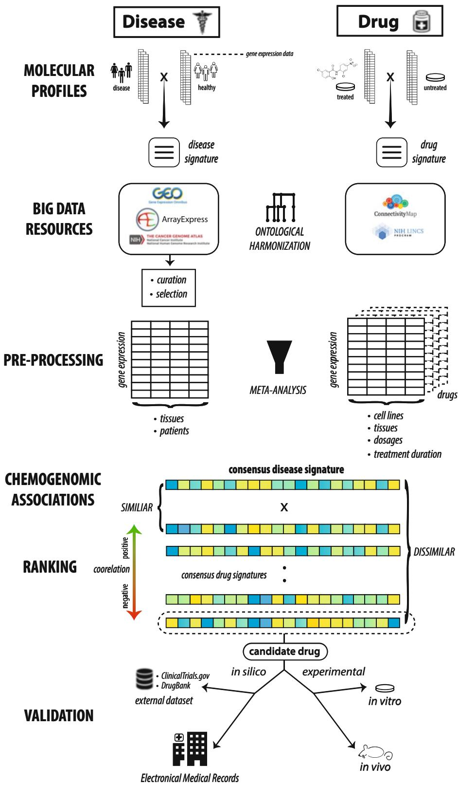  
Fig. 1 Full generic workflow for enabling drug discovery through big data resources. We start by illustrating the mechanism behind disease and drug gene expression signatures and highlighting a few public repositories

(e.g., SciPy [23] for Python) when needed. There exist numerous resources (e.g., edX; https://www.edx.org) that provide an introduction on using these programming languages for data science. For infrastructure, cloud computing (e.g., Amazon Web Services Cloud) enables managing large datasets and performing computationally intensive tasks without the need of building in-house clusters.

# 2.2 Ontologies and Reference Databases

The landscape of big data in biomedicine is expansive yet unsystematic: encompassing a tremendous amount of data points across a multitude of modalities. As such, there are clear hurdles in precise characterization and proper integration procedures. To address these challenges, researchers have created tools and ontologies to map and normalize these disparate data types in order to facilitate data harmonization and reproducible methodologies. This is especially important for the purposes of leveraging big data for drug discovery, as many different data types have to be seamlessly and reproducibly integrated along the entire drug discovery pipeline. A more comprehensive list of these various resources can be found in other related reviews [24].

The exponential growth of data entities with heterogeneous data types from multiple resources calls for developing ontologies to define entities and centralized reference databases. Metathesauruses, like the Unified Medical Language System (UMLS) [25], have been developed to organize, classify, standardize, and distribute key terminology in biomedical information systems and are invaluable for computational biology research. Essentially, each medical term (e.g., disease) has a Concept Unique Identifier (CUI) code that then can be referenced from other related ontologies. The Systematized Nomenclature of Medicine-Clinical Terms (SNOMED-CT; http://www.ihtsdo.org/snomed-ct/), for instance, is one of the largest healthcare-related ontologies and has over 300,000 medical concepts ranging from body structure to clinical findings. There are specific ontologies that aim to characterize the continually evolving representations of the phenotypic space. Many clinical datasets encode diseases using International

Fig. 1 (continued) where they can be found. Based on research focus, it is often recommended to harmonize these disparate sources of data through use of ontologies. Multiple signatures per disease or drug can be integrated through rigorous meta-analysis procedures. Chemogenomic association testing assesses similarity between drug and disease signatures and can be performed using procedures like the Kolmogorov-Smirnov (KS) test. These drug signatures can then be ranked according to their correlation, or anticorrelation, to the disease signature of interest. Drug signatures that are highly anticorrelated to the disease signature are potential treatment candidates. Drug candidates that are selected for follow-up need further validation, in the form of in silico (e.g., other external datasets or electronic medical records), in vitro, and/or in vivo experiments

Classification of Diseases (ICD) codes, for instance. The Disease Ontology (http://disease-ontology.org/) organizes and standardizes various aspects (e.g., synonyms, relationships, ICD codes) of disease-oriented clinical topics into representative terms. The Human Phenotype Ontology (http://human-phenotype-ontol ogy.github.io/) has a similar goal but expands to more broad aspects of human phenotypes, including abnormalities and side effects. There are many resources that organize information pertaining to various properties of genetic data, such as dbSNP (https://www.ncbi.nlm.nih.gov/projects/SNP/), dbVar (https://www.ncbi.nlm.nih.gov/dbvar), RegulomeDB (information regarding regulatory elements; http://www.regulomedb. org/), and UniProt (protein sequence and functional information; http://www.uniprot.org/). The 1000 Genomes Project (http:// www.internationalgenome.org/) is a collection of thousands of whole genomes from populations across the globe. The Exome Aggregation Consortium (ExAC) is an accumulation of wholeexome data for over 60,000 unrelated individuals from multiple contributing projects at the time of this publication. There are also resources that are specifically focused on compiling information related to the associations of genotypes and phenotypes. The Online Mendelian Inheritance in Man (OMIM; https://www. omim.org/) is an online compendium of genotype/phenotype information focusing on Mendelian disorders. As of June 15, 2017, this resource has information on over 6000 phenotypes for which the molecular basis is known and over 3700 genes with gene-causing mutations. Other related resources include the Human Gene Mutation Database (HGMD; http://www.hgmd.cf. ac.uk/) and ClinVar (https://www.ncbi.nlm.nih.gov/clinvar/). The Mouse Genome Informatics (MGI; http://www.informatics. jax.org/) is a collection of data pertaining to various experiments performed on mice, including disease models with phenotype and genotype information.

In the drug space, medication and prescription data are often unsystematically organized due to issues like conflicting nomenclature or spellings (i.e., brand name vs. generic name, American vs. British terminology). Additionally, the same medication may be prescribed with different dosages, minor formulation differences, and routes of administration. All the information is presented as free text in the medical records, requiring additional text mining effort to connect them to other modalities. RxNorm [26] was developed as an UMLS-based, standardized medication vocabulary that intersects with known clinical knowledge repositories like Micromedex (Micromedex Solutions, Truven Health Analytics, Inc. Ann Arbor, MI). Essentially, related complex drug name strings can be mapped to a common identifier. Linking medications to an RxNorm identifier facilities easy connection to other related resources that include other modalities of data, such

as Sider [27] and Offsides/Two sides [28], which document known and predicted drug-drug interactions and connect medications to known clinical side effects. Through public databases like DrugBank [29], one can cross-reference drug targets, pharmacological properties, and clinical indications. Using RepurposeDB (http://repurposedb.dudleylab.org/) [30], one can explore the known drug repurposing space and explore various factors (e.g., chemical properties) that might underlie these successes. The US National Institutes of Health clinical trial repository (https:// ClinicalTrials.gov) is a collection of clinical trial data from various diseases and treatments along with study outcomes and can open the door for accessing and reanalyzing clinical trial data [31], such as research into medication efficacy at various stages of clinical trials. PubChem (https://pubchem.ncbi.nlm.nih.gov/) is a reference database for information on the biological activities of small molecules, including compound structure and substance information.

# 2.3 Data Resources that Can Be Leveraged for Drug Discovery

A growing priority of increasing data accessibility through openaccess efforts has considerably boosted computational-based drug discovery capabilities. In fact, Greene et al. created the Research Parasite Award, which honors researchers who perform rigorous secondary analyses on existing, open-access data to make novel insights independent from the original investigators [32]. These data exist in many forms, including clinical (i.e., disease comorbidities), genomic (e.g., genetic, transcriptomic), and proteomics.

Drug discovery is multifaceted at its core, at the very least involving some combination of chemical data in addition to those mentioned above. This is even more relevant for computationalbased drug discovery, where complex intersections of many disparate data types are required. Fortunately, there are many public repositories that contain a plethora of data around these spheres, which can be connected utilizing the aforementioned ontologies and reference databases. We outline the various data sources in the current section and present two examples of successful drug discovery utilizations of these datasets in detail in Subheading 3.

# 2.3.1 Hospitals and Academic Health Centers

Due to regulatory requirements, almost all American medical centers and health systems store patient data collected during outpatient and hospital visits using software platforms such as those provided by EPIC (Epic Systems Corporation, Madison, WI) and Cerner (Cerner Corporation, Kansas City, MO). These electronic medical records (EMRs), or alternately electronic health records (EHRs), are composed of a number of data types such as disease diagnoses, medication prescriptions, lab test results, surgical procedures, and physician notes. Generally, data warehouse administration takes responsibility for housing and creating an anonymized or de-identified version of the EMR. Affiliated faculty and researchers then apply for access to this resource through their Institutional

Review Board (IRB). While the primary role of EMR is for institutional or administrative purposes, one important benefit of the digitization of health records is that they can be more easily adapted for powerful healthcare research purposes. For drug discovery, these data can be used for genotype-phenotype relationship discovery that could drive target selection or to analyze medication efficacy and side effects in a real-world context [33]. The implications and impact of precise electronic phenotyping procedures for these types of analyses will be discussed in Subheading 4.

There are many hospital systems and affiliated medical centers that have successfully used their in-house EMR systems for important scientific and clinical discoveries [34–38]. The Mount Sinai Hospital and the Icahn School of Medicine at Mount Sinai organize and protect their EMR data (beginning in 2003) within the Mount Sinai Data Warehouse, which is comprised of over 7.5 million patients and 2 billion points of data, including disease diagnoses and lab test results. The University of California, San Francisco (UCSF) is leading a massive effort to coordinate EMR data from five UC medical centers. The University of California Research eXchange (UC ReX; https://myresearch.ucsf.edu/uc-rex) provides a framework for UC-affiliated researchers to query de-identified clinical and demographic data, providing a natural cross-validation opportunity to compare findings across these sites.

Data analyses using EMRs can be enhanced with the inclusion of genetic data from biobanks or repositories of biological samples (e.g., blood) of recruited participants generally from a hospital setting. Many institutions have frameworks set up that facilitate this type of research, such as The Charles Bronfman Institute of Personalized Medicine Bio biobank within the Mount Sinai MeHospital system, BioVU from the Vanderbilt University Medical Center, and DiscovEHR, which is a collaboration between Regeneron Genetics Center and the Geisinger Health System. Coupling clinical and genetic data has led to important findings in the area of drug and target discovery. Using the DiscovEHR resource, for instance, researchers recently characterized the distribution and clinical impact of rare, functional variants (i.e., deleterious) in whole-exome sequences for over 50,000 individuals [39]. The associations they identified add insight to the current understanding of therapeutic targets and clinically actionable genes.

A limitation of these biobanks and EMR systems is that they are often restricted to researchers affiliated with the associated institution. There are a number of initiatives and resources that allow researchers to apply for access of these types of data. For instance, the Centers for Medicare & Medicaid Services offer relevant healthcare-related data dumps (https://data.medicare.gov/) for sites that accept Medicare including hospitals, nursing home, and hospices with information on various factors and outcomes (e.g.,

infection rates). The DREAM challenges (http://www. dreamchallenges.org), for instance, consist of various “open science” prediction challenges, some of which are disease-centric that incorporate real clinical datasets often coupled with other modalities of data (e.g., genetics). In the Alzheimer’s Disease Big Data DREAM Challenge #1 (Synapse ID: syn2290704; June–- October 2014), challengers were tasked with developing the best performing machine learning model to predict disease progression, using actual genetic data (e.g., genotypes) and clinical data (e.g., cognitive assessments) from patients with mild cognitive impairment, early Alzheimer’s disease, and elderly controls. The UK Biobank (http://www.ukbiobank.ac.uk/) is an unprecedented health resource of over 500,000 recruited participants aged 40–69 with genetic (genotyping) and a wide variety of clinical data, including longitudinal follow-ups (original data collected from 2006 to 2010). These data include online questionnaires (e.g., about diet, cognitive function), EMR, blood biochemistry (e.g., hormone levels), and urinalysis, among others. Further, more specialized data is available for a subset of patients, including a 24-h activity monitoring for a week $\mathit { n } = 1 0 0 , 0 0 0 \rangle$ and image scans (e.g., brain, heart, abdomen; $n = 1 0 0 { , } 0 0 0$ ).

nWhat distinguishes the UK Biobank from other large-scale initiatives is that it is a “fair access” biobank [40], one that has infrastructure to facilitate collection, storage, protection, and distribution (with data update releases) to allow academic and industrial researchers to apply for access. As of July 2016, there have been around 100 publications featuring or involving data from the UK Biobank (http://www.ukbiobank.ac.uk/published-papers/; latest update), although this number is rapidly increasing. While these studies include major findings in the realm of genetics and phenotypes (e.g., diseases and health outcomes), very few are directed at drug discovery. Wain et al. have demonstrated the value of these data for the identification of potential drug targets, specifically for lung function and chronic obstructive pulmonary disease (COPD) [41]. The authors leveraged the large cohort size to select ~50,000 individuals at the extreme ends of lung function (e.g., forced expired volume in 1 s) for their analyses. From a GWAS, they identified 97 signals (43 reported as novel) and created a polygenic risk score from around six alleles that confers a 3.7-fold change in COPD risk between high- and low-risk scored individuals. The authors then analyzed these signals in the context of variant function (i.e., deleteriousness) that cause expression changes in other genes (eQTLs), resulting in 234 genes with potentially causal effects on lung function. Seven out of these 234 genes are already targets of approved or drugs currently in development. The remaining genes, along with others they identified by expanding

2.3.2 Genomic Experimental Data Repositories

their network via protein-protein interactions, represent potential novel targets for drug development.

Each and every research study is crucial for furthering scientific knowledge, but sharing of the experimental data collected can additionally benefit other researchers in the field directly. The pooling of several sources of data can allow for meta-analyses and other types of research not possible in isolation, thereby facilitating further discoveries. There have been outstanding efforts to provide a framework for researchers to deposit and share data, with many high-impact journals even requiring it for publication. There are other reviews that go into detail about these resources, but we will describe a few here.

The Gene Expression Omnibus (GEO) is a public repository from NCBI that allows researchers to upload high-quality functional genomics data (e.g., microarray) that meet their guidelines [42]. GEO organizes, stores, and freely distributes these data to the research community. As of 2017, GEO already surpasses over two million samples. ArrayExpress (http://www.ebi.ac.uk/ arrayexpress/) [43] is an archive of functional genomics data (some overlap with GEO) comprised of over 70,000 experiments, 2.2 million assays, and 45 terabytes of data as of July 2017. The Immunology Database and Analysis Portal (ImmPort; www. immport.org) is a related resource focused on data from immunology studies of various types, focuses, and species that provides a framework to share and use genomic data of clinical samples.

The Cancer Genome Atlas (TCGA; https://cancergenome. nih.gov/) from the NIH is a comprehensive resource that collects data relating to the genomic aspects in over 33 types of cancer. TCGA harmonizes clinical, sequencing, transcriptomic, and other data types from various studies in a user-friendly Genomic Data Commons Data Portal (https://portal.gdc.cancer.gov/). As of Data Release 6.0 (May 9, 2017), TCGA encompasses around 250,000 files from almost 15,000 patients with cancer in 29 primary sites (e.g., kidney). As the volume of the data from TCGA is both immense and complex, Firehose GDAC (https://gdac.bro adinstitute.org/) was developed to systematize analyses and pipelines using TCGA in order to facilitate smooth research efforts. The Cancer Cell Line Encyclopedia (CCLE; http://portals.bro adinstitute.org/ccle/) is a public compendium of over 1000 cell lines that aims to characterize the genetic and pharmacologic aspects of human cancer models. The Genome-Tissue Expression (GTEx; https://gtexportal.org/home/) portal is a collection of genetic and gene expression data from the Broad Institute, with data for 544 healthy individuals in 53 tissues as of the V6p release. Using this resource, researchers have been able to delineate cis and trans expression quantitative trait loci (eQTL), a unique capability from having access to both genotype and gene expression data.

# 2.3.3 Chemogenomic Data Resources

The last crucial component to computational-based drug discovery is a resource that relates effects of chemical exposure on biological systems. The Connectivity Map (CMap; https://portals.bro adinstitute.org/cmap/) is a landmark repository that seeks to provide a systematic representation of the transcriptomic effects of cell lines being treated with various drugs. The current version (build 02) of CMap contains over 7000 drug-induced gene expression profiles for 1309 compounds across five cell lines.

A spiritual successor of CMap, the Library of Integrated Cellular Signatures (LINCS; http://www.lincsproject.org/) project is a large-scale collaboration from 12 institutions. As of the writing of this chapter, LINCS encompasses 350 datasets using 14 different methods (e.g., KINOMEscan) across six subject areas (e.g., binding, proteomics) and 11 biological processes (e.g., gene expression, cell proliferation). A large component of LINCS is L1000 Connectivity Map – a collection of assays that measure transcriptomic profiles for a variety of pharmacological and genetic (knockdown and overexpression) perturbations across different cell lines. L1000 contains data for roughly 20,000 compounds across over 50 different cell lines – a substantial increase from CMap. One large difference between these two resources, however, is that the L1000 assay directly measures only 978 “landmark” genes and uses imputation methods to gain information for others. Researchers can obtain these datasets through a convenient data portal (http://lincsportal. ccs.miami.edu/dcic-portal/). As referenced above, there are countless successful research applications using these resources in the fields of target discovery, drug discovery, and drug repurposing along with many others.

# 2.4 Visualization Tools and Software

Effective data visualization is pertinent for network-based target (e.g., key driver) discovery or data exploration in drug discovery. The programming languages mentioned before can produce highquality figures of results. While the base graphical output style is often adequate, there are a number of packages that can be used to create superior and publication-ready graphics, including ggplot2[44] for R,  [45],  (http://pyx.sourceforge.net/), matplotlib PyXand  (http://seaborn.pydata.org/) for Python. seaborn D3(https://d3js.org/), a JavaScript library, can also create impressive static and interactive figures for feature on web sites. While these languages can generate network figures, such as  (http:// NetworkXnetworkx.github.io/) for Python, specialized software such as Cytoscape [46], Gephi [47], and igraph (http:// http://igraph. org/) or online tools such as Plot.ly (http://plot.ly/) may be preferred for this use case.

# 3 Methods

In the current section, we will describe a general workflow that leverages public data for drug discovery using, exemplified in two of our recent studies. We provide the general step-by-step framework for performing such experiments in Fig. 2. While both studies are methodologically similar, they have disparate focuses, illustrating the wide variety of possibilities of this framework. In the first study, Li and Greene et al. sought to identify novel therapeutic options for chronic allograft damage, specifically to limit the progression of interstitial fibrosis and tubular atrophy (IF/TA) [48]. In the next study, Chen and Wei et al. discovered a novel, potentially

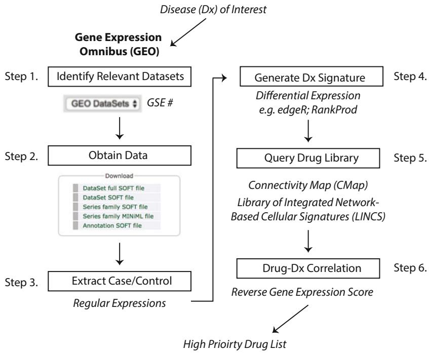  
Fig. 2 Step-by-step process for performing in silico drug discovery starting from a disease of interest. Researchers can go to the GEO online portal and search for their disease of interest, which will result in experiments and microarray datasets that other scientists have generated and uploaded. Having identified all datasets of interest, the data can be downloaded individually or via a tool, such as GEOquery [80] for R. Case and control data will have to be identified either manually or through regular expressions from the name strings. Next, disease signatures can be derived through various tools that perform differential expression analysis, such as edgeR [81] for RNA-Seq and RankProd and SAM for microarray data [82]. Drug libraries, such as CMap and LINCS, provide RNA expression data for a large number of compounds across different cell lines. Next, a correlation analysis can be performed comparing the disease signature and all drug signatures producing a reversal score for each drug. Significant scores can be ranked from the top most correlated signatures to the most anticorrelated signatures. These hits can then be used to select a candidate drug based on study goals, such as prioritizing candidates that would reverse disease signature (i.e., top anticorrelated hits)

# 3.1 Disease Signatures

therapeutic drug to treat hepatocellular carcinoma (HCC) revealing reduced growth of cancer cells in both in vitro and in vivo models [49].

A disease signature is the unique molecular state (i.e., RNA expression profile) of a phenotype (e.g., type 2 diabetes) that is altered from “wild-type” or healthy. Typically, these signatures can be characterized by multimodal biological data, including gene expression in tissues and protein composition in the microbiome. In the Li and Greene et al. study, they obtained kidney transplant microarray datasets from GEO in addition to an in-house dataset. They first restricted the possible datasets to those in humans with biopsy or peripheral blood samples, leaving five that were eligible. As is typical in these types of analyses, the phenotypic descriptors from the datasets did not directly coincide. As such, for each study, they selected data from specific biopsies that met their criteria for suitable comparison (i.e., “moderate” and “severe” IF/TA from one study, IF/TA “II” and “III” from another, etc.) including both case and control conditions. To rectify any possible conflicting probe annotations due to platform or versioning, they re-annotated all probes to the latest gene identifiers using AILUN [50]. In addition to ensuring consistent annotations, it is also important to account for potential discrepancies in expression measurements across studies and platforms. Accordingly, they standardized each dataset using quantile-quantile normalization to allow for more precise integration. The integrated dataset comprised 275 samples in two tissues from three different microarray platforms.

With the datasets normalized and integrated, a meta-analysis can be performed to create a consensus disease signature across multiple studies. There are many differing methodologies to perform meta-analysis on microarray data that we discuss in Subheading 4. Li and Greene et al. performed two meta-analysis techniques and included genes that had robust expression profiles significant in both, thus maximizing the methodological strengths of each. The first method involved evaluating the differential expression effect size for each. Specifically, these effect sizes were combined using a fixed-effect inverse-variance model by which the effect size from each study is weighted by the inverse of the intra-study variance resulting in a meta-effect size. From this approach, they identified 996 FDR-corrected significant genes measured in at least four studies and were concordantly expressed in the same direction $\mathrm { ( F D R < 0 . 0 5 ) }$ ).

For the second method, they then utilized results from the significance analysis of microarrays (SAM) [51] of each study, classifying significant differentially expressed genes between IF/TA and non-IF/TA groups using $q < 0 . 1$ threshold. For the metaqanalysis, they performed a Fisher’s exact test comparing the number of studies in which each gene was significantly differentially

expressed by the hypergeometric distribution $\textstyle p < 0 . 0 5 )$ . From this pmethod, they identified 510 genes that were significant in at least three of the studies. With the two results from the meta-analyses in hand, they restricted their disease signature to genes that were significantly differentially expressed using both methods, resulting in 85 genes used for drug signature comparison.

Chen and Wei et al. also leveraged public, external datasets to generate a signature for the disease of interest: HCC. The authors constructed a multitiered pipeline that utilized various open-source databases to build a high-confidence HCC disease signature that was evaluated at multiple stages. To build the HCC disease signature, they first obtained RNA sequence profiles for 200 HCC and 50 adjacent non-tumor samples from GDAC and their corresponding clinical labels from TCGA. For subsequent evaluation of this disease signature, they downloaded data from GEO by querying “hepatocellular carcinoma,” resulting in seven potential independent datasets that had at least three samples in both disease and control (i.e., non-tumor liver sample) groups. Like the other study, they converted all probes to the most recent build and collapsed them to the gene level by mean value and then performed quantile normalization. As mentioned above, datasets from public resources may not coincide with the current research question or focus. Like before, different methodologies have to be employed to make best use of the exploitable aspects of interest ( Subheading see4). For the current study, in order to ensure that gene expression data from these HCC samples were of high quality, robust enough, and related to the cell lines that were later used for experimental validation, they performed an initial assessment of the similarity of each expression profile to cancer cell lines that are already characterized in detail. For the background set, they downloaded gene expression data for 1019 cancer cell lines, including 25 that were HCC-specific, from CCLE, and represented each by their expression profiles of 5000 genes that varied the most across all samples. For the similarity assessment, they performed a ranked-based Spearman correlation of the CCLE set to both the TCGA and GEO samples of interest. They then performed a Mann-Whitney test to differentiate the correlation outcomes of the samples of interest to the HCC-specific cell lines against the non-specific ones. The resulting $\boldsymbol { p }$ value outcomes of the sets of interest were pcompared to outcomes of 1000 random tissue samples (assessed via the same method) obtained from the Expression Project for Oncology (expO; GSE2109). From the original datasets of interest, samples were removed from consideration if their association was lower than $9 5 \%$ of the random samples based on the null distribution $\rho < 0 . 0 5 )$ . From this thorough assessment, eight tumor psamples from TCGA and one dataset from GEO were removed from consideration. After restricting to high-quality TCGA datasets $\textstyle n = 1 9 2$ tumor and 50 non-tumor samples), the authors built

the initial HCC disease signature model using DESeq (version 1) [52] to perform differential expression analysis across various log-two fold change (FC) and significance thresholds.

To fine-tune and identify the best disease signatures, the authors evaluated them on the 1736 patient samples from the six curated datasets from GEO. For each study, they removed non-HCC genes from the gene expression data and then performed principal component analysis to build classifiers, with the first principal component representing the variation between tumor and non-tumor samples. They found that $\mathrm { F C } > 2 . 0$ and $ { p } < 1  { \mathrm { E } } { - } 2 0 $ pthresholds led to the best separation of tumor and non-tumor samples (median $\mathrm { A U C } = 0 . 9 9 5$ ) across all studies. Based on this best threshold, the integrated HCC signature consisted of 163 upand 111 downregulated genes. In order to use the LINCS L1000, a drug gene expression database with 978 genes profiled, they also created another reduced disease signature.

# 3.2 Drug Signatures

Drug signatures are similar in nature to disease signatures in that they represent the global perturbation of gene expression compared to vehicle control. In the case of drug signatures, the perturbation is treatment exposure instead of disease state. As mentioned in Subheading 2, there are many databases that contain gene expression data for a variety of drugs across many different cell lines, tissues and organisms. In the Li and Greene et al. study, they collected all drug-induced transcriptional profiles for all drugs in CMap $\mathbf { \nabla } \mathcal { n } = 1 3 0 9 \mathbf { \nabla }$ ) across all experiments $\mathit { n } = 6 1 0 0$ ). n nThey then created a consensus, representative profile for each drug, merging data from the associated studies using the prototype ranked list (PRL) method [53]. The PRL method works through a hierarchical majority-voting scheme for all ranked gene expression lists within a single compound where consistently over- or downregulated genes are weighted toward the top of affiliated extremes. The various merging methodologies and their considerations will be discussed in the Notes.

Chen and Wei et al. utilized both CMap and LINCS data to generate drug signatures. For each drug of all CMap, they performed an initial quality control step keeping only instances (i.e., cell line experiment data) where its profile correlated $\begin{array} { r } { p < 0 . 0 5 ) } \end{array}$ b pwith at least one other profile (of the same drug), leaving 1329 high-quality instances. They gathered a high-quality list of data from LINCS by only including landmark genes $\mathbf { \lambda } _ { n } = 9 7 8$ ), restrictning instances to HepG2 and Huh7 cell lines, and removing poor quality perturbations, resulting in 2816 profiles. As the authors were interested in repurposing an already approved compound, they intersected drugs from both data sources to DrugBank, leaving 380 instances of 249 drugs. Out of these 249 drugs, 83 were common between the two sources.

# 3.3 Integrating Disease and Drug Signatures: In Silico Methodologies for Therapeutic Predictions

The general methodology used to correlate drug-induced and disease-state gene expression profiles is well established and has been used successfully in a wide variety of studies. How well, and in what direction, drug and biological profiles correlate can direct drug discovery and repurposing efforts. The disease-state profile represents gene expression patterns that diverge from the norm. Accordingly, identifying a compound with an opposing (i.e., anticorrelated) profile can push biological expression patterns back to an unperturbed state. Typically, the signature matching is performed using a KS test [54]. As this type of analysis can produce many candidate predictions, we recommend additional refinement and filtration steps to prioritize drugs or targets with the highest confidence of success to move forward with testing.

In the Li and Greene et al. study, they compared the correlation for 1309 consensus compound signatures from CMap to their IF/TA disease signature using a modified KS test. The significance of these scores was calculated by comparing specific KS scores to those from a random permutation of 1000 drug signatures, producing a ranked list of potential treatments that were significantly anticorrelated to the disease signature ( $p \leq 0 . 0 5 )$ ). To further refine pthis list of candidates, they performed a literature review of the top hits and excluded drugs from their list of possibilities that would impede IF/TA improvement due to their side effect profile (i.e., those with negative neurological side effects). From this step, they decided to further pursue kaempferol and esculetin as candidate therapeutic drugs to treat renal fibrosis. To add further evidence to their findings, the authors performed a separate, additional in silico experiment to try to characterize potential immune-related effects of these two compounds through evaluating specific immune cell they may potentially influence during anti-fibrosis activity. As such, they first matched the 1309 drug expression profiles to 221 immune cell state profiles procured from immune-cell pharmacology map [55] to look for enrichments in specific immune cell subsets. This analysis predicted that esculetin and kaempferol would inhibit both active and innate immune cells (e.g., CD4 T cells) in IF/TA.

In the Chen and Wei et al. study, they were unable to use their best performing HCC signature profile of 274 genes as only 30 genes mapped to the landmark LINCS set. Accordingly, they relaxed the threshold $\mathit { p } < 0 . 0 0 1$ and $\mathrm { F C } > 2 . 0$ ) to increase the ppower of the signature for this comparison task, producing a signature of 44 genes. The original signature was correlated to 1174 distinct drugs in CMap and the reduced signature was correlated to 249 distinct drugs in LINCS. Similar to the previous study, the authors utilized a nonparametric, rank-based pattern methodology based on the KS statistic to identify compounds curated from both CMap and LINCS that are anticorrelated with the HCC signature. They also assessed significance of these predictions through random permutations and multiple testing correction (FDR $< 0 . 0 5$ ):

there were 302 drugs from CMap and 39 drugs from LINCS that were anticorrelated at this threshold, with 16 overlapping. Out of this high-confidence intersected set, the top hit from ranking across both libraries was niclosamide. This drug had previously established antitumor properties in other cancers, but had not been assessed in HCC animal models. Therefore, it was selected as a candidate drug to undergo subsequent validation experiments.

Like the previous study, Chen and Wei et al. developed an innovative, additional in silico approach to evaluate the global performance of the predictions from their pipeline. They hypothesized that their top predictions (i.e., anticorrelated drugs) should be enriched for gold standard, or established, treatments of HCC. Accordingly, they extracted data from clinicaltrials.gov querying the terms “hepatocellular carcinoma” and “liver cancer” and filtering from the results trials that studied tumors and cancer in general. From this list of 960 trials, they extracted 76 drugs from the “interventions” column that appeared in more than one trial as their list of gold standard HCC drugs. When mapped to the chemogenomic databases, there were 7 found in CMap and 16 in LINCS. Using ssGSEA from GSVA [56] with permutation testing $\varkappa = 1 0 , 0 0 0$ ), a gene set enrichment package, they found that these ngold standard drugs were more likely to reverse the HCC gene signature in both CMap $p = 0 . 0 1 2 ,$ ) and LINCS $p = 0 . 0 1 8$ ), p pincreasing the confidence of testing other hits in the lab.

# 3.4 Experimental Validation of Predictions

While the prediction methodology outlined above is powerful in its own right, it is often necessary to validate these findings in an experimental setting. Convincing validation of these predictions can be achieved in a multitude of ways in both in vitro and in vivo models. The considerations and criteria for this decision are discussed in Subheading 4. To investigate the utility of kaempferol and esculetin for fibrosis, Li and Greene et al. utilized human kidney 2 (KH2) in vitro cell line to determine perturbations in cellular pathways following drug exposure, specifically targeting biological aspects from their in silico-based hypotheses As such, they showed kaempferol significantly reduced TGF- $\mu { 1 }$ .-mediated expression of 1 ( $p = 0 . 0 1 4$ for $1 5 ~ { \mu \mathrm { m } }$ exposure) and reversed SNAI pdownregulation ( $\begin{array} { r } { p = 0 . 0 4 5 , } \end{array}$ CDH1. They also found that esculetin treatpment inhibits Wnt/ $\beta$ -catenin signaling in renal tubular cells: esculetin-treated cells caused a significant decrease in protein levels after Wnt agonist stimulation ( $p \ = \ 0 . 0 0 5 4$ ND1 for $6 0 ~ { \mu \mathrm { m } }$ exposure).

In addition to the encouraging in vitro results, they performed an additional experiment to assess the effects of kaempferol and esculetin on renal interstitial fibrosis in vivo. Specifically, they used a unilateral ureteric obstruction (UUO) mouse model to study gene expression, histological, immunohistochemistry (IHC) effects of treatment on renal fibrogenesis. Mice ( mice from Jackson

Laboratory) were administered kaempferol $\mathit { \Delta } n \ = \ 5$ ), esculetin $( n = 5$ ), or saline $( n = 6 )$ n) from 2 days prior to UUO surgery n nprocedure until sample collection 7 days post-UUO. They found encouraging results supporting a beneficial role of these drugs in treating renal fibrosis: mice treated with both drugs had significantly lower amount of interstitial collagens and renal fibrosis in UUO kidneys by picrosirius red staining compared to controls ( $\begin{array} { r } { p = 0 . 0 0 0 9 } \end{array}$ for kaempferol; $\begin{array} { r } { p = 0 . 0 0 1 1 } \end{array}$ for kaempferol). Their p ptargeted analyses also allowed to assess their hypotheses of the mechanisms by which these drugs are effective in this system: for instance, kaempferol caused a significant reduction in the gene expression of  ( $\begin{array} { r } { p = 0 . 0 3 8 \mathrm { , } } \end{array}$ ), a key transcription factor in the TGF- $\beta$ Snai1 psignaling pathway to confirm their in vitro analysis.

Like the first study, Chen and Wei et al. performed a series of both in vitro and in vivo experiments to systematically evaluate their prediction of niclosamide as a HCC drug candidate. Due to poor water solubility of niclosamide which could hamper its effectiveness, they also performed these experiments using niclosamide ethanolamine salt (NEN), which is known to have better systemic bioavailability and could have a better chance of reaching the tumor site. As an initial evaluation, the authors performed a cell viability assay of these two drugs on HCC cells to calculate inhibitory concentrations. They found that niclosamide and NEN both reduced HCC cell viability, being over sevenfold more cytotoxic to HCC cells than primary hepatocytes. With these findings, the authors felt confident to assess the antitumor effects of niclosamide and NEN in a mouse primary HCC model. Mice with induced HCC were treated with food containing niclosamide or NEN (cases) or with autoclaved food (control). At 12 weeks, the livers were extracted and analyzed histologically. The authors found that niclosamide and NEN both reduced the number of tumor nodules compared to controls, but the effect of NEN was much more pronounced. Furthermore, the NEN-treated mice had lower overall liver weights compared to both control and niclosamide groups $\mathit { p } \textless 0 . 0 0 1$ for both), but there was no significant difference pbetween niclosamide and control groups. This provided early evidence that NEN might be the superior treatment candidate.

Moving closer in relevance for human treatment, they evaluated the effect of these drugs on mice bearing orthotopic patientderived xenografts (PDX) derived from HCC tissue of resected livers from three patients with the disease. After implantation, these mice were separated into groups like before, being fed either regular food or food with NEN or niclosamide. Like in the results for the previous experiment, the NEN group had the most pronounced effects in inhibiting PDX growth based on both bioluminescence and tumor volume $\mathit { p } < 0 . 0 5$ for both) and did not psignificantly lower body weight. Niclosamide treatment, however, did not significantly reduce tumor growth. At the end of this

experiment, they found that levels of niclosamide were over $1 5 \times$ greater in xenografts in the NEN group compared to the niclosamide group providing further evidence for the limited bioavailability of the latter.

As an adjunct to this experiment, the authors assessed how niclosamide and NEN compared to sorafenib, one standard of care for HCC, in this PDX model. In the PDX model, the combination of NEN and sorafenib resulted in decreased tumor volume compared to control group $\begin{array} { r } { p = 0 . 0 1 3 } \end{array}$ ), NEN only ( $\begin{array} { r } { p = 0 . 0 3 0 \mathrm { \Omega } } \end{array}$ ), and sorafenib only $ { p } = 0 . 0 2 4 )$ . Treatment with niclosamide and sorafenib, however, did not result in reduced tumor volumes compared to the other groups. These experiments further verified that NEN was the preferred candidate over niclosamide for HCC treatment.

Relating to the original computation-based predictions, the authors experimentally assessed the capacity for these drugs to reverse the HCC gene signature they defined. As a first step, they treated HepG2 cells for $^ { 6 \mathrm { h } }$ with $1 0 \mu \mathrm { m }$ niclosamide, $1 0 ~ { \mu \mathrm { m } }$ NEN, or $1 0 ~ { \mu \mathrm { m } }$ dimethyl sulfoxide (control). As hypothesized, they found that both niclosamide $\cdot p = 1 . 1 \times 1 0 ^ { - 7 }$ ; Spearman correlation of 0.32) and NEN $ { p = 9 . 8 \times 1 0 ^ { - 6 } }$ ; Spearman correlation of p0.26) significantly reduced the 274 HCC gene expression profile. Furthermore, they observed similar gene expression changes for both drugs compared to control $\stackrel { \cdot } { p } < 2 . 2 \stackrel { \cdot } { \mathrm { ~ \times ~ } } 1 0 ^ { - 1 6 }$ ; Spearman pcorrelation of 0.87). As a complement to the in vitro assessment of gene expression changes, the authors additionally assessed effects on gene expression within the PDX model. They found that the differential gene expression profile between NEN-treated animals and controls was significantly anticorrelated with the HCC profile $\mathit { \Omega } ^ { \prime } p < 3 . 9 \times 1 0 ^ { - 6 }$ ; Spearman correlation of 0.25). Out of all the pgenes in the HCC profile, the authors observed that the anticorrelation signal was mostly driven by 20 upregulated and 29 suppressed genes from both the in vitro and in vivo experiments (FDR $< 0 . 2 5$ ).

As a final piece to the puzzle, the authors sought to characterize by which biological mechanism NEN attenuates HCC. They focused their attention to chaperone proteins heat shock protein 90 (HSP90) and cell division cycle 37 (CDC37) that regulate kinases inhibited by NEN. They first confirmed that NEN inhibited the HSP90/CDC37 interaction and then assessed to which protein NEN binds. They found that NEN binds to CDC37 and also enhanced its thermal stability. To support this finding, they observed that CDC37 was overexpressed in $8 0 \%$ of HCC tissues compared to normal livers. To assess whether CDC37 is, in fact, mediating the effects of NEN in treating HCC, they performed a final experiment in which RNA interference was used to knockdown CDC37 in HCC cells treated with NEN. As hypothesized, they found that HCC cells lacking CDC37 expression were less

sensitive to NEN, supporting the notion that the antiproliferative effects of NEN in HCC are partly dependent on CDC37. With these exhaustive in vitro and in vivo experiments, the authors successfully provided a molecular context of how their computationally predicted treatment for HCC worked at multiple biological levels.

# 4 Notes

In this chapter, we have briefly detailed the vast amount of public resources that can enable computational-based drug discovery. The methods used by Li and Greene et al. and Chen and Wei et al. can hopefully serve as a guide on how to leverage big data for drug discovery from prediction to validation. It is important, however, to note the limitations and caveats of various aspects of these pipelines and the special considerations that should be accounted for.

# 4.1 Computational Considerations

As software is continually updated and new versions of tools and packages released, there is a large issue with reproducibility in research, often due to incompatibility of computing environments [57]. This often leads to inconsistent results, even when using the same computational protocols. Beaulieu-Jones and Greene have recently proposed a system that, if adopted, could avoid these potential incompatibility issues [58]. They outline a pipeline that combines Docker, a container technology that is distinct from the native operating system environment, with software that continually reruns the pipeline whenever new updates are released for the data or underlying packages. We generally recommend using opensource programming frameworks and distributable notebooks, such as Jupyter Notebook (http://jupyter.org/) and RMarkDown (http://rmarkdown.rstudio.com/), and following the emerging best practices for reproducible research whenever possible in order to most easily facilitate data sharing and research reproduction. With this said, the most important step toward enabling reproducible research is a willingness to share the data and code in a public repository. GitHub (http://github.com/) and Bitbucket (http://bitbucket.org/) are two common code repos, and it is often encouraged to deposit large datasets in repositories like Synapse (http://www.synapse.org/).

Another issue plaguing biomedical research is the everchanging nature of genome builds and identifiers, which can affect delineation of reference alleles, genomic coordinates, and probe annotations, among many others. As an early salutation to this phenomenon, Chen et al. built AILUN, a fully automated online tool that will re-annotate all microarray datasets to the latest annotations, allowing for compatible analyses across differing versions [50].

# 4.2 Robustness of Disease Signatures

The concept of a disease signature is continually evolving through the development of better methods to quantify health, the refinement of understanding roles of disease pathophysiology, and increase in both the availability and types of biological data collected. The extensive public repositories described above contain a wealth of data pertaining to a variety of diseases across many disease models, tissues, and conditions (i.e., exposures). To fully leverage these data and increase power, it is possible to collect and integrate multiple related datasets, but will require vigilant and methodological quality control for effective and accurate integration in both the phenotypic and genomic space. There are, however, potential critical issues to consider when performing a meta-analysis experiment of gene expression disease signatures, particularly in microarray experiments [59]. In addition to issues arising from experiments having mismatching platforms (described above), the disease characterization that is the basis of each experiment may differ, such as having different inclusion criteria or disease definitions. Population-level differences in racial, demographic, or environmental backgrounds of these studies can have a large effect on gene expression levels that are unrelated to disease and could lead to spurious associations if not properly controlled for [60]. One solution to deal with these and other potential unmodeled factors would be to utilize surrogate variable analysis to overcome gene expression heterogeneity within these studies [61].

One study assessed the robustness of disease signatures for over 8000 microarrays across over 400 experiments in GEO for a broad range of diseases and tissue types [62]. Fortunately, they concluded that the gene expression signatures within diseases are more concordant than tissue expression across diseases, lending further credibility to utilizing such data for meta-analysis studies. While this finding is encouraging, it may not always be true for new datasets or alternative public repositories. Another consideration is the type of statistical analysis performed to complete the meta-analysis. We have illustrated a few in experiments described within Subheading 3, but there are many other options. In fact, researchers have systematically compared eight different meta-analysis methods for combining multiple microarray experiments [63]. They found that these different approaches resulted in substantially different error rates in classifying the disease of interest when using the same datasets. As such, one must be conscientious of studies to be included and the method used in meta-analysis experiments.

# 4.3 Drug Profile Variation

Many related studies, including the highlighted one by Li and Greene et al., performed a meta-analysis to integrate multiple drug profiles into a consensus signature. Not surprisingly, there are caveats of this process pertaining to varying biological contexts that can affect its validity and utility [64]. Researchers integrated gene expression data for 11,000 drugs from LINCS with their

chemical structure and bioactivity data from PubChem to assess correlation between structure and expression [65]. Specifically, they systematically evaluated the effect of various biological conditions, namely, cell line, dose, and treatment duration, on this relationship. They found that compounds that are more structurally similar tend to have similar transcriptomic profiles as well, but it is dependent on cell line. For instance, PC3 and VCAP, both prostate-related cancer cell lines, generally have significantly different patterns of similarity between structure and gene expression. Separately, they also found an interesting relationship between structure and gene expression in the context of dose: drugs with high structure similarity have stronger gene expression concordance at higher than lower doses. Another research group merged profiles of 1302 drugs from CMap across doses and cell lines to create a drug network with the goal of using it to predict drug effect and mechanism of action [53]. They noted that creating a consensus signature for a drug that has inconsistent effects on different cell lines could dilute its unique biological effects. That being said, they found even across heterogeneous cell types, a consensus drug signature could still be well classified in their drug network given a sufficiently large collection of data. In any case, further understanding and characterization of relationship between compound and biological context will undoubtedly improve accuracy of computational predictions and thereby bolster rates of successful translation into the clinic.

# 4.4 Selection of Validation Model

With a candidate drug selected for a disease of interest, it is imperative to perform a series of coordinated experiments (e.g., PK/PD/ toxicity studies), in addition to legal considerations (e.g., IP protection) to gauge its eligibility. Further, these decisions may be particularly critical due to time and financial limitations, where setbacks, mistakes, or poor choices could halt future progress. Drug candidates often fail to successfully translate into the clinic due to two main reasons: improper safety and efficacy assessments, both possibly a direct result of poor early target validation and unreliable preclinical models [66].

In terms of preclinical testing, the large number of avenues and models can be overwhelming, especially in light of variable reliability. While the accessibility to massive quantities of biological big data has been transformative in the field of drug discovery, not all experiments are of equal utility. In studying HCC, for example, researchers recently found that half of public HCC cell lines do not resemble actual HCC tumors in terms of gene expression patterns [67]. Interestingly, another group found that rarely used ovarian cancer cell lines actually have higher genetic similarity to ovarian tumors than more commonly used ones [68]. Due to phenomena like these, we recommend performing rigorous examinations like those above and leveraging knowledge from existing evaluations of

# 4.5 Drug Discovery Using EMR Data

these data when possible before usage. The nuances of subsequent steps of the validation process are beyond the scope of this chapter, but there are countless resources that delve into specifics regarding proper procedures for each stage [69–72].

EMR systems contain a great deal of disease- and phenotyperelated information that can be leveraged for drug discovery as “real-world data.” The multifaceted data that are collected in EMR facilitate flexibility in devising research questions that may be beyond the scope or focus of the original experiment. As such, unanticipated connections may be formed to biological aspects that would not be collected in traditional prospective study designs. Additionally, the large sample sizes and natural collection of longitudinal, follow-up information relating to patient outcomes from treatment are invaluable advantages over traditional randomized clinical trials [73].

As mentioned, EMR frameworks are primarily designed for infrastructural support and to facilitate billing. Like other research datasets, the raw data is often messy, incomplete, and subject to biases. Therefore, certain aspects may not be as reliable as unbiased collection measures. Despite better refined structuring, ICD codebased disease classification overall is often insufficient to accurately capture disease status [74]. In this notable example, clinicians manually reviewed the charts of 325 patients that had been recorded with the ICD-9 code for chronic kidney disease stage 3 (585.3). They found that $4 7 \%$ of these patients did not have any clinical indicators for the disease. Including other types of data, like medications, in phenotyping criteria often leads to better accuracy. For instance, researchers found that electronic phenotyping algorithms that require at least two ICD-9 diagnoses, prescription of antirheumatic medication, and participation of a rheumatologist resulted in the highest positive predictive value to identify rheumatoid arthritis [75]. In fact, a recent study analyzed ten common diseases (e.g., Parkinson’s disease) in an EMR system and compared the accuracy of classification through ICD codes, medications (i.e., those primarily prescribed for disease treatment), or clinician notes (i.e., if the disease was mentioned in the visit report) [76]. The “true” disease classification was determined by a physician’s manual chart review. It is clear that certain diseases are more often and better classified by certain modalities, such as clinician notes for Atrial Fibrillation or ICD codes for Parkinson’s disease, but combinations of all three lead generally to highest predictive power and lower rates of error. Fortunately, notable efforts by groups such as the electronic medical records and genomics (eMERGE) consortium (https://emerge.mc.vanderbilt.edu/) have led to rigorous, standardized electronic phenotyping algorithms that identify case and control cohorts utilizing multiple dimensions of EMR data to establish inclusion and exclusion criteria.

The Phenotype KnowledgeBase (PheKB; https://phekb.org/) is a collaborative effort to collect, validate, and publish such algorithms for transportability and reproducibility for use in any medical system’s EMR. With this in mind, researchers must understand these caveats and take much care as when incorporating public expression data.

Strict data access stipulations and possible disparate EMR system frameworks oftentimes make cross-institution replication efforts difficult. To address this issue, there are resources that release public software and analytical tools for healthcare-related research, like i2b2 (https://www.i2b2.org/). OHDSI (http:// www.ohdsi.org/) is a community of researchers who collaborate to solve biomedical problems across multiple disciplines, enabling reproducibility of research through a large-scaled, open-source workflow using observational health data [77]. Although EMR-based studies require stringent IRB approval, there is a growing concern for patient privacy and confidentiality, especially as this type of research, and those with access to these data, continues to expand [78]. On the other side of this issue, the stringency of data access makes reproducibility difficult. These types of multi-hospital EMR studies both facilitate cross validation for any findings and isolate any potential role of geographic environment.

Despite these challenges, EMR-based research will continue to evolve to produce even more outstanding insights that may direct drug discovery. Open platforms like the UK Biobank will be essential to allow more researchers to perform this type of research. With nomenclature standardization practices improving and resources growing, integration with developing resources of other biological and environmental modalities (e.g., pollution data) and sensorbased data collection [79] will allow for a multi-scale understanding of findings. The integration of these types of data with state-of-theart machine learning approaches, such as deep learning, can push predictive power well beyond the current success rates. Hopefully, we will continue to see findings from these works to continue to transform clinical care, leading to more cost-effective and efficient drug development along with better patient outcomes and satisfaction.

# Acknowledgments

The research is supported by R21 TR001743, U24 DK116214, and K01 ES028047 (to BC). The content is solely the responsibility of the authors and does not necessarily represent the official views of the National Institutes of Health.

# How to Prepare a Compound Collection Prior to Virtual Screening

Cristian G. Bologa, Oleg Ursu, and Tudor I. Oprea

# Abstract

Virtual screening is a well-established technique that has proven to be successful in the identification of novel biologically active molecules, including drug repurposing. Whether for ligand-based or for structurebased virtual screening, a chemical collection needs to be properly processed prior to in silico evaluation. Here we describe our step-by-step procedure for handling very large collections (up to billions) of compounds prior to virtual screening.

Key words Cheminformatics, Drug discovery, Online services, Property filtering, Unwanted structures, Virtual screening

# 1 Introduction

The process of drug discovery is complex and requires an interdisciplinary effort to design effective and safe drugs. The cost of developing a new drug that gains market approval is currently more than $\$ 2.6$ billion [1]. A significant portion of these costs goes toward preclinical research and developments. High-throughput screening (HTS) is widely used in both pharmaceutical industry and academia to discover new ligands for receptors, enzymes, ion channels, or other pharmacological targets. This approach relies on automation to screen high numbers of compounds to identify bioactive hits. Because the median hit rate for HTS is typically around $0 . 3 \%$ [2], this requires significant resources and large compound libraries. Virtual screening [3, 4] can evaluate millions of compounds at a fraction of the cost of a full HTS screen and frequently yield higher hit rates [5].

There are two major categories of virtual screening—structurebased and ligand-based—and their workflow often incorporates ADMET profiling [6]. Structure-based virtual screening uses the knowledge of the target three-dimensional structure to dock tested compounds to known or proposed binding sites. Ligand-based

virtual screening exploits the knowledge of known active and inactive molecules through chemical, shape, and pharmacophore similarity searches. Depending on what is already known about a target and its ligands, different approaches to virtual different methods are preferred. When both target crystal structure and ligand information are available, data fusion approaches can be employed to derive a consensus scoring.

There is an unprecedented availability of chemical and biological structure-property data, facilitated by the production and availability of large-scale bioactivity databases, e.g., PubChem [7] and ChEMBL [8]. Indeed, big data approaches have eliminated the issue of data access, leading to an increased pace for predictive methods, to complement high-throughput biology and chemistry technologies.

Cheminformatics technologies initially served a retrospective function, i.e., “mixing [. . .] information resources to transform data into information and information into knowledge for the intended purpose of making better decisions” [9]. However, the demand for predictive models starting from molecular structures is increasing, moving the emphasis on prospective use, i.e., virtual screening. The accuracy of prospective cheminformatics models relies on deep knowledge mining [10], increased data completeness [11], and advances in machine learning [12]. Paralleled by significant improvements in hardware and computational power, these technologies have resulted in increasingly more efficient approaches to drug discovery and active compound design.

Our group has contributed (Fig. 1) to the development of several classes of novel small molecule antagonists for G proteincoupled formyl peptide [13, 14] and estrogen [15] receptors (FPR1, FPR2, and GPER, respectively), the first selective GPER agonist [16] G-1, as well as an inhibitor for GLUT5, a fructoseonly transporter [17]. Cheminformatics-based alternatives to virtual screening, such as hierarchical treelike classification of scaffolds [18], successfully used to identify new bioactive compounds for the estrogen receptor alpha $\mathrm { ( E R _ { \alpha } ) }$ and for 5-lipoxygenase [19], are not discussed here. However, an interactive open-source tool for hierarchical tree scaffold navigation is freely available under the GNU General Public License [20].

In this chapter, we provide a step-by-step description of the compound preparation procedures prior to virtual screening, based on our three-decade man-year expertise with virtual screening. We consider this to be one of the most critical steps in the virtual screening process, since without proper normalization and filtering of the input structures, it can lead to an increased chance of finding promiscuous hits and higher attrition rates in drug discovery. This procedure is also relevant to scaffold-based navigation, as well as compound acquisition [21].

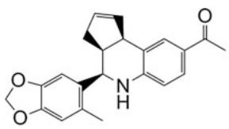

GPER Agonist G-1PubChem CID 5322399GREP $\kappa _ { \mathrm { i } } = 8$ nMNo effect on $\mathsf { E R } _ { \alpha ^ { \prime } }$ $\mathsf { E R } _ { \mathsf { \beta } }$

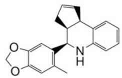

GPER Antagonist G-15 PubChem CID 3136844 GREP $\mathsf { K } _ { \mathsf { d } } = 2 0 \mathsf { n M }$ I $\mathtt { E R } _ { \mathrm { a } }$ Ki ~50 μM No eeffect on $\mathsf { E R } _ { \mathsf { \beta } }$

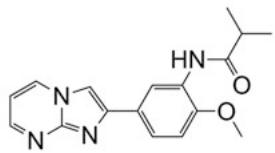

FPR2 Antagonist BB-V-115 PubChem CID 6622773 FPR2 K; = 174 nM FPR $\mathsf { K } _ { \mathrm { i } } = 3 5 0 0 \mathsf { n M }$

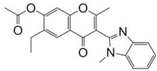

FPR Antagonist 3570-0208 PubChem CID 3092570 FPR $\mathsf { K } _ { \mathrm { i } } = 3 7 \ \mathsf { n M }$ FPR2 $\mathsf { K } _ { \mathrm { i } } = 4 4 0 0 \ \mathsf { n M }$

  
Fig. 1 Chemical structures, identifiers, PubChem IDs, and confirmed biological activities for four chemical probes identified using an integrated virtual and biomolecular screening approach. $\mathsf { E R } _ { \alpha }$ and $\mathsf { E R } _ { \beta }$ are the nuclear estrogen receptors alpha and beta, respectively

GLUT5 Inhibitor MSNBA PubChem CID 4783927 GLUT5 $\aleph _ { \mathrm { i } } = 3 . 2 \mu \aleph$ No effect on GLUT1,2,3,4

What is virtual screening? It is a cheminformatics technology designed to computationally evaluate large numbers of compounds, in order to rapidly identify structures of interest to be submitted for biological assays. Its experimental counterpart, high-throughput screening (HTS), is also aimed at sifting through a large amount of structures, (often) based on single-point, singleexperiment results. Both procedures rely on our ability to process, using cheminformatics tools, a large number of structures [5]. However, post-HTS analyses [22] are often clouded by the presence of reactive species [23] or optically interfering [24] components that can be the result of sample degradation in biochemical assays [25], the tendency of chemicals to aggregate [26] or to turn up as frequent hitters [27]. Online computational tools geared to remove “unwanted” or “promiscuous” molecular species are now available, as highlighted below.

The logical progression HTS primary hits $ H T S$ secondary hits $ H T S$ confirmed actives $\longrightarrow$ chemical probe series $[ $ lead series] $\longrightarrow$ drug candidate $\longrightarrow$ launched drug has emerged as a result of two forces:

1. Stronger demand in the pharmaceutical industry to provide good quality candidate drugs, as well as good quality leads [28].   
2. A significantly increased effort in the academic sector to screen large amounts of chemicals, e.g., within the NIH Roadmap Molecular Libraries Initiative [29], and identify chemical probes [30], with the ulterior goal of assisting drug discovery [31].

Genomics, side-effect and pharmacovigilance evaluation [32, 33], screening drug libraries against neglected diseases [34], drug-target identification from side-effect data mining [35], and finding novel drug targets using ligand-based virtual screening [36] are some of the recently emerged strategies from the academic sector to identify novel drugs and drug targets as well as new uses for old drugs [37]. Within the Clinical and Translational Science Awards framework [38], academic investigators are more likely to “de-risk” compounds of industrial interest [31].

A set of property filters known as the “rule of five” (Ro5) [39] has been adopted by both pharmaceutical industry and academia, with the goal of restricting small molecule synthesis to the property space defined by ClogP (octanol/water partition coefficient), MW (molecular weight), HDO (number of hydrogen bond donors), and HAC (number of hydrogen bond acceptors). The property distribution of chemical and drug databases in the Ro5 space is well understood [40] and is remarkably similar when comparing drugs with “non-drugs” [41]. However, the chemical space coverage of known drugs is severely limited, when compared to other compound collections [42]. Many chemical libraries are now Ro5 compliant, and a significant proportion of these chemicals can be described as “drug-like” [41].

Smaller and simpler chemicals are easier to optimize [43] toward the drug candidate status. The lead-like concept, now firmly established in drug discovery [44], bears relevance to the space of chemical probes as well [45], which is quite different from the property space occupied by high-activity molecules found in medicinal chemistry literature [28]. We begin our in-depth description of the compound preparation procedures within the context of “unwanted structure” removal [25] and of property filtering [44], since removal of promiscuous or just plain undesired chemicals will result in reduced sample space search and shorter CPU time. However, the responsibility of implementing such criteria in chemical database evaluation resides with the end user and should be

regarded as context-dependent. We describe our pipeline, based on experience with software from OpenEye [46], MESA [47], and ChemAxon [48]. Software with similar functionality is also available from BIOVIA (Pipeline Pilot) [49], Chemical Computing Group [50], Certara [51], and open-source packages [52].

# 2 Materials

1. Software to convert chemical structures based on standard file formats (e.g., SDF, mol2, etc.) to canonical isomeric SMILES [53], InChI [54], or equivalent representations of chemical structures e.g., [55, 56];   
2. Software to handle canonical isomeric SMILES (or equivalent) and provide chemical fingerprints, e.g., using ChemAxon [48], OpenEye [57], Sybyl-X [51], Mesa Analytics and Computing [58], MDL Keys [59], or Chemical Computing Group’s MOE [60]. Several alternatives are available under the open-source, open-access agreement, such as OpenBabel [61] and the Chemistry Development Kit, CDK [62].   
3. Software to compute chemical properties from structures, for example, to calculate the octanol/water partition coefficient, LogP [63] with CLogP [64] and KowWIN [65] or ALogPS [66], among many LogP predictors; some of these property calculators are also available under the open-access agreement at VCCLAB.org [67] and at Molinspiration [68].   
4. Software to compute molecular descriptors and chemical fingerprints [69].   
5. Software to cluster chemical structures from fingerprints or from computed properties [70, 71]; cheminformatics applications of clustering were discussed elsewhere [72].   
6. Software to convert SMILES (or equivalent) into 3D coordinates using ChemAxon, CORINA [73], OMEGA [74], Molinspiration [68], etc.; alternatively, PubChem, ChemSpider, and BIOVIA allow end users to use 3D coordinates for chemical structures.   
7. Software to appropriately handle experimental design based on multidimensional spaces, e.g., MODDE from Sartorius [75].

# 3 Methods

# 3.1 Assemble the Collection(s)

Most pharmaceutical companies have procured large compound collections $( 1 0 ^ { 6 } – 1 0 ^ { 7 }$ molecules), including marketed drugs and other high-activity compounds—which we termed Reals [44]. The academic sector has a similar collection (440,000

chemicals as of January 2018), the Molecular Libraries Small Molecules Repository, MLSMR [76]. Reals are a valuable resource and are routinely screened against novel targets. One can argue that these collections reflect the chemistry used to address targets from the past, and that novel targets require novel chemistry, since the intellectual property landscape for yesterday’s chemistry is by now overcrowded. However, such arguments do not exclude Reals from being considered for virtual screening. These physical collections also include commercially available chemicals, the superset of these being the Tangibles—termed this way because one can conceivably acquire them or synthesize them in-house using tractable chemistry [44]. Any collection prepared for virtual screening should sample both the in-house and the “external” chemical spaces. In addition to Reals and Tangibles, one can also consider the Virtuals. Up to and including 17 non-hydrogen atoms, Virtuals exceed 166 billion organic small molecules [77]; these cannot be all made (at least with current chemistry) but can essentially be used as a theoretical “resource” for virtual screening. If the goal is to find the shortest path from virtual screen to clinical practice, then priority should be given to marketed drugs, which is a significantly smaller collection, i.e., below five thousand small molecules and biologics [78].

Having appropriate informatics systems to access these virtual and existing compounds via fingerprints, 2D or 3D descriptors, or other measured or computed property spaces is key to the screening strategy. The largest collections of Tangibles are summarized in Table 1. As of January 2018, these collections exceed 90 million unique chemicals (e.g., PubChem), from more than 900 unique suppliers (e.g., BIOVIA). Some collections (ZINC, PubChem) are available at no cost. However, other resources are available on a subscription basis only (also indicated in Table 1). Large Virtuals subsets, derived from systematic enumeration [77], can be downloaded from http://gdb.unibe.ch/.

# 3.2 Clean Up the Collection

There is no “perfect” chemical database, unless it contains a rather simple (e.g., NaCl, $_ \mathrm { H } \mathrm { } _ { 2 } \mathrm { O }$ ) or a rather small number of molecules. The user needs to spend a significant effort in cleaning up the collection, whether it includes Virtuals, Reals, or Tangibles. Some chemical vendors provide their own solution to this problem. We prefer FILTER, a program available from OpenEye [79], although one can “wash” a chemical collection via MOE [50] or the Pipeline Pilot from BIOVIA [49]. Regardless of the method used, the user needs to take some early decisions regarding the collection’s “make-up.” One obvious suggestion is to remove (or at least flag) “unwanted” chemical structures, such as those depicted in Fig. 2; other substructures are discussed below.

Table 1 Sources for chemical databases available for evaluation   

<table><tr><td>Company name</td><td>Web address</td><td>Number of compounds</td><td>Description</td></tr><tr><td>Aldrich Market Select</td><td>https://www.sigmaaldrich.com/chemistry/chemistry-services/aldrich-market-select.html</td><td>14 million in-stock products (no “virtual chemistry”) over eight million unique structures</td><td>More than 80 of the most reliable suppliers in the compound and building block market</td></tr><tr><td>MCULE</td><td>https://mcule.com/database/</td><td>Over 5.6 million unique in-stock compounds</td><td>An integrated drug discovery platform providing IT infrastructure, drug discovery tools, high-quality compound database, and professional compound delivery</td></tr><tr><td>BIOVIA Available Chemical Directory</td><td>http://accelrys.com/products/collaborative-science/databases/sourcing-databases/biovia-available-chemicals-directory.html</td><td>Over 25 million products, over ten million unique chemicals, including 3D models</td><td>More than 900 suppliers; access fee required</td></tr><tr><td>ZINC</td><td>http://zinc.docking.org/browse/subsets/</td><td>Over 120 million potentially searchable compounds, more than 12 million in stock</td><td>Extracted from over 200 catalogs of searchable compounds; the entire data collection is available for free</td></tr><tr><td>Chemspider</td><td>http://www.chemspider.com/</td><td>63 million chemical structures</td><td>Almost 300 data sources; not known how many chemicals are commercially available; the entire set is NOT available for free download (only 1000 structures/day)</td></tr><tr><td>eMolecules</td><td>http://www.emolecules.com/</td><td>Over seven million screening compounds</td><td>20 “reliable” chemical suppliers; structures available for free, access fee required for vendor and price information</td></tr><tr><td>Pubchem</td><td>http://pubchem.ncbi.nlm.nih.gov/</td><td>Over 230 million substances over 90 million unique chemicals</td><td>580 data sources (300 chemical vendors); not all chemicals are commercially available; the entire collection is available for free</td></tr></table>

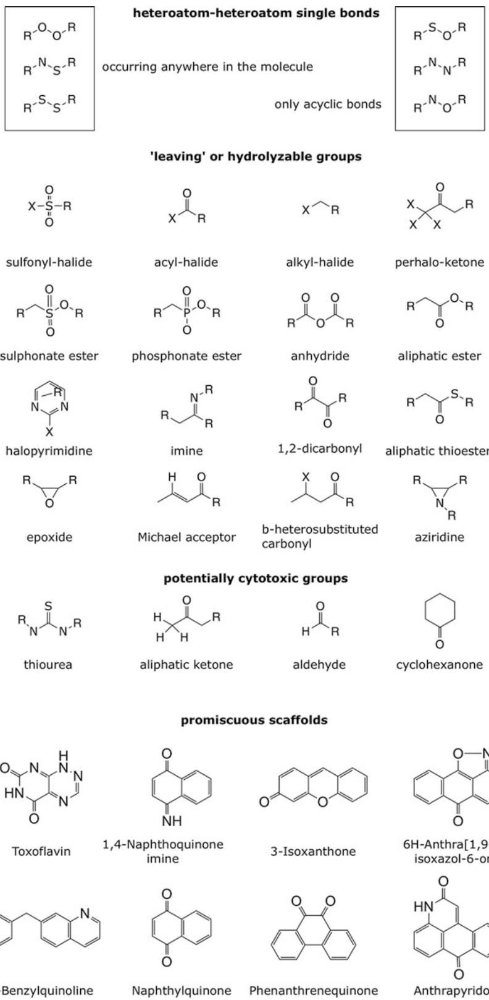  
Fig. 2 Examples of chemical substructures that may cause interference with biochemical assays [25] under HTS conditions. Modified from Ref. [40] with permission

# 3.2.1 Remove Garbage from the Collection

Split covalently bound salt counterions and remove small fragments (salts), normalize charges. This is clearly an instance where the user is confronted with multiple choices. For typical pharmaceutical screening, it is advisable to remove unwanted structures, such as those depicted in Fig. 2. One should always consider “unwanted” structures in context—for example, a large number of antineoplastic agents would be considered as “reactive species” according to Fig. 2. Furthermore, many flavor compounds are monofunctional aldehydes. Thus, when seeking actives in oncology or in flavor science, certain substructure-based filters need to be individually evaluated and, quite likely, excluded.

# 3.2.2 Verify Molecular Structure Integrity

In order to be correctly understood and processed by computer, the structures must be entered in a “computer-friendly” format, which is not necessarily “human-friendly”. A significant amount of molecules may be incorrectly perceived by the computer [80] because of chiral centers that do not observe the Cahn-Ingold-Prelog convention, or because they are bridge structures, etc. This can become a significant source of errors in structure-activity relationship studies [81, 82]. Because visual inspection for all the structures is not an option in really large collections, one has to use an automated procedure for detection (and perhaps correction) of some of the invalid entries. If specialized software for this operation, e.g., CheD [83] or Structure Checker [48], is not available, good results in detecting errors can be achieved after converting the original structural files (usually in SDF format) to SMILES using two or more conversion tools (OpenEye babel, ChemAxon molconvert, etc), followed by canonicalization (option smioCanonical in OpenEye babel, option u in ChemAxon SMILES export options, etc.) and then by comparing the resulting SMILES. The number of invalid entries differs significantly among chemical vendors, ranging from under $0 . 0 5 \%$ to $1 0 \%$ or higher. A totally automated method for error detection and removal of faulty structures needs to be implemented prior to large-scale screening of any collection, be it Reals or Virtuals.

# 3.2.3 Generate Unique, Normalized SMILES

Once canonical SMILES are derived, one should store just unique SMILES by verifying structure identity while ignoring compound IDs or chemical names. If the Virtuals or Tangibles are compiled from a large number of software vendors, there is a good chance that this will clean up $5 0 \%$ or more of the starting collection. At this step, it is advisable to use a list of “preferred” or “trusted” vendors first. Such lists are developed with time—so first-time users must take some risks in this step. Whenever the budget is limited, a script to rank low-price structures first could be used. Besides price, minimum required purity and maximum guaranteed shipping window are other important criteria to be considered when selecting from multiple vendors that sell the same compounds.

# 3.2.4 Other Unwanted Substructures

Based on the cumulative experience with high-throughput screening using the MLSMR collection (available in PubChem), we have identified a number of 100 scaffolds which have a significantly higher-than-average tendency to exhibit bioactivity in primary assays. While some of these scaffolds may be legitimately present in hits under certain bioassay conditions, we have implemented a SMARTS-based removal procedure for such promiscuous patterns at our open-access website [84]. In addition to Badapple (promiscuous pattern removal) [85], we offer three different FILTERcompliant tools, as well as a fragment-based drug-like filter [41]. These tools, summarized in Table 2, can be used free of charge for the purpose of academic research.

# 3.3 FILTER for Lead-Likeness

After cleanup, the collection can be processed to remove compounds that do not have certain 2D-based properties, for example, those that define leads [25, 43, 44]. Compounds that pass the filters can be prioritized for virtual screening. When examining a collection of natural products, however, lead-like filters may be unsuitable [42]. When a set of lead-like structures is desired, we

Table 2 UNM biocomputing public web applications (available at http://datascience.unm.edu/publicbiocomputing-apps)   

<table><tr><td>Application</td><td>Description</td><td>Powered by</td></tr><tr><td>Badapple</td><td>Bioactivity datamining associative promiscuity pattern learning engine</td><td>ChemAxon</td></tr><tr><td>ClusterMols</td><td>Cluster molecular datasets</td><td>Mesa, OpenEye, RDKit, Scitouch</td></tr><tr><td>Convert</td><td>Convert mol formats</td><td>ChemAxon</td></tr><tr><td>Depict</td><td>Depict molecules</td><td>ChemAxon</td></tr><tr><td>DGeom</td><td>Distance-geometry conformer generation</td><td>RDKit, JSmol</td></tr><tr><td>DrugCentral</td><td>Drug knowledge integration database</td><td>Django, PostgreSql, ChemAxon</td></tr><tr><td>Drug-likeness</td><td>Drug-likeness using DRUGS/ACD fragments frequencies</td><td>ChemAxon</td></tr><tr><td>iPHACE</td><td>Integrative navigation in pharmacological space</td><td>ChemAxon</td></tr><tr><td>JSME</td><td>JavaScript molecular editor</td><td>peter.ertl.com</td></tr><tr><td>MolProps</td><td>Molecular properties and aggregate stats</td><td>OpenBabel, RDKit, Scitouch, Gnuplot, Gnuplot-Py</td></tr><tr><td>Rockit</td><td>ROC-curve plotter</td><td>R, ROCR, RPy, Gnuplot, Gnuplot-Py</td></tr><tr><td>SIM2D</td><td>2D similarity</td><td>ChemAxon</td></tr><tr><td>Smartsfilter</td><td>SMARTS filtering with built in Glaxo, Blake, and Oprea SMARTS sets</td><td>ChemAxon</td></tr></table>

recommend one clusters (see Subheading 3.7) the “nonlead-like” set to include a representative set of these compounds (up to $3 0 \%$ ), as they are likely to capture additional scaffolds. It remains the responsibility of the end user to apply, or discard, the lead-like concept, or to adjust the parameters prior to acquiring/screening compounds. Some of our suggestions for exclusions according to lead-likeness are as follows (see also Note 1):

l More than four rings.   
l More than three fused aromatic rings (avoid polyaromatic rings, since they are likely to be processed by cytochrome P450 enzymes, leading to epoxides and possibly other carcinogens).   
l $\mathrm { H D O } > 4$ ; $\mathrm { H D O } \le 5$ is one of the Ro5 criteria, but $8 0 \%$ of drugs have $\mathrm { H D O } \le 3$ [40].   
l More than four halogens, except fluorine (avoid “pesticides”); a notable exception is the crop-protectant business; in such situations, the collection must be processed with entirely different criteria.   
l More than two $\mathrm { C F } _ { 3 }$ groups (avoid highly halogenated molecules).

The “unwanted” list is likely to reflect a “cultural bias” that is particular to each company. For example, companies active in contraceptive research might regard steroids favorably at this stage, whereas other companies may want to actively exclude them from the collection at an early stage. Similar arguments could be made for the lactam (e.g., penicillins) and cephem (e.g., cephalosporins) scaffolds, as well as for peptides. An additional step may include removal of known redox cycling compounds [86], frequent hitters [26] or promiscuous binders [27], and the removal of compounds that contain fragments responsible for cytotoxicity (see Fig. 2).

The effort to systematically evaluate the collection can be regarded as the initial step, since in-depth manipulation is likely to take place only once prior to all virtual screens, assuming that targets are similar and that the drug discovery projects have similar goals, e.g., orally available drugs that should (or should not) permeate the blood-brain barrier. However, the screening set may be just the Tangibles or the known drugs subsets. The collection may therefore require very different processing criteria, which are targetdependent and goal-dependent: targets located in the lung require a different pharmacokinetic profile, e.g., for inhalation therapy, compared to targets located in the urinary tract that may require good aqueous solubility at pH 5 or on the skin (LogP between 5 and 7 is ideal for such topical agents). Such biases need to be considered as early as possible in the library assembly stage, because they reduce the size of the chemical space that needs to be sampled.

# 3.4 Search for Similarity If Known Active Molecules Are Available

Whenever high-activity molecules are available from the literature, patents or from in-house data, the user is advised to perform a similarity search on the entire Virtuals or Tangibles for similar molecules (see Subheading 3.7) and to actively seek to include them in the virtual screening deck, even though they might have been removed during the previous steps. These molecules should serve as positive controls, i.e., they should be retrieved at the end of the virtual or high-throughput screen as “hits,” if the similarity principle holds (see also Note 2).

# 3.5 Explore Alternative Structures

The user should seek alternate structures by modifying [87] the canonical isomeric SMILES, since these may occur in solution or at the ligand-receptor interface:

l Tautomerism, which shifts one hydrogen along a path of alternating single/double bonds, mostly involving nitrogen and oxygen (e.g., imidazole); the reader is encouraged to consult the tautomers issue of Journal of Computer-Aided Molecular Design [88].   
l Acid/base equilibria, which explore different protonation states by assigning formal charges to those chemical moieties that are likely to be charged (e.g., phosphate or guanidine) and by assigning charges to some of those moieties that are likely to be charged under different microenvironmental conditions (“chargeable” moieties such as tetrazole and aliphatic amine).   
l Exploration of alternate structures whenever chiral centers are not specified (OpenEye’s omega2—flipper option, ChemAxon’s Stereoisomer Generator Plugin) since 3D structure conversion from SMILES in some cases does not “explode” all possible states. Other examples include pseudo-chiral centers such as pyramidal (“flappy”) nitrogen inversions that explore non-charged, nonaromatic, pseudo-chiral nitrogens (three substituents), since these are easily interconverted in three dimensions.

Exploring alternate structures is advisable prior to processing any collection with computational means, e.g., for diversity analysis (see also Note 3) . The results will influence any virtual screen.

# 3.6 Generate 3D Structures

The effort of exploring one or more conformers per molecule is quite relevant for virtual screening and for other 3D methods (see also Note 4) . For example, one or multiple conformers per molecule are evaluated during shape (ligand-based) and target (structure-based) virtual screening. Some docking programs require a separate 3D conversion step [89], e.g., using CORINA [73], Catalyst [49], OMEGA [74], or Molinspiration [68]. A website that discusses 3D conformer generation software and provides links to other tools is available [90].

# 3.7 Select Chemical Structure Representatives

Screening compounds that are similar to known actives increases the likelihood of finding new active compounds, but it may not lead to different chemotypes, a highly desirable situation in the industrial context (see also Note 5). The severity of this situation is increased if the original actives are covered by third-party patents or if the lead scaffold is toxic. Sometimes, the processed collection may simply be too large to be evaluated in detail or even to be submitted to a virtual screen. In such cases, a strategy based on clustering and perhaps on statistical molecular design (SMD) is a better alternative, compared to random selection. Clustering methods aim at grouping molecules into “families” (clusters) of related structures that are perceived—at a given resolution—to be different from other chemical families. With clustering, the end user has the ability to select one or more representatives from each family. SMD methods aim at sampling various areas of chemical space and selecting representatives from each area. Some software is designed to select compounds from multidimensional spaces, but the outcome depends on several factors, as discussed below.

# 3.7.1 Chemical Descriptors

Chemical descriptors are used to encode chemical structures and properties of compounds: 2D/3D binary fingerprints or counts of different substructural features or perhaps (computed) physicochemical properties, e.g., MW, ClogP, HDO, and HAC, as well as other types of steric, electronic, electrostatic, topologic, or hydrogen-bonding descriptors. The choice of what descriptors to use, and in what context, depends on the size of collection, on the software and hardware available, as well as on the time constraints given for a particular selection process.

# 3.7.2 Similarity (Dissimilarity) Measure

Chemical similarity is used to quantify the “distance” between a pair of compounds (dissimilarity or 1 minus similarity) or how related the two compounds are (similarity). The basic tenet of chemical similarity is that molecules exhibiting similar features are expected to have similar biologic activity [91], although this has been challenged by the same author, who highlights the existence of “activity cliffs” where similarity fails [92]. Since most inferences in bioactivity discovery remain rooted on similarity, we continue to use chemical (or molecular) similarity. By definition, similarity relates to a particular framework: that of a descriptor system (a metric by which to judge similarity), as well as that of an object or class of objects—we need a reference point to which objects can be compared with [93]. Similarity depends on the choice of molecular descriptors [94], the choice of the weighting scheme(s), and the similarity coefficient itself. The coefficient is typically based on Tanimoto’s symmetric distance-between-patterns [95] and on Tversky’s asymmetric contrast model [96]. Multiple types of methods are available for chemical similarity evaluation [91, 97–100].

# 3.7.3 Clustering Algorithms

These algorithms can be classified using many criteria and also implemented in different ways—see Subheading 2, item 4 for a short list of clustering software. Hierarchical clustering methods have been traditionally used to a greater extent—in part due to computational simplicity. More recently, chemical structure classifications are examining nonhierarchical methods. In practice, the individual choice of different factors (descriptors, similarity measure, clustering algorithm) depends also on the hardware and software resources available, the size and diversity of the collection that must be clustered, and not ultimately on the user experience in producing a useful classification that has the ability to predict property values. We prefer Mesa’s clustering method [70] for its ability to provide asymmetric clustering and to deal with the “false singletons” (borderline compounds that are often assigned to one of at least two equally distant chemical families).

# 3.7.4 Statistical Molecular Design

SMD can be applied to rationally select collection representatives— as illustrated for building block selection in combinatorial synthesis planning [101]. Various methods for experimental design [102] such as fractional factorial or composite design—can be applied for sampling large solution spaces, in particular if only a rather small screening deck can be investigated in the first round.

# 3.7.5 Randomness

Finally, the “unexpected,” that component which invites chance, as discussed by Taleb [103, 104], justifies the random inclusion of a particular subset of molecules to the virtual screening deck. These molecules should not be subject to any processing (other than correct structural representation, normalization, and tautomer/ protomer representation), i.e., they should be entirely random. We cannot document if randomness is more successful compared to rational methods, nor do we suggest that criteria for rational selection should to be taken lightly. However, serendipity plays a major role in drug discovery [105]. Therefore, we should allow a certain degree of randomness in the final selection. If randomly selected compounds are included, the final list of compounds should be verified, once more, for uniqueness—to avoid duplicates.

# 4 Notes

1. Unless justified by prior data, it may be useful to filter out molecules that contain:

(a) More than nine connected single bonds not in ring or more than eight connected unsubstituted single bonds not in ring.

(b) Macrocycles with more than 22 atoms in a ring or macrocycles with more than 14 flexible bonds prior to virtual screening, as high flexibility has been shown to decrease the accuracy of docking [106].

2. Wherever the 3D structure of the bioactive conformation is available, e.g., an active ligand co-crystallized in the target binding site, a 3D similarity search should be performed in conjunction with a 2D-based one. These queries are likely to yield different, quite likely nonoverlapping results. Submitting hits from both searches to biomolecular screening and other experiments is preferred.   
3. If alternative structures are not explored prior to virtual screening, the method will sample only a limited state of the “parent” compounds. These changes are likely to occur in reality, since the receptor and the solvent environment or simple Brownian motion will influence the particular 3D and chemical state (s) that the parent molecule is sampling. Their combinatorial explosion needs to be, within limits, explored at the SMILES level, before the 3D structure generation step.   
4. Wherever possible, a combination of 2D and 3D methods for virtual screening is preferred. We have shown that, when the query molecule is a steroid, 2D methods will invariably yield steroid-containing molecules as top-ranking hits [107]. If alternative structures are not explored prior to virtual screening, the method will sample only a limited state of the “parent” compounds. These changes are likely to occur in reality, since the receptor and the solvent environment or simple Brownian motion will influence the particular 3D and chemical state (s) that the parent molecule is sampling. Their combinatorial explosion needs to be, within limits, explored at the SMILES level, before the 3D structure generation step.   
5. Primary literature and patents should always be consulted prior to launching a virtual screening campaign. A variety of online tools are available for seeking bioactive molecules: PubChem and ChEMBL for literature, SureCHEMBL [108] for patents, Probe Miner [109] for chemical probes, the Guide to Pharmacology [110] for pharmacological substances, and DrugCentral for approved drugs, respectively. The latest version of the Protein Data Bank [111] should be consulted with respect to availability of 3D structures for the target of interest.

# 5 Conclusions

The above procedure can be summarized as follows:

1. Assemble the collection starting from in-house and online databases.   
2. Clean up the collection by removing “garbage,” verifying structural integrity, and making sure that only unique structures are screened.   
3. Perform property filtering to remove unwanted structures based on substructures or property profiling or various scoring schemes; the collection can become the virtual screening set at this stage or can be further subdivided in a target- and projectdependent manner.   
4. Use similarity to given actives to seek compounds with related properties.   
5. Explore the possible stereoisomers, tautomers, and protomers.   
6. Generate the 3D structures in preparation for virtual screening or for computation of 3D descriptors.   
7. Use clustering or statistical molecular design to select compound representatives for acquisition.   
8. Add a random subset to the final list of compounds. The final list can now be submitted for virtual screening.

# Acknowledgment

This work was supported, in part, by NIH grants R21GM095952, U54MH084690, and U24CA224370. We thank Jeremy Yang for useful discussions.

# References

1. Avorn J (2015) The $\$ 2.6$ billion pill — methodologic and policy considerations. N Engl J Med 372:1877–1879   
2. Sukuru SCK, Jenkins JL, Beckwith REH, Scheiber J, Bender A, Mikhailov D, Davies JW, Glick M (2009) Plate-based diversity selection based on empirical HTS data to enhance the number of hits and their chemical diversity. J Biomol Screen 14:690–699   
3. Horvath D (1997) A virtual screening approach applied to the search for trypanothione reductase inhibitors. J Med Chem 40:2412–2423

4. Walters WP, Stahl MT, Murcko MA (1998) Virtual screening–an overview. Drug Discov Today 3:160–178   
5. Fara DC, Oprea TI, Prossnitz ER, Bologa CG, Edwards BS, Sklar LA (2006) Integration of virtual and physical screening. Drug Discov Today Technol 3:377–385   
6. Oprea TI, Matter H (2004) Integrating virtual screening in lead discovery. Curr Opin Chem Biol 8:349–358   
7. The PubChem service is hosted by the National Center for Biotechnology Information at NIH. http://pubchem.ncbi.nlm.nih. gov/

8. ChEMBL is a database of bioactive drug-like molecules hosted by the European Bioinformatics Institute at EMBL. https://www.ebi. ac.uk/chembldb/   
9. Brown F (2005) Chemoinformatics – a ten year update. Curr Opin Drug Discov Devel 8:296–302   
10. Mewes HW, Wachinger B, Stu¨mpflen V (2010) Perspectives of a systems biology of the synapse: How to transform an indefinite data space into a model? Pharmacopsychiatry 43:S2–S8   
11. Mestres J, Gregori-Puigjane´ E, Valverde S, Sole´ RV (2008) Data completeness - the Achilles heel of drug-target networks. Nat Biotechnol 26:983–984   
12. Schwaighofer A, Schroeter T, Mika S, Blanchard G (2009) How wrong can we get? A review of machine learning approaches and error bars. Comb Chem High Throughput Screen 12:453–468   
13. Edwards BS, Bologa CG, Young SM, Prossnitz ER, Sklar LA, Oprea TI (2005) Integration of virtual screening with high throughput flow cytometry to identify novel small molecule formylpeptide receptor antagonists. Mol Pharmacol 368:1301–1310   
14. Young SM, Bologa CG, Fara D, BJK B, Strouse JJ, Arterburn JB, Ye RD, Oprea TI, Prossnitz ER, Sklar LA, Edwards BS (2009) Duplex high-throughput flow cytometry screen identifies two novel formylpeptide receptor family probes. Cytometry 75A:253–263   
15. Dennis M, Burai R, Ramesh C, Petrie W, Alcon S, Nayak T, Bologa C, Leita˜o A, Brailoiu E, Deliu E, Dun NS, Sklar LA, Hathaway H, Arterburn JB, Oprea TI, Prossnitz ER (2009) In vivo effects of a GPR30 antagonist. Nat Chem Biol 5:421–427   
16. Bologa CG, Revankar CM, Young SM, Edwards BS, Arterburn JB, Parker MA, Tkachenko SE, Savchuck NP, Sklar LA, Oprea TI, Prossnitz ER (2006) Virtual and biomolecular screening converge on a selective agonist for GPR30. Nat Chem Biol 2:207–212   
17. George Thompson AM, Ursu O, Babkin P, Iancu CV, Whang A, Oprea TI, Choe JY (2016) Discovery of a specific inhibitor of human GLUT5 by virtual screening and in vitro transport evaluation. Sci Rep 6:24240   
18. Koch MA, Schuffenhauer A, Scheck M, Wetzel S, Casaulta M, Odermatt A, Ertl P, Waldmann H (2005) Charting biologically relevant chemical space: a structural classification of natural products (SCONP). Proc Natl Acad Sci U S A 102:17272–17277

19. Renner S, van Otterlo W, Dominguez Seoane M, Mo¨cklinghoff S, Hofmann B, Wetzel S, Schuffenhauer A, Ertl P, Oprea TI, Steinhilber D, Brunsveld L, Rauh D, Waldmann H (2009) Bioactivity-guided mapping of and navigation in chemical space by means of hierarchical scaffold trees. Nat Chem Biol 5:585–592   
20. Wetzel S, Klein K, Renner S, Rauh D, Oprea TI, Mutzel P, Waldmann H (2009) Interactive exploration of chemical space with Scaffold Hunter. Nat Chem Biol 5:581–583   
21. Olah MM, Bologa CG, Oprea TI (2004) Strategies for compound selection. Curr Drug Discov Technol 1:211–220   
22. Oprea TI, Bologa CG, Edwards BS, Prossnitz EA, Sklar LA (2004) Post-HTS analysis: an empirical compound prioritization scheme. J Biomol Screen 10:419–425   
23. Rishton GM (1997) Reactive compounds and in vitro false positives in HTS. Drug Discov Today 2:382–384   
24. Young SM, Bologa CG, Oprea TI, Prossnitz ER, Sklar LA, Edwards BS (2005) Screening with HyperCyt high throughput flow cytometry to detect small-molecule formyl peptide receptor ligands. J Biomol Screen 10:374–382   
25. Rishton GM (2003) Nonleadlikeness and leadlikeness in biochemical screening. Drug Discov Today 8:86–96   
26. McGovern SL, Caselli E, Grigorieff N, Shoichet BK (2002) A common mechanism underlying promiscuous inhibitors from virtual and high-throughput screening. J Med Chem 45:1712–1722   
27. Roche O, Schneider P, Zuegge J, Guba W, Kansy M, Alanine A, Bleicher K, Danel F, Gutknecht EM, Rogers-Evans M, Neidhart W, Stalder H, Dillon M, Sjo¨gren E, Fotouhi N, Gillespie P, Goodnow R, Harris W, Jones P, Taniguchi M, Tsujii S, von der Saal W, Zimmermann G, Schneider G (2002) Development of a virtual screening method for identification of ‘frequent hitters’ in compound libraries. J Med Chem 45:137–142   
28. Oprea TI (2002) Lead structure searching: are we looking for the appropriate properties? J Comput-Aided Mol Design 16:325–334   
29. Austin CP, Brady LS, Insel TR, Collins FS (2004) NIH molecular libraries initiative. Science 306:1138–1139   
30. Oprea TI, Bologa CG, Boyer S, Curpan RF, Glen RC, Hopkins AL, Lipinski CA, Marshall GR, Martin YC, Ostopovici-Halip L, Rishton G, Ursu O, Vaz RJ, Waller C,

Waldmann H, Sklar LA (2009) A crowdsourcing evaluation of the NIH chemical probes. Nat Chem Biol 5:441–447   
31. Collins FS (2010) Research agenda. Opportunities for research and NIH. Science 327:36–37   
32. Boguski MS, Mandl KD, Sukhatme VP (2009) Repurposing with a difference. Science 324:1394–1395   
33. Toney JH, Fasick JI, Singh S, Beyrer C, Sullivan DJ Jr (2009) Purposeful learning with drug repurposing. Science 325:1139–1140   
34. Chong CR, Sullivan DJ Jr (2007) New uses for old drugs. Nature 448:645–646   
35. Campillos M, Kuhn M, Gavin AC, Jensen LJ, Bork P (2008) Drug target identification using side-effect similarity. Science 321:263–266   
36. Keiser MJ, Setola V, Irwin JJ, Laggner C, Abbas AI, Hufeisen SJ, Jensen NH, Kuijer MB, Matos RC, Tran TB, Whaley R, Glennon RA, Hert J, Thomas KLH, Edwards DD, Shoichet BK, Roth BL (2009) Predicting new molecular targets for known drugs. Nature 462:175–181   
37. Ashburn TT, Thor KB (2004) Drug repositioning: Identifying and developing new uses for existing drugs. Nat Rev Drug Discov 3:673–683   
38. CTSA. http://www.ncrr.nih.gov/clinical_ research_resources/clinical_and_transla tional_science_awards/   
39. Lipinski CA, Lombardo F, Dominy BW, Feeney PJ (1997) Experimental and computational approaches to estimate solubility and permeability in drug discovery and development settings. Adv Drug Deliv Rev 23:3–25   
40. Oprea TI (2000) Property distribution of drug-related chemical databases. J Comput Aided Mol Des 14:251–264   
41. Ursu O, Oprea TI (2010) Model-free druglikeness from fragments. J Chem Inf Model 50:1387–1394   
42. Wester MJ, Pollock SN, Coutsias EA, Allu TK, Muresan S, Oprea TI (2008) Scaffold topologies. 2. Analysis of chemical databases. J Chem Inf Model 48:1311–1324   
43. Teague SJ, Davis AM, Leeson PD, Oprea TI (1999) The design of leadlike combinatorial libraries. Angew Chem Int Ed 38:3743–3748 German version: Angew. Chem. 111, 3962-- 3967   
44. Hann MM, Oprea TI (2004) Pursuing the leadlikeness concept in pharmaceutical research. Curr Opin Chem Biol 8:255–263

45. Oprea TI, Allu TK, Fara DC, Rad RF, Ostopovici L, Bologa CG (2007) Lead-like, drug-like or “Pub-like”: how different are they? J Comput Aided Mol Des 21:113–119   
46. See the OpenEye Scientific Software, Santa Fe, NM. http://www.eyesopen.com/   
47. See the mesa analytics & computing, Santa Fe, NM. http://www.mesaac.com/   
48. See the ChemAxon kft, Budapest, Hungary. https://www.chemaxon.com/   
49. Accelrys Inc., San Diego, CA. http://www. accelrys.com/   
50. See the Chemical Computing Group. http:// www.chemcomp.com   
51. Certara, Princeton, NJ. https://www.certara. com/   
52. Ambure P, Aher RB, Roy K (2014) Recent advances in the open access cheminformatics toolkits, software tools, workflow environments, and databases. In: Zhang W (ed) Computer-aided drug discovery. Methods in pharmacology and toxicology. Humana Press, New York, NY   
53. Weininger D (1988) SMILES, a chemical language and information system. 1. Introduction to methodology and encoding rules. J Chem Inf Comput Sci 28:31–36   
54. The International Chemical Identifier, InChI, was a IUPAC project. http://www.iupac.org/ inchi/   
55. OEChem Toolkit, Openeye Scientific Software, Santa Fe, NM. http://www.eyesopen. com/oechem-tk   
56. Open Babel. http://openbabel.sourceforge. net/   
57. raphSim TK Openeye Scientific Software, Santa Fe, NM. http://www.eyesopen.com/ graphsim-tk   
58. MACCSKeys320Generator, Mesa analytics and computing LLC, Santa Fe, NM. http:// www.mesaac.com/   
59. Durant JL, Leland BA, Henry DR, Nourse JG (2002) Reoptimization of MDL keys for use in drug discovery. J Chem Inf Comput Sci 42:1273–1280   
60. MOE: The molecular operating environment from chemical computing group Inc., Montreal, QC. http://www.chemcomp.com/   
61. Open Babel: the open source chemistry toolbox. http://openbabel.org/wiki/Main_Page   
62. CDK is a Java library for structural chemoand bioinformatics. http://cdk.sf.net/   
63. Leo A (1993) Estimating $\mathrm { L o g P _ { o c t } }$ from structures. Chem Rev 5:1281–1306

64. CLOGP is available from BioByte Corporation, Claremont, CA. http://www.biobyte. com/   
65. EPI Suite v4.11, U.S. Environmental Protection Agency. https://www.epa.gov/tscascreening-tools/epi-suitetm-estimation-pro gram-interface   
66. Tetko IV, Tanchuk VY (2002) Application of associative neural networks for prediction of lipophilicity in ALOGPS 2.1 program. J Chem Inf Comput Sci 42:1136–1145 http://vcclab.org/lab/alogps/index.html   
67. The virtual computational chemistry laboratory (VCCLAB) as a number of on-line software modules. Available at http://vcclab. org/   
68. Molinspiration has a number of property calculators, including 3D conformer generation. http://molinspiration.com/   
69. Yap CW (2011) PaDEL-descriptor: An open source software to calculate molecular descriptors and fingerprints. J Comput Chem 32:1466–1474   
70. Measures, mesa analytics and computing LLC, Santa Fe, NM. http://www.mesaac. com/   
71. ChemoMine plc, Cambridge, UK. http://www.chemomine.co.uk/  
72. MacCuish JD, MacCuish NE (2010) Chapman & Hall/CRC mathematical & computational biology. In: Clustering in bioinformatics and drug discovery, vol 40. CRC press, Boca Raton, FL, p 244   
73. Gasteiger J, Rudolph C, Sadowski J (1990) Automatic generation of 3D-atomic coordinates for organic molecules. Tetrahedron Comput Methodol 3:537–547 CORINA is available from Molecular Networks GmbH and Altamira LLC; https://www.mn-am. com/   
74. Hawkins PCD, Skillman AG, Warren GL, Ellingson BA, Stahl MT (2010) Conformer generation with OMEGA: Algorithm and validation using high quality structures from the Protein Databank and Cambridge Structural Database. J Chem Inf Model 50:572–584 OpenEye Scientific Software Inc., Santa Fe, NM; http://www.eyesopen.com/   
75. MODDE is available from Umetrics, a division of Sartorius Stedim biotech. https:// webshop.umetrics.com/   
76. The MLSMR collection can be datamined using the PubChem interface (keyword, MLSMR). http://pubchem.ncbi.nlm.nih. gov/   
77. Ruddigkeit L, van Deursen R, Blum LC, Reymond JL (2012) Enumeration of 166 billion

organic small molecules in the chemical universe database GDB-17. J Chem Inf Model 52:2864–2875   
78. Ursu O, Holmes J, Knockel J, Bologa CG, Yang JJ, Mathias SL, Nelson SJ, Oprea TI (2017) DrugCentral: online drug compendium. Nucleic Acids Res 45:D932–D939   
79. FILTER is available from OpenEye Scientific Software Inc., Santa Fe, NM. http://www. eyesopen.com/products/applications/filter. html   
80. Olah M, Mracec M, Ostopovici L, Rad R, Bora A, Hadaruga N, Olah I, Banda M, Simon Z, Mracec M, Oprea TI (2004) WOM-BAT: world of molecular bioactivity. In: Oprea TI (ed) Cheminformatics in drug discovery. Wiley-VCH, New York, NY (in press)   
81. Coats EA (1998) The CoMFA steroids as a benchmark dataset for development of 3D-QSAR methods. In: Kubinyi H, Folkers G, Martin YC (eds) 3D QSAR in drug design. Volume 3. Recent advances. Kluwer/ESCOM, Dordrecht, The Netherlands, pp 199–213   
82. Oprea TI, Olah M, Ostopovici L, Rad R, Mracec M (2003) On the propagation of errors in the QSAR literature. In: Ford M, Livingstone D, Dearden J, Van de Waterbeemd H (eds) EuroQSAR 2002–Designing drugs and crop protectants: processes, problems and solutions. Blackwell Publishing, New York, NY, pp 314–315   
83. Chemical Database Management Software, TimTec Inc. http://software.timtec.net/ ched.htm   
84. Public web applications from UNM Biocomputing are available at http://pasilla.health. unm.edu   
85. Yang JJ, Ursu O, Lipinski CA, Sklar LA, Oprea TI, Bologa CG (2016) Badapple: promiscuity patterns from noisy evidence. J Chem 8:29   
86. Johnston PA (2011) Redox cycling compounds generate $\mathrm { H } _ { 2 } \mathrm { O } _ { 2 }$ in HTS buffers containing strong reducing reagents-real hits or promiscuous artifacts? Curr Opin Chem Biol 15:174–182   
87. Kenny PW, Sadowski J (2004) Structure modification in chemical databases. In: Oprea TI (ed) Cheminformatics in drug discovery. Wiley-VCH, New York, NY (in press)   
88. Martin YC (2010) Perspectives in drug discovery and design: tautomers and tautomerism. J Comput Aided Mol Design 24:473–638   
89. Sadowski J, Gasteiger J (1993) From atoms and bonds to three-dimensional atomic

coordinates: automatic model builders. Chem Rev 93:2567–2581   
90. See the Metabolomics Fiehn Lab site: http:// fiehnlab.ucdavis.edu/staff/kind/ ChemoInformatics/Concepts/3Dconformer/   
91. Johnson MA, Maggiora GM (1990) Concepts and applications of molecular similarity. Wiley-VCH, New York, NY   
92. Maggiora GM (2006) On outliers and activity cliffsWhy QSAR often disappoints. J Chem Inf Model 46:1535   
93. Oprea TI (2002) Chemical space navigation in lead discovery. Cur Opin Chem Biol 6:384–389   
94. Todeschini R, Consonni V (2008) Handbook of molecular descriptors, 2nd edn. Wiley-VCH, Weinheim, Germany   
95. Tanimoto TT (1961) Non-linear model for a computer assisted medical diagnostic procedure. Trans NY Acad Sci Ser 2(23):576–580   
96. Tversky A (1977) Features of similarity. Psychol Rev 84:327–352   
97. Willett P (1987) Similarity and clustering techniques in chemical information systems. In: Research Studies Press. Letchworth, England   
98. Willett P (2000) Chemoinformatics–similarity and diversity in chemical libraries. Curr Op Biotech 11:85–88   
99. Lewis RA, Pickett SD, Clark DE (2000) Computer-aided molecular diversity analysis and combinatorial library design. Rev Comput Chem 16:1–51   
100. Martin YC (2001) Diverse viewpoints on computational aspects of molecular diversity. J Comb Chem 3:231–250   
101. Linusson A, Gottfries J, Lindgren F, Wold S (2000) Statistical molecular design of building blocks for combinatorial chemistry. J Med Chem 43:1320–1328   
102. Eriksson L, Johansson E, Kettaneh-Wold N, Wikstro¨m C, Wold S (2000) Design of experiments: principles and applications. Umetrics Academy, Umea˚, Sweden

103. Taleb NN (2005) Fooled by randomness: the hidden role of chance in the markets and life. Random House, New York   
104. Taleb NN (2007) The Black Swan. The impact of the highly improbable. Random House, New York   
105. Sneader W (2005) Drug discovery: a history. Wiley, New York   
106. Bostro¨m J, Norrby P-O, Liljefors T (1998) Conformational energy penalties of proteinbound ligands. J Comput-Aided Mol Design 12:383–396   
107. Prossnitz ER, Arterburn JB, Edwards BS, Sklar LA, Oprea TI (2006) Steroid-binding GPCRs: new drug discovery targets for old ligands. Expert Opin Drug Discov 1:137–150   
108. Papadatos G, Davies M, Dedman N, Chambers J, Gaulton A, Siddle J, Koks R, Irvine SA, Pettersson J, Goncharoff N, Hersey A, Overington JP (2016) Sure-ChEMBL: a large-scale, chemically annotated patent document database. Nucleic Acids Res 44:D1220–D1228 Available at https://www. surechembl.org/search/   
109. Antolin AA, Tym JE, Komianou A, Collins I, Workman P, Al-Lazikani B (2017) Objective, quantitative, data-driven assessment of chemical probes. Cell Chem Biol 25(2):P194–205. E5 in press. Available at http://probeminer. icr.ac.uk/#/   
110. Harding SD, Sharman JL, Faccenda E, Southan C, Pawson AJ, Ireland S, Gray AJG, Bruce L, Alexander SPH, Anderton S, Bryant C, Davenport AP, Doerig C, Fabbro D, Levi-Schaffer F, Spedding M, Davies JA, NC-IUPHAR (2018) The IUPHAR/BPS Guide to PHARMACOL-OGY in 2018: updates and expansion to encompass the new guide to IMMUNO-PHARMACOLOGY. Nucleic Acids Res 46: D1091–D1106 Available at http:// guidetopharmacology.org/   
111. Berman HM, Westbrook J, Feng Z, Gilliland G, Bhat TN, Weissig H, Shindyalov IN, Bourne PE The protein data bank. Nucleic Acids Res 28:235–242 Available at http://www.rcsb.org/

# Building a Quantitative Structure-Property Relationship (QSPR) Model

Robert D. Clark and Pankaj R. Daga

# Abstract

Knowing the physicochemical and general biochemical properties of a compound is critical to understanding how it behaves in different biological environments and to anticipating what is likely to happen in situations where that behavior cannot be measured directly. Quantitative structure-property relationship (QSPR) models provide a way to predict those properties even before a compound has been synthesized simply by knowing what its structure would be. This chapter describes a general workflow for compiling the data upon which a useful QSPR model is built, curating it, evaluating that model’s performance, and then analyzing the predictive errors with an eye toward identifying systematic errors in the input data. The focus here is on models for the absorption, distribution, metabolism, and excretion (ADME) properties of drugs and toxins, but the considerations explored are general and applicable to any QSPR.

Key words ADME, Data curation, QSAR, QSPR, Regression

# 1 Introduction

Successful drugs are necessarily able to exert a desired effect once they reach their molecular target, but they can only do so if they are able to get to that target from the point at which they are administered to the patient. Their ability to do so reflects the interplay between several nontarget molecular properties collectively known as ADME properties for the pharmacokinetic steps they affect: absorption, distribution, metabolism, and excretion. Measuring such properties requires synthesis and purification, but their values can be estimated even before synthesis by quantitative structureproperty relationship analysis of compounds that have already been made and assayed. The QSPR examples discussed here are all concerned with ADME properties, but the methodology is equally applicable to non-ADME properties in areas such as pesticide discovery and development, environmental dispersion, or toxicology.

The distinction between QSPRs and quantitative structure relationships (QSARs) is somewhat arbitrary, but for the

purposes of this chapter QSPRs cover physicochemical properties like aqueous solubility, lipophilicity (logP), ionization constants (pKa’s), and linear (i.e., non-saturating) plasma protein binding, as well as the general xenobiotic metabolizing systems involved in Phase I and Phase II metabolism: cytochrome P450s (CYPs), UDP-glucuronosyl transferases (UGTs), and sulfotransferases. The latter are distinguished from specific off-target effects (e.g., binding to related receptors or kinases) by their promiscuity.

The model-building process described here focuses on 2D ligand-based “statistical” methods. The process of “structurebased” (docking) methods that model interactions between molecules and macromolecular targets directly are less well-suited to most QSPR problems because the properties involved tend to reflect more or less isotropic (i.e., that lack a specific orientation in 3D space) interactions or that involve a broad envelope of conformations or both. Some success has been reported in predicting sites of CYP metabolism using 3D models [1], but the enzymes involved tend to have unusually fluid binding pockets and often have multiple binding sites within the pocket [2]. That flexibility makes quantitative docking studies difficult at best. Regardless, the same basic processes are involved in ligand preparation and results analysis as in the examples described here.

An exhaustive review of the science behind model-building methods for QSPR is beyond the scope of this chapter. Rather, it is presumed that the reader already has some experience with one or more methods or with the general literature. The focus here is on a general workflow that the authors have found reliable and robust in constructing the sort of industrial-strength QSPR models distributed as part of the ADMET Predictor™ software distributed by Simulations Plus, Inc. [3]. The examples provided are illustrated using that software, but the considerations and the “watchouts” reflect general characteristics of the data and the complications often encountered regardless of the program being used.

Most QSPR models used in ADME make quantitative predictions of the target property value, and the discussion below is therefore cast primarily in terms of regression model outputs. Issues for the classification models that are more commonly used for toxicological QSPR analysis are formulated somewhat differently. Their output predictions are ultimately determined by comparing some continuous model output to a threshold, so the underlying workflow is essentially the same. They do differ from regression models in how their performance is evaluated, so that aspect is addressed separately in Subheading 3.7.

# 2 Materials

QSPR model building involves retrieving, manipulating, and storing chemical structures and data related to such structures. It also requires a way to generate descriptors and model definition files. Finally, a process for applying those models to new compounds is required. The programs and support files used in these activities constitute the relevant “materials.”

# 2.1 Structural Data

Classical two-dimensional line drawings are very flexible and effective for conveying connectivity $( ^ { \infty } 2 \mathrm { D } ^ { \infty } )$ information. Adoption of a few conventions makes it possible to convey a sense of depth as well. Indeed, such $^ { \infty } 2 . 5 \mathrm { D } ^ { \mathfrak { p } }$ depictions can be quite beautiful and elegant. Most existing computer programs are unable to process drawings directly, however,1 which led to the adoption of standardized line notations that specify the connectivity of a molecule. The most widely used line notations are SMILES and InChI. The former conveys enough molecular connectivity and bond type information to specify a specific 2D structure, whereas the latter is a hierarchical decomposition that can describe more than one molecular structural form of a compound.

Different software systems need to exchange structural information, and several standard file formats have been developed to facilitate that exchange. Files of SMILES strings can serve this purpose, but their lack of coordinates and associated data can be a serious limitation. MOL and SD files are more flexible; they store explicit connectivity tables that specify atomic coordinates and provide more molecular context. SD files have the added virtues of being able to store multiple structures in a single file and to associate nonstructural data with each structure.

Protein Data Bank (PDB) files [4] are primarily designed to store structural data for macromolecular crystal structures but can be an important source of 3D structural information for bound ligands. They require considerable preprocessing for use in building 2D QSPRs, in part because they lack explicit bond information for ligands; however, once processed, they should be stored in SMILES or SD format.

1. The simplified molecular-input line-entry system (SMILES) was created at Daylight Chemical Information Systems, Inc. [5]. Aromatic atoms are represented by their atomic symbols in lowercase, and nonaromatic atoms are in uppercase. Numbers are used to indicate nonadjacent atoms that are bonded to each other (i.e., typically for ring closures), and parentheses set off

branches. Double bonds are represented by equals signs and triple bonds by hashes. Hydrogen atoms are normally implicit (to satisfy valence requirements) as are single and aromatic bonds. Hence styrene is represented by C¼Cc1ccccc1, and 2-cyanopyridine can be represented as n1c(C#N)cccc1. Details can be found on the Daylight web site [6]. SMILES are compact and relatively “human readable,” which makes them the favored way to represent structures in supporting information. “Classic” SMILES files contain the SMILES string for a single compound and put the compound identifier in the filename (with a file extension of “.smi”). There is no industry-standard format for storing multiple SMILES strings and associated data in a single file, though many groups and companies have created their own variations.

2. The IUPAC International Chemical Identifier (InChI) is a chemical substance identification system that is designed to link records in different data compilations that pertain to the same compound [7, 8]. Basically, it encodes non-hydrogen atoms2 and bonds connecting those atoms as a “parent core structure”; bond types are not differentiated. No coordinates are stored.

The parent structure in the InChI string consists of several layers set off by $\ " \gamma \gg$ characters, each of which provides additional molecular details about the compound. The first layer is the empirical formula, whereas a separate layer (starting with “/c”) encodes the connectivity of heavy atoms in the core structure. A layer starting with $^ { \infty } / \mathrm { h } ^ { \infty }$ indicates the position of fixed and tautomerizable (“immoveable” and “moveable,” respectively) hydrogens. Tautomeric, isotopic, stereochemical, and protonation states can be specified as extra features encoded in additional layers. Because the “standard InChI” distinguishes between molecules on the basis of connectivity, stereochemistry, and isotopic composition, but not on protonation state or tautomeric assignments, it is useful for identifying functionally duplicate records from different data sources.

3. There are many available sketching programs enabling user input of a molecule by directly drawing it (e.g., in the free MedChem Designer™ program from Simulations Plus, Inc. [9]). Most commercial and open-source sketchers will export structures in MOL or SD format, and nearly all cheminformatics programs will read them. These formats were created by MDL for use in its database systems. As a result of subsequent mergers in the cheminformatics industry, it is now overseen by Dassault Syste`mes BIOVIA. The MOL format only allows for one compound structure per file and makes no provision for

named compound attributes. The compound identifier is generally used as the filename, but it also appears in the first line of the file itself. The rest of the file consists of some additional header information and a connection table made up of two blocks: one that specifies atomic coordinates, elemental and isotopic identity, charge, etc. and another that indicates which atoms a given bond connects as well as the type of bond and other properties such as stereo information. SD is an extended file format that includes compound attributes and the ability to store multiple compounds in a single file.

# 2.2 Structure and Property Value Databases

1. ChEMBL [10, 11] is an extensive compilation of literature data that is a good source of assay data for QSPR model construction. It is well-curated given its scale but does contain transcriptional and encoding errors. All entries include references to the source of the data, which makes the necessary secondary curation straightforward. Note, however, that data from reviews and compilations that may not be well-annotated are included alongside primary sources.   
2. PubChem [12] is an uncurated data repository, and its reliability is uneven as a result [13]. Property data comes predominantly from high-throughput screening (HTS) assays. Most ADME assays of interest are not amenable to HTS assay formats, so the endpoints used are often surrogates for the actual property of interest—e.g., kinetic solubility in phosphatebuffered saline (AID 1996 [14])—which limits their usefulness for building global models of thermodynamic solubility in pure water ( Note 1). Results from confirmation assays can be seeuseful as external test sets.   
3. ChemSpider [15] is designed primarily to facilitate the sharing of chemical structures and their names. It is an excellent tool for resolving ambiguities in nomenclature. It also contains considerable physicochemical measurements, though some care needs to be taken to avoid mistaking in silico predictions for experimental data and to handle HTS results with due care. Data deposited by chemical vendors can be valuable, but reliability varies with the company.

# 2.3 Software

A very wide range of software is available for carrying out the manipulations described here. The minimal functionality required includes being able to:

1. Read in and write out structures in SMILES and/or SD format as well as the ability to associate data with each structure.   
2. Display 2D structures and allow them to be modified readily.

3. Detect duplicate entries by name or structure, preferably with an ability to ignore stereochemical and isotopic differences.   
4. Selectively extract constituent molecular units from a compound’s structure.   
5. Standardize molecular structures and identify any that cannot be standardized.   
6. Generate molecular descriptors from input structures.   
7. Generate a QSPR model that quantitatively relates the descriptors to a selected endpoint.   
8. Plot the distribution of signed error in prediction (residuals) as a function of the endpoint of interest (the dependent variable) and individual descriptors.

These functions need not all be carried out by a single program, but if a combination of programs is used, they need to be able to interchange information effectively. Too many such programs exist to explore them in detail here. ADMET Predictor and most other commercial QSAR packages support the full workflow directly. All the commercial QSAR packages have been developed with sophisticated graphical user interfaces (GUIs) to support complex workflows and reduce the likelihood of “pilot error.” Scripting in R [16] is one example of an open-source environment that supports most of these functions when used in conjunction with the Chemistry Development Kit (CDK [17]), which can be used to generate 2D coordinates from connection tables (e.g., SMILES) and to generate commonly used molecular descriptors. R itself provides a range of machine-learning functions; however, like most open-source tools, R lacks a GUI and requires custom scripting to apply them.

Workflow tools such as KNIME [18] and Pipeline Pilot [19] can be used to connect functional subunits from multiple sources, whether they are open-source (e.g., CDK and RDKit [20]) or commercial programs. Linking disparate programs requires some care, however, because there is increased risk of inconsistencies between programs, e.g., differences in structural standardization or how qualifiers like $^ { \mathfrak { c } \mathfrak { c } } > ^ { \mathfrak { s } }$ and missing data flags are handled.

# 2.4 Descriptors

The quality and generality of a QSPR model depend to a considerable extent on the descriptors used in its construction. A very wide range of descriptors is available for generating QSPRs and QSARs [21]. Different research groups and software vendors tend to favor their own particular sets, but each can be broadly categorized as falling into one of a few classes.

# 1. Constitutional Descriptors

Constitutional descriptors capture various aspects of molecular size (molecular weight, number of heavy atoms, number of

bonds, etc.) and elemental composition (number of bromines, number of double bonds, etc.).

# 2. Substructural Descriptors

Substructural descriptors indicate whether a particular substructure is present in a compound. They may appear mixed in with other descriptors or used in isolation. In the latter case, they are usually used as binary (present or absent) “fingerprint” vectors, but count vectors in which the number of times each substructure occurs can also be used. Circular fingerprints [22] are especially widely used. They define a characteristic substructure around each atom in terms of the properties of atoms in its immediate neighborhood. ECFP_4 fingerprints, for example, take the kinds of atoms 1, 2, 3, and 4 bonds away from a central atom into account when determining which bit in the circular fingerprint is set to 1 for each atom in a molecule. The number of possible atom environments is too large to handle computationally, so they are condensed (“hashed”) into fingerprints of manageable length.

# 3. Whole-Molecule Descriptors

Classical topological indices summarize the overall molecular shape based on molecular connectivity (topology). Descriptors like electrotopological (E-state) indices [23] and circular fingerprints capture details about the atomic environment of the atoms in a molecule. E-state indices are the sum of all perturbed base values for a given atom type (e.g., the carbons in terminal methyl groups or alcohol oxygens) in a molecule.

More physically based molecular descriptors can be calculated from atomic electronegativities, partial charges, “hardness,” polarizabilities, etc. These include maximal and minimal values as well as eigenvalues from autocorrelation vectors [24]. Such descriptors are more commonly available in commercial software packages than in open-source programs.

# 4. 3D Descriptors

All of the descriptors described above can be evaluated from molecular connectivity alone; they are independent of 3D structure and of molecular conformation. Three-dimensional descriptors, on the other hand, can be very useful in QSAR studies for targeted biochemical activities and are featured in some commercial CYP prediction software. Applying them to QSPR analysis in general, however, requires special techniques for dealing with substrate and enzyme flexibility that are beyond the scope of this chapter.

# 3 Methods

# 3.1 Compiling a Data Set

Collecting good data is key to building a robust and reliable QSPR model. It can come from internal corporate databases or the primary literature as well as from commercial or publicly accessible data compilations ( Note 2).

seeThe primary literature is the best source of property data, but building a large enough data set to be useful requires a considerable investment in time and effort, since each publication needs to be considered on its own merits. Published compilations are a much more convenient source of data, but these should also be handled with care unless they were compiled by experts in the field and include primary literature references for all entries. Relying on an incompletely annotated compilation means complete reliance on the domain knowledge of the authors, which is—in our experience—quite prone to error. Worse, there is often no way to track down what the error was, which means that the data point or points affected must be discarded altogether. Note, too, that if you do not know the primary reference for a data point you suspect is bad, you will not be able to identify associated observations—from the same paper or from the same group—that are also in error.

Commercial databases and handbooks are also valuable data sources; however, both can be quite expensive, and handbooks often require generating structures from compound names ( seebelow). A ChEMBL search is usually the best way to start collecting data, in part because it returns structures in electronic form. It also represents a good compromise between ready accessibility to relatively large amounts of data and reliability of the property values retrieved. Combining several large data sets (excluding those that are compilations) from such a search and building a preliminary model can provide a sense of how feasible building a global model for the property of interest is going to be. Once the likely quality of the QSPR can be assessed, it may be possible to justify adding data from more resource-intensive sources.

# 3.2 Curating Structures

Regardless of the source of compound structures, they need to be checked for errors and, where possible, corrected. Programs will generally notify the user of gross errors like pentavalent carbons or atom types that cannot be handled correctly. In some cases (e.g., unusual phosphorous oxidation states or spurious bonds between ions in a salt), the structure can often be corrected based on its name or some other identifier (e.g., CAS number); however, there are several more subtle kinds of error to check for [13].

1. Check for multiple entries with the same name. In many cases, these represent independent measurements on the same compound, but they may also represent different compounds that share a constituent (e.g., a free base and one of its salts).

Occasionally, however, a check for duplicate names uncovers misassigned structures. This is distressingly common when structures have been generated automatically from compound names drawn from the older literature and passed from database to database. Often, they involve ambiguous split names such as ethanolamine acetate, which could be the ester or the salt. They are also relatively common for natural products [13].

2. Structures should be standardized so that alternative representations of the same group are converted to a consistent form. Nitro groups are particularly problematic in mixed data sets. They should then be scanned to identify structural duplicates bearing different identifiers. Absent a structural search facility, such duplicate checking can be done using InChI codes ( above).   
3. As noted above, most QSPR modeling is done using 2D descriptors that are insensitive to chirality. Hence it is prudent to either consolidate the entries for diastereomers ( 3.3.2) if seethe discrepancies among their property values are within the range of experimental error or to set them aside ( Note 3). If seethe property of interest is one where chirality should not have an effect (e.g., solubility) yet endpoint values differ, the associated primary literature should be examined; doing so may reveal errors relevant to other data from the same source.   
4. At a minimum, a search should be run to identify entries for different tautomers of the same molecule. In most cases, one will predominate in aqueous solution, and that structure should be used. Any discrepancy in observed property values for different tautomers bears investigation.   
Determining which tautomer is most prevalent can be challenging, but it should be done if possible; simply “standardizing” to a canonical tautomeric form regardless of likely prevalence in solution should be avoided. Fortunately, carefully formulated (though nontrivial) transformation rules can do an adequate job of identifying the dominant form in most cases.   
5. As a last step, it is a good idea to look though a tiled view of the data set structures, especially if the software you are using supports 2D alignment. Often an inconsistent or incorrect structure will “jump out” when browsing through such “wallpaper,” even when the data set consists of several thousand structures (Fig. 1;  Note 4).

# 3.3 Curating Property Data

It is possible for a model to be better than the raw data, but only insofar as it has been carefully curated. Reported error rates in the literature are quite high [25], which agrees with the authors’ personal experience. Unfortunately, many of the most common kinds of error can confer undue leverage on the affected data points,

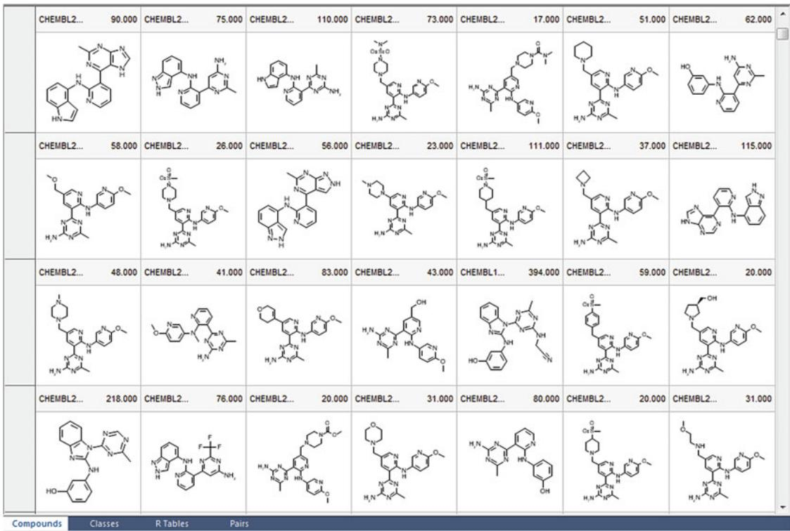  
Fig. 1 Tiled display (“wallpaper”) from ADMET Predictor 8.5 showing structures for a rat liver microsome clearance data set taken from ChEMBL

which risks biasing predictions significantly. Several steps can and should be taken to ensure that the accuracy of a QSPR model is limited by the random noise in the experimental data rather than by errors that could have been found and addressed.

1. Plot the distribution of your data as a function of the property to be modeled. Errors in units often make themselves apparent as secondary peaks offset from the main body of properties by a factor of 1000, typically because $^ { \mathfrak { a } } \mu ^ { \mathfrak { p } }$ was substituted for $" \mathrm { m } ^ { \mathrm { \infty } }$ in a table header or vice versa. They can also arise because qualifiers such as $^ { 6 6 } < ^ { 5 3 }$ were lost in transcription. When such an error in units is found, other data from the same source should also be considered for revision.   
2. Most QSPR properties of practical interest reflect behavior in aqueous solution, so they are intrinsically molecular in nature. Therefore, salts and other admixtures are expected to reflect the properties of their constituent molecules independently, once secondary effects (e.g., on ionic strength and pH) have been accounted for. If the property values reported for replicate entries are reasonably comparable, the records should be merged and the average value (or geometric mean for models built on a logarithmic scale;  below) should be used ( Note 5).

Note that property values can be consistent without being the same. In particular, a solubility value of ${ \mathrm { > } } 1 { \mathrm { ~ } } \operatorname { m g } / { \mathrm { m L } }$ is consistent with a second entry of $2 . 5 ~ \mathrm { m g / m L }$ for a compound of the same name. This may seem obvious, but automated comparisons can easily be fooled by such nominal discrepancies.

When inconsistent property values are associated with the same identifier and the structures are the same, check the primary sources. Other nonduplicated observations from the flawed source should also be examined and corrected as appropriate, whether they reflect errors in the primary source or were introduced during transcription. Errors uncovered in this way may involve units, but they may also involve species, tissue, etc. Regardless, other data from the same source will likely need to be corrected as well.

Having more data is not necessarily better. This is obvious when it is a matter of the accuracy of individual data points, but it also pertains to a “clumpy” sampling of chemistry space that can result from the tendency to pursue a synthesis strategy of “methyl, ethyl, butyl, futile, etc.”—i.e., generating a series of closely related analogs from readily available reagents and a key synthetic intermediate. This is important for establishing patent coverage and for local QSARs: the target activity may vary considerably across the analogs, but the property that is the focus of the QSPR analysis does not. Such a situation often arises when data from papers documenting large-scale pharmaceutical projects are included in the data set.

Having many nearly duplicate structures with very similar property values in a data set can distort model performance statistics, especially if they share a bias. The best way to check for this is to cluster the compounds by structure (e.g., using substructural fingerprints or self-organizing maps and molecular descriptors [24]) and examine the distribution of property values within the clusters. If necessary, a representative subset of structures ( Subheading 3.6 below) can be used that seecovers the full range of analog properties.

Whether a QSPR should be modeled on a linear or logarithmic scale depends primarily on how its experimental error varies with its value. Analytical errors for positive unbounded properties like solubility typically are proportional to the value itself. When that is the case, the error of the logarithm is independent of the value, so modeling the log levels out the influence of errors in individual observations. Applying the log transform to properties that reflect equilibria has the additional advantage of putting them on a “natural” scale where they are proportional to differences in Gibbs free energy (ΔG).

Some ADME properties are bounded. Percent unbound in plasma, for example, can range from 0 to $1 0 0 \%$ . Experimental errors in such data are often quite variable on a linear scale, being higher at midrange than near the lower and upper bounds. In such situations, applying the logit transform should be considered:

$$
\operatorname {l o g i t} (x) = \ln (x) - \ln (1 - x)
$$

where $\ln ( x )$ is the natural logarithm of $_ x$ . The actual base used is x xnot important so long as the inverse transformation (“antilogit”) applied to return to the original scale makes use of the same base for the exponentiation.

$$
\operatorname {a n t i l o g i t} (z) = \exp (z) / (1 + \exp (z))
$$

5. When the data is log-transformed, nominal values ${ \le } 0$ must be set aside. The same is true for values of 0 or $1 0 0 \%$ when a logit transform is applied. Such values cannot be literally correct; they typically reflect limitations on the dynamic range of the analysis system used and are better represented as qualified values such as $\mathit { \Omega } ^ { \mathrm { { e } } } { < } 1 ~ \mu \mathrm { g } / \mathrm { m L }$ .” In fact, any value near the extremes in the data set (“outliers”) may be significantly less reliable than others, so it may be advisable to set them aside or assign them to the test set ( Note 3).

# 3.4 Data Set Partitioning

It is essential to set aside a substantial fraction—usually at least $1 0 \%$ —of the data set as an external test set. It is critical that the data from these observations are not used at any stage of the modelbuilding process. That way the corresponding structures can serve as surrogates for new structures: how well their properties are predicted provides an unbiased estimate of the model’s performance when presented with truly novel compounds.

Optimizing the partition of the data set into an external test set and a training pool requires striking a balance between the expected predictive power of the model when applied to novel structures and how well that predictive performance is characterized. A more diverse training pool is more informative and confers greater statistical power on the model produced than a less diverse one can, whereas a more diverse external test set typically more accurately represents new compounds to which the model may be applied. On the other hand, observations that are individually less informative (more typical) serve to average out noise in the data.

As noted above, the data available to build QSPR models is naturally clumpy in chemistry space because of the way analog synthesis is carried out. One good way to address such inhomogeneity is to group compounds together based on structural descriptors [24], by their target property values, or by a subsidiary attribute such as molecular weight or lipophilicity (logP). The groups obtained are then sampled more or less evenly. This kind

of procedure is called “stratified sampling”; it tends to yield better model performance than simple random sampling [26].

Regardless of how the partitioning is done, it is best that it has some element of randomness—e.g., the sampling within groups— so that the degree of stability to small changes (robustness) of a model can be assessed accurately.

Most model-building systems create several different verification (internal test) sets from the training pool, generally at random; training pool observations that are not in a particular verification set are then used to train the respective QSPR model. Performance on the verification set can then be used to reduce the risk of overfitting the model—i.e., avoid having the model “learn” the noise in the data set as well as the signal.

In some software packages, the performance statistics are averaged across the verification sets in lieu of having a fully external test set. Such “cross-validation” may overestimate how well a QSPR model performs [27]. We believe the use of an external test set is essential to avoid overtraining.

# 3.5 Model Building

Many factors contribute to how well the model-building process works for any particular program. As a result, how each stage is best carried out depends on the detailed nature of the other stages. Moreover, most people will not have access to equally sophisticated versions of more than two or three fundamentally different approaches and know how to apply them properly. Rather than attempt a thorough exploration of the pluses and minuses of the various methodologies here, we will describe in general terms the workflow most commonly used in constructing QSPR models for ADMET Predictor. That said, some form of the basic elements of the workflow given is applicable to most other programs as well:

1. The list of potential descriptors is filtered to remove any with low variance and that show unacceptably high pairwise or multilinear correlation with other descriptors.   
2. The descriptors that remain are sorted in descending order of sensitivity—i.e., the extent to which they themselves can account for variation in the target property across the training pool.3   
3. An initial number of descriptors and a number of hidden-layer neurons are selected for the first artificial neural network ensemble architecture to be trained. Later, models with more descriptors and/or more neurons in the hidden layer are trained.   
4. A set of 165 artificial neural networks (ANNs) are trained, each with its own randomly assigned training and verification sets.

Training continues iteratively so long as predictive performance on the verification set continues to improve; that performance will begin to degrade when the model starts memorizing the uninformative variation—the noise—in the training set data.

5. The 33 networks exhibiting the best performance on the training pool are combined to form the final QSPR model, which is an  of neural nets—an ANNE. A regression model ensembleprediction is obtained by averaging the individual network predictions, whereas a classification model prediction is obtained by tallying “votes” across the ensemble or by averaging network outputs.   
6. For classification models, a confidence estimate is generated based on the strength of the consensus between networks in the ensemble [29].   
7. A final model is selected by comparing ensemble performance on the training, verification, and test sets across a range of ANN architectures defined by the number of input descriptors and the number of neurons in the hidden layer.

# 3.6 Performance Assessment

Model performance is assessed based on how well property values predicted for the external test set compare to the observed property values. Aggregated performance statistics are important, but examining individual predictions is more apt to improve a model.

1. Pearson’s correlation coefficient $( r ^ { 2 } )$ between observed and rpredicted values is widely used as measure of a regression model’s overall performance. It is a good measure of correlation between variables but is suboptimal as a measure of predictive performance in that it can be relatively high even when all predictions are off by the same amount or in the same proportion. The root mean square error (RMSE) is generally a more appropriate statistic to use:

$$
\mathrm {R M S E} = \sqrt {\frac {\left(\hat {y} _ {i} - y _ {i}\right) ^ {2}}{n}}
$$

where $\mathcal { I } _ { 1 } ^ { k }$ is an observed value, $\hat { y _ { \mathrm { i } } }$ is the corresponding predicted yvalue, and $\mathscr { n }$ yˆis the number of observations in the test set. The nmean absolute error (MAE) is an analogous nonparametric statistic that is less sensitive to distortion by extreme outliers.

2. Classification performance is sometimes measured by “accuracy,” which is the fraction of all predictions that are correct; however, most QSPR data sets are unbalanced, in that the positive class is typically underrepresented. In such cases, it makes sense to evaluate performance on each class separately. Doing so yields four statistics:

$$
\text {s e n s i t i v i t y} = \mathrm {T P} / (\mathrm {T P} + \mathrm {F N})
$$

$$
\mathrm {s p e c i f i c i t y} = \mathrm {T N} / (\mathrm {T N} + \mathrm {F P})
$$

$$
\mathrm {P P V} = \mathrm {T P} / (\mathrm {T P} + \mathrm {F P})
$$

$$
\mathrm {N P V} = \mathrm {T N} / (\mathrm {T N} + \mathrm {F N})
$$

where TP and FP are the numbers of true and false positives, TN and FN are the numbers of true and false negatives, and PPV and NPV are the positive and negative predictive values, respectively. A form of the accuracy that is balanced by the relative size of the two classes is given by Youden’s index :

$$
J = \text {s e n s i t i v i t y} + \text {s p e c i f i c i t y} - 1
$$

Youden’s index is optimized in the course of ANN training in ADMET Predictor. Its value is determined by the decision threshold chosen once training is complete. A rather more abstract statistic—the area under the receiver operating characteristic curve (AUC ROC)—is used by some other programs; it integrates performance across all possible decision thresholds.

3. The confidence estimates mentioned above represent one way to determine whether a new molecule is too dissimilar to those upon which the QSPR model is based for the prediction for it to be trusted. An alternative approach is to compare the descriptor values for the new compound to those used to build the model. ADMET Predictor flags a molecule as “out of scope” if any of the model descriptor values lies more than $1 0 \%$ above or below the range of that descriptor in the model’s data set. Some programs use fingerprint similarity to identify out-of-scope structures.

# 3.7 Analyzing Outliers

The process outlined above usually does not produce a finished QSPR model in the first round; rather, it provides a way to identify more subtle kinds of error in the input data.

1. Overall performance statistics like RMSE are important for comparing the performance of different regression models, but examining plots of predicted vs observed property values is much more informative and should always be done. Such a visual examination highlights anomalously high or low predictions. Outliers in the test set usually indicate a weakness in the model, but outliers in the training set may be cases where the experimental value is in error. Finding the latter kind of outlier is good, since it indicates that the model is robust enough to make an accurate prediction despite being given wrong information. Identifying all of the data points in such a plot that come from the same literature source as an outlier can indicate a whole block of observations that are also mispredicted but to

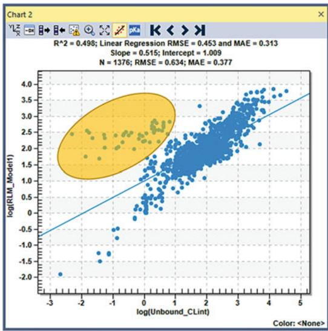

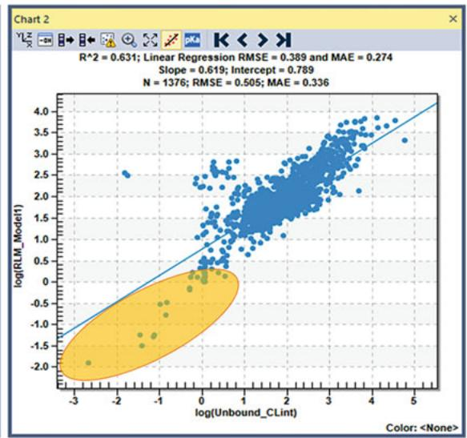  
Fig. 2 Identifying systematic bias due to errors in reported units by examining plots of predicted versus observed CYP rat liver microsomal intrinsic clearance (RLM CLint). (LEFT) Highlighted points represent uncorrected values from Hibi et al. [30]. (RIGHT) Highlighted points represent uncorrected values from Ro¨ ver et al. [31]

a lesser degree because the model was able to partially offset the aggregate bias arising from the error. Correcting all of the errors almost always improves (decreases) the overall RMSE.

2. Highlighting blocks of observations from a single source can identify data sources that generate no obvious outliers. Figure 2 shows results from an interim model that revealed two blocks of flawed rat liver microsome clearance data. The compounds in the lower block were too low by a factor of 1000. ChEMBL provided the wrong units for the upper set of outliers—μL/ $\mathrm { { m i n / m g } }$ of protein were reported instead of mL/min per gm of liver. The (erroneous) information that the first block of compounds contributed to the model evidently overlapped enough with the information from other compounds that the model was unable to reconcile the discrepancy. The structures in the second block were unique enough that the model was able to accommodate the errors. Nonetheless, correcting the error improved the overall fit and predictivity.   
3. Classification models are not amenable to the analysis described above, but the confidence estimates described above can serve a similar function. It often happens that there are a handful of predictions that every single network in the ensemble gets wrong. This sometimes reflects experimental problems (e.g., in HTS data) that cannot be resolved, but it often reflects the same kind of systematic errors that come out of the regression analyses described above—i.e., cases where it is the input data that are wrong, not the predictions.

# 3.8 Iterate

Once you have used your initial model to identify second-order errors in the data set, you will be ready to repeat the process by building a refined model. A second or third iteration may be required before all the addressable errors have been found, but the effort invested in improving the data will ultimately pay off in increased accuracy and robustness of the resulting QSPR model.

# 4 Notes

1. It is worthwhile to invest some time in studying how the property being modeled is actually measured experimentally—and how it was measured in the past. Very high solubilities, for example, were historically measured by determining the amount of material that would dissolve in $1 0 0 0 \times \mathrm { ~ g ~ } 6$ f rather than by the amount present in $1 ~ \mathrm { m L }$ of of saturated water , as is standard now. This distinction is often lost in solutioncompilation, a misunderstanding that can lead to incorrect molar solubilities.

Tabulated melting points often include values for the temperature at which compounds decompose. In the primary literature, such “melting points” are generally qualified by appending “(dec.)”; overlooking this distinction can lead to problems in generating or evaluating a QSPR model (e.g., [32]).

Kinetic solubility obtained from turbidimetric analysis is not the same property as solubility at thermodynamic equilibrium in pure water, and solubility in buffered solution (e.g., at pH 7.4) is not the same as solubility in pure water.

Finally, microsomal esterases will distort liver CYP microsomal clearance models when data for ester prodrugs are included that do not include a control incubation without NADPH [33].

2. Nominal property values of interest are subject in most cases to significant variability, depending on exactly how they are measured. In principle, getting all of the data from any single will tend to minimize such variability and thereby sourceincrease the consistency (precision) of QSPR predictions. Historically, this has led many pharmaceutical companies to rely on models built entirely on in-house property data, which always comes at some risk of compromising the robustness and accuracy (increasing the bias) of those predictions.

This is particularly true when the data are obtained by high- or medium-throughput assays that are themselves in vitro models of the desired property: measuring Caco-2 or Madin-Darby canine kidney (MDCK) cell monolayer permeability to estimate effective human intestinal permeability $( P _ { \mathrm { e f f } } )$ Pis a prominent example of this. S. Yamashita et al. showed that

Caco-2 permeability data for the same set of compounds can vary widely across laboratories due to the nonuniformity in experimental conditions across organizations [34] and the heterogeneity of the cell line [35].

In such cases the “true” property values for some kinds of compounds will consistently be under- or overpredicted. If predictions are only ever compared to measurements using exactly the same procedure as that used to generate the training data for the model, this is unlikely to be a problem. Problems are likely to arise, however, if biased predictions are compared to measurements made outside the company or used as input to a pharmacokinetic simulation, for example.

Any model built solely from in-house data should be evaluated by application to a truly external data set, if only to assess how to interpret values from the literature.

3. It is a good idea to set aside outliers and observations with explicitly qualified values as a “soft” test set. The errors in prediction for such observations should not be included when model performance statistics are calculated, but predictions that are  with a qualified value nonetheless lend supconsistentport to the QSPR model that generates them.   
4. We encountered an interesting abstraction error recently where a structure from a paper containing a single badly predicted fraction unbound in plasma “jumped out” of the spreadsheet display as being out of place. The structure, drawn from a ChEMBL search for fraction unbound in rat plasma, was a rather unusual cyclic acyl enamine (Fig. 3), whereas the

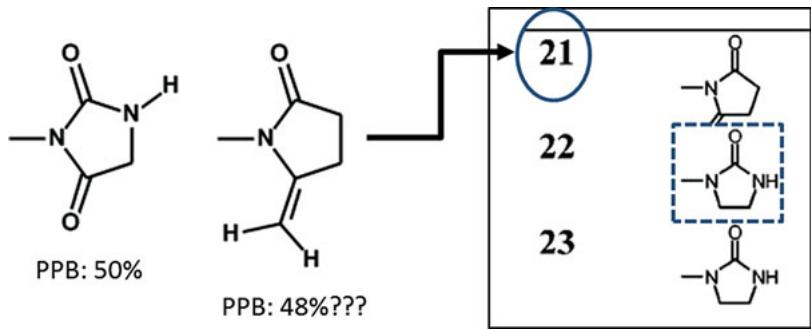  
Fig. 3 Structures retrieved from ChEMBL for a paper by Pevarello et al. [36]. The image at the right is taken from Table 3 in that paper (adapted with permission. Copyright 2005 American Chemical Society), which lays out the heterocyclic para-substituents for a series of 2-phenylpropionamide analogs. The dotted line shows where the background from the substituent for compound 22 overlaps the structure for the substituent for compound 21, obscuring its carbonyl oxygen. A check of the synthesis details section confirmed that 21 is, in fact, a succinimide

substituents for other analogs were much more mundane: succinimide, imidazolidinones, etc. Examination of the table of substituent structures in the original paper [36] suggested that the substituent structure for one structure had been pasted into the table so that it overlapped the one above, thereby obscuring the carbonyl oxygen. Correcting the structure brought predictions for it and other compounds in the paper into line with predictions based on the rest of the data set.

5. Physicochemical properties are generally insensitive to $\mathrm { R } / s$ stereochemistry and to mixture composition, in that enantiomers have the same solubility, $\mathrm { p } K _ { \mathrm { a } } .$ , etc. They may differ some-Kwhat in metabolism, but—with some notable exceptions— usually not by a large amount. The ADME properties of , on the other hand, can be very different from mic mixturesthose of either enantiomer. The melting points and solubilities of many racemic amino acid mixtures are a case in point: the enantiomers pair up in the crystal, increasing its stability and reducing its solubility. Differential effects on transporters are also possible, with one enantiomer affecting transport and/or metabolism of the other [37].

A property of the racemic mixture in such cases is not properly a  property of either enantiomer, just as the molecularmelting point and solubility of a salt is an attribute of the combination rather than of either molecular component alone. Those properties may well be of practical importance but few if any model-building programs are likely to handle data for such mixtures properly.

# Acknowledgments

The authors would like to acknowledge Michael S. Lawless, Marvin Waldman, and Walter S. Woltosz of Simulations Plus, Inc., for their careful reading of the manuscript and their insightful suggestions.

# References

1. Pragyan P, Kesharwani SS, Nandekar PP, Rathod V, Sangamwa AT (2014) Predicting drug metabolism by CYP1A1, CYP1A2, and CYP1B1: insights from MetaSite, molecular docking and quantum chemical calculations. Mol Divers 18(4):865–878   
2. Houston JB, Kenworthy KE (2000) In vitroin vivo scaling of CYP kinetic data not consistent with the classical Michaelis-Menten Model. Drug Metab Dispos 28(3):246–254   
3. ADMET Predictor™. Simulations Plus Inc., Lancaster, CA, USA

4. RCSB Protein Data Bank Royal Society of Chemistry. https://www.rcsb.org/pdb/ home/home.do   
5. Weininger D (1988) SMILES, a chemical language and information system. 1. Introduction to methodology and encoding rules. J Chem Inf Comput Sci 28(1):31–36. https://doi. org/10.1021/ci00057a005   
6. SMILES–A simplified chemical language. Daylight Chemical Information Systems, Inc. http://www.daylight.com/dayhtml/doc/the ory/theory.smiles.html

7. The IUPAC international chemical identifier (InChI). International union of pure and applied chemistry. https://iupac.org/who-weare/divisions/division-details/inchi/   
8. Stephen R Heller AM, Pletnev I, Stein S, Tchekhovskoi D (2015) InChI, the IUPAC international chemical identifier. J Cheminform 7:23   
9. MedChem Designer™: Chemical structure drawing and property prediction. Simulations Plus, Inc. http://www.simulations-plus.com/ software/medchem-designer/   
10. ChEMBL. EMBL-EBI. https://www.ebi.ac. uk/chembl/   
11. Bento AP, Gaulton A, Hersey A, Bellis LJ, Chambers J, Davies M, Kru¨ger FA, Light Y, Mak L, McGlinchey S, Nowotka M, Papadatos G, Santos R, Overington J (2014) The ChEMBL bioactivity database: an update. Nucleic Acids Res 42:1083–1090. https://doi. org/10.1093/nar/gkt1031   
12. Wang YL, Bryant SH, Cheng TJ, Wang JY, Gindulyte A, Shoemaker BA, Thiessen PA, He SQ, Zhang J (2017) PubChem BioAssay: 2017 update. Nucleic Acids Res 45(D1): D955–D963. https://doi.org/10.1093/nar/ gkw1118   
13. Waldman M, Fraczkiewicz R, Clark RD (2015) Tales from the war on error: the art and science of curating QSAR data. J Comput Aided Mol Des 29:897   
14. AID 1996: Aqueous Solubility from MLSMR Stock Solutions (2009) Available via National Center for Biotechnology Information. https://pubchem.ncbi.nlm.nih.gov/bioassay/ 1996. Accessed Nov 2017   
15. ChemSpider: Search and share chemistry. Royal Society of Chemistry. http://www. chemspider.com/   
16. What is R? The R Foundation. https://www.rproject.org/about.html   
17. Willighagen EL, Mayfield JW, Alvarsson J, Arvid Berg LC, Jeliazkova N, Kuhn S, Pluskal T, Rojas-Cherto´ M, Spjuth O, Torrance G, Evelo CT, Guha R, Steinbeck C (2017) The Chemistry Development Kit (CDK) v2.0: atom typing, depiction, molecular formulas, and substructure searching. J Cheminform 9:33   
18. About KNIME. KNIME. https://www.knime. com/. Accessed 17 Nov 2017   
19. BIOVIA Pipeline Pilot. Dessault Systemes. http://accelrys.com/products/collaborativescience/biovia-pipeline-pilot/   
20. Tosco P, Stiefl N, Landrum G (2014) Bringing the MMFF force field to the RDKit: implementation and validation. J Cheminform 6:37

21. Todeschini R, Consonni V (2000) Handbook of molecular descriptors. Wiley-VCH, Weinheim; New York   
22. Rogers D, Hahn M (2010) Extendedconnectivity fingerprints. J Chem Inf Model 50(5):742–752. https://doi.org/10.1021/ ci100050t   
23. Hall LH, Kier LB (1995) Electrotopological state indices for atom types: a novel combination of electronic, topological, and valence state information. J Chem Inf Comput Sci 35:1039–1045   
24. Yan A, Gasteiger J (2003) Prediction of aqueous solubility of organic compounds by topological descriptors. QSAR Comb Sci 22:821–829. https://doi.org/10.1002/qsar. 200330822   
25. Tiikkainen P, Bellis L, Light Y, Franke L (2013) Estimating error rates in bioactivity databases. J Chem Inf Model 53(10):2499–2505. https:// doi.org/10.1021/ci400099q   
26. May R, Maier H, GC D (2010) Data splitting for artificial neural networks using SOM-based stratified sampling. Neural Netw 23:283–294   
27. Clark RD (2003) Boosted leave-many-out cross-validation: the effect of training set and test set diversity on PLS statistics. J Comput Aided Mol Des 17:265–275   
28. Zˇ uvela P, Liu JJ, Macur K, Ba˛czek T (2015) Molecular descriptor subset selection in theoretical peptide quantitative structure–retention relationship model development using natureinspired optimization algorithms. Anal Chem 87(19):9876–9883. https://doi.org/10. 1021/acs.analchem.5b02349   
29. Clark RD, Liang W, Lee AC, Lawless MS, Fraczkiewicz R, Waldman M (2014) Using beta binomials to estimate classification uncertainty for ensemble models. J Cheminform 6 (1):34   
30. Hibi S, Ueno K, Nagato S, Kawano K, Ito K, Norimine Y, Takenaka O, Hanada T, Yonaga M (2012) Discovery of 2-(2-Oxo-1-phenyl-5- pyridin-2-yl-1,2-dihydropyridin-3-yl)benzonitrile (Perampanel): a novel, noncompetitive α-amino-3-hydroxy-5-methyl-4-isoxazolepropanoic Acid (AMPA) receptor antagonist. J Med Chem 55(23):10584–10600. https:// doi.org/10.1021/jm301268u   
31. Ro¨ver S, Andjelkovic M, Be´nardeau A, Chaput E, Guba W, Hebeisen P, Mohr S, Nettekoven M, Obst U, Richter WF, Ullmer C, Waldmeier P, Wright MB (2013) 6-Alkoxy-5-aryl-3-pyridinecarboxamides, a new series of bioavailable cannabinoid receptor type 1 (CB1) antagonists including peripherally selective compounds. J Med Chem 56

(24):9874–9896. https://doi.org/10.1021/ jm4010708   
32. Ran Y, Jain N, Yalkowsky SH (2001) Prediction of aqueous solubility of organic compounds by the general solubility equation (GSE). J Chem Inf Comput Sci 41 (5):1208–1217. https://doi.org/10.1021/ ci010287z   
33. Beaulieu PL, Marte JD, Garneau M, Luo L, Stammers T, Telang C, Wernic D, Kukolj G, Duan J (2015) A prodrug strategy for the oral delivery of a poorly soluble HCV NS5B thumb pocket 1 polymerase inhibitor using selfemulsifying drug delivery systems (SEDDS). Bioorg Med Chem Lett 25:210–215   
34. Yamashita F, Hashida S-iFM (2002) The “Latent Membrane Permeability” Concept: QSPR Analysis of Inter/Intralaboratorically Variable Caco-2 Permeability. J Chem Inf Comput Sci 42(2):408–413. https://doi.org/ 10.1021/ci010317y

35. Sambuy Y, Angelis ID, Ranaldi G, Scarino ML, Stammati A, Zucco F (2005) The Caco-2 cell line as a model of the intestinal barrier: influence of cell and culture-related factors on Caco-2 cell functional characteristics. Cell Biol Toxicol 21(1):1–26. https://doi.org/10. 1007/s10565-005-0085-6   
36. Pevarello P, Brasca MG, Orsini P, Traquandi G, Longo A, Nesi M, Orzi F, Piutti C, Sansonna P, Varasi M, Cameron A, Vulpetti A, Roletto F, Alzani R, Ciomei M, Albanese C, Pastori W, Marsiglio A, Pesenti E, Fiorentini F, Bischoff JR, Mercurio C (2005) 3-Aminopyrazole Inhibitors of CDK2/Cyclin A as Antitumor Agents. 2. Lead Optimization. J Med Chem 48:2944–2956   
37. Borgstrom L, Nyberg L, Jonsson S, Lindberg C, Paulson J (1989) Pharmacokinetic evaluation in man of terbutaline given as separate enantiomers and as the racemate. Br J Clin Pharmacol 27(1):49–56. https://doi.org/10. 1111/j.1365-2125.1989.tb05334.x

# Isomeric and Conformational Analysis of Small Drug and Drug-Like Molecules by Ion Mobility-Mass Spectrometry (IM-MS)

Shawn T. Phillips, James N. Dodds, Jody C. May, and John A. McLean

# Abstract

This chapter provides a broad overview of ion mobility-mass spectrometry (IM-MS) and its applications in separation science, with a focus on pharmaceutical applications. A general overview of fundamental ion mobility (IM) theory is provided with descriptions of several contemporary instrument platforms which are available commercially (i.e., drift tube and traveling wave IM). Recent applications of IM-MS toward the evaluation of structural isomers are highlighted and placed in the context of both a separation and characterization perspective. We conclude this chapter with a guided reference protocol for obtaining routine IM-MS spectra on a commercially available uniform-field IM-MS.

Key words Isomers, Drugs, Conformation, Ion mobility spectrometry, Ion mobility-mass spectrometry, IM-MS

# 1 Introduction

The process of developing new drug candidates has changed significantly over time, as a result of the Human Genome Project and other technological advances in computational modeling and bioinformatics [1]. For example, high-throughput screening methods provide unparalleled capacity to screen millions of chemical structures for potential drug efficacy [2, 3], as opposed to simply developing a target candidate and anticipating relevant biochemical action. Regardless of the desired approach toward the production of novel drug candidate molecules by either reverse pharmacology, the classical approach, or natural product discovery [4–6], most drugs take several years to develop and millions of dollars to become marketable as a requirement of validation through in-depth clinical trials, evaluation of safety risks, and FDA approval [7]. As part of this development process, the analytical need to

study the structural characteristics of these small molecules is imperative.

Structural characterization of potential drug candidates, either derived from natural sources or synthesized in the laboratory, is a complex and time-consuming process, and for rapid analyses, pharmaceutical companies value the high degree of analytical selectivity and sensitivity afforded by modern mass spectrometry (MS) methods toward overall quality control of synthesized products and characterization of new drug targets [8, 9]. Although mass spectrometers are highly selective, often able to assign a molecular formula for a target analyte based solely on molecular mass measurement, isomeric species are difficult to differentiate by traditional MS methods, even with the addition of tandem MS/MS approaches [10, 11]. Because the biological function of chemical compounds can change with their structural variation, isomeric species are a highly researched area of the pharmaceutical field [12]. Condensed phase separation techniques such as gas or liquid chromatography are often utilized to separate complex mixtures prior to mass analysis and provide the ability to separate isomers by differences in chemical properties, such as polarity or boiling point. These methods, while effective, are often highly selective to narrow classes of isomers and are not inherently high-throughput techniques. In this chapter, we describe the application of IM-MS, an emerging analytical technique for structurally characterizing small molecule isomer systems, with a particular focus on the role of IM-MS in characterizing biological systems and relevant pharmaceutical applications.

# 1.1 Isomers

Isomers are defined as compounds having the same molecular formula but differing in their overall chemical structure [13]. Isomeric species are further subdivided into categories that reflect their structural variations, which may include covalent bond rearrangements (constitutional isomers), stereochemical variations (stereoisomers), or rotational isomers, commonly referred to as rotamers. As constitutional isomers vary in skeletal structure between constituent atoms, these isomers possess a broad scope of biological activity based upon their particular structural arrangements. For example, the molecular formula $\mathrm { C } _ { 8 } \mathrm { H } _ { 9 } \mathrm { N O } _ { 2 }$ is reported to have 33 isomers by the PubChem database [14], and many of these isomers have unique chemical behavior and physiological function (Fig. 1). In one case, paracetamol (more commonly known as acetaminophen) is a well-known analgesic, yet its constitutional isomer, methyl anthranilate, functions as a bird repellent and a flavor additive in drinks [15]. The structural makeup of constitutional isomers can also vary widely depending on their biological class. For example, lipid isomers typically vary in alkyl chain position and cis/trans double bond positioning [16], while peptides tend to

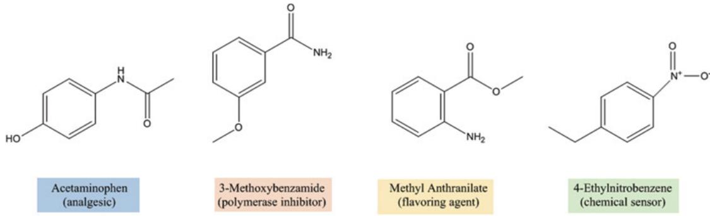  
Fig. 1 Structures related to four constitutional isomers of chemical formula ${ \sf C } _ { 8 } { \sf H } _ { 9 } { \sf N } 0 _ { 2 }$ and corresponding function or typical use

have sequence order variation or even amino acid substitutions comprised of the same chemical formula (e.g., leucine/ isoleucine) [17].

In addition to constitutional isomers, compounds with the same molecular formula can differ in stereochemistry (i.e., diastereomers and enantiomers), resulting in varying chemical and physical properties. For example, ethambutol is a 204 Da molecule $\left( \mathrm { C _ { 1 0 } H } _ { 2 4 } \mathrm { N } _ { 2 } \mathrm { O } _ { 2 } \right)$ possessing two stereocenters. In the $( + )$ form (S, S) ethambutol is frequently used to treat tuberculosis [18]. However, with inversion of chirality at its two stereocenters to form $( - )$ or $( R , R )$ ethambutol, the molecule is known to cause blindness [19]. Isomers also exist for two compounds possessing the same chemical scaffold and chirality. For example, rotamers are small molecule conformers where multiple three-dimensional molecular structures can arise as a result of rotation around a single bond. In some cases this bond rotation gives rise to atropisomerism, which is the restriction of rotation around a single covalent bond which results in distinct optical isomers. A commonly cited rotamer example which exhibits freedom of rotation around a single bond is the Newman projections of butane [20]. In other cases where rotation is not restricted, different stable conformations are still possible, especially in protein analysis. Small molecules in particular are noted for producing a variety of conformations as a result of their flexibility [21]. Because of the diverse chemical activity that can exist within constitutional and conformational isomers, finding useful and efficient ways to explore the structure of these molecules can provide insight into their specific chemical properties.

For the past 15 years, IM-MS has made large contributions in the analysis of constitutional and conformational isomers [22–24]. As result of the commercialization and rapid adoption of IM-MS instrumentation [25–27], the Web of Science database cites over 3500 articles in the last decade related to IM-MS studies [28]. While ion mobility has been traditionally utilized to study large biological systems, more recently it has been applied to the study of

smaller $\scriptstyle \angle 4 0 0$ Daltons) drug and drug-like molecules [29, 30]. In this chapter, we describe the technique and theory of IM-MS, provide examples of the use of IM-MS to characterize various small drug and drug-like molecules, and provide some basic methodology toward collecting and analyzing IM-MS data using a commercially available IM-MS platform (Agilent 6560) as an example [27].

# 1.2 Instrumentation and Theory

IM-MS is an emerging analytical technique that separates gas-phase ions in two dimensions based upon molecular size and weight. In the mobility dimension, analyte ions are separated based upon their two-dimensional orientationally averaged size in the gas phase (collision cross section, CCS), which provides information regarding their size and shape [26, 31]. In the mass spectrometer dimension, separation is based upon the mass-to-charge ratio $( m / z )$ o f the analyte ion, which is directly correlated to its intrinsic molecular formula. Combined, IM-MS provides unique and important information regarding the gas-phase density preferences of different classes of molecules, which can identify unknown compounds which share similar structural scaffolds [32, 33].

There are four basic components of an IM-MS instrument: the ion source, the ion mobility separator, the mass analyzer, and the detector (Fig. 2a). The type and arrangement of these components can vary depending on instrument vendor and experiment application [34, 35].

In the source region, analyte ions are commonly generated by electrospray ionization (ESI), which allows the option for directly coupling an LC separation. In ESI, ions enter the source as a liquid and are vaporized using a combination of gas flows and electric fields, which ultimately generate gas-phase ions. While ESI is the most commonly used ion source, other ion source types include laser and chemical ionization (e.g., MALDI and APCI) [36]. ESI commonly produces protonated and deprotonated ions $( [ \mathrm { M } \mathrm { + H } ] ^ { + }$ , $[ \mathrm { M } \mathrm { - H } ] ^ { - } \dot { ) }$ , as well as various alkali metal cation species, such as $[ \mathrm { M } \mathrm { + N a } ] ^ { + }$ and $[ \mathrm { M } \mathrm { + K } ] ^ { + }$ , where M represents the neutral form of the molecule. Once ions are generated, they are released into the ion mobility spectrometer where they are separated based on their gas-phase size and shape (CCS). Following the mobility separation, ions enter the mass analyzer where they are separated by their massto-charge ratio $( m / z )$ . For more in-depth information regarding the experiment, we refer the reader to a recent literature review which covers the various IM techniques and instrumentation in detail [26, 37].

Ion mobility techniques can be broadly separated into two method types: time-dispersive methods, which include drift tube and traveling wave ion mobility spectrometry (DTIMS and TWIMS, respectively), and space-dispersive methods, which primarily include high field-asymmetric waveform IM and differential ion mobility spectrometry (FAIMS and DMS, respectively) which

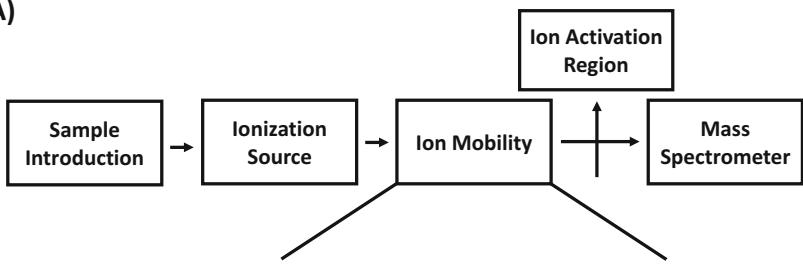  
(A)

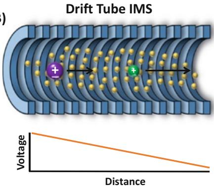  
(B)

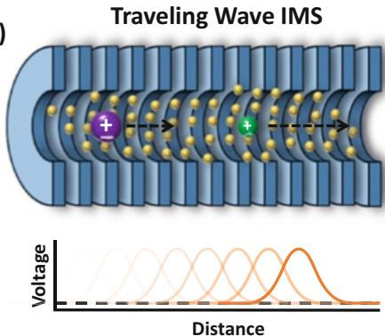  
(C)   
Fig. 2 (a) Block diagram of a typical IM-MS instrument. Ions are separated in the presence of a neutral drift gas by (b) a linear electric field along a series of ring electrodes (DTIMS) or (c) by a pulse wave generated by applied sequential voltage along a series of ring electrodes (TWIMS)

collectively operate as mobility-filtering devices. The examples presented in this chapter will focus on recent applications of the timedispersive methods of DTIMS and TWIMS, which collectively represent the majority of IM instrumentation currently utilized [26].

# 1.2.1 Drift Tube lon 1.2.1 D

In drift tube ion mobility (DTIMS), the IM region consists of a series of ring electrodes contained within a neutral drift gas (typically helium or nitrogen) (Fig. 2b) [38, 39]. DTIMS is operated at one of two pressure regimes: low (1–10 Torr) and elevated (ca. 760 Torr) pressures. Typically, ion transmission is more efficient at reduced pressure yet typically results in somewhat reduced IM resolving power from high diffusion. As ions are introduced into the drift tube, they are drawn through the drift region as a result of an applied electric field along the ring electrodes. During ion drift, the ions interact with the buffer gas at low energy, and molecules with smaller rotationally averaged surface area (smaller CCS) transverse the region faster as a result of fewer collisions. Mathematically, the CCS of the analyte ion can be calculated using the Mason-Schamp equation [27, 32] where $K _ { 0 }$ is the measured mobility of the ion, z is the charge of the ion, $T$ is the temperature of the drift gas, and $N _ { 0 }$ is the number density of the drift gas at standard temperature and pressure. The terms $\boldsymbol { e }$ and $k _ { \mathrm { B } }$ are the elementary charge and Boltzmann’s constant, respectively:

$$
\mathrm {C C S} = \frac {3 z e}{1 6 N _ {0}} \left(\frac {2 \pi}{\mu k _ {\mathrm {B}} T}\right) ^ {1 / 2 \frac {1}{K _ {0}}} \tag {1}
$$

# 1.2.2 Traveling Wave lon 1.2.2 T

Similar to DTIMS, a traveling wave ion mobility drift cell uses an inert buffer gas and a series of ring electrodes to move ions through the drift region (Fig. 2c) [40, 41]. In TWIMS, ion pulses are mobility separated by sequentially applying a direct current voltage to the rings in a series along the drift cell to create a migrating potential along the length of the cell. These sequential low-voltage pulses generate waves of electric potential that push ions through the drift region. As the wave propels the ions forward through the device, low-energy elastic collisions occur between the analyte ions and the buffer gas. Smaller ions experience fewer collisions with the buffer gas and, as a result, traverse the drift region faster than larger ions, resulting in shorter drift times. This mechanism is almost identical to what is experienced in DTIMS, but with the exception that larger ions are slower in TWIMS as a result of “falling over” the wave pulses during their transit through the cell. The drift times are converted to collision cross sections through a calibration procedure which takes into account the drift times and CCS of known internal standards [42, 43]. The ion mobility spectra obtained from both TWIMS and DTIMS are qualitatively similar.

# 1.3 Current Work in Isomer Structural Separations

Historically, there are many reported studies where DTIMS and TWIMS have been used to observe both constitutional and conformational structures of large molecules, where structural differences are significant and readily measured [44–46]. In this section, we will present some recent examples of the use of TWIMS and DTIMS to separate constitutional and conformational isomers in small molecule systems, which have been given less attention in the literature, but nonetheless are important avenues for developing IM-MS for the separation and characterization of drug and druglike small molecule isomer systems.

# 1.3.1 Separation of Constitutional Isomers

Often chromatographic resolution can be difficult to achieve for molecules with similar polarities, and hence constitutional isomers have been studied in detail by IM-MS. In an effort to differentiate molecules of interest from complex matrices (e.g., biological samples and natural product extracts), mobility techniques have investigated the separation of a wide variety of chemical classes including lipids [47], carbohydrates [48], peptides [42, 49], and fossil fuels [50]. As a specific example, we will consider the highly studied isomer system of leucine and isoleucine, which represent a classically studied isomer pair from an analytical separation perspective, as both compounds have the same chemical formula $( \mathrm { C } _ { 6 } \mathrm { H } _ { 1 3 } \mathrm { N O } _ { 2 } )$ and hence cannot be distinguished by MS measurements alone. From an ion mobility perspective, leucine and isoleucine have

been shown to be differentiable using several ion mobility techniques, including FAIMS [51] and TWIMS [52]. In a recent study by Dodds et al., 11 different leucine/isoleucine isomers were studied using DTIMS and focused on the positive ion forms of these molecules, $[ \mathrm { M } \mathrm { + H } ] ^ { + }$ [24]. The subclasses of isomers investigated in this study include enantiomers (two molecules whose stereochemistry is opposite at every chiral center), diastereomers (two molecules with multiple chiral centers of which some, but not all, have opposite stereocenters), and constitutional isomers related to leucine and isoleucine. A plot of the range of diversity in CCS for these compounds appears in Fig. 3. As illustrated in the figure, the

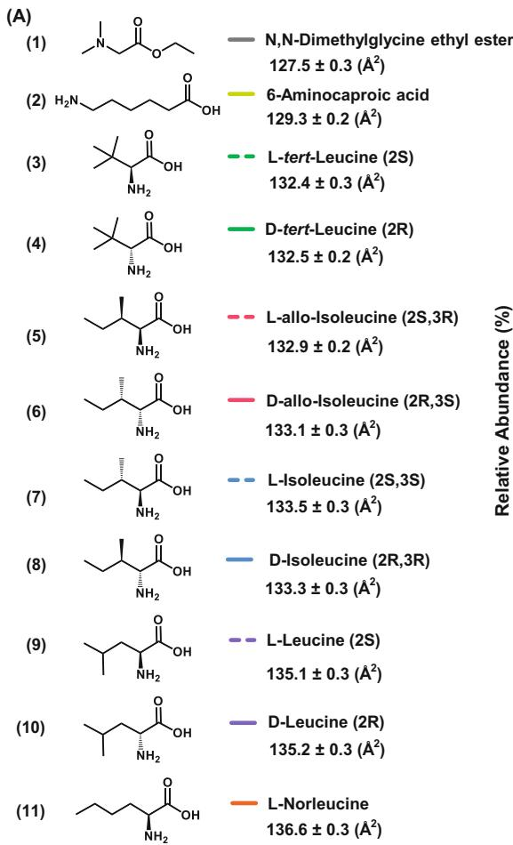

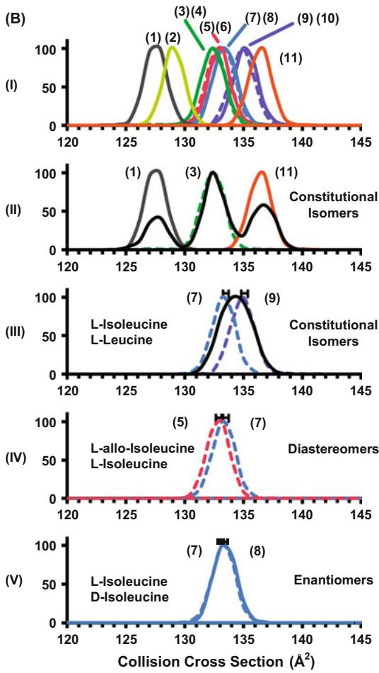  
Fig. 3 (a) Leucine/isoleucine isomers with chemical formula ${ \mathsf { C } } _ { 6 } { \mathsf { H } } _ { 1 3 } { \mathsf { N } } { \mathsf { 0 } } _ { 2 }$ examined in this study. Experimental cross sections with respective standard deviations are shown at the right with corresponding stereochemistry. (b) (I) Experimental IM spectrum overlays for all isomer compounds (standard error bars omitted for clarity). (II) Overlay of the IM spectra corresponding to , -dimethylglycine ethyl ester, L-tert-leucine, and L-norleucine N Nand the IM spectrum corresponding to the mixture (black). (III) Overlays of L-isoleucine and L-leucine in addition to the equal ratio mixture. (IV and V) Overlays of diastereomers and enantiomers, respectively. Adapted with permission from ref. 24, Copyright 2017 American Chemical Society

differences in the CCS vary depending on isomer type. For example, the enantiomers (e.g., L-leucine and D-leucine) show no statistical difference in their measured collision cross sections, and similarly, diastereomers (e.g., L-isoleucine and L-alloisoleucine) exhibit different CCS values but are still very challenging to differentiate (typically $0 . 4 \%$ difference in CCS). However, as the molecules become more structurally diverse, the isomers possess more significant differences in cross section. Specifically, three constitutional isomers (N-N-dimethylglycine ethyl ester, L-tert-leucine, and L-norleucine) are structurally distinct enough to yield baseline or near-baseline separation and possess $3 . 6 \%$ and $3 . 1 \%$ difference in their respective empirical cross sections.

In addition to illustrating the separation of various constitutional isomers, the authors proposed a mathematical relationship correlating the percent difference in cross section of any two isomers of interest with respect to instrumental resolving power $( R _ { \mathrm { p } } )$ . Briefly, the efficiency of ion mobility instruments is described quantitatively in terms of resolving power, defined for DTIMS instruments as the ion drift time $\left( t _ { \mathrm { d } } \right)$ divided by the width of the peak at half height (full width at half maximum height, FWHM):

$$
R _ {\mathrm {p}} = \frac {t _ {\mathrm {d}}}{\mathrm {F W H M}} \tag {2}
$$

As two isomers become more structurally similar (i.e., closer in terms of their cross-sectional areas), higher levels of instrument efficiency $( R _ { \mathrm { p } } )$ are required to resolve the isomeric species of interest. The final equation proposed in the above study relates separation efficiency, termed two-peak resolution $( R _ { \mathrm { p - p } } )$ , to instrumental resolving power and analyte cross-sectional difference $( \Delta \mathrm { C C S \% } )$ :

$$
R _ {\mathrm {p} - \mathrm {p}} = 0. 0 0 5 8 9 \times R _ {\mathrm {p}} \times \Delta \mathrm {CCS} \% \tag{3}
$$

To illustrate the utility of the above equation, consider two isomers of interest that possess cross-sectional differences of $1 . 0 \%$ (e.g., 200 $\mathring { \mathrm { A } } ^ { 2 }$ and $2 0 2 ^ { ^ { \circ } } \mathrm { \mathring { A } } ^ { 2 }$ ). The above equation predicts that separating these isomers to half height resolution $( 0 . 8 3 R _ { \mathrm { p \cdot p } } )$ would require ca. 140 $R _ { \mathrm { p } }$ . In this manner the study by Dodds and coworkers can predict how efficiently two isomers of interest will separate on a specific instrument platform, provided that the CCS of each analyte is previously known and the resolving power of the ion mobility instrument well characterized.

# 1.3.2 Separation of Conformational Isomers

Another biological class where IM-MS has been utilized to facilitate the separation of isomers is carbohydrates. Carbohydrates, or saccharides, are a class of compounds which includes sugars, starches, and cellulose. Carbohydrates are challenging systems to study with most analytical techniques as they commonly exist as complex mixtures in nature with variations in skeletal structure, bond coordination, and stereochemistry (Fig. 4). Studies are further

# Carbohydrate Isomers

Axial / Equatorial -OH groups   
Chair / Boat Conformation   
Connectivity (e.g. 1-3/1-4)   
α/β

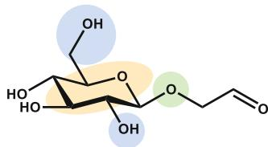

  
Boat Conformation

  
Chair Conformation   
β-D-Glucose-GA   
Fig. 4 Complexity of carbohydrate isomers represented graphically pertaining to both constitutional isomers (connectivity isomers) and stereoisomers (axial/ equatorial substitutions, chair/boat conformations, and $\alpha / \beta$ glycosidic linkage orientation)

complicated because many of the compounds in these mixtures have the same molecular formula (isomers) which again prevents them from being fully characterized using traditional mass spectrometry methods. This makes ion mobility a particularly intriguing tool to explore carbohydrate systems.

A recent example of the utility of IM to study carbohydrates was carried out by Li and coworkers [53]. In their study of sugars, TWIMS was used to measure drift time profiles for ions of monosaccharide-glycolaldehydes and disaccharides of various simple sugars. While this work is another example of the ability of ion mobility to separate constitutional isomers, there were occasions where the presence of multiple conformations appeared, even for what was believed to be a single analyte ion. For example, the monosaccharide-glycolaldehyde $\beta$ -D-glucopyranosyl-2-glycolaldehyde $\beta$ -D-glc-GA) was analyzed in negative mode ESI and produced a drift time profile that generates two distinct peaks for the deprotonated ion. The authors propose that the appearance of these multiple conformations may be attributed to several cyclic/ acyclic forms produced by hemiacetal formation in the gas phase. While most conformers are typically noted for large bimolecular species (i.e., proteins), these small molecule analytes produced multiple distributions (peaks) for one ion form. Thus this work illustrated the possibility to observe conformers even in a relatively small molecule system.

The appearance of conformational isomers for small drug-like molecules has also become evident in studies related to thalidomide in the authors’ laboratory. Thalidomide is a small molecule drug that is currently used primarily for the treatment of specific cancers and for alleviating various symptoms of leprosy. However, historically thalidomide is recognized as one of the first drugs whose different enantiomer forms produced drastically different

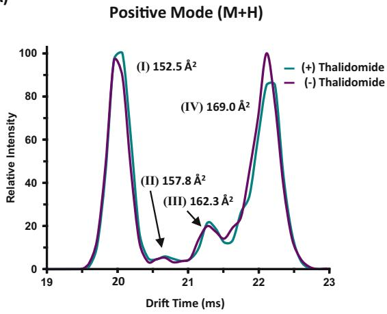  
(A)

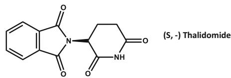

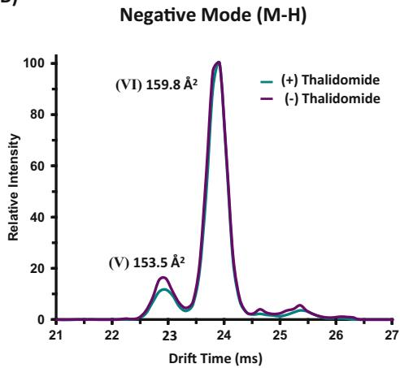  
(B)

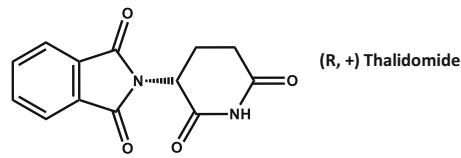  
Fig. 5 Drift time profiles of $( R )$ and ( ) thalidomide enantiomers with corresponding CCS observed in both R Spositive and negative mode (a and b, respectively) for nitrogen drift gas. Structures are illustrated at the bottom for chiral reference

biological effects. Figure 5 illustrates the structures and drift time profiles for the $[ \mathrm { M } \mathrm { + H } ] ^ { + }$ and $[ \mathrm { M } \mathrm { + H } ] ^ { - }$ ions of (S,-)-thalidomide and $( R , + )$ -thalidomide along with corresponding CCS. The drift time profiles of both positive and negative mode ions for both enantiomers are identical. This result is expected as stereochemical differences in small molecules are not expected to result in different drift time distributions. However, multiple peaks were detected for both enantiomers of thalidomide in each ionization mode. Structurally, this observation is reasoned as being a consequence of the possibility for multiple molecular conformations arising from rotation around the single N–C bond that links the two ring moieties.

The development of methods for characterizing small drug and drug-like molecules has become an important focal point for the pharmaceutical industry. As a result there has been a concentrated effort toward discovering new technologies to aid in the development of new drugs. The examples presented in this work provide strong support for the use of IM-MS as an important analytical technology in exploring the structural diversity of constitutional and conformational isomers of small drug and drug-like molecules. In the following sections, we provide the materials and methods necessary to obtain an IM-MS spectra for small molecules (here Sthalidomide, $2 5 8 \mathrm { D a }$ ) using a commercially available IM-MS platform (Agilent IM-MS 6550).

# 2 Materials

1. The sample preparation described here is for use with direct infusion via a syringe pump operated at low flow rates (i.e., $5 { \mathrm { - } } 1 0 0 ~ { \mu \mathrm { L / / m i n } }$ ). As with any analytical study, it is beneficial to have analyte samples and solvents with optimal purity for analysis. In this study, S-thalidomide was purchased from Sigma-Aldrich, and the solvent (Optima LC-MS grade Water) was obtained from Fisher Scientific. A range of analyte concentration can be used and should be selected based upon instrument sensitivity and limits of detection. Standard protocol for this instrument using direct infusion recommends an analyte concentration of $\mathrm { 1 - 1 0 \mu g / m L }$ . For the experiment described here, a $1 0 \ \mu \mathrm { g / m L }$ sample of $S _ { \ l }$ -thalidomide was prepared using $1 0 ~ \mathrm { m M }$ ammonium acetate in water.   
2. The instrument must be tuned prior to data collection in order to perform at optimal sensitivity, resolution, and accuracy. Toward this end a commercially available tune mix solution containing several standards over a range of masses and mobilities was used (Agilent Tune Mix, part number G1969- 85000). Specifics of the tuning method are described in Subheading 3.   
3. Direct infusion was carried out using a $5 0 0 \mu \mathrm { L }$ glass syringe and a KD Scientific syringe pump. Flow rates were as described in Subheading 3 to follow.   
4. Collection of IM-MS data was obtained using Agilent MassHunter Acquisition Software (v.7.00). Data workup of IM-MS distributions was performed using Agilent IM-MS Browser Software (v. 7.02).

# 3 Methods

The method described below is for new users to the Agilent 6560 IM-MS instrument who have general knowledge of traditional mass spectrometry operation. It is intended to provide the novice user with the basic steps necessary to obtain routine IM-MS spectra. It is not intended to provide an exhaustive description of all instrument settings and their uses. The reader should consult their service manual for extended instructions and a comprehensive description of settings. Explicit notes are added following the Subheading 3.

# 3.1 Preparing the Instrument for Direct Infusion

1. To ensure drift time and collision cross section reproducibility, check instrument pressures in each of the following instrument compartments: the high-pressure funnel region should be set

to 4.80 Torr $( \pm 0 . 0 2 )$ and trap funnel region pressure at 3.80 Torr $( \pm 0 . 0 1 )$ , and drift tube pressure should be maintained at 3.95 Torr ( 0.01) (see Note 1). A pressure regulation manifold (alternate gas kit, Agilent) is recommended here in order to automatically maintain these pressure settings. Alternatively, the user may choose to monitor and make manual adjustments to the drift tube pressure in order to maintain the precision of the IM measurements.

2. Open the Agilent MassHunter Workstation Data Acquisition Program. Under the “Context” menu (Fig. 6a), choose the “Tune” setting to perform an autotune. The source temperatures and voltages will be preset for the Agilent Tune Mixture (Fig. 6b), and the ion polarity and scan mode will be selected as a function of the molecules of interest per individual experiment (low mass mode (50–250 m/z), normal mode $( 5 0 - 1 7 0 0 m / z )$ , or high mass range (100–3200 m/z)). In this case we are investigating thalidomide $( 2 5 8 ~ \mathrm { D a } )$ and have selected the normal instrument tuning mode $( 5 0 - 1 7 0 0 ~ m / z )$ .   
3. Select the “Tune and Calibration” tab (Fig. 6c). Select desired ionization mode (positive mode is used here), TOF (time of flight), mass calibration/check, and the corresponding mass

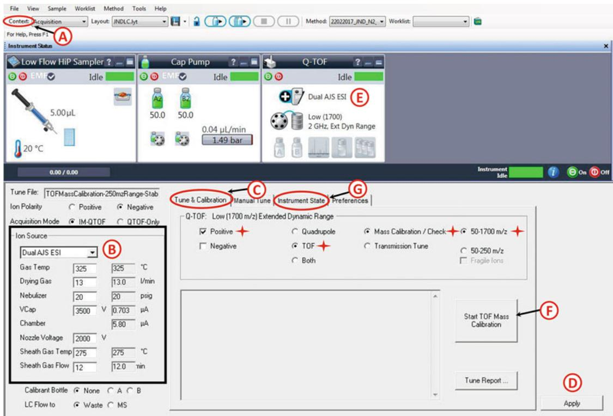  
Fig. 6 Agilent MassHunter Workstation Data Acquisition Program tune page with callouts for various commands

range depending on the analyte to be studied. Once settings have been chosen, click “Apply” to apply these settings prior to tuning (Fig. 6d).

4. Ensure that the calibrant line contains adequate calibrant solution and is plumbed into the primary nebulizer before starting the autotune. It is recommended that at minimum, a quarter of the calibration bottle volume (ca. $3 0 ~ \mathrm { m L }$ ) be filled with calibration solution prior to tuning. Turn on the tune mix by rightclicking in the Q-TOF selection box (Fig. 6e) and selecting calibrant.   
5. When the tune mix ions appear in the spectra window (e.g., m/ $z 3 2 2$ , 622, and 922 in positive ion mode) (see Note 2), click on the “Start TOF Mass calibration” button (Fig. 6f).   
6. Upon tune completion (see Note 3), a calibration report will be generated as a portable document file (PDF). From this report, ensure that signal intensity is greater than $1 \times 1 0 ^ { 5 }$ ion counts and that the ion mobility resolution is between 40 and 60 (see Note 4). After tuning, click the “Instrument State” tab (Fig. 6g), and then click “Save” and “Apply.”   
7. Once the instrument is tuned in the desired ion mode, switch to the acquisition mode under the context menu (Fig. 6a) to start collecting data.

# 3.2 Data Acquisition (Consult Fig. 7)

1. Load the preexisting low mass method in the drag-down box in method editor, and click “Apply” (Fig. 7a). If the user is interested in collecting collision cross sections, the method should include a voltage gradient in the drift tube region in order to subtract out the non-mobility flight time. This voltage gradient can be accessed under the “Advanced Parameters” tab of the method editor screen (Fig. 7b) (see Note 5).   
2. Load the sample in the syringe and syringe pump for direct infusion. Ensure that the syringe pump is set with the correct syringe diameter in order to output the correct flow rates. Although flow rate will vary based on specific instrument source settings and sensitivity, the flow rate used here is $1 { - } 1 0 ~ { \mu } \mathrm { L } / \mathrm { m i n }$ (see Note 6). Turn on the syringe pump. Once sample reaches the instrument, analyte ion peaks begin to appear in the mass window.   
3. To set up the data acquisition, select the “Sample Run” tab at the bottom of the method editor screen (Fig. 7c). In the sample run mode, name the file (Fig. 7d), and select the path directory (Fig. 7e) for your file.   
4. To acquire data, click the forward arrow (Fig. 7f) in the sample run screen.

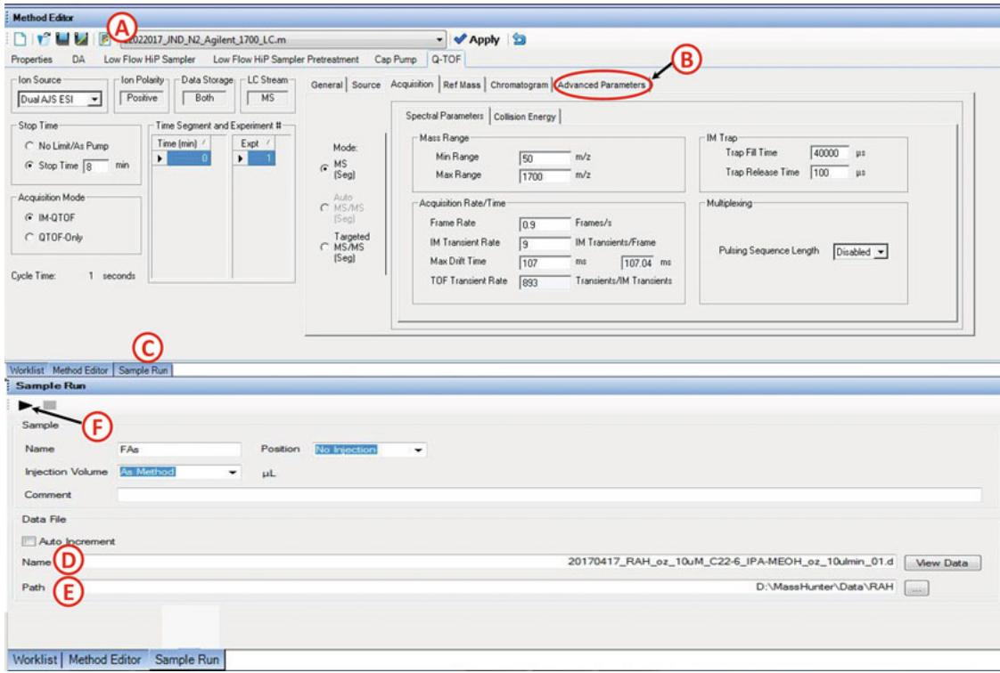  
Fig. 7 Sample run dialogue box including file directory information and sample name

# 3.3 Data Workup

1. After data acquisition is complete, load the “Agilent MassHunter IM-MS Browser” software, and open the desired file. Once the file has opened, select “Condense File” under the “Actions” tab (Fig. 8a). Condensing files will compress the data from each experimental sequence into a single frame, which is convenient for viewing multiple segment runs (e.g., CCS experiments) or long infusion experiments. Note that condensing the file is an optional step.   
2. In IM-MS Browser, you can view the resulting mass spectrum (Fig. 8b), the drift spectrum data (Fig. 8c), and the 2-D plot of mass-to-charge vs drift time (Fig. 8d) for all ions in the sample. In the example spectrum of thalidomide (Fig. 8e), we will focus on the mass-to-charge ion at 259.0708, $[ \mathrm { M } \mathrm { + H } ] ^ { + }$ .   
3. Expand the Counts vs. Mass-To-Charge window by rightclicking and holding on the mass axis and dragging over the desired mass range. (To expand or contract any axis, right-click hold any axis, and move the mouse right or left.) To move the peak right or left, left click and hold the axis and drag accordingly (Fig. 8b).   
4. To obtain a drift time spectrum for a specific mass-to-charge region, right-click and drag over the desired ion in the drift time vs m/z region. This produces a box around the desired ion

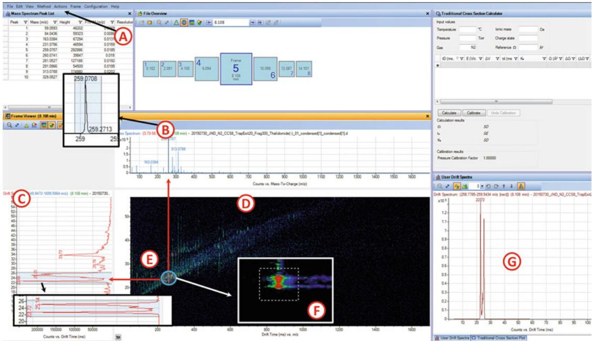  
Fig. 8 Agilent MassHunter IM-MS Browser interface. (a) Mass spectrum of thalidomide, (b) drift spectra window with expanded window for thalidomide drift profile, and (c) 2-D IM-MS window with callout of the thalidomide $[ M + H ] ^ { + }$ ion species

(Fig. 8f). Command “Ctrl X” copies the selected region, and “Ctrl D” pastes the spectra in the user drift spectra window (Fig. 8g).

5. This work flow was repeated for each thalidomide enantiomer in both positive and negative ion mode, and a processed version is illustrated in the main text as in Fig. 5.

# 4 Notes

1. If using the telnet software provided by Agilent Technologies to monitor the instrument pressures, it is beneficial to allow approximately 20 min for the instrument pressures to equilibrate prior to data acquisition.   
2. If tune mix does not appear prior to calibration, it is possible that an obstruction has lodged in the nebulizer. It may be necessary to clean or exchange the primary nebulizer.   
3. If calibration fails, it may be necessary to load a preexisting tune file and mass calibrate with the loaded file. A common cause for failing the instrument calibration is insufficient ion signal for one or more of the tune mix compounds.   
4. If the mobility resolution is not between 40 and 60, the user may wish to repeat the autotune procedure.

5. For a detailed explanation of the voltage gradient method, we refer the reader to ref. 32 and its supporting information to describe the non-mobility component of the drift time and subsequent conversion to CCS.   
6. If minimizing sample consumption is important, the user may wish to conduct step 4 prior to turning on the syringe pump.

# Acknowledgments

This work was supported in part using the resources of the Center for Innovative Technology at Vanderbilt University. Financial support for aspects of this research was provided by The National Institutes of Health (NIH Grant R01GM092218) and under Assistance Agreement No. 83573601 awarded by the US Environmental Protection Agency (EPA). This work has not been formally reviewed by the EPA, and the EPA does not endorse any products or commercial services mentioned in this publication. Furthermore, the content is solely the responsibility of the authors and should not be interpreted as representing the official views and policies, either expressed or implied, of the funding agencies and organizations.

# A Computational Platform and Guide for Acceleration of Novel Medicines and Personalized Medicine

Ioannis N. Melas, Theodore Sakellaropoulos, Junguk Hur, Dimitris Messinis, Ellen Y. Guo, Leonidas G. Alexopoulos, and Jane P. F. Bai

# Abstract

In the era of big data and informatics, computational integration of data across the hierarchical structures of human biology enables discovery of new druggable targets of disease and new mode of action of a drug. We present herein a computational framework and guide of integrating drug targets, gene expression data, transcription factors, and prior knowledge of protein interactions to computationally construct the signaling network (mode of action) of a drug. In a similar manner, a disease network is constructed using its disease targets. And then, drug candidates are computationally prioritized by computationally ranking the closeness between a disease network and a drug’s signaling network. Furthermore, we describe the use of the most perturbed HLA genes to assess the safety risk for immune-mediated adverse reactions such as Stevens-Johnson syndrome/toxic epidermal necrolysis.

Key words Gene expression, Integer linear programming, Drug targets, Network protein interactions, HLA genes

# 1 Introduction

Advances on many fronts of biological sciences since completion of the human genome project have accelerated exponentially with the aid of informatics technologies, thus enabling availability of a large quantity of biological data across the hierarchy of the human body. As a result, expert-guided curation of data and biological information has made available a large number of databases and knowledge bases of high quality for systems-based research to facilitate our understanding of diseases and predictive assessment of drug toxicity, as well as to accelerate novel medicines for treating diseases.

From our experiences [1–5], we conclude that constructing a drug’s mode of action from drug targets to protein interaction networks to differentially expressed genes may be an effective way to advance medicines for treating diseases, either for new chemical

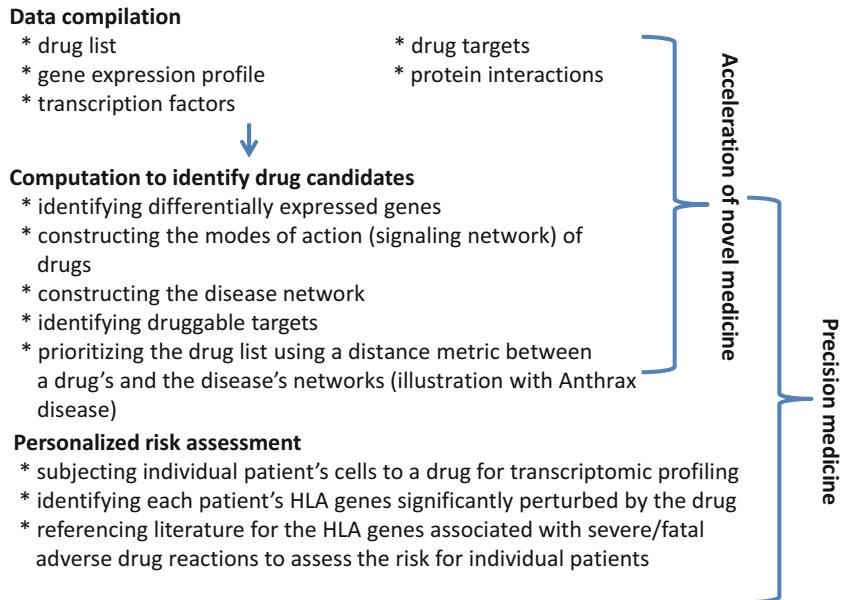  
Fig. 1 The framework of a computational platform and guide for precision medicine in which steps consist of (a) compilation of the needed data from databases, (b) computational construction of a drug’s mode of action and a disease network, (c) prioritizing drug candidates, (d) individualized assessment of treatment-related severe/fetal adverse reactions

entities or repurposed drugs. The druggable target(s) of a disease and associated network can be constructed in the same fashion. With a chemical’s or a drug’s mode of action and a druggable network of a target disease in hand, one can computationally prioritize candidates for further testing.

To illustrate the framework of our computational platform, we describe herein the materials needed and the how-to implementation of computational methods, thereby providing a guide for reference, as shown in Fig. 1. We also summarize a guide for personalized medicine where one can use a patient’s cells to assess how he/she might adversely respond to a drug (Fig. 1). In summary, a computational platform described herein include materials (drug targets, genome-wide transcriptional expression data, prior knowledge of protein interactions, transcription factors) and computational methods (identifying the differentially expressed genes following exposure to a chemical/drug, applying integer linear programming (ILP) to construct the signaling network (mode of action) of a drug candidate or the network of a disease from its druggable target, and computational prioritization of drug candidates). Last but not least, a potential application for assessing personalized safety risk is illustrated with the example of carbamazepine and HLA DQB1 gene.

# 2 Materials

Before setting up computations, one needs to compile all the data. Depending on the specific goal of a project, we first compile a list of drugs or a list of toxins. To computationally link a drug’s mode of action to its pharmacological effects under investigation, we compile the data from various credible databases and knowledge bases. The ones that we frequently use are described below.

# 2.1 Drug Targets

Several pharmacological databases of quality containing the detailed information of on-targets and off-targets of individual drugs/chemicals are publicly accessible. The most frequently used ones are highlighted below.

DrugBank [6] is a unique bioinformatics and cheminformatics resource with detailed data of drugs and their targets (see Note 1). The current release version 5.0 contains 8261 drug entries including 2201 FDA-approved small molecule drugs, 233 FDA-approved protein and peptide drugs, 94 nutraceuticals, and over 6000 experimental drugs. The complete DrugBank data are freely available for noncommercial use in XML format. The downloaded XML file can be processed using any programming languages to parse any needed information out.

DrugCentral, an online drug compendium, is another information source of chemistry and pharmacology of approved drugs by the Food and Drug Administration (FDA) and other regulatory agencies [7]. Included in this database are approximately 900 curated biomolecules of human and pathogen nature, on which 1578 FDA-approved drugs act [8]. Therapeutic Targets Database (TTD) [9] contains a smaller list of FDA-approved drugs but much more—currently 14,853—experimental drugs than DrugBank.

STITCH [10] is a database of known and predicted interactions between chemicals and proteins. The STITCH database (v 5.0) covers 9,643,763 proteins from 2031 organisms and links them to 430,000 compounds. Each link is annotated with a score reflecting the level of confidence for this interaction, based on the sources from which it was retrieved (see Note 2). STITCH is the most comprehensive among these three databases since it contains the drug targets from the DrugBank and TTD, as well as several other sources.

# 2.2 Genome-Wide Transcriptional Expression Data

There are multiple large-scale biological databases available [11] with some of them dedicated to transcriptional expression data. ArrayExpress [12] and Gene Expression Omnibus (GEO) [13] organized by the National Center for Biotechnology Information (NCBI) are the two main sources of publicly available gene expression data. As of today, ArrayExpress contains 69,728 experiments performed using 2,201,027 different assays and 45.30 terabytes of

archived data. GEO contains 2,076,947 samples and 16,892 different platforms. In addition to ArrayExpress and NCBI GEO, there are other gene expression databases, and the two we use are highlighted below.

Drug Toxicity Signature Generation Center (DToxS) [14], part of the Library of Integrated Network-Based Cellular Signatures (LINCS) consortium of NIH, hosts the gene expression data of cardiomyocytes (PromoCell) following exposure to drugs. Raw sequencing data (Level 0), unique molecular identifier counts (Level 1), fold change data (Level 2), and differentially expressed genes (Level 3) can be downloaded. Depending on the context of use, one can opt for the data at the optimal level to a specific need (see Note 3).

The Connectivity Map (CMap) [15] contains the drug perturbation signatures generated following chemical or drug treatment of cancer cell lines, mostly HL60, MCF7, and PC3 and to a lesser extent, ssMCF7, and SKMEL5. As of today, CMap has profiled 1309 drugs/compounds and includes more than 7000 gene expression profiles using Affymetrix GeneChip Human Genome U133A Array platform. The perturbed gene expression profiles are given in the form of ranked profile, where the genes are ordered and ranked by their relative gene expression changes by drug perturbation compared to untreated controls (see Note 4).

Typical use of CMap involves merging of multiple profiles to a representative profile for each drug since most of the compounds in CMap have more than one experimental condition (different cells and concentrations). These ranked expression profiles can be merged using the Kruskal-Borda (Kru-Bor) strategy for each drug [16]. Briefly, a distance metric using Spearman’s Footrule is computed among all the ranked profiles. Then, the two closest profiles are merged through a majority voting system and re-ranked into a new merged profile. This merging procedure continues until a single consensus profile is obtained.

# 2.3 Protein Interactions Reflective of Biological Connectivity

Protein-protein interaction (PPI) networks facilitate the transition from an agnostic correlation-based analysis to a mechanism-based one by providing the necessary biological context. This can be done via enrichment analysis, where the observed expression signatures are compared with known pathways or via pathway construction analysis, where the most probable (de novo) pathway is reconstructed from known interactions and the correlations among the proteins measured.

Considerable efforts have been put into identifying and collecting protein-protein interactions. Despite the central role of “interactome” for modern systems biology, no authoritative source is available, and the data are stored in multiple databases. Some of the most widely used databases include Reactome, BioGRID, DIP, IntAct, MINT, and STRING (Table 1). These databases differ with

Table 1 Databases of protein interactions and transcription factors described in Subheading 2   

<table><tr><td>Name</td><td>Nature of database</td><td>URL link</td></tr><tr><td colspan="3">Protein interactions</td></tr><tr><td>Reactome</td><td>A curated pathway database</td><td>http://www.reactome.org/</td></tr><tr><td>BioGRID</td><td>A curated database of physical and genetic interactions</td><td>https://thebiogrid.org/</td></tr><tr><td>DIP</td><td>A curated database of experimentally determined interactions between proteins</td><td>http://dip.doe-mbi.ucla.edu/dip/Main.cgi</td></tr><tr><td>IntAct</td><td>Molecular interaction database with data from literature curation or submission by users</td><td>http://www.ebi.ac.uk/intact/</td></tr><tr><td>MINT</td><td>Experimentally verified protein-protein interactions that were curated by experts</td><td>http://mint.bio.uniroma2.it/</td></tr><tr><td>STRING</td><td>Functional protein interaction networks</td><td>http://string-db.org/</td></tr><tr><td colspan="3">Transcription factors</td></tr><tr><td>DBD</td><td>A transcription factor prediction database</td><td>http://www.transcriptionfactor.org/</td></tr><tr><td>JASPAR</td><td>A transcription factor binding profile database</td><td>http://jaspar.binf.ku.dk/</td></tr><tr><td>AnimalTFDB</td><td>Curated transcription factors</td><td>http://www.bioguo.org/AnimalTFDB</td></tr><tr><td>Swiss-Prot</td><td>Curated transcription factors</td><td>http://web.expasy.org/docs/swissprot_guide.html</td></tr><tr><td>TRANSFAC</td><td>Curated transcription factors</td><td>Commercially available (see Note 5)</td></tr></table>

respect to their policies for inclusion of specific interactions as well as their preferred format for data storage. With respect to policy, some databases require manual curation by an expert and/or experimental evidence, while others may also include “predicted” interactions based on text mining or other machine learning techniques. The most common formats for storing interactions are SIF (simple interaction format), BioPAX, and SBML.

Upon selecting a knowledge base or database and parsing the data into an appropriate format, some extra “cleaning” steps are usually required. These include (a) removing nonfunctional interactions, (b) removing nodes that are uncontrollable (i.e., they cannot be affected by a drug target) or unobservable (i.e., they do not affect any node whose state cannot be observed experimentally), and (c) applying confidence weights to reactions or nodes if such relevant information is available. Finally, if the network is too large and cannot be handled effectively by the optimizer, network compression techniques such as the ones published previously [5] can be useful.

For our published analysis of drug-induced lung injury [3], the Reactome, a curated pathway database, was used. In particular, we used its “functional interactions” since the complete database included a lot of “meta” reactions. Regarding “functional interaction,” for example, the transition of a protein from the cytoplasm to the nucleus is considered as a reaction.

# 2.4 Transcription Factors

Though transcription factor (TF) databases are not as abundant as PPI ones, there are databases available as summarized in Table 1, including DBD and JASPAR that include reviewed as well as predicted TFs, and more conservative databases such as AnimalTFDB, Swiss-Prot, and TRANSFAC host a manually curated list of TFs. Once the appropriate database is selected and the data are parsed into the appropriate format, the TF-gene interaction can be added to the prior knowledge network as regular edges.

# 3 Methods

# 3.1 Identification of Novel Drug Candidates

For either identifying new drug candidates or repurposing an approved drug for a new indication, the same computational framework can be utilized. For a disease of interest, one needs to identify the disease targets to be activated or to be inactivated for optimal treatment benefits. For example, to treat anthrax, potential approaches include blocking internalization of anthrax toxins, antagonizing the actions of individual toxins, or activating the pathways that can beneficially counteract the toxic effects of toxins.

# 3.1.1 Identifying the Differentially Expressed Genes Following Exposure to a Drug/Chemical

In order to identify which genes are differentially expressed between the unstimulated state and exposure to a chemical, the first step would be to calculate the fold change by dividing each gene’s expression level from treated cells by that from the non-stimulated cells. Having at least a triplicate measurement, a reasonable approach would be to choose only those genes with a fold change greater than 2 and $\boldsymbol { p }$ -value less than 0.05, using two-tailed two-sample unequal variance student’s $t$ -test with Benjamini-Hochberg correction [17].

After finalizing the list of the differentially expressed genes, one might opt for the most significantly perturbed genes by applying a cutoff, usually between $1 \%$ and $5 \%$ . For example, having a dataset of 1000 differentially expressed genes, if a $5 \%$ cutoff is used, then one will get the 50 most upregulated genes and the 50 most downregulated genes. Alternatively, one can apply a cutoff of a specific number. For instance, one can choose 250 to get the 250 most upregulated genes and the 250 most downregulated genes. For the dataset such as the CMap, all 22,283 Affymetrix probe IDs are listed in the order of from the most upregulated to the most downregulated.

3.1.2 Applying Optimization- or Enrichment-Based Approaches to Construct the Signaling Network (Mode of Action) of a Drug

A pathway construction approach similar to what was published previously [3, 18, 19] can be applied to construct the signaling pathway of candidate drugs based on their transcriptomic profiles. These computational methods receive as an input the transcriptomic profile of a candidate drug, prior knowledge of transcription regulation, and protein connectivity and identify a small, easily interpretable signaling network that most likely yield the observed gene expression signature.

At the heart of these approaches lies the assumption that a compound acting on the phosphoproteomic level (e.g., a kinase inhibitor) will deregulate a number of pathways, and this deregulation will propagate downstream and affect the activities of key transcription factors that then affect the expression of their downstream target genes. By observing the differential gene expression upon drug perturbation, one may be able to infer which TFs were deregulated upstream and eventually the source of the deregulation in the signaling network, i.e., the targets of the candidate compound.

Below are the detailed guides for three different algorithms with their own unique utility and requirements. The software tools and algorithms are summarized in Table 2.

Integer Linear Programming

As published previously [3], we employed an integer linear programming (ILP) formulation to model the mechanics of signal transduction from one node to the next through the signaling network, to the TFs all the way to the differentially expressed genes, and identify a small subset of the signaling network that best explains the observed transcriptomic signature. This

Table 2 List of computational algorithms and the needed optimizer for constructing a drug’s mode of action   

<table><tr><td>Name</td><td>Nature of computational algorithm</td><td>URL link for tool or source code</td></tr><tr><td>Integer linear programming</td><td>Model the mechanics of signal transduction from one node to the next through the signaling network</td><td>http://pubs.rsc.org/en/content/articlelanding/ib/2015/C4ib00294f#!divAbstract</td></tr><tr><td>IBM ILOG CPLEX</td><td>An mathematical optimizer for ILP</td><td>http://www-03.ibm.com/software/products/en/ibmilogcpleoptistud</td></tr><tr><td>CellNOptR</td><td>Genetic algorithm to reconstruct signaling topologies</td><td>Implementation in python https://github.com/cellnopt/cellnopt or Cytoscape: http://www.cellnopt.org/cytocopter/</td></tr><tr><td>X2K</td><td>An enrichment-based approach to identifying upstream regulators of differentially expressed genes</td><td>http://www.maayanlab.net/X2K</td></tr></table>

subnetwork approximates the mode of action of the interrogated compound.

An implementation of the ILP algorithm is available in Python and can be run on the command line; the source code of ILP can be found in the supplementary information of our previous publication [3]. Note it requires a working installation of IBM ILOG CPLEX which is free of charge for academic use. After installing all dependencies, the ILP formulation is run on a Unix command line by invoking the ILP.py script (e.g., Python ILP.py). The following files need to be provided by the user in the same working directory as ILP.py:

– Ilp_options.txt: Specifies options for ILP.py including cutoff limits and input files.   
Inputs.txt: Tab-delimited file containing the nodes in the signaling network perturbed by the interrogated compound (i.e., drug targets).   
Measurements.txt: Tab-delimited file containing the differentially expressed genes upon compound perturbation and the sign of the deregulation (1 for overexpression and $- 1$ for underexpression).   
– Network_file: Defines the signaling network to be used as a scaffold by the ILP formulation in .sif format.

We have already compiled a genome-wide signaling network based on the Reactome functional interaction network (FIN) [20] and prior knowledge of transcription regulation. The users may use their own resources instead. The algorithm returns the following files:

– Xs.txt: A list containing all nodes in the signaling network also present in the solution, together with their corresponding activation value (1 for activation and $- 1$ for inhibition).   
– Us.txt: A list containing all reactions in the signaling network also present in the solution, together with the corresponding activation values.   
– Network_out.dot: The optimized network structure in .dot format ready to be parsed by GraphViz and visualized.

The user may use his/her own resources instead. Optionally, a list of drug targets may be provided (if known) to best constrain the search close to these targets. We [21] recently published a Python package facilitating the use of this algorithm. The algorithm returns a subset of the prior knowledge signaling network that best explains the observed transcriptomic profile and approximates the drug’s mode of action, in .dot format that can easily be visualized using GraphViz (http://www.graphviz.org/).

CellNOptR

In the work by Saez-Rodriguez et al. [18], the authors have employed a genetic algorithm to reconstruct signaling topologies based on experimental data. Even though they haven’t addressed the identification of drug mode of action based on transcriptomic data yet, their method could be used in that capacity. CellNOptR is available in Bioconductor, and there are also Python and Cytoscape implementations available. The user will have to provide a list of differentially expressed genes and also provide his/her own resources of genome-wide signaling network and transcription regulation, and CellNOptR will return a small subset of the prior knowledge network that best explains the data at hand. The genetic algorithm is not as efficient as an ILP formulation; however, recent advancements in CellNOptR now support an answer set programming formulation that should be as efficient as an equivalent ILP formulation.

X2K

For the X2K algorithm [19], an enrichment-based approach was used to identify upstream regulators of differentially expressed genes. X2K has integrated resources of prior knowledge of protein connectivity and transcription regulation. The user has to provide a list of differentially expressed genes, and X2K returns a list of upstream kinases whose deregulation most probably yields the observed transcriptomic profile (i.e., drug mode of action). X2K is written in Java with no other dependencies (see Table 2 for the resource to download the X2K algorithm).

There are a few conceptual differences between X2K and the ILP formulation described above. X2K reconstructs the network biology in an iterative manner by starting at the gene expression level and building upstream to the transcription factor level and eventually the proteomic level. With X2K, a signaling molecule is included in the solution if and only if it has a significant number of connections to other nodes in the solution. The ILP formulation, on the other hand, will include nodes in the solution even if they do not have numerous connections to the solution, as long as they help construct a directed minimum spanning tree that brings together most of the differentially expressed genes. X2K provides an intuitive graphical user interface, where the user pastes a list of deregulated genes and clicks “Start analysis” and the software returns a list of transcription factors and kinases that best explain the observed transcriptomic profile.

3.1.3 Applying ILP to Construct the Network of a Druggable Target for a Disease

As described above, the ILP algorithm requires a gene expression signature and (optionally) a set of initially perturbed nodes. Drugs offer an ideal application for this since most drugs have known targets and their gene expression signature can be retrieved from databases like CMap. However, other types of external perturbation, such as infections, can be analyzed in the same way. In our recent publication [21], we used the same technique to analyze the

modes of action of Bacillus anthracis (anthrax) infection. In particular, anthrax is known to cause cleavage of MAPKs and NLRP1 by secreting its lethal toxin (LT) as well as increasing levels of cAMP through its secreted edema toxin (ET). These proteins were used as analogue to drug targets. In their work, the gene expression signature of anthrax was recovered by publicly available data.

This analysis yielded a signaling network indicative of anthrax’s mode of action which could then be compared with the drug networks described above to identify novel drug candidates to treat the infection (see Subheading 3.1.5 for more details on drug repositioning). In the case of anthrax, the immediate targets of the infection, mainly cleavage of MAPKs and increased level of cAMP, and the networks reflecting their modes of action can be the targets for drug repositioning to alleviate the immediate consequences of infection. In a similar manner, for any one disease of interest, once the disease target is identified, one can adopt this approach to constructing its disease biological network based on the data and knowledge at hand (see Note 6).

3.1.4 Identification of Druggable Targets for a Disease

Gene Set Enrichment Analysis for Drug Effects (Therapeutic or Toxic)

Chemical-perturbed genes can be subjected to a functional enrichment analysis that identifies overrepresented (or enriched) biological functions or pathways, which are frequently defined as Gene Ontology (GO) terms, pathways such as Kyoto Encyclopedia of Genes and Genomes (KEGG) [22] and Reactome [23], or other previously defined gene signatures in Molecular Signatures Database (MSigDB) [24] (see Table 3 for a list of tools and databases).

Multiple statistical tests are employed for performing enrichment analyses, which include Fisher’s exact test (or its modified version), hypergeometric test, and binomial. Fisher’s exact test is most widely used to examine the significance of the association between the list of genes to be examined and the annotations to be tested against. A $2 \times 2$ contingency table is prepared for each annotation as given in Table 4 below. In this example, there are 300 genes in user’s gene set and a total of 25,000 genes in the whole genome, and a $2 \times 2$ contingency table is generated for Pathway_A. Fisher’s exact test on this table results in a $\boldsymbol { p }$ -value ${ < } 2 . 2 \mathrm { e } { - } 1 6$ , suggesting there is a statistically significant overrepresentation of the genes belonging to this Pathway_A among the user’s gene set.

Web-based tools include, but are not limited to, the Gene Set Enrichment Analysis (GSEA) [25, 26], the Database for Annotation, Visualization, and Integrated Discovery (DAVID) [27, 28], and ConceptGen [29], Enrichr [30], and Protein ANalysis THrough Evolutionary Relationships (PANTHER) [31], as listed in Table 3. A list of genes can be provided as input directly to these web-based services. GSEA is also available in other integrated analysis platforms such as GenePattern, while DAVID provides application programming interface (API) accessibility. There are also

Table 3 List of web-based tools for identifying druggable targets for a disease   

<table><tr><td>Service</td><td>URL</td><td>Type</td></tr><tr><td>PHAROS</td><td>https://pharos.nih.gov/idg/index</td><td>Annotation</td></tr><tr><td>Gene Ontology (GO)</td><td>http://www.geneontology.org/</td><td>Annotation</td></tr><tr><td>Kyoto Encyclopedia of Genes and Genomes (KEGG)</td><td>http://www.genome.jp/kegg/</td><td>Annotation</td></tr><tr><td>Gene Set Enrichment Analysis (GSEA)</td><td>http://www.broadinstitute.org/gsea/</td><td>Enrichment analysis</td></tr><tr><td>Database for Annotation, Visualization, and Integrated Discovery (DAVID)</td><td>http://david.abcc.ncifcrf.gov/</td><td>Enrichment analysis</td></tr><tr><td>ConceptGen</td><td>http://conceptgen.ncibi.org</td><td>Enrichment analysis</td></tr><tr><td>Enrichr</td><td>http://amp.pharm.mssm.edu/Enrichr/</td><td>Enrichment analysis</td></tr><tr><td>Protein ANalysis THrough Evolutionary Relationships</td><td>http://pantherdb.org/</td><td>Enrichment analysis</td></tr><tr><td>GenePattern</td><td>http://software.broadinstitute.org/cancer/software/genepattern/</td><td>Integrated analysis</td></tr><tr><td>GAGE</td><td>https://bioconductor.org/packages/release/bioc/html/gage.html</td><td>R package</td></tr><tr><td>topGO</td><td>https://bioconductor.org/packages/release/bioc/html/topGO.html</td><td>R package</td></tr><tr><td>GSEABase</td><td>https://bioconductor.org/packages/release/bioc/html/GSEABase.html</td><td>R package</td></tr><tr><td>GOStats</td><td>https://bioconductor.org/packages/release/bioc/html/GOstats.html</td><td>R package</td></tr><tr><td>GOexpress</td><td>https://bioconductor.org/packages/release/bioc/html/GOexpress.html</td><td>R package</td></tr><tr><td>Goseq</td><td>http://bioconductor.org/packages/release/bioc/html/goseq.html</td><td>R package</td></tr></table>

Table 4 The $\pmb { 2 } \times \pmb { 2 }$ contingency table   

<table><tr><td></td><td>User genes</td><td>Genome</td></tr><tr><td>In Pathway_A</td><td>30</td><td>170</td></tr><tr><td>Not in Pathway_A</td><td>270</td><td>24,560</td></tr></table>

multiple R packages designed for functional enrichment analysis, which include GAGE, topGO, GSEABase, GOStats, GOExpress, and EnrichR. These R packages typically run with GO terms and KEGG pathways as the gene annotation sets and accept gene lists as input along with optional statistical significance information. Typically, the web-based tools such as DAVID provide user-friendly access and thus are suitable for analyzing small number of gene sets by non-bioinformaticians, while the R packages enable a seamless integration into existing high-throughput data such as microarray and RNA-Seq analysis pipelines.

Pathway-Based Analysis to Identify Potential Therapeutic Target(s)

Pathway-based analysis can be leveraged to identify driver mutation candidates for cancer. Mutations are mapped on a protein-protein interaction network (PPI), and their centrality in the network with respect to each other or with respect to key signaling molecules, known to be implicated in the disease mechanism, is calculated. Mutated genes with high centrality may be promising drug targets, considering their important roles in the network. Centrality measures were used to prioritize genes for protein connectivity in a human disease by Disease Module Detection (DIAMOnD) algorithm [32], for biological network [33].

Centrality of a node in a network represent the importance of the node in that network and can be measured in many different ways. Most commonly used centrality measures include degree, eigenvector, closeness, and betweenness, each measuring a specific type of importance [34]. Briefly, degree centrality relates to the number of connected neighbors, where nodes with higher degrees are considered more important. In eigenvector centrality, a node is considered more important if it is connected to many “central” nodes; thus, both the quantity and of the quality of connections are taken into account. Closeness centrality is defined as the sum of the length of the shortest paths to all other nodes in the network; therefore, the smaller closeness centrality, the more important in the network. In betweenness centrality, the importance of a node is higher if it occurs on many shortest paths between other nodes, serving as a bridge between them.

To calculate the centrality of genes in a network, several approaches may be used. Multiple packages or libraries are available to be used in programming environment, which include Igraph (http://igraph.org/) for R, networkx (https://networkx.github. io/) for Python, and Clairlib (http://www.clairlib.org) for Perl. For example, function all_shortest_paths in Igraph returns all shortest paths between two nodes in the network. By applying this function and calculating all shortest paths from/to all mutated genes and keeping track of the number of shortest paths going through these mutations, a measure of centrality is obtained. Moreover, function betweenness in Igraph returns the same metric taking into account all shortest paths. For those who are not familiar with

3.1.5 Computing and Prioritizing the Drug Candidates Using the Shortest Distance or Scoring Their Ability to Reverse the Disease Network for Drug Repurposing

programming may use CentiScaPe [35], a centrality-analysis plugin for Cytoscape platform. Once various centrality measures are obtained, the most central genes can be deemed as promising targets using the most central genes (e.g., top 10 in each measure).

Having calculated the mode of action of candidate drugs based on their transcriptomic profile, their fitness to a specific indication may be prioritized and predicted by calculating the overlap of their modes of action with known disease mechanisms. In the work by Lamb et al. [36], the authors demonstrated that compounds which reverse the transcriptomic profile of a disease may have a therapeutic effect. Melas et al. [3] advanced this idea further and showed that compounds whose modes of action disrupt the key signaling pathways deregulated in a disease may also have a therapeutic effect for treating that disease. Assuming the signaling pathways in a disease are known (see Note 7), the overlap with a drug’s mode of action is quantified via Fisher’s exact test on the included gene sets.

One approach would be to take into account the directionality of the signature [21]. In particular, instead of identifying the drug whose mode of action had the highest overlap with the disease, they identified the drug that most closely resembled the “reversed” disease network. The ILP algorithm produces a qualitative description of the signaling effects where proteins assume discrete states, so the “reverse” network is just a network where the signs of the nodes are flipped. In this context, the distance of two networks is equal to the Euclidean distance between the node signatures of the two networks (drug and disease).

Other distance metrics are also an option. For example the Manhattan and Hamming distances were also considered as candidates. Since the compared vectors are defined in the discrete space of $\{ - 1 , 0 , 1 \} ^ { N } .$ , where $N$ is the number of nodes, different distance metrics amount to different trade-offs between predicting opposite effects $- 1$ vs 1) and predicting non-effects $- 1$ or 1 vs 0). In Table 5 are listed the misclassification costs for the different metrics.

In a recent work [21], we opted for the Euclidean distance in order to maximize the pharmacological effect of a drug on the network of the disease at hand or minimize the synergies between

Table 5 Misclassification costs for the different metrics   

<table><tr><td colspan="4">Trade-offs for different distance metrics</td></tr><tr><td>Classification error</td><td>Euclidean</td><td>Manhattan</td><td>Hamming</td></tr><tr><td>-1 vs 1</td><td>4</td><td>2</td><td>1</td></tr><tr><td>-1 or 1 vs 0</td><td>1</td><td>1</td><td>1</td></tr></table>

# 3.2 Personalized Safety Risk by Identifying Drug-Induced Perturbation of HLA Genes in Individuals

drug and disease. With this metric we computed the distance between every drug and the reversed-disease network to prioritize the drugs. Then, we referenced published pharmacological effects of drugs to manually curate the list of the top 10 drug candidates that were closer to the reverse network of the disease target for their therapeutic potential. Among the top 10 drugs, two were reportedly potent for protecting macrophages from the toxicities of anthrax toxins.

Although the underlying mechanisms of treatment-emergent adverse reactions are diverse and often are not fully understood, individuals’ genomes play an important role in individuals’ susceptibility to severe adverse reaction(s) associated with specific drugs.

For drug-induced Stevens-Johnson syndrome and toxic epidermal necrosis, specific human leukocyte antigen (HLA) alleles have been identified as biomarkers for such serious and potentially fatal adverse drug reactions [37, 38]. HLA alleles identified in genomewide association studies (GWAS) for SJS/TEN differ among ethnic groups [39]. These HLA alleles are good references for risk assessment. GWAS studies are expensive. Gene expression offers an alternative to gain insight into individual patients’ susceptibility. Take carbamazepine for example, several most perturbed HLA genes were computationally identified using the gene expression data from CMap where cancer cell lines were derived from Caucasians (see Subheading 2.2) [2]. Among them, $H L A { \cdot } D Q B I ^ { * } O 2 O I$ is associated with carbamazepine-associated SJS/TEN in Caucasians.

Briefly, a patient’s immune cells can be isolated from his/her blood samples and then be exposed to a drug. The users can use gene expression data produced from these cells and computationally identify the most significantly perturbed HLA genes by the drug [2]. One can computationally identify drug perturbation signatures related to HLA genes by a simple frequency-based approach to select the most frequently perturbed HLA genes (either up- or downregulated) by a drug. In the future, it may be possible for the HLA alleles identified to be compared to what has been published by GWAS studies for a specific serious adverse reaction to assess and mitigate the risk for the patient.

# 4 Notes

1. When downloading drug targets from DrugBank, considering the size of the XML file (over 500 MB when uncompressed), it is highly recommended to use programming languages to extract the list of drug targets out of this file.   
2. Since STITCH contains predicted interactions, a score above the median value is recommended to ensure the level of

confidence and an adequate number of proteins. One should also reference literature for the context of use.

3. For the gene expression data published by DToxS, a reasonable choice would be to begin with Level 2 data.   
4. When using CMap data, the profile can be further processed to collapse the profiles at the gene level, rather than the transcript level on the Affymetrix array. Using the latest gene annotation (e.g., the Entrez Gene database), those transcripts belonging to the same gene could be merged either by arithmetic average or median, and then the profiles need to be re-ranked. This will help the downstream analysis to be more straightforward by avoiding the situations where transcripts belonging to the same gene have complete different directionality (up- and downregulation). However, this gene-level collapsing may render the data less informative by ignoring transcript-specific expression information.   
5. Among transcription factor databases, TRANSFAC is not open-access but offers special prices for academic/non-profit users.   
6. Curating computed results for the context of biology and pharmacology by referencing published reports and literature is crucial to avoid garbage in and garbage out. Team work is needed by collaborating scientists with expertise in bioinformatics, pharmacology, biology, and disease.   
7. For a disease in a specific organ, it is critical to reference a database for the proteins and genes expressed in a specific organ of interest. One such database is GTEx (https://com monfund.nih.gov/GTEx/index).

# Acknowledgments

The authors would like to acknowledge the ORISE Fellowships to IM, TS and DM via CDER’s Critical Path and FDA’s Medical Counter Measures grants to JPFB.

Disclaimer. This article reflects the views of the authors and should not be construed to represent FDA’s views or policies. The mention of commercial products, their sources, or their use in connection with material reported herein is not to be construed as either an actual or implied endorsement of such products by the FDA.

Author Contributions. JPFB conceived and edited the manuscript; IM, TS, DM, JH, and EG contributed to various sections of the manuscript; LA commented on the manuscript.

# References

1. Hur J, Guo AY, Loh WY, Feldman EL, Bai JP (2014) Integrated systems pharmacology analysis of clinical drug-induced peripheral neuropathy. CPT Pharmacometrics Syst Pharmacol 3: e114. https://doi.org/10.1038/psp.2014.11   
2. Hur J, Zhao C, Bai JP (2015) Systems pharmacological analysis of drugs inducing stevens-Johnson syndrome and toxic epidermal necrolysis. Chem Res Toxicol 28(5):927–934. https://doi.org/10.1021/tx5005248   
3. Melas IN, Sakellaropoulos T, Iorio F, Alexopoulos LG, Loh WY, Lauffenburger DA, Saez-Rodriguez J, Bai JP (2015) Identification of drug-specific pathways based on gene expression data: application to drug induced lung injury. Integr Biol (Camb) 7(8):904–920. https://doi.org/10.1039/c4ib00294f   
4. Hur J, Liu Z, Tong W, Laaksonen R, Bai JP (2014) Drug-induced rhabdomyolysis: from systems pharmacology analysis to biochemical flux. Chem Res Toxicol 27(3):421–432. https://doi.org/10.1021/tx400409c   
5. Melas IN, Samaga R, Alexopoulos LG, Klamt S (2013) Detecting and removing inconsistencies between experimental data and signaling network topologies using integer linear programming on interaction graphs. PLoS Comput Biol 9(9):e1003204. https://doi.org/10. 1371/journal.pcbi.1003204   
6. Wishart DS, Knox C, Guo AC, Shrivastava S, Hassanali M, Stothard P, Chang Z, Woolsey J (2006) DrugBank: a comprehensive resource for in silico drug discovery and exploration. Nucleic Acids Res 34(Database issue): D668–D672. https://doi.org/10.1093/nar/ gkj067   
7. Ursu O, Holmes J, Knockel J, Bologa CG, Yang JJ, Mathias SL, Nelson SJ, Oprea TI (2017) DrugCentral: online drug compendium. Nucleic Acids Res 45(D1): D932–D939. https://doi.org/10.1093/nar/ gkw993   
8. Santos R, Ursu O, Gaulton A, Bento AP, Donadi RS, Bologa CG, Karlsson A, Al-Lazikani B, Hersey A, Oprea TI, Overington JP (2017) A comprehensive map of molecular drug targets. Nat Rev Drug Discov 16 (1):19–34. https://doi.org/10.1038/nrd. 2016.230   
9. Yang H, Qin C, Li YH, Tao L, Zhou J, Yu CY, Xu F, Chen Z, Zhu F, Chen YZ (2016) Therapeutic target database update 2016: enriched resource for bench to clinical drug target and targeted pathway information. Nucleic Acids Res 44(D1):D1069–D1074. https://doi.org/ 10.1093/nar/gkv1230

10. Szklarczyk D, Santos A, von Mering C, Jensen LJ, Bork P, Kuhn M (2016) STITCH 5: augmenting protein-chemical interaction networks with tissue and affinity data. Nucleic Acids Res 44(D1):D380–D384. https://doi.org/10. 1093/nar/gkv1277   
11. Zou D, Ma L, Yu J, Zhang Z (2015) Biological databases for human research. Genomics Proteomics Bioinformatics 13(1):55–63. https:// doi.org/10.1016/j.gpb.2015.01.006   
12. Parkinson H, Sarkans U, Kolesnikov N, Abeygunawardena N, Burdett T, Dylag M, Emam I, Farne A, Hastings E, Holloway E, Kurbatova N, Lukk M, Malone J, Mani R, Pilicheva E, Rustici G, Sharma A, Williams E, Adamusiak T, Brandizi M, Sklyar N, Brazma A (2011) ArrayExpress update–an archive of microarray and high-throughput sequencingbased functional genomics experiments. Nucleic Acids Res 39(Database issue): D1002–D1004. https://doi.org/10.1093/ nar/gkq1040   
13. Barrett T, Wilhite SE, Ledoux P, Evangelista C, Kim IF, Tomashevsky M, Marshall KA, Phillippy KH, Sherman PM, Holko M, Yefanov A, Lee H, Zhang N, Robertson CL, Serova N, Davis S, Soboleva A (2013) NCBI GEO: archive for functional genomics data sets-- update. Nucleic Acids Res 41(Database issue): D991–D995. https://doi.org/10.1093/nar/ gks1193   
14. DtoxS–drug toxicity signature generation center–Data & resources. https://martip03.u.hpc. mssm.edu/about.php. Accessed Feb 2017   
15. Lamb J (2007) The connectivity map: a new tool for biomedical research. Nat Rev Cancer 7 (1):54–60. https://doi.org/10.1038/ nrc2044   
16. Iorio F, Bosotti R, Scacheri E, Belcastro V, Mithbaokar P, Ferriero R, Murino L, Tagliaferri R, Brunetti-Pierri N, Isacchi A, di Bernardo D (2010) Discovery of drug mode of action and drug repositioning from transcriptional responses. Proc Natl Acad Sci U S A 107 (33):14621–14626. https://doi.org/10. 1073/pnas.1000138107   
17. Benjamini Y, Hochberg Y (1995) Controlling the false discovery rate: a practical and powerful approach to multiple testing. J R Stat Soc B Methodol 57(1):289–300   
18. Terfve C, Cokelaer T, Henriques D, MacNamara A, Goncalves E, Morris MK, van Iersel M, Lauffenburger DA, Saez-Rodriguez J (2012) CellNOptR: a flexible toolkit to train protein signaling networks to data using

multiple logic formalisms. BMC Syst Biol 6:133. https://doi.org/10.1186/1752- 0509-6-133   
19. Chen EY, Xu H, Gordonov S, Lim MP, Perkins MH, Ma’ayan A (2012) Expression2Kinases: mRNA profiling linked to multiple upstream regulatory layers. Bioinformatics 28 (1):105–111. https://doi.org/10.1093/bioin formatics/btr625   
20. Wu G, Feng X, Stein L (2010) A human functional protein interaction network and its application to cancer data analysis. Genome Biol 11 (5):R53. https://doi.org/10.1186/gb-2010- 11-5-r53   
21. Bai JP, Sakellaropoulos T, Alexopoulos LG (2017) A biologically-based computational approach to drug repurposing for anthrax infection. Toxins 9(3):E99   
22. Kanehisa M, Goto S (2000) KEGG: Kyoto encyclopedia of genes and genomes. Nucleic Acids Res 28(1):27–30   
23. Vastrik I, D’Eustachio P, Schmidt E, Joshi-Tope G, Gopinath G, Croft D, de Bono B, Gillespie M, Jassal B, Lewis S, Matthews L, Wu G, Birney E, Stein L (2007) Reactome: a knowledge base of biologic pathways and processes. Genome Biol 8(3):R39. https://doi. org/10.1186/gb-2007-8-3-r39   
24. Liberzon A, Birger C, Thorvaldsdottir H, Ghandi M, Mesirov JP, Tamayo P (2015) The molecular signatures database (MSigDB) hallmark gene set collection. Cell Syst 1 (6):417–425. https://doi.org/10.1016/j. cels.2015.12.004   
25. Subramanian A, Tamayo P, Mootha VK, Mukherjee S, Ebert BL, Gillette MA, Paulovich A, Pomeroy SL, Golub TR, Lander ES, Mesirov JP (2005) Gene set enrichment analysis: a knowledge-based approach for interpreting genome-wide expression profiles. Proc Natl Acad Sci U S A 102(43):15545–15550. https://doi.org/10.1073/pnas.0506580102 0506580102 [pii]   
26. Mootha VK, Lindgren CM, Eriksson KF, Subramanian A, Sihag S, Lehar J, Puigserver P, Carlsson E, Ridderstrale M, Laurila E, Houstis N, Daly MJ, Patterson N, Mesirov JP, Golub TR, Tamayo P, Spiegelman B, Lander ES, Hirschhorn JN, Altshuler D, Groop LC (2003) PGC-1alpharesponsive genes involved in oxidative phosphorylation are coordinately downregulated in human diabetes. Nat Genet 34 (3):267–273. https://doi.org/10.1038/ ng1180   
27. Dennis G Jr, Sherman BT, Hosack DA, Yang J, Gao W, Lane HC, Lempicki RA (2003)

DAVID: database for annotation, visualization, and integrated discovery. Genome Biol 4(5):3   
28. Huang da W, Sherman BT, Lempicki RA (2009) Systematic and integrative analysis of large gene lists using DAVID bioinformatics resources. Nat Protoc 4(1):44–57. https:// doi.org/10.1038/nprot.2008.211   
29. Sartor MA, Mahavisno V, Keshamouni VG, Cavalcoli J, Wright Z, Karnovsky A, Kuick R, Jagadish HV, Mirel B, Weymouth T, Athey B, Omenn GS (2010) ConceptGen: a gene set enrichment and gene set relation mapping tool. Bioinformatics 26(4):456–463. https:// doi.org/10.1093/bioinformatics/btp683   
30. Chen EY, Tan CM, Kou Y, Duan Q, Wang Z, Meirelles GV, Clark NR, Ma’ayan A (2013) Enrichr: interactive and collaborative HTML5 gene list enrichment analysis tool. BMC Bioinformatics 14:128. https://doi.org/10.1186/ 1471-2105-14-128   
31. Mi H, Huang X, Muruganujan A, Tang H, Mills C, Kang D, Thomas PD (2017) PAN-THER version 11: expanded annotation data from gene ontology and reactome pathways, and data analysis tool enhancements. Nucleic Acids Res 45(D1):D183–D189. https://doi. org/10.1093/nar/gkw1138   
32. Ghiassian SD, Menche J, Barabasi AL (2015) A DIseAse MOdule detection (DIAMOnD) algorithm derived from a systematic analysis of connectivity patterns of disease proteins in the human interactome. PLoS Comput Biol 11(4): e1004120. https://doi.org/10.1371/journal. pcbi.1004120   
33. Ahn YY, Bagrow JP, Lehmann S (2010) Link communities reveal multiscale complexity in networks. Nature 466(7307):761–764. https://doi.org/10.1038/nature09182   
34. Newman M (2010) Networks: an introduction. OUP, Oxford   
35. Scardoni G, Petterlini M, Laudanna C (2009) Analyzing biological network parameters with CentiScaPe. Bioinformatics 25 (21):2857–2859. https://doi.org/10.1093/ bioinformatics/btp517   
36. Lamb J, Crawford ED, Peck D, Modell JW, Blat IC, Wrobel MJ, Lerner J, Brunet JP, Subramanian A, Ross KN, Reich M, Hieronymus H, Wei G, Armstrong SA, Haggarty SJ, Clemons PA, Wei R, Carr SA, Lander ES, Golub TR (2006) The connectivity map: using gene-expression signatures to connect small molecules, genes, and disease. Science 313(5795):1929–1935. https://doi.org/10. 1126/science.1132939   
37. Chen P, Lin JJ, Lu CS, Ong CT, Hsieh PF, Yang CC, Tai CT, Wu SL, Lu CH, Hsu YC, Yu

HY, Ro LS, Lu CT, Chu CC, Tsai JJ, Su YH, Lan SH, Sung SF, Lin SY, Chuang HP, Huang LC, Chen YJ, Tsai PJ, Liao HT, Lin YH, Chen CH, Chung WH, Hung SI, Wu JY, Chang CF, Chen L, Chen YT, Shen CY, Taiwan SJSC (2011) Carbamazepine-induced toxic effects and HLA- $\mathbf { B } ^ { \star } 1 5 0 2$ screening in Taiwan. N Engl J Med 364(12):1126–1133. https://doi. org/10.1056/NEJMoa1009717   
38. Pavlos R, Mallal S, Phillips E (2012) HLA and pharmacogenetics of drug hypersensitivity.

Pharmacogenomics 13(11):1285–1306. https://doi.org/10.2217/pgs.12.108   
39. Daly AK, Donaldson PT, Bhatnagar P, Shen Y, Pe’er I, Floratos A, Daly MJ, Goldstein DB, John S, Nelson MR, Graham J, Park BK, Dillon JF, Bernal W, Cordell HJ, Pirmohamed M, Aithal GP, Day CP, Study D, International SAEC (2009) HLA- $\mathbf { \cdot B ^ { \star } 5 7 0 1 }$ genotype is a major determinant of drug-induced liver injury due to flucloxacillin. Nat Genet 41(7):816–819. https:// doi.org/10.1038/ng.379

# Omics Data Integration and Analysis for Systems Pharmacology

Hansaim Lim and Lei Xie

# Abstract

Systems pharmacology aims to understand drug actions on a multi-scale from atomic details of drug-target interactions to emergent properties of biological network and rationally design drugs targeting an interacting network instead of a single gene. Multifaceted data-driven studies, including machine learning-based predictions, play a key role in systems pharmacology. In such works, the integration of multiple omics data is the key initial step, followed by optimization and prediction. Here, we describe the overall procedures for drug-target association prediction using REMAP, a large-scale off-target prediction tool. The method introduced here can be applied to other relation inference problems in systems pharmacology.

Key words Big data, Machine learning, Collaborative filtering, Drug repurposing, Off-target identification

# 1 Introduction

The conventional procedures for drug discovery starts from finding a small molecule that can effectively act on the intended target, which is often a single target that is believed to be one of the causal components in a disease process. Although it has been the dominant drug discovery paradigm for several decades, it has several challenges and limitations. Many complex diseases are multifaceted and multigenic. Targeting a single gene may not be adequate to modulate the whole disease process. Moreover, drug actions are often the result of a series of complex biological processes involving drug-target interactions and their modulation of biological networks. A drug often interacts with not only its intended target but also other unexpected targets, referred to as off-targets. Unexpected off-target binding may lead to the possibility of deadly side effects (or adverse drug reactions), which have rarely been noticed during the early stages of the procedures [1–3]. For instance, a cholesteryl ester transfer protein inhibitor, torcetrapib, was found to have adverse cardiovascular events with many deaths due to its

off-target activities and was withdrawn during phase 3 clinical trial [4, 5], and a fatty acid amide hydrolase inhibitor resulted in at least six casualties in a phase 1 clinical trial [6]. In addition, the off-target binding may be essential for the therapeutic effect on treating multigenic complex diseases. For example, the anticancer effect of HIV protease inhibitors may come from their binding to multiple human kinases [7]. Furthermore, the identification of the drug off-targets across the human genome will offer new opportunities in drug repurposing, a process that uses existing drugs for new clinical indications [8, 9]. Unfortunately, we have limited understanding of proteome-wide drug-target interactions since only a small number of all possible targets are examined for each drug. In addition, the tested drug molecules are only a part of the whole chemical space, which further increases the sparseness of our knowledge in drug-target associations. Thus, the conventional drug discovery paradigm has become less successful in tackling complex diseases, and there is an urgent need for a new paradigm that allows systematic and large-scale drug-target screening at an early stage of drug development.

One possible new paradigm is data-driven molecular screening from the early stages of drug development [10]. Biological and clinical data are enormous, heterogeneous, dynamic, and noisy, that is, a huge amount of data is rapidly changing across diverse domains and contains intrinsic noise from biology as well as experimental errors [11]. Pharmacological data also shares these properties, making it difficult to collect and manage reliable data and requiring systematic approaches to analyze thousands of drugs against many partners of interest, including protein targets and adverse drug effects. The continuously increasing amount of health-related data makes the development and application of such methods more interesting and promising. A new field, called systems pharmacology, aims to design therapeutics to target gene interaction networks instead of a single gene. The development of systems pharmacology will benefit from harnessing machine learning and statistical techniques to discover new treatment strategies from big data [12]. Various types of computational methods have been developed to systematically analyze large amounts of pharmacological data [13].

Many computational tools have been developed to harness big data for systems pharmacology. These techniques range from inferring drug-target-disease side effect associations to stoichiometric modeling of genome-scale metabolic network and dynamic modeling of signaling and regulatory network to physiological-based pharmacokinetics modeling [14]. Due to the limited space, here we will focus on computational methods that represent omics data as a bipartite graph (e.g., linking drugs and targets) and infer new biological relations (e.g., drug-target association). Several machine learning-based techniques have shown their potential to predict

binary relations, particularly, drug-target associations. Regarding chemical substructures of drugs as features, Koutsoukas et al. showed that drug-target associations can be predicted based on the Gaussian kernel similarity of features [15]. Gaussian interaction profile (GIP) also utilizes Gaussian kernel to measure similarity between drug-target interaction profiles [16], and GIP was later extended by applying weighted nearest neighbor to predict drugtarget interactions for drugs without a known target [17]. Kernelized Bayesian matrix factorization with twin kernels (KBMF2K) successfully combined two Gaussian kernels (drug-side and targetside kernels) into matrix factorization algorithms to predict drugtarget associations [18]. The uses of such machine learning approaches are also expanding since the collection of large-scale, multi-domain biological data sets are available, such as Harmonizome [19]. Here we will focus on the prediction of drug-target associations using REMAP, a large-scale collaborative filtering approach to predict off-target associations [20]. Collaborative filtering is a technology to predict one’s future responses or preferences based on the history of decisions made by a large group which one belongs to, which is frequently used for recommender systems in commercial platforms [21, 22]. To predict not only the off-targets but the novel targets as well, we also developed COSINE [23]. This chapter is divided into two parts: the data preprocessing to organize our data into a network model with compatible formats and running the two optimization algorithms to make predictions.

# 2 Materials

REMAP is available online at https://omictools.com/remap-tool. Clicking the REMAP icon on the title opens the GitHub repository of the REMAP, where readers can find all relevant data and codes used in this chapter. Please download and decompress the repository. Throughout this chapter, we will assume that the decompressed repository is under “/home/user/REMAP” directory. ZINC database [24] contains chemical-protein associations based on direct binding assays at $1 0 ~ \mu \mathrm { M }$ . The processed data set is available in the repository, under “/home/user/REMAP/benchmark/ ZINC_raw” directory. Under the “ZINC_raw” directory, “ZINC_DTI.tsv” contains active chemical-protein associations (drug-target interactions) from ZINC database, and “ZINC_- chemicals.tsv” and “ZINC_proteins.fas” contain unique chemicals and proteins with chemical structure and protein sequence information, respectively. To apply collaborative filtering techniques, we need to convert the data files into three matrices, chemical-chemical similarity matrix, protein-protein similarity matrix, and chemical-

protein association matrix. The steps to convert these files into appropriate matrix format are in Subheading 3

To complete this chapter, we will use python and MathWorks Matlab programming languages. Matlab 2008b or higher is required, and Python 2.7 or higher in the Unix environment (e.g., Ubuntu) is recommended. Python 3 is required for the multicore script (see Note 5). We use ChemAxon JChem software [25] to calculate chemical structure similarity and NCBI BLAST [26] to calculate protein sequence similarity. All software tools used here are cross-platform (i.e., they are available in Windows, Mac, and Linux). In Subheading 3, we provide the commands for each step in a Linux environment so that readers can follow the steps without a graphical user interface (GUI), since working in a non-GUI environment is often necessary to maximize the computational resources available for the research processes. One example environment is a (virtual) machine running on Ubuntu with Matlab, JChem, and BLAST installed. Pythons 2 and 3 are builtin for Ubuntu 14.04 or higher versions. To set up the environment, please follow the instructions for each software tool. Please follow steps on the relevant user manuals for the tools for GUI environment.

# 3 Methods

# 3.1 Overview

Data preprocessing is a significant step in data-driven research, including machine learning-based polypharmacology that we focus on here. So far, we have the text files for the matrices (Subheading 2). Assuming that we have m unique chemicals and n unique proteins, the chemical-chemical similarity information can be represented as a m by m matrix $D ^ { m \times \ m }$ , where $D _ { i , j }$ is the similarity score between the ith and the $\sinh$ drugs, and the proteinprotein similarity matrix $T ^ { n \times n }$ can be similarly defined. All entries of the matrices $D$ and $T$ are between 0 and 1, where 0 is for no measurable similarity and 1 is for identity. The chemical-protein association file can be regarded as an undirected bipartite graph—a network where the only allowed connections are from one set (drugs) to another set (targets)—between drugs and targets with binary edges (Fig. 1). Therefore, the chemical-protein associations may be represented as an m by n matrix $R ^ { m \times n }$ , where $R _ { i , j } = 1$ if the ith drug is known to be associated with the jth target protein. As in Fig. 1, the known connections are often sparse, and our purpose is to infer some unknown associations based on the two types of similarity and the known associations. The first part of Subheading 3 is to guide readers to process raw data from the ZINC database into the input matrices for our methods of choice: REMAP and COSINE. The two methods take the known chemical-protein associations, chemical-chemical similarity scores, and protein-

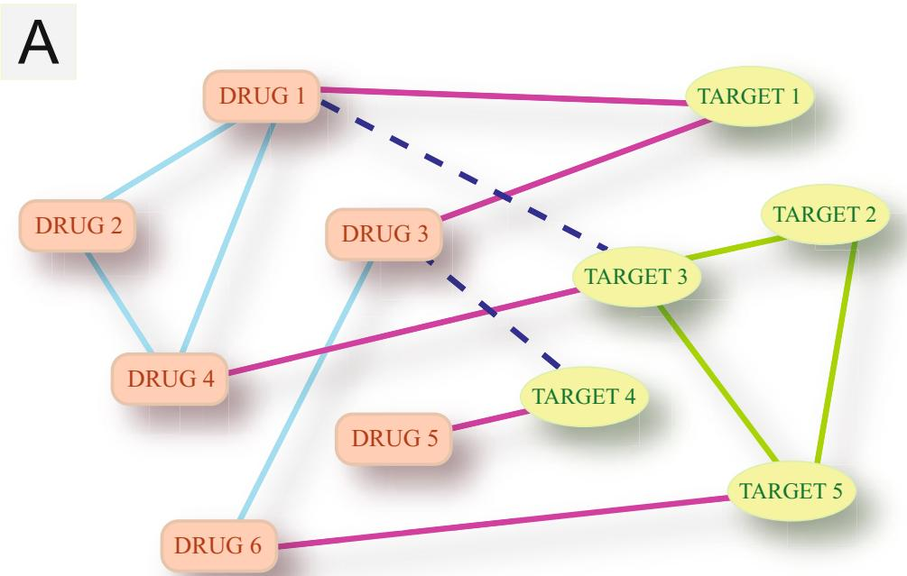  
B

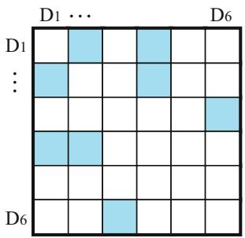  
D

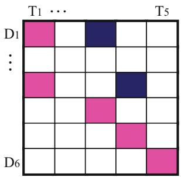  
R

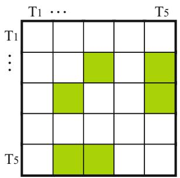  
T   
Fig. 1 Drug-target network and its matrix representation. (a) Drug-target associations can be represented as a network containing three types of connections. A bipartite graph connects drugs and targets. The solid pink lines and the blue dashed lines represent the known drug-target associations and the unknown off-targets, respectively. The sky-blue lines and the green lines represent chemical-chemical similarity and proteinprotein similarity networks, respectively. For conciseness, only six drugs and five targets are drawn here. (b) The matrix representation of the network in (a). The matrices D,T,and R represent drug-drug similarity, targettarget similarity, and known drug-target association networks, respectively. Color-filled entries of the matrices represent the connections in (a). The values in $D$ and T are nonnegative number with a maximum of 1 for identity. The values in R are either 0 or 1, where 1 represents the association which is known. Note that the entries for the unknown off-targets in the matrix R (blue-filled) start at 0 and the goal is to predict these unknown associations using the known associations and the two similarity matrices

protein similarity scores as matrices. We start from the list of known associations and the lists of unique chemicals and proteins. Our goal here is to create three matrices that represent the inputs. Since

there are 12,384 unique chemicals and 3500 unique proteins in the ZINC data set, chemical-protein association matrix size must be 12,384 by 3500, chemical-chemical similarity matrix size must be 12,384 by 12,384, and protein-protein similarity matrix size must be 3500 by 3500. For more details, refer to Lim et al. [20].

# 3.2 Command-Line Notations

We will use both bash commands and Matlab commands. To minimize confusions, the commands are in Courier New font with gray shade. Bash commands start with a dollar sign, and Matlab commands start with two greater than signs. We will not use multiple commands in one sentence. In cases where a one-line command is written on multiple lines of the page, we will specify that the command is a one-line command. For example, $\$ 5$ echo This is a bash command! means to type “echo This is a bash command!” on a terminal screen, and $> >$ disp(This is a Matlab command!); disp(Big Data in Drug Discovery); means to type “disp(‘This is a Matlab command!’); disp(‘Big Data in Drug Discovery’);” on Matlab command line. A long Matlab command can be separated at each semicolon. The Matlab command above can be either a one-line command or two lines, such as $> >$ disp (This is a Matlab command!); followed by $> >$ disp(Big Data in Drug Discovery); without changing the results. The leading dollar signs and the leading greater than signs are not to be typed by the readers. We expect that the readers are familiar with the basic bash commands, such as changing directory, viewing and editing text files, and moving and copying files (see Note 1).

# 3.3 Data Preprocessing

1. To calculate protein-protein similarity based on sequence similarity, we first build BLAST database based on the unique proteins in ZINC data set. Please refer to the online document for install instructions [27] (see Note 2). To build BLAST DB, change directory to where the protein FASTA file is and run the following command on the terminal.

$\$ 5$ makeblastdb -in ZINC_proteins.fas -dbtype prot -out ZINC

This generates a BLAST database named “ZINC” that contains the 3,500 proteins from the “ZINC_proteins.fas” file.

2. Next, we will query all 3,500 proteins against the database just created. Run (one-line command) on the terminal:

$ blastp -query ZINC_proteins.fas -db ZINC -evalue 1e-5 -outfmt 6 > ZINC_blast_result.dat

This searches sequence-based homology for the 3,500 proteins with $\boldsymbol { e }$ -value cutoff of 1E-5. The output format will be concise, with the last column being the bit score for all queries showing one pair of proteins per line. The compressed version of the

BLAST result file is available under “list” directory. To get more detailed output, omit “-outfmt $6 ^ { \dag }$ from the command above. To search for stricter homology, decrease e-value cutoff from the command, for example, “-evalue $1 \mathrm { e } \mathrm { - } 1 0 ^ { \circ }$ instead of “-evalue ${ \mathrm { l e } } { \mathrm { - } } 5 ^ { \infty }$ with the rest unchanged (see Note 3).

3. Next, we need to calculate similarity scores for protein pairs and convert the protein IDs to protein indices. To do this, move to “script” directory and run

$\$ 5$ python blast2sim.py > ../list/prot_prot_sim_Idx.csv

The result file should be in the “list” directory. The first two columns are the protein indices, and the third column is the sequence-based similarity score for the protein pair. The protein-protein matrix may not be symmetric. In other words, the similarity score from query protein 1 against target protein 2 may be different from that of query protein 2 against target protein 1. However, the self-query similarity score is always 1. The output file does not contain self-query scores as they can be easily added in Matlab.

4. Comma-separated files can easily be read in Matlab to generate a numerical matrix. Thus, we generate the chemical-chemical similarity file in the same format as protein-protein similarity. Under “list” directory, run

$ cut -f4 ZINC_chemicals.tsv | tail -n +2 > ZINC_chemical_ structures.txt

The resulting file should contain only the SMILES string for each chemical, without the header line. This file is the input for ChemAxon JChem software (see Note 4).

5. Assuming ChemAxon JChem is installed under “/home/ user/” directory, run

$ /home/user/ChemAxon/JChem/bin/screenmd ZINC_chemical_ structures.txt ZINC_chemical_structures.txt -k ECFP -g -c -M Tanimoto $>$ ZINC_tanimoto.dat

See Note 5 for more information. This process will take some time (approximately 9 min on a 3.40 GHz quad-core desktop machine). The output file is a matrix of Tanimoto distances between chemicals based on their 2D structures. Open the output file by running

on the terminal and confirm that the diagonal entries are zero since the scores are distances, not similarities.

6. We need to convert the distances to similarity scores by subtracting each distance from 1. Also, as stated in Lim et al. [20], chemical-chemical similarity scores lower than 0.5 are filtered out. Under “scipt” directory, run

```txt
$ python tani2sim.py > ../list/chem_chem_sim_Idx_05.csv 
```

(see Note 6). The output file format is the same as “prot_prot_- sim_Idx.csv” file, but the indices are a chemical index instead of a protein index.

7. Finally, we need to convert the text-based drug-target associations into index-based associations. Under “script” directory, run

```txt
$ python dti2index.py >../list/chemprot_Idx.csv 
```

The output file contains only two columns: chemical index and protein index. There is no need to output the third column as the chemical-protein association matrix is binary.

8. Next, we need to create Matlab-readable matrices from the comma-separated files. Open Matlab and move to the “list” directory. Run

>> cline $\equiv$ csvread('/chem_chem_sim_Idx_05.csv'); chem_chem $=$ sparse(cline(:,1),cline(:,2),cline(:,3),12384, 12384); chem_chem $\equiv$ chem_chem+chem_chem' $^+$ speye(12384);

(one-line or separated at each semicolon to three-line commands) on the Matlab command window (see Note 7). The “chem_chem” variable is a sparse, symmetric matrix containing the Tanimoto similarity scores for chemicals (i.e., the matrix $D$ in Fig. 1). Note that we make it symmetric by adding the transposition matrix to itself. A sparse identity matrix of the same size is added to make self-similarity equal to 1.

9. To read protein-protein similarity scores and create the similarity matrix, run

```matlab
>> pline=csvread('/.prot_prot_sim_Idx.csv'); prot_prot=sparse(pline(:,1),pline(:,2),pline(:,3),3500,3500); prot_prot=prot_prot+speye(3500); 
```

(one- or three-line commands) on the Matlab command window. The “prot_prot” variable is the protein-protein similarity matrix (i.e., the matrix $T$ in Fig. 1). As noted above, the

protein-protein similarity matrix may not be symmetric, but self-similarity is equal to 1 (see Note 8).

10. To read and create a chemical-protein association matrix, run

>> cpline $=$ csvread(’./chem_prot_Idx.csv’); chem_prot= sparse(cpline(:,1),cpline(:,2),1,12384,3500);

(one- or two-line commands) on the Matlab command window. The “chem_prot” variable is the known chemical-protein association matrix (i.e., the matrix R in Fig. 1).

11. Now we have all matrices needed to run REMAP and/or COSINE. Save the matrices into Matlab matrix files for later uses. For example, on the Matlab command window, run

>> save(‘/home/user/REMAP/chem_prot_zinc.mat’,chem_prot);

to save the chemical-protein association matrix into “chem_- prot_zinc.mat” file under “/home/user/REMAP” directory (see Note 9). The three matrices are available under “BiDD/ matrix” directory in the GitHub repository.

So far, we created the three inputs from the ZINC data set: chemical-protein association matrix, chemical-chemical structure similarity matrix, and the protein-protein sequence similarity matrix. Since there are tunable parameters for REMAP and COSINE that may affect the predictive performances, we will optimize the parameters by tenfold cross-validation and grid search strategy. Briefly, approximately $1 0 \%$ of chemicals are tested after training the algorithms with the rest of the $9 0 \%$ of chemicals. Then, the average of the ten area under receiver operating characteristic curves (AUC or AUROC) from each fold is calculated. Such tenfold cross-validation is repeated by changing one parameter at a time, through a range of each parameter.

# 3.4 Parameter Optimization and Prediction

1. Open Matlab command window, and change directory to where the matrices are stored. Then, load each of the three matrices using “load” command. For example, on the Matlab command window, run

>> load(‘/home/user/REMAP/BiDD/matrix/chem_prot_zinc. mat’);

to load chemical-protein association matrix stored in the “chem_prot_zinc.mat” file.

2. Once the three matrices are loaded, check the names of loaded variables. The command

>> who

shows the names of the loaded matrices. These names are the variable names that were used to save the matrices into files. The three names should appear “chem_prot_zinc, chem_- chem_zinc, prot_prot_zinc”.

3. Run

>> addpath(‘/home/user/REMAP/matlab_codes/’);

to let Matlab search for the specified directory. To run the parameter optimization code for REMAP, run

>> REMAP_optimization(chem_prot_zinc,chem_chem_zinc,prot_prot_zinc)

(see Note 10). Once the grid search is done, the best parameters will be shown on the Matlab command window. For detailed performance comparisons, open the output file outside the Matlab command window. The output file should be located under “BiDD” directory (one level higher than the current working directory). Based on the grid search, the best parameters were rank $= 1 0 0$ , $\mathrm { p } 6 = 0 . 9 9$ , and $\mathrm { p } 7 = 0 . 3 3$ , and they yielded an average AUC of 0.9661. Using these parameters, we can continue to get the prediction scores for each chemical-protein pair.

4. Now that we have the optimal parameters, the actual prediction step is simply to use all known associations to get the score matrix $P .$ In other words, we do not divide our data into training and test sets. We will use “REMAP.m” script, which takes the same inputs and the user-defined parameters. First, we define parameters. On Matlab command window, run

>> para=[0.1,0.1,0.01,100,100,0.99,0.33];

followed by

>> REMAP(chem_prot_zinc,chem_chem_zinc,prot_prot_zinc,’/home/user/REMAP/REMAP_prediction.txt’,’false’,0.7,para);

(one-line command). This script runs REMAP using the userdefined parameters, removes the known associations from the prediction matrix, and outputs the predicted pairs having predicted scores greater than the cutoff value, which we set at 0.7

in our command above. For the score normalization option (see Note 11).

5. The output file should contain three columns, the chemical index, the protein index, and the predicted score for one predicted pair in each line. We need to convert the indices into the chemical and protein IDs. On the terminal screen, run

$ python index2dti.py $>$ /home/user/REMAP/BiDD/results/RE-MAP_prediction_IDs.csv

(one-line command). The output file contains human-readable forms of chemical and protein IDs, instead of numerical indices. Adjust the cutoff score, and repeat from step 4 above to include more (or fewer) predicted pairs. This concludes the procedures to predict drug-target pairs using REMAP and COSINE (see Note 12). The predicted pairs can be structurally analyzed (e.g., molecular docking analysis) or experimentally validated (e.g., in vitro binding assays).

# 4 Notes

1. Being familiar with some basic bash commands is helpful for following directions in this chapter. Specifically, checking the current working directory using $ pwd and changing the working directory using $\$ 0$ are essential. While viewing and editing text files may be done using GUI (e.g., double click to open files), using $ less and one of the common text editors (e.g., nano, gedit, or vim) is recommended. The commands $\$ { \mathsf { C p } }$ and $\$ { \mathfrak { m v } }$ copy and move files, respectively.   
2. The installed BLAST package should be included in the environment path variable. Assuming the BLAST package is installed under “/home/user/blast/ncbi-blast- $2 . 6 . 0 \substack { + } ^ { \ ' }$ directory, this can be done by adding “export $\mathrm { P A T H } = \mathrm { " S P A T H : / }$ home/user/blast/ncbi-blast- $2 . 6 . 0 \substack { + / \mathrm { b i n } / \mathrm { \Omega } ^ { \ast } }$ (one line) at the end of the “.profile” file (note the leading dot for a hidden file), which is under the user’s home directory. Once the line is added, save the file and run $\$ 5$ source .profile to have the changes take effect. Running $\$ 5$ which makeblastdb should print out “/home/user/blast/ncbi-blast-2.6.0+/bin/makeblastdb” on the terminal screen if the setting is correct.   
3. We showed that the BLAST e-value cutoff does not significantly affect the predictive performance of REMAP on the ZINC data set based on the methods that we introduced in the manuscript [20].

4. The usage of the commands may be different depending on the operating system. Here,

$\$ 5$ cut -f4 file.txt is how to get the fourth column of the tab-separated file, and

$ tail -n +2 file.txt is used to print from the second line of the file.

5. For users with a large number of chemicals (e.g., 50,000 or more chemicals), we recommend using multicore-enabled script, “get_tani_sim_multicore.py”, under “REMAP/ scripts/” directory. This script distributes the tasks in steps 5 and 6 (under Subheading 3.3) to multiple processors, which not only speeds up the task but saves the storage space for the output files. Running the following command will distribute 5,000 chemicals to each process and collect similarity scores of 0.5 or higher. The result is same as described in the step 6, Subheading 3.3.

$ python3 REMAP/scripts/get_tani_sim_multicore.py ZINC_ chemical_structures.txt 5000 0.5 chem_chem_sim_Idx_05.csv

Note that to use the multicore script, the global variable, “screenmd_path_global” in the script has to be changed to where the JChem package is installed (e.g., “/home/user/ ChemAxon/JChem/bin”).Similarly to the environment path variable for the BLAST package (see Note 2), adding “export PATH¼"$PATH:/home/user/ChemAxon/JChem/bin/"” (one line) at the end of the “.profile” file can simplify the command.

6. The calculated Tanimoto distance scores are between 0 and 1. The chemical-chemical similarity score is calculated by subtracting the Tanimoto distance from 1 so that the similarity score is higher when the distance is lower and vice versa. The cutoff score can be controlled in the “tani2sim.py” script. Chemical-chemical pairs with a similarity score lower than the cutoff are ignored. In other words, if the calculated similarity between chemical 1 and chemical 8 is 0.4 (cutoff $= 0 . 5$ ), the chemical matrix will have 0 value at its first row and eighth column entry. Lowering the cutoff to 0.4 will result in the same entry being a similarity score, 0.4. While lowering the cutoff score will include more information, it is not necessarily better for predictions. In addition, lowering the cutoff score dramatically increases the resulting file size and the matrix density, especially for larger data sets.

7. The “csvread” function reads the comma-separated file, “sparse” function creates a sparse matrix, an apostrophe transposes the matrix, and “speye” creates a sparse identity matrix.

8. Since we are not assuming that the protein-protein similarity is symmetric, it is important not to add the transposition matrix of protein-protein similarity matrix here.

9. The command >> save(/home/user/REMAP/chem_- prot_zinc.mat,chem_prot); saves the current workspace variable named “chem_prot” as a file named “chem_prot_zinc. mat” under “/home/user/REMAP” directory. When the saved file is loaded later, the loaded variable name is the same as the saved variable name, “chem_prot” here.

10. This process took approximately $4 0 \ \mathrm { h }$ on the $2 . 8 0 \mathrm { G H z }$ quadcore machine (using maximum 3 cores). Readers who want a more thorough grid search (i.e., smaller intervals within parameters) may modify the code. For example, replacing ${ } ^ { \mathfrak { c } } { } ^ { } \mathrm { p 6 s } = 0 ; 0 . 3 3 ; 1 . 0 ^ { 3 }$ with ${ } ^ { \mathfrak { c } } \mathrm { p } 6 \mathrm { s } = 0 { : } 0 . 1 { : } 1 . 0 ^ { 3 }$ will search for the chemical-side importance parameter from 0 to 1 with an increment of 0.1, instead of 0.33. Readers can specify the output file by modifying the line “fid $=$ fopen(’../REMAP_optimization_ZINC_quick.txt’, $\because \mathrm { a t } + \mathrm { \overrightarrow { } }$ );” in the code. For instance, changing “fid $=$ fopen(’/home/user/REMAP/YourFile. txt’, $\because \mathrm { a t } + \mathrm { \overrightarrow { \Gamma } }$ );” will save the optimization results in “YourFile. txt” under “/home/user/REMAP” directory.

11. We described the score normalization procedures in our manuscript [20]. The same normalization procedure can be turned on by adding another argument. For instance,

>> REMAP(chem_prot_zinc,chem_chem_zinc,prot_prot_zinc,’/ home/user/REMAP/REMAP_prediction.txt’,‘true’,0.7,para);

(one-line command) will turn on the score normalization, and the results are filtered based on the normalized scores, instead of the raw prediction scores. While our normalization process is based on the predicted score distribution of both true positive and true negative data sets, ZINC data that we use here does not contain any information about the true negative pairs. Therefore, we cannot assume that additional processing of the scores guarantees an improvement.

12. To run COSINE, use “COSINE_Optimization.m” script under “/home/user/REMAP/BiDD/COSINE” directory. This script takes the same arguments as “REMAP_optimization.m,” but it also makes the final prediction using the optimized parameters. For example,

>> COSINE_Optimization(chem_prot_zinc,chem_chem_zinc,prot_prot_zinc)

not only optimizes parameters for COSINE but outputs the predicted pairs as integer indices. The output file can be converted to chemical and protein IDs, similar to step 5 in the Parameter optimization and prediction section.

# 5 Conclusion

In this chapter, we covered a state-of-the-art method to predict drug-target associations from data preprocessing to parameter optimization in detail and used REMAP, a collaborative filtering algorithm, to make predictions. We also introduced COSINE to resolve the cold start problem, where the prediction based on decision history becomes difficult and inaccurate for users (drugs) having no purchase records (known targets) (see Note 12). These methods can be used to solve other problems, such as gene-side effect associations, if they can be represented as the network in Fig. 1.

We hope our readers be aware that neither REMAP nor COSINE is a perfect prediction method. These methods do not reflect some important molecular-level biochemical details. Chemical-chemical similarity does not reflect activity cliff, where a small change in chemical structure leads to dramatic changes in binding activities. Similarly, protein-protein similarity by global sequence comparison does not reflect impact of amino acid mutations, posttranslational modifications, or conformational dynamics on the ligand binding. It is also possible that two nonhomologous proteins having similar binding pockets bind to same ligands [28, 29]. Pharmacokinetic parameters need to be incorporated to reflect binding activities that require prolonged drug-target binding to induce physiological consequences [12]. Also, a druginduced physiological effect results from the interplay among complex biological networks within and across different cellular compartments. Methods that integrate multi-aspect data sets need to be developed for more accurate predictions and better understanding of drug actions. It is possible to combine multiple bipartite graph representations of biological relations into an integrated multilayered network model and infer multiple biological relations jointly. We have developed a new computational tool FASCINATE for this purpose [30].

# Bioinformatics-Based Tools and Software in Clinical Research: A New Emerging Area

Parveen Bansal, Malika Arora, Vikas Gupta, and Mukesh Maithani

# Abstract

Nowadays, drug discovery is a long process which includes target identification, validation, lead optimization, and many other major/minor steps. The huge flow of data has necessitated the need for computational support for collection, storage, retrieval, analysis, and correlation of data sets of complex information. At the beginning of the twentieth century, it was cumbersome to elaborate the experimental findings in the form of clinical outcomes, but current research in the field of bioinformatics clearly shows ongoing unification of experimental findings and clinical outcomes. Bioinformatics has made it easier for researchers to overcome various challenges of time-consuming and expensive procedures of evaluation of safety and efficacy of drugs at a much faster and economic way. In the near future, it may be a major game player and trendsetter for personalized medicine, drug discovery, drug standardization, as well as food products. Due to rapidly increasing commercial interest, currently probiotic-based industries are flooding the market with a range of probiotic products under the banner of dietary supplements, natural health products, food supplements, or functional foods. Most of the consumers are attracted toward probiotic formulations due to the rosy picture provided by the media and advertisements about high beneficial claims. These products are not regulated by pharmaceutical regulatory authorities in different countries of origin and are rather regulated as per their intended use. Lack of stipulated quality standard is a major challenge for probiotic industry; hence there would always be a possibility of marketing of ineffective and unsafe products with false claims. Hence it is very important and pertinent to ensure the safety of probiotic formulations available as over-the-counter (OTC) products for ignorant society. At the same time, probiotic industry, being in its initial stages in developing and underdeveloped countries, requires to ensure safe, swift, and successful usage of probiotics. In the absence of harmonized regulatory guidelines, safety, quality, as well as the efficacy of the probiotic strain does not remain a mandate but becomes a choice for the manufacturer. Hence there is an urgent need to screen already marketed probiotic formulations for their safety with respect to specific strains of probiotic. Various conventional methods used by the manufacturers for the identification of probiotic microbes create a blurred image about their status as probiotics. The present manuscript focuses on a bioinformatics-based technique for validation of marketed probiotic formulation using 16s rRNA sequencing and strain-level identification of bacterial species using Ez Texan and laser gene software. This technique gives a clear picture about the safety of the product for human use.

Key words Bioinformatics, Probiotics, Ez Texan, Laser gene, Drug discovery, 16s rRNA, Strain-level identification, Pathogenic strain, Safety and efficacy

# 1 Introduction

Innovations in the health sciences have resulted in dramatic changes in the ability to treat disease and improve the quality of life. Expenditures on pharmaceuticals have grown faster than other major components of the health-care system since the late 1990s [1]. Consequently, the debates on rising health-care costs and the development of new medical technologies have focused increasingly on the pharmaceutical industry, which is both a major participant in the health-care industry as well as a major source of advances in health-care technologies [2]. There is a sudden exponential increase in number and severity of various diseases like cancer, hepatitis, HIV, etc. resulting in high morbidity and mortality [3]. PwC project has revealed that 2017 medical costs will continue to rise at the same rate as they were rising in 2016 [4]. Clinical research has played a significant role for promotion and well-being of the health status of the people and deals with the issues related with safety as well as efficacy of various medications, devices, diagnostic products, and treatment to be used for human welfare. It also involves drug discovery, preclinical trials, intensive clinical trials, and eventually post marketing vigilance performed to establish safety and efficacy of drugs, and hence clinical research refers to any of the article from its inception in the lab to its introduction into the market for human use particularly for alleviating various diseases [5].

Today bioinformatics has emerged as an important tool that can improve drug discovery with efficient statistical algorithms, rationale approaches for target identification, validation, and optimization [6]. Computers and software tools greatly help creating databases, predict the function of proteins, model the structure of proteins, determine the coding regions of nucleic acid sequences, find suitable drug compounds from a large pool, and perform data mining, analyzing, and interpreting data faster, thereby reducing time of drug discovery and eventually the cost involved in it [1]. Software and the bioinformatics tools play a great role not only in the drug discovery but also in drug development [7]. The ultimate aim of the use of bioinformatics tools is to discover various biological insights which will further be helpful to generate a harmonized perspective regarding unifying biological principles [8]. A number of bioinformatics software are being developed and utilized for giving a thrust to clinical research; however there is a great need of compiling such techniques being used by scientists all over the world and putting all of them at a single platform for use of other fellow scientists in interest of health around the world.

The present manuscript focuses on a technique for validation of marketed probiotic formulation using 16s rRNA sequencing and strain-level identification of bacterial species using Ez Texan and laser gene software.

Due to rapidly increasing commercial interest in the probiotic products as well as their popularity for health benefits, there has been an upsurge of active research in the field of probiotics [9]. Majority of the research is ongoing to understand the ability of particular probiotic organisms and to characterize specific probiotic organisms as per their specific health benefits [10]. A number of poisonous strains of some probiotic species are likely to enter the probiotic products due to negligence of manufacturers or inadvertently. In absence of firm regulations, the noose of regulatory authorities worldwide is also not very tight for manufacturing and marketing of probiotic-based products. This might be matter of serious concern for consumer and may cause some adverse drug reaction or adverse health effects. There is a great need to develop fast and foolproof methods to identify the strains of probiotics being used by consumers before even being launched in the market [11]. Hence, before marketing of probiotic-based products, it becomes utmost important to know exact taxonomic status of a probiotic strain because all the strains belonging to the same genus or species may not confer the same effects due to variations in biological characteristics. Henceforth, probiotic strains should undergo polyphasic species and strain identification which ultimately will include phenotypic characterization by the use of classical microbiological approaches, biochemical characterization, as well as genotypic characterization. The use of polyphasic technique is recommended to find out the closely related species that occupy the same ecological niches in the phylogenetic trees. In fact phenotypic characterization alone is insufficient to provide satisfactory results. Hence strain-level identification by polyphasic approach is supposed to be essential to enable identification of new strains, phylogenetic analysis, differentiation of interstrain differences, and discrimination of bacterial species at molecular level. It also describes natural therapeutic behavior of probiotic bacteria and prevents mislabeling of probiotic products.

# 2 Validation of Marketed Probiotic Formulation Using 16s rRNA Sequencing and Strain-Level Identification of Bacterial Species Using Ez Texan and Laser Gene Software

In the present manuscript protocol of a technique for an already available marketed formulation has been validated with respect to identification of the bacterial content using polyphasic approach and bioinformatics-based tools. The aim of the present article is to accomplish:

l Detailed review of label on the marketed formulation.   
l Identification of bacterial content present in the procured marketed formulation using phenotypic, biochemical, and

genotypic techniques keeping the labeled bacterial species as standard.

l Analysis of results with respect to identified bacterial species and labeled species on marketed formulation.

# 3 Methodology

The following methodology was used for the validation of marketed formulation, and a flowchart of the same has been shown in Fig. 1.

(a) Procurement of marketed formulation: A marketed formulation constituted and labeled with a single probiotic strain was procured from the local market.   
(b) Reviewing label: The label of the procured formulation was critically reviewed with respect to the bacterial genus, species,

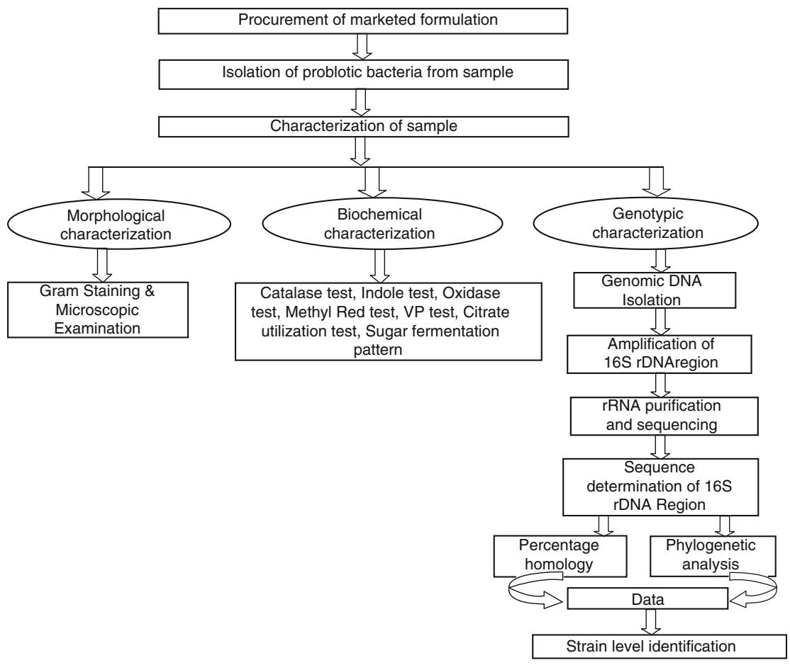  
Fig. 1 Methodology followed for validation of a marketed formulation

and strain stated. Label depicted presence of Lactobacillus sporogenes in the said formulation.

(c) Isolation of probiotic bacteria from sample: The bacteria were isolated from the procured sample using nutrient broth as well as nutrient agar and De Man, Rogosa, and Sharpe (MRS) broth and MRS agar. The plates were incubated at $3 7 \pm 2 \mathrm { ~ } ^ { \circ } \mathrm { C }$ for $^ \mathrm { ~ 4 8 ~ h ~ }$ . After incubation, individual colonies were selected and transferred into sterile broth mediums. The isolates were purified selecting colonies with streak plate technique.

(d) Physiological and biochemical characterization: The colonies from procured sample and standard Lactobacillus sporogenes were subjected to various morphological and biochemical examinations as follows:

Gram staining: Isolates from procured culture and standard culture were examined for striking differences in the Gram staining pattern. For this, the same samples were subjected to standard Gram staining technique for size, shape, arrangement, and Gram’s nature of bacterial samples. The Gram reaction of the isolates was determined by light microscopy after Gram staining. Cultures were grown in appropriate medium at $3 7 \pm 2 \mathrm { ~ } ^ { \circ } \mathrm { C }$ for $^ { 2 4 \mathrm { ~ h ~ } }$ under anaerobic conditions. Cells from fresh cultures were used for Gram staining. The individual colony was picked up aseptically into the agar plate for 1 min and again rinsed with water (5 s). Further decolorizer $9 5 \%$ ethanol) was added for 15–30 s and rinsed with water for 5 s. Finally safranine was added for 60–80 s and rinsed with water followed by determination of Gram-positive and purified isolates under light microscopy. Gram-positive cells will stain purple, while Gram-negative cells stain pink/red [12].

Catalase test: Catalase is an enzyme produced by many microorganisms that break down the hydrogen peroxide into water and oxygen and cause gas bubbles. The formation of gas bubbles determines the presence of catalase enzyme and indicates the positive result [13]:

$$
2 \mathrm {H} _ {2} \mathrm {O} _ {2} \rightarrow 2 \mathrm {H} _ {2} \mathrm {O} + \mathrm {O} _ {2}
$$

Catalase test was performed with both marketed formulation and standard $L$ . sporogenes in order to see their catalase reactions. For this purpose, fresh liquid cultures in nutrient media were used for catalase test by dropping $3 \%$ hydrogen peroxide solution onto $1 \ \mathrm { m l }$ of cultures grown for $^ { \textrm { \scriptsize 1 2 h } }$ . The isolates unable to generate gas bubbles are supposed to be catalasenegative [14].

l Indole test: $1 0 ~ \mathrm { m l }$ tryptophan medium was poured in each McCartney bottle. Inoculation process was performed after autoclaving the media for 15 min under 15 lbs. pressure at $1 2 1 ~ ^ { \circ } \mathrm { C } $ ). The inoculated media with isolate of marketed formulation and standard L. sporogenes was incubated for $^ { 2 4 \mathrm { ~ h ~ } }$ at $3 7 \pm 2 \mathrm { ~ } ^ { \circ } \mathrm { C }$ . E. coli MTCC 4315 was used as a positive control, and laboratory isolates of Pseudomonas aeruginosa was used as a negative control. Kovac’s reagent was added to detect the indole. The amino acid tryptophan can be broken down by enzyme tryptophanase to form indole, pyruvic acid, and ammonia as end products. Tryptophanase differentiates indole-positive enterics e.g., E. coli from closely related indole-negative enterics [15].   
Oxidase test: The enzyme oxidase present in certain bacteria catalyzes the transport of electron from donor bacteria to the redox dye tetra-methyl-p-phenylenediamine dihydrochloride. The dye in the reduced state has a deep purple color. Inoculated plates were incubated at $3 7 \pm 2 \mathrm { ~ } ^ { \circ } \mathrm { C }$ for 76 h. One colony of each isolates was smeared to filter paper already impregnated with oxidase reagent $1 \%$ tetramethyl-p-phenylenediamine dihydrochloride). Basically this test is to see if an organism produces cytochrome C oxidase. The positive result was indicated by the production of dark blue color within 7 s [16].   
l Methyl red test: $1 0 \ \mathrm { m l }$ methyl red and Voges-Proskauer (MR-VP) broth was taken in each McCartney bottle and autoclaved (for 15 min. In 15 lbs. pressure at $1 2 1 ~ ^ { \circ } \mathrm { C }$ ) for methyl red (MR) and Voges-Proskauer (VP) tests. After this, isolate of marketed formulation and standard L. sporogenes were inoculated into MR-VP broth with a sterile transfer loop. The McCartney bottles were then incubated at $3 7 \pm 2 \mathrm { ~ } ^ { \circ } \mathrm { C }$ . After $^ \mathrm { 4 8 \ h }$ of incubation, the MR-VP broth of each bottle was equally split into two McCartney bottles (one of these bottles used for the MR test; the other was used for VP test). Then the bottles containing MR-VP broth that was subjected to MR test were incubated for another $^ { 2 4 \mathrm { ~ h ~ } }$ . After this, five drops of the $\mathrm { p H }$ indicator methyl red was added to each bottle. The bottles were gently rolled between the palms of the hand to disperse the methyl red. In this test, E. coli MTCC 4315 was used as a positive control and Pseudomonas aeruginosa was used as negative control. The methyl red test was used to identify enteric bacteria based on their pattern of glucose metabolism. Enterics that subsequently metabolize pyruvic acid to other acids lower the pH of the medium to 4.2. At this $\mathrm { p H }$ , methyl red turns red. A red color represents a

positive test. Enterics that subsequently metabolize pyruvic acid to neutral end products lower the $\mathrm { p H }$ of the medium to only 6.0. At this pH, methyl red is yellow. A yellow color represents a negative test [17].

Voges-Proskauer (V.P.) test: As previously mentioned in the methyl red test, 10 ml MR-VP broth was taken in each McCartney. The McCartney bottles inoculated with isolate of marketed formulation and standard $L .$ . sporogenes were then incubated at $3 7 \pm 2 { } ^ { \circ } \mathrm { C }$ for 48 hours. After incubation, $4 0 \%$ KOH (Barritt’s reagent B) was added. After this, the bottles were shaken vigorously and allowed to stand for 20 min.   
Citrate utilization test: Isolate of marketed formulation and standard $L .$ sporogenes were streaked onto citrate agar slant and then incubated for $^ { 9 6 \mathrm { ~ h ~ } }$ . The citrate test determines the ability of microorganisms to use citrate as the sole of carbon and energy. In this test, E. coli MTCC 4315 was used as a negative control, and Pseudomonas aeruginosa was used as positive control. A chemically defined medium (Simmon Citrate Agar) having sodium citrate as carbon source and $\mathrm { N H _ { 4 } } ^ { + }$ as nitrogen source was used for test. Bromothymol blue was used as a pH indicator. Microorganisms utilize citrate that result in raise in pH which is indcated by pH indicator with change in color from green to blue. It further indicates that microorganisms under screening can utilize citrate as its only carbon source [18].   
Sugar fermentation pattern: Broth having isolated bacteria from marketed formulation and standard L. sporogenes, at pH 6.5, was taken into each McCartney tube, and phenol red $( 0 . 0 1 8 ~ \mathrm { g } / 1 )$ was added into the tube as $\mathrm { p H }$ indicator. After autoclaving the medium (at $1 2 1 ~ { } ^ { \circ } \mathrm { C }$ for $1 5 ~ \mathrm { m i n }$ ), 1 ml of different types of sugar solutions $1 0 \%$ w/v sterilized through membrane filtration) (filtered sterilized) were inoculated into the different tubes. Then $2 0 0 ~ \mu \mathrm { l }$ of $^ { \textrm { \scriptsize 1 2 h } }$ old culture liquid culture medium was inoculated into the broth and incubated at $3 7 \pm 2 \mathrm { ~ } ^ { \circ } \mathrm { C }$ for $^ { 2 4 \mathrm { ~ h ~ } }$ . If fermenting bacteria are grown in a liquid culture medium containing the carbohydrates, they may produce organic acids as by-products of the fermentation. These acids are released into the medium and lower its pH. If a pH indicator such as phenol red or bromocresol purple is included in the medium, the acid production will change the medium from its original color to yellow. Gases produced during the fermentation process can be detected by using a small, inverted tube, called a Durham tube (named after Herbert Edward Durham, bacteriologist, 1866–1945), within the liquid culture medium. After adding the proper amount of

broth, Durham tubes are inserted into each culture tube. During autoclaving, the air is expelled from the Durham tubes, and they become filled with the medium. If gas is produced, the liquid medium inside the Durham tube will be displaced, entrapping the gas in the form of a bubble [19].

# (e) Genotypic characterization:

Genomic DNA isolation: MagNA Pure Bacterial Lysis Buffer (Roche) $( 4 0 0 ~ \mu \mathrm { l } )$ was added to a bead tube (Septi-Fast Lys Kit MGRADE, Roche) followed by addition of $2 0 0 { - } 8 0 0 \ \mu \mathrm { l }$ sample culture. Later mixture was run for $2 \times 4 5$ s at speed 6.5 in the FastPrep instrument (Q-BIOgene) followed by centrifugation at $1 2 , 2 8 1 \ \times \ g$ for 3 min. Supernatant was transferred to a $2 ~ \mathrm { m l }$ tube that fits into the MagNA Pure Compact machine (Roche).

Quantification of DNA: The isolated DNA was quantified. For the same, electrophoresis through agarose gel is the standard method used to separate, identify, and purify the DNA fragments. The technique is simple, rapid to perform, and capable of resolving fragments of DNA that cannot be separated adequately by other procedures, such as density gradient centrifugation. Furthermore, location of DNA within the gel can be determined directly by staining with low concentration of the fluorescent intercalating dye, ethidium bromide; bands containing as little as $1 0 ~ \mathrm { n g }$ of DNA can be detected by direct examination of the gel in ultraviolet light. Presumed PCR-amplified DNA fragments were analyzed by electrophoresis on $1 \%$ agarose gel. The agarose gel was prepared after sealing the edges of a clean, dry, glass plate with autoclave tape so as to form a mold. Mold was settled on a horizontal section of the bench. Later correct amount of powdered agarose was added to measured quantity of the electrophoresis buffer in the flask (e.g., for $1 \%$ gel $0 . 4 \ \mathrm { g }$ of agarose was added to $4 0 ~ \mathrm { m l }$ of the $1 \times$ TAE buffer) to make a gel. After it, TAE buffer was filled in electrophoresis tank. The slurry was heated in the microwave until the agarose dissolves completely. The solution was cooled to $6 0 ~ ^ { \circ } \mathrm { C }$ , and ethidium bromide was added to gel to a final concentration of $0 . 5 ~ { \mu \mathrm { g } } / { \mathrm { m l } }$ . The mixture was mixed thoroughly and poured into the mold. DNA was mixed with desired amount of gel-loading buffer and slowly loaded into the slots of the submerged gel using a disposable micropipette. The lid of the gel tank was closed and gel was run. After completion, gel was observed under UV light. After getting the bands of desired amplification, later bands were eluted from the gel.

Table 1 Details of primers used for amplification of 16S rDNA region   

<table><tr><td colspan="2">Forward</td></tr><tr><td>Group A-forward</td><td>5&#x27;-gt-tTg-atc-mtg-gct-cag-rAc-3&#x27;</td></tr><tr><td>Group B-forward</td><td>5&#x27;-gt-tTg-atc-mtg-gct-cag-aKtg-3&#x27;</td></tr><tr><td>Group C-forward</td><td>5&#x27;-agt-ttg-atc-mtg-gct-cag-gAt-3&#x27;</td></tr><tr><td colspan="2">Reverse</td></tr><tr><td>Groups A,B,C-reverse (pD)**</td><td>5&#x27;-gta-tta-ccg-cgg-ctg-ctg-3&#x27;</td></tr></table>

Table 2 Details of the reaction mixture used for RT-PCR   

<table><tr><td>S. No</td><td>Components</td><td>Quantity added</td></tr><tr><td>1.</td><td>SYBR Premix Ex Taq (TaKaRa)</td><td>12.5 μl</td></tr><tr><td>2.</td><td>F-primer (10 μM)</td><td>2.0 μl</td></tr><tr><td>3.</td><td>R-primer (10 μM)</td><td>1.0 μl</td></tr><tr><td>4.</td><td>H2O (PCR grade)</td><td>7.5 μl</td></tr><tr><td>5.</td><td>Template</td><td>2.0 μl</td></tr><tr><td>6.</td><td>Total volume</td><td>25.0 μl</td></tr></table>

Table 3 Details of PCR conditions used for amplification   

<table><tr><td>S. No.</td><td>Process</td><td>Temperature</td><td>Time (s)</td></tr><tr><td>1.</td><td>Initial enzyme activation</td><td>95 °C</td><td>10</td></tr><tr><td>2.</td><td>Melting</td><td>95 °C</td><td>10</td></tr><tr><td>3.</td><td>Annealing</td><td>64 °C</td><td>15</td></tr><tr><td>4.</td><td>Extension</td><td>72 °C</td><td>20</td></tr></table>

l Purification of DNA: DNA extraction and purification were performed by DNA elution method. For the elution, DNA elution kit (Qiagen) had been used. Elution volume was $5 0 ~ \mu \mathrm { l }$ .   
l Amplification of 16S rDNA region: For the amplification of 16S rDNA, reaction mixture was prepared using groupspecific primers. The real-time PCR reactions are run on a SmartCycler machine (Cepheid) for 45 cycles.   
l The details of group-specifc primers and detail of reaction mixture are given in Tables 1, 2, and 3 as follows:

l rRNA purification and sequencing: 16s rRNA sequence was eluted out of gel, and finally purified sample was sequenced. The sequencing was done by outsourcing, and a sequence of 699 bp was detected for this marketed formulation.

# 3.1 Bioinformatics Tools Based Data Analysis

Sequence obtained after sequencing was exploited for analysis of data with respect to the following parameters:

1. Percentage homology.   
2. Phylogenetic analysis.

l Percentage homology: The percentage homology of the sequence obtained from the marketed formulation was analyzed with other available strains by using Ez-Texan database, and hence observations for percentage homology, sequence analysis, graphic summary, dot matrix, identity analysis, and taxonomic hierarchy had been recorded as images.   
Phylogenetic analysis: The obtained query sequence of isolate from marketed probiotic formulation was closely compared with other related species with the help of laser gene software. Significant level of variations in 16s rRNAs between strains of different species was observed, and hence a phylogenetic tree had been drawn from the observed parameters.

# 3.2 Observations of Bioinformatics Tools Used in Data Analysis

Sequence obtained by 16s rRNA sequencing was analyzed by EzTexan database. By using EzTexan database, results were captured in various formats like BLAST-based sequence analysis, graphic summary, dot matrix, identity analysis, and sequence analysis which are shown in Figs. 3, 4, 5, 6, and 7. For example, in the study planned by the authors, it has been observed that sequence isolated from marketed formulation isolate had shown maximum similarity with the already existing database sequence of Bacillus coagulans as shown in Fig. 2.

Graphic summary illustrates how significant matches, or hits, align with the query sequence. For example, in the graphic summary given below (shown in Fig. 3), it has been observed that the query sequence, i.e., marketed formulation sequence was of 699 bp and subjected sequence for anonymous strain is of 697 bp. Both the sequences had shown $9 9 . 1 3 \%$ of similarity with only two gaps.

Dot matrix is also known as a dot plot and is supposed to be a graphical method that allows the comparison of two biological sequences and identifies regions of close similarity between them. It compares sequences by organizing one sequence on the $_ x$ -axis, and another on the $y .$ -axis, of a plot. The closeness of the sequences in similarity is determined by observing the curves in the diagonal

# Analysis Results

Columns to Display

Completeness

Accession

Hide all  Showall

Taxonomy

Task lcons


View ouen


Re-identity


Delece


  
Fig. 2 16s rRNA sequence analysis

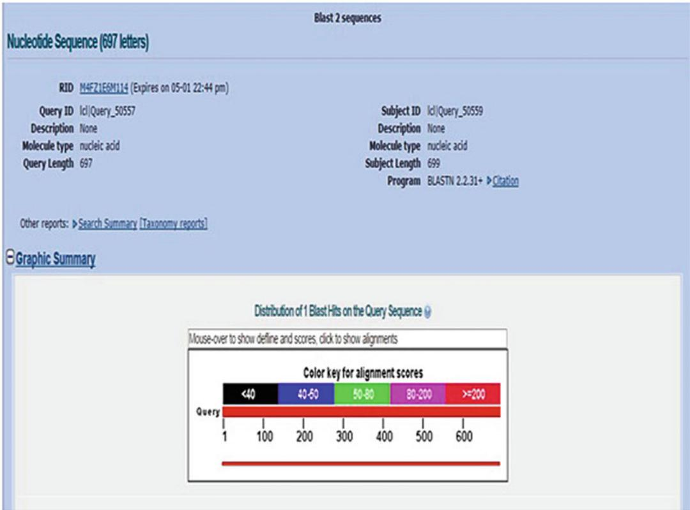  
Fig. 3 Graphic summary of nucleotide sequence

line. For example, in the current study, dot matrix shows that most of the base pairs are similar and hence representing a straight line as shown in Fig. 4.

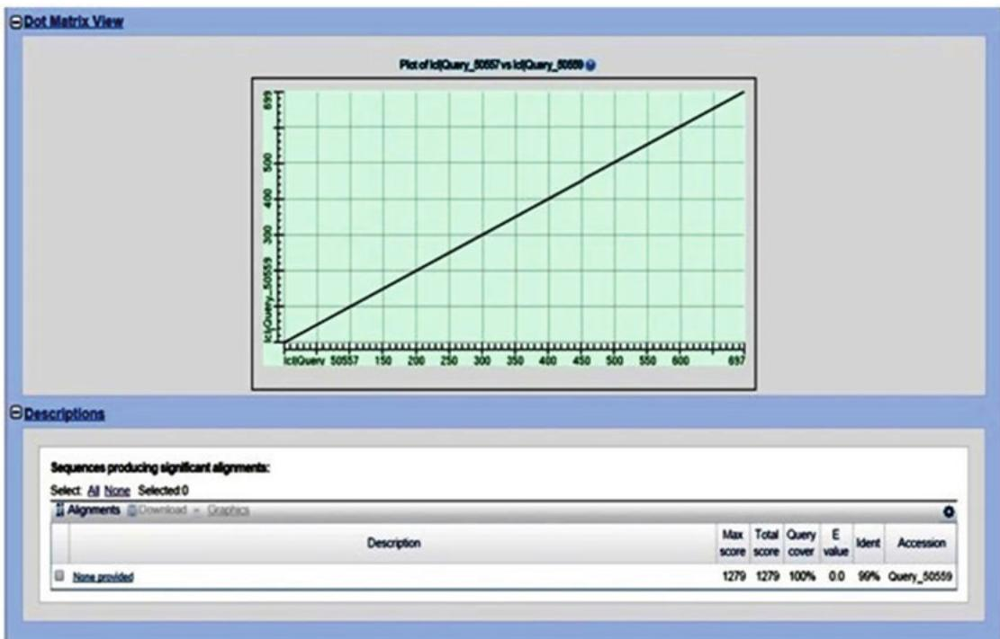  
Fig. 4 Representation of dot matrix

Results of identity analysis had shown the similarity of the obtained sequence with variety of Bacillus and Lactobacillus strains, but the initial 12 ranks were of Bacillus species instead of Lactobacillus as shown in Fig. 6. Supporting details that the isolated strain was Bacillus coagulans (identity analysis and sequence analysis) are shown in Figs. 5 and 6, respectively.

# 3.3 Phylogenetic analysis

For the phylogenetic analysis, the obtained sequence, i.e., query sequence of isolate from selected probiotic formulation, was closely compared with other related species with the help of laser gene software. Significant level of variations in 16s rRNAs between strains of different species was evident from the obtained results. The query sequence of 699 bp was compared between the three strains of B. coagulans and closely related species of the genus Bacillus. The level of 16S rDNA from B. coagulans (marketed formulation isolate) was closely related to two strains of B. coagulans, namely, B. coagulans (Strain C4) and B. coagulans (LA 204), and the similarity was $9 8 . 8 \%$ and $9 9 . 3 \%$ , respectively. Further the phylogenetic tree prepared with the help of laser gene software had also clarified that the bacterial sample isolated from the marketed formulation is indeed of Bacillus coagulans, and it formed a coherent cluster with two other strains of B. coagulans, namely, B. coagulans C4 and B. coagulans L204 which is a type

# Results of Identify Analysis

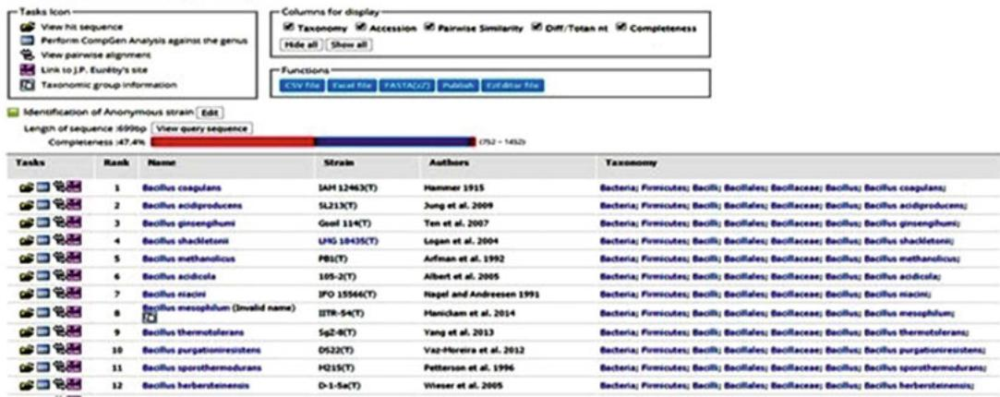  
Fig. 5 Results of identity analysis

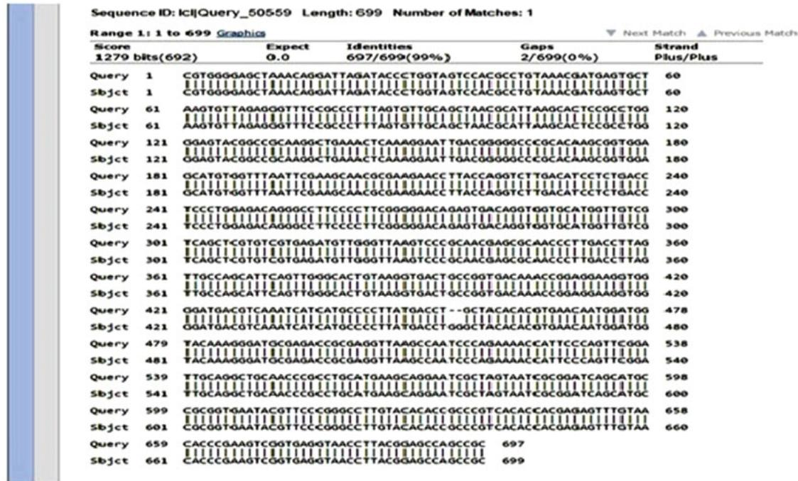  
Fig. 6 Sequence analysis of sequence derived from marketed formulation

strain of Bacillus coagulans. Apart from it, according to the query sequence, phylogenetic tree also had shown that B. atrophaeus strains are having $9 5 . 5 \%$ of homology between them. Similarly, in case of B. clausii strains having homology of $8 8 . 4 \substack { - 9 3 . 6 \% }$ , Bacillus coagulans strains were showing $9 1 . 3 \mathrm { - } 1 0 0 \%$ . The strains were showing a sequence similarity ranging from 91.9 to $9 8 . 0 \%$ for

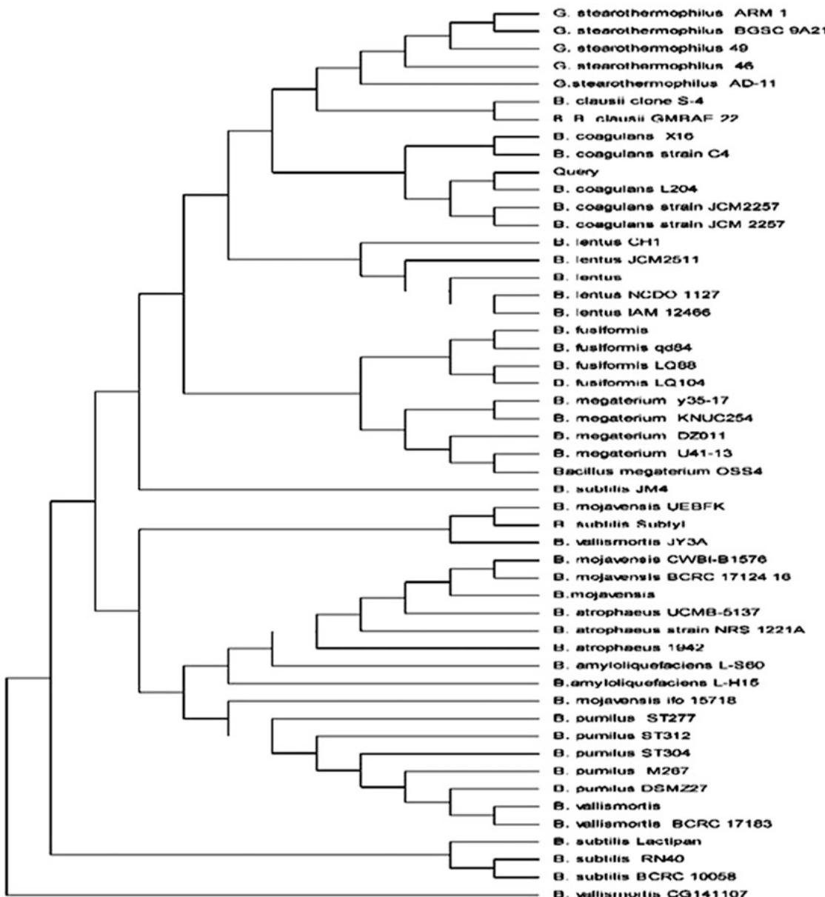  
Fig. 7 Phylogenetic tree for probiotic strains

B. fusiformis, 91.1 to $9 6 . 5 \%$ for B. lentus, 93.0 to $9 6 . 1 \%$ for B. mageterium 93.6 to $9 4 . 7 \%$ for B. mojavensis $9 4 . 8 \%$ for B. pumilus, $8 0 . 7 { - } 9 4 . 9 \%$ for B. subtilis, $8 9 . 1 { - } 9 5 . 1 \%$ for B. vallismortis and $9 2 . 1 { - } 9 2 . 6 \%$ for G. stearothermphilus respectively. In phylogenetic analysis, all strains of the same genera are forming different clusters as shown in Fig. 7. The query sequence in phylogenetic tree which was constructed in Mega 5.0 using

maximum parsimony method was present in cluster of B. coagulans. B. vallisformis CG141107 was strain which was out group in the tree as shown in Fig. 7.

In the abovementioned study, a marketed formulation was validated which claimed the presence of lactic acid bacillus earlier known as Lactobacillus sporogenes on its label. When the bacterial samples were subjected to physiological, biochemical, and molecular characterization by 16s rDNA sequencing, it has been observed that the strain present in the marketed formulation is of Bacillus coagulans as its identity matches $9 8 \mathrm { - } 1 0 0 \%$ with strains of Bacillus coagulans.

Today it is difficult to imagine an area of knowledge without the use of computers and informatics. On similar lines modern scientific/medical research also makes utilization of computer technology to organize and analyze large sets of data. Tremendous flow of data produced with new innovations has necessitated the need of computational support for collection, storage, retrieval, analysis, and correlation of huge data sets of complex information. The analysis of data and computer modeling has really revolutionized the clinical research of various drugs and therapeutic agents at molecular level. A lot of economy can be observed in methods designed through computer modeling. This even pinpoints the exact site of action of drugs, thus helping in devising new targeted drug delivery systems. As a result, bioinformatics has become the latest engineering discipline. Safety and efficacy of various drugs is the key link between advances in medical research technology and improved health care. Moreover evaluation of the safety, efficacy, as well as identity of the drugs is highly complex, time-consuming, and an expensive affair. With the adoption of mathematical/statistical software, computer modeling, and other computational engineering methods, it has become easier for the researchers to overcome various challenges at a fast pace.

Abovementioned compilation presents “how to manual” application of bioinformatics-based technique for identification of bacterial strains used in probiotics. In above-cited example, a marketed formulation was validated, using bioinformatics-based software which had shown remarkable differences in the bacterial strain mentioned on the marketed product label and the actual identity of the species contained in marketed formulation. This method will help in eradicating inadvertent entry of toxic bacterial strains in marketed products for safe use of consumers. This study clearly shows that bioinformatics provides a wide range of drug-related databases and softwares, which can be used for various purposes, related to drug designing and development process.

# Text Mining for Drug Discovery

Si Zheng, Shazia Dharssi, Meng Wu, Jiao Li, and Zhiyong Lu

# Abstract

Recent advances in technology have led to the exponential growth of scientific literature in biomedical sciences. This rapid increase in information has surpassed the threshold for manual curation efforts, necessitating the use of text mining approaches in the field of life sciences. One such application of text mining is in fostering in silico drug discovery such as drug target screening, pharmacogenomics, adverse drug event detection, etc. This chapter serves as an introduction to the applications of various text mining approaches in drug discovery. It is divided into two parts with the first half as an overview of text mining in the biosciences. The second half of the chapter reviews strategies and methods for four unique applications of text mining in drug discovery.

Key words Biomedical text mining, Drug discovery, Biomedical literature, Electronic medical records, Deep learning

# 1 Introduction

Drug discovery is a complex and costly process averaging 10–17 years in drug development and close to a billion dollars in research for each drug discovered [1]. The lack of innovative methods for preclinical testing of drugs has been cited in the FDA’s “Critical Path Initiative” report as one of the major obstacles to drug development [2]. Conventional drug discovery efforts often begin with manual literature searches with the hope of identifying potential drug targets. These manual curation efforts are costly and inefficient, as the majority of drug-related information is disseminated in papers buried deep within scientific literature or patient health records and is unable to be processed effectively by traditional techniques. Often this type of textual data is semistructured, unstructured, or heterogeneously formed. In this circumstance, text mining shows immense potential as a useful computational tool for drug discovery tasks, as it can be used to

# 1.1 What Is Text Mining

process large-scale textual data with variable formats. Hence, it can be utilized as an essential component for building information and knowledge based tools in drug discovery [3].

In a nutshell, text mining (TM) is the process of discovering and capturing knowledge or useful patterns from a large number of unstructured textual data. It is an interdisciplinary field that draws on data mining, machine learning, natural language processing, statistics, and more. Broadly speaking, TM tasks include document summarization, information retrieval, entity recognition, and relationship extraction. The extracted information is often linked via knowledge graphs to form new facts or hypotheses. Take for example the mining of protein-protein interactions from bioscience textual data. Using TM techniques, one can extract articles with individual protein name mentions, acquire related words that occur in each of these articles, and find additional articles containing the same sets of words. The ultimate goal is to find potential proteinprotein interactions from the articles obtained.

# 1.2 Text Mining for Facilitating Drug Discovery

The biosciences have become one of the most promising application areas for text mining, as most biomedical scientific findings are presented in the form of textual data in scholarly publications. In recent years, biomedical text mining has generated promising outcomes for drug discovery by utilizing textual databases and advanced information extraction techniques. Hidden information like drug-drug and drug-target interactions can be extracted from textual data [4], which can aid in the identification of novel drugs or the reusability of these approved drugs for other indications. All of these approaches have sought to infer novel relationships among biological entities by combining known elements hidden in scientific text.

# 1.3 Challenges of Text Mining in Drug Discovery

Although promising, there are many challenges in text mining for drug discovery. For instance, drug and chemical names in scientific textual data are heterogeneous/ambiguous, and documents differ substantially in their length, structure, language/vocabulary, writing style, and information content. As for TM technologies, the lack of interoperability among TM tools impedes the development of more complex systems. Other challenges include limited high-quality training data for the development and evaluation of advanced supervised machine learning methods. For example, deep learning, a new and advanced area of machine learning research, has yet to show its full potential when applied to biomedical text mining tasks. One major obstacle is the lack of sufficient training data in the biomedical domain.

Lastly, the ability to handle large-scale data continues to be a challenge and is necessary for effective text mining applications. Recent computing technologies, such as cloud computing, have been applied to help boost and optimize existing tools.

# Open accessible resources

  
Clinical Textual Data

MIMIC-III N HEngland

PCORnet

  
Biomedical Literature

MEDLINE PMC

DOAJ

# Text mining


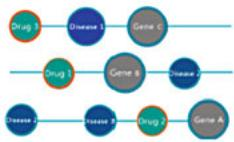

Information Retrieval

Named Entity Recognition


Drug 1

Gene A

Drug 3

Gene C

Drug 2

Disease

Relationship identification


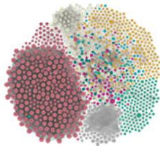

Knowledge Graph Construction

# Application for drug discovery

  
Disease-mutation

  
Drug Targets

  
Pharmacogenomic

  
Drug side effect   
Fig. 1 Overview of text mining for drug discovery

In this chapter, we present a brief introduction to text mining strategies, address limitations to text mining in the biosciences, and review successful applications in drug discovery research (Fig. 1). This chapter serves as a manual for readers interested in text mining for drug discovery and directs readers to the necessary resources currently available.

# 2 General Principles of Biomedical Text Mining

# 2.1 Information Retrieval

The first critical step to biomedical text mining is to obtain information relevant to a particular topic from data resources, also called information retrieval. Topics of interest can be represented by various queries, with each query retrieving a list of matching documents. There are two main strategies when crafting queries: (1) obtain all matches that may be relevant to the topic (maximize recall) or (2) find only documents that are truly related to the topic of interest (maximize precision). Methods for generating different types of queries include keywords with controlled vocabulary, Boolean search queries, natural language queries, wildcard

queries, and hybrid approaches. Advanced search options are also available but require an exact search target with proper terms as well as additional support from the search interface. Queries for biomedicine are complicated by the ambiguity and variability of terms, often rendering the search results neither comprehensive nor accurate.

To improve the search accuracy of keyword-based retrieval systems, an understanding of the semantics of user queries is necessary. One such approach was developed by Huang et al., in which he proposed an unsupervised framework, SIP (semantically similar pattern finder), which extracts biomedical semantic relationships from PubMed queries in an automated form [5]. This novel framework aims to understand the user query’s semantics in order to provide improved literature retrieval results. Question answering systems are an alternative to keyword searches that allows the user to query using natural language. Olelo is an example of a question answering system in biomedicine. It is a fast and intelligent web search application, which combines biomedical literature and terminologies in a fast in-memory database to enable real-time responses to researchers’ queries [6].

# 2.2 Named Entity Recognition

The next step in the text mining pipeline includes named entity recognition. Named entity recognition is the process of locating specific predefined types of entities in text. For biomedical text mining, named entity recognition typically involves extraction of entities such as drugs, diseases, genes/proteins, and mutations from unstructured text. The information extracted can be used to define semantic relationships between entities to allow for further analysis of article topics. Over the years, many biomedical named entity recognition systems have been developed (Table 1).

Common methods for biomedical entity recognition include dictionary look-up, rule-based approaches, machine learning, and hybrid techniques. Dictionary-based methods are simple and practical but are limited by the scale and quality of the dictionary. Resources like Unified Medical Language System (UMLS: https://www.nlm.nih.gov/research/umls/) [7], Comparative Toxicogenomics Database (CTD: https://ctdbase.org) [8], Drug-Bank (https://www.drugbank.ca) [9], PubChem (https:// pubchem.ncbi.nlm.nih.gov) [10], RxNorm (https://www.nlm. nih.gov/resesarch/umls/rxnorm/) [11], etc. are often used for the creation of entity dictionaries. Rule-based approaches can be effective when resources such as entity gazetteers or entity-labeled textual training data are missing [12]. In recent studies, machine learning methods such as conditional random fields (CRF), structured support vector machines (SSVMs), and deep neural networks have been widely adopted. For instance, entity recognition tools such as BANNER [13], DNorm [14], and TaggerOne [15] are based on conditional random field (CRF) techniques. Finally,

Table 1 Named entity recognition systems   

<table><tr><td>NER system</td><td>Description</td><td>URL</td><td>Content recognized</td><td>Textual data type</td></tr><tr><td>tmChem</td><td>An open-source software for identifying chemical names</td><td>https://www.ncbi.nlm.nih.gov/research/bionlp/Tools/tmchem/</td><td>Chemical and drug names</td><td>Biomedical literature</td></tr><tr><td>BANNER-CHEMDNER</td><td>A system for identifying chemical and drug mentions</td><td>https://bitbucket.org/tsendeemts/banner-chemdner</td><td>Chemical and drug names</td><td>Free text</td></tr><tr><td>CheNER</td><td>A tool for chemical named entity recognition</td><td>http://ubio.bioinfo.cnio.es/biotechs/CheNER/</td><td>Chemical and drug names</td><td>Free text</td></tr><tr><td>ChemDataExtractor</td><td>A toolkit for extraction of chemical information</td><td>http://chemdataextractor.org/</td><td>Drug names, associated properties, measurements, and relationships</td><td>Biomedical literature</td></tr><tr><td>DNorm</td><td>An open-source software tool for identifying disease names</td><td>https://www.ncbi.nlm.nih.gov/research/bionlp/Tools/dnorm/</td><td>Disease names</td><td>Biomedical literature</td></tr><tr><td>OSCAR4</td><td>An extensible system for annotation of chemistry</td><td>https://bitbucket.org/wwwmm/oscar4/wiki/Home</td><td>Chemical and drug names</td><td>Biomedical literature</td></tr><tr><td>GNormPlus</td><td>An integrative approach for tagging gene, gene family, and protein domains</td><td>https://www.ncbi.nlm.nih.gov/research/bionlp/Tools/gnormplus/</td><td>Gene and protein names</td><td>Biomedical literature</td></tr><tr><td>tmVar</td><td>A text mining approach for extracting sequence variants</td><td>https://www.ncbi.nlm.nih.gov/research/bionlp/Tools/tmvar/</td><td>Mutation names</td><td>Biomedical literature</td></tr><tr><td>Whatizit</td><td>A text processing system for identifying molecular biology terms</td><td>http://www.ebi.ac.uk/webservices/whatizit/info.jsp</td><td>Gene, chemical, and disease names</td><td>Free text</td></tr></table>

recent named entity recognition systems apply hybrid methods that combine machine learning with lexical features derived from dictionaries or rules used mostly at the pre- and post-processing stages.

There have been a number of studies in which drug and chemical information extraction have been carried out. Swain et al. presented an innovative method that utilized multiple rule-based approaches for interpreting specific document domains for phrase parsing and chemical information extraction [16]. The 2015 Bio-Creative: Critical Assessment of Information Extraction in Biology V challenge used our own tmChem, a chemical named entity recognizer created by combining two independent machine learning models in an ensemble, as that had the best results [17].

As for other types of entities, Iyer et al. recognized both drug and event concepts from over 50 million clinical notes from two clinical sites and identified significant drug-drug-event associations [18]. They used 19 biomedical ontologies for building a lexicon and recognizing drug and event concepts in electronic health records. Han et al. proposed a novel committee-based active learning method that supports multi-event extraction tasks [19].

# 2.3 Relationship Identification

Relationship identification is an important process that detects semantic associations between (extracted) biomedical entities. Current research efforts have focused on recognizing associations between drugs and other entities such as proteins/genes, mutations, diseases, or adverse events. This has led to the development and publication of a considerable number of chemical-biomedical entity relation extraction approaches. Traditional methods for relationship identification are based on co-occurrence, pattern recognition, and/or rule-based approaches; all these models focus on the occurrence distribution of entities in textual data. Nowadays, the co-occurrence and rule-based method are often combined with machine learning techniques and can be used to identify relationships, such as mutations related to a particular disease, from biomedical literature [20].

For drug-disease relationships hidden in open-access literature, Xu et al. used a structured support vector machines (SSVMs) approach to classify both sentence-level and document-level candidate drug-disease pairs with a corpus of 1,500 PubMed abstracts [21]. This approach achieved the best performance on a chemicalinduced disease relation extraction subtask in the 2015 BioCreative V Chemical Disease Relation (CDR) track.

In another study, Sohn et al. detected associations between drugs and adverse side effects. They constructed a rule-based approach using manually developed patterns and extracted sentences detected by this approach as training data [22]. They established “side effect” keywords as features to build a machine learning-based “adverse effect” sentence classifier.

# 2.4 Knowledge Graph Construction

Knowledge graph construction is the final step for biomedical text mining. A knowledge graph is a structured semantic knowledge base that represents knowledge in graphical form. Each knowledge graph is comprised of nodes representing entities, attributes associated with each node, and edges demarcating unidirectional or multidirectional relationships between nodes. Knowledge graphs have become the foundation of automatic semantic retrieval in modern web searches. The construction process can be described as a link prediction problem and divided into three layers according to the abstract level of its input materials. The input includes the information extraction layer, the knowledge integration layer, and the knowledge processing layer, respectively. Commonly used approaches for knowledge graph construction include analysis of graph extraction, incorporation of ontology constrains and relational patterns, and discovery of statistical relationships within the knowledge graph.

Previous studies explored both molecular network databases and biomedical literature to create a knowledge base and coupled it with approaches such as machine learning, graph mining, and data visualization. Due to recent efforts, linked open data constitutes a large collection of datasets comprised of standard formats and have become new resources for knowledge discovery. Dalleau et al. integrated a set of linked data associated with pharmacogenomics and defined pharmacogenes in a large Resource Description Framework (RDF) graph by using machine learning models [23]. Three distinct types of entities (gene, phenotype, and drug) along with their corresponding relationships were depicted by the knowledge graph.

# 3 Linking Text Mining to Drug Discovery

With the rapid accumulation and distribution of new biomedical publications, databases and clinical records constitute valuable resources for facilitating and accelerating drug discovery. Combined with the generation and application of text mining techniques, one can derive information like drug targets, pharmacogenomics relationships, drug-disease or drug-mutation relationships, and drug side effects from relevant documents. Although not perfect, text mining provides relatively reliable results while being able to process large amounts of textual data in a way that no manual curation efforts could ever hope to manage [24].

# 3.1 Materials

Many biomedical resources are available for drug discovery using text mining approaches. In recent years, open-access biomedical resources have become increasingly easier and cheaper to acquire, with the majority of them being textual. Often, valuable information is encoded in neither structured nor classified forms, thus

Table 2 Open-access textual data resources for drug discovery   

<table><tr><td>Resource type</td><td>Resources</td><td>Website</td><td>Description</td></tr><tr><td rowspan="3">Clinical textual data</td><td>MIMIC-III</td><td>https://mimic.physionet.org/</td><td>A large, publicly available database of critical care units from the Beth Israel Deaconess Medical Center</td></tr><tr><td>NHS England</td><td>https://www. england.nhs.uk/</td><td>An executive non-departmental public body (NDPB) of the Department of Health</td></tr><tr><td>PCORnet</td><td>http://www. pcornet.org/</td><td>A large, highly representative national network of clinical data and health information</td></tr><tr><td rowspan="3">Biomedical literature</td><td>MEDLINE</td><td>https:// medlineplus.gov/</td><td>A publicly available bibliographic database of life science and biomedical information</td></tr><tr><td>PMC</td><td>https://www.ncbi.nlm.nih.gov/ pmc/</td><td>A free full-text archive of biomedical and life sciences journal literature</td></tr><tr><td>DOAJ</td><td>https://doaj.org/</td><td>A community-curated online directory that indexes and provides access to high-quality, open-access, peer-reviewed journals</td></tr></table>

necessitating the application of text mining strategies for both the synthesis and analysis of useful information. Generally, we can divide open-access textual data into clinical textual data and biomedical literature. The following table illustrates various examples of open-access textual data resources that can be used for drug discovery (Table 2).

# 3.1.1 Clinical Textual Data

With the ongoing acquisition of clinical textual data in medicine, such as practice guidelines, clinical notes, and electronic health records (EHRs), large amounts of data exist as potential resources for drug discovery. For example, mining electronic health records (EHRs) have the potential for establishing new patientstratification principles and for revealing unknown drug correlations [25]. This method has become increasingly more feasible as more and more clinical databases are free of access restrictions.

1. MIMIC-III: Medical Information Mart for Intensive Care III (MIMIC-III) is a large, freely available database comprising of patient information from all critical care units at a large tertiary care hospital [26]. This database contains information such as clinical notes, vital signs, medication lists, laboratory values, procedure codes, diagnostic codes, imaging reports, hospital length of stay, and survival data. To access MIMIC-III one must formally request access via a process documented on the

website, including the completion of a recognized course and signing a data use agreement.

2. NHS England: The National Health Services (NHS England: https://www.england.nhs.uk/) is an executive non-departmental public body (NDPB) of the Department of Health, developed by one of the largest repositories of data on human heath in the world. They have published a variety of source databases with publicly released information, often from the government or other public organizations, ranging from patient surveys to public health outcomes.   
3. PCORnet: As clinical data from different organizations all over the world is being acquired, the need for effective use of this information, including interoperability has become a critical problem. Launched in 2013, the National Patient-Centered Clinical Research Network (PCORnet) aims to address this problem by integrating data from multiple Clinical Data Research Networks (CDRNs) and Patient-Powered Research Networks (PPRNs) [27]. PCORnet collects data routinely generated in a variety of healthcare settings including hospitals, outpatient clinics, and urgent care centers. By engaging a variety of stakeholders—patients, families, providers, and researchers—PCORnet empowers individuals and organizations to use this data to answer practical questions in order to make informed healthcare decisions. It supports an effective, sustainable national research infrastructure that allows for the use of electronic health data in comparative research.

# 3.1.2 Biomedical Literature

Biomedical literature is another important textual resource essential for users such as researchers, healthcare professionals, and patients. Various databases exist that compile large amounts of biomedical literature.

1. MEDLINE: Medical Literature Analysis and Retrieval System Online (MEDLINE or MEDLARS Online: https:// medlineplus.gov/) is a publicly available bibliographic database of life science and biomedical information, which contains more than 27 million articles from 1950 to present. It includes bibliographic information of articles from academic journals covering medicine, nursing, pharmacy, dentistry, veterinary medicine, and public health. MEDLINE uses Medical Subject Headings for information retrieval.   
2. PMC: PubMed Central (PMC: https://www.ncbi.nlm.nih. gov/pmc/) is another free digital repository developed by the National Library of Medicine (NLM), which archives publicly accessible full-text scholarly articles that have been published within biomedical and life science journals. As of June

2017, it contained over 4.3 million articles and continues to rapidly grow each day.

3. DOAJ: The Directory of Open Access Journals (DOAJ: https://doaj.org/) is a community-curated online directory that indexes and provides open-access to high-quality, peerreviewed journals. As of June 2017, it contained over 2.5 million articles from 126 countries. The aim of the DOAJ is to increase visibility and accessibility of open-access scientific and scholarly journals, thereby promoting their increased usage and overall impact.

# 3.2 Methods

There are multiple approaches to text mining for drug discovery, each relying on the fundamental principles of information retrieval, named entity extraction, and relationship identification. Extracting disease and gene mutation relationships are important for identifying individual variability in diseases and developing drugs that target each of these mutations. Understanding how drugs behave in different genetic backgrounds can determine either its potential benefit or harm to a specific patient population. This section provides the methodology behind each application of text mining for drug discovery and provides a review of the most up-to-date research involved in this field.

# 3.2.1 Extracting Disease-Mutation Relationships for Precision Medicine

The identification of disease and gene mutation correlations is an important strategy for drug discovery in precision medicine, as it takes into account individual variability in disease prevention and treatment. In the case of a genetic disease like cancer, the genomic diversity and instability of cancer cells become major determinants that enable them to acquire malignant or characteristic traits. Previous studies have shown that tumor response to a drug(s) ultimately depends on the steps of oncogenesis, tumor heterogeneity, and oncogenic evolution of resistant clones within the tumor. The success of a cancer drug today is fundamentally dependent on the drug company’s ability to identify target genes that control tumorigenic pathways [28].

Various mutations have been reported in recent studies and many databases like ClinVar [29], Online Mendelian Inheritance in Man [30], COSMIC [31], and GWAS Catalog [32] are available for locating manually curated disease and gene mutation associations; however, the majority of associations still remain buried in unstructured text of biomedical publications or electronic medical records. In this instance, text mining methods can be employed to extract such relationships. Many text mining approaches such as simple co-occurrence, pattern matching, and machine learning, are regularly used methods for disease-mutation extraction. PolySearch is a search-based text mining tool that infers relationships between mutations and diseases based on their frequency of co-occurrence

in MEDLINE abstracts [33]. Similarly, Mutation Extraction from Medline Abstracts (MEMA) uses a word distance metric to select the correct protein-mutation pairs based on sentence co-occurrence [34]. Doughty et al. developed the Extractor of Mutations (EMU) tool that provides a semiautomated approach to extract disease-related mutations from PubMed’s abstracts and full text [35]. This tool is a rule-based method that finds mutations in a given document using regular expression matching, correlates them to their associated genes, and finally couples them to related diseases.

The use of machine learning in text mining is emerging as a pivotal technology in disease-mutation relationship extraction. Our lab (Singhal et al.) developed a machine learning classification approach to automatically identify disease-mutation relationships from biomedical literatures [20]. The steps involved in the development of this approach are listed below:

1. Named entity extraction: GNormPlus [36], tmVar [37], and DNorm [14] were used to extract gene, mutation, and disease annotations from PubMed abstracts, respectively.   
2. Feature construction: six features were used for the machine learning model including:

(a) Nearness to Target Disease score: denotes a cumulative score of all mentions, in which the target disease was closest to the mutation.   
(b) Target Disease Frequency score: frequency count of target disease mentions in the text.   
(c) Other Disease Frequency score: frequency count of the next most frequent disease mention, other than the target disease.   
(d) Same Sentence Disease-Mutation Co-occurrence score (DMCS): binary score calculated by the co-occurrence of the mutation and its nearest disease in the same sentence. The DMCS is 1 if both are mentioned within the same sentence and 0 if not.   
(e) Within Text Sentiment score: The text between the mutation and the nearest disease mentioned is extracted and labeled the “within text.” The sentiment score is based on the polarity of the words contained in the “within text,” with a range from $- 1$ (negative sentiment) to $+ 1$ (positive sentiment).   
(f) Test Subjectivity Score: provides an estimate to the reliability of the sentiment score with a range from 0 (highly objective) to 1.0 (highly subjective).

3. Training the machine learning classification model: Next, they trained a decision tree classifier with a pre-labeled dataset

containing manually curated disease and mutation entities and their associated relationships.

Our results showed that the model obtained F-measures of 0.880 and 0.845 for prostate and breast cancer mutations, respectively. Similarly, Komandur et al. developed and evaluated a text mining system MutD, which extracts protein-mutation-disease associations from MEDLINE abstracts by incorporating discourse level analysis [38]. They first used publicly available terminology sources, as well as text mining systems like the BioTagger-GM [39], MutationFinder [40], PubTator [41], and GeNo [42] to implement entity recognition and normalization. Further graph models were used for extra-sentential processing to associate entities across multiple sentences. Overall, the F-measure of MutD in association detection reaches 0.815. In a similar method, Mahmood et al. developed a text mining system, DiMeX, which uses information extraction techniques, in addition to co-occurrence, to capture the mutation-disease relationship from publication abstracts [43]. DiMeX consists of a series of natural language processing modules that preprocess input text and apply syntactic and semantic patterns to extract mutation-disease associations.

An additional factor to consider is the pathway leading up to the gene mutation (either hereditary or somatic). Let us return to our example of cancer and review the pathway of tumorigenesis, as it is important for predicting the effectiveness of a drug for a specific type of cancer. For instance, knowledge of both embryological characteristics of the organ site and genomic alterations during drug administration are useful for the development of an effective treatment. The drug cetuximab (Erbitux $^ \mathrm { \textregistered }$ ), an epidermal growth factor receptor (EGFR) monoclonal antibody used in the treatment of colorectal cancer (CRC) with the upregulation of EGFR, is rendered ineffective in the presence of a specific mutation in the KRAS protein. This protein is a downstream node in the EGFR pathway of the tumor [44].

3.2.2 Extracting Pharmacogenomics Relationships

Pharmacogenomics (PGx) is the study of how genetic variants may affect drug efficacy and toxicity. This information is important for drug discovery, especially for precision medicine. Substantial research efforts using both manual and computational approaches have been conducted for developing these databases. For instance, the Pharmacogenomics Knowledge Base (PharmGKB) is the largest manually curated resource for information regarding the impact of genetic variation on drug response [45]. In recent years, manual curation efforts have been assisted with computational approaches due to high labor costs and time constraints.

Text mining strategies can be used to extract novel pharmacogenomics data using information from publicly available datasets as prior knowledge for computational inference. A myriad of

databases, including PharmGKB [45], DrugBank (over 10,500 drug entries with 4,772 nonredundant protein sequences linked to each drug) [9], Entrez Gene [46], and dbSNP [47], are available for locating available drug and genetic data.

For instance, Pakhomov et al. used data from the PharmGKB database to train a support vector machine learning model for MEDLINE abstracts, which efficiently identified drug-gene targets [48]. Let us review their methodology by using the baseline biomedical text mining pipeline discussed in Section 2:

1. Named Entity Recognition: PharmGKB was used to extract 822 drugs and 2,247 genes.   
2. Relationship identification: manually curated drug and gene relationships labeled in PharmGKB as either “Related” (i.e., “Related” or “Positively Related”) or “Unrelated” (i.e., “Negatively Related,” “Discussed,” or “Not Related”) were extracted. The resulting database consists of 9,317 instances of drug-gene pairs and the MEDLINE abstracts in which these pairs occurred.

3. Feature extraction:

(a) They explored the use of lexical features in a supervised learning approach to label the drug-gene pairs as either “‘Related” or “Unrelated” using a support vector machine. Unigrams (single words) and bigrams (two-word sequences) were used; however larger unigrams may be appropriate for larger datasets.   
(b) Next, all drug and gene names found in the PharmGKB drug-gene pairs extracted in step 2 were excluded from modeling, in order to make it context independent. The goal is to be able to apply the resulting model prospectively to any drug-gene pair.   
(c) A conservative frequency cutoff of two was used for both unigrams and bigrams.

4. Feature selection: Waikato Environment for Knowledge Analysis (WEKA)’s Information Gain feature [49] was used for feature selection. The Information Gain feature is used in machine learning to determine which set of features to use for categorization. For example, the information gain from a single word is zero if there is no contribution of this word (or feature) in determining whether the drug-gene pair is in fact related or unrelated. Only features with positive information gains were used.

(a) Other more sophisticated feature selection methods may be used for better classification results.

5. Results: A support vector machine classifier trained on MED-LINE abstracts with single words used as features and

PharmGKB relationships used for supervision achieved an overall sensitivity of $8 5 \%$ and specificity of $6 9 \%$ .

Another study that utilized PharmGKB’s database was by Xu et al., in which they developed a conditional approach to extract PGx-specific drug-gene pairs from MEDLINE abstracts using known drug-gene pairs available in PharmGKB as prior knowledge [50]. They used 20 million MEDLINE abstracts as the text corpus, along with known drug and gene lexicons to constitute a search engine. Few known PGx-specific drug-gene pairs were used as seeds to start the extraction process.

In another study, Hakenberg et al. developed SNPshot, an information retrieval system that mines textual data from over 180,000 PubMed abstracts for genotype-phenotype associations [51]. This system utilizes heterogeneous resources and crossreferences associations between drugs, genes, and diseases with EntrezGene [46], PharmGKB [52], PubChem [10], DrugBank [9], and dbSNP [47]. This system achieved a performance of $8 5 - 9 2 \%$ precision for recognition of entities (gene, drug, and disease) and $7 9 - 8 3 \%$ for relationships between entities.

Ensemble methods that combine both co-occurrence and rulebased methods with machine learning applications have been implemented for relationship extraction in pharmacogenomics. Chang et al. used co-occurrence to identify drug-gene pairs and then utilized a supervised machine learning algorithm to classify the relationship between each pair in PharmGKB into one of five classes defined by researchers [52].

Advances in pharmacogenomics research and NLP have brought about the development of tools to help revolutionize precision medicine for clinicians. One such tool, electronic PGx assistant (ePGA), was developed by Lakiotaki et al. as an integrated information system that provides personalized drug recommendations to clinicians based on knowledge of drug-gene-phenotype associations [53]. This system extracts these relationships by utilizing various data sources including PharmGKB [45], dbSNP [47], Affymetrix annotations [54], PubMed, etc. and provides real-time decision-making support to clinicians.

# 3.2.3 Mining Drug Targets

Extracting drug targets from publicly available datasets and biomedical literature is another useful approach in text mining for drug discovery. Multiple types of interactions between drugs and their targets have been identified in recent studies. Traditional in silico methods utilize machine learning approaches, such as classification models (Ding et al.) [55] and rule-based inference methods (Cheng et al.) [56] to predict drug-target associations. Similaritybased methods examine associations between drug-drug and target-target pairs and use these relationships for weighting potential associations. This includes similarities between chemical

structures, genomic sequences, ligand-based models, and pharmacological features.

Network analysis has also shown to be a useful strategy in predicting drug-target associations from textual data. Chen et al. used semantic methods to assess drug-target associations with the association score calculated by a statistical model that takes into consideration the topology and semantics of the neighboring words between a drug and a target [57]. The following steps outline their process:

1. Semantic drug-target network building:

(a) Chem2Bio2RDF is a Resource Description Framework (RDF)-based repository that compiles data from 17 different public chemogenomic data sources [58]. Drug-target interactions, chemical similarity data, target similarity data, and chemical target interactions were extracted from the Chem2BioRDF dataset. A total of around 290,000 nodes and 720,000 edges were extracted.   
(b) Each node and edge was semantically annotated using the Chem2Bio2OWL ontology [59]. This framework describes the semantics of chemical compounds, drugs, proteins, genes, diseases, pathways, side effects, and their corresponding relationships.   
(c) To give a general idea, similarity relationships were identified by the following:

Compound similarity was determined if two compounds shared the same substrates, side effects, or chemical ontology entities.   
Target similarity was determined if they share the same ligands, gene ontology, or are located within the same functional pathway.

2. Path finding and statistical model:

(a) A heap-based Dijkstra algorithm was employed to determine the path between two nodes. Path patterns were identified as paths of nodes and edges that share the same semantics but have different data.   
(b) Only paths in which the length $\leq 3$ edges were utilized.

3. Semantic link association prediction (SLAP) model:

(a) Missing links within the data network were predicted based on the topology (e.g., similar shortest paths and certain number of neighbors) by a semantic link association prediction model.   
(b) An association score was calculated using the distance and weight of each edge between nodes to determine the significance of the relationship.

# 4. Pattern importance:

(a) Low p-values between drug-target pairs suggest a strong probability of association between the drug and target. However, this association may not be meaningful biologically. Each pattern was then assessed as a feature and its resulting ability to identify other drug-target pairs from the set. Patterns with high ROC scores were deemed as informative, and its respective drug and target pair is likely to interact.

One major challenge of topology-based network analysis is its inability to take into consideration similarities between nodes of the same entity (i.e., drug-drug or target-target associations). In addressing this problem, Zong et al. first utilized similarity-based methods in network analysis for predicting drug-target associations [60]. By using deep learning (unsupervised feature learning), they were able to extract features of vertices in the network and compute not only the topology between drug nodes and target nodes but between vertices of the same entity. The resulting similarity measures between drug-drug and target-target similarities were used as input for predicting drug-target associations using a “guilt-byassociation” principle [60].

# 3.2.4 Identifying Drug Adverse Effects

One of the difficulties with the drug discovery process is managing adverse drug effects, which restricts the clinical use of otherwise effective drugs. This has been the leading cause of failure for new drugs in clinical trials. In recent studies, text mining approaches have been used in the identification of drug side effects.

For example, in Xu’s 2014 study, they presented an automated learning approach to accurately extract drug-side effect pairs from the vast amount of published biomedical literature [61]:

1. Materials: This study used 119 million MEDLINE sentences and their corresponding parse trees as the text corpus.   
2. Known drug-side effect pairs extraction: 100,000 known drug side effect pairs were derived from FDA drug labels; this includes 996 FDA-approved drugs and 4,199 adverse event terms. These drug-side effect pairs were used as prior knowledge to extract relevant sentences and parse trees.   
3. Lexicon building: Disease, side effect (SE), and drug lexicons were developed. The disease lexicon was built by combining all disease terms in UMLS [7] and Human Disease Ontology [62]. Side effect lexicons were based on the Medical Dictionary for Regulatory Activities (MedDRA) [63]. The drug lexicon was subsequently downloaded from DrugBank [9].   
4. Drug-side effect relationship extraction: The drug-side effect extraction system consists of four parts: (1) pattern extraction,

(2) pattern ranking and selection, (3) pair extraction, and (4) pair ranking:

(a) Pattern extraction: Syntactical patterns associated with known drug-side effect pairs were extracted.

l Sentences that contain any known drug-SE pair (step 2) were extracted along with their corresponding parse trees from the MEDLINE sentences obtained in step 1. For the example sentence: “irinotecan-induced neutropenia,” the extracted pattern would be “DRUG-induced SE.”

l An extra requirement was imposed in which both side effect and drug terms must be noun phrases. This was used to exclude partial or incorrect drug-side effect pairs.

(b) Pattern ranking and selection: The extracted patterns were ranked by the number of their associated known drug-side effect pairs. Patterns with high recall were ranked higher, with the resulting patterns manually selected or excluded to ensure high precision. This manual selection process took less than $1 5 \ \mathrm { m i n }$ as the pattern ranking algorithm effectively ranked many drug-SE patterns with both high recall and precision.

(c) Pair extraction: The resulting patterns were then applied to the MEDLINE sentences obtained in step 1. Drug-side effect pairs that were not included in step 2 were deemed new drug-side effect pairs discovered.

(d) Pair ranking: The extracted drug-SE pairs were then ranked based on their associated pattern scores and on their co-occurrence frequencies within the entire MED-LINE corpus.

5. Results: This model achieved a precision of 0.833, recall of 0.407, and an F1 of 0.545.

Limtox (Literature Mining for Toxicology) is another text mining application, which was developed by Can˜ada et al. as an online biomedical search tool for adverse drug events affecting the hepatobiliary system [64]. Here, they integrated multiple methods including co-occurrence algorithms of chemicals with hepatotoxicity terms and SVM algorithms to train machine learning-based abstract and sentence classifiers. Through Limtox, one can search chemical compounds/drugs and genes to predict any potential adverse side effects.

Apart from publicly available literature, electronic medical records are another valuable resource for mining drug side effects. Iqbal et al. developed a natural language processing tool for mining free-text EHRs containing psychiatry notes and identified instances

of adverse drug events [65]. Wang et al. proposed a systematic classification model for identifying adverse drug effects from clinical notes [66]. Briefly, they analyzed millions of clinical notes using prior known drug usages and drug side effects and developed a discriminative classifier based on statistical analysis to predict potential drug adverse events.

The Adverse Event Reporting System (AERS) from the US Food and Drug Administration (FDA) is another valuable resource for identifying adverse drug effects. Takarabe et al. developed a new method to identify unknown drug-target interactions (DTIs) using an algorithm that predicts similarity scores based on drug side effects reported [67]. Side effect keywords were retrieved from the AERS database, in which 2.9 million reports containing over 290,000 drugs were extracted. This study demonstrated that unknown DTIs could be predicted using similarities between drug side effect profiles.

# 4 Conclusion

In summary, in silico drug discovery utilizes text mining approaches that integrate multiple advanced technologies, including natural language processing, machine learning, and semantic web technologies with the curated knowledge of domain experts. Various mathematical models and computational tools, as well as the use of strategies including extracting various mutations in different drugs and understanding how drugs behave in different genetic backgrounds have been used to develop text mining-based approaches for drug discovery. Compared with traditional drug discovery methods, text mining has shown superiority in handing large amounts of data in a cost-effective and time-efficient manner. To date, many researchers are continuing to develop efficient tools and technologies for handling large volumes of drug information, while maintaining high accuracy rates and stability. Although text mining techniques show immense potential in the field of drug discovery, many limitations still exist. The integration, maintenance, and sharing of complex information from different platforms and organizations still proves to be a big challenge. Ongoing research efforts have been actively addressing these problems by developing new interoperable databases and platform systems to allow for more effective sharing of data. As more and more data becomes publicly available, text mining approaches will become an integral tool in the discovery of novel drugs.

# Acknowledgments

This research was supported by the NIH Intramural Research Program, National Library of Medicine, and the NIH Medical Research Scholars Program, a public-private partnership supported jointly by the NIH and generous contributions to the Foundation for the NIH from the Doris Duke Charitable Foundation, the Howard Hughes Medical Institute, the American Association for Dental Research, the Colgate-Palmolive Company, and other private donors. No funds from the Doris Duke Charitable Foundation were used to support research that used animals. This work was also supported by the National Natural Science Foundation of China (Grant No. 81601573), the National Key Research and Development Program of China (Grant No. 2016YFC0901901), the National Population and Health Scientific Data Sharing Program of China, and the Knowledge Centre for Engineering Sciences and Technology (Medical Centre) and the Key Laboratory of Knowledge Technology for Medical Integrative Publishing.

# Part IV

Clinical Informatics in Drug Discovery

# Big Data Cohort Extraction for Personalized Statin Treatment and Machine Learning

Terrence J. Adam and Chih-Lin Chi

# Abstract

The creation of big clinical data cohorts for machine learning and data analysis require a number of steps from the beginning to successful completion. Similar to data set preprocessing in other fields, there is an initial need to complete data quality evaluation; however, with large heterogeneous clinical data sets, it is important to standardize the data in order to facilitate dimensionality reduction. This is particularly important for clinical data sets including medications as a core data component due to the complexity of coded medication data. Data integration at the individual subject level is essential with medication-related machine learning applications since it can be difficult to accurately identify drug exposures, therapeutic effects, and adverse drug events without having high-quality data integration of insurance, medication, and medical data. Successful data integration and standardization efforts can substantially improve the ability to identify and replicate personalized treatment pathways to optimize drug therapy.

Key words Medication safety, Clinical data integration, Clinical comorbidity evaluation, Personalized medication therapy

# 1 Introduction

Clinical big data cohorts provide data analysts with the capacity to effectively evaluate clinical care, medication, demographic, and health system factors which may impact clinical treatment plans and patient outcomes. Comprehensive clinical databases can provide data representation on a variety of healthcare components. In order to develop effective clinical big data cohorts, data integration is generally required including health insurance coverage information and medical and pharmacy claims data in order to provide sufficient data representation to identify clinical events related to medication use and personalized medication treatment.

Large clinical data cohorts provide an opportunity for researchers to ask meaningful questions which can be answered with the available data for outcomes analysis and data exploration. As with any data set, it is important to invest sufficient resources into

understanding the relative data strengths as well as weaknesses to inform research approaches and subsequent analysis findings. In this effort, it is important to initially identify any known issues with a data set from the available published literature as well as from the data supplier. Applications of a detective’s deductive reasoning skills are needed to identify and sort out pertinent data issues around the key outcomes and predictors. Once the unusual and problematic data elements are resolved, then efforts can focus on developing the data cohort content with a particular emphasis on data standardization to facilitate dimensional reduction and to facilitate the interpretation of the analytic findings.

# 2 Data Source Identification

The initial efforts to undertake big data cohort development work with a medication focused question are to acquire and manage the data in a setting supportive for the analytic question of interest. In addition to the usual safeguards for protected health information and human subject research requirements, there are additional issues to address around data acquisition including completing the needed data licensing and project planning. Depending on the particular data set utilized, central management of data licensing including a best practice checklist for data use and result reporting can help insure regulatory requirements are met from institutional and data vendor standpoints and provide a pertinent resource for staff training. After setting up the analytic environment and acquiring the data resources, basic quality assessment work will need to be completed. In addition, the data should be analyzed for typical data problems.

# 2.1 Common Data Problems

Clinical data focused on medication-related outcomes vary substantially in their relative quality and utility for advanced data analysis. Since medications can be difficult to aggregate, identification of the most standardized form of drug information available in the data set provides a good starting point. In some cases, this may only be a drug name. In other cases, drug dosing quantity, dosage form, the clinical setting of use, and other data may be available. With regard to drug names, initial data quality work should evaluate nomenclature consistency. Since medications can be named by generic or trade names, it is important to identify if the source data contains one or both names. Frequently, both the trade and generic medication names are included and ideally also include coded medication information using either standard or nonstandard coding which may require data transformation to account for variations in dosage forms, dosage quantity, drug class, and/or therapeutic class.

For large population-level data sets, the available medication nomenclature can be analyzed for content inclusion and completeness. The initial analysis for medication coverage provides insights on content completeness as well as potential coverage gaps. The data can be benchmarked against available population-level data on the distribution of medication usage. A data query at the name level with frequency counts is a good starting point to identify abnormalities in drug frequency distributions among well-known highfrequency prescriptions. Comparisons with available reference data on drug prescriptions can identify if the drug distributions fit the “normal” pattern for the population of interest. Typical baseline assessment can be completed with clinical summary data from medication formularies from the population of interest or from other market summaries such as those from population usage lists such as one of the top 200 or top 300 [1] drug lists or similar estimates from ClinCalc [2] or other similar summary resources derived from existing prescription data or national summary data [3].

# 3 Normalization and Standardized Drug Coding for Medication Data Management

Normalization of drug names can address typical issues such as spelling variation, free text entry errors, data truncation, nonstandard nomenclature, and other medication data issues. Typically, drug data should include a generic name to identify the medications in human-readable form. In addition, drug data may also contain a machine-readable identifier to manage mappings to other members of the same medication class including the drug class and therapeutic class. The ability to group similar drugs in the same drug class is pertinent since they will have similar pharmacological action and may share similar chemical characteristics. For example, the analyst can expect to find similar effects among statin drugs which share the same drug class and pharmacological activity among 3-hydroxy-3- methylglutaryl-coenzyme A reductase (HMG-CoA reductase) medications. Therapeutic classes can be more complex as with the antihyperlipidemic therapeutic class where HMG-CoA reductase are one of the drug classes in the therapeutic class, but the other drug classes have different pharmacological and chemical characteristics.

Computer-readable standard terminology will typically include National Drug Codes (NDC), RxNorm, or Anatomical Therapeutic Chemical Classification System (ATC) identifiers depending on the data origin. Having these computer-readable codes can facilitate cross-mappings to other terminologies and drug databases. Standardized coding can also facilitate drug data mapping to the respective drug and therapeutic classes which is a nontrivial exercise in a large data set. The available standard coding can also allow

linkage to commercial databases providing the capacity to identify issues around drug classes, therapeutic classes, drug-drug interactions and drug-disease contraindications, and other applications for informational retrieval and exposure assessment. Proprietary or local coding may also be present in a medication data source requiring a cross-mapping to standardized codes for data management and should be obtained as part of the data acquisition process if it is available from the data provider.

The identification of standardized drug coding is ideally provided in the data documentation. If unavailable, the data characteristics of the coding should make it apparent. For data mapped to NDC codes, there will be a ten-digit code with three components including the drug labeler or manufacturer, the product, and trade package size [4]. The drug labeler or manufacturer identifies the creator of the medication or repackaged product for distribution and is typically represented as a four- or five-digit code. The product code identifies the drug strength, dosage form, and formulation and will typically be a three- or four-digit code. The final part of the NDC is the package code which identifies the type of packaging and amount of medication in the package. This section will be a one- or two-digit code. The ten-digit NDCs will generally be one of the following configurations, 4-4-2, 5-3-2, or 5-4-1, and are assigned by the manufacturer. The NDC data may also be in 11-digit form which is converted from one of the three ten-digit formats and by adding a leading zero as needed to derive the 11-digit format or (5-4-2) configuration.

The required work to normalize the data by coding to the NDC data standard can provide substantial advantages for certain types of data analysis. Since each NDC code provides an exact description of the drug, the drug’s manufacturer, and packaging, one can develop detailed estimates on drug utilization and medication costs. For cost analysis, it may be necessary to link the NDC information to other external data files on cost since NDC data does not directly provide medication cost-related information. The manufacturing/labeler data provides a means to aggregate information on drug cost for a particular medication supplier for economic analysis.

Several issues can arise when working with NDC data. The NDC codes can in some cases be reused which can create medication tracking problems over time. Additionally, since NDC coding is managed at the manufacturer level, there may be changes with company mergers, buyouts, or dissolution which will change the name of the manufacturer/labeling entity. Since NDC data representation is manufacturer and product focused, it does not readily allow data aggregation to a more generalized level of analysis such as drug or therapeutic class since the medications in a common class such as statin medications are provided by a variety of manufacturers with unrelated NDC data. In addition, since the statin

medications are available from multiple manufacturers, even a single drug will have a variety of NDCs which may not be similar to one another. As a result, it will be necessary to have an additional review or an additional data source to identify medications of a particular drug class using NDC codes by themselves. NDC lookup functionality is available from the Food and Drug Administration to identify codes associated with medications. The FDA public website provides the capacity for medication lookup using the name of the manufacturer/labeler, the proprietary or trade name, the generic drug name, NDC number, or FDA drug approval application number [4]. In a nonproprietary search of the term atorvastatin which is currently among the current most utilized statin drugs, over 500 NDCs are found at the FDA search site. A more pointed search on the trade name Lipitor generates 84 NDC entries for the July 31, 2017 search date demonstrating the diversity of NDC data for even a single trade name of statin medication (accessed 7/31/2017).

Medication inclusion and exclusion criteria need to be addressed to work with drug class-level data. For a particular drug class, a query with class-based aggregation will ideally identify all medications available. However, this query may identify medications which may not be desired for the analysis. Several special cases may be included and may require exclusion from the data analysis. One example would be combination medications. In the case of statin-related medications, there are available combination medications which include non-statin components. Some examples include statin drugs in combination with hypertension medications and combinations with other types of cholesterol medications. If these combination medications are included in the data set, it may be necessary to account for the additional pharmacologic activity of the combination medication component. Personalized treatment paths will be more difficult to assess in the context of combination medications and generally require their exclusion or separate assessment in the data analysis.

Several other medication types may not be part of the expected usage patterns among subjects in the analytical data set or may be difficult to evaluate. Such examples could include raw drug products which are used to make medications which are compounded for patient use. It is generally reasonable to exclude these NDCs from the analytical data set since they may not represent the final use of the medication but rather a raw product destined for additional processing prior to use. Similar NDC data tracking issues can happen with drug repackaging which may result in locally generated NDCs which may require semantic and text matching for identification since the NDCs may not be available to cross-map with typical mapping tools and terminologies. An additional issue to consider when choosing to exclude NDCs is to identify the medications which are used for veterinary purposes as these

would not be part of an analysis on human-related clinical events. Since NDC codes can be cross-referenced to the product type in the Structured Product Label, this linked data can be used to differentiate human versus veterinary medications, if required. Significantly more information on the drug product can be provided after linking the NDC to Structured Product Label data available from the FDA [5].

Another widely used medication terminology standard is the Anatomical Therapeutic Chemical Classification System (ATC). The ATC provides a classification of medication active ingredients with drug data organization focused on the organ or system of the body on which the medications act along with their pharmacological, therapeutic action and chemical properties. This system provides five levels of classification starting at the first level with 1 of 14 high-level groups. The second level of classification focuses on pharmacological and therapeutic subgroups. The third and fourth levels are chemical/pharmacological/therapeutic subgroups, and the fifth level is chemical substance [6].

The incorporation of new entities into the ATC is managed by the World Health Organization Collaborating Center in Oslo Norway. Requests for inclusion come from system users and can include manufacturers, regulatory bodies, researchers, and other end users. If there is not a request made by end users, the medication may not be included in the ATC, creating a potential coverage gap in the terminology for comprehensive medication projects.

For data analysis purposes, the ATC terminology has both advantages and disadvantages related to its application compared with NDCs. A key ATC feature is that it provides a classification for medication active chemical entities by body system and pharmacological action. This can impart important clinically relevant meaning to the coding and has the potential to link or associate medications by their area of systematic action. In the case of statin medications, this will put most statin medications under the cardiovascular drug category as it is the primary system of the body affected by the pharmacological activity. The classification also conveys information on the therapeutic and drug classes. Statins will generally be under the lipid-modifying agents as a therapeutic class and be in the HMG-CoA reductase inhibitor drug class. Work with the ATC can be facilitated from available public use resources, and the ATC terminology can be readily accessed using their online search tool [7].

There are several limitations on the use of the ATC terminology in providing useful information on medications. The ATC terminology provides a classification of the chemical entity and its pharmacological and systematic sites of action; however, it does not provide information on the manufacturer of the medication, the dosage of the medication, or the product size. Such limits on the drug information make certain types of data analysis very difficult,

particularly with dose-related toxicity issues, economic analyses, and the quantification of medication exposure.

Another prominent medication terminology standard is RxNorm. The RxNorm terminology is managed by the National Library of Medicine and includes several medication data crosswalks for use in medication data management. RxNorm includes content data from several different medication vocabularies including First Databank, Micromedex, Medispan, Multum, the Gold Standard Drug Database, and other source vocabularies. NDC data is incorporated into RxNorm including NDC content from the Gold Standard Drug Database, Multum MediSource Lexicon, FDA Structured Product Labels, First Databank MedKnowledge, and the Veterans Health Administration National Drug File to provide an NDC source representing several widely used medication terminologies [8].

RxNorm also contains ATC and NDC cross-maps to coordinate assessments across terminologies. The ATC data has a single primary source so it has source data consistency; however, it may not always map optimally to RxNorm due to some of the limited data granularity in the ATC terminology. NDC data is also crossmapped in RxNorm, but since NDC codes can come from a number of different data sources, all the potentially available NDCs are not necessarily contained and mapped in RxNorm. Since all sources which create, categorize, and maintain NDCs do not have established policies to require sharing of their coding data directly with RxNorm, there can be gaps in coverage; however, several of the major commercial drug terminology products do participate, making RxNorm a good alternative to find a relatively high-quality single source of NDC coding without the high cost of a commercial NDC database.

There are several commercial databases available which contain drug data including drug names (trade and generic), NDC information, drug class data, therapeutic class data, and a variety of other information. The other information may include drug-drug interactions, drug-disease contraindications, drug costs per unit, and other information. In general, commercial databases are fairly comprehensive in their content coverage for medications which are used in the United States; however, they can be expensive to obtain and may require data preprocessing to insure the appropriate time frame of medications are included to insure the drug lists are appropriate for a given data analysis. Hearst’s First Databank, Wolters Kluwer’s Medispan, and Cerner Multum are some of the commonly available and frequently used commercial drug databases. Each product will typically require the purchase of a subscription for database use, and it is important to plan for the costs of these products in the data analysis both for the acquisition and potentially yearly updates in order to use the database products effectively. Since the subscription costs can be substantial, use of these products is often outside

typical project budget constraints but may need to be considered when available public use terminologies are insufficient for planned data analysis work.

Although each of the medication terminologies has some advantages and disadvantages, the selection for use is based on data availability, budget constraints, and the required effort to incorporate mappings of the medication data to the terminologies. If the primary data set lacks any structured terminology mappings, it may require a substantial effort to map the data to drug terminologies with some risk for misclassification. The mapping process will generally require clinical expert review to help reduce the misclassification risk. Keyword and text mining approaches can help resolve the bulk of available raw drug information to help reduce the mapping burden. For expert review, having available linked medical and demographic data may be needed to optimally map drugs to appropriate therapeutic classes as many medications can have multiple clinical indications for use as well as off-label usage patterns.

# 4 Clinical Outcomes Data Identification and Preprocessing

For clinical outcomes analysis, the primary and secondary outcomes of interest and predictor variables will need typical data quality assessments, but depending on the data sources, there also may be a need for data standardization as well. In large secondary clinical data sets, the available clinical outcome data elements will typically be represented in the form of International Classification of Disease codes or ICD codes, typically as ICD9 (Version 9) or ICD10 (Version10) depending on the time frame in which the encounter data was originally created. Selection of clinical outcomes of interest can be identified from a mix of prior clinical literature, available clinical data, and expert consensus [9].

For data sources which include detailed clinical data beyond typical administrative claims, additional data preprocessing and data standardization may be needed. If the supplemental clinical data includes laboratory information, there may be a need to reconcile data related to the level of data granularity. In laboratory data extracts, Logical Observation Identifiers Names and Codes [10] (LOINC) coded data can be used to identify and manage relevant content of interest. In order to identify needed LOINC standardized data related to clinical content of interest, public use browsers for LOINC codes can be used. Depending on the laboratory data extract and its source, there may be issues related to data granularity. For many clinical areas of interest such as with liver dysfunction for statin medications, the ability to define liver disease is relatively straightforward with ICD9/ICD10 codes but can be quite complicated due to the large number of specific tests which may be related to liver function and the potential presence of liver disease.

A given disease or condition may only have a small set of ICD9/ ICD10 codes but may have tens or even hundreds of clinically pertinent lab codes and normal value ranges which can become difficult to manage in data preprocessing work. Identifying wellestablished lab tests, the pertinent normal ranges and test results which are definable as clinical conditions can require a substantial amount of data analysis and expert review. Review of the lab test data for outliers and a need for inclusion and exclusion criteria may be required to deal with physiologically implausible results or apparent errors in data due to data field truncation, measurement unit differences, and missing or masked data which may have assigned dummy values.

Variation in laboratory values is related to population variation both in tested subjects and differences in laboratory standards for testing. This creates a data management problem since a “normal” value from one lab test may be abnormal at another testing site due to differences in the lab test methods and testing materials. To account for these differences, normalizing the test units of measure is needed to have consistent common units. In addition, there is a need to retain the low-normal and high-normal cutoff values for each specific lab test since the absolute value as well as the normal or non-normal status of a particular lab finding may be important in the later data analysis. Furthermore, laboratory data values themselves may have different meaning even for the same test at the same site. For instance, a particular lab test may have a normal range of 50–75 which allows one to identify if a particular lab value, i.e., 55, is normal or abnormal. However, in a longitudinal data set, the normal range cutoffs may change for a particular lab test at a particular site, and there may be a fairly large variety of normal value ranges for a particular test potentially resulting in misclassification of a particular laboratory result if pre-defined cutoff values are used. To address this issue, obtaining and retaining the normal value range associated with each test can help to prevent this potential misclassification problem. Another approach to manage lab results is to calculate ratios to create a single value for each individual laboratory test. This approach can help when a lab test has substantial variability as with liver function tests for statin patients. Since liver function tests can at times be slightly abnormal, but not require clinical action, it can be problematic to use the low-normal and high-normal values in case classification. The use of ratios such as the laboratory value divided by the high-normal value can provide a ratio of test deviation from normal. For common liver function tests, ratios of 2 or 3 times the upper normal cutoff are clinically meaningful, and using this approach with laboratory data can simplify the final data set yet provide important clinical meaning.

In addressing normal versus abnormal values, the identification of low and high abnormalities is likely to be meaningful. In some

lab tests, the presence of abnormalities which are low can indicate different disease likelihoods than high-abnormal laboratory values. As an example, when one looks at a high-frequency test like a hemoglobin level, the subject may have blood loss or a lack of function of blood formation or nutritional insufficiencies. High hemoglobin values may be related to certain blood overproduction disorders, chronic low oxygenation, and cardiopulmonary disease compensation, among other disorders. In this case, an abnormal value higher than normal has a different disease risk than one with a value below normal. Other laboratory tests reflect more of an ordered continuum such as with measures of inflammation such as an erythrocyte sedimentation rate (ESR) where the high numbers reflect a higher potential level of inflammation. Clinical experts can help identify key components for laboratory data management and data preprocessing.

# 5 Comorbidity Adjustment

In completing data analysis work, we may find statistically meaningful findings which can create substantial initial interest. However, these findings rapidly become much less interesting when we find the underlying clinical scenario explains our novel result and is in fact a known manifestation of the underlying clinical condition. To avoid this problem, the incorporation of clinical comorbidity adjustments can both improve the quality of our analytics and avoid expending effort to point out clinically expected patterns in our data.

Clinical comorbidity adjustment can be a major problem, considering the breadth of potentially available clinical diagnostic data. To account for clinical comorbidities as well as address the problems of high-dimensional clinical data, the use of clinical comorbidity scoring can be valuable. Ideally a comorbidity adjustment tool should be able to identify broad clinical categories, and the scores should be associated with mortality risk and be validated in a general population or in our clinical cohort of interest. Several options are available to use, including a number of published models which can be supplemented with other available commercial tools if the project budget will allow for it. Using broad measures with well-defined disease subsets can provide the capacity to model targeted disease states while retaining the capacity to account for broader disease categories. A broad measure is often the best option for general data analysis since it will provide information on the risk to patients of overall mortality. Available ICD9 and ICD10 code information describing the medical diagnoses are usually required to use the available validated measures.

Several options are frequently used for comorbidity adjustment with broad ICD9-based approaches like the Chronic Condition

Indicator and the Clinical Classifications Software which provide a way to group the large numbers of ICD9 codes into a smaller number of clinical categories. There are also more targeted approaches to comorbidity adjustment which use available published approaches such as the Charlson Index and Elixhauser Index which are validated instruments to account for clinical comorbidities. There are other comorbidity adjustment tools available through commercial vendors such as the Johns Hopkins ACG system, but these will require licensing and a fee associated with their use, though academic discounts may be available.

The Chronic Condition Indicator is available through the Agency for Healthcare Research and Quality (AHRQ) which was developed with the Healthcare Cost and Utilization Project (HCUP), a Federal-State-Industry partnership sponsored by the Agency for Healthcare Research and Quality [11]. The Chronic Condition Indicator translates the ICD codes into chronic or non-chronic categories and will also associate the code with a body system. Chronic conditions are those conditions which would typically last 12 months or longer. The Chronic Condition Indicator can be used with the Clinical Classifications Software (CCS) to categorize the ICD codes into a smaller number of clinically focused categories. The CCS software was developed by AHRQ and can provide the capacity to substantially reduce the number of ICD codes to manage by creating a clinically meaningful “clinical grouper.” The CCS system can reduce the clinical coding data from approximately 14,000 diagnosis codes and 3900 procedural codes in ICD9 to 285 mutually exclusive single-level categories [12]. The single-level CCS categories also have a hierarchy and can be grouped into multilevel CCS categories as well. The CCS tool set has available help files and software to assist in completing the grouping of the ICD data, allowing for a high degree of transparency, and can facilitate a deeper drill down to the specific ICD codes to better understand study results.

The Charlson Index has a long history of use and has been modified a number of times since it was originally published [13]. The original index had 19 disease categories but has been modified a number of times reflecting later research. Some of the needed change also results from underlying shifts in the mortality risks for some disease categories which have different outcomes today than in 1987 when the index was first published. The original index also had weights associated with them to create a single comorbidity score for each subject which was based on the adjusted risk of 1-year mortality. Subsequently, some of the categories were reorganized, and some of the weights were changed. A description of the Charlson Index and its subsequent evolution are summarized by the University of Manitoba along with lists of the clinical codes in ICD9 and ICD10 [14] related to the index [15, 16]. The University of Manitoba also provides SAS macros to create the index

scores in ICD9 and ICD10 which are adopted from the work of Quan [15].

Another comorbidity adjustment approach was developed by Elixhauser which included 30 comorbidity measures in the initial development [17]. The Elixhauser Comorbidity Index uses ICD9 and ICD10 codes from administrative data and was developed to predict hospital resource use and hospital mortality. The method has changed slightly since its original development and SAS code is available for its use from the University of Manitoba [18].

The Elixhauser and Charlson Index approaches both have the appeal of being able to create a single score for use in assessing the clinical comorbidity of a single subject. Broader grouper software such as the CCS can represent a substantial amount of clinical information in a relatively small number of groups of clinically pertinent codes. In practical application, it can be useful to start with either Elixhauser or Charlson Index aggregate scores along with their individual clinical components to assess if the clinical comorbidity adjustment is relevant in the data analysis. Inclusion of some method of comorbidity adjustment in any clinical data analysis work is likely to improve the modeling and acceptance of the results by the clinical community.

Clinical comorbidity adjustment can be completed with the use of broad index tools or grouping software. However, with medication-related data analysis, it may also be useful to use targeted clinical comorbidity assessment related to the target medication. Targeted clinical comorbidity assessment related to medication use will focus on factors affecting the absorption, distribution, metabolism, and excretion of medications which may have an effect on the efficacy of a particular medication. Since medications are typically metabolized and excreted from the body via the liver and/or kidneys, it is important to account for systematic deficiencies in this physiological function in the data sets at the individual patient level. This can be difficult when the organ systems can be affected by the target drug as is the case with statin medications. Since the exposure to the drug can lead to a potential adverse event, this has the potential for misclassification if it is not accounted for in the analysis. To attempt to discern drug-induced adverse events from those resulting from conditions which were present at drug initiation, the presence of these clinical states need to be identified prior to the initial medication prescription initiation. To adequately screen for the presence of such clinical states, a review of a sufficient time period prior to the first drug prescription is required and can typically be either 1 month, 3 months, 6 months, or even a year prior to the initial prescription similar to the approach in developing a disease-free or washout time frame with a predilection to longer time frames.

# 6 Clinical Cohort Identification

Identification of adverse drug and clinical events is generally completed via medical claims and/or electronic medical record data. To identify drug-related events which present as clinical outcomes as in the case of adverse events associated with drug-drug interactions, there is a need for overlapping pharmacy and medical benefits in order to plausibly assess for associations. In this case, any time both coverages are in place for an individual, there is a chance to establish the exposures and assess for events. When one or both insurance coverage elements are not current, this exposure time should be excluded from the analysis, since missing exposures and events will create problems of misclassification. A more conservative approach would entail, establishing contiguous blocks of coverage for both medical and pharmacy coverage as a requirement of inclusion in the analytic data set with a corresponding reduction in misclassification risk but also a reduction in population sample size.

A similar approach can be used to identify a washout period or to set up an exclusion window time frame. For instance, if a cohort is to be considered exposure naı¨ve, a retrospective review for the presence of an exposure of interest is required. For example, if the goal is to identify a cohort which is statin therapy naı¨ve, the exposure time needs to be defined, and the insurance eligibility needs to be assessed over that time frame. In this case, only pharmacy benefit eligibility would be needed; however, the pharmacy benefits would need to be continuous over the look-back time frame. Since medication prescriptions can last up to 1 year, a plausible look-back time frame to assess for a medication exposure is 1 year. One can consider a shorter look-back time frame of 30 days or 90 days for prescription fulfillment, but this would risk including cohort members who are inappropriately treatment exposed just outside the look-back time frame. Since medication prescriptions can often be filled for a 90-day supply, the minimum look-back time frame should be 90 days, but using a 6-month or a longer 12-month look-back time frame is desirable. For typical medication usage patterns in population data, there may be medication holidays, dosage changes, and pill splitting by subjects using the medications which create gaps in prescription filling times which may be longer than expected. Given these potential issues, it is desirable to consider longer time frames in reviewing washout or exposure-free time periods prior to new prescription initiation. Even longer time frames can potentially misclassify exposures. For example, if one is using a 6-month time frame for a drug washout, it will cover most subject drug holidays in the context of 3-month prescription fills but may still miss subjects who are pill splitting and are able to fill their 3-month prescription and effectively get 6 months of therapy prior to needing a new prescription refill cycle. Adding in

a couple of drug holidays or inadvertent missed doses and now, one could have a greater than 6-month window between prescription fills while still achieving a high level of day-to-day medication adherence. This example provides a potential rationale for using a longer 6 month and ideally 1 year time frames to assess for prior drug exposures.

In defining a population cohort, there is often a need to identify a particular disease state present in a cohort population [19]. For statin therapy, it is important to identify at-risk groups such as those with hyperlipidemia or those with known cardiovascular disease. To identify the presence of these disease states in a subject cohort, diagnostic data is needed to help with cohort inclusion and for comorbidity adjustments. To identify a clinical disease state in a cohort, standardized clinical data such as ICD9/ ICD10 codes can be used to identify clinical disease states of interest. Although the presence of a clinical code provides evidence for the presence of a clinical disease, the overlap between provisional and confirmed diagnoses in clinical practice can create problems for cohort identification. If a patient is getting a clinical evaluation and has some but not all defining characteristics of a disease, they may be provisionally diagnosed with that disease. However, in some cases alternative diagnoses may be found at a later time, and the patient may be deemed to no longer have this disorder. In the clinical record, this disease data will be changed to an inactive state; however, this change is not inactivated in the ICD9/ICD10 clinical encounter data. For cohort inclusion, one should have a higher standard to insure study subjects indeed meet the criteria for cohort inclusion.

Potential mechanisms to insure a higher degree of certainty for diagnoses used for cohort eligibility include the incorporation of inpatient and outpatient data criteria to confirm the presence of the disease of interest. The use of different inclusion qualifications for inpatient data versus outpatient data has been utilized and typically uses the presence of one inpatient diagnosis or two outpatient diagnoses within a calendar year as confirmatory of the disease state of interest [20]. Using a higher degree of certainty to establish the diagnosis can help reduce the risk of identifying clinical states which may be transient or provisional.

The evaluation of clinical diagnostic codes over prolonged time frames can help to insure clinical cohort subjects meet inclusion or exclusion criteria. However, when clinical diagnostic codes are assessed across longer time frames, these longitudinal data evaluations also need to incorporate a yearly coding consistency check as there can be changes in the coding of the disease state of interest from 1 year to the next. This will typically require a review of the relevant code set for each year in which clinical data is available and then reconciling the coding to insure consistency across the longitudinal data set. As part of data preparation, the initial analysis of

the number of clinical events may unexpectedly increase or decrease starting at a particularly date, providing evidence of a potential systematic shift in the data which may reflect a change in the source clinical coding. Coding updates are generally available from clinical coding publications and professional societies to highlight key changes from 1 year to the next to help simplify this work.

Larger systematic changes in the data will be noted when a change in the primary coding occurs as happened in the United States in October 2015 when clinical diagnostic coding changed from ICD9 to ICD10. Since the two coding systems were dramatically different, any US-based clinical data set will need to account for this change which occurred on October 1, 2015. A number of resources are available through public use files and other software to help facilitate mapping across the two coding versions using General Equivalence Mappings (GEMS) files to convert between ICD9 and ICD10 [21]. In addition, these files are also mapped from both ICD9 and ICD10 to SNOMED-CT to use for other mapping work and can serve as a second source to test coding equivalents.

# 7 Personalized Medication Therapy Development

The identification of personalized medication profiles incorporates data-driven as well as clinical context elements to identify the potential medication paths for a particular patient. A number of elements will guide medication therapy including prescribing information provided by the drug manufacturer, clinical guidelines established by clinical societies, and existing clinical practice patterns. Many medications require dosage titration either to minimize medication side effects or to optimize the clinical effect. Some medications require drug levels to be assessed to find if the dose is sufficient, while others require biomarker data to provide a measure of the response. However, most medications lack readily available direct biomarker data on drug levels and are generally managed according to the clinical response using patient history and examination findings. As a result, the ability to create a precise evaluation of optimal dosing is limited to the available data such as the dose of the drug and frequency of usage as measured by prescription fill data. Given the limitations around medication therapy information, the ability to aggregate large population databases including patient characteristics, insurance data, medication regimen characteristics, and prescription data can provide a means to create personalized medication profiles [22]. By using a “patients like me” approach, one can find patients with similar clinical, demographic, and medication use patterns to create optimized treatment pathways.

A number of treatment pathways can be defined starting with the identification of all available medications in the drug class and

the potential dosages available for each medication. Once the pathways are defined, the usage patterns can be evaluated for continuous use, irregular use, or discontinuation of therapy. Usage patterns can be defined around prescription fill data looking at the number of days of drug supplied versus the number of days in which a patient is on medication therapy.

For the assessment of statin therapy and other chronic medications, there may be a drug initiation followed by subsequent changes in dose over time to improve a patient’s lipid profiles, to manage changes in the relative risk of cardiovascular disease, and to reduce adverse drug events which may be associated with statin medication use. Assessment of the frequency of medication prescription orders in the medical record can provide information on the changes in therapy and the likelihood of patient use of the medication. Unfortunately, medication orders or prescriptions are not always directly related to the actual use of medications since many medications which are prescribed are never filled which can create misclassification problems in identifying drug exposures. Ideally, in this case, the data analyst has data outside the electronic record to identify prescription fill data in the form of prescription claims data. If such data is available, it can substantially reduce the likelihood of exposure misclassification but does add to data preparation and data integration efforts for medical record focused projects.

More specific measures of drug usage focusing on medication adherence can also be considered with some of the widely used measures available including the proportion of days covered (PDC) [23], medication possession ratio (MPR), and others. The typical measures of adherence use a ratio of the medication supplied to a patient divided by the number of days in the observation time period. For statin medications, the proportion of days covered method is supported by several groups as a preferred measure of medication adherence including the Pharmacy Quality Alliance and the National Quality Forum. The PDC is also currently used in the US Center for Medicare and Medicaid Services star ratings. The PDC method is calculated by identifying the number of days in the time period of observation which are covered with a medication divided by the number of days in the observation time period and converting this proportion to a percentage measure with some specific case adjustments [24]. For chronic medication therapies such as statin drugs, a measure of $8 0 \%$ or higher is generally seen as a high level of adherence though higher numbers are desired for some other medications where missing doses can be problematic as in the case of therapy for human immunodeficiency virus therapy or antibiotic therapy.

A number of other factors can also be evaluated in personalizing medication therapy. However, many of these factors are not readily available in a form which can be readily integrated with

other available medication data resources. Each of these areas can be considered when interpreting the findings of the data analysis. This list is certainly not exhaustive but does provide a starting point to place analytic results in context.

# 8 Factors to Consider in Personalizing Medication Therapy

1. Medication activation, metabolism, and clearance factors.   
2. Economic: Total drug cost, insurance reimbursement, and outof-pocket cost.   
3. Policy: Formulary status, medication substitution, mail order status, and regulatory changes.   
4. Medication prescription policies: FDA black box warnings and drug approval or withdrawal.   
5. Clinical evidence: New studies for and against use and clinical guidelines.   
6. Alternative medication availability and substitution.   
7. Pharmacogenomics: Including both patient functional data and drug-specific evidence.   
8. Medication experience: Personal beliefs and values.

Each of these factors can be considered in interpreting the results of our data analysis after we have obtained the data, completed a quality assessment, standardized the data, identified relevant comorbidities, and generated our clinical cohort data set for evaluation. If we follow these steps, our data analysis is likely to be more productive and clinically meaningful, and these additional factors can serve as a checklist for additional data analysis and hypothesis testing.

# Drug Signature Detection Based on L1000 Genomic and Proteomic Big Data

Wei Chen and Xiaobo Zhou

# Abstract

The library of integrated Network-Based Cellular Signatures (LINCS) project aims to create a networkbased understanding of biology by cataloging changes in gene expression and signal transduction. L1000 big datasets provide gene expression profiles induced by over 10,000 compounds, shRNAs, and kinase inhibitors using L1000 platform. We developed a systematic compound signature discovery pipeline named csNMF, which covers from raw L1000 data processing to drug screening and mechanism generation. The discovered compound signatures of breast cancer were consistent with the LINCS KINOMEscan data and were clinically relevant. In this way, the potential mechanisms of compounds’ efficacy are elucidated by our computational model.

Key words LINCS, L1000, csNMF, Compound signature, Drug signature, Compound efficacy

# 1 Introduction

Currently, the fundamental step of drug discovery is compound profiling, which is defined as the large-scale screening of candidate compounds for their potential drug-like qualities and toxicity using high-throughput technologies [1]. A critical need in compound profiling and drug discovery is to thoroughly examine the impacts of drugs or compounds on cellular functions using a wide panel of essential proteins [2]. To address such challenges, the Library of Integrated Network-Based Cellular Signatures (LINCS) program (http://www.lincsproject.org/) has initialized an effort to generate the related biomedical big data [3]. The LINCS program has been used to systematically explore the pharmacological roles of more than 3700 potential drug targets in 15 cancer cell lines at the individual-gene level. Compound profiling using LINCS big data as the reference library is made possible by the large-scale application of the L1000 platform. The L1000 gene expression data are cataloged for human cancer cells treated with compounds and genetic reagents. Similar to Connectivity Map (CMap) [4], the

L1000 assay (Luminex-bead detection system) aims to connect diseases with genes and drugs at low costs. The gene expression profiles from L1000 data are potentially useful to infer the targets of compounds. As a novel genome-wide gene expression assay platform, the L1000 is highly cost-efficient and robotically automated. It allows the generation of 946,944 profiles of gene expression data testing 5178 drugs and compounds and perturbations of 3712 genes across 15 different cancer cell types (http://lincscloud. org/). As an ongoing national data generation consortium, the LINCS L1000 big data is growing quickly in examined drugs, compounds, genes, dosing, time points, combinations of treatment [5] conditions, and cell lines.

Accompanying such a great opportunity are the new challenges of processing and analyzing data generated from the L1000 platform. In this chapter, we present our project utilizing LINCS L1000 cell line data for breast cancer. It refers to the development of a comprehensive and complete pipeline for network-based compound signature discovery and drug screening under the target gene reference library [6]. We proposed a “compound signature”-- based approach to profiling the pharmacological potential of compounds by associating these candidates with known drugs in terms of the similarity of their possible targets, using the latest LINCS L1000 data for breast cancer (MCF-7) cell lines. The whole approach includes three steps. For the first step, we defined a “compound signature” as a group of small-molecule compounds sharing similar target genes. Meanwhile, we developed a parallel data processing pipeline, the fuzzy c-means guided Gaussian mixture model (GMM), to address the L1000 data processing challenges with superior accuracy and efficiency. For the second step, we proposed two compound signature discovery approaches using data produced by the GMM pipeline. One was the Enrichment of Gene Effects to a Molecule (EGEM) score, which associated a compound with its potential targets. Another approach was the constrained sparse nonnegative matrix factorization (csNMF), which used the EGEM scores of drugs, compounds, and genes to reliably detect the compound signatures and associate candidate compounds with known drugs by the shared compound signatures. The LINCS kinomics data for kinome-wide drug inhibitory effects were used to validate discovered signatures. Functional analysis and known mechanisms of the detected signatures further supported the results of compound signature detection. For the third step, we constructed the quadruple model training, which correlated a drug with its targets, the affected downstream transcription factors, and the transcriptional alterations. Based on the whole three-step approach, we discovered the compound signatures of breast cancer, which were consistent with the LINCS KINOMEscan data and were clinically relevant. In addition, our pipeline provided a novel

and complete tool to expedite signature-based drug discovery leveraging the LINCS L1000 resources.

# 2 Materials

LINCS L1000 gene expression data and KINOMEscan data are adopted. We combined the small-molecule compound and shRNA data released from the Broad Institute LINCS Data Generation Center (http://api.lincscloud.org/). Two compound-induced L1000 gene expression datasets were selected. The two datasets included data for treatment effects of 728 and 51 compounds on the MCF-7 breast cancer cell line, respectively. In addition, we utilized the KINOMEscan data, which measured the interactions of compounds and more than 450 kinase assays and diseaserelevant mutant variants. Expression patterns after the single-gene knockdown of 3341 biologically important genes by shRNA treatments were measured on the same cell line. Compounds in the latter dataset were all kinase inhibitors. Thus, we included the auxiliary KINOMEscan data of these 51 kinase inhibitors released from the Harvard Medical School LINCS Data Generation Center (http://lincs.hms.harvard.edu/db/). This dataset was used to validate the discoveries of compound signatures (see Note 1).

# 3 Methods

The overall framework of the compound signature discovery pipeline (Fig. 1) is composed of three steps:

Step I: Raw L1000 data processing using the GMM pipeline. At this step, the L1000 raw data were processed, normalized, cleaned for quality control, and annotated. The GMM pipeline demonstrated better accuracy and efficiency compared to another tool using the k-means method (http://lincscloud. org/exploring-the-data/code-api/, date: 2012/06/27).

Step II: Compound signature detection using the EGEM-based csNMF model. In this step, the EGEM method was used to measure the EGEM score for each of the 3341 perturbed genes, which described the potential of the gene of interest to be the “target” of a small-molecule compound. The targeting potentials of such compound-gene pairs were represented by an EGEM matrix (Fig. 1). Then the novel constrained sparse nonnegative matrix factorization (csNMF) algorithm was developed and performed on the EGEM matrix to identify compounds of similar targets. Each such compound subgroup is defined as a compound csNMF signature, shares similar targets, and may show similar pharmaceutical potential.

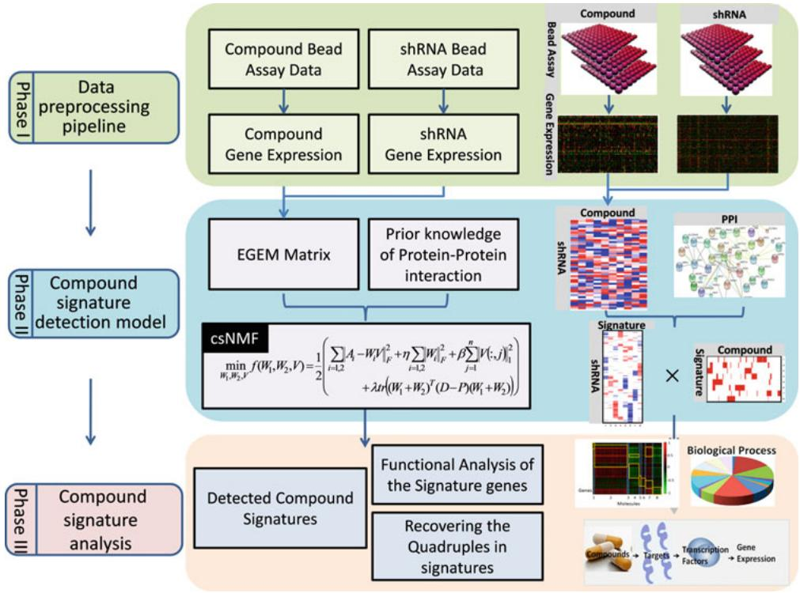  
Fig. 1 Overview of the compound signature discovery framework. This method requires raw L1000 data after various compounds and gene knockdown treatments. The raw data after the two types of treatments are preprocessed to yield gene expression data in Step I. In Step II, the EGEM matrix is constructed based on these gene expression data to measure relationships among compounds and knockdown genes. This matrix is then decomposed to a weight matrix and a coefficient matrix by the csNMF method. Protein–protein interaction data are added in consideration of biological connections. Signatures are identified based on strongly associated genes (i.e., those with larger values in the coefficient matrix)

Step III: csNMF signature analysis and annotation using our developed quadruple model, which reveals how compounds in each csNMF signature alters the downstream transcription factors and causes the differential changes of the apparent gene expression patterns (see Note 2).

# 3.1 Step I: Raw Data Preprocessing Pipeline

The goal in Step I was to reliably process, normalize, clean, and annotate the L1000 raw data. The major challenges in this step were reliable peak calling, normalization and quality control, and the computational burdens for processing big raw data. A GMM peak calling approach was developed for reliable peak calling from raw L1000 data [6]. The raw data for each sample were deconvoluted, and the fluorescent intensity peak corresponding to each mRNA probe was identified using the GMM model, annotated with the gene symbol, probe ID, gene description, and the analyte and L1000 probe set information [7]. This information was then

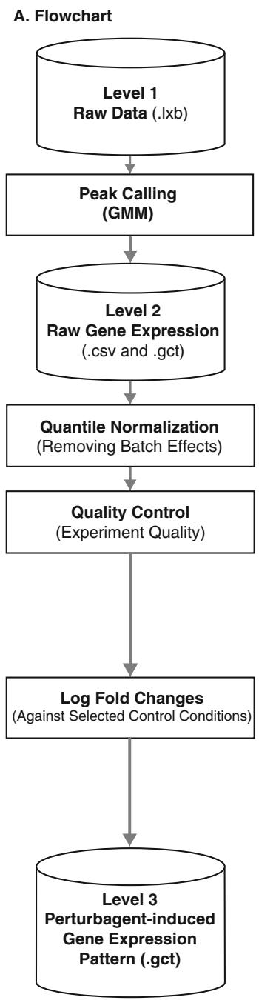

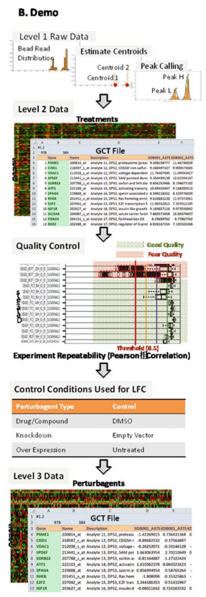  
Fig. 2 Overview of the data preprocessing framework. The raw Luminex data are transformed into gene expression data by the GMM peak calling method. Quantile normalization is then performed to reduce the batch effects, and quality control is executed to filter out poor-quality data

outputted in the GCT format, defined as the Level 2 raw gene expression data. After the normalization and quality control, each set of perturbation-induced data was compared with its negative control. Differential gene expression (DEG) patterns, in the form

# 3.2 Step II: Compound Signature Discovery by EGEM-Based csNMF Model

3.2.1 EGEM Score and the EGEM Matrix

of log fold changes (LFCs), were outputted as the Level 3 perturbagen-induced gene expression pattern data in the GCT format. The whole GMM-based pipeline is shown in Fig. 2.

Enrichment of Gene Effect to a Molecule (EGEM) was developed to identify proteins closely related to cellular responses to a smallmolecule compound, using the LINCS L1000 landmark gene expression data. A small-molecule compound affected a cell by directly or indirectly changing the activities and functions of its target proteins, which drive downstream biological events, and finally alter cellular gene expression patterns. We hypothesized that the knockdown of a gene, which is closely related to the target proteins of a small-molecule compounds, induces similar gene expression pattern changes. Thus, identification of such genes could reveal the mechanisms of cellular responses to these compounds and predict their pharmaceutical potentials. We defined the “target genes” of a compound in the general meaning: the corresponding proteins of such genes could be either the real drug targets or those at downstream or upstream and were closely related to the real targets. The data for 3000 single-gene knockdown experiments were used as the target gene reference library, and the data for compound treatments were profiled against this reference library to identify possible target genes of corresponding small-molecule compounds.

We defined the EGEM score to describe the similarity between the treatments of a compound and a shRNA targeting a gene using the mutual enrichment of their resultant differential expressed landmark genes. The EGEM metric was derived from the rankbased gene set enrichment analysis (GSEA) [8] and the connectivity analysis [9]. Compound treatments could be taken as “phenotypes” and the differentially expressed genes (DEGs) of a singlegene knocking down treatment as a “signature gene set” in the GSEA terminology. The EGEM metric enabled gene set enrichment analysis against the LINCS target gene reference library. The construction of the EGEM score is shown in Fig. 3, where a signature gene set of a target gene is composed of n DEGs after the knockdown of a target gene. Among them, $t _ { \mathrm { u p } }$ were upregulated and $t _ { \mathrm { d o w n } }$ downregulated. DEGs were detected according to the LFCs of the L1000 landmark genes using 1.5 IQR (interquartile range) as the threshold, which was robust against outliers. For a small-molecule compound, two lists of landmark genes were used to represent the patterns of the compound-induced L1000 gene expression changes. One $\left(  { p _ { \mathrm { u p } } } \right)$ was sorted ascendantly, while the other $\left( \ p _ { \mathrm { d o w n } } \right)$ was sorted descendantly based on the LFCs. Such $p _ { 1 } ( j )$ and $p _ { 2 } ( j )$ were the positions of the jth up- and downregulated DEGs, respectively, in their corresponding probe gene lists. The EGEM score was defined in Eq. 1:

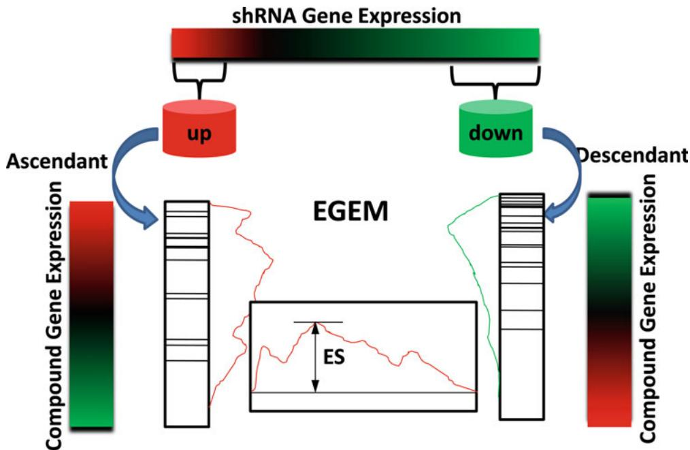  
Fig. 3 EGEM score construction. The up- and down-DEGs after a gene knockdown treatment are used as two feature sets. The locations of up and down feature sets in the ascendant- and descendant-sorted gene list after a compound treatment are measured by Kolmogorov-Smirnov statistic. The value is normalized by the total size of up and down feature sets

$$
\begin{array}{l} \operatorname {E G E M} = \max  _ {i = 1: t _ {1}} \left(\frac {i}{t _ {1} + t _ {2}} - \frac {p _ {1} (i) - i}{2 n - t _ {1} - t _ {2}}\right) \\ + \max  _ {j = 1: t _ {2}} \left(\frac {j}{t _ {1} + t _ {2}} - \frac {p _ {2} (j) - j}{2 n - t _ {1} - t _ {2}}\right) \tag {1} \\ \end{array}
$$

The EGEM score ranges from $- 1$ to 1. The absolute value of -an EGEM score represents the enrichment degree. The positive or negative sign of an EGEM score indicates that the change of gene expression pattern due to knocking down the corresponding gene is similar or reversely similar to that induced by the drug treatment. The statistical significance of an EGEM score was determined by $t { \cdot }$ - test against permutations of 100 times. The EGEM scores were kept only if the associated $\boldsymbol { p }$ -values were less than 0.05 and otherwise were set to zero. We constructed an EGEM matrix by calculating the pairwise EGEM score between each compound and each knockdown gene. We assumed that both the positive and negative EGEM scores followed normal distributions. We also assumed that the EGEM matrix was sparse by observing the fact that, among the 3000 proteins, a compound usually only targets a limited number of them. Hence, we chose the EGEM scores with single-side $\boldsymbol { p }$ - values less than 0.05. Other scores were forced to zeroes.

We constructed an EGEM matrix $\mathbf { A } \in \mathbf { R } ^ { n \times m }$ involving n driver genes and m compounds by the pairwise calculation of EGEM scores. Thus, the impacts of these compounds were delineated using the 3000-target-gene reference library.

# 3.2.2 Compound Signature Discovery by csNMF

A “compound signature” is defined as a group of small-molecule compounds sharing similar target genes. We developed a novel method, the constrained sparse nonnegative matrix factorization (csNMF), an NMF approach regularized by both the protein–protein interaction constraint and the sparseness constraint, to effectively detect biomedical meaningful compound signatures from the large EGEM matrix. NMF [10] is a matrix decomposition method widely used in pattern recognition and has demonstrated its ability in solving various biclustering problems in bioinformatics, including gene pattern recognition, disease module detection, and phenotype classification [11]. Canonically, a nonnegative EGEM matrix $\mathbf { A } \in \mathbf { R } ^ { n \times m }$ would be decomposed into two nonnegative matrices W and V, so that $\mathbf { A } \approx \mathbf { W } \mathbf { V } ,$ where $\mathbf { W } \in \mathbf { R } ^ { n \times \textit { k } }$ was the weight matrix of target genes, $\mathbf { V } \in \mathbf { R } ^ { \mathit { i } \times \mathit { m } }$ was the clustering matrix of compounds, and $k \ll \operatorname* { m i n } \left( m , n \right)$ was the number of co-clusters. Both weight matrices would be later used to identify the $k$ coclusters. We extended the canonical NMF approach to detect biomedically meaningful co-modules of both compounds and target genes, in which drugs showed similar associations with target genes according to the compound–target EGEM scores. The overall objective function used to solve the csNMF was shown in Eq. 2, where the first addition item is regarded as simultaneous clustering, the second and third ones as sparseness constraints, and the fourth one as PPI constraint:

$$
\begin{array}{l} \min  _ {W _ {\mathrm {s}}, W _ {\mathrm {r}}, V} f (W _ {\mathrm {s}}, W _ {\mathrm {r}}, V, P) = \frac {1}{2} \sum_ {i \in \{s, r \}} \| A _ {i} - W _ {i} V \| _ {F} ^ {2} + \eta \sum_ {i \in \{s, r \}} \| W i \| _ {F} ^ {2} \\ + \beta \sum_ {j = 1} ^ {n} \| V (:, j) \| _ {1} ^ {2} + \lambda t r \left(\left(W _ {\mathrm {s}} + W _ {\mathrm {r}}\right) ^ {T} (D - P) \left(W _ {\mathrm {s}} + W _ {\mathrm {r}}\right)\right) \tag {2} \\ \end{array}
$$

The csNMF was optimized using the multiplicative algorithm [10].

# 3.2.3 Simultaneous Clustering of Positive and Negative EGEM Scores

A co-module consisted of both positive and negative EGEM scores as long as they were significant and consistent across compounds in the same module, but canonical NMF approaches could only accept nonnegative values. To simultaneously handle both positive and negative EGEM scores, from the original EGEM matrix A, we extracted the positive EGEM scores into the similar EGEM Matrix $\mathbf { A } _ { S }$ and the absolute values of the negative EGEM scores into the reverse EGEM Matrix $\mathbf { A } _ { \mathrm { R } } ,$ both of the same dimensions as A. Both the two EGEM matrices were presented in the overall objective function above and were simultaneously optimized during iterative

NMF model training. The corresponding weight matrices of positively and negatively associated target genes, ${ \mathbf W _ { s } }$ and $\mathbf { W } _ { \mathrm { r } } ,$ respectively, were achieved at each iteration step and were merged after optimization.

# 3.2.4 Sparseness Constraint

We introduced a sparseness constraint according to the sparse NMF (sNMF) method proposed by Kim [12]. In sNMF, the L1 norm constraint is added to V, and $\mathbf { W } _ { \mathrm { F } }$ was added to balance the accuracy of the optimization and the sparseness of V. The rationale was that the elements clustered into the co-modules should be a small portion of the matrix. The sparseness constraint was necessary under biclustering a very large EGEM matrix.

# 3.2.5 PPI Constraint

We introduced protein–protein interaction (PPI) constraints according to the PPI database [13] to emphasize clusters that were biologically meaningful and thereby controlling false discovery. The rationale was that in the cellular regulatory network, perturbations of some up- and downstream proteins (“peers”) of a protein targeted by the compound often also showed similar changes in gene expression patterns. In the PPI constraint component in Eq. 2, $P$ was the PPI prior matrix, and $D$ was a diagonal matrix, with each row as the sum of the corresponding row of $P .$ The PPI constraint significantly improved both the specificity and the sensitivity of the NMF approach in compound signature discovery. On one hand, false-positive signature genes were often sporadically distributed in the PPI network [14], and thus their weights downgraded and more likely to be excluded. On the other hand, if in the PPI network a group of “neighbor” genes showed consistent but only moderate EGEM scores with a compound, they were more likely to be clustered as signature genes of this compound. Introducing prior knowledge of the PPI network to the NMF approach thus contributed to more reliable discovery of compound signatures.

# 3.3 Step III: Compound Signature Analysis

In order to examine the biomedical relevance and the pharmaceutical potentials of the detected compound signatures, we proposed quadruple models to reveal the molecular events associated with compound signatures.

A compound impacts the functions of its target proteins directly or indirectly, triggers regulatory networks, alters the activities of downstream transcription factors, and thus changes the gene expression patterns. To reveal such an underlying mechanism of signatures, our proposed quadruple model gives the included compound, its direct and indirect targets, downstream transcription factors, and affected genes, which are shown in Fig. 4. In Fig. 4, transcription factors for each signature were identified by the enrichment analysis according to signature-associated genes using ChIP enrichment analysis, setting a $\boldsymbol { p }$ -value of less than 0.05

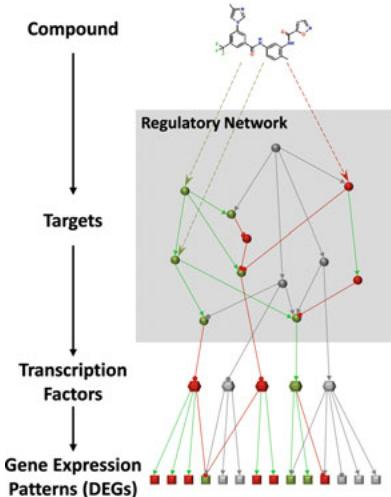  
A. Quadruple Model

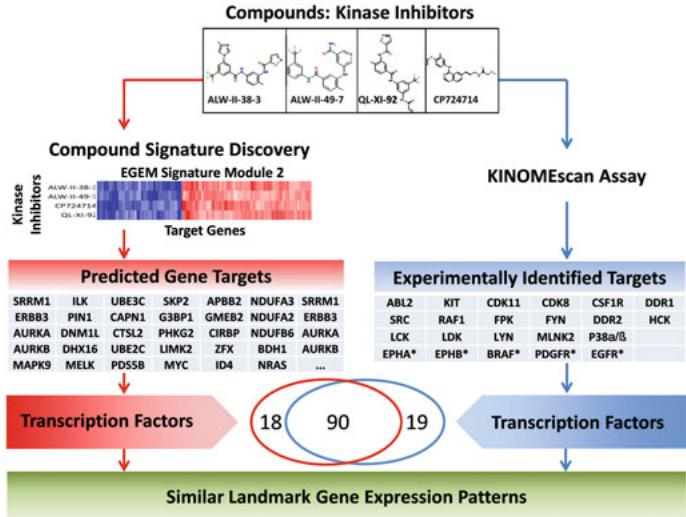  
B. Quadruple Prediction and Validation   
Fig. 4 Quadruple models and Signature 2 in a kinome inhibitor study. A quadruple model simultaneously includes a compound, its targets, related transcription factors, and the resulting gene expression pattern. This compound signature discovery method (red) can detect similar quadruples (blue). The similar quadruples include four compounds with similar target sets. 90 in 109 related TFs of the quadruples are covered using the enriched TFs of signature genes

and ratios of the interacting genes to all genes that exceeded 0.1 [15]. The quadruples of compound signatures were thus constructed. The biomedical relevance of a typical signature (Signature 2) was validated by comparing the predicted transcription factors from signature target genes with the enriched transcription factors derived from the direct measurement of kinase targets of four kinase inhibitors (ALW-II-38-3, ALW-II-49-7, QL-XI-92, and CP724714) in this signature [16].

The compound signatures were composed of compounds and their associated target genes. Compounds in a given signature shared similar target genes and thus perturbed the cell functions in similar ways for the corresponding cancer cell line. If some had already demonstrated effectiveness for this type of cancer, other compounds in this signature were more likely to be promising drug candidates. We used FDA-approved chemotherapy drugs for breast cancers to identify breast cancer-specific compound signatures and examined the drug potentials of corresponding drugs [17]. Functions of the signature also could be revealed by enrichment of functions among these target genes. Signatures that demonstrated anti-oncological functions [18] such as the reduced cell proliferation, increased cell death, and induced apoptosis were more likely to be seen in potential drugs. We utilized the DAVID gene functional annotation tool [19] to annotate functions of compound signatures and identify antitumor signatures.

# 3.4 Sample Application of Compound Signature Mining

3.4.1 Signatures and Quadruples for Kinase Inhibitors

3.4.2 Validation of Predicted Target Genes Using the Quadruple Model

3.4.3 Clinical Relevance of Compound Signatures

We used the kinase inhibitor dataset to validate the concept of the compound signatures discovered by the EGEM-based csNMF approach. We chose this dataset because some kinase inhibitors had been experimentally profiled to identify their direct kinase targets and thus could be used to validate the predictions of the csNMF modeling. The 51 kinase inhibitors were analyzed against the 3341-target gene reference library. In all, we detected eight compound signatures, which are Signature $1 \sim 8$ : PD173074, CP724714, QL-X-138, PLX-4720AZD1152, A443644WZ3105, WZ7043XMD11, PD0332991, and HGSSUCLG1.

Compounds that triggered similar molecular cascades might instead share indirect targets, some of which might not be kinases. CP724714, whose major target was HER2, did not show similar kinase targets to the other three kinases, but it induced a similar change in gene expression pattern according to the EGEM matrix. Previous literature suggests a strong co-occurrence between DDR1 and HER2 [20] in breast cancer. We thus examined whether the four kinase inhibitors in CP724714 instead shared similar downstream signaling pathways and affected activities of transcription factors in the same way. The quadruple models of these four inhibitors were constructed according to predicted target genes (Fig. 4b, red) and were compared to those constructed according to direct kinase targets from the KINOMEscan results (Fig. 4b, blue). Among the 108 transcription factors enriched from predicted targets and the 109 from experimental targets, 90 overlapped. Thus, the predicted similarity between CP724714 and the other five compounds could be explained in the quadruple models, reflecting shared patterns of downstream transcription factor activity.

We examined the associations of the discovered compound signatures with patient survival and other clinical traits. Clinical features and gene expression profiles of 2116 breast cancer patients collected from Belgium, England, and Singapore (GEO:GSE45255) were examined by the gene set enrichment of the eight discovered breast cancer-related compound signatures. For example, in terms of distant metastasis-free survival, patients in the Signature $4 ^ { \mathrm { L o w } }$ category responded poorly to chemotherapy compared with those in the Signature $4 ^ { \mathrm { H i g h } }$ category (Fig. 5c). Signature 4 (PLX-4720AZD1152) was selectively associated with chemotherapy but not hormone therapy (tamoxifen). We performed a univariable and multivariable survival analysis using discovered compound signatures as well as conventional clinical features including patient age, tumor size, PAM50 as well as molecular subtypes, lymph node involvement, the ER status, and the pathological grades. The results suggested that the compound Signatures 4 and 5 (A443644WZ3105) are strongly associated with poor

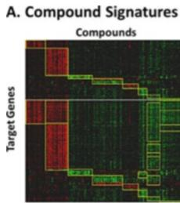

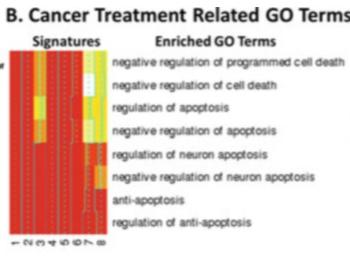

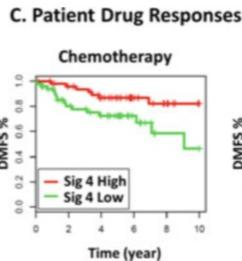

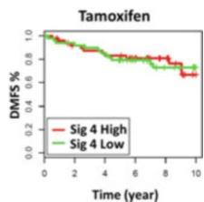  
Fig. 5 Breast cancer compound signatures. (a) Eight signatures were detected (yellow rectangles). For each signature, compounds (columns) and genes (rows) corresponding to a red region showed similar gene expression effects, whereas those corresponding to a green region exhibited reverse effects. (b) Degree of yellow represents the relative enrichment for the related gene ontology (GO) terms. (c) Associations of Signature 4 with drug responses and survival in data from 2116 breast cancer patients collected from Belgium, England, and Singapore (GEO:GSE45255)

prognosis for patients with chemotherapies but not for those with tamoxifen treatment. The analysis results were consistent with the drug response survival results showed in Fig. 5. Signatures also demonstrated associations with breast cancer subtypes (Signature 2: CP724714) and receptor status (Signatures 3 (QL-X-138) and 6 (WZ7043XMD11) with estrogen receptor status). Such association results demonstrate the clinical potential of the compound signatures discovered in the MCF-7 breast cancer cell line model. Follow-up investigations could include testing the underlying mechanisms for the poor prognosis of patients in the Signature $4 ^ { \mathrm { L o w } }$ category, by further studying the predicted target genes using the established Signature 4 (PLX-4720AZD1152) quadruple model (see Note 3).

# 4 Notes

1. Compound profiling using LINCS big data as the reference library is made possible by the first large-scale application of the L1000 platform. In the LINCS project, L1000 gene expression profiles are collected from human cells treated with compounds and genetic reagents. We adopt these data to reveal connections between genes and compounds and the related molecular pathways for underlining disease states. All the data are from 15 cancer cell lines on 1000 carefully chosen landmark genes, which can reduce the number of measurements and will not be biased for a particular cellular model.   
2. For the study of network-based compound signature discovery, our csNMF approach was validated for 51 kinase inhibitors. We implemented this approach to screen drug candidates for breast cancer. 728 compounds are studied against the 3341 target gene reference library screened for the MCF-7 breast cancer

cell line and detected eight signatures. Compounds belonging to the same signatures were grouped together. In all, eight compound signatures were identified. To find the signatures of related compounds that might be beneficial for breast cancer, we focused on functions such as induction of apoptosis and suppression of proliferation. The enrichment of different biological processes of signatures was investigated by DAVID [19] according to the gene ontology (GO) terms of signature target genes. Only terms with a $\boldsymbol { p }$ -value less than 0.05 were considered. To define similar compound-gene effects, we considered the terms with positive regulation of cell death and apoptosis; as to the reverse ones, we considered the negative regulations (cancer treatment-related GO terms). Finally, signatures 7 and 8 were derived to be enriched for apoptosis.

3. For extracting compound signatures from LINCS L1000 data for breast cancer (MCF-7) cell lines, we developed the csNMF approach, a comprehensive and complete pipeline, for network-based compound signature discovery and drug screening under the target gene reference library. Predicted similarities of drug-target genes were validated with the experimental profiling. The csNMF pipeline bridges the gap between the rich resource of the LINCS signature library and biomedical and clinical research needs. In addition, we developed binary linear programming (BLP) approach to infer the bestfitting cell-specific signaling pathways from perturbationinduced topological structures. We believe that BLP can complement standard biochemical drug profiling assays and sheds new light on the discovery of possible mechanisms for drug effects.

# Acknowledgment

The work was supported by the grants of NIH U01HL111560-04 (Zhou) and NIH U01CA166886-03 (Zhou).

# References

1. Downey W, Liu C, Hartigan J (2010) Compound profiling: size impact on primary screening libraries. Drug Discovery World pp 81–86   
2. Lehmann BD et al (2011) Identification of human triple-negative breast cancer subtypes and preclinical models for selection of targeted therapies. J Clin Invest 121(7):2750–2767   
3. Duan Q et al (2014) LINCS canvas browser: interactive web app to query, browse and interrogate LINCS L1000 gene expression signatures. Nucleic Acids Res 42:W449–W460

4. Lamb J, Crawford ED, Peck D, Modell JW, Blat IC et al (2006) The connectivity map: using gene-expression signatures to connect small molecules, genes, and disease. Science 313:1929–1935   
5. Peng HM, Zhao WL, Tan H, Ji ZW, Li JS, Li K, Zhou XB (2016) Prediction of treatment efficacy for prostate cancer using a mathematical model. Sci Rep 6:21599   
6. Liu CL, Su J, Yang F, Wei K, Ma JW, Zhou XB (2015) Compound signature detection on

LINCS L1000 big data. Mol BioSyst 11:714–722   
7. Ji ZW, Wu D, Zhao WL, Peng HM, Zhao SJ, Huang DS, Zhou XB (2015) Systemic modeling myeloma-osteoclast interactions under normoxic/hypoxic condition using a novel computational approach. Sci Rep 5:13291   
8. Subramanian A et al (2005) Gene set enrichment analysis: a knowledge-based approach for interpreting genome-wide expression profiles. Proc Natl Acad Sci U S A 102 (43):15545–15550   
9. Lamb J et al (2006) The connectivity map: using gene-expression signatures to connect small molecules, genes, and disease. Science 313(5795):1929–1935   
10. Lee DD, Seung HS (2001) Algorithms for non-negative matrix factorization. In: Advances in neural information processing systems   
11. Lee DD, Seung HS (1999) Learning the parts of objects by non-negative matrix factorization. Nature 401(6755):788–791   
12. Kim H, Park H (2007) Sparse non-negative matrix factorizations via alternating nonnegativity-constrained least squares for microarray data analysis. Bioinformatics 23 (12):1495–1502   
13. Mering CV et al (2005) STRING: known and predicted protein-protein associations, integrated and transferred across organisms. Nucleic Acids Res 33(suppl 1):D433–D437

14. You ZH, Li JQ, Gao X, He Z, Zhu L, Lei YK, Ji ZW (2015) Detecting protein-protein interactions with a novel matrix-based protein sequence representation and support vector machines. Biomed Res Int 2015:867516   
15. Lachmann A et al (2010) ChEA: transcription factor regulation inferred from integrating genome-wide ChIP-X experiments. Bioinformatics 26(19):2438–2444   
16. Shao HW, Peng T, Ji ZW, Su J, Zhou XB (2013) Systematically studying kinase inhibitor induced signaling network signatures by integrating both therapeutic and side effects. PLoS One 8(12):e80832   
17. Ji ZW, Su J, Wu D, Peng HM, Zhao WL, Zhou XB (2017) Predicting the impact of combined therapies on myeloma cell growth using a hybrid multi-scale agent-based model. Oncotarget 8:7647–7665   
18. Gerl R, Vaux DL (2005) Apoptosis in the development and treatment of cancer. Carcinogenesis 26(2):263–270   
19. Huang D et al (2007) The DAVID gene functional classification tool: a novel biological module-centric algorithm to functionally analyze large gene lists. Genome Biol 8(9):R183   
20. Siddiqa A et al (2008) Expression of HER-2 in MCF-7 breast cancer cells modulates antiapoptotic proteins Survivin and Bcl-2 via the extracellular signal-related kinase (ERK) and phosphoinositide-3 kinase (PI3K) signalling pathways. BMC Cancer 8(1):129

# Drug Effect Prediction by Integrating L1000 Genomic and Proteomic Big Data

Wei Chen and Xiaobo Zhou

# Abstract

The library of integrated Network-Based Cellular Signatures (LINCS) project aims to create a networkbased understanding of biology by cataloging changes in gene expression and signal transduction. Gene expression and proteomic data in LINCS L1000 are cataloged for human cancer cells treated with compounds and genetic reagents. For understanding the related cell pathways and facilitating drug discovery, we developed binary linear programming (BLP) to infer cell-specific pathways and identify compounds’ effects using L1000 gene expression and phosphoproteomics data. A generic pathway map for the MCF7 breast cancer cell line was built. Within them, BLP extracted the cell-specific pathways, which reliably predicted the compounds’ effects. In this way, the potential drug effects are revealed by our models.

Key words LINCS, L1000, Binary linear programming, Drug effect, Cell-specific pathway

# 1 Introduction

The Library of Integrated Network-based Cellular Signatures (LINCS) project (http://lincs.hms.harvard.edu/) aims to develop a library of molecular signatures, based on gene expression and other cellular changes that describe the response of different types of cells when exposed to various perturbing agents, including siR-NAs and small bioactive molecules [1]. Diverse high-throughput screening approaches are applied in LINCS project to interrogate the cells, which provide molecular changes and intuitive patterns (gene or protein profile) of cell response for biologists. The data acquired from these approaches were collected in a standardized, integrated, and coordinated manner [2, 3] to promote consistency and comparison across different cell types. L1000 assay (Luminexbead detection system) aims to connect diseases with genes and drugs at low costs. The gene expression profiles from L1000 data are potentially useful to infer the targets of compounds.

Accompanying such a great opportunity are the new challenges of processing and analyzing data generated from the L1000

platform. In this chapter, we involve developing a novel approach to infer cell-specific pathways and identify a compound’s effects using gene expression and phosphoproteomics data under treatments with different compounds [4]. Our data sources contain L1000 gene expression profiles and P100 phosphoproteomics data for MCF7 and PC3 cell lines. We integrated these two types of data and proposed a binary linear programming (BLP) approach to predict a compound’s efficacy. In our approach, the candidate targets of compounds are firstly inferred for the purpose of creating the generic pathway map. Then, we used BLP to optimize the generic pathways based on the mid-stage phosphosignaling response. Finally, we applied BLP to re-optimize the cell-specific pathways and thus evaluate the effects of compounds. For the validation of our approach, we applied this approach to the MCF7 breast cancer cell line and PC3 prostate cancer cell line. The result shows that the inferred cell-specific pathways are reliable. Meanwhile, the prediction accuracy of a compound’s effects is high. Generally, the proposed computational approach can shed light into the mechanisms of a compound’s efficacy and facilitate the drug discovery.

# 2 Materials

In this study, we utilized L1000 gene expression profiles and P100 phosphoproteomics data for MCF7 and PC3 cell lines treated with 15 compounds, which are compound $1 \sim 1 5$ : fulvestrant, pacli-taxel, doxorubicin, GW-8510, daunorubicin, irinotecan, scriptaid, anisomycin, valproic acid, digoxin, geldanamycin, trichostatin A, MS-275, staurosporine, and digoxigenin. The 15 compounds were viewed as 15 sample conditions in the experiment data. The first 11 compounds were used to optimize the cell-specific pathways. The remaining four compounds were used to predict treatment effects. We screened the gene expression profiles for 11 compounds and 3712 shRNA-perturbations from the L1000 database to infer potential targets. We also screened two subsets from P100 phosphoproteomics data. The first subset with 11 compounds was employed to optimize the cell-specific pathways via our BLP approach. The second subset with four compounds was used to evaluate treatment effects by re-optimizing the inferred cell-specific pathways via BLP.

L1000 data were downloaded and processed as normalized log2-fold change value (http://cmap.github.io/l1ktools). The raw data of P100 (log2 ratio of treatment to control) were converted to binary values (0 or 1) according to the sign of raw data, where 1 corresponds to the fully activated state and 0 to no activation. In addition, if the targets or other co-regulators (some key proteins inhibited or activated after treatment) of some compounds

were already validated in the literature, this prior knowledge was presented as constraints in our BLP approach (see Note 1).

# 3 Methods

The workflow of the whole approach includes three steps, which are shown in Fig. 1.

In step one, we inferred the potential targets of the compounds from L1000 gene expression profiles and information from the literature and then created the corresponding downstream pathways of those inferred targets by integrating the PPI, transcriptional factor, and KEGG pathway database [5]. We also searched the pathways related to MCF7 and PC3 cell lines in IPA (http:// www.ingenuity.com) and the literature [6–8]. After that, we integrated these pathways with inferred targets and their downstream pathways together to construct a generic pathway map. In

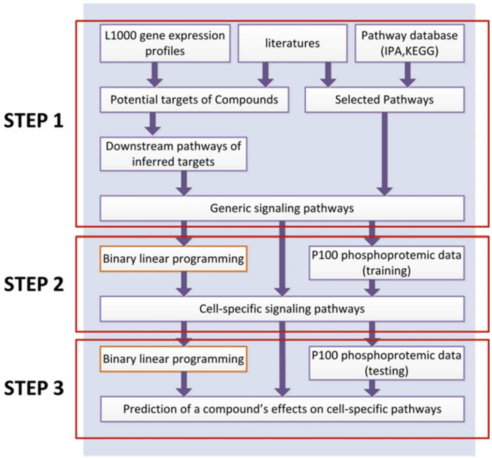  
Fig. 1 The flow chart of the proposed approach to infer a cell-type specific pathway map and to identify a compound’s effects

# 3.1 Binary Linear Programming (BLP)

step two, the optimized cell-specific pathways were obtained by fitting the P100 data to the generic pathway map with our BLP approach. Finally in step three, we applied BLP to re-optimize the cell-specific pathways to identify a compound’s effects by discerning topological alterations in the pathway map (see Note 2).

Here, we describe how the Boolean model can be reformulated as a BLP to optimize the cell-specific pathways. Two reports in the literature [9, 10] used a Boolean model to optimize the generic pathway map under the stimulation of combined different cytokines. However, their models are designed only for phosphoproteomics data in the early stage of signal transduction. For inferring a cell-specific pathway map using the P100 database with only one time point (6 h), we assume a virtual time point $( t )$ before $^ { 6 \mathrm { ~ h ~ } }$ , which represents most of enzyme’s activities reach to saturation conditions after phosphorylation at time t. The cell-specific pathways inferred by our BLP approach correspond to the topological structure in the saturation condition in early response. The observed time point $( 6 \mathrm { h } )$ could be represented as $t + 1$ , indicating the mid-stage signaling response. In our BLP approach, we employ binary variables to describe the phosphorylation states of enzymes and the reactions (activated or inhibited). We also use binary linear constraints to model the relationship between the early response at $t$ and mid-stage response at $t + 1$ . According to the concept of Hill Function [11], there are three scenarios for the state of enzyme $_ x$ at time $t$ and $t + 1$ in our BLP approach:

(a) Equation 1 suggests that $_ x$ is activated by its upstream enzyme in the early stage and reaches a steady state at time $t .$ , and its activity is unchanged until time $t + 1$ .

$$
x (t) = x (t + 1) = 1 \tag {1}
$$

(b) If the state of enzyme $_ x$ at time $t$ and $t + 1$ can be present as Eq. 2, $_ x$ is activated in the early stage (its activity reaches steady state), and then enzyme $_ x$ is gradually degraded so that its activity is very low at time $t + 1$ .

$$
x (t) = 1; x (t + 1) = 0 \tag {2}
$$

(c) When treated with a compound, enzyme $_ x$ is inhibited at time t, and its activity will be sustained to time $t + 1$ (Eq. 3).

$$
x (t) = x (t + 1) = 0 \tag {3}
$$

The states of all proteins at time $t$ will completely satisfy the causal relationships in our constraint set. The change of states for each measured phosphoprotein is also considered between two

time points. A pathway is defined as a set of reactions $\{ 1 , 2 , \ldots i , \ldots$ $\left. n _ { \mathrm { r } } \right\}$ and species $\{ 1 , 2 , . . . , j , . . . n _ { s } \}$ . Each reaction has three corresponding index sets – signaling molecules $R _ { \mathrm { i \cdot } }$ , inhibitors $I _ { \mathrm { i } }$ , and products $P _ { \mathrm { i } }$ . These sets are subsets of the species index set $( R _ { \mathrm { i } } , I _ { \mathrm { i } } , P _ { \mathrm { i } } \subset \{ 1 , 2 , . . . , n _ { \mathrm { s } } \} )$ . Our binary linear constraint system can address four types of linking patterns to represent the relationships between species and reactions, since an actual signaling pathway has many types of topological structures. Due to the different mechanisms of compounds, a reaction will take place after treatments with some compounds but not others. The goal of the proposed formulation is to remove the redundant and inconsistent reactions which do not occur with any compounds. For a generic pathway map, a set of experiments (indexed as $\{ 1 , . . . , n _ { \mathrm { e } } \}$ can be performed. Each experiment indicates a treatment condition of one compound on the pathway. In the kth experiment $( 1 \leq k \leq n _ { \mathrm { e } }$ ), a  subset of species is activated and another subset is inhibited, summarized by the index sets $M ^ { k , 1 }$ and $M ^ { k , 0 }$ , respectively. In addition, a third subset of the species is measured around the phosphorylation level $( M ^ { k , 2 } )$ . In our BLP system, a binary variable $x _ { \dot { i } } ^ { \dot { k } } ( t ) \dot { \in } \{ 0 , 1 \}$ indicates if the species $j$ is activated $\left( x _ { j } ^ { k } ( t ) \overset { ^ { \cdot } } { = } 1 \right)$ or not $\left( x _ { j } ^ { k } ( t ) = 0 \right)$ at the time point $t$ ð Þ ¼in the kth experiment. The variable $z _ { i } ^ { \ast }$ ð Þ ¼indicates if the reaction $i$ takes place $\left( z _ { i } ^ { k } = 1 \right)$ or not $\left( z _ { i } ^ { k } = 0 \right)$ in the kth experiment. The species set $T S _ { k }$ denotes the potential targets of the kth compound.

If the phosphorylation level of species $j$ is measured at time $t + 1$ in P100 data, the measurement of species $j$ is defined as $x _ { j . } ^ { k } ( t + 1 )$ and its predicted value is named as $\hat { x } _ { j } ^ { \bar { k } } ( t + \mathrm { i } )$ ð Þþ. For inferring the cellð Þþspecific pathways, we use our BLP approach to optimize two objective functions. The first is to minimize the difference between predicted values and measurements (Eq. 4):

$$
\min  _ {X, Z} \sum_ {k = 1} ^ {n _ {c}} \sum_ {j \in M ^ {k, 2}} \left| \hat {x} _ {j} ^ {k} (t + 1) - x _ {j} ^ {k} (t + 1) \right| \tag {4}
$$

The second objective $\operatorname* { m i n } _ { Z } \sum _ { i = 1 } ^ { n _ { \mathrm { r } } } z _ { i } ^ { k }$ z ki is to minimize the number of z reactions, so that the scale of the inferred cell-specific pathways is smaller. Equation 4 is equivalent to Eq. 5.

$$
\min  _ {X, Z} \sum_ {k = 1} ^ {n _ {\mathrm {c}}} \sum_ {j \in M ^ {k}, 2} \left(1 - 2 x _ {j} ^ {k} (t + 1)\right) \times \hat {x} _ {j} ^ {k} (t + 1) \tag {5}
$$

Here, we use a linear solution to simultaneously optimize the two objectives above:

$$
\min  _ {X, Z} \left[ \sum_ {k = 1} ^ {n _ {\mathrm {c}}} \sum_ {j \in M ^ {k, 2}} \left(1 - 2 x _ {j} ^ {k} (t + 1) \times \hat {x} _ {j} ^ {k} (t + 1)\right) + \gamma \left(\sum_ {i = 1} ^ {n _ {\mathrm {r}}} z _ {i} ^ {k}\right) \right] \tag {6}
$$

In Eq. 6, the parameter γ indicates the weight between two objective functions. The selection of values of γ obviously affects the fitting precision of our model on experimental data. The detailed constraints are listed in our previous literature [4]. For the fitting precision (FP), we calculated the percentage of fit (prediction accuracy) as below:

$$
\mathrm{FP} = \sum_{j\in M^{k,2}}^{n_{\mathrm{s}}}\frac{\left|\hat{x}_{j}^{k}(t + 1) - x_{j}^{k}(t + 1)\right|}{\left|M^{k,2}\right|}\times 100\% \tag{7}
$$

Equation 7 indicates the fitting precision between the predicted values inferred by our BLP approach and the measured values of species under the treatment of the kth compound, where $| M ^ { k , 2 } |$ is the number of species in the set $M ^ { k , 2 }$ . The value of fitting precision (FP) is in the range between 0 and 1.

# 3.2 Sample Application of Identifying Compound Effects

3.2.1 Construction of a Generic Pathway Map

Figure 2a shows the generic pathway map composed of some important pathways. The estrogen pathway induces tumor growth in estrogen receptor-positive breast cancers [12]; the PI3K/AKT pathway is an important player in cell survival [7]; the TNF signaling is anticancer-related pathway [13]; and MEK/ERK pathways are usually associated with proliferation and antiapoptosis; the NFkB pathway is involved in many cell functions, such as cell proliferation, cell survival, and cellular stress [14]; the JNK/p53/ p21 pathway may induce cell apoptosis [6]; and HDAC1/

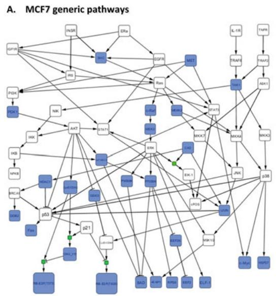

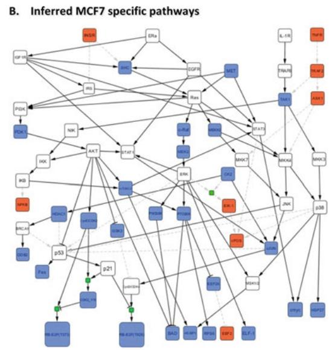  
Fig. 2 Boolean network topologies of the generic and inferred cell-specific pathways for the MCF7 cell line. (a) The MCF7 generic pathway map included some important classic pathways. The edges with green color were potential downstream pathways of some compounds. (b) After optimization via BLP, the red nodes and gray dash lines were removed from generic pathway map so that the cell-specific pathways were obtained

# 3.2.2 Inference of Cell-Specific Pathways by BLP

BRCA1/DDB2 is a cell survival pathway [15]. In Fig. 2a, the edges with green color are our inferred downstream pathways of some compounds.

To infer cell-specific pathways based on the constructed generic pathway map, we then minimized the differences between the measurements and the simulated values, as well as the complexity of the signaling pathway structure’s topology. We developed the BLP approach to optimize such multi-objective functions. The concept behind BLP is that the states of the proteins (variables) are normalized to binary numbers (activated state or no activation); edges between two proteins are also represented as binary numbers (inhibition or promotion); binary linear constraints are used to describe the relationship between upstream and downstream proteins; and the optimization is done with binarized values taken by variables, edges, and constraints. The BLP is solved with the optimization toolbox in MATLAB that guarantees minimal differences between phosphoproteomics data and predicted data, as well as the Boolean topology of the generic pathway map. Because P100 data are captured at the mid-stage of signal transduction, we developed constraints to simulate the change from early to mid-stage so that we can still obtain many important causal relationships of phosphorylation. The fitting precision of the optimized cell-specific pathways is $8 7 . 6 6 \%$ for MCF7, which proves that our model works well on mid-stage phosphoproteomics data.

Figure 2b shows the inferred cell-specific pathways of MCF7. The blue nodes are the measured phosphoproteins, while the red nodes and gray dotted lines were removed after optimization. After our BLP system simultaneously optimizes the two objective functions with the P100 data, we keep those reactions whose edges exist for some compounds and remove those reactions whose edges completely do not exist for all compounds. For example, HDAC1 inhibitor-induced JNK activation in turn activates the downstream pathways p53 and p21 and eventually results in cell cycle arrest. Another example is that the reaction between cJUN and p53 (cJUN decreases the expression of p53) did not appear in the pathways induced by all compounds, so we removed this reaction, although it does exist for certain conditions [16]. In addition, to keep the proteins at the end of each pathway as measured phosphoproteins, all other proteins at the end of each pathway not measured in P100 were removed (e.g., (ERK AND CK2) $\longrightarrow$ !ELK-1 reaction in Fig. 2b). Thus, the inferred cell-specific pathway map was smaller but contains only those elements that can fit the experimental evidence very well. When this approach was applied to the PC3 cell line, the goodness of data-fitting on the inferred cellspecific pathways was $9 0 . 9 1 \%$ .

# 3.2.3 Identification of Compounds’ Effects

We applied the inferred MCF7-specific pathways to four compounds: trichostatin A, MS-275, staurosporine, and digoxigenin. The first two compounds are HDAC inhibitors, and staurosporine promotes apoptosis. Figure 2 depicts the pathway’s topological alterations for these compounds, including trichostatin A, a HDAC inhibitor, that removes the branches (subsets of the pathways) as follows: some downstream paths of IGF1R and EGFR, TNFR $\longrightarrow$ TRAF2  TAK1, AKT $ \mathrm { p } 5 3$ , HDAC1  BRAC1 ! !DDB2, CycE/CDK2 $\longrightarrow$ ! ! !Rb-E2F (phosphosite Thr373), and $\mathrm { C y c D / C D K 4 }  \mathrm { R b - E 2 F }$ (phosphosite Thr826). Figure 3a sug-!gests that HDAC1 and its downstream pathway are blocked, which may cause cell growth arrest. The p53 signal is up-regulated after the activation of JNK. In the meantime, p21 was activated by p53, which then induced cell cycle arrest by inhibiting phosphorylation of the Rb-E2F complex triggered from CycE/CDK2 and CycD/ CDK4 [17]. In addition, up-regulated Fas activated by p53 will potentially promote cell apoptosis. MS-275 [18], also a specific HDAC inhibitor, altered the pathway topology in a similar pattern as trichostatin A. MET was inhibited by trichostatin A but activated by MS-275 (Fig. 3a, b). These two compounds induced similar changes on most key proteins. In Fig. 3b, p21 activation inhibited phosphorylation of the Rb-E2F complex and blocked the disassociation of this complex. Therefore, our results suggested that the effects of trichostatin A and MS-275 blocked cell growth in the MCF7 cell line. With regard to staurosporine, a pro-apoptotic compound, double effects were detected from the pathway’s topological alterations: p21 obviously blocked the cell cycle by inhibiting the phosphorylation of the Rb-E2F complex, while DDB2- induced cell growth also occurred via activated HDAC1 (Fig. 3c). Figure 3d shows that digoxigenin induces the activation of HDAC1 and inhibition of p53. Digoxigenin blocked the reaction $\mathrm { J N K } \to \mathrm { p } 5 3$ so that p21 was also inactivated. DDB2 was activated !by HDAC1 through BRCA1. The absence of p21 indicates phosphorylation of the Rb-E2F complex, which increases the chance for the disassociated transcription factor E2F to promote transcription and cell growth. Therefore, our findings indicate digoxigenin potentially induce cell cycle and promote cell growth on MCF7 cell line (see Note 3).

# 4 Notes

1. Compound profiling using LINCS big data as the reference library is made possible by the first large-scale application of the L1000 platform. In the LINCS project, L1000 gene expression profiles are collected from human cells treated with compounds and genetic reagents. We adopt these data to reveal connections between genes and compounds and the related molecular

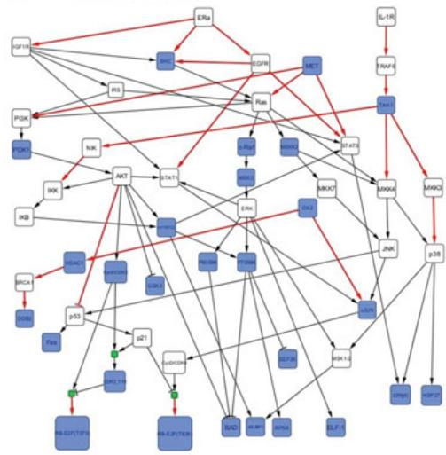  
A. Trichostatin A

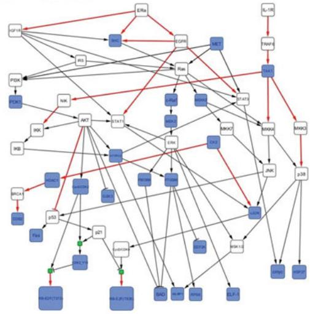  
B. MS-275

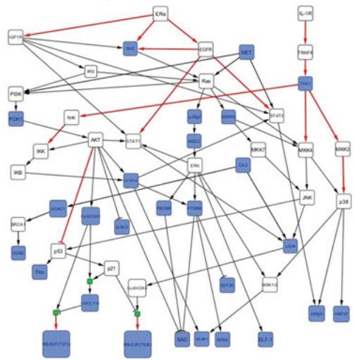  
C. Staurosporine

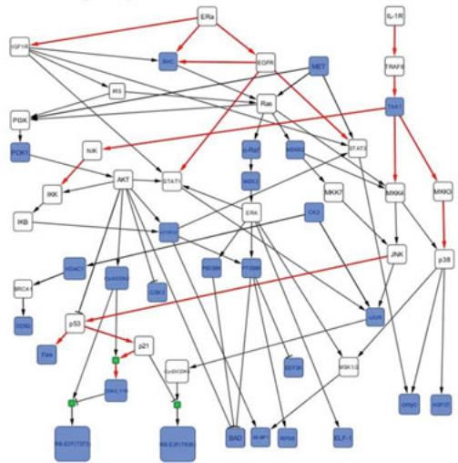  
D. Digoxigenin   
Fig. 3 The compound-induced topological alterations in the MCF7-specific pathways revealed by BLP. The treatment effects of four compounds on MCF7 cell line were shown in the figure. Red arrows denote that these reactions were blocked after treatment with compounds. (a) Compound Trichostatin A; (b) Compound MS-275; (c) Compound Staurosporine; (d) Compound Digoxigenin

pathways for underlining disease states. All the data are from 15 cancer cell lines on 1000 carefully chosen landmark genes, which can reduce the number of measurements and will not be biased for a particular cellular model.

2. We developed binary linear programming (BLP) approach to infer the best fitting cell-specific signaling pathways from perturbation- induced topological structures. We believe that BLP can complement standard biochemical drug profiling assays

and sheds new light on the discovery of possible mechanisms for drug effects.

3. For the study of the identification of the compound effects in cell-specific pathways, we developed binary linear programming (BLP) approach to optimize generic pathways and identify a compound’s effects on an inferred cell-specific pathway map by integrating gene expression profiles and phosphoproteomics data collected from different types of perturbations. Regarding the construction of generic pathways, we combined the pathway information from the literature and the potential targets of compounds inferred from gene expression profiles under perturbations. In the cell-specific pathways, we monitored four cases of compound-induced topological alterations to the pathways to predict a compound’s effects using BLP. Compared to other phosphoproteomics-based and mass spectrometry-based target identification approaches, which use compound affinities measured either by in vitro or in vivo assays, our method uses perturbation-induced gene expression profiles to infer the potential targets and downstream paths [19, 20]. After that, a generic pathway map could be created based on pathways in the literature and inferred targets. Our developed BLP is adopted as a way to monitor alterations in pathway topologies and to evaluate a compound’s effects.


# A Bayesian Network Approach to Disease Subtype Discovery

Mei-Sing Ong

# Abstract

Human diseases are historically categorized into groups based on the specific organ or tissue affected. Over the past two decades, advances in high-throughput genomic and proteomic technologies have generated substantial evidence demonstrating that many diseases are in fact markedly heterogeneous, comprising multiple clinically and molecularly distinct subtypes that simply share an anatomical location. Here, a Bayesian network analysis is applied to study comorbidity patterns that define disease subtypes in pediatric pulmonary hypertension. The analysis relearned established subtypes, thus validating the approach, and identified rare subtypes that are difficult to discern through clinical observations, providing impetus for deeper investigation of the disease subtypes that will enrich current disease classifications. Further advances linking disease subtypes to therapeutic response, disease outcomes, as well as the molecular profiles of individual subtypes will provide impetus for the development of more effective and targeted therapies.

Key words Bayesian network analysis, Disease subtype, Pulmonary hypertension

# 1 Introduction

Classification of diseases into groups with similar pathobiology, prognosis, and therapeutic response is the bedrock of the practice of medicine. Disease taxonomies not only determine how diagnosis and treatment choices are made; they form the basis for knowledge generation and drug discovery. Historically, diseases are categorized into groups based on the specific organ or tissue affected. Over the past two decades, advances in high-throughput genomic and proteomic technologies have generated substantial evidence demonstrating that many diseases are in fact markedly heterogeneous, comprising multiple clinically and molecularly distinct subtypes that simply share an anatomical location. The discovery of previously unrecognized disease subtypes has led to the advancement of new therapy and enhanced ability to target existing treatments to subsets of patients who are mostly likely to benefit from them.

While the increased availability of large clinical datasets presents an unprecedented opportunity to better delineate disease subtypes, the volume and complexity of these data pose substantial analytic challenges. The realization that traditional reductionist approaches—the practice of reducing biological entities to the sum of their constituent parts—fall short in accounting for the complex interactions of biological entities and processes contributing to a disease state has led to the development of systems biology approaches that emphasize the study of biological systems as a whole. A fundamental tenet of systems biology is that cellular and organismal constituents are interconnected; thus their structure and dynamics must be examined collectively rather than as isolated parts [1–3]. Network science—a branch of mathematics and theoretical physics—has emerged as the methodological foundation of systems biology.

This chapter describes the application of a network approach to drive the discovery of disease subtypes, using pulmonary hypertension (PH) as an exemplar disease. The following subsections provide a brief overview of network medicine (Subheading 1.1) and a description of the clinical problem that motivated the current study (Subheading 1.2). The remainder of the chapter is organized as follows: Subheading 2 describes the study dataset; Subheading 3 presents the methodology; and Subheading 4 discusses the research findings and addresses challenges and opportunities to advance the field.

# 1.1 The Emergence of Network Medicine

# The whole is more than the sum of its parts—Aristotle

Network science has emerged in diverse disciplines as a means of analyzing complex relational data. Building on graph theory, a network is a graphical model comprising a set of nodes and connections between them. Network nodes represent random variables to be modeled; network edges connecting nodes can have many interpretations ranging from physical interactions to mathematical relationships. Combinatorial analysis of these relationships using graph theoretics can uncover structure and patterns, including both local properties and global phenomena, providing insights into the characteristics of complex systems (Box 1).

In the context of biological networks, network nodes represent biological entities (e.g., genes, proteins, diseases), and edges between nodes represent biological relationships (e.g., gene correlations, protein-protein interactions, functional associations). Published studies have shown that networks operating in biological systems are not random, but are characterized by a set of organizing principles such that network topology and connectivity can convey biologically important information about the network entities [4–10]. For example, analysis of gene co-expression networks, whereby genes are modeled as nodes and edges between nodes

# Box 1: Elements of a Network

# Box 1. Elements of a network

Nodes: Random variables

Edges: Rela-onship between random variables

Cluster: A group of -ghtly connected nodes forming a subgraph

Hub: A highly connected node in the network

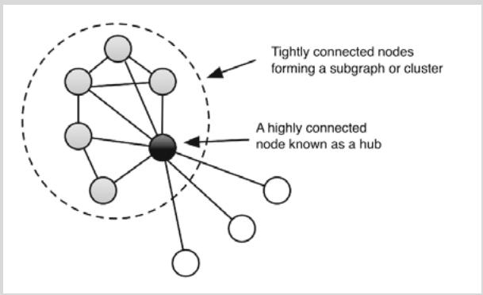

represent gene correlations, has allowed us to address some fundamental properties of disease genes. Studies have shown that genes that display prominent connectivity patterns (known as “hub genes”) tend to play biologically influential or regulatory roles in disease-related processes [11–15], and the deletion of genes encoding hub genes leads to a larger number of phenotypic outcomes than for other genes [16]. Highly co-expressed genes are also more likely to be co-regulated, and a collection of high-connected genes has been shown to cause the same or physiologically similar diseases [17–21]. Networks of genes can therefore be exploited to elicit new disease genes, by identifying nodes that have not been known to affect a particular disease but are tightly connected to diseasecausing genes. Indeed, published studies on the successful application of network approaches in identifying novel disease genes abound. Other types of biological networks include proteinprotein interaction networks, metabolic networks, and phenotype networks.

While widely used to model molecular networks, few studies have applied network-based approaches to study comorbidity patterns that define disease subtypes in complex diseases. Diseasecausing defects often initiate cascades of failure that leads to the co-occurrence of multiple diseases in a patient, such as heart disease, diabetes, and obesity. Indeed, many genetic disorders are characterized by syndromes comprising a collection of disease traits. Thus, discovering disease patterns can potentially open new avenues for understanding disease mechanisms. In one study, comorbidity networks modeling disease co-occurrence have been

shown to capture phenotypic differences between patients with different demographic backgrounds, disease progression, and mortality [22]. This chapter discusses the feasibility of applying a network-based approach to derive clinically meaningful disease subtypes, with an emphasis on childhood-onset pulmonary hypertension.

# 1.2 Pulmonary Hypertension: A Multifactorial Disease

Pulmonary hypertension (PH)—a condition defined by an elevated mean pulmonary arterial pressure of $> = 2 5$ $> = 2 5 \ \mathrm { m m H G }$ at rest)—is an exemplar disease driven by multifactorial causes. The disease is progressive, often with a fatal course; the estimated 5-year survival for PH is just $5 3 . 6 \%$ [23]. Survival outcome is dependent on early diagnosis and treatment, before pathologic changes are advanced and irreversible. Accurate diagnosis of the underlying etiology is also critical, as available treatments and responses to treatments differ substantially.

The goal to optimize the treatment of PH based on its pathophysiology has led to the development of a formal taxonomy of PH by the World Health Organization (WHO). The taxonomy (WHO Classification of PH) defines five distinct PH subtypes (Table 1): pulmonary arterial hypertension (PAH) (Group 1 PH), PH due to left heart diseases (Group 2 PH), PH due to chronic lung diseases and hypoxia (Group 3 PH), chronic thromboembolic PH (CTEPH) (Group 4 PH), and PH due to other multifactorial mechanisms (Group 5 PH) [24]. This classification is widely used in the clinical management of PH and by the US Food and Drug Administration for the labeling of new drugs approved for PH. Optimal treatment for each subtype differs substantially (Table 2): targeted pharmacological therapies are currently available only for PAH; for PH due to left heart diseases or lung

# Table 1 Major PH subtypes defined in the WHO classification of PH

<table><tr><td>Group 1: Pulmonary arterial hypertension (PAH) 
● Idiopathic 
● Heritable 
● Drug and toxin-induced 
● Associated with connective tissue disease, HIV, portal hypertension, congenital heart disease, schistosomiasis, and chronic hemolytic anemia 
● Pulmonary veno-occlusive disease and/or pulmonary capillary hemangiomatosis 
● Persistent pulmonary hypertension of the newborn</td></tr><tr><td>Group 2: PH due to left heart diseases</td></tr><tr><td>Group 3: PH due to lung disease and/or hypoxia</td></tr><tr><td>Group 4: Chronic thromboembolic PH (CTEPH)</td></tr><tr><td>Group 5: PH with unclear multifactorial mechanisms</td></tr></table>

Table 2 Recommended treatment for each PH subtype [27]   

<table><tr><td>WHO PH subtype</td><td>Recommended therapy</td></tr><tr><td>PAH</td><td>PAH-specific therapy based on disease severity, PAH subtypes, and vasoreactivity</td></tr><tr><td>PH due to left heart diseases</td><td>Treatment of the underlying left heart disease</td></tr><tr><td>PH due to lung diseases</td><td>Treatment of the underlying lung condition, long-term oxygen therapy in patients with chronic hypoxemia</td></tr><tr><td>CTEPH</td><td>Surgical pulmonary endarterectomy</td></tr><tr><td>Unknown mechanisms</td><td>Unknown</td></tr></table>

diseases, treatment of the underlying condition is recommended; surgical pulmonary endarterectomy is the recommended treatment for patients with CTEPH; and the optimal treatment for Group 5 PH remains unknown. Misuse of therapies not only represents missed opportunities to provide optimal treatment; it also exposes patients to the potential side effects of therapies without the supposed benefits. For instance, therapies that are efficacious for PAH (e.g., pulmonary vasodilator medications) may actually worsen pulmonary hemodynamics in PH associated with left heart disease, the most common cause of PH [25, 26].

More recently, the realization that childhood-onset PH may have unique etiologies and associations not often observed in adults further prompted the development of a new taxonomy for childhood-onset PH [28–30]. The taxonomy, known as the Panama classification (Table 3), highlighted a number of features more prominent in pediatric PH, including fetal and developmental origins of vascular disease, and chromosomal anomalies associated with PH [29].

While the current PH disease classifications provide a framework for the diagnosis and treatment of PH, gaps remain in our understanding of the disease, especially among children. Due to the rarity of PH in children, comprehensive analysis of its clinical manifestations is challenging. To date, published data on pediatric PH have been limited to several registry-based and small cohort studies [31–35]. While these studies have greatly advanced our understanding of the disease, they may be subject to referral bias and may not represent the full spectrum of pediatric PH cases [36, 37]. Furthermore, since knowledge generated from these studies formed the bedrock of the expert consensus classifications, current taxonomies may not capture the full spectrum of the diverse manifestations of PH.

Table 3 Panama classification of pediatric pulmonary hypertensive vascular disease   

<table><tr><td>Group 1: prenatal or developmental pulmonary hypertensive vascular disease</td></tr><tr><td>Group 2: perinatal pulmonary vascular maladaptation</td></tr><tr><td>Group 3: pediatric cardiovascular disease</td></tr><tr><td>Group 4: bronchopulmonary dysplasia</td></tr><tr><td>Group 5: isolated pediatric pulmonary hypertensive vascular disease (isolated pediatric PAH)</td></tr><tr><td>Group 6: multifactorial pulmonary hypertensive vascular disease in congenital malformation syndromes</td></tr><tr><td>Group 7: pediatric lung disease</td></tr><tr><td>Group 8: pediatric thromboembolic disease</td></tr><tr><td>Group 9: pediatric hypobaric hypoxic exposure</td></tr><tr><td>Group 10: pediatric pulmonary vascular disease associated with other system disorders</td></tr></table>

This chapter discusses a network-based approach to enrich and extend the current classifications of childhood-onset PH, with the goal of facilitating improved recognition of clinically relevant patterns of disease manifestation that can result in meaningful improvement in the timely diagnosis of PH in children.

# 2 Materials

The study data source comprises an administrative claims dataset from a major, nationwide employer-provided health insurance plan in the United States between January 2010 and May 2013. The database systematically captures all the healthcare encounters of beneficiaries, including inpatient and outpatient visits and procedures. Medical diagnoses associated with healthcare visits were coded with International Classification of Diseases, ninth revision (ICD-9) codes; procedures were coded with the Current Procedural Terminology (CPT).

The data source was chosen for several reasons. First, the availability of a large number of patients makes it possible to identify rare but significant relationships, which may not have been observable in traditional studies involving chart reviews or surveys. This is particularly important in the study of rare conditions such as childhood-onset PH. Second, administrative claims data are systematically collected and provide longitudinal information that

crosses facilities, geographical locations, and population demographics, thereby enhancing the generalizability of the research and limiting selection biases inherent to analyses that are based on single institution or registry.

There are, however, limitations to the dataset. Most importantly, disease diagnoses captured in administrative claims are based on the International Classification of Diseases (ICD) diagnostic codes, the controlled vocabulary employed by healthcare providers to bill for their services. Some codes are clearly disease states, while others may represent diagnostic workup for a condition that is later ruled out or may be coding misclassifications. To minimize this limitation of claims-based analyses, case identification algorithms that combine multiple diagnostic and procedure codes are often applied to identify a disease state. For example, one study showed that patients with systemic hypertension can be reliably identified with high accuracy using a case identification algorithm defined as having two or more healthcare encounters associated with the diagnostic codes for systemic hypertension (specificity, $9 5 \%$ ; sensitivity, $7 3 \%$ ) [38]. Similar algorithms have been derived and validated for a wide range of diseases to facilitate claims-based population studies [39–43].

The same approach was applied in the current study to define the subjects of interest. Accordingly, the study cohort comprised patients with PH, defined as having two or more healthcare visits associated with PH (ICD-9416.0, 416.8, 416.9) during the study period. The study subjects were drawn from 6,943,263 children $\mathord { < } 1 8$ years of age) enrolled in the healthcare plan. A total of 1583 children met the criteria for PH (Fig. 1).

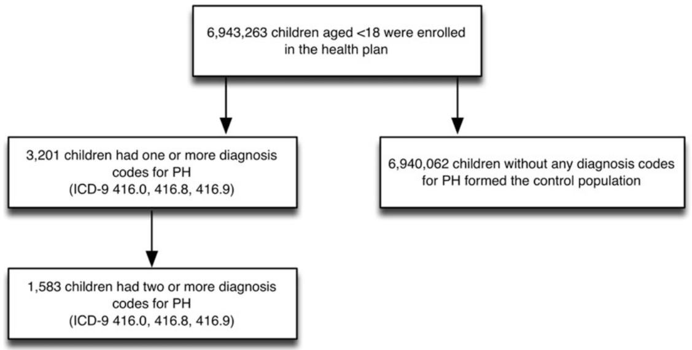  
Fig. 1 Subject selection criteria

# 3 Methods

Leveraging the diagnoses data captured in the claims database, a Bayesian network approach was applied to discern disease subtypes in childhood-onset pulmonary hypertension. Figure 2 provides an overview of the approach, described in detail in the following subsections.

# 3.1 Defining Comorbidity Profiles of Patients with PH

The first step involved extracting the comorbidity profile of the study subjects. The presence of a comorbidity was defined as having two or more healthcare encounters related to the condition, identified using ICD-9 codes. To select conditions that were most relevant to PH, the analysis was confined to conditions that were significantly associated with PH compared with the general population of children without PH. Comorbidities significantly associated with PH were systematically identified from the data source using the chi-square statistic to compare their prevalence among children with and without PH. The α level of 0.05 was used to

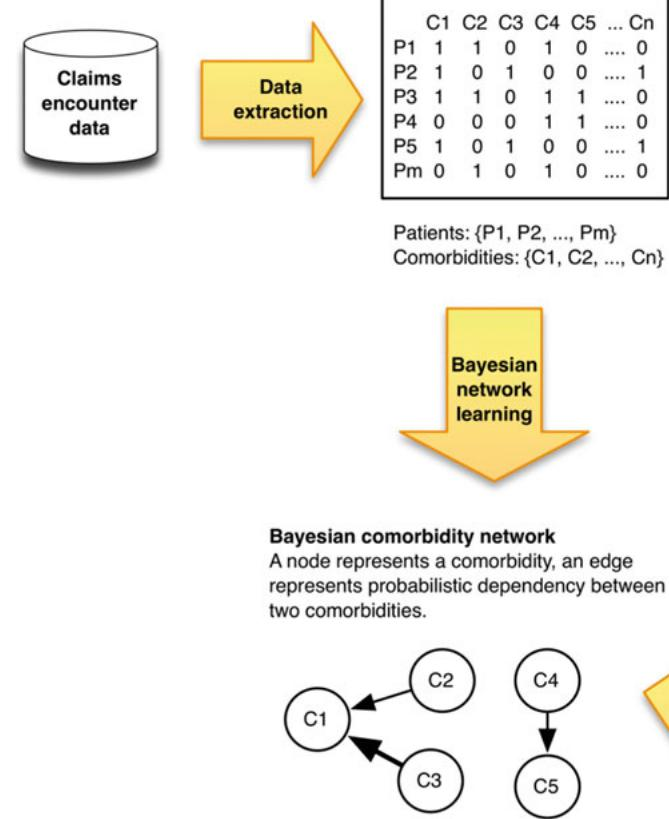  
Claims encounter data Inpatient and outpatient claims data of children with pulmonary hypertension.

# Comorbidity clusters

Comorbidity clusters comprising nodes that are tightly inter-dependent are identified as disease subtypes.

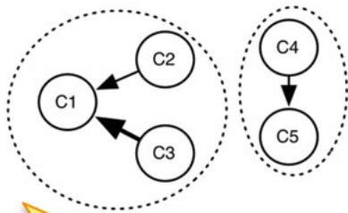

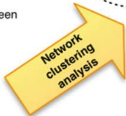  
Fig. 2 Overview of study approach

declare statistical significance, and Bonferroni correction was applied to control for multiple comparisons. Here, a total of 767 comorbidities were examined; thus the adjusted $\alpha$ level was 0.000065.

# 3.2 Constructing Bayesian Comorbidity Network

The next step involved constructing a Bayesian network to model the interdependencies of the comorbidities in children with PH. The following subsections provide a brief overview of Bayesian network and the specific techniques applied in the current study.

# 3.2.1 Bayesian Network Overview

A Bayesian network is a probabilistic graphical model that represents a joint probability distribution of a set of random variables [44]. The network structure consists of nodes representing random variables and directed edges between nodes representing probabilistic dependencies (Box 2). The absence of a link between two nodes signifies conditional independence. The edge strength indicates the relative magnitude of the dependency between two variables. The edge directionality, when present, is not intended to imply causation. Rather, an edge from node $x _ { i }$ to $x _ { j }$ can be interpreted as the presence of $x _ { i }$ “influences” the occurrence of $x _ { j } .$

# Box 2: A Formal Definition of Bayesian Network

Consider the set of variables $X = \{ x _ { 1 } , . . . , x _ { n } \}$ over which we would like to model the joint distribution. A Bayesian network uses a directed acyclic graph, $G = ( V , E )$ , and a set of conditional probability distributions, $P ,$ to represent the joint probability distribution over $X .$ . Each node $\mathbf { \omega } _ { \mathcal { V } _ { i } \in V }$ corresponds to $x _ { i } \in X$ . The edges of the graph, $E$ , encode dependencies among the variables and can be used to infer conditional independence among variables.

The parents (i.e., immediate predecessors) of node $x _ { i }$ , denoted as $\pi _ { i } , $ are the set of $\boldsymbol { p } _ { i } \in V$ such that $( { \boldsymbol { \nu } } _ { i } , \ { \boldsymbol { \nu } } _ { j } ) { \in E }$ . For each node in the network, there is a conditional probability function that relates the node to its immediate parents, denoted as $P ( x _ { i } | \pi _ { i } )$ .

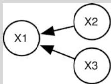

# An example of a Bayesian network

In this hypothetical graph, X1 is conditionally dependent on X2 and X3; X2 is conditionally independent of X3. Both X2 and X3 are the parents of X1.

The independent relationships represented by the structure of a Bayesian network are given by the Markov condition: any node is conditionally independent of its non-descendants, given its parents. The Markov condition permits the factorization of a joint probability distribution on model variables $X$ into the following product:

$$
P (x, \dots , x _ {n}) = \Pi_ {i = 1} ^ {n} P (x _ {i} | \pi_ {i})
$$

In the current study, the variables of interest were the comorbidities found to be significantly associated with PH, depicted as network nodes; edges between nodes represent probabilistic dependencies between comorbidities.

# 3.2.2 Bayesian Network Learning

The problem of learning a Bayesian network can be stated as follows: given a dataset, find a network that best represents the dataset. The construction of a network entails a two-step process: structure learning and parameter estimation. Structure learning involves determining the network structure that most accurately reflects the observed data. There are two main approaches to structure learning [45–49]:

1. Constraint-based approach applies statistical tests to establish conditional dependence and independence relationships among the variables in a model; these relationships form a set of edge constraints; the algorithm then finds the best directed acyclic graph (DAG) that satisfies the constraints.   
2. Score-based approach defines a network scoring function to evaluate the goodness of fit of candidate DAGs with respect to the data; the method then searches over the space of DAGs for a structure that maximizes the score.

Hybrid algorithms that combined both approaches have also been developed, whereby constraint-based algorithms are used to reduce the space of candidate DAGs and network scores are used to identify the optimal DAG [50, 51].

In the current study, a score-based structure learning algorithm was applied to search for the best-fit model. Specifically, the Bayesian Dirichlet equivalent score (with equivalent sample size of ten) [52, 53] was calculated for each candidate network to measure its goodness of fit, and the network with the highest score was selected (Box 3).

To search for high-scoring structures, standard heuristic search techniques can be applied. Local heuristic search strategies are the most commonly applied method: starting from an initial feasible solution, an iterative search is performed to successively improve the solution through a series of local modifications (i.e., edge addition, deletion, and reversal) until an optimum is reached. Such an approach often only finds local optima, which are not necessarily the best possible solution (i.e., the global optimum). A range of algorithms have been developed to overcome this limitation, one of which is “tabu search” [54]—the algorithm used in the current study. To explore solution space beyond local optimality, the tabu search learning process applies an iterative local search procedure but maintains a “tabu list” of previously visited solutions that had been found suboptimal; solutions in the “tabu list” are prohibited in future moves, thus permitting the search procedure to escape local optima.

# Box 3: Bayesian Dirichlet Scoring Function

Given a dataset D with variables $X = \{ x _ { 1 } , . . . , x _ { n } \}$ , the goal of Bayesian network structure learning is to find a graph G that maximizes a score function.

The probability of data D conditional on the graph structure G can be expressed as:

$$
P (D | G) = \int P (D | G, \Theta_ {G}) P (\Theta_ {G} | G) d \Theta_ {G}
$$

where $\Theta _ { G }$ denotes the graph parameters, $P ( D | \ G , \Theta _ { G } )$ is the probability of the data given the network structure and parameters, and $P ( \Theta _ { G } | \ G )$ is the prior probability of the parameters assumed to be a Dirichlet distribution with hyperparameters $\alpha$ (a vector of positive real values).

It has been shown that the Bayesian Dirichlet score of a candidate network can be quantified by summing the score of all local nodes [52, 53]:

$$
\operatorname {S c o r e} (G) = \sum_ {i = 1} ^ {n} \operatorname {S c o r e} \left(x _ {i} \mid \pi_ {i}\right)
$$

$$
\operatorname {S c o r e} \left(x _ {i} \mid \pi_ {i}\right) = \sum_ {j = 1} ^ {r \pi_ {i}} \left(\log \frac {\Gamma \left(\alpha_ {i j}\right)}{\Gamma \left(\alpha_ {i j} + n _ {i j}\right)} + \sum_ {k = 1} ^ {r _ {i}} \log \frac {\Gamma \left(\alpha_ {i j k} + n _ {i j k}\right)}{\Gamma \left(\alpha_ {i j k}\right)}\right)
$$

where

$$
i \in \{1, \dots , n \}, j \in \{1, \dots , r \pi_ {i} \}, k \in \{1, \dots , r _ {i} \}
$$

$r _ { i } =$ number of categories of $x _ { i }$ , $\pi _ { i } =$ parents of $x _ { i }$ .

$n _ { i j k }$ is the count of elements in $D$ containing both $x _ { i k }$ and $\pi _ { i j }$ and $n _ { i j } = \sum _ { k } n _ { i j k }$ .

$\alpha = ( \alpha _ { i j k } ) \ \forall \ i j k$ are the Dirichlet hyperparameters, where $\alpha _ { i j } = \sum _ { k } \alpha _ { i j k }$ .

The Bayesian Dirichlet equivalent score assumes $\alpha _ { i j k } = \alpha ^ { * }$ . $P ( \Theta _ { i j k } | \ G )$ , where $\alpha ^ { * }$ is the equivalent sample size.

Once the best-fit network structure has been selected, the next step in the Bayesian network construction process—parameter estimation—involves finding a set of probability distribution parameters for the learned network that best explains the observed data using Bayes estimation [55]. Given the learned conditional distribution parameters, the strength of the relations between node

pairs can be estimated by assuming a noisy-OR model, whereby the influence of each parent on a node is independent of other parents. Accordingly, the weight assigned to a directed edge from node i to $j$ was quantified by calculating the conditional probability of $j$ given i.

# 3.2.3 Model Averaging Technique

In finding the “best-fit” model, over-fitting can occur when the resultant model describes random error or noise instead of the underlying distribution of the data. To improve the statistical robustness of the analysis, the following strategies were applied. First, instead of building a single model, a model averaging technique [56] was used where multiple best-scored networks were developed using 1000 subsamples of the dataset generated through bootstrap resampling; the final model was estimated by averaging over the highest scoring networks, such that only network edges (i.e., comorbidity relations) that were statistically significant were selected for inclusion [57], as described in Box 4. The parameters of the selected edges were then estimated using the full dataset in the final network. This technique allows the identification of network features that are robust to perturbations of the observations [56, 57]. Second, prior knowledge about the biology of PH informed construction of the set of comorbidities used for developing the network. For example, it is well-established that right and left heart diseases have distinct disease pathophysiology. Thus, diagnosis codes pertaining to left heart disease were grouped into a single category and diagnosis codes pertaining to right heart disease into a separate category. Reducing the number of parameters relative to the number of observations also has the effect of restricting the degrees of freedom during learning, thus resulting in a more robust model. Third, to further reduce the complexity of the model, the analysis considered only comorbidities that were found, in bivariate analyses, to be significantly associated with PH, compared with the general population without PH, and selected those for which the lower $9 5 \%$ confidence interval bound for the odds ratio was greater than five. Comorbidities that occurred in fewer than four PH patients were also excluded, since a small number of observations would not suffice to distinguish between true and spurious correlations.

# Box 4: Algorithm for the Identification of Statistically Significant Features in the Comorbidity Network

Step 1: bootstrap resampling

For $b = 1 , 2 , \dotsc m$ :

1. Randomly sample a new dataset $X _ { b }$ from the original data $X$ .

# Box 4: (continued)

2. Learn the structure of the graphical model $G = \left( V , E _ { b } \right)$ from $X _ { b }$ X .

In the current study, the number of iterations m was set to 1000.

# Step 2: model averaging

For each edge $\boldsymbol { e } _ { i }$ learned through the bootstrap resampling process, estimate the probability that it is present in the true network structure $G _ { 0 } = ( V , E _ { 0 } )$ as:

$$
\begin{array}{l} \hat {P} (e _ {i}) = \frac {1}{m} \sum_ {b = 1} ^ {m} s _ {b} \\ s _ {b} = \left\{ \begin{array}{l l} 1 & \text {i f} e _ {i} \in E _ {b} \\ 0 & \text {o t h e r w i s e} \end{array} \right. \\ \end{array}
$$

The empirical probabilities $\hat { P } ( e _ { i } )$ are known as edge intensities or arc strengths and can be interpreted as the degree of confidence that $\boldsymbol { e } _ { i }$ is present in the network structure $G _ { 0 }$ describing the true dependence structure of the dataset.

Step 3: selection of significant edges.

Significant edges were identified by defining a threshold $t .$ , such that only edges with edge intensity greater than $t$ were included in the final model. Thus:

$$
e _ {i} \in E _ {b} \text {i f} p _ {(i)} > F _ {p _ {(i)}} ^ {- 1} (t)
$$

where $F _ { \hat { p } _ { ( . ) } } ^ { - 1 } ( t )$ is the quantile function:

$$
F _ {p _ {(.)}} ^ {- 1} (t) = \inf  _ {x \in \mathbb {R}} \left\{F _ {p _ {(.)}} (x) \geq t \right\}
$$

The threshold $t$ was estimated by applying $\mathrm { L _ { 1 } }$ norm to approximate the ideal asymptomatic empirical $F _ { \phi _ { ( . ) } } ( t )$ :

$$
L _ {1} (t; p _ {(i)}) = \int \left| F _ {p _ {(.)}} (x) - F _ {p _ {(.)}} (x; t) \right| d x
$$

In the current study, edges with a threshold $t$ greater than 0.50 were considered significant. A more detailed description of the method is provided in [47].

# 3.3 Defining Subtypes Through Network Clustering Analysis

To define PH subtypes, the network was partitioned into subgraphs comprising highly connected comorbidities using a strict partitioning rule, whereby each comorbidity belongs to exactly one cluster. The graph partitioning process involves merging nodes agglomeratively. Specifically, a random walk clustering approach was applied to identify the pathways that were closest to each node in the network [58]. The process involves a random walk on a network for $t$ number of steps: a walker at node $i$ and step $t$ randomly selects one of its neighbors to which it hops at step $t + 1$ ; the probability of walking from node $i$ to node $j$ is quantified by the weight of the edge divided by the total number of nodes directly linked to i. Similarity between two nodes is measured by the ${ \mathrm { L } } ^ { 2 }$ distance between their respective transition probabilities, and cluster analysis involves merging nodes such that the mean of the squared distances between each node and its cluster is minimized. A more detailed description of this approach is provided in Box 5. The length of $t$ must be sufficiently long to gather enough information about the topology of the graph, but short enough to detect clusters. To guide the choice of $t _ { : }$ , a commonly used measure known as “modularity” was applied to quantify the strength of a network division. A positive value of modularity is indicative of the potential presence of community structure [59]. A $t$ that maximized modularity was chosen; in the current analysis, $t$ of 3 was found to be optimal. In the cluster analysis, edges with a weight of less than 0.2 were excluded, in order to capture the strongest relations.

# Box 5: Network Clustering Algorithm

A network can be represented as an adjacency matrix $A$ , where $A _ { i j }$ is the weight of nodes $i$ and $j$ . The degree of node i can be defined as: $d ( i ) = \sum _ { j } A _ { i j }$ .

A random walk process on the network is performed: at each step $t .$ , a walker moves from one node to another chosen randomly and uniformly among its neighbors. The transition probability from node $i$ and $j$ can be defined as: $\begin{array} { r } { P _ { i j } = \frac { A _ { i j } } { d ( i ) } } \end{array}$ .

The probability of going from $i$ to $j$ through a random walk of length $t$ is $P _ { i j } ^ { t }$ , and the probability of going from a1 cluster $C$ to node $j$ in $t$ steps is: $\mathbf { \Sigma } _ { { P _ { C _ { j } } ^ { t } } } ^ { \bullet } = \frac { 1 } { | C | } \sum _ { i \in C } ^ { } \mathbf { \Sigma } _ { { P _ { i j } ^ { t } } } ^ { \bullet }$ P tij

The cluster discovery process involves the following steps:

1. Form an initial partition $P _ { 1 } = \{ \{ v \} , v \in V$ of the graph into n clusters, where each cluster contains a single node. Compute the distance between all adjacent nodes based on the transition probabilities of the random walk process.

# Box 5: (continued)

Let $i$ and $j$ be two nodes. The distance between the nodes is quantified as follows:

$$
r _ {i j} = \sqrt {\sum_ {k = 1} ^ {n} \frac {\left(P _ {i k} ^ {t} - P _ {j k} ^ {t}\right) ^ {2}}{d (k)}}
$$

The equation can be generalized to describe the distance between two clusters $C _ { 1 } , C _ { 2 }$ :

$$
r _ {C _ {1} C _ {2}} = \sqrt {\sum_ {k = 1} ^ {n} \frac {\left(P _ {C _ {1} k} ^ {t} - P _ {C _ {2} k} ^ {t}\right) ^ {2}}{d (k)}}
$$

For each step $k$

2. Choose two clusters to merge according to Ward’s method, whereby the mean of the squared distances between each node and its cluster is minimized:

$$
\sigma_ {k} = \frac {1}{n} \sum_ {C \in P _ {k}} \sum_ {i \in C} r _ {i C} ^ {2}.
$$

3. Merge the two clusters into a new cluster $C _ { 3 } = C _ { 1 } \cap C _ { 2 }$ , and create the new partition: $P _ { k + 1 } = ( P _ { k } \backslash \{ C _ { 1 } , C _ { 2 } \} ) \cap \{ C _ { 3 } \}$ .   
4. Update the distances between clusters.   
5. Stop algorithm after $n - 1$ steps.

# 3.4 Evaluation of Network-Derived Subtypes

A review by experts evaluated the study approach by checking for the identification of established PH subtypes. Accordingly, each comorbidity cluster was assigned a WHO and Panama classification subtype that best describes the cluster. For example, a comorbidity cluster comprising portal hypertension and the associated conditions would be classified as WHO Group 1 (PAH associated with portal hypertension) and Panama Group 10 (pediatric pulmonary vascular disease associated with other system disorders). Classification was first performed by one researcher and then validated by two pediatric PH experts; an inter-rater agreement was quantified using Cohen’s kappa statistic, and discrepancies were resolved through consensus. The WHO and Panama classifications comprise 5 and 10 subtypes, respectively; the WHO classification further categorizes some of the 5 major subtypes into 28 “minor” subtypes (Fig. 1c). A literature review was conducted to evaluate networkderived clusters not described in either WHO or Panama classifications to assess if published evidence supported the co-occurrence of PH with conditions captured by each cluster.

# 4 Notes

Figure 3 depicts the Bayesian comorbidity network learned from the dataset. The inferred network comprised 365 relations.

# 4.1 Detection of Well-Established Subtypes

Cluster analysis of the comorbidity network identified all five major subtypes (kappa score, $1 0 0 \%$ ) and 21 of 28 minor subtypes (kappa score $9 6 \%$ ) defined in the WHO classification (Table 1), and 9 of 10 subtypes defined in the Panama classification (kappa score, $90 \%$ ) (Table 2), with a few anticipated exceptions. For example, in the absence of pedigree and genetic data, the analysis was unable to discern the various forms of heritable PAH, with the exception of PH in association with hereditary hemorrhagic telangiectasia (HHT), a condition known to associate with PAH and linked to pathogenic variants in ALK1 and ENG genes [30]. The identification of pathogenic drugs and toxins associated with PAH is beyond the scope of this study. The analysis was also unable to detect PH caused by chronic exposure to high altitude: the diagnostic code for the condition is non-specific (ICD-9993.2: “other and unspecified effects of high altitude”) and was not assigned to any of the patients in the study dataset. The imprecision of ICD codes also precluded differentiation between left ventricular systolic and diastolic dysfunctions. Finally, subtypes associated with HIV infection or schistosomiasis were not captured, since none of the PH patients in the study data source had billing codes for these conditions.

# 4.2 Detection of Rare Subtypes

The analysis detected known rare associations with PH (Table 3). An example is the co-occurrence of PH with juvenile idiopathic arthritis (JIA) and hemophagocytic syndrome. The clustering occurrence is not surprising given that PAH has been reported in several patients with systemic-onset JIA, particularly in association with macrophage activation syndrome (MAS) [60, 61]. It has been hypothesized that PAH may be caused by exposures to IL-1 and IL-6 inhibitors used for treating systemic-onset JIA and MAS [62]; however, the underlying biology of this association remains unknown. In the study dataset, of 18 patients with both JIA and hemophagocytic syndrome, four patients developed PH, signifying the potential importance of this comorbidity pattern.

The cluster comprising glycogen storage disease (GSD), hereditary muscular dystrophy, and cardiomyopathy typifies type 2 GSD. While type 1 GSD has been linked to PH, the relationship between PH and type 2 GSD is less studied. A case report noted the development of PH resulting from respiratory muscular atrophy and alveolar hypoventilation caused by type 2 GSD [63]. Another report documented severe pulmonary veno-occlusive disease (PVOD) in a patient with type 2 GSD [64].

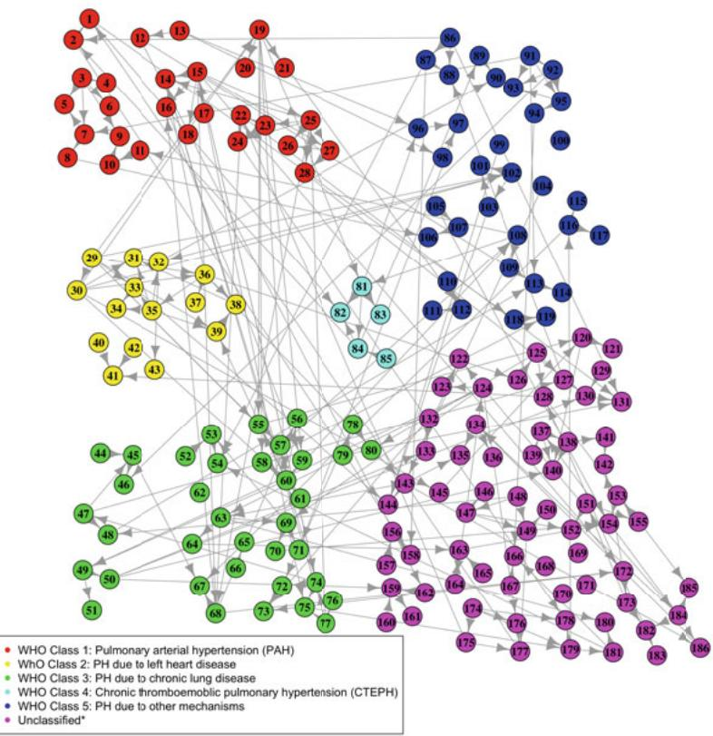  
Fig. 3 A Bayesian network eliciting comorbidity patterns in pediatric pulmonary hypertension

# PAH

Hereditary hemorrhagic telangiectasis (1), iron metabolism disorder (2)   
Raynaud phenomenon (3), systemic vasculitis (4), other connective tissue disease (5), systemic sclerosis (6)   
Juvenile idiopathic arthritis (7), hemophagocytic syndrome (8)   
Systemic lupus erythematosus (9), nephritis (10), essential hypertension (11)   
  
CHD left-to-right shunt (14), respiratory distress syndrome (15), emphysema (16), maternal complications of   
pregnancy (17), congenital pneumonia (18)   
Pleurisy (19), pericardium disorder (20), noninfectious disorders of lymphatic channels (21)

PPHN (22), tachypnea (23), neonatal endocrine and metabolic disorder (24), exceptionally large baby (25)

# PH due to left heart disease

Congestive heart failure (26), cardiomegaly (27)   
  
Valvular heart disease (mitral or aortic valve disorders) (30), rheumatic heart disease (31), left-sided CHD (32)   
  
Conduction disorder (35), cardiac dysrhythmias (36)   
CHD right-to-left shunt (37) (38), acute cor pulmonale (39)   
Myocarditis (40)

# PH due to chronic lung disease and/or hypoxia

Bronchiectasis (41), cystic fibrosis (42), pneumocystosis (43)   
Interstitial lung disease (44), chronic bronchitis (45)   
Pneumonia (46), pneumonitis (47), malnutrition (48)   
Pulmonary eosinophilia (49), edema of larynx (50), cerebrovascular disorder (51)   
Sleep apnea (52), intellectual disability (53)   
Other congenital anomalies of respiratory system (54), cerebral depression coma (55)   
  
Congenital anomalies of larynx or trachea (58), diseases of vocal cord (59), stricture and stenosis of esophagus (60)   
Congenital lung agenesis/hypoplasia (61), acquired hypertrophic pyloric stenosis (62)   
Bronchopulmonary dysplasia (63), fetal and neonatal hemorrhage (64), cerebral cyst (65), neonatal hematological disorder (66)   
Congenital anomalies of diaphragm (67), diaphragmatic hernia (68), diaphragm paralysis (69)   
  
Pulmonary insufficiency following trauma (73), hypotension (74), acute edema of lung (75), fluid overload disorder (76), pneumothorax (77), pulmonary collapse (78), nutritional deficiency (79)

# CTEPH

Thromboembolism (81), hemorrhagic disorder due to intrinsic factor (82), compression of vein (83)   
Pulmonary embolism (84), endocarditis (85)

# PH due to other mechanisms

Sickle cell disease (86), acute chest syndrome (87), hereditary hemolytic anemia (88)   
Acquired hemolytic anemia (89), anorexia (loss of appetite) (90)   
Thrombocytopenia (91), drug-induced pancytopenia (92), aplastic anemia (93), leukocytopenia (94), neutropenia (95)   
Splenomegaly (96), fistula of stomach or duodenum (97)   
Hemolytic disease due to isoimmunization (98)   
Coagulation defect (99), iron deficiency anemia (100), leukocystosis (168)   
Multiple congenital anomalies (101), congenital intestinal atresia and stenosis (102), congenita anomalies of kidney (103), congenital malrotation of intestine (104)   
DiGeorge syndrome (105), tetralogy of Fallot (106), primary immunodeficiency (107), velo-cardio-facial syndrome (108)   
Cri-du-chat syndrome (109), other chromosomal anomalies (110), other autosomal deletion syndromes (111), rickets (112)   
  
Patau syndrome (115), Edwards syndrome (116), Hirschsprung (117), magnesium metabolic disorder (118)   
Prader-Willi syndrome (119), abnormal weight gain (120), aneurysm (121)   
Cerebral palsy (122), abnormal involuntary movement (123)   
Adrenogenital disorder (124), adrenal hypofunction (125), microcephaly (126)   
Disorder of muscle, ligament and fascia (127), abnormality of gait (128), spontaneous ecchymoses (129)   
Glycogen storage disorder (130), cardiomyopathy (131), hereditary muscular dystrophy (132)   
Plasma protein metabolic disorder (133), gangrene (134), defibrination syndrome (135)   
Acute kidney failure (136), phosphorus metabolism disorder (137)   
Hepatomegaly (138), hydrops fetalis (139), edema (140)   
  
Congenital spleen anomaly (143), situs inversus (144)   
Epilepsy (145), anoxic brain damage (146)   
Intracranial hemorrhage (147), hydrocephalus (148)   
  
Hearing loss (151), congenital musculoskeletal deformities (152), delay in development (153)   
Congenital brain reduction deformities (154), eosinophilia (155), phlebitis and thrombophlebitis (156)   
  
Intestinal obstruction (159), intestinal vascular insufficiency (160)   
Hypothyroidism (161)   
Perinatal digestive system disorders (162), intestinal malabsorption (163)   
  
  
  
Disturbance of salivary secretion (173), speech disturbance (174), childbirth complications (175)   
Mixed acid base balance disorder (176), calculus of kidney (177), gastroparesis (178)   
Gonadal dysgenesis (179), drug withdrawal syndrome (180)   
Unclassified (comorbidities that do not belong to a cluster and do not fit into a WHO subtype: Dyspepsia (181), diabetic mother syndrome (182), umbilical hernia (183), persistent vomiting (184), essential hypertension (185), cyanosis (186)

Another cluster captures the characteristic features of heterotaxy syndrome, including situs inversus and congenital spleen anomaly. Of the 31 patients in the dataset diagnosed with these conditions, four developed PH. Several limited case reports documented the disease pattern in the setting of cardiac defects and pulmonary complications [65, 66].

The analysis identified several rare genetic disorders among the PH population, including Cri-du-chat, Turner, and Prader-Willi syndromes. Case reports have documented the co-occurrence of PH in children with Cri-du-chat [67, 68] and Turner syndrome [69, 70]. PH in these patients may be caused by underlying congenital heart disease. In patients with Prader-Willi syndrome, obstructive sleep apnea and other obesity-related comorbidities may have contributed to the development of PH. In the study dataset, six $( 1 . 8 \% )$ of 329 patients with Prader-Willi syndrome developed PH. However, the literature review yielded only one case report documenting a sudden death secondary to PH in a child with Prader-Willi syndrome [71], indicating that the risk of PH in these patients may be under-recognized.

While some clusters clearly describe syndromes with highly specific and/or rare comorbidities, other clusters contain unusual combinations of relatively more common conditions, which may represent unrecognized syndromes and generate new hypotheses. For example, the cluster comprising adrenogenital disorder, microcephaly, and adrenal hypofunction may represent Smith-Lemli-Opitz syndrome (SLOS), a rare condition caused by deficiency of 7-dehydrocholesterol (7-DHC) reductase. Two potential etiologies would support the association between SLOS and PH. First, persistent pulmonary hypertension of the newborn (PPHN) in SLOS has been documented in a patient with altered expression of caveolin-1 (CAV1) [72], suggesting that caveolae-dependent signaling may be responsible for the pathogenesis of PH. This hypothesis was further strengthened in a recent study demonstrating an association between mutations in CAV-1 and PAH through whole exome sequencing [73]. Second, cardiorespiratory problems can occur in individuals with SLOS, secondary to malformations of the heart or respiratory tract [74]; these conditions may contribute to the development of PH in patients with SLOS.

# 4.3 Discovery of Unknown Subtypes

Several network-derived comorbidity clusters do not fall into any of the categories in the WHO and Panama classifications. Of note, a number of these clusters are linked to neurological defects not commonly thought to be associated with PH, including encephalocele, hydrocephalus, microcephaly, periventricular leukomalacia, and congenital brain reduction deformities. It is well-established that children with severe neurological impairments are predisposed to respiratory problems that occur as a direct consequence of the underlying disability. For example, oropharyngeal motor problems

# 4.4 Feasibility and Challenges of Data-Driven Discovery of Disease Subtypes

associated with neurological dysfunctions can lead to recurrent aspiration and pneumonia [75]. Chiari malformation associated with hydrocephalus can cause both maldevelopment of the brain stem respiratory control centers and central sleep apnea [76]. Neurological impairments are also common pathways for children requiring mechanical ventilation at the intensive care unit; PH in these patients may be secondary to mechanical ventilation management. While the causes of PH in children with neurological defects observed in the study cohort cannot be ascertained, the analysis suggests that the association of neurological defects with PH may be under-recognized and deserves further characterization.

The study demonstrated that comorbidity patterns of patients with PH captured in a Bayesian network can be stratified into subtypes that are biologically and clinically informative. The algorithmic method automatically relearned most of the major PH subtypes with known etiological basis defined by the WHO classification. The similarity of the derived network structure to current taxonomy of PH provides face validity to the approach. Furthermore, the network approach enriches the current classification of PH. First, it captured several subtypes documented in only a few case studies for which evidence for systematic association remains lacking. This both validates the approach and provides impetus for deeper investigation of the disease subtypes. The analysis also identified rare subtypes with findings consistent with several well-described genetic syndromes. In the same way in which novel genetic associations in PH stimulate new avenues of research, so too may novel phenotypic associations prompt important discoveries related to disease susceptibility.

To construct the comorbidity network, the Bayesian model averaging technique was applied to find a network model that best fits the underlying data. The approach is uniquely suited to accommodate the inherent uncertainties of biological processes and to minimize the effects of noise in the data. In maximizing specificity, however, other subtypes may have been missed. Furthermore, in defining comorbidity clusters, a strict partitioning rule was applied, whereby each comorbidity belongs exactly to one cluster. While this approach produces a model that is easier to interpret, the full expression of subtypes may not have been captured. As shown in Fig. 3, many comorbidities are linked to comorbidities belonging to another cluster. Shared features among multiple clusters may also reflect the overlapping phenotypes of PH, an increasingly recognized phenomenon [30]. Future research should explore methods that would facilitate the delineation of subtypes with overlapping manifestations and etiologies.

A further limitation of the study is the coding inaccuracies inherent to administrative claims dataset. The diagnoses coded for billing purposes may not reflect actual comorbidities in the patients.

To improve case identification specificity, the analysis included only diagnoses with two or more encounter visits—an algorithm that has been validated in previous studies [38–40]. While it may not be possible to fully address diagnostic coding inaccuracies in administrative claims, the analysis was able to discern comorbidity relations and derive subtypes that are biologically meaningful, thus lending support to the validity of the study approach. A further strategy used to reduce uncertainties in the analysis is the exclusion of comorbidities that occurred in fewer than four patients and network relations with low probabilistic strengths. In doing so, the model may not have captured all the comorbidities and subtypes that were present in the study cohort. An area that is ripe for further research is the integration of multiple complementary data sources, including administrative claims, electronic health, and registry data, to validate and enrich disease classifications. Several studies have begun to explore the use of network-based approaches to aggregate diverse data sources [76, 77].

# 4.5 Summary

This chapter describes the application of the Bayesian network approach to routinely collected clinical data to discern disease subtypes in childhood-onset PH. With the increased availability of large clinical datasets, such data-driven approaches can facilitate and expedite scientific discovery of the causes and treatments of complex diseases. Further advances linking disease subtypes to therapeutic response, disease outcomes, as well as the molecular profiles of individual subtypes will provide impetus for the development of more effective and targeted therapies.


1. Kitano H (2002) Systems biology: a brief overview. Science 295(5560):1662–1664   
2. Aderem A (2005) Systems biology: its practice and challenges. Cell 121(4):511–513   
3. Hood L, Heath JR, Phelps ME, Lin B (2004) Systems biology and new technologies enable predictive and preventative medicine. Science 306(5696):640–643   
4. Westerhoff HV, Palsson BO (2004) The evolution of molecular biology into systems biology. Nat Biotechnol 22(10):1249–1252   
5. Baraba´si AL, Gulbahce N, Loscalzo J (2011) Network medicine: a network-based approach to human disease. Nat Rev Genet 12(1):56–68

6. Baraba´si AL, Oltvai ZN (2004) Network biology: understanding the cell’s functional organization. Nat Rev Genet 5(2):101–113   
7. Chan SY, Loscalzo J (2012) The emerging paradigm of network medicine in the study of human disease. Circ Res 111(3):359–374   
8. Baraba´si AL, Albert R (1999) Emergence of scaling in random networks. Science 286:509–512   
9. Bhalla US, Iyengar R (1999) Emergent properties of networks of biological signaling pathways. Science 283(5400):381–387   
10. Jeong H, Tombor B, Albert R, Oltvai ZN, Baraba´si AL (2000) The large-scale

organization of metabolic networks. Nature 407(6804):651–654   
11. Stuart JM, Segal E, Koller D, Kim SK (2003) A gene-coexpression network for global discovery of conserved genetic modules. Sciene 302 (5643):249–255   
12. Horvath S, Dong J (2008) Geometric interpretation of gene coexpression network analysis. PLoS Comput Biol 4(8):e1000117   
13. Doering TA, Crawford A, Angelosanto JM, Paley MA, Ziegler CG, Wherry EJ (2012) Network analysis reveals centrally connected genes and pathways involved in $\mathrm { C D 8 ^ { + } }$ T cell exhaustion versus memory. Immunity 37 (6):1130–1144   
14. McDermott JE, Taylor RC, Yoon H, Heffron F (2009) Bottlenecks and hubs in inferred networks are important for virulence in Salmonella typhimurium. J Comput Biol 16(2):169–180   
15. Tan N, Chung MK, Smith JD, Hsu J, Serre D, Newton DW, Castel L, Soltesz E, Pettersson G, Gillinov AM, Van Wagoner DR, Barnard J (2013) A weighted gene co-expression network analysis of human left atrial tissue identifies gene modules associated with atrial fibrillation. Circ Cadiovasc Genet 6 (4):362–371   
16. Yu H, Braun P, Yildirim MA, Lemmens I, Venkatesan K, Sahalie J, Hirozane-Kishikawa T, Gebreab F, Li N, Simonis N, Hao T, Rual JF, Dricot A, Vazquez A, Murray RR, Simon C, Tardivo L, Tam S, Svrzikapa N, Fan C, de Smet AS, Motyl A, Hudson ME, Park J, Xin X, Cusick ME, Moore T, Boone C, Snyder M, Roth FP, Baraba´si AL, Tavernier J, Hill DE, Vidal M (2008) High-quality binary protein interaction map of the yeast interactome network. Science 322:104–110   
17. Erlich Y, Edvardson S, Hodges E, Zenvirt S, Thekkat P, Shaag A, Dor T, Hannon GJ, Elpeleg O (2011) Exome sequencing and diseasenetwork analysis of a single family implicate a mutation in KIF1A in hereditary spastic paraparesis. Genome Res 21(5):658–664   
18. Aggarwal A, Guo DL, Hoshida Y, Yuen ST, Chu KM, So S, Boussioutas A, Chen X, Bowtell D, Aburatani H, Leung SY, Tan P (2006) Topological and functional discovery in a gene coexpression meta-network of gastric cancer. Cancer Res 66(1):232–241   
19. Yang Y, Han L, Yuan Y, Li J, Hei N, Liang H (2014) Gene co-expression network analysis reveals common system-level properties of prognostic genes across cancer types. Nat Commun 5:3231   
20. Emilsson V, Thorleifsson G, Zhang B, Leonardson AS, Zink F, Zhu J, Carlson S,

Helgason A, Walters GB, Gunnarsdottir S, Mouy M, Steinthorsdottir V, Eiriksdottir GH, Bjornsdottir G, Reynisdottir I, Gudbjartsson D, Helgadottir A, Jonasdottir A, Jonasdottir A, Styrkarsdottir U, Gretarsdottir S, Magnusson KP, Stefansson H, Fossdal R, Kristjansson K, Gislason HG, Stefansson T, Leifsson BG, Thorsteinsdottir U, Lamb JR, Gulcher JR, Reitman ML, Kong A, Schadt EE, Stefansson K (2008) Genetics of gene expression and its effect on disease. Nature 452(7186):423–428   
21. Min JL, Nicholson G, Halgrimsdottir I, Almstrup K, Petri A, Barrett A, Travers M, Rayner NW, M€agi R, Pettersson FH, Broxholme J, Neville MJ, Wills QF, Cheeseman J, GIANT Consortium; MolPAGE Consortium, Allen M, Holmes CC, Spector TD, Fleckner J, MI MC, Karpe F, Lindgren CM, Zondervan KT (2012) Coexpression network analysis in abdominal and gluteal adipose tissue reveals regulatory genetic loci for metabolic syndrome and related phenotypes. PLoS Genet 8(2):e1002505   
22. Hildago CA, Blumm N, Barabasi AL, Christakis NA (2009) A dynamic network approach for the study of human phenotypes. PLoS Comput Biol 5(4):e1000353   
23. Gall H, Felix JF, Schneck FK, Milger K, Sommer N, Voswinckel R, Franco OH, Hofman A, Schermuly RT, Weissmann N, Grimminger F, Seeger W, Ghofrani HA (2017) The giessen pulmonary hypertension registry: survival in pulmonary hypertension subgroups. J Heart Lung Transplant 36 (9):957–967   
24. Simonneau G, Gatzoulis MA, Adatia I, Celermajer D, Denton C, Ghofrani A, Gomez Sanchez MA, Krishna Kumar R, Landzberg M, Machado RF, Olschewski H, Robbins IM, Souza R (2013) Updated clinical classification of pulmonary hypertension. J Am Coll Cardiol 62:D34–D41   
25. Packer M, McMurray J, Massie BM, Caspi A, Charlon V, Cohen-Solal A, Kiowski W, Kostuk W, Krum H, Levine B, Rizzon P, Soler J, Swedberg K, Anderson S, Demets DL (2005) Clinical effects of endothelin receptor antagonism with bosentan in patients with severe chronic heart failure: results of a pilot study. J Card Fail 11(1):12–20   
26. Haywood GA, Sneddon JF, Bashir Y, Jennison SH, Gray HH, McKenna WJ (1992) Adenosine infusion for the reversal of pulmonary vasoconstriction in biventricular failure. A good test but a poor therapy. Circulation 86 (3):896–902

27. Galie` N, Humbert M, Vachiery JL et al (2016) 2016 ESC/ERS guidelines for the diagnosis and treatment of pulmonary hypertension: the Joint Task Force for the Diagnosis and Treatment of Pulmonary Hypertension of the European Society of Cardiology (ESC) and the European Respiratory Society (ERS): endorsed by: Association for European Paediatric and Congenital Cardiology (AEPC), International Society for Heart and Lung Transplantation (ISHLT). Eur Heart J 37 (1):67–119   
28. Barst RG, Ertel SI, Beghetti M, Ivy DD (2011) Pulmonary arterial hypertension: a comparison between children and adults. Eur Respir J 37:665–677   
29. Ivy DD, Abman SH, Barst RJ, Berger RM, Bonnet D, Fleming TR, Haworth SG, Raj JU, Rosenzweig EB, Schulze Neick I, Steinhorn RH, Beghetti M (2013) Pediatric pulmonary hypertension. J Am Coll Cardiol 62: D117–D126   
30. Cerro MR, Abman S, Diaz G, Freudenthal AH, Freudenthal F, Harikrishnan S, Haworth SG, Ivy D, Lopes AA, Raj JU, Sandoval J, Stenmark K, Adatia I (2011) A consensus approach to the classification of pediatric pulmonary hypertensive vascular disease: report from the PVRI pediatric taskforce, Panama 2011. Pulm Circ 1(2):286–298   
31. McGoon MD, Benza RL, Escribano-Subias P, Jiang X, Miller DP, Peacock AJ, Pepke-Zaba J, Pulido T, Rich S, Rosenkranz S, Suissa S, Humbert M (2013) Pulmonary arterial hypertension: epidemiology and registries. J Am Coll Cardiol 62(25 Suppl):D51–D59   
32. Berger RM et al (2012) Clinical features of paediatric pulmonary hypertension: a registry study. Lancet 379:537–546   
33. Badesch DB, Raskob GE, Elliott CG, Krichman AM, Farber HW, Frost AE, Barst RJ, Benza RL, Liou TG, Turner M, Giles S, Feldkircher K, Miller DP, McGoon MD (2010) Pulmonary arterial hypertension: baseline characteristics from the REVEAL registry. Chest 137(2):376–387   
34. van Loon RL, Roofthooft MT, Hillege HL, ten Harkel AD, van Osch-Gevers M, Delhaas T, Kapusta L, Strengers JL, Rammeloo L, Clur SA, Mulder BJ, Berger RM (2011) Pediatric pulmonary hypertension in the Netherlands: epidemiology and characterization during the period 1991 to 2005. Circulation 124 (16):1755–1764   
35. Moledina S, Hislop AA, Foster H, Schulze-Neick I, Haworth SG (2010) Childhood idiopathic pulmonary arterial hypertension: a

national cohort study. Heart 96 (17):1401–1406   
36. Fraisse A, Jais X, Schleich JM, di Filippo S, Maragne`s P, Beghetti M, Gressin V, Voisin M, Dauphin C, Clerson P, Godart F, Bonnet D (2010) Characteristics and prospective 2-year follow-up of children with pulmonary arterial hypertension in France. Arch Cardiovasc Dis 103(2):66–74   
37. Miller DP, Gomberg-Maitland M, Humbert M (2012) Survivor bias and risk assessment. Eur Respir J 40:530–532   
38. Quan H, Khan N, Hemmelgarn BR et al (2009) Validation of a case definition to define hypertension using administrative data. Hypertension 54(6):1423–1428   
39. Lix L, Yogendran M, Burchill C, Metge C, McKeen N, Moore D, Bond R (2006) Defining and validating chronic diseases: an administrative data approach. Winnipeg, Manitoba Centre for Health Policy   
40. Rector TS, Wickstrom SL, Shah M et al (2004) Specificity and sensitivity of claims-based algorithms for identifying members of Medicare $^ +$ Choice health plans that have chronic medical conditions. Health Serv Res 39(6 Pt 1):1839–1857   
41. Funch D, Ross D, Gardstein BM, Norman HS, Sanders LA, Major-Pedersen A, Gydesen H, Dore DD (2017) Performance of claimsbased algorithms for identifying incident thyroid cancer in commercial health plan enrollees receiving antidiabetic drug therapies. BMC Health Serv Res 17(1):330   
42. Reid AY, St Germaine-Smith C, Liu M, Sadiq S, Quan H, Wiebe S, Faris P, Dean S, Jette´ N (2012) Development and validation of a case definition for epilepsy for use with administrative health data. Epilepsy Res 102 (3):173–179   
43. Solberg LI, Engebretson KI, Sperl-Hillen JM, Hroscikoski MC, O’Connor PJ (2006) Are claims data accurate enough to identify patients for performance measures or quality improvement? The case of diabetes, heart disease, and depression. Am J Med Qual 21(4):238–245   
44. Pearl J (2000) Causality: models, reasoning and inference, vol 29. MIT press, Cambridge   
45. Heckerman D. (1995) A Bayesian approach to learning causal networks. In: UAI’95 Proceedings of the Eleventh conference on Uncertainty in artificial intelligence, p 285–295   
46. Friedman N, Nachman I, Pe’er D Learning Bayesian network structure from massive datasets: the sparse candidate algorithm. In: Proceeding UAI’99 Proceedings of the Fifteenth

conference on Uncertainty in artificial intelligence, p 206–215   
47. Cooper GF, Herskovits E (1992) A Bayesian method for the induction of probabilistic networks from data. Mach Learn 9:309–347   
48. De Campos, Zeng Z, Ji Q (2009) Structure learning of Bayesian networks using constraints. In: Proceedings of the 26th International conference on machine learning, Montreal, Canada   
49. Friedman N, Koller D (2003) Being Bayesian about network structure: a Bayesian approach to structure discovery in Bayesian networks. Mach Learn 50(1-2):95–125   
50. Perrier E, Imoto S, Miyano S (2008) Finding optimal Bayesian network given a superstructure. J Mach Learn Res 9:2251–2286   
51. Acid S, de Campos LM (2001) A hybrid methodology for learning belief networks: BENE-DICT. Int J Approx Reason 27(3):235–262   
52. Heckerman D, Geiger D, Chickering DM (1995) Learning Bayesian networks: the combination of knowledge and statistical data. Mach Learn 20(3):197–243   
53. de Campos CP, Ji Q Properties of Bayesian Dirichlet scores to learn Bayesian network structures. In: Proceedings of the 24th AAAI conference on artificial intelligence   
54. Glover F, Laguna M (2013) Tabu Search. Handbook of Combinatorial Optimization:3261–3362   
55. Koller D, Friedman N (2009) Probabilistic graphical models: Principles and Techniques. Massachusetts Institute of Technology:733–749   
56. Friedman N, Goldszmidt M, Wyner A. Data analysis with Bayesian networks: a bootstrap approach. In: Proceeding UAI’99 Proceedings of the fifteenth conference on uncertainty in artificial intelligence, p 196–205   
57. Scutari M, Nagarajan R (2013) Identifying significant edges in graphical models of molecular networks. Artif Intell Med:207–217   
58. Pons P, Latapy M Computing communities in large networks using random walks, Computer and information sciences-ISCIS, vol 2005. Berlin Heidelberg: Springer, 284–293   
59. Newman ME (2006) Modularity and community structure in networks. Proc Natl Acad Sci U S A 103(23):8577–8582   
60. Kimura Y, Weiss JE, Haroldson KL, Lee T, Punaro M, Oliveira S et al (2013) Pulmonary hypertension and other potentially fatal pulmonary complications in systemic juvenile idiopathic arthritis. Arthritis Care Res 65 (5):745–752

61. Li EK, Tam LS (1999) Pulmonary hypertension in systemic lupus erythematosus: Clinical association and survival in 18 patients. J Rheumatol 26(9):1923–1929   
62. Humbert M, Monti G, Brenot F, Sitbon O, Portier A, Grangeot-Keros L et al (1995) Increased interleukin-1 and interleukin-6 serum concentrations in severe primary pulmonary hypertension. Am J Respir Crit Care Med 151(5):1628–1631   
63. Inoue S, Nakamura T, Hasegawa K, Tadaoka S, Samukawa M, Nezuo S et al (1989) Pulmonary hypertension due to glycogen storage disease type II (Pompe’s disease): a case report. J Cardiol 19(1):323–332   
64. Kobayashi H, Shimada Y, Ikegami M, Kawai T, Sakurai K, Urashima T et al (2010) Prognostic factors for the late onset Pompe disease with enzyme replacement therapy: from our experience of 4 cases including an autopsy case. Mol Genet Metab 100(1):14–19   
65. Brandenburg VM, Krueger S, Haage P, Mertens P, Riehl J (2002 May) Heterotaxy syndrome with severe pulmonary hypertension in an adult patient. South Med J 95 (5):536–538   
66. Yousuf T, Kramer J, Jones B, Keshmiri H, Dia M (2016) Pulmonary hypertension in a patient with congenital heart defects and heterotaxy syndrome. Ochsner J 16(3):309–311   
67. Hills C, Moller JH, Finkelstein M, Lohr J, Schimmenti L (2006) Cri du Chat syndrome and congenital heart disease: a review of previously reported cases and presentation of an additional 21 cases from the Pediatric Cardiac Care Consortium. Pediatrics 117(5): e924–e927   
68. Levy B, Dunn TM, Kern JH, Hirschhorn K, Kardon NB (2002) Delineation of the dup5q phenotype by molecular cytogenetic analysis in a patient with dup5q/del 5p (cri du chat). Am J Med Genet 108(3):192–197   
69. Bechtold SM, Dalla Pozza R, Becker A, Meidert A, Do¨hlemann C, Schwarz HP (2004) Partial anomalous pulmonary vein connection: an underestimated cardiovascular defect in Ullrich-Turner syndrome. Eur J Pediatr 163(3):158–162   
70. Tinker A, Schofield UJ (1989) Severe pulmonary hypertension in Turner syndrome. Br Heart J 62:74–77   
71. Bakker B, Maneatis T, Lippe B (2007) Sudden death in Prader-Willi syndrome: brief review of five additional cases. Horm Res 67:203–204   
72. Katheria AC, Masliah E, Benirschke K, Jones KL, Kim JH (2010) Idiopathic persistent pulmonary hypertension in an infant with Smith-

Lemli-Opitz syndrome. Fetal Pediatr Pathol 29 (6):373–379   
73. Austin ED, Ma L, LeDuc C, Berman Rosenzweig E, Borczuk A, Phillips JA 3rd et al (2012) Whole exome sequencing to identify a novel gene (caveolin-1) associated with human pulmonary arterial hypertension. Circ Cardiovasc Genet 5:336–343   
74. Nowaczyk M (2013) Smith-Lemli-Opitz syndrome. GeneReviews   
75. Seddon PC, Khan Y (2003) Respiratory problems in children with neurological impairment. Arc Dis Child 88(1):75–78

76. Dauvilliers Y, Stal V, Abril B, Coubes P, Bobin S, Touchon J, Escourrou P, Parker F, Bourgin P (2007) Chiari malformation and sleep related breathing disorders. J Neurol Neurosurg Psychiatry 78(12):1344–1348   
77. Wang B, Mezlini AM, Demir F, Fiume M, Tu Z, Brudno M, Haibe-Kains B, Goldenberg A (2014) Similarity network fusion for aggregating data types on a genomic scale. Nat Methods 11(3):333–337   
78. Ong MS, Mullen MP, Austin ED, Szolovits P, Natter MD, Geva A, Cai T, Kong SW, Mandl KD (2017) Circ Res 121(4):341–353