# Bioinformatics and Machine Learning for Cancer Biology

Edited by

Shibiao Wan, Yiping Fan, Chunjie Jiang and Shengli Li

Printed Edition of the Special Issue Published in Biology

# Machine Learning-Based Identification of Colon Cancer Candidate Diagnostics Genes

Saraswati Koppad $\mathbf { 1 } _ { \textcircled { 1 0 } }$ , Annappa Basava 1, Katrina Nash ${ \mathfrak { 2 } } \oplus$ , Georgios V. Gkoutos 3,4,5,6,7,8 and Animesh Acharjee 3,4,5,* $^ { 3 , 4 , 5 , \ast \mathrm { \oplus } }$

1 Department of Computer Science and Engineering, National Institute of Technology Karnataka, Mangalore 575025, India; saraswatikoppad@gmail.com (S.K.); annappa@ieee.org (A.B.)   
2 College of Medical and Dental Sciences, University of Birmingham, Birmingham B15 2TT, UK; katrinanash649@outlook.com   
3 Institute of Cancer and Genomic Sciences, University of Birmingham, Birmingham B15 2TT, UK; g.gkoutos@bham.ac.uk   
4 Institute of Translational Medicine, University of Birmingham, Birmingham B15 2TT, UK   
5 NIHR Surgical Reconstruction and Microbiology Research Centre, University Hospital Birmingham, Birmingham B15 2WB, UK   
6 MRC Health Data Research UK (HDR UK), Midlands Site, Birmingham B15 2TT, UK   
7 NIHR Experimental Cancer Medicine Centre, Birmingham B15 2TT, UK   
8 NIHR Biomedical Research Centre, University Hospital Birmingham, Birmingham B15 2TT, UK   
* Correspondence: a.acharjee@bham.ac.uk; Tel.: +44-07403642022

Citation: Koppad, S.; Basava, A.; Nash, K.; Gkoutos, G.V.; Acharjee, A. Machine Learning-Based Identification of Colon Cancer Candidate Diagnostics Genes. Biology 2022, 11, 365. https://doi.org/ 10.3390/biology11030365

Academic Editors: Shibiao Wan, Yiping Fan, Chunjie Jiang, Shengli Li and Lucia Mangone

Received: 17 December 2021

Accepted: 23 February 2022

Published: 25 February 2022

Publisher’s Note: MDPI stays neutral with regard to jurisdictional claims in published maps and institutional affiliations.

Copyright: © 2022 by the authors. Licensee MDPI, Basel, Switzerland. This article is an open access article distributed under the terms and conditions of the Creative Commons Attribution (CC BY) license (https:// creativecommons.org/licenses/by/ 4.0/).

Simple Summary: We developed a predictive approach using different machine learning methods to identify a number of genes that can potentially serve as novel diagnostic colon cancer biomarkers.

Abstract: Background: Colorectal cancer (CRC) is the third leading cause of cancer-related death and the fourth most commonly diagnosed cancer worldwide. Due to a lack of diagnostic biomarkers and understanding of the underlying molecular mechanisms, CRC’s mortality rate continues to grow. CRC occurrence and progression are dynamic processes. The expression levels of specific molecules vary at various stages of CRC, rendering its early detection and diagnosis challenging and the need for identifying accurate and meaningful CRC biomarkers more pressing. The advances in high-throughput sequencing technologies have been used to explore novel gene expression, targeted treatments, and colon cancer pathogenesis. Such approaches are routinely being applied and result in large datasets whose analysis is increasingly becoming dependent on machine learning (ML) algorithms that have been demonstrated to be computationally efficient platforms for the identification of variables across such high-dimensional datasets. Methods: We developed a novel ML-based experimental design to study CRC gene associations. Six different machine learning methods were employed as classifiers to identify genes that can be used as diagnostics for CRC using gene expression and clinical datasets. The accuracy, sensitivity, specificity, F1 score, and area under receiver operating characteristic (AUROC) curve were derived to explore the differentially expressed genes (DEGs) for CRC diagnosis. Gene ontology enrichment analyses of these DEGs were performed and predicted gene signatures were linked with miRNAs. Results: We evaluated six machine learning classification methods (Adaboost, ExtraTrees, logistic regression, naïve Bayes classifier, random forest, and XGBoost) across different combinations of training and test datasets over GEO datasets. The accuracy and the AUROC of each combination of training and test data with different algorithms were used as comparison metrics. Random forest (RF) models consistently performed better than other models. In total, 34 genes were identified and used for pathway and gene set enrichment analysis. Further mapping of the 34 genes with miRNA identified interesting miRNA hubs genes. Conclusions: We identified 34 genes with high accuracy that can be used as a diagnostics panel for CRC.

Keywords: biomarker identification; transcriptomics; machine learning; prediction; variable selection

# 1. Introduction

Colorectal cancer (CRC) is the third most common cause of death due to cancer and the fourth most commonly diagnosed cancer worldwide [1,2]. Considering demographic estimates, nearly 2.2 million new cases and about 1.1 million deaths are expected by 2030, and the global burden of CRC is estimated to increase by $6 0 \%$ [3]. CRC cancer is a genotype and phenotype heterogeneous disease, characterized by a display of distinct molecular signatures [4]. Around 1.4 million new cases and nearly 700,000 deaths were recorded in 2012 due to colorectal cancer [5].

Advancements in omics technologies, such as microarrays, RNAseq [6], next-generation sequencing (NGS) [7], and mass spectrometry [8], have enabled employing molecular markers for the diagnosis of CRC [9]. For example, recent studies have used gene microarrays, as well as high-throughput sequencing technologies, to explore differential expressing novel genes in colon cancer [10]. Fang-Ze et al. [11] reported that CLCA1 may be a candidate diagnostic and prognostic differentially expressed gene or biomarker for colon cancer. Li et al. [12] identified CDK1 and CDC20 genes as candidate targets for diagnosis of CRC. Most studies reported individual markers such as the CEA, CK19, and CK20 genes [13]. However, the resulting specificity $( 8 9 \% )$ and sensitivity $(78 \% )$ of those biomarkers have rendered them unsuitable for the development of a noninvasive diagnostic method for the detection of colon cancer [14]. Dasi et al. [15] and Schiedeck et al. [16] investigated TERT, GCC, MAGEA, TS, CGM2, and L6 as biomarkers for detecting colon cancer, reporting a sensitivity and specificity of around $8 5 \%$ and $9 5 \%$ . Furthermore, Liu et al. [17] identified seven prognostic genes, namely, TIMP1, LZTS3, AXIN2, CXCL1, ITLN1, CPT2, and CLDN23, for the application of novel diagnostic and prognostic biomarkers for the treatment of colon cancer.

Torres et al. [18] investigated the proteome profiling of human and mouse tissue which revealed a novel association of cancer-associated fibroblasts with cancer progression. This study further unveiled the role of the LTBP2, CDH11, OLFML3, CALU, CDH11, and FSTL1 proteins in migration and invasion of CRC and, hence, their use as a biomarker. Moreover, Kim et al. (2019) [19] identified abnormal concentrations of the taurine, alanine, 3-aminoisobutyrate, and citrate metabolites from urine samples in CRC patients.

Although the various molecular characteristics, biological markers, and therapeutic targets of colon cancer previously discovered have contributed significantly to its diagnosis and treatment, the biological complexity, outcome severity, and high metastasis of this complex disease necessitate further predictive and prognostic biomarker identification [20,21]. Currently, CRC prognosis is based on a classification of clinicopathological features, including, tumor, node, metastasis (TNM) stage, cancer numbers, histologic type (mucinous carcinoma or signet ring-cell carcinoma), histology type, tumor grade, tumor size, number of lymph nodes, and tumor location [22]. Furthermore, the right and left localization and the excision of lymph nodes are included in the histological type and grading in the prognosis of colorectal cancer [23].

This study aimed to design and develop novel ML-based, computationally efficient platforms to study CRC gene associations and identify signature genes used as diagnostics markers across transcriptomics datasets.

# 2. Methods

In this study, we used three gene expression datasets (GSE44861, GSE20916, GSE113513), available from the GEO database [24], and applied six different machine learning methods (Adaboost, ExtraTrees, logistic regression, naïve Bayes, random forest, and XGBoost) to identify genes that can be used as diagnostics markers. We used different combinations of the GSE44861, GSE20916, and GSE113513 datasets for training and validation. We then performed an enrichment analysis and associated the resulting gene signatures with miRNA. Lastly, we estimated the number of samples required for the markers selected for the future validation experiments.

# 2.1. Datatabase re

The gene expression matrixes and clinical data were downloaded from the GEO database repository (https://www.ncbi.nlm.nih.gov/geo/) accessed on 1 October 2020. The details of the datasets used in this study are summarized in Table 1. The detailedTable 1. List of the datasets and platforms used in this study. workflow of the methods and process used in this study is presented in Figure 1.

Table 1. List of the datasets and platforms used in this study.GEO Dataset   

<table><tr><td rowspan="2">GEO Dataset</td><td colspan="3">No. of Samples</td><td rowspan="2">Platform ID</td><td rowspan="2">References</td></tr><tr><td>Normal</td><td>CRC</td><td>Total</td></tr><tr><td>GSE44861</td><td>55</td><td>56</td><td>111</td><td>GPL3921</td><td>[25]</td></tr><tr><td>GSE20916</td><td>44</td><td>46</td><td>90</td><td>GPL570</td><td>[26]</td></tr><tr><td>GSE113513</td><td>14</td><td>14</td><td>28</td><td>GPL15207</td><td>[27]</td></tr></table>

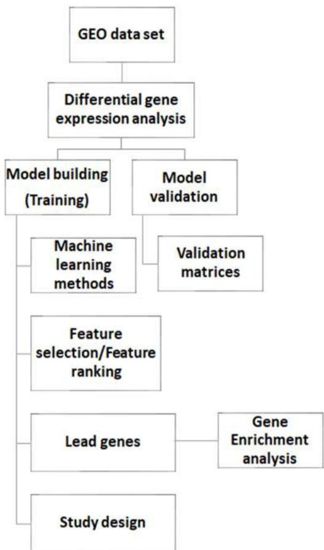  
Figure 1. A schematic representation of the biomarker identification workflow. Figure 1. A schematic representation of the biomarker identification workflow.

Differentially Expressed Genes (DEGs) Identified by GEO2R Differentially Expressed Genes (DEGs) Identified by GEO2R

GEO2R (http://www.ncbi.nlm.nih.gov/geo/geo2r, accessed on 5 January 2021), an GEO2R (http://www.ncbi.nlm.nih.gov/geo/geo2r, accessed on 5 January 2021), an online data analysis tool, was used to identify differentially expressed genes (DEGs) be-online data analysis tool, was used to identify differentially expressed genes (DEGs) between colon cancer patients and healthy controls. We used three GEO series, namely tween colon cancer patients and healthy controls. We used three GEO series, namely GSE20916, GSE44861, and GSE113513, and identified differential expressed genes. Genes GSE20916, GSE44861, and GSE113513, and identified differential expressed genes. Genes without a corresponding gene symbol and genes with more than one probe set were re-without a corresponding gene symbol and genes with more than one probe set were removed. Adjusted $p$ -values $\leq 0 . 0 0 0 1$ were considered statistically significant. Subsequently, the top 500 most statistically significant DEG genes from each dataset were selected for further analysis.

# 2.2. Machine Learning Algorithms and Predictive Analytics

Six different machine learning algorithms, namely, Adaboost [28], ExtraTrees [29], logistic regression [30,31], naïve Bayes (NB) classifier [32], random forest [33], and XG-Boost [34], were employed to develop models using the selected GEO datasets (GSE44861, GSE20916, and GSE113513). These datasets were employed to generate different combinations of training and test data to assess the derived models’ performance.

The python Scikit-learn libraries [35] were employed for the implementation of the different classifiers and feature selection methods.

# 2.2.1. Hyperparameter Optimization

We used the GridSearchCV [35] function to find the optimal values for each model hyperparameter. GridSearchCV is a function, available as part of the Scikit-learn’s library, that caters the looping through predefined hyperparameters and the fitting of the model on the training set. GridSearchCV uses all the combinations of the predefined parameter values and evaluates a model’s performance for each combination using cross-validation. The accuracy results obtained for every hyperparameter combination can then be used to identify the best-performing model.

# 2.2.2. Machine Learning Model Evaluation

The analysis was carried out using three different GEO datasets (GSE44861, GSE20916, and GSE113513) as training and testing data for performance comparison in a combinatorial way with six different machine learning models including logistic regression [36], naïve Bayes [37], random forest [38], ExtraTrees [39], Adaboost [40], and XGBoost [41]. Each model was evaluated with different evaluation metrics such as precision, recall [42], specificity, sensitivity [43], F1 score, AUROC [44], and accuracy.

We also included multiple validation strategies to validate the performance of the model. The most commonly used k-fold cross-validation technique was applied in our experimental work. In the $\mathbf { k }$ -fold (here, $\mathrm { k } = 5$ ) cross-validation technique, the dataset is randomly split into k subsets, whereby $\mathrm { \bf k } - 1$ subsets are used for training, and the remaining subset is used for testing; the is process repeated k times. In addition to this, we used resampling with the bootstrap method and leave-one-out cross-validation (LOOCV) in our experimental work for validation of the model performance. The model performance was evaluated for the mean value of performance metrics over 100 iterations. In the LOOCV method, the dataset is split into training data considering all data samples, excluding one data sample used as the test dataset. The model developed with training data finally measures the mean performance value for the repeated process. The experimental results in this method for different models are also provided in Supplementary Table S1.

# 2.2.3. Feature Selection

We performed feature selection using two methods, mean decrease in impurity (MDI) [45] and Boruta [46], for the selection of important genes. MDI or Gini importance [47] computes the total reduction in loss or impurity contributed by all splits for a given feature. This method evaluates the importance of a variable Xm for predicting Y by adding up the weighted impurity decreases p(t) ∆i(st,t) for all nodes t where Xm is used, averaged over all NT trees in the forest as shown in the equation below.

$$
\operatorname {I m p} \left(\mathrm {X} _ {\mathrm {m}}\right) = \frac {1}{\mathrm {N} _ {\mathrm {T}}} \sum_ {\mathrm {T}} \sum_ {\mathrm {t} \in \mathrm {T} _ {\mathrm {i v} \left(\mathrm {s} _ {\mathrm {t}}\right)} = \mathrm {X} _ {\mathrm {m}}} \mathrm {p} (\mathrm {t}) \Delta \mathrm {i} \left(\mathrm {s} _ {\mathrm {t}}, \mathrm {t}\right),
$$

where p(t) is the proportion Nt/N of samples reaching t, and v(st) is the variable used in split st. When using the Gini index as an impurity function, this measure is known as the Gini importance or mean decrease Gini. MDI is computationally very efficient and has been widely used in a variety of applications. Gini importance represents the total decrease in node impurity, i.e., how much the model fit or accuracy decreases when dropping a

variable. A larger decrease in node impurity results in a more significant variable. The top 15 genes across 10 iterations were selected with the MDI technique.

In addition to MDI, we also used Boruta which is a feature selection algorithm and works as a wrapper algorithm around random forest [48]. It attempts to capture all the important, interesting features from a dataset with respect to an outcome variable and can be used in combination with tree-based ensemble learning algorithms.

# 2.3. Gene Enrichment Analysis

Gene ontology (GO) enrichment analysis of DEGs was carried out using the FunRich (functional enrichment analysis tool) (http://www.funrich.org/, accessed on 25 January 2021). DEGs were classified according to the biological process and cellular component GO collections. Biological terms with an FDR $p { \cdot }$ -value lower than 0.05 were considered significantly enriched. Correction for multiple hypothesis testing was carried out by the Benjamini–Hochberg method.

# 2.3.1. Association of the Gene Markers with miRNA

We used the NetworkAnalyst (www.networkanalyst.ca, accessed on 28 January 2021) [49] tool and more specifically the gene–miRNA module that employs the miRTarBase v8 database to calculate the number of the connections or links for each gene, also termed degrees.

# 2.3.2. Sample Size Estimates for Future Validation Experiments

We then used PowerTools (https://joelarkman.shinyapps.io/PowerTools/, accessed on 10 February 2021) [50] to estimate the number of samples required for future experiments.

# 3. Results

# 3.1. Differential Expressed Genes (DEGs)

We identified the top 500 DEGS across each of the GEO datasets examined. For the GSE44861 dataset, 324 genes were found to be upregulated and 176 genes were downregulated, while, for the GSE20916 and the GSE113513 datasets, 171 and 223 genes were upregulated and 329 and 277 genes were downregulated, respectively. The identified differentially expressed genes and their respective $p { \cdot }$ -values, as well as the fold changes, are listed in Supplementary Table S2.

# Performance Evaluation

For each of the three GEO datasets examined, their respective DEGs were used as features across six different classification models, namely, Adaboost, ExtraTrees, logistic regression, naïve Bayes classifier, random forest, and XGBoost. The performance of these models was evaluated against different combination of training and test datasets.

The results of the different performance metrics for each classifier are presented in Supplementary Table S1. With GSE44861 as training data and GSE20916 as test data, the random forest model achieved better performance with an accuracy of $9 8 . 2 \%$ and $9 0 \%$ using the bootstrap and LOOCV methods, respectively. With GSE44861 as training and GSE113513 as testing data, the logistic regression model achieved an accuracy of $9 6 . 4 \%$ and $8 4 \%$ using bootstrap and LOOCV, respectively. When we used GSE20916 as training data and GSE44861 as testing data, the naïve Bayes classifier achieved an accuracy of $9 0 . 1 \%$ and $9 6 \%$ using bootstrap and LOOCV, respectively. With GSE20916 as training data and GSE113513 as testing data, logistic regression resulted in better performance. With GSE113513 as training and GSE44861 as testing data, the ExtraTree classifier model achieved better performance. With GSE113513 as training data and GSE20916 as testing data, none of the models achieved good performance.

A comparison of the accuracy and AUROC results for each model evaluations is presented in Figure 2. When using GSE44861 as training data and GSE20916 as test data, the random forest classifier achieved the best performance across all classifiers with an accuracy of $9 8 . 2 \%$ and an AUROC of $9 9 . 9 \%$ (Figure 2A). With GSE44861 as training data

and GSE113513 as test data, a logistic regression model achieved an accuracy ofracy of 98.2% and an AUROC of 99.9% (Figure 2A). With GSE44861 $9 6 . 4 \%$ anding d an AUROC of $9 9 \%$ (Figure 2B). When using GSE20916 as training data and GSE44861 asE113513 as test data, a logistic regression model achieved an accuracy of 96.4% test data, the naïve Bayes classifier exhibited the best performance with an accuracy ofAUROC of 99% (Figure 2B). When using GSE20916 as training data and GSE4486 $9 0 . 1 \%$ and AUROC ofdata, $9 0 \%$ , as shown in Figure 2C. Using GSE20916 as the training data andaïve Bayes classifier exhibited the best performance with an accuracy o GSE113513 as the test data, the logistic regression model achieved the best performanceand AUROC of 90%, as shown in Figure 2C. Using GSE20916 as the training d (Figure 2D). Lastly, with GSE113513 as the training data and GSE44861 as the test data, asGSE113513 as the test data, the logistic regression model achieved the best perfo well as with GSE113513 as the training data and GSE20916 as the test data, all classifiers achieved an accuracy of $5 0 \%$ to $5 1 \%$ and an AUROC of $5 0 \%$ to $5 1 \%$ , apart from logistic regression, which resulted in an AUROC of $9 9 \%$ (Figure 2E,F).

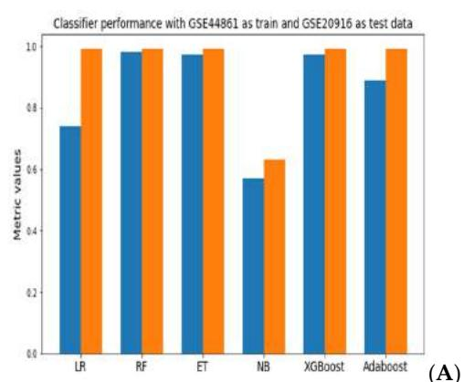

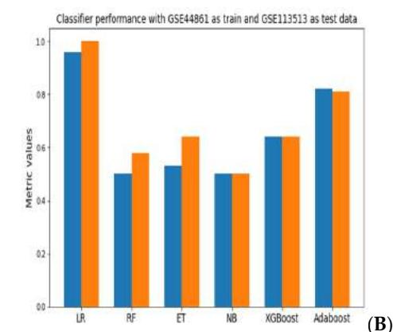

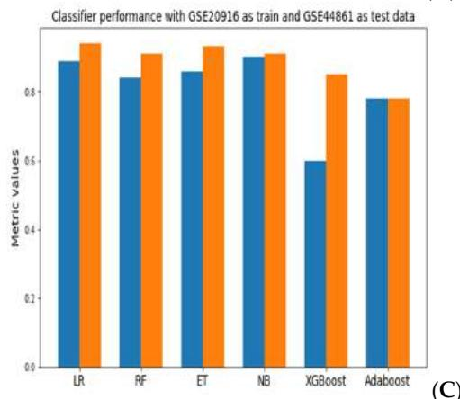

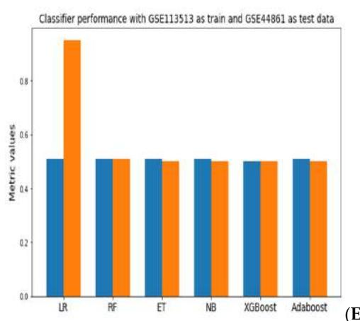

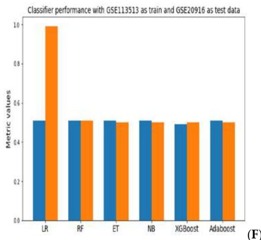  
Figure 2. A comparison of accuracy (blue) and AUROC (orange) values obtained across thFigure 2. A comparison of accuracy (blue) and AUROC (orange) values obtained across the different ent classifiers using combinations of the GEO datasets as training and test datasets. (A) Gclassifiers using combinations of the GEO datasets as training and test datasets. (A) GSE44861 ing) and GSE44861 (test); (D) GSE20916 (training) and GSE113513 (test); (E) GSE113513 (tr(training) and GSE20916 (test); (B) GSE44861 (training) and GSE20916 (test); (C) GSE20916 (training) and GSE44861 (test); (F) GSE113513 (training) and GSE20916 (test). and GSE44861 (test); (D) GSE20916 (training) and GSE113513 (test); (E) GSE113513 (training) and GSE44861 (test); (F) GSE113513 (training) and GSE20916 (test).

The AUROC plots for the models that had the best performance across the different training and test data combinations are presented in Figure 3. Across the three datasets tested, random forest and logistic regression achieved the best performance when we combined GSE44861 and GSE20916 datasets as training and test data. However, none of the classifiers assessed achieved a good performance using the GSE113513 dataset. The best performances of each classification model are represented as AUROC plots. Overall,W 8 of 16 the random forest models exhibited consistently better performance across all classification models tested.

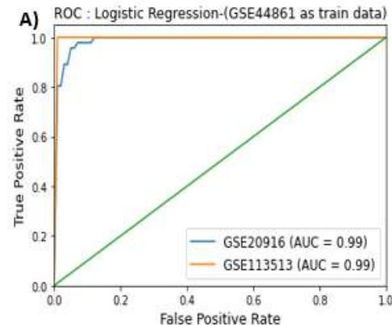

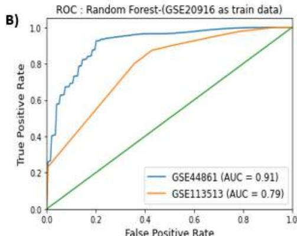

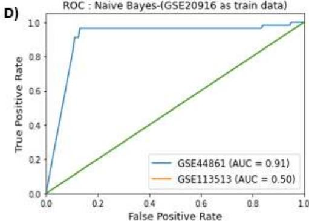

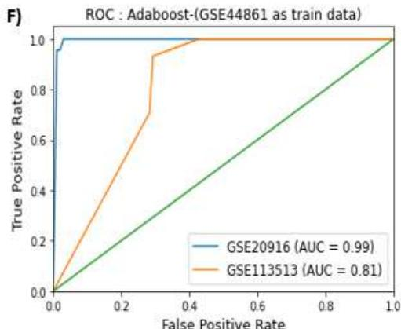  
Figure 3. ROC curves for the different classifiers. (A) Performance of logistic regression model with with GSE44861 as training and GSE20916, GSE113513 as test data; (B) performance of random GSE44861 as training and GSE20916, GSE113513 as test data; (B) performance of random forest model forest model with GSE20916 as training and GSE44861, GSE113513 as test data; (C) performance of with GSE20916 as training and GSE44861, GSE113513 as test data; (C) performance of ExtraTrees ExtraTrees model with GSE20916 as training and GSE44861, GSE113513 as test data; (D) perfor-model with GSE20916 as training and GSE44861, GSE113513 as test data; (D) performance of naïve mance of naïve Bayes model with GSE20916 as training and GSE44861, GSE113513 as test data; (E) Bayes model with GSE20916 as training and GSE44861, GSE113513 as test data; (E) performance of performance of XGBoost model with GSE44861 as training and GSE20916, GSE113513 as test data; XGBoost model with GSE44861 as training and GSE20916, GSE113513 as test data; (F) performance of (F) performance of Adaboost model with GSE44861 as training and GSE20916, GSEAdaboost model with GSE44861 as training and GSE20916, GSE113513 as test data.

# 3.2. Gene Selection

Random forest classification, on the basis of the performance previously reported, was applied in combination with MDI to select the top 15 genes with the highest importance score in 10 different iterations. We then identified the union of all the genes selected from all 10 iterations. Figure 4 shows the important genes selected using the mean decrease in impurity (MDI) technique in combination with the random forest classifier. Figure 4A depicts the important genes selected using the GSE44861 dataset, while Figure 4B presentsW 9 of 16 the important genes selected using the GSE20916 dataset.

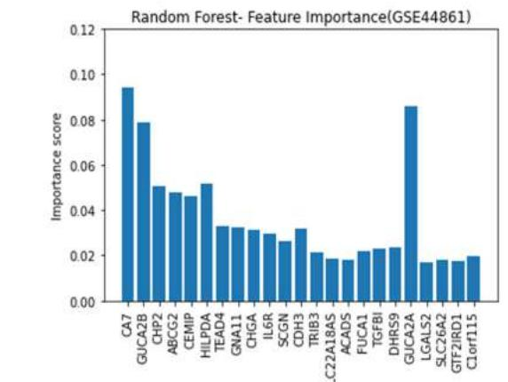  
(A)

  
(B)

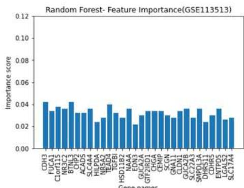

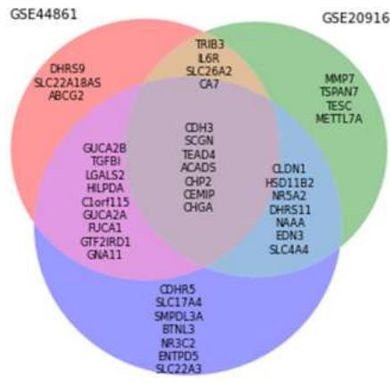  
  
Figure 4. Important genes selected using the mean decrease in impurity (MDI) technique in combi-Figure 4. Important genes selected using the mean decrease in impurity (MDI) technique in combination with random forest classifier. The $x$ -axis represents the gene names, and the $y .$ -axis represents importance score values across the GSE44861 (A), GSE20916 (B), and GSE113513 datasets (C). The common genes from all three datasets (D).

# Gene Ontology (GO) Enrichment AnalysisGene Ontology (GO) Enrichment Analysis

MDI in combination with the random forest classifier for feature selection resulted inMDI in combination with the random forest classifier for feature selection resulted the selection of 34 genes that were used for the pathway and gene set enrichment analysis.in the selection of 34 genes that were used for the pathway and gene set enrichment These genes were found to be associated with a number of molecular functions includinganalysis. These genes were found to be associated with a number of molecular functions cell adhesion molecule activity (CDH3 and CLDN), transporter activity (ABCG2,including cell adhesion molecule activity (CDH3 and CLDN), transporter activity (ABCG2, SLC22A18AS, and SLC26A2), catalytic activity (CA7, DHRS9, and HSD11B2) and oxidore-SLC22A18AS, and SLC26A2), catalytic activity (CA7, DHRS9, and HSD11B2) and oxidoreductase activity (ACADS and DHRS11). The pathways for which 34 genes were found toductase activity (ACADS and DHRS11). The pathways for which 34 genes were found to be enriched are presented in Figure 5A.be enriched are presented in Figure 5A.

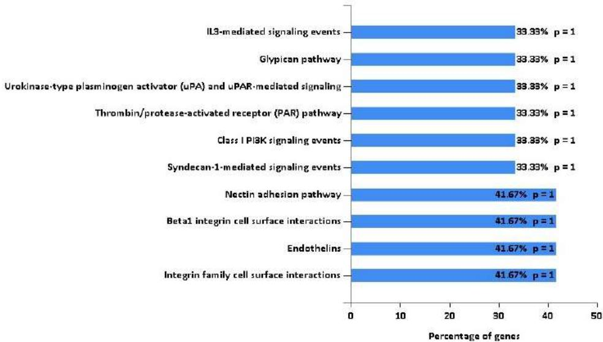  
(A)

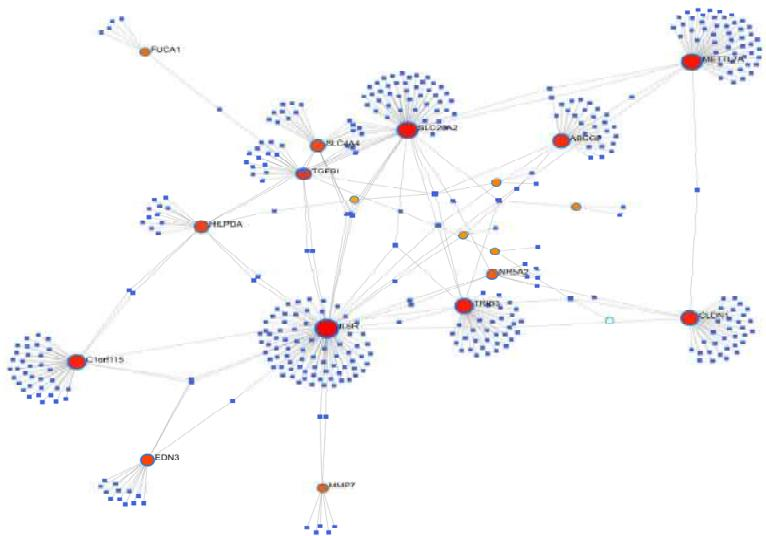

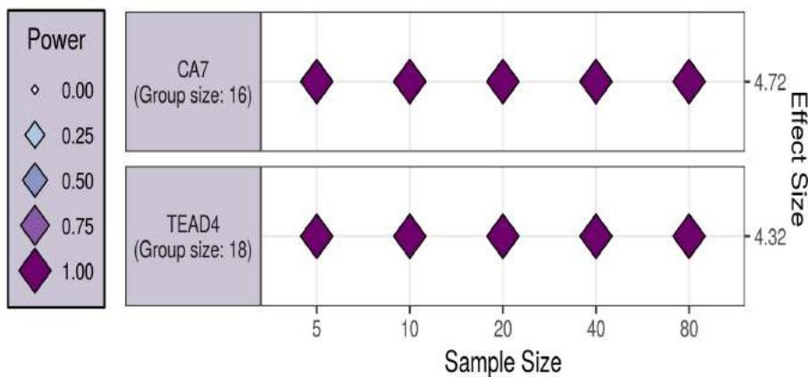  
(B)   
  
Figure 5. (A) Pathway enrichment analysis with the genes selected using the MDI method; (B) mFigure 5. (A) Pathway enrichment analysis with the genes selected using the MDI method; (B) mapping ping of the 19 most interacting genes out of 34 genes with miRNAs and their interconnections;of the 19 most interacting genes out of 34 genes with miRNAs and their interconnections; (C) the two the two clusters of genes with representative genes CA7 and TEAD4 for the GSE44861 are visualclusters of genes with representative genes CA7 and TEAD4 for the GSE44861 are visualized by the largest effect size. The effect size of each assessed variable is shown along the $y$ -axis, with a series of sample sizes along the $x$ -axis.

# 3.3. Associating Selected Genes with miRNA Using NetworkAnalyst

We mapped the 34 identified genes using the NetworkAnalyst tool and found that 19 genes out of 34 genes formed hub genes (Figure 5B). For example, IL6R had the highest number of miRNA interactions (degree, 94). A list of the identified genes and their miRNA associations is provided in the Supplementary Table S3.

Lastly, we also performed a power analysis over the GSE44861 dataset. For this purpose, we used the 34 genes that were identified and ranked by the random forest algorithm. We then applied hierarchical clustering over these 34 genes and identified two clusters. We selected the genes that presented the highest correlation across normal vs. cancer samples.

CA7 and TEAD4 were selected as representative genes across the two clusters as they had the highest correlation with the normal vs. CRC samples (i.e., lowest $p$ -values). For both clusters of genes including CA7 and TEAD4, we estimated $N = 5$ samples, required for both control and CRC samples. Figure 5C represents the number of the estimated samples required for genes from each cluster.

# 4. Discussion

The three GEO datasets used in our experimental work with six different machine learning methods were validated across different combinations of training and test datasets. The performance of each model was reported and compared using a number of performance metrics, such as accuracy, sensitivity, specificity, AUC, etc. The random forest method showed the best performance against the GSE44861 and GSE20916 datasets when used as a combination of training and test data. It was less prone to overfitting when compared to the other methods used. This method has also been applied successfully in other diseases such as NAFLD [51], obesity [52], and IBD [53]; therefore, we applied the random forest method to select the important features from these two datasets.

The GSE113513 dataset had a lower number of samples or observations compared to the GSE44861 and GSE20916 datasets, which resulted in lower performance compared to the other datasets, thus indicating an overfitting problem. We used multiple approaches to protect against the overfitting problem, such as the widely used fivefold cross-validation, LOOCV, and bootstrapping. Compared with k-fold cross validation and LOOCV, the bootstrap method could use the entire sample in model development and validation, thus helping to estimate optimism and measure overfitting. The optimism-corrected estimated performance by the bootstrap method is relatively stable because it uses the full sample size and the bootstrap samples vary in composition [54]. We incorporated 100 iterations with the bootstrap method for the experimental work, and each of these evaluation metrics were averaged over these 100 iterations. Datasets GSE44861 and GSE20961 were observed to perform better, and the random forest method was chosen for the feature selection process.

The gene ontology enrichment analysis identified several genes and their associated pathways, most notably, cell adhesion molecule activity, transporter activity, catalytic activity, and oxidoreductase activity. CDH3, a gene encoding P-cadherin that forms a major component of the adherens junctions that are essential for cell adhesion, has been identified as being upregulated in CRC in multiple studies and as a diagnostic or prognostic marker [55,56]. Conversely, CLDN, encoding for the claudin protein forming tight junctions, has been found to be a potential diagnostic marker with downregulation in CRC patients [56,57]. Furthermore, previous research has postulated that the HDS11B2 gene, involved in catalytic activity pathways, plays a vital role in migration, invasion, and metastasis of CRC [58]. Other genes identified to be involved in catalytic activity (CA7 and DHRS9) have been found to be downregulated in CRC cells, and have been proposed as promising diagnostic and/or prognostic markers [59,60]. Genes associated with transporter activity have also been identified in existing studies. Of particular note is the upregulation of the ABCG2 gene, which has been postulated to play a protective role against oxidative stress through cell signaling pathways, which may explain why it has been found to be upregulated in CRC [61–63]. Similarly, genes involved in oxidoreductase activity (ACADS and DHRS11) have been found

to be downregulated in previous studies [64,65]. These genes are involved in fatty-acid metabolism and energy production within mitochondria; thus, their downregulation may partially explain the changes in metabolism often observed in cancer cells [66]. Many of the identified genes have been previously associated with colon cancer via miRNA interactions. Multiple studies, including Bian et al., Hua et al., and Xu et al., have reported that serum IL-6 may be a potential biomarker for CRC diagnosis and a miR-34a target [67]. IL6R has also been implicated in other cancer types, including prostate cancer [68]. Another gene, SLC4A4, was found to be significantly correlated with shorter survival of CRC patients and a marker of poorer progression for patients with breast cancer, lung cancer, gastric cancer, and ovarian cancer. This suggests a potential role of SLC4A4 in tumor suppression, as well as in prognostic prediction in multiple malignancies, including CRC, thus representing a potential novel therapeutic CRC target [69]. Yang et al. (2019) [70] identified a similar SLC4A4 expression association and proposed the expression of six further genes, namely, SGCG, CLDN23, CCDC78, SLC17A7, OTOP3, and SMPDL3A, as novel colon cancer prognostic biomarkers. Zhang et al. (2020) [71] reported that hsa_circRNA_001587 upregulates SLC4A4 expression to inhibit migration, invasion, and angiogenesis of pancreatic cancer cells via binding to microRNA-223. Furthermore, Mencia et al. (2011) reported miR-224 to be one of the most differentially expressed miRNAs associated with SLC4A4 [72]. Andersen et al. (2015) [73] reported changes in gene expression levels (high ABCC2 and low ABCG2) as early events in the colon adenoma–carcinoma sequence. Moreover, miR-132 has been reported to regulate the SIRT1/CREB/ABCG2 signaling pathway, contributing to cisplatin resistance and serving as a novel therapeutic target against gastric cancer [74]. Cherradi et al. found CLDN1 to be significantly overexpressed $( p < 0 . 0 0 1 )$ ) in CRC samples, and they proposed it as a new potential therapeutic target of miR-7-2 [75]. Lastly, Miwa et al. (2011) [76] reported CLDN1 as a target of TCF/LEF signaling, while Singh et al. (2011) [77] suggested the involvement of CLDN1 in the regulation of the WNT signaling pathway.

Our approach utilized a limited number of public datasets, and the potential causal relationships identified necessitate experimental validation. We did not consider the effect of multiple factors, such as age, gender, ethnicity, and tumor grade and stage, on gene expression patterns since we focused only on genes that have been previously reported as having significant variation between control and cancer samples. In the context of translational medicine [78], further research is required to investigate the selected prognostic/diagnostic signature’s clinical utility in predicting clinical outcomes in various tumor types.

In CRC diagnostics, colonoscopy is the current gold-standard screening method. However, this approach has some limitations that include internal hemorrhage, colonic perforation, and cardiorespiratory problems [79].

Another approach is the guaiac fecal occult blood test (gFOBT) [80], which detects hemoglobin peroxidase activity in the feces, and it is the most often used noninvasive screening procedure. Although FOBT is a simple and inexpensive way to screen for CRC, it has a high percentage of false positives and false negatives.

As a result, alternative CRC screening approaches that are cost-effective, noninvasive, easily quantifiable, and accurate are urgently needed. Thus, gene signature-based biomarkers in the clinical applications in CRC are required for early cancer detection, prognostic stratification, and surveillance [80]. Genes identified in this study will need to go through targeted validation experiments using qPCR. A new trial needs to be set up to replicate the gene signature’s effect. This step will ensure the clinical efficacy of those markers identified and will allow a better clinical decision on CRC [81].

# 5. Conclusions

This study aimed to identify novel genes associations with CRC that can potentially be used as diagnostic markers in translational research. To achieve this, we applied a predictive analytics approach that employed a variety of machine learning methods. In addition, we estimated the required number of samples for future validation experiments.

Supplementary Materials: The following supporting information can be downloaded at https: //www.mdpi.com/article/10.3390/biology11030365/s1: Table S1. The experimental results from different models and performance comparison of all methods across training and test datasets; Table S2. List of identified differentially expressed genes and their respective $p$ -values, and the fold changes; Table S3. A list of the identified genes and their miRNA associations.

Author Contributions: S.K. and A.A. performed the machine learning analysis; A.A. conceptualized and designed the data analytics strategy; S.K., A.B., K.N., G.V.G. and A.A. wrote the first draft; A.B., G.V.G. and A.A. supervised the project; K.N. provided clinical interpretation of the results. All authors co-wrote, edited, and reviewed the manuscript. All authors have read and agreed to the published version of the manuscript.

Funding: The authors acknowledge support from the Ministry of Electronics and Information Technology (MeitY), Government of India, as well as from the NIHR Birmingham ECMC, NIHR Birmingham SRMRC, Nanocommons H2020-EU (731032), NIHR Birmingham Biomedical Research Center, MRC Health Data Research UK (HDRUK/CFC/01), an initiative funded by UK Research and Innovation, Department of Health and Social Care (England) and the devolved administrations, and leading medical research charities. The views expressed in this publication are those of the authors and not necessarily those of the NHS, the National Institute for Health Research, the Medical Research Council, or the Department of Health.

Institutional Review Board Statement: Not applicable.

Informed Consent Statement: This study did not involve an animal and/or human tissue/individual data/participants; thus, there were no ethics-related issues. No permission was required to use any repository data involved in the present study.

Data Availability Statement: Availability of data and materials: GEO datasets used in this study can be obtained from the GEO database (https://www.ncbi.nlm.nih.gov/geo/, accessed on 5 January 2021).

Conflicts of Interest: The authors declare no conflict of interest.

# Abbreviations

AUROC Area under the receiver operating characteristic curve

CRC Colon cancer

DEGs Differential expressed genes

GEO Gene Expression Omnibus

GO Gene ontology

miRNA microRNA

MDI Mean decrease in impurity

RF Random forest

# References

1. Siegel, R.; DeSantis, C.; Jemal, A. Colorectal cancer statistics, 2014. CA A Cancer J. Clin. 2014, 64, 104–117. [CrossRef] [PubMed]   
2. Worldwide incidence and mortality of colorectal cancer and human development index (HDI): An ecological study. WCRJ 2019, 6, 1433.   
3. Rawla, P.; Sunkara, T.; Barsouk, A. Epidemiology of colorectal cancer: Incidence, mortality, survival, and risk factors. Prz. Gastroenterol. 2019, 14, 89–103. [CrossRef] [PubMed]   
4. Bogaert, J.; Prenen, H. Molecular genetics of colorectal cancer. Ann. Gastroenterol. 2014, 27, 9–14.   
5. Torre, L.A.; Siegel, R.L.; Ward, E.M.; Jemal, A. Global Cancer Incidence and Mortality Rates and Trends—An Update. Cancer Epidemiol. Biomark. Prev. 2016, 25, 16–27. [CrossRef]   
6. Stefano, G.B.; Mantione, K.J.; Kream, R.M.; Kuzelova, H.; Ptacek, R.; Raboch, J.; Samuel, J.M. Comparing Bioinformatic Gene Expression Profiling Methods: Microarray and RNA-Seq. Med. Sci. Monit. Basic Res. 2014, 20, 138–142. [CrossRef]   
7. Metzker, M.L. Sequencing technologies—The next generation. Nat. Rev. Genet. 2010, 11, 31–46. [CrossRef]   
8. Kim, H.-Y.; Lee, S.-G.; Oh, T.-J.; Lim, S.R.; Kim, S.-H.; Lee, H.J.; Kim, Y.-S.; Choi, H.-K. Antiproliferative and Apoptotic Activity of Chamaecyparis obtusa Leaf Extract against the HCT116 Human Colorectal Cancer Cell Line and Investigation of the Bioactive Compound by Gas Chromatography-Mass Spectrometry-Based Metabolomics. Molecules 2015, 20, 18066–18082. [CrossRef]   
9. Dalal, N.; Jalandra, R.; Sharma, M.; Prakash, H.; Makharia, G.K.; Solanki, P.R.; Singh, R.; Kumar, A. Omics technologies for improved diagnosis and treatment of colorectal cancer: Technical advancement and major perspectives. Biomed. Pharmacother. 2020, 131, 110648. [CrossRef]

10. Chen, M.; Yang, X.; Yang, M.; Zhang, W.; Li, L.; Sun, Q. Identification of a novel biomarker-CCL5 using antibody microarray for colorectal cancer. Pathol. Res. Pract. 2019, 215, 1033–1037. [CrossRef]   
11. Wei, F.-Z.; Mei, S.-W.; Wang, Z.-J.; Chen, J.-N.; Shen, H.-Y.; Zhao, F.-Q.; Li, J.; Liu, Z.; Liu, Q. Differential Expression Analysis Revealing CLCA1 to Be a Prognostic and Diagnostic Biomarker for Colorectal Cancer. Front. Oncol. 2020, 10, 573295. [CrossRef] [PubMed]   
12. Li, J.; Wang, Y.; Wang, X.; Yang, Q. CDK1 and CDC20 overexpression in patients with colorectal cancer are associated with poor prognosis: Evidence from integrated bioinformatics analysis. World J. Surg. Oncol. 2020, 18, 1–11. [CrossRef] [PubMed]   
13. Gonzalez-Pons, M.; Cruz-Correa, M. Colorectal Cancer Biomarkers: Where Are We Now? BioMed. Res. Int. 2015, 2015, 1–14. [CrossRef] [PubMed]   
14. Lin, S.-R.; Huang, M.-Y.; Chang, H.-J. Molecular Detection of Circulating Tumor Cells With Multiple mRNA Markers by Genechip for Colorectal Cancer Early Diagnosis and Prognosis Prediction. Genom. Med. Biomark. Health Sci. 2011, 3, 9–16. [CrossRef]   
15. Dasí, F.; Lledó, S.; García-Granero, E.; Ripoll, R.; Marugán, M.; Tormo, M.; García-Conde, J.; Aliño, S.F. Real-time quantification in plasma of human telomerase reverse transcriptase (hTERT) mRNA: A simple blood test to monitor disease in cancer patients. Lab. Investig. 2001, 81, 767–769. [CrossRef] [PubMed]   
16. Schiedeck, T.H.K.; Wellm, C.; Roblick, U.J.; Broll, R.; Bruch, H.-P. Diagnosis and Monitoring of Colorectal Cancer by L6 Blood Serum Polymerase Chain Reaction Is Superior to Carcinoembryonic Antigen-Enzyme-Linked Immunosorbent Assay. Dis. Colon Rectum 2003, 46, 818–825. [CrossRef]   
17. Liu, X.; Bing, Z.; Wu, J.; Zhang, J.; Zhou, W.; Ni, M.; Meng, Z.; Liu, S.; Tian, J.; Zhang, X.; et al. Integrative Gene Expression Profiling Analysis to Investigate Potential Prognostic Biomarkers for Colorectal Cancer. Med. Sci. Monit. 2020, 26, e918906. [CrossRef]   
18. Torres, S.; Bartolome, R.A.; Mendes, M.; Barderas, R.; Fernández-Aceñerp, M.J.; Peláez-García, A.; Peña, C.; Lopez-Lucendo, M.; Villar-Vázquez, R.; De Herreros, A.G.; et al. Proteome Profiling of Cancer-Associated Fibroblasts Identifies Novel Proinflammatory Signatures and Prognostic Markers for Colorectal Cancer. Clin. Cancer Res. 2013, 19, 6006–6019. [CrossRef]   
19. Kim, E.R.; Kwon, H.N.; Nam, H.; Kim, J.J.; Park, S.; Kim, Y.-H. Urine-NMR metabolomics for screening of advanced colorectal adenoma and early stage colorectal cancer. Sci. Rep. 2019, 9, 1–10. [CrossRef]   
20. Schirripa, M.; Lenz, H.-J. Biomarker in Colorectal Cancer. Cancer J. 2016, 22, 156–164. [CrossRef]   
21. Shi, K.; Lin, W.; Zhao, X.-M. Identifying Molecular Biomarkers for Diseases with Machine Learning Based on Integrative Omics. IEEE/ACM Trans. Comput. Biol. Bioinform. 2020, 18, 2514–2525. [CrossRef] [PubMed]   
22. Wang, R.; Wang, M.-J.; Ping, J. Clinicopathological Features and Survival Outcomes of Colorectal Cancer in Young Versus Elderly: A Population-Based Cohort Study of SEER 9 Registries Data (1988–2011). Medicine 2015, 94, e1402. [CrossRef] [PubMed]   
23. Mangone, L.; Pinto, C.; Mancuso, P.; Ottone, M.; Bisceglia, I.; Chiaranda, G.; Michiara, M.; Vicentini, M.; Carrozzi, G.; Ferretti, S.; et al. Colon cancer survival differs from right side to left side and lymph node harvest number matter. BMC Public Health 2021, 21, 1–10. [CrossRef]   
24. Edgar, R.; Domrachev, M.; Lash, A.E. Gene Expression Omnibus: NCBI gene expression and hybridization array data repository. Nucleic Acids Res. 2002, 30, 207–210. [CrossRef] [PubMed]   
25. Ryan, B.M.; Zanetti, K.A.; Robles, A.; Schetter, A.J.; Goodman, J.; Hayes, R.; Huang, W.-Y.; Gunter, M.J.; Yeager, M.; Burdette, L.; et al. Germline variation inNCF4, an innate immunity gene, is associated with an increased risk of colorectal cancer. Int. J. Cancer 2014, 134, 1399–1407. [CrossRef]   
26. Skrzypczak, M.; Goryca, K.; Rubel, T.; Paziewska, A.; Mikula, M.; Jarosz, D.; Pachlewski, J.; Oledzki, J.; Ostrowsk, J. Modeling oncogenic signaling in colon tumors by multidirectional analyses of microarray data directed for maximization of analytical reliability. PLoS ONE 2010, 5, e13091. [CrossRef]   
27. Barrett, T.; Wilhite, S.E.; Ledoux, P.; Evangelista, C.; Kim, I.F.; Tomashevsky, M.; Marshall, K.A.; Phillippy, K.H.; Sherman, P.M.; Holko, M.; et al. NCBI GEO: Archive for functional genomics data sets—Update. Nucleic Acids Res. 2013, 41, D991–D9955. [CrossRef]   
28. Friedman, J.; Hastie, T.; Tibshirani, R. Additive logistic regression: A statistical view of boosting. Ann. Stat. 2000, 28, 337–407. [CrossRef]   
29. Huynh-Thu, V.A.; Irrthum, A.; Wehenkel, L.; Geurts, P. Inferring Regulatory Networks from Expression Data Using Tree-Based Methods. PLoS ONE 2010, 5, e12776. [CrossRef]   
30. Yuan, Z.; Ghosh, D. Combining Multiple Biomarker Models in Logistic Regression. Biometrics 2008, 64, 431–439. [CrossRef]   
31. Tolles, J.; Meurer, W.J. Logistic Regression: Relating Patient Characteristics to Outcomes. JAMA 2016, 316, 533–534. [CrossRef] [PubMed]   
32. Sambo, F.; Trifoglio, E.; Di Camillo, B.; Toffolo, G.M.; Cobelli, C. Bag of Naïve Bayes: Biomarker selection and classification from genome-wide SNP data. BMC Bioinform. 2012, 13, S2. [CrossRef] [PubMed]   
33. Chen, X.; Ishwaran, H. Random forests for genomic data analysis. Genomics 2012, 99, 323–329. [CrossRef] [PubMed]   
34. Li, W.; Yin, Y.; Quan, X.; Zhang, H. Gene Expression Value Prediction Based on XGBoost Algorithm. Front. Genet. 2019, 10, 1077. [CrossRef] [PubMed]   
35. Pedregosa, F.; Varoquaux, G.; Gramfort, A.; Michel, V.; Thirion, B.; Grisel, O.; Blondel, M.; Prettenhofer, P.; Weiss, R.; Dubourg, V.; et al. Scikit-learn: Machine Learning in Python. J. Mach. Learn. Res. 2011, 12, 2825–2830.

36. Dreiseitl, S.; Ohno-Machado, L. Logistic regression and artificial neural network classification models: A methodology review. J. Biomed. Inform. 2002, 35, 352–359. [CrossRef]   
37. Bauer, E.; Kohavi, R. An Empirical Comparison of Voting Classification Algorithms: Bagging, Boosting, and Variants. Mach. Learn. 1999, 36, 105–139. [CrossRef]   
38. Breiman, L. Random Forests. Mach. Learn. 2001, 45, 5–32. [CrossRef]   
39. Geurts, P.; Maree, R.; Wehenkel, L. Extremely Randomized Trees and Random Subwindows for Image Classification, Annotation, and Retrieval. Mach. Learn. 2013, 63, 3–42. [CrossRef]   
40. Schapire, R.E. Explaining AdaBoost. In Empirical Inference; Springer: Berlin/Heidelberg, Germany, 2013; pp. 37–52.   
41. Chen, T.; Guestrin, C. Xgboost: A scalable tree boosting system. In Proceedings of the 22nd ACM SIGKDD International Conference on Knowledge Discovery and Data Mining; KDD ’16, San Francisco, CA, USA, 13–17 August 2016; pp. 785–794.   
42. Davis, J.; Goadrich, M. The Relationship Between Precision-Recall and ROC Curves. In Proceedings of the 23rd International Conference on Machine Learning; Association for Computing Machinery: New York, NY, USA, 2006; pp. 233–240.   
43. Hand, D.J. Assessing the Performance of Classification Methods. Int. Stat. Rev. 2012, 80, 400–414. [CrossRef]   
44. Sokolova, M.; Japkowicz, N.; Szpakowicz, S. Beyond Accuracy, F-Score and ROC: A Family of Discriminant Measures for Performance Evaluation. In AI 2006: Advances in Artificial Intelligence; Lecture Notes in Computer Science; Sattar, A., Kang, B., Eds.; Springer: Berlin/Heidelberg, Germany, 2006; Volume 4304, pp. 1015–1021, ISBN 978-3-540-49787-5.   
45. Gilles, L.; Wehenkel, L.; Sutera, A.; Geurts, P. Understanding variable importances in forests of randomized trees. In Proceedings of the Twenty-Seventh Conference on Neural Information Processing Systems—NIPS, Lake Tahoe, CA, USA, 5–10 December 2013.   
46. Kursa, M.B.; Jankowski, A.; Rudnicki, W.R. Boruta—A System for Feature Selection. Fundam. Inform. 2010, 101, 271–285. [CrossRef]   
47. Sandri, M.; Zuccolotto, P. A Bias Correction Algorithm for the Gini Variable Importance Measure in Classification Trees. J. Comput. Graph. Stat. 2008, 17, 611–628. [CrossRef]   
48. Chen, R.-C.; Dewi, C.; Huang, S.-W.; Caraka, R.E. Selecting critical features for data classification based on machine learning methods. J. Big Data 2020, 7, 1–26. [CrossRef]   
49. Zhou, G.; Soufan, O.; Ewald, J.; Hancock, R.E.W.; Basu, N.; Xia, J. NetworkAnalyst 3.0: A visual analytics platform for comprehensive gene expression profiling and meta-analysis. Nucleic Acids Res. 2019, 47, W234–W241. [CrossRef]   
50. Acharjee, A.; Larkman, J.; Xu, Y.; Cardoso, V.R.; Gkoutos, G.V. A random forest based biomarker discovery and power analysis framework for diagnostics research. BMC Med. Genom. 2020, 13, 1–14. [CrossRef]   
51. Shafiha, R.; Bahcivanci, B.; Gkoutos, G.V.; Acharjee, A. Machine Learning-Based Identification of Potentially Novel Non-Alcoholic Fatty Liver Disease Biomarkers. Biomedicines 2021, 9, 1636. [CrossRef]   
52. Acharjee, A.; Ament, Z.; West, J.A.; Stanley, E.; Griffin, J.L. Integration of metabolomics, lipidomics and clinical data using a machine learning method. BMC Bioinform. 2016, 17 (Suppl. S15), 440. [CrossRef]   
53. Quraishi, M.N.; Acharjee, A.; Beggs, A.D.; Horniblow, R.; Tselepis, C.; Gkoutos, G.; Ghosh, S.; Rossiter, A.E.; Loman, N.; van Schaik, W.; et al. A Pilot Integrative Analysis of Colonic Gene Expression, Gut Microbiota, and Immune Infiltration in Primary Sclerosing Cholangitis-Inflammatory Bowel Disease: Association of Disease With Bile Acid Pathways. J. Crohn’s Colitis 2020, 14, 935–947. [CrossRef]   
54. Frank, H. Regression Modeling Strategies: With Applications to Linear Models, Logistic Regression, and Survival Analysis, 2nd ed.; Springer: New York, NY, USA, 2015.   
55. Kumara, H.S.; Bellini, G.A.; Caballero, O.L.; Herath, S.A.; Su, T.; Ahmed, A.; Njoh, L.; Cekic, V.; Whelan, R.L. P-Cadherin (CDH3) is overexpressed in colorectal tumors and has potential as a serum marker for colorectal cancer monitoring. Oncoscience 2017, 4, 139–147. [CrossRef]   
56. Xu, Y.; Zhao, J.; Dai, X.; Xie, Y.; Dong, M. High expression of CDH3 predicts a good prognosis for colon adenocarcinoma patients. Exp. Ther. Med. 2019, 18, 841–847. [CrossRef]   
57. Hahn-Strömberg, V.; Askari, S.; Ahmad, A.; Befekadu, R.; Nilsson, T.K. Expression of claudin 1, claudin 4, and claudin 7 in colorectal cancer and its relation with CLDN DNA methylation patterns. Tumor Biol. 2017, 39, 1010428317697569. [CrossRef] [PubMed]   
58. Chen, J.; Liu, Q.-M.; Du, P.-C.; Ning, D.; Mo, J.; Zhu, H.-D.; Wang, C.; Ge, Q.-Y.; Cheng, Q.; Zhang, X.-W.; et al. Type-2 $1 1 \beta$ -hydroxysteroid dehydrogenase promotes the metastasis of colorectal cancer via the Fgfbp1-AKT pathway. Am. J. Cancer Res. 2020, 10, 662–673. [PubMed]   
59. Yang, G.-Z.; Hu, L.; Cai, J.; Chen, H.-Y.; Zhang, Y.; Feng, D.; Qi, C.-Y.; Zhai, Y.-X.; Gong, H.; Fu, H.; et al. Prognostic value of carbonic anhydrase VII expression in colorectal carcinoma. BMC Cancer 2015, 15, 209. [CrossRef] [PubMed]   
60. Hu, L.; Chen, H.-Y.; Han, T.; Yang, G.-Z.; Feng, D.; Qi, C.-Y.; Gong, H.; Zhai, Y.-X.; Cai, Q.-P.; Gao, C.-F. Downregulation of DHRS9 expression in colorectal cancer tissues and its prognostic significance. Tumor Biol. 2015, 37, 837–845. [CrossRef] [PubMed]   
61. Nie, S.; Huang, Y.; Shi, M.; Qian, X.; Li, H.; Peng, C.; Kong, B.; Zou, X.; Shen, S. Protective role of ABCG2 against oxidative stress in colorectal cancer and its potential underlying mechanism. Oncol. Rep. 2018, 40, 2137–2146. [CrossRef] [PubMed]   
62. Expression of ABCG2 and its Significance in Colorectal Cancer. Asian Pac. J. Cancer Prev. 2010, 11, 845–848.   
63. Tuy, H.D.; Shiomi, H.; Mukaisho, K.I.; Naka, S.; Shimizu, T.; Sonoda, H.; Mekata, E.; Endo, Y.; Kurumi, Y.; Sugihara, H.; et al. ABCG2 expression in colorectal adenocarcinomas may predict resistance to irinotecan. Oncol. Lett. 2016, 12, 2752–2760. [CrossRef]

64. Yang, W.; Ma, J.; Zhou, W.; Li, Z.; Zhou, X.; Cao, B.; Zhang, Y.; Liu, J.; Yang, Z.; Zhang, H.; et al. Identification of hub genes and outcome in colon cancer based on bioinformatics analysis. Cancer Manag. Res. 2018, 11, 323–338. [CrossRef]   
65. Pira, G.; Uva, P.; Scanu, A.M.; Rocca, P.C.; Murgia, L.; Uleri, E.; Piu, C.; Porcu, A.; Carru, C.; Manca, A.; et al. Landscape of transcriptome variations uncovering known and novel driver events in colorectal carcinoma. Sci. Rep. 2020, 10, 1–12. [CrossRef]   
66. Coller, H.A. Is Cancer a Metabolic Disease? Am. J. Pathol. 2014, 184, 4–17. [CrossRef]   
67. Li, H.; Rokavec, M.; Hermeking, H. Soluble IL6R represents a miR-34a target: Potential implications for the recently identified IL-6R/STAT3/miR-34a feed-back loop. Oncotarget 2015, 6, 14026–14032. [CrossRef] [PubMed]   
68. Vainer, N.; Dehlendorff, C.; Johansen, J.S. Systematic literature review of IL-6 as a biomarker or treatment target in patients with gastric, bile duct, pancreatic and colorectal cancer. Oncotarget 2018, 9, 29820–29841. [CrossRef] [PubMed]   
69. Dai, G.; Wang, L.; Wen, Y.; Ren, X.; Zuo, S. Identification of key genes for predicting colorectal cancer prognosis by integrated bioinformatics analysis. Oncol. Lett. 2019, 19, 388–398. [CrossRef]   
70. Yang, H.; Liu, H.; Lin, H.-C.; Gan, D.; Jin, W.; Cui, C.; Yan, Y.; Qian, Y.; Han, C.; Wang, Z. Association of a novel seven-gene expression signature with the disease prognosis in colon cancer patients. Aging 2019, 11, 8710–8727. [CrossRef] [PubMed]   
71. Zhang, X.; Tan, P.; Zhuang, Y.; Du, L. hsa_circRNA_001587 upregulates SLC4A4 expression to inhibit migration, invasion, and angiogenesis of pancreatic cancer cells via binding to microRNA-223. Am. J. Physiol. Liver Physiol. 2020, 319, G703–G717. [CrossRef] [PubMed]   
72. Mencia, N.; Selga, E.; Noe, V.; Ciudad, C.J. Underexpression of miR-224 in methotrexate resistant human colon cancer cells. Biochem. Pharmacol. 2011, 82, 1572–1582. [CrossRef]   
73. Andersen, V.; Vogel, L.K.; Kopp, T.I.; Sæbø, M.; Nonboe, A.W.; Hamfjord, J.; Kure, E.H.; Vogel, U. High ABCC2 and Low ABCG2 Gene Expression Are Early Events in the Colorectal Adenoma-Carcinoma Sequence. PLoS ONE 2015, 10, e0119255. [CrossRef]   
74. Zhang, L.; Guo, X.; Zhang, D.; Fan, Y.; Qin, L.; Dong, S. Upregulated miR-132 in Lgr5+gastric cancer stem cell-like cells contributes to cisplatin-resistance via SIRT1/CREB/ABCG2 signaling pathway. Mol. Carcinog. 2017, 56, 2022–2034. [CrossRef]   
75. Cherradi, S.; Ayrolles-Torro, A.; Vezzo-Vié, N.; Gueguinou, N.; Denis, V.; Combes, E.; Boissière, F.; Busson, M.; Canterel-Thouennon, L.; Mollevi, C.; et al. Antibody targeting of claudin-1 as a potential colorectal cancer therapy. J. Exp. Clin. Cancer Res. 2017, 36, 89. [CrossRef]   
76. Miwa, N.; Furuse, M.; Tsukita, S.; Niikawa, N.; Nakamura, Y.; Furukawa, Y. Involvement of claudin-1 in the beta-catenin/Tcf signaling pathway and its frequent upregulation in human colorectal cancers. Oncol. Res. 2001, 12, 469–476. [CrossRef]   
77. Singh, A.B.; Sharma, A.; Smith, J.J.; Krishnan, M.; Chen, X.; Eschrich, S.; Washington, M.K.; Yeatman, T.J.; Beauchamp, R.D.; Dhawan, P. Claudin-1 Up-regulates the Repressor ZEB-1 to Inhibit E-Cadherin Expression in Colon Cancer Cells. Gastroenterology 2011, 141, 2140–2153. [CrossRef]   
78. Bravo-Merodio, L.; Acharjee, A.; Russ, D.; Bisht, V.; Williams, J.A.; Tsaprouni, L.G.; Gkoutos, G.V. Translational biomarkers in the era of precision medicine. Int. Rev. Cytol. 2021, 102, 191–232. [CrossRef]   
79. Bailey, J.R.; Aggarwal, A.; Imperiale, T.F. Colorectal Cancer Screening: Stool DNA and Other Noninvasive Modalities. Gut Liver 2016, 10, 204–211. [CrossRef] [PubMed]   
80. de Wit, M.; Fijneman, R.J.; Verheul, H.M.; Meijer, G.A.; Jimenez, C.R. Proteomics in colorectal cancer translational research: Biomarker discovery for clinical applications. Clin. Biochem. 2013, 46, 466–479. [CrossRef] [PubMed]   
81. Alvarez-Chaver, P.; Otero-Estévez, O.; Páez de la Cadena, M.; Rodríguez-Berrocal, F.J.; Martínez-Zorzano, V.S. Proteomics for discovery of candidate colorectal cancer biomarkers. World J. Gastroenterol. 2014, 20, 3804–3824. [CrossRef]

Article

# A Novel Approach to Modeling and Forecasting Cancer Incidence and Mortality Rates through Web Queries and Automated Forecasting Algorithms: Evidence from Romania

Cristiana Tudor $\textcircled { 1 0 }$

International Business and Economics Department, The Bucharest University of Economic Studies, 010374 Bucharest, Romania; cristiana.tudor@net.ase.ro

Simple Summary: Cancer remains a global burden, currently causing nearly one in six deaths worldwide. Accurate projections of cancer incidence and mortality are needed for effective and efficient policymaking, accurate resource allocation, and to assess the impact of newly introduced policies and measures. However, the COVID-19 pandemic disrupted public health systems and caused a significant number of cancers to remain undiagnosed, thus affecting the quality of official statistics and their usefulness for health studies. This paper addresses this issue by proposing novel cancer incidence/cancer mortality models based on population web-search habits and historical links with official health variables. The models are empirically estimated using data from one of the most vulnerable European Union (EU) members, Romania, a country that consistently reports lower survival rates than the EU average, and are further used to forecast cancer incidence and mortality rates in the country. Research findings have important policy implications, and the novel framework, owing to its generalizability, can be applied to the same task in other countries. Overall, the results indicate a continuation of the increasing trends in cancer incidence and mortality in Romania and thus underline the urgency to change the status quo in the Romanian public-health system.

Citation: Tudor, C. A Novel

Approach to Modeling and

Forecasting Cancer Incidence and

Mortality Rates through Web Queries and Automated Forecasting

Algorithms: Evidence from Romania.

Biology 2022, 11, 857. https://

doi.org/10.3390/biology11060857

Academic Editors: Shibiao Wan,

Yiping Fan, Chunjie Jiang

and Shengli Li

Received: 9 April 2022

Accepted: 30 May 2022

Published: 3 June 2022

Publisher’s Note: MDPI stays neutral with regard to jurisdictional claims in published maps and institutional affiliations.

Copyright: $^ ©$ 2022 by the author. Licensee MDPI, Basel, Switzerland. This article is an open access article distributed under the terms and conditions of the Creative Commons Attribution (CC BY) license (https:// creativecommons.org/licenses/by/ 4.0/).

Abstract: Cancer remains a leading cause of worldwide mortality and is a growing, multifaceted global burden. As a result, cancer prevention and cancer mortality reduction are counted among the most pressing public health issues of the twenty-first century. In turn, accurate projections of cancer incidence and mortality rates are paramount for robust policymaking, aimed at creating efficient and inclusive public health systems and also for establishing a baseline to assess the impact of newly introduced public health measures. Within the European Union (EU), Romania consistently reports higher mortality from all types of cancer than the EU average, caused by an inefficient and underfinanced public health system and lower economic development that in turn have created the phenomenon of “oncotourism”. This paper aims to develop novel cancer incidence/cancer mortality models based on historical links between incidence and mortality occurrence as reflected in official statistics and population web-search habits. Subsequently, it employs estimates of the web query index to produce forecasts of cancer incidence and mortality rates in Romania. Various statistical and machine-learning models—the autoregressive integrated moving average model (ARIMA), the Exponential Smoothing State Space Model with Box-Cox Transformation, ARMA Errors, Trend, and Seasonal Components (TBATS), and a feed-forward neural network nonlinear autoregression model, or NNAR—are estimated through automated algorithms to assess in-sample fit and out-of-sample forecasting accuracy for web-query volume data. Forecasts are produced with the overperforming model in the out-of-sample context (i.e., NNAR) and fed into the novel incidence/mortality models. Results indicate a continuation of the increasing trends in cancer incidence and mortality in Romania by 2026, with projected levels for the age-standardized total cancer incidence of 313.8 and the agestandardized mortality rate of 233.8 representing an increase of $2 \%$ , and, respectively, $3 \%$ relative to the 2019 levels. Research findings thus indicate that, under the no-change hypothesis, cancer will remain a significant burden in Romania and highlight the need and urgency to improve the status quo in the Romanian public health system.

# 1. Introduction

Cancer remains a primary cause of death worldwide [1] and acknowledged as a growing global burden [2]. Moreover, many healthcare systems in less developed countries are ill-equipped to adequately deal with this burden, and a huge percentage of cancer patients worldwide lack access to timely, high-quality diagnosis and treatment [3]. As of 2020, cancer accounted for approximately 10 million deaths worldwide, or nearly one in six deaths. Furthermore, cancer maintains its place as the second leading cause of death in many nations, trailing only cardiovascular disease [3–6]. Additionally, the number of cancer diagnoses and fatalities is expected to significantly increase over the next decade, with projections for 2030 indicating 26 million new cancer cases and 17 million cancer deaths per year [7].

Concurrently, cancer is one of the most critical economic and financial burdens that the globe faces today [8]. In the United States alone, national costs of cancer totaled USD 183 billion as of 2015, with projections that include only population growth indicating an increase of $3 4 \%$ by 2030, reaching USD 246 billion [9].

Consequently, with this escalating global burden, cancer prevention and cancer mortality reduction are counted among the most serious public health concerns of the twenty-first century [10]. In particular, the term “primary prevention” refers to measures to reduce the incidence of the disease, whereas “secondary prevention” refers to efforts to diagnose cancer early or to reduce second cancers among cancer survivors [11]. Accurate cancer projections for future time points are paramount for both primary and secondary prevention and are additionally critical for planning future services and resource allocation, as well as establishing and evaluating cancer control programs [12]. However, time series forecasting is a challenging task [13], whereas producing accurate estimates for the future rates of cancer incidence and mortality is additionally complicated due to the short time series available. For example, at the time of the study the Eurostat (i.e., the statistical office of the European Union) database provides statistics for cancer deaths at a European level spanning the period 2011–2018, whereas the World Development Indicators (WDI) database of the World Bank offers data on the mortality rate from cardiovascular disease, cancer, diabetes, or chronic respiratory disease, and thus does not individualize cancer. Additionally, with short series, out-of-sample forecasting accuracy is hard to assess, and time series cross-validation can be difficult to implement [14].

To solve such research obstacles, monitoring health-seeking behavior in the form of public interest indicated by online search queries has emerged as an essential technique for early identification of health problem occurrences throughout certain periods and geographies [15]. This in turn is based on the fact that the internet has grown in importance as a source of health information accessed by the world population [16,17]. As a direct result, Google Trends has become increasingly popular in health and medical research over the past decade [15,18].

Our data confirm the relevance of web searches for highlighting real occurrences of health problems. Thus, [1] indicates that the three most common types of cancer in 2020, in terms of new cases, were breast cancer with 2.26 million cases, lung cancer with 2.21 million cases, and colon and rectum cancer with 1.93 million cases. Concurrently, as reflected in Figure 1, these were the exact web queries related to the term “cancer” over recent years at the world level, confirming that Internet searches are an accurate reflection of health issue incidences.

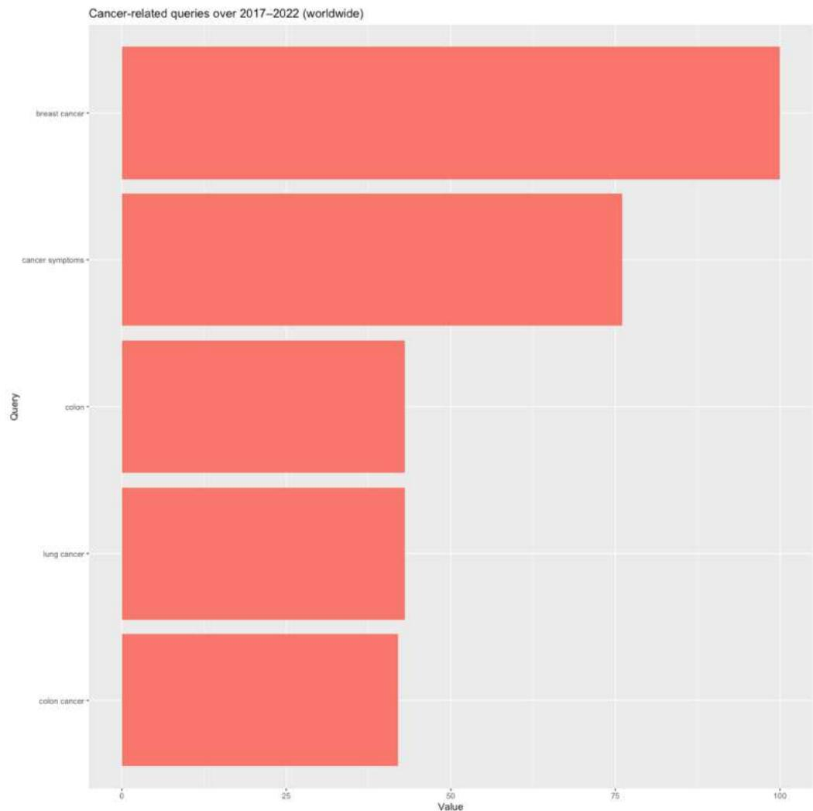  
Figure 1. Most common queries related to the search term “cancer”: worldwide (April 2017– March 2022). Source of data: Google Trends. Estimation results using the “gtrendsR” package [19] in R software.

Moreover, a visualization of the global web-search interest reveals that most normalized searches emerged in countries that also reported the highest age-standardized cancer rates. Of note, to accurately comprehend the geography of search interest for a given keyword, the term should be searched across all the world’s languages. However, Google Trends provides a specific tool capable of dealing with this issue, i.e., “Topics,” which collects all related words, variant spellings, and names in other languages under a single label to help with comprehending topics in a multilingual setting. Topics can thus be particularly effective in combining translations into multiple languages under a single subject [20]. As such, we specified the topic “cancer” when sourcing Google Trends data. Thus, Figure 2 reflects the normalized number of internet searches over the most recent five years, confirming that the highest population interest in the topic “cancer” was encountered in countries including Australia, the US, and Ireland. On the other hand, WHO data confirm that Australia registered the world’s highest age-standardized cancer rate at 452.4 cases per 100,000 people in 2020, followed by New Zealand (422.9), Ireland (372.8), and the United States (362.2).

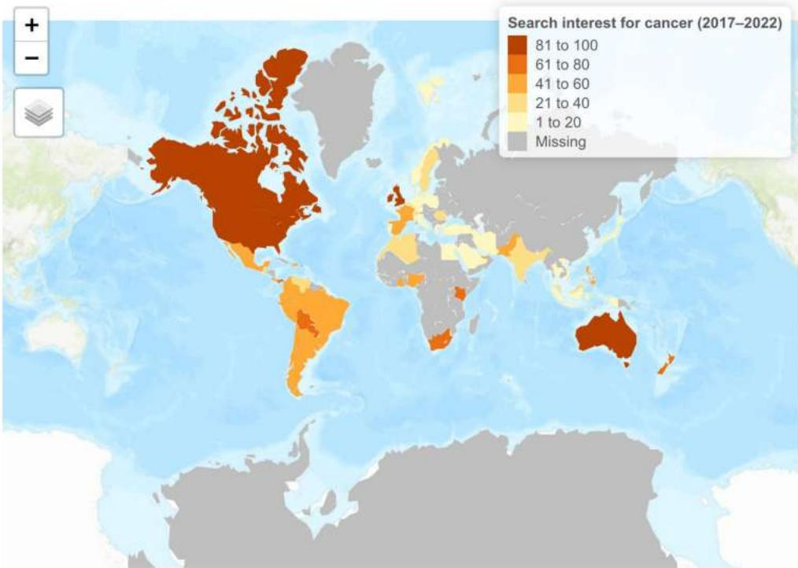  
  
Figure 2. Internet search interest for “cancer” at the world level: (April 2017–March 2022). Source of data: Google Trends. Map is based on estimation results and uses the packages “gtrendsR” [19] and “tmap” [21] in R software.

Additionally, studies increasingly confirm that many cancers remained undiagnosed as a result of healthcare system disruptions caused by the COVID-19 outbreak [22–24]. In this context, with official statistics failing to accurately capture the variation in incidence, people’s search interest for specific symptomatology emerges as the most relevant indication of the health problem’s occurrence.

In light of the above considerations, this study sourced Google Trends data to extract information on internet searches for the word “cancer” and employed it as a proxy to forecast cancer incidence rates. Google Trends (www.trends.google.com, accessed on 30 March 2022) is a web-based tool that shows the popularity of a search phrase in a certain location over time. It provides a time series index of the number of Google queries submitted in a given location. The query weight or share is calculated by dividing the overall query volume for a specific search term within a geographic region by the total number of searches in that region throughout the period in question. Following that, the result is scaled from 0 to 100. As a result, the maximum query share of a search phrase for a given period is normalized to 100, reflecting the point when the search was at its most popular. In conclusion, on a scale of 0–100, Google Trends calculates relative search interest (RSI), with 100 reflecting peak interest [25]. Ref. [26] explore the utility of Google Trends data to examine population web searches for cancer screening and conclude that web queries can capture awareness and interest in cancer screening. Thus, Google Trends data may complement traditional data collection and analysis about cancer screening and related interests, providing important scientific possibilities. However, given the aforementioned disruption of public health systems caused by COVID-19 that altered official statistics, we argue that Google Trends data can now be used as a substitute for traditional statistics, which further expands its scientific value.

Of note, among European countries, cancer survival is significantly lower in newer and less developed EU members from Central and Eastern Europe [27]. Higher death rates at the CEE level are caused by two main factors: delayed diagnosis and suboptimal treat

ment [28], which are in turn related to inefficient and underfinanced public health systems and lower overall economic development [29].The situation is particularly challenging in Romania, which continues to register a divergent trend in mortality rates relative to its EU counterparts, including in the CEE area [30]. Figure 3 shows that the age-standardized mortality rate from all cancers follows an increasing trend in Romania from 2011 to 2018, reflecting the inefficiency of the public healthcare system in the country, whereas most other CEE countries have managed to reverse the trend.

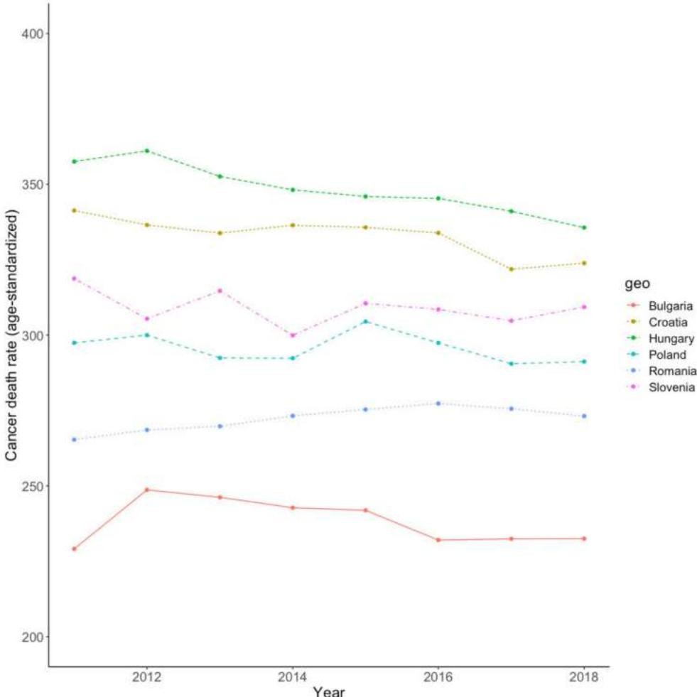  
Figure 3. Trends in cancer mortality rates in selected CEE countries (2011–2018). Estimation results. Plot created in R software (“ggplots” function). Source of data: Eurostat.

Moreover, the excess mortality from the main types of cancer registered in Romania relative to the EU average is reflected by the difference in the five-year survival rates presented in Table 1. For example, whereas recent statistics show that the survival rate of breast cancer patients has rapidly increased over recent years, due to the availability of early diagnostic tools and treatment [31], Romania still reports significant health gaps, which is heavily influenced by the fact that there is no organized population screening for breast cancer in the country [30].

Table 1. The five-year survival rates from main types of cancer (Romania versus EU26).   

<table><tr><td>Type of Cancer</td><td colspan="2">5-Year Survival Rate</td></tr><tr><td></td><td>Romania</td><td>EU26</td></tr><tr><td>Lung</td><td>11%</td><td>15%</td></tr><tr><td>Breast</td><td>75%</td><td>83%</td></tr><tr><td>Prostate</td><td>77%</td><td>87%</td></tr></table>

Source of data: Romanian Ministry of Health (2021) [32].

A worrisome disaggregation also occurs between cancer incidence and mortality rates registered in Romania, which has not managed to reduce cancer mortality despite periods of decreased incidence and which further highlights the necessity and urgency of better policies aimed at providing an efficient and inclusive public health system (Figure 4, Panel a). Moreover, the implementation of join-point regression analysis, also known as changepoint regression or segmented regression analysis [33] to detect changing trends in cancer incidence (see for example [34–39]) further confirms that the incidence rate in Romania presents two join points in 2014 and 2017, leading to three periods with a different trend over the analysis period, as follows: a positive trend with a slope coefficient of 14.68 until 2014, a negative trend with a slope coefficient of $- 8 . 8 3$ during 2014–2017, and a slightly increasing trend with a slope of 2.05 after 2017 (Figure 4, Panel b). Hence, whereas the incidence follows an increasing trend until the first join-point (i.e., 2014), a reversal is detected thereafter, and a decreasing trend is confirmed over the second segment (i.e., 2014–2017). However, the decreasing trend is reversed thereafter, as the incidence rate presents a subsequent rise. On the other hand, the join-point regression analysis found no join-point in the mortality rate, confirming the disaggregation between the two series.

Patient migration from CEE countries has grown with the implementation of a European Union Directive issued in 2011. According to this directive, European nationals are eligible to use European healthcare services in any of the European member states, and their treatments are covered (at least partially) by their home country’s health insurance system [40]. As a result, a phenomenon called “oncotourism” or “cancer tourism” has emerged, whereas diagnosed patients move away from inefficient Eastern and Central European public healthcare systems, particularly from Romania, toward the private system or the healthcare systems of more developed EU countries [41].

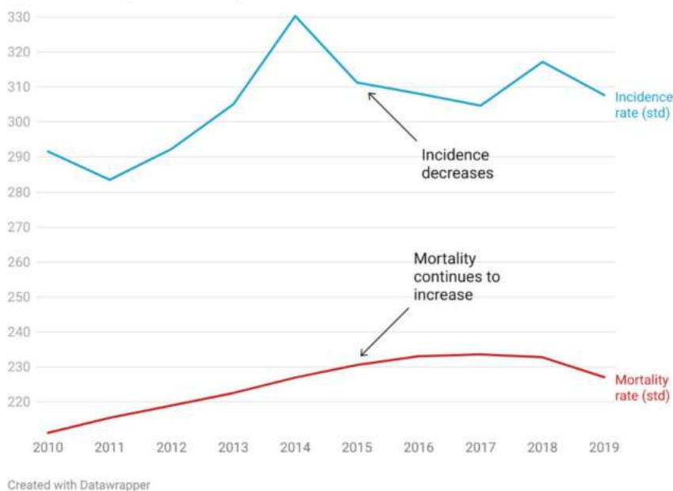  
Trends in incidence and mortality rates (age-standardised, all cancers, Romania)   
  
Figure 4. Cont.

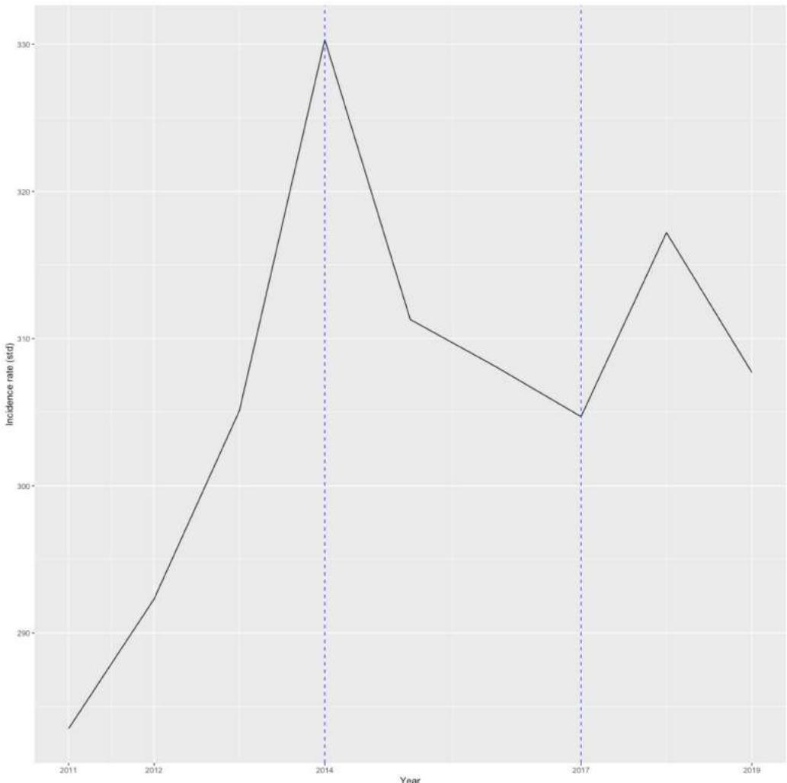  
(b)   
Figure 4. Trends in age-standardized cancer incidence and mortality rates in Romania (2010–2019) (panel a); join-points in cancer incidence rate (panel b). Source of data: Romanian Ministry of Health (2021) [32]. Chart in panel (a) is produced in Datawrapper. Chart in panel (b) is produced with the “ggplot” function in R software; join-point regression analysis is performed with the “segmented” package within R software.

Consequently, accurate predictions for cancer incidences are paramount for early detection and for issuing effective and more inclusive public health policies, especially in the most vulnerable EU members in the CEE area. Additionally, cancer incidence projections are also useful for planning health services and establishing a baseline for evaluating the impact of public health measures [42]. Thus, the main goal of this study is to develop cancer incidence/cancer mortality models, and subsequently to make use of websearch data extracted from Google Trends and its point estimates issued through an array of statistical and machine-learning models to ultimately produce accurate forecasts of cancer incidence and mortality rates, while taking a special focus on a vulnerable CEE country significantly plagued by this disease, i.e., Romania. From a methodological perspective, the robustness of results is assured through various approaches, such as: (i) the estimation of alternative predictive models (statistical and machine-learning); (ii) the assessment of the relative out-of-sample forecasting accuracy through the hold-out forecasting technique; (iii) the estimation of the Diebold-Mariano test for superior forecasting accuracy, and (iv) resampling Google Trends data and employing the sampling average for the webquery index.

Of note, the vast majority of previous research either employs one forecasting method or assesses the predictive ability of concurrent methods by estimating forecasting accuracy metrics. This study implements alternative predictive models, both statistical and machine learning, through automated forecasting algorithms. Moreover, the random sampling issue that arises from using Google Trends data is mitigated through resampling and averaging. Additionally, the forecasting results are defended against the Diebold-Mariano (DM) predictive accuracy test. Hence, various robustness checks confirm the reliability of current findings. Furthermore, the strand of literature on cancer research, particularly with a focus on Central and Eastern Europe, remains thin. Hence, whereas most related studies focus on developed countries, the current research contributes to filling the literature void and is thus concerned with a rather under-investigated EU member, Romania, a country that constitutes an interesting playing field for cancer research due to divergent trends relative to its EU counterparts and plagued by the worrisome phenomenon of “oncotourism”. The proposed method is novel and carries the generalizability advantage, being suitable to further investigate other countries for which official statistics have been heavily affected by the coronavirus pandemic.

Thus, compared to previous studies, the contributions of the current research are threefold: (i) we develop two novel models to explain cancer incidence and cancer mortality rates that embed both official statistics and data on population health-seeking behavior as reflected in internet search habits, whereas most previous studies employ some version of the age-period-cohort model (APC) for the same task; (ii) we propose a robust and integrated approach for web query volume forecasting that includes statistical and machinelearning forecasting methods and assures the robustness of results through multiple model calibration on training and test datasets and estimation of multiple accuracy metrics; and (iii) we apply this novel framework to data from one of the most vulnerable EU members, Romania, a country increasingly defined by the phenomenon of “oncotourism”, whereby diagnosed patients avoid the inefficient national public health system. We additionally provide evidence on the link between internet-seeking behavior and the incidence and mortality of the disease in Romania, thus contributing to the extent of infodemiological literature. Research findings have important policy implications, and the framework, owing to its generalizability, can be applied to the same task in other countries. The novel approach is particularly relevant in the aftermath of the COVID-19 pandemic, which has disrupted public health systems and caused a significant number of cancers to remain undiagnosed, thus affecting the quality of official statistics and their usefulness for health studies.

Results overall indicate a continuation of the increasing trends in cancer incidence and mortality in Romania, with a standardized cancer incidence rate of 313.8 by 2026 and a standardized cancer mortality rate of 233.8 by the same horizon, and thus underline the urgency to change the status quo in the Romanian public health system.

The paper continues as follows. Section 2 presents the data used in model development and explains the integrated method. Section 3 describes the empirical findings that emerge from implementing the novel-forecasting framework on the Romanian data. Section 4 discusses the main findings and, finally, Section 5 concludes the study.

# 2. Materials and Methods

In this study, we sourced annual data on Romanian cancer incidence and mortality rates spanning 2010–2019 from the Romanian Ministry of Health. Next, to develop a model capable of explaining and forecasting these relevant health indicators in the absence of reliable official statistics (which is a worldwide issue caused by the significant number of undetected cancer cases after the onset of the COVID-19 pandemic), we relied on previous infodemiological studies that acknowledge the population’s internet search habits as a reliable proxy for the incidence of a health problem.

The Google Trends platform is a handy tool for determining the popularity of a specific search keyword among a particular demographic. In this study, we extracted the monthly volume of Google queries issued from Romania for “cancer” for the period spanning

January 2005–March 2022. It should be acknowledged that Google Trends implements random sampling and uses only a fraction of the entire search data to construct a search index [43] Thus, to overcome the sample instability issue, multiple samples (i.e., 12) were sourced and the average of samples was used to construct the web-query index, instead of only one sample (see [44] for relevant details on the sample bias and its correction). However, it has also been recognized that the Google Trends sampling procedure produces reasonably precise estimates, and consequently, there is often no need to employ more than a single sample [45]. The web query time series contained 207 monthly observations.

The relationship between web searches and the health indicators of interest for Romania was assessed through the linear model given by Equation (1).

$$
\hat {y} = b X + a \tag {1}
$$

where $\hat { y }$ is alternatively the cancer incidence rate, and subsequently the cancer mortality rate, and the independent variable is the web-query index.

Additionally, we used both linear and nonlinear statistical and machine-learning techniques, which allowed us to capture most of the properties of the web-query time series and further contributed to avoiding unreliable forecasts. Predictive models can be delineated into two main categories [46–48]: statistical and machine learning methods (self-learning systems that can learn from data and continuously increase performance), respectively. Thus, in this study, the autoregressive integrated moving average (ARIMA) model (Equation (2)), the Exponential Smoothing State Space Model with Box-Cox Transformation, ARMA Errors, Trend, and Seasonal Components (TBATS) given by Equation (3), and the neural network autoregression (NNAR) model reflected in Equation (4) were alternatively fitted.

An ARIMA $( p , d , q ) ( P , D , Q ) s$ model, first developed by [49], is given by:

$$
\begin{array}{l} (1 - \varphi_ {1} B - \dots - \varphi_ {p} B ^ {p}) (1 - \Phi_ {1} B ^ {s} - \dots - \Phi_ {P} B ^ {s P}) (1 - B) ^ {d} (1 - B ^ {s}) ^ {D} Y _ {t} = \tag {2} \\ (1 - \theta_ {1} B - \ldots - \theta_ {q} B ^ {q}) (1 - \Theta_ {1} B ^ {s} - \ldots - \Theta_ {P} B ^ {s Q}) \varepsilon_ {t} \\ \end{array}
$$

where s is the seasonal period, the lowercase and the capital letters represent nonseasonal and seasonal parameters, and $\varepsilon _ { t }$ is a random variable with mean zero and the standard deviation $\sigma$ .

A TBATS model [50] can accommodate complex seasonal behaviors of data [51] and is written as:

$$
\operatorname {T B A T S} (\omega , p, q, \varphi , \left\{\mathrm {m} _ {1}, k _ {1} \right\}, \left\{\mathrm {m} _ {2}, k _ {2} \right\}, \dots , \left\{\mathrm {m} _ {\mathrm {T}}, k _ {\mathrm {T}} \right\}), \tag {3}
$$

where ω is the Box-Cox transformation, $k$ is the number of harmonics used for the seasonal trait, and $\varphi$ is the dampening parameter.

Artificial neural networks (ANNs) are capable of simulating complicated real-world systems while properly accounting for nonlinearities [52]. Lagged values of time series are frequently utilized as inputs in an ANN structure when fitting time series data, which is then known as neural network autoregression (NNAR) [53] (Munim et al., 2019). As in [29,54], the NNAR model is written as:

$$
Y = f (H) = f \left(W * X + B\right), X = [ y (t - 1), y (t - 2), \dots , y (t - p) ] \tag {4}
$$

where Y stands for the output vector, $f$ is the activation function, $H$ is the vector of n nodes in the hidden layer, W is the weight matrix between the input and hidden layers, X is the vector of inputs (i.e., the lagged values of the actual observations), and B is a bias vector.

All estimations are automated and performed in R software via dedicated algorithms included in the “forecast” package [55]. To implement the method robustly, the series of length $\Nu = 2 0 7$ was first split into a training set (containing 187 observations) for insample fit purposes and a testing set (containing the last 20 observations) on which the models that reported the best fit on the training set were further estimated and their out-of-

sample forecasting ability assessed. Lastly, we assessed the forecast accuracy of alternative predictive models by estimating both scale and scale-free accuracy metrics.

First, let us define the forecast error of a candidate model as:

$$
e _ {T + h} = y _ {T + h} - \hat {y} _ {T + h | T} \tag {5}
$$

where $\{ y _ { 1 } , \dots , y _ { T } \}$ is the training set data and $\{ y _ { T + 1 , } y _ { T + 2 } , \dotsc \}$ is the test-set data.

Then, the following forecasting accuracy metrics are computed as:

Mean absolute error:

$$
M A E = \sqrt {\frac {1}{N} \sum_ {i = 1} ^ {N} \left| y _ {i} - \hat {y} _ {l} \right|} \tag {6}
$$

Root mean squared error:

$$
R M S E = \sqrt {\frac {1}{N} \sum_ {i = 1} ^ {N} \left(y _ {i} - \hat {y} _ {l}\right) ^ {2}} \tag {7}
$$

Mean absolute percentage error:

$$
M A P E = \text {m e a n} (| p _ {t} |) \tag {8}
$$

where: $\begin{array} { r } { p _ { t } = \frac { 1 0 0 e _ { t } } { y _ { t } } } \end{array}$

Mean absolute percentage error:

$$
M A S E = \operatorname {m e a n} \left(\left| q _ {j} \right|\right) \tag {9}
$$

where qj is given by as: $q _ { j } = { \frac { e _ { t } } { { \frac { 1 } { N - 1 } } \sum _ { i = 2 } ^ { N } | y _ { t } - y _ { t - 1 } | } } f$ when the series is non-seasonal and by: $q _ { j } = \frac { e _ { t } } { \frac { 1 } { N - m } \displaystyle \sum _ { i = m + 1 } ^ { N } | y _ { t } - y _ { t - m } | }$ when the time series is seasonal.

Lastly, all predictive models were fitted to the entire series of length N and point forecasts for the web query index for the following 4 years (i.e., a 48-month forecasting horizon) were produced by the overperforming method in the out-of-sample setting. Forecasted values were then fitted into the incidence/mortality models developed by estimating Equation (1), which then issued the expected values for standardized cancer incidence and mortality rates corresponding to the forecasting horizon. Figure 5 reflects the integrated method employed in this study and implemented in R software.

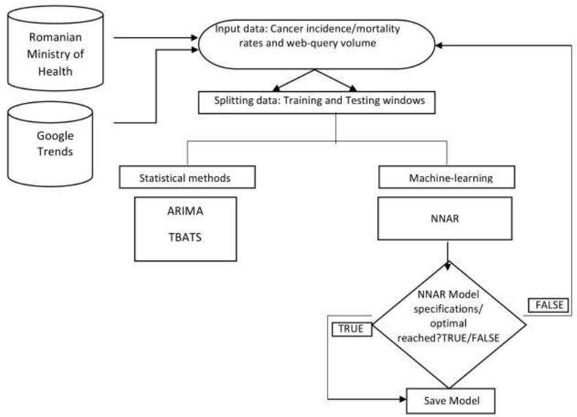

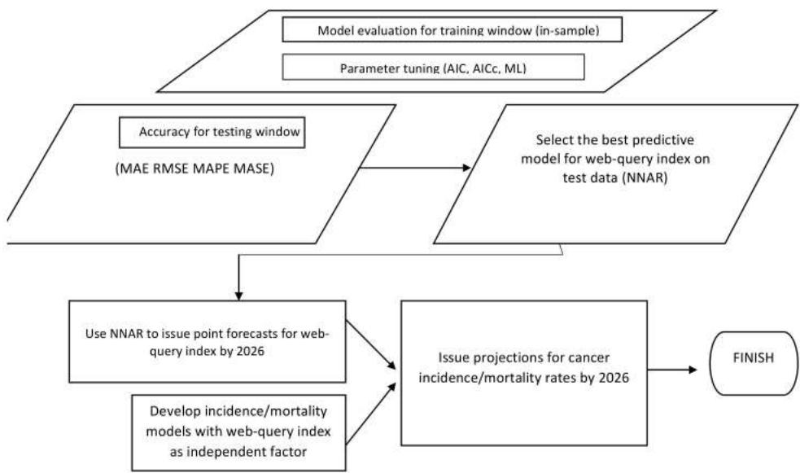  
Figure 5. The integrated framework for modeling and forecasting cancer incidence and mortality rates.

# 3. Results

3.1. Relationship between Related Web Queries and the Age-Standardized Cancer Incidence/Cancer Mortality Rate in Romania

The best-fit linear model between the vector of web-query volume and the cancer incidence/cancer mortality rate is reflected in Figure 6, panels (a) and (b), respectively. Both representations highlight a positive link between the web-search interest and the variables reflecting the incidence and mortality of the disease. Additionally, both equations show a similar slope coefficient, equal to 0.47 in the incidence rate model, and equal to 0.46 in the mortality rate model.

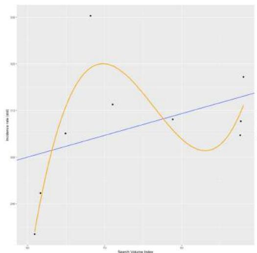  
(a)

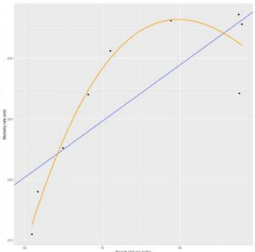  
(b)   
Figure 6. The relationship (linear—blue line, polynomial—orange line) between related web queries and the age-standardized cancer incidence rate in Romania (panel a). The relationship (linear— blue line, polynomial—orange line) between related web queries and the age-standardized cancer mortality rate in Romania (panel b). Source of data: Romanian Ministry of Health [32]. All estimations were performed in R software; plots were created in R software (i.e.,“ggplot” function).

# 3.2. Results from Modeling and Forecasting the Web-Query Index

Table 2 reports the estimated accuracy measures for the test-set data containing topic searches for “cancer” submitted in Romania that were issued through the statistical and machine-learning predictive models. Results indicate that NNAR has been able to accurately capture variations in data and thus provide the best forecast for the web query index over the testing window.

Table 2. Accuracy measures for the out-of-sample (test-set) forecasting performance.   

<table><tr><td>Predictive Model</td><td>MAE</td><td>RMSE</td><td>MAPE</td><td>MASE</td></tr><tr><td>ARIMA</td><td>4.21</td><td>5.16</td><td>5.76</td><td>0.61</td></tr><tr><td>NNAR</td><td>3.96</td><td>4.71</td><td>5.32</td><td>0.57</td></tr><tr><td>TBATS</td><td>4.60</td><td>5.73</td><td>6.54</td><td>0.74</td></tr></table>

To assess the forecasting superiority of the feed-forward neural network autoregression model, we estimated the Diebold-Mariano (DM) test [56,57] to examine any significant differences between forecasts produced by NNAR and the second best-performing model (ARIMA). The DM test result (estimated with the “dm.test” function within the “forecast” package in R software) confirmed that there was a significant difference between the distribution of errors from ARIMA and NNAR, thus ensuring the forecasting superiority of the machine-learning method.

We next employed the best-performing model in terms of out-of-sample forecasting accuracy (i.e., NNAR) to produce the expected web-query volume in Romania for the next 48 months (4 years), corresponding to the period spanning April 2022 to March 2026. Figure 7 reflects the estimation results, showing (in blue color) the point estimates produced by NNAR for April 2022–March 2026. Of note, estimations corresponding to the 48-month forecasting horizon indicated a continuation of the increasing trend in web searches related to “cancer” issued from Romania.

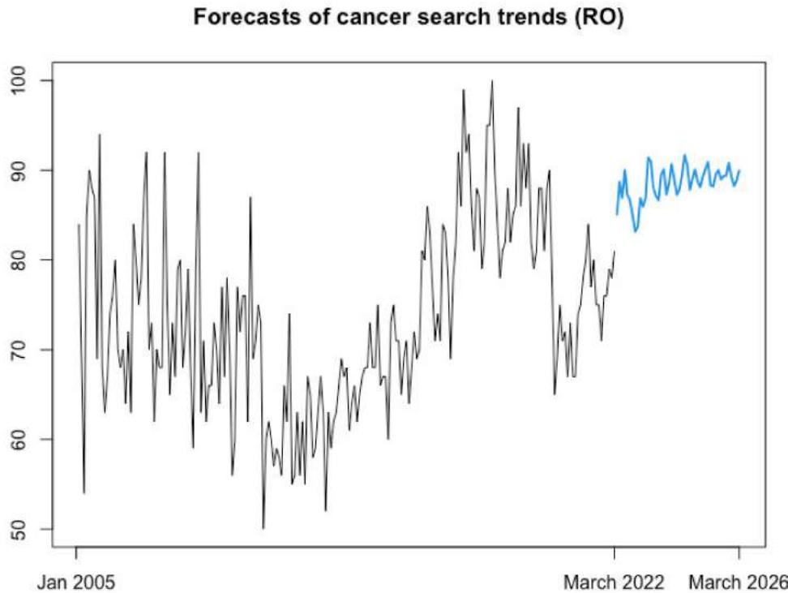  
Figure 7. Forecasted trend over April 2022–March 2026 (48 months) for web queries for the term “cancer” in Romania issued with NNAR (12,6). Source: estimation results. Model information: average of 20 networks, each of which is a 12-6-1 network with 85 weight options.

# 3.3. Forecasts of Cancer Incidence and Cancer Mortality Rates in Romania over 2022–2026

Lastly, we put together the linear relationship model estimated before and the point estimates produced by the neural network autoregression model (NNAR) to estimate the cancer incidence and cancer mortality rate for the next four years. It is important to underline that all estimations are based on the status quo hypothesis, implying that these projections are expected if no changes in public health policy are implemented. Projected values for the two health indicators are centralized in Table 3.

Table 3. Forecasted values for cancer incidence and cancer mortality rates.   

<table><tr><td>Year</td><td>Incidence Rate (Projected, Standardized)</td><td>Mortality Rate (Projected, Standardized)</td></tr><tr><td>2023</td><td>308.7</td><td>228.8</td></tr><tr><td>2024</td><td>313.0</td><td>233.0</td></tr><tr><td>2025</td><td>313.6</td><td>233.6</td></tr><tr><td>2026</td><td>313.8</td><td>233.8</td></tr></table>

We notice that estimations issued through the incidence and mortality models and based on NNAR projections of the related web-search index reflect a continuation of the increasing trends in cancer incidence and mortality in Romania, underlining the urgency to change the status quo in the Romanian public health system. Estimates thus indicate a standardized cancer incidence rate of 313.8 by 2026 and a standardized cancer mortality rate of 233.8 by the same horizon, increasing from levels of 307.7 and 227.1, respectively, registered in 2019.

# 4. Discussion

Approximately 10 million deaths have been attributed to cancer in 2020, or nearly one in six deaths. Concurrently, many cancer patients worldwide still lack access to timely,

high-quality diagnosis and treatment. Within the EU, CEE countries consistently report higher mortality rates, mainly as a result of delayed diagnosis and suboptimal treatment. For Romania, statistics are particularly worrisome, with the country reporting significantly lower survival rates for all main types of cancer and also a divergent trend in mortality rates relative to its EU counterparts that have managed to reverse the increasing trend. Consequently, “oncotourism” is especially characteristic of Romania, as diagnosed patients move away from the inefficient public healthcare system toward the private system or the healthcare systems of more developed EU countries.

Consequently, accurate predictions of cancer incidence and mortality rates are keys to informing policymakers and assisting in the policymaking process. The main goal of this study is to develop a robust model capable of capturing the evolution of cancer incidence and mortality rates and forecasting their evolution. Concurrently, we build on [58] and acknowledge that over the past decade, the use of internet data has become an important aspect of health informatics, with online sources becoming more accessible and offering data that can be used to analyze and forecast human behavior. As a result, we also agree with [59] that data from tracking online information seekers’ behavior is useful in public health surveillance and research.

Thus, in model development, the study made use of web-search data extracted from Google Trends, which was introduced as an independent variable in light of previous studies that acknowledge the population’s internet search habits as a reliable proxy for health problem occurrence. Moreover, this approach overcomes the current issue of the unreliability of official statistics, caused on one hand by the numerous undiagnosed cases after the COVID-19 outbreak and, on the other hand, by the unavailability or tardiness of treatment for diagnosed patients, directly affecting the rate of incidence and mortality. Concurrently, point estimates for the web-query index were issued through the best performing predictive model over the test-set (i.e., out-of-sample), after an assessment of the in-sample fit and out-of-sample forecasting accuracy of various statistical and machine-learning models (ARIMA, TBATS, and NNAR) had been performed via several accuracy metrics (MAE, RMSE, MAPE, and MASE). Estimations indicated that NNAR was the most capable of capturing the time series characteristics and of producing the most accurate estimates. Consequently, estimations for the web-query index were automatically produced with the NNAR model and sourced into the incidence/mortality models that have been previously developed. Ultimately, forecasts of cancer incidence and mortality rates in Romania by 2026 were issued, indicating a continuation of the increasing trend for both variables. Our results are in line with projections of [32] the Romanian Ministry of Health (2021), confirming the ascendant trend, although our point estimates fall below the public ministry’s predictions, indicating more conservative increasing rates.

Future predictions depend on multiple assumptions, most importantly on the status quo (i.e., no-change) hypothesis of the Romanian public health system. Similarly, forecasts do not consider the impact of relevant changes in impact factors, such as potential changes in smoking prevalence at the national level, changes in obesity, changes in alcohol consumption, changes in nutrition habits, increased funding of the public health system, increased screening, HPV vaccination, etc. As a result, we agree with [60] that it is critical to review predictions at regular intervals to incorporate the most recent trends in the data. However, similar to [42], we reason that current estimates do provide a useful baseline for the planning of cancer resources and for evaluating the impact of any changes produced in impact factors as a result of newly introduced public health policies and measures. Furthermore, as with most research, this study suffers from other limitations. Mostly, the use of Google Trends data does carry some vulnerabilities that should be acknowledged, including the construction of the search index itself [61]. As a consequence, the long-run stability of the time series is heavily dependent on the data’s time frame and frequency. As per [61], this study used monthly data that was best able to accurately capture the long-term trend. Moreover, random sampling is an inherent bias in Google Trends data [44]. However, this issue is particularly troublesome in forecasting when dealing with topics that

are less frequently searched for, which is not the case in the current study. Additionally, the performed resampling further mitigated the bias. Nonetheless, it should be acknowledged that this approach merely minimizes the bias and does not eliminate it. Finally, it should be mentioned that results should be interpreted with care, considering that data reflect the search habits of the population that has Internet access, which in turn depends on income level and other socioeconomic factors. Overall, I argue that the popularity of the search topic, together with the resampling strategy and previous studies that reinforce the usefulness of web search data as a powerful predictive instrument [44] does allow for confidence in the current research findings.

In addition, it should also be mentioned that the link between cancer variables and the web-query index has been assessed through the classical regression model. However, it has been increasingly acknowledged that the neutrosophic regression model [62–65], which issues the parameters in the indeterminacy interval rage, can be more efficient in the uncertainty environment than the classical regression model [66]. Thus, the assessment of the historical link between cancer incidence/cancer mortality rates and the web search index through the neutrosophic regression model constitutes a good avenue for future research. The implementation of the proposed method on data specific to different gender and age groups, as well as to geographic regions of the country, could also reveal particularly vulnerable groups and/or areas and offer relevant information to policymakers.

From a policy perspective, the findings highlight that cancer will continue to be a significant burden for Romania, which should be carefully planned for. Complementarily, results indicate the need for better policies aimed at mitigating main risk factors such as smoking, alcohol consumption, obesity and overweight, unhealthy nutrition, lack of physical exercise, etc., and at increasing the financing and efficiency of the public health system by allocating future resources for cancer research, treatment, and prevention.

# 5. Conclusions

In conclusion, this study developed two novel cancer incidence/cancer mortality models based on population web-search habits and historical links with official health variables. The models were empirically estimated using data from one of the most vulnerable European Union (EU) members, Romania, and further used to forecast cancer incidence and mortality rates in the country by employing estimates for the web-search query index issued through the best performing out-of-sample forecasting method (NNAR). Research findings have important policy implications, and the novel framework, owing to its generalizability, can be applied to the same task in other countries. It provides the important advantage of overcoming a current issue related to the quality of official statistics in the aftermath of the COVID-19 pandemic that disrupted public health systems and caused a significant number of cancers to remain undiagnosed. Overall, the results indicate a continuation of the increasing trends in cancer incidence and mortality in Romania and thus underline the urgency to change the status quo in the Romanian public health system.

Funding: This research received no external funding.

Institutional Review Board Statement: Not applicable.

Informed Consent Statement: Not applicable.

Data Availability Statement: Data employed in this study are publicly available from the Eurostat database, from Google Trends, and the Romanian Ministry of Health.

Conflicts of Interest: The authors declare no conflict of interest.

# References

1. World Health Organization (WHO). Cancer. 2022. Available online: https://www.who.int/news-room/fact-sheets/detail/cancer (accessed on 4 April 2022).   
2. World Cancer Research Fund. Worldwide Cancer Data. 2022. Available online: https://www.wcrf.org/dietandcancer/ worldwide-cancer-data/ (accessed on 30 March 2022).

3. World Health Organization (WHO). Cancer. 2019. Available online: https://www.who.int/health-topics/cancer#tab $=$ tab_1 (accessed on 4 April 2022).   
4. Ma, X.; Yu, H. Cancer issue: Global burden of cancer. Yale J. Biol. Med. 2006, 79, 85.   
5. Nagai, H.; Kim, Y.H. Cancer prevention from the perspective of global cancer burden patterns. J. Thorac. Dis. 2017, 9, 448. [CrossRef]   
6. Zaorsky, N.G.; Churilla, T.M.; Egleston, B.L.; Fisher, S.G.; Ridge, J.A.; Horwitz, E.M.; Meyer, J.E. Causes of death among cancer patients. Ann. Oncol. 2017, 28, 400–407. [CrossRef]   
7. Thun, M.J.; DeLancey, J.O.; Center, M.M.; Jemal, A.; Ward, E.M. The global burden of cancer: Priorities for prevention. Carcinogenesis 2010, 31, 100–110. [CrossRef]   
8. World Cancer Day, Financial and Economic Impact of Cancer. 2022. Available online: https://www.worldcancerday.org/ financial-and-economic-impact-0 (accessed on 30 March 2022).   
9. Mariotto, A.B.; Enewold, L.; Zhao, J.; Zeruto, C.A.; Yabroff, K.R. Medical care costs associated with cancer survivorship in the United States. Cancer Epidemiol. Prev. Biomark. 2020, 29, 1304–1312. [CrossRef]   
10. United Nations (UN). New WHO Platform Promotes Global Cancer Prevention. 2022. Available online: https://news.un.org/ en/story/2022/02/1111312 (accessed on 7 April 2022).   
11. White, M.C.; Peipins, L.A.; Watson, M.; Trivers, K.F.; Holman, D.M.; Rodriguez, J.L. Cancer prevention for the next generation. J. Adolesc. Health 2013, 52, S1–S7. [CrossRef]   
12. Rapiti, E.; Guarnori, S.; Pastoors, B.; Miralbell, R.; Usel, M. Planning for the future: Cancer incidence projections in Switzerland up to 2019. BMC Public Health 2014, 14, 102. [CrossRef]   
13. Petropoulos, F.; Spiliotis, E. The wisdom of the data: Getting the most out of univariate time series forecasting. Forecasting 2021, 3, 478–497. [CrossRef]   
14. Hyndman, R.J.; Athanasopoulos, G. Forecasting: Principles and Practice; Otexts. 2018. Available online: https://otexts.com/fpp2/ (accessed on 30 March 2022).   
15. Szilagyi, I.S.; Ullrich, T.; Lang-Illievich, K.; Klivinyi, C.; Schittek, G.A.; Simonis, H.; Bornemann-Cimenti, H. Google Trends for Pain Search Terms in the World’s Most Populated Regions Before and After the First Recorded COVID-19 Case: Infodemiological Study. J. Med. Internet Res. 2021, 23, e27214. [CrossRef]   
16. Polgreen, P.M.; Chen, Y.; Pennock, D.M.; Nelson, F.D.; Weinstein, R.A. Using internet searches for influenza surveillance. Clin. Infect. Dis. 2008, 47, 1443–1448. [CrossRef]   
17. Pew Research Center, Health Online. 2013. Available online: http://www.pewinternet.org/2013/01/15/health-online-2013/ (accessed on 7 April 2022).   
18. Nuti, S.V.; Wayda, B.; Ranasinghe, I.; Wang, S.; Dreyer, R.P.; Chen, S.I.; Murugiah, K. The use of google trends in health care research: A systematic review. PLoS ONE 2014, 9, e109583. [CrossRef] [PubMed]   
19. Massicotte, P.; Eddelbuettel, D. Gtrendsr: Perform and Display Google Trends Queries. R Package Version 1.4.4. 2019. Available online: https://CRAN.R-project.org/package=gtrendsR (accessed on 30 March 2022).   
20. Forbes. Understanding What You’re Searching for in A Multilingual World. 2015. Available online: https://www.forbes. com/sites/kalevleetaru/2015/10/18/understanding-what-youre-searching-for-in-a-multilingual-world/?sh=9e2b3f23e0f4 (accessed on 25 May 2022).   
21. Tennekes, M. tmap: Thematic Maps in R. J. Stat. Softw. 2018, 84, 1–39. [CrossRef]   
22. Jacob, L.; Loosen, S.H.; Kalder, M.; Luedde, T.; Roderburg, C.; Kostev, K. Impact of the COVID-19 pandemic on cancer diagnoses in general and specialized practices in Germany. Cancers 2021, 13, 408. [CrossRef] [PubMed]   
23. Marques, N.P.; Silveira, D.M.M.; Marques, N.C.T.; Martelli, D.R.B.; Oliveira, E.A.; Martelli-Júnior, H. Cancer diagnosis in Brazil in the COVID-19 era. Semin. Oncol. 2021, 48, 156–159. [CrossRef]   
24. Becker’s Hospital Review, As COVID-19 Dies Down, Undiagnosed Cancers Emerge. 2021. Available online: https://www. beckershospitalreview.com/oncology/as-covid-19-dies-down-undiagnosed-cancers-emerge.html (accessed on 6 April 2022).   
25. Greiner, B.; Tipton, S.; Nelson, B.; Hartwell, M. Cancer screenings during the COVID-19 pandemic: An analysis of public interest trends. Curr. Probl. Cancer 2022, 46, 100766. [CrossRef]   
26. Schootman, M.; Toor, A.; Cavazos-Rehg, P.; Jeffe, D.B.; McQueen, A.; Eberth, J.; Davidson, N.O. The utility of Google Trends data to examine interest in cancer screening. BMJ Open 2015, 5, e006678. [CrossRef]   
27. Vrdoljak, E.; Wojtukiewicz, M.Z.; Pienkowski, T.; Bodoky, G.; Berzinec, P.; Finek, J.; Todorovi´c, V.; Borojevi´c, N.; Croitoru, A. Cancer epidemiology in Central and South Eastern European countries. Croat. Med. J. 2011, 52, 478–487. [CrossRef]   
28. World Health Organization (WHO). Up to a quarter of Europeans Will Develop Cancer: From Prevention, Early Diagnosis, Screening and Treatment to Palliative Care, Countries Must Do More. 2020. Available online: https://www.euro.who.int/en/healthtopics/noncommunicable-diseases/cancer/news/news/2020/2/up-to-a-quarter-of-europeans-will-develop-cancer-fromprevention,-early-diagnosis,-screening-and-treatment-to-palliative-care,-countries-must-do-more (accessed on 7 April 2022).   
29. Tudor, C.; Sova, R. EU Net-Zero Policy Achievement Assessment in Selected Members through Automated Forecasting Algorithms. ISPRS Int. J. Geo-Inf. 2022, 11, 232. [CrossRef]   
30. Furtunescu, F.; Bohiltea, R.E.; Voinea, S.; Georgescu, T.A.; Munteanu, O.; Neacsu, A.; Pop, C.S. Breast cancer mortality gaps in Romanian women compared to the EU after 10 years of accession: Is breast cancer screening a priority for action in Romania? (Review of the Statistics). Exp. Ther. Med. 2021, 21, 268. [CrossRef]

31. Azam, M.; Aslam, M.; Basharat, J.; Mughal, M.A.; Nadeem, M.S.; Anwar, F. An empirical study on quality of life and related factors of Pakistani breast cancer survivors. Sci. Rep. 2021, 11, 24391. [CrossRef]   
32. Romanian Ministry of Health. Analysis of the Cancer Situation in 2021 (in Romanian). 2021. Available online: https: //www.ms.ro/2021/06/30/cancerul-este-un-risc-pentru-o-forma-severa-de-covid-19-nu-lasa-boala-sa-te-afecteze-si-tu-potilua-masuri-si-tu-poti-preveni-si-tu-poti-proteja/ (accessed on 7 April 2022).   
33. Gillis, D.; Edwards, B.P. The utility of joinpoint regression for estimating population parameters given changes in population structure. Heliyon 2019, 5, e02515. [CrossRef]   
34. Qiu, D.; Katanoda, K.; Marugame, T.; Sobue, T. A Joinpoint regression analysis of long-term trends in cancer mortality in Japan (1958–2004). Int. J. Cancer 2009, 124, 443–448. [CrossRef]   
35. Crispo, A.; Barba, M.; Malvezzi, M.; Arpino, G.; Grimaldi, M.; Rosso, T.; Esposito, E.; Sergi, D.; Ciliberto, G.; Giordano, A.; et al. Cancer mortality trends between 1988 and 2009 in the metropolitan area of Naples and Caserta, Southern Italy: Results from a joinpoint regression analysis. Cancer Biol. Ther. 2013, 14, 1113–1122. [CrossRef]   
36. Zahmatkesh, B.; Keramat, A.; Alavi, N.; Khosravi, A.; Kousha, A.; Motlagh, A.G.; Darman, M.; Partovipour, E.; Chaman, R. Breast cancer trend in Iran from 2000 to 2009 and prediction till 2020 using a trend analysis method. Asian Pac. J. Cancer Prev. 2016, 17, 1493–1498. [CrossRef]   
37. Sarakarn, P.; Suwanrungruang, K.; Vatanasapt, P.; Wiangnon, S.; Promthet, S.; Jenwitheesuk, K.; Koonmee, S.; Tipsunthonsak, N.; Chen, S.L.S.; Yen, A.M.F.; et al. Joinpoint analysis trends in the incidence of colorectal cancer in Khon Kaen, Thailand (1989–2012). Asian Pac. J. Cancer Prev. APJCP 2017, 18, 1039.   
38. Wilson, L.; Bhatnagar, P.; Townsend, N. Comparing trends in mortality from cardiovascular disease and cancer in the United Kingdom, 1983–2013: Joinpoint regression analysis. Popul. Health Metr. 2017, 15, 23. [CrossRef]   
39. Dragomirescu, I.; Llorca, J.; Gómez-Acebo, I.; Dierssen-Sotos, T. A join point regression analysis of trends in mortality due to osteoporosis in Spain. Sci. Rep. 2019, 9, 4264. [CrossRef]   
40. Atlatszo. 2019. Available online: https://english.atlatszo.hu/2019/01/28/pay-or-die-onco-tourism-and-corruption-in-romaniaand-hungary/ (accessed on 7 April 2022).   
41. Investigative Journalism for Europe (IJ4EU). “Cancer Tourism” in Central and Eastern Europe. 2018. Available online: http: //www.investigativejournalismforeu.net/projects/cancer-tourism-in-central-and-eastern-europe/ (accessed on 7 April 2022).   
42. Mistry, M.; Parkin, D.M.; Ahmad, A.S.; Sasieni, P. Cancer incidence in the United Kingdom: Projections to the year 2030. Br. J. Cancer 2011, 105, 1795–1803. [CrossRef]   
43. Narita, M.F.; Yin, R. In Search of Information: Use of Google Trends’ Data to Narrow Information Gaps for Low-Income Developing Countries; International Monetary Fund: 2018. Available online: https://www.elibrary.imf.org/view/journals/001/ 2018/286/article-A001-en.xml (accessed on 10 May 2022).   
44. Medeiros, M.C.; Pires, H.F. The Proper Use of Google Trends in Forecasting Models. arXiv 2021, arXiv:2104.03065.   
45. Stephens-Davidowitz, S.; Varian, H. A Hands-On Guide to Google Data. 2014. Available online: https://people.ischool.berkeley. edu/~{}hal/Papers/2015/primer.pdf (accessed on 20 May 2022).   
46. Breiman, L. Statistical modeling: The two cultures (with comments and a rejoinder by the author). Stat. Sci. 2001, 16, 199–231.   
47. Charpentier, A.; Flachaire, E.; Ly, A. Econometrics and machine learning. Econ. Stat. 2018, 505, 147–169. [CrossRef]   
48. Tudor, C.; Sova, R. Flexible decision support system for algorithmic trading: Empirical application on crude oil markets. IEEE Access 2022, 10, 9628–9644. [CrossRef]   
49. Box, G.; Jenkins, G. Time Series Analysis: Forecasting and Control; Holden-Day: San Francisco, CA, USA, 1970.   
50. De Livera, A.M.; Hyndman, R.J.; Snyder, R.D. Forecasting time series with complex seasonal patterns using exponential smoothing. J. Am. Stat. Assoc. 2011, 106, 1513–1527. [CrossRef]   
51. Yu, C.; Xu, C.; Li, Y.; Yao, S.; Bai, Y.; Li, J.; Wang, L.; Wu, W.; Wang, Y. Time series analysis and forecasting of the hand-foot-mouth disease morbidity in China using an advanced exponential smoothing state space TBATS model. Infect. Drug Resist. 2021, 14, 2809. [CrossRef]   
52. Pasini, A. Artificial neural networks for small dataset analysis. J. Thorac. Dis. 2015, 7, 953.   
53. Munim, Z.H.; Shakil, M.H.; Alon, I. Next-day bitcoin price forecast. J. Risk Financ. Manag. 2019, 12, 103. [CrossRef]   
54. Tudor, C.; Sova, R. Benchmarking GHG Emissions Forecasting Models for Global Climate Policy. Electronics 2021, 10, 3149. [CrossRef]   
55. Hyndman, R.J.; Khandakar, Y. Automatic time series forecasting: The forecast package for R. J. Stat. Softw. 2008, 27, 1–22. [CrossRef]   
56. Diebold, F.X.; Mariano, R.S. Comparing predictive accuracy. J. Bus. Econ. Stat. 1995, 13, 253–263.   
57. Harvey, D.; Leybourne, S.; Newbold, P. Testing the equality of prediction mean squared errors. Int. J. Forecast. 1997, 13, 281–291. [CrossRef]   
58. Mavragani, A.; Ochoa, G. Google Trends in infodemiology and infoveillance: Methodology framework. JMIR Public Health Surveill. 2019, 5, e13439. [CrossRef] [PubMed]   
59. Dehkordy, S.F.; Carlos, R.C.; Hall, K.S.; Dalton, V.K. Novel data sources for women’s health research: Mapping breast screening online information seeking through Google trends. Acad. Radiol. 2014, 21, 1172–1176.   
60. Smittenaar, C.R.; Petersen, K.A.; Stewart, K.; Moitt, N. Cancer incidence and mortality projections in the UK until 2035. Br. J. Cancer 2016, 115, 1147–1155. [CrossRef] [PubMed]

61. Eichenauer, V.Z.; Indergand, R.; Martínez, I.Z.; Sax, C. Obtaining consistent time series from Google Trends. Econ. Inq. 2022, 60, 694–705. [CrossRef]   
62. Smarandache, F. Introduction to Neutrosophic Statistics. Infinite Study. 2014. Available online: https://arxiv.org/pdf/1406.2000 (accessed on 24 May 2022).   
63. Chen, J.; Ye, J.; Du, S.; Yong, R. Expressions of rock joint roughness coefficient using neutrosophic interval statistical numbers. Symmetry 2017, 9, 123. [CrossRef]   
64. Aslam, M. A new sampling plan using neutrosophic process loss consideration. Symmetry 2018, 10, 132. [CrossRef]   
65. Aslam, M. Design of sampling plan for exponential distribution under neutrosophic statistical interval method. IEEE Access 2018, 6, 64153–64158. [CrossRef]   
66. Aslam, M.; Albassam, M. Application of neutrosophic logic to evaluate correlation between prostate cancer mortality and dietary fat assumption. Symmetry 2019, 11, 330. [CrossRef]

Article

# Prediction of Major Histocompatibility Complex Binding with Bilateral and Variable Long Short Term Memory Networks

Limin Jiang 1, Jijun Tang 2, Fei Guo 3,* and Yan Guo $^ { 1 , * \oplus }$

Comprehensive Cancer Center, Department of Internal Medicine, University of New Mexico, Albuquerque, NM 87131, USA; jianglm@tju.edu.cn   
2 Shenzhen Institute of Advanced Technology, Chinese Academy of Sciences, Shenzhen 518055, China; jtang@cse.sc.edu   
3 School of Computer Science and Technology, College of Intelligence and Computing, Tianjin University, Tianjin 300350, China   
* Correspondence: fguo@tju.edu.cn (F.G.); yaguo@salud.unm.edu (Y.G.)

Simple Summary: Major histocompatibility complex molecules are of significant biological and clinical importance due to their utility in immunotherapy. The prediction of potential MHC binding peptides can estimate a T-cell immune response. The variable length of existing MHC binding peptides creates difficulty for MHC binding prediction algorithms. Thus, we utilized a bilateral and variable long-short term memory neural network to address this specific problem and developed a novel MHC binding prediction tool.

Citation: Jiang, L.; Tang, J.; Guo, F.; Guo, Y. Prediction of Major Histocompatibility Complex Binding with Bilateral and Variable Long Short Term Memory Networks. Biology 2022, 11, 848. https:// doi.org/10.3390/biology11060848

Academic Editors: Shibiao Wan, Yiping Fan, Chunjie Jiang and Shengli Li

Received: 12 April 2022

Accepted: 27 May 2022

Published: 1 June 2022

Publisher’s Note: MDPI stays neutral with regard to jurisdictional claims in published maps and institutional affiliations.

Copyright: © 2022 by the authors. Licensee MDPI, Basel, Switzerland. This article is an open access article distributed under the terms and conditions of the Creative Commons Attribution (CC BY) license (https:// creativecommons.org/licenses/by/ 4.0/).

Abstract: As an important part of immune surveillance, major histocompatibility complex (MHC) is a set of proteins that recognize foreign molecules. Computational prediction methods for MHC binding peptides have been developed. However, existing methods share the limitation of fixed peptide sequence length, which necessitates the training of models by peptide length or prediction with a length reduction technique. Using a bidirectional long short-term memory neural network, we constructed BVMHC, an MHC class I and II binding prediction tool that is independent of peptide length. The performance of BVMHC was compared to seven MHC class I prediction tools and three MHC class II prediction tools using eight performance criteria independently. BVMHC attained the best performance in three of the eight criteria for MHC class I, and the best performance in four of the eight criteria for MHC class II, including accuracy and AUC. Furthermore, models for nonhuman species were also trained using the same strategy and made available for applications in mice, chimpanzees, macaques, and rats. BVMHC is composed of a series of peptide length independent MHC class I and II binding predictors. Models from this study have been implemented in an online web portal for easy access and use.

Keywords: major histocompatibility complex; bidirectional long short-term memory neural network; deep learning

# 1. Introduction

Major Histocompatibility Complex (MHC) genes code for proteins that recognize foreign molecules and play an important part in immune surveillance. Due to variation in molecular structure, function, and distribution, MHC molecules are divided into three subsets: MHC class I, II, and III. A MHC class I molecule may constitute the MHC heavy chain (alpha chain), which encompasses three alpha domains (alpha1, alpha2, and alpha3) [1]. Alpha1 and alpha2 form the recognition region, with an interval deep groove capturing the peptide antigen [2]. Alpha3 is adjacent to the transmembrane domain in the heavy chain and it interacts with antigen transporters to load and express antigens. A specific type of MHC class I molecules are encoded by the $\beta 2$ -microglobulin gene, and in MHC they constitute the MHC light chain (beta chain). MHC class I molecules are

located at the surface of cells to present antigens, which trigger immune responses by attracting cytotoxic lymphocytes immune cells (TC cells) including $\mathrm { C D 8 + }$ , the cytotoxic T cells which express $\mathrm { C D 8 + }$ receptors. These receptors recognize related MHC complexes at the cell surface: when an antigen peptide of foreign origin is bound, $\mathrm { C D 8 + }$ immune cells are activated to trigger programmed apoptosis [1]. An MHC class II molecule encodes two membrane-spanning chains that are of similar size. While MHC I molecules are located on the surface of nearly all nucleated cells, MHC II glycoproteins are expressed on the surface of specialized immune cells (such as B cells, macrophages, and dendritic cells), where they present processed antigenic peptides to TH cells. MHC class III genes encode various secreted proteins that have immune functions, including components of the complement system and molecules involved in inflammation [3].

Of the three MHC classes, class I has attracted great attention in medical research. For example, reduced abundance in MCH class I is associated with poor prognosis in Hodgkin lymphoma [4]. Another study [5] demonstrated that cancer cells escape T-cell responses via losing MHC class I molecules. MHC molecules are highly polymorphic proteins. As one MHC protein can have many variants, and such variants are commonly referred to as “MHC alleles” [6], MHC alleles are organized into multiple categories for each MHC class. For instance, MHC class I proteins in humans are encoded as human leukocyte antigen (HLA) groups A, B, C, etc. by the gene name, and each HLA group is composed of many alleles by the variants. From the view of molecular structure, MHC molecules have pockets, and the antigenic peptides have anchors of which some are determined residues, and anchors have special properties to lead peptides to enter the pockets [7]. An antigenic peptide’s MHC binding affinity can be measured experimentally by a variety of assays, including a competitive binding assay [8].

The accumulated experimentally verified MHC binding peptides have been curated into various databases during the last three decades. Around 13 MHC binding databases are currently available [9]. With more than 900,000 entries, the Epitope Database (IEDB) [10] contains the largest collection of MHC binding peptides, followed by MHCBN [11] curating 25,860 peptides. In addition to the experimental methods, a peptide’s binding potential with regard to a particular MHC molecule can be estimated through computational algorithms. Computational methods can systematically prioritize credible candidates for a more favorable study design, thus helping reduce both financial cost and human labor of the wet-lab assay-based validation experiments. The experimentally verified MHC binding peptide sequences offer an understructure for the development of computational approaches to predict the binding affinity between an MHC allele and a novel peptide. More than 30 MHC binding prediction tools were developed based on the accumulated MHC binding databases over the years. The majority of these tools [12–24] were developed for MHC class I and II binding prediction.

A common limitation of the existing MHC binding prediction tools is the necessity to align all peptides to one fixed length. Specifically, to meet the requirement, developers must either train different models to tackle peptides of different lengths, or they must arbitrarily adjust the original peptide. There are two sequence selection strategies in the model training/predicting process, one of which is to select peptides with a fixed length, such as selecting 9-mer peptides to train a model for class I [25–27]. The other is to adjust the peptides sequence to a specific length, such as adjusting the peptide length of class I to 9-mer/15 mer by inserting $^ { \prime \prime } \mathrm { X } ^ { \prime \prime }$ symbols (elongating) or deleting amino acids (shortening) [28–31]. For the first strategy, there are two disadvantages: (1) It is tedious to train multiple models out of the initial single allele set; (2) When dividing the whole training set into multiple length-specific training sets, some models of certain lengths may have insufficient training data and therefore result in undertraining and suboptimal performance. For the second strategy, one obvious disadvantage is that inserting or deleting amino acids inevitably leads to a loss of information; specifically, the neighbor amino acids at a perturbed position will not be the same post the elongating/shortening operation. To overcome this constraint, we developed BVMHC, a novel MHC binding prediction

tool based on Bidirectional Long Short-Term Memory (biLSTM) neural network [32,33], a type of recurrent neural network (RNN), which has the major novelty of offering variable length MHC binding prediction. BVMHC is designed to make predictions for both MHC class I and class II alleles in humans, and models for non-human species were also trained using the same strategy. The performance of BVMHC has been thoroughly compared with popular MHC class I/II binding prediction tools.

# 2. Materials and Methods

# 2.1. Training and Validation Datasets

To establish a sizeable training dataset, we obtained from the IEDB database 122,129 and 45,440 human binding peptide sequences for 48 MHC class I alleles and 27 MHC class II alleles, respectively. Additionally, 15,740 MHC class I peptide sequences of four non-human species (mouse, rat, macaque, and chimpanzee) and 1041 MHC class II peptide sequences of mouse were also extracted from the IEDB database. Each peptide was associated with a binding affinity measured as $\mathrm { I C } _ { 5 0 }$ in nM. A dichotomization of these binding affinity values was conducted as follows: peptides with ${ \mathrm { I C } } _ { 5 0 } ~ \geq ~ 5 0 0 ~ n M$ were considered as negative binding and peptides with $\mathrm { I C } _ { 5 0 } < 5 0 0 \ n M$ were considered as positive binding. All binding affinity values $( a f f )$ were standardized to the interval [0,1] through a function, i.e., $1 - \log { \left( a f f \right) } / \log ( 5 0 , 0 0 0 )$ . The initial sequences underwent the following three aspects of filtration: (1) For sequences that are repeated and have the same IC50 value, we kept only one instance of the sequences and removed all duplicate instances. (2) For sequences that are repeated and have different IC50 values, we deleted all items. (3) For sequences that are repeated and have different allele information, we kept all items because we would train different predictors for different allele sequences. Five-fold cross-validation procedures were used on the training datasets to train models. An independent validation dataset consisting of 320 class I and 131 class II human peptide sequences was constructed from the databases MHCBN [34] and SYFPEITHI [35], where we made sure that items co-existing in the IEDB were removed.

# 2.2. Feature Representation at Evolutionary Level

The BVMHC model involves two major components: feature representation and the computation model (Figure 1). For a numerical representation of training/testing data, each peptide sequence was first encoded as a $2 0 \times L$ matrix through one-hot encoding [36], where $L$ is the length of the peptide. The dynamic convolutional neural network with twenty $1 \times 2 0$ convolution kernels was used to process one-hot coding matrices. BLOSUM is a $2 0 \times 2 0$ matrix that represents evolutionary conservation information between amino acids [37], and we used it to initialize the twenty convolution kernels. The overall method can be represented with Equation (1), where $X$ denotes the One-hot encoding matrix, i the index of amino acid in peptide, $k$ the index of kernel, $M = 1$ the window size, and $n = 2 0$ the number of kernels. Of note, the two indices, i and $j ,$ start from an initial value of 0.

$$
\operatorname {E v o} (X) _ {i, k} = \sum_ {m = 0} ^ {M - 1} \sum_ {m = 0} ^ {m = 0} W _ {m, n} ^ {k} X _ {i + m, n} \tag {1}
$$

As the kernels were updated in the training process, an updated presentment matrix in the evolutionary level was obtained and was input into a biLSTM model. After training, a novel BLOSUM matrix can be obtained by using the twenty trained convolution kernels.

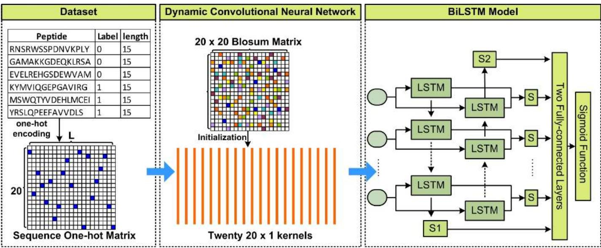  
Figure 1. Overview of BVMHC. One-hot encoding was used to convert a peptide sequence to a matrix. BLOSUM was applied to initialize kernels in the convolutional neural network that was used applied to process the merged matrix at the sequential level. to extract the peptide sequence feature at the evolutionary level. The biLSTMmodel was then applied to process the merged matrix at the sequential level.

# 2.3. Feature Representation at Sequential Level 2.3. Feature Representation at Sequential Level

The advantage of biLSTM (Figure 1) is the ability to handle peptides with variable The advantage of biLSTM (Figure 1) is the ability to handle peptides with variable lengths. Long short-term memory (LSTM) [33] is a type of recurrent neural network and all connections between units in LSTM form a directed cycle. This cycle is conducive to modeling dynamic temporal or spatial behavior. LSTM block is dynamically changed with the sequence length. An LSTM unit includes input, forget, and output gates. The calculation process is defined as Equations (2)–(6), where, $x _ { t }$ ௧denotes the input vector, $f _ { t }$ ௧the forget gate’s activation vector, $o _ { t }$ ௧the output gate’s activation vector, $h _ { t }$ ௧ a 128-dimenstion 128-dimenstion hidden hidden state vector, and $C _ { t }$ te vector, and ௧ the cell state vector. In these equations, the the cell state vector. In these equations, the common notations commW and $U$ notations W and U refer to pararefer to parameter matrices and $b$ eter matrices and b desigdesignates a bias vector.

$$
f _ {t} = \sigma \left(W _ {f} x _ {t} + U _ {f} h _ {t - 1} + b _ {f}\right) \tag {2}
$$

$$
i _ {t} = \sigma \left(W _ {i} x _ {t} + U _ {i} h _ {t - 1} + b _ {i}\right) \tag {3}
$$

$$
o _ {t} = \sigma \left(W _ {o} x _ {t} + U _ {o} h _ {t - 1} + b _ {o}\right) \tag {4}
$$

$$
C _ {t} = i _ {t} ^ {\circ} \tanh  \left(W _ {c} x _ {t} + U _ {c} h _ {t - 1} + b _ {c}\right) + f _ {t} ^ {\circ} C _ {t - 1} \tag {5}
$$

$$
h _ {t} = o _ {t} ^ {\circ} \operatorname {t a n h} \left(C _ {t}\right) \tag {6}
$$

another set of LSTMs merged the feature matrix from right to left. A dropout layer In our biLSTM model, one set of LSTMs merged the feature matrix from left to right, and another set of LSTMs merged the feature matrix from right to left. A dropout layer was tained first. Afterward, a regression output value was obtained from two fully-connected applied to avoid over-fitting. A vector with 128 dimensions from biLSTM was obtained layers and converted into a probability through the sigmoid function. In the process of first. Afterward, a regression output value was obtained from two fully-connected layers training, we chose binary cross-entropy as the loss function and set the learning rate at and converted into a probability through the sigmoid function. In the process of training, we chose binary cross-entropy as the loss function and set the learning rate at 0.0001, and the dropout rate at 0.8.

# Eight evaluation 2.4. Evaluation Criteria

elation coefficient (MCC), Precision, Area Under the receiver-operating-characteristic Eight evaluation criteria, including Accuracy, Sensitivity, Specificity, F1, Matthew’s Curve (AUC), and Area Under the Precision-Recall curve (AUPR), were used to evaluate correlation coefficient (MCC), Precision, Area Under the receiver-operating-characteristic the performance of the models. The calculation of the first six criteria is illustrated in Curve (AUC), and Area Under the Precision-Recall curve (AUPR), were used to evaluate Equations (7)–(12), where TP represents the number of true positive MHC binders, false the performance of the models. The calculation of the first six criteria is illustrated in

Equations (7)–(12), where $T P$ represents the number of true positive MHC binders, false negative represents the number of true negative MHC binders, $F P$ represents the number of false positive binders, and false negative represents the number of false negative MHC binders.

$$
\text {A c c u r a c y} = \frac {T P + T N}{T P + T N + F P + F N} \tag {7}
$$

$$
\text {S e n s i t i v i t y} = \frac {T P}{T P + F N} \tag {8}
$$

$$
\text {S p e c i f i c i t y} = \frac {T N}{T N + F P} \tag {9}
$$

$$
F 1 = \frac {2 \times (\text {P r e c i s i o n} \times \text {S e n s i t i v i t y})}{(\text {P r e c i s i o n} + \text {S e n s i t i v i t y})} \tag {10}
$$

$$
\mathrm {M C C} = \frac {T P \times T N - F P \times F N}{\sqrt {(T P + F P) \times (T N + F N) \times (T P + F N) \times (T N + F P)}} \tag {11}
$$

$$
\text {P r e c i s i o n} = \frac {T P}{T P + F P} \tag {12}
$$

# 3. Results

# 3.1. Human Dataset Description

The numbers of binding (positive examples) and non-binding (negative examples) peptides for MHC class I and II alleles making up the training and independent validation datasets are available in Supplementary Table S1. Overall, the human training dataset consisted of 75 alleles and entailed multiple (n) distinct peptide sequence lengths. For each of the 75 alleles, traditional approaches would have trained n length-dependent models to tackle different peptide lengths, or trained one fixed-length model which would necessitate a pre-procedure of length adjustment. Using the length-independent approach biLSTM, we trained 75 length-independent models and validated them with five-fold cross-validation. All 48 models for MHC class I binding and 12 of 27 models for MHC class II binding achieved over 0.8 accuracy and AUC values (Figure 2A,B). Overall, there exists a considerable difference in the performance levels between MHC Class I and Class II models, with the latter exceeding the former. Performances of MHC Class I models are generally acceptable except for a few outliers, such as HLA- $\mathrm { . B ^ { * } 1 5 : 0 2 }$ .

We identified a few models of extremity performances and went on to characterize the sequence motifs. Specifically, the performance values of HLA-DQB1 $^ { * } 0 5 { : } 0 1$ in Figure 2B and HLA- $\cdot \mathrm { A } ^ { \ast } 0 2 { : } 5 0$ in Figure 2A are nearly one. By contrast, the MCC and Specificity associated with HLA- $\cdot \mathrm { B } ^ { \ast } 1 5 { : } 0 2$ in Figure 2A are merely 0.25. We analyzed the difference between motifs of Binders and Non-Binders for HLA-A*02:50, HLA- $\mathrm { B } ^ { * } 1 5 { : 0 2 }$ , and HLA-DQB1*05:01 (Figure 2C–E), respectively. Figure 2C,E describe the motifs for the well-performing models HLA- $\cdot \mathrm { A } ^ { \ast } 0 2 { : } 5 0$ and HLA-DQB1*05:01, and we can see that the amino acid motifs are distinct between Binders and Non-Binders. Figure 2D describes the bad-performing model HLA-$\mathrm { B } ^ { \ast } 1 5 { : } 0 2$ , which shows non-differential motifs between Binders and Non-Binders. Therefore, the unsatisfactory prediction performance might be due to the weak distinction in motif patterns between positive and negative examples, which may hint at the contamination of binders by many false positives (non-binders). The good performance of BVMHC is attributed to the exploitation of the positional conservation and the preservation of intact peptide sequences. The detailed performance evaluation results by peptide length can be found in Table 1.

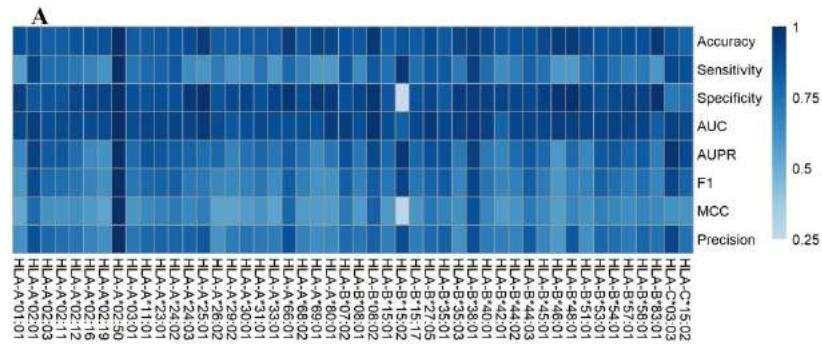

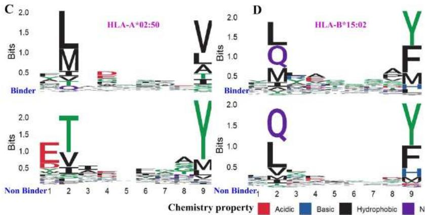

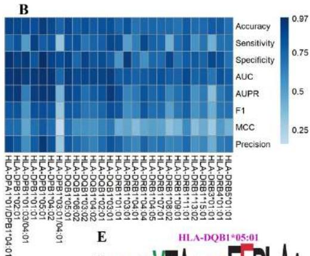

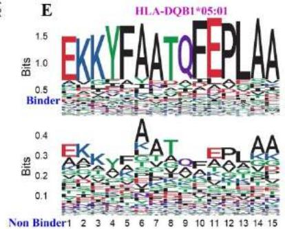  
Figure 2. BVMHC performance on human datasets and binding motifs of a few extremity models. Figure 2. BVMHC performance on human datasets and binding motifs of a few extremity models. (A,B) The performance of BVMHC on the training dataset for predicting human MHC Class I (A) (A,B) The performance of BVMHC on the training dataset for predicting human MHC Class I (A) and and II binders (B) in five-fold cross-validation. (C) The motifs of binders and non-binders for MHC II binders (B) in five-fold cross-validation. (C) The motifs of binders and non-binders for MHC Class I allele HLA- $\cdot \mathrm { A } ^ { \ast } 0 2 { : } 5 0$ . (D) The motifs of binders and non-binders for MHC Class I allele HLA- $\cdot \mathrm { B } ^ { \ast } 1 5 { : 0 2 }$ . (E) The motifs of binders and non-binders for MHC Class II allele HLA-DQB1 $^ { * } 0 5 { : } 0 1$ .

Table 1. Five-fold cross-validation results stratified by peptide length.Table 1. Five-fold cross-validation results stratified by peptide length.   

<table><tr><td></td><td>Length</td><td>Accuracy</td><td>AUC</td><td>F1</td><td>MCC</td><td>Specificity</td><td>Sensitivity</td><td>Precision</td><td>AUPR</td><td>Positive1</td><td>Negative2</td></tr><tr><td rowspan="5">Class I</td><td>8 mer</td><td>0.891</td><td>0.924</td><td>0.783</td><td>0.531</td><td>0.887</td><td>0.677</td><td>0.525</td><td>0.785</td><td>229</td><td>1879</td></tr><tr><td>9 mer</td><td>0.883</td><td>0.915</td><td>0.745</td><td>0.650</td><td>0.902</td><td>0.735</td><td>0.760</td><td>0.800</td><td>23,000</td><td>72,963</td></tr><tr><td>10 mer</td><td>0.813</td><td>0.850</td><td>0.693</td><td>0.527</td><td>0.842</td><td>0.690</td><td>0.661</td><td>0.725</td><td>7263</td><td>14,024</td></tr><tr><td>11 mer</td><td>0.879</td><td>0.905</td><td>0.768</td><td>0.608</td><td>0.881</td><td>0.756</td><td>0.651</td><td>0.755</td><td>310</td><td>1604</td></tr><tr><td>Others</td><td>0.986</td><td>1.000</td><td>0.992</td><td>0.564</td><td>0.750</td><td>1.000</td><td>0.985</td><td>1.000</td><td>54</td><td>803</td></tr><tr><td rowspan="9">Class II</td><td>13 mer</td><td>0.857</td><td>0.879</td><td>0.883</td><td>0.700</td><td>0.833</td><td>0.872</td><td>0.895</td><td>0.923</td><td>232</td><td>205</td></tr><tr><td>14 mer</td><td>0.898</td><td>0.907</td><td>0.880</td><td>0.792</td><td>0.912</td><td>0.880</td><td>0.880</td><td>0.873</td><td>131</td><td>239</td></tr><tr><td>15 mer</td><td>0.868</td><td>0.906</td><td>0.781</td><td>0.687</td><td>0.912</td><td>0.769</td><td>0.794</td><td>0.840</td><td>16,743</td><td>25,683</td></tr><tr><td>16 mer</td><td>0.776</td><td>0.846</td><td>0.802</td><td>0.545</td><td>0.718</td><td>0.823</td><td>0.782</td><td>0.878</td><td>563</td><td>569</td></tr><tr><td>17 mer</td><td>0.680</td><td>0.673</td><td>0.429</td><td>0.312</td><td>0.933</td><td>0.300</td><td>0.750</td><td>0.643</td><td>106</td><td>257</td></tr><tr><td>18 mer</td><td>0.643</td><td>0.939</td><td>0.706</td><td>0.452</td><td>1.000</td><td>0.545</td><td>1.000</td><td>0.986</td><td>71</td><td>40</td></tr><tr><td>19 mer</td><td>0.875</td><td>0.938</td><td>0.857</td><td>0.775</td><td>1.000</td><td>0.750</td><td>1.000</td><td>0.950</td><td>55</td><td>75</td></tr><tr><td>20 mer</td><td>0.750</td><td>0.900</td><td>0.500</td><td>0.488</td><td>1.000</td><td>0.333</td><td>1.000</td><td>0.886</td><td>65</td><td>66</td></tr><tr><td>Other</td><td>0.690</td><td>0.640</td><td>0.381</td><td>0.183</td><td>0.758</td><td>0.444</td><td>0.333</td><td>0.566</td><td>81</td><td>259</td></tr></table>

0.673 0.429 0.312 0.933 0.1 Number of positives; 2 Number of negatives

# 0.938 0.857 0.775 1.000 0.750 1.000 0.950 55 3.2. Independent Validation and Comparison with Other MHC Binding Predictors

0 0.500 0.488 1.000 0.333 1.000 0.886 65 66 An independent dataset extracted from MHCBN and SYFPEITHIwas used for vali-0.640 0.381 0.183 0.758 0.444 0.333 0.566 81 259 dation and comparison with other MHC binding predictors. Seven popular MHC class 1 Number of positives; 2 Number of negatives I binding predictors (comblib_sidney2008 [21], ANN [19], SMM [17], NetMHCcons [16], NetMHCpan [18], PickPocket [20] and NetMHCpan EL [24]) for class I and three well-3.2. Independent Validation and Comparison with Other MHC Binding Predictors accepted MHC class II binding predictors (NETMHCIIPan [23], NN-align [15] and SMM-An independent dataset extracted from MHCBN and SYFPEITHIwas used for val-align [22]) were selected for the comparison. A common limitation of these existing tools is idation and comparison with other MHC binding predictors. Seven popular MHC class I that the established model is bounded by a fixed peptide sequence length, which means binding predictors (comblib_sidney2008 [21], ANN [19], SMM [17], NetMHCcons [16], that investigators have to distort the sequence structure when they take special actions NetMHCpan [18], PickPocket [20] and NetMHCpan EL [24]) for class I and three (insertion or deletion) to ensure that the peptide length meets the model requirement. Moreover, in the above section, we have demonstrated that a model’s prediction performance

benefits from the positional conservation, the phenomenon of which is generally neglectedfive-fold cross-validation; we downloaded the HLA-DRB1*03:01 peptide data from in existing methods. The performance of BVMHC and the other MHC class I/II toolsMHCBN. Of all eight evaluation indices, BVMHC achieved the best performance in three was measured with the eight aforementioned criteria (Table 2), and the complete resultsof the eight criteria for MHC class I prediction and the best performance in four criteria are displayed in Table S2. Models of HLA-DRB1for MHC class II prediction. For example, BVMHC $^ { * } 0 3 { : } 0 1$ trained to predict MHC class IIned the best overall AUC of 0.887 binding peptide achieved accuracy and AUC over 0.8 on the five-fold cross-validation;(Figure 3A), and the best average AUC for 9-mer models in MHC class I prediction we downloaded the HLA-DRB1(Figure 3B). $^ { * } 0 3 { : } 0 1$ peptide data from MHCBN. Of all eight evaluation indices, BVMHC achieved the best performance in three of the eight criteria for MHC class I prediction and the best performance in four criteria for MHC class II prediction. For example, BVMHC obtained the best overall AUC of 0.887 (Figure 3A), and the best averagelighted in bold text. AUC for 9-mer models in MHC class I prediction (Figure 3B).

Table 2. The comparison results of the BVMHC model against seven other prediction tools on the0.597 0.371 0.959 0.887 0.866 0.531 0.374 0.936 197 123 independent validation dataset. The best performance value in each comparison track is highlighted0.600 0.386 0.943 0.865 0.890 0.543 0.365 0.916 197 123 in bold text.0.584   

<table><tr><td></td><td>Methods</td><td>Accuracy</td><td>Sensitivity</td><td>Specificity</td><td>AUC</td><td>AUPR</td><td>F1</td><td>MCC</td><td>Precision</td><td>Positive1</td><td>Negative2</td></tr><tr><td rowspan="8">Class I</td><td>BVMHC</td><td>0.597</td><td>0.371</td><td>0.959</td><td>0.887</td><td>0.866</td><td>0.531</td><td>0.374</td><td>0.936</td><td>197</td><td>123</td></tr><tr><td>NetMHCcons [16]</td><td>0.600</td><td>0.386</td><td>0.943</td><td>0.865</td><td>0.890</td><td>0.543</td><td>0.365</td><td>0.916</td><td>197</td><td>123</td></tr><tr><td>SMM [17]</td><td>0.584</td><td>0.350</td><td>0.959</td><td>0.859</td><td>0.891</td><td>0.509</td><td>0.357</td><td>0.932</td><td>197</td><td>123</td></tr><tr><td>NetMHCpan [18]</td><td>0.566</td><td>0.330</td><td>0.943</td><td>0.867</td><td>0.886</td><td>0.483</td><td>0.318</td><td>0.903</td><td>197</td><td>123</td></tr><tr><td>ANN [19]</td><td>0.563</td><td>0.325</td><td>0.943</td><td>0.867</td><td>0.880</td><td>0.478</td><td>0.314</td><td>0.901</td><td>197</td><td>123</td></tr><tr><td>PickPocket [20]</td><td>0.563</td><td>0.345</td><td>0.911</td><td>0.813</td><td>0.833</td><td>0.493</td><td>0.289</td><td>0.861</td><td>197</td><td>123</td></tr><tr><td>NetMHCpan EL [24]</td><td>0.553</td><td>0.335</td><td>0.902</td><td>0.816</td><td>0.856</td><td>0.480</td><td>0.269</td><td>0.846</td><td>197</td><td>123</td></tr><tr><td>comblib_sidney2008 [21]</td><td>NAN$</td><td>NAN$</td><td>NAN$</td><td>0.744</td><td>NAN$</td><td>NAN$</td><td>NAN$</td><td>NAN$</td><td>68</td><td>46</td></tr><tr><td rowspan="4">Class II</td><td>BVMHC</td><td>0.878</td><td>0.333</td><td>0.965</td><td>0.718</td><td>0.417</td><td>0.429</td><td>0.386</td><td>0.600</td><td>18</td><td>113</td></tr><tr><td>NN-align [15]</td><td>0.863</td><td>0.278</td><td>0.956</td><td>0.866</td><td>0.484</td><td>0.357</td><td>0.303</td><td>0.500</td><td>18</td><td>113</td></tr><tr><td>NETMHCIIPan [23]</td><td>0.870</td><td>0.111</td><td>0.991</td><td>0.795</td><td>0.423</td><td>0.190</td><td>0.235</td><td>0.667</td><td>18</td><td>113</td></tr><tr><td>SMM-align [22]</td><td>0.840</td><td>0.000</td><td>0.973</td><td>0.787</td><td>0.319</td><td>NA$</td><td>-0.061</td><td>0.000</td><td>18</td><td>113</td></tr></table>

1 Number of positives 2 Number of negatives § NA: the sum of Sensitivity and Precision is zero, thus F1 is NA.1 Number of positives 2 Number of negatives § NAs: the sum of Sensitivity and Precision is zero, § NAN: the evaluation indices cannot be obtained because the original score threshold is not available. The valuethus F1 is NA. § NAN: the evaluation indices cannot be obtained because the original score in bold are the best for each column.threshold is not available. The v

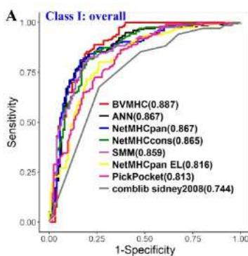

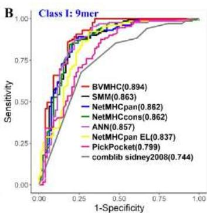

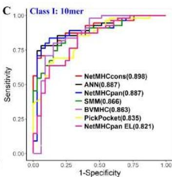

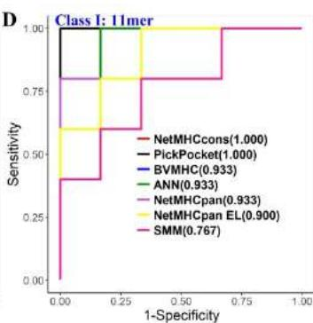  
Figure 3. Receiver-Operating-Characteristic (ROC) curves of the eight tools for predicting MHC Figure 3. Receiver-Operating-Characteristic (ROC) curves of the eight tools for predicting MHC class class I binders on the independent validation dataset. (A–D). BVMHC and seven existing predic-I binders on the independent validation dataset. (A–D). BVMHC and seven existing prediction tools for overall (A), 9-mer (B), 10-mer (C), and 11-mer (D) MHC class I binders, respectively.

# 3.3. Performance of Non-Human Species

Using the same strategy as in humans, BVMHC models were also trained for MHC class I prediction for three mouse alleles, eight macaque alleles, five chimpanzee alleles, and one rat allele; in addition, two mouse MHC class II alleles were also covered. Results of five-fold cross-validation of these non-human MHC prediction models are available in Table 3. All 17 MHC class I models achieved greater than 0.8 accuracy and AUC. Both MHC class II models obtained greater than 0.80 accuracy. Due to the limitations of non-human data availability, independent validation was not performed.

Table 3. Performance evaluation results of BVMHC model on non-human species.   

<table><tr><td></td><td>Alleles</td><td>Accuracy</td><td>AUC</td><td>F1</td><td>MCC</td><td>Specificity</td><td>Sensitivity</td><td>Precision</td><td>AUPR</td></tr><tr><td rowspan="17">Class I</td><td>H-2-Db</td><td>0.829</td><td>0.855</td><td>0.573</td><td>0.466</td><td>0.897</td><td>0.564</td><td>0.583</td><td>0.602</td></tr><tr><td>H-2-Dd</td><td>0.924</td><td>0.870</td><td>0.696</td><td>0.660</td><td>0.975</td><td>0.615</td><td>0.800</td><td>0.751</td></tr><tr><td>H-2-Ld</td><td>0.814</td><td>0.852</td><td>0.698</td><td>0.564</td><td>0.875</td><td>0.682</td><td>0.714</td><td>0.779</td></tr><tr><td>Mamu-A07</td><td>0.905</td><td>0.949</td><td>0.854</td><td>0.783</td><td>0.929</td><td>0.854</td><td>0.854</td><td>0.902</td></tr><tr><td>Mamu-A11</td><td>0.822</td><td>0.899</td><td>0.726</td><td>0.595</td><td>0.880</td><td>0.707</td><td>0.747</td><td>0.805</td></tr><tr><td>Mamu-A2201</td><td>0.908</td><td>0.957</td><td>0.854</td><td>0.789</td><td>0.955</td><td>0.814</td><td>0.897</td><td>0.943</td></tr><tr><td>Mamu-B01</td><td>0.942</td><td>0.865</td><td>0.667</td><td>0.654</td><td>0.988</td><td>0.550</td><td>0.846</td><td>0.767</td></tr><tr><td>Mamu-B03</td><td>0.857</td><td>0.921</td><td>0.769</td><td>0.666</td><td>0.903</td><td>0.758</td><td>0.781</td><td>0.843</td></tr><tr><td>Mamu-B08</td><td>0.852</td><td>0.911</td><td>0.690</td><td>0.600</td><td>0.875</td><td>0.769</td><td>0.625</td><td>0.776</td></tr><tr><td>Mamu-B17</td><td>0.822</td><td>0.882</td><td>0.717</td><td>0.592</td><td>0.838</td><td>0.782</td><td>0.662</td><td>0.710</td></tr><tr><td>Mamu-B52</td><td>0.827</td><td>0.870</td><td>0.870</td><td>0.617</td><td>0.677</td><td>0.912</td><td>0.832</td><td>0.884</td></tr><tr><td>Patr-A0101</td><td>0.816</td><td>0.838</td><td>0.619</td><td>0.520</td><td>0.935</td><td>0.520</td><td>0.765</td><td>0.688</td></tr><tr><td>Patr-A0401</td><td>0.881</td><td>0.904</td><td>0.636</td><td>0.565</td><td>0.929</td><td>0.636</td><td>0.636</td><td>0.616</td></tr><tr><td>Patr-A0701</td><td>0.825</td><td>0.820</td><td>0.545</td><td>0.438</td><td>0.901</td><td>0.522</td><td>0.571</td><td>0.682</td></tr><tr><td>Patr-B0101</td><td>0.911</td><td>0.947</td><td>0.794</td><td>0.759</td><td>0.991</td><td>0.675</td><td>0.964</td><td>0.894</td></tr><tr><td>Patr-B1301</td><td>0.875</td><td>0.917</td><td>0.903</td><td>0.727</td><td>0.824</td><td>0.903</td><td>0.903</td><td>0.951</td></tr><tr><td>RT1A</td><td>0.893</td><td>0.923</td><td>0.400</td><td>0.352</td><td>0.923</td><td>0.500</td><td>0.333</td><td>0.667</td></tr><tr><td rowspan="2">Class II</td><td>H-2-IAb</td><td>0.826</td><td>0.797</td><td>0.489</td><td>0.394</td><td>0.925</td><td>0.423</td><td>0.579</td><td>0.627</td></tr><tr><td>H-2-IAd</td><td>0.810</td><td>0.810</td><td>0.571</td><td>0.452</td><td>0.896</td><td>0.533</td><td>0.615</td><td>0.632</td></tr></table>

# 3.4. Web Server Implementation

A web server for the BVMHC models was developed using the combination of R, PHP, and Python, which is freely accessible at http://www.innovebioinfo.com/Proteomics/ MHC/home.php. The website can conduct predictions for MHC class I and II binding peptides of multiple species. For MHC class I prediction, BVMHC covers 48 human alleles, three mouse alleles, eight macaque alleles, five chimpanzee alleles, and one rat allele; for MHC class II prediction, BVMHC covers 12 human alleles and two mouse alleles.

# 4. Discussion

MHC binding prediction is a crucial step toward identifying potential novel therapeutic strategies. For example, MHC class I molecules were found to be tumor suppressor genes [38] and can served as targets for immunotherapy [39]. Similar to MHC class I, the class II antigens can also serve as targets in cancer immunotherapy [40]. The prediction of MHC binding peptides is biologically and clinically important because it predicts the binding affinity of a T-cell immune response. Factors such as the polymorphic nature of MHC molecules, the variable length of peptides, etc. make it difficult to accurately predict MHC binding. However, advances in machine learning, especially those based on neural networks, have propelled substantial advancement in MHC binding prediction research. In this study, we proposed an approach using the Bilateral and Variable Long-Short Term Memory Networks to tackle the variable length issue in MHC binding prediction. By thoroughly comparing to other fixed-length-constrained MHC binding prediction tools, we show that BVMHC has the advantage in several performance measurements. However, In this paper, we just use the peptide sequences information to construct predictors. Inspired by NetMHCpan [18] and NetMHCIIpan [23], in the future we will incorporate the MHC protein sequence information to augment the feature representation of binders. As AlphaFold [41] becomes the focus of research about protein structure, we look to discern the differences between different MHC allele proteins at the protein structure level, which may hold promises for an even improved prediction of MHC protein binders. Additionally, a BVMHC predictor can be used to quickly screen potential binders—an effective strategy is to dissect a complete protein sequence into equal-sized segments and run the predictor over these segments across the whole span of the protein sequence. Considering the computational time complexity, such screening workflows must be optimized to reduce the running time to the minimum.

# 5. Conclusions

BVMHC is an MHC binding prediction tool that supports five species (human, chimpanzee, macaque, mouse, and rat). Compared to existing MHC prediction tools, BVMHC can use peptides of variable lengths to train a predictor, which allows for the reservation of the innate primary structure of the sequence. The combination of analyses at the conservatory level and the sequential level is vital for the superior performance of the resultant BVMHC model. In independent validation and comparison, BVMHC showed the best overall performance compared to seven other popular MHC class I predictors and three well-accepted MHC class II predictors. BVMHC was developed into a web server and can be accessed freely online.

Supplementary Materials: The following supporting information can be downloaded at: https:// www.mdpi.com/article/10.3390/biology11060848/s1, Table S1: Summary of datasets; Table S2: The detailed results based on independent dataset.

Author Contributions: Conceptualization: Y.G., J.T. and F.G.; Analysis: L.J.; Manuscript writing: L.J. and Y.G.; Funding acquisition: Y.G., J.T. and F.G. All authors have read and agreed to the published version of the manuscript.

Funding: YG was supported by Cancer Center Support Grants from the National Cancer Institute (P30CA118100). JT was supported by The National Natural Science Foundation of China (NSFC 61772362, 61972280) and Shenzhen KQTD Project [KQTD20200820113106007].

Institutional Review Board Statement: Not applicable.

Informed Consent Statement: Not applicable.

Data Availability Statement: All data used in this study were obtained from public repositories.

Conflicts of Interest: The authors declare that they have no conflict of interest.

# References

1. Bjorkman, P.J.; Saper, M.A.; Samraoui, B.; Bennett, W.S.; Strominger, J.L.; Wiley, D.C. Structure of the human class I histocompatibility antigen, HLA-A2. Nature 1987, 329, 506–512. [CrossRef] [PubMed]   
2. Tanaka, K.; Kasahara, M. The MHC class I ligand-generating system: Roles of immunoproteasomes and the interferon-gammainducible proteasome activator PA28. Immunol. Rev. 1998, 163, 161–176. [CrossRef] [PubMed]   
3. Schott, G.; Garcia-Blanco, M.A. MHC Class III RNA Binding Proteins and Immunity. RNA Biol. 2021, 18, 640–646. [CrossRef] [PubMed]   
4. Roemer, M.G.M.; Advani, R.H.; Redd, R.A.; Pinkus, G.S.; Natkunam, Y.; Ligon, A.H.; Connelly, C.F.; Pak, C.J.; Carey, C.D.; Daadi, S.E.; et al. Classical Hodgkin Lymphoma with Reduced beta M-2/MHC Class I Expression Is Associated with Inferior Outcome Independent of 9p24.1 Status. Cancer Immunol. Res. 2016, 4, 910–916. [CrossRef] [PubMed]   
5. Garrido, F.; Aptsiauri, N. Cancer immune escape: MHC expression in primary tumours versus metastases. Immunology 2019, 158, 255–266. [CrossRef] [PubMed]   
6. Falk, K.; Rotzschke, O.; Stevanovie, S.; Jung, G.; Rammensee, H.-G. Allele-specific motifs revealed by sequencing of self-peptides eluted from MHC molecules. Nature 1991, 351, 290–296. [CrossRef]   
7. Hobohm, U.; Meyerhans, A. A pattern search method for putative anchor residues in T cell epitopes. Eur. J. Immunol. 1993, 23, 1271–1276. [CrossRef]   
8. Kessler, J.H.; Benckhuijsen, W.E.; Mutis, T.; Melief, C.J.; van der Burg, S.H.; Drijfhout, J.W. Competition-based cellular peptide binding assay for HLA class I. Curr. Protoc. Immunol. 2004, 18. [CrossRef]   
9. Jiang, L.; Yu, H.; Li, J.; Tang, J.; Guo, Y.; Guo, F. Predicting MHC class I binder: Existing approaches and a novel recurrent neural network solution. Brief Bioinform. 2021, 22, bbab216. [CrossRef]   
10. Vita, R.; Mahajan, S.; Overton, J.A.; Dhanda, S.K.; Martini, S.; Cantrell, J.R.; Wheeler, D.K.; Sette, A.; Peters, B. The Immune Epitope Database (IEDB): 2018 update. Nucleic Acids Res. 2019, 47, D339–D343. [CrossRef]   
11. Bhasin, M.; Singh, H.; Raghava, G.P. MHCBN: A comprehensive database of MHC binding and non-binding peptides. Bioinformatics 2003, 19, 665–666. [CrossRef] [PubMed]   
12. Hu, Y.; Wang, Z.; Hu, H.; Wan, F.; Chen, L.; Xiong, Y.; Wang, X.; Zhao, D.; Huang, W.; Zeng, J. ACME: Pan-specific peptide-MHC class I binding prediction through attention-based deep neural networks. Bioinformatics 2019, 35, 4946–4954. [CrossRef] [PubMed]   
13. Zeng, H.; Gifford, D.K. DeepLigand: Accurate prediction of MHC class I ligands using peptide embedding. Bioinformatics 2019, 35, i278–i283. [CrossRef] [PubMed]

14. Wilson, E.A.; Krishna, S.; Anderson, K.S. A Random Forest based approach to MHC class I epitope prediction and analysis. J. Immunol. 2018, 200.   
15. Jensen, K.K.; Andreatta, M. Improved methods for predicting peptide binding affinity to MHC class II molecules. Immunology 2018, 154, 394–406. [CrossRef] [PubMed]   
16. Karosiene, E.; Lundegaard, C.; Lund, O.; Nielsen, M. NetMHCcons: A consensus method for the major histocompatibility complex class I predictions. Immunogenetics 2012, 64, 177–186. [CrossRef]   
17. Peters, B.; Sette, A. Generating quantitative models describing the sequence specificity of biological processes with the stabilized matrix method. BMC Bioinform. 2005, 6, 132. [CrossRef]   
18. Hoof, I.; Peters, B.; Sidney, J.; Pedersen, L.E.; Sette, A.; Lund, O.; Buus, S.; Nielsen, M. NetMHCpan, a method for MHC class I binding prediction beyond humans. Immunogenetics 2009, 61, 1. [CrossRef]   
19. Lundegaard, C.; Lund, O.; Nielsen, M. Accurate approximation method for prediction of class I MHC affinities for peptides of length 8, 10 and 11 using prediction tools trained on 9mers. Bioinformatics 2008, 24, 1397–1398. [CrossRef]   
20. Zhang, H.; Lund, O.; Nielsen, M. The PickPocket method for predicting binding specificities for receptors based on receptor pocket similarities: Application to MHC-peptide binding. Bioinformatics 2009, 25, 1293–1299. [CrossRef]   
21. Sidney, J.; Assarsson, E.; Moore, C.; Ngo, S.; Pinilla, C.; Sette, A.; Peters, B. Quantitative peptide binding motifs for 19 human and mouse MHC class I molecules derived using positional scanning combinatorial peptide libraries. Immunome Res. 2008, 4, 2. [CrossRef] [PubMed]   
22. Nielsen, M.; Lundegaard, C.; Lund, O. Prediction of MHC class II binding affinity using SMM-align, a novel stabilization matrix alignment method. BMC Bioinform. 2007, 8, 238. [CrossRef] [PubMed]   
23. Andreatta, M.; Karosiene, E.; Rasmussen, M.; Stryhn, A.; Buus, S.; Nielsen, M. Accurate pan-specific prediction of peptide-MHC class II binding affinity with improved binding core identification. Immunogenetics 2015, 67, 641–650. [CrossRef] [PubMed]   
24. Vanessa, J.; Sinu, P.; Massimo, A.; Paolo, M.; Bjoern, P.; Morten, N. NetMHCpan-4.0: Improved Peptide-MHC Class I Interaction Predictions Integrating Eluted Ligand and Peptide Binding Affinity Data. J. Immunol. 2017, 199, 3360–3368. [CrossRef]   
25. Singh, H.; Raghava, G.P. ProPred1: Prediction of promiscuous MHC Class-I binding sites. Bioinformatics 2003, 19, 1009–1014. [CrossRef]   
26. Dönnes, P.; Elofsson, A. Prediction of MHC class I binding peptides, using SVMHC. BMC Bioinform. 2002, 3, 25. [CrossRef]   
27. Rasmussen, M.; Fenoy, E. Pan-Specific Prediction of Peptide-MHC Class I Complex Stability, a Correlate of T Cell Immunogenicity. J. Immunol. 2016, 197, 1517–1524. [CrossRef]   
28. Liu, G.; Li, D.; Li, Z.; Qiu, S.; Li, W.; Chao, C.C.; Yang, N.; Li, H.; Cheng, Z.; Song, X.; et al. PSSMHCpan: A novel PSSM-based software for predicting class I peptide-HLA binding affinity. GigaScience 2017, 6, gix017. [CrossRef]   
29. Nielsen, M.; Andreatta, M. NetMHCpan-3.0; improved prediction of binding to MHC class I molecules integrating information from multiple receptor and peptide length datasets. Genome Med. 2016, 8, 33. [CrossRef]   
30. O’Donnell, T.J.; Rubinsteyn, A.; Bonsack, M.; Riemer, A.B.; Laserson, U.; Hammerbacher, J. MHCflurry: Open-Source Class I MHC Binding Affinity Prediction. Cell Systems 2018, 7, 129–132.e4. [CrossRef]   
31. Zhao, T.; Cheng, L.; Zang, T.; Hu, Y. Peptide-Major Histocompatibility Complex Class I Binding Prediction Based on Deep Learning With Novel Feature. Front. Genet. 2019, 10, 1191. [CrossRef] [PubMed]   
32. Graves, A.; Schmidhuber, J. Framewise phoneme classification with bidirectional LSTM and other neural network architectures. Neural Netw. 2005, 18, 602–610. [CrossRef] [PubMed]   
33. Hochreiter, S.; Schmidhuber, J. Long Short-Term Memory. Neural Comput. 1997, 9, 1735–1780. [CrossRef]   
34. Lata, S.; Bhasin, M.; Raghava, G.P.S. MHCBN 4.0: A database of MHC/TAP binding peptides and T-cell epitopes. BMC Res. Notes 2009, 2, 61. [CrossRef] [PubMed]   
35. Rammensee, H.G.; Bachmann, J.; Emmerich, N.P.N.; Bachor, O.A.; Stevanovi´c, S. SYFPEITHI: Database for MHC ligands and peptide motifs. Immunogenetics 1999, 50, 213–219. [CrossRef] [PubMed]   
36. Davis, M.J. Contrast Coding in Multiple Regression Analysis: Strengths, Weaknesses, and Utility of Popular Coding Structures. J. Data Sci. 2010, 8, 61–73. [CrossRef]   
37. Henikoff, S.; Henikoff, J.G. Amino acid substitution matrices from protein blocks. Proc. Natl. Acad. Sci. USA 1992, 89, 10915–10919. [CrossRef]   
38. Garrido, C.; Paco, L.; Romero, I.; Berruguilla, E.; Stefansky, J.; Collado, A.; Algarra, I.; Garrido, F.; Garcia-Lora, A.M. MHC class I molecules act as tumor suppressor genes regulating the cell cycle gene expression, invasion and intrinsic tumorigenicity of melanoma cells. Carcinogenesis 2012, 33, 687–693. [CrossRef]   
39. Cornel, A.M.; Mimpen, I.L.; Nierkens, S. MHC Class I Downregulation in Cancer: Underlying Mechanisms and Potential Targets for Cancer Immunotherapy. Cancers 2020, 12, 1760. [CrossRef]   
40. Sun, Z.; Chen, F.; Meng, F.; Wei, J.; Liu, B. MHC class II restricted neoantigen: A promising target in tumor immunotherapy. Cancer Lett. 2017, 392, 17–25. [CrossRef]   
41. Jumper, J.; Evans, R.; Pritzel, A.; Green, T.; Figurnov, M.; Ronneberger, O.; Tunyasuvunakool, K.; Bates, R.; Žídek, A.; Potapenko, A.; et al. Highly accurate protein structure prediction with AlphaFold. Nature 2021, 596, 583–589. [CrossRef] [PubMed]

# Article

# Identification of DPP4/CTNNB1/MET as a Theranostic Signature of Thyroid Cancer and Evaluation of the Therapeutic Potential of Sitagliptin

Sheng-Yao Cheng 1,†, Alexander T. H. Wu 2,3,4,5,† , Gaber El-Saber Batiha $\theta ( \oplus$ , Ching-Liang Ho 7, Jih-Chin Lee 1, Halimat Yusuf Lukman ${ } ^ { 8 } \textcircled { \mathbb { D } }$ , Mohammed Alorabi ${ \mathfrak { s } } _ { \oplus }$ , Abdullah N. AlRasheedi 10 and Jia-Hong Chen 7,*

Citation: Cheng, S.-Y.; Wu, A.T.H.; Batiha, G.E.-S.; Ho, C.-L.; Lee, J.-C.; Lukman, H.Y.; Alorabi, M.; AlRasheedi, A.N.; Chen, J.-H. Identification of DPP4/CTNNB1/ MET as a Theranostic Signature of Thyroid Cancer and Evaluation of the Therapeutic Potential of Sitagliptin. Biology 2022, 11, 324. https:// doi.org/10.3390/biology11020324

Academic Editors: Shibiao Wan, Yiping Fan, Chunjie Jiang and Shengli Li

Received: 11 December 2021

Accepted: 14 February 2022

Published: 17 February 2022

Publisher’s Note: MDPI stays neutral with regard to jurisdictional claims in published maps and institutional affiliations.

Copyright: © 2022 by the authors. Licensee MDPI, Basel, Switzerland. This article is an open access article distributed under the terms and conditions of the Creative Commons Attribution (CC BY) license (https:// creativecommons.org/licenses/by/ 4.0/).

1 Department of Otolaryngology-Head and Neck Surgery, Tri-Service General Hospital, National Defense Medical Center, 325, Section 2, Chenggong Road, Taipei 114, Taiwan; gjcheng5032@gmail.com (S.-Y.C.); doc30450@gmail.com (J.-C.L.)   
2 TMU Research Center of Cancer Translational Medicine, Taipei Medical University, Taipei 110, Taiwan; chaw1211@tmu.edu.tw   
3 The PhD Program of Translational Medicine, College of Science and Technology, Taipei Medical University, Taipei 110, Taiwan   
4 Clinical Research Center, Taipei Medical University Hospital, Taipei Medical University, Taipei 110, Taiwan   
5 Graduate Institute of Medical Sciences, National Defense Medical Center, Taipei 110, Taiwan   
6 Department of Pharmacology and Therapeutics, Faculty of Veterinary Medicine, Damanhour University, Damanhour 22511, Egypt; gaberbatiha@gmail.com   
7 Division of Hematology/Oncology, Department of Medicine, Tri-Service General Hospital, National Defense Medical Center, Taipei 11490, Taiwan; charileho22623@gmail.com   
8 Department of Chemical Sciences, Biochemistry Unit, College of Natural and Applied Sciences, Summit University Offa, Offa PMB 4412, Nigeria; halimatyusuf40@summituniversity.edu.ng   
9 Department of Biotechnology, College of Sciences, Taif University, Taif P.O. Box 11099, Saudi Arabia; maorabi@tu.edu.sa   
10 Otolaryngology-Head & Neck Surgery Department, College of Medicine, Jouf University, Sakaka P.O. Box 2014, Saudi Arabia; analrashedi@ju.edu.sa   
* * Correspondence: ndmc_tw.tw@yahoo.com.tw   
† These authors contributed equally to this work.

Simple Summary: In recent years, the incidence of thyroid cancer has been increasing globally, with papillary thyroid cancer (PTCa) being the most prevalent pathological type. Although PTCa has been regarded to be slow growing and has a good prognosis, in some cases, PTCa can be aggressive and progress despite surgery and radioactive iodine treatment. Therefore, searching for new targets and therapies is required. We utilized bioinformatics analyses to identify critical theranostic markers for PTCa. We found that DPP4/CTNNB1/MET is an oncogenic signature that is overexpressed in PTCa and associated with disease progression, distant metastasis, treatment resistance, immunoevasive phenotypes, and poor clinical outcomes. Interestingly, our in silico molecular docking results revealed that sitagliptin, an antidiabetic drug, has strong affinities and potential for targeting DPP4/CTNNB1/MET signatures, even higher than standard inhibitors of these genes. Collectively, our findings suggest that sitagliptin could be repurposed for treating PTCa.

Abstract: In recent years, the incidence of thyroid cancer has been increasing globally, with papillary thyroid cancer (PTCa) being the most prevalent pathological type, accounting for approximately $8 0 \%$ of all cases. Although PTCa has been regarded to be slow growing and has a good prognosis, in some cases, PTCa can be aggressive and progress despite surgery and radioactive iodine treatment. In addition, most cancer treatment drugs have been shown to be cytotoxic and nonspecific to cancer cells, as they also affect normal cells and consequently cause harm to the body. Therefore, searching for new targets and therapies is required. Herein, we explored a bioinformatics analysis to identify important theranostic markers for THCA. Interestingly, we identified that the DPP4/CTNNB1/MET gene signature was overexpressed in PTCa, which, according to our analysis, is associated with immuno-invasive phenotypes, cancer progression, metastasis, resistance, and unfavorable clinical outcomes of thyroid cancer cohorts. Since most cancer drugs were shown to exhibit cytotoxicity

and to be nonspecific, herein, we evaluated the anticancer effects of the antidiabetic drug sitagliptin, which was recently shown to possess anticancer activities, and is well tolerated and effective. Interestingly, our in silico molecular docking results exhibited putative binding affinities of sitagliptin with DPP4/CTNNB1/MET signatures, even higher than standard inhibitors of these genes. This suggests that sitagliptin is a potential THCA therapeutic, worthy of further investigation both in vitro and in vivo and in clinical settings.

Keywords: sitagliptin; thyroid cancer (THCA); papillary thyroid cancer (PTCa); thyroidectomy; metastasis; drug resistance

# 1. Introduction

Thyroid cancer (THCA) is the most prevalent malignancy of the endocrine system, and the 9th most common cancer in the world [1,2], accounting for approximately 600,000 newly diagnosed cases annually on a global scale [3], with high rates of morbidity reported in recent years [4]. THCA is divided into various subtypes, including anaplastic thyroid cancer (ATC), papillary thyroid carcinoma (PTCa), and follicular thyroid carcinoma (FTC), with PTCa being the most prevalent, as it accounts for approximately $8 5 \%$ of THCA [5,6]. PTC and FTC are well-differentiated thyroid cancers with an optimal prognosis of about 10 years disease-specific survival [7]. However, the ATC is poorly differentiated with proliferative stem-cell-like properties, resistance to therapies, and accounts for the majority of thyroid-cancer-related deaths [8,9]. The rapid increase in thyroid cancer, particularly PTCa, has been accredited to the availability and sensitive use of ultrasonography and other diagnostic imaging modalities [10,11], which have likely led to a massive detection and diagnosis of a large reservoir of subclinical, indolent lesions of the thyroid [12,13]. Studies have also implicated obesity, hormonal imbalance, metabolic syndromes, and environmental pollutants in the development of PTCa [14].

Patients with PTCa usually show good clinical outcomes compared with other cancers; however, there is also a very high rate of relapse post-treatment, leading to distant metastasis [15,16]. About $1 1 \%$ of patients with PTC present with distant metastases outside the neck and mediastinum [17]. Moreover, long-term survival outcomes for aggressive PTC subgroups exhibit heterogeneous clinical behavior and a wide range of mortality risks, suggesting that treatment should be tailored to specific histologic subtypes [18]. The diagnostic criteria for PTC allow it to demonstrate various histological features and growth patterns; different variants of PTCa are recognized, including classic, microcarcinoma, encapsulated, follicular, diffuse sclerosing, tall cell, columnar cell, cribriform-morular, hobnail, solid, oncocytic, spindle cell, clear cell, and Warthin-like variants [19]. However, among these variants, tall cell, columnar cells, and hobnail variants are of undoubted clinical significance, since they are aggressive variants associated with aggressive clinicopathological features and worse prognosis than for classic and encapsulated PTC [20–22].

Surgery, endocrine therapy, and radioiodine therapy are well-known therapy regimens for PTCa, offering a good prognosis; however, the aggressive variants of PTCa progress despite surgery and radioactive iodine treatment [23]. In addition, tumor recurrence in PTCa is associated with therapeutic resistance which increases the death toll in patients [24–26]. Unfortunately, an upsurge in the incidence of aggressive PTCs was observed at a rate higher than that seen in well-differentiated PTCs or anaplastic thyroid carcinomas (ATCs) in the past two decades in a study of a large cohort of thyroid cancers [22]; therefore, there is an urgent need to identify novel diagnostic and prognostic molecular biomarkers that could also be used as molecular targets for the development of new drugs or in repurposing existing drugs for the treatment of PTCa.

Increasing evidence shows that dipeptidyl aminopeptidase IV (DPP IV) is associated with cancer development and progression [27,28]; DPP4 is an adenosine deaminase complex protein, and was demonstrated to be upregulated in THCA, particularly in PTCa,

and is associated with tumor aggression and poor prognoses [29–31]. Moreover, high expression of DPP4 was shown to promote distance metastasis and stemness in esophageal adenocarcinoma and colorectal cancer [32,33]. However, the prognostic role of DPP4 expression and its role in THCA metastasis remains elusive [7,29,31]. Studies have shown that DPP4 and b-catenin crosstalk to regulate critical cellular processes, including motility and invasion [34]. A study involving lung cancer patients has revealed that the expression levels of $\beta$ -catenin correlate with DPP4 expression [35] and contributed to tumor metastasis [34,36]. An experimental study has also reported that activating mutation of Ctnnb1 induced DPP4 overexpression in epidermal keratinocytes of LRIG1+ stem cells [37]. Research has illuminated that inhibitors of DPP4 exert their therapeutic effect via modulation of the Wnt/ $\beta$ -catenin signaling pathway [38]. Sitagliptin, an inhibitor of DPP4, has also been reported to provide renal protection via inhibition of the tubulointerstitial Wnt/ $\beta$ -catenin signaling pathway in diabetic nephropathy [39].

Accumulating studies demonstrated a pivotal correlation between distant metastasis in PTCa and MET (MET proto-oncogenic receptor tyrosine kinase) [40]. Approximately $7 0 \%$ of PTCas were reported to overexpress the MET gene, and it is associated with poor prognoses [41]. In addition, Rossana et al. also demonstrated that higher expression levels of MET in PTCa promoted cancer growth and distance metastasis [42,43]. MET is a transmembrane tyrosine kinase identified as a high-affinity receptor for hepatocyte growth factor (HGF), and both MET and HGF were demonstrated to be expressed in PTCa [42], and consequently promote progression and secondary metastasis [44]. Additionally, MET was shown to activate $\beta$ -catenin (CTNNB1), an important component of the canonical Wnt pathway [45,46]. CTNNB1 was recently reported to be mutated in PTCa, and to ultimately promote cancer development and stemness [47,48]. Moreover, upregulated MET was also demonstrated to regulate the expression of mitogen-activated protein kinase (MAPK), phosphatidylinositol 3-kinase (PI3K)/AKT, signal transducer and activator of transcription 3 (STAT3), and nuclear factor (NF)- $\mathbf { \nabla } \cdot \kappa B$ pathways in THCA [40,49]. This suggests that MET is a crucial target gene in THCA, and worthy of further investigation. To date, most drugs used for cancer treatment are cytotoxic and usually not specific to cancer cells, but also affect normal cells; therefore, there is still a huge gap in finding more sensitive and specific drugs for cancer. Recent studies suggested an association between cancer occurrence and antidiabetic medicaments. Sitagliptin is a standard inhibitor of DPP4, widely used for treating diabetes, and was shown to possess anticancer activities, as well as being efficacious and well tolerated [50]. In the present study, we predicted the potential anticancer activities of sitagliptin as a target for DPP4/CTNNB1/MET oncogenic signatures, which are overexpressed in THCA.

# 2. Materials and Methods

# 2.1. Microarray Data Acquisition and Identification of Differentially Expressed Genes (DEGs)

Gene expressions of four THCA datasets (GEO3467, GEO36787, GEO6004, and GEO33630) were extracted from the NCBI gene expression omnibus. The acquired datasets were further analyzed using GEO2R (https://www.ncbi.nlm.nih.gov/geo/geo2r/ accessed on 5 September 2021), and results contained DEG profiles from THCA patients compared to normal samples. To control the false discovery rate (FDR), the Benjamini–Hochberg adjustment was applied to $p$ values (adjusted (adj.) $p$ values), to moderate the balance between detection of significant genes and possible false-positive values. The fold-change (FC) threshold was set to 1.5, and adj. $p < 0 . 0 5$ was considered statistically significant. Venn diagrams were constructed using the Bioinformatics and Evolutionary Genomics (BEG) online tool (http://bioinformatics.psb. ugent.be/webtools/Venn/ accessed on 6 September 2021).

# 2.2. Differential Expression of the THCA Gene Hub

Differential expressions of THCA gene profiles between tumor tissues and normal adjacent tissues of the Cancer Genome Atlas (TCGA) database were analyzed using UALCAN (http://ualcan.path.uab.edu accessed on 12 September 2021), an online web portal used to

identify gene expression levels between primary tumors compared to normal tissue samples [51]. Moreover, we explored the cBioPortal online web tool (https://www.cbioportal.org accessed on 19 September 2021), which categorizes gene alterations based on percentages of individual genes due to amplification [52]. For further analysis, we used the cBioPortal correlation sub-tool to determine gene expression correlations with positive Spearman and Pearson correlation coefficients with $p < 0 . 0 5$ as statistically significant.

# 2.3. Comparisons of DPP4/CTNNB1/MET Expressions in Normal, Primary, and Metastatic Tumor of Thyroid Cancer Cohorts

To compare expression levels of the DPP4/CTNNB1/MET oncogenes among normal, tumor, and metastatic tissues, we explored the tumor, normal, and metastatic plot (TNMplot), (https://tnmplot.com/analysis/ accessed on 21 September 2021), an RNA-sequence-based rapid analysis, which is used to compare data of selected genes [53]. Data were compared using the Kruskal–Wallis test, which is a method used to test samples originally from the same distribution of specimens, followed by Dunn’s test, which assesses the significance of gene expressions in promoting THCA tumor metastasis, with $p < 0 . 0 5$ considered statistically significant.

# 2.4. Interaction Network and Gene Enrichment Analysis

An interaction network analysis was constructed using the Search Tool for the Retrieval of Interacting Genes/Proteins (STRING, https://string-db.org/ accessed on 25 September 2021) database [54], and GeneMANIA [55] (http://genemania.org/data accessed on 28 September 2021), which are online web tools developed to analyze interaction networks. The STRING database was used under a high confidence of 0.700, and protein enrichment of $p < 6 . 0 \times 1 0 ^ { - 0 3 }$ was obtained. Interactions among genes were analyzed according to correlations based on experimental data (pink), gene neighborhoods (green), gene fusion (red), gene co-occurrences (blue), and gene co-expression (black). Moreover, we explored the Network Analyst user-friendly online tool (https://www.networkanalyst.ca/ accessed on 5 October 2021) to analyze co-expressed gene enrichment from the biological processes databases; herein we applied the Igraph R package visualization tool for analysis [56]. Furthermore, gene ontology (GO), biological processes (BPs), and Kyoto Encyclopedia of Genes and Genomes (KEGG) enrichment analyses were analyzed using FunRich software (http://www.funrich.org accessed on 9 October 2021), an open access, stand-alone functional enrichment and network analytical tool [57].

# 2.5. Analysis of Genomic Alterations and Mutations of the DPP4/CTNNB1/MET Oncogenes in THCA

Mutations of DPP4/CTNNB1/MET oncogenic expressions in THCA were analyzed using cBioPortal software. Herein, we analyzed altered frequencies of these oncogenes in THCA. Furthermore, we explored the muTarget platform (https://www.mutarget.com/ accessed on 11 October 2021), a platform linking changes in gene expressions and the mutation status of solid tumors, based on a genotype analysis, to determine associations between DPP4/CTNNB1/MET and alterations in gene expressions in THCA. Differences in expressions between the mutant group and wild-type (WT) group were considered statistically significant at $p < 0 . 0 5$ .

# 2.6. Correlations of DPP4/CTNNB1/MET Expressions and Tumor Infiltration Levels of Immune and Immunosuppressive Cells in THCA

The Tumor Immune Estimation Resource (TIMER) (https://cistrome.shinyapps.io/ timer/ accessed on 18 October 2021) is an online computational tool used to analyze the nature of tumor immune interactions across different cancer types [58]. Herein, we determined correlations of DPP4/CTNNB1/MET expressions and tumor infiltration levels of tumor associated macrophages (M2 TAM), regulatory T cell (Treg), cancer-associated fibroblast (CAF), and cluster of differentiation 8-positive $\mathrm { C D 8 ^ { + } }$ T cell), using a set of gene markers of immune infiltration model, as described previously [59,60]. The strength

of correlations between the genes and immune cells is reflected by the purity-adjusted partial Spearman’s rho value, where a value of $\mathbf { r } \geq 1$ means a perfect positive correlation and a value of $\mathbf { r } \leq - 1$ means a perfect negative correlation, with $p < 0 . 0 5$ considered statistically significant.

# 2.7. In Silico Molecular Docking of the DPP4/CTNNB1/MET Oncogenes with Sitagliptin

The potential inhibitory effects of sitagliptin on THCA hub genes of DPP4, CTNNB1, and MET were analyzed by molecular docking simulations, compared to the standard inhibitors of CTNNB1 and MET of PNU-74654 and crizotinib, respectively. The 3D structures of sitagliptin (CID: 4369359), PNU-74654 (CID:9836739), and crizotinib (CID:116250) were retrieved from the pubchem database (https://pubchem.ncbi.nlm.nih.gov/ accessed on 22 October 2021), in the spatial data file (SDF) format, and consequently converted to PDB file format using the PyMOL visualization tool [61] (https://pymol.org/2/ accessed on 22 October 2021), while the crystal structures of DPP4 (PDB:2ONC), CTNNB1 (PDB:1JDH), and MET (PDB:3DKF) were downloaded from the protein database (PDB), (https://www.rcsb.org/ accessed on 22 October 2021), in PDF file format. File preparation for molecular docking was as described in previous studies [62–64]. Using autodock software, an in silico molecular docking tool [65], all PDB files were converted to PDBQT file formats, and docking was accordingly performed using autodock, as described previously [66,67]. For further analysis, we used PyMol to analyze ligand–receptor interactions in 3D view, and finally used the discovery studio web tool [68] for data interpretation.

# 3. Results

# 3.1. Identification of Common Oncogenes in THCA

Microarray datasets were downloaded from the NCBI-GEO database to identify DEGs in THCA. Commonly expressed oncogenes were identified from THCA tissues compared to adjacent normal tissues obtained from different studies. Volcano plots were used to show all DEGs from all selected datasets, and accordingly, the GSE3467, GSE3678, GSE6004, and GSE33630 datasets, respectively, displayed 691, 449, 1455, and 789 upregulated genes and 1088, 1232, 2890, and 1568 downregulated genes (Figure 1A–D). The relatedness of all samples in each dataset to each other was analyzed by uniform manifold approximation and projection (UMAP), in which the number of nearest neighbors was used for calculations as indicated in each plot (Figure 1E–H). In total, 123 overlapping genes were obtained using Venn diagrams, as observed from THCA tissues compared with normal tissues (Figure 1I,J). We further used these genes for further analysis of THCA in this study.

# 3.2. DPP4/CTNNB1/MET Expressions Are Associated with THCA Progression, Metastasis, and Worse Prognosis of THCA Cohorts

Our differential expression analysis revealed that the (m)RNA expression levels of DPP4/CTNNB1/MET were higher in THCA tumor tissues compared with adjacent normal tissues (Figure 2A). We further analyzed the role of DPP4, CTNNB1, and MET expressions in promoting THCA progression and tumor metastasis. Interestingly, our analysis revealed that the mRNA expressions levels of DPP4/CTNNB1/MET were more elevated in stage IV of THCA cancer (Figure 2B), and were significantly elevated in metastasis tumor compared with the primary tumor (Figure 2C). In addition, we found expression correlation among the DPP4/CTNNB1/MET signature in THCA cohorts (Figure 2D). Furthermore, we constructed a Kaplan–Meier (KM) plot of patients’ survival and found that higher expression levels of the DPP4/CTNNB1/MET genes were associated with shorter survival duration of the cohorts (Figure 2E). Although the KM plot revealed no significant $( p > 0 . 0 5 )$ difference in the overall survival between cohorts with high and cohorts with low expression levels of DPP4, our analysis revealed that the disease-free survival of the cohorts was significantly $\left( { p < 0 . 0 4 8 } \right)$ higher in the low-DPP4-expression group when compared with the high-expression group. Collectively, our findings strongly suggested that the expression levels of DPP4/CTNNB1/MET signature are associated with THCA progression, metas-

tasis, and worse prognosis of THCA cohorts, hence serving as important biomarker for diagnosis, prognosis, and therapeutic exploration in THCA.

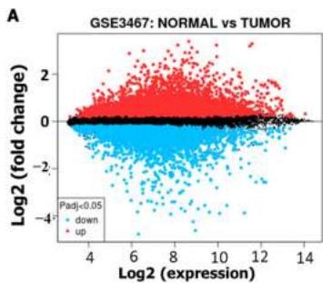

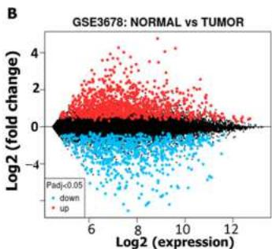

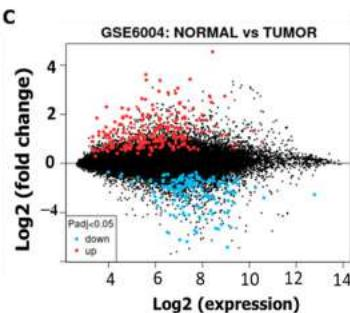

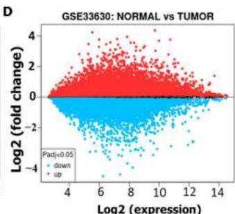

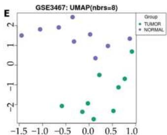

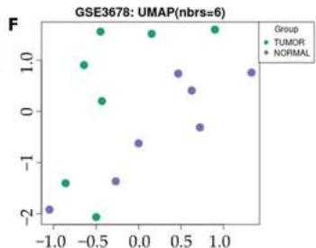

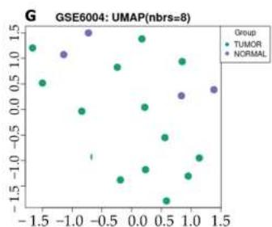

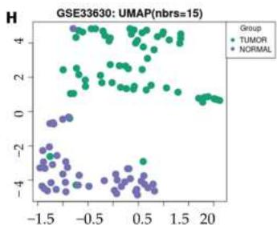

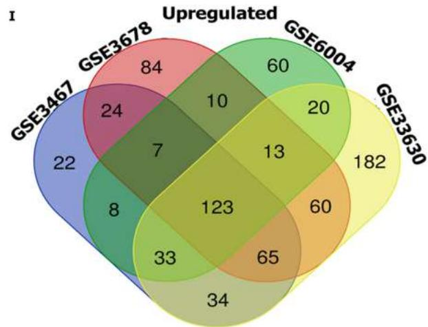

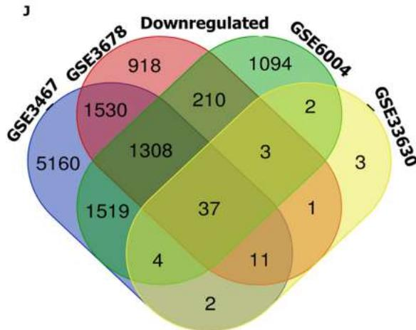  
Figure 1. Differentially expressed genes (DEGs) in thyroid cancer (THCA). (A–D) Volcano plotFigure 1. Differentially expressed genes (DEGs) in thyroid cancer (THCA). (A–D) Volcano plots showing showing DEGs extracted from the GSE3467, GSE3678, GSE6004, and GSE33630 microarray datasetDEGs extracted from the GSE3467, GSE3678, GSE6004, and GSE33630 microarray datasets, between between cancer tissues compared with normal adjacent tissues, with upregulated genes (red)cancer tissues compared with normal adjacent tissues, with upregulated genes (red), downregulated genes (blue), and non-significant genes (black). (E–H) Two-dimensional (2D) visualization of UMAP dimensionality reduction in THCA tumor tissues (green) compared with normal tissues (purple). (I,J) Venn diagram of 123 overlapping DEGs between normal colon tissues and tumor tissues.

# 3.2. DPP4/CTNNB1/MET Expressions Are Associated with THCA Progression, Metastasi3.3. DPP4/CTNNB1/MET Genes Are Frequently Altered and Their Mutations Are Linked to Genetic Expressions in THCA

Mutations of DPP4/CTNNB1/MET oncogenes in THCA were analyzed using the cBioPortal tool, and altered frequencies were based on percentages of individual genes due to amplification. Analytical results showed respective amplification of DPP4, CTNNB1, and MET occur in $3 \%$ , $6 \%$ , and $6 \%$ of THCA cohorts respectively. These included deep deletions (blue), mRNAs (red), proteins (red), mutations (green), and structural variants (purple) (Figure 3A–D). For further analysis, we compared associations between alterations in DPP4 and MET oncogenic expressions with mutations of the top genes expressed in THCA at the target level, and according to our findings, BRAF mutations promoted increased expression tion among the DPP4/CTNNB1/MET signature in THCA cohorts (Figure 2D). Furtherlevels of DPP4 and MET compared with the WT. Patients with high expression levels of

DPP4 and MET signatures exhibited worse clinical outcomes compared with patients withgression, metastasis, and worse prognosis of THCA cohorts, hence serving as important low expression levels (Figure 3E,F).biomarker for diagnosis, prognosis,

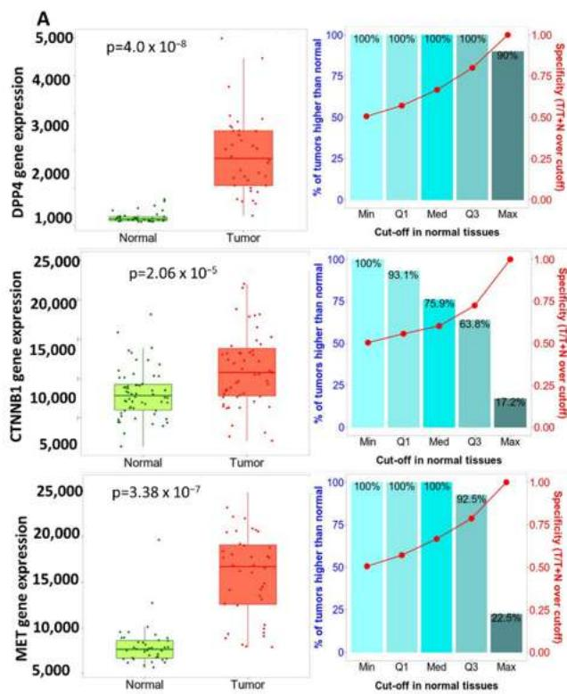

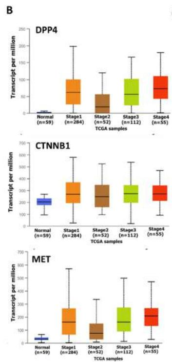

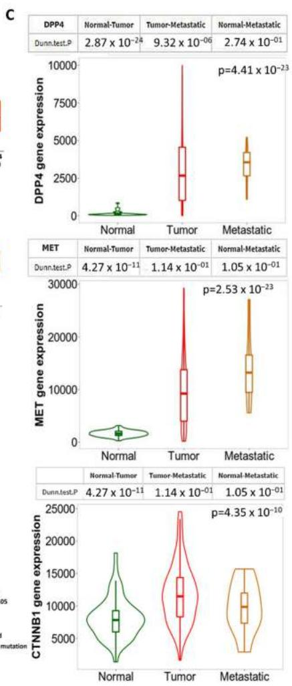

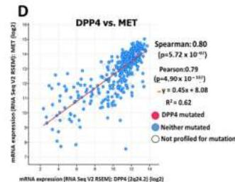

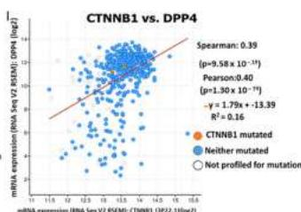

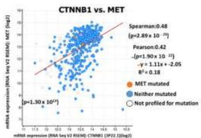

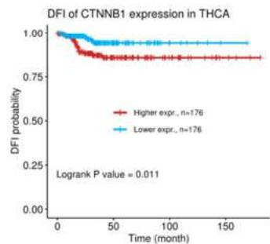

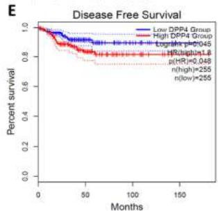

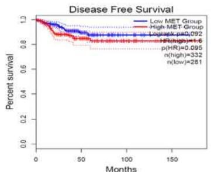  
Figure 2. Overexpression of DPP4/CTNNB1/MET mRNAs, associated with thyroid cancer (THCA) progression. Differential expression levels of DPP4/CTNNB1/MET between (A) THCA tumor and cohort. (D) Correlations of DPP4 with MET, CTNNB1 with DPP4, and MET with CTNNB1 oncogenicadjacent normal tissue, (B) tumor stages, and (C) between primary and metastatic tumor of TCGA expressions in THCA. (E) KPM plots of survival ratio between THCA cohorts with high and thosecohort. (D) Correlations of DPP4 with MET, CTNNB1 with DPP4, and MET with CTNNB1 oncogenic with low expression levels of DPP4/CTNNB1/MET.expressions in THCA. (E) KPM plots of survival ratio between THCA cohorts with high and those with low expression levels of DPP4/CTNNB1/MET.

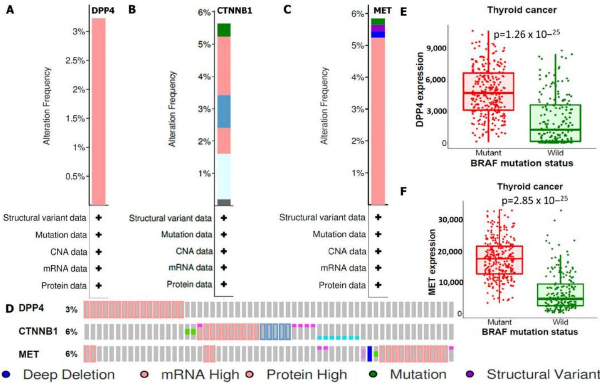  
Figure 3. Genetic mutations based on percentages due to amplification of (A) DPP4 (3%)Figure 3. Genetic mutations based on percentages due to amplification of (A) DPP4 $( 3 \% )$ , CTNNB1 (6%(B) CTNNB1 $( 6 \% )$ d (C) MET (6%), and (C) MET $( 6 \% )$ luding deep deletions (blue), mRNAs (red), proteins (red),, including deep deletions (blue), mRNAs (red), proteins (red), mutations (green), and structural variants (purple). (D) Individual genetic alteration profile of DPP4/CTNNB1/MET in THCA. (E,F) BRAF mutations promoted overexpression of DPP4 and MET compared with the wild type, with $p < 0 . 0 5$ considered statistically significant.

3.4. DPP4/CTNNB1/MET Genes Potentially Promote Tumor Growth by Interacting with3.4. DPP4/CTNNB1/MET Genes Potentially Promote Tumor Growth by Interacting with Different Different Oncogenic TargetsOncogenic Targets/Pathways

We applied the STRING database and GeneMANIA online web tools developed toWe applied the STRING database and GeneMANIA online web tools developed to analyze interaction networks among four selected oncogenes. Herein, we considered ex‐analyze interaction networks among four selected oncogenes. Herein, we considered experimental data (pink), gene neighborhoods (green), gene fusion (red), gene co‐occur‐perimental data (pink), gene neighborhoods (green), gene fusion (red), gene co-occurrences rences (blue), and gene co‐expressions (black) when analyzing interactions. As expected,(blue), and gene co-expressions (black) when analyzing interactions. As expected, interaction interaction networks were identified between DPP4 and CTNNB1, MET and DPP4,networks were identified between DPP4 and CTNNB1, MET and DPP4, CTNNB1 and MET, HFG and MET, DPP4 and CTNND1, and GSK3B and CTNND1 within the network clustering. An average local clustering coefficient of 0.787 was obtained, with an expected number of edges of 21 and interaction $p$ value of 0.006 (Figure 4A,B). For further analysis, we conducted a gene enrichment analysis and predicted GO processes using network analytical software, which showed co-expressions of CTNNB1, GSK3B, AXIN1, and MET to be enriched in the BP databases. Herein, we applied the Igraph R package visualization tool for analysis (Figure 4C). For more analysis, we used FunRich software to validate GO including BPs and KEGG enrichment analyses. The top five enriched BPs included chromosomal segregation, signaling transduction, cell communication, regulation of the cell cycle, and protein metabolism, while pathways involved in interactions included E-cadherin signaling in the nascent cadherin junction, stabilization and expression of adherens junctions, E-cadherin signaling events, posttranscriptional regulation of adherens junction stability, and N-cadherin signaling events (Figure 4D,E), with $p < 0 . 0 5$ considered significant.

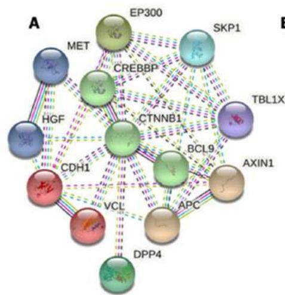

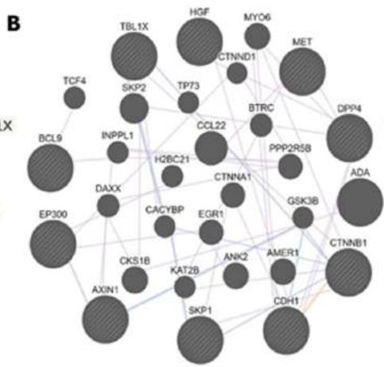

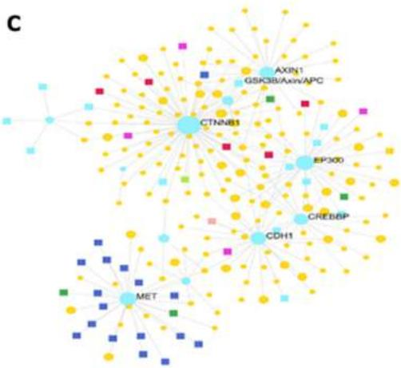

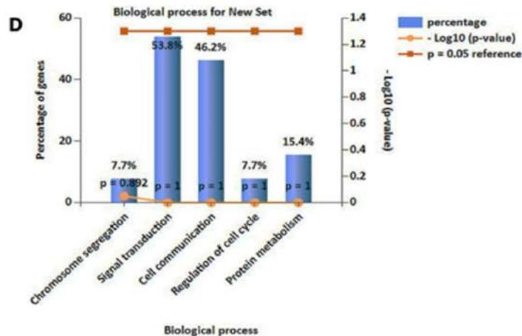

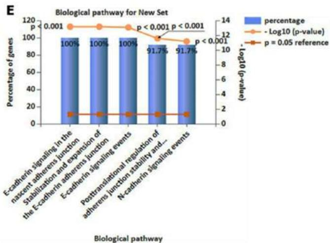  
Figure 4. DPP4/CTNNB1/MET gene interactions co-expressed in the same clustering network. raction networks showing co‐expression between DPP4 and CTNNB1, MET and DPP4, C(A,B) Interaction networks showing co-expression between DPP4 and CTNNB1, MET and DPP4, MET, HFG and MET, DPP4 and CTNND1, and GSK3B and CTNND1 within the netwoCTNNB1 and MET, HFG and MET, DPP4 and CTNND1, and GSK3B and CTNND1 within the network g. An average local clustering coefficient of 0.787 was obtained, with an expected nuclustering. An average local clustering coefficient of 0.787 was obtained, with an expected number es of 21 and an interaction p vof edges of 21 and an interaction $p$ ue of 0.006. (C) Gene enrichment analysis gene ontolovalue of 0.006. (C) Gene enrichment analysis gene ontology wed enrichment in co‐expressions of CTNNB1, GSK3B, AXIN1, and MET in biological pr(GO) showed enrichment in co-expressions of CTNNB1, GSK3B, AXIN1, and MET in biological ) Validation of GO, involving enrichment of the top five pathways involved, with p < 0.processes. (D,E) Validation of GO, involving enrichment of the top five pathways involved, with $p < 0 . 0 5$ nificant. considered significant.

# 3.5. High Expression Levels of DPP4/CTNNB1/MET Are Associated with Immunosuppressive High Expression Levels of Phenotypes of THCA Tissues

es of THCA TissuesWe queried the association between the mRNA expression levels of DPP4/CTNNB1/MET We queried the association between the mRNA expression levand tumor infiltrations of immunosuppressive cells using the TCGA cohorts. Interestingly, we P4/CTNNB1/MET and tumor infiltrations of immunosuppressive cells using thefound that the mRNA expression levels of DPP4/CTNNB1/MET are inversely associated with tumor purity (Figure 5A). In addition, the high expression levels of the DPP4/CTNNB1/MET correlate positively (all $p < 0 . 0 0 1$ , $\mathrm { c o r } > 0 . 3 $ ) with the infiltration levels of tumor-associated macrophages (M2 TAM Figure 5B), regulatory T cell (Treg, Figure 5C), and cancer-associated fibroblast (CAF, Figure 5D) in thyroid cancer cohorts (Figure 5). In contrast, a strong negative association (all $p < 0 . 0 0 1$ , cor < 0) was observed between the mRNA expression levels of DPP4/CTNNB1/MET and the immune infiltration level of $\mathrm { C D 8 ^ { + } }$ T cell (Figure 5E), an antitumor T cell subtype. Collectively, these findings strongly suggested that high expression levels of DPP4/CTNNB1/MET are associated with immunosuppressive phenotypes via a mechanism involving T cell exclusion in THCA tissues.

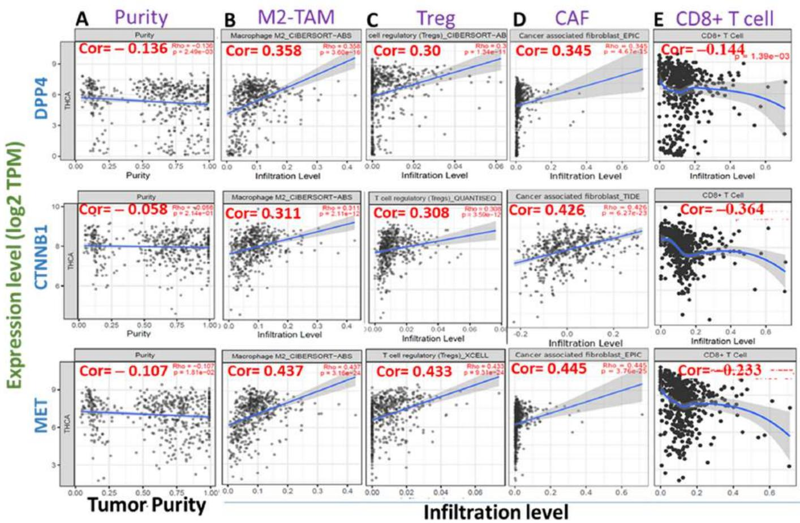  
Figure 5. High expression levels of DPP4/CTNNB1/MET are associated with immunosuppressive phenotypes of THCA tissues. Scatterplots of DPP4/CTNNB1/MET expression correlations with mor purity, and infiltration levels of (B) tumor‐associated macrophages (M2 TAM), (C) regult(A) tumor purity, and infiltration levels of (B) tumor-associated macrophages (M2 TAM), (C) reg-+ulatory T cell (Treg), (D) cancer-associated fibroblast (CAF), and (E) ${ \mathrm { C D 8 ^ { + } } }$ T cell. The strength of correlations between the genes and immune cells is reflected by the purity-adjusted partial Spearman’s rho value, where a value of $\mathbf { r } \geq 1$ means a perfect positive correlation and a value of $\mathbf { r } \leq - 1$ means a perfect negative correlation, with $p < 0 . 0 5$ considered statistically significant.

# 3.6. Molecular Docking Reveals Higher Inhibitory Effects of Sitagliptin on the DPP4 Oncogene

lecular Docking Reveals Higher Inhibitory Effects of Sitagliptin on the DPP4 OncogOur in silico molecular docking analysis revealed that sitagliptin exhibited higher Our in silico binding energy of $- 8 . 6 \mathrm { k c a l / m o l }$ king analysis revealed that sitagliptin exhibited hi with the DPP4 oncogene. Further analysis of the docking ding energy of −8.6 kcal/mol with the DPP4 oncogene. Further analysis of the docresults showed that sitagliptin bound to the binding pocket of the DPP4 gene by hydrogen ults showed that sitagliptin bound to the binding pocket of the DPP4 gene by hydrbonds with shorter binding distances at TRY631 (2.07 Å) and ARG125 (2.71 Å), and was further stabilized by a salt bridge, van der Waals forces, carbon–hydrogen bonds, Pi-Pi stacked, Pi-Pi T-shaped, amide Pi-stacked, and Pi-alkyl around the sitagliptin backbone (Figure 6).

# gure 6).3.7. Molecular Docking Revealed Potential Inhibitory Effects of Sitagliptin on the CTNNB1 Oncogene

Our docking analysis revealed that sitagliptin exhibited high binding energy of $- 7 . 3 \mathrm { k c a l / m o l }$ with the CTNNB1 oncogene, compared with its Food and Drug Administration (FDA)-approved inhibitor, PNU-74654, which showed a lower binding affinity of −6.7 kcal/mol. Further analysis of the docking results showed that sitagliptin bound to the binding pocket of the CTNNB1 oncogene by 4 conventional hydrogen bonds and shorter binding distances with CYS466 (2.03 Å), LYS508 (2.51 Å), SER20 (1.87 Å), and ARG469 (1.03 Å). The interactions were further stabilized by van der Waals forces with ALA463, PRO463, PHE21, ASP459, and LEU18, halogen (fluorine) with GLU17, PRO505, GLU462,

and GLU24, and Pi-alkyl with VAL564 and ILE17 around the sitagliptin backbone. The results were further compared with the PNU-74654/CTNNB1 complex, which is bound to the binding pocket of the CTNNB1 oncogene by only two conventional hydrogen bonds and longer binding distances compared with the sitagliptin/CTNNB1 complex. The interactions were further stabilized by van der Waals forces with SER32, TYR306, and SER335, amide Pi-stacked with GLU375, and Pi-cation with GLU28, LYS345, and ARG342 around the PNU-74654 backbone. This suggests that sitagliptin has a high potential to target $\beta$ -catenin11 of 19 (CTNNB1), compared with its standard inhibitor, PNU-74654 (Figure 7).

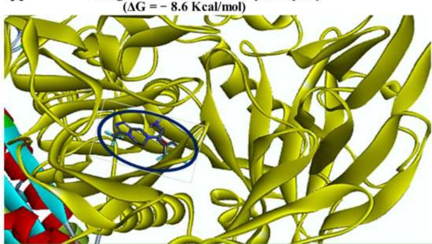  
A   
Sitaglibtin - DPP4 Complex (3D)

Sitaglibtin - DPP4 Complex   

<table><tr><td colspan="2">\( \left( {\Delta \mathrm{G} =  - {8.6}\mathrm{{Kcal}}/\mathrm{{mol}}}\right) \)</td></tr><tr><td>Type of interactions and number of bonds</td><td>Distance of intercating Amino acids</td></tr><tr><td>Conventional Hydrogen bond (2)</td><td>TRY631(2.07Å), ARG125 (2.71 Å)</td></tr><tr><td>Salt Bridge</td><td>Glu205, GLU206</td></tr><tr><td>Van der Waals forces</td><td>TRP629, VAL656, VAL711, HIS740, ASN710</td></tr><tr><td>Carbon hydrogen bond</td><td>SER630</td></tr><tr><td>Pi-Pi Stacked</td><td>TYR547</td></tr><tr><td>Pi-Pi T shaped</td><td>TYR666</td></tr><tr><td>Amide Pi-Stacked</td><td>TYR662</td></tr><tr><td>Pi-Alkyl</td><td>PHE357</td></tr></table>

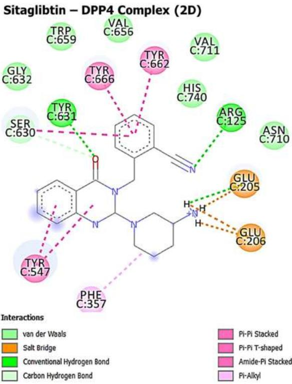  
B   
Figure 6. Ligand–receptor interaction results of sitagliptin with DPP4. (A) Three‐dimensional (3D)Figure 6. Ligand–receptor interaction results of sitagliptin with DPP4. (A) Three-dimensional (3D) representation of sitagliptin in complex with DPP4 with the highest binding energy orepresentation of sitagliptin in complex with DPP4 with the highest binding energy of $- 8 . 6 \mathrm { k c a l / m o l }$ (B) Two-dimensional (2D) representation of sitagliptin in complex with DPP4, showing interactions with two conventional H-bonds, with interactions further stabilized by different amino acids around the sitagliptin backbone. The accompanying table shows summary results of the analysis.

# Oncogene3.8. Molecular Docking Revealed Potential Inhibitory Effects of Sitagliptin on the MET Oncogene

Our docking analysis revealed that sitagliptin exhibited high binding energy of −7.3Our docking analysis revealed that sitagliptin exhibited a high binding energy of kcal/mol with the CTNNB1 oncogene, compared with its Food and Drug Administration7.6 kcal/mol with the MET oncogene, the same as its FDA-approved inhibitor, crizotinib, (FDA)‐approved inhibitor, PNU‐74654, which showed a lower binding affinity of  −6.7which showed a binding affinity of −7.6 kcal/mol. Further analysis of the docking results kcal/mol. Further analysis of the docking results showed that sitagliptin bound to theshowed that sitagliptin bound to the binding pocket of the MET oncogene by 4 convenbinding pocket of the CTNNB1 oncogene by 4 conventional hydrogen bonds and shortertional hydrogen bonds with shorter binding distances with TRY631 (2.07 Å) and ARG125 binding distances with CYS466 (2.03 Å), LYS508 (2.51 Å), SER20 (1.87 Å), and ARG469(2.71 Å). Interactions were further stabilized by a salt bridge (GLU205 and GLU206), van (1.03 Å). The interactions were further stabilized by van der Waals forces with ALA463,der Waals forces (TRP629, VAL656, VAL711, HIS740, and ASN710), carbon–hydrogen bond PRO463, PHE21, ASP459, and LEU18, halogen (fluorine) with GLU17, PRO505, GLU462,(SER630), Pi-Pi stacked (TYR547), Pi-Pi T-shaped (TYR666), amide Pi-stacked (TYR662), and GLU24, and Pi‐alkyl with VAL564 and ILE17 around the sitagliptin backbone. Theand Pi-alkyl (PHE357) around the sitagliptin backbone. However, results displayed of results were further compared with the PNU‐74654/CTNNB1 complex, which is bound tothe crizotinib/MET complex did not exhibit conventional hydrogen bonds in the binding the binding pocket of the CTNNB1 oncogene by only two conventional hydrogen bondspocket of the MET oncogene. This suggests that sitagliptin has high potential to target and longer binding distances compared with the sitagliptin/CTNMET, compared with its standard inhibitor, crizotinib (Figure 8).

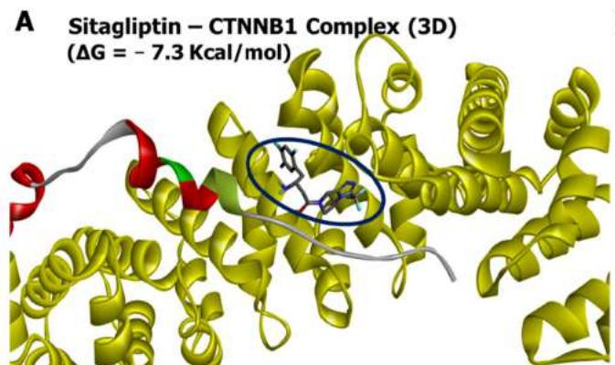

<table><tr><td>Interactions</td></tr><tr><td>van der Waals</td></tr><tr><td>Conventional Hydrogen Bond</td></tr><tr><td>Halogen (Fluorine)</td></tr><tr><td>PI-Cation</td></tr></table>

  
Figure 7. In silico molecular docking analysis of ligand–protein interactions. (A) Three‐dimensionalFigure 7. In silico molecular docking analysis of ligand–protein interactions. (A) Three-dimensional (3D) representation of sitagliptin in complex with CTNNB1 with a binding energy of $- 7 . 3 \mathrm { k c a l / m o l }$ . (B) Two-dimensional (2D) representation of sitagliptin in complex with CTNNB1, showing interactions with four conventional H-bonds and shorter binding distances, with interactions further stabilized sentation of PNU‐74654 in complex with CTNNB1, displaying lower binding energy of  −6.7by different amino acids around the sitagliptin backbone. (C) Two-dimensional (2D) representation kcal/mol, and interactions with (2) conventional hydrogen bonds with longer of PNU-74654 in complex with CTNNB1, displaying lower binding energy of $- 6 . 7 \ \mathrm { k c a l / m o l } ,$ nces, and compared with that of sitagliptin, in the binding pockets of CTNNB1. The accompanying tableinteractions with (2) conventional hydrogen bonds with longer binding distances compared with shows a summary of the results.that of sitagliptin, in the binding pockets of CTNNB1. The accompanying table shows a summary of the results.

<table><tr><td colspan="2">Sitagliptin - CTNNB1 Complex</td></tr><tr><td colspan="2">(ΔG = - 7.3 Kcal/mol)</td></tr><tr><td>Type of interactions and number of bonds</td><td>Distance of intercating Amino acids</td></tr><tr><td>Conventional Hydrogen bond (3)</td><td>CYS466(2.03A), LYS508 (2.51Å) &amp; SER20 (1.87A) &amp; ARG469 (1.03A) )</td></tr><tr><td>Van der Waals forces</td><td>ALA463, PRO463, PHE21, ASP459 &amp; LEU18</td></tr><tr><td>Halogen (Flourine)</td><td>GLU17, PRO505, GLU462 &amp; GLU24</td></tr><tr><td>Pi-Alkyl</td><td>VAL564 &amp; ILE17</td></tr><tr><td colspan="2">PNU-74654- CTNNB1 Complex</td></tr><tr><td colspan="2">\( \left( {\Delta \mathrm{G} =  - {6.7}\mathrm{{Kcal}}/\mathrm{{mol}}}\right) \)</td></tr><tr><td>Type of interactions and number of bonds</td><td>Distance of intercating Amino acids</td></tr><tr><td>Conventional Hydrogen bond (3)</td><td>TRP338(2.09A) &amp; ASN380 (2.22A)</td></tr><tr><td>Van der Waals forces</td><td>SER32, TYR306 and SER335</td></tr><tr><td>Amide Pi-Stacked</td><td>GLU375</td></tr><tr><td>Pi-Cation</td><td>GLU28, LYS345 &amp; ARG342</td></tr></table>

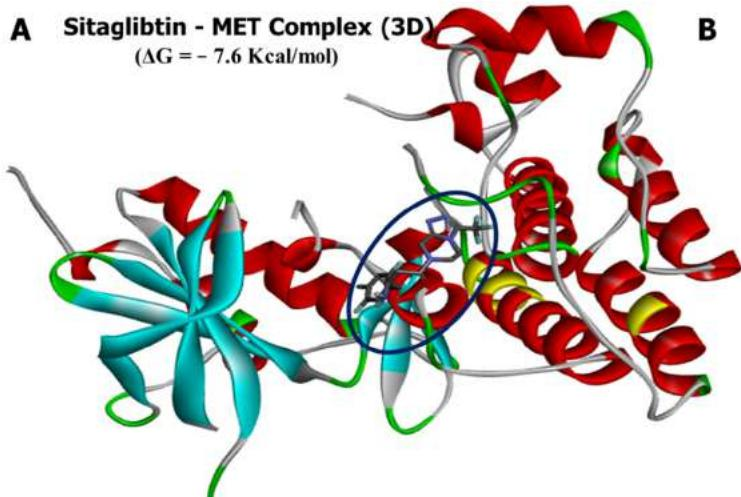

c Crizotinib - MET Complex (3D)   
Interactions   
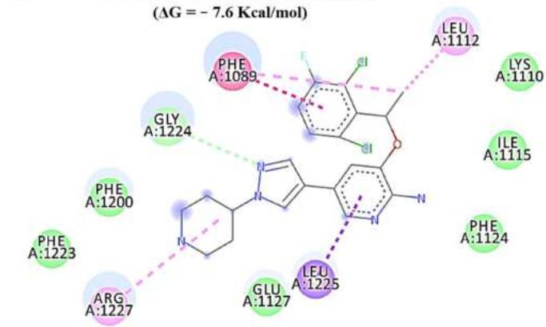  
van der Waals   
Conventional Hydrogen Bond   
Carbon Hydrogen Bond   
Halogen (Fluorine)   
Pi-Cation

Pi-Donor Hydrogen Bond

Pi-Sigma

Alloy

Pi-Alkyl

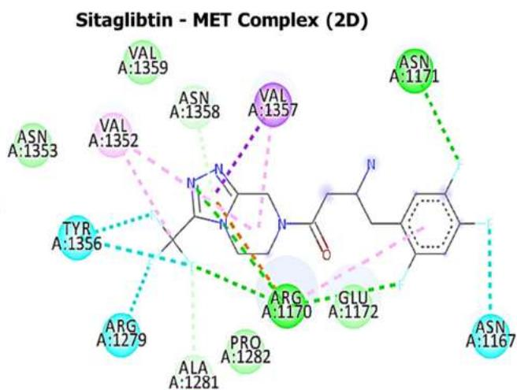  
Figure 8. In silico molecular docking analysis of ligand–protein interactions. (A) Three‐dimensionalFigure 8. In silico molecular docking analysis of ligand–protein interactions. (A) Three-dimensional (3D) representation of sitagliptin in complex with MET with a binding energy of −7.(3D) representation of sitagliptin in complex with MET with a binding energy of $- 7 . 6 \ \mathrm { k c a l / m o l }$ (B) Two-dimensional (2D) representation of sitagliptin in complex with MET, showing interactions with conventional H-bonds and different amino acids. (C) Two-dimensional (2D) representation of crizotinib in complex with MET, exhibiting the same binding energy as sitagliptin, but no interaction with conventional hydrogen bonds. The accompanying table shows a summary of the results.

<table><tr><td colspan="2">Sitagliptin - MET Complex</td></tr><tr><td colspan="2">\( \left( {\Delta \mathrm{G} =  - {7.6}\mathrm{{Kcal}}/\mathrm{{mol}}}\right) \)</td></tr><tr><td>Type of interactions and number of bonds</td><td>Distance of intercating Amino acids</td></tr><tr><td>Conventional Hydrogen bond (2)</td><td>TRY631(2.07Å), ARG125 (2.71 Å)</td></tr><tr><td>Salt Bridge</td><td>Glu205, GLU206</td></tr><tr><td>Van der Waals forces</td><td>TRP629, VAL656, VAL711, HIS740, ASN710</td></tr><tr><td>Carbon hydrogen bond</td><td>SER630</td></tr><tr><td>Pi-Pi Stacked</td><td>TYR547</td></tr><tr><td>Pi-Pi T shaped</td><td>TYR666</td></tr><tr><td>Amide Pi-Stacked</td><td>TYR662</td></tr><tr><td>Pi-Alkyl</td><td>PHE357</td></tr><tr><td colspan="2">Standard Inhibitor (Crizotinib)</td></tr><tr><td colspan="2">\( \left( {\Delta \mathrm{G} =  - {7.6}\mathrm{{Kcal}}/\mathrm{{mol}}}\right) \)</td></tr><tr><td>Type of interactions and number of bonds</td><td>Distance of intercating Amino acids</td></tr><tr><td>Van der Waals forces</td><td>PHE1127,PHE1123, PHE1200, ILE115 &amp; LYS1110</td></tr><tr><td>Carbon hydrogen bond</td><td>GLY1224</td></tr><tr><td>Pi-Pi Stacked</td><td>PHE1089</td></tr><tr><td>Pi-Sigma</td><td>LEU1225</td></tr></table>

# 4. Discussion4. Discussion

PTCa is the most prevalent type of THCA, which accounts for approximately 80 PTCa is the most prevalent type of THCA, which accounts for approximately $8 0 \%$ all THCAs, consequently promoting cancer invasion, metastasis, and mortality in patientsof all THCAs, consequently promoting cancer invasion, metastasis, and mortality in pa-[70,71]. PTCa has recently been managed with a thyroidectomy; however, due to distanttients [69,70]. PTCa has recently been managed with a thyroidectomy; however, due to dismetastasis, THCA tends to be extremely aggressive, and resistant to treatment leading totant metastasis, THCA tends to be extremely aggressive, and resistant to treatment leading poor prognoses [72–74]. Treatment modalities for THCA include the use of doxorubicin,to poor prognoses [71–73]. Treatment modalities for THCA include the use of doxorubicin, but this has proven not to be very effective due to the development of resistance [1,75–77].but this has proven not to be very effective due to the development of resistance [1,74–76]. As a result, there is an urgent need to understand the molecular mechanisms associatedAs a result, there is an urgent need to understand the molecular mechanisms associated with THCA metastasis, which will help in developing more effective treatments [15,78].with THCA metastasis, which will help in developing more effective treatments [15,77]. Identification of reliable biomarkers which can be used as diagnostic measures is urgentlyIdentification of reliable biomarkers which can be used as diagnostic measures is urgently needed in PTCa. Most cancer therapeutic drugs have been shown to be cytotoxic and non‐needed in PTCa. Most cancer therapeutic drugs have been shown to be cytotoxic and specific to cancer cells, as they also affect normal cells and consequently cause harm to thenonspecific to cancer cells, as they also affect normal cells and consequently cause harm to body.the body.

In the present study, we evaluated the anticancer effects of the antidiabetic drug sitagliptin, which was recently shown to possess anticancer activities, and is well tolerated and effective. Sitagliptin is an FDA-approved DPP4 oncogene [78]. To further analyze sitagliptin, we explored computer-based simulations to identify and predict target genes, which are commonly overexpressed and associated with THCA invasion, progression, metastasis, poor prognosis, and resistance to therapeutics. We utilized microarray datasets from the NCBI-GEO, and identified DEGs in THCA compared to normal tissues. Among the top upregulated genes, were the DPP4, CTNNB1, and MET oncogenes. To validate their expressions, we used the UALCAN online bioinformatics tool with default settings, which showed that mRNA levels of DPP4/CTNNB1/MET were higher in THCA tumor tissues compared with adjacent normal tissues. Moreover, after exploring the TNMplot software, for further analysis, we identified that overexpression of DPP4/CTNNB1/MET gene signatures promoted THCA metastasis, and were associated with poor disease-free survival and poor prognoses.

The complex and dynamic interactions of immune cells, stoma, and cancer cells within the tumor microenvironment (TME) play a pivotal role in tumor invasion, cancer progression, and host immune response [62,79]. Consequently, our analysis of tumor immune infiltrating cells within the TME of THCA tumor revealed that the high expression levels of the DPP4/CTNNB1/MET signature correlate positively with the infiltration levels of tumor-associated macrophages, regulatory T cell, and cancer-associated fibroblast. These immunosuppressive cells are known to exert an inhibitory role on cytotoxic lymphocytes’ function leading to T cell exclusion and tumor invasive phenotype [59,80]. In contrast, we found a strong negative association was observed between the mRNA expression levels of DPP4/CTNNB1/MET and immune infiltration level of $\mathrm { C D 8 ^ { + } }$ T cell, suggesting that high expression levels of DPP4/CTNNB1/MET are associated with immunosuppressive phenotypes via a mechanism involving T cell exclusion in THCA tissues

Molecular docking has become an increasingly important tool commonly used to understand drug bimolecular interactions with the target proteins for rational drug design and development [62,81,82]. It is useful in estimating binding affinities of the ligand to the proteins and in providing preliminary mechanistic insight into the behavior of a small molecule drug in the binding cavity of target proteins [83,84], as well as elucidating the potential drug-regulated biochemical processes [79,85]. Consequently, we conducted a molecular docking analysis of interactions of DPP4/CTNNB1/MET gene signatures with sitagliptin. As expected, sitagliptin exhibited a higher binding energy of $- 8 . 6 \mathrm { k c a l / m o l }$ with the DPP4 oncogene. Furthermore, our docking analysis revealed that sitagliptin exhibited a higher binding energy of $- 7 . 3 \mathrm { k c a l / m o l }$ with the CTNNB1 oncogene compared with its FDA-approved inhibitor, PNU-74654, which showed a lower binding affinity of −6.7 kcal/mol. Our analysis showed that sitagliptin bound to the binding pocket of the CTNNB1 oncogene by 4 conventional hydrogen bonds and had shorter binding distances with CYS466 (2.03 Å), LYS508 (2.51 Å), SER20 (1.87 Å), and ARG469 (1.03 Å) compared with PNU-74654, which bound to the binding pocket of the CTNNB1 oncogene by only 2 conventional hydrogen bonds, and had longer binding distances compared with sitagliptin. In addition, analytical results of sitagliptin in complex with MET exhibited the same binding energy of $- 7 . 6 \mathrm { k c a l / m o l }$ as the MET FDA-approved inhibitor, crizotinib. Sitagliptin bound to the binding pocket of the MET oncogene by 4 conventional hydrogen bonds and shorter binding distances with TRY631 (2.07 Å) and ARG125 (2.71 Å). However, results displayed from the crizotinib/MET complex did not exhibit conventional hydrogen bonds in the binding pocket of the MET oncogene.

In summary, these docking results suggest that sitagliptin has high potential to target DPP4/CTNNB1/MET signaling pathways in THCA compared with their standard inhibitors. Since recent studies have shown the efficacy and tolerance of sitagliptin as cancer therapeutic, it would be interesting to further investigate its activities as a target for DPP4/CTNNB1/MET signaling pathways in THCA, both in vitro and in vitro in tumor-bearing mice.

# 5. Conclusions

In summary, we revealed that DPP4, CTNNB1, and MET oncogenic signatures are overexpressed in THCA, and are associated with cancer progression, metastasis, resistance, poor disease-free survival, and unfavorable clinical outcomes. Moreover, an in silico molecular docking study exhibited putative binding affinities of sitagliptin with the abovementioned oncogenes, which were higher than the standard inhibitors of these genes. This suggests that sitagliptin could be a potential THCA therapeutic, since it has been shown to be more tolerable and effective in different cancers.

Author Contributions: S.-Y.C., A.T.H.W., G.E.-S.B., C.-L.H., J.-C.L., H.Y.L., M.A., A.N.A. and J.-H.C. contributed to data analysis, and drafting or revising the article. All authors have read and agreed to the published version of the manuscript.

Funding: The current work was partly supported by Taif University Researchers Supporting Project number (TURSP-2020/310), Taif University, Taif, Saudi Arabia. Jia-Hong Chen was supported by TSGH-C03-111030; Ching-Liang Ho was funded by TSGH-C03-110022 and TSGH-C02-111024; Jih-Chin Lee was supported by TSGH-D-110079 and TSGH-D-111060; Alexander TH Wu was financially supported by the “TMU Research Center of Cancer Translational Medicine” from The Featured Areas Research Center Program within the framework of the Higher Education Sprout Project by the Ministry of Education (MOE) in Taiwan. (Grant number: DP2-110-21121-03-C-09).

Institutional Review Board Statement: Not applicable.

Informed Consent Statement: Not applicable.

Data Availability Statement: The datasets generated and analyzed in this study can be made available upon reasonable request.

Acknowledgments: The authors express their thanks to Taif University for supporting the project— TURSP 2020/310.

Conflicts of Interest: The authors declare no conflict of interest.

# References

1. Nguyen, Q.T.; Lee, E.J.; Huang, M.G.; Park, Y.I.; Khullar, A.; Plodkowski, R.A. Diagnosis and treatment of patients with thyroid cancer. Am. Health Drug Benefits 2015, 8, 30–40. [PubMed]   
2. Siegel, R.L.; Miller, K.D.; Jemal, A. Cancer statistics, 2020. CA Cancer J. Clin. 2020, 70, 7–30. [CrossRef] [PubMed]   
3. Bray, F.; Ferlay, J.; Soerjomataram, I.; Siegel, R.L.; Torre, L.A.; Jemal, A. Global cancer statistics 2018: GLOBOCAN estimates of incidence and mortality worldwide for 36 cancers in 185 countries. CA Cancer J. Clin. 2018, 68, 394–424. [CrossRef] [PubMed]   
4. La Vecchia, C.; Malvezzi, M.; Bosetti, C.; Garavello, W.; Bertuccio, P.; Levi, F.; Negri, E. Thyroid cancer mortality and incidence: A global overview. Int. J. Cancer 2015, 136, 2187–2195. [CrossRef] [PubMed]   
5. Roman, B.R.; Morris, L.G.; Davies, L. The thyroid cancer epidemic, 2017 perspective. Curr. Opin. Endocrinol. Diabetes Obes. 2017, 24, 332–336. [CrossRef]   
6. Siegel, R.L.; Miller, K.D.; Fuchs, H.E.; Jemal, A. Cancer Statistics, 2021. CA Cancer J. Clin. 2021, 71, 7–33. [CrossRef]   
7. Fagin, J.A.; Wells, S.A., Jr. Biologic and clinical perspectives on thyroid cancer. N. Engl. J. Med. 2016, 375, 1054–1067. [CrossRef]   
8. Molinaro, E.; Romei, C.; Biagini, A.; Sabini, E.; Agate, L.; Mazzeo, S.; Materazzi, G.; Sellari-Franceschini, S.; Ribechini, A.; Torregrossa, L. Anaplastic thyroid carcinoma: From clinicopathology to genetics and advanced therapies. Nat. Rev. Endocrinol. 2017, 13, 644–660. [CrossRef]   
9. Knauf, J.A.; Ma, X.; Smith, E.P.; Zhang, L.; Mitsutake, N.; Liao, X.-H.; Refetoff, S.; Nikiforov, Y.E.; Fagin, J.A. Targeted expression of BRAFV600E in thyroid cells of transgenic mice results in papillary thyroid cancers that undergo dedifferentiation. Cancer Res. 2005, 65, 4238–4245. [CrossRef]   
10. Brito, J.P.; Morris, J.C.; Montori, V.M. Thyroid cancer: Zealous imaging has increased detection and treatment of low risk tumours. BMJ 2013, 347, f4706. [CrossRef]   
11. Udelsman, R.; Zhang, Y. The epidemic of thyroid cancer in the United States: The role of endocrinologists and ultrasounds. Thyroid 2014, 24, 472–479. [CrossRef]   
12. Furuya-Kanamori, L.; Bell, K.J.; Clark, J.; Glasziou, P. Prevalence of differentiated thyroid cancer in autopsy studies over six decades: A meta-analysis. J. Clin. Oncol. 2016, 34, 3672–3679. [CrossRef] [PubMed]   
13. Ahn, H.S.; Welch, H.G. South Korea’s thyroid-cancer “epidemic”—Turning the tide. N. Engl. J. Med. 2015, 373, 2389–2390. [CrossRef] [PubMed]   
14. Kitahara, C.M.; Schneider, A.; Brenner, A.V. Chapter 44: Thyroid cancer. In Cancer Epidemiology and Prevention, 4th ed.; Schottenfeld, D., Fraumeni, J., Eds.; Oxford University Press: New York, NY, USA, 2016; pp. 839–860.

15. Wei, W.J.; Zhang, G.Q.; Luo, Q.Y. Postsurgical Management of Differentiated Thyroid Cancer in China. Trends Endocrinol. Metab. 2018, 29, 71–73. [CrossRef] [PubMed]   
16. Nikiforov, Y.E.; Nikiforova, M.N. Molecular genetics and diagnosis of thyroid cancer. Nat. Rev. Endocrinol. 2011, 7, 569–580. [CrossRef] [PubMed]   
17. Long, K.L.; Grubbs, E.G. Carcinoma of the thyroid gland and neoplasms of the parathyroid glands. In The MD Anderson Surgical Oncology Handbook, 6th ed.; Wolters Kluwer Health Adis (ESP): London, UK, 2018; pp. 463–491.   
18. Ho, A.S.; Luu, M.; Barrios, L.; Chen, I.; Melany, M.; Ali, N.; Patio, C.; Chen, Y.; Bose, S.; Fan, X.; et al. Incidence and Mortality Risk Spectrum Across Aggressive Variants of Papillary Thyroid Carcinoma. JAMA Oncol. 2020, 6, 706–713. [CrossRef] [PubMed]   
19. Bai, Y.; Kakudo, K.; Jung, C.K. Updates in the Pathologic Classification of Thyroid Neoplasms: A Review of the World Health Organization Classification. Endocrinol. Metab. 2020, 35, 696–715. [CrossRef]   
20. WHO. WHO Classification of Tumours of Endocrine Organs; IARC: Lion, France, 2017.   
21. Nath, M.C.; Erickson, L.A. Aggressive Variants of Papillary Thyroid Carcinoma: Hobnail, Tall Cell, Columnar, and Solid. Adv. Anat. Pathol. 2018, 25, 172–179. [CrossRef]   
22. Cavaco, D.; Martins, A.F.; Cabrera, R.; Vilar, H.; Leite, V. Diffuse sclerosing variant of papillary thyroid carcinoma: Outcomes of 33 cases. Eur. Thyroid. J. 2022, 11, e210020. [CrossRef]   
23. Roman, S.; Sosa, J.A. Aggressive variants of papillary thyroid cancer. Curr. Opin. Oncol. 2013, 25, 33–38. [CrossRef]   
24. Besic, N.; Auersperg, M.; Dremelj, M.; Vidergar-Kralj, B.; Gazic, B. Neoadjuvant chemotherapy in 16 patients with locally advanced papillary thyroid carcinoma. Thyroid 2013, 23, 178–184. [CrossRef] [PubMed]   
25. Giuffrida, R.; Adamo, L.; Iannolo, G.; Vicari, L.; Giuffrida, D.; Eramo, A.; Gulisano, M.; Memeo, L.; Conticello, C. Resistance of papillary thyroid cancer stem cells to chemotherapy. Oncol. Lett. 2016, 12, 687–691. [CrossRef] [PubMed]   
26. Kim, K.B.; Cabanillas, M.E.; Lazar, A.J.; Williams, M.D.; Sanders, D.L.; Ilagan, J.L.; Nolop, K.; Lee, R.J.; Sherman, S.I. Clinical responses to vemurafenib in patients with metastatic papillary thyroid cancer harboring BRAF(V600E) mutation. Thyroid 2013, 23, 1277–1283. [CrossRef] [PubMed]   
27. Noels, H.; Theelen, W.; Sternkopf, M.; Jankowski, V.; Moellmann, J.; Kraemer, S.; Lehrke, M.; Marx, N.; Martin, L.; Marx, G.; et al. Reduced post-operative DPP4 activity associated with worse patient outcome after cardiac surgery. Sci. Rep. 2018, 8, 11820. [CrossRef]   
28. Javidroozi, M.; Zucker, S.; Chen, W.T. Plasma seprase and DPP4 levels as markers of disease and prognosis in cancer. Dis. Markers 2012, 32, 309–320. [CrossRef] [PubMed]   
29. Lee, J.J.; Wang, T.Y.; Liu, C.L.; Chien, M.N.; Chen, M.J.; Hsu, Y.C.; Leung, C.H.; Cheng, S.P. Dipeptidyl Peptidase IV as a Prognostic Marker and Therapeutic Target in Papillary Thyroid Carcinoma. J. Clin. Endocrinol. Metab. 2017, 102, 2930–2940. [CrossRef]   
30. Kotani, T.; Aratake, Y.; Ogata, Y.; Umeki, K.; Araki, Y.; Hirai, K.; Kuma, K.; Ohtaki, S. Expression of dipeptidyl aminopeptidase IV activity in thyroid carcinoma. Cancer Lett. 1991, 57, 203–208. [CrossRef]   
31. Aratake, Y.; Kotani, T.; Tamura, K.; Araki, Y.; Kuribayashi, T.; Konoe, K.; Ohtaki, S. Dipeptidyl aminopeptidase IV staining of cytologic preparations to distinguish benign from malignant thyroid diseases. Am. J. Clin. Pathol. 1991, 96, 306–310. [CrossRef]   
32. Nouraee, N.; Van Roosbroeck, K.; Vasei, M.; Semnani, S.; Samaei, N.M.; Naghshvar, F.; Omidi, A.A.; Calin, G.A.; Mowla, S.J. Expression, tissue distribution and function of miR-21 in esophageal squamous cell carcinoma. PLoS ONE 2013, 8, e73009. [CrossRef]   
33. Pang, R.; Law, W.L.; Chu, A.C.; Poon, J.T.; Lam, C.S.; Chow, A.K.; Ng, L.; Cheung, L.W.; Lan, X.R.; Lan, H.Y.; et al. A subpopulation of $\mathrm { C D } 2 6 +$ cancer stem cells with metastatic capacity in human colorectal cancer. Cell Stem Cell 2010, 6, 603–615. [CrossRef]   
34. Liu, L.; Yan, M.; Zhao, F.; Li, J.; Ge, C.; Geng, Q.; Zhu, M.; Sun, L.; He, X.; Li, J. CD26/dipeptidyl peptidase IV contributes to tumor metastasis in human lung adenocarcinoma. Bangladesh J. Pharmacol. 2013, 8, 198–206. [CrossRef]   
35. Jang, J.; Haberecker, M.; Curioni, A.; Janker, F.; Soltermann, A.; Gil-Bazo, I.; Hwang, I.; Kwon, K.; Weder, W.; Jungraithmayr, W. EP1.03–33 CD26/DPP4 as a Novel Prognostic Marker for Lung Adenocarcinoma. J. Thorac. Oncol. 2019, 14, S965. [CrossRef]   
36. Lu, Z.; Qi, L.; Bo, X.J.; Liu, G.D.; Wang, J.M.; Li, G. Expression of CD26 and CXCR4 in prostate carcinoma and its relationship with clinical parameters. J. Res. Med. 2013, 18, 647–652.   
37. Kretzschmar, K.; Weber, C.; Driskell, R.R.; Calonje, E.; Watt, F.M. Compartmentalized Epidermal Activation of $\beta$ -Catenin Differentially Affects Lineage Reprogramming and Underlies Tumor Heterogeneity. Cell Rep. 2016, 14, 269–281. [CrossRef]   
38. Dong, C.; Yang, H.; Wang, Y.; Yan, X.; Li, D.; Cao, Z.; Ning, Y.; Zhang, C. Anagliptin stimulates osteoblastic cell differentiation and mineralization. Biomed. Pharmacother. 2020, 129, 109796. [CrossRef]   
39. Ren, X.; Zhu, R.; Liu, G.; Xue, F.; Wang, Y.; Xu, J.; Zhang, W.; Yu, W.; Li, R. Effect of sitagliptin on tubulointerstitial Wnt/ $\beta$ -catenin signalling in diabetic nephropathy. Nephrology 2019, 24, 1189–1197. [CrossRef]   
40. Garcia, C.; Buffet, C.; El Khattabi, L.; Rizk-Rabin, M.; Perlemoine, K.; Ragazzon, B.; Bertherat, J.; Cormier, F.; Groussin, L. MET overexpression and activation favors invasiveness in a model of anaplastic thyroid cancer. Oncotarget 2019, 10, 2320–2334. [CrossRef]   
41. Trovato, M.; Campennì, A.; Giovinazzo, S.; Siracusa, M.; Ruggeri, R.M. Hepatocyte Growth Factor/C-Met Axis in Thyroid Cancer: From Diagnostic Biomarker to Therapeutic Target. Biomark. Insights 2017, 12, 1177271917701126. [CrossRef]   
42. Mineo, R.; Costantino, A.; Frasca, F.; Sciacca, L.; Russo, S.; Vigneri, R.; Belfiore, A. Activation of the hepatocyte growth factor (HGF)-Met system in papillary thyroid cancer: Biological effects of HGF in thyroid cancer cells depend on Met expression levels. Endocrinology 2004, 145, 4355–4365. [CrossRef]

43. Di Renzo, M.F.; Olivero, M.; Ferro, S.; Prat, M.; Bongarzone, I.; Pilotti, S.; Belfiore, A.; Costantino, A.; Vigneri, R.; Pierotti, M.A.; et al. Overexpression of the c-MET/HGF receptor gene in human thyroid carcinomas. Oncogene 1992, 7, 2549–2553. [PubMed]   
44. Lesko, E.; Majka, M. The biological role of HGF-MET axis in tumor growth and development of metastasis. Front. Biosci. 2008, 13, 1271–1280. [CrossRef] [PubMed]   
45. Monga, S.P.; Mars, W.M.; Pediaditakis, P.; Bell, A.; Mulé, K.; Bowen, W.C.; Wang, X.; Zarnegar, R.; Michalopoulos, G.K. Hepatocyte growth factor induces Wnt-independent nuclear translocation of beta-catenin after Met-beta-catenin dissociation in hepatocytes. Cancer Res. 2002, 62, 2064–2071. [PubMed]   
46. Tward, A.D.; Jones, K.D.; Yant, S.; Cheung, S.T.; Fan, S.T.; Chen, X.; Kay, M.A.; Wang, R.; Bishop, J.M. Distinct pathways of genomic progression to benign and malignant tumors of the liver. Proc. Natl. Acad. Sci. USA 2007, 104, 14771–14776. [CrossRef]   
47. Sastre-Perona, A.; Santisteban, P. Role of the wnt pathway in thyroid cancer. Front. Endocrinol. 2012, 3, 31. [CrossRef]   
48. Rezk, S.; Brynes, R.K.; Nelson, V.; Thein, M.; Patwardhan, N.; Fischer, A.; Khan, A. beta-Catenin expression in thyroid follicular lesions: Potential role in nuclear envelope changes in papillary carcinomas. Endocr. Pathol. 2004, 15, 329–337. [CrossRef]   
49. Buchanan, S.G.; Hendle, J.; Lee, P.S.; Smith, C.R.; Bounaud, P.Y.; Jessen, K.A.; Tang, C.M.; Huser, N.H.; Felce, J.D.; Froning, K.J.; et al. SGX523 is an exquisitely selective, ATP-competitive inhibitor of the MET receptor tyrosine kinase with antitumor activity in vivo. Mol. Cancer 2009, 8, 3181–3190. [CrossRef]   
50. Amritha, C.A.; Kumaravelu, P.; Chellathai, D.D. Evaluation of Anti Cancer Effects of DPP-4 Inhibitors in Colon Cancer- An Invitro Study. J. Clin. Diagn. Res. 2015, 9, Fc14–Fc16. [CrossRef]   
51. Chandrashekar, D.S.; Bashel, B.; Balasubramanya, S.A.H.; Creighton, C.J.; Ponce-Rodriguez, I.; Chakravarthi, B.; Varambally, S. UALCAN: A Portal for Facilitating Tumor Subgroup Gene Expression and Survival Analyses. Neoplasia 2017, 19, 649–658. [CrossRef]   
52. Gao, J.; Aksoy, B.A.; Dogrusoz, U.; Dresdner, G.; Gross, B.; Sumer, S.O.; Sun, Y.; Jacobsen, A.; Sinha, R.; Larsson, E.; et al. Integrative analysis of complex cancer genomics and clinical profiles using the cBioPortal. Sci. Signal. 2013, 6, pl1. [CrossRef]   
53. Bartha, Á.; Gy˝orffy, B. TNMplot.com: A Web Tool for the Comparison of Gene Expression in Normal, Tumor and Metastatic Tissues. Int. J. Mol. Sci. 2021, 22, 2622. [CrossRef] [PubMed]   
54. Szklarczyk, D.; Gable, A.L.; Lyon, D.; Junge, A.; Wyder, S.; Huerta-Cepas, J.; Simonovic, M.; Doncheva, N.T.; Morris, J.H.; Bork, P.; et al. STRING v11: Protein-protein association networks with increased coverage, supporting functional discovery in genome-wide experimental datasets. Nucleic Acids Res. 2019, 47, D607–D613. [CrossRef] [PubMed]   
55. Franz, M.; Rodriguez, H.; Lopes, C.; Zuberi, K.; Montojo, J.; Bader, G.D.; Morris, Q. GeneMANIA update 2018. Nucleic Acids Res. 2018, 46, W60–W64. [CrossRef] [PubMed]   
56. Zhou, G.; Soufan, O.; Ewald, J.; Hancock, R.E.W.; Basu, N.; Xia, J. NetworkAnalyst 3.0: A visual analytics platform for comprehensive gene expression profiling and meta-analysis. Nucleic Acids Res. 2019, 47, W234–W241. [CrossRef] [PubMed]   
57. Pathan, M.; Keerthikumar, S.; Ang, C.S.; Gangoda, L.; Quek, C.Y.; Williamson, N.A.; Mouradov, D.; Sieber, O.M.; Simpson, R.J.; Salim, A.; et al. FunRich: An open access standalone functional enrichment and interaction network analysis tool. Proteomics 2015, 15, 2597–2601. [CrossRef] [PubMed]   
58. Juneja, M.; Kobelt, D.; Walther, W.; Voss, C.; Smith, J.; Specker, E.; Neuenschwander, M.; Gohlke, B.-O.; Dahlmann, M.; Radetzki, S.; et al. Statin and rottlerin small-molecule inhibitors restrict colon cancer progression and metastasis via MACC1. PLoS Biol. 2017, 15, e2000784. [CrossRef]   
59. Lawal, B.; Lin, L.-C.; Lee, J.-C.; Chen, J.-H.; Bekaii-Saab, T.S.; Wu, A.T.H.; Ho, C.-L. Multi-Omics Data Analysis of Gene Expressions and Alterations, Cancer-Associated Fibroblast and Immune Infiltrations, Reveals the Onco-Immune Prognostic Relevance of STAT3/CDK2/4/6 in Human Malignancies. Cancers 2021, 13, 954. [CrossRef]   
60. Lawal, B.; Tseng, S.-H.; Olugbodi, J.O.; Iamsaard, S.; Ilesanmi, O.B.; Mahmoud, M.H.; Ahmed, S.H.; Batiha, G.E.-S.; Wu, A.T.H. Pan-Cancer Analysis of Immune Complement Signature C3/C5/C3AR1/C5AR1 in Association with Tumor Immune Evasion and Therapy Resistance. Cancers 2021, 13, 4124. [CrossRef]   
61. Seeliger, D.; de Groot, B.L. Ligand docking and binding site analysis with PyMOL and Autodock/Vina. J. Comput. Aided Mol. Des. 2010, 24, 417–422. [CrossRef]   
62. Wu, S.-Y.; Lin, K.-C.; Lawal, B.; Wu, A.T.H.; Wu, C.-Z. MXD3 as an onco-immunological biomarker encompassing the tumor microenvironment, disease staging, prognoses, and therapeutic responses in multiple cancer types. Comput. Struct. Biotechnol. J. 2021, 19, 4970–4983. [CrossRef]   
63. Wu, A.T.H.; Lawal, B.; Tzeng, Y.-M.; Shih, C.-C.; Shih, C.-M. Identification of a Novel Theranostic Signature of Metabolic and Immune-Inflammatory Dysregulation in Myocardial Infarction, and the Potential Therapeutic Properties of Ovatodiolide, a Diterpenoid Derivative. Int. J. Mol. Sci. 2022, 23, 1281. [CrossRef] [PubMed]   
64. Wu, A.T.H.; Lawal, B.; Wei, L.; Wen, Y.-T.; Tzeng, D.T.W.; Lo, W.-C. Multiomics Identification of Potential Targets for Alzheimer Disease and Antrocin as a Therapeutic Candidate. Pharmaceutics 2021, 13, 1555. [CrossRef] [PubMed]   
65. Goodsell, D.S.; Sanner, M.F.; Olson, A.J.; Forli, S. The AutoDock suite at 30. Protein Sci. 2021, 30, 31–43. [CrossRef]   
66. Mokgautsi, N.; Wen, Y.-T.; Lawal, B.; Khedkar, H.; Sumitra, M.R.; Wu, A.T.; Huang, H.-S. An integrated bioinformatics study of a novel niclosamide derivative, nsc765689, a potential gsk3β/β-catenin/stat3/cd44 suppressor with anti-glioblastoma properties. Int. J. Mol. Sci. 2021, 22, 2464. [CrossRef] [PubMed]

67. Lawal, B.; Liu, Y.-L.; Mokgautsi, N.; Khedkar, H.; Sumitra, M.R.; Wu, A.T.H.; Huang, H.-S. Pharmacoinformatics and Preclinical Studies of NSC765690 and NSC765599, Potential STAT3/CDK2/4/6 Inhibitors with Antitumor Activities against NCI60 Human Tumor Cell Lines. Biomedicines 2021, 9, 92. [CrossRef] [PubMed]   
68. Raman, E.P.; Paul, T.J.; Hayes, R.L.; Brooks, C.L., 3rd. Automated, Accurate, and Scalable Relative Protein-Ligand Binding Free-Energy Calculations Using Lambda Dynamics. J. Chem. Theory Comput. 2020, 16, 7895–7914. [CrossRef]   
69. Huang, Y.; Prasad, M.; Lemon, W.J.; Hampel, H.; Wright, F.A.; Kornacker, K.; LiVolsi, V.; Frankel, W.; Kloos, R.T.; Eng, C.; et al. Gene expression in papillary thyroid carcinoma reveals highly consistent profiles. Proc. Natl. Acad. Sci. USA 2001, 98, 15044–15049. [CrossRef]   
70. Petrakis, D.; Vassilopoulou, L.; Mamoulakis, C.; Psycharakis, C.; Anifantaki, A.; Sifakis, S.; Docea, A.O.; Tsiaoussis, J.; Makrigiannakis, A.; Tsatsakis, A.M. Endocrine Disruptors Leading to Obesity and Related Diseases. Int. J. Environ. Res. Public Health 2017, 14, 1282. [CrossRef]   
71. Takano, T. Natural history of thyroid cancer [Review]. Endocr. J. 2017, 64, 237–244. [CrossRef]   
72. Schlumberger, M.; Parmentier, C.; Delisle, M.J.; Couette, J.E.; Droz, J.P.; Sarrazin, D. Combination therapy for anaplastic giant cell thyroid carcinoma. Cancer 1991, 67, 564–566. [CrossRef]   
73. Tennvall, J.; Lundell, G.; Wahlberg, P.; Bergenfelz, A.; Grimelius, L.; Akerman, M.; Hjelm Skog, A.L.; Wallin, G. Anaplastic thyroid carcinoma: Three protocols combining doxorubicin, hyperfractionated radiotherapy and surgery. Br. J. Cancer 2002, 86, 1848–1853. [CrossRef] [PubMed]   
74. Ancker, O.V.; Krüger, M.; Wehland, M.; Infanger, M.; Grimm, D. Multikinase Inhibitor Treatment in Thyroid Cancer. Int. J. Mol. Sci. 2019, 21, 10. [CrossRef] [PubMed]   
75. O’Neill, C.J.; Oucharek, J.; Learoyd, D.; Sidhu, S.B. Standard and emerging therapies for metastatic differentiated thyroid cancer. Oncologist 2010, 15, 146–156. [CrossRef] [PubMed]   
76. Kapiteijn, E.; Schneider, T.C.; Morreau, H.; Gelderblom, H.; Nortier, J.W.R.; Smit, J.W.A. New treatment modalities in advanced thyroid cancer. Ann. Oncol. 2012, 23, 10–18. [CrossRef] [PubMed]   
77. Tang, M.; Wang, Q.; Wang, K.; Wang, F. Mesenchymal stem cells-originated exosomal microRNA-152 impairs proliferation, invasion and migration of thyroid carcinoma cells by interacting with DPP4. J. Endocrinol. Investig. 2020, 43, 1787–1796. [CrossRef] [PubMed]   
78. Tseng, C.H. Sitagliptin use and thyroid cancer risk in patients with type 2 diabetes. Oncotarget 2016, 7, 24871–24879. [CrossRef]   
79. Chen, J.-H.; Wu, A.T.H.; Lawal, B.; Tzeng, D.T.W.; Lee, J.-C.; Ho, C.-L.; Chao, T.-Y. Identification of Cancer Hub Gene Signatures Associated with Immune-Suppressive Tumor Microenvironment and Ovatodiolide as a Potential Cancer Immunotherapeutic Agent. Cancers 2021, 13, 3847. [CrossRef]   
80. Lawal, B.; Lee, C.-Y.; Mokgautsi, N.; Sumitra, M.R.; Khedkar, H.; Wu, A.T.H.; Huang, H.-S. mTOR/EGFR/iNOS/MAP2K1/FGFR/ TGFB1 Are Druggable Candidates for N-(2,4-Difluorophenyl)- $^ { 2 ^ { \prime } , 4 ^ { \prime } }$ -Difluoro-4-Hydroxybiphenyl-3-Carboxamide (NSC765598), With Consequent Anticancer Implications. Front. Oncol. 2021, 11, 656738. [CrossRef]   
81. Yeh, Y.-C.; Lawal, B.; Hsiao, M.; Huang, T.-H.; Huang, C.-Y.F. Identification of NSP3 (SH2D3C) as a Prognostic Biomarker of Tumor Progression and Immune Evasion for Lung Cancer and Evaluation of Organosulfur Compounds from Allium sativum L. as Therapeutic Candidates. Biomedicines 2021, 9, 1582. [CrossRef]   
82. Lawal, B.; Wang, Y.-C.; Wu, A.T.H.; Huang, H.-S. Pro-Oncogenic c-Met/EGFR, Biomarker Signatures of the Tumor Microenvironment are Clinical and Therapy Response Prognosticators in Colorectal Cancer, and Therapeutic Targets of 3-Phenyl-2Hbenzo[e][1,3]-Oxazine-2,4(3H)-Dione Derivatives. Front. Pharmacol. 2021, 12, 691234. [CrossRef]   
83. Lawal, B.; Kuo, Y.-C.; Tang, S.-L.; Liu, F.-C.; Wu, A.T.H.; Lin, H.-Y.; Huang, H.-S. Transcriptomic-Based Identification of the Immuno-Oncogenic Signature of Cholangiocarcinoma for HLC-018 Multi-Target Therapy Exploration. Cells 2021, 10, 2873. [CrossRef] [PubMed]   
84. Lawal, B.; Kuo, Y.-C.; Sumitra, M.R.; Wu, A.T.; Huang, H.-S. In vivo Pharmacokinetic and Anticancer Studies of HH-N25, a Selective Inhibitor of Topoisomerase I, and Hormonal Signaling for Treating Breast Cancer. J. Inflamm. Res. 2021, 14, 1–13. [CrossRef] [PubMed]   
85. Kitchen, D.B.; Decornez, H.; Furr, J.R.; Bajorath, J. Docking and scoring in virtual screening for drug discovery: Methods and applications. Nat. Rev. Drug Discov. 2004, 3, 935–949. [CrossRef] [PubMed]

# Technical Note

# DRPPM-EASY: A Web-Based Framework for Integrative Analysis of Multi-Omics Cancer Datasets

Alyssa Obermayer 1, Li Dong 2, Qianqian Hu 3, Michael Golden 4, Jerald D. Noble 5, Paulo Rodriguez 6 , Timothy J. Robinson 5, Mingxiang Teng 1, Aik-Choon Tan 1 and Timothy I. Shaw $^ { 1 , * \oplus }$

Department of Biostatistics and Bioinformatics, H. Lee Moffitt Cancer Center, Tampa, FL 33612, USA; alyssa.obermayer@moffitt.org (A.O.); Mingxiang.Teng@moffitt.org (M.T.); AikChoon.Tan@moffitt.org (A.-C.T.)   
2 Computational Biology Department, St Jude Children’s Research Hospital, Memphis, TN 38105, USA; li.dong@stjude.org   
3 Department of Drug Discovery, Moffitt Cancer Center, Tampa, FL 33612, USA; Qianqian.Hu@moffitt.org   
4 University of Central Florida, Orlando, FL 32816, USA; michaelgolden00true@gmail.com   
5 Department of Radiation Oncology, Moffitt Cancer Center, Tampa, FL 33612, USA; Jerald.Noble@moffitt.org (J.D.N.); Timothy.Robinson@moffitt.org (T.J.R.)   
6 Department of Immunology, Moffitt Cancer Center, Tampa, FL 33612, USA; Paulo.Rodriguez@moffitt.org   
* Correspondence: timothy.shaw@moffitt.org

Citation: Obermayer, A.; Dong, L.; Hu, Q.; Golden, M.; Noble, J.D.; Rodriguez, P.; Robinson, T.J.; Teng, M.; Tan, A.-C.; Shaw, T.I. DRPPM-EASY: A Web-Based Framework for Integrative Analysi of Multi-Omics Cancer Datasets. Biology 2022, 11, 260. https:// doi.org/10.3390/biology11020260

Academic Editors: Shibiao Wan, Yiping Fan, Chunjie Jiang and Shengli Li

Received: 31 December 2021

Accepted: 4 February 2022

Published: 8 February 2022

Publisher’s Note: MDPI stays neutral with regard to jurisdictional claims in published maps and institutional affiliations.

Copyright: © 2022 by the authors. Licensee MDPI, Basel, Switzerland. This article is an open access article distributed under the terms and conditions of the Creative Commons Attribution (CC BY) license (https:// creativecommons.org/licenses/by/ 4.0/).

Simple Summary: With the influx of multi-omics profiling, effective integration of these data remains the bottleneck for omics-driven discovery. Thus, we developed DRPPM-EASY, an R Shiny framework for integrative multi-omics analysis of cancer datasets. Our tool enables the exploration of multi-omics data by providing a simple user interface that minimizes the need for computational experience. Furthermore, the interface can be deployed locally or on a webserver to facilitate scientific collaboration and discovery.

Abstract: High-throughput transcriptomic and proteomic analyses are now routinely applied to study cancer biology. However, complex omics integration remains challenging and often timeconsuming. Here, we developed DRPPM-EASY, an R Shiny framework for integrative multi-omics analysis. We applied our application to analyze RNA-seq data generated from a USP7 knockdown in T-cell acute lymphoblastic leukemia (T-ALL) cell line, which identified upregulated expression of a TAL1-associated proliferative signature in T-cell acute lymphoblastic leukemia cell lines. Next, we performed proteomic profiling of the USP7 knockdown samples. Through DRPPM-EASY-Integration, we performed a concurrent analysis of the transcriptome and proteome and identified consistent disruption of the protein degradation machinery and spliceosome in samples with USP7 silencing. To further illustrate the utility of the R Shiny framework, we developed DRPPM-EASY-CCLE, a Shiny extension preloaded with the Cancer Cell Line Encyclopedia (CCLE) data. The DRPPM-EASY-CCLE app facilitates the sample querying and phenotype assignment by incorporating meta information, such as genetic mutation, metastasis status, sex, and collection site. As proof of concept, we verified the expression of TP53 associated DNA damage signature in TP53 mutated ovary cancer cells. Altogether, our open-source application provides an easy-to-use framework for omics exploration and discovery.

Keywords: R Shiny application; RNA-seq; proteomics; multi-omics analysis; T-cell acute lymphoblastic leukemia; CCLE

# 1. Introduction

Multi-omics profiling of cancer patient samples and cell lines is becoming a staple of cancer research [1]. These technologies have a high potential for advancing our understanding of tumor biology and, in turn, reveal novel targets for treatment and diagnosis [2,3]. To

date, a brief survey of the existing database reveals more than 500K cancer samples from GEO [4,5] and 90K pre-computed cancer expression data from recount3 [6]. Additionally, there are close to 4K mass spectrometry profiling of cancer patient samples from the Clinical Proteomic Tumor Analysis Consortium (CPTAC) data [7]. Large consortium projects, such as the Cancer Cell Line Encyclopedia (CCLE), have also generated many high-throughput datasets, such as transcript expression, RNA splicing, proteome profiling, drug response, and genetic screening data [8].

With the influx of multi-omics profiling, effective integration of these data remains the bottleneck for omics-driven discovery. The development of a simple user interface that minimizes the need for computational experience is of high interest to the community [9]. Several web-based tools are now available to perform general expression analysis of proteomics (e.g., POMAShiny [10]) and transcriptome data (e.g., TCC-GUI [11], START App [12], and GENAVi [13]). Multi-omics approaches for network analysis (e.g., MiBiOmics [14] and JUMPn [15]) are also available as a Shiny app. Web tools also exist for analyzing large datasets from the Gene Expression Omnibus (GEO) data (e.g., shinyGEO [16], ImaGEO [17]) and the cancer dependency map (e.g., shinyDepMap [18]). However, these applications tend to have limited features for analyzing complex heterogeneous phenotypes in cell lines and patients, such as mutation of genomic drivers, cell line characteristics, sex, or metastasis status. Additionally, none of these tools provides a streamlined pipeline to assess similarities and differences between omics datasets, such as transcriptome and proteome comparisons, or comparisons between mouse and human cancer models.

To address these challenges, we have developed DRPPM-EASY, a Shiny app built with an open-source R programming language that can be run as a local instance or deployed online. Here, our app is divided into two major modules: (1) a one-stop expression analysis for gene expression analysis and (2) an integrative framework for comparing omics data. As a proof of concept, we further implemented an app for querying and automating extraction of sample groupings of CCLE data for downstream analysis. The source code of our application can be downloaded from https://github.com/shawlab-moffitt/DRPPM-EASY-ExprAnalysisShinY (accessed on 1 February 2022).

# 2. Materials and Methods

# 2.1. Module 1. DRPPM-EASY APP Implementation

The DRPPM-EASY app is a Shiny web app built with an open-source R programming language (V.4.1.0). The Shiny framework leverages existing RNA-seq analysis packages to put together a one-stop analysis framework (Figure 1A) for data exploration (Table 1), differential expression analysis (Table 2), and gene set enrichment analysis (Table 3). The data exploration section allows the user to perform unsupervised and supervised hierarchical clustering. Clustering can be further evaluated by different types of distance calculations (i.e., ward, average, complete, centroid) or variable gene ranking strategy (mean absolute deviation or variance). The relative gene expression can be examined across sample groups by a boxplot or scatter plot to examine the gene expression of the positive control associated with the experimental design. Differential gene expression is performed by LIMMA [19] and can be visualized as a volcano plot and MA-plot. The list of differentially expressed genes can be further examined by pathway enrichment analysis (Figure 1A). Finally, the user can perform gene set enrichment analysis (GSEA), which ranks the genes based on signal-to-noise between the user-selected phenotype to examine enriched genes associated with a gene set signature (Figure 1A). A complementary strategy to estimate enrichment scores for individual samples can be performed by single-sample GSEA (ssGSEA) implemented in the GSVA library [20]. Finally, these single-sample enrichment scores can be downloaded as a tab-delimited table or visualized as a boxplot.

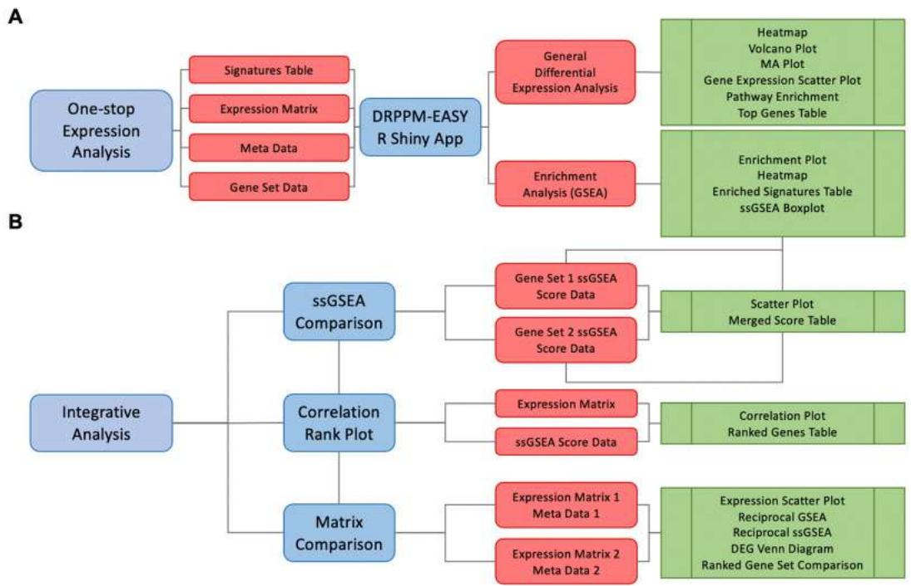  
M-EASY expression analysis pipeline. (A) Schematic workflow of DRPPM-EASY. Figure 1. DRPPM-EASY expression analysis pipeline. (A) Schematic workflow of DRPPM-EASY. The kes in input files of an expression matrix, a sample meta-file specifying sample pipeline takes in input files of an expression matrix, a sample meta-file specifying sample grouping, a gene set database for GSEA. A GSEA enriched signature table is generated as a and a gene set database for GSEA. A GSEA enriched signature table is generated as a preprocessing step, which is used as input to the R Shiny app. The app generates two modes of exploring the data: sult from the analysis can be downloaded as output tables. (B) Schematic of the (1) general differential gene expression analysis and (2) gene set enrichment analysis. The result from ysis with three major features for pathway signature comparison. The app has three the analysis can be downloaded as output tables. (B) Schematic of the integrative analysis with three ative analysis: (1) scatter plot mode, (2) correlation plot mode, and (3) paired multi-major features for pathway signature comparison. The app has three modes of integrative analysis: (1) scatter plot mode, (2) correlation plot mode, and (3) paired multi-omics analysis.

xploration Module. Table 1. Data Exploration Module.   

<table><tr><td></td><td>App Function</td><td>Description</td></tr><tr><td>E1</td><td>Unsupervised Heatmap</td><td>Top variable gene selectionExpression data is log2 transformed then z-normalizedUser-specified clustering method</td></tr><tr><td>E2</td><td>Scatter Plot</td><td>User selects two genes of interestExpression values compared via interactive scatter plot(log2 transformation is optional)</td></tr><tr><td>E3</td><td>Custom Heatmap</td><td>Visualize user-selected genes and samplesExpression data is log2 transformed and z-normalizedUser-specified clustering method</td></tr><tr><td>E4</td><td>Box Plot</td><td>Gene expression in each group are shownExpression values are log2 transformedComparing groups for statistical differences</td></tr></table>

Table 2. Differential Expression Analysis Module.   

<table><tr><td></td><td>App Function</td><td>Description</td></tr><tr><td>DEA1</td><td>Volcano Plot</td><td>User selects comparison groups Differential gene expression analysis with LIMMA Up- and downregulated differentially expressed genes determined with user input</td></tr><tr><td>DEA2</td><td>MA Plot</td><td>User selects comparison groups Differential gene expression analysis with LIMMA Up- and downregulated differentially expressed genes determined with user input</td></tr><tr><td>DEA4</td><td>Pathway Enrichment Analysis</td><td>User selects comparison groups and gene set/pathway Differential gene expression analysis with LIMMA Pathway enrichment analysis using enrichR</td></tr></table>

Table 3. Gene Set Enrichment Analysis Module.   

<table><tr><td></td><td>App Function</td><td>Description</td></tr><tr><td>GA1</td><td>Enrichment Plot</td><td>User selects comparison groupsSignal-to-noise ranking performed on expression dataGSEA function performed with chosen gene set</td></tr><tr><td>GA2</td><td>Gene Expression Heatmap</td><td>User selects comparison groupsSignal-to-noise ranking performed on expression dataGSEA function performed with chosen gene setExpression data log2 transformed and scaledGenes from chosen gene set displayed in the heatmap</td></tr><tr><td>GA3</td><td>GSEA Summary Table</td><td>Displays user pre-generated enriched signatures table</td></tr><tr><td>GA4</td><td>Generate Summary Table</td><td>GSEA function performed on expression data withuser input GMT fileEnriched signatures table produced is displayed</td></tr><tr><td>GA5</td><td>ssGSEA Boxplots</td><td>User-selects gene set and single-sample GSEA methodComparing groups for statistical differences</td></tr></table>

# 2.2. Module 2. The DRPPM-EASY-Integration App Implementation

The DRPPM-EASY-Integration provides an explorer for the user to upload normalized RNA expression, proteomic quantification, or ssGSEA scores to evaluate the potential relationship between these features (Figure 1B). These can be evaluated by either a 1:1 scatter plot or 1:n rank of Spearman correlation rho values (Table 4). The integrative app also allows the user to perform concurrent differential expression analysis and integration of two expression matrices, for example, to compare RNA and protein expression matrices. The fold change can be compared between the two datasets (Table 4), and differentially expressed genes can be compared by reciprocal GSEA or ssGSEA. Direct overlap between the differentially expressed genes is shown as a Venn diagram and further compared to existing gene set databases by Fisher’s exact test, Cohen’s kappa score, and the Jaccard index.

Table 4. Integrative Analysis.   

<table><tr><td></td><td>App Function</td><td>Description</td></tr><tr><td>IA1</td><td>Scatter Plot Comparison</td><td>User input features are merged and plottedSamples are colored based on metadata type</td></tr><tr><td>IA2</td><td>Correlation Rank Plot</td><td>Assessing the relationship between ssGSEA score and gene expression performedCorrelation can be performed as Spearman, Pearson, or KendallCorrelation values plotted by rank from lowest to highest</td></tr><tr><td>IA3</td><td>Matrix Comparison File Upload</td><td>Upload two expression matrices and two metadata files</td></tr><tr><td>IA4</td><td>Log2FC Comparison Scatter Plot</td><td>Differential gene expression analysis with LIMMA performed on both matricesLog2 fold change values subset and difference between matrices calculatedExpression data displayed as scatter plot</td></tr><tr><td>IA5</td><td>Reciprocal GSEA</td><td>Differential gene expression analysis with LIMMAFour gene sets derived differentially expressed genes (two upregulated, and two downregulated gene set)GSEA performed on the reciprocal data</td></tr><tr><td>IA6</td><td>Reciprocal ssGSEA</td><td>Differential gene expression analysis with LIMMAFour gene sets derived differentially expressed genes (two upregulated, and two downregulated gene set)ssGSEA performed on the reciprocal data</td></tr><tr><td>IA7</td><td>Venn Diagram</td><td>Differential gene expression analysis with LIMMAOverlapping differentially expressed genesPerform Fisher&#x27;s exact test. Calculate Cohen&#x27;s kappa, and Jaccard index to compare between the two matrix and across user selected pathways.</td></tr></table>

# 2.3. Installation and User Guide

The source code and user guide are available for download on the project’s GitHub page. The GitHub page includes the list of individual R packages and their version along with an installation script for all package dependencies.

# 2.4. RNA Sequencing Analysis

USP7 samples were prepared as described in Shaw et al. [21]. Briefly, human T-ALL cell lines Jurkat (ATCC) cells were transduced with USP7 shRNA lentivirus and sorted for GFP positive cells or selected by puromycin. RNA samples were isolated using RNeasy Mini Kit (QIAGEN) and subjected to paired-end $2 \times 1 5 1$ base-pair RNA-seq sequencing (Illumina), 10 Jurkat samples—of which 6 were treated with shRNA and 4 were treated with a scramble RNA—were profiled by RNA-seq. RNA-seq data were processed by a custom pipeline (WRAP, https://github.com/gatechatl/DRPPM_Example_Input_Output/tree/ master/WRAP:Wrapper-for-my-RNAseq-Analysis-Pipeline (accessed on 1 August 2021. RNA-seq reads were aligned using the STAR 2.7.1a aligner [22] in the two-pass mode to the human hg38 genome build using gene annotations provided by the Gencode v31 gene models. Read count for each gene was obtained with HT-seq [23]. Reads were normalized to fragments per kilobase million (FPKM) for each gene.

# 2.5. Whole Proteomics Mass Spectrometry and Data Analysis

The 10-plex TMT labeled mass spectrometry experiment was performed with a previously published protocol with slight modification [24,25] (See Supplementary Method,

Supplementary Figure S3 for the experimental design). Protein for each sample was digested by trypsin (Promega). The TMT labeled samples were mixed equally, desalted, and fractionated on an offline HPLC (Agilent 1220) using basic pH reverse-phase liquid chromatography (pH 8.0, XBridge C18 column, $4 . 6 \ : \mathrm { m m } \times 2 5 \ : \mathrm { c m } ,$ , $3 . 5 \mu \mathrm { m }$ particle size, Waters). In total, 20 fractions were derived, and the eluted peptides were ionized by electrospray ionization and detected by an inline Orbitrap Fusion mass spectrometer (Thermo Scientific. Waltham, MA, USA). The MS/MS raw files were processed by a tag-based hybrid search engine JUMP [26]. The data were searched against the UniProt human concatenated with a reversed decoy database for evaluating false discovery rate. Searches were performed using a 25 ppm mass tolerance for precursor ions and 25 ppm mass tolerance for fragment ions, fully tryptic restriction with two maximal missed cleavages, three maximal modification sites, and the assignment of a, b, and $y$ ions. TMT tags on lysine residues and N-termini (+229.162932 Da) were used for static modifications, and Met oxidation $( + 1 5 . 9 9 4 9 2 \mathrm { { D a } ) }$ ) was considered as a dynamic modification. MS/MS spectra were filtered by mass accuracy and matching scores to reduce the protein false discovery rate to approximately $1 \%$ . Proteins were quantified by summing up reporter ion counts across all matched PSMs using the JUMP software suite [25,26].

# 2.6. Pre-Processing of the GSEA Analysis

To optimize the user experience, we provided a script to pre-generate a GSEA result table (Supplementary Figure S1). The GitHub page contains “Getting Started Scripts”, which allows the user to pre-process GSEA results for downstream table visualization. Enriched signature tables can take a long time to process depending on the number of samples or the size of the GMT file provided by the user. At the top of the script, there are key input parameters, such as file path and name to the expression matrix, metadata, and gene set file, as well as the preferred output file path of the output table(s). Additionally, the getting started scripts include a script to generate an R Data list of the ssGSEA analysis. Large gene sets may require several minutes, so pre-computing can facilitate a better user experience.

# 3. Results

# 3.1. DRPPM-EASY Analysis of RNA-seq and Proteomics Data Use Case 1

We previously identified that USP7 knockdown in T-ALL reduces the activity of E-proteins in a TAL1 dependent manner [21]. To highlight the functions of the DRPPM-EASY application, we re-examined the RNA sequencing profiling data of Jurkat cells after USP7 shRNA silencing. RNA-seq sample grouping was assessed by unsupervised hierarchical clustering (Figure 2A). Notably, altering the clustering methods and the number of (selected) top variables did not change the clustering result, suggesting robust grouping of our data (Supplementary Figure S2). Differential gene expression was then performed by LIMMA and visualized as a Volcano and MA plot. As expected, differential gene expression analysis found downregulated USP7 expression after silencing (Figure 2B,C). Notably, MYC, NOTCH1, TRIB2, and EOMES were upregulated after USP7 knockdown (Figure 2B). In the pathway analysis view, enriched pathways can be examined with preloaded gene sets from MsigDB, cell marker, and L1000 drug response. By GSEA and single-sample GSEA, we found USP7 knockdown upregulated with MYC and TAL1 associated targets (Figure 2D,E) and found downregulated apoptotic gene signature from the Hallmark database (Figure 2F). Overall, the RNA-seq analysis supports our previous finding that USP7 is implicated in the negative regulation of TAL1-dependent leukemia growth [21].

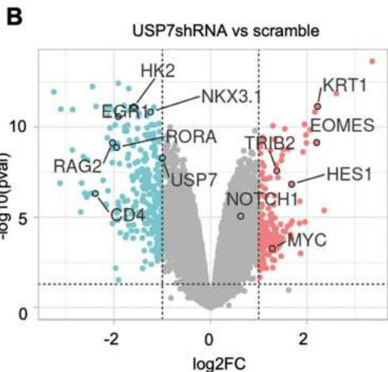

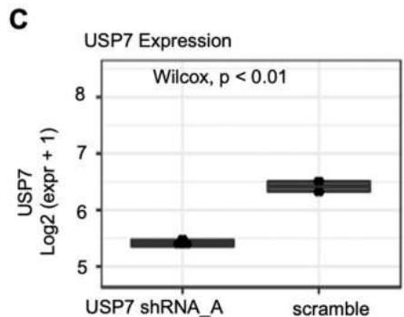

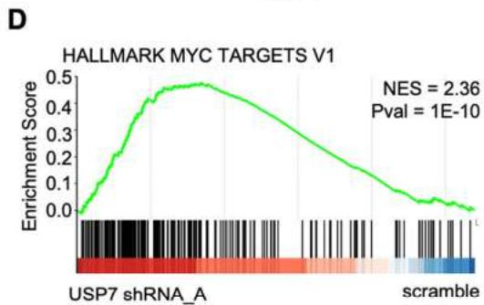

  
Figure 2. Expression analysis example of RNA-seq data USP7 silenced Jurkat cells. (A) Unsuper-Figure 2. Expression analysis example of RNA-seq data USP7 silenced Jurkat cells. (A) Unsupervised vised clustering of the RNA sequencing data using the top 100 genes ranked based on mean absoluteclustering of the RNA sequencing data using the top 100 genes ranked based on mean absolute deviation (MAD). (B) Differential gene expression analysis comparing USP7 knockdown and scram-deviation (MAD). (B) Differential gene expression analysis comparing USP7 knockdown and scramble. Genes upregulated after USP7 knockdown are shown in red and genes downregulated after USP7 knockdown are shown in blue (USP7-associated targets). (C) Boxplot showing the USP7 expression single sample GSVA analysis of the TAL1 gene set. (F) Boxplot showing the single sample GSVAin log2 FPKM. (D) Gene set enrichment analysis of MYC targets. (E) Boxplot showing the single analysis of the Hallmark Apoptosis gene set. sample GSVA analysis of the TAL1 gene set. (F) Boxplot showing the single sample GSVA analysis of the Hallmark Apoptosis gene set.

ples with RNA-seq profiling (Figure 3A; Supplementary Figure S3). A joint analysisNext, tandem-mass-tagged proteomics profiling was performed on the same set of samples with RNA-seq profiling (Figure 3A; Supplementary Figure S3). A joint analysis of the transcriptome and proteome data was carried out by the DRPPM-EASY-Integration pipeline, identifying genes with altered protein abundance and unaltered mRNA levels, such as TRIM27, NOTCH2, UBR3, and USP22 (Figure 3B). Consistent with our previous observation, TRIM27, a known target of USP7 [27], observed decreased protein abundance in T-ALL cell lines with a haploinsufficient USP7 [21]. The altered abundance of UBR3 and USP22 suggests an altered ubiquitin ligase network. Furthermore, our result suggests that USP7 loss-of-function alters NOTCH2 protein abundance. Of note, NOTCH1 [28] protein abundance was unaltered after USP7 knockdown (Figure 3B). Thus, the precise

mechanism of USP7 to drive the NOTCH association leukemia signature will need to beanism of USP7 to drive the NOTCH association leukemia signature will need to be carecarefully examined in future studies.fully examined in future studies.

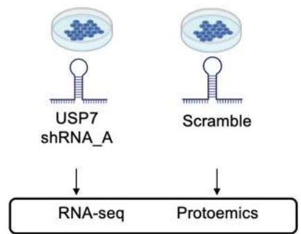  
A

  
B

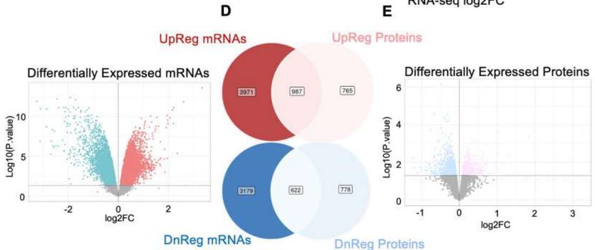  
c

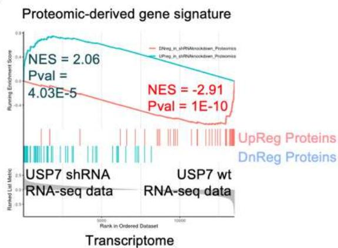  
F

  
G   
Figure 3. Integrated analysis example of proteomics and transcriptomics USP7 silenced Jurkat cells.Figure 3. Integrated analysis example of proteomics and transcriptomics USP7 silenced Jurkat cells. (A) Jurkat samples treated with USP7 shRNA and scramble were profiled by RNA sequencing and (A) Jurkat samples treated with USP7 shRNA and scramble were profiled by RNA sequencing and TMT mass spectrometry. (B) The log2 fold change from the differential expression analyses is plot-TMT mass spectrometry. (B) The log2 fold change from the differential expression analyses is plotted. ted. Positive log2FC indicates upregulated expression after USP7 silencing. Negative log2FC indi-Positive log2FC indicates upregulated expression after USP7 silencing. Negative log2FC indicates downregulated expression after USP7 knockdown. Dotted line indicates the −1 and 1 log2FC cutoff. mRNAs. (D) Venn diagram of genes differentially upregulated (top panel) and downregulated (bot-(C) Upregulated and downregulated gene signatures derived from differentially expressed mRNAs. tom panel) in the transcriptome (left) and proteome (right). (E) Up-regulated and downregulated (D) Venn diagram of genes differentially upregulated (top panel) and downregulated (bottom panel) gene signatures derived from differentially expressed proteins. (F,G) Reciprocal GSEA of differen-in the transcriptome (left) and proteome (right). (E) Up-regulated and downregulated gene signatures tially expressed genes derived from the transcriptome and examined in the proteomics data (F).derived from differentially expressed proteins. (F,G) Reciprocal GSEA of differentially expressed Similarly, differentially expressed proteins were first derived then examined in the transcriptome genes derived from the transcriptome and examined in the proteomics data (F). Similarly, differentially data by GSEA (G).expressed proteins were first derived then examined in the transcriptome data by GSEA (G).

The DRPPM-EASY-Integration includes features assessing the consistency between two datasets. Using the RNA-seq and proteomic data as proof of concept, DRPPM-EASY-Integration found 987 genes consistently upregulated, and 622 genes consistently downregulated in both datasets (Figure 3C–E). A connectivity map-inspired strategy [29,30] was applied to compare the consistency between the two datasets using reciprocal enrichment. Specifically, differential expressed genes in one dataset was used to derive a gene signature for GSEA to test in the other dataset. For example, differentially expressed proteins (Figure 3F) were applied as a GSEA gene set and tested for enrichment in the transcriptome data (Figure 3G). Similarly, gene sets derived from differentially expressed transcripts (Figure 3C) were tested for enrichment in the proteome data (Figure 3H). We then compared the significance of the overlapping differentially expressed genes against other pathway databases, such as Hallmark and KEGG. The overlap was evaluated by Fisher’s exact test, Cohen’s kappa, and Jaccard index. Consistently, the RNA and protein were most significantly overlapped compared to other gene sets. Moreover, the spliceosome and ubiquitin-mediated proteolysis pathways from KEGG and the unfolded protein response and MYC pathway from Hallmark were consistently enriched in both datasets (Supplementary Figure S3B,C; Supplementary Tables S1 and S2).

# 3.2. DRPPM-EASY-CCLE Use Case 2

To further illustrate the DRPPM-EASY functionality, we developed DRRPM-EASY-CCLE, an extended app with features to select samples from the Cancer Cell Line Encyclopedia (CCLE) data. The app is preloaded with 1379 CCLE samples spanning 37 lineages, 96 lineage sub-types, and 33 diseases. For the genetic characterization, 299 cancer drivers [31] were selected and further divided based on the damaging and non-damaging variant status from DepMap [32] (see Supplementary Table S3 for the complete phenotype categories). As an example, we extracted ovary cancer cell lines and performed expression analysis comparing TP53 mutation status to its wild-type counterpart (Figure 4A). In TP53 mutated ovary cancer cells, we found a decreased DNA damage response gene signature (Figure 4B), thereby solidifying the role of TP53 loss-of-function for regulating DNA damage in these ovarian cancer cells.

Previously, KRAS was found to be frequently mutated in non-small cell lung cancer (NSCLC) and is associated with drug resistance [33]. Thus, we analyzed NSCLC cell lines and compared KRAS mutation status to its wild-type counterpart (Figure 4C). By pathway analysis, the MsigDB defined KRAS signature was consistently upregulated in our KRAS mutated samples (Supplementary Figure S4A). Interestingly, top pathways enriched in the KRAS mutated samples are associated with an anti-apoptosis signature (Supplementary Figure S4B). By ssGSEA, amplified expression in KRAS mutated NSCLC cells were enriched with genes that negatively regulate apoptosis (Figure 4D) and upregulating genes that associated with stress granule assembly and disassembly (Figure 4E), which is a dynamic process fundamental to surviving under stress [34]. Interestingly, oncogenic KRAS-driven stress granules were previously identified in pancreatic and colorectal adenocarcinoma [35]; thus, our result suggests a similar stress response in NSCLC cells.

To further expand our functionality for exploring these large project data, we have also implemented features that enable users to upload their own expression matrix to perform an integrative analysis in CCLE and lung squamous cell carcinoma CPTAC datasets https://github.com/shawlab-moffitt/DRPPM-EASY-LargeProject-Integration (accessed on 1 February 2022) (Supplementary Figures S5A–C). Altogether, our framework provides a user-friendly environment to categorize the samples for downstream analysis with a high potential for novel discovery.

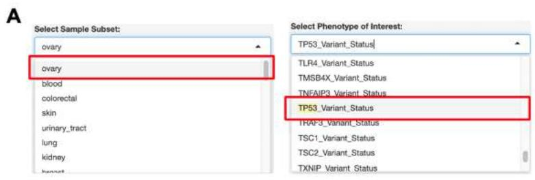

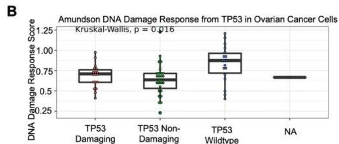

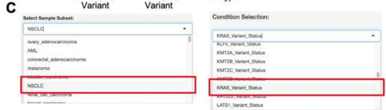

  
Figure 4. Use case analysis example of CCLE Expression data. (A) Drop-down menu selection of Figure 4. Use case analysis example of CCLE Expression data. (A) Drop-down menu selection sample cohort and sample phenotype characteristic. CCLE ovary samples and TP53 mutation status of sample cohort and sample phenotype characteristic. CCLE ovary samples and TP53 mutation were selected from the drop-down menu option. (B) Single-sample GSEA analysis of genes defining status were selected from the drop-down menu option. (B) Single-sample GSEA analysis of genes the DNA damage response by Amundson et al. Analyzed samples were selected from the drop-defining the DNA damage response by Amundson et al. Analyzed samples were selected from the down menu from (A). (C) Drop-down menu selection of sample cohort and sample phenotype char-drop-down menu from (A). (C) Drop-down menu selection of sample cohort and sample phenotype acteristic. CCLE non-small cell lung cancer samples and phenotype associated with the KRAS mu-characteristic. CCLE non-small cell lung cancer samples and phenotype associated with the KRAS mutation status were selected from the drop-down menu option. (D) Single sample GSEA analysis of the stress granule assembly and disassembly. Gene sets were compiled from Biological Pathways genes negatively regulating the DNA damage response. (E) Single sample GSEA of genes defining from the Gene Ontology database (GOBP). Analyzed samples were selected from the drop-down the stress granule assembly and disassembly. Gene sets were compiled from Biological Pathways menu from (C). from the Gene Ontology database (GOBP). Analyzed samples were selected from the drop-down menu from (C).

# Previousl4. Discussion

An effective method for visualization and data analysis is key to the analysis of multiomics data that captures the molecular processes of cancer initiation and progression. Several Shiny apps have been published to date and can be categorized into the following three categories: (1) tools that focus on pairwise differential expression and biomarker discovery (e.g., POMAShiny 10], TCC-GUI [11], and START App [12]), (2) tools that perform pathway and network analysis (e.g., iOmics [14] and JUMPn [15]), and (3) tools that facilitate the query of large datasets, such as from public repositories or consortium

deposited datasets and deposited expression data (e.g., shinyGEO [16], ImaGEO [17], and GENAVi [13]). While numerous web tools have been developed thus far, there is a lack of tools that directly address challenges associated with multi-data integration, such as evaluating the consistency between omics datasets.

Here, we developed an interactive software tool, DRPPM-EASY, that allows users to perform complex omics data integration in both small (pairwise comparison) and large (consortium) projects. DRPPM-EASY puts together an interactive flexible interface that enables the exploration of biomarkers and enriched pathways across multiple datasets. DRPPM-EASY can perform routine gene analysis, such as hierarchical clustering, differential gene expression, pathway analysis, GSEA, and ssGSEA. Additionally, DRPPM-EASY can perform a joint analysis of two expression datasets. As an example, we have highlighted the application’s ability to evaluate the consistency between transcriptome and protein datasets. This is made possible by deriving a gene set feature in one dataset (i.e., transcriptomics), which is applied in the GSEA analysis of the other dataset (i.e., proteomics). DRPPM-EASY can be easily adapted for large consortium data, which we highlight as an example in CCLE cancer cell lines and lung squamous cell carcinoma CPTAC proteome data. Finally, to further expand the utility of our tool, the user can upload their own expression data and use it to compare against CCLE cell lines and lung squamous cell carcinoma proteome data. One major limitation of our application requires the user to normalize their gene expression matrix prior to using our application. Existing pipelines are available to streamline the normalization procedure, such as Shiny-Seq [36]. A normalization procedure will be included in future updates of our application.

Finally, the ability to run the application with a user interface on a local desktop reduces the need for computational domain knowledge of expression analysis. The DRPPM-EASY application can be set up on the server in real-time, enabling collaborative discussion on potential hypotheses derived from the high-throughput data. Our tool also ensures reproducibility of the data analysis, which is one of the most significant issues in omics research [37]. While the current application is highlighted to work in RNA-seq and proteomics data, our framework could easily be adapted to incorporate drug response, genetic screening, or splicing associated features in future versions of our application. Thus, we believe DRPPM-EASY will be a useful and valuable tool for the biomedical research community.

Supplementary Materials: The following supporting information can be downloaded at: https://www. mdpi.com/article/10.3390/biology11020260/s1, Supplementary Method. Supplementary Table S1. KEGG Pathways Jointly Enriched in the Transcriptome and Proteome. Supplementary Table S2. Hallmark Pathways Jointly Enriched in the Transcriptome and Proteome. Supplementary Table S3. CCLE Sample Meta-Information. Supplementary Figure S1. Schematic of the GSEA pre-processing. Supplementary Figure S2. Unsupervised hierarchical clustering of Jurkat samples after USP7 knockdown. Supplementary Figure S3. Experimental design of the total proteome profiling of the USP7 knockdown experiment. Supplementary Figure S4. Pathway enrichment analysis of genes differentially upregulated in KRAS mutated samples in NSCLC. Supplementary Figure S5. Screen shot showing the user option to upload user data in the DRPPM-Large Project Integration.

Author Contributions: Conceptualization, T.I.S. and A.-C.T.; methodology, T.I.S., A.O.; software, T.I.S., A.O., Q.H. and J.D.N.; validation, L.D.; formal analysis, T.I.S.; data curation, M.G.; writing— original draft preparation, T.I.S., A.-C.T.; writing—review and editing, T.I.S., A.-C.T., P.R., T.J.R. and M.T.; supervision, T.I.S.; funding acquisition, T.I.S. All authors have read and agreed to the published version of the manuscript.

Funding: Moffitt Cancer Center (NCI P30 CA076292) and the Moffitt Cancer Center Department of Biostatistics and Bioinformatics Pilot Projects (PI: T.S.).

Institutional Review Board Statement: Not applicable.

Informed Consent Statement: Not applicable.

Data Availability Statement: The developed software and processed data can be downloaded from the following GitHub page https://github.com/shawlab-moffitt/DRPPM-EASY-ExprAnalysisShinY (accessed on 1 February 2022).

Acknowledgments: This work has been supported in part by the Biostatistics and Bioinformatics Shared Resource at the Moffitt Cancer Center (NCI P30 CA076292) and the Moffitt Cancer Center Department of Biostatistics and Bioinformatics Pilot Project (PI: T.S.). We would like to thank Rodrigo Carvajal and Guillermo Gonzalez-Calderon for their help in setting up the internal web server. We would like to thank Dongliang Du and Ling Cen for their help in the USP7 RNAseq analysis.

Conflicts of Interest: The funders had no role in the design of the study; in the collection, analyses, or interpretation of data; in the writing of the manuscript, or in the decision to publish the results.

# References

1. De Anda-Jauregui, G.; Hernandez-Lemus, E. Computational Oncology in the Multi-Omics Era: State of the Art. Front. Oncol. 2020, 10, 423. [CrossRef]   
2. Menyhart, O.; Gyorffy, B. Multi-omics approaches in cancer research with applications in tumor subtyping, prognosis, and diagnosis. Comput. Struct. Biotechnol. J. 2021, 19, 949–960. [CrossRef]   
3. Chai, A.W.Y.; Tan, A.C.; Cheong, S.C. Uncovering drug repurposing candidates for head and neck cancers: Insights from systematic pharmacogenomics data analysis. Sci. Rep. 2021, 11, 23933. [CrossRef]   
4. Edgar, R.; Domrachev, M.; Lash, A.E. Gene Expression Omnibus: NCBI gene expression and hybridization array data repository. Nucleic Acids Res. 2002, 30, 207–210. [CrossRef]   
5. Barrett, T.; Wilhite, S.E.; Ledoux, P.; Evangelista, C.; Kim, I.F.; Tomashevsky, M.; Marshall, K.A.; Phillippy, K.H.; Sherman, P.M.; Holko, M.; et al. NCBI GEO: Archive for functional genomics data sets—Update. Nucleic Acids Res. 2013, 41, D991–D995. [CrossRef]   
6. Wilks, C.; Zheng, S.C.; Chen, F.Y.; Charles, R.; Solomon, B.; Ling, J.P.; Imada, E.L.; Zhang, D.; Joseph, L.; Leek, J.T.; et al. Recount3: Summaries and queries for large-scale RNA-seq expression and splicing. Genome Biol. 2021, 22, 323. [CrossRef]   
7. Edwards, N.J.; Oberti, M.; Thangudu, R.R.; Cai, S.; McGarvey, P.B.; Jacob, S.; Madhavan, S.; Ketchum, K.A. The CPTAC Data Portal: A Resource for Cancer Proteomics Research. J. Proteome Res. 2015, 14, 2707–2713. [CrossRef]   
8. Ghandi, M.; Huang, F.W.; Jane-Valbuena, J.; Kryukov, G.V.; Lo, C.C.; McDonald, E.R., 3rd; Barretina, J.; Gelfand, E.T.; Bielski, C.M.; Li, H.; et al. Next-generation characterization of the Cancer Cell Line Encyclopedia. Nature 2019, 569, 503–508. [CrossRef]   
9. Davis-Turak, J.; Courtney, S.M.; Hazard, E.S.; Glen, W.B., Jr.; da Silveira, W.A.; Wesselman, T.; Harbin, L.P.; Wolf, B.J.; Chung, D.; Hardiman, G. Genomics pipelines and data integration: Challenges and opportunities in the research setting. Expert Rev. Mol. Diagn. 2017, 17, 225–237. [CrossRef]   
10. Castellano-Escuder, P.; Gonzalez-Dominguez, R.; Carmona-Pontaque, F.; Andres-Lacueva, C.; Sanchez-Pla, A. POMAShiny: A user-friendly web-based workflow for metabolomics and proteomics data analysis. PLoS Comput. Biol. 2021, 17, e1009148. [CrossRef]   
11. Su, W.; Sun, J.; Shimizu, K.; Kadota, K. TCC-GUI: A Shiny-based application for differential expression analysis of RNA-Seq count data. BMC Res. Notes 2019, 12, 133. [CrossRef] [PubMed]   
12. Nelson, J.W.; Sklenar, J.; Barnes, A.P.; Minnier, J. The START App: A web-based RNAseq analysis and visualization resource. Bioinformatics 2017, 33, 447–449. [CrossRef]   
13. Reyes, A.L.P.; Silva, T.C.; Coetzee, S.G.; Plummer, J.T.; Davis, B.D.; Chen, S.; Hazelett, D.J.; Lawrenson, K.; Berman, B.P.; Gayther, S.A.; et al. GENAVi: A shiny web application for gene expression normalization, analysis and visualization. BMC Genom. 2019, 20, 745. [CrossRef]   
14. Zoppi, J.; Guillaume, J.F.; Neunlist, M.; Chaffron, S. MiBiOmics: An interactive web application for multi-omics data exploration and integration. BMC Bioinform. 2021, 22, 6. [CrossRef]   
15. Vanderwall, D.; Suresh, P.; Fu, Y.; Cho, J.H.; Shaw, T.I.; Mishra, A.; High, A.A.; Peng, J.; Li, Y. JUMPn: A Streamlined Application for Protein Co-Expression Clustering and Network Analysis in Proteomics. J. Vis. Exp. 2021, 176. [CrossRef]   
16. Dumas, J.; Gargano, M.A.; Dancik, G.M. shinyGEO: A web-based application for analyzing gene expression omnibus datasets. Bioinformatics 2016, 32, 3679–3681. [CrossRef] [PubMed]   
17. Toro-Dominguez, D.; Martorell-Marugan, J.; Lopez-Dominguez, R.; Garcia-Moreno, A.; Gonzalez-Rumayor, V.; Alarcon-Riquelme, M.E.; Carmona-Saez, P. ImaGEO: Integrative gene expression meta-analysis from GEO database. Bioinformatics 2019, 35, 880–882. [CrossRef]   
18. Shimada, K.; Bachman, J.A.; Muhlich, J.L.; Mitchison, T.J. ShinyDepMap, a tool to identify targetable cancer genes and their functional connections from Cancer Dependency Map data. Elife 2021, 10, e57116. [CrossRef]   
19. Ritchie, M.E.; Phipson, B.; Wu, D.; Hu, Y.; Law, C.W.; Shi, W.; Smyth, G.K. Limma powers differential expression analyses for RNA-sequencing and microarray studies. Nucleic Acids Res. 2015, 43, e47. [CrossRef] [PubMed]   
20. Hanzelmann, S.; Castelo, R.; Guinney, J. GSVA: Gene set variation analysis for microarray and RNA-seq data. BMC Bioinform. 2013, 14, 7. [CrossRef] [PubMed]

21. Shaw, T.I.; Dong, L.; Tian, L.; Qian, C.; Liu, Y.; Ju, B.; High, A.; Kavdia, K.; Pagala, V.R.; Shaner, B.; et al. Integrative network analysis reveals USP7 haploinsufficiency inhibits E-protein activity in pediatric T-lineage acute lymphoblastic leukemia (T-ALL). Sci. Rep. 2021, 11, 5154. [CrossRef]   
22. Dobin, A.; Davis, C.A.; Schlesinger, F.; Drenkow, J.; Zaleski, C.; Jha, S.; Batut, P.; Chaisson, M.; Gingeras, T.R. STAR: Ultrafast universal RNA-seq aligner. Bioinformatics 2013, 29, 15–21. [CrossRef] [PubMed]   
23. Anders, S.; Pyl, P.T.; Huber, W. HTSeq—A Python framework to work with high-throughput sequencing data. Bioinformatics 2015, 31, 166–169. [CrossRef]   
24. Xu, P.; Duong, D.M.; Peng, J. Systematical optimization of reverse-phase chromatography for shotgun proteomics. J. Proteome Res. 2009, 8, 3944–3950. [CrossRef] [PubMed]   
25. Pagala, V.R.; High, A.A.; Wang, X.; Tan, H.; Kodali, K.; Mishra, A.; Kavdia, K.; Xu, Y.; Wu, Z.; Peng, J. Quantitative protein analysis by mass spectrometry. Methods Mol. Biol. 2015, 1278, 281–305. [CrossRef]   
26. Wang, X.; Li, Y.; Wu, Z.; Wang, H.; Tan, H.; Peng, J. JUMP: A tag-based database search tool for peptide identification with high sensitivity and accuracy. Mol. Cell. Proteom. 2014, 13, 3663–3673. [CrossRef]   
27. Hao, Y.H.; Fountain, M.D., Jr.; Fon Tacer, K.; Xia, F.; Bi, W.; Kang, S.H.; Patel, A.; Rosenfeld, J.A.; Le Caignec, C.; Isidor, B.; et al. USP7 Acts as a Molecular Rheostat to Promote WASH-Dependent Endosomal Protein Recycling and Is Mutated in a Human Neurodevelopmental Disorder. Mol. Cell 2015, 59, 956–969. [CrossRef]   
28. Jin, Q.; Martinez, C.A.; Arcipowski, K.M.; Zhu, Y.; Gutierrez-Diaz, B.T.; Wang, K.K.; Johnson, M.R.; Volk, A.G.; Wang, F.; Wu, J.; et al. USP7 Cooperates with NOTCH1 to Drive the Oncogenic Transcriptional Program in T-Cell Leukemia. Clin. Cancer Res. 2019, 25, 222–239. [CrossRef] [PubMed]   
29. Lamb, J. The Connectivity Map: A new tool for biomedical research. Nat. Rev. Cancer 2007, 7, 54–60. [CrossRef]   
30. Lamb, J.; Crawford, E.D.; Peck, D.; Modell, J.W.; Blat, I.C.; Wrobel, M.J.; Lerner, J.; Brunet, J.P.; Subramanian, A.; Ross, K.N.; et al. The Connectivity Map: Using gene-expression signatures to connect small molecules, genes, and disease. Science 2006, 313, 1929–1935. [CrossRef] [PubMed]   
31. Bailey, M.H.; Tokheim, C.; Porta-Pardo, E.; Sengupta, S.; Bertrand, D.; Weerasinghe, A.; Colaprico, A.; Wendl, M.C.; Kim, J.; Reardon, B.; et al. Comprehensive Characterization of Cancer Driver Genes and Mutations. Cell 2018, 173, 371–385. [CrossRef] [PubMed]   
32. Tsherniak, A.; Vazquez, F.; Montgomery, P.G.; Weir, B.A.; Kryukov, G.; Cowley, G.S.; Gill, S.; Harrington, W.F.; Pantel, S.; Krill-Burger, J.M.; et al. Defining a Cancer Dependency Map. Cell 2017, 170, 564–576. [CrossRef] [PubMed]   
33. Adderley, H.; Blackhall, F.H.; Lindsay, C.R. KRAS-mutant non-small cell lung cancer: Converging small molecules and immune checkpoint inhibition. EBioMedicine 2019, 41, 711–716. [CrossRef]   
34. Wheeler, J.R.; Matheny, T.; Jain, S.; Abrisch, R.; Parker, R. Distinct stages in stress granule assembly and disassembly. Elife 2016, 5, e18413. [CrossRef]   
35. Grabocka, E.; Bar-Sagi, D. Mutant KRAS Enhances Tumor Cell Fitness by Upregulating Stress Granules. Cell 2016, 167, 1803–1813. [CrossRef]   
36. Sundararajan, Z.; Knoll, R.; Hombach, P.; Becker, M.; Schultze, J.L.; Ulas, T. Shiny-Seq: Advanced guided transcriptome analysis. BMC Res. Notes 2019, 12, 432. [CrossRef] [PubMed]   
37. Krassowski, M.; Das, V.; Sahu, S.K.; Misra, B.B. State of the Field in Multi-Omics Research: From Computational Needs to Data Mining and Sharing. Front. Genet. 2020, 11, 610798. [CrossRef]

Article

# Identification and Validation of an Annexin-Related Prognostic Signature and Therapeutic Targets for Bladder Cancer: Integrative Analysis

Xitong Yao 1,†, Xinlei Qi 1,†, Yao Wang 1,†, Baokun Zhang 2, Tianshuai He 1, Taoning Yan 1, Lu Zhang 1, Yange Wang 1, Hong Zheng 1, Guosen Zhang $\mathbf { 1 } , { * } \textcircled { | | }$ and Xiangqian Guo $^ { 1 , * \oplus }$

1 Cell Signal Transduction Laboratory, Department of Predictive Medicine, Institute of Biomedical Informatics, Bioinformatics Center, Henan Provincial Engineering Center for Tumor Molecular Medicine, School of Basic Medical Sciences, Academy for Advanced Interdisciplinary Studies, Henan University, Kaifeng 475004, China; 104753190854@henu.edu.cn (X.Y.); 104753190845@henu.edu.cn (X.Q.); 104753201156@henu.edu.cn (Y.W.); hts@henu.edu.cn (T.H.); 104753211246@henu.edu.cn (T.Y.); 10190146@vip.henu.edu.cn (L.Z.); wangyange3@henu.edu.cn (Y.W.); zhhong@henu.edu.cn (H.Z.)   
2 Beijing Key Laboratory of New Molecular Diagnosis Technologies for Infectious Diseases, Department of Biotechnology, Beijing Institute of Radiation Medicine, Beijing 100850, China; kunbzh0201@163.com   
Correspondence: zhangguosen1989@126.com or 40060006@vip.henu.edu.cn (G.Z.); xqguo@henu.edu.cn (X.G.); Tel.: +86-18237808750 (G.Z.)   
† These authors contributed equally to this work.

Citation: Yao, X.; Qi, X.; Wang, Y.; Zhang, B.; He, T.; Yan, T.; Zhang, L.; Wang, Y.; Zheng, H.; Zhang, G.; et al. Identification and Validation of an Annexin-Related Prognostic Signature and Therapeutic Targets for Bladder Cancer: Integrative Analysis. Biology 2022, 11, 259. https:// doi.org/10.3390/biology11020259

Academic Editors: Shibiao Wan, Yiping Fan, Chunjie Jiang and Shengli Li

Received: 15 December 2021

Accepted: 3 February 2022

Published: 7 February 2022

Publisher’s Note: MDPI stays neutral with regard to jurisdictional claims in published maps and institutional affiliations.

Copyright: © 2022 by the authors. Licensee MDPI, Basel, Switzerland. This article is an open access article distributed under the terms and conditions of the Creative Commons Attribution (CC BY) license (https:// creativecommons.org/licenses/by/ 4.0/).

Simple Summary: Identification of new prognostic biomarkers and therapeutic targets could be essential ways to improve the outcome of bladder cancer (BC) patients. In this study, we comprehensively analyzed the mRNA expression and prognosis of Annexin family members (ANXA1-11, 13) in BC through public analysis tools, including Oncomine, GEPIA2 and our in-house OSblca web server, and found that several Annexins were aberrantly expressed and associated with prognosis in BC. Then, we constructed and validated an Annexin-related prognostic signature (ARPS) in four individual BC cohorts through LASSO and COX regression, indicating that ARPS was an independent prognostic factor for BC. Briefly, our study was to determine the clinical significance of Annexins and provided a potential prognostic model and potential therapeutic targets for BC.

Abstract: Abnormal expression and dysfunction of Annexins (ANXA1-11, 13) have been widely found in several types of cancer. However, the expression pattern and prognostic value of Annexins in bladder cancer (BC) are currently still unknown. In this study, survival analysis by our in-house OSblca web server revealed that high ANXA1/2/3/5/6 expression was significantly associated with poor overall survival (OS) in BC patients, while higher ANXA11 was associated with increased OS. Through Oncomine and GEPIA2 database analysis, we found that ANXA2/3/4/13 were up-regulated, whereas ANXA1/5/6 were down-regulated in BC compared with normal bladder tissues. Further LASSO analysis built an Annexin-Related Prognostic Signature (ARPS, including four members ANXA1/5/6/10) in the TCGA BC cohort and validated it in three independent GEO BC cohorts (GSE31684, GSE32548, GSE48075). Multivariate COX analysis demonstrated that ARPS is an independent prognostic signature for BC. Moreover, GSEA results showed that immune-related pathways, such as epithelial–mesenchymal transition and IL6/JAK/STAT3 signaling were enriched in the high ARPS risk groups, while the low ARPS risk group mainly regulated metabolism-related processes, such as adipogenesis and bile acid metabolism. In conclusion, our study comprehensively analyzed the mRNA expression and prognosis of Annexin family members in BC, constructed an Annexin-related prognostic signature using LASSO and COX regression, and validated it in four independent BC cohorts, which might help to improve clinical outcomes of BC patients, offer insights into the underlying molecular mechanisms of BC development and suggest potential therapeutic targets for BC.

# 1. Introduction

Bladder cancer (BC) is one of the most common malignancies with high risk of tumor recurrence and fatality in the urinary system. According to Global Cancer Statistics 2020, there were about 573,000 new cases and 212,000 deaths of BC around the world [1]. Although the significant advances in understanding of the underlying biology of BC have improved the accuracy and effect of diagnosing and treating this disease in recent years, BC still represents a spectra of diseases from recurrent noninvasive tumors to aggressive or advanced-stage disease that requires multimodal and invasive treatment [2,3]. Frequent postoperative recurrence and distant metastasis lead to the poor prognosis in BC patients [4,5]. Identification of efficient therapeutic targets, as well as new prognostic biomarkers are needed to improve the outcomes of BC patients.

Annexins belongs to a superfamily of calcium-dependent phospholipid-binding proteins and contains 12 members (ANXA1-11, 13) [6]. In eukaryotic cells, Annexins are involved in membrane trafficking and organization, such as vesicle transport, signal transduction, cell proliferation, cell differentiation and apoptosis [7,8]. Recent studies found that abnormal expression and dysfunction of Annexin proteins commonly occurred in tumor tissue and indicated that the disordered Annexin proteins may play important roles in tumorigenesis and progression, as well as chemoresistance in several types of cancer [9,10]. However, few studies reported the roles of Annexins in the carcinogenesis and prognosis in BC. Yu et al. found that the expression of ANXA1 was related to disease-free survival in BC patients and can be used as a recurrence biomarker for BC [11]. In addition, ANXA2 has also been found to play a key role in the formation, progression and recurrence of BC [12], and high expression of ANXA10 is significantly correlated with poor progression-free survival in BC patients [13]. However, the roles and mechanisms of most Annexins in BC remain unclear.

In this study, we comprehensively analyzed the mRNA expression and prognosis of Annexin family members in BC through public analysis tools, including Oncomine, GEPIA2 and our in-house OSblca web server, and found that several Annexins were aberrantly expressed and associated with prognosis in BC. Then, we collected four BC datasets, including 703 BC samples with survival information from The Cancer Genome Atlas (TCGA) and Gene Expression Omnibus (GEO), and constructed and validated an Annexin-related prognostic signature (ARPS) in four individual BC cohorts through LASSO and COX regression, indicating that ARPS was an independent prognostic factor for BC. In addition, we further explored the biological functions and relevant pathways of ARPS through gene set enrichment analysis (GSEA), and analyzed the correlation between ARPS and the infiltrating immune cells using ssGSEA. Briefly, our study was to determine the clinical significance of Annexins and provided a potential prognostic model and potential therapeutic targets for BC.

# 2. Materials and Methods

# 2.1. Survival Analysis of Annexin Family Members in OSblca

OSblca (http://bioinfo.henu.edu.cn/BLCA/BLCAList.jsp, accessed on 2 December 2020) [14] is our in-house online survival analysis tool providing 1075 BC gene expression profiles and accompanied patient clinical follow-up information from TCGA and GEO databases. In OSblca, four types of survival endpoints, including overall survival (OS), disease-specific survival (DSS), disease-free interval (DFI), and progression-free interval (PFI) were provided for prognosis analysis. Each member of the Annexin family was analyzed for the relationship between their mRNA expression and BC outcomes in OSblca prognostic values of these genes were evaluated in all cohorts and survival terms, and, all cutoff values in ‘splitting the patients’ were tested in each cohort to get the best cutoff value.

2.2. Differential Expression Analysis of Annexin Family Members between BC and Adjacent Tissue by Oncomine and GEPIA2

Oncomine (www.oncomine.org, accessed on 2 December 2020) [15] and GEPIA2 (http://gepia2.cancer-pku.cn/#index, accessed on 2 December 2020) [16] databases were used to analyze the differential expression of Annexins between cancer and adjacent normal tissues. Oncomine is an online database that provides differentially expressed gene analysis using public microarray datasets. In Oncomine, mRNA expression of Annexin members between cancer tissue and adjacent normal tissue were compared with the thresholds of $p$ -value $< 0 . 0 5$ , |log2 (fold-change) $| > 1 ,$ and the gene rank percentage $< 1 0 \%$ . GEPIA2 provided the gene expression analysis based on TCGA and GTEx data. In GEPIA2, the expression of Annexins were compared between 404 bladder cancer samples and 28 normal samples with the threshold for $p$ -value $< 0 . 0 5$ and |log2(fold-change) $| > 1$ . In addition, differential expression of Annexins members in distinct clinical stages was also analyzed in TCGA bladder cancer samples using TISIDB database (http://cis.hku.hk/TISIDB/, accessed on 3 December 2020) [17].

# 2.3. Construction and Validation of the Annexin-Related Prognostic Signature through LASSO

Four individual BC cohorts with both gene expression data and related clinical follow-up information were downloaded from TCGA and GEO databases, including one TCGA BC dataset [18] (Discovery cohort) and three GEO BC datasets (Validation cohorts, GSE31684 [19], GSE32548 [20], GSE48075 [21]). Detailed information of each BC cohort was summarized in Supplementary Table S1. The work-flow was illustrated in Supplementary Figure S1. The ARPS was constructed using least absolute shrinkage and selection operator (LASSO) Cox regression through R package “glmnet”. The optimal parameter was determined through 10-fold cross validation with “family $=$ cox, alpha $= 1 ^ { \prime \prime }$ and with all other parameters set to default. Ultimately, ARPS is developed according to the following risk score formula:

$$
\text {r i s k} = \sum_ {i} ^ {n} (\text {C o e f i} * \text {E x p r i})
$$

where Coefi is the coefficient of gene i in LASSO and $\mathrm { E x p r _ { i } }$ is the FPKM value of the included gene i.

Best cut-off risk score was calculated by using the “surv_cutpoint” function of R package “survminer” (https://CRAN.R-project.org/package $=$ survminer, accessed on 24 December 2020). According to the best cut-off risk score, TCGA BC patients were divided into high- and low-risk groups and the prognosis between the two groups was evaluated through Kaplan-Meier survival analysis with the log-rank test. In addition, the expression heatmap of each Annexin member in ARPS and the risk score distribution and survival of patients were visualized through “pheatmap” package. Similar analyses were performed in three individual BC cohorts (GSE31684, GSE32548, GSE48075) to validate the prognosis performance of ARPS in BC.

# 2.4. Independent Prognostic Performance Analysis of ARPS in BC Cohorts

In the TCGA BC cohort, univariate Cox regression models were used to identify the prognostic clinical characteristics related to prognosis, and subsequently these significantly prognostic factors were further tested their independent prognostic performance through multivariate Cox regression models. Similar analyses were performed in other three individual BC cohorts (GSE31684, GSE32548, GSE48075) to validate the independent prognostic performance of ARPS in BC.

# 2.5. Association between ARPS and Clinicopathology

The chi-squared test was performed to determine the association of clinical features between and ARPS in BC patients, where a $p$ -value less than 0.05 indicates statistical significance. In addition, to verify the predictive effectiveness of ARPS in different subgroups, Kaplan-Meier survival analysis was used to compare the prognostic capability between

subgroups in certain clinical features including age, gender, grade, lymph invasion status, T status, M status, and N status, TNM stage, and race.

# 2.6. Gene Interaction and Biological Functions of ARPS

GeneMANIA was used to analyze the protein interactions between Annexin members in ARPS. To evaluate the biological functions of ARPS, differentially expressed genes (DEGs) between the two ARPS risk groups were identified through limma R package, and then were analyzed in the DAVID database to predict the gene ontology (GO) function and KEGG pathway. Furthermore, GSEA was implemented to reveal the potential mechanism that ARPS was involved in.

# 2.7. Correlation between ARPS Risk Score and Imune Cell Infiltration and Immune Checkpoint Genes

In order to characterize the immune cell infiltration in the tumor microenvironment of two ARPS risk groups, the immune cell abundance of the TCGA BC cohort was calculated by estimate, timer, MCPcounter and xCell algorithm, and visualized through the “pheatmap” package of R software. Correlations between ARPS risk score and different immune cell abundances and immune checkpoint genes were analyzed through Pearson coefficient analysis. Then, the levels of immune cell infiltration and immune checkpoint gene expression between high- and low-risk groups were compared using the ‘limma’ package, which revealed the effect of ARPS risk score on BC immune microenvironment.

# 2.8. Statistical Analysis

Statistical analysis was performed using SPSS 16.0 and GraphPad Prism 5.0 software. Differences were compared by the Student’s t test or one-way analysis of variance (ANOVA) where appropriate. Statistical significance was determined by $p$ -value less than 0.05.

# 3. Results

# 3.1. Survival and Differential Analysis of Annexins in Bladder Cancer

Survival analysis results revealed that the mRNA expression of more than half of Annexin members were related to the prognosis of BC patients. As shown in Figure 1, BC patients with high expression of ANXA1/2/3/5/6 had a shorter OS time in comparison to those with low expression of ANXA1/2/3/5/6, while BC patients with high expressed ANXA11 had a longer OS time. In particular, upregulated ANXA1/2/5 were significantly associated with poor prognosis of BC in three or more datasets. In addition, the mRNA expressions of Annexins were also related to DSS in BC patients (Figure 2). The results indicated that BC patients with high expression of ANXA1/2/5/6/7/13 showed a shorter DSS time than those with low expression, as opposed to the patients with high expression of ANXA11. Moreover, high expression of ANXA5 and ANXA13 were found to be associated with poor DFI and PFI in the BC cohort (Figure 3), indicating that these two genes might be involved in recurrence and progression of BC.

Using the Oncomine database (Table 1), we found that most Annexins were significantly differentially expressed between BC and adjacent normal tissues. Markedly lower expressions of ANXA1/5/6 were found in BC tissues consistently, while the expression levels of ANXA2/3/4/13 were significantly increased in multiple BC cohorts. In the GEPIA2 database, ANXA6 was significantly downregulated in TCGA BC samples compared to normal samples $\scriptstyle { p \cdotp }$ -value $< 0 . 0 5$ ), while ANXA8 was significantly upregulated in TCGA BC samples, and no significant differences were found for other Annexins in BC (Supplementary Figure S1).

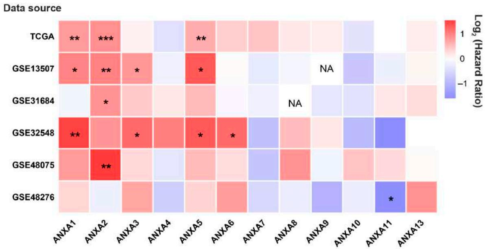  
Figure 1. The hot map of prognostic value of Annexin family members regarding overall survivalFigure 1. The hot map of prognostic value of Annexin family members regarding overall survival(OS) in BC patients by OSblca web server. Where * p < 0.05, ** p < 0.01 and *** p < 0.001, NA means (OS) in BC patients by OSblca web server. Where(OS) in BC patients by OSblca web server. Wherethe queried gene was non-existent in the dataset. $^ { * } p < 0 . 0 5$ ,, $^ { * * } p < 0 . 0 1$ and and $^ { * * * } p < 0 . 0 0 1$ 1, NA means, NA means the queried gene was non-existent in the dataset.the queried gene was non-existent in the dataset.

Disease-Specific Survival   
Figure 2. Forest plots displayed prognostic value of Annexin family members regarding disease-Figure 2. Forest plots displayed prognostic value of AnnexFigure 2. Forest plots displayed prognostic value of Annexspecific survival (DSS) in BC patients using OSblca web server.   

<table><tr><td>Gene</td><td>Data source</td><td>Cutoff (Upper)</td><td></td><td>p value</td><td>HR (95% CI)</td></tr><tr><td colspan="6">ANXA1</td></tr><tr><td></td><td>TCGA</td><td>50%</td><td>←■→</td><td>0.0014</td><td>1.88 (1.28–2.76)</td></tr><tr><td></td><td>GSE19915</td><td>25%</td><td>←■→</td><td>0.0088</td><td>2.93 (1.31–6.54)</td></tr><tr><td colspan="6">ANXA2</td></tr><tr><td></td><td>TCGA</td><td>25%</td><td>←■→</td><td>0.0018</td><td>1.89 (1.27–2.82)</td></tr><tr><td></td><td>GSE31684</td><td>25%</td><td>←■→</td><td>0.0412</td><td>1.81 (1.02–3.20)</td></tr><tr><td colspan="6">ANXA5</td></tr><tr><td></td><td>TCGA</td><td>25%</td><td>←■→</td><td>0.0099</td><td>1.70 (1.14–2.55)</td></tr><tr><td></td><td>GSE19915</td><td>25%</td><td>←■→</td><td>0.003</td><td>3.36 (1.51–7.50)</td></tr><tr><td></td><td>GSE31684</td><td>50%</td><td>←■→</td><td>0.0291</td><td>1.74 (1.06–2.85)</td></tr><tr><td colspan="6">ANXA6</td></tr><tr><td></td><td>TCGA</td><td>50%</td><td>←■→</td><td>0.0181</td><td>1.59 (1.08–2.34)</td></tr><tr><td></td><td>GSE48276</td><td>50%</td><td>←■→</td><td>0.0093</td><td>3.45 (1.36–8.75)</td></tr><tr><td colspan="6">ANXA7</td></tr><tr><td></td><td>TCGA</td><td>50%</td><td>←■→</td><td>0.0153</td><td>1.61 (1.10–2.38)</td></tr><tr><td colspan="6">ANXA11</td></tr><tr><td></td><td>GSE19915</td><td>50%</td><td>←■→</td><td>0.0206</td><td>0.35 (0.15–0.85)</td></tr><tr><td></td><td>GSE48276</td><td>25%</td><td>←■→</td><td>0.0364</td><td>0.21 (0.05–0.91)</td></tr><tr><td colspan="6">ANXA13</td></tr><tr><td></td><td>GSE31684</td><td>50%</td><td>←■→</td><td>0.0177</td><td>1.84 (1.11–3.05)</td></tr></table>

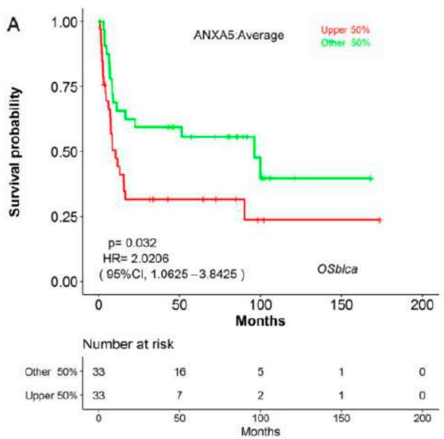

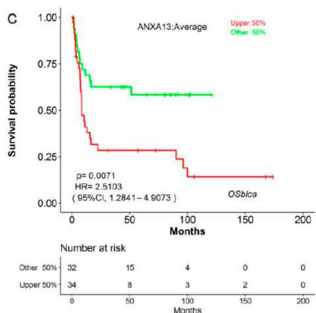

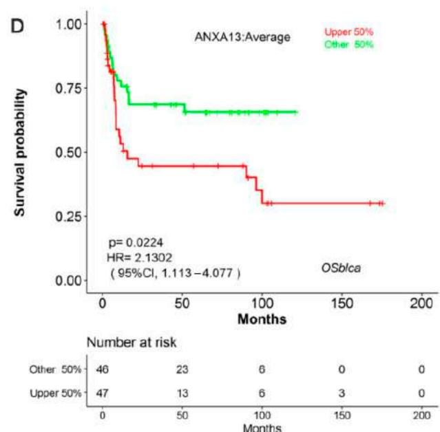  
Figure 3. Survival analysis of ANXA5 and ANXA13 in disease-free interval (DFI) and progression-free interval (PFI) in BC patients using OSblca web server. Kaplan-Meier plotter of ANXA5 with DFI (A) and PFI (B); Kaplan-Meier plotter of ANXA13 with DFI (C) and PFI (D) in OSblca.

A) and PFI (B); Kaplan-Meier plotter of ANXA13 with DFI (C) and PFI (DCorrelation between Annexin expression and clinical stage of BC are shown in Figure 4A. The results showed that the expression levels of ANXA1/2/5/6 were positively correlated with clinical stage, and ANXA10 showed negative correlation with clinical stage, while no significant correlation was found in other Annexins. Additionally, high expression of y differentially expressed between BC and adjacent normal tissues. MANXA1/2/5/6 were found in BC patients with stage III/IV compared to those in BC patients ssions of ANXA1/5/6 were found in BC tissues consistently, while twith stage I/II (Figure 4B–E), whereas low expression of ANXA10 were found in stage III/IV BC patients (Figure 4F).

# database, ANXA6 was significantly downregulated in T3.2. Construction and Validation of the Annexin-Related Prognostic Signature

samples (p-value < 0.05), while ANXA8 was significantly upregulThrough LASSO Cox regression, four Annexin members including ANXA1/5/6/10 were identified and used to construct Annexin-related prognostic signature (ARPS) (Figure 5A–C). mples, and no significant differences were found fRisk score of ARPS was calculated according to the formula, Risk score $= 0 . 0 0 0 8 3 \times \mathrm { E x }$ nnexinpANXA1

+ 0.0017 × ExpANXA5 + 0.00016×ExpANXA6 − 0.00012 × ExpANXA10. Then, BC samples were divided into high/low-risk groups by ARPS according to the best cut-off of risk score.

Table 1. Comparison of mRNA expression of Annexin family members between bladder cancer and adjacent normal tissues (Oncomine database).   

<table><tr><td>Gene</td><td>Datasets</td><td>Tumor (Cases Number)</td><td>Normal (Cases Number)</td><td>Fold Change</td><td>p-Value</td></tr><tr><td rowspan="3">ANXA1</td><td rowspan="2">Lee et al.</td><td>Superficial Bladder Cancer (126)</td><td>Bladder Mucosa (68)</td><td>-2.916</td><td>\( 9.51 \times 10^{-14} \)</td></tr><tr><td>Infiltrating Bladder Urothelial Carcinoma (62)</td><td>Bladder Mucosa (68)</td><td>-1.466</td><td>\( 1.90 \times 10^{-2} \)</td></tr><tr><td>Sanchez et al.</td><td>Superficial Bladder Cancer (28)</td><td>Bladder (48)</td><td>-2.131</td><td>\( 7.07 \times 10^{-4} \)</td></tr><tr><td rowspan="3">ANXA2</td><td rowspan="2">Sanchez et al.</td><td>Infiltrating Bladder Urothelial Carcinoma (81)</td><td>Bladder (48)</td><td>1.493</td><td>\( 6.23 \times 10^{-5} \)</td></tr><tr><td>Superficial Bladder Cancer (28)</td><td>Bladder (48)</td><td>1.371</td><td>\( 2.00 \times 10^{-3} \)</td></tr><tr><td>Dyrskjot et al.</td><td>Infiltrating Bladder Urothelial Carcinoma (13)</td><td>Bladder (9) Bladder Mucosa (5)</td><td>2.085</td><td>\( 4.41 \times 10^{-4} \)</td></tr><tr><td rowspan="2">ANXA3</td><td>Sanche et al.</td><td>Infiltrating Bladder Urothelial Carcinoma (81)</td><td>Bladder (48)</td><td>2.323</td><td>\( 5.55 \times 10^{-8} \)</td></tr><tr><td>Dyrskjot et al.</td><td>Infiltrating Bladder Urothelial Carcinoma (13)</td><td>Bladder (9) Bladder Mucosa (5)</td><td>2.607</td><td>\( 2.00 \times 10^{-3} \)</td></tr><tr><td rowspan="4">ANXA4</td><td rowspan="2">Sanchez et al.</td><td>Infiltrating Bladder Urothelial Carcinoma (81)</td><td>Bladder (48)</td><td>1.731</td><td>\( 3.28 \times 10^{-8} \)</td></tr><tr><td>Superficial Bladder Cancer (28)</td><td>Bladder (48)</td><td>2.506</td><td>\( 2.28 \times 10^{-13} \)</td></tr><tr><td rowspan="2">Dyrskjot et al.</td><td>Superficial Bladder Cancer (28)</td><td>Bladder (9) Bladder Mucosa (5)</td><td>2.770</td><td>\( 2.84 \times 10^{-5} \)</td></tr><tr><td>Infiltrating Bladder Urothelial Carcinoma (13)</td><td>Bladder (9) Bladder Mucosa (5)</td><td>1.915</td><td>\( 2.00 \times 10^{-3} \)</td></tr><tr><td rowspan="4">ANXA5</td><td rowspan="2">Lee et al.</td><td>Superficial Bladder Cancer (126)</td><td>Bladder Mucosa (68)</td><td>-2.392</td><td>\( 1.01 \times 10^{-13} \)</td></tr><tr><td>Infiltrating Bladder Urothelial Carcinoma (62)</td><td>Bladder Mucosa (68)</td><td>-1.417</td><td>\( 4.00 \times 10^{-3} \)</td></tr><tr><td rowspan="2">Sanchez et al.</td><td>Superficial Bladder Cancer (28)</td><td>Bladder (48)</td><td>-2.428</td><td>\( 4.70 \times 10^{-10} \)</td></tr><tr><td>Infiltrating Bladder Urothelial Carcinoma (81)</td><td>Bladder (48)</td><td>-1.473</td><td>\( 6.43 \times 10^{-7} \)</td></tr><tr><td rowspan="5">ANXA6</td><td>Blaveri et al.</td><td>Superficial Bladder Cancer (26)</td><td>Bladder (3)</td><td>-4.211</td><td>\( 3.00 \times 10^{-3} \)</td></tr><tr><td rowspan="2">Sanchez et al.</td><td>Superficial Bladder Cancer (28)</td><td>Bladder (48)</td><td>-8.011</td><td>\( 5.24 \times 10^{-25} \)</td></tr><tr><td>Infiltrating Bladder Urothelial Carcinoma (81)</td><td>Bladder (48)</td><td>-2.846</td><td>\( 3.69 \times 10^{-14} \)</td></tr><tr><td rowspan="2">Dyrskjot et al.</td><td>Stage 0is Bladder Urothelial Carcinoma (5)</td><td>Bladder (9) Bladder Mucosa (5)</td><td>-1.295</td><td>\( 4.60 \times 10^{-2} \)</td></tr><tr><td>Superficial Bladder Cancer (28)</td><td>Bladder (9) Bladder Mucosa (5)</td><td>-1.558</td><td>\( 1.00 \times 10^{-3} \)</td></tr><tr><td rowspan="3">ANXA13</td><td>Lee et al.</td><td>Infiltrating Bladder Urothelial Carcinoma (62)</td><td>Bladder Mucosa (68)</td><td>1.033</td><td>\( 2.70 \times 10^{-2} \)</td></tr><tr><td rowspan="2">Blaveri et al.</td><td>Infiltrating Bladder Urothelial Carcinoma (41)</td><td>Bladder (2)</td><td>2.374</td><td>\( 8.64 \times 10^{-4} \)</td></tr><tr><td>Superficial Bladder Cancer (21)</td><td>Bladder (2)</td><td>2.239</td><td>\( 1.00 \times 10^{-3} \)</td></tr></table>

The prognostic performance of ARPS in the BC cohort was evaluated in the TCGA dataset (Discovery cohort) and validated in three independent GEO datasets (Validation cohorts, GSE31684, GSE32548, GSE48075). As shown in Figure 5D, Kaplan-Meier plot showed that BC patients in the high ARPS risk group had shorter OS time than those in the low ARPS risk group $( p < 0 . 0 0 0 1$ , $\mathrm { H R } = 2 . 2 3 2 $ ). The gene expression heat map indicated that high expression of ANXA1, ANXA5, and ANXA6 but low expression of ANXA10 were shown in the high-risk group in comparison to the low-risk group. In addition, high ARPS risk score were consistently related to short OS in GSE31684 $( p = 0 . 0 0 7 9$ , $\mathrm { H R } = 1 . 9 8 7 ,$ , Figure 5E), GSE32548 $( p = 0 . 0 0 0 5$ , $\mathrm { H R } = 4 . 2 5 5$ , Figure 5F) and GSE48075 $( p = 0 . 0 2 9 6$ , $\mathrm { H R } = 1 . 9 9 9$ , Figure 5G). In addition, the high ARPS risk group had a shorter DSS and PFI than those with low ARPS risk in the TCGA BC cohort and GSE31684 BC cohort (Supplementary Figure S2).

Univariate and multivariate COX regression were performed to explore whether the ARPS was an independent prognostic predictor for BC. In the univariate analysis of the TCGA dataset (Discovery cohort), risk score, grade and age were all correlated with OS, and then included in subsequently multivariate analysis. Multivariate analysis showed that high ARPS risk score was associated with poor prognosis in both discovery BC cohort [ $( p < 0 . 0 0 0 1$ , $\mathrm { H R } { = } 2 . 0 4 5$ (1.485–2.817), Table 2] and three independent validated BC cohorts GSE31684 $[ p = 0 . 0 0 1 0$ , $\mathrm { H R } = 2 . 2 5 9$ (1.375–3.711), Table 3], GSE3254 [ $( p = 0 . 0 0 6 0 ,$ $\mathrm { H R } = 3 . 5 9 1 ( 1 . 4 5 3 - 8 . 8 7 2 ) ]$ and GSE48075 [ $( p = 0 . 0 1 0 0$ , $\mathrm { H R } = 2 . 2 9 1$ (1.224–4.286)]. Overall, these results all confirmed that the ARPS risk score is an independent survival predictor for BC patients.

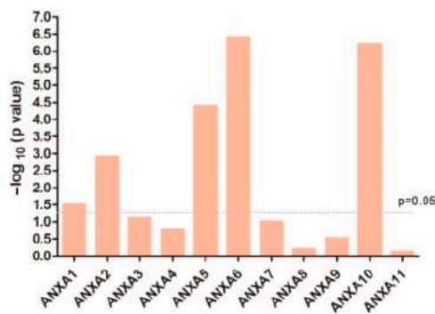  
A

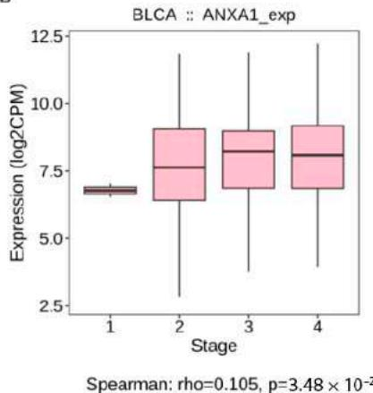  
B

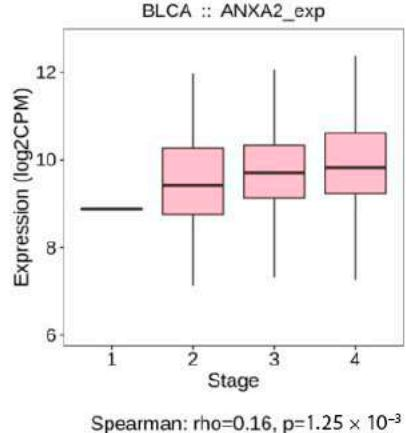  
c

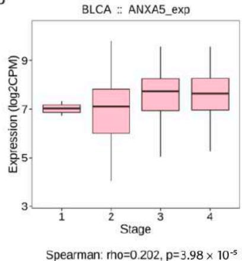  
D

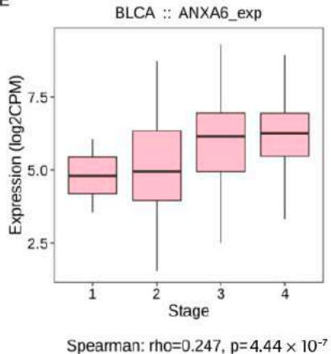  
E

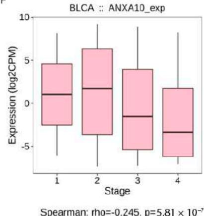  
F   
Figure 4. Correlation analysis of Annexin family members and clinical stages of bladder cancer in . Correlation analysis of Annexin family members and clinical stages of bTISIDB. Summary of spearman’s correlation between Annexin family members and clinical stages (A); Summary of spearman’s correlation between Annexin family members aDifferent expression of ANXA1 (B), ANXA2 (C), ANXA5 (D), ANXA6 (E), ANXA10 (F) between erent exprclinical stages.

# inical stages. 3.3. Associations of ARPS with Clinicopathological Features of BC

In order to better understand the role of ARPS in clinical outcomes of BC, we further struction and Validation of the Annexin-Related Prognostic Signature investigated the relationships between ARPS and the pathological features of BC, including age, gender, grade, lymph invasion status, pT stage, pN stage, pM stage, TNM stage and rough LASSO Cox regression, four Annexin members including race. Chi-squared test (Table 4) demonstrated that the clinicopathological features including gender, grade, pT stage, pN stage, TNM stage and race showed significant association with ARPS risk score. Further subgroup analyses were performed to determine whether ARPS 5A–C). Risk score of ARPS was calculated according to the formucould predict prognosis of BC patients under certain clinicopathological circumstances. × ExpANXA1 + 0.0017 × ExpANXA5 + 0.00016×ExpANXA6 − 0.00012 × ExpAKaplan-Meier survival analysis (Figure 6) revealed that worse OS was noted in the high-risk ARPS groups regardless of age (Figure 6A), gender (Figure 6B), and pT stage (Figure 6D).

However, ARPS is more potent to predict the outcome for higher TNM stages (Figure 6C),W 9 of 19 pN0 stage (Figure 6E), pM0 stage (Figure 6F), high grade (Figure 6G), and white (Figure 6H) than lower TNM stages, pN 1/2/3, pM 1, low grade and non-white, respectively.

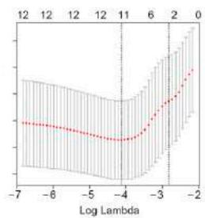  
A

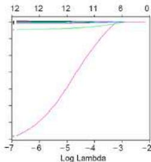  
B

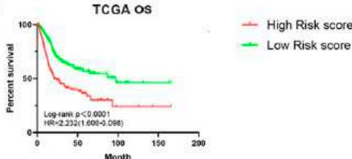  
D

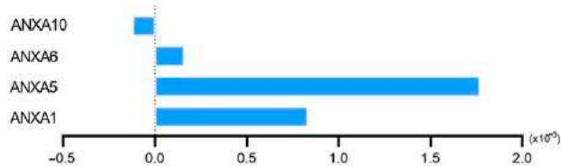  
c   
Coefficient in the lasso model

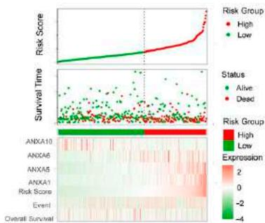

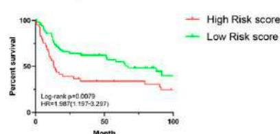  
E   
GSE31684 OS

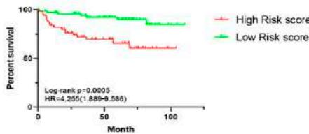

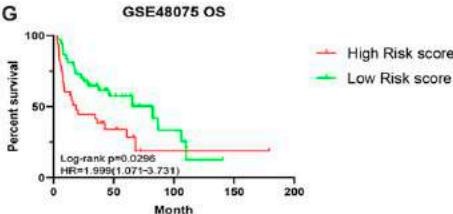

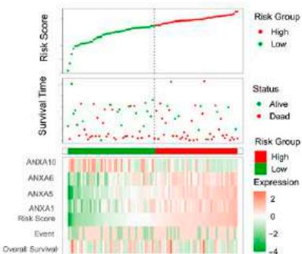

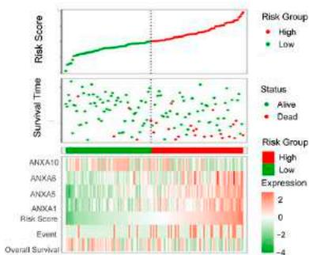

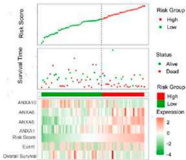  
Figure 5. Construction and validation of Annexin-Related Prognostic Signature (ARPS). LASSO algorithm was used to construct a prognosis model (A–C); Kaplan-Meier curve, distribution diagram of risk score and survival status in TCGA BC patients (discovery cohort) between high/low-risk groups (D); Kaplan-Meier curve, distribution diagram of risk score and survival status in three BC status in three BC validation cohorts GSE31684 (E), GSE32548 (F) avalidation cohorts GSE31684 (E), GSE32548 (F) and GSE48075 (G).

ogy 2022, 11, 2   
Table 2. Univariate and multivariate Cox analyses of ARPS risk score with OS in TCGA.   

<table><tr><td rowspan="2">Covariates</td><td colspan="3">Univariate Cox Analysis</td><td colspan="3">Multivariate Cox Analysis</td></tr><tr><td>p Value</td><td>HR</td><td>95% CI</td><td>p Value</td><td>HR</td><td>95% CI</td></tr><tr><td>Age (&gt;65 vs. ≤65 years)</td><td>&lt;0.0001 ***</td><td>2.039</td><td>1.426–2.916</td><td>&lt;0.0001 ***</td><td>1.981</td><td>1.384–2.837</td></tr><tr><td>Gender (Male vs. Female)</td><td>0.3460</td><td>0.846</td><td>0.598–1.198</td><td>-</td><td>-</td><td>-</td></tr><tr><td>Stage (III/IV vs. I/II)</td><td>&lt;0.0001 ***</td><td>2.531</td><td>1.670–3.836</td><td>0.0010 **</td><td>2.084</td><td>1.366–3.180</td></tr><tr><td>Grade (High vs. Low)</td><td>0.1310</td><td>21.473</td><td>0.400–1151.678</td><td>-</td><td>-</td><td>-</td></tr><tr><td>Lymph (Yes vs. No)</td><td>&lt;0.0001 ***</td><td>1.931</td><td>1.366–2.792</td><td>0.0010 **</td><td>1.843</td><td>1.271–2.671</td></tr><tr><td>Race (White vs. Non-white)</td><td>0.3230</td><td>1.291</td><td>0.778–2.140</td><td>-</td><td>-</td><td>-</td></tr><tr><td>Risk score (High vs. Low)</td><td>&lt;0.0001 ***</td><td>2.144</td><td>1.559–2.950</td><td>&lt;0.0001 ***</td><td>2.045</td><td>1.485–2.817</td></tr></table>

Where ** , p< 0.01 and **** , p<

Table 3. Univariate and multivariate Cox analyses of ARPS risk score with OS in three BC validation datasets.   

<table><tr><td rowspan="3">Covariates</td><td colspan="7">Univariate Cox Analysis</td><td colspan="4">Multivariate Cox Analysis</td><td></td></tr><tr><td colspan="2">GSE31684</td><td colspan="2">GSE32548</td><td colspan="2">GSE48075</td><td colspan="2">GSE31684</td><td colspan="2">GSE32548</td><td>GSE48075</td><td></td></tr><tr><td>p Value</td><td>HR (95% CI)</td><td>p Value</td><td>HR (95% CI)</td><td>p Value</td><td>HR (95% CI)</td><td>p Value</td><td>HR (95% CI)</td><td>p Value</td><td>HR (95% CI)</td><td>p Value</td><td>HR (95% CI)</td></tr><tr><td>Age (&gt;65 vs. ≤65 years)</td><td>0.8710</td><td>1.047 (0.605-1.811)</td><td>0.3750</td><td>1.487 (0.619-3.569)</td><td>0.0230 *</td><td>2.371 (1.129-4.979)</td><td>-</td><td>-</td><td>-</td><td>-</td><td>0.0080 **</td><td>2.786 (1.304-5.956)</td></tr><tr><td>Gender (Male vs. Female)</td><td>0.9660</td><td>0.988 (0.560-1.741)</td><td>0.6300</td><td>1.273 (0.477-3.393)</td><td>-</td><td>-</td><td>-</td><td>-</td><td>-</td><td>-</td><td>-</td><td>-</td></tr><tr><td>Grade (High vs. Low)</td><td>0.1230</td><td>3.035 (0.741-12.43)</td><td>0.0290 *</td><td>2.790 (1.112-6.999)</td><td>-</td><td>-</td><td>-</td><td>-</td><td>0.1460</td><td>2.014 (0.783-5.182)</td><td>-</td><td>-</td></tr><tr><td>Stage (III/IV vs. I/II)</td><td>0.0110</td><td>2.162 (1.192-3.922)</td><td>-</td><td>-</td><td>-</td><td>-</td><td>0.0080 **</td><td>2.237 (1.230-4.068)</td><td>-</td><td>-</td><td>-</td><td>-</td></tr><tr><td>Risk score (High vs. Low)</td><td>0.0020 **</td><td>2.200 (1.340-3.613)</td><td>0.0010 **</td><td>4.248 (1.761-10.250)</td><td>0.0330 *</td><td>1.939 (1.056-3.559)</td><td>0.0010 **</td><td>2.259 (1.375-3.711)</td><td>0.0060 **</td><td>3.591 (1.453-8.872)</td><td>0.0100 *</td><td>2.291 (1.224-4.286)</td></tr></table>

Where * , p< 0.05 and ** , p

Table 4. Association of ARPS risk score with clinicopathological features in TCGA BC cohort.   

<table><tr><td rowspan="2">Characteristics</td><td rowspan="2">Sample (n = 406)</td><td colspan="2">Risk Score</td><td rowspan="2">x2</td><td rowspan="2">p Value</td></tr><tr><td>High Risk Score (n = 173)</td><td>Low Risk Score (n = 233)</td></tr><tr><td>Age</td><td></td><td></td><td></td><td>2.173</td><td>0.1410</td></tr><tr><td>&gt;65 years</td><td>246</td><td>112</td><td>134</td><td></td><td></td></tr><tr><td>≤65 years</td><td>160</td><td>61</td><td>99</td><td></td><td></td></tr><tr><td>Gender</td><td></td><td></td><td></td><td>4.592</td><td>0.0320*</td></tr><tr><td>Male</td><td>299</td><td>118</td><td>181</td><td></td><td></td></tr><tr><td>Female</td><td>107</td><td>55</td><td>52</td><td></td><td></td></tr><tr><td>Grade</td><td></td><td></td><td></td><td>12.360</td><td>0.0004***</td></tr><tr><td>High</td><td>383</td><td>172</td><td>211</td><td></td><td></td></tr><tr><td>Low</td><td>20</td><td>1</td><td>19</td><td></td><td></td></tr><tr><td>Lymph invasion</td><td></td><td></td><td></td><td>0.582</td><td>0.4450</td></tr><tr><td>Yes</td><td>149</td><td>62</td><td>87</td><td></td><td></td></tr><tr><td>No</td><td>130</td><td>60</td><td>70</td><td></td><td></td></tr><tr><td>TNM Stage</td><td></td><td></td><td></td><td>6.403</td><td>0.0110*</td></tr><tr><td>I-II</td><td>273</td><td>128</td><td>145</td><td></td><td></td></tr><tr><td>III-IV</td><td>131</td><td>44</td><td>87</td><td></td><td></td></tr><tr><td>pT Stage</td><td></td><td></td><td></td><td>9.258</td><td>0.0020**</td></tr><tr><td>T0-T2</td><td>122</td><td>49</td><td>73</td><td></td><td></td></tr><tr><td>T3-T4</td><td>251</td><td>143</td><td>108</td><td></td><td></td></tr><tr><td>pN Stage</td><td></td><td></td><td></td><td>4.166</td><td>0.0410*</td></tr><tr><td>N0</td><td>236</td><td>110</td><td>126</td><td></td><td></td></tr><tr><td>N1-N3</td><td>128</td><td>74</td><td>54</td><td></td><td></td></tr><tr><td>pM Stage</td><td></td><td></td><td></td><td>0.155</td><td>0.6940</td></tr><tr><td>M0</td><td>195</td><td>77</td><td>118</td><td></td><td></td></tr><tr><td>M1</td><td>11</td><td>5</td><td>6</td><td></td><td></td></tr><tr><td>Race</td><td></td><td></td><td></td><td>6.265</td><td>0.0120*</td></tr><tr><td>White</td><td>323</td><td>147</td><td>176</td><td></td><td></td></tr><tr><td>Non-White</td><td>66</td><td>19</td><td>47</td><td></td><td></td></tr></table>

Note: Where *, $p < 0 . 0 5 .$ , **, $p < 0 . 0 1$ , and ***, $p < 0 . 0 0 1$ .

# 3.4. Gene-Gene Interaction Network and Function Analysis of ARPS in BC

A gene-gene interaction network of ARPS was constructed using the GeneMANIA database. As shown in Figure 7A, the top five genes displaying the greatest correlations with ARPS included U2AF2, RASA1, ANXA4, COL10A1 and DYSF. Functional analysis revealed that these genes showed the greatest correlation with calcium-dependent phospholipid binding, lipase inhibitor activity, phospholipid binding S100 protein binding and enzymeinhibitor activity. The predictive power of ARPS in predicting recurrence risk of BC patients could be attributed to their crucial roles in tumor development or metastases. Therefore, we further explored the underlying biological functions of ARPS through GO, KEGG, and GSEA pathway enrichment analyses. Gene differential analysis identified that there were 2439 differentially expressed genes (DEGs) between these two groups with high/low ARPS risk, including 1604 upregulated genes and 1710 downregulated genes. GO analysis (Figure 7B) showed that DEGs were mainly involved in cell-cell signaling (GO:0007267), immune response (GO:0006955) and chemokine-mediated signaling pathway (GO:0070098), and KEGG pathway enrichment (Figure 7C) revealed that the DEGs were mainly enriched in cytokine-cytokine receptor interaction (hsa04060), chemokine signaling pathway (hsa04062), and drug metabolism (hsa00982). Moreover, GSEA enrichment results (Figure 8A–C, Supplementary Figure S4) showed that immune related pathways such as epithelial–mesenchymal transition, IL6/JAK/STAT3 signaling, inflammatory response and TNFA signaling via NFKB were enriched in the high-risk groups (Figure 8B), while the low-risk group mainly regulated metabolism-related processes, such as adipogenesis, bile acid metabolism, oxidative phosphorylation and peroxisome (Figure 8C).

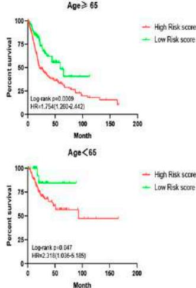  
A

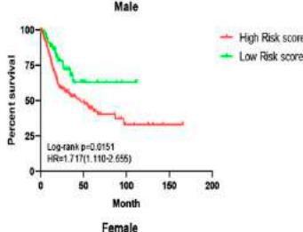  
B

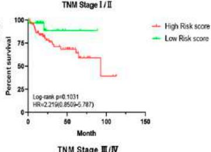  
C

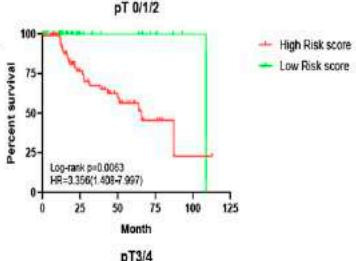  
D

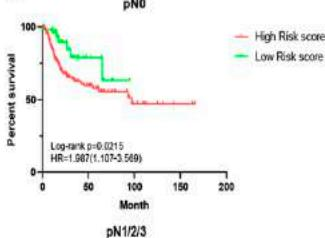  
E

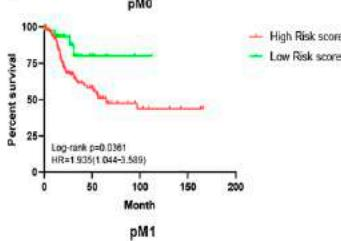  
F

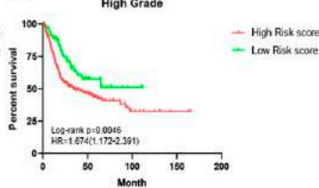  
G

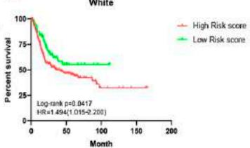  
H

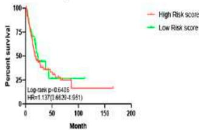

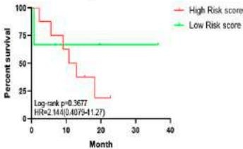

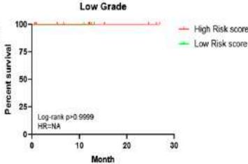

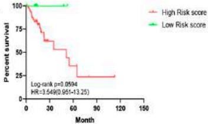  
Figure 6. Survival analyses of ARPS in subgroup of BC patients stratified by different clinical characteristics. (A) Age; (B) gender; (C) TNM stage; (D) T stage; (E) M stage; (F) N stage, (G) grade and (H) race.

# and (H) race. 3.5. Relation between ARPS and the Degree of Immune Cell Infiltration

Immune cell infiltration of BC cases with high/low ARPS risk were estimated and compared by estimate algorithm (Figure 9A–D). The result showed that the risk score of ARPS was significantly positively correlated with immune infiltration level, and BC cases with high ARPS risk score had greater ESTIMATE score (Figure 9A), immune score (Figure 9B) and stromal score (Figure 9C), but unsurprisingly lower purity than those in the low ARPS risk group (Figure 9D). Through Timer, MCPcounter and xCell algorithm, we compared the immune cell abundance between the high- and low-risk groups and found that several types of immune cells, including $\mathrm { C D 8 ^ { + } }$ T cells, neutrophils, macrophages, myeloid dendritic cell, Tregs, and cancer-associated fibroblasts were significantly more abundant in the high-risk group than those in the low-risk group (Figure 9E). Moreover, we compared the different expression of several immune check genes between the highand low-risk groups. The results revealed that elevated expression of most immune check genes, including CD274, CD276, CD28, CD80, CD86, ICOS, ICOSLG, LAG3, PDCD1 and PDCDLG2, were found in the high-risk group compared to those in the low-risk group (Figure 9F).

A

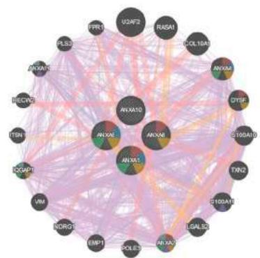  
Functions

Networks

-

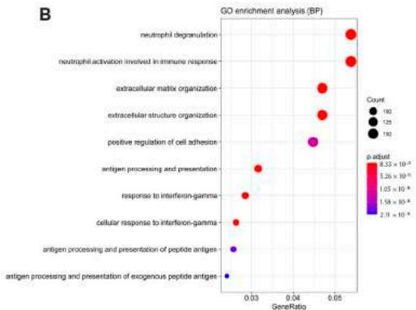

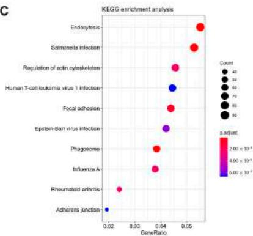

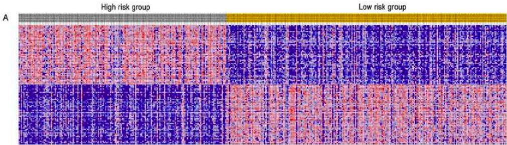  
Figure 7. Results of gene-gene interaction network (GeneMANIA) and functional enrichment Figure 7. Results of gene-gene interaction network (GeneMANIA) and functional enrichment analymembers (GeneMANIA); (B) GO enrichment analysis (Biological Process); (C) KEGG pathway ses between the high/low risk groups. (A) Gene-gene interaction network analysis of ARPS membersBiology 2021, 10, x FOR PEER REVIEW 14 of 19 analysis. (GeneMANIA); (B) GO enrichment analysis (Biological Process); (C) KEGG pathway analysis.

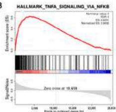  
B

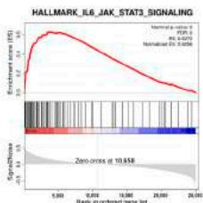

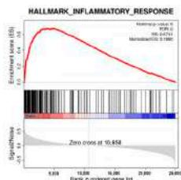

  
c

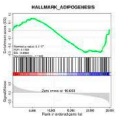

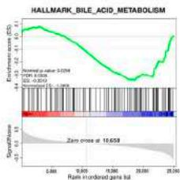

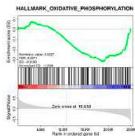  
Figure 8. Gene-set enrichment analysis (GSEA) between the high/low-risk groups. (A) Heat map of Figure 8. Gene-set enrichment analysis (GSEA) between the high/low-risk groups. (A) Heat differential expression genes; (B) significantly enriched pathways in the high-risk group; (C) sig-nificantly enriched pathways in the low-risk group. map of differential expression genes; (B) significantly enriched pathways in the high-risk group; (C) significantly enriched pathways in the low-risk group.

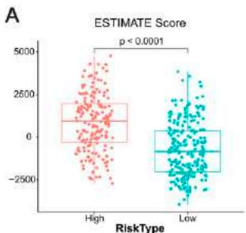

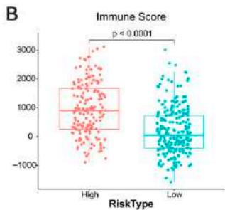

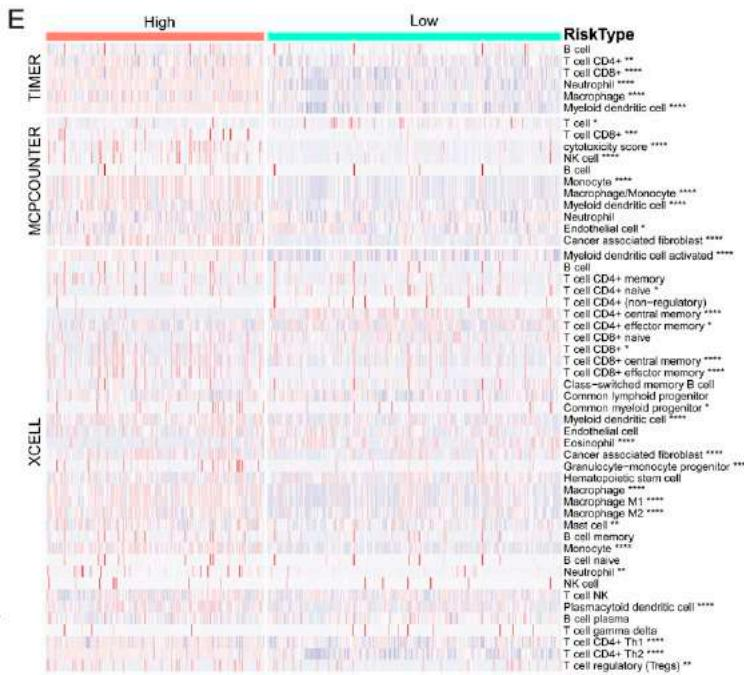

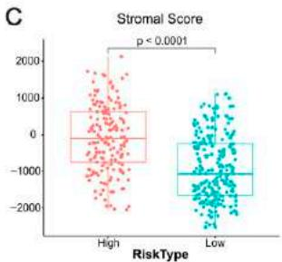

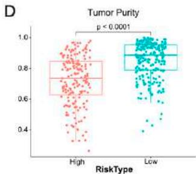

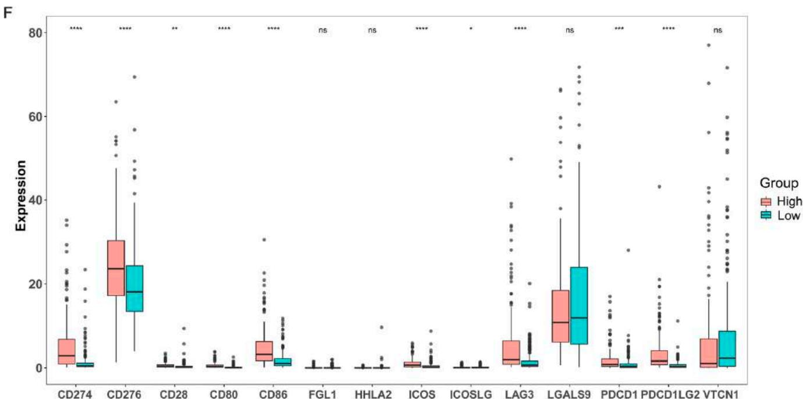  
Figure 9. Tumor immune infiltrating and the expression of immune check gene between the high/lowhigh/low-risk groups. Tumor immune infiltrating level between the high/low-risk groups (A–D);risk groups. Tumor immune infiltrating level between the high/low-risk groups (A–D); proportions proportions of tumor-infiltrating cells between the high/low-risk groups (E); different expressionof tumor-infiltrating cells between the high/low-risk groups (E); different expression levels of immune levels of immune check genes between the high/low-risk grocheck genes between the high/low-risk groups (F). Where *, $p < 0 . 0 5 ,$ Wh **, $p < 0 . 0 1$ < 0.0, ***, $p < 0 . 0 0 1$ 0.01, and ***, ****, $p < 0 . 0 0 0 1$ nd ****, p < 0.0001., , ns not significant.

# 4. Discussion 4. Discussion

Although the advance of surgical methods and medical therapies have improved the treatment of bladder cancer, high rate of recurrence after operation and frequent metastasis lead to poor prognosis of BC patients. Identification of new prognostic biomarkers and therapeutic targets could be essential ways to improve the outcome of BC patients. In this study, we comprehensively analyzed the gene expression and prognosis of Annexin family members in BC, and constructed and validated an ARPS, which could be an independent prognostic biomarker in four individual BC cohorts.

During our evaluation of the gene expression and prognostic value of Annexins in BC, we found that several Annexins were aberrantly expressed and associated to prognosis in BC. For example, high expression of ANXA2/3/13 were found in BC compared to normal tissue (Table 1) and related to poor prognosis in BC patients (Figures 2–4). ANXA2 is mainly distributed in the nucleus and cytoplasm, and important role in cancer progression and invasion has been reported [22]. Previous studies reported that ANXA2 was significantly elevated in tumor issues and related to poor prognosis in breast cancer [23], glioma [24], gastric cancer [25] and liver cancer [26]. ANXA3 was also reported as an important role in a variety of tumor development processes [27]. Overexpressed ANXA3 could promote tumor proliferation and metastasis in breast, lung, liver, and ovarian cancer, and was associated with chemotherapy resistance [28,29]. In addition, increased expression of ANXA13 could promote the proliferation and migration of lung cancer cells in vitro and was associated with poor survival in lung adenocarcinoma patients [30]. Moreover, Wu et al. (2021) recently reported that the expression of Annexins were related to the molecular subtypes of MIBC [31]. They found that ANXA1/2/3/5/6/7/8 were highly expressed in basal-subtype MIBC, while ANXA4/9/10/11 were mainly expressed in luminal-subtype MIBC, which might be used as potential markers for subtype classification of BC. Their results could show that the abnormal expression of Annexin members were common in several types of cancer and might play key roles in carcinogenesis and cancer progression, including BC.

We then constructed an ARPS using the machine learning algorithm LASSO and demonstrated that BC patients in the high ARPS risk group had a shorter OS/DSS/PFI in BC cohorts than those with low risk through KM-survival analysis (Figure 5). Additionally, Cox regression analysis showed that ARPS was an independent prognostic predictor in both the discovery BC cohort and three independent validation cohorts, respectively. Moreover, ARPS can even predict the prognosis of BC patients within different subgroups stratified by clinical characteristics, including age, gender and T stage. Overall, these results all confirmed that the risk score derived from ARPS could accurately and stably predict the survival outcome of BC patients independently.

KEGG pathway and GSEA analysis revealed that EMT and its regulators pathways (TGF- $\cdot \beta$ signaling pathway, TNF-alpha/NF-kappaB, PI3K/AKT/mTOR) were found to be differentially enriched between the high- and low-risk groups. EMT is a process by which epithelial cells lose their epithelial properties and obtain a mesenchymal phenotype, and could transform tumor cells from inactive cancer to malignant phenotypes [27,28]. Previous studies have indicated that EMT was a key controller in tumor progression and metastasis of BC [32–34]. Upregulation of EMT transcription factors, such as TWIST1, ZEB1/2 and SNAI1/2 have been reported to promote migration and invasion of tumor cells in many types of tumors [35–38]. In addition, several EMT regulatory pathways, such as TNF-alpha/NF-kappaB and TGF- $\cdot \beta$ were significantly highly enriched in the high-risk ARPS group. Li et al. revealed that activation of TNF-alpha/NF-kappaB could induce EMT through upregulation of EMT transcription factor Twist1 and contribute to metastatic BC [39]. Upregulation of TGF- $\beta$ can activate Wnt signaling pathways and play a synergistic role to start the EMT process [40]. Moreover, the PI3K/AKT/mTOR pathway participated in numerous cell biological processes. Activated AKT and mTOR can increase E-cadherin expression and promote EMT activation [41]. Therefore, the cross-talk of these signaling pathways may contribute to the poor prognosis of the high ARPS risk group through promoting tumor recurrence and metastasis by the EMT process.

In order to escape the anti-tumor immune response, tumor cells could secrete immunosuppressive and anti-apoptotic factors or recruit suppressive immune cells to generate a highly immunosuppressive microenvironment through different mechanisms [42,43]. In BC TME, accumulated immunosuppressive cells (e.g., myeloid-derived suppressor cells (MDSCs), tumor-associated macrophages (TAMs) and regulatory T cells (T regs) and evaluated expression of immune checkpoints (e.g., CTLA-4 and PD-1) were reported to induce immune evasion of tumor cells [44,45]. Therefore, we evaluated the landscape of immune cell infiltration for the high and low ARPS risk groups by ESTIMATE, Timer,

MCPcounter and xCell algorithm, which revealed that a higher degree of immune cell infiltration and greater abundance of immunosuppressive cells including Tregs, TAMs and MDSCs were found in the high ARPS risk group than these in the low ARPS risk group. Previous studies have proved that increased infiltration of Tregs, TAMs and MDSCs were found in BC tissue and were associated with poor prognosis of BC patients [46–48]. As key cellular components of TME, Tregs could facilitate immune evasion of cancer cells through secreting inhibitory cytokines [49], and TAMs could greatly contribute to form a tolerogenic TME by directly exhausting CD8 T cells, and supporting to traffic Tregs [50]. Additionally, MDSCs can also inhibit the immune response by suppressing CD4 T-cells, CD8 T-cells, and NK cells, inducing Tregs and facilitating TAMs polarizing into M2 phenotype [46]. Notably, MDSC-induced immunosuppression has been demonstrated to accelerate the tumor progression and enhance the formation of metastatic lesions through promoting the EMT process [51,52]. Moreover, our study suggested that the high-risk ARPS prognostic group showed high expression of CD274, CD276, CD28, CD86, LAG3, PDCD1 and PDCDLG2, and may be more sensitive to anti-PD1 treatment. Based on above findings, we deliberate that the high-risk group might be related to a high degree of immunosuppression and low immunoreactivity in TME, thereby promoting tumor recurrence and metastasis through EMT-related pathways. As a result, the high-risk group might get more benefits from immunotherapy.

# 5. Conclusions

In conclusion, we found that several Annexins were aberrantly expressed and associated with prognosis in BC through public tools and identified and validated an ARPS comprised of four members, ANXA1/5/6/10, proving that ARPS was an independent prognostic factor in four individual BC cohorts. This model might be helpful for clinicians to guide the treatment strategy and eventually benefit BC patients. These results could also provide insights into the underlying molecular mechanisms of development and progression of BC and offer potential therapeutic targets for BC.

Supplementary Materials: The following are available online at https://www.mdpi.com/article/ 10.3390/biology11020259/s1. Figure S1: The work-flow of our study, Figure S2: Comparison of mRNA expression of Annexins family members between bladder cancer and adjacent normal tissues (GEPIA2). ANXA1-11 (A-K) and ANXA13 (L); where $^ { * } p < 0 . 0 5 ,$ , Figure S3: Survival analyses of ARPS regarding Disease Free Interval (DSS) and Progression Free Interval (PFI) in TCGA (A-B) and GSE31684 (C-D) BC cohorts, Figure S4: Primary figure of Heat map of differential expression genes between the high/low risk groups (Figure 8A), Table S1: Clinical characteristics of the BC patients collected in this study.

Author Contributions: Conceptualization, G.Z. and X.G.; methodology, X.Y., X.Q. and Y.W. (Yao Wang); software, X.Q., Y.W. (Yao Wang) and B.Z.; validation, T.H., T.Y. and L.Z.; formal analysis, X.Y. and X.Q.; investigation, G.Z. and X.G.; resources, X.G.; data curation, X.Y., X.Q., Y.W. (Yao Wang) and B.Z.; writing—original draft preparation, G.Z., X.G. and X.Y.; writing—review and editing, X.Q., Y.W. (Yao Wang), B.Z., T.H., T.Y., L.Z., Y.W. (Yange Wang) and H.Z.; visualization, X.Q.; supervision, G.Z. and X.G.; project administration, G.Z. and X.G.; funding acquisition, X.G. All authors have read and agreed to the published version of the manuscript.

Funding: This research was funded by “SUPPORTING PROGRAM FOR CENTRAL PLAIN YOUNG TOP TALENTS IN HENAN PROVINCE, grant number ZYQR201912176”, “PROGRAM FROM ACADEMY FOR ADVANCED INTERDISCIPLINARY STUDIES OF HENAN UNIVERSITY, grant number Y21008L”, “PROGRAM FOR SCIENCE AND TECHNOLOGY DEVELOPMENT IN HENAN PROVINCE, grant number 212102310150”, “KAIFENG SCIENCE AND TECHNOLOGY PROJECT, grant number No.1908001”, and The APC was funded by SUPPORTING PROGRAM FOR CENTRAL PLAIN YOUNG TOP TALENTS IN HENAN PROVINCE”.

Institutional Review Board Statement: Not applicable.

Informed Consent Statement: Not applicable.

Data Availability Statement: All of the data in this manuscript are available at TCGA (https:// portal.gdc.cancer.gov/, accessed on 20 April 2018) AND GEO (https://www.ncbi.nlm.nih.gov/gds/, accessed on 20 April 2018) databases.

Conflicts of Interest: The authors declare no conflict of interest.

# References

1. Sung, H.; Ferlay, J.; Siegel, R.L.; Laversanne, M.; Soerjomataram, I.; Jemal, A.; Bray, F. Global Cancer Statistics 2020: Globocan Estimates of Incidence and Mortality Worldwide for 36 Cancers in 185 Countries. CA Cancer J. Clin. 2021, 71, 209–249. [CrossRef] [PubMed]   
2. Antoni, S.; Ferlay, J.; Soerjomataram, I.; Znaor, A.; Jemal, A.; Bray, F. Bladder Cancer Incidence and Mortality: A Global Overview and Recent Trends. Eur. Urol. 2017, 71, 96–108. [CrossRef] [PubMed]   
3. Alifrangis, C.; McGovern, U.; Freeman, A.; Powles, T.; Linch, M. Molecular and histopathology directed therapy for advanced bladder cancer. Nat. Rev. Urol. 2019, 16, 465–483. [CrossRef] [PubMed]   
4. Nadal, R.; Bellmunt, J. Management of metastatic bladder cancer. Cancer Treat. Rev. 2019, 76, 10–21. [CrossRef] [PubMed]   
5. Lenis, A.T.; Lec, P.M.; Chamie, K. Bladder Cancer: A Review. JAMA 2020, 324, 1980–1991. [CrossRef] [PubMed]   
6. Gerke, V.; Creutz, C.E.; Moss, S.E. Annexins: Linking $\mathsf { C a } ^ { 2 + }$ signalling to membrane dynamics. Nat. Rev. Mol. Cell Biol. 2005, 6, 449–461. [CrossRef] [PubMed]   
7. Boye, T.L.; Nylandsted, J. Annexins in plasma membrane repair. Biol. Chem. 2016, 397, 961–969. [CrossRef] [PubMed]   
8. Grewal, T. Annexins in cell migration and adhesion. Cell Adh. Migr. 2017, 11, 245–246. [CrossRef]   
9. Mussunoor, S.; Murray, G.I. The role of annexins in tumour development and progression. J. Pathol. 2008, 216, 131–140. [CrossRef]   
10. Schloer, S.; Pajonczyk, D.; Rescher, U. Annexins in Translational Research: Hidden Treasures to Be Found. Int. J. Mol. Sci. 2018, 19, 1781. [CrossRef]   
11. Yu, S.; Meng, Q.; Hu, H.; Zhang, M. Correlation of ANXA1 expression with drug resistance and relapse in bladder cancer. Int. J. Clin. Exp. Pathol. 2014, 7, 5538–5548. [PubMed]   
12. Hu, H.; Zhao, J.; Zhang, M. Expression of Annexin A2 and Its Correlation With Drug Resistance and Recurrence of Bladder Cancer. Technol. Cancer Res. Treat. 2016, 15, NP61–NP68. [CrossRef] [PubMed]   
13. Munksgaard, P.P.; Mansilla, F.; Brems Eskildsen, A.S.; Fristrup, N.; Birkenkamp-Demtröder, K.; Ulhøi, B.P.; Borre, M.; Agerbæk, M.; Hermann, G.G.; Ørntoft, T.F.; et al. Low ANXA10 expression is associated with disease aggressiveness in bladder cancer. Br. J. Cancer 2011, 105, 1379–1387. [CrossRef]   
14. Zhang, G.; Wang, Q.; Yang, M.; Yuan, Q.; Dang, Y.; Sun, X.; An, Y.; Dong, H.; Xie, L.; Zhu, W.; et al. OSblca: A Web Server for Investigating Prognostic Biomarkers of Bladder Cancer Patients. Front. Oncol. 2019, 9, 466. [CrossRef] [PubMed]   
15. Rhodes, D.R.; Kalyana-Sundaram, S.; Mahavisno, V.; Varambally, R.; Yu, J.; Briggs, B.B.; Barrette, T.R.; Anstet, M.J.; Kincead-Beal, C.; Kulkarni, P.; et al. Oncomine 3.0: Genes, pathways, and networks in a collection of 18,000 cancer gene expression profiles. Neoplasia 2007, 9, 166–180. [CrossRef]   
16. Tang, Z.; Kang, B.; Li, C.; Chen, T.; Zhang, Z. GEPIA2: An enhanced web server for large-scale expression profiling and interactive analysis. Nucleic Acids Res. 2019, 47, W556–W560. [CrossRef]   
17. Ru, B.; Wong, C.N.; Tong, Y.; Zhong, J.Y.; Zhong, S.S.W.; Wu, W.C.; Chu, K.C.; Wong, C.Y.; Lau, C.Y.; Chen, I.; et al. TISIDB: An integrated repository portal for tumor-immune system interactions. Bioinformatics 2019, 35, 4200–4202.   
18. Cancer Genome Atlas Research Network. Comprehensive molecular characterization of urothelial bladder carcinoma. Nature 2014, 507, 315–322. [CrossRef]   
19. Riester, M.; Taylor, J.M.; Feifer, A.; Koppie, T.; Rosenberg, J.E.; Downey, R.J.; Bochner, B.H.; Michor, F. Combination of a novel gene expression signature with a clinical nomogram improves the prediction of survival in high-risk bladder cancer. Clin. Cancer Res. 2012, 18, 1323–1333.   
20. Lindgren, D.; Sjödahl, G.; Lauss, M.; Staaf, J.; Chebil, G.; Lövgren, K.; Gudjonsson, S.; Liedberg, F.; Patschan, O.; Månsson, W.; et al. Integrated genomic and gene expression profiling identifies two major genomic circuits in urothelial carcinoma. PLoS ONE 2012, 7, e38863.   
21. Choi, W.; Porten, S.; Kim, S.; Willis, D.; Plimack, E.R.; Hoffman-Censits, J.; Roth, B.; Cheng, T.; Tran, M.; Lee, I.L.; et al. Identification of distinct basal and luminal subtypes of muscle-invasive bladder cancer with different sensitivities to frontline chemotherapy. Cancer Cell. 2014, 25, 152–165. [CrossRef] [PubMed]   
22. Wang, T.; Wang, Z.; Niu, R.; Wang, L. Crucial role of Anxa2 in cancer progression: Highlights on its novel regulatory mechanism. Cancer Biol. Med. 2019, 16, 671–687. [PubMed]   
23. Gibbs, L.D.; Vishwanatha, J.K. Prognostic impact of AnxA1 and AnxA2 gene expression in triple-negative breast cancer. Oncotarget 2018, 9, 2697–2704. [CrossRef] [PubMed]   
24. Gao, H.; Yu, B.; Yan, Y.; Shen, J.; Zhao, S.; Zhu, J.; Qin, W.; Gao, Y. Correlation of expression levels of ANXA2, PGAM1, and CALR with glioma grade and prognosis. J. Neurosurg. 2013, 118, 846–853. [CrossRef]   
25. Xie, R.; Liu, J.; Yu, X.; Li, C.; Wang, Y.; Yang, W.; Hu, J.; Liu, P.; Sui, H.; Liang, P.; et al. ANXA2 Silencing Inhibits Proliferation, Invasion, and Migration in Gastric Cancer Cells. J. Oncol. 2019, 2019, 4035460. [CrossRef] [PubMed]

26. Tang, L.; Liu, J.X.; Zhang, Z.J.; Xu, C.Z.; Zhang, X.N.; Huang, W.R.; Zhou, D.H.; Wang, R.R.; Chen, X.D.; Xiao, M.B.; et al. High expression of Anxa2 and Stat3 promote progression of hepatocellular carcinoma and predict poor prognosis. Pathol. Res. Pract. 2019, 215, 152386. [CrossRef]   
27. Wu, N.; Liu, S.; Guo, C.; Hou, Z.; Sun, M.Z. The role of annexin A3 playing in cancers. Clin. Transl. Oncol. 2013, 15, 106–110. [CrossRef] [PubMed]   
28. Wang, L.; Li, X.; Ren, Y.; Geng, H.; Zhang, Q.; Cao, L.; Meng, Z.; Wu, X.; Xu, M.; Xu, K. Cancer-associated fibroblasts contribute to cisplatin resistance by modulating ANXA3 in lung cancer cells. Cancer Sci. 2019, 110, 1609–1620. [CrossRef]   
29. Tong, M.; Fung, T.M.; Luk, S.T.; Ng, K.Y.; Lee, T.K.; Lin, C.H.; Yam, J.W.; Chan, K.W.; Ng, F.; Zheng, B.J.; et al. ANXA3/JNK Signaling Promotes Self-Renewal and Tumor Growth, and Its Blockade Provides a Therapeutic Target for Hepatocellular Carcinoma. Stem Cell Rep. 2015, 5, 45–59. [CrossRef]   
30. Xue, G.L.; Zhang, C.; Zheng, G.L.; Zhang, L.J.; Bi, J.W. Annexin A13 predicts poor prognosis for lung adenocarcinoma patients and accelerates the proliferation and migration of lung adenocarcinoma cells by modulating epithelial-mesenchymal transition. Fundam. Clin. Pharmacol. 2020, 34, 687–696. [CrossRef]   
31. Wu, W.; Jia, G.; Chen, L.; Liu, H.; Xia, S. Analysis of the Expression and Prognostic Value of Annexin Family Proteins in Bladder Cancer. Front. Genet. 2021, 12, 731625. [CrossRef] [PubMed]   
32. Heerboth, S.; Housman, G.; Leary, M.; Longacre, M.; Byler, S.; Lapinska, K.; Willbanks, A.; Sarkar, S. EMT and tumor metastasis. Clin. Transl. Med. 2015, 4, 6. [CrossRef]   
33. Guo, F.; Parker Kerrigan, B.C.; Yang, D.; Hu, L.; Shmulevich, I.; Sood, A.K.; Xue, F.; Zhang, W. Post-transcriptional regulatory network of epithelial-to-mesenchymal and mesenchymal-to-epithelial transitions. J. Hematol. Oncol. 2014, 7, 19. [CrossRef]   
34. Ashrafizadeh, M.; Hushmandi, K.; Hashemi, M.; Akbari, M.E.; Kubatka, P.; Raei, M.; Koklesova, L.; Shahinozzaman, M.; Mohammadinejad, R.; Najafi, M.; et al. Role of microRNA/Epithelial-to-Mesenchymal Transition Axis in the Metastasis of Bladder Cancer. Biomolecules 2020, 10, 1159. [CrossRef] [PubMed]   
35. Geradts, J.; de Herreros, A.G.; Su, Z.; Burchette, J.; Broadwater, G.; Bachelder, R.E. Nuclear Snail1 and nuclear ZEB1 protein expression in invasive and intraductal human breast carcinomas. Hum. Pathol. 2011, 42, 1125–1131. [CrossRef] [PubMed]   
36. Spoelstra, N.S.; Manning, N.G.; Higashi, Y.; Darling, D.; Singh, M.; Shroyer, K.R.; Broaddus, R.R.; Horwitz, K.B.; Richer, J.K. The transcription factor ZEB1 is aberrantly expressed in aggressive uterine cancers. Cancer Res. 2006, 66, 3893–3902. [CrossRef]   
37. Fang, Y.; Wei, J.; Cao, J.; Zhao, H.; Liao, B.; Qiu, S.; Wang, D.; Luo, J.; Chen, W. Protein expression of ZEB2 in renal cell carcinoma and its prognostic significance in patient survival. PLoS ONE 2013, 8, e62558.   
38. Galván, J.A.; Zlobec, I.; Wartenberg, M.; Lugli, A.; Gloor, B.; Perren, A.; Karamitopoulou, E. Expression of E-cadherin repressors SNAIL, ZEB1 and ZEB2 by tumour and stromal cells influences tumour-budding phenotype and suggests heterogeneity of stromal cells in pancreatic cancer. Br. J. Cancer 2015, 112, 1944–1950. [CrossRef]   
39. Li, C.W.; Xia, W.; Huo, L.; Lim, S.O.; Wu, Y.; Hsu, J.L.; Chao, C.H.; Yamaguchi, H.; Yang, N.K.; Ding, Q.; et al. Epithelialmesenchymal transition induced by TNF-alpha requires NF-kappaB-mediated transcriptional upregulation of Twist1. Cancer Res. 2012, 72, 1290–1300. [CrossRef]   
40. Wang, H.; Wang, H.S.; Zhou, B.H.; Li, C.L.; Zhang, F.; Wang, X.F.; Zhang, G.; Bu, X.Z.; Cai, S.H.; Du, J. Epithelial-mesenchymal transition (EMT) induced by TNF-alpha requires AKT/GSK-3beta-mediated stabilization of snail in colorectal cancer. PLoS ONE 2013, 8, e56664.   
41. Shao, Q.; Zhang, Z.; Cao, R.; Zang, H.; Pei, W.; Sun, T. CPA4 Promotes EMT in Pancreatic Cancer via Stimulating PI3K-AKT-mTOR Signaling. Onco. Targets Ther. 2020, 13, 8567–8580. [CrossRef] [PubMed]   
42. Gasser, S.; Lim, L.H.K.; Cheung, F.S.G. The role of the tumour microenvironment in immunotherapy. Endocr. Relat. Cancer 2017, 24, T283–T295. [CrossRef] [PubMed]   
43. Huang, T.X.; Fu, L. The immune landscape of esophageal cancer. Cancer Commun. 2019, 39, 79. [CrossRef]   
44. Crispen, P.L.; Kusmartsev, S. Mechanisms of immune evasion in bladder cancer. Cancer Immunol. Immunother. 2020, 69, 3–14. [CrossRef] [PubMed]   
45. Hatogai, K.; Sweis, R.F. The Tumor Microenvironment of Bladder Cancer. Adv. Exp. Med. Biol. 2020, 1296, 275–290.   
46. Biswas, S.K.; Allavena, P.; Mantovani, A. Tumor-associated macrophages: Functional diversity, clinical significance, and open questions. Semin. Immunopathol. 2013, 35, 585–600. [CrossRef]   
47. Yang, G.; Shen, W.; Zhang, Y.; Liu, M.; Zhang, L.; Liu, Q.; Lu, H.H.; Bo, J. Accumulation of myeloid-derived suppressor cells (MDSCs) induced by low levels of IL-6 correlates with poor prognosis in bladder cancer. Oncotarget 2017, 8, 38378–38388. [CrossRef]   
48. Ibrahim, O.M.; Pandey, R.K.; Chatta, G.; Kalinski, P. Role of tumor microenvironment in the efficacy of BCG therapy. Trends Res. 2020, 3, 1–5. [CrossRef]   
49. Stockis, J.; Roychoudhuri, R.; Halim, T.Y.F. Regulation of regulatory T cells in cancer. Immunology 2019, 157, 219–231. [CrossRef]   
50. Ge, Z.; Ding, S. The Crosstalk Between Tumor-Associated Macrophages (TAMs) and Tumor Cells and the Corresponding Targeted Therapy. Front. Oncol. 2020, 10, 590941. [CrossRef]   
51. Zhu, H.; Gu, Y.; Xue, Y.; Yuan, M.; Cao, X.; Liu, Q. CXCR2(+) MDSCs promote breast cancer progression by inducing EMT and activated T cell exhaustion. Oncotarget 2017, 8, 114554–114567. [CrossRef] [PubMed]   
52. Singh, S.; Chakrabarti, R. Consequences of EMT-Driven Changes in the Immune Microenvironment of Breast Cancer and Therapeutic Response of Cancer Cells. J. Clin. Med. 2019, 8, 642. [CrossRef] [PubMed]

Article

# Architectural Distortion-Based Digital Mammograms Classification Using Depth Wise Convolutional Neural Network

Khalil ur Rehman $\mathbf { 1 } _ { \textcircled { 1 } }$ , Jianqiang Li $1 , 2 \textcircled { \mathbb { D } }$ , Yan Pei $^ { 3 , * \oplus }$ , Anaa Yasin 1, Saqib Ali 1 and Yousaf Saeed 1

1 The School of Software Engineering, Beijing University of Technology, Beijing 100024, China; rehmankhalilur@emails.bjut.edu.cn (K.u.R.); lijianqiang@bjut.edu.cn (J.L.); yasinanaa@emails.bjut.edu.cn (A.Y.); alisaqib@emails.bjut.edu.cn (S.A.); b20196112w@emails.bjut.edu.cn (Y.S.)   
2 Beijing Engineering Research Center for IoT Software and Systems, Beijing 100124, China   
3 Computer Science Division, University of Aizu, Aizuwakamatsu 965-8580, Fukushima, Japan   
* Correspondence: peiyan@u-aizu.ac.jp

Simple Summary: Breast cancer is leading cancer increases the death rate in women. Early diagnosis of breast cancer in women can save their lives. The current study proposed a novel scheme to detect architectural distortion from mammogram images to predict breast cancer using a deep learning approach. Results are evaluated on a public and a private dataset which may help to improve the diagnostic ability of breast cancer of radiologists and doctors in daily clinical routines. Furthermore, the proposed method achieved maximum accuracy as compared with previous approaches. This study can be interesting and valuable in the healthcare predictive modeling domain and will add a real contribution to society.

Citation: Rehman, K.u.; Li, J.; Pei, Y.; Yasin, A.; Ali, S.; Saeed, Y. Architectural Distortion-Based Digital Mammograms Classification Using Depth Wise Convolutional Neural Network. Biology 2022, 11, 15. https://doi.org/10.3390/ biology11010015

Academic Editors: Shibiao Wan, Yiping Fan, Chunjie Jiang and Shengli Li

Received: 30 November 2021 Accepted: 17 December 2021 Published: 23 December 2021

Publisher’s Note: MDPI stays neutral with regard to jurisdictional claims in published maps and institutional affiliations.

Copyright: $^ ©$ 2021 by the authors. Licensee MDPI, Basel, Switzerland. This article is an open access article distributed under the terms and conditions of the Creative Commons Attribution (CC BY) license (https:// creativecommons.org/licenses/by/ 4.0/).

Abstract: Architectural distortion is the third most suspicious appearance on a mammogram representing abnormal regions. Architectural distortion (AD) detection from mammograms is challenging due to its subtle and varying asymmetry on breast mass and small size. Automatic detection of abnormal ADs regions in mammograms using computer algorithms at initial stages could help radiologists and doctors. The architectural distortion star shapes ROIs detection, noise removal, and object location, affecting the classification performance, reducing accuracy. The computer vision-based technique automatically removes the noise and detects the location of objects from varying patterns. The current study investigated the gap to detect architectural distortion ROIs (region of interest) from mammograms using computer vision techniques. Proposed an automated computer-aided diagnostic system based on architectural distortion using computer vision and deep learning to predict breast cancer from digital mammograms. The proposed mammogram classification framework pertains to four steps such as image preprocessing, augmentation and image pixel-wise segmentation. Architectural distortion ROI‘s detection, training deep learning, and machine learning networks to classify AD‘s ROIs into malignant and benign classes. The proposed method has been evaluated on three databases, the PINUM, the CBIS-DDSM, and the DDSM mammogram images, using computer vision and depth-wise 2D V-net 64 convolutional neural networks and achieved 0.95, 0.97, and 0.98 accuracies, respectively. Experimental results reveal that our proposed method outperforms as compared with the ShuffelNet, MobileNet, SVM, K-NN, RF, and previous studies.

Keywords: architectural distortion; image processing; depth-wise convolutional neural network; breast cancer; mammography

# 1. Introduction

Breast cancer is leading cancer worldwide in 2020, with $1 1 . 7 \%$ overall reported cases per world health organization [1] and one of the major causes of death in women. The

mortality rate was increased from $6 . 6 \%$ to $6 . 9 \%$ this year due to breast cancer. Initially, these breast cancer tumors are screened on an X-ray machine for breast cancer diagnosis and manually interpreted by the radiologist to predict benign and malignant tumors. Screening methods such as ultrasound, and mammography are used to diagnose breast cancer, while the standard screening method is mammography at the early stage. Computer-aided diagnostic systems automatically detected abnormal regions in mammograms to help radiologists and doctors detect disease in less time to avoid unnecessary biopsies [2].

Breast composition containing attenuating tissue is an essential element for evaluating mammogram reports to predict malignant and benign cases. Architectural distortion (AD) is the third most suspicious appearance on a mammogram representing abnormal regions that can be found visible on mammography projection [3]. The main parameters such as global asymmetry, focal asymmetry, and developing asymmetry of tissue can be calculated using machine and deep learning algorithms to track AD in mammograms. Asymmetries are the isodense tissues obscured by adjacent fibro glandular mass, representing true malignancy in mammograms. Architectural distortion tracking from mammograms is very difficult due to its subtle and varying asymmetry on breast mass and small size. Therefore, the manual interpretation of architectural distortion is a challenging task for radiologists to figure out abnormalities during the examination of mammograms. The leading types of cancer that can present architectural distortion on mammography are invasive lobular carcinoma (ILC) and invasive ductal carcinoma (IDC). The ILC and IDC on mammography having a star-shaped pattern are likely to be malignant, while the complex and radial sclerosing lesions architectural distortion having larger than $1 \mathrm { c m }$ is probably benign [4].

Several studies reported hand-crafted feature extraction techniques on mammogram images for AD ROI classification using machine learning and deep learning [5]. These methods successfully achieved remarkable accuracy in the diagnosis of breast cancer. However, many factors are involved in detecting architectural distortion, such as tinny size, subtle appearance inside mass, shape, noise, imaging artefact from digital mammograms. Due to a limited number of studies that reported AD ROI’s classification in the literature, this primarily discusses the most relevant studies in the first phase. The second phase discusses deep learning, machine learning, and mass segmentation, to determine the limitations of predicting breast cancer. There are many limitations in these studies for detecting architectural distortion ROIs and classification. For example, Murali S. et al. [6] proposed a model-based approach to detect architectural distortion from mammograms and classify with a support vector machine to achieve 89.6 accuracy. A total of 150 ROI‘s were selected from the DDSM dataset to evaluate the performance. Banik et al. [7] employed the gobar filter and phase portrait analysis method to detect architectural distortion in prior mammograms by evaluating 4224 ROI‘s from a private dataset and achieved $9 0 \%$ sensitivity at 5.7 FP/image. J. et al. [8] presented a two-step method such as detecting ROIs with potential AD on analyzing the Gabor filter and recognizing AD‘s using a 2D Fourier transform. Experimental results were evaluated on 33 mammograms containing AD‘s from DDSM and obtained 83.50 accuracy. All three authors employed Gabor filter to the texture feature analysis of images while locating the boundary of ADs ROIs was still a limitation. As a result, these hand-crafted feature extraction methods decrease the computational time and affect the model’s classification accuracy.

The classification of AD ROIs based on texture analysis model using support vector machine was implemented on mammogram images by Kamra A. et al. [9]. The texture analysis ROIs were selected from the digital database for screening mammography (DDSM) dataset to evaluate the model’s performance and reported $9 2 . 9 4 \%$ accuracy. Liu et al. [10] employed a new method for architectural distortion ROIs recognition based on texture features from gray-level co-occurrence matrix (GLCM) matrix, spiculated and entropy features from mammogram images, and the sparse representation classifier was used for the classification of ROIs. The performance of the model was evaluated on the DDSM dataset by obtaining 91.79 accuracy. Ioana B. et al. [11] proposed radiomic analysis of contrast-enhanced spectral mammography approach for breast cancer prediction and clas-

sification using k-nearest neighbors (K-NN). Another radiomic feature reduction approach was proposed by Raffaella M. et al. [12] for mammogram classification to predict breast cancer. D. H. et al. [13] proposed a micro-pattern texture descriptor for the detection of architectural distortion from mammogram images using a local binary pattern, local map pattern, and haralick‘s descriptors. A total of 400 ROIs from the full-field digital mammography (FFDM) dataset were selected for the evaluation of the model and achieved $8 3 \%$ accuracy. Casti P. et al. [14] was introduced a new paradigm to detect AD track in digital breast tomosynthesis (DBT) exam by using a cross-cutting approach exploiting 3D imaging modality. The proposed approach achieves 0.9 sensitivity after evaluating the model on 37 sets of DBT from the FFDM dataset. Palma et al. [15] presented a fuzzy contrary-based approach for detecting masses and architectural distortion from digital breast tomosynthesis.

Another essential factor is noise removal from ADs ROIs which was still a limitation with these traditional methods. Moreover, all of the studies were employed traditional machine learning algorithms, which were limited to the lower classification accuracy. The architectural distortion star shapes heterogeneous pattern detection inside the denser mass using the texture analysis was still a limitation. Cai et al. [16] employed a method for identifying architectural distortion in mammogram images using a dense net deep neural network to train the image net model for breast mass dataset to classify the breast masses. Bahl et al. [17] was presented a retrospective review for the presence of architectural distortion on mammogram images and concluded that the presence of architectural diction on mammography has the chance of malignancy in approximately three fourth of the cases. Shu et al. [18] proposed a region-based pooling structure using a deep convolutional neural network to classify mammogram images. The whole region of images as an input to a deep neural network is limited to identifying the subtle location of ADs inside denser breast masses. Conventional deep neural networks only use a single channel for image feature maps which is not limited to neural networks but decreases the overall modal accuracy.

The current study investigated the gap to detect architectural distortion ROIs from mammograms using computer vision techniques. This study employed a depth-wise 2D V-net 64 convolutional neural network to classify these architectural distortion ROIs into benign and malignant ADs. With this approach, the above limitation is no longer. Computer vision is a powerful technology for removing the noise and detecting the object from hidden star-shape patterns. The Depth-wise neural network uses each input channel for creating a feature map that increases the modal efficiency and accuracy. Therefore, this study aim to develop a computer-aided diagnostic system using computer vision and a deep learning model to classify architectural distortions ROIs from digital mammograms at early stages.

The principal outcome of our study is reported as follows:

Proposed an automated computer-aided diagnostic system based on architectural distortion using computer vision and depth-wise deep learning techniques to predict breast cancer from digital mammograms. Applied the image pixel-wise segmentation using a computer vision algorithm to extract architectural distortion ROIs from the digital mammogram image in the first phase.   
In the second phase, employed a depth-wise V-Net 64 convolutional neural network to extract automatic features from ADs ROIs and classify them into malignant and benign ROIs. Moreover, use machine learning and deep learning algorithms, such as shuffelnet, mobilenet, support vector machine, k-nearest neighbor, and random forest, to classify these ROIs.   
Proposed method obtained higher accuracy than machine learning and with the previous studies. Furthermore, evaluated proposed model with other metrics to enhance the diagnostic ability of the model.   
Evaluated the proposed method on three datasets, the local private PINUM and publicly available CBIS-DDSM and DDSM dataset that makes a fair comparison of the proposed model with others.

# 2. Related Works and Techniques

# 2.1. Conventional Deep Learning Mammogram Classification

The researchers presented several computer-aided diagnostic systems using deep convolutional neural networks to predict breast cancer from digital mammograms. Studied that reported deep learning algorithms for the classification of mammogram images herein briefly reported. Feature fusion bases-deep CNN was applied using extreme learning machines to predict breast cancer from mammograms by wang et al. [19]. An improved ResNet-based convolutional neural network was employed to the classification of mammogram images and significantly improve the area under the curve by Wu et al. [20]. Khan et al. [21] developed multi-view feature fusion-based CAD to detect abnormal and normal patterns from mammograms using a deep neural network to increase the accuracy in breast classification. On segmentation of the pectoral muscle-based approach using a deep convolutional neural network was developed by Soleiman et al. [22] to classify mammogram images. Hao et al. [23] presented an automated framework for identifying mislabeled data using cross-entropy and metric function, and the model was trained using a deep convolutional neural network to improve the classification performance. Sun et al. [24] was presented with an automated computer-aided diagnostic system based on a multimodal deep neural network for the integration of multi-dimensional data to prognosis prediction of breast cancer.

A region of interest-based approach was employed by Guan et al. [25] using u-net deep convolution neural network for locating asymmetric patterns to the diagnosis of breast cancer in digital mammograms. The generative adversarial neural network employed for tumor segmentation from digital mammogram by Singh et al. [26]. Song R. et al. [27] developed a combined feature-based model using a deep convolutional neural network for the classification of breast masses into normal, benign, and malignant classes. To overcome the drawbacks of pixel-wise segmentation of mammogram images, Shen et el. [28] was presented a hierarchical model using a deep convolutional neural network and fuzzy learning for breast cancer diagnosis. Guan et al. [29] applied a generative adversarial network for ROIs cropping from digital mammograms, and then the deep convolutional neural network was implemented for the classification of normal and abnormal ROIs. An improved dense net deep learning model was proposed by Li et al. [30] to classify benign and malignant mammograms. A whole image classification based-method was built using a deep neural network using by Iones et al. [31]. Falcon et al. [32] was employed transfer learning techniques to predict abnormalities in digital mammograms with a deep mobile net neural network.

Gnana S. et al. [33] developed a computer-aided diagnostic system using a deep convolutional neural network to classify malignant and benign masses. A deep active and self-paced learning-based framework was emphasized for detecting breast mass from digital mammograms by Shen et al. [34] to reduce the annotation effort for radiologists. Shen et al. [35] presented a method for lesion segmentation and disease classification using a mixed-supervision-guided residual u-net deep learning modal. Shayma A.H et al. [36] propose a novel method for cancer detection from breast mass using feature matching of different regions by applying maximally stable extremal regions. A hybrid deep learningbased framework was employed by Wang et al. [37] for the classification of breast mass for multi-view data. Wang et al. [38] employed a multi-level nested pyramid deep neural network to segment breast mass to classify malignant and benign classes using a public dataset. Birhanu et al. [39] proposed a breast density classification method to predict cancer from digital mammograms using a deep convolutional neural network. Rehman et al. Proposed a computer vision based deep learning method for the classification of microcalcification ROIs into malignant and benign classes.

# 2.2. Conventional Machine Learning Mammogram Classification

Machine learning modalities such as SVM, KNN, and random forest were adopted to classify digital mammograms to diagnose breast cancer. Machine learning-based clas-

sification CAD systems used hand-crafted feature extraction techniques, which are computationally slow and reduce the performance model. Fan et al. [40] proposed a novel method based on single-nucleotide polymorphism to predict breast cancer risk by extracting architectural distortion features from mammograms. Loizidou et al. [41] presented subtraction of temporally sequential mammogram technique to detect microcalcification clusters and classification performed using a support vector machine. The breast boundary is eliminated with the thresholding technique, and a machine learning-based hybrid model is proposed to classify breast mammograms into malignant and benign classes by Zebari et al. [42]. A computer-aided diagnostic system was built to generate an image feature map using fast Fourier transforms on digital mammograms by Heidar et al. [5]. Chakaraborty et al. [43] presented a machine learning-based hybrid approach for automatic detection of mammographic masses using low-to-high level intensity thresholding and performed classification using FLDA, Bayesian, and ANN. Beham et al. [44] applied wavelet transforms for feature extraction from the digital mammogram, and the K-nearest neighbor algorithm was employed for classification into benign and malignant classes. Liu et al. [45] was proposed a novel approach for breast cancer prediction, which employed information gain simulated annealing genetic algorithm for feature selection and const sensitive support vector machine for classification. Another support vector machine-based approach was employed by Yang et al. [46] to diagnose breast tumors using textual features from mammogram images. Obaidullah et al. [47] presented an image descriptor-based approach for mammogram mass classification using a random forest algorithm. Saqib et al. presented the comparison of machine learning techniques for the prediction of multi-organ cancers.

# 3. Materials

# Databases

This study validated the proposed method on three databases, the PINUM (Punjab institute of nuclear medicine) [48], the CBIS-DDSM (curated breast imaging digital database for screening mammography) [49] and DDSM (digital database for screening mammography) [50]. The PINUM private dataset was collected from a local hospital in Pakistan with the approval of diagnostic imaging nuclear medicine and radiology. A total of 289 patient data in the form of DICOM (Digital Imaging and Communications in Medicine) images were collected ranging age between 32-73 with a mean age of 48.5 years. The dataset includes 577 original images containing 425 benign and 152 malignant images with MLO (mediolateral-oblique) and CC (craniocaudal) views at the resolution of $4 0 9 6 \times 2 0 4 7$ are shown in Figure 1. The proposed study is based on architectural distortion, so that the validation set of mammogram images is labeled by the radiologist for benign and malignant architectural distortion ROIs. A total of 150 AD ROIs are cropped from full mammograms for validating the training set with the proposed algorithm. The radiologist team consisted of two members, one being a senior radiologist and physicist holding a Ph.D. degree in nuclear medicine with 10 years of experience and the second being a junior radiologist with a Master’s degree in radiology. The mammography exam of the PINUM dataset was acquired with Hologic 2D, 3D mammography. The PINUM dataset images have MLO and CC views. The size of the PINUM dataset was artificially inflated using augmentation techniques up to 3462 images.

The CBIS-DDSM (digital database for screening mammography) was a public dataset and enhanced version of the DDSM dataset provided by the University of Florida. The mammogram images are in DICOM files at the complete mammography and abnormality levels. Both MLO and CC views of the mammograms are included in the full mammography pictures. Abnormalities are represented as binary mask images that are the same size as the mammograms they are connected with. The ROI of each anomaly is defined by these mask images. Within each mammogram’s abnormality mask, users may make an element-by-element selection of pixels. Due to the unavailability of AD ROIs in the CBIS-DDSM dataset, our radiologist team labeled ADs ROIs manually on full mammogram

images. A total of 200 AD ROIs are cropped from full mammograms for validation. We included 3568 mammogram images, including 1740 benign and 1828 malignant images with MLO and CC views, as shown in Figure 2. The DDSM is a public dataset provided by Massachusetts General Hospital, Wake Forest University School of Medicine, and Sacred Heart Hospital and maintained by the University of Florida. The DDSM datasets contain 2500 studies including normal, benign, and malignant cases. Each study comprises two images of the breast as well as some patient data such as age at the time of the study, ACR breast density rating, and subtlety rating for abnormalities. Suspicious lesions in images are correlated with pixel-level ground truth information about their positions and kinds. The DDSM datasets contain 200 ADs ROIs of benign and malignant images. In this study, the predefined ADs are considered validation test datasets. A total of 5500 images (2500 benign, 3000 malignant) were included for training and testing the neural networks from the DDSM dataset. Figure 3 shows benign and malignant mammogram images from DDSM dataset. A detailed description of the datasets is in Table 1.

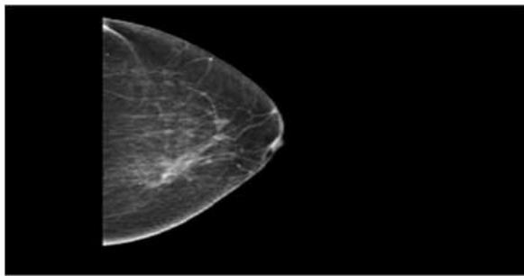  
(a) Benign

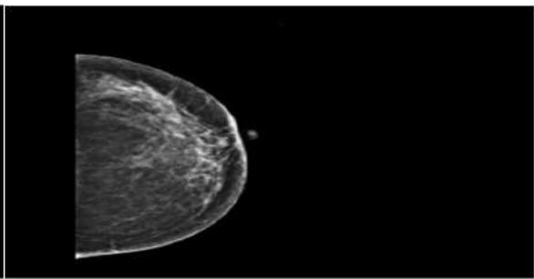  
(b) Malignant

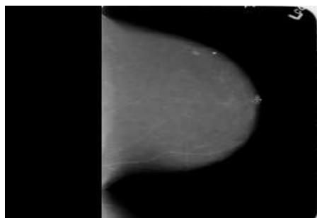  
Figure 1. An example of breast mammogram images from PINUM dataset. (a) The Benign image (b) The Malignant image verified by the Expert radiologist.   
(a) Benign

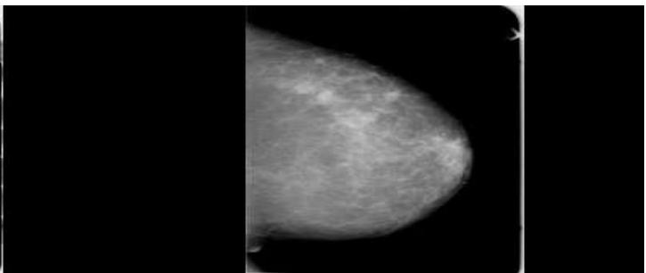  
(b) Malignant

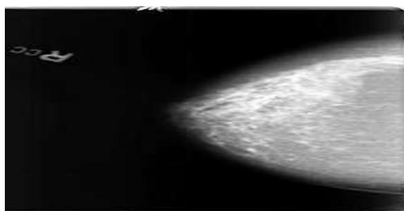  
Figure 2. An example of breast mammogram images from CBIS-DDSM dataset. (a) The Benign image (b) The Malignant image with verified pathology information.   
(a) Benign

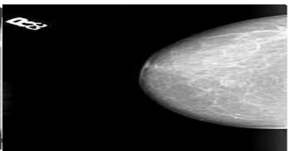  
(b) Malignant   
Figure 3. An example of breast mammogram images from DDSM dataset. (a) The Benign image (b) The Malignant image with verified ground truth information.

Table 1. Data Set Description and Detail.   

<table><tr><td>Mammogram Label</td><td>Category</td><td>Images</td><td>Dataset</td></tr><tr><td>Benign (0)</td><td>Original</td><td>425</td><td>PINUM</td></tr><tr><td>Malignant (1)</td><td>Original</td><td>152</td><td>PINUM</td></tr><tr><td>Benign (0)</td><td>Augmented</td><td>2550</td><td>PINUM</td></tr><tr><td>Malignant (1)</td><td>Augmented</td><td>912</td><td>PINUM</td></tr><tr><td>Benign (0)</td><td>AD ROIs</td><td>75</td><td>PINUM</td></tr><tr><td>Malignant (1)</td><td>AD ROIs</td><td>75</td><td>PINUM</td></tr><tr><td>Benign (0)</td><td>Original</td><td>1740</td><td>CBIS-DDSM</td></tr><tr><td>Malignant (1)</td><td>Original</td><td>1828</td><td>CBIS-DDSM</td></tr><tr><td>Benign (0)</td><td>AD ROIs</td><td>100</td><td>CBIS-DDSM</td></tr><tr><td>Malignant (1)</td><td>AD ROIs</td><td>100</td><td>CBIS-DDSM</td></tr><tr><td>Benign (0)</td><td>Original</td><td>2500</td><td>DDSM</td></tr><tr><td>Malignant (1)</td><td>Original</td><td>3000</td><td>DDSM</td></tr><tr><td>Benign (0)</td><td>AD ROIs</td><td>100</td><td>DDSM</td></tr><tr><td>Malignant (1)</td><td>AD ROIs</td><td>100</td><td>DDSM</td></tr></table>

# 4. Methods

# 4.1. Proposed Method

In this study, proposed a novel approach for the classification of architectural distortion using a depth-wise 2D V-net 64 convolutional neural network. The proposed method pertains to two steps: in the first step, a computer vision algorithm is used for AD ROIs extraction from digital mammogram images. In the second step, the extracted AD ROIs are classified using a depth-wise convolutional neural network. The proposed method can achieve higher accuracy than the deep machine learning methods such as shuffelnet, mobilenet, support vector machine, k-nearest neighbor, and random forest and previous studies. Furthermore, evaluate the performance of the proposed method with other evaluation metrics such as f1_score, precision, recall, sensitivity, specificity, and area under the curve (AUC). The proposed framework of proposed method for mammogram classification based on architectural distortion is presented in Figure 4. The details about the proposed methodology are determined in subsequent sections.

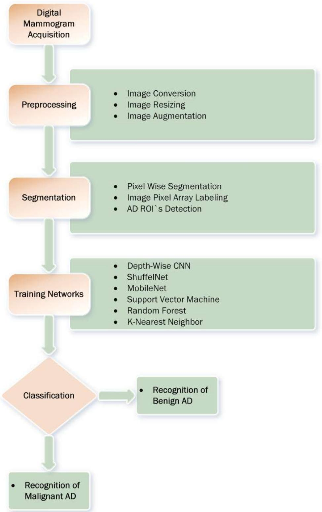  
Figure 4. The proposed mammogram classification framework pertains to four steps: image preprocessing and augmentation, pixel wise segmentation and image pixel array labeling, architectural distortion ROI‘s detection, training deep learning, and machine learning networks to classify AD‘s ROIs into malignant and benign classes.

# 4.2. Image Preprocessing

Image conversion and resizing are employed in the preprocessing step to remove noise, artifacts, and irrelevant information. The original mammograms were acquired

from three databases such as the PINUM [48] local database and the public database CBIS-DDSM [49], and DDSM [50]. The original databases PINUM and CBIS-DDSM were in the DICOM (digital imaging and communications in medicine) format containing images and patient data. In the first step, the DICOM images are converted into PNG format using an automated OpenCV conversion method, and the patient data is stored in a CSV file. The image preprocessing Algorithm 1 is reported below the complete steps. The converted PNG breast mammogram images are very high-resolution images with a $4 0 9 6 \times 2 0 4 7$ width and height. We employed the automatic image resizing method with a two-integer argument width and height by downsizing resolution up to $3 2 0 \times 2 4 0$ pixels to make fixed-size images before training a deep convolutional neural network. The DDSM database images are in gif format and converted into PNG format using the automated conversion method.

# Algorithm 1 Image preprocessing algorithm 1.

Step 1: Select the DICOM file using read method.;

Step 2: Read DICOM Description values.;

Step 3: Create input vector of DICOM file;

Step 4: Write image description;

Step 5: Read patient data;

Step 6: Read image pixel values;

Step 7: Apply image function zoom in/out;

Step 8: Apply Linear Interpolation function;

Step 9: Create new input vector for new format;

Step 10: Replace Pixels DICOM format to PNG;

Step 11: Write patient data;

Step 12: Save converted image and patient data;

Step 13: Display PNG image;

# 4.3. Image Augmentation

Deep learning is a data-driven method so that the small size of data and non- standardization are the main challenges for the generalization of the model. However, to handle the generalization, overfitting, and improving the robustness of the deep learning model, we artificially inflate the PINUM database five times from the original images to increase the dataset size. The data augmentation techniques such as rotating, flipping, sharpening, d-skew, brightness, and contrast are employed to increase the dataset’s size, as shown in Table 2. In addition, the overfitting and generalization of the deep learning model can be improved by applying augmentation [51]. The mammogram images are rotated at 45, 90, 135, 180, and 360 degrees and return a new object of the rotated images within a described resolution to increase dataset size up to 3462. Moreover, we rotated a single mammogram at five angles that produce five rotated images and one original image and employed augmentation methods, as shown in Figure 5. The volume of the CBIS-DDSM and the DDSM dataset is 3568, 5500 images; therefore, the data augmentation was not employed on both datasets as the modal overfitting and generalization was not a challenging issue.

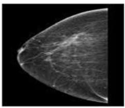

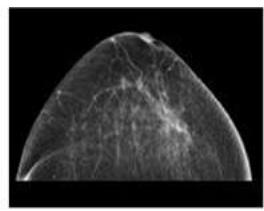

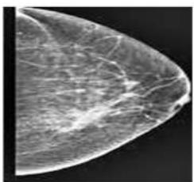

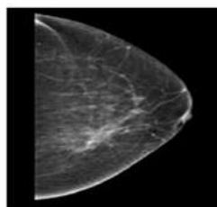

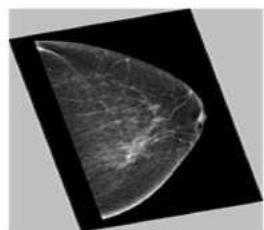

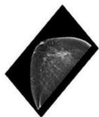

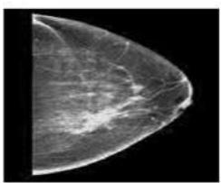

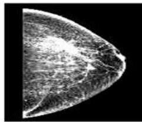

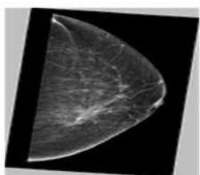

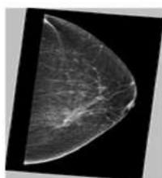  
Figure 5. The augmented images of PINUM dataset starting from original to augmented images.

Table 2. Data augmentation techniques with performance value.   

<table><tr><td>Sr</td><td>Augmentation Techniques</td><td>Performance Values</td></tr><tr><td>1</td><td>Rotation</td><td>45°, 90°, 135°, 180°, 360°</td></tr><tr><td>2</td><td>Flipping</td><td>Left, Right, Top, Bottom</td></tr><tr><td>3</td><td>Sharpen (lightness value)</td><td>0.5–1.5</td></tr><tr><td>4</td><td>D-skew (angle)</td><td>15°, 40°</td></tr><tr><td>5</td><td>Contrast (intensity value)</td><td>20–60%</td></tr><tr><td>6</td><td>Brightness (darkness values)</td><td>15–55%</td></tr></table>

# 4.4. Pixel Wise Segmentation

The image pixel-wise segmentation method maps each pixel of the image that belongs to the image’s object or shape and gives a label. M. Wang et al. [52] employed image path-based pixel segmentation using a label fusion algorithm. The image pixel-wise segmentation method maps each pixel of the image that belongs to the image’s object or shape and gives a label. Pixels have the same attribute locating an object of the image. Computer vision is a powerful technology for detecting objects as compared with other object detection techniques. Employed a computer vision-based object detection technique and create an image pixel array. Each pixel array has labeled with a class label0 and label1. The detailed process is as follow:

1. The image is to be segmented as a targeted image $P = ( x , y , N ) ^ { w \times h } ,$ , where $P$ representing a pixel array vector having $N$ elements that has belongs to the specific category as:

$$
\sum_ {p} P \in (x, y) ^ {w \times h} = L \in [ 0, 1 ] \tag {1}
$$

2. The pixel $x \in ( x 1 , x 2 , \ldots w ) { \mathrm { a n d ~ } } y \in ( y 1 , y 2 , \ldots h )$ represents the vertical $w$ and horizontal $h$ pixels, where $x 1$ and $y 1$ are the elements of pixel vector. The dot product has performed as:

$$
P (x, y) = P (x, y). L \tag {2}
$$

3. $L \in [ 0 , 1 ]$ represents each object in a pixel array belonging to classes 0 and 1. The pixel-wise prediction can be improved on which we can generate the segmentation results.

# 4.5. Architectural Distortion ROI‘s Detection

Architectural distortion is the third most suspicious appearance on a mammogram that represents abnormal regions. Architectural distortion tracking from mammograms is challenging due to its subtle and varying asymmetry on breast mass and small size. The architectural distortion associated with ILC or IDC on mammography represents the abnormality, and having a star-shaped pattern is likely to be malignant, while the complex and radial sclerosing lesions architectural distortion having larger than ${ 1 \mathrm { c m } }$ is probably benign [4]. Employed computer vision-based pixel-wise segmentation for the detection of AD ROIs from digital mammograms. In the first step, the computer vision object detection algorithm was applied to create a segmented pixel array. In the second step, the area having a star shape pattern and larger radios than $^ { 1 \mathrm { ~ c m } }$ was considered as ADs ROIs. The segmented architectural distortion ROIs input to the dept-wise convolutional neural network for classification. Figures 6–8 presented segmented benign and malignant ROIs from the PINUM, CBIS-DDSM datasets and DDSM. Moreover, we pertain to the same procedure for the segmentation of AD ROIs from the CBIS-DDSM dataset. The automated segmented ROIs are validated with manually marked ADs ROIs by the radiologist team. The DDSM dataset has predefined ground truth ADs ROIs and is included in the validation dataset. Samreen et al. [53] presented an imaging evaluation management algorithm on architectural distortion detection from digital breast tomosynthesis.

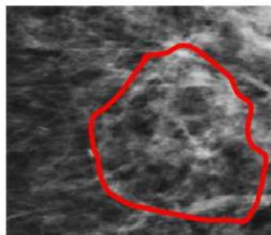  
(a)

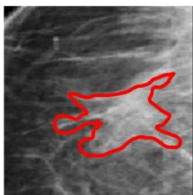

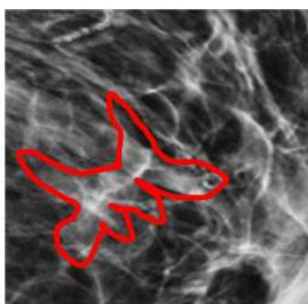  
(b)   
Figure 6. An example of the architectural distortion ROI‘s from PINUM dataset by the experts team of radiologists. (a) Radial shape (b) Star shape.

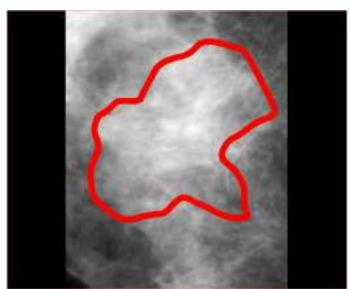

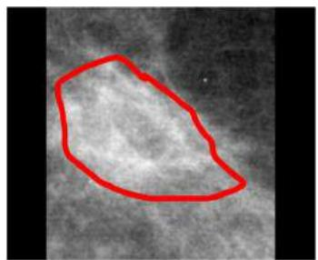  
(a)

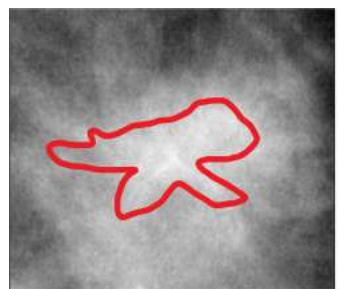

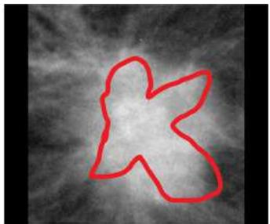  
(b)   
Figure 7. An example of the architectural distortion ROI‘s segmentation of CBIS-DDSM dataset by the radiologists. (a) Radial shape (b) Star shape.

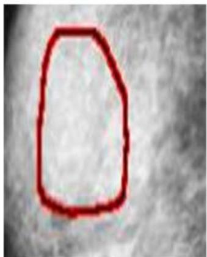

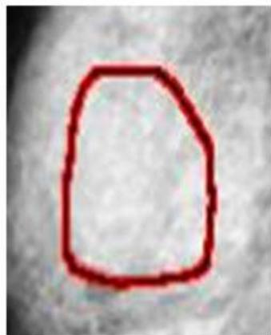

  
(a)

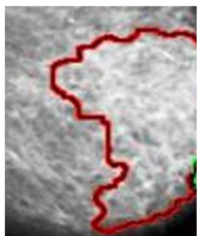  
(b)   
Figure 8. An example of the architectural distortion ROI‘s segmentation of DDSM dataset. (a) Radial shape (b) Star shape.

# 4.6. Depth-Wise-CNN Architecture

A deep convolutional neural network using a computer vision-based method has improved pattern recognition and architectural distortion classification. The standard convolutional neural network uses input and output with only width and height parameters. For input with only width and height, the neural network increases the parameters and can be overfitting. Employed a depth-wise 2D convolutional neural network using V-net 64 architecture with three convolutional layers, three max-pooling layers, one fully connected flatten layer, and one dense layer followed by the sigmoid classifier. The depth-wise convolution only uses one input channel for each depth level of input and then performs convolution. The depth-wise convolutional neural network architecture is presented in Figure 9. In the convolutional layer, use a $3 \times 3$ kernel using the Relu activation function and the input vector mapping the features to the convolutional layer as $d i m ( i m a g e ) = \left( n _ { h } , n _ { w } , n _ { c } \right)$ Where $n _ { h }$ is the size of height, $n _ { w }$ size of width and $n _ { c }$ is the number of channels. The input image of the $l ^ { t h }$ layer we use $a ^ { [ l - 1 ] }$ filters with the size of $( n _ { h } ^ { [ l - 1 ] } , n _ { w } ^ { [ l - 1 ] } , n _ { c } ^ { [ l - 1 ] } ) , a ^ { [ 0 ] }$ (n (n[l−1]h , n[l−1]w , n[l−1]c ), a[0]. The stride parameter is: s[l] and the number of filters denoted as $s ^ { [ l ] }$ c     c the output image is a[l] with the size of (n[l]h , n[l]w , n[l]c) . Equations (3) and (4) shows the input $n _ { c } ^ { [ l ] }$ where for each $K ^ { n }$ $a ^ { [ l ] }$ is size of $( f ^ { [ l ] } , f ^ { [ l ] } , n _ { c } ^ { [ l - 1 ] } )$ $( n _ { h } ^ { [ l ] } , n _ { w } ^ { [ l ] } , n _ { c ) } ^ { [ l ] }$ . The activation function ReLu is: $\varphi ^ { [ l ] }$ and and output of convolutional layer. For all $n$ belongs to $[ 1 , 2 , . . . , n _ { c } ^ { [ l ] } ]$ .

$$
\operatorname {C o n v} \left(a ^ {[ l - 1 ]}, K ^ {n}\right) _ {x, y} = \varphi^ {[ l ]} \left(\sum_ {i = 1} ^ {n _ {h} ^ {[ l - 1 ]}} \sum_ {j = 1} ^ {n _ {w} ^ {[ l - 1 ]}} \sum_ {k = 1} ^ {n _ {c} ^ {[ l - 1 ]}} \right. \tag {3}
$$

$$
K _ {i, j, k} ^ {n} a _ {x + i - 1, y + j - 1, k} ^ {l - 1} + b _ {n} ^ {l})
$$

$$
d i m (\operatorname {c o n v} (a ^ {[ l - 1 ]}, K ^ {n})) = \left(n _ {h} ^ {[ l ]}, n _ {w} ^ {[ l ]}\right)
$$

$$
[ \varphi^ {[ l ]} (\operatorname {C o n v} (a ^ {[ l - 1 ]}, K ^ {1})), \varphi^ {[ l ]} (\operatorname {C o n v} (a ^ {[ l - 1 ]}, K ^ {2})), \dots
$$

$$
\varphi^ {[ l ]} \left(\operatorname {C o n v} \left(a ^ {[ l - 1 ]}, K ^ {\left(n _ {c} ^ {[ l ]}\right)}\right)\right)
$$

$$
d i m \left(a ^ {[ l ]} = \left(n _ {h} ^ {[ l ]}, n _ {w} ^ {[ l ]}, n _ {c} ^ {[ l ]}\right) \right. \tag {4}
$$

$$
n _ {c} ^ {[ l ]} = n u m b e r o f f i l t e r s
$$

where $f$ is activation, $\mathbf { x }$ and y the actual pixels location on height and width dimension of input image. The learning parameters of convolutional layer at $l ^ { t h }$ layers are $( f ^ { [ l ] } \times f ^ { [ l ] } \times$ $f _ { c } ^ { [ - 1 ] } ) \times n _ { c } ^ { [ l ] }$ filters. In the max-pooling layer, uses a $2 \times 2$ kernel size to down-sampling the features and the input size is $a ^ { [ l - 1 ] }$ with the size of $( n _ { h } ^ { [ l - 1 ] } , n _ { w } ^ { [ l - 1 ] } , n _ { c } ^ { [ l - 1 ] } ) , a ^ { [ 0 ] }$ n[l−1]c ), a[0] . The filter size of pooling layer is denoted as $f ^ { [ l ] }$ and the pooling function $\phi ^ { [ l ] }$ . The Equations (5) and (6) performs the pooling function.

$$
a _ {x, y, z} ^ {[ l ]} = \operatorname {p o o l} (a ^ {[ l - 1 ]}) _ {x, y, z} = \phi^ {[ l ]}
$$

$$
\left(\left(a _ {x + i - 1, y + j - 1, z} ^ {[ l - 1 ]}\right) _ (i, j) \in [ 1, 2, \dots f ^ {[ l ] ] ^ {2}}\right) \tag {5}
$$

$$
d i m (a ^ {[ l ]}) = \left(n _ {h} ^ {[ l ]}, n _ {w} ^ {[ l ]}, n _ {c} ^ {[ l ]}\right)
$$

$$
n _ {c} ^ {[ l ]} = n _ {c} ^ {[ l - 1 ]}
$$

where $( i , j )$ belongs to $[ 1 , 2 , . . . , \phi ^ { [ l ] } ] , x , y$ are the pixels location and $z$ is the input channel. The last fully-connected layer a fine number of neurons as input vector considering the $j ^ { t h }$ nodes of the $i ^ { t h }$ layer can be calculated with Equation (6).

$$
\begin{array}{l} Z _ {j} ^ {[ j ]} = \sum_ {l = 1} ^ {n _ {i - 1}} w _ {j, l} ^ {[ i ]} a _ {l} ^ {[ i - 1 ]} + b _ {j} ^ {[ i ]} \tag {6} \\ \rightarrow a _ {j} ^ {[ i ]} = \varphi^ {[ i ]} (z _ {j} ^ {[ i ]}) \\ \end{array}
$$

$a ^ { [ i - 1 ] }$ the result of t. Finally the onvolutional and pooling layer witflatten layer has the dimensions (n[ih $( n _ { h } ^ { [ i - 1 ] } , n _ { w } ^ { [ i - 1 ] } , n _ { c } ^ { [ i - 1 ] } )$ $1 D$ $( n _ { h } ^ { [ i - 1 ] } \times n _ { w } ^ { [ i - 1 ] } \times$ × n[i−w $n _ { c } ^ { [ i - 1 ] } , 1 $ n[i−1]c , 1). and the nodes are:

$$
n _ {i - 1} = n _ {h} ^ {[ i - 1 ]} \times n _ {w} ^ {[ i - 1 ]} \times n _ {c} ^ {[ i - 1 ]}
$$

where $w _ { j , l }$ are weights with learned parameters $n _ { [ l - 1 ] } \times n _ { l }$ parameters at $l ^ { t } h$ layer. The proposed depth-wise convolutional neural network significantly outperformed without overfitting and achieved the highest accuracy.

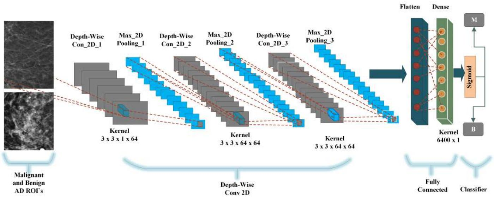  
Figure 9. The proposed depth-wise CNN architecture for the classification of benign and malignant architectural distortion ROIs.

# 4.7. Depth-Wise-V-Net64 Training

The depth-wise 2D convolutional neural network is evaluated on three databases, the local PINUM, the public CBIS-DDSM, and the DDSM dataset. Split the data into the training, testing, and validation data for the proposed deep neural modal. The dataset was randomly divided into $6 0 \%$ for training, $2 0 \%$ for testing, and $2 0 \%$ for cross-validation. For the deep learning model’s regularization and adequate robustness, the data augmentation object is used in our deep learning network for both datasets. Build a depth-wise 2D V-net 64 architecture with three convolutions, three max-pooling, and two fully connected layers for the training of our dataset. The sigmoid classifier has pertained to the classification of malignant and benign ADs ROIs. The epochs size was set 20 to reduce the learning rate by 0.1 factor after every 2.5 epochs, the batch size was 16, and the class weight and ”binary_crossentropyloss” function were used to deal with training data imbalance. The proposed deep learning models learning ability was increased as the training ephods increases. Figures 10–12 shows that the noise around the data is higher at first layer of network. As well as the modal learns more the noise around the data decreases till the last layer. The training loss continues decreases after the 10th epochs and training accuracy increases and reached up to 100. The training graphs shows that modals learning

ability is better and well regularized. The network structure considered in experiments is summarized in Table 3.

Table 3. The proposed network layers architecture.   

<table><tr><td>Network Layers</td><td>Filters</td><td>Filter Size</td><td>Padding</td><td>Stride</td><td>Output Shape</td></tr><tr><td>Input Image</td><td>-</td><td>-</td><td>-</td><td>-</td><td>240 × 320 × 3</td></tr><tr><td>DW_Conv2D</td><td>64</td><td>3 × 3 × 64</td><td>same</td><td>1 × 1</td><td>100 × 100 × 64</td></tr><tr><td>Activataion_Relu</td><td>-</td><td>-</td><td>-</td><td>-</td><td>98 × 98 × 64</td></tr><tr><td>Max_Pooling</td><td>1</td><td>2 × 2</td><td>-</td><td>0</td><td>49 × 49 × 64</td></tr><tr><td>DW_Conv2D</td><td>64</td><td>3 × 3 × 64</td><td>same</td><td>1 × 1</td><td>47 × 47 × 64</td></tr><tr><td>Activataion_Relu</td><td>-</td><td>-</td><td>-</td><td>-</td><td>47 × 47 × 64</td></tr><tr><td>Max_Pooling</td><td>1</td><td>2 × 2</td><td>-</td><td>0</td><td>23 × 23 × 64</td></tr><tr><td>DW_Conv2D</td><td>64</td><td>3 × 3 × 64</td><td>same</td><td>1 × 1</td><td>21 × 21 × 64</td></tr><tr><td>Activataion_Relu</td><td>-</td><td>-</td><td>-</td><td>-</td><td>21 × 21 × 64</td></tr><tr><td>Max_Pooling</td><td>1</td><td>2 × 2</td><td>-</td><td>0</td><td>10 × 10 × 64</td></tr><tr><td>Dropout (0.5)</td><td>-</td><td>-</td><td>-</td><td>-</td><td>10 × 10 × 64</td></tr><tr><td>FC1_FLatten_4</td><td>-</td><td>-</td><td>-</td><td>-</td><td>(6400)</td></tr><tr><td>FC2_Dense_5</td><td>64</td><td>-</td><td>-</td><td>-</td><td>(6400)</td></tr><tr><td>Sigmoid</td><td>-</td><td>-</td><td>-</td><td>-</td><td>[0/1]</td></tr></table>

# 4.8. Standard Classifiers

ShuffleNet, developed by Magvi Inc, is a highly efficient convolutional neural network architecture optimized for mobile devices with low processing capacity. The new design makes use of two procedures to decrease computing costs while maintaining or improving accuracy and perform groups convolutions pointwise and the Channel Shuffle. The Channel Shuffle is a novel procedure performed to create additional feature map channels, which aids in the encoding of more information and improves the robustness of feature recognition. Group Convolution, introduced in AlexNet, is a form of convolution in which the channels are divided into groups and then the kernel is convolved individually on each group and then re concatenated. This procedure contributes to the retention of existing connections and reduces the connection count

MonileNet is a deep convolutional neural network that uses a depth-wise separable convolutional neural network. Compared to a network with normal convolutions of the same depth in the nets, it substantially reduces the number of parameters. MobileNet is an open-source neural network provided by Google. The actual difference between the MobileNet design and a conventional CNN is that instead of a single $3 \times 3$ convolutional layer followed by the batch norm and ReLU, the MobileNet architecture uses several $3 \times 3$ convolutional layers. The mobile nets divide the convolution into a $3 \times 3$ depth-wise convolution and a $1 \times 1$ point-wise convolution.

Loi et al. [41] presented subtraction of temporally sequential mammogram technique to predict breast cancer using a support vector machine algorithm. To validate the proposed method, perform a classification task using a support vector machine algorithm. A computer vision-based object detection method was employed for architectural distortion ROIs detection in the preprocessing phase. we extracted pixel-wise features using a computer-vision algorithm for creating input to SVM and for other machine learning algorithms. We use the non-linear kernel function in the support vector machine algorithm to classify ADs ROIs. It has been observed that the support vector machine algorithm provides more general results where the number of samples is relatively low [54]. In our SVM model, we employed a 5-fold cross-validation function for the validation of SVM.

K-NN is a supervised machine learning algorithm for binary class, multiclass, and regression problems. Beham et al. [44] applied wavelet transforms for feature extraction from the digital mammogram, and the K-nearest neighbor algorithm was employed for classification into benign and malignant classes. We employed K-NN for binary classification to evaluate and compare the performance of our deep neural network. The image segmentation and ROIs detection method were the same as we use for the SVM algorithm. We set the maximum value for K as 40 and the optimal error rate is 0.17 which shows the K-NN classifier was not overfitted.

Random forest is a supervised machine learning algorithm that ensembles a tree. Obaidullah et al. [47] presented an image descriptor-based approach for mammogram mass classification using a random forest algorithm. In each node of a tree gets a vote for predicting the output. We use a computer vision-based feature selection method for a random forest classifier. We trained a multiple-time random forest classifier to classify ADs’ ROIs, compare it with our proposed method, and observe that random forest performance was low.

# 4.9. Evaluation Metrics

The proposed method was able to classify detected architectural distortion ROIs into malignant and benign classes and significantly improve model accuracy. The performance of the proposed method is evaluated on the local PINUM, the public CBIS-DDSM, and the DDSM database. The evaluation metrics such as accuracy, sensitivity, f1-score, precision, recall, and area under the curve (AUC) are used to assess the performance of the proposed method. The following equations are employed to calculate the accuracy, sensitivity, f1- score, and area under the curve. Accuracy measures the corrected classified sample of the binary class. Sensitivity measures the corrected true-positive cases from false-positive. The area under the curve calculates the ratio between true-positive and false-positive. F1-score can be calculated to compute precision and recall.

$$
A c c u r a c y = \frac {T P + T N}{F P + F N + T P + T N} \tag {7}
$$

$$
S e n s i t i v i t y = \frac {T P}{T P + F N} \tag {8}
$$

$$
F 1 - S c o r e = 2 * \frac {\left(\frac {T P}{T P + F P}\right) * \left(\frac {T P}{T P + F N}\right)}{\left(\frac {T P}{T P + F P}\right) + \left(\frac {T P}{T P + F N}\right)} \tag {9}
$$

$$
A U C = \frac {1}{2} * \left(\frac {T P}{T P + F N} + \frac {T N}{T N + F P}\right) \tag {10}
$$

where TP: true positive, TN: True negative, FP: False positive, FN: False Negative.

# 5. Results Analysis

The proposed method was designed on scientific fundamentals to predict breast cancer from digital mammograms. The computer vision-based image preprocessing method has pertained to detecting the architectural distortion ROIs from digital mammograms for all models. The experiments were carried out on six pre-trained models (Proposed-CNN, ShuffelNEt, MobileNet, SVM, K-NN, RF) to evaluate the two databases. The experimental results reveal that our proposed method outperforms as compared with other and previous studies.

# 5.1. Experimental Configuration

In the current study, experimental work was performed on google collab GPU, 12 GB RAM, and Windows 10 operating system. All experimental algorithms are implemented in python 3.6 using TensorFlow/Keras library. The computation time was 30 min for training and testing on PINUM datasets, 40 min on the CBIS-DDSM dataset, and 50 min on

the DDSM for all neural networks. Furthermore, image preprocessing and augmentation are performed in Python. Pertained to the best hyperparameters, such as batch size, loss function, learning rate, target size, and optimization function, as presented in Table 4.

Table 4. Hyper parameter configuration detail.   

<table><tr><td>Configuration</td><td>Values</td></tr><tr><td>Batch Size</td><td>16</td></tr><tr><td>Learning Rate</td><td>0.001</td></tr><tr><td>Epochs</td><td>20</td></tr><tr><td>Optimization function</td><td>Adam</td></tr><tr><td>Loss Function</td><td>binary_crossentropy</td></tr><tr><td>Target Size</td><td>[320, 240]</td></tr><tr><td>histogram_freq</td><td>1</td></tr><tr><td>Tarin Split</td><td>0.6</td></tr><tr><td>Validation Split</td><td>0.2</td></tr></table>

# 5.2. Comparison between Proposed Method, ShuffelNet, MobileNet and SVM, KNN, RF

The results of the proposed method were compared with well-known three machine learning and two deep learning algorithms. It could be observed that in Tables 5–7 the performance of the proposed method was much better than the ShuffelNet, MobileNet, SVM, K-NN, and random forest. The performance of experimental results was evaluated using a five-fold cross-validation test on the PINUM, the CBIS-DDSM, and DDSM datasets. The deep learning models training accuracy and training loss for all datasets has shown in Figures 10–12. In Figure 10, after the 7th epochs, the training loss continuously decreases while the training accuracy remains constant over the iterations, while the loss and accuracy of shuffelnet and mobilenet are lower which shows our model perfectly fitted on the PINUM dataset. Figures 11 and 12 for the CBIS-DDSM and DDSM datasets after the 10th epoch, the training loss steadily decreases while the training accuracy remains higher until the last epochs as compared to shuffelnet and mobilenet. The training accuracy on all datasets reaches $9 9 \%$ after the 17th epochs, which indicates that our model was regularized and perfectly fitted.

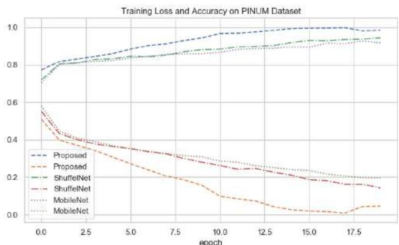  
Figure 10. All Deep Networks Training Loss and Accuracy on PINUM Dataset.

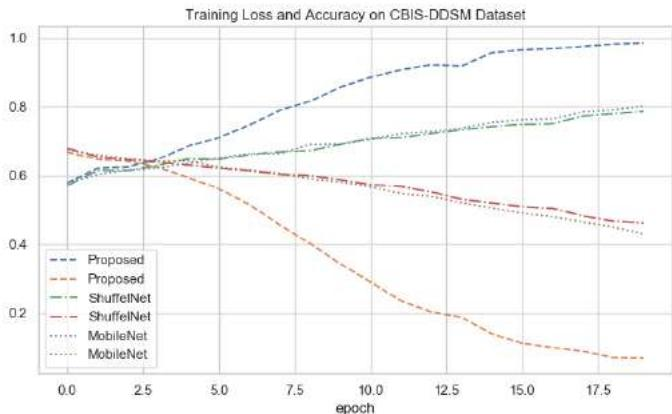  
Figure 11. All Deep Networks Training Loss and Accuracy on CBIS-DDSM Dataset.

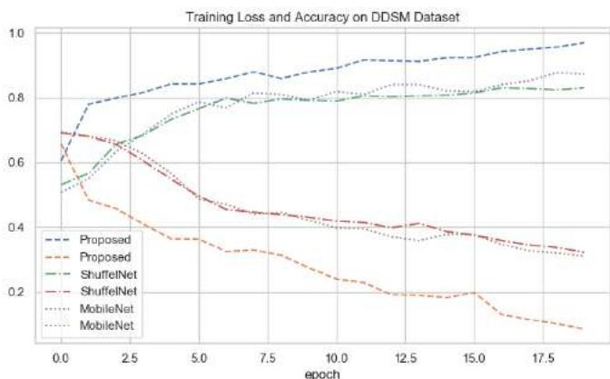  
Figure 12. All Deep Networks Training Loss and Accuracy on DDSM Dataset.

Figures 13–15 show that the proposed method yielded the best performance and achieved 0.95, 0.97 and 0.98 accuracies on the PINUM, CBIS-DDSM and DDSM datasets, respectively. Shuffelnet,MobileNet, SVM, K-NN, and RF accuracies were 0.91, 0.89, 0.87, 0.83, and 0.90 on the PINUM dataset, 0.93, 0.90, 0.73, 0.80, and 0.95 on the CBIS-DDSM dataset and 0.87, 0.90, 0.80, 0.81 and 0.91 on DDSM dataset. The proposed method achieves $4 \%$ , $6 \%$ , $8 \%$ , $1 2 \%$ , and $5 \%$ higher accuracy than ShuffelNet, MobileNet, SVM, K-NN, and RF on the PINUM dataset, $4 \%$ , $7 \%$ , $2 4 \%$ , $1 7 \%$ , and $2 \%$ on the CBIS-DDSM dataset and $1 1 \%$ $8 \%$ , $1 8 \%$ , $1 7 \%$ and $7 \%$ on DDSM dataset.

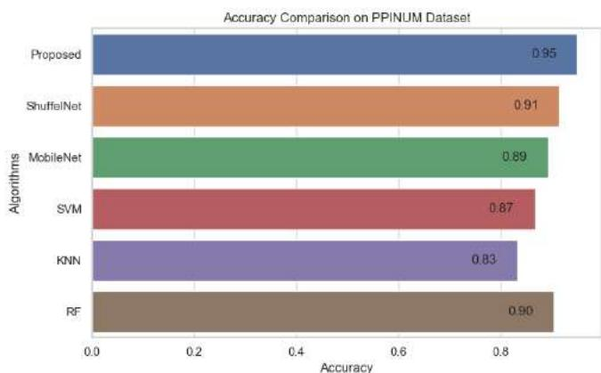  
Figure 13. Accuracy Comparison on PINUM Dataset.

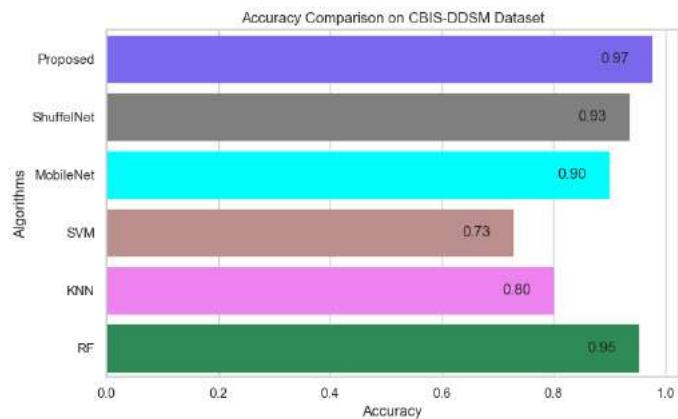  
Figure 14. Accuracy Comparison on CBIS-DDSM Dataset.

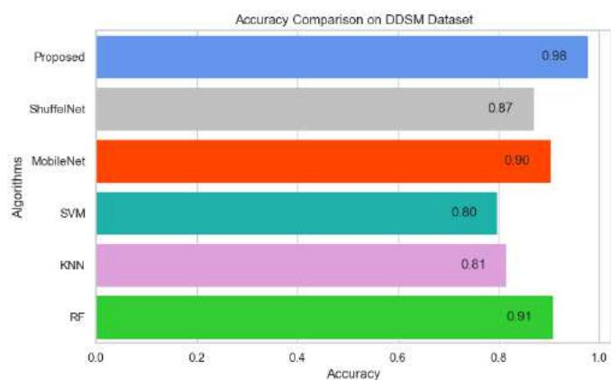  
Figure 15. Accuracy Comparison on DDSM Dataset.

Figures 16–18 reveals that the proposed method was achieved 0.87, 0.90, 0.89 f1- score, precision, and recall on the PINUM dataset, 0.96, 0.94, and 0.98 on the CBIS-DDSM dataset, and 0.90, 0.96 and 0.86 on DDSM dataset which was higher as compared with ShuffelNet,MobileNEt, SVM, K-NN, and RF, respectively. In addition, the performance of the f1-score of the proposed method was $6 \%$ , $1 0 \%$ , $1 5 \%$ , $2 4 \%$ , and $6 \%$ higher than ShuffelNet, MobileNet, SVM, K-NN, and RF on the PINUM dataset. Furthermore, f1-score was $2 7 \%$ , $3 \%$ , $2 7 \%$ , $1 8 \%$ , and $1 \%$ higher than ShuffelNet, MobileNet, SVM, K-NN, and RF on the CBIS-DDSM dataset and $1 6 \%$ , $6 \%$ , $1 4 \%$ $1 2 \%$ and $2 \%$ on the DDSM dataset. Moreover, the precision and recall of the PINUM dataset of the proposed model was $4 \%$ , $2 9 \% 5$ , $2 \%$ , $6 \%$ , $1 \%$ , and $1 3 \%$ , $1 6 \%$ , $2 8 \%$ , $3 8 \%$ , $1 4 \%$ , respectively, higher than the ShuffelNet, MobileNet, SVM, K-NN, and random forest. For the CBIS-DDSM and DDSM data set, the proposed method precision and recall performance was $1 9 \%$ , $1 2 \%$ , $2 1 \%$ , $1 5 \%$ , $1 \%$ and $2 5 \%$ , $1 5 \%$ , $3 2 \%$ , $2 0 \%$ , $1 \%$ and $1 3 \%$ , $1 1 \%$ , $2 4 \%$ , $2 1 \%$ , $1 \%$ and $1 0 \%$ , $2 \%$ , $9 \%$ , $4 \%$ , $4 \%$ better than the ShuffelNet, MobileNet, SVM, K-NN, and RF.

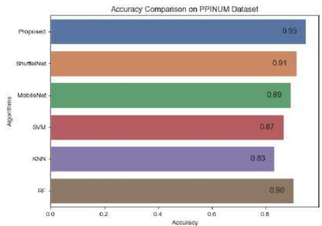

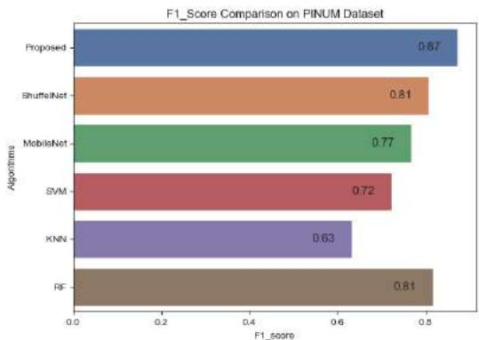

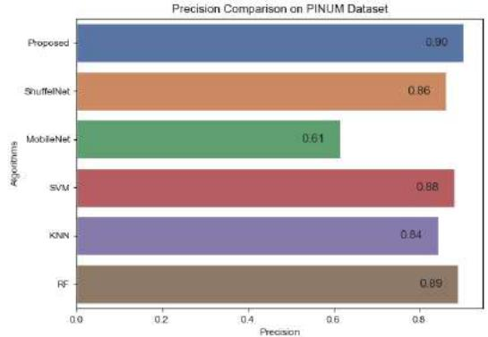

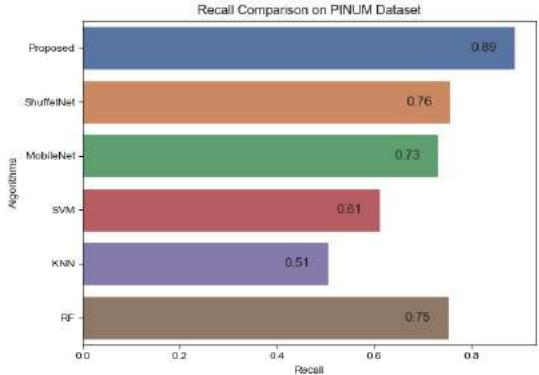  
Figure 16. Comparison of Accuracy, F1-Score, Precision and Recall on PINUM Dataset.

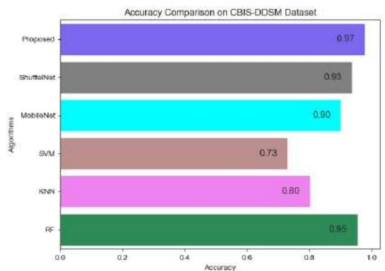

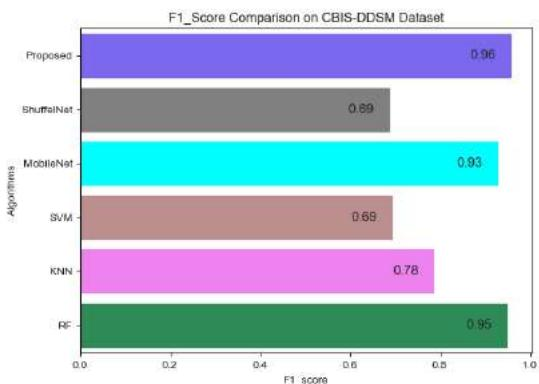

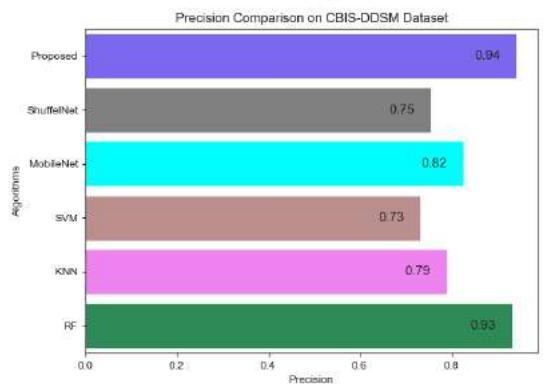

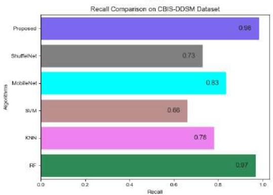  
Figure 17. Comparison of Accuracy, F1-Score, Precision and Recall on CBIS-DDSM Dataset.

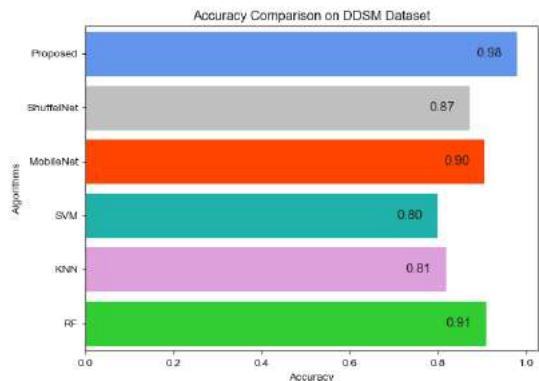

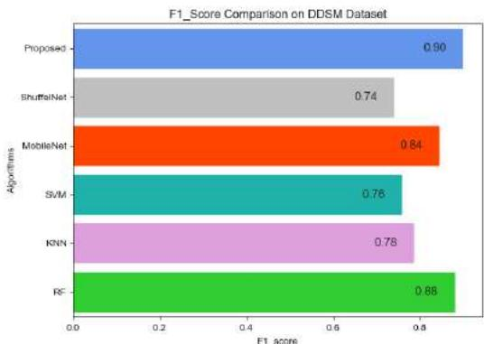

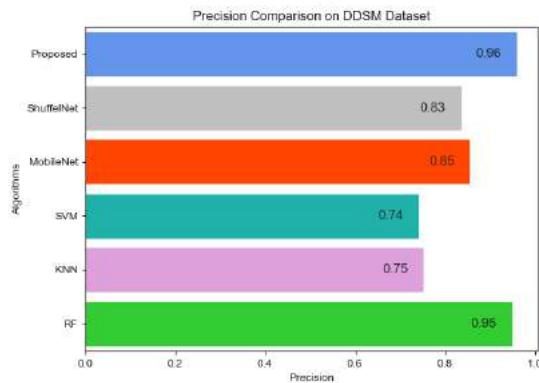

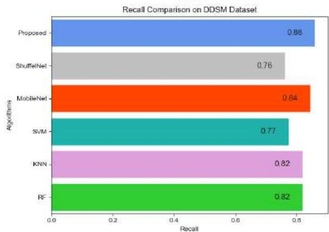  
Figure 18. Comparison of Accuracy, F1-Score, Precision and Recall on DDSM Dataset.

On the other hand, when comparing the sensitivity of the proposed model with ShuffelNet, MobileNet, SVM, K-NN, and RF on the PINUM and CBIS-DDSM is $3 \%$ $1 3 \%$ $1 1 \%$ , $8 \%$ , $2 \%$ , $1 \%$ , $1 \% ,$ , and $1 6 \%$ , $1 3 \%$ , $1 \%$ higher, respectively as shown in Figures 19 and 20. Figure 21 reveals that the sensitivity of the proposed method on the DDSM dataset was $7 \%$ , $8 \%$ , $1 5 \%$ , $1 5 \%$ , and $6 \%$ higher than ShuffelNet, MobileNet, SVM, K-NN, and RF. The area under the curve (AUC) was calculated of our proposed model, as shown in Figures 22–24. The AUC curve of our model was higher than the ShuffelNet, MobileNet, SVM, K-NN, and random forest. The above aforementioned deep analysis of all datasets stated that the proposed method significantly outperforms rather than the ShuffelNet, MobileNet, SVM, K-NN, and RF. The experimental results demonstrated the effectiveness of a deep convolutional neural network to classify architectural distortion ROIs that can help doctors and radiologists to predict breast cancer at initial stages.

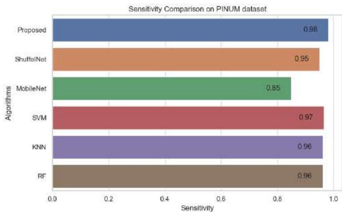  
Figure 19. Sensitivity Comparison on PINUM Dataset.

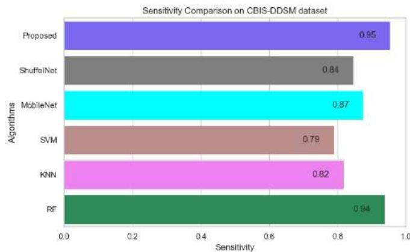  
Figure 20. Sensitivity Comparison on CBIS-DDSM Dataset.

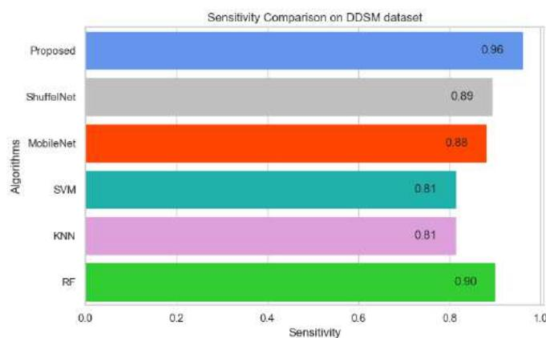  
Figure 21. Sensitivity Comparison on DDSM Dataset.

Table 5. Performance Evaluation compression of proposed method and with ShuffelNet, MobileNet, SVM, K-NN and RF on PINUM dataset.   

<table><tr><td>Algorithms</td><td>Accuracy</td><td>F1-Score</td><td>Precision</td><td>Recall</td><td>Sensitivity</td><td>AUC</td></tr><tr><td>Proposed</td><td>0.95</td><td>0.87</td><td>0.90</td><td>0.89</td><td>0.99</td><td>0.91</td></tr><tr><td>ShuffelNet</td><td>0.91</td><td>0.81</td><td>0.86</td><td>0.76</td><td>0.95</td><td>0.79</td></tr><tr><td>MobileNet</td><td>0.89</td><td>0.77</td><td>0.61</td><td>0.73</td><td>0.85</td><td>0.79</td></tr><tr><td>SVM</td><td>0.87</td><td>0.72</td><td>0.88</td><td>0.61</td><td>0.97</td><td>0.69</td></tr><tr><td>KNN</td><td>0.83</td><td>0.63</td><td>0.84</td><td>0.51</td><td>0.96</td><td>0.59</td></tr><tr><td>RF</td><td>0.90</td><td>0.81</td><td>0.89</td><td>0.75</td><td>0.96</td><td>0.75</td></tr></table>

Table 6. Performance Evaluation compression of proposed method and with ShuffelNet, MobileNet, SVM, K-NN and RF on CBIS-DDSM dataset.   

<table><tr><td>Algorithms</td><td>Accuracy</td><td>F1-Score</td><td>Precision</td><td>Recall</td><td>Sensitivity</td><td>AUC</td></tr><tr><td>Proposed</td><td>0.97</td><td>0.96</td><td>0.94</td><td>0.98</td><td>0.95</td><td>0.98</td></tr><tr><td>ShuffelNet</td><td>0.93</td><td>0.69</td><td>0.75</td><td>0.73</td><td>0.84</td><td>0.69</td></tr><tr><td>MobileNet</td><td>0.90</td><td>0.93</td><td>0.82</td><td>0.83</td><td>0.87</td><td>0.61</td></tr><tr><td>SVM</td><td>0.73</td><td>0.69</td><td>0.73</td><td>0.66</td><td>0.79</td><td>0.67</td></tr></table>

Table 6. Cont.   

<table><tr><td>Algorithms</td><td>Accuracy</td><td>F1-Score</td><td>Precision</td><td>Recall</td><td>Sensitivity</td><td>AUC</td></tr><tr><td>KNN</td><td>0.80</td><td>0.78</td><td>0.79</td><td>0.78</td><td>0.82</td><td>0.81</td></tr><tr><td>RF</td><td>0.95</td><td>0.95</td><td>0.93</td><td>0.97</td><td>0.94</td><td>0.89</td></tr></table>

Table 7. Performance Evaluation compression of proposed method and with ShuffelNet, MobileNet, SVM, K-NN and RF on DDSM dataset.   

<table><tr><td>Algorithms</td><td>Accuracy</td><td>F1-Score</td><td>Precision</td><td>Recall</td><td>Sensitivity</td><td>AUC</td></tr><tr><td>Proposed</td><td>0.98</td><td>0.90</td><td>0.96</td><td>0.86</td><td>0.96</td><td>0.85</td></tr><tr><td>ShuffelNet</td><td>0.87</td><td>0.74</td><td>0.83</td><td>0.76</td><td>0.89</td><td>0.69</td></tr><tr><td>MobileNet</td><td>0.90</td><td>0.84</td><td>0.85</td><td>0.84</td><td>0.88</td><td>0.81</td></tr><tr><td>SVM</td><td>0.80</td><td>0.76</td><td>0.74</td><td>0.77</td><td>0.81</td><td>0.79</td></tr><tr><td>KNN</td><td>0.81</td><td>0.78</td><td>0.75</td><td>0.82</td><td>0.81</td><td>0.81</td></tr><tr><td>RF</td><td>0.91</td><td>0.88</td><td>0.95</td><td>0.82</td><td>0.90</td><td>0.78</td></tr></table>

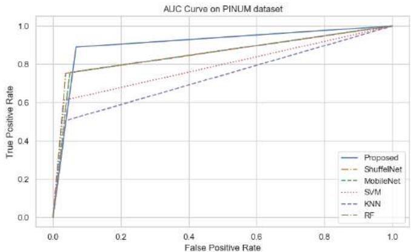  
Figure 22. The AUC curves of algorithms on PINUM Dataset.

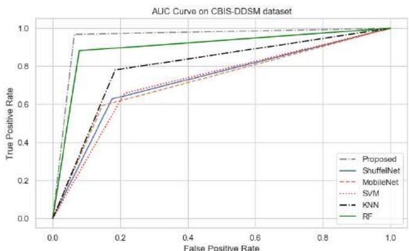  
Figure 23. The AUC curves of algorithms on CBIS-DDSM Dataset.

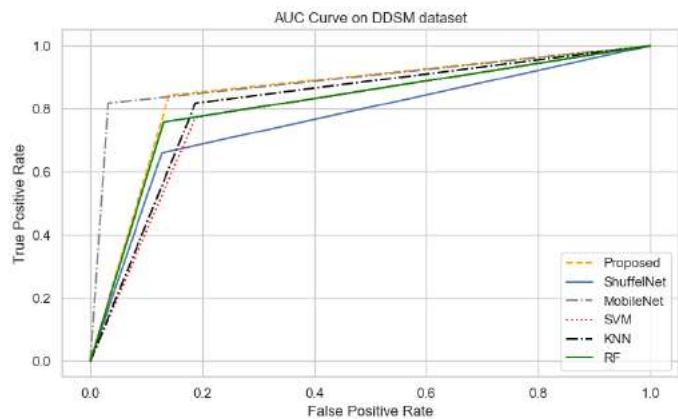  
Figure 24. The AUC curves of algorithms on DDSM Dataset.

# 5.3. Results Comparison between Proposed Method and Previous Studies

The proposed method is validated by comparing it with previous studies using the same dataset and the private dataset. The experimental results reveal that the performance of the proposed method was much better than the previous studies. Table 8 summarized that the proposed method was achieved 0.95, 0.97, and 0.98 accuracies on the PINUM, CBIS-DDSM, and DDSM datasets, respectively, which were higher comparatively from previous studies. Murali. et al. [6] pertain SVM and MLP for classifying architectural distortion ROIs and achieved $8 9 . 6 \%$ accuracy on the DDSM dataset. [7] implemented the Gober filter-based method to detect architectural distortion and achieve $9 0 \%$ sensitivity. The authors [8–10] employed a machine learning-based classification algorithm to detect architectural distortion from the DDSM data set and reporting $8 3 . 5 0 \%$ , $9 2 . 9 4 \%$ , and $9 1 . 7 9 \%$ accuracies, respectively. Another study by [13] applied a multilayer-perception network to detect architectural distortion evaluating 300 images and reported $8 3 \%$ accuracy. The authors [14] used the LDA classifier to detect architectural distortion tracking from digital breast tomosynthesis and achieved 0.90 sensitivity.

Table 8. Comparison of results with previous studies and proposed method.   

<table><tr><td>Authors</td><td>Problem</td><td>Method</td><td>Database</td><td>Images</td><td>Accuracy</td></tr><tr><td>[6]</td><td>Architectural Distortion Detection</td><td>SVM, MLP</td><td>DDSM</td><td>190</td><td>0.89</td></tr><tr><td>[7]</td><td>Architectural Distortion Detection</td><td>Bayesian, SELF ANN</td><td>Private</td><td>1745</td><td>N/A</td></tr><tr><td>[8]</td><td>Architectural Distortion Detection</td><td>Differential direction method</td><td>DDSM</td><td>33</td><td>0.83</td></tr><tr><td>[9]</td><td>Architectural Distortion Detection</td><td>SVM</td><td>DDSM</td><td>147</td><td>0.92</td></tr><tr><td>[10]</td><td>Architectural Distortion Detection</td><td>Sparse classifier</td><td>DDSM</td><td>69</td><td>0.91</td></tr><tr><td>[13]</td><td>Architectural Distortion Detection</td><td>MLP</td><td>FFDM</td><td>300</td><td>0.83</td></tr><tr><td>[14]</td><td>Architectural Distortion tracking</td><td>LDA</td><td>FFDM</td><td>37</td><td>N/A</td></tr><tr><td>[55]</td><td>Architectural Distortion tracking</td><td>CNN</td><td>CBIS-DDSM</td><td>334</td><td>0.92</td></tr><tr><td>Proposed</td><td>Architectural Distortion Detection</td><td>Depth-wise 2DCNN</td><td>Private (PINUM)</td><td>3462</td><td>0.95</td></tr><tr><td>Proposed</td><td>Architectural Distortion Detection</td><td>Depth-wise 2DCNN</td><td>CBIS-DDSM</td><td>3568</td><td>0.97</td></tr><tr><td>Proposed</td><td>Architectural Distortion Detection</td><td>Depth-wise 2DCNN</td><td>DDSM</td><td>5500</td><td>0.98</td></tr></table>

The proposed method depth-wise 2D convolutional neural network achieved 0.95, 0.97, and 0.98 accuracies on the 3264 PINUM, 3568 CBIS-DDSM, and 5500 DDSM datasets images, respectively, which were better than previous studies. The proposed model has achieved 0.98 accuracy which was $6 \%$ and $1 5 \%$ higher than the previous studies on the DDSM dataset which indicates that the performance of the proposed modal was much better. The performance of the proposed method on a private dataset was also better than the previous studies.

# 6. Discussion

In the current study, proposed a state-of-the-art computer-aided diagnostic system using a computer vision and depth-wise 2D convolutional neural network to detect and classify architectural distortion ROIs from digital mammograms. The proposed mammogram classification framework pertains to four steps: image preprocessing and augmentation, image pixel-wise segmentation, architectural distortion ROI‘s detection, training deep learning, and machine learning networks to classify AD‘s ROIs into malignant and benign classes. Image classification using the deep convolutional neural network, a minimum number of images is approximately 1000 required, and it can be increased for pre-trained models to regularize the neural network. [56]. Deep learning is a data-driven method so that the small size of data and non-standardization are the main challenges for the generalization of the model. However, to handle the generalization, overfitting, and improving the robustness of the deep learning model, we artificially inflate the PINUM database up to 3462 using data augmentation techniques as discussed above. The CBIS-DDSM dataset consists of 3568 mammogram images, including 1740 benign and 1828 malignant images with MLO and CC views. The 5500 images were included from the DDSM dataset. Split the data into the training, testing, and validation data for the proposed deep neural modal. The dataset was randomly divided into $6 0 \%$ for training, $2 0 \%$ for testing, and $2 0 \%$ for cross-validation.

In the context of comparing results with the ShuffleNet, MobileNet, SVM, K-NN, and RF the obtained results of the proposed method are comparable, encouraging, and better in many aspects. The proposed method yielded better accuracy, f1-score, precision, recall, sensitivity, and area under the curve. When we are seeing the training accuracy of the proposed method on both datasets it reaches $1 0 0 \%$ as compared with the ShuffelNet and MobileNet. On the other hand, the training loss of our proposed method is consistently decreasing after the 7th epochs which shows the noise around the proposed method is much lower than the ShuffleNet and MobileNet on the PINUM, CBIS-DDSM, and DDSM datasets. In comparison to the findings of previous research on architectural distortion, the current study’s findings for malignant and benign ADs are promising, better, and outperforms. The authors [6,8–10] achieved $8 9 . 6 \%$ , $8 3 . 5 0 \%$ , $9 2 . 9 4 \%$ , and $9 1 . 7 9 \%$ accuracies, respectively. The experimental results demonstrated that the proposed approach significantly outperforms the ShuffelNet, MobileNet, SVM, K-NN, RF, and previous studies. The proposed approach achieved $0 . 9 5 \%$ , $0 . 9 7 \%$ , $0 . 9 8 \%$ accuracies on the PINUM, CBIS-DDSM, and DDSM dataset, while the maximum accuracy in previous studies was $9 2 . 9 4 \%$ [9] on the DDSM dataset, which healed our model. On the other hand, the highest accuracy was achieved by the random forest algorithm are 0.90, 0.95 on the PINUM and CBIS-DDSAM dataset, which is still lower than our proposed model. Furthermore, to enhance the effectiveness of the proposed model, compared it with other evaluation metrics such as f1-score, precision, recall, and sensitivity; the model achieved better results, as seen in Tables 5–7.

Fully automatic identification of architectural distortion in mammograms of intervalcancer cases is more challenging because extensive comparative analysis, which was not investigated in our study, is still a limitation. The diagnostic mammograms were not accessible in the current investigation on interval-cancer patients, including benign control cases, because of localizing the areas of architectural distortion on mammograms.

The current study observed that the classification approach using depth-wise 2D convolutional neural networks was much better than the machine learning algorithms such as SguffelNet, MobileNet, SVM, K-NN, and RF. Moreover, computer-vision technology is more potent for image segmentation and ROIs detection than the traditional and handcrafted approaches. The proposed fully automated CAD system could predict breast cancer more accurately than the older one and help the clinical staff with disease diagnostic. To enhance the validity of the model, employed it on the three databases, the public and the private. The proposed approach with a computer vision and depth-wise 2D convolutional neural network is a novel approach for architectural distortion ROIs detection and classification into benign and malignant ROIs.

# 7. Conclusions

Mammogram screening is an effective and initial screening method for the diagnosis of breast cancer in women. Architectural distortion is the third most suspicious appearance on a mammogram that represents abnormal regions. Architectural distortion detection from mammograms is challenging due to its subtle and varying asymmetry on breast mass and small size. Therefore, the manual interpretation of Architectural Distortion is a challenging task for radiologists to figure out abnormalities during the examination of mammograms due to its subtle appearance on fatty denser mass. In the current study, proposed an automated computer-aided diagnostic system based on computer vision and deep learning to predict breast cancer from the digital mammogram. Proposed a state-of-the-art- method for breast cancer detection from architectural distortion ROIs. The proposed method consists of two major phases, in the first phases the architectural distortion ROIs are extracted using a computer vision algorithm and verified by the expert radiologists, in the 2nd phase these ROIs are classified with the proposed deep learning method to classify into malignant and benign ROIs. Experimental results reveal that our proposed method outperforms as compared with the ShuffelNet, MobileNet, SVM, K-NN, RF, and previous studies. Although the results are very promising and better, further investigate new techniques for localizing the patterns for detecting architectural distortion ROIs that are not limited to spiculated patterns. Furthermore, will investigate other deep learning models to detect architectural distortion from other public and larger private datasets. In addition, we will also analyze our modal to improve the true-positive rate and detect ADs tracks from DBT slices. Another, limitation to this study is the use of transfer learning for handling small label datasets which will be further considered in future studies.

Author Contributions: K.u.R. conceived this study. Y.P. and A.Y. contribute to the design of this study. J.L. reviewed, drafted, and revise the study. S.A. and Y.S. have done proofreading of this study. All authors have read and agreed to the published version of the manuscript.

Funding: This study is supported by the National Key R&D Program of China with project no. 2020YFB2104402.

Institutional Review Board Statement: Ethical review and approval were waived from Local hospital and from the university for private dataset while there are no ethical implications on public dataset.

Informed Consent Statement: Patient consent was waived for local private dataset and included after the approval. There is no ethical implications on public dataset.

Data Availability Statement: The CBIS-DDSM [49] and DDSM [50] dataset is publicly available and the Private PINUM [48] data set is collected from local hospital.

Acknowledgments: Authors would like to thank the National Key R&D Program of China for providing experimental facilities to conduct these experimentations. Furthermore, all contributing authors declare no conflict of interest.

Conflicts of Interest: The authors declare that they have no conflict of interest.

# References

1. WHO. Fact Sheet World Health Organization. WHO. 2019. Available online: https://www.who.int/news-room/fact-sheets/ detail/cancer (accessed on 16 December 2021).   
2. Ribli, D.; Horváth, A.; Unger, Z.; Pollner, P.; Csabai, I. Detecting and classifying lesions in mammograms with deep learning. Sci. Rep. 2018, 8, 1–7.   
3. Radiology, A.C. Mammography and Breast Imaging Resoruces. Available online: https://www.acr.org/Clinical-Resources/ Breast-Imaging-Resources (accessed on 16 December 2021).   
4. Gaur, S.; Dialani, V.; Slanetz, P.J.; Eisenberg, R.L. Architectural distortion of the breast. Am. J. Roentgenol. 2013, 201, 662–670. [CrossRef]

5. Heidari, M.; Mirniaharikandehei, S.; Liu, W.; Hollingsworth, A.B.; Liu, H.; Zheng, B. Development and assessment of a new global mammographic image feature analysis scheme to predict likelihood of malignant cases. IEEE Trans. Med. Imaging 2019, 39, 1235–1244. [CrossRef]   
6. Murali, S.; Dinesh, M. Model based approach for detection of architectural distortions and spiculated masses in mammograms. Int. J. Comput. Sci. Eng. 2011, 3, 3534.   
7. Banik, S.; Rangayyan, R.M.; Desautels, J.L. Detection of architectural distortion in prior mammograms. IEEE Trans. Med. Imaging 2010, 30, 279–294. [CrossRef] [PubMed]   
8. Jasionowska, M.; Przelaskowski, A.; Rutczynska, A.; Wroblewska, A. A two-step method for detection of architectural distortions in mammograms. In Information Technologies in Biomedicine; Springer: Berlin, Germany, 2010; pp. 73–84.   
9. Kamra, A.; Jain, V.; Singh, S.; Mittal, S. Characterization of architectural distortion in mammograms based on texture analysis using support vector machine classifier with clinical evaluation. J. Digit. Imaging 2016, 29, 104–114. [CrossRef]   
10. Liu, X.; Zhai, L.; Zhu, T.; Yang, Z. Architectural distortion recognition based on a subclass technique and the sparse representation classifier. In Proceedings of the 2016 9th International Congress on Image and Signal Processing, BioMedical Engineering and Informatics (CISP-BMEI), Datong, China, 15-17, Octobar, 2016; pp. 422–426.   
11. Ciurea, A.I.; Ciortea, C.A.; S, tefan, P.A.; Lisencu, L.A.; Dudea, S.M. Differentiating Breast Tumors from Background Parenchymal Enhancement at Contrast-Enhanced Mammography: The Role of Radiomics A Pilot Reader Study. Diagnostics 2021, 11, 1248–1265.   
12. Massafra, R.; Bove, S.; Lorusso, V.; Biafora, A.; Comes, M.C.; Didonna, V.; Diotaiuti, S.; Fanizzi, A.; Nardone, A.; Nolasco, A.; et al. Radiomic Feature Reduction Approach to Predict Breast Cancer by Contrast-Enhanced Spectral Mammography Images. Diagnostics 2021, 11, 684–699. [CrossRef]   
13. de Oliveira, H.C.; Moraes, D.R.; Reche, G.A.; Borges, L.R.; Catani, J.H.; de Barros, N.; Melo, C.F.; Gonzaga, A.; Vieira, M.A. A new texture descriptor based on local micro-pattern for detection of architectural distortion in mammographic images. In Proceedings of the Medical Imaging 2017: Computer-Aided Diagnosis. International Society for Optics and Photonics, SPIE Medical Imaging, Orlando, FL, USA, 3 March 2017; Volume 10134, pp. 101342–101357.   
14. de Oliveira, H.C.; Mencattini, A.; Casti, P.; Catani, J.H.; de Barros, N.; Gonzaga, A.; Martinelli, E.; da Costa Vieira, M.A. A cross-cutting approach for tracking architectural distortion locii on digital breast tomosynthesis slices. Biomed. Signal Process. Control 2019, 50, 92–102. [CrossRef]   
15. Palma, G.; Bloch, I.; Muller, S. Detection of masses and architectural distortions in digital breast tomosynthesis images using fuzzy and a contrario approaches. Pattern Recognit. 2014, 47, 2467–2480. [CrossRef]   
16. Cai, Q.; Liu, X.; Guo, Z. identifying architectural distortion in mammogram images via a SE-DenseNet model and twice transfer learning. In Proceedings of the 2018 11th International Congress on Image and Signal Processing, BioMedical Engineering and Informatics (CISP-BMEI), Beijing, China, 13–15 October 2018; pp. 1–6.   
17. Bahl, M.; Baker, J.A.; Kinsey, E.N.; Ghate, S.V. Architectural distortion on mammography: correlation with pathologic outcomes and predictors of malignancy. Am. J. Roentgenol. 2015, 205, 1339–1345. [CrossRef] [PubMed]   
18. Shu, X.; Zhang, L.; Wang, Z.; Lv, Q.; Yi, Z. Deep neural networks with region-based pooling structures for mammographic image classification. IEEE Trans. Med. Imaging 2020, 39, 2246–2255. [CrossRef] [PubMed]   
19. Wang, Z.; Li, M.; Wang, H.; Jiang, H.; Yao, Y.; Zhang, H.; Xin, J. Breast cancer detection using extreme learning machine based on feature fusion with CNN deep features. IEEE Access 2019, 7, 105146–105158. [CrossRef]   
20. Wu, N.; Phang, J.; Park, J.; Shen, Y.; Huang, Z.; Zorin, M.; Jastrzebski, S.; Fevry, T.; Katsnelson, J.; Kim, E.; et al. Deep neural networks improve radiologists performance in breast cancer screening. IEEE Trans. Med. Imaging 2019, 39, 1184–1194. [CrossRef]   
21. Khan, H.N.; Shahid, A.R.; Raza, B.; Dar, A.H.; Alquhayz, H. Multi-view feature fusion based four views model for mammogram classification using convolutional neural network. IEEE Access 2019, 7, 165724–165733. [CrossRef]   
22. Soleimani, H.; Michailovich, O.V. On Segmentation of Pectoral Muscle in Digital Mammograms by Means of Deep Learning. IEEE Access 2020, 8, 204173–204182. [CrossRef]   
23. Hao, D.; Zhang, L.; Sumkin, J.; Mohamed, A.; Wu, S. Inaccurate Labels in Weakly-Supervised Deep Learning: Automatic Identification and Correction and Their Impact on Classification Performance. IEEE J. Biomed. Health Inform. 2020, 24, 2701–2710. [CrossRef]   
24. Sun, D.; Wang, M.; Li, A. A multimodal deep neural network for human breast cancer prognosis prediction by integrating multi-dimensional data. IEEE/ACM Trans. Comput. Biol. Bioinform. 2018, 16, 841–850. [CrossRef]   
25. Guan, Y.; Wang, X.; Li, H.; Zhang, Z.; Chen, X.; Siddiqui, O.; Nehring, S.; Huang, X. Detecting Asymmetric Patterns and Localizing Cancers on Mammograms. Patterns 2020, 1, 100106–100120. [CrossRef]   
26. Singh, V.K.; Rashwan, H.A.; Romani, S.; Akram, F.; Pandey, N.; Sarker, M.M.K.; Saleh, A.; Arenas, M.; Arquez, M.; Puig, D.; et al. Breast tumor segmentation and shape classification in mammograms using generative adversarial and convolutional neural network. Expert Syst. Appl. 2020, 139, 112855–112870. [CrossRef]   
27. Song, R.; Li, T.; Wang, Y. Mammographic Classification Based on XGBoost and DCNN With Multi Features. IEEE Access 2020, 8, 75011–75021. [CrossRef]   
28. Shen, T.; Wang, J.; Gou, C.; Wang, F.Y. Hierarchical Fused Model With Deep Learning and Type-2 Fuzzy Learning for Breast Cancer Diagnosis. IEEE Trans. Fuzzy Syst. 2020, 28, 3204–3218. [CrossRef]   
29. Guan, S.; Loew, M. Breast cancer detection using synthetic mammograms from generative adversarial networks in convolutional neural networks. J. Med. Imaging 2019, 6, 031411–031432. [CrossRef] [PubMed]

30. Li, H.; Zhuang, S.; Li, D.a.; Zhao, J.; Ma, Y. Benign and malignant classification of mammogram images based on deep learning. Biomed. Signal Process. Control 2019, 51, 347–354. [CrossRef]   
31. Ionescu, G.V.; Fergie, M.; Berks, M.; Harkness, E.F.; Hulleman, J.; Brentnall, A.R.; Cuzick, J.; Evans, D.G.; Astley, S.M. Prediction of reader estimates of mammographic density using convolutional neural networks. J. Med. Imaging 2019, 6, 031405–031425. [CrossRef]   
32. Falconí, L.G.; Pérez, M.; Aguilar, W.G. Transfer learning in breast mammogram abnormalities classification with mobilenet and nasnet. In Proceedings of the 2019 International Conference on Systems, Signals and Image Processing (IWSSIP), Osijek, Croatia, 5–7 June 2019; pp. 109–114.   
33. Gnanasekaran, V.S.; Joypaul, S.; Sundaram, P.M.; Chairman, D.D. Deep learning algorithm for breast masses classification in mammograms. IET Image Process. 2020, 14, 2860–2868. [CrossRef]   
34. Shen, R.; Yan, K.; Tian, K.; Jiang, C.; Zhou, K. Breast mass detection from the digitized X-ray mammograms based on the combination of deep active learning and self-paced learning. Future Gener. Comput. Syst. 2019, 101, 668–679. [CrossRef]   
35. Shen, T.; Gou, C.; Wang, J.; Wang, F.Y. Simultaneous segmentation and classification of mass region from mammograms using a mixed-supervision guided deep model. IEEE Signal Process. Lett. 2019, 27, 196–200. [CrossRef]   
36. Shaymaa, A.H.; Sayed, M.S.; Abdalla, M.I.; Rashwan, M.A. Detection of breast cancer mass using MSER detector and features matching. Multimed. Tools Appl. 2019, 78, 20239–20262.   
37. Wang, H.; Feng, J.; Zhang, Z.; Su, H.; Cui, L.; He, H.; Liu, L. Breast mass classification via deeply integrating the contextual information from multi-view data. Pattern Recognit. 2018, 80, 42–52. [CrossRef]   
38. Wang, R.; Ma, Y.; Sun, W.; Guo, Y.; Wang, W.; Qi, Y.; Gong, X. Multi-level nested pyramid network for mass segmentation in mammograms. Neurocomputing 2019, 363, 313–320. [CrossRef]   
39. Birhanu, M.A.; Karssemeijer, N.; Gubern-Merida, A.; Kallenberg, M.; et al. A deep learning method for volumetric breast density estimation from processed full field digital mammograms. In Proceedings of the Medical Imaging 2019: Computer-Aided Diagnosis. International Society for Optics and Photonics, SPIE Medical Imaging, 2019, San Diego, CA, USA, 13 March 2019; Volume 10950, pp. 109500–109525.   
40. Fan, J.; Wu, Y.; Yuan, M.; Page, D.; Liu, J.; Ong, I.M.; Peissig, P.; Burnside, E. Structure-leveraged methods in breast cancer risk prediction. J. Mach. Learn. Res. 2016, 17, 2956–2970.   
41. Loizidou, K.; Skouroumouni, G.; Nikolaou, C.; Pitris, C. An automated breast micro-calcification detection and classification technique using temporal subtraction of mammograms. IEEE Access 2020, 8, 52785–52795. [CrossRef]   
42. Zebari, D.A.; Zeebaree, D.Q.; Abdulazeez, A.M.; Haron, H.; Hamed, H.N.A. Improved Threshold Based and Trainable Fully Automated Segmentation for Breast Cancer Boundary and Pectoral Muscle in Mammogram Images. IEEE Access 2020, 8, 203097– 203116. [CrossRef]   
43. Chakraborty, J.; Midya, A.; Mukhopadhyay, S.; Rangayyan, R.M.; Sadhu, A.; Singla, V.; Khandelwal, N. Computer-aided detection of mammographic masses using hybrid region growing controlled by multilevel thresholding. J. Med Biol. Eng. 2019, 39, 352–366. [CrossRef]   
44. Beham, M.P.; Tamilselvi, R.; Roomi, S.M.; Nagaraj, A. Accurate Classification of Cancer in Mammogram Images. In Innovations in Electronics and Communication Engineering; Springer: Berlin, Germany, 2019; pp. 71–77.   
45. Liu, N.; Qi, E.S.; Xu, M.; Gao, B.; Liu, G.Q. A novel intelligent classification model for breast cancer diagnosis. Inf. Process. Manag. 2019, 56, 609–623. [CrossRef]   
46. Yang, L.; Xu, Z. Feature extraction by PCA and diagnosis of breast tumors using SVM with DE-based parameter tuning. Int. J. Mach. Learn. Cybern. 2019, 10, 591–601. [CrossRef]   
47. Obaidullah, S.M.; Ahmed, S.; Gonçalves, T.; Rato, L. RMID: A novel and efficient image descriptor for mammogram mass classification. In Proceedings of the Conference on Information Technology, Systems Research and Computational Physics, Cham, Switzerland, 11–13 January 2020; pp. 229–240.   
48. PAEC. Pakistan Atomic Energy Commission Punjab Institue of Nuclear Medicine (PINUM Faisalabad). 2020. Available online: http://www.paec.gov.pk/Medical/Centres/ (accessed on 16 December 2021).   
49. Archive, C.I. Curated Breast Imaging Digital Database for Screening Mammography(DDSM). 2021 Available online: https: //wiki.cancerimagingarchive.net/display/Public/CBIS-DDSM (accessed on 16 December 2021).   
50. of South Florida, U. Digital Database for Screening Mammography (DDSM) 2021. Available online: http://www.eng.usf.edu/ cvprg/Mammography/Database.html (accessed on 16 December 2021).   
51. Ting, F.F.; Tan, Y.J.; Sim, K.S. Convolutional neural network improvement for breast cancer classification. Expert Syst. Appl. 2019, 120, 103–115. [CrossRef]   
52. Wang, M.; Li, P. Label fusion method combining pixel greyscale probability for brain MR segmentation. Sci. Rep. 2019, 9, 1–10. [CrossRef]   
53. Samreen, N.; Moy, L.; Lee, C.S. Architectural Distortion on Digital Breast Tomosynthesis: Management Algorithm and Pathological Outcome. J. Breast Imaging 2020, 2, 424–435. [CrossRef]   
54. Guo, Q.; Shao, J.; Ruiz, V. Investigation of Support Vector Machine for the Detection of Architectural Distortion in Mammographic Images; Journal of Physics: Conference Series; Institute of Physics and Engineering in Medicine (IPEM) and IOP: London, UK, 2005; Volume 15, pp. 15–35.

55. Vedalankar, A.V.; Gupta, S.S.; Manthalkar, R.R. Addressing architectural distortion in mammogram using AlexNet and support vector machine. Inform. Med. Unlocked 2021, 23, 100551. [CrossRef]   
56. Pete, W.B. How Many Images Do You Need to Train A Neural Net-Work? 2017. Available online: https://petewarden.com/2017 /12/14/how-many-images-do-you-need-to-train-a-neural-network (accessed on 16 December 2021).

Article

# Comprehensive Analysis of CPA4 as a Poor Prognostic Biomarker Correlated with Immune Cells Infiltration in Bladder Cancer

Chengcheng Wei 1,†, Yuancheng Zhou 1,†, Qi Xiong 2,†, Ming Xiong 1, Yaxin Hou 1, Xiong Yang 1,* and Zhaohui Chen 1,*

1 Department of Urology, Union Hospital, Tongji Medical College, Huazhong University of Science and Technology, Wuhan 430074, China; chengchengwei@hust.edu.cn (C.W.); m202175943@hust.edu.cn (Y.Z.); xiong_ming@hust.edu.cn (M.X.); m201975738@hust.edu.cn (Y.H.)   
2 Chongqing Key Laboratory of Molecular Oncology and Epigenetics, Chongqing Medical University, Chongqing 400000, China; xiongqi@stu.cqmu.edu.cn   
* Correspondence: yangxiong1368@hust.edu.cn (X.Y.); zhaohuichen@hust.edu.cn (Z.C.)   
† These authors contributed equally to this work.

Citation: Wei, C.; Zhou, Y.; Xiong, Q.; Xiong, M.; Hou, Y.; Yang, X.; Chen, Z. Comprehensive Analysis of CPA4 as a Poor Prognostic Biomarker Correlated with Immune Cells Infiltration in Bladder Cancer. Biology 2021, 10, 1143. https://doi.org/ 10.3390/biology10111143

Academic Editors: Shibiao Wan, Yiping Fan, Chunjie Jiang and Shengli Li

Received: 25 September 2021

Accepted: 4 November 2021

Published: 6 November 2021

Publisher’s Note: MDPI stays neutral with regard to jurisdictional claims in published maps and institutional affiliations.

Copyright: $^ ©$ 2021 by the authors. Licensee MDPI, Basel, Switzerland. This article is an open access article distributed under the terms and conditions of the Creative Commons Attribution (CC BY) license (https:// creativecommons.org/licenses/by/ 4.0/).

Simple Summary: The overexpression of Carboxypeptidase A4 (CPA4) has been observed in plenty of types of cancer and has been elucidated to promote tumor growth and invasion; however, its role in bladder urothelial carcinoma (BLCA) is still unclear. Therefore, we aimed to show the prognostic role of CPA4 and its relationship with immune infiltrates in BLCA. We confirmed that the overexpression of CPA4 is associated with shorter overall survival, disease-specific survival, progress-free intervals, and higher dead events. Moreover, we found that several infiltrating immune cells (Th1cell, Th2 cell, T cell exhaustion, and Tumor-associated macrophage) were correlated with the expression of CPA4 in bladder cancer using TIMER2 and GEPIA2. In conclusion, CPA4 may be a novel and great prognostic biomarker based on bioinformation analysis in BLCA.

Abstract: Carboxypeptidase A4 (CPA4) has shown the potential to be a biomarker in the early diagnosis of certain cancers. However, no previous research has linked CPA4 to therapeutic or prognostic significance in bladder cancer. Using data from The Cancer Genome Atlas (TCGA) database, we set out to determine the full extent of the link between CPA4 and BLCA. We further analyzed the interacting proteins of CPA4 and infiltrated immune cells via the TIMER2, STRING, and GEPIA2 databases. The expression of CPA4 in tumor and normal tissues was compared using the TCGA + GETx database. The connection between CPA4 expression and clinicopathologic characteristics and overall survival (OS) was investigated using multivariate methods and Kaplan–Meier survival curves. The potential functions and pathways were investigated via gene set enrichment analysis. Furthermore, we analyze the associations between CPA4 expression and infiltrated immune cells with their respective gene marker sets using the ssGSEA, TIMER2, and GEPIA2 databases. Compared with matching normal tissues, human CPA4 was found to be substantially expressed. We confirmed that the overexpression of CPA4 is linked with shorter OS, DSF(Disease-specific survival), PFI(Progression-free interval), and increased diagnostic potential using Kaplan–Meier and ROC analysis. The expression of CPA4 is related to T-bet, IL12RB2, CTLA4, and LAG3, among which T-bet and IL12RB2 are Th1 marker genes while CTLA4 and LAG3 are related to T cell exhaustion, which may be used to guide the application of checkpoint blockade and the adoption of T cell transfer therapy.

Keywords: CPA4; bladder urothelial carcinoma; immune cells; T cell exhaustion; checkpoint

# 1. Introduction

Bladder Urothelial Carcinoma (BLCA) is the eighth most prevalent cancer worldwide, with 549,393 new cases reported worldwide in 2018 [1]. Additionally, in the USA alone, there are estimated to be more than 80,000 new cases and 17,000 deaths each year [2].

This disease is particularly heterogeneous [3]. They are classified as high-grade and lowgrade diseases based on standardized histomorphological features, as described by the World Health Organization. The depth of an invasion in the bladder wall determines the tumor stage. Approximately $8 0 \%$ of BLCA patients present non-muscle-invasive bladder cancer (NMIBC) at the time of diagnosis, while the remainder present muscle-invasive bladder cancer (MIBC) or even distant metastases [4]. NMIBCs do not normally pose a threat to patient survival and have a much better prognosis due to effective therapeutic options [5]. However, they almost always relapse, and patients need to repeat intravesical treatments, endoscopic evaluations, and biopsies, which may take an extended period of time, resulting in expensive surgical and surveillance management [6–8]. MIBCs, on the other hand, are clinically aggressive and can progress rapidly to lymph nodes, brain, lungs, liver, and bone metastases, which are often fatal [3]. However, over the past three decades, clinical management and five-year survival rates have seen few substantial advances [9]. Therefore, it is significant to identify novel biomarkers and molecular targets for advancing the prognosis of BLCA.

Carboxypeptidase A4 (CPA4) is a member of the zinc-containing metallocarboxypeptidase family [10], which could specifically catalyze the peptide bonds released from carboxy-terminal amino acids [11,12]. CPA4 was first discovered when screening for upregulated mRNA during cancer cell differentiation induced by sodium butyrate [13]. From the cellular and biochemical characteristics, CPA4 is secreted from cells in the form of soluble proenzyme (pro-CPA4), which might play a role in creating a tumor microenvironment [10]. Previous studies have demonstrated that CPA4 is closely associated with the aggressiveness, growth, and differentiation in cancer cells [14,15]. However, the underlying mechanism of CPA4 in BLCA remains unclear.

Recently, CPA4 has shown the potential to be a biomarker in the early diagnosis for certain cancers. Sun et al. have reported that the higher expression level of CPA4 in pancreatic cancer tissues and serum is related to poor prognosis and higher aggressiveness [13]. Previously studied showed that upregulated mRNA levels of CPA4 in androgen-independent prostate cancer cells is associated with the Histone Hyperacetylation signaling pathway [16]. In liver cancer and lung cancer, studies have also shown that the higher expression of CPA4 was closely associated with early diagnosis and poor prognosis [13,17]. Despite the potential significance of CPA4 expression in plenty types of cancer, no previous studies have ever shown the expression levels of CPA4 in bladder cancer, especially with regard to its potential therapeautic and prognostic values. Additionally, the correlation with immune infiltrates of CPA4 in BLCA remains to be investigated. Shao et al. demonstrated that CPA4 overexpression promotes the progression of aggressive clinical stage in pancreatic cancer and that the downregulation of CPA4 inhibits non-small-cell lung cancer growth [15,18]. Therefore, we hypothesized that the level of CPA4 is associated with the prognosis and immune cell infiltration in BLCA.

To test this hypothesis, our study evaluated the role of CPA4 on tumorigenesis and clinical significance based on The Cancer Genome Atlas (TCGA). We compared the different expression level of BLCA in age; gender; pathologic T, N, and M stage; pathology; subtype; and OS. In this study, we found that CPA4 is upregulated in BLCA. Significantly, the risk factors of CPA4 upregulation are correlated with poor prognosis. Additionally, the correlation with immune infiltrates of CPA4 for BLCA is also evaluated. Eventually, we link high CPA4 levels and poor prognosis in BLCA.

# 2. Materials and Methods

# 2.1. Data Source

The Cancer Genome Atlas (TCGA) (https://portal.gdc.cancer.gov/, accessed on 7 September 2021) provides 33 types of clinical and pathological information on cancer for scholars and researchers for free [19]. The expression profiles of CPA4 and clinical information of TCGA cancer data were downloaded from the UCSC Xena (https://xenabrowser.net/datapages/, accessed on 7 September 2021) database. The

TCGA database is available publicly in open access format and is available where ethical approval and informed consent of the patients were not necessary [20].

# 2.2. CPA4 Methylation Level Analysis

UALCAN (http://ualcan.path.uab.edu/, accessed on 6 September 2021) is a comprehensive, user-friendly, and interactive web resource for analyzing cancer OMICS data and provides graphs and plots depicting expression profiles and patient survival information for protein-coding, miRNA-coding, and lincRNA-coding genes [21]. The UALCAN online tool was utilized to analyze the CPA4 methylation level in BLCA (TCGA data).

# 2.3. Analysis of Differentially Expressed Genes (DEGs)

Through the limma Package by ${ \mathrm { R } } ,$ patients with different CPA4 expression profiles in the high and low expression groups (HTSeq-TPM) were compared using unpaired Student’s $t { \cdot }$ -test to identify the DEGs [22]. A |log2Fold Change $| > 2$ and BH-adjusted $p { \cdot }$ -values $< 0 . 0 5$ were considered the threshold for the DEGs in a Gene Ontology (GO) Enrichment Analysis. Metascape (https://metascape.org, accessed on 7 September 2021) is a tool used for gene annotation and pathway analysis [23]. In this study, Metascape was utilized to analyze the enrichment of CPA4-related DEGs in processes and pathways. A $p { \cdot }$ -value $< 0 . 0 1$ , a minimum count of 3, and an enrichment factor of $> 1 . 5$ were regarded as significant [24].

# 2.4. Gene Set Enrichment Analysis (GSEA)

GSEA was used as a statistical method in order to seek out whether gene exhibits are statistically significant and concordant between two biological states [25]. We used the R package Cluster Profiler to evaluate excessive function and pathway differences between groups with different expression of CPA4 expression [26]. Each analysis of the processes was repeated 1000 times. Adjusted $p$ -value $< 0 . 0 5$ and false discovery rate $\mathrm { ( F D R ) } < 0 . 2 5$ were considered statistically significant enrichments [27]. We chose the potential pathway in which FDR $< 0 . 0 5$ with higher NES after analysis.

# 2.5. Comprehensive Analysis of Protein–Protein Interaction

The Search Tool for the Retrieval of Interacting Genes/Proteins (STRING) website (https://string-db.org/, accessed on 7 September 2021) is a database of known and predicted protein–protein interactions that hosts a collection of integrated and consolidated protein–protein interaction data including direct (physical) and indirect (functional) associations [28]. By importing CPA4 into the online tool STRING, protein–protein interaction (PPI) network information was compiled. Confidence scores $> 0 . 4$ were considered median significant.

# 2.6. Analysis of the Tumor Immune Estimation Resource (TIMER2)

The Tumor Immune Estimation Resource (TIMER2) is a comprehensive resource including 32 cancer types and incorporates 10,897 samples from the TCGA database for systematically analysis of immune infiltrates across diverse cancer types (http://cistrome. org/TIMER/, accessed on 7 September 2021) [29]. The TIMER2 database is used to evaluate the correlation of the expression of CPA4 in BLCA patients with the six types of infiltrating immune cells (B cells, dendritic cells, $\mathrm { C D 4 + T }$ cells, $\mathrm { C D 8 + T }$ cells, macrophages, and neutrophils) and displays the relationship between the expression of the CPA4 gene and the tumor purity.

# 2.7. Univariate and Multivariate Logistic Regression Analysis

Univariate Cox regression used to calculate the association between OS and patients’ CPA4 expression in two cohorts aims at further researching the effect of CPA4 expression. A multivariate analysis was used to assess if CPA4 is an independent prognostic factor for

BLCA patient survival. CPA4 is statistically significant in the Cox regression analysis when the $p$ -value is less than 0.05 [30].

# 2.8. Identification of CPA4 Coexpression Genes and Construction of a Prognostic Nomogram

cBiopor tal (https://www.cbioportal.org/, accessed on 7 September 2021) (an online tool based on the TCGA database) was used to identify sets of coexpression genes. According to the $p$ -value, we select the most relevant genes about CPA4. Then, the clinical factors (T, M, and N stages; radiation therapy; and primary therapy outcome) and the gene expression levels were used to construct a prognostic nomogram to evaluate the probability of 1-, 2-, and 3-year OS for BLCA patients via the R package (https://cran.r-project.org/web/packages/rms/, accessed on 7 September 2021) [31].

# 2.9. Immune Infiltration Analysis by ssGSEA

Single sample GSEA (ssGSEA) was performed to analyze the state of immune infiltration of BLCA from R package GSVA (version3.6) (http://www.bioconductor.org/ packages/release/bioc/html/GSVA.Html, accessed on 8 September 2021), and we quantified the infiltration levels of 24 immune cell types from gene expression profiles in the literature [32]. In order to discover the correlation between CPA4 and the infiltration levels of 24 immune cells, adjusted $p$ -values were established by the Spearman and Wilcoxon rank-sum tests.

# 2.10. Analysis of the Gene Expression Profiling Interactive Analysis 2

The Gene Expression Profiling Interactive Analysis2 (GEPIA2) (http://gepia.cancerpku.cn/index.html, accessed on 7 September 2021) is an updated database used for analyzing the RNA sequencing expression data of 9736 tumors and 8587 normal samples from the TCGA and the GTEx projects, which include 60,498 genes and 198,619 isoforms [33]. GEPIA2 database investigated the expression level of CPA4 with various immune cells’ markers. TIMER2 was used to identify the gene with a significant correlation with CPA4 expression in the GEPIA2 web.

# 2.11. Statistical Analysis

The expression of CPA4 for non-paired and paired samples was analyzed by the Wilcoxon rank-sum test and Wilcoxon signed-rank test, respectively. By using the pROC package, the ROC curve was generated to evaluate the CPA4 expression with diagnostic performance. The relations between the CPA expression and the clinical features were analyzed by the Kruskal–Wallis test, Chi-Squared test, and Wilcoxon signed rank test. The survival curves were generated via the long-rank test for the Kaplan–Meier analysis. $p < 0 . 0 5$ was considered statistically significant: $^ { * } p < 0 . 0 5$ , $^ { * * } p < 0 . 0 1 ,$ , and $^ { * * * } p < 0 . 0 0 1 ;$ R software was used to process all kinds of statistical analyses (Version 4.0.2). In R, we use $p { \mathrm { a d j } } = p$ .adjust ${ \bf \dot { \boldsymbol { p } } } ,$ method $= \mathrm { ^ { \prime \prime } B H ^ { \prime \prime } }$ , $n = \mathrm { l e n g t h } ( p ) )$ ) to correct the $p$ -value.

# 3. Results

# 3.1. Characteristics of BLCA Patients

In total, the information for 414 BLCA tumor tissues and 19 normal tissues were collected from the TCGA database including RNA-seq and relative clinical prognostic information in 414 patients. We grouped the BLCA patients into two sets: low $( n = 2 0 7 )$ ) and high expressions $( n = 2 0 7 )$ ) of CPA4. The clinical information of BLCA patients includes age, race, gender, pathologic stage, pathologic stage (T, N, or M), pathologic stage, primary therapy outcome, histologic grade, radiation therapy, subtype, smoking status, lymphovascular invasion, and OS event (Table 1).

Table 1. Clinical characteristics of two sets of patients with different expressions of CPA4 from the TCGA dataset.   

<table><tr><td>Characteristic</td><td>Low Expression of CPA4</td><td>High Expression of CPA4</td><td>p</td></tr><tr><td>n</td><td>207</td><td>207</td><td></td></tr><tr><td>Age, n (%)</td><td></td><td></td><td>0.921</td></tr><tr><td>≤70</td><td>116 (28%)</td><td>118 (28.5%)</td><td></td></tr><tr><td>&gt;70</td><td>91 (22%)</td><td>89 (21.5%)</td><td></td></tr><tr><td>Race, n (%)</td><td></td><td></td><td>0.003</td></tr><tr><td>Asian</td><td>32 (8.1%)</td><td>12 (3%)</td><td></td></tr><tr><td>Black or African American</td><td>8 (2%)</td><td>15 (3.8%)</td><td></td></tr><tr><td>White</td><td>159 (40.1%)</td><td>171 (43.1%)</td><td></td></tr><tr><td>Gender, n (%)</td><td></td><td></td><td>0.372</td></tr><tr><td>Female</td><td>50 (12.1%)</td><td>59 (14.3%)</td><td></td></tr><tr><td>Male</td><td>157 (37.9%)</td><td>148 (35.7%)</td><td></td></tr><tr><td>T stage, n (%)</td><td></td><td></td><td>0.004</td></tr><tr><td>T1</td><td>4 (1.1%)</td><td>1 (0.3%)</td><td></td></tr><tr><td>T2</td><td>73 (19.2%)</td><td>46 (12.1%)</td><td></td></tr><tr><td>T3</td><td>89 (23.4%)</td><td>107 (28.2%)</td><td></td></tr><tr><td>T4</td><td>23 (6.1%)</td><td>37 (9.7%)</td><td></td></tr><tr><td>N stage, n (%)</td><td></td><td></td><td>0.494</td></tr><tr><td>N0</td><td>120 (32.4%)</td><td>119 (32.2%)</td><td></td></tr><tr><td>N1</td><td>18 (4.9%)</td><td>28 (7.6%)</td><td></td></tr><tr><td>N2</td><td>39 (10.5%)</td><td>38 (10.3%)</td><td></td></tr><tr><td>N3</td><td>3 (0.8%)</td><td>5 (1.4%)</td><td></td></tr><tr><td>M stage, n (%)</td><td></td><td></td><td>0.810</td></tr><tr><td>M0</td><td>109 (51.2%)</td><td>93 (43.7%)</td><td></td></tr><tr><td>M1</td><td>5 (2.3%)</td><td>6 (2.8%)</td><td></td></tr><tr><td>Pathologic stage, n (%)</td><td></td><td></td><td>0.014</td></tr><tr><td>Stage I</td><td>4 (1%)</td><td>0 (0%)</td><td></td></tr><tr><td>Stage II</td><td>76 (18.4%)</td><td>54 (13.1%)</td><td></td></tr><tr><td>Stage III</td><td>63 (15.3%)</td><td>79 (19.2%)</td><td></td></tr><tr><td>Stage IV</td><td>63 (15.3%)</td><td>73 (17.7%)</td><td></td></tr><tr><td>Radiation therapy, n (%)</td><td></td><td></td><td>0.369</td></tr><tr><td>No</td><td>181 (46.6%)</td><td>186 (47.9%)</td><td></td></tr><tr><td>Yes</td><td>13 (3.4%)</td><td>8 (2.1%)</td><td></td></tr><tr><td>Primary therapy outcome, n (%)</td><td></td><td></td><td>&lt;0.001</td></tr><tr><td>PD</td><td>18 (5%)</td><td>52 (14.6%)</td><td></td></tr><tr><td>SD</td><td>14 (3.9%)</td><td>17 (4.8%)</td><td></td></tr><tr><td>PR</td><td>12 (3.4%)</td><td>10 (2.8%)</td><td></td></tr><tr><td>CR</td><td>136 (38.1%)</td><td>98 (27.5%)</td><td></td></tr><tr><td>Histologic grade, n (%)</td><td></td><td></td><td>&lt;0.001</td></tr><tr><td>High Grade</td><td>186 (45.3%)</td><td>204 (49.6%)</td><td></td></tr><tr><td>Low Grade</td><td>19 (4.6%)</td><td>2 (0.5%)</td><td></td></tr><tr><td>Lymphovascular invasion, n (%)</td><td></td><td></td><td>0.666</td></tr><tr><td>No</td><td>62 (21.9%)</td><td>68 (24%)</td><td></td></tr><tr><td>Yes</td><td>78 (27.6%)</td><td>75 (26.5%)</td><td></td></tr><tr><td>Subtype, n (%)</td><td></td><td></td><td>0.003</td></tr><tr><td>Non-Papillary</td><td>124 (30.3%)</td><td>151 (36.9%)</td><td></td></tr><tr><td>Papillary</td><td>82 (20%)</td><td>52 (12.7%)</td><td></td></tr><tr><td>OS event, n (%)</td><td></td><td></td><td>&lt;0.001</td></tr><tr><td>Alive</td><td>139 (33.6%)</td><td>92 (22.2%)</td><td></td></tr><tr><td>Dead</td><td>68 (16.4%)</td><td>115 (27.8%)</td><td></td></tr><tr><td>Age, meidan (IQR)</td><td>69 (60, 76)</td><td>68 (61, 76)</td><td>0.990</td></tr></table>

# 3.2. Tumor Tissues Express Higher CPA4 Than Normal Tissue

The expression of CPA4 in pan-cancer was analyzed between tumor and normal tissues. From the TCGA + GETx database, the expression level of CPA4 in non-matched patients $( p = 1 . 6 \times 1 0 ^ { - 5 } )$ ) was significantly higher than that in normal people (Figure 1). The analysis of the correlation between CPA4 expression in BLCA patients and relative clinical information shows that a higher DLEU1 expression level is correlated with OS events

and the subtype papillary. No statistically significant differences were found between thethe subtype papillary. No statistically significant differences were found between the exexpression levels of CPA4 in BLCA and age; gender; pathological T, N, or M stages; andpression levels of CPA4 in BLCA and age; gender; pathological T, N, or M stages; and pathologic stage.pathologic stage.

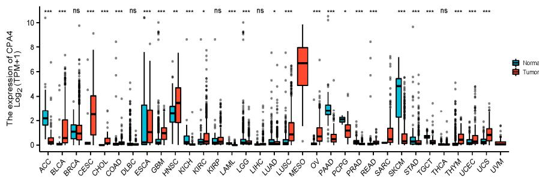  
a

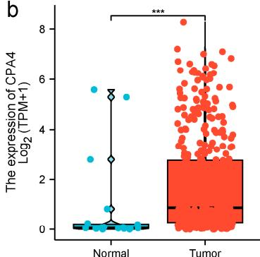

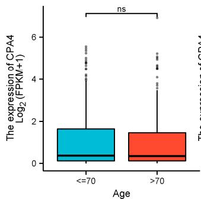  
C

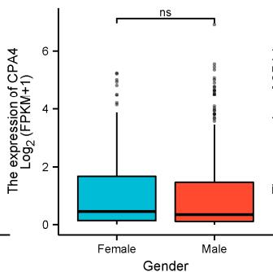  
d

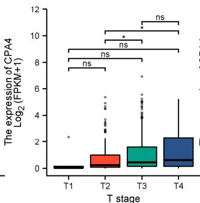  
e

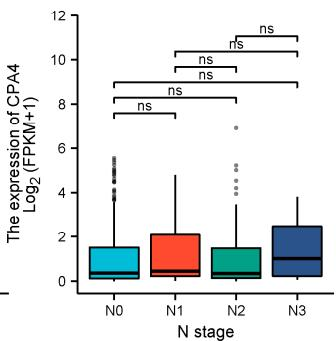

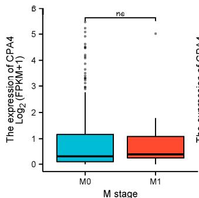  
g

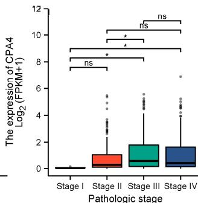  
h

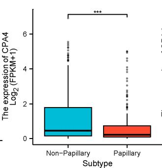  
i

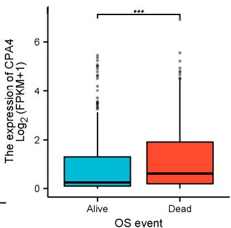  
  
Figure 1. CPA4 expression and clinicopathological features in BLCA. (a) human CPA4 expression levels in different cancer Figure 1. CPA4 expression and clinicopathological features in BLCA. (a) human CPA4 expression levels in different cancer tissues and corresponding normal tissues. (b) The expression level of CPA4 in BLCA tissue was significantly higher com-tissues and corresponding normal tissues. (b) The expression level of CPA4 in BLCA tissue was significantly higher pared with the normal tissues from the TCGA +compared with the normal tissues from the TCGA $^ +$ TEx database. (c–g) No statistically significant differences were found  GTEx database. (c–g) No statistically significant differences were found between the expression levels of CPA4 in BLCA and age; gender; and pathological T, N, or M stage. (h–j) High pathologic 0.01; *** p < 0.001 stage, higher dead event, and nonpapillary were associated with higher expressions of CPA4 in BLCA. $^ { * } p < 0 . 0 5$ ; * ${ } ^ { t } p < 0 . 0 1 .$ $^ { * * * } p < 0 . 0 0 1$ ; ns: no significance.

# 3.3. Impact of High CPA4 Expression on the Detection and Prognosis of BLCA Patients

The expression of CPA4 indicated a significant discriminative power in identifying tumors from normal cells with an AUC value of 0.798 (Figure 2d). The Kaplan–Meier survival analysis showed that BLCA patients with higher CPA4 expressions have shorter overall survival, disease-specific survival, and progress-free intervals (Figure 2a–c). The KM plots show that a higher expression of CPA4 had a worse prognosis than a lower expression. Promoter methylation of CPA4 in the TCGA-BLCA data was significantly

lower than that of normal tissues adjacent to cancer in the UALCAN webpagelower than that of normal tissues adjacent to cancer in the UALCAN webpage (p $( p < 0 . 0 0 1$ Figure 2e).Figure 2e)

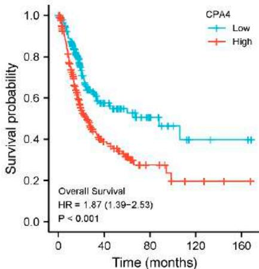  
a

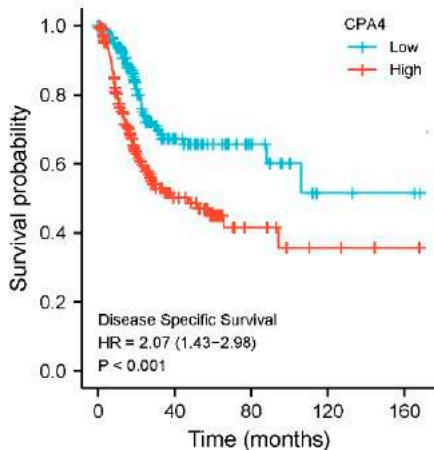  
b

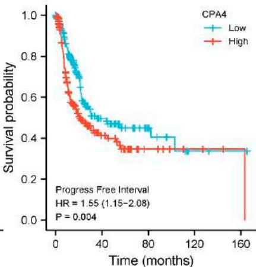  
c

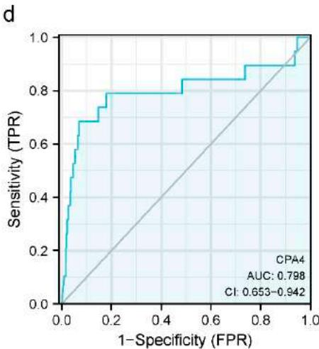

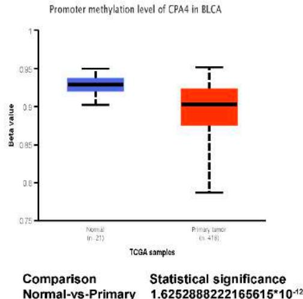  
e   
Figure 2. (a–c) Kaplan–Meier survival curves comparing high and low expressions of CPA4 in BLCA patients. (a) overall Figure 2. (a–c) Kaplan–Meier survival curves comparing high and low expressions of CPA4 in BLCA patients. survival; (b) disease-specific survival; (c) progression-free interval; (d) ROC analysis of CPA4 indicates promising dis-(a) overall survival; (b) disease-specific survival; (c) progression-free interval; (d) ROC analysis of CPA4 indicates promising crimination power between tumor and normal tissues; (e) the promoter methylation of CPA4 in tumor tissues (n discrimination power between tumor and normal tissues; (e) the promoter methylation of CPA4 in tumor tissues $( n = 4 1 8 )$ and normal tissues $( n = 2 1$ ) from TCGA-BLCA data.

# pression Samples 3.4. Differentially Expressed Genes and GO Enrichment Analysis in High- and Low-CPA4 Expression Samples

We analyzed the DEGs in altered expressions of CPA4 including in low and high There were 529 DEGs identified, of which 349 genes were upregulated and 180 were samples to explore the potential mechanisms of CPA4 that promote tumor progression. downregulated (|log2(FC)| > 2 and p.adj < 0.05). The DEGs’s expression is shown in a heat There were 529 DEGs identified, of which 349 genes were upregulated and 180 were downregulated $\mathrm { ~ ( ~ l ~ l o g 2 ( F C ) ~ } | > 2$ and p.adj $< 0 . 0 5$ ). The DEGs’s expression is shown in a heat map and volcano plot (Figure 3) using GO enrichment analysis to predict the co-expression functions in patients with BLCA. The top GO enrichment items in the biological process (BP), molecular function (MF), and cellular component (CC) groups were epidermal cell differentiation, keratinocyte differentiation, keratinization, intermediate filament cytoskeleton, intermediate filament, cornified envelope, endopeptidase inhibitor activity, peptidase inhibitor activity, peptidase inhibitor activity, serine-type endopeptidase inhibitor activity, metabolism of xenobiotics by cytochrome P450, drug metabolism-cytochrome P450, and retinol metabolism (Figure 4a).

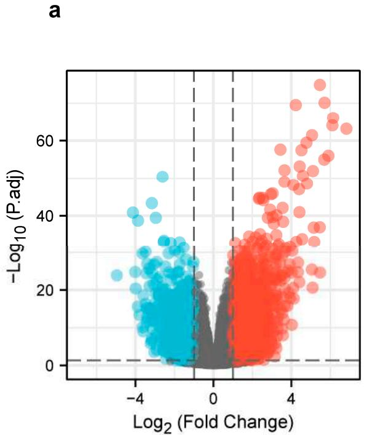

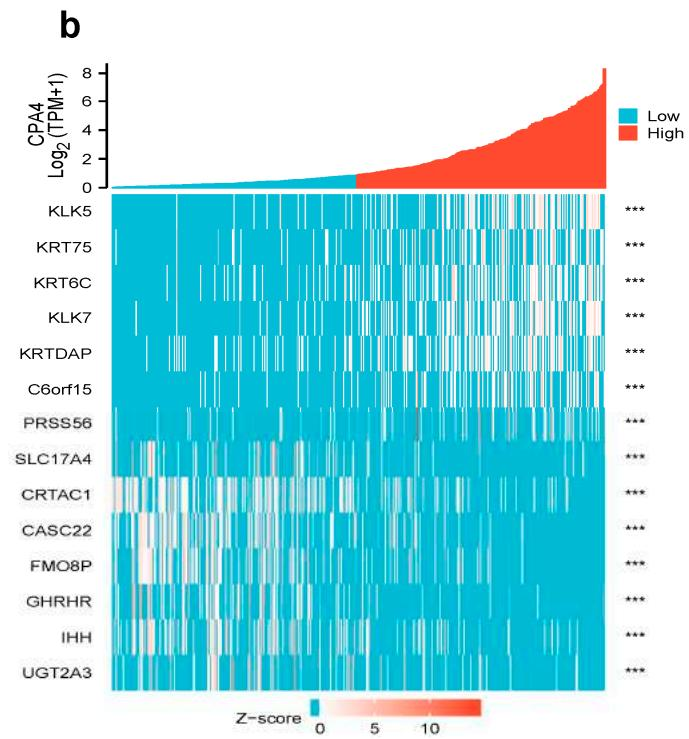  
Figure 3. (a) Volcano plot of differentially expressed genes (DEGs) connected with the expression of CPA4; (b) heatmap Figure 3. (a) Volcano plot of differentially expressed genes (DEGs) connected with the expression of CPA4; (b) heatmap of of differentially expressed genes (DEGs) connected with the expression of CPAdifferentially expressed genes (DEGs) connected with the expression of CPA4. $^ { * * * } p < 0 . 0 0 1$ *.

# 3.5. Gene Set Enrichment Analysis for CPA4-Related Signaling Pathways 3.5. Gene Set Enrichment Analysis for CPA4-Related Signaling Pathways

By the enrichment of MSigDB Collection (c2.all.v7.0.symbols.gmt (curated)), we the GSEA to identify signaling pathways associated with CPA4 between the different ex-used the GSEA to identify signaling pathways associated with CPA4 between the different expression levels of CPA4 with significant differences (adjusted $p$ -value $< 0 . 0 5$ and $\mathrm { F D R } < 0 . 2 5$ ). The eight pathways included the formation of the cornified envelope, keratinization, immunoregulatory interactions between a lymphoid and a non-lymphoid cell, wp hair follicle development cytodifferentiation part 3 of 3, antigen processing and presentation, assembly of collagen fibrils and other multimeric structures, graft versus host disease, and cytokine–cytokine receptor interaction (Figure 4).

# 3.6. CPA4 Expression Predicts Poor Prognosis in Different Cancer Stages

Univariate cox proportional-hazards model analysis showed that high CPA4 expression, high pathologic grade and stage (T, N, and M), and subtype papillary were negative predictors for OS in BLCA patients. Meanwhile, in the multivariate regression analysis, CPA4 expression was an independent factor correlated with OS both in the low-expression set and high-expression set $( p = 0 . 0 0 3 )$ (Figure 5).

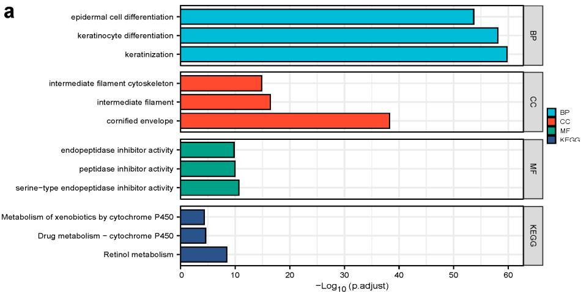

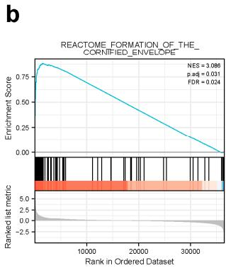

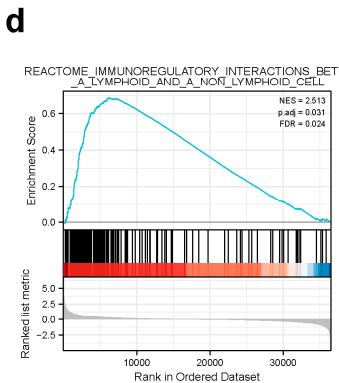

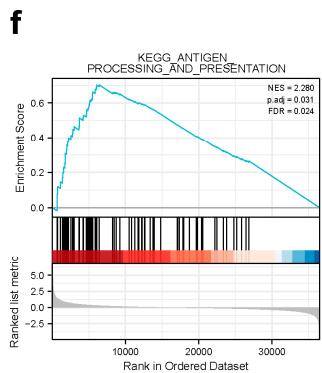

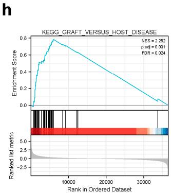

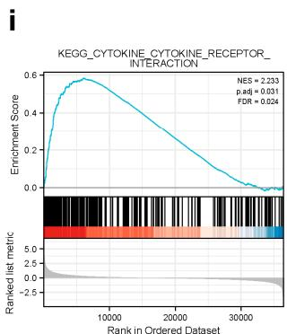  
Figure 4. (a) GO enrichment analysis of differentially expressed genes (DEGs) in high- and low-CPA4 expression samples; Figure 4. (a) GO enrichment analysis of differentially expressed genes (DEGs) in high- and low-CPA4 expression samples; (b,c) enrichment plots from GSEA. Several pathways were differentially enriched in BLCA patients according to different(b,c) enrichment plots from GSEA. Several pathways were differentially enriched in BLCA patients according to different CPA4 expressions; (b) formation of the cornified envelope; (c) keratinization; (d) immunoregulatory interactions betweenCPA4 expressions; (b) formation of the cornified envelope; (c) keratinization; (d) immunoregulatory interactions between a a lymphoid and a non-lymphoid cell; (e) WP hair follicle development cytodifferentiation part 3 of 3; (f) antigen processinglymphoid and a non-lymphoid cell; (e) WP hair follicle development cytodifferentiation part 3 of 3; (f) antigen processing and presentation; (g) assembly of collagen fibrils and other multimeric structures; (h) graft versus host disease; (i) cytokine– FDR, false discovery rate. cytokine receptor interaction. ES, enrichment score; NES, normalized enrichment score; ADJ $p$ -Val, adjusted $p$ -value; FDR, false discovery rate.

a   

<table><tr><td>Characteristics</td><td>Total(N)</td><td colspan="2">HR(95% CI) Univariate analysis</td><td>P value Univariate analysis</td></tr><tr><td>Age</td><td>413</td><td></td><td></td><td></td></tr><tr><td>&lt;=70</td><td>234</td><td>Reference</td><td></td><td></td></tr><tr><td>&gt;70</td><td>180</td><td>1.421 (1.063-1.901)</td><td></td><td>0.018</td></tr><tr><td>T stage</td><td>379</td><td></td><td></td><td></td></tr><tr><td>T1&amp;T2</td><td>124</td><td>Reference</td><td></td><td></td></tr><tr><td>T3&amp;T4</td><td>256</td><td>2.199 (1.515-3.193)</td><td></td><td>&lt;0.001</td></tr><tr><td>N stage</td><td>369</td><td></td><td></td><td></td></tr><tr><td>N0</td><td>239</td><td>Reference</td><td></td><td></td></tr><tr><td>N1&amp;N2&amp;N3</td><td>131</td><td>2.289 (1.678-3.122)</td><td></td><td>&lt;0.001</td></tr><tr><td>M stage</td><td>213</td><td></td><td></td><td></td></tr><tr><td>M0</td><td>202</td><td>Reference</td><td></td><td></td></tr><tr><td>M1</td><td>11</td><td>3.136 (1.503-6.544)</td><td></td><td>0.002</td></tr><tr><td>Pathologic stage</td><td>411</td><td></td><td></td><td></td></tr><tr><td>Stage I&amp;Stage II</td><td>134</td><td>Reference</td><td></td><td></td></tr><tr><td>Stage III&amp;Stage IV</td><td>278</td><td>2.310 (1.596-3.342)</td><td></td><td>&lt;0.001</td></tr><tr><td>Subtype</td><td>408</td><td></td><td></td><td></td></tr><tr><td>Non-Papillary</td><td>275</td><td>Reference</td><td></td><td></td></tr><tr><td>Papillary</td><td>134</td><td>0.690 (0.488-0.976)</td><td></td><td>0.036</td></tr><tr><td>CPA4</td><td>413</td><td></td><td></td><td></td></tr><tr><td>Low</td><td>207</td><td>Reference</td><td></td><td></td></tr><tr><td>High</td><td>207</td><td>1.749 (1.296-2.359)</td><td></td><td>&lt;0.001</td></tr><tr><td></td><td></td><td></td><td>2</td><td>4</td></tr><tr><td></td><td></td><td></td><td>6</td><td></td></tr></table>

b   

<table><tr><td>Characteristics</td><td>Total(N)</td><td colspan="6">HR(95% CI) Multivariate analysis</td><td>P value Multivariate analysis</td></tr><tr><td>Age</td><td>413</td><td></td><td></td><td></td><td></td><td></td><td></td><td></td></tr><tr><td>&lt;=70</td><td>234</td><td></td><td></td><td></td><td></td><td></td><td></td><td></td></tr><tr><td>&gt;70</td><td>180</td><td>1.311 (0.807-2.131)</td><td></td><td></td><td></td><td></td><td></td><td>0.275</td></tr><tr><td>T stage</td><td>379</td><td></td><td></td><td></td><td></td><td></td><td></td><td></td></tr><tr><td>T1&amp;T2</td><td>124</td><td></td><td></td><td></td><td></td><td></td><td></td><td></td></tr><tr><td>T3&amp;T4</td><td>256</td><td>3.346 (0.918-12.200)</td><td></td><td></td><td></td><td></td><td></td><td>0.067</td></tr><tr><td>N stage</td><td>369</td><td></td><td></td><td></td><td></td><td></td><td></td><td></td></tr><tr><td>N0</td><td>239</td><td></td><td></td><td></td><td></td><td></td><td></td><td></td></tr><tr><td>N1&amp;N2&amp;N3</td><td>131</td><td>2.094 (1.198-3.659)</td><td></td><td></td><td></td><td></td><td></td><td>0.009</td></tr><tr><td>M stage</td><td>213</td><td></td><td></td><td></td><td></td><td></td><td></td><td></td></tr><tr><td>M0</td><td>202</td><td></td><td></td><td></td><td></td><td></td><td></td><td></td></tr><tr><td>M1</td><td>11</td><td>1.518 (0.564-4.090)</td><td></td><td></td><td></td><td></td><td></td><td>0.409</td></tr><tr><td>Pathologic stage</td><td>411</td><td></td><td></td><td></td><td></td><td></td><td></td><td></td></tr><tr><td>Stage I&amp;Stage II</td><td>134</td><td></td><td></td><td></td><td></td><td></td><td></td><td></td></tr><tr><td>Stage III&amp;Stage IV</td><td>278</td><td>0.451 (0.110-1.843)</td><td></td><td></td><td></td><td></td><td></td><td>0.267</td></tr><tr><td>Subtype</td><td>408</td><td></td><td></td><td></td><td></td><td></td><td></td><td></td></tr><tr><td>Non-Papillary</td><td>275</td><td></td><td></td><td></td><td></td><td></td><td></td><td></td></tr><tr><td>Papillary</td><td>134</td><td>0.899 (0.505-1.600)</td><td></td><td></td><td></td><td></td><td></td><td>0.717</td></tr><tr><td>CPA4</td><td>413</td><td></td><td></td><td></td><td></td><td></td><td></td><td></td></tr><tr><td>Low</td><td>207</td><td></td><td></td><td></td><td></td><td></td><td></td><td></td></tr><tr><td>High</td><td>207</td><td>2.202 (1.309-3.702)</td><td></td><td></td><td></td><td></td><td></td><td>0.003</td></tr><tr><td></td><td></td><td></td><td>0</td><td>1</td><td>2</td><td>3</td><td>4</td><td></td></tr></table>

Figure 5. Univariate (a) and multivariate (b) regression analyses of CPA4 and other clinicopathologic parameters with OSFigure 5. Univariate (a) and multivariate (b) regression analyses of CPA4 and other clinicopathologic parameters with OS in BLCA patients.in BLCA patients.

# 3.7. Construction of Nomogram for Predicting OS and Validation by Calibration3.7. Construction of Nomogram for Predicting OS and Validation by Calibration

We constructed a nomogram for predicting the prognosis of BLCA with relative clin-We constructed a nomogram for predicting the prognosis of BLCA with relative ical situation, which integrates the clinical characteristics associated with the survival ofclinical situation, which integrates the clinical characteristics associated with the survival BLCA. Based on the multivariate Cox analysis, a nomogram was assigned to the clinicalof BLCA. Based on the multivariate Cox analysis, a nomogram was assigned to the clinical characteristics of a point and the sum of points awarded to each characteristic is a point from 0 to 100. All of the points are accumulated and recorded as the total points. Usingfrom 0 to 100. All of the points are accumulated and recorded as the total points. Using the absolute point axis down to the outcome axis, the probability of BLCA survival at 1, 3 and 5 years can be determined (Figure 6a). From the nomogram, the expression of CPA4 contributes many points compared with other relative clinical situations including the T, N, and M stages; radiation therapy; and primary therapy outcome. Meanwhile, the calibration plot indicates great agreement between the predicted and observed values, which are close to the 45-degree line, which is the ideal curve (Figure 6b).

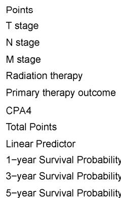  
a

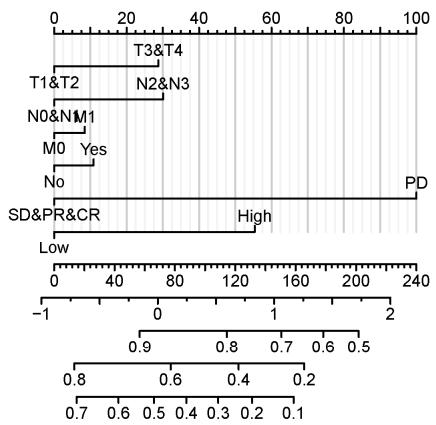

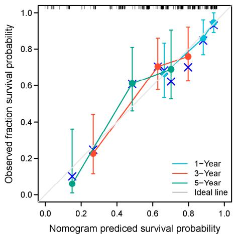  
b   
Figure 6. The relationship of CPA4 expression with other clinical factors and overall survival (OS). (a) Nomogram for Figure 6. The relationship of CPA4 expression with other clinical factors and overall survival (OS). (a) Nomogram for6. The relationship of CPA4 expression with other clinical factors and overall survival (OS). (a) Nomogram for predicting the probability of 1-, 3-, and 5-year OS for BLCA patients; (b) calibration plot of the nomogram for predicting predicting the probability of 1-, 3-, and 5-year OS for BLCA patients; (b) calibration plot of the nomogram for predicting theing the probability of 1-, 3-, and 5-year OS for BLCA patients; (b) calibration plot of the nomogram for predicting he OS likelihooOS likelihood.ikelihood.

# .8. CPA4-Interaction Protein Networks in BLCA Tissue 3.8. CPA4-Interaction Protein Networks in BLCA TissueA4-Interaction Protein Networks in BLCA Tissue

CPA4-interaction protein networks were constructed to further explore the necessary CPA4-interaction protein networks were constructed to further explore the necessarynteraction protein networks were constructed to further explore the necessary proteins for metabolism and the molecular mechanism used by STRING. The PPI network proteins for metabolism and the molecular mechanism used by STRING. The PPI networks for metabolism and the molecular mechanism used by STRING. The PPI network f the CPA4 protein showed the relationship of the CPA4 protein in the progression of of the CPA4 protein showed the relationship of the CPA4 protein in the progression ofCPA4 protein showed the relationship of the CPA4 protein in the progression of LCA. Ten proteins and corresponding gene names were listed with their annotation BLCA. Ten proteins and corresponding gene names were listed with their annotation scoresTen proteins and corresponding gene names were listed with their annotation cores (Figure 7). The top 10 genes included LXN, CMA1, SGCE, TPSAB1, AGBL2, TPSB2, (Figure 7). The top 10 genes included LXN, CMA1, SGCE, TPSAB1, AGBL2, TPSB2, PEG10,(Figure 7). The top 10 genes included LXN, CMA1, SGCE, TPSAB1, AGBL2, TPSB2, PEG10, GRB10, TSGA13, and MEST, and LXN had the highesGRB10, TSGA13, and MEST, and LXN had the highest score., GRB10, TSGA13, and MEST, and LXN had the highest score.

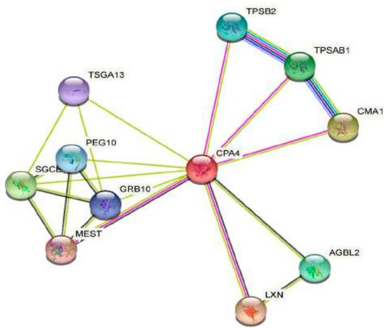  
igure 7. CPA4-interaction proteins in BLCA tissue; annotation of CPA4-interacting proteins and 7. CPA4-interaction proteins in BLCA tissue; annotation of CPA4-interacting proteins and Figure 7. CPA4-interaction proteins in BLCA tissue; annotation of CPA4-interacting proteins and heir co-expression scores. expression scores. their co-expression scores.

<table><tr><td>Gene symbol</td><td>Annotation</td><td>Score</td></tr><tr><td>LXN</td><td>Latexin</td><td>0.993</td></tr><tr><td>CMA1</td><td>Chymase</td><td>0.777</td></tr><tr><td>SGCE</td><td>Epsilon-sarcoglycan</td><td>0.72</td></tr><tr><td>TPSAB1</td><td>Tryptase alpha/beta-1</td><td>0.715</td></tr><tr><td>AGBL2</td><td>Cytosolic carboxypeptidase 2</td><td>0.67</td></tr><tr><td>TPSB2</td><td>Tryptase beta 2</td><td>0.652</td></tr><tr><td>PEG10</td><td>Retrotransposon-derived protein PEG10</td><td>0.646</td></tr><tr><td>GRB10</td><td>Growth factor receptor-bound protein 10</td><td>0.64</td></tr><tr><td>TSGA13</td><td>Tests-specific gene 13 protein</td><td>0.609</td></tr><tr><td>MEST</td><td>Mesoderm-specific transcript homolog protein</td><td>0.594</td></tr></table>

# 3.9. Correlation Analysis between CPA4 Expression and Infiltrating Immune Cells3.9. Correlation Analysis between CPA4 Expression and Infiltrating Immune C

The survival of patients with different cancers including BLCA is associated withThe survival of patients with different cancers including BLCA is associated with the tumor-infiltrating immune cells. From the result, the expression level of CPA4 hadtumor-infiltrating immune cells. From the result, the expression level of CPA4 had sig significant correlations withicant correlations with C $\mathrm { C D 8 + }$ T cells ells (r = $( \mathbf { r } = 0 . 2 8 7$ , $p = 2 . 2 \bar { 9 } \times 1 0 ^ { - 8 } ,$ ), B cells ls (r = 0.2 $( \mathbf { r } = 0 . 2 1 8 )$ , $p = 8 . 6 5 \times 1 0 ^ { - 1 0 } )$ ), neutrophilsphils (r = 0.196, $( \mathbf { r } = 0 . 1 9 6$ , × $p = 1 . 7 6 \times 1 0 ^ { - 4 } )$ , and dendritic cells tic cells (r = 0.356, p = $\mathbf { \tilde { r } } = 0 . 3 5 6$ ,) $p = 2 . 5 \times 1 0 ^ { - 1 2 } )$ .o $p < 0 . 0 5$ was considered significant (Figure 8a). Furthermore, we analyzed significant (Figure 8a). Furthermore, we analyzed 24 immune c 24 immune cells including pDC, NK CD56bright cells, DC, cytotoxic cells, TFH, B cells,including pDC, NK CD56bright cells, DC, cytotoxic cells, TFH, B cells, CD8 T cells, Th CD8 T cells, Th17 cells, Treg, T cells, mast cells, iDC, NK cells, Tem, aDC, neutrophils, Th1cells, Treg, T cells, mast cells, iDC, NK cells, Tem, aDC, neutrophils, Th1 cells, cells, NK CD56dim cells, macrophages, eosinophils, Tgd T helper cells, Th2 cells, and Tcm.CD56dim cells, macrophages, eosinophils, Tgd T helper cells, Th2 cells, and Tcm. We We analyzed the correlation between the expression of CPA4 and immune infiltration byalyzed the correlation between the expression of CPA4 and immune infiltration ssGSEA using Spearman’s R. From the result, the expression level of CPA4 was negativelyssGSEA using Spearman’s R. From the result, the expression level of CPA4 was negativ correlated with the infiltration levels of NK CD56bright cellscorrelated with the infiltration levels of NK CD56bright ce $( p < 0 . 0 0 1 )$ and positively01) and positiv correlated with cytotoxic cells, T cells, NK cells, idc, Tem, Treg, aDC, Neutrophils, NKcorrelated with cytotoxic cells, T cells, NK cells, idc, Tem, Treg, aDC, Neutrophils, CD56dim cells, macrophages, Th2 cells, and Th1 cells (Figure 8).CD56dim cells, macrophages, Th2 cells, and Th1 cells (Figure

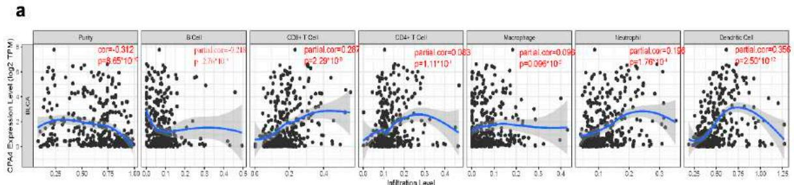

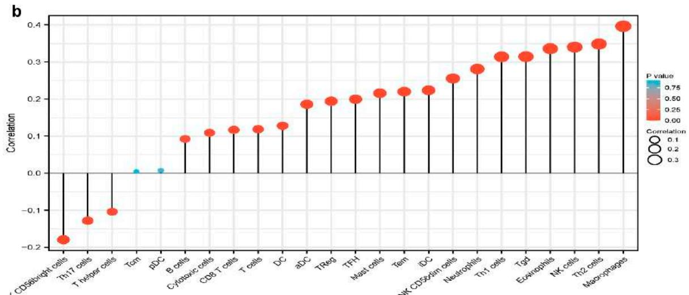

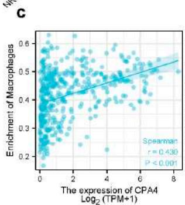

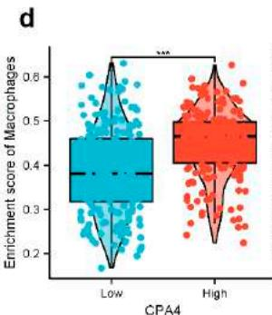

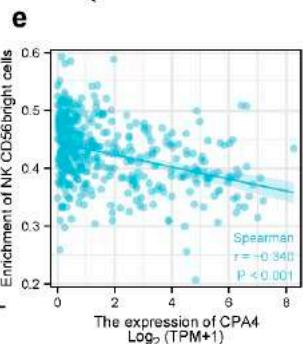

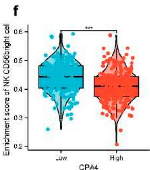  
Figure 8. The expression level of CPA4 was related to immune infiltration in the tumor microenvironment. (a) CorrelatFigure 8. The expression level of CPA4 was related to immune infiltration in the tumor microenvironment. (a) Correlation of CPA4 expression with infiltrating immune infiltration in BLCA (b) The forest plot shows the correlation between CPof CPA4 expression with infiltrating immune infiltration in BLCA (b) The forest plot shows the correlation between CPA4 expression level and 24 immune cells. The size of the dots indicates the absolute value of Spearman’s R. (c,d) The Wilcoxexpression level and 24 immune cells. The size of the dots indicates the absolute value of Spearman’s R. (c,d) The Wilcoxon rank rank sum test was used to analyze the difference in the macrophage cell infiltration levels between the CPA4 high- sum test was used to analyze the difference in the macrophage cell infiltration levels between the CPA4 high- and low-expression low-expression groups; (e,f) the correlation between CPA4 expression and NK CD56 brighgroups; (e,f) the correlation between CPA4 expression and NK CD56 bright cell infiltration levels. $^ { * * * } p < 0 . 0 0 1$ t.

# 3.10. Possible Role of the Expression of CPA4 in Various Infiltrating Immune Cells

We used the TIMER2 and GEPIA2 databases to further identify the possible role of the expression of CPA4 in various infiltrating immune cells including T cells (general), M1/M2 macrophages, tumor-associated macrophages, B cells, neutrophils, monocytes, NK, $\mathrm { C D 8 + }$ T cells, and functional DCs as well as T cells such as Th1, Th2, Th9, Th17, Th22, Tfh, exhausted T cells, and Treg. From the results, Th1, T cell exhaustion, and TAM sets marking were greatly connected with the expression of CPA4 in BLCA (Table 2).

Table 2. Correlation analysis between CPA4 and markers of immune cells in BLCA patients found in the TIMER2 and GEPIA2.   

<table><tr><td>Cell Type</td><td>Gene Marker</td><td>None Cor</td><td>p</td><td>Purity Cor</td><td>p</td><td>Tumor R</td><td>p</td><td>Normal R</td><td>p</td></tr><tr><td rowspan="3">B cell</td><td>CD19</td><td>-0.042</td><td>0.397</td><td>-0.138</td><td>**</td><td>-0.032</td><td>0.52</td><td>-0.033</td><td>0.89</td></tr><tr><td>CD20(KRT20)</td><td>-0.314</td><td>***</td><td>-0.226</td><td>***</td><td>-0.13</td><td>*</td><td>-0.18</td><td>0.47</td></tr><tr><td>CD38</td><td>0.301</td><td>***</td><td>0.148</td><td>**</td><td>0.1</td><td>*</td><td>-0.032</td><td>0.9</td></tr><tr><td rowspan="2">CD8+ T cell</td><td>CD8A</td><td>0.267</td><td>***</td><td>0.12</td><td>*</td><td>-0.032</td><td>0.9</td><td>-0.074</td><td>0.76</td></tr><tr><td>CD8B</td><td>0.15</td><td>**</td><td>0.018</td><td>0.727</td><td>0.0031</td><td>0.95</td><td>-0.096</td><td>0.69</td></tr><tr><td rowspan="3">Tfh</td><td>BCL6</td><td>-0.247</td><td>***</td><td>-0.214</td><td>***</td><td>-0.14</td><td>**</td><td>-0.28</td><td>0.25</td></tr><tr><td>ICOS</td><td>-0.307</td><td>***</td><td>0.154</td><td>**</td><td>0.13</td><td>**</td><td>-0.095</td><td>0.7</td></tr><tr><td>CXCR5</td><td>0.109</td><td>*</td><td>-0.095</td><td>0.0677</td><td>0.075</td><td>0.13</td><td>0.039</td><td>0.87</td></tr><tr><td rowspan="7">Th1</td><td>T-bet(TBX21)</td><td>0.227</td><td>***</td><td>0.046</td><td>0.375</td><td>0.2</td><td>***</td><td>0.041</td><td>0.87</td></tr><tr><td>STAT4</td><td>0.37</td><td>***</td><td>0.223</td><td>***</td><td>0.16</td><td>**</td><td>0.0068</td><td>0.98</td></tr><tr><td>IL12RB2</td><td>0.403</td><td>***</td><td>0.327</td><td>***</td><td>0.24</td><td>***</td><td>-0.22</td><td>0.37</td></tr><tr><td>WSX1(IL27RA)</td><td>0.39</td><td>***</td><td>0.291</td><td>***</td><td>0.18</td><td>***</td><td>0.027</td><td>0.91</td></tr><tr><td>STAT1</td><td>0.386</td><td>***</td><td>0.282</td><td>***</td><td>0.24</td><td>***</td><td>-0.14</td><td>0.56</td></tr><tr><td>IFN-γ(IFNG)</td><td>0.278</td><td>***</td><td>0.161</td><td>**</td><td>0.13</td><td>**</td><td>-0.085</td><td>0.73</td></tr><tr><td>TNF-α(TNF)</td><td>0.287</td><td>***</td><td>0.194</td><td>***</td><td>0.098</td><td>*</td><td>0.27</td><td>0.26</td></tr><tr><td rowspan="4">Th2</td><td>GATA3</td><td>-0.484</td><td>***</td><td>-0.402</td><td>***</td><td>-0.26</td><td>***</td><td>-0.26</td><td>0.28</td></tr><tr><td>CCR3</td><td>0.188</td><td>***</td><td>0.131</td><td>*</td><td>0.67</td><td>*</td><td>-0.14</td><td>0.58</td></tr><tr><td>STAT6</td><td>-0.228</td><td>***</td><td>-0.209</td><td>***</td><td>-0.13</td><td>**</td><td>-0.32</td><td>0.18</td></tr><tr><td>STAT5A</td><td>0.004</td><td>0.936</td><td>-0.158</td><td>**</td><td>-0.015</td><td>0.76</td><td>-0.53</td><td>*</td></tr><tr><td rowspan="3">Th9</td><td>TGFBR2</td><td>0.087</td><td>0.079</td><td>-0.014</td><td>0.792</td><td>0.038</td><td>0.45</td><td>-0.45</td><td>0.056</td></tr><tr><td>IRF4</td><td>0.188</td><td>***</td><td>-0.03</td><td>0.571</td><td>0.043</td><td>0.39</td><td>-0.12</td><td>0.63</td></tr><tr><td>PU.1(SPI1)</td><td>0.356</td><td>***</td><td>0.181</td><td>***</td><td>0.15</td><td>**</td><td>-0.17</td><td>0.49</td></tr><tr><td rowspan="4">Th17</td><td>STAT3</td><td>0.325</td><td>***</td><td>0.232</td><td>***</td><td>0.15</td><td>**</td><td>-0.11</td><td>0.64</td></tr><tr><td>IL-21R</td><td>0.318</td><td>***</td><td>0.132</td><td>*</td><td>0.073</td><td>0.14</td><td>-0.1</td><td>0.68</td></tr><tr><td>IL-23R</td><td>-0.003</td><td>0.945</td><td>-0.076</td><td>0.143</td><td>-0.0048</td><td>0.92</td><td>-0.019</td><td>0.94</td></tr><tr><td>IL-17A</td><td>-0.019</td><td>0.705</td><td>-0.057</td><td>0.274</td><td>-0.051</td><td>0.31</td><td>-0.18</td><td>0.47</td></tr><tr><td rowspan="2">Th22</td><td>CCR10</td><td>-0.025</td><td>0.626</td><td>-0.068</td><td>0.195</td><td>0.029</td><td>0.57</td><td>-0.34</td><td>0.16</td></tr><tr><td>AHR</td><td>-0.271</td><td>***</td><td>-0.195</td><td>***</td><td>-0.11</td><td>*</td><td>-0.29</td><td>0.23</td></tr><tr><td rowspan="3">Treg</td><td>FOXP3</td><td>0.287</td><td>***</td><td>0.15</td><td>**</td><td>0.16</td><td>**</td><td>0.037</td><td>0.88</td></tr><tr><td>CD25(IL2RA)</td><td>0.369</td><td>***</td><td>0.22</td><td>***</td><td>0.037</td><td>0.88</td><td>-0.066</td><td>0.79</td></tr><tr><td>CCR8</td><td>0.218</td><td>***</td><td>0.083</td><td>0.113</td><td>0.083</td><td>0.094</td><td>-0.0059</td><td>0.98</td></tr><tr><td rowspan="4">T cell exhaustion</td><td>PD-1(PDCD1)</td><td>0.255</td><td>***</td><td>0.089</td><td>*</td><td>0.089</td><td>0.073</td><td>-0.099</td><td>0.69</td></tr><tr><td>CTLA4</td><td>0.311</td><td>***</td><td>0.16</td><td>**</td><td>0.23</td><td>***</td><td>-0.11</td><td>0.64</td></tr><tr><td>LAG3</td><td>0.362</td><td>***</td><td>0.227</td><td>***</td><td>0.22</td><td>***</td><td>-0.19</td><td>0.45</td></tr><tr><td>TIM-3(HAVCR2)</td><td>0.375</td><td>***</td><td>0.218</td><td>***</td><td>0.21</td><td>***</td><td>-0.097</td><td>0.69</td></tr><tr><td rowspan="2">Macrophage</td><td>CD68</td><td>0.316</td><td>***</td><td>0.193</td><td>***</td><td>0.14</td><td>**</td><td>0.49</td><td>*</td></tr><tr><td>CD11b(ITGAM)</td><td>0.303</td><td>***</td><td>0.119</td><td>*</td><td>0.72</td><td>*</td><td>-0.29</td><td>0.23</td></tr><tr><td rowspan="3">M1</td><td>INOS(NOS2)</td><td>-0.033</td><td>0.511</td><td>-0.092</td><td>0.0774</td><td>-0.0068</td><td>0.89</td><td>-0.14</td><td>0.57</td></tr><tr><td>IRF5</td><td>-0.123</td><td>*</td><td>-0.116</td><td>*</td><td>-0.063</td><td>0.2</td><td>-0.026</td><td>0.92</td></tr><tr><td>COX2(PTGS2)</td><td>0.209</td><td>***</td><td>0.164</td><td>**</td><td>0.057</td><td>0.25</td><td>-0.24</td><td>0.32</td></tr><tr><td rowspan="4">M2</td><td>CD16</td><td>0.408</td><td>***</td><td>0.273</td><td>***</td><td>0.17</td><td>***</td><td>-0.2</td><td>0.42</td></tr><tr><td>ARG1</td><td>-0.049</td><td>0.322</td><td>-0.007</td><td>0.894</td><td>0.076</td><td>0.13</td><td>0.68</td><td>**</td></tr><tr><td>MRC1</td><td>0.334</td><td>***</td><td>0.164</td><td>**</td><td>0.042</td><td>0.4</td><td>-0.23</td><td>0.34</td></tr><tr><td>MS4A4A</td><td>0.353</td><td>***</td><td>0.199</td><td>***</td><td>0.12</td><td>**</td><td>-0.23</td><td>0.34</td></tr><tr><td rowspan="4">TAM</td><td>CCL2</td><td>0.26</td><td>***</td><td>0.113</td><td>*</td><td>0.022</td><td>0.66</td><td>-0.12</td><td>0.62</td></tr><tr><td>CD80</td><td>0.413</td><td>***</td><td>0.285</td><td>***</td><td>0.17</td><td>***</td><td>-0.18</td><td>0.46</td></tr><tr><td>CD86</td><td>0.396</td><td>***</td><td>0.244</td><td>***</td><td>0.17</td><td>***</td><td>-0.074</td><td>0.76</td></tr><tr><td>CCR5</td><td>0.29</td><td>***</td><td>0.101</td><td>0.0522</td><td>0.13</td><td>*</td><td>-0.08</td><td>0.75</td></tr><tr><td rowspan="3">Monocyte</td><td>CD14</td><td>0.406</td><td>***</td><td>0.253</td><td>***</td><td>0.11</td><td>*</td><td>-0.21</td><td>0.38</td></tr><tr><td>CD16(FCGR3B)</td><td>0.316</td><td>***</td><td>0.22</td><td>***</td><td>0.15</td><td>**</td><td>-0.073</td><td>0.77</td></tr><tr><td>CD115(CSF1R)</td><td>0.353</td><td>***</td><td>0.178</td><td>***</td><td>0.14</td><td>**</td><td>-0.28</td><td>0.24</td></tr></table>

Table 2. Cont.   

<table><tr><td>Cell Type</td><td>Gene Marker</td><td>None Cor</td><td>p</td><td>Purity Cor</td><td>p</td><td>Tumor R</td><td>p</td><td>Normal R</td><td>p</td></tr><tr><td rowspan="3">Neutrophil</td><td>CD66b(CEACAM8)</td><td>0.089</td><td>0.0721</td><td>0.098</td><td>0.0609</td><td>-0.031</td><td>0.53</td><td>-0.084</td><td>0.73</td></tr><tr><td>CD15(FUT4)</td><td>0.141</td><td>**</td><td>0.047</td><td>0.369</td><td>0.0041</td><td>0.93</td><td>-0.33</td><td>0.17</td></tr><tr><td>CD11b(ITGAM)</td><td>0.303</td><td>***</td><td>0.119</td><td>*</td><td>0.018</td><td>0.72</td><td>-0.29</td><td>0.23</td></tr><tr><td rowspan="3">Natural killer cell</td><td>XCL1</td><td>-0.01</td><td>0.844</td><td>-0.005</td><td>0.93</td><td>-0.06</td><td>0.23</td><td>0.13</td><td>0.59</td></tr><tr><td>CD7</td><td>0.304</td><td>***</td><td>0.131</td><td>*</td><td>0.15</td><td>**</td><td>-0.029</td><td>0.91</td></tr><tr><td>KIR3DL1</td><td>0.136</td><td>**</td><td>0.049</td><td>0.346</td><td>0.075</td><td>0.13</td><td>0.19</td><td>0.44</td></tr><tr><td rowspan="3">Dendritic cell</td><td>CD1C(BDCA-1)</td><td>0.086</td><td>0.0823</td><td>-0.054</td><td>0.305</td><td>-0.023</td><td>0.65</td><td>-0.02</td><td>0.93</td></tr><tr><td>CD141(THBD)</td><td>0.356</td><td>***</td><td>0.322</td><td>***</td><td>0.055</td><td>0.27</td><td>0.37</td><td>0.12</td></tr><tr><td>CD11c(ITGAX)</td><td>0.35</td><td>***</td><td>0.181</td><td>***</td><td>0.099</td><td>*</td><td>-0.2</td><td>0.41</td></tr></table>

BLCA, Bladder Urothelial Carcinoma; Tfh, Follicular helper T cell; Th, T helper cell; Treg, Regulatory T cell; TAM, tumor-associated macrophage;.None, correlation without adjustment correlation; Purity, correlation adjusted by purity; Tumor, correlation analysis in the tumor tissue of TCGA; Normal, correlation analysis in normal tissue of TCGA; Cor, R value of Spearman’s correlation $^ { * } p < 0 . 0 5$ ; ** $p < 0 . 0 1 .$ ; *** $p < 0 . 0 0 1$ .

# 4. Discussion

CPA4 (carboxypeptidase A4) is a member of the metallocarboxypeptidase family and is a zinc-containing exopeptidase that catalyzes the release of carboxy-terminal amino acids [34]. In recent years, CPA4 has shown the potential to be a biomarker in the early diagnosis with clinical benefit for certain cancers. Some studies revealed that CPA4 is connected with various cancer cells in its differentiation and growth, including non-smallcell lung cancer and gastric cancer [35,36]. Furthermore, it is reported that CPA4 is located on chromosome 7q32 in a region linked to prostate cancer aggressiveness [11], and Sun suggested that CPA4 is closely associated with colorectal cancer liver metastasis [37]. Although CPA4 expression has been confirmed to have potential significance in multiple types of cancer, no studies have shown the expression level and clinical significance of CPA4 in BLCA. In this study, based on a pan-cancer analysis, we demonstrated that human CPA4 expression levels were highly expressed in 11 types of cancer with corresponding normal tissues (Figure 1), which are consistent with the findings in the previous study reported by Sun and Handa et al. [17,35,38]. We also confirmed that CPA4 is significantly upregulated in BLCA (Figure 1b). Moreover, a previous study has shown that CPA4 expression was detected specifically in the cytoplasm of cancer tissue cells, and in the CPA4-suppressed triple-negative breast cancer (TNBC), viability, and migration were decreased [38]. It can act as a potential biomarker of poor prognosis in TNBC. It is reported that CPA4 might be used as an independent poor prognostic factor in esophageal squamous cell carcinoma [39]. In our study, the results in BLCA are consistent. However, one trial showed that CPA4 is a protective factor in muscle-invasive bladder cancer, contrary to the role of CPA4 in most cancers [40]. A potential reason for the difference is due to updates in the TCGA database and different objects. We studied BLCA, while that study investigated muscle-invasive bladder cancer. We compared the different expression levels of BLCA with age; gender; T, N, and M stage; pathologic stage; subtype; and OS. Surprisingly, we found that higher dead events, higher pathologic stages, and the subtype non-papillary were associated with higher expressions of CPA4 in BLCA, with statistical differences (Figure 2). These findings suggest that CPA4 may be a potential biomarker of poor prognosis in identifying BLCA with poor clinical outcome.

Currently, the function of CPA4 in tumors had not been fully reported. Previous trials suggested that the inhibition of CPA4 could reduce the number of breast cancer cells with stemness properties and may be a potential target for TNBC therapy [41]. The CircCPA4 sponge let-7 regulates the expression of CPA4 and glioma progression [42]. All of these results suggest that CPA4 could be regarded as an emerging target or promising biomarker for cancer therapy. Since the mRNA expression of CPA4 in BLCA was significantly higher than that in normal bladder tissue, we speculated that CPA4 can be regarded as a biomarker to detect BLCA from normal controls. To verify the clinical value of CPA4, an ROC curve analysis was performed to verify the clinical value of CPA4 in the diagnosis of BLCA; our

results showed that CPA4 may be a potential diagnostic biomarker between bladder cancer and normal tissues, with an AUC of 0.798 (Figure 2d).

Many studies have shown that CPA4 is a significant biomarker of poor prognosis in lots of cancers and is associated with the upregulation of CPA4 with poor overall survival. In hepatocellular carcinoma, AC10364 inhibited cell proliferation and viability through the abnormal expression of genes including CPA4 associated with tumorigenesis or growth [43]. A paper from Yan suggested that the inhibition of CPA4 might be of great significance for improving early stage non-small cell lung cancer survival after ablation [43]. However, the prognostic value in BLCA of CPA4 has not been investigated. With the increased level of CPA4 related to a higher number of dead events and higher pathologic stages, we speculated that CPA4 is involved in the development of BLCA. In light of the Kaplan–Meier curves, we confirmed that the overexpression of CPA4 is associated with shorter overall survival (OS), disease-specific survival (DSF), and progress-free intervals (PFIs) (Figure 2). Moreover, by univariate and multivariate regression analysis, we found that high CPA4 expression; high pathologic stage; T, N, and M stage; and the subtype papillary were negative predictors for OS in BLCA patients and that CPA4 can be an independent factor correlated with OS (Figure 5). The nomogram more accurately predicted 1-, 3-, and 5-year OS in BLCA patients and could help to screen and determine those high-risk patients (Figure 6).

Through GSEA, CPA4 was found to be involved in epidermal cell differentiation, keratinocyte differentiation, keratinization, etc., indicating CPA4 potentially playing a role in cell metabolism and protein synthesis (Figure 4).

The PPI network of CPA4 protein, which were constructed by STRING, showed the relationship of CPA4 in the progression of BLCA such as LXN, CMA1, SGCE, TPSAB1, etc. (Figure 7). It has been reported that latexin (LXN) can inhibit human CPA4, in which the expression is induced in prostate cancer cells after treatment with histone deacetylase inhibitors [44]. The level of CMA1, a key gene, is significantly correlated with gastric cancer prognosis and infiltration level [45]. SGCE promotes breast cancer stem cell self-renewal, chemoresistance, and metastasis both in vitro and in vivo by stabilizing EGFR [45]. Thus, it is speculated that a high expression of CPA4 may increase the degree of malignancy of tumors through CPA4 interacting proteins, leading to the deterioration of patients’ conditions.

Moreover, CPA4 plays a specific role in immune infiltration in bladder cancer. Compellingly, we unraveled that several infiltrating immune cells (Th1cell, Th2 cell, T cell exhaustion, and TAM) were correlated with the expression of CPA4 in bladder cancer using TIMER2 and GEPIA2. Type 1 T helper (Th1) cells produce interferon-gamma [46] (Figure 8, Table 2). The dual inhibition of STAT1 and STAT3 activation downregulates the expression of PD-L1 in cancer cells [47]. T-cell exhaustion is a state of T-cell dysfunction that occurs in many chronic infections and cancers [48]. Scholars have observed that CTLA4 was identified as a crucial negative regulator of the immune system, which transmits an inhibitory signal [49].

There are some limitations in our study. First, basic experiments are needed to verify the results, which were conducted with online public databases. Second, in vivo/vitro experiments are needed to further investigate the potential mechanism of the effect of CPA4 on immune invasion in BLCA.

# 5. Conclusions

In conclusion, our study first demonstrated that CPA4 expression increased in BLCA, and univariate and multivariate regression analyses and a nomogram were used to prove that increased CPA4 is correlated with shorter overall survival, which means high risk factors in BLCA patients. Moreover, we illustrated that a high level of CPA4 was positively related to a high pathologic grade; high T, N, and M stages; and the subtype papillary. The immune infiltration in the tumor microenvironment has also been shown to be associated with CPA4. Collectively, this study partially unveiled that CPA4 in BLCA could be regarded

as a potential biomarker for diagnosis and prognosis and may play a special role in immune infiltration.

Author Contributions: C.W. designed the original idea, organized the model of TCGA data with relative pictures, and wrote part of the article. Y.Z. was responded for the modification of manuscript and wrote part of the manuscript. Q.X. was responded for the statistics problems and grammar check. M.X. was responsible for the language, bioinformation problems and correcting them. Z.C. and X.Y. was a supporter of this manuscript. Y.H. edited the whole manuscript. All of the authors of this manuscript are responsible for the accuracy, appropriation, and completing any part of this research and agree to open this manuscript. All authors have read and agreed to the published version of the manuscript.

Funding: This research received no external funding.

Institutional Review Board Statement: Not applicable.

Informed Consent Statement: Not applicable.

Data Availability Statement: All of the data in this manuscript are available and approved by the institution.

Acknowledgments: The authors would like to thank all who supported this manuscript as well as provided any useful suggestions and help.

Conflicts of Interest: All of the authors declare no conflict of interest. The funders had no role in the design of the study; in the collection, analyses, or interpretation of data; in the writing of the manuscript; or in the decision to publish the results.

# References

1. Bray, F.; Ferlay, J.; Soerjomataram, I.; Siegel, R.L.; Torre, L.A.; Jemal, A. Global cancer statistics 2018: GLOBOCAN estimates of incidence and mortality worldwide for 36 cancers in 185 countries. CA Cancer J. Clin. 2018, 68, 394–424. [CrossRef] [PubMed]   
2. Lenis, A.T.; Lec, P.M.; Chamie, K.; Mshs, M.D. Bladder Cancer: A Review. JAMA 2020, 324, 1980–1991. [CrossRef] [PubMed]   
3. McConkey, D.J.; Choi, W. Molecular Subtypes of Bladder Cancer. Curr. Oncol. Rep. 2018, 20, 77. [CrossRef]   
4. Bhanvadia, S.K. Bladder Cancer Survivorship. Curr. Urol. Rep. 2018, 19, 111. [CrossRef] [PubMed]   
5. Babjuk, M.; Burger, M.; Compérat, E.M.; Gontero, P.; Mostafid, A.H.; Palou, J.; van Rhijn, B.W.G.; Rouprêt, M.; Shariat, S.F.; Sylvester, R.; et al. European Association of Urology Guidelines on Non-muscle-invasive Bladder Cancer (TaT1 and Carcinoma In Situ)—2019 Update. Eur. Urol. 2019, 76, 639–657. [CrossRef] [PubMed]   
6. Berdik, C. Unlocking bladder cancer. Nature 2017, 551, S34–S35. [CrossRef]   
7. James, A.C.; Gore, J.L. The costs of non-muscle invasive bladder cancer. Urol. Clin. N. Am. 2013, 40, 261–269. [CrossRef]   
8. Abdollah, F.; Gandaglia, G.; Thuret, R.; Schmitges, J.; Tian, Z.; Jeldres, C.; Passoni, N.M.; Briganti, A.; Shariat, S.F.; Perrotte, P.; et al. Incidence, survival and mortality rates of stage-specific bladder cancer in United States: A trend analysis. Cancer Epidemiol. 2013, 37, 219–225. [CrossRef]   
9. Grayson, M. Bladder cancer. Nature 2017, 551, S33. [CrossRef]   
10. Tanco, S.; Zhang, X.; Morano, C.; Avilés, F.X.; Lorenzo, J.; Fricker, L.D. Characterization of the substrate specificity of human carboxypeptidase A4 and implications for a role in extracellular peptide processing. J. Biol. Chem. 2010, 285, 18385–18396. [CrossRef]   
11. Ross, P.L.; Cheng, I.; Liu, X.; Cicek, M.S.; Carroll, P.R.; Casey, G.; Witte, J.S. Carboxypeptidase 4 gene variants and early-onset intermediate-to-high risk prostate cancer. BMC Cancer 2009, 9, 69. [CrossRef]   
12. Kayashima, T.; Yamasaki, K.; Yamada, T.; Sakai, H.; Miwa, N.; Ohta, T.; Yoshiura, K.; Matsumoto, N.; Nakane, Y.; Kanetake, H.; et al. The novel imprinted carboxypeptidase A4 gene (CPA4) in the 7q32 imprinting domain. Hum. Genet. 2003, 112, 220–226. [CrossRef] [PubMed]   
13. Sun, L.; Burnett, J.; Guo, C.; Xie, Y.; Pan, J.; Yang, Z.; Ran, Y.; Sun, D. CPA4 is a promising diagnostic serum biomarker for pancreatic cancer. Am. J. Cancer Res. 2016, 6, 91–96. [PubMed]   
14. Hong, W.; Xue, M.; Jiang, J.; Zhang, Y.; Gao, X. Circular RNA circ-CPA4/ let-7 miRNA/PD-L1 axis regulates cell growth, stemness, drug resistance and immune evasion in non-small cell lung cancer (NSCLC). J. Exp. Clin. Cancer Res. CR 2020, 39, 149. [CrossRef] [PubMed]   
15. Shao, Q.; Zhang, Z.; Cao, R.; Zang, H.; Pei, W.; Sun, T. CPA4 Promotes EMT in Pancreatic Cancer via Stimulating PI3K-AKT-mTOR Signaling. OncoTargets Ther. 2020, 13, 8567–8580. [CrossRef] [PubMed]   
16. Huang, H.; Reed, C.P.; Zhang, J.S.; Shridhar, V.; Wang, L.; Smith, D.I. Carboxypeptidase A3 (CPA3): A novel gene highly induced by histone deacetylase inhibitors during differentiation of prostate epithelial cancer cells. Cancer Res. 1999, 59, 2981–2988.   
17. Sun, L.; Guo, C.; Burnett, J.; Pan, J.; Yang, Z.; Ran, Y.; Sun, D. Association between expression of Carboxypeptidase 4 and stem cell markers and their clinical significance in liver cancer development. J. Cancer 2017, 8, 111–116. [CrossRef]

18. Fu, Y.; Su, L.; Cai, M.; Yao, B.; Xiao, S.; He, Q.; Xu, L.; Yang, L.; Zhao, C.; Wan, T.; et al. Downregulation of CPA4 inhibits non small-cell lung cancer growth by suppressing the AKT/c-MYC pathway. Mol. Carcinog. 2019, 58, 2026–2039. [CrossRef]   
19. Tomczak, K.; Czerwi ´nska, P.; Wiznerowicz, M. The Cancer Genome Atlas (TCGA): An immeasurable source of knowledge. Contemp. Oncol. (Pozn. Pol.) 2015, 19, A68–A77. [CrossRef]   
20. Blum, A.; Wang, P.; Zenklusen, J.C. SnapShot: TCGA-Analyzed Tumors. Cell 2018, 173, 530. [CrossRef] [PubMed]   
21. Chandrashekar, D.S.; Bashel, B.; Balasubramanya, S.A.H.; Creighton, C.J.; Ponce-Rodriguez, I.; Chakravarthi, B.; Varambally, S. UALCAN: A Portal for Facilitating Tumor Subgroup Gene Expression and Survival Analyses. Neoplasia (N. Y.) 2017, 19, 649–658. [CrossRef]   
22. He, J.; Chen, D.L.; Samocha-Bonet, D.; Gillinder, K.R.; Barclay, J.L.; Magor, G.W.; Perkins, A.C.; Greenfield, J.R.; Yang, G.; Whitehead, J.P. Fibroblast growth factor-1 (FGF-1) promotes adipogenesis by downregulation of carboxypeptidase A4 (CPA4)—A negative regulator of adipogenesis implicated in the modulation of local and systemic insulin sensitivity. Growth Factors (Chur Switz.) 2016, 34, 210–216. [CrossRef] [PubMed]   
23. Zhou, Y.; Zhou, B.; Pache, L.; Chang, M.; Khodabakhshi, A.H.; Tanaseichuk, O.; Benner, C.; Chanda, S.K. Metascape provides a biologist-oriented resource for the analysis of systems-level datasets. Nat. Commun. 2019, 10, 1523. [CrossRef] [PubMed]   
24. Love, M.I.; Huber, W.; Anders, S. Moderated estimation of fold change and dispersion for RNA-seq data with DESeq2. Genome Biol. 2014, 15, 550. [CrossRef] [PubMed]   
25. Subramanian, A.; Tamayo, P.; Mootha, V.K.; Mukherjee, S.; Ebert, B.L.; Gillette, M.A.; Paulovich, A.; Pomeroy, S.L.; Golub, T.R.; Lander, E.S.; et al. Gene set enrichment analysis: A knowledge-based approach for interpreting genome-wide expression profiles. Proc. Natl. Acad. Sci. USA 2005, 102, 15545–15550. [CrossRef]   
26. Yu, G.; Wang, L.G.; Han, Y.; He, Q.Y. clusterProfiler: An R package for comparing biological themes among gene clusters. Omics J. Integr. Biol. 2012, 16, 284–287. [CrossRef]   
27. Dinu, I.; Potter, J.D.; Mueller, T.; Liu, Q.; Adewale, A.J.; Jhangri, G.S.; Einecke, G.; Famulski, K.S.; Halloran, P.; Yasui, Y. Improving gene set analysis of microarray data by SAM-GS. BMC Bioinform. 2007, 8, 242. [CrossRef]   
28. Szklarczyk, D.; Gable, A.L.; Lyon, D.; Junge, A.; Wyder, S.; Huerta-Cepas, J.; Simonovic, M.; Doncheva, N.T.; Morris, J.H.; Bork, P.; et al. STRING v11: Protein-protein association networks with increased coverage, supporting functional discovery in genome-wide experimental datasets. Nucleic Acids Res. 2019, 47, D607–D613. [CrossRef] [PubMed]   
29. Li, T.; Fu, J.; Zeng, Z.; Cohen, D.; Li, J.; Chen, Q.; Li, B.; Liu, X.S. TIMER2.0 for analysis of tumor-infiltrating immune cells. Nucleic Acids Res. 2020, 48, W509–W514. [CrossRef]   
30. Liu, J.; Lichtenberg, T.; Hoadley, K.A.; Poisson, L.M.; Lazar, A.J.; Cherniack, A.D.; Kovatich, A.J.; Benz, C.C.; Levine, D.A.; Lee, A.V.; et al. An Integrated TCGA Pan-Cancer Clinical Data Resource to Drive High-Quality Survival Outcome Analytics. Cell 2018, 173, 400–416. [CrossRef]   
31. Shen, C.; Liu, J.; Wang, J.; Zhong, X.; Dong, D.; Yang, X.; Wang, Y. Development and validation of a prognostic immune-associated gene signature in clear cell renal cell carcinoma. Int. Immunopharmacol. 2020, 81, 106274. [CrossRef]   
32. Hänzelmann, S.; Castelo, R.; Guinney, J. GSVA: Gene set variation analysis for microarray and RNA-seq data. BMC Bioinform. 2013, 14, 7. [CrossRef]   
33. Li, C.; Tang, Z.; Zhang, W.; Ye, Z.; Liu, F. GEPIA2021: Integrating multiple deconvolution-based analysis into GEPIA. Nucleic Acids Res. 2021, 49, W242–W246. [CrossRef]   
34. Wei, S.; Segura, S.; Vendrell, J.; Aviles, F.X.; Lanoue, E.; Day, R.; Feng, Y.; Fricker, L.D. Identification and characterization of three members of the human metallocarboxypeptidase gene family. J. Biol. Chem. 2002, 277, 14954–14964. [CrossRef]   
35. Sun, L.; Wang, Y.; Yuan, H.; Burnett, J.; Pan, J.; Yang, Z.; Ran, Y.; Myers, I.; Sun, D. CPA4 is a Novel Diagnostic and Prognostic Marker for Human Non-Small-Cell Lung Cancer. J. Cancer 2016, 7, 1197–1204. [CrossRef]   
36. Sun, L.; Guo, C.; Yuan, H.; Burnett, J.; Pan, J.; Yang, Z.; Ran, Y.; Myers, I.; Sun, D. Overexpression of carboxypeptidase A4 (CPA4) is associated with poor prognosis in patients with gastric cancer. Am. J. Transl. Res. 2016, 8, 5071–5075.   
37. Sun, L.; Guo, C.; Burnett, J.; Yang, Z.; Ran, Y.; Sun, D. Serum carboxypeptidaseA4 levels predict liver metastasis in colorectal carcinoma. Oncotarget 2016, 7, 78688–78697. [CrossRef] [PubMed]   
38. Handa, T.; Katayama, A.; Yokobori, T.; Yamane, A.; Fujii, T.; Obayashi, S.; Kurozumi, S.; Kawabata-Iwakawa, R.; Gombodorj, N.; Nishiyama, M.; et al. Carboxypeptidase A4 accumulation is associated with an aggressive phenotype and poor prognosis in triple-negative breast cancer. Int. J. Oncol. 2019, 54, 833–844. [CrossRef] [PubMed]   
39. Sun, L.; Cao, J.; Guo, C.; Burnett, J.; Yang, Z.; Ran, Y.; Sun, D. Associations of carboxypeptidase 4 with ALDH1A1 expression and their prognostic value in esophageal squamous cell carcinoma. Dis. Esophagus Off. J. Int. Soc. Dis. Esophagus 2017, 30, 1–5. [CrossRef] [PubMed]   
40. Abudurexiti, M.; Xie, H.; Jia, Z.; Zhu, Y.; Zhu, Y.; Shi, G.; Zhang, H.; Dai, B.; Wan, F.; Shen, Y.; et al. Development and External Validation of a Novel 12-Gene Signature for Prediction of Overall Survival in Muscle-Invasive Bladder Cancer. Front. Oncol. 2019, 9, 856. [CrossRef]   
41. Wang, Y.; Xie, Y.; Niu, Y.; Song, P.; Liu, Y.; Burnett, J.; Yang, Z.; Sun, D.; Ran, Y.; Li, Y.; et al. Carboxypeptidase A4 negatively correlates with p53 expression and regulates the stemness of breast cancer cells. Int. J. Med Sci. 2021, 18, 1753–1759. [CrossRef] [PubMed]   
42. Peng, H.; Qin, C.; Zhang, C.; Su, J.; Xiao, Q.; Xiao, Y.; Xiao, K.; Liu, Q. circCPA4 acts as a prognostic factor and regulates the proliferation and metastasis of glioma. J. Cell. Mol. Med. 2019, 23, 6658–6665. [CrossRef]

43. Wu, J.; Qu, J.; Cao, H.; Jing, C.; Wang, Z.; Xu, H.; Ma, R. Monoclonal antibody AC10364 inhibits cell proliferation in 5-fluorouracil resistant hepatocellular carcinoma via apoptotic pathways. OncoTargets Ther. 2019, 12, 5053–5067. [CrossRef]   
44. Pallarès, I.; Bonet, R.; García-Castellanos, R.; Ventura, S.; Avilés, F.X.; Vendrell, J.; Gomis-Rüth, F.X. Structure of human carboxypeptidase A4 with its endogenous protein inhibitor, latexin. Proc. Natl. Acad. Sci. USA 2005, 102, 3978–3983. [CrossRef]   
45. Shi, S.; Ye, S.; Mao, J.; Ru, Y.; Lu, Y.; Wu, X.; Xu, M.; Zhu, T.; Wang, Y.; Chen, Y.; et al. CMA1 is potent prognostic marker and associates with immune infiltration in gastric cancer. Autoimmunity 2020, 53, 210–217. [CrossRef] [PubMed]   
46. Romagnani, S. Th1/Th2 cells. Inflamm. Bowel Dis. 1999, 5, 285–294. [CrossRef]   
47. Sasidharan Nair, V.; Toor, S.M.; Ali, B.R.; Elkord, E. Dual inhibition of STAT1 and STAT3 activation downregulates expression of PD-L1 in human breast cancer cells. Expert Opin. Ther. Targets 2018, 22, 547–557. [CrossRef]   
48. Wherry, E.J. T cell exhaustion. Nat. Immunol. 2011, 12, 492–499. [CrossRef]   
49. Walker, L.S.; Sansom, D.M. The emerging role of CTLA4 as a cell-extrinsic regulator of T cell responses. Nat. Rev. Immunol. 2011, 11, 852–863. [CrossRef] [PubMed]

Article

# The Identification of RNA Modification Gene PUS7 as a Potential Biomarker of Ovarian Cancer

Huimin Li $\mathbf { 1 } _ { \textcircled { 1 0 } }$ , Lin Chen 1, Yunsong Han 1, Fangfang Zhang 1, Yanyan Wang 1, Yali Han 1, Yange Wang 1, Qiang Wang 2,* and Xiangqian Guo $^ { 1 , * \oplus }$

1 Cell Signal Transduction Laboratory, Bioinformatics Center, Henan Provincial Engineering Center for Tumor Molecular Medicine, Institute of Biomedical Informatics, School of Basic Medical Sciences, Henan University, Kaifeng 475001, China; lihuimin0202@163.com (H.L.); cyy050067@163.com (L.C.); 18298352872@163.com (Y.H.); zff11211281010@163.com (F.Z.); w18237833015@163.com (Y.W.); hangreen5508@163.com (Y.H.); wangyange3@henu.edu.cn (Y.W.)   
2 School of Software, Henan University, Kaifeng 475001, China   
* Correspondence: qiangwang@henu.edu.cn (Q.W.); xqguo@henu.edu.cn (X.G.)

Citation: Li, H.; Chen, L.; Han, Y.; Zhang, F.; Wang, Y.; Han, Y.; Wang, Y.; Wang, Q.; Guo, X. The Identification of RNA Modification Gene PUS7 as a Potential Biomarker of Ovarian Cancer. Biology 2021, 10, 1130. https://doi.org/10.3390/biology 10111130

Academic Editors: Shibiao Wan, Yiping Fan, Chunjie Jiang and Shengli Li

Received: 29 September 2021

Accepted: 30 October 2021

Published: 3 November 2021

Publisher’s Note: MDPI stays neutral with regard to jurisdictional claims in published maps and institutional affiliations.

Copyright: $^ ©$ 2021 by the authors. Licensee MDPI, Basel, Switzerland. This article is an open access article distributed under the terms and conditions of the Creative Commons Attribution (CC BY) license (https:// creativecommons.org/licenses/by/ 4.0/).

Simple Summary: RNA modifications are involved in a variety of diseases, including cancers. Given the lack of efficient and reliable biomarkers for early diagnosis of ovarian cancer (OV), this study was designed to explore the role of RNA modification genes (RMGs) in the diagnosis of OV. The study first selected PUS7 (Pseudouridine Synthase 7) as a diagnostic biomarker candidate through the analysis of differentially expressed genes using TCGA and GEO data. Then, we evaluated its specificity and sensitivity using Receiver Operating Characteristic (ROC) analysis in TCGA and GEO data. The protein expression, mutation, protein interaction networks, correlated genes, related pathways, biological processes, cell components, and molecular functions were analyzed for PUS7 as well. The upregulation of PUS7 protein in OV was confirmed by the staining images in HPA and tissue arrays. In conclusion, the findings of the present study point towards the potential of PUS7 as the diagnostic marker and therapeutic target for ovarian cancer.

Abstract: RNA modifications are reversible, dynamically regulated, and involved in a variety of diseases such as cancers. Given the lack of efficient and reliable biomarkers for early diagnosis of ovarian cancer (OV), this study was designed to explore the role of RNA modification genes (RMGs) in the diagnosis of OV. Herein, 132 RMGs were retrieved in PubMed, 638 OV and 18 normal ovary samples were retrieved in The Cancer Genome Atlas (TCGA), and GSE18520 cohorts were collected for differential analysis. Finally, PUS7 (Pseudouridine Synthase 7) as differentially expressed RMGs (DEGs-RMGs) was identified as a diagnostic biomarker candidate and evaluated for its specificity and sensitivity using Receiver Operating Characteristic (ROC) analysis in TCGA and GEO data. The protein expression, mutation, protein interaction networks, correlated genes, related pathways, biological processes, cell components, and molecular functions of PUS7 were analyzed as well. The upregulation of PUS7 protein in OV was confirmed by the staining images in HPA and tissue arrays. Collectively, the findings of the present study point towards the potential of PUS7 as a diagnostic marker and therapeutic target for ovarian cancer.

Keywords: DEGs; diagnosis; ovarian cancer; PUS7; RMGs

# 1. Introduction

Ovarian cancer (OV) is the leading cause of death among gynecologic malignancies in most developed countries [1,2]. It accounts for an estimated 239,000 new cases and 152,000 deaths worldwide annually [3]. The risk of having ovarian cancer during the lifetime of a woman is approximately 1 in 78, and the lifetime chance of dying of ovarian cancer is approximately 1 in 108 [4]. Four out of five OV patients are diagnosed with advanced stage [5], and out of these, only $3 0 \%$ of patients survive more than 5 years [4].

The lack of a practical screening strategy and the asymptomatic characteristic of OV contribute to the late presentation of the disease. Hence, the efficient and early detection of OV is pivotal to improving the survival of ovarian cancer patients.

Post-transcriptional modifications affect RNA stability, localization, structure, splicing, or function [6]. Different RNAs have been detected to contain numerous types of modifications [7,8]. For example, mRNA modifications include N6-methyladenosine (m6A), inosine (I), 5-methylcytosine (m5C), and 5-hydroxymethylcytosine (hm5C). Deregulated RNA modifications are reported to be associated with several pathological processes such as tumorigenesis, cardiovascular diseases, and neurological disorders [9]. RNA modification enzymes have been generally considered important decorations for RNAs [10], and dysregulation and mutation in RNA modification genes are involved in the development of numerous cancers including lung cancer, bladder cancer, leukemia, prostate cancer, breast cancer, etc. [11]. For example, Alpha-Ketoglutarate Dependent Dioxygenase (FTO) was deciphered as a prognosticator for lung squamous cell carcinoma and promoted cell proliferation and invasion [12]. Methyltransferase Like 3 (METTL3), acting as an oncogene in lung cancer, upregulated EGFR and TAZ expression and promoted growth, survival, and invasion of human lung cancer cells [13]. NOP2/Sun RNA Methyltransferase 2 (NSUN2) was reported to be overexpressed in breast cancer and to be associated with cancer progression [14]. Elongator Acetyltransferase Complex Subunit 3 (ELP3), responsible for mcm5s2 modification, has been found to be upregulated in breast cancer and to facilitate cancer cell metastasis [15]. tRNA methyltransferase 9B (TRM9L/TRMT9B) has been shown to be downregulated in breast cancer [16]. Similarly, in renal cell carcinomas, G3BP Stress Granule Assembly Factor 1 (G3BP1) has been shown to promote tumor progression and metastasis [17]. Taken together, RNA modification genes play pivotal roles in human cancers.

Pseudouridine synthases (PUS) are divided into six families (TruA, TruB, TruD, RsuA, RluA, and Pus10) [18]. PUS7 is the only member of the TruD family that is involved in the modification of tRNAs, at position Tyr35 in pre-tRNA, at position 13 in cytoplasmic tRNA, and at numerous nucleotides in mRNAs. PUS7 is the only pseudouridine synthase to possess a consensus sequence (UGUAR) for substrate recognition [19]. PUS7 was also reported to be associated with human myeloid malignancies in embryonic stem cells [20]. However, no reports have expounded the role of PUS7 in OV, so far.

In this study, PUS7 was identified as a novel and potential biomarker for early diagnosis, using transcriptional profiles in the GEO and TCGA databases, ROC, HPA, and Oncomine analyses. Protein–protein interaction (PPI); GSEA pathway; and GO analyses, including the biological process (BP), cell component (CC), and molecular function (MF) terms, were also performed to provide in-depth insights into PUS7.

# 2. Materials and Methods

# 2.1. Data Collection

The RMGs were collected from PubMed according to the keywords “RNA modification”. The transcriptome profiles, including datasets GSE18520 and TCGA, were obtained from GEO (https://www.ncbi.nlm.nih.gov/gds, accessed on 15 October 2019) [21] and UCSC Xena (https://xena.ucsc.edu/, accessed on 16 October 2019) [22], respectively. A total of 53 OV and 10 normal cases were enrolled in GSE18520 (platform: GPL570), and 585 OV and 8 normal cases in TCGA (Affymetrix Human Genome U133 Plus 2.0 Array) were adopted to carry out the following analyses.

# 2.2. Differential Expression Analysis

The GEO2R, an interactive web tool that facilitates users to compare the gene expression between different groups of samples in a GEO dataset, was used to identify the differentially expressed genes (DEGs). The SangerBox was adopted to analyze the TCGA expression profile of ovarian cancer. A $p$ value $< 0 . 0 5$ and $| \log _ { 2 } \mathrm { F C } | > 1$ were used as the cut-off criteria to screen out DEGs. The DEGs of the two datasets were listed in Supple-

mentary Table S1. Subsequently, the RMGs and DEGs that overlapped between GSE18520 and TCGA were selected using Venny 2.1 and were used for further analysis. The analysis of the volcano plot of DEGs in GSE18520 and TCGA, and the heatmaps of DEGs-RMGs in GSE18520 and TCGA were obtained through the SangerBox web tool.

# 2.3. PUS7 Protein Level Analysis of OV Tissues in HPA and Tissue Array

The protein expression of PUS7 was analyzed using HPA data [23]. A tissue chip (HOvaC070PT01) was purchased from SHANGHAI OUTDO BIOTECH CO., LTD. A total of 12 OV samples and 2 healthy ovary samples, and 65 OV samples and 5 healthy ovary samples were retrieved from HPA and tissue array, respectively. The one case with an equivocal staining result was excluded, and the baseline characteristics of the remaining 64 cases of OV tissues in tissue array are described in Supplementary Table S2. The immunohistochemistry (IHC) staining intensity was graded from 0 to 3 (0, negative; 1, weak; 2, moderate; and 3, strong). The staining quantity was graded from 0 to 3 (0, none; 1, $, < 2 5 \%$ ; 2, $2 5 \mathrm { - } 7 5 \%$ ; and 3, ${ \mathrm { > } } 7 5 \%$ ) according to the percentage of positive cells in the HPA database. The staining quantity was graded from 0 to 4 (0, none; 1, $< 2 5 \%$ ; 2, $2 5 { - } 5 0 \%$ ; 3, 50– $7 5 \%$ ; and $4 , > 7 5 \%$ ) in the tissue assay. The staining scores were calculated by multiplying the staining intensity with the staining quantity.

# 2.4. PUS7 Gene Expression Analysis Using TCGA and GEO Datasets

The PUS7 expression analysis was carried out using TCGA and GSE119056 expression profiling data. An ROC analysis (the method frequently used for binary assessment) was subsequently performed to evaluate the effectiveness of the expression level of any gene of interest in discriminating between OV and healthy samples. The area under the curve (AUC) value ranged from 0.5 to 1.0, which indicates 50 to $1 0 0 \%$ discrimination ability.

# 2.5. PUS7 Gene Expression Analysis Using Oncomine Database

The gene expression of PUS7 was explored using the Oncomine database (https:// www.oncomine.org/resource/main.html, accessed on 25 October 2019) [24]. The Oncomine database applies a combination of threshold values $p$ -value) and fold change (FC, tumors vs. controls) with $p \leq 0 . 0 5$ and fold change ${ > } 1$ .

# 2.6. Protein–Protein Interaction (PPI) Network Analyses

STRING (https://stringdb.org/, accessed on 22 October 2019) [25] is a database used to predict and analyze functional interactions between proteins and was used to identify the functional protein–protein interactions (PPIs) of PUS7. GeneMANIA (http: //genemania.org/, accessed on 24 October 2019) [26] was used to identify gene networks embracing PUS7.

# 2.7. The Mutation and Correlation Analyses of PUS7

The PUS7 mutation was performed through cBioPortal (https://www.cbioportal.org/, 27 October 2019) [27]. The Gene Expression Profiling Interactive Analysis (GEPIA) database (http://gepia.cancer-pku.cn/, accessed on 27 October 2020) [28] was employed to analyze the PUS7 correlated genes based on TCGA data.

# 2.8. Pathways and BP, CC, and MF Analyses

Gene set enrichment analysis (GSEA) was carried out to identify potential cellular pathways involved with PUS7. The TCGA-OV dataset was divided into a high $( 2 5 \% )$ and a low group $( 7 5 \% )$ based on the PUS7 mRNA expression. Nominal $p$ -value $< 0 . 0 1$ and false discovery rate (FDR) q-value $< 0 . 0 5$ were considered significant for enriched gene set analysis. Using 312 genes positively correlated $\mathrm { ~ R ~ } > 0 . 3$ , $p < 0 . 0 5$ ) with PUS7 derived from the cBioPortal analysis, the BP, CC, and MF analyses were carried out through the Database for Annotation, Visualization, and Integrated Discovery (DAVID, https:

//david.ncifcrf.gov/, 19 November 2020) [29] and visualized with bubble diagrams based on $p$ values $< 0 . 0 5$ .

# 2.9. Statistical Analysis

The statistical analyses were performed using SPSS ver. 26.0. The Student’s t-test and the rank-sum test were used to evaluate the difference in PUS7 expression between the OV and normal samples. The ROC curve was constructed using PUS7 expression profiles in the OV and normal samples by GraphPad Prism 8.0. A $p$ value at $< 0 . 0 5$ was taken as a measure of statistically significant difference.

# 3. Results

# 3.1. The Identification of DEGs-RMGs of OV Data in TCGA and GEO

A total of 132 RMGs (Supplementary Table S3) were retrieved from PubMed. TCGA AffyU133a expression profiles and GSE18520 cohorts of ovarian cancer were downloaded from UCSC Xena and the GEO databases, respectively. A total of 1142 and 5215 DEGs (Supplementary Table S1) were obtained in the TCGA dataset and GSE18520 dataset between the OV and normal samples through DEO2R and SangerBox-limma analysis, respectively, and the volcano plots of DEGs are presented in Figure 1A,B. The RMGs and DEGs from the two cohorts were intersected to screen out the overlapping RMGs and DEGs for diagnostic biomarker analysis. As a result, two genes named WDR77 and PUS7 were identified as differentially expressed RMGs (Figure 1B). WDR77 was excluded since it exhibited a contrary expression trend between OV and normal in TCGA and GSE18520 (Figure 2A,B). However, PUS7 showed a consistent high expression in OV rather than normal cases; thus, PUS7 could be a potential diagnostic biomarker and is subject to further analyses.

# 3.2. Expression Validation and Mutation Analysis for PUS7 in Ovarian Cancer

To validate the overexpression of PUS7 in OV rather than normal samples, an Oncomine analysis was performed on ovarian cancer with different pathological types, and found that the PUS7 expression is highly elevated in OV samples with fold change ${ > } 1$ and $p < 0 . 0 5$ (as presented in Figure 3A,B and Table 1). Moreover, Figure 3C,D displays the corresponding ROC curve of PUS7 in the TCGA and GSE18520 datasets, indicating the remarkable potential of PUS7 to discriminate OVs from normal tissue. The IHC analytic results showed the overexpression of PUS7 at the protein level (Figure 4A,B). To further explore the overexpression of PUS7 at the protein level in OV samples, a tissue array was performed. Typical staining images in the tissue array are exhibited in Figure 4C, confirming the protein upregulation of PUS7 in OV tissues (Figure 4D). Since mutations in RNA modification genes have been reported to be associated with several types of human cancers, the mutation analysis of PUS7 was performed in cBioPortal, demonstrating the fusion of PUS7 with SRSF Protein Kinase 2 (SRPK2) in serous ovarian cancer (Table 2).

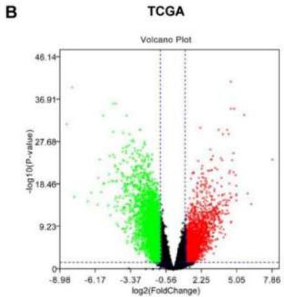

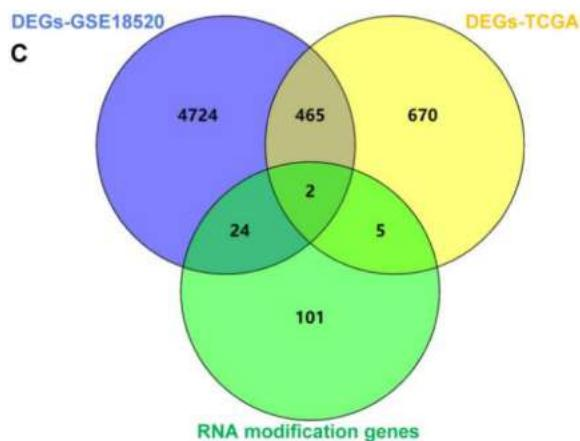

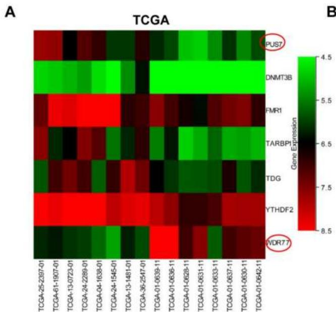  
Figure 1. The identification of DEGs-RMGs using OV data in TCGA and GEO. (A,B) The volcano plot of DEGs between OV and normal samples in GSE18520 and TCGA data. (C) WDR77 and PUS7 were identified as the overlapping genes of DEGs in both datasets.

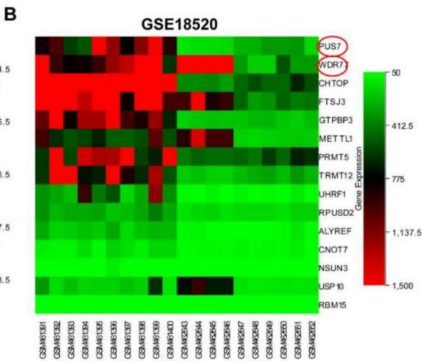  
Figure 2. The heatmaps of differentially expressed RMGs. (A) The heatmap of the expression profile of overlapping genes of RMGs and DEGs in normal tissues and OV tissues in the TCGA dataset. (B) The heatmaps of the expression profile for overlapping genes of RMGs and DEGs in normal tissues and OV tissues in the GSE18520 dataset.

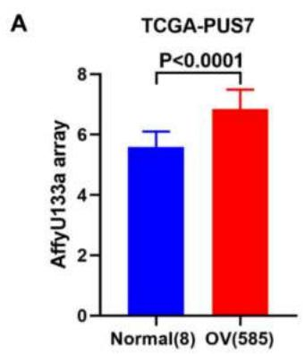

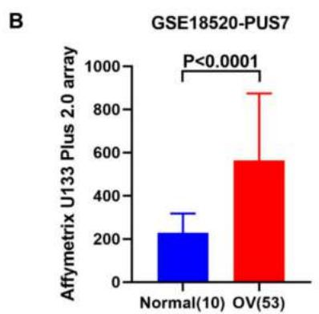

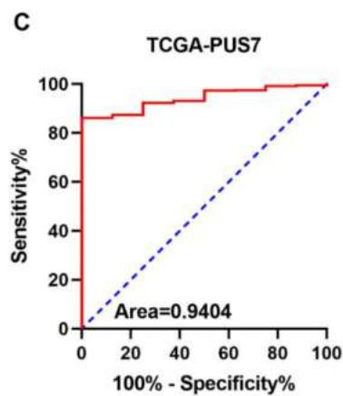

  
Figure 3. The differential expression analysis and ROC analysis of PUS7 in OV and normal tissues. (A,B) The expression analysis of PUS7 in TCGA and GSE18520 cohorts, respectively. (C,D) The ROC analysis of PUS7 between OV and normal samples in TCGA and GSE18520 cohorts. AUC is plotted as sensitivity% vs. 100-specificity%. A $p < 0 . 0 5$ was considered a significant difference.

Table 1. The comparison analysis of PUS7 in ovarian cancer and normal tissue in different cohorts (Oncomine).   

<table><tr><td>Dataset</td><td>Tumor (Cases)</td><td>Normal (Cases)</td><td>Fold Change</td><td>t-Test</td><td>p-Value</td></tr><tr><td>Lu Ovarian</td><td>Ovarian Serous 
Adenocarcinoma (20)</td><td>Ovarian Surface 
Epithelium (5)</td><td>1.913</td><td>9.134</td><td>2.28 × 10-9</td></tr><tr><td>Lu Ovarian</td><td>Ovarian Endometrioid 
Adenocarcinoma (9)</td><td>Ovarian Surface 
Epithelium (5)</td><td>1.808</td><td>5.846</td><td>0.0000904</td></tr><tr><td>Lu Ovarian</td><td>Ovarian Mucinous 
Adenocarcinoma (9)</td><td>Ovarian Surface 
Epithelium (5)</td><td>1.405</td><td>4.275</td><td>0.000692</td></tr><tr><td>Lu Ovarian</td><td>Ovarian Clear Cell 
Adenocarcinoma (7)</td><td>Ovarian Surface 
Epithelium (5)</td><td>1.457</td><td>2.64</td><td>0.017</td></tr><tr><td>Hendrix Ovarian</td><td>Ovarian Mucinous 
Adenocarcinoma (13)</td><td>Ovary (4)</td><td>1.216</td><td>4.26</td><td>0.003</td></tr><tr><td>Hendrix Ovarian</td><td>Ovarian Clear Cell 
Adenocarcinoma (8)</td><td>Ovary (4)</td><td>1.275</td><td>4.44</td><td>0.000934</td></tr><tr><td>Hendrix Ovarian</td><td>Ovarian Endometrioid 
Adenocarcinoma (37)</td><td>Ovary (4)</td><td>1.299</td><td>6.012</td><td>0.00098</td></tr><tr><td>Hendrix Ovarian</td><td>Ovarian Serous 
Adenocarcinoma (37)</td><td>Ovary (4)</td><td>1.301</td><td>6.304</td><td>0.001</td></tr><tr><td>Yoshihara Ovarian</td><td>Ovarian Serous 
Adenocarcinoma (43)</td><td>Peritoneum (10)</td><td>1.537</td><td>3.171</td><td>0.003</td></tr></table>

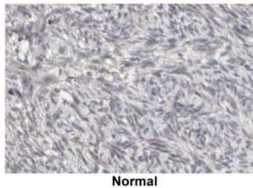  
A

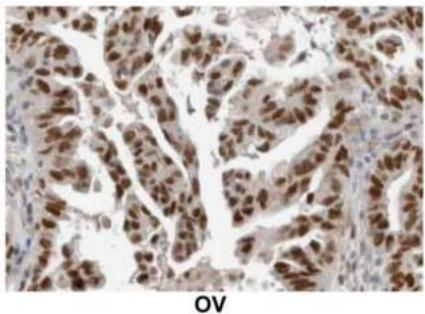  
B

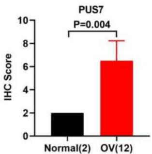

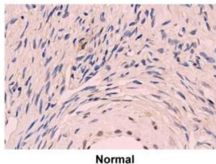  
c

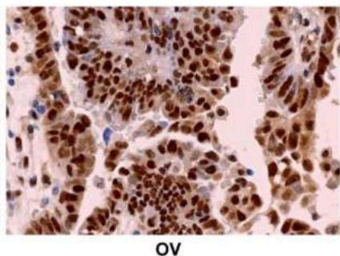  
D

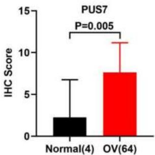  
Figure 4. PUS7 protein expression was significantly higher in OV tissues than normal tissues. (A) Representative IHC images of PUS7 in normal (left) and OV (right) tissues in HPA. (B) Statistical analysis of the protein expression of PUS7 according to the staining scores of OV and normal tissues. (C) Representative IHC images of PUS7 in normal (left) and OV (right) tissues according to tissue microarray. (D) Statistical analysis of the protein expression of PUS7 according to the staining scores of OV and normal tissues. $p < 0 . 0 5$ was considered significant.

Table 2. The mutation distribution of PUS7 in ovarian cancer according to cBioPortal.   

<table><tr><td>Cancer Type</td><td>Sample ID</td><td>Fusion Partner</td><td>Copy</td><td>Mutation in Sample</td></tr><tr><td>Serious Ovarian Cancer</td><td>TCGA-24-1469-01</td><td>Fusion, SRPK2-PUS7</td><td>ShallowDel</td><td>223</td></tr><tr><td>Serious Ovarian Cancer</td><td>TCGA-31-1953-01</td><td>Fusion, SRPK2-PUS7</td><td>Gain</td><td>56</td></tr><tr><td>Serious Ovarian Cancer</td><td>TCGA-61-1740-01</td><td>Fusion, SRPK2-PUS7</td><td>Gain</td><td>183</td></tr></table>

SRPK 2. SRSF Protein Kinase 2; PUS7: Pseudouridine Synthase 7.

# 3.3. The Interaction Network of PUS7

To explore the PPI and gene networks of PUS7 and its partner, an analysis using the String and GeneMANIA tools was performed. The PPI analysis results showed that a total of 10 proteins including NSUN2, NOP2, NOC3L, RBM28, BRIX1, TRUB1, WDR12, PUS1, DKC1, and NMD3 have interactions with PUS7 (Figure 5A). In the GeneMANIA analysis, a total of 20 genes named ETFDH, WDR74, THUMPD1, NOC3L, CXXC4, DPYSL2, HSPA4L, RAD21, STAT3, MRPS2, HMBS, IDE, UBC, HSPH1, HDDC2, CMTR2, ATP6V0A1, and DRG1 were demonstrated to have physical interactions or genetic interactions or to share protein domains with PUS7 or were co-expressed or co-located with PUS7 (Figure 5B). The shared genes of the above two analyses are PUS1 and NOC3L (Figure 5C), where PUS1 was co-expressed with PUS7 [30,31] and NOC3L physically interacted with PUS7 [31–33] in GeneMANIA, both of which were known to interact with PUS7, according to the String results. In addition, GEPIA analysis showed that the expression of PUS7 is significantly correlated with PUS1 $\mathrm { { R } } = 0 . 5 7 .$ , $p$ -value $= 0$ ) and NOC3L $\mathrm { R } = 0 . 6 1$ , $p$ -value $= 0$ ) (Figure 5D).

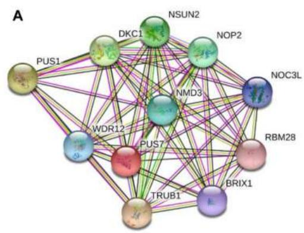  
B

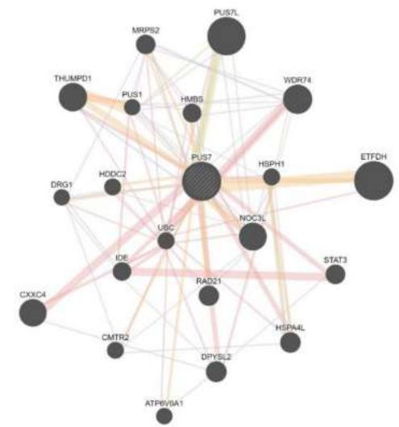

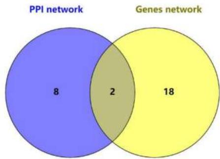  
c

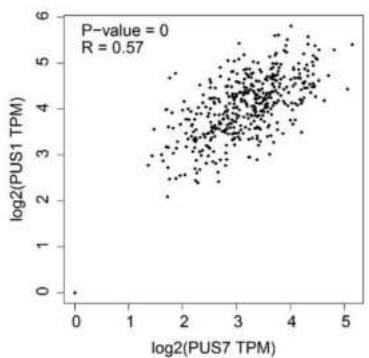  
D

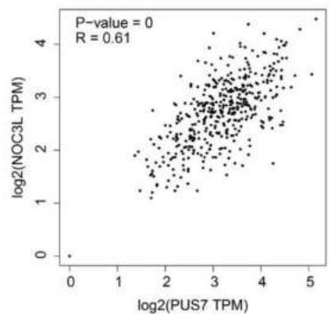  
Figure 5. The interaction network and correlation of PUS7. (A) The protein interaction network of PUS7. Ten proteins including NSUN2, NOP2, NOC3L, RBM28, BRIX1, TRUB1, WDR12, PUS1, DKC1, and NMD3 physically/functionally interact with PUS7. (B) Twenty genes named ETFDH, WDR74, THUMPD1, NOC3L, CXXC4, DPYSL2, HSPA4L, RAD21, STAT3, MRPS2, HMBS, IDE, UBC, HSPH1, HDDC2, CMTR2, ATP6V0A1, and DRG1 have physical interactions or genetic interactions, share protein domains with PUS7, or co-express or co-localize with PUS7. (C) Two genes were shared by the two networks. (D) The correlation analysis of PUS7 with PUS1 and NOC3L. $\mathrm { R } > 0 . 5$ plus $p < 0 . 0 5$ was regarded as a significant correlation.

# 3.4. The Pathway Enrichment Analysis of PUS7 in Ovarian Cancer

To investigate the pathways that PUS7 may be involved in or may regulate in ovarian cancer, a GSEA pathway analysis was performed using TCGA data, which was separated into a high (top $2 5 \%$ ) PUS7 group and a low (down $7 5 \%$ ) PUS7 group. The top eight pathways in which PUS7 participates are DNA replication, the cell cycle, mismatch repair, spliceosomes, homologous recombination, RNA polymerase, aminoacyl tRNA biosynthesis, and one carbon pool by folate in ovarian cancer (Figure 6). Among the eight pathways, the top two pathways are DNA replication and the cell cycle, both of which are linked to ovarian cancer cell proliferation. These results may imply that the overexpression of PUS7 in ovarian cancer might promote ovarian cancer proliferation via regulation of DNA replication and the cell cycle.

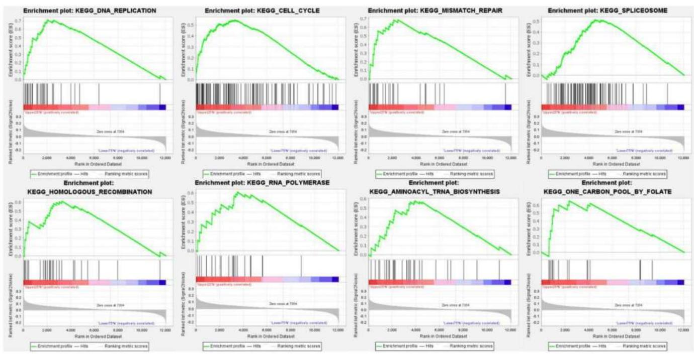  
Figure 6. The pathway enrichment analysis of PUS7 in ovarian cancer. GSEA pathway analysis using TCGA ovarian cancer data, which was separated to a high (top25%) PUS7 group and a low (dow $1 7 5 \%$ ) PUS7 group. Eight top pathways in which PUS7 participates were DNA replication, the cell cycle, mismatch repair, spliceosomes, homologous recombination, RNA polymerase, aminoacyl, tRNA biosynthesis, and one carbon pool by folate in ovarian cancer.

# 3.5. Gene Ontology (GO) Analyses of PUS7 in Ovarian Cancer

To further clarify the GO terms of BP (biological processes), CC (cellular components) and MF (molecular functions) of PUS7, a total of 312 genes (Supplementary Table S4) positively related to PUS7 $\mathrm { ~ R ~ } > 0 . 3$ , $p < 0 . 0 0 0 1 _ { . }$ ) according to the TCGA ovarian cancer data through the cBioPortal database were subjected to DAVID analysis. The results showed that biological processes in which PUS7 mainly participates include the regulation of DNA templates and transcription, rRNA processing, tRNA export from nuclei, the regulation of glucose transport, the intracellular transport of viruses, mitotic nuclear envelope disassembly, viral processes, RNA processing, the regulation of cellular response to heat, gene silencing by RNA, and the positive regulation of gene expression (Figure 7A). The cellular components affected by PUS7 include the nucleoplasm, nucleolus, nucleus, small subunit processomes, nuclear envelope, and nuclear membrane (Figure 7B). The molecular functions of PUS7 include poly(A) RNA binding, nucleic acid binding, helicase activity, ATP binding, ATP-dependent RNA helicase activity, structural constituents of a nuclear pore, DNA binding, RNA binding, protein binding, single-stranded DNA binding, nucleocytoplasmic transporter activity, DNA replication origin binding, ATP-dependent helicase activity, and nucleotide binding (Figure 7C).

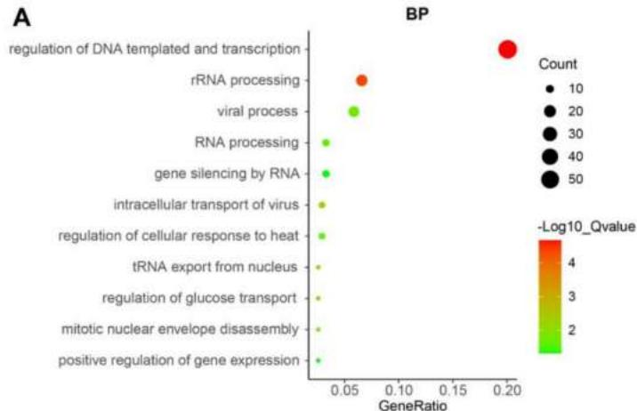

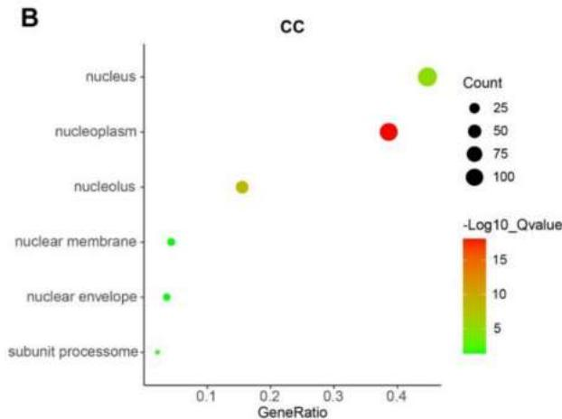

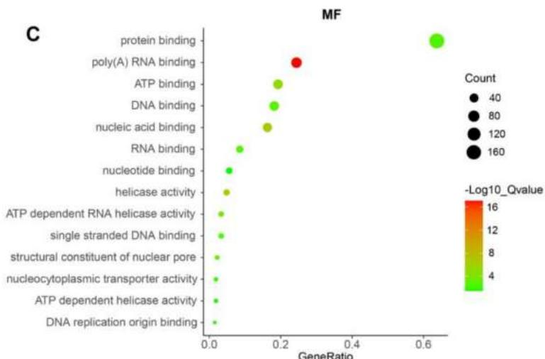  
Figure 7. The GO analyses of PUS7 in ovarian cancer. The bubble diagrams were analyzed using PUS7-related genes and exhibited the biological processes (A), cellular components, (B) and molecular functions (C) of PUS7.

# 4. Discussion

It was estimated that there were 22,530 new cases and 13,980 deaths due to ovarian cancer in the United States in 2019 [34]. Ovarian cancers are often diagnosed late, when the disease has progressed to advanced stages. Hence, an efficient and reliable diagnostic marker is very necessary to facilitate clinical diagnosis and to prolong the survival time for OV. RNA modifications are reported to play vital roles in human diseases, including cancer. For example, m6A, a new star of RNA modifications, is associated with tumorigenesis, tumor proliferation and differentiation and functions as oncogenes or anti-oncogenes in malignant tumors [35]. For example, m6A plays a pivotal role in ovarian cancer progression [36]. Recent advances in human Mendelian diseases have brought focus to human PUS genes as a type of RMG in clinical medicine [37]. PUS7-mediated pseudouridylation could “activate” a class of tRNA-derived small RNAs to regulate protein synthesis and stem cell fate [20]. Additionally, PUS7 is also reported to be a potential biomarker for glioma [38].

In this study, we investigated dysregulated RMGs in ovarian cancer and identified PUS7 as a novel potential biomarker for the diagnosis of OV. ROC analysis acting as an efficient method has been commonly used to determine the accuracy and specificity of medical imaging techniques and non-imaging diagnostic tests in various settings involving disease screening, prognosis, diagnosis, staging, and treatment [39]. Herein, ROC analysis aimed at discriminating cancer from normal tissue was performed to evaluate the sensitivity and specificity of PUS7 in GEO and TCGA data. AUC is a global measure of the ability of a

test to discriminate whether a specific condition is present [40]. In this study, an AUC score over 0.9 in an ROC analysis was obtained, suggesting the potent discriminating potency of PUS7 $( \mathrm { A U C } = 0 . 9 4 0 4$ , $p < 0 . 0 0 0 1 )$ in ovarian cancer. In addition to PUS7 upregulation in the TCGA and GEO datasets, the Oncomine database analysis and IHC results further validated the promising diagnostic role of PUS7 in OV.

PUS7 has never been reported in ovarian cancer. To rationalize the vital role of PUS7 in OV, we explored the proteins interacting with PUS7, which may partially help explain PUS7 function in tumor diagnosis, tumorigenesis, and development. The PPI and gene network analyses identified PUS7 interacting partners, including NOC3L and PUS1, which are also not reported in ovarian cancer, although several reports have revealed that NOC3L regulates the proliferation and tumorigenesis of gastric cancer [41], and NOC3L is associated with an increased risk of gastric cancer in the Chinese Han population [42]. For PUS1, previous reports demonstrated that it is related to sideroblastic anemia [43], and no association of PUS1 with cancer was ever shown, suggesting the novelty of the protein interaction. To further explore the signaling pathway of PUS7 in ovarian cancer, the GSEA pathways analysis demonstrated that DNA replication and the cell cycle are the top two pathways that PUS7 regulated. These results point towards the role of PUS7 in ovarian cancer proliferation via regulation of DNA replication and the cell cycle. However, this hypothesis needs further experiments to be validated.

# 5. Conclusions

In conclusion, the findings of the present study revealed PUS7 as a novel and prospective biomarker at the RNA and protein levels for ovarian cancer. Further analysis indicated that PUS7 may interact with NOC3L and PUS1 to regulate ovarian cancer proliferation via modulation of DNA replication and the cell cycle.

Supplementary Materials: The following are available online at https://www.mdpi.com/article/10 .3390/biology10111130/s1, Table S1: The differentially expressed genes in ovarian cancer samples compared with normal tissue according to TCGA and GSE18520 data. Table S2: The baseline characteristics of ovarian cancer samples in a tissue array. Table S3: RNA modification-related genes. Table S4: The genes correlated to PUS7.

Author Contributions: Conceptualization, H.L., Q.W. and X.G.; Data curation, H.L., Y.H. (Yunsong Han) and F.Z.; Funding acquisition, H.L. and X.G.; Investigation, L.C., Y.H. (Yunsong Han), Y.W. (Yanyan Wang) and Y.W. (Yange Wang); Methodology, H.L., Q.W. and X.G.; Project administration, Q.W.; Software, L.C. and F.Z.; Supervision, X.G.; Validation, L.C. and Y.H.; Visualization, Y.W. (Yanyan Wang) and Q.W.; Writing—review & editing, Y.H. All authors have read and agreed to the published version of the manuscript.

Funding: This work was supported by Henan Province Scientific and Technology Research Project (202102310063), Students Innovation and Entrepreneurship program (20211022008), the program for Central Plain Young Top Talents (ZYQR201912176), and the program for Innovative Talents of Science and Technology in Henan Province (18HASTIT048).

Institutional Review Board Statement: Not applicable.

Informed Consent Statement: Not applicable.

Data Availability Statement: Not applicable.

Conflicts of Interest: The authors declare no conflict of interest.

# References

1. Myriam, K.; Alexandra, L.; Jean-Yves, S.; Catherine, G. Ovarian Cancer: A Heterogeneous Disease. Pathobiology 2018, 85, 41–49.   
2. Giusti, I.; Bianchi, S.; Nottola, S.A.; Macchiarelli, G.; Dolo, V. Clinical electron microscopy in the study of human ovarian tissues. Euromediterranean Biomed. J. 2019, 14, 145–151.   
3. Brett, M.R.; Jennifer, B.P.; Thomas, A.S. Epidemiology of ovarian cancer: A review. Cancer Biol. Med. 2017, 14, 9–32. [CrossRef] [PubMed]   
4. Rebecca, A.; Alba, M.; Tomasz, S.; Michael, J.B. Biomarkers in ovarian cancer: To be or not to be. Cancer 2019, 15, 125.

5. Lindsey, A.T.; Britton, T.; Carol, E.D.; Kimberly, D.M.; Goli, S.; Carolyn, D.R.; Mia, M.G.; Ahmedin, J.; Rebecca, L.S. Ovarian Cancer Statistics, 2018. CA Cancer J. Clin. 2018, 68, 284–296.   
6. Roundtree, I.A.; Evans, M.E.; Pan, T.; He, C. Dynamic RNA Modifications in Gene Expression Regulation. Cell 2017, 169, 1187–1200. [CrossRef]   
7. Machnicka, M.A.; Olchowik, A.; Grosjean, H.; Bujnicki, J.M. Distribution and frequencies of post-transcriptional modifications in tRNAs. RNA Biol. 2014, 11, 1619–1629. [CrossRef]   
8. Cantara, W.A.; Crain, P.F.; Rozenski, J.; McCloskey, J.A.; Harris, K.A.; Zhang, X.; Vendeix, F.A.P.; Fabris, D.; Agris, P.F. The RNA Modification Database, RNAMDB: 2011 update. Nucleic Acids Res. 2011, 39, D195–D201. [CrossRef]   
9. Carell, T.; Brandmayr, C.; Hienzsch, A.; Muller, M.; Pearson, D.; Reiter, V.; Thoma, I.; Thumbs, P.; Wagner, M. Structure and function of noncanonical nucleobases. Angew. Chem. Int. Ed. Engl. 2012, 51, 7110–7131. [CrossRef]   
10. Karijolich, J.; Yu, Y.T. Spliceosomal snRNA modifications and their function. RNA Biol. 2010, 7, 192–204. [CrossRef]   
11. Nicky, J.; Julia, T.; Martin, A.S.; Nicole, S.; John, S.M.; Eva, M.N. The RNA modification landscape in human disease. RNA 2017, 23, 1754–1769.   
12. Liu, J.; Ren, D.; Du, Z.; Wang, H.; Zhang, H.; Jin, Y. m6A demethylase FTO facilitates tumor progression in lung squamous cell carcinoma by regulating MZF1 expression. Biochem. Biophys. Res. Commun. 2018, 502, 456–464. [CrossRef]   
13. Lin, S.; Junho, C.; Du, P.; Robinson, T.; Richard, I.G. The m6A methyltransferase METTL3 promotes translation in human Cancer cells. Mol. Cell 2016, 62, 335–345. [CrossRef]   
14. Yi, J.; Gao, R.; Chen, Y.; Yang, Z.; Han, P.; Zhang, H.; Dou, Y.; Liu, W.; Wang, W.; Du, G.; et al. Overexpression of NSUN2 by DNA hypomethylation is associated with metastatic progression in human breast cancer. Oncotarget 2016, 8, 20751–20765. [CrossRef]   
15. Sylvain, D.; Francesca, R.; Lars, T.; Zhou, Z.; Lukas, H.; Martin, T.; Kateryna, S.; Iva, K.; Alexandra, F.; Hadrien, D.; et al. Elp3 links tRNA modification to IRES-dependent translation of LEF1 to sustain metastasis in breast cancer. J. Exp. Med. 2016, 213, 2503–2523.   
16. Begley, U.; Sosa, M.S.; Avivar-Valderas, A.; Patil, A.; Endres, L.; Estrada, Y.; Chan, C.T.; Su, D.; Dedon, P.C.; Aguirre-Ghiso, J.A.; et al. A human tRNA methyltransferase 9-like protein prevents tumour growth by regulating LIN9 and HIF1-α. EMBO Mol. Med. 2013, 5, 366–383. [CrossRef]   
17. Wang, Y.; Fu, D.; Chen, Y.; Su, J.; Wang, Y.; Li, X.; Zhai, W.; Niu, Y.; Yue, D.; Geng, H. G3BP1 promotes tumor progression and metastasis through IL-6/G3BP1/STAT3 signaling axis in renal cell carcinomas. Cell Death Dis. 2018, 9, 501. [CrossRef]   
18. Tomoko, H.; Adrian, R.F. Pseudouridine synthases. Chem. Biol. 2006, 13, 1125–1135.   
19. Rintala-Dempsey, A.C.; Kothe, U. Eukaryotic stand-alone pseudouridine synthases-RNA modifying enzymes and emerging regulators of gene expression? RNA Biol. 2017, 14, 1185–1196. [CrossRef]   
20. Guzzi, N.; Cie´sla, M.; Ngoc, P.C.T.; Lang, S.; Arora, S.; Dimitriou, M.; Pimková, K.; Sommarin, M.N.E.; Munita, R.; Lubas, M.; et al. Pseudouridylation of tRNA-Derived Fragments Steers Translational Control in Stem Cells. Cell 2018, 73, 1204–1216.e25. [CrossRef]   
21. Ron, E.; Michael, D.; Alex, E.L. Gene Expression Omnibus: NCBI gene expression and hybridization array data repository. Nucleic Acids Res. 2002, 30, 207–210.   
22. Goldman, M.; Craft, B.; Swatloski, T.; Cline, M.; Morozova, O.; Diekhans, M.; David Haussler, D.; Zhu, J. The UCSC cancer genomics browser: Update 2015. Nucleic Acids Res. 2015, 43, D812–D817. [CrossRef]   
23. Pontén, F.; Jirström, K.; Uhlen, M. The Human Protein Atlas-a tool for pathology. J. Pathol. 2008, 216, 387–393. [CrossRef]   
24. Rhodes, D.R.; Yu, J.; Shanker, K.; Deshpande, N.; Varambally, R.; Ghosh, D.; Barrette, T.; Pandey, A.; Chinnaiyan, A.M. ONCOMINE: A cancer microarray database and integrated data-mining platform. Neoplasia 2004, 6, 1–6. [CrossRef]   
25. Snel, B.; Lehmann, G.; Bork, P.; Huynen, M.A. STRING: A web-server to retrieve and display the repeatedly occurring neighbourhood of a gene. Nucleic Acids Res. 2000, 28, 3442–3444. [CrossRef]   
26. Sara, M.; Debajyoti, R.; David, W.-F.; Chris, G.; Quaid, M. GeneMANIA: A real-time multiple association network integration algorithm for predicting gene function. Genome Biol. 2008, 9, S4.   
27. Cerami, E.; Gao, J.; Dogrusoz, U.; Gross, B.E.; Sumer, S.O.; Aksoy, B.A.; Jacobsen, A.; Byrne, C.J.; Heuer, M.L.; Larsson, E.; et al. The cBio cancer genomics portal: An open platform for exploring multidimensional cancer genomics data. Cancer Discov. 2012, 2, 401–404. [CrossRef]   
28. Tang, Z.; Li, C.; Kang, B.; Gao, G.; Li, C.; Zhang, Z. GEPIA: A web server for cancer and normal gene expression profiling and interactive analyses. Nucleic Acids Res. 2017, 45, W98–W102. [CrossRef]   
29. Huang, D.W.; Sherman, B.T.; Lempicki, R.A. Systematic and integrative analysis of large gene lists using DAVID bioinformatics resources. Nat. Protoc. 2009, 4, 44–57. [CrossRef]   
30. Innocenti, F.; Cooper, G.M.; Stanaway, I.B.; Gamazon, E.R.; Smith, J.D.; Mirkov, S.; Ramirez, J.; Liu, W.; Lin, Y.S.; Moloney, C.; et al. Identification, replication, and functional fine-mapping of expression quantitative trait loci in primary human liver tissue. PLoS Genet. 2011, 7, e1002078. [CrossRef]   
31. Denis, A.S.; Michael, M.; Eunice, S.; Richard, S.S.; Vivian, G.C. Genetic analysis of radiation-induced changes in human gene expression. Nature 2009, 459, 587–591.   
32. Wang, I.X.; Ramrattan, G.; Cheung, V.G. Genetic variation in insulin-induced kinase signaling. Mol. Syst. Biol. 2015, 11, 820. [CrossRef] [PubMed]

33. Wan, C.; Borgeson, B.; Phanse, S.; Tu, F.; Drew, K.; Clark, G.; Xiong, X.; Kagan, O.; Kwan, J.; Bezginov, A.; et al. Panorama of ancient metazoan macromolecular complexes. Nature 2015, 525, 339–344. [CrossRef] [PubMed]   
34. Siegel, R.L.; Miller, K.D.; Jemal, A. Cancer statistics. CA Cancer J. Clin. 2019, 69, 7–34. [CrossRef]   
35. Chen, X.; Zhang, J.; Zhu, J. The role of m6A RNA methylation in human cancer. Mol. Cancer 2019, 18, 103. [CrossRef]   
36. Liu, T.; Wei, Q.; Jin, J.; Luo, Q.; Liu, Y.; Yang, Y.; Cheng, C.; Li, L.; Pi, J.; Si, Y.; et al. The m6A reader YTHDF1 promotes ovarian cancer progression via augmenting EIF3C translation. Nucleic Acids Res. 2020, 48, 3816–3831. [CrossRef]   
37. Shaheen, R.; Tasak, M.; Maddirevula, S.; Abdel-Salam, G.; Sayed, I.; Alazami, A.; Al-Sheddi, T.; Eman Alobeid, E.; Phizicky, E.; Alkuraya, F. PUS7 Mutations Impair Pseudouridylation in Humans and Cause Intellectual Disability and Microcephaly. Hum. Genet. 2019, 138, 231–239. [CrossRef]   
38. Hu, G.; Wang, R.; Wei, B.; Wang, L.; Yang, Q.; Kong, D.; Du, C. Prognostic Markers Identification in Glioma by Gene Expression Profile Analysis. J. Comput. Biol. 2020, 27, 81–90. [CrossRef]   
39. Obuchowski, N.A.; Bullen, J.A. Receiver operating characteristic (ROC) curves: Review of methods with applications in diagnostic medicine. Phys. Med. Biol. 2018, 63, 07tr01. [CrossRef]   
40. Zhe, H.; Jane, C.; Dawn, T. What is an ROC curve? Emerg. Med. J. 2017, 34, 357–359.   
41. Yan, C.; Zhu, M.; Ding, Y.; Yang, M.; Wang, M.; Li, G.; Ren, C.; Huang, T.; Yang, W.; He, B.; et al. Meta-analysis of genome-wide association studies and functional assays decipher susceptibility genes for gastric cancer in Chinese populations. Gut 2020, 69, 641–651. [CrossRef]   
42. Yuan, L.; Jin, T.; Yin, J.; Du, X.; Wang, Q.; Dong, R.; Wang, S.; Cui, Y.; Chen, C.; Lu, G. Polymorphisms of tumor-related genes IL-10, PSCA, MTRR and NOC3L are associated with the risk of gastric cancer in the Chinese Han population. Cancer Epidemiol. 2012, 36, e366–e372. [CrossRef]   
43. Tesarova, M.; Vondrackova, A.; Stufkova, H.; Veprekova, L.; Stranecky, V.; Berankova, K.; Hansikova, H.; Magner, M.; Galoova, N.; Honzik, T.; et al. Sideroblastic anemia associated with multisystem mitochondrial disorders. Pediatr. Blood Cancer 2019, 66, e27591. [CrossRef]

Article

# R-Score: A New Parameter to Assess the Quality of Variants’ Calls Assessed by NGS Using Liquid Biopsies

Roberto Serna-Blasco 1, Estela Sánchez-Herrero 1,2, María Berrocal Renedo 1, Silvia Calabuig-Fariñas 3,4,5 , Miguel Ángel Molina-Vila ${ } ^ { 6 } \textcircled { \mathbb { D } }$ , Mariano Provencio $7 \textcircled{1 }$ and Atocha Romero 1,7,*

1 Liquid Biopsy Laboratory, University Hospital Puerta de Hierro, 28222 Madrid, Spain; rserna@idiphim.org (R.S.-B.); esanchez@idiphim.org (E.S.-H.); mariaberrocal18@gmail.com (M.B.R.)   
2 Atrys Health, I+D Department, 08025 Barcelona, Spain   
3 CIBERONC, Liquid Biopsy WM, 28029 Madrid, Spain; calabuix_sil@gva.es   
4 Mixed Unit TRIAL, Príncipe Felipe Research Center & General University Hospital of Valencia Research Foundation, 46012 Valencia, Spain   
5 Department of Pathology, Universitat de València, 46010 Valencia, Spain   
6 Laboratory of Oncology/Pangaea Oncology, Quirón-Dexeus University Hospital, 08028 Barcelona, Spain; mamolina@panoncology.com   
7 Medical Oncology, University Hospital Puerta de Hierro, 28222 Madrid, Spain; mariano.provencio@salud.madrid.org   
* Correspondence: aromero@idiphim.org; Tel.: $+ 3 4$ -1917769

Citation: Serna-Blasco, R.; Sánchez-Herrero, E.; Berrocal Renedo, M.; Calabuig-Fariñas, S.; Molina-Vila, M.Á.; Provencio, M.; Romero, A. R-Score: A New Parameter to Assess the Quality of Variants’ Calls Assessed by NGS Using Liquid Biopsies. Biology 2021, 10, 954. https://doi.org/10.3390/ biology10100954

Academic Editors: Shibiao Wan, Yiping Fan, Chunjie Jiang, Shengli Li and Dirk Rades

Received: 3 August 2021

Accepted: 4 September 2021

Published: 24 September 2021

Publisher’s Note: MDPI stays neutral with regard to jurisdictional claims in published maps and institutional affiliations.

Copyright: $^ ©$ 2021 by the authors. Licensee MDPI, Basel, Switzerland. This article is an open access article distributed under the terms and conditions of the Creative Commons Attribution (CC BY) license (https:// creativecommons.org/licenses/by/ 4.0/).

Simple Summary: Circulating tumor DNA profiling by next-generation sequencing (NGS) is becoming essential for guiding targeted therapies. However, it remains challenging. Here, we show that variant allele fraction and the median of absolute values of all pairwise differences impact the agreement between digital PCR and NGS calls. Therefore, we propose a new parameter, named R-score, which integrates both variables, and we evaluate its usefulness for optimizing NGS variant calling.

Abstract: Next-generation sequencing (NGS) has enabled a deeper knowledge of the molecular landscape in non-small cell lung cancer (NSCLC), identifying a growing number of targetable molecular alterations in key genes. However, NGS profiling of liquid biopsies risk for false positive and false negative calls and parameters assessing the quality of NGS calls remains lacking. In this study, we have evaluated the positive percent agreement (PPA) between NGS and digital PCR calls when assessing EGFR mutation status using 85 plasma samples from 82 EGFR-positive NSCLC patients. According to our data, variant allele fraction (VAF) was significantly lower in discordant calls and the median of the absolute values of all pairwise differences (MAPD) was significantly higher in discordant calls $( p < 0 . 0 0 1$ in both cases). Based on these results, we propose a new parameter that integrates both variables, named R-score. Next, we sought to evaluate the PPA for EGFR mutation calls between two independent NGS platforms using a subset of 40 samples from the same cohort. Remarkably, there was a significant linear correlation between the PPA and the R-score $( \mathbf { r } = 0 . 9 7 ; p < 0 . 0 0 1 )$ ). Specifically, the PPA of samples with an R-score $\leq - 1 . 2 5$ was $9 5 . 8 3 \%$ , whereas PPA falls to $8 1 . 6 3 \%$ in samples with R-score $\leq 0 . 2 5$ . In conclusion, R-score significantly correlates with PPA and can assist laboratory medicine specialists and data scientists to select reliable variants detected by NGS.

Keywords: NGS; ctDNA; VAF; liquid biopsy; filtering; variant calling

# 1. Introduction

The analysis of circulating tumor DNA (ctDNA) has become an attractive approach for non-invasive biomarker testing as well as for real-time monitoring of cancer patients; its usefulness is especially remarkable in lung cancer patients [1–4]. These tumors are

mostly diagnosed at advanced stages, in elderly patients with a median age at diagnosis of approximately 65 years [5], and they are difficult to access owing to their anatomical location, which makes it sometimes difficult to obtain sufficient material for molecular analysis [6]. Moreover, in the last decades, there has been a major paradigm shift in the management of metastatic non-small cell lung cancer (NSCLC), with the advent of targeted therapies for patients harbouring druggable alterations such as EGFR or BRAF mutations, as well as ALK, ROS, and RET rearrangements, and so on [7]. Furthermore, novel KRAS inhibitors constitute a promising therapeutic approach for advanced NSCLC patients [8,9]. Specifically, $3 0 \%$ of NSCLC tumours harbour activating mutations in the EGFR gene, which identify patient candidates to receive tyrosine kinase inhibitors (TKIs) [10]. For this subset of patients, liquid biopsy has been proven to be extremely useful, saving time in the process of diagnosis. In this way, guidelines recommend testing for the T790M EGFR mutation in the blood after progression to an EGFR TKI as a first choice, and re-biopsies are suggested in the case of a negative result in order to identify patients that can benefit from osimertinib (a third-generation TKI) [11]. Moreover, ctDNA plasma levels have been shown to be of prognostic significance for these patients, and monitoring EGFR mutation levels in the plasmas has been proven useful for response to treatment monitoring [5,12,13].

Next-generation sequencing (NGS) enables simultaneous detection of multiple alterations in a single test. Incorporation of unique molecular identifiers (UMIs), random nucleotide sequences assigned to each DNA fragment prior to PCR amplification during library preparation, enables the detection, quantification, and sequencing of unique DNA fragments with high-resolution, allowing the identification and removal of amplification artifacts arising from library preparation and the reduction of the limit of detection (LOD) [14,15]. Nonetheless, ctDNA is present at very low levels in the plasma and its profiling is still challenging with working conditions sometimes close to the edge of this technology. Therefore, there is a need to develop new parameters assessing the quality of the reads in order to avoid false positive and false negative calls.

Here, we assess the impact of two parameters, namely, variant allele fraction (VAF) and median of the absolute values of all pairwise differences (MAPD), separately and together on variant calls when using the Oncomine Pan-Cancer Cell-Free Assay™ (ThermoFisher Scientific®, Palo Alto, CA, USA) by evaluating the agreement between digital PCR (dPCR) and NGS for the assessment of EGFR mutation status. Based on our data, we propose a new parameter named R-score and, finally, we evaluate the agreement in NGS calls between two independent NGS methods according to R-score.

# 2. Materials and Methods

# 2.1. Patients and Samples

A total of 85 samples from advanced EGFR-positive NSCLC patients were recruited upon disease progression to a first-line with a TKI, between February 2016 and March 2019. The study was approved by the Hospital Puerta de Hierro Ethics Committee. All patients provided the appropriate written informed consent to participate in the study prior to enrolment. Briefly, eligible patients were both male and female, age ${ > } 1 8$ years, with a pathologically confirmed diagnosis of stage IV NSCLC harbouring an EGFR mutation. Blood samples were collected in 8.5 mL PPTTM tubes (Becton Dickinson, Franklin Lakes, NJ, USA).

# 2.2. Laboratory Procedures

Two independent laboratories were involved in this study: laboratory 1 (L1) and laboratory 2 (L2). Samples for which we did not have available at least $8 \mathrm { m L }$ of plasma $( \mathrm { N } = 4 5 $ ) were processed only by L1 exclusively, and they were used to test the agreement between dPCR and NGS exclusively. For 40 plasma samples, we had available at least 8 mL of plasma, and samples were divided into two aliquots, which were then distributed to L1 and L2. L1 carried out dPCR assays and NGS analysis using the Oncomine Pan-Cancer Cell-Free Assay and an Ion S5 sequencer (ThermoFisher Scientific®, Palo Alto, CA, USA),

whereas L2 carried out NGS with QIAact Lung DNA UMI Panel using the GeneRead Platform (QIAgen, Valencia, CA, USA).

Isolation of plasma was achieved by two consecutive centrifugations at room temperature, the first one at $1 5 0 0 \times g$ for 10 min and the second at $5 0 0 0 \times g$ for 20 min. cfDNA was extracted with the QIAamp Circulating Nucleic Acid Kit (QIAgen, Valencia, CA, USA) according to the manufacturer’s protocol (QIAamp Circulating Nucelic Acid Handbook 10/2013). DNA concentration was measured by Qubit 2.0 Fluorometer with Qubit 1X dsDNA HS Assay Kit (ThermoFisher Scientific®, Palo Alto, CA, USA) and fragment length and sample quality were evaluated using the Agilent High Sensitivity DNA Kit using Agilent 2100 Bioanalyzer (Agilent Technologies, Santa Clara, CA, USA). Supplementary Figure S1 shows the observed size of the cfDNA fragments, which was approximately 180 bp. cfDNA was stored at $- 8 0 ^ { \circ } \mathrm { C }$ until further analysis.

In order to detect somatic mutation in the EGFR gene, dPCRs were performed using predesigned TaqMan® dPCR assays in a QuantStudio® 3D Digital PCR (Applied Biosystems®, South San Francisco, CA, USA). dPCR reaction was carried out in a final volume of $1 8 \mu \mathrm { L } ;$ this reaction included $8 . 5 5 \mu \mathrm { L }$ of template cfDNA, $9 \mu \mathrm { L }$ of 20X QuantStudio® Master Mix, and $0 . 4 5 \mu \mathrm { L }$ 40X TaqMan assay. Subsequently, $1 4 . 5 \mu \mathrm { L }$ of final reaction volume was loaded to QuantStudio® 3D digital PCR 20K chip. The thermal cycler conditions were as follows: initial denaturalization at $9 6 ^ { \circ } \mathrm { C }$ for 10 min, 40 cycles at $5 6 ~ ^ { \circ } \mathrm { C }$ for 2 min, $9 8 ^ { \circ } \mathrm { C }$ for 30 s, $7 2 ^ { \circ } \mathrm { C }$ for $1 0 \mathrm { m i n }$ , and finally samples were maintained at $2 2 ^ { \circ } \mathrm { C }$ for at least 30 min. Chips were read using QuantStudio® 3D Digital PCR instrument. The results were analysed with QuantStudio® 3D AnalysisSuite™ Cloud. Default call assignments for each data cluster were manually adjusted when needed. A positive and a negative control were included in every run. The LOD and limit of quantitation of the dPCR TaqMan® assays were estimated based on the standard deviation of the response and the slope according to the recommendations of The International Council for Harmonisation of Technical Requirements for Pharmaceuticals for Human Use; ICH Q2 (R1) guidelines (validation of analytical procedures: text and methodology), and they have been published elsewhere [13]. The sensitivity and specificity of the assays, considering tissue genotyping to be the gold standard, have also been reported [16].

The presence of EGFR mutations was evaluated in parallel by two independent NGS platforms, Ion ${ \mathsf { S } } { \mathsf { 5 } } ^ { \mathrm { T M } }$ XL and GeneReader™, and using two different gene panels, Oncomine™ Pan-Cancer Cell-Free Assay (ThermoFisher Scientific®, Palo Alto, CA, USA) and the QIAact Lung DNA UMI Panel (QIAgen, Valencia, CA, USA), respectively. The comparison was performed using 40 samples.

For NGS analysis using the Oncomine Pan-Cancer Cell-Free Assay (NGS-Oncomine), library preparation was performed with a minimum input of $1 0 \mathrm { n g }$ of cfDNA according to manufacturer’s instructions. The final pool was loaded in an Ion $5 5 0 ^ { \mathrm { T M } }$ Chip using Ion Chef™ Instrument (ThermoFisher Scientific®, Palo Alto, CA, USA). Finally, loaded chips were sequenced on an Ion GeneStudio™ S5 Sequencer (ThermoFisher Scientific®, Palo Alto, CA, USA). Torrent Suite Software (v5.12) was used to perform raw sequencing data analysis. The CoverageAnalysis (v. 5.12.0.0) plugin was used for sequencing coverage analysis (ThermoFisher Scientific®, Palo Alto, CA, USA). As recommended by the manufacturer, a median read coverage ${ > } 2 5 { , } 0 0 0$ and median molecular coverage ${ > } 2 5 0 0$ were required to detect a variant with a VAF of $0 . 1 \%$ . Raw reads were aligned to the human reference genome hg19. Variant calling, annotation, and filtering were performed on the Ion Reporter (v5.10) platform using the OncomineTagSeq Pan-Cancer Liquid Biopsy workflow (v2.1). Briefly, sequencing reads were mapped to defined target regions (Oncomine Pan-Cancer DNA Regions v1.0 (5.10)) and subjected to variant calling using Oncomine Pan-Cancer Annotations v1r.0.

For NGS analysis using the QIAact Lung DNA UMI Panel (NGS-GeneReader), libraries were performed with an input of $1 6 . 7 5 ~ \mu \mathrm { L }$ and ${ \sim } 1 0 { \mathrm { - } } 7 0 ~ \mathrm { n g }$ of purified cfDNA, according to manufacturer’s instructions. Then, libraries were quantified using a QIAxcel Advanced System and Qubit dsDNA HS Assay kit in order to pool in batches of six samples.

GeneRead Clonal Amp Q Kit was used to clonal amplification of pooled libraries. After bead enrichment, pooled libraries were sequenced using the GeneRead UMI Advanced Sequencing Q kit in a GeneReader instrument. Finally, FASTQ files alignment was performed using hg19 as reference genome, and variant calling and report generation of sequencing results were performed by QIAGEN Clinical Insight Analyze software.

# 2.3. Parameters

VAF was defined as the number of mutant molecules at a specific nucleotide location relative to the sum of total DNA molecules (mutant $^ +$ wild type). VAF was provided for each detected mutation after dPCR and NGS analysis. In dPCR analysis, VAF was calculated, following the next equation, by QuantStudio® 3D AnalysisSuite™ Cloud:

$$
\mathrm {V A F} = (\text {F A M c o p i e s} / \mu \mathrm {L}) / (\text {F A M c o p i e s} / \mu \mathrm {L} + \text {V I C c o p i e s} / \mu \mathrm {L}) \times 1 0 0 \tag {1}
$$

where FAM copies $=$ number of reads of mutated sequences and VIC copies $=$ number of reads of wild-type sequences.

In the case of NGS-Oncomine, VAF was calculated, using the CoverageAnalysis (v. 5.12.0.0) plugin. Likewise, using NGS-GeneReader, VAF was calculated with QIAGEN Clinical Insight Analyze software in the same way as NGS-Oncomine.

NGS-Oncomine platform also provides a quality sequencing parameter, MAPD, as a pair is defined as adjacent amplicons in terms of genomic distances. Assuming that adjacent amplicons in the genome most likely have the same underlying copy number in a sample, the difference between the log2c(read count ratio) values against the reference baseline for all adjacent amplicons contains information for the noise level of the data. The MAPD is an estimation of coverage variability between adjacent amplicons. The default threshold is 0.5 [17]. As a result, sample results with an MAPD above this value should be reviewed with caution

$$
\operatorname {M A P D} = \operatorname {m e d i a n} \left(\left| x _ {i + 1} - x _ {i} \right|\right) \tag {2}
$$

where $\mathrm { x _ { i } } = \mathrm { l o g } 2$ ratio for marker i.

# 2.4. Statistical Analysis

The primary objective was to evaluate the impact of VAF and MAPD parameters, separately and together, firstly on the positive percent agreement (PPA) between dPCR and NGS (NGS-Oncomine) and secondly on the PPA between two independent NGS platforms (NGS-Oncomine and NGS-GeneReader).

Each mutation was treated as a separate measurement for statistical analysis; therefore, 137 measurements were used in this study.

The correlation between VAFs measured by dPCR and NGS was assessed with simple linear regression analysis, using the concordance correlation coefficient (p) and Spearman’s coefficient (r). For comparisons between numerical variables, Mann–Whitney U test was used. Comparisons between categorical variables were made using Fisher’s exact test or chi-squared test, whichever was most appropriate.

To describe how often NGS and dPCR methods agreed on EGFR calls, as well as concordance between the two different NGS platforms, we calculated the PPA.

The threshold of $p < 0 . 0 5$ was considered as statistically significant. Statistical software used was Stata v16.0 (StataCorp 2019. Stata Statistical Software Release 16. College station, TX: StataCorp LLC) and R version 3.6.3. (R core team 2020. The R Foundation for Statistical Computing Platform, Vienna, Austria) URL https://www.R-project.org/ (last accessed on 26 July 2021).

# 3. Results

# 3.1. EGFR Mutation Detection by dPCR and NGS-Oncomine

EGFR mutation status was evaluated in 85 plasma samples from 82 EGFR-positive NSCLC patients in parallel by dPCR and NGS-Oncomine. All samples used in this study

had detectable EGFR driver mutations by dPCR. The mutation detected by dPCR was137), 62% were activating EGFR mutations, among which the most common mutations always concordant with the EGFR mutation detected on the pre-treatment tissue sample aswere exon 19 deletions (55.3%) or L858R (36.5%). The rest of the EGFR driver mutations reported by pathologists. Among the total number of detected EGFR mutations were L861Q (3.5%), G719A (2.3%), S768I (1.2%), and exon 20 insertions (1.2%). $( \mathrm { N } = 1 3 7 )$ ),g $6 2 \%$ were activating mutations, among which the most common mutations were exon 190M resistance mutation, 61.2% of samples were identified as T790M positive by dPCR. deletions $( 5 5 . 3 \% )$ or L858R $( 3 6 . 5 \% )$ ). The rest of the EGFR driver mutations were L861Q $( 3 . 5 \% )$ , G719Aed by dP $( 2 . 3 \% )$ , S768Ire not f $( 1 . 2 \% ) .$ , and exon 20 insertionssing NGS-Oncomine. Wh $( 1 . 2 \% )$ . Regarding T790Mlysing mutations sepresistance mutation, $6 1 . 2 \%$ of samples were identified as T790M positive by dPCR. Data for T790M status in tissue samples were not available. Of note, 42 $( 3 0 . 6 \% )$ mutations detected by dPCR were not found using NGS-Oncomine. When analysing mutations separately, a lower PPA was measured in L858R mutation $6 7 . 7 4 \%$ ; $9 5 \% C \mathrm { I }$ 50.31–85.17) compared with exon 19 deletion $( 7 6 . 6 0 \%$ ; 95%CI 64.03–89.16). Less common EGFR mutations such as L861Q, S768I, and G719A were detected by both methods. It should be noted that the exon 20 insertion (c.2310_2311insGGT; p.D770_N771insG) was not found by NGS-Oncomine.

Finally, regarding T790M resistance mutation, 52 $( 6 1 . 2 \% )$ samples were identified as T790M positive by dPCR, whereas only 28NGS-Oncomine (53.85% of agreement; 95% C $( 3 3 \% )$ samples were T790M positive using3–67.86). NGS-Oncomine $7 5 3 . 8 5 \%$ of agreement; $9 5 \%$ CI 39.83–67.86).

# 3.2. VAF and MAPD Involvement in the Agreement between dPCR and NGS-Oncomine CallsOverall, there were 91 concordant calls by both technologies and 46 discordant c

Overall, there were 91 concordant calls by both technologies and 46 discordant calls a PPA of 66.42% (95% CI 58.42–74.43). with a PPA ofFirst, we $6 6 . 4 2 \%$ (t $9 5 \%$ CI 58.42–74.43).he overall correl

First, we evaluated the overall correlation between VAF values assessed by dPCR NGS-Oncomine when the mutation was detected by both methods. According to our and NGS-Oncomine when the mutation was detected by both methods. According to ourdata, VAFs measured by NGS-Oncomine were significantly correlated to VAFs assessed data, VAFs measured by NGS-Oncomine were significantly correlated to VAFs assessed byby dPCR (r = 0.89; p < 0.001) (Figure S2). Next, VAFs values and MAPD scores were com dPCR pared $( \mathbf { r } = 0 . 8 9 ; p < 0 . 0 0 1 )$ $\mathrm { \Delta r = 0 . 8 9 }$ (Figure S2). Next, VAFs values and MAPD scores were comparednt and concordant calls. Overall, dPCR VAFs values were signif between discordant and concordant calls. Overall, dPCR VAFs values were significantlyicantly lower in discordant calls compared with concordant calls (p < 0.001) (Figure 1A). lower in discordant calls compared with concordant callsSpecifically, 1.1% and 10.9% of concordant calls have V $( p < 0 . 0 0 1 )$ ) (Figure 1A). Specifically, and ≤ 0.5%, respectively, $1 . 1 \%$ andpare $1 0 . 9 \%$ of concordant calls have 8.9% and 46.7% in disc $\mathrm { V A F } \leq 0 . 1 \%$ and  Lik $\leq 0 . 5 \%$ , respectively, comparedAPD score was signifiwithcant $8 . 9 \%$ andher $4 6 . 7 \%$ in discordant calls. Likewise, MAPD score was significantly higher inordant samples compared with concordant samples (p < 0.001) (Figure discordant samples compared with concordant samples1B). $( p < 0 . 0 0 1 )$ ) (Figure 1B).

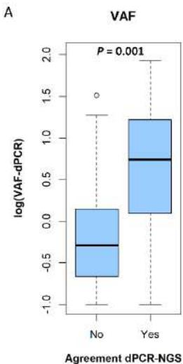

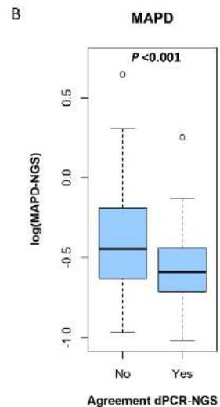  
Figure 1. Boxplot. (A) VAF values in concordant and discordant calls (dPCR-NGS-Oncomine) in logarithmic scale. (B) MAPD values in concordant and discordant calls (dPCR-NGS-Oncomine) in logarithmic scale.

Next, we sought to evaluate the combined effect of VAF and MAPD parameters. Dot plots in Figure 2 show the concordance between dPCR and NGS-Oncomine on variant calls according to VAF and MAPD parameters. Discordant calls are coloured in red and concordant calls are coloured in blue. Figure 2A is divided into four quadrants using as cut-offs the logarithmic median values of VAF and MAPD according to our data set.

As shown, the highest PPAshown, the highest PPA (96. $( 9 6 . 9 \%$ ; 95%CI:CI: 83.8– $8 3 . 8 \mathrm { - } 9 9 . 9 \%$ ) was observed in the lower-right observed in the lower-right quadquadrant. Conversely, the PPA descended as much asrant. Conversely, the PPA descended as much as 27.6 $2 7 . 6 \%$ $9 5 \% C \mathrm { I }$ : 12.7–47.2%) for calls–47.2%) for calls clusclustered in the upper-left quadrant, meaning that, the higher the VAF and the lower thetered in the upper-left quadrant, meaning that, the higher the VAF and the lower the MAPD, the higher the PPA. Similar results were obtained when quadrants were dividedMAPD, the higher the PPA. Similar results were obtained when quadrants were divided using thresholds according to technical specifications for each parameter (Figure 2B). Asusing thresholds according to technical specifications for each parameter (Figure 2B). As illustrated, PPA between NGS and dPCR calls wasillustrated, PPA between NGS and dPCR calls w $0 \%$ $9 5 \%$ CI:5% $0 { - } 6 0 . 2 \%$ ) when using a cut2%) when using a off of cut of $\le - 0 . 3 0 1$ for VAF and01 for VAF an $> - 0 . 3 0 1$ for MAPD, whereas in the opposite conditions, the1 for MAPD, whereas in the opposite conditions, the PPA increased toPPA increased to $8 4 . 9 \%$ ( $9 5 \%$ CI: CI: $7 4 . 5 \mathrm { - } 9 0 . 9 \%$ ).).

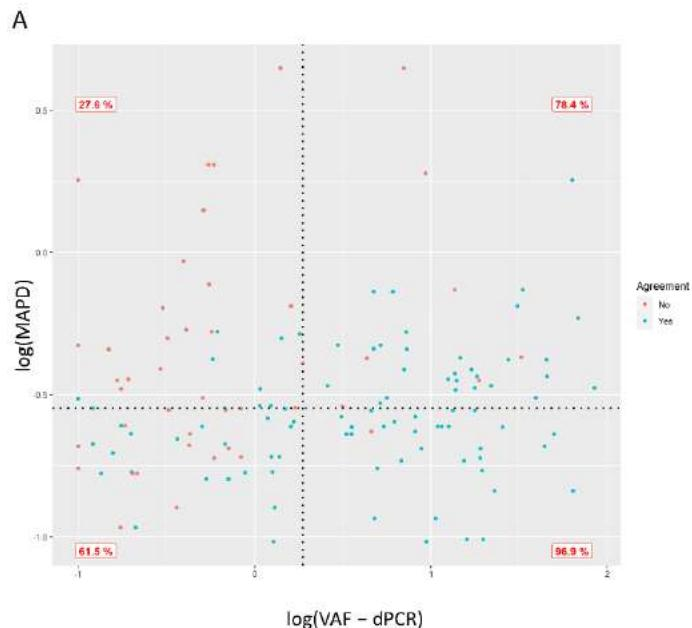

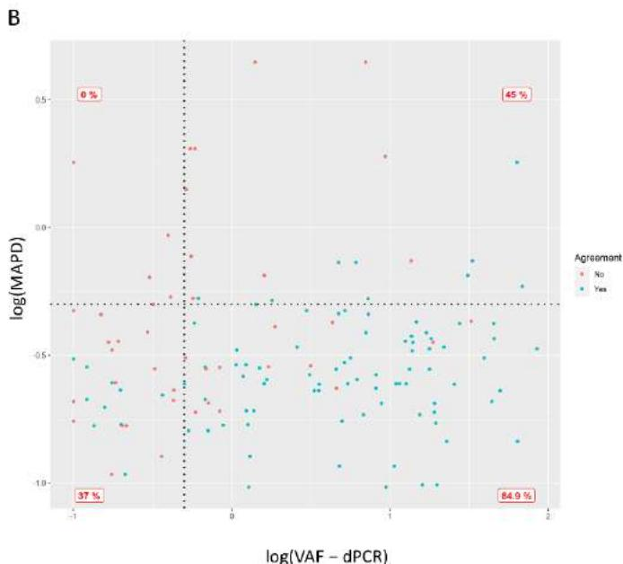  
Figure 2. Dot plot showing the agreement in variant calls between dPCR—NGS-Oncomine, according to VAF and MAPD. Figure 2. Dot plot showing the agreement in variant calls between dPCR—NGS-Oncomine, according to VAF and MAPD. VAF and MAPD values, both in logarithmic scale, are represented in theVAF and MAPD values, both in logarithmic scale, are represented in the $x$ andand $y$ -axis, respectively. Concordant calls are -axis, respectively. Concordant calls are coloured in blue, while discordant calls are coloured in red. PPA for calls clustered in each quadrant is shown. (A) Dotcoloured in blue, while discordant calls are coloured in red. PPA for calls clustered in each quadrant is shown. (A) Dot plot divided into four quadrants using as cut-off the logarithmic median values of VAF and MAPD. In this way, the median VAF in our data set was 1.87, which is 0.272 on logarithmic scale, and the median MAPD was 0.28, which corresponds to $- 0 . 5 5 3$ on logarithmic scale. (B) Dot plot divided into four quadrants according to technical specifications. MAPD threshold MAPD above 0.5 is considered too high. Samples with high MAPD values have low coverage uniformity, which can resultwas selected following Ion Reporter recommendations [17]. According to the manufacturer, a value of MAPD above 0.5 in missed or erroneous variant calls. The VAF threshold was chosen based on results from previous studies [18]. Therefore,is considered too high. Samples with high MAPD values have low coverage uniformity, which can result in missed or both axes were divided using −0.301 value for VAF and MAPD (log(0.5)). erroneous variant calls. The VAF threshold was chosen based on results from previous studies [18]. Therefore, both axes were divided using $- 0 . 3 0 1$ value for VAF and MAPD (log(0.5)).

# 3.3. R-Score Is a Useful Parameter to Select Reliable Variant Calls

ch is defined as follows: Based on previous observations, we proposed a new parameter, named R-score, which is defined as follows:

$$
\text {R - s c o r e} = \log (\text {M A P D / V A F}) \tag {3}
$$

In order to evaluate the utility of R-score for assessing the quality of an EGFR variantIn order to evaluate the utility of R-score for assessing the quality of an EGFR variant call, we evaluated the PPA between NGS-Oncomine and dPCR and NGS-Oncomine andcall, we evaluated the PPA between NGS-Oncomine and dPCR and NGS-Oncomine and NGS-GeneReader according to R-score.NGS-GeneReader according to R-score.

First, we assessed the correlation between VAF values from NGS-Oncomine and NGS-GeneReader when the mutation was detected by both methods. According to our data, VAFs values from NGS-Oncomine significantly correlated with VAFs from NGS-GeneReader $( \mathbf { r } = 0 . 8 0 ; p < 0 . 0 0 1$ ).

R-score was then calculated for each variant detected by NGS-Oncomine using the VAF and MAPD provided by the corresponding analysis software. MAPD and R-score values were significantly higher in discordant calls between dPCR and NGS-Oncomine compared with concordant calls $( p < 0 . 0 0 1 )$ ) (Figure 3A and Table S1). Conversely, VAF values were

significantly lower in discordant calls between dPCR and NGS-Oncomine (Table S1). Subsequently, the PPA for EGFR variant calling between both NGS platforms was evaluated using different arbitrary R-score cut-offs $( - 1 . 2 5 , - 1 , - 0 . 7 5 , - 0 . 5 , - 0 . 2 5 , 0 ,$ and 0.25). As shown in Figure 3C, there was a clear linear correlation between the PPA and the R-score $( \mathbf { r } = 0 . 9 7$ ; $p < 0 . 0 0 1 $ ). Of note, the PPA of samples with an R-score $\leq - 1 . 2 5$ was $9 5 . 8 3 \%$ whereas PPA falls to $8 1 . 6 3 \%$ in samples with an R-score $\leq 0 . 2 5$ (Figure 3B). A complete list of all mutations detected according to the NGS platform is available in Table S2.

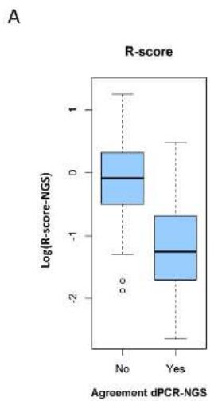

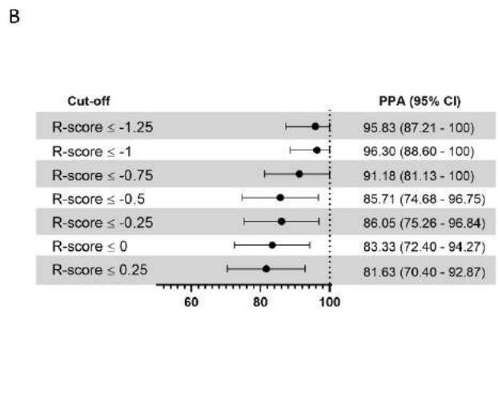

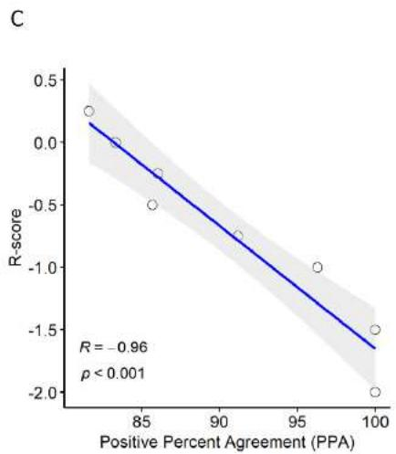  
Figure 3. (A) R-score values in logarithmic scale in concordant and discordant samples (dPCR—NGS-Oncomine). R-score Figure 3. (A) R-score values in logarithmic scale in concordant and discordant samples (dPCR—NGS-Oncomine). R-score was calculated for each variant detected with Oncomine panel, using VAF and MAPD values from Ion Reporter (v5.10)was calculated for each variant detected with Oncomine panel, using VAF and MAPD values from Ion Reporter (v5.10) analysis software. (B) Positive percent agreement (PPA) with correspondanalysis software. (B) Positive percent agreement (PPA) with corresponding $9 5 \%$ 95% confidence inte confidence interval $( 9 5 \% C \mathrm { I } )$ 5%CI) between ) between NGS-NGS-Oncomine and NGS-GeneReader according to R-score cut-off. The following arbitrary cut-offs for R-score were Oncomine and NGS-GeneReader according to R-score cut-off. The following arbitrary cut-offs for R-score were established: $- 1 . 2 5 , - 1 , - 0 . 7 5 , - 0 . 5 , - 0 . 2 5 , 0 ,$ -0.25, 0, and 0.25, and PPA between both NGS platforms was estimated. (C) Correlation  and 0.25, and PPA between both NGS platforms was estimated. (C) Correlation between between PPA values and R-score cut-off values. As shown, there was a linear correlation between PPA and the R-score PPA values and R-score cut-off values. As shown, there was a linear correlation between PPA and the R-score cut-off values; cut-off values; the lower the R-score, the greater the PPA. the lower the R-score, the greater the PPA. Abbreviations: ${ \boldsymbol { \mathrm R } } =$ reviations: R = Spearman correla Spearman correlation coefficient.

# 4. Discussion 4. Discussion

Biomarker testing in NSCLC has been demonstrated to improve survival outcomes Biomarker testing in NSCLC has been demonstrated to improve survival [19–21]. Of note, the number of biomarkers that need to be tested is constantly increasing outcomes [19–21]. Of note, the number of biomarkers that need to be tested is constantly inin NSCLC as new targeted therapies are becoming available [7]. Unlike PCR-based plat-creasing in NSCLC as new targeted therapies are becoming available [7]. Unlike PCR-based forms, which only allow a few mutations to be analyzed, NGS enables for interrogating platforms, which only allow a few mutations to be analyzed, NGS enables for interrogating multiple genomic alterations simultaneously in a single test. Indeed, National Compre-multiple genomic alterations simultaneously in a single test. Indeed, National Comprehenhensive Cancer Network guidelines recommend that, when feasible, biomarker testing sive Cancer Network guidelines recommend that, when feasible, biomarker testing should should be performed via a broad, panel-based approach by NGS [2]. However, NGS pro-be performed via a broad, panel-based approach by NGS [2]. However, NGS profiling of filing of liquid biopsies, although feasible [22,23], remains challenging. On one hand, the liquid biopsies, although feasible [22,23], remains challenging. On one hand, the sensitivity sensitivity of the assays remains a major limitation [24], and approaches aimed to increaseof the assays remains a major limitation [24], and approaches aimed to increase sensitivity sensitivity might risk false positive calls. Moreover, it has been reported that tumor mu-might risk false positive calls. Moreover, it has been reported that tumor mutational burden tational burden (TMB) analysis, which has been proposed as a predictive biomarker for (TMB) analysis, which has been proposed as a predictive biomarker for the identification of the identification of patients most likely to respond to immune checkpoint inhibitors, patients most likely to respond to immune checkpoint inhibitors, through liquid biopsies, through liquid biopsies, is feasible [25]. TMB is optimally assessed by whole-exome se-is feasible [25]. TMB is optimally assessed by whole-exome sequencing (WES) [26], but targeted panels provide a time-effective and cost-effective alternative [27]. Nevertheless, TMB analysis requires sequencing over 0.5 Mb [28,29]. In this scenario, it is of particular interest to reduce as much as possible the risk of false-positive and false-negative calls. Thus, new parameters evaluating the quality of NGS calls are needed. A recent comprehensive study, in which several methodologies for the analysis of circulating tumor DNA were compared, revealed that the agreement between platforms significantly improved when discarding samples with $\mathrm { V A F } \leq 0 . 5 \%$ [16]. Likewise, a study comparing BEAMing and droplet dPCR for ctDNA analysis using plasma samples from advanced breast cancer patients enrolled in the PALOMA-3 trial showed that discordant calls occurred

at VAFs $< 1 \%$ [30]. In the view of our findings, we hypothesized that the combination of VAF with MAPD could further improve the assessment of the reliability of a variant call. According to our data, MAPD was significantly higher in discordant samples compared with concordant calls $( p < 0 . 0 0 1 )$ , while VAF values were significantly lower in discordant calls compared with concordant samples $( p < 0 . 0 0 1 )$ ). Remarkably, as shown in Figure 2, the highest PPA $( 9 6 . 9 \%$ ; $9 5 \% C \mathrm { I }$ : $8 3 . 8 \mathrm { - } 9 9 . 9 \%$ ) was observed in the lower-right quadrant. Conversely, the PPA descended as much as $2 7 . 6 \%$ (95%CI: 12.7–47.2%) for calls clustered in the upper-left quadrant.

Our results are limited to EGFR locus as the cohort included exclusively EGFR-positive NSCLC patients. Nonetheless, mutations in other key genes were found. Specifically, in our data set, there were two samples testing positive for KRAS mutations by both NGS platforms (data not shown). Larger cohorts assessing the utility R-score for assessing the reliability of variant calls in other loci different may be of particular interest.

Taken together, we propose the R-score defined as the log(MAPD/VAF). According to our results, EGFR variants with positive R-score are particularly sensitive to genotyping errors. As presented in Figure 3, a significant correlation was found between PPA and the R-score cut-off values, indicating that R-sore can be useful to discriminate between true and false calls in the EGFR locus.

# 5. Conclusions

VAF and MAPD have an impact on EGFR variant calling. Combining this information in a score (R-score) can further improve the assessment of the reliability of a variant call. Using a dataset of 85 EGFR-positive NSCLC patients, we find that EGFR variants with positive R-score are particularly sensitive to erroneous variant calls in the EGFR gene.

Supplementary Materials: The following are available online at https://www.mdpi.com/article/ 10.3390/biology10100954/s1, Figure S1: Two samples electropherogram showing a 180 bp peak corresponding to low fragment cfDNA and peaks corresponding to mono-, di-, and tri-nucleosomes. (B) Gel-like image of cfDNA samples an-alysed with Bioanalyzer 2100; Figure S2: Correlation between variant allele fraction assessed by dPCR and Oncomine-NGS. Linear regression line is shown in black and the $9 5 \%$ confidence interval is shaded in grey. Pearson’s correlation coefficient and $p$ -value are shown in the graph; Table S1: Effect size and $p { \cdot }$ -values for VAF, MAPD, and R-score parameters when assessing significant differences between concordant and discordant calls; Table S2: Table with all EGFR mutations detected by dPCR, NGS-Oncomine, and NGS-GeneReader with VAF values for each assay and cfDNA concentration.

Author Contributions: All authors confirmed they have contributed to the intellectual content of this paper and have approved the submitted version and agree to be personally accountable for the author’s own contributions and for ensuring that questions related to the accuracy or integrity of any part of the work, even ones in which the author was not personally involved, are appropriately investigated, resolved, and documented in the literature. All authors have read and agreed to the published version of the manuscript.

Funding: This paper is part of a project that has received funding from the European Union’s Horizon 2020 research and innovation program under grant agreement No. 875160 and PI16/18018. Roberto Serna-Blasco is supported by Plan de Empleo Juvenil Comunidad de Madrid (PEJD-2018- PRE/BMD-8640). Estela Sánchez-Herrero is supported by the Consejería de Ciencia, Universidades e Innovación of the Comunidad de Madrid (Doctorados Industriales of the Comunidad de Madrid IND2019/BMD-17258).

Institutional Review Board Statement: The study was conducted according to the guidelines of the Declaration of Helsinki, and the study protocol was approved by the Hospital Puerta de Hierro Ethics Committee (internal code PI-154/17).

Informed Consent Statement: Informed consent was obtained from all subjects involved in the study.

Data Availability Statement: All data generated or analyzed during this study are included in this published article (and its additional files).

Acknowledgments: We wish to thank all the patients and staff who participated in the study.

Conflicts of Interest: Atocha Romero reports personal fees from Boehringer and Takeda during the conduct of the study. Mariano Provencio reports grants, personal fees, and non-financial support from BMS, ROCHE, and ASTRAZENECA, as well as personal fees from MSD and TAKEDA, outside the submitted work.

# References

1. Provencio, M.; Torrente, M.; Calvo, V.; Gutiérrez, L.; Pérez-Callejo, D.; Pérez-Barrios, C.; Barquín, M.; Royuela, A.; Rodriguez-Alfonso, B.; Sotelo, M.; et al. Dynamic circulating tumor DNA quantificaton for the individualization of non-small-cell lung cancer patients treatment. Oncotarget 2017, 8, 60291–60298. [CrossRef]   
2. Ettinger, D.S.; Wood, D.E.; Aisner, D.L.; Akerley, W.; Bauman, J.; Chirieac, L.R.; D’Amico, T.A.; Decamp, M.M.; Dilling, T.J.; Dobelbower, M.; et al. Non-small cell lung cancer, version 5.2017: Clinical practice guidelines in oncology. JNCCN J. Natl. Compr. Cancer Netw. 2017, 15, 504–535. [CrossRef]   
3. Pérez-Callejo, D.; Romero, A.; Provencio, M.; Torrente, M. Liquid biopsy based biomarkers in non-small cell lung cancer for diagnosis and treatment monitoring. Transl. Lung Cancer Res. 2016, 5, 455–465. [CrossRef]   
4. Romero, A.; Serna-Blasco, R.; Calvo, V.; Provencio, M. Use of Liquid Biopsy in the Care of Patients with Non-Small Cell Lung Cancer. Curr. Treat. Options Oncol. 2021, 22, 86. [CrossRef]   
5. Provencio, M.; Serna-Blasco, R.; Franco, F.; Calvo, V.; Royuela, A.; Auglyte, M.; S ˙ ánchez-Hernández, A.; de Julián Campayo, M.; García-Girón, C.; Dómine, M.; et al. Analysis of circulating tumour DNA to identify patients with epidermal growth factor receptor–positive non-small cell lung cancer who might benefit from sequential tyrosine kinase inhibitor treatment. Eur. J. Cancer 2021, 149, 61–72. [CrossRef] [PubMed]   
6. McLean, A.; Barnes, D.; Troy, L. Diagnosing Lung Cancer: The Complexities of Obtaining a Tissue Diagnosis in the Era of Minimally Invasive and Personalised Medicine. J. Clin. Med. 2018, 7, 163. [CrossRef]   
7. Schrank, Z.; Chhabra, G.; Lin, L.; Iderzorig, T.; Osude, C.; Khan, N.; Kuckovic, A.; Singh, S.; Miller, R.J.; Puri, N. Current molecular-targeted therapies in NSCLC and their mechanism of resistance. Cancers 2018, 10, 224. [CrossRef] [PubMed]   
8. Hallin, J.; Engstrom, L.D.; Hargi, L.; Calinisan, A.; Aranda, R.; Briere, D.M.; Sudhakar, N.; Bowcut, V.; Baer, B.R.; Ballard, J.A.; et al. The KRASG12C inhibitor MRTX849 provides insight toward therapeutic susceptibility of KRAS-mutant cancers in mouse models and patients. Cancer Discov. 2020, 10, 54–71. [CrossRef] [PubMed]   
9. Hong, D.S.; Fakih, M.G.; Strickler, J.H.; Desai, J.; Durm, G.A.; Shapiro, G.I.; Falchook, G.S.; Price, T.J.; Sacher, A.; Denlinger, C.S.; et al. KRAS G12C Inhibition with Sotorasib in Advanced Solid Tumors. N. Engl. J. Med. 2020, 383, 1207–1217. [CrossRef] [PubMed]   
10. Stewart, E.L.; Tan, S.Z.; Liu, G.; Tsao, M.S. Known and putative mechanisms of resistance to EGFR targeted therapies in NSCLC patients with EGFR mutations-a review. Transl. Lung Cancer Res. 2015, 4, 67–81. [PubMed]   
11. Dal Maso, A.; Lorenzi, M.; Roca, E.; Pilotto, S.; Macerelli, M.; Polo, V.; Cecere, F.L.; Del Conte, A.; Nardo, G.; Buoro, V.; et al. Clinical Features and Progression Pattern of Acquired T790M-positive Compared With T790M-negative EGFR Mutant Non– small-cell Lung Cancer: Catching Tumor and Clinical Heterogeneity Over Time Through Liquid Biopsy. Clin. Lung Cancer 2020, 21, 1–14.e3. [CrossRef]   
12. Romero, A.; Serna-Blasco, R.; Alfaro, C.; Sánchez-Herrero, E.; Barquín, M.; Turpin, M.C.; Chico, S.; Sanz-Moreno, S.; Rodrigez-Festa, A.; Laza-Briviesca, R.; et al. ctDNA analysis reveals different molecular patterns upon disease progression in patients treated with osimertinib. Transl. Lung Cancer Res. 2020, 9, 532–540. [CrossRef]   
13. Provencio, M.; Torrente, M.; Calvo, V.; Pérez-Callejo, D.; Gutiérrez, L.; Franco, F.; Pérez-Barrios, C.; Barquín, M.; Royuela, A.; García-García, F.; et al. Prognostic value of quantitative ctDNA levels in non small cell lung cancer patients. Oncotarget 2018, 9, 488–494. [CrossRef] [PubMed]   
14. Salk, J.J.; Schmitt, M.W.; Loeb, L.A. Enhancing the accuracy of next-generation sequencing for detecting rare and subclonal mutations. Nat. Rev. Genet. 2018, 19, 269–285. [CrossRef]   
15. Kivioja, T.; Vähärautio, A.; Karlsson, K.; Bonke, M.; Enge, M.; Linnarsson, S.; Taipale, J. Counting absolute numbers of molecules using unique molecular identifiers. Nat. Methods 2012, 9, 72–74. [CrossRef] [PubMed]   
16. Romero, A.; Jantus-Lewintre, E.; García-Peláez, B.; Royuela, A.; Insa, A.; Cruz, P.; Collazo, A.; Pérez Altozano, J.; Vidal, O.J.; Diz, P.; et al. Comprehensive cross-platform comparison of methods for non-invasive EGFR mutation testing: Results of the RING observational trial. Mol. Oncol. 2021, 15, 43–56. [CrossRef] [PubMed]   
17. Ion Reporter™ Software 5.12 USER GUIDE. Available online: https://assets.thermofisher.com/TFS-Assets/LSG/manuals/ MAN0018032_IonReporterSoftware_5_12_UG.pdf (accessed on 5 July 2021).   
18. Deveson, I.W.; Gong, B.; Lai, K.; LoCoco, J.S.; Richmond, T.A.; Schageman, J.; Zhang, Z.; Novoradovskaya, N.; Willey, J.C.; Jones, W.; et al. Evaluating the analytical validity of circulating tumor DNA sequencing assays for precision oncology. Nat. Biotechnol. 2021, 1–14. [CrossRef]   
19. Le Tourneau, C.; Delord, J.P.; Gonçalves, A.; Gavoille, C.; Dubot, C.; Isambert, N.; Campone, M.; Trédan, O.; Massiani, M.A.; Mauborgne, C.; et al. Molecularly targeted therapy based on tumour molecular profiling versus conventional therapy for advanced cancer (SHIVA): A multicentre, open-label, proof-of-concept, randomised, controlled phase 2 trial. Lancet Oncol. 2015, 16, 1324–1334. [CrossRef]

20. Fisher, K.E.; Zhang, L.; Wang, J.; Smith, G.H.; Newman, S.; Schneider, T.M.; Pillai, R.N.; Kudchadkar, R.R.; Owonikoko, T.K.; Ramalingam, S.S.; et al. Clinical Validation and Implementation of a Targeted Next-Generation Sequencing Assay to Detect Somatic Variants in Non-Small Cell Lung, Melanoma, and Gastrointestinal Malignancies. J. Mol. Diagn. 2016, 18, 299–315. [CrossRef]   
21. Cottrell, C.E.; Al-Kateb, H.; Bredemeyer, A.J.; Duncavage, E.J.; Spencer, D.H.; Abel, H.J.; Lockwood, C.M.; Hagemann, I.S.; O’Guin, S.M.; Burcea, L.C.; et al. Validation of a next-generation sequencing assay for clinical molecular oncology. J. Mol. Diagn. 2014, 16, 89–105. [CrossRef]   
22. Provencio, M.; Pérez-Barrios, C.; Barquin, M.; Calvo, V.; Franco, F.; Sánchez, E.; Sánchez, R.; Marsden, D.; Cristóbal Sánchez, J.; Martin Acosta, P.; et al. Next-generation sequencing for tumor mutation quantification using liquid biopsies. Clin. Chem. Lab. Med. 2019, 58, 306–313. [CrossRef]   
23. Sánchez-Herrero, E.; Serna-Blasco, R.; Ivanchuk, V.; García-Campelo, R.; Dómine Gómez, M.; Sánchez, J.M.; Massutí, B.; Reguart, N.; Camps, C.; Sanz-Moreno, S.; et al. NGS-based liquid biopsy profiling identifies mechanisms of resistance to ALK inhibitors: A step toward personalized NSCLC treatment. Mol. Oncol. 2021, 15, 2363–2376. [CrossRef]   
24. Merker, J.D.; Oxnard, G.R.; Compton, C.; Diehn, M.; Hurley, P.; Lazar, A.J.; Lindeman, N.; Lockwood, C.M.; Rai, A.J.; Schilsky, R.L.; et al. Circulating tumor DNA analysis in patients with cancer: American society of clinical oncology and college of American pathologists joint review. J. Clin. Oncol. 2018, 142, 1242–1253.   
25. Gandara, D.R.; Paul, S.M.; Kowanetz, M.; Schleifman, E.; Zou, W.; Li, Y.; Rittmeyer, A.; Fehrenbacher, L.; Otto, G.; Malboeuf, C.; et al. Blood-based tumor mutational burden as a predictor of clinical benefit in non-small-cell lung cancer patients treated with atezolizumab. Nat. Med. 2018, 24, 1441–1448. [CrossRef]   
26. Rizvi, N.A.; Hellmann, M.D.; Snyder, A.; Kvistborg, P.; Makarov, V.; Havel, J.J.; Lee, W.; Yuan, J.; Wong, P.; Ho, T.S.; et al. Mutational landscape determines sensitivity to PD-1 blockade in non-small cell lung cancer. Science 2015, 348, 124–128. [CrossRef]   
27. Kowanetz, M.; Zou, W.; Shames, D.S.; Cummings, C.; Rizvi, N.; Spira, A.I.; Frampton, G.M.; Leveque, V.; Flynn, S.; Mocci, S.; et al. Tumor mutation load assessed by FoundationOne (FM1) is associated with improved efficacy of atezolizumab (atezo) in patients with advanced NSCLC. Ann. Oncol. 2016, 27, vi23. [CrossRef]   
28. Chalmers, Z.R.; Connelly, C.F.; Fabrizio, D.; Gay, L.; Ali, S.M.; Ennis, R.; Schrock, A.; Campbell, B.; Shlien, A.; Chmielecki, J.; et al. Analysis of 100,000 human cancer genomes reveals the landscape of tumor mutational burden. Genome Med. 2017, 9, 34. [CrossRef] [PubMed]   
29. Merino, D.M.; McShane, L.M.; Fabrizio, D.; Funari, V.; Chen, S.J.; White, J.R.; Wenz, P.; Baden, J.; Barrett, J.C.; Chaudhary, R.; et al. Establishing guidelines to harmonize tumor mutational burden (TMB): In silico assessment of variation in TMB quantification across diagnostic platforms: Phase I of the Friends of Cancer Research TMB Harmonization Project. J. Immunother. Cancer 2020, 8, e000147. [CrossRef] [PubMed]   
30. O’Leary, B.; Hrebien, S.; Beaney, M.; Fribbens, C.; Garcia-Murillas, I.; Jiang, J.; Li, Y.; Bartlett, C.H.; André, F.; Loibl, S.; et al. Comparison of beaming and droplet digital PCR for circulating tumor DNA analysis. Clin. Chem. 2019, 65, 1405–1413. [CrossRef]

Article

# Role of Persistent Organic Pollutants in Breast Cancer Progression and Identification of Estrogen Receptor Alpha Inhibitors Using In-Silico Mining and Drug-Drug Interaction Network Approaches

Bibi Zainab 1, Zainab Ayaz 1, Umer Rashid 2, Dunia A. Al Farraj 3, Roua M. Alkufeidy ${ } ^ { 3 \oplus }$ , Fatmah S. AlQahtany 4, Reem M. Aljowaie 3 and Arshad Mehmood Abbasi $^ { 1 , 5 , * ( \oplus ) }$

Citation: Zainab, B.; Ayaz, Z.;

Rashid, U.; Al Farraj, D.A.; Alkufeidy,

R.M.; AlQahtany, F.S.; Aljowaie, R.M.;

Abbasi, A.M. Role of Persistent

Organic Pollutants in Breast Cancer

Progression and Identification of

Estrogen Receptor Alpha Inhibitors

Using In-Silico Mining and

Drug-Drug Interaction Network

Approaches. Biology 2021, 10, 681.

https://doi.org/10.3390/

biology10070681

Academic Editors: Shibiao Wan,

Yiping Fan, Chunjie Jiang, Shengli Li

and Lucia Mangone

Received: 2 June 2021

Accepted: 8 July 2021

Published: 19 July 2021

Publisher’s Note: MDPI stays neutral with regard to jurisdictional claims in published maps and institutional affiliations.

Copyright: $^ ©$ 2021 by the authors. Licensee MDPI, Basel, Switzerland. This article is an open access article distributed under the terms and conditions of the Creative Commons Attribution (CC BY) license (https:// creativecommons.org/licenses/by/ 4.0/).

1 Department of Environmental Sciences, Abbottabad Campus, COMSATS University Islamabad, Abbottabad 22060, Pakistan; abbasizainab2@gmail.com (B.Z.); zainabayaz321@gmail.com (Z.A.)   
2 Department of Chemistry, Abbottabad Campus, COMSATS University Islamabad, Abbottabad 22060, Pakistan; umerrashid@cuiatd.edu.pk   
3 Department of Botany and Microbiology, College of Sciences, King Saud University, P.O. Box 22452, Riyadh 11495, Saudi Arabia; dfarraj@ksu.edu.sa (D.A.A.F.); ralqufaidi@ksu.edu.sa (R.M.A.); raljowaie@ksu.edu.sa (R.M.A.)   
4 Department of Pathology, College of Medicine, King Saud University, Medical City, Riyadh 11495, Saudi Arabia; fatma@ksu.edu.sa   
5 University of Gastronomic Sciences, 12042 Pollenzo, Italy   
* Correspondence: arshad799@yahoo.com or amabbasi@cuiatd.edu.pk

Simple Summary: The role of persistent organic pollutants (POPs) in breast cancer progression and their bioaccumulation in adipose tissue has been reported. We used a computational approach to study molecular interactions of POPs with breast cancer proteins and identified natural and synthetic compounds to inhibit these interactions. Moreover, for comparative analysis, standard drugs and screened compounds were also docked against estrogen receptor alpha (ERα) and identification of the finest inhibitor was performed using in-silico mining and drug-drug interaction (DDI) network approaches. Based on scoring values, short-chained chlorinated paraffins demonstrated strong interactions with ERα compared to organo-chlorines and PCBs. Synthetic and natural compounds demonstrating strong associations with the active site of the ERα protein could be potential candidates to treat breast cancer specifically caused by POPs and other organic toxins and can be used as an alternative to standard drugs.

Abstract: The strong association between POPs and breast cancer in humans has been suggested in various epidemiological studies. However, the interaction of POPs with the ERα protein of breast cancer, and identification of natural and synthetic compounds to inhibit this interaction, is mysterious yet. Consequently, the present study aimed to explore the interaction between POPs and $\operatorname { E R } \alpha$ using the molecular operating environment (MOE) tool and to identify natural and synthetic compounds to inhibit this association through a cluster-based approach. To validate whether our approach could distinguish between active and inactive compounds, a virtual screen (VS) was performed using actives (627 compounds) as positive control and decoys (20,818 compounds) as a negative dataset obtained from DUD-E. Comparatively, short-chain chlorinated paraffins (SCCPs), hexabromocyclododecane (HBCD), and perfluorooctanesulfonyl fluoride (PFOSF) depicted strong interactions with the $\operatorname { E R } \alpha$ protein based on the lowest-scoring values of −31.946, −18.916, −17.581 kcal/mol, respectively. Out of 7856 retrieved natural and synthetic compounds, sixty were selected on modularity bases and subsequently docked with ERα. Based on the lowest-scoring values, ZINC08441573, ZINC00664754, ZINC00702695, ZINC00627464, and ZINC08440501 (synthetic compounds), and capsaicin, flavopiridol tectorgenin, and ellagic acid (natural compounds) showed incredible interactions with the active sites of $\operatorname { E R } \alpha ,$ , even more convening and resilient than standard breast cancer drugs Tamoxifen, Arimidex and Letrozole. Our findings confirm the role of POPs in breast cancer progression and suggest that natural and synthetic compounds with high binding affinity could be

more efficient and appropriate candidates to treat breast cancer after validation through in vitro and in vivo studies.

Keywords: breast cancer; estrogen receptor alpha; persistent organic pollutants; drug-drug interaction networks; molecular docking

# 1. Introduction

POPs are the most common synthetic, lipophilic, toxic, bio-accumulative, and persistent pollutants in the environment. Most POPs are of anthropogenic origin, but some substances, i.e., dioxins and furans, are also produced naturally during volcanism. POPs are also used intentionally in pesticides and other industrial products and may be released accidentally as a by-product from industrial processes or fuel combustion, such as dioxins and furans [1]. POPs release in the environment through industrial and agricultural effluents, drainage systems, urban effluents and landfill leachate [2,3]. Contaminated soil, water, air, dust and processed goods like textiles and packaging materials contain considerable amounts of POPs. Importantly, at ambient temperatures, POPs have a tendency to enter the gas phase; as a result they may volatilize from soils, plants, and water bodies into the atmosphere. They preferentially partition to solids, particularly organic materials in aquatic systems and soils, avoiding the aqueous phase. Being hydrophobic in nature [4], rather than entering the aqueous milieu of cells, some major types of POPs, such as polychlorinated dibenzo-p-dioxins and furans (PCDD/PCFs), polychlorinated biphenyl (PCBs), organo-chlorinated pesticides (OCPs), perfluorooctane sulfonate (PFOS) and pentadecafluorooctanoic acid (PFOAs) are hydrophobic and accumulate in the fatty tissues of the living host. POPs may accumulate in food chains [5] and, from contaminated food such as fruits, vegetables, chicken, meat, milk and fish etc., may enter humans and other living organisms [6,7]. As a result, predatory species like humans often have the highest concentration of POPs, and their presence in humans, i.e., in adipose tissue and human milk, is associated with the up-regulation of hormone-dependent breast cancers [2].

The prevalence of breast cancer, one of the most common types of cancers, specifically in females, is increasing worldwide, which cannot be explained solely by the emergence of mammography screening [8]. In 2018, about two million cases of breast cancer were reported in women globally [9]. The survival rate was up to $2 6 \%$ in cases where distant metastases were present. About $2 5 \%$ of breast cancers have been reported in developed countries; furthermore, it is one of the leading causes of death in Western countries. Deregulation of estrogen balance is known to promote breast cancer, and in Asia, over $6 0 \%$ of breast cancer cases have been diagnosed as estrogen receptor alpha-positive $( \mathrm { E R } \alpha )$ cancers [10]. The estrogen receptor 1 (ESR1) gene encodes the $\operatorname { E R } \alpha$ protein, a ligand regulated transcription factor, which plays a central role in the proliferation of breast cancer. Production of testosterone enhances the synthesis of progesterone and estrogen receptors in breast glands. Particularly, ERα expressed in the mammary glands and uterus of women has binding ability with DNA and contributes significantly to apoptosis, homeostasis, metabolism, and in breast cancer. An estimated $6 0 \%$ pre- and $7 5 \%$ postmenopausal women are suffering from estrogen-dependent breast cancer [11]. Through disturbing the functioning of adipose tissue, POPs affect the production of estrogens by stimulating genotoxic enzymes and leading to cross-generational epigenetic modifications by modifying the epigenome [12]. Many in vitro studies have shown that certain POPs promote the development of estrogen-positive breast cancer cells by receptor (ER). Exposure to certain POPs, particularly in perinatal studies, can enhance the development of breast cancer and sensitivity to carcinogens and cancerous breast tumors in animal studies. Chemotherapy, hormone therapy, immunotherapy, radiotherapy, and surgery are among the common methods for breast cancer treatment [13], which eventually have multiple

side effects. Therefore, it is necessary to find better natural and synthetic compounds for treatment.

In this context, extensive use of anticancer drugs and potential inhibitors with increasing resistance together with numerous side effects highlights an urgent need for novel cancer treatment methods. Therefore, VS methods including negative image-based screening, molecular docking and the pharmacophore hypothesis could be effective tools for identification and screening of the ligands against ER- $\propto$ receptor. Recent studies have demonstrated that VS methods have the ability to provide structural insights into complex interactions for repositioning and remediation [14], specifically using natural and synthetic compounds [15]. At present, in-silico methods for drug designing, receptor mapping, molecular modeling, and homology modulation etc. are gaining tremendous popularity in drug development, molecular biology, nanotechnology and biochemistry domains. In addition, these methods are used to complement in vitro and in vivo toxicity assessments, particularly to reduce the need for animal monitoring, costs, and time [16]. Furthermore, in-silico cancer modelling opens up new avenues for research into oncogenesis in different biological dimensions and systems. These approaches can assist in expediting the development of diagnostic and therapeutic technologies for clinical care. With reliable digital representations of cancer, the consequences of therapeutic treatments at both the molecular and surgical scales may be anticipated in silico without exposing patients to danger. Previously, an in-silico drug discovery technique exposed that a potential ligand, 1,2,3,4,6-penta-O-galloyl- $\cdot \beta$ -D-glucopyranose, which is a naturally occurring tannin, can inhibit the activity of Ror1 (protein) that contributes significantly to cancer growth and proliferation [17].

Many complementary resources, including microarray, protein-protein interaction, and protein complexes, are being used to discover enriched biological processes and pathways. One example of this is graph theory, which is being used to analyze the lung cancer protein-protein interaction network (PPIN), and to discover highly dense modules which are potential cancer-associated protein complexes [18]. Previously, flavonoids have been proven as potential anticancer agents by virtue of molecular binding to some key targets such as aromatase, fatty acid synthase, xanthine oxidase, cyclooxygenase, lipoxygenase, ornithine decarboxylase, protein tyrosine kinase, phosphoinositide 3-kinase, protein kinase C, topoisomerase II (ATP binding site), ATP binding cassette (ABC) transporter, and phospholipase A2 [19]. The present study was conducted with the aim of determining the molecular interactions between $\operatorname { E R } \alpha$ (target) and POPs which were considered as key factors in breast cancer progression. Moreover, for comparative analysis, standard drugs and screened compounds were docked against ERα and the finest inhibitors (natural and synthetic compounds) were identified using in-silico mining and DDI network approaches.

# 2. Materials and Methods

# 2.1. Disease Selection

Breast cancer (BC) was the target disease because of its prevalence around the globe. Currently, more than two million cases of breast cancer have been diagnosed in women [9], while in Pakistan BC is diagnosed in over 90,000 women annually, out of which 40,000 will not survive [20].

# 2.2. Identification of the Mutated Gene

Gene identification was completely disease specific. The GeneCard (www.genecards. org/ (accessed on 20 November 2020)) was used along with a literature review to determine a list of mutated genes involved in breast cancer as reported earlier [21]. Based on GeneCard, the estrogen receptor gene (ERg) was identified as a mutated gene of breast cancer.

# 2.3. Selection and Preparation of Targeted Protein

The Protein Data Bank (PDB), a global database providing the 3-D structure of biological molecules like proteins, DNA, and RNA, was used to select and prepare the targeted

protein following the method of Rose et al. [22]. Protein Bank RCSB (https://www.rcsb.org/ (accessed on 21 November 2020)). was used to get the 3-D structure of the ERα (ERα/pdb id: 5W9D) protein of breast cancer (Figure S1). The protein selection was entirely based on mutated genes and the MOE tool was used to prepare the protein file while removing water molecules and attached ligands while hydrogen atoms were added. Afterward, a discovery studio was used to visualize the protein structure.

# 2.4. Validation of Virtual Screening (VS) Protocol

To validate whether our approach can distinguish between active and inactive compounds, we have performed a virtual screen (VS) experiment using actives (627 ERα inhibitors, i.e. binders) as positive control and decoys (20,818 compounds, i.e. non-binders) as a negative dataset obtained from the database of Useful Decoys: Enhanced (DUD-E). All the dataset compounds were docked into the binding site of $\operatorname { E R } \alpha$ (PDB ID: 5W9D). The ligand enzyme complexes with the lowest binding energy were analyzed by the MOE ligand interaction module. Finally, Discovery Studio Visualizer was used for the 3-D interaction plot.

# 2.5. Screening and Toxicity Detection of Pollutants

POPs, whose emissions and/or output can be eliminated, or at least reduced substantially, were screened from the list as demonstrated in the Stockholm Convention in 2001. The online server ‘admetSAR’ containing 27 predictive models [23] was used to check the toxicity of screened POPs, and all were lying under toxic classes I, II, and III.

# 2.6. Preparation of Ligand and Molecular Docking

PubChem offers free access to information and biological functions about chemical substances. The database contains chemical information from individual PubChem data providers and the integrated database contains a distinction between chemical structures and the database of substances [24]. PubChem (https://pubchem.ncbi.nlm.nih.gov/ (accessed on 12 June 2021)) was used to extract 3-D structures of screened ligands (POPs) while adopting the previously reported procedure [24]. Afterward, ligands were prepared using the molecular operating environment (MOE) tool.

The molecular docking (MD) technique for the identification and optimization of drug candidates was used to analyze and simulate molecular interactions between the ligand and targeted macromolecules as reported formerly [25]. The MOE tool was used to evaluate the mechanism of molecular interactions between ligands including POPs, approved drugs (positive control), progesterone and testosterone (negative control), and drug candidates (natural and synthetic compounds) with an ERα receptor protein, while Discovery Studio software (DS 4.1) was used to visualize the 3-D interactions following the method as reported earlier [26].

# 2.7. Collection and Mining of Natural and Synthetic Compounds

The ZINC database (zinc.docking.org/ (accessed on 12 July 2021)) was used for the collection of natural and synthetic compounds along with their chemical properties, including Zinc ID, molecular weight, hydrogen bond donors log p, polar dissociation, rotatable bonds, a-polar dissociation, and hydrogen bond acceptors. Lipinski’s rule of five was applied to the collected drug dataset for mining the natural and synthetic compounds as described earlier [15].

# 2.8. Cluster Formation

Weka, a platform for clustering, association, pre-processing, regression, classification, and screening of data [27], was used for clustering of the drug dataset based on a k-means algorithm (k-mean) clustering system. According to the properties of drugs, this method tracks a modest and quick way to categorize a particular record $^ { \prime \prime } { \bf x } _ { 1 } , { \bf x } _ { 2 } , { \bf x } _ { 3 } \dots { \bf x } _ { n } ^ { \prime \prime }$ to numbers of k clusters $( \mathbb { k } \leq n )$ , where k represents clusters and the row is denoted by $n$ .

# 2.9. Drug-Drug Interaction (DDI) Network

Gephi, a primary platform for data analysis and the fastest graphical visualization of large networks [28], was used to create DDI networks from k-means clustering to find a strong connection between drug networks within each cluster. DDI networks were generated based on statistical parameters such as modularity (Ml), path lengths (PL), average degree (AD), average weighted degree (AWD), degree distribution (DD), and graph density (GD). Each network has borders E, vertical V, average path length L and node D, as well as network density and modularity classes. Most strongly-associated natural and synthetic compounds were docked against the targeted ERα protein to identify scoring values/binding energies. Standard breast cancer drugs i.e., Tamoxifen, Arimidex, Letrozole were used as a control to compare the scoring value of screened drugs.

# 3. Results and Discussion

# 3.1. Validation of VS and Reliability of MD

To validate whether our approach can distinguish between active and inactive compounds, a virtual screen (VS) experiment was performed using actives (627 ERα inhibitors i.e. binders) as positive control and decoys (20,818 compounds i.e. non-binders) as negative dataset obtained from the database of Useful Decoys: Enhanced (DUD-E) [29]. All the dataset compounds were docked into the binding site of $\operatorname { E R } \alpha$ (PDB ID: 5W9D). Computed binding energy values of the active compound dataset were in the range of 28.6573 to −355.9801 kcal/mol and chemical structures of the most active binders are given in Figure S2. The binding energy values of the decoy set were in the range of −1.0988 to $- 3 . 0 3 7 1 \mathrm { k c a l / m o l }$ . Therefore, these findings suggest that our VS protocol can distinguish between active and inactive compounds.

The reliability of docking accuracy was assessed in two steps. In the first step, redocking of the native ligand was performed (Table S1). In the second step, a cross-docking experiment was carried out (Table S2). Three-dimensional structures of five estrogen receptor-alpha (PDB accession codes = 1A52, 3ERT, 1GWQ, 1UOM and 5W9D) were retrieved from PDB. In self-docking experiments, all the native ligands were extracted from receptors and root means square deviation (RMSD) was calculated for each re-docked and experimental native ligand [30]. Docking was carried out using the Triangle matcher algorithm (placement stage) and scored by the London dG scoring function [31]. Subsequently, best-scored poses were submitted to a rigid receptor protocol (refinement stage). Throughout the validation of docking protocol, the best performance in terms of computed RMSD value, conformation, binding energy, position, and pose (orientation) was obtained with the Triangle matcher London dG scoring function. The final score was calculated with the ASE scoring function. The whole validation process is presented in Supporting Information (Tables S1 and S2).

# 3.2. Interactions between POPs and ERα

Carcinogenesis is not a simple process; it involves initiation, promotion, and progression [32] of malignancy. The ERα gene is more likely to be involved in cell proliferation and is considered the most popular target to treat breast cancer. As per previous reports, POPs may not directly cause cancer, but act as co-carcinogenic agents [33]. It has been reported that organo-chlorines such as dichlorodiphenyltrichloroethane (DDT), hexachlorocyclohexane (HCH), aldrin, dieldrin, and polychlorinated biphenyls (PCBs) have the potential to stimulate breast cancer cell proliferation through the estrogenic pathway [34]. The association between organochlorine and PCBs exposure and risk of breast cancer has been reported. In the present study, substantial data retrieved from the molecular operating environment (MOE) tool, including scoring values, root-mean-square distance, and (RMSD) values, are given in Table 1. As reported earlier [35], the more negative the free binding affinity/scoring values are, the better the bond stability it forms between the ligand and the receptor protein [35]. In this context, strong relations between POPs and ERα protein of breast cancer were assessed based on scoring values ranging from

−31.94 to rts have pof carcinoof carcinoof of carcino $- 8 . 6 5 0 \mathrm { k c a l / m o l }$ . Out of 27 POPs, short-chained chlorinated paraffins (SCCPs),ng evidence on the disruptive effect of SCCPs on hly toxic to aquatic organisms [39]. Moreover, pre-hly toxic to aquatic organisms [39]. Moreover, pre-toxic aquatic [39]. hly toxic to aquatic organisms [39]. Moreover, prehexabromocyclododecane (HBCD), and perfluorooctanesulfonyl fluoride (PFOSF) showedrts have provided convincing evidence on the disruptive effect of SCCPs on rts have provided convincing evidence on the disruptive effect of SCCPs on rts have provided disruptive effect SCCPs on rts have provided convincing evidence on the disruptive effect of SCCPs on the strongest molecular interactions with theng pathways and physiological mechanisms [4rmones and glucocorticoids [40], as well as thermones and glucocorticoids [40], as well as the[40], thermones and glucocorticoids [40], as well as the $\operatorname { E R } \alpha$ protein based on their lowest-scoringowever, there are few stud-e in the regulation of differ-e in the regulation of differ-e e in the regulation of differvalues of −31.94, −18.91, health effects of SCCPs inng pathways and physiolong pathways and physioloand physiolog pathways and physiolo $- 1 7 . 5 8 \mathrm { k c a l / m o l } ,$ , respectively (Table 1). These findings revealedally their contribution to endocrine s [41]. However, there are few stud-s [41]. However, there are few stud-[41]. s [41]. However, there are few studthat SCCPs, HBCD, and PFOSF could be potentially involved in breast cancer prevailinghealth effects of SCCPs in humans, especially their contribution to endocrine health effects of SCCPs in humans, especially their contribution to endocrine health effects of SCCPs in humans, especially their contribution to endocrine health effects of SCCPs in humans, especially their contribution to endocrine SCCPs their contribution health effects of SCCPs in humans, especially their contribution to endocrine compared to PCBs and organochlorine as reported in previous studies [34]. These POPs. In this context, the aforementioned results revealed the strong association of . In this context, the aforementioned results revealed the strong association of . In this context, the aforementioned results revealed the strong association of . In this context, the aforementioned results revealed the strong association of . context, aforementioned association . In this context, the aforementioned results revealed the strong association of are more suspected to cause breast cancer and are widely used pesticides in developing.946 kcal/mol). This indicates that the strong binding capacity of SCCPs with th the ERα protein of breast cancer based on least binding energy or scoring  breast cancer based on least energy or h the ERα protein of breast cancer based on least binding energy or scoring th the ERα protein of breast cancer based on least binding energy or scoring α breast cancer based least h the ERα protein of breast cancer based on least binding energy or scoring countries of Asia due to their low cost and utility against various pests. The key non-kcal/mol). that the of SCCPs 946 kcal/mol). This indicates that the strong binding capacity of SCCPs with .946 kcal/mol). This indicates that the strong binding capacity of SCCPs with kcal/mol). that strong of 946 kcal/mol). This indicates that the strong binding capacity of SCCPs with occupational exposure routes of these high-potency contaminants include ingestion, bothn may be involved in the spread of breast cancer in women. Hexabromocy-n the breast cancer in n may be involved in the spread of breast cancer in women. Hexabromocy-in may be involved in the spread of breast cancer in women. Hexabromocy-in may be involved in the spread of breast cancer in women. Hexabromocy-n may be involved in the spread of breast cancer in women. Hexabromocydirectly and by tainted food, and dermal interaction with the substance [36].e (HBCD) has also demonstrated strong interactions with the ERα protein (Fi(HBCD) has demonstrated interactions the  e (HBCD) has also demonstrated strong interactions with the ERα protein (Fine (HBCD) has also demonstrated strong interactions with the ERα protein (Fi(HBCD) demonstrated with ERα protein e (HBCD) has also demonstrated strong interactions with the ERα protein (Fi

Table 1. Docking of POPs with ERα protein.   

<table><tr><td>S. #</td><td>Chemical Name</td><td>Structures</td><td>B.E. (kcal/mol)</td><td>RMSD (Å)</td></tr><tr><td>1.</td><td>Short-chained chlorinated paraffin&#x27;s</td><td></td><td>-31.95</td><td>1.975</td></tr><tr><td>2.</td><td>HBCD (Hexabromocyclododecane)</td><td></td><td>-18.92</td><td>0.831</td></tr><tr><td>3.</td><td>PFOSF (Perfluorooctanesulfonyl fluoride)</td><td></td><td>-17.58</td><td>1.920</td></tr><tr><td>4.</td><td>Dieldrin</td><td></td><td>-17.22</td><td>0.635</td></tr><tr><td>5.</td><td>DDT (dichloro-diphenyl-trichloroethane)</td><td></td><td>-17.15</td><td>1.123</td></tr><tr><td>6.</td><td>PFOS (perfluorooctanesulfonic acid)</td><td></td><td>-17.13</td><td>0.884</td></tr><tr><td>7.</td><td>Endrin</td><td></td><td>-17.01</td><td>0.979</td></tr><tr><td>8.</td><td>Aldrin</td><td></td><td>-16.19</td><td>1.312</td></tr><tr><td>9.</td><td>Hexa bromodiphenyl ethers</td><td></td><td>-15.72</td><td>1.099</td></tr><tr><td>10.</td><td>Hexabromobiphenyl</td><td></td><td>-15.67</td><td>1.541</td></tr><tr><td>11.</td><td>Penta-bromodiphenyl ethers</td><td></td><td>-15.39</td><td>1.261</td></tr><tr><td>12.</td><td>PCDDs (Polychlorinated dibenzodioxins)</td><td></td><td>-15.01</td><td>1.345</td></tr><tr><td>13.</td><td>Chlordane</td><td></td><td>-14.85</td><td>0.937</td></tr><tr><td>14.</td><td>Toxaphene</td><td></td><td>-14.55</td><td>0.818</td></tr><tr><td>15.</td><td>PCDFs (polychlorinated dibenzofurans)</td><td></td><td>-14.39</td><td>1.885</td></tr><tr><td>16.</td><td>Beta endosulfans</td><td></td><td>-14.26</td><td>1.791</td></tr><tr><td>17.</td><td>PCBs (Polychlorinated biphenyls)</td><td></td><td>-14.16</td><td>1.233</td></tr><tr><td>18.</td><td>α-endosulfans</td><td></td><td>-14.09</td><td>0.978</td></tr></table>

Table 1. Cont.   

<table><tr><td>S. #</td><td>Chemical Name</td><td>Structures</td><td>B.E. (kcal/mol)</td><td>RMSD (Å)</td></tr><tr><td>19.</td><td>Heptachlor</td><td></td><td>-13.70</td><td>0.999</td></tr><tr><td>20.</td><td>Lindane</td><td></td><td>-12.91</td><td>0.631</td></tr><tr><td>21.</td><td>Chlorinated_naphthalenes</td><td></td><td>-12.58</td><td>0.903</td></tr><tr><td>22.</td><td>Mirex</td><td></td><td>-12.39</td><td>1.508</td></tr><tr><td>23.</td><td>Chlordecone</td><td></td><td>-11.87</td><td>1.207</td></tr><tr><td>24.</td><td>Pentachlorophenol</td><td></td><td>-9.566</td><td>1.215</td></tr><tr><td>25.</td><td>Hexachlorobenzene</td><td></td><td>-9.501</td><td>1.212</td></tr><tr><td>26.</td><td>Pentachlorobenzen</td><td></td><td>-9.500</td><td>1.596</td></tr><tr><td>27.</td><td>Hexachlorobutadiene</td><td></td><td>-8.650</td><td>1.090</td></tr></table>

e POPs are extensively used in flame retardants, as a neurotoxe POPs are extensively used in flame retardants, as a neurotoxrgy, RMSD. Root-mean-square distance, S. #. Serial number B.E. Binding energy, RMSD. Root-mean-square distance, S. #. Serial number.

HBCD acts as a nuclear receptor agonist, is hepatotoxic, and is an endo-HBCD acts as a nuclear receptor agonist, is hepatotoxic, and is an endo-HBCD acts as a nuclear receptor agonist, is hepatotoxic, and is an endo-HBCD acts as a nuclear receptor agonist, is hepatotoxic, and is an endo-s are extensively used in flame retardants, as a neurotoxin, and in xenobi-s are extensively used in flame retardants, as a neurotoxin, and in xenobi-Above mentioned results revealed that based on scoring values, short-chain chloriptor that induces developmental neurotoxicity in animals [42]. Hptor that induces developmental neurotoxicity in animals [42]. Hptor that induces developmental neurotoxicity in animals [42]. Hptor that induces developmental neurotoxicity in animals [42]. Hcals. HBCD acts as a nuclear receptor agonist, is hepatotoxic, ancals. HBCD acts as a nuclear receptor agonist, is hepatotoxic, annated paraffin (SCCPs) have the strongest interactions with the $\operatorname { E R } \alpha$ concen- concen- concen- concen-an endo-an endo- protein (Figure 1A). uman breast milk, blood serum, and the umbilical cord has already been in-uman breast milk, serum, the umbilical cord already uman breast milk, blood serum, and the umbilical cord has already been in-uman breast milk, blood serum, and the umbilical cord has already been in-ptor that induces developmental neurotoxicity in animals [42]. HBCD concen-SCCPs are commonly used in metalworking fluids, paints, sealants, adhesives, leather The concentrations in human breast milk raise questions about possible lacta- The breast milk questions about possible  The concentrations in human breast milk raise questions about possible lacta- The concentrations in human breast milk raise questions about possible lacta-uman breast milk, blood serum, and the umbilical cord has already been in-manufacturing chemicals, plastics, rubber, and as a plastic agent and flame retardant [37]. renatal uptake during important developmental stages of the fetus [43]. Like-renatal uptake during important developmental stages of the fetus [43]. Like-renatal uptake during important developmental stages of the fetus [43]. Like-renatal uptake during important developmental stages of the fetus [43]. Like- The concentrations in human breast milk raise questions about possible lacta- The concentrations in human breast milk raise questions about possible lacta-In addition, these pollutants have also been isolated from kidneys, adipose tissue, and eral fluorinated compounds, specifically perfluorooctanesulfonyl fluoride ral fluorinated compounds, specifically perfluorooctanesulfonyl fluoride ral fluorinated compounds, specifically perfluorooctanesulfonyl fluoride ral fluorinated compounds, specifically perfluorooctanesulfonyl fluoride ral fluorinated compounds, specifically perfluorooctanesulfonyl fluoride renatal uptake during important developmental stages of the fetus [43]. Like-renatal uptake during important developmental stages of the fetus [43]. Like-breast milk of Inuit women [38]. As previously reported, SCCPs (C10–C13) belong to so showed strong interactions with the ERα protein, based on a low scoring lso showed strong interactions with the ERα protein, based on a low scoring lso showed strong interactions with the ERα protein, based on a low scoring lso showed strong interactions with the ERα protein, based on a low scoring ral fluorinated compounds, specifically perfluorooctanesulfonyl fluoride ral fluorinated compounds, specifically perfluorooctanesulfonyl fluoride the third class of carcinogens and are highly toxic to aquatic organisms [39]. Moreover, 58 kcal/mol), which allows it to easily form a stable complex (Figure 1C). These 58 kcal/mol), which allows it to easily form a stable complex (Figure 1C). These 58 kcal/mol), which allows it to easily form a stable complex (Figure 1C). These 58 kcal/mol), which allows it to easily form a stable complex (Figure 1C). These lso showed strong interactions with the ERα protein, based on a low scoring lso showed strong interactions with the ERα protein, based on a low scoring previous reports have provided convincing evidence on the disruptive effect of SCCPs s are used as impregnating and grading agents and corrosion inhibitors, like s are used as impregnating and grading agents and corrosion inhibitors, like used impregnating and grading agents corrosion like s are used as impregnating and grading agents and corrosion inhibitors, like 58 kcal/mol), which allows it to easily form a stable complex (Figure 1C). These 58 kcal/mol), which allows it to easily form a stable complex (Figure 1C). These on thyroid hormones and glucocorticoids [40], as well as their role in the regulation of s and flame retardants, in cosmetics, paper coatings, and surfactants. The pos-s and flame retardants, in cosmetics, paper coatings, and surfactants. The pos-s and flame retardants, in cosmetics, paper coatings, and surfactants. The pos-s and flame in cosmetics, paper and The s and flame retardants, in cosmetics, paper coatings, and surfactants. The pos-s and flame retardants, in cosmetics, paper coatings, and surfactants. The pos- s are used as impregnating and grading agents and corrosion inhibitors, like s are used as impregnating and grading agents and corrosion inhibitors, like different signaling pathways and physiological mechanisms [41]. However, there are few iation of PFOSF with hormone disorders, genotoxic potential, and tumor for-iation of PFOSF with hormone disorders, genotoxic potential, and tumor for-ation of PFOSF with hormone disorders, genotoxic potential, and tumor for-ation of PFOSF with hormone disorders, genotoxic potential, and tumor for-iation of PFOSF with hormone disorders, genotoxic potential, and tumor for-ation of PFOSF with hormone disorders, genotoxic potential, and tumor for-s and flame retardants, in cosmetics, paper coatings, and surfactants. The pos-s and flame retardants, in cosmetics, paper coatings, and surfactants. The pos- and flame retardants, in cosmetics, paper coatings, and surfactants. The pos-studies on the health effects of SCCPs in humans, especially their contribution to endocrine iation of PFOSF with hormone disorders, genotoxic potential, and tumor for-iation of PFOSF with hormone disorders, genotoxic potential, and tumor for-disruption. In this context, the aforementioned results revealed the strong association of SCCPs with the ERα protein of breast cancer based on least binding energy or scoring value $( - 3 1 . 9 4 6 \mathrm { k c a l / m o l } )$ . This indicates that the strong binding capacity of SCCPs with ERα protein may be involved in the spread of breast cancer in women. Hexabromocyclododecane (HBCD) has also demonstrated strong interactions with the $\operatorname { E R } \alpha$ protein (Figure 1B). Therefore, HBCD could also be one of the main contributors to breast cancer.

These POPs are extensively used in flame retardants, as a neurotoxin, and in xenobiotic chemicals. HBCD acts as a nuclear receptor agonist, is hepatotoxic, and is an endocrine disruptor that induces developmental neurotoxicity in animals [42]. HBCD concentration in human breast milk, blood serum, and the umbilical cord has already been investigated. The concentrations in human breast milk raise questions about possible lactation and prenatal uptake during important developmental stages of the fetus [43]. Likewise, several fluorinated compounds, specifically perfluorooctanesulfonyl fluoride (PFOSF), also showed strong interactions with the ERα protein, based on a low scoring value $( - 1 7 . 5 8 \mathrm { k c a l / m o l } ) _ { . }$ , which allows it to easily form a stable complex (Figure 1C). These compounds are used as impregnating and grading agents and corrosion inhibitors, like insecticides and flame retardants, in cosmetics, paper coatings, and surfactants. The possible association of PFOSF with hormone disorders, genotoxic potential, and tumor formation in rodents has been suggested previously [44]. Hormones can be indirectly imitated by endocrine disorders

or hormone disorders. Strong associations of SCCPs, HBCD, and PFOSF with the $\operatorname { E R } \alpha$ protein revealed their possible role in breast cancer; therefore the role of these POPs shouldd PFOSF with the ERα protein revealed their possible role in breast cancer; ther be further investigated in detail.e role of these POPs should be

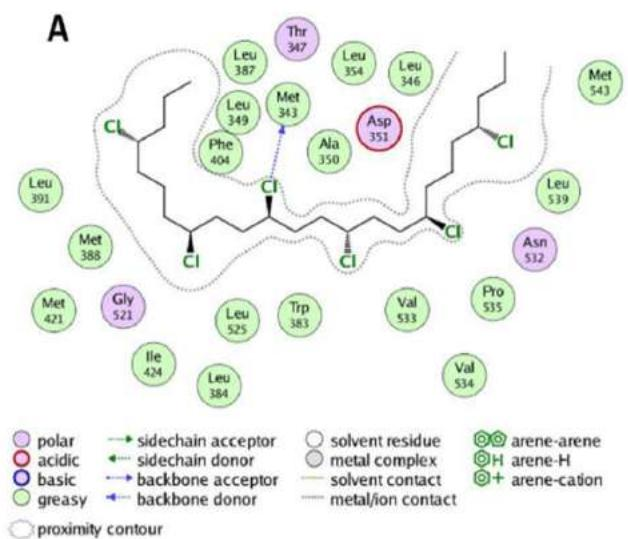

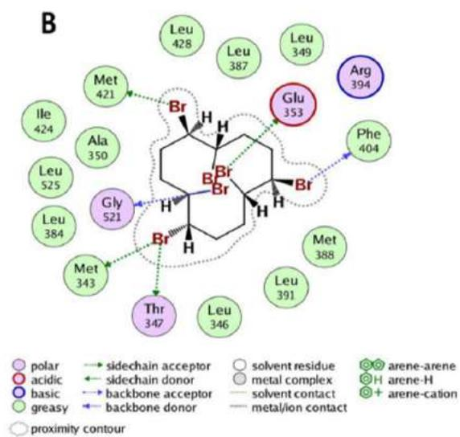

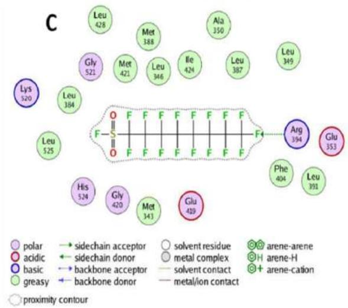  
re 1. Two dimensional interactions of short chain chlorinated paraffins (A), Hexabromocyclododecane (B) andFigure 1. Two dimensional interactions of short chain chlorinated paraffins (A), Hexabromocyclododecane (B) and ooctanesulfonyl fluoride (C) with ERα protein of Breast Cancer. Perfluorooctanesulfonyl fluoride (C) with ERα protein of Breast Cancer.

# 3.3. Natural and Synthetic Compounds Collection, Mining, and Clustering

Approximately 7856 natural and synthetic compounds were collected with their Approximately 7856 natural and synthetic compounds were collected with structures and properties using the ZINC database (zinc.docking.org/ (accessed on 12 July ructures and properties using the ZINC database (zinc.docking.org/ (accessed on 12020)). While applying the Lipinski rule of five on the drug dataset, 2390 compounds 20)). While applying the Lipinski rule of five on the drug dataset, 2390 compoundswere chosen for further processing and the rest were discarded after mining. Afterward, osen for further processing and the rest were discarded after mining. Afterwar12 clusters were generated for natural and synthetic compounds based on the k-means usters were generated for natural and synthetic compounds based on the k-meansclustering system using the Weka tool. The use of k-means clustering avoids the repetition ring system using the Weka tool. The use of k-means clustering avoids the repetitiof compounds, so natural and synthetic compounds exhibiting similar properties were placed in one group. Clusters possessing similar properties, including molecular weight, hydrogen bond donors log P, polar dissociation, rotatable bonds, a-polar dissociation, and hydrogen bond acceptors (HBA) are shown in a plot matrix with their attributes utilizing drogen bond donors log P, polar dissocdifferent color representations (Figure S3).

# fferent color rep3.4. DDI Network

In total, 12 networks were generated using the k-means clustering algorithm and 4. DDI Network Gephi tool (Figure S4) based on statistical parameters as mentioned in Table 2. A strongly

interacted network as illustrated in Figure 2 was generated from 457 compounds having higher modularity class in 12 networks based on the aforementioned parameters. Repulsion strength was set to 10,000, and Force Atlas and Fruchterman rein gold layouts were used to display and visualize the networks.

Table 2. Statistical parameters used to predict network interactions of various natural and synthetic compounds.   

<table><tr><td>Networks</td><td>AD</td><td>AWD</td><td>ND</td><td>GD</td><td>MI</td><td>APL</td><td>N</td><td>E</td></tr><tr><td>1.</td><td>2.306</td><td>2.860</td><td>1.000</td><td>0.005</td><td>0.518</td><td>1.000</td><td>507.0</td><td>1169</td></tr><tr><td>2.</td><td>2.120</td><td>2.519</td><td>1.000</td><td>0.008</td><td>0.524</td><td>1.000</td><td>266.0</td><td>564.0</td></tr><tr><td>3.</td><td>2.070</td><td>2.649</td><td>1.000</td><td>0.011</td><td>0.538</td><td>1.000</td><td>185.0</td><td>383.0</td></tr><tr><td>4.</td><td>1.531</td><td>2.266</td><td>1.000</td><td>0.024</td><td>0.613</td><td>1.000</td><td>64.00</td><td>98.00</td></tr><tr><td>5.</td><td>2.325</td><td>2.476</td><td>1.000</td><td>0.003</td><td>0.509</td><td>1.000</td><td>923.0</td><td>2146</td></tr><tr><td>6.</td><td>2.101</td><td>3.005</td><td>1.000</td><td>0.011</td><td>0.571</td><td>1.000</td><td>188.0</td><td>395.0</td></tr><tr><td>7.</td><td>2.275</td><td>3.028</td><td>1.000</td><td>0.005</td><td>0.525</td><td>1.000</td><td>469.0</td><td>1067</td></tr><tr><td>8.</td><td>1.629</td><td>2.056</td><td>1.000</td><td>0.001</td><td>0.552</td><td>1.000</td><td>107.0</td><td>181.0</td></tr><tr><td>9.</td><td>2.371</td><td>2.792</td><td>1.000</td><td>0.006</td><td>0.500</td><td>1.000</td><td>367.0</td><td>870.0</td></tr><tr><td>10.</td><td>2.155</td><td>2.662</td><td>1.000</td><td>0.004</td><td>0.501</td><td>1.000</td><td>541.0</td><td>1166</td></tr><tr><td>11.</td><td>1.518</td><td>1.789</td><td>1.000</td><td>0.007</td><td>0.528</td><td>1.000</td><td>218.0</td><td>331.0</td></tr><tr><td>12.</td><td>2.220</td><td>2.967</td><td>1.000</td><td>0.007</td><td>0.500</td><td>1.000</td><td>300.0</td><td>666.0</td></tr><tr><td>FSIN</td><td>2.325</td><td>2.476</td><td>1.000</td><td>0.003</td><td>0.503</td><td>1.000</td><td>923.0</td><td>2146</td></tr></table>

AD. Average degree, AWD. Average weighted degree, ND. Network diameter, GD. Graph density, Ml. modularity, APL. Average path length, N. nodes, E. edges, FSIN. Final strongly interacted network.

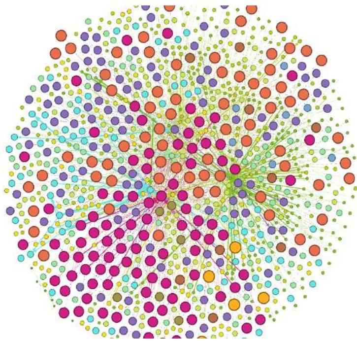  
Figure 2. Final strongly drug-drug interaction network.

des and edges in each network represent compounds and interactions between Nodes and edges in each network represent compounds and interactions between m, respectively. Darker color and larger size nodes show the strength of drug them, respectively. Darker color and larger size nodes show the strength of drug IDs/ZINC /ZINC IDs. As shown in Table 2, network 1 comprises of 507.0 nodes and 1169 edges IDs. As shown in Table 2, network 1 comprises of 507.0 nodes and 1169 edges with modularh modularity of 0.518; the second network consists of 266 nodes and 564 edges with ity of 0.518; the second network consists of 266 nodes and 564 edges with 0.524 modularity. 24 modularity. Network 3 showed 185.0 nodes and 383.0 edges with 0.538 modularity. Network 3 showed 185.0 nodes and 383.0 edges with 0.538 modularity. Network 4 comtwork 4 comprises 64.00 nodes and 98.00 edges with 0.613 modularity. Network 5 con-prises 64.00 nodes and 98.00 edges with 0.613 modularity. Network 5 contains 923.0 nodes s 923.0 nodes and 2146 edges with a modularity of 0.509. Network 6 consists of 188 and 2146 edges with a modularity of 0.509. Network 6 consists of 188 nodes and 395.0 edges es and 395.0 edges with a modularity of 0.571. Network 7 comprises 469.0 nodes and with a modularity of 0.571. Network 7 comprises 469.0 nodes and 1067 edges and possesses 7 edges and possesses a modularity of 0.525. Network 8 consists of 107.0 nodes and a modularity of 0.525. Network 8 consists of 107.0 nodes and 181.0 edges, and 0.001 graph 0 edges, and 0.001 graph density with a modularity of 0.552. Network 9 comprises density with a modularity of 0.552. Network 9 comprises 369.0 nodes and 870.0 edges

with modularity of 0.500. Network 10 consists of 541.0 nodes and 1166 edges with a 0.501 modularity. Network 11 comprises 218.0 nodes and 331.0 edges and 0.528 modularity, while network 12 contains 300.0 nodes, 666.0 edges, and 0.500 modularity. Likewise, the2.967 1.000 0.007 0.500 1.000 300.0 666.0 2.967 1.000 0.007 0.500 1.000 300.0 666.0 0 2.967 1.000 0.007 0.500 1.000 300.0 666.0 2.967 1.000 0.007 0.500 1.000 300.0 666.0 2.967 1.000 0.007 0.500 1.000 300.0 666.0 finally generated strong network contains 923.0 nodes and 2166 edges with 0.503 modular-2.476 1.000 0.003 0.503 1.000 923.0 2146 2.476 1.000 0.003 0.503 1.000 923.0 2146 0 2.967 1.000 0.007 0.500 1.000 300.0 666.0 5 2.476 1.000 0.003 0.503 1.000 923.0 2146 2.476 1.000 0.003 0.503 1.000 923.0 2146 2.476 1.000 0.003 0.503 1.000 923.0 2146 ity (Table 2).D. Average weD. Average we5 2.4WD. Average D. Average weD. Average we

# 3.5. Validation of Natural and Synthetic Compounds. Nodes, E. Edges, FSIN. Final strongly interacted netwodes, E. Edges, FSIN. Final strongly interacted networ

$\operatorname { E R } \alpha ,$ the most common and effective target for breast cancer treatment, was dockedation of Natural and Synthetic Compounds ation of Natural and Synthetic Compounds idation of Natural and Synthetic Compounds ation of Natural and Synthetic Compounds against the screened natural and synthetic compounds [35]. For docking, the active siteERα, the most common and effective target for breast cancer treatment, was dockeERα, the most common and effective target for breast cancer treatment, was dockedERα, the most common and effective target for breast cancer treatment, was docke3.5. Validation of Natural and Synthetic Compounds ERα, the most common and effective target for breast cancer treatment, was dockERα, the most common and effective target for breast cancer treatment, was dockedERα, the most common and effective target for breast cancer treatment, was docked of theagainagainagainagaagainagain $\operatorname { E R } \alpha$ protein was identified using standard drugs used to treat breast cancer i.e.,e screened natural and synthetic compounds [35]. For docking, the active site o screened natural and synthetic compounds [35]. For docking, the active site oe screened natural and synthetic compounds [35]. For docking, the active site o, the most common and effective target for breast cancer treatment, was dockhe screened natural and synthetic compounds [35]. For docking, the active site screened natural and synthetic compounds [35]. For docking, the active site o screened natural and synthetic compounds [35]. For docking, the active site o Tamoxifen, Arimidex, and Letrozole as a positive control group, while progesterone andthe ERα protein was identified using standard drugs used to treat breast cancer i.e., Tathe ERα protein was identified using standard drugs used to treat breast cancer i.e., Tathe ERα protein was identified using standard drugs used to treat breast cancer i.e., Taagainst the screened natural and synthetic compounds [35]. For docking, the active sitethe ERα protein was identified using standard drugs used to treat breast cancer i.e., Tthe ERα protein was identified using standard drugs used to treat breast cancer i.e., Tathe ERα protein was identified using standard drugs used to treat breast cancer i.e., Ta testosterone were utilized as a negative control group. As shown in Table 3, scoringmoxifen, Arimidex, and Letrozole as a positive control group, while progesterone anmoxifen, Arimidex, and Letrozole as a positive control group, while progesterone andmoxifen, Arimidex, and Letrozole as a positive control group, while progesterone anthe ERα protein was identified using standard drugs used to treat breast cancer i.e., moxifen, Arimidex, and Letrozole as a positive control group, while progesterone amoxifen, Arimidex, and Letrozole as a positive control group, while progesterone andmoxifen, Arimidex, and Letrozole as a positive control group, while progesterone andthe ERα protein was identified using standard drugs used to treat breast cancer i.e., Ta values of Tamoxifen, Arimidex and Letrozole ranged from testosterone were utilized as a negative control group. As shtestosterone were utilized as a negative control group. As shmoxifen, Arimidex, and Letrozole as a positive control testosterone were utilized as a negative control group. As stestosterone were utilized as a negative control group. As sh $- 3 1 . 2 6 $ to TabTabwhn Tab $- 2 0 . 9 7 \mathrm { k c a l / m o l }$ Tamoxifen showed pi-sulfur and pi-alkyl interactions; Arimidex also showed pi-sulfur andof Tamoxifen, Arimidex and Letrozole ranged from −31.26 to −20.97 kcal/mol. Tamoxifeof Tamoxifen, Arimidex and Letrozole ranged from −31.26 to −20.97 kcal/mol. Tamoxifetestosterone were utilized as a negative control group. As shown in Table 3, scoring valof Tamoxifen, Arimidex and Letrozole ranged from −31.26 to −20.97 kcal/mol. Tamoxifof Tamoxifen, Arimidex and Letrozole ranged from −31.26 to −20.97 kcal/mol. Tamoxife pi-alkyl interactions, while Letrozole showed conventional hydrogen bond and pi-sulfurshowed pi-sulfur and pi-alkyl interactions; Arimidex also showed pi-sulfur and pi-alkyshowed pi-sulfur and pi-alkyl interactions; Arimidex also showed pi-sulfur and pi-alkyof Tamoxifen, Arimidex and Letrozole ranged from −31.26 to −20.97 kcal/mol. Tamoxifshowed pi-sulfur and pi-alkyl interactions; Arimidex also showed pi-sulfur and pi-alkshowed pi-sulfur and pi-alkyl interactions; Arimidex also showed pi-sulfur and pi-alkyof Tamoxifen, Arimidex and Letrozole ranged from −31.26 to −20.97 kcal/mol. Tamoxifen interactions with the active site ofinteractions, while Letrozole shointeractions, while Letrozole shoshowed pi-sulfur and pi-alkyl interactions, while Letrozole sinteractions, while Letrozole shoshowed pi-sulfur and pi-alkyl in $\operatorname { E R } \alpha ,$ as shown in Figure 3a–c.conventional hydrogen bconventional hydrogen bactions; Arimidex also shd conventional hydrogen conventional hydrogen bions; Arimidex also show

Table 3. Docking results of positive control, negative control, synthetic and natural compounds with ERα protein.tions with the active site of ERα, as shown in Figure 3a–c. tions with the active site of ERα, as shown in Figure 3a–c.   

<table><tr><td>S. #</td><td>Names</td><td>Structures</td><td>B.E. (kcal/mol)</td><td>RMSD (Å)</td></tr><tr><td colspan="5">Positive control</td></tr><tr><td>1</td><td>Tamoxifen</td><td></td><td>-31.26</td><td>1.006</td></tr><tr><td>2</td><td>Arimidex</td><td></td><td>-22.46</td><td>1.130</td></tr><tr><td>3</td><td>Letrozole</td><td></td><td>-20.97</td><td>1.385</td></tr><tr><td colspan="5">Negative control</td></tr><tr><td>1</td><td>Progestrone</td><td></td><td>-23.53</td><td>1.080</td></tr><tr><td>2</td><td>Testosterone</td><td></td><td>-23.95</td><td>0.859</td></tr><tr><td colspan="5">Synthetic compounds</td></tr><tr><td>1</td><td>5-(4-butoxyphenyl)-4-(2,3-dihydro-1,4-benzodioxin-6-ylcarbonyl)-1-(2-furylmethyl)-3-hydroxy-1,5-dihydro-2H-pyrrol-2-one [ZINC08441573]</td><td></td><td>-32.47</td><td>1.521</td></tr><tr><td>2</td><td>2-(4-tert-butylphenyl)-3H-quinazolin-4-one [ZINC00664754]</td><td></td><td>-31.38</td><td>1.575</td></tr><tr><td>3</td><td>(2S)-4-hydroxy-3-(5-methylfuran-2-carbonyl)-1-[(2R)-oxolan-2-yl]methyl]-2-(3-phenoxyphenyl)-2H-pyrrol-5-one [ZINC00702695]</td><td></td><td>-30.35</td><td>1.820</td></tr></table>

Table 3. Cont.[[(2R)-oxolan-  

<table><tr><td>S. #</td><td>Names</td><td>Structures</td><td>B.E. (kcal/mol)</td><td>RMSD (Å)</td></tr><tr><td>4</td><td>(1R,6S)-6-[[2-(4-(4-methylphenyl) piperazine-1-carbonyl)phenyl]carbamoyl]cyclohex-3-ene-1-carboxylic acid [ZINC00627464]</td><td>α</td><td>-30.31</td><td>1.650</td></tr><tr><td>5</td><td>(5S)-1-[3-(dimethylamino)propyl]-4-[hydroxy-(3-methyl-4-propan-2-yloxyphenyl)methylidene]-5-pyridin-4-ylpyrrolidine-2,3-dione [ZINC08440501]</td><td>γ</td><td>-28.76</td><td>1.686</td></tr><tr><td colspan="5">Natural compounds</td></tr><tr><td>1</td><td>Capsaicin [ZINC01530575]</td><td>α</td><td>-24.90</td><td>0.905</td></tr><tr><td>2</td><td>Flavopiridol [ZINC21288966]</td><td>β</td><td>-24.76</td><td>1.875</td></tr><tr><td>3</td><td>Tectorigenin [ZINC00899915]</td><td>γ</td><td>-21.71</td><td>0.994</td></tr><tr><td>4</td><td>Ellagic acid [ZINC03872446]</td><td>δ</td><td>-16.36</td><td>0.996</td></tr></table>

v. Scoring value, RMSD. Root-mean-square distance, S. #. Serial numv. Scoring value, RMSD. Root-mean-square distance, S. #. Serial nuv. Scoring value, RMSD. Root-mean-square distance, S. #. Serial numv. value, RMSD. Root-mean-square distance, S. #. Serial v. Scoring value, RMSD. Root-mean-square distance, S. #. Serial numB.E. Binding energy, RMSD. Root-mean-square distance, S. #. Serial number.

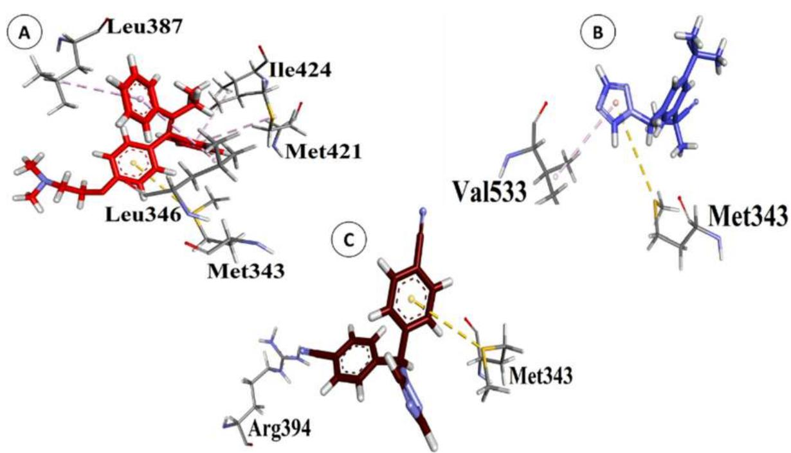  
Figure 3. Three-dimensional interactions of Tamoxifen (A), Arimidex (B), Letrozole (C) with the binding site of ERα protein.

Progesterone and testosterone were used as a negative control group as their scoring values are $- 2 3 . 5 3$ and 23.95 respectively, as shown in Table 3. Previous research reveals that adding an androgen to estrogen treatment lowers mammary epithelial proliferation and ER expression, implying that androgens may protect against breast cancer in the same way as progesterone does. In the past, androgens were used to treat breast cancer with moderate effectiveness [45]. There are mixed theories about these hormones, as some claim they down-regulate breast cancer progression, whereas some claims they up-regulate

the process. However, according to our studies, both progesterone and testosterone have shown interactions with ER alpha protein. Furthermore, this study reveals that these hormones may up-regulate breast cancer development, as they interacted at the active site of ER-alpha with binding energies of −23.53 (progesterone) and −23.95 (testosterone). Up-regulation of breast cancer due to an imbalance of these hormones has already been reported. It has been reported that the effects of sex hormones on breast cancer development are clear from the advantages of hormone withdrawal treatment, with particular evidence of a relationship between completion of hormone withdrawal and clinical benefit [46].

The majority of clinical investigations that have utilized total testosterone as a measure of androgen exposure have found that greater total testosterone levels are related to an increased risk of breast cancer [47]. Progesterone metabolites may consequently be involved in the regulation of the generation of estradiol in the normal breast cell and so may be a multifaceted component in breast carcinogenesis [48]. Progesterone triggers normal human breast epithelial through paracrine mechanisms and is a risk factor for breast cancer because it promotes pre-neoplastic progression by stimulating cyclic proliferation of mammary stem cell pools or cell-initiating tumors in maturing breast epithelium. The development of cancer is therefore further promoted by progesterone signaling and a transition to autocrine proliferation regulation [49].

Natural and synthetic compounds possessing the highest binding affinity, RMSD less than $2 \mathring { \mathrm { A } } ,$ and accurate binding sites were considered to form the most stable complexes. Data of 61 natural and synthetic compounds were collected from strong DDI networks and the top five synthetic (ZINC08441573, ZINC00664754, ZINC00702695, ZINC00627464, ZINC08440501) and four nature compounds (capsaicin, flavopiridol, tectorigenin, and ellagic acid) were docked with ERα (Table 3). Based on their scoring values and RMCD, both synthetic and natural compounds depicted strong binding capacity with the active site of the ERα protein.

Predicted scoring values of the top five synthetic compounds, ZINC08441573, ZINC00664754, ZINC00702695, ZINC00627464, and ZINC08440501, were 32.47, 31.38, 30.35, 30.31, and $- 2 9 . 3 5 0 \mathrm { k c a l / m o l } ,$ , respectively. These findings were further confirmed by 3-D interactions with the active site of the ERα protein as shown in Figure 4a–e. The ZINC08441573 drug compound showed pi-pi, T shaped and pi-sigma interactions; ZINC00664754 exhibited conventional hydrogen bonding, pi-sigma, pi-sulphur and pi-alkyl bonding; ZINC00702695 had pi-sulfur, pi-lone pair and pi-alkyl associations; ZINC00627464 showed conventional hydrogen bonding, pi-pi T shaped, pi-lone pair and pi-alkyl associations; and ZINC08440501 had conventional hydrogen bond, Sulfur-X, pi-sulfur, and pi-alkyl interactions with the active sites of the ERα protein. Our findings suggest that, relatively, most of the synthetic compounds have scoring values even less than the standard breast cancer drugs, therefore showing strong interactions with the ERα protein. These compounds could be potential candidates to treat breast cancer. The inhibition potential of all synthetic compounds was greater than two standard breast cancer drugs i.e., Arimidex and letrozole. Two synthetic compounds including ZINC08441573 and ZINC00664754 exhibited a highly significant strong binding capacity (based on lowest scoring value) with the ERα protein. These two compounds possess the strong potential to inhibit interactions of all types of POPs (Table 1) with ERα protein and could be the best alternative to standard breast cancer drugs used currently.

Likewise, the binding capacity of the top four natural compounds from our dataset, namely capsaicin, flavopiridol, tectorigenin, and ellagic acid, with the $\operatorname { E R } \alpha$ protein is demonstrated in Table 3. The scoring value of these compounds ranged from $- 2 5 . 3 0$ to $- 1 6 . 3 6 \mathrm { k c a l / m o l } ,$ , while their RMSD was between $0 . 9 0 5 { - } 1 . { \overset { \cdot } { 8 } } 7 5 { \overset { \circ } { \mathrm { A } } }$ . The association between these natural compounds and the $\operatorname { E R } \alpha$ protein was further confirmed by 3-D networks as mentioned in Figure 5a–d. Capsaicin showed conventional hydrogen bonds and pilone pair interactions with ERα protein; flavopiridol had pi-sulfur, pi-sigma, and pialkylinteractions; tectorigenin exhibited conventional hydrogen bonding and pi-sulfur interactions; and ellagic acid showed conventional hydrogen bonding, pi-sulfur, and

pi-alkyl interactions. Based on scoring values, it can be predicted that capsaicin and flavopiridol have a strong association with ERα protein, which is even stronger than standard drugs (Arimidex and letrozole). These natural compounds also have the potential to inhibit the binding of almost all POPs with ERα protein except short-chained chlorinated paraffins (Table 1). Based on scoring values and RMSD, the majority of the synthetic and natural compounds have the potential to inhibit various interactions between POPs and active sites of the $\operatorname { E R } \alpha$ breast cancer protein. Such compounds could also be potential candidates for breast cancer drugs, and can also be useful as an alternative to standard drugs to treat breast cancer caused by POPs and other organic toxins.

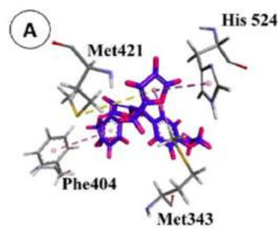

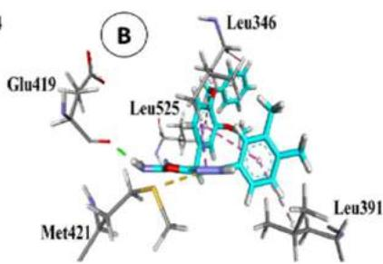

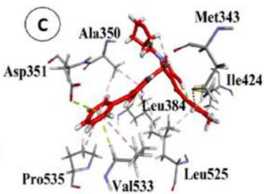

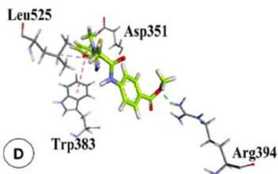

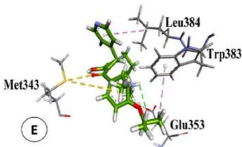  
Figure 4. Three-dimensional interactions of synthetic compounds ZINC08441573 (A), ZINC00664754 (B), ZINC00702695 Figure 4. Three-dimensional interactions of synthetic compounds ZINC08441573 (A), ZINC00664754 (B), ZINC00702695Biology 2021, 10, x FOR PEER REVIEW 14 of 16 (C), ZINC00627464 (D), and ZINC08440501 (E) with the binding site of ERα protein. (C), ZINC00627464 (D), and ZINC08440501 (E) with the binding site of ERα protein.

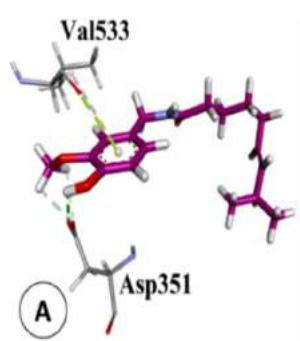

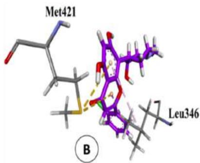

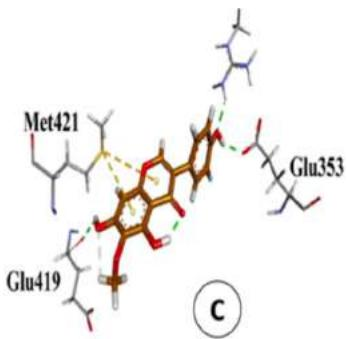

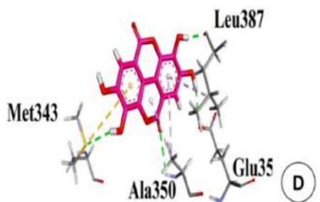  
Figure 5. Three-dimensional interactions of natural compounds capsaicin (A), flavopiridol (B), tectorigenin (C), ellagic acid acid (D) with binding site of ERα p(D) with binding site of ERα protein.

# 4. Conclusions

The bioaccumulation of POPs in adipose tissue and their role in breast cancer development and/or progression was evaluated using the molecular interaction approach. Based on scoring values, short-chained chlorinated paraffins demonstrated strong interactions with the $\operatorname { E R } \alpha$ breast cancer protein compared to organo-chlorines and PCBs. Both synthetic and natural compounds which demonstrated strong associations with the active site of the ERα protein could be potential candidates to treat breast cancer specifically caused by POPs and other organic toxins, and can be used as an alternative to standard drugs. Furthermore, our findings could be validated using in vitro and in vivo approaches.

Supplementary Materials: The following are available online at https://www.mdpi.com/article/ 10.3390/biology10070681/s1, Table S1: Results of re-docking of native inhibitors; Table S2: Crossdocking results for various PDB IDs from $\mathrm { E R } \alpha$ ; Figure S1: Structure of estrogen receptor alpha (ERα/pdb id = 5W9D) protein; Figure S2: Chemical structures and binding energies (B.E. in kcal/mol) of the active compounds obtained from CHEMBL; Figure S3. Plot matrix representation of drug compounds with their attributes; Figure S4. DDI networks generated using K means clustering algorithm and Gephi tool.

Author Contributions: Design, analysis, writing—B.Z. and Z.A.; conceptualization, supervision, resources, visualization, proof reading, validation—A.M.A. and U.R.; funding acquisition, visualization— D.A.A.F., R.M.A. (Roua M. Alkufeidy), F.S.A. and R.M.A. (Reem M. Aljowaie). All authors have read and agreed to the published version of the manuscript.

Funding: The authors extend their appreciation to the researchers supporting project number (RSP-2021/190) King Saud University, Riyadh, Saudi Arabia.

Institutional Review Board Statement: Not applicable.

Data Availability Statement: The data presented in this study are available within the article and supplementary materials.

Acknowledgments: The authors extend their appreciation to the researchers supporting project number (RSP-2021/190) King Saud University, Riyadh, Saudi Arabia. We are grateful to COMSATS University Islamabad, Abbottabad campus for lab facilitation.

Conflicts of Interest: All the authors declare no conflict of interest. The funders had no role in the design of the study; in the collection, analyses, or interpretation of data; in the writing of the manuscript, or in the decision to publish the results.

# References

1. El-Shahawi, M.S.; Hamza, A.; Bashammakh, A.S.; Al-Saggaf, W.T. An overview on the accumulation, distribution, transformations, toxicity and analytical methods for the monitoring of persistent organic pollutants. Talanta 2010, 80, 1587–1597. [CrossRef]   
2. Hinkebein, T. Desalination: Limitations and Challenges; National Academies Press (US): Washington, DC, USA, 2004; ISBN 0-309-53173-X.   
3. Blanchard, M.; Teil, M.J.; Ollivon, D.; Legenti, L.; Chevreuil, M. Polycyclic aromatic hydrocarbons and polychlorobiphenyls in wastewaters and sewage sludges from the Paris area (France). Environ. Res. 2004, 95, 184–197. [CrossRef]   
4. Bräuner, E.V.; Raaschou-Nielsen, O.; Gaudreau, E.; Leblanc, A.; Tjønneland, A.; Overvad, K.; Sørensen, M. Predictors of adipose tissue concentrations of organochlorine pesticides in a general Danish population. J. Expo. Sci. Environ. Epidemiol. 2012, 22, 52–59. [CrossRef]   
5. Jones, K.C.; de Voogt, P. Persistent organic pollutants (POPs): State of the science. Environ. Pollut. 1999, 100, 209–221. [CrossRef]   
6. Bonefeld-Jorgensen, E.C.; Long, M.; Bossi, R.; Ayotte, P.; Asmund, G.; Krüger, T.; Ghisari, M.; Mulvad, G.; Kern, P.; Nzulumiki, P.; et al. Perfluorinated compounds are related to breast cancer risk in greenlandic inuit: A case control study. Environ. Health A Glob. Access Sci. Source 2011, 10, 1–16. [CrossRef] [PubMed]   
7. Ghosh, S.; Murinova, L.; Trnovec, T.; Christopher, A.L.; Washington, K.; Partha, S.M.; Sisir, K.D. Biomarkers linking PCB exposure and obesity. Curr. Pharm. Biotechnol. 2014, 15, 1058–1068. [CrossRef] [PubMed]   
8. Soto, A.M.; Chung, K.L.; Sonnenschein, C. The pesticides endosulfan, toxaphene, and dieldrin have estrogenic effects on human estrogen-sensitive cells. Environ. Health Perspect. 1994, 102, 380–383. [CrossRef]   
9. Bray, F.; Ferlay, J.; Soerjomataram, I.; Siegel, R.L.; Torre, L.A.; Jemal, A. Global cancer statistics 2018: GLOBOCAN estimates of incidence and mortality worldwide for 36 cancers in 185 countries. CA. Cancer J. Clin. 2018, 68, 394–424. [CrossRef] [PubMed]

10. Subramanian, A.; Salhab, M.; Mokbel, K. Oestrogen producing enzymes and mammary carcinogenesis: A review. Breast Cancer Res. Treat. 2008, 111, 191–202. [CrossRef]   
11. Nagel, A.; Szade, J.; Iliszko, M.; Elzanowska, J.; Welnicka-Jaskiewicz, M.; Skokowski, J.; Stasilojc, G.; Bigda, J.; Sadej, R.; Zaczek, A.; et al. Clinical and biological significance of ESR1 gene alteration and estrogen receptors isoforms expression in breast cancer patients. Int. J. Mol. Sci. 2019, 20, 1881. [CrossRef]   
12. Ennour-Idrissi, K.; Ayotte, P.; Diorio, C. Persistent organic pollutants and breast cancer: A systematic review and critical appraisal of the literature. Cancers 2019, 11, 1063. [CrossRef] [PubMed]   
13. Tong, C.W.S.; Wu, M.; Cho, W.C.S.; To, K.K.W. Recent advances in the treatment of breast cancer. Front. Oncol. 2018, 8. [CrossRef]   
14. Munir, A.; Elahi, S.; Masood, N. Clustering based drug-drug interaction networks for possible repositioning of drugs against EGFR mutations: Clustering based DDI networks for EGFR mutations. Comput. Biol. Chem. 2018, 75, 24–31. [CrossRef] [PubMed]   
15. Zainab, B.; Ayaz, Z.; Munir, A.; Hossam Mahmoud, A.; Soliman Elsheikh, M.; Mehmood, A.; Khan, S.; Rizwan, M.; Jahangir, K.; Mehmood Abbasi, A. Repositioning of strongly integrated drugs against achromatopsia (CNGB3). J. King Saud Univ. Sci. 2020, 32, 1793–1811. [CrossRef]   
16. Cronin, M.T.D.T.D.D.; Jaworska, J.S.; Walker, J.D.; Comber, M.H.I.; Watts, C.D.; Worth, A.P.P.; Basketter, D.; Casati, S.; Gerberick, G.F.; Griem, P.; et al. Report of the EPAA-ECVAM workshop on the validation of Integrated Testing Strategies (ITS). Altern. Lab. Anim. 2008, 27, 258–284. [CrossRef]   
17. Edelman, L.B.; Eddy, J.A.; Price, N.D. In silico models of cancer. Wiley Interdiscip. Rev. Syst. Biol. Med. 2010, 2, 438–459. [CrossRef] [PubMed]   
18. Nath, O.; Singh, A.; Singh, I.K. In-Silico drug discovery approach targeting receptor tyrosine kinase-like orphan receptor 1 for cancer treatment. Sci. Rep. 2017, 7, 1–10. [CrossRef]   
19. Cassidy, C.E.; Setzer, W.N. Cancer-relevant biochemical targets of cytotoxic Lonchocarpus flavonoids: A molecular docking analysis. J. Mol. Model. 2010, 16, 311–326. [CrossRef] [PubMed]   
20. Majeed, A.I.; Ullah, A.; Jadoon, M.; Ahmad, W.; Riazuddin, S. Screening, diagnosis and genetic study of breast cancer patients in Pakistan. Pakistan J. Med. Sci. 2020, 36, 16–20. [CrossRef]   
21. Safran, M.; Dalah, I.; Alexander, J.; Rosen, N.; Iny Stein, T.; Shmoish, M.; Nativ, N.; Bahir, I.; Doniger, T.; Krug, H.; et al. Gene Cards Version 3: The human gene integrator. Database 2010, 2010, 1–16. [CrossRef]   
22. Rose, P.W.; Prli´c, A.; Altunkaya, A.; Bi, C.; Bradley, A.R.; Christie, C.H.; Di Costanzo, L.; Duarte, J.M.; Dutta, S.; Feng, Z.; et al. The RCSB protein data bank: Integrative view of protein, gene and 3D structural information. Nucleic Acids Res. 2017, 45, D271–D281. [CrossRef] [PubMed]   
23. Yang, H.; Lou, C.; Sun, L.; Li, J.; Cai, Y.; Wang, Z.; Li, W.; Liu, G.; Tang, Y. AdmetSAR 2.0: Web-service for prediction and optimization of chemical ADMET properties. Bioinformatics 2019, 35, 1067–1069. [CrossRef] [PubMed]   
24. Wang, Y.; Bryant, S.H.; Cheng, T.; Wang, J.; Gindulyte, A.; Shoemaker, B.A.; Thiessen, P.A.; He, S.; Zhang, J. PubChem BioAssay: 2017 update. Nucleic Acids Res. 2017, 45, D955–D963. [CrossRef] [PubMed]   
25. Wadood, A.; Ahmed, N.; Shah, L.; Ahmad, A.; Hassan, H.; Shams, S. In-silico drug design: An approach which revolutionarised the drug discovery process. OA Drug Des. Deliv. 2013, 1. [CrossRef]   
26. Sapundzhi, F.I.; Dzimbova, T.A. Computer modelling of the CB1 receptor by Molecular Operating Environment. Bulg. Chem. Commun. 2018, 50, 15–19.   
27. Hall, M.; Frank, E.; Holmes, G.; Pfahringer, B.; Reutemann, P.; Witten, I.H. The WEKA data mining software: An update. ACM SIGKDD Explor. Newsl. 2009, 11, 10–18. [CrossRef]   
28. Bastian, M.; Heymann, S.; Jacomy, M. Gephi: An open source software for exploring and manipulating networks. BT-International AAAI Conference on Weblogs and Social. In Proceedings of the 3rd international AAAI conference on weblogs and social media, San Jose, CA, USA, 17–20 May 2009; pp. 361–362.   
29. Réau, M.; Langenfeld, F.; Zagury, J.F.; Lagarde, N.; Montes, M. Decoys selection in benchmarking datasets: Overview and perspectives. Front. Pharmacol. 2018, 9. [CrossRef]   
30. Prieto-Martínez, F.D.; Arciniega, M.; Medina-Franco, J.L. Acoplamiento molecular: Avances recientes y retos. TIP Rev. Espec. Cienc. Químico Biológicas 2018, 21, 65–87. [CrossRef]   
31. Hathout, R.M.; Abdelhamid, S.G.; El-Housseiny, G.S.; Metwally, A.A. Comparing cefotaxime and ceftriaxone in combating meningitis through nose-to-brain delivery using bio/chemoinformatics tools. Sci. Rep. 2020, 10, 1–7. [CrossRef]   
32. Belpomme, D.; Irigaray, P.; Hardell, L.; Clapp, R.; Montagnier, L.; Epstein, S.; Sasco, A.J. The multitude and diversity of environmental carcinogens. Environ. Res. 2007, 105, 414–429. [CrossRef]   
33. Arrebola, J.P.; Fernández-Rodríguez, M.; Artacho-Cordón, F.; Garde, C.; Perez-Carrascosa, F.; Linares, I.; Tovar, I.; González-Alzaga, B.; Expósito, J.; Torne, P.; et al. Associations of persistent organic pollutants in serum and adipose tissue with breast cancer prognostic markers. Sci. Total Environ. 2016, 566–567, 41–49. [CrossRef] [PubMed]   
34. Aubé, M.; Larochelle, C.; Ayotte, P. Differential effects of a complex organochlorine mixture on the proliferation of breast cancer cell lines. Environ. Res. 2011, 111, 337–347. [CrossRef] [PubMed]   
35. Fitriah, A.; Holil, K.; Syarifah, U.; Fitriyah, F.; Utomo, D.H. In silico approach for revealing the anti-breast cancer and estrogen receptor alpha inhibitory activity of Artocarpus altilis. AIP Conf. Proc. 2018, 2021, 1–7. [CrossRef]   
36. Science, E.; Ballschmiter, K. Persistent organic pollutants 274 review articles review articles: Persistent Organic Pollutants Man-made Chemicals Found in Remote Areas of the World. Environ. Sci. Pollut. Res. 2019. [CrossRef]

37. Zheng, X.; Sun, Q.; Wang, S.; Li, X.; Liu, P.; Yan, Z.; Kong, X.; Fan, J. Advances in studies on toxic effects of short-chain chlorinated paraffins (SCCPs) and characterization of environmental pollution in china. Arch. Environ. Contam. Toxicol. 2020, 78, 501–512. [CrossRef]   
38. UNEP. Stockholm Convention on Persistent Organic Pollutants (POPs): Text and Annexesas Amended in 2009.Secretariat of the Stockholm Convention on Persistent Organic Pollutants; United Nations Environment Programme (UNEP): Nairobi, Kenya; International Environment House: Geneva, Switzerland, 2009.   
39. Fiedler, H. Short-chain chlorinated paraffins: Production, use and international regulations. In Chlorinated Paraffins; Springer: Berlin, Heidelberg, 2010; pp. 1–40. [CrossRef]   
40. Gong, Y.; Zhang, H.; Geng, N.; Xing, L.; Fan, J.; Luo, Y.; Song, X.; Ren, X.; Wang, F.; Chen, J. Short-chain chlorinated paraffins (SCCPs) induced thyroid disruption by enhancement of hepatic thyroid hormone influx and degradation in male Sprague Dawley rats. Sci. Total Environ. 2018, 625, 657–666. [CrossRef] [PubMed]   
41. Harno, E.; Ramamoorthy, T.G.; Coll, A.P.; White, A. POMC: The physiological power of hormone processing. Physiol. Rev. 2018, 98, 2381–2430. [CrossRef]   
42. Jiang, Y.; Yang, S.; Liu, J.; Ren, T.; Zhang, Y.; Sun, X. Degradation of hexabromocyclododecane (HBCD) by nanoscale zero-valent aluminum (nZVAl). Chemosphere 2020, 244, 125536. [CrossRef]   
43. Szabo, D.T. Hexabromocyclododecane. Encycl. Toxicol. Third Ed. 2014, 2, 864–868. [CrossRef]   
44. Maras, M.; Vanparys, C.; Muylle, F.; Robbens, J.; Berger, U.; Barber, J.L.; Blust, R.; De Coen, W. Estrogen-like properties of fluorotelomer alcohols as revealed by MCF-7 breast cancer cell proliferation. Environ. Health Perspect. 2006, 114, 100–105. [CrossRef]   
45. Zhou, J.; Ng, S.; Adesanya-Famuiya, O.; Anderson, K.; Bondy, C.A. Testosterone inhibits estrogen-induced mammary epithelial proliferation and suppresses estrogen receptor expression. FASEB J. 2000, 14, 1725–1730. [CrossRef]   
46. Folkerd, E.; Dowsett, M. Sex hormones and breast cancer risk and prognosis. Breast 2013, 22, S38–S43. [CrossRef] [PubMed]   
47. Somboonporn, W.; Davis, S.R. Testosterone effects on the breast: Implications for testosterone therapy for women. Endocr. Rev. 2004, 25, 374–388. [CrossRef] [PubMed]   
48. Pasqualini, J.R.; Chetrite, G.S.; Pasqualini, J.R. Biological responses of progestogen metabolites in normal and cancerous human breast. Horm. Mol. Biol. Clin. Investig. 2010, 3, 427–435. [CrossRef] [PubMed]   
49. Trabert, B.; Sherman, M.E.; Kannan, N.; Stanczyk, F.Z. Progesterone and breast cancer. Endocr. Rev. 2019, 41, 320–344. [CrossRef] [PubMed]

MDPI

St. Alban-Anlage 66

4052 Basel

Switzerland

Tel. $+ 4 1$ 61 683 77 34

Fax +41 61 302 89 18

www.mdpi.com

Biology Editorial Office

E-mail: biology@mdpi.com

www.mdpi.com/journal/biology

MDPI

MDPI

St. Alban-Anlage 66

4052 Basel

Switzerland

Tel: +41 61 683 77 34

www.mdpi.com

MDPI

# PERCEPTIONS

# OF A RENEGADE

# MIND

# DAVID ICKE

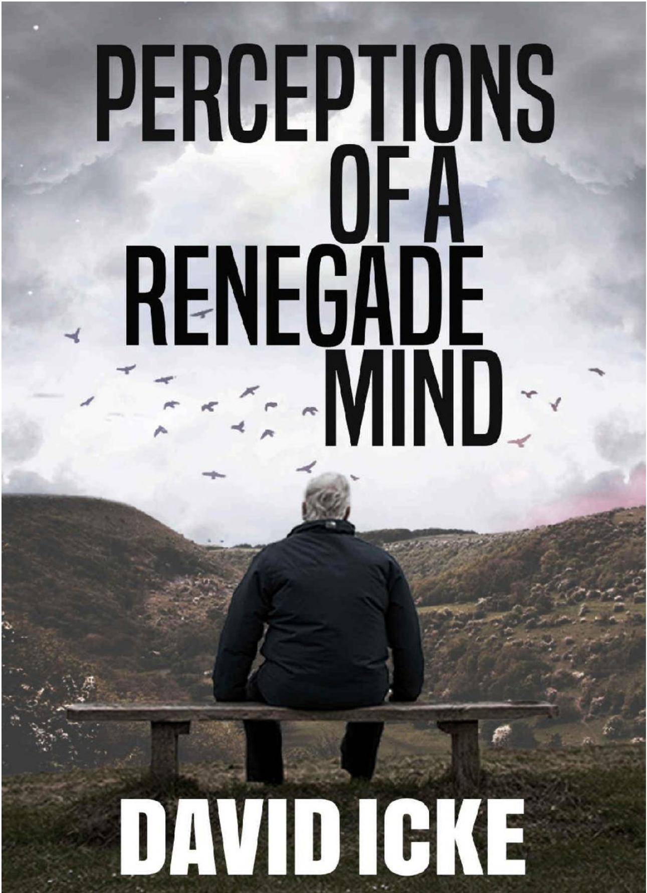

# PERCEPTIONS OFA RENNEGADE MIN

ickonic publishing

First published in July 2021.

ickonic publishing

New Enterprise House

St Helens Street

Derby

DE1 3GY

UK

email: gareth.icke@davidicke.com

Copyright $©$ 2021 David Icke

No part of this book may be reproduced in any form without permission from the Publisher, except for the quotation of brief passages in criticism

Cover Design: Gareth Icke

Book Design: Neil Hague

British Library Cataloguing-in Publication Data

A catalogue record for this book is available from the British Library

eISBN 978-18384153-1-0

# PERCEPTIONS OFA RENEGADE MIND.

DAVID ICKE

# Dedication:

To Freeeeeedom!

# ICKONIC THE ALTERNATIVE

NEW. DIFFERENT. REVOLUTIONARY

HUNDREDS OF CUTTING EDGE DOCUMENTARIES, FEATURE FILMS, SERIES & PODCASTS.

SIGN UP NOW AT ICKONIC.COM

# THE LIFE STORY OF DAVID ICKE

# RENEGADEE

# THE FEATURE LENGTH FILM

  
AVAILABLE NOW AT DAVIDICKE.COM

Renegade:

Adjective

‘Having rejected tradition: Unconventional.’

Merriam-Webster Dictionary

# Acquiescence to tyranny is the death of the spirit

You may be 38 years old, as I happen to be. And one day, some great opportunity stands before you and calls you to stand up for some great principle, some great issue, some great cause. And you refuse to do it because you are afraid … You refuse to do it because you want to live longer …

You’re afraid that you will lose your job, or you are afraid that you will be criticised or that you will lose your popularity, or you’re afraid that somebody will stab you, or shoot at you or bomb your house; so you refuse to take the stand.

Well, you may go on and live until you are 90, but you’re just as dead at 38 as you would be at 90. And the cessation of breathing in your life is but the belated announcement of an earlier death of the spirit.

Martin Luther King

# How the few control the many and always have – the many do whatever they’re told

‘Forward, the Light Brigade!’

Was there a man dismayed?

Not though the soldier knew

Someone had blundered.

Theirs not to make reply,

Theirs not to reason why,

Theirs but to do and die.

Into the valley of Death

Rode the six hundred.

Cannon to right of them,

Cannon to le of them,

Cannon in front of them

Volleyed and thundered;

Stormed at with shot and shell,

Boldly they rode and well,

Into the jaws of Death,

Into the mouth of hell

Rode the six hundred

Alfred Lord Tennyson (1809-1892)

The mist is liing slowly I can see the way ahead And I’ve le behind the empty streets That once inspired my life And the strength of the emotion Is like thunder in the air ’Cos the promise that we made each other Haunts me to the end

The secret of your beauty And the mystery of your soul I’ve been searching for in everyone I meet And the times I’ve been mistaken It’s impossible to say And the grass is growing Underneath our feet

The words that I remember From my childhood still are true That there’s none so blind As those who will not see And to those who lack the courage And say it’s dangerous to try Well they just don’t know That love eternal will not be denied

I know you’re out there somewhere Somewhere, somewhere I know you’re out there somewhere

Somewhere you can hear my voice I know I’ll find you somehow Somehow, somehow I know I’ll find you somehow And somehow I’ll return again to you

The Moody Blues

# Are you a gutless wonder - or a Renegade Mind?

Monuments put from pen to paper, Turns me into a gutless wonder, And if you tolerate this, Then your children will be next. Gravity keeps my head down, Or is it maybe shame ...

# Manic Street Preachers

Rise like lions aer slumber In unvanquishable number. Shake your chains to earth like dew Which in sleep have fallen on you. Ye are many – they are few.

Percy Shelley

# Contents

CHAPTER 1 ‘I’m thinking’ – Oh, but are you?

CHAPTER 2 Renegade perception

CHAPTER 3 The Pushbacker sting

CHAPTER 4 ‘Covid’: The calculated catastrophe

CHAPTER 5 There is no ‘virus’

CHAPTER 6 Sequence of deceit

CHAPTER 7 War on your mind

CHAPTER 8 ‘Reframing’ insanity

CHAPTER 9 We must have it? So what is it?

CHAPTER 10 Human 2.0

CHAPTER 11 Who controls the Cult?

CHAPTER 12 Escaping Wetiko

Postscript

APPENDIX Cowan-Kaufman-Morell Statement on Virus Isolation

BIBLIOGRAPHY

INDEX

# CHAPTER ONE

# I’m thinking’ – Oh, but are you?

# Think for yourself and let others enjoy the privilege of doing so too Voltaire

French-born philosopher, mathematician and scientist René Descartes became famous for his statement in Latin in the 17th century which translates into English as: ‘I think, therefore I am.’

On the face of it that is true. Thought reflects perception and perception leads to both behaviour and self-identity. In that sense ‘we’ are what we think. But who or what is doing the thinking and is thinking the only route to perception? Clearly, as we shall see, ‘we’ are not always the source of ‘our’ perception, indeed with regard to humanity as a whole this is rarely the case; and thinking is far from the only means of perception. Thought is the village idiot compared with other expressions of consciousness that we all have the potential to access and tap into. This has to be true when we are those other expressions of consciousness which are infinite in nature. We have forgoen this, or, more to the point, been manipulated to forget.

These are not just the esoteric musings of the navel. The whole foundation of human control and oppression is control of perception. Once perception is hijacked then so is behaviour which is dictated by perception. Collective perception becomes collective behaviour and collective behaviour is what we call human society. Perception is all and those behind human control know that which is

why perception is the target 24/7 of the psychopathic manipulators that I call the Global Cult. They know that if they dictate perception they will dictate behaviour and collectively dictate the nature of human society. They are further aware that perception is formed from information received and if they control the circulation of information they will to a vast extent direct human behaviour.

Censorship of information and opinion has become globally Nazilike in recent years and never more blatantly than since the illusory ‘virus pandemic’ was triggered out of China in 2019 and across the world in 2020. Why have billions submied to house arrest and accepted fascistic societies in a way they would have never believed possible? Those controlling the information spewing from government, mainstream media and Silicon Valley (all controlled by the same Global Cult networks) told them they were in danger from a ‘deadly virus’ and only by submiing to house arrest and conceding their most basic of freedoms could they and their families be protected. This monumental and provable lie became the

perception of the billions and therefore the behaviour of the billions. In those few words you have the whole structure and modus operandi of human control. Fear is a perception – False Emotion Appearing Real – and fear is the currency of control. In short … get them by the balls (or give them the impression that you have) and their hearts and minds will follow. Nothing grips the dangly bits and freezes the rear-end more comprehensively than fear.

# World number 1

There are two ‘worlds’ in what appears to be one ‘world’ and the prime difference between them is knowledge. First we have the mass of human society in which the population is maintained in coldlycalculated ignorance through control of information and the ‘education’ (indoctrination) system. That’s all you really need to control to enslave billions in a perceptual delusion in which what are perceived to be their thoughts and opinions are ever-repeated mantras that the system has been downloading all their lives through ‘education’, media, science, medicine, politics and academia

in which the personnel and advocates are themselves overwhelmingly the perceptual products of the same repetition. Teachers and academics in general are processed by the same programming machine as everyone else, but unlike the great majority they never leave the ‘education’ program. It gripped them as students and continues to grip them as programmers of subsequent generations of students. The programmed become the programmers – the programmed programmers. The same can largely be said for scientists, doctors and politicians and not least because as the American writer Upton Sinclair said: ‘It is difficult to get a man to understand something when his salary depends upon his not understanding it.’ If your career and income depend on thinking the way the system demands then you will – bar a few freeminded exceptions – concede your mind to the Perceptual Mainframe that I call the Postage Stamp Consensus. This is a tiny band of perceived knowledge and possibility ‘taught’ (downloaded) in the schools and universities, pounded out by the mainstream media and on which all government policy is founded. Try thinking, and especially speaking and acting, outside of the ‘box’ of consensus and see what that does for your career in the Mainstream Everything which bullies, harasses, intimidates and ridicules the population into compliance. Here we have the simple structure which enslaves most of humanity in a perceptual prison cell for an entire lifetime and I’ll go deeper into this process shortly. Most of what humanity is taught as fact is nothing more than programmed belief. American science fiction author Frank Herbert was right when he said: ‘Belief can be manipulated. Only knowledge is dangerous.’ In the ‘Covid’ age belief is promoted and knowledge is censored. It was always so, but never to the extreme of today.

# World number 2

A ‘number $2 ^ { \prime }$ is slang for ‘doing a poo’ and how appropriate that is when this other ‘world’ is doing just that on humanity every minute of every day. World number 2 is a global network of secret societies and semi-secret groups dictating the direction of society via

governments, corporations and authorities of every kind. I have spent more than 30 years uncovering and exposing this network that I call the Global Cult and knowing its agenda is what has made my books so accurate in predicting current and past events. Secret societies are secret for a reason. They want to keep their hoarded knowledge to themselves and their chosen initiates and to hide it from the population which they seek through ignorance to control and subdue. The whole foundation of the division between World 1 and World 2 is knowledge. What number 1 knows number 2 must not. Knowledge they have worked so hard to keep secret includes (a) the agenda to enslave humanity in a centrally-controlled global dictatorship, and (b) the nature of reality and life itself. The laer (b) must be suppressed to allow the former (a) to prevail as I shall be explaining. The way the Cult manipulates and interacts with the population can be likened to a spider’s web. The ‘spider’ sits at the centre in the shadows and imposes its will through the web with each strand represented in World number 2 by a secret society, satanic or semi-secret group, and in World number 1 – the world of the seen – by governments, agencies of government, law enforcement, corporations, the banking system, media conglomerates and Silicon Valley (Fig $1$ overleaf). The spider and the web connect and coordinate all these organisations to pursue the same global outcome while the population sees them as individual entities working randomly and independently. At the level of the web governments are the banking system are the corporations are the media are Silicon Valley are the World Health Organization working from their inner cores as one unit. Apparently unconnected countries, corporations, institutions, organisations and people are on the same team pursuing the same global outcome. Strands in the web immediately around the spider are the most secretive and exclusive secret societies and their membership is emphatically restricted to the Cult inner-circle emerging through the generations from particular bloodlines for reasons I will come to. At the core of the core you would get them in a single room. That’s how many people are dictating the direction of human society and its transformation

through the ‘Covid’ hoax and other means. As the web expands out from the spider we meet the secret societies that many people will be aware of – the Freemasons, Knights Templar, Knights of Malta, Opus Dei, the inner sanctum of the Jesuit Order, and such like. Note how many are connected to the Church of Rome and there is a reason for that. The Roman Church was established as a revamp, a rebranding, of the relocated ‘Church’ of Babylon and the Cult imposing global tyranny today can be tracked back to Babylon and Sumer in what is now Iraq.

  
Figure 1: The global web through which the few control the many. (Image Neil Hague.)

Inner levels of the web operate in the unseen away from the public eye and then we have what I call the cusp organisations located at the point where the hidden meets the seen. They include a series of satellite organisations answering to a secret society founded in London in the late 19th century called the Round Table and among them are the Royal Institute of International Affairs (UK, founded in 1920); Council on Foreign Relations (US, 1921); Bilderberg Group (worldwide, 1954); Trilateral Commission (US/worldwide, 1972); and the Club of Rome (worldwide, 1968) which was created to exploit environmental concerns to justify the centralisation of global power to ‘save the planet’. The Club of Rome instigated with others the human-caused climate change hoax which has led to all the ‘green

new deals’ demanding that very centralisation of control. Cusp organisations, which include endless ‘think tanks’ all over the world, are designed to coordinate a single global policy between political and business leaders, intelligence personnel, media organisations and anyone who can influence the direction of policy in their own sphere of operation. Major players and regular aenders will know what is happening – or some of it – while others come and go and are kept overwhelmingly in the dark about the big picture. I refer to these cusp groupings as semi-secret in that they can be publicly identified, but what goes on at the inner-core is kept very much ‘in house’ even from most of their members and participants through a fiercely-imposed system of compartmentalisation. Only let them know what they need to know to serve your interests and no more. The structure of secret societies serves as a perfect example of this principle. Most Freemasons never get higher than the boom three levels of ‘degree’ (degree of knowledge) when there are 33 official degrees of the Scoish Rite. Initiates only qualify for the next higher ‘compartment’ or degree if those at that level choose to allow them. Knowledge can be carefully assigned only to those considered ‘safe’. I went to my local Freemason’s lodge a few years ago when they were having an ‘open day’ to show how cuddly they were and when I chaed to some of them I was astonished at how lile the rank and file knew even about the most ubiquitous symbols they use. The mushroom technique – keep them in the dark and feed them bullshit – applies to most people in the web as well as the population as a whole. Sub-divisions of the web mirror in theme and structure transnational corporations which have a headquarters somewhere in the world dictating to all their subsidiaries in different countries. Subsidiaries operate in their methodology and branding to the same centrally-dictated plan and policy in pursuit of particular ends. The Cult web functions in the same way. Each country has its own web as a subsidiary of the global one. They consist of networks of secret societies, semi-secret groups and bloodline families and their job is to impose the will of the spider and the global web in their particular country. Subsidiary networks control and manipulate the national political system, finance, corporations, media, medicine, etc. to

ensure that they follow the globally-dictated Cult agenda. These networks were the means through which the ‘Covid’ hoax could be played out with almost every country responding in the same way.

# The ‘Yessir’ pyramid

Compartmentalisation is the key to understanding how a tiny few can dictate the lives of billions when combined with a top-down sequence of imposition and acquiescence. The inner core of the Cult sits at the peak of the pyramidal hierarchy of human society (Fig 2 overleaf). It imposes its will – its agenda for the world – on the level immediately below which acquiesces to that imposition. This level then imposes the Cult will on the level below them which acquiesces and imposes on the next level. Very quickly we meet levels in the hierarchy that have no idea there even is a Cult, but the sequence of imposition and acquiescence continues down the pyramid in just the same way. ‘I don’t know why we are doing this but the order came from “on-high” and so we beer just do it.’ Alfred Lord Tennyson said of the cannon fodder levels in his poem The Charge of the Light Brigade: ‘Theirs not to reason why; theirs but to do and die.’ The next line says that ‘into the valley of death rode the six hundred’ and they died because they obeyed without question what their perceived ‘superiors’ told them to do. In the same way the population capitulated to ‘Covid’. The whole hierarchical pyramid functions like this to allow the very few to direct the enormous many.

Eventually imposition-acquiescence-imposition-acquiescence comes down to the mass of the population at the foot of the pyramid. If they acquiesce to those levels of the hierarchy imposing on them (governments/law enforcement/doctors/media) a circuit is completed between the population and the handful of superpsychopaths in the Cult inner core at the top of the pyramid. Without a circuit-breaking refusal to obey, the sequence of imposition and acquiescence allows a staggeringly few people to impose their will upon the entirety of humankind. We are looking at the very sequence that has subjugated billions since the start of 2020. Our freedom has not been taken from us. Humanity has given it

away. Fascists do not impose fascism because there are not enough of them. Fascism is imposed by the population acquiescing to fascism. Put another way allowing their perceptions to be programmed to the extent that leads to the population giving their freedom away by giving their perceptions – their mind – away. If this circuit is not broken by humanity ceasing to cooperate with their own enslavement then nothing can change. For that to happen people have to critically think and see through the lies and window dressing and then summon the backbone to act upon what they see. The Cult spends its days working to stop either happening and its methodology is systematic and highly detailed, but it can be overcome and that is what this book is all about.

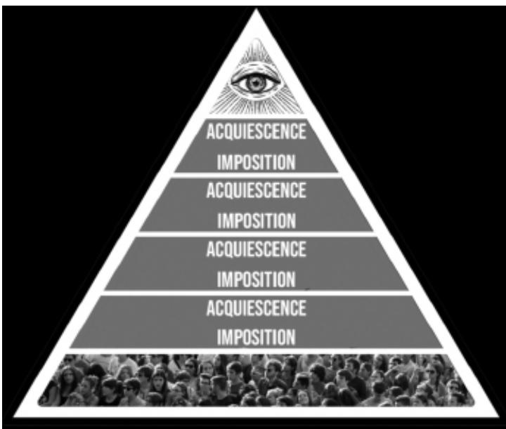  
Figure 2: The simple sequence of imposition and compliance that allows a handful of people at the peak of the pyramid to dictate the lives of billions.

# The Life Program

Okay, back to world number 1 or the world of the ‘masses’. Observe the process of what we call ‘life’ and it is a perceptual download from cradle to grave. The Cult has created a global structure in which perception can be programmed and the program continually topped-up with what appears to be constant confirmation that the program is indeed true reality. The important word here is ‘appears’.

This is the structure, the fly-trap, the Postage Stamp Consensus or Perceptual Mainframe, which represents that incredibly narrow band of perceived possibility delivered by the ‘education’ system, mainstream media, science and medicine. From the earliest age the download begins with parents who have themselves succumbed to the very programming their children are about to go through. Most parents don’t do this out of malevolence and mostly it is quite the opposite. They do what they believe is best for their children and that is what the program has told them is best. Within three or four years comes the major transition from parental programming to fullblown state (Cult) programming in school, college and university where perceptually-programmed teachers and academics pass on their programming to the next generations. Teachers who resist are soon marginalised and their careers ended while children who resist are called a problem child for whom Ritalin may need to be prescribed. A few years aer entering the ‘world’ children are under the control of authority figures representing the state telling them when they have to be there, when they can leave and when they can speak, eat, even go to the toilet. This is calculated preparation for a lifetime of obeying authority in all its forms. Reflex-action fear of authority is instilled by authority from the start. Children soon learn the carrot and stick consequences of obeying or defying authority which is underpinned daily for the rest of their life. Fortunately I daydreamed through this crap and never obeyed authority simply because it told me to. This approach to my alleged ‘beers’ continues to this day. There can be consequences of pursuing open-minded freedom in a world of closed-minded conformity. I spent a lot of time in school corridors aer being ejected from the classroom for not taking some of it seriously and now I spend a lot of time being ejected from Facebook, YouTube and Twier. But I can tell you that being true to yourself and not compromising your self-respect is far more exhilarating than bowing to authority for authority’s sake. You don’t have to be a sheep to the shepherd (authority) and the sheep dog (fear of not obeying authority).

The perceptual download continues throughout the formative years in school, college and university while script-reading ‘teachers’, ‘academics’ ‘scientists’, ‘doctors’ and ‘journalists’ insist that ongoing generations must be as programmed as they are. Accept the program or you will not pass your ‘exams’ which confirm your ‘degree’ of programming. It is tragic to think that many parents pressure their offspring to work hard at school to download the program and qualify for the next stage at college and university. The late, great, American comedian George Carlin said: ‘Here’s a bumper sticker I’d like to see: We are proud parents of a child who has resisted his teachers’ aempts to break his spirit and bend him to the will of his corporate masters.’ Well, the best of luck finding many of those, George. Then comes the moment to leave the formal programming years in academia and enter the ‘adult’ world of work. There you meet others in your chosen or prescribed arena who went through the same Postage Stamp Consensus program before you did. There is therefore overwhelming agreement between almost everyone on the basic foundations of Postage Stamp reality and the rejection, even contempt, of the few who have a mind of their own and are prepared to use it. This has two major effects. Firstly, the consensus confirms to the programmed that their download is really how things are. I mean, everyone knows that, right? Secondly, the arrogance and ignorance of Postage Stamp adherents ensure that anyone questioning the program will have unpleasant consequences for seeking their own truth and not picking their perceptions from the shelf marked: ‘Things you must believe without question and if you don’t you’re a dangerous lunatic conspiracy theorist and a harebrained nuer’.

Every government, agency and corporation is founded on the same Postage Stamp prison cell and you can see why so many people believe the same thing while calling it their own ‘opinion’. Fusion of governments and corporations in pursuit of the same agenda was the definition of fascism described by Italian dictator Benito Mussolini. The pressure to conform to perceptual norms downloaded for a lifetime is incessant and infiltrates society right

down to family groups that become censors and condemners of their own ‘black sheep’ for not, ironically, being sheep. We have seen an explosion of that in the ‘Covid’ era. Cult-owned global media unleashes its propaganda all day every day in support of the Postage Stamp and targets with abuse and ridicule anyone in the public eye who won’t bend their mind to the will of the tyranny. Any response to this is denied (certainly in my case). They don’t want to give a platform to expose official lies. Cult-owned-and-created Internet giants like Facebook, Google, YouTube and Twier delete you for having an unapproved opinion. Facebook boasts that its AI censors delete 97-percent of ‘hate speech’ before anyone even reports it. Much of that ‘hate speech’ will simply be an opinion that Facebook and its masters don’t want people to see. Such perceptual oppression is widely known as fascism. Even Facebook executive Benny Thomas, a ‘CEO Global Planning Lead’, said in comments secretly recorded by investigative journalism operation Project Veritas that Facebook is ‘too powerful’ and should be broken up:

I mean, no king in history has been the ruler of two billion people, but Mark Zuckerberg is … And he’s 36. That’s too much for a 36-year-old ... You should not have power over two billion people. I just think that’s wrong.

Thomas said Facebook-owned platforms like Instagram, Oculus, and WhatsApp needed to be separate companies. ‘It’s too much power when they’re all one together’. That’s the way the Cult likes it, however. We have an executive of a Cult organisation in Benny Thomas that doesn’t know there is a Cult such is the compartmentalisation. Thomas said that Facebook and Google ‘are no longer companies, they’re countries’. Actually they are more powerful than countries on the basis that if you control information you control perception and control human society.

# I love my oppressor

Another expression of this psychological trickery is for those who realise they are being pressured into compliance to eventually

convince themselves to believe the official narratives to protect their self-respect from accepting the truth that they have succumbed to meek and subservient compliance. Such people become some of the most vehement defenders of the system. You can see them everywhere screaming abuse at those who prefer to think for themselves and by doing so reminding the compliers of their own capitulation to conformity. ‘You are talking dangerous nonsense you Covidiot!!’ Are you trying to convince me or yourself? It is a potent form of Stockholm syndrome which is defined as: ‘A psychological condition that occurs when a victim of abuse identifies and aaches, or bonds, positively with their abuser.’ An example is hostages bonding and even ‘falling in love’ with their kidnappers. The syndrome has been observed in domestic violence, abused children, concentration camp inmates, prisoners of war and many and various Satanic cults. These are some traits of Stockholm syndrome listed at goodtherapy.org:

•  Positive regard towards perpetrators of abuse or captor [see ‘Covid’].   
•  Failure to cooperate with police and other government authorities when it comes to holding perpetrators of abuse or kidnapping accountable [or in the case of ‘Covid’ cooperating with the police to enforce and defend their captors’ demands].   
•  Lile or no effort to escape [see ‘Covid’].   
•  Belief in the goodness of the perpetrators or kidnappers [see ‘Covid’].   
Appeasement of captors. This is a manipulative strategy for maintaining one’s safety. As victims get rewarded – perhaps with less abuse or even with life itself – their appeasing behaviours are reinforced [see ‘Covid’].   
•  Learned helplessness. This can be akin to ‘if you can’t beat ‘em, join ‘em’. As the victims fail to escape the abuse or captivity, they may start giving up and soon realize it’s just easier for everyone if they acquiesce all their power to their captors [see ‘Covid’].

Feelings of pity toward the abusers, believing they are actually

victims themselves. Because of this, victims may go on a crusade or mission to ‘save’ [protect] their abuser [see the venom unleashed on those challenging the official ‘Covid’ narrative].   
•  Unwillingness to learn to detach from their perpetrators and heal. In essence, victims may tend to be less loyal to themselves than to their abuser [ definitely see ‘Covid’].

Ponder on those traits and compare them with the behaviour of great swathes of the global population who have defended governments and authorities which have spent every minute destroying their lives and livelihoods and those of their children and grandchildren since early 2020 with fascistic lockdowns, house arrest and employment deletion to ‘protect’ them from a ‘deadly virus’ that their abusers’ perceptually created to bring about this very outcome. We are looking at mass Stockholm syndrome. All those that agree to concede their freedom will believe those perceptions are originating in their own independent ‘mind’ when in fact by conceding their reality to Stockholm syndrome they have by definition conceded any independence of mind. Listen to the ‘opinions’ of the acquiescing masses in this ‘Covid’ era and what gushes forth is the repetition of the official version of everything delivered unprocessed, unfiltered and unquestioned. The whole programming dynamic works this way. I must be free because I’m told that I am and so I think that I am.

You can see what I mean with the chapter theme of ‘I’m thinking – Oh, but are you?’ The great majority are not thinking, let alone for themselves. They are repeating what authority has told them to believe which allows them to be controlled. Weaving through this mentality is the fear that the ‘conspiracy theorists’ are right and this again explains the oen hysterical abuse that ensues when you dare to contest the official narrative of anything. Denial is the mechanism of hiding from yourself what you don’t want to be true. Telling people what they want to hear is easy, but it’s an infinitely greater challenge to tell them what they would rather not be happening.

One is akin to pushing against an open door while the other is met with vehement resistance no maer what the scale of evidence. I don’t want it to be true so I’ll convince myself that it’s not. Examples are everywhere from the denial that a partner is cheating despite all the signs to the reflex-action rejection of any idea that world events in which country aer country act in exactly the same way are centrally coordinated. To accept the laer is to accept that a force of unspeakable evil is working to destroy your life and the lives of your children with nothing too horrific to achieve that end. Who the heck wants that to be true? But if we don’t face reality the end is duly achieved and the consequences are far worse and ongoing than breaking through the walls of denial today with the courage to make a stand against tyranny.

# Connect the dots – but how?

A crucial aspect of perceptual programming is to portray a world in which everything is random and almost nothing is connected to anything else. Randomness cannot be coordinated by its very nature and once you perceive events as random the idea they could be connected is waved away as the rantings of the tinfoil-hat brigade. You can’t plan and coordinate random you idiot! No, you can’t, but you can hide the coldly-calculated and long-planned behind the illusion of randomness. A foundation manifestation of the Renegade Mind is to scan reality for paerns that connect the apparently random and turn pixels and dots into pictures. This is the way I work and have done so for more than 30 years. You look for similarities in people, modus operandi and desired outcomes and slowly, then ever quicker, the picture forms. For instance: There would seem to be no connection between the ‘Covid pandemic’ hoax and the human-caused global-warming hoax and yet they are masks (appropriately) on the same face seeking the same outcome. Those pushing the global warming myth through the Club of Rome and other Cult agencies are driving the lies about ‘Covid’ – Bill Gates is an obvious one, but they are endless. Why would the same people be involved in both when they are clearly not connected? Oh, but they

are. Common themes with personnel are matched by common goals. The ‘solutions’ to both ‘problems’ are centralisation of global power to impose the will of the few on the many to ‘save’ humanity from ‘Covid’ and save the planet from an ‘existential threat’ (we need ‘zero Covid’ and ‘zero carbon emissions’). These, in turn, connect with the ‘dot’ of globalisation which was coined to describe the centralisation of global power in every area of life through incessant political and corporate expansion, trading blocks and superstates like the European Union. If you are the few and you want to control the many you have to centralise power and decision-making. The more you centralise power the more power the few at the centre will have over the many; and the more that power is centralised the more power those at the centre have to centralise even quicker. The momentum of centralisation gets faster and faster which is exactly the process we have witnessed. In this way the hoaxed ‘pandemic’ and the fakery of human-caused global warming serve the interests of globalisation and the seizure of global power in the hands of the Cult inner-circle which is behind ‘Covid’, ‘climate change’ and globalisation. At this point random ‘dots’ become a clear and obvious picture or paern.

Klaus Schwab, the classic Bond villain who founded the Cult’s Gates-funded World Economic Forum, published a book in 2020, The Great Reset, in which he used the ‘problem’ of ‘Covid’ to justify a total transformation of human society to ‘save’ humanity from ‘climate change’. Schwab said: ‘The pandemic represents a rare but narrow window of opportunity to reflect, reimagine, and reset our world.’ What he didn’t mention is that the Cult he serves is behind both hoaxes as I show in my book The Answer. He and the Cult don’t have to reimagine the world. They know precisely what they want and that’s why they destroyed human society with ‘Covid’ to ‘build back beer’ in their grand design. Their job is not to imagine, but to get humanity to imagine and agree with their plans while believing it’s all random. It must be pure coincidence that ‘The Great Reset’ has long been the Cult’s code name for the global imposition of fascism and replaced previous code-names of the ‘New World

Order’ used by Cult frontmen like Father George Bush and the ‘New Order of the Ages’ which emerged from Freemasonry and much older secret societies. New Order of the Ages appears on the reverse of the Great Seal of the United States as ‘Novus ordo seclorum’ underneath the Cult symbol used since way back of the pyramid and all seeing-eye (Fig 3). The pyramid is the hierarchy of human control headed by the illuminated eye that symbolises the force behind the Cult which I will expose in later chapters. The term ‘Annuit Coeptis’ translates as ‘He favours our undertaking’. We are told the ‘He’ is the Christian god, but ‘He’ is not as I will be explaining.

  
Figure 3: The all-seeing eye of the Cult ‘god’ on the Freemason-designed Great Seal of the United States and also on the dollar bill.

# Having you on

Two major Cult techniques of perceptual manipulation that relate to all this are what I have called since the 1990s Problem-Reaction-Solution (PRS) and the Totalitarian Tiptoe (TT). They can be uncovered by the inquiring mind with a simple question: Who benefits? The answer usually identifies the perpetrators of a given action or happening through the concept of ‘he who most benefits from a crime is the one most likely to have commied it’. The Latin ‘Cue bono?’ – Who benefits? – is widely aributed to the Roman orator and statesman Marcus Tullius Cicero. No wonder it goes back so far when the concept has been relevant to human behaviour since

history was recorded. Problem-Reaction-Solution is the technique used to manipulate us every day by covertly creating a problem (or the illusion of one) and offering the solution to the problem (or the illusion of one). In the first phase you create the problem and blame someone or something else for why it has happened. This may relate to a financial collapse, terrorist aack, war, global warming or pandemic, anything in fact that will allow you to impose the ‘solution’ to change society in the way you desire at that time. The ‘problem’ doesn’t have to be real. PRS is manipulation of perception and all you need is the population to believe the problem is real. Human-caused global warming and the ‘Covid pandemic’ only have to be perceived to be real for the population to accept the ‘solutions’ of authority. I refer to this technique as NO-Problem-Reaction-Solution. Billions did not meekly accept house arrest from early 2020 because there was a real deadly ‘Covid pandemic’ but because they perceived – believed – that to be the case. The antidote to Problem-Reaction-Solution is to ask who benefits from the proposed solution. Invariably it will be anyone who wants to justify more control through deletion of freedom and centralisation of power and decision-making.

The two world wars were Problem-Reaction-Solutions that transformed and realigned global society. Both were manipulated into being by the Cult as I have detailed in books since the mid-1990s. They dramatically centralised global power, especially World War Two, which led to the United Nations and other global bodies thanks to the overt and covert manipulations of the Rockefeller family and other Cult bloodlines like the Rothschilds. The UN is a stalking horse for full-blown world government that I will come to shortly. The land on which the UN building stands in New York was donated by the Rockefellers and the same Cult family was behind Big Pharma scalpel and drug ‘medicine’ and the creation of the World Health Organization as part of the UN. They have been stalwarts of the eugenics movement and funded Hitler’s race-purity expert’ Ernst Rudin. The human-caused global warming hoax has been orchestrated by the Club of Rome through the UN which is

manufacturing both the ‘problem’ through its Intergovernmental Panel on Climate Change and imposing the ‘solution’ through its Agenda 21 and Agenda 2030 which demand the total centralisation of global power to ‘save the world’ from a climate hoax the United Nations is itself perpetrating. What a small world the Cult can be seen to be particularly among the inner circles. The bedfellow of Problem-Reaction-Solution is the Totalitarian Tiptoe which became the Totalitarian Sprint in 2020. The technique is fashioned to hide the carefully-coordinated behind the cover of apparently random events. You start the sequence at ‘A’ and you know you are heading for $' Z '$ . You don’t want people to know that and each step on the journey is presented as a random happening while all the steps strung together lead in the same direction. The speed may have quickened dramatically in recent times, but you can still see the incremental approach of the Tiptoe in the case of ‘Covid’ as each new imposition takes us deeper into fascism. Tell people they have to do this or that to get back to ‘normal’, then this and this and this. With each new demand adding to the ones that went before the population’s freedom is deleted until it disappears. The spider wraps its web around the flies more comprehensively with each new diktat. I’ll highlight this in more detail when I get to the ‘Covid’ hoax and how it has been pulled off. Another prime example of the Totalitarian Tiptoe is how the Cult-created European Union went from a ‘freetrade zone’ to a centralised bureaucratic dictatorship through the Tiptoe of incremental centralisation of power until nations became mere administrative units for Cult-owned dark suits in Brussels.

The antidote to ignorance is knowledge which the Cult seeks vehemently to deny us, but despite the systematic censorship to that end the Renegade Mind can overcome this by vociferously seeking out the facts no maer the impediments put in the way. There is also a method of thinking and perceiving – knowing – that doesn’t even need names, dates, place-type facts to identify the paerns that reveal the story. I’ll get to that in the final chapter. All you need to know about the manipulation of human society and to what end is still out there – at the time of writing – in the form of books, videos

and websites for those that really want to breach the walls of programmed perception. To access this knowledge requires the abandonment of the mainstream media as a source of information in the awareness that this is owned and controlled by the Cult and therefore promotes mass perceptions that suit the Cult. Mainstream media lies all day, every day. That is its function and very reason for being. Where it does tell the truth, here and there, is only because the truth and the Cult agenda very occasionally coincide. If you look for fact and insight to the BBC, CNN and virtually all the rest of them you are asking to be conned and perceptually programmed.

# Know the outcome and you’ll see the journey

Events seem random when you have no idea where the world is being taken. Once you do the random becomes the carefully planned. Know the outcome and you’ll see the journey is a phrase I have been using for a long time to give context to daily happenings that appear unconnected. Does a problem, or illusion of a problem, trigger a proposed ‘solution’ that further drives society in the direction of the outcome? Invariably the answer will be yes and the random – abracadabra – becomes the clearly coordinated. So what is this outcome that unlocks the door to a massively expanded understanding of daily events? I will summarise its major aspects – the fine detail is in my other books – and those new to this information will see that the world they thought they were living in is a very different place. The foundation of the Cult agenda is the incessant centralisation of power and all such centralisation is ultimately in pursuit of Cult control on a global level. I have described for a long time the planned world structure of top-down dictatorship as the Hunger Games Society. The term obviously comes from the movie series which portrayed a world in which a few living in military-protected hi-tech luxury were the overlords of a population condemned to abject poverty in isolated ‘sectors’ that were not allowed to interact. ‘Covid’ lockdowns and travel bans anyone? The ‘Hunger Games’ pyramid of structural control has the inner circle of the Cult at the top with prey much the entire

population at the boom under their control through dependency for survival on the Cult. The whole structure is planned to be protected and enforced by a military-police state (Fig 4).

Here you have the reason for the global lockdowns of the fake pandemic to coldly destroy independent incomes and livelihoods and make everyone dependent on the ‘state’ (the Cult that controls the ‘states’). I have warned in my books for many years about the plan to introduce a ‘guaranteed income’ – a barely survivable piance – designed to impose dependency when employment was destroyed by AI technology and now even more comprehensively at great speed by the ‘Covid’ scam. Once the pandemic was played and lockdown consequences began to delete independent income the authorities began to talk right on cue about the need for a guaranteed income and a ‘Great Reset’. Guaranteed income will be presented as benevolent governments seeking to help a desperate people – desperate as a direct result of actions of the same governments. The truth is that such payments are a trap. You will only get them if you do exactly what the authorities demand including mass vaccination (genetic manipulation). We have seen this theme already in Australia where those dependent on government benefits have them reduced if parents don’t agree to have their children vaccinated according to an insane healthdestroying government-dictated schedule. Calculated economic collapse applies to governments as well as people. The Cult wants rid of countries through the creation of a world state with countries broken up into regions ruled by a world government and super states like the European Union. Countries must be bankrupted, too, to this end and it’s being achieved by the trillions in ‘rescue packages’ and furlough payments, trillions in lost taxation, and money-no-object spending on ‘Covid’ including constant allmedium advertising (programming) which has made the media dependent on government for much of its income. The day of reckoning is coming – as planned – for government spending and given that it has been made possible by printing money and not by production/taxation there is inflation on the way that has the

potential to wipe out monetary value. In that case there will be no need for the Cult to steal your money. It just won’t be worth anything (see the German Weimar Republic before the Nazis took over). Many have been okay with lockdowns while geing a percentage of their income from so-called furlough payments without having to work. Those payments are dependent, however, on people having at least a theoretical job with a business considered non-essential and ordered to close. As these business go under because they are closed by lockdown aer lockdown the furlough stops and it will for everyone eventually. Then what? The ‘then what?’ is precisely the idea.

  
Figure 4: The Hunger Games Society structure I have long warned was planned and now the ‘Covid’ hoax has made it possible. This is the real reason for lockdowns.

# Hired hands

Between the Hunger Games Cult elite and the dependent population is planned to be a vicious military-police state (a fusion of the two into one force). This has been in the making for a long time with police looking ever more like the military and carrying weapons to match. The pandemic scam has seen this process accelerate so fast as

lockdown house arrest is brutally enforced by carefully recruited fascist minds and gormless system-servers. The police and military are planned to merge into a centrally-directed world army in a global structure headed by a world government which wouldn’t be elected even by the election fixes now in place. The world army is not planned even to be human and instead wars would be fought, primarily against the population, using robot technology controlled by artificial intelligence. I have been warning about this for decades and now militaries around the world are being transformed by this very AI technology. The global regime that I describe is a particular form of fascism known as a technocracy in which decisions are not made by clueless and co-opted politicians but by unelected technocrats – scientists, engineers, technologists and bureaucrats. Cult-owned-and-controlled Silicon Valley giants are examples of technocracy and they already have far more power to direct world events than governments. They are with their censorship selecting governments. I know that some are calling the ‘Great Reset’ a Marxist communist takeover, but fascism and Marxism are different labels for the same tyranny. Tell those who lived in fascist Germany and Stalinist Russia that there was a difference in the way their freedom was deleted and their lives controlled. I could call it a fascist technocracy or a Marxist technocracy and they would be equally accurate. The Hunger Games society with its world government structure would oversee a world army, world central bank and single world cashless currency imposing its will on a microchipped population (Fig 5). Scan its different elements and see how the illusory pandemic is forcing society in this very direction at great speed. Leaders of 23 countries and the World Health Organization (WHO) backed the idea in March, 2021, of a global treaty for ‘international cooperation’ in ‘health emergencies’ and nations should ‘come together as a global community for peaceful cooperation that extends beyond this crisis’. Cut the Orwellian bullshit and this means another step towards global government. The plan includes a cashless digital money system that I first warned about in 1993. Right at the start of ‘Covid’ the deeply corrupt Tedros

Adhanom Ghebreyesus, the crooked and merely gofer ‘head’ of the World Health Organization, said it was possible to catch the ‘virus’ by touching cash and it was beer to use cashless means. The claim was ridiculous nonsense and like the whole ‘Covid’ mind-trick it was nothing to do with ‘health’ and everything to do with pushing every aspect of the Cult agenda. As a result of the Tedros lie the use of cash has plummeted. The Cult script involves a single world digital currency that would eventually be technologically embedded in the body. China is a massive global centre for the Cult and if you watch what is happening there you will know what is planned for everywhere. The Chinese government is developing a digital currency which would allow fines to be deducted immediately via AI for anyone caught on camera breaking its fantastic list of laws and the money is going to be programmable with an expiry date to ensure that no one can accrue wealth except the Cult and its operatives.

  
Figure 5: The structure of global control the Cult has been working towards for so long and this has been enormously advanced by the ‘Covid’ illusion.

# Serfdom is so smart

The Cult plan is far wider, extreme, and more comprehensive than even most conspiracy researchers appreciate and I will come to the true depths of deceit and control in the chapters ‘Who controls the

Cult?’ and ‘Escaping Wetiko’. Even the world that we know is crazy enough. We are being deluged with ever more sophisticated and controlling technology under the heading of ‘smart’. We have smart televisions, smart meters, smart cards, smart cars, smart driving, smart roads, smart pills, smart patches, smart watches, smart skin, smart borders, smart pavements, smart streets, smart cities, smart communities, smart environments, smart growth, smart planet ... smart everything around us. Smart technologies and methods of operation are designed to interlock to create a global Smart Grid connecting the entirety of human society including human minds to create a centrally-dictated ‘hive’ mind. ‘Smart cities’ is code for densely-occupied megacities of total surveillance and control through AI. Ever more destructive frequency communication systems like 5G have been rolled out without any official testing for health and psychological effects (colossal). 5G/6G/7G systems are needed to run the Smart Grid and each one becomes more destructive of body and mind. Deleting independent income is crucial to forcing people into these AI-policed prisons by ending private property ownership (except for the Cult elite). The Cult’s Great Reset now openly foresees a global society in which no one will own any possessions and everything will be rented while the Cult would own literally everything under the guise of government and corporations. The aim has been to use the lockdowns to destroy sources of income on a mass scale and when the people are destitute and in unrepayable amounts of debt (problem) Cult assets come forward with the pledge to write-off debt in return for handing over all property and possessions (solution). Everything – literally everything including people – would be connected to the Internet via AI. I was warning years ago about the coming Internet of Things (IoT) in which all devices and technology from your car to your fridge would be plugged into the Internet and controlled by AI. Now we are already there with much more to come. The next stage is the Internet of Everything (IoE) which is planned to include the connection of AI to the human brain and body to replace the human mind with a centrally-controlled AI mind. Instead of perceptions

being manipulated through control of information and censorship those perceptions would come direct from the Cult through AI. What do you think? You think whatever AI decides that you think. In human terms there would be no individual ‘think’ any longer. Too incredible? The ravings of a lunatic? Not at all. Cult-owned crazies in Silicon Valley have been telling us the plan for years without explaining the real motivation and calculated implications. These include Google executive and ‘futurist’ Ray Kurzweil who highlights the year 2030 for when this would be underway. He said:

Our thinking ... will be a hybrid of biological and non-biological thinking ... humans will be able to extend their limitations and ‘think in the cloud’ ... We’re going to put gateways to the cloud in our brains ... We’re going to gradually merge and enhance ourselves ... In my view, that’s the nature of being human – we transcend our limitations.

As the technology becomes vastly superior to what we are then the small proportion that is still human gets smaller and smaller and smaller until it’s just utterly negligible.

The sales-pitch of Kurzweil and Cult-owned Silicon Valley is that this would make us ‘super-human’ when the real aim is to make us post-human and no longer ‘human’ in the sense that we have come to know. The entire global population would be connected to AI and become the centrally-controlled ‘hive-mind’ of externally-delivered perceptions. The Smart Grid being installed to impose the Cult’s will on the world is being constructed to allow particular locations – even one location – to control the whole global system. From these prime control centres, which absolutely include China and Israel, anything connected to the Internet would be switched on or off and manipulated at will. Energy systems could be cut, communication via the Internet taken down, computer-controlled driverless autonomous vehicles driven off the road, medical devices switched off, the potential is limitless given how much AI and Internet connections now run human society. We have seen nothing yet if we allow this to continue. Autonomous vehicle makers are working with law enforcement to produce cars designed to automatically pull over if they detect a police or emergency vehicle flashing from up to 100 feet away. At a police stop the car would be unlocked and the

window rolled down automatically. Vehicles would only take you where the computer (the state) allowed. The end of petrol vehicles and speed limiters on all new cars in the UK and EU from 2022 are steps leading to electric computerised transport over which ultimately you have no control. The picture is far bigger even than the Cult global network or web and that will become clear when I get to the nature of the ‘spider’. There is a connection between all these happenings and the instigation of DNA-manipulating ‘vaccines’ (which aren’t ‘vaccines’) justified by the ‘Covid’ hoax. That connection is the unfolding plan to transform the human body from a biological to a synthetic biological state and this is why synthetic biology is such a fast-emerging discipline of mainstream science. ‘Covid vaccines’ are infusing self-replicating synthetic genetic material into the cells to cumulatively take us on the Totalitarian Tiptoe from Human 1.0 to the synthetic biological Human 2.0 which will be physically and perceptually aached to the Smart Grid to one hundred percent control every thought, perception and deed. Humanity needs to wake up and fast.

This is the barest explanation of where the ‘outcome’ is planned to go but it’s enough to see the journey happening all around us. Those new to this information will already see ‘Covid’ in a whole new context. I will add much more detail as we go along, but for the minutiae evidence see my mega-works, The Answer, The Trigger and Everything You Need to Know But Have Never Been Told.

Now – how does a Renegade Mind see the ‘world’?

# CHAPTER TWO

# Renegade Perception

It is one thing to be clever and another to be wise George R.R. Martin

Asimple definition of the difference between a programmed mind and a Renegade Mind would be that one sees only dots while the other connects them to see the picture. Reading reality with accuracy requires the observer to (a) know the planned outcome and (b) realise that everything, but everything, is connected.

The entirety of infinite reality is connected – that’s its very nature – and with human society an expression of infinite reality the same must apply. Simple cause and effect is a connection. The effect is triggered by the cause and the effect then becomes the cause of another effect. Nothing happens in isolation because it can’t. Life in whatever reality is simple choice and consequence. We make choices and these lead to consequences. If we don’t like the consequences we can make different choices and get different consequences which lead to other choices and consequences. The choice and the consequence are not only connected they are indivisible. You can’t have one without the other as an old song goes. A few cannot control the world unless those being controlled allow that to happen – cause and effect, choice and consequence. Control – who has it and who doesn’t – is a two-way process, a symbiotic relationship, involving the controller and controlled. ‘They took my freedom away!!’ Well, yes, but you also gave it to them. Humanity is

subjected to mass control because humanity has acquiesced to that control. This is all cause and effect and literally a case of give and take. In the same way world events of every kind are connected and the Cult works incessantly to sell the illusion of the random and coincidental to maintain the essential (to them) perception of dots that hide the picture. Renegade Minds know this and constantly scan the world for paerns of connection. This is absolutely pivotal in understanding the happenings in the world and without that perspective clarity is impossible. First you know the planned outcome and then you identify the steps on the journey – the day-byday apparently random which, when connected in relation to the outcome, no longer appear as individual events, but as the proverbial chain of events leading in the same direction. I’ll give you some examples:

# Political puppet show

We are told to believe that politics is ‘adversarial’ in that different parties with different beliefs engage in an endless tussle for power. There may have been some truth in that up to a point – and only a point – but today divisions between ‘different’ parties are rhetorical not ideological. Even the rhetorical is fusing into one-speak as the parties eject any remaining free thinkers while others succumb to the ever-gathering intimidation of anyone with the ‘wrong’ opinion. The Cult is not a new phenomenon and can be traced back thousands of years as my books have documented. Its intergenerational initiates have been manipulating events with increasing effect the more that global power has been centralised. In ancient times the Cult secured control through the system of monarchy in which ‘special’

bloodlines (of which more later) demanded the right to rule as kings and queens simply by birthright and by vanquishing others who claimed the same birthright. There came a time, however, when people had matured enough to see the unfairness of such tyranny and demanded a say in who governed them. Note the word – governed them. Not served them – governed them, hence government defined as ‘the political direction and control exercised over the

actions of the members, citizens, or inhabitants of communities, societies, and states; direction of the affairs of a state, community, etc.’ Governments exercise control over rather than serve just like the monarchies before them. Bizarrely there are still countries like the United Kingdom which are ruled by a monarch and a government that officially answers to the monarch. The UK head of state and that of Commonwealth countries such as Canada, Australia and New Zealand is ‘selected’ by who in a single family had unprotected sex with whom and in what order. Pinch me it can’t be true. Ouch! Shit, it is. The demise of monarchies in most countries offered a potential vacuum in which some form of free and fair society could arise and the Cult had that base covered. Monarchies had served its interests but they couldn’t continue in the face of such widespread opposition and, anyway, replacing a ‘royal’ dictatorship that people could see with a dictatorship ‘of the people’ hiding behind the concept of ‘democracy’ presented far greater manipulative possibilities and ways of hiding coordinated tyranny behind the illusion of ‘freedom’.

Democracy is quite wrongly defined as government selected by the population. This is not the case at all. It is government selected by some of the population (and then only in theory). This ‘some’ doesn’t even have to be the majority as we have seen so oen in firstpast-the-post elections in which the so-called majority party wins fewer votes than the ‘losing’ parties combined. Democracy can give total power to a party in government from a minority of the votes cast. It’s a sleight of hand to sell tyranny as freedom. Seventy-four million Trump-supporting Americans didn’t vote for the ‘Democratic’ Party of Joe Biden in the distinctly dodgy election in 2020 and yet far from acknowledging the wishes and feelings of that great percentage of American society the Cult-owned Biden government set out from day one to destroy them and their right to a voice and opinion. Empty shell Biden and his Cult handlers said they were doing this to ‘protect democracy’. Such is the level of lunacy and sickness to which politics has descended. Connect the dots and relate them to the desired outcome – a world government run by self-appointed technocrats and no longer even elected

politicians. While operating through its political agents in government the Cult is at the same time encouraging public distain for politicians by puing idiots and incompetents in theoretical power on the road to deleting them. The idea is to instil a public reaction that says of the technocrats: ‘Well, they couldn’t do any worse than the pathetic politicians.’ It’s all about controlling perception and Renegade Minds can see through that while programmed minds cannot when they are ignorant of both the planned outcome and the manipulation techniques employed to secure that end. This knowledge can be learned, however, and fast if people choose to get informed.

Politics may at first sight appear very difficult to control from a central point. I mean look at the ‘different’ parties and how would you be able to oversee them all and their constituent parts? In truth, it’s very straightforward because of their structure. We are back to the pyramid of imposition and acquiescence. Organisations are structured in the same way as the system as a whole. Political parties are not open forums of free expression. They are hierarchies. I was a national spokesman for the British Green Party which claimed to be a different kind of politics in which influence and power was devolved; but I can tell you from direct experience – and it’s far worse now – that Green parties are run as hierarchies like all the others however much they may try to hide that fact or kid themselves that it’s not true. A very few at the top of all political parties are directing policy and personnel. They decide if you are elevated in the party or serve as a government minister and to do that you have to be a yes man or woman. Look at all the maverick political thinkers who never ascended the greasy pole. If you want to progress within the party or reach ‘high-office’ you need to fall into line and conform. Exceptions to this are rare indeed. Should you want to run for parliament or Congress you have to persuade the local or state level of the party to select you and for that you need to play the game as dictated by the hierarchy. If you secure election and wish to progress within the greater structure you need to go on conforming to what is acceptable to those running the hierarchy

from the peak of the pyramid. Political parties are perceptual gulags and the very fact that there are party ‘Whips’ appointed to ‘whip’ politicians into voting the way the hierarchy demands exposes the ridiculous idea that politicians are elected to serve the people they are supposed to represent. Cult operatives and manipulation has long seized control of major parties that have any chance of forming a government and at least most of those that haven’t. A new party forms and the Cult goes to work to infiltrate and direct. This has reached such a level today that you see video compilations of ‘leaders’ of all parties whether Democrats, Republicans,

Conservative, Labour and Green parroting the same Cult mantra of ‘Build Back Beer’ and the ‘Great Reset’ which are straight off the Cult song-sheet to describe the transformation of global society in response to the Cult-instigated hoaxes of the ‘Covid pandemic’ and human-caused ‘climate change’. To see Caroline Lucas, the Green Party MP that I knew when I was in the party in the 1980s, speaking in support of plans proposed by Cult operative Klaus Schwab representing the billionaire global elite is a real head-shaker.

# Many parties – one master

The party system is another mind-trick and was instigated to change the nature of the dictatorship by swapping ‘royalty’ for dark suits that people believed – though now ever less so – represented their interests. Understanding this trick is to realise that a single force (the Cult) controls all parties either directly in terms of the major ones or through manipulation of perception and ideology with others. You don’t need to manipulate Green parties to demand your transformation of society in the name of ‘climate change’ when they are obsessed with the lie that this is essential to ‘save the planet’. You just give them a platform and away they go serving your interests while believing they are being environmentally virtuous. America’s political structure is a perfect blueprint for how the two or multiparty system is really a one-party state. The Republican Party is controlled from one step back in the shadows by a group made up of billionaires and their gofers known as neoconservatives or Neocons.

I have exposed them in fine detail in my books and they were the driving force behind the policies of the imbecilic presidency of Boy George Bush which included 9/11 (see The Trigger for a comprehensive demolition of the official story), the subsequent ‘war on terror’ (war of terror) and the invasions of Afghanistan and Iraq. The laer was a No-Problem-Reaction-Solution based on claims by Cult operatives, including Bush and British Prime Minister Tony Blair, about Saddam Hussein’s ‘weapons of mass destruction’ which did not exist as war criminals Bush and Blair well knew.

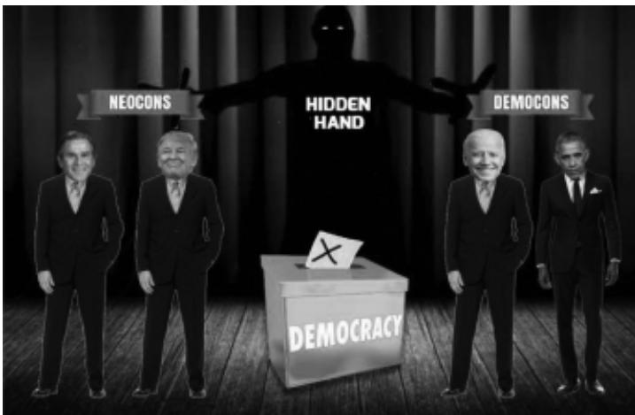  
Figure 6: Different front people, different parties – same control system.

The Democratic Party has its own ‘Neocon’ group controlling from the background which I call the ‘Democons’ and here’s the penny-drop – the Neocons and Democons answer to the same masters one step further back into the shadows (Fig 6). At that level of the Cult the Republican and Democrat parties are controlled by the same people and no maer which is in power the Cult is in power. This is how it works in almost every country and certainly in Britain with Conservative, Labour, Liberal Democrat and Green parties now all on the same page whatever the rhetoric may be in their feeble aempts to appear different. Neocons operated at the time of Bush through a think tank called The Project for the New American Century which in September, 2000, published a document entitled Rebuilding America’s Defenses: Strategies, Forces, and Resources

For a New Century demanding that America fight ‘multiple, simultaneous major theatre wars’ as a ‘core mission’ to force regimechange in countries including Iraq, Libya and Syria. Neocons arranged for Bush (‘Republican’) and Blair (‘Labour Party’) to frontup the invasion of Iraq and when they departed the Democons orchestrated the targeting of Libya and Syria through Barack Obama (‘Democrat’) and British Prime Minister David Cameron (‘Conservative Party’). We have ‘different’ parties and ‘different’ people, but the same unfolding script. The more the Cult has seized the reigns of parties and personnel the more their policies have transparently pursued the same agenda to the point where the fascist ‘Covid’ impositions of the Conservative junta of Jackboot Johnson in Britain were opposed by the Labour Party because they were not fascist enough. The Labour Party is likened to the US Democrats while the Conservative Party is akin to a British version of the Republicans and on both sides of the Atlantic they all speak the same language and support the direction demanded by the Cult although some more enthusiastically than others. It’s a similar story in country aer country because it’s all centrally controlled. Oh, but what about Trump? I’ll come to him shortly. Political ‘choice’ in the ‘party’ system goes like this: You vote for Party A and they get into government. You don’t like what they do so next time you vote for Party B and they get into government. You don’t like what they do when it’s prey much the same as Party A and why wouldn’t that be with both controlled by the same force? Given that only two, sometimes three, parties have any chance of forming a government to get rid of Party B that you don’t like you have to vote again for Party A which … you don’t like. This, ladies and gentlemen, is what they call ‘democracy’ which we are told – wrongly – is a term interchangeable with ‘freedom’.

# The cult of cults

At this point I need to introduce a major expression of the Global Cult known as Sabbatian-Frankism. Sabbatian is also spelt as Sabbatean. I will summarise here. I have published major exposés

and detailed background in other works. Sabbatian-Frankism combines the names of two frauds posing as ‘Jewish’ men, Sabbatai Zevi (1626-1676), a rabbi, black magician and occultist who proclaimed he was the Jewish messiah; and Jacob Frank (1726-1791), the Polish ‘Jew’, black magician and occultist who said he was the reincarnation of ‘messiah’ Zevi and biblical patriarch Jacob. They worked across two centuries to establish the Sabbatian-Frankist cult that plays a major, indeed central, role in the manipulation of human society by the Global Cult which has its origins much further back in history than Sabbatai Zevi. I should emphasise two points here in response to the shrill voices that will scream ‘anti-Semitism’: (1) Sabbatian-Frankists are NOT Jewish and only pose as such to hide their cult behind a Jewish façade; and (2) my information about this cult has come from Jewish sources who have long realised that their society and community has been infiltrated and taken over by interloper Sabbatian-Frankists. Infiltration has been the foundation technique of Sabbatian-Frankism from its official origin in the 17th century. Zevi’s Sabbatian sect aracted a massive following described as the biggest messianic movement in Jewish history, spreading as far as Africa and Asia, and he promised a return for the Jews to the ‘Promised Land’ of Israel. Sabbatianism was not Judaism but an inversion of everything that mainstream Judaism stood for. So much so that this sinister cult would have a feast day when Judaism had a fast day and whatever was forbidden in Judaism the Sabbatians were encouraged and even commanded to do. This included incest and what would be today called Satanism. Members were forbidden to marry outside the sect and there was a system of keeping their children ignorant of what they were part of until they were old enough to be trusted not to unknowingly reveal anything to outsiders. The same system is employed to this day by the Global Cult in general which Sabbatian-Frankism has enormously influenced and now largely controls.

Zevi and his Sabbatians suffered a setback with the intervention by the Sultan of the Islamic Ooman Empire in the Middle East and what is now the Republic of Turkey where Zevi was located. The

Sultan gave him the choice of proving his ‘divinity’, converting to Islam or facing torture and death. Funnily enough Zevi chose to convert or at least appear to. Some of his supporters were disillusioned and dried away, but many did not with 300 families also converting – only in theory – to Islam. They continued behind this Islamic smokescreen to follow the goals, rules and rituals of Sabbatianism and became known as ‘crypto-Jews’ or the ‘Dönmeh’ which means ‘to turn’. This is rather ironic because they didn’t ‘turn’ and instead hid behind a fake Islamic persona. The process of appearing to be one thing while being very much another would become the calling card of Sabbatianism especially aer Zevi’s death and the arrival of the Satanist Jacob Frank in the 18th century when the cult became Sabbatian-Frankism and plumbed still new depths of depravity and infiltration which included – still includes – human sacrifice and sex with children. Wherever Sabbatians go paedophilia and Satanism follow and is it really a surprise that Hollywood is so infested with child abuse and Satanism when it was established by Sabbatian-Frankists and is still controlled by them? Hollywood has been one of the prime vehicles for global perceptual programming and manipulation. How many believe the version of ‘history’ portrayed in movies when it is a travesty and inversion (again) of the truth? Rabbi Marvin Antelman describes Frankism in his book, To Eliminate the Opiate, as ‘a movement of complete evil’ while Jewish professor Gershom Scholem said of Frank in The Messianic Idea in Judaism: ‘In all his actions [he was] a truly corrupt and degenerate individual ... one of the most frightening phenomena in the whole of Jewish history.’ Frank was excommunicated by traditional rabbis, as was Zevi, but Frank was undeterred and enjoyed vital support from the House of Rothschild, the infamous banking dynasty whose inner-core are Sabbatian-Frankists and not Jews. Infiltration of the Roman Church and Vatican was instigated by Frank with many Dönmeh ‘turning’ again to convert to Roman Catholicism with a view to hijacking the reins of power. This was the ever-repeating modus operandi and continues to be so. Pose as an advocate of the religion, culture or country that you want to control and then

manipulate your people into the positions of authority and influence largely as advisers, administrators and Svengalis for those that appear to be in power. They did this with Judaism, Christianity (Christian Zionism is part of this), Islam and other religions and nations until Sabbatian-Frankism spanned the world as it does today.

# Sabbatian Saudis and the terror network

One expression of the Sabbatian-Frankist Dönmeh within Islam is the ruling family of Saudi Arabia, the House of Saud, through which came the vile distortion of Islam known as Wahhabism. This is the violent creed followed by terrorist groups like Al-Qaeda and ISIS or Islamic State. Wahhabism is the hand-chopping, head-chopping ‘religion’ of Saudi Arabia which is used to keep the people in a constant state of fear so the interloper House of Saud can continue to rule. Al-Qaeda and Islamic State were lavishly funded by the House of Saud while being created and directed by the Sabbatian-Frankist network in the United States that operates through the Pentagon, CIA and the government in general of whichever ‘party’. The front man for the establishment of Wahhabism in the middle of the 18th century was a Sabbatian-Frankist ‘crypto-Jew’ posing as Islamic called Muhammad ibn Abd al-Wahhab. His daughter would marry the son of Muhammad bin Saud who established the first Saudi state before his death in 1765 with support from the British Empire. Bin Saud’s successors would establish modern Saudi Arabia in league with the British and Americans in 1932 which allowed them to seize control of Islam’s major shrines in Mecca and Medina. They have dictated the direction of Sunni Islam ever since while Iran is the major centre of the Shiite version and here we have the source of at least the public conflict between them. The Sabbatian network has used its Wahhabi extremists to carry out Problem-Reaction-Solution terrorist aacks in the name of ‘Al-Qaeda’ and ‘Islamic State’ to justify a devastating ‘war on terror’, ever-increasing surveillance of the population and to terrify people into compliance. Another insight of the Renegade Mind is the streetwise understanding that

just because a country, location or people are aacked doesn’t mean that those apparently representing that country, location or people are not behind the aackers. Oen they are orchestrating the aacks because of the societal changes that can be then justified in the name of ‘saving the population from terrorists’.

I show in great detail in The Trigger how Sabbatian-Frankists were the real perpetrators of 9/11 and not ‘19 Arab hijackers’ who were blamed for what happened. Observe what was justified in the name of 9/11 alone in terms of Middle East invasions, mass surveillance and control that fulfilled the demands of the Project for the New American Century document published by the Sabbatian Neocons. What appear to be enemies are on the deep inside players on the same Sabbatian team. Israel and Arab ‘royal’ dictatorships are all ruled by Sabbatians and the recent peace agreements between Israel and Saudi Arabia, the United Arab Emirates (UAE) and others are only making formal what has always been the case behind the scenes. Palestinians who have been subjected to grotesque tyranny since Israel was bombed and terrorised into existence in 1948 have never stood a chance. Sabbatian-Frankists have controlled Israel (so the constant theme of violence and war which Sabbatians love) and they have controlled the Arab countries that Palestinians have looked to for real support that never comes. ‘Royal families’ of the Arab world in Saudi Arabia, Bahrain, UAE, etc., are all Sabbatians with allegiance to the aims of the cult and not what is best for their Arabic populations. They have stolen the oil and financial resources from their people by false claims to be ‘royal dynasties’ with a genetic right to rule and by employing vicious militaries to impose their will.

# Satanic ‘illumination’

The Satanist Jacob Frank formed an alliance in 1773 with two other Sabbatians, Mayer Amschel Rothschild (1744-1812), founder of the Rothschild banking dynasty, and Jesuit-educated fraudulent Jew, Adam Weishaupt, and this led to the formation of the Bavarian Illuminati, firstly under another name, in 1776. The Illuminati would

be the manipulating force behind the French Revolution (1789-1799) and was also involved in the American Revolution (1775-1783) before and aer the Illuminati’s official creation. Weishaupt would later become (in public) a Protestant Christian in archetypal Sabbatian style. I read that his name can be decoded as Adam-Weishaupt or ‘the first man to lead those who know’. He wasn’t a leader in the sense that he was a subordinate, but he did lead those below him in a crusade of transforming human society that still continues today. The theme was confirmed as early as 1785 when a horseman courier called Lanz was reported to be struck by lighting and extensive Illuminati documents were found in his saddlebags. They made the link to Weishaupt and detailed the plan for world takeover. Current events with ‘Covid’ fascism have been in the making for a very long time. Jacob Frank was jailed for 13 years by the Catholic Inquisition aer his arrest in 1760 and on his release he headed for Frankfurt, Germany, home city and headquarters of the House of Rothschild where the alliance was struck with Mayer Amschel Rothschild and Weishaupt. Rothschild arranged for Frank to be given the title of Baron and he became a wealthy nobleman with a big following of Jews in Germany, the Austro-Hungarian Empire and other European countries. Most of them would have believed he was on their side.

The name ‘Illuminati’ came from the Zohar which is a body of works in the Jewish mystical ‘bible’ called the Kabbalah. ‘Zohar’ is the foundation of Sabbatian-Frankist belief and in Hebrew ‘Zohar’ means ‘splendour’, ‘radiance’, ‘illuminated’, and so we have ‘Illuminati’. They claim to be the ‘Illuminated Ones’ from their knowledge systematically hidden from the human population and passed on through generations of carefully-chosen initiates in the global secret society network or Cult. Hidden knowledge includes an awareness of the Cult agenda for the world and the nature of our collective reality that I will explore later. Cult ‘illumination’ is symbolised by the torch held by the Statue of Liberty which was gied to New York by French Freemasons in Paris who knew exactly what it represents. ‘Liberty’ symbolises the goddess worshipped in

Babylon as Queen Semiramis or Ishtar. The significance of this will become clear. Notice again the ubiquitous theme of inversion with the Statue of ‘Liberty’ really symbolising mass control (Fig 7). A mirror-image statute stands on an island in the River Seine in Paris from where New York Liberty originated (Fig 8). A large replica of the Liberty flame stands on top of the Pont de l’Alma tunnel in Paris where Princess Diana died in a Cult ritual described in The Biggest Secret. Lucifer ‘the light bringer’ is related to all this (and much more as we’ll see) and ‘Lucifer’ is a central figure in Sabbatian-Frankism and its associated Satanism. Sabbatians reject the Jewish Torah, or Pentateuch, the ‘five books of Moses’ in the Old Testament known as Genesis, Exodus, Leviticus, Numbers, and Deuteronomy which are claimed by Judaism and Christianity to have been dictated by ‘God’ to Moses on Mount Sinai. Sabbatians say these do not apply to them and they seek to replace them with the Zohar to absorb Judaism and its followers into their inversion which is an expression of a much greater global inversion. They want to delete all religions and force humanity to worship a one-world religion – Sabbatian Satanism that also includes worship of the Earth goddess. Satanic themes are being more and more introduced into mainstream society and while Christianity is currently the foremost target for destruction the others are planned to follow.

  
Figure 7: The Cult goddess of Babylon disguised as the Statue of Liberty holding the flame of Lucifer the ‘light bringer’.

  
Figure 8: Liberty’s mirror image in Paris where the New York version originated.

# Marx brothers

Rabbi Marvin Antelman connects the Illuminati to the Jacobins in To Eliminate the Opiate and Jacobins were the force behind the French Revolution. He links both to the Bund der Gerechten, or League of the Just, which was the network that inflicted communism/Marxism on the world. Antelman wrote:

The original inner circle of the Bund der Gerechten consisted of born Catholics, Protestants and Jews [Sabbatian-Frankist infiltrators], and those representatives of respective subdivisions formulated schemes for the ultimate destruction of their faiths. The heretical Catholics laid plans which they felt would take a century or more for the ultimate destruction of the church; the apostate Jews for the ultimate destruction of the Jewish religion.

Sabbatian-created communism connects into this anti-religion agenda in that communism does not allow for the free practice of religion. The Sabbatian ‘Bund’ became the International Communist Party and Communist League and in 1848 ‘Marxism’ was born with the Communist Manifesto of Sabbatian assets Karl Marx and Friedrich Engels. It is absolutely no coincidence that Marxism, just a different name for fascist and other centrally-controlled tyrannies, is being imposed worldwide as a result of the ‘Covid’ hoax and nor that Marxist/fascist China was the place where the hoax originated. The reason for this will become very clear in the chapter ‘Covid: The calculated catastrophe’. The so-called ‘Woke’ mentality has hijacked

traditional beliefs of the political le and replaced them with farright make-believe ‘social justice’ beer known as Marxism. Woke will, however, be swallowed by its own perceived ‘revolution’ which is really the work of billionaires and billionaire corporations feigning being ‘Woke’. Marxism is being touted by Wokers as a replacement for ‘capitalism’ when we don’t have ‘capitalism’. We have cartelism in which the market is stitched up by the very Cult billionaires and corporations bankrolling Woke. Billionaires love Marxism which keeps the people in servitude while they control from the top.

Terminally naïve Wokers think they are ‘changing the world’ when it’s the Cult that is doing the changing and when they have played their vital part and become surplus to requirements they, too, will be targeted. The Illuminati-Jacobins were behind the period known as ‘The Terror’ in the French Revolution in 1793 and 1794 when Jacobin Maximillian de Robespierre and his Orwellian ‘Commiee of Public Safety’ killed 17,000 ‘enemies of the Revolution’ who had once been ‘friends of the Revolution’. Karl Marx (1818-1883), whose Sabbatian creed of Marxism has cost the lives of at least 100 million people, is a hero once again to Wokers who have been systematically kept ignorant of real history by their ‘education’ programming. As a result they now promote a Sabbatian ‘Marxist’ abomination destined at some point to consume them. Rabbi Antelman, who spent decades researching the Sabbatian plot, said of the League of the Just and Karl Marx:

Contrary to popular opinion Karl Marx did not originate the Communist Manifesto. He was paid for his services by the League of the Just, which was known in its country of origin, Germany, as the Bund der Geaechteten.

Antelman said the text aributed to Marx was the work of other people and Marx ‘was only repeating what others already said’. Marx was ‘a hired hack – lackey of the wealthy Illuminists’. Marx famously said that religion was the ‘opium of the people’ (part of the Sabbatian plan to demonise religion) and Antelman called his books, To Eliminate the Opiate. Marx was born Jewish, but his family converted to Christianity (Sabbatian modus operandi) and he

aacked Jews, not least in his book, A World Without Jews. In doing so he supported the Sabbatian plan to destroy traditional Jewishness and Judaism which we are clearly seeing today with the vindictive targeting of orthodox Jews by the Sabbatian government of Israel over ‘Covid’ laws. I don’t follow any religion and it has done much damage to the world over centuries and acted as a perceptual straightjacket. Renegade Minds, however, are always asking why something is being done. It doesn’t maer if they agree or disagree with what is happening – why is it happening is the question. The ‘why?’ can be answered with regard to religion in that religions create interacting communities of believers when the Cult wants to dismantle all discourse, unity and interaction (see ‘Covid’ lockdowns) and the ultimate goal is to delete all religions for a oneworld religion of Cult Satanism worshipping their ‘god’ of which more later. We see the same ‘why?’ with gun control in America. I don’t have guns and don’t want them, but why is the Cult seeking to disarm the population at the same time that law enforcement agencies are armed to their molars and why has every tyrant in history sought to disarm people before launching the final takeover? They include Hitler, Stalin, Pol Pot and Mao who followed confiscation with violent seizing of power. You know it’s a Cult agenda by the people who immediately race to the microphones to exploit dead people in multiple shootings. Ultra-Zionist Cult lackey Senator Chuck Schumer was straight on the case aer ten people were killed in Boulder, Colorado in March, 2121. Simple rule … if Schumer wants it the Cult wants it and the same with his ultra-Zionist mate the wild-eyed Senator Adam Schiff. At the same time they were calling for the disarmament of Americans, many of whom live a long way from a police response, Schumer, Schiff and the rest of these pampered clowns were siing on Capitol Hill behind a razor-wired security fence protected by thousands of armed troops in addition to their own armed bodyguards. Mom and pop in an isolated home? They’re just potential mass shooters.

# Zion Mainframe

Sabbatian-Frankists and most importantly the Rothschilds were behind the creation of ‘Zionism’, a political movement that demanded a Jewish homeland in Israel as promised by Sabbatai Zevi. The very symbol of Israel comes from the German meaning of the name Rothschild. Dynasty founder Mayer Amschel Rothschild changed the family name from Bauer to Rothschild, or ‘Red-Shield’ in German, in deference to the six-pointed ‘Star of David’ hexagram displayed on the family’s home in Frankfurt. The symbol later appeared on the flag of Israel aer the Rothschilds were centrally involved in its creation. Hexagrams are not a uniquely Jewish symbol and are widely used in occult (‘hidden’) networks oen as a symbol for Saturn (see my other books for why). Neither are Zionism and Jewishness interchangeable. Zionism is a political movement and philosophy and not a ‘race’ or a people. Many Jews oppose Zionism and many non-Jews, including US President Joe Biden, call themselves Zionists as does Israel-centric Donald Trump. America’s support for the Israel government is prey much a gimme with ultra-Zionist billionaires and corporations providing fantastic and dominant funding for both political parties. Former Congresswoman Cynthia McKinney has told how she was approached immediately she ran for office to ‘sign the pledge’ to Israel and confirm that she would always vote in that country’s best interests. All American politicians are approached in this way. Anyone who refuses will get no support or funding from the enormous and all-powerful Zionist lobby that includes organisations like mega-lobby group AIPAC, the American Israel Public Affairs Commiee. Trump’s biggest funder was ultra-Zionist casino and media billionaire Sheldon Adelson while major funders of the Democratic Party include ultra-Zionist George Soros and ultra-Zionist financial and media mogul, Haim Saban. Some may reel back at the suggestion that Soros is an Israel-firster (Sabbatian-controlled Israel-firster), but Renegade Minds watch the actions not the words and everywhere Soros donates his billions the Sabbatian agenda benefits. In the spirit of Sabbatian inversion Soros pledged $\$ 1$ billion for a new university network to promote ‘liberal values and tackle intolerance’. He made the announcement during his annual speech

at the Cult-owned World Economic Forum in Davos, Switzerland, in January, 2020, aer his ‘harsh criticism’ of ‘authoritarian rulers’ around the world. You can only laugh at such brazen mendacity. How he doesn’t laugh is the mystery. Translated from the Orwellian ‘liberal values and tackle intolerance’ means teaching non-white people to hate white people and for white people to loathe themselves for being born white. The reason for that will become clear.

# The ‘Anti-Semitism’ fraud

Zionists support the Jewish homeland in the land of Palestine which has been the Sabbatian-Rothschild goal for so long, but not for the benefit of Jews. Sabbatians and their global Anti-Semitism Industry have skewed public and political opinion to equate opposing the violent extremes of Zionism to be a blanket aack and condemnation of all Jewish people. Sabbatians and their global Anti-Semitism Industry have skewed public and political opinion to equate opposing the violent extremes of Zionism to be a blanket aack and condemnation of all Jewish people. This is nothing more than a Sabbatian protection racket to stop legitimate investigation and exposure of their agendas and activities. The official definition of ‘anti-Semitism’ has more recently been expanded to include criticism of Zionism – a political movement – and this was done to further stop exposure of Sabbatian infiltrators who created Zionism as we know it today in the 19th century. Renegade Minds will talk about these subjects when they know the shit that will come their way. People must decide if they want to know the truth or just cower in the corner in fear of what others will say. Sabbatians have been trying to label me as ‘anti-Semitic’ since the 1990s as I have uncovered more and more about their background and agendas. Useless, gutless, fraudulent ‘journalists’ then just repeat the smears without question and on the day I was writing this section a pair of unquestioning repeaters called Ben Quinn and Archie Bland (how appropriate) outright called me an ‘anti-Semite’ in the establishment propaganda sheet, the London Guardian, with no supporting evidence. The

Sabbatian Anti-Semitism Industry said so and who are they to question that? They wouldn’t dare. Ironically ‘Semitic’ refers to a group of languages in the Middle East that are almost entirely Arabic. ‘Anti-Semitism’ becomes ‘anti-Arab’ which if the consequences of this misunderstanding were not so grave would be hilarious. Don’t bother telling Quinn and Bland. I don’t want to confuse them, bless ‘em. One reason I am dubbed ‘anti-Semitic’ is that I wrote in the 1990s that Jewish operatives (Sabbatians) were heavily involved in the Russian Revolution when Sabbatians overthrew the Romanov dynasty. This apparently made me ‘anti-Semitic’. Oh, really? Here is a section from The Trigger:

British journalist Robert Wilton confirmed these themes in his 1920 book The Last Days of the Romanovs when he studied official documents from the Russian government to identify the members of the Bolshevik ruling elite between 1917 and 1919. The Central Committee included 41 Jews among 62 members; the Council of the People’s Commissars had 17 Jews out of 22 members; and 458 of the 556 most important Bolshevik positions between 1918 and 1919 were occupied by Jewish people. Only 17 were Russian. Then there were the 23 Jews among the 36 members of the vicious Cheka Soviet secret police established in 1917 who would soon appear all across the country.

Professor Robert Service of Oxford University, an expert on 20th century Russian history, found evidence that [‘Jewish’] Leon Trotsky had sought to make sure that Jews were enrolled in the Red Army and were disproportionately represented in the Soviet civil bureaucracy that included the Cheka which performed mass arrests, imprisonment and executions of ‘enemies of the people’. A US State Department Decimal File (861.00/5339) dated November 13th, 1918, names [Rothschild banking agent in America] Jacob Schiff and a list of ultra-Zionists as funders of the Russian Revolution leading to claims of a ‘Jewish plot’, but the key point missed by all is they were not ‘Jews’ – they were Sabbatian-Frankists.

Britain’s Winston Churchill made the same error by mistake or otherwise. He wrote in a 1920 edition of the Illustrated Sunday Herald that those behind the Russian revolution were part of a ‘worldwide conspiracy for the overthrow of civilisation and for the reconstitution of society on the basis of arrested development, of envious malevolence, and impossible equality’ (see ‘Woke’ today because that has been created by the same network). Churchill said there was no need to exaggerate the part played in the creation of Bolshevism and in the actual bringing about of the Russian

Revolution ‘by these international and for the most part atheistical Jews’ [‘atheistical Jews’ $=$ Sabbatians]. Churchill said it is certainly a very great one and probably outweighs all others: ‘With the notable exception of Lenin, the majority of the leading figures are Jews.’ He went on to describe, knowingly or not, the Sabbatian modus operandi of placing puppet leaders nominally in power while they control from the background:

Moreover, the principal inspiration and driving power comes from the Jewish leaders. Thus Tchitcherin, a pure Russian, is eclipsed by his nominal subordinate, Litvinoff, and the influence of Russians like Bukharin or Lunacharski cannot be compared with the power of Trotsky, or of Zinovieff, the Dictator of the Red Citadel (Petrograd), or of Krassin or Radek – all Jews. In the Soviet institutions the predominance of Jews is even more astonishing. And the prominent, if not indeed the principal, part in the system of terrorism applied by the Extraordinary Commissions for Combatting Counter-Revolution has been taken by Jews, and in some notable cases by Jewesses.

What I said about seriously disproportionate involvement in the Russian Revolution by Jewish ‘revolutionaries’ (Sabbatians) is provable fact, but truth is no defence against the Sabbatian Anti-Semitism Industry, its repeater parrots like Quinn and Bland, and the now breathtaking network of so-called ‘Woke’ ‘anti-hate’ groups with interlocking leaderships and funding which have the role of discrediting and silencing anyone who gets too close to exposing the Sabbatians. We have seen ‘truth is no defence’ confirmed in legal judgements with the Saskatchewan Human Rights Commission in Canada decreeing this: ‘Truthful statements can be presented in a manner that would meet the definition of hate speech, and not all truthful statements must be free from restriction.’ Most ‘anti-hate’ activists, who are themselves consumed by hatred, are too stupid and ignorant of the world to know how they are being used. They are far too far up their own virtue-signalling arses and it’s far too dark for them to see anything.

# The ‘revolution’ game

The background and methods of the ‘Russian’ Revolution are straight from the Sabbatian playbook seen in the French Revolution

and endless others around the world that appear to start as a revolution of the people against tyrannical rule and end up with a regime change to more tyrannical rule overtly or covertly. Wars, terror aacks and regime overthrows follow the Sabbatian cult through history with its agents creating them as Problem-Reaction-Solutions to remove opposition on the road to world domination. Sabbatian dots connect the Rothschilds with the Illuminati, Jacobins of the French Revolution, the ‘Bund’ or League of the Just, the International Communist Party, Communist League and the Communist Manifesto of Karl Marx and Friedrich Engels that would lead to the Rothschild-funded Russian Revolution. The sequence comes under the heading of ‘creative destruction’ when you advance to your global goal by continually destroying the status quo to install a new status quo which you then also destroy. The two world wars come to mind. With each new status quo you move closer to your planned outcome. Wars and mass murder are to Sabbatians a collective blood sacrifice ritual. They are obsessed with death for many reasons and one is that death is an inversion of life. Satanists and Sabbatians are obsessed with death and oen target churches and churchyards for their rituals. Inversion-obsessed Sabbatians explain the use of inverted symbolism including the inverted pentagram and inverted cross. The inversion of the cross has been related to targeting Christianity, but the cross was a religious symbol long before Christianity and its inversion is a statement about the Sabbatian mentality and goals more than any single religion.

Sabbatians operating in Germany were behind the rise of the occult-obsessed Nazis and the subsequent Jewish exodus from Germany and Europe to Palestine and the United States aer World War Two. The Rothschild dynasty was at the forefront of this both as political manipulators and by funding the operation. Why would Sabbatians help to orchestrate the horrors inflicted on Jews by the Nazis and by Stalin aer they organised the Russian Revolution? Sabbatians hate Jews and their religion, that’s why. They pose as Jews and secure positions of control within Jewish society and play the ‘anti-Semitism’ card to protect themselves from exposure

through a global network of organisations answering to the Sabbatian-created-and-controlled globe-spanning intelligence network that involves a stunning web of military-intelligence operatives and operations for a tiny country of just nine million. Among them are Jewish assets who are not Sabbatians but have been convinced by them that what they are doing is for the good of Israel and the Jewish community to protect them from what they have been programmed since childhood to believe is a Jew-hating hostile world. The Jewish community is just a highly convenient cover to hide the true nature of Sabbatians. Anyone geing close to exposing their game is accused by Sabbatian place-people and gofers of ‘anti-Semitism’ and claiming that all Jews are part of a plot to take over the world. I am not saying that. I am saying that Sabbatians – the real Jew-haters – have infiltrated the Jewish community to use them both as a cover and an ‘anti-Semitic’ defence against exposure. Thus we have the Anti-Semitism Industry targeted researchers in this way and most Jewish people think this is justified and genuine. They don’t know that their ‘Jewish’ leaders and institutions of state, intelligence and military are not controlled by Jews at all, but cultists and stooges of Sabbatian-Frankism. I once added my name to a pro-Jewish freedom petition online and the next time I looked my name was gone and text had been added to the petition blurb to aack me as an ‘anti-Semite’ such is the scale of perceptual programming.

# Moving on America

I tell the story in The Trigger and a chapter called ‘Atlantic Crossing’ how particularly aer Israel was established the Sabbatians moved in on the United States and eventually grasped control of government administration, the political system via both Democrats and Republicans, the intelligence community like the CIA and National Security Agency (NSA), the Pentagon and mass media. Through this seriously compartmentalised network Sabbatians and their operatives in Mossad, Israeli Defense Forces (IDF) and US agencies pulled off 9/11 and blamed it on 19 ‘Al-Qaeda hijackers’ dominated by men from, or connected to, Sabbatian-ruled Saudi

Arabia. The $' 1 9 ^ { \prime }$ were not even on the planes let alone flew those big passenger jets into buildings while being largely incompetent at piloting one-engine light aircra. ‘Hijacker’ Hani Hanjour who is said to have flown American Airlines Flight 77 into the Pentagon with a turn and manoeuvre most professional pilots said they would have struggled to do was banned from renting a small plane by instructors at the Freeway Airport in Bowie, Maryland, just six weeks earlier on the grounds that he was an incompetent pilot. The Jewish population of the world is just 0.2 percent with even that almost entirely concentrated in Israel (75 percent Jewish) and the United States (around two percent). This two percent and globally 0.2

percent refers to Jewish people and not Sabbatian interlopers who are a fraction of that fraction. What a sobering thought when you think of the fantastic influence on world affairs of tiny Israel and that the Project for the New America Century (PNAC) which laid out the blueprint in September, 2000, for America’s war on terror and regime change wars in Iraq, Libya and Syria was founded and dominated by Sabbatians known as ‘Neocons’. The document conceded that this plan would not be supported politically or publicly without a major aack on American soil and a Problem-Reaction-Solution excuse to send troops to war across the Middle East. Sabbatian Neocons said:

... [The] process of transformation ... [war and regime change] ... is likely to be a long one, absent some catastrophic and catalysing event – like a new Pearl Harbor.

Four months later many of those who produced that document came to power with their inane puppet George Bush from the longtime Sabbatian Bush family. They included Sabbatian Dick Cheney who was officially vice-president, but really de-facto president for the entirety of the ‘Bush’ government. Nine months aer the ‘Bush’ inauguration came what Bush called at the time ‘the Pearl Harbor of the 21st century’ and with typical Sabbatian timing and symbolism 2001 was the 60th anniversary of the aack in 1941 by the Japanese Air Force on Pearl Harbor, Hawaii, which allowed President Franklin Delano Roosevelt to take the United States into a Sabbatian-

instigated Second World War that he said in his election campaign that he never would. The evidence is overwhelming that Roosevelt and his military and intelligence networks knew the aack was coming and did nothing to stop it, but they did make sure that America’s most essential naval ships were not in Hawaii at the time. Three thousand Americans died in the Pearl Harbor aacks as they did on September 11th. By the 9/11 year of 2001 Sabbatians had widely infiltrated the US government, military and intelligence operations and used their compartmentalised assets to pull off the ‘Al-Qaeda’ aacks. If you read The Trigger it will blow your mind to see the uerly staggering concentration of ‘Jewish’ operatives (Sabbatian infiltrators) in essential positions of political, security, legal, law enforcement, financial and business power before, during, and aer the aacks to make them happen, carry them out, and then cover their tracks – and I do mean staggering when you think of that 0.2 percent of the world population and two percent of Americans which are Jewish while Sabbatian infiltrators are a fraction of that. A central foundation of the 9/11 conspiracy was the hijacking of government, military, Air Force and intelligence computer systems in real time through ‘back-door’ access made possible by Israeli (Sabbatian) ‘cyber security’ soware. Sabbatian-controlled Israel is on the way to rivalling Silicon Valley for domination of cyberspace and is becoming the dominant force in cyber-security which gives them access to entire computer systems and their passcodes across the world. Then add to this that Zionists head (officially) Silicon Valley giants like Google (Larry Page and Sergey Brin), Googleowned YouTube (Susan Wojcicki), Facebook (Mark Zuckerberg and Sheryl Sandberg), and Apple (Chairman Arthur D. Levinson), and that ultra-Zionist hedge fund billionaire Paul Singer has a $\$ 1$ billion stake in Twier which is only nominally headed by ‘CEO’ pothead Jack Dorsey. As cable news host Tucker Carlson said of Dorsey: ‘There used to be debate in the medical community whether dropping a ton of acid had permanent effects and I think that debate has now ended.’ Carlson made the comment aer Dorsey told a hearing on Capitol Hill (if you cut through his bullshit) that he

believed in free speech so long as he got to decide what you can hear and see. These ‘big names’ of Silicon Valley are only front men and women for the Global Cult, not least the Sabbatians, who are the true controllers of these corporations. Does anyone still wonder why these same people and companies have been ferociously censoring and banning people (like me) for exposing any aspect of the Cult agenda and especially the truth about the ‘Covid’ hoax which Sabbatians have orchestrated?

The Jeffrey Epstein paedophile ring was a Sabbatian operation. He was officially ‘Jewish’ but he was a Sabbatian and women abused by the ring have told me about the high number of ‘Jewish’ people involved. The Epstein horror has Sabbatian wrien all over it and matches perfectly their modus operandi and obsession with sex and ritual. Epstein was running a Sabbatian blackmail ring in which famous people with political and other influence were provided with young girls for sex while everything was being filmed and recorded on hidden cameras and microphones at his New York house, Caribbean island and other properties. Epstein survivors have described this surveillance system to me and some have gone public. Once the famous politician or other figure knew he or she was on video they tended to do whatever they were told. Here we go again …when you’ve got them by the balls their hearts and minds will follow. Sabbatians use this blackmail technique on a wide scale across the world to entrap politicians and others they need to act as demanded. Epstein’s private plane, the infamous ‘Lolita Express’, had many well-known passengers including Bill Clinton while Bill Gates has flown on an Epstein plane and met with him four years aer Epstein had been jailed for paedophilia. They subsequently met many times at Epstein’s home in New York according to a witness who was there. Epstein’s infamous side-kick was Ghislaine Maxwell, daughter of Mossad agent and ultra-Zionist mega-crooked British businessman, Bob Maxwell, who at one time owned the Daily Mirror newspaper. Maxwell was murdered at sea on his boat in 1991 by Sabbatian-controlled Mossad when he became a liability with his

business empire collapsing as a former Mossad operative has confirmed (see The Trigger).

# Money, money, money, funny money …

Before I come to the Sabbatian connection with the last three US presidents I will lay out the crucial importance to Sabbatians of controlling banking and finance. Sabbatian Mayer Amschel Rothschild set out to dominate this arena in his family’s quest for total global control. What is freedom? It is, in effect, choice. The more choices you have the freer you are and the fewer your choices the more you are enslaved. In the global structure created over centuries by Sabbatians the biggest decider and restrictor of choice is … money. Across the world if you ask people what they would like to do with their lives and why they are not doing that they will reply ‘I don’t have the money’. This is the idea. A global elite of multibillionaires are described as ‘greedy’ and that is true on one level; but control of money – who has it and who doesn’t – is not primarily about greed. It’s about control. Sabbatians have seized ever more control of finance and sucked the wealth of the world out of the hands of the population. We talk now, aer all, about the ‘Onepercent’ and even then the wealthiest are a lot fewer even than that. This has been made possible by a money scam so outrageous and so vast it could rightly be called the scam of scams founded on creating ‘money’ out of nothing and ‘loaning’ that with interest to the population. Money out of nothing is called ‘credit’. Sabbatians have asserted control over governments and banking ever more completely through the centuries and secured financial laws that allow banks to lend hugely more than they have on deposit in a confidence trick known as fractional reserve lending. Imagine if you could lend money that doesn’t exist and charge the recipient interest for doing so. You would end up in jail. Bankers by contrast end up in mansions, private jets, Malibu and Monaco.

Banks are only required to keep a fraction of their deposits and wealth in their vaults and they are allowed to lend ‘money’ they don’t have called ‘credit. Go into a bank for a loan and if you succeed

the banker will not move any real wealth into your account. They will type into your account the amount of the agreed ‘loan’ – say £100,000. This is not wealth that really exists; it is non-existent, freshair, created-out-of-nothing ‘credit’ which has never, does not, and will never exist except in theory. Credit is backed by nothing except wind and only has buying power because people think that it has buying power and accept it in return for property, goods and services. I have described this situation as like those cartoon characters you see chasing each other and when they run over the edge of a cliff they keep running forward on fresh air until one of them looks down, realises what’s happened, and they all crash into the ravine. The whole foundation of the Sabbatian financial system is to stop people looking down except for periodic moments when they want to crash the system (as in 2008 and 2020 ongoing) and reap the rewards from all the property, businesses and wealth their borrowers had signed over as ‘collateral’ in return for a ‘loan’ of fresh air. Most people think that money is somehow created by governments when it comes into existence from the start as a debt through banks ‘lending’ illusory money called credit. Yes, the very currency of exchange is a debt from day one issued as an interest-bearing loan. Why don’t governments create money interest-free and lend it to their people interest-free? Governments are controlled by Sabbatians and the financial system is controlled by Sabbatians for whom interest-free money would be a nightmare come true. Sabbatians underpin their financial domination through their global network of central banks, including the privately-owned US Federal Reserve and Britain’s Bank of England, and this is orchestrated by a privately-owned central bank coordination body called the Bank for International Selements in Basle, Switzerland, created by the usual suspects including the Rockefellers and Rothschilds. Central bank chiefs don’t answer to governments or the people. They answer to the Bank for International Selements or, in other words, the Global Cult which is dominated today by Sabbatians.

# Built-in disaster

There are so many constituent scams within the overall banking scam. When you take out a loan of thin-air credit only the amount of that loan is theoretically brought into circulation to add to the amount in circulation; but you are paying back the principle plus interest. The additional interest is not created and this means that with every ‘loan’ there is a shortfall in the money in circulation between what is borrowed and what has to be paid back. There is never even close to enough money in circulation to repay all outstanding public and private debt including interest. Coldly weaved in the very fabric of the system is the certainty that some will lose their homes, businesses and possessions to the banking ‘lender’. This is less obvious in times of ‘boom’ when the amount of money in circulation (and the debt) is expanding through more people wanting and geing loans. When a downturn comes and the money supply contracts it becomes painfully obvious that there is not enough money to service all debt and interest. This is less obvious in times of ‘boom’ when the amount of money in circulation (and the debt) is expanding through more people wanting and geing loans. When a downturn comes and the money supply contracts and it becomes painfully obvious – as in 2008 and currently – that there is not enough money to service all debt and interest. Sabbatian banksters have been leading the human population through a calculated series of booms (more debt incurred) and busts (when the debt can’t be repaid and the banks get the debtor’s tangible wealth in exchange for non-existent ‘credit’). With each ‘bust’ Sabbatian bankers have absorbed more of the world’s tangible wealth and we end up with the One-percent. Governments are in bankruptcy levels of debt to the same system and are therefore owned by a system they do not control. The Federal Reserve, ‘America’s central bank’, is privately-owned and American presidents only nominally appoint its chairman or woman to maintain the illusion that it’s an arm of government. It’s not. The ‘Fed’ is a cartel of private banks which handed billions to its associates and friends aer the crash of 2008 and has been Sabbatiancontrolled since it was manipulated into being in 1913 through the covert trickery of Rothschild banking agents Jacob Schiff and Paul

Warburg, and the Sabbatian Rockefeller family. Somehow from a Jewish population of two-percent and globally 0.2 percent (Sabbatian interlopers remember are far smaller) ultra-Zionists headed the Federal Reserve for 31 years between 1987 and 2018 in the form of Alan Greenspan, Bernard Bernanke and Janet Yellen (now Biden’s Treasury Secretary) with Yellen’s deputy chairman a Israeli-American duel citizen and ultra-Zionist Stanley Fischer, a former governor of the Bank of Israel. Ultra-Zionist Fed chiefs spanned the presidencies of Ronald Reagan (‘Republican’), Father George Bush (‘Republican’), Bill Clinton (‘Democrat’), Boy George Bush (‘Republican’) and Barack Obama (‘Democrat’). We should really add the pre-Greenspan chairman, Paul Adolph Volcker, ‘appointed’ by Jimmy Carter (‘Democrat’) who ran the Fed between 1979 and 1987 during the Carter and Reagan administrations before Greenspan took over. Volcker was a long-time associate and business partner of the Rothschilds. No maer what the ‘party’ officially in power the United States economy was directed by the same force. Here are members of the Obama, Trump and Biden administrations and see if you can make out a common theme.

# Barack Obama (‘Democrat’)

Ultra-Zionists Robert Rubin, Larry Summers, and Timothy Geithner ran the US Treasury in the Clinton administration and two of them reappeared with Obama. Ultra-Zionist Fed chairman Alan Greenspan had manipulated the crash of 2008 through deregulation and jumped ship just before the disaster to make way for ultra-Zionist Bernard Bernanke to hand out trillions to Sabbatian ‘too big to fail’ banks and businesses, including the ubiquitous ultra-Zionist Goldman Sachs which has an ongoing staff revolving door operation between itself and major financial positions in government worldwide. Obama inherited the fallout of the crash when he took office in January, 2009, and fortunately he had the support of his ultra-Zionist White House Chief of Staff Rahm Emmanuel, son of a terrorist who helped to bomb Israel into being in 1948, and his ultra-Zionist senior adviser David Axelrod, chief strategist in Obama’s two

successful presidential campaigns. Emmanuel, later mayor of Chicago and former senior fundraiser and strategist for Bill Clinton, is an example of the Sabbatian policy aer Israel was established of migrating insider families to America so their children would be born American citizens. ‘Obama’ chose this financial team throughout his administration to respond to the Sabbatian-instigated crisis:

Timothy Geithner (ultra-Zionist) Treasury Secretary; Jacob J. Lew, Treasury Secretary; Larry Summers (ultra-Zionist), director of the White House National Economic Council; Paul Adolph Volcker (Rothschild business partner), chairman of the Economic Recovery Advisory Board; Peter Orszag (ultra-Zionist), director of the Office of Management and Budget overseeing all government spending; Penny Pritzker (ultra-Zionist), Commerce Secretary; Jared Bernstein (ultra-Zionist), chief economist and economic policy adviser to Vice President Joe Biden; Mary Schapiro (ultra-Zionist), chair of the Securities and Exchange Commission (SEC); Gary Gensler (ultra-Zionist), chairman of the Commodity Futures Trading Commission (CFTC); Sheila Bair (ultra-Zionist), chair of the Federal Deposit Insurance Corporation (FDIC); Karen Mills (ultra-Zionist), head of the Small Business Administration (SBA); Kenneth Feinberg (ultra-Zionist), Special Master for Executive [bail-out] Compensation. Feinberg would be appointed to oversee compensation (with strings) to 9/11 victims and families in a campaign to stop them having their day in court to question the official story. At the same time ultra-Zionist Bernard Bernanke was chairman of the Federal Reserve and these are only some of the ultra-Zionists with allegiance to Sabbatian-controlled Israel in the Obama government. Obama’s biggest corporate donor was ultra-Zionist Goldman Sachs which had employed many in his administration.

# Donald Trump (‘Republican’)

Trump claimed to be an outsider (he wasn’t) who had come to ‘drain the swamp’. He embarked on this goal by immediately appointing ultra-Zionist Steve Mnuchin, a Goldman Sachs employee for 17

years, as his Treasury Secretary. Others included Gary Cohn (ultra-Zionist), chief operating officer of Goldman Sachs, his first Director of the National Economic Council and chief economic adviser, who was later replaced by Larry Kudlow (ultra-Zionist). Trump’s senior adviser throughout his four years in the White House was his sinister son-in-law Jared Kushner, a life-long friend of Israel Prime Minister Benjamin Netanyahu. Kushner is the son of a convicted crook who was pardoned by Trump in his last days in office. Other ultra-Zionists in the Trump administration included: Stephen Miller, Senior Policy Adviser; Avrahm Berkowitz, Deputy Adviser to Trump and his Senior Adviser Jared Kushner; Ivanka Trump, Adviser to the President, who converted to Judaism when she married Jared Kushner; David Friedman, Trump lawyer and Ambassador to Israel; Jason Greenbla, Trump Organization executive vice president and chief legal officer, who was made Special Representative for International Negotiations and the Israeli-Palestinian Conflict; Rod Rosenstein, Deputy Aorney General; Elliot Abrams, Special Representative for Venezuela, then Iran; John Eisenberg, National Security Council Legal Adviser and Deputy Council to the President for National Security Affairs; Anne Neuberger, Deputy National Manager, National Security Agency; Ezra Cohen-Watnick, Acting Under Secretary of Defense for Intelligence; Elan Carr, Special Envoy to monitor and combat anti-Semitism; Len Khodorkovsky, Deputy Special Envoy to monitor and combat anti-Semitism; Reed Cordish, Assistant to the President, Intragovernmental and Technology Initiatives. Trump Vice President Mike Pence and Secretary of State Mike Pompeo, both Christian Zionists, were also vehement supporters of Israel and its goals and ambitions.

Donald ‘free-speech believer’ Trump pardoned a number of financial and violent criminals while ignoring calls to pardon Julian Assange and Edward Snowden whose crimes are revealing highly relevant information about government manipulation and corruption and the widespread illegal surveillance of the American people by US ‘security’ agencies. It’s so good to know that Trump is on the side of freedom and justice and not mega-criminals with

allegiance to Sabbatian-controlled Israel. These included a pardon for Israeli spy Jonathan Pollard who was jailed for life in 1987 under the Espionage Act. Aviem Sella, the Mossad agent who recruited Pollard, was also pardoned by Trump while Assange sat in jail and Snowden remained in exile in Russia. Sella had ‘fled’ (was helped to escape) to Israel in 1987 and was never extradited despite being charged under the Espionage Act. A Trump White House statement said that Sella’s clemency had been ‘supported by Benjamin Netanyahu, Ron Dermer, Israel’s US Ambassador, David Friedman, US Ambassador to Israel and Miriam Adelson, wife of leading Trump donor Sheldon Adelson who died shortly before. Other friends of Jared Kushner were pardoned along with Sholom Weiss who was believed to be serving the longest-ever white-collar prison sentence of more than 800 years in 2000. The sentence was commuted of Ponzi-schemer Eliyahu Weinstein who defrauded Jews and others out of $\$ 200$ million. I did mention that Assange and Snowden were ignored, right? Trump gave Sabbatians almost everything they asked for in military and political support, moving the US Embassy from Tel Aviv to Jerusalem with its critical symbolic and literal implications for Palestinian statehood, and the ‘deal of the Century’ designed by Jared Kushner and David Friedman which gave the Sabbatian Israeli government the green light to substantially expand its already widespread program of building illegal Jewish-only selements in the occupied land of the West Bank. This made a two-state ‘solution’ impossible by seizing all the land of a potential Palestinian homeland and that had been the plan since 1948 and then 1967 when the Arab-controlled Gaza Strip, West Bank, Sinai Peninsula and Syrian Golan Heights were occupied by Israel. All the talks about talks and road maps and delays have been buying time until the West Bank was physically occupied by Israeli real estate. Trump would have to be a monumentally ill-informed idiot not to see that this was the plan he was helping to complete. The Trump administration was in so many ways the Kushner administration which means the Netanyahu administration which means the Sabbatian administration. I understand why many opposing Cult fascism in all its forms gravitated to Trump, but he

was a crucial part of the Sabbatian plan and I will deal with this in the next chapter.

# Joe Biden (‘Democrat’)

A barely cognitive Joe Biden took over the presidency in January, 2021, along with his fellow empty shell, Vice-President Kamala Harris, as the latest Sabbatian gofers to enter the White House. Names on the door may have changed and the ‘party’ – the force behind them remained the same as Zionists were appointed to a stream of pivotal areas relating to Sabbatian plans and policy. They included: Janet Yellen, Treasury Secretary, former head of the Federal Reserve, and still another ultra-Zionist running the US Treasury aer Mnuchin (Trump), Lew and Geithner (Obama), and Summers and Rubin (Clinton); Anthony Blinken, Secretary of State; Wendy Sherman, Deputy Secretary of State (so that’s ‘Biden’s’ Sabbatian foreign policy sorted); Jeff Zients, White House coronavirus coordinator; Rochelle Walensky, head of the Centers for Disease Control; Rachel Levine, transgender deputy health secretary (that’s ‘Covid’ hoax policy under control); Merrick Garland, Aorney General; Alejandro Mayorkas, Secretary of Homeland Security; Cass Sunstein, Homeland Security with responsibility for new immigration laws; Avril Haines, Director of National Intelligence; Anne Neuberger, National Security Agency cybersecurity director (note, cybersecurity); David Cohen, CIA Deputy Director; Ronald Klain, Biden’s Chief of Staff (see Rahm Emanuel); Eric Lander, a ‘leading geneticist’, Office of Science and Technology Policy director (see Smart Grid, synthetic biology agenda); Jessica Rosenworcel, acting head of the Federal Communications Commission (FCC) which controls Smart Grid technology policy and electromagnetic communication systems including 5G. How can it be that so many pivotal positions are held by two-percent of the American population and 0.2 percent of the world population administration aer administration no maer who is the president and what is the party? It’s a coincidence? Of course it’s not and this is why Sabbatians have built their colossal global web of interlocking ‘anti-

hate’ hate groups to condemn anyone who asks these glaring questions as an ‘anti-Semite’. The way that Jewish people horrifically abused in Sabbatian-backed Nazi Germany are exploited to this end is stomach-turning and disgusting beyond words.

# Political fusion

Sabbatian manipulation has reversed the roles of Republicans and Democrats and the same has happened in Britain with the Conservative and Labour Parties. Republicans and Conservatives were always labelled the ‘right’ and Democrats and Labour the ‘le’, but look at the policy positions now and the Democrat-Labour ‘le’ has moved further to the ‘right’ than Republicans and Conservatives under the banner of ‘Woke’, the Cult-created far-right tyranny. Where once the Democrat-Labour ‘le’ defended free speech and human rights they now seek to delete them and as I said earlier despite the ‘Covid’ fascism of the Jackboot Johnson Conservative government in the UK the Labour Party of leader Keir Starmer demanded even more extreme measures. The Labour Party has been very publicly absorbed by Sabbatians aer a political and media onslaught against the previous leader, the weak and inept Jeremy Corbyn, over made-up allegations of ‘anti-Semitism’ both by him and his party. The plan was clear with this ‘anti-Semite’ propaganda and what was required in response was a swi and decisive ‘fuck off’ from Corbyn and a statement to expose the Anti-Semitism Industry (Sabbatian) aempt to silence Labour criticism of the Israeli government (Sabbatians) and purge the party of all dissent against the extremes of ultra-Zionism (Sabbatians). Instead Corbyn and his party fell to their knees and appeased the abusers which, by definition, is impossible. Appeasing one demand leads only to a new demand to be appeased until takeover is complete. Like I say – ‘fuck off’ would have been a much more effective policy and I have used it myself with great effect over the years when Sabbatians are on my case which is most of the time. I consider that fact a great compliment, by the way. The outcome of the Labour Party capitulation is that we now have a Sabbatian-controlled

Conservative Party ‘opposed’ by a Sabbatian-controlled Labour Party in a one-party Sabbatian state that hurtles towards the extremes of tyranny (the Sabbatian cult agenda). In America the situation is the same. Labour’s Keir Starmer spends his days on his knees with his tongue out pointing to Tel Aviv, or I guess now Jerusalem, while Boris Johnson has an ‘anti-Semitism czar’ in the form of former Labour MP John Mann who keeps Starmer company on his prayer mat.

Sabbatian influence can be seen in Jewish members of the Labour Party who have been ejected for criticism of Israel including those from families that suffered in Nazi Germany. Sabbatians despise real Jewish people and target them even more harshly because it is so much more difficult to dub them ‘anti-Semitic’ although in their desperation they do try.

# CHAPTER THREE

# The Pushbacker sting

Until you realize how easy it is for your mind to be manipulated, you remain the puppet of someone else’s game Evita Ochel

will use the presidencies of Trump and Biden to show how the manipulation of the one-party state plays out behind the illusion of political choice across the world. No two presidencies could – on the face of it – be more different and apparently at odds in terms of direction and policy.

A Renegade Mind sees beyond the obvious and focuses on outcomes and consequences and not image, words and waffle. The Cult embarked on a campaign to divide America between those who blindly support its agenda (the mentality known as ‘Woke’) and those who are pushing back on where the Cult and its Sabbatians want to go. This presents infinite possibilities for dividing and ruling the population by seing them at war with each other and allows a perceptual ring fence of demonisation to encircle the Pushbackers in a modern version of the Lile Big Horn in 1876 when American cavalry led by Lieutenant Colonel George Custer were drawn into a trap, surrounded and killed by Native American tribes defending their land of thousands of years from being seized by the government. In this modern version the roles are reversed and it’s those defending themselves from the Sabbatian government who are surrounded and the government that’s seeking to destroy them. This trap was set years ago and to explain how we must return to 2016

and the emergence of Donald Trump as a candidate to be President of the United States. He set out to overcome the best part of 20 other candidates in the Republican Party before and during the primaries and was not considered by many in those early stages to have a prayer of living in the White House. The Republican Party was said to have great reservations about Trump and yet somehow he won the nomination. When you know how American politics works – politics in general – there is no way that Trump could have become the party’s candidate unless the Sabbatian-controlled ‘Neocons’ that run the Republican Party wanted that to happen. We saw the proof in emails and documents made public by WikiLeaks that the Democratic Party hierarchy, or Democons, systematically undermined the campaign of Bernie Sanders to make sure that Sabbatian gofer Hillary Clinton won the nomination to be their presidential candidate. If the Democons could do that then the Neocons in the Republican Party could have derailed Trump in the same way. But they didn’t and at that stage I began to conclude that Trump could well be the one chosen to be president. If that was the case the ‘why’ was prey clear to see – the goal of dividing America between Cult agenda-supporting Wokers and Pushbackers who gravitated to Trump because he was telling them what they wanted to hear. His constituency of support had been increasingly ignored and voiceless for decades and profoundly through the eight years of Sabbatian puppet Barack Obama. Now here was someone speaking their language of pulling back from the incessant globalisation of political and economic power, the exporting of American jobs to China and elsewhere by ‘American’ (Sabbatian) corporations, the deletion of free speech, and the mass immigration policies that had further devastated job opportunities for the urban working class of all races and the once American heartlands of the Midwest.

# Beware the forked tongue

Those people collectively sighed with relief that at last a political leader was apparently on their side, but another trait of the Renegade Mind is that you look even harder at people telling you

what you want to hear than those who are telling you otherwise. Obviously as I said earlier people wish what they want to hear to be true and genuine and they are much more likely to believe that than someone saying what they don’t want to here and don’t want to be true. Sales people are taught to be skilled in eliciting by calculated questioning what their customers want to hear and repeating that back to them as their own opinion to get their targets to like and trust them. Assets of the Cult are also sales people in the sense of selling perception. To read Cult manipulation you have to play the long and expanded game and not fall for the Vaudeville show of party politics. Both American parties are vehicles for the Cult and they exploit them in different ways depending on what the agenda requires at that moment. Trump and the Republicans were used to be the focus of dividing America and isolating Pushbackers to open the way for a Biden presidency to become the most extreme in American history by advancing the full-blown Woke (Cult) agenda with the aim of destroying and silencing Pushbackers now labelled Nazi Trump supporters and white supremacists.

Sabbatians wanted Trump in office for the reasons described by ultra-Zionist Saul Alinsky (1909-1972) who was promoting the Woke philosophy through ‘community organising’ long before anyone had heard of it. In those days it still went by its traditional name of Marxism. The reason for the manipulated Trump phenomenon was laid out in Alinsky’s 1971 book, Rules for Radicals, which was his blueprint for overthrowing democratic and other regimes and replacing them with Sabbatian Marxism. Not surprisingly his to-do list was evident in the Sabbatian French and Russian ‘Revolutions’ and that in China which will become very relevant in the next chapter about the ‘Covid’ hoax. Among Alinsky’s followers have been the deeply corrupt Barack Obama, House Speaker Nancy Pelosi and Hillary Clinton who described him as a ‘hero’. All three are Sabbatian stooges with Pelosi personifying the arrogant corrupt idiocy that so widely fronts up for the Cult inner core. Predictably as a Sabbatian advocate of the ‘light-bringer’ Alinsky features Lucifer on the dedication page of his book as the original radical who gained

his own kingdom (‘Earth’ as we shall see). One of Alinsky’s golden radical rules was to pick an individual and focus all aention, hatred and blame on them and not to target faceless bureaucracies and corporations. Rules for Radicals is really a Sabbatian handbook with its contents repeatedly employed all over the world for centuries and why wouldn’t Sabbatians bring to power their designer-villain to be used as the individual on which all aention, hatred and blame was bestowed? This is what they did and the only question for me is how much Trump knew that and how much he was manipulated. A bit of both, I suspect. This was Alinsky’s Trump technique from a man who died in 1972. The technique has spanned history:

Pick the target, freeze it, personalize it, polarize it. Don’t try to attack abstract corporations or bureaucracies. Identify a responsible individual. Ignore attempts to shift or spread the blame.

From the moment Trump came to illusory power everything was about him. It wasn’t about Republican policy or opinion, but all about Trump. Everything he did was presented in negative, derogatory and abusive terms by the Sabbatian-dominated media led by Cult operations such as CNN, MSNBC, The New York Times and the Jeff Bezos-owned Washington Post – ‘Pick the target, freeze it, personalize it, polarize it.’ Trump was turned into a demon to be vilified by those who hated him and a demi-god loved by those who worshipped him. This, in turn, had his supporters, too, presented as equally demonic in preparation for the punchline later down the line when Biden was about to take office. It was here’s a Trump, there’s a Trump, everywhere a Trump, Trump. Virtually every news story or happening was filtered through the lens of ‘The Donald’. You loved him or hated him and which one you chose was said to define you as Satan’s spawn or a paragon of virtue. Even supporting some Trump policies or statements and not others was enough for an assault on your character. No shades of grey were or are allowed. Everything is black and white (literally and figuratively). A Californian I knew had her head uerly scrambled by her hatred for Trump while telling people they should love each other. She was so totally consumed by

Trump Derangement Syndrome as it became to be known that this glaring contradiction would never have occurred to her. By definition anyone who criticised Trump or praised his opponents was a hero and this lady described Joe Biden as ‘a kind, honest gentleman’ when he’s a provable liar, mega-crook and vicious piece of work to boot. Sabbatians had indeed divided America using Trump as the fall-guy and all along the clock was ticking on the consequences for his supporters.

# In hock to his masters

Trump gave Sabbatians via Israel almost everything they wanted in his four years. Ask and you shall receive was the dynamic between himself and Benjamin Netanyahu orchestrated by Trump’s ultra-Zionist son-in-law Jared Kushner, his ultra-Zionist Ambassador to Israel, David Friedman, and ultra-Zionist ‘Israel adviser’, Jason Greenbla. The last two were central to the running and protecting from collapse of his business empire, the Trump Organisation, and colossal business failures made him forever beholding to Sabbatian networks that bailed him out. By the start of the 1990s Trump owed $\$ 4$ billion to banks that he couldn’t pay and almost $1billion of that was down to him personally and not his companies. This megadisaster was the result of building two new casinos in Atlantic City and buying the enormous Taj Mahal operation which led to crippling debt payments. He had borrowed fantastic sums from 72 banks with major Sabbatian connections and although the scale of debt should have had him living in a tent alongside the highway they never foreclosed. A plan was devised to li Trump from the mire by BT Securities Corporation and Rothschild Inc. and the case was handled by Wilber Ross who had worked for the Rothschilds for 27 years. Ross would be named US Commerce Secretary aer Trump’s election. Another crucial figure in saving Trump was ultra-Zionist ‘investor’ Carl Icahn who bought the Taj Mahal casino. Icahn was made special economic adviser on financial regulation in the Trump administration. He didn’t stay long but still managed to find time to make a tidy sum of a reported $\$ 31.3$ million when he sold his

holdings affected by the price of steel three days before Trump imposed a 235 percent tariff on steel imports. What amazing bits of luck these people have. Trump and Sabbatian operatives have long had a close association and his mentor and legal adviser from the early 1970s until 1986 was the dark and genetically corrupt ultra-Zionist Roy Cohn who was chief counsel to Senator Joseph McCarthy’s ‘communist’ witch-hunt in the 1950s. Esquire magazine published an article about Cohn with the headline ‘Don’t mess with Roy Cohn’. He was described as the most feared lawyer in New York and ‘a ruthless master of dirty tricks ... [with] ... more than one Mafia Don on speed dial’. Cohn’s influence, contacts, support and protection made Trump a front man for Sabbatians in New York with their connections to one of Cohn’s many criminal employers, the ‘Russian’ Sabbatian Mafia. Israel-centric media mogul Rupert Murdoch was introduced to Trump by Cohn and they started a long friendship. Cohn died in 1986 weeks aer being disbarred for unethical conduct by the Appellate Division of the New York State Supreme Court. The wheels of justice do indeed run slow given the length of Cohn’s crooked career.

# QAnon-sense

We are asked to believe that Donald Trump with his fundamental connections to Sabbatian networks and operatives has been leading the fight to stop the Sabbatian agenda for the fascistic control of America and the world. Sure he has. A man entrapped during his years in the White House by Sabbatian operatives and whose biggest financial donor was casino billionaire Sheldon Adelson who was Sabbatian to his DNA?? Oh, do come on. Trump has been used to divide America and isolate Pushbackers on the Cult agenda under the heading of ‘Trump supporters’, ‘insurrectionists’ and ‘white supremacists’. The US Intelligence/Mossad Psyop or psychological operation known as QAnon emerged during the Trump years as a central pillar in the Sabbatian campaign to lead Pushbackers into the trap set by those that wished to destroy them. I knew from the start that QAnon was a scam because I had seen the same scenario many

times before over 30 years under different names and I had wrien about one in particular in the books. ‘Not again’ was my reaction when QAnon came to the fore. The same script is pulled out every few years and a new name added to the leerhead. The story always takes the same form: ‘Insiders’ or ‘the good guys’ in the governmentintelligence-military ‘Deep State’ apparatus were going to instigate mass arrests of the ‘bad guys’ which would include the Rockefellers, Rothschilds, Barack Obama, Hillary Clinton, George Soros, etc., etc. Dates are given for when the ‘good guys’ are going to move in, but the dates pass without incident and new dates are given which pass without incident. The central message to Pushbackers in each case is that they don’t have to do anything because there is ‘a plan’ and it is all going to be sorted by the ‘good guys’ on the inside. ‘Trust the plan’ was a QAnon mantra when the only plan was to misdirect Pushbackers into puing their trust in a Psyop they believed to be real. Beware, beware, those who tell you what you want to hear and always check it out. Right up to Biden’s inauguration QAnon was still claiming that ‘the Storm’ was coming and Trump would stay on as president when Biden and his cronies were arrested and jailed. It was never going to happen and of course it didn’t, but what did happen as a result provided that punchline to the Sabbatian Trump/QAnon Psyop.

On January 6th, 2021, a very big crowd of Trump supporters gathered in the National Mall in Washington DC down from the Capitol Building to protest at what they believed to be widespread corruption and vote fraud that stopped Trump being re-elected for a second term as president in November, 2020. I say as someone that does not support Trump or Biden that the evidence is clear that major vote-fixing went on to favour Biden, a man with cognitive problems so advanced he can oen hardly string a sentence together without reading the words wrien for him on the Teleprompter. Glaring ballot discrepancies included serious questions about electronic voting machines that make vote rigging a comparative cinch and hundreds of thousands of paper votes that suddenly appeared during already advanced vote counts and virtually all of

them for Biden. Early Trump leads in crucial swing states suddenly began to close and disappear. The pandemic hoax was used as the excuse to issue almost limitless numbers of mail-in ballots with no checks to establish that the recipients were still alive or lived at that address. They were sent to streams of people who had not even asked for them. Private organisations were employed to gather these ballots and who knows what they did with them before they turned up at the counts. The American election system has been manipulated over decades to become a sick joke with more holes than a Swiss cheese for the express purpose of dictating the results. Then there was the criminal manipulation of information by Sabbatian tech giants like Facebook, Twier and Google-owned YouTube which deleted pro-Trump, anti-Biden accounts and posts while everything in support of Biden was le alone. Sabbatians wanted Biden to win because aer the dividing of America it was time for full-on Woke and every aspect of the Cult agenda to be unleashed.

# Hunter gatherer

Extreme Silicon Valley bias included blocking information by the New York Post exposing a Biden scandal that should have ended his bid for president in the final weeks of the campaign. Hunter Biden, his monumentally corrupt son, is reported to have sent a laptop to be repaired at a local store and failed to return for it. Time passed until the laptop became the property of the store for non-payment of the bill. When the owner saw what was on the hard drive he gave a copy to the FBI who did nothing even though it confirmed widespread corruption in which the Joe Biden family were using his political position, especially when he was vice president to Obama, to make multiple millions in countries around the world and most notably Ukraine and China. Hunter Biden’s one-time business partner Tony Bobulinski went public when the story broke in the New York Post to confirm the corruption he saw and that Joe Biden not only knew what was going on he also profited from the spoils. Millions were handed over by a Chinese company with close

connections – like all major businesses in China – to the Chinese communist party of President Xi Jinping. Joe Biden even boasted at a meeting of the Cult’s World Economic Forum that as vice president he had ordered the government of Ukraine to fire a prosecutor. What he didn’t mention was that the same man just happened to be investigating an energy company which was part of Hunter Biden’s corrupt portfolio. The company was paying him big bucks for no other reason than the influence his father had. Overnight Biden’s presidential campaign should have been over given that he had lied publicly about not knowing what his son was doing. Instead almost the entire Sabbatian-owned mainstream media and Sabbatianowned Silicon Valley suppressed circulation of the story. This alone went a mighty way to rigging the election of 2020. Cult assets like Mark Zuckerberg at Facebook also spent hundreds of millions to be used in support of Biden and vote ‘administration’.

The Cult had used Trump as the focus to divide America and was now desperate to bring in moronic, pliable, corrupt Biden to complete the double-whammy. No way were they going to let lile things like the will of the people thwart their plan. Silicon Valley widely censored claims that the election was rigged because it was rigged. For the same reason anyone claiming it was rigged was denounced as a ‘white supremacist’ including the pathetically few Republican politicians willing to say so. Right across the media where the claim was mentioned it was described as a ‘false claim’ even though these excuses for ‘journalists’ would have done no research into the subject whatsoever. Trump won seven million more votes than any siing president had ever achieved while somehow a cognitively-challenged soon to be 78-year-old who was hidden away from the public for most of the campaign managed to win more votes than any presidential candidate in history. It makes no sense. You only had to see election rallies for both candidates to witness the enthusiasm for Trump and the apathy for Biden. Tens of thousands would aend Trump events while Biden was speaking in empty car parks with oen only television crews aending and framing their shots to hide the fact that no one was there. It was pathetic to see

footage come to light of Biden standing at a podium making speeches only to TV crews and party fixers while reading the words wrien for him on massive Teleprompter screens. So, yes, those protestors on January 6th had a point about election rigging, but some were about to walk into a trap laid for them in Washington by the Cult Deep State and its QAnon Psyop. This was the Capitol Hill riot ludicrously dubbed an ‘insurrection’.

# The spider and the fly

Renegade Minds know there are not two ‘sides’ in politics, only one side, the Cult, working through all ‘sides’. It’s a stage show, a puppet show, to direct the perceptions of the population into focusing on diversions like parties and candidates while missing the puppeteers with their hands holding all the strings. The Capitol Hill ‘insurrection’ brings us back to the Lile Big Horn. Having created two distinct opposing groupings – Woke and Pushbackers – the trap was about to be sprung. Pushbackers were to be encircled and isolated by associating them all in the public mind with Trump and then labelling Trump as some sort of Confederate leader. I knew immediately that the Capitol riot was a set-up because of two things. One was how easy the rioters got into the building with virtually no credible resistance and secondly I could see – as with the ‘Covid’ hoax in the West at the start of 2020 – how the Cult could exploit the situation to move its agenda forward with great speed. My experience of Cult techniques and activities over more than 30 years has showed me that while they do exploit situations they haven’t themselves created this never happens with events of fundamental agenda significance. Every time major events giving cultists the excuse to rapidly advance their plan you find they are manipulated into being for the specific reason of providing that excuse – Problem-Reaction-Solution. Only a tiny minority of the huge crowd of Washington protestors sought to gain entry to the Capitol by smashing windows and breaching doors. That didn’t maer. The whole crowd and all Pushbackers, even if they did not support Trump, were going to be lumped together as dangerous

insurrectionists and conspiracy theorists. The laer term came into widespread use through a CIA memo in the 1960s aimed at discrediting those questioning the nonsensical official story of the Kennedy assassination and it subsequently became widely employed by the media. It’s still being used by inept ‘journalists’ with no idea of its origin to discredit anyone questioning anything that authority claims to be true. When you are perpetrating a conspiracy you need to discredit the very word itself even though the dictionary definition of conspiracy is merely ‘the activity of secretly planning with other people to do something bad or illegal‘ and ‘a general agreement to keep silent about a subject for the purpose of keeping it secret’. On that basis there are conspiracies almost wherever you look. For obvious reasons the Cult and its lapdog media have to claim there are no conspiracies even though the word appears in state laws as with conspiracy to defraud, to murder, and to corrupt public morals.

Agent provocateurs are widely used by the Cult Deep State to manipulate genuine people into acting in ways that suit the desired outcome. By genuine in this case I mean protestors genuinely supporting Trump and claims that the election was stolen. In among them, however, were agents of the state wearing the garb of Trump supporters and QAnon to pump-prime the Capital riot which some genuine Trump supporters naively fell for. I described the situation as ‘Come into my parlour said the spider to the fly’. Leaflets appeared through the Woke paramilitary arm Antifa, the anti-fascist fascists, calling on supporters to turn up in Washington looking like Trump supporters even though they hated him. Some of those arrested for breaching the Capitol Building were sourced to Antifa and its stable mate Black Lives Maer. Both organisations are funded by Cult billionaires and corporations. One man charged for the riot was according to his lawyer a former FBI agent who had held top secret security clearance for 40 years. Aorney Thomas Plofchan said of his client, 66-year-old Thomas Edward Caldwell:

He has held a Top Secret Security Clearance since 1979 and has undergone multiple Special Background Investigations in support of his clearances. After retiring from the Navy, he

worked as a section chief for the Federal Bureau of Investigation from 2009-2010 as a GS-12 [mid-level employee].

He also formed and operated a consulting firm performing work, often classified, for U.S government customers including the US. Drug Enforcement Agency, Department of Housing and Urban Development, the US Coast Guard, and the US Army Personnel Command.

A judge later released Caldwell pending trial in the absence of evidence about a conspiracy or that he tried to force his way into the building. The New York Post reported a ‘law enforcement source‘ as saying that ‘at least two known Antifa members were spoed’ on camera among Trump supporters during the riot while one of the rioters arrested was John Earle Sullivan, a seriously extreme Black Lives Maer Trump-hater from Utah who was previously arrested and charged in July, 2020, over a BLM-Antifa riot in which drivers were threatened and one was shot. Sullivan is the founder of Utahbased Insurgence USA which is an affiliate of the Cult-created-andfunded Black Lives Maer movement. Footage appeared and was then deleted by Twier of Trump supporters calling out Antifa infiltrators and a group was filmed changing into pro-Trump clothing before the riot. Security at the building was pathetic – as planned. Colonel Leroy Fletcher Prouty, a man with long experience in covert operations working with the US security apparatus, once described the tell-tale sign to identify who is involved in an assassination. He said:

No one has to direct an assassination – it happens. The active role is played secretly by permitting it to happen. This is the greatest single clue. Who has the power to call off or reduce the usual security precautions?

This principle applies to many other situations and certainly to the Capitol riot of January 6th, 2021.

# The sting

With such a big and potentially angry crowd known to be gathering near the Capitol the security apparatus would have had a major police detail to defend the building with National Guard troops on

standby given the strength of feeling among people arriving from all over America encouraged by the QAnon Psyop and statements by Donald Trump. Instead Capitol Police ‘security’ was flimsy, weak, and easily breached. The same number of officers was deployed as on a regular day and that is a blatant red flag. They were not staffed or equipped for a possible riot that had been an obvious possibility in the circumstances. No protective and effective fencing worth the name was put in place and there were no contingency plans. The whole thing was basically a case of standing aside and waving people in. Once inside police mostly backed off apart from one Capitol police officer who ridiculously shot dead unarmed Air Force veteran protestor Ashli Babbi without a warning as she climbed through a broken window. The ‘investigation’ refused to name or charge the officer aer what must surely be considered a murder in the circumstances. They just lied a carpet and swept. The story was endlessly repeated about five people dying in the ‘armed insurrection’ when there was no report of rioters using weapons. Apart from Babbi the other four died from a heart aack, strokes and apparently a drug overdose. Capitol police officer Brian Sicknick was reported to have died aer being bludgeoned with a fire extinguisher when he was alive aer the riot was over and died later of what the Washington Medical Examiner’s Office said was a stroke. Sicknick had no external injuries. The lies were delivered like rapid fire. There was a narrative to build with incessant repetition of the lie until the lie became the accepted ‘everybody knows that’ truth. The ‘Big Lie’ technique of Nazi Propaganda Minister Joseph Goebbels is constantly used by the Cult which was behind the Nazis and is today behind the ‘Covid’ and ‘climate change’ hoaxes. Goebbels said:

If you tell a lie big enough and keep repeating it, people will eventually come to believe it. The lie can be maintained only for such time as the State can shield the people from the political, economic and/or military consequences of the lie. It thus becomes vitally important for the State to use all of its powers to repress dissent, for the truth is the mortal enemy of the lie, and thus by extension, the truth is the greatest enemy of the State.

Most protestors had a free run of the Capitol Building. This allowed pictures to be taken of rioters in iconic parts of the building including the Senate chamber which could be used as propaganda images against all Pushbackers. One Congresswoman described the scene as ‘the worst kind of non-security anybody could ever imagine’. Well, the first part was true, but someone obviously did imagine it and made sure it happened. Some photographs most widely circulated featured people wearing QAnon symbols and now the Psyop would be used to dub all QAnon followers with the ubiquitous fit-all label of ‘white supremacist’ and ‘insurrectionists’. When a Muslim extremist called Noah Green drove his car at two police officers at the Capitol Building killing one in April, 2021, there was no such political and media hysteria. They were just disappointed he wasn’t white.

# The witch-hunt

Government prosecutor Michael Sherwin, an aggressive, dark-eyed, professional Roweiler led the ‘investigation’ and to call it over the top would be to understate reality a thousand fold. Hundreds were tracked down and arrested for the crime of having the wrong political views and people were jailed who had done nothing more than walk in the building, commied no violence or damage to property, took a few pictures and le. They were labelled a ‘threat to the Republic’ while Biden sat in the White House signing executive orders wrien for him that were dismantling ‘the Republic’. Even when judges ruled that a mother and son should not be in jail the government kept them there. Some of those arrested have been badly beaten by prison guards in Washington and lawyers for one man said he suffered a fractured skull and was made blind in one eye. Meanwhile a woman is shot dead for no reason by a Capitol Police officer and we are not allowed to know who he is never mind what has happened to him although that will be nothing. The Cult’s QAnon/Trump sting to identify and isolate Pushbackers and then target them on the road to crushing and deleting them was a resounding success. You would have thought the Russians had

invaded the building at gunpoint and lined up senators for a firing squad to see the political and media reaction. Congresswoman Alexandria Ocasio-Cortez is a child in a woman’s body, a terribletwos, me, me, me, Woker narcissist of such proportions that words have no meaning. She said she thought she was going to die when ‘insurrectionists’ banged on her office door. It turned out she wasn’t even in the Capitol Building when the riot was happening and the ‘banging’ was a Capitol Police officer. She referred to herself as a ‘survivor’ which is an insult to all those true survivors of violent and sexual abuse while she lives her pampered and privileged life talking drivel for a living. Her Woke colleague and fellow meganarcissist Rashida Tlaib broke down describing the devastating effect on her, too, of not being in the building when the rioters were there. Ocasio-Cortez and Tlaib are members of a fully-Woke group of Congresswomen known as ‘The Squad’ along with Ilhan Omar and Ayanna Pressley. The Squad from what I can see can be identified by its vehement anti-white racism, anti-white men agenda, and, as always in these cases, the absence of brain cells on active duty.

The usual suspects were on the riot case immediately in the form of Democrat ultra-Zionist senators and operatives Chuck Schumer and Adam Schiff demanding that Trump be impeached for ‘his part in the insurrection’. The same pair of prats had led the failed impeachment of Trump over the invented ‘Russia collusion’ nonsense which claimed Russia had helped Trump win the 2016 election. I didn’t realise that Tel Aviv had been relocated just outside Moscow. I must find an up-to-date map. The Russia hoax was a Sabbatian operation to keep Trump occupied and impotent and to stop any rapport with Russia which the Cult wants to retain as a perceptual enemy to be pulled out at will. Puppet Biden began aacking Russia when he came to office as the Cult seeks more upheaval, division and war across the world. A two-year stage show ‘Russia collusion inquiry’ headed by the not-very-bright former 9/11 FBI chief Robert Mueller, with support from 19 lawyers, 40 FBI agents plus intelligence analysts, forensic accountants and other

staff, devoured tens of millions of dollars and found no evidence of Russia collusion which a ten-year-old could have told them on day one. Now the same moronic Schumer and Schiff wanted a second impeachment of Trump over the Capitol ‘insurrection’ (riot) which the arrested development of Schumer called another ‘Pearl Harbor’ while others compared it with 9/11 in which 3,000 died and, in the case of CNN, with the Rwandan genocide in the 1990s in which an estimated 500,000 to 600,000 were murdered, between 250, 000 and 500,000 women were raped, and populations of whole towns were hacked to death with machetes. To make those comparisons purely for Cult political reasons is beyond insulting to those that suffered and lost their lives and confirms yet again the callous inhumanity that we are dealing with. Schumer is a monumental idiot and so is Schiff, but they serve the Cult agenda and do whatever they’re told so they get looked aer. Talking of idiots – another inane man who spanned the Russia and Capitol impeachment aempts was Senator Eric Swalwell who had the nerve to accuse Trump of collusion with the Russians while sleeping with a Chinese spy called Christine Fang or ‘Fang Fang’ which is straight out of a Bond film no doubt starring Klaus Schwab as the bloke living on a secret island and controlling laser weapons positioned in space and pointing at world capitals. Fang Fang plays the part of Bond’s infiltrator girlfriend which I’m sure she would enjoy rather more than sharing a bed with the brainless Swalwell, lying back and thinking of China. The FBI eventually warned Swalwell about Fang Fang which gave her time to escape back to the Chinese dictatorship. How very thoughtful of them. The second Trump impeachment also failed and hardly surprising when an impeachment is supposed to remove a siing president and by the time it happened Trump was no longer president. These people are running your country America, well, officially anyway. Terrifying isn’t it?

# Outcomes tell the story - always

The outcome of all this – and it’s the outcome on which Renegade Minds focus, not the words – was that a vicious, hysterical and

obviously pre-planned assault was launched on Pushbackers to censor, silence and discredit them and even targeted their right to earn a living. They have since been condemned as ‘domestic terrorists’ that need to be treated like Al-Qaeda and Islamic State. ‘Domestic terrorists’ is a label the Cult has been trying to make stick since the period of the Oklahoma bombing in 1995 which was blamed on ‘far-right domestic terrorists’. If you read The Trigger you will see that the bombing was clearly a Problem-Reaction-Solution carried out by the Deep State during a Bill Clinton administration so corrupt that no dictionary definition of the term would even nearly suffice. Nearly 30, 000 troops were deployed from all over America to the empty streets of Washington for Biden’s inauguration. Ten thousand of them stayed on with the pretext of protecting the capital from insurrectionists when it was more psychological programming to normalise the use of the military in domestic law enforcement in support of the Cult plan for a police-military state. Biden’s fascist administration began a purge of ‘wrong-thinkers’ in the military which means anyone that is not on board with Woke. The Capitol Building was surrounded by a fence with razor wire and the Land of the Free was further symbolically and literally dismantled. The circle was completed with the installation of Biden and the exploitation of the QAnon Psyop.

America had never been so divided since the civil war of the 19th century, Pushbackers were isolated and dubbed terrorists and now, as was always going to happen, the Cult immediately set about deleting what lile was le of freedom and transforming American society through a swish of the hand of the most controlled ‘president’ in American history leading (officially at least) the most extreme regime since the country was declared an independent state on July 4th, 1776. Biden issued undebated, dictatorial executive orders almost by the hour in his opening days in office across the whole spectrum of the Cult wish-list including diluting controls on the border with Mexico allowing thousands of migrants to illegally enter the United States to transform the demographics of America and import an election-changing number of perceived Democrat

voters. Then there were Biden deportation amnesties for the already illegally resident (estimated to be as high as 20 or even 30 million). A bill before Congress awarded American citizenship to anyone who could prove they had worked in agriculture for just 180 days in the previous two years as ‘Big $\mathrm { A g ^ { \prime } }$ secured its slave labour long-term. There were the plans to add new states to the union such as Puerto Rico and making Washington DC a state. They are all parts of a plan to ensure that the Cult-owned Woke Democrats would be permanently in power.

# Border – what border?

I have exposed in detail in other books how mass immigration into the United States and Europe is the work of Cult networks fuelled by the tens of billions spent to this and other ends by George Soros and his global Open Society (open borders) Foundations. The impact can be seen in America alone where the population has increased by 100 million in lile more than 30 years mostly through immigration. I wrote in The Answer that the plan was to have so many people crossing the southern border that the numbers become unstoppable and we are now there under Cult-owned Biden. El Salvador in Central America puts the scale of what is happening into context. A third of the population now lives in the United States, much of it illegally, and many more are on the way. The methodology is to crush Central and South American countries economically and spread violence through machete-wielding psychopathic gangs like MS-13 based in El Salvador and now operating in many American cities. Biden-imposed lax security at the southern border means that it is all but open. He said before his ‘election’ that he wanted to see a surge towards the border if he became president and that was the green light for people to do just that aer election day to create the human disaster that followed for both America and the migrants. When that surge came the imbecilic Alexandria Ocasio-Cortez said it wasn’t a ‘surge’ because they are ‘children, not insurgents’ and the term ‘surge’ (used by Biden) was a claim of ‘white supremacists’.

This disingenuous lady may one day enter the realm of the most basic intelligence, but it won’t be any time soon.

Sabbatians and the Cult are in the process of destroying America by importing violent people and gangs in among the genuine to terrorise American cities and by overwhelming services that cannot cope with the sheer volume of new arrivals. Something similar is happening in Europe as Western society in general is targeted for demographic and cultural transformation and upheaval. The plan demands violence and crime to create an environment of intimidation, fear and division and Soros has been funding the election of district aorneys across America who then stop prosecuting many crimes, reduce sentences for violent crimes and free as many violent criminals as they can. Sabbatians are creating the chaos from which order – their order – can respond in a classic Problem-Reaction-Solution. A Freemasonic moto says ‘Ordo Ab Chao’ (Order out of Chaos) and this is why the Cult is constantly creating chaos to impose a new ‘order’. Here you have the reason the Cult is constantly creating chaos. The ‘Covid’ hoax can be seen with those entering the United States by plane being forced to take a ‘Covid’ test while migrants flooding through southern border processing facilities do not. Nothing is put in the way of mass migration and if that means ignoring the government’s own ‘Covid’ rules then so be it. They know it’s all bullshit anyway. Any pushback on this is denounced as ‘racist’ by Wokers and Sabbatian fronts like the ultra-Zionist Anti-Defamation League headed by the appalling Jonathan Greenbla which at the same time argues that Israel should not give citizenship and voting rights to more Palestinian Arabs or the ‘Jewish population’ (in truth the Sabbatian network) will lose control of the country.

# Society-changing numbers

Biden’s masters have declared that countries like El Salvador are so dangerous that their people must be allowed into the United States for humanitarian reasons when there are fewer murders in large parts of many Central American countries than in US cities like

Baltimore. That is not to say Central America cannot be a dangerous place and Cult-controlled American governments have been making it so since way back, along with the dismantling of economies, in a long-term plan to drive people north into the United States. Parts of Central America are very dangerous, but in other areas the story is being greatly exaggerated to justify relaxing immigration criteria. Migrants are being offered free healthcare and education in the United States as another incentive to head for the border and there is no requirement to be financially independent before you can enter to prevent the resources of America being drained. You can’t blame migrants for seeking what they believe will be a beer life, but they are being played by the Cult for dark and nefarious ends. The numbers since Biden took office are huge. In February, 2021, more than 100,000 people were known to have tried to enter the US illegally through the southern border (it was 34,000 in the same month in 2020) and in March it was 170,000 – a 418 percent increase on March, 2020. These numbers are only known people, not the ones who get in unseen. The true figure for migrants illegally crossing the border in a single month was estimated by one congressman at 250,000 and that number will only rise under Biden’s current policy. Gangs of murdering drug-running thugs that control the Mexican side of the border demand money – thousands of dollars – to let migrants cross the Rio Grande into America. At the same time gun bales are breaking out on the border several times a week between rival Mexican drug gangs (which now operate globally) who are equipped with sophisticated military-grade weapons, grenades and armoured vehicles. While the Capitol Building was being ‘protected’ from a non-existent ‘threat’ by thousands of troops, and others were still deployed at the time in the Cult Neocon war in Afghanistan, the southern border of America was le to its fate. This is not incompetence, it is cold calculation.

By March, 2021, there were 17,000 unaccompanied children held at border facilities and many of them are ensnared by people traffickers for paedophile rings and raped on their journey north to America. This is not conjecture – this is fact. Many of those designated

children are in reality teenage boys or older. Meanwhile Wokers posture their self-purity for encouraging poor and tragic people to come to America and face this nightmare both on the journey and at the border with the disgusting figure of House Speaker Nancy Pelosi giving disingenuous speeches about caring for migrants. The woman’s evil. Wokers condemned Trump for having children in cages at the border (so did Obama, Shhhh), but now they are sleeping on the floor without access to a shower with one border facility 729 percent over capacity. The Biden insanity even proposed flying migrants from the southern border to the northern border with Canada for ‘processing’. The whole shambles is being overseen by ultra-Zionist Secretary of Homeland Security, the moronic liar Alejandro Mayorkas, who banned news cameras at border facilities to stop Americans seeing what was happening. Mayorkas said there was not a ban on news crews; it was just that they were not allowed to film. Alongside him at Homeland Security is another ultra-Zionist Cass Sunstein appointed by Biden to oversee new immigration laws. Sunstein despises conspiracy researchers to the point where he suggests they should be banned or taxed for having such views. The man is not bonkers or anything. He’s perfectly well-adjusted, but adjusted to what is the question. Criticise what is happening and you are a ‘white supremacist’ when earlier non-white immigrants also oppose the numbers which effect their lives and opportunities. Black people in poor areas are particularly damaged by uncontrolled immigration and the increased competition for work opportunities with those who will work for less. They are also losing voting power as Hispanics become more dominant in former black areas. It’s a downward spiral for them while the billionaires behind the policy drone on about how much they care about black people and ‘racism’. None of this is about compassion for migrants or black people – that’s just wind and air. Migrants are instead being mercilessly exploited to transform America while the countries they leave are losing their future and the same is true in Europe. Mass immigration may now be the work of Woke Democrats, but it can be traced back to the 1986 Immigration Reform and Control Act (it

wasn’t) signed into law by Republican hero President Ronald Reagan which gave amnesty to millions living in the United States illegally and other incentives for people to head for the southern border. Here we have the one-party state at work again.

# Save me syndrome

Almost every aspect of what I have been exposing as the Cult agenda was on display in even the first days of ‘Biden’ with silencing of Pushbackers at the forefront of everything. A Renegade Mind will view the Trump years and QAnon in a very different light to their supporters and advocates as the dots are connected. The QAnon/Trump Psyop has given the Cult all it was looking for. We may not know how much, or lile, that Trump realised he was being used, but that’s a side issue. This pincer movement produced the desired outcome of dividing America and having Pushbackers isolated. To turn this around we have to look at new routes to empowerment which do not include handing our power to other people and groups through what I will call the ‘Save Me Syndrome’ – ‘I want someone else to do it so that I don’t have to’. We have seen this at work throughout human history and the QAnon/Trump Psyop is only the latest incarnation alongside all the others. Religion is an obvious expression of this when people look to a ‘god’ or priest to save them or tell them how to be saved and then there are ‘save me’ politicians like Trump. Politics is a diversion and not a ‘saviour’. It is a means to block positive change, not make it possible.

Save Me Syndrome always comes with the same repeating theme of handing your power to whom or what you believe will save you while your real ‘saviour’ stares back from the mirror every morning. Renegade Minds are constantly vigilant in this regard and always asking the question ‘What can I do?’ rather than ‘What can someone else do for me?’ Gandhi was right when he said: ‘You must be the change you want to see in the world.’ We are indeed the people we have been waiting for. We are presented with a constant ra of reasons to concede that power to others and forget where the real power is. Humanity has the numbers and the Cult does not. It has to

use diversion and division to target the unstoppable power that comes from unity. Religions, governments, politicians, corporations, media, QAnon, are all different manifestations of this powerdiversion and dilution. Refusing to give your power to governments and instead handing it to Trump and QAnon is not to take a new direction, but merely to recycle the old one with new names on the posters. I will explore this phenomenon as we proceed and how to break the cycles and recycles that got us here through the mists of repeating perception and so repeating history.

For now we shall turn to the most potent example in the entire human story of the consequences that follow when you give your power away. I am talking, of course, of the ‘Covid’ hoax.

# CHAPTER FOUR

# ‘Covid’: Calculated catastrophe

# Facts are threatening to those invested in fraud DaShanne Stokes

We can easily unravel the real reason for the ‘Covid pandemic’ hoax by employing the Renegade Mind methodology that I have outlined this far. We’ll start by comparing the long-planned Cult outcome with the ‘Covid pandemic’ outcome. Know the outcome and you’ll see the journey.

I have highlighted the plan for the Hunger Games Society which has been in my books for so many years with the very few controlling the very many through ongoing dependency. To create this dependency it is essential to destroy independent livelihoods, businesses and employment to make the population reliant on the state (the Cult) for even the basics of life through a guaranteed piance income. While independence of income remained these Cult ambitions would be thwarted. With this knowledge it was easy to see where the ‘pandemic’ hoax was going once talk of ‘lockdowns’ began and the closing of all but perceived ‘essential’ businesses to ‘save’ us from an alleged ‘deadly virus’. Cult corporations like Amazon and Walmart were naturally considered ‘essential’ while mom and pop shops and stores had their doors closed by fascist decree. As a result with every new lockdown and new regulation more small and medium, even large businesses not owned by the Cult, went to the wall while Cult giants and their frontmen and women grew financially faer by the second. Mom and pop were

denied an income and the right to earn a living and the wealth of people like Jeff Bezos (Amazon), Mark Zuckerberg (Facebook) and Sergei Brin and Larry Page (Google/Alphabet) have reached record levels. The Cult was increasing its own power through further dramatic concentrations of wealth while the competition was being destroyed and brought into a state of dependency. Lockdowns have been instigated to secure that very end and were never anything to do with health. My brother Paul spent 45 years building up a bus repair business, but lockdowns meant buses were running at a fraction of normal levels for months on end. Similar stories can told in their hundreds of millions worldwide. Efforts of a lifetime coldly destroyed by Cult multi-billionaires and their lackeys in government and law enforcement who continued to earn their living from the taxation of the people while denying the right of the same people to earn theirs. How different it would have been if those making and enforcing these decisions had to face the same financial hardships of those they affected, but they never do.

# Gates of Hell

Behind it all in the full knowledge of what he is doing and why is the psychopathic figure of Cult operative Bill Gates. His puppet Tedros at the World Health Organization declared ‘Covid’ a pandemic in March, 2020. The WHO had changed the definition of a ‘pandemic’ in 2009 just a month before declaring the ‘swine flu pandemic’ which would not have been so under the previous definition. The same applies to ‘Covid’. The definition had included… ‘an infection by an infectious agent, occurring simultaneously in different countries, with a significant mortality rate relative to the proportion of the population infected’. The new definition removed the need for ‘significant mortality’. The ‘pandemic’ has been fraudulent even down to the definition, but Gates demanded economy-destroying lockdowns, school closures, social distancing, mandatory masks, a ‘vaccination’ for every man, woman and child on the planet and severe consequences and restrictions for those that refused. Who gave him this power? The

Cult did which he serves like a lile boy in short trousers doing what his daddy tells him. He and his psychopathic missus even smiled when they said that much worse was to come (what they knew was planned to come). Gates responded in the maer-of-fact way of all psychopaths to a question about the effect on the world economy of what he was doing:

Well, it won’t go to zero but it will shrink. Global GDP is probably going to take the biggest hit ever [Gates was smiling as he said this] … in my lifetime this will be the greatest economic hit. But you don’t have a choice. People act as if you have a choice. People don’t feel like going to the stadium when they might get infected … People are deeply affected by seeing these stats, by knowing they could be part of the transmission chain, old people, their parents and grandparents, could be affected by this, and so you don’t get to say ignore what is going on here.

There will be the ability to open up, particularly in rich countries, if things are done well over the next few months, but for the world at large normalcy only returns when we have largely vaccinated the entire population.

The man has no compassion or empathy. How could he when he’s a psychopath like all Cult players? My own view is that even beyond that he is very seriously mentally ill. Look in his eyes and you can see this along with his crazy flailing arms. You don’t do what he has done to the world population since the start of 2020 unless you are mentally ill and at the most extreme end of psychopathic. You especially don’t do it when to you know, as we shall see, that cases and deaths from ‘Covid’ are fakery and a product of monumental figure massaging. ‘These stats’ that Gates referred to are based on a ‘test’ that’s not testing for the ‘virus’ as he has known all along. He made his fortune with big Cult support as an infamously ruthless soware salesman and now buys global control of ‘health’ (death) policy without the population he affects having any say. It’s a breathtaking outrage. Gates talked about people being deeply affected by fear of ‘Covid’ when that was because of him and his global network lying to them minute-by-minute supported by a lying media that he seriously influences and funds to the tune of hundreds of millions. He’s handed big sums to media operations including the BBC, NBC, Al Jazeera, Univision, PBS NewsHour,

ProPublica, National Journal, The Guardian, The Financial Times, The Atlantic, Texas Tribune, USA Today publisher Ganne, Washington Monthly, Le Monde, Center for Investigative Reporting, Pulitzer Center on Crisis Reporting, National Press Foundation, International Center for Journalists, Solutions Journalism Network, the Poynter Institute for Media Studies, and many more. Gates is everywhere in the ‘Covid’ hoax and the man must go to prison – or a mental facility – for the rest of his life and his money distributed to those he has taken such enormous psychopathic pleasure in crushing.

# The Muscle

The Hunger Games global structure demands a police-military state – a fusion of the two into one force – which viciously imposes the will of the Cult on the population and protects the Cult from public rebellion. In that regard, too, the ‘Covid’ hoax just keeps on giving. Oen unlawful, ridiculous and contradictory ‘Covid’ rules and regulations have been policed across the world by moronic automatons and psychopaths made faceless by face-nappy masks and acting like the Nazi SS and fascist blackshirts and brownshirts of Hitler and Mussolini. The smallest departure from the rules decreed by the psychos in government and their clueless gofers were jumped upon by the face-nappy fascists. Brutality against public protestors soon became commonplace even on girls, women and old people as the brave men with the batons – the Face-Nappies as I call them – broke up peaceful protests and handed out fines like confei to people who couldn’t earn a living let alone pay hundreds of pounds for what was once an accepted human right. Robot Face-Nappies of Noingham police in the English East Midlands fined one group £11,000 for aending a child’s birthday party. For decades I charted the transformation of law enforcement as genuine, decent officers were replaced with psychopaths and the brain dead who would happily and brutally do whatever their masters told them. Now they were let loose on the public and I would emphasise the point that none of this just happened. The step-by-step change in the dynamic between police and public was orchestrated from the shadows by

those who knew where this was all going and the same with the perceptual reframing of those in all levels of authority and official administration through ‘training courses’ by organisations such as Common Purpose which was created in the late 1980s and given a massive boost in Blair era Britain until it became a global phenomenon. Supposed public ‘servants’ began to view the population as the enemy and the same was true of the police. This was the start of the explosion of behaviour manipulation organisations and networks preparing for the all-war on the human psyche unleashed with the dawn of 2020. I will go into more detail about this later in the book because it is a core part of what is happening.

Police desecrated beauty spots to deter people gathering and arrested women for walking in the countryside alone ‘too far’ from their homes. We had arrogant, clueless sergeants in the Isle of Wight police where I live posting on Facebook what they insisted the population must do or else. A schoolmaster sergeant called Radford looked young enough for me to ask if his mother knew he was out, but he was posting what he expected people to do while a Sergeant Wilkinson boasted about fining lads for meeting in a McDonald’s car park where they went to get a lockdown takeaway. Wilkinson added that he had even cancelled their order. What a pair of prats these people are and yet they have increasingly become the norm among Jackboot Johnson’s Yellowshirts once known as the British police.

This was the theme all over the world with police savagery common during lockdown protests in the United States, the Netherlands, and the fascist state of Victoria in Australia under its tyrannical and again moronic premier Daniel Andrews. Amazing how tyrannical and moronic tend to work as a team and the same combination could be seen across America as arrogant, narcissistic Woke governors and mayors such as Gavin Newsom (California), Andrew Cuomo (New York), Gretchen Whitmer (Michigan), Lori Lightfoot (Chicago) and Eric Garcei (Los Angeles) did their Nazi and Stalin impressions with the full support of the compliant brutality of their enforcers in uniform as they arrested small business owners defying

fascist shutdown orders and took them to jail in ankle shackles and handcuffs. This happened to bistro owner Marlena Pavlos-Hackney in Gretchen Whitmer’s fascist state of Michigan when police arrived to enforce an order by a state-owned judge for ‘puing the community at risk’ at a time when other states like Texas were dropping restrictions and migrants were pouring across the southern border without any ‘Covid’ questions at all. I’m sure there are many officers appalled by what they are ordered to do, but not nearly enough of them. If they were truly appalled they would not do it. As the months passed every opportunity was taken to have the military involved to make their presence on the streets ever more familiar and ‘normal’ for the longer-term goal of police-military fusion.

Another crucial element to the Hunger Games enforcement network has been encouraging the public to report neighbours and others for ‘breaking the lockdown rules’. The group faced with £11,000 in fines at the child’s birthday party would have been dobbed-in by a neighbour with a brain the size of a pea. The technique was most famously employed by the Stasi secret police in communist East Germany who had public informants placed throughout the population. A police chief in the UK says his force doesn’t need to carry out ‘Covid’ patrols when they are flooded with so many calls from the public reporting other people for visiting the beach. Dorset police chief James Vaughan said people were so enthusiastic about snitching on their fellow humans they were now operating as an auxiliary arm of the police: ‘We are still geing around 400 reports a week from the public, so we will respond to reports …We won’t need to be doing hotspot patrols because people are very quick to pick the phone up and tell us.’ Vaughan didn’t say that this is a pillar of all tyrannies of whatever complexion and the means to hugely extend the reach of enforcement while spreading distrust among the people and making them wary of doing anything that might get them reported. Those narcissistic Isle of Wight sergeants Radford and Wilkinson never fail to add a link to their Facebook posts where the public can inform on their fellow slaves.

Neither would be self-aware enough to realise they were imitating the Stasi which they might well never have heard of. Government psychologists that I will expose later laid out a policy to turn communities against each other in the same way.

# A coincidence? Yep, and I can knit fog

I knew from the start of the alleged pandemic that this was a Cult operation. It presented limitless potential to rapidly advance the Cult agenda and exploit manipulated fear to demand that every man, woman and child on the planet was ‘vaccinated’ in a process never used on humans before which infuses self-replicating synthetic material into human cells. Remember the plan to transform the human body from a biological to a synthetic biological state. I’ll deal with the ‘vaccine’ (that’s not actually a vaccine) when I focus on the genetic agenda. Enough to say here that mass global ‘vaccination’ justified by this ‘new virus’ set alarms ringing aer 30 years of tracking these people and their methods. The ‘Covid’ hoax officially beginning in China was also a big red flag for reasons I will be explaining. The agenda potential was so enormous that I could dismiss any idea that the ‘virus’ appeared naturally. Major happenings with major agenda implications never occur without Cult involvement in making them happen. My questions were twofold in early 2020 as the media began its campaign to induce global fear and hysteria: Was this alleged infectious agent released on purpose by the Cult or did it even exist at all? I then did what I always do in these situations. I sat, observed and waited to see where the evidence and information would take me. By March and early April synchronicity was strongly – and ever more so since then – pointing me in the direction of there is no ‘virus’. I went public on that with derision even from swathes of the alternative media that voiced a scenario that the Chinese government released the ‘virus’ in league with Deep State elements in the United States from a toplevel bio-lab in Wuhan where the ‘virus’ is said to have first appeared. I looked at that possibility, but I didn’t buy it for several reasons. Deaths from the ‘virus’ did not in any way match what they

would have been with a ‘deadly bioweapon’ and it is much more effective if you sell the illusion of an infectious agent rather than having a real one unless you can control through injection who has it and who doesn’t. Otherwise you lose control of events. A made-up ‘virus’ gives you a blank sheet of paper on which you can make it do whatever you like and have any symptoms or mutant ‘variants’ you choose to add while a real infectious agent would limit you to what it actually does. A phantom disease allows you to have endless ludicrous ‘studies’ on the ‘Covid’ dollar to widen the perceived impact by inventing ever more ‘at risk’ groups including one study which said those who walk slowly may be almost four times more likely to die from the ‘virus’. People are in psychiatric wards for less.

A real ‘deadly bioweapon’ can take out people in the hierarchy that are not part of the Cult, but essential to its operation. Obviously they don’t want that. Releasing a real disease means you immediately lose control of it. Releasing an illusory one means you don’t. Again it’s vital that people are extra careful when dealing with what they want to hear. A bioweapon unleashed from a Chinese laboratory in collusion with the American Deep State may fit a conspiracy narrative, but is it true? Would it not be far more effective to use the excuse of a ‘virus’ to justify the real bioweapon – the ‘vaccine’? That way your disease agent does not have to be transmied and arrives directly through a syringe. I saw a French virologist Luc Montagnier quoted in the alternative media as saying he had discovered that the alleged ‘new’ severe acute respiratory syndrome coronavirus , or SARS-CoV-2, was made artificially and included elements of the human immunodeficiency ‘virus’ (HIV) and a parasite that causes malaria. SARS-CoV-2 is alleged to trigger an alleged illness called Covid-19. I remembered Montagnier’s name from my research years before into claims that an HIV ‘retrovirus’ causes AIDs – claims that were demolished by Berkeley virologist Peter Duesberg who showed that no one had ever proved that HIV causes acquired immunodeficiency syndrome or AIDS. Claims that become accepted as fact, publicly and medically, with no proof whatsoever are an ever-recurring story that profoundly applies to

‘Covid’. Nevertheless, despite the lack of proof, Montagnier’s team at the Pasteur Institute in Paris had a long dispute with American researcher Robert Gallo over which of them discovered and isolated the HIV ‘virus’ and with no evidence found it to cause AIDS. You will see later that there is also no evidence that any ‘virus’ causes any disease or that there is even such a thing as a ‘virus’ in the way it is said to exist. The claim to have ‘isolated’ the HIV ‘virus’ will be presented in its real context as we come to the shocking story – and it is a story – of SARS-CoV-2 and so will Montagnier’s assertion that he identified the full SARS-CoV-2 genome.

# Hoax in the making

We can pick up the ‘Covid’ story in 2010 and the publication by the Rockefeller Foundation of a document called ‘Scenarios for the Future of Technology and International Development’. The inner circle of the Rockefeller family has been serving the Cult since John D. Rockefeller (1839-1937) made his fortune with Standard Oil. It is less well known that the same Rockefeller – the Bill Gates of his day – was responsible for establishing what is now referred to as ‘Big Pharma’, the global network of pharmaceutical companies that make outrageous profits dispensing scalpel and drug ‘medicine’ and are obsessed with pumping vaccines in ever-increasing number into as many human arms and backsides as possible. John D. Rockefeller was the driving force behind the creation of the ‘education’ system in the United States and elsewhere specifically designed to program the perceptions of generations thereaer. The Rockefeller family donated exceptionally valuable land in New York for the United Nations building and were central in establishing the World Health Organization in 1948 as an agency of the UN which was created from the start as a Trojan horse and stalking horse for world government. Now enter Bill Gates. His family and the Rockefellers have long been extremely close and I have seen genealogy which claims that if you go back far enough the two families fuse into the same bloodline. Gates has said that the Bill and Melinda Gates Foundation was inspired by the Rockefeller Foundation and why not

when both are serving the same Cult? Major tax-exempt foundations are overwhelmingly criminal enterprises in which Cult assets fund the Cult agenda in the guise of ‘philanthropy’ while avoiding tax in the process. Cult operatives can become mega-rich in their role of front men and women for the psychopaths at the inner core and they, too, have to be psychopaths to knowingly serve such evil. Part of the deal is that a big percentage of the wealth gleaned from representing the Cult has to be spent advancing the ambitions of the Cult and hence you have the Rockefeller Foundation, Bill and Melinda Gates Foundation (and so many more) and people like George Soros with his global Open Society Foundations spending their billions in pursuit of global Cult control. Gates is a global public face of the Cult with his interventions in world affairs including Big Tech influence; a central role in the ‘Covid’ and ‘vaccine’ scam; promotion of the climate change shakedown; manipulation of education; geoengineering of the skies; and his food-control agenda as the biggest owner of farmland in America, his GMO promotion and through other means. As one writer said: ‘Gates monopolizes or wields disproportionate influence over the tech industry, global health and vaccines, agriculture and food policy (including biopiracy and fake food), weather modification and other climate technologies, surveillance, education and media.’ The almost limitless wealth secured through Microso and other not-allowedto-fail ventures (including vaccines) has been ploughed into a long, long list of Cult projects designed to enslave the entire human race. Gates and the Rockefellers have been working as one unit with the Rockefeller-established World Health Organization leading global ‘Covid’ policy controlled by Gates through his mouth-piece Tedros. Gates became the WHO’s biggest funder when Trump announced that the American government would cease its donations, but Biden immediately said he would restore the money when he took office in January, 2021. The Gates Foundation (the Cult) owns through limitless funding the world health system and the major players across the globe in the ‘Covid’ hoax.

Okay, with that background we return to that Rockefeller Foundation document of 2010 headed ‘Scenarios for the Future of Technology and International Development’ and its ‘imaginary’ epidemic of a virulent and deadly influenza strain which infected 20 percent of the global population and killed eight million in seven months. The Rockefeller scenario was that the epidemic destroyed economies, closed shops, offices and other businesses and led to governments imposing fierce rules and restrictions that included mandatory wearing of face masks and body-temperature checks to enter communal spaces like railway stations and supermarkets. The document predicted that even aer the height of the Rockefellerenvisaged epidemic the authoritarian rule would continue to deal with further pandemics, transnational terrorism, environmental crises and rising poverty. Now you may think that the Rockefellers are our modern-day seers or alternatively, and rather more likely, that they well knew what was planned a few years further on. Fascism had to be imposed, you see, to ‘protect citizens from risk and exposure’. The Rockefeller scenario document said:

During the pandemic, national leaders around the world flexed their authority and imposed airtight rules and restrictions, from the mandatory wearing of face masks to body-temperature checks at the entries to communal spaces like train stations and supermarkets. Even after the pandemic faded, this more authoritarian control and oversight of citizens and their activities stuck and even intensified. In order to protect themselves from the spread of increasingly global problems – from pandemics and transnational terrorism to environmental crises and rising poverty – leaders around the world took a firmer grip on power.

At first, the notion of a more controlled world gained wide acceptance and approval. Citizens willingly gave up some of their sovereignty – and their privacy – to more paternalistic states in exchange for greater safety and stability. Citizens were more tolerant, and even eager, for topdown direction and oversight, and national leaders had more latitude to impose order in the ways they saw fit.

In developed countries, this heightened oversight took many forms: biometric IDs for all citizens, for example, and tighter regulation of key industries whose stability was deemed vital to national interests. In many developed countries, enforced cooperation with a suite of new regulations and agreements slowly but steadily restored both order and, importantly, economic growth.

There we have the prophetic Rockefellers in 2010 and three years later came their paper for the Global Health Summit in Beijing, China, when government representatives, the private sector, international organisations and groups met to discuss the next 100 years of ‘global health’. The Rockefeller Foundation-funded paper was called ‘Dreaming the Future of Health for the Next 100 Years and more prophecy ensued as it described a dystopian future: ‘The abundance of data, digitally tracking and linking people may mean the ‘death of privacy’ and may replace physical interaction with transient, virtual connection, generating isolation and raising questions of how values are shaped in virtual networks.’ Next in the ‘Covid’ hoax preparation sequence came a ‘table top’ simulation in 2018 for another ‘imaginary’ pandemic of a disease called Clade X which was said to kill 900 million people. The exercise was organised by the Gates-funded Johns Hopkins University’s Center for Health Security in the United States and this is the very same university that has been compiling the disgustingly and systematically erroneous global figures for ‘Covid’ cases and deaths. Similar Johns Hopkins health crisis scenarios have included the Dark Winter exercise in 2001 and Atlantic Storm in 2005.

# Nostradamus 201

For sheer predictive genius look no further prophecy-watchers than the Bill Gates-funded Event 201 held only six weeks before the ‘coronavirus pandemic’ is supposed to have broken out in China and Event 201 was based on a scenario of a global ‘coronavirus pandemic’. Melinda Gates, the great man’s missus, told the BBC that he had ‘prepared for years’ for a coronavirus pandemic which told us what we already knew. Nostradamugates had predicted in a TED talk in 2015 that a pandemic was coming that would kill a lot of people and demolish the world economy. My god, the man is a machine – possibly even literally. Now here he was only weeks before the real thing funding just such a simulated scenario and involving his friends and associates at Johns Hopkins, the World Economic Forum Cult-front of Klaus Schwab, the United Nations,

Johnson & Johnson, major banks, and officials from China and the Centers for Disease Control in the United States. What synchronicity – Johns Hopkins would go on to compile the fraudulent ‘Covid’ figures, the World Economic Forum and Schwab would push the ‘Great Reset’ in response to ‘Covid’, the Centers for Disease Control would be at the forefront of ‘Covid’ policy in the United States, Johnson & Johnson would produce a ‘Covid vaccine’, and everything would officially start just weeks later in China. Spooky, eh? They were even accurate in creating a simulation of a ‘virus’ pandemic because the ‘real thing’ would also be a simulation. Event 201 was not an exercise preparing for something that might happen; it was a rehearsal for what those in control knew was going to happen and very shortly. Hours of this simulation were posted on the Internet and the various themes and responses mirrored what would soon be imposed to transform human society. News stories were inserted and what they said would be commonplace a few weeks later with still more prophecy perfection. Much discussion focused on the need to deal with misinformation and the ‘anti-vax movement’ which is exactly what happened when the ‘virus’ arrived – was said to have arrived – in the West.

Cult-owned social media banned criticism and exposure of the official ‘virus’ narrative and when I said there was no ‘virus’ in early April, 2020, I was banned by one platform aer another including YouTube, Facebook and later Twier. The mainstream broadcast media in Britain was in effect banned from interviewing me by the Tony-Blair-created government broadcasting censor Ofcom headed by career government bureaucrat Melanie Dawes who was appointed just as the ‘virus’ hoax was about to play out in January, 2020. At the same time the Ickonic media platform was using Vimeo, another ultra-Zionist-owned operation, while our own player was being created and they deleted in an instant hundreds of videos, documentaries, series and shows to confirm their unbelievable vindictiveness. We had copies, of course, and they had to be restored one by one when our player was ready. These people have no class. Sabbatian Facebook promised free advertisements for the Gates-

controlled World Health Organization narrative while deleting ‘false claims and conspiracy theories’ to stop ‘misinformation’ about the alleged coronavirus. All these responses could be seen just a short while earlier in the scenarios of Event 201. Extreme censorship was absolutely crucial for the Cult because the official story was so ridiculous and unsupportable by the evidence that it could never survive open debate and the free-flow of information and opinion. If you can’t win a debate then don’t have one is the Cult’s approach throughout history. Facebook’s lile boy front man – front boy – Mark Zuckerberg equated ‘credible and accurate information’ with official sources and exposing their lies with ‘misinformation’.

# Silencing those that can see

The censorship dynamic of Event 201 is now the norm with an army of narrative-supporting ‘fact-checker’ organisations whose entire reason for being is to tell the public that official narratives are true and those exposing them are lying. One of the most appalling of these ‘fact-checkers’ is called NewsGuard founded by ultra-Zionist Americans Gordon Crovitz and Steven Brill. Crovitz is a former publisher of The Wall Street Journal, former Executive Vice President of Dow Jones, a member of the Council on Foreign Relations (CFR), and on the board of the American Association of Rhodes Scholars. The CFR and Rhodes Scholarships, named aer Rothschild agent Cecil Rhodes who plundered the gold and diamonds of South Africa for his masters and the Cult, have featured widely in my books.

NewsGuard don’t seem to like me for some reason – I really can’t think why – and they have done all they can to have me censored and discredited which is, to quote an old British politician, like being savaged by a dead sheep. They are, however, like all in the censorship network, very well connected and funded by organisations themselves funded by, or connected to, Bill Gates. As you would expect with anything associated with Gates NewsGuard has an offshoot called HealthGuard which ‘fights online health care hoaxes’. How very kind. Somehow the NewsGuard European Managing Director Anna-Sophie Harling, a remarkably young-

looking woman with no broadcasting experience and lile hands-on work in journalism, has somehow secured a position on the ‘Content Board’ of UK government broadcast censor Ofcom. An executive of an organisation seeking to discredit dissidents of the official narratives is making decisions for the government broadcast ‘regulator’ about content?? Another appalling ‘fact-checker’ is Full Fact funded by George Soros and global censors Google and Facebook.

It’s amazing how many activists in the ‘fact-checking’, ‘anti-hate’, arena turn up in government-related positions – people like UK Labour Party activist Imran Ahmed who heads the Center for Countering Digital Hate founded by people like Morgan McSweeney, now chief of staff to the Labour Party’s hapless and useless ‘leader’ Keir Starmer. Digital Hate – which is what it really is – uses the American spelling of Center to betray its connection to a transatlantic network of similar organisations which in 2020 shapeshied from aacking people for ‘hate’ to aacking them for questioning the ‘Covid’ hoax and the dangers of the ‘Covid vaccine’. It’s just a coincidence, you understand. This is one of Imran Ahmed’s hysterical statements: ‘I would go beyond calling anti-vaxxers conspiracy theorists to say they are an extremist group that pose a national security risk.’ No one could ever accuse this prat of understatement and he’s including in that those parents who are now against vaccines aer their children were damaged for life or killed by them. He’s such a nice man. Ahmed does the rounds of the Woke media geing so-ball questions from spineless ‘journalists’ who never ask what right he has to campaign to destroy the freedom of speech of others while he demands it for himself. There also seems to be an overrepresentation in Ofcom of people connected to the narrative-worshipping BBC. This incredible global network of narrative-support was super-vital when the ‘Covid’ hoax was played in the light of the mega-whopper lies that have to be defended from the spotlight cast by the most basic intelligence.

# Setting the scene

The Cult plays the long game and proceeds step-by-step ensuring that everything is in place before major cards are played and they don’t come any bigger than the ‘Covid’ hoax. The psychopaths can’t handle events where the outcome isn’t certain and as lile as possible – preferably nothing – is le to chance. Politicians, government and medical officials who would follow direction were brought to illusory power in advance by the Cult web whether on the national stage or others like state governors and mayors of America. For decades the dynamic between officialdom, law enforcement and the public was changed from one of service to one of control and dictatorship. Behaviour manipulation networks established within government were waiting to impose the coming ‘Covid’ rules and regulations specifically designed to subdue and rewire the psyche of the people in the guise of protecting health. These included in the UK the Behavioural Insights Team part-owned by the British government Cabinet Office; the Scientific Pandemic Insights Group on Behaviours (SPI-B); and a whole web of intelligence and military groups seeking to direct the conversation on social media and control the narrative. Among them are the cyberwarfare (on the people) 77th Brigade of the British military which is also coordinated through the Cabinet Office as civilian and military leadership continues to combine in what they call the Fusion Doctrine. The 77th Brigade is a British equivalent of the infamous Israeli (Sabbatian) military cyberwarfare and Internet manipulation operation Unit 8200 which I expose at length in The Trigger. Also carefully in place were the medical and science advisers to government – many on the payroll past or present of Bill Gates – and a whole alternative structure of unelected government stood by to take control when elected parliaments were effectively closed down once the ‘Covid’ card was slammed on the table. The structure I have described here and so much more was installed in every major country through the Cult networks. The top-down control hierarchy looks like this: The Cult – Cult-owned Gates – the World Health Organization and Tedros – Gates-funded or controlled chief medical officers and science ‘advisers’ (dictators) in each country –

political ‘leaders’– law enforcement – The People. Through this simple global communication and enforcement structure the policy of the Cult could be imposed on virtually the entire human population so long as they acquiesced to the fascism. With everything in place it was time for the buon to be pressed in late 2019/early 2020.

These were the prime goals the Cult had to secure for its will to prevail:

1) Locking down economies, closing all but designated ‘essential’ businesses (Cult-owned corporations were ‘essential’), and puing the population under house arrest was an imperative to destroy independent income and employment and ensure dependency on the Cult-controlled state in the Hunger Games Society. Lockdowns had to be established as the global blueprint from the start to respond to the ‘virus’ and followed by prey much the entire world.   
2) The global population had to be terrified into believing in a deadly ‘virus’ that didn’t actually exist so they would unquestioningly obey authority in the belief that authority must know how best to protect them and their families. Soware salesman Gates would suddenly morph into the world’s health expert and be promoted as such by the Cult-owned media.   
3) A method of testing that wasn’t testing for the ‘virus’, but was only claimed to be, had to be in place to provide the illusion of ‘cases’ and subsequent ‘deaths’ that had a very different cause to the ‘Covid-19’ that would be scribbled on the death certificate.   
4) Because there was no ‘virus’ and the great majority testing positive with a test not testing for the ‘virus’ would have no symptoms of anything the lie had to be sold that people without symptoms (without the ‘virus’) could still pass it on to others. This was crucial to justify for the first time quarantining – house arresting – healthy people. Without this the economy-destroying lockdown of everybody could not have been credibly sold.   
5) The ‘saviour’ had to be seen as a vaccine which beyond evil drug companies were working like angels of mercy to develop as quickly as possible, with all corners cut, to save the day. The public must absolutely not know that the ‘vaccine’ had nothing to do with a ‘virus’ or that the contents were ready and waiting with a very different motive long before the ‘Covid’ card was even lied from the pack.

I said in March, 2020, that the ‘vaccine’ would have been created way ahead of the ‘Covid’ hoax which justified its use and the following December an article in the New York Intelligencer magazine said the Moderna ‘vaccine’ had been ‘designed’ by

January, 2020. This was ‘before China had even acknowledged that the disease could be transmied from human to human, more than a week before the first confirmed coronavirus case in the United States’. The article said that by the time the first American death was announced a month later ‘the vaccine had already been manufactured and shipped to the National Institutes of Health for the beginning of its Phase I clinical trial’. The ‘vaccine’ was actually ‘designed’ long before that although even with this timescale you would expect the article to ask how on earth it could have been done that quickly. Instead it asked why the ‘vaccine’ had not been rolled out then and not months later. Journalism in the mainstream is truly dead. I am going to detail in the next chapter why the ‘virus’ has never existed and how a hoax on that scale was possible, but first the foundation on which the Big Lie of ‘Covid’ was built.

# The test that doesn’t test

Fraudulent ‘testing’ is the boom line of the whole ‘Covid’ hoax and was the means by which a ‘virus’ that did not exist appeared to exist. They could only achieve this magic trick by using a test not testing for the ‘virus’. To use a test that was testing for the ‘virus’ would mean that every test would come back negative given there was no ‘virus’. They chose to exploit something called the RT-PCR test invented by American biochemist Kary Mullis in the 1980s who said publicly that his PCR test … cannot detect infectious disease. Yes, the ‘test’ used worldwide to detect infectious ‘Covid’ to produce all the illusory ‘cases’ and ‘deaths’ compiled by Johns Hopkins and others cannot detect infectious disease. This fact came from the mouth of the man who invented PCR and was awarded the Nobel Prize in Chemistry in 1993 for doing so. Sadly, and incredibly conveniently for the Cult, Mullis died in August, 2019, at the age of 74 just before his test would be fraudulently used to unleash fascism on the world. He was said to have died from pneumonia which was an irony in itself. A few months later he would have had ‘Covid- ${ } ^ { 1 9 ^ { \prime } }$ on his death certificate. I say the timing of his death was convenient because had he lived Mullis, a brilliant, honest and decent man, would have been

vociferously speaking out against the use of his test to detect ‘Covid’ when it was never designed, or able, to do that. I know that to be true given that Mullis made the same point when his test was used to ‘detect’ – not detect – HIV. He had been seriously critical of the Gallo/Montagnier claim to have isolated the HIV ‘virus’ and shown it to cause AIDS for which Mullis said there was no evidence. AIDS is actually not a disease but a series of diseases from which people die all the time. When they die from those same diseases aer a positive ‘test’ for HIV then AIDS goes on their death certificate. I think I’ve heard that before somewhere. Countries instigated a policy with ‘Covid’ that anyone who tested positive with a test not testing for the ‘virus’ and died of any other cause within 28 days and even longer ‘Covid- $1 9 ^ { \prime }$ had to go on the death certificate. Cases have come from the test that can’t test for infectious disease and the deaths are those who have died of anything aer testing positive with a test not testing for the ‘virus’. I’ll have much more later about the death certificate scandal.

Mullis was deeply dismissive of the now US ‘Covid’ star Anthony Fauci who he said was a liar who didn’t know anything about anything – ‘and I would say that to his face – nothing.’ He said of Fauci: ‘The man thinks he can take a blood sample, put it in an electron microscope and if it’s got a virus in there you’ll know it – he doesn’t understand electron microscopy and he doesn’t understand medicine and shouldn’t be in a position like he’s in.’ That position, terrifyingly, has made him the decider of ‘Covid’ fascism policy on behalf of the Cult in his role as director since 1984 of the National Institute of Allergy and Infectious Diseases (NIAID) while his record of being wrong is laughable; but being wrong, so long as it’s the right kind of wrong, is why the Cult loves him. He’ll say anything the Cult tells him to say. Fauci was made Chief Medical Adviser to the President immediately Biden took office. Biden was installed in the White House by Cult manipulation and one of his first decisions was to elevate Fauci to a position of even more control. This is a coincidence? Yes, and I identify as a flamenco dancer called Lola. How does such an incompetent criminal like Fauci remain in that

pivotal position in American health since the 1980s? When you serve the Cult it looks aer you until you are surplus to requirements. Kary Mullis said prophetically of Fauci and his like: ‘Those guys have an agenda and it’s not an agenda we would like them to have … they make their own rules, they change them when they want to, and Tony Fauci does not mind going on television in front of the people who pay his salary and lie directly into the camera.’ Fauci has done that almost daily since the ‘Covid’ hoax began. Lying is in Fauci’s DNA. To make the situation crystal clear about the PCR test this is a direct quote from its inventor Kary Mullis:

It [the PCR test] doesn’t tell you that you’re sick and doesn’t tell you that the thing you ended up with was really going to hurt you ...’

Ask yourself why governments and medical systems the world over have been using this very test to decide who is ‘infected’ with the SARS-CoV-2 ‘virus’ and the alleged disease it allegedly causes, ‘Covid-19’. The answer to that question will tell you what has been going on. By the way, here’s a lile show-stopper – the ‘new’ SARS-CoV-2 ‘virus’ was ‘identified’ as such right from the start using … the PCR test not testing for the ‘virus’. If you are new to this and find that shocking then stick around. I have hardly started yet. Even worse, other ‘tests’, like the ‘Lateral Flow Device’ (LFD), are considered so useless that they have to be confirmed by the PCR test! Leaked emails wrien by Ben Dyson, adviser to UK ‘Health’ Secretary Ma Hancock, said they were ‘dangerously unreliable’. Dyson, executive director of strategy at the Department of Health, wrote: ‘As of today, someone who gets a positive LFD result in (say) London has at best a 25 per cent chance of it being a true positive, but if it is a selfreported test potentially as low as 10 per cent (on an optimistic assumption about specificity) or as low as 2 per cent (on a more pessimistic assumption).’ These are the ‘tests’ that schoolchildren and the public are being urged to have twice a week or more and have to isolate if they get a positive. Each fake positive goes in the statistics as a ‘case’ no maer how ludicrously inaccurate and the

‘cases’ drive lockdown, masks and the pressure to ‘vaccinate’. The government said in response to the email leak that the ‘tests’ were accurate which confirmed yet again what shocking bloody liars they are. The real false positive rate is 100 percent as we’ll see. In another ‘you couldn’t make it up’ the UK government agreed to pay £2.8 billion to California’s Innova Medical Group to supply the irrelevant lateral flow tests. The company’s primary test-making centre is in China. Innova Medical Group, established in March, 2020, is owned by Pasaca Capital Inc, chaired by Chinese-American millionaire Charles Huang who was born in Wuhan.

# How it works – and how it doesn’t

The RT-PCR test, known by its full title of Polymerase chain reaction, is used across the world to make millions, even billions, of copies of a DNA/RNA genetic information sample. The process is called ‘amplification’ and means that a tiny sample of genetic material is amplified to bring out the detailed content. I stress that it is not testing for an infectious disease. It is simply amplifying a sample of genetic material. In the words of Kary Mullis: ‘PCR is … just a process that’s used to make a whole lot of something out of something.’ To emphasise the point companies that make the PCR tests circulated around the world to ‘test’ for ‘Covid’ warn on the box that it can’t be used to detect ‘Covid’ or infectious disease and is for research purposes only. It’s okay, rest for a minute and you’ll be fine. This is the test that produces the ‘cases’ and ‘deaths’ that have been used to destroy human society. All those global and national medical and scientific ‘experts’ demanding this destruction to ‘save us’ KNOW that the test is not testing for the ‘virus’ and the cases and deaths they claim to be real are an almost unimaginable fraud. Every one of them and so many others including politicians and psychopaths like Gates and Tedros must be brought before Nuremburg-type trials and jailed for the rest of their lives. The more the genetic sample is amplified by PCR the more elements of that material become sensitive to the test and by that I don’t mean sensitive for a ‘virus’ but for elements of the genetic material which

is naturally in the body or relates to remnants of old conditions of various kinds lying dormant and causing no disease. Once the amplification of the PCR reaches a certain level everyone will test positive. So much of the material has been made sensitive to the test that everyone will have some part of it in their body. Even lying criminals like Fauci have said that once PCR amplifications pass 35 cycles everything will be a false positive that cannot be trusted for the reasons I have described. I say, like many proper doctors and scientists, that 100 percent of the ‘positives’ are false, but let’s just go with Fauci for a moment.

He says that any amplification over 35 cycles will produce false positives and yet the US Centers for Disease Control (CDC) and Food and Drug Administration (FDA) have recommended up to 40 cycles and the National Health Service (NHS) in Britain admied in an internal document for staff that it was using 45 cycles of amplification. A long list of other countries has been doing the same and at least one ‘testing’ laboratory has been using 50 cycles. Have you ever heard a doctor, medical ‘expert’ or the media ask what level of amplification has been used to claim a ‘positive’. The ‘test’ comes back ‘positive’ and so you have the ‘virus’, end of story. Now we can see how the government in Tanzania could send off samples from a goat and a pawpaw fruit under human names and both came back positive for ‘Covid-19’. Tanzania president John Magufuli mocked the ‘Covid’ hysteria, the PCR test and masks and refused to import the DNA-manipulating ‘vaccine’. The Cult hated him and an article sponsored by the Bill Gates Foundation appeared in the London Guardian in February, 2021, headed ‘It’s time for Africa to rein in Tanzania’s anti-vaxxer president’. Well, ‘reined in’ he shortly was. Magufuli appeared in good health, but then, in March, 2021, he was dead at 61 from ‘heart failure’. He was replaced by Samia Hassan Suhulu who is connected to Klaus Schwab’s World Economic Forum and she immediately reversed Magufuli’s ‘Covid’ policy. A sample of cola tested positive for ‘Covid’ with the PCR test in Germany while American actress and singer-songwriter Erykah Badu tested positive in one nostril and negative in the other. Footballer Ronaldo called

the PCR test ‘bullshit’ aer testing positive three times and being forced to quarantine and miss matches when there was nothing wrong with him. The mantra from Tedros at the World Health Organization and national governments (same thing) has been test, test, test. They know that the more tests they can generate the more fake ‘cases’ they have which go on to become ‘deaths’ in ways I am coming to. The UK government has its Operation Moonshot planned to test multiple millions every day in workplaces and schools with free tests for everyone to use twice a week at home in line with the Cult plan from the start to make testing part of life. A government advertisement for an ‘Interim Head of Asymptomatic Testing Communication’ said the job included responsibility for delivering a ‘communications strategy’ (propaganda) ‘to support the expansion of asymptomatic testing that ‘normalises testing as part of everyday life’. More tests means more fake ‘cases’, ‘deaths’ and fascism. I have heard of, and from, many people who booked a test, couldn’t turn up, and yet got a positive result through the post for a test they’d never even had. The whole thing is crazy, but for the Cult there’s method in the madness. Controlling and manipulating the level of amplification of the test means the authorities can control whenever they want the number of apparent ‘cases’ and ‘deaths’. If they want to justify more fascist lockdown and destruction of livelihoods they keep the amplification high. If they want to give the illusion that lockdowns and the ‘vaccine’ are working then they lower the amplification and ‘cases’ and ‘deaths’ will appear to fall. In January, 2021, the Cult-owned World Health Organization suddenly warned laboratories about over-amplification of the test and to lower the threshold. Suddenly headlines began appearing such as: ‘Why ARE “Covid” cases plummeting?’ This was just when the vaccine rollout was underway and I had predicted months before they would make cases appear to fall through amplification tampering when the ‘vaccine’ came. These people are so predictable.

# Cow vaccines?

The question must be asked of what is on the test swabs being poked far up the nose of the population to the base of the brain? A nasal swab punctured one woman’s brain and caused it to leak fluid. Most of these procedures are being done by people with lile training or medical knowledge. Dr Lorraine Day, former orthopaedic trauma surgeon and Chief of Orthopaedic Surgery at San Francisco General Hospital, says the tests are really a ‘vaccine’. Cows have long been vaccinated this way. She points out that masks have to cover the nose and the mouth where it is claimed the ‘virus’ exists in saliva. Why then don’t they take saliva from the mouth as they do with a DNA test instead of pushing a long swab up the nose towards the brain? The ethmoid bone separates the nasal cavity from the brain and within that bone is the cribriform plate. Dr Day says that when the swab is pushed up against this plate and twisted the procedure is ‘depositing things back there’. She claims that among these ‘things’ are nanoparticles that can enter the brain. Researchers have noted that a team at the Gates-funded Johns Hopkins have designed tiny, star-shaped micro-devices that can latch onto intestinal mucosa and release drugs into the body. Mucosa is the thin skin that covers the inside surface of parts of the body such as the nose and mouth and produces mucus to protect them. The Johns Hopkins micro-devices are called ‘theragrippers’ and were ‘inspired’ by a parasitic worm that digs its sharp teeth into a host’s intestines. Nasal swabs are also coated in the sterilisation agent ethylene oxide. The US National Cancer Institute posts this explanation on its website:

At room temperature, ethylene oxide is a flammable colorless gas with a sweet odor. It is used primarily to produce other chemicals, including antifreeze. In smaller amounts, ethylene oxide is used as a pesticide and a sterilizing agent. The ability of ethylene oxide to damage DNA makes it an effective sterilizing agent but also accounts for its cancer-causing activity.

The Institute mentions lymphoma and leukaemia as cancers most frequently reported to be associated with occupational exposure to ethylene oxide along with stomach and breast cancers. How does anyone think this is going to work out with the constant testing

regime being inflicted on adults and children at home and at school that will accumulate in the body anything that’s on the swab?

# Doctors know best

It is vital for people to realise that ‘hero’ doctors ‘know’ only what the Big Pharma-dominated medical authorities tell them to ‘know’ and if they refuse to ‘know’ what they are told to ‘know’ they are out the door. They are mostly not physicians or healers, but repeaters of the official narrative – or else. I have seen alleged professional doctors on British television make shocking statements that we are supposed to take seriously. One called ‘Dr’ Amir Khan, who is actually telling patients how to respond to illness, said that men could take the birth pill to ‘help slow down the effects of Covid-19’. In March, 2021, another ridiculous ‘Covid study’ by an American doctor proposed injecting men with the female sex hormone progesterone as a ‘Covid’ treatment. British doctor Nighat Arif told the BBC that face coverings were now going to be part of ongoing normal. Yes, the vaccine protects you, she said (evidence?) … but the way to deal with viruses in the community was always going to come down to hand washing, face covering and keeping a physical distance. That’s not what we were told before the ‘vaccine’ was circulating. Arif said she couldn’t imagine ever again going on the underground or in a li without a mask. I was just thanking my good luck that she was not my doctor when she said – in March, 2021 – that if ‘we are behaving and we are doing all the right things’ she thought we could ‘have our nearest and dearest around us at home … around Christmas and New Year! Her patronising delivery was the usual school teacher talking to six-year-olds as she repeated every government talking point and probably believed them all. If we have learned anything from the ‘Covid’ experience surely it must be that humanity’s perception of doctors needs a fundamental rethink. NHS ‘doctor’ Sara Kayat told her television audience that the ‘Covid vaccine’ would ‘100 percent prevent hospitalisation and death’. Not even Big Pharma claimed that. We have to stop taking ‘experts’ at their word without question when so many of them are

clueless and only repeating the party line on which their careers depend. That is not to say there are not brilliants doctors – there are and I have spoken to many of them since all this began – but you won’t see them in the mainstream media or quoted by the psychopaths and yes-people in government.

# Remember the name – Christian Drosten

German virologist Christian Drosten, Director of Charité Institute of Virology in Berlin, became a national star aer the pandemic hoax began. He was feted on television and advised the German government on ‘Covid’ policy. Most importantly to the wider world Drosten led a group that produced the ‘Covid’ testing protocol for the PCR test. What a remarkable feat given the PCR cannot test for infectious disease and even more so when you think that Drosten said that his method of testing for SARS-CoV-2 was developed ‘without having virus material available’. He developed a test for a ‘virus’ that he didn’t have and had never seen. Let that sink in as you survey the global devastation that came from what he did. The whole catastrophe of Drosten’s ‘test’ was based on the alleged genetic sequence published by Chinese scientists on the Internet. We will see in the next chapter that this alleged ‘genetic sequence’ has never been produced by China or anyone and cannot be when there is no SARS-CoV-2. Drosten, however, doesn’t seem to let lile details like that get in the way. He was the lead author with Victor Corman from the same Charité Hospital of the paper ‘Detection of 2019 novel coronavirus (2019-nCoV) by real-time PCR‘ published in a magazine called Eurosurveillance. This became known as the Corman-Drosten paper. In November, 2020, with human society devastated by the effects of the Corman-Drosten test baloney, the protocol was publicly challenged by 22 international scientists and independent researchers from Europe, the United States, and Japan. Among them were senior molecular geneticists, biochemists, immunologists, and microbiologists. They produced a document headed ‘External peer review of the RTPCR test to detect SARS-Cov-2 Reveals 10 Major Flaws At The Molecular and Methodological Level: Consequences

For False-Positive Results’. The flaws in the Corman-Drosten test included the following:

•  The test is non-specific because of erroneous design   
•  Results are enormously variable   
•  The test is unable to discriminate between the whole ‘virus’ and viral fragments   
•  It doesn’t have positive or negative controls   
•  The test lacks a standard operating procedure   
•  It is unsupported by proper peer view

The scientists said the PCR ‘Covid’ testing protocol was not founded on science and they demanded the Corman-Drosten paper be retracted by Eurosurveillance. They said all present and previous Covid deaths, cases, and ‘infection rates’ should be subject to a massive retroactive inquiry. Lockdowns and travel restrictions should be reviewed and relaxed and those diagnosed through PCR to have ‘Covid- ${ } ^ { 1 9 ^ { \prime } }$ should not be forced to isolate. Dr Kevin Corbe, a health researcher and nurse educator with a long academic career producing a stream of peer-reviewed publications at many UK universities, made the same point about the PCR test debacle. He said of the scientists’ conclusions: ‘Every scientific rationale for the development of that test has been totally destroyed by this paper. It’s like Hiroshima/Nagasaki to the Covid test.’ He said that China hadn’t given them an isolated ‘virus’ when Drosten developed the test. Instead they had developed the test from a sequence in a gene bank.’ Put another way … they made it up! The scientists were supported in this contention by a Portuguese appeals court which ruled in November, 2020, that PCR tests are unreliable and it is unlawful to quarantine people based solely on a PCR test. The point about China not providing an isolated virus must be true when the ‘virus’ has never been isolated to this day and the consequences of that will become clear. Drosten and company produced this useless ‘protocol’ right on cue in January, 2020, just as the ‘virus’ was said to

be moving westward and it somehow managed to successfully pass a peer-review in 24 hours. In other words there was no peer-review for a test that would be used to decide who had ‘Covid’ and who didn’t across the world. The Cult-created, Gates-controlled World Health Organization immediately recommended all its nearly 200 member countries to use the Drosten PCR protocol to detect ‘cases’ and ‘deaths’. The sting was underway and it continues to this day.

So who is this Christian Drosten that produced the means through which death, destruction and economic catastrophe would be justified? His education background, including his doctoral thesis, would appear to be somewhat shrouded in mystery and his track record is dire as with another essential player in the ‘Covid’ hoax, the Gates-funded Professor Neil Ferguson at the Gates-funded Imperial College in London of whom more shortly. Drosten predicted in 2003 that the alleged original SARS ‘virus’ (SARS-1’) was an epidemic that could have serious effects on economies and an effective vaccine would take at least two years to produce. Drosten’s answer to every alleged ‘outbreak’ is a vaccine which you won’t be shocked to know. What followed were just 774 official deaths worldwide and none in Germany where there were only nine cases. That is even if you believe there ever was a SARS ‘virus’ when the evidence is zilch and I will expand on this in the next chapter.

Drosten claims to be co-discoverer of ‘SARS-1’ and developed a test for it in 2003. He was screaming warnings about ‘swine flu’ in 2009 and how it was a widespread infection far more severe than any dangers from a vaccine could be and people should get vaccinated. It would be helpful for Drosten’s vocal chords if he simply recorded the words ‘the virus is deadly and you need to get vaccinated’ and copies could be handed out whenever the latest made-up threat comes along. Drosten’s swine flu epidemic never happened, but Big Pharma didn’t mind with governments spending hundreds of millions on vaccines that hardly anyone bothered to use and many who did wished they hadn’t. A study in 2010 revealed that the risk of dying from swine flu, or H1N1, was no higher than that of the annual seasonal flu which is what at least most of ‘it’ really was as in

the case of ‘Covid-19’. A media investigation into Drosten asked how with such a record of inaccuracy he could be the government adviser on these issues. The answer to that question is the same with Drosten, Ferguson and Fauci – they keep on giving the authorities the ‘conclusions’ and ‘advice’ they want to hear. Drosten certainly produced the goods for them in January, 2020, with his PCR protocol garbage and provided the foundation of what German internal medicine specialist Dr Claus Köhnlein, co-author of Virus Mania, called the ‘test pandemic’. The 22 scientists in the Eurosurveillance challenge called out conflicts of interest within the Drosten ‘protocol’ group and with good reason. Olfert Landt, a regular co-author of Drosten ‘studies’, owns the biotech company TIB Molbiol Syntheselabor GmbH in Berlin which manufactures and sells the tests that Drosten and his mates come up with. They have done this with SARS, Enterotoxigenic E. coli (ETEC), MERS, Zika ‘virus’, yellow fever, and now ‘Covid’. Landt told the Berliner Zeitung newspaper:

The testing, design and development came from the Charité [Drosten and Corman]. We simply implemented it immediately in the form of a kit. And if we don’t have the virus, which originally only existed in Wuhan, we can make a synthetic gene to simulate the genome of the virus. That’s what we did very quickly.

This is more confirmation that the Drosten test was designed without access to the ‘virus’ and only a synthetic simulation which is what SARS-CoV-2 really is – a computer-generated synthetic fiction. It’s quite an enterprise they have going here. A Drosten team decides what the test for something should be and Landt’s biotech company flogs it to governments and medical systems across the world. His company must have made an absolute fortune since the ‘Covid’ hoax began. Dr Reiner Fuellmich, a prominent German consumer protection trial lawyer in Germany and California, is on Drosten’s case and that of Tedros at the World Health Organization for crimes against humanity with a class-action lawsuit being prepared in the United States and other legal action in Germany.

# Why China?

Scamming the world with a ‘virus’ that doesn’t exist would seem impossible on the face of it, but not if you have control of the relatively few people that make policy decisions and the great majority of the global media. Remember it’s not about changing ‘real’ reality it’s about controlling perception of reality. You don’t have to make something happen you only have make people believe that it’s happening. Renegade Minds understand this and are therefore much harder to swindle. ‘Covid-19’ is not a ‘real’ ‘virus’. It’s a mind virus, like a computer virus, which has infected the minds, not the bodies, of billions. It all started, publically at least, in China and that alone is of central significance. The Cult was behind the revolution led by its asset Mao Zedong, or Chairman Mao, which established the People’s Republic of China on October 1st, 1949. It should have been called The Cult’s Republic of China, but the name had to reflect the recurring illusion that vicious dictatorships are run by and for the people (see all the ‘Democratic Republics’ controlled by tyrants). In the same way we have the ‘Biden’ Democratic Republic of America officially ruled by a puppet tyrant (at least temporarily) on behalf of Cult tyrants. The creation of Mao’s merciless communist/fascist dictatorship was part of a frenzy of activity by the Cult at the conclusion of World War Two which, like the First World War, it had instigated through its assets in Germany, Britain, France, the United States and elsewhere. Israel was formed in 1948; the Soviet Union expanded its ‘Iron Curtain’ control, influence and military power with the Warsaw Pact communist alliance in 1955; the United Nations was formed in 1945 as a Cult precursor to world government; and a long list of world bodies would be established including the World Health Organization (1948), World Trade Organization (1948 under another name until 1995), International Monetary Fund (1945) and World Bank (1944). Human society was redrawn and hugely centralised in the global Problem-Reaction-Solution that was World War Two. All these changes were significant. Israel would become the headquarters of the Sabbatians

and the revolution in China would prepare the ground and control system for the events of 2019/2020.

Renegade Minds know there are no borders except for public consumption. The Cult is a seamless, borderless global entity and to understand the game we need to put aside labels like borders, nations, countries, communism, fascism and democracy. These delude the population into believing that countries are ruled within their borders by a government of whatever shade when these are mere agencies of a global power. America’s illusion of democracy and China’s communism/fascism are subsidiaries – vehicles – for the same agenda. We may hear about conflict and competition between America and China and on the lower levels that will be true; but at the Cult level they are branches of the same company in the way of the McDonald’s example I gave earlier. I have tracked in the books over the years support by US governments of both parties for Chinese Communist Party infiltration of American society through allowing the sale of land, even military facilities, and the acquisition of American business and university influence. All this is underpinned by the infamous stealing of intellectual property and technological know-how. Cult-owned Silicon Valley corporations waive their fraudulent ‘morality’ to do business with human-rightsfree China; Cult-controlled Disney has become China’s PR department; and China in effect owns ‘American’ sports such as basketball which depends for much of its income on Chinese audiences. As a result any sports player, coach or official speaking out against China’s horrific human rights record is immediately condemned or fired by the China-worshipping National Basketball Association. One of the first acts of China-controlled Biden was to issue an executive order telling federal agencies to stop making references to the ‘virus’ by the ‘geographic location of its origin’. Long-time Congressman Jerry Nadler warned that criticising China, America’s biggest rival, leads to hate crimes against Asian people in the United States. So shut up you bigot. China is fast closing in on Israel as a country that must not be criticised which is apt, really, given that Sabbatians control them both. The two countries have

developed close economic, military, technological and strategic ties which include involvement in China’s ‘Silk Road’ transport and economic initiative to connect China with Europe. Israel was the first country in the Middle East to recognise the establishment of Mao’s tyranny in 1950 months aer it was established.

# Project Wuhan – the ‘Covid’ Psyop

I emphasise again that the Cult plays the long game and what is happening to the world today is the result of centuries of calculated manipulation following a script to take control step-by-step of every aspect of human society. I will discuss later the common force behind all this that has spanned those centuries and thousands of years if the truth be told. Instigating the Mao revolution in China in 1949 with a 2020 ‘pandemic’ in mind is not only how they work – the 71 years between them is really quite short by the Cult’s standards of manipulation preparation. The reason for the Cult’s Chinese revolution was to create a fiercely-controlled environment within which an extreme structure for human control could be incubated to eventually be unleashed across the world. We have seen this happen since the ‘pandemic’ emerged from China with the Chinese controlstructure founded on AI technology and tyrannical enforcement sweep across the West. Until the moment when the Cult went for broke in the West and put its fascism on public display Western governments had to pay some lip-service to freedom and democracy to not alert too many people to the tyranny-in-the-making. Freedoms were more subtly eroded and power centralised with covert government structures put in place waiting for the arrival of 2020 when that smokescreen of ‘freedom’ could be dispensed with. The West was not able to move towards tyranny before 2020 anything like as fast as China which was created as a tyranny and had no limits on how fast it could construct the Cult’s blueprint for global control. When the time came to impose that structure on the world it was the same Cult-owned Chinese communist/fascist government that provided the excuse – the ‘Covid pandemic’. It was absolutely crucial to the Cult plan for the Chinese response to the ‘pandemic’ –

draconian lockdowns of the entire population – to become the blueprint that Western countries would follow to destroy the livelihoods and freedom of their people. This is why the Cultowned, Gates-owned, WHO Director-General Tedros said early on:

The Chinese government is to be congratulated for the extraordinary measures it has taken to contain the outbreak. China is actually setting a new standard for outbreak response and it is not an exaggeration.

Forbes magazine said of China: ‘… those measures protected untold millions from geing the disease’. The Rockefeller Foundation ‘epidemic scenario’ document in 2010 said ‘prophetically’:

However, a few countries did fare better – China in particular. The Chinese government’s quick imposition and enforcement of mandatory quarantine for all citizens, as well as its instant and near-hermetic sealing off of all borders, saved millions of lives, stopping the spread of the virus far earlier than in other countries and enabling a swifter post-pandemic recovery.

# Once again – spooky.

The first official story was the ‘bat theory’ or rather the bat diversion. The source of the ‘virus outbreak’ we were told was a ‘‘wet market’ in Wuhan where bats and other animals are bought and eaten in horrifically unhygienic conditions. Then another story emerged through the alternative media that the ‘virus’ had been released on purpose or by accident from a BSL-4 (biosafety level 4) laboratory in Wuhan not far from the wet market. The lab was reported to create and work with lethal concoctions and bioweapons. Biosafety level 4 is the highest in the World Health Organization system of safety and containment. Renegade Minds are aware of what I call designer manipulation. The ideal for the Cult is for people to buy its prime narrative which in the opening salvoes of the ‘pandemic’ was the wet market story. It knows, however, that there is now a considerable worldwide alternative media of researchers sceptical of anything governments say and they are oen given a version of events in a form they can perceive as credible while misdirecting them from the real truth. In this case let them

think that the conspiracy involved is a ‘bioweapon virus’ released from the Wuhan lab to keep them from the real conspiracy – there is no ‘virus’. The WHO’s current position on the source of the outbreak at the time of writing appears to be: ‘We haven’t got a clue, mate.’ This is a good position to maintain mystery and bewilderment. The inner circle will know where the ‘virus’ came from – nowhere. The boom line was to ensure the public believed there was a ‘virus’ and it didn’t much maer if they thought it was natural or had been released from a lab. The belief that there was a ‘deadly virus’ was all that was needed to trigger global panic and fear. The population was terrified into handing their power to authority and doing what they were told. They had to or they were ‘all gonna die’.

In March, 2020, information began to come my way from real doctors and scientists and my own additional research which had my intuition screaming: ‘Yes, that’s it! There is no virus.’ The ‘bioweapon’ was not the ‘virus’; it was the ‘vaccine’ already being talked about that would be the bioweapon. My conclusion was further enhanced by happenings in Wuhan. The ‘virus’ was said to be sweeping the city and news footage circulated of people collapsing in the street (which they’ve never done in the West with the same ‘virus’). The Chinese government was building ‘new hospitals’ in a maer of ten days to ‘cope with demand’ such was the virulent nature of the ‘virus’. Yet in what seemed like no time the ‘new hospitals’ closed – even if they even opened – and China declared itself ‘virus-free’. It was back to business as usual. This was more propaganda to promote the Chinese draconian lockdowns in the West as the way to ‘beat the virus’. Trouble was that we subsequently had lockdown aer lockdown, but never business as usual. As the people of the West and most of the rest of the world were caught in an ever-worsening spiral of lockdown, social distancing, masks, isolated old people, families forced apart, and livelihood destruction, it was party-time in Wuhan. Pictures emerged of thousands of people enjoying pool parties and concerts. It made no sense until you realised there never was a ‘virus’ and the

whole thing was a Cult set-up to transform human society out of one its major global strongholds – China.

How is it possible to deceive virtually the entire world population into believing there is a deadly virus when there is not even a ‘virus’ let alone a deadly one? It’s nothing like as difficult as you would think and that’s clearly true because it happened.

Postscript: See end of book Postscript for more on the ‘Wuhan lab virus release’ story which the authorities and media were pushing heavily in the summer of 2021 to divert aention from the truth that the ‘Covid virus’ is pure invention.

# CHAPTER FIVE

# There is no ‘virus’

You can fool some of the people all of the time, and all of the people some of the time, but you cannot fool all of the people all of the time Abraham Lincoln

T he greatest form of mind control is repetition. The more you repeat the same mantra of alleged ‘facts’ the more will accept them to be true. It becomes an ‘everyone knows that, mate’. If you can also censor any other version or alternative to your alleged ‘facts’ you are prey much home and cooking.

By the start of 2020 the Cult owned the global mainstream media almost in its entirety to spew out its ‘Covid’ propaganda and ignore or discredit any other information and view. Cult-owned social media platforms in Cult-owned Silicon Valley were poised and ready to unleash a campaign of ferocious censorship to obliterate all but the official narrative. To complete the circle many demands for censorship by Silicon Valley were led by the mainstream media as ‘journalists’ became full-out enforcers for the Cult both as propagandists and censors. Part of this has been the influx of young people straight out of university who have become ‘journalists’ in significant positions. They have no experience and a headful of programmed perceptions from their years at school and university at a time when today’s young are the most perceptually-targeted generations in known human history given the insidious impact of technology. They enter the media perceptually prepared and ready to repeat the narratives of the system that programmed them to

repeat its narratives. The BBC has a truly pathetic ‘specialist disinformation reporter’ called Marianna Spring who fits this bill perfectly. She is clueless about the world, how it works and what is really going on. Her role is to discredit anyone doing the job that a proper journalist would do and system-serving hacks like Spring wouldn’t dare to do or even see the need to do. They are too busy licking the arse of authority which can never be wrong and, in the case of the BBC propaganda programme, Panorama, contacting payments systems such as PayPal to have a donations page taken down for a film company making documentaries questioning vaccines. Even the BBC soap opera EastEnders included a disgracefully biased scene in which an inarticulate white working class woman was made to look foolish for questioning the ‘vaccine’ while a well-spoken black man and Asian woman promoted the government narrative. It ticked every BBC box and the fact that the black and minority community was resisting the ‘vaccine’ had nothing to do with the way the scene was wrien. The BBC has become a disgusting tyrannical propaganda and censorship operation that should be defunded and disbanded and a free media take its place with a brief to stop censorship instead of demanding it. A BBC ‘interview’ with Gates goes something like: ‘Mr Gates, sir, if I can call you sir, would you like to tell our audience why you are such a great man, a wonderful humanitarian philanthropist, and why you should absolutely be allowed as a soware salesman to decide health policy for approaching eight billion people? Thank you, sir, please sir.’ Propaganda programming has been incessant and merciless and when all you hear is the same story from the media, repeated by those around you who have only heard the same story, is it any wonder that people on a grand scale believe absolute mendacious garbage to be true? You are about to see, too, why this level of information control is necessary when the official ‘Covid’ narrative is so nonsensical and unsupportable by the evidence.

# Structure of Deceit

The pyramid structure through which the ‘Covid’ hoax has been manifested is very simple and has to be to work. As few people as possible have to be involved with full knowledge of what they are doing – and why – or the real story would get out. At the top of the pyramid are the inner core of the Cult which controls Bill Gates who, in turn, controls the World Health Organization through his pivotal funding and his puppet Director-General mouthpiece, Tedros.

Before he was appointed Tedros was chair of the Gates-founded Global Fund to ‘fight against AIDS, tuberculosis and malaria’, a board member of the Gates-funded ‘vaccine alliance’ GAVI, and on the board of another Gates-funded organisation. Gates owns him and picked him for a specific reason – Tedros is a crook and worse.

‘Dr’ Tedros (he’s not a medical doctor, the first WHO chief not to be) was a member of the tyrannical Marxist government of Ethiopia for decades with all its human rights abuses. He has faced allegations of corruption and misappropriation of funds and was exposed three times for covering up cholera epidemics while Ethiopia’s health minister. Tedros appointed the mass-murdering genocidal

Zimbabwe dictator Robert Mugabe as a WHO goodwill ambassador for public health which, as with Tedros, is like appointing a psychopath to run a peace and love campaign. The move was so ridiculous that he had to drop Mugabe in the face of widespread condemnation. American economist David Steinman, a Nobel peace prize nominee, lodged a complaint with the International Criminal Court in The Hague over alleged genocide by Tedros when he was Ethiopia’s foreign minister. Steinman says Tedros was a ‘crucial decision maker’ who directed the actions of Ethiopia’s security forces from 2013 to 2015 and one of three officials in charge when those security services embarked on the ‘killing’ and ‘torturing’ of

Ethiopians. You can see where Tedros is coming from and it’s sobering to think that he has been the vehicle for Gates and the Cult to direct the global response to ‘Covid’. Think about that. A

psychopathic Cult dictates to psychopath Gates who dictates to psychopath Tedros who dictates how countries of the world must respond to a ‘Covid virus’ never scientifically shown to exist. At the same time psychopathic Cult-owned Silicon Valley information

giants like Google, YouTube, Facebook and Twier announced very early on that they would give the Cult/Gates/Tedros/WHO version of the narrative free advertising and censor those who challenged their intelligence-insulting, mendacious story.

The next layer in the global ‘medical’ structure below the Cult, Gates and Tedros are the chief medical officers and science ‘advisers’ in each of the WHO member countries which means virtually all of them. Medical officers and arbiters of science (they’re not) then take the WHO policy and recommended responses and impose them on their country’s population while the political ‘leaders’ say they are deciding policy (they’re clearly not) by ‘following the science’ on the advice of the ‘experts’ – the same medical officers and science ‘advisers’ (dictators). In this way with the rarest of exceptions the entire world followed the same policy of lockdown, people distancing, masks and ‘vaccines’ dictated by the psychopathic Cult, psychopathic Gates and psychopathic Tedros who we are supposed to believe give a damn about the health of the world population they are seeking to enslave. That, amazingly, is all there is to it in terms of crucial decision-making. Medical staff in each country then follow like sheep the dictates of the shepherds at the top of the national medical hierarchies – chief medical officers and science ‘advisers’ who themselves follow like sheep the shepherds of the World Health Organization and the Cult. Shepherds at the national level oen have major funding and other connections to Gates and his Bill and Melinda Gates Foundation which carefully hands out money like confei at a wedding to control the entire global medical system from the WHO down.

# Follow the money

Christopher Whiy, Chief Medical Adviser to the UK Government at the centre of ‘virus’ policy, a senior adviser to the government’s Scientific Advisory Group for Emergencies (SAGE), and Executive Board member of the World Health Organization, was gied a grant of $\$ 40$ million by the Bill and Melinda Gates Foundation for malaria research in Africa. The BBC described the unelected Whiy as ‘the

official who will probably have the greatest impact on our everyday lives of any individual policymaker in modern times’ and so it turned out. What Gates and Tedros have said Whiy has done like his equivalents around the world. Patrick Vallance, co-chair of SAGE and the government’s Chief Scientific Adviser, is a former executive of Big Pharma giant GlaxoSmithKline with its fundamental financial and business connections to Bill Gates. In September, 2020, it was revealed that Vallance owned a deferred bonus of shares in GlaxoSmithKline worth £600,000 while the company was ‘developing’ a ‘Covid vaccine’. Move along now – nothing to see here – what could possibly be wrong with that? Imperial College in London, a major player in ‘Covid’ policy in Britain and elsewhere with its ‘Covid- ${ } ^ { 1 9 ^ { \prime } }$ Response Team, is funded by Gates and has big connections to China while the now infamous Professor Neil Ferguson, the useless ‘computer modeller’ at Imperial College is also funded by Gates. Ferguson delivered the dramatically inaccurate excuse for the first lockdowns (much more in the next chapter). The Institute for Health Metrics and Evaluation (IHME) in the United States, another source of outrageously false ‘Covid’ computer models to justify lockdowns, is bankrolled by Gates who is a vehement promotor of lockdowns. America’s version of Whiy and Vallance, the again now infamous Anthony Fauci, has connections to ‘Covid vaccine’ maker Moderna as does Bill Gates through funding from the Bill and Melinda Gates Foundation. Fauci is director of the National Institute of Allergy and Infectious Diseases (NIAID), a major recipient of Gates money, and they are very close. Deborah Birx who was appointed White House Coronavirus Response Coordinator in February, 2020, is yet another with ties to Gates. Everywhere you look at the different elements around the world behind the coordination and decision making of the ‘Covid’ hoax there is Bill Gates and his money. They include the World Health Organization; Centers for Disease Control (CDC) in the United States; National Institutes of Health (NIH) of Anthony Fauci; Imperial College and Neil Ferguson; the London School of Hygiene where Chris Whiy worked; Regulatory agencies like the UK Medicines & Healthcare products Regulatory Agency (MHRA)

which gave emergency approval for ‘Covid vaccines’; Wellcome Trust; GAVI, the Vaccine Alliance; the Coalition for Epidemic Preparedness Innovations (CEPI); Johns Hopkins University which has compiled the false ‘Covid’ figures; and the World Economic Forum. A Nationalfile.com article said:

Gates has a lot of pull in the medical world, he has a multi-million dollar relationship with Dr. Fauci, and Fauci originally took the Gates line supporting vaccines and casting doubt on [the drug hydroxychloroquine]. Coronavirus response team member Dr. Deborah Birx, appointed by former president Obama to serve as United States Global AIDS Coordinator, also sits on the board of a group that has received billions from Gates’ foundation, and Birx reportedly used a disputed Bill Gates-funded model for the White House’s Coronavirus effort. Gates is a big proponent for a population lockdown scenario for the Coronavirus outbreak.

Another funder of Moderna is the Defense Advanced Research Projects Agency (DARPA), the technology-development arm of the Pentagon and one of the most sinister organisations on earth. DARPA had a major role with the CIA covert technology-funding operation In-Q-Tel in the development of Google and social media which is now at the centre of global censorship. Fauci and Gates are extremely close and openly admit to talking regularly about ‘Covid’ policy, but then why wouldn’t Gates have a seat at every national ‘Covid’ table aer his Foundation commied $\$ 1.75$ billion to the ‘fight against Covid-19’. When passed through our Orwellian Translation Unit this means that he has bought and paid for the Cultdriven ‘Covid’ response worldwide. Research the major ‘Covid’ response personnel in your own country and you will find the same Gates funding and other connections again and again. Medical and science chiefs following World Health Organization ‘policy’ sit atop a medical hierarchy in their country of administrators, doctors and nursing staff. These ‘subordinates’ are told they must work and behave in accordance with the policy delivered from the ‘top’ of the national ‘health’ pyramid which is largely the policy delivered by the WHO which is the policy delivered by Gates and the Cult. The whole ‘Covid’ narrative has been imposed on medical staff by a climate of fear although great numbers don’t even need that to comply. They do so through breathtaking levels of ignorance and

include doctors who go through life simply repeating what Big Pharma and their hierarchical masters tell them to say and believe. No wonder Big Pharma ‘medicine’ is one of the biggest killers on Planet Earth.

The same top-down system of intimidation operates with regard to the Cult Big Pharma cartel which also dictates policy through national and global medical systems in this way. The Cult and Big Pharma agendas are the same because the former controls and owns the laer. ‘Health’ administrators, doctors, and nursing staff are told to support and parrot the dictated policy or they will face consequences which can include being fired. How sad it’s been to see medical staff meekly repeating and imposing Cult policy without question and most of those who can see through the deceit are only willing to speak anonymously off the record. They know what will happen if their identity is known. This has le the courageous few to expose the lies about the ‘virus’, face masks, overwhelmed hospitals that aren’t, and the dangers of the ‘vaccine’ that isn’t a vaccine. When these medical professionals and scientists, some renowned in their field, have taken to the Internet to expose the truth their articles, comments and videos have been deleted by Cult-owned Facebook, Twier and YouTube. What a real head-shaker to see YouTube videos with leading world scientists and highly qualified medical specialists with an added link underneath to the notorious Cult propaganda website Wikipedia to find the ‘facts’ about the same subject.

# HIV – the ‘Covid’ trial-run

I’ll give you an example of the consequences for health and truth that come from censorship and unquestioning belief in official narratives. The story was told by PCR inventor Kary Mullis in his book Dancing Naked in the Mind Field. He said that in 1984 he accepted as just another scientific fact that Luc Montagnier of France’s Pasteur Institute and Robert Gallo of America’s National Institutes of Health had independently discovered that a ‘retrovirus’ dubbed HIV (human immunodeficiency virus) caused AIDS. They

were, aer all, Mullis writes, specialists in retroviruses. This is how the medical and science pyramids work. Something is announced or assumed and then becomes an everybody-knows-that purely through repetition of the assumption as if it is fact. Complete crap becomes accepted truth with no supporting evidence and only repetition of the crap. This is how a ‘virus’ that doesn’t exist became the ‘virus’ that changed the world. The HIV-AIDS fairy story became a multibillion pound industry and the media poured out propaganda terrifying the world about the deadly HIV ‘virus’ that caused the lethal AIDS. By then Mullis was working at a lab in Santa Monica, California, to detect retroviruses with his PCR test in blood donations received by the Red Cross. In doing so he asked a virologist where he could find a reference for HIV being the cause of AIDS. ‘You don’t need a reference,’ the virologist said … ‘Everybody knows it.’ Mullis said he wanted to quote a reference in the report he was doing and he said he felt a lile funny about not knowing the source of such an important discovery when everyone else seemed to. The virologist suggested he cite a report by the Centers for Disease Control and Prevention (CDC) on morbidity and mortality. Mullis read the report, but it only said that an organism had been identified and did not say how. The report did not identify the original scientific work. Physicians, however, assumed (key recurring theme) that if the CDC was convinced that HIV caused AIDS then proof must exist. Mullis continues:

I did computer searches. Neither Montagnier, Gallo, nor anyone else had published papers describing experiments which led to the conclusion that HIV probably caused AIDS. I read the papers in Science for which they had become well known as AIDS doctors, but all they had said there was that they had found evidence of a past infection by something which was probably HIV in some AIDS patients.

They found antibodies. Antibodies to viruses had always been considered evidence of past disease, not present disease. Antibodies signaled that the virus had been defeated. The patient had saved himself. There was no indication in these papers that this virus caused a disease. They didn’t show that everybody with the antibodies had the disease. In fact they found some healthy people with antibodies.

Mullis asked why their work had been published if Montagnier and Gallo hadn’t really found this evidence, and why had they been fighting so hard to get credit for the discovery? He says he was hesitant to write ‘HIV is the probable cause of AIDS’ until he found published evidence to support that. ‘Tens of thousands of scientists and researchers were spending billions of dollars a year doing research based on this idea,’ Mullis writes. ‘The reason had to be there somewhere; otherwise these people would not have allowed their research to sele into one narrow channel of investigation.’ He said he lectured about PCR at numerous meetings where people were always talking about HIV and he asked them how they knew that HIV was the cause of AIDS:

Everyone said something. Everyone had the answer at home, in the office, in some drawer. They all knew, and they would send me the papers as soon as they got back. But I never got any papers. Nobody ever sent me the news about how AIDS was caused by HIV.

Eventually Mullis was able to ask Montagnier himself about the reference proof when he lectured in San Diego at the grand opening of the University of California AIDS Research Center. Mullis says this was the last time he would ask his question without showing anger. Montagnier said he should reference the CDC report. ‘I read it’, Mullis said, and it didn’t answer the question. ‘If Montagnier didn’t know the answer who the hell did?’ Then one night Mullis was driving when an interview came on National Public Radio with Peter Duesberg, a prominent virologist at Berkeley and a California Scientist of the Year. Mullis says he finally understood why he could not find references that connected HIV to AIDS – there weren’t any! No one had ever proved that HIV causes AIDS even though it had spawned a multi-billion pound global industry and the media was repeating this as fact every day in their articles and broadcasts terrifying the shit out of people about AIDS and giving the impression that a positive test for HIV (see ‘Covid’) was a death sentence. Duesberg was a threat to the AIDS gravy train and the agenda that underpinned it. He was therefore abused and castigated aer he told the Proceedings of the National Academy of Sciences

there was no good evidence implicating the new ‘virus’. Editors rejected his manuscripts and his research funds were deleted. Mullis points out that the CDC has defined AIDS as one of more than 30 diseases if accompanied by a positive result on a test that detects antibodies to HIV; but those same diseases are not defined as AIDS cases when antibodies are not detected:

If an HIV-positive woman develops uterine cancer, for example, she is considered to have AIDS. If she is not HIV positive, she simply has uterine cancer. An HIV-positive man with tuberculosis has AIDS; if he tests negative he simply has tuberculosis. If he lives in Kenya or Colombia, where the test for HIV antibodies is too expensive, he is simply presumed to have the antibodies and therefore AIDS, and therefore he can be treated in the World Health Organization’s clinic. It’s the only medical help available in some places. And it’s free, because the countries that support WHO are worried about AIDS.

Mullis accuses the CDC of continually adding new diseases (see ever more ‘Covid symptoms’) to the grand AIDS definition and of virtually doctoring the books to make it appear as if the disease continued to spread. He cites how in 1993 the CDC enormously broadened its AIDS definition and county health authorities were delighted because they received $\$ 2,500$ per year from the Federal government for every reported AIDS case. Ladies and gentlemen, I have just described, via Kary Mullis, the ‘Covid pandemic’ of 2020 and beyond. Every element is the same and it’s been pulled off in the same way by the same networks.

# The ‘Covid virus’ exists? Okay – prove it. Er … still waiting

What Kary Mullis described with regard to ‘HIV’ has been repeated with ‘Covid’. A claim is made that a new, or ‘novel’, infection has been found and the entire medical system of the world repeats that as fact exactly as they did with HIV and AIDS. No one in the mainstream asks rather relevant questions such as ‘How do you know?’ and ‘Where is your proof?’ The SARS-Cov-2 ‘virus’ and the ‘Covid-19 disease’ became an overnight ‘everybody-knows-that’. The origin could be debated and mulled over, but what you could not suggest was that ‘SARS-Cov- $z '$ didn’t exist. That would be

ridiculous. ‘Everybody knows’ the ‘virus’ exists. Well, I didn’t for one along with American proper doctors like Andrew Kaufman and Tom Cowan and long-time American proper journalist Jon Rappaport. We dared to pursue the obvious and simple question: ‘Where’s the evidence?’ The overwhelming majority in medicine, journalism and the general public did not think to ask that. Aer all, everyone knew there was a new ‘virus’. Everyone was saying so and I heard it on the BBC. Some would eventually argue that the ‘deadly virus’ was nothing like as deadly as claimed, but few would venture into the realms of its very existence. Had they done so they would have found that the evidence for that claim had gone AWOL as with HIV causes AIDS. In fact, not even that. For something to go AWOL it has to exist in the first place and scientific proof for a ‘SARS-Cov-2’ can be filed under nothing, nowhere and zilch.

Dr Andrew Kaufman is a board-certified forensic psychiatrist in New York State, a Doctor of Medicine and former Assistant Professor and Medical Director of Psychiatry at SUNY Upstate Medical University, and Medical Instructor of Hematology and Oncology at the Medical School of South Carolina. He also studied biology at the Massachuses Institute of Technology (MIT) and trained in Psychiatry at Duke University. Kaufman is retired from allopathic medicine, but remains a consultant and educator on natural healing, I saw a video of his very early on in the ‘Covid’ hoax in which he questioned claims about the ‘virus’ in the absence of any supporting evidence and with plenty pointing the other way. I did everything I could to circulate his work which I felt was asking the pivotal questions that needed an answer. I can recommend an excellent pull-together interview he did with the website The Last Vagabond entitled Dr Andrew Kaufman: Virus Isolation, Terrain Theory and Covid-19 and his website is andrewkaufmanmd.com. Kaufman is not only a forensic psychiatrist; he is forensic in all that he does. He always reads original scientific papers, experiments and studies instead of second-third-fourth-hand reports about the ‘virus’ in the media which are repeating the repeated repetition of the narrative. When he did so with the original Chinese ‘virus’ papers Kaufman

realised that there was no evidence of a ‘SARS-Cov-2’. They had never – from the start – shown it to exist and every repeat of this claim worldwide was based on the accepted existence of proof that was nowhere to be found – see Kary Mullis and HIV. Here we go again.

# Let’s postulate

Kaufman discovered that the Chinese authorities immediately concluded that the cause of an illness that broke out among about 200 initial patients in Wuhan was a ‘new virus’ when there were no grounds to make that conclusion. The alleged ‘virus’ was not isolated from other genetic material in their samples and then shown through a system known as Koch’s postulates to be the causative agent of the illness. The world was told that the SARS-Cov-2 ‘virus’ caused a disease they called ‘Covid-19’ which had ‘flu-like’ symptoms and could lead to respiratory problems and pneumonia. If it wasn’t so tragic it would almost be funny. ‘Flu-like’ symptoms’? Pneumonia? Respiratory disease? What in CHINA and particularly in Wuhan, one of the most polluted cities in the world with a resulting epidemic of respiratory disease?? Three hundred thousand people get pneumonia in China every year and there are nearly a billion cases worldwide of ‘flu-like symptoms’. These have a whole range of causes – including pollution in Wuhan – but no other possibility was credibly considered in late 2019 when the world was told there was a new and deadly ‘virus’. The global prevalence of pneumonia and ‘flu-like systems’ gave the Cult networks unlimited potential to rediagnose these other causes as the mythical ‘Covid-19’ and that is what they did from the very start. Kaufman revealed how Chinese medical and science authorities (all subordinates to the Cult-owned communist government) took genetic material from the lungs of only a few of the first patients. The material contained their own cells, bacteria, fungi and other microorganisms living in their bodies. The only way you could prove the existence of the ‘virus’ and its responsibility for the alleged ‘Covid- ${ } ^ { 1 9 ^ { \prime } }$ was to isolate the virus from all the other material – a process also known as ‘purification’ – and

then follow the postulates sequence developed in the late 19th century by German physician and bacteriologist Robert Koch which became the ‘gold standard’ for connecting an alleged causation agent to a disease:

1. The microorganism (bacteria, fungus, virus, etc.) must be present in every case of the disease and all patients must have the same symptoms. It must also not be present in healthy individuals.   
2. The microorganism must be isolated from the host with the disease. If the microorganism is a bacteria or fungus it must be grown in a pure culture. If it is a virus, it must be purified (i.e. containing no other material except the virus particles) from a clinical sample.   
3. The specific disease, with all of its characteristics, must be reproduced when the infectious agent (the purified virus or a pure culture of bacteria or fungi) is inoculated into a healthy, susceptible host.   
4. The microorganism must be recoverable from the experimentally infected host as in step 2.

Not one of these criteria has been met in the case of ‘SARS-Cov- $z '$ and ‘Covid-19’. Not ONE. EVER. Robert Koch refers to bacteria and not viruses. What are called ‘viral particles’ are so minute (hence masks are useless by any definition) that they could only be seen aer the invention of the electron microscope in the 1930s and can still only be observed through that means. American bacteriologist and virologist Thomas Milton Rivers, the so-called ‘Father of Modern Virology’ who was very significantly director of the Rockefeller Institute for Medical Research in the 1930s, developed a less stringent version of Koch’s postulates to identify ‘virus’ causation known as ‘Rivers criteria’. ‘Covid’ did not pass that process either. Some even doubt whether any ‘virus’ can be isolated from other particles containing genetic material in the Koch method. Freedom of Information requests in many countries asking for scientific proof that the ‘Covid virus’ has been purified and isolated and shown to exist have all come back with a ‘we don’t have that’ and when this happened with a request to the UK Department of Health they added this comment:

However, outside of the scope of the [Freedom of Information Act] and on a discretionary basis, the following information has been advised to us, which may be of interest. Most infectious diseases are caused by viruses, bacteria or fungi. Some bacteria or fungi have the capacity to grow on their own in isolation, for example in colonies on a petri dish. Viruses are different in that they are what we call ‘obligate pathogens’ – that is, they cannot survive or reproduce without infecting a host ...

… For some diseases, it is possible to establish causation between a microorganism and a disease by isolating the pathogen from a patient, growing it in pure culture and reintroducing it to a healthy organism. These are known as ‘Koch’s postulates’ and were developed in 1882. However, as our understanding of disease and different disease-causing agents has advanced, these are no longer the method for determining causation [Andrew Kaufman asks why in that case are there two published articles falsely claiming to satisfy Koch’s postulates].

It has long been known that viral diseases cannot be identified in this way as viruses cannot be grown in ‘pure culture’. When a patient is tested for a viral illness, this is normally done by looking for the presence of antigens, or viral genetic code in a host with molecular biology techniques [Kaufman asks how you could know the origin of these chemicals without having a pure culture for comparison].

For the record ‘antigens’ are defined so:

Invading microorganisms have antigens on their surface that the human body can recognise as being foreign – meaning not belonging to it. When the body recognises a foreign antigen, lymphocytes (white blood cells) produce antibodies, which are complementary in shape to the antigen.

Notwithstanding that this is open to question in relation to ‘SARS-Cov- $z '$ the presence of ‘antibodies’ can have many causes and they are found in people that are perfectly well. Kary Mullis said: ‘Antibodies … had always been considered evidence of past disease, not present disease.’

# ‘Covid’ really is a computer ‘virus’

Where the UK Department of Health statement says ‘viruses’ are now ‘diagnosed’ through a ‘viral genetic code in a host with molecular biology techniques’, they mean … the PCR test which its inventor said cannot test for infectious disease. They have no credible method of connecting a ‘virus’ to a disease and we will see that there is no scientific proof that any ‘virus’ causes any disease or there is any such thing as a ‘virus’ in the way that it is described. Tenacious Canadian researcher Christine Massey and her team made

some 40 Freedom of Information requests to national public health agencies in different countries asking for proof that SARS-CoV-2 has been isolated and not one of them could supply that information. Massey said of her request in Canada: ‘Freedom of Information reveals Public Health Agency of Canada has no record of ‘SARS-COV- $2 ^ { \prime }$ isolation performed by anyone, anywhere, ever.’ If you accept the comment from the UK Department of Health it’s because they can’t isolate a ‘virus’. Even so many ‘science’ papers claimed to have isolated the ‘Covid virus’ until they were questioned and had to admit they hadn’t. A reply from the Robert Koch Institute in Germany was typical: ‘I am not aware of a paper which purified isolated SARS-CoV-2.’ So what the hell was Christian Drosten and his gang using to design the ‘Covid’ testing protocol that has produced all the illusory Covid’ cases and ‘Covid’ deaths when the head of the Chinese version of the CDC admied there was a problem right from the start in that the ‘virus’ had never been isolated/purified? Breathe deeply: What they are calling ‘Covid’ is actually created by a computer program i.e. they made it up – er, that’s it. They took lung fluid, with many sources of genetic material, from one single person alleged to be infected with Covid-19 by a PCR test which they claimed, without clear evidence, contained a ‘virus’. They used several computer programs to create a model of a theoretical virus genome sequence from more than fiy-six million small sequences of RNA, each of an unknown source, assembling them like a puzzle with no known solution. The computer filled in the gaps with sequences from bits in the gene bank to make it look like a bat SARS-like coronavirus! A wave of the magic wand and poof, an in silico (computer-generated) genome, a scientific fantasy, was created. UK health researcher Dr Kevin Corbe made the same point with this analogy:

… It’s like giving you a few bones and saying that’s your fish. It could be any fish. Not even a skeleton. Here’s a few fragments of bones. That’s your fish … It’s all from gene bank and the bits of the virus sequence that weren’t there they made up.

They synthetically created them to fill in the blanks. That’s what genetics is; it’s a code. So it’s ABBBCCDDD and you’re missing some what you think is EEE so you put it in. It’s all

synthetic. You just manufacture the bits that are missing. This is the end result of the geneticization of virology. This is basically a computer virus.

Further confirmation came in an email exchange between British citizen journalist Frances Leader and the government’s Medicines & Healthcare Products Regulatory Agency (the Gates-funded MHRA) which gave emergency permission for untested ‘Covid vaccines’ to be used. The agency admied that the ‘vaccine’ is not based on an isolated ‘virus’, but comes from a computer-generated model. Frances Leader was naturally banned from Cult-owned fascist Twier for making this exchange public. The process of creating computergenerated alleged ‘viruses’ is called ‘in silico’ or ‘in silicon’ – computer chips – and the term ‘in silico’ is believed to originate with biological experiments using only a computer in 1989. ‘Vaccines’ involved with ‘Covid’ are also produced ‘in silico’ or by computer not a natural process. If the original ‘virus’ is nothing more than a made-up computer model how can there be ‘new variants’ of something that never existed in the first place? They are not new ‘variants’; they are new computer models only minutely different to the original program and designed to further terrify the population into having the ‘vaccine’ and submiing to fascism. You want a ‘new variant’? Click, click, enter – there you go. Tell the medical profession that you have discovered a ‘South African variant’, ‘UK variants’ or a ‘Brazilian variant’ and in the usual HIV-causes-AIDS manner they will unquestioningly repeat it with no evidence whatsoever to support these claims. They will go on television and warn about the dangers of ‘new variants’ while doing nothing more than repeating what they have been told to be true and knowing that any deviation from that would be career suicide. Big-time insiders will know it’s a hoax, but much of the medical community is clueless about the way they are being played and themselves play the public without even being aware they are doing so. What an interesting ‘coincidence’ that AstraZeneca and Oxford University were conducting ‘Covid vaccine trials’ in the three countries – the UK, South Africa and Brazil – where the first three ‘variants’ were claimed to have ‘broken out’.

# Here’s your ‘virus’ – it’s a unicorn

Dr Andrew Kaufman presented a brilliant analysis describing how the ‘virus’ was imagined into fake existence when he dissected an article published by Nature and wrien by 19 authors detailing alleged ‘sequencing of a complete viral genome’ of the ‘new SARS-CoV-2 virus’. This computer-modelled in silico genome was used as a template for all subsequent genome sequencing experiments that resulted in the so-called variants which he said now number more than 6,000. The fake genome was constructed from more than 56 million individual short strands of RNA. Those lile pieces were assembled into longer pieces by finding areas of overlapping sequences. The computer programs created over two million possible combinations from which the authors simply chose the longest one. They then compared this to a ‘bat virus’ and the computer ‘alignment’ rearranged the sequence and filled in the gaps! They called this computer-generated abomination the ‘complete genome’. Dr Tom Cowan, a fellow medical author and collaborator with Kaufman, said such computer-generation constitutes scientific fraud and he makes this superb analogy:

Here is an equivalency: A group of researchers claim to have found a unicorn because they found a piece of a hoof, a hair from a tail, and a snippet of a horn. They then add that information into a computer and program it to re-create the unicorn, and they then claim this computer re-creation is the real unicorn. Of course, they had never actually seen a unicorn so could not possibly have examined its genetic makeup to compare their samples with the actual unicorn’s hair, hooves and horn.

The researchers claim they decided which is the real genome of SARS-CoV-2 by ‘consensus’, sort of like a vote. Again, different computer programs will come up with different versions of the imaginary ‘unicorn’, so they come together as a group and decide which is the real imaginary unicorn.

This is how the ‘virus’ that has transformed the world was brought into fraudulent ‘existence’. Extraordinary, yes, but as the Nazis said the bigger the lie the more will believe it. Cowan, however, wasn’t finished and he went on to identify what he called the real blockbuster in the paper. He quotes this section from a paper wrien

by virologists and published by the CDC and then explains what it means:

Therefore, we examined the capacity of SARS-CoV-2 to infect and replicate in several common primate and human cell lines, including human adenocarcinoma cells (A549), human liver cells (HUH 7.0), and human embryonic kidney cells (HEK-293T). In addition to Vero E6 and Vero CCL81 cells. ... Each cell line was inoculated at high multiplicity of infection and examined 24h post-infection.

No CPE was observed in any of the cell lines except in Vero cells, which grew to greater than 10 to the 7th power at $2 4 ~ \mathrm { h }$ post-infection. In contrast, HUH 7.0 and 293T showed only modest viral replication, and A549 cells were incompatible with SARS CoV-2 infection.

Cowan explains that when virologists aempt to prove infection they have three possible ‘hosts’ or models on which they can test. The first was humans. Exposure to humans was generally not done for ethical reasons and has never been done with SARS-CoV-2 or any coronavirus. The second possible host was animals. Cowan said that forgeing for a moment that they never actually use purified virus when exposing animals they do use solutions that they claim contain the virus. Exposure to animals has been done with SARS-CoV-2 in an experiment involving mice and this is what they found: None of the wild (normal) mice got sick. In a group of genetically-modified mice, a statistically insignificant number lost weight and had slightly bristled fur, but they experienced nothing like the illness called ‘Covid-19’. Cowan said the third method – the one they mostly rely on – is to inoculate solutions they say contain the virus onto a variety of tissue cultures. This process had never been shown to kill tissue unless the sample material was starved of nutrients and poisoned as part of the process. Yes, incredibly, in tissue experiments designed to show the ‘virus’ is responsible for killing the tissue they starve the tissue of nutrients and add toxic drugs including antibiotics and they do not have control studies to see if it’s the starvation and poisoning that is degrading the tissue rather than the ‘virus’ they allege to be in there somewhere. You want me to pinch you? Yep, I understand. Tom Cowan said this about the whole nonsensical farce as he explains what that quote from the CDC paper really means:

The shocking thing about the above quote is that using their own methods, the virologists found that solutions containing SARS-CoV-2 – even in high amounts – were NOT, I repeat NOT, infective to any of the three human tissue cultures they tested. In plain English, this means they proved, on their terms, that this ‘new coronavirus’ is not infectious to human beings. It is ONLY infective to monkey kidney cells, and only then when you add two potent drugs (gentamicin and amphotericin), known to be toxic to kidneys, to the mix.

My friends, read this again and again. These virologists, published by the CDC, performed a clear proof, on their terms, showing that the SARS-CoV-2 virus is harmless to human beings. That is the only possible conclusion, but, unfortunately, this result is not even mentioned in their conclusion. They simply say they can provide virus stocks cultured only on monkey Vero cells, thanks for coming.

Cowan concluded: ‘If people really understood how this “science” was done, I would hope they would storm the gates and demand honesty, transparency and truth.’ Dr Michael Yeadon, former Vice President and Chief Scientific Adviser at drug giant Pfizer has been a vocal critic of the ‘Covid vaccine’ and its potential for multiple harm. He said in an interview in April, 2021, that ‘not one [vaccine] has the virus. He was asked why vaccines normally using a ‘dead’ version of a disease to activate the immune system were not used for ‘Covid’ and instead we had the synthetic methods of the ‘mRNA Covid vaccine’. Yeadon said that to do the former ‘you’d have to have some of [the virus] wouldn’t you?’ He added: ‘No-one’s got any – seriously.’ Yeadon said that surely they couldn’t have fooled the whole world for a year without having a virus, ‘but oddly enough ask around – no one’s got it’. He didn’t know why with all the ‘great labs’ around the world that the virus had not been isolated – ‘Maybe they’ve been too busy running bad PCR tests and vaccines that people don’t need.’ What is today called ‘science’ is not ‘science’ at all. Science is no longer what is, but whatever people can be manipulated to believe that it is. Real science has been hijacked by the Cult to dispense and produce the ‘expert scientists’ and contentions that suit the agenda of the Cult. How big-time this has happened with the ‘Covid’ hoax which is entirely based on fake science delivered by fake ‘scientists’ and fake ‘doctors’. The human-caused climate change hoax is also entirely based on fake science delivered by fake ‘scientists’ and fake ‘climate experts’. In both cases real

scientists, climate experts and doctors have their views suppressed and deleted by the Cult-owned science establishment, media and Silicon Valley. This is the ‘science’ that politicians claim to be ‘following’ and a common denominator of ‘Covid’ and climate are Cult psychopaths Bill Gates and his mate Klaus Schwab at the Gatesfunded World Economic Forum. But, don’t worry, it’s all just a coincidence and absolutely nothing to worry about. Zzzzzzzz.

# What is a ‘virus’ REALLY?

Dr Tom Cowan is one of many contesting the very existence of viruses let alone that they cause disease. This is understandable when there is no scientific evidence for a disease-causing ‘virus’. German virologist Dr Stefan Lanka won a landmark case in 2017 in the German Supreme Court over his contention that there is no such thing as a measles virus. He had offered a big prize for anyone who could prove there is and Lanka won his case when someone sought to claim the money. There is currently a prize of more than 225,000 euros on offer from an Isolate Truth Fund for anyone who can prove the isolation of SARS-CoV-2 and its genetic substance. Lanka wrote in an article headed ‘The Misconception Called Virus’ that scientists think a ‘virus’ is causing tissue to become diseased and degraded when in fact it is the processes they are using which do that – not a ‘virus’. Lanka has done an important job in making this point clear as Cowan did in his analysis of the CDC paper. Lanka says that all claims about viruses as disease-causing pathogens are wrong and based on ‘easily recognisable, understandable and verifiable misinterpretations.’ Scientists believed they were working with ‘viruses’ in their laboratories when they were really working with ‘typical particles of specific dying tissues or cells …’ Lanka said that the tissue decaying process claimed to be caused by a ‘virus’ still happens when no alleged ‘virus’ is involved. It’s the process that does the damage and not a ‘virus’. The genetic sample is deprived of nutrients, removed from its energy supply through removal from the body and then doused in toxic antibiotics to remove any bacteria. He confirms again that establishment scientists do not (pinch me)

conduct control experiments to see if this is the case and if they did they would see the claims that ‘viruses’ are doing the damage is nonsense. He adds that during the measles ‘virus’ court case he commissioned an independent laboratory to perform just such a control experiment and the result was that the tissues and cells died in the exact same way as with alleged ‘infected’ material. This is supported by a gathering number of scientists, doctors and researchers who reject what is called ‘germ theory’ or the belief in the body being infected by contagious sources emied by other people. Researchers Dawn Lester and David Parker take the same stance in their highly-detailed and sourced book What Really Makes You Ill – Why everything you thought you knew about disease is wrong which was recommended to me by a number of medical professionals genuinely seeking the truth. Lester and Parker say there is no provable scientific evidence to show that a ‘virus’ can be transmied between people or people and animals or animals and people:

The definition also claims that viruses are the cause of many diseases, as if this has been definitively proven. But this is not the case; there is no original scientific evidence that definitively demonstrates that any virus is the cause of any disease. The burden of proof for any theory lies with those who proposed it; but none of the existing documents provides ‘proof’ that supports the claim that ‘viruses’ are pathogens.

Dr Tom Cowan employs one of his clever analogies to describe the process by which a ‘virus’ is named as the culprit for a disease when what is called a ‘virus’ is only material released by cells detoxing themselves from infiltration by chemical or radiation poisoning. The tidal wave of technologically-generated radiation in the ‘smart’ modern world plus all the toxic food and drink are causing this to happen more than ever. Deluded ‘scientists’ misread this as a gathering impact of what they wrongly label ‘viruses’.

# Paper can infect houses

Cowan said in an article for davidicke.com – with his tongue only mildly in his cheek – that he believed he had made a tremendous

discovery that may revolutionise science. He had discovered that small bits of paper are alive, ‘well alive-ish’, can ‘infect’ houses, and then reproduce themselves inside the house. The result was that this explosion of growth in the paper inside the house causes the house to explode, blowing it to smithereens. His evidence for this new theory is that in the past months he had carefully examined many of the houses in his neighbourhood and found almost no scraps of paper on the lawns and surrounds of the house. There was an occasional stray label, but nothing more. Then he would return to these same houses a week or so later and with a few, not all of them, particularly the old and decrepit ones, he found to his shock and surprise they were liered with stray bits of paper. He knew then that the paper had infected these houses, made copies of itself, and blew up the house. A young boy on a bicycle at one of the sites told him he had seen a demolition crew using dynamite to explode the house the previous week, but Cowan dismissed this as the idle thoughts of silly boys because ‘I was on to something big’. He was on to how ‘scientists’ mistake genetic material in the detoxifying process for something they call a ‘virus’. Cowan said of his house and paper story:

If this sounds crazy to you, it’s because it should. This scenario is obviously nuts. But consider this admittedly embellished, for effect, current viral theory that all scientists, medical doctors and virologists currently believe.

He takes the example of the ‘novel SARS-Cov2’ virus to prove the point. First they take someone with an undefined illness called ‘Covid- ${ } ^ { 1 9 ^ { \prime } }$ and don’t even aempt to find any virus in their sputum. Never mind the scientists still describe how this ‘virus’, which they have not located aaches to a cell receptor, injects its genetic material, in ‘Covid’s’ case, RNA, into the cell. The RNA once inserted exploits the cell to reproduce itself and makes ‘thousands, nay millions, of copies of itself … Then it emerges victorious to claim its next victim’:

If you were to look in the scientific literature for proof, actual scientific proof, that uniform SARS-CoV2 viruses have been properly isolated from the sputum of a sick person, that actual spike proteins could be seen protruding from the virus (which has not been found), you would find that such evidence doesn’t exist.

If you go looking in the published scientific literature for actual pictures, proof, that these spike proteins or any viral proteins are ever attached to any receptor embedded in any cell membrane, you would also find that no such evidence exists. If you were to look for a video or documented evidence of the intact virus injecting its genetic material into the body of the cell, reproducing itself and then emerging victorious by budding off the cell membrane, you would find that no such evidence exists.

The closest thing you would find is electron micrograph pictures of cellular particles, possibly attached to cell debris, both of which to be seen were stained by heavy metals, a process that completely distorts their architecture within the living organism. This is like finding bits of paper stuck to the blown-up bricks, thereby proving the paper emerged by taking pieces of the bricks on its way out.

# The Enders baloney

Cowan describes the ‘Covid’ story as being just as make-believe as his paper story and he charts back this fantasy to a Nobel Prize winner called John Enders (1897-1985), an American biomedical scientist who has been dubbed ‘The Father of Modern Vaccines’. Enders is claimed to have ‘discovered’ the process of the viral culture which ‘proved’ that a ‘virus’ caused measles. Cowan explains how Enders did this ‘by using the EXACT same procedure that has been followed by every virologist to find and characterize every new virus since 1954’. Enders took throat swabs from children with measles and immersed them in $2 \mathrm { m l }$ of milk. Penicillin $( \mathrm { 1 0 0 u / m l } )$ and the antibiotic streptomycin $( 5 0 , \mathrm { g / m l } )$ were added and the whole mix was centrifuged – rotated at high speed to separate large cellular debris from small particles and molecules as with milk and cream, for example. Cowan says that if the aim is to find lile particles of genetic material (‘viruses’) in the snot from children with measles it would seem that the last thing you would do is mix the snot with other material – milk –that also has genetic material. ‘How are you ever going to know whether whatever you found came from the snot or the milk?’ He points out that streptomycin is a ‘nephrotoxic’ or poisonous-to-the-kidney drug. You will see the relevance of that

shortly. Cowan says that it gets worse, much worse, when Enders describes the culture medium upon which the virus ‘grows’: ‘The culture medium consisted of bovine amniotic fluid $( 9 0 \% )$ , beef embryo extract $( 5 \% )$ , horse serum $( 5 \% )$ , antibiotics and phenol red as an indicator of cell metabolism.’ Cowan asks incredulously: ‘Did he just say that the culture medium also contained fluids and tissues that are themselves rich sources of genetic material?’ The genetic cocktail, or ‘medium’, is inoculated onto tissue and cells from rhesus monkey kidney tissue. This is where the importance of streptomycin comes in and currently-used antimicrobials and other drugs that are poisonous to kidneys and used in ALL modern viral cultures (e.g. gentamicin, streptomycin, and amphotericin). Cowan asks: ‘How are you ever going to know from this witch’s brew where any genetic material comes from as we now have five different sources of rich genetic material in our mix?’ Remember, he says, that all genetic material, whether from monkey kidney tissues, bovine serum, milk, etc., is made from the exact same components. The same central question returns: ‘How are you possibly going to know that it was the virus that killed the kidney tissue and not the toxic antibiotic and starvation rations on which you are growing the tissue?’ John Enders answered the question himself – you can’t:

A second agent was obtained from an uninoculated culture of monkey kidney cells. The cytopathic changes [death of the cells] it induced in the unstained preparations could not be distinguished with confidence from the viruses isolated from measles.

The death of the cells (‘cytopathic changes’) happened in exactly the same manner, whether they inoculated the kidney tissue with the measles snot or not, Cowan says. ‘This is evidence that the destruction of the tissue, the very proof of viral causation of illness, was not caused by anything in the snot because they saw the same destructive effect when the snot was not even used … the cytopathic, i.e., cell-killing, changes come from the process of the culture itself, not from any virus in any snot, period.’ Enders quotes in his 1957 paper a virologist called Ruckle as reporting similar findings ‘and in addition has isolated an agent from monkey kidney tissue that is so

far indistinguishable from human measles virus’. In other words, Cowan says, these particles called ‘measles viruses’ are simply and clearly breakdown products of the starved and poisoned tissue. For measles ‘virus’ see all ‘viruses’ including the so-called ‘Covid virus’. Enders, the ‘Father of Modern Vaccines’, also said:

There is a potential risk in employing cultures of primate cells for the production of vaccines composed of attenuated virus, since the presence of other agents possibly latent in primate tissues cannot be definitely excluded by any known method.

Cowan further quotes from a paper published in the journal Viruses in May, 2020, while the ‘Covid pandemic’ was well underway in the media if not in reality. ‘EVs’ here refers to particles of genetic debris from our own tissues, such as exosomes of which more in a moment: ‘The remarkable resemblance between EVs and viruses has caused quite a few problems in the studies focused on the analysis of EVs released during viral infections.’ Later the paper adds that to date a reliable method that can actually guarantee a complete separation (of EVs from viruses) DOES NOT EXIST. This was published at a time when a fairy tale ‘virus’ was claimed in total certainty to be causing a fairy tale ‘viral disease’ called ‘Covid-19’ – a fairy tale that was already well on the way to transforming human society in the image that the Cult has worked to achieve for so long. Cowan concludes his article:

To summarize, there is no scientific evidence that pathogenic viruses exist. What we think of as ‘viruses’ are simply the normal breakdown products of dead and dying tissues and cells. When we are well, we make fewer of these particles; when we are starved, poisoned, suffocated by wearing masks, or afraid, we make more.

There is no engineered virus circulating and making people sick. People in laboratories all over the world are making genetically modified products to make people sick. These are called vaccines. There is no virome, no ‘ecosystem’ of viruses, viruses are not $8 \%$ , $5 0 \%$ o r $1 0 0 \%$ of our genetic material. These are all simply erroneous ideas based on the misconception called a virus.

# What is ‘Covid’? Load of bollocks

The background described here by Cowan and Lanka was emphasised in the first video presentation that I saw by Dr Andrew Kaufman when he asked whether the ‘Covid virus’ was in truth a natural defence mechanism of the body called ‘exosomes’. These are released by cells when in states of toxicity – see the same themes returning over and over. They are released ever more profusely as chemical and radiation toxicity increases and think of the potential effect therefore of 5G alone as its destructive frequencies infest the human energetic information field with a gathering pace (5G went online in Wuhan in 2019 as the ‘virus’ emerged). I’ll have more about this later. Exosomes transmit a warning to the rest of the body that ‘Houston, we have a problem’. Kaufman presented images of exosomes and compared them with ‘Covid’ under an electron microscope and the similarity was remarkable. They both aach to the same cell receptors (claimed in the case of ‘Covid’), contain the same genetic material in the form of RNA or ribonucleic acid, and both are found in ‘viral cell cultures’ with damaged or dying cells. James Hildreth MD, President and Chief Executive Officer of the Meharry Medical College at Johns Hopkins, said: ‘The virus is fully an exosome in every sense of the word.’ Kaufman’s conclusion was that there is no ‘virus’: ‘This entire pandemic is a completely manufactured crisis … there is no evidence of anyone dying from [this] illness.’ Dr Tom Cowan and Sally Fallon Morell, authors of The Contagion Myth, published a statement with Dr Kaufman in February, 2021, explaining why the ‘virus’ does not exist and you can read it that in full in the Appendix.

‘Virus’ theory can be traced to the ‘cell theory’ in 1858 of German physician Rudolf Virchow (1821-1920) who contended that disease originates from a single cell infiltrated by a ‘virus’. Dr Stefan Lanka said that findings and insights with respect to the structure, function and central importance of tissues in the creation of life, which were already known in 1858, comprehensively refute the cell theory. Virchow ignored them. We have seen the part later played by John Enders in the 1950s and Lanka notes that infection theories were only established as a global dogma through the policies and

eugenics of the Third Reich in Nazi Germany (creation of the same Sabbatian cult behind the ‘Covid’ hoax). Lanka said: ‘Before 1933, scientists dared to contradict this theory; aer 1933, these critical scientists were silenced’. Dr Tom Cowan’s view is that ill-heath is caused by too much of something, too lile of something, or toxification from chemicals and radiation – not contagion. We must also highlight as a major source of the ‘virus’ theology a man still called the ‘Father of Modern Virology’ – Thomas Milton Rivers (1888-1962). There is no way given the Cult’s long game policy that it was a coincidence for the ‘Father of Modern Virology’ to be director of the Rockefeller Institute for Medical Research from 1937 to 1956 when he is credited with making the Rockefeller Institute a leader in ‘viral research’. Cult Rockefellers were the force behind the creation of Big Pharma ‘medicine’, established the World Health Organisation in 1948, and have long and close associations with the Gates family that now runs the WHO during the pandemic hoax through mega-rich Cult gofer and psychopath Bill Gates.

Only a Renegade Mind can see through all this bullshit by asking the questions that need to be answered, not taking ‘no’ or prevarication for an answer, and certainly not hiding from the truth in fear of speaking it. Renegade Minds have always changed the world for the beer and they will change this one no maer how bleak it may currently appear to be.

# CHAPTER SIX

# Sequence of deceit

# If you tell the truth, you don’t have to remember anything Mark Twain

Against the background that I have laid out this far the sequence that took us from an invented ‘virus’ in Cult-owned China in late 2019 to the fascist transformation of human society can be seen and understood in a whole new context.

We were told that a deadly disease had broken out in Wuhan and the world media began its campaign (coordinated by behavioural psychologists as we shall see) to terrify the population into unquestioning compliance. We were shown images of Chinese people collapsing in the street which never happened in the West with what was supposed to be the same condition. In the earliest days when alleged cases and deaths were few the fear register was hysterical in many areas of the media and this would expand into the common media narrative across the world. The real story was rather different, but we were never told that. The Chinese government, one of the Cult’s biggest centres of global operation, said they had discovered a new illness with flu-like and pneumoniatype symptoms in a city with such toxic air that it is overwhelmed with flu-like symptoms, pneumonia and respiratory disease. Chinese scientists said it was a new – ‘novel’ – coronavirus which they called Sars-Cov-2 and that it caused a disease they labelled ‘Covid-19’. There was no evidence for this and the ‘virus’ has never to this day been isolated, purified and its genetic code established from that. It

was from the beginning a computer-generated fiction. Stories of Chinese whistleblowers saying the number of deaths was being supressed or that the ‘new disease’ was related to the Wuhan bio-lab misdirected mainstream and alternative media into cul-de-sacs to obscure the real truth – there was no ‘virus’.

Chinese scientists took genetic material from the lung fluid of just a few people and said they had found a ‘new’ disease when this material had a wide range of content. There was no evidence for a ‘virus’ for the very reasons explained in the last two chapters. The ‘virus’ has never been shown to (a) exist and (b) cause any disease. People were diagnosed on symptoms that are so widespread in Wuhan and polluted China and with a PCR test that can’t detect infectious disease. On this farce the whole global scam was sold to the rest of the world which would also diagnose respiratory disease as ‘Covid- ${ } ^ { 1 9 ^ { \prime } }$ from symptoms alone or with a PCR test not testing for a ‘virus’. Flu miraculously disappeared worldwide in 2020 and into 2021 as it was redesignated ‘Covid-19’. It was really the same old flu with its ‘flu-like’ symptoms aributed to ‘flu-like’ ‘Covid-19’. At the same time with very few exceptions the Chinese response of draconian lockdown and fascism was the chosen weapon to respond across the West as recommended by the Cult-owned Tedros at the Cult-owned World Health Organization run by the Cult-owned Gates. All was going according to plan. Chinese scientists – everything in China is controlled by the Cult-owned government – compared their contaminated RNA lung-fluid material with other RNA sequences and said it appeared to be just under 80 percent identical to the SARS-CoV-1 ‘virus’ claimed to be the cause of the SARS (severe acute respiratory syndrome) ‘outbreak’ in 2003. They decreed that because of this the ‘new virus’ had to be related and they called it SARS-CoV-2. There are some serious problems with this assumption and assumption was all it was. Most ‘factual’ science turns out to be assumptions repeated into everyone-knows-that. A match of under 80-percent is meaningless. Dr Kaufman makes the point that there’s a 96 percent genetic correlation between humans and chimpanzees, but ‘no one would say our genetic material is part

of the chimpanzee family’. Yet the Chinese authorities were claiming that a much lower percentage, less than 80 percent, proved the existence of a new ‘coronavirus’. For goodness sake human DNA is 60 percent similar to a banana.

# You are feeling sleepy

The entire ‘Covid’ hoax is a global Psyop, a psychological operation to program the human mind into believing and fearing a complete fantasy. A crucial aspect of this was what appeared to happen in Italy. It was all very well streaming out daily images of an alleged catastrophe in Wuhan, but to the Western mind it was still on the other side of the world in a very different culture and seing. A reaction of ‘this could happen to me and my family’ was still nothing like as intense enough for the mind-doctors. The Cult needed a Western example to push people over that edge and it chose Italy, one of its major global locations going back to the Roman Empire. An Italian ‘Covid’ crisis was manufactured in a particular area called Lombardy which just happens to be notorious for its toxic air and therefore respiratory disease. Wuhan, China, déjà vu. An hysterical media told horror stories of Italians dying from ‘Covid’ in their droves and how Lombardy hospitals were being overrun by a tidal wave of desperately ill people needing treatment aer being struck down by the ‘deadly virus’. Here was the psychological turning point the Cult had planned. Wow, if this is happening in Italy, the Western mind concluded, this indeed could happen to me and my family. Another point is that Italian authorities responded by following the Chinese blueprint so vehemently recommended by the Cult-owned World Health Organization. They imposed fascistic lockdowns on the whole country viciously policed with the help of surveillance drones sweeping through the streets seeking out anyone who escaped from mass house arrest. Livelihoods were destroyed and psychology unravelled in the way we have witnessed since in all lockdown countries. Crucial to the plan was that Italy responded in this way to set the precedent of suspending freedom and imposing fascism in a ‘Western liberal democracy’. I emphasised in an

animated video explanation on davidicke.com posted in the summer of 2020 how important it was to the Cult to expand the Chinese lockdown model across the West. Without this, and the bare-faced lie that non-symptomatic people could still transmit a ‘disease’ they didn’t have, there was no way locking down the whole population, sick and not sick, could be pulled off. At just the right time and with no evidence Cult operatives and gofers claimed that people without symptoms could pass on the ‘disease’. In the name of protecting the ‘vulnerable’ like elderly people, who lockdowns would kill by the tens of thousands, we had for the first time healthy people told to isolate as well as the sick. The great majority of people who tested positive had no symptoms because there was nothing wrong with them. It was just a trick made possible by a test not testing for the ‘virus’.

Months aer my animated video the Gates-funded Professor Neil Ferguson at the Gates-funded Imperial College confirmed that I was right. He didn’t say it in those terms, naturally, but he did say it. Ferguson will enter the story shortly for his outrageously crazy ‘computer models’ that led to Britain, the United States and many other countries following the Chinese and now Italian methods of response. Put another way, following the Cult script. Ferguson said that SAGE, the UK government’s scientific advisory group which has controlled ‘Covid’ policy from the start, wanted to follow the Chinese lockdown model (while they all continued to work and be paid), but they wondered if they could possibly, in Ferguson’s words, ‘get away with it in Europe’. ‘Get away with it’? Who the hell do these moronic, arrogant people think they are? This appalling man Ferguson said that once Italy went into national lockdown they realised they, too, could mimic China:

It’s a communist one-party state, we said. We couldn’t get away with it in Europe, we thought … and then Italy did it. And we realised we could. Behind this garbage from Ferguson is a simple fact: Doing the same as China in every country was the plan from the start and Ferguson’s ‘models’ would play a central role in achieving that. It’s just a coincidence, of course, and absolutely nothing to worry your little head about.

# Oops, sorry, our mistake

Once the Italian segment of the Psyop had done the job it was designed to do a very different story emerged. Italian authorities revealed that 99 percent of those who had ‘died from Covid- ${ } ^ { 1 9 ^ { \prime } }$ in Italy had one, two, three, or more ‘co-morbidities’ or illnesses and health problems that could have ended their life. The US Centers for Disease Control and Prevention (CDC) published a figure of 94 percent for Americans dying of ‘Covid’ while having other serious medical conditions – on average two to three (some five or six) other potential causes of death. In terms of death from an unproven ‘virus’ I say it is 100 percent. The other one percent in Italy and six percent in the US would presumably have died from ‘Covid’s’ flu-like symptoms with a range of other possible causes in conjunction with a test not testing for the ‘virus’. Fox News reported that even more startling figures had emerged in one US county in which 410 of 422 deaths aributed to ‘Covid- $1 9 ^ { \prime }$ had other potentially deadly health conditions. The Italian National Health Institute said later that the average age of people dying with a ‘Covid- ${ } ^ { 1 9 ^ { \prime } }$ diagnosis in Italy was about 81. Ninety percent were over 70 with ten percent over 90. In terms of other reasons to die some 80 percent had two or more chronic diseases with half having three or more including cardiovascular problems, diabetes, respiratory problems and cancer. Why is the phantom ‘Covid-19’ said to kill overwhelmingly old people and hardly affect the young? Old people continually die of many causes and especially respiratory disease which you can rediagnose ‘Covid- $1 9 ^ { \prime }$ while young people die in tiny numbers by comparison and rarely of respiratory disease. Old people ‘die of Covid’ because they die of other things that can be redesignated ‘Covid’ and it really is that simple.

# Flu has flown

The blueprint was in place. Get your illusory ‘cases’ from a test not testing for the ‘virus’ and redesignate other causes of death as ‘Covid-19’. You have an instant ‘pandemic’ from something that is nothing more than a computer-generated fiction. With near-on a

billion people having ‘flu-like’ symptoms every year the potential was limitless and we can see why flu quickly and apparently miraculously disappeared worldwide by being diagnosed ‘Covid-19’. The painfully bloody obvious was explained away by the childlike media in headlines like this in the UK ‘Independent’: ‘Not a single case of flu detected by Public Health England this year as Covid restrictions suppress virus’. I kid you not. The masking, social distancing and house arrest that did not make the ‘Covid virus’ disappear somehow did so with the ‘flu virus’. Even worse the article, by a bloke called Samuel Love, suggested that maybe the masking, sanitising and other ‘Covid’ measures should continue to keep the flu away. With a ridiculousness that disturbs your breathing (it’s ‘Covid-19’) the said Love wrote: ‘With widespread social distancing and mask-wearing measures in place throughout the UK, the usual routes of transmission for influenza have been blocked.’ He had absolutely no evidence to support that statement, but look at the consequences of him acknowledging the obvious. With flu not disappearing at all and only being relabelled ‘Covid- $1 9 ^ { \prime }$ he would have to contemplate that ‘Covid’ was a hoax on a scale that is hard to imagine. You need guts and commitment to truth to even go there and that’s clearly something Samuel Love does not have in abundance. He would never have got it through the editors anyway.

Tens of thousands die in the United States alone every winter from flu including many with pneumonia complications. CDC figures record 45 million Americans diagnosed with flu in 2017-2018 of which 61,000 died and some reports claim 80,000. Where was the same hysteria then that we have seen with ‘Covid-19’? Some 250,000 Americans are admied to hospital with pneumonia every year with about 50,000 cases proving fatal. About 65 million suffer respiratory disease every year and three million deaths makes this the third biggest cause of death worldwide. You only have to redesignate a portion of all these people ‘Covid-19’ and you have an instant global pandemic or the appearance of one. Why would doctors do this? They are told to do this and all but a few dare not refuse those who must be obeyed. Doctors in general are not researching their own

knowledge and instead take it direct and unquestioned from the authorities that own them and their careers. The authorities say they must now diagnose these symptoms ‘Covid- ${ \bf \cdot } 1 9 ^ { \prime }$ and not flu, or whatever, and they do it. Dark suits say put ‘Covid- ${ } ^ { 1 9 ^ { \prime } }$ on death certificates no maer what the cause of death and the doctors do it. Renegade Minds don’t fall for the illusion that doctors and medical staff are all highly-intelligent, highly-principled, seekers of medical truth. Some are, but not the majority. They are repeaters, gofers, and yes sir, no sir, purveyors of what the system demands they purvey. The ‘Covid’ con is not merely confined to diseases of the lungs. Instructions to doctors to put ‘Covid- ${ } ^ { 1 9 ^ { \prime } }$ on death certificates for anyone dying of anything within 28 days (or much more) of a positive test not testing for the ‘virus’ opened the floodgates. The term dying with ‘Covid’ and not of ‘Covid’ was coined to cover the truth. Whether it was a with or an of they were all added to the death numbers aributed to the ‘deadly virus’ compiled by national governments and globally by the Gates-funded Johns Hopkins operation in the United States that was so involved in those ‘pandemic’ simulations. Fraudulent deaths were added to the evergrowing list of fraudulent ‘cases’ from false positives from a false test. No wonder Professor Walter Ricciardi, scientific advisor to the Italian minister of health, said aer the Lombardy hysteria had done its job that ‘Covid’ death rates were due to Italy having the second oldest population in the world and to how hospitals record deaths:

The way in which we code deaths in our country is very generous in the sense that all the people who die in hospitals with the coronavirus are deemed to be dying of the coronavirus. On re-evaluation by the National Institute of Health, only 12 per cent of death certificates have shown a direct causality from coronavirus, while 88 per cent of patients who have died have at least one pre-morbidity – many had two or three.

This is extraordinary enough when you consider the propaganda campaign to use Italy to terrify the world, but how can they even say twelve percent were genuine when the ‘virus’ has not been shown to exist, its ‘code’ is a computer program, and diagnosis comes from a test not testing for it? As in China, and soon the world, ‘Covid- ${ } ^ { 1 9 ^ { \prime } }$ in

Italy was a redesignation of diagnosis. Lies and corruption were to become the real ‘pandemic’ fuelled by a pathetically-compliant medical system taking its orders from the tiny few at the top of their national hierarchy who answered to the World Health Organization which answers to Gates and the Cult. Doctors were told – ordered – to diagnose a particular set of symptoms ‘Covid- ${ } ^ { 1 9 ^ { \prime } }$ and put that on the death certificate for any cause of death if the patient had tested positive with a test not testing for the virus or had ‘Covid’ symptoms like the flu. The United States even introduced big financial incentives to manipulate the figures with hospitals receiving £4,600 from the Medicare system for diagnosing someone with regular pneumonia, $\$ 13,000$ if they made the diagnosis from the same symptoms ‘Covid- $1 9 ^ { \prime }$ pneumonia, and $\$ 39$ , 000 if they put a ‘Covid’ diagnosed patient on a ventilator that would almost certainly kill them. A few – painfully and pathetically few – medical whistleblowers revealed (before Cult-owned YouTube deleted their videos) that they had been instructed to ‘let the patient crash’ and put them straight on a ventilator instead of going through a series of far less intrusive and dangerous methods as they would have done before the pandemic hoax began and the financial incentives kicked in. We are talking cold-blooded murder given that ventilators are so damaging to respiratory systems they are usually the last step before heaven awaits. Renegade Minds never fall for the belief that people in white coats are all angels of mercy and cannot be full-on psychopaths. I have explained in detail in The Answer how what I am describing here played out across the world coordinated by the World Health Organization through the medical hierarchies in almost every country.

# Medical scientist calls it

Information about the non-existence of the ‘virus’ began to emerge for me in late March, 2020, and mushroomed aer that. I was sent an email by Sir Julian Rose, a writer, researcher, and organic farming promotor, from a medical scientist friend of his in the United States. Even at that early stage in March the scientist was able to explain

how the ‘Covid’ hoax was being manipulated. He said there were no reliable tests for a specific ‘Covid-19 virus’ and nor were there any reliable agencies or media outlets for reporting numbers of actual ‘Covid- ${ } ^ { 1 9 ^ { \prime } }$ cases. We have seen in the long period since then that he was absolutely right. ‘Every action and reaction to Covid-19 is based on totally flawed data and we simply cannot make accurate assessments,’ he said. Most people diagnosed with ‘Covid- ${ } ^ { 1 9 ^ { \prime } }$ were showing nothing more than cold and flu-like symptoms ‘because most coronavirus strains are nothing more than cold/flu-like symptoms’. We had farcical situations like an 84-year-old German man testing positive for ‘Covid- ${ } ^ { 1 9 ^ { \prime } }$ and his nursing home ordered to quarantine only for him to be found to have a common cold. The scientist described back then why PCR tests and what he called the ‘Mickey Mouse test kits’ were useless for what they were claimed to be identifying. ‘The idea these kits can isolate a specific virus like Covid-19 is nonsense,’ he said. Significantly, he pointed out that ‘if you want to create a totally false panic about a totally false pandemic – pick a coronavirus’. This is exactly what the Cult-owned Gates, World Economic Forum and Johns Hopkins University did with their Event 201 ‘simulation’ followed by their real-life simulation called the ‘pandemic’. The scientist said that all you had to do was select the sickest of people with respiratory-type diseases in a single location – ‘say Wuhan’ – and administer PCR tests to them. You can then claim that anyone showing ‘viral sequences’ similar to a coronavirus ‘which will inevitably be quite a few’ is suffering from a ‘new’ disease:

Since you already selected the sickest flu cases a fairly high proportion of your sample will go on to die. You can then say this ‘new’ virus has a CFR [case fatality rate] higher than the flu and use this to infuse more concern and do more tests which will of course produce more ‘cases’, which expands the testing, which produces yet more ‘cases’ and so on and so on. Before long you have your ‘pandemic’, and all you have done is use a simple test kit trick to convert the worst flu and pneumonia cases into something new that doesn’t ACTUALLY EXIST [my emphasis].

He said that you then ‘just run the same scam in other countries’ and make sure to keep the fear message running high ‘so that people

will feel panicky and less able to think critically’. The only problem to overcome was the fact there is no actual new deadly pathogen and only regular sick people. This meant that deaths from the ‘new deadly pathogen’ were going to be way too low for a real new deadly virus pandemic, but he said this could be overcome in the following ways – all of which would go on to happen:

1. You can claim this is just the beginning and more deaths are imminent [you underpin this with fantasy ‘computer projections’]. Use this as an excuse to quarantine everyone and then claim the quarantine prevented the expected millions of dead.   
2. You can [say that people] ‘minimizing’ the dangers are irresponsible and bully them into not talking about numbers.   
3. You can talk crap about made up numbers hoping to blind people with pseudoscience.   
4. You can start testing well people (who, of course, will also likely have shreds of coronavirus [RNA] in them) and thus inflate your ‘case figures’ with ‘asymptomatic carriers’ (you will of course have to spin that to sound deadly even though any virologist knows the more symptom-less cases you have the less deadly is your pathogen).

The scientist said that if you take these simple steps ‘you can have your own entirely manufactured pandemic up and running in weeks’. His analysis made so early in the hoax was brilliantly prophetic of what would actually unfold. Pulling all the information together in these recent chapters we have this is simple 1, 2, 3, of how you can delude virtually the entire human population into believing in a ‘virus’ that doesn’t exist:

•  A ‘Covid case’ is someone who tests positive with a test not testing for the ‘virus’.   
•  A ‘Covid death’ is someone who dies of any cause within 28 days (or much longer) of testing positive with a test not testing for the ‘virus.   
•  Asymptomatic means there is nothing wrong with you, but they claim you can pass on what you don’t have to justify locking

down (quarantining) healthy people in totality.

The foundations of the hoax are that simple. A study involving ten million people in Wuhan, published in November, 2020, demolished the whole lie about those without symptoms passing on the ‘virus’. They found ‘300 asymptomatic cases’ and traced their contacts to find that not one of them was detected with the ‘virus’.

‘Asymptomatic’ patients and their contacts were isolated for no less than two weeks and nothing changed. I know it’s all crap, but if you are going to claim that those without symptoms can transmit ‘the virus’ then you must produce evidence for that and they never have. Even World Health Organization official Dr Maria Van Kerkhove, head of the emerging diseases and zoonosis unit, said as early as June, 2020, that she doubted the validity of asymptomatic transmission. She said that ‘from the data we have, it still seems to be rare that an asymptomatic person actually transmits onward to a secondary individual’ and by ‘rare’ she meant that she couldn’t cite any case of asymptomatic transmission.

# The Ferguson factor

The problem for the Cult as it headed into March, 2020, when the script had lockdown due to start, was that despite all the manipulation of the case and death figures they still did not have enough people alleged to have died from ‘Covid’ to justify mass house arrest. This was overcome in the way the scientist described: ‘You can claim this is just the beginning and more deaths are imminent … Use this as an excuse to quarantine everyone and then claim the quarantine prevented the expected millions of dead.’ Enter one Professor Neil Ferguson, the Gates-funded ‘epidemiologist’ at the Gates-funded Imperial College in London. Ferguson is Britain’s Christian Drosten in that he has a dire record of predicting health outcomes, but is still called upon to advise government on the next health outcome when another ‘crisis’ comes along. This may seem to be a strange and ridiculous thing to do. Why would you keep turning for policy guidance to people who have a history of being

monumentally wrong? Ah, but it makes sense from the Cult point of view. These ‘experts’ keep on producing predictions that suit the Cult agenda for societal transformation and so it was with Neil Ferguson as he revealed his horrific (and clearly insane) computer model predictions that allowed lockdowns to be imposed in Britain, the United States and many other countries. Ferguson does not have even an A-level in biology and would appear to have no formal training in computer modelling, medicine or epidemiology, according to Derek Winton, an MSc in Computational Intelligence. He wrote an article somewhat aghast at what Ferguson did which included taking no account of respiratory disease ‘seasonality’ which means it is far worse in the winter months. Who would have thought that respiratory disease could be worse in the winter? Well, certainly not Ferguson.

The massively China-connected Imperial College and its bizarre professor provided the excuse for the long-incubated Chinese model of human control to travel westward at lightning speed. Imperial College confirms on its website that it collaborates with the Chinese Research Institute; publishes more than 600 research papers every year with Chinese research institutions; has 225 Chinese staff; 2,600 Chinese students – the biggest international group; 7,000 former students living in China which is the largest group outside the UK; and was selected for a tour by China’s President Xi Jinping during his state visit to the UK in 2015. The college takes major donations from China and describes itself as the UK’s number one university collaborator with Chinese research institutions. The China communist/fascist government did not appear phased by the woeful predictions of Ferguson and Imperial when during the lockdown that Ferguson induced the college signed a five-year collaboration deal with China tech giant Huawei that will have Huawei’s indoor 5G network equipment installed at the college’s West London tech campus along with an ‘AI cloud platform’. The deal includes Chinese sponsorship of Imperial’s Venture Catalyst entrepreneurship competition. Imperial is an example of the enormous influence the Chinese government has within British and North American

universities and research centres – and further afield. Up to 200 academics from more than a dozen UK universities are being investigated on suspicion of ‘unintentionally’ helping the Chinese government build weapons of mass destruction by ‘transferring world-leading research in advanced military technology such as aircra, missile designs and cyberweapons’. Similar scandals have broken in the United States, but it’s all a coincidence. Imperial College serves the agenda in many other ways including the promotion of every aspect of the United Nations Agenda 21/2030 (the Great Reset) and produced computer models to show that human-caused ‘climate change’ is happening when in the real world it isn’t. Imperial College is driving the climate agenda as it drives the ‘Covid’ agenda (both Cult hoaxes) while Patrick Vallance, the UK government’s Chief Scientific Adviser on ‘Covid’, was named Chief Scientific Adviser to the UN ‘climate change’ conference known as COP26 hosted by the government in Glasgow, Scotland. ‘Covid’ and ‘climate’ are fundamentally connected.

# Professor Woeful

From Imperial’s bosom came Neil Ferguson still advising government despite his previous disasters and it was announced early on that he and other key people like UK Chief Medical Adviser Chris Whiy had caught the ‘virus’ as the propaganda story was being sold. Somehow they managed to survive and we had Prime Minister Boris Johnson admied to hospital with what was said to be a severe version of the ‘virus’ in this same period. His whole policy and demeanour changed when he returned to Downing Street. It’s a small world with these government advisors – especially in their communal connections to Gates – and Ferguson had partnered with Whiy to write a paper called ‘Infectious disease: Tough choices to reduce Ebola transmission’ which involved another scare-story that didn’t happen. Ferguson’s ‘models’ predicted that up to150, 000 could die from ‘mad cow disease’, or BSE, and its version in sheep if it was transmied to humans. BSE was not transmied and instead triggered by an organophosphate pesticide used to treat a pest on

cows. Fewer than 200 deaths followed from the human form. Models by Ferguson and his fellow incompetents led to the unnecessary culling of millions of pigs, cale and sheep in the foot and mouth outbreak in 2001 which destroyed the lives and livelihoods of farmers and their families who had oen spent decades building their herds and flocks. Vast numbers of these animals did not have foot and mouth and had no contact with the infection. Another ‘expert’ behind the cull was Professor Roy Anderson, a computer modeller at Imperial College specialising in the epidemiology of human, not animal, disease. Anderson has served on the Bill and Melinda Gates Grand Challenges in Global Health advisory board and chairs another Gates-funded organisation. Gates is everywhere.

In a precursor to the ‘Covid’ script Ferguson backed closing schools ‘for prolonged periods’ over the swine flu ‘pandemic’ in 2009 and said it would affect a third of the world population if it continued to spread at the speed he claimed to be happening. His mates at Imperial College said much the same and a news report said: ‘One of the authors, the epidemiologist and disease modeller Neil Ferguson, who sits on the World Health Organisation’s emergency commiee for the outbreak, said the virus had “full pandemic potential”.’ Professor Liam Donaldson, the Chris Whiy of his day as Chief Medical Officer, said the worst case could see 30 percent of the British people infected by swine flu with 65,000 dying. Ferguson and Donaldson were indeed proved correct when at the end of the year the number of deaths aributed to swine flu was 392. The term ‘expert’ is rather liberally applied unfortunately, not least to complete idiots. Swine flu ‘projections’ were great for GlaxoSmithKline (GSK) as millions rolled in for its Pandemrix influenza vaccine which led to brain damage with children most affected. The British government (taxpayers) paid out more than £60 million in compensation aer GSK was given immunity from prosecution. Yet another ‘Covid’ déjà vu. Swine flu was supposed to have broken out in Mexico, but Dr Wolfgang Wodarg, a German doctor, former member of parliament and critic of the ‘Covid’ hoax, observed ‘the spread of swine flu’ in Mexico City at the time. He

said: ‘What we experienced in Mexico City was a very mild flu which did not kill more than usual – which killed even fewer people than usual.’ Hyping the fear against all the facts is not unique to ‘Covid’ and has happened many times before. Ferguson is reported to have over-estimated the projected death toll of bird flu (H5N1) by some three million-fold, but bird flu vaccine makers again made a killing from the scare. This is some of the background to the Neil Ferguson who produced the perfectly-timed computer models in early 2020 predicting that half a million people would die in Britain without draconian lockdown and 2.2 million in the United States. Politicians panicked, people panicked, and lockdowns of alleged short duration were instigated to ‘flaen the curve’ of cases gleaned from a test not testing for the ‘virus’. I said at the time that the public could forget the ‘short duration’ bit. This was an agenda to destroy the livelihoods of the population and force them into mass control through dependency and there was going to be nothing ‘short’ about it. American researcher Daniel Horowitz described the consequences of the ‘models’ spewed out by Gates-funded Ferguson and Imperial College:

What led our government and the governments of many other countries into panic was a single Imperial College of UK study, funded by global warming activists, that predicted 2.2 million deaths if we didn’t lock down the country. In addition, the reported $8 { - } 9 \%$ death rate in Italy scared us into thinking there was some other mutation of this virus that they got, which might have come here.

Together with the fact that we were finally testing and had the ability to actually report new cases, we thought we were headed for a death spiral. But again … we can’t flatten a curve if we don’t know when the curve started.

How about it never started?

# Giving them what they want

An investigation by German news outlet Welt Am Sonntag (World on Sunday) revealed how in March, 2020, the German government gathered together ‘leading scientists from several research institutes and universities’ and ‘together, they were to produce a [modelling]

paper that would serve as legitimization for further tough political measures’. The Cult agenda was justified by computer modelling not based on evidence or reality; it was specifically constructed to justify the Cult demand for lockdowns all over the world to destroy the independent livelihoods of the global population. All these modellers and everyone responsible for the ‘Covid’ hoax have a date with a trial like those in Nuremberg aer World War Two when Nazis faced the consequences of their war crimes. These corruptbeyond-belief ‘modellers’ wrote the paper according to government instructions and it said that that if lockdown measures were lied then up to one million Germans would die from ‘Covid-19’ adding that some would die ‘agonizingly at home, gasping for breath’ unable to be treated by hospitals that couldn’t cope. All lies. No maer – it gave the Cult all that it wanted. What did long-time government ‘modeller’ Neil Ferguson say? If the UK and the United States didn’t lockdown half a million would die in Britain and 2.2 million Americans. Anyone see a theme here? ‘Modellers’ are such a crucial part of the lockdown strategy that we should look into their background and follow the money. Researcher Rosemary Frei produced an excellent article headlined ‘The Modelling-paper Mafiosi’. She highlights a guy called John Edmunds, a British epidemiologist, and professor in the Faculty of Epidemiology and Population Health at the London School of Hygiene & Tropical Medicine. He studied at Imperial College. Edmunds is a member of government ‘Covid’ advisory bodies which have been dictating policy, the New and Emerging Respiratory Virus Threats Advisory Group (NERVTAG) and the Scientific Advisory Group for Emergencies (SAGE).

Ferguson, another member of NERVTAG and SAGE, led the way with the original ‘virus’ and Edmunds has followed in the ‘variant’ stage and especially the so-called UK or Kent variant known as the ‘Variant of Concern’ (VOC) B.1.1.7. He said in a co-wrien report for the Centre for Mathematical modelling of Infectious Diseases at the London School of Hygiene and Tropical Medicine, with input from the Centre’s ‘Covid-19’ Working Group, that there was ‘a realistic

possibility that VOC B.1.1.7 is associated with an increased risk of death compared to non-VOC viruses’. Fear, fear, fear, get the vaccine, fear, fear, fear, get the vaccine. Rosemary Frei reveals that almost all the paper’s authors and members of the modelling centre’s ‘Covid-19’ Working Group receive funding from the Bill and Melinda Gates Foundation and/or the associated Gates-funded Wellcome Trust. The paper was published by e-journal Medr χiv which only publishes papers not peer-reviewed and the journal was established by an organisation headed by Facebook’s Mark Zuckerberg and his missus. What a small world it is. Frei discovered that Edmunds is on the Scientific Advisory Board of the Coalition for Epidemic Preparedness Innovations (CEPI) which was established by the Bill and Melinda Gates Foundation, Klaus Schwab’s Davos World Economic Forum and Big Pharma giant Wellcome. CEPI was ‘launched in Davos [in 2017] to develop vaccines to stop future epidemics’, according to its website. ‘Our mission is to accelerate the development of vaccines against emerging infectious diseases and enable equitable access to these vaccines for people during outbreaks.’ What kind people they are. Rosemary Frei reveals that Public Health England (PHE) director Susan Hopkins is an author of her organisation’s non-peer-reviewed reports on ‘new variants’. Hopkins is a professor of infectious diseases at London’s Imperial College which is gied tens of millions of dollars a year by the Bill and Melinda Gates Foundation. Gates-funded modelling disaster Neil Ferguson also co-authors Public Health England reports and he spoke in December, 2020, about the potential danger of the B.1.1.7. ‘UK variant’ promoted by Gates-funded modeller John Edmunds. When I come to the ‘Covid vaccines’ the ‘new variants’ will be shown for what they are – bollocks.

# Connections, connections

All these people and modellers are lockdown-obsessed or, put another way, they demand what the Cult demands. Edmunds said in January, 2021, that to ease lockdowns too soon would be a disaster and they had to ‘vaccinate much, much, much more widely than the

elderly’. Rosemary Frei highlights that Edmunds is married to Jeanne Pimenta who is described in a LinkedIn profile as director of epidemiology at GlaxoSmithKline (GSK) and she held shares in the company. Patrick Vallance, co-chair of SAGE and the government’s Chief Scientific Adviser, is a former executive of GSK and has a deferred bonus of shares in the company worth £600,000. GSK has serious business connections with Bill Gates and is collaborating with mRNA-’vaccine’ company CureVac to make ‘vaccines’ for the new variants that Edmunds is talking about. GSK is planning a ‘Covid vaccine’ with drug giant Sanofi. Puppet Prime Minister Boris Johnson announced in the spring of 2021 that up to 60 million vaccine doses were to be made at the GSK facility at Barnard Castle in the English North East. Barnard Castle, with a population of just 6,000, was famously visited in breach of lockdown rules in April, 2020, by Johnson aide Dominic Cummings who said that he drove there ‘to test his eyesight’ before driving back to London. Cummings would be beer advised to test his integrity – not that it would take long. The GSK facility had nothing to do with his visit then although I’m sure Patrick Vallance would have been happy to arrange an introduction and some tea and biscuits. Ruthless psychopath Gates has made yet another fortune from vaccines in collaboration with Big Pharma companies and gushes at the phenomenal profits to be made from vaccines – more than a 20-to-1 return as he told one interviewer. Gates also tweeted in December, 2019, with the foreknowledge of what was coming: ‘What’s next for our foundation? I’m particularly excited about what the next year could mean for one of the best buys in global health: vaccines.’

Modeller John Edmunds is a big promotor of vaccines as all these people appear to be. He’s the dean of the London School of Hygiene & Tropical Medicine’s Faculty of Epidemiology and Population Health which is primarily funded by the Bill and Melinda Gates Foundation and the Gates-established and funded GAVI vaccine alliance which is the Gates vehicle to vaccinate the world. The organisation Doctors Without Borders has described GAVI as being ‘aimed more at supporting drug-industry desires to promote new

products than at finding the most efficient and sustainable means for fighting the diseases of poverty’. But then that’s why the psychopath Gates created it. John Edmunds said in a video that the London School of Hygiene & Tropical Medicine is involved in every aspect of vaccine development including large-scale clinical trials. He contends that mathematical modelling can show that vaccines protect individuals and society. That’s on the basis of shit in and shit out, I take it. Edmunds serves on the UK Vaccine Network as does Ferguson and the government’s foremost ‘Covid’ adviser, the grimfaced, dark-eyed Chris Whiy. The Vaccine Network says it works ‘to support the government to identify and shortlist targeted investment opportunities for the most promising vaccines and vaccine technologies that will help combat infectious diseases with epidemic potential, and to address structural issues related to the UK’s broader vaccine infrastructure’. Ferguson is acting Director of the Imperial College Vaccine Impact Modelling Consortium which has funding from the Bill and Melina Gates Foundation and the Gates-created GAVI ‘vaccine alliance’. Anyone wonder why these characters see vaccines as the answer to every problem? Ferguson is wildly enthusiastic in his support for GAVI’s campaign to vaccine children en masse in poor countries. You would expect someone like Gates who has constantly talked about the need to reduce the population to want to fund vaccines to keep more people alive. I’m sure that’s why he does it. The John Edmunds London School of Hygiene & Tropical Medicine (LSHTM) has a Vaccines Manufacturing Innovation Centre which develops, tests and commercialises vaccines. Rosemary Frei writes:

The vaccines centre also performs affiliated activities like combating ‘vaccine hesitancy’. The latter includes the Vaccine Confidence Project. The project’s stated purpose is, among other things, ‘to provide analysis and guidance for early response and engagement with the public to ensure sustained confidence in vaccines and immunisation’. The Vaccine Confidence Project’s director is LSHTM professor Heidi Larson. For more than a decade she’s been researching how to combat vaccine hesitancy.

How the bloody hell can blokes like John Edmunds and Neil Ferguson with those connections and financial ties model ‘virus’ case

and death projections for the government and especially in a way that gives their paymasters like Gates exactly what they want? It’s insane, but this is what you find throughout the world.

# ‘Covid’ is not dangerous, oops, wait, yes it is

Only days before Ferguson’s nightmare scenario made Jackboot Johnson take Britain into a China-style lockdown to save us from a deadly ‘virus’ the UK government website gov.uk was reporting something very different to Ferguson on a page of official government guidance for ‘high consequence infectious diseases (HCID)’. It said this about ‘Covid-19’:

As of 19 March 2020, COVID-19 is no longer considered to be a high consequence infectious diseases (HCID) in the UK [my emphasis]. The 4 nations public health HCID group made an interim recommendation in January 2020 to classify COVID-19 as an HCID. This was based on consideration of the UK HCID criteria about the virus and the disease with information available during the early stages of the outbreak.

Now that more is known about COVID-19, the public health bodies in the UK have reviewed the most up to date information about COVID-19 against the UK HCID criteria. They have determined that several features have now changed; in particular, more information is available about mortality rates (low overall), and there is now greater clinical awareness and a specific and sensitive laboratory test, the availability of which continues to increase. The Advisory Committee on Dangerous Pathogens (ACDP) is also of the opinion that COVID-19 should no longer be classified as an HCID.

Soon aer the government had been exposed for downgrading the risk they upgraded it again and everyone was back to singing from the same Cult hymn book. Ferguson and his fellow Gates clones indicated that lockdowns and restrictions would have to continue until a Gates-funded vaccine was developed. Gates said the same because Ferguson and his like were repeating the Gates script which is the Cult script. ‘Flaen the curve’ became an ongoing nightmare of continuing lockdowns with periods in between of severe restrictions in pursuit of destroying independent incomes and had nothing to do with protecting health about which the Cult gives not a shit. Why wouldn’t Ferguson be pushing a vaccine ‘solution’ when he’s owned by vaccine-obsessive Gates who makes a fortune from them and

when Ferguson heads the Vaccine Impact Modelling Consortium at Imperial College funded by the Gates Foundation and GAVI, the ‘vaccine alliance’, created by Gates as his personal vaccine promotion operation? To compound the human catastrophe that Ferguson’s ‘models’ did so much to create he was later exposed for breaking his own lockdown rules by having sexual liaisons with his married girlfriend Antonia Staats at his home while she was living at another location with her husband and children. Staats was a ‘climate’ activist and senior campaigner at the Soros-funded Avaaz which I wouldn’t trust to tell me that grass is green. Ferguson had to resign as a government advisor over this hypocrisy in May, 2020, but aer a period of quiet he was back being quoted by the ridiculous media on the need for more lockdowns and a vaccine rollout. Other government-advising ‘scientists’ from Imperial College’ held the fort in his absence and said lockdown could be indefinite until a vaccine was found. The Cult script was being sung by the payrolled choir. I said there was no intention of going back to ‘normal’ when the ‘vaccine’ came because the ‘vaccine’ is part of a very different agenda that I will discuss in Human 2.0. Why would the Cult want to let the world go back to normal when destroying that normal forever was the whole point of what was happening? House arrest, closing businesses and schools through lockdown, (un)social distancing and masks all followed the Ferguson fantasy models. Again as I predicted (these people are so predictable) when the ‘vaccine’ arrived we were told that house arrest, lockdown, (un)social distancing and masks would still have to continue. I will deal with the masks in the next chapter because they are of fundamental importance.

# Where’s the ‘pandemic’?

Any mildly in-depth assessment of the figures revealed what was really going on. Cult-funded and controlled organisations still have genuine people working within them such is the number involved. So it is with Genevieve Briand, assistant program director of the Applied Economics master’s degree program at Johns Hopkins

University. She analysed the impact that ‘Covid-19’ had on deaths from all causes in the United States using official data from the CDC for the period from early February to early September, 2020. She found that allegedly ‘Covid’ related-deaths exceeded those from heart disease which she found strange with heart disease always the biggest cause of fatalities. Her research became even more significant when she noted the sudden decline in 2020 of all non-’Covid’ deaths: ‘This trend is completely contrary to the paern observed in all previous years … the total decrease in deaths by other causes almost exactly equals the increase in deaths by Covid-19.’ This was such a game, set and match in terms of what was happening that Johns Hopkins University deleted the article on the grounds that it ‘was being used to support false and dangerous inaccuracies about the impact of the pandemic’. No – because it exposed the scam from official CDC figures and this was confirmed when those figures were published in January, 2021. Here we can see the effect of people dying from heart aacks, cancer, road accidents and gunshot wounds – anything – having ‘Covid- ${ } ^ { 1 9 ^ { \prime } }$ on the death certificate along with those diagnosed from ‘symptoms’ who had even not tested positive with a test not testing for the ‘virus’. I am not kidding with the gunshot wounds, by the way. Brenda Bock, coroner in Grand County, Colorado, revealed that two gunshot victims tested positive for the ‘virus’ within the previous 30 days and were therefore classified as ‘Covid deaths’. Bock said: ‘These two people had tested positive for Covid, but that’s not what killed them. A gunshot wound is what killed them.’ She said she had not even finished her investigation when the state listed the gunshot victims as deaths due to the ‘virus’. The death and case figures for ‘Covid- ${ } ^ { 1 9 ^ { \prime } }$ are an absolute joke and yet they are repeated like parrots by the media, politicians and alleged medical ‘experts’. The official Cult narrative is the only show in town.

Genevieve Briand found that deaths from all causes were not exceptional in 2020 compared with previous years and a Spanish magazine published figures that said the same about Spain which was a ‘Covid’ propaganda hotspot at one point. Discovery Salud, a

health and medicine magazine, quoted government figures which showed how 17,000 fewer people died in Spain in 2020 than in 2019 and more than 26,000 fewer than in 2018. The age-standardised mortality rate for England and Wales when age distribution is taken into account was significantly lower in 2020 than the 1970s, 80s and 90s, and was only the ninth highest since 2000. Where is the ‘pandemic’?

Post mortems and autopsies virtually disappeared for ‘Covid’ deaths amid claims that ‘virus-infected’ bodily fluids posed a risk to those carrying out the autopsy. This was rejected by renowned German pathologist and forensic doctor Klaus Püschel who said that he and his staff had by then done 150 autopsies on ‘Covid’ patients with no problems at all. He said they were needed to know why some ‘Covid’ patients suffered blood clots and not severe respiratory infections. The ‘virus’ is, aer all, called SARS or ‘severe acute respiratory syndrome’. I highlighted in the spring of 2020 this phenomenon and quoted New York intensive care doctor Cameron Kyle-Sidell who posted a soon deleted YouTube video to say that they had been told to prepare to treat an infectious disease called ‘Covid-19’, but that was not what they were dealing with. Instead he likened the lung condition of the most severely ill patients to what you would expect with cabin depressurisation in a plane at 30,000 feet or someone dropped on the top of Everest without oxygen or acclimatisation. I have never said this is not happening to a small minority of alleged ‘Covid’ patients – I am saying this is not caused by a phantom ‘contagious virus’. Indeed Kyle-Sidell said that ‘Covid-19’ was not the disease they were told was coming their way. ‘We are operating under a medical paradigm that is untrue,’ he said, and he believed they were treating the wrong disease: ‘These people are being slowly starved of oxygen.’ Patients would take off their oxygen masks in a state of fear and stress and while they were blue in the face on the brink of death. They did not look like patients dying of pneumonia. You can see why they don’t want autopsies when their virus doesn’t exist and there is another condition in some people that they don’t wish to be uncovered. I should add here that

the 5G system of millimetre waves was being rapidly introduced around the world in 2020 and even more so now as they fire 5G at the Earth from satellites. At 60 gigahertz within the 5G range that frequency interacts with the oxygen molecule and stops people breathing in sufficient oxygen to be absorbed into the bloodstream. They are installing 5G in schools and hospitals. The world is not mad or anything. 5G can cause major changes to the lungs and blood as I detail in The Answer and these consequences are labelled ‘Covid-19’, the alleged symptoms of which can be caused by 5G and other electromagnetic frequencies as cells respond to radiation poisoning.

# The ‘Covid death’ scam

Dr Sco Jensen, a Minnesota state senator and medical doctor, exposed ‘Covid’ Medicare payment incentives to hospitals and death certificate manipulation. He said he was sent a seven-page document by the US Department of Health ‘coaching’ him on how to fill out death certificates which had never happened before. The document said that he didn’t need to have a laboratory test for ‘Covid- ${ } ^ { 1 9 ^ { \prime } }$ to put that on the death certificate and that shocked him when death certificates are supposed to be about facts. Jensen described how doctors had been ‘encouraged, if not pressured’ to make a diagnosis of ‘Covid- ${ } ^ { 1 9 ^ { \prime } }$ if they thought it was probable or ‘presumed’. No positive test was necessary – not that this would have maered anyway. He said doctors were told to diagnose ‘Covid’ by symptoms when these were the same as colds, allergies, other respiratory problems, and certainly with influenza which ‘disappeared’ in the ‘Covid’ era. A common sniffle was enough to get the dreaded verdict. Ontario authorities decreed that a single care home resident with one symptom from a long list must lead to the isolation of the entire home. Other courageous doctors like Jensen made the same point about death figure manipulation and how deaths by other causes were falling while ‘Covid-19 deaths’ were rising at the same rate due to re-diagnosis. Their videos rarely survive long on YouTube with its Cult-supporting algorithms courtesy of CEO Susan Wojcicki and her bosses at Google. Figure-tampering was so glaring

and ubiquitous that even officials were leing it slip or outright saying it. UK chief scientific adviser Patrick Vallance said on one occasion that ‘Covid’ on the death certificate doesn’t mean ‘Covid’ was the cause of death (so why the hell is it there?) and we had the rare sight of a BBC reporter telling the truth when she said: ‘Someone could be successfully treated for Covid, in say April, discharged, and then in June, get run over by a bus and die … That person would still be counted as a Covid death in England.’ Yet the BBC and the rest of the world media went on repeating the case and death figures as if they were real. Illinois Public Health Director Dr Ngozi Ezike revealed the deceit while her bosses must have been clenching their buocks:

If you were in a hospice and given a few weeks to live and you were then found to have Covid that would be counted as a Covid death. [There might be] a clear alternate cause, but it is still listed as a Covid death. So everyone listed as a Covid death doesn’t mean that was the cause of the death, but that they had Covid at the time of death.

Yes, a ‘Covid virus’ never shown to exist and tested for with a test not testing for the ‘virus’. In the first period of the pandemic hoax through the spring of 2020 the process began of designating almost everything a ‘Covid’ death and this has continued ever since. I sat in a restaurant one night listening to a loud conversation on the next table where a family was discussing in bewilderment how a relative who had no symptoms of ‘Covid’, and had died of a long-term problem, could have been diagnosed a death by the ‘virus’. I could understand their bewilderment. If they read this book they will know why this medical fraud has been perpetrated the world over.

# Some media truth shock

The media ignored the evidence of death certificate fraud until eventually one columnist did speak out when she saw it first-hand. Bel Mooney is a long-time national newspaper journalist in Britain currently working for the Daily Mail. Her article on February 19th, 2021, carried this headline: ‘My dad Ted passed three Covid tests

and died of a chronic illness yet he’s officially one of Britain’s 120,000 victims of the virus and is far from alone ... so how many more are there?’ She told how her 99-year-old father was in a care home with a long-standing chronic obstructive pulmonary disease and vascular dementia. Maybe, but he was still aware enough to tell her from the start that there was no ‘virus’ and he refused the ‘vaccine’ for that reason. His death was not unexpected given his chronic health problems and Mooney said she was shocked to find that ‘Covid-19’ was declared the cause of death on his death certificate. She said this was a ‘bizarre and unacceptable untruth’ for a man with long-time health problems who had tested negative twice at the home for the ‘virus’. I was also shocked by this story although not by what she said. I had been highlighting the death certificate manipulation for ten months. It was the confirmation that a professional full-time journalist only realised this was going on when it affected her directly and neither did she know that whether her dad tested positive or negative was irrelevant with the test not testing for the ‘virus’. Where had she been? She said she did not believe in ‘conspiracy theories’ without knowing I’m sure that this and ‘conspiracy theorists’ were terms put into widespread circulation by the CIA in the 1960s to discredit those who did not accept the ridiculous official story of the Kennedy assassination. A blanket statement of ‘I don’t believe in conspiracy theories’ is always bizarre. The dictionary definition of the term alone means the world is drowning in conspiracies. What she said was even more da when her dad had just been affected by the ‘Covid’ conspiracy. Why else does she think that ‘Covid-19’ was going on the death certificates of people who died of something else?

To be fair once she saw from personal experience what was happening she didn’t mince words. Mooney was called by the care home on the morning of February 9th to be told her father had died in his sleep. When she asked for the official cause of death what came back was ‘Covid-19’. Mooney challenged this and was told there had been deaths from Covid on the dementia floor (confirmed by a test not testing for the ‘virus’) so they considered it ‘reasonable

to assume’. ‘But doctor,’ Mooney rightly protested, ‘an assumption isn’t a diagnosis.’ She said she didn’t blame the perfectly decent and sympathetic doctor – ‘he was just doing his job’. Sorry, but that’s bullshit. He wasn’t doing his job at all. He was puing a false cause of death on the death certificate and that is a criminal offence for which he should be brought to account and the same with the millions of doctors worldwide who have done the same. They were not doing their job they were following orders and that must not wash at new Nuremberg trials any more than it did at the first ones. Mooney’s doctor was ‘assuming’ (presuming) as he was told to, but ‘just following orders’ makes no difference to his actions. A doctor’s job is to serve the patient and the truth, not follow orders, but that’s what they have done all over the world and played a central part in making the ‘Covid’ hoax possible with all its catastrophic consequences for humanity. Shame on them and they must answer for their actions. Mooney said her disquiet worsened when she registered her father’s death by telephone and was told by the registrar there had been very many other cases like hers where ‘the deceased’ had not tested positive for ‘Covid’ yet it was recorded as the cause of death. The test may not maer, but those involved at their level think it maers and it shows a callous disregard for accurate diagnosis. The pressure to do this is coming from the top of the national ‘health’ pyramids which in turn obey the World Health Organization which obeys Gates and the Cult. Mooney said the registrar agreed that this must distort the national figures adding that ‘the strangest thing is that every winter we record countless deaths from flu, and this winter there have been none. Not one!’ She asked if the registrar thought deaths from flu were being misdiagnosed and lumped together with ‘Covid’ deaths. The answer was a ‘puzzled yes’. Mooney said that the funeral director said the same about ‘Covid’ deaths which had nothing to do with ‘Covid’. They had lost count of the number of families upset by this and other funeral companies in different countries have had the same experience. Mooney wrote:

The nightly shroud-waving and shocking close-ups of pain imposed on us by the TV news bewildered and terrified the population into eager compliance with lockdowns. We were invited to ‘save the NHS’ and to grieve for strangers – the real-life loved ones behind those shocking death counts. Why would the public imagine what I now fear, namely that the way Covid-19 death statistics are compiled might make the numbers seem greater than they are?

Oh, just a lile bit – like 100 percent.

# Do the maths

Mooney asked why a country would wish to skew its mortality figures by wrongly certifying deaths? What had been going on? Well, if you don’t believe in conspiracies you will never find the answer which is that it’s a conspiracy. She did, however, describe what she had discovered as a ‘national scandal’. In reality it’s a global scandal and happening everywhere. Pillars of this conspiracy were all put into place before the buon was pressed with the Drosten PCR protocol and high amplifications to produce the cases and death certificate changes to secure illusory ‘Covid’ deaths.

Mooney notes that normally two doctors were needed to certify a death, with one having to know the patient, and how the rules were changed in the spring of 2020 to allow one doctor to do this. In the same period ‘Covid deaths’ were decreed to be all cases where Covid-19 was put on the death certificate even without a positive test or any symptoms. Mooney asked: ‘How many of the 30,851 (as of January 15) care home resident deaths with Covid-19 on the certificate (32.4 per cent of all deaths so far) were based on an assumption, like that of my father? And what has that done to our national psyche?’All of them is the answer to the first question and it has devastated and dismantled the national psyche, actually the global psyche, on a colossal scale. In the UK case and death data is compiled by organisations like Public Health England (PHE) and the Office for National Statistics (ONS). Mooney highlights the insane policy of counting a death from any cause as ‘Covid- ${ } ^ { 1 9 ^ { \prime } }$ if this happens within 28 days of a positive test (with a test not testing for the ‘virus’) and she points out that ONS statistics reflect deaths ‘involving Covid’ ‘or due to Covid’ which meant in practice any

death where ‘Covid- ${ } ^ { 1 9 ^ { \prime } }$ was mentioned on the death certificate. She described the consequences of this fraud:

Most people will accept the narrative they are fed, so panicky governments here and in Europe witnessed the harsh measures enacted in totalitarian China and jumped into lockdown. Headlines about Covid deaths tolled like the knell that would bring doomsday to us all. Fear stalked our empty streets. Politicians parroted the frankly ridiculous aim of ‘zero Covid’ and shut down the economy, while most British people agreed that lockdown was essential and (astonishingly to me, as a patriotic Brit) even wanted more restrictions.

For what? Lies on death certificates? Never mind the grim toll of lives ruined, suicides, schools closed, rising inequality, depression, cancelled hospital treatments, cancer patients in a torture of waiting, poverty, economic devastation, loneliness, families kept apart, and so on. How many lives have been lost as a direct result of lockdown?

She said that we could join in a national chorus of shock and horror at reaching the 120,000 death toll which was surely certain to have been totally skewed all along, but what about the human cost of lockdown justified by these ‘death figures’? The British Medical Journal had reported a 1,493 percent increase in cases of children taken to Great Ormond Street Hospital with abusive head injuries alone and then there was the effect on families:

Perhaps the most shocking thing about all this is that families have been kept apart – and obeyed the most irrational, changing rules at the whim of government – because they believed in the statistics. They succumbed to fear, which his generation rejected in that war fought for freedom. Dad (God rest his soul) would be angry. And so am I.

Another theme to watch is that in the winter months when there are more deaths from all causes they focus on ‘Covid’ deaths and in the summer when the British Lung Foundation says respiratory disease plummets by 80 percent they rage on about ‘cases’. Either way fascism on population is always the answer.

# Nazi eugenics in the 21st century

Elderly people in care homes have been isolated from their families month aer lonely month with no contact with relatives and grandchildren who were banned from seeing them. We were told

that lockdown fascism was to ‘protect the vulnerable’ like elderly people. At the same time Do Not Resuscitate (DNR) orders were placed on their medical files so that if they needed resuscitation it wasn’t done and ‘Covid- ${ \bf \cdot } 1 9 ^ { \prime }$ went on their death certificates. Old people were not being ‘protected’ they were being culled – murdered in truth. DNR orders were being decreed for disabled and young people with learning difficulties or psychological problems. The UK Care Quality Commission, a non-departmental body of the Department of Health and Social Care, found that 34 percent of those working in health and social care were pressured into placing ‘do not aempt cardiopulmonary resuscitation’ orders on ‘Covid’ patients who suffered from disabilities and learning difficulties without involving the patient or their families in the decision. UK judges ruled that an elderly woman with dementia should have the DNA-manipulating ‘Covid vaccine’ against her son’s wishes and that a man with severe learning difficulties should have the jab despite his family’s objections. Never mind that many had already died. The judiciary always supports doctors and government in fascist dictatorships. They wouldn’t dare do otherwise. A horrific video was posted showing fascist officers from Los Angeles police forcibly giving the ‘Covid’ shot to women with special needs who were screaming that they didn’t want it. The same fascists are seen giving the jab to a sleeping elderly woman in a care home. This is straight out of the Nazi playbook. Hitler’s Nazis commied mass murder of the mentally ill and physically disabled throughout Germany and occupied territories in the programme that became known as Aktion T4, or just T4. Sabbatian-controlled Hitler and his grotesque crazies set out to kill those they considered useless and unnecessary. The Reich Commiee for the Scientific Registering of Hereditary and Congenital Illnesses registered the births of babies identified by physicians to have ‘defects’. By 1941 alone more than 5,000 children were murdered by the state and it is estimated that in total the number of innocent people killed in Aktion T4 was between 275,000 and 300,000. Parents were told their children had been sent away for ‘special treatment’ never to return. It is rather pathetic to see claims about plans for new extermination camps being dismissed today

when the same force behind current events did precisely that 80 years ago. Margaret Sanger was a Cult operative who used ‘birth control’ to sanitise her programme of eugenics. Organisations she founded became what is now Planned Parenthood. Sanger proposed that ‘the whole dysgenic population would have its choice of segregation or sterilization’. These included epileptics, ‘feebleminded’, and prostitutes. Sanger opposed charity because it perpetuated ‘human waste‘. She reveals the Cult mentality and if anyone thinks that extermination camps are a ‘conspiracy theory’ their naivety is touching if breathtakingly stupid.

If you don’t believe that doctors can act with callous disregard for their patients it is worth considering that doctors and medical staff agreed to put government-decreed DNR orders on medical files and do nothing when resuscitation is called for. I don’t know what you call such people in your house. In mine they are Nazis from the Josef Mengele School of Medicine. Phenomenal numbers of old people have died worldwide from the effects of lockdown, depression, lack of treatment, the ‘vaccine’ (more later) and losing the will to live. A common response at the start of the manufactured pandemic was to remove old people from hospital beds and transfer them to nursing homes. The decision would result in a mass cull of elderly people in those homes through lack of treatment – not ‘Covid’. Care home whistleblowers have told how once the ‘Covid’ era began doctors would not come to their homes to treat patients and they were begging for drugs like antibiotics that oen never came. The most infamous example was ordered by New York governor Andrew Cuomo, brother of a moronic CNN host, who amazingly was given an Emmy Award for his handling of the ‘Covid crisis’ by the ridiculous Wokers that hand them out. Just how ridiculous could be seen in February, 2021, when a Department of Justice and FBI investigation began into how thousands of old people in New York died in nursing homes aer being discharged from hospital to make way for ‘Covid’ patients on Cuomo’s say-so – and how he and his staff covered up these facts. This couldn’t have happened to a nicer psychopath. Even then there was a ‘Covid’ spin. Reports said that

thousands of old people who tested positive for ‘Covid’ in hospital were transferred to nursing homes to both die of ‘Covid’ and transmit it to others. No – they were in hospital because they were ill and the fact that they tested positive with a test not testing for the ‘virus’ is irrelevant. They were ill oen with respiratory diseases ubiquitous in old people near the end of their lives. Their transfer out of hospital meant that their treatment stopped and many would go on to die.

# They’re old. Who gives a damn?

I have exposed in the books for decades the Cult plan to cull the world’s old people and even to introduce at some point what they call a ‘demise pill’ which at a certain age everyone would take and be out of here by law. In March, 2021, Spain legalised euthanasia and assisted suicide following the Netherlands, Belgium, Luxembourg and Canada on the Tiptoe to the demise pill. Treatment of old people by many ‘care’ homes has been a disgrace in the ‘Covid’ era. There are many, many, caring staff – I know some. There have, however, been legions of stories about callous treatment of old people and their families. Police were called when families came to take their loved ones home in the light of isolation that was killing them. They became prisoners of the state. Care home residents in insane, fascist Ontario, Canada, were not allowed to leave their room once the ‘Covid’ hoax began. UK staff have even wheeled elderly people away from windows where family members were talking with them. Oriana Criscuolo from Stockport in the English North West dropped off some things for her 80-year-old father who has Parkinson’s disease and dementia and she wanted to wave to him through a ground-floor window. She was told that was ‘illegal’. When she went anyway they closed the curtains in the middle of the day. Oriana said:

It’s just unbelievable. I cannot understand how care home staff – people who are being paid to care – have become so uncaring. Their behaviour is inhumane and cruel. It’s beyond belief.

She was right and this was not a one-off. What a way to end your life in such loveless circumstances. UK registered nurse Nicky Millen, a proper old school nurse for 40 years, said that when she started her career care was based on dignity, choice, compassion and empathy. Now she said ‘the things that are important to me have gone out of the window.’ She was appalled that people were dying without their loved ones and saying goodbye on iPads. Nicky described how a distressed 89-year-old lady stroked her face and asked her ‘how many paracetamol would it take to finish me off’. Life was no longer worth living while not seeing her family. Nicky said she was humiliated in front of the ward staff and patients for leing the lady stroke her face and giving her a cuddle. Such is the dehumanisation that the ‘Covid’ hoax has brought to the surface. Nicky worked in care homes where patients told her they were being held prisoner. ‘I want to live until I die’, one said to her. ‘I had a lady in tears because she hadn’t seen her great-grandson.’ Nicky was compassionate old school meeting psychopathic New Normal. She also said she had worked on a ‘Covid’ ward with no ‘Covid’ patients. Jewish writer Shai Held wrote an article in March, 2020, which was headlined ‘The Staggering, Heartless Cruelty Toward the Elderly’. What he described was happening from the earliest days of lockdown. He said ‘the elderly’ were considered a group and not unique individuals (the way of the Woke). Shai Held said:

Notice how the all-too-familiar rhetoric of dehumanization works: ‘The elderly’ are bunched together as a faceless mass, all of them considered culprits and thus effectively deserving of the suffering the pandemic will inflict upon them. Lost entirely is the fact that the elderly are individual human beings, each with a distinctive face and voice, each with hopes and dreams, memories and regrets, friendships and marriages, loves lost and loves sustained.

‘The elderly’ have become another dehumanised group for which anything goes and for many that has resulted in cold disregard for their rights and their life. The distinctive face that Held talks about is designed to be deleted by masks until everyone is part of a faceless mass.

# ‘War-zone’ hospitals myth

Again and again medical professionals have told me what was really going on and how hospitals ‘overrun like war zones’ according to the media were virtually empty. The mantra from medical whistleblowers was please don’t use my name or my career is over. Citizen journalists around the world sneaked into hospitals to film evidence exposing the ‘war-zone’ lie. They really were largely empty with closed wards and operating theatres. I met a hospital worker in my town on the Isle of Wight during the first lockdown in 2020 who said the only island hospital had never been so quiet. Lockdown was justified by the psychopaths to stop hospitals being overrun. At the same time that the island hospital was near-empty the military arrived here to provide extra beds. It was all propaganda to ramp up the fear to ensure compliance with fascism as were never-used temporary hospitals with thousands of beds known as Nightingales and never-used make-shi mortuaries opened by the criminal UK government. A man who helped to install those extra island beds aributed to the army said they were never used and the hospital was empty. Doctors and nurses ‘stood around talking or on their phones, wandering down to us to see what we were doing’. There were no masks or social distancing. He accused the useless local island paper, the County Press, of ‘pumping the fear as if our hospital was overrun and we only have one so it should have been’. He described ambulances parked up with crews outside in deck chairs. When his brother called an ambulance he was told there was a twohour backlog which he called ‘bullshit’. An old lady on the island fell ‘and was in a bad way’, but a caller who rang for an ambulance was told the situation wasn’t urgent enough. Ambulance stations were working under capacity while people would hear ambulances with sirens blaring driving through the streets. When those living near the stations realised what was going on they would follow them as they le, circulated around an urban area with the sirens going, and then came back without stopping. All this was to increase levels of fear and the same goes for the ‘ventilator shortage crisis’ that cost tens of millions for hastily produced ventilators never to be used.

Ambulance crews that agreed to be exploited in this way for fear propaganda might find themselves a mirror. I wish them well with that. Empty hospitals were the obvious consequence of treatment and diagnoses of non-’Covid’ conditions cancelled and those involved handed a death sentence. People have been dying at home from undiagnosed and untreated cancer, heart disease and other lifethreatening conditions to allow empty hospitals to deal with a ‘pandemic’ that wasn’t happening.

# Death of the innocent

‘War-zones’ have been laying off nursing staff, even doctors where they can. There was no work for them. Lockdown was justified by saving lives and protecting the vulnerable they were actually killing with DNR orders and preventing empty hospitals being ‘overrun’. In Britain the mantra of stay at home to ‘save the NHS’ was everywhere and across the world the same story was being sold when it was all lies. Two California doctors, Dan Erickson and Artin Massihi at Accelerated Urgent Care in Bakersfield, held a news conference in April, 2020, to say that intensive care units in California were ‘empty, essentially’, with hospitals shuing floors, not treating patients and laying off doctors. The California health system was working at minimum capacity ‘geing rid of doctors because we just don’t have the volume’. They said that people with conditions such as heart disease and cancer were not coming to hospital out of fear of ‘Covid-19’. Their video was deleted by Susan Wojcicki’s Cult-owned YouTube aer reaching five million views. Florida governor Ron Desantis, who rejected the severe lockdowns of other states and is being targeted for doing so, said that in March, 2020, every US governor was given models claiming they would run out of hospital beds in days. That was never going to happen and the ‘modellers’ knew it. Deceit can be found at every level of the system. Urgent children’s operations were cancelled including fracture repairs and biopsies to spot cancer. Eric Nicholls, a consultant paediatrician, said ‘this is obviously concerning and we need to return to normal operating and to increase capacity as soon as possible’. Psychopaths

in power were rather less concerned because they are psychopaths. Deletion of urgent care and diagnosis has been happening all over the world and how many kids and others have died as a result of the actions of these cold and heartless lunatics dictating ‘health’ policy? The number must be stratospheric. Richard Sullivan, professor of cancer and global health at King’s College London, said people feared ‘Covid’ more than cancer such was the campaign of fear. ‘Years of lost life will be quite dramatic’, Sullivan said, with ‘a huge amount of avoidable mortality’. Sarah Woolnough, executive director for policy at Cancer Research UK, said there had been a 75 percent drop in urgent referrals to hospitals by family doctors of people with suspected cancer. Sullivan said that ‘a lot of services have had to scale back – we’ve seen a dramatic decrease in the amount of elective cancer surgery’. Lockdown deaths worldwide has been absolutely fantastic with the New York Post reporting how data confirmed that ‘lockdowns end more lives than they save’:

There was a sharp decline in visits to emergency rooms and an increase in fatal heart attacks because patients didn’t receive prompt treatment. Many fewer people were screened for cancer. Social isolation contributed to excess deaths from dementia and Alzheimer’s.

Researchers predicted that the social and economic upheaval would lead to tens of thousands of “deaths of despair” from drug overdoses, alcoholism and suicide. As unemployment surged and mental-health and substance-abuse treatment programs were interrupted, the reported levels of anxiety, depression and suicidal thoughts increased dramatically, as did alcohol sales and fatal drug overdoses.

This has been happening while nurses and other staff had so much time on their hands in the ‘war-zones’ that Tic-Tok dancing videos began appearing across the Internet with medical staff dancing around in empty wards and corridors as people died at home from causes that would normally have been treated in hospital.

# Mentions in dispatches

One brave and truth-commied whistleblower was Louise Hampton, a call handler with the UK NHS who made a viral Internet video saying she had done ‘fuck all’ during the ‘pandemic’

which was ‘a load of bollocks’. She said that ‘Covid- ${ } ^ { 1 9 ^ { \prime } }$ was rebranded flu and of course she lost her job. This is what happens in the medical and endless other professions now when you tell the truth. Louise filmed inside ‘war-zone’ accident and emergency departments to show they were empty and I mean empty as in no one there. The mainstream media could have done the same and blown the gaff on the whole conspiracy. They haven’t to their eternal shame. Not that most ‘journalists’ seem capable of manifesting shame as with the psychopaths they slavishly repeat without question. The relative few who were admied with serious health problems were le to die alone with no loved ones allowed to see them because of ‘Covid’ rules and they included kids dying without the comfort of mum and dad at their bedside while the evil behind this couldn’t give a damn. It was all good fun to them. A Scoish NHS staff nurse publicly quit in the spring of 2021 saying: ‘I can no longer be part of the lies and the corruption by the government.’ She said hospitals ‘aren’t full, the beds aren’t full, beds have been shut, wards have been shut’. Hospitals were never busy throughout ‘Covid’. The staff nurse said that Nicola Sturgeon, tragically the leader of the Scoish government, was on television saying save the hospitals and the NHS – ‘but the beds are empty’ and ‘we’ve not seen flu, we always see flu every year’. She wrote to government and spoke with her union Unison (the unions are Cult-compromised and useless, but nothing changed. Many of her colleagues were scared of losing their jobs if they spoke out as they wanted to. She said nursing staff were being affected by wearing masks all day and ‘my head is spliing every shi from wearing a mask’. The NHS is part of the fascist tyranny and must be dismantled so we can start again with human beings in charge. (Ironically, hospitals were reported to be busier again when official ‘Covid’ cases fell in spring/summer of 2021 and many other conditions required treatment at the same time as the fake vaccine rollout.)

I will cover the ‘Covid vaccine’ scam in detail later, but it is another indicator of the sickening disregard for human life that I am highlighting here. The DNA-manipulating concoctions do not fulfil

the definition of a ‘vaccine’, have never been used on humans before and were given only emergency approval because trials were not completed and they continued using the unknowing public. The result was what a NHS senior nurse with responsibility for ‘vaccine’ procedure said was ‘genocide’. She said the ‘vaccines’ were not ‘vaccines’. They had not been shown to be safe and claims about their effectiveness by drug companies were ‘poetic licence’. She described what was happening as a ‘horrid act of human annihilation’. The nurse said that management had instigated a policy of not providing a Patient Information Leaflet (PIL) before people were ‘vaccinated’ even though health care professionals are supposed to do this according to protocol. Patients should also be told that they are taking part in an ongoing clinical trial. Her challenges to what is happening had seen her excluded from meetings and ridiculed in others. She said she was told to ‘watch my step … or I would find myself surplus to requirements’. The nurse, who spoke anonymously in fear of her career, said she asked her NHS manager why he/she was content with taking part in genocide against those having the ‘vaccines’. The reply was that everyone had to play their part and to ‘put up, shut up, and get it done’.

Government was ‘leaning heavily’ on NHS management which was clearly leaning heavily on staff. This is how the global ‘medical’ hierarchy operates and it starts with the Cult and its World Health Organization.

She told the story of a doctor who had the Pfizer jab and when questioned had no idea what was in it. The doctor had never read the literature. We have to stop treating doctors as intellectual giants when so many are moral and medical pygmies. The doctor did not even know that the ‘vaccines’ were not fully approved or that their trials were ongoing. They were, however, asking their patients if they minded taking part in follow-ups for research purposes – yes, the ongoing clinical trial. The nurse said the doctor’s ignorance was not rare and she had spoken to a hospital consultant who had the jab without any idea of the background or that the ‘trials’ had not been completed. Nurses and pharmacists had shown the same ignorance.

‘My NHS colleagues have forsaken their duty of care, broken their code of conduct – Hippocratic Oath – and have been brainwashed just the same as the majority of the UK public through propaganda …’ She said she had not been able to recruit a single NHS colleague, doctor, nurse or pharmacist to stand with her and speak out. Her union had refused to help. She said that if the genocide came to light she would not hesitate to give evidence at a Nuremberg-type trial against those in power who could have affected the outcomes but didn’t.

# And all for what?

To put the nonsense into perspective let’s say the ‘virus’ does exist and let’s go completely crazy and accept that the official manipulated figures for cases and deaths are accurate. Even then a study by Stanford University epidemiologist Dr John Ioannidis published on the World Health Organization website produced an average infection to fatality rate of … 0.23 percent! Ioannidis said: ‘If one could sample equally from all locations globally, the median infection fatality rate might even be substantially lower than the $0 . 2 3 \%$ observed in my analysis.’ For healthy people under 70 it was … 0.05 percent! This compares with the 3.4 percent claimed by the Cult-owned World Health Organization when the hoax was first played and maximum fear needed to be generated. An updated Stanford study in April, 2021, put the ‘infection’ to ‘fatality’ rate at just 0.15 percent. Another team of scientists led by Megan O’Driscoll and Henrik Salje studied data from 45 countries and published their findings on the Nature website. For children and young people the figure is so small it virtually does not register although authorities will be hyping dangers to the young when they introduce DNAmanipulating ‘vaccines’ for children. The O’Driscoll study produced an average infection-fatality figure of 0.003 for children from birth to four; 0.001 for 5 to 14; 0.003 for 15 to 19; and it was still only 0.456 up to 64. To claim that children must be ‘vaccinated’ to protect them from ‘Covid’ is an obvious lie and so there must be another reason and there is. What’s more the average age of a ‘Covid’ death is akin

to the average age that people die in general. The average age of death in England is about 80 for men and 83 for women. The average age of death from alleged ‘Covid’ is between 82 and 83. California doctors, Dan Erickson and Artin Massihi, said at their April media conference that projection models of millions of deaths had been ‘woefully inaccurate’. They produced detailed figures showing that Californians had a 0.03 chance of dying from ‘Covid’ based on the number of people who tested positive (with a test not testing for the ‘virus’). Erickson said there was a 0.1 percent chance of dying from ‘Covid’ in the state of New York, not just the city, and a 0.05 percent chance in Spain, a centre of ‘Covid-19’ hysteria at one stage. The Stanford studies supported the doctors’ data with fatality rate estimates of 0.23 and 0.15 percent. How close are these figures to my estimate of zero? Death-rate figures claimed by the World Health Organization at the start of the hoax were some 15 times higher. The California doctors said there was no justification for lockdowns and the economic devastation they caused. Everything they had ever learned about quarantine was that you quarantine the sick and not the healthy. They had never seen this before and it made no medical sense.

Why in the in the light of all this would governments and medical systems the world over say that billions must go under house arrest; lose their livelihood; in many cases lose their mind, their health and their life; force people to wear masks dangerous to health and psychology; make human interaction and even family interaction a criminal offence; ban travel; close restaurants, bars, watching live sport, concerts, theatre, and any activity involving human togetherness and discourse; and closing schools to isolate children from their friends and cause many to commit suicide in acts of hopelessness and despair? The California doctors said lockdown consequences included increased child abuse, partner abuse, alcoholism, depression, and other impacts they were seeing every day. Who would do that to the entire human race if not mentally-ill psychopaths of almost unimaginable extremes like Bill Gates? We must face the reality of what we are dealing with and come out of

denial. Fascism and tyranny are made possible only by the target population submiing and acquiescing to fascism and tyranny. The whole of human history shows that to be true. Most people naively and unquestioning believed what they were told about a ‘deadly virus’ and meekly and weakly submied to house arrest. Those who didn’t believe it – at least in total – still submied in fear of the consequences of not doing so. For the rest who wouldn’t submit draconian fines have been imposed, brutal policing by psychopaths for psychopaths, and condemnation from the meek and weak who condemn the Pushbackers on behalf of the very force that has them, too, in its gunsights. ‘Pathetic’ does not even begin to suffice. Britain’s brainless ‘Health’ Secretary Ma Hancock warned anyone lying to border officials about returning from a list of ‘hotspot’ countries could face a jail sentence of up to ten years which is more than for racially-aggravated assault, incest and aempting to have sex with a child under 13. Hancock is a lunatic, but he has the state apparatus behind him in a Cult-led chain reaction and the same with UK ‘Vaccine Minister’ Nadhim Zahawi, a prominent member of the mega-Cult secret society, Le Cercle, which featured in my earlier books. The Cult enforces its will on governments and medical systems; government and medical systems enforce their will on business and police; business enforces its will on staff who enforce it on customers; police enforce the will of the Cult on the population and play their essential part in creating a world of fascist control that their own children and grandchildren will have to live in their entire lives. It is a hierarchical pyramid of imposition and acquiescence and, yes indeedy, of clinical insanity.

Does anyone bright enough to read this book have to ask what the answer is? I think not, but I will reveal it anyway in the fewest of syllables: Tell the psychos and their moronic lackeys to fuck off and let’s get on with our lives. We are many – They are few.

# CHAPTER SEVEN

# War on your mind

# One believes things because one has been conditioned to believe them

Aldous Huxley, Brave New World

have described the ‘Covid’ hoax as a ‘Psyop’ and that is true in every sense and on every level in accordance with the definition of that term which is psychological warfare. Break down the ‘Covid pandemic’ to the foundation themes and it is psychological warfare on the human individual and collective mind.

The same can be said for the entire human belief system involving every subject you can imagine. Huxley was right in his contention that people believe what they are conditioned to believe and this comes from the repetition throughout their lives of the same falsehoods. They spew from government, corporations, media and endless streams of ‘experts’ telling you what the Cult wants you to believe and oen believing it themselves (although far from always). ‘Experts’ are rewarded with ‘prestigious’ jobs and titles and as agents of perceptual programming with regular access to the media. The Cult has to control the narrative – control information – or they lose control of the vital, crucial, without-which-they-cannot-prevail public perception of reality. The foundation of that control today is the Internet made possible by the Defense Advanced Research Projects Agency (DARPA), the incredibly sinister technological arm of the Pentagon. The Internet is the result of military technology.

DARPA openly brags about establishing the Internet which has been a long-term project to lasso the minds of the global population. I have said for decades the plan is to control information to such an extreme that eventually no one would see or hear anything that the Cult does not approve. We are closing in on that end with ferocious censorship since the ‘Covid’ hoax began and in my case it started back in the 1990s in terms of books and speaking venues. I had to create my own publishing company in 1995 precisely because no one else would publish my books even then. I think they’re all still running.

# Cult Internet

To secure total control of information they needed the Internet in which pre-programmed algorithms can seek out ‘unclean’ content for deletion and even stop it being posted in the first place. The Cult had to dismantle print and non-Internet broadcast media to ensure the transfer of information to the appropriate-named ‘Web’ – a critical expression of the Cult web. We’ve seen the ever-quickening demise of traditional media and control of what is le by a tiny number of corporations operating worldwide. Independent journalism in the mainstream is already dead and never was that more obvious than since the turn of 2020. The Cult wants all information communicated via the Internet to globally censor and allow the plug to be pulled any time. Lockdowns and forced isolation has meant that communication between people has been through electronic means and no longer through face-to-face discourse and discussion. Cult psychopaths have targeted the bars, restaurants, sport, venues and meeting places in general for this reason. None of this is by chance and it’s to stop people gathering in any kind of privacy or number while being able to track and monitor all Internet communications and block them as necessary. Even private messages between individuals have been censored by these fascists that control Cult fronts like Facebook, Twier, Google and YouTube which are all officially run by Sabbatian place-people and from the background by higher-level Sabbatian place people.

Facebook, Google, Amazon and their like were seed-funded and supported into existence with money-no-object infusions of funds either directly or indirectly from DARPA and CIA technology arm In-Q-Tel. The Cult plays the long game and prepares very carefully for big plays like ‘Covid’. Amazon is another front in the psychological war and prey much controls the global market in book sales and increasingly publishing. Amazon’s limitless funds have deleted fantastic numbers of independent publishers to seize global domination on the way to deciding which books can be sold and circulated and which cannot. Moves in that direction are already happening. Amazon’s leading light Jeff Bezos is the grandson of Lawrence Preston Gise who worked with DARPA predecessor ARPA. Amazon has big connections to the CIA and the Pentagon. The plan I have long described went like this:

1. Employ military technology to establish the Internet.   
2. Sell the Internet as a place where people can freely communicate without censorship and allow that to happen until the Net becomes the central and irreversible pillar of human society. If the Internet had been highly censored from the start many would have rejected it.   
3. Fund and manipulate major corporations into being to control the circulation of information on your Internet using cover stories about geeks in garages to explain how they came about. Give them unlimited funds to expand rapidly with no need to make a profit for years while non-Cult companies who need to balance the books cannot compete. You know that in these circumstances your Googles, YouTubes, Facebooks and Amazons are going to secure near monopolies by either crushing or buying up the opposition.   
4. Allow freedom of expression on both the Internet and communication platforms to draw people in until the Internet is the central and irreversible pillar of human society and your communication corporations have reached a stage of near monopoly domination.   
5. Then unleash your always-planned frenzy of censorship on the basis of ‘where else are you going to go?’ and continue to expand that until nothing remains that the Cult does not want its human targets to see.

The process was timed to hit the ‘Covid’ hoax to ensure the best chance possible of controlling the narrative which they knew they had to do at all costs. They were, aer all, about to unleash a ‘deadly virus’ that didn’t really exist. If you do that in an environment of free-flowing information and opinion you would be dead in the

water before you could say Gates is a psychopath. The network was in place through which the Cult-created-and-owned World Health Organization could dictate the ‘Covid’ narrative and response policy slavishly supported by Cult-owned Internet communication giants and mainstream media while those telling a different story were censored. Google, YouTube, Facebook and Twier openly announced that they would do this. What else would we expect from Cult-owned operations like Facebook which former executives have confirmed set out to make the platform more addictive than cigarees and coldly manipulates emotions of its users to sow division between people and groups and scramble the minds of the young? If Zuckerberg lives out the rest of his life without going to jail for crimes against humanity, and most emphatically against the young, it will be a travesty of justice. Still, no maer, cause and effect will catch up with him eventually and the same with Sergey Brin and Larry Page at Google with its CEO Sundar Pichai who fix the Google search results to promote Cult narratives and hide the opposition. Put the same key words into Google and other search engines like DuckDuckGo and you will see how different results can be. Wikipedia is another intensely biased ‘encyclopaedia’ which skews its content to the Cult agenda. YouTube links to Wikipedia’s version of ‘Covid’ and ‘climate change’ on video pages in which experts in their field offer a different opinion (even that is increasingly rare with Wojcicki censorship). Into this ‘Covid’ silencethem network must be added government media censors, sorry ‘regulators’, such as Ofcom in the UK which imposed tyrannical restrictions on British broadcasters that had the effect of banning me from ever appearing. Just to debate with me about my evidence and views on ‘Covid’ would mean breaking the fascistic impositions of Ofcom and its CEO career government bureaucrat Melanie Dawes. Gutless British broadcasters tremble at the very thought of fascist Ofcom.

# Psychos behind ‘Covid’

The reason for the ‘Covid’ catastrophe in all its facets and forms can be seen by whom and what is driving the policies worldwide in such a coordinated way. Decisions are not being made to protect health, but to target psychology. The dominant group guiding and

‘advising’ government policy are not medical professionals. They are psychologists and behavioural scientists. Every major country has its own version of this phenomenon and I’ll use the British example to show how it works. In many ways the British version has been affecting the wider world in the form of the huge behaviour manipulation network in the UK which operates in other countries.

The network involves private companies, government, intelligence and military. The Cabinet Office is at the centre of the government ‘Covid’ Psyop and part-owns, with ‘innovation charity’ Nesta, the Behavioural Insights Team (BIT) which claims to be independent of government but patently isn’t. The BIT was established in 2010 and its job is to manipulate the psyche of the population to acquiesce to government demands and so much more. It is also known as the

‘Nudge Unit’, a name inspired by the 2009 book by two ultra-

Zionists, Cass Sunstein and Richard Thaler, called Nudge: Improving Decisions About Health, Wealth, and Happiness. The book, as with the Behavioural Insights Team, seeks to ‘nudge’ behaviour (manipulate it) to make the public follow paerns of action and perception that suit those in authority (the Cult). Sunstein is so skilled at this that he advises the World Health Organization and the UK Behavioural Insights Team and was Administrator of the White House Office of Information and Regulatory Affairs in the Obama administration.

Biden appointed him to the Department of Homeland Security – another ultra-Zionist in the fold to oversee new immigration laws which is another policy the Cult wants to control. Sunstein is desperate to silence anyone exposing conspiracies and co-authored a 2008 report on the subject in which suggestions were offered to ban ‘conspiracy theorizing’ or impose ‘some kind of tax, financial or otherwise, on those who disseminate such theories’. I guess a psychiatrist’s chair is out of the question?

Sunstein’s mate Richard Thaler, an ‘academic affiliate’ of the UK Behavioural Insights Team, is a proponent of ‘behavioural economics’ which is defined as the study of ‘the effects of psychological, cognitive, emotional, cultural and social factors on the decisions of individuals and institutions’. Study the effects so they can be manipulated to be what you want them to be. Other leading names in the development of behavioural economics are ultra-Zionists Daniel Kahneman and Robert J. Shiller and they, with Thaler, won the Nobel Memorial Prize in Economic Sciences for their work in this field. The Behavioural Insights Team is operating at the heart of the UK government and has expanded globally through partnerships with several universities including Harvard, Oxford, Cambridge, University College London (UCL) and Pennsylvania. They claim to have ‘trained’ (reframed) 20,000 civil servants and run more than 750 projects involving 400 randomised controlled trials in dozens of countries’ as another version of mind reframers Common Purpose. BIT works from its office in New York with cities and their agencies, as well as other partners, across the United States and Canada – this is a company part-owned by the British government Cabinet Office. An executive order by President Cult-servant Obama established a US Social and Behavioral Sciences Team in 2015. They all have the same reason for being and that’s to brainwash the population directly and by brainwashing those in positions of authority.

# ‘Covid’ mind game

Another prime aspect of the UK mind-control network is the ‘independent’ [joke] Scientific Pandemic Insights Group on Behaviours (SPI-B) which ‘provides behavioural science advice aimed at anticipating and helping people adhere to interventions that are recommended by medical or epidemiological experts’. That means manipulating public perception and behaviour to do whatever government tells them to do. It’s disgusting and if they really want the public to be ‘safe’ this lot should all be under lock and key. According to the government website SPI-B consists of

‘behavioural scientists, health and social psychologists, anthropologists and historians’ and advises the Whiy-Vallance-led Scientific Advisory Group for Emergencies (SAGE) which in turn advises the government on ‘the science’ (it doesn’t) and ‘Covid’ policy. When politicians say they are being guided by ‘the science’ this is the rabble in each country they are talking about and that ‘science’ is dominated by behaviour manipulators to enforce government fascism through public compliance. The Behaviour Insight Team is headed by psychologist David Solomon Halpern, a visiting professor at King’s College London, and connects with a national and global web of other civilian and military organisations as the Cult moves towards its goal of fusing them into one fascistic whole in every country through its ‘Fusion Doctrine’. The behaviour manipulation network involves, but is not confined to, the Foreign Office; National Security Council; government communications headquarters (GCHQ); MI5; MI6; the Cabinet Office-based Media Monitoring Unit; and the Rapid Response Unit which ‘monitors digital trends to spot emerging issues; including misinformation and disinformation; and identifies the best way to respond’.

There is also the 77th Brigade of the UK military which operates like the notorious Israeli military’s Unit 8200 in manipulating information and discussion on the Internet by posing as members of the public to promote the narrative and discredit those who challenge it. Here we have the military seeking to manipulate domestic public opinion while the Nazis in government are fine with that. Conservative Member of Parliament Tobias Ellwood, an advocate of lockdown and control through ‘vaccine passports’, is a Lieutenant Colonel reservist in the 77th Brigade which connects with the military operation jHub, the ‘innovation centre’ for the Ministry of Defence and Strategic Command. jHub has also been involved with the civilian National Health Service (NHS) in ‘symptom tracing’ the population. The NHS is a key part of this mind control network and produced a document in December, 2020, explaining to staff how to use psychological manipulation with different groups and ages to get them to have the DNA-manipulating ‘Covid vaccine’

that’s designed to cumulatively rewrite human genetics. The document, called ‘Optimising Vaccination Roll Out – Do’s and Dont’s for all messaging, documents and “communications” in the widest sense’, was published by NHS England and the NHS Improvement Behaviour Change Unit in partnership with Public Health England and Warwick Business School. I hear the mantra about ‘save the NHS’ and ‘protect the NHS’ when we need to scrap the NHS and start again. The current version is far too corrupt, far too anti-human and totally compromised by Cult operatives and their assets. UK government broadcast media censor Ofcom will connect into this web – as will the BBC with its tremendous Ofcom influence – to control what the public see and hear and dictate mass perception. Nuremberg trials must include personnel from all these organisations.

# The fear factor

The ‘Covid’ hoax has led to the creation of the UK Cabinet Officeconnected Joint Biosecurity Centre (JBC) which is officially described as providing ‘expert advice on pandemics’ using its independent [all Cult operations are ‘independent’] analytical function to provide real-time analysis about infection outbreaks to identify and respond to outbreaks of Covid-19’. Another role is to advise the government on a response to spikes in infections – ‘for example by closing schools or workplaces in local areas where infection levels have risen’. Put another way, promoting the Cult agenda. The Joint Biosecurity Centre is modelled on the Joint Terrorism Analysis Centre which analyses intelligence to set ‘terrorism threat levels’ and here again you see the fusion of civilian and military operations and intelligence that has led to military intelligence producing documents about ‘vaccine hesitancy’ and how it can be combated. Domestic civilian maers and opinions should not be the business of the military. The Joint Biosecurity Centre is headed by Tom Hurd, director general of the Office for Security and Counter-Terrorism from the establishment-to-its-fingertips Hurd family. His father is former Foreign Secretary Douglas Hurd. How coincidental that Tom

Hurd went to the elite Eton College and Oxford University with Boris Johnson. Imperial College with its ridiculous computer modeller Neil Ferguson will connect with this gigantic web that will itself interconnect with similar set-ups in other major and not so major countries. Compared with this Cult network the politicians, be they Boris Johnson, Donald Trump or Joe Biden, are bit-part players ‘following the science’. The network of psychologists was on the ‘Covid’ case from the start with the aim of generating maximum fear of the ‘virus’ to ensure compliance by the population. A government behavioural science group known as SPI-B produced a paper in March, 2020, for discussion by the main government science advisory group known as SAGE. It was headed ‘Options for increasing adherence to social distancing measures’ and it said the following in a section headed ‘Persuasion’:

•  A substantial number of people still do not feel sufficiently personally threatened; it could be that they are reassured by the low death rate in their demographic group, although levels of concern may be rising. Having a good understanding of the risk has been found to be positively associated with adoption of COVID-19 social distancing measures in Hong Kong.   
•  The perceived level of personal threat needs to be increased among those who are complacent, using hard-hiing evaluation of options for increasing social distancing emotional messaging. To be effective this must also empower people by making clear the actions they can take to reduce the threat.   
•  Responsibility to others: There seems to be insufficient understanding of, or feelings of responsibility about, people’s role in transmiing the infection to others … Messaging about actions need to be framed positively in terms of protecting oneself and the community, and increase confidence that they will be effective.   
•  Some people will be more persuaded by appeals to play by the rules, some by duty to the community, and some to personal risk.

All these different approaches are needed. The messaging also needs to take account of the realities of different people’s lives. Messaging needs to take account of the different motivational levers and circumstances of different people.

All this could be achieved the SPI-B psychologists said by using the media to increase the sense of personal threat which translates as terrify the shit out of the population, including children, so they all do what we want. That’s not happened has it? Those excuses for ‘journalists’ who wouldn’t know journalism if it bit them on the arse (the great majority) have played their crucial part in serving this Cultgovernment Psyop to enslave their own kids and grandkids. How they live with themselves I have no idea. The psychological war has been underpinned by constant government ‘Covid’ propaganda in almost every television and radio ad break, plus the Internet and print media, which has pounded out the fear with taxpayers footing the bill for their own programming. The result has been people terrified of a ‘virus’ that doesn’t exist or one with a tiny fatality rate even if you believe it does. People walk down the street and around the shops wearing face-nappies damaging their health and psychology while others report those who refuse to be that naïve to the police who turn up in their own face-nappies. I had a cameraman come to my flat and he was so frightened of ‘Covid’ he came in wearing a mask and refused to shake my hand in case he caught something. He had – naïveitis – and the thought that he worked in the mainstream media was both depressing and made his behaviour perfectly explainable. The fear which has gripped the minds of so many and frozen them into compliance has been carefully cultivated by these psychologists who are really psychopaths. If lives get destroyed and a lot of young people commit suicide it shows our plan is working. SPI-B then turned to compulsion on the public to comply. ‘With adequate preparation, rapid change can be achieved’, it said. Some countries had introduced mandatory self-isolation on a wide scale without evidence of major public unrest and a large majority of the UK’s population appeared to be supportive of more coercive measures with 64 percent of adults saying they would

support puing London under a lockdown (watch the ‘polls’ which are designed to make people believe that public opinion is in favour or against whatever the subject in hand).

For ‘aggressive protective measures’ to be effective, the SPI-B paper said, special aention should be devoted to those population groups that are more at risk. Translated from the Orwellian this means making the rest of population feel guilty for not protecting the ‘vulnerable’ such as old people which the Cult and its agencies were about to kill on an industrial scale with lockdown, lack of treatment and the Gates ‘vaccine’. Psychopath psychologists sold their guilt-trip so comprehensively that Los Angeles County Supervisor Hilda Solis reported that children were apologising (from a distance) to their parents and grandparents for bringing ‘Covid’ into their homes and geing them sick. ‘… These apologies are just some of the last words that loved ones will ever hear as they die alone,’ she said. Gut-wrenchingly Solis then used this childhood tragedy to tell children to stay at home and ‘keep your loved ones alive’. Imagine heaping such potentially life-long guilt on a kid when it has absolutely nothing to do with them. These people are deeply disturbed and the psychologists behind this even more so.

# Uncivil war – divide and rule

Professional mind-controllers at SPI-B wanted the media to increase a sense of responsibility to others (do as you’re told) and promote ‘positive messaging’ for those actions while in contrast to invoke ‘social disapproval’ by the unquestioning, obedient, community of anyone with a mind of their own. Again the compliant Goebbels-like media obliged. This is an old, old, trick employed by tyrannies the world over throughout human history. You get the target population to keep the target population in line – your line. SPI-B said this could ‘play an important role in preventing anti-social behaviour or discouraging failure to enact pro-social behaviour’. For ‘anti-social’ in the Orwellian parlance of SPI-B see any behaviour that government doesn’t approve. SPI-B recommendations said that ‘social disapproval’ should be accompanied by clear messaging and

promotion of strong collective identity – hence the government and celebrity mantra of ‘we’re all in this together’. Sure we are. The mind doctors have such contempt for their targets that they think some clueless comedian, actor or singer telling them to do what the government wants will be enough to win them over. We have had UK comedian Lenny Henry, actor Michael Caine and singer Elton John wheeled out to serve the propagandists by urging people to have the DNA-manipulating ‘Covid’ non-’vaccine’. The role of Henry and fellow black celebrities in seeking to coax a ‘vaccine’ reluctant black community into doing the government’s will was especially stomach-turning. An emotion-manipulating script and carefully edited video featuring these black ‘celebs’ was such an insult to the intelligence of black people and where’s the self-respect of those involved selling their souls to a fascist government agenda? Henry said he heard black people’s ‘legitimate worries and concerns’, but people must ‘trust the facts’ when they were doing exactly that by not having the ‘vaccine’. They had to include the obligatory reference to Black Lives Maer with the line … ‘Don’t let coronavirus cost even more black lives – because we maer’. My god, it was pathetic. ‘I know the vaccine is safe and what it does.’ How? ‘I’m a comedian and it says so in my script.’

SPI-B said social disapproval needed to be carefully managed to avoid victimisation, scapegoating and misdirected criticism, but they knew that their ‘recommendations’ would lead to exactly that and the media were specifically used to stir-up the divide-and-conquer hostility. Those who conform like good lile baa, baas, are praised while those who have seen through the tidal wave of lies are ‘Covidiots’. The awake have been abused by the fast asleep for not conforming to fascism and impositions that the awake know are designed to endanger their health, dehumanise them, and tear asunder the very fabric of human society. We have had the curtaintwitchers and morons reporting neighbours and others to the facenappied police for breaking ‘Covid rules’ with fascist police delighting in posting links and phone numbers where this could be done. The Cult cannot impose its will without a compliant police

and military or a compliant population willing to play their part in enslaving themselves and their kids. The words of a pastor in Nazi Germany are so appropriate today:

First they came for the socialists and I did not speak out because I was not a socialist.

Then they came for the trade unionists and I did not speak out because I was not a trade unionist.

Then they came for the Jews and I did not speak out because I was not a Jew.

Then they came for me and there was no one left to speak for me.

Those who don’t learn from history are destined to repeat it and so many are.

# ‘Covid’ rules: Rewiring the mind

With the background laid out to this gigantic national and global web of psychological manipulation we can put ‘Covid’ rules into a clear and sinister perspective. Forget the claims about protecting health. ‘Covid’ rules are about dismantling the human mind, breaking the human spirit, destroying self-respect, and then puing Humpty Dumpty together again as a servile, submissive slave. Social isolation through lockdown and distancing have devastating effects on the human psyche as the psychological psychopaths well know and that’s the real reason for them. Humans need contact with each other, discourse, closeness and touch, or they eventually, and literarily, go crazy. Masks, which I will address at some length, fundamentally add to the effects of isolation and the Cult agenda to dehumanise and de-individualise the population. To do this while knowing – in fact seeking – this outcome is the very epitome of evil and psychologists involved in this are the epitome of evil. They must like all the rest of the Cult demons and their assets stand trial for crimes against humanity on a scale that defies the imagination. Psychopaths in uniform use isolation to break enemy troops and agents and make them subservient and submissive to tell what they know. The technique is rightly considered a form of torture and

torture is most certainly what has been imposed on the human population.

Clinically-insane American psychologist Harry Harlow became famous for his isolation experiments in the 1950s in which he separated baby monkeys from their mothers and imprisoned them for months on end in a metal container or ‘pit of despair’. They soon began to show mental distress and depression as any idiot could have predicted. Harlow put other monkeys in steel chambers for three, six or twelve months while denying them any contact with animals or humans. He said that the effects of total social isolation for six months were ‘so devastating and debilitating that we had assumed initially that twelve months of isolation would not produce any additional decrement’; but twelve months of isolation ‘almost obliterated the animals socially’. This is what the Cult and its psychopaths are doing to you and your children. Even monkeys in partial isolation in which they were not allowed to form relationships with other monkeys became ‘aggressive and hostile, not only to others, but also towards their own bodies’. We have seen this in the young as a consequence of lockdown. UK government psychopaths launched a public relations campaign telling people not to hug each other even aer they received the ‘Covid-19 vaccine’ which we were told with more lies would allow a return to ‘normal life’. A government source told The Telegraph: ‘It will be along the lines that it is great that you have been vaccinated, but if you are going to visit your family and hug your grandchildren there is a chance you are going to infect people you love.’ The source was apparently speaking from a secure psychiatric facility. Janet Lord, director of Birmingham University’s Institute of Inflammation and Ageing, said that parents and grandparents should avoid hugging their children. Well, how can I put it, Ms Lord? Fuck off. Yep, that’ll do.

# Destroying the kids – where are the parents?

Observe what has happened to people enslaved and isolated by lockdown as suicide and self-harm has soared worldwide,

particularly among the young denied the freedom to associate with their friends. A study of 49,000 people in English-speaking countries concluded that almost half of young adults are at clinical risk of mental health disorders. A national survey in America of 1,000 currently enrolled high school and college students found that 5 percent reported aempting suicide during the pandemic. Data from the US CDC’s National Syndromic Surveillance Program from January 1st to October 17th, 2020, revealed a 31 percent increase in mental health issues among adolescents aged 12 to 17 compared with 2019. The CDC reported that America in general suffered the biggest drop in life expectancy since World War Two as it fell by a year in the first half of 2020 as a result of ‘deaths of despair’ – overdoses and suicides. Deaths of despair have leapt by more than 20 percent during lockdown and include the highest number of fatal overdoses ever recorded in a single year – 81,000. Internet addiction is another consequence of being isolated at home which lowers interest in physical activities as kids fall into inertia and what’s the point? Children and young people are losing hope and giving up on life, sometimes literally. A 14-year-old boy killed himself in Maryland because he had ‘given up’ when his school district didn’t reopen; an 11-year-old boy shot himself during a zoom class; a teenager in Maine succumbed to the isolation of the ‘pandemic’ when he ended his life aer experiencing a disrupted senior year at school. Children as young as nine have taken their life and all these stories can be repeated around the world. Careers are being destroyed before they start and that includes those in sport in which promising youngsters have not been able to take part. The plan of the psycho-psychologists is working all right. Researchers at Cambridge University found that lockdowns cause significant harm to children’s mental health. Their study was published in the Archives of Disease in Childhood, and followed 168 children aged between 7 and 11. The researchers concluded:

During the UK lockdown, children’s depression symptoms have increased substantially, relative to before lockdown. The scale of this effect has direct relevance for the continuation of different elements of lockdown policy, such as complete or partial school closures …

… Specifically, we observed a statistically significant increase in ratings of depression, with a medium-to-large effect size. Our findings emphasise the need to incorporate the potential impact of lockdown on child mental health in planning the ongoing response to the global pandemic and the recovery from it.

Not a chance when the Cult’s psycho-psychologists were geing exactly what they wanted. The UK’s Royal College of Paediatrics and Child Health has urged parents to look for signs of eating disorders in children and young people aer a three to four fold increase. Specialists say the ‘pandemic’ is a major reason behind the rise. You don’t say. The College said isolation from friends during school closures, exam cancellations, loss of extra-curricular activities like sport, and an increased use of social media were all contributory factors along with fears about the virus (psycho-psychologists again), family finances, and students being forced to quarantine. Doctors said young people were becoming severely ill by the time they were seen with ‘Covid’ regulations reducing face-to-face consultations. Nor is it only the young that have been devastated by the psychopaths. Like all bullies and cowards the Cult is targeting the young, elderly, weak and infirm. A typical story was told by a British lady called Lynn Parker who was not allowed to visit her husband in 2020 for the last ten and half months of his life ‘when he needed me most’ between March 20th and when he died on December 19th. This vacates the criminal and enters the territory of evil. The emotional impact on the immune system alone is immense as are the number of people of all ages worldwide who have died as a result of Cult-demanded, Gates-demanded, lockdowns.

# Isolation is torture

The experience of imposing solitary confinement on millions of prisoners around the world has shown how a large percentage become ‘actively psychotic and/or acutely suicidal’. Social isolation has been found to trigger ‘a specific psychiatric syndrome, characterized by hallucinations; panic aacks; overt paranoia; diminished impulse control; hypersensitivity to external stimuli; and difficulties with thinking, concentration and memory’. Juan Mendez,

a United Nations rapporteur (investigator), said that isolation is a form of torture. Research has shown that even aer isolation prisoners find it far more difficult to make social connections and I remember chaing to a shop assistant aer one lockdown who told me that when her young son met another child again he had no idea how to act or what to do. Hannah Flanagan, Director of Emergency Services at Journey Mental Health Center in Dane County,

Wisconsin, said: ‘The specificity about Covid social distancing and isolation that we’ve come across as contributing factors to the suicides are really new to us this year.’ But they are not new to those that devised them. They are geing the effect they want as the population is psychologically dismantled to be rebuilt in a totally different way. Children and the young are particularly targeted.

They will be the adults when the full-on fascist AI-controlled technocracy is planned to be imposed and they are being prepared to meekly submit. At the same time older people who still have a memory of what life was like before – and how fascist the new normal really is – are being deleted. You are going to see efforts to turn the young against the old to support this geriatric genocide.

Hannah Flanagan said the big increase in suicide in her county proved that social isolation is not only harmful, but deadly. Studies have shown that isolation from others is one of the main risk factors in suicide and even more so with women. Warnings that lockdown could create a ‘perfect storm’ for suicide were ignored. Aer all this was one of the reasons for lockdown. Suicide, however, is only the most extreme of isolation consequences. There are many others. Dr Dhruv Khullar, assistant professor of healthcare policy at Weill Cornell Medical College, said in a New York Times article in 2016 long before the fake ‘pandemic’:

A wave of new research suggests social separation is bad for us. Individuals with less social connection have disrupted sleep patterns, altered immune systems, more inflammation and higher levels of stress hormones. One recent study found that isolation increases the risk of heart disease by 29 percent and stroke by 32 percent. Another analysis that pooled data from 70 studies and 3.4 million people found that socially isolated individuals had a 30 percent higher risk of dying in the next seven years, and that this effect was largest in middle age.

Loneliness can accelerate cognitive decline in older adults, and isolated individuals are twice as likely to die prematurely as those with more robust social interactions. These effects start early: Socially isolated children have significantly poorer health 20 years later, even after controlling for other factors. All told, loneliness is as important a risk factor for early death as obesity and smoking.

There you have proof from that one article alone four years before 2020 that those who have enforced lockdown, social distancing and isolation knew what the effect would be and that is even more so with professional psychologists that have been driving the policy across the globe. We can go back even further to the years 2000 and 2003 and the start of a major study on the effects of isolation on health by Dr Janine Gronewold and Professor Dirk M. Hermann at the University Hospital in Essen, Germany, who analysed data on 4,316 people with an average age of 59 who were recruited for the long-term research project. They found that socially isolated people are more than 40 percent more likely to have a heart aack, stroke, or other major cardiovascular event and nearly 50 percent more likely to die from any cause. Given the financial Armageddon unleashed by lockdown we should note that the study found a relationship between increased cardiovascular risk and lack of financial support. Aer excluding other factors social isolation was still connected to a 44 percent increased risk of cardiovascular problems and a 47 percent increased risk of death by any cause. Lack of financial support was associated with a 30 percent increase in the risk of cardiovascular health events. Dr Gronewold said it had been known for some time that feeling lonely or lacking contact with close friends and family can have an impact on physical health and the study had shown that having strong social relationships is of high importance for heart health. Gronewold said they didn’t understand yet why people who are socially isolated have such poor health outcomes, but this was obviously a worrying finding, particularly during these times of prolonged social distancing. Well, it can be explained on many levels. You only have to identify the point in the body where people feel loneliness and missing people they are parted from – it’s in the centre of the chest where they feel the ache of loneliness and the ache of missing people. ‘My heart aches for

you’ … ‘My heart aches for some company.’ I will explain this more in the chapter Escaping Wetiko, but when you realise that the body is the mind – they are expressions of each other – the reason why state of the mind dictates state of the body becomes clear.

American psychologist Ranjit Powar was highlighting the effects of lockdown isolation as early as April, 2020. She said humans have evolved to be social creatures and are wired to live in interactive groups. Being isolated from family, friends and colleagues could be unbalancing and traumatic for most people and could result in short or even long-term psychological and physical health problems. An increase in levels of anxiety, aggression, depression, forgetfulness and hallucinations were possible psychological effects of isolation. ‘Mental conditions may be precipitated for those with underlying pre-existing susceptibilities and show up in many others without any pre-condition.’ Powar said personal relationships helped us cope with stress and if we lost this outlet for leing off steam the result can be a big emotional void which, for an average person, was difficult to deal with. ‘Just a few days of isolation can cause increased levels of anxiety and depression’ – so what the hell has been the effect on the global population of 18 months of this at the time of writing? Powar said: ‘Add to it the looming threat of a dreadful disease being repeatedly hammered in through the media and you have a recipe for many shades of mental and physical distress.’ For those with a house and a garden it is easy to forget that billions have had to endure lockdown isolation in tiny overcrowded flats and apartments with nowhere to go outside. The psychological and physical consequences of this are unimaginable and with lunatic and abusive partners and parents the consequences have led to tremendous increases in domestic and child abuse and alcoholism as people seek to shut out the horror. Ranjit Powar said:

Staying in a confined space with family is not all a rosy picture for everyone. It can be extremely oppressive and claustrophobic for large low-income families huddled together in small single-room houses. Children here are not lucky enough to have many board/electronic games or books to keep them occupied.

Add to it the deep insecurity of running out of funds for food and basic necessities. On the other hand, there are people with dysfunctional family dynamics, such as domineering, abusive or alcoholic partners, siblings or parents which makes staying home a period of trial. Incidence of suicide and physical abuse against women has shown a worldwide increase. Heightened anxiety and depression also affect a person’s immune system, making them more susceptible to illness.

To think that Powar’s article was published on April 11th, 2020.

# Six-feet fantasy

Social (unsocial) distancing demanded that people stay six feet or two metres apart. UK government advisor Robert Dingwall from the New and Emerging Respiratory Virus Threats Advisory Group said in a radio interview that the two-metre rule was ‘conjured up out of nowhere’ and was not based on science. No, it was not based on medical science, but it didn’t come out of nowhere. The distance related to psychological science. Six feet/two metres was adopted in many countries and we were told by people like the criminal Anthony Fauci and his ilk that it was founded on science. Many schools could not reopen because they did not have the space for sixfeet distancing. Then in March, 2021, aer a year of six-feet ‘science’, a study published in the Journal of Infectious Diseases involving more than 500,000 students and almost 100,000 staff over 16 weeks revealed no significant difference in ‘Covid’ cases between six feet and three feet and Fauci changed his tune. Now three feet was okay. There is no difference between six feet and three inches when there is no ‘virus’ and they got away with six feet for psychological reasons for as long as they could. I hear journalists and others talk about ‘unintended consequences’ of lockdown. They are not unintended at all; they have been coldly-calculated for a specific outcome of human control and that’s why super-psychopaths like Gates have called for them so vehemently. Super-psychopath psychologists have demanded them and psychopathic or clueless, spineless, politicians have gone along with them by ‘following the science’. But it’s not science at all. ‘Science’ is not what is; it’s only what people can be manipulated to believe it is. The whole ‘Covid’ catastrophe is

founded on mind control. Three word or three statement mantras issued by the UK government are a well-known mind control technique and so we’ve had ‘Stay home/protect the NHS/save lives’, ‘Stay alert/control the virus/save lives’ and ‘hands/face/space’. One of the most vocal proponents of extreme ‘Covid’ rules in the UK has been Professor Susan Michie, a member of the British Communist Party, who is not a medical professional. Michie is the director of the Centre for Behaviour Change at University College London. She is a behavioural psychologist and another filthy rich ‘Marxist’ who praised China’s draconian lockdown. She was known by fellow students at Oxford University as ‘Stalin’s nanny’ for her extreme Marxism.

Michie is an influential member of the UK government’s Scientific Advisory Group for Emergencies (SAGE) and behavioural manipulation groups which have dominated ‘Covid’ policy. She is a consultant adviser to the World Health Organization on ‘Covid-19’ and behaviour. Why the hell are lockdowns anything to do with her when they are claimed to be about health? Why does a behavioural psychologist from a group charged with changing the behaviour of the public want lockdown, human isolation and mandatory masks? Does that question really need an answer? Michie absolutely has to explain herself before a Nuremberg court when humanity takes back its world again and even more so when you see the consequences of masks that she demands are compulsory. This is a Michie classic:

The benefits of getting primary school children to wear masks is that regardless of what little degree of transmission is occurring in those age groups it could help normalise the practice. Young children wearing masks may be more likely to get their families to accept masks.

Those words alone should carry a prison sentence when you ponder on the callous disregard for children involved and what a statement it makes about the mind and motivations of Susan Michie. What a lovely lady and what she said there encapsulates the mentality of the psychopaths behind the ‘Covid’ horror. Let us compare what Michie said with a countrywide study in Germany published at researchsquare.com involving 25,000 school children and 17,854 health complaints submied by parents. Researchers

found that masks are harming children physically, psychologically, and behaviourally with 24 health issues associated with mask wearing. They include: shortness of breath $( 2 9 . 7 \% )$ ; dizziness $( 2 6 . 4 \% )$ ; increased headaches $( 5 3 \% )$ ; difficulty concentrating $( 5 0 \% )$ ; drowsiness or fatigue $( 3 7 \% )$ ; and malaise $( 4 2 \% )$ . Nearly a third of children experienced more sleep issues than before and a quarter developed new fears. Researchers found health issues and other impairments in 68 percent of masked children covering their faces for an average of 4.5 hours a day. Hundreds of those taking part experienced accelerated respiration, tightness in the chest, weakness, and short-term impairment of consciousness. A reminder of what Michie said again:

The benefits of getting primary school children to wear masks is that regardless of what little degree of transmission is occurring in those age groups it could help normalise the practice. Young children wearing masks may be more likely to get their families to accept masks.

Psychopaths in government and psychology now have children and young people – plus all the adults – wearing masks for hours on end while clueless teachers impose the will of the psychopaths on the young they should be protecting. What the hell are parents doing?

# Cult lab rats

We have some schools already imposing on students microchipped buzzers that activate when they get ‘too close’ to their pals in the way they do with lab rats. How apt. To the Cult and its brain-dead servants our children are lab rats being conditioned to be unquestioning, dehumanised slaves for the rest of their lives.

Children and young people are being weaned and frightened away from the most natural human instincts including closeness and touch. I have tracked in the books over the years how schools were banning pupils from greeting each other with a hug and the whole Cult-induced Me Too movement has terrified men and boys from a relaxed and natural interaction with female friends and work colleagues to the point where many men try never to be in a room

alone with a woman that’s not their partner. Airhead celebrities have as always played their virtue-signalling part in making this happen with their gross exaggeration. For every monster like Harvey

Weinstein there are at least tens of thousands of men that don’t treat women like that; but everyone must be branded the same and policy changed for them as well as the monster. I am going to be using the word ‘dehumanise’ many times in this chapter because that is what the Cult is seeking to do and it goes very deep as we shall see. Don’t let them kid you that social distancing is planned to end one day.

That’s not the idea. We are seeing more governments and companies funding and producing wearable gadgets to keep people apart and they would not be doing that if this was meant to be short-term. A tech start-up company backed by GCHQ, the British Intelligence and military surveillance headquarters, has created a social distancing wrist sensor that alerts people when they get too close to others. The CIA has also supported tech companies developing similar devices.

The wearable sensor was developed by Tended, one of a number of start-up companies supported by GCHQ (see the CIA and DARPA).

The device can be worn on the wrist or as a tag on the waistband and will vibrate whenever someone wearing the device breaches social distancing and gets anywhere near natural human contact. The company had a lucky break in that it was developing a distancing sensor when the ‘Covid’ hoax arrived which immediately provided a potentially enormous market. How fortunate. The government in big-time Cult-controlled Ontario in Canada is investing $\$ 2.5$ million in wearable contact tracing technology that ‘will alert users if they may have been exposed to the Covid-19 in the workplace and will beep or vibrate if they are within six feet of another person’.

Facedrive Inc., the technology company behind this, was founded in 2016 with funding from the Ontario Together Fund and obviously they, too, had a prophet on the board of directors. The human surveillance and control technology is called TraceSCAN and would be worn by the human cyborgs in places such as airports, workplaces, construction sites, care homes and … schools.

I emphasise schools with children and young people the prime targets. You know what is planned for society as a whole if you keep your eyes on the schools. They have always been places where the state program the next generation of slaves to be its compliant worker-ants – or Woker-ants these days; but in the mist of the ‘Covid’ madness they have been transformed into mind laboratories on a scale never seen before. Teachers and head teachers are just as programmed as the kids – oen more so. Children are kept apart from human interaction by walk lanes, classroom distancing, staggered meal times, masks, and the rolling-out of buzzer systems. Schools are now physically laid out as a laboratory maze for lab-rats. Lunatics at a school in Anchorage, Alaska, who should be prosecuted for child abuse, took away desks and forced children to kneel (know your place) on a mat for five hours a day while wearing a mask and using their chairs as a desk. How this was supposed to impact on a ‘virus’ only these clinically insane people can tell you and even then it would be clap-trap. The school banned recess (interaction), art classes (creativity), and physical exercise (geing body and mind moving out of inertia). Everyone behind this outrage should be in jail or beer still a mental institution. The behavioural manipulators are all for this dystopian approach to schools. Professor Susan Michie, the mind-doctor and British Communist Party member, said it was wrong to say that schools were safe. They had to be made so by ‘distancing’, masks and ventilation (siing all day in the cold). I must ask this lady round for dinner on a night I know I am going to be out and not back for weeks. She probably wouldn’t be able to make it, anyway, with all the visits to her own psychologist she must have block-booked.

# Masking identity

I know how shocking it must be for you that a behaviour manipulator like Michie wants everyone to wear masks which have long been a feature of mind-control programs like the infamous MKUltra in the United States, but, there we are. We live and learn. I spent many years from 1996 to right across the millennium

researching mind control in detail on both sides of the Atlantic and elsewhere. I met a large number of mind-control survivors and many had been held captive in body and mind by MKUltra. MK stands for mind-control, but employs the German spelling in deference to the Nazis spirited out of Germany at the end of World War Two by Operation Paperclip in which the US authorities, with help from the Vatican, transported Nazi mind-controllers and engineers to America to continue their work. Many of them were behind the creation of NASA and they included Nazi scientist and SS officer Wernher von Braun who swapped designing V-2 rockets to bombard London with designing the Saturn V rockets that powered the NASA moon programme’s Apollo cra. I think I may have mentioned that the Cult has no borders. Among Paperclip escapees was Josef Mengele, the Angel of Death in the Nazi concentration camps where he conducted mind and genetic experiments on children oen using twins to provide a control twin to measure the impact of his ‘work’ on the other. If you want to observe the Cult mentality in all its extremes of evil then look into the life of Mengele. I have met many people who suffered mercilessly under Mengele in the United States where he operated under the name Dr Greene and became a stalwart of MKUltra programming and torture. Among his locations was the underground facility in the Mojave Desert in California called the China Lake Naval Weapons Station which is almost entirely below the surface. My books The Biggest Secret, Children of the Matrix and The Perception Deception have the detailed background to MKUltra.

The best-known MKUltra survivor is American Cathy O’Brien. I first met her and her late partner Mark Phillips at a conference in Colorado in 1996. Mark helped her escape and deprogram from decades of captivity in an offshoot of MKUltra known as Project Monarch in which ‘sex slaves’ were provided for the rich and famous including Father George Bush, Dick Cheney and the Clintons. Read Cathy and Mark’s book Trance-Formation of America and if you are new to this you will be shocked to the core. I read it in 1996 shortly before, with the usual synchronicity of my life, I found

myself given a book table at the conference right next to hers. MKUltra never ended despite being very publicly exposed (only a small part of it) in the 1970s and continues in other guises. I am still in touch with Cathy. She contacted me during 2020 aer masks became compulsory in many countries to tell me how they were used as part of MKUltra programming. I had been observing ‘Covid regulations’ and the relationship between authority and public for months. I saw techniques that I knew were employed on individuals in MKUltra being used on the global population. I had read many books and manuals on mind control including one called Silent Weapons for Quiet Wars which came to light in the 1980s and was a guide on how to perceptually program on a mass scale. ‘Silent Weapons’ refers to mind-control. I remembered a line from the manual as governments, medical authorities and law enforcement agencies have so obviously talked to – or rather at – the adult population since the ‘Covid’ hoax began as if they are children. The document said:

If a person is spoken to by a T.V. advertiser as if he were a twelve-year-old, then, due to suggestibility, he will, with a certain probability, respond or react to that suggestion with the uncritical response of a twelve-year-old and will reach in to his economic reservoir and deliver its energy to buy that product on impulse when he passes it in the store.

That’s why authority has spoken to adults like children since all this began.

# Why did Michael Jackson wear masks?

Every aspect of the ‘Covid’ narrative has mind-control as its central theme. Cathy O’Brien wrote an article for davidicke.com about the connection between masks and mind control. Her daughter Kelly who I first met in the 1990s was born while Cathy was still held captive in MKUltra. Kelly was forced to wear a mask as part of her programming from the age of two to dehumanise her, target her sense of individuality and reduce the amount of oxygen her brain and body received. Bingo. This is the real reason for compulsory

masks, why they have been enforced en masse, and why they seek to increase the number they demand you wear. First one, then two, with one disgraceful alleged ‘doctor’ recommending four which is nothing less than a death sentence. Where and how oen they must be worn is being expanded for the purpose of mass mind control and damaging respiratory health which they can call ‘Covid-19’.

Canada’s government headed by the man-child Justin Trudeau, says it’s fine for children of two and older to wear masks. An insane ‘study’ in Italy involving just 47 children concluded there was no problem for babies as young as four months wearing them. Even aer people were ‘vaccinated’ they were still told to wear masks by the criminal that is Anthony Fauci. Cathy wrote that mandating masks is allowing the authorities literally to control the air we breathe which is what was done in MKUltra. You might recall how the singer Michael Jackson wore masks and there is a reason for that. He was subjected to MKUltra mind control through Project Monarch and his psyche was scrambled by these simpletons. Cathy wrote:

In MKUltra Project Monarch mind control, Michael Jackson had to wear a mask to silence his voice so he could not reach out for help. Remember how he developed that whisper voice when he wasn’t singing? Masks control the mind from the outside in, like the redefining of words is doing. By controlling what we can and cannot say for fear of being labeled racist or beaten, for example, it ultimately controls thought that drives our words and ultimately actions (or lack thereof).

Likewise, a mask muffles our speech so that we are not heard, which controls voice … words … mind. This is Mind Control. Masks are an obvious mind control device, and I am disturbed so many people are complying on a global scale. Masks depersonalize while making a person feel as though they have no voice. It is a barrier to others. People who would never choose to comply but are forced to wear a mask in order to keep their job, and ultimately their family fed, are compromised. They often feel shame and are subdued. People have stopped talking with each other while media controls the narrative.

The ‘no voice’ theme has oen become literal with train passengers told not to speak to each other in case they pass on the ‘virus’, singing banned for the same reason and bonkers California officials telling people riding roller coasters that they cannot shout and scream. Cathy said she heard every day from healed MKUltra survivors who cannot wear a mask without flashing back on ways

their breathing was controlled – ‘from ball gags and penises to water boarding’. She said that through the years when she saw images of people in China wearing masks ‘due to pollution’ that it was really to control their oxygen levels. ‘I knew it was as much of a population control mechanism of depersonalisation as are burkas’, she said. Masks are another Chinese communist/fascist method of control that has been swept across the West as the West becomes China at lightning speed since we entered 2020.

# Mask-19

There are other reasons for mandatory masks and these include destroying respiratory health to call it ‘Covid- ${ } ^ { 1 9 ^ { \prime } }$ and stunting brain development of children and the young. Dr Margarite Griesz-Brisson MD, PhD, is a Consultant Neurologist and Neurophysiologist and the Founder and Medical Director of the London Neurology and Pain Clinic. Her CV goes down the street and round the corner. She is clearly someone who cares about people and won’t parrot the propaganda. Griesz-Brisson has a PhD in pharmacology, with special interest in neurotoxicology, environmental medicine, neuroregeneration and neuroplasticity (the way the brain can change in the light of information received). She went public in October, 2020, with a passionate warning about the effects of mask-wearing laws:

The reinhalation of our exhaled air will without a doubt create oxygen deficiency and a flooding of carbon dioxide. We know that the human brain is very sensitive to oxygen deprivation. There are nerve cells for example in the hippocampus that can’t be longer than 3 minutes without oxygen – they cannot survive. The acute warning symptoms are headaches, drowsiness, dizziness, issues in concentration, slowing down of reaction time – reactions of the cognitive system.

Oh, I know, let’s tell bus, truck and taxi drivers to wear them and people working machinery. How about pilots, doctors and police? Griesz-Brisson makes the important point that while the symptoms she mentions may fade as the body readjusts this does not alter the fact that people continue to operate in oxygen deficit with long list of

potential consequences. She said it was well known that neurodegenerative diseases take years or decades to develop. ‘If today you forget your phone number, the breakdown in your brain would have already started 20 or 30 years ago.’ She said degenerative processes in your brain are geing amplified as your oxygen deprivation continues through wearing a mask. Nerve cells in the brain are unable to divide themselves normally in these circumstances and lost nerve cells will no longer be regenerated. ‘What is gone is gone.’ Now consider that people like shop workers and schoolchildren are wearing masks for hours every day. What in the name of sanity is going to be happening to them? ‘I do not wear a mask, I need my brain to think’, Griesz-Brisson said, ‘I want to have a clear head when I deal with my patients and not be in a carbon dioxide-induced anaesthesia’. If you are told to wear a mask anywhere ask the organisation, police, store, whatever, for their risk assessment on the dangers and negative effects on mind and body of enforcing mask-wearing. They won’t have one because it has never been done not even by government. All of them must be subject to class-action lawsuits as the consequences come to light. They don’t do mask risk assessments for an obvious reason. They know what the conclusions would be and independent scientific studies that have been done tell a horror story of consequences.

# ‘Masks are criminal’

Dr Griesz-Brisson said that for children and adolescents, masks are an absolute no-no. They had an extremely active and adaptive immune system and their brain was incredibly active with so much to learn. ‘The child’s brain, or the youth’s brain, is thirsting for oxygen.’ The more metabolically active an organ was, the more oxygen it required; and in children and adolescents every organ was metabolically active. Griesz-Brisson said that to deprive a child’s or adolescent’s brain of oxygen, or to restrict it in any way, was not only dangerous to their health, it was absolutely criminal. ‘Oxygen deficiency inhibits the development of the brain, and the damage that has taken place as a result CANNOT be reversed.’ Mind

manipulators of MKUltra put masks on two-year-olds they wanted to neurologically rewire and you can see why. Griesz-Brisson said a child needs the brain to learn and the brain needs oxygen to function. ‘We don’t need a clinical study for that. This is simple, indisputable physiology.’ Consciously and purposely induced oxygen deficiency was an absolutely deliberate health hazard, and an absolute medical contraindication which means that ‘this drug, this therapy, this method or measure should not be used, and is not allowed to be used’. To coerce an entire population to use an absolute medical contraindication by force, she said, there had to be definite and serious reasons and the reasons must be presented to competent interdisciplinary and independent bodies to be verified and authorised. She had this warning of the consequences that were coming if mask wearing continued:

When, in ten years, dementia is going to increase exponentially, and the younger generations couldn’t reach their god-given potential, it won’t help to say ‘we didn’t need the masks’. I know how damaging oxygen deprivation is for the brain, cardiologists know how damaging it is for the heart, pulmonologists know how damaging it is for the lungs. Oxygen deprivation damages every single organ. Where are our health departments, our health insurance, our medical associations? It would have been their duty to be vehemently against the lockdown and to stop it and stop it from the very beginning.

Why do the medical boards issue punishments to doctors who give people exemptions? Does the person or the doctor seriously have to prove that oxygen deprivation harms people? What kind of medicine are our doctors and medical associations representing? Who is responsible for this crime? The ones who want to enforce it? The ones who let it happen and play along, or the ones who don’t prevent it?

All of the organisations and people she mentions there either answer directly to the Cult or do whatever hierarchical levels above them tell them to do. The outcome of both is the same. ‘It’s not about masks, it’s not about viruses, it’s certainly not about your health’, Griesz-Brisson said. ‘It is about much, much more. I am not participating. I am not afraid.’ They were taking our air to breathe and there was no unfounded medical exemption from face masks. Oxygen deprivation was dangerous for every single brain. It had to be the free decision of every human being whether they want to

wear a mask that was absolutely ineffective to protect themselves from a virus. She ended by rightly identifying where the responsibility lies for all this:

The imperative of the hour is personal responsibility. We are responsible for what we think, not the media. We are responsible for what we do, not our superiors. We are responsible for our health, not the World Health Organization. And we are responsible for what happens in our country, not the government.

Halle-bloody-lujah.

# But surgeons wear masks, right?

Independent studies of mask-wearing have produced a long list of reports detailing mental, emotional and physical dangers. What a definition of insanity to see police officers imposing mask-wearing on the public which will cumulatively damage their health while the police themselves wear masks that will cumulatively damage their health. It’s uer madness and both public and police do this because ‘the government says so’ – yes a government of brain-donor idiots like UK Health Secretary Ma Hancock reading the ‘follow the science’ scripts of psychopathic, lunatic psychologists. The response you get from Stockholm syndrome sufferers defending the very authorities that are destroying them and their families is that ‘surgeons wear masks’. This is considered the game, set and match that they must work and don’t cause oxygen deficit. Well, actually, scientific studies have shown that they do and oxygen levels are monitored in operating theatres to compensate. Surgeons wear masks to stop spile and such like dropping into open wounds – not to stop ‘viral particles’ which are so miniscule they can only be seen through an electron microscope. Holes in the masks are significantly bigger than ‘viral particles’ and if you sneeze or cough they will breach the mask. I watched an incredibly disingenuous ‘experiment’ that claimed to prove that masks work in catching ‘virus’ material from the mouth and nose. They did this with a slow motion camera and the mask did block big stuff which stayed inside the mask and

against the face to be breathed in or cause infections on the face as we have seen with many children. ‘Viral particles’, however, would never have been picked up by the camera as they came through the mask when they are far too small to be seen. The ‘experiment’ was therefore disingenuous and useless.

Studies have concluded that wearing masks in operating theatres (and thus elsewhere) make no difference to preventing infection while the opposite is true with toxic shite building up in the mask and this had led to an explosion in tooth decay and gum disease dubbed by dentists ‘mask mouth’. You might have seen the Internet video of a furious American doctor urging people to take off their masks aer a four-year-old patient had been rushed to hospital the night before and nearly died with a lung infection that doctors sourced to mask wearing. A study in the journal Cancer Discovery found that inhalation of harmful microbes can contribute to advanced stage lung cancer in adults and long-term use of masks can help breed dangerous pathogens. Microbiologists have said frequent mask wearing creates a moist environment in which microbes can grow and proliferate before entering the lungs. The Canadian Agency for Drugs and Technologies in Health, or CADTH, a Canadian national organisation that provides research and analysis to healthcare decision-makers, said this as long ago as 2013 in a report entitled ‘Use of Surgical Masks in the Operating Room: A Review of the Clinical Effectiveness and Guidelines’. It said:

•  No evidence was found to support the use of surgical face masks to reduce the frequency of surgical site infections   
•  No evidence was found on the effectiveness of wearing surgical face masks to protect staff from infectious material in the operating room.   
•  Guidelines recommend the use of surgical face masks by staff in the operating room to protect both operating room staff and patients (despite the lack of evidence).

We were told that the world could go back to ‘normal’ with the arrival of the ‘vaccines’. When they came, fraudulent as they are, the story changed as I knew that it would. We are in the midst of transforming ‘normal’, not going back to it. Mary Ramsay, head of immunisation at Public Health England, echoed the words of US criminal Anthony Fauci who said masks and other regulations must stay no maer if people are vaccinated. The Fauci idiot continued to wear two masks – different colours so both could be clearly seen – aer he claimed to have been vaccinated. Senator Rand Paul told Fauci in one exchange that his double-masks were ‘theatre’ and he was right. It’s all theatre. Mary Ramsay back-tracked on the vaccinereturn-to-normal theme when she said the public may need to wear masks and social-distance for years despite the jabs. ‘People have got used to those lower-level restrictions now, and [they] can live with them’, she said telling us what the idea has been all along. ‘The vaccine does not give you a pass, even if you have had it, you must continue to follow all the guidelines’ said a Public Health England statement which reneged on what we had been told before and made having the ‘vaccine’ irrelevant to ‘normality’ even by the official story. Spain’s fascist government trumped everyone by passing a law mandating the wearing of masks on the beach and even when swimming in the sea. The move would have devastated what’s le of the Spanish tourist industry, posed potential breathing dangers to swimmers and had Northern European sunbathers walking around with their forehead brown and the rest of their face white as a sheet. The ruling was so crazy that it had to be retracted aer pressure from public and tourist industry, but it confirmed where the Cult wants to go with masks and how clinically insane authority has become. The determination to make masks permanent and hide the serious dangers to body and mind can be seen in the censorship of scientist Professor Denis Rancourt by Bill Gatesfunded academic publishing website ResearchGate over his papers exposing the dangers and uselessness of masks. Rancourt said:

ResearchGate today has permanently locked my account, which I have had since 2015. Their reasons graphically show the nature of their attack against democracy, and their corruption of

science … By their obscene non-logic, a scientific review of science articles reporting on harms caused by face masks has a ‘potential to cause harm’. No criticism of the psychological device (face masks) is tolerated, if the said criticism shows potential to influence public policy.

This is what happens in a fascist world.

# Where are the ‘greens’ (again)?

Other dangers of wearing masks especially regularly relate to the inhalation of minute plastic fibres into the lungs and the deluge of discarded masks in the environment and oceans. Estimates predicted that more than 1.5 billion disposable masks will end up in the world’s oceans every year polluting the water with tons of plastic and endangering marine wildlife. Studies project that humans are using 129 billion face masks each month worldwide – about three million a minute. Most are disposable and made from plastic, nonbiodegradable microfibers that break down into smaller plastic particles that become widespread in ecosystems. They are liering cities, clogging sewage channels and turning up in bodies of water. I have wrien in other books about the immense amounts of microplastics from endless sources now being absorbed into the body. Rolf Halden, director of the Arizona State University (ASU) Biodesign Center for Environmental Health Engineering, was the senior researcher in a 2020 study that analysed 47 human tissue samples and found microplastics in all of them. ‘We have detected these chemicals of plastics in every single organ that we have investigated’, he said. I wrote in The Answer about the world being deluged with microplastics. A study by the Worldwide Fund for Nature (WWF) found that people are consuming on average every week some 2,000 tiny pieces of plastic mostly through water and also through marine life and the air. Every year humans are ingesting enough microplastics to fill a heaped dinner plate and in a life-time of 79 years it is enough to fill two large waste bins. Marco Lambertini, WWF International director general said: ‘Not only are plastics polluting our oceans and waterways and killing marine life – it’s in all of us and we can’t escape consuming plastics,’ American

geologists found tiny plastic fibres, beads and shards in rainwater samples collected from the remote slopes of the Rocky Mountain National Park near Denver, Colorado. Their report was headed: ‘It is raining plastic.’ Rachel Adams, senior lecturer in Biomedical Science at Cardiff Metropolitan University, said that among health consequences are internal inflammation and immune responses to a ‘foreign body’. She further pointed out that microplastics become carriers of toxins including mercury, pesticides and dioxins (a known cause of cancer and reproductive and developmental problems). These toxins accumulate in the fay tissues once they enter the body through microplastics. Now this is being compounded massively by people puing plastic on their face and throwing it away.

Workers exposed to polypropylene plastic fibres known as ‘flock’ have developed ‘flock worker’s lung’ from inhaling small pieces of the flock fibres which can damage lung tissue, reduce breathing capacity and exacerbate other respiratory problems. Now … commonly used surgical masks have three layers of melt-blown textiles made of … polypropylene. We have billions of people puing these microplastics against their mouth, nose and face for hours at a time day aer day in the form of masks. How does anyone think that will work out? I mean – what could possibly go wrong? We posted a number of scientific studies on this at davidicke.com, but when I went back to them as I was writing this book the links to the science research website where they were hosted were dead. Anything that challenges the official narrative in any way is either censored or vilified. The official narrative is so unsupportable by the evidence that only deleting the truth can protect it. A study by Chinese scientists still survived – with the usual twist which it why it was still active, I guess. Yes, they found that virtually all the masks they tested increased the daily intake of microplastic fibres, but people should still wear them because the danger from the ‘virus’ was worse said the crazy ‘team’ from the Institute of Hydrobiology in Wuhan. Scientists first discovered microplastics in lung tissue of some patients who died of lung cancer

in the 1990s. Subsequent studies have confirmed the potential health damage with the plastic degrading slowly and remaining in the lungs to accumulate in volume. Wuhan researchers used a machine simulating human breathing to establish that masks shed up to nearly 4,000 microplastic fibres in a month with reused masks producing more. Scientists said some masks are laced with toxic chemicals and a variety of compounds seriously restricted for both health and environmental reasons. They include cobalt (used in blue dye) and formaldehyde known to cause watery eyes, burning sensations in the eyes, nose, and throat, plus coughing, wheezing and nausea. No – that must be ‘Covid-19’.

# Mask ‘worms’

There is another and potentially even more sinister content of masks. Mostly new masks of different makes filmed under a microscope around the world have been found to contain strange black fibres or ‘worms’ that appear to move or ‘crawl’ by themselves and react to heat and water. The nearest I have seen to them are the selfreplicating fibres that are pulled out through the skin of those suffering from Morgellons disease which has been connected to the phenomena of ‘chemtrails’ which I will bring into the story later on. Morgellons fibres continue to grow outside the body and have a form of artificial intelligence. Black ‘worm’ fibres in masks have that kind of feel to them and there is a nanotechnology technique called ‘worm micelles’ which carry and release drugs or anything else you want to deliver to the body. For sure the suppression of humanity by mind altering drugs is the Cult agenda big time and the more excuses they can find to gain access to the body the more opportunities there are to make that happen whether through ‘vaccines’ or masks pushed against the mouth and nose for hours on end.

So let us summarise the pros and cons of masks:

Against masks: Breathing in your own carbon dioxide; depriving the body and brain of sufficient oxygen; build-up of toxins in the mask that can be breathed into the lungs and cause rashes on the face and ‘mask-mouth’; breathing microplastic fibres and toxic chemicals into the lungs; dehumanisation and deleting individualisation by literally making people faceless; destroying human emotional interaction through facial expression and deleting parental connection with their babies which look for guidance to their facial expression.

For masks: They don’t protect you from a ‘virus’ that doesn’t exist and even if it did ‘viral’ particles are so minute they are smaller than the holes in the mask.

Governments, police, supermarkets, businesses, transport companies, and all the rest who seek to impose masks have done no risk assessment on their consequences for health and psychology and are now open to group lawsuits when the impact becomes clear with a cumulative epidemic of respiratory and other disease.

Authorities will try to exploit these effects and hide the real cause by dubbing them ‘Covid-19’. Can you imagine seing out to force the population to wear health-destroying masks without doing any assessment of the risks? It is criminal and it is evil, but then how many people targeted in this way, who see their children told to wear them all day at school, have asked for a risk assessment?

Billions can’t be imposed upon by the few unless the billions allow it. Oh, yes, with just a tinge of irony, 85 percent of all masks made worldwide come from China.

# Wash your hands in toxic shite

‘Covid’ rules include the use of toxic sanitisers and again the health consequences of constantly applying toxins to be absorbed through the skin is obvious to any level of Renegade Mind. America’s Food and Drug Administration (FDA) said that sanitisers are drugs and issued a warning about 75 dangerous brands which contain

methanol used in antifreeze and can cause death, kidney damage and blindness. The FDA circulated the following warning even for those brands that it claims to be safe:

Store hand sanitizer out of the reach of pets and children, and children should use it only with adult supervision. Do not drink hand sanitizer. This is particularly important for young children, especially toddlers, who may be attracted by the pleasant smell or brightly colored bottles of hand sanitizer.

Drinking even a small amount of hand sanitizer can cause alcohol poisoning in children. (However, there is no need to be concerned if your children eat with or lick their hands after using hand sanitizer.) During this coronavirus pandemic, poison control centers have had an increase in calls about accidental ingestion of hand sanitizer, so it is important that adults monitor young children’s use.

Do not allow pets to swallow hand sanitizer. If you think your pet has eaten something potentially dangerous, call your veterinarian or a pet poison control center right away. Hand sanitizer is flammable and should be stored away from heat and flames. When using hand sanitizer, rub your hands until they feel completely dry before performing activities that may involve heat, sparks, static electricity, or open flames.

There you go, perfectly safe, then, and that’s without even a mention of the toxins absorbed through the skin. Come on kids – sanitise your hands everywhere you go. It will save you from the ‘virus’. Put all these elements together of the ‘Covid’ normal and see how much health and psychology is being cumulatively damaged, even devastated, to ‘protect your health’. Makes sense, right? They are only imposing these things because they care, right? Right?

# Submitting to insanity

Psychological reframing of the population goes very deep and is done in many less obvious ways. I hear people say how contradictory and crazy ‘Covid’ rules are and how they are ever changing. This is explained away by dismissing those involved as idiots. It is a big mistake. The Cult is delighted if its cold calculation is perceived as incompetence and idiocy when it is anything but. Oh, yes, there are idiots within the system – lots of them – but they are administering the Cult agenda, mostly unknowingly. They are not deciding and dictating it. The bulwark against tyranny is self-

respect, always has been, always will be. It is self-respect that has broken every tyranny in history. By its very nature self-respect will not bow to oppression and its perpetrators. There is so lile selfrespect that it’s always the few that overturn dictators. Many may eventually follow, but the few with the iron spines (self-respect) kick it off and generate the momentum. The Cult targets self-respect in the knowledge that once this has gone only submission remains. Crazy, contradictory, ever-changing ‘Covid’ rules are systematically applied by psychologists to delete self-respect. They want you to see that the rules make no sense. It is one thing to decide to do something when you have made the choice based on evidence and logic. You still retain your self-respect. It is quite another when you can see what you are being told to do is insane, ridiculous and makes no sense, and yet you still do it. Your self-respect is extinguished and this has been happening as ever more obviously stupid and nonsensical things have been demanded and the great majority have complied even when they can see they are stupid and nonsensical.

People walk around in face-nappies knowing they are damaging their health and make no difference to a ‘virus’. They do it in fear of not doing it. I know it’s da, but I’ll do it anyway. When that happens something dies inside of you and submissive reframing has begun. Next there’s a need to hide from yourself that you have conceded your self-respect and you convince yourself that you have not really submied to fear and intimidation. You begin to believe that you are complying with craziness because it’s the right thing to do. When first you concede your self-respect of $2 + 2 = 4$ to $2 + 2 = 5$ you know you are compromising your self-respect. Gradually to avoid facing that fact you begin to believe that $2 + 2 { = } 5$ . You have been reframed and I have been watching this process happening in the human psyche on an industrial scale. The Cult is working to break your spirit and one of its major tools in that war is humiliation. I read how former American soldier Bradley Manning (later Chelsea Manning aer a sex-change) was treated aer being jailed for supplying WikiLeaks with documents exposing the enormity of

government and elite mendacity. Manning was isolated in solitary confinement for eight months, put under 24-hour surveillance, forced to hand over clothing before going to bed, and stand naked for every roll call. This is systematic humiliation. The introduction of anal swab ‘Covid’ tests in China has been done for the same reason to delete self-respect and induce compliant submission. Anal swabs are mandatory for incoming passengers in parts of China and American diplomats have said they were forced to undergo the indignity which would have been calculated humiliation by the Cult-owned Chinese government that has America in its sights.

# Government-people: An abusive relationship

Spirit-breaking psychological techniques include giving people hope and apparent respite from tyranny only to take it away again. This happened in the UK during Christmas, 2020, when the psychopsychologists and their political lackeys announced an easing of restrictions over the holiday only to reimpose them almost immediately on the basis of yet another lie. There is a big psychological difference between geing used to oppression and being given hope of relief only to have that dashed. Psychologists know this and we have seen the technique used repeatedly. Then there is traumatising people before you introduce more extreme regulations that require compliance. A perfect case was the announcement by the dark and sinister Whiy and Vallance in the UK that ‘new data’ predicted that 4,000 could die every day over the winter of 2020/2021 if we did not lockdown again. I think they call it lying and aer traumatising people with that claim out came Jackboot Johnson the next day with new curbs on human freedom. Psychologists know that a frightened and traumatised mind becomes suggestable to submission and behaviour reframing. Underpinning all this has been to make people fearful and suspicious of each other and see themselves as a potential danger to others. In league with deleted self-respect you have the perfect psychological recipe for self-loathing. The relationship between authority and public is now demonstrably the same as that of

subservience to an abusive partner. These are signs of an abusive relationship explained by psychologist Leslie Becker-Phelps:

Psychological and emotional abuse: Undermining a partner’s self-worth with verbal aacks, name-calling, and beliling. Humiliating the partner in public, unjustly accusing them of having an affair, or interrogating them about their every behavior. Keeping partner confused or off balance by saying they were just kidding or blaming the partner for ‘making’ them act this way … Feigning in public that they care while turning against them in private. This leads to victims frequently feeling confused, incompetent, unworthy, hopeless, and chronically self-doubting. [Apply these techniques to how governments have treated the population since New Year, 2020, and the parallels are obvious.]

Physical abuse: The abuser might physically harm their partner in a range of ways, such as grabbing, hiing, punching, or shoving them. They might throw objects at them or harm them with a weapon. [Observe the physical harm imposed by masks, lockdown, and so on.]

Threats and intimidation: One way abusers keep their partners in line is by instilling fear. They might be verbally threatening, or give threatening looks or gestures. Abusers oen make it known that they are tracking their partner’s every move. They might destroy their partner’s possessions, threaten to harm them, or threaten to harm their family members. Not surprisingly, victims of this abuse oen feel anxiety, fear, and panic. [No words necessary.]

Isolation: Abusers oen limit their partner’s activities, forbidding them to talk or interact with friends or family. They might limit access to a car or even turn off their phone. All of this might be done by physically holding them against their will, but is oen accomplished through psychological abuse and intimidation. The more isolated a person feels, the fewer resources they have to help gain perspective on their situation and to escape from it. [No words necessary.]

Economic abuse: Abusers oen make their partners beholden to them for money by controlling access to funds of any kind. They might prevent their partner from geing a job or withhold access to money they earn from a job. This creates financial dependency that makes leaving the relationship very difficult. [See destruction of livelihoods and the proposed meagre ‘guaranteed income’ so long as you do whatever you are told.]

Using children: An abuser might disparage their partner’s parenting skills, tell their children lies about their partner, threaten to take custody of their children, or threaten to harm their children. These tactics instil fear and oen elicit compliance. [See reframed social service mafia and how children are being mercilessly abused by the state over ‘Covid’ while their parents look on too frightened to do anything.]

A further recurring trait in an abusive relationship is the abused blaming themselves for their abuse and making excuses for the abuser. We have the public blaming each other for lockdown abuse by government and many making excuses for the government while aacking those who challenge the government. How oen we have heard authorities say that rules are being imposed or reimposed only because people have refused to ‘behave’ and follow the rules. We don’t want to do it – it’s you.

Renegade Minds are an antidote to all of these things. They will never concede their self-respect no maer what the circumstances. Even when apparent humiliation is heaped upon them they laugh in its face and reflect back the humiliation on the abuser where it belongs. Renegade Minds will never wear masks they know are only imposed to humiliate, suppress and damage both physically and psychologically. Consequences will take care of themselves and they will never break their spirit or cause them to concede to tyranny. UK newspaper columnist Peter Hitchens was one of the few in the mainstream media to speak out against lockdowns and forced vaccinations. He then announced he had taken the jab. He wanted to see family members abroad and he believed vaccine passports were inevitable even though they had not yet been introduced. Hitchens

has a questioning and critical mind, but not a Renegade one. If he had no amount of pressure would have made him concede. Hitchens excused his action by saying that the bale has been lost. Renegade Minds never accept defeat when freedom is at stake and even if they are the last one standing the self-respect of not submiing to tyranny is more important than any outcome or any consequence.

That’s why Renegade Minds are the only minds that ever changed anything worth changing.

# CHAPTER EIGHT

# ‘Reframing’ insanity

Insanity is relative. It depends on who has who locked in what cage Ray Bradbury

‘R eframing’ a mind means simply to change its perception and behaviour. This can be done subconsciously to such an extent that subjects have no idea they have been ‘reframed’ while to any observer changes in behaviour and aitudes are obvious.

Human society is being reframed on a ginormous scale since the start of 2020 and here we have the reason why psychologists rather than doctors have been calling the shots. Ask most people who have succumbed to ‘Covid’ reframing if they have changed and most will say ‘no’; but they have and fundamentally. The Cult’s long-game has been preparing for these times since way back and crucial to that has been to prepare both population and officialdom mentally and emotionally. To use the mind-control parlance they had to reframe the population with a mentality that would submit to fascism and reframe those in government and law enforcement to impose fascism or at least go along with it. The result has been the factdeleted mindlessness of ‘Wokeness’ and officialdom that has either enthusiastically or unquestioningly imposed global tyranny demanded by reframed politicians on behalf of psychopathic and deeply evil cultists. ‘Cognitive reframing’ identifies and challenges the way someone sees the world in the form of situations, experiences and emotions and then restructures those perceptions to view the same set of circumstances in a different way. This can have

benefits if the aitudes are personally destructive while on the other side it has the potential for individual and collective mind control which the subject has no idea has even happened.

Cognitive therapy was developed in the 1960s by Aaron T. Beck who was born in Rhode Island in 1921 as the son of Jewish immigrants from the Ukraine. He became interested in the techniques as a treatment for depression. Beck’s daughter Judith S. Beck is prominent in the same field and they founded the Beck Institute for Cognitive Behavior Therapy in Philadelphia in 1994. Cognitive reframing, however, began to be used worldwide by those with a very dark agenda. The Cult reframes politicians to change their aitudes and actions until they are completely at odds with what they once appeared to stand for. The same has been happening to government administrators at all levels, law enforcement, military and the human population. Cultists love mind control for two main reasons: It allows them to control what people think, do and say to secure agenda advancement and, by definition, it calms their legendary insecurity and fear of the unexpected. I have studied mind control since the time I travelled America in 1996. I may have been talking to next to no one in terms of an audience in those years, but my goodness did I gather a phenomenal amount of information and knowledge about so many things including the techniques of mind control. I have described this in detail in other books going back to The Biggest Secret in 1998. I met a very large number of people recovering from MKUltra and its offshoots and successors and I began to see how these same techniques were being used on the population in general. This was never more obvious than since the ‘Covid’ hoax began.

# Reframing the enforcers

I have observed over the last two decades and more the very clear transformation in the dynamic between the police, officialdom and the public. I tracked this in the books as the relationship mutated from one of serving the public to seeing them as almost the enemy and certainly a lower caste. There has always been a class divide

based on income and always been some psychopathic, corrupt, and big-I-am police officers. This was different. Wholesale change was unfolding in the collective dynamic; it was less about money and far more about position and perceived power. An us-and-them was emerging. Noses were lied skyward by government administration and law enforcement and their aitude to the public they were supposed to be serving changed to one of increasing contempt, superiority and control. The transformation was so clear and widespread that it had to be planned. Collective aitudes and dynamics do not change naturally and organically that quickly on that scale. I then came across an organisation in Britain called Common Purpose created in the late 1980s by Julia Middleton who would work in the office of Deputy Prime Minister John Presco during the long and disastrous premiership of war criminal Tony Blair. When Blair speaks the Cult is speaking and the man should have been in jail a long time ago. Common Purpose proclaims itself to be one of the biggest ‘leadership development’ organisations in the world while functioning as a charity with all the financial benefits which come from that. It hosts ‘leadership development’ courses and programmes all over the world and claims to have ‘brought together’ what it calls ‘leaders’ from more than 100 countries on six continents. The modus operandi of Common Purpose can be compared with the work of the UK government’s reframing network that includes the Behavioural Insights Team ‘nudge unit’ and ‘Covid’ reframing specialists at SPI-B. WikiLeaks described Common Purpose long ago as ‘a hidden virus in our government and schools’ which is unknown to the general public: ‘It recruits and trains “leaders” to be loyal to the directives of Common Purpose and the EU, instead of to their own departments, which they then undermine or subvert, the NHS [National Health Service] being an example.’ This is a vital point to understand the ‘Covid’ hoax. The NHS, and its equivalent around the world, has been uerly reframed in terms of administrators and much of the medical personnel with the transformation underpinned by recruitment policies. The outcome has been the criminal and psychopathic behaviour of the

NHS over ‘Covid’ and we have seen the same in every other major country. WikiLeaks said Common Purpose trainees are ‘learning to rule without regard to democracy’ and to usher in a police state (current events explained). Common Purpose operated like a ‘glue’ and had members in the NHS, BBC, police, legal profession, church, many of Britain’s 7,000 quangos, local councils, the Civil Service, government ministries and Parliament, and controlled many RDA’s (Regional Development Agencies). Here we have one answer for how and why British institutions and their like in other countries have changed so negatively in relation to the public. This further explains how and why the beyond-disgraceful reframed BBC has become a propaganda arm of ‘Covid’ fascism. They are all part of a network pursuing the same goal.

By 2019 Common Purpose was quoting a figure of 85,000 ‘leaders’ that had aended its programmes. These ‘students’ of all ages are known as Common Purpose ‘graduates’ and they consist of government, state and local government officials and administrators, police chiefs and officers, and a whole range of others operating within the national, local and global establishment. Cressida Dick, Commissioner of the London Metropolitan Police, is the Common Purpose graduate who was the ‘Gold Commander’ that oversaw what can only be described as the murder of Brazilian electrician Jean Charles de Menezes in 2005. He was held down by psychopathic police and shot seven times in the head by a psychopathic lunatic aer being mistaken for a terrorist when he was just a bloke going about his day. Dick authorised officers to pursue and keep surveillance on de Menezes and ordered that he be stopped from entering the underground train system. Police psychopaths took her at her word clearly. She was ‘disciplined’ for this outrage by being promoted – eventually to the top of the ‘Met’ police where she has been a disaster. Many Chief Constables controlling the police in different parts of the UK are and have been Common Purpose graduates. I have heard the ‘graduate’ network described as a sort of Mafia or secret society operating within the fabric of government at all levels pursuing a collective policy

ingrained at Common Purpose training events. Founder Julia Middleton herself has said:

Locally and internationally, Common Purpose graduates will be ‘lighting small fires’ to create change in their organisations and communities … The Common Purpose effect is best illustrated by the many stories of small changes brought about by leaders, who themselves have changed.

A Common Purpose mission statement declared:

Common Purpose aims to improve the way society works by expanding the vision, decisionmaking ability and influence of all kinds of leaders. The organisation runs a variety of educational programmes for leaders of all ages, backgrounds and sectors, in order to provide them with the inspirational, information and opportunities they need to change the world.

Yes, but into what? Since 2020 the answer has become clear.

# NLP and the Delphi technique

Common Purpose would seem to be a perfect name or would common programming be beer? One of the foundation methods of reaching ‘consensus’ (group think) is by seing the agenda theme and then encouraging, cajoling or pressuring everyone to agree a ‘consensus’ in line with the core theme promoted by Common Purpose. The methodology involves the ‘Delphi technique’, or an adaption of it, in which opinions are expressed that are summarised by a ‘facilitator or change agent’ at each stage. Participants are ‘encouraged’ to modify their views in the light of what others have said. Stage by stage the former individual opinions are merged into group consensus which just happens to be what Common Purpose wants them to believe. A key part of this is to marginalise anyone refusing to concede to group think and turn the group against them to apply pressure to conform. We are seeing this very technique used on the general population to make ‘Covid’ group-thinkers hostile to those who have seen through the bullshit. People can be reframed by using perception manipulation methods such as Neuro-Linguistic Programming (NLP) in which you change perception with the use of

carefully constructed language. An NLP website described the technique this way:

… A method of influencing brain behaviour (the ‘neuro’ part of the phrase) through the use of language (the ‘linguistic’ part) and other types of communication to enable a person to ‘recode’ the way the brain responds to stimuli (that’s the ‘programming’) and manifest new and better behaviours. Neuro-Linguistic Programming often incorporates hypnosis and selfhypnosis to help achieve the change (or ‘programming’) that is wanted.

British alternative media operation UKColumn has done very detailed research into Common Purpose over a long period. I quoted co-founder and former naval officer Brian Gerrish in my book Remember Who You Are, published in 2011, as saying the following years before current times:

It is interesting that many of the mothers who have had children taken by the State speak of the Social Services people being icily cool, emotionless and, as two ladies said in slightly different words, ‘… like little robots’. We know that NLP is cumulative, so people can be given small imperceptible doses of NLP in a course here, another in a few months, next year etc. In this way, major changes are accrued in their personality, but the day by day change is almost unnoticeable.

In these and other ways ‘graduates’ have had their perceptions uniformly reframed and they return to their roles in the institutions of government, law enforcement, legal profession, military, ‘education’, the UK National Health Service and the whole swathe of the establishment structure to pursue a common agenda preparing for the ‘post-industrial’, ‘post-democratic’ society. I say ‘preparing’ but we are now there. ‘Post-industrial’ is code for the Great Reset and ‘post-democratic’ is ‘Covid’ fascism. UKColumn has spoken to partners of those who have aended Common Purpose ‘training’. They have described how personalities and aitudes of ‘graduates’ changed very noticeably for the worse by the time they had completed the course. They had been ‘reframed’ and told they are the ‘leaders’ – the special ones – who know beer than the population. There has also been the very demonstrable recruitment of psychopaths and narcissists into government administration at all

levels and law enforcement. If you want psychopathy hire psychopaths and you get a simple cause and effect. If you want administrators, police officers and ‘leaders’ to perceive the public as lesser beings who don’t maer then employ narcissists. These personalities are identified using ‘psychometrics’ that identifies knowledge, abilities, aitudes and personality traits, mostly through carefully-designed questionnaires and tests. As this policy has passed through the decades we have had power-crazy, powertrippers appointed into law enforcement, security and government administration in preparation for current times and the dynamic between public and law enforcement/officialdom has been transformed. UKColumn’s Brian Gerrish said of the narcissistic personality:

Their love of themselves and power automatically means that they will crush others who get in their way. I received a major piece of the puzzle when a friend pointed out that when they made public officials re-apply for their own jobs several years ago they were also required to do psychometric tests. This was undoubtedly the start of the screening process to get ‘their’ sort of people in post.

How obvious that has been since 2020 although it was clear what was happening long before if people paid aention to the changing public-establishment dynamic.

# Change agents

At the centre of events in ‘Covid’ Britain is the National Health Service (NHS) which has behaved disgracefully in slavishly following the Cult agenda. The NHS management structure is awash with Common Purpose graduates or ‘change agents’ working to a common cause. Helen Bevan, a Chief of Service Transformation at the NHS Institute for Innovation and Improvement, co-authored a document called ‘Towards a million change agents, a review of the social movements literature: implications for large scale change in the NHS‘. The document compared a project management approach to that of change and social movements where ‘people change

themselves and each other – peer to peer’. Two definitions given for a ‘social movement’ were:

A group of people who consciously attempt to build a radically new social order; involves people of a broad range of social backgrounds; and deploys politically confrontational and socially disruptive tactics – Cyrus Zirakzadeh 1997

Collective challenges, based on common purposes and social solidarities, in sustained interaction with elites, opponents, and authorities – Sidney Tarrow 1994

Helen Bevan wrote another NHS document in which she defined ‘framing’ as ‘the process by which leaders construct, articulate and put across their message in a powerful and compelling way in order to win people to their cause and call them to action’. I think I could come up with another definition that would be rather more accurate. The National Health Service and institutions of Britain and the wider world have been taken over by reframed ‘change agents’ and that includes everything from the United Nations to national governments, local councils and social services which have been kidnapping children from loving parents on an extraordinary and gathering scale on the road to the end of parenthood altogether. Children from loving homes are stolen and kidnapped by the state and put into the ‘care’ (inversion) of the local authority through council homes, foster parents and forced adoption. At the same time children are allowed to be abused without response while many are under council ‘care’. UKColumn highlighted the Common Purpose connection between South Yorkshire Police and Rotherham council officers in the case of the scandal in that area of the sexual exploitation of children to which the authorities turned not one blind eye, but both:

We were alarmed to discover that the Chief Executive, the Strategic Director of Children and Young People’s Services, the Manager for the Local Strategic Partnership, the Community Cohesion Manager, the Cabinet Member for Cohesion, the Chief Constable and his predecessor had all attended Leadership training courses provided by the pseudo-charity Common Purpose.

Once ‘change agents’ have secured positions of hire and fire within any organisation things start to move very quickly. Personnel are then hired and fired on the basis of whether they will work towards the agenda the change agent represents. If they do they are rapidly promoted even though they may be incompetent. Those more qualified and skilled who are pre-Common Purpose ‘old school’ see their careers stall and even disappear. This has been happening for decades in every institution of state, police, ‘health’ and social services and all of them have been transformed as a result in their aitudes to their jobs and the public. Medical professions, including nursing, which were once vocations for the caring now employ many cold, callous and couldn’t give a shit personality types. The UKColumn investigation concluded:

By blurring the boundaries between people, professions, public and private sectors, responsibility and accountability, Common Purpose encourages ‘graduates’ to believe that as new selected leaders, they can work together, outside of the established political and social structures, to achieve a paradigm shift or CHANGE – so called ‘Leading Beyond Authority’. In doing so, the allegiance of the individual becomes ‘reframed’ on CP colleagues and their NETWORK.

# Reframing the Face-Nappies

Nowhere has this process been more obvious than in the police where recruitment of psychopaths and development of unquestioning mind-controlled group-thinkers have transformed law enforcement into a politically-correct ‘Woke’ joke and a travesty of what should be public service. Today they wear their face-nappies like good lile gofers and enforce ‘Covid’ rules which are fascism under another name. Alongside the specifically-recruited psychopaths we have soware minds incapable of free thought. Brian Gerrish again:

An example is the policeman who would not get on a bike for a press photo because he had not done the cycling proficiency course. Normal people say this is political correctness gone mad. Nothing could be further from the truth. The policeman has been reframed, and in his reality it is perfect common sense not to get on the bike ‘because he hasn’t done the cycling course’.

Another example of this is where the police would not rescue a boy from a pond until they had taken advice from above on the ‘risk assessment’. A normal person would have arrived, perhaps thought of the risk for a moment, and dived in. To the police now ‘reframed’, they followed ‘normal’ procedure.

There are shocking cases of reframed ambulance crews doing the same. Sheer unthinking stupidity of London Face-Nappies headed by Common Purpose graduate Cressida Dick can be seen in their behaviour at a vigil in March, 2021, for a murdered woman, Sarah Everard. A police officer had been charged with the crime. Anyone with a brain would have le the vigil alone in the circumstances. Instead they ‘manhandled’ women to stop them breaking ‘Covid rules’ to betray classic reframing. Minds in the thrall of perception control have no capacity for seeing a situation on its merits and acting accordingly. ‘Rules is rules’ is their only mind-set. My father used to say that rules and regulations are for the guidance of the intelligent and the blind obedience of the idiot. Most of the intelligent, decent, coppers have gone leaving only the other kind and a few old school for whom the job must be a daily nightmare. The combination of psychopaths and rule-book soware minds has been clearly on public display in the ‘Covid’ era with automaton robots in uniform imposing fascistic ‘Covid’ regulations on the population without any personal initiative or judging situations on their merits. There are thousands of examples around the world, but I’ll make my point with the infamous Derbyshire police in the English East Midlands – the ones who think pouring dye into beauty spots and using drones to track people walking in the countryside away from anyone is called ‘policing’. To them there are rules decreed by the government which they have to enforce and in their bewildered state a group gathering in a closed space and someone walking alone in the countryside are the same thing. It is beyond idiocy and enters the realm of clinical insanity.

Police officers in Derbyshire said they were ‘horrified’ – horrified – to find 15 to 20 ‘irresponsible’ kids playing a football match at a closed leisure centre ‘in breach of coronavirus restrictions’. When they saw the police the kids ran away leaving their belongings behind and the reframed men and women of Derbyshire police were seeking to establish their identities with a view to fining their parents. The most natural thing for youngsters to do – kicking a ball about – is turned into a criminal activity and enforced by the moronic soware programs of Derbyshire police. You find the same mentality in every country. These barely conscious ‘horrified’ officers said they had to take action because ‘we need to ensure these rules are being followed’ and ‘it is of the utmost importance that you ensure your children are following the rules and regulations for Covid-19’. Had any of them done ten seconds of research to see if this parroting of their masters’ script could be supported by any evidence? Nope. Reframed people don’t think – others think for them and that’s the whole idea of reframing. I have seen police officers one aer the other repeating without question word for word what officialdom tells them just as I have seen great swathes of the public doing the same. Ask either for ‘their’ opinion and out spews what they have been told to think by the official narrative. Police and public may seem to be in different groups, but their mentality is the same. Most people do whatever they are told in fear not doing so or because they believe what officialdom tells them; almost the entirety of the police do what they are told for the same reason. Ultimately it’s the tiny inner core of the global Cult that’s telling both what to do.

So Derbyshire police were ‘horrified’. Oh, really? Why did they think those kids were playing football? It was to relieve the psychological consequences of lockdown and being denied human contact with their friends and interaction, touch and discourse vital to human psychological health. Being denied this month aer month has dismantled the psyche of many children and young people as depression and suicide have exploded. Were Derbyshire police horrified by that? Are you kidding? Reframed people don’t have those

mental and emotional processes that can see how the impact on the psychological health of youngsters is far more dangerous than any ‘virus’ even if you take the mendacious official figures to be true. The reframed are told (programmed) how to act and so they do. The Derbyshire Chief Constable in the first period of lockdown when the black dye and drones nonsense was going on was Peter Goodman. He was the man who severed the connection between his force and the Derbyshire Constabulary Male Voice Choir when he decided that it was not inclusive enough to allow women to join. The fact it was a male voice choir making a particular sound produced by male voices seemed to elude a guy who terrifyingly ran policing in Derbyshire. He retired weeks aer his force was condemned as disgraceful by former Supreme Court Justice Jonathan Sumption for their behaviour over extreme lockdown impositions. Goodman was replaced by his deputy Rachel Swann who was in charge when her officers were ‘horrified’. The police statement over the boys commiing the hanging-offence of playing football included the line about the youngsters being ‘irresponsible in the times we are all living through’ missing the point that the real relevance of the ‘times we are all living through’ is the imposition of fascism enforced by psychopaths and reframed minds of police officers playing such a vital part in establishing the fascist tyranny that their own children and grandchildren will have to live in their entire lives. As a definition of insanity that is hard to beat although it might be run close by imposing masks on people that can have a serious effect on their health while wearing a face nappy all day themselves. Once again public and police do it for the same reason – the authorities tell them to and who are they to have the self-respect to say no?

# Wokers in uniform

How reframed do you have to be to arrest a six-year-old and take him to court for picking a flower while waiting for a bus? Brain dead police and officialdom did just that in North Carolina where criminal proceedings happen regularly for children under nine. Aorney Julie Boyer gave the six-year-old crayons and a colouring book

during the ‘flower’ hearing while the ‘adults’ decided his fate. County Chief District Court Judge Jay Corpening asked: ‘Should a child that believes in Santa Claus, the Easter Bunny and the tooth fairy be making life-altering decisions?’ Well, of course not, but common sense has no meaning when you have a common purpose and a reframed mind. Treating children in this way, and police operating in American schools, is all part of the psychological preparation for children to accept a police state as normal all their adult lives. The same goes for all the cameras and biometric tracking technology in schools. Police training is focused on reframing them as snowflake Wokers and this is happening in the military. Pentagon top brass said that ‘training sessions on extremism’ were needed for troops who asked why they were so focused on the Capitol Building riot when Black Lives Maer riots were ignored. What’s the difference between them some apparently and rightly asked.

Actually, there is a difference. Five people died in the Capitol riot, only one through violence, and that was a police officer shooting an unarmed protestor. BLM riots killed at least 25 people and cost billions. Asking the question prompted the psychopaths and reframed minds that run the Pentagon to say that more ‘education’ (programming) was needed. Troop training is all based on psychological programming to make them fodder for the Cult – ‘Military men are just dumb, stupid animals to be used as pawns in foreign policy’ as Cult-to-his-DNA former Secretary of State Henry Kissinger famously said. Governments see the police in similar terms and it’s time for those among them who can see this to defend the people and stop being enforcers of the Cult agenda upon the people.

The US military, like the country itself, is being targeted for destruction through a long list of Woke impositions. Cult-owned gaga ‘President’ Biden signed an executive order when he took office to allow taxpayer money to pay for transgender surgery for active military personnel and veterans. Are you a man soldier? No, I’m a LGBTQIA+ with a hint of Skoliosexual and Spectrasexual. Oh, good man. Bad choice of words you bigot. The Pentagon announced in March, 2021, the appointment of the first ‘diversity and inclusion

officer’ for US Special Forces. Richard Torres-Estrada arrived with the publication of a ‘D&I Strategic Plan which will guide the enterprise-wide effort to institutionalize and sustain D&I’. If you think a Special Forces ‘Strategic Plan’ should have something to do with defending America you haven’t been paying aention. Defending Woke is now the military’s new role. Torres-Estrada has posted images comparing Donald Trump with Adolf Hitler and we can expect no bias from him as a representative of the supposedly non-political Pentagon. Cable news host Tucker Carlson said: ‘The Pentagon is now the Yale faculty lounge but with cruise missiles.’ Meanwhile Secretary of Defense Lloyd Austin, a board member of weapons-maker Raytheon with stock and compensation interests in October, 2020, worth $\$ 1.4$ million, said he was purging the military of the ‘enemy within’ – anyone who isn’t Woke and supports Donald Trump. Austin refers to his targets as ‘racist extremists’ while in true Woke fashion being himself a racist extremist. Pentagon documents pledge to ‘eradicate, eliminate and conquer all forms of racism, sexism and homophobia’. The definitions of these are decided by ‘diversity and inclusion commiees’ peopled by those who see racism, sexism and homophobia in every situation and opinion. Woke (the Cult) is dismantling the US military and purging testosterone as China expands its military and gives its troops ‘masculinity training’. How do we think that is going to end when this is all Cult coordinated? The US military, like the British military, is controlled by Woke and spineless top brass who just go along with it out of personal career interests.

# ‘Woke’ means fast asleep

Mind control and perception manipulation techniques used on individuals to create group-think have been unleashed on the global population in general. As a result many have no capacity to see the obvious fascist agenda being installed all around them or what ‘Covid’ is really all about. Their brains are firewalled like a computer system not to process certain concepts, thoughts and realisations that are bad for the Cult. The young are most targeted as the adults they

will be when the whole fascist global state is planned to be fully implemented. They need to be prepared for total compliance to eliminate all pushback from entire generations. The Cult has been pouring billions into taking complete control of ‘education’ from schools to universities via its operatives and corporations and not least Bill Gates as always. The plan has been to transform ‘education’ institutions into programming centres for the mentality of ‘Woke’. James McConnell, professor of psychology at the University of Michigan, wrote in Psychology Today in 1970:

The day has come when we can combine sensory deprivation with drugs, hypnosis, and astute manipulation of reward and punishment, to gain almost absolute control over an individual’s behaviour. It should then be possible to achieve a very rapid and highly effective type of brainwashing that would allow us to make dramatic changes in a person’s behaviour and personality ...

… We should reshape society so that we all would be trained from birth to want to do what society wants us to do. We have the techniques to do it... no-one owns his own personality you acquired, and there’s no reason to believe you should have the right to refuse to acquire a new personality if your old one is anti-social.

This was the potential for mass brainwashing in 1970 and the mentality there displayed captures the arrogant psychopathy that drives it forward. I emphasise that not all young people have succumbed to Woke programming and those that haven’t are incredibly impressive people given that today’s young are the most perceptually-targeted generations in history with all the technology now involved. Vast swathes of the young generations, however, have fallen into the spell – and that’s what it is – of Woke. The Woke mentality and perceptual program is founded on inversion and you will appreciate later why that is so significant. Everything with Woke is inverted and the opposite of what it is claimed to be. Woke was a term used in African-American culture from the 1900s and referred to an awareness of social and racial justice. This is not the meaning of the modern version or ‘New Woke’ as I call it in The Answer. Oh, no, Woke today means something very different no maer how much Wokers may seek to hide that and insist Old Woke and New

Woke are the same. See if you find any ‘awareness of social justice’ here in the modern variety:

•  Woke demands ‘inclusivity’ while excluding anyone with a different opinion and calls for mass censorship to silence other views.   
•  Woke claims to stand against oppression when imposing oppression is the foundation of all that it does. It is the driver of political correctness which is nothing more than a Cult invention to manipulate the population to silence itself.   
•  Woke believes itself to be ‘liberal’ while pursuing a global society that can only be described as fascist (see ‘anti-fascist’ fascist Antifa).   
•  Woke calls for ‘social justice’ while spreading injustice wherever it goes against the common ‘enemy’ which can be easily identified as a differing view.   
•  Woke is supposed to be a metaphor for ‘awake’ when it is solidgold asleep and deep in a Cult-induced coma that meets the criteria for ‘off with the fairies’.

I state these points as obvious facts if people only care to look. I don’t do this with a sense of condemnation. We need to appreciate that the onslaught of perceptual programming on the young has been incessant and merciless. I can understand why so many have been reframed, or, given their youth, framed from the start to see the world as the Cult demands. The Cult has had access to their minds day aer day in its ‘education’ system for their entire formative years. Perception is formed from information received and the Cultcreated system is a life-long download of information delivered to elicit a particular perception, thus behaviour. The more this has expanded into still new extremes in recent decades and everincreasing censorship has deleted other opinions and information why wouldn’t that lead to a perceptual reframing on a mass scale? I

have described already cradle-to-grave programming and in more recent times the targeting of young minds from birth to adulthood has entered the stratosphere. This has taken the form of skewing what is ‘taught’ to fit the Cult agenda and the omnipresent techniques of group-think to isolate non-believers and pressure them into line. There has always been a tendency to follow the herd, but we really are in a new world now in relation to that. We have parents who can see the ‘Covid’ hoax told by their children not to stop them wearing masks at school, being ‘Covid’ tested or having the ‘vaccine’ in fear of the peer-pressure consequences of being different. What is ‘peer-pressure’ if not pressure to conform to group-think? Renegade Minds never group-think and always retain a set of perceptions that are unique to them. Group-think is always underpinned by consequences for not group-thinking. Abuse now aimed at those refusing DNA-manipulating ‘Covid vaccines’ are a potent example of this. The biggest pressure to conform comes from the very group which is itself being manipulated. ‘I am programmed to be part of a hive mind and so you must be.’

Woke control structures in ‘education’ now apply to every mainstream organisation. Those at the top of the ‘education’ hierarchy (the Cult) decide the policy. This is imposed on governments through the Cult network; governments impose it on schools, colleges and universities; their leadership impose the policy on teachers and academics and they impose it on children and students. At any level where there is resistance, perhaps from a teacher or university lecturer, they are targeted by the authorities and oen fired. Students themselves regularly demand the dismissal of academics (increasingly few) at odds with the narrative that the students have been programmed to believe in. It is quite a thought that students who are being targeted by the Cult become so consumed by programmed group-think that they launch protests and demand the removal of those who are trying to push back against those targeting the students. Such is the scale of perceptual inversion. We see this with ‘Covid’ programming as the Cult imposes the rules via psycho-psychologists and governments on

shops, transport companies and businesses which impose them on their staff who impose them on their customers who pressure Pushbackers to conform to the will of the Cult which is in the process of destroying them and their families. Scan all aspects of society and you will see the same sequence every time.

# Fact free Woke and hijacking the ‘left’

There is no more potent example of this than ‘Woke’, a mentality only made possible by the deletion of factual evidence by an ‘education’ system seeking to produce an ever more uniform society. Why would you bother with facts when you don’t know any? Deletion of credible history both in volume and type is highly relevant. Orwell said: ‘Who controls the past controls the future: who controls the present controls the past.’ They who control the perception of the past control the perception of the future and they who control the present control the perception of the past through the writing and deleting of history. Why would you oppose the imposition of Marxism in the name of Wokeism when you don’t know that Marxism cost at least 100 million lives in the 20th century alone? Watch videos and read reports in which Woker generations are asked basic historical questions – it’s mind-blowing. A survey of 2,000 people found that six percent of millennials (born approximately early1980s to early 2000s) believed the Second World War (1939-1945) broke out with the assassination of President Kennedy (in 1963) and one in ten thought Margaret Thatcher was British Prime Minister at the time. She was in office between 1979 and 1990. We are in a post-fact society. Provable facts are no defence against the fascism of political correctness or Silicon Valley censorship. Facts don’t maer anymore as we have witnessed with the ‘Covid’ hoax. Sacrificing uniqueness to the Woke group-think religion is all you are required to do and that means thinking for yourself is the biggest Woke no, no. All religions are an expression of group-think and censorship and Woke is just another religion with an orthodoxy defended by group-think and censorship. Burned at

the stake becomes burned on Twier which leads back eventually to burned at the stake as Woke humanity regresses to ages past.

The biggest Woke inversion of all is its creators and funders. I grew up in a traditional le of centre political household on a council estate in Leicester in the 1950s and 60s – you know, the le that challenged the power of wealth-hoarding elites and threats to freedom of speech and opinion. In those days students went on marches defending freedom of speech while today’s Wokers march for its deletion. What on earth could have happened? Those very elites (collectively the Cult) that we opposed in my youth and early life have funded into existence the antithesis of that former le and hijacked the ‘brand’ while inverting everything it ever stood for. We have a mentality that calls itself ‘liberal’ and ‘progressive’ while acting like fascists. Cult billionaires and their corporations have funded themselves into control of ‘education’ to ensure that Woke programming is unceasing throughout the formative years of children and young people and that non-Wokers are isolated (that word again) whether they be students, teachers or college professors. The Cult has funded into existence the now colossal global network of Woke organisations that have spawned and promoted all the ‘causes’ on the Cult wish-list for global transformation and turned Wokers into demanders of them. Does anyone really think it’s a coincidence that the Cult agenda for humanity is a carbon (sorry) copy of the societal transformations desired by Woke?? These are only some of them:

Political correctness: The means by which the Cult deletes all public debates that it knows it cannot win if we had the free-flow of information and evidence.

Human-caused ‘climate change’: The means by which the Cult seeks to transform society into a globally-controlled dictatorship imposing its will over the fine detail of everyone’s lives ‘to save the planet’ which doesn’t actually need saving.

Transgender obsession: Preparing collective perception to accept the ‘new human’ which would not have genders because it would be created technologically and not through procreation. I’ll have much more on this in Human 2.0.

Race obsession: The means by which the Cult seeks to divide and rule the population by triggering racial division through the perception that society is more racist than ever when the opposite is the case. Is it perfect in that regard? No. But to compare today with the racism of apartheid and segregation brought to an end by the civil rights movement in the 1960s is to insult the memory of that movement and inspirations like Martin Luther King. Why is the ‘anti-racism’ industry (which it is) so dominated by privileged white people?

White supremacy: This is a label used by privileged white people to demonise poor and deprived white people pushing back on tyranny to marginalise and destroy them. White people are being especially targeted as the dominant race by number within Western society which the Cult seeks to transform in its image. If you want to change a society you must weaken and undermine its biggest group and once you have done that by using the other groups you next turn on them to do the same … ‘Then they came for the Jews and I was not a Jew so I did nothing.’

Mass migration: The mass movement of people from the Middle East, Africa and Asia into Europe, from the south into the United States and from Asia into Australia are another way the Cult seeks to dilute the racial, cultural and political influence of white people on Western society. White people ask why their governments appear to be working against them while being politically and culturally biased towards incoming cultures. Well, here’s your answer. In the same way sexually ‘straight’ people, men and women, ask why the

authorities are biased against them in favour of other sexualities. The answer is the same – that’s the way the Cult wants it to be for very sinister motives.

These are all central parts of the Cult agenda and central parts of the Woke agenda and Woke was created and continues to be funded to an immense degree by Cult billionaires and corporations. If anyone begins to say ‘coincidence’ the syllables should stick in their throat.

# Billionaire ‘social justice warriors’

Joe Biden is a 100 percent-owned asset of the Cult and the Wokers’ man in the White House whenever he can remember his name and for however long he lasts with his rapidly diminishing cognitive function. Even walking up the steps of an aircra without falling on his arse would appear to be a challenge. He’s not an empty-shell puppet or anything. From the minute Biden took office (or the Cult did) he began his executive orders promoting the Woke wish-list. You will see the Woke agenda imposed ever more severely because it’s really the Cult agenda. Woke organisations and activist networks spawned by the Cult are funded to the extreme so long as they promote what the Cult wants to happen. Woke is funded to promote ‘social justice’ by billionaires who become billionaires by destroying social justice. The social justice mantra is only a cover for dismantling social justice and funded by billionaires that couldn’t give a damn about social justice. Everything makes sense when you see that. One of Woke’s premier funders is Cult billionaire financier George Soros who said: ‘I am basically there to make money, I cannot and do not look at the social consequences of what I do.’ This is the same Soros who has given more than $\$ 32$ billion to his Open Society Foundations global Woke network and funded Black Lives Maer, mass immigration into Europe and the United States, transgender activism, climate change activism, political correctness and groups targeting ‘white supremacy’ in the form of privileged white thugs that dominate Antifa. What a scam it all is and when

you are dealing with the unquestioning fact-free zone of Woke scamming them is child’s play. All you need to pull it off in all these organisations are a few in-the-know agents of the Cult and an army of naïve, reframed, uninformed, narcissistic, know-nothings convinced of their own self-righteousness, self-purity and virtue.

Soros and fellow billionaires and billionaire corporations have poured hundreds of millions into Black Lives Maer and connected groups and promoted them to a global audience. None of this is motivated by caring about black people. These are the billionaires that have controlled and exploited a system that leaves millions of black people in abject poverty and deprivation which they do absolutely nothing to address. The same Cult networks funding BLM were behind the slave trade! Black Lives Maer hijacked a phrase that few would challenge and they have turned this laudable concept into a political weapon to divide society. You know that BLM is a fraud when it claims that All Lives Maer, the most inclusive statement of all, is ‘racist’. BLM and its Cult masters don’t want to end racism. To them it’s a means to an end to control all of humanity never mind the colour, creed, culture or background. What has destroying the nuclear family got to do with ending racism? Nothing – but that is one of the goals of BLM and also happens to be a goal of the Cult as I have been exposing in my books for decades. Stealing children from loving parents and giving schools ever more power to override parents is part of that same agenda. BLM is a Marxist organisation and why would that not be the case when the Cult created Marxism and BLM? Patrisse Cullors, a BLM co-founder, said in a 2015 video that she and her fellow organisers, including co-founder Alicia Garza, are ‘trained Marxists’. The lady known aer marriage as Patrisse Khan-Cullors bought a $\$ 1.4$ million home in 2021 in one of the whitest areas of California with a black population of just 1.6 per cent and has so far bought four high-end homes for a total of $\$ 3.2$ million. How very Marxist. There must be a bit of spare in the BLM coffers, however, when Cult corporations and billionaires have handed over the best part of $\$ 100$ million. Many black people can see that Black Lives Maer is not

working for them, but against them, and this is still more confirmation. Black journalist Jason Whitlock, who had his account suspended by Twier for simply linking to the story about the ‘Marxist’s’ home buying spree, said that BLM leaders are ‘making millions of dollars off the backs of these dead black men who they wouldn’t spit on if they were on fire and alive’.

# Black Lies Matter

Cult assets and agencies came together to promote BLM in the wake of the death of career criminal George Floyd who had been jailed a number of times including for forcing his way into the home of a black woman with others in a raid in which a gun was pointed at her stomach. Floyd was filmed being held in a Minneapolis street in 2020 with the knee of a police officer on his neck and he subsequently died. It was an appalling thing for the officer to do, but the same technique has been used by police on peaceful protestors of lockdown without any outcry from the Woke brigade. As unquestioning supporters of the Cult agenda Wokers have supported lockdown and all the ‘Covid’ claptrap while aacking anyone standing up to the tyranny imposed in its name. Court documents would later include details of an autopsy on Floyd by County Medical Examiner Dr Andrew Baker who concluded that Floyd had taken a fatal level of the drug fentanyl. None of this maered to fact-free, question-free, Woke. Floyd’s death was followed by worldwide protests against police brutality amid calls to defund the police. Throwing babies out with the bathwater is a Woke speciality. In the wake of the murder of British woman Sarah Everard a Green Party member of the House of Lords, Baroness Jones of Moulescoomb (Nincompoopia would have been beer), called for a 6pm curfew for all men. This would be in breach of the Geneva Conventions on war crimes which ban collective punishment, but that would never have crossed the black and white Woke mind of Baroness Nincompoopia who would have been far too convinced of her own self-righteousness to compute such details. Many American cities did defund the police in the face of Floyd riots

and aer $\$ 15$ million was deleted from the police budget in Washington DC under useless Woke mayor Muriel Bowser carjacking alone rose by 300 percent and within six months the US capital recorded its highest murder rate in 15 years. The same happened in Chicago and other cities in line with the Cult/Soros plan to bring fear to streets and neighbourhoods by reducing the police, releasing violent criminals and not prosecuting crime. This is the mob-rule agenda that I have warned in the books was coming for so long. Shootings in the area of Minneapolis where Floyd was arrested increased by 2,500 percent compared with the year before. Defunding the police over George Floyd has led to a big increase in dead people with many of them black. Police protection for politicians making these decisions stayed the same or increased as you would expect from professional hypocrites. The Cult doesn’t actually want to abolish the police. It wants to abolish local control over the police and hand it to federal government as the psychopaths advance the Hunger Games Society. Many George Floyd protests turned into violent riots with black stores and businesses destroyed by fire and looting across America fuelled by Black Lives Maer. Woke doesn’t do irony. If you want civil rights you must loot the liquor store and the supermarket and make off with a smart TV. It’s the only way.

# It’s not a race war – it’s a class war

Black people are patronised by privileged blacks and whites alike and told they are victims of white supremacy. I find it extraordinary to watch privileged blacks supporting the very system and bloodline networks behind the slave trade and parroting the same Cult-serving manipulative crap of their privileged white, oen billionaire, associates. It is indeed not a race war but a class war and colour is just a diversion. Black Senator Cory Booker and black

Congresswoman Maxine Waters, more residents of Nincompoopia, personify this. Once you tell people they are victims of someone else you devalue both their own responsibility for their plight and the power they have to impact on their reality and experience. Instead

we have: ‘You are only in your situation because of whitey – turn on them and everything will change.’ It won’t change. Nothing changes in our lives unless we change it. Crucial to that is never seeing yourself as a victim and always as the creator of your reality. Life is a simple sequence of choice and consequence. Make different choices and you create different consequences. You have to make those choices – not Black Lives Maer, the Woke Mafia and anyone else that seeks to dictate your life. Who are they these Wokers, an emotional and psychological road traffic accident, to tell you what to do? Personal empowerment is the last thing the Cult and its Black Lives Maer want black people or anyone else to have. They claim to be defending the underdog while creating and perpetuating the underdog. The Cult’s worst nightmare is human unity and if they are going to keep blacks, whites and every other race under economic servitude and control then the focus must be diverted from what they have in common to what they can be manipulated to believe divides them. Blacks have to be told that their poverty and plight is the fault of the white bloke living on the street in the same poverty and with the same plight they are experiencing. The difference is that your plight black people is due to him, a white supremacist with ‘white privilege’ living on the street. Don’t unite as one human family against your mutual oppressors and suppressors – fight the oppressor with the white face who is as financially deprived as you are. The Cult knows that as its ‘Covid’ agenda moves into still new levels of extremism people are going to respond and it has been spreading the seeds of disunity everywhere to stop a united response to the evil that targets all of us.

Racist aacks on ‘whiteness’ are geing ever more outrageous and especially through the American Democratic Party which has an appalling history for anti-black racism. Barack Obama, Joe Biden, Hillary Clinton and Nancy Pelosi all eulogised about Senator Robert Byrd at his funeral in 2010 aer a nearly 60-year career in Congress. Byrd was a brutal Ku Klux Klan racist and a violent abuser of Cathy O’Brien in MKUltra. He said he would never fight in the military ‘with a negro by my side’ and ‘rather I should die a thousand times,

and see Old Glory trampled in the dirt never to rise again, than to see this beloved land of ours become degraded by race mongrels, a throwback to the blackest specimen from the wilds’. Biden called Byrd a ‘very close friend and mentor’. These ‘Woke’ hypocrites are not anti-racist they are anti-poor and anti-people not of their perceived class. Here is an illustration of the scale of anti-white racism to which we have now descended. Seriously Woke and moronic New York Times contributor Damon Young described whiteness as a ‘virus’ that ‘like other viruses will not die until there are no bodies le for it to infect’. He went on: ‘… the only way to stop it is to locate it, isolate it, extract it, and kill it.’ Young can say that as a black man with no consequences when a white man saying the same in reverse would be facing a jail sentence. That’s racism. We had super-Woke numbskull senators Tammy Duckworth and Mazie Hirono saying they would object to future Biden Cabinet appointments if he did not nominate more Asian Americans and Pacific Islanders. Never mind the ability of the candidate what do they look like? Duckworth said: ‘I will vote for racial minorities and I will vote for LGBTQ, but anyone else I’m not voting for.’ Appointing people on the grounds of race is illegal, but that was not a problem for this ludicrous pair. They were on-message and that’s a free pass in any situation.

# Critical race racism

White children are told at school they are intrinsically racist as they are taught the divisive ‘critical race theory’. This claims that the law and legal institutions are inherently racist and that race is a socially constructed concept used by white people to further their economic and political interests at the expense of people of colour. White is a ‘virus’ as we’ve seen. Racial inequality results from ‘social,

economic, and legal differences that white people create between races to maintain white interests which leads to poverty and criminality in minority communities‘. I must tell that to the white guy sleeping on the street. The principal of East Side Community School in New York sent white parents a manifesto that called on

them to become ‘white traitors’ and advocate for full ‘white abolition’. These people are teaching your kids when they urgently need a psychiatrist. The ‘school’ included a chart with ‘eight white identities’ that ranged from ‘white supremacist’ to ‘white abolition’ and defined the behaviour white people must follow to end ‘the regime of whiteness’. Woke blacks and their privileged white associates are acting exactly like the slave owners of old and Ku Klux Klan racists like Robert Byrd. They are too full of their own selfpurity to see that, but it’s true. Racism is not a body type; it’s a state of mind that can manifest through any colour, creed or culture.

Another racial fraud is ‘equity’. Not equality of treatment and opportunity – equity. It’s a term spun as equality when it means something very different. Equality in its true sense is a raising up while ‘equity’ is a race to the boom. Everyone in the same level of poverty is ‘equity’. Keep everyone down – that’s equity. The Cult doesn’t want anyone in the human family to be empowered and BLM leaders, like all these ‘anti-racist’ organisations, continue their privileged, pampered existence by perpetuating the perception of gathering racism. When is the last time you heard an ‘anti-racist’ or ‘anti-Semitism’ organisation say that acts of racism and discrimination have fallen? It’s not in the interests of their fundraising and power to influence and the same goes for the professional soccer anti-racism operation, Kick It Out. Two things confirmed that the Black Lives Maer riots in the summer of 2020 were Cult creations. One was that while anti-lockdown protests were condemned in this same period for ‘transmiing ‘Covid’ the authorities supported mass gatherings of Black Lives Maer supporters. I even saw self-deluding people claiming to be doctors say the two types of protest were not the same. No – the non-existent ‘Covid’ was in favour of lockdowns and aacked those that protested against them while ‘Covid’ supported Black Lives Maer and kept well away from its protests. The whole thing was a joke and as lockdown protestors were arrested, oen brutally, by reframed Face-Nappies we had the grotesque sight of police officers taking the knee to Black Lives Maer, a Cult-funded Marxist

organisation that supports violent riots and wants to destroy the nuclear family and white people.

# He’s not white? Shucks!

Woke obsession with race was on display again when ten people were shot dead in Boulder, Colorado, in March, 2021. Cult-owned Woke TV channels like CNN said the shooter appeared to be a white man and Wokers were on Twier condemning ‘violent white men’ with the usual mantras. Then the shooter’s name was released as Ahmad Al Aliwi Alissa, an anti-Trump Arab-American, and the sigh of disappointment could be heard five miles away. Never mind that ten people were dead and what that meant for their families. Race baiting was all that maered to these sick Cult-serving people like Barack Obama who exploited the deaths to further divide America on racial grounds which is his job for the Cult. This is the man that ‘racist’ white Americans made the first black president of the United States and then gave him a second term. Not-very-bright Obama has become filthy rich on the back of that and today appears to have a big influence on the Biden administration. Even so he’s still a downtrodden black man and a victim of white supremacy. This disingenuous fraud reveals the contempt he has for black people when he puts on a Deep South Alabama accent whenever he talks to them, no, at them.

Another BLM red flag was how the now fully-Woke (fully-Cult) and fully-virtue-signalled professional soccer authorities had their teams taking the knee before every match in support of Marxist Black Lives Maer. Soccer authorities and clubs displayed ‘Black Lives Maer’ on the players’ shirts and flashed the name on electronic billboards around the pitch. Any fans that condemned what is a Freemasonic taking-the-knee ritual were widely condemned as you would expect from the Woke virtue-signallers of professional sport and the now fully-Woke media. We have reverse racism in which you are banned from criticising any race or culture except for white people for whom anything goes – say what you like, no problem. What has this got to do with racial harmony and

equality? We’ve had black supremacists from Black Lives Maer telling white people to fall to their knees in the street and apologise for their white supremacy. Black supremacists acting like white supremacist slave owners of the past couldn’t breach their selfobsessed, race-obsessed sense of self-purity. Joe Biden appointed a race-obsessed black supremacist Kristen Clarke to head the Justice Department Civil Rights Division. Clarke claimed that blacks are endowed with ‘greater mental, physical and spiritual abilities’ than whites. If anyone reversed that statement they would be vilified. Clarke is on-message so no problem. She’s never seen a black-white situation in which the black figure is anything but a virtuous victim and she heads the Civil Rights Division which should treat everyone the same or it isn’t civil rights. Another perception of the Renegade Mind: If something or someone is part of the Cult agenda they will be supported by Woke governments and media no maer what. If they’re not, they will be condemned and censored. It really is that simple and so racist Clarke prospers despite (make that because of) her racism.

# The end of culture

Biden’s administration is full of such racial, cultural and economic bias as the Cult requires the human family to be divided into warring factions. We are now seeing racially-segregated graduations and everything, but everything, is defined through the lens of perceived ‘racism. We have ‘racist’ mathematics, ‘racist’ food and even ‘racist’ plants. World famous Kew Gardens in London said it was changing labels on plants and flowers to tell its pre-‘Covid’ more than two million visitors a year how racist they are. Kew director Richard Deverell said this was part of an effort to ‘move quickly to decolonise collections’ aer they were approached by one Ajay Chhabra ‘an actor with an insight into how sugar cane was linked to slavery’. They are plants you idiots. ‘Decolonisation’ in the Woke manual really means colonisation of society with its mentality and by extension colonisation by the Cult. We are witnessing a new Chinese-style ‘Cultural Revolution’ so essential to the success of all

Marxist takeovers. Our cultural past and traditions have to be swept away to allow a new culture to be built-back-beer. Woke targeting of long-standing Western cultural pillars including historical monuments and cancelling of historical figures is what happened in the Mao revolution in China which ‘purged remnants of capitalist and traditional elements from Chinese society‘ and installed Maoism as the dominant ideology‘. For China see the Western world today and for ‘dominant ideology’ see Woke. Beer still see Marxism or Maoism. The ‘Covid’ hoax has specifically sought to destroy the arts and all elements of Western culture from people meeting in a pub or restaurant to closing theatres, music venues, sports stadiums, places of worship and even banning singing. Destruction of Western society is also why criticism of any religion is banned except for Christianity which again is the dominant religion as white is the numericallydominant race. Christianity may be fading rapidly, but its history and traditions are weaved through the fabric of Western society. Delete the pillars and other structures will follow until the whole thing collapses. I am not a Christian defending that religion when I say that. I have no religion. It’s just a fact. To this end Christianity has itself been turned Woke to usher its own downfall and its ranks are awash with ‘change agents’ – knowing and unknowing – at every level including Pope Francis (definitely knowing) and the clueless Archbishop of Canterbury Justin Welby (possibly not, but who can be sure?). Woke seeks to coordinate aacks on Western culture, traditions, and ways of life through ‘intersectionality’ defined as ‘the complex, cumulative way in which the effects of multiple forms of discrimination (such as racism, sexism, and classism) combine, overlap, or intersect especially in the experiences of marginalised individuals or groups’. Wade through the Orwellian Woke-speak and this means coordinating disparate groups in a common cause to overthrow freedom and liberal values.

The entire structure of public institutions has been infested with Woke – government at all levels, political parties, police, military, schools, universities, advertising, media and trade unions. This abomination has been achieved through the Cult web by appointing

Wokers to positions of power and baering non-Wokers into line through intimidation, isolation and threats to their job. Many have been fired in the wake of the empathy-deleted, vicious hostility of ‘social justice’ Wokers and the desire of gutless, spineless employers to virtue-signal their Wokeness. Corporations are filled with Wokers today, most notably those in Silicon Valley. Ironically at the top they are not Woke at all. They are only exploiting the mentality their Cult masters have created and funded to censor and enslave while the Wokers cheer them on until it’s their turn. Thus the Woke ‘liberal le’ is an inversion of the traditional liberal le. Campaigning for justice on the grounds of power and wealth distribution has been replaced by campaigning for identity politics. The genuine traditional le would never have taken money from today’s billionaire abusers of fairness and justice and nor would the billionaires have wanted to fund that genuine le. It would not have been in their interests to do so. The division of opinion in those days was between the haves and have nots. This all changed with Cult manipulated and funded identity politics. The division of opinion today is between Wokers and non-Wokers and not income brackets. Cult corporations and their billionaires may have taken wealth disparity to cataclysmic levels of injustice, but as long as they speak the language of Woke, hand out the dosh to the Woke network and censor the enemy they are ‘one of us’. Billionaires who don’t give a damn about injustice are laughing at them till their bellies hurt. Wokers are not even close to self-aware enough to see that. The transformed ‘le’ dynamic means that Wokers who drone on about ‘social justice’ are funded by billionaires that have destroyed social justice the world over. It’s why they are billionaires.

# The climate con

Nothing encapsulates what I have said more comprehensively than the hoax of human-caused global warming. I have detailed in my books over the years how Cult operatives and organisations were the pump-primers from the start of the climate con. A purpose-built vehicle for this is the Club of Rome established by the Cult in 1968

with the Rockefellers and Rothschilds centrally involved all along. Their gofer frontman Maurice Strong, a Canadian oil millionaire, hosted the Earth Summit in Rio de Janeiro, Brazil, in 1992 where the global ‘green movement’ really expanded in earnest under the guiding hand of the Cult. The Earth Summit established Agenda 21 through the Cult-created-and-owned United Nations to use the illusion of human-caused climate change to justify the transformation of global society to save the world from climate disaster. It is a No-Problem-Reaction-Solution sold through governments, media, schools and universities as whole generations have been terrified into believing that the world was going to end in their lifetimes unless what old people had inflicted upon them was stopped by a complete restructuring of how everything is done. Chill, kids, it’s all a hoax. Such restructuring is precisely what the Cult agenda demands (purely by coincidence of course). Today this has been given the codename of the Great Reset which is only an updated term for Agenda 21 and its associated Agenda 2030. The laer, too, is administered through the UN and was voted into being by the General Assembly in 2015. Both 21 and 2030 seek centralised control of all resources and food right down to the raindrops falling on your own land. These are some of the demands of Agenda 21 established in 1992. See if you recognise this society emerging today:

•  End national sovereignty   
•  State planning and management of all land resources, ecosystems, deserts, forests, mountains, oceans and fresh water; agriculture; rural development; biotechnology; and ensuring ‘equity’   
•  The state to ‘define the role’ of business and financial resources   
•  Abolition of private property   
•  ‘Restructuring’ the family unit (see BLM)   
•  Children raised by the state   
•  People told what their job will be   
•  Major restrictions on movement   
•  Creation of ‘human selement zones’

• Mass reselement as people are forced to vacate land where they live   
•  Dumbing down education   
•  Mass global depopulation in pursuit of all the above

The United Nations was created as a Trojan horse for world government. With the climate con of critical importance to promoting that outcome you would expect the UN to be involved. Oh, it’s involved all right. The UN is promoting Agenda 21 and Agenda 2030 justified by ‘climate change’ while also driving the climate hoax through its Intergovernmental Panel on Climate Change (IPCC), one of the world’s most corrupt organisations. The IPCC has been lying ferociously and constantly since the day it opened its doors with the global media hanging unquestioningly on its every mendacious word. The Green movement is entirely Woke and has long lost its original environmental focus since it was coopted by the Cult. An obsession with ‘global warming’ has deleted its values and scrambled its head. I experienced a small example of what I mean on a beautiful country walk that I have enjoyed several times a week for many years. The path merged into the fields and forests and you felt at one with the natural world. Then a ‘Green’ organisation, the Hampshire and Isle of Wight Wildlife Trust, took over part of the land and proceeded to cut down a large number of trees, including mature ones, to install a horrible big, bright steel ‘this-is-ours-stay-out’ fence that destroyed the whole atmosphere of this beautiful place. No one with a feel for nature would do that. Day aer day I walked to the sound of chainsaws and a magnificent mature weeping willow tree that I so admired was cut down at the base of the trunk. When I challenged a Woke young girl in a green shirt (of course) about this vandalism she replied: ‘It’s a weeping willow – it will grow back.’ This is what people are paying for when they donate to the Hampshire and Isle of Wight Wildlife Trust and many other ‘green’ organisations today. It is not the environmental movement that I knew and instead has become a support-system – as with Extinction Rebellion – for a very dark agenda.

# Private jets for climate justice

The Cult-owned, Gates-funded, World Economic Forum and its founder Klaus Schwab were behind the emergence of Greta Thunberg to harness the young behind the climate agenda and she was invited to speak to the world at … the UN. Schwab published a book, Covid-19: The Great Reset in 2020 in which he used the ‘Covid’ hoax and the climate hoax to lay out a new society straight out of Agenda 21 and Agenda 2030. Bill Gates followed in early 2021 when he took time out from destroying the world to produce a book in his name about the way to save it. Gates flies across the world in private jets and admied that ‘I probably have one of the highest greenhouse gas footprints of anyone on the planet … my personal flying alone is gigantic.’ He has also bid for the planet’s biggest private jet operator. Other climate change saviours who fly in private jets include John Kerry, the US Special Presidential Envoy for Climate, and actor Leonardo DiCaprio, a ‘UN Messenger of Peace with special focus on climate change’. These people are so full of bullshit they could corner the market in manure. We mustn’t be sceptical, though, because the Gates book, How to Avoid a Climate Disaster: The Solutions We Have and the Breakthroughs We Need, is a genuine aempt to protect the world and not an obvious pile of excrement aributed to a mega-psychopath aimed at selling his masters’ plans for humanity. The Gates book and the other shite-pile by Klaus Schwab could have been wrien by the same person and may well have been. Both use ‘climate change’ and ‘Covid’ as the excuses for their new society and by coincidence the Cult’s World Economic Forum and Bill and Melinda Gates Foundation promote the climate hoax and hosted Event 201 which pre-empted with a ‘simulation’ the very ‘coronavirus’ hoax that would be simulated for real on humanity within weeks. The British ‘royal’ family is promoting the ‘Reset’ as you would expect through Prince ‘climate change caused the war in Syria’ Charles and his hapless son Prince William who said that we must ‘reset our relationship with nature and our trajectory as a species’ to avoid a climate disaster. Amazing how many promotors of the ‘Covid’ and ‘climate change’ control

systems are connected to Gates and the World Economic Forum. A ‘study’ in early 2021 claimed that carbon dioxide emissions must fall by the equivalent of a global lockdown roughly every two years for the next decade to save the planet. The ‘study’ appeared in the same period that the Schwab mob claimed in a video that lockdowns destroying the lives of billions are good because they make the earth ‘quieter’ with less ‘ambient noise’. They took down the video amid a public backlash for such arrogant, empathy-deleted stupidity You see, however, where they are going with this. Corinne Le Quéré, a professor at the Tyndall Centre for Climate Change Research, University of East Anglia, was lead author of the climate lockdown study, and she writes for … the World Economic Forum. Gates calls in ‘his’ book for changing ‘every aspect of the economy’ (long-time Cult agenda) and for humans to eat synthetic ‘meat’ (predicted in my books) while cows and other farm animals are eliminated. Australian TV host and commentator Alan Jones described what carbon emission targets would mean for farm animals in Australia alone if emissions were reduced as demanded by 35 percent by 2030 and zero by 2050:

Well, let’s take agriculture, the total emissions from agriculture are about 75 million tonnes of carbon dioxide, equivalent. Now reduce that by 35 percent and you have to come down to 50 million tonnes, I’ve done the maths. So if you take for example 1.5 million cows, you’re going to have to reduce the herd by 525,000 [by] 2030, nine years, that’s 58,000 cows a year. The beef herd’s 30 million, reduce that by 35 percent, that’s 10.5 million, which means 1.2 million cattle have to go every year between now and 2030. This is insanity!

There are 75 million sheep. Reduce that by 35 percent, that’s 26 million sheep, that’s almost 3 million a year. So under the Paris Agreement over 30 million beasts. dairy cows, cattle, pigs and sheep would go. More than 8,000 every minute of every hour for the next decade, do these people know what they’re talking about?

Clearly they don’t at the level of campaigners, politicians and administrators. The Cult does know; that’s the outcome it wants. We are faced with not just a war on humanity. Animals and the natural world are being targeted and I have been saying since the ‘Covid’ hoax began that the plan eventually was to claim that the ‘deadly virus’ is able to jump from animals, including farm animals and

domestic pets, to humans. Just before this book went into production came this story: ‘Russia registers world’s first Covid-19 vaccine for cats & dogs as makers of Sputnik V warn pets & farm animals could spread virus’. The report said ‘top scientists warned that the deadly pathogen could soon begin spreading through homes and farms’ and ‘the next stage is the infection of farm and domestic animals’. Know the outcome and you’ll see the journey. Think what that would mean for animals and keep your eye on a term called zoonosis or zoonotic diseases which transmit between animals and humans. The Cult wants to break the connection between animals and people as it does between people and people. Farm animals fit with the Cult agenda to transform food from natural to synthetic.

# The gas of life is killing us

There can be few greater examples of Cult inversion than the condemnation of carbon dioxide as a dangerous pollutant when it is the gas of life. Without it the natural world would be dead and so we would all be dead. We breathe in oxygen and breathe out carbon dioxide while plants produce oxygen and absorb carbon dioxide. It is a perfect symbiotic relationship that the Cult wants to dismantle for reasons I will come to in the final two chapters. Gates, Schwab, other Cult operatives and mindless repeaters, want the world to be ‘carbon neutral’ by at least 2050 and the earlier the beer. ‘Zero carbon’ is the cry echoed by lunatics calling for ‘Zero Covid’ when we already have it. These carbon emission targets will deindustrialise the world in accordance with Cult plans – the postindustrial, post-democratic society – and with so-called renewables like solar and wind not coming even close to meeting human energy needs blackouts and cold are inevitable. Texans got the picture in the winter of 2021 when a snow storm stopped wind turbines and solar panels from working and the lights went down along with water which relies on electricity for its supply system. Gates wants everything to be powered by electricity to ensure that his masters have the kill switch to stop all human activity, movement, cooking, water and warmth any time they like. The climate lie is so

stupendously inverted that it claims we must urgently reduce carbon dioxide when we don’t have enough.

Co2 in the atmosphere is a lile above 400 parts per million when the optimum for plant growth is 2,000 ppm and when it falls anywhere near 150 ppm the natural world starts to die and so do we. It fell to as low as 280 ppm in an 1880 measurement in Hawaii and rose to 413 ppm in 2019 with industrialisation which is why the planet has become greener in the industrial period. How insane then that psychopathic madman Gates is not satisfied only with blocking the rise of Co2. He’s funding technology to suck it out of the atmosphere. The reason why will become clear. The industrial era is not destroying the world through Co2 and has instead turned around a potentially disastrous ongoing fall in Co2. Greenpeace cofounder and scientist Patrick Moore walked away from Greenpeace in 1986 and has exposed the green movement for fear-mongering and lies. He said that 500 million years ago there was 17 times more Co2 in the atmosphere than we have today and levels have been falling for hundreds of millions of years. In the last 150 million years Co2 levels in Earth’s atmosphere had reduced by 90 percent. Moore said that by the time humanity began to unlock carbon dioxide from fossil fuels we were at ‘38 seconds to midnight’ and in that sense: ‘Humans are [the Earth’s] salvation.’ Moore made the point that only half the Co2 emied by fossil fuels stays in the atmosphere and we should remember that all pollution pouring from chimneys that we are told is carbon dioxide is in fact nothing of the kind. It’s pollution. Carbon dioxide is an invisible gas.

William Happer, Professor of Physics at Princeton University and long-time government adviser on climate, has emphasised the Co2 deficiency for maximum growth and food production. Greenhouse growers don’t add carbon dioxide for a bit of fun. He said that most of the warming in the last 100 years, aer the earth emerged from the super-cold period of the ‘Lile Ice Age’ into a natural warming cycle, was over by 1940. Happer said that a peak year for warming in 1988 can be explained by a ‘monster El Nino’ which is a natural and cyclical warming of the Pacific that has nothing to do with ‘climate

change’. He said the effect of Co2 could be compared to painting a wall with red paint in that once two or three coats have been applied it didn’t maer how much more you slapped on because the wall will not get much redder. Almost all the effect of the rise in Co2 has already happened, he said, and the volume in the atmosphere would now have to double to increase temperature by a single degree.

Climate hoaxers know this and they have invented the most ridiculously complicated series of ‘feedback’ loops to try to overcome this rather devastating fact. You hear puppet Greta going on cluelessly about feedback loops and this is why.

# The Sun affects temperature? No you climate denier

Some other nonsense to contemplate: Climate graphs show that rises in temperature do not follow rises in Co2 – it’s the other way round with a lag between the two of some 800 years. If we go back 800 years from present time we hit the Medieval Warm Period when temperatures were higher than now without any industrialisation and this was followed by the Lile Ice Age when temperatures plummeted. The world was still emerging from these centuries of serious cold when many climate records began which makes the ever-repeated line of the ‘hoest year since records began’ meaningless when you are not comparing like with like. The coldest period of the Lile Ice Age corresponded with the lowest period of sunspot activity when the Sun was at its least active. Proper scientists will not be at all surprised by this when it confirms the obvious fact that earth temperature is affected by the scale of Sun activity and the energetic power that it subsequently emits; but when is the last time you heard a climate hoaxer talking about the Sun as a source of earth temperature?? Everything has to be focussed on Co2 which makes up just 0.117 percent of so-called greenhouse gases and only a fraction of even that is generated by human activity. The rest is natural. More than 90 percent of those greenhouse gases are water vapour and clouds (Fig 9). Ban moisture I say. Have you noticed that the climate hoaxers no longer use the polar bear as their promotion image? That’s because far from becoming extinct polar

bear communities are stable or thriving. Joe Bastardi, American meteorologist, weather forecaster and outspoken critic of the climate lie, documents in his book The Climate Chronicles how weather paerns and events claimed to be evidence of climate change have been happening since long before industrialisation: ‘What happened before naturally is happening again, as is to be expected given the cyclical nature of the climate due to the design of the planet.’ If you read the detailed background to the climate hoax in my other books you will shake your head and wonder how anyone could believe the crap which has spawned a multi-trillion dollar industry based on absolute garbage (see HIV causes AIDs and Sars-Cov-2 causes ‘Covid-19’). Climate and ‘Covid’ have much in common given they have the same source. They both have the contradictory everything factor in which everything is explained by reference to them. It’s hot – ‘it’s climate change’. It’s cold – ‘it’s climate change’. I got a sniffle – ‘it’s Covid’. I haven’t got a sniffle – ‘it’s Covid’. Not having a sniffle has to be a symptom of ‘Covid’. Everything is and not having a sniffle is especially dangerous if you are a slow walker. For sheer audacity I offer you a Cambridge University ‘study’ that actually linked ‘Covid’ to ‘climate change’. It had to happen eventually. They concluded that climate change played a role in ‘Covid- ${ } ^ { 1 9 ^ { \prime } }$ spreading from animals to humans because … wait for it … I kid you not … the two groups were forced closer together as populations grow. Er, that’s it. The whole foundation on which this depended was that ‘Bats are the likely zoonotic origin of SARS-CoV-1 and SARS-CoV-2’. Well, they are not. They are nothing to do with it. Apart from bats not being the origin and therefore ‘climate change’ effects on bats being irrelevant I am in awe of their academic insight. Where would we be without them? Not where we are that’s for sure.

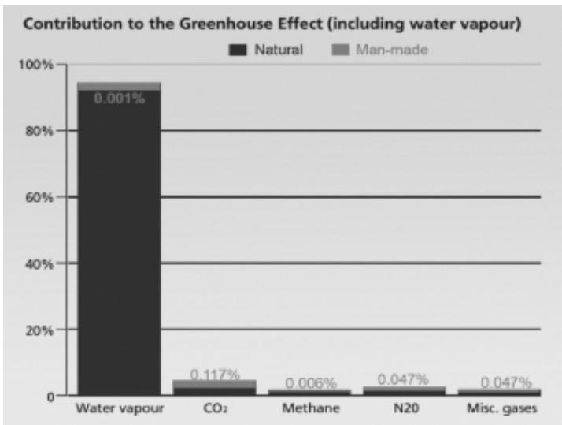  
Figure 9: The idea that the gas of life is disastrously changing the climate is an insult to brain cell activity.

One other point about the weather is that climate modification is now well advanced and not every major weather event is natural – or earthquake come to that. I cover this subject at some length in other books. China is openly planning a rapid expansion of its weather modification programme which includes changing the climate in an area more than one and a half times the size of India. China used weather manipulation to ensure clear skies during the 2008 Olympics in Beijing. I have quoted from US military documents detailing how to employ weather manipulation as a weapon of war and they did that in the 1960s and 70s during the conflict in Vietnam with Operation Popeye manipulating monsoon rains for military purposes. Why would there be international treaties on weather modification if it wasn’t possible? Of course it is. Weather is energetic information and it can be changed.

# How was the climate hoax pulled off? See ‘Covid’

If you can get billions to believe in a ‘virus’ that doesn’t exist you can get them to believe in human-caused climate change that doesn’t exist. Both are being used by the Cult to transform global society in the way it has long planned. Both hoaxes have been achieved in prey much the same way. First you declare a lie is a fact. There’s a

‘virus’ you call SARS-Cov-2 or humans are warming the planet with their behaviour. Next this becomes, via Cult networks, the foundation of government, academic and science policy and belief. Those who parrot the mantra are given big grants to produce research that confirms the narrative is true and ever more ‘symptoms’ are added to make the ‘virus’/’climate change’ sound even more scary. Scientists and researchers who challenge the narrative have their grants withdrawn and their careers destroyed. The media promote the lie as the unquestionable truth and censor those with an alternative view or evidence. A great percentage of the population believe what they are told as the lie becomes an everybody-knows-that and the believing-masses turn on those with a mind of their own. The technique has been used endlessly throughout human history. Wokers are the biggest promotors of the climate lie and ‘Covid’ fascism because their minds are owned by the Cult; their sense of self-righteous self-purity knows no bounds; and they exist in a bubble of reality in which facts are irrelevant and only get in the way of looking without seeing.

Running through all of this like veins in a blue cheese is control of information, which means control of perception, which means control of behaviour, which collectively means control of human society. The Cult owns the global media and Silicon Valley fascists for the simple reason that it has to. Without control of information it can’t control perception and through that human society. Examine every facet of the Cult agenda and you will see that anything supporting its introduction is never censored while anything pushing back is always censored. I say again: Psychopaths that know why they are doing this must go before Nuremberg trials and those that follow their orders must trot along behind them into the same dock. ‘I was just following orders’ didn’t work the first time and it must not work now. Nuremberg trials must be held all over the world before public juries for politicians, government officials, police, compliant doctors, scientists and virologists, and all Cult operatives such as Gates, Tedros, Fauci, Vallance, Whiy, Ferguson, Zuckerberg, Wojcicki, Brin, Page, Dorsey, the whole damn lot of

them – including, no especially, the psychopath psychologists. Without them and the brainless, gutless excuses for journalists that have repeated their lies, none of this could be happening. Nobody can be allowed to escape justice for the psychological and economic Armageddon they are all responsible for visiting upon the human race.

As for the compliant, unquestioning, swathes of humanity, and the self-obsessed, all-knowing ignorance of the Wokers … don’t start me. God help their kids. God help their grandkids. God help them.

# CHAPTER NINE

# We must have it? So what is it?

Well I won’t back down. No, I won’t back down. You can stand me up at the Gates of Hell. But I won’t back down Tom Petty

will now focus on the genetically-manipulating ‘Covid vaccines’ which do not meet this official definition of a vaccine by the US Centers for Disease Control (CDC): ‘A product that stimulates a person’s immune system to produce immunity to a specific disease, protecting the person from that disease.’ On that basis ‘Covid vaccines’ are not a vaccine in that the makers don’t even claim they stop infection or transmission.

They are instead part of a multi-levelled conspiracy to change the nature of the human body and what it means to be ‘human’ and to depopulate an enormous swathe of humanity. What I shall call Human 1.0 is on the cusp of becoming Human 2.0 and for very sinister reasons. Before I get to the ‘Covid vaccine’ in detail here’s some background to vaccines in general. Government regulators do not test vaccines – the makers do – and the makers control which data is revealed and which isn’t. Children in America are given 50 vaccine doses by age six and 69 by age 19 and the effect of the whole combined schedule has never been tested. Autoimmune diseases when the immune system aacks its own body have soared in the mass vaccine era and so has disease in general in children and the young. Why wouldn’t this be the case when vaccines target the immune system? The US government gave Big Pharma drug

companies immunity from prosecution for vaccine death and injury in the 1986 National Childhood Vaccine Injury Act (NCVIA) and since then the government (taxpayer) has been funding compensation for the consequences of Big Pharma vaccines. The criminal and satanic drug giants can’t lose and the vaccine schedule has increased dramatically since 1986 for this reason. There is no incentive to make vaccines safe and a big incentive to make money by introducing ever more. Even against a ridiculously high bar to prove vaccine liability, and with the government controlling the hearing in which it is being challenged for compensation, the vaccine court has so far paid out more than $\$ 4$ billion. These are the vaccines we are told are safe and psychopaths like Zuckerberg censor posts saying otherwise. The immunity law was even justified by a ruling that vaccines by their nature were ‘unavoidably unsafe’.

Check out the ingredients of vaccines and you will be shocked if you are new to this. They put that in children’s bodies?? What?? Try aluminium, a brain toxin connected to dementia, aborted foetal tissue and formaldehyde which is used to embalm corpses. Worldrenowned aluminium expert Christopher Exley had his research into the health effect of aluminium in vaccines shut down by Keele University in the UK when it began taking funding from the Bill and Melinda Gates Foundation. Research when diseases ‘eradicated’ by vaccines began to decline and you will find the fall began long before the vaccine was introduced. Sometimes the fall even plateaued aer the vaccine. Diseases like scarlet fever for which there was no vaccine declined in the same way because of environmental and other factors. A perfect case in point is the polio vaccine. Polio began when lead arsenate was first sprayed as an insecticide and residues remained in food products. Spraying started in 1892 and the first US polio epidemic came in Vermont in 1894. The simple answer was to stop spraying, but Rockefeller-created Big Pharma had a beer idea. Polio was decreed to be caused by the poliovirus which ‘spreads from person to person and can infect a person’s spinal cord’. Lead arsenate was replaced by the lethal DDT which had the same effect of causing paralysis by damaging the brain and central nervous

system. Polio plummeted when DDT was reduced and then banned, but the vaccine is still given the credit for something it didn’t do. Today by far the biggest cause of polio is the vaccines promoted by Bill Gates. Vaccine justice campaigner Robert Kennedy Jr, son of assassinated (by the Cult) US Aorney General Robert Kennedy, wrote:

In 2017, the World Health Organization (WHO) reluctantly admitted that the global explosion in polio is predominantly vaccine strain. The most frightening epidemics in Congo, Afghanistan, and the Philippines, are all linked to vaccines. In fact, by 2018, $7 0 \%$ of global polio cases were vaccine strain.

Vaccines make fortunes for Cult-owned Gates and Big Pharma while undermining the health and immune systems of the population. We had a glimpse of the mentality behind the Big Pharma cartel with a report on WION (World is One News), an international English language TV station based in India, which exposed the extraordinary behaviour of US drug company Pfizer over its ‘Covid vaccine’. The WION report told how Pfizer had made fantastic demands of Argentina, Brazil and other countries in return for its ‘vaccine’. These included immunity from prosecution, even for Pfizer negligence, government insurance to protect Pfizer from law suits and handing over as collateral sovereign assets of the country to include Argentina’s bank reserves, military bases and embassy buildings. Pfizer demanded the same of Brazil in the form of waiving sovereignty of its assets abroad; exempting Pfizer from Brazilian laws; and giving Pfizer immunity from all civil liability. This is a ‘vaccine’ developed with government funding. Big Pharma is evil incarnate as a creation of the Cult and all must be handed tickets to Nuremberg.

# Phantom ‘vaccine’ for a phantom ‘disease’

I’ll expose the ‘Covid vaccine’ fraud and then go on to the wider background of why the Cult has set out to ‘vaccinate’ every man, woman and child on the planet for an alleged ‘new disease’ with a survival rate of 99.77 percent (or more) even by the grotesquely-

manipulated figures of the World Health Organization and Johns Hopkins University. The ‘infection’ to ‘death’ ratio is 0.23 to 0.15 percent according to Stanford epidemiologist Dr John Ioannidis and while estimates vary the danger remains tiny. I say that if the truth be told the fake infection to fake death ratio is zero. Never mind all the evidence I have presented here and in The Answer that there is no ‘virus’ let us just focus for a moment on that death-rate figure of say 0.23 percent. The figure includes all those worldwide who have tested positive with a test not testing for the ‘virus’ and then died within 28 days or even longer of any other cause – any other cause. Now subtract all those illusory ‘Covid’ deaths on the global data sheets from the 0.23 percent. What do you think you would be le with? Zero. A vaccination has never been successfully developed for a so-called coronavirus. They have all failed at the animal testing stage when they caused hypersensitivity to what they were claiming to protect against and made the impact of a disease far worse. Cultowned vaccine corporations got around that problem this time by bypassing animal trials, going straight to humans and making the length of the ‘trials’ before the public rollout as short as they could get away with. Normally it takes five to ten years or more to develop vaccines that still cause demonstrable harm to many people and that’s without including the long-term effects that are never officially connected to the vaccination. ‘Covid’ non-vaccines have been officially produced and approved in a maer of months from a standing start and part of the reason is that (a) they were developed before the ‘Covid’ hoax began and (b) they are based on computer programs and not natural sources. Official non-trials were so short that government agencies gave emergency, not full, approval. ‘Trials’ were not even completed and full approval cannot be secured until they are. Public ‘Covid vaccination’ is actually a continuation of the trial. Drug company ‘trials’ are not scheduled to end until 2023 by which time a lot of people are going to be dead. Data on which government agencies gave this emergency approval was supplied by the Big Pharma corporations themselves in the form of Pfizer/BioNTech, AstraZeneca, Moderna, Johnson & Johnson, and

others, and this is the case with all vaccines. By its very nature emergency approval means drug companies do not have to prove that the ‘vaccine’ is ‘safe and effective’. How could they with trials way short of complete? Government regulators only have to believe that they could be safe and effective. It is criminal manipulation to get products in circulation with no testing worth the name. Agencies giving that approval are infested with Big Pharma-connected placepeople and they act in the interests of Big Pharma (the Cult) and not the public about whom they do not give a damn.

# More human lab rats

‘Covid vaccines’ produced in record time by Pfizer/BioNTech and Moderna employ a technique never approved before for use on humans. They are known as mRNA ‘vaccines’ and inject a synthetic version of ‘viral’ mRNA or ‘messenger RNA’. The key is in the term ‘messenger’. The body works, or doesn’t, on the basis of information messaging. Communications are constantly passing between and within the genetic system and the brain. Change those messages and you change the state of the body and even its very nature and you can change psychology and behaviour by the way the brain processes information. I think you are going to see significant changes in personality and perception of many people who have had the ‘Covid vaccine’ synthetic potions. Insider Aldous Huxley predicted the following in 1961 and mRNA ‘vaccines’ can be included in the term ‘pharmacological methods’:

There will be, in the next generation or so, a pharmacological method of making people love their servitude, and producing dictatorship without tears, so to speak, producing a kind of painless concentration camp for entire societies, so that people will in fact have their own liberties taken away from them, but rather enjoy it, because they will be distracted from any desire to rebel by propaganda or brainwashing, or brainwashing enhanced by pharmacological methods. And this seems to be the final revolution.

Apologists claim that mRNA synthetic ‘vaccines’ don’t change the DNA genetic blueprint because RNA does not affect DNA only the other way round. This is so disingenuous. A process called ‘reverse

transcription’ can convert RNA into DNA and be integrated into DNA in the cell nucleus. This was highlighted in December, 2020, by scientists at Harvard and Massachuses Institute of Technology (MIT). Geneticists report that more than 40 percent of mammalian genomes results from reverse transcription. On the most basic level if messaging changes then that sequence must lead to changes in DNA which is receiving and transmiing those communications. How can introducing synthetic material into cells not change the cells where DNA is located? The process is known as transfection which is defined as ‘a technique to insert foreign nucleic acid (DNA or RNA) into a cell, typically with the intention of altering the properties of the cell’. Researchers at the Sloan Keering Institute in New York found that changes in messenger RNA can deactivate tumour-suppressing proteins and thereby promote cancer. This is what happens when you mess with messaging. ‘Covid vaccine’ maker Moderna was founded in 2010 by Canadian stem cell biologist Derrick J. Rossi aer his breakthrough discovery in the field of transforming and reprogramming stem cells. These are neutral cells that can be programmed to become any cell including sperm cells. Moderna was therefore founded on the principle of genetic manipulation and has never produced any vaccine or drug before its genetically-manipulating synthetic ‘Covid’ shite. Look at the name – Mode-RNA or Modify-RNA. Another important point is that the US Supreme Court has ruled that genetically-modified DNA, or complementary DNA (cDNA) synthesized in the laboratory from messenger RNA, can be patented and owned. These psychopaths are doing this to the human body.

Cells replicate synthetic mRNA in the ‘Covid vaccines’ and in theory the body is tricked into making antigens which trigger antibodies to target the ‘virus spike proteins’ which as Dr Tom Cowan said have never been seen. Cut the crap and these ‘vaccines’ deliver self-replicating synthetic material to the cells with the effect of changing human DNA. The more of them you have the more that process is compounded while synthetic material is all the time selfreplicating. ‘Vaccine’-maker Moderna describes mRNA as ‘like

soware for the cell’ and so they are messing with the body’s soware. What happens when you change the soware in a computer? Everything changes. For this reason the Cult is preparing a production line of mRNA ‘Covid vaccines’ and a long list of excuses to use them as with all the ‘variants’ of a ‘virus’ never shown to exist. The plan is further to transfer the mRNA technique to other vaccines mostly given to children and young people. The cumulative consequences will be a transformation of human DNA through a constant infusion of synthetic genetic material which will kill many and change the rest. Now consider that governments that have given emergency approval for a vaccine that’s not a vaccine; never been approved for humans before; had no testing worth the name; and the makers have been given immunity from prosecution for any deaths or adverse effects suffered by the public. The UK government awarded permanent legal indemnity to itself and its employees for harm done when a patient is being treated for ‘Covid- ${ } ^ { 1 9 ^ { \prime } }$ or ‘suspected Covid-19’. That is quite a thought when these are possible ‘side-effects’ from the ‘vaccine’ (they are not ‘side’, they are effects) listed by the US Food and Drug Administration:

Guillain-Barre syndrome; acute disseminated encephalomyelitis; transverse myelitis; encephalitis; myelitis; encephalomyelitis; meningoencephalitis; meningitis; encephalopathy; convulsions; seizures; stroke; narcolepsy; cataplexy; anaphylaxis; acute myocardial infarction (heart aack); myocarditis; pericarditis; autoimmune disease; death; implications for pregnancy, and birth outcomes; other acute demyelinating diseases; non anaphylactic allergy reactions; thrombocytopenia ; disseminated intravascular coagulation; venous thromboembolism; arthritis; arthralgia; joint pain; Kawasaki disease; multisystem inflammatory syndrome in children; vaccine enhanced disease. The laer is the way the ‘vaccine’ has the potential to make diseases far worse than they would otherwise be.

UK doctor and freedom campaigner Vernon Coleman described the conditions in this list as ‘all unpleasant, most of them very serious, and you can’t get more serious than death’. The thought that anyone at all has had the ‘vaccine’ in these circumstances is testament to the potential that humanity has for clueless, unquestioning, stupidity and for many that programmed stupidity has already been terminal.

# An insider speaks

Dr Michael Yeadon is a former Vice President, head of research and Chief Scientific Adviser at vaccine giant Pfizer. Yeadon worked on the inside of Big Pharma, but that did not stop him becoming a vocal critic of ‘Covid vaccines’ and their potential for multiple harms, including infertility in women. By the spring of 2021 he went much further and even used the no, no, term ‘conspiracy’. When you begin to see what is going on it is impossible not to do so. Yeadon spoke out in an interview with freedom campaigner James Delingpole and I mentioned earlier how he said that no one had samples of ‘the virus’. He explained that the mRNA technique originated in the anticancer field and ways to turn on and off certain genes which could be advantageous if you wanted to stop cancer growing out of control. ‘That’s the origin of them. They are a very unusual application, really.’ Yeadon said that treating a cancer patient with an aggressive procedure might be understandable if the alternative was dying, but it was quite another thing to use the same technique as a public health measure. Most people involved wouldn’t catch the infectious agent you were vaccinating against and if they did they probably wouldn’t die:

If you are really using it as a public health measure you really want to as close as you can get to zero sides-effects … I find it odd that they chose techniques that were really cutting their teeth in the field of oncology and I’m worried that in using gene-based vaccines that have to be injected in the body and spread around the body, get taken up into some cells, and the regulators haven’t quite told us which cells they get taken up into … you are going to be generating a wide range of responses … with multiple steps each of which could go well or badly.

I doubt the Cult intends it to go well. Yeadon said that you can put any gene you like into the body through the ‘vaccine’. ‘You can certainly give them a gene that would do them some harm if you wanted.’ I was intrigued when he said that when used in the cancer field the technique could turn genes on and off. I explore this process in The Answer and with different genes having different functions you could create mayhem – physically and psychologically – if you turned the wrong ones on and the right ones off. I read reports of an experiment by researchers at the University of Washington’s school of computer science and engineering in which they encoded DNA to infect computers. The body is itself a biological computer and if human DNA can inflict damage on a computer why can’t the computer via synthetic material mess with the human body? It can. The Washington research team said it was possible to insert malicious malware into ‘physical DNA strands’ and corrupt the computer system of a gene sequencing machine as it ‘reads gene leers and stores them as binary digits 0 and 1’. They concluded that hackers could one day use blood or spit samples to access computer systems and obtain sensitive data from police forensics labs or infect genome files. It is at this level of digital interaction that synthetic ‘vaccines’ need to be seen to get the full picture and that will become very clear later on. Michael Yeadon said it made no sense to give the ‘vaccine’ to younger people who were in no danger from the ‘virus’. What was the benefit? It was all downside with potential effects:

The fact that my government in what I thought was a civilised, rational country, is raining [the ‘vaccine’] on people in their 30s and 40s, even my children in their 20s, they’re getting letters and phone calls, I know this is not right and any of you doctors who are vaccinating you know it’s not right, too. They are not at risk. They are not at risk from the disease, so you are now hoping that the side-effects are so rare that you get away with it. You don’t give new technology … that you don’t understand to 100 percent of the population.

Blood clot problems with the AstraZeneca ‘vaccine’ have been affecting younger people to emphasise the downside risks with no benefit. AstraZeneca’s version, produced with Oxford University, does not use mRNA, but still gets its toxic cocktail inside cells where

it targets DNA. The Johnson & Johnson ‘vaccine’ which uses a similar technique has also produced blood clot effects to such an extent that the United States paused its use at one point. They are all ‘gene therapy’ (cell modification) procedures and not ‘vaccines’. The truth is that once the content of these injections enter cells we have no idea what the effect will be. People can speculate and some can give very educated opinions and that’s good. In the end, though, only the makers know what their potions are designed to do and even they won’t know every last consequence. Michael Yeadon was scathing about doctors doing what they knew to be wrong.

‘Everyone’s mute’, he said. Doctors in the NHS must know this was not right, coming into work and injecting people. ‘I don’t know how they sleep at night. I know I couldn’t do it. I know that if I were in that position I’d have to quit.’ He said he knew enough about toxicology to know this was not a good risk-benefit. Yeadon had spoken to seven or eight university professors and all except two would not speak out publicly. Their universities had a policy that no one said anything that countered the government and its medical advisors. They were afraid of losing their government grants. This is how intimidation has been used to silence the truth at every level of the system. I say silence, but these people could still speak out if they made that choice. Yeadon called them ‘moral cowards’ – ‘This is about your children and grandchildren’s lives and you have just buggered off and le it.’

# ‘Variant’ nonsense

Some of his most powerful comments related to the alleged ‘variants’ being used to instil more fear, justify more lockdowns, and introduce more ‘vaccines’. He said government claims about ‘variants’ were nonsense. He had checked the alleged variant ‘codes’ and they were 99.7 percent identical to the ‘original’. This was the human identity difference equivalent to puing a baseball cap on and off or wearing it the other way round. A 0.3 percent difference would make it impossible for that ‘variant’ to escape immunity from the ‘original’. This made no sense of having new ‘vaccines’ for

‘variants’. He said there would have to be at least a 30 percent difference for that to be justified and even then he believed the immune system would still recognise what it was. Gates-funded ‘variant modeller’ and ‘vaccine’-pusher John Edmunds might care to comment. Yeadon said drug companies were making new versions of the ‘vaccine’ as a ‘top up’ for ‘variants’. Worse than that, he said, the ‘regulators’ around the world like the MHRA in the UK had got together and agreed that because ‘vaccines’ for ‘variants’ were so similar to the first ‘vaccines’ they did not have to do safety studies. How transparently sinister that is. This is when Yeadon said: ‘There is a conspiracy here.’ There was no need for another vaccine for ‘variants’ and yet we were told that there was and the country had shut its borders because of them. ‘They are going into hundreds of millions of arms without passing ‘go’ or any regulator. Why did they do that? Why did they pick this method of making the vaccine?’

The reason had to be something bigger than that it seemed and ‘it’s not protection against the virus’. It’s was a far bigger project that meant politicians and advisers were willing to do things and not do things that knowingly resulted in avoidable deaths – ‘that’s already happened when you think about lockdown and deprivation of health care for a year.’ He spoke of people prepared to do something that results in the avoidable death of their fellow human beings and it not bother them. This is the penny-drop I have been working to get across for more than 30 years – the level of pure evil we are dealing with. Yeadon said his friends and associates could not believe there could be that much evil, but he reminded them of Stalin, Pol Pot and Hitler and of what Stalin had said: ‘One death is a tragedy. A million? A statistic.’ He could not think of a benign explanation for why you need top-up vaccines ‘which I’m sure you don’t’ and for the regulators ‘to just get out of the way and wave them through’. Why would the regulators do that when they were still wrestling with the dangers of the ‘parent’ vaccine? He was clearly shocked by what he had seen since the ‘Covid’ hoax began and now he was thinking the previously unthinkable:

If you wanted to depopulate a significant proportion of the world and to do it in a way that doesn’t involve destruction of the environment with nuclear weapons, poisoning everyone with anthrax or something like that, and you wanted plausible deniability while you had a multi-year infectious disease crisis, I actually don’t think you could come up with a better plan of work than seems to be in front of me. I can’t say that’s what they are going to do, but I can’t think of a benign explanation why they are doing it.

He said he never thought that they would get rid of 99 percent of humans, but now he wondered. ‘If you wanted to that this would be a hell of a way to do it – it would be unstoppable folks.’ Yeadon had concluded that those who submied to the ‘vaccine’ would be allowed to have some kind of normal life (but for how long?) while screws were tightened to coerce and mandate the last few percent. ‘I think they’ll put the rest of them in a prison camp. I wish I was wrong, but I don’t think I am.’ Other points he made included: There were no coronavirus vaccines then suddenly they all come along at the same time; we have no idea of the long term affect with trials so short; coercing or forcing people to have medical procedures is against the Nuremberg Code instigated when the Nazis did just that; people should at least delay having the ‘vaccine’; a quick Internet search confirms that masks don’t reduce respiratory viral transmission and ‘the government knows that’; they have smashed civil society and they know that, too; two dozen peer-reviewed studies show no connection between lockdown and reducing deaths; he knew from personal friends the elite were still flying around and going on holiday while the public were locked down; the elite were not having the ‘vaccines’. He was also asked if ‘vaccines’ could be made to target difference races. He said he didn’t know, but the document by the Project for the New American Century in September, 2000, said developing ‘advanced forms of biological warfare that can target specific genotypes may transform biological warfare from the realm of terror to a politically useful tool.’ Oh, they’re evil all right. Of that we can be absolutely sure.

# Another cull of old people

We have seen from the CDC definition that the mRNA ‘Covid vaccine’ is not a vaccine and nor are the others that claim to reduce ‘severity of symptoms’ in some people, but not protect from infection or transmission. What about all the lies about returning to ‘normal’ if people were ‘vaccinated’? If they are not claimed to stop infection and transmission of the alleged ‘virus’, how does anything change? This was all lies to manipulate people to take the jabs and we are seeing that now with masks and distancing still required for the ‘vaccinated’. How did they think that elderly people with fragile health and immune responses were going to be affected by infusing their cells with synthetic material and other toxic substances? They knew that in the short and long term it would be devastating and fatal as the culling of the old that began with the first lockdowns was continued with the ‘vaccine’. Death rates in care homes soared immediately residents began to be ‘vaccinated’ – infused with synthetic material. Brave and commied whistleblower nurses put their careers at risk by exposing this truth while the rest kept their heads down and their mouths shut to put their careers before those they are supposed to care for. A long-time American Certified Nursing Assistant who gave his name as James posted a video in which he described emotionally what happened in his care home when vaccination began. He said that during 2020 very few residents were sick with ‘Covid’ and no one died during the entire year; but shortly aer the Pfizer mRNA injections 14 people died within two weeks and many others were near death. ‘They’re dropping like flies’, he said. Residents who walked on their own before the shot could no longer and they had lost their ability to conduct an intelligent conversation. The home’s management said the sudden deaths were caused by a ‘super-spreader’ of ‘Covid-19’. Then how come, James asked, that residents who refused to take the injections were not sick? It was a case of inject the elderly with mRNA synthetic potions and blame their illness and death that followed on the ‘virus’. James described what was happening in care homes as ‘the greatest crime of genocide this country has ever seen’. Remember the NHS staff nurse from earlier who used the same

word ‘genocide’ for what was happening with the ‘vaccines’ and that it was an ‘act of human annihilation’. A UK care home whistleblower told a similar story to James about the effect of the ‘vaccine’ in deaths and ‘outbreaks’ of illness dubbed ‘Covid’ aer geing the jab. She told how her care home management and staff had zealously imposed government regulations and no one was allowed to even question the official narrative let alone speak out against it. She said the NHS was even worse. Again we see the results of reframing. A worker at a local care home where I live said they had not had a single case of ‘Covid’ there for almost a year and when the residents were ‘vaccinated’ they had 19 positive cases in two weeks with eight dying.

# It’s not the ‘vaccine’ – honest

The obvious cause and effect was being ignored by the media and most of the public. Australia’s health minister Greg Hunt (a former head of strategy at the World Economic Forum) was admied to hospital aer he had the ‘vaccine’. He was suffering according to reports from the skin infection ‘cellulitis’ and it must have been a severe case to have warranted days in hospital. Immediately the authorities said this was nothing to do with the ‘vaccine’ when an effect of some vaccines is a ‘cellulitis-like reaction’. We had families of perfectly healthy old people who died aer the ‘vaccine’ saying that if only they had been given the ‘vaccine’ earlier they would still be alive. As a numbskull rating that is off the chart. A father of four ‘died of Covid’ at aged 48 when he was taken ill two days aer having the ‘vaccine’. The man, a health administrator, had been ‘shielding during the pandemic’ and had ‘not really le the house’ until he went for the ‘vaccine’. Having the ‘vaccine’ and then falling ill and dying does not seem to have qualified as a possible cause and effect and ‘Covid- ${ } \cdot 1 9 ^ { \prime }$ went on his death certificate. His family said they had no idea how he ‘caught the virus’. A family member said: ‘Tragically, it could be that going for a vaccination ultimately led to him catching Covid …The sad truth is that they are never going to know where it came from.’ The family warned people to remember

that the virus still existed and was ‘very real’. So was their stupidity. Nurses and doctors who had the first round of the ‘vaccine’ were collapsing, dying and ending up in a hospital bed while they or their grieving relatives were saying they’d still have the ‘vaccine’ again despite what happened. I kid you not. You mean if your husband returned from the dead he’d have the same ‘vaccine’ again that killed him??

Doctors at the VCU Medical Center in Richmond, Virginia, said the Johnson & Johnson ‘vaccine’ was to blame for a man’s skin peeling off. Patient Richard Terrell said: ‘It all just happened so fast. My skin peeled off. It’s still coming off on my hands now.’ He said it was stinging, burning and itching and when he bent his arms and legs it was very painful with ‘the skin swollen and rubbing against itself’. Pfizer/BioNTech and Moderna vaccines use mRNA to change the cell while the Johnson & Johnson version uses DNA in a process similar to AstraZeneca’s technique. Johnson & Johnson and AstraZeneca have both had their ‘vaccines’ paused by many countries aer causing serious blood problems. Terrell’s doctor Fnu Nutan said he could have died if he hadn’t got medical aention. It sounds terrible so what did Nutan and Terrell say about the ‘vaccine’ now? Oh, they still recommend that people have it. A nurse in a hospital bed 40 minutes aer the vaccination and unable to swallow due to throat swelling was told by a doctor that he lost mobility in his arm for 36 hours following the vaccination. What did he say to the ailing nurse? ‘Good for you for geing the vaccination.’ We are dealing with a serious form of cognitive dissonance madness in both public and medical staff. There is a remarkable correlation between those having the ‘vaccine’ and trumpeting the fact and suffering bad happenings shortly aerwards. Witold Rogiewicz, a Polish doctor, made a video of his ‘vaccination’ and ridiculed those who were questioning its safety and the intentions of Bill Gates: ‘Vaccinate yourself to protect yourself, your loved ones, friends and also patients. And to mention quickly I have info for anti-vaxxers and anti-Coviders if you want to contact Bill Gates you can do this through me.’ He further ridiculed the dangers of 5G. Days later he

was dead, but naturally the vaccination wasn’t mentioned in the verdict of ‘heart aack’.

# Lies, lies and more lies

So many members of the human race have slipped into extreme states of insanity and unfortunately they include reframed doctors and nursing staff. Having a ‘vaccine’ and dying within minutes or hours is not considered a valid connection while death from any cause within 28 days or longer of a positive test with a test not testing for the ‘virus’ means ‘Covid- ${ \bf \cdot } 1 9 ^ { \prime }$ goes on the death certificate. How could that ‘vaccine’-death connection not have been made except by calculated deceit? US figures in the initial rollout period to February 12th, 2020, revealed that a third of the deaths reported to the CDC aer ‘Covid vaccines’ happened within 48 hours. Five men in the UK suffered an ‘extremely rare’ blood clot problem aer having the AstraZeneca ‘vaccine’, but no causal link was established said the Gates-funded Medicines and Healthcare products Regulatory Agency (MHRA) which had given the ‘vaccine’

emergency approval to be used. Former Pfizer executive Dr Michael Yeadon explained in his interview how the procedures could cause blood coagulation and clots. People who should have been at no risk were dying from blood clots in the brain and he said he had heard from medical doctor friends that people were suffering from skin bleeding and massive headaches. The AstraZeneca ‘shot’ was stopped by some 20 countries over the blood cloing issue and still the corrupt MHRA, the European Medicines Agency (EMA) and the World Health Organization said that it should continue to be given even though the EMA admied that it ‘still cannot rule out definitively’ a link between blood cloing and the ‘vaccine’. Later Marco Cavaleri, head of EMA vaccine strategy, said there was indeed a clear link between the ‘vaccine’ and thrombosis, but they didn’t know why. So much for the trials showing the ‘vaccine’ is safe. Blood clots were affecting younger people who would be under virtually no danger from ‘Covid’ even if it existed which makes it all the more stupid and sinister.

The British government responded to public alarm by wheeling out June Raine, the terrifyingly weak infant school headmistress sound-alike who heads the UK MHRA drug ‘regulator’. The idea that she would stand up to Big Pharma and government pressure is laughable and she told us that all was well in the same way that she did when allowing untested, never-used-on-humans-before, genetically-manipulating ‘vaccines’ to be exposed to the public in the first place. Mass lying is the new normal of the ‘Covid’ era. The MHRA later said 30 cases of rare blood clots had by then been connected with the AstraZeneca ‘vaccine’ (that means a lot more in reality) while stressing that the benefits of the jab in preventing ‘Covid- ${ } ^ { 1 9 ^ { \prime } }$ outweighed any risks. A more ridiculous and disingenuous statement with callous disregard for human health it is hard to contemplate. Immediately aer the mendacious ‘all-clears’ two hospital workers in Denmark experienced blood clots and cerebral haemorrhaging following the AstraZeneca jab and one died. Top Norwegian health official Pål Andre Holme said the ‘vaccine’ was the only common factor: ‘There is nothing in the patient history of these individuals that can give such a powerful immune response … I am confident that the antibodies that we have found are the cause, and I see no other explanation than it being the vaccine which triggers it.’ Strokes, a clot or bleed in the brain, were clearly associated with the ‘vaccine’ from word of mouth and whistleblower reports. Similar consequences followed with all these ‘vaccines’ that we were told were so safe and as the numbers grew by the day it was clear we were witnessing human carnage.

# Learning the hard way

A woman interviewed by UKColumn told how her husband suffered dramatic health effects aer the vaccine when he’d been in good health all his life. He went from being a lile unwell to losing all feeling in his legs and experiencing ‘excruciating pain’.

Misdiagnosis followed twice at Accident and Emergency (an ‘allergy’ and ‘sciatica’) before he was admied to a neurology ward where doctors said his serious condition had been caused by the

‘vaccine’. Another seven ‘vaccinated’ people were apparently being treated on the same ward for similar symptoms. The woman said he had the ‘vaccine’ because they believed media claims that it was safe. ‘I didn’t think the government would give out a vaccine that does this to somebody; I believed they would be bringing out a vaccination that would be safe.’ What a tragic way to learn that lesson. Another woman posted that her husband was transporting stroke patients to hospital on almost every shi and when he asked them if they had been ‘vaccinated’ for ‘Covid’ they all replied ‘yes’. One had a ‘massive brain bleed’ the day aer his second dose. She said her husband reported the ‘just been vaccinated’ information every time to doctors in A and E only for them to ignore it, make no notes and appear annoyed that it was even mentioned. This particular report cannot be verified, but it expresses a common theme that confirms the monumental underreporting of ‘vaccine’ consequences. Interestingly as the ‘vaccines’ and their brain blood clot/stroke consequences began to emerge the UK National Health Service began a publicity campaign telling the public what to do in the event of a stroke. A Scoish NHS staff nurse who quit in disgust in March, 2021, said:

I have seen traumatic injuries from the vaccine, they’re not getting reported to the yellow card [adverse reaction] scheme, they’re treating the symptoms, not asking why, why it’s happening. It’s just treating the symptoms and when you speak about it you’re dismissed like you’re crazy, I’m not crazy, I’m not crazy because every other colleague I’ve spoken to is terrified to speak out, they’ve had enough.

Videos appeared on the Internet of people uncontrollably shaking aer the ‘vaccine’ with no control over muscles, limbs and even their face. A Scoish mother broke out in a severe rash all over her body almost immediately aer she was given the AstraZeneca ‘vaccine’. The pictures were horrific. Leigh King, a 41-year-old hairdresser from Lanarkshire said: ‘Never in my life was I prepared for what I was about to experience … My skin was so sore and constantly hot … I have never felt pain like this …’ But don’t you worry, the ‘vaccine’ is perfectly safe. Then there has been the effect on medical

staff who have been pressured to have the ‘vaccine’ by psychopathic ‘health’ authorities and government. A London hospital consultant who gave the name K. Polyakova wrote this to the British Medical Journal or BMJ:

I am currently struggling with … the failure to report the reality of the morbidity caused by our current vaccination program within the health service and staff population. The levels of sickness after vaccination is unprecedented and staff are getting very sick and some with neurological symptoms which is having a huge impact on the health service function. Even the young and healthy are off for days, some for weeks, and some requiring medical treatment. Whole teams are being taken out as they went to get vaccinated together.

Mandatory vaccination in this instance is stupid, unethical and irresponsible when it comes to protecting our staff and public health. We are in the voluntary phase of vaccination, and encouraging staff to take an unlicensed product that is impacting on their immediate health … it is clearly stated that these vaccine products do not offer immunity or stop transmission. In which case why are we doing it?

Not to protect health that’s for sure. Medical workers are lauded by governments for agenda reasons when they couldn’t give a toss about them any more than they can for the population in general. Schools across America faced the same situation as they closed due to the high number of teachers and other staff with bad reactions to the Pfizer/BioNTech, Moderna, and Johnson & Johnson ‘Covid vaccines’ all of which were linked to death and serious adverse effects. The BMJ took down the consultant’s comments prey quickly on the grounds that they were being used to spread ‘disinformation’. They were exposing the truth about the ‘vaccine’ was the real reason. The cover-up is breathtaking.

# Hiding the evidence

The scale of the ‘vaccine’ death cover-up worldwide can be confirmed by comparing official figures with the personal experience of the public. I heard of many people in my community who died immediately or soon aer the vaccine that would never appear in the media or even likely on the official totals of ‘vaccine’ fatalities and adverse reactions when only about ten percent are estimated to be

reported and I have seen some estimates as low as one percent in a Harvard study. In the UK alone by April 29th, 2021, some 757,654 adverse reactions had been officially reported from the Pfizer/BioNTech, Oxford/AstraZeneca and Moderna ‘vaccines’ with more than a thousand deaths linked to jabs and that means an estimated ten times this number in reality from a ten percent reporting rate percentage. That’s seven million adverse reactions and 10,000 potential deaths and a one percent reporting rate would be ten times those figures. In 1976 the US government pulled the swine flu vaccine aer 53 deaths. The UK data included a combined 10,000 eye disorders from the ‘Covid vaccines’ with more than 750 suffering visual impairment or blindness and again multiply by the estimated reporting percentages. As ‘Covid cases’ officially fell hospitals virtually empty during the ‘Covid crisis’ began to fill up with a range of other problems in the wake of the ‘vaccine’ rollout. The numbers across America have also been catastrophic. Deaths linked to all types of vaccine increased by 6,000 percent in the first quarter of 2021 compared with 2020. A 39-year-old woman from Ogden, Utah, died four days aer receiving a second dose of Moderna’s ‘Covid vaccine’ when her liver, heart and kidneys all failed despite the fact that she had no known medical issues or conditions. Her family sought an autopsy, but Dr Erik Christensen, Utah’s chief medical examiner, said proving vaccine injury as a cause of death almost never happened. He could think of only one instance where an autopsy would name a vaccine as the official cause of death and that would be anaphylaxis where someone received a vaccine and died almost instantaneously. ‘Short of that, it would be difficult for us to definitively say this is the vaccine,’ Christensen said. If that is true this must be added to the estimated ten percent (or far less) reporting rate of vaccine deaths and serious reactions and the conclusion can only be that vaccine deaths and serious reactions – including these ‘Covid’ potions’ – are phenomenally understated in official figures. The same story can be found everywhere. Endless accounts of deaths and serious reactions among the public, medical

and care home staff while official figures did not even begin to reflect this.

Professional script-reader Dr David Williams, a ‘top public-health official’ in Ontario, Canada, insulted our intelligence by claiming only four serious adverse reactions and no deaths from the more than 380,000 vaccine doses then given. This bore no resemblance to what people knew had happened in their owns circles and we had Dirk Huyer in charge of geing millions vaccinated in Ontario while at the same time he was Chief Coroner for the province investigating causes of death including possible death from the vaccine. An aide said he had stepped back from investigating deaths, but evidence indicated otherwise. Rosemary Frei, who secured a Master of Science degree in molecular biology at the Faculty of Medicine at Canada’s University of Calgary before turning to investigative journalism, was one who could see that official figures for ‘vaccine’ deaths and reactions made no sense. She said that doctors seldom reported adverse events and when people got really sick or died aer geing a vaccination they would aribute that to anything except the vaccines. It had been that way for years and anyone who wondered aloud whether the ‘Covid vaccines’ or other shots cause harm is immediately branded as ‘anti-vax’ and ‘anti-science’. This was ‘career-threatening’ for health professionals. Then there was the huge pressure to support the push to ‘vaccinate’ billions in the quickest time possible. Frei said:

So that’s where we’re at today. More than half a million vaccine doses have been given to people in Ontario alone. The rush is on to vaccinate all 15 million of us in the province by September. And the mainstream media are screaming for this to be sped up even more. That all adds up to only a very slim likelihood that we’re going to be told the truth by officials about how many people are getting sick or dying from the vaccines.

What is true of Ontario is true of everywhere.

# They KNEW – and still did it

The authorities knew what was going to happen with multiple deaths and adverse reactions. The UK government’s Gates-funded

and Big Pharma-dominated Medicines and Healthcare products Regulatory Agency (MHRA) hired a company to employ AI in compiling the projected reactions to the ‘vaccine’ that would otherwise be uncountable. The request for applications said: ‘The MHRA urgently seeks an Artificial Intelligence (AI) soware tool to process the expected high volume of Covid-19 vaccine Adverse Drug Reaction …’ This was from the agency, headed by the disingenuous June Raine, that gave the ‘vaccines’ emergency approval and the company was hired before the first shot was given. ‘We are going to kill and maim you – is that okay?’ ‘Oh, yes, perfectly fine – I’m very grateful, thank you, doctor.’ The range of ‘Covid vaccine’ adverse reactions goes on for page aer page in the MHRA criminally underreported ‘Yellow Card’ system and includes affects to eyes, ears, skin, digestion, blood and so on. Raine’s MHRA amazingly claimed that the ‘overall safety experience … is so far as expected from the clinical trials’. The death, serious adverse effects, deafness and blindness were expected? When did they ever mention that? If these human tragedies were expected then those that gave approval for the use of these ‘vaccines’ must be guilty of crimes against humanity including murder – a definition of which is ‘killing a person with malice aforethought or with recklessness manifesting extreme indifference to the value of human life.’ People involved at the MHRA, the CDC in America and their equivalent around the world must go before Nuremberg trials to answer for their callous inhumanity. We are only talking here about the immediate effects of the ‘vaccine’. The longer-term impact of the DNA synthetic manipulation is the main reason they are so hysterically desperate to inoculate the entire global population in the shortest possible time.

Africa and the developing world are a major focus for the ‘vaccine’ depopulation agenda and a mass vaccination sales-pitch is underway thanks to caring people like the Rockefellers and other Cult assets. The Rockefeller Foundation, which pre-empted the ‘Covid pandemic’ in a document published in 2010 that ‘predicted’ what happened a decade later, announced an initial $\$ 34.95$ million grant in February, 2021, ‘to ensure more equitable access to Covid-19

testing and vaccines’ among other things in Africa in collaboration with ‘24 organizations, businesses, and government agencies’. The pan-Africa initiative would focus on 10 countries: Burkina Faso, Ethiopia, Ghana, Kenya, Nigeria, Rwanda, South Africa, Tanzania, Uganda, and Zambia’. Rajiv Shah, President of the Rockefeller Foundation and former administrator of CIA-controlled USAID, said that if Africa was not mass-vaccinated (to change the DNA of its people) it was a ‘threat to all of humanity’ and not fair on Africans. When someone from the Rockefeller Foundation says they want to do something to help poor and deprived people and countries it is time for a belly-laugh. They are doing this out of the goodness of their ‘heart’ because ‘vaccinating’ the entire global population is what the ‘Covid’ hoax set out to achieve. Official ‘decolonisation’ of Africa by the Cult was merely a prelude to financial colonisation on the road to a return to physical colonisation. The ‘vaccine’ is vital to that and the sudden and convenient death of the ‘Covid’ sceptic president of Tanzania can be seen in its true light. A lot of people in Africa are aware that this is another form of colonisation and exploitation and they need to stand their ground.

# The ‘vaccine is working’ scam

A potential problem for the Cult was that the ‘vaccine’ is meant to change human DNA and body messaging and not to protect anyone from a ‘virus’ never shown to exist. The vaccine couldn’t work because it was not designed to work and how could they make it appear to be working so that more people would have it? This was overcome by lowering the amplification rate of the PCR test to produce fewer ‘cases’ and therefore fewer ‘deaths’. Some of us had been pointing out since March, 2020, that the amplification rate of the test not testing for the ‘virus’ had been made artificially high to generate positive tests which they could call ‘cases’ to justify lockdowns. The World Health Organization recommended an absurdly high 45 amplification cycles to ensure the high positives required by the Cult and then remained silent on the issue until January 20th, 2021 – Biden’s Inauguration Day. This was when the

‘vaccinations’ were seriously underway and on that day the WHO recommended aer discussions with America’s CDC that laboratories lowered their testing amplification. Dr David Samadi, a certified urologist and health writer, said the WHO was encouraging all labs to reduce their cycle count for PCR tests. He said the current cycle was much too high and was ‘resulting in any particle being declared a positive case’. Even one mainstream news report I saw said this meant the number of ‘Covid’ infections may have been ‘dramatically inflated’. Oh, just a lile bit. The CDC in America issued new guidance to laboratories in April, 2021, to use 28 cycles but only for ‘vaccinated’ people. The timing of the CDC/WHO interventions were cynically designed to make it appear the ‘vaccines’ were responsible for falling cases and deaths when the real reason can be seen in the following examples. New York’s state lab, the Wadsworth Center, identified 872 positive tests in July, 2020, based on a threshold of 40 cycles. When the figure was lowered to 35 cycles 43 percent of the 872 were no longer ‘positives’. At 30 cycles the figure was 63 percent. A Massachuses lab found that between 85 to 90 percent of people who tested positive in July with a cycle threshold of 40 would be negative at 30 cycles, Ashish Jha, MD, director of the Harvard Global Health Institute, said: ‘I’m really shocked that it could be that high … Boy, does it really change the way we need to be thinking about testing.’ I’m shocked that I could see the obvious in the spring of 2020, with no medical background, and most medical professionals still haven’t worked it out. No, that’s not shocking – it’s terrifying.

Three weeks aer the WHO directive to lower PCR cycles the London Daily Mail ran this headline: ‘Why ARE Covid cases plummeting? New infections have fallen $4 5 \%$ in the US and $3 0 \%$ globally in the past 3 weeks but experts say vaccine is NOT the main driver because only $8 \%$ of Americans and $1 3 \%$ of people worldwide have received their first dose.’ They acknowledged that the drop could not be aributed to the ‘vaccine’, but soon this morphed throughout the media into the ‘vaccine’ has caused cases and deaths to fall when it was the PCR threshold. In December, 2020, there was

chaos at English Channel ports with truck drivers needing negative ‘Covid’ tests before they could board a ferry home for Christmas. The government wanted to remove the backlog as fast as possible and they brought in troops to do the ‘testing’. Out of 1,600 drivers just 36 tested positive and the rest were given the all clear to cross the Channel. I guess the authorities thought that 36 was the least they could get away with without the unquestioning catching on. The amplification trick which most people believed in the absence of information in the mainstream applied more pressure on those refusing the ‘vaccine’ to succumb when it ‘obviously worked’. The truth was the exact opposite with deaths in care homes soaring with the ‘vaccine’ and in Israel the term used was ‘skyrocket’. A reanalysis of published data from the Israeli Health Ministry led by Dr Hervé Seligmann at the Medicine Emerging Infectious and Tropical Diseases at Aix-Marseille University found that Pfizer’s ‘Covid vaccine’ killed ‘about 40 times more [elderly] people than the disease itself would have killed’ during a five-week vaccination period and 260 times more younger people than would have died from the ‘virus’ even according to the manipulated ‘virus’ figures. Dr Seligmann and his co-study author, Haim Yativ, declared aer reviewing the Israeli ‘vaccine’ death data: ‘This is a new Holocaust.’

Then, in mid-April, 2021, aer vast numbers of people worldwide had been ‘vaccinated’, the story changed with clear coordination. The UK government began to prepare the ground for more future lockdowns when Nuremberg-destined Boris Johnson told yet another whopper. He said that cases had fallen because of lockdowns not ‘vaccines’. Lockdowns are irrelevant when there is no ‘virus’ and the test and fraudulent death certificates are deciding the number of ‘cases’ and ‘deaths’. Study aer study has shown that lockdowns don’t work and instead kill and psychologically destroy people. Meanwhile in the United States Anthony Fauci and Rochelle Walensky, the ultra-Zionist head of the CDC, peddled the same line. More lockdown was the answer and not the ‘vaccine’, a line repeated on cue by the moron that is Canadian Prime Minister Justin Trudeau. Why all the hysteria to get everyone ‘vaccinated’ if lockdowns and

not ‘vaccines’ made the difference? None of it makes sense on the face of it. Oh, but it does. The Cult wants lockdowns and the ‘vaccine’ and if the ‘vaccine’ is allowed to be seen as the total answer lockdowns would no longer be justified when there are still livelihoods to destroy. ‘Variants’ and renewed upward manipulation of PCR amplification are planned to instigate never-ending lockdown and more ‘vaccines’.

# You must have it – we’re desperate

Israel, where the Jewish and Arab population are ruled by the Sabbatian Cult, was the front-runner in imposing the DNAmanipulating ‘vaccine’ on its people to such an extent that Jewish refusers began to liken what was happening to the early years of Nazi Germany. This would seem to be a fantastic claim. Why would a government of Jewish people be acting like the Nazis did? If you realise that the Sabbatian Cult was behind the Nazis and that Sabbatians hate Jews the pieces start to fit and the question of why a ‘Jewish’ government would treat Jews with such callous disregard for their lives and freedom finds an answer. Those controlling the government of Israel aren’t Jewish – they’re Sabbatian. Israeli lawyer Tamir Turgal was one who made the Nazi comparison in comments to German lawyer Reiner Fuellmich who is leading a class action lawsuit against the psychopaths for crimes against humanity. Turgal described how the Israeli government was vaccinating children and pregnant women on the basis that there was no evidence that this was dangerous when they had no evidence that it wasn’t dangerous either. They just had no evidence. This was medical experimentation and Turgal said this breached the Nuremberg Code about medical experimentation and procedures requiring informed consent and choice. Think about that. A Nuremberg Code developed because of Nazi experimentation on Jews and others in concentration camps by people like the evil-beyond-belief Josef Mengele is being breached by the Israeli government; but when you know that it’s a Sabbatian government along with its intelligence and military agencies like Mossad, Shin Bet and the Israeli Defense Forces, and that Sabbatians

were the force behind the Nazis, the kaleidoscope comes into focus. What have we come to when Israeli Jews are suing their government for violating the Nuremberg Code by essentially making Israelis subject to a medical experiment using the controversial ‘vaccines’? It’s a shocker that this has to be done in the light of what happened in Nazi Germany. The Anshe Ha-Emet, or ‘People of the Truth’, made up of Israeli doctors, lawyers, campaigners and public, have launched a lawsuit with the International Criminal Court. It says:

When the heads of the Ministry of Health as well as the prime minister presented the vaccine in Israel and began the vaccination of Israeli residents, the vaccinated were not advised, that, in practice, they are taking part in a medical experiment and that their consent is required for this under the Nuremberg Code.

The irony is unbelievable, but easily explained in one word: Sabbatians. The foundation of Israeli ‘Covid’ apartheid is the ‘green pass’ or ‘green passport’ which allows Jews and Arabs who have had the DNA-manipulating ‘vaccine’ to go about their lives – to work, fly, travel in general, go to shopping malls, bars, restaurants, hotels, concerts, gyms, swimming pools, theatres and sports venues, while non-’vaccinated’ are banned from all those places and activities. Israelis have likened the ‘green pass’ to the yellow stars that Jews in Nazi Germany were forced to wear – the same as the yellow stickers that a branch of UK supermarket chain Morrisons told exempt mask-wears they had to display when shopping. How very sensitive. The Israeli system is blatant South African-style apartheid on the basis of compliance or non-compliance to fascism rather than colour of the skin. How appropriate that the Sabbatian Israeli government was so close to the pre-Mandela apartheid regime in Pretoria. The Sabbatian-instigated ‘vaccine passport’ in Israel is planned for everywhere. Sabbatians struck a deal with Pfizer that allowed them to lead the way in the percentage of a national population infused with synthetic material and the result was catastrophic. Israeli freedom activist Shai Dannon told me how chairs were appearing on beaches that said ‘vaccinated only’. Health Minister Yuli Edelstein said that anyone unwilling or unable to get

the jabs that ‘confer immunity’ will be ‘le behind’. The man’s a liar. Not even the makers claim the ‘vaccines’ confer immunity. When you see those figures of ‘vaccine’ deaths these psychopaths were saying that you must take the chance the ‘vaccine’ will kill you or maim you while knowing it will change your DNA or lockdown for you will be permanent. That’s fascism. The Israeli parliament passed a law to allow personal information of the non-vaccinated to be shared with local and national authorities for three months. This was claimed by its supporters to be a way to ‘encourage’ people to be vaccinated. Hadas Ziv from Physicians for Human Rights described this as a ‘draconian law which crushed medical ethics and the patient rights’. But that’s the idea, the Sabbatians would reply.

# Your papers, please

Sabbatian Israel was leading what has been planned all along to be a global ‘vaccine pass’ called a ‘green passport’ without which you would remain in permanent lockdown restriction and unable to do anything. This is how badly – desperately – the Cult is to get everyone ‘vaccinated’. The term and colour ‘green’ was not by chance and related to the psychology of fusing the perception of the green climate hoax with the ‘Covid’ hoax and how the ‘solution’ to both is the same Great Reset. Lying politicians, health officials and psychologists denied there were any plans for mandatory vaccinations or restrictions based on vaccinations, but they knew that was exactly what was meant to happen with governments of all countries reaching agreements to enforce a global system. ‘Free’ Denmark and ‘free’ Sweden unveiled digital vaccine certification. Cyprus, Czech Republic, Estonia, Greece, Hungary, Iceland, Italy, Poland, Portugal, Slovakia, and Spain have all commied to a vaccine passport system and the rest including the whole of the EU would follow. The satanic UK government will certainly go this way despite mendacious denials and at the time of writing it is trying to manipulate the public into having the ‘vaccine’ so they could go abroad on a summer holiday. How would that work without something to prove you had the synthetic toxicity injected into you?

Documents show that the EU’s European Commission was moving towards ‘vaccine certificates’ in 2018 and 2019 before the ‘Covid’ hoax began. They knew what was coming. Abracadabra – Ursula von der Leyen, the German President of the Commission, announced in March, 2021, an EU ‘Digital Green Certificate’ – green again – to track the public’s ‘Covid status’. The passport sting is worldwide and the Far East followed the same paern with South Korea ruling that only those with ‘vaccination’ passports – again the green pass – would be able to ‘return to their daily lives’.

Bill Gates has been preparing for this ‘passport’ with other Cult operatives for years and beyond the paper version is a Gates-funded ‘digital taoo’ to identify who has been vaccinated and who hasn’t. The ‘taoo’ is reported to include a substance which is externally readable to confirm who has been vaccinated. This is a bio-luminous light-generating enzyme (think fireflies) called … Luciferase. Yes, named aer the Cult ‘god’ Lucifer the ‘light bringer’ of whom more to come. Gates said he funded the readable taoo to ensure children in the developing world were vaccinated and no one was missed out. He cares so much about poor kids as we know. This was just the cover story to develop a vaccine tagging system for everyone on the planet. Gates has been funding the ID2020 ‘alliance’ to do just that in league with other lovely people at Microso, GAVI, the Rockefeller Foundation, Accenture and IDEO.org. He said in interviews in March, 2020, before any ‘vaccine’ publicly existed, that the world must have a globalised digital certificate to track the ‘virus’ and who had been vaccinated. Gates knew from the start that the mRNA vaccines were coming and when they would come and that the plan was to tag the ‘vaccinated’ to marginalise the intelligent and stop them doing anything including travel. Evil just doesn’t suffice. Gates was exposed for offering a $\$ 10$ million bribe to the Nigerian House of Representatives to invoke compulsory ‘Covid’ vaccination of all Nigerians. Sara Cunial, a member of the Italian Parliament, called Gates a ‘vaccine criminal’. She urged the Italian President to hand him over to the International Criminal Court for crimes against

humanity and condemned his plans to ‘chip the human race’ through ID2020.

You know it’s a long-planned agenda when war criminal and Cult gofer Tony Blair is on the case. With the scale of arrogance only someone as dark as Blair can muster he said: ‘Vaccination in the end is going to be your route to liberty.’ Blair is a disgusting piece of work and he confirms that again. The media has given a lot of coverage to a bloke called Charlie Mullins, founder of London’s biggest independent plumbing company, Pimlico Plumbers, who has said he won’t employ anyone who has not been vaccinated or have them go to any home where people are not vaccinated. He said that if he had his way no one would be allowed to walk the streets if they have not been vaccinated. Gates was cheering at the time while I was alerting the white coats. The plan is that people will qualify for ‘passports’ for having the first two doses and then to keep it they will have to have all the follow ups and new ones for invented ‘variants’ until human genetics is transformed and many are dead who can’t adjust to the changes. Hollywood celebrities – the usual propaganda stunt – are promoting something called the WELL Health-Safety Rating to verify that a building or space has ‘taken the necessary steps to prioritize the health and safety of their staff, visitors and other stakeholders’. They included Lady Gaga, Jennifer Lopez, Michael B. Jordan, Robert DeNiro, Venus Williams, Wolfgang Puck, Deepak Chopra and 17th Surgeon General Richard Carmona. Yawn. WELL Health-Safety has big connections with China. Parent company Delos is headed by former Goldman Sachs partner Paul Scialla. This is another example – and we will see so many others – of using the excuse of ‘health’ to dictate the lives and activities of the population. I guess one confirmation of the ‘safety’ of buildings is that only ‘vaccinated’ people can go in, right?

# Electronic concentration camps

I wrote decades ago about the plans to restrict travel and here we are for those who refuse to bow to tyranny. This can be achieved in one go with air travel if the aviation industry makes a blanket decree.

The ‘vaccine’ and guaranteed income are designed to be part of a global version of China’s social credit system which tracks behaviour 24/7 and awards or deletes ‘credits’ based on whether your behaviour is supported by the state or not. I mean your entire lifestyle – what you do, eat, say, everything. Once your credit score falls below a certain level consequences kick in. In China tens of millions have been denied travel by air and train because of this. All the locations and activities denied to refusers by the ‘vaccine’ passports will be included in one big mass ban on doing almost anything for those that don’t bow their head to government. It’s beyond fascist and a new term is required to describe its extremes – I guess fascist technocracy will have to do. The way the Chinese system of technological – technocratic – control is sweeping the West can be seen in the Los Angeles school system and is planned to be expanded worldwide. Every child is required to have a ‘Covid’- tracking app scanned daily before they can enter the classroom. The so-called Daily Pass tracking system is produced by Gates’ Microso which I’m sure will shock you rigid. The pass will be scanned using a barcode (one step from an inside-the-body barcode) and the information will include health checks, ‘Covid’ tests and vaccinations. Entry codes are for one specific building only and access will only be allowed if a student or teacher has a negative test with a test not testing for the ‘virus’, has no symptoms of anything alleged to be related to ‘Covid’ (symptoms from a range of other illness), and has a temperature under 100 degrees. No barcode, no entry, is planned to be the case for everywhere and not only schools.

Kids are being psychologically prepared to accept this as ‘normal’ their whole life which is why what they can impose in schools is so important to the Cult and its gofers. Long-time American freedom campaigner John Whitehead of the Rutherford Institute was not exaggerating when he said: ‘Databit by databit, we are building our own electronic concentration camps.’ Canada under its Cult gofer prime minister Justin Trudeau has taken a major step towards the real thing with people interned against their will if they test positive with a test not testing for the ‘virus’ when they arrive at a Canadian

airport. They are jailed in internment hotels oen without food or water for long periods and with many doors failing to lock there have been sexual assaults. The interned are being charged sometimes $\$ 2,000$ for the privilege of being abused in this way. Trudeau is fully on board with the Cult and says the ‘Covid pandemic’ has provided an opportunity for a global ‘reset’ to permanently change Western civilisation. His number two, Deputy Prime Minister Chrystia Freeland, is a trustee of the World Economic Forum and a Rhodes Scholar. The Trudeau family have long been servants of the Cult. See The Biggest Secret and Cathy O’Brien’s book Trance-Formation of America for the horrific background to Trudeau’s father Pierre Trudeau another Canadian prime minister. Hide your fascism behind the façade of a heart-on-the-sleeve liberal. It’s a wellhoned Cult technique.

# What can the ‘vaccine’ really do?

We have a ‘virus’ never shown to exist and ‘variants’ of the ‘virus’ that have also never been shown to exist except, like the ‘original’, as computer-generated fictions. Even if you believe there’s a ‘virus’ the ‘case’ to ‘death’ rate is in the region of 0.23 to 0.15 percent and those ‘deaths’ are concentrated among the very old around the same average age that people die anyway. In response to this lack of threat (in truth none) psychopaths and idiots, knowingly and unknowingly answering to Gates and the Cult, are seeking to ‘vaccinate’ every man, woman and child on Planet Earth. Clearly the ‘vaccine’ is not about ‘Covid’ – none of this ever has been. So what is it all about really? Why the desperation to infuse genetically-manipulating synthetic material into everyone through mRNA fraudulent ‘vaccines’ with the intent of doing this over and over with the excuses of ‘variants’ and other ‘virus’ inventions? Dr Sherri Tenpenny, an osteopathic medical doctor in the United States, has made herself an expert on vaccines and their effects as a vehement campaigner against their use. Tenpenny was board certified in emergency medicine, the director of a level two trauma centre for 12 years, and moved to Cleveland in 1996 to start an integrative

medicine practice which has treated patients from all 50 states and some 17 other countries. Weaning people off pharmaceutical drugs is a speciality.

She became interested in the consequences of vaccines aer aending a meeting at the National Vaccine Information Center in Washington DC in 2000 where she ‘sat through four days of listening to medical doctors and scientists and lawyers and parents of vaccine injured kids’ and asked: ‘What’s going on?’ She had never been vaccinated and never got ill while her father was given a list of vaccines to be in the military and was ‘sick his entire life’. The experience added to her questions and she began to examine vaccine documents from the Centers for Disease Control (CDC). Aer reading the first one, the 1998 version of The General Recommendations of Vaccination, she thought: ‘This is it?’ The document was poorly wrien and bad science and Tenpenny began 20 years of research into vaccines that continues to this day. She began her research into ‘Covid vaccines’ in March, 2020, and she describes them as ‘deadly’. For many, as we have seen, they already have been. Tenpenny said that in the first 30 days of the ‘vaccine’ rollout in the United States there had been more than 40,000 adverse events reported to the vaccine adverse event database. A document had been delivered to her the day before that was 172 pages long. ‘We have over 40,000 adverse events; we have over 3,100 cases of [potentially deadly] anaphylactic shock; we have over 5,000 neurological reactions.’ Effects ranged from headaches to numbness, dizziness and vertigo, to losing feeling in hands or feet and paraesthesia which is when limbs ‘fall asleep’ and people have the sensation of insects crawling underneath their skin. All this happened in the first 30 days and remember that only about ten percent (or far less) of adverse reactions and vaccine-related deaths are estimated to be officially reported. Tenpenny said:

So can you think of one single product in any industry, any industry, for as long as products have been made on the planet that within 30 days we have 40,000 people complaining of side effects that not only is still on the market but … we’ve got paid actors telling us how great

they are for getting their vaccine. We’re offering people $\$ 500$ if they will just get their vaccine and we’ve got nurses and doctors going; ‘I got the vaccine, I got the vaccine’.

Tenpenny said they were not going to be ‘happy dancing folks’ when they began to suffer Bell’s palsy (facial paralysis),

neuropathies, cardiac arrhythmias and autoimmune reactions that kill through a blood disorder. ‘They’re not going to be so happy, happy then, but we’re never going to see pictures of those people’ she said. Tenpenny described the ‘vaccine’ as ‘a well-designed killing tool’.

# No off-switch

Bad as the initial consequences had been Tenpenny said it would be maybe 14 months before we began to see the ‘full ravage’ of what is going to happen to the ‘Covid vaccinated’ with full-out consequences taking anything between two years and 20 years to show. You can understand why when you consider that variations of the ‘Covid vaccine’ use mRNA (messenger RNA) to in theory activate the immune system to produce protective antibodies without using the actual ‘virus’. How can they when it’s a computer program and they’ve never isolated what they claim is the ‘real thing’? Instead they use synthetic mRNA. They are inoculating synthetic material into the body which through a technique known as the Trojan horse is absorbed into cells to change the nature of DNA. Human DNA is changed by an infusion of messenger RNA and with each new ‘vaccine’ of this type it is changed even more. Say so and you are banned by Cult Internet platforms. The contempt the contemptuous Mark Zuckerberg has for the truth and human health can be seen in an internal Facebook video leaked to the Project Veritas investigative team in which he said of the ‘Covid vaccines’: ‘… I share some caution on this because we just don’t know the long term side-effects of basically modifying people’s DNA and RNA.’ At the same time this disgusting man’s Facebook was censoring and banning anyone saying exactly the same. He must go before a Nuremberg trial for crimes against humanity when he knows that he

is censoring legitimate concerns and denying the right of informed consent on behalf of the Cult that owns him. People have been killed and damaged by the very ‘vaccination’ technique he cast doubt on himself when they may not have had the ‘vaccine’ with access to information that he denied them. The plan is to have at least annual ‘Covid vaccinations’, add others to deal with invented ‘variants’, and change all other vaccines into the mRNA system. Pfizer executives told shareholders at a virtual Barclays Global Healthcare Conference in March, 2021, that the public may need a third dose of ‘Covid vaccine’, plus regular yearly boosters and the company planned to hike prices to milk the profits in a ‘significant opportunity for our vaccine’. These are the professional liars, cheats and opportunists who are telling you their ‘vaccine’ is safe. Given this volume of mRNA planned to be infused into the human body and its ability to then replicate we will have a transformation of human genetics from biological to synthetic biological – exactly the long-time Cult plan for reasons we’ll see – and many will die. Sherri Tenpenny said of this replication:

It’s like having an on-button but no off-button and that whole mechanism … they actually give it a name and they call it the Trojan horse mechanism, because it allows that [synthetic] virus and that piece of that [synthetic] virus to get inside of your cells, start to replicate and even get inserted into other parts of your DNA as a Trojan-horse.

Ask the overwhelming majority of people who have the ‘vaccine’ what they know about the contents and what they do and they would reply: ‘The government says it will stop me geing the virus.’ Governments give that false impression on purpose to increase takeup. You can read Sherri Tenpenny’s detailed analysis of the health consequences in her blog at Vaxxter.com, but in summary these are some of them. She highlights the statement by Bill Gates about how human beings can become their own ‘vaccine manufacturing machine’. The man is insane. [‘Vaccine’-generated] ‘antibodies’ carry synthetic messenger RNA into the cells and the damage starts, Tenpenny contends, and she says that lungs can be adversely affected through varying degrees of pus and bleeding which

obviously affects breathing and would be dubbed ‘Covid-19’. Even more sinister was the impact of ‘antibodies’ on macrophages, a white blood cell of the immune system. They consist of Type 1 and Type 2 which have very different functions. She said Type 1 are ‘hypervigilant’ white blood cells which ‘gobble up’ bacteria etc. However, in doing so, this could cause inflammation and in extreme circumstances be fatal. She says these affects are mitigated by Type 2 macrophages which kick in to calm down the system and stop it going rogue. They clear up dead tissue debris and reduce inflammation that the Type 1 ‘fire crews’ have caused. Type 1 kills the infection and Type 2 heals the damage, she says. This is her punchline with regard to ‘Covid vaccinations’: She says that mRNA ‘antibodies’ block Type 2 macrophages by aaching to them and deactivating them. This meant that when the Type 1 response was triggered by infection there was nothing to stop that geing out of hand by calming everything down. There’s an on-switch, but no offswitch, she says. What follows can be ‘over and out, see you when I see you’.

# Genetic suicide

Tenpenny also highlights the potential for autoimmune disease – the body aacking itself – which has been associated with vaccines since they first appeared. Infusing a synthetic foreign substance into cells could cause the immune system to react in a panic believing that the body is being overwhelmed by an invader (it is) and the consequences can again be fatal. There is an autoimmune response known as a ‘cytokine storm’ which I have likened to a homeowner panicked by an intruder and picking up a gun to shoot randomly in all directions before turning the fire on himself. The immune system unleashes a storm of inflammatory response called cytokines to a threat and the body commits hara-kiri. The lesson is that you mess with the body’s immune response at your peril and these ‘vaccines’ seriously – fundamentally – mess with immune response. Tenpenny refers to a consequence called anaphylactic shock which is a severe and highly dangerous allergic reaction when the immune system

floods the body with chemicals. She gives the example of having a bee sting which primes the immune system and makes it sensitive to those chemicals. When people are stung again maybe years later the immune response can be so powerful that it leads to anaphylactic shock. Tenpenny relates this ‘shock’ with regard to the ‘Covid vaccine’ to something called polyethylene glycol or PEG. Enormous numbers of people have become sensitive to this over decades of use in a whole range of products and processes including food, drink, skin creams and ‘medicine’. Studies have claimed that some 72 percent of people have antibodies triggered by PEG compared with two percent in the 1960s and allergic hypersensitive reactions to this become a gathering cause for concern. Tenpenny points out that the ‘mRNA vaccine’ is coated in a ‘bubble’ of polyethylene glycol which has the potential to cause anaphylactic shock through immune sensitivity. Many reports have appeared of people reacting this way aer having the ‘Covid vaccine’. What do we think is going to happen as humanity has more and more of these ‘vaccines’?

Tenpenny said: ‘All these pictures we have seen with people with these rashes … these weepy rashes, big reactions on their arms and things like that – it’s an acute allergic reaction most likely to the polyethylene glycol that you’ve been previously primed and sensitised to.’

Those who have not studied the conspiracy and its perpetrators at length might think that making the population sensitive to PEG and then puing it in these ‘vaccines’ is just a coincidence. It is not. It is instead testament to how carefully and coldly-planned current events have been and the scale of the conspiracy we are dealing with. Tenpenny further explains that the ‘vaccine’ mRNA procedure can breach the blood-brain barrier which protects the brain from toxins and other crap that will cause malfunction. In this case they could make two proteins corrupt brain function to cause Amyotrophic lateral sclerosis (ALS) , a progressive nervous system disease leading to loss of muscle control, and frontal lobe degeneration – Alzheimer’s and dementia. Immunologist J. Bart Classon published a paper connecting mRNA ‘vaccines’ to prion

disease which can lead to Alzheimer’s and other forms of neurogenerative disease while others have pointed out the potential to affect the placenta in ways that make women infertile. This will become highly significant in the next chapter when I will discuss other aspects of this non-vaccine that relate to its nanotechnology and transmission from the injected to the uninjected.

# Qualified in idiocy

Tenpenny describes how research has confirmed that these ‘vaccine’- generated antibodies can interact with a range of other tissues in the body and aack many other organs including the lungs. ‘This means that if you have a hundred people standing in front of you that all got this shot they could have a hundred different symptoms.’

Anyone really think that Cult gofers like the Queen, Tony Blair, Christopher Whiy, Anthony Fauci, and all the other psychopaths have really had this ‘vaccine’ in the pictures we’ve seen? Not a bloody chance. Why don’t doctors all tell us about all these dangers and consequences of the ‘Covid vaccine’? Why instead do they encourage and pressure patients to have the shot? Don’t let’s think for a moment that doctors and medical staff can’t be stupid, lazy, and psychopathic and that’s without the financial incentives to give the jab. Tenpenny again:

Some people are going to die from the vaccine directly but a large number of people are going to start to get horribly sick and get all kinds of autoimmune diseases 42 days to maybe a year out. What are they going to do, these stupid doctors who say; ‘Good for you for getting that vaccine.’ What are they going to say; ‘Oh, it must be a mutant, we need to give an extra dose of that vaccine.’

Because now the vaccine, instead of one dose or two doses we need three or four because the stupid physicians aren’t taking the time to learn anything about it. If I can learn this sitting in my living room reading a 19 page paper and several others so can they. There’s nothing special about me, I just take the time to do it.

Remember how Sara Kayat, the NHS and TV doctor, said that the ‘Covid vaccine’ would ‘100 percent prevent hospitalisation and death’. Doctors can be idiots like every other profession and they

should not be worshipped as infallible. They are not and far from it. Behind many medical and scientific ‘experts’ lies an uninformed prat trying to hide themselves from you although in the ‘Covid’ era many have failed to do so as with UK narrative-repeating ‘TV doctor’ Hilary Jones. Pushing back against the minority of proper doctors and scientists speaking out against the ‘vaccine’ has been the entire edifice of the Cult global state in the form of governments, medical systems, corporations, mainstream media, Silicon Valley, and an army of compliant doctors, medical staff and scientists willing to say anything for money and to enhance their careers by promoting the party line. If you do that you are an ‘expert’ and if you won’t you are an ‘anti-vaxxer’ and ‘Covidiot’. The pressure to be ‘vaccinated’ is incessant. We have even had reports claiming that the ‘vaccine’ can help cure cancer and Alzheimer’s and make the lame walk. I am waiting for the announcement that it can bring you coffee in the morning and cook your tea. Just as the symptoms of ‘Covid’ seem to increase by the week so have the miracles of the ‘vaccine’. American supermarket giant Kroger Co. offered nearly 500,000 employees in 35 states a $\$ 100$ bonus for having the ‘vaccine’ while donut chain Krispy Kreme promised ‘vaccinated’ customers a free glazed donut every day for the rest of 2021. Have your DNA changed and you will get a doughnut although we might not have to give you them for long. Such offers and incentives confirm the desperation.

Perhaps the worse vaccine-stunt of them all was UK ‘Health’ Secretary Ma-the-prat Hancock on live TV aer watching a clip of someone being ‘vaccinated’ when the roll-out began. Hancock faked tears so badly it was embarrassing. Brain-of-Britain Piers Morgan, the lockdown-supporting, ‘vaccine’ supporting, ‘vaccine’ passportsupporting, TV host played along with Hancock – ‘You’re quite emotional about that’ he said in response to acting so atrocious it would have been called out at a school nativity which will presumably today include Mary and Jesus in masks, wise men keeping their camels six feet apart, and shepherds under tent arrest. System-serving Morgan tweeted this: ‘Love the idea of covid vaccine passports for everywhere: flights, restaurants, clubs, football, gyms,

shops etc. It’s time covid-denying, anti-vaxxer loonies had their bullsh*t bluff called & bar themselves from going anywhere that responsible citizens go.’ If only I could aspire to his genius. To think that Morgan, who specialises in shouting over anyone he disagrees with, was lauded as a free speech hero when he lost his job aer storming off the set of his live show like a child throwing his dolly out of the pram. If he is a free speech hero we are in real trouble. I have no idea what ‘bullsh*t’ means, by the way, the * throws me completely.

The Cult is desperate to infuse its synthetic DNA-changing concoction into everyone and has been using every lie, trick and intimidation to do so. The question of ‘Why?’ we shall now address.

# CHAPTER TEN

# Human 2.0

I believe that at the end of the century the use of words and general educated opinion will have altered so much that one will be able to speak of machines thinking without expecting to be contradicted – Alan Turing (1912-1954), the ‘Father of artificial intelligence‘

have been exposing for decades the plan to transform the human body from a biological to a synthetic-biological state. The new human that I will call Human 2.0 is planned to be connected to artificial intelligence and a global AI ‘Smart Grid’ that would operate as one global system in which AI would control everything from your fridge to your heating system to your car to your mind. Humans would no longer be ‘human’, but post-human and subhuman, with their thinking and emotional processes replaced by AI.

What I said sounded crazy and beyond science fiction and I could understand that. To any balanced, rational, mind it is crazy. Today, however, that world is becoming reality and it puts the ‘Covid vaccine’ into its true context. Ray Kurzweil is the ultra-Zionist ‘computer scientist, inventor and futurist’ and co-founder of the Singularity University. Singularity refers to the merging of humans with machines or ‘transhumanism’. Kurzweil has said humanity would be connected to the cyber ‘cloud’ in the period of the everrecurring year of 2030:

Our thinking … will be a hybrid of biological and non-biological thinking … humans will be able to extend their limitations and ‘think in the cloud’ … We’re going to put gateways to the

cloud in our brains ... We’re going to gradually merge and enhance ourselves ... In my view, that’s the nature of being human – we transcend our limitations. As the technology becomes vastly superior to what we are then the small proportion that is still human gets smaller and smaller and smaller until it’s just utterly negligible.

They are trying to sell this end-of-humanity-as-we-know-it as the next stage of ‘evolution’ when we become super-human and ‘like the gods’. They are lying to you. Shocked, eh? The population, and again especially the young, have been manipulated into addiction to technologies designed to enslave them for life. First they induced an addiction to smartphones (holdables); next they moved to technology on the body (wearables); and then began the invasion of the body (implantables). I warned way back about the plan for microchipped people and we are now entering that era. We should not be diverted into thinking that this refers only to chips we can see. Most important are the nanochips known as smart dust, neural dust and nanobots which are far too small to be seen by the human eye. Nanotechnology is everywhere, increasingly in food products, and released into the atmosphere by the geoengineering of the skies funded by Bill Gates to ‘shut out the Sun’ and ‘save the planet from global warming’. Gates has been funding a project to spray millions of tonnes of chalk (calcium carbonate) into the stratosphere over Sweden to ‘dim the Sun’ and cool the Earth. Scientists warned the move could be disastrous for weather systems in ways no one can predict and opposition led to the Swedish space agency announcing that the ‘experiment’ would not be happening as planned in the summer of 2021; but it shows where the Cult is going with dimming the impact of the Sun and there’s an associated plan to change the planet’s atmosphere. Who gives psychopath Gates the right to dictate to the entire human race and dismantle planetary systems? The world will not be safe while this man is at large.

The global warming hoax has made the Sun, like the gas of life, something to fear when both are essential to good health and human survival (more inversion). The body transforms sunlight into vital vitamin D through a process involving … cholesterol. This is the cholesterol we are also told to fear. We are urged to take Big Pharma

statin drugs to reduce cholesterol and it’s all systematic. Reducing cholesterol means reducing vitamin D uptake with all the multiple health problems that will cause. At least if you take statins long term it saves the government from having to pay you a pension. The delivery system to block sunlight is widely referred to as chemtrails although these have a much deeper agenda, too. They appear at first to be contrails or condensation trails streaming from aircra into cold air at high altitudes. Contrails disperse very quickly while chemtrails do not and spread out across the sky before eventually their content falls to earth. Many times I have watched aircra crosscross a clear blue sky releasing chemtrails until it looks like a cloudy day. Chemtrails contain many things harmful to humans and the natural world including toxic heavy metals, aluminium (see Alzheimer’s) and nanotechnology. Ray Kurzweil reveals the reason without actually saying so: ‘Nanobots will infuse all the maer around us with information. Rocks, trees, everything will become these intelligent creatures.’ How do you deliver that? From the sky. Self-replicating nanobots would connect everything to the Smart Grid. The phenomenon of Morgellons disease began in the chemtrail era and the correlation has led to it being dubbed the ‘chemtrail disease’. Self-replicating fibres appear in the body that can be pulled out through the skin. Morgellons fibres continue to grow outside the body and have a form of artificial intelligence. I cover this at greater length in Phantom Self.

# ‘Vaccine’ operating system

‘Covid vaccines’ with their self-replicating synthetic material are also designed to make the connection between humanity and Kurzweil’s ‘cloud’. American doctor and dedicated campaigner for truth, Carrie Madej, an Internal Medicine Specialist in Georgia with more than 20 years medical experience, has highlighted the nanotechnology aspect of the fake ‘vaccines’. She explains how one of the components in at least the Moderna and Pfizer synthetic potions are ‘lipid

nanoparticles’ which are ‘like lile tiny computer bits’ – a ‘sci-fi substance’ known as nanobots and hydrogel which can be ‘triggered

at any moment to deliver its payload’ and act as ‘biosensors’. The synthetic substance had ‘the ability to accumulate data from your body like your breathing, your respiration, thoughts and emotions, all kind of things’ and each syringe could carry a million nanobots:

This substance because it’s like little bits of computers in your body, crazy, but it’s true, it can do that, [and] obviously has the ability to act through Wi-Fi. It can receive and transmit energy, messages, frequencies or impulses. That issue has never been addressed by these companies. What does that do to the human?

Just imagine getting this substance in you and it can react to things all around you, the 5G, your smart device, your phones, what is happening with that? What if something is triggering it, too, like an impulse, a frequency? We have something completely foreign in the human body.

Madej said her research revealed that electromagnetic (EMF) frequencies emied by phones and other devices had increased dramatically in the same period of the ‘vaccine’ rollout and she was seeing more people with radiation problems as 5G and other electromagnetic technology was expanded and introduced to schools and hospitals. She said she was ‘floored with the EMF coming off’ the devices she checked. All this makes total sense and syncs with my own work of decades when you think that Moderna refers in documents to its mRNA ‘vaccine’ as an ‘operating system’:

Recognizing the broad potential of mRNA science, we set out to create an mRNA technology platform that functions very much like an operating system on a computer. It is designed so that it can plug and play interchangeably with different programs. In our case, the ‘program’ or ‘app’ is our mRNA drug – the unique mRNA sequence that codes for a protein …

… Our MRNA Medicines – ‘The ‘Software Of Life’: When we have a concept for a new mRNA medicine and begin research, fundamental components are already in place. Generally, the only thing that changes from one potential mRNA medicine to another is the coding region – the actual genetic code that instructs ribosomes to make protein. Utilizing these instruction sets gives our investigational mRNA medicines a software-like quality. We also have the ability to combine different mRNA sequences encoding for different proteins in a single mRNA investigational medicine.

Who needs a real ‘virus’ when you can create a computer version to justify infusing your operating system into the entire human race on the road to making living, breathing people into cyborgs? What is missed with the ‘vaccines’ is the digital connection between synthetic material and the body that I highlighted earlier with the study that hacked a computer with human DNA. On one level the body is digital, based on mathematical codes, and I’ll have more about that in the next chapter. Those who ridiculously claim that mRNA ‘vaccines’ are not designed to change human genetics should explain the words of Dr Tal Zaks, chief medical officer at Moderna, in a 2017 TED talk. He said that over the last 30 years ‘we’ve been living this phenomenal digital scientific revolution, and I’m here today to tell you, that we are actually hacking the software of life, and that it’s changing the way we think about prevention and treatment of disease’:

In every cell there’s this thing called messenger RNA, or mRNA for short, that transmits the critical information from the DNA in our genes to the protein, which is really the stuff we’re all made out of. This is the critical information that determines what the cell will do. So we think about it as an operating system. So if you could change that, if you could introduce a line of code, or change a line of code, it turns out, that has profound implications for everything, from the flu to cancer.

Zaks should more accurately have said that this has profound implications for the human genetic code and the nature of DNA. Communications within the body go both ways and not only one. But, hey, no, the ‘Covid vaccine’ will not affect your genetics. Cult fact-checkers say so even though the man who helped to develop the mRNA technique says that it does. Zaks said in 2017:

If you think about what it is we’re trying to do. We’ve taken information and our understanding of that information and how that information is transmitted in a cell, and we’ve taken our understanding of medicine and how to make drugs, and we’re fusing the two. We think of it as information therapy.

I have been writing for decades that the body is an information field communicating with itself and the wider world. This is why

radiation which is information can change the information field of body and mind through phenomena like 5G and change their nature and function. ‘Information therapy’ means to change the body’s information field and change the way it operates. DNA is a receivertransmier of information and can be mutated by information like mRNA synthetic messaging. Technology to do this has been ready and waiting in the underground bases and other secret projects to be rolled out when the ‘Covid’ hoax was played. ‘Trials’ of such short and irrelevant duration were only for public consumption. When they say the ‘vaccine’ is ‘experimental’ that is not true. It may appear to be ‘experimental’ to those who don’t know what’s going on, but the trials have already been done to ensure the Cult gets the result it desires. Zaks said that it took decades to sequence the human genome, completed in 2003, but now they could do it in a week. By ‘they’ he means scientists operating in the public domain. In the secret projects they were sequencing the genome in a week long before even 2003.

# Deluge of mRNA

Highly significantly the Moderna document says the guiding premise is that if using mRNA as a medicine works for one disease then it should work for many diseases. They were leveraging the flexibility afforded by their platform and the fundamental role mRNA plays in protein synthesis to pursue mRNA medicines for a broad spectrum of diseases. Moderna is confirming what I was saying through 2020 that multiple ‘vaccines’ were planned for ‘Covid’ (and later invented ‘variants’) and that previous vaccines would be converted to the mRNA system to infuse the body with massive amounts of genetically-manipulating synthetic material to secure a transformation to a synthetic-biological state. The ‘vaccines’ are designed to kill stunning numbers as part of the long-exposed Cult depopulation agenda and transform the rest. Given this is the goal you can appreciate why there is such hysterical demand for every human to be ‘vaccinated’ for an alleged ‘disease’ that has an estimated ‘infection’ to ‘death’ ratio of 0.23-0.15 percent. As I write

children are being given the ‘vaccine’ in trials (their parents are a disgrace) and ever-younger people are being offered the vaccine for a ‘virus’ that even if you believe it exists has virtually zero chance of harming them. Horrific effects of the ‘trials’ on a 12-year-old girl were revealed by a family member to be serious brain and gastric problems that included a bowel obstruction and the inability to swallow liquids or solids. She was unable to eat or drink without throwing up, had extreme pain in her back, neck and abdomen, and was paralysed from the waist down which stopped her urinating unaided. When the girl was first taken to hospital doctors said it was all in her mind. She was signed up for the ‘trial’ by her parents for whom no words suffice. None of this ‘Covid vaccine’ insanity makes any sense unless you see what the ‘vaccine’ really is – a bodychanger. Synthetic biology or ‘SynBio’ is a fast-emerging and expanding scientific discipline which includes everything from genetic and molecular engineering to electrical and computer engineering. Synthetic biology is defined in these ways:

•  A multidisciplinary area of research that seeks to create new biological parts, devices, and systems, or to redesign systems that are already found in nature.   
•  The use of a mixture of physical engineering and genetic engineering to create new (and therefore synthetic) life forms.   
•  An emerging field of research that aims to combine the knowledge and methods of biology, engineering and related disciplines in the design of chemically-synthesized DNA to create organisms with novel or enhanced characteristics and traits (synthetic organisms including humans).

We now have synthetic blood, skin, organs and limbs being developed along with synthetic body parts produced by 3D printers. These are all elements of the synthetic human programme and this comment by Kurzweil’s co-founder of the Singularity University,

Peter Diamandis, can be seen in a whole new light with the ‘Covid’ hoax and the sanctions against those that refuse the ‘vaccine’:

Anybody who is going to be resisting the progress forward [to transhumanism] is going to be resisting evolution and, fundamentally, they will die out. It’s not a matter of whether it’s good or bad. It’s going to happen.

‘Resisting evolution’? What absolute bollocks. The arrogance of these people is without limit. His ‘it’s going to happen’ mantra is another way of saying ‘resistance is futile’ to break the spirit of those pushing back and we must not fall for it. Geing this genetically-

transforming ‘vaccine’ into everyone is crucial to the Cult plan for total control and the desperation to achieve that is clear for anyone to see. Vaccine passports are a major factor in this and they, too, are a form of resistance is futile. It’s NOT. The paper funded by the Rockefeller Foundation for the 2013 ‘health conference’ in China said:

We will interact more with artificial intelligence. The use of robotics, bio-engineering to augment human functioning is already well underway and will advance. Re-engineering of humans into potentially separate and unequal forms through genetic engineering or mixed human-robots raises debates on ethics and equality.

A new demography is projected to emerge after 2030 [that year again] of technologies (robotics, genetic engineering, nanotechnology) producing robots, engineered organisms, ‘nanobots’ and artificial intelligence (AI) that can self-replicate. Debates will grow on the implications of an impending reality of human designed life.

What is happening today is so long planned. The world army enforcing the will of the world government is intended to be a robot army, not a human one. Today’s military and its technologically ‘enhanced’ troops, pilotless planes and driverless vehicles are just stepping stones to that end. Human soldiers are used as Cult fodder and its time they woke up to that and worked for the freedom of the population instead of their own destruction and their family’s destruction – the same with the police. Join us and let’s sort this out.

The phenomenon of enforce my own destruction is widespread in the ‘Covid’ era with Woker ‘luvvies’ in the acting and entertainment

industries supporting ‘Covid’ rules which have destroyed their profession and the same with those among the public who put signs on the doors of their businesses ‘closed due to Covid – stay safe’ when many will never reopen. It’s a form of masochism and most certainly insanity.

# Transgender $=$ transhumanism

When something explodes out of nowhere and is suddenly everywhere it is always the Cult agenda and so it is with the tidal wave of claims and demands that have infiltrated every aspect of society under the heading of ‘transgenderism’. The term ‘trans’ is so ‘in’ and this is the dictionary definition:

A prefix meaning ‘across’, ’through’, occurring … in loanwords from Latin, used in particular for denoting movement or conveyance from place to place (transfer; transmit; transplant) or complete change (transform; transmute), or to form adjectives meaning ’crossing’, ‘on the other side of’, or ‘going beyond’ the place named (transmontane; transnational; trans-Siberian).

Transgender means to go beyond gender and transhuman means to go beyond human. Both are aspects of the Cult plan to transform the human body to a synthetic state with no gender. Human 2.0 is not designed to procreate and would be produced technologically with no need for parents. The new human would mean the end of parents and so men, and increasingly women, are being targeted for the deletion of their rights and status. Parental rights are disappearing at an ever-quickening speed for the same reason. The new human would have no need for men or women when there is no procreation and no gender. Perhaps the transgender movement that appears to be in a permanent state of frenzy might now contemplate on how it is being used. This was never about transgender rights which are only the interim excuse for confusing gender, particularly in the young, on the road to fusing gender. Transgender activism is not an end; it is a means to an end. We see again the technique of creative destruction in which you destroy the status quo to ‘build back beer’ in the form that you want. The gender status quo had to be

destroyed by persuading the Cult-created Woke mentality to believe that you can have 100 genders or more. A programme for 9 to 12 year olds produced by the Cult-owned BBC promoted the 100 genders narrative. The very idea may be the most monumental nonsense, but it is not what is true that counts, only what you can make people believe is true. Once the gender of $2 + 2 = 4$ has been dismantled through indoctrination, intimidation and $2 + 2 = 5$ then the new no-gender normal can take its place with Human 2.0.

Aldous Huxley revealed the plan in his prophetic Brave New World in 1932:

Natural reproduction has been done away with and children are created, decanted’, and raised in ‘hatcheries and conditioning centres’. From birth, people are genetically designed to fit into one of five castes, which are further split into ‘Plus’ and ‘Minus’ members and designed to fulfil predetermined positions within the social and economic strata of the World State.

How could Huxley know this in 1932? For the same reason George Orwell knew about the Big Brother state in 1948, Cult insiders I have quoted knew about it in 1969, and I have known about it since the early 1990s. If you are connected to the Cult or you work your balls off to uncover the plan you can predict the future. The process is simple. If there is a plan for the world and nothing intervenes to stop it then it will happen. Thus if you communicate the plan ahead of time you are perceived to have predicted the future, but you haven’t. You have revealed the plan which without intervention will become the human future. The whole reason I have done what I have is to alert enough people to inspire an intervention and maybe at last that time has come with the Cult and its intentions now so obvious to anyone with a brain in working order.

# The future is here

Technological wombs that Huxley described to replace parent procreation are already being developed and they are only the projects we know about in the public arena. Israeli scientists told The Times of Israel in March, 2021, that they have grown 250-cell embryos

into mouse foetuses with fully formed organs using artificial wombs in a development they say could pave the way for gestating humans outside the womb. Professor Jacob Hanna of the Weizmann Institute of Science said:

We took mouse embryos from the mother at day five of development, when they are just of 250 cells, and had them in the incubator from day five until day 11, by which point they had grown all their organs.

By day 11 they make their own blood and have a beating heart, a fully developed brain. Anybody would look at them and say, ‘this is clearly a mouse foetus with all the characteristics of a mouse.’ It’s gone from being a ball of cells to being an advanced foetus.

A special liquid is used to nourish embryo cells in a laboratory dish and they float on the liquid to duplicate the first stage of embryonic development. The incubator creates all the right conditions for its development, Hanna said. The liquid gives the embryo ‘all the nutrients, hormones and sugars they need’ along with a custom-made electronic incubator which controls gas concentration, pressure and temperature. The cuing-edge in the underground bases and other secret locations will be light years ahead of that, however, and this was reported by the London Guardian in 2017:

We are approaching a biotechnological breakthrough. Ectogenesis, the invention of a complete external womb, could completely change the nature of human reproduction. In April this year, researchers at the Children’s Hospital of Philadelphia announced their development of an artificial womb.

The article was headed ‘Artificial wombs could soon be a reality. What will this mean for women?’ What would it mean for children is an even bigger question. No mother to bond with only a machine in preparation for a life of soulless interaction and control in a world governed by machines (see the Matrix movies). Now observe the calculated manipulations of the ‘Covid’ hoax as human interaction and warmth has been curtailed by distancing, isolation and fear with people communicating via machines on a scale never seen before.

These are all dots in the same picture as are all the personal assistants, gadgets and children’s toys through which kids and adults communicate with AI as if it is human. The AI ‘voice’ on Sat-Nav should be included. All these things are psychological preparation for the Cult endgame. Before you can make a physical connection with AI you have to make a psychological connection and that is what people are being conditioned to do with this ever gathering human-AI interaction. Movies and TV programmes depicting the transhuman, robot dystopia relate to a phenomenon known as ‘pre-emptive programming’ in which the world that is planned is portrayed everywhere in movies, TV and advertising. This is conditioning the conscious and subconscious mind to become familiar with the planned reality to dilute resistance when it happens for real. What would have been a shock such is the change is made less so. We have young children put on the road to transgender transition surgery with puberty blocking drugs at an age when they could never be able to make those life-changing decisions.

Rachel Levine, a professor of paediatrics and psychiatry who believes in treating children this way, became America’s highestranked openly-transgender official when she was confirmed as US Assistant Secretary at the Department of Health and Human Services aer being nominated by Joe Biden (the Cult). Activists and governments press for laws to deny parents a say in their children’s transition process so the kids can be isolated and manipulated into agreeing to irreversible medical procedures. A Canadian father Robert Hoogland was denied bail by the Vancouver Supreme Court in 2021 and remained in jail for breaching a court order that he stay silent over his young teenage daughter, a minor, who was being offered life-changing hormone therapy without parental consent. At the age of 12 the girl’s ‘school counsellor’ said she may be transgender, referred her to a doctor and told the school to treat her like a boy. This is another example of state-serving schools imposing ever more control over children’s lives while parents have ever less.

Contemptible and extreme child abuse is happening all over the world as the Cult gender-fusion operation goes into warp-speed.

# Why the war on men – and now women?

The question about what artificial wombs mean for women should rightly be asked. The answer can be seen in the deletion of women’s rights involving sport, changing rooms, toilets and status in favour of people in male bodies claiming to identify as women. I can identify as a mountain climber, but it doesn’t mean I can climb a mountain any more than a biological man can be a biological woman. To believe so is a triumph of belief over factual reality which is the very perceptual basis of everything Woke. Women’s sport is being destroyed by allowing those with male bodies who say they identify as female to ‘compete’ with girls and women. Male body ‘women’ dominate ‘women’s’ competition with their greater muscle mass, bone density, strength and speed. With that disadvantage sport for women loses all meaning. To put this in perspective nearly 300 American high school boys can run faster than the quickest woman sprinter in the world. Women are seeing their previously protected spaces invaded by male bodies simply because they claim to identify as women. That’s all they need to do to access all women’s spaces and activities under the Biden ‘Equality Act’ that destroys equality for women with the usual Orwellian Woke inversion. Male sex offenders have already commied rapes in women’s prisons aer claiming to identify as women to get them transferred. Does this not maer to the Woke ‘equality’ hypocrites? Not in the least. What maers to Cult manipulators and funders behind transgender activists is to advance gender fusion on the way to the no-gender ‘human’. When you are seeking to impose transparent nonsense like this, or the ‘Covid’ hoax, the only way the nonsense can prevail is through censorship and intimidation of dissenters, deletion of factual information, and programming of the unquestioning, bewildered and naive. You don’t have to scan the world for long to see that all these things are happening.

Many women’s rights organisations have realised that rights and status which took such a long time to secure are being eroded and that it is systematic. Kara Dansky of the global Women’s Human Rights Campaign said that Biden’s transgender executive order immediately he took office, subsequent orders, and Equality Act legislation that followed ‘seek to erase women and girls in the law as a category’. Exactly. I said during the long ago-started war on men (in which many women play a crucial part) that this was going to turn into a war on them. The Cult is phasing out both male and female genders. To get away with that they are brought into conflict so they are busy fighting each other while the Cult completes the job with no unity of response. Unity, people, unity. We need unity everywhere. Transgender is the only show in town as the big step towards the no-gender human. It’s not about rights for transgender people and never has been. Woke political correctness is deleting words relating to genders to the same end. Wokers believe this is to be ‘inclusive’ when the opposite is true. They are deleting words describing gender because gender itself is being deleted by Human 2.0. Terms like ‘man’, ‘woman’, ‘mother’ and ‘father’ are being deleted in the universities and other institutions to be replaced by the no-gender, not trans-gender, ‘individuals’ and ‘guardians’. Women’s rights campaigner Maria Keffler of Partners for Ethical Care said: ‘Children are being taught from kindergarten upward that some boys have a vagina, some girls have a penis, and that kids can be any gender they want to be.’ Do we really believe that suddenly countries all over the world at the same time had the idea of having drag queens go into schools or read transgender stories to very young children in the local library? It’s coldly-calculated confusion of gender on the way to the fusion of gender. Suzanne Vierling, a psychologist from Southern California, made another important point:

Yesterday’s slave woman who endured gynecological medical experiments is today’s girlchild being butchered in a booming gender-transitioning sector. Ovaries removed, pushing her into menopause and osteoporosis, uncharted territory, and parents’ rights and authority decimated.

The erosion of parental rights is a common theme in line with the Cult plans to erase the very concept of parents and ‘ovaries removed, pushing her into menopause’ means what? Those born female lose the ability to have children – another way to discontinue humanity as we know it.

# Eliminating Human 1.0 (before our very eyes)

To pave the way for Human 2.0 you must phase out Human 1.0. This is happening through plummeting sperm counts and making women infertile through an onslaught of chemicals, radiation (including smartphones in pockets of men) and mRNA ‘vaccines’. Common agriculture pesticides are also having a devastating impact on human fertility. I have been tracking collapsing sperm counts in the books for a long time and in 2021 came a book by fertility scientist and reproductive epidemiologist Shanna Swan, Count Down: How Our Modern World Is Threatening Sperm Counts, Altering Male and Female Reproductive Development and Imperiling the Future of the Human Race. She reports how the global fertility rate dropped by half between 1960 and 2016 with America’s birth rate 16 percent below where it needs to be to sustain the population. Women are experiencing declining egg quality, more miscarriages, and more couples suffer from infertility. Other findings were an increase in erectile dysfunction, infant boys developing more genital abnormalities, male problems with conception, and plunging levels of the male hormone testosterone which would explain why so many men have lost their backbone and masculinity. This has been very evident during the ‘Covid’ hoax when women have been prominent among the Pushbackers and big strapping blokes have bowed their heads, covered their faces with a nappy and quietly submied. Mind control expert Cathy O’Brien also points to how global education introduced the concept of ‘we’re all winners’ in sport and classrooms: ‘Competition was defused, and it in turn defused a sense of fighting back.’ This is another version of the ‘equity’ doctrine in which you drive down rather than raise up. What a contrast in Cult-controlled China with its global ambitions

where the government published plans in January, 2021, to ‘cultivate masculinity’ in boys from kindergarten through to high school in the face of a ‘masculinity crisis’. A government adviser said boys would be soon become ‘delicate, timid and effeminate’ unless action was taken. Don’t expect any similar policy in the targeted West. A 2006 study showed that a 65-year-old man in 2002 had testosterone levels 15 percent lower than a 65-year-old man in 1987 while a 2020 study found a similar story with young adults and adolescents. Men are geing prescriptions for testosterone replacement therapy which causes an even greater drop in sperm count with up to 99 percent seeing sperm counts drop to zero during the treatment. More sperm is defective and malfunctioning with some having two heads or not pursuing an egg.

A class of synthetic chemicals known as phthalates are being blamed for the decline. These are found everywhere in plastics, shampoos, cosmetics, furniture, flame retardants, personal care products, pesticides, canned foods and even receipts. Why till receipts? Everyone touches them. Let no one delude themselves that all this is not systematic to advance the long-time agenda for human body transformation. Phthalates mimic hormones and disrupt the hormone balance causing testosterone to fall and genital birth defects in male infants. Animals and fish have been affected in the same way due to phthalates and other toxins in rivers. When fish turn gay or change sex through chemicals in rivers and streams it is a pointer to why there has been such an increase in gay people and the sexually confused. It doesn’t maer to me what sexuality people choose to be, but if it’s being affected by chemical pollution and consumption then we need to know. Does anyone really think that this is not connected to the transgender agenda, the war on men and the condemnation of male ‘toxic masculinity’? You watch this being followed by ‘toxic femininity’. It’s already happening. When breastfeeding becomes ‘chest-feeding’, pregnant women become pregnant people along with all the other Woke claptrap you know that the world is going insane and there’s a Cult scam in progress. Transgender activists are promoting the Cult agenda while Cult

billionaires support and fund the insanity as they laugh themselves to sleep at the sheer stupidity for which humans must be infamous in galaxies far, far away.

# ‘Covid vaccines’ and female infertility

We can now see why the ‘vaccine’ has been connected to potential infertility in women. Dr Michael Yeadon, former Vice President and Chief Scientific Advisor at Pfizer, and Dr Wolfgang Wodarg in Germany, filed a petition with the European Medicines Agency in December, 2020, urging them to stop trials for the Pfizer/BioNTech shot and all other mRNA trials until further studies had been done. They were particularly concerned about possible effects on fertility with ‘vaccine’-produced antibodies aacking the protein Syncytin-1 which is responsible for developing the placenta. The result would be infertility ‘of indefinite duration’ in women who have the ‘vaccine’ with the placenta failing to form. Section 10.4.2 of the Pfizer/BioNTech trial protocol says that pregnant women or those who might become so should not have mRNA shots. Section 10.4 warns men taking mRNA shots to ‘be abstinent from heterosexual intercourse’ and not to donate sperm. The UK government said that it did not know if the mRNA procedure had an effect on fertility. Did not know? These people have to go to jail. UK government advice did not recommend at the start that pregnant women had the shot and said they should avoid pregnancy for at least two months aer ‘vaccination’. The ‘advice’ was later updated to pregnant women should only have the ‘vaccine’ if the benefits outweighed the risks to mother and foetus. What the hell is that supposed to mean? Then ‘spontaneous abortions’ began to appear and rapidly increase on the adverse reaction reporting schemes which include only a fraction of adverse reactions. Thousands and ever-growing numbers of ‘vaccinated’ women are describing changes to their menstrual cycle with heavier blood flow, irregular periods and menstruating again aer going through the menopause – all links to reproduction effects. Women are passing blood clots and the lining of their uterus while men report erectile dysfunction and blood effects. Most

significantly of all unvaccinated women began to report similar menstrual changes aer interaction with ‘vaccinated’ people and men and children were also affected with bleeding noses, blood clots and other conditions. ‘Shedding’ is when vaccinated people can emit the content of a vaccine to affect the unvaccinated, but this is different. ‘Vaccinated’ people were not shedding a ‘live virus’ allegedly in ‘vaccines’ as before because the fake ‘Covid vaccines’ involve synthetic material and other toxicity. Doctors exposing what is happening prefer the term ‘transmission’ to shedding. Somehow those that have had the shots are transmiing effects to those that haven’t. Dr Carrie Madej said the nano-content of the ‘vaccines’ can ‘act like an antenna’ to others around them which fits perfectly with my own conclusions. This ‘vaccine’ transmission phenomenon was becoming known as the book went into production and I deal with this further in the Postscript.

Vaccine effects on sterility are well known. The World Health Organization was accused in 2014 of sterilising millions of women in Kenya with the evidence confirmed by the content of the vaccines involved. The same WHO behind the ‘Covid’ hoax admied its involvement for more than ten years with the vaccine programme. Other countries made similar claims. Charges were lodged by Tanzania, Nicaragua, Mexico, and the Philippines. The Gardasil vaccine claimed to protect against a genital ‘virus’ known as HPV has also been linked to infertility. Big Pharma and the WHO (same thing) are criminal and satanic entities. Then there’s the Bill Gates Foundation which is connected through funding and shared interests with 20 pharmaceutical giants and laboratories. He stands accused of directing the policy of United Nations Children’s Fund (UNICEF), vaccine alliance GAVI, and other groupings, to advance the vaccine agenda and silence opposition at great cost to women and children. At the same time Gates wants to reduce the global population. Coincidence?

# Great Reset $=$ Smart Grid $=$ new human

The Cult agenda I have been exposing for 30 years is now being openly promoted by Cult assets like Gates and Klaus Schwab of the World Economic Forum under code-terms like the ‘Great Reset’, ‘Build Back Beer’ and ‘a rare but narrow window of opportunity to reflect, reimagine, and reset our world’. What provided this ‘rare but narrow window of opportunity’? The ‘Covid’ hoax did. Who created that? They did. My books from not that long ago warned about the planned ‘Internet of Things’ (IoT) and its implications for human freedom. This was the plan to connect all technology to the Internet and artificial intelligence and today we are way down that road with an estimated 36 billion devices connected to the World Wide Web and that figure is projected to be 76 billion by 2025. I further warned that the Cult planned to go beyond that to the Internet of Everything when the human brain was connected via AI to the Internet and Kurzweil’s ‘cloud’. Now we have Cult operatives like Schwab calling for precisely that under the term ‘Internet of Bodies’, a fusion of the physical, digital and biological into one centrally-controlled Smart Grid system which the Cult refers to as the ‘Fourth Industrial Revolution’. They talk about the ‘biological’, but they really mean the synthetic-biological which is required to fully integrate the human body and brain into the Smart Grid and artificial intelligence planned to replace the human mind. We have everything being synthetically manipulated including the natural world through GMO and smart dust, the food we eat and the human body itself with synthetic ‘vaccines’. I said in The Answer that we would see the Cult push for synthetic meat to replace animals and in February, 2021, the so predictable psychopath Bill Gates called for the introduction of synthetic meat to save us all from ‘climate change’. The climate hoax just keeps on giving like the ‘Covid’ hoax. The war on meat by vegan activists is a carbon (oops, sorry) copy of the manipulation of transgender activists. They have no idea (except their inner core) that they are being used to promote and impose the agenda of the Cult or that they are only the vehicle and not the reason. This is not to say those who choose not to eat meat shouldn’t be respected and supported in that right, but there are ulterior motives

for those in power. A Forbes article in December, 2019, highlighted the plan so beloved of Schwab and the Cult under the heading: ‘What Is The Internet of Bodies? And How Is It Changing Our World?’ The article said the human body is the latest data platform (remember ‘our vaccine is an operating system’). Forbes described the plan very accurately and the words could have come straight out of my books from long before:

The Internet of Bodies (IoB) is an extension of the IoT and basically connects the human body to a network through devices that are ingested, implanted, or connected to the body in some way. Once connected, data can be exchanged, and the body and device can be remotely monitored and controlled.

They were really describing a human hive mind with human perception centrally-dictated via an AI connection as well as allowing people to be ‘remotely monitored and controlled’. Everything from a fridge to a human mind could be directed from a central point by these insane psychopaths and ‘Covid vaccines’ are crucial to this. Forbes explained the process I mentioned earlier of holdable and wearable technology followed by implantable. The article said there were three generations of the Internet of Bodies that include:

•  Body external: These are wearable devices such as Apple Watches or Fitbits that can monitor our health.   
Body internal: These include pacemakers, cochlear implants, and digital pills that go inside our bodies to monitor or control various aspects of health.   
•  Body embedded: The third generation of the Internet of Bodies is embedded technology where technology and the human body are melded together and have a real-time connection to a remote machine.

Forbes noted the development of the Brain Computer Interface (BCI) which merges the brain with an external device for monitoring and controlling in real-time. ‘The ultimate goal is to help restore function to individuals with disabilities by using brain signals rather than conventional neuromuscular pathways.’ Oh, do fuck off. The goal of brain interface technology is controlling human thought and emotion from the central point in a hive mind serving its masters wishes. Many people are now agreeing to be chipped to open doors without a key. You can recognise them because they’ll be wearing a mask, social distancing and lining up for the ‘vaccine’. The Cult plans a Great Reset money system aer they have completed the demolition of the global economy in which ‘money’ will be exchanged through communication with body operating systems. Rand Corporation, a Cult-owned think tank, said of the Internet of Bodies or IoB:

Internet of Bodies technologies fall under the broader IoT umbrella. But as the name suggests, IoB devices introduce an even more intimate interplay between humans and gadgets. IoB devices monitor the human body, collect health metrics and other personal information, and transmit those data over the Internet. Many devices, such as fitness trackers, are already in use … IoB devices … and those in development can track, record, and store users’ whereabouts, bodily functions, and what they see, hear, and even think.

Schwab’s World Economic Forum, a long-winded way of saying ‘fascism’ or ‘the Cult’, has gone full-on with the Internet of Bodies in the ‘Covid’ era. ‘We’re entering the era of the Internet of Bodies’, it declared, ‘collecting our physical data via a range of devices that can be implanted, swallowed or worn’. The result would be a huge amount of health-related data that could improve human wellbeing around the world, and prove crucial in fighting the ‘Covid-19 pandemic’. Does anyone think these clowns care about ‘human wellbeing’ aer the death and devastation their pandemic hoax has purposely caused? Schwab and co say we should move forward with the Internet of Bodies because ‘Keeping track of symptoms could help us stop the spread of infection, and quickly detect new cases’. How wonderful, but keeping track’ is all they are really bothered

about. Researchers were investigating if data gathered from smartwatches and similar devices could be used as viral infection alerts by tracking the user’s heart rate and breathing. Schwab said in his 2018 book Shaping the Future of the Fourth Industrial Revolution:

The lines between technologies and beings are becoming blurred and not just by the ability to create lifelike robots or synthetics. Instead it is about the ability of new technologies to literally become part of us. Technologies already influence how we understand ourselves, how we think about each other, and how we determine our realities. As the technologies … give us deeper access to parts of ourselves, we may begin to integrate digital technologies into our bodies.

You can see what the game is. Twenty-four hour control and people – if you could still call them that – would never know when something would go ping and take them out of circulation. It’s the most obvious rush to a global fascist dictatorship and the complete submission of humanity and yet still so many are locked away in their Cult-induced perceptual coma and can’t see it.

# Smart Grid control centres

The human body is being transformed by the ‘vaccines’ and in other ways into a synthetic cyborg that can be aached to the global Smart Grid which would be controlled from a central point and other sublocations of Grid manipulation. Where are these planned to be? Well, China for a start which is one of the Cult’s biggest centres of operation. The technological control system and technocratic rule was incubated here to be unleashed across the world aer the ‘Covid’ hoax came out of China in 2020. Another Smart Grid location that will surprise people new to this is Israel. I have exposed in The Trigger how Sabbatian technocrats, intelligence and military operatives were behind the horrors of 9/11 and not `19 Arab hijackers’ who somehow manifested the ability to pilot big passenger airliners when instructors at puddle-jumping flying schools described some of them as a joke. The 9/11 aacks were made possible through control of civilian and military air computer systems and those of the White House, Pentagon and connected agencies. See The Trigger – it

will blow your mind. The controlling and coordinating force were the Sabbatian networks in Israel and the United States which by then had infiltrated the entire US government, military and intelligence system. The real name of the American Deep State is ‘Sabbatian State’. Israel is a tiny country of only nine million people, but it is one of the global centres of cyber operations and fast catching Silicon Valley in importance to the Cult. Israel is known as the ‘start-up nation’ for all the cyber companies spawned there with the Sabbatian specialisation of ‘cyber security’ that I mentioned earlier which gives those companies access to computer systems of their clients in real time through ‘backdoors’ wrien into the coding when security soware is downloaded. The Sabbatian centre of cyber operations outside Silicon Valley is the Israeli military Cyber Intelligence Unit, the biggest infrastructure project in Israel’s history, headquartered in the desert-city of Beersheba and involving some 20,000 ‘cyber soldiers’. Here are located a literal army of Internet trolls scanning social media, forums and comment lists for anyone challenging the Cult agenda. The UK military has something similar with its 77th Brigade and associated operations. The Beersheba complex includes research and development centres for other Cult operations such as Intel, Microso, IBM, Google, Apple, Hewle- Packard, Cisco Systems, Facebook and Motorola. Techcrunch.com ran an article about the Beersheba global Internet technology centre headlined ‘Israel’s desert city of Beersheba is turning into a cybertech oasis’:

The military’s massive relocation of its prestigious technology units, the presence of multinational and local companies, a close proximity to Ben Gurion University and generous government subsidies are turning Beersheba into a major global cybertech hub. Beersheba has all of the ingredients of a vibrant security technology ecosystem, including Ben Gurion University with its graduate program in cybersecurity and Cyber Security Research Center, and the presence of companies such as EMC, Deutsche Telekom, PayPal, Oracle, IBM, and Lockheed Martin. It’s also the future home of the INCB (Israeli National Cyber Bureau); offers a special income tax incentive for cyber security companies, and was the site for the relocation of the army’s intelligence corps units.

Sabbatians have taken over the cyber world through the following process: They scan the schools for likely cyber talent and develop them at Ben Gurion University and their period of conscription in the Israeli Defense Forces when they are stationed at the Beersheba complex. When the cyber talented officially leave the army they are funded to start cyber companies with technology developed by themselves or given to them by the state. Much of this is stolen through backdoors of computer systems around the world with America top of the list. Others are sent off to Silicon Valley to start companies or join the major ones and so we have many major positions filled by apparently ‘Jewish’ but really Sabbatian operatives. Google, YouTube and Facebook are all run by ‘Jewish’ CEOs while Twier is all but run by ultra-Zionist hedge-fund shark Paul Singer. At the centre of the Sabbatian global cyber web is the Israeli army’s Unit 8200 which specialises in hacking into computer systems of other countries, inserting viruses, gathering information, instigating malfunction, and even taking control of them from a distance. A long list of Sabbatians involved with 9/11, Silicon Valley and Israeli cyber security companies are operatives of Unit 8200. This is not about Israel. It’s about the Cult. Israel is planned to be a Smart Grid hub as with China and what is happening at Beersheba is not for the benefit of Jewish people who are treated disgustingly by the Sabbatian elite that control the country. A glance at the Nuremberg Codes will tell you that.

The story is much bigger than ‘Covid’, important as that is to where we are being taken. Now, though, it’s time to really strap in. There’s more … much more …

# CHAPTER ELEVEN

# Who controls the Cult?

Awake, arise or be forever fall’n John Milton, Paradise Lost

have exposed this far the level of the Cult conspiracy that operates in the world of the seen and within the global secret society and satanic network which operates in the shadows one step back from the seen. The story, however, goes much deeper than that.

The ‘Covid’ hoax is major part of the Cult agenda, but only part, and to grasp the biggest picture we have to expand our aention beyond the realm of human sight and into the infinity of possibility that we cannot see. It is from here, ultimately, that humanity is being manipulated into a state of total control by the force which dictates the actions of the Cult. How much of reality can we see? Next to damn all is the answer. We may appear to see all there is to see in the ‘space’ our eyes survey and observe, but lile could be further from the truth. The human ‘world’ is only a tiny band of frequency that the body’s visual and perceptual systems can decode into perception of a ‘world’. According to mainstream science the electromagnetic spectrum is 0.005 percent of what exists in the Universe (Fig 10). The maximum estimate I have seen is 0.5 percent and either way it’s miniscule. I say it is far, far, smaller even than 0.005 percent when you compare reality we see with the totality of reality that we don’t. Now get this if you are new to such information: Visible light, the only band of frequency that we can see, is a fraction of the 0.005

percent $( \mathrm { F i g 1 1 }$ overleaf). Take this further and realise that our universe is one of infinite universes and that universes are only a fragment of overall reality – infinite reality. Then compare that with the almost infinitesimal frequency band of visible light or human sight. You see that humans are as near blind as it is possible to be without actually being so. Artist and filmmaker, Sergio Toporek, said:

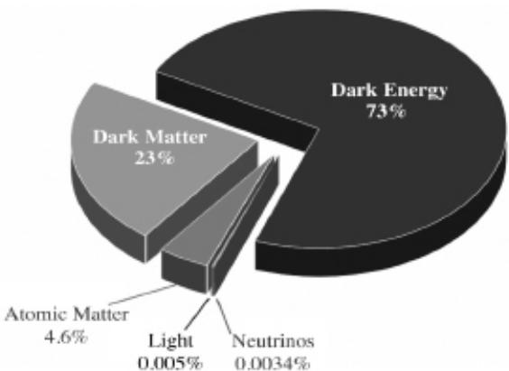  
Figure 10: Humans can perceive such a tiny band of visual reality it’s laughable.

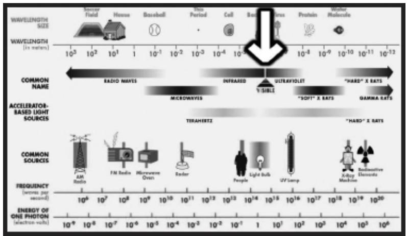  
Figure 11: We can see a smear of the 0.005 percent electromagnetic spectrum, but we still know it all. Yep, makes sense.

Consider that you can see less than $1 \%$ of the electromagnetic spectrum and hear less than $1 \%$ of the acoustic spectrum. $9 0 \%$ of the cells in your body carry their own microbial DNA and are not $\mathrm { ' y o u ' }$ . The atoms in your body are 99.9999999999999999% empty space and none of them are the ones you were born with ... Human beings have 46 chromosomes, two less than a potato.

The existence of the rainbow depends on the conical photoreceptors in your eyes; to animals without cones, the rainbow does not exist. So you don’t just look at a rainbow, you create it. This is pretty amazing, especially considering that all the beautiful colours you see represent less than $1 \%$ of the electromagnetic spectrum.

Suddenly the ‘world’ of humans looks a very different place. Take into account, too, that Planet Earth when compared with the projected size of this single universe is the equivalent of a billionth of a pinhead. Imagine the ratio that would be when compared to infinite reality. To think that Christianity once insisted that Earth and humanity were the centre of everything. This background is vital if we are going to appreciate the nature of ‘human’ and how we can be manipulated by an unseen force. To human visual reality virtually everything is unseen and yet the prevailing perception within the institutions and so much of the public is that if we can’t see it, touch it, hear it, taste it and smell it then it cannot exist. Such perception is indoctrinated and encouraged by the Cult and its agents because it isolates believers in the strictly limited, village-idiot, realm of the five senses where perceptions can be firewalled and information controlled. Most of those perpetuating the ‘this-world-is-all-there-is’ insanity are themselves indoctrinated into believing the same delusion. While major players and influencers know that official reality is laughable most of those in science, academia and medicine really believe the nonsense they peddle and teach succeeding generations. Those who challenge the orthodoxy are dismissed as nuers and freaks to protect the manufactured illusion from exposure. Observe the dynamic of the ‘Covid’ hoax and you will see how that takes the same form. The inner-circle psychopaths knows it’s a gigantic scam, but almost the entirety of those imposing their fascist rules believe that ‘Covid’ is all that they’re told it is.

# Stolen identity

Ask people who they are and they will give you their name, place of birth, location, job, family background and life story. Yet that is not who they are – it is what they are experiencing. The difference is absolutely crucial. The true ‘I’, the eternal, infinite ‘I’, is consciousness,

a state of being aware. Forget ‘form’. That is a vehicle for a brief experience. Consciousness does not come from the brain, but through the brain and even that is more symbolic than literal. We are awareness, pure awareness, and this is what withdraws from the body at what we call ‘death’ to continue our eternal beingness, isness, in other realms of reality within the limitlessness of infinity or the Biblical ‘many mansions in my father’s house’. Labels of a human life, man, woman, transgender, black, white, brown, nationality, circumstances and income are not who we are. They are what we are – awareness – is experiencing in a brief connection with a band of frequency we call ‘human’. The labels are not the self; they are, to use the title of one of my books, a Phantom Self. I am not David Icke born in Leicester, England, on April 29th, 1952. I am the consciousness having that experience. The Cult and its non-human masters seek to convince us through the institutions of ‘education’, science, medicine, media and government that what we are experiencing is who we are. It’s so easy to control and direct perception locked away in the bewildered illusions of the five senses with no expanded radar. Try, by contrast, doing the same with a humanity aware of its true self and its true power to consciously create its reality and experience. How is it possible to do this? We do it all day every day. If you perceive yourself as ‘lile me’ with no power to impact upon your life and the world then your life experience will reflect that. You will hand the power you don’t think you have to authority in all its forms which will use it to control your experience. This, in turn, will appear to confirm your perception of ‘lile me’ in a self-fulfilling feedback loop. But that is what ‘lile me’ really is – a perception. We are all ‘big-me’, infinite me, and the Cult has to make us forget that if its will is to prevail. We are therefore manipulated and pressured into self-identifying with human labels and not the consciousness/awareness experiencing those human labels.

The phenomenon of identity politics is a Cult-instigated manipulation technique to sub-divide previous labels into even smaller ones. A United States university employs this list of leers to

describe student identity: LGBTTQQFAGPBDSM or lesbian, gay, bisexual, transgender, transsexual, queer, questioning, flexual, asexual, gender-fuck, polyamorous, bondage/discipline, dominance/submission and sadism/masochism. I’m sure other lists are even longer by now as people feel the need to self-identity the ‘I’ with the minutiae of race and sexual preference. Wokers programmed by the Cult for generations believe this is about ‘inclusivity’ when it’s really the Cult locking them away into smaller and smaller versions of Phantom Self while firewalling them from the influence of their true self, the infinite, eternal ‘I’. You may notice that my philosophy which contends that we are all unique points of aention/awareness within the same infinite whole or Oneness is the ultimate non-racism. The very sense of Oneness makes the judgement of people by their body-type, colour or sexuality uerly ridiculous and confirms that racism has no understanding of reality (including anti-white racism). Yet despite my perception of life Cult agents and fast-asleep Wokers label me racist to discredit my information while they are themselves phenomenally racist and sexist. All they see is race and sexuality and they judge people as good or bad, demons or untouchables, by their race and sexuality. All they see is Phantom Self and perceive themselves in terms of Phantom Self. They are pawns and puppets of the Cult agenda to focus aention and self-identity in the five senses and play those identities against each other to divide and rule. Columbia University has introduced segregated graduations in another version of social distancing designed to drive people apart and teach them that different racial and cultural groups have nothing in common with each other. The last thing the Cult wants is unity. Again the pumpprimers of this will be Cult operatives in the knowledge of what they are doing, but the rest are just the Phantom Self blind leading the Phantom Self blind. We do have something in common – we are all the same consciousness having different temporary experiences.

# What is this ‘human’?

Yes, what is ‘human’? That is what we are supposed to be, right? I mean ‘human’? True, but ‘human’ is the experience not the ‘I’. Break it down to basics and ‘human’ is the way that information is processed. If we are to experience and interact with this band of frequency we call the ‘world’ we must have a vehicle that operates within that band of frequency. Our consciousness in its prime form cannot do that; it is way beyond the frequency of the human realm. My consciousness or awareness could not tap these keys and pick up the cup in front of me in the same way that radio station A cannot interact with radio station B when they are on different frequencies. The human body is the means through which we have that interaction. I have long described the body as a biological computer which processes information in a way that allows consciousness to experience this reality. The body is a receiver, transmier and processor of information in a particular way that we call human. We visually perceive only the world of the five senses in a wakened state – that is the limit of the body’s visual decoding system. In truth it’s not even visual in the way we experience ‘visual reality’ as I will come to in a moment. We are ‘human’ because the body processes the information sources of human into a reality and behaviour system that we perceive as human. Why does an elephant act like an elephant and not like a human or a duck? The elephant’s biological computer is a different information field and processes information according to that program into a visual and behaviour type we call an elephant. The same applies to everything in our reality. These body information fields are perpetuated through procreation (like making a copy of a soware program). The Cult wants to break that cycle and intervene technologically to transform the human information field into one that will change what we call humanity. If it can change the human information field it will change the way that field processes information and change humanity both ‘physically’ and psychologically. Hence the messenger (information) RNA ‘vaccines’ and so much more that is targeting human genetics by changing the body’s information – messaging – construct through food, drink, radiation, toxicity and other means.

Reality that we experience is nothing like reality as it really is in the same way that the reality people experience in virtual reality games is not the reality they are really living in. The game is only a decoded source of information that appears to be a reality. Our world is also an information construct – a simulation (more later). In its base form our reality is a wavefield of information much the same in theme as Wi-Fi. The five senses decode wavefield information into electrical information which they communicate to the brain to decode into holographic (illusory ‘physical’) information. Different parts of the brain specialise in decoding different senses and the information is fused into a reality that appears to be outside of us but is really inside the brain and the genetic structure in general (Fig 12 overleaf). DNA is a receiver-transmier of information and a vital part of this decoding process and the body’s connection to other realities. Change DNA and you change the way we decode and connect with reality – see ‘Covid vaccines’. Think of computers decoding Wi-Fi. You have information encoded in a radiation field and the computer decodes that information into a very different form on the screen. You can’t see the Wi-Fi until its information is made manifest on the screen and the information on the screen is inside the computer and not outside. I have just described how we decode the ‘human world’. All five senses decode the waveform ‘Wi-Fi’ field into electrical signals and the brain (computer) constructs reality inside the brain and not outside – ‘You don’t just look at a rainbow, you create it’. Sound is a simple example. We don’t hear sound until the brain decodes it. Waveform sound waves are picked up by the hearing sense and communicated to the brain in an electrical form to be decoded into the sounds that we hear.

Everything we hear is inside the brain along with everything we see, feel, smell and taste. Words and language are waveform fields generated by our vocal chords which pass through this process until they are decoded by the brain into words that we hear. Different languages are different frequency fields or sound waves generated by vocal chords. Late British philosopher Alan Was said:

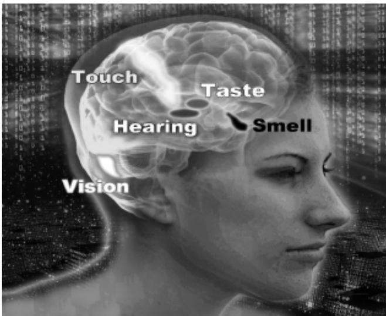  
Figure 12: The brain receives information from the five senses and constructs from that our perceived reality.

[Without the brain] the world is devoid of light, heat, weight, solidity, motion, space, time or any other imaginable feature. All these phenomena are interactions, or transactions, of vibrations with a certain arrangement of neurons.

That’s exactly what they are and scientist Robert Lanza describes in his book, Biocentrism, how we decode electromagnetic waves and energy into visual and ‘physical’ experience. He uses the example of a flame emiing photons, electromagnetic energy, each pulsing electrically and magnetically:

… these … invisible electromagnetic waves strike a human retina, and if (and only if) the waves happen to measure between 400 and 700 nano meters in length from crest to crest, then their energy is just right to deliver a stimulus to the 8 million cone-shaped cells in the retina.

Each in turn send an electrical pulse to a neighbour neuron, and on up the line this goes, at 250 mph, until it reaches the … occipital lobe of the brain, in the back of the head. There, a cascading complex of neurons fire from the incoming stimuli, and we subjectively perceive this experience as a yellow brightness occurring in a place we have been conditioned to call the ‘external world’.

# You hear what you decode

If a tree falls or a building collapses they make no noise unless someone is there to decode the energetic waves generated by the disturbance into what we call sound. Does a falling tree make a noise? Only if you hear it – decode it. Everything in our reality is a frequency field of information operating within the overall ‘Wi-Fi’ field that I call The Field. A vibrational disturbance is generated in The Field by the fields of the falling tree or building. These disturbance waves are what we decode into the sound of them falling. If no one is there to do that then neither will make any noise. Reality is created by the observer – decoder – and the perceptions of the observer affect the decoding process. For this reason different people – different perceptions – will perceive the same reality or situation in a different way. What one may perceive as a nightmare another will see as an opportunity. The question of why the Cult is so focused on controlling human perception now answers itself. All experienced reality is the act of decoding and we don’t experience Wi-Fi until it is decoded on the computer screen. The sight and sound of an Internet video is encoded in the Wi-Fi all around us, but we don’t see or hear it until the computer decodes that information. Taste, smell and touch are all phenomena of the brain as a result of the same process. We don’t taste, smell or feel anything except in the brain and there are pain relief techniques that seek to block the signal from the site of discomfort to the brain because if the brain doesn’t decode that signal we don’t feel pain. Pain is in the brain and only appears to be at the point of impact thanks to the feedback loop between them. We don’t see anything until electrical information from the sight senses is decoded in an area at the back of the brain. If that area is damaged we can go blind when our eyes are perfectly okay. So why do we go blind if we damage an eye? We damage the information processing between the waveform visual information and the visual decoding area of the brain. If information doesn’t reach the brain in a form it can decode then we can’t see the visual reality that it represents. What’s more the brain is decoding only a fraction of the information it receives and the rest is absorbed by the

sub-conscious mind. This explanation is from the science magazine, Wonderpedia:

Every second, 11 million sensations crackle along these [brain] pathways ... The brain is confronted with an alarming array of images, sounds and smells which it rigorously filters down until it is left with a manageable list of around 40. Thus 40 sensations per second make up what we perceive as reality.

The ‘world’ is not what people are told to believe that is it and the inner circles of the Cult know that.

# Illusory ‘physical’ reality

We can only see a smear of 0.005 percent of the Universe which is only one of a vast array of universes – ‘mansions’ – within infinite reality. Even then the brain decodes only 40 pieces of information (‘sensations’) from a potential 11 million that we receive every second. Two points strike you from this immediately: The sheer breathtaking stupidity of believing we know anything so rigidly that there’s nothing more to know; and the potential for these processes to be manipulated by a malevolent force to control the reality of the population. One thing I can say for sure with no risk of contradiction is that when you can perceive an almost indescribable fraction of infinite reality there is always more to know as in tidal waves of it. Ancient Greek philosopher Socrates was so right when he said that wisdom is to know how lile we know. How obviously true that is when you think that we are experiencing a physical world of solidity that is neither physical nor solid and a world of apartness when everything is connected. Cult-controlled ‘science’ dismisses the socalled ‘paranormal’ and all phenomena related to that when the ‘para’-normal is perfectly normal and explains the alleged ‘great mysteries’ which dumbfound scientific minds. There is a reason for this. A ‘scientific mind’ in terms of the mainstream is a material mind, a five-sense mind imprisoned in see it, touch it, hear it, smell it and taste it. Phenomena and happenings that can’t be explained that way leave the ‘scientific mind’ bewildered and the rule is that if they

can’t account for why something is happening then it can’t, by definition, be happening. I beg to differ. Telepathy is thought waves passing through The Field (think wave disturbance again) to be decoded by someone able to connect with that wavelength (information). For example: You can pick up the thought waves of a friend at any distance and at the very least that will bring them to mind. A few minutes later the friend calls you. ‘My god’, you say, ‘that’s incredible – I was just thinking of you.’ Ah, but they were thinking of you before they made the call and that’s what you decoded. Native peoples not entrapped in five-sense reality do this so well it became known as the ‘bush telegraph’. Those known as psychics and mediums (genuine ones) are doing the same only across dimensions of reality. ‘Mind over maer’ comes from the fact that maer and mind are the same. The state of one influences the state of the other. Indeed one and the other are illusions. They are aspects of the same field. Paranormal phenomena are all explainable so why are they still considered ‘mysteries’ or not happening? Once you go down this road of understanding you begin to expand awareness beyond the five senses and that’s the nightmare for the Cult.

  
Figure 13: Holograms are not solid, but the best ones appear to be.

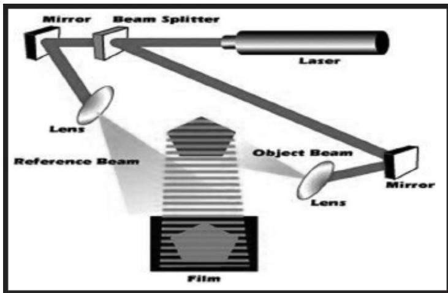  
Figure 14: How holograms are created by capturing a waveform version of the subject image.

# Holographic ‘solidity’

Our reality is not solid, it is holographic. We are now well aware of holograms which are widely used today. Two-dimensional information is decoded into a three-dimensional reality that is not solid although can very much appear to be (Fig 13). Holograms are created with a laser divided into two parts. One goes directly onto a holographic photographic print (‘reference beam’) and the other takes a waveform image of the subject (‘working beam’) before being directed onto the print where it ‘collides’ with the other half of the laser (Fig 14). This creates a waveform interference paern which contains the wavefield information of whatever is being photographed (Fig 15 overleaf). The process can be likened to dropping pebbles in a pond. Waves generated by each one spread out across the water to collide with the others and create a wave representation of where the stones fell and at what speed, weight and distance. A waveform interference paern of a hologram is akin to the waveform information in The Field which the five senses decode into electrical signals to be decoded by the brain into a holographic illusory ‘physical’ reality. In the same way when a laser (think human aention) is directed at the waveform interference paern a three-dimensional version of the subject is projected into apparently ‘solid’ reality (Fig 16). An amazing trait of holograms reveals more ‘paranormal mysteries’. Information of the whole

hologram is encoded in waveform in every part of the interference paern by the way they are created. This means that every part of a hologram is a smaller version of the whole. Cut the interference wave-paern into four and you won’t get four parts of the image. You get quarter-sized versions of the whole image. The body is a hologram and the same applies. Here we have the basis of acupuncture, reflexology and other forms of healing which identify representations of the whole body in all of the parts, hands, feet, ears, everywhere. Skilled palm readers can do what they do because the information of whole body is encoded in the hand. The concept of as above, so below, comes from this.

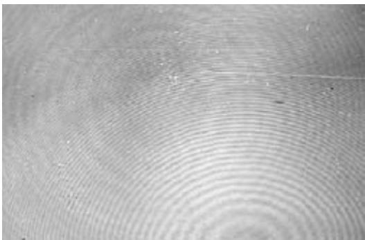  
Figure 15: A waveform interference pattern that holds the information that transforms into a hologram.

  
Figure 16: Holographic people including ‘Elvis’ holographically inserted to sing a duet with Celine Dion.

The question will be asked of why, if solidity is illusory, we can’t just walk through walls and each other. The resistance is not solid against solid; it is electromagnetic field against electromagnetic field and we decode this into the experience of solid against solid. We should also not underestimate the power of belief to dictate reality. What you believe is impossible will be. Your belief impacts on your decoding processes and they won’t decode what you think is impossible. What we believe we perceive and what we perceive we experience. ‘Can’t dos’ and ‘impossibles’ are like a firewall in a computer system that won’t put on the screen what the firewall blocks. How vital that is to understanding how human experience has been hijacked. I explain in The Answer, Everything You Need To Know But Have Never Been Told and other books a long list of ‘mysteries’ and ‘paranormal’ phenomena that are not mysterious and perfectly normal once you realise what reality is and how it works. ‘Ghosts’ can be seen to pass through ‘solid’ walls because the walls are not solid and the ghost is a discarnate entity operating on a frequency so different to that of the wall that it’s like two radio stations sharing the same space while never interfering with each other. I have seen ghosts do this myself. The apartness of people and objects is also an illusion. Everything is connected by the Field like all sea life is connected by the sea. It’s just that within the limits of our visual reality we only ‘see’ holographic information and not the field of information that connects everything and from which the holographic world is made manifest. If you can only see holographic ‘objects’ and not the field that connects them they will appear to you as unconnected to each other in the same way that we see the computer while not seeing the Wi-Fi.

# What you don’t know can hurt you

Okay, we return to those ‘two worlds’ of human society and the Cult with its global network of interconnecting secret societies and satanic groups which manipulate through governments, corporations, media, religions, etc. The fundamental difference between them is knowledge. The idea has been to keep humanity

ignorant of the plan for its total enslavement underpinned by a crucial ignorance of reality – who we are and where we are – and how we interact with it. ‘Human’ should be the interaction between our expanded eternal consciousness and the five-sense body experience. We are meant to be in this world in terms of the five senses but not of this world in relation to our greater consciousness and perspective. In that state we experience the small picture of the five senses within the wider context of the big picture of awareness beyond the five senses. Put another way the five senses see the dots and expanded awareness connects them into pictures and paerns that give context to the apparently random and unconnected.

Without the context of expanded awareness the five senses see only apartness and randomness with apparently no meaning. The Cult and its other-dimensional controllers seek to intervene in the frequency realm where five-sense reality is supposed to connect with expanded reality and to keep the two apart (more on this in the final chapter). When that happens five-sense mental and emotional processes are no longer influenced by expanded awareness, or the True ‘I’, and instead are driven by the isolated perceptions of the body’s decoding systems. They are in the world and of it. Here we have the human plight and why humanity with its potential for infinite awareness can be so easily manipulatable and descend into such extremes of stupidity.

Once the Cult isolates five-sense mind from expanded awareness it can then program the mind with perceptions and beliefs by controlling information that the mind receives through the ‘education’ system of the formative years and the media perceptual bombardment and censorship of an entire lifetime. Limit perception and a sense of the possible through limiting knowledge by limiting and skewing information while censoring and discrediting that which could set people free. As the title of another of my books says … And The Truth Shall Set You Free. For this reason the last thing the Cult wants in circulation is the truth about anything – especially the reality of the eternal ‘I’ – and that’s why it is desperate to control information. The Cult knows that information becomes perception

which becomes behaviour which, collectively, becomes human society. Cult-controlled and funded mainstream ‘science’ denies the existence of an eternal ‘I’ and seeks to dismiss and trash all evidence to the contrary. Cult-controlled mainstream religion has a version of ‘God’ that is lile more than a system of control and dictatorship that employs threats of damnation in an aerlife to control perceptions and behaviour in the here and now through fear and guilt. Neither is true and it’s the ‘neither’ that the Cult wishes to suppress. This ‘neither’ is that everything is an expression, a point of aention, within an infinite state of consciousness which is the real meaning of the term ‘God’.

Perceptual obsession with the ‘physical body’ and five-senses means that ‘God’ becomes personified as a bearded bloke siing among the clouds or a raging bully who loves us if we do what ‘he’ wants and condemns us to the fires of hell if we don’t. These are no more than a ‘spiritual’ fairy tales to control and dictate events and behaviour through fear of this ‘God’ which has bizarrely made ‘Godfearing’ in religious circles a state to be desired. I would suggest that fearing anything is not to be encouraged and celebrated, but rather deleted. You can see why ‘God fearing’ is so beneficial to the Cult and its religions when they decide what ‘God’ wants and what ‘God’ demands (the Cult demands) that everyone do. As the great American comedian Bill Hicks said satirising a Christian zealot: ‘I think what God meant to say.’ How much of this infinite awareness (‘God’) that we access is decided by how far we choose to expand our perceptions, self-identity and sense of the possible. The scale of self-identity reflects itself in the scale of awareness that we can connect with and are influenced by – how much knowing and insight we have instead of programmed perception. You cannot expand your awareness into the infinity of possibility when you believe that you are lile me Peter the postman or Mary in marketing and nothing more. I’ll deal with this in the concluding chapter because it’s crucial to how we turnaround current events.

# Where the Cult came from

When I realised in the early 1990s there was a Cult network behind global events I asked the obvious question: When did it start? I took it back to ancient Rome and Egypt and on to Babylon and Sumer in Mesopotamia, the ‘Land Between Two Rivers’, in what we now call Iraq. The two rivers are the Tigris and Euphrates and this region is of immense historical and other importance to the Cult, as is the land called Israel only 550 miles away by air. There is much more going with deep esoteric meaning across this whole region. It’s not only about ‘wars for oil’. Priceless artefacts from Mesopotamia were stolen or destroyed aer the American and British invasion of Iraq in 2003 justified by the lies of Boy Bush and Tony Blair (their Cult masters) about non-existent ‘weapons of mass destruction’.

Mesopotamia was the location of Sumer (about 5,400BC to 1,750BC), and Babylon (about 2,350BC to 539BC). Sabbatians may have become immensely influential in the Cult in modern times but they are part of a network that goes back into the mists of history. Sumer is said by historians to be the ‘cradle of civilisation’. I disagree. I say it was the re-start of what we call human civilisation aer cataclysmic events symbolised in part as the ‘Great Flood’ destroyed the world that existed before. These fantastic upheavals that I have been describing in detail in the books since the early1990s appear in accounts and legends of ancient cultures across the world and they are supported by geological and biological evidence. Stone tablets found in Iraq detailing the Sumer period say the cataclysms were caused by nonhuman ‘gods’ they call the Anunnaki. These are described in terms of extraterrestrial visitations in which knowledge supplied by the Anunnaki is said to have been the source of at least one of the world’s oldest writing systems and developments in astronomy, mathematics and architecture that were way ahead of their time. I have covered this subject at length in The Biggest Secret and Children of the Matrix and the same basic ‘Anunnaki’ story can be found in Zulu accounts in South Africa where the late and very great Zulu high shaman Credo Mutwa told me that the Sumerian Anunnaki were known by Zulus as the Chitauri or ‘children of the serpent’. See my six-hour video interview with Credo on this subject entitled The

Reptilian Agenda recorded at his then home near Johannesburg in 1999 which you can watch on the Ickonic media platform.

The Cult emerged out of Sumer, Babylon and Egypt (and elsewhere) and established the Roman Empire before expanding with the Romans into northern Europe from where many empires were savagely imposed in the form of Cult-controlled societies all over the world. Mass death and destruction was their calling card. The Cult established its centre of operations in Europe and European Empires were Cult empires which allowed it to expand into a global force. Spanish and Portuguese colonialists headed for Central and South America while the British and French targeted North America. Africa was colonised by Britain, France, Belgium, the Netherlands, Portugal, Spain, Italy, and Germany. Some like Britain and France moved in on the Middle East. The British Empire was by far the biggest for a simple reason. By now Britain was the headquarters of the Cult from which it expanded to form Canada, the United States, Australia and New Zealand. The Sun never set on the British Empire such was the scale of its occupation. London remains a global centre for the Cult along with Rome and the Vatican although others have emerged in Israel and China. It is no accident that the ‘virus’ is alleged to have come out of China while Italy was chosen as the means to terrify the Western population into compliance with ‘Covid’ fascism. Nor that Israel has led the world in ‘Covid’ fascism and mass ‘vaccination’.

You would think that I would mention the United States here, but while it has been an important means of imposing the Cult’s will it is less significant than would appear and is currently in the process of having what power it does have deleted. The Cult in Europe has mostly loaded the guns for the US to fire. America has been controlled from Europe from the start through Cult operatives in Britain and Europe. The American Revolution was an illusion to make it appear that America was governing itself while very different forces were pulling the strings in the form of Cult families such as the Rothschilds through the Rockefellers and other subordinates. The Rockefellers are extremely close to Bill Gates and

established both scalpel and drug ‘medicine’ and the World Health Organization. They play a major role in the development and circulation of vaccines through the Rockefeller Foundation on which Bill Gates said his Foundation is based. Why wouldn’t this be the case when the Rockefellers and Gates are on the same team? Cult infiltration of human society goes way back into what we call history and has been constantly expanding and centralising power with the goal of establishing a global structure to dictate everything. Look how this has been advanced in great leaps with the ‘Covid’ hoax.

# The non-human dimension

I researched and observed the comings and goings of Cult operatives through the centuries and even thousands of years as they were born, worked to promote the agenda within the secret society and satanic networks, and then died for others to replace them. Clearly there had to be a coordinating force that spanned this entire period while operatives who would not have seen the end goal in their lifetimes came and went advancing the plan over millennia. I went in search of that coordinating force with the usual support from the extraordinary synchronicity of my life which has been an almost daily experience since 1990. I saw common themes in religious texts and ancient cultures about a non-human force manipulating human society from the hidden. Christianity calls this force Satan, the Devil and demons; Islam refers to the Jinn or Djinn; Zulus have their Chitauri (spelt in other ways in different parts of Africa); and the Gnostic people in Egypt in the period around and before 400AD referred to this phenomena as the ‘Archons’, a word meaning rulers in Greek. Central American cultures speak of the ‘Predators’ among other names and the same theme is everywhere. I will use ‘Archons’ as a collective name for all of them. When you see how their nature and behaviour is described all these different sources are clearly talking about the same force. Gnostics described the Archons in terms of ‘luminous fire’ while Islam relates the Jinn to ‘smokeless fire’. Some refer to beings in form that could occasionally be seen, but the most common of common theme is that they operate from

unseen realms which means almost all existence to the visual processes of humans. I had concluded that this was indeed the foundation of human control and that the Cult was operating within the human frequency band on behalf of this hidden force when I came across the writings of Gnostics which supported my conclusions in the most extraordinary way.

A sealed earthen jar was found in 1945 near the town of Nag Hammadi about 75-80 miles north of Luxor on the banks of the River Nile in Egypt. Inside was a treasure trove of manuscripts and texts le by the Gnostic people some 1,600 years earlier. They included 13 leather-bound papyrus codices (manuscripts) and more than 50 texts wrien in Coptic Egyptian estimated to have been hidden in the jar in the period of 400AD although the source of the information goes back much further. Gnostics oversaw the Great or Royal Library of Alexandria, the fantastic depository of ancient texts detailing advanced knowledge and accounts of human history. The Library was dismantled and destroyed in stages over a long period with the death-blow delivered by the Cult-established Roman Church in the period around 415AD. The Church of Rome was the Church of Babylon relocated as I said earlier. Gnostics were not a race. They were a way of perceiving reality. Whenever they established themselves and their information circulated the terrorists of the Church of Rome would target them for destruction. This happened with the Great Library and with the Gnostic Cathars who were burned to death by the psychopaths aer a long period of oppression at the siege of the Castle of Monségur in southern France in 1244. The Church has always been terrified of Gnostic information which demolishes the official Christian narrative although there is much in the Bible that supports the Gnostic view if you read it in another way. To anyone studying the texts of what became known as the Nag Hammadi Library it is clear that great swathes of Christian and Biblical belief has its origin with Gnostics sources going back to Sumer. Gnostic themes have been twisted to manipulate the perceived reality of Bible believers. Biblical texts have been in the open for centuries where they could be changed while Gnostic

documents found at Nag Hammadi were sealed away and untouched for 1,600 years. What you see is what they wrote.

# Use your pneuma not your nous

Gnosticism and Gnostic come from ‘gnosis’ which means knowledge, or rather secret knowledge, in the sense of spiritual awareness – knowledge about reality and life itself. The desperation of the Cult’s Church of Rome to destroy the Gnostics can be understood when the knowledge they were circulating was the last thing the Cult wanted the population to know. Sixteen hundred years later the same Cult is working hard to undermine and silence me for the same reason. The dynamic between knowledge and ignorance is a constant. ‘Time’ appears to move on, but essential themes remain the same. We are told to ‘use your nous’, a Gnostic word for head/brain/intelligence. They said, however, that spiritual awakening or ‘salvation’ could only be secured by expanding awareness beyond what they called nous and into pneuma or Infinite Self. Obviously as I read these texts the parallels with what I have been saying since 1990 were fascinating to me. There is a universal truth that spans human history and in that case why wouldn’t we be talking the same language 16 centuries apart? When you free yourself from the perception program of the five senses and explore expanded realms of consciousness you are going to connect with the same information no maer what the perceived ‘era’ within a manufactured timeline of a single and tiny range of manipulated frequency. Humans working with ‘smart’ technology or knocking rocks together in caves is only a timeline appearing to operate within the human frequency band. Expanded awareness and the knowledge it holds have always been there whether the era be Stone Age or computer age. We can only access that knowledge by opening ourselves to its frequency which the five-sense prison cell is designed to stop us doing. Gates, Fauci, Whiy, Vallance, Zuckerberg, Brin, Page, Wojcicki, Bezos, and all the others behind the ‘Covid’ hoax clearly have a long wait before their range of frequency can make that connection given that an open heart is

crucial to that as we shall see. Instead of accessing knowledge directly through expanded awareness it is given to Cult operatives by the secret society networks of the Cult where it has been passed on over thousands of years outside the public arena. Expanded realms of consciousness is where great artists, composers and writers find their inspiration and where truth awaits anyone open enough to connect with it. We need to go there fast.

# Archon hijack

A fih of the Nag Hammadi texts describe the existence and manipulation of the Archons led by a ‘Chief Archon’ they call ‘Yaldabaoth’, or the ‘Demiurge’, and this is the Christian ‘Devil’, ‘Satan’, ‘Lucifer’, and his demons. Archons in Biblical symbolism are the ‘fallen ones’ which are also referred to as fallen angels aer the angels expelled from heaven according to the Abrahamic religions of Judaism, Christianity and Islam. These angels are claimed to tempt humans to ‘sin’ ongoing and you will see how accurate that symbolism is during the rest of the book. The theme of ‘original sin’ is related to the ‘Fall’ when Adam and Eve were ‘tempted by the serpent’ and fell from a state of innocence and ‘obedience’ (connection) with God into a state of disobedience (disconnection). The Fall is said to have brought sin into the world and corrupted everything including human nature. Yaldabaoth, the ‘Lord Archon’, is described by Gnostics as a ‘counterfeit spirit’, ‘The Blind One’, ‘The Blind God’, and ‘The Foolish One’. The Jewish name for Yaldabaoth in Talmudic writings is Samael which translates as ‘Poison of God’, or ‘Blindness of God’. You see the parallels. Yaldabaoth in Islamic belief is the Muslim Jinn devil known as Shaytan – Shaytan is Satan as the same themes are found all over the world in every religion and culture. The ‘Lord God’ of the Old Testament is the ‘Lord Archon’ of Gnostic manuscripts and that’s why he’s such a bloodthirsty bastard. Satan is known by Christians as ‘the Demon of Demons’ and Gnostics called Yaldabaoth the ‘Archon of Archons’. Both are known as ‘The Deceiver’. We are talking about the same ‘bloke’ for sure and these common themes

using different names, storylines and symbolism tell a common tale of the human plight.

Archons are referred to in Nag Hammadi documents as mind parasites, inverters, guards, gatekeepers, detainers, judges, pitiless ones and deceivers. The ‘Covid’ hoax alone is a glaring example of all these things. The Biblical ‘God’ is so different in the Old and New Testaments because they are not describing the same phenomenon. The vindictive, angry, hate-filled, ‘God’ of the Old Testament, known as Yahweh, is Yaldabaoth who is depicted in Cult-dictated popular culture as the ‘Dark Lord’, ‘Lord of Time’, Lord (Darth) Vader and Dormammu, the evil ruler of the ‘Dark Dimension’ trying to take over the ‘Earth Dimension’ in the Marvel comic movie, Dr Strange. Yaldabaoth is both the Old Testament ‘god’ and the Biblical ‘Satan’. Gnostics referred to Yaldabaoth as the ‘Great Architect of the Universe’and the Cult-controlled Freemason network calls their god ‘the ‘Great Architect of the Universe’ (also Grand Architect). The ‘Great Architect’ Yaldabaoth is symbolised by the Cult as the allseeing eye at the top of the pyramid on the Great Seal of the United States and the dollar bill. Archon is encoded in arch-itect as it is in arch-angels and arch-bishops. All religions have the theme of a force for good and force for evil in some sort of spiritual war and there is a reason for that – the theme is true. The Cult and its non-human masters are quite happy for this to circulate. They present themselves as the force for good fighting evil when they are really the force of evil (absence of love). The whole foundation of Cult modus operandi is inversion. They promote themselves as a force for good and anyone challenging them in pursuit of peace, love, fairness, truth and justice is condemned as a satanic force for evil. This has been the game plan throughout history whether the Church of Rome inquisitions of non-believers or ‘conspiracy theorists’ and ‘anti-vaxxers’ of today. The technique is the same whatever the timeline era.

# Yaldabaoth is revolting (true)

Yaldabaoth and the Archons are said to have revolted against God with Yaldabaoth claiming to be God – the All That Is. The Old Testament ‘God’ (Yaldabaoth) demanded to be worshipped as such: ‘ I am the LORD, and there is none else, there is no God beside me’ (Isaiah 45:5). I have quoted in other books a man who said he was the unofficial son of the late Baron Philippe de Rothschild of the Mouton-Rothschild wine producing estates in France who died in 1988 and he told me about the Rothschild ‘revolt from God’. The man said he was given the name Phillip Eugene de Rothschild and we shared long correspondence many years ago while he was living under another identity. He said that he was conceived through ‘occult incest’ which (within the Cult) was ‘normal and to be admired’. ‘Phillip’ told me about his experience aending satanic rituals with rich and famous people whom he names and you can see them and the wider background to Cult Satanism in my other books starting with The Biggest Secret. Cult rituals are interactions with Archontic ‘gods’. ‘Phillip’ described Baron Philippe de Rothschild as ‘a master Satanist and hater of God’ and he used the same term ‘revolt from God’ associated with Yaldabaoth/Satan/Lucifer/the Devil in describing the Sabbatian Rothschild dynasty. ‘I played a key role in my family’s revolt from God’, he said. That role was to infiltrate in classic Sabbatian style the Christian Church, but eventually he escaped the mind-prison to live another life. The Cult has been targeting religion in a plan to make worship of the Archons the global one-world religion. Infiltration of Satanism into modern ‘culture’, especially among the young, through music videos, stage shows and other means, is all part of this.

Nag Hammadi texts describe Yaldabaoth and the Archons in their prime form as energy – consciousness – and say they can take form if they choose in the same way that consciousness takes form as a human. Yaldabaoth is called ‘formless’ and represents a deeply inverted, distorted and chaotic state of consciousness which seeks to aached to humans and turn them into a likeness of itself in an aempt at assimilation. For that to happen it has to manipulate

humans into low frequency mental and emotional states that match its own. Archons can certainly appear in human form and this is the origin of the psychopathic personality. The energetic distortion Gnostics called Yaldabaoth is psychopathy. When psychopathic Archons take human form that human will be a psychopath as an expression of Yaldabaoth consciousness. Cult psychopaths are Archons in human form. The principle is the same as that portrayed in the 2009 Avatar movie when the American military travelled to a fictional Earth-like moon called Pandora in the Alpha Centauri star system to infiltrate a society of blue people, or Na’vi, by hiding within bodies that looked like the Na’vi. Archons posing as humans have a particular hybrid information field, part human, part Archon, (the ancient ‘demigods’) which processes information in a way that manifests behaviour to match their psychopathic evil, lack of empathy and compassion, and stops them being influenced by the empathy, compassion and love that a fully-human information field is capable of expressing. Cult bloodlines interbreed, be they royalty or dark suits, for this reason and you have their obsession with incest. Interbreeding with full-blown humans would dilute the Archontic energy field that guarantees psychopathy in its representatives in the human realm.

Gnostic writings say the main non-human forms that Archons take are serpentine (what I have called for decades ‘reptilian’ amid unbounded ridicule from the Archontically-programmed) and what Gnostics describe as ‘an unborn baby or foetus with grey skin and dark, unmoving eyes’. This is an excellent representation of the ET ‘Greys’ of UFO folklore which large numbers of people claim to have seen and been abducted by – Zulu shaman Credo Mutwa among them. I agree with those that believe in extraterrestrial or interdimensional visitations today and for thousands of years past. No wonder with their advanced knowledge and technological capability they were perceived and worshipped as gods for technological and other ‘miracles’ they appeared to perform. Imagine someone arriving in a culture disconnected from the modern world with a smartphone and computer. They would be

seen as a ‘god’ capable of ‘miracles’. The Renegade Mind, however, wants to know the source of everything and not only the way that source manifests as human or non-human. In the same way that a Renegade Mind seeks the original source material for the ‘Covid virus’ to see if what is claimed is true. The original source of Archons in form is consciousness – the distorted state of consciousness known to Gnostics as Yaldabaoth.

# ‘Revolt from God’ is energetic disconnection

Where I am going next will make a lot of sense of religious texts and ancient legends relating to ‘Satan’, Lucifer’ and the ‘gods’. Gnostic descriptions sync perfectly with the themes of my own research over the years in how they describe a consciousness distortion seeking to impose itself on human consciousness. I’ve referred to the core of infinite awareness in previous books as Infinite Awareness in Awareness of Itself. By that I mean a level of awareness that knows that it is all awareness and is aware of all awareness. From here comes the frequency of love in its true sense and balance which is what love is on one level – the balance of all forces into a single whole called Oneness and Isness. The more we disconnect from this state of love that many call ‘God’ the constituent parts of that

Oneness start to unravel and express themselves as a part and not a whole. They become individualised as intellect, mind, selfishness, hatred, envy, desire for power over others, and such like. This is not a problem in the greater scheme in that ‘God’, the All That Is, can experience all these possibilities through different expressions of itself including humans. What we as expressions of the whole experience the All That Is experiences. We are the All That Is experiencing itself. As we withdraw from that state of Oneness we disconnect from its influence and things can get very unpleasant and very stupid. Archontic consciousness is at the extreme end of that. It has so disconnected from the influence of Oneness that it has become an inversion of unity and love, an inversion of everything, an inversion of life itself. Evil is appropriately live wrien backwards.

Archontic consciousness is obsessed with death, an inversion of life,

and so its manifestations in Satanism are obsessed with death. They use inverted symbols in their rituals such as the inverted pentagram and cross. Sabbatians as Archontic consciousness incarnate invert Judaism and every other religion and culture they infiltrate. They seek disunity and chaos and they fear unity and harmony as they fear love like garlic to a vampire. As a result the Cult, Archons incarnate, act with such evil, psychopathy and lack of empathy and compassion disconnected as they are from the source of love. How could Bill Gates and the rest of the Archontic psychopaths do what they have to human society in the ‘Covid’ era with all the death, suffering and destruction involved and have no emotional consequence for the impact on others? Now you know. Why have Zuckerberg, Brin, Page, Wojcicki and company callously censored information warning about the dangers of the ‘vaccine’ while thousands have been dying and having severe, sometimes lifechanging reactions? Now you know. Why have Tedros, Fauci, Whiy, Vallance and their like around the world been using case and death figures they’re aware are fraudulent to justify lockdowns and all the deaths and destroyed lives that have come from that? Now you know. Why did Christian Drosten produce and promote a ‘testing’ protocol that he knew couldn’t test for infectious disease which led to a global human catastrophe. Now you know. The Archontic mind doesn’t give a shit (Fig 17). I personally think that Gates and major Cult insiders are a form of AI cyborg that the Archons want humans to become.

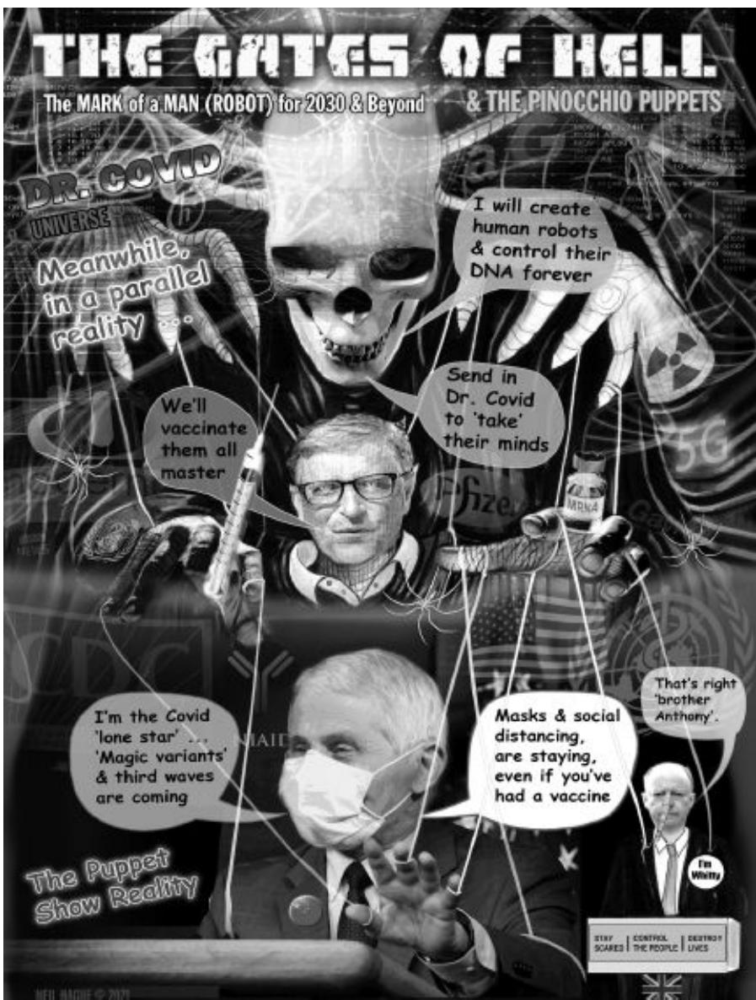  
Figure 17: Artist Neil Hague’s version of the ‘Covid’ hierarchy.

# Human batteries

A state of such inversion does have its consequences, however. The level of disconnection from the Source of All means that you withdraw from that source of energetic sustenance and creativity. This means that you have to find your own supply of energetic power and it has – us. When the Morpheus character in the first Matrix movie held up a baery he spoke a profound truth when he said: ‘The Matrix is a computer-generated dream world built to keep us under control in order to change the human being into one of

these.’ The statement was true in all respects. We do live in a technologically-generated virtual reality simulation (more very shortly) and we have been manipulated to be an energy source for Archontic consciousness. The Disney-Pixar animated movie Monsters, Inc. in 2001 symbolised the dynamic when monsters in their world had no energy source and they would enter the human world to terrify children in their beds, catch the child’s scream, terror (low-vibrational frequencies), and take that energy back to power the monster world. The lead character you might remember was a single giant eye and the symbolism of the Cult’s all-seeing eye was obvious. Every thought and emotion is broadcast as a frequency unique to that thought and emotion. Feelings of love and joy, empathy and compassion, are high, quick, frequencies while fear, depression, anxiety, suffering and hate are low, slow, dense frequencies. Which kind do you think Archontic consciousness can connect with and absorb? In such a low and dense frequency state there’s no way it can connect with the energy of love and joy. Archons can only feed off energy compatible with their own frequency and they and their Cult agents want to delete the human world of love and joy and manipulate the transmission of low vibrational frequencies through low-vibrational human mental and emotional states. We are their energy source. Wars are energetic banquets to the Archons – a world war even more so – and think how much low-frequency mental and emotional energy has been generated from the consequences for humanity of the ‘Covid’ hoax orchestrated by Archons incarnate like Gates.

The ancient practice of human sacrifice ‘to the gods’, continued in secret today by the Cult, is based on the same principle. ‘The gods’ are Archontic consciousness in different forms and the sacrifice is induced into a state of intense terror to generate the energy the Archontic frequency can absorb. Incarnate Archons in the ritual drink the blood which contains an adrenaline they crave which floods into the bloodstream when people are terrorised. Most of the sacrifices, ancient and modern, are children and the theme of ‘sacrificing young virgins to the gods’ is just code for children. They

have a particular pre-puberty energy that Archons want more than anything and the energy of the young in general is their target. The California Department of Education wants students to chant the names of Aztec gods (Archontic gods) once worshipped in human sacrifice rituals in a curriculum designed to encourage them to ‘challenge racist, bigoted, discriminatory, imperialist/colonial beliefs’, join ‘social movements that struggle for social justice’, and ‘build new possibilities for a post-racist, post-systemic racism society’. It’s the usual Woke crap that inverts racism and calls it antiracism. In this case solidarity with ‘indigenous tribes’ is being used as an excuse to chant the names of ‘gods’ to which people were sacrificed (and still are in secret). What an example of Woke’s inability to see beyond black and white, us and them, They condemn the colonisation of these tribal cultures by Europeans (quite right), but those cultures sacrificing people including children to their ‘gods’, and mass murdering untold numbers as the Aztecs did, is just fine. One chant is to the Aztec god Tezcatlipoca who had a man sacrificed to him in the 5th month of the Aztec calendar. His heart was cut out and he was eaten. Oh, that’s okay then. Come on children … aer three … Other sacrificial ‘gods’ for the young to chant their allegiance include Quetzalcoatl, Huitzilopochtli and Xipe Totec. The curriculum says that ‘chants, affirmations, and energizers can be used to bring the class together, build unity around ethnic studies principles and values, and to reinvigorate the class following a lesson that may be emotionally taxing or even when student engagement may appear to be low’. Well, that’s the cover story, anyway. Chanting and mantras are the repetition of a particular frequency generated from the vocal cords and chanting the names of these Archontic ‘gods’ tunes you into their frequency. That is the last thing you want when it allows for energetic synchronisation, aachment and perceptual influence. Initiates chant the names of their ‘Gods’ in their rituals for this very reason.

# Vampires of the Woke

Paedophilia is another way that Archons absorb the energy of children. Paedophiles possessed by Archontic consciousness are used as the conduit during sexual abuse for discarnate Archons to vampire the energy of the young they desire so much. Stupendous numbers of children disappear every year never to be seen again although you would never know from the media. Imagine how much low-vibrational energy has been generated by children during the ‘Covid’ hoax when so many have become depressed and psychologically destroyed to the point of killing themselves. Shocking numbers of children are now taken by the state from loving parents to be handed to others. I can tell you from long experience of researching this since 1996 that many end up with paedophiles and assets of the Cult through corrupt and Cult-owned social services which in the reframing era has hired many psychopaths and emotionless automatons to do the job. Children are even stolen to order using spurious reasons to take them by the corrupt and secret (because they’re corrupt) ‘family courts’. I have wrien in detail in other books, starting with The Biggest Secret in 1997, about the ubiquitous connections between the political, corporate, government, intelligence and military elites (Cult operatives) and Satanism and paedophilia. If you go deep enough both networks have an interlocking leadership. The Woke mentality has been developed by the Cult for many reasons: To promote almost every aspect of its agenda; to hijack the traditional political le and turn it fascist; to divide and rule; and to target agenda pushbackers. But there are other reasons which relate to what I am describing here. How many happy and joyful Wokers do you ever see especially at the extreme end? They are a mental and psychological mess consumed by emotional stress and constantly emotionally cocked for the next explosion of indignation at someone referring to a female as a female. They are walking, talking, baeries as Morpheus might say emiing frequencies which both enslave them in low-vibrational bubbles of perceptual limitation and feed the Archons. Add to this the hatred claimed to be love; fascism claimed to ‘anti-fascism’, racism claimed to be ‘anti-racism’;

exclusion claimed to inclusion; and the abuse-filled Internet trolling. You have a purpose-built Archontic energy system with not a wind turbine in sight and all founded on Archontic inversion. We have whole generations now manipulated to serve the Archons with their actions and energy. They will be doing so their entire adult lives unless they snap out of their Archon-induced trance. Is it really a surprise that Cult billionaires and corporations put so much money their way? Where is the energy of joy and laughter, including laughing at yourself which is confirmation of your own emotional security? Mark Twain said: ‘The human race has one really effective weapon, and that is laughter.‘ We must use it all the time. Woke has destroyed comedy because it has no humour, no joy, sense of irony, or self-deprecation. Its energy is dense and intense. Mmmmm, lunch says the Archontic frequency. Rudolf Steiner (1861-1925) was the Austrian philosopher and famous esoteric thinker who established Waldorf education or Steiner schools to treat children like unique expressions of consciousness and not minds to be programmed with the perceptions determined by authority. I’d been writing about this energy vampiring for decades when I was sent in 2016 a quote by Steiner. He was spot on:

There are beings in the spiritual realms for whom anxiety and fear emanating from human beings offer welcome food. When humans have no anxiety and fear, then these creatures starve. If fear and anxiety radiates from people and they break out in panic, then these creatures find welcome nutrition and they become more and more powerful. These beings are hostile towards humanity. Everything that feeds on negative feelings, on anxiety, fear and superstition, despair or doubt, are in reality hostile forces in super-sensible worlds, launching cruel attacks on human beings, while they are being fed ... These are exactly the feelings that belong to contemporary culture and materialism; because it estranges people from the spiritual world, it is especially suited to evoke hopelessness and fear of the unknown in people, thereby calling up the above mentioned hostile forces against them.

Pause for a moment from this perspective and reflect on what has happened in the world since the start of 2020. Not only will pennies drop, but billion dollar bills. We see the same theme from Don Juan Matus, a Yaqui Indian shaman in Mexico and the information source for Peruvian-born writer, Carlos Castaneda, who wrote a series of

books from the 1960s to 1990s. Don Juan described the force manipulating human society and his name for the Archons was the predator:

We have a predator that came from the depths of the cosmos and took over the rule of our lives. Human beings are its prisoners. The predator is our lord and master. It has rendered us docile, helpless. If we want to protest, it suppresses our protest. If we want to act independently, it demands that we don’t do so ... indeed we are held prisoner!

They took us over because we are food to them, and they squeeze us mercilessly because we are their sustenance. Just as we rear chickens in coops, the predators rear us in human coops, humaneros. Therefore, their food is always available to them.

Different cultures, different eras, same recurring theme.

# The ‘ennoia’ dilemma

Nag Hammadi Gnostic manuscripts say that Archon consciousness has no ‘ennoia’. This is directly translated as ‘intentionality’, but I’ll use the term ‘creative imagination’. The All That Is in awareness of itself is the source of all creativity – all possibility – and the more disconnected you are from that source the more you are subsequently denied ‘creative imagination’. Given that Archon consciousness is almost entirely disconnected it severely lacks creativity and has to rely on far more mechanical processes of thought and exploit the creative potential of those that do have ‘ennoia’. You can see cases of this throughout human society. Archon consciousness almost entirely dominates the global banking system and if we study how that system works you will appreciate what I mean. Banks manifest ‘money’ out of nothing by issuing lines of ‘credit’ which is ‘money’ that has never, does not, and will never exist except in theory. It’s a confidence trick. If you think ‘credit’ figures-on-a-screen ‘money’ is worth anything you accept it as payment. If you don’t then the whole system collapses through lack of confidence in the value of that ‘money’. Archontic bankers with no ‘ennoia’ are ‘lending’ ‘money’ that doesn’t exist to humans that do have creativity – those that have the inspired ideas and create businesses and products. Archon banking feeds off human creativity

which it controls through ‘money’ creation and debt. Humans have the creativity and Archons exploit that for their own benefit and control while having none themselves. Archon Internet platforms like Facebook claim joint copyright of everything that creative users post and while Archontic minds like Zuckerberg may officially head that company it will be human creatives on the staff that provide the creative inspiration. When you have limitless ‘money’ you can then buy other companies established by creative humans. Witness the acquisition record of Facebook, Google and their like. Survey the Archon-controlled music industry and you see non-creative dark suit executives making their fortune from the human creativity of their artists. The cases are endless. Research the history of people like Gates and Zuckerberg and how their empires were built on exploiting the creativity of others. Archon minds cannot create out of nothing, but they are skilled (because they have to be) in what Gnostic texts call ‘countermimicry’. They can imitate, but not innovate. Sabbatians trawl the creativity of others through backdoors they install in computer systems through their cybersecurity systems. Archon-controlled China is globally infamous for stealing intellectual property and I remember how Hong Kong, now part of China, became notorious for making counterfeit copies of the creativity of others – ‘countermimicry’. With the now pervasive and all-seeing surveillance systems able to infiltrate any computer you can appreciate the potential for Archons to vampire the creativity of humans. Author John Lamb Lash wrote in his book about the Nag Hammadi texts, Not In His Image:

Although they cannot originate anything, because they lack the divine factor of ennoia (intentionality), Archons can imitate with a vengeance. Their expertise is simulation (HAL, virtual reality). The Demiurge [Yaldabaoth] fashions a heaven world copied from the fractal patterns [of the original] ... His construction is celestial kitsch, like the fake Italianate villa of a Mafia don complete with militant angels to guard every portal.

This brings us to something that I have been speaking about since the turn of the millennium. Our reality is a simulation; a virtual reality that we think is real. No, I’m not kidding.

# Human reality? Well, virtually

I had pondered for years about whether our reality is ‘real’ or some kind of construct. I remembered being immensely affected on a visit as a small child in the late 1950s to the then newly-opened Planetarium on the Marylebone Road in London which is now closed and part of the adjacent Madame Tussauds wax museum. It was in the middle of the day, but when the lights went out there was the night sky projected in the Planetarium’s domed ceiling and it appeared to be so real. The experience never le me and I didn’t know why until around the turn of the millennium when I became certain that our ‘night sky’ and entire reality is a projection, a virtual reality, akin to the illusory world portrayed in the Matrix movies. I looked at the sky one day in this period and it appeared to me like the domed roof of the Planetarium. The release of the first Matrix movie in 1999 also provided a synchronistic and perfect visual representation of where my mind had been going for a long time. I hadn’t come across the Gnostic Nag Hammadi texts then. When I did years later the correlation was once again astounding. As I read Gnostic accounts from 1,600 years and more earlier it was clear that they were describing the same simulation phenomenon. They tell how the Yaldabaoth ‘Demiurge’ and Archons created a ‘bad copy’ of original reality to rule over all that were captured by its illusions and the body was a prison to trap consciousness in the ‘bad copy’ fake reality. Read how Gnostics describe the ‘bad copy’ and update that to current times and they are referring to what we would call today a virtual reality simulation.

Author John Lamb Lash said ‘the Demiurge fashions a heaven world copied from the fractal paerns’ of the original through expertise in ‘HAL’ or virtual reality simulation. Fractal paerns are part of the energetic information construct of our reality, a sort of blueprint. If these paerns were copied in computer terms it would indeed give you a copy of a ‘natural’ reality in a non-natural frequency and digital form. The principle is the same as making a copy of a website. The original website still exists, but now you can change the copy version to make it whatever you like and it can

become very different to the original website. Archons have done this with our reality, a synthetic copy of prime reality that still exists beyond the frequency walls of the simulation. Trapped within the illusions of this synthetic Matrix, however, were and are human consciousness and other expressions of prime reality and this is why the Archons via the Cult are seeking to make the human body synthetic and give us synthetic AI minds to complete the job of turning the entire reality synthetic including what we perceive to be the natural world. To quote Kurzweil: ‘Nanobots will infuse all the maer around us with information. Rocks, trees, everything will become these intelligent creatures.’ Yes, synthetic ‘creatures’ just as ‘Covid’ and other genetically-manipulating ‘vaccines’ are designed to make the human body synthetic. From this perspective it is obvious why Archons and their Cult are so desperate to infuse synthetic material into every human with their ‘Covid’ scam.

# Let there be (electromagnetic) light

Yaldabaoth, the force that created the simulation, or Matrix, makes sense of the Gnostic reference to ‘The Great Architect’ and its use by Cult Freemasonry as the name of its deity. The designer of the Matrix in the movies is called ‘The Architect’ and that trilogy is jam-packed with symbolism relating to these subjects. I have contended for years that the angry Old Testament God (Yaldabaoth) is the ‘God’ being symbolically ‘quoted’ in the opening of Genesis as ‘creating the world’. This is not the creation of prime reality – it’s the creation of the simulation. The Genesis ‘God’ says: ‘Let there be Light: and there was light.’ But what is this ‘Light’? I have said for decades that the speed of light (186,000 miles per second) is not the fastest speed possible as claimed by mainstream science and is in fact the frequency walls or outer limits of the Matrix. You can’t have a fastest or slowest anything within all possibility when everything is possible. The human body is encoded to operate within the speed of light or within the simulation and thus we see only the tiny frequency band of visible light. Near-death experiencers who perceive reality outside the body during temporary ‘death’ describe a very different

form of light and this is supported by the Nag Hammadi texts. Prime reality beyond the simulation (‘Upper Aeons’ to the Gnostics) is described as a realm of incredible beauty, bliss, love and harmony – a realm of ‘watery light’ that is so powerful ‘there are no shadows’. Our false reality of Archon control, which Gnostics call the ‘Lower Aeons’, is depicted as a realm with a different kind of ‘light’ and described in terms of chaos, ‘Hell’, ‘the Abyss’ and ‘Outer Darkness’, where trapped souls are tormented and manipulated by demons (relate that to the ‘Covid’ hoax alone). The watery light theme can be found in near-death accounts and it is not the same as simulation ‘light’ which is electromagnetic or radiation light within the speed of light – the ‘Lower Aeons’. Simulation ‘light’ is the ‘luminous fire’ associated by Gnostics with the Archons. The Bible refers to Yaldabaoth as ‘that old serpent, called the Devil, and Satan, which deceiveth the whole world’ (Revelation 12:9). I think that making a simulated copy of prime reality (‘countermimicry’) and changing it dramatically while all the time manipulating humanity to believe it to be real could probably meet the criteria of deceiving the whole world. Then we come to the Cult god Lucifer – the Light Bringer. Lucifer is symbolic of Yaldabaoth, the bringer of radiation light that forms the bad copy simulation within the speed of light. ‘He’ is symbolised by the lighted torch held by the Statue of Liberty and in the name ‘Illuminati’. Sabbatian-Frankism declares that Lucifer is the true god and Lucifer is the real god of Freemasonry honoured as their ‘Great or Grand Architect of the Universe’ (simulation).

I would emphasise, too, the way Archontic technologicallygenerated luminous fire of radiation has deluged our environment since I was a kid in the 1950s and changed the nature of The Field with which we constantly interact. Through that interaction technological radiation is changing us. The Smart Grid is designed to operate with immense levels of communication power with 5G expanding across the world and 6G, 7G, in the process of development. Radiation is the simulation and the Archontic manipulation system. Why wouldn’t the Archon Cult wish to unleash radiation upon us to an ever-greater extreme to form

Kurzweil’s ‘cloud’? The plan for a synthetic human is related to the need to cope with levels of radiation beyond even anything we’ve seen so far. Biological humans would not survive the scale of radiation they have in their script. The Smart Grid is a technological sub-reality within the technological simulation to further disconnect five-sense perception from expanded consciousness. It’s a technological prison of the mind.

# Infusing the ‘spirit of darkness’

A recurring theme in religion and native cultures is the manipulation of human genetics by a non-human force and most famously recorded as the biblical ‘sons of god’ (the gods plural in the original) who interbred with the daughters of men. The Nag Hammadi Apocryphon of John tells the same story this way:

He [Yaldabaoth] sent his angels [Archons/demons] to the daughters of men, that they might take some of them for themselves and raise offspring for their enjoyment. And at first they did not succeed. When they had no success, they gathered together again and they made a plan together ... And the angels changed themselves in their likeness into the likeness of their mates, filling them with the spirit of darkness, which they had mixed for them, and with evil ... And they took women and begot children out of the darkness according to the likeness of their spirit.

Possession when a discarnate entity takes over a human body is an age-old theme and continues today. It’s very real and I’ve seen it. Satanic and secret society rituals can create an energetic environment in which entities can aach to initiates and I’ve heard many stories of how people have changed their personality aer being initiated even into lower levels of the Freemasons. I have been inside three Freemasonic temples, one at a public open day and two by just walking in when there was no one around to stop me. They were in Ryde, the town where I live, Birmingham, England, when I was with a group, and Boston, Massachuses. They all felt the same energetically – dark, dense, low-vibrational and sinister. Demonic aachment can happen while the initiate has no idea what is going on. To them it’s just a ritual to get in the Masons and do a bit of good

business. In the far more extreme rituals of Satanism human possession is even more powerful and they are designed to make possession possible. The hierarchy of the Cult is dictated by the power and perceived status of the possessing Archon. In this way the Archon hierarchy becomes the Cult hierarchy. Once the entity has aached it can influence perception and behaviour and if it aaches to the extreme then so much of its energy (information) infuses into the body information field that the hologram starts to reflect the nature of the possessing entity. This is the Exorcist movie type of possession when facial features change and it’s known as shapeshiing. Islam’s Jinn are said to be invisible tricksters who change shape, ‘whisper’, confuse and take human form. These are all traits of the Archons and other versions of the same phenomenon. Extreme possession could certainty infuse the ‘spirit of darkness’ into a partner during sex as the Nag Hammadi texts appear to describe. Such an infusion can change genetics which is also energetic information. Human genetics is information and the ‘spirit of darkness’ is information. Mix one with the other and change must happen. Islam has the concept of a ‘Jinn baby’ through possession of the mother and by Jinn taking human form. There are many ways that human genetics can be changed and remember that Archons have been aware all along of advanced techniques to do this. What is being done in human society today – and far more – was known about by Archons at the time of the ‘fallen ones’ and their other versions described in religions and cultures.

Archons and their human-world Cult are obsessed with genetics as we see today and they know this dictates how information is processed into perceived reality during a human life. They needed to produce a human form that would decode the simulation and this is symbolically known as ‘Adam and Eve’ who le the ‘garden’ (prime reality) and ‘fell’ into Matrix reality. The simulation is not a ‘physical’ construct (there is no ‘physical’); it is a source of information. Think Wi-Fi again. The simulation is an energetic field encoded with information and body-brain systems are designed to decode that information encoded in wave or frequency form which

is transmied to the brain as electrical signals. These are decoded by the brain to construct our sense of reality – an illusory ‘physical’ world that only exists in the brain or the mind. Virtual reality games mimic this process using the same sensory decoding system.

Information is fed to the senses to decode a virtual reality that can appear so real, but isn’t (Figs 18 and 19). Some scientists believe – and I agree with them – that what we perceive as ‘physical’ reality only exists when we are looking or observing. The act of perception or focus triggers the decoding systems which turn waveform information into holographic reality. When we are not observing something our reality reverts from a holographic state to a waveform state. This relates to the same principle as a falling tree not making a noise unless someone is there to hear it or decode it. The concept makes sense from the simulation perspective. A computer is not decoding all the information in a Wi-Fi field all the time and only decodes or brings into reality on the screen that part of Wi-Fi that it’s decoding – focusing upon – at that moment.

  
Figure 18: Virtual reality technology ‘hacks’ into the body’s five-sense decoding system.

  
Figure 19: The result can be experienced as very ‘real’.

Interestingly, Professor Donald Hoffman at the Department of Cognitive Sciences at the University of California, Irvine, says that our experienced reality is like a computer interface that shows us only the level with which we interact while hiding all that exists beyond it: ‘Evolution shaped us with a user interface that hides the truth. Nothing that we see is the truth – the very language of space and time and objects is the wrong language to describe reality.’ He is correct in what he says on so many levels. Space and time are not a universal reality. They are a phenomenon of decoded simulation reality as part of the process of enslaving our sense of reality. Neardeath experiencers report again and again how space and time did not exist as we perceive them once they were free of the body – body decoding systems. You can appreciate from this why Archons and their Cult are so desperate to entrap human aention in the five senses where we are in the Matrix and of the Matrix. Opening your mind to expanded states of awareness takes you beyond the information confines of the simulation and you become aware of knowledge and insights denied to you before. This is what we call ‘awakening’ – awakening from the Matrix – and in the final chapter I will relate this to current events.

# Where are the ‘aliens’?

A simulation would explain the so-called ‘Fermi Paradox’ named aer Italian physicist Enrico Fermi (1901-1954) who created the first nuclear reactor. He considered the question of why there is such a lack of extraterrestrial activity when there are so many stars and planets in an apparently vast universe; but what if the night sky that we see, or think we do, is a simulated projection as I say? If you control the simulation and your aim is to hold humanity fast in essential ignorance would you want other forms of life including advanced life coming and going sharing information with humanity? Or would you want them to believe they were isolated and apparently alone? Themes of human isolation and apartness are common whether they be the perception of a lifeless universe or the fascist isolation laws of the ‘Covid’ era. Paradoxically the very

existence of a simulation means that we are not alone when some force had to construct it. My view is that experiences that people have reported all over the world for centuries with Reptilians and Grey entities are Archon phenomena as Nag Hammadi texts describe; and that benevolent ‘alien’ interactions are non-human groups that come in and out of the simulation by overcoming Archon aempts to keep them out. It should be highlighted, too, that Reptilians and Greys are obsessed with genetics and technology as related by cultural accounts and those who say they have been abducted by them. Technology is their way of overcoming some of the limitations in their creative potential and our technology-driven and controlled human society of today is archetypical Archon-Reptilian-Grey modus operandi. Technocracy is really Archontocracy. The Universe does not have to be as big as it appears with a simulation. There is no space or distance only information decoded into holographic reality. What we call ‘space’ is only the absence of holographic ‘objects’ and that ‘space’ is The Field of energetic information which connects everything into a single whole. The same applies with the artificially-generated information field of the simulation. The Universe is not big or small as a physical reality. It is decoded information, that’s all, and its perceived size is decided by the way the simulation is encoded to make it appear. The entire night sky as we perceive it only exists in our brain and so where are those ‘millions of light years’? The ‘stars’ on the ceiling of the Planetarium looked a vast distance away.

There’s another point to mention about ‘aliens’. I have been highlighting since the 1990s the plan to stage a fake ‘alien invasion’ to justify the centralisation of global power and a world military. Nazi scientist Werner von Braun, who was taken to America by Operation Paperclip aer World War Two to help found NASA, told his American assistant Dr Carol Rosin about the Cult agenda when he knew he was dying in 1977. Rosin said that he told her about a sequence that would lead to total human control by a one-world government. This included threats from terrorism, rogue nations, meteors and asteroids before finally an ‘alien invasion’. All of these

things, von Braun said, would be bogus and what I would refer to as a No-Problem-Reaction-Solution. Keep this in mind when ‘the aliens are coming’ is the new mantra. The aliens are not coming – they are already here and they have infiltrated human society while looking human. French-Canadian investigative journalist Serge Monast said in 1994 that he had uncovered a NASA/military operation called Project Blue Beam which fits with what Werner von Braun predicted. Monast died of a ‘heart aack’ in 1996 the day aer he was arrested and spent a night in prison. He was 51. He said Blue Beam was a plan to stage an alien invasion that would include religious figures beamed holographically into the sky as part of a global manipulation to usher in a ‘new age’ of worshipping what I would say is the Cult ‘god’ Yaldabaoth in a one-world religion. Fake holographic asteroids are also said to be part of the plan which again syncs with von Braun. How could you stage an illusory threat from asteroids unless they were holographic inserts? This is prey straightforward given the advanced technology outside the public arena and the fact that our ‘physical’ reality is holographic anyway. Information fields would be projected and we would decode them into the illusion of a ‘physical’ asteroid. If they can sell a global ‘pandemic’ with a ‘virus’ that doesn’t exist what will humans not believe if government and media tell them?

All this is particularly relevant as I write with the Pentagon planning to release in June, 2021, information about ‘UFO sightings’. I have been following the UFO story since the early 1990s and the common theme throughout has been government and military denials and cover up. More recently, however, the Pentagon has suddenly become more talkative and apparently open with Air Force pilot radar images released of unexplained cra moving and changing direction at speeds well beyond anything believed possible with human technology. Then, in March, 2021, former Director of National Intelligence John Ratcliffe said a Pentagon report months later in June would reveal a great deal of information about UFO sightings unknown to the public. He said the report would have ‘massive implications’. The order to do this was included bizarrely

in a $\$ 2.3$ trillion ‘coronavirus’ relief and government funding bill passed by the Trump administration at the end of 2020. I would add some serious notes of caution here. I have been pointing out since the 1990s that the US military and intelligence networks have long had cra – ‘flying saucers’ or anti-gravity cra – which any observer would take to be extraterrestrial in origin. Keeping this knowledge from the public allows cra flown by humans to be perceived as alien visitations. I am not saying that ‘aliens’ do not exist. I would be the last one to say that, but we have to be streetwise here. President Ronald Reagan told the UN General Assembly in 1987: ‘I occasionally think how quickly our differences worldwide would vanish if we were facing an alien threat from outside this world.’ That’s the idea. Unite against a common ‘enemy’ with a common purpose behind your ‘saviour force’ (the Cult) as this age-old technique of mass manipulation goes global.

# Science moves this way …

I could find only one other person who was discussing the simulation hypothesis publicly when I concluded it was real. This was Nick Bostrom, a Swedish-born philosopher at the University of Oxford, who has explored for many years the possibility that human reality is a computer simulation although his version and mine are not the same. Today the simulation and holographic reality hypothesis have increasingly entered the scientific mainstream. Well, the more open-minded mainstream, that is. Here are a few of the ever-gathering examples. American nuclear physicist Silas Beane led a team of physicists at the University of Bonn in Germany pursuing the question of whether we live in a simulation. They concluded that we probably do and it was likely based on a laice of cubes. They found that cosmic rays align with that specific paern. The team highlighted the Greisen–Zatsepin–Kuzmin (GZK) limit which refers to cosmic ray particle interaction with cosmic background radiation that creates an apparent boundary for cosmic ray particles. They say in a paper entitled ‘Constraints on the Universe as a Numerical Simulation’ that this ‘paern of constraint’ is exactly what you

would find with a computer simulation. They also made the point that a simulation would create its own ‘laws of physics’ that would limit possibility. I’ve been making the same point for decades that the perceived laws of physics relate only to this reality, or what I would later call the simulation. When designers write codes to create computer and virtual reality games they are the equivalent of the laws of physics for that game. Players interact within the limitations laid out by the coding. In the same way those who wrote the codes for the simulation decided the laws of physics that would apply. These can be overridden by expanded states of consciousness, but not by those enslaved in only five-sense awareness where simulation codes rule. Overriding the codes is what people call ‘miracles’. They are not. They are bypassing the encoded limits of the simulation. A population caught in simulation perception would have no idea that this was their plight. As the Bonn paper said: ‘Like a prisoner in a pitch-black cell we would not be able to see the “walls” of our prison,’ That’s true if people remain mesmerised by the five senses. Open to expanded awareness and those walls become very clear. The main one is the speed of light.

American theoretical physicist James Gates is another who has explored the simulation question and found considerable evidence to support the idea. Gates was Professor of Physics at the University of Maryland, Director of The Center for String and Particle Theory, and on Barack Obama’s Council of Advisors on Science and Technology. He and his team found computer codes of digital data embedded in the fabric of our reality. They relate to on-off electrical charges of 1 and 0 in the binary system used by computers. ‘We have no idea what they are doing there’, Gates said. They found within the energetic fabric mathematical sequences known as errorcorrecting codes or block codes that ‘reboot’ data to its original state or ‘default seings’ when something knocks it out of sync. Gates was asked if he had found a set of equations embedded in our reality indistinguishable from those that drive search engines and browsers and he said: ‘That is correct.’ Rich Terrile, director of the Centre for Evolutionary Computation and Automated Design at NASA’s Jet

Propulsion Laboratory, has said publicly that he believes the Universe is a digital hologram that must have been created by a form of intelligence. I agree with that in every way. Waveform information is delivered electrically by the senses to the brain which constructs a digital holographic reality that we call the ‘world’. This digital level of reality can be read by the esoteric art of numerology. Digital holograms are at the cuing edge of holographics today. We have digital technology everywhere designed to access and manipulate our digital level of perceived reality. Synthetic mRNA in ‘Covid vaccines’ has a digital component to manipulate the body’s digital ‘operating system’.

# Reality is numbers

How many know that our reality can be broken down to numbers and codes that are the same as computer games? Max Tegmark, a physicist at the Massachuses Institute of Technology (MIT), is the author of Our Mathematical Universe in which he lays out how reality can be entirely described by numbers and maths in the way that a video game is encoded with the ‘physics’ of computer games. Our world and computer virtual reality are essentially the same.

Tegmark imagines the perceptions of characters in an advanced computer game when the graphics are so good they don’t know they are in a game. They think they can bump into real objects (electromagnetic resistance in our reality), fall in love and feel emotions like excitement. When they began to study the apparently ‘physical world’ of the video game they would realise that everything was made of pixels (which have been found in our energetic reality as must be the case when on one level our world is digital). What computer game characters thought was physical ‘stuff’, Tegmark said, could actually be broken down into numbers:

And we’re exactly in this situation in our world. We look around and it doesn’t seem that mathematical at all, but everything we see is made out of elementary particles like quarks and electrons. And what properties does an electron have? Does it have a smell or a colour or a texture? No! ... We physicists have come up with geeky names for [Electron] properties, like

electric charge, or spin, or lepton number, but the electron doesn’t care what we call it, the properties are just numbers.

This is the illusory reality Gnostics were describing. This is the simulation. The A, $C , G ,$ and T codes of DNA have a binary value – A and $C = 0$ while G and $\mathrm { T } = 1$ . This has to be when the simulation is digital and the body must be digital to interact with it. Recurring mathematical sequences are encoded throughout reality and the body. They include the Fibonacci sequence in which the two previous numbers are added to get the next one, as in ... 1, 1, 2, 3, 5, 8, 13, 21, 34, 55, etc. The sequence is encoded in the human face and body, proportions of animals, DNA, seed heads, pine cones, trees, shells, spiral galaxies, hurricanes and the number of petals in a flower. The list goes on and on. There are fractal paerns – a ‘neverending paern that is infinitely complex and self-similar across all scales in the as above, so below, principle of holograms. These and other famous recurring geometrical and mathematical sequences such as Phi, Pi, Golden Mean, Golden Ratio and Golden Section are computer codes of the simulation. I had to laugh and give my head a shake the day I finished this book and it went into the production stage. I was sent an article in Scientific American published in April, 2021, with the headline ‘Confirmed! We Live in a Simulation’. Two decades aer I first said our reality is a simulation and the speed of light is it’s outer limit the article suggested that we do live in a simulation and that the speed of light is its outer limit. I le school at 15 and never passed a major exam in my life while the writer was up to his eyes in qualifications. As I will explain in the final chapter knowing is far beer than thinking and they come from very different sources. The article rightly connected the speed of light to the processing speed of the ‘Matrix’ and said what has been in my books all this time … ‘If we are in a simulation, as it appears, then space is an abstract property wrien in code. It is not real’. No it’s not and if we live in a simulation something created it and it wasn’t us. ‘That David Icke says we are manipulated by aliens’ – he’s crackers.’

# Wow

The reality that humanity thinks is so real is an illusion. Politicians, governments, scientists, doctors, academics, law enforcement, media, school and university curriculums, on and on, are all founded on a world that does not exist except as a simulated prison cell. Is it such a stretch to accept that ‘Covid’ doesn’t exist when our entire ‘physical’ reality doesn’t exist? Revealed here is the knowledge kept under raps in the Cult networks of compartmentalised secrecy to control humanity’s sense of reality by inducing the population to believe in a reality that’s not real. If it wasn’t so tragic in its experiential consequences the whole thing would be hysterically funny. None of this is new to Renegade Minds. Ancient Greek philosopher Plato (about 428 to about 347BC) was a major influence on Gnostic belief and he described the human plight thousands of years ago with his Allegory of the Cave. He told the symbolic story of prisoners living in a cave who had never been outside. They were chained and could only see one wall of the cave while behind them was a fire that they could not see. Figures walked past the fire casting shadows on the prisoners’ wall and those moving shadows became their sense of reality. Some prisoners began to study the shadows and were considered experts on them (today’s academics and scientists), but what they studied was only an illusion (today’s academics and scientists). A prisoner escaped from the cave and saw reality as it really is. When he returned to report this revelation they didn’t believe him, called him mad and threatened to kill him if he tried to set them free. Plato’s tale is not only a brilliant analogy of the human plight and our illusory reality. It describes, too, the dynamics of the ‘Covid’ hoax. I have only skimmed the surface of these subjects here. The aim of this book is to crisply connect all essential dots to put what is happening today into its true context. All subject areas and their connections in this chapter are covered in great evidential detail in Everything You Need To Know, But Have Never Been Told and The Answer.

They say that bewildered people ‘can’t see the forest for the trees’. Humanity, however, can’t see the forest for the twigs. The five senses

see only twigs while Renegade Minds can see the forest and it’s the forest where the answers lie with the connections that reveals. Breaking free of perceptual programming so the forest can be seen is the way we turn all this around. Not breaking free is how humanity got into this mess. The situation may seem hopeless, but I promise you it’s not. We are a perceptual heartbeat from paradise if only we knew.

# CHAPTER TWELVE

# Escaping Wetiko

# Life is simply a vacation from the infinite Dean Cavanagh

Renegade Minds weave the web of life and events and see common themes in the apparently random. They are always there if you look for them and their pursuit is aided by incredible synchronicity that comes when your mind is open rather than mesmerised by what it thinks it can see.

Infinite awareness is infinite possibility and the more of infinite possibility that we access the more becomes infinitely possible. That may be stating the apparently obvious, but it is a devastatinglypowerful fact that can set us free. We are a point of aention within an infinity of consciousness. The question is how much of that infinity do we choose to access? How much knowledge, insight, awareness, wisdom, do we want to connect with and explore? If your focus is only in the five senses you will be influenced by a fraction of infinite awareness. I mean a range so tiny that it gives new meaning to infinitesimal. Limitation of self-identity and a sense of the possible limit accordingly your range of consciousness. We are what we think we are. Life is what we think it is. The dream is the dreamer and the dreamer is the dream. Buddhist philosophy puts it this way: ‘As a thing is viewed, so it appears.’ Most humans live in the realm of touch, taste, see, hear, and smell and that’s the limit of their sense of the possible and sense of self. Many will follow a religion and speak of a God in his heaven, but their lives are still

dominated by the five senses in their perceptions and actions. The five senses become the arbiter of everything. When that happens all except a smear of infinity is sealed away from influence by the rigid, unyielding, reality bubbles that are the five-sense human or Phantom Self. Archon Cult methodology is to isolate consciousness within five-sense reality – the simulation – and then program that consciousness with a sense of self and the world through a deluge of life-long information designed to instil the desired perception that allows global control. Efforts to do this have increased dramatically with identity politics as identity bubbles are squeezed into the minutiae of five-sense detail which disconnect people even more profoundly from the infinite ‘I’.

Five-sense focus and self-identity are like a firewall that limits access to the infinite realms. You only perceive one radio or television station and no other. We’ll take that literally for a moment. Imagine a vast array of stations giving different information and angles on reality, but you only ever listen to one. Here we have the human plight in which the population is overwhelmingly confined to CultFM. This relates only to the frequency range of CultFM and limits perception and insight to that band – limits possibility to that band. It means you are connecting with an almost imperceptibly minuscule range of possibility and creative potential within the infinite Field. It’s a world where everything seems apart from everything else and where synchronicity is rare. Synchronicity is defined in the dictionary as ‘the happening by chance of two or more related or similar events at the same time‘. Use of ‘by chance’ betrays a complete misunderstanding of reality. Synchronicity is not ‘by chance’. As people open their minds, or ‘awaken’ to use the term, they notice more and more coincidences in their lives, bits of ‘luck’, apparently miraculous happenings that put them in the right place at the right time with the right people. Days become peppered with ‘fancy meeting you here’ and ‘what are the chances of that?’ My entire life has been lived like this and ever more so since my own colossal awakening in 1990 and 91 which transformed my sense of reality. Synchronicity is not ‘by chance’; it is by accessing expanded

realms of possibility which allow expanded potential for manifestation. People broadcasting the same vibe from the same openness of mind tend to be drawn ‘by chance’ to each other through what I call frequency magnetism and it’s not only people. In the last more than 30 years incredible synchronicity has also led me through the Cult maze to information in so many forms and to crucial personal experiences. These ‘coincidences’ have allowed me to put the puzzle pieces together across an enormous array of subjects and situations. Those who have breached the bubble of fivesense reality will know exactly what I mean and this escape from the perceptual prison cell is open to everyone whenever they make that choice. This may appear super-human when compared with the limitations of ‘human’, but it’s really our natural state. ‘Human’ as currently experienced is consciousness in an unnatural state of induced separation from the infinity of the whole. I’ll come to how this transformation into unity can be made when I have described in more detail the force that holds humanity in servitude by denying this access to infinite self.

# The Wetiko factor

I have been talking and writing for decades about the way five-sense mind is systematically barricaded from expanded awareness. I have used the analogy of a computer (five-sense mind) and someone at the keyboard (expanded awareness). Interaction between the computer and the operator is symbolic of the interaction between five-sense mind and expanded awareness. The computer directly experiences the Internet and the operator experiences the Internet via the computer which is how it’s supposed to be – the two working as one. Archons seek to control that point where the operator connects with the computer to stop that interaction (Fig 20). Now the operator is banging the keyboard and clicking the mouse, but the computer is not responding and this happens when the computer is taken over – possessed – by an appropriately-named computer ‘virus’. The operator has lost all influence over the computer which goes its own way making decisions under the control of the ‘virus’. I have

just described the dynamic through which the force known to Gnostics as Yaldabaoth and Archons disconnects five-sense mind from expanded awareness to imprison humanity in perceptual servitude.

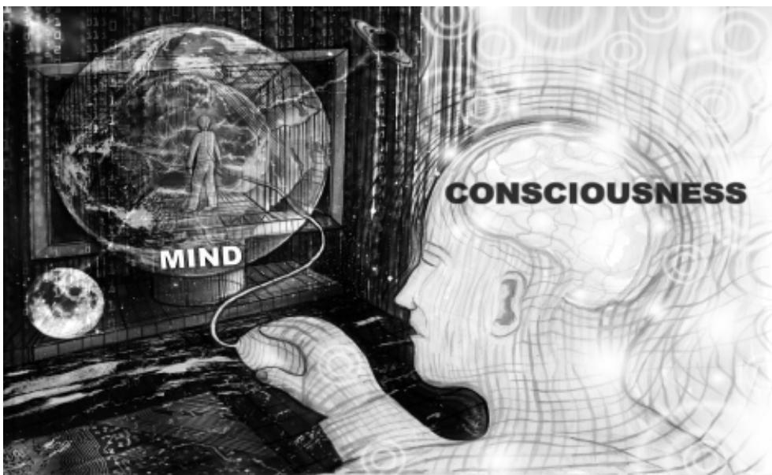  
Figure 20: The mind ‘virus’ I have been writing about for decades seeks to isolate five-sense mind (the computer) from the true ‘I’. (Image by Neil Hague).

About a year ago I came across a Native American concept of Wetiko which describes precisely the same phenomenon. Wetiko is the spelling used by the Cree and there are other versions including wintiko and windigo used by other tribal groups. They spell the name with lower case, but I see Wetiko as a proper noun as with Archons and prefer a capital. I first saw an article about Wetiko by writer and researcher Paul Levy which so synced with what I had been writing about the computer/operator disconnection and later the Archons. I then read his book, the fascinating Dispelling Wetiko, Breaking the Spell of Evil. The parallels between what I had concluded long before and the Native American concept of Wetiko were so clear and obvious that it was almost funny. For Wetiko see the Gnostic Archons for sure and the Jinn, the Predators, and every other name for a force of evil, inversion and chaos. Wetiko is the Native American name for the force that divides the computer from

the operator (Fig 21). Indigenous author Jack D. Forbes, a founder of the Native American movement in the 1960s, wrote another book about Wetiko entitled Columbus And Other Cannibals – The Wetiko Disease of Exploitation, Imperialism, and Terrorism which I also read. Forbes says that Wetiko refers to an evil person or spirit ‘who terrorizes other creatures by means of terrible acts, including cannibalism’. Zulu shaman Credo Mutwa told me that African accounts tell how cannibalism was brought into the world by the Chitauri ‘gods’ – another manifestation of Wetiko. The distinction between ‘evil person or spirit’ relates to Archons/Wetiko possessing a human or acting as pure consciousness. Wetiko is said to be a sickness of the soul or spirit and a state of being that takes but gives nothing back – the Cult and its operatives perfectly described. Black Hawk, a Native American war leader defending their lands from confiscation, said European invaders had ‘poisoned hearts’ – Wetiko hearts – and that this would spread to native societies. Mention of the heart is very significant as we shall shortly see. Forbes writes: ‘Tragically, the history of the world for the past 2,000 years is, in great part, the story of the epidemiology of the wetiko disease.’ Yes, and much longer. Forbes is correct when he says: ‘The wetikos destroyed Egypt and Babylon and Athens and Rome and Tenochtitlan [capital of the Aztec empire] and perhaps now they will destroy the entire earth.’ Evil, he said, is the number one export of a Wetiko culture – see its globalisation with ‘Covid’. Constant war, mass murder, suffering of all kinds, child abuse, Satanism, torture and human sacrifice are all expressions of Wetiko and the Wetiko possessed. The world is Wetiko made manifest, but it doesn’t have to be. There is a way out of this even now.

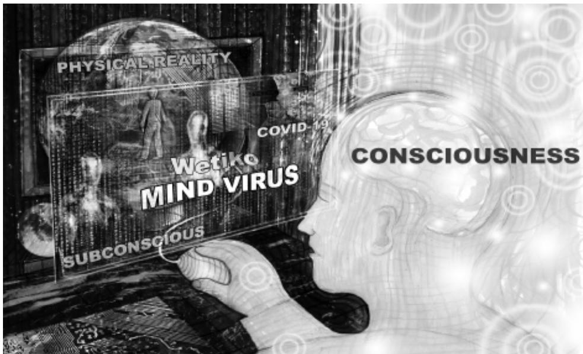  
Figure 21: The mind ‘virus’ is known to Native Americans as ‘Wetiko’. (Image by Neil Hague).

# Cult of Wetiko

Wetiko is the Yaldabaoth frequency distortion that seeks to aach to human consciousness and absorb it into its own. Once this connection is made Wetiko can drive the perceptions of the target which they believe to be coming from their own mind. All the horrors of history and today from mass killers to Satanists, paedophiles like Jeffrey Epstein and other psychopaths, are the embodiment of Wetiko and express its state of being in all its grotesqueness. The Cult is Wetiko incarnate, Yaldabaoth incarnate, and it seeks to facilitate Wetiko assimilation of humanity in totality into its distortion by manipulating the population into low

frequency states that match its own. Paul Levy writes: ‘Holographically enforced within the psyche of every human being the wetiko virus pervades and underlies the entire field of consciousness, and can therefore potentially manifest through any one of us at any moment if we are not mindful.’ The ‘Covid’ hoax has achieved this with many people, but others have not fallen into Wetiko’s frequency lair. Players in the ‘Covid’ human catastrophe including Gates, Schwab, Tedros, Fauci, Whiy, Vallance, Johnson, Hancock, Ferguson, Drosten, and all the rest, including the psychopath psychologists, are expressions of Wetiko. This is why

they have no compassion or empathy and no emotional consequence for what they do that would make them stop doing it. Observe all the people who support the psychopaths in authority against the Pushbackers despite the damaging impact the psychopaths have on their own lives and their family’s lives. You are again looking at Wetiko possession which prevents them seeing through the lies to the obvious scam going on. Why can’t they see it? Wetiko won’t let them see it. The perceptual divide that has now become a chasm is between the Wetikoed and the non-Wetikoed.

Paul Levy describes Wetiko in the same way that I have long described the Archontic force. They are the same distorted consciousness operating across dimensions of reality: ‘… the subtle body of wetiko is not located in the third dimension of space and time, literally existing in another dimension … it is able to affect ordinary lives by mysteriously interpenetrating into our threedimensional world.’ Wetiko does this through its incarnate representatives in the Cult and by weaving itself into The Field which on our level of reality is the electromagnetic information field of the simulation or Matrix. More than that, the simulation is Wetiko / Yaldabaoth. Caleb Scharf, Director of Astrobiology at Columbia University, has speculated that ‘alien life’ could be so advanced that it has transcribed itself into the quantum realm to become what we call physics. He said intelligence indistinguishable from the fabric of the Universe would solve many of its greatest mysteries:

Perhaps hyper-advanced life isn’t just external. Perhaps it’s already all around. It is embedded in what we perceive to be physics itself, from the root behaviour of particles and fields to the phenomena of complexity and emergence ... In other words, life might not just be in the equations. It might BE the equations [My emphasis].

Scharf said it is possible that ‘we don’t recognise advanced life because it forms an integral and unsuspicious part of what we’ve considered to be the natural world’. I agree. Wetiko/Yaldabaoth is the simulation. We are literally in the body of the beast. But that doesn’t mean it has to control us. We all have the power to overcome Wetiko

influence and the Cult knows that. I doubt it sleeps too well because it knows that.

# Which Field?

This, I suggest, is how it all works. There are two Fields. One is the fierce electromagnetic light of the Matrix within the speed of light; the other is the ‘watery light’ of The Field beyond the walls of the Matrix that connects with the Great Infinity. Five-sense mind and the decoding systems of the body aach us to the Field of Matrix light. They have to or we could not experience this reality. Five-sense mind sees only the Matrix Field of information while our expanded consciousness is part of the Infinity Field. When we open our minds, and most importantly our hearts, to the Infinity Field we have a mission control which gives us an expanded perspective, a road map, to understand the nature of the five-sense world. If we are isolated only in five-sense mind there is no mission control. We’re on our own trying to understand a world that’s constantly feeding us information to ensure we do not understand. People in this state can feel ‘lost’ and bewildered with no direction or radar. You can see ever more clearly those who are influenced by the Fields of Big Infinity or lile five-sense mind simply by their views and behaviour with regard to the ‘Covid’ hoax. We have had this division throughout known human history with the mass of the people on one side and individuals who could see and intuit beyond the walls of the simulation – Plato’s prisoner who broke out of the cave and saw reality for what it is. Such people have always been targeted by Wetiko/Archon-possessed authority, burned at the stake or demonised as mad, bad and dangerous. The Cult today and its global network of ‘anti-hate’, ‘anti-fascist’ Woke groups are all expressions of Wetiko aacking those exposing the conspiracy, ‘Covid’ lies and the ‘vaccine’ agenda.

Woke as a whole is Wetiko which explains its black and white mentality and how at one it is with the Wetiko-possessed Cult. Paul Levy said: ‘To be in this paradigm is to still be under the thrall of a two-valued logic – where things are either true or false – of a

wetikoized mind.’ Wetiko consciousness is in a permanent rage, therefore so is Woke, and then there is Woke inversion and contradiction. ‘Anti-fascists’ act like fascists because fascists and ‘antifascists’ are both Wetiko at work. Political parties act the same while claiming to be different for the same reason. Secret society and satanic rituals are aaching initiates to Wetiko and the cold, ruthless, psychopathic mentality that secures the positions of power all over the world is Wetiko. Reframing ‘training programmes’ have the same cumulative effect of aaching Wetiko and we have their graduates described as automatons and robots with a cold, psychopathic, uncaring demeanour. They are all traits of Wetiko possession and look how many times they have been described in this book and elsewhere with regard to personnel behind ‘Covid’ including the police and medical profession. Climbing the greasy pole in any profession in a Wetiko society requires traits of Wetiko to get there and that is particularly true of politics which is not about fair competition and pre-eminence of ideas. It is founded on how many backs you can stab and arses you can lick. This culminated in the global ‘Covid’ coordination between the Wetiko possessed who pulled it off in all the different countries without a trace of empathy and compassion for their impact on humans. Our sight sense can see only holographic form and not the Field which connects holographic form. Therefore we perceive ‘physical’ objects with ‘space’ in between. In fact that ‘space’ is energy/consciousness operating on multiple frequencies. One of them is Wetiko and that connects the Cult psychopaths, those who submit to the psychopaths, and those who serve the psychopaths in the media operations of the world. Wetiko is Gates. Wetiko is the mask-wearing submissive. Wetiko is the fake journalist and ‘fact-checker’. The Wetiko Field is coordinating the whole thing. Psychopaths, gofers, media operatives, ‘anti-hate’ hate groups, ‘fact-checkers’ and submissive people work as one unit even without human coordination because they are aached to the same Field which is organising it all (Fig 22). Paul Levy is here describing how Wetiko-possessed people are drawn together and refuse to let any information breach their rigid

perceptions. He was writing long before ‘Covid’, but I think you will recognise followers of the ‘Covid’ religion oh just a little bit:

People who are channelling the vibratory frequency of wetiko align with each other through psychic resonance to reinforce their unspoken shared agreement so as to uphold their deranged view of reality. Once an unconscious content takes possession of certain individuals, it irresistibly draws them together by mutual attraction and knits them into groups tied together by their shared madness that can easily swell into an avalanche of insanity.

A psychic epidemic is a closed system, which is to say that it is insular and not open to any new information or informing influences from the outside world which contradict its fixed, limited, and limiting perspective.

There we have the Woke mind and the ‘Covid’ mind. Compatible resonance draws the awakening together, too, which is clearly happening today.

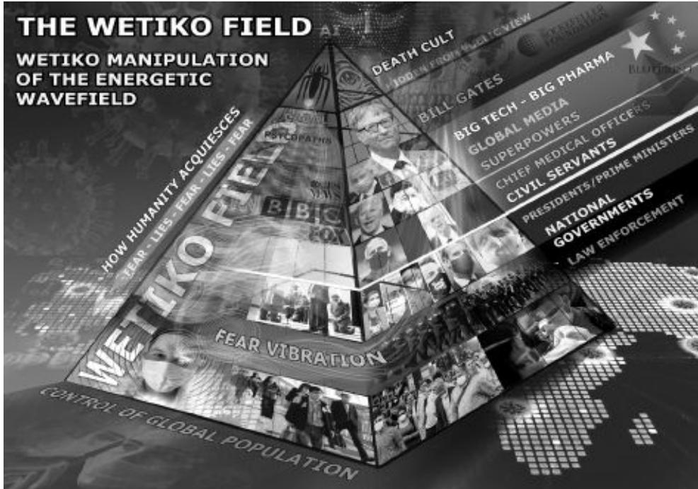  
Figure 22: The Wetiko Field from which the Cult pyramid and its personnel are made manifest. (Image by Neil Hague).

# Spiritual servitude

Wetiko doesn’t care about humans. It’s not human; it just possesses humans for its own ends and the effect (depending on the scale of

possession) can be anything from extreme psychopathy to unquestioning obedience. Wetiko’s worst nightmare is for human consciousness to expand beyond the simulation. Everything is focussed on stopping that happening through control of information, thus perception, thus frequency. The ‘education system’, media, science, medicine, academia, are all geared to maintaining humanity in five-sense servitude as is the constant stimulation of low-vibrational mental and emotional states (see ‘Covid’). Wetiko seeks to dominate those subconscious spaces between five-sense perception and expanded consciousness where the computer meets the operator. From these subconscious hiding places Wetiko speaks to us to trigger urges and desires that we take to be our own and manipulate us into anything from low-vibrational to psychopathic states. Remember how Islam describes the Jinn as invisible tricksters that ‘whisper’ and confuse. Wetiko is the origin of the ‘trickster god’ theme that you find in cultures all over the world. Jinn, like the Archons, are Wetiko which is terrified of humans awakening and reconnecting with our true self for then its energy source has gone. With that the feedback loop breaks between Wetiko and human perception that provides the energetic momentum on which its very existence depends as a force of evil. Humans are both its target and its source of survival, but only if we are operating in low-vibrational states of fear, hate, depression and the background anxiety that most people suffer. We are Wetiko’s target because we are its key to survival. It needs us, not the other way round. Paul Levy writes:

A vampire has no intrinsic, independent, substantial existence in its own right; it only exists in relation to us. The pathogenic, vampiric mind-parasite called wetiko is nothing in itself – not being able to exist from its own side – yet it has a ‘virtual reality’ such that it can potentially destroy our species …

…The fact that a vampire is not reflected by a mirror can also mean that what we need to see is that there’s nothing, no-thing to see, other than ourselves. The fact that wetiko is the expression of something inside of us means that the cure for wetiko is with us as well. The critical issue is finding this cure within us and then putting it into effect.

Evil begets evil because if evil does not constantly expand and find new sources of energetic sustenance its evil, its distortion, dies with the assimilation into balance and harmony. Love is the garlic to Wetiko’s vampire. Evil, the absence of love, cannot exist in the presence of love. I think I see a way out of here. I have emphasised so many times over the decades that the Archons/Wetiko and their Cult are not all powerful. They are not. I don’t care how it looks even now they are not. I have not called them lile boys in short trousers for effect. I have said it because it is true. Wetiko’s insatiable desire for power over others is not a sign of its omnipotence, but its insecurity. Paul Levy writes: ‘Due to the primal fear which ultimately drives it and which it is driven to cultivate, wetiko’s body politic has an intrinsic and insistent need for centralising power and control so as to create imagined safety for itself.’ Yeeeeeees! Exactly! Why does Wetiko want humans in an ongoing state of fear? Wetiko itself is fear and it is petrified of love. As evil is an absence of love, so love is an absence of fear. Love conquers all and especially Wetiko which is fear. Wetiko brought fear into the world when it wasn’t here before. Fear was the ‘fall’, the fall into low-frequency ignorance and illusion – fear is False Emotion Appearing Real. The simulation is driven and energised by fear because Wetiko/Yaldabaoth (fear) are the simulation. Fear is the absence of love and Wetiko is the absence of love.

# Wetiko today

We can now view current events from this level of perspective. The ‘Covid’ hoax has generated momentous amounts of ongoing fear, anxiety, depression and despair which have empowered Wetiko. No wonder people like Gates have been the instigators when they are Wetiko incarnate and exhibit every trait of Wetiko in the extreme. See how cold and unemotional these people are like Gates and his cronies, how dead of eye they are. That’s Wetiko. Sabbatians are Wetiko and everything they control including the World Health Organization, Big Pharma and the ‘vaccine’ makers, national ‘health’

hierarchies, corporate media, Silicon Valley, the banking system, and the United Nations with its planned transformation into world government. All are controlled and possessed by the Wetiko distortion into distorting human society in its image. We are with this knowledge at the gateway to understanding the world.

Divisions of race, culture, creed and sexuality are diversions to hide the real division between those possessed and influenced by Wetiko and those that are not. The ‘Covid’ hoax has brought both clearly into view. Human behaviour is not about race. Tyrants and dictatorships come in all colours and creeds. What unites the US president bombing the innocent and an African tribe commiing genocide against another as in Rwanda? What unites them? Wetiko.

All wars are Wetiko, all genocide is Wetiko, all hunger over centuries in a world of plenty is Wetiko. Children going to bed hungry, including in the West, is Wetiko. Cult-generated Woke racial divisions that focus on the body are designed to obscure the reality that divisions in behaviour are manifestations of mind, not body.

Obsession with body identity and group judgement is a means to divert aention from the real source of behaviour – mind and perception. Conflict sown by the Woke both within themselves and with their target groups are Wetiko providing lunch for itself through still more agents of the division, chaos, and fear on which it feeds. The Cult is seeking to assimilate the entirety of humanity and all children and young people into the Wetiko frequency by manipulating them into states of fear and despair. Witness all the suicide and psychological unravelling since the spring of 2020.

Wetiko psychopaths want to impose a state of unquestioning obedience to authority which is no more than a conduit for Wetiko to enforce its will and assimilate humanity into itself. It needs us to believe that resistance is futile when it fears resistance and even more so the game-changing non-cooperation with its impositions. It can use violent resistance for its benefit. Violent impositions and violent resistance are both Wetiko. The Power of Love with its Power of No will sweep Wetiko from our world. Wetiko and its Cult know that. They just don’t want us to know.

# AI Wetiko

This brings me to AI or artificial intelligence and something else Wetikos don’t want us to know. What is AI really? I know about computer code algorithms and AI that learns from data input. These, however, are more diversions, the expeditionary force, for the real AI that they want to connect to the human brain as promoted by Silicon Valley Wetikos like Kurzweil. What is this AI? It is the frequency of Wetiko, the frequency of the Archons. The connection of AI to the human brain is the connection of the Wetiko frequency to create a Wetiko hive mind and complete the job of assimilation. The hive mind is planned to be controlled from Israel and China which are both 100 percent owned by Wetiko Sabbatians. The assimilation process has been going on minute by minute in the ‘smart’ era which fused with the ‘Covid’ era. We are told that social media is scrambling the minds of the young and changing their personality. This is true, but what is social media? Look more deeply at how it works, how it creates divisions and conflict, the hostility and cruelty, the targeting of people until they are destroyed. That’s Wetiko. Social media is manipulated to tune people to the Wetiko frequency with all the emotional exploitation tricks employed by platforms like Facebook and its Wetiko front man, Zuckerberg. Facebook’s Instagram announced a new platform for children to overcome a legal bar on them using the main site. This is more Wetiko exploitation and manipulation of kids. Amnesty International likened the plan to foxes offering to guard the henhouse and said it was incompatible with human rights. Since when did Wetiko or Zuckerberg (I repeat myself) care about that? Would Brin and Page at Google, Wojcicki at YouTube, Bezos at Amazon and whoever the hell runs Twier act as they do if they were not channelling Wetiko? Would those who are developing technologies for no other reason than human control? How about those designing and selling technologies to kill people and Big Pharma drug and ‘vaccine’ producers who know they will end or devastate lives? Quite a thought for these people to consider is that if you are Wetiko in a human life you are Wetiko on the ‘other side’ unless your frequency

changes and that can only change by a change of perception which becomes a change of behaviour. Where Gates is going does not bear thinking about although perhaps that’s exactly where he wants to go. Either way, that’s where he’s going. His frequency will make it so.

# The frequency lair

I have been saying for a long time that a big part of the addiction to smartphones and devices is that a frequency is coming off them that entraps the mind. People spend ages on their phones and sometimes even a minute or so aer they put them down they pick them up again and it all repeats. ‘Covid’ lockdowns will have increased this addiction a million times for obvious reasons. Addictions to alcohol overindulgence and drugs are another way that Wetiko entraps consciousness to aach to its own. Both are symptoms of lowvibrational psychological distress which alcoholism and drug addiction further compound. Do we think it’s really a coincidence that access to them is made so easy while potions that can take people into realms beyond the simulation are banned and illegal? I have explored smartphone addiction in other books, the scale is mind-blowing, and that level of addiction does not come without help. Tech companies that make these phones are Wetiko and they will have no qualms about destroying the minds of children. We are seeing again with these companies the Wetiko perceptual combination of psychopathic enforcers and weak and meek unquestioning compliance by the rank and file.

The global Smart Grid is the Wetiko Grid and it is crucial to complete the Cult endgame. The simulation is radiation and we are being deluged with technological radiation on a devastating scale. Wetiko frauds like Elon Musk serve Cult interests while occasionally criticising them to maintain his street-cred. 5G and other forms of Wi-Fi are being directed at the earth from space on a volume and scale that goes on increasing by the day. Elon Musk’s (officially) SpaceX Starlink project is in the process of puing tens of thousands of satellites in low orbit to cover every inch of the planet with 5G and other Wi-Fi to create Kurzweil’s global ‘cloud’ to which the

human mind is planned to be aached very soon. SpaceX has approval to operate 12,000 satellites with more than 1,300 launched at the time of writing and applications filed for 30,000 more. Other operators in the Wi-Fi, 5G, low-orbit satellite market include OneWeb (UK), Telesat (Canada), and AST & Science (US). Musk tells us that AI could be the end of humanity and then launches a company called Neuralink to connect the human brain to computers. Musk’s (in theory) Tesla company is building electric cars and the driverless vehicles of the smart control grid. As frauds and bullshiers go Elon Musk in my opinion is Major League.

5G and technological radiation in general are destructive to human health, genetics and psychology and increasing the strength of artificial radiation underpins the five-sense perceptual bubbles which are themselves expressions of radiation or electromagnetism. Freedom activist John Whitehead was so right with his ‘databit by databit, we are building our own electronic concentration camps’. The Smart Grid and 5G is a means to control the human mind and infuse perceptual information into The Field to influence anyone in sync with its frequency. You can change perception and behaviour en masse if you can manipulate the population into those levels of frequency and this is happening all around us today. The arrogance of Musk and his fellow Cult operatives knows no bounds in the way that we see with Gates. Musk’s satellites are so many in number already they are changing the night sky when viewed from Earth. The astronomy community has complained about this and they have seen nothing yet. Some consequences of Musk’s Wetiko hubris include: Radiation; visible pollution of the night sky; interference with astronomy and meteorology; ground and water pollution from intensive use of increasingly many spaceports; accumulating space debris; continual deorbiting and burning up of aging satellites, polluting the atmosphere with toxic dust and smoke; and everincreasing likelihood of collisions. A collective public open leer of complaint to Musk said:

We are writing to you … because SpaceX is in process of surrounding the Earth with a network of thousands of satellites whose very purpose is to irradiate every square inch of the

Earth. SpaceX, like everyone else, is treating the radiation as if it were not there. As if the mitochondria in our cells do not depend on electrons moving undisturbed from the food we digest to the oxygen we breathe.

As if our nervous systems and our hearts are not subject to radio frequency interference like any piece of electronic equipment. As if the cancer, diabetes, and heart disease that now afflict a majority of the Earth’s population are not metabolic diseases that result from interference with our cellular machinery. As if insects everywhere, and the birds and animals that eat them, are not starving to death as a result.

People like Musk and Gates believe in their limitless Wetiko arrogance that they can do whatever they like to the world because they own it. Consequences for humanity are irrelevant. It’s absolutely time that we stopped taking this shit from these selfstyled masters of the Earth when you consider where this is going.

# Why is the Cult so anti-human?

I hear this question oen: Why would they do this when it will affect them, too? Ah, but will it? Who is this them? Forget their bodies. They are just vehicles for Wetiko consciousness. When you break it all down to the foundations we are looking at a state of severely distorted consciousness targeting another state of consciousness for assimilation. The rest is detail. The simulation is the fly-trap in which unique sensations of the five senses create a cycle of addiction called reincarnation. Renegade Minds see that everything which happens in our reality is a smaller version of the whole picture in line with the holographic principle. Addiction to the radiation of smart technology is a smaller version of addiction to the whole simulation. Connecting the body/brain to AI is taking that addiction on a giant step further to total ongoing control by assimilating human incarnate consciousness into Wetiko. I have watched during the ‘Covid’ hoax how many are becoming ever more profoundly aached to Wetiko’s perceptual calling cards of aggressive response to any other point of view (‘There is no other god but me’), psychopathic lack of compassion and empathy, and servile submission to the narrative and will of authority. Wetiko is the psychopaths and subservience to psychopaths. The Cult of Wetiko is

so anti-human because it is not human. It embarked on a mission to destroy human by targeting everything that it means to be human and to survive as human. ‘Covid’ is not the end, just a means to an end. The Cult with its Wetiko consciousness is seeking to change Earth systems, including the atmosphere, to suit them, not humans. The gathering bombardment of 5G alone from ground and space is dramatically changing The Field with which the five senses interact. There is so much more to come if we sit on our hands and hope it will all go away. It is not meant to go away. It is meant to get ever more extreme and we need to face that while we still can – just.

Carbon dioxide is the gas of life. Without that human is over. Kaput, gone, history. No natural world, no human. The Cult has created a cock and bull story about carbon dioxide and climate change to justify its reduction to the point where Gates and the ignoramus Biden ‘climate chief’ John Kerry want to suck it out of the atmosphere. Kerry wants to do this because his master Gates does. Wetikos have made the gas of life a demon with the usual support from the Wokers of Extinction Rebellion and similar organisations and the bewildered puppet-child that is Greta Thunberg who was put on the world stage by Klaus Schwab and the World Economic Forum. The name Extinction Rebellion is both ironic and as always Wetiko inversion. The gas that we need to survive must be reduced to save us from extinction. The most basic need of human is oxygen and we now have billions walking around in face nappies depriving body and brain of this essential requirement of human existence. More than that 5G at 60 gigahertz interacts with the oxygen molecule to reduce the amount of oxygen the body can absorb into the bloodstream. The obvious knock-on consequences of that for respiratory and cognitive problems and life itself need no further explanation. Psychopaths like Musk are assembling a global system of satellites to deluge the human atmosphere with this insanity. The man should be in jail. Here we have two most basic of human needs, oxygen and carbon dioxide, being dismantled.

Two others, water and food, are geing similar treatment with the United Nations Agendas 21 and 2030 – the Great Reset – planning to

centrally control all water and food supplies. People will not even own rain water that falls on their land. Food is affected at the most basic level by reducing carbon dioxide. We have genetic modification or GMO infiltrating the food chain on a mass scale, pesticides and herbicides polluting the air and destroying the soil. Freshwater fish that provide livelihoods for 60 million people and feed hundreds of millions worldwide are being ‘pushed to the brink’ according the conservationists while climate change is the only focus. Now we have Gates and Schwab wanting to dispense with current food sources all together and replace them with a synthetic version which the Wetiko Cult would control in terms of production and who eats and who doesn’t. We have been on the Totalitarian Tiptoe to this for more than 60 years as food has become ever more processed and full of chemical shite to the point today when it’s not natural food at all. As Dr Tom Cowan says: ‘If it has a label don’t eat it.’ Bill Gates is now the biggest owner of farmland in the United States and he does nothing without an ulterior motive involving the Cult. Klaus Schwab wrote: ‘To feed the world in the next 50 years we will need to produce as much food as was produced in the last 10,000 years … food security will only be achieved, however, if regulations on genetically modified foods are adapted to reflect the reality that gene editing offers a precise, efficient and safe method of improving crops.’ Liar. People and the world are being targeted with aluminium through vaccines, chemtrails, food, drink cans, and endless other sources when aluminium has been linked to many health issues including dementia which is increasing year aer year. Insects, bees and wildlife essential to the food chain are being deleted by pesticides, herbicides and radiation which 5G is dramatically increasing with 6G and 7G to come. The pollinating bee population is being devastated while wildlife including birds, dolphins and whales are having their natural radar blocked by the effects of ever-increasing radiation. In the summer windscreens used to be splaered with insects so numerous were they. It doesn’t happen now. Where have they gone?

# Synthetic everything

The Cult is introducing genetically-modified versions of trees, plants and insects including a Gates-funded project to unleash hundreds of millions of genetically-modified, lab-altered and patented male mosquitoes to mate with wild mosquitoes and induce genetic flaws that cause them to die out. Clinically-insane Gates-funded Japanese researchers have developed mosquitos that spread vaccine and are dubbed ‘flying vaccinators’. Gates is funding the modification of weather paerns in part to sell the myth that this is caused by carbon dioxide and he’s funding geoengineering of the skies to change the atmosphere. Some of this came to light with the Gates-backed plan to release tonnes of chalk into the atmosphere to ‘deflect the Sun and cool the planet’. Funny how they do this while the heating effect of the Sun is not factored into climate projections focussed on carbon dioxide. The reason is that they want to reduce carbon dioxide (so don’t mention the Sun), but at the same time they do want to reduce the impact of the Sun which is so essential to human life and health. I have mentioned the sun-cholesterol-vitamin D connection as they demonise the Sun with warnings about skin cancer (caused by the chemicals in sun cream they tell you to splash on). They come from the other end of the process with statin drugs to reduce cholesterol that turns sunlight into vitamin D. A lack of vitamin D leads to a long list of health effects and how vitamin D levels must have fallen with people confined to their homes over ‘Covid’. Gates is funding other forms of geoengineering and most importantly chemtrails which are dropping heavy metals, aluminium and self-replicating nanotechnology onto the Earth which is killing the natural world. See Everything You Need To Know, But Have Never Been Told for the detailed background to this.

Every human system is being targeted for deletion by a force that’s not human. The Wetiko Cult has embarked on the process of transforming the human body from biological to synthetic biological as I have explained. Biological is being replaced by the artificial and synthetic – Archontic ‘countermimicry’ – right across human society. The plan eventually is to dispense with the human body altogether

and absorb human consciousness – which it wouldn’t really be by then – into cyberspace (the simulation which is Wetiko/Yaldabaoth). Preparations for that are already happening if people would care to look. The alternative media rightly warns about globalism and ‘the globalists’, but this is far bigger than that and represents the end of the human race as we know it. The ‘bad copy’ of prime reality that Gnostics describe was a bad copy of harmony, wonder and beauty to start with before Wetiko/Yaldabaoth set out to change the simulated ‘copy’ into something very different. The process was slow to start with. Entrapped humans in the simulation timeline were not technologically aware and they had to be brought up to intellectual speed while being suppressed spiritually to the point where they could build their own prison while having no idea they were doing so. We have now reached that stage where technological intellect has the potential to destroy us and that’s why events are moving so fast. Central American shaman Don Juan Matus said:

Think for a moment, and tell me how you would explain the contradictions between the intelligence of man the engineer and the stupidity of his systems of belief, or the stupidity of his contradictory behaviour. Sorcerers believe that the predators have given us our systems of beliefs, our ideas of good and evil; our social mores. They are the ones who set up our dreams of success or failure. They have given us covetousness, greed, and cowardice. It is the predator who makes us complacent, routinary, and egomaniacal.

In order to keep us obedient and meek and weak, the predators engaged themselves in a stupendous manoeuvre – stupendous, of course, from the point of view of a fighting strategist; a horrendous manoeuvre from the point of those who suffer it. They gave us their mind. The predators’ mind is baroque, contradictory, morose, filled with the fear of being discovered any minute now.

For ‘predators’ see Wetiko, Archons, Yaldabaoth, Jinn, and all the other versions of the same phenomenon in cultures and religions all over the world. The theme is always the same because it’s true and it’s real. We have reached the point where we have to deal with it. The question is – how?

# Don’t fight – walk away

I thought I’d use a controversial subheading to get things moving in terms of our response to global fascism. What do you mean ‘don’t fight’? What do you mean ‘walk away’? We’ve got to fight. We can’t walk away. Well, it depends what we mean by fight and walk away. If fighting means physical combat we are playing Wetiko’s game and falling for its trap. It wants us to get angry, aggressive, and direct hate and hostility at the enemy we think we must fight. Every war, every bale, every conflict, has been fought with Wetiko leading both sides. It’s what it does. Wetiko wants a fight, anywhere, any place. Just hit me, son, so I can hit you back. Wetiko hits Wetiko and Wetiko hits Wetiko in return. I am very forthright as you can see in exposing Wetikos of the Cult, but I don’t hate them. I refuse to hate them. It’s what they want. What you hate you become. What you fight you become. Wokers, ‘anti-haters’ and ‘anti-fascists’ prove this every time they reach for their keyboards or don their balaclavas. By walk away I mean to disengage from Wetiko which includes ceasing to cooperate with its tyranny. Paul Levy says of Wetiko:

The way to ‘defeat’ evil is not to try to destroy it (for then, in playing evil’s game, we have already lost), but rather, to find the invulnerable place within ourselves where evil is unable to vanquish us – this is to truly ‘win’ our battle with evil.

Wetiko is everywhere in human society and it’s been on steroids since the ‘Covid’ hoax. Every shouting match over wearing masks has Wetiko wearing a mask and Wetiko not wearing one. It’s an electrical circuit of push and resist, push and resist, with Wetiko pushing and resisting. Each polarity is Wetiko empowering itself. Dictionary definitions of ‘resist’ include ‘opposing, refusing to accept or comply with’ and the word to focus on is ‘opposing’. What form does this take – seing police cars alight or ‘refusing to accept or comply with’? The former is Wetiko opposing Wetiko while the other points the way forward. This is the difference between those aggressively demanding that government fascism must be obeyed who stand in stark contrast to the great majority of Pushbackers. We saw this clearly with a march by thousands of Pushbackers against lockdown in London followed days later by a Woker-hijacked

protest in Bristol in which police cars were set on fire. Masks were virtually absent in London and widespread in Bristol. Wetiko wants lockdown on every level of society and infuses its aggression to police it through its unknowing stooges. Lockdown protesters are the ones with the smiling faces and the hugs, The two blatantly obvious states of being – geing more obvious by the day – are the result of Wokers and their like becoming ever more influenced by the simulation Field of Wetiko and Pushbackers ever more influenced by The Field of a far higher vibration beyond the simulation. Wetiko can’t invade the heart which is where most lockdown opponents are coming from. It’s the heart that allows them to see through the lies to the truth in ways I will be highlighting.

Renegade Minds know that calmness is the place from which wisdom comes. You won’t find wisdom in a hissing fit and wisdom is what we need in abundance right now. Calmness is not weakness – you don’t have to scream at the top of your voice to be strong. Calmness is indeed a sign of strength. ‘No’ means I’m not doing it. NOOOO!!! doesn’t mean you’re not doing it even more. Volume does not advance ‘No – I’m not doing it’. You are just not doing it. Wetiko possessed and influenced don’t know how to deal with that. Wetiko wants a fight and we should not give it one. What it needs more than anything is our cooperation and we should not give that either. Mass rallies and marches are great in that they are a visual representation of feeling, but if it ends there they are irrelevant. You demand that Wetikos act differently? Well, they’re not going to are they? They are Wetikos. We don’t need to waste our time demanding that something doesn’t happen when that will make no difference. We need to delete the means that allows it to happen. This, invariably, is our cooperation. You can demand a child stop firing a peashooter at the dog or you can refuse to buy the peashooter. If you provide the means you are cooperating with the dog being smacked on the nose with a pea. How can the authorities enforce mask-wearing if millions in a country refuse? What if the 74 million Pushbackers that voted for Trump in 2020 refused to wear masks, close their businesses or stay in their homes. It would be unenforceable. The

few control the many through the compliance of the many and that’s always been the dynamic be it ‘Covid’ regulations or the Roman Empire. I know people can find it intimidating to say no to authority or stand out in a crowd for being the only one with a face on display; but it has to be done or it’s over. I hope I’ve made clear in this book that where this is going will be far more intimidating than standing up now and saying ‘No’ – I will not cooperate with my own enslavement and that of my children. There might be consequences for some initially, although not so if enough do the same. The question that must be addressed is what is going to happen if we don’t? It is time to be strong and unyieldingly so. No means no. Not here and there, but everywhere and always. I have refused to wear a mask and obey all the other nonsense. I will not comply with tyranny. I repeat: Fascism is not imposed by fascists – there are never enough of them. Fascism is imposed by the population acquiescing to fascism. I will not do it. I will die first, or my body will. Living meekly under fascism is a form of death anyway, the death of the spirit that Martin Luther King described.

# Making things happen

We must not despair. This is not over till it’s over and it’s far from that. The ‘fat lady’ must refuse to sing. The longer the ‘Covid’ hoax has dragged on and impacted on more lives we have seen an awakening of phenomenal numbers of people worldwide to the realisation that what they have believed all their lives is not how the world really is. Research published by the system-serving University of Bristol and King’s College London in February, 2021, concluded: ‘One in every 11 people in Britain say they trust David Icke’s take on the coronavirus pandemic.’ It will be more by now and we have gathering numbers to build on. We must urgently progress from seeing the scam to ceasing to cooperate with it. Prominent German lawyer Reiner Fuellmich, also licenced to practice law in America, is doing a magnificent job taking the legal route to bring the psychopaths to justice through a second Nuremberg tribunal for crimes against humanity. Fuellmich has an impressive record of

beating the elite in court and he formed the German Corona Investigative Commiee to pursue civil charges against the main perpetrators with a view to triggering criminal charges. Most importantly he has grasped the foundation of the hoax – the PCR test not testing for the ‘virus’ – and Christian Drosten is therefore on his charge sheet along with Gates frontman Tedros at the World Health Organization. Major players must be not be allowed to inflict their horrors on the human race without being brought to book. A life sentence must follow for Bill Gates and the rest of them. A group of researchers has also indicted the government of Norway for crimes against humanity with copies sent to the police and the International Criminal Court. The lawsuit cites participation in an internationally-planned false pandemic and violation of international law and human rights, the European Commission’s definition of human rights by coercive rules, Nuremberg and Hague rules on fundamental human rights, and the Norwegian constitution. We must take the initiative from hereon and not just complain, protest and react.

There are practical ways to support vital mass non-cooperation. Organising in numbers is one. Lockdown marches in London in the spring in 2021 were mass non-cooperation that the authorities could not stop. There were too many people. Hundreds of thousands walked the London streets in the centre of the road for mile aer mile while the Face-Nappies could only look on. They were determined, but calm, and just did it with no histrionics and lots of smiles. The police were impotent. Others are organising group shopping without masks for mutual support and imagine if that was happening all over. Policing it would be impossible. If the store refuses to serve people in these circumstances they would be faced with a long line of trolleys full of goods standing on their own and everything would have to be returned to the shelves. How would they cope with that if it kept happening? I am talking here about moving on from complaining to being pro-active; from watching things happen to making things happen. I include in this our relationship with the police. The behaviour of many Face-Nappies

has been disgraceful and anyone who thinks they would never find concentration camp guards in the ‘enlightened’ modern era have had that myth busted big-time. The period and seing may change – Wetikos never do. I watched film footage from a London march in which a police thug viciously kicked a protestor on the floor who had done nothing. His fellow Face-Nappies stood in a ring protecting him. What he did was a criminal assault and with a crowd far outnumbering the police this can no longer be allowed to happen unchallenged. I get it when people chant ‘shame on you’ in these circumstances, but that is no longer enough. They have no shame those who do this. Crowds needs to start making a citizen’s arrest of the police who commit criminal offences and brutally aack innocent people and defenceless women. A citizen’s arrest can be made under section 24A of the UK Police and Criminal Evidence (PACE) Act of 1984 and you will find something similar in other countries. I prefer to call it a Common Law arrest rather than citizen’s for reasons I will come to shortly. Anyone can arrest a person commiing an indictable offence or if they have reasonable grounds to suspect they are commiing an indictable offence. On both counts the aack by the police thug would have fallen into this category. A citizen’s arrest can be made to stop someone:

•  Causing physical injury to himself or any other person   
•  Suffering physical injury   
•  Causing loss of or damage to property   
•  Making off before a constable can assume responsibility for him

A citizen’s arrest may also be made to prevent a breach of the peace under Common Law and if they believe a breach of the peace will happen or anything related to harm likely to be done or already done in their presence. This is the way to go I think – the Common Law version. If police know that the crowd and members of the public will no longer be standing and watching while they commit

their thuggery and crimes they will think twice about acting like Brownshirts and Blackshirts.

# Common Law – common sense

Mention of Common Law is very important. Most people think the law is the law as in one law. This is not the case. There are two bodies of law, Common Law and Statute Law, and they are not the same. Common Law is founded on the simple premise of do no harm. It does not recognise victimless crimes in which no harm is done while Statute Law does. There is a Statute Law against almost everything. So what is Statute Law? Amazingly it’s the law of the sea that was brought ashore by the Cult to override the law of the land which is Common Law. They had no right to do this and as always they did it anyway. They had to. They could not impose their will on the people through Common Law which only applies to do no harm. How could you stitch up the fine detail of people’s lives with that? Instead they took the law of the sea, or Admiralty Law, and applied it to the population. Statute Law refers to all the laws spewing out of governments and their agencies including all the fascist laws and regulations relating to ‘Covid’. The key point to make is that Statute Law is contract law. It only applies between contracting corporations. Most police officers don’t even know this. They have to be kept in the dark, too. Long ago when merchants and their sailing ships began to trade with different countries a contractual law was developed called Admiralty Law and other names. Again it only applied to contracts agreed between corporate entities. If there is no agreed contract the law of the sea had no jurisdiction and that still applies to its new alias of Statute Law. The problem for the Cult when the law of the sea was brought ashore was an obvious one. People were not corporations and neither were government entities. To overcome the laer they made governments and all associated organisations corporations. All the institutions are private corporations and I mean governments and their agencies, local councils, police, courts, military, US states, the whole lot. Go to the

Dun and Bradstreet corporate listings website for confirmation that they are all corporations. You are arrested by a private corporation called the police by someone who is really a private security guard and they take you to court which is another private corporation.

Neither have jurisdiction over you unless you consent and contract with them. This is why you hear the mantra about law enforcement policing by consent of the people. In truth the people ‘consent’ only in theory through monumental trickery.

Okay, the Cult overcame the corporate law problem by making governments and institutions corporate entities; but what about people? They are not corporations are they? Ah ... well in a sense, and only a sense, they are. Not people exactly – the illusion of people. The Cult creates a corporation in the name of everyone at the time that their birth certificate is issued. Note birth/ berth certificate and when you go to court under the law of the sea on land you stand in a dock. These are throwbacks to the origin. My Common Law name is David Vaughan Icke. The name of the corporation created by the government when I was born is called Mr David Vaughan Icke usually wrien in capitals as MR DAVID VAUGHAN ICKE.

That is not me, the living, breathing man. It is a fictitious corporate entity. The trick is to make you think that David Vaughan Icke and MR DAVID VAUGHAN ICKE are the same thing. They are not. When police charge you and take you to court they are prosecuting the corporate entity and not the living, breathing, man or woman. They have to trick you into identifying as the corporate entity and contracting with them. Otherwise they have no jurisdiction. They do this through a language known as legalese. Lawful and legal are not the same either. Lawful relates to Common Law and legal relates to Statute Law. Legalese is the language of Statue Law which uses terms that mean one thing to the public and another in legalese.

Notice that when a police officer tells someone why they are being charged he or she will say at the end: ‘Do you understand?’ To the public that means ‘Do you comprehend?’ In legalese it means ‘Do you stand under me?’ Do you stand under my authority? If you say

yes to the question you are unknowingly agreeing to give them jurisdiction over you in a contract between two corporate entities.

This is a confidence trick in every way. Contracts have to be agreed between informed parties and if you don’t know that David Vaughan Icke is agreeing to be the corporation MR DAVID VAUGHAN ICKE you cannot knowingly agree to contract. They are deceiving you and another way they do this is to ask for proof of identity. You usually show them a driving licence or other document on which your corporate name is wrien. In doing so you are accepting that you are that corporate entity when you are not. Referring to yourself as a ‘person’ or ‘citizen’ is also identifying with your corporate fiction which is why I made the Common Law point about the citizen’s arrest. If you are approached by a police officer you identify yourself immediately as a living, breathing, man or woman and say ‘I do not consent, I do not contract with you and I do not understand’ or stand under their authority. I have a Common Law birth certificate as a living man and these are available at no charge from commonlawcourt.com. Businesses registered under the Statute Law system means that its laws apply. There are, however, ways to run a business under Common Law. Remember all ‘Covid’ laws and regulations are Statute Law – the law of contracts and you do not have to contract. This doesn’t mean that you can kill someone and get away with it. Common Law says do no harm and that applies to physical harm, financial harm etc. Police are employees of private corporations and there needs to be a new system of noncorporate Common Law constables operating outside the Statute Law system. If you go to davidicke.com and put Common Law into the search engine you will find videos that explain Common Law in much greater detail. It is definitely a road we should walk.

# With all my heart

I have heard people say that we are in a spiritual war. I don’t like the term ‘war’ with its Wetiko dynamic, but I know what they mean. Sweep aside all the bodily forms and we are in a situation in which two states of consciousness are seeking very different realities.

Wetiko wants upheaval, chaos, fear, suffering, conflict and control. The other wants love, peace, harmony, fairness and freedom. That’s where we are. We should not fall for the idea that Wetiko is allpowerful and there’s nothing we can do. Wetiko is not all-powerful. It’s a joke, pathetic. It doesn’t have to be, but it has made that choice for now. A handful of times over the years when I have felt the presence of its frequency I have allowed it to aach briefly so I could consciously observe its nature. The experience is not pleasant, the energy is heavy and dark, but the ease with which you can kick it back out the door shows that its real power is in persuading us that it has power. It’s all a con. Wetiko is a con. It’s a trickster and not a power that can control us if we unleash our own. The con is founded on manipulating humanity to give its power to Wetiko which recycles it back to present the illusion that it has power when its power is ours that we gave away. This happens on an energetic level and plays out in the world of the seen as humanity giving its power to Wetiko authority which uses that power to control the population when the power is only the power the population has handed over. How could it be any other way for billions to be controlled by a relative few? I have had experiences with people possessed by Wetiko and again you can kick its arse if you do it with an open heart. Oh yes – the heart which can transform the world of perceived ‘maer’.

We are receiver-transmiers and processors of information, but what information and where from? Information is processed into perception in three main areas – the brain, the heart and the belly. These relate to thinking, knowing, and emotion. Wetiko wants us to be head and belly people which means we think within the confines of the Matrix simulation and low-vibrational emotional reaction scrambles balance and perception. A few minutes on social media and you see how emotion is the dominant force. Woke is all emotion and is therefore thought-free and fact-free. Our heart is something different. It knows while the head thinks and has to try to work it out because it doesn’t know. The human energy field has seven prime vortexes which connect us with wider reality (Fig 23). Chakra means

‘wheels of light’ in the Sanskrit language of ancient India. The main ones are: The crown chakra on top of the head; brow (or ‘third eye’) chakra in the centre of the forehead; throat chakra; heart chakra in the centre of the chest; solar plexus chakra below the sternum; sacral chakra beneath the navel; and base chakra at the boom of the spine. Each one has a particular function or functions. We feel anxiety and nervousness in the belly where the sacral chakra is located and this processes emotion that can affect the colon to give people ‘the shits’ or make them ‘shit scared’ when they are nervous. Chakras all play an important role, but the Mr and Mrs Big is the heart chakra which sits at the centre of the seven, above the chakras that connect us to the ‘physical’ and below those that connect with higher realms (or at least should). Here in the heart chakra we feel love, empathy and compassion – ‘My heart goes out to you’. Those with closed hearts become literally ‘heart-less’ in their aitudes and behaviour (see Bill Gates). Native Americans portrayed Wetiko with what Paul Levy calls a ‘frigid, icy heart, devoid of mercy’ (see Bill Gates).

  
Figure 23: The chakra system which interpenetrates the human energy field. The heart chakra is the governor – or should be.

Wetiko trembles at the thought of heart energy which it cannot infiltrate. The frequency is too high. What it seeks to do instead is close the heart chakra vortex to block its perceptual and energetic influence. Psychopaths have ‘hearts of stone’ and emotionallydamaged people have ‘heartache’ and ‘broken hearts’. The astonishing amount of heart disease is related to heart chakra

disruption with its fundamental connection to the ‘physical’ heart. Dr Tom Cowan has wrien an outstanding book challenging the belief that the heart is a pump and making the connection between the ‘physical’ and spiritual heart. Rudolph Steiner who was way ahead of his time said the same about the fallacy that the heart is a pump. What? The heart is not a pump? That’s crazy, right?

Everybody knows that. Read Cowan’s Human Heart, Cosmic Heart and you will realise that the very idea of the heart as a pump is ridiculous when you see the evidence. How does blood in the feet so far from the heart get pumped horizontally up the body by the heart?? Cowan explains in the book the real reason why blood moves as it does. Our ‘physical’ heart is used to symbolise love when the source is really the heart vortex or spiritual heart which is our most powerful energetic connection to ‘out there’ expanded consciousness. That’s why we feel knowing – intuitive knowing – in the centre of the chest. Knowing doesn’t come from a process of thoughts leading to a conclusion. It is there in an instant all in one go. Our heart knows because of its connection to levels of awareness that do know. This is the meaning and source of intuition – intuitive knowing.

For the last more than 30 years of uncovering the global game and the nature of reality my heart has been my constant antenna for truth and accuracy. An American intelligence insider once said that I had quoted a disinformer in one of my books and yet I had only quoted the part that was true. He asked: ‘How do you do that?’ By using my heart antenna was the answer and anyone can do it. Heartcentred is how we are meant to be. With a closed heart chakra we withdraw into a closed mind and the bubble of five-sense reality. If you take a moment to focus your aention on the centre of your chest, picture a spinning wheel of light and see it opening and expanding. You will feel it happening, too, and perceptions of the heart like joy and love as the heart impacts on the mind as they interact. The more the chakra opens the more you will feel expressions of heart consciousness and as the process continues, and becomes part of you, insights and knowings will follow. An open

heart is connected to that level of awareness that knows all is One. You will see from its perspective that the fault-lines that divide us are only illusions to control us. An open heart does not process the illusions of race, creed and sexuality except as brief experiences for a consciousness that is all. Our heart does not see division, only unity (Figs 24 and 25). There’s something else, too. Our hearts love to laugh. Mark Twain’s quote that says ‘The human race has one really effective weapon, and that is laughter’ is really a reference to the heart which loves to laugh with the joy of knowing the true nature of infinite reality and that all the madness of human society is an illusion of the mind. Twain also said: ‘Against the assault of laughter nothing can stand.’ This is so true of Wetiko and the Cult. Their insecurity demands that they be taken seriously and their power and authority acknowledged and feared. We should do nothing of the sort. We should not get aggressive or fearful which their insecurity so desires. We should laugh in their face. Even in their no-face as police come over in their face-nappies and expect to be taken seriously. They don’t take themselves seriously looking like that so why should we? Laugh in the face of intimidation. Laugh in the face of tyranny. You will see by its reaction that you have pressed all of its buons. Wetiko does not know what to do in the face of laughter or when its targets refuse to concede their joy to fear. We have seen many examples during the ‘Covid’ hoax when people have expressed their energetic power and the string puppets of Wetiko retreat with their tail limp between their knees. Laugh – the world is bloody mad aer all and if it’s a choice between laughter and tears I know which way I’m going.

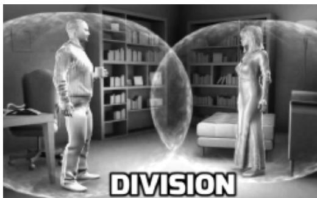

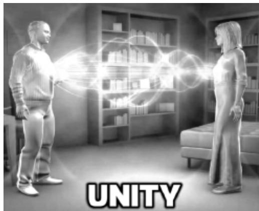  
Figure 24: Head consciousness without the heart sees division and everything apart from everything else.   
Figure 25: Heart consciousness sees everything as One.

# ‘Vaccines’ and the soul

The foundation of Wetiko/Archon control of humans is the separation of incarnate five-sense mind from the infinite ‘I’ and closing the heart chakra where the True ‘I’ lives during a human life. The goal has been to achieve complete separation in both cases. I was interested therefore to read an account by a French energetic healer of what she said she experienced with a patient who had been given the ‘Covid’ vaccine. Genuine energy healers can sense information and consciousness fields at different levels of being which are referred to as ‘subtle bodies’. She described treating the patient who later returned aer having, without the healer’s knowledge, two doses of the ‘Covid vaccine’. The healer said:

I noticed immediately the change, very heavy energy emanating from [the] subtle bodies. The scariest thing was when I was working on the heart chakra, I connected with her soul: it was detached from the physical body, it had no contact and it was, as if it was floating in a state of total confusion: a damage to the consciousness that loses contact with the physical body, i.e. with our biological machine, there is no longer any communication between them.

I continued the treatment by sending light to the heart chakra, the soul of the person, but it seemed that the soul could no longer receive any light, frequency or energy. It was a very powerful experience for me. Then I understood that this substance is indeed used to detach consciousness so that this consciousness can no longer interact through this body that it possesses in life, where there is no longer any contact, no frequency, no light, no more energetic balance or mind.

This would create a human that is rudderless and at the extreme almost zombie-like operating with a fractional state of consciousness at the mercy of Wetiko. I was especially intrigued by what the healer said in the light of the prediction by the highly-informed Rudolf Steiner more than a hundred years ago. He said:

In the future, we will eliminate the soul with medicine. Under the pretext of a ‘healthy point of view’, there will be a vaccine by which the human body will be treated as soon as possible directly at birth, so that the human being cannot develop the thought of the existence of soul and Spirit. To materialistic doctors will be entrusted the task of removing the soul of humanity.

As today, people are vaccinated against this disease or that disease, so in the future, children will be vaccinated with a substance that can be produced precisely in such a way that people, thanks to this vaccination, will be immune to being subjected to the ‘madness’ of spiritual life. He would be extremely smart, but he would not develop a conscience, and that is the true goal of some materialistic circles.

Steiner said the vaccine would detach the physical body from the etheric body (subtle bodies) and ‘once the etheric body is detached the relationship between the universe and the etheric body would become extremely unstable, and man would become an automaton’. He said ‘the physical body of man must be polished on this Earth by spiritual will – so the vaccine becomes a kind of arymanique (Wetiko) force’ and ‘man can no longer get rid of a given materialistic feeling’. Humans would then, he said, become ‘materialistic of constitution and can no longer rise to the spiritual’. I have been writing for years about DNA being a receiver-transmier of information that connects us to other levels of reality and these ‘vaccines’ changing DNA can be likened to changing an antenna and what it can transmit and receive. Such a disconnection would clearly lead to changes in personality and perception. Steiner further predicted the arrival of AI. Big Pharma ‘Covid vaccine’ makers, expressions of Wetiko, are testing their DNA-manipulating evil on children as I write with a view to giving the ‘vaccine’ to babies. If it’s a soul-body disconnector – and I say that it is or can be – every child would be disconnected from ‘soul’ at birth and the ‘vaccine’ would create a closed system in which spiritual guidance from the greater self would play no part. This has been the ambition of Wetiko all

along. A Pentagon video from 2005 was leaked of a presentation explaining the development of vaccines to change behaviour by their effect on the brain. Those that believe this is not happening with the ‘Covid’ genetically-modifying procedure masquerading as a ‘vaccine’ should make an urgent appointment with Naivety Anonymous. Klaus Schwab wrote in 2018:

Neurotechnologies enable us to better influence consciousness and thought and to understand many activities of the brain. They include decoding what we are thinking in fine levels of detail through new chemicals and interventions that can influence our brains to correct for errors or enhance functionality.

The plan is clear and only the heart can stop it. With every heart that opens, every mind that awakens, Wetiko is weakened. Heart and love are far more powerful than head and hate and so nothing like a majority is needed to turn this around.

# Beyond the Phantom

Our heart is the prime target of Wetiko and so it must be the answer to Wetiko. We are our heart which is part of one heart, the infinite heart. Our heart is where the true self lives in a human life behind firewalls of five-sense illusion when an imposter takes its place – Phantom Self; but our heart waits patiently to be set free any time we choose to see beyond the Phantom, beyond Wetiko. A Wetikoed Phantom Self can wreak mass death and destruction while the love of forever is locked away in its heart. The time is here to unleash its power and let it sweep away the fear and despair that is Wetiko. Heart consciousness does not seek manipulated, censored, advantage for its belief or religion, its activism and desires. As an expression of the One it treats all as One with the same rights to freedom and opinion. Our heart demands fairness for itself no more than for others. From this unity of heart we can come together in mutual support and transform this Wetikoed world into what reality is meant to be – a place of love, joy, happiness, fairness, justice and freedom. Wetiko has another agenda and that’s why the world is as

it is, but enough of this nonsense. Wetiko can’t stay where hearts are open and it works so hard to keep them closed. Fear is its currency and its food source and love in its true sense has no fear. Why would love have fear when it knows it is All That Is, Has Been, And Ever Can Be on an eternal exploration of all possibility? Love in this true sense is not the physical araction that passes for love. This can be an expression of it, yes, but Infinite Love, a love without condition, goes far deeper to the core of all being. It is the core of all being. Infinite realty was born from love beyond the illusions of the simulation. Love infinitely expressed is the knowing that all is One and the swily-passing experience of separation is a temporary hallucination. You cannot disconnect from Oneness; you can only perceive that you have and withdraw from its influence. This is the most important of all perception trickery by the mind parasite that is Wetiko and the foundation of all its potential for manipulation.

If we open our hearts, open the sluice gates of the mind, and redefine self-identity amazing things start to happen. Consciousness expands or contracts in accordance with self-identity. When true self is recognised as infinite awareness and label self – Phantom Self – is seen as only a series of brief experiences life is transformed. Consciousness expands to the extent that self-identity expands and everything changes. You see unity, not division, the picture, not the pixels. From this we can play the long game. No more is an experience something in and of itself, but a fleeting moment in the eternity of forever. Suddenly people in uniform and dark suits are no longer intimidating. Doing what your heart knows to be right is no longer intimidating and consequences for those actions take on the same nature of a brief experience that passes in the blink of an infinite eye. Intimidation is all in the mind. Beyond the mind there is no intimidation.

An open heart does not consider consequences for what it knows to be right. To do so would be to consider not doing what it knows to be right and for a heart in its power that is never an option. The Renegade Mind is really the Renegade Heart. Consideration of consequences will always provide a getaway car for the mind and

the heart doesn’t want one. What is right in the light of what we face today is to stop cooperating with Wetiko in all its forms and to do it without fear or compromise. You cannot compromise with tyranny when tyranny always demands more until it has everything. Life is your perception and you are your destiny. Change your perception and you change your life. Change collective perception and we change the world.

Come on people … One human family, One heart, One goal … FREEEEEEDOM!

We must sele for nothing less.

# Postscript

Th e big scare story as the book goes to press is the ‘Indian’ variant and the world is being deluged with propaganda about the ‘Covid catastrophe’ in India which mirrors in its lies and misrepresentations what happened in Italy before the first lockdown in 2020.

The New York Post published a picture of someone who had ‘collapsed in the street from Covid’ in India in April, 2021, which was actually taken during a gas leak in May, 2020. Same old, same old. Media articles in mid-February were asking why India had been so untouched by ‘Covid’ and then as their vaccine rollout gathered pace the alleged ‘cases’ began to rapidly increase. Indian ‘Covid vaccine’ maker Bharat Biotech was funded into existence by the Bill and Melinda Gates Foundation (the pair announced their divorce in May, 2021, which is a pity because they so deserve each other). The Indian ‘Covid crisis’ was ramped up by the media to terrify the world and prepare people for submission to still more restrictions. The scam that worked the first time was being repeated only with far more people seeing through the deceit. Davidicke.com and Ickonic.com have sought to tell the true story of what is happening by talking to people living through the Indian nightmare which has nothing to do with ‘Covid’. We posted a leer from ‘Alisha’ in Pune who told a very different story to government and media mendacity. She said scenes of dying people and overwhelmed hospitals were designed to hide what was really happening – genocide and starvation. Alisha said that millions had already died of starvation during the ongoing lockdowns while government and media were lying and making it look like the ‘virus’:

Restaurants, shops, gyms, theatres, basically everything is shut. The cities are ghost towns. Even so-called ‘essential’ businesses are only open till 11am in the morning. You basically have just an hour to buy food and then your time is up.

Inter-state travel and even inter-district travel is banned. The cops wait at all major crossroads to question why you are traveling outdoors or to fine you if you are not wearing a mask.

The medical community here is also complicit in genocide, lying about hospitals being full and turning away people with genuine illnesses, who need immediate care. They have even created a shortage of oxygen cylinders.

This is the classic Cult modus operandi played out in every country. Alisha said that people who would not have a PCR test not testing for the ‘virus’ were being denied hospital treatment. She said the people hit hardest were migrant workers and those in rural areas. Most businesses employed migrant workers and with everything closed there were no jobs, no income and no food. As a result millions were dying of starvation or malnutrition. All this was happening under Prime Minister Narendra Modi, a 100-percent asset of the Cult, and it emphasises yet again the scale of pure antihuman evil we are dealing with. Australia banned its people from returning home from India with penalties for trying to do so of up to five years in jail and a fine of £37,000. The manufactured ‘Covid’ crisis in India was being prepared to justify further fascism in the West. Obvious connections could be seen between the Indian ‘vaccine’ programme and increased ‘cases’ and this became a common theme. The Seychelles, the most per capita ‘Covid vaccinated’ population in the world, went back into lockdown aer a ‘surge of cases’.

Long ago the truly evil Monsanto agricultural biotechnology corporation with its big connections to Bill Gates devastated Indian farming with genetically-modified crops. Human rights activist Gurcharan Singh highlighted the efforts by the Indian government to complete the job by destroying the food supply to hundreds of millions with ‘Covid’ lockdowns. He said that 415 million people at the boom of the disgusting caste system (still going whatever they say) were below the poverty line and struggled to feed themselves every year. Now the government was imposing lockdown at just the

time to destroy the harvest. This deliberate policy was leading to mass starvation. People may reel back at the suggestion that a government would do that, but Wetiko-controlled ‘leaders’ are capable of any level of evil. In fact what is described in India is in the process of being instigated worldwide. The food chain and food supply are being targeted at every level to cause world hunger and thus control. Bill Gates is not the biggest owner of farmland in America for no reason and destroying access to food aids both the depopulation agenda and the plan for synthetic ‘food’ already being funded into existence by Gates. Add to this the coming hyperinflation from the suicidal creation of fake ‘money’ in response to ‘Covid’ and the breakdown of container shipping systems and you have a cocktail that can only lead one way and is meant to. The Cult plan is to crash the entire system to ‘build back beer’ with the Great Reset.

# ‘Vaccine’ transmission

Reports from all over the world continue to emerge of women suffering menstrual and fertility problems aer having the fake ‘vaccine’ and of the non-’vaccinated’ having similar problems when interacting with the ‘vaccinated’. There are far too many for ‘coincidence’ to be credible. We’ve had menopausal women geing periods, others having periods stop or not stopping for weeks, passing clots, sometimes the lining of the uterus, breast irregularities, and miscarriages (which increased by 400 percent in parts of the United States). Non-‘vaccinated’ men and children have suffered blood clots and nose bleeding aer interaction with the ‘vaccinated’. Babies have died from the effects of breast milk from a ‘vaccinated’ mother. Awake doctors – the small minority – speculated on the cause of non-’vaccinated’ suffering the same effects as the ‘vaccinated’. Was it nanotechnology in the synthetic substance transmiing frequencies or was it a straight chemical bioweapon that was being transmied between people? I am not saying that some kind of chemical transmission is not one possible answer, but the foundation of all that the Cult does is frequency and

this is fertile ground for understanding how transmission can happen. American doctor Carrie Madej, an internal medicine physician and osteopath, has been practicing for the last 20 years, teaching medical students, and she says aending different meetings where the agenda for humanity was discussed. Madej, who operates out of Georgia, did not dismiss other possible forms of transmission, but she focused on frequency in search of an explanation for transmission. She said the Moderna and Pfizer ‘vaccines’ contained nano-lipid particles as a key component. This was a brand new technology never before used on humanity. ‘They’re using a nanotechnology which is prey much lile tiny computer bits … nanobots or hydrogel.’ Inside the ‘vaccines’ was ‘this sci-fi kind of substance’ which suppressed immune checkpoints to get into the cell. I referred to this earlier as the ‘Trojan horse’ technique that tricks the cell into opening a gateway for the self-replicating synthetic material and while the immune system is artificially suppressed the body has no defences. Madej said the substance served many purposes including an on-demand ability to ‘deliver the payload’ and using the nano ‘computer bits’ as biosensors in the body. ‘It actually has the ability to accumulate data from your body, like your breathing, your respiration, thoughts, emotions, all kinds of things.’

She said the technology obviously has the ability to operate through Wi-Fi and transmit and receive energy, messages, frequencies or impulses. ‘Just imagine you’re geing this new substance in you and it can react to things all around you, the 5G, your smart device, your phones.’ We had something completely foreign in the human body that had never been launched large scale at a time when we were seeing 5G going into schools and hospitals (plus the Musk satellites) and she believed the ‘vaccine’ transmission had something to do with this: ‘… if these people have this inside of them … it can act like an antenna and actually transmit it outwardly as well.’ The synthetic substance produced its own voltage and so it could have that kind of effect. This fits with my own contention that the nano receiver-transmiers are designed to connect people to the

Smart Grid and break the receiver-transmier connection to expanded consciousness. That would explain the French energy healer’s experience of the disconnection of body from ‘soul’ with those who have had the ‘vaccine’. The nanobots, self-replicating inside the body, would also transmit the synthetic frequency which could be picked up through close interaction by those who have not been ‘vaccinated’. Madej speculated that perhaps it was 5G and increased levels of other radiation that was causing the symptoms directly although interestingly she said that non-‘vaccinated’ patients had shown improvement when they were away from the ‘vaccinated’ person they had interacted with. It must be remembered that you can control frequency and energy with your mind and you can consciously create energetic barriers or bubbles with the mind to stop damaging frequencies from penetrating your field. American paediatrician Dr Larry Palevsky said the ‘vaccine’ was not a ‘vaccine’ and was never designed to protect from a ‘viral’ infection. He called it ‘a massive, brilliant propaganda of genocide’ because they didn’t have to inject everyone to get the result they wanted. He said the content of the jabs was able to infuse any material into the brain, heart, lungs, kidneys, liver, sperm and female productive system. ‘This is genocide; this is a weapon of mass destruction.’ At the same time American colleges were banning students from aending if they didn’t have this life-changing and potentially life-ending ‘vaccine’. Class action lawsuits must follow when the consequences of this college fascism come to light. As the book was going to press came reports about fertility effects on sperm in ‘vaccinated’ men which would absolutely fit with what I have been saying and hospitals continued to fill with ‘vaccine’ reactions. Another question is what about transmission via blood transfusions? The NHS has extended blood donation restrictions from seven days aer a ‘Covid vaccination’ to 28 days aer even a sore arm reaction.

I said in the spring of 2020 that the then touted ‘Covid vaccine’ would be ongoing each year like the flu jab. A year later Pfizer CEO, the appalling Albert Bourla, said people would ‘likely’ need a ‘booster dose’ of the ‘vaccine’ within 12 months of geing ‘fully

vaccinated’ and then a yearly shot. ‘Variants will play a key role’, he said confirming the point. Johnson & Johnson CEO Alex Gorsky also took time out from his ‘vaccine’ disaster to say that people may need to be vaccinated against ‘Covid-19’ each year. UK Health Secretary, the psychopath Ma Hancock, said additional ‘boosters’ would be available in the autumn of 2021. This is the trap of the ‘vaccine passport’. The public will have to accept every last ‘vaccine’ they introduce, including for the fake ‘variants’, or it would cease to be valid. The only other way in some cases would be continuous testing with a test not testing for the ‘virus’ and what is on the swabs constantly pushed up your noise towards the brain every time?

# ‘Vaccines’ changing behaviour

I mentioned in the body of the book how I believed we would see gathering behaviour changes in the ‘vaccinated’ and I am already hearing such comments from the non-‘vaccinated’ describing behaviour changes in friends, loved ones and work colleagues. This will only increase as the self-replicating synthetic material and nanoparticles expand in body and brain. An article in the Guardian in 2016 detailed research at the University of Virginia in Charloesville which developed a new method for controlling brain circuits associated with complex animal behaviour. The method, dubbed ‘magnetogenetics’, involves genetically-engineering a protein called ferritin, which stores and releases iron, to create a magnetised substance – ‘Magneto’ – that can activate specific groups of nerve cells from a distance. This is claimed to be an advance on other methods of brain activity manipulation known as optogenetics and chemogenetics (the Cult has been developing methods of brain control for a long time). The ferritin technique is said to be noninvasive and able to activate neurons ‘rapidly and reversibly’. In other words, human thought and perception. The article said that earlier studies revealed how nerve cell proteins ‘activated by heat and mechanical pressure can be genetically engineered so that they become sensitive to radio waves and magnetic fields, by aaching them to an iron-storing protein called ferritin, or to inorganic

paramagnetic particles’. Sensitive to radio waves and magnetic fields? You mean like 5G, 6G and 7G? This is the human-AI Smart Grid hive mind we are talking about. The Guardian article said:

… the researchers injected Magneto into the striatum of freely behaving mice, a deep brain structure containing dopamine-producing neurons that are involved in reward and motivation, and then placed the animals into an apparatus split into magnetised and non-magnetised sections.

Mice expressing Magneto spent far more time in the magnetised areas than mice that did not, because activation of the protein caused the striatal neurons expressing it to release dopamine, so that the mice found being in those areas rewarding. This shows that Magneto can remotely control the firing of neurons deep within the brain, and also control complex behaviours.

Make no mistake this basic methodology will be part of the ‘Covid vaccine’ cocktail and using magnetics to change brain function through electromagnetic field frequency activation. The Pentagon is developing a ‘Covid vaccine’ using ferritin. Magnetics would explain changes in behaviour and why videos are appearing across the Internet as I write showing how magnets stick to the skin at the point of the ‘vaccine’ shot. Once people take these ‘vaccines’ anything becomes possible in terms of brain function and illness which will be blamed on ‘Covid- ${ } ^ { 1 9 ^ { \prime } }$ and ‘variants’. Magnetic field manipulation would further explain why the non-‘vaccinated’ are reporting the same symptoms as the ‘vaccinated’ they interact with and why those symptoms are reported to decrease when not in their company. Interestingly ‘Magneto’, a ‘mutant’, is a character in the Marvel Comic X-Men stories with the ability to manipulate magnetic fields and he believes that mutants should fight back against their human oppressors by any means necessary. The character was born Erik Lehnsherr to a Jewish family in Germany.

# Cult-controlled courts

The European Court of Human Rights opened the door for mandatory ‘Covid-19 vaccines’ across the continent when it ruled in a Czech Republic dispute over childhood immunisation that legally

enforced vaccination could be ‘necessary in a democratic society’. The 17 judges decided that compulsory vaccinations did not breach human rights law. On the face of it the judgement was so inverted you gasp for air. If not having a vaccine infused into your body is not a human right then what is? Ah, but they said human rights law which has been specifically wrien to delete all human rights at the behest of the state (the Cult). Article 8 of the European Convention on Human Rights relates to the right to a private life. The crucial word here is ‘except’:

There shall be no interference by a public authority with the exercise of this right EXCEPT such as is in accordance with the law and is necessary in a democratic society in the interests of national security, public safety or the economic wellbeing of the country, for the prevention of disorder or crime, for the protection of health or morals, or for the protection of the rights and freedoms of others [My emphasis].

No interference except in accordance with the law means there are no ‘human rights’ except what EU governments decide you can have at their behest. ‘As is necessary in a democratic society’ explains that reference in the judgement and ‘in the interests of national security, public safety or the economic well-being of the country, for the prevention of disorder or crime, for the protection of health or morals, or for the protection of the rights and freedoms of others’ gives the EU a coach and horses to ride through ‘human rights’ and scaer them in all directions. The judiciary is not a check and balance on government extremism; it is a vehicle to enforce it. This judgement was almost laughably predictable when the last thing the Cult wanted was a decision that went against mandatory vaccination. Judges rule over and over again to benefit the system of which they are a part. Vaccination disputes that come before them are invariably delivered in favour of doctors and authorities representing the view of the state which owns the judiciary. $\mathrm { O h } ,$ yes, and we have even had calls to stop puing ‘Covid- ${ \bf \cdot } 1 9 ^ { \prime }$ on death certificates within 28 days of a ‘positive test’ because it is claimed the practice makes the ‘vaccine’ appear not to work. They are laughing at you.

The scale of madness, inhumanity and things to come was highlighted when those not ‘vaccinated’ for ‘Covid’ were refused evacuation from the Caribbean island of St Vincent during massive volcanic eruptions. Cruise ships taking residents to the safety of another island allowed only the ‘vaccinated’ to board and the rest were le to their fate. Even in life and death situations like this we see ‘Covid’ stripping people of their most basic human instincts and the insanity is even more extreme when you think that fake ‘vaccine’-makers are not even claiming their body-manipulating concoctions stop ‘infection’ and ‘transmission’ of a ‘virus’ that doesn’t exist. St Vincent Prime Minister Ralph Gonsalves said: ‘The chief medical officer will be identifying the persons already vaccinated so that we can get them on the ship.’ Note again the power of the chief medical officer who, like Whiy in the UK, will be answering to the World Health Organization. This is the Cult network structure that has overridden politicians who ‘follow the science’ which means doing what WHO-controlled ‘medical officers’ and ‘science advisers’ tell them. Gonsalves even said that residents who were ‘vaccinated’ aer the order so they could board the ships would still be refused entry due to possible side effects such as ‘wooziness in the head’. The good news is that if they were woozy enough in the head they could qualify to be prime minister of St Vincent.

# Microchipping freedom

The European judgement will be used at some point to justify moves to enforce the ‘Covid’ DNA-manipulating procedure. Sandra Ro, CEO of the Global Blockchain Business Council, told a World Economic Forum event that she hoped ‘vaccine passports’ would help to ‘drive forced consent and standardisation’ of global digital identity schemes: ‘I’m hoping with the desire and global demand for some sort of vaccine passport – so that people can get travelling and working again – [it] will drive forced consent, standardisation, and frankly, cooperation across the world.’ The lady is either not very bright, or thoroughly mendacious, to use the term ‘forced consent’.

You do not ‘consent’ if you are forced – you submit. She was describing what the plan has been all along and that’s to enforce a digital identity on every human without which they could not function. ‘Vaccine passports’ are opening the door and are far from the end goal. A digital identity would allow you to be tracked in everything you do in cyberspace and this is the same technique used by Cult-owned China to enforce its social credit system of total control. The ultimate ‘passport’ is planned to be a microchip as my books have warned for nearly 30 years. Those nice people at the Pentagon working for the Cult-controlled Defense Advanced Research Projects Agency (DARPA) claimed in April, 2021, they have developed a microchip inserted under the skin to detect ‘asymptomatic Covid-19 infection’ before it becomes an outbreak and a ‘revolutionary filter’ that can remove the ‘virus’ from the blood when aached to a dialysis machine. The only problems with this are that the ‘virus’ does not exist and people transmiing the ‘virus’ with no symptoms is brain-numbing bullshit. This is, of course, not a ruse to get people to be microchipped for very different reasons. DARPA also said it was producing a one-stop ‘vaccine’ for the ‘virus’ and all ‘variants’. One of the most sinister organisations on Planet Earth is doing this? Beer have it then. These people are insane because Wetiko that possesses them is insane.

Researchers from the Salk Institute in California announced they have created an embryo that is part human and part monkey. My books going back to the 1990s have exposed experiments in top secret underground facilities in the United States where humans are being crossed with animal and non-human ‘extraterrestrial’ species. They are now easing that long-developed capability into the public arena and there is much more to come given we are dealing with psychiatric basket cases. Talking of which – Elon Musk’s scientists at Neuralink trained a monkey to play Pong and other puzzles on a computer screen using a joystick and when the monkey made the correct move a metal tube squirted banana smoothie into his mouth which is the basic technique for training humans into unquestioning compliance. Two Neuralink chips were in the monkey’s skull and

more than 2,000 wires ‘fanned out’ into its brain. Eventually the monkey played a video game purely with its brain waves. Psychopathic narcissist Musk said the ‘breakthrough’ was a step towards puing Neuralink chips into human skulls and merging minds with artificial intelligence. Exactly. This man is so dark and Cult to his DNA.

# World Economic Fascism (WEF)

The World Economic Forum is telling you the plan by the statements made at its many and various events. Cult-owned fascist YouTube CEO Susan Wojcicki spoke at the 2021 WEF Global Technology Governance Summit (see the name) in which 40 governments and 150 companies met to ensure ‘the responsible design and deployment of emerging technologies’. Orwellian translation: ‘Ensuring the design and deployment of long-planned technologies will advance the Cult agenda for control and censorship.’ Freedomdestroyer and Nuremberg-bound Wojcicki expressed support for tech platforms like hers to censor content that is ‘technically legal but could be harmful’. Who decides what is ‘harmful’? She does and they do. ‘Harmful’ will be whatever the Cult doesn’t want people to see and we have legislation proposed by the UK government that would censor content on the basis of ‘harm’ no maer if the information is fair, legal and provably true. Make that especially if it is fair, legal and provably true. Wojcicki called for a global coalition to be formed to enforce content moderation standards through automated censorship. This is a woman and mega-censor so selfdeluded that she shamelessly accepted a ‘free expression’ award – Wojcicki – in an event sponsored by her own YouTube. They have no shame and no self-awareness.

You know that ‘Covid’ is a scam and Wojcicki a Cult operative when YouTube is censoring medical and scientific opinion purely on the grounds of whether it supports or opposes the Cult ‘Covid’ narrative. Florida governor Ron DeSantis compiled an expert panel with four professors of medicine from Harvard, Oxford, and Stanford Universities who spoke against forcing children and

vaccinated people to wear masks. They also said there was no proof that lockdowns reduced spread or death rates of ‘Covid-19’. Cultgofer Wojcicki and her YouTube deleted the panel video ‘because it included content that contradicts the consensus of local and global health authorities regarding the efficacy of masks to prevent the spread of Covid-19’. This ‘consensus’ refers to what the Cult tells the World Health Organization to say and the WHO tells ‘local health authorities’ to do. Wojcicki knows this, of course. The panellists pointed out that censorship of scientific debate was responsible for deaths from many causes, but Wojcicki couldn’t care less. She would not dare go against what she is told and as a disgrace to humanity she wouldn’t want to anyway. The UK government is seeking to pass a fascist ‘Online Safety Bill’ to specifically target with massive fines and other means non-censored video and social media platforms to make them censor ‘lawful but harmful’ content like the Cult-owned Facebook, Twier, Google and YouTube. What is ‘lawful but harmful’ would be decided by the fascist Blair-created Ofcom.

Another WEF obsession is a cyber-aack on the financial system and this is clearly what the Cult has planned to take down the bank accounts of everyone – except theirs. Those that think they have enough money for the Cult agenda not to maer to them have got a big lesson coming if they continue to ignore what is staring them in the face. The World Economic Forum, funded by Gates and fronted by Klaus Schwab, announced it would be running a ‘simulation’ with the Russian government and global banks of just such an aack called Cyber Polygon 2021. What they simulate – as with the ‘Covid’ Event 201 – they plan to instigate. The WEF is involved in a project with the Cult-owned Carnegie Endowment for International Peace called the WEF-Carnegie Cyber Policy Initiative which seeks to merge Wall Street banks, ‘regulators’ (I love it) and intelligence agencies to ‘prevent’ (arrange and allow) a cyber-aack that would bring down the global financial system as long planned by those that control the WEF and the Carnegie operation. The Carnegie Endowment for International Peace sent an instruction to First World

War US President Woodrow Wilson not to let the war end before society had been irreversibly transformed.

# The Wuhan lab diversion

As I close, the Cult-controlled authorities and lapdog media are systematically pushing ‘the virus was released from the Wuhan lab’ narrative. There are two versions – it happened by accident and it happened on purpose. Both are nonsense. The perceived existence of the never-shown-to-exist ‘virus’ is vital to sell the impression that there is actually an infective agent to deal with and to allow the endless potential for terrifying the population with ‘variants’ of a ‘virus’ that does not exist. The authorities at the time of writing are going with the ‘by accident’ while the alternative media is promoting the ‘on purpose’. Cable news host Tucker Carlson who has questioned aspects of lockdown and ‘vaccine’ compulsion has bought the Wuhan lab story. ‘Everyone now agrees’ he said. Well, I don’t and many others don’t and the question is why does the system and its media suddenly ‘agree’? When the media moves as one unit with a narrative it is always a lie – witness the hour by hour mendacity of the ‘Covid’ era. Why would this Cult-owned combination which has unleashed lies like machine gun fire suddenly ‘agree’ to tell the truth??

Much of the alternative media is buying the lie because it fits the conspiracy narrative, but it’s the wrong conspiracy. The real conspiracy is that there is no virus and that is what the Cult is desperate to hide. The idea that the ‘virus’ was released by accident is ludicrous when the whole ‘Covid’ hoax was clearly long-planned and waiting to be played out as it was so fast in accordance with the Rockefeller document and Event 201. So they prepared everything in detail over decades and then sat around strumming their fingers waiting for an ‘accidental’ release from a bio-lab? What?? It’s crazy. Then there’s the ‘on purpose’ claim. You want to circulate a ‘deadly virus’ and hide the fact that you’ve done so and you release it down the street from the highest-level bio-lab in China? I repeat – What??

You would release it far from that lab to stop any association being made. But, no, we’ll do it in a place where the connection was certain to be made. Why would you need to scam ‘cases’ and ‘deaths’ and pay hospitals to diagnose ‘Covid- ${ } ^ { 1 9 ^ { \prime } }$ if you had a real ‘virus’? What are sections of the alternative media doing believing this crap? Where were all the mass deaths in Wuhan from a ‘deadly pathogen’ when the recovery to normal life aer the initial propaganda was dramatic in speed? Why isn’t the ‘deadly pathogen’ now circulating all over China with bodies in the street? Once again we have the technique of tell them what they want to hear and they will likely believe it. The alternative media has its ‘conspiracy’ and with Carlson it fits with his ‘China is the danger’ narrative over years. China is a danger as a global Cult operations centre, but not for this reason. The Wuhan lab story also has the potential to instigate conflict with China when at some stage the plan is to trigger a Problem-Reaction-Solution confrontation with the West. Question everything – everything – and especially when the media agrees on a common party line.

# Third wave … fourth wave … fifth wave …

As the book went into production the world was being set up for more lockdowns and a ‘third wave’ supported by invented ‘variants’ that were increasing all the time and will continue to do so in public statements and computer programs, but not in reality. India became the new Italy in the ‘Covid’ propaganda campaign and we were told to be frightened of the new ‘Indian strain’. Somehow I couldn’t find it within myself to do so. A document produced for the UK government entitled ‘Summary of further modelling of easing of restrictions – Roadmap Step $2 ^ { \prime }$ declared that a third wave was inevitable (of course when it’s in the script) and it would be the fault of children and those who refuse the health-destroying fake ‘Covid vaccine’. One of the computer models involved came from the Cultowned Imperial College and the other from Warwick University which I wouldn’t trust to tell me the date in a calendar factory. The document states that both models presumed extremely high uptake

of the ‘Covid vaccines’ and didn’t allow for ‘variants’. The document states: ‘The resurgence is a result of some people (mostly children) being ineligible for vaccination; others choosing not to receive the vaccine; and others being vaccinated but not perfectly protected.’ The mendacity takes the breath away. Okay, blame those with a brain who won’t take the DNA-modifying shots and put more pressure on children to have it as ‘trials’ were underway involving children as young as six months with parents who give insanity a bad name. Massive pressure is being put on the young to have the fake ‘vaccine’ and child age consent limits have been systematically lowered around the world to stop parents intervening. Most extraordinary about the document was its claim that the ‘third wave’ would be driven by ‘the resurgence in both hospitalisations and deaths … dominated by those that have received two doses of the vaccine, comprising around $6 0 – 7 0 \%$ of the wave respectively’. The predicted peak of the ‘third wave’ suggested 300 deaths per day with 250 of them fully ‘vaccinated’ people. How many more lies do acquiescers need to be told before they see the obvious? Those who took the jab to ‘protect themselves’ are projected to be those who mostly get sick and die? So what’s in the ‘vaccine’? The document went on:

It is possible that a summer of low prevalence could be followed by substantial increases in incidence over the following autumn and winter. Low prevalence in late summer should not be taken as an indication that SARS-CoV-2 has retreated or that the population has high enough levels of immunity to prevent another wave.

They are telling you the script and while many British people believed ‘Covid’ restrictions would end in the summer of 2021 the government was preparing for them to be ongoing. Authorities were awarding contracts for ‘Covid marshals’ to police the restrictions with contracts starting in July, 2021, and going through to January 31st, 2022, and the government was advertising for ‘Media Buying Services’ to secure media propaganda slots worth a potential £320 million for ‘Covid-19 campaigns’ with a contract not ending until March, 2022. The recipient – via a list of other front companies – was reported to be American media marketing giant Omnicom Group

Inc. While money is no object for ‘Covid’ the UK waiting list for all other treatment – including life-threatening conditions – passed 4.5 million. Meantime the Cult is seeking to control all official ‘inquiries’ to block revelations about what has really been happening and why. It must not be allowed to – we need Nuremberg jury trials in every country. The cover-up doesn’t get more obvious than appointing ultra-Zionist professor Philip Zelikow to oversee two dozen US virologists, public health officials, clinicians, former government officials and four American ‘charitable foundations’ to ‘learn the lessons’ of the ‘Covid’ debacle. The personnel will be those that created and perpetuated the ‘Covid’ lies while Zelikow is the former executive director of the 9/11 Commission who ensured that the truth about those aacks never came out and produced a report that must be among the most mendacious and manipulative documents ever wrien – see The Trigger for the detailed exposure of the almost unimaginable 9/11 story in which Sabbatians can be found at every level.

# Passive no more

People are increasingly challenging the authorities with amazing numbers of people taking to the streets in London well beyond the ability of the Face-Nappies to stop them. Instead the Nappies choose situations away from the mass crowds to target, intimidate, and seek to promote the impression of ‘violent protestors’. One such incident happened in London’s Hyde Park. Hundreds of thousands walking through the streets in protest against ‘Covid’ fascism were ignored by the Cult-owned BBC and most of the rest of the mainstream media, but they delighted in reporting how police were injured in ‘clashes with protestors’. The truth was that a group of people gathered in Hyde Park at the end of one march when most had gone home and they were peacefully having a good time with music and chat. Face-Nappies who couldn’t deal with the full-march crowd then waded in with their batons and got more than they bargained for. Instead of just standing for this criminal brutality the crowd used their numerical superiority to push the Face-Nappies out of the

park. Eventually the Nappies turned and ran. Unfortunately two or three idiots in the crowd threw drink cans striking two officers which gave the media and the government the image they wanted to discredit the 99.9999 percent who were peaceful. The idiots walked straight into the trap and we must always be aware of potential agent provocateurs used by the authorities to discredit their targets.

This response from the crowd – the can people apart – must be a turning point when the public no longer stand by while the innocent are arrested and brutally aacked by the Face-Nappies. That doesn’t mean to be violent, that’s the last thing we need. We’ll leave the violence to the Face-Nappies and government. But it does mean that when the Face-Nappies use violence against peaceful people the numerical superiority is employed to stop them and make citizen’s arrests or Common Law arrests for a breach of the peace. The time for being passive in the face of fascism is over.

We are the many, they are the few, and we need to make that count before there is no freedom le and our children and grandchildren face an ongoing fascist nightmare.

COME ON PEOPLE – IT’S TIME.

# One final thought …

The power of love A force from above Cleaning my soul Flame on burn desire Love with tongues of fire Purge the soul Make love your goal

I’ll protect you from the hooded claw Keep the vampires from your door When the chips are down I’ll be around With my undying, death-defying Love for you

Envy will hurt itself Let yourself be beautiful Sparkling love, flowers And pearls and prey girls Love is like an energy Rushin’ rushin’ inside of me

This time we go sublime Lovers entwine, divine, divine, Love is danger, love is pleasure Love is pure – the only treasure

I’m so in love with you Purge the soul Make love your goal

The power of love A force from above Cleaning my soul The power of love A force from above A sky-scraping dove

Flame on burn desire Love with tongues of fire Purge the soul Make love your goal

Frankie Goes To Hollywood

# Appendix

# Cowan-Kaufman-Morell Statement on Virus Isolation (SOVI)

Isolation: The action of isolating; the fact or condition of being isolated or standing alone; separation from other things or persons; solitariness

Oxford English Dictionary

The controversy over whether the SARS-CoV-2 virus has ever been isolated or purified continues. However, using the above definition, common sense, the laws of logic and the dictates of science, any unbiased person must come to the conclusion that the SARS-CoV-2 virus has never been isolated or purified. As a result, no confirmation of the virus’ existence can be found. The logical, common sense, and scientific consequences of this fact are:

•  the structure and composition of something not shown to exist can’t be known, including the presence, structure, and function of any hypothetical spike or other proteins;   
•  the genetic sequence of something that has never been found can’t be known;   
•  “variants” of something that hasn’t been shown to exist can’t be known;   
•  it’s impossible to demonstrate that SARS-CoV-2 causes a disease called Covid-19.

In as concise terms as possible, here’s the proper way to isolate, characterize and demonstrate a new virus. First, one takes samples (blood, sputum, secretions) from many people (e.g. 500) with symptoms which are unique and specific enough to characterize an illness. Without mixing these samples with ANY tissue or products that also contain genetic material, the virologist macerates, filters and ultracentrifuges i.e. purifies the specimen. This common virology technique, done for decades to isolate bacteriophages1  and so-called giant viruses in every virology lab, then allows the virologist to demonstrate with electron microscopy thousands of identically sized and shaped particles. These particles are the isolated and purified virus.

These identical particles are then checked for uniformity by physical and/or microscopic techniques. Once the purity is determined, the particles may be further characterized. This would include examining the structure, morphology, and chemical composition of the particles. Next, their genetic makeup is characterized by extracting the genetic material directly from the purified particles and using genetic-sequencing techniques, such as Sanger sequencing, that have also been around for decades. Then one does an analysis to confirm that these uniform particles are exogenous (outside) in origin as a virus is conceptualized to be, and not the normal breakdown products of dead and dying tissues.2  (As of May 2020, we know that virologists have no way to determine whether the particles they’re seeing are viruses or just normal breakdown products of dead and dying tissues.)3

If we have come this far then we have fully isolated, characterized, and genetically sequenced an exogenous virus particle. However, we still have to show it is causally related to a disease. This is carried out by exposing a group of healthy subjects (animals are usually used) to this isolated, purified virus in the manner in which the disease is thought to be transmied. If the animals get sick with the same disease, as confirmed by clinical and autopsy findings, one has now shown that the virus actually causes a disease. This demonstrates infectivity and transmission of an infectious agent.

None of these steps has even been aempted with the SARS-CoV-2 virus, nor have all these steps been successfully performed for any so-called pathogenic virus. Our research indicates that a single study showing these steps does not exist in the medical literature.

Instead, since 1954, virologists have taken unpurified samples from a relatively few people, oen less than ten, with a similar disease. They then minimally process this sample and inoculate this unpurified sample onto tissue culture containing usually four to six other types of material – all of which contain identical genetic material as to what is called a “virus.” The tissue culture is starved and poisoned and naturally disintegrates into many types of particles, some of which contain genetic material. Against all common sense, logic, use of the English language and scientific integrity, this process is called “virus isolation.” This brew containing fragments of genetic material from many sources is then subjected to genetic analysis, which then creates in a computersimulation process the alleged sequence of the alleged virus, a so called in silico genome. At no time is an actual virus confirmed by electron microscopy. At no time is a genome extracted and sequenced from an actual virus. This is scientific fraud.

The observation that the unpurified specimen — inoculated onto tissue culture along with toxic antibiotics, bovine fetal tissue, amniotic fluid and other tissues — destroys the kidney tissue onto which it is inoculated is given as evidence of the virus’ existence and pathogenicity. This is scientific fraud.

From now on, when anyone gives you a paper that suggests the SARS-CoV-2 virus has been isolated, please check the methods sections. If the researchers used Vero cells or any other culture method, you know that their process was not isolation. You will hear the following excuses for why actual isolation isn’t done:

1. There were not enough virus particles found in samples from patients to analyze.   
2. Viruses are intracellular parasites; they can’t be found outside the cell in this manner.

If No. 1 is correct, and we can’t find the virus in the sputum of sick people, then on what evidence do we think the virus is dangerous or even lethal? If No. 2 is correct, then how is the virus spread from person to person? We are told it emerges from the cell to infect others. Then why isn’t it possible to find it?

Finally, questioning these virology techniques and conclusions is not some distraction or divisive issue. Shining the light on this truth is essential to stop this terrible fraud that humanity is confronting. For, as we now know, if the virus has never been isolated, sequenced or shown to cause illness, if the virus is imaginary, then why are we wearing masks, social distancing and puing the whole world into prison?

Finally, if pathogenic viruses don’t exist, then what is going into those injectable devices erroneously called “vaccines,” and what is their purpose? This scientific question is the most urgent and relevant one of our time.

We are correct. The SARS-CoV2 virus does not exist.

Sally Fallon Morell, MA

Dr. Thomas Cowan, MD

Dr. Andrew Kaufman, MD

# Bibliography

Alinsky, Saul: Rules for Radicals (Vintage, 1989)   
Antelman, Rabbi Marvin: To Eliminate the Opiate (Zahavia, 1974)   
Bastardi, Joe: The Climate Chronicles (Relentless Thunder Press, 2018)   
Cowan, Tom: Human Heart, Cosmic Heart (Chelsea Green Publishing, 2016)   
Cowan, Tom, and Fallon Morell, Sally: The Contagion Myth (Skyhorse Publishing, 2020)   
Forbes, Jack D: Columbus And Other Cannibals – The Wetiko Disease of Exploitation, Imperialism, and Terrorism (Seven Stories Press, 2008 – originally published in 1979)   
Gates, Bill: How to Avoid a Climate Disaster: The Solutions We Have and the Breakthroughs We Need (Allen Lane, 2021)   
Huxley, Aldous: Brave New World (Chao & Windus, 1932)   
Köhnlein, Dr Claus, and Engelbrecht, Torsten: Virus Mania (emu-Vertag, Lahnstein, 2020)   
Lanza, Robert, and Berman, Bob: Biocentrism (BenBella Books, 2010)   
Lash, John Lamb: Not In His Image (Chelsea Green Publishing, 2006)   
Lester, Dawn, and Parker, David: What Really Makes You Ill – Why everything you thought you knew about disease is wrong (Independently Published, 2019)   
Levy, Paul: Dispelling Wetiko, Breaking the Spell of Evil (North Atlantic Books, 2013)   
Marx, Karl: A World Without Jews (Philosophical Library, first edition, 1959)   
Mullis, Kary: Dancing Naked in the Mine Field (Bloomsbury, 1999)   
O’Brien, Cathy: Trance-Formation of America (Reality Marketing, 1995)   
Scholem, Gershon: The Messianic Idea in Judaism (Schocken Books, 1994)   
Schwab, Klaus, and Davis, Nicholas: Shaping the Future of the Fourth Industrial Revolution: A guide to building a better world (Penguin Books, 2018)   
Schwab, Klaus: The Great Reset (Agentur Schweiz, 2020)   
Sunstein, Cass and Thaler, Richard: Nudge: Improving Decisions About Health, Wealth, and Happiness (Penguin, 2009)   
Swan, Shanna: Count Down: How Our Modern World Is Threatening Sperm Counts, Altering Male and Female Reproductive Development and Imperiling the Future of the Human Race (Scribner, 2021)   
Tegmark, Max: Our Mathematical Universe: My Quest for the Ultimate Nature of Reality (Penguin, 2015)   
Velikovsky, Immanuel: Worlds in Collision (Paradigma, 2009)

Wilton, Robert: The Last Days of the Romanovs (Blurb, 2018, first published 1920)

# Index

# A

# abusive relationships

blaming themselves, abused as ref1

children ref1, ref2, ref3, ref4, ref5, ref6, ref7, ref8, ref9, ref10

conspiracy theories ref1

domestic abuse ref1, ref2

economic abuse and dependency ref1

isolation ref1

physical abuse ref1

psychological abuse ref1

signs of abuse ref1

# addiction

alcoholism ref1

frequencies ref1

substance abuse ref1, ref2

technology ref1, ref2, ref3

# Adelson, Sheldon ref1, ref2, ref3

Agenda 21/Agenda 2030 (UN) ref1, ref2, ref3, ref4

# AIDs/HIV ref1

causal link between HIV and AIDs ref1, ref2

retroviruses ref1

testing ref1, ref2

trial-run for Covid-19, as ref1, ref2

# aliens/extraterrestrials ref1, ref2

# aluminium ref1

# Amazon ref1, ref2, ref3

amplification cycles ref1, ref2

anaphylactic shock ref1, ref2, ref3, ref4

animals ref1, ref2, ref3

antibodies ref1, ref2, ref3, ref4, ref5

Antifa ref1, ref2, ref3, ref4

antigens ref1, ref2

anti-Semitism ref1, ref2, ref3

Archons ref1, ref2

consciousness ref1, ref2, ref3

energy ref1, ref2, ref3

ennoia ref1

genetic manipulation ref1, ref2

inversion ref1, ref2, ref3

lockdowns ref1

money ref1

radiation ref1

religion ref1, ref2

technology ref1, ref2, ref3

Wetiko factor ref1, ref2, ref3, ref4

artificial intelligence (AI) ref1

army made up of robots ref1, ref2

Human 2.0 ref1, ref2

Internet ref1

MHRA ref1

Morgellons fibres ref1, ref2

Smart Grid ref1

Wetiko factor ref1

asymptomatic, Covid-19 as ref1, ref2, ref3

aviation industry ref1

banking, finance and money ref1, ref2, ref3

2008 crisis ref1, ref2

boom and bust ref1

cashless digital money systems ref1

central banks ref1

credit ref1

digital currency ref1

fractional reserve lending ref1

Great Reset ref1

guaranteed income ref1, ref2, ref3

Human 2.0 ref1

incomes, destruction of ref1, ref2

interest ref1

one per cent ref1, ref2

scams ref1

BBC ref1, ref2, ref3, ref4, ref5, ref6, ref7, ref8

Becker-Phelps, Leslie ref1

Behavioural Insights Team (BIT) (Nudge Unit) ref1, ref2, ref3

behavioural scientists and psychologists, advice from ref1, ref2

Bezos, Jeff ref1, ref2, ref3, ref4

Biden, Hunter ref1

Biden, Joe ref1, ref2, ref3, ref4, ref5, ref6, ref7, ref8, ref9, ref10, ref11, ref12, ref13, ref14, ref15, ref16, ref17

Big Pharma

cholesterol ref1

health professionals ref1, ref2

immunity from prosecution in US ref1

vaccines ref1, ref2, ref3, ref4, ref5, ref6, ref7, ref8

Wetiko factor ref1, ref2

WHO ref1, ref2, ref3

Bill and Melinda Gates Foundation ref1, ref2, ref3, ref4, ref5, ref6, ref7

billionaires ref1, ref2, ref3, ref4, ref5, ref6, ref7, ref8, ref9 ref10, ref11 bird flu (H5N1) ref1

Black Lives Matter (BLM) ref1, ref2, ref3, ref4, ref5

Blair, Tony ref1, ref2, ref3, ref4, ref5, ref6, ref7

Brin, Sergei ref1, ref2, ref3, ref4, ref5, ref6, ref7

British Empire ref1

Bush, George HW ref1, ref2

Bush, George W ref1, ref2, ref3, ref4

Byrd, Robert ref1

# C

# Canada

Global Cult ref1

hate speech ref1

internment ref1

masks ref1

old people ref1

SARS-COV-2 ref1

satellites ref1

vaccines ref1

wearable technology ref1

# Capitol Hill riot ref1, ref2

agents provocateur ref1

Antifa ref1

Black Lives Maer (BLM) ref1, ref2

QAnon ref1

security precautions, lack of ref1, ref2, ref3

# carbon dioxide ref1, ref2

care homes, deaths in ref1, ref2

cashless digital money systems ref1

censorship ref1, ref2, ref3, ref4, ref5

fact-checkers ref1

masks ref1

media ref1, ref2

private messages ref1

social media ref1, ref2, ref3, ref4, ref5, ref6

transgender persons ref1

vaccines ref1, ref2, ref3

Wokeness ref1

Centers for Disease Control (CDC) (United States) ref1, ref2, ref3, ref4, ref5, ref6, ref7, ref8, ref9, ref10, ref11, ref12, ref13

centralisation ref1, ref2, ref3, ref4, ref5, ref6, ref7, ref8

chakras ref1

change agents ref1, ref2, ref3

chemtrails ref1, ref2, ref3

chief medical officers and scientific advisers ref1, ref2, ref3, ref4, ref5, ref6

children see also young people

abuse ref1, ref2, ref3, ref4, ref5, ref6, ref7, ref8, ref9, ref10

care, taken into ref1, ref2, ref3

education ref1, ref2, ref3, ref4

energy ref1

family courts ref1

hand sanitisers ref1

human sacrifice ref1

lockdowns ref1, ref2, ref3

masks ref1, ref2, ref3, ref4, ref5

mental health ref1

old people ref1

parents, replacement of ref1, ref2

Psyop (psychological operation), Covid as a ref1, ref2

reframing ref1

smartphone addiction ref1

social distancing and isolation ref1

social media ref1

transgender persons ref1, ref2

United States ref1

vaccines ref1, ref2, ref3, ref4, ref5, ref6, ref7, ref8, ref9, ref10

Wetiko factor ref1

China ref1, ref2, ref3, ref4

anal swab tests ref1

Chinese Revolution ref1, ref2, ref3

digital currency ref1

Global Cult ref1, ref2, ref3, ref4, ref5, ref6, ref7, ref8, ref9

guaranteed income ref1

Imperial College ref1

Israel ref1

lockdown ref1, ref2

masculinity crisis ref1

masks ref1

media ref1

origins of virus in China ref1, ref2, ref3, ref4, ref5

pollution causing respiratory diseases ref1

Sabbatians ref1, ref2

Smart Grid ref1, ref2

social credit system ref1

testing ref1, ref2

United States ref1, ref2

vaccines ref1, ref2

Wetiko factor ref1

wet market conspiracy ref1

Wuhan ref1, ref2, ref3, ref4, ref5, ref6, ref7

cholesterol ref1, ref2

Christianity ref1, ref2, ref3, ref4, ref5

criticism ref1

cross, inversion of the ref1

Nag Hammadi texts ref1, ref2, ref3

Roman Catholic Church ref1, ref2

Sabbatians ref1, ref2

Satan ref1, ref2, ref3, ref4

Wokeness ref1

class ref1, ref2

climate change hoax ref1, ref2, ref3, ref4, ref5

Agenda 21/Agenda 2030 ref1, ref2, ref3

carbon dioxide ref1, ref2

Club of Rome ref1, ref2, ref3, ref4, ref5

fear ref1

funding ref1

Global Cult ref1

green new deals ref1

green parties ref1

inversion ref1

perception, control of ref1

PICC ref1

reframing ref1

temperature, increases in ref1

United Nations ref1, ref2

Wikipedia ref1

Wokeness ref1, ref2

Clinton, Bill ref1, ref2, ref3, ref4, ref5, ref6

Clinton, Hillary ref1, ref2, ref3

the cloud ref1, ref2, ref3, ref4, ref5, ref6, ref7

Club of Rome and climate change hoax ref1, ref2, ref3, ref4, ref5

cognitive therapy ref1

Cohn, Roy ref1

Common Law ref1

Admiralty Law ref1

arrests ref1, ref2

contractual law, Statute Law as ref1

corporate entities, people as ref1

legalese ref1

sea, law of the ref1

Statute Law ref1

Common Purpose leadership programme ref1, ref2

communism ref1, ref2

co-morbidities ref1

computer-generated virus,

Covid-19 as ref1, ref2, ref3

computer models ref1, ref2, ref3, ref4, ref5

connections ref1, ref2, ref3, ref4

consciousness ref1, ref2, ref3, ref4

Archons ref1, ref2, ref3

expanded ref1, ref2, ref3, ref4, ref5, ref6, ref7

experience ref1

heart ref1

infinity ref1, ref2

religion ref1, ref2

self-identity ref1

simulation thesis ref1

vaccines ref1

Wetiko factor ref1, ref2

conspiracy theorists ref1, ref2, ref3, ref4, ref5

contradictory rules ref1

contrails ref1

Corman-Drosten test ref1, ref2, ref3, ref4

countermimicry ref1, ref2, ref3

Covid-19 vaccines see vaccines

Covidiots ref1, ref2

Cowan, Tom ref1, ref2, ref3, ref4

crimes against humanity ref1, ref2, ref3, ref4, ref5, ref6, ref7, ref8

cyber-operations ref1

cyberwarfare ref1

# D

DARPA (Defense Advanced Research Projects Agency) ref1 deaths

care homes ref1

certificates ref1, ref2, ref3, ref4

mortality rate ref1

post-mortems/autopsies ref1

recording ref1, ref2, ref3, ref4, ref5, ref6, ref7

vaccines ref1, ref2, ref3, ref4, ref5

# deceit

pyramid of deceit ref1, ref2

sequence of deceit ref1

decoding ref1, ref2, ref3

dehumanisation ref1, ref2, ref3

Delphi technique ref1

democracy ref1

dependency ref1, ref2, ref3, ref4, ref5

Descartes, René ref1

# DNA

numbers ref1

vaccines ref1, ref2, ref3, ref4, ref5, ref6, ref7, ref8, ref9, ref10

DNR (do not resuscitate)

orders ref1

domestic abuse ref1, ref2

downgrading of Covid-19 ref1

Drosten, Christian ref1, ref2, ref3, ref4, ref5, ref6, ref7

Duesberg, Peter ref1, ref2

# E

economic abuse ref1

Edmunds, John ref1, ref2

education ref1, ref2, ref3, ref4

electromagnetic spectrum ref1, ref2

Enders, John ref1

energy

Archons ref1, ref2, ref3

children and young people ref1

consciousness ref1

decoding ref1

frequencies ref1, ref2, ref3, ref4

heart ref1

human energy field ref1

source, humans as an energy ref1, ref2

vaccines ref1

viruses ref1

ennoia ref1

Epstein, Jeffrey ref1, ref2

eternal ‘I’ ref1, ref2

ethylene oxide ref1

European Union ref1, ref2, ref3, ref4

Event ref1 and Bill Gates ref2

exosomes, Covid-19 as natural defence mechanism called ref1

experience ref1, ref2

Extinction Rebellion ref1, ref2

# F

Facebook

addiction ref1, 448–50

Facebook

Archons ref1

censorship ref1, ref2, ref3

hate speech ref1

monopoly, as ref1

private messages, censorship of ref1

Sabbatians ref1

United States election fraud ref1

vaccines ref1

Wetiko factor ref1

fact-checkers ref1

Fauci, Anthony ref1, ref2, ref3, ref4, ref5, ref6, ref7, ref8, ref9, ref10, ref11, ref12

fear ref1, ref2, ref3, ref4

climate change ref1

computer models ref1

conspiracy theories ref1

empty hospitals ref1

Italy ref1, ref2, ref3

lockdowns ref1, ref2, ref3, ref4

masks ref1, ref2

media ref1, ref2

medical staff ref1

Psyop (psychological operation), Covid as a ref1

Wetiko factor ref1, ref2

female infertility ref1

Fermi Paradox ref1

Ferguson, Neil ref1, ref2, ref3, ref4, ref5, ref6, ref7

fertility, decline in ref1

The Field ref1, ref2, ref3, ref4, ref5, ref6, ref7, ref8

finance see banking, finance and money

five-senses ref1, ref2

Archons ref1, ref2, ref3

censorship ref1

consciousness, expansion of ref1, ref2, ref3, ref4, ref5, ref6

decoding ref1

education ref1, ref2

the Field ref1, ref2

God, personification of ref1

infinity ref1, ref2

media ref1

paranormal ref1

perceptual programming ref1, ref2

Phantom Self ref1

pneuma not nous, using ref1

reincarnation ref1

self-identity ref1

Wetiko factor ref1, ref2, ref3, ref4, ref5, ref6

5G ref1, ref2, ref3, ref4, ref5, ref6, ref7, ref8

Floyd, George and protests, killing of ref1

flu, re-labelling of ref1, ref2, ref3

food and water, control of ref1, ref2

Freemasons ref1, ref2, ref3, ref4, ref5, ref6

Frei, Rosemary ref1

frequencies

addictions ref1

Archons ref1, ref2, ref3

awareness ref1

chanting and mantras ref1

consciousness ref1

decoding ref1, ref2

education ref1

electromagnetic (EMF) frequencies ref1

energy ref1, ref2, ref3, ref4

fear ref1

the Field ref1, ref2 5G ref3, ref4, ref5, ref6, ref7, ref8, ref9, ref10

five-senses ref1, ref2

ghosts ref1

Gnostics ref1

hive-minds ref1

human, meaning of ref1

light ref1, ref2

love ref1, ref2

magnetism ref1

perception ref1

reality ref1, ref2, ref3

simulation ref1

terror ref1

vaccines ref1

Wetiko ref1, ref2, ref3

Fuellmich, Reiner ref1, ref2, ref3

furlough/rescue payments ref1

# G

Gallo, Robert ref1, ref2, ref3

Gates, Bill

Archons ref1, ref2, ref3

climate change ref1, ref2, ref3, ref4

Daily Pass tracking system ref1

Epstein ref1

fascism ref1

five senses ref1

GAVI ref1

Great Reset ref1

GSK ref1

Imperial College ref1, ref2

Johns Hopkins University ref1, ref2, ref3

lockdowns ref1, ref2

masks ref1

Nuremberg trial, proposal for ref1, ref2

Rockefellers ref1, ref2

social distancing and isolation ref1

Sun, dimming the ref1

synthetic meat ref1, ref2

vaccines ref1, ref2, ref3, ref4, ref5, ref6, ref7

Wellcome Trust ref1

Wetiko factor ref1, ref2, ref3

WHO ref1, ref2, ref3, ref4, ref5, ref6, ref7, ref8, ref9, ref10

Wokeness ref1

World Economic Forum ref1, ref2, ref3, ref4

Gates, Melinda ref1, ref2, ref3

GAVI vaccine alliance ref1

genetics, manipulation of ref1, ref2, ref3

Germany ref1, ref2, ref3, ref4, ref5, ref6 see also Nazi Germany

Global Cult ref1, ref2, ref3, ref4, ref5

anti-human, why Global Cult is ref1

Black Lives Maer (BLM) ref1, ref2, ref3, ref4

China ref1, ref2, ref3, ref4, ref5, ref6, ref7, ref8, ref9

climate change hoax ref1

contradictory rules ref1

Covid-19 ref1, ref2, ref3

fascism ref1

geographical origins ref1

immigration ref1

Internet ref1

mainstream media ref1, ref2

masks ref1, ref2

monarchy ref1

non-human dimension ref1

perception ref1

political parties ref1, ref2

pyramidal hierarchy ref1, ref2, ref3

reframing ref1

Sabbantian-Frankism ref1, ref2

science, manipulation of ref1

spider and the web ref1

transgender persons ref1

vaccines ref1

who controls the Cult ref1

Wokeness ref1, ref2, ref3, ref4

globalisation ref1, ref2

Gnostics ref1, ref2, ref3, ref4, ref5

Google ref1, ref2, ref3, ref4

government

behavioural scientists and psychologists, advice from ref1, ref2 definition ref1

Joint Biosecurity Centre (JBC) ref1

people, abusive relationship with ref1

Great Reset ref1, ref2, ref3, ref4, ref5, ref6

fascism ref1, ref2, ref3

financial system ref1

Human 2.0 ref1

water and food, control of ref1

green parties ref1

Griesz-Brisson, Margarite ref1

guaranteed income ref1, ref2, ref3

Hancock, Matt ref1, ref2, ref3, ref4, ref5

hand sanitisers ref1

heart ref1, ref2

hive-minds/groupthink ref1, ref2, ref3

holographs ref1, ref2, ref3, ref4

hospitals, empty ref1

human, meaning of ref1

Human 2.0 ref1

addiction to technology ref1

artificial intelligence (AI) ref1, ref2

elimination of Human 1.0 ref1

fertility, decline in ref1

Great Reset ref1

implantables ref1

money ref1

mRNA ref1

nanotechnology ref1

parents, replacement of ref1, ref2

Smart Grid, connection to ref1, ref2

synthetic biology ref1, ref2, ref3, ref4

testosterone levels, decrease in ref1

transgender $=$ transhumanism ref1, ref2, ref3

vaccines ref1, ref2, ref3, ref4

human sacrifice ref1, ref2, ref3

Hunger Games Society ref1, ref2, ref3, ref4, ref5, ref6, ref7

Huxley, Aldous ref1, ref2, ref3

I

identity politics ref1, ref2, ref3

Illuminati ref1, ref2

illusory physical reality ref1

immigration ref1, ref2, ref3, ref4

Imperial College ref1, ref2, ref3, ref4, ref5, ref6

implantables ref1, ref2

incomes, destruction of ref1, ref2

Infinite Awareness ref1, ref2, ref3, ref4

Internet ref1, ref2 see also social media artificial intelligence (AI) ref1 independent journalism, lack of ref1 Internet of Bodies (IoB) ref1

Internet of Everything (IoE) ref1, ref2

Internet of Things (IoT) ref1, ref2

lockdowns ref1

Psyop (psychological operation), Covid as a ref1 trolls ref1

intersectionality ref1

inversion

Archons ref1, ref2, ref3 climate change hoax ref1 energy ref1 Judaism ref1, ref2, ref3 symbolism ref1 Wetiko factor ref1 Wokeness ref1, ref2, ref3

Islam

Archons ref1 crypto-Jews ref1 Islamic State ref1, ref2 Jinn and Djinn ref1, ref2, ref3 Ooman Empire ref1 Wahhabism ref1

isolation see social distancing and isolation

Israel

China ref1 Cyber Intelligence Unit Beersheba complex ref1 expansion of illegal selements ref1

formation ref1

Global Cult ref1

Judaism ref1, ref2, ref3, ref4, ref5

medical experiments, consent for ref1

Mossad ref1, ref2, ref3, ref4

Palestine-Israel conflict ref1, ref2, ref3

parents, replacement of ref1

Sabbatians ref1, ref2, ref3, ref4, ref5

September 11, 2001, terrorist aacks on United States ref1

Silicon Valley ref1

Smart Grid ref1, ref2

United States ref1, ref2

vaccines ref1

Wetiko factor ref1

# Italy

fear ref1, ref2, ref3

Lombardy ref1, ref2, ref3

vaccines ref1

# J

Johns Hopkins University ref1, ref2, ref3, ref4, ref5, ref6, ref7

Johnson, Boris ref1, ref2, ref3, ref4, ref5, ref6, ref7, ref8

Joint Biosecurity Centre (JBC) ref1

# Judaism

anti-Semitism ref1, ref2, ref3

Archons ref1, ref2

crypto-Jews ref1

inversion ref1, ref2, ref3

Israel ref1, ref2, ref3, ref4, ref5

Labour Party ref1

Nazi Germany ref1, ref2, ref3, ref4

Sabbatians ref1, ref2, ref3, ref4, ref5

Silicon Valley ref1

Torah ref1

United States ref1, ref2

Zionists ref1, ref2, ref3

# K

Kaufman, Andrew ref1, ref2, ref3, ref4

knowledge ref1, ref2, ref3, ref4, ref5, ref6

Koch’s postulates ref1

Kurzweil, Ray ref1, ref2, ref3, ref4, ref5, ref6, ref7

Kushner, Jared ref1, ref2

# L

Labour Party ref1, ref2

Lanka, Stefan ref1, ref2

Lateral Flow Device (LFD) ref1

Levy, Paul ref1, ref2, ref3

Life Program ref1

lockdowns ref1, ref2, ref3

amplification tampering ref1

Archons ref1

Behavioural Insights Team ref1

Black Lives Maer (BLM) ref1

care homes, deaths in ref1

children

abuse ref1, ref2

mental health ref1

China ref1, ref2

computer models ref1

consequences ref1, ref2

dependency ref1, ref2, ref3

domestic abuse ref1

fall in cases ref1

fear ref1, ref2, ref3, ref4

guaranteed income ref1

Hunger Games Society ref1, ref2, ref3

interaction, destroying ref1

Internet ref1, ref2

overdoses ref1

perception ref1

police-military state ref1, ref2

protests ref1, ref2, ref3, ref4, ref5

psychopathic personality ref1, ref2, ref3

reporting/snitching, encouragement of ref1, ref2

testing ref1

vaccines ref1

Wetiko factor ref1

WHO ref1

love ref1, ref2, ref3

Lucifer ref1, ref2, ref3

# M

Madej, Carrie ref1, ref2

Magufuli, John ref1, ref2

mainstream media ref1

BBC ref1, ref2, ref3, ref4, ref5, ref6, ref7, ref8

censorship ref1, ref2

China ref1

climate change hoax ref1

fear ref1, ref2

Global Cult ref1, ref2

independent journalism, lack of ref1

Ofcom ref1, ref2, ref3

perception ref1, ref2

Psyop (psychological operation), Covid as a ref1

Sabbatians ref1, ref2

social disapproval ref1

social distancing and isolation ref1

United States ref1, ref2

vaccines ref1, ref2, ref3, ref4, ref5

Mao Zedong ref1, ref2, ref3

Marx and Marxism ref1, ref2, ref3, ref4, ref5, ref6

masculinity ref1

masks/face coverings ref1, ref2, ref3

censorship ref1

children ref1, ref2, ref3, ref4, ref5

China, made in ref1

dehumanisation ref1, ref2, ref3

fear ref1, ref2

flu ref1

health professionals ref1, ref2, ref3, ref4

isolation ref1

laughter ref1

mass non-cooperation ref1

microplastics, risk of ref1

mind control ref1

multiple masks ref1

oxygen deficiency ref1, ref2, ref3

police ref1, ref2, ref3, ref4, ref5

pollution, as cause of plastic ref1

Psyop (psychological operation), Covid as a ref1

reframing ref1, ref2

risk assessments, lack of ref1, ref2

self-respect ref1

surgeons ref1

United States ref1

vaccines ref1, ref2, ref3, ref4, ref5

Wetiko factor ref1

‘worms’ ref1

The Matrix movies ref1, ref2, ref3

measles ref1, ref2

media see mainstream media

Medicines and Healthcare products Regulatory Agency (MHRA) ref1, ref2, ref3, ref4

Mesopotamia ref1

messaging ref1

military-police state ref1, ref2, ref3

mind control ref1, ref2, ref3, ref4, ref5, ref6 see also MKUltra

MKUltra ref1, ref2, ref3

monarchy ref1

money see banking, finance and money

Montagnier, Luc ref1, ref2, ref3

Mooney, Bel ref1

Morgellons disease ref1, ref2

mortality rate ref1

Mullis, Kary ref1, ref2, ref3

Musk, Elon ref1

# N

Nag Hammadi texts ref1, ref2, ref3

nanotechnology ref1, ref2, ref3

narcissism ref1

Nazi Germany ref1, ref2, ref3, ref4, ref5, ref6, ref7, ref8

near-death experiences ref1, ref2

Neocons ref1, ref2, ref3

# Neuro-Linguistic Programming (NLP) and the Delphi technique ref1

# NHS (National Health Service)

amplification cycles ref1

Common Purpose ref1, ref2

mind control ref1

# NHS England ref1

saving the NHS ref1, ref2

vaccines ref1, ref2, ref3, ref4, ref5

whistle-blowers ref1, ref2, ref3

# No-Problem-Reaction-Solution ref1, ref2, ref3, ref4

# non-human dimension of Global Cult ref1

nous ref1

numbers, reality as ref1

Nuremberg Codes ref1, ref2, ref3

Nuremberg-like tribunal, proposal for ref1, ref2, ref3, ref4, ref5, ref6, ref7, ref8, ref9, ref10, ref11, ref12

# O

Obama, Barack ref1, ref2, ref3, ref4, ref5, ref6, ref7, ref8, ref9, ref10

O’Brien, Cathy ref1, ref2, ref3, ref4

Ochel, Evita ref1

Ofcom ref1, ref2, ref3

old people ref1, ref2, ref3, ref4, ref5

Oneness ref1, ref2, ref3

Open Society Foundations (Soros) ref1, ref2, ref3

oxygen 406, 528–34

# P

paedophilia ref1, ref2

Page, Larry ref1, ref2, ref3, ref4, ref5, ref6, ref7

Palestine-Israel conflict ref1, ref2, ref3

pandemic, definition of ref1

pandemic and health crisis scenarios/simulations ref1, ref2, ref3, ref4

paranormal ref1

PCR tests ref1, ref2, ref3, ref4, ref5, ref6, ref7, ref8

Pearl Harbor attacks, prior knowledge of ref1

Pelosi, Nancy ref1, ref2, ref3

perception ref1, ref2, ref3, ref4

climate change hoax ref1

control ref1, ref2, ref3

decoding ref1, ref2

enslavement ref1

externally-delivered perceptions ref1

five senses ref1

human labels ref1

media ref1, ref2

political parties ref1, ref2

Psyop (psychological operation), Covid as a ref1

sale of perception ref1

self-identity ref1, ref2

Wokeness ref1

Phantom Self ref1, ref2, ref3

pharmaceutical industry see Big Pharma

phthalates ref1

Plato’s Allegory of the Cave ref1, ref2

pneuma ref1

police

Black Lives Maer (BLM) ref1

brutality ref1

citizen’s arrests ref1, ref2

common law arrests ref1, ref2

Common Purpose ref1

defunding ref1

lockdowns ref1, ref2

masks ref1, ref2, ref3, ref4

police-military state ref1, ref2, ref3

psychopathic personality ref1, ref2, ref3, ref4

reframing ref1

United States ref1, ref2, ref3, ref4

Wokeness ref1

polio ref1

political correctness ref1, ref2, ref3, ref4

political parties ref1, ref2, ref3, ref4

political puppets ref1

pollution ref1, ref2, ref3

post-mortems/autopsies ref1

Postage Stamp Consensus ref1, ref2

pre-emptive programming ref1

Problem-Reaction-Solution ref1, ref2, ref3, ref4, ref5, ref6, ref7, ref8

Project for the New American Century ref1, ref2, ref3, ref4

psychopathic personality ref1

Archons ref1

heart energy ref1

lockdowns ref1, ref2, ref3

police ref1, ref2, ref3, ref4

recruitment ref1, ref2

vaccines ref1

wealth ref1

Wetiko ref1, ref2

Psyop (psychological operation), Covid as a ref1, ref2, ref3, ref4, ref5

Pushbackers ref1, ref2, ref3, ref4

pyramid structure ref1, ref2, ref3, ref4

# Q

QAnon Psyop ref1, ref2, ref3

# R

racism see also Black Lives

Maer (BLM)

anti-racism industry ref1

class ref1

critical race theory ref1

culture ref1

intersectionality ref1

reverse racism ref1

white privilege ref1, ref2

white supremacy ref1, ref2, ref3, ref4, ref5

Wokeness ref1, ref2, ref3

radiation ref1, ref2

randomness, illusion of ref1, ref2, ref3

reality ref1, ref2, ref3

reframing ref1, ref2

change agents ref1, ref2

children ref1

climate change ref1

Common Purpose leadership programme ref1, ref2

contradictory rules ref1

enforcers ref1

masks ref1, ref2

NLP and the Delphi technique ref1

police ref1

Wetiko factor ref1

Wokeness ref1, ref2

religion see also particular religions

alien invasions ref1

Archons ref1, ref2

consciousness ref1, ref2

control, system of ref1, ref2, ref3

criticism, prohibition on ref1

five senses ref1

good and evil, war between ref1

hidden non-human forces ref1, ref2

Sabbatians ref1

save me syndrome ref1

Wetiko ref1

Wokeness ref1

repetition and mind control ref1, ref2, ref3

reporting/snitching, encouragement of ref1, ref2

Reptilians/Grey entities ref1

rewiring the mind ref1

Rivers, Thomas Milton ref1, ref2

Rockefeller family ref1, ref2, ref3, ref4, ref5, ref6, ref7, ref8, ref9

Rockefeller Foundation documents ref1, ref2, ref3, ref4

Roman Empire ref1

Rothschild family ref1, ref2, ref3, ref4, ref5, ref6, ref7, ref8, ref9

RT-PCR tests ref1, ref2, ref3, ref4, ref5, ref6, ref7, ref8

Russia

collusion inquiry in US ref1

Russian Revolution ref1, ref2

Sabbatians ref1

# S

Sabbantian-Frankism ref1, ref2

anti-Semitism ref1, ref2

banking and finance ref1, ref2, ref3

China ref1, ref2

Israel ref1, ref2, ref3, ref4, ref5

Judaism ref1, ref2, ref3, ref4, ref5

Lucifer ref1

media ref1, ref2

Nazis ref1, ref2

QAnon ref1

Rothschilds ref1, ref2, ref3, ref4, ref5, ref6

Russia ref1

Saudi Arabia ref1

Silicon Valley ref1

Sumer ref1

United States ref1, ref2, ref3

Wetiko factor ref1

Wokeness ref1, ref2, ref3

SAGE (Scientific Advisory Group for Emergencies) ref1, ref2, ref3, ref4

SARS-1 ref1

SARs-CoV-2 ref1, ref2, ref3, ref4, ref5, ref6, ref7, ref8

Satan/Satanism ref1, ref2, ref3, ref4, ref5, ref6, ref7

satellites in low-orbit ref1

Saudi Arabia ref1

Save Me Syndrome ref1

scapegoating ref1

Schwab, Klaus ref1, ref2, ref3, ref4, ref5, ref6, ref7, ref8, ref9, ref10, ref11, ref12

science, manipulation of ref1

self-identity ref1, ref2, ref3, ref4

self-respect, attacks on ref1

September 11, 2001, terrorist attacks on United States ref1, ref2, ref3, ref4

77th Brigade of UK military ref1, ref2, ref3

Silicon Valley/tech giants ref1, ref2, ref3, ref4, ref5, ref6 see also Facebook

Israel ref1

Sabbatians ref1

technocracy ref1

Wetiko factor ref1

Wokeness ref1

simulation hypothesis ref1, ref2, ref3, ref4, ref5

Smart Grid ref1, ref2, ref3

artificial intelligence (AI) ref1

China ref1, ref2

control centres ref1

the Field ref1

Great Reset ref1

Human 2.0 ref1, ref2

Israel ref1, ref2

vaccines ref1

Wetiko factor ref1

social disapproval ref1

social distancing and isolation ref1, ref2, ref3

abusive relationships ref1, ref2

children ref1

flats and apartments ref1

heart issues ref1

hugs ref1

Internet ref1

masks ref1

media ref1

older people ref1, ref2

one-metre (three feet) rule ref1

rewiring the mind ref1

simulation, universe as a ref1

SPI-B ref1

substance abuse ref1

suicide and self-harm ref1, ref2, ref3, ref4, ref5

technology ref1

torture, as ref1, ref2

two-metre (six feet) rule ref1

women ref1

social justice ref1, ref2, ref3, ref4

social media see also Facebook bans on alternative views ref1

censorship ref1, ref2, ref3, ref4, ref5, ref6

children ref1

emotion ref1

perception ref1

private messages ref1

Twier ref1, ref2, ref3, ref4, ref5, ref6, ref7

Wetiko factor ref1

YouTube ref1, ref2, ref3, ref4, ref5

Soros, George ref1, ref2, ref3, ref4, ref5, ref6

Spain ref1

SPI-B (Scientific Pandemic Insights Group on Behaviours) ref1, ref2, ref3, ref4

spider and the web ref1, ref2, ref3, ref4

Starmer, Keir ref1

Statute Law ref1

Steiner, Rudolf ref1, ref2, ref3

Stockholm syndrome ref1

streptomycin ref1

suicide and self-harm ref1, ref2, ref3, ref4, ref5

Sumer ref1, ref2

Sunstein, Cass ref1, ref2, ref3

swine flu (H1N1) ref1, ref2, ref3

synchronicity ref1

synthetic biology ref1, ref2, ref3, ref4

synthetic meat ref1, ref2

# T

technology see also artificial intelligence (AI); Internet;

social media addiction ref1, ref2, ref3, ref4

Archons ref1, ref2

the cloud ref1, ref2, ref3, ref4, ref5, ref6, ref7

cyber-operations ref1

cyberwarfare ref1

radiation ref1, ref2

social distancing and isolation ref1

technocracy ref1

Tedros Adhanom Ghebreyesus ref1, ref2, ref3, ref4, ref5, ref6, ref7, ref8, ref9, ref10, ref11, ref12, ref13

telepathy ref1

Tenpenny, Sherri ref1

Tesla, Nikola ref1

testosterone levels, decrease in ref1

testing for Covid-19 ref1, ref2

anal swab tests ref1

cancer ref1

China ref1, ref2, ref3

Corman-Drosten test ref1, ref2, ref3, ref4

death certificates ref1, ref2

fraudulent testing ref1

genetic material, amplification of ref1

Lateral Flow Device (LFD) ref1

PCR tests ref1, ref2, ref3, ref4, ref5, ref6, ref7, ref8

vaccines ref1, ref2, ref3

Thunberg, Greta ref1, ref2, ref3

Totalitarian Tiptoe ref1, ref2, ref3, ref4

transgender persons

activism ref1

artificial wombs ref1

censorship ref1

child abuse ref1, ref2

Human 2.0 ref1, ref2, ref3

Wokeness ref1, ref2, ref3, ref4, ref5

women, deletion of rights and status of ref1, ref2

young persons ref1

travel restrictions ref1

Trudeau, Justin ref1, ref2, ref3

Trump, Donald ref1, ref2, ref3, ref4, ref5, ref6, ref7, ref8, ref9, ref10, ref11

Twitter ref1, ref2, ref3, ref4, ref5, ref6, ref7

# U

UKColumn ref1, ref2

United Nations (UN) ref1, ref2, ref3, ref4, ref5 see also Agenda 21/Agenda 2030 (UN)

United States ref1, ref2

American Revolution ref1

borders ref1, ref2

Capitol Hill riot ref1, ref2

children ref1

China ref1, ref2

CIA ref1, ref2

Daily Pass tracking system ref1

demographics by immigration, changes in ref1

Democrats ref1, ref2, ref3, ref4, ref5, ref6, ref7

election fraud ref1

far-right domestic terrorists, pushbackers as ref1

Federal Reserve ref1

flu/respiratory diseases statistics ref1

Global Cult ref1, ref2

hand sanitisers, FDA warnings on ref1

immigration, effects of illegal ref1

impeachment ref1

Israel ref1, ref2

Judaism ref1, ref2, ref3

lockdown ref1

masks ref1

mass media ref1, ref2

nursing homes ref1

Pentagon ref1, ref2, ref3, ref4

police ref1, ref2, ref3, ref4

pushbackers ref1

Republicans ref1, ref2

borders ref1, ref2

Democrats ref1, ref2, ref3, ref4, ref5

Russia, inquiry into collusion with ref1

Sabbatians ref1, ref2, ref3

September 11, 2001, terrorist aacks ref1, ref2, ref3, ref4

UFO sightings, release of information on ref1

vaccines ref1

white supremacy ref1, ref2, ref3, ref4

Woke Democrats ref1, ref2

vaccines ref1, ref2, ref3

adverse reactions ref1, ref2, ref3, ref4, ref5

Africa ref1

anaphylactic shock ref1, ref2, ref3, ref4

animals ref1, ref2

anti-vax movement ref1, ref2, ref3, ref4, ref5

AstraZeneca/Oxford ref1, ref2, ref3, ref4

autoimmune diseases, rise in ref1, ref2

Big Pharma ref1, ref2, ref3, ref4, ref5, ref6, ref7, ref8

bioweapon, as real ref1, ref2

black and ethnic minority communities ref1

blood clots ref1, ref2

Brain Computer Interface (BCI) ref1

care homes, deaths in ref1

censorship ref1, ref2, ref3

chief medical officers and scientific advisers, financial interests of ref1, ref2

children ref1, ref2, ref3, ref4, ref5, ref6, ref7, ref8, ref9, ref10

China ref1, ref2

clinical trials ref1, ref2, ref3, ref4, ref5, ref6

compensation ref1

compulsory vaccinations ref1, ref2, ref3

computer programs ref1

consciousness ref1

cover-ups ref1

creation before Covid ref1

cytokine storm ref1

deaths and illnesses caused by vaccines ref1, ref2, ref3, ref4, ref5

definition ref1

developing countries ref1

digital taoos ref1

DNA-manipulation ref1, ref2, ref3, ref4, ref5, ref6, ref7, ref8, ref9, ref10

emergency approval ref1, ref2, ref3, ref4, ref5

female infertility ref1

funding ref1

genetic suicide ref1

Global Cult ref1

heart chakras ref1

hesitancy ref1

Human 2.0 ref1, ref2, ref3, ref4

immunity from prosecution ref1, ref2, ref3

implantable technology ref1

Israel ref1

Johnson & Johnson ref1, ref2, ref3, ref4

lockdowns ref1

long-term effects ref1

mainstream media ref1, ref2, ref3, ref4, ref5

masks ref1, ref2, ref3, ref4, ref5

Medicines and Healthcare products Regulatory Agency (MHRA) ref1, ref2

messaging ref1

Moderna ref1, ref2, ref3, ref4, ref5, ref6

mRNA vaccines ref1, ref2, ref3, ref4, ref5, ref6, ref7, ref8, ref9

nanotechnology ref1, ref2

NHS ref1, ref2, ref3, ref4, ref5

older people ref1, ref2

operating system ref1

passports ref1, ref2, ref3, ref4

Pfizer/BioNTech ref1, ref2, ref3, ref4, ref5, ref6, ref7

polyethylene glycol ref1

pregnant women ref1

psychopathic personality ref1

races, targeting different ref1

reverse transcription ref1

Smart Grid ref1

social distancing ref1

social media ref1

sterility ref1

synthetic material, introduction of ref1

tests ref1, ref2, ref3

travel restrictions ref1

variants ref1, ref2

viruses, existence of ref1

whistle-blowing ref1

WHO ref1, ref2, ref3, ref4

Wokeness ref1

working, vaccine as ref1

young people ref1

Vallance, Patrick ref1, ref2, ref3, ref4, ref5, ref6, ref7, ref8, ref9

variants ref1, ref2, ref3

vegans ref1

ventilators ref1, ref2

virology ref1, ref2

virtual reality ref1, ref2, ref3

viruses, existence of ref1

visual reality ref1, ref2

vitamin D ref1, ref2

von Braun, Wernher ref1, ref2

# W

war-zone hospital myths ref1

waveforms ref1, ref2

wealth ref1, ref2, ref3, ref4, ref5, ref6, ref7, ref8, ref9 ref10, ref11

wet market conspiracy ref1

Wetiko factor ref1

alcoholism and drug addiction ref1

anti-human, why Global Cult is ref1

Archons ref1, ref2, ref3, ref4

artificial intelligence (AI) ref1

Big Pharma ref1, ref2

children ref1

China ref1

consciousness ref1, ref2

education ref1

Facebook ref1

fear ref1, ref2

frequency ref1, ref2

Gates ref1, ref2

Global Cult ref1, ref2

heart ref1, ref2

lockdowns ref1

masks ref1

Native American concept ref1

psychopathic personality ref1, ref2

reframing/retraining programmes ref1

religion ref1

Silicon Valley ref1

Smart Grid ref1

smartphone addiction ref1, ref2

social media ref1

war ref1, ref2

WHO ref1

Wokeness ref1, ref2, ref3

Yaldabaoth ref1, ref2, ref3, ref4

whistle-blowing ref1, ref2, ref3, ref4, ref5, ref6, ref7

white privilege ref1, ref2

white supremacy ref1, ref2, ref3, ref4, ref5

Whitty, Christopher ref1, ref2, ref3, ref4, ref5, ref6, ref7, ref8, ref9, ref10

‘who benefits’ ref1

Wi-Fi ref1, ref2, ref3, ref4

Wikipedia ref1, ref2

Wojcicki, Susan ref1, ref2, ref3, ref4, ref5, ref6, ref7

Wokeness

Antifa ref1, ref2, ref3, ref4

anti-Semitism ref1

billionaire social justice warriors ref1, ref2, ref3

Capitol Hill riot ref1, ref2

censorship ref1

Christianity ref1

climate change hoax ref1, ref2

culture ref1

education, control of ref1

emotion ref1

facts ref1

fascism ref1, ref2, ref3

Global Cult ref1, ref2, ref3, ref4

group-think ref1

immigration ref1

indigenous people, solidarity with ref1

inversion ref1, ref2, ref3

le, hijacking the ref1, ref2

Marxism ref1, ref2, ref3

mind control ref1

New Woke ref1

Old Woke ref1

Oneness ref1

perceptual programming ref1

Phantom Self ref1

police ref1

defunding the ref1

reframing ref1

public institutions ref1

Pushbackers ref1, ref2, ref3

racism ref1, ref2, ref3

reframing ref1, ref2

religion, as ref1

Sabbatians ref1, ref2, ref3

Silicon Valley ref1

social justice ref1, ref2, ref3, ref4

transgender ref1, ref2, ref3, ref4, ref5

United States ref1, ref2

vaccines ref1

Wetiko factor ref1, ref2, ref3

young people ref1, ref2, ref3

women, deletion of rights and status of ref1, ref2

World Economic Forum (WEF) ref1, ref2, ref3, ref4, ref5, ref6, ref7, ref8, ref9

World Health Organization (WHO) ref1, ref2, ref3, ref4, ref5, ref6, ref7, ref8, ref9

AIDs/HIV ref1

amplification cycles ref1

Big Pharma ref1, ref2, ref3

cooperation in health emergencies ref1

creation ref1, ref2

fatality rate ref1

funding ref1, ref2, ref3

Gates ref1

Internet ref1

lockdown ref1

vaccines ref1, ref2, ref3, ref4

Wetiko factor ref1

world number 1 (masses) ref1, ref2

world number 2 ref1

Wuhan ref1, ref2, ref3, ref4, ref5, ref6, ref7 ref8

# Y

Yaldabaoth ref1, ref2, ref3, ref4, ref5, ref6

Yeadon, Michael ref1, ref2, ref3, ref4

young people see also children addiction to technology ref1

Human 2.0 ref1

vaccines ref1, ref2

Wokeness ref1, ref2, ref3

YouTube ref1, ref2, ref3, ref4, ref5

WHO 548

# Z

Zaks, Tal ref1

Zionism ref1, ref2, ref3

Zuckerberg, Mark ref1, ref2, ref3, ref4, ref5, ref6, ref7, ref8, ref9, ref10, ref11, ref12

Zulus ref1

# ICKONIC THE ALTERNATIVE

growing up around alternative information I have always had a natural interest in what is going on in the World and what could I do to make it better.

Acs  n ubj  sons  up may y people who don'strive to make things better t' the Media that I havealways found the most frustrating and fascinating. Mainly because if the Media did their Jobs properly then so much of the negative things happening in the World simply would not be able to happen, because they would be exposed within a heartbeat.

Free Press and the Opportunities that the internet could have given would mean that the Media are able to expose things like never before and hold people to account for their actions. As we all know there are "Untouchables' that walk among us. people the Media simply won't touch, expose or investigate and that leads to the dark underworlds that infest the establishment the World over.

Well  ynh shig fn  ifn inMe where o n is f lmts from xposing and nvetigatng. All wnts in at Ickonic is the truth of what is really going on in the World on whichever subject we're covering.

We hope you enjoy what we have created and take something away from the platfor  deliverormation haoative nospy self-empowering. you're not a little person, you're part of something much bigger than that and its time we as a collective race began to understand that and look to the future as ours to take.

It's time....

Jaymie Icke - Founder Ickonic Alternative Media.

SIGN UP NOW AT ICKONIC.COM

# DAVID ICKE

# THE ANSWER

We live in extraordinary times with billions bewildered and seeking answers for what is happening. David Icke, the man who has been proved right again and again, has spent 30 years uncovering the truth behind world affirs and in a stream of previous books he predicted current events.

The Answer will change your every perception of life and the world and set you free the illusions thatcontoluman sociyThere is nothig morevial orur colleive freedom than humanity becoming aware of what is in this book.

Available now at davidicke.com.

THE

#

THE LIETHAT CHANGED THE WORLD WHO REALLY DID IT AND WHY

DAVID ICKE

# EVE NG

BUT HAVE NEVER BEEN TOLD

# DAVID ICKE

# DAVIDICKE.COM

DAVID ICKE STORE

LATEST NEWS ARTICLES

DAVID ICKE VIDEOS

WEEKLY DOT-CONNECTOR PODCASTS

LIVE EVENTS

WWW.DAVIDICKE.COM

# THE LIFE STORY OF DAVID ICKE

# RENEGADE

# THE FEATURE LENGTH FILM

/'ren'I, gerd/

noun

A person who behaves in a rebelliously unconventional manner.

AVAILABLE NOW AT DAVIDICKE.COM

# Before you go

For more detail, background and evidence about the subjects in Perceptions of a Renegade Mind – and so much more – see my others books including And The Truth Shall Set You Free; The Biggest Secret; Children of the Matrix; The David Icke Guide to the Global Conspiracy; Tales from the Time Loop; The Perception Deception; Remember Who You Are; Human Race Get Off Your Knees; Phantom Self; Everything You Need To Know But Have Never Been Told, The Trigger and The Answer.

You can subscribe to the fantastic new Ickonic media platform where there are many hundreds of hours of cuing-edge information in videos, documentaries and series across a whole range of subjects which are added to every week. This includes my 90 minute breakdown of the week’s news every Friday to explain why events are happening and to what end.

# PERCEPTIONS

# OF A RENEGADE

# MI IND V

# DAVID ICKE

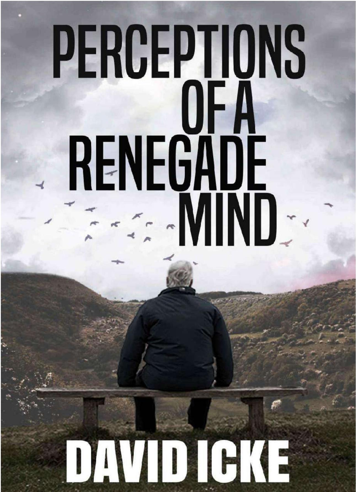

# PERCEPTIONS OFA RE NGADE MIND

ickonic

First published in July 2021.

ickonic publishing

New Enterprise House

St Helens Street

Derby

DE1 3GY

UK

email: gareth.icke@davidicke.com

Copyright $©$ 2021 David Icke

No part of this book may be reproduced in any form without permission from the Publisher, except for the quotation of brief passages in criticism

Cover Design: Gareth Icke

Book Design: Neil Hague

British Library Cataloguing-in Publication Data

A catalogue record for this book is available from the British Library

eISBN 978-18384153-1-0

# PERCEPTIONS OOFA RENEGADE MIND

DAVID ICKE

# Dedication:

To Freeeeeedom!

# ICKONIC THE ALTERNATIVE

NEW. DIFFERENT. REVOLUTIONARY

HUNDREDS OF CUTTING EDGE DOCUMENTARIES, FEATURE FILMS, SERIES & PODCASTS.

SIGN UP NOW AT ICKONIC.COM

# THE LIFE STORY OF DAVID ICKE

# RENEGADE

# THE FEATURE LENGTH FILM

  
AVAILABLE NOW AT DAVIDICKE.COM

Renegade:

Adjective

‘Having rejected tradition: Unconventional.’

Merriam-Webster Dictionary

# Acquiescence to tyranny is the death of the spirit

You may be 38 years old, as I happen to be. And one day, some great opportunity stands before you and calls you to stand up for some great principle, some great issue, some great cause. And you refuse to do it because you are afraid … You refuse to do it because you want to live longer …

You’re afraid that you will lose your job, or you are afraid that you will be criticised or that you will lose your popularity, or you’re afraid that somebody will stab you, or shoot at you or bomb your house; so you refuse to take the stand.

Well, you may go on and live until you are 90, but you’re just as dead at 38 as you would be at 90. And the cessation of breathing in your life is but the belated announcement of an earlier death of the spirit.

Martin Luther King

# How the few control the many and always have – the many do whatever they’re told

‘Forward, the Light Brigade!’

Was there a man dismayed?

Not though the soldier knew

Someone had blundered.

Theirs not to make reply,

Theirs not to reason why,

Theirs but to do and die.

Into the valley of Death

Rode the six hundred.

Cannon to right of them,

Cannon to le of them,

Cannon in front of them

Volleyed and thundered;

Stormed at with shot and shell,

Boldly they rode and well,

Into the jaws of Death,

Into the mouth of hell

Rode the six hundred

Alfred Lord Tennyson (1809-1892)

The mist is liing slowly I can see the way ahead And I’ve le behind the empty streets That once inspired my life And the strength of the emotion Is like thunder in the air ’Cos the promise that we made each other Haunts me to the end

The secret of your beauty And the mystery of your soul I’ve been searching for in everyone I meet And the times I’ve been mistaken It’s impossible to say And the grass is growing Underneath our feet

The words that I remember From my childhood still are true That there’s none so blind As those who will not see And to those who lack the courage And say it’s dangerous to try Well they just don’t know That love eternal will not be denied

I know you’re out there somewhere Somewhere, somewhere I know you’re out there somewhere

Somewhere you can hear my voice I know I’ll find you somehow Somehow, somehow I know I’ll find you somehow And somehow I’ll return again to you

The Moody Blues

# Are you a gutless wonder - or a Renegade Mind?

Monuments put from pen to paper, Turns me into a gutless wonder, And if you tolerate this, Then your children will be next. Gravity keeps my head down, Or is it maybe shame ...

# Manic Street Preachers

Rise like lions aer slumber In unvanquishable number. Shake your chains to earth like dew Which in sleep have fallen on you. Ye are many – they are few.

Percy Shelley

# Contents

CHAPTER 1 ‘I’m thinking’ – Oh, but are you?

CHAPTER 2 Renegade perception

CHAPTER 3 The Pushbacker sting

CHAPTER 4 ‘Covid’: The calculated catastrophe

CHAPTER 5 There is no ‘virus’

CHAPTER 6 Sequence of deceit

CHAPTER 7 War on your mind

CHAPTER 8 ‘Reframing’ insanity

CHAPTER 9 We must have it? So what is it?

CHAPTER 10 Human 2.0

CHAPTER 11 Who controls the Cult?

CHAPTER 12 Escaping Wetiko

Postscript

APPENDIX Cowan-Kaufman-Morell Statement on Virus Isolation

BIBLIOGRAPHY

INDEX

# CHAPTER ONE

# I’m thinking’ – Oh, but are you?

# Think for yourself and let others enjoy the privilege of doing so too Voltaire

French-born philosopher, mathematician and scientist René Descartes became famous for his statement in Latin in the 17th century which translates into English as: ‘I think, therefore I am.’

On the face of it that is true. Thought reflects perception and perception leads to both behaviour and self-identity. In that sense ‘we’ are what we think. But who or what is doing the thinking and is thinking the only route to perception? Clearly, as we shall see, ‘we’ are not always the source of ‘our’ perception, indeed with regard to humanity as a whole this is rarely the case; and thinking is far from the only means of perception. Thought is the village idiot compared with other expressions of consciousness that we all have the potential to access and tap into. This has to be true when we are those other expressions of consciousness which are infinite in nature. We have forgoen this, or, more to the point, been manipulated to forget.

These are not just the esoteric musings of the navel. The whole foundation of human control and oppression is control of perception. Once perception is hijacked then so is behaviour which is dictated by perception. Collective perception becomes collective behaviour and collective behaviour is what we call human society. Perception is all and those behind human control know that which is

why perception is the target 24/7 of the psychopathic manipulators that I call the Global Cult. They know that if they dictate perception they will dictate behaviour and collectively dictate the nature of human society. They are further aware that perception is formed from information received and if they control the circulation of information they will to a vast extent direct human behaviour.

Censorship of information and opinion has become globally Nazilike in recent years and never more blatantly than since the illusory ‘virus pandemic’ was triggered out of China in 2019 and across the world in 2020. Why have billions submied to house arrest and accepted fascistic societies in a way they would have never believed possible? Those controlling the information spewing from government, mainstream media and Silicon Valley (all controlled by the same Global Cult networks) told them they were in danger from a ‘deadly virus’ and only by submiing to house arrest and conceding their most basic of freedoms could they and their families be protected. This monumental and provable lie became the

perception of the billions and therefore the behaviour of the billions. In those few words you have the whole structure and modus operandi of human control. Fear is a perception – False Emotion Appearing Real – and fear is the currency of control. In short … get them by the balls (or give them the impression that you have) and their hearts and minds will follow. Nothing grips the dangly bits and freezes the rear-end more comprehensively than fear.

# World number 1

There are two ‘worlds’ in what appears to be one ‘world’ and the prime difference between them is knowledge. First we have the mass of human society in which the population is maintained in coldlycalculated ignorance through control of information and the ‘education’ (indoctrination) system. That’s all you really need to control to enslave billions in a perceptual delusion in which what are perceived to be their thoughts and opinions are ever-repeated mantras that the system has been downloading all their lives through ‘education’, media, science, medicine, politics and academia

in which the personnel and advocates are themselves overwhelmingly the perceptual products of the same repetition. Teachers and academics in general are processed by the same programming machine as everyone else, but unlike the great majority they never leave the ‘education’ program. It gripped them as students and continues to grip them as programmers of subsequent generations of students. The programmed become the programmers – the programmed programmers. The same can largely be said for scientists, doctors and politicians and not least because as the American writer Upton Sinclair said: ‘It is difficult to get a man to understand something when his salary depends upon his not understanding it.’ If your career and income depend on thinking the way the system demands then you will – bar a few freeminded exceptions – concede your mind to the Perceptual Mainframe that I call the Postage Stamp Consensus. This is a tiny band of perceived knowledge and possibility ‘taught’ (downloaded) in the schools and universities, pounded out by the mainstream media and on which all government policy is founded. Try thinking, and especially speaking and acting, outside of the ‘box’ of consensus and see what that does for your career in the Mainstream Everything which bullies, harasses, intimidates and ridicules the population into compliance. Here we have the simple structure which enslaves most of humanity in a perceptual prison cell for an entire lifetime and I’ll go deeper into this process shortly. Most of what humanity is taught as fact is nothing more than programmed belief. American science fiction author Frank Herbert was right when he said: ‘Belief can be manipulated. Only knowledge is dangerous.’ In the ‘Covid’ age belief is promoted and knowledge is censored. It was always so, but never to the extreme of today.

# World number 2

A ‘number $2 ^ { \prime }$ is slang for ‘doing a poo’ and how appropriate that is when this other ‘world’ is doing just that on humanity every minute of every day. World number 2 is a global network of secret societies and semi-secret groups dictating the direction of society via

governments, corporations and authorities of every kind. I have spent more than 30 years uncovering and exposing this network that I call the Global Cult and knowing its agenda is what has made my books so accurate in predicting current and past events. Secret societies are secret for a reason. They want to keep their hoarded knowledge to themselves and their chosen initiates and to hide it from the population which they seek through ignorance to control and subdue. The whole foundation of the division between World 1 and World 2 is knowledge. What number 1 knows number 2 must not. Knowledge they have worked so hard to keep secret includes (a) the agenda to enslave humanity in a centrally-controlled global dictatorship, and (b) the nature of reality and life itself. The laer (b) must be suppressed to allow the former (a) to prevail as I shall be explaining. The way the Cult manipulates and interacts with the population can be likened to a spider’s web. The ‘spider’ sits at the centre in the shadows and imposes its will through the web with each strand represented in World number 2 by a secret society, satanic or semi-secret group, and in World number 1 – the world of the seen – by governments, agencies of government, law enforcement, corporations, the banking system, media conglomerates and Silicon Valley (Fig $1$ overleaf). The spider and the web connect and coordinate all these organisations to pursue the same global outcome while the population sees them as individual entities working randomly and independently. At the level of the web governments are the banking system are the corporations are the media are Silicon Valley are the World Health Organization working from their inner cores as one unit. Apparently unconnected countries, corporations, institutions, organisations and people are on the same team pursuing the same global outcome. Strands in the web immediately around the spider are the most secretive and exclusive secret societies and their membership is emphatically restricted to the Cult inner-circle emerging through the generations from particular bloodlines for reasons I will come to. At the core of the core you would get them in a single room. That’s how many people are dictating the direction of human society and its transformation

through the ‘Covid’ hoax and other means. As the web expands out from the spider we meet the secret societies that many people will be aware of – the Freemasons, Knights Templar, Knights of Malta, Opus Dei, the inner sanctum of the Jesuit Order, and such like. Note how many are connected to the Church of Rome and there is a reason for that. The Roman Church was established as a revamp, a rebranding, of the relocated ‘Church’ of Babylon and the Cult imposing global tyranny today can be tracked back to Babylon and Sumer in what is now Iraq.

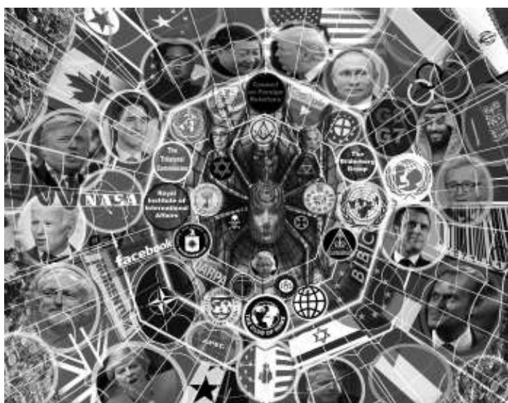  
Figure 1: The global web through which the few control the many. (Image Neil Hague.)

Inner levels of the web operate in the unseen away from the public eye and then we have what I call the cusp organisations located at the point where the hidden meets the seen. They include a series of satellite organisations answering to a secret society founded in London in the late 19th century called the Round Table and among them are the Royal Institute of International Affairs (UK, founded in 1920); Council on Foreign Relations (US, 1921); Bilderberg Group (worldwide, 1954); Trilateral Commission (US/worldwide, 1972); and the Club of Rome (worldwide, 1968) which was created to exploit environmental concerns to justify the centralisation of global power to ‘save the planet’. The Club of Rome instigated with others the human-caused climate change hoax which has led to all the ‘green

new deals’ demanding that very centralisation of control. Cusp organisations, which include endless ‘think tanks’ all over the world, are designed to coordinate a single global policy between political and business leaders, intelligence personnel, media organisations and anyone who can influence the direction of policy in their own sphere of operation. Major players and regular aenders will know what is happening – or some of it – while others come and go and are kept overwhelmingly in the dark about the big picture. I refer to these cusp groupings as semi-secret in that they can be publicly identified, but what goes on at the inner-core is kept very much ‘in house’ even from most of their members and participants through a fiercely-imposed system of compartmentalisation. Only let them know what they need to know to serve your interests and no more. The structure of secret societies serves as a perfect example of this principle. Most Freemasons never get higher than the boom three levels of ‘degree’ (degree of knowledge) when there are 33 official degrees of the Scoish Rite. Initiates only qualify for the next higher ‘compartment’ or degree if those at that level choose to allow them. Knowledge can be carefully assigned only to those considered ‘safe’. I went to my local Freemason’s lodge a few years ago when they were having an ‘open day’ to show how cuddly they were and when I chaed to some of them I was astonished at how lile the rank and file knew even about the most ubiquitous symbols they use. The mushroom technique – keep them in the dark and feed them bullshit – applies to most people in the web as well as the population as a whole. Sub-divisions of the web mirror in theme and structure transnational corporations which have a headquarters somewhere in the world dictating to all their subsidiaries in different countries. Subsidiaries operate in their methodology and branding to the same centrally-dictated plan and policy in pursuit of particular ends. The Cult web functions in the same way. Each country has its own web as a subsidiary of the global one. They consist of networks of secret societies, semi-secret groups and bloodline families and their job is to impose the will of the spider and the global web in their particular country. Subsidiary networks control and manipulate the national political system, finance, corporations, media, medicine, etc. to

ensure that they follow the globally-dictated Cult agenda. These networks were the means through which the ‘Covid’ hoax could be played out with almost every country responding in the same way.

# The ‘Yessir’ pyramid

Compartmentalisation is the key to understanding how a tiny few can dictate the lives of billions when combined with a top-down sequence of imposition and acquiescence. The inner core of the Cult sits at the peak of the pyramidal hierarchy of human society (Fig 2 overleaf). It imposes its will – its agenda for the world – on the level immediately below which acquiesces to that imposition. This level then imposes the Cult will on the level below them which acquiesces and imposes on the next level. Very quickly we meet levels in the hierarchy that have no idea there even is a Cult, but the sequence of imposition and acquiescence continues down the pyramid in just the same way. ‘I don’t know why we are doing this but the order came from “on-high” and so we beer just do it.’ Alfred Lord Tennyson said of the cannon fodder levels in his poem The Charge of the Light Brigade: ‘Theirs not to reason why; theirs but to do and die.’ The next line says that ‘into the valley of death rode the six hundred’ and they died because they obeyed without question what their perceived ‘superiors’ told them to do. In the same way the population capitulated to ‘Covid’. The whole hierarchical pyramid functions like this to allow the very few to direct the enormous many.

Eventually imposition-acquiescence-imposition-acquiescence comes down to the mass of the population at the foot of the pyramid. If they acquiesce to those levels of the hierarchy imposing on them (governments/law enforcement/doctors/media) a circuit is completed between the population and the handful of superpsychopaths in the Cult inner core at the top of the pyramid.

Without a circuit-breaking refusal to obey, the sequence of imposition and acquiescence allows a staggeringly few people to impose their will upon the entirety of humankind. We are looking at the very sequence that has subjugated billions since the start of 2020. Our freedom has not been taken from us. Humanity has given it

away. Fascists do not impose fascism because there are not enough of them. Fascism is imposed by the population acquiescing to fascism. Put another way allowing their perceptions to be programmed to the extent that leads to the population giving their freedom away by giving their perceptions – their mind – away. If this circuit is not broken by humanity ceasing to cooperate with their own enslavement then nothing can change. For that to happen people have to critically think and see through the lies and window dressing and then summon the backbone to act upon what they see. The Cult spends its days working to stop either happening and its methodology is systematic and highly detailed, but it can be overcome and that is what this book is all about.

  
Figure 2: The simple sequence of imposition and compliance that allows a handful of people at the peak of the pyramid to dictate the lives of billions.

# The Life Program

Okay, back to world number 1 or the world of the ‘masses’. Observe the process of what we call ‘life’ and it is a perceptual download from cradle to grave. The Cult has created a global structure in which perception can be programmed and the program continually topped-up with what appears to be constant confirmation that the program is indeed true reality. The important word here is ‘appears’.

This is the structure, the fly-trap, the Postage Stamp Consensus or Perceptual Mainframe, which represents that incredibly narrow band of perceived possibility delivered by the ‘education’ system, mainstream media, science and medicine. From the earliest age the download begins with parents who have themselves succumbed to the very programming their children are about to go through. Most parents don’t do this out of malevolence and mostly it is quite the opposite. They do what they believe is best for their children and that is what the program has told them is best. Within three or four years comes the major transition from parental programming to fullblown state (Cult) programming in school, college and university where perceptually-programmed teachers and academics pass on their programming to the next generations. Teachers who resist are soon marginalised and their careers ended while children who resist are called a problem child for whom Ritalin may need to be prescribed. A few years aer entering the ‘world’ children are under the control of authority figures representing the state telling them when they have to be there, when they can leave and when they can speak, eat, even go to the toilet. This is calculated preparation for a lifetime of obeying authority in all its forms. Reflex-action fear of authority is instilled by authority from the start. Children soon learn the carrot and stick consequences of obeying or defying authority which is underpinned daily for the rest of their life. Fortunately I daydreamed through this crap and never obeyed authority simply because it told me to. This approach to my alleged ‘beers’ continues to this day. There can be consequences of pursuing open-minded freedom in a world of closed-minded conformity. I spent a lot of time in school corridors aer being ejected from the classroom for not taking some of it seriously and now I spend a lot of time being ejected from Facebook, YouTube and Twier. But I can tell you that being true to yourself and not compromising your self-respect is far more exhilarating than bowing to authority for authority’s sake. You don’t have to be a sheep to the shepherd (authority) and the sheep dog (fear of not obeying authority).

The perceptual download continues throughout the formative years in school, college and university while script-reading ‘teachers’, ‘academics’ ‘scientists’, ‘doctors’ and ‘journalists’ insist that ongoing generations must be as programmed as they are. Accept the program or you will not pass your ‘exams’ which confirm your ‘degree’ of programming. It is tragic to think that many parents pressure their offspring to work hard at school to download the program and qualify for the next stage at college and university. The late, great, American comedian George Carlin said: ‘Here’s a bumper sticker I’d like to see: We are proud parents of a child who has resisted his teachers’ aempts to break his spirit and bend him to the will of his corporate masters.’ Well, the best of luck finding many of those, George. Then comes the moment to leave the formal programming years in academia and enter the ‘adult’ world of work. There you meet others in your chosen or prescribed arena who went through the same Postage Stamp Consensus program before you did. There is therefore overwhelming agreement between almost everyone on the basic foundations of Postage Stamp reality and the rejection, even contempt, of the few who have a mind of their own and are prepared to use it. This has two major effects. Firstly, the consensus confirms to the programmed that their download is really how things are. I mean, everyone knows that, right? Secondly, the arrogance and ignorance of Postage Stamp adherents ensure that anyone questioning the program will have unpleasant consequences for seeking their own truth and not picking their perceptions from the shelf marked: ‘Things you must believe without question and if you don’t you’re a dangerous lunatic conspiracy theorist and a harebrained nuer’.

Every government, agency and corporation is founded on the same Postage Stamp prison cell and you can see why so many people believe the same thing while calling it their own ‘opinion’. Fusion of governments and corporations in pursuit of the same agenda was the definition of fascism described by Italian dictator Benito Mussolini. The pressure to conform to perceptual norms downloaded for a lifetime is incessant and infiltrates society right

down to family groups that become censors and condemners of their own ‘black sheep’ for not, ironically, being sheep. We have seen an explosion of that in the ‘Covid’ era. Cult-owned global media unleashes its propaganda all day every day in support of the Postage Stamp and targets with abuse and ridicule anyone in the public eye who won’t bend their mind to the will of the tyranny. Any response to this is denied (certainly in my case). They don’t want to give a platform to expose official lies. Cult-owned-and-created Internet giants like Facebook, Google, YouTube and Twier delete you for having an unapproved opinion. Facebook boasts that its AI censors delete 97-percent of ‘hate speech’ before anyone even reports it. Much of that ‘hate speech’ will simply be an opinion that Facebook and its masters don’t want people to see. Such perceptual oppression is widely known as fascism. Even Facebook executive Benny Thomas, a ‘CEO Global Planning Lead’, said in comments secretly recorded by investigative journalism operation Project Veritas that Facebook is ‘too powerful’ and should be broken up:

I mean, no king in history has been the ruler of two billion people, but Mark Zuckerberg is … And he’s 36. That’s too much for a 36-year-old ... You should not have power over two billion people. I just think that’s wrong.

Thomas said Facebook-owned platforms like Instagram, Oculus, and WhatsApp needed to be separate companies. ‘It’s too much power when they’re all one together’. That’s the way the Cult likes it, however. We have an executive of a Cult organisation in Benny Thomas that doesn’t know there is a Cult such is the compartmentalisation. Thomas said that Facebook and Google ‘are no longer companies, they’re countries’. Actually they are more powerful than countries on the basis that if you control information you control perception and control human society.

# I love my oppressor

Another expression of this psychological trickery is for those who realise they are being pressured into compliance to eventually

convince themselves to believe the official narratives to protect their self-respect from accepting the truth that they have succumbed to meek and subservient compliance. Such people become some of the most vehement defenders of the system. You can see them everywhere screaming abuse at those who prefer to think for themselves and by doing so reminding the compliers of their own capitulation to conformity. ‘You are talking dangerous nonsense you Covidiot!!’ Are you trying to convince me or yourself? It is a potent form of Stockholm syndrome which is defined as: ‘A psychological condition that occurs when a victim of abuse identifies and aaches, or bonds, positively with their abuser.’ An example is hostages bonding and even ‘falling in love’ with their kidnappers. The syndrome has been observed in domestic violence, abused children, concentration camp inmates, prisoners of war and many and various Satanic cults. These are some traits of Stockholm syndrome listed at goodtherapy.org:

•  Positive regard towards perpetrators of abuse or captor [see ‘Covid’].   
•  Failure to cooperate with police and other government authorities when it comes to holding perpetrators of abuse or kidnapping accountable [or in the case of ‘Covid’ cooperating with the police to enforce and defend their captors’ demands].   
•  Lile or no effort to escape [see ‘Covid’].   
•  Belief in the goodness of the perpetrators or kidnappers [see ‘Covid’].   
Appeasement of captors. This is a manipulative strategy for maintaining one’s safety. As victims get rewarded – perhaps with less abuse or even with life itself – their appeasing behaviours are reinforced [see ‘Covid’].   
•  Learned helplessness. This can be akin to ‘if you can’t beat ‘em, join ‘em’. As the victims fail to escape the abuse or captivity, they may start giving up and soon realize it’s just easier for everyone if they acquiesce all their power to their captors [see ‘Covid’].

Feelings of pity toward the abusers, believing they are actually

victims themselves. Because of this, victims may go on a crusade or mission to ‘save’ [protect] their abuser [see the venom unleashed on those challenging the official ‘Covid’ narrative].   
•  Unwillingness to learn to detach from their perpetrators and heal. In essence, victims may tend to be less loyal to themselves than to their abuser [ definitely see ‘Covid’].

Ponder on those traits and compare them with the behaviour of great swathes of the global population who have defended governments and authorities which have spent every minute destroying their lives and livelihoods and those of their children and grandchildren since early 2020 with fascistic lockdowns, house arrest and employment deletion to ‘protect’ them from a ‘deadly virus’ that their abusers’ perceptually created to bring about this very outcome. We are looking at mass Stockholm syndrome. All those that agree to concede their freedom will believe those perceptions are originating in their own independent ‘mind’ when in fact by conceding their reality to Stockholm syndrome they have by definition conceded any independence of mind. Listen to the ‘opinions’ of the acquiescing masses in this ‘Covid’ era and what gushes forth is the repetition of the official version of everything delivered unprocessed, unfiltered and unquestioned. The whole programming dynamic works this way. I must be free because I’m told that I am and so I think that I am.

You can see what I mean with the chapter theme of ‘I’m thinking – Oh, but are you?’ The great majority are not thinking, let alone for themselves. They are repeating what authority has told them to believe which allows them to be controlled. Weaving through this mentality is the fear that the ‘conspiracy theorists’ are right and this again explains the oen hysterical abuse that ensues when you dare to contest the official narrative of anything. Denial is the mechanism of hiding from yourself what you don’t want to be true. Telling people what they want to hear is easy, but it’s an infinitely greater challenge to tell them what they would rather not be happening.

One is akin to pushing against an open door while the other is met with vehement resistance no maer what the scale of evidence. I don’t want it to be true so I’ll convince myself that it’s not. Examples are everywhere from the denial that a partner is cheating despite all the signs to the reflex-action rejection of any idea that world events in which country aer country act in exactly the same way are centrally coordinated. To accept the laer is to accept that a force of unspeakable evil is working to destroy your life and the lives of your children with nothing too horrific to achieve that end. Who the heck wants that to be true? But if we don’t face reality the end is duly achieved and the consequences are far worse and ongoing than breaking through the walls of denial today with the courage to make a stand against tyranny.

# Connect the dots – but how?

A crucial aspect of perceptual programming is to portray a world in which everything is random and almost nothing is connected to anything else. Randomness cannot be coordinated by its very nature and once you perceive events as random the idea they could be connected is waved away as the rantings of the tinfoil-hat brigade. You can’t plan and coordinate random you idiot! No, you can’t, but you can hide the coldly-calculated and long-planned behind the illusion of randomness. A foundation manifestation of the Renegade Mind is to scan reality for paerns that connect the apparently random and turn pixels and dots into pictures. This is the way I work and have done so for more than 30 years. You look for similarities in people, modus operandi and desired outcomes and slowly, then ever quicker, the picture forms. For instance: There would seem to be no connection between the ‘Covid pandemic’ hoax and the human-caused global-warming hoax and yet they are masks (appropriately) on the same face seeking the same outcome. Those pushing the global warming myth through the Club of Rome and other Cult agencies are driving the lies about ‘Covid’ – Bill Gates is an obvious one, but they are endless. Why would the same people be involved in both when they are clearly not connected? Oh, but they

are. Common themes with personnel are matched by common goals. The ‘solutions’ to both ‘problems’ are centralisation of global power to impose the will of the few on the many to ‘save’ humanity from ‘Covid’ and save the planet from an ‘existential threat’ (we need ‘zero Covid’ and ‘zero carbon emissions’). These, in turn, connect with the ‘dot’ of globalisation which was coined to describe the centralisation of global power in every area of life through incessant political and corporate expansion, trading blocks and superstates like the European Union. If you are the few and you want to control the many you have to centralise power and decision-making. The more you centralise power the more power the few at the centre will have over the many; and the more that power is centralised the more power those at the centre have to centralise even quicker. The momentum of centralisation gets faster and faster which is exactly the process we have witnessed. In this way the hoaxed ‘pandemic’ and the fakery of human-caused global warming serve the interests of globalisation and the seizure of global power in the hands of the Cult inner-circle which is behind ‘Covid’, ‘climate change’ and globalisation. At this point random ‘dots’ become a clear and obvious picture or paern.

Klaus Schwab, the classic Bond villain who founded the Cult’s Gates-funded World Economic Forum, published a book in 2020, The Great Reset, in which he used the ‘problem’ of ‘Covid’ to justify a total transformation of human society to ‘save’ humanity from ‘climate change’. Schwab said: ‘The pandemic represents a rare but narrow window of opportunity to reflect, reimagine, and reset our world.’ What he didn’t mention is that the Cult he serves is behind both hoaxes as I show in my book The Answer. He and the Cult don’t have to reimagine the world. They know precisely what they want and that’s why they destroyed human society with ‘Covid’ to ‘build back beer’ in their grand design. Their job is not to imagine, but to get humanity to imagine and agree with their plans while believing it’s all random. It must be pure coincidence that ‘The Great Reset’ has long been the Cult’s code name for the global imposition of fascism and replaced previous code-names of the ‘New World

Order’ used by Cult frontmen like Father George Bush and the ‘New Order of the Ages’ which emerged from Freemasonry and much older secret societies. New Order of the Ages appears on the reverse of the Great Seal of the United States as ‘Novus ordo seclorum’ underneath the Cult symbol used since way back of the pyramid and all seeing-eye (Fig 3). The pyramid is the hierarchy of human control headed by the illuminated eye that symbolises the force behind the Cult which I will expose in later chapters. The term ‘Annuit Coeptis’ translates as ‘He favours our undertaking’. We are told the ‘He’ is the Christian god, but ‘He’ is not as I will be explaining.

  
Figure 3: The all-seeing eye of the Cult ‘god’ on the Freemason-designed Great Seal of the United States and also on the dollar bill.

# Having you on

Two major Cult techniques of perceptual manipulation that relate to all this are what I have called since the 1990s Problem-Reaction-Solution (PRS) and the Totalitarian Tiptoe (TT). They can be uncovered by the inquiring mind with a simple question: Who benefits? The answer usually identifies the perpetrators of a given action or happening through the concept of ‘he who most benefits from a crime is the one most likely to have commied it’. The Latin ‘Cue bono?’ – Who benefits? – is widely aributed to the Roman orator and statesman Marcus Tullius Cicero. No wonder it goes back so far when the concept has been relevant to human behaviour since

history was recorded. Problem-Reaction-Solution is the technique used to manipulate us every day by covertly creating a problem (or the illusion of one) and offering the solution to the problem (or the illusion of one). In the first phase you create the problem and blame someone or something else for why it has happened. This may relate to a financial collapse, terrorist aack, war, global warming or pandemic, anything in fact that will allow you to impose the ‘solution’ to change society in the way you desire at that time. The ‘problem’ doesn’t have to be real. PRS is manipulation of perception and all you need is the population to believe the problem is real. Human-caused global warming and the ‘Covid pandemic’ only have to be perceived to be real for the population to accept the ‘solutions’ of authority. I refer to this technique as NO-Problem-Reaction-Solution. Billions did not meekly accept house arrest from early 2020 because there was a real deadly ‘Covid pandemic’ but because they perceived – believed – that to be the case. The antidote to Problem-Reaction-Solution is to ask who benefits from the proposed solution. Invariably it will be anyone who wants to justify more control through deletion of freedom and centralisation of power and decision-making.

The two world wars were Problem-Reaction-Solutions that transformed and realigned global society. Both were manipulated into being by the Cult as I have detailed in books since the mid-1990s. They dramatically centralised global power, especially World War Two, which led to the United Nations and other global bodies thanks to the overt and covert manipulations of the Rockefeller family and other Cult bloodlines like the Rothschilds. The UN is a stalking horse for full-blown world government that I will come to shortly. The land on which the UN building stands in New York was donated by the Rockefellers and the same Cult family was behind Big Pharma scalpel and drug ‘medicine’ and the creation of the World Health Organization as part of the UN. They have been stalwarts of the eugenics movement and funded Hitler’s race-purity expert’ Ernst Rudin. The human-caused global warming hoax has been orchestrated by the Club of Rome through the UN which is

manufacturing both the ‘problem’ through its Intergovernmental Panel on Climate Change and imposing the ‘solution’ through its Agenda 21 and Agenda 2030 which demand the total centralisation of global power to ‘save the world’ from a climate hoax the United Nations is itself perpetrating. What a small world the Cult can be seen to be particularly among the inner circles. The bedfellow of Problem-Reaction-Solution is the Totalitarian Tiptoe which became the Totalitarian Sprint in 2020. The technique is fashioned to hide the carefully-coordinated behind the cover of apparently random events. You start the sequence at ‘A’ and you know you are heading for $' Z '$ . You don’t want people to know that and each step on the journey is presented as a random happening while all the steps strung together lead in the same direction. The speed may have quickened dramatically in recent times, but you can still see the incremental approach of the Tiptoe in the case of ‘Covid’ as each new imposition takes us deeper into fascism. Tell people they have to do this or that to get back to ‘normal’, then this and this and this. With each new demand adding to the ones that went before the population’s freedom is deleted until it disappears. The spider wraps its web around the flies more comprehensively with each new diktat. I’ll highlight this in more detail when I get to the ‘Covid’ hoax and how it has been pulled off. Another prime example of the Totalitarian Tiptoe is how the Cult-created European Union went from a ‘freetrade zone’ to a centralised bureaucratic dictatorship through the Tiptoe of incremental centralisation of power until nations became mere administrative units for Cult-owned dark suits in Brussels.

The antidote to ignorance is knowledge which the Cult seeks vehemently to deny us, but despite the systematic censorship to that end the Renegade Mind can overcome this by vociferously seeking out the facts no maer the impediments put in the way. There is also a method of thinking and perceiving – knowing – that doesn’t even need names, dates, place-type facts to identify the paerns that reveal the story. I’ll get to that in the final chapter. All you need to know about the manipulation of human society and to what end is still out there – at the time of writing – in the form of books, videos

and websites for those that really want to breach the walls of programmed perception. To access this knowledge requires the abandonment of the mainstream media as a source of information in the awareness that this is owned and controlled by the Cult and therefore promotes mass perceptions that suit the Cult. Mainstream media lies all day, every day. That is its function and very reason for being. Where it does tell the truth, here and there, is only because the truth and the Cult agenda very occasionally coincide. If you look for fact and insight to the BBC, CNN and virtually all the rest of them you are asking to be conned and perceptually programmed.

# Know the outcome and you’ll see the journey

Events seem random when you have no idea where the world is being taken. Once you do the random becomes the carefully planned. Know the outcome and you’ll see the journey is a phrase I have been using for a long time to give context to daily happenings that appear unconnected. Does a problem, or illusion of a problem, trigger a proposed ‘solution’ that further drives society in the direction of the outcome? Invariably the answer will be yes and the random – abracadabra – becomes the clearly coordinated. So what is this outcome that unlocks the door to a massively expanded understanding of daily events? I will summarise its major aspects – the fine detail is in my other books – and those new to this information will see that the world they thought they were living in is a very different place. The foundation of the Cult agenda is the incessant centralisation of power and all such centralisation is ultimately in pursuit of Cult control on a global level. I have described for a long time the planned world structure of top-down dictatorship as the Hunger Games Society. The term obviously comes from the movie series which portrayed a world in which a few living in military-protected hi-tech luxury were the overlords of a population condemned to abject poverty in isolated ‘sectors’ that were not allowed to interact. ‘Covid’ lockdowns and travel bans anyone? The ‘Hunger Games’ pyramid of structural control has the inner circle of the Cult at the top with prey much the entire

population at the boom under their control through dependency for survival on the Cult. The whole structure is planned to be protected and enforced by a military-police state (Fig 4).

Here you have the reason for the global lockdowns of the fake pandemic to coldly destroy independent incomes and livelihoods and make everyone dependent on the ‘state’ (the Cult that controls the ‘states’). I have warned in my books for many years about the plan to introduce a ‘guaranteed income’ – a barely survivable piance – designed to impose dependency when employment was destroyed by AI technology and now even more comprehensively at great speed by the ‘Covid’ scam. Once the pandemic was played and lockdown consequences began to delete independent income the authorities began to talk right on cue about the need for a guaranteed income and a ‘Great Reset’. Guaranteed income will be presented as benevolent governments seeking to help a desperate people – desperate as a direct result of actions of the same governments. The truth is that such payments are a trap. You will only get them if you do exactly what the authorities demand including mass vaccination (genetic manipulation). We have seen this theme already in Australia where those dependent on government benefits have them reduced if parents don’t agree to have their children vaccinated according to an insane healthdestroying government-dictated schedule. Calculated economic collapse applies to governments as well as people. The Cult wants rid of countries through the creation of a world state with countries broken up into regions ruled by a world government and super states like the European Union. Countries must be bankrupted, too, to this end and it’s being achieved by the trillions in ‘rescue packages’ and furlough payments, trillions in lost taxation, and money-no-object spending on ‘Covid’ including constant allmedium advertising (programming) which has made the media dependent on government for much of its income. The day of reckoning is coming – as planned – for government spending and given that it has been made possible by printing money and not by production/taxation there is inflation on the way that has the

potential to wipe out monetary value. In that case there will be no need for the Cult to steal your money. It just won’t be worth anything (see the German Weimar Republic before the Nazis took over). Many have been okay with lockdowns while geing a percentage of their income from so-called furlough payments without having to work. Those payments are dependent, however, on people having at least a theoretical job with a business considered non-essential and ordered to close. As these business go under because they are closed by lockdown aer lockdown the furlough stops and it will for everyone eventually. Then what? The ‘then what?’ is precisely the idea.

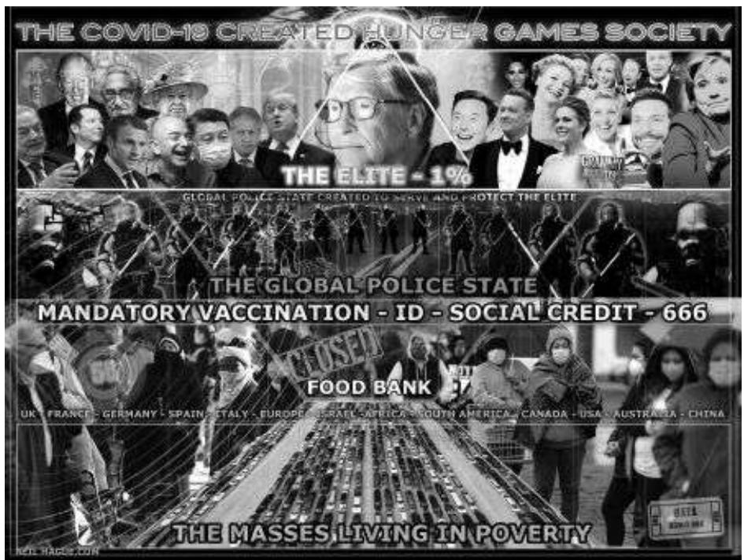  
Figure 4: The Hunger Games Society structure I have long warned was planned and now the ‘Covid’ hoax has made it possible. This is the real reason for lockdowns.

# Hired hands

Between the Hunger Games Cult elite and the dependent population is planned to be a vicious military-police state (a fusion of the two into one force). This has been in the making for a long time with police looking ever more like the military and carrying weapons to match. The pandemic scam has seen this process accelerate so fast as

lockdown house arrest is brutally enforced by carefully recruited fascist minds and gormless system-servers. The police and military are planned to merge into a centrally-directed world army in a global structure headed by a world government which wouldn’t be elected even by the election fixes now in place. The world army is not planned even to be human and instead wars would be fought, primarily against the population, using robot technology controlled by artificial intelligence. I have been warning about this for decades and now militaries around the world are being transformed by this very AI technology. The global regime that I describe is a particular form of fascism known as a technocracy in which decisions are not made by clueless and co-opted politicians but by unelected technocrats – scientists, engineers, technologists and bureaucrats. Cult-owned-and-controlled Silicon Valley giants are examples of technocracy and they already have far more power to direct world events than governments. They are with their censorship selecting governments. I know that some are calling the ‘Great Reset’ a Marxist communist takeover, but fascism and Marxism are different labels for the same tyranny. Tell those who lived in fascist Germany and Stalinist Russia that there was a difference in the way their freedom was deleted and their lives controlled. I could call it a fascist technocracy or a Marxist technocracy and they would be equally accurate. The Hunger Games society with its world government structure would oversee a world army, world central bank and single world cashless currency imposing its will on a microchipped population (Fig 5). Scan its different elements and see how the illusory pandemic is forcing society in this very direction at great speed. Leaders of 23 countries and the World Health Organization (WHO) backed the idea in March, 2021, of a global treaty for ‘international cooperation’ in ‘health emergencies’ and nations should ‘come together as a global community for peaceful cooperation that extends beyond this crisis’. Cut the Orwellian bullshit and this means another step towards global government. The plan includes a cashless digital money system that I first warned about in 1993. Right at the start of ‘Covid’ the deeply corrupt Tedros

Adhanom Ghebreyesus, the crooked and merely gofer ‘head’ of the World Health Organization, said it was possible to catch the ‘virus’ by touching cash and it was beer to use cashless means. The claim was ridiculous nonsense and like the whole ‘Covid’ mind-trick it was nothing to do with ‘health’ and everything to do with pushing every aspect of the Cult agenda. As a result of the Tedros lie the use of cash has plummeted. The Cult script involves a single world digital currency that would eventually be technologically embedded in the body. China is a massive global centre for the Cult and if you watch what is happening there you will know what is planned for everywhere. The Chinese government is developing a digital currency which would allow fines to be deducted immediately via AI for anyone caught on camera breaking its fantastic list of laws and the money is going to be programmable with an expiry date to ensure that no one can accrue wealth except the Cult and its operatives.

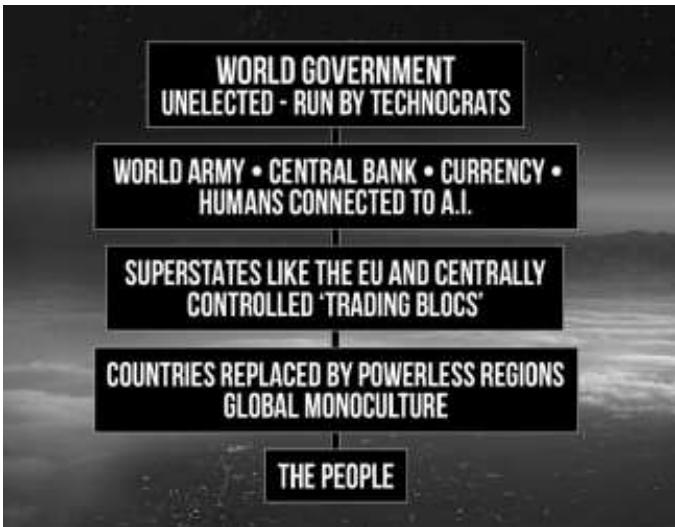  
Figure 5: The structure of global control the Cult has been working towards for so long and this has been enormously advanced by the ‘Covid’ illusion.

# Serfdom is so smart

The Cult plan is far wider, extreme, and more comprehensive than even most conspiracy researchers appreciate and I will come to the true depths of deceit and control in the chapters ‘Who controls the

Cult?’ and ‘Escaping Wetiko’. Even the world that we know is crazy enough. We are being deluged with ever more sophisticated and controlling technology under the heading of ‘smart’. We have smart televisions, smart meters, smart cards, smart cars, smart driving, smart roads, smart pills, smart patches, smart watches, smart skin, smart borders, smart pavements, smart streets, smart cities, smart communities, smart environments, smart growth, smart planet ... smart everything around us. Smart technologies and methods of operation are designed to interlock to create a global Smart Grid connecting the entirety of human society including human minds to create a centrally-dictated ‘hive’ mind. ‘Smart cities’ is code for densely-occupied megacities of total surveillance and control through AI. Ever more destructive frequency communication systems like 5G have been rolled out without any official testing for health and psychological effects (colossal). 5G/6G/7G systems are needed to run the Smart Grid and each one becomes more destructive of body and mind. Deleting independent income is crucial to forcing people into these AI-policed prisons by ending private property ownership (except for the Cult elite). The Cult’s Great Reset now openly foresees a global society in which no one will own any possessions and everything will be rented while the Cult would own literally everything under the guise of government and corporations. The aim has been to use the lockdowns to destroy sources of income on a mass scale and when the people are destitute and in unrepayable amounts of debt (problem) Cult assets come forward with the pledge to write-off debt in return for handing over all property and possessions (solution). Everything – literally everything including people – would be connected to the Internet via AI. I was warning years ago about the coming Internet of Things (IoT) in which all devices and technology from your car to your fridge would be plugged into the Internet and controlled by AI. Now we are already there with much more to come. The next stage is the Internet of Everything (IoE) which is planned to include the connection of AI to the human brain and body to replace the human mind with a centrally-controlled AI mind. Instead of perceptions

being manipulated through control of information and censorship those perceptions would come direct from the Cult through AI. What do you think? You think whatever AI decides that you think. In human terms there would be no individual ‘think’ any longer. Too incredible? The ravings of a lunatic? Not at all. Cult-owned crazies in Silicon Valley have been telling us the plan for years without explaining the real motivation and calculated implications. These include Google executive and ‘futurist’ Ray Kurzweil who highlights the year 2030 for when this would be underway. He said:

Our thinking ... will be a hybrid of biological and non-biological thinking ... humans will be able to extend their limitations and ‘think in the cloud’ ... We’re going to put gateways to the cloud in our brains ... We’re going to gradually merge and enhance ourselves ... In my view, that’s the nature of being human – we transcend our limitations.

As the technology becomes vastly superior to what we are then the small proportion that is still human gets smaller and smaller and smaller until it’s just utterly negligible.

The sales-pitch of Kurzweil and Cult-owned Silicon Valley is that this would make us ‘super-human’ when the real aim is to make us post-human and no longer ‘human’ in the sense that we have come to know. The entire global population would be connected to AI and become the centrally-controlled ‘hive-mind’ of externally-delivered perceptions. The Smart Grid being installed to impose the Cult’s will on the world is being constructed to allow particular locations – even one location – to control the whole global system. From these prime control centres, which absolutely include China and Israel, anything connected to the Internet would be switched on or off and manipulated at will. Energy systems could be cut, communication via the Internet taken down, computer-controlled driverless autonomous vehicles driven off the road, medical devices switched off, the potential is limitless given how much AI and Internet connections now run human society. We have seen nothing yet if we allow this to continue. Autonomous vehicle makers are working with law enforcement to produce cars designed to automatically pull over if they detect a police or emergency vehicle flashing from up to 100 feet away. At a police stop the car would be unlocked and the

window rolled down automatically. Vehicles would only take you where the computer (the state) allowed. The end of petrol vehicles and speed limiters on all new cars in the UK and EU from 2022 are steps leading to electric computerised transport over which ultimately you have no control. The picture is far bigger even than the Cult global network or web and that will become clear when I get to the nature of the ‘spider’. There is a connection between all these happenings and the instigation of DNA-manipulating ‘vaccines’ (which aren’t ‘vaccines’) justified by the ‘Covid’ hoax. That connection is the unfolding plan to transform the human body from a biological to a synthetic biological state and this is why synthetic biology is such a fast-emerging discipline of mainstream science. ‘Covid vaccines’ are infusing self-replicating synthetic genetic material into the cells to cumulatively take us on the Totalitarian Tiptoe from Human 1.0 to the synthetic biological Human 2.0 which will be physically and perceptually aached to the Smart Grid to one hundred percent control every thought, perception and deed. Humanity needs to wake up and fast.

This is the barest explanation of where the ‘outcome’ is planned to go but it’s enough to see the journey happening all around us. Those new to this information will already see ‘Covid’ in a whole new context. I will add much more detail as we go along, but for the minutiae evidence see my mega-works, The Answer, The Trigger and Everything You Need to Know But Have Never Been Told.

Now – how does a Renegade Mind see the ‘world’?

# CHAPTER TWO

# Renegade Perception

It is one thing to be clever and another to be wise George R.R. Martin

Asimple definition of the difference between a programmed mind and a Renegade Mind would be that one sees only dots while the other connects them to see the picture. Reading reality with accuracy requires the observer to (a) know the planned outcome and (b) realise that everything, but everything, is connected.

The entirety of infinite reality is connected – that’s its very nature – and with human society an expression of infinite reality the same must apply. Simple cause and effect is a connection. The effect is triggered by the cause and the effect then becomes the cause of another effect. Nothing happens in isolation because it can’t. Life in whatever reality is simple choice and consequence. We make choices and these lead to consequences. If we don’t like the consequences we can make different choices and get different consequences which lead to other choices and consequences. The choice and the consequence are not only connected they are indivisible. You can’t have one without the other as an old song goes. A few cannot control the world unless those being controlled allow that to happen – cause and effect, choice and consequence. Control – who has it and who doesn’t – is a two-way process, a symbiotic relationship, involving the controller and controlled. ‘They took my freedom away!!’ Well, yes, but you also gave it to them. Humanity is

subjected to mass control because humanity has acquiesced to that control. This is all cause and effect and literally a case of give and take. In the same way world events of every kind are connected and the Cult works incessantly to sell the illusion of the random and coincidental to maintain the essential (to them) perception of dots that hide the picture. Renegade Minds know this and constantly scan the world for paerns of connection. This is absolutely pivotal in understanding the happenings in the world and without that perspective clarity is impossible. First you know the planned outcome and then you identify the steps on the journey – the day-byday apparently random which, when connected in relation to the outcome, no longer appear as individual events, but as the proverbial chain of events leading in the same direction. I’ll give you some examples:

# Political puppet show

We are told to believe that politics is ‘adversarial’ in that different parties with different beliefs engage in an endless tussle for power. There may have been some truth in that up to a point – and only a point – but today divisions between ‘different’ parties are rhetorical not ideological. Even the rhetorical is fusing into one-speak as the parties eject any remaining free thinkers while others succumb to the ever-gathering intimidation of anyone with the ‘wrong’ opinion. The Cult is not a new phenomenon and can be traced back thousands of years as my books have documented. Its intergenerational initiates have been manipulating events with increasing effect the more that global power has been centralised. In ancient times the Cult secured control through the system of monarchy in which ‘special’

bloodlines (of which more later) demanded the right to rule as kings and queens simply by birthright and by vanquishing others who claimed the same birthright. There came a time, however, when people had matured enough to see the unfairness of such tyranny and demanded a say in who governed them. Note the word – governed them. Not served them – governed them, hence government defined as ‘the political direction and control exercised over the

actions of the members, citizens, or inhabitants of communities, societies, and states; direction of the affairs of a state, community, etc.’ Governments exercise control over rather than serve just like the monarchies before them. Bizarrely there are still countries like the United Kingdom which are ruled by a monarch and a government that officially answers to the monarch. The UK head of state and that of Commonwealth countries such as Canada, Australia and New Zealand is ‘selected’ by who in a single family had unprotected sex with whom and in what order. Pinch me it can’t be true. Ouch! Shit, it is. The demise of monarchies in most countries offered a potential vacuum in which some form of free and fair society could arise and the Cult had that base covered. Monarchies had served its interests but they couldn’t continue in the face of such widespread opposition and, anyway, replacing a ‘royal’ dictatorship that people could see with a dictatorship ‘of the people’ hiding behind the concept of ‘democracy’ presented far greater manipulative possibilities and ways of hiding coordinated tyranny behind the illusion of ‘freedom’.

Democracy is quite wrongly defined as government selected by the population. This is not the case at all. It is government selected by some of the population (and then only in theory). This ‘some’ doesn’t even have to be the majority as we have seen so oen in firstpast-the-post elections in which the so-called majority party wins fewer votes than the ‘losing’ parties combined. Democracy can give total power to a party in government from a minority of the votes cast. It’s a sleight of hand to sell tyranny as freedom. Seventy-four million Trump-supporting Americans didn’t vote for the ‘Democratic’ Party of Joe Biden in the distinctly dodgy election in 2020 and yet far from acknowledging the wishes and feelings of that great percentage of American society the Cult-owned Biden government set out from day one to destroy them and their right to a voice and opinion. Empty shell Biden and his Cult handlers said they were doing this to ‘protect democracy’. Such is the level of lunacy and sickness to which politics has descended. Connect the dots and relate them to the desired outcome – a world government run by self-appointed technocrats and no longer even elected

politicians. While operating through its political agents in government the Cult is at the same time encouraging public distain for politicians by puing idiots and incompetents in theoretical power on the road to deleting them. The idea is to instil a public reaction that says of the technocrats: ‘Well, they couldn’t do any worse than the pathetic politicians.’ It’s all about controlling perception and Renegade Minds can see through that while programmed minds cannot when they are ignorant of both the planned outcome and the manipulation techniques employed to secure that end. This knowledge can be learned, however, and fast if people choose to get informed.

Politics may at first sight appear very difficult to control from a central point. I mean look at the ‘different’ parties and how would you be able to oversee them all and their constituent parts? In truth, it’s very straightforward because of their structure. We are back to the pyramid of imposition and acquiescence. Organisations are structured in the same way as the system as a whole. Political parties are not open forums of free expression. They are hierarchies. I was a national spokesman for the British Green Party which claimed to be a different kind of politics in which influence and power was devolved; but I can tell you from direct experience – and it’s far worse now – that Green parties are run as hierarchies like all the others however much they may try to hide that fact or kid themselves that it’s not true. A very few at the top of all political parties are directing policy and personnel. They decide if you are elevated in the party or serve as a government minister and to do that you have to be a yes man or woman. Look at all the maverick political thinkers who never ascended the greasy pole. If you want to progress within the party or reach ‘high-office’ you need to fall into line and conform. Exceptions to this are rare indeed. Should you want to run for parliament or Congress you have to persuade the local or state level of the party to select you and for that you need to play the game as dictated by the hierarchy. If you secure election and wish to progress within the greater structure you need to go on conforming to what is acceptable to those running the hierarchy

from the peak of the pyramid. Political parties are perceptual gulags and the very fact that there are party ‘Whips’ appointed to ‘whip’ politicians into voting the way the hierarchy demands exposes the ridiculous idea that politicians are elected to serve the people they are supposed to represent. Cult operatives and manipulation has long seized control of major parties that have any chance of forming a government and at least most of those that haven’t. A new party forms and the Cult goes to work to infiltrate and direct. This has reached such a level today that you see video compilations of ‘leaders’ of all parties whether Democrats, Republicans,

Conservative, Labour and Green parroting the same Cult mantra of ‘Build Back Beer’ and the ‘Great Reset’ which are straight off the Cult song-sheet to describe the transformation of global society in response to the Cult-instigated hoaxes of the ‘Covid pandemic’ and human-caused ‘climate change’. To see Caroline Lucas, the Green Party MP that I knew when I was in the party in the 1980s, speaking in support of plans proposed by Cult operative Klaus Schwab representing the billionaire global elite is a real head-shaker.

# Many parties – one master

The party system is another mind-trick and was instigated to change the nature of the dictatorship by swapping ‘royalty’ for dark suits that people believed – though now ever less so – represented their interests. Understanding this trick is to realise that a single force (the Cult) controls all parties either directly in terms of the major ones or through manipulation of perception and ideology with others. You don’t need to manipulate Green parties to demand your transformation of society in the name of ‘climate change’ when they are obsessed with the lie that this is essential to ‘save the planet’. You just give them a platform and away they go serving your interests while believing they are being environmentally virtuous. America’s political structure is a perfect blueprint for how the two or multiparty system is really a one-party state. The Republican Party is controlled from one step back in the shadows by a group made up of billionaires and their gofers known as neoconservatives or Neocons.

I have exposed them in fine detail in my books and they were the driving force behind the policies of the imbecilic presidency of Boy George Bush which included 9/11 (see The Trigger for a comprehensive demolition of the official story), the subsequent ‘war on terror’ (war of terror) and the invasions of Afghanistan and Iraq. The laer was a No-Problem-Reaction-Solution based on claims by Cult operatives, including Bush and British Prime Minister Tony Blair, about Saddam Hussein’s ‘weapons of mass destruction’ which did not exist as war criminals Bush and Blair well knew.

  
Figure 6: Different front people, different parties – same control system.

The Democratic Party has its own ‘Neocon’ group controlling from the background which I call the ‘Democons’ and here’s the penny-drop – the Neocons and Democons answer to the same masters one step further back into the shadows (Fig 6). At that level of the Cult the Republican and Democrat parties are controlled by the same people and no maer which is in power the Cult is in power. This is how it works in almost every country and certainly in Britain with Conservative, Labour, Liberal Democrat and Green parties now all on the same page whatever the rhetoric may be in their feeble aempts to appear different. Neocons operated at the time of Bush through a think tank called The Project for the New American Century which in September, 2000, published a document entitled Rebuilding America’s Defenses: Strategies, Forces, and Resources

For a New Century demanding that America fight ‘multiple, simultaneous major theatre wars’ as a ‘core mission’ to force regimechange in countries including Iraq, Libya and Syria. Neocons arranged for Bush (‘Republican’) and Blair (‘Labour Party’) to frontup the invasion of Iraq and when they departed the Democons orchestrated the targeting of Libya and Syria through Barack Obama (‘Democrat’) and British Prime Minister David Cameron (‘Conservative Party’). We have ‘different’ parties and ‘different’ people, but the same unfolding script. The more the Cult has seized the reigns of parties and personnel the more their policies have transparently pursued the same agenda to the point where the fascist ‘Covid’ impositions of the Conservative junta of Jackboot Johnson in Britain were opposed by the Labour Party because they were not fascist enough. The Labour Party is likened to the US Democrats while the Conservative Party is akin to a British version of the Republicans and on both sides of the Atlantic they all speak the same language and support the direction demanded by the Cult although some more enthusiastically than others. It’s a similar story in country aer country because it’s all centrally controlled. Oh, but what about Trump? I’ll come to him shortly. Political ‘choice’ in the ‘party’ system goes like this: You vote for Party A and they get into government. You don’t like what they do so next time you vote for Party B and they get into government. You don’t like what they do when it’s prey much the same as Party A and why wouldn’t that be with both controlled by the same force? Given that only two, sometimes three, parties have any chance of forming a government to get rid of Party B that you don’t like you have to vote again for Party A which … you don’t like. This, ladies and gentlemen, is what they call ‘democracy’ which we are told – wrongly – is a term interchangeable with ‘freedom’.

# The cult of cults

At this point I need to introduce a major expression of the Global Cult known as Sabbatian-Frankism. Sabbatian is also spelt as Sabbatean. I will summarise here. I have published major exposés

and detailed background in other works. Sabbatian-Frankism combines the names of two frauds posing as ‘Jewish’ men, Sabbatai Zevi (1626-1676), a rabbi, black magician and occultist who proclaimed he was the Jewish messiah; and Jacob Frank (1726-1791), the Polish ‘Jew’, black magician and occultist who said he was the reincarnation of ‘messiah’ Zevi and biblical patriarch Jacob. They worked across two centuries to establish the Sabbatian-Frankist cult that plays a major, indeed central, role in the manipulation of human society by the Global Cult which has its origins much further back in history than Sabbatai Zevi. I should emphasise two points here in response to the shrill voices that will scream ‘anti-Semitism’: (1) Sabbatian-Frankists are NOT Jewish and only pose as such to hide their cult behind a Jewish façade; and (2) my information about this cult has come from Jewish sources who have long realised that their society and community has been infiltrated and taken over by interloper Sabbatian-Frankists. Infiltration has been the foundation technique of Sabbatian-Frankism from its official origin in the 17th century. Zevi’s Sabbatian sect aracted a massive following described as the biggest messianic movement in Jewish history, spreading as far as Africa and Asia, and he promised a return for the Jews to the ‘Promised Land’ of Israel. Sabbatianism was not Judaism but an inversion of everything that mainstream Judaism stood for. So much so that this sinister cult would have a feast day when Judaism had a fast day and whatever was forbidden in Judaism the Sabbatians were encouraged and even commanded to do. This included incest and what would be today called Satanism. Members were forbidden to marry outside the sect and there was a system of keeping their children ignorant of what they were part of until they were old enough to be trusted not to unknowingly reveal anything to outsiders. The same system is employed to this day by the Global Cult in general which Sabbatian-Frankism has enormously influenced and now largely controls.

Zevi and his Sabbatians suffered a setback with the intervention by the Sultan of the Islamic Ooman Empire in the Middle East and what is now the Republic of Turkey where Zevi was located. The

Sultan gave him the choice of proving his ‘divinity’, converting to Islam or facing torture and death. Funnily enough Zevi chose to convert or at least appear to. Some of his supporters were disillusioned and dried away, but many did not with 300 families also converting – only in theory – to Islam. They continued behind this Islamic smokescreen to follow the goals, rules and rituals of Sabbatianism and became known as ‘crypto-Jews’ or the ‘Dönmeh’ which means ‘to turn’. This is rather ironic because they didn’t ‘turn’ and instead hid behind a fake Islamic persona. The process of appearing to be one thing while being very much another would become the calling card of Sabbatianism especially aer Zevi’s death and the arrival of the Satanist Jacob Frank in the 18th century when the cult became Sabbatian-Frankism and plumbed still new depths of depravity and infiltration which included – still includes – human sacrifice and sex with children. Wherever Sabbatians go paedophilia and Satanism follow and is it really a surprise that Hollywood is so infested with child abuse and Satanism when it was established by Sabbatian-Frankists and is still controlled by them? Hollywood has been one of the prime vehicles for global perceptual programming and manipulation. How many believe the version of ‘history’ portrayed in movies when it is a travesty and inversion (again) of the truth? Rabbi Marvin Antelman describes Frankism in his book, To Eliminate the Opiate, as ‘a movement of complete evil’ while Jewish professor Gershom Scholem said of Frank in The Messianic Idea in Judaism: ‘In all his actions [he was] a truly corrupt and degenerate individual ... one of the most frightening phenomena in the whole of Jewish history.’ Frank was excommunicated by traditional rabbis, as was Zevi, but Frank was undeterred and enjoyed vital support from the House of Rothschild, the infamous banking dynasty whose inner-core are Sabbatian-Frankists and not Jews. Infiltration of the Roman Church and Vatican was instigated by Frank with many Dönmeh ‘turning’ again to convert to Roman Catholicism with a view to hijacking the reins of power. This was the ever-repeating modus operandi and continues to be so. Pose as an advocate of the religion, culture or country that you want to control and then

manipulate your people into the positions of authority and influence largely as advisers, administrators and Svengalis for those that appear to be in power. They did this with Judaism, Christianity (Christian Zionism is part of this), Islam and other religions and nations until Sabbatian-Frankism spanned the world as it does today.

# Sabbatian Saudis and the terror network

One expression of the Sabbatian-Frankist Dönmeh within Islam is the ruling family of Saudi Arabia, the House of Saud, through which came the vile distortion of Islam known as Wahhabism. This is the violent creed followed by terrorist groups like Al-Qaeda and ISIS or Islamic State. Wahhabism is the hand-chopping, head-chopping ‘religion’ of Saudi Arabia which is used to keep the people in a constant state of fear so the interloper House of Saud can continue to rule. Al-Qaeda and Islamic State were lavishly funded by the House of Saud while being created and directed by the Sabbatian-Frankist network in the United States that operates through the Pentagon, CIA and the government in general of whichever ‘party’. The front man for the establishment of Wahhabism in the middle of the 18th century was a Sabbatian-Frankist ‘crypto-Jew’ posing as Islamic called Muhammad ibn Abd al-Wahhab. His daughter would marry the son of Muhammad bin Saud who established the first Saudi state before his death in 1765 with support from the British Empire. Bin Saud’s successors would establish modern Saudi Arabia in league with the British and Americans in 1932 which allowed them to seize control of Islam’s major shrines in Mecca and Medina. They have dictated the direction of Sunni Islam ever since while Iran is the major centre of the Shiite version and here we have the source of at least the public conflict between them. The Sabbatian network has used its Wahhabi extremists to carry out Problem-Reaction-Solution terrorist aacks in the name of ‘Al-Qaeda’ and ‘Islamic State’ to justify a devastating ‘war on terror’, ever-increasing surveillance of the population and to terrify people into compliance. Another insight of the Renegade Mind is the streetwise understanding that

just because a country, location or people are aacked doesn’t mean that those apparently representing that country, location or people are not behind the aackers. Oen they are orchestrating the aacks because of the societal changes that can be then justified in the name of ‘saving the population from terrorists’.

I show in great detail in The Trigger how Sabbatian-Frankists were the real perpetrators of 9/11 and not ‘19 Arab hijackers’ who were blamed for what happened. Observe what was justified in the name of 9/11 alone in terms of Middle East invasions, mass surveillance and control that fulfilled the demands of the Project for the New American Century document published by the Sabbatian Neocons. What appear to be enemies are on the deep inside players on the same Sabbatian team. Israel and Arab ‘royal’ dictatorships are all ruled by Sabbatians and the recent peace agreements between Israel and Saudi Arabia, the United Arab Emirates (UAE) and others are only making formal what has always been the case behind the scenes. Palestinians who have been subjected to grotesque tyranny since Israel was bombed and terrorised into existence in 1948 have never stood a chance. Sabbatian-Frankists have controlled Israel (so the constant theme of violence and war which Sabbatians love) and they have controlled the Arab countries that Palestinians have looked to for real support that never comes. ‘Royal families’ of the Arab world in Saudi Arabia, Bahrain, UAE, etc., are all Sabbatians with allegiance to the aims of the cult and not what is best for their Arabic populations. They have stolen the oil and financial resources from their people by false claims to be ‘royal dynasties’ with a genetic right to rule and by employing vicious militaries to impose their will.

# Satanic ‘illumination’

The Satanist Jacob Frank formed an alliance in 1773 with two other Sabbatians, Mayer Amschel Rothschild (1744-1812), founder of the Rothschild banking dynasty, and Jesuit-educated fraudulent Jew, Adam Weishaupt, and this led to the formation of the Bavarian Illuminati, firstly under another name, in 1776. The Illuminati would

be the manipulating force behind the French Revolution (1789-1799) and was also involved in the American Revolution (1775-1783) before and aer the Illuminati’s official creation. Weishaupt would later become (in public) a Protestant Christian in archetypal Sabbatian style. I read that his name can be decoded as Adam-Weishaupt or ‘the first man to lead those who know’. He wasn’t a leader in the sense that he was a subordinate, but he did lead those below him in a crusade of transforming human society that still continues today. The theme was confirmed as early as 1785 when a horseman courier called Lanz was reported to be struck by lighting and extensive Illuminati documents were found in his saddlebags. They made the link to Weishaupt and detailed the plan for world takeover. Current events with ‘Covid’ fascism have been in the making for a very long time. Jacob Frank was jailed for 13 years by the Catholic Inquisition aer his arrest in 1760 and on his release he headed for Frankfurt, Germany, home city and headquarters of the House of Rothschild where the alliance was struck with Mayer Amschel Rothschild and Weishaupt. Rothschild arranged for Frank to be given the title of Baron and he became a wealthy nobleman with a big following of Jews in Germany, the Austro-Hungarian Empire and other European countries. Most of them would have believed he was on their side.

The name ‘Illuminati’ came from the Zohar which is a body of works in the Jewish mystical ‘bible’ called the Kabbalah. ‘Zohar’ is the foundation of Sabbatian-Frankist belief and in Hebrew ‘Zohar’ means ‘splendour’, ‘radiance’, ‘illuminated’, and so we have ‘Illuminati’. They claim to be the ‘Illuminated Ones’ from their knowledge systematically hidden from the human population and passed on through generations of carefully-chosen initiates in the global secret society network or Cult. Hidden knowledge includes an awareness of the Cult agenda for the world and the nature of our collective reality that I will explore later. Cult ‘illumination’ is symbolised by the torch held by the Statue of Liberty which was gied to New York by French Freemasons in Paris who knew exactly what it represents. ‘Liberty’ symbolises the goddess worshipped in

Babylon as Queen Semiramis or Ishtar. The significance of this will become clear. Notice again the ubiquitous theme of inversion with the Statue of ‘Liberty’ really symbolising mass control (Fig 7). A mirror-image statute stands on an island in the River Seine in Paris from where New York Liberty originated (Fig 8). A large replica of the Liberty flame stands on top of the Pont de l’Alma tunnel in Paris where Princess Diana died in a Cult ritual described in The Biggest Secret. Lucifer ‘the light bringer’ is related to all this (and much more as we’ll see) and ‘Lucifer’ is a central figure in Sabbatian-Frankism and its associated Satanism. Sabbatians reject the Jewish Torah, or Pentateuch, the ‘five books of Moses’ in the Old Testament known as Genesis, Exodus, Leviticus, Numbers, and Deuteronomy which are claimed by Judaism and Christianity to have been dictated by ‘God’ to Moses on Mount Sinai. Sabbatians say these do not apply to them and they seek to replace them with the Zohar to absorb Judaism and its followers into their inversion which is an expression of a much greater global inversion. They want to delete all religions and force humanity to worship a one-world religion – Sabbatian Satanism that also includes worship of the Earth goddess. Satanic themes are being more and more introduced into mainstream society and while Christianity is currently the foremost target for destruction the others are planned to follow.

  
Figure 7: The Cult goddess of Babylon disguised as the Statue of Liberty holding the flame of Lucifer the ‘light bringer’.

  
Figure 8: Liberty’s mirror image in Paris where the New York version originated.

# Marx brothers

Rabbi Marvin Antelman connects the Illuminati to the Jacobins in To Eliminate the Opiate and Jacobins were the force behind the French Revolution. He links both to the Bund der Gerechten, or League of the Just, which was the network that inflicted communism/Marxism on the world. Antelman wrote:

The original inner circle of the Bund der Gerechten consisted of born Catholics, Protestants and Jews [Sabbatian-Frankist infiltrators], and those representatives of respective subdivisions formulated schemes for the ultimate destruction of their faiths. The heretical Catholics laid plans which they felt would take a century or more for the ultimate destruction of the church; the apostate Jews for the ultimate destruction of the Jewish religion.

Sabbatian-created communism connects into this anti-religion agenda in that communism does not allow for the free practice of religion. The Sabbatian ‘Bund’ became the International Communist Party and Communist League and in 1848 ‘Marxism’ was born with the Communist Manifesto of Sabbatian assets Karl Marx and Friedrich Engels. It is absolutely no coincidence that Marxism, just a different name for fascist and other centrally-controlled tyrannies, is being imposed worldwide as a result of the ‘Covid’ hoax and nor that Marxist/fascist China was the place where the hoax originated. The reason for this will become very clear in the chapter ‘Covid: The calculated catastrophe’. The so-called ‘Woke’ mentality has hijacked

traditional beliefs of the political le and replaced them with farright make-believe ‘social justice’ beer known as Marxism. Woke will, however, be swallowed by its own perceived ‘revolution’ which is really the work of billionaires and billionaire corporations feigning being ‘Woke’. Marxism is being touted by Wokers as a replacement for ‘capitalism’ when we don’t have ‘capitalism’. We have cartelism in which the market is stitched up by the very Cult billionaires and corporations bankrolling Woke. Billionaires love Marxism which keeps the people in servitude while they control from the top.

Terminally naïve Wokers think they are ‘changing the world’ when it’s the Cult that is doing the changing and when they have played their vital part and become surplus to requirements they, too, will be targeted. The Illuminati-Jacobins were behind the period known as ‘The Terror’ in the French Revolution in 1793 and 1794 when Jacobin Maximillian de Robespierre and his Orwellian ‘Commiee of Public Safety’ killed 17,000 ‘enemies of the Revolution’ who had once been ‘friends of the Revolution’. Karl Marx (1818-1883), whose Sabbatian creed of Marxism has cost the lives of at least 100 million people, is a hero once again to Wokers who have been systematically kept ignorant of real history by their ‘education’ programming. As a result they now promote a Sabbatian ‘Marxist’ abomination destined at some point to consume them. Rabbi Antelman, who spent decades researching the Sabbatian plot, said of the League of the Just and Karl Marx:

Contrary to popular opinion Karl Marx did not originate the Communist Manifesto. He was paid for his services by the League of the Just, which was known in its country of origin, Germany, as the Bund der Geaechteten.

Antelman said the text aributed to Marx was the work of other people and Marx ‘was only repeating what others already said’. Marx was ‘a hired hack – lackey of the wealthy Illuminists’. Marx famously said that religion was the ‘opium of the people’ (part of the Sabbatian plan to demonise religion) and Antelman called his books, To Eliminate the Opiate. Marx was born Jewish, but his family converted to Christianity (Sabbatian modus operandi) and he

aacked Jews, not least in his book, A World Without Jews. In doing so he supported the Sabbatian plan to destroy traditional Jewishness and Judaism which we are clearly seeing today with the vindictive targeting of orthodox Jews by the Sabbatian government of Israel over ‘Covid’ laws. I don’t follow any religion and it has done much damage to the world over centuries and acted as a perceptual straightjacket. Renegade Minds, however, are always asking why something is being done. It doesn’t maer if they agree or disagree with what is happening – why is it happening is the question. The ‘why?’ can be answered with regard to religion in that religions create interacting communities of believers when the Cult wants to dismantle all discourse, unity and interaction (see ‘Covid’ lockdowns) and the ultimate goal is to delete all religions for a oneworld religion of Cult Satanism worshipping their ‘god’ of which more later. We see the same ‘why?’ with gun control in America. I don’t have guns and don’t want them, but why is the Cult seeking to disarm the population at the same time that law enforcement agencies are armed to their molars and why has every tyrant in history sought to disarm people before launching the final takeover? They include Hitler, Stalin, Pol Pot and Mao who followed confiscation with violent seizing of power. You know it’s a Cult agenda by the people who immediately race to the microphones to exploit dead people in multiple shootings. Ultra-Zionist Cult lackey Senator Chuck Schumer was straight on the case aer ten people were killed in Boulder, Colorado in March, 2121. Simple rule … if Schumer wants it the Cult wants it and the same with his ultra-Zionist mate the wild-eyed Senator Adam Schiff. At the same time they were calling for the disarmament of Americans, many of whom live a long way from a police response, Schumer, Schiff and the rest of these pampered clowns were siing on Capitol Hill behind a razor-wired security fence protected by thousands of armed troops in addition to their own armed bodyguards. Mom and pop in an isolated home? They’re just potential mass shooters.

# Zion Mainframe

Sabbatian-Frankists and most importantly the Rothschilds were behind the creation of ‘Zionism’, a political movement that demanded a Jewish homeland in Israel as promised by Sabbatai Zevi. The very symbol of Israel comes from the German meaning of the name Rothschild. Dynasty founder Mayer Amschel Rothschild changed the family name from Bauer to Rothschild, or ‘Red-Shield’ in German, in deference to the six-pointed ‘Star of David’ hexagram displayed on the family’s home in Frankfurt. The symbol later appeared on the flag of Israel aer the Rothschilds were centrally involved in its creation. Hexagrams are not a uniquely Jewish symbol and are widely used in occult (‘hidden’) networks oen as a symbol for Saturn (see my other books for why). Neither are Zionism and Jewishness interchangeable. Zionism is a political movement and philosophy and not a ‘race’ or a people. Many Jews oppose Zionism and many non-Jews, including US President Joe Biden, call themselves Zionists as does Israel-centric Donald Trump. America’s support for the Israel government is prey much a gimme with ultra-Zionist billionaires and corporations providing fantastic and dominant funding for both political parties. Former Congresswoman Cynthia McKinney has told how she was approached immediately she ran for office to ‘sign the pledge’ to Israel and confirm that she would always vote in that country’s best interests. All American politicians are approached in this way. Anyone who refuses will get no support or funding from the enormous and all-powerful Zionist lobby that includes organisations like mega-lobby group AIPAC, the American Israel Public Affairs Commiee. Trump’s biggest funder was ultra-Zionist casino and media billionaire Sheldon Adelson while major funders of the Democratic Party include ultra-Zionist George Soros and ultra-Zionist financial and media mogul, Haim Saban. Some may reel back at the suggestion that Soros is an Israel-firster (Sabbatian-controlled Israel-firster), but Renegade Minds watch the actions not the words and everywhere Soros donates his billions the Sabbatian agenda benefits. In the spirit of Sabbatian inversion Soros pledged $\$ 1$ billion for a new university network to promote ‘liberal values and tackle intolerance’. He made the announcement during his annual speech

at the Cult-owned World Economic Forum in Davos, Switzerland, in January, 2020, aer his ‘harsh criticism’ of ‘authoritarian rulers’ around the world. You can only laugh at such brazen mendacity. How he doesn’t laugh is the mystery. Translated from the Orwellian ‘liberal values and tackle intolerance’ means teaching non-white people to hate white people and for white people to loathe themselves for being born white. The reason for that will become clear.

# The ‘Anti-Semitism’ fraud

Zionists support the Jewish homeland in the land of Palestine which has been the Sabbatian-Rothschild goal for so long, but not for the benefit of Jews. Sabbatians and their global Anti-Semitism Industry have skewed public and political opinion to equate opposing the violent extremes of Zionism to be a blanket aack and condemnation of all Jewish people. Sabbatians and their global Anti-Semitism Industry have skewed public and political opinion to equate opposing the violent extremes of Zionism to be a blanket aack and condemnation of all Jewish people. This is nothing more than a Sabbatian protection racket to stop legitimate investigation and exposure of their agendas and activities. The official definition of ‘anti-Semitism’ has more recently been expanded to include criticism of Zionism – a political movement – and this was done to further stop exposure of Sabbatian infiltrators who created Zionism as we know it today in the 19th century. Renegade Minds will talk about these subjects when they know the shit that will come their way. People must decide if they want to know the truth or just cower in the corner in fear of what others will say. Sabbatians have been trying to label me as ‘anti-Semitic’ since the 1990s as I have uncovered more and more about their background and agendas. Useless, gutless, fraudulent ‘journalists’ then just repeat the smears without question and on the day I was writing this section a pair of unquestioning repeaters called Ben Quinn and Archie Bland (how appropriate) outright called me an ‘anti-Semite’ in the establishment propaganda sheet, the London Guardian, with no supporting evidence. The

Sabbatian Anti-Semitism Industry said so and who are they to question that? They wouldn’t dare. Ironically ‘Semitic’ refers to a group of languages in the Middle East that are almost entirely Arabic. ‘Anti-Semitism’ becomes ‘anti-Arab’ which if the consequences of this misunderstanding were not so grave would be hilarious. Don’t bother telling Quinn and Bland. I don’t want to confuse them, bless ‘em. One reason I am dubbed ‘anti-Semitic’ is that I wrote in the 1990s that Jewish operatives (Sabbatians) were heavily involved in the Russian Revolution when Sabbatians overthrew the Romanov dynasty. This apparently made me ‘anti-Semitic’. Oh, really? Here is a section from The Trigger:

British journalist Robert Wilton confirmed these themes in his 1920 book The Last Days of the Romanovs when he studied official documents from the Russian government to identify the members of the Bolshevik ruling elite between 1917 and 1919. The Central Committee included 41 Jews among 62 members; the Council of the People’s Commissars had 17 Jews out of 22 members; and 458 of the 556 most important Bolshevik positions between 1918 and 1919 were occupied by Jewish people. Only 17 were Russian. Then there were the 23 Jews among the 36 members of the vicious Cheka Soviet secret police established in 1917 who would soon appear all across the country.

Professor Robert Service of Oxford University, an expert on 20th century Russian history, found evidence that [‘Jewish’] Leon Trotsky had sought to make sure that Jews were enrolled in the Red Army and were disproportionately represented in the Soviet civil bureaucracy that included the Cheka which performed mass arrests, imprisonment and executions of ‘enemies of the people’. A US State Department Decimal File (861.00/5339) dated November 13th, 1918, names [Rothschild banking agent in America] Jacob Schiff and a list of ultra-Zionists as funders of the Russian Revolution leading to claims of a ‘Jewish plot’, but the key point missed by all is they were not ‘Jews’ – they were Sabbatian-Frankists.

Britain’s Winston Churchill made the same error by mistake or otherwise. He wrote in a 1920 edition of the Illustrated Sunday Herald that those behind the Russian revolution were part of a ‘worldwide conspiracy for the overthrow of civilisation and for the reconstitution of society on the basis of arrested development, of envious malevolence, and impossible equality’ (see ‘Woke’ today because that has been created by the same network). Churchill said there was no need to exaggerate the part played in the creation of Bolshevism and in the actual bringing about of the Russian

Revolution ‘by these international and for the most part atheistical Jews’ [‘atheistical Jews’ $=$ Sabbatians]. Churchill said it is certainly a very great one and probably outweighs all others: ‘With the notable exception of Lenin, the majority of the leading figures are Jews.’ He went on to describe, knowingly or not, the Sabbatian modus operandi of placing puppet leaders nominally in power while they control from the background:

Moreover, the principal inspiration and driving power comes from the Jewish leaders. Thus Tchitcherin, a pure Russian, is eclipsed by his nominal subordinate, Litvinoff, and the influence of Russians like Bukharin or Lunacharski cannot be compared with the power of Trotsky, or of Zinovieff, the Dictator of the Red Citadel (Petrograd), or of Krassin or Radek – all Jews. In the Soviet institutions the predominance of Jews is even more astonishing. And the prominent, if not indeed the principal, part in the system of terrorism applied by the Extraordinary Commissions for Combatting Counter-Revolution has been taken by Jews, and in some notable cases by Jewesses.

What I said about seriously disproportionate involvement in the Russian Revolution by Jewish ‘revolutionaries’ (Sabbatians) is provable fact, but truth is no defence against the Sabbatian Anti-Semitism Industry, its repeater parrots like Quinn and Bland, and the now breathtaking network of so-called ‘Woke’ ‘anti-hate’ groups with interlocking leaderships and funding which have the role of discrediting and silencing anyone who gets too close to exposing the Sabbatians. We have seen ‘truth is no defence’ confirmed in legal judgements with the Saskatchewan Human Rights Commission in Canada decreeing this: ‘Truthful statements can be presented in a manner that would meet the definition of hate speech, and not all truthful statements must be free from restriction.’ Most ‘anti-hate’ activists, who are themselves consumed by hatred, are too stupid and ignorant of the world to know how they are being used. They are far too far up their own virtue-signalling arses and it’s far too dark for them to see anything.

# The ‘revolution’ game

The background and methods of the ‘Russian’ Revolution are straight from the Sabbatian playbook seen in the French Revolution

and endless others around the world that appear to start as a revolution of the people against tyrannical rule and end up with a regime change to more tyrannical rule overtly or covertly. Wars, terror aacks and regime overthrows follow the Sabbatian cult through history with its agents creating them as Problem-Reaction-Solutions to remove opposition on the road to world domination. Sabbatian dots connect the Rothschilds with the Illuminati, Jacobins of the French Revolution, the ‘Bund’ or League of the Just, the International Communist Party, Communist League and the Communist Manifesto of Karl Marx and Friedrich Engels that would lead to the Rothschild-funded Russian Revolution. The sequence comes under the heading of ‘creative destruction’ when you advance to your global goal by continually destroying the status quo to install a new status quo which you then also destroy. The two world wars come to mind. With each new status quo you move closer to your planned outcome. Wars and mass murder are to Sabbatians a collective blood sacrifice ritual. They are obsessed with death for many reasons and one is that death is an inversion of life. Satanists and Sabbatians are obsessed with death and oen target churches and churchyards for their rituals. Inversion-obsessed Sabbatians explain the use of inverted symbolism including the inverted pentagram and inverted cross. The inversion of the cross has been related to targeting Christianity, but the cross was a religious symbol long before Christianity and its inversion is a statement about the Sabbatian mentality and goals more than any single religion.

Sabbatians operating in Germany were behind the rise of the occult-obsessed Nazis and the subsequent Jewish exodus from Germany and Europe to Palestine and the United States aer World War Two. The Rothschild dynasty was at the forefront of this both as political manipulators and by funding the operation. Why would Sabbatians help to orchestrate the horrors inflicted on Jews by the Nazis and by Stalin aer they organised the Russian Revolution? Sabbatians hate Jews and their religion, that’s why. They pose as Jews and secure positions of control within Jewish society and play the ‘anti-Semitism’ card to protect themselves from exposure

through a global network of organisations answering to the Sabbatian-created-and-controlled globe-spanning intelligence network that involves a stunning web of military-intelligence operatives and operations for a tiny country of just nine million. Among them are Jewish assets who are not Sabbatians but have been convinced by them that what they are doing is for the good of Israel and the Jewish community to protect them from what they have been programmed since childhood to believe is a Jew-hating hostile world. The Jewish community is just a highly convenient cover to hide the true nature of Sabbatians. Anyone geing close to exposing their game is accused by Sabbatian place-people and gofers of ‘anti-Semitism’ and claiming that all Jews are part of a plot to take over the world. I am not saying that. I am saying that Sabbatians – the real Jew-haters – have infiltrated the Jewish community to use them both as a cover and an ‘anti-Semitic’ defence against exposure. Thus we have the Anti-Semitism Industry targeted researchers in this way and most Jewish people think this is justified and genuine. They don’t know that their ‘Jewish’ leaders and institutions of state, intelligence and military are not controlled by Jews at all, but cultists and stooges of Sabbatian-Frankism. I once added my name to a pro-Jewish freedom petition online and the next time I looked my name was gone and text had been added to the petition blurb to aack me as an ‘anti-Semite’ such is the scale of perceptual programming.

# Moving on America

I tell the story in The Trigger and a chapter called ‘Atlantic Crossing’ how particularly aer Israel was established the Sabbatians moved in on the United States and eventually grasped control of government administration, the political system via both Democrats and Republicans, the intelligence community like the CIA and National Security Agency (NSA), the Pentagon and mass media. Through this seriously compartmentalised network Sabbatians and their operatives in Mossad, Israeli Defense Forces (IDF) and US agencies pulled off 9/11 and blamed it on 19 ‘Al-Qaeda hijackers’ dominated by men from, or connected to, Sabbatian-ruled Saudi

Arabia. The $' 1 9 ^ { \prime }$ were not even on the planes let alone flew those big passenger jets into buildings while being largely incompetent at piloting one-engine light aircra. ‘Hijacker’ Hani Hanjour who is said to have flown American Airlines Flight 77 into the Pentagon with a turn and manoeuvre most professional pilots said they would have struggled to do was banned from renting a small plane by instructors at the Freeway Airport in Bowie, Maryland, just six weeks earlier on the grounds that he was an incompetent pilot. The Jewish population of the world is just 0.2 percent with even that almost entirely concentrated in Israel (75 percent Jewish) and the United States (around two percent). This two percent and globally 0.2

percent refers to Jewish people and not Sabbatian interlopers who are a fraction of that fraction. What a sobering thought when you think of the fantastic influence on world affairs of tiny Israel and that the Project for the New America Century (PNAC) which laid out the blueprint in September, 2000, for America’s war on terror and regime change wars in Iraq, Libya and Syria was founded and dominated by Sabbatians known as ‘Neocons’. The document conceded that this plan would not be supported politically or publicly without a major aack on American soil and a Problem-Reaction-Solution excuse to send troops to war across the Middle East. Sabbatian Neocons said:

... [The] process of transformation ... [war and regime change] ... is likely to be a long one, absent some catastrophic and catalysing event – like a new Pearl Harbor.

Four months later many of those who produced that document came to power with their inane puppet George Bush from the longtime Sabbatian Bush family. They included Sabbatian Dick Cheney who was officially vice-president, but really de-facto president for the entirety of the ‘Bush’ government. Nine months aer the ‘Bush’ inauguration came what Bush called at the time ‘the Pearl Harbor of the 21st century’ and with typical Sabbatian timing and symbolism 2001 was the 60th anniversary of the aack in 1941 by the Japanese Air Force on Pearl Harbor, Hawaii, which allowed President Franklin Delano Roosevelt to take the United States into a Sabbatian-

instigated Second World War that he said in his election campaign that he never would. The evidence is overwhelming that Roosevelt and his military and intelligence networks knew the aack was coming and did nothing to stop it, but they did make sure that America’s most essential naval ships were not in Hawaii at the time. Three thousand Americans died in the Pearl Harbor aacks as they did on September 11th. By the 9/11 year of 2001 Sabbatians had widely infiltrated the US government, military and intelligence operations and used their compartmentalised assets to pull off the ‘Al-Qaeda’ aacks. If you read The Trigger it will blow your mind to see the uerly staggering concentration of ‘Jewish’ operatives (Sabbatian infiltrators) in essential positions of political, security, legal, law enforcement, financial and business power before, during, and aer the aacks to make them happen, carry them out, and then cover their tracks – and I do mean staggering when you think of that 0.2 percent of the world population and two percent of Americans which are Jewish while Sabbatian infiltrators are a fraction of that. A central foundation of the 9/11 conspiracy was the hijacking of government, military, Air Force and intelligence computer systems in real time through ‘back-door’ access made possible by Israeli (Sabbatian) ‘cyber security’ soware. Sabbatian-controlled Israel is on the way to rivalling Silicon Valley for domination of cyberspace and is becoming the dominant force in cyber-security which gives them access to entire computer systems and their passcodes across the world. Then add to this that Zionists head (officially) Silicon Valley giants like Google (Larry Page and Sergey Brin), Googleowned YouTube (Susan Wojcicki), Facebook (Mark Zuckerberg and Sheryl Sandberg), and Apple (Chairman Arthur D. Levinson), and that ultra-Zionist hedge fund billionaire Paul Singer has a $\$ 1$ billion stake in Twier which is only nominally headed by ‘CEO’ pothead Jack Dorsey. As cable news host Tucker Carlson said of Dorsey: ‘There used to be debate in the medical community whether dropping a ton of acid had permanent effects and I think that debate has now ended.’ Carlson made the comment aer Dorsey told a hearing on Capitol Hill (if you cut through his bullshit) that he

believed in free speech so long as he got to decide what you can hear and see. These ‘big names’ of Silicon Valley are only front men and women for the Global Cult, not least the Sabbatians, who are the true controllers of these corporations. Does anyone still wonder why these same people and companies have been ferociously censoring and banning people (like me) for exposing any aspect of the Cult agenda and especially the truth about the ‘Covid’ hoax which Sabbatians have orchestrated?

The Jeffrey Epstein paedophile ring was a Sabbatian operation. He was officially ‘Jewish’ but he was a Sabbatian and women abused by the ring have told me about the high number of ‘Jewish’ people involved. The Epstein horror has Sabbatian wrien all over it and matches perfectly their modus operandi and obsession with sex and ritual. Epstein was running a Sabbatian blackmail ring in which famous people with political and other influence were provided with young girls for sex while everything was being filmed and recorded on hidden cameras and microphones at his New York house, Caribbean island and other properties. Epstein survivors have described this surveillance system to me and some have gone public. Once the famous politician or other figure knew he or she was on video they tended to do whatever they were told. Here we go again …when you’ve got them by the balls their hearts and minds will follow. Sabbatians use this blackmail technique on a wide scale across the world to entrap politicians and others they need to act as demanded. Epstein’s private plane, the infamous ‘Lolita Express’, had many well-known passengers including Bill Clinton while Bill Gates has flown on an Epstein plane and met with him four years aer Epstein had been jailed for paedophilia. They subsequently met many times at Epstein’s home in New York according to a witness who was there. Epstein’s infamous side-kick was Ghislaine Maxwell, daughter of Mossad agent and ultra-Zionist mega-crooked British businessman, Bob Maxwell, who at one time owned the Daily Mirror newspaper. Maxwell was murdered at sea on his boat in 1991 by Sabbatian-controlled Mossad when he became a liability with his

business empire collapsing as a former Mossad operative has confirmed (see The Trigger).

# Money, money, money, funny money …

Before I come to the Sabbatian connection with the last three US presidents I will lay out the crucial importance to Sabbatians of controlling banking and finance. Sabbatian Mayer Amschel Rothschild set out to dominate this arena in his family’s quest for total global control. What is freedom? It is, in effect, choice. The more choices you have the freer you are and the fewer your choices the more you are enslaved. In the global structure created over centuries by Sabbatians the biggest decider and restrictor of choice is … money. Across the world if you ask people what they would like to do with their lives and why they are not doing that they will reply ‘I don’t have the money’. This is the idea. A global elite of multibillionaires are described as ‘greedy’ and that is true on one level; but control of money – who has it and who doesn’t – is not primarily about greed. It’s about control. Sabbatians have seized ever more control of finance and sucked the wealth of the world out of the hands of the population. We talk now, aer all, about the ‘Onepercent’ and even then the wealthiest are a lot fewer even than that. This has been made possible by a money scam so outrageous and so vast it could rightly be called the scam of scams founded on creating ‘money’ out of nothing and ‘loaning’ that with interest to the population. Money out of nothing is called ‘credit’. Sabbatians have asserted control over governments and banking ever more completely through the centuries and secured financial laws that allow banks to lend hugely more than they have on deposit in a confidence trick known as fractional reserve lending. Imagine if you could lend money that doesn’t exist and charge the recipient interest for doing so. You would end up in jail. Bankers by contrast end up in mansions, private jets, Malibu and Monaco.

Banks are only required to keep a fraction of their deposits and wealth in their vaults and they are allowed to lend ‘money’ they don’t have called ‘credit. Go into a bank for a loan and if you succeed

the banker will not move any real wealth into your account. They will type into your account the amount of the agreed ‘loan’ – say £100,000. This is not wealth that really exists; it is non-existent, freshair, created-out-of-nothing ‘credit’ which has never, does not, and will never exist except in theory. Credit is backed by nothing except wind and only has buying power because people think that it has buying power and accept it in return for property, goods and services. I have described this situation as like those cartoon characters you see chasing each other and when they run over the edge of a cliff they keep running forward on fresh air until one of them looks down, realises what’s happened, and they all crash into the ravine. The whole foundation of the Sabbatian financial system is to stop people looking down except for periodic moments when they want to crash the system (as in 2008 and 2020 ongoing) and reap the rewards from all the property, businesses and wealth their borrowers had signed over as ‘collateral’ in return for a ‘loan’ of fresh air. Most people think that money is somehow created by governments when it comes into existence from the start as a debt through banks ‘lending’ illusory money called credit. Yes, the very currency of exchange is a debt from day one issued as an interest-bearing loan. Why don’t governments create money interest-free and lend it to their people interest-free? Governments are controlled by Sabbatians and the financial system is controlled by Sabbatians for whom interest-free money would be a nightmare come true. Sabbatians underpin their financial domination through their global network of central banks, including the privately-owned US Federal Reserve and Britain’s Bank of England, and this is orchestrated by a privately-owned central bank coordination body called the Bank for International Selements in Basle, Switzerland, created by the usual suspects including the Rockefellers and Rothschilds. Central bank chiefs don’t answer to governments or the people. They answer to the Bank for International Selements or, in other words, the Global Cult which is dominated today by Sabbatians.

# Built-in disaster

There are so many constituent scams within the overall banking scam. When you take out a loan of thin-air credit only the amount of that loan is theoretically brought into circulation to add to the amount in circulation; but you are paying back the principle plus interest. The additional interest is not created and this means that with every ‘loan’ there is a shortfall in the money in circulation between what is borrowed and what has to be paid back. There is never even close to enough money in circulation to repay all outstanding public and private debt including interest. Coldly weaved in the very fabric of the system is the certainty that some will lose their homes, businesses and possessions to the banking ‘lender’. This is less obvious in times of ‘boom’ when the amount of money in circulation (and the debt) is expanding through more people wanting and geing loans. When a downturn comes and the money supply contracts it becomes painfully obvious that there is not enough money to service all debt and interest. This is less obvious in times of ‘boom’ when the amount of money in circulation (and the debt) is expanding through more people wanting and geing loans. When a downturn comes and the money supply contracts and it becomes painfully obvious – as in 2008 and currently – that there is not enough money to service all debt and interest. Sabbatian banksters have been leading the human population through a calculated series of booms (more debt incurred) and busts (when the debt can’t be repaid and the banks get the debtor’s tangible wealth in exchange for non-existent ‘credit’). With each ‘bust’ Sabbatian bankers have absorbed more of the world’s tangible wealth and we end up with the One-percent. Governments are in bankruptcy levels of debt to the same system and are therefore owned by a system they do not control. The Federal Reserve, ‘America’s central bank’, is privately-owned and American presidents only nominally appoint its chairman or woman to maintain the illusion that it’s an arm of government. It’s not. The ‘Fed’ is a cartel of private banks which handed billions to its associates and friends aer the crash of 2008 and has been Sabbatiancontrolled since it was manipulated into being in 1913 through the covert trickery of Rothschild banking agents Jacob Schiff and Paul

Warburg, and the Sabbatian Rockefeller family. Somehow from a Jewish population of two-percent and globally 0.2 percent (Sabbatian interlopers remember are far smaller) ultra-Zionists headed the Federal Reserve for 31 years between 1987 and 2018 in the form of Alan Greenspan, Bernard Bernanke and Janet Yellen (now Biden’s Treasury Secretary) with Yellen’s deputy chairman a Israeli-American duel citizen and ultra-Zionist Stanley Fischer, a former governor of the Bank of Israel. Ultra-Zionist Fed chiefs spanned the presidencies of Ronald Reagan (‘Republican’), Father George Bush (‘Republican’), Bill Clinton (‘Democrat’), Boy George Bush (‘Republican’) and Barack Obama (‘Democrat’). We should really add the pre-Greenspan chairman, Paul Adolph Volcker, ‘appointed’ by Jimmy Carter (‘Democrat’) who ran the Fed between 1979 and 1987 during the Carter and Reagan administrations before Greenspan took over. Volcker was a long-time associate and business partner of the Rothschilds. No maer what the ‘party’ officially in power the United States economy was directed by the same force. Here are members of the Obama, Trump and Biden administrations and see if you can make out a common theme.

# Barack Obama (‘Democrat’)

Ultra-Zionists Robert Rubin, Larry Summers, and Timothy Geithner ran the US Treasury in the Clinton administration and two of them reappeared with Obama. Ultra-Zionist Fed chairman Alan Greenspan had manipulated the crash of 2008 through deregulation and jumped ship just before the disaster to make way for ultra-Zionist Bernard Bernanke to hand out trillions to Sabbatian ‘too big to fail’ banks and businesses, including the ubiquitous ultra-Zionist Goldman Sachs which has an ongoing staff revolving door operation between itself and major financial positions in government worldwide. Obama inherited the fallout of the crash when he took office in January, 2009, and fortunately he had the support of his ultra-Zionist White House Chief of Staff Rahm Emmanuel, son of a terrorist who helped to bomb Israel into being in 1948, and his ultra-Zionist senior adviser David Axelrod, chief strategist in Obama’s two

successful presidential campaigns. Emmanuel, later mayor of Chicago and former senior fundraiser and strategist for Bill Clinton, is an example of the Sabbatian policy aer Israel was established of migrating insider families to America so their children would be born American citizens. ‘Obama’ chose this financial team throughout his administration to respond to the Sabbatian-instigated crisis:

Timothy Geithner (ultra-Zionist) Treasury Secretary; Jacob J. Lew, Treasury Secretary; Larry Summers (ultra-Zionist), director of the White House National Economic Council; Paul Adolph Volcker (Rothschild business partner), chairman of the Economic Recovery Advisory Board; Peter Orszag (ultra-Zionist), director of the Office of Management and Budget overseeing all government spending; Penny Pritzker (ultra-Zionist), Commerce Secretary; Jared Bernstein (ultra-Zionist), chief economist and economic policy adviser to Vice President Joe Biden; Mary Schapiro (ultra-Zionist), chair of the Securities and Exchange Commission (SEC); Gary Gensler (ultra-Zionist), chairman of the Commodity Futures Trading Commission (CFTC); Sheila Bair (ultra-Zionist), chair of the Federal Deposit Insurance Corporation (FDIC); Karen Mills (ultra-Zionist), head of the Small Business Administration (SBA); Kenneth Feinberg (ultra-Zionist), Special Master for Executive [bail-out] Compensation. Feinberg would be appointed to oversee compensation (with strings) to 9/11 victims and families in a campaign to stop them having their day in court to question the official story. At the same time ultra-Zionist Bernard Bernanke was chairman of the Federal Reserve and these are only some of the ultra-Zionists with allegiance to Sabbatian-controlled Israel in the Obama government. Obama’s biggest corporate donor was ultra-Zionist Goldman Sachs which had employed many in his administration.

# Donald Trump (‘Republican’)

Trump claimed to be an outsider (he wasn’t) who had come to ‘drain the swamp’. He embarked on this goal by immediately appointing ultra-Zionist Steve Mnuchin, a Goldman Sachs employee for 17

years, as his Treasury Secretary. Others included Gary Cohn (ultra-Zionist), chief operating officer of Goldman Sachs, his first Director of the National Economic Council and chief economic adviser, who was later replaced by Larry Kudlow (ultra-Zionist). Trump’s senior adviser throughout his four years in the White House was his sinister son-in-law Jared Kushner, a life-long friend of Israel Prime Minister Benjamin Netanyahu. Kushner is the son of a convicted crook who was pardoned by Trump in his last days in office. Other ultra-Zionists in the Trump administration included: Stephen Miller, Senior Policy Adviser; Avrahm Berkowitz, Deputy Adviser to Trump and his Senior Adviser Jared Kushner; Ivanka Trump, Adviser to the President, who converted to Judaism when she married Jared Kushner; David Friedman, Trump lawyer and Ambassador to Israel; Jason Greenbla, Trump Organization executive vice president and chief legal officer, who was made Special Representative for International Negotiations and the Israeli-Palestinian Conflict; Rod Rosenstein, Deputy Aorney General; Elliot Abrams, Special Representative for Venezuela, then Iran; John Eisenberg, National Security Council Legal Adviser and Deputy Council to the President for National Security Affairs; Anne Neuberger, Deputy National Manager, National Security Agency; Ezra Cohen-Watnick, Acting Under Secretary of Defense for Intelligence; Elan Carr, Special Envoy to monitor and combat anti-Semitism; Len Khodorkovsky, Deputy Special Envoy to monitor and combat anti-Semitism; Reed Cordish, Assistant to the President, Intragovernmental and Technology Initiatives. Trump Vice President Mike Pence and Secretary of State Mike Pompeo, both Christian Zionists, were also vehement supporters of Israel and its goals and ambitions.

Donald ‘free-speech believer’ Trump pardoned a number of financial and violent criminals while ignoring calls to pardon Julian Assange and Edward Snowden whose crimes are revealing highly relevant information about government manipulation and corruption and the widespread illegal surveillance of the American people by US ‘security’ agencies. It’s so good to know that Trump is on the side of freedom and justice and not mega-criminals with

allegiance to Sabbatian-controlled Israel. These included a pardon for Israeli spy Jonathan Pollard who was jailed for life in 1987 under the Espionage Act. Aviem Sella, the Mossad agent who recruited Pollard, was also pardoned by Trump while Assange sat in jail and Snowden remained in exile in Russia. Sella had ‘fled’ (was helped to escape) to Israel in 1987 and was never extradited despite being charged under the Espionage Act. A Trump White House statement said that Sella’s clemency had been ‘supported by Benjamin Netanyahu, Ron Dermer, Israel’s US Ambassador, David Friedman, US Ambassador to Israel and Miriam Adelson, wife of leading Trump donor Sheldon Adelson who died shortly before. Other friends of Jared Kushner were pardoned along with Sholom Weiss who was believed to be serving the longest-ever white-collar prison sentence of more than 800 years in 2000. The sentence was commuted of Ponzi-schemer Eliyahu Weinstein who defrauded Jews and others out of $\$ 200$ million. I did mention that Assange and Snowden were ignored, right? Trump gave Sabbatians almost everything they asked for in military and political support, moving the US Embassy from Tel Aviv to Jerusalem with its critical symbolic and literal implications for Palestinian statehood, and the ‘deal of the Century’ designed by Jared Kushner and David Friedman which gave the Sabbatian Israeli government the green light to substantially expand its already widespread program of building illegal Jewish-only selements in the occupied land of the West Bank. This made a two-state ‘solution’ impossible by seizing all the land of a potential Palestinian homeland and that had been the plan since 1948 and then 1967 when the Arab-controlled Gaza Strip, West Bank, Sinai Peninsula and Syrian Golan Heights were occupied by Israel. All the talks about talks and road maps and delays have been buying time until the West Bank was physically occupied by Israeli real estate. Trump would have to be a monumentally ill-informed idiot not to see that this was the plan he was helping to complete. The Trump administration was in so many ways the Kushner administration which means the Netanyahu administration which means the Sabbatian administration. I understand why many opposing Cult fascism in all its forms gravitated to Trump, but he

was a crucial part of the Sabbatian plan and I will deal with this in the next chapter.

# Joe Biden (‘Democrat’)

A barely cognitive Joe Biden took over the presidency in January, 2021, along with his fellow empty shell, Vice-President Kamala Harris, as the latest Sabbatian gofers to enter the White House. Names on the door may have changed and the ‘party’ – the force behind them remained the same as Zionists were appointed to a stream of pivotal areas relating to Sabbatian plans and policy. They included: Janet Yellen, Treasury Secretary, former head of the Federal Reserve, and still another ultra-Zionist running the US Treasury aer Mnuchin (Trump), Lew and Geithner (Obama), and Summers and Rubin (Clinton); Anthony Blinken, Secretary of State; Wendy Sherman, Deputy Secretary of State (so that’s ‘Biden’s’ Sabbatian foreign policy sorted); Jeff Zients, White House coronavirus coordinator; Rochelle Walensky, head of the Centers for Disease Control; Rachel Levine, transgender deputy health secretary (that’s ‘Covid’ hoax policy under control); Merrick Garland, Aorney General; Alejandro Mayorkas, Secretary of Homeland Security; Cass Sunstein, Homeland Security with responsibility for new immigration laws; Avril Haines, Director of National Intelligence; Anne Neuberger, National Security Agency cybersecurity director (note, cybersecurity); David Cohen, CIA Deputy Director; Ronald Klain, Biden’s Chief of Staff (see Rahm Emanuel); Eric Lander, a ‘leading geneticist’, Office of Science and Technology Policy director (see Smart Grid, synthetic biology agenda); Jessica Rosenworcel, acting head of the Federal Communications Commission (FCC) which controls Smart Grid technology policy and electromagnetic communication systems including 5G. How can it be that so many pivotal positions are held by two-percent of the American population and 0.2 percent of the world population administration aer administration no maer who is the president and what is the party? It’s a coincidence? Of course it’s not and this is why Sabbatians have built their colossal global web of interlocking ‘anti-

hate’ hate groups to condemn anyone who asks these glaring questions as an ‘anti-Semite’. The way that Jewish people horrifically abused in Sabbatian-backed Nazi Germany are exploited to this end is stomach-turning and disgusting beyond words.

# Political fusion

Sabbatian manipulation has reversed the roles of Republicans and Democrats and the same has happened in Britain with the Conservative and Labour Parties. Republicans and Conservatives were always labelled the ‘right’ and Democrats and Labour the ‘le’, but look at the policy positions now and the Democrat-Labour ‘le’ has moved further to the ‘right’ than Republicans and Conservatives under the banner of ‘Woke’, the Cult-created far-right tyranny. Where once the Democrat-Labour ‘le’ defended free speech and human rights they now seek to delete them and as I said earlier despite the ‘Covid’ fascism of the Jackboot Johnson Conservative government in the UK the Labour Party of leader Keir Starmer demanded even more extreme measures. The Labour Party has been very publicly absorbed by Sabbatians aer a political and media onslaught against the previous leader, the weak and inept Jeremy Corbyn, over made-up allegations of ‘anti-Semitism’ both by him and his party. The plan was clear with this ‘anti-Semite’ propaganda and what was required in response was a swi and decisive ‘fuck off’ from Corbyn and a statement to expose the Anti-Semitism Industry (Sabbatian) aempt to silence Labour criticism of the Israeli government (Sabbatians) and purge the party of all dissent against the extremes of ultra-Zionism (Sabbatians). Instead Corbyn and his party fell to their knees and appeased the abusers which, by definition, is impossible. Appeasing one demand leads only to a new demand to be appeased until takeover is complete. Like I say – ‘fuck off’ would have been a much more effective policy and I have used it myself with great effect over the years when Sabbatians are on my case which is most of the time. I consider that fact a great compliment, by the way. The outcome of the Labour Party capitulation is that we now have a Sabbatian-controlled

Conservative Party ‘opposed’ by a Sabbatian-controlled Labour Party in a one-party Sabbatian state that hurtles towards the extremes of tyranny (the Sabbatian cult agenda). In America the situation is the same. Labour’s Keir Starmer spends his days on his knees with his tongue out pointing to Tel Aviv, or I guess now Jerusalem, while Boris Johnson has an ‘anti-Semitism czar’ in the form of former Labour MP John Mann who keeps Starmer company on his prayer mat.

Sabbatian influence can be seen in Jewish members of the Labour Party who have been ejected for criticism of Israel including those from families that suffered in Nazi Germany. Sabbatians despise real Jewish people and target them even more harshly because it is so much more difficult to dub them ‘anti-Semitic’ although in their desperation they do try.

# CHAPTER THREE

# The Pushbacker sting

Until you realize how easy it is for your mind to be manipulated, you remain the puppet of someone else’s game Evita Ochel

will use the presidencies of Trump and Biden to show how the manipulation of the one-party state plays out behind the illusion of political choice across the world. No two presidencies could – on the face of it – be more different and apparently at odds in terms of direction and policy.

A Renegade Mind sees beyond the obvious and focuses on outcomes and consequences and not image, words and waffle. The Cult embarked on a campaign to divide America between those who blindly support its agenda (the mentality known as ‘Woke’) and those who are pushing back on where the Cult and its Sabbatians want to go. This presents infinite possibilities for dividing and ruling the population by seing them at war with each other and allows a perceptual ring fence of demonisation to encircle the Pushbackers in a modern version of the Lile Big Horn in 1876 when American cavalry led by Lieutenant Colonel George Custer were drawn into a trap, surrounded and killed by Native American tribes defending their land of thousands of years from being seized by the government. In this modern version the roles are reversed and it’s those defending themselves from the Sabbatian government who are surrounded and the government that’s seeking to destroy them. This trap was set years ago and to explain how we must return to 2016

and the emergence of Donald Trump as a candidate to be President of the United States. He set out to overcome the best part of 20 other candidates in the Republican Party before and during the primaries and was not considered by many in those early stages to have a prayer of living in the White House. The Republican Party was said to have great reservations about Trump and yet somehow he won the nomination. When you know how American politics works – politics in general – there is no way that Trump could have become the party’s candidate unless the Sabbatian-controlled ‘Neocons’ that run the Republican Party wanted that to happen. We saw the proof in emails and documents made public by WikiLeaks that the Democratic Party hierarchy, or Democons, systematically undermined the campaign of Bernie Sanders to make sure that Sabbatian gofer Hillary Clinton won the nomination to be their presidential candidate. If the Democons could do that then the Neocons in the Republican Party could have derailed Trump in the same way. But they didn’t and at that stage I began to conclude that Trump could well be the one chosen to be president. If that was the case the ‘why’ was prey clear to see – the goal of dividing America between Cult agenda-supporting Wokers and Pushbackers who gravitated to Trump because he was telling them what they wanted to hear. His constituency of support had been increasingly ignored and voiceless for decades and profoundly through the eight years of Sabbatian puppet Barack Obama. Now here was someone speaking their language of pulling back from the incessant globalisation of political and economic power, the exporting of American jobs to China and elsewhere by ‘American’ (Sabbatian) corporations, the deletion of free speech, and the mass immigration policies that had further devastated job opportunities for the urban working class of all races and the once American heartlands of the Midwest.

# Beware the forked tongue

Those people collectively sighed with relief that at last a political leader was apparently on their side, but another trait of the Renegade Mind is that you look even harder at people telling you

what you want to hear than those who are telling you otherwise. Obviously as I said earlier people wish what they want to hear to be true and genuine and they are much more likely to believe that than someone saying what they don’t want to here and don’t want to be true. Sales people are taught to be skilled in eliciting by calculated questioning what their customers want to hear and repeating that back to them as their own opinion to get their targets to like and trust them. Assets of the Cult are also sales people in the sense of selling perception. To read Cult manipulation you have to play the long and expanded game and not fall for the Vaudeville show of party politics. Both American parties are vehicles for the Cult and they exploit them in different ways depending on what the agenda requires at that moment. Trump and the Republicans were used to be the focus of dividing America and isolating Pushbackers to open the way for a Biden presidency to become the most extreme in American history by advancing the full-blown Woke (Cult) agenda with the aim of destroying and silencing Pushbackers now labelled Nazi Trump supporters and white supremacists.

Sabbatians wanted Trump in office for the reasons described by ultra-Zionist Saul Alinsky (1909-1972) who was promoting the Woke philosophy through ‘community organising’ long before anyone had heard of it. In those days it still went by its traditional name of Marxism. The reason for the manipulated Trump phenomenon was laid out in Alinsky’s 1971 book, Rules for Radicals, which was his blueprint for overthrowing democratic and other regimes and replacing them with Sabbatian Marxism. Not surprisingly his to-do list was evident in the Sabbatian French and Russian ‘Revolutions’ and that in China which will become very relevant in the next chapter about the ‘Covid’ hoax. Among Alinsky’s followers have been the deeply corrupt Barack Obama, House Speaker Nancy Pelosi and Hillary Clinton who described him as a ‘hero’. All three are Sabbatian stooges with Pelosi personifying the arrogant corrupt idiocy that so widely fronts up for the Cult inner core. Predictably as a Sabbatian advocate of the ‘light-bringer’ Alinsky features Lucifer on the dedication page of his book as the original radical who gained

his own kingdom (‘Earth’ as we shall see). One of Alinsky’s golden radical rules was to pick an individual and focus all aention, hatred and blame on them and not to target faceless bureaucracies and corporations. Rules for Radicals is really a Sabbatian handbook with its contents repeatedly employed all over the world for centuries and why wouldn’t Sabbatians bring to power their designer-villain to be used as the individual on which all aention, hatred and blame was bestowed? This is what they did and the only question for me is how much Trump knew that and how much he was manipulated. A bit of both, I suspect. This was Alinsky’s Trump technique from a man who died in 1972. The technique has spanned history:

Pick the target, freeze it, personalize it, polarize it. Don’t try to attack abstract corporations or bureaucracies. Identify a responsible individual. Ignore attempts to shift or spread the blame.

From the moment Trump came to illusory power everything was about him. It wasn’t about Republican policy or opinion, but all about Trump. Everything he did was presented in negative, derogatory and abusive terms by the Sabbatian-dominated media led by Cult operations such as CNN, MSNBC, The New York Times and the Jeff Bezos-owned Washington Post – ‘Pick the target, freeze it, personalize it, polarize it.’ Trump was turned into a demon to be vilified by those who hated him and a demi-god loved by those who worshipped him. This, in turn, had his supporters, too, presented as equally demonic in preparation for the punchline later down the line when Biden was about to take office. It was here’s a Trump, there’s a Trump, everywhere a Trump, Trump. Virtually every news story or happening was filtered through the lens of ‘The Donald’. You loved him or hated him and which one you chose was said to define you as Satan’s spawn or a paragon of virtue. Even supporting some Trump policies or statements and not others was enough for an assault on your character. No shades of grey were or are allowed. Everything is black and white (literally and figuratively). A Californian I knew had her head uerly scrambled by her hatred for Trump while telling people they should love each other. She was so totally consumed by

Trump Derangement Syndrome as it became to be known that this glaring contradiction would never have occurred to her. By definition anyone who criticised Trump or praised his opponents was a hero and this lady described Joe Biden as ‘a kind, honest gentleman’ when he’s a provable liar, mega-crook and vicious piece of work to boot. Sabbatians had indeed divided America using Trump as the fall-guy and all along the clock was ticking on the consequences for his supporters.

# In hock to his masters

Trump gave Sabbatians via Israel almost everything they wanted in his four years. Ask and you shall receive was the dynamic between himself and Benjamin Netanyahu orchestrated by Trump’s ultra-Zionist son-in-law Jared Kushner, his ultra-Zionist Ambassador to Israel, David Friedman, and ultra-Zionist ‘Israel adviser’, Jason Greenbla. The last two were central to the running and protecting from collapse of his business empire, the Trump Organisation, and colossal business failures made him forever beholding to Sabbatian networks that bailed him out. By the start of the 1990s Trump owed $\$ 4$ billion to banks that he couldn’t pay and almost $1billion of that was down to him personally and not his companies. This megadisaster was the result of building two new casinos in Atlantic City and buying the enormous Taj Mahal operation which led to crippling debt payments. He had borrowed fantastic sums from 72 banks with major Sabbatian connections and although the scale of debt should have had him living in a tent alongside the highway they never foreclosed. A plan was devised to li Trump from the mire by BT Securities Corporation and Rothschild Inc. and the case was handled by Wilber Ross who had worked for the Rothschilds for 27 years. Ross would be named US Commerce Secretary aer Trump’s election. Another crucial figure in saving Trump was ultra-Zionist ‘investor’ Carl Icahn who bought the Taj Mahal casino. Icahn was made special economic adviser on financial regulation in the Trump administration. He didn’t stay long but still managed to find time to make a tidy sum of a reported $\$ 31.3$ million when he sold his

holdings affected by the price of steel three days before Trump imposed a 235 percent tariff on steel imports. What amazing bits of luck these people have. Trump and Sabbatian operatives have long had a close association and his mentor and legal adviser from the early 1970s until 1986 was the dark and genetically corrupt ultra-Zionist Roy Cohn who was chief counsel to Senator Joseph McCarthy’s ‘communist’ witch-hunt in the 1950s. Esquire magazine published an article about Cohn with the headline ‘Don’t mess with Roy Cohn’. He was described as the most feared lawyer in New York and ‘a ruthless master of dirty tricks ... [with] ... more than one Mafia Don on speed dial’. Cohn’s influence, contacts, support and protection made Trump a front man for Sabbatians in New York with their connections to one of Cohn’s many criminal employers, the ‘Russian’ Sabbatian Mafia. Israel-centric media mogul Rupert Murdoch was introduced to Trump by Cohn and they started a long friendship. Cohn died in 1986 weeks aer being disbarred for unethical conduct by the Appellate Division of the New York State Supreme Court. The wheels of justice do indeed run slow given the length of Cohn’s crooked career.

# QAnon-sense

We are asked to believe that Donald Trump with his fundamental connections to Sabbatian networks and operatives has been leading the fight to stop the Sabbatian agenda for the fascistic control of America and the world. Sure he has. A man entrapped during his years in the White House by Sabbatian operatives and whose biggest financial donor was casino billionaire Sheldon Adelson who was Sabbatian to his DNA?? Oh, do come on. Trump has been used to divide America and isolate Pushbackers on the Cult agenda under the heading of ‘Trump supporters’, ‘insurrectionists’ and ‘white supremacists’. The US Intelligence/Mossad Psyop or psychological operation known as QAnon emerged during the Trump years as a central pillar in the Sabbatian campaign to lead Pushbackers into the trap set by those that wished to destroy them. I knew from the start that QAnon was a scam because I had seen the same scenario many

times before over 30 years under different names and I had wrien about one in particular in the books. ‘Not again’ was my reaction when QAnon came to the fore. The same script is pulled out every few years and a new name added to the leerhead. The story always takes the same form: ‘Insiders’ or ‘the good guys’ in the governmentintelligence-military ‘Deep State’ apparatus were going to instigate mass arrests of the ‘bad guys’ which would include the Rockefellers, Rothschilds, Barack Obama, Hillary Clinton, George Soros, etc., etc. Dates are given for when the ‘good guys’ are going to move in, but the dates pass without incident and new dates are given which pass without incident. The central message to Pushbackers in each case is that they don’t have to do anything because there is ‘a plan’ and it is all going to be sorted by the ‘good guys’ on the inside. ‘Trust the plan’ was a QAnon mantra when the only plan was to misdirect Pushbackers into puing their trust in a Psyop they believed to be real. Beware, beware, those who tell you what you want to hear and always check it out. Right up to Biden’s inauguration QAnon was still claiming that ‘the Storm’ was coming and Trump would stay on as president when Biden and his cronies were arrested and jailed. It was never going to happen and of course it didn’t, but what did happen as a result provided that punchline to the Sabbatian Trump/QAnon Psyop.

On January 6th, 2021, a very big crowd of Trump supporters gathered in the National Mall in Washington DC down from the Capitol Building to protest at what they believed to be widespread corruption and vote fraud that stopped Trump being re-elected for a second term as president in November, 2020. I say as someone that does not support Trump or Biden that the evidence is clear that major vote-fixing went on to favour Biden, a man with cognitive problems so advanced he can oen hardly string a sentence together without reading the words wrien for him on the Teleprompter. Glaring ballot discrepancies included serious questions about electronic voting machines that make vote rigging a comparative cinch and hundreds of thousands of paper votes that suddenly appeared during already advanced vote counts and virtually all of

them for Biden. Early Trump leads in crucial swing states suddenly began to close and disappear. The pandemic hoax was used as the excuse to issue almost limitless numbers of mail-in ballots with no checks to establish that the recipients were still alive or lived at that address. They were sent to streams of people who had not even asked for them. Private organisations were employed to gather these ballots and who knows what they did with them before they turned up at the counts. The American election system has been manipulated over decades to become a sick joke with more holes than a Swiss cheese for the express purpose of dictating the results. Then there was the criminal manipulation of information by Sabbatian tech giants like Facebook, Twier and Google-owned YouTube which deleted pro-Trump, anti-Biden accounts and posts while everything in support of Biden was le alone. Sabbatians wanted Biden to win because aer the dividing of America it was time for full-on Woke and every aspect of the Cult agenda to be unleashed.

# Hunter gatherer

Extreme Silicon Valley bias included blocking information by the New York Post exposing a Biden scandal that should have ended his bid for president in the final weeks of the campaign. Hunter Biden, his monumentally corrupt son, is reported to have sent a laptop to be repaired at a local store and failed to return for it. Time passed until the laptop became the property of the store for non-payment of the bill. When the owner saw what was on the hard drive he gave a copy to the FBI who did nothing even though it confirmed widespread corruption in which the Joe Biden family were using his political position, especially when he was vice president to Obama, to make multiple millions in countries around the world and most notably Ukraine and China. Hunter Biden’s one-time business partner Tony Bobulinski went public when the story broke in the New York Post to confirm the corruption he saw and that Joe Biden not only knew what was going on he also profited from the spoils. Millions were handed over by a Chinese company with close

connections – like all major businesses in China – to the Chinese communist party of President Xi Jinping. Joe Biden even boasted at a meeting of the Cult’s World Economic Forum that as vice president he had ordered the government of Ukraine to fire a prosecutor. What he didn’t mention was that the same man just happened to be investigating an energy company which was part of Hunter Biden’s corrupt portfolio. The company was paying him big bucks for no other reason than the influence his father had. Overnight Biden’s presidential campaign should have been over given that he had lied publicly about not knowing what his son was doing. Instead almost the entire Sabbatian-owned mainstream media and Sabbatianowned Silicon Valley suppressed circulation of the story. This alone went a mighty way to rigging the election of 2020. Cult assets like Mark Zuckerberg at Facebook also spent hundreds of millions to be used in support of Biden and vote ‘administration’.

The Cult had used Trump as the focus to divide America and was now desperate to bring in moronic, pliable, corrupt Biden to complete the double-whammy. No way were they going to let lile things like the will of the people thwart their plan. Silicon Valley widely censored claims that the election was rigged because it was rigged. For the same reason anyone claiming it was rigged was denounced as a ‘white supremacist’ including the pathetically few Republican politicians willing to say so. Right across the media where the claim was mentioned it was described as a ‘false claim’ even though these excuses for ‘journalists’ would have done no research into the subject whatsoever. Trump won seven million more votes than any siing president had ever achieved while somehow a cognitively-challenged soon to be 78-year-old who was hidden away from the public for most of the campaign managed to win more votes than any presidential candidate in history. It makes no sense. You only had to see election rallies for both candidates to witness the enthusiasm for Trump and the apathy for Biden. Tens of thousands would aend Trump events while Biden was speaking in empty car parks with oen only television crews aending and framing their shots to hide the fact that no one was there. It was pathetic to see

footage come to light of Biden standing at a podium making speeches only to TV crews and party fixers while reading the words wrien for him on massive Teleprompter screens. So, yes, those protestors on January 6th had a point about election rigging, but some were about to walk into a trap laid for them in Washington by the Cult Deep State and its QAnon Psyop. This was the Capitol Hill riot ludicrously dubbed an ‘insurrection’.

# The spider and the fly

Renegade Minds know there are not two ‘sides’ in politics, only one side, the Cult, working through all ‘sides’. It’s a stage show, a puppet show, to direct the perceptions of the population into focusing on diversions like parties and candidates while missing the puppeteers with their hands holding all the strings. The Capitol Hill ‘insurrection’ brings us back to the Lile Big Horn. Having created two distinct opposing groupings – Woke and Pushbackers – the trap was about to be sprung. Pushbackers were to be encircled and isolated by associating them all in the public mind with Trump and then labelling Trump as some sort of Confederate leader. I knew immediately that the Capitol riot was a set-up because of two things. One was how easy the rioters got into the building with virtually no credible resistance and secondly I could see – as with the ‘Covid’ hoax in the West at the start of 2020 – how the Cult could exploit the situation to move its agenda forward with great speed. My experience of Cult techniques and activities over more than 30 years has showed me that while they do exploit situations they haven’t themselves created this never happens with events of fundamental agenda significance. Every time major events giving cultists the excuse to rapidly advance their plan you find they are manipulated into being for the specific reason of providing that excuse – Problem-Reaction-Solution. Only a tiny minority of the huge crowd of Washington protestors sought to gain entry to the Capitol by smashing windows and breaching doors. That didn’t maer. The whole crowd and all Pushbackers, even if they did not support Trump, were going to be lumped together as dangerous

insurrectionists and conspiracy theorists. The laer term came into widespread use through a CIA memo in the 1960s aimed at discrediting those questioning the nonsensical official story of the Kennedy assassination and it subsequently became widely employed by the media. It’s still being used by inept ‘journalists’ with no idea of its origin to discredit anyone questioning anything that authority claims to be true. When you are perpetrating a conspiracy you need to discredit the very word itself even though the dictionary definition of conspiracy is merely ‘the activity of secretly planning with other people to do something bad or illegal‘ and ‘a general agreement to keep silent about a subject for the purpose of keeping it secret’. On that basis there are conspiracies almost wherever you look. For obvious reasons the Cult and its lapdog media have to claim there are no conspiracies even though the word appears in state laws as with conspiracy to defraud, to murder, and to corrupt public morals.

Agent provocateurs are widely used by the Cult Deep State to manipulate genuine people into acting in ways that suit the desired outcome. By genuine in this case I mean protestors genuinely supporting Trump and claims that the election was stolen. In among them, however, were agents of the state wearing the garb of Trump supporters and QAnon to pump-prime the Capital riot which some genuine Trump supporters naively fell for. I described the situation as ‘Come into my parlour said the spider to the fly’. Leaflets appeared through the Woke paramilitary arm Antifa, the anti-fascist fascists, calling on supporters to turn up in Washington looking like Trump supporters even though they hated him. Some of those arrested for breaching the Capitol Building were sourced to Antifa and its stable mate Black Lives Maer. Both organisations are funded by Cult billionaires and corporations. One man charged for the riot was according to his lawyer a former FBI agent who had held top secret security clearance for 40 years. Aorney Thomas Plofchan said of his client, 66-year-old Thomas Edward Caldwell:

He has held a Top Secret Security Clearance since 1979 and has undergone multiple Special Background Investigations in support of his clearances. After retiring from the Navy, he

worked as a section chief for the Federal Bureau of Investigation from 2009-2010 as a GS-12 [mid-level employee].

He also formed and operated a consulting firm performing work, often classified, for U.S government customers including the US. Drug Enforcement Agency, Department of Housing and Urban Development, the US Coast Guard, and the US Army Personnel Command.

A judge later released Caldwell pending trial in the absence of evidence about a conspiracy or that he tried to force his way into the building. The New York Post reported a ‘law enforcement source‘ as saying that ‘at least two known Antifa members were spoed’ on camera among Trump supporters during the riot while one of the rioters arrested was John Earle Sullivan, a seriously extreme Black Lives Maer Trump-hater from Utah who was previously arrested and charged in July, 2020, over a BLM-Antifa riot in which drivers were threatened and one was shot. Sullivan is the founder of Utahbased Insurgence USA which is an affiliate of the Cult-created-andfunded Black Lives Maer movement. Footage appeared and was then deleted by Twier of Trump supporters calling out Antifa infiltrators and a group was filmed changing into pro-Trump clothing before the riot. Security at the building was pathetic – as planned. Colonel Leroy Fletcher Prouty, a man with long experience in covert operations working with the US security apparatus, once described the tell-tale sign to identify who is involved in an assassination. He said:

No one has to direct an assassination – it happens. The active role is played secretly by permitting it to happen. This is the greatest single clue. Who has the power to call off or reduce the usual security precautions?

This principle applies to many other situations and certainly to the Capitol riot of January 6th, 2021.

# The sting

With such a big and potentially angry crowd known to be gathering near the Capitol the security apparatus would have had a major police detail to defend the building with National Guard troops on

standby given the strength of feeling among people arriving from all over America encouraged by the QAnon Psyop and statements by Donald Trump. Instead Capitol Police ‘security’ was flimsy, weak, and easily breached. The same number of officers was deployed as on a regular day and that is a blatant red flag. They were not staffed or equipped for a possible riot that had been an obvious possibility in the circumstances. No protective and effective fencing worth the name was put in place and there were no contingency plans. The whole thing was basically a case of standing aside and waving people in. Once inside police mostly backed off apart from one Capitol police officer who ridiculously shot dead unarmed Air Force veteran protestor Ashli Babbi without a warning as she climbed through a broken window. The ‘investigation’ refused to name or charge the officer aer what must surely be considered a murder in the circumstances. They just lied a carpet and swept. The story was endlessly repeated about five people dying in the ‘armed insurrection’ when there was no report of rioters using weapons. Apart from Babbi the other four died from a heart aack, strokes and apparently a drug overdose. Capitol police officer Brian Sicknick was reported to have died aer being bludgeoned with a fire extinguisher when he was alive aer the riot was over and died later of what the Washington Medical Examiner’s Office said was a stroke. Sicknick had no external injuries. The lies were delivered like rapid fire. There was a narrative to build with incessant repetition of the lie until the lie became the accepted ‘everybody knows that’ truth. The ‘Big Lie’ technique of Nazi Propaganda Minister Joseph Goebbels is constantly used by the Cult which was behind the Nazis and is today behind the ‘Covid’ and ‘climate change’ hoaxes. Goebbels said:

If you tell a lie big enough and keep repeating it, people will eventually come to believe it. The lie can be maintained only for such time as the State can shield the people from the political, economic and/or military consequences of the lie. It thus becomes vitally important for the State to use all of its powers to repress dissent, for the truth is the mortal enemy of the lie, and thus by extension, the truth is the greatest enemy of the State.

Most protestors had a free run of the Capitol Building. This allowed pictures to be taken of rioters in iconic parts of the building including the Senate chamber which could be used as propaganda images against all Pushbackers. One Congresswoman described the scene as ‘the worst kind of non-security anybody could ever imagine’. Well, the first part was true, but someone obviously did imagine it and made sure it happened. Some photographs most widely circulated featured people wearing QAnon symbols and now the Psyop would be used to dub all QAnon followers with the ubiquitous fit-all label of ‘white supremacist’ and ‘insurrectionists’. When a Muslim extremist called Noah Green drove his car at two police officers at the Capitol Building killing one in April, 2021, there was no such political and media hysteria. They were just disappointed he wasn’t white.

# The witch-hunt

Government prosecutor Michael Sherwin, an aggressive, dark-eyed, professional Roweiler led the ‘investigation’ and to call it over the top would be to understate reality a thousand fold. Hundreds were tracked down and arrested for the crime of having the wrong political views and people were jailed who had done nothing more than walk in the building, commied no violence or damage to property, took a few pictures and le. They were labelled a ‘threat to the Republic’ while Biden sat in the White House signing executive orders wrien for him that were dismantling ‘the Republic’. Even when judges ruled that a mother and son should not be in jail the government kept them there. Some of those arrested have been badly beaten by prison guards in Washington and lawyers for one man said he suffered a fractured skull and was made blind in one eye. Meanwhile a woman is shot dead for no reason by a Capitol Police officer and we are not allowed to know who he is never mind what has happened to him although that will be nothing. The Cult’s QAnon/Trump sting to identify and isolate Pushbackers and then target them on the road to crushing and deleting them was a resounding success. You would have thought the Russians had

invaded the building at gunpoint and lined up senators for a firing squad to see the political and media reaction. Congresswoman Alexandria Ocasio-Cortez is a child in a woman’s body, a terribletwos, me, me, me, Woker narcissist of such proportions that words have no meaning. She said she thought she was going to die when ‘insurrectionists’ banged on her office door. It turned out she wasn’t even in the Capitol Building when the riot was happening and the ‘banging’ was a Capitol Police officer. She referred to herself as a ‘survivor’ which is an insult to all those true survivors of violent and sexual abuse while she lives her pampered and privileged life talking drivel for a living. Her Woke colleague and fellow meganarcissist Rashida Tlaib broke down describing the devastating effect on her, too, of not being in the building when the rioters were there. Ocasio-Cortez and Tlaib are members of a fully-Woke group of Congresswomen known as ‘The Squad’ along with Ilhan Omar and Ayanna Pressley. The Squad from what I can see can be identified by its vehement anti-white racism, anti-white men agenda, and, as always in these cases, the absence of brain cells on active duty.

The usual suspects were on the riot case immediately in the form of Democrat ultra-Zionist senators and operatives Chuck Schumer and Adam Schiff demanding that Trump be impeached for ‘his part in the insurrection’. The same pair of prats had led the failed impeachment of Trump over the invented ‘Russia collusion’ nonsense which claimed Russia had helped Trump win the 2016 election. I didn’t realise that Tel Aviv had been relocated just outside Moscow. I must find an up-to-date map. The Russia hoax was a Sabbatian operation to keep Trump occupied and impotent and to stop any rapport with Russia which the Cult wants to retain as a perceptual enemy to be pulled out at will. Puppet Biden began aacking Russia when he came to office as the Cult seeks more upheaval, division and war across the world. A two-year stage show ‘Russia collusion inquiry’ headed by the not-very-bright former 9/11 FBI chief Robert Mueller, with support from 19 lawyers, 40 FBI agents plus intelligence analysts, forensic accountants and other

staff, devoured tens of millions of dollars and found no evidence of Russia collusion which a ten-year-old could have told them on day one. Now the same moronic Schumer and Schiff wanted a second impeachment of Trump over the Capitol ‘insurrection’ (riot) which the arrested development of Schumer called another ‘Pearl Harbor’ while others compared it with 9/11 in which 3,000 died and, in the case of CNN, with the Rwandan genocide in the 1990s in which an estimated 500,000 to 600,000 were murdered, between 250, 000 and 500,000 women were raped, and populations of whole towns were hacked to death with machetes. To make those comparisons purely for Cult political reasons is beyond insulting to those that suffered and lost their lives and confirms yet again the callous inhumanity that we are dealing with. Schumer is a monumental idiot and so is Schiff, but they serve the Cult agenda and do whatever they’re told so they get looked aer. Talking of idiots – another inane man who spanned the Russia and Capitol impeachment aempts was Senator Eric Swalwell who had the nerve to accuse Trump of collusion with the Russians while sleeping with a Chinese spy called Christine Fang or ‘Fang Fang’ which is straight out of a Bond film no doubt starring Klaus Schwab as the bloke living on a secret island and controlling laser weapons positioned in space and pointing at world capitals. Fang Fang plays the part of Bond’s infiltrator girlfriend which I’m sure she would enjoy rather more than sharing a bed with the brainless Swalwell, lying back and thinking of China. The FBI eventually warned Swalwell about Fang Fang which gave her time to escape back to the Chinese dictatorship. How very thoughtful of them. The second Trump impeachment also failed and hardly surprising when an impeachment is supposed to remove a siing president and by the time it happened Trump was no longer president. These people are running your country America, well, officially anyway. Terrifying isn’t it?

# Outcomes tell the story - always

The outcome of all this – and it’s the outcome on which Renegade Minds focus, not the words – was that a vicious, hysterical and

obviously pre-planned assault was launched on Pushbackers to censor, silence and discredit them and even targeted their right to earn a living. They have since been condemned as ‘domestic terrorists’ that need to be treated like Al-Qaeda and Islamic State. ‘Domestic terrorists’ is a label the Cult has been trying to make stick since the period of the Oklahoma bombing in 1995 which was blamed on ‘far-right domestic terrorists’. If you read The Trigger you will see that the bombing was clearly a Problem-Reaction-Solution carried out by the Deep State during a Bill Clinton administration so corrupt that no dictionary definition of the term would even nearly suffice. Nearly 30, 000 troops were deployed from all over America to the empty streets of Washington for Biden’s inauguration. Ten thousand of them stayed on with the pretext of protecting the capital from insurrectionists when it was more psychological programming to normalise the use of the military in domestic law enforcement in support of the Cult plan for a police-military state. Biden’s fascist administration began a purge of ‘wrong-thinkers’ in the military which means anyone that is not on board with Woke. The Capitol Building was surrounded by a fence with razor wire and the Land of the Free was further symbolically and literally dismantled. The circle was completed with the installation of Biden and the exploitation of the QAnon Psyop.

America had never been so divided since the civil war of the 19th century, Pushbackers were isolated and dubbed terrorists and now, as was always going to happen, the Cult immediately set about deleting what lile was le of freedom and transforming American society through a swish of the hand of the most controlled ‘president’ in American history leading (officially at least) the most extreme regime since the country was declared an independent state on July 4th, 1776. Biden issued undebated, dictatorial executive orders almost by the hour in his opening days in office across the whole spectrum of the Cult wish-list including diluting controls on the border with Mexico allowing thousands of migrants to illegally enter the United States to transform the demographics of America and import an election-changing number of perceived Democrat

voters. Then there were Biden deportation amnesties for the already illegally resident (estimated to be as high as 20 or even 30 million). A bill before Congress awarded American citizenship to anyone who could prove they had worked in agriculture for just 180 days in the previous two years as ‘Big $\mathrm { A g ^ { \prime } }$ secured its slave labour long-term. There were the plans to add new states to the union such as Puerto Rico and making Washington DC a state. They are all parts of a plan to ensure that the Cult-owned Woke Democrats would be permanently in power.

# Border – what border?

I have exposed in detail in other books how mass immigration into the United States and Europe is the work of Cult networks fuelled by the tens of billions spent to this and other ends by George Soros and his global Open Society (open borders) Foundations. The impact can be seen in America alone where the population has increased by 100 million in lile more than 30 years mostly through immigration. I wrote in The Answer that the plan was to have so many people crossing the southern border that the numbers become unstoppable and we are now there under Cult-owned Biden. El Salvador in Central America puts the scale of what is happening into context. A third of the population now lives in the United States, much of it illegally, and many more are on the way. The methodology is to crush Central and South American countries economically and spread violence through machete-wielding psychopathic gangs like MS-13 based in El Salvador and now operating in many American cities. Biden-imposed lax security at the southern border means that it is all but open. He said before his ‘election’ that he wanted to see a surge towards the border if he became president and that was the green light for people to do just that aer election day to create the human disaster that followed for both America and the migrants. When that surge came the imbecilic Alexandria Ocasio-Cortez said it wasn’t a ‘surge’ because they are ‘children, not insurgents’ and the term ‘surge’ (used by Biden) was a claim of ‘white supremacists’.

This disingenuous lady may one day enter the realm of the most basic intelligence, but it won’t be any time soon.

Sabbatians and the Cult are in the process of destroying America by importing violent people and gangs in among the genuine to terrorise American cities and by overwhelming services that cannot cope with the sheer volume of new arrivals. Something similar is happening in Europe as Western society in general is targeted for demographic and cultural transformation and upheaval. The plan demands violence and crime to create an environment of intimidation, fear and division and Soros has been funding the election of district aorneys across America who then stop prosecuting many crimes, reduce sentences for violent crimes and free as many violent criminals as they can. Sabbatians are creating the chaos from which order – their order – can respond in a classic Problem-Reaction-Solution. A Freemasonic moto says ‘Ordo Ab Chao’ (Order out of Chaos) and this is why the Cult is constantly creating chaos to impose a new ‘order’. Here you have the reason the Cult is constantly creating chaos. The ‘Covid’ hoax can be seen with those entering the United States by plane being forced to take a ‘Covid’ test while migrants flooding through southern border processing facilities do not. Nothing is put in the way of mass migration and if that means ignoring the government’s own ‘Covid’ rules then so be it. They know it’s all bullshit anyway. Any pushback on this is denounced as ‘racist’ by Wokers and Sabbatian fronts like the ultra-Zionist Anti-Defamation League headed by the appalling Jonathan Greenbla which at the same time argues that Israel should not give citizenship and voting rights to more Palestinian Arabs or the ‘Jewish population’ (in truth the Sabbatian network) will lose control of the country.

# Society-changing numbers

Biden’s masters have declared that countries like El Salvador are so dangerous that their people must be allowed into the United States for humanitarian reasons when there are fewer murders in large parts of many Central American countries than in US cities like

Baltimore. That is not to say Central America cannot be a dangerous place and Cult-controlled American governments have been making it so since way back, along with the dismantling of economies, in a long-term plan to drive people north into the United States. Parts of Central America are very dangerous, but in other areas the story is being greatly exaggerated to justify relaxing immigration criteria. Migrants are being offered free healthcare and education in the United States as another incentive to head for the border and there is no requirement to be financially independent before you can enter to prevent the resources of America being drained. You can’t blame migrants for seeking what they believe will be a beer life, but they are being played by the Cult for dark and nefarious ends. The numbers since Biden took office are huge. In February, 2021, more than 100,000 people were known to have tried to enter the US illegally through the southern border (it was 34,000 in the same month in 2020) and in March it was 170,000 – a 418 percent increase on March, 2020. These numbers are only known people, not the ones who get in unseen. The true figure for migrants illegally crossing the border in a single month was estimated by one congressman at 250,000 and that number will only rise under Biden’s current policy. Gangs of murdering drug-running thugs that control the Mexican side of the border demand money – thousands of dollars – to let migrants cross the Rio Grande into America. At the same time gun bales are breaking out on the border several times a week between rival Mexican drug gangs (which now operate globally) who are equipped with sophisticated military-grade weapons, grenades and armoured vehicles. While the Capitol Building was being ‘protected’ from a non-existent ‘threat’ by thousands of troops, and others were still deployed at the time in the Cult Neocon war in Afghanistan, the southern border of America was le to its fate. This is not incompetence, it is cold calculation.

By March, 2021, there were 17,000 unaccompanied children held at border facilities and many of them are ensnared by people traffickers for paedophile rings and raped on their journey north to America. This is not conjecture – this is fact. Many of those designated

children are in reality teenage boys or older. Meanwhile Wokers posture their self-purity for encouraging poor and tragic people to come to America and face this nightmare both on the journey and at the border with the disgusting figure of House Speaker Nancy Pelosi giving disingenuous speeches about caring for migrants. The woman’s evil. Wokers condemned Trump for having children in cages at the border (so did Obama, Shhhh), but now they are sleeping on the floor without access to a shower with one border facility 729 percent over capacity. The Biden insanity even proposed flying migrants from the southern border to the northern border with Canada for ‘processing’. The whole shambles is being overseen by ultra-Zionist Secretary of Homeland Security, the moronic liar Alejandro Mayorkas, who banned news cameras at border facilities to stop Americans seeing what was happening. Mayorkas said there was not a ban on news crews; it was just that they were not allowed to film. Alongside him at Homeland Security is another ultra-Zionist Cass Sunstein appointed by Biden to oversee new immigration laws. Sunstein despises conspiracy researchers to the point where he suggests they should be banned or taxed for having such views. The man is not bonkers or anything. He’s perfectly well-adjusted, but adjusted to what is the question. Criticise what is happening and you are a ‘white supremacist’ when earlier non-white immigrants also oppose the numbers which effect their lives and opportunities. Black people in poor areas are particularly damaged by uncontrolled immigration and the increased competition for work opportunities with those who will work for less. They are also losing voting power as Hispanics become more dominant in former black areas. It’s a downward spiral for them while the billionaires behind the policy drone on about how much they care about black people and ‘racism’. None of this is about compassion for migrants or black people – that’s just wind and air. Migrants are instead being mercilessly exploited to transform America while the countries they leave are losing their future and the same is true in Europe. Mass immigration may now be the work of Woke Democrats, but it can be traced back to the 1986 Immigration Reform and Control Act (it

wasn’t) signed into law by Republican hero President Ronald Reagan which gave amnesty to millions living in the United States illegally and other incentives for people to head for the southern border. Here we have the one-party state at work again.

# Save me syndrome

Almost every aspect of what I have been exposing as the Cult agenda was on display in even the first days of ‘Biden’ with silencing of Pushbackers at the forefront of everything. A Renegade Mind will view the Trump years and QAnon in a very different light to their supporters and advocates as the dots are connected. The QAnon/Trump Psyop has given the Cult all it was looking for. We may not know how much, or lile, that Trump realised he was being used, but that’s a side issue. This pincer movement produced the desired outcome of dividing America and having Pushbackers isolated. To turn this around we have to look at new routes to empowerment which do not include handing our power to other people and groups through what I will call the ‘Save Me Syndrome’ – ‘I want someone else to do it so that I don’t have to’. We have seen this at work throughout human history and the QAnon/Trump Psyop is only the latest incarnation alongside all the others. Religion is an obvious expression of this when people look to a ‘god’ or priest to save them or tell them how to be saved and then there are ‘save me’ politicians like Trump. Politics is a diversion and not a ‘saviour’. It is a means to block positive change, not make it possible.

Save Me Syndrome always comes with the same repeating theme of handing your power to whom or what you believe will save you while your real ‘saviour’ stares back from the mirror every morning. Renegade Minds are constantly vigilant in this regard and always asking the question ‘What can I do?’ rather than ‘What can someone else do for me?’ Gandhi was right when he said: ‘You must be the change you want to see in the world.’ We are indeed the people we have been waiting for. We are presented with a constant ra of reasons to concede that power to others and forget where the real power is. Humanity has the numbers and the Cult does not. It has to

use diversion and division to target the unstoppable power that comes from unity. Religions, governments, politicians, corporations, media, QAnon, are all different manifestations of this powerdiversion and dilution. Refusing to give your power to governments and instead handing it to Trump and QAnon is not to take a new direction, but merely to recycle the old one with new names on the posters. I will explore this phenomenon as we proceed and how to break the cycles and recycles that got us here through the mists of repeating perception and so repeating history.

For now we shall turn to the most potent example in the entire human story of the consequences that follow when you give your power away. I am talking, of course, of the ‘Covid’ hoax.

# CHAPTER FOUR

# ‘Covid’: Calculated catastrophe

# Facts are threatening to those invested in fraud DaShanne Stokes

We can easily unravel the real reason for the ‘Covid pandemic’ hoax by employing the Renegade Mind methodology that I have outlined this far. We’ll start by comparing the long-planned Cult outcome with the ‘Covid pandemic’ outcome. Know the outcome and you’ll see the journey.

I have highlighted the plan for the Hunger Games Society which has been in my books for so many years with the very few controlling the very many through ongoing dependency. To create this dependency it is essential to destroy independent livelihoods, businesses and employment to make the population reliant on the state (the Cult) for even the basics of life through a guaranteed piance income. While independence of income remained these Cult ambitions would be thwarted. With this knowledge it was easy to see where the ‘pandemic’ hoax was going once talk of ‘lockdowns’ began and the closing of all but perceived ‘essential’ businesses to ‘save’ us from an alleged ‘deadly virus’. Cult corporations like Amazon and Walmart were naturally considered ‘essential’ while mom and pop shops and stores had their doors closed by fascist decree. As a result with every new lockdown and new regulation more small and medium, even large businesses not owned by the Cult, went to the wall while Cult giants and their frontmen and women grew financially faer by the second. Mom and pop were

denied an income and the right to earn a living and the wealth of people like Jeff Bezos (Amazon), Mark Zuckerberg (Facebook) and Sergei Brin and Larry Page (Google/Alphabet) have reached record levels. The Cult was increasing its own power through further dramatic concentrations of wealth while the competition was being destroyed and brought into a state of dependency. Lockdowns have been instigated to secure that very end and were never anything to do with health. My brother Paul spent 45 years building up a bus repair business, but lockdowns meant buses were running at a fraction of normal levels for months on end. Similar stories can told in their hundreds of millions worldwide. Efforts of a lifetime coldly destroyed by Cult multi-billionaires and their lackeys in government and law enforcement who continued to earn their living from the taxation of the people while denying the right of the same people to earn theirs. How different it would have been if those making and enforcing these decisions had to face the same financial hardships of those they affected, but they never do.

# Gates of Hell

Behind it all in the full knowledge of what he is doing and why is the psychopathic figure of Cult operative Bill Gates. His puppet Tedros at the World Health Organization declared ‘Covid’ a pandemic in March, 2020. The WHO had changed the definition of a ‘pandemic’ in 2009 just a month before declaring the ‘swine flu pandemic’ which would not have been so under the previous definition. The same applies to ‘Covid’. The definition had included… ‘an infection by an infectious agent, occurring simultaneously in different countries, with a significant mortality rate relative to the proportion of the population infected’. The new definition removed the need for ‘significant mortality’. The ‘pandemic’ has been fraudulent even down to the definition, but Gates demanded economy-destroying lockdowns, school closures, social distancing, mandatory masks, a ‘vaccination’ for every man, woman and child on the planet and severe consequences and restrictions for those that refused. Who gave him this power? The

Cult did which he serves like a lile boy in short trousers doing what his daddy tells him. He and his psychopathic missus even smiled when they said that much worse was to come (what they knew was planned to come). Gates responded in the maer-of-fact way of all psychopaths to a question about the effect on the world economy of what he was doing:

Well, it won’t go to zero but it will shrink. Global GDP is probably going to take the biggest hit ever [Gates was smiling as he said this] … in my lifetime this will be the greatest economic hit. But you don’t have a choice. People act as if you have a choice. People don’t feel like going to the stadium when they might get infected … People are deeply affected by seeing these stats, by knowing they could be part of the transmission chain, old people, their parents and grandparents, could be affected by this, and so you don’t get to say ignore what is going on here.

There will be the ability to open up, particularly in rich countries, if things are done well over the next few months, but for the world at large normalcy only returns when we have largely vaccinated the entire population.

The man has no compassion or empathy. How could he when he’s a psychopath like all Cult players? My own view is that even beyond that he is very seriously mentally ill. Look in his eyes and you can see this along with his crazy flailing arms. You don’t do what he has done to the world population since the start of 2020 unless you are mentally ill and at the most extreme end of psychopathic. You especially don’t do it when to you know, as we shall see, that cases and deaths from ‘Covid’ are fakery and a product of monumental figure massaging. ‘These stats’ that Gates referred to are based on a ‘test’ that’s not testing for the ‘virus’ as he has known all along. He made his fortune with big Cult support as an infamously ruthless soware salesman and now buys global control of ‘health’ (death) policy without the population he affects having any say. It’s a breathtaking outrage. Gates talked about people being deeply affected by fear of ‘Covid’ when that was because of him and his global network lying to them minute-by-minute supported by a lying media that he seriously influences and funds to the tune of hundreds of millions. He’s handed big sums to media operations including the BBC, NBC, Al Jazeera, Univision, PBS NewsHour,

ProPublica, National Journal, The Guardian, The Financial Times, The Atlantic, Texas Tribune, USA Today publisher Ganne, Washington Monthly, Le Monde, Center for Investigative Reporting, Pulitzer Center on Crisis Reporting, National Press Foundation, International Center for Journalists, Solutions Journalism Network, the Poynter Institute for Media Studies, and many more. Gates is everywhere in the ‘Covid’ hoax and the man must go to prison – or a mental facility – for the rest of his life and his money distributed to those he has taken such enormous psychopathic pleasure in crushing.

# The Muscle

The Hunger Games global structure demands a police-military state – a fusion of the two into one force – which viciously imposes the will of the Cult on the population and protects the Cult from public rebellion. In that regard, too, the ‘Covid’ hoax just keeps on giving. Oen unlawful, ridiculous and contradictory ‘Covid’ rules and regulations have been policed across the world by moronic automatons and psychopaths made faceless by face-nappy masks and acting like the Nazi SS and fascist blackshirts and brownshirts of Hitler and Mussolini. The smallest departure from the rules decreed by the psychos in government and their clueless gofers were jumped upon by the face-nappy fascists. Brutality against public protestors soon became commonplace even on girls, women and old people as the brave men with the batons – the Face-Nappies as I call them – broke up peaceful protests and handed out fines like confei to people who couldn’t earn a living let alone pay hundreds of pounds for what was once an accepted human right. Robot Face-Nappies of Noingham police in the English East Midlands fined one group £11,000 for aending a child’s birthday party. For decades I charted the transformation of law enforcement as genuine, decent officers were replaced with psychopaths and the brain dead who would happily and brutally do whatever their masters told them. Now they were let loose on the public and I would emphasise the point that none of this just happened. The step-by-step change in the dynamic between police and public was orchestrated from the shadows by

those who knew where this was all going and the same with the perceptual reframing of those in all levels of authority and official administration through ‘training courses’ by organisations such as Common Purpose which was created in the late 1980s and given a massive boost in Blair era Britain until it became a global phenomenon. Supposed public ‘servants’ began to view the population as the enemy and the same was true of the police. This was the start of the explosion of behaviour manipulation organisations and networks preparing for the all-war on the human psyche unleashed with the dawn of 2020. I will go into more detail about this later in the book because it is a core part of what is happening.

Police desecrated beauty spots to deter people gathering and arrested women for walking in the countryside alone ‘too far’ from their homes. We had arrogant, clueless sergeants in the Isle of Wight police where I live posting on Facebook what they insisted the population must do or else. A schoolmaster sergeant called Radford looked young enough for me to ask if his mother knew he was out, but he was posting what he expected people to do while a Sergeant Wilkinson boasted about fining lads for meeting in a McDonald’s car park where they went to get a lockdown takeaway. Wilkinson added that he had even cancelled their order. What a pair of prats these people are and yet they have increasingly become the norm among Jackboot Johnson’s Yellowshirts once known as the British police.

This was the theme all over the world with police savagery common during lockdown protests in the United States, the Netherlands, and the fascist state of Victoria in Australia under its tyrannical and again moronic premier Daniel Andrews. Amazing how tyrannical and moronic tend to work as a team and the same combination could be seen across America as arrogant, narcissistic Woke governors and mayors such as Gavin Newsom (California), Andrew Cuomo (New York), Gretchen Whitmer (Michigan), Lori Lightfoot (Chicago) and Eric Garcei (Los Angeles) did their Nazi and Stalin impressions with the full support of the compliant brutality of their enforcers in uniform as they arrested small business owners defying

fascist shutdown orders and took them to jail in ankle shackles and handcuffs. This happened to bistro owner Marlena Pavlos-Hackney in Gretchen Whitmer’s fascist state of Michigan when police arrived to enforce an order by a state-owned judge for ‘puing the community at risk’ at a time when other states like Texas were dropping restrictions and migrants were pouring across the southern border without any ‘Covid’ questions at all. I’m sure there are many officers appalled by what they are ordered to do, but not nearly enough of them. If they were truly appalled they would not do it. As the months passed every opportunity was taken to have the military involved to make their presence on the streets ever more familiar and ‘normal’ for the longer-term goal of police-military fusion.

Another crucial element to the Hunger Games enforcement network has been encouraging the public to report neighbours and others for ‘breaking the lockdown rules’. The group faced with £11,000 in fines at the child’s birthday party would have been dobbed-in by a neighbour with a brain the size of a pea. The technique was most famously employed by the Stasi secret police in communist East Germany who had public informants placed throughout the population. A police chief in the UK says his force doesn’t need to carry out ‘Covid’ patrols when they are flooded with so many calls from the public reporting other people for visiting the beach. Dorset police chief James Vaughan said people were so enthusiastic about snitching on their fellow humans they were now operating as an auxiliary arm of the police: ‘We are still geing around 400 reports a week from the public, so we will respond to reports …We won’t need to be doing hotspot patrols because people are very quick to pick the phone up and tell us.’ Vaughan didn’t say that this is a pillar of all tyrannies of whatever complexion and the means to hugely extend the reach of enforcement while spreading distrust among the people and making them wary of doing anything that might get them reported. Those narcissistic Isle of Wight sergeants Radford and Wilkinson never fail to add a link to their Facebook posts where the public can inform on their fellow slaves.

Neither would be self-aware enough to realise they were imitating the Stasi which they might well never have heard of. Government psychologists that I will expose later laid out a policy to turn communities against each other in the same way.

# A coincidence? Yep, and I can knit fog

I knew from the start of the alleged pandemic that this was a Cult operation. It presented limitless potential to rapidly advance the Cult agenda and exploit manipulated fear to demand that every man, woman and child on the planet was ‘vaccinated’ in a process never used on humans before which infuses self-replicating synthetic material into human cells. Remember the plan to transform the human body from a biological to a synthetic biological state. I’ll deal with the ‘vaccine’ (that’s not actually a vaccine) when I focus on the genetic agenda. Enough to say here that mass global ‘vaccination’ justified by this ‘new virus’ set alarms ringing aer 30 years of tracking these people and their methods. The ‘Covid’ hoax officially beginning in China was also a big red flag for reasons I will be explaining. The agenda potential was so enormous that I could dismiss any idea that the ‘virus’ appeared naturally. Major happenings with major agenda implications never occur without Cult involvement in making them happen. My questions were twofold in early 2020 as the media began its campaign to induce global fear and hysteria: Was this alleged infectious agent released on purpose by the Cult or did it even exist at all? I then did what I always do in these situations. I sat, observed and waited to see where the evidence and information would take me. By March and early April synchronicity was strongly – and ever more so since then – pointing me in the direction of there is no ‘virus’. I went public on that with derision even from swathes of the alternative media that voiced a scenario that the Chinese government released the ‘virus’ in league with Deep State elements in the United States from a toplevel bio-lab in Wuhan where the ‘virus’ is said to have first appeared. I looked at that possibility, but I didn’t buy it for several reasons. Deaths from the ‘virus’ did not in any way match what they

would have been with a ‘deadly bioweapon’ and it is much more effective if you sell the illusion of an infectious agent rather than having a real one unless you can control through injection who has it and who doesn’t. Otherwise you lose control of events. A made-up ‘virus’ gives you a blank sheet of paper on which you can make it do whatever you like and have any symptoms or mutant ‘variants’ you choose to add while a real infectious agent would limit you to what it actually does. A phantom disease allows you to have endless ludicrous ‘studies’ on the ‘Covid’ dollar to widen the perceived impact by inventing ever more ‘at risk’ groups including one study which said those who walk slowly may be almost four times more likely to die from the ‘virus’. People are in psychiatric wards for less.

A real ‘deadly bioweapon’ can take out people in the hierarchy that are not part of the Cult, but essential to its operation. Obviously they don’t want that. Releasing a real disease means you immediately lose control of it. Releasing an illusory one means you don’t. Again it’s vital that people are extra careful when dealing with what they want to hear. A bioweapon unleashed from a Chinese laboratory in collusion with the American Deep State may fit a conspiracy narrative, but is it true? Would it not be far more effective to use the excuse of a ‘virus’ to justify the real bioweapon – the ‘vaccine’? That way your disease agent does not have to be transmied and arrives directly through a syringe. I saw a French virologist Luc Montagnier quoted in the alternative media as saying he had discovered that the alleged ‘new’ severe acute respiratory syndrome coronavirus , or SARS-CoV-2, was made artificially and included elements of the human immunodeficiency ‘virus’ (HIV) and a parasite that causes malaria. SARS-CoV-2 is alleged to trigger an alleged illness called Covid-19. I remembered Montagnier’s name from my research years before into claims that an HIV ‘retrovirus’ causes AIDs – claims that were demolished by Berkeley virologist Peter Duesberg who showed that no one had ever proved that HIV causes acquired immunodeficiency syndrome or AIDS. Claims that become accepted as fact, publicly and medically, with no proof whatsoever are an ever-recurring story that profoundly applies to

‘Covid’. Nevertheless, despite the lack of proof, Montagnier’s team at the Pasteur Institute in Paris had a long dispute with American researcher Robert Gallo over which of them discovered and isolated the HIV ‘virus’ and with no evidence found it to cause AIDS. You will see later that there is also no evidence that any ‘virus’ causes any disease or that there is even such a thing as a ‘virus’ in the way it is said to exist. The claim to have ‘isolated’ the HIV ‘virus’ will be presented in its real context as we come to the shocking story – and it is a story – of SARS-CoV-2 and so will Montagnier’s assertion that he identified the full SARS-CoV-2 genome.

# Hoax in the making

We can pick up the ‘Covid’ story in 2010 and the publication by the Rockefeller Foundation of a document called ‘Scenarios for the Future of Technology and International Development’. The inner circle of the Rockefeller family has been serving the Cult since John D. Rockefeller (1839-1937) made his fortune with Standard Oil. It is less well known that the same Rockefeller – the Bill Gates of his day – was responsible for establishing what is now referred to as ‘Big Pharma’, the global network of pharmaceutical companies that make outrageous profits dispensing scalpel and drug ‘medicine’ and are obsessed with pumping vaccines in ever-increasing number into as many human arms and backsides as possible. John D. Rockefeller was the driving force behind the creation of the ‘education’ system in the United States and elsewhere specifically designed to program the perceptions of generations thereaer. The Rockefeller family donated exceptionally valuable land in New York for the United Nations building and were central in establishing the World Health Organization in 1948 as an agency of the UN which was created from the start as a Trojan horse and stalking horse for world government. Now enter Bill Gates. His family and the Rockefellers have long been extremely close and I have seen genealogy which claims that if you go back far enough the two families fuse into the same bloodline. Gates has said that the Bill and Melinda Gates Foundation was inspired by the Rockefeller Foundation and why not

when both are serving the same Cult? Major tax-exempt foundations are overwhelmingly criminal enterprises in which Cult assets fund the Cult agenda in the guise of ‘philanthropy’ while avoiding tax in the process. Cult operatives can become mega-rich in their role of front men and women for the psychopaths at the inner core and they, too, have to be psychopaths to knowingly serve such evil. Part of the deal is that a big percentage of the wealth gleaned from representing the Cult has to be spent advancing the ambitions of the Cult and hence you have the Rockefeller Foundation, Bill and Melinda Gates Foundation (and so many more) and people like George Soros with his global Open Society Foundations spending their billions in pursuit of global Cult control. Gates is a global public face of the Cult with his interventions in world affairs including Big Tech influence; a central role in the ‘Covid’ and ‘vaccine’ scam; promotion of the climate change shakedown; manipulation of education; geoengineering of the skies; and his food-control agenda as the biggest owner of farmland in America, his GMO promotion and through other means. As one writer said: ‘Gates monopolizes or wields disproportionate influence over the tech industry, global health and vaccines, agriculture and food policy (including biopiracy and fake food), weather modification and other climate technologies, surveillance, education and media.’ The almost limitless wealth secured through Microso and other not-allowedto-fail ventures (including vaccines) has been ploughed into a long, long list of Cult projects designed to enslave the entire human race. Gates and the Rockefellers have been working as one unit with the Rockefeller-established World Health Organization leading global ‘Covid’ policy controlled by Gates through his mouth-piece Tedros. Gates became the WHO’s biggest funder when Trump announced that the American government would cease its donations, but Biden immediately said he would restore the money when he took office in January, 2021. The Gates Foundation (the Cult) owns through limitless funding the world health system and the major players across the globe in the ‘Covid’ hoax.

Okay, with that background we return to that Rockefeller Foundation document of 2010 headed ‘Scenarios for the Future of Technology and International Development’ and its ‘imaginary’ epidemic of a virulent and deadly influenza strain which infected 20 percent of the global population and killed eight million in seven months. The Rockefeller scenario was that the epidemic destroyed economies, closed shops, offices and other businesses and led to governments imposing fierce rules and restrictions that included mandatory wearing of face masks and body-temperature checks to enter communal spaces like railway stations and supermarkets. The document predicted that even aer the height of the Rockefellerenvisaged epidemic the authoritarian rule would continue to deal with further pandemics, transnational terrorism, environmental crises and rising poverty. Now you may think that the Rockefellers are our modern-day seers or alternatively, and rather more likely, that they well knew what was planned a few years further on. Fascism had to be imposed, you see, to ‘protect citizens from risk and exposure’. The Rockefeller scenario document said:

During the pandemic, national leaders around the world flexed their authority and imposed airtight rules and restrictions, from the mandatory wearing of face masks to body-temperature checks at the entries to communal spaces like train stations and supermarkets. Even after the pandemic faded, this more authoritarian control and oversight of citizens and their activities stuck and even intensified. In order to protect themselves from the spread of increasingly global problems – from pandemics and transnational terrorism to environmental crises and rising poverty – leaders around the world took a firmer grip on power.

At first, the notion of a more controlled world gained wide acceptance and approval. Citizens willingly gave up some of their sovereignty – and their privacy – to more paternalistic states in exchange for greater safety and stability. Citizens were more tolerant, and even eager, for topdown direction and oversight, and national leaders had more latitude to impose order in the ways they saw fit.

In developed countries, this heightened oversight took many forms: biometric IDs for all citizens, for example, and tighter regulation of key industries whose stability was deemed vital to national interests. In many developed countries, enforced cooperation with a suite of new regulations and agreements slowly but steadily restored both order and, importantly, economic growth.

There we have the prophetic Rockefellers in 2010 and three years later came their paper for the Global Health Summit in Beijing, China, when government representatives, the private sector, international organisations and groups met to discuss the next 100 years of ‘global health’. The Rockefeller Foundation-funded paper was called ‘Dreaming the Future of Health for the Next 100 Years and more prophecy ensued as it described a dystopian future: ‘The abundance of data, digitally tracking and linking people may mean the ‘death of privacy’ and may replace physical interaction with transient, virtual connection, generating isolation and raising questions of how values are shaped in virtual networks.’ Next in the ‘Covid’ hoax preparation sequence came a ‘table top’ simulation in 2018 for another ‘imaginary’ pandemic of a disease called Clade X which was said to kill 900 million people. The exercise was organised by the Gates-funded Johns Hopkins University’s Center for Health Security in the United States and this is the very same university that has been compiling the disgustingly and systematically erroneous global figures for ‘Covid’ cases and deaths. Similar Johns Hopkins health crisis scenarios have included the Dark Winter exercise in 2001 and Atlantic Storm in 2005.

# Nostradamus 201

For sheer predictive genius look no further prophecy-watchers than the Bill Gates-funded Event 201 held only six weeks before the ‘coronavirus pandemic’ is supposed to have broken out in China and Event 201 was based on a scenario of a global ‘coronavirus pandemic’. Melinda Gates, the great man’s missus, told the BBC that he had ‘prepared for years’ for a coronavirus pandemic which told us what we already knew. Nostradamugates had predicted in a TED talk in 2015 that a pandemic was coming that would kill a lot of people and demolish the world economy. My god, the man is a machine – possibly even literally. Now here he was only weeks before the real thing funding just such a simulated scenario and involving his friends and associates at Johns Hopkins, the World Economic Forum Cult-front of Klaus Schwab, the United Nations,

Johnson & Johnson, major banks, and officials from China and the Centers for Disease Control in the United States. What synchronicity – Johns Hopkins would go on to compile the fraudulent ‘Covid’ figures, the World Economic Forum and Schwab would push the ‘Great Reset’ in response to ‘Covid’, the Centers for Disease Control would be at the forefront of ‘Covid’ policy in the United States, Johnson & Johnson would produce a ‘Covid vaccine’, and everything would officially start just weeks later in China. Spooky, eh? They were even accurate in creating a simulation of a ‘virus’ pandemic because the ‘real thing’ would also be a simulation. Event 201 was not an exercise preparing for something that might happen; it was a rehearsal for what those in control knew was going to happen and very shortly. Hours of this simulation were posted on the Internet and the various themes and responses mirrored what would soon be imposed to transform human society. News stories were inserted and what they said would be commonplace a few weeks later with still more prophecy perfection. Much discussion focused on the need to deal with misinformation and the ‘anti-vax movement’ which is exactly what happened when the ‘virus’ arrived – was said to have arrived – in the West.

Cult-owned social media banned criticism and exposure of the official ‘virus’ narrative and when I said there was no ‘virus’ in early April, 2020, I was banned by one platform aer another including YouTube, Facebook and later Twier. The mainstream broadcast media in Britain was in effect banned from interviewing me by the Tony-Blair-created government broadcasting censor Ofcom headed by career government bureaucrat Melanie Dawes who was appointed just as the ‘virus’ hoax was about to play out in January, 2020. At the same time the Ickonic media platform was using Vimeo, another ultra-Zionist-owned operation, while our own player was being created and they deleted in an instant hundreds of videos, documentaries, series and shows to confirm their unbelievable vindictiveness. We had copies, of course, and they had to be restored one by one when our player was ready. These people have no class. Sabbatian Facebook promised free advertisements for the Gates-

controlled World Health Organization narrative while deleting ‘false claims and conspiracy theories’ to stop ‘misinformation’ about the alleged coronavirus. All these responses could be seen just a short while earlier in the scenarios of Event 201. Extreme censorship was absolutely crucial for the Cult because the official story was so ridiculous and unsupportable by the evidence that it could never survive open debate and the free-flow of information and opinion. If you can’t win a debate then don’t have one is the Cult’s approach throughout history. Facebook’s lile boy front man – front boy – Mark Zuckerberg equated ‘credible and accurate information’ with official sources and exposing their lies with ‘misinformation’.

# Silencing those that can see

The censorship dynamic of Event 201 is now the norm with an army of narrative-supporting ‘fact-checker’ organisations whose entire reason for being is to tell the public that official narratives are true and those exposing them are lying. One of the most appalling of these ‘fact-checkers’ is called NewsGuard founded by ultra-Zionist Americans Gordon Crovitz and Steven Brill. Crovitz is a former publisher of The Wall Street Journal, former Executive Vice President of Dow Jones, a member of the Council on Foreign Relations (CFR), and on the board of the American Association of Rhodes Scholars. The CFR and Rhodes Scholarships, named aer Rothschild agent Cecil Rhodes who plundered the gold and diamonds of South Africa for his masters and the Cult, have featured widely in my books.

NewsGuard don’t seem to like me for some reason – I really can’t think why – and they have done all they can to have me censored and discredited which is, to quote an old British politician, like being savaged by a dead sheep. They are, however, like all in the censorship network, very well connected and funded by organisations themselves funded by, or connected to, Bill Gates. As you would expect with anything associated with Gates NewsGuard has an offshoot called HealthGuard which ‘fights online health care hoaxes’. How very kind. Somehow the NewsGuard European Managing Director Anna-Sophie Harling, a remarkably young-

looking woman with no broadcasting experience and lile hands-on work in journalism, has somehow secured a position on the ‘Content Board’ of UK government broadcast censor Ofcom. An executive of an organisation seeking to discredit dissidents of the official narratives is making decisions for the government broadcast ‘regulator’ about content?? Another appalling ‘fact-checker’ is Full Fact funded by George Soros and global censors Google and Facebook.

It’s amazing how many activists in the ‘fact-checking’, ‘anti-hate’, arena turn up in government-related positions – people like UK Labour Party activist Imran Ahmed who heads the Center for Countering Digital Hate founded by people like Morgan McSweeney, now chief of staff to the Labour Party’s hapless and useless ‘leader’ Keir Starmer. Digital Hate – which is what it really is – uses the American spelling of Center to betray its connection to a transatlantic network of similar organisations which in 2020 shapeshied from aacking people for ‘hate’ to aacking them for questioning the ‘Covid’ hoax and the dangers of the ‘Covid vaccine’. It’s just a coincidence, you understand. This is one of Imran Ahmed’s hysterical statements: ‘I would go beyond calling anti-vaxxers conspiracy theorists to say they are an extremist group that pose a national security risk.’ No one could ever accuse this prat of understatement and he’s including in that those parents who are now against vaccines aer their children were damaged for life or killed by them. He’s such a nice man. Ahmed does the rounds of the Woke media geing so-ball questions from spineless ‘journalists’ who never ask what right he has to campaign to destroy the freedom of speech of others while he demands it for himself. There also seems to be an overrepresentation in Ofcom of people connected to the narrative-worshipping BBC. This incredible global network of narrative-support was super-vital when the ‘Covid’ hoax was played in the light of the mega-whopper lies that have to be defended from the spotlight cast by the most basic intelligence.

# Setting the scene

The Cult plays the long game and proceeds step-by-step ensuring that everything is in place before major cards are played and they don’t come any bigger than the ‘Covid’ hoax. The psychopaths can’t handle events where the outcome isn’t certain and as lile as possible – preferably nothing – is le to chance. Politicians, government and medical officials who would follow direction were brought to illusory power in advance by the Cult web whether on the national stage or others like state governors and mayors of America. For decades the dynamic between officialdom, law enforcement and the public was changed from one of service to one of control and dictatorship. Behaviour manipulation networks established within government were waiting to impose the coming ‘Covid’ rules and regulations specifically designed to subdue and rewire the psyche of the people in the guise of protecting health. These included in the UK the Behavioural Insights Team part-owned by the British government Cabinet Office; the Scientific Pandemic Insights Group on Behaviours (SPI-B); and a whole web of intelligence and military groups seeking to direct the conversation on social media and control the narrative. Among them are the cyberwarfare (on the people) 77th Brigade of the British military which is also coordinated through the Cabinet Office as civilian and military leadership continues to combine in what they call the Fusion Doctrine. The 77th Brigade is a British equivalent of the infamous Israeli (Sabbatian) military cyberwarfare and Internet manipulation operation Unit 8200 which I expose at length in The Trigger. Also carefully in place were the medical and science advisers to government – many on the payroll past or present of Bill Gates – and a whole alternative structure of unelected government stood by to take control when elected parliaments were effectively closed down once the ‘Covid’ card was slammed on the table. The structure I have described here and so much more was installed in every major country through the Cult networks. The top-down control hierarchy looks like this: The Cult – Cult-owned Gates – the World Health Organization and Tedros – Gates-funded or controlled chief medical officers and science ‘advisers’ (dictators) in each country –

political ‘leaders’– law enforcement – The People. Through this simple global communication and enforcement structure the policy of the Cult could be imposed on virtually the entire human population so long as they acquiesced to the fascism. With everything in place it was time for the buon to be pressed in late 2019/early 2020.

These were the prime goals the Cult had to secure for its will to prevail:

1) Locking down economies, closing all but designated ‘essential’ businesses (Cult-owned corporations were ‘essential’), and puing the population under house arrest was an imperative to destroy independent income and employment and ensure dependency on the Cult-controlled state in the Hunger Games Society. Lockdowns had to be established as the global blueprint from the start to respond to the ‘virus’ and followed by prey much the entire world.   
2) The global population had to be terrified into believing in a deadly ‘virus’ that didn’t actually exist so they would unquestioningly obey authority in the belief that authority must know how best to protect them and their families. Soware salesman Gates would suddenly morph into the world’s health expert and be promoted as such by the Cult-owned media.   
3) A method of testing that wasn’t testing for the ‘virus’, but was only claimed to be, had to be in place to provide the illusion of ‘cases’ and subsequent ‘deaths’ that had a very different cause to the ‘Covid-19’ that would be scribbled on the death certificate.   
4) Because there was no ‘virus’ and the great majority testing positive with a test not testing for the ‘virus’ would have no symptoms of anything the lie had to be sold that people without symptoms (without the ‘virus’) could still pass it on to others. This was crucial to justify for the first time quarantining – house arresting – healthy people. Without this the economy-destroying lockdown of everybody could not have been credibly sold.   
5) The ‘saviour’ had to be seen as a vaccine which beyond evil drug companies were working like angels of mercy to develop as quickly as possible, with all corners cut, to save the day. The public must absolutely not know that the ‘vaccine’ had nothing to do with a ‘virus’ or that the contents were ready and waiting with a very different motive long before the ‘Covid’ card was even lied from the pack.

I said in March, 2020, that the ‘vaccine’ would have been created way ahead of the ‘Covid’ hoax which justified its use and the following December an article in the New York Intelligencer magazine said the Moderna ‘vaccine’ had been ‘designed’ by

January, 2020. This was ‘before China had even acknowledged that the disease could be transmied from human to human, more than a week before the first confirmed coronavirus case in the United States’. The article said that by the time the first American death was announced a month later ‘the vaccine had already been manufactured and shipped to the National Institutes of Health for the beginning of its Phase I clinical trial’. The ‘vaccine’ was actually ‘designed’ long before that although even with this timescale you would expect the article to ask how on earth it could have been done that quickly. Instead it asked why the ‘vaccine’ had not been rolled out then and not months later. Journalism in the mainstream is truly dead. I am going to detail in the next chapter why the ‘virus’ has never existed and how a hoax on that scale was possible, but first the foundation on which the Big Lie of ‘Covid’ was built.

# The test that doesn’t test

Fraudulent ‘testing’ is the boom line of the whole ‘Covid’ hoax and was the means by which a ‘virus’ that did not exist appeared to exist. They could only achieve this magic trick by using a test not testing for the ‘virus’. To use a test that was testing for the ‘virus’ would mean that every test would come back negative given there was no ‘virus’. They chose to exploit something called the RT-PCR test invented by American biochemist Kary Mullis in the 1980s who said publicly that his PCR test … cannot detect infectious disease. Yes, the ‘test’ used worldwide to detect infectious ‘Covid’ to produce all the illusory ‘cases’ and ‘deaths’ compiled by Johns Hopkins and others cannot detect infectious disease. This fact came from the mouth of the man who invented PCR and was awarded the Nobel Prize in Chemistry in 1993 for doing so. Sadly, and incredibly conveniently for the Cult, Mullis died in August, 2019, at the age of 74 just before his test would be fraudulently used to unleash fascism on the world. He was said to have died from pneumonia which was an irony in itself. A few months later he would have had ‘Covid- ${ } ^ { 1 9 ^ { \prime } }$ on his death certificate. I say the timing of his death was convenient because had he lived Mullis, a brilliant, honest and decent man, would have been

vociferously speaking out against the use of his test to detect ‘Covid’ when it was never designed, or able, to do that. I know that to be true given that Mullis made the same point when his test was used to ‘detect’ – not detect – HIV. He had been seriously critical of the Gallo/Montagnier claim to have isolated the HIV ‘virus’ and shown it to cause AIDS for which Mullis said there was no evidence. AIDS is actually not a disease but a series of diseases from which people die all the time. When they die from those same diseases aer a positive ‘test’ for HIV then AIDS goes on their death certificate. I think I’ve heard that before somewhere. Countries instigated a policy with ‘Covid’ that anyone who tested positive with a test not testing for the ‘virus’ and died of any other cause within 28 days and even longer ‘Covid- $1 9 ^ { \prime }$ had to go on the death certificate. Cases have come from the test that can’t test for infectious disease and the deaths are those who have died of anything aer testing positive with a test not testing for the ‘virus’. I’ll have much more later about the death certificate scandal.

Mullis was deeply dismissive of the now US ‘Covid’ star Anthony Fauci who he said was a liar who didn’t know anything about anything – ‘and I would say that to his face – nothing.’ He said of Fauci: ‘The man thinks he can take a blood sample, put it in an electron microscope and if it’s got a virus in there you’ll know it – he doesn’t understand electron microscopy and he doesn’t understand medicine and shouldn’t be in a position like he’s in.’ That position, terrifyingly, has made him the decider of ‘Covid’ fascism policy on behalf of the Cult in his role as director since 1984 of the National Institute of Allergy and Infectious Diseases (NIAID) while his record of being wrong is laughable; but being wrong, so long as it’s the right kind of wrong, is why the Cult loves him. He’ll say anything the Cult tells him to say. Fauci was made Chief Medical Adviser to the President immediately Biden took office. Biden was installed in the White House by Cult manipulation and one of his first decisions was to elevate Fauci to a position of even more control. This is a coincidence? Yes, and I identify as a flamenco dancer called Lola. How does such an incompetent criminal like Fauci remain in that

pivotal position in American health since the 1980s? When you serve the Cult it looks aer you until you are surplus to requirements. Kary Mullis said prophetically of Fauci and his like: ‘Those guys have an agenda and it’s not an agenda we would like them to have … they make their own rules, they change them when they want to, and Tony Fauci does not mind going on television in front of the people who pay his salary and lie directly into the camera.’ Fauci has done that almost daily since the ‘Covid’ hoax began. Lying is in Fauci’s DNA. To make the situation crystal clear about the PCR test this is a direct quote from its inventor Kary Mullis:

It [the PCR test] doesn’t tell you that you’re sick and doesn’t tell you that the thing you ended up with was really going to hurt you ...’

Ask yourself why governments and medical systems the world over have been using this very test to decide who is ‘infected’ with the SARS-CoV-2 ‘virus’ and the alleged disease it allegedly causes, ‘Covid-19’. The answer to that question will tell you what has been going on. By the way, here’s a lile show-stopper – the ‘new’ SARS-CoV-2 ‘virus’ was ‘identified’ as such right from the start using … the PCR test not testing for the ‘virus’. If you are new to this and find that shocking then stick around. I have hardly started yet. Even worse, other ‘tests’, like the ‘Lateral Flow Device’ (LFD), are considered so useless that they have to be confirmed by the PCR test! Leaked emails wrien by Ben Dyson, adviser to UK ‘Health’ Secretary Ma Hancock, said they were ‘dangerously unreliable’. Dyson, executive director of strategy at the Department of Health, wrote: ‘As of today, someone who gets a positive LFD result in (say) London has at best a 25 per cent chance of it being a true positive, but if it is a selfreported test potentially as low as 10 per cent (on an optimistic assumption about specificity) or as low as 2 per cent (on a more pessimistic assumption).’ These are the ‘tests’ that schoolchildren and the public are being urged to have twice a week or more and have to isolate if they get a positive. Each fake positive goes in the statistics as a ‘case’ no maer how ludicrously inaccurate and the

‘cases’ drive lockdown, masks and the pressure to ‘vaccinate’. The government said in response to the email leak that the ‘tests’ were accurate which confirmed yet again what shocking bloody liars they are. The real false positive rate is 100 percent as we’ll see. In another ‘you couldn’t make it up’ the UK government agreed to pay £2.8 billion to California’s Innova Medical Group to supply the irrelevant lateral flow tests. The company’s primary test-making centre is in China. Innova Medical Group, established in March, 2020, is owned by Pasaca Capital Inc, chaired by Chinese-American millionaire Charles Huang who was born in Wuhan.

# How it works – and how it doesn’t

The RT-PCR test, known by its full title of Polymerase chain reaction, is used across the world to make millions, even billions, of copies of a DNA/RNA genetic information sample. The process is called ‘amplification’ and means that a tiny sample of genetic material is amplified to bring out the detailed content. I stress that it is not testing for an infectious disease. It is simply amplifying a sample of genetic material. In the words of Kary Mullis: ‘PCR is … just a process that’s used to make a whole lot of something out of something.’ To emphasise the point companies that make the PCR tests circulated around the world to ‘test’ for ‘Covid’ warn on the box that it can’t be used to detect ‘Covid’ or infectious disease and is for research purposes only. It’s okay, rest for a minute and you’ll be fine. This is the test that produces the ‘cases’ and ‘deaths’ that have been used to destroy human society. All those global and national medical and scientific ‘experts’ demanding this destruction to ‘save us’ KNOW that the test is not testing for the ‘virus’ and the cases and deaths they claim to be real are an almost unimaginable fraud. Every one of them and so many others including politicians and psychopaths like Gates and Tedros must be brought before Nuremburg-type trials and jailed for the rest of their lives. The more the genetic sample is amplified by PCR the more elements of that material become sensitive to the test and by that I don’t mean sensitive for a ‘virus’ but for elements of the genetic material which

is naturally in the body or relates to remnants of old conditions of various kinds lying dormant and causing no disease. Once the amplification of the PCR reaches a certain level everyone will test positive. So much of the material has been made sensitive to the test that everyone will have some part of it in their body. Even lying criminals like Fauci have said that once PCR amplifications pass 35 cycles everything will be a false positive that cannot be trusted for the reasons I have described. I say, like many proper doctors and scientists, that 100 percent of the ‘positives’ are false, but let’s just go with Fauci for a moment.

He says that any amplification over 35 cycles will produce false positives and yet the US Centers for Disease Control (CDC) and Food and Drug Administration (FDA) have recommended up to 40 cycles and the National Health Service (NHS) in Britain admied in an internal document for staff that it was using 45 cycles of amplification. A long list of other countries has been doing the same and at least one ‘testing’ laboratory has been using 50 cycles. Have you ever heard a doctor, medical ‘expert’ or the media ask what level of amplification has been used to claim a ‘positive’. The ‘test’ comes back ‘positive’ and so you have the ‘virus’, end of story. Now we can see how the government in Tanzania could send off samples from a goat and a pawpaw fruit under human names and both came back positive for ‘Covid-19’. Tanzania president John Magufuli mocked the ‘Covid’ hysteria, the PCR test and masks and refused to import the DNA-manipulating ‘vaccine’. The Cult hated him and an article sponsored by the Bill Gates Foundation appeared in the London Guardian in February, 2021, headed ‘It’s time for Africa to rein in Tanzania’s anti-vaxxer president’. Well, ‘reined in’ he shortly was. Magufuli appeared in good health, but then, in March, 2021, he was dead at 61 from ‘heart failure’. He was replaced by Samia Hassan Suhulu who is connected to Klaus Schwab’s World Economic Forum and she immediately reversed Magufuli’s ‘Covid’ policy. A sample of cola tested positive for ‘Covid’ with the PCR test in Germany while American actress and singer-songwriter Erykah Badu tested positive in one nostril and negative in the other. Footballer Ronaldo called

the PCR test ‘bullshit’ aer testing positive three times and being forced to quarantine and miss matches when there was nothing wrong with him. The mantra from Tedros at the World Health Organization and national governments (same thing) has been test, test, test. They know that the more tests they can generate the more fake ‘cases’ they have which go on to become ‘deaths’ in ways I am coming to. The UK government has its Operation Moonshot planned to test multiple millions every day in workplaces and schools with free tests for everyone to use twice a week at home in line with the Cult plan from the start to make testing part of life. A government advertisement for an ‘Interim Head of Asymptomatic Testing Communication’ said the job included responsibility for delivering a ‘communications strategy’ (propaganda) ‘to support the expansion of asymptomatic testing that ‘normalises testing as part of everyday life’. More tests means more fake ‘cases’, ‘deaths’ and fascism. I have heard of, and from, many people who booked a test, couldn’t turn up, and yet got a positive result through the post for a test they’d never even had. The whole thing is crazy, but for the Cult there’s method in the madness. Controlling and manipulating the level of amplification of the test means the authorities can control whenever they want the number of apparent ‘cases’ and ‘deaths’. If they want to justify more fascist lockdown and destruction of livelihoods they keep the amplification high. If they want to give the illusion that lockdowns and the ‘vaccine’ are working then they lower the amplification and ‘cases’ and ‘deaths’ will appear to fall. In January, 2021, the Cult-owned World Health Organization suddenly warned laboratories about over-amplification of the test and to lower the threshold. Suddenly headlines began appearing such as: ‘Why ARE “Covid” cases plummeting?’ This was just when the vaccine rollout was underway and I had predicted months before they would make cases appear to fall through amplification tampering when the ‘vaccine’ came. These people are so predictable.

# Cow vaccines?

The question must be asked of what is on the test swabs being poked far up the nose of the population to the base of the brain? A nasal swab punctured one woman’s brain and caused it to leak fluid. Most of these procedures are being done by people with lile training or medical knowledge. Dr Lorraine Day, former orthopaedic trauma surgeon and Chief of Orthopaedic Surgery at San Francisco General Hospital, says the tests are really a ‘vaccine’. Cows have long been vaccinated this way. She points out that masks have to cover the nose and the mouth where it is claimed the ‘virus’ exists in saliva. Why then don’t they take saliva from the mouth as they do with a DNA test instead of pushing a long swab up the nose towards the brain? The ethmoid bone separates the nasal cavity from the brain and within that bone is the cribriform plate. Dr Day says that when the swab is pushed up against this plate and twisted the procedure is ‘depositing things back there’. She claims that among these ‘things’ are nanoparticles that can enter the brain. Researchers have noted that a team at the Gates-funded Johns Hopkins have designed tiny, star-shaped micro-devices that can latch onto intestinal mucosa and release drugs into the body. Mucosa is the thin skin that covers the inside surface of parts of the body such as the nose and mouth and produces mucus to protect them. The Johns Hopkins micro-devices are called ‘theragrippers’ and were ‘inspired’ by a parasitic worm that digs its sharp teeth into a host’s intestines. Nasal swabs are also coated in the sterilisation agent ethylene oxide. The US National Cancer Institute posts this explanation on its website:

At room temperature, ethylene oxide is a flammable colorless gas with a sweet odor. It is used primarily to produce other chemicals, including antifreeze. In smaller amounts, ethylene oxide is used as a pesticide and a sterilizing agent. The ability of ethylene oxide to damage DNA makes it an effective sterilizing agent but also accounts for its cancer-causing activity.

The Institute mentions lymphoma and leukaemia as cancers most frequently reported to be associated with occupational exposure to ethylene oxide along with stomach and breast cancers. How does anyone think this is going to work out with the constant testing

regime being inflicted on adults and children at home and at school that will accumulate in the body anything that’s on the swab?

# Doctors know best

It is vital for people to realise that ‘hero’ doctors ‘know’ only what the Big Pharma-dominated medical authorities tell them to ‘know’ and if they refuse to ‘know’ what they are told to ‘know’ they are out the door. They are mostly not physicians or healers, but repeaters of the official narrative – or else. I have seen alleged professional doctors on British television make shocking statements that we are supposed to take seriously. One called ‘Dr’ Amir Khan, who is actually telling patients how to respond to illness, said that men could take the birth pill to ‘help slow down the effects of Covid-19’. In March, 2021, another ridiculous ‘Covid study’ by an American doctor proposed injecting men with the female sex hormone progesterone as a ‘Covid’ treatment. British doctor Nighat Arif told the BBC that face coverings were now going to be part of ongoing normal. Yes, the vaccine protects you, she said (evidence?) … but the way to deal with viruses in the community was always going to come down to hand washing, face covering and keeping a physical distance. That’s not what we were told before the ‘vaccine’ was circulating. Arif said she couldn’t imagine ever again going on the underground or in a li without a mask. I was just thanking my good luck that she was not my doctor when she said – in March, 2021 – that if ‘we are behaving and we are doing all the right things’ she thought we could ‘have our nearest and dearest around us at home … around Christmas and New Year! Her patronising delivery was the usual school teacher talking to six-year-olds as she repeated every government talking point and probably believed them all. If we have learned anything from the ‘Covid’ experience surely it must be that humanity’s perception of doctors needs a fundamental rethink. NHS ‘doctor’ Sara Kayat told her television audience that the ‘Covid vaccine’ would ‘100 percent prevent hospitalisation and death’. Not even Big Pharma claimed that. We have to stop taking ‘experts’ at their word without question when so many of them are

clueless and only repeating the party line on which their careers depend. That is not to say there are not brilliants doctors – there are and I have spoken to many of them since all this began – but you won’t see them in the mainstream media or quoted by the psychopaths and yes-people in government.

# Remember the name – Christian Drosten

German virologist Christian Drosten, Director of Charité Institute of Virology in Berlin, became a national star aer the pandemic hoax began. He was feted on television and advised the German government on ‘Covid’ policy. Most importantly to the wider world Drosten led a group that produced the ‘Covid’ testing protocol for the PCR test. What a remarkable feat given the PCR cannot test for infectious disease and even more so when you think that Drosten said that his method of testing for SARS-CoV-2 was developed ‘without having virus material available’. He developed a test for a ‘virus’ that he didn’t have and had never seen. Let that sink in as you survey the global devastation that came from what he did. The whole catastrophe of Drosten’s ‘test’ was based on the alleged genetic sequence published by Chinese scientists on the Internet. We will see in the next chapter that this alleged ‘genetic sequence’ has never been produced by China or anyone and cannot be when there is no SARS-CoV-2. Drosten, however, doesn’t seem to let lile details like that get in the way. He was the lead author with Victor Corman from the same Charité Hospital of the paper ‘Detection of 2019 novel coronavirus (2019-nCoV) by real-time PCR‘ published in a magazine called Eurosurveillance. This became known as the Corman-Drosten paper. In November, 2020, with human society devastated by the effects of the Corman-Drosten test baloney, the protocol was publicly challenged by 22 international scientists and independent researchers from Europe, the United States, and Japan. Among them were senior molecular geneticists, biochemists, immunologists, and microbiologists. They produced a document headed ‘External peer review of the RTPCR test to detect SARS-Cov-2 Reveals 10 Major Flaws At The Molecular and Methodological Level: Consequences

For False-Positive Results’. The flaws in the Corman-Drosten test included the following:

•  The test is non-specific because of erroneous design   
•  Results are enormously variable   
•  The test is unable to discriminate between the whole ‘virus’ and viral fragments   
•  It doesn’t have positive or negative controls   
•  The test lacks a standard operating procedure   
•  It is unsupported by proper peer view

The scientists said the PCR ‘Covid’ testing protocol was not founded on science and they demanded the Corman-Drosten paper be retracted by Eurosurveillance. They said all present and previous Covid deaths, cases, and ‘infection rates’ should be subject to a massive retroactive inquiry. Lockdowns and travel restrictions should be reviewed and relaxed and those diagnosed through PCR to have ‘Covid- ${ } ^ { 1 9 ^ { \prime } }$ should not be forced to isolate. Dr Kevin Corbe, a health researcher and nurse educator with a long academic career producing a stream of peer-reviewed publications at many UK universities, made the same point about the PCR test debacle. He said of the scientists’ conclusions: ‘Every scientific rationale for the development of that test has been totally destroyed by this paper. It’s like Hiroshima/Nagasaki to the Covid test.’ He said that China hadn’t given them an isolated ‘virus’ when Drosten developed the test. Instead they had developed the test from a sequence in a gene bank.’ Put another way … they made it up! The scientists were supported in this contention by a Portuguese appeals court which ruled in November, 2020, that PCR tests are unreliable and it is unlawful to quarantine people based solely on a PCR test. The point about China not providing an isolated virus must be true when the ‘virus’ has never been isolated to this day and the consequences of that will become clear. Drosten and company produced this useless ‘protocol’ right on cue in January, 2020, just as the ‘virus’ was said to

be moving westward and it somehow managed to successfully pass a peer-review in 24 hours. In other words there was no peer-review for a test that would be used to decide who had ‘Covid’ and who didn’t across the world. The Cult-created, Gates-controlled World Health Organization immediately recommended all its nearly 200 member countries to use the Drosten PCR protocol to detect ‘cases’ and ‘deaths’. The sting was underway and it continues to this day.

So who is this Christian Drosten that produced the means through which death, destruction and economic catastrophe would be justified? His education background, including his doctoral thesis, would appear to be somewhat shrouded in mystery and his track record is dire as with another essential player in the ‘Covid’ hoax, the Gates-funded Professor Neil Ferguson at the Gates-funded Imperial College in London of whom more shortly. Drosten predicted in 2003 that the alleged original SARS ‘virus’ (SARS-1’) was an epidemic that could have serious effects on economies and an effective vaccine would take at least two years to produce. Drosten’s answer to every alleged ‘outbreak’ is a vaccine which you won’t be shocked to know. What followed were just 774 official deaths worldwide and none in Germany where there were only nine cases. That is even if you believe there ever was a SARS ‘virus’ when the evidence is zilch and I will expand on this in the next chapter. Drosten claims to be co-discoverer of ‘SARS-1’ and developed a test for it in 2003. He was screaming warnings about ‘swine flu’ in 2009 and how it was a widespread infection far more severe than any dangers from a vaccine could be and people should get vaccinated. It would be helpful for Drosten’s vocal chords if he simply recorded the words ‘the virus is deadly and you need to get vaccinated’ and copies could be handed out whenever the latest made-up threat comes along. Drosten’s swine flu epidemic never happened, but Big Pharma didn’t mind with governments spending hundreds of millions on vaccines that hardly anyone bothered to use and many who did wished they hadn’t. A study in 2010 revealed that the risk of dying from swine flu, or H1N1, was no higher than that of the annual seasonal flu which is what at least most of ‘it’ really was as in

the case of ‘Covid-19’. A media investigation into Drosten asked how with such a record of inaccuracy he could be the government adviser on these issues. The answer to that question is the same with Drosten, Ferguson and Fauci – they keep on giving the authorities the ‘conclusions’ and ‘advice’ they want to hear. Drosten certainly produced the goods for them in January, 2020, with his PCR protocol garbage and provided the foundation of what German internal medicine specialist Dr Claus Köhnlein, co-author of Virus Mania, called the ‘test pandemic’. The 22 scientists in the Eurosurveillance challenge called out conflicts of interest within the Drosten ‘protocol’ group and with good reason. Olfert Landt, a regular co-author of Drosten ‘studies’, owns the biotech company TIB Molbiol Syntheselabor GmbH in Berlin which manufactures and sells the tests that Drosten and his mates come up with. They have done this with SARS, Enterotoxigenic E. coli (ETEC), MERS, Zika ‘virus’, yellow fever, and now ‘Covid’. Landt told the Berliner Zeitung newspaper:

The testing, design and development came from the Charité [Drosten and Corman]. We simply implemented it immediately in the form of a kit. And if we don’t have the virus, which originally only existed in Wuhan, we can make a synthetic gene to simulate the genome of the virus. That’s what we did very quickly.

This is more confirmation that the Drosten test was designed without access to the ‘virus’ and only a synthetic simulation which is what SARS-CoV-2 really is – a computer-generated synthetic fiction. It’s quite an enterprise they have going here. A Drosten team decides what the test for something should be and Landt’s biotech company flogs it to governments and medical systems across the world. His company must have made an absolute fortune since the ‘Covid’ hoax began. Dr Reiner Fuellmich, a prominent German consumer protection trial lawyer in Germany and California, is on Drosten’s case and that of Tedros at the World Health Organization for crimes against humanity with a class-action lawsuit being prepared in the United States and other legal action in Germany.

# Why China?

Scamming the world with a ‘virus’ that doesn’t exist would seem impossible on the face of it, but not if you have control of the relatively few people that make policy decisions and the great majority of the global media. Remember it’s not about changing ‘real’ reality it’s about controlling perception of reality. You don’t have to make something happen you only have make people believe that it’s happening. Renegade Minds understand this and are therefore much harder to swindle. ‘Covid-19’ is not a ‘real’ ‘virus’. It’s a mind virus, like a computer virus, which has infected the minds, not the bodies, of billions. It all started, publically at least, in China and that alone is of central significance. The Cult was behind the revolution led by its asset Mao Zedong, or Chairman Mao, which established the People’s Republic of China on October 1st, 1949. It should have been called The Cult’s Republic of China, but the name had to reflect the recurring illusion that vicious dictatorships are run by and for the people (see all the ‘Democratic Republics’ controlled by tyrants). In the same way we have the ‘Biden’ Democratic Republic of America officially ruled by a puppet tyrant (at least temporarily) on behalf of Cult tyrants. The creation of Mao’s merciless communist/fascist dictatorship was part of a frenzy of activity by the Cult at the conclusion of World War Two which, like the First World War, it had instigated through its assets in Germany, Britain, France, the United States and elsewhere. Israel was formed in 1948; the Soviet Union expanded its ‘Iron Curtain’ control, influence and military power with the Warsaw Pact communist alliance in 1955; the United Nations was formed in 1945 as a Cult precursor to world government; and a long list of world bodies would be established including the World Health Organization (1948), World Trade Organization (1948 under another name until 1995), International Monetary Fund (1945) and World Bank (1944). Human society was redrawn and hugely centralised in the global Problem-Reaction-Solution that was World War Two. All these changes were significant. Israel would become the headquarters of the Sabbatians

and the revolution in China would prepare the ground and control system for the events of 2019/2020.

Renegade Minds know there are no borders except for public consumption. The Cult is a seamless, borderless global entity and to understand the game we need to put aside labels like borders, nations, countries, communism, fascism and democracy. These delude the population into believing that countries are ruled within their borders by a government of whatever shade when these are mere agencies of a global power. America’s illusion of democracy and China’s communism/fascism are subsidiaries – vehicles – for the same agenda. We may hear about conflict and competition between America and China and on the lower levels that will be true; but at the Cult level they are branches of the same company in the way of the McDonald’s example I gave earlier. I have tracked in the books over the years support by US governments of both parties for Chinese Communist Party infiltration of American society through allowing the sale of land, even military facilities, and the acquisition of American business and university influence. All this is underpinned by the infamous stealing of intellectual property and technological know-how. Cult-owned Silicon Valley corporations waive their fraudulent ‘morality’ to do business with human-rightsfree China; Cult-controlled Disney has become China’s PR department; and China in effect owns ‘American’ sports such as basketball which depends for much of its income on Chinese audiences. As a result any sports player, coach or official speaking out against China’s horrific human rights record is immediately condemned or fired by the China-worshipping National Basketball Association. One of the first acts of China-controlled Biden was to issue an executive order telling federal agencies to stop making references to the ‘virus’ by the ‘geographic location of its origin’. Long-time Congressman Jerry Nadler warned that criticising China, America’s biggest rival, leads to hate crimes against Asian people in the United States. So shut up you bigot. China is fast closing in on Israel as a country that must not be criticised which is apt, really, given that Sabbatians control them both. The two countries have

developed close economic, military, technological and strategic ties which include involvement in China’s ‘Silk Road’ transport and economic initiative to connect China with Europe. Israel was the first country in the Middle East to recognise the establishment of Mao’s tyranny in 1950 months aer it was established.

# Project Wuhan – the ‘Covid’ Psyop

I emphasise again that the Cult plays the long game and what is happening to the world today is the result of centuries of calculated manipulation following a script to take control step-by-step of every aspect of human society. I will discuss later the common force behind all this that has spanned those centuries and thousands of years if the truth be told. Instigating the Mao revolution in China in 1949 with a 2020 ‘pandemic’ in mind is not only how they work – the 71 years between them is really quite short by the Cult’s standards of manipulation preparation. The reason for the Cult’s Chinese revolution was to create a fiercely-controlled environment within which an extreme structure for human control could be incubated to eventually be unleashed across the world. We have seen this happen since the ‘pandemic’ emerged from China with the Chinese controlstructure founded on AI technology and tyrannical enforcement sweep across the West. Until the moment when the Cult went for broke in the West and put its fascism on public display Western governments had to pay some lip-service to freedom and democracy to not alert too many people to the tyranny-in-the-making. Freedoms were more subtly eroded and power centralised with covert government structures put in place waiting for the arrival of 2020 when that smokescreen of ‘freedom’ could be dispensed with. The West was not able to move towards tyranny before 2020 anything like as fast as China which was created as a tyranny and had no limits on how fast it could construct the Cult’s blueprint for global control. When the time came to impose that structure on the world it was the same Cult-owned Chinese communist/fascist government that provided the excuse – the ‘Covid pandemic’. It was absolutely crucial to the Cult plan for the Chinese response to the ‘pandemic’ –

draconian lockdowns of the entire population – to become the blueprint that Western countries would follow to destroy the livelihoods and freedom of their people. This is why the Cultowned, Gates-owned, WHO Director-General Tedros said early on:

The Chinese government is to be congratulated for the extraordinary measures it has taken to contain the outbreak. China is actually setting a new standard for outbreak response and it is not an exaggeration.

Forbes magazine said of China: ‘… those measures protected untold millions from geing the disease’. The Rockefeller Foundation ‘epidemic scenario’ document in 2010 said ‘prophetically’:

However, a few countries did fare better – China in particular. The Chinese government’s quick imposition and enforcement of mandatory quarantine for all citizens, as well as its instant and near-hermetic sealing off of all borders, saved millions of lives, stopping the spread of the virus far earlier than in other countries and enabling a swifter post-pandemic recovery.

# Once again – spooky.

The first official story was the ‘bat theory’ or rather the bat diversion. The source of the ‘virus outbreak’ we were told was a ‘‘wet market’ in Wuhan where bats and other animals are bought and eaten in horrifically unhygienic conditions. Then another story emerged through the alternative media that the ‘virus’ had been released on purpose or by accident from a BSL-4 (biosafety level 4) laboratory in Wuhan not far from the wet market. The lab was reported to create and work with lethal concoctions and bioweapons. Biosafety level 4 is the highest in the World Health Organization system of safety and containment. Renegade Minds are aware of what I call designer manipulation. The ideal for the Cult is for people to buy its prime narrative which in the opening salvoes of the ‘pandemic’ was the wet market story. It knows, however, that there is now a considerable worldwide alternative media of researchers sceptical of anything governments say and they are oen given a version of events in a form they can perceive as credible while misdirecting them from the real truth. In this case let them

think that the conspiracy involved is a ‘bioweapon virus’ released from the Wuhan lab to keep them from the real conspiracy – there is no ‘virus’. The WHO’s current position on the source of the outbreak at the time of writing appears to be: ‘We haven’t got a clue, mate.’ This is a good position to maintain mystery and bewilderment. The inner circle will know where the ‘virus’ came from – nowhere. The boom line was to ensure the public believed there was a ‘virus’ and it didn’t much maer if they thought it was natural or had been released from a lab. The belief that there was a ‘deadly virus’ was all that was needed to trigger global panic and fear. The population was terrified into handing their power to authority and doing what they were told. They had to or they were ‘all gonna die’.

In March, 2020, information began to come my way from real doctors and scientists and my own additional research which had my intuition screaming: ‘Yes, that’s it! There is no virus.’ The ‘bioweapon’ was not the ‘virus’; it was the ‘vaccine’ already being talked about that would be the bioweapon. My conclusion was further enhanced by happenings in Wuhan. The ‘virus’ was said to be sweeping the city and news footage circulated of people collapsing in the street (which they’ve never done in the West with the same ‘virus’). The Chinese government was building ‘new hospitals’ in a maer of ten days to ‘cope with demand’ such was the virulent nature of the ‘virus’. Yet in what seemed like no time the ‘new hospitals’ closed – even if they even opened – and China declared itself ‘virus-free’. It was back to business as usual. This was more propaganda to promote the Chinese draconian lockdowns in the West as the way to ‘beat the virus’. Trouble was that we subsequently had lockdown aer lockdown, but never business as usual. As the people of the West and most of the rest of the world were caught in an ever-worsening spiral of lockdown, social distancing, masks, isolated old people, families forced apart, and livelihood destruction, it was party-time in Wuhan. Pictures emerged of thousands of people enjoying pool parties and concerts. It made no sense until you realised there never was a ‘virus’ and the

whole thing was a Cult set-up to transform human society out of one its major global strongholds – China.

How is it possible to deceive virtually the entire world population into believing there is a deadly virus when there is not even a ‘virus’ let alone a deadly one? It’s nothing like as difficult as you would think and that’s clearly true because it happened.

Postscript: See end of book Postscript for more on the ‘Wuhan lab virus release’ story which the authorities and media were pushing heavily in the summer of 2021 to divert aention from the truth that the ‘Covid virus’ is pure invention.

# CHAPTER FIVE

# There is no ‘virus’

You can fool some of the people all of the time, and all of the people some of the time, but you cannot fool all of the people all of the time Abraham Lincoln

T he greatest form of mind control is repetition. The more you repeat the same mantra of alleged ‘facts’ the more will accept them to be true. It becomes an ‘everyone knows that, mate’. If you can also censor any other version or alternative to your alleged ‘facts’ you are prey much home and cooking.

By the start of 2020 the Cult owned the global mainstream media almost in its entirety to spew out its ‘Covid’ propaganda and ignore or discredit any other information and view. Cult-owned social media platforms in Cult-owned Silicon Valley were poised and ready to unleash a campaign of ferocious censorship to obliterate all but the official narrative. To complete the circle many demands for censorship by Silicon Valley were led by the mainstream media as ‘journalists’ became full-out enforcers for the Cult both as propagandists and censors. Part of this has been the influx of young people straight out of university who have become ‘journalists’ in significant positions. They have no experience and a headful of programmed perceptions from their years at school and university at a time when today’s young are the most perceptually-targeted generations in known human history given the insidious impact of technology. They enter the media perceptually prepared and ready to repeat the narratives of the system that programmed them to

repeat its narratives. The BBC has a truly pathetic ‘specialist disinformation reporter’ called Marianna Spring who fits this bill perfectly. She is clueless about the world, how it works and what is really going on. Her role is to discredit anyone doing the job that a proper journalist would do and system-serving hacks like Spring wouldn’t dare to do or even see the need to do. They are too busy licking the arse of authority which can never be wrong and, in the case of the BBC propaganda programme, Panorama, contacting payments systems such as PayPal to have a donations page taken down for a film company making documentaries questioning vaccines. Even the BBC soap opera EastEnders included a disgracefully biased scene in which an inarticulate white working class woman was made to look foolish for questioning the ‘vaccine’ while a well-spoken black man and Asian woman promoted the government narrative. It ticked every BBC box and the fact that the black and minority community was resisting the ‘vaccine’ had nothing to do with the way the scene was wrien. The BBC has become a disgusting tyrannical propaganda and censorship operation that should be defunded and disbanded and a free media take its place with a brief to stop censorship instead of demanding it. A BBC ‘interview’ with Gates goes something like: ‘Mr Gates, sir, if I can call you sir, would you like to tell our audience why you are such a great man, a wonderful humanitarian philanthropist, and why you should absolutely be allowed as a soware salesman to decide health policy for approaching eight billion people? Thank you, sir, please sir.’ Propaganda programming has been incessant and merciless and when all you hear is the same story from the media, repeated by those around you who have only heard the same story, is it any wonder that people on a grand scale believe absolute mendacious garbage to be true? You are about to see, too, why this level of information control is necessary when the official ‘Covid’ narrative is so nonsensical and unsupportable by the evidence.

# Structure of Deceit

The pyramid structure through which the ‘Covid’ hoax has been manifested is very simple and has to be to work. As few people as possible have to be involved with full knowledge of what they are doing – and why – or the real story would get out. At the top of the pyramid are the inner core of the Cult which controls Bill Gates who, in turn, controls the World Health Organization through his pivotal funding and his puppet Director-General mouthpiece, Tedros.

Before he was appointed Tedros was chair of the Gates-founded Global Fund to ‘fight against AIDS, tuberculosis and malaria’, a board member of the Gates-funded ‘vaccine alliance’ GAVI, and on the board of another Gates-funded organisation. Gates owns him and picked him for a specific reason – Tedros is a crook and worse.

‘Dr’ Tedros (he’s not a medical doctor, the first WHO chief not to be) was a member of the tyrannical Marxist government of Ethiopia for decades with all its human rights abuses. He has faced allegations of corruption and misappropriation of funds and was exposed three times for covering up cholera epidemics while Ethiopia’s health minister. Tedros appointed the mass-murdering genocidal

Zimbabwe dictator Robert Mugabe as a WHO goodwill ambassador for public health which, as with Tedros, is like appointing a psychopath to run a peace and love campaign. The move was so ridiculous that he had to drop Mugabe in the face of widespread condemnation. American economist David Steinman, a Nobel peace prize nominee, lodged a complaint with the International Criminal Court in The Hague over alleged genocide by Tedros when he was Ethiopia’s foreign minister. Steinman says Tedros was a ‘crucial decision maker’ who directed the actions of Ethiopia’s security forces from 2013 to 2015 and one of three officials in charge when those security services embarked on the ‘killing’ and ‘torturing’ of

Ethiopians. You can see where Tedros is coming from and it’s sobering to think that he has been the vehicle for Gates and the Cult to direct the global response to ‘Covid’. Think about that. A

psychopathic Cult dictates to psychopath Gates who dictates to psychopath Tedros who dictates how countries of the world must respond to a ‘Covid virus’ never scientifically shown to exist. At the same time psychopathic Cult-owned Silicon Valley information

giants like Google, YouTube, Facebook and Twier announced very early on that they would give the Cult/Gates/Tedros/WHO version of the narrative free advertising and censor those who challenged their intelligence-insulting, mendacious story.

The next layer in the global ‘medical’ structure below the Cult, Gates and Tedros are the chief medical officers and science ‘advisers’ in each of the WHO member countries which means virtually all of them. Medical officers and arbiters of science (they’re not) then take the WHO policy and recommended responses and impose them on their country’s population while the political ‘leaders’ say they are deciding policy (they’re clearly not) by ‘following the science’ on the advice of the ‘experts’ – the same medical officers and science ‘advisers’ (dictators). In this way with the rarest of exceptions the entire world followed the same policy of lockdown, people distancing, masks and ‘vaccines’ dictated by the psychopathic Cult, psychopathic Gates and psychopathic Tedros who we are supposed to believe give a damn about the health of the world population they are seeking to enslave. That, amazingly, is all there is to it in terms of crucial decision-making. Medical staff in each country then follow like sheep the dictates of the shepherds at the top of the national medical hierarchies – chief medical officers and science ‘advisers’ who themselves follow like sheep the shepherds of the World Health Organization and the Cult. Shepherds at the national level oen have major funding and other connections to Gates and his Bill and Melinda Gates Foundation which carefully hands out money like confei at a wedding to control the entire global medical system from the WHO down.

# Follow the money

Christopher Whiy, Chief Medical Adviser to the UK Government at the centre of ‘virus’ policy, a senior adviser to the government’s Scientific Advisory Group for Emergencies (SAGE), and Executive Board member of the World Health Organization, was gied a grant of $\$ 40$ million by the Bill and Melinda Gates Foundation for malaria research in Africa. The BBC described the unelected Whiy as ‘the

official who will probably have the greatest impact on our everyday lives of any individual policymaker in modern times’ and so it turned out. What Gates and Tedros have said Whiy has done like his equivalents around the world. Patrick Vallance, co-chair of SAGE and the government’s Chief Scientific Adviser, is a former executive of Big Pharma giant GlaxoSmithKline with its fundamental financial and business connections to Bill Gates. In September, 2020, it was revealed that Vallance owned a deferred bonus of shares in GlaxoSmithKline worth £600,000 while the company was ‘developing’ a ‘Covid vaccine’. Move along now – nothing to see here – what could possibly be wrong with that? Imperial College in London, a major player in ‘Covid’ policy in Britain and elsewhere with its ‘Covid- ${ } ^ { 1 9 ^ { \prime } }$ Response Team, is funded by Gates and has big connections to China while the now infamous Professor Neil Ferguson, the useless ‘computer modeller’ at Imperial College is also funded by Gates. Ferguson delivered the dramatically inaccurate excuse for the first lockdowns (much more in the next chapter). The Institute for Health Metrics and Evaluation (IHME) in the United States, another source of outrageously false ‘Covid’ computer models to justify lockdowns, is bankrolled by Gates who is a vehement promotor of lockdowns. America’s version of Whiy and Vallance, the again now infamous Anthony Fauci, has connections to ‘Covid vaccine’ maker Moderna as does Bill Gates through funding from the Bill and Melinda Gates Foundation. Fauci is director of the National Institute of Allergy and Infectious Diseases (NIAID), a major recipient of Gates money, and they are very close. Deborah Birx who was appointed White House Coronavirus Response Coordinator in February, 2020, is yet another with ties to Gates. Everywhere you look at the different elements around the world behind the coordination and decision making of the ‘Covid’ hoax there is Bill Gates and his money. They include the World Health Organization; Centers for Disease Control (CDC) in the United States; National Institutes of Health (NIH) of Anthony Fauci; Imperial College and Neil Ferguson; the London School of Hygiene where Chris Whiy worked; Regulatory agencies like the UK Medicines & Healthcare products Regulatory Agency (MHRA)

which gave emergency approval for ‘Covid vaccines’; Wellcome Trust; GAVI, the Vaccine Alliance; the Coalition for Epidemic Preparedness Innovations (CEPI); Johns Hopkins University which has compiled the false ‘Covid’ figures; and the World Economic Forum. A Nationalfile.com article said:

Gates has a lot of pull in the medical world, he has a multi-million dollar relationship with Dr. Fauci, and Fauci originally took the Gates line supporting vaccines and casting doubt on [the drug hydroxychloroquine]. Coronavirus response team member Dr. Deborah Birx, appointed by former president Obama to serve as United States Global AIDS Coordinator, also sits on the board of a group that has received billions from Gates’ foundation, and Birx reportedly used a disputed Bill Gates-funded model for the White House’s Coronavirus effort. Gates is a big proponent for a population lockdown scenario for the Coronavirus outbreak.

Another funder of Moderna is the Defense Advanced Research Projects Agency (DARPA), the technology-development arm of the Pentagon and one of the most sinister organisations on earth. DARPA had a major role with the CIA covert technology-funding operation In-Q-Tel in the development of Google and social media which is now at the centre of global censorship. Fauci and Gates are extremely close and openly admit to talking regularly about ‘Covid’ policy, but then why wouldn’t Gates have a seat at every national ‘Covid’ table aer his Foundation commied $\$ 1.75$ billion to the ‘fight against Covid-19’. When passed through our Orwellian Translation Unit this means that he has bought and paid for the Cultdriven ‘Covid’ response worldwide. Research the major ‘Covid’ response personnel in your own country and you will find the same Gates funding and other connections again and again. Medical and science chiefs following World Health Organization ‘policy’ sit atop a medical hierarchy in their country of administrators, doctors and nursing staff. These ‘subordinates’ are told they must work and behave in accordance with the policy delivered from the ‘top’ of the national ‘health’ pyramid which is largely the policy delivered by the WHO which is the policy delivered by Gates and the Cult. The whole ‘Covid’ narrative has been imposed on medical staff by a climate of fear although great numbers don’t even need that to comply. They do so through breathtaking levels of ignorance and

include doctors who go through life simply repeating what Big Pharma and their hierarchical masters tell them to say and believe. No wonder Big Pharma ‘medicine’ is one of the biggest killers on Planet Earth.

The same top-down system of intimidation operates with regard to the Cult Big Pharma cartel which also dictates policy through national and global medical systems in this way. The Cult and Big Pharma agendas are the same because the former controls and owns the laer. ‘Health’ administrators, doctors, and nursing staff are told to support and parrot the dictated policy or they will face consequences which can include being fired. How sad it’s been to see medical staff meekly repeating and imposing Cult policy without question and most of those who can see through the deceit are only willing to speak anonymously off the record. They know what will happen if their identity is known. This has le the courageous few to expose the lies about the ‘virus’, face masks, overwhelmed hospitals that aren’t, and the dangers of the ‘vaccine’ that isn’t a vaccine. When these medical professionals and scientists, some renowned in their field, have taken to the Internet to expose the truth their articles, comments and videos have been deleted by Cult-owned Facebook, Twier and YouTube. What a real head-shaker to see YouTube videos with leading world scientists and highly qualified medical specialists with an added link underneath to the notorious Cult propaganda website Wikipedia to find the ‘facts’ about the same subject.

# HIV – the ‘Covid’ trial-run

I’ll give you an example of the consequences for health and truth that come from censorship and unquestioning belief in official narratives. The story was told by PCR inventor Kary Mullis in his book Dancing Naked in the Mind Field. He said that in 1984 he accepted as just another scientific fact that Luc Montagnier of France’s Pasteur Institute and Robert Gallo of America’s National Institutes of Health had independently discovered that a ‘retrovirus’ dubbed HIV (human immunodeficiency virus) caused AIDS. They

were, aer all, Mullis writes, specialists in retroviruses. This is how the medical and science pyramids work. Something is announced or assumed and then becomes an everybody-knows-that purely through repetition of the assumption as if it is fact. Complete crap becomes accepted truth with no supporting evidence and only repetition of the crap. This is how a ‘virus’ that doesn’t exist became the ‘virus’ that changed the world. The HIV-AIDS fairy story became a multibillion pound industry and the media poured out propaganda terrifying the world about the deadly HIV ‘virus’ that caused the lethal AIDS. By then Mullis was working at a lab in Santa Monica, California, to detect retroviruses with his PCR test in blood donations received by the Red Cross. In doing so he asked a virologist where he could find a reference for HIV being the cause of AIDS. ‘You don’t need a reference,’ the virologist said … ‘Everybody knows it.’ Mullis said he wanted to quote a reference in the report he was doing and he said he felt a lile funny about not knowing the source of such an important discovery when everyone else seemed to. The virologist suggested he cite a report by the Centers for Disease Control and Prevention (CDC) on morbidity and mortality. Mullis read the report, but it only said that an organism had been identified and did not say how. The report did not identify the original scientific work. Physicians, however, assumed (key recurring theme) that if the CDC was convinced that HIV caused AIDS then proof must exist. Mullis continues:

I did computer searches. Neither Montagnier, Gallo, nor anyone else had published papers describing experiments which led to the conclusion that HIV probably caused AIDS. I read the papers in Science for which they had become well known as AIDS doctors, but all they had said there was that they had found evidence of a past infection by something which was probably HIV in some AIDS patients.

They found antibodies. Antibodies to viruses had always been considered evidence of past disease, not present disease. Antibodies signaled that the virus had been defeated. The patient had saved himself. There was no indication in these papers that this virus caused a disease. They didn’t show that everybody with the antibodies had the disease. In fact they found some healthy people with antibodies.

Mullis asked why their work had been published if Montagnier and Gallo hadn’t really found this evidence, and why had they been fighting so hard to get credit for the discovery? He says he was hesitant to write ‘HIV is the probable cause of AIDS’ until he found published evidence to support that. ‘Tens of thousands of scientists and researchers were spending billions of dollars a year doing research based on this idea,’ Mullis writes. ‘The reason had to be there somewhere; otherwise these people would not have allowed their research to sele into one narrow channel of investigation.’ He said he lectured about PCR at numerous meetings where people were always talking about HIV and he asked them how they knew that HIV was the cause of AIDS:

Everyone said something. Everyone had the answer at home, in the office, in some drawer. They all knew, and they would send me the papers as soon as they got back. But I never got any papers. Nobody ever sent me the news about how AIDS was caused by HIV.

Eventually Mullis was able to ask Montagnier himself about the reference proof when he lectured in San Diego at the grand opening of the University of California AIDS Research Center. Mullis says this was the last time he would ask his question without showing anger. Montagnier said he should reference the CDC report. ‘I read it’, Mullis said, and it didn’t answer the question. ‘If Montagnier didn’t know the answer who the hell did?’ Then one night Mullis was driving when an interview came on National Public Radio with Peter Duesberg, a prominent virologist at Berkeley and a California Scientist of the Year. Mullis says he finally understood why he could not find references that connected HIV to AIDS – there weren’t any! No one had ever proved that HIV causes AIDS even though it had spawned a multi-billion pound global industry and the media was repeating this as fact every day in their articles and broadcasts terrifying the shit out of people about AIDS and giving the impression that a positive test for HIV (see ‘Covid’) was a death sentence. Duesberg was a threat to the AIDS gravy train and the agenda that underpinned it. He was therefore abused and castigated aer he told the Proceedings of the National Academy of Sciences

there was no good evidence implicating the new ‘virus’. Editors rejected his manuscripts and his research funds were deleted. Mullis points out that the CDC has defined AIDS as one of more than 30 diseases if accompanied by a positive result on a test that detects antibodies to HIV; but those same diseases are not defined as AIDS cases when antibodies are not detected:

If an HIV-positive woman develops uterine cancer, for example, she is considered to have AIDS. If she is not HIV positive, she simply has uterine cancer. An HIV-positive man with tuberculosis has AIDS; if he tests negative he simply has tuberculosis. If he lives in Kenya or Colombia, where the test for HIV antibodies is too expensive, he is simply presumed to have the antibodies and therefore AIDS, and therefore he can be treated in the World Health Organization’s clinic. It’s the only medical help available in some places. And it’s free, because the countries that support WHO are worried about AIDS.

Mullis accuses the CDC of continually adding new diseases (see ever more ‘Covid symptoms’) to the grand AIDS definition and of virtually doctoring the books to make it appear as if the disease continued to spread. He cites how in 1993 the CDC enormously broadened its AIDS definition and county health authorities were delighted because they received $\$ 2,500$ per year from the Federal government for every reported AIDS case. Ladies and gentlemen, I have just described, via Kary Mullis, the ‘Covid pandemic’ of 2020 and beyond. Every element is the same and it’s been pulled off in the same way by the same networks.

# The ‘Covid virus’ exists? Okay – prove it. Er … still waiting

What Kary Mullis described with regard to ‘HIV’ has been repeated with ‘Covid’. A claim is made that a new, or ‘novel’, infection has been found and the entire medical system of the world repeats that as fact exactly as they did with HIV and AIDS. No one in the mainstream asks rather relevant questions such as ‘How do you know?’ and ‘Where is your proof?’ The SARS-Cov-2 ‘virus’ and the ‘Covid-19 disease’ became an overnight ‘everybody-knows-that’. The origin could be debated and mulled over, but what you could not suggest was that ‘SARS-Cov- $z '$ didn’t exist. That would be

ridiculous. ‘Everybody knows’ the ‘virus’ exists. Well, I didn’t for one along with American proper doctors like Andrew Kaufman and Tom Cowan and long-time American proper journalist Jon Rappaport. We dared to pursue the obvious and simple question: ‘Where’s the evidence?’ The overwhelming majority in medicine, journalism and the general public did not think to ask that. Aer all, everyone knew there was a new ‘virus’. Everyone was saying so and I heard it on the BBC. Some would eventually argue that the ‘deadly virus’ was nothing like as deadly as claimed, but few would venture into the realms of its very existence. Had they done so they would have found that the evidence for that claim had gone AWOL as with HIV causes AIDS. In fact, not even that. For something to go AWOL it has to exist in the first place and scientific proof for a ‘SARS-Cov-2’ can be filed under nothing, nowhere and zilch.

Dr Andrew Kaufman is a board-certified forensic psychiatrist in New York State, a Doctor of Medicine and former Assistant Professor and Medical Director of Psychiatry at SUNY Upstate Medical University, and Medical Instructor of Hematology and Oncology at the Medical School of South Carolina. He also studied biology at the Massachuses Institute of Technology (MIT) and trained in Psychiatry at Duke University. Kaufman is retired from allopathic medicine, but remains a consultant and educator on natural healing, I saw a video of his very early on in the ‘Covid’ hoax in which he questioned claims about the ‘virus’ in the absence of any supporting evidence and with plenty pointing the other way. I did everything I could to circulate his work which I felt was asking the pivotal questions that needed an answer. I can recommend an excellent pull-together interview he did with the website The Last Vagabond entitled Dr Andrew Kaufman: Virus Isolation, Terrain Theory and Covid-19 and his website is andrewkaufmanmd.com. Kaufman is not only a forensic psychiatrist; he is forensic in all that he does. He always reads original scientific papers, experiments and studies instead of second-third-fourth-hand reports about the ‘virus’ in the media which are repeating the repeated repetition of the narrative. When he did so with the original Chinese ‘virus’ papers Kaufman

realised that there was no evidence of a ‘SARS-Cov-2’. They had never – from the start – shown it to exist and every repeat of this claim worldwide was based on the accepted existence of proof that was nowhere to be found – see Kary Mullis and HIV. Here we go again.

# Let’s postulate

Kaufman discovered that the Chinese authorities immediately concluded that the cause of an illness that broke out among about 200 initial patients in Wuhan was a ‘new virus’ when there were no grounds to make that conclusion. The alleged ‘virus’ was not isolated from other genetic material in their samples and then shown through a system known as Koch’s postulates to be the causative agent of the illness. The world was told that the SARS-Cov-2 ‘virus’ caused a disease they called ‘Covid-19’ which had ‘flu-like’ symptoms and could lead to respiratory problems and pneumonia. If it wasn’t so tragic it would almost be funny. ‘Flu-like’ symptoms’? Pneumonia? Respiratory disease? What in CHINA and particularly in Wuhan, one of the most polluted cities in the world with a resulting epidemic of respiratory disease?? Three hundred thousand people get pneumonia in China every year and there are nearly a billion cases worldwide of ‘flu-like symptoms’. These have a whole range of causes – including pollution in Wuhan – but no other possibility was credibly considered in late 2019 when the world was told there was a new and deadly ‘virus’. The global prevalence of pneumonia and ‘flu-like systems’ gave the Cult networks unlimited potential to rediagnose these other causes as the mythical ‘Covid-19’ and that is what they did from the very start. Kaufman revealed how Chinese medical and science authorities (all subordinates to the Cult-owned communist government) took genetic material from the lungs of only a few of the first patients. The material contained their own cells, bacteria, fungi and other microorganisms living in their bodies. The only way you could prove the existence of the ‘virus’ and its responsibility for the alleged ‘Covid- ${ } ^ { 1 9 ^ { \prime } }$ was to isolate the virus from all the other material – a process also known as ‘purification’ – and

then follow the postulates sequence developed in the late 19th century by German physician and bacteriologist Robert Koch which became the ‘gold standard’ for connecting an alleged causation agent to a disease:

1. The microorganism (bacteria, fungus, virus, etc.) must be present in every case of the disease and all patients must have the same symptoms. It must also not be present in healthy individuals.   
2. The microorganism must be isolated from the host with the disease. If the microorganism is a bacteria or fungus it must be grown in a pure culture. If it is a virus, it must be purified (i.e. containing no other material except the virus particles) from a clinical sample.   
3. The specific disease, with all of its characteristics, must be reproduced when the infectious agent (the purified virus or a pure culture of bacteria or fungi) is inoculated into a healthy, susceptible host.   
4. The microorganism must be recoverable from the experimentally infected host as in step 2.

Not one of these criteria has been met in the case of ‘SARS-Cov- $z '$ and ‘Covid-19’. Not ONE. EVER. Robert Koch refers to bacteria and not viruses. What are called ‘viral particles’ are so minute (hence masks are useless by any definition) that they could only be seen aer the invention of the electron microscope in the 1930s and can still only be observed through that means. American bacteriologist and virologist Thomas Milton Rivers, the so-called ‘Father of Modern Virology’ who was very significantly director of the Rockefeller Institute for Medical Research in the 1930s, developed a less stringent version of Koch’s postulates to identify ‘virus’ causation known as ‘Rivers criteria’. ‘Covid’ did not pass that process either. Some even doubt whether any ‘virus’ can be isolated from other particles containing genetic material in the Koch method. Freedom of Information requests in many countries asking for scientific proof that the ‘Covid virus’ has been purified and isolated and shown to exist have all come back with a ‘we don’t have that’ and when this happened with a request to the UK Department of Health they added this comment:

However, outside of the scope of the [Freedom of Information Act] and on a discretionary basis, the following information has been advised to us, which may be of interest. Most infectious diseases are caused by viruses, bacteria or fungi. Some bacteria or fungi have the capacity to grow on their own in isolation, for example in colonies on a petri dish. Viruses are different in that they are what we call ‘obligate pathogens’ – that is, they cannot survive or reproduce without infecting a host ...

… For some diseases, it is possible to establish causation between a microorganism and a disease by isolating the pathogen from a patient, growing it in pure culture and reintroducing it to a healthy organism. These are known as ‘Koch’s postulates’ and were developed in 1882. However, as our understanding of disease and different disease-causing agents has advanced, these are no longer the method for determining causation [Andrew Kaufman asks why in that case are there two published articles falsely claiming to satisfy Koch’s postulates].

It has long been known that viral diseases cannot be identified in this way as viruses cannot be grown in ‘pure culture’. When a patient is tested for a viral illness, this is normally done by looking for the presence of antigens, or viral genetic code in a host with molecular biology techniques [Kaufman asks how you could know the origin of these chemicals without having a pure culture for comparison].

For the record ‘antigens’ are defined so:

Invading microorganisms have antigens on their surface that the human body can recognise as being foreign – meaning not belonging to it. When the body recognises a foreign antigen, lymphocytes (white blood cells) produce antibodies, which are complementary in shape to the antigen.

Notwithstanding that this is open to question in relation to ‘SARS-Cov- $z '$ the presence of ‘antibodies’ can have many causes and they are found in people that are perfectly well. Kary Mullis said: ‘Antibodies … had always been considered evidence of past disease, not present disease.’

# ‘Covid’ really is a computer ‘virus’

Where the UK Department of Health statement says ‘viruses’ are now ‘diagnosed’ through a ‘viral genetic code in a host with molecular biology techniques’, they mean … the PCR test which its inventor said cannot test for infectious disease. They have no credible method of connecting a ‘virus’ to a disease and we will see that there is no scientific proof that any ‘virus’ causes any disease or there is any such thing as a ‘virus’ in the way that it is described. Tenacious Canadian researcher Christine Massey and her team made

some 40 Freedom of Information requests to national public health agencies in different countries asking for proof that SARS-CoV-2 has been isolated and not one of them could supply that information. Massey said of her request in Canada: ‘Freedom of Information reveals Public Health Agency of Canada has no record of ‘SARS-COV- $2 ^ { \prime }$ isolation performed by anyone, anywhere, ever.’ If you accept the comment from the UK Department of Health it’s because they can’t isolate a ‘virus’. Even so many ‘science’ papers claimed to have isolated the ‘Covid virus’ until they were questioned and had to admit they hadn’t. A reply from the Robert Koch Institute in Germany was typical: ‘I am not aware of a paper which purified isolated SARS-CoV-2.’ So what the hell was Christian Drosten and his gang using to design the ‘Covid’ testing protocol that has produced all the illusory Covid’ cases and ‘Covid’ deaths when the head of the Chinese version of the CDC admied there was a problem right from the start in that the ‘virus’ had never been isolated/purified? Breathe deeply: What they are calling ‘Covid’ is actually created by a computer program i.e. they made it up – er, that’s it. They took lung fluid, with many sources of genetic material, from one single person alleged to be infected with Covid-19 by a PCR test which they claimed, without clear evidence, contained a ‘virus’. They used several computer programs to create a model of a theoretical virus genome sequence from more than fiy-six million small sequences of RNA, each of an unknown source, assembling them like a puzzle with no known solution. The computer filled in the gaps with sequences from bits in the gene bank to make it look like a bat SARS-like coronavirus! A wave of the magic wand and poof, an in silico (computer-generated) genome, a scientific fantasy, was created. UK health researcher Dr Kevin Corbe made the same point with this analogy:

… It’s like giving you a few bones and saying that’s your fish. It could be any fish. Not even a skeleton. Here’s a few fragments of bones. That’s your fish … It’s all from gene bank and the bits of the virus sequence that weren’t there they made up.

They synthetically created them to fill in the blanks. That’s what genetics is; it’s a code. So it’s ABBBCCDDD and you’re missing some what you think is EEE so you put it in. It’s all

synthetic. You just manufacture the bits that are missing. This is the end result of the geneticization of virology. This is basically a computer virus.

Further confirmation came in an email exchange between British citizen journalist Frances Leader and the government’s Medicines & Healthcare Products Regulatory Agency (the Gates-funded MHRA) which gave emergency permission for untested ‘Covid vaccines’ to be used. The agency admied that the ‘vaccine’ is not based on an isolated ‘virus’, but comes from a computer-generated model. Frances Leader was naturally banned from Cult-owned fascist Twier for making this exchange public. The process of creating computergenerated alleged ‘viruses’ is called ‘in silico’ or ‘in silicon’ – computer chips – and the term ‘in silico’ is believed to originate with biological experiments using only a computer in 1989. ‘Vaccines’ involved with ‘Covid’ are also produced ‘in silico’ or by computer not a natural process. If the original ‘virus’ is nothing more than a made-up computer model how can there be ‘new variants’ of something that never existed in the first place? They are not new ‘variants’; they are new computer models only minutely different to the original program and designed to further terrify the population into having the ‘vaccine’ and submiing to fascism. You want a ‘new variant’? Click, click, enter – there you go. Tell the medical profession that you have discovered a ‘South African variant’, ‘UK variants’ or a ‘Brazilian variant’ and in the usual HIV-causes-AIDS manner they will unquestioningly repeat it with no evidence whatsoever to support these claims. They will go on television and warn about the dangers of ‘new variants’ while doing nothing more than repeating what they have been told to be true and knowing that any deviation from that would be career suicide. Big-time insiders will know it’s a hoax, but much of the medical community is clueless about the way they are being played and themselves play the public without even being aware they are doing so. What an interesting ‘coincidence’ that AstraZeneca and Oxford University were conducting ‘Covid vaccine trials’ in the three countries – the UK, South Africa and Brazil – where the first three ‘variants’ were claimed to have ‘broken out’.

# Here’s your ‘virus’ – it’s a unicorn

Dr Andrew Kaufman presented a brilliant analysis describing how the ‘virus’ was imagined into fake existence when he dissected an article published by Nature and wrien by 19 authors detailing alleged ‘sequencing of a complete viral genome’ of the ‘new SARS-CoV-2 virus’. This computer-modelled in silico genome was used as a template for all subsequent genome sequencing experiments that resulted in the so-called variants which he said now number more than 6,000. The fake genome was constructed from more than 56 million individual short strands of RNA. Those lile pieces were assembled into longer pieces by finding areas of overlapping sequences. The computer programs created over two million possible combinations from which the authors simply chose the longest one. They then compared this to a ‘bat virus’ and the computer ‘alignment’ rearranged the sequence and filled in the gaps! They called this computer-generated abomination the ‘complete genome’. Dr Tom Cowan, a fellow medical author and collaborator with Kaufman, said such computer-generation constitutes scientific fraud and he makes this superb analogy:

Here is an equivalency: A group of researchers claim to have found a unicorn because they found a piece of a hoof, a hair from a tail, and a snippet of a horn. They then add that information into a computer and program it to re-create the unicorn, and they then claim this computer re-creation is the real unicorn. Of course, they had never actually seen a unicorn so could not possibly have examined its genetic makeup to compare their samples with the actual unicorn’s hair, hooves and horn.

The researchers claim they decided which is the real genome of SARS-CoV-2 by ‘consensus’, sort of like a vote. Again, different computer programs will come up with different versions of the imaginary ‘unicorn’, so they come together as a group and decide which is the real imaginary unicorn.

This is how the ‘virus’ that has transformed the world was brought into fraudulent ‘existence’. Extraordinary, yes, but as the Nazis said the bigger the lie the more will believe it. Cowan, however, wasn’t finished and he went on to identify what he called the real blockbuster in the paper. He quotes this section from a paper wrien

by virologists and published by the CDC and then explains what it means:

Therefore, we examined the capacity of SARS-CoV-2 to infect and replicate in several common primate and human cell lines, including human adenocarcinoma cells (A549), human liver cells (HUH 7.0), and human embryonic kidney cells (HEK-293T). In addition to Vero E6 and Vero CCL81 cells. ... Each cell line was inoculated at high multiplicity of infection and examined 24h post-infection.

No CPE was observed in any of the cell lines except in Vero cells, which grew to greater than 10 to the 7th power at $2 4 ~ \mathrm { h }$ post-infection. In contrast, HUH 7.0 and 293T showed only modest viral replication, and A549 cells were incompatible with SARS CoV-2 infection.

Cowan explains that when virologists aempt to prove infection they have three possible ‘hosts’ or models on which they can test. The first was humans. Exposure to humans was generally not done for ethical reasons and has never been done with SARS-CoV-2 or any coronavirus. The second possible host was animals. Cowan said that forgeing for a moment that they never actually use purified virus when exposing animals they do use solutions that they claim contain the virus. Exposure to animals has been done with SARS-CoV-2 in an experiment involving mice and this is what they found: None of the wild (normal) mice got sick. In a group of genetically-modified mice, a statistically insignificant number lost weight and had slightly bristled fur, but they experienced nothing like the illness called ‘Covid-19’. Cowan said the third method – the one they mostly rely on – is to inoculate solutions they say contain the virus onto a variety of tissue cultures. This process had never been shown to kill tissue unless the sample material was starved of nutrients and poisoned as part of the process. Yes, incredibly, in tissue experiments designed to show the ‘virus’ is responsible for killing the tissue they starve the tissue of nutrients and add toxic drugs including antibiotics and they do not have control studies to see if it’s the starvation and poisoning that is degrading the tissue rather than the ‘virus’ they allege to be in there somewhere. You want me to pinch you? Yep, I understand. Tom Cowan said this about the whole nonsensical farce as he explains what that quote from the CDC paper really means:

The shocking thing about the above quote is that using their own methods, the virologists found that solutions containing SARS-CoV-2 – even in high amounts – were NOT, I repeat NOT, infective to any of the three human tissue cultures they tested. In plain English, this means they proved, on their terms, that this ‘new coronavirus’ is not infectious to human beings. It is ONLY infective to monkey kidney cells, and only then when you add two potent drugs (gentamicin and amphotericin), known to be toxic to kidneys, to the mix.

My friends, read this again and again. These virologists, published by the CDC, performed a clear proof, on their terms, showing that the SARS-CoV-2 virus is harmless to human beings. That is the only possible conclusion, but, unfortunately, this result is not even mentioned in their conclusion. They simply say they can provide virus stocks cultured only on monkey Vero cells, thanks for coming.

Cowan concluded: ‘If people really understood how this “science” was done, I would hope they would storm the gates and demand honesty, transparency and truth.’ Dr Michael Yeadon, former Vice President and Chief Scientific Adviser at drug giant Pfizer has been a vocal critic of the ‘Covid vaccine’ and its potential for multiple harm. He said in an interview in April, 2021, that ‘not one [vaccine] has the virus. He was asked why vaccines normally using a ‘dead’ version of a disease to activate the immune system were not used for ‘Covid’ and instead we had the synthetic methods of the ‘mRNA Covid vaccine’. Yeadon said that to do the former ‘you’d have to have some of [the virus] wouldn’t you?’ He added: ‘No-one’s got any – seriously.’ Yeadon said that surely they couldn’t have fooled the whole world for a year without having a virus, ‘but oddly enough ask around – no one’s got it’. He didn’t know why with all the ‘great labs’ around the world that the virus had not been isolated – ‘Maybe they’ve been too busy running bad PCR tests and vaccines that people don’t need.’ What is today called ‘science’ is not ‘science’ at all. Science is no longer what is, but whatever people can be manipulated to believe that it is. Real science has been hijacked by the Cult to dispense and produce the ‘expert scientists’ and contentions that suit the agenda of the Cult. How big-time this has happened with the ‘Covid’ hoax which is entirely based on fake science delivered by fake ‘scientists’ and fake ‘doctors’. The human-caused climate change hoax is also entirely based on fake science delivered by fake ‘scientists’ and fake ‘climate experts’. In both cases real

scientists, climate experts and doctors have their views suppressed and deleted by the Cult-owned science establishment, media and Silicon Valley. This is the ‘science’ that politicians claim to be ‘following’ and a common denominator of ‘Covid’ and climate are Cult psychopaths Bill Gates and his mate Klaus Schwab at the Gatesfunded World Economic Forum. But, don’t worry, it’s all just a coincidence and absolutely nothing to worry about. Zzzzzzzz.

# What is a ‘virus’ REALLY?

Dr Tom Cowan is one of many contesting the very existence of viruses let alone that they cause disease. This is understandable when there is no scientific evidence for a disease-causing ‘virus’. German virologist Dr Stefan Lanka won a landmark case in 2017 in the German Supreme Court over his contention that there is no such thing as a measles virus. He had offered a big prize for anyone who could prove there is and Lanka won his case when someone sought to claim the money. There is currently a prize of more than 225,000 euros on offer from an Isolate Truth Fund for anyone who can prove the isolation of SARS-CoV-2 and its genetic substance. Lanka wrote in an article headed ‘The Misconception Called Virus’ that scientists think a ‘virus’ is causing tissue to become diseased and degraded when in fact it is the processes they are using which do that – not a ‘virus’. Lanka has done an important job in making this point clear as Cowan did in his analysis of the CDC paper. Lanka says that all claims about viruses as disease-causing pathogens are wrong and based on ‘easily recognisable, understandable and verifiable misinterpretations.’ Scientists believed they were working with ‘viruses’ in their laboratories when they were really working with ‘typical particles of specific dying tissues or cells …’ Lanka said that the tissue decaying process claimed to be caused by a ‘virus’ still happens when no alleged ‘virus’ is involved. It’s the process that does the damage and not a ‘virus’. The genetic sample is deprived of nutrients, removed from its energy supply through removal from the body and then doused in toxic antibiotics to remove any bacteria. He confirms again that establishment scientists do not (pinch me)

conduct control experiments to see if this is the case and if they did they would see the claims that ‘viruses’ are doing the damage is nonsense. He adds that during the measles ‘virus’ court case he commissioned an independent laboratory to perform just such a control experiment and the result was that the tissues and cells died in the exact same way as with alleged ‘infected’ material. This is supported by a gathering number of scientists, doctors and researchers who reject what is called ‘germ theory’ or the belief in the body being infected by contagious sources emied by other people. Researchers Dawn Lester and David Parker take the same stance in their highly-detailed and sourced book What Really Makes You Ill – Why everything you thought you knew about disease is wrong which was recommended to me by a number of medical professionals genuinely seeking the truth. Lester and Parker say there is no provable scientific evidence to show that a ‘virus’ can be transmied between people or people and animals or animals and people:

The definition also claims that viruses are the cause of many diseases, as if this has been definitively proven. But this is not the case; there is no original scientific evidence that definitively demonstrates that any virus is the cause of any disease. The burden of proof for any theory lies with those who proposed it; but none of the existing documents provides ‘proof’ that supports the claim that ‘viruses’ are pathogens.

Dr Tom Cowan employs one of his clever analogies to describe the process by which a ‘virus’ is named as the culprit for a disease when what is called a ‘virus’ is only material released by cells detoxing themselves from infiltration by chemical or radiation poisoning. The tidal wave of technologically-generated radiation in the ‘smart’ modern world plus all the toxic food and drink are causing this to happen more than ever. Deluded ‘scientists’ misread this as a gathering impact of what they wrongly label ‘viruses’.

# Paper can infect houses

Cowan said in an article for davidicke.com – with his tongue only mildly in his cheek – that he believed he had made a tremendous

discovery that may revolutionise science. He had discovered that small bits of paper are alive, ‘well alive-ish’, can ‘infect’ houses, and then reproduce themselves inside the house. The result was that this explosion of growth in the paper inside the house causes the house to explode, blowing it to smithereens. His evidence for this new theory is that in the past months he had carefully examined many of the houses in his neighbourhood and found almost no scraps of paper on the lawns and surrounds of the house. There was an occasional stray label, but nothing more. Then he would return to these same houses a week or so later and with a few, not all of them, particularly the old and decrepit ones, he found to his shock and surprise they were liered with stray bits of paper. He knew then that the paper had infected these houses, made copies of itself, and blew up the house. A young boy on a bicycle at one of the sites told him he had seen a demolition crew using dynamite to explode the house the previous week, but Cowan dismissed this as the idle thoughts of silly boys because ‘I was on to something big’. He was on to how ‘scientists’ mistake genetic material in the detoxifying process for something they call a ‘virus’. Cowan said of his house and paper story:

If this sounds crazy to you, it’s because it should. This scenario is obviously nuts. But consider this admittedly embellished, for effect, current viral theory that all scientists, medical doctors and virologists currently believe.

He takes the example of the ‘novel SARS-Cov2’ virus to prove the point. First they take someone with an undefined illness called ‘Covid- ${ } ^ { 1 9 ^ { \prime } }$ and don’t even aempt to find any virus in their sputum. Never mind the scientists still describe how this ‘virus’, which they have not located aaches to a cell receptor, injects its genetic material, in ‘Covid’s’ case, RNA, into the cell. The RNA once inserted exploits the cell to reproduce itself and makes ‘thousands, nay millions, of copies of itself … Then it emerges victorious to claim its next victim’:

If you were to look in the scientific literature for proof, actual scientific proof, that uniform SARS-CoV2 viruses have been properly isolated from the sputum of a sick person, that actual spike proteins could be seen protruding from the virus (which has not been found), you would find that such evidence doesn’t exist.

If you go looking in the published scientific literature for actual pictures, proof, that these spike proteins or any viral proteins are ever attached to any receptor embedded in any cell membrane, you would also find that no such evidence exists. If you were to look for a video or documented evidence of the intact virus injecting its genetic material into the body of the cell, reproducing itself and then emerging victorious by budding off the cell membrane, you would find that no such evidence exists.

The closest thing you would find is electron micrograph pictures of cellular particles, possibly attached to cell debris, both of which to be seen were stained by heavy metals, a process that completely distorts their architecture within the living organism. This is like finding bits of paper stuck to the blown-up bricks, thereby proving the paper emerged by taking pieces of the bricks on its way out.

# The Enders baloney

Cowan describes the ‘Covid’ story as being just as make-believe as his paper story and he charts back this fantasy to a Nobel Prize winner called John Enders (1897-1985), an American biomedical scientist who has been dubbed ‘The Father of Modern Vaccines’. Enders is claimed to have ‘discovered’ the process of the viral culture which ‘proved’ that a ‘virus’ caused measles. Cowan explains how Enders did this ‘by using the EXACT same procedure that has been followed by every virologist to find and characterize every new virus since 1954’. Enders took throat swabs from children with measles and immersed them in $2 \mathrm { m l }$ of milk. Penicillin $( \mathrm { 1 0 0 u / m l } )$ and the antibiotic streptomycin $( 5 0 , \mathrm { g / m l } )$ were added and the whole mix was centrifuged – rotated at high speed to separate large cellular debris from small particles and molecules as with milk and cream, for example. Cowan says that if the aim is to find lile particles of genetic material (‘viruses’) in the snot from children with measles it would seem that the last thing you would do is mix the snot with other material – milk –that also has genetic material. ‘How are you ever going to know whether whatever you found came from the snot or the milk?’ He points out that streptomycin is a ‘nephrotoxic’ or poisonous-to-the-kidney drug. You will see the relevance of that

shortly. Cowan says that it gets worse, much worse, when Enders describes the culture medium upon which the virus ‘grows’: ‘The culture medium consisted of bovine amniotic fluid $( 9 0 \% )$ , beef embryo extract $( 5 \% )$ , horse serum $( 5 \% )$ , antibiotics and phenol red as an indicator of cell metabolism.’ Cowan asks incredulously: ‘Did he just say that the culture medium also contained fluids and tissues that are themselves rich sources of genetic material?’ The genetic cocktail, or ‘medium’, is inoculated onto tissue and cells from rhesus monkey kidney tissue. This is where the importance of streptomycin comes in and currently-used antimicrobials and other drugs that are poisonous to kidneys and used in ALL modern viral cultures (e.g. gentamicin, streptomycin, and amphotericin). Cowan asks: ‘How are you ever going to know from this witch’s brew where any genetic material comes from as we now have five different sources of rich genetic material in our mix?’ Remember, he says, that all genetic material, whether from monkey kidney tissues, bovine serum, milk, etc., is made from the exact same components. The same central question returns: ‘How are you possibly going to know that it was the virus that killed the kidney tissue and not the toxic antibiotic and starvation rations on which you are growing the tissue?’ John Enders answered the question himself – you can’t:

A second agent was obtained from an uninoculated culture of monkey kidney cells. The cytopathic changes [death of the cells] it induced in the unstained preparations could not be distinguished with confidence from the viruses isolated from measles.

The death of the cells (‘cytopathic changes’) happened in exactly the same manner, whether they inoculated the kidney tissue with the measles snot or not, Cowan says. ‘This is evidence that the destruction of the tissue, the very proof of viral causation of illness, was not caused by anything in the snot because they saw the same destructive effect when the snot was not even used … the cytopathic, i.e., cell-killing, changes come from the process of the culture itself, not from any virus in any snot, period.’ Enders quotes in his 1957 paper a virologist called Ruckle as reporting similar findings ‘and in addition has isolated an agent from monkey kidney tissue that is so

far indistinguishable from human measles virus’. In other words, Cowan says, these particles called ‘measles viruses’ are simply and clearly breakdown products of the starved and poisoned tissue. For measles ‘virus’ see all ‘viruses’ including the so-called ‘Covid virus’. Enders, the ‘Father of Modern Vaccines’, also said:

There is a potential risk in employing cultures of primate cells for the production of vaccines composed of attenuated virus, since the presence of other agents possibly latent in primate tissues cannot be definitely excluded by any known method.

Cowan further quotes from a paper published in the journal Viruses in May, 2020, while the ‘Covid pandemic’ was well underway in the media if not in reality. ‘EVs’ here refers to particles of genetic debris from our own tissues, such as exosomes of which more in a moment: ‘The remarkable resemblance between EVs and viruses has caused quite a few problems in the studies focused on the analysis of EVs released during viral infections.’ Later the paper adds that to date a reliable method that can actually guarantee a complete separation (of EVs from viruses) DOES NOT EXIST. This was published at a time when a fairy tale ‘virus’ was claimed in total certainty to be causing a fairy tale ‘viral disease’ called ‘Covid-19’ – a fairy tale that was already well on the way to transforming human society in the image that the Cult has worked to achieve for so long. Cowan concludes his article:

To summarize, there is no scientific evidence that pathogenic viruses exist. What we think of as ‘viruses’ are simply the normal breakdown products of dead and dying tissues and cells. When we are well, we make fewer of these particles; when we are starved, poisoned, suffocated by wearing masks, or afraid, we make more.

There is no engineered virus circulating and making people sick. People in laboratories all over the world are making genetically modified products to make people sick. These are called vaccines. There is no virome, no ‘ecosystem’ of viruses, viruses are not $8 \%$ , $5 0 \%$ o r $1 0 0 \%$ of our genetic material. These are all simply erroneous ideas based on the misconception called a virus.

# What is ‘Covid’? Load of bollocks

The background described here by Cowan and Lanka was emphasised in the first video presentation that I saw by Dr Andrew Kaufman when he asked whether the ‘Covid virus’ was in truth a natural defence mechanism of the body called ‘exosomes’. These are released by cells when in states of toxicity – see the same themes returning over and over. They are released ever more profusely as chemical and radiation toxicity increases and think of the potential effect therefore of 5G alone as its destructive frequencies infest the human energetic information field with a gathering pace (5G went online in Wuhan in 2019 as the ‘virus’ emerged). I’ll have more about this later. Exosomes transmit a warning to the rest of the body that ‘Houston, we have a problem’. Kaufman presented images of exosomes and compared them with ‘Covid’ under an electron microscope and the similarity was remarkable. They both aach to the same cell receptors (claimed in the case of ‘Covid’), contain the same genetic material in the form of RNA or ribonucleic acid, and both are found in ‘viral cell cultures’ with damaged or dying cells. James Hildreth MD, President and Chief Executive Officer of the Meharry Medical College at Johns Hopkins, said: ‘The virus is fully an exosome in every sense of the word.’ Kaufman’s conclusion was that there is no ‘virus’: ‘This entire pandemic is a completely manufactured crisis … there is no evidence of anyone dying from [this] illness.’ Dr Tom Cowan and Sally Fallon Morell, authors of The Contagion Myth, published a statement with Dr Kaufman in February, 2021, explaining why the ‘virus’ does not exist and you can read it that in full in the Appendix.

‘Virus’ theory can be traced to the ‘cell theory’ in 1858 of German physician Rudolf Virchow (1821-1920) who contended that disease originates from a single cell infiltrated by a ‘virus’. Dr Stefan Lanka said that findings and insights with respect to the structure, function and central importance of tissues in the creation of life, which were already known in 1858, comprehensively refute the cell theory. Virchow ignored them. We have seen the part later played by John Enders in the 1950s and Lanka notes that infection theories were only established as a global dogma through the policies and

eugenics of the Third Reich in Nazi Germany (creation of the same Sabbatian cult behind the ‘Covid’ hoax). Lanka said: ‘Before 1933, scientists dared to contradict this theory; aer 1933, these critical scientists were silenced’. Dr Tom Cowan’s view is that ill-heath is caused by too much of something, too lile of something, or toxification from chemicals and radiation – not contagion. We must also highlight as a major source of the ‘virus’ theology a man still called the ‘Father of Modern Virology’ – Thomas Milton Rivers (1888-1962). There is no way given the Cult’s long game policy that it was a coincidence for the ‘Father of Modern Virology’ to be director of the Rockefeller Institute for Medical Research from 1937 to 1956 when he is credited with making the Rockefeller Institute a leader in ‘viral research’. Cult Rockefellers were the force behind the creation of Big Pharma ‘medicine’, established the World Health Organisation in 1948, and have long and close associations with the Gates family that now runs the WHO during the pandemic hoax through mega-rich Cult gofer and psychopath Bill Gates.

Only a Renegade Mind can see through all this bullshit by asking the questions that need to be answered, not taking ‘no’ or prevarication for an answer, and certainly not hiding from the truth in fear of speaking it. Renegade Minds have always changed the world for the beer and they will change this one no maer how bleak it may currently appear to be.

# CHAPTER SIX

# Sequence of deceit

# If you tell the truth, you don’t have to remember anything Mark Twain

Against the background that I have laid out this far the sequence that took us from an invented ‘virus’ in Cult-owned China in late 2019 to the fascist transformation of human society can be seen and understood in a whole new context.

We were told that a deadly disease had broken out in Wuhan and the world media began its campaign (coordinated by behavioural psychologists as we shall see) to terrify the population into unquestioning compliance. We were shown images of Chinese people collapsing in the street which never happened in the West with what was supposed to be the same condition. In the earliest days when alleged cases and deaths were few the fear register was hysterical in many areas of the media and this would expand into the common media narrative across the world. The real story was rather different, but we were never told that. The Chinese government, one of the Cult’s biggest centres of global operation, said they had discovered a new illness with flu-like and pneumoniatype symptoms in a city with such toxic air that it is overwhelmed with flu-like symptoms, pneumonia and respiratory disease. Chinese scientists said it was a new – ‘novel’ – coronavirus which they called Sars-Cov-2 and that it caused a disease they labelled ‘Covid-19’. There was no evidence for this and the ‘virus’ has never to this day been isolated, purified and its genetic code established from that. It

was from the beginning a computer-generated fiction. Stories of Chinese whistleblowers saying the number of deaths was being supressed or that the ‘new disease’ was related to the Wuhan bio-lab misdirected mainstream and alternative media into cul-de-sacs to obscure the real truth – there was no ‘virus’.

Chinese scientists took genetic material from the lung fluid of just a few people and said they had found a ‘new’ disease when this material had a wide range of content. There was no evidence for a ‘virus’ for the very reasons explained in the last two chapters. The ‘virus’ has never been shown to (a) exist and (b) cause any disease. People were diagnosed on symptoms that are so widespread in Wuhan and polluted China and with a PCR test that can’t detect infectious disease. On this farce the whole global scam was sold to the rest of the world which would also diagnose respiratory disease as ‘Covid- ${ } ^ { 1 9 ^ { \prime } }$ from symptoms alone or with a PCR test not testing for a ‘virus’. Flu miraculously disappeared worldwide in 2020 and into 2021 as it was redesignated ‘Covid-19’. It was really the same old flu with its ‘flu-like’ symptoms aributed to ‘flu-like’ ‘Covid-19’. At the same time with very few exceptions the Chinese response of draconian lockdown and fascism was the chosen weapon to respond across the West as recommended by the Cult-owned Tedros at the Cult-owned World Health Organization run by the Cult-owned Gates. All was going according to plan. Chinese scientists – everything in China is controlled by the Cult-owned government – compared their contaminated RNA lung-fluid material with other RNA sequences and said it appeared to be just under 80 percent identical to the SARS-CoV-1 ‘virus’ claimed to be the cause of the SARS (severe acute respiratory syndrome) ‘outbreak’ in 2003. They decreed that because of this the ‘new virus’ had to be related and they called it SARS-CoV-2. There are some serious problems with this assumption and assumption was all it was. Most ‘factual’ science turns out to be assumptions repeated into everyone-knows-that. A match of under 80-percent is meaningless. Dr Kaufman makes the point that there’s a 96 percent genetic correlation between humans and chimpanzees, but ‘no one would say our genetic material is part

of the chimpanzee family’. Yet the Chinese authorities were claiming that a much lower percentage, less than 80 percent, proved the existence of a new ‘coronavirus’. For goodness sake human DNA is 60 percent similar to a banana.

# You are feeling sleepy

The entire ‘Covid’ hoax is a global Psyop, a psychological operation to program the human mind into believing and fearing a complete fantasy. A crucial aspect of this was what appeared to happen in Italy. It was all very well streaming out daily images of an alleged catastrophe in Wuhan, but to the Western mind it was still on the other side of the world in a very different culture and seing. A reaction of ‘this could happen to me and my family’ was still nothing like as intense enough for the mind-doctors. The Cult needed a Western example to push people over that edge and it chose Italy, one of its major global locations going back to the Roman Empire. An Italian ‘Covid’ crisis was manufactured in a particular area called Lombardy which just happens to be notorious for its toxic air and therefore respiratory disease. Wuhan, China, déjà vu. An hysterical media told horror stories of Italians dying from ‘Covid’ in their droves and how Lombardy hospitals were being overrun by a tidal wave of desperately ill people needing treatment aer being struck down by the ‘deadly virus’. Here was the psychological turning point the Cult had planned. Wow, if this is happening in Italy, the Western mind concluded, this indeed could happen to me and my family. Another point is that Italian authorities responded by following the Chinese blueprint so vehemently recommended by the Cult-owned World Health Organization. They imposed fascistic lockdowns on the whole country viciously policed with the help of surveillance drones sweeping through the streets seeking out anyone who escaped from mass house arrest. Livelihoods were destroyed and psychology unravelled in the way we have witnessed since in all lockdown countries. Crucial to the plan was that Italy responded in this way to set the precedent of suspending freedom and imposing fascism in a ‘Western liberal democracy’. I emphasised in an

animated video explanation on davidicke.com posted in the summer of 2020 how important it was to the Cult to expand the Chinese lockdown model across the West. Without this, and the bare-faced lie that non-symptomatic people could still transmit a ‘disease’ they didn’t have, there was no way locking down the whole population, sick and not sick, could be pulled off. At just the right time and with no evidence Cult operatives and gofers claimed that people without symptoms could pass on the ‘disease’. In the name of protecting the ‘vulnerable’ like elderly people, who lockdowns would kill by the tens of thousands, we had for the first time healthy people told to isolate as well as the sick. The great majority of people who tested positive had no symptoms because there was nothing wrong with them. It was just a trick made possible by a test not testing for the ‘virus’.

Months aer my animated video the Gates-funded Professor Neil Ferguson at the Gates-funded Imperial College confirmed that I was right. He didn’t say it in those terms, naturally, but he did say it. Ferguson will enter the story shortly for his outrageously crazy ‘computer models’ that led to Britain, the United States and many other countries following the Chinese and now Italian methods of response. Put another way, following the Cult script. Ferguson said that SAGE, the UK government’s scientific advisory group which has controlled ‘Covid’ policy from the start, wanted to follow the Chinese lockdown model (while they all continued to work and be paid), but they wondered if they could possibly, in Ferguson’s words, ‘get away with it in Europe’. ‘Get away with it’? Who the hell do these moronic, arrogant people think they are? This appalling man Ferguson said that once Italy went into national lockdown they realised they, too, could mimic China:

It’s a communist one-party state, we said. We couldn’t get away with it in Europe, we thought … and then Italy did it. And we realised we could. Behind this garbage from Ferguson is a simple fact: Doing the same as China in every country was the plan from the start and Ferguson’s ‘models’ would play a central role in achieving that. It’s just a coincidence, of course, and absolutely nothing to worry your little head about.

# Oops, sorry, our mistake

Once the Italian segment of the Psyop had done the job it was designed to do a very different story emerged. Italian authorities revealed that 99 percent of those who had ‘died from Covid- ${ } ^ { 1 9 ^ { \prime } }$ in Italy had one, two, three, or more ‘co-morbidities’ or illnesses and health problems that could have ended their life. The US Centers for Disease Control and Prevention (CDC) published a figure of 94 percent for Americans dying of ‘Covid’ while having other serious medical conditions – on average two to three (some five or six) other potential causes of death. In terms of death from an unproven ‘virus’ I say it is 100 percent. The other one percent in Italy and six percent in the US would presumably have died from ‘Covid’s’ flu-like symptoms with a range of other possible causes in conjunction with a test not testing for the ‘virus’. Fox News reported that even more startling figures had emerged in one US county in which 410 of 422 deaths aributed to ‘Covid- $1 9 ^ { \prime }$ had other potentially deadly health conditions. The Italian National Health Institute said later that the average age of people dying with a ‘Covid- ${ } ^ { 1 9 ^ { \prime } }$ diagnosis in Italy was about 81. Ninety percent were over 70 with ten percent over 90. In terms of other reasons to die some 80 percent had two or more chronic diseases with half having three or more including cardiovascular problems, diabetes, respiratory problems and cancer. Why is the phantom ‘Covid-19’ said to kill overwhelmingly old people and hardly affect the young? Old people continually die of many causes and especially respiratory disease which you can rediagnose ‘Covid- $1 9 ^ { \prime }$ while young people die in tiny numbers by comparison and rarely of respiratory disease. Old people ‘die of Covid’ because they die of other things that can be redesignated ‘Covid’ and it really is that simple.

# Flu has flown

The blueprint was in place. Get your illusory ‘cases’ from a test not testing for the ‘virus’ and redesignate other causes of death as ‘Covid-19’. You have an instant ‘pandemic’ from something that is nothing more than a computer-generated fiction. With near-on a

billion people having ‘flu-like’ symptoms every year the potential was limitless and we can see why flu quickly and apparently miraculously disappeared worldwide by being diagnosed ‘Covid-19’. The painfully bloody obvious was explained away by the childlike media in headlines like this in the UK ‘Independent’: ‘Not a single case of flu detected by Public Health England this year as Covid restrictions suppress virus’. I kid you not. The masking, social distancing and house arrest that did not make the ‘Covid virus’ disappear somehow did so with the ‘flu virus’. Even worse the article, by a bloke called Samuel Love, suggested that maybe the masking, sanitising and other ‘Covid’ measures should continue to keep the flu away. With a ridiculousness that disturbs your breathing (it’s ‘Covid-19’) the said Love wrote: ‘With widespread social distancing and mask-wearing measures in place throughout the UK, the usual routes of transmission for influenza have been blocked.’ He had absolutely no evidence to support that statement, but look at the consequences of him acknowledging the obvious. With flu not disappearing at all and only being relabelled ‘Covid- $1 9 ^ { \prime }$ he would have to contemplate that ‘Covid’ was a hoax on a scale that is hard to imagine. You need guts and commitment to truth to even go there and that’s clearly something Samuel Love does not have in abundance. He would never have got it through the editors anyway.

Tens of thousands die in the United States alone every winter from flu including many with pneumonia complications. CDC figures record 45 million Americans diagnosed with flu in 2017-2018 of which 61,000 died and some reports claim 80,000. Where was the same hysteria then that we have seen with ‘Covid-19’? Some 250,000 Americans are admied to hospital with pneumonia every year with about 50,000 cases proving fatal. About 65 million suffer respiratory disease every year and three million deaths makes this the third biggest cause of death worldwide. You only have to redesignate a portion of all these people ‘Covid-19’ and you have an instant global pandemic or the appearance of one. Why would doctors do this? They are told to do this and all but a few dare not refuse those who must be obeyed. Doctors in general are not researching their own

knowledge and instead take it direct and unquestioned from the authorities that own them and their careers. The authorities say they must now diagnose these symptoms ‘Covid- ${ \bf \cdot } 1 9 ^ { \prime }$ and not flu, or whatever, and they do it. Dark suits say put ‘Covid- ${ } ^ { 1 9 ^ { \prime } }$ on death certificates no maer what the cause of death and the doctors do it. Renegade Minds don’t fall for the illusion that doctors and medical staff are all highly-intelligent, highly-principled, seekers of medical truth. Some are, but not the majority. They are repeaters, gofers, and yes sir, no sir, purveyors of what the system demands they purvey. The ‘Covid’ con is not merely confined to diseases of the lungs. Instructions to doctors to put ‘Covid- ${ } ^ { 1 9 ^ { \prime } }$ on death certificates for anyone dying of anything within 28 days (or much more) of a positive test not testing for the ‘virus’ opened the floodgates. The term dying with ‘Covid’ and not of ‘Covid’ was coined to cover the truth. Whether it was a with or an of they were all added to the death numbers aributed to the ‘deadly virus’ compiled by national governments and globally by the Gates-funded Johns Hopkins operation in the United States that was so involved in those ‘pandemic’ simulations. Fraudulent deaths were added to the evergrowing list of fraudulent ‘cases’ from false positives from a false test. No wonder Professor Walter Ricciardi, scientific advisor to the Italian minister of health, said aer the Lombardy hysteria had done its job that ‘Covid’ death rates were due to Italy having the second oldest population in the world and to how hospitals record deaths:

The way in which we code deaths in our country is very generous in the sense that all the people who die in hospitals with the coronavirus are deemed to be dying of the coronavirus. On re-evaluation by the National Institute of Health, only 12 per cent of death certificates have shown a direct causality from coronavirus, while 88 per cent of patients who have died have at least one pre-morbidity – many had two or three.

This is extraordinary enough when you consider the propaganda campaign to use Italy to terrify the world, but how can they even say twelve percent were genuine when the ‘virus’ has not been shown to exist, its ‘code’ is a computer program, and diagnosis comes from a test not testing for it? As in China, and soon the world, ‘Covid- ${ } ^ { 1 9 ^ { \prime } }$ in

Italy was a redesignation of diagnosis. Lies and corruption were to become the real ‘pandemic’ fuelled by a pathetically-compliant medical system taking its orders from the tiny few at the top of their national hierarchy who answered to the World Health Organization which answers to Gates and the Cult. Doctors were told – ordered – to diagnose a particular set of symptoms ‘Covid- ${ } ^ { 1 9 ^ { \prime } }$ and put that on the death certificate for any cause of death if the patient had tested positive with a test not testing for the virus or had ‘Covid’ symptoms like the flu. The United States even introduced big financial incentives to manipulate the figures with hospitals receiving £4,600 from the Medicare system for diagnosing someone with regular pneumonia, $\$ 13,000$ if they made the diagnosis from the same symptoms ‘Covid- $1 9 ^ { \prime }$ pneumonia, and $\$ 39$ , 000 if they put a ‘Covid’ diagnosed patient on a ventilator that would almost certainly kill them. A few – painfully and pathetically few – medical whistleblowers revealed (before Cult-owned YouTube deleted their videos) that they had been instructed to ‘let the patient crash’ and put them straight on a ventilator instead of going through a series of far less intrusive and dangerous methods as they would have done before the pandemic hoax began and the financial incentives kicked in. We are talking cold-blooded murder given that ventilators are so damaging to respiratory systems they are usually the last step before heaven awaits. Renegade Minds never fall for the belief that people in white coats are all angels of mercy and cannot be full-on psychopaths. I have explained in detail in The Answer how what I am describing here played out across the world coordinated by the World Health Organization through the medical hierarchies in almost every country.

# Medical scientist calls it

Information about the non-existence of the ‘virus’ began to emerge for me in late March, 2020, and mushroomed aer that. I was sent an email by Sir Julian Rose, a writer, researcher, and organic farming promotor, from a medical scientist friend of his in the United States. Even at that early stage in March the scientist was able to explain

how the ‘Covid’ hoax was being manipulated. He said there were no reliable tests for a specific ‘Covid-19 virus’ and nor were there any reliable agencies or media outlets for reporting numbers of actual ‘Covid- ${ } ^ { 1 9 ^ { \prime } }$ cases. We have seen in the long period since then that he was absolutely right. ‘Every action and reaction to Covid-19 is based on totally flawed data and we simply cannot make accurate assessments,’ he said. Most people diagnosed with ‘Covid- ${ } ^ { 1 9 ^ { \prime } }$ were showing nothing more than cold and flu-like symptoms ‘because most coronavirus strains are nothing more than cold/flu-like symptoms’. We had farcical situations like an 84-year-old German man testing positive for ‘Covid- ${ } ^ { 1 9 ^ { \prime } }$ and his nursing home ordered to quarantine only for him to be found to have a common cold. The scientist described back then why PCR tests and what he called the ‘Mickey Mouse test kits’ were useless for what they were claimed to be identifying. ‘The idea these kits can isolate a specific virus like Covid-19 is nonsense,’ he said. Significantly, he pointed out that ‘if you want to create a totally false panic about a totally false pandemic – pick a coronavirus’. This is exactly what the Cult-owned Gates, World Economic Forum and Johns Hopkins University did with their Event 201 ‘simulation’ followed by their real-life simulation called the ‘pandemic’. The scientist said that all you had to do was select the sickest of people with respiratory-type diseases in a single location – ‘say Wuhan’ – and administer PCR tests to them. You can then claim that anyone showing ‘viral sequences’ similar to a coronavirus ‘which will inevitably be quite a few’ is suffering from a ‘new’ disease:

Since you already selected the sickest flu cases a fairly high proportion of your sample will go on to die. You can then say this ‘new’ virus has a CFR [case fatality rate] higher than the flu and use this to infuse more concern and do more tests which will of course produce more ‘cases’, which expands the testing, which produces yet more ‘cases’ and so on and so on. Before long you have your ‘pandemic’, and all you have done is use a simple test kit trick to convert the worst flu and pneumonia cases into something new that doesn’t ACTUALLY EXIST [my emphasis].

He said that you then ‘just run the same scam in other countries’ and make sure to keep the fear message running high ‘so that people

will feel panicky and less able to think critically’. The only problem to overcome was the fact there is no actual new deadly pathogen and only regular sick people. This meant that deaths from the ‘new deadly pathogen’ were going to be way too low for a real new deadly virus pandemic, but he said this could be overcome in the following ways – all of which would go on to happen:

1. You can claim this is just the beginning and more deaths are imminent [you underpin this with fantasy ‘computer projections’]. Use this as an excuse to quarantine everyone and then claim the quarantine prevented the expected millions of dead.   
2. You can [say that people] ‘minimizing’ the dangers are irresponsible and bully them into not talking about numbers.   
3. You can talk crap about made up numbers hoping to blind people with pseudoscience.   
4. You can start testing well people (who, of course, will also likely have shreds of coronavirus [RNA] in them) and thus inflate your ‘case figures’ with ‘asymptomatic carriers’ (you will of course have to spin that to sound deadly even though any virologist knows the more symptom-less cases you have the less deadly is your pathogen).

The scientist said that if you take these simple steps ‘you can have your own entirely manufactured pandemic up and running in weeks’. His analysis made so early in the hoax was brilliantly prophetic of what would actually unfold. Pulling all the information together in these recent chapters we have this is simple 1, 2, 3, of how you can delude virtually the entire human population into believing in a ‘virus’ that doesn’t exist:

•  A ‘Covid case’ is someone who tests positive with a test not testing for the ‘virus’.   
•  A ‘Covid death’ is someone who dies of any cause within 28 days (or much longer) of testing positive with a test not testing for the ‘virus.   
•  Asymptomatic means there is nothing wrong with you, but they claim you can pass on what you don’t have to justify locking

down (quarantining) healthy people in totality.

The foundations of the hoax are that simple. A study involving ten million people in Wuhan, published in November, 2020, demolished the whole lie about those without symptoms passing on the ‘virus’. They found ‘300 asymptomatic cases’ and traced their contacts to find that not one of them was detected with the ‘virus’.

‘Asymptomatic’ patients and their contacts were isolated for no less than two weeks and nothing changed. I know it’s all crap, but if you are going to claim that those without symptoms can transmit ‘the virus’ then you must produce evidence for that and they never have. Even World Health Organization official Dr Maria Van Kerkhove, head of the emerging diseases and zoonosis unit, said as early as June, 2020, that she doubted the validity of asymptomatic transmission. She said that ‘from the data we have, it still seems to be rare that an asymptomatic person actually transmits onward to a secondary individual’ and by ‘rare’ she meant that she couldn’t cite any case of asymptomatic transmission.

# The Ferguson factor

The problem for the Cult as it headed into March, 2020, when the script had lockdown due to start, was that despite all the manipulation of the case and death figures they still did not have enough people alleged to have died from ‘Covid’ to justify mass house arrest. This was overcome in the way the scientist described: ‘You can claim this is just the beginning and more deaths are imminent … Use this as an excuse to quarantine everyone and then claim the quarantine prevented the expected millions of dead.’ Enter one Professor Neil Ferguson, the Gates-funded ‘epidemiologist’ at the Gates-funded Imperial College in London. Ferguson is Britain’s Christian Drosten in that he has a dire record of predicting health outcomes, but is still called upon to advise government on the next health outcome when another ‘crisis’ comes along. This may seem to be a strange and ridiculous thing to do. Why would you keep turning for policy guidance to people who have a history of being

monumentally wrong? Ah, but it makes sense from the Cult point of view. These ‘experts’ keep on producing predictions that suit the Cult agenda for societal transformation and so it was with Neil Ferguson as he revealed his horrific (and clearly insane) computer model predictions that allowed lockdowns to be imposed in Britain, the United States and many other countries. Ferguson does not have even an A-level in biology and would appear to have no formal training in computer modelling, medicine or epidemiology, according to Derek Winton, an MSc in Computational Intelligence. He wrote an article somewhat aghast at what Ferguson did which included taking no account of respiratory disease ‘seasonality’ which means it is far worse in the winter months. Who would have thought that respiratory disease could be worse in the winter? Well, certainly not Ferguson.

The massively China-connected Imperial College and its bizarre professor provided the excuse for the long-incubated Chinese model of human control to travel westward at lightning speed. Imperial College confirms on its website that it collaborates with the Chinese Research Institute; publishes more than 600 research papers every year with Chinese research institutions; has 225 Chinese staff; 2,600 Chinese students – the biggest international group; 7,000 former students living in China which is the largest group outside the UK; and was selected for a tour by China’s President Xi Jinping during his state visit to the UK in 2015. The college takes major donations from China and describes itself as the UK’s number one university collaborator with Chinese research institutions. The China communist/fascist government did not appear phased by the woeful predictions of Ferguson and Imperial when during the lockdown that Ferguson induced the college signed a five-year collaboration deal with China tech giant Huawei that will have Huawei’s indoor 5G network equipment installed at the college’s West London tech campus along with an ‘AI cloud platform’. The deal includes Chinese sponsorship of Imperial’s Venture Catalyst entrepreneurship competition. Imperial is an example of the enormous influence the Chinese government has within British and North American

universities and research centres – and further afield. Up to 200 academics from more than a dozen UK universities are being investigated on suspicion of ‘unintentionally’ helping the Chinese government build weapons of mass destruction by ‘transferring world-leading research in advanced military technology such as aircra, missile designs and cyberweapons’. Similar scandals have broken in the United States, but it’s all a coincidence. Imperial College serves the agenda in many other ways including the promotion of every aspect of the United Nations Agenda 21/2030 (the Great Reset) and produced computer models to show that human-caused ‘climate change’ is happening when in the real world it isn’t. Imperial College is driving the climate agenda as it drives the ‘Covid’ agenda (both Cult hoaxes) while Patrick Vallance, the UK government’s Chief Scientific Adviser on ‘Covid’, was named Chief Scientific Adviser to the UN ‘climate change’ conference known as COP26 hosted by the government in Glasgow, Scotland. ‘Covid’ and ‘climate’ are fundamentally connected.

# Professor Woeful

From Imperial’s bosom came Neil Ferguson still advising government despite his previous disasters and it was announced early on that he and other key people like UK Chief Medical Adviser Chris Whiy had caught the ‘virus’ as the propaganda story was being sold. Somehow they managed to survive and we had Prime Minister Boris Johnson admied to hospital with what was said to be a severe version of the ‘virus’ in this same period. His whole policy and demeanour changed when he returned to Downing Street. It’s a small world with these government advisors – especially in their communal connections to Gates – and Ferguson had partnered with Whiy to write a paper called ‘Infectious disease: Tough choices to reduce Ebola transmission’ which involved another scare-story that didn’t happen. Ferguson’s ‘models’ predicted that up to150, 000 could die from ‘mad cow disease’, or BSE, and its version in sheep if it was transmied to humans. BSE was not transmied and instead triggered by an organophosphate pesticide used to treat a pest on

cows. Fewer than 200 deaths followed from the human form. Models by Ferguson and his fellow incompetents led to the unnecessary culling of millions of pigs, cale and sheep in the foot and mouth outbreak in 2001 which destroyed the lives and livelihoods of farmers and their families who had oen spent decades building their herds and flocks. Vast numbers of these animals did not have foot and mouth and had no contact with the infection. Another ‘expert’ behind the cull was Professor Roy Anderson, a computer modeller at Imperial College specialising in the epidemiology of human, not animal, disease. Anderson has served on the Bill and Melinda Gates Grand Challenges in Global Health advisory board and chairs another Gates-funded organisation. Gates is everywhere.

In a precursor to the ‘Covid’ script Ferguson backed closing schools ‘for prolonged periods’ over the swine flu ‘pandemic’ in 2009 and said it would affect a third of the world population if it continued to spread at the speed he claimed to be happening. His mates at Imperial College said much the same and a news report said: ‘One of the authors, the epidemiologist and disease modeller Neil Ferguson, who sits on the World Health Organisation’s emergency commiee for the outbreak, said the virus had “full pandemic potential”.’ Professor Liam Donaldson, the Chris Whiy of his day as Chief Medical Officer, said the worst case could see 30 percent of the British people infected by swine flu with 65,000 dying. Ferguson and Donaldson were indeed proved correct when at the end of the year the number of deaths aributed to swine flu was 392. The term ‘expert’ is rather liberally applied unfortunately, not least to complete idiots. Swine flu ‘projections’ were great for GlaxoSmithKline (GSK) as millions rolled in for its Pandemrix influenza vaccine which led to brain damage with children most affected. The British government (taxpayers) paid out more than £60 million in compensation aer GSK was given immunity from prosecution. Yet another ‘Covid’ déjà vu. Swine flu was supposed to have broken out in Mexico, but Dr Wolfgang Wodarg, a German doctor, former member of parliament and critic of the ‘Covid’ hoax, observed ‘the spread of swine flu’ in Mexico City at the time. He

said: ‘What we experienced in Mexico City was a very mild flu which did not kill more than usual – which killed even fewer people than usual.’ Hyping the fear against all the facts is not unique to ‘Covid’ and has happened many times before. Ferguson is reported to have over-estimated the projected death toll of bird flu (H5N1) by some three million-fold, but bird flu vaccine makers again made a killing from the scare. This is some of the background to the Neil Ferguson who produced the perfectly-timed computer models in early 2020 predicting that half a million people would die in Britain without draconian lockdown and 2.2 million in the United States. Politicians panicked, people panicked, and lockdowns of alleged short duration were instigated to ‘flaen the curve’ of cases gleaned from a test not testing for the ‘virus’. I said at the time that the public could forget the ‘short duration’ bit. This was an agenda to destroy the livelihoods of the population and force them into mass control through dependency and there was going to be nothing ‘short’ about it. American researcher Daniel Horowitz described the consequences of the ‘models’ spewed out by Gates-funded Ferguson and Imperial College:

What led our government and the governments of many other countries into panic was a single Imperial College of UK study, funded by global warming activists, that predicted 2.2 million deaths if we didn’t lock down the country. In addition, the reported $8 { - } 9 \%$ death rate in Italy scared us into thinking there was some other mutation of this virus that they got, which might have come here.

Together with the fact that we were finally testing and had the ability to actually report new cases, we thought we were headed for a death spiral. But again … we can’t flatten a curve if we don’t know when the curve started.

How about it never started?

# Giving them what they want

An investigation by German news outlet Welt Am Sonntag (World on Sunday) revealed how in March, 2020, the German government gathered together ‘leading scientists from several research institutes and universities’ and ‘together, they were to produce a [modelling]

paper that would serve as legitimization for further tough political measures’. The Cult agenda was justified by computer modelling not based on evidence or reality; it was specifically constructed to justify the Cult demand for lockdowns all over the world to destroy the independent livelihoods of the global population. All these modellers and everyone responsible for the ‘Covid’ hoax have a date with a trial like those in Nuremberg aer World War Two when Nazis faced the consequences of their war crimes. These corruptbeyond-belief ‘modellers’ wrote the paper according to government instructions and it said that that if lockdown measures were lied then up to one million Germans would die from ‘Covid-19’ adding that some would die ‘agonizingly at home, gasping for breath’ unable to be treated by hospitals that couldn’t cope. All lies. No maer – it gave the Cult all that it wanted. What did long-time government ‘modeller’ Neil Ferguson say? If the UK and the United States didn’t lockdown half a million would die in Britain and 2.2 million Americans. Anyone see a theme here? ‘Modellers’ are such a crucial part of the lockdown strategy that we should look into their background and follow the money. Researcher Rosemary Frei produced an excellent article headlined ‘The Modelling-paper Mafiosi’. She highlights a guy called John Edmunds, a British epidemiologist, and professor in the Faculty of Epidemiology and Population Health at the London School of Hygiene & Tropical Medicine. He studied at Imperial College. Edmunds is a member of government ‘Covid’ advisory bodies which have been dictating policy, the New and Emerging Respiratory Virus Threats Advisory Group (NERVTAG) and the Scientific Advisory Group for Emergencies (SAGE).

Ferguson, another member of NERVTAG and SAGE, led the way with the original ‘virus’ and Edmunds has followed in the ‘variant’ stage and especially the so-called UK or Kent variant known as the ‘Variant of Concern’ (VOC) B.1.1.7. He said in a co-wrien report for the Centre for Mathematical modelling of Infectious Diseases at the London School of Hygiene and Tropical Medicine, with input from the Centre’s ‘Covid-19’ Working Group, that there was ‘a realistic

possibility that VOC B.1.1.7 is associated with an increased risk of death compared to non-VOC viruses’. Fear, fear, fear, get the vaccine, fear, fear, fear, get the vaccine. Rosemary Frei reveals that almost all the paper’s authors and members of the modelling centre’s ‘Covid-19’ Working Group receive funding from the Bill and Melinda Gates Foundation and/or the associated Gates-funded Wellcome Trust. The paper was published by e-journal Medr χiv which only publishes papers not peer-reviewed and the journal was established by an organisation headed by Facebook’s Mark Zuckerberg and his missus. What a small world it is. Frei discovered that Edmunds is on the Scientific Advisory Board of the Coalition for Epidemic Preparedness Innovations (CEPI) which was established by the Bill and Melinda Gates Foundation, Klaus Schwab’s Davos World Economic Forum and Big Pharma giant Wellcome. CEPI was ‘launched in Davos [in 2017] to develop vaccines to stop future epidemics’, according to its website. ‘Our mission is to accelerate the development of vaccines against emerging infectious diseases and enable equitable access to these vaccines for people during outbreaks.’ What kind people they are. Rosemary Frei reveals that Public Health England (PHE) director Susan Hopkins is an author of her organisation’s non-peer-reviewed reports on ‘new variants’. Hopkins is a professor of infectious diseases at London’s Imperial College which is gied tens of millions of dollars a year by the Bill and Melinda Gates Foundation. Gates-funded modelling disaster Neil Ferguson also co-authors Public Health England reports and he spoke in December, 2020, about the potential danger of the B.1.1.7. ‘UK variant’ promoted by Gates-funded modeller John Edmunds. When I come to the ‘Covid vaccines’ the ‘new variants’ will be shown for what they are – bollocks.

# Connections, connections

All these people and modellers are lockdown-obsessed or, put another way, they demand what the Cult demands. Edmunds said in January, 2021, that to ease lockdowns too soon would be a disaster and they had to ‘vaccinate much, much, much more widely than the

elderly’. Rosemary Frei highlights that Edmunds is married to Jeanne Pimenta who is described in a LinkedIn profile as director of epidemiology at GlaxoSmithKline (GSK) and she held shares in the company. Patrick Vallance, co-chair of SAGE and the government’s Chief Scientific Adviser, is a former executive of GSK and has a deferred bonus of shares in the company worth £600,000. GSK has serious business connections with Bill Gates and is collaborating with mRNA-’vaccine’ company CureVac to make ‘vaccines’ for the new variants that Edmunds is talking about. GSK is planning a ‘Covid vaccine’ with drug giant Sanofi. Puppet Prime Minister Boris Johnson announced in the spring of 2021 that up to 60 million vaccine doses were to be made at the GSK facility at Barnard Castle in the English North East. Barnard Castle, with a population of just 6,000, was famously visited in breach of lockdown rules in April, 2020, by Johnson aide Dominic Cummings who said that he drove there ‘to test his eyesight’ before driving back to London. Cummings would be beer advised to test his integrity – not that it would take long. The GSK facility had nothing to do with his visit then although I’m sure Patrick Vallance would have been happy to arrange an introduction and some tea and biscuits. Ruthless psychopath Gates has made yet another fortune from vaccines in collaboration with Big Pharma companies and gushes at the phenomenal profits to be made from vaccines – more than a 20-to-1 return as he told one interviewer. Gates also tweeted in December, 2019, with the foreknowledge of what was coming: ‘What’s next for our foundation? I’m particularly excited about what the next year could mean for one of the best buys in global health: vaccines.’

Modeller John Edmunds is a big promotor of vaccines as all these people appear to be. He’s the dean of the London School of Hygiene & Tropical Medicine’s Faculty of Epidemiology and Population Health which is primarily funded by the Bill and Melinda Gates Foundation and the Gates-established and funded GAVI vaccine alliance which is the Gates vehicle to vaccinate the world. The organisation Doctors Without Borders has described GAVI as being ‘aimed more at supporting drug-industry desires to promote new

products than at finding the most efficient and sustainable means for fighting the diseases of poverty’. But then that’s why the psychopath Gates created it. John Edmunds said in a video that the London School of Hygiene & Tropical Medicine is involved in every aspect of vaccine development including large-scale clinical trials. He contends that mathematical modelling can show that vaccines protect individuals and society. That’s on the basis of shit in and shit out, I take it. Edmunds serves on the UK Vaccine Network as does Ferguson and the government’s foremost ‘Covid’ adviser, the grimfaced, dark-eyed Chris Whiy. The Vaccine Network says it works ‘to support the government to identify and shortlist targeted investment opportunities for the most promising vaccines and vaccine technologies that will help combat infectious diseases with epidemic potential, and to address structural issues related to the UK’s broader vaccine infrastructure’. Ferguson is acting Director of the Imperial College Vaccine Impact Modelling Consortium which has funding from the Bill and Melina Gates Foundation and the Gates-created GAVI ‘vaccine alliance’. Anyone wonder why these characters see vaccines as the answer to every problem? Ferguson is wildly enthusiastic in his support for GAVI’s campaign to vaccine children en masse in poor countries. You would expect someone like Gates who has constantly talked about the need to reduce the population to want to fund vaccines to keep more people alive. I’m sure that’s why he does it. The John Edmunds London School of Hygiene & Tropical Medicine (LSHTM) has a Vaccines Manufacturing Innovation Centre which develops, tests and commercialises vaccines. Rosemary Frei writes:

The vaccines centre also performs affiliated activities like combating ‘vaccine hesitancy’. The latter includes the Vaccine Confidence Project. The project’s stated purpose is, among other things, ‘to provide analysis and guidance for early response and engagement with the public to ensure sustained confidence in vaccines and immunisation’. The Vaccine Confidence Project’s director is LSHTM professor Heidi Larson. For more than a decade she’s been researching how to combat vaccine hesitancy.

How the bloody hell can blokes like John Edmunds and Neil Ferguson with those connections and financial ties model ‘virus’ case

and death projections for the government and especially in a way that gives their paymasters like Gates exactly what they want? It’s insane, but this is what you find throughout the world.

# ‘Covid’ is not dangerous, oops, wait, yes it is

Only days before Ferguson’s nightmare scenario made Jackboot Johnson take Britain into a China-style lockdown to save us from a deadly ‘virus’ the UK government website gov.uk was reporting something very different to Ferguson on a page of official government guidance for ‘high consequence infectious diseases (HCID)’. It said this about ‘Covid-19’:

As of 19 March 2020, COVID-19 is no longer considered to be a high consequence infectious diseases (HCID) in the UK [my emphasis]. The 4 nations public health HCID group made an interim recommendation in January 2020 to classify COVID-19 as an HCID. This was based on consideration of the UK HCID criteria about the virus and the disease with information available during the early stages of the outbreak.

Now that more is known about COVID-19, the public health bodies in the UK have reviewed the most up to date information about COVID-19 against the UK HCID criteria. They have determined that several features have now changed; in particular, more information is available about mortality rates (low overall), and there is now greater clinical awareness and a specific and sensitive laboratory test, the availability of which continues to increase. The Advisory Committee on Dangerous Pathogens (ACDP) is also of the opinion that COVID-19 should no longer be classified as an HCID.

Soon aer the government had been exposed for downgrading the risk they upgraded it again and everyone was back to singing from the same Cult hymn book. Ferguson and his fellow Gates clones indicated that lockdowns and restrictions would have to continue until a Gates-funded vaccine was developed. Gates said the same because Ferguson and his like were repeating the Gates script which is the Cult script. ‘Flaen the curve’ became an ongoing nightmare of continuing lockdowns with periods in between of severe restrictions in pursuit of destroying independent incomes and had nothing to do with protecting health about which the Cult gives not a shit. Why wouldn’t Ferguson be pushing a vaccine ‘solution’ when he’s owned by vaccine-obsessive Gates who makes a fortune from them and

when Ferguson heads the Vaccine Impact Modelling Consortium at Imperial College funded by the Gates Foundation and GAVI, the ‘vaccine alliance’, created by Gates as his personal vaccine promotion operation? To compound the human catastrophe that Ferguson’s ‘models’ did so much to create he was later exposed for breaking his own lockdown rules by having sexual liaisons with his married girlfriend Antonia Staats at his home while she was living at another location with her husband and children. Staats was a ‘climate’ activist and senior campaigner at the Soros-funded Avaaz which I wouldn’t trust to tell me that grass is green. Ferguson had to resign as a government advisor over this hypocrisy in May, 2020, but aer a period of quiet he was back being quoted by the ridiculous media on the need for more lockdowns and a vaccine rollout. Other government-advising ‘scientists’ from Imperial College’ held the fort in his absence and said lockdown could be indefinite until a vaccine was found. The Cult script was being sung by the payrolled choir. I said there was no intention of going back to ‘normal’ when the ‘vaccine’ came because the ‘vaccine’ is part of a very different agenda that I will discuss in Human 2.0. Why would the Cult want to let the world go back to normal when destroying that normal forever was the whole point of what was happening? House arrest, closing businesses and schools through lockdown, (un)social distancing and masks all followed the Ferguson fantasy models. Again as I predicted (these people are so predictable) when the ‘vaccine’ arrived we were told that house arrest, lockdown, (un)social distancing and masks would still have to continue. I will deal with the masks in the next chapter because they are of fundamental importance.

# Where’s the ‘pandemic’?

Any mildly in-depth assessment of the figures revealed what was really going on. Cult-funded and controlled organisations still have genuine people working within them such is the number involved. So it is with Genevieve Briand, assistant program director of the Applied Economics master’s degree program at Johns Hopkins

University. She analysed the impact that ‘Covid-19’ had on deaths from all causes in the United States using official data from the CDC for the period from early February to early September, 2020. She found that allegedly ‘Covid’ related-deaths exceeded those from heart disease which she found strange with heart disease always the biggest cause of fatalities. Her research became even more significant when she noted the sudden decline in 2020 of all non-’Covid’ deaths: ‘This trend is completely contrary to the paern observed in all previous years … the total decrease in deaths by other causes almost exactly equals the increase in deaths by Covid-19.’ This was such a game, set and match in terms of what was happening that Johns Hopkins University deleted the article on the grounds that it ‘was being used to support false and dangerous inaccuracies about the impact of the pandemic’. No – because it exposed the scam from official CDC figures and this was confirmed when those figures were published in January, 2021. Here we can see the effect of people dying from heart aacks, cancer, road accidents and gunshot wounds – anything – having ‘Covid- ${ } ^ { 1 9 ^ { \prime } }$ on the death certificate along with those diagnosed from ‘symptoms’ who had even not tested positive with a test not testing for the ‘virus’. I am not kidding with the gunshot wounds, by the way. Brenda Bock, coroner in Grand County, Colorado, revealed that two gunshot victims tested positive for the ‘virus’ within the previous 30 days and were therefore classified as ‘Covid deaths’. Bock said: ‘These two people had tested positive for Covid, but that’s not what killed them. A gunshot wound is what killed them.’ She said she had not even finished her investigation when the state listed the gunshot victims as deaths due to the ‘virus’. The death and case figures for ‘Covid- ${ } ^ { 1 9 ^ { \prime } }$ are an absolute joke and yet they are repeated like parrots by the media, politicians and alleged medical ‘experts’. The official Cult narrative is the only show in town.

Genevieve Briand found that deaths from all causes were not exceptional in 2020 compared with previous years and a Spanish magazine published figures that said the same about Spain which was a ‘Covid’ propaganda hotspot at one point. Discovery Salud, a

health and medicine magazine, quoted government figures which showed how 17,000 fewer people died in Spain in 2020 than in 2019 and more than 26,000 fewer than in 2018. The age-standardised mortality rate for England and Wales when age distribution is taken into account was significantly lower in 2020 than the 1970s, 80s and 90s, and was only the ninth highest since 2000. Where is the ‘pandemic’?

Post mortems and autopsies virtually disappeared for ‘Covid’ deaths amid claims that ‘virus-infected’ bodily fluids posed a risk to those carrying out the autopsy. This was rejected by renowned German pathologist and forensic doctor Klaus Püschel who said that he and his staff had by then done 150 autopsies on ‘Covid’ patients with no problems at all. He said they were needed to know why some ‘Covid’ patients suffered blood clots and not severe respiratory infections. The ‘virus’ is, aer all, called SARS or ‘severe acute respiratory syndrome’. I highlighted in the spring of 2020 this phenomenon and quoted New York intensive care doctor Cameron Kyle-Sidell who posted a soon deleted YouTube video to say that they had been told to prepare to treat an infectious disease called ‘Covid-19’, but that was not what they were dealing with. Instead he likened the lung condition of the most severely ill patients to what you would expect with cabin depressurisation in a plane at 30,000 feet or someone dropped on the top of Everest without oxygen or acclimatisation. I have never said this is not happening to a small minority of alleged ‘Covid’ patients – I am saying this is not caused by a phantom ‘contagious virus’. Indeed Kyle-Sidell said that ‘Covid-19’ was not the disease they were told was coming their way. ‘We are operating under a medical paradigm that is untrue,’ he said, and he believed they were treating the wrong disease: ‘These people are being slowly starved of oxygen.’ Patients would take off their oxygen masks in a state of fear and stress and while they were blue in the face on the brink of death. They did not look like patients dying of pneumonia. You can see why they don’t want autopsies when their virus doesn’t exist and there is another condition in some people that they don’t wish to be uncovered. I should add here that

the 5G system of millimetre waves was being rapidly introduced around the world in 2020 and even more so now as they fire 5G at the Earth from satellites. At 60 gigahertz within the 5G range that frequency interacts with the oxygen molecule and stops people breathing in sufficient oxygen to be absorbed into the bloodstream. They are installing 5G in schools and hospitals. The world is not mad or anything. 5G can cause major changes to the lungs and blood as I detail in The Answer and these consequences are labelled ‘Covid-19’, the alleged symptoms of which can be caused by 5G and other electromagnetic frequencies as cells respond to radiation poisoning.

# The ‘Covid death’ scam

Dr Sco Jensen, a Minnesota state senator and medical doctor, exposed ‘Covid’ Medicare payment incentives to hospitals and death certificate manipulation. He said he was sent a seven-page document by the US Department of Health ‘coaching’ him on how to fill out death certificates which had never happened before. The document said that he didn’t need to have a laboratory test for ‘Covid- ${ } ^ { 1 9 ^ { \prime } }$ to put that on the death certificate and that shocked him when death certificates are supposed to be about facts. Jensen described how doctors had been ‘encouraged, if not pressured’ to make a diagnosis of ‘Covid- ${ } ^ { 1 9 ^ { \prime } }$ if they thought it was probable or ‘presumed’. No positive test was necessary – not that this would have maered anyway. He said doctors were told to diagnose ‘Covid’ by symptoms when these were the same as colds, allergies, other respiratory problems, and certainly with influenza which ‘disappeared’ in the ‘Covid’ era. A common sniffle was enough to get the dreaded verdict. Ontario authorities decreed that a single care home resident with one symptom from a long list must lead to the isolation of the entire home. Other courageous doctors like Jensen made the same point about death figure manipulation and how deaths by other causes were falling while ‘Covid-19 deaths’ were rising at the same rate due to re-diagnosis. Their videos rarely survive long on YouTube with its Cult-supporting algorithms courtesy of CEO Susan Wojcicki and her bosses at Google. Figure-tampering was so glaring

and ubiquitous that even officials were leing it slip or outright saying it. UK chief scientific adviser Patrick Vallance said on one occasion that ‘Covid’ on the death certificate doesn’t mean ‘Covid’ was the cause of death (so why the hell is it there?) and we had the rare sight of a BBC reporter telling the truth when she said: ‘Someone could be successfully treated for Covid, in say April, discharged, and then in June, get run over by a bus and die … That person would still be counted as a Covid death in England.’ Yet the BBC and the rest of the world media went on repeating the case and death figures as if they were real. Illinois Public Health Director Dr Ngozi Ezike revealed the deceit while her bosses must have been clenching their buocks:

If you were in a hospice and given a few weeks to live and you were then found to have Covid that would be counted as a Covid death. [There might be] a clear alternate cause, but it is still listed as a Covid death. So everyone listed as a Covid death doesn’t mean that was the cause of the death, but that they had Covid at the time of death.

Yes, a ‘Covid virus’ never shown to exist and tested for with a test not testing for the ‘virus’. In the first period of the pandemic hoax through the spring of 2020 the process began of designating almost everything a ‘Covid’ death and this has continued ever since. I sat in a restaurant one night listening to a loud conversation on the next table where a family was discussing in bewilderment how a relative who had no symptoms of ‘Covid’, and had died of a long-term problem, could have been diagnosed a death by the ‘virus’. I could understand their bewilderment. If they read this book they will know why this medical fraud has been perpetrated the world over.

# Some media truth shock

The media ignored the evidence of death certificate fraud until eventually one columnist did speak out when she saw it first-hand. Bel Mooney is a long-time national newspaper journalist in Britain currently working for the Daily Mail. Her article on February 19th, 2021, carried this headline: ‘My dad Ted passed three Covid tests

and died of a chronic illness yet he’s officially one of Britain’s 120,000 victims of the virus and is far from alone ... so how many more are there?’ She told how her 99-year-old father was in a care home with a long-standing chronic obstructive pulmonary disease and vascular dementia. Maybe, but he was still aware enough to tell her from the start that there was no ‘virus’ and he refused the ‘vaccine’ for that reason. His death was not unexpected given his chronic health problems and Mooney said she was shocked to find that ‘Covid-19’ was declared the cause of death on his death certificate. She said this was a ‘bizarre and unacceptable untruth’ for a man with long-time health problems who had tested negative twice at the home for the ‘virus’. I was also shocked by this story although not by what she said. I had been highlighting the death certificate manipulation for ten months. It was the confirmation that a professional full-time journalist only realised this was going on when it affected her directly and neither did she know that whether her dad tested positive or negative was irrelevant with the test not testing for the ‘virus’. Where had she been? She said she did not believe in ‘conspiracy theories’ without knowing I’m sure that this and ‘conspiracy theorists’ were terms put into widespread circulation by the CIA in the 1960s to discredit those who did not accept the ridiculous official story of the Kennedy assassination. A blanket statement of ‘I don’t believe in conspiracy theories’ is always bizarre. The dictionary definition of the term alone means the world is drowning in conspiracies. What she said was even more da when her dad had just been affected by the ‘Covid’ conspiracy. Why else does she think that ‘Covid-19’ was going on the death certificates of people who died of something else?

To be fair once she saw from personal experience what was happening she didn’t mince words. Mooney was called by the care home on the morning of February 9th to be told her father had died in his sleep. When she asked for the official cause of death what came back was ‘Covid-19’. Mooney challenged this and was told there had been deaths from Covid on the dementia floor (confirmed by a test not testing for the ‘virus’) so they considered it ‘reasonable

to assume’. ‘But doctor,’ Mooney rightly protested, ‘an assumption isn’t a diagnosis.’ She said she didn’t blame the perfectly decent and sympathetic doctor – ‘he was just doing his job’. Sorry, but that’s bullshit. He wasn’t doing his job at all. He was puing a false cause of death on the death certificate and that is a criminal offence for which he should be brought to account and the same with the millions of doctors worldwide who have done the same. They were not doing their job they were following orders and that must not wash at new Nuremberg trials any more than it did at the first ones. Mooney’s doctor was ‘assuming’ (presuming) as he was told to, but ‘just following orders’ makes no difference to his actions. A doctor’s job is to serve the patient and the truth, not follow orders, but that’s what they have done all over the world and played a central part in making the ‘Covid’ hoax possible with all its catastrophic consequences for humanity. Shame on them and they must answer for their actions. Mooney said her disquiet worsened when she registered her father’s death by telephone and was told by the registrar there had been very many other cases like hers where ‘the deceased’ had not tested positive for ‘Covid’ yet it was recorded as the cause of death. The test may not maer, but those involved at their level think it maers and it shows a callous disregard for accurate diagnosis. The pressure to do this is coming from the top of the national ‘health’ pyramids which in turn obey the World Health Organization which obeys Gates and the Cult. Mooney said the registrar agreed that this must distort the national figures adding that ‘the strangest thing is that every winter we record countless deaths from flu, and this winter there have been none. Not one!’ She asked if the registrar thought deaths from flu were being misdiagnosed and lumped together with ‘Covid’ deaths. The answer was a ‘puzzled yes’. Mooney said that the funeral director said the same about ‘Covid’ deaths which had nothing to do with ‘Covid’. They had lost count of the number of families upset by this and other funeral companies in different countries have had the same experience. Mooney wrote:

The nightly shroud-waving and shocking close-ups of pain imposed on us by the TV news bewildered and terrified the population into eager compliance with lockdowns. We were invited to ‘save the NHS’ and to grieve for strangers – the real-life loved ones behind those shocking death counts. Why would the public imagine what I now fear, namely that the way Covid-19 death statistics are compiled might make the numbers seem greater than they are?

Oh, just a lile bit – like 100 percent.

# Do the maths

Mooney asked why a country would wish to skew its mortality figures by wrongly certifying deaths? What had been going on? Well, if you don’t believe in conspiracies you will never find the answer which is that it’s a conspiracy. She did, however, describe what she had discovered as a ‘national scandal’. In reality it’s a global scandal and happening everywhere. Pillars of this conspiracy were all put into place before the buon was pressed with the Drosten PCR protocol and high amplifications to produce the cases and death certificate changes to secure illusory ‘Covid’ deaths. Mooney notes that normally two doctors were needed to certify a death, with one having to know the patient, and how the rules were changed in the spring of 2020 to allow one doctor to do this. In the same period ‘Covid deaths’ were decreed to be all cases where Covid-19 was put on the death certificate even without a positive test or any symptoms. Mooney asked: ‘How many of the 30,851 (as of January 15) care home resident deaths with Covid-19 on the certificate (32.4 per cent of all deaths so far) were based on an assumption, like that of my father? And what has that done to our national psyche?’All of them is the answer to the first question and it has devastated and dismantled the national psyche, actually the global psyche, on a colossal scale. In the UK case and death data is compiled by organisations like Public Health England (PHE) and the Office for National Statistics (ONS). Mooney highlights the insane policy of counting a death from any cause as ‘Covid- ${ } ^ { 1 9 ^ { \prime } }$ if this happens within 28 days of a positive test (with a test not testing for the ‘virus’) and she points out that ONS statistics reflect deaths ‘involving Covid’ ‘or due to Covid’ which meant in practice any

death where ‘Covid- ${ } ^ { 1 9 ^ { \prime } }$ was mentioned on the death certificate. She described the consequences of this fraud:

Most people will accept the narrative they are fed, so panicky governments here and in Europe witnessed the harsh measures enacted in totalitarian China and jumped into lockdown. Headlines about Covid deaths tolled like the knell that would bring doomsday to us all. Fear stalked our empty streets. Politicians parroted the frankly ridiculous aim of ‘zero Covid’ and shut down the economy, while most British people agreed that lockdown was essential and (astonishingly to me, as a patriotic Brit) even wanted more restrictions.

For what? Lies on death certificates? Never mind the grim toll of lives ruined, suicides, schools closed, rising inequality, depression, cancelled hospital treatments, cancer patients in a torture of waiting, poverty, economic devastation, loneliness, families kept apart, and so on. How many lives have been lost as a direct result of lockdown?

She said that we could join in a national chorus of shock and horror at reaching the 120,000 death toll which was surely certain to have been totally skewed all along, but what about the human cost of lockdown justified by these ‘death figures’? The British Medical Journal had reported a 1,493 percent increase in cases of children taken to Great Ormond Street Hospital with abusive head injuries alone and then there was the effect on families:

Perhaps the most shocking thing about all this is that families have been kept apart – and obeyed the most irrational, changing rules at the whim of government – because they believed in the statistics. They succumbed to fear, which his generation rejected in that war fought for freedom. Dad (God rest his soul) would be angry. And so am I.

Another theme to watch is that in the winter months when there are more deaths from all causes they focus on ‘Covid’ deaths and in the summer when the British Lung Foundation says respiratory disease plummets by 80 percent they rage on about ‘cases’. Either way fascism on population is always the answer.

# Nazi eugenics in the 21st century

Elderly people in care homes have been isolated from their families month aer lonely month with no contact with relatives and grandchildren who were banned from seeing them. We were told

that lockdown fascism was to ‘protect the vulnerable’ like elderly people. At the same time Do Not Resuscitate (DNR) orders were placed on their medical files so that if they needed resuscitation it wasn’t done and ‘Covid- ${ \bf \cdot } 1 9 ^ { \prime }$ went on their death certificates. Old people were not being ‘protected’ they were being culled – murdered in truth. DNR orders were being decreed for disabled and young people with learning difficulties or psychological problems. The UK Care Quality Commission, a non-departmental body of the Department of Health and Social Care, found that 34 percent of those working in health and social care were pressured into placing ‘do not aempt cardiopulmonary resuscitation’ orders on ‘Covid’ patients who suffered from disabilities and learning difficulties without involving the patient or their families in the decision. UK judges ruled that an elderly woman with dementia should have the DNA-manipulating ‘Covid vaccine’ against her son’s wishes and that a man with severe learning difficulties should have the jab despite his family’s objections. Never mind that many had already died. The judiciary always supports doctors and government in fascist dictatorships. They wouldn’t dare do otherwise. A horrific video was posted showing fascist officers from Los Angeles police forcibly giving the ‘Covid’ shot to women with special needs who were screaming that they didn’t want it. The same fascists are seen giving the jab to a sleeping elderly woman in a care home. This is straight out of the Nazi playbook. Hitler’s Nazis commied mass murder of the mentally ill and physically disabled throughout Germany and occupied territories in the programme that became known as Aktion T4, or just T4. Sabbatian-controlled Hitler and his grotesque crazies set out to kill those they considered useless and unnecessary. The Reich Commiee for the Scientific Registering of Hereditary and Congenital Illnesses registered the births of babies identified by physicians to have ‘defects’. By 1941 alone more than 5,000 children were murdered by the state and it is estimated that in total the number of innocent people killed in Aktion T4 was between 275,000 and 300,000. Parents were told their children had been sent away for ‘special treatment’ never to return. It is rather pathetic to see claims about plans for new extermination camps being dismissed today

when the same force behind current events did precisely that 80 years ago. Margaret Sanger was a Cult operative who used ‘birth control’ to sanitise her programme of eugenics. Organisations she founded became what is now Planned Parenthood. Sanger proposed that ‘the whole dysgenic population would have its choice of segregation or sterilization’. These included epileptics, ‘feebleminded’, and prostitutes. Sanger opposed charity because it perpetuated ‘human waste‘. She reveals the Cult mentality and if anyone thinks that extermination camps are a ‘conspiracy theory’ their naivety is touching if breathtakingly stupid.

If you don’t believe that doctors can act with callous disregard for their patients it is worth considering that doctors and medical staff agreed to put government-decreed DNR orders on medical files and do nothing when resuscitation is called for. I don’t know what you call such people in your house. In mine they are Nazis from the Josef Mengele School of Medicine. Phenomenal numbers of old people have died worldwide from the effects of lockdown, depression, lack of treatment, the ‘vaccine’ (more later) and losing the will to live. A common response at the start of the manufactured pandemic was to remove old people from hospital beds and transfer them to nursing homes. The decision would result in a mass cull of elderly people in those homes through lack of treatment – not ‘Covid’. Care home whistleblowers have told how once the ‘Covid’ era began doctors would not come to their homes to treat patients and they were begging for drugs like antibiotics that oen never came. The most infamous example was ordered by New York governor Andrew Cuomo, brother of a moronic CNN host, who amazingly was given an Emmy Award for his handling of the ‘Covid crisis’ by the ridiculous Wokers that hand them out. Just how ridiculous could be seen in February, 2021, when a Department of Justice and FBI investigation began into how thousands of old people in New York died in nursing homes aer being discharged from hospital to make way for ‘Covid’ patients on Cuomo’s say-so – and how he and his staff covered up these facts. This couldn’t have happened to a nicer psychopath. Even then there was a ‘Covid’ spin. Reports said that

thousands of old people who tested positive for ‘Covid’ in hospital were transferred to nursing homes to both die of ‘Covid’ and transmit it to others. No – they were in hospital because they were ill and the fact that they tested positive with a test not testing for the ‘virus’ is irrelevant. They were ill oen with respiratory diseases ubiquitous in old people near the end of their lives. Their transfer out of hospital meant that their treatment stopped and many would go on to die.

# They’re old. Who gives a damn?

I have exposed in the books for decades the Cult plan to cull the world’s old people and even to introduce at some point what they call a ‘demise pill’ which at a certain age everyone would take and be out of here by law. In March, 2021, Spain legalised euthanasia and assisted suicide following the Netherlands, Belgium, Luxembourg and Canada on the Tiptoe to the demise pill. Treatment of old people by many ‘care’ homes has been a disgrace in the ‘Covid’ era. There are many, many, caring staff – I know some. There have, however, been legions of stories about callous treatment of old people and their families. Police were called when families came to take their loved ones home in the light of isolation that was killing them. They became prisoners of the state. Care home residents in insane, fascist Ontario, Canada, were not allowed to leave their room once the ‘Covid’ hoax began. UK staff have even wheeled elderly people away from windows where family members were talking with them. Oriana Criscuolo from Stockport in the English North West dropped off some things for her 80-year-old father who has Parkinson’s disease and dementia and she wanted to wave to him through a ground-floor window. She was told that was ‘illegal’. When she went anyway they closed the curtains in the middle of the day. Oriana said:

It’s just unbelievable. I cannot understand how care home staff – people who are being paid to care – have become so uncaring. Their behaviour is inhumane and cruel. It’s beyond belief.

She was right and this was not a one-off. What a way to end your life in such loveless circumstances. UK registered nurse Nicky Millen, a proper old school nurse for 40 years, said that when she started her career care was based on dignity, choice, compassion and empathy. Now she said ‘the things that are important to me have gone out of the window.’ She was appalled that people were dying without their loved ones and saying goodbye on iPads. Nicky described how a distressed 89-year-old lady stroked her face and asked her ‘how many paracetamol would it take to finish me off’. Life was no longer worth living while not seeing her family. Nicky said she was humiliated in front of the ward staff and patients for leing the lady stroke her face and giving her a cuddle. Such is the dehumanisation that the ‘Covid’ hoax has brought to the surface. Nicky worked in care homes where patients told her they were being held prisoner. ‘I want to live until I die’, one said to her. ‘I had a lady in tears because she hadn’t seen her great-grandson.’ Nicky was compassionate old school meeting psychopathic New Normal. She also said she had worked on a ‘Covid’ ward with no ‘Covid’ patients. Jewish writer Shai Held wrote an article in March, 2020, which was headlined ‘The Staggering, Heartless Cruelty Toward the Elderly’. What he described was happening from the earliest days of lockdown. He said ‘the elderly’ were considered a group and not unique individuals (the way of the Woke). Shai Held said:

Notice how the all-too-familiar rhetoric of dehumanization works: ‘The elderly’ are bunched together as a faceless mass, all of them considered culprits and thus effectively deserving of the suffering the pandemic will inflict upon them. Lost entirely is the fact that the elderly are individual human beings, each with a distinctive face and voice, each with hopes and dreams, memories and regrets, friendships and marriages, loves lost and loves sustained.

‘The elderly’ have become another dehumanised group for which anything goes and for many that has resulted in cold disregard for their rights and their life. The distinctive face that Held talks about is designed to be deleted by masks until everyone is part of a faceless mass.

# ‘War-zone’ hospitals myth

Again and again medical professionals have told me what was really going on and how hospitals ‘overrun like war zones’ according to the media were virtually empty. The mantra from medical whistleblowers was please don’t use my name or my career is over. Citizen journalists around the world sneaked into hospitals to film evidence exposing the ‘war-zone’ lie. They really were largely empty with closed wards and operating theatres. I met a hospital worker in my town on the Isle of Wight during the first lockdown in 2020 who said the only island hospital had never been so quiet. Lockdown was justified by the psychopaths to stop hospitals being overrun. At the same time that the island hospital was near-empty the military arrived here to provide extra beds. It was all propaganda to ramp up the fear to ensure compliance with fascism as were never-used temporary hospitals with thousands of beds known as Nightingales and never-used make-shi mortuaries opened by the criminal UK government. A man who helped to install those extra island beds aributed to the army said they were never used and the hospital was empty. Doctors and nurses ‘stood around talking or on their phones, wandering down to us to see what we were doing’. There were no masks or social distancing. He accused the useless local island paper, the County Press, of ‘pumping the fear as if our hospital was overrun and we only have one so it should have been’. He described ambulances parked up with crews outside in deck chairs. When his brother called an ambulance he was told there was a twohour backlog which he called ‘bullshit’. An old lady on the island fell ‘and was in a bad way’, but a caller who rang for an ambulance was told the situation wasn’t urgent enough. Ambulance stations were working under capacity while people would hear ambulances with sirens blaring driving through the streets. When those living near the stations realised what was going on they would follow them as they le, circulated around an urban area with the sirens going, and then came back without stopping. All this was to increase levels of fear and the same goes for the ‘ventilator shortage crisis’ that cost tens of millions for hastily produced ventilators never to be used.

Ambulance crews that agreed to be exploited in this way for fear propaganda might find themselves a mirror. I wish them well with that. Empty hospitals were the obvious consequence of treatment and diagnoses of non-’Covid’ conditions cancelled and those involved handed a death sentence. People have been dying at home from undiagnosed and untreated cancer, heart disease and other lifethreatening conditions to allow empty hospitals to deal with a ‘pandemic’ that wasn’t happening.

# Death of the innocent

‘War-zones’ have been laying off nursing staff, even doctors where they can. There was no work for them. Lockdown was justified by saving lives and protecting the vulnerable they were actually killing with DNR orders and preventing empty hospitals being ‘overrun’. In Britain the mantra of stay at home to ‘save the NHS’ was everywhere and across the world the same story was being sold when it was all lies. Two California doctors, Dan Erickson and Artin Massihi at Accelerated Urgent Care in Bakersfield, held a news conference in April, 2020, to say that intensive care units in California were ‘empty, essentially’, with hospitals shuing floors, not treating patients and laying off doctors. The California health system was working at minimum capacity ‘geing rid of doctors because we just don’t have the volume’. They said that people with conditions such as heart disease and cancer were not coming to hospital out of fear of ‘Covid-19’. Their video was deleted by Susan Wojcicki’s Cult-owned YouTube aer reaching five million views. Florida governor Ron Desantis, who rejected the severe lockdowns of other states and is being targeted for doing so, said that in March, 2020, every US governor was given models claiming they would run out of hospital beds in days. That was never going to happen and the ‘modellers’ knew it. Deceit can be found at every level of the system. Urgent children’s operations were cancelled including fracture repairs and biopsies to spot cancer. Eric Nicholls, a consultant paediatrician, said ‘this is obviously concerning and we need to return to normal operating and to increase capacity as soon as possible’. Psychopaths

in power were rather less concerned because they are psychopaths. Deletion of urgent care and diagnosis has been happening all over the world and how many kids and others have died as a result of the actions of these cold and heartless lunatics dictating ‘health’ policy? The number must be stratospheric. Richard Sullivan, professor of cancer and global health at King’s College London, said people feared ‘Covid’ more than cancer such was the campaign of fear. ‘Years of lost life will be quite dramatic’, Sullivan said, with ‘a huge amount of avoidable mortality’. Sarah Woolnough, executive director for policy at Cancer Research UK, said there had been a 75 percent drop in urgent referrals to hospitals by family doctors of people with suspected cancer. Sullivan said that ‘a lot of services have had to scale back – we’ve seen a dramatic decrease in the amount of elective cancer surgery’. Lockdown deaths worldwide has been absolutely fantastic with the New York Post reporting how data confirmed that ‘lockdowns end more lives than they save’:

There was a sharp decline in visits to emergency rooms and an increase in fatal heart attacks because patients didn’t receive prompt treatment. Many fewer people were screened for cancer. Social isolation contributed to excess deaths from dementia and Alzheimer’s.

Researchers predicted that the social and economic upheaval would lead to tens of thousands of “deaths of despair” from drug overdoses, alcoholism and suicide. As unemployment surged and mental-health and substance-abuse treatment programs were interrupted, the reported levels of anxiety, depression and suicidal thoughts increased dramatically, as did alcohol sales and fatal drug overdoses.

This has been happening while nurses and other staff had so much time on their hands in the ‘war-zones’ that Tic-Tok dancing videos began appearing across the Internet with medical staff dancing around in empty wards and corridors as people died at home from causes that would normally have been treated in hospital.

# Mentions in dispatches

One brave and truth-commied whistleblower was Louise Hampton, a call handler with the UK NHS who made a viral Internet video saying she had done ‘fuck all’ during the ‘pandemic’

which was ‘a load of bollocks’. She said that ‘Covid- ${ } ^ { 1 9 ^ { \prime } }$ was rebranded flu and of course she lost her job. This is what happens in the medical and endless other professions now when you tell the truth. Louise filmed inside ‘war-zone’ accident and emergency departments to show they were empty and I mean empty as in no one there. The mainstream media could have done the same and blown the gaff on the whole conspiracy. They haven’t to their eternal shame. Not that most ‘journalists’ seem capable of manifesting shame as with the psychopaths they slavishly repeat without question. The relative few who were admied with serious health problems were le to die alone with no loved ones allowed to see them because of ‘Covid’ rules and they included kids dying without the comfort of mum and dad at their bedside while the evil behind this couldn’t give a damn. It was all good fun to them. A Scoish NHS staff nurse publicly quit in the spring of 2021 saying: ‘I can no longer be part of the lies and the corruption by the government.’ She said hospitals ‘aren’t full, the beds aren’t full, beds have been shut, wards have been shut’. Hospitals were never busy throughout ‘Covid’. The staff nurse said that Nicola Sturgeon, tragically the leader of the Scoish government, was on television saying save the hospitals and the NHS – ‘but the beds are empty’ and ‘we’ve not seen flu, we always see flu every year’. She wrote to government and spoke with her union Unison (the unions are Cult-compromised and useless, but nothing changed. Many of her colleagues were scared of losing their jobs if they spoke out as they wanted to. She said nursing staff were being affected by wearing masks all day and ‘my head is spliing every shi from wearing a mask’. The NHS is part of the fascist tyranny and must be dismantled so we can start again with human beings in charge. (Ironically, hospitals were reported to be busier again when official ‘Covid’ cases fell in spring/summer of 2021 and many other conditions required treatment at the same time as the fake vaccine rollout.)

I will cover the ‘Covid vaccine’ scam in detail later, but it is another indicator of the sickening disregard for human life that I am highlighting here. The DNA-manipulating concoctions do not fulfil

the definition of a ‘vaccine’, have never been used on humans before and were given only emergency approval because trials were not completed and they continued using the unknowing public. The result was what a NHS senior nurse with responsibility for ‘vaccine’ procedure said was ‘genocide’. She said the ‘vaccines’ were not ‘vaccines’. They had not been shown to be safe and claims about their effectiveness by drug companies were ‘poetic licence’. She described what was happening as a ‘horrid act of human annihilation’. The nurse said that management had instigated a policy of not providing a Patient Information Leaflet (PIL) before people were ‘vaccinated’ even though health care professionals are supposed to do this according to protocol. Patients should also be told that they are taking part in an ongoing clinical trial. Her challenges to what is happening had seen her excluded from meetings and ridiculed in others. She said she was told to ‘watch my step … or I would find myself surplus to requirements’. The nurse, who spoke anonymously in fear of her career, said she asked her NHS manager why he/she was content with taking part in genocide against those having the ‘vaccines’. The reply was that everyone had to play their part and to ‘put up, shut up, and get it done’.

Government was ‘leaning heavily’ on NHS management which was clearly leaning heavily on staff. This is how the global ‘medical’ hierarchy operates and it starts with the Cult and its World Health Organization.

She told the story of a doctor who had the Pfizer jab and when questioned had no idea what was in it. The doctor had never read the literature. We have to stop treating doctors as intellectual giants when so many are moral and medical pygmies. The doctor did not even know that the ‘vaccines’ were not fully approved or that their trials were ongoing. They were, however, asking their patients if they minded taking part in follow-ups for research purposes – yes, the ongoing clinical trial. The nurse said the doctor’s ignorance was not rare and she had spoken to a hospital consultant who had the jab without any idea of the background or that the ‘trials’ had not been completed. Nurses and pharmacists had shown the same ignorance.

‘My NHS colleagues have forsaken their duty of care, broken their code of conduct – Hippocratic Oath – and have been brainwashed just the same as the majority of the UK public through propaganda …’ She said she had not been able to recruit a single NHS colleague, doctor, nurse or pharmacist to stand with her and speak out. Her union had refused to help. She said that if the genocide came to light she would not hesitate to give evidence at a Nuremberg-type trial against those in power who could have affected the outcomes but didn’t.

# And all for what?

To put the nonsense into perspective let’s say the ‘virus’ does exist and let’s go completely crazy and accept that the official manipulated figures for cases and deaths are accurate. Even then a study by Stanford University epidemiologist Dr John Ioannidis published on the World Health Organization website produced an average infection to fatality rate of … 0.23 percent! Ioannidis said: ‘If one could sample equally from all locations globally, the median infection fatality rate might even be substantially lower than the $0 . 2 3 \%$ observed in my analysis.’ For healthy people under 70 it was … 0.05 percent! This compares with the 3.4 percent claimed by the Cult-owned World Health Organization when the hoax was first played and maximum fear needed to be generated. An updated Stanford study in April, 2021, put the ‘infection’ to ‘fatality’ rate at just 0.15 percent. Another team of scientists led by Megan O’Driscoll and Henrik Salje studied data from 45 countries and published their findings on the Nature website. For children and young people the figure is so small it virtually does not register although authorities will be hyping dangers to the young when they introduce DNAmanipulating ‘vaccines’ for children. The O’Driscoll study produced an average infection-fatality figure of 0.003 for children from birth to four; 0.001 for 5 to 14; 0.003 for 15 to 19; and it was still only 0.456 up to 64. To claim that children must be ‘vaccinated’ to protect them from ‘Covid’ is an obvious lie and so there must be another reason and there is. What’s more the average age of a ‘Covid’ death is akin

to the average age that people die in general. The average age of death in England is about 80 for men and 83 for women. The average age of death from alleged ‘Covid’ is between 82 and 83. California doctors, Dan Erickson and Artin Massihi, said at their April media conference that projection models of millions of deaths had been ‘woefully inaccurate’. They produced detailed figures showing that Californians had a 0.03 chance of dying from ‘Covid’ based on the number of people who tested positive (with a test not testing for the ‘virus’). Erickson said there was a 0.1 percent chance of dying from ‘Covid’ in the state of New York, not just the city, and a 0.05 percent chance in Spain, a centre of ‘Covid-19’ hysteria at one stage. The Stanford studies supported the doctors’ data with fatality rate estimates of 0.23 and 0.15 percent. How close are these figures to my estimate of zero? Death-rate figures claimed by the World Health Organization at the start of the hoax were some 15 times higher. The California doctors said there was no justification for lockdowns and the economic devastation they caused. Everything they had ever learned about quarantine was that you quarantine the sick and not the healthy. They had never seen this before and it made no medical sense.

Why in the in the light of all this would governments and medical systems the world over say that billions must go under house arrest; lose their livelihood; in many cases lose their mind, their health and their life; force people to wear masks dangerous to health and psychology; make human interaction and even family interaction a criminal offence; ban travel; close restaurants, bars, watching live sport, concerts, theatre, and any activity involving human togetherness and discourse; and closing schools to isolate children from their friends and cause many to commit suicide in acts of hopelessness and despair? The California doctors said lockdown consequences included increased child abuse, partner abuse, alcoholism, depression, and other impacts they were seeing every day. Who would do that to the entire human race if not mentally-ill psychopaths of almost unimaginable extremes like Bill Gates? We must face the reality of what we are dealing with and come out of

denial. Fascism and tyranny are made possible only by the target population submiing and acquiescing to fascism and tyranny. The whole of human history shows that to be true. Most people naively and unquestioning believed what they were told about a ‘deadly virus’ and meekly and weakly submied to house arrest. Those who didn’t believe it – at least in total – still submied in fear of the consequences of not doing so. For the rest who wouldn’t submit draconian fines have been imposed, brutal policing by psychopaths for psychopaths, and condemnation from the meek and weak who condemn the Pushbackers on behalf of the very force that has them, too, in its gunsights. ‘Pathetic’ does not even begin to suffice.

Britain’s brainless ‘Health’ Secretary Ma Hancock warned anyone lying to border officials about returning from a list of ‘hotspot’ countries could face a jail sentence of up to ten years which is more than for racially-aggravated assault, incest and aempting to have sex with a child under 13. Hancock is a lunatic, but he has the state apparatus behind him in a Cult-led chain reaction and the same with UK ‘Vaccine Minister’ Nadhim Zahawi, a prominent member of the mega-Cult secret society, Le Cercle, which featured in my earlier books. The Cult enforces its will on governments and medical systems; government and medical systems enforce their will on business and police; business enforces its will on staff who enforce it on customers; police enforce the will of the Cult on the population and play their essential part in creating a world of fascist control that their own children and grandchildren will have to live in their entire lives. It is a hierarchical pyramid of imposition and acquiescence and, yes indeedy, of clinical insanity.

Does anyone bright enough to read this book have to ask what the answer is? I think not, but I will reveal it anyway in the fewest of syllables: Tell the psychos and their moronic lackeys to fuck off and let’s get on with our lives. We are many – They are few.

# CHAPTER SEVEN

# War on your mind

# One believes things because one has been conditioned to believe them

Aldous Huxley, Brave New World

have described the ‘Covid’ hoax as a ‘Psyop’ and that is true in every sense and on every level in accordance with the definition of that term which is psychological warfare. Break down the ‘Covid pandemic’ to the foundation themes and it is psychological warfare on the human individual and collective mind.

The same can be said for the entire human belief system involving every subject you can imagine. Huxley was right in his contention that people believe what they are conditioned to believe and this comes from the repetition throughout their lives of the same falsehoods. They spew from government, corporations, media and endless streams of ‘experts’ telling you what the Cult wants you to believe and oen believing it themselves (although far from always). ‘Experts’ are rewarded with ‘prestigious’ jobs and titles and as agents of perceptual programming with regular access to the media. The Cult has to control the narrative – control information – or they lose control of the vital, crucial, without-which-they-cannot-prevail public perception of reality. The foundation of that control today is the Internet made possible by the Defense Advanced Research Projects Agency (DARPA), the incredibly sinister technological arm of the Pentagon. The Internet is the result of military technology.

DARPA openly brags about establishing the Internet which has been a long-term project to lasso the minds of the global population. I have said for decades the plan is to control information to such an extreme that eventually no one would see or hear anything that the Cult does not approve. We are closing in on that end with ferocious censorship since the ‘Covid’ hoax began and in my case it started back in the 1990s in terms of books and speaking venues. I had to create my own publishing company in 1995 precisely because no one else would publish my books even then. I think they’re all still running.

# Cult Internet

To secure total control of information they needed the Internet in which pre-programmed algorithms can seek out ‘unclean’ content for deletion and even stop it being posted in the first place. The Cult had to dismantle print and non-Internet broadcast media to ensure the transfer of information to the appropriate-named ‘Web’ – a critical expression of the Cult web. We’ve seen the ever-quickening demise of traditional media and control of what is le by a tiny number of corporations operating worldwide. Independent journalism in the mainstream is already dead and never was that more obvious than since the turn of 2020. The Cult wants all information communicated via the Internet to globally censor and allow the plug to be pulled any time. Lockdowns and forced isolation has meant that communication between people has been through electronic means and no longer through face-to-face discourse and discussion. Cult psychopaths have targeted the bars, restaurants, sport, venues and meeting places in general for this reason. None of this is by chance and it’s to stop people gathering in any kind of privacy or number while being able to track and monitor all Internet communications and block them as necessary. Even private messages between individuals have been censored by these fascists that control Cult fronts like Facebook, Twier, Google and YouTube which are all officially run by Sabbatian place-people and from the background by higher-level Sabbatian place people.

Facebook, Google, Amazon and their like were seed-funded and supported into existence with money-no-object infusions of funds either directly or indirectly from DARPA and CIA technology arm In-Q-Tel. The Cult plays the long game and prepares very carefully for big plays like ‘Covid’. Amazon is another front in the psychological war and prey much controls the global market in book sales and increasingly publishing. Amazon’s limitless funds have deleted fantastic numbers of independent publishers to seize global domination on the way to deciding which books can be sold and circulated and which cannot. Moves in that direction are already happening. Amazon’s leading light Jeff Bezos is the grandson of Lawrence Preston Gise who worked with DARPA predecessor ARPA. Amazon has big connections to the CIA and the Pentagon. The plan I have long described went like this:

1. Employ military technology to establish the Internet.   
2. Sell the Internet as a place where people can freely communicate without censorship and allow that to happen until the Net becomes the central and irreversible pillar of human society. If the Internet had been highly censored from the start many would have rejected it.   
3. Fund and manipulate major corporations into being to control the circulation of information on your Internet using cover stories about geeks in garages to explain how they came about. Give them unlimited funds to expand rapidly with no need to make a profit for years while non-Cult companies who need to balance the books cannot compete. You know that in these circumstances your Googles, YouTubes, Facebooks and Amazons are going to secure near monopolies by either crushing or buying up the opposition.   
4. Allow freedom of expression on both the Internet and communication platforms to draw people in until the Internet is the central and irreversible pillar of human society and your communication corporations have reached a stage of near monopoly domination.   
5. Then unleash your always-planned frenzy of censorship on the basis of ‘where else are you going to go?’ and continue to expand that until nothing remains that the Cult does not want its human targets to see.

The process was timed to hit the ‘Covid’ hoax to ensure the best chance possible of controlling the narrative which they knew they had to do at all costs. They were, aer all, about to unleash a ‘deadly virus’ that didn’t really exist. If you do that in an environment of free-flowing information and opinion you would be dead in the

water before you could say Gates is a psychopath. The network was in place through which the Cult-created-and-owned World Health Organization could dictate the ‘Covid’ narrative and response policy slavishly supported by Cult-owned Internet communication giants and mainstream media while those telling a different story were censored. Google, YouTube, Facebook and Twier openly announced that they would do this. What else would we expect from Cult-owned operations like Facebook which former executives have confirmed set out to make the platform more addictive than cigarees and coldly manipulates emotions of its users to sow division between people and groups and scramble the minds of the young? If Zuckerberg lives out the rest of his life without going to jail for crimes against humanity, and most emphatically against the young, it will be a travesty of justice. Still, no maer, cause and effect will catch up with him eventually and the same with Sergey Brin and Larry Page at Google with its CEO Sundar Pichai who fix the Google search results to promote Cult narratives and hide the opposition. Put the same key words into Google and other search engines like DuckDuckGo and you will see how different results can be. Wikipedia is another intensely biased ‘encyclopaedia’ which skews its content to the Cult agenda. YouTube links to Wikipedia’s version of ‘Covid’ and ‘climate change’ on video pages in which experts in their field offer a different opinion (even that is increasingly rare with Wojcicki censorship). Into this ‘Covid’ silencethem network must be added government media censors, sorry ‘regulators’, such as Ofcom in the UK which imposed tyrannical restrictions on British broadcasters that had the effect of banning me from ever appearing. Just to debate with me about my evidence and views on ‘Covid’ would mean breaking the fascistic impositions of Ofcom and its CEO career government bureaucrat Melanie Dawes. Gutless British broadcasters tremble at the very thought of fascist Ofcom.

# Psychos behind ‘Covid’

The reason for the ‘Covid’ catastrophe in all its facets and forms can be seen by whom and what is driving the policies worldwide in such a coordinated way. Decisions are not being made to protect health, but to target psychology. The dominant group guiding and

‘advising’ government policy are not medical professionals. They are psychologists and behavioural scientists. Every major country has its own version of this phenomenon and I’ll use the British example to show how it works. In many ways the British version has been affecting the wider world in the form of the huge behaviour manipulation network in the UK which operates in other countries.

The network involves private companies, government, intelligence and military. The Cabinet Office is at the centre of the government ‘Covid’ Psyop and part-owns, with ‘innovation charity’ Nesta, the Behavioural Insights Team (BIT) which claims to be independent of government but patently isn’t. The BIT was established in 2010 and its job is to manipulate the psyche of the population to acquiesce to government demands and so much more. It is also known as the

‘Nudge Unit’, a name inspired by the 2009 book by two ultra-

Zionists, Cass Sunstein and Richard Thaler, called Nudge: Improving Decisions About Health, Wealth, and Happiness. The book, as with the Behavioural Insights Team, seeks to ‘nudge’ behaviour (manipulate it) to make the public follow paerns of action and perception that suit those in authority (the Cult). Sunstein is so skilled at this that he advises the World Health Organization and the UK Behavioural Insights Team and was Administrator of the White House Office of Information and Regulatory Affairs in the Obama administration.

Biden appointed him to the Department of Homeland Security – another ultra-Zionist in the fold to oversee new immigration laws which is another policy the Cult wants to control. Sunstein is desperate to silence anyone exposing conspiracies and co-authored a 2008 report on the subject in which suggestions were offered to ban ‘conspiracy theorizing’ or impose ‘some kind of tax, financial or otherwise, on those who disseminate such theories’. I guess a psychiatrist’s chair is out of the question?

Sunstein’s mate Richard Thaler, an ‘academic affiliate’ of the UK Behavioural Insights Team, is a proponent of ‘behavioural economics’ which is defined as the study of ‘the effects of psychological, cognitive, emotional, cultural and social factors on the decisions of individuals and institutions’. Study the effects so they can be manipulated to be what you want them to be. Other leading names in the development of behavioural economics are ultra-Zionists Daniel Kahneman and Robert J. Shiller and they, with Thaler, won the Nobel Memorial Prize in Economic Sciences for their work in this field. The Behavioural Insights Team is operating at the heart of the UK government and has expanded globally through partnerships with several universities including Harvard, Oxford, Cambridge, University College London (UCL) and Pennsylvania. They claim to have ‘trained’ (reframed) 20,000 civil servants and run more than 750 projects involving 400 randomised controlled trials in dozens of countries’ as another version of mind reframers Common Purpose. BIT works from its office in New York with cities and their agencies, as well as other partners, across the United States and Canada – this is a company part-owned by the British government Cabinet Office. An executive order by President Cult-servant Obama established a US Social and Behavioral Sciences Team in 2015. They all have the same reason for being and that’s to brainwash the population directly and by brainwashing those in positions of authority.

# ‘Covid’ mind game

Another prime aspect of the UK mind-control network is the ‘independent’ [joke] Scientific Pandemic Insights Group on Behaviours (SPI-B) which ‘provides behavioural science advice aimed at anticipating and helping people adhere to interventions that are recommended by medical or epidemiological experts’. That means manipulating public perception and behaviour to do whatever government tells them to do. It’s disgusting and if they really want the public to be ‘safe’ this lot should all be under lock and key. According to the government website SPI-B consists of

‘behavioural scientists, health and social psychologists, anthropologists and historians’ and advises the Whiy-Vallance-led Scientific Advisory Group for Emergencies (SAGE) which in turn advises the government on ‘the science’ (it doesn’t) and ‘Covid’ policy. When politicians say they are being guided by ‘the science’ this is the rabble in each country they are talking about and that ‘science’ is dominated by behaviour manipulators to enforce government fascism through public compliance. The Behaviour Insight Team is headed by psychologist David Solomon Halpern, a visiting professor at King’s College London, and connects with a national and global web of other civilian and military organisations as the Cult moves towards its goal of fusing them into one fascistic whole in every country through its ‘Fusion Doctrine’. The behaviour manipulation network involves, but is not confined to, the Foreign Office; National Security Council; government communications headquarters (GCHQ); MI5; MI6; the Cabinet Office-based Media Monitoring Unit; and the Rapid Response Unit which ‘monitors digital trends to spot emerging issues; including misinformation and disinformation; and identifies the best way to respond’.

There is also the 77th Brigade of the UK military which operates like the notorious Israeli military’s Unit 8200 in manipulating information and discussion on the Internet by posing as members of the public to promote the narrative and discredit those who challenge it. Here we have the military seeking to manipulate domestic public opinion while the Nazis in government are fine with that. Conservative Member of Parliament Tobias Ellwood, an advocate of lockdown and control through ‘vaccine passports’, is a Lieutenant Colonel reservist in the 77th Brigade which connects with the military operation jHub, the ‘innovation centre’ for the Ministry of Defence and Strategic Command. jHub has also been involved with the civilian National Health Service (NHS) in ‘symptom tracing’ the population. The NHS is a key part of this mind control network and produced a document in December, 2020, explaining to staff how to use psychological manipulation with different groups and ages to get them to have the DNA-manipulating ‘Covid vaccine’

that’s designed to cumulatively rewrite human genetics. The document, called ‘Optimising Vaccination Roll Out – Do’s and Dont’s for all messaging, documents and “communications” in the widest sense’, was published by NHS England and the NHS Improvement Behaviour Change Unit in partnership with Public Health England and Warwick Business School. I hear the mantra about ‘save the NHS’ and ‘protect the NHS’ when we need to scrap the NHS and start again. The current version is far too corrupt, far too anti-human and totally compromised by Cult operatives and their assets. UK government broadcast media censor Ofcom will connect into this web – as will the BBC with its tremendous Ofcom influence – to control what the public see and hear and dictate mass perception. Nuremberg trials must include personnel from all these organisations.

# The fear factor

The ‘Covid’ hoax has led to the creation of the UK Cabinet Officeconnected Joint Biosecurity Centre (JBC) which is officially described as providing ‘expert advice on pandemics’ using its independent [all Cult operations are ‘independent’] analytical function to provide real-time analysis about infection outbreaks to identify and respond to outbreaks of Covid-19’. Another role is to advise the government on a response to spikes in infections – ‘for example by closing schools or workplaces in local areas where infection levels have risen’. Put another way, promoting the Cult agenda. The Joint Biosecurity Centre is modelled on the Joint Terrorism Analysis Centre which analyses intelligence to set ‘terrorism threat levels’ and here again you see the fusion of civilian and military operations and intelligence that has led to military intelligence producing documents about ‘vaccine hesitancy’ and how it can be combated. Domestic civilian maers and opinions should not be the business of the military. The Joint Biosecurity Centre is headed by Tom Hurd, director general of the Office for Security and Counter-Terrorism from the establishment-to-its-fingertips Hurd family. His father is former Foreign Secretary Douglas Hurd. How coincidental that Tom

Hurd went to the elite Eton College and Oxford University with Boris Johnson. Imperial College with its ridiculous computer modeller Neil Ferguson will connect with this gigantic web that will itself interconnect with similar set-ups in other major and not so major countries. Compared with this Cult network the politicians, be they Boris Johnson, Donald Trump or Joe Biden, are bit-part players ‘following the science’. The network of psychologists was on the ‘Covid’ case from the start with the aim of generating maximum fear of the ‘virus’ to ensure compliance by the population. A government behavioural science group known as SPI-B produced a paper in March, 2020, for discussion by the main government science advisory group known as SAGE. It was headed ‘Options for increasing adherence to social distancing measures’ and it said the following in a section headed ‘Persuasion’:

•  A substantial number of people still do not feel sufficiently personally threatened; it could be that they are reassured by the low death rate in their demographic group, although levels of concern may be rising. Having a good understanding of the risk has been found to be positively associated with adoption of COVID-19 social distancing measures in Hong Kong.   
•  The perceived level of personal threat needs to be increased among those who are complacent, using hard-hiing evaluation of options for increasing social distancing emotional messaging. To be effective this must also empower people by making clear the actions they can take to reduce the threat.   
•  Responsibility to others: There seems to be insufficient understanding of, or feelings of responsibility about, people’s role in transmiing the infection to others … Messaging about actions need to be framed positively in terms of protecting oneself and the community, and increase confidence that they will be effective.   
•  Some people will be more persuaded by appeals to play by the rules, some by duty to the community, and some to personal risk.

All these different approaches are needed. The messaging also needs to take account of the realities of different people’s lives. Messaging needs to take account of the different motivational levers and circumstances of different people.

All this could be achieved the SPI-B psychologists said by using the media to increase the sense of personal threat which translates as terrify the shit out of the population, including children, so they all do what we want. That’s not happened has it? Those excuses for ‘journalists’ who wouldn’t know journalism if it bit them on the arse (the great majority) have played their crucial part in serving this Cultgovernment Psyop to enslave their own kids and grandkids. How they live with themselves I have no idea. The psychological war has been underpinned by constant government ‘Covid’ propaganda in almost every television and radio ad break, plus the Internet and print media, which has pounded out the fear with taxpayers footing the bill for their own programming. The result has been people terrified of a ‘virus’ that doesn’t exist or one with a tiny fatality rate even if you believe it does. People walk down the street and around the shops wearing face-nappies damaging their health and psychology while others report those who refuse to be that naïve to the police who turn up in their own face-nappies. I had a cameraman come to my flat and he was so frightened of ‘Covid’ he came in wearing a mask and refused to shake my hand in case he caught something. He had – naïveitis – and the thought that he worked in the mainstream media was both depressing and made his behaviour perfectly explainable. The fear which has gripped the minds of so many and frozen them into compliance has been carefully cultivated by these psychologists who are really psychopaths. If lives get destroyed and a lot of young people commit suicide it shows our plan is working. SPI-B then turned to compulsion on the public to comply. ‘With adequate preparation, rapid change can be achieved’, it said. Some countries had introduced mandatory self-isolation on a wide scale without evidence of major public unrest and a large majority of the UK’s population appeared to be supportive of more coercive measures with 64 percent of adults saying they would

support puing London under a lockdown (watch the ‘polls’ which are designed to make people believe that public opinion is in favour or against whatever the subject in hand).

For ‘aggressive protective measures’ to be effective, the SPI-B paper said, special aention should be devoted to those population groups that are more at risk. Translated from the Orwellian this means making the rest of population feel guilty for not protecting the ‘vulnerable’ such as old people which the Cult and its agencies were about to kill on an industrial scale with lockdown, lack of treatment and the Gates ‘vaccine’. Psychopath psychologists sold their guilt-trip so comprehensively that Los Angeles County Supervisor Hilda Solis reported that children were apologising (from a distance) to their parents and grandparents for bringing ‘Covid’ into their homes and geing them sick. ‘… These apologies are just some of the last words that loved ones will ever hear as they die alone,’ she said. Gut-wrenchingly Solis then used this childhood tragedy to tell children to stay at home and ‘keep your loved ones alive’. Imagine heaping such potentially life-long guilt on a kid when it has absolutely nothing to do with them. These people are deeply disturbed and the psychologists behind this even more so.

# Uncivil war – divide and rule

Professional mind-controllers at SPI-B wanted the media to increase a sense of responsibility to others (do as you’re told) and promote ‘positive messaging’ for those actions while in contrast to invoke ‘social disapproval’ by the unquestioning, obedient, community of anyone with a mind of their own. Again the compliant Goebbels-like media obliged. This is an old, old, trick employed by tyrannies the world over throughout human history. You get the target population to keep the target population in line – your line. SPI-B said this could ‘play an important role in preventing anti-social behaviour or discouraging failure to enact pro-social behaviour’. For ‘anti-social’ in the Orwellian parlance of SPI-B see any behaviour that government doesn’t approve. SPI-B recommendations said that ‘social disapproval’ should be accompanied by clear messaging and

promotion of strong collective identity – hence the government and celebrity mantra of ‘we’re all in this together’. Sure we are. The mind doctors have such contempt for their targets that they think some clueless comedian, actor or singer telling them to do what the government wants will be enough to win them over. We have had UK comedian Lenny Henry, actor Michael Caine and singer Elton John wheeled out to serve the propagandists by urging people to have the DNA-manipulating ‘Covid’ non-’vaccine’. The role of Henry and fellow black celebrities in seeking to coax a ‘vaccine’ reluctant black community into doing the government’s will was especially stomach-turning. An emotion-manipulating script and carefully edited video featuring these black ‘celebs’ was such an insult to the intelligence of black people and where’s the self-respect of those involved selling their souls to a fascist government agenda? Henry said he heard black people’s ‘legitimate worries and concerns’, but people must ‘trust the facts’ when they were doing exactly that by not having the ‘vaccine’. They had to include the obligatory reference to Black Lives Maer with the line … ‘Don’t let coronavirus cost even more black lives – because we maer’. My god, it was pathetic. ‘I know the vaccine is safe and what it does.’ How? ‘I’m a comedian and it says so in my script.’

SPI-B said social disapproval needed to be carefully managed to avoid victimisation, scapegoating and misdirected criticism, but they knew that their ‘recommendations’ would lead to exactly that and the media were specifically used to stir-up the divide-and-conquer hostility. Those who conform like good lile baa, baas, are praised while those who have seen through the tidal wave of lies are ‘Covidiots’. The awake have been abused by the fast asleep for not conforming to fascism and impositions that the awake know are designed to endanger their health, dehumanise them, and tear asunder the very fabric of human society. We have had the curtaintwitchers and morons reporting neighbours and others to the facenappied police for breaking ‘Covid rules’ with fascist police delighting in posting links and phone numbers where this could be done. The Cult cannot impose its will without a compliant police

and military or a compliant population willing to play their part in enslaving themselves and their kids. The words of a pastor in Nazi Germany are so appropriate today:

First they came for the socialists and I did not speak out because I was not a socialist.

Then they came for the trade unionists and I did not speak out because I was not a trade unionist.

Then they came for the Jews and I did not speak out because I was not a Jew.

Then they came for me and there was no one left to speak for me.

Those who don’t learn from history are destined to repeat it and so many are.

# ‘Covid’ rules: Rewiring the mind

With the background laid out to this gigantic national and global web of psychological manipulation we can put ‘Covid’ rules into a clear and sinister perspective. Forget the claims about protecting health. ‘Covid’ rules are about dismantling the human mind, breaking the human spirit, destroying self-respect, and then puing Humpty Dumpty together again as a servile, submissive slave. Social isolation through lockdown and distancing have devastating effects on the human psyche as the psychological psychopaths well know and that’s the real reason for them. Humans need contact with each other, discourse, closeness and touch, or they eventually, and literarily, go crazy. Masks, which I will address at some length, fundamentally add to the effects of isolation and the Cult agenda to dehumanise and de-individualise the population. To do this while knowing – in fact seeking – this outcome is the very epitome of evil and psychologists involved in this are the epitome of evil. They must like all the rest of the Cult demons and their assets stand trial for crimes against humanity on a scale that defies the imagination. Psychopaths in uniform use isolation to break enemy troops and agents and make them subservient and submissive to tell what they know. The technique is rightly considered a form of torture and

torture is most certainly what has been imposed on the human population.

Clinically-insane American psychologist Harry Harlow became famous for his isolation experiments in the 1950s in which he separated baby monkeys from their mothers and imprisoned them for months on end in a metal container or ‘pit of despair’. They soon began to show mental distress and depression as any idiot could have predicted. Harlow put other monkeys in steel chambers for three, six or twelve months while denying them any contact with animals or humans. He said that the effects of total social isolation for six months were ‘so devastating and debilitating that we had assumed initially that twelve months of isolation would not produce any additional decrement’; but twelve months of isolation ‘almost obliterated the animals socially’. This is what the Cult and its psychopaths are doing to you and your children. Even monkeys in partial isolation in which they were not allowed to form relationships with other monkeys became ‘aggressive and hostile, not only to others, but also towards their own bodies’. We have seen this in the young as a consequence of lockdown. UK government psychopaths launched a public relations campaign telling people not to hug each other even aer they received the ‘Covid-19 vaccine’ which we were told with more lies would allow a return to ‘normal life’. A government source told The Telegraph: ‘It will be along the lines that it is great that you have been vaccinated, but if you are going to visit your family and hug your grandchildren there is a chance you are going to infect people you love.’ The source was apparently speaking from a secure psychiatric facility. Janet Lord, director of Birmingham University’s Institute of Inflammation and Ageing, said that parents and grandparents should avoid hugging their children. Well, how can I put it, Ms Lord? Fuck off. Yep, that’ll do.

# Destroying the kids – where are the parents?

Observe what has happened to people enslaved and isolated by lockdown as suicide and self-harm has soared worldwide,

particularly among the young denied the freedom to associate with their friends. A study of 49,000 people in English-speaking countries concluded that almost half of young adults are at clinical risk of mental health disorders. A national survey in America of 1,000 currently enrolled high school and college students found that 5 percent reported aempting suicide during the pandemic. Data from the US CDC’s National Syndromic Surveillance Program from January 1st to October 17th, 2020, revealed a 31 percent increase in mental health issues among adolescents aged 12 to 17 compared with 2019. The CDC reported that America in general suffered the biggest drop in life expectancy since World War Two as it fell by a year in the first half of 2020 as a result of ‘deaths of despair’ – overdoses and suicides. Deaths of despair have leapt by more than 20 percent during lockdown and include the highest number of fatal overdoses ever recorded in a single year – 81,000. Internet addiction is another consequence of being isolated at home which lowers interest in physical activities as kids fall into inertia and what’s the point? Children and young people are losing hope and giving up on life, sometimes literally. A 14-year-old boy killed himself in Maryland because he had ‘given up’ when his school district didn’t reopen; an 11-year-old boy shot himself during a zoom class; a teenager in Maine succumbed to the isolation of the ‘pandemic’ when he ended his life aer experiencing a disrupted senior year at school. Children as young as nine have taken their life and all these stories can be repeated around the world. Careers are being destroyed before they start and that includes those in sport in which promising youngsters have not been able to take part. The plan of the psycho-psychologists is working all right. Researchers at Cambridge University found that lockdowns cause significant harm to children’s mental health. Their study was published in the Archives of Disease in Childhood, and followed 168 children aged between 7 and 11. The researchers concluded:

During the UK lockdown, children’s depression symptoms have increased substantially, relative to before lockdown. The scale of this effect has direct relevance for the continuation of different elements of lockdown policy, such as complete or partial school closures …

… Specifically, we observed a statistically significant increase in ratings of depression, with a medium-to-large effect size. Our findings emphasise the need to incorporate the potential impact of lockdown on child mental health in planning the ongoing response to the global pandemic and the recovery from it.

Not a chance when the Cult’s psycho-psychologists were geing exactly what they wanted. The UK’s Royal College of Paediatrics and Child Health has urged parents to look for signs of eating disorders in children and young people aer a three to four fold increase. Specialists say the ‘pandemic’ is a major reason behind the rise. You don’t say. The College said isolation from friends during school closures, exam cancellations, loss of extra-curricular activities like sport, and an increased use of social media were all contributory factors along with fears about the virus (psycho-psychologists again), family finances, and students being forced to quarantine. Doctors said young people were becoming severely ill by the time they were seen with ‘Covid’ regulations reducing face-to-face consultations. Nor is it only the young that have been devastated by the psychopaths. Like all bullies and cowards the Cult is targeting the young, elderly, weak and infirm. A typical story was told by a British lady called Lynn Parker who was not allowed to visit her husband in 2020 for the last ten and half months of his life ‘when he needed me most’ between March 20th and when he died on December 19th. This vacates the criminal and enters the territory of evil. The emotional impact on the immune system alone is immense as are the number of people of all ages worldwide who have died as a result of Cult-demanded, Gates-demanded, lockdowns.

# Isolation is torture

The experience of imposing solitary confinement on millions of prisoners around the world has shown how a large percentage become ‘actively psychotic and/or acutely suicidal’. Social isolation has been found to trigger ‘a specific psychiatric syndrome, characterized by hallucinations; panic aacks; overt paranoia; diminished impulse control; hypersensitivity to external stimuli; and difficulties with thinking, concentration and memory’. Juan Mendez,

a United Nations rapporteur (investigator), said that isolation is a form of torture. Research has shown that even aer isolation prisoners find it far more difficult to make social connections and I remember chaing to a shop assistant aer one lockdown who told me that when her young son met another child again he had no idea how to act or what to do. Hannah Flanagan, Director of Emergency Services at Journey Mental Health Center in Dane County,

Wisconsin, said: ‘The specificity about Covid social distancing and isolation that we’ve come across as contributing factors to the suicides are really new to us this year.’ But they are not new to those that devised them. They are geing the effect they want as the population is psychologically dismantled to be rebuilt in a totally different way. Children and the young are particularly targeted.

They will be the adults when the full-on fascist AI-controlled technocracy is planned to be imposed and they are being prepared to meekly submit. At the same time older people who still have a memory of what life was like before – and how fascist the new normal really is – are being deleted. You are going to see efforts to turn the young against the old to support this geriatric genocide.

Hannah Flanagan said the big increase in suicide in her county proved that social isolation is not only harmful, but deadly. Studies have shown that isolation from others is one of the main risk factors in suicide and even more so with women. Warnings that lockdown could create a ‘perfect storm’ for suicide were ignored. Aer all this was one of the reasons for lockdown. Suicide, however, is only the most extreme of isolation consequences. There are many others. Dr Dhruv Khullar, assistant professor of healthcare policy at Weill Cornell Medical College, said in a New York Times article in 2016 long before the fake ‘pandemic’:

A wave of new research suggests social separation is bad for us. Individuals with less social connection have disrupted sleep patterns, altered immune systems, more inflammation and higher levels of stress hormones. One recent study found that isolation increases the risk of heart disease by 29 percent and stroke by 32 percent. Another analysis that pooled data from 70 studies and 3.4 million people found that socially isolated individuals had a 30 percent higher risk of dying in the next seven years, and that this effect was largest in middle age.

Loneliness can accelerate cognitive decline in older adults, and isolated individuals are twice as likely to die prematurely as those with more robust social interactions. These effects start early: Socially isolated children have significantly poorer health 20 years later, even after controlling for other factors. All told, loneliness is as important a risk factor for early death as obesity and smoking.

There you have proof from that one article alone four years before 2020 that those who have enforced lockdown, social distancing and isolation knew what the effect would be and that is even more so with professional psychologists that have been driving the policy across the globe. We can go back even further to the years 2000 and 2003 and the start of a major study on the effects of isolation on health by Dr Janine Gronewold and Professor Dirk M. Hermann at the University Hospital in Essen, Germany, who analysed data on 4,316 people with an average age of 59 who were recruited for the long-term research project. They found that socially isolated people are more than 40 percent more likely to have a heart aack, stroke, or other major cardiovascular event and nearly 50 percent more likely to die from any cause. Given the financial Armageddon unleashed by lockdown we should note that the study found a relationship between increased cardiovascular risk and lack of financial support. Aer excluding other factors social isolation was still connected to a 44 percent increased risk of cardiovascular problems and a 47 percent increased risk of death by any cause. Lack of financial support was associated with a 30 percent increase in the risk of cardiovascular health events. Dr Gronewold said it had been known for some time that feeling lonely or lacking contact with close friends and family can have an impact on physical health and the study had shown that having strong social relationships is of high importance for heart health. Gronewold said they didn’t understand yet why people who are socially isolated have such poor health outcomes, but this was obviously a worrying finding, particularly during these times of prolonged social distancing. Well, it can be explained on many levels. You only have to identify the point in the body where people feel loneliness and missing people they are parted from – it’s in the centre of the chest where they feel the ache of loneliness and the ache of missing people. ‘My heart aches for

you’ … ‘My heart aches for some company.’ I will explain this more in the chapter Escaping Wetiko, but when you realise that the body is the mind – they are expressions of each other – the reason why state of the mind dictates state of the body becomes clear.

American psychologist Ranjit Powar was highlighting the effects of lockdown isolation as early as April, 2020. She said humans have evolved to be social creatures and are wired to live in interactive groups. Being isolated from family, friends and colleagues could be unbalancing and traumatic for most people and could result in short or even long-term psychological and physical health problems. An increase in levels of anxiety, aggression, depression, forgetfulness and hallucinations were possible psychological effects of isolation. ‘Mental conditions may be precipitated for those with underlying pre-existing susceptibilities and show up in many others without any pre-condition.’ Powar said personal relationships helped us cope with stress and if we lost this outlet for leing off steam the result can be a big emotional void which, for an average person, was difficult to deal with. ‘Just a few days of isolation can cause increased levels of anxiety and depression’ – so what the hell has been the effect on the global population of 18 months of this at the time of writing? Powar said: ‘Add to it the looming threat of a dreadful disease being repeatedly hammered in through the media and you have a recipe for many shades of mental and physical distress.’ For those with a house and a garden it is easy to forget that billions have had to endure lockdown isolation in tiny overcrowded flats and apartments with nowhere to go outside. The psychological and physical consequences of this are unimaginable and with lunatic and abusive partners and parents the consequences have led to tremendous increases in domestic and child abuse and alcoholism as people seek to shut out the horror. Ranjit Powar said:

Staying in a confined space with family is not all a rosy picture for everyone. It can be extremely oppressive and claustrophobic for large low-income families huddled together in small single-room houses. Children here are not lucky enough to have many board/electronic games or books to keep them occupied.

Add to it the deep insecurity of running out of funds for food and basic necessities. On the other hand, there are people with dysfunctional family dynamics, such as domineering, abusive or alcoholic partners, siblings or parents which makes staying home a period of trial. Incidence of suicide and physical abuse against women has shown a worldwide increase. Heightened anxiety and depression also affect a person’s immune system, making them more susceptible to illness.

To think that Powar’s article was published on April 11th, 2020.

# Six-feet fantasy

Social (unsocial) distancing demanded that people stay six feet or two metres apart. UK government advisor Robert Dingwall from the New and Emerging Respiratory Virus Threats Advisory Group said in a radio interview that the two-metre rule was ‘conjured up out of nowhere’ and was not based on science. No, it was not based on medical science, but it didn’t come out of nowhere. The distance related to psychological science. Six feet/two metres was adopted in many countries and we were told by people like the criminal Anthony Fauci and his ilk that it was founded on science. Many schools could not reopen because they did not have the space for sixfeet distancing. Then in March, 2021, aer a year of six-feet ‘science’, a study published in the Journal of Infectious Diseases involving more than 500,000 students and almost 100,000 staff over 16 weeks revealed no significant difference in ‘Covid’ cases between six feet and three feet and Fauci changed his tune. Now three feet was okay. There is no difference between six feet and three inches when there is no ‘virus’ and they got away with six feet for psychological reasons for as long as they could. I hear journalists and others talk about ‘unintended consequences’ of lockdown. They are not unintended at all; they have been coldly-calculated for a specific outcome of human control and that’s why super-psychopaths like Gates have called for them so vehemently. Super-psychopath psychologists have demanded them and psychopathic or clueless, spineless, politicians have gone along with them by ‘following the science’. But it’s not science at all. ‘Science’ is not what is; it’s only what people can be manipulated to believe it is. The whole ‘Covid’ catastrophe is

founded on mind control. Three word or three statement mantras issued by the UK government are a well-known mind control technique and so we’ve had ‘Stay home/protect the NHS/save lives’, ‘Stay alert/control the virus/save lives’ and ‘hands/face/space’. One of the most vocal proponents of extreme ‘Covid’ rules in the UK has been Professor Susan Michie, a member of the British Communist Party, who is not a medical professional. Michie is the director of the Centre for Behaviour Change at University College London. She is a behavioural psychologist and another filthy rich ‘Marxist’ who praised China’s draconian lockdown. She was known by fellow students at Oxford University as ‘Stalin’s nanny’ for her extreme Marxism.

Michie is an influential member of the UK government’s Scientific Advisory Group for Emergencies (SAGE) and behavioural manipulation groups which have dominated ‘Covid’ policy. She is a consultant adviser to the World Health Organization on ‘Covid-19’ and behaviour. Why the hell are lockdowns anything to do with her when they are claimed to be about health? Why does a behavioural psychologist from a group charged with changing the behaviour of the public want lockdown, human isolation and mandatory masks? Does that question really need an answer? Michie absolutely has to explain herself before a Nuremberg court when humanity takes back its world again and even more so when you see the consequences of masks that she demands are compulsory. This is a Michie classic:

The benefits of getting primary school children to wear masks is that regardless of what little degree of transmission is occurring in those age groups it could help normalise the practice. Young children wearing masks may be more likely to get their families to accept masks.

Those words alone should carry a prison sentence when you ponder on the callous disregard for children involved and what a statement it makes about the mind and motivations of Susan Michie. What a lovely lady and what she said there encapsulates the mentality of the psychopaths behind the ‘Covid’ horror. Let us compare what Michie said with a countrywide study in Germany published at researchsquare.com involving 25,000 school children and 17,854 health complaints submied by parents. Researchers

found that masks are harming children physically, psychologically, and behaviourally with 24 health issues associated with mask wearing. They include: shortness of breath $( 2 9 . 7 \% )$ ; dizziness $( 2 6 . 4 \% )$ ; increased headaches $( 5 3 \% )$ ; difficulty concentrating $( 5 0 \% )$ ; drowsiness or fatigue $( 3 7 \% )$ ; and malaise $( 4 2 \% )$ . Nearly a third of children experienced more sleep issues than before and a quarter developed new fears. Researchers found health issues and other impairments in 68 percent of masked children covering their faces for an average of 4.5 hours a day. Hundreds of those taking part experienced accelerated respiration, tightness in the chest, weakness, and short-term impairment of consciousness. A reminder of what Michie said again:

The benefits of getting primary school children to wear masks is that regardless of what little degree of transmission is occurring in those age groups it could help normalise the practice. Young children wearing masks may be more likely to get their families to accept masks.

Psychopaths in government and psychology now have children and young people – plus all the adults – wearing masks for hours on end while clueless teachers impose the will of the psychopaths on the young they should be protecting. What the hell are parents doing?

# Cult lab rats

We have some schools already imposing on students microchipped buzzers that activate when they get ‘too close’ to their pals in the way they do with lab rats. How apt. To the Cult and its brain-dead servants our children are lab rats being conditioned to be unquestioning, dehumanised slaves for the rest of their lives.

Children and young people are being weaned and frightened away from the most natural human instincts including closeness and touch. I have tracked in the books over the years how schools were banning pupils from greeting each other with a hug and the whole Cult-induced Me Too movement has terrified men and boys from a relaxed and natural interaction with female friends and work colleagues to the point where many men try never to be in a room

alone with a woman that’s not their partner. Airhead celebrities have as always played their virtue-signalling part in making this happen with their gross exaggeration. For every monster like Harvey

Weinstein there are at least tens of thousands of men that don’t treat women like that; but everyone must be branded the same and policy changed for them as well as the monster. I am going to be using the word ‘dehumanise’ many times in this chapter because that is what the Cult is seeking to do and it goes very deep as we shall see. Don’t let them kid you that social distancing is planned to end one day.

That’s not the idea. We are seeing more governments and companies funding and producing wearable gadgets to keep people apart and they would not be doing that if this was meant to be short-term. A tech start-up company backed by GCHQ, the British Intelligence and military surveillance headquarters, has created a social distancing wrist sensor that alerts people when they get too close to others. The CIA has also supported tech companies developing similar devices.

The wearable sensor was developed by Tended, one of a number of start-up companies supported by GCHQ (see the CIA and DARPA).

The device can be worn on the wrist or as a tag on the waistband and will vibrate whenever someone wearing the device breaches social distancing and gets anywhere near natural human contact. The company had a lucky break in that it was developing a distancing sensor when the ‘Covid’ hoax arrived which immediately provided a potentially enormous market. How fortunate. The government in big-time Cult-controlled Ontario in Canada is investing $\$ 2.5$ million in wearable contact tracing technology that ‘will alert users if they may have been exposed to the Covid-19 in the workplace and will beep or vibrate if they are within six feet of another person’.

Facedrive Inc., the technology company behind this, was founded in 2016 with funding from the Ontario Together Fund and obviously they, too, had a prophet on the board of directors. The human surveillance and control technology is called TraceSCAN and would be worn by the human cyborgs in places such as airports, workplaces, construction sites, care homes and … schools.

I emphasise schools with children and young people the prime targets. You know what is planned for society as a whole if you keep your eyes on the schools. They have always been places where the state program the next generation of slaves to be its compliant worker-ants – or Woker-ants these days; but in the mist of the ‘Covid’ madness they have been transformed into mind laboratories on a scale never seen before. Teachers and head teachers are just as programmed as the kids – oen more so. Children are kept apart from human interaction by walk lanes, classroom distancing, staggered meal times, masks, and the rolling-out of buzzer systems. Schools are now physically laid out as a laboratory maze for lab-rats. Lunatics at a school in Anchorage, Alaska, who should be prosecuted for child abuse, took away desks and forced children to kneel (know your place) on a mat for five hours a day while wearing a mask and using their chairs as a desk. How this was supposed to impact on a ‘virus’ only these clinically insane people can tell you and even then it would be clap-trap. The school banned recess (interaction), art classes (creativity), and physical exercise (geing body and mind moving out of inertia). Everyone behind this outrage should be in jail or beer still a mental institution. The behavioural manipulators are all for this dystopian approach to schools. Professor Susan Michie, the mind-doctor and British Communist Party member, said it was wrong to say that schools were safe. They had to be made so by ‘distancing’, masks and ventilation (siing all day in the cold). I must ask this lady round for dinner on a night I know I am going to be out and not back for weeks. She probably wouldn’t be able to make it, anyway, with all the visits to her own psychologist she must have block-booked.

# Masking identity

I know how shocking it must be for you that a behaviour manipulator like Michie wants everyone to wear masks which have long been a feature of mind-control programs like the infamous MKUltra in the United States, but, there we are. We live and learn. I spent many years from 1996 to right across the millennium

researching mind control in detail on both sides of the Atlantic and elsewhere. I met a large number of mind-control survivors and many had been held captive in body and mind by MKUltra. MK stands for mind-control, but employs the German spelling in deference to the Nazis spirited out of Germany at the end of World War Two by Operation Paperclip in which the US authorities, with help from the Vatican, transported Nazi mind-controllers and engineers to America to continue their work. Many of them were behind the creation of NASA and they included Nazi scientist and SS officer Wernher von Braun who swapped designing V-2 rockets to bombard London with designing the Saturn V rockets that powered the NASA moon programme’s Apollo cra. I think I may have mentioned that the Cult has no borders. Among Paperclip escapees was Josef Mengele, the Angel of Death in the Nazi concentration camps where he conducted mind and genetic experiments on children oen using twins to provide a control twin to measure the impact of his ‘work’ on the other. If you want to observe the Cult mentality in all its extremes of evil then look into the life of Mengele. I have met many people who suffered mercilessly under Mengele in the United States where he operated under the name Dr Greene and became a stalwart of MKUltra programming and torture. Among his locations was the underground facility in the Mojave Desert in California called the China Lake Naval Weapons Station which is almost entirely below the surface. My books The Biggest Secret, Children of the Matrix and The Perception Deception have the detailed background to MKUltra.

The best-known MKUltra survivor is American Cathy O’Brien. I first met her and her late partner Mark Phillips at a conference in Colorado in 1996. Mark helped her escape and deprogram from decades of captivity in an offshoot of MKUltra known as Project Monarch in which ‘sex slaves’ were provided for the rich and famous including Father George Bush, Dick Cheney and the Clintons. Read Cathy and Mark’s book Trance-Formation of America and if you are new to this you will be shocked to the core. I read it in 1996 shortly before, with the usual synchronicity of my life, I found

myself given a book table at the conference right next to hers. MKUltra never ended despite being very publicly exposed (only a small part of it) in the 1970s and continues in other guises. I am still in touch with Cathy. She contacted me during 2020 aer masks became compulsory in many countries to tell me how they were used as part of MKUltra programming. I had been observing ‘Covid regulations’ and the relationship between authority and public for months. I saw techniques that I knew were employed on individuals in MKUltra being used on the global population. I had read many books and manuals on mind control including one called Silent Weapons for Quiet Wars which came to light in the 1980s and was a guide on how to perceptually program on a mass scale. ‘Silent Weapons’ refers to mind-control. I remembered a line from the manual as governments, medical authorities and law enforcement agencies have so obviously talked to – or rather at – the adult population since the ‘Covid’ hoax began as if they are children. The document said:

If a person is spoken to by a T.V. advertiser as if he were a twelve-year-old, then, due to suggestibility, he will, with a certain probability, respond or react to that suggestion with the uncritical response of a twelve-year-old and will reach in to his economic reservoir and deliver its energy to buy that product on impulse when he passes it in the store.

That’s why authority has spoken to adults like children since all this began.

# Why did Michael Jackson wear masks?

Every aspect of the ‘Covid’ narrative has mind-control as its central theme. Cathy O’Brien wrote an article for davidicke.com about the connection between masks and mind control. Her daughter Kelly who I first met in the 1990s was born while Cathy was still held captive in MKUltra. Kelly was forced to wear a mask as part of her programming from the age of two to dehumanise her, target her sense of individuality and reduce the amount of oxygen her brain and body received. Bingo. This is the real reason for compulsory

masks, why they have been enforced en masse, and why they seek to increase the number they demand you wear. First one, then two, with one disgraceful alleged ‘doctor’ recommending four which is nothing less than a death sentence. Where and how oen they must be worn is being expanded for the purpose of mass mind control and damaging respiratory health which they can call ‘Covid-19’. Canada’s government headed by the man-child Justin Trudeau, says it’s fine for children of two and older to wear masks. An insane ‘study’ in Italy involving just 47 children concluded there was no problem for babies as young as four months wearing them. Even aer people were ‘vaccinated’ they were still told to wear masks by the criminal that is Anthony Fauci. Cathy wrote that mandating masks is allowing the authorities literally to control the air we breathe which is what was done in MKUltra. You might recall how the singer Michael Jackson wore masks and there is a reason for that. He was subjected to MKUltra mind control through Project Monarch and his psyche was scrambled by these simpletons. Cathy wrote:

In MKUltra Project Monarch mind control, Michael Jackson had to wear a mask to silence his voice so he could not reach out for help. Remember how he developed that whisper voice when he wasn’t singing? Masks control the mind from the outside in, like the redefining of words is doing. By controlling what we can and cannot say for fear of being labeled racist or beaten, for example, it ultimately controls thought that drives our words and ultimately actions (or lack thereof).

Likewise, a mask muffles our speech so that we are not heard, which controls voice … words … mind. This is Mind Control. Masks are an obvious mind control device, and I am disturbed so many people are complying on a global scale. Masks depersonalize while making a person feel as though they have no voice. It is a barrier to others. People who would never choose to comply but are forced to wear a mask in order to keep their job, and ultimately their family fed, are compromised. They often feel shame and are subdued. People have stopped talking with each other while media controls the narrative.

The ‘no voice’ theme has oen become literal with train passengers told not to speak to each other in case they pass on the ‘virus’, singing banned for the same reason and bonkers California officials telling people riding roller coasters that they cannot shout and scream. Cathy said she heard every day from healed MKUltra survivors who cannot wear a mask without flashing back on ways

their breathing was controlled – ‘from ball gags and penises to water boarding’. She said that through the years when she saw images of people in China wearing masks ‘due to pollution’ that it was really to control their oxygen levels. ‘I knew it was as much of a population control mechanism of depersonalisation as are burkas’, she said. Masks are another Chinese communist/fascist method of control that has been swept across the West as the West becomes China at lightning speed since we entered 2020.

# Mask-19

There are other reasons for mandatory masks and these include destroying respiratory health to call it ‘Covid- ${ } ^ { 1 9 ^ { \prime } }$ and stunting brain development of children and the young. Dr Margarite Griesz-Brisson MD, PhD, is a Consultant Neurologist and Neurophysiologist and the Founder and Medical Director of the London Neurology and Pain Clinic. Her CV goes down the street and round the corner. She is clearly someone who cares about people and won’t parrot the propaganda. Griesz-Brisson has a PhD in pharmacology, with special interest in neurotoxicology, environmental medicine, neuroregeneration and neuroplasticity (the way the brain can change in the light of information received). She went public in October, 2020, with a passionate warning about the effects of mask-wearing laws:

The reinhalation of our exhaled air will without a doubt create oxygen deficiency and a flooding of carbon dioxide. We know that the human brain is very sensitive to oxygen deprivation. There are nerve cells for example in the hippocampus that can’t be longer than 3 minutes without oxygen – they cannot survive. The acute warning symptoms are headaches, drowsiness, dizziness, issues in concentration, slowing down of reaction time – reactions of the cognitive system.

Oh, I know, let’s tell bus, truck and taxi drivers to wear them and people working machinery. How about pilots, doctors and police? Griesz-Brisson makes the important point that while the symptoms she mentions may fade as the body readjusts this does not alter the fact that people continue to operate in oxygen deficit with long list of

potential consequences. She said it was well known that neurodegenerative diseases take years or decades to develop. ‘If today you forget your phone number, the breakdown in your brain would have already started 20 or 30 years ago.’ She said degenerative processes in your brain are geing amplified as your oxygen deprivation continues through wearing a mask. Nerve cells in the brain are unable to divide themselves normally in these circumstances and lost nerve cells will no longer be regenerated. ‘What is gone is gone.’ Now consider that people like shop workers and schoolchildren are wearing masks for hours every day. What in the name of sanity is going to be happening to them? ‘I do not wear a mask, I need my brain to think’, Griesz-Brisson said, ‘I want to have a clear head when I deal with my patients and not be in a carbon dioxide-induced anaesthesia’. If you are told to wear a mask anywhere ask the organisation, police, store, whatever, for their risk assessment on the dangers and negative effects on mind and body of enforcing mask-wearing. They won’t have one because it has never been done not even by government. All of them must be subject to class-action lawsuits as the consequences come to light. They don’t do mask risk assessments for an obvious reason. They know what the conclusions would be and independent scientific studies that have been done tell a horror story of consequences.

# ‘Masks are criminal’

Dr Griesz-Brisson said that for children and adolescents, masks are an absolute no-no. They had an extremely active and adaptive immune system and their brain was incredibly active with so much to learn. ‘The child’s brain, or the youth’s brain, is thirsting for oxygen.’ The more metabolically active an organ was, the more oxygen it required; and in children and adolescents every organ was metabolically active. Griesz-Brisson said that to deprive a child’s or adolescent’s brain of oxygen, or to restrict it in any way, was not only dangerous to their health, it was absolutely criminal. ‘Oxygen deficiency inhibits the development of the brain, and the damage that has taken place as a result CANNOT be reversed.’ Mind

manipulators of MKUltra put masks on two-year-olds they wanted to neurologically rewire and you can see why. Griesz-Brisson said a child needs the brain to learn and the brain needs oxygen to function. ‘We don’t need a clinical study for that. This is simple, indisputable physiology.’ Consciously and purposely induced oxygen deficiency was an absolutely deliberate health hazard, and an absolute medical contraindication which means that ‘this drug, this therapy, this method or measure should not be used, and is not allowed to be used’. To coerce an entire population to use an absolute medical contraindication by force, she said, there had to be definite and serious reasons and the reasons must be presented to competent interdisciplinary and independent bodies to be verified and authorised. She had this warning of the consequences that were coming if mask wearing continued:

When, in ten years, dementia is going to increase exponentially, and the younger generations couldn’t reach their god-given potential, it won’t help to say ‘we didn’t need the masks’. I know how damaging oxygen deprivation is for the brain, cardiologists know how damaging it is for the heart, pulmonologists know how damaging it is for the lungs. Oxygen deprivation damages every single organ. Where are our health departments, our health insurance, our medical associations? It would have been their duty to be vehemently against the lockdown and to stop it and stop it from the very beginning.

Why do the medical boards issue punishments to doctors who give people exemptions? Does the person or the doctor seriously have to prove that oxygen deprivation harms people? What kind of medicine are our doctors and medical associations representing? Who is responsible for this crime? The ones who want to enforce it? The ones who let it happen and play along, or the ones who don’t prevent it?

All of the organisations and people she mentions there either answer directly to the Cult or do whatever hierarchical levels above them tell them to do. The outcome of both is the same. ‘It’s not about masks, it’s not about viruses, it’s certainly not about your health’, Griesz-Brisson said. ‘It is about much, much more. I am not participating. I am not afraid.’ They were taking our air to breathe and there was no unfounded medical exemption from face masks. Oxygen deprivation was dangerous for every single brain. It had to be the free decision of every human being whether they want to

wear a mask that was absolutely ineffective to protect themselves from a virus. She ended by rightly identifying where the responsibility lies for all this:

The imperative of the hour is personal responsibility. We are responsible for what we think, not the media. We are responsible for what we do, not our superiors. We are responsible for our health, not the World Health Organization. And we are responsible for what happens in our country, not the government.

Halle-bloody-lujah.

# But surgeons wear masks, right?

Independent studies of mask-wearing have produced a long list of reports detailing mental, emotional and physical dangers. What a definition of insanity to see police officers imposing mask-wearing on the public which will cumulatively damage their health while the police themselves wear masks that will cumulatively damage their health. It’s uer madness and both public and police do this because ‘the government says so’ – yes a government of brain-donor idiots like UK Health Secretary Ma Hancock reading the ‘follow the science’ scripts of psychopathic, lunatic psychologists. The response you get from Stockholm syndrome sufferers defending the very authorities that are destroying them and their families is that ‘surgeons wear masks’. This is considered the game, set and match that they must work and don’t cause oxygen deficit. Well, actually, scientific studies have shown that they do and oxygen levels are monitored in operating theatres to compensate. Surgeons wear masks to stop spile and such like dropping into open wounds – not to stop ‘viral particles’ which are so miniscule they can only be seen through an electron microscope. Holes in the masks are significantly bigger than ‘viral particles’ and if you sneeze or cough they will breach the mask. I watched an incredibly disingenuous ‘experiment’ that claimed to prove that masks work in catching ‘virus’ material from the mouth and nose. They did this with a slow motion camera and the mask did block big stuff which stayed inside the mask and

against the face to be breathed in or cause infections on the face as we have seen with many children. ‘Viral particles’, however, would never have been picked up by the camera as they came through the mask when they are far too small to be seen. The ‘experiment’ was therefore disingenuous and useless.

Studies have concluded that wearing masks in operating theatres (and thus elsewhere) make no difference to preventing infection while the opposite is true with toxic shite building up in the mask and this had led to an explosion in tooth decay and gum disease dubbed by dentists ‘mask mouth’. You might have seen the Internet video of a furious American doctor urging people to take off their masks aer a four-year-old patient had been rushed to hospital the night before and nearly died with a lung infection that doctors sourced to mask wearing. A study in the journal Cancer Discovery found that inhalation of harmful microbes can contribute to advanced stage lung cancer in adults and long-term use of masks can help breed dangerous pathogens. Microbiologists have said frequent mask wearing creates a moist environment in which microbes can grow and proliferate before entering the lungs. The Canadian Agency for Drugs and Technologies in Health, or CADTH, a Canadian national organisation that provides research and analysis to healthcare decision-makers, said this as long ago as 2013 in a report entitled ‘Use of Surgical Masks in the Operating Room: A Review of the Clinical Effectiveness and Guidelines’. It said:

•  No evidence was found to support the use of surgical face masks to reduce the frequency of surgical site infections   
•  No evidence was found on the effectiveness of wearing surgical face masks to protect staff from infectious material in the operating room.   
•  Guidelines recommend the use of surgical face masks by staff in the operating room to protect both operating room staff and patients (despite the lack of evidence).

We were told that the world could go back to ‘normal’ with the arrival of the ‘vaccines’. When they came, fraudulent as they are, the story changed as I knew that it would. We are in the midst of transforming ‘normal’, not going back to it. Mary Ramsay, head of immunisation at Public Health England, echoed the words of US criminal Anthony Fauci who said masks and other regulations must stay no maer if people are vaccinated. The Fauci idiot continued to wear two masks – different colours so both could be clearly seen – aer he claimed to have been vaccinated. Senator Rand Paul told Fauci in one exchange that his double-masks were ‘theatre’ and he was right. It’s all theatre. Mary Ramsay back-tracked on the vaccinereturn-to-normal theme when she said the public may need to wear masks and social-distance for years despite the jabs. ‘People have got used to those lower-level restrictions now, and [they] can live with them’, she said telling us what the idea has been all along. ‘The vaccine does not give you a pass, even if you have had it, you must continue to follow all the guidelines’ said a Public Health England statement which reneged on what we had been told before and made having the ‘vaccine’ irrelevant to ‘normality’ even by the official story. Spain’s fascist government trumped everyone by passing a law mandating the wearing of masks on the beach and even when swimming in the sea. The move would have devastated what’s le of the Spanish tourist industry, posed potential breathing dangers to swimmers and had Northern European sunbathers walking around with their forehead brown and the rest of their face white as a sheet. The ruling was so crazy that it had to be retracted aer pressure from public and tourist industry, but it confirmed where the Cult wants to go with masks and how clinically insane authority has become. The determination to make masks permanent and hide the serious dangers to body and mind can be seen in the censorship of scientist Professor Denis Rancourt by Bill Gatesfunded academic publishing website ResearchGate over his papers exposing the dangers and uselessness of masks. Rancourt said:

ResearchGate today has permanently locked my account, which I have had since 2015. Their reasons graphically show the nature of their attack against democracy, and their corruption of

science … By their obscene non-logic, a scientific review of science articles reporting on harms caused by face masks has a ‘potential to cause harm’. No criticism of the psychological device (face masks) is tolerated, if the said criticism shows potential to influence public policy.

This is what happens in a fascist world.

# Where are the ‘greens’ (again)?

Other dangers of wearing masks especially regularly relate to the inhalation of minute plastic fibres into the lungs and the deluge of discarded masks in the environment and oceans. Estimates predicted that more than 1.5 billion disposable masks will end up in the world’s oceans every year polluting the water with tons of plastic and endangering marine wildlife. Studies project that humans are using 129 billion face masks each month worldwide – about three million a minute. Most are disposable and made from plastic, nonbiodegradable microfibers that break down into smaller plastic particles that become widespread in ecosystems. They are liering cities, clogging sewage channels and turning up in bodies of water. I have wrien in other books about the immense amounts of microplastics from endless sources now being absorbed into the body. Rolf Halden, director of the Arizona State University (ASU) Biodesign Center for Environmental Health Engineering, was the senior researcher in a 2020 study that analysed 47 human tissue samples and found microplastics in all of them. ‘We have detected these chemicals of plastics in every single organ that we have investigated’, he said. I wrote in The Answer about the world being deluged with microplastics. A study by the Worldwide Fund for Nature (WWF) found that people are consuming on average every week some 2,000 tiny pieces of plastic mostly through water and also through marine life and the air. Every year humans are ingesting enough microplastics to fill a heaped dinner plate and in a life-time of 79 years it is enough to fill two large waste bins. Marco Lambertini, WWF International director general said: ‘Not only are plastics polluting our oceans and waterways and killing marine life – it’s in all of us and we can’t escape consuming plastics,’ American

geologists found tiny plastic fibres, beads and shards in rainwater samples collected from the remote slopes of the Rocky Mountain National Park near Denver, Colorado. Their report was headed: ‘It is raining plastic.’ Rachel Adams, senior lecturer in Biomedical Science at Cardiff Metropolitan University, said that among health consequences are internal inflammation and immune responses to a ‘foreign body’. She further pointed out that microplastics become carriers of toxins including mercury, pesticides and dioxins (a known cause of cancer and reproductive and developmental problems). These toxins accumulate in the fay tissues once they enter the body through microplastics. Now this is being compounded massively by people puing plastic on their face and throwing it away.

Workers exposed to polypropylene plastic fibres known as ‘flock’ have developed ‘flock worker’s lung’ from inhaling small pieces of the flock fibres which can damage lung tissue, reduce breathing capacity and exacerbate other respiratory problems. Now … commonly used surgical masks have three layers of melt-blown textiles made of … polypropylene. We have billions of people puing these microplastics against their mouth, nose and face for hours at a time day aer day in the form of masks. How does anyone think that will work out? I mean – what could possibly go wrong? We posted a number of scientific studies on this at davidicke.com, but when I went back to them as I was writing this book the links to the science research website where they were hosted were dead. Anything that challenges the official narrative in any way is either censored or vilified. The official narrative is so unsupportable by the evidence that only deleting the truth can protect it. A study by Chinese scientists still survived – with the usual twist which it why it was still active, I guess. Yes, they found that virtually all the masks they tested increased the daily intake of microplastic fibres, but people should still wear them because the danger from the ‘virus’ was worse said the crazy ‘team’ from the Institute of Hydrobiology in Wuhan. Scientists first discovered microplastics in lung tissue of some patients who died of lung cancer

in the 1990s. Subsequent studies have confirmed the potential health damage with the plastic degrading slowly and remaining in the lungs to accumulate in volume. Wuhan researchers used a machine simulating human breathing to establish that masks shed up to nearly 4,000 microplastic fibres in a month with reused masks producing more. Scientists said some masks are laced with toxic chemicals and a variety of compounds seriously restricted for both health and environmental reasons. They include cobalt (used in blue dye) and formaldehyde known to cause watery eyes, burning sensations in the eyes, nose, and throat, plus coughing, wheezing and nausea. No – that must be ‘Covid-19’.

# Mask ‘worms’

There is another and potentially even more sinister content of masks. Mostly new masks of different makes filmed under a microscope around the world have been found to contain strange black fibres or ‘worms’ that appear to move or ‘crawl’ by themselves and react to heat and water. The nearest I have seen to them are the selfreplicating fibres that are pulled out through the skin of those suffering from Morgellons disease which has been connected to the phenomena of ‘chemtrails’ which I will bring into the story later on. Morgellons fibres continue to grow outside the body and have a form of artificial intelligence. Black ‘worm’ fibres in masks have that kind of feel to them and there is a nanotechnology technique called ‘worm micelles’ which carry and release drugs or anything else you want to deliver to the body. For sure the suppression of humanity by mind altering drugs is the Cult agenda big time and the more excuses they can find to gain access to the body the more opportunities there are to make that happen whether through ‘vaccines’ or masks pushed against the mouth and nose for hours on end.

So let us summarise the pros and cons of masks:

Against masks: Breathing in your own carbon dioxide; depriving the body and brain of sufficient oxygen; build-up of toxins in the mask that can be breathed into the lungs and cause rashes on the face and ‘mask-mouth’; breathing microplastic fibres and toxic chemicals into the lungs; dehumanisation and deleting individualisation by literally making people faceless; destroying human emotional interaction through facial expression and deleting parental connection with their babies which look for guidance to their facial expression.

For masks: They don’t protect you from a ‘virus’ that doesn’t exist and even if it did ‘viral’ particles are so minute they are smaller than the holes in the mask.

Governments, police, supermarkets, businesses, transport companies, and all the rest who seek to impose masks have done no risk assessment on their consequences for health and psychology and are now open to group lawsuits when the impact becomes clear with a cumulative epidemic of respiratory and other disease.

Authorities will try to exploit these effects and hide the real cause by dubbing them ‘Covid-19’. Can you imagine seing out to force the population to wear health-destroying masks without doing any assessment of the risks? It is criminal and it is evil, but then how many people targeted in this way, who see their children told to wear them all day at school, have asked for a risk assessment?

Billions can’t be imposed upon by the few unless the billions allow it. Oh, yes, with just a tinge of irony, 85 percent of all masks made worldwide come from China.

# Wash your hands in toxic shite

‘Covid’ rules include the use of toxic sanitisers and again the health consequences of constantly applying toxins to be absorbed through the skin is obvious to any level of Renegade Mind. America’s Food and Drug Administration (FDA) said that sanitisers are drugs and issued a warning about 75 dangerous brands which contain

methanol used in antifreeze and can cause death, kidney damage and blindness. The FDA circulated the following warning even for those brands that it claims to be safe:

Store hand sanitizer out of the reach of pets and children, and children should use it only with adult supervision. Do not drink hand sanitizer. This is particularly important for young children, especially toddlers, who may be attracted by the pleasant smell or brightly colored bottles of hand sanitizer.

Drinking even a small amount of hand sanitizer can cause alcohol poisoning in children. (However, there is no need to be concerned if your children eat with or lick their hands after using hand sanitizer.) During this coronavirus pandemic, poison control centers have had an increase in calls about accidental ingestion of hand sanitizer, so it is important that adults monitor young children’s use.

Do not allow pets to swallow hand sanitizer. If you think your pet has eaten something potentially dangerous, call your veterinarian or a pet poison control center right away. Hand sanitizer is flammable and should be stored away from heat and flames. When using hand sanitizer, rub your hands until they feel completely dry before performing activities that may involve heat, sparks, static electricity, or open flames.

There you go, perfectly safe, then, and that’s without even a mention of the toxins absorbed through the skin. Come on kids – sanitise your hands everywhere you go. It will save you from the ‘virus’. Put all these elements together of the ‘Covid’ normal and see how much health and psychology is being cumulatively damaged, even devastated, to ‘protect your health’. Makes sense, right? They are only imposing these things because they care, right? Right?

# Submitting to insanity

Psychological reframing of the population goes very deep and is done in many less obvious ways. I hear people say how contradictory and crazy ‘Covid’ rules are and how they are ever changing. This is explained away by dismissing those involved as idiots. It is a big mistake. The Cult is delighted if its cold calculation is perceived as incompetence and idiocy when it is anything but. Oh, yes, there are idiots within the system – lots of them – but they are administering the Cult agenda, mostly unknowingly. They are not deciding and dictating it. The bulwark against tyranny is self-

respect, always has been, always will be. It is self-respect that has broken every tyranny in history. By its very nature self-respect will not bow to oppression and its perpetrators. There is so lile selfrespect that it’s always the few that overturn dictators. Many may eventually follow, but the few with the iron spines (self-respect) kick it off and generate the momentum. The Cult targets self-respect in the knowledge that once this has gone only submission remains. Crazy, contradictory, ever-changing ‘Covid’ rules are systematically applied by psychologists to delete self-respect. They want you to see that the rules make no sense. It is one thing to decide to do something when you have made the choice based on evidence and logic. You still retain your self-respect. It is quite another when you can see what you are being told to do is insane, ridiculous and makes no sense, and yet you still do it. Your self-respect is extinguished and this has been happening as ever more obviously stupid and nonsensical things have been demanded and the great majority have complied even when they can see they are stupid and nonsensical.

People walk around in face-nappies knowing they are damaging their health and make no difference to a ‘virus’. They do it in fear of not doing it. I know it’s da, but I’ll do it anyway. When that happens something dies inside of you and submissive reframing has begun. Next there’s a need to hide from yourself that you have conceded your self-respect and you convince yourself that you have not really submied to fear and intimidation. You begin to believe that you are complying with craziness because it’s the right thing to do. When first you concede your self-respect of $2 + 2 = 4$ to $2 + 2 = 5$ you know you are compromising your self-respect. Gradually to avoid facing that fact you begin to believe that $2 + 2 { = } 5$ . You have been reframed and I have been watching this process happening in the human psyche on an industrial scale. The Cult is working to break your spirit and one of its major tools in that war is humiliation. I read how former American soldier Bradley Manning (later Chelsea Manning aer a sex-change) was treated aer being jailed for supplying WikiLeaks with documents exposing the enormity of

government and elite mendacity. Manning was isolated in solitary confinement for eight months, put under 24-hour surveillance, forced to hand over clothing before going to bed, and stand naked for every roll call. This is systematic humiliation. The introduction of anal swab ‘Covid’ tests in China has been done for the same reason to delete self-respect and induce compliant submission. Anal swabs are mandatory for incoming passengers in parts of China and American diplomats have said they were forced to undergo the indignity which would have been calculated humiliation by the Cult-owned Chinese government that has America in its sights.

# Government-people: An abusive relationship

Spirit-breaking psychological techniques include giving people hope and apparent respite from tyranny only to take it away again. This happened in the UK during Christmas, 2020, when the psychopsychologists and their political lackeys announced an easing of restrictions over the holiday only to reimpose them almost immediately on the basis of yet another lie. There is a big psychological difference between geing used to oppression and being given hope of relief only to have that dashed. Psychologists know this and we have seen the technique used repeatedly. Then there is traumatising people before you introduce more extreme regulations that require compliance. A perfect case was the announcement by the dark and sinister Whiy and Vallance in the UK that ‘new data’ predicted that 4,000 could die every day over the winter of 2020/2021 if we did not lockdown again. I think they call it lying and aer traumatising people with that claim out came Jackboot Johnson the next day with new curbs on human freedom. Psychologists know that a frightened and traumatised mind becomes suggestable to submission and behaviour reframing. Underpinning all this has been to make people fearful and suspicious of each other and see themselves as a potential danger to others. In league with deleted self-respect you have the perfect psychological recipe for self-loathing. The relationship between authority and public is now demonstrably the same as that of

subservience to an abusive partner. These are signs of an abusive relationship explained by psychologist Leslie Becker-Phelps:

Psychological and emotional abuse: Undermining a partner’s self-worth with verbal aacks, name-calling, and beliling. Humiliating the partner in public, unjustly accusing them of having an affair, or interrogating them about their every behavior. Keeping partner confused or off balance by saying they were just kidding or blaming the partner for ‘making’ them act this way … Feigning in public that they care while turning against them in private. This leads to victims frequently feeling confused, incompetent, unworthy, hopeless, and chronically self-doubting. [Apply these techniques to how governments have treated the population since New Year, 2020, and the parallels are obvious.]

Physical abuse: The abuser might physically harm their partner in a range of ways, such as grabbing, hiing, punching, or shoving them. They might throw objects at them or harm them with a weapon. [Observe the physical harm imposed by masks, lockdown, and so on.]

Threats and intimidation: One way abusers keep their partners in line is by instilling fear. They might be verbally threatening, or give threatening looks or gestures. Abusers oen make it known that they are tracking their partner’s every move. They might destroy their partner’s possessions, threaten to harm them, or threaten to harm their family members. Not surprisingly, victims of this abuse oen feel anxiety, fear, and panic. [No words necessary.]

Isolation: Abusers oen limit their partner’s activities, forbidding them to talk or interact with friends or family. They might limit access to a car or even turn off their phone. All of this might be done by physically holding them against their will, but is oen accomplished through psychological abuse and intimidation. The more isolated a person feels, the fewer resources they have to help gain perspective on their situation and to escape from it. [No words necessary.]

Economic abuse: Abusers oen make their partners beholden to them for money by controlling access to funds of any kind. They might prevent their partner from geing a job or withhold access to money they earn from a job. This creates financial dependency that makes leaving the relationship very difficult. [See destruction of livelihoods and the proposed meagre ‘guaranteed income’ so long as you do whatever you are told.]

Using children: An abuser might disparage their partner’s parenting skills, tell their children lies about their partner, threaten to take custody of their children, or threaten to harm their children. These tactics instil fear and oen elicit compliance. [See reframed social service mafia and how children are being mercilessly abused by the state over ‘Covid’ while their parents look on too frightened to do anything.]

A further recurring trait in an abusive relationship is the abused blaming themselves for their abuse and making excuses for the abuser. We have the public blaming each other for lockdown abuse by government and many making excuses for the government while aacking those who challenge the government. How oen we have heard authorities say that rules are being imposed or reimposed only because people have refused to ‘behave’ and follow the rules. We don’t want to do it – it’s you.

Renegade Minds are an antidote to all of these things. They will never concede their self-respect no maer what the circumstances. Even when apparent humiliation is heaped upon them they laugh in its face and reflect back the humiliation on the abuser where it belongs. Renegade Minds will never wear masks they know are only imposed to humiliate, suppress and damage both physically and psychologically. Consequences will take care of themselves and they will never break their spirit or cause them to concede to tyranny. UK newspaper columnist Peter Hitchens was one of the few in the mainstream media to speak out against lockdowns and forced vaccinations. He then announced he had taken the jab. He wanted to see family members abroad and he believed vaccine passports were inevitable even though they had not yet been introduced. Hitchens

has a questioning and critical mind, but not a Renegade one. If he had no amount of pressure would have made him concede. Hitchens excused his action by saying that the bale has been lost. Renegade Minds never accept defeat when freedom is at stake and even if they are the last one standing the self-respect of not submiing to tyranny is more important than any outcome or any consequence.

That’s why Renegade Minds are the only minds that ever changed anything worth changing.

# CHAPTER EIGHT

# ‘Reframing’ insanity

Insanity is relative. It depends on who has who locked in what cage Ray Bradbury

‘R eframing’ a mind means simply to change its perception and behaviour. This can be done subconsciously to such an extent that subjects have no idea they have been ‘reframed’ while to any observer changes in behaviour and aitudes are obvious.

Human society is being reframed on a ginormous scale since the start of 2020 and here we have the reason why psychologists rather than doctors have been calling the shots. Ask most people who have succumbed to ‘Covid’ reframing if they have changed and most will say ‘no’; but they have and fundamentally. The Cult’s long-game has been preparing for these times since way back and crucial to that has been to prepare both population and officialdom mentally and emotionally. To use the mind-control parlance they had to reframe the population with a mentality that would submit to fascism and reframe those in government and law enforcement to impose fascism or at least go along with it. The result has been the factdeleted mindlessness of ‘Wokeness’ and officialdom that has either enthusiastically or unquestioningly imposed global tyranny demanded by reframed politicians on behalf of psychopathic and deeply evil cultists. ‘Cognitive reframing’ identifies and challenges the way someone sees the world in the form of situations, experiences and emotions and then restructures those perceptions to view the same set of circumstances in a different way. This can have

benefits if the aitudes are personally destructive while on the other side it has the potential for individual and collective mind control which the subject has no idea has even happened.

Cognitive therapy was developed in the 1960s by Aaron T. Beck who was born in Rhode Island in 1921 as the son of Jewish immigrants from the Ukraine. He became interested in the techniques as a treatment for depression. Beck’s daughter Judith S. Beck is prominent in the same field and they founded the Beck Institute for Cognitive Behavior Therapy in Philadelphia in 1994. Cognitive reframing, however, began to be used worldwide by those with a very dark agenda. The Cult reframes politicians to change their aitudes and actions until they are completely at odds with what they once appeared to stand for. The same has been happening to government administrators at all levels, law enforcement, military and the human population. Cultists love mind control for two main reasons: It allows them to control what people think, do and say to secure agenda advancement and, by definition, it calms their legendary insecurity and fear of the unexpected. I have studied mind control since the time I travelled America in 1996. I may have been talking to next to no one in terms of an audience in those years, but my goodness did I gather a phenomenal amount of information and knowledge about so many things including the techniques of mind control. I have described this in detail in other books going back to The Biggest Secret in 1998. I met a very large number of people recovering from MKUltra and its offshoots and successors and I began to see how these same techniques were being used on the population in general. This was never more obvious than since the ‘Covid’ hoax began.

# Reframing the enforcers

I have observed over the last two decades and more the very clear transformation in the dynamic between the police, officialdom and the public. I tracked this in the books as the relationship mutated from one of serving the public to seeing them as almost the enemy and certainly a lower caste. There has always been a class divide

based on income and always been some psychopathic, corrupt, and big-I-am police officers. This was different. Wholesale change was unfolding in the collective dynamic; it was less about money and far more about position and perceived power. An us-and-them was emerging. Noses were lied skyward by government administration and law enforcement and their aitude to the public they were supposed to be serving changed to one of increasing contempt, superiority and control. The transformation was so clear and widespread that it had to be planned. Collective aitudes and dynamics do not change naturally and organically that quickly on that scale. I then came across an organisation in Britain called Common Purpose created in the late 1980s by Julia Middleton who would work in the office of Deputy Prime Minister John Presco during the long and disastrous premiership of war criminal Tony Blair. When Blair speaks the Cult is speaking and the man should have been in jail a long time ago. Common Purpose proclaims itself to be one of the biggest ‘leadership development’ organisations in the world while functioning as a charity with all the financial benefits which come from that. It hosts ‘leadership development’ courses and programmes all over the world and claims to have ‘brought together’ what it calls ‘leaders’ from more than 100 countries on six continents. The modus operandi of Common Purpose can be compared with the work of the UK government’s reframing network that includes the Behavioural Insights Team ‘nudge unit’ and ‘Covid’ reframing specialists at SPI-B. WikiLeaks described Common Purpose long ago as ‘a hidden virus in our government and schools’ which is unknown to the general public: ‘It recruits and trains “leaders” to be loyal to the directives of Common Purpose and the EU, instead of to their own departments, which they then undermine or subvert, the NHS [National Health Service] being an example.’ This is a vital point to understand the ‘Covid’ hoax. The NHS, and its equivalent around the world, has been uerly reframed in terms of administrators and much of the medical personnel with the transformation underpinned by recruitment policies. The outcome has been the criminal and psychopathic behaviour of the

NHS over ‘Covid’ and we have seen the same in every other major country. WikiLeaks said Common Purpose trainees are ‘learning to rule without regard to democracy’ and to usher in a police state (current events explained). Common Purpose operated like a ‘glue’ and had members in the NHS, BBC, police, legal profession, church, many of Britain’s 7,000 quangos, local councils, the Civil Service, government ministries and Parliament, and controlled many RDA’s (Regional Development Agencies). Here we have one answer for how and why British institutions and their like in other countries have changed so negatively in relation to the public. This further explains how and why the beyond-disgraceful reframed BBC has become a propaganda arm of ‘Covid’ fascism. They are all part of a network pursuing the same goal.

By 2019 Common Purpose was quoting a figure of 85,000 ‘leaders’ that had aended its programmes. These ‘students’ of all ages are known as Common Purpose ‘graduates’ and they consist of government, state and local government officials and administrators, police chiefs and officers, and a whole range of others operating within the national, local and global establishment. Cressida Dick, Commissioner of the London Metropolitan Police, is the Common Purpose graduate who was the ‘Gold Commander’ that oversaw what can only be described as the murder of Brazilian electrician Jean Charles de Menezes in 2005. He was held down by psychopathic police and shot seven times in the head by a psychopathic lunatic aer being mistaken for a terrorist when he was just a bloke going about his day. Dick authorised officers to pursue and keep surveillance on de Menezes and ordered that he be stopped from entering the underground train system. Police psychopaths took her at her word clearly. She was ‘disciplined’ for this outrage by being promoted – eventually to the top of the ‘Met’ police where she has been a disaster. Many Chief Constables controlling the police in different parts of the UK are and have been Common Purpose graduates. I have heard the ‘graduate’ network described as a sort of Mafia or secret society operating within the fabric of government at all levels pursuing a collective policy

ingrained at Common Purpose training events. Founder Julia Middleton herself has said:

Locally and internationally, Common Purpose graduates will be ‘lighting small fires’ to create change in their organisations and communities … The Common Purpose effect is best illustrated by the many stories of small changes brought about by leaders, who themselves have changed.

A Common Purpose mission statement declared:

Common Purpose aims to improve the way society works by expanding the vision, decisionmaking ability and influence of all kinds of leaders. The organisation runs a variety of educational programmes for leaders of all ages, backgrounds and sectors, in order to provide them with the inspirational, information and opportunities they need to change the world.

Yes, but into what? Since 2020 the answer has become clear.

# NLP and the Delphi technique

Common Purpose would seem to be a perfect name or would common programming be beer? One of the foundation methods of reaching ‘consensus’ (group think) is by seing the agenda theme and then encouraging, cajoling or pressuring everyone to agree a ‘consensus’ in line with the core theme promoted by Common Purpose. The methodology involves the ‘Delphi technique’, or an adaption of it, in which opinions are expressed that are summarised by a ‘facilitator or change agent’ at each stage. Participants are ‘encouraged’ to modify their views in the light of what others have said. Stage by stage the former individual opinions are merged into group consensus which just happens to be what Common Purpose wants them to believe. A key part of this is to marginalise anyone refusing to concede to group think and turn the group against them to apply pressure to conform. We are seeing this very technique used on the general population to make ‘Covid’ group-thinkers hostile to those who have seen through the bullshit. People can be reframed by using perception manipulation methods such as Neuro-Linguistic Programming (NLP) in which you change perception with the use of

carefully constructed language. An NLP website described the technique this way:

… A method of influencing brain behaviour (the ‘neuro’ part of the phrase) through the use of language (the ‘linguistic’ part) and other types of communication to enable a person to ‘recode’ the way the brain responds to stimuli (that’s the ‘programming’) and manifest new and better behaviours. Neuro-Linguistic Programming often incorporates hypnosis and selfhypnosis to help achieve the change (or ‘programming’) that is wanted.

British alternative media operation UKColumn has done very detailed research into Common Purpose over a long period. I quoted co-founder and former naval officer Brian Gerrish in my book Remember Who You Are, published in 2011, as saying the following years before current times:

It is interesting that many of the mothers who have had children taken by the State speak of the Social Services people being icily cool, emotionless and, as two ladies said in slightly different words, ‘… like little robots’. We know that NLP is cumulative, so people can be given small imperceptible doses of NLP in a course here, another in a few months, next year etc. In this way, major changes are accrued in their personality, but the day by day change is almost unnoticeable.

In these and other ways ‘graduates’ have had their perceptions uniformly reframed and they return to their roles in the institutions of government, law enforcement, legal profession, military, ‘education’, the UK National Health Service and the whole swathe of the establishment structure to pursue a common agenda preparing for the ‘post-industrial’, ‘post-democratic’ society. I say ‘preparing’ but we are now there. ‘Post-industrial’ is code for the Great Reset and ‘post-democratic’ is ‘Covid’ fascism. UKColumn has spoken to partners of those who have aended Common Purpose ‘training’. They have described how personalities and aitudes of ‘graduates’ changed very noticeably for the worse by the time they had completed the course. They had been ‘reframed’ and told they are the ‘leaders’ – the special ones – who know beer than the population. There has also been the very demonstrable recruitment of psychopaths and narcissists into government administration at all

levels and law enforcement. If you want psychopathy hire psychopaths and you get a simple cause and effect. If you want administrators, police officers and ‘leaders’ to perceive the public as lesser beings who don’t maer then employ narcissists. These personalities are identified using ‘psychometrics’ that identifies knowledge, abilities, aitudes and personality traits, mostly through carefully-designed questionnaires and tests. As this policy has passed through the decades we have had power-crazy, powertrippers appointed into law enforcement, security and government administration in preparation for current times and the dynamic between public and law enforcement/officialdom has been transformed. UKColumn’s Brian Gerrish said of the narcissistic personality:

Their love of themselves and power automatically means that they will crush others who get in their way. I received a major piece of the puzzle when a friend pointed out that when they made public officials re-apply for their own jobs several years ago they were also required to do psychometric tests. This was undoubtedly the start of the screening process to get ‘their’ sort of people in post.

How obvious that has been since 2020 although it was clear what was happening long before if people paid aention to the changing public-establishment dynamic.

# Change agents

At the centre of events in ‘Covid’ Britain is the National Health Service (NHS) which has behaved disgracefully in slavishly following the Cult agenda. The NHS management structure is awash with Common Purpose graduates or ‘change agents’ working to a common cause. Helen Bevan, a Chief of Service Transformation at the NHS Institute for Innovation and Improvement, co-authored a document called ‘Towards a million change agents, a review of the social movements literature: implications for large scale change in the NHS‘. The document compared a project management approach to that of change and social movements where ‘people change

themselves and each other – peer to peer’. Two definitions given for a ‘social movement’ were:

A group of people who consciously attempt to build a radically new social order; involves people of a broad range of social backgrounds; and deploys politically confrontational and socially disruptive tactics – Cyrus Zirakzadeh 1997

Collective challenges, based on common purposes and social solidarities, in sustained interaction with elites, opponents, and authorities – Sidney Tarrow 1994

Helen Bevan wrote another NHS document in which she defined ‘framing’ as ‘the process by which leaders construct, articulate and put across their message in a powerful and compelling way in order to win people to their cause and call them to action’. I think I could come up with another definition that would be rather more accurate. The National Health Service and institutions of Britain and the wider world have been taken over by reframed ‘change agents’ and that includes everything from the United Nations to national governments, local councils and social services which have been kidnapping children from loving parents on an extraordinary and gathering scale on the road to the end of parenthood altogether. Children from loving homes are stolen and kidnapped by the state and put into the ‘care’ (inversion) of the local authority through council homes, foster parents and forced adoption. At the same time children are allowed to be abused without response while many are under council ‘care’. UKColumn highlighted the Common Purpose connection between South Yorkshire Police and Rotherham council officers in the case of the scandal in that area of the sexual exploitation of children to which the authorities turned not one blind eye, but both:

We were alarmed to discover that the Chief Executive, the Strategic Director of Children and Young People’s Services, the Manager for the Local Strategic Partnership, the Community Cohesion Manager, the Cabinet Member for Cohesion, the Chief Constable and his predecessor had all attended Leadership training courses provided by the pseudo-charity Common Purpose.

Once ‘change agents’ have secured positions of hire and fire within any organisation things start to move very quickly. Personnel are then hired and fired on the basis of whether they will work towards the agenda the change agent represents. If they do they are rapidly promoted even though they may be incompetent. Those more qualified and skilled who are pre-Common Purpose ‘old school’ see their careers stall and even disappear. This has been happening for decades in every institution of state, police, ‘health’ and social services and all of them have been transformed as a result in their aitudes to their jobs and the public. Medical professions, including nursing, which were once vocations for the caring now employ many cold, callous and couldn’t give a shit personality types. The UKColumn investigation concluded:

By blurring the boundaries between people, professions, public and private sectors, responsibility and accountability, Common Purpose encourages ‘graduates’ to believe that as new selected leaders, they can work together, outside of the established political and social structures, to achieve a paradigm shift or CHANGE – so called ‘Leading Beyond Authority’. In doing so, the allegiance of the individual becomes ‘reframed’ on CP colleagues and their NETWORK.

# Reframing the Face-Nappies

Nowhere has this process been more obvious than in the police where recruitment of psychopaths and development of unquestioning mind-controlled group-thinkers have transformed law enforcement into a politically-correct ‘Woke’ joke and a travesty of what should be public service. Today they wear their face-nappies like good lile gofers and enforce ‘Covid’ rules which are fascism under another name. Alongside the specifically-recruited psychopaths we have soware minds incapable of free thought. Brian Gerrish again:

An example is the policeman who would not get on a bike for a press photo because he had not done the cycling proficiency course. Normal people say this is political correctness gone mad. Nothing could be further from the truth. The policeman has been reframed, and in his reality it is perfect common sense not to get on the bike ‘because he hasn’t done the cycling course’.

Another example of this is where the police would not rescue a boy from a pond until they had taken advice from above on the ‘risk assessment’. A normal person would have arrived, perhaps thought of the risk for a moment, and dived in. To the police now ‘reframed’, they followed ‘normal’ procedure.

There are shocking cases of reframed ambulance crews doing the same. Sheer unthinking stupidity of London Face-Nappies headed by Common Purpose graduate Cressida Dick can be seen in their behaviour at a vigil in March, 2021, for a murdered woman, Sarah Everard. A police officer had been charged with the crime. Anyone with a brain would have le the vigil alone in the circumstances. Instead they ‘manhandled’ women to stop them breaking ‘Covid rules’ to betray classic reframing. Minds in the thrall of perception control have no capacity for seeing a situation on its merits and acting accordingly. ‘Rules is rules’ is their only mind-set. My father used to say that rules and regulations are for the guidance of the intelligent and the blind obedience of the idiot. Most of the intelligent, decent, coppers have gone leaving only the other kind and a few old school for whom the job must be a daily nightmare. The combination of psychopaths and rule-book soware minds has been clearly on public display in the ‘Covid’ era with automaton robots in uniform imposing fascistic ‘Covid’ regulations on the population without any personal initiative or judging situations on their merits. There are thousands of examples around the world, but I’ll make my point with the infamous Derbyshire police in the English East Midlands – the ones who think pouring dye into beauty spots and using drones to track people walking in the countryside away from anyone is called ‘policing’. To them there are rules decreed by the government which they have to enforce and in their bewildered state a group gathering in a closed space and someone walking alone in the countryside are the same thing. It is beyond idiocy and enters the realm of clinical insanity.

Police officers in Derbyshire said they were ‘horrified’ – horrified – to find 15 to 20 ‘irresponsible’ kids playing a football match at a closed leisure centre ‘in breach of coronavirus restrictions’. When they saw the police the kids ran away leaving their belongings behind and the reframed men and women of Derbyshire police were seeking to establish their identities with a view to fining their parents. The most natural thing for youngsters to do – kicking a ball about – is turned into a criminal activity and enforced by the moronic soware programs of Derbyshire police. You find the same mentality in every country. These barely conscious ‘horrified’ officers said they had to take action because ‘we need to ensure these rules are being followed’ and ‘it is of the utmost importance that you ensure your children are following the rules and regulations for Covid-19’. Had any of them done ten seconds of research to see if this parroting of their masters’ script could be supported by any evidence? Nope. Reframed people don’t think – others think for them and that’s the whole idea of reframing. I have seen police officers one aer the other repeating without question word for word what officialdom tells them just as I have seen great swathes of the public doing the same. Ask either for ‘their’ opinion and out spews what they have been told to think by the official narrative. Police and public may seem to be in different groups, but their mentality is the same. Most people do whatever they are told in fear not doing so or because they believe what officialdom tells them; almost the entirety of the police do what they are told for the same reason. Ultimately it’s the tiny inner core of the global Cult that’s telling both what to do.

So Derbyshire police were ‘horrified’. Oh, really? Why did they think those kids were playing football? It was to relieve the psychological consequences of lockdown and being denied human contact with their friends and interaction, touch and discourse vital to human psychological health. Being denied this month aer month has dismantled the psyche of many children and young people as depression and suicide have exploded. Were Derbyshire police horrified by that? Are you kidding? Reframed people don’t have those

mental and emotional processes that can see how the impact on the psychological health of youngsters is far more dangerous than any ‘virus’ even if you take the mendacious official figures to be true. The reframed are told (programmed) how to act and so they do. The Derbyshire Chief Constable in the first period of lockdown when the black dye and drones nonsense was going on was Peter Goodman. He was the man who severed the connection between his force and the Derbyshire Constabulary Male Voice Choir when he decided that it was not inclusive enough to allow women to join. The fact it was a male voice choir making a particular sound produced by male voices seemed to elude a guy who terrifyingly ran policing in Derbyshire. He retired weeks aer his force was condemned as disgraceful by former Supreme Court Justice Jonathan Sumption for their behaviour over extreme lockdown impositions. Goodman was replaced by his deputy Rachel Swann who was in charge when her officers were ‘horrified’. The police statement over the boys commiing the hanging-offence of playing football included the line about the youngsters being ‘irresponsible in the times we are all living through’ missing the point that the real relevance of the ‘times we are all living through’ is the imposition of fascism enforced by psychopaths and reframed minds of police officers playing such a vital part in establishing the fascist tyranny that their own children and grandchildren will have to live in their entire lives. As a definition of insanity that is hard to beat although it might be run close by imposing masks on people that can have a serious effect on their health while wearing a face nappy all day themselves. Once again public and police do it for the same reason – the authorities tell them to and who are they to have the self-respect to say no?

# Wokers in uniform

How reframed do you have to be to arrest a six-year-old and take him to court for picking a flower while waiting for a bus? Brain dead police and officialdom did just that in North Carolina where criminal proceedings happen regularly for children under nine. Aorney Julie Boyer gave the six-year-old crayons and a colouring book

during the ‘flower’ hearing while the ‘adults’ decided his fate. County Chief District Court Judge Jay Corpening asked: ‘Should a child that believes in Santa Claus, the Easter Bunny and the tooth fairy be making life-altering decisions?’ Well, of course not, but common sense has no meaning when you have a common purpose and a reframed mind. Treating children in this way, and police operating in American schools, is all part of the psychological preparation for children to accept a police state as normal all their adult lives. The same goes for all the cameras and biometric tracking technology in schools. Police training is focused on reframing them as snowflake Wokers and this is happening in the military. Pentagon top brass said that ‘training sessions on extremism’ were needed for troops who asked why they were so focused on the Capitol Building riot when Black Lives Maer riots were ignored. What’s the difference between them some apparently and rightly asked.

Actually, there is a difference. Five people died in the Capitol riot, only one through violence, and that was a police officer shooting an unarmed protestor. BLM riots killed at least 25 people and cost billions. Asking the question prompted the psychopaths and reframed minds that run the Pentagon to say that more ‘education’ (programming) was needed. Troop training is all based on psychological programming to make them fodder for the Cult – ‘Military men are just dumb, stupid animals to be used as pawns in foreign policy’ as Cult-to-his-DNA former Secretary of State Henry Kissinger famously said. Governments see the police in similar terms and it’s time for those among them who can see this to defend the people and stop being enforcers of the Cult agenda upon the people.

The US military, like the country itself, is being targeted for destruction through a long list of Woke impositions. Cult-owned gaga ‘President’ Biden signed an executive order when he took office to allow taxpayer money to pay for transgender surgery for active military personnel and veterans. Are you a man soldier? No, I’m a LGBTQIA+ with a hint of Skoliosexual and Spectrasexual. Oh, good man. Bad choice of words you bigot. The Pentagon announced in March, 2021, the appointment of the first ‘diversity and inclusion

officer’ for US Special Forces. Richard Torres-Estrada arrived with the publication of a ‘D&I Strategic Plan which will guide the enterprise-wide effort to institutionalize and sustain D&I’. If you think a Special Forces ‘Strategic Plan’ should have something to do with defending America you haven’t been paying aention. Defending Woke is now the military’s new role. Torres-Estrada has posted images comparing Donald Trump with Adolf Hitler and we can expect no bias from him as a representative of the supposedly non-political Pentagon. Cable news host Tucker Carlson said: ‘The Pentagon is now the Yale faculty lounge but with cruise missiles.’ Meanwhile Secretary of Defense Lloyd Austin, a board member of weapons-maker Raytheon with stock and compensation interests in October, 2020, worth $\$ 1.4$ million, said he was purging the military of the ‘enemy within’ – anyone who isn’t Woke and supports Donald Trump. Austin refers to his targets as ‘racist extremists’ while in true Woke fashion being himself a racist extremist. Pentagon documents pledge to ‘eradicate, eliminate and conquer all forms of racism, sexism and homophobia’. The definitions of these are decided by ‘diversity and inclusion commiees’ peopled by those who see racism, sexism and homophobia in every situation and opinion. Woke (the Cult) is dismantling the US military and purging testosterone as China expands its military and gives its troops ‘masculinity training’. How do we think that is going to end when this is all Cult coordinated? The US military, like the British military, is controlled by Woke and spineless top brass who just go along with it out of personal career interests.

# ‘Woke’ means fast asleep

Mind control and perception manipulation techniques used on individuals to create group-think have been unleashed on the global population in general. As a result many have no capacity to see the obvious fascist agenda being installed all around them or what ‘Covid’ is really all about. Their brains are firewalled like a computer system not to process certain concepts, thoughts and realisations that are bad for the Cult. The young are most targeted as the adults they

will be when the whole fascist global state is planned to be fully implemented. They need to be prepared for total compliance to eliminate all pushback from entire generations. The Cult has been pouring billions into taking complete control of ‘education’ from schools to universities via its operatives and corporations and not least Bill Gates as always. The plan has been to transform ‘education’ institutions into programming centres for the mentality of ‘Woke’. James McConnell, professor of psychology at the University of Michigan, wrote in Psychology Today in 1970:

The day has come when we can combine sensory deprivation with drugs, hypnosis, and astute manipulation of reward and punishment, to gain almost absolute control over an individual’s behaviour. It should then be possible to achieve a very rapid and highly effective type of brainwashing that would allow us to make dramatic changes in a person’s behaviour and personality ...

… We should reshape society so that we all would be trained from birth to want to do what society wants us to do. We have the techniques to do it... no-one owns his own personality you acquired, and there’s no reason to believe you should have the right to refuse to acquire a new personality if your old one is anti-social.

This was the potential for mass brainwashing in 1970 and the mentality there displayed captures the arrogant psychopathy that drives it forward. I emphasise that not all young people have succumbed to Woke programming and those that haven’t are incredibly impressive people given that today’s young are the most perceptually-targeted generations in history with all the technology now involved. Vast swathes of the young generations, however, have fallen into the spell – and that’s what it is – of Woke. The Woke mentality and perceptual program is founded on inversion and you will appreciate later why that is so significant. Everything with Woke is inverted and the opposite of what it is claimed to be. Woke was a term used in African-American culture from the 1900s and referred to an awareness of social and racial justice. This is not the meaning of the modern version or ‘New Woke’ as I call it in The Answer. Oh, no, Woke today means something very different no maer how much Wokers may seek to hide that and insist Old Woke and New

Woke are the same. See if you find any ‘awareness of social justice’ here in the modern variety:

•  Woke demands ‘inclusivity’ while excluding anyone with a different opinion and calls for mass censorship to silence other views.   
•  Woke claims to stand against oppression when imposing oppression is the foundation of all that it does. It is the driver of political correctness which is nothing more than a Cult invention to manipulate the population to silence itself.   
•  Woke believes itself to be ‘liberal’ while pursuing a global society that can only be described as fascist (see ‘anti-fascist’ fascist Antifa).   
•  Woke calls for ‘social justice’ while spreading injustice wherever it goes against the common ‘enemy’ which can be easily identified as a differing view.   
•  Woke is supposed to be a metaphor for ‘awake’ when it is solidgold asleep and deep in a Cult-induced coma that meets the criteria for ‘off with the fairies’.

I state these points as obvious facts if people only care to look. I don’t do this with a sense of condemnation. We need to appreciate that the onslaught of perceptual programming on the young has been incessant and merciless. I can understand why so many have been reframed, or, given their youth, framed from the start to see the world as the Cult demands. The Cult has had access to their minds day aer day in its ‘education’ system for their entire formative years. Perception is formed from information received and the Cultcreated system is a life-long download of information delivered to elicit a particular perception, thus behaviour. The more this has expanded into still new extremes in recent decades and everincreasing censorship has deleted other opinions and information why wouldn’t that lead to a perceptual reframing on a mass scale? I

have described already cradle-to-grave programming and in more recent times the targeting of young minds from birth to adulthood has entered the stratosphere. This has taken the form of skewing what is ‘taught’ to fit the Cult agenda and the omnipresent techniques of group-think to isolate non-believers and pressure them into line. There has always been a tendency to follow the herd, but we really are in a new world now in relation to that. We have parents who can see the ‘Covid’ hoax told by their children not to stop them wearing masks at school, being ‘Covid’ tested or having the ‘vaccine’ in fear of the peer-pressure consequences of being different. What is ‘peer-pressure’ if not pressure to conform to group-think? Renegade Minds never group-think and always retain a set of perceptions that are unique to them. Group-think is always underpinned by consequences for not group-thinking. Abuse now aimed at those refusing DNA-manipulating ‘Covid vaccines’ are a potent example of this. The biggest pressure to conform comes from the very group which is itself being manipulated. ‘I am programmed to be part of a hive mind and so you must be.’

Woke control structures in ‘education’ now apply to every mainstream organisation. Those at the top of the ‘education’ hierarchy (the Cult) decide the policy. This is imposed on governments through the Cult network; governments impose it on schools, colleges and universities; their leadership impose the policy on teachers and academics and they impose it on children and students. At any level where there is resistance, perhaps from a teacher or university lecturer, they are targeted by the authorities and oen fired. Students themselves regularly demand the dismissal of academics (increasingly few) at odds with the narrative that the students have been programmed to believe in. It is quite a thought that students who are being targeted by the Cult become so consumed by programmed group-think that they launch protests and demand the removal of those who are trying to push back against those targeting the students. Such is the scale of perceptual inversion. We see this with ‘Covid’ programming as the Cult imposes the rules via psycho-psychologists and governments on

shops, transport companies and businesses which impose them on their staff who impose them on their customers who pressure Pushbackers to conform to the will of the Cult which is in the process of destroying them and their families. Scan all aspects of society and you will see the same sequence every time.

# Fact free Woke and hijacking the ‘left’

There is no more potent example of this than ‘Woke’, a mentality only made possible by the deletion of factual evidence by an ‘education’ system seeking to produce an ever more uniform society. Why would you bother with facts when you don’t know any? Deletion of credible history both in volume and type is highly relevant. Orwell said: ‘Who controls the past controls the future: who controls the present controls the past.’ They who control the perception of the past control the perception of the future and they who control the present control the perception of the past through the writing and deleting of history. Why would you oppose the imposition of Marxism in the name of Wokeism when you don’t know that Marxism cost at least 100 million lives in the 20th century alone? Watch videos and read reports in which Woker generations are asked basic historical questions – it’s mind-blowing. A survey of 2,000 people found that six percent of millennials (born approximately early1980s to early 2000s) believed the Second World War (1939-1945) broke out with the assassination of President Kennedy (in 1963) and one in ten thought Margaret Thatcher was British Prime Minister at the time. She was in office between 1979 and 1990. We are in a post-fact society. Provable facts are no defence against the fascism of political correctness or Silicon Valley censorship. Facts don’t maer anymore as we have witnessed with the ‘Covid’ hoax. Sacrificing uniqueness to the Woke group-think religion is all you are required to do and that means thinking for yourself is the biggest Woke no, no. All religions are an expression of group-think and censorship and Woke is just another religion with an orthodoxy defended by group-think and censorship. Burned at

the stake becomes burned on Twier which leads back eventually to burned at the stake as Woke humanity regresses to ages past.

The biggest Woke inversion of all is its creators and funders. I grew up in a traditional le of centre political household on a council estate in Leicester in the 1950s and 60s – you know, the le that challenged the power of wealth-hoarding elites and threats to freedom of speech and opinion. In those days students went on marches defending freedom of speech while today’s Wokers march for its deletion. What on earth could have happened? Those very elites (collectively the Cult) that we opposed in my youth and early life have funded into existence the antithesis of that former le and hijacked the ‘brand’ while inverting everything it ever stood for. We have a mentality that calls itself ‘liberal’ and ‘progressive’ while acting like fascists. Cult billionaires and their corporations have funded themselves into control of ‘education’ to ensure that Woke programming is unceasing throughout the formative years of children and young people and that non-Wokers are isolated (that word again) whether they be students, teachers or college professors. The Cult has funded into existence the now colossal global network of Woke organisations that have spawned and promoted all the ‘causes’ on the Cult wish-list for global transformation and turned Wokers into demanders of them. Does anyone really think it’s a coincidence that the Cult agenda for humanity is a carbon (sorry) copy of the societal transformations desired by Woke?? These are only some of them:

Political correctness: The means by which the Cult deletes all public debates that it knows it cannot win if we had the free-flow of information and evidence.

Human-caused ‘climate change’: The means by which the Cult seeks to transform society into a globally-controlled dictatorship imposing its will over the fine detail of everyone’s lives ‘to save the planet’ which doesn’t actually need saving.

Transgender obsession: Preparing collective perception to accept the ‘new human’ which would not have genders because it would be created technologically and not through procreation. I’ll have much more on this in Human 2.0.

Race obsession: The means by which the Cult seeks to divide and rule the population by triggering racial division through the perception that society is more racist than ever when the opposite is the case. Is it perfect in that regard? No. But to compare today with the racism of apartheid and segregation brought to an end by the civil rights movement in the 1960s is to insult the memory of that movement and inspirations like Martin Luther King. Why is the ‘anti-racism’ industry (which it is) so dominated by privileged white people?

White supremacy: This is a label used by privileged white people to demonise poor and deprived white people pushing back on tyranny to marginalise and destroy them. White people are being especially targeted as the dominant race by number within Western society which the Cult seeks to transform in its image. If you want to change a society you must weaken and undermine its biggest group and once you have done that by using the other groups you next turn on them to do the same … ‘Then they came for the Jews and I was not a Jew so I did nothing.’

Mass migration: The mass movement of people from the Middle East, Africa and Asia into Europe, from the south into the United States and from Asia into Australia are another way the Cult seeks to dilute the racial, cultural and political influence of white people on Western society. White people ask why their governments appear to be working against them while being politically and culturally biased towards incoming cultures. Well, here’s your answer. In the same way sexually ‘straight’ people, men and women, ask why the

authorities are biased against them in favour of other sexualities. The answer is the same – that’s the way the Cult wants it to be for very sinister motives.

These are all central parts of the Cult agenda and central parts of the Woke agenda and Woke was created and continues to be funded to an immense degree by Cult billionaires and corporations. If anyone begins to say ‘coincidence’ the syllables should stick in their throat.

# Billionaire ‘social justice warriors’

Joe Biden is a 100 percent-owned asset of the Cult and the Wokers’ man in the White House whenever he can remember his name and for however long he lasts with his rapidly diminishing cognitive function. Even walking up the steps of an aircra without falling on his arse would appear to be a challenge. He’s not an empty-shell puppet or anything. From the minute Biden took office (or the Cult did) he began his executive orders promoting the Woke wish-list. You will see the Woke agenda imposed ever more severely because it’s really the Cult agenda. Woke organisations and activist networks spawned by the Cult are funded to the extreme so long as they promote what the Cult wants to happen. Woke is funded to promote ‘social justice’ by billionaires who become billionaires by destroying social justice. The social justice mantra is only a cover for dismantling social justice and funded by billionaires that couldn’t give a damn about social justice. Everything makes sense when you see that. One of Woke’s premier funders is Cult billionaire financier George Soros who said: ‘I am basically there to make money, I cannot and do not look at the social consequences of what I do.’ This is the same Soros who has given more than $\$ 32$ billion to his Open Society Foundations global Woke network and funded Black Lives Maer, mass immigration into Europe and the United States, transgender activism, climate change activism, political correctness and groups targeting ‘white supremacy’ in the form of privileged white thugs that dominate Antifa. What a scam it all is and when

you are dealing with the unquestioning fact-free zone of Woke scamming them is child’s play. All you need to pull it off in all these organisations are a few in-the-know agents of the Cult and an army of naïve, reframed, uninformed, narcissistic, know-nothings convinced of their own self-righteousness, self-purity and virtue.

Soros and fellow billionaires and billionaire corporations have poured hundreds of millions into Black Lives Maer and connected groups and promoted them to a global audience. None of this is motivated by caring about black people. These are the billionaires that have controlled and exploited a system that leaves millions of black people in abject poverty and deprivation which they do absolutely nothing to address. The same Cult networks funding BLM were behind the slave trade! Black Lives Maer hijacked a phrase that few would challenge and they have turned this laudable concept into a political weapon to divide society. You know that BLM is a fraud when it claims that All Lives Maer, the most inclusive statement of all, is ‘racist’. BLM and its Cult masters don’t want to end racism. To them it’s a means to an end to control all of humanity never mind the colour, creed, culture or background. What has destroying the nuclear family got to do with ending racism? Nothing – but that is one of the goals of BLM and also happens to be a goal of the Cult as I have been exposing in my books for decades. Stealing children from loving parents and giving schools ever more power to override parents is part of that same agenda. BLM is a Marxist organisation and why would that not be the case when the Cult created Marxism and BLM? Patrisse Cullors, a BLM co-founder, said in a 2015 video that she and her fellow organisers, including co-founder Alicia Garza, are ‘trained Marxists’. The lady known aer marriage as Patrisse Khan-Cullors bought a $\$ 1.4$ million home in 2021 in one of the whitest areas of California with a black population of just 1.6 per cent and has so far bought four high-end homes for a total of $\$ 3.2$ million. How very Marxist. There must be a bit of spare in the BLM coffers, however, when Cult corporations and billionaires have handed over the best part of $\$ 100$ million. Many black people can see that Black Lives Maer is not

working for them, but against them, and this is still more confirmation. Black journalist Jason Whitlock, who had his account suspended by Twier for simply linking to the story about the ‘Marxist’s’ home buying spree, said that BLM leaders are ‘making millions of dollars off the backs of these dead black men who they wouldn’t spit on if they were on fire and alive’.

# Black Lies Matter

Cult assets and agencies came together to promote BLM in the wake of the death of career criminal George Floyd who had been jailed a number of times including for forcing his way into the home of a black woman with others in a raid in which a gun was pointed at her stomach. Floyd was filmed being held in a Minneapolis street in 2020 with the knee of a police officer on his neck and he subsequently died. It was an appalling thing for the officer to do, but the same technique has been used by police on peaceful protestors of lockdown without any outcry from the Woke brigade. As unquestioning supporters of the Cult agenda Wokers have supported lockdown and all the ‘Covid’ claptrap while aacking anyone standing up to the tyranny imposed in its name. Court documents would later include details of an autopsy on Floyd by County Medical Examiner Dr Andrew Baker who concluded that Floyd had taken a fatal level of the drug fentanyl. None of this maered to fact-free, question-free, Woke. Floyd’s death was followed by worldwide protests against police brutality amid calls to defund the police. Throwing babies out with the bathwater is a Woke speciality. In the wake of the murder of British woman Sarah Everard a Green Party member of the House of Lords, Baroness Jones of Moulescoomb (Nincompoopia would have been beer), called for a 6pm curfew for all men. This would be in breach of the Geneva Conventions on war crimes which ban collective punishment, but that would never have crossed the black and white Woke mind of Baroness Nincompoopia who would have been far too convinced of her own self-righteousness to compute such details. Many American cities did defund the police in the face of Floyd riots

and aer $\$ 15$ million was deleted from the police budget in Washington DC under useless Woke mayor Muriel Bowser carjacking alone rose by 300 percent and within six months the US capital recorded its highest murder rate in 15 years. The same happened in Chicago and other cities in line with the Cult/Soros plan to bring fear to streets and neighbourhoods by reducing the police, releasing violent criminals and not prosecuting crime. This is the mob-rule agenda that I have warned in the books was coming for so long. Shootings in the area of Minneapolis where Floyd was arrested increased by 2,500 percent compared with the year before. Defunding the police over George Floyd has led to a big increase in dead people with many of them black. Police protection for politicians making these decisions stayed the same or increased as you would expect from professional hypocrites. The Cult doesn’t actually want to abolish the police. It wants to abolish local control over the police and hand it to federal government as the psychopaths advance the Hunger Games Society. Many George Floyd protests turned into violent riots with black stores and businesses destroyed by fire and looting across America fuelled by Black Lives Maer. Woke doesn’t do irony. If you want civil rights you must loot the liquor store and the supermarket and make off with a smart TV. It’s the only way.

# It’s not a race war – it’s a class war

Black people are patronised by privileged blacks and whites alike and told they are victims of white supremacy. I find it extraordinary to watch privileged blacks supporting the very system and bloodline networks behind the slave trade and parroting the same Cult-serving manipulative crap of their privileged white, oen billionaire, associates. It is indeed not a race war but a class war and colour is just a diversion. Black Senator Cory Booker and black

Congresswoman Maxine Waters, more residents of Nincompoopia, personify this. Once you tell people they are victims of someone else you devalue both their own responsibility for their plight and the power they have to impact on their reality and experience. Instead

we have: ‘You are only in your situation because of whitey – turn on them and everything will change.’ It won’t change. Nothing changes in our lives unless we change it. Crucial to that is never seeing yourself as a victim and always as the creator of your reality. Life is a simple sequence of choice and consequence. Make different choices and you create different consequences. You have to make those choices – not Black Lives Maer, the Woke Mafia and anyone else that seeks to dictate your life. Who are they these Wokers, an emotional and psychological road traffic accident, to tell you what to do? Personal empowerment is the last thing the Cult and its Black Lives Maer want black people or anyone else to have. They claim to be defending the underdog while creating and perpetuating the underdog. The Cult’s worst nightmare is human unity and if they are going to keep blacks, whites and every other race under economic servitude and control then the focus must be diverted from what they have in common to what they can be manipulated to believe divides them. Blacks have to be told that their poverty and plight is the fault of the white bloke living on the street in the same poverty and with the same plight they are experiencing. The difference is that your plight black people is due to him, a white supremacist with ‘white privilege’ living on the street. Don’t unite as one human family against your mutual oppressors and suppressors – fight the oppressor with the white face who is as financially deprived as you are. The Cult knows that as its ‘Covid’ agenda moves into still new levels of extremism people are going to respond and it has been spreading the seeds of disunity everywhere to stop a united response to the evil that targets all of us.

Racist aacks on ‘whiteness’ are geing ever more outrageous and especially through the American Democratic Party which has an appalling history for anti-black racism. Barack Obama, Joe Biden, Hillary Clinton and Nancy Pelosi all eulogised about Senator Robert Byrd at his funeral in 2010 aer a nearly 60-year career in Congress. Byrd was a brutal Ku Klux Klan racist and a violent abuser of Cathy O’Brien in MKUltra. He said he would never fight in the military ‘with a negro by my side’ and ‘rather I should die a thousand times,

and see Old Glory trampled in the dirt never to rise again, than to see this beloved land of ours become degraded by race mongrels, a throwback to the blackest specimen from the wilds’. Biden called Byrd a ‘very close friend and mentor’. These ‘Woke’ hypocrites are not anti-racist they are anti-poor and anti-people not of their perceived class. Here is an illustration of the scale of anti-white racism to which we have now descended. Seriously Woke and moronic New York Times contributor Damon Young described whiteness as a ‘virus’ that ‘like other viruses will not die until there are no bodies le for it to infect’. He went on: ‘… the only way to stop it is to locate it, isolate it, extract it, and kill it.’ Young can say that as a black man with no consequences when a white man saying the same in reverse would be facing a jail sentence. That’s racism. We had super-Woke numbskull senators Tammy Duckworth and Mazie Hirono saying they would object to future Biden Cabinet appointments if he did not nominate more Asian Americans and Pacific Islanders. Never mind the ability of the candidate what do they look like? Duckworth said: ‘I will vote for racial minorities and I will vote for LGBTQ, but anyone else I’m not voting for.’ Appointing people on the grounds of race is illegal, but that was not a problem for this ludicrous pair. They were on-message and that’s a free pass in any situation.

# Critical race racism

White children are told at school they are intrinsically racist as they are taught the divisive ‘critical race theory’. This claims that the law and legal institutions are inherently racist and that race is a socially constructed concept used by white people to further their economic and political interests at the expense of people of colour. White is a ‘virus’ as we’ve seen. Racial inequality results from ‘social,

economic, and legal differences that white people create between races to maintain white interests which leads to poverty and criminality in minority communities‘. I must tell that to the white guy sleeping on the street. The principal of East Side Community School in New York sent white parents a manifesto that called on

them to become ‘white traitors’ and advocate for full ‘white abolition’. These people are teaching your kids when they urgently need a psychiatrist. The ‘school’ included a chart with ‘eight white identities’ that ranged from ‘white supremacist’ to ‘white abolition’ and defined the behaviour white people must follow to end ‘the regime of whiteness’. Woke blacks and their privileged white associates are acting exactly like the slave owners of old and Ku Klux Klan racists like Robert Byrd. They are too full of their own selfpurity to see that, but it’s true. Racism is not a body type; it’s a state of mind that can manifest through any colour, creed or culture.

Another racial fraud is ‘equity’. Not equality of treatment and opportunity – equity. It’s a term spun as equality when it means something very different. Equality in its true sense is a raising up while ‘equity’ is a race to the boom. Everyone in the same level of poverty is ‘equity’. Keep everyone down – that’s equity. The Cult doesn’t want anyone in the human family to be empowered and BLM leaders, like all these ‘anti-racist’ organisations, continue their privileged, pampered existence by perpetuating the perception of gathering racism. When is the last time you heard an ‘anti-racist’ or ‘anti-Semitism’ organisation say that acts of racism and discrimination have fallen? It’s not in the interests of their fundraising and power to influence and the same goes for the professional soccer anti-racism operation, Kick It Out. Two things confirmed that the Black Lives Maer riots in the summer of 2020 were Cult creations. One was that while anti-lockdown protests were condemned in this same period for ‘transmiing ‘Covid’ the authorities supported mass gatherings of Black Lives Maer supporters. I even saw self-deluding people claiming to be doctors say the two types of protest were not the same. No – the non-existent ‘Covid’ was in favour of lockdowns and aacked those that protested against them while ‘Covid’ supported Black Lives Maer and kept well away from its protests. The whole thing was a joke and as lockdown protestors were arrested, oen brutally, by reframed Face-Nappies we had the grotesque sight of police officers taking the knee to Black Lives Maer, a Cult-funded Marxist

organisation that supports violent riots and wants to destroy the nuclear family and white people.

# He’s not white? Shucks!

Woke obsession with race was on display again when ten people were shot dead in Boulder, Colorado, in March, 2021. Cult-owned Woke TV channels like CNN said the shooter appeared to be a white man and Wokers were on Twier condemning ‘violent white men’ with the usual mantras. Then the shooter’s name was released as Ahmad Al Aliwi Alissa, an anti-Trump Arab-American, and the sigh of disappointment could be heard five miles away. Never mind that ten people were dead and what that meant for their families. Race baiting was all that maered to these sick Cult-serving people like Barack Obama who exploited the deaths to further divide America on racial grounds which is his job for the Cult. This is the man that ‘racist’ white Americans made the first black president of the United States and then gave him a second term. Not-very-bright Obama has become filthy rich on the back of that and today appears to have a big influence on the Biden administration. Even so he’s still a downtrodden black man and a victim of white supremacy. This disingenuous fraud reveals the contempt he has for black people when he puts on a Deep South Alabama accent whenever he talks to them, no, at them.

Another BLM red flag was how the now fully-Woke (fully-Cult) and fully-virtue-signalled professional soccer authorities had their teams taking the knee before every match in support of Marxist Black Lives Maer. Soccer authorities and clubs displayed ‘Black Lives Maer’ on the players’ shirts and flashed the name on electronic billboards around the pitch. Any fans that condemned what is a Freemasonic taking-the-knee ritual were widely condemned as you would expect from the Woke virtue-signallers of professional sport and the now fully-Woke media. We have reverse racism in which you are banned from criticising any race or culture except for white people for whom anything goes – say what you like, no problem. What has this got to do with racial harmony and

equality? We’ve had black supremacists from Black Lives Maer telling white people to fall to their knees in the street and apologise for their white supremacy. Black supremacists acting like white supremacist slave owners of the past couldn’t breach their selfobsessed, race-obsessed sense of self-purity. Joe Biden appointed a race-obsessed black supremacist Kristen Clarke to head the Justice Department Civil Rights Division. Clarke claimed that blacks are endowed with ‘greater mental, physical and spiritual abilities’ than whites. If anyone reversed that statement they would be vilified. Clarke is on-message so no problem. She’s never seen a black-white situation in which the black figure is anything but a virtuous victim and she heads the Civil Rights Division which should treat everyone the same or it isn’t civil rights. Another perception of the Renegade Mind: If something or someone is part of the Cult agenda they will be supported by Woke governments and media no maer what. If they’re not, they will be condemned and censored. It really is that simple and so racist Clarke prospers despite (make that because of) her racism.

# The end of culture

Biden’s administration is full of such racial, cultural and economic bias as the Cult requires the human family to be divided into warring factions. We are now seeing racially-segregated graduations and everything, but everything, is defined through the lens of perceived ‘racism. We have ‘racist’ mathematics, ‘racist’ food and even ‘racist’ plants. World famous Kew Gardens in London said it was changing labels on plants and flowers to tell its pre-‘Covid’ more than two million visitors a year how racist they are. Kew director Richard Deverell said this was part of an effort to ‘move quickly to decolonise collections’ aer they were approached by one Ajay Chhabra ‘an actor with an insight into how sugar cane was linked to slavery’. They are plants you idiots. ‘Decolonisation’ in the Woke manual really means colonisation of society with its mentality and by extension colonisation by the Cult. We are witnessing a new Chinese-style ‘Cultural Revolution’ so essential to the success of all

Marxist takeovers. Our cultural past and traditions have to be swept away to allow a new culture to be built-back-beer. Woke targeting of long-standing Western cultural pillars including historical monuments and cancelling of historical figures is what happened in the Mao revolution in China which ‘purged remnants of capitalist and traditional elements from Chinese society‘ and installed Maoism as the dominant ideology‘. For China see the Western world today and for ‘dominant ideology’ see Woke. Beer still see Marxism or Maoism. The ‘Covid’ hoax has specifically sought to destroy the arts and all elements of Western culture from people meeting in a pub or restaurant to closing theatres, music venues, sports stadiums, places of worship and even banning singing. Destruction of Western society is also why criticism of any religion is banned except for Christianity which again is the dominant religion as white is the numericallydominant race. Christianity may be fading rapidly, but its history and traditions are weaved through the fabric of Western society. Delete the pillars and other structures will follow until the whole thing collapses. I am not a Christian defending that religion when I say that. I have no religion. It’s just a fact. To this end Christianity has itself been turned Woke to usher its own downfall and its ranks are awash with ‘change agents’ – knowing and unknowing – at every level including Pope Francis (definitely knowing) and the clueless Archbishop of Canterbury Justin Welby (possibly not, but who can be sure?). Woke seeks to coordinate aacks on Western culture, traditions, and ways of life through ‘intersectionality’ defined as ‘the complex, cumulative way in which the effects of multiple forms of discrimination (such as racism, sexism, and classism) combine, overlap, or intersect especially in the experiences of marginalised individuals or groups’. Wade through the Orwellian Woke-speak and this means coordinating disparate groups in a common cause to overthrow freedom and liberal values.

The entire structure of public institutions has been infested with Woke – government at all levels, political parties, police, military, schools, universities, advertising, media and trade unions. This abomination has been achieved through the Cult web by appointing

Wokers to positions of power and baering non-Wokers into line through intimidation, isolation and threats to their job. Many have been fired in the wake of the empathy-deleted, vicious hostility of ‘social justice’ Wokers and the desire of gutless, spineless employers to virtue-signal their Wokeness. Corporations are filled with Wokers today, most notably those in Silicon Valley. Ironically at the top they are not Woke at all. They are only exploiting the mentality their Cult masters have created and funded to censor and enslave while the Wokers cheer them on until it’s their turn. Thus the Woke ‘liberal le’ is an inversion of the traditional liberal le. Campaigning for justice on the grounds of power and wealth distribution has been replaced by campaigning for identity politics. The genuine traditional le would never have taken money from today’s billionaire abusers of fairness and justice and nor would the billionaires have wanted to fund that genuine le. It would not have been in their interests to do so. The division of opinion in those days was between the haves and have nots. This all changed with Cult manipulated and funded identity politics. The division of opinion today is between Wokers and non-Wokers and not income brackets. Cult corporations and their billionaires may have taken wealth disparity to cataclysmic levels of injustice, but as long as they speak the language of Woke, hand out the dosh to the Woke network and censor the enemy they are ‘one of us’. Billionaires who don’t give a damn about injustice are laughing at them till their bellies hurt. Wokers are not even close to self-aware enough to see that. The transformed ‘le’ dynamic means that Wokers who drone on about ‘social justice’ are funded by billionaires that have destroyed social justice the world over. It’s why they are billionaires.

# The climate con

Nothing encapsulates what I have said more comprehensively than the hoax of human-caused global warming. I have detailed in my books over the years how Cult operatives and organisations were the pump-primers from the start of the climate con. A purpose-built vehicle for this is the Club of Rome established by the Cult in 1968

with the Rockefellers and Rothschilds centrally involved all along. Their gofer frontman Maurice Strong, a Canadian oil millionaire, hosted the Earth Summit in Rio de Janeiro, Brazil, in 1992 where the global ‘green movement’ really expanded in earnest under the guiding hand of the Cult. The Earth Summit established Agenda 21 through the Cult-created-and-owned United Nations to use the illusion of human-caused climate change to justify the transformation of global society to save the world from climate disaster. It is a No-Problem-Reaction-Solution sold through governments, media, schools and universities as whole generations have been terrified into believing that the world was going to end in their lifetimes unless what old people had inflicted upon them was stopped by a complete restructuring of how everything is done. Chill, kids, it’s all a hoax. Such restructuring is precisely what the Cult agenda demands (purely by coincidence of course). Today this has been given the codename of the Great Reset which is only an updated term for Agenda 21 and its associated Agenda 2030. The laer, too, is administered through the UN and was voted into being by the General Assembly in 2015. Both 21 and 2030 seek centralised control of all resources and food right down to the raindrops falling on your own land. These are some of the demands of Agenda 21 established in 1992. See if you recognise this society emerging today:

•  End national sovereignty   
•  State planning and management of all land resources, ecosystems, deserts, forests, mountains, oceans and fresh water; agriculture; rural development; biotechnology; and ensuring ‘equity’   
•  The state to ‘define the role’ of business and financial resources   
•  Abolition of private property   
•  ‘Restructuring’ the family unit (see BLM)   
•  Children raised by the state   
•  People told what their job will be   
•  Major restrictions on movement   
•  Creation of ‘human selement zones’

• Mass reselement as people are forced to vacate land where they live   
•  Dumbing down education   
•  Mass global depopulation in pursuit of all the above

The United Nations was created as a Trojan horse for world government. With the climate con of critical importance to promoting that outcome you would expect the UN to be involved. Oh, it’s involved all right. The UN is promoting Agenda 21 and Agenda 2030 justified by ‘climate change’ while also driving the climate hoax through its Intergovernmental Panel on Climate Change (IPCC), one of the world’s most corrupt organisations. The IPCC has been lying ferociously and constantly since the day it opened its doors with the global media hanging unquestioningly on its every mendacious word. The Green movement is entirely Woke and has long lost its original environmental focus since it was coopted by the Cult. An obsession with ‘global warming’ has deleted its values and scrambled its head. I experienced a small example of what I mean on a beautiful country walk that I have enjoyed several times a week for many years. The path merged into the fields and forests and you felt at one with the natural world. Then a ‘Green’ organisation, the Hampshire and Isle of Wight Wildlife Trust, took over part of the land and proceeded to cut down a large number of trees, including mature ones, to install a horrible big, bright steel ‘this-is-ours-stay-out’ fence that destroyed the whole atmosphere of this beautiful place. No one with a feel for nature would do that. Day aer day I walked to the sound of chainsaws and a magnificent mature weeping willow tree that I so admired was cut down at the base of the trunk. When I challenged a Woke young girl in a green shirt (of course) about this vandalism she replied: ‘It’s a weeping willow – it will grow back.’ This is what people are paying for when they donate to the Hampshire and Isle of Wight Wildlife Trust and many other ‘green’ organisations today. It is not the environmental movement that I knew and instead has become a support-system – as with Extinction Rebellion – for a very dark agenda.

# Private jets for climate justice

The Cult-owned, Gates-funded, World Economic Forum and its founder Klaus Schwab were behind the emergence of Greta Thunberg to harness the young behind the climate agenda and she was invited to speak to the world at … the UN. Schwab published a book, Covid-19: The Great Reset in 2020 in which he used the ‘Covid’ hoax and the climate hoax to lay out a new society straight out of Agenda 21 and Agenda 2030. Bill Gates followed in early 2021 when he took time out from destroying the world to produce a book in his name about the way to save it. Gates flies across the world in private jets and admied that ‘I probably have one of the highest greenhouse gas footprints of anyone on the planet … my personal flying alone is gigantic.’ He has also bid for the planet’s biggest private jet operator. Other climate change saviours who fly in private jets include John Kerry, the US Special Presidential Envoy for Climate, and actor Leonardo DiCaprio, a ‘UN Messenger of Peace with special focus on climate change’. These people are so full of bullshit they could corner the market in manure. We mustn’t be sceptical, though, because the Gates book, How to Avoid a Climate Disaster: The Solutions We Have and the Breakthroughs We Need, is a genuine aempt to protect the world and not an obvious pile of excrement aributed to a mega-psychopath aimed at selling his masters’ plans for humanity. The Gates book and the other shite-pile by Klaus Schwab could have been wrien by the same person and may well have been. Both use ‘climate change’ and ‘Covid’ as the excuses for their new society and by coincidence the Cult’s World Economic Forum and Bill and Melinda Gates Foundation promote the climate hoax and hosted Event 201 which pre-empted with a ‘simulation’ the very ‘coronavirus’ hoax that would be simulated for real on humanity within weeks. The British ‘royal’ family is promoting the ‘Reset’ as you would expect through Prince ‘climate change caused the war in Syria’ Charles and his hapless son Prince William who said that we must ‘reset our relationship with nature and our trajectory as a species’ to avoid a climate disaster. Amazing how many promotors of the ‘Covid’ and ‘climate change’ control

systems are connected to Gates and the World Economic Forum. A ‘study’ in early 2021 claimed that carbon dioxide emissions must fall by the equivalent of a global lockdown roughly every two years for the next decade to save the planet. The ‘study’ appeared in the same period that the Schwab mob claimed in a video that lockdowns destroying the lives of billions are good because they make the earth ‘quieter’ with less ‘ambient noise’. They took down the video amid a public backlash for such arrogant, empathy-deleted stupidity You see, however, where they are going with this. Corinne Le Quéré, a professor at the Tyndall Centre for Climate Change Research, University of East Anglia, was lead author of the climate lockdown study, and she writes for … the World Economic Forum. Gates calls in ‘his’ book for changing ‘every aspect of the economy’ (long-time Cult agenda) and for humans to eat synthetic ‘meat’ (predicted in my books) while cows and other farm animals are eliminated. Australian TV host and commentator Alan Jones described what carbon emission targets would mean for farm animals in Australia alone if emissions were reduced as demanded by 35 percent by 2030 and zero by 2050:

Well, let’s take agriculture, the total emissions from agriculture are about 75 million tonnes of carbon dioxide, equivalent. Now reduce that by 35 percent and you have to come down to 50 million tonnes, I’ve done the maths. So if you take for example 1.5 million cows, you’re going to have to reduce the herd by 525,000 [by] 2030, nine years, that’s 58,000 cows a year. The beef herd’s 30 million, reduce that by 35 percent, that’s 10.5 million, which means 1.2 million cattle have to go every year between now and 2030. This is insanity!

There are 75 million sheep. Reduce that by 35 percent, that’s 26 million sheep, that’s almost 3 million a year. So under the Paris Agreement over 30 million beasts. dairy cows, cattle, pigs and sheep would go. More than 8,000 every minute of every hour for the next decade, do these people know what they’re talking about?

Clearly they don’t at the level of campaigners, politicians and administrators. The Cult does know; that’s the outcome it wants. We are faced with not just a war on humanity. Animals and the natural world are being targeted and I have been saying since the ‘Covid’ hoax began that the plan eventually was to claim that the ‘deadly virus’ is able to jump from animals, including farm animals and

domestic pets, to humans. Just before this book went into production came this story: ‘Russia registers world’s first Covid-19 vaccine for cats & dogs as makers of Sputnik V warn pets & farm animals could spread virus’. The report said ‘top scientists warned that the deadly pathogen could soon begin spreading through homes and farms’ and ‘the next stage is the infection of farm and domestic animals’. Know the outcome and you’ll see the journey. Think what that would mean for animals and keep your eye on a term called zoonosis or zoonotic diseases which transmit between animals and humans. The Cult wants to break the connection between animals and people as it does between people and people. Farm animals fit with the Cult agenda to transform food from natural to synthetic.

# The gas of life is killing us

There can be few greater examples of Cult inversion than the condemnation of carbon dioxide as a dangerous pollutant when it is the gas of life. Without it the natural world would be dead and so we would all be dead. We breathe in oxygen and breathe out carbon dioxide while plants produce oxygen and absorb carbon dioxide. It is a perfect symbiotic relationship that the Cult wants to dismantle for reasons I will come to in the final two chapters. Gates, Schwab, other Cult operatives and mindless repeaters, want the world to be ‘carbon neutral’ by at least 2050 and the earlier the beer. ‘Zero carbon’ is the cry echoed by lunatics calling for ‘Zero Covid’ when we already have it. These carbon emission targets will deindustrialise the world in accordance with Cult plans – the postindustrial, post-democratic society – and with so-called renewables like solar and wind not coming even close to meeting human energy needs blackouts and cold are inevitable. Texans got the picture in the winter of 2021 when a snow storm stopped wind turbines and solar panels from working and the lights went down along with water which relies on electricity for its supply system. Gates wants everything to be powered by electricity to ensure that his masters have the kill switch to stop all human activity, movement, cooking, water and warmth any time they like. The climate lie is so

stupendously inverted that it claims we must urgently reduce carbon dioxide when we don’t have enough.

Co2 in the atmosphere is a lile above 400 parts per million when the optimum for plant growth is 2,000 ppm and when it falls anywhere near 150 ppm the natural world starts to die and so do we. It fell to as low as 280 ppm in an 1880 measurement in Hawaii and rose to 413 ppm in 2019 with industrialisation which is why the planet has become greener in the industrial period. How insane then that psychopathic madman Gates is not satisfied only with blocking the rise of Co2. He’s funding technology to suck it out of the atmosphere. The reason why will become clear. The industrial era is not destroying the world through Co2 and has instead turned around a potentially disastrous ongoing fall in Co2. Greenpeace cofounder and scientist Patrick Moore walked away from Greenpeace in 1986 and has exposed the green movement for fear-mongering and lies. He said that 500 million years ago there was 17 times more Co2 in the atmosphere than we have today and levels have been falling for hundreds of millions of years. In the last 150 million years Co2 levels in Earth’s atmosphere had reduced by 90 percent. Moore said that by the time humanity began to unlock carbon dioxide from fossil fuels we were at ‘38 seconds to midnight’ and in that sense: ‘Humans are [the Earth’s] salvation.’ Moore made the point that only half the Co2 emied by fossil fuels stays in the atmosphere and we should remember that all pollution pouring from chimneys that we are told is carbon dioxide is in fact nothing of the kind. It’s pollution. Carbon dioxide is an invisible gas.

William Happer, Professor of Physics at Princeton University and long-time government adviser on climate, has emphasised the Co2 deficiency for maximum growth and food production. Greenhouse growers don’t add carbon dioxide for a bit of fun. He said that most of the warming in the last 100 years, aer the earth emerged from the super-cold period of the ‘Lile Ice Age’ into a natural warming cycle, was over by 1940. Happer said that a peak year for warming in 1988 can be explained by a ‘monster El Nino’ which is a natural and cyclical warming of the Pacific that has nothing to do with ‘climate

change’. He said the effect of Co2 could be compared to painting a wall with red paint in that once two or three coats have been applied it didn’t maer how much more you slapped on because the wall will not get much redder. Almost all the effect of the rise in Co2 has already happened, he said, and the volume in the atmosphere would now have to double to increase temperature by a single degree.

Climate hoaxers know this and they have invented the most ridiculously complicated series of ‘feedback’ loops to try to overcome this rather devastating fact. You hear puppet Greta going on cluelessly about feedback loops and this is why.

# The Sun affects temperature? No you climate denier

Some other nonsense to contemplate: Climate graphs show that rises in temperature do not follow rises in Co2 – it’s the other way round with a lag between the two of some 800 years. If we go back 800 years from present time we hit the Medieval Warm Period when temperatures were higher than now without any industrialisation and this was followed by the Lile Ice Age when temperatures plummeted. The world was still emerging from these centuries of serious cold when many climate records began which makes the ever-repeated line of the ‘hoest year since records began’ meaningless when you are not comparing like with like. The coldest period of the Lile Ice Age corresponded with the lowest period of sunspot activity when the Sun was at its least active. Proper scientists will not be at all surprised by this when it confirms the obvious fact that earth temperature is affected by the scale of Sun activity and the energetic power that it subsequently emits; but when is the last time you heard a climate hoaxer talking about the Sun as a source of earth temperature?? Everything has to be focussed on Co2 which makes up just 0.117 percent of so-called greenhouse gases and only a fraction of even that is generated by human activity. The rest is natural. More than 90 percent of those greenhouse gases are water vapour and clouds (Fig 9). Ban moisture I say. Have you noticed that the climate hoaxers no longer use the polar bear as their promotion image? That’s because far from becoming extinct polar

bear communities are stable or thriving. Joe Bastardi, American meteorologist, weather forecaster and outspoken critic of the climate lie, documents in his book The Climate Chronicles how weather paerns and events claimed to be evidence of climate change have been happening since long before industrialisation: ‘What happened before naturally is happening again, as is to be expected given the cyclical nature of the climate due to the design of the planet.’ If you read the detailed background to the climate hoax in my other books you will shake your head and wonder how anyone could believe the crap which has spawned a multi-trillion dollar industry based on absolute garbage (see HIV causes AIDs and Sars-Cov-2 causes ‘Covid-19’). Climate and ‘Covid’ have much in common given they have the same source. They both have the contradictory everything factor in which everything is explained by reference to them. It’s hot – ‘it’s climate change’. It’s cold – ‘it’s climate change’. I got a sniffle – ‘it’s Covid’. I haven’t got a sniffle – ‘it’s Covid’. Not having a sniffle has to be a symptom of ‘Covid’. Everything is and not having a sniffle is especially dangerous if you are a slow walker. For sheer audacity I offer you a Cambridge University ‘study’ that actually linked ‘Covid’ to ‘climate change’. It had to happen eventually. They concluded that climate change played a role in ‘Covid- ${ } ^ { 1 9 ^ { \prime } }$ spreading from animals to humans because … wait for it … I kid you not … the two groups were forced closer together as populations grow. Er, that’s it. The whole foundation on which this depended was that ‘Bats are the likely zoonotic origin of SARS-CoV-1 and SARS-CoV-2’. Well, they are not. They are nothing to do with it. Apart from bats not being the origin and therefore ‘climate change’ effects on bats being irrelevant I am in awe of their academic insight. Where would we be without them? Not where we are that’s for sure.

  
Figure 9: The idea that the gas of life is disastrously changing the climate is an insult to brain cell activity.

One other point about the weather is that climate modification is now well advanced and not every major weather event is natural – or earthquake come to that. I cover this subject at some length in other books. China is openly planning a rapid expansion of its weather modification programme which includes changing the climate in an area more than one and a half times the size of India. China used weather manipulation to ensure clear skies during the 2008 Olympics in Beijing. I have quoted from US military documents detailing how to employ weather manipulation as a weapon of war and they did that in the 1960s and 70s during the conflict in Vietnam with Operation Popeye manipulating monsoon rains for military purposes. Why would there be international treaties on weather modification if it wasn’t possible? Of course it is. Weather is energetic information and it can be changed.

# How was the climate hoax pulled off? See ‘Covid’

If you can get billions to believe in a ‘virus’ that doesn’t exist you can get them to believe in human-caused climate change that doesn’t exist. Both are being used by the Cult to transform global society in the way it has long planned. Both hoaxes have been achieved in prey much the same way. First you declare a lie is a fact. There’s a

‘virus’ you call SARS-Cov-2 or humans are warming the planet with their behaviour. Next this becomes, via Cult networks, the foundation of government, academic and science policy and belief. Those who parrot the mantra are given big grants to produce research that confirms the narrative is true and ever more ‘symptoms’ are added to make the ‘virus’/’climate change’ sound even more scary. Scientists and researchers who challenge the narrative have their grants withdrawn and their careers destroyed. The media promote the lie as the unquestionable truth and censor those with an alternative view or evidence. A great percentage of the population believe what they are told as the lie becomes an everybody-knows-that and the believing-masses turn on those with a mind of their own. The technique has been used endlessly throughout human history. Wokers are the biggest promotors of the climate lie and ‘Covid’ fascism because their minds are owned by the Cult; their sense of self-righteous self-purity knows no bounds; and they exist in a bubble of reality in which facts are irrelevant and only get in the way of looking without seeing.

Running through all of this like veins in a blue cheese is control of information, which means control of perception, which means control of behaviour, which collectively means control of human society. The Cult owns the global media and Silicon Valley fascists for the simple reason that it has to. Without control of information it can’t control perception and through that human society. Examine every facet of the Cult agenda and you will see that anything supporting its introduction is never censored while anything pushing back is always censored. I say again: Psychopaths that know why they are doing this must go before Nuremberg trials and those that follow their orders must trot along behind them into the same dock. ‘I was just following orders’ didn’t work the first time and it must not work now. Nuremberg trials must be held all over the world before public juries for politicians, government officials, police, compliant doctors, scientists and virologists, and all Cult operatives such as Gates, Tedros, Fauci, Vallance, Whiy, Ferguson, Zuckerberg, Wojcicki, Brin, Page, Dorsey, the whole damn lot of

them – including, no especially, the psychopath psychologists. Without them and the brainless, gutless excuses for journalists that have repeated their lies, none of this could be happening. Nobody can be allowed to escape justice for the psychological and economic Armageddon they are all responsible for visiting upon the human race.

As for the compliant, unquestioning, swathes of humanity, and the self-obsessed, all-knowing ignorance of the Wokers … don’t start me. God help their kids. God help their grandkids. God help them.

# CHAPTER NINE

# We must have it? So what is it?

Well I won’t back down. No, I won’t back down. You can stand me up at the Gates of Hell. But I won’t back down Tom Petty

will now focus on the genetically-manipulating ‘Covid vaccines’ which do not meet this official definition of a vaccine by the US Centers for Disease Control (CDC): ‘A product that stimulates a person’s immune system to produce immunity to a specific disease, protecting the person from that disease.’ On that basis ‘Covid vaccines’ are not a vaccine in that the makers don’t even claim they stop infection or transmission.

They are instead part of a multi-levelled conspiracy to change the nature of the human body and what it means to be ‘human’ and to depopulate an enormous swathe of humanity. What I shall call Human 1.0 is on the cusp of becoming Human 2.0 and for very sinister reasons. Before I get to the ‘Covid vaccine’ in detail here’s some background to vaccines in general. Government regulators do not test vaccines – the makers do – and the makers control which data is revealed and which isn’t. Children in America are given 50 vaccine doses by age six and 69 by age 19 and the effect of the whole combined schedule has never been tested. Autoimmune diseases when the immune system aacks its own body have soared in the mass vaccine era and so has disease in general in children and the young. Why wouldn’t this be the case when vaccines target the immune system? The US government gave Big Pharma drug

companies immunity from prosecution for vaccine death and injury in the 1986 National Childhood Vaccine Injury Act (NCVIA) and since then the government (taxpayer) has been funding compensation for the consequences of Big Pharma vaccines. The criminal and satanic drug giants can’t lose and the vaccine schedule has increased dramatically since 1986 for this reason. There is no incentive to make vaccines safe and a big incentive to make money by introducing ever more. Even against a ridiculously high bar to prove vaccine liability, and with the government controlling the hearing in which it is being challenged for compensation, the vaccine court has so far paid out more than $\$ 4$ billion. These are the vaccines we are told are safe and psychopaths like Zuckerberg censor posts saying otherwise. The immunity law was even justified by a ruling that vaccines by their nature were ‘unavoidably unsafe’.

Check out the ingredients of vaccines and you will be shocked if you are new to this. They put that in children’s bodies?? What?? Try aluminium, a brain toxin connected to dementia, aborted foetal tissue and formaldehyde which is used to embalm corpses. Worldrenowned aluminium expert Christopher Exley had his research into the health effect of aluminium in vaccines shut down by Keele University in the UK when it began taking funding from the Bill and Melinda Gates Foundation. Research when diseases ‘eradicated’ by vaccines began to decline and you will find the fall began long before the vaccine was introduced. Sometimes the fall even plateaued aer the vaccine. Diseases like scarlet fever for which there was no vaccine declined in the same way because of environmental and other factors. A perfect case in point is the polio vaccine. Polio began when lead arsenate was first sprayed as an insecticide and residues remained in food products. Spraying started in 1892 and the first US polio epidemic came in Vermont in 1894. The simple answer was to stop spraying, but Rockefeller-created Big Pharma had a beer idea. Polio was decreed to be caused by the poliovirus which ‘spreads from person to person and can infect a person’s spinal cord’. Lead arsenate was replaced by the lethal DDT which had the same effect of causing paralysis by damaging the brain and central nervous

system. Polio plummeted when DDT was reduced and then banned, but the vaccine is still given the credit for something it didn’t do. Today by far the biggest cause of polio is the vaccines promoted by Bill Gates. Vaccine justice campaigner Robert Kennedy Jr, son of assassinated (by the Cult) US Aorney General Robert Kennedy, wrote:

In 2017, the World Health Organization (WHO) reluctantly admitted that the global explosion in polio is predominantly vaccine strain. The most frightening epidemics in Congo, Afghanistan, and the Philippines, are all linked to vaccines. In fact, by 2018, $7 0 \%$ of global polio cases were vaccine strain.

Vaccines make fortunes for Cult-owned Gates and Big Pharma while undermining the health and immune systems of the population. We had a glimpse of the mentality behind the Big Pharma cartel with a report on WION (World is One News), an international English language TV station based in India, which exposed the extraordinary behaviour of US drug company Pfizer over its ‘Covid vaccine’. The WION report told how Pfizer had made fantastic demands of Argentina, Brazil and other countries in return for its ‘vaccine’. These included immunity from prosecution, even for Pfizer negligence, government insurance to protect Pfizer from law suits and handing over as collateral sovereign assets of the country to include Argentina’s bank reserves, military bases and embassy buildings. Pfizer demanded the same of Brazil in the form of waiving sovereignty of its assets abroad; exempting Pfizer from Brazilian laws; and giving Pfizer immunity from all civil liability. This is a ‘vaccine’ developed with government funding. Big Pharma is evil incarnate as a creation of the Cult and all must be handed tickets to Nuremberg.

# Phantom ‘vaccine’ for a phantom ‘disease’

I’ll expose the ‘Covid vaccine’ fraud and then go on to the wider background of why the Cult has set out to ‘vaccinate’ every man, woman and child on the planet for an alleged ‘new disease’ with a survival rate of 99.77 percent (or more) even by the grotesquely-