## 서문 (Preface)

불과 몇 년 전만 해도 프로그래밍(programming)은 계산 과학자들의 전유물에 가까웠습니다. 하지만 이제 프로그래밍은 생물학을 포함한 다른 분야의 전문가들에게도 점점 더 필수적인 능력이 되고 있습니다. 생물학자로서 반드시 전문 프로그래머가 될 필요는 없지만, 수많은 도구 중 하나로 프로그래밍을 활용한다면 여러분의 과학적 탐구에 큰 도움이 될 것입니다. 이미 눈치채셨겠지만, 프로그래밍 기술을 익히면 데이터 관리와 분석 속도를 획기적으로 높일 수 있습니다. 방대한 양의 데이터를 처리하거나, 동일한 분석을 여러 번 반복해야 할 때, 혹은 특이한 형식의 파일을 파싱(parsing)해야 할 때 프로그래밍은 매우 유용합니다. 하지만 컴퓨터 과학(computer science)이라는 분야가 "건조하고" "개념적으로 어렵게"만 느껴져 선뜻 시작하기 망설여질 수도 있습니다. 바로 그런 분들을 위해 이 책을 썼습니다.

우리는 자신의 데이터를 직접 제어하고 싶어 하는 생명과학자들을 위해, 그리고 이를 위해 프로그래밍 학습이 필요한 분들을 위해 이 책을 집필했습니다. 프로그래밍 경험이 없는 생물학자들이 파이썬(Python)을 이용해 스스로 생물학 데이터를 다룰 수 있도록 돕는 것이 이 책의 목표입니다.

서문(Preface)에서는 이 책을 통해 배울 수 있는 내용의 요약과 프로그램(program)에 대한 소개, 그리고 파이썬 프로그래밍 언어(Python programming language)의 개요를 다룹니다.

생물학자의 요구에 맞게 구성된 이 책이 여러분의 데이터 분석을 돕고, 나아가 더 가치 있는 과학적 발견을 하는 데 기여할 수 있기를 바랍니다.

# 파이썬은 배우기 쉽습니다 (Python Is Simple to Learn)

프로그램은 C, C++, 포트란(Fortran), 펄(Perl), 자바(Java), 파스칼(Pascal) 등 다양한 프로그래밍 언어(programming language) 중 하나로 작성할 수 있습니다. 모든 프로그래밍 언어에는 고유한 규칙과 키워드(문법, Syntax), 그리고 의미론(meaning)이 있습니다. 파이썬의 핵심적인 장점은 코드(code)를 읽기가 매우 쉽다는 것입니다. 코드는 인간이 이해하기 쉬울 수도 있고 어려울 수도 있는데, 예를 들어 파이썬의 다음 명령은

```python
print('ACGT')
```

는 상당히 직관적이지만(컴퓨터가 화면에 ACGT라는 텍스트를 출력함), 다음과 같은 펄(Perl) 명령은

```perl
$cmd = "imgcvt -i $intype -o $outtype $old.$num";
```

덜 직관적입니다. 파이썬은 다른 프로그래밍 언어에 비해 상대적으로 영어와 유사하며 매우 단순한 문법을 가지고 있습니다. 우리는 이러한 점이 생물학자들이 파이썬을 배우기 쉽게 만든다고 생각합니다.

### 파이썬은 고수준 프로그래밍 언어입니다

파이썬은 매우 복잡한 작업도 수행할 수 있습니다. 트리(tree)나 네트워크(network)와 같은 복잡한 데이터 유형을 표현할 수 있고, 파이썬 내부에서 다른 프로그램(예: 생물정보학 애플리케이션)을 실행하거나 웹 페이지를 다운로드할 수도 있습니다. 또한 프로그램 내에서 오류를 감지하고 처리하는 도구도 갖추고 있습니다. 마지막으로, 파이썬은 특정 용도에만 최적화된 언어가 아닙니다. 따라서 몇 줄의 소스 코드(source code)만으로 다른 프로그램, 웹 서비스, 데이터베이스를 연결하여 맞춤형 과학 파이프라인(pipeline)을 구축하는 데 매우 적합합니다.

### 파이썬은 인터프리터 언어입니다

일부 프로그래밍 언어는 인터프리터(interpreted) 방식이고, 일부는 컴파일(compiled) 방식입니다. 컴퓨터가 프로그램을 실행하려면 명령어를 이진 기계어(binary machine code)로 번역해야 하는데, 이는 숙련된 프로그래머조차 읽기 어려운 형태입니다. 인터프리터 언어에서는 각 줄이 하나씩 차례로 번역되고 실행됩니다. 반면 컴파일 언어에서는 먼저 프로그램 전체를 번역한 후에만 실행됩니다. 일반적으로 컴파일 언어의 실행 속도가 인터프리터 언어보다 훨씬 빠르지만, 코드를 수정할 때마다 매번 프로그램을 컴파일해야 합니다. 인터프리터 언어인 파이썬을 사용하면 수정 사항의 결과를 즉시 확인할 수 있으며, 결과적으로 프로그램을 더 빠르게 작성할 수 있습니다. 따라서 우리는 입문자에게 파이썬과 같은 인터프리터 언어가 훨씬 배우기 쉽다고 생각합니다.

### 파이썬은 객체 지향 언어입니다

파이썬에서 모든 것은 객체(Object)입니다. 객체는 데이터와 명령어를 나타내는 독립적인 프로그램 구성 요소입니다. 객체를 사용하면 데이터를 유용한 기능과 연결할 수 있습니다(예: DNA 서열 데이터를 담고 있으면서 동시에 그 서열을 전사하거나 번역하는 함수를 가진 '서열 객체'를 가질 수 있습니다). 객체는 복잡한 프로그램의 구조를 잡는 데 도움을 주며, 프로그램 구성 요소를 재사용할 수 있게 해줍니다.

수많은 개발자가 파이썬 라이브러리(library)를 통해 재사용 가능한 객체들을 공개해 두었습니다. 예를 들어, 바이오파이썬(Biopython)을 사용하면 단 두 줄의 코드로 FASTA 서열 파일을 읽고 파싱(parsing)할 수 있습니다. 라이브러리가 없다면 프로그래밍 언어에 따라 10줄에서 30줄 정도를 직접 작성해야 했을 것입니다. 따라서 파이썬의 객체 지향 특성은 여러분이 짧은 프로그램을 작성하는 데 큰 도움이 됩니다.

결론적으로, 우리는 프로그래밍을 통해 생물학 데이터를 실용적으로 관리하고, 생물학적 문제를 해결하며, 과학적 발견의 지평을 넓히고자 하는 분들에게 파이썬이 이상적인 언어라고 믿습니다. 우리가 이 책을 쓰며 즐거웠던 만큼 여러분도 이 책을 즐겁게 활용하시길 바랍니다!

## 코드 다운로드 (Code Downloads)

이 책에 제시된 모든 코드 예제는 온라인 https://bitbucket.org/krother/python-for-biologists 의 "Source" 링크에서 확인할 수 있습니다.

## 감사의 글 (Acknowledgements)

지난 7년 동안 파이썬 강의를 통해 만났던 학생들과 교육생들에게 감사의 인사를 전합니다. 여러분의 질문과 문제 제기, 그리고 아이디어들이 이 책을 집필하는 데 가장 큰 영감이 되었습니다. 일일이 이름을 다 거론할 수는 없지만, 여러분의 열정과 활기, 때로는 좌절과 성공을 통해 우리가 많은 것을 배웠다는 점을 알아주셨으면 합니다.

특별히 포르투갈 굴벤키안 연구소(Gulbenkian Institute)에서 기존 자료들을 5일 코스로 압축하여 강의할 기회를 주신 코스 기획자 Pedro Fernandes에게 감사를 표합니다. 이 책의 핵심적인 질문들 중 많은 부분이 그 강의와 Astrolabio에서의 저녁 식사 후 토론 중에 정립되었습니다.

또한 Janusz M. Bujnicki, Artur Jarmolowski, Jakub Nowak, Edward Jenkins, Amelie Anglade, Janick Mathys, Victoria Schneider에게도 다양한 파이썬 교육 기회를 제공해 주신 점에 대해 감사를 드립니다.

6장과 14장의 기반이 된 RNA-Seq 출력 파서와 NGS 파이프라인 제작에 도움을 준 Francesco Cicconardi에게도 깊은 감사를 드립니다. 그는 전형적인 NGS 파이프라인을 제안해 주었을 뿐만 아니라, 코드를 제공하고 문제에 대한 생물학적/계산적 논의가 정확하고 포괄적인지 검증해 주었습니다.

예제와 건설적인 피드백을 제공해 준 Justyna Wojtczak, Katarzyna Potrzebowska, Wojciech Potrzebowski, Kaja Milanowska, Tomasz Puton, Joanna Kasprzak, Anna Philips, Teresa Szczepinska, Peter Cock, Bartosz Telenczuk, Patrick Yannul, Gavin Huttley, Rob Knight, Barbara Uszczynska, Fabrizio Ferre’, Markus Rother, Magdalena Rother에게도 감사의 인사를 전합니다.

마지막으로, 책을 기획하는 과정에서의 토론과 표지 완성에 결정적인 도움을 준 Alba Lepore에게 큰 감사를 드립니다.

## 서론 (INTRODUCTION)

2010년 폴란드 카르파치(Karpacz)에서 열린 'Python and Friends Conference' 기간 중 산 정상에 올랐던 용감한 네 명의 파이썬 수습생들에게 이 글을 바칩니다.

높은 산에 오르고 싶을 때 여러분은 어떻게 하시나요? 만약 등산 전문가라면 장비를 챙기고 동료들을 불러 모아 산을 선택한 뒤 출발할 것입니다. 전문 등반가들의 이야기에서 그들은 로프, 갈고리, 산소통을 사용하고, 때로는 맨손만으로 산을 타기도 합니다. 그들은 해발 4,000미터 이상의 고도에서 몰아치는 얼음 폭풍과 싸우고, 여러 캠프에 흩어진 대규모 팀을 조율하며, 정상 근처의 죽음의 지대에서 살아남습니다.

하지만 등산에 관심 있는 초보자라면 어떨까요? 당장 산소통을 짊어지고 출발해야 할까요? 아닙니다. 대신 아마도 쉬운 산부터 시작할 것입니다. 정상까지 안전하고 명확하게 표시된 길이 있는 산들이 있습니다. 지도 한 장과 등산화 한 켤레만 있으면 충분합니다. 그럼에도 불구하고 그런 산 정상에서 바라보는 풍경 또한 숨이 막힐 정도로 아름다울 수 있습니다.

프로그래밍도 이와 매우 비슷합니다. 프로그래밍을 배우는 생물학자로서 여러분에게는 화려한 장비나 방대한 이론적 지식이 필요하지 않습니다. 단순한 프로그램이라도 여러분의 데이터를 정복하는 강력한 도구가 될 수 있습니다. 많은 프로그래밍 작업은 제대로 작동하는 코드 조각들을 수집하고, 그것들을 조립하고 수정하는 것만으로도 가능합니다. 그 결과물이 컴퓨터 과학자가 쓴 프로그램만큼 우아하지는 않을지라도, 문제를 빠르게 해결해 줄 것입니다. 바로 여러분의 문제를 말이죠.

우리는 이 책이 여러분이 매일 겪는 데이터 관리라는 산을 오르는 데 도움이 되는 지도가 되길 바랍니다. 전문 소프트웨어 개발자가 되기 전에 프로그래밍이 여러분의 삶을 더 편하게 만들어 주기를 원합니다.

첫 번째 파트에서는 파이썬 프로그래밍 언어의 첫걸음을 떼어보겠습니다. 파이썬의 명령어는 매우 직관적이고 영어와 유사하여, 대부분의 지침을 배우고 기억하는 데 큰 노력이 필요하지 않다는 것을 알게 될 것입니다. 예를 들어, 서열의 길이를 계산하고 싶다면 ```python
len('MALWMRLLPLLALLALWGPDPAA…')
```라고 입력하기만 하면 됩니다. 1부의 두 개 장은 파이썬 문법이 얼마나 단순한지 보여줄 뿐만 아니라, 이 언어의 영리한 구조를 느끼게 해주는 데 목적이 있습니다. 파이썬은 기본적으로 서로 연결할 수 있는 일련의 모듈(Module, 프로그래밍 지침이 기록된 파일)들로 구성되어 있습니다.

독일어 같은 새로운 외국어를 배울 때, 텍스트를 읽으면서 각 단어의 성격, 역할, 위치를 분석하는 것부터 시작할 수 있습니다. 많은 텍스트를 읽고 분석한 후에는 언어의 규칙을 추출하고 자신만의 글을 쓸 수 있게 됩니다. 또는 명사, 동사, 형용사 등 어떤 종류의 객체 카테고리가 언어를 구성하는지, 그리고 그들 사이의 연결 고리(예: 전치사나 격)를 먼저 배운 다음, 좋은 사전과 함께 언어의 구조를 활용하여 글을 쓸 수도 있습니다. 이 책의 이 부분에서 여러분은 파이썬이 기본적으로 영어 또는 독일어와 같은 또 다른 언어라는 점을 파악하기 시작할 것입니다. 실제로 파이썬은 문장을 형성하기 위해 서로 연결할 수 있는 제한된 수의 객체 유형(명사, 동사 등)으로 구성되어 있습니다. 이 책에서는 분석하고 시도해 볼 수 있는 코드 예제와 언어 객체 카테고리에 대한 설명을 교차 제시함으로써, 앞서 설명한 독일어 학습의 두 가지 접근 방식을 혼합합니다. 각 카테고리에 어떤 특정 객체들이 속하는지 알려주기 위해, 파이썬은 '파이썬 표준 라이브러리(Python Standard Library, http://docs.python.org/2/library/)'라는 아주 훌륭한 온라인 사전을 제공합니다. 여기서 단일 단어의 의미를 찾아볼 수 있습니다. 일단 언어의 구조가 명확해지고 다양한 객체 카테고리를 자유롭게 다룰 수 있게 되면 거의 다 된 것입니다. 그 단계에서는 어휘를 늘리거나 사전을 효율적으로 사용함으로써 언어 지식을 향상시킬 수 있습니다. 학습의 마지막 단계는 프로그램의 좋은 설계(design)와 관련이 있습니다. 이는 일반적으로 좋은 습관이며, 나중에 큰 프로그램을 작성하거나 다른 프로그래머와 효율적으로 협업하고, 미래에 자신이나 타인의 프로그램을 유지보수/확장하거나, 전문가가 되고 싶을 때 매우 유용할 수 있습니다. 하지만 이 책에 제시된 과업을 완수하는 데 절대적으로 필수적인 것은 아닙니다. 어쨌든 책의 2부에서 좋은 프로그램을 작성하는 방법에 대한 많은 제안을 제공할 것입니다.

1장에서는 간단한 명령어를 입력할 수 있는 파이썬 셸(Python shell) 사용법을 배웁니다. 가장 단순한 연산은 휴대용 계산기와 비슷합니다. 예를 들어 파이썬 셸을 사용하면 `>>>`와 같은 프롬프트(prompt)를 볼 수 있습니다. 프롬프트 오른쪽에 간단한 수학 연산을 입력하고 엔터 키를 누르면,

```python
>>> 1 + 1
```


즉시 결과값 2를 얻게 됩니다. 또한 데이터를 저장하는 방법인 변수(variable)도 만나게 될 것입니다. 숫자로 계산을 수행하고, 제곱근이나 로그와 같은 추가 기능을 제공하는 수학 모듈을 가져와 사용하는 방법을 배웁니다. 2장에서는 여러분의 첫 번째 파이썬 프로그램을 작성해 보겠습니다. 그 프로그램은 단백질 서열 내의 아미노산을 세는 프로그램이 될 것입니다. 이를 위해 텍스트를 저장하는 데이터 구조인 문자열(string)이 필요합니다. 또한 같은 줄을 반복해서 쓰는 대신 지침을 자동으로 반복하기 위해 제어 흐름(control flow) 구조를 사용할 것입니다. 1부가 끝날 때쯤이면 여러분은 파이썬 언어의 기본적인 부분들을 대부분 알게 될 것입니다.

## 파이썬 셸 (The Python Shell)

학습 목표: 파이썬을 과학 계산기처럼 사용할 수 있습니다.

### 1.1 이 장에서 배울 내용

* 파이썬 셸을 과학 계산기처럼 사용하는 방법
* ATP 가수분해의 ΔG 계산 방법
* 두 지점 사이의 거리 계산 방법
* 자신만의 파이썬 모듈을 만드는 방법

### 1.2 스토리: ATP 가수분해의 ΔG 계산하기

### 1.2.1 문제 설명

$$
\mathrm {A T P} \rightarrow \mathrm {A D P} + \mathrm {P} _ {\mathrm {i}}
$$

ATP에서 하나의 인산디에스테르 결합이 가수분해되면 표준 깁스 에너지($( \Delta \mathsf { G } ^ { 0 } )$)인 $- 3 0 . 5 \mathrm { k J } / \mathrm { m o l }$이 발생합니다. 생화학 교과서에 따르면, 실제 $\Delta G$ 값은 화합물의 농도에 따라 달라집니다. 그리고 이러한 농도는 조직마다 상당히 다를 수 있습니다(Berg 등의 자료에 따른 표 1.1 참조).

표 1.1 서로 다른 조직에서의 화합물 농도

<table><tr><td>조직 (Tissue)</td><td>[ATP] [mM]</td><td>[ADP] [mM]</td><td>[Pi][mM]</td></tr><tr><td>간 (Liver)</td><td>3.5</td><td>1.8</td><td>5.0</td></tr><tr><td>근육 (Muscle)</td><td>8.0</td><td>0.9</td><td>8.0</td></tr><tr><td>뇌 (Brain)</td><td>2.6</td><td>0.7</td><td>2.7</td></tr></table>

ATP 가수분해의 실제 ΔG 값은 어떻게 계산할 수 있을까요? 화합물 농도의 함수로서의 깁스 에너지는 다음과 같이 쓸 수 있습니다.

$$
\Delta G = \Delta G ^ {0} + R T * \ln ([ A D P ] * [ P _ {i} ] / [ A T P ])
$$

여러분은 휴대용 계산기, 윈도우 계산기 앱, 혹은 스마트폰 등 여러 도구를 사용하여 표의 값들을 이 방정식에 대입할 수 있습니다. 이 책에서는 계산과 데이터 관리를 위한 훨씬 더 효율적이고 강력한 도구인 파이썬 프로그래밍 언어를 배우게 될 것입니다.

파이썬을 사용하면 대화형 파이썬 인터프리터(그림 1.1 참조)에서 간 조직에 대한 계산을 수행할 수 있습니다. `>>>` 프롬프트는 명령어를 입력할 수 있는 위치를 나타내며, 파이썬 대화형 세션을 시작할 때 나타납니다(섹션 1.3.1 참조). 파이썬 명령어는 반드시 프롬프트의 바로 오른쪽에 입력해야 합니다.

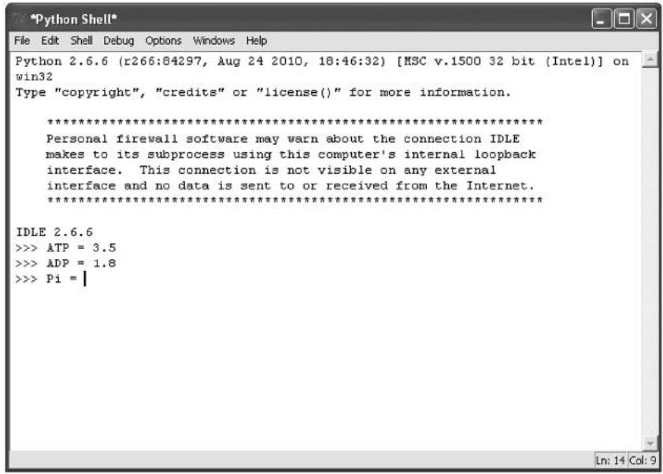  
그림 1.1 파이썬 셸. 참고: 실행하려면 UNIX 터미널 쉘(UNIX/Linux 또는 Mac OS X) 프롬프트에서 "python"을 입력하거나, 윈도우의 프로그램 메뉴에서 'Python (command line)'을 시작해야 합니다.

### 1.2.2 예제 파이썬 세션

```python
>>> ATP = 3.5
>>> ADP = 1.8
>>> Pi = 5.0
>>> R = 0.00831
>>> T = 298
>>> deltaG0 = -30.5
>>> import math
>>> deltaG0 + R * T * math.log(ADP * Pi / ATP)
-28.161154161098693
```

출처: A.Via/K.Rother가 파이썬 라이선스 하에 공개한 코드를 수정함.

### 1.3 명령어들은 무엇을 의미하나요?

프로그래밍에서 여러분이 하는 일의 대부분은 크게 다섯 가지로 요약할 수 있습니다. 데이터 정리, 다른 프로그램 사용, 수치 계산, 그리고 데이터 읽기와 쓰기입니다. 앞서 살펴본 예제에는 이 중 세 가지가 포함되어 있습니다. 첫째, ΔG 공식의 매개변수들을 변수(Variable)에 저장하여 정리합니다. 변수는 같은 숫자를 반복해서 쓰지 않도록 도와주는 컨테이너와 같습니다. 둘째, 로그를 계산하기 위해 외부 프로그램을 사용합니다. `math.log(x)` 함수는 x의 로그값을 계산하며, `import` 문을 통해 접근할 수 있습니다. `import` 문은 프로그램을 다른 모듈(Module, 예제에서는 math)에 연결하여 추가적인 파이썬 함수를 사용할 수 있게 해줍니다. 모듈은 변수, 함수 및 기타 유용한 객체들을 모아놓은 프로그래밍 단위로, 항상 파일에 저장됩니다. `import` 문과 파이썬 모듈에 대한 자세한 내용은 박스 1.1을 참조하세요.

마지막으로, 섹션 1.2.2의 예제는 ΔG 값을 계산합니다. 단순한 산술 계산은 휴대용 계산기를 사용하는 것과 매우 비슷합니다. 이 책의 2부에서는 데이터를 조작하는 다른 방법들을 다룹니다. 여러분이 직접 해볼 수 있는 첫 번째 일은 앞 섹션의 계산을 시작해 보는 것입니다.


::: {.callout-note}
## 박스 1.1 import 문과 모듈의 개념

다음과 같이 코드를 작성하면

```python
>>> import math
```

여러분은 `math` 모듈에 연결하게 됩니다. `math`란 정확히 무엇일까요? `math`는 여러분의 컴퓨터에 있는 파일입니다. 실제 이름은 `math.py`입니다. `.py` 확장자는 파이썬(Python)을 의미하며, 이 파일에는 변수와 함수의 정의, 그리고 계산을 위한 명령어와 같은 파이썬 지침들이 들어 있습니다. 특히 `math.py` 파일에는 수학 함수(예: `sqrt()`, `log()` 등)의 정의와 계산을 위한 명령어가 포함되어 있습니다.

파이썬에서 파이썬 명령어를 포함하는 텍스트 파일을 모듈(Module)이라고 부릅니다. 외부 모듈에 접근하여 그 내용을 읽으려면 `import` 명령어가 필요합니다. 이런 방식으로 모듈에 있는 모든 정의를 사용할 수 있게 되며, 결과적으로 코드를 공유하고 여러 프로그램에서 재사용할 수 있습니다.

`math` 모듈에 어떤 수학 함수들이 정의되어 있는지 어떻게 알 수 있을까요? 인터넷을 검색하여 `math.py` 파일을 직접 열어 내용을 확인하거나, 다음 명령어를 사용할 수 있습니다.

```python
>>> import math
>>> dir(math)
```

`dir(math)` 명령어는 `math` 모듈을 가져온 후에만 사용할 수 있습니다. 그렇지 않으면 `dir()` 함수가 인자가 무엇인지 알 수 없습니다. 결과적으로 `math` 모듈에 있는 변수와 함수의 전체 목록을 보게 될 것입니다.

```txt
['__doc__', ' _name _package__', 'acos', 'acosh', 'asin', 'asinh', 'atan', 'atan2', 'atanh', 'ceil', 'copysign', 'cos', 'cosh', 'degrees', 'e', 'exp', 'fabs', 'factorial', 'floor', 'fmod', 'frexp', 'fsum', 'hypot', 'isinf', 'isnan', 'ldexp', 'log', 'log10', 'log1p', 'modf', 'pi', 'pow', 'radians', 'sin', 'sinh', 'sqrt', 'tan', 'tanh', 'trunc']
```

예를 들어 다음과 같이 입력하면 각 함수에 대한 짧은 설명을 얻을 수 있습니다.

```python
>>> help(math.sqrt)
```

:::

### 1.3.1 컴퓨터에서 예제 실행하기

파이썬 프로그래밍 언어는 사용하기 전에 먼저 실행해야 하는 프로그램입니다. 리눅스(Ubuntu)와 맥 OS X에는 파이썬이 이미 설치되어 있으며, 텍스트 콘솔의 명령줄 프롬프트에서 "python"을 입력하여 시작할 수 있습니다. 텍스트 터미널에서 프로그램을 실행하는 방법은 부록 D를 참조하세요. 윈도우에서는 먼저 파이썬을 설치한 다음, '시작' -> '모든 프로그램' -> 'Python' -> 'IDLE' 또는 'Python (command line)'을 실행하여 파이썬 셸 창을 열어야 합니다. 먼저 www.python.org 에서 파이썬 3.10 이상의 버전을 다운로드하여 설치하세요. 자세한 내용은 박스 1.2를 참조하세요. 화면의 텍스트 창에 `>>>` 표시가 나타나면 성공입니다. 이제 프로그램 코드를 작성할 준비가 되었습니다(그림 1.1 참조). 파이썬 셸은 `Ctrl+D`를 눌러 종료할 수 있습니다.


::: {.callout-note}
## 박스 1.2 파이썬 설치 방법

리눅스와 맥 OS X에는 파이썬이 이미 설치되어 있습니다. 드문 경우지만 설치되어 있지 않다면 패키지 관리자를 이용하거나 터미널에 다음과 같이 입력하여 최신 버전을 설치할 수 있습니다.

```bash
sudo apt-get install python
```

윈도우에서는 www.python.org 에서 파이썬 윈도우 설치 프로그램을 다운로드해야 합니다. 반드시 파이썬 3.x 버전을 다운로드하세요. 설치 과정은 대부분의 프로그램과 마찬가지로 기본 옵션을 수락하며 클릭하면 됩니다.

설치가 성공적인지 확인하려면 파이썬을 실행해 보세요. 파이썬 코드를 실행하는 방법은 두 가지가 있습니다.

1. 대화형 모드(interactive mode, 파이썬 셸) 사용: 리눅스와 맥 OS X에서는 텍스트 콘솔에서 "python"을 입력하고 엔터를 누릅니다. 윈도우에서는 '시작' -> '프로그램' -> 'Python' -> 'Python (command line)'을 선택합니다. 별도의 창에서 파이썬 셸이 시작됩니다. 또는 '시작' -> '실행' 대화상자에서 "cmd"를 입력하여 텍스트 콘솔을 열고, 파이썬이 설치된 디렉토리로 이동하여 "python"을 입력할 수도 있습니다. `>>>` 프롬프트가 보이면 설치에 성공한 것입니다.

2. `.py` 확장자를 가진 스크립트 파일(예: `my_script.py`)에 코드를 작성하고, 터미널 프롬프트에서 다음과 같이 입력하여 실행하기:

```bash
python my_script.py
```

섹션 2.3.1 "프로그램 실행 방법"도 참조하세요.

:::

## 파이썬 셸 (The Python Shell)

대화형 모드는 학습과 코드 조각을 테스트하는 데 이상적입니다. 각 명령어가 작성되는 즉시 직접 실행됩니다. `>>>` 표시 뒤에 지침을 작성하고 엔터를 눌러 확인할 수 있습니다.

```python
>>> ATP = 3.5
>>> ATP
3.5
```

대화형 모드를 수치 계산에 사용할 수 있습니다.

```python
>>> 3 * 4
12
>>> 12.5 / 0.5
25.0
>>> (12.5 / 0.5) * 100
2500.0
>>> 3 ** 4
81
>>> 3 ** (4 + 2)
729
```

파이썬 셸의 단점은 세션을 종료하면(`Ctrl+D`) 작성한 코드가 사라진다는 점입니다. 따라서 코드를 저장하려면 텍스트 편집기에 복사하여 붙여넣어야 합니다. 텍스트 편집기에 대한 설명은 박스 2.2와 박스 D.2에 있습니다. 코드를 저장하기 위해서는 파일에 직접 파이썬 지침을 작성하는 것이 더 편리합니다. 예제 1.1이나 2장을 참조하세요.

무언가 잘못되면 파이썬은 오류 메시지를 반환하며, 그 내용은 오류 유형에 따라 다릅니다. 예를 들어 명령어를 잘못 입력하여 `import math` 대신 다음과 같이 쓰면

```txt
>>> imprtmath
```

"SyntaxError: invalid syntax"라는 메시지와 함께 오류를 수정하는 데 도움이 되는 추가 정보가 나타납니다. 발생할 수 있는 오류와 관리 방법은 12장에 설명되어 있습니다. 프로그래밍에서 실수를 하는 것은 매우 자연스러운 일입니다.

### 1.3.2 변수 (Variables)

섹션 1.2.2에서는 여러 변수가 초기에 정의되었습니다. 즉, 계산에 사용될 값들이 이름이 붙은 컨테이너에 담겼습니다.

예를 들어 다음과 같이 작성하면

```python
>>> ATP = 3.5
```

컴퓨터는 3.5라는 숫자를 `ATP`라는 이름으로 기억합니다. 나중에 다음과 같이 입력하면

```python
>>> ATP
```

컴퓨터가 3.5라는 값을 출력합니다.

같은 방식으로 사용된 모든 숫자(1.8, 5.0, 0.00831, 298, -30.5)가 각각의 변수(ADP, Pi, R, T, deltaG0)에 기록됩니다. 모든 숫자에는 단위가 없다는 점에 유의하세요. 휴대용 계산기를 사용할 때와 마찬가지로 단위를 적절히 변환해야 합니다. 이것이 기체 상수 $R \ ( 8 . 3 1 \ J / \mathrm { k m o l } )$에 대해

```txt
>>> R = 0.00831
```

이라는 값을 사용한 이유입니다. 이는 $\Delta \mathrm { G } ^ { 0 }$의 단위(kJ/kmol)와 일치시키기 위함입니다. 계산기를 쓸 때와 마찬가지로, 숫자를 적절한 단위로 변환하는 책임은 여러분에게 있습니다.

모든 종류의 객체를 변수에 저장할 수 있습니다. 즉, 데이터 조각에 이름을 붙여 "라벨"을 붙일 수 있으며, 데이터가 필요할 때마다 전체 데이터를 다시 쓰는 대신 변수 이름만 사용하면 됩니다. 데이터가 복잡하고 자주 사용될수록(예: 전체 유전자의 뉴클레오타이드 서열) 그 자리에 변수 이름을 사용하는 것이 더 편리합니다.

따라서 ATP 가수분해의 깁스 에너지 값인

$$
\Delta G ^ {0} = - 3 0. 5 \mathrm {k J / m o l}
$$

을 여러 번 사용하고 싶다면, 이를 변수에 넣고 숫자 대신 변수 이름을 사용하는 것이 좋습니다.

객체를 변수 이름에 할당하는 데 사용되는 연산자는 등호(`=`)입니다.

```txt
>>> deltag = -30.5
```

파이썬은 정수(Integer)와 부동 소수점(Float) 숫자를 구분합니다.

```txt
>>> a = 3
>>> b = 3.0
```

파이썬 용어로, 두 변수 `a`와 `b`는 서로 다른 데이터 유형(data type)을 가졌다고 말합니다. 변수 `a`는 정수이고, `b`는 부동 소수점입니다. 이 차이는 이 숫자들을 다른 정수로 나눌 때 확인할 수 있습니다.

```txt
>>> a / 2
1 # (참고: 파이썬 3에서는 1.5가 출력되지만, // 연산자를 쓰면 1이 됩니다)
>>> b / 2
1.5
```

정수를 부동 소수점으로 나누어 강제로 부동 소수점 변환을 수행할 수 있습니다.

```txt
>>> a / 2.0
1.5
```

변수에는 숫자, 텍스트 및 기타 다양한 종류의 데이터를 할당할 수 있습니다. 더 일반적으로는 이러한 데이터를 파이썬 객체(Object)라고 부릅니다. 다음 예제에서는 부동 소수점 객체를 변수에 할당합니다.

```txt
>>> deltag = -30.5
```

기존 변수 이름에 새 값을 할당하면 두 번째 값이 첫 번째 값을 덮어씁니다. 즉,

```txt
>>> deltag = -28.16
```

으로 설정하면 `deltag`는 이제 -30.5가 아니라 -28.16이 됩니다. 이후의 장들에서 더 많은 데이터 유형을 만나게 될 것입니다.

변수 이름을 선택할 때는 몇 가지 규칙이 있습니다.

* 일부 단어는 파이썬에서 특별한 의미를 갖기 때문에 변수 이름으로 사용할 수 없습니다. 예를 들어 `import`는 변수 이름으로 사용할 수 없습니다. 예약어(reserved word)의 전체 목록은 박스 1.3을 참조하세요.
* 변수 이름의 첫 글자는 숫자가 될 수 없습니다.
* 변수 이름은 대소문자를 구분합니다. 따라서 `var`와 `Var`는 서로 다른 이름입니다.
* 대부분의 특수 문자(예: $ % @ / \ . , [ ] ( ) { } #)는 허용되지 않습니다.


::: {.callout-note}
## 박스 1.3 파이썬의 예약어

파이썬의 예약어는 파이썬 내부에서 특별한 의미를 갖기 때문에 변수 이름으로 사용할 수 없습니다. 예를 들어 `and`, `assert`, `break`, `class`, `continue`, `def`, `del`, `elif`, `else`, `except`, `exec`, `finally`, `for`, `from`, `global`, `if`, `import`, `in`, `is`, `lambda`, `not`, `or`, `pass`, `print`, `raise`, `return`, `try`, `while` 등이 있습니다.

Q & A: 변수 이름에 대문자와 소문자를 섞어 써도 상관없나요?

다음 코드를 시도해 보세요.

```python
>>> ATP = 3.5
>>> atp = 8.0
>>> ATP
```

마지막 명령어의 결과는 8.0이 아니라 3.5입니다. 파이썬의 일반적인 규칙에 따라, 변수 이름을 지을 때 대문자와 소문자는 서로 다르게 취급됩니다.

Q & A: 변수를 처음 사용하면 어떤 일이 일어나나요?

일부 프로그래밍 언어에서는 사용하려는 모든 변수를 미리 나열하고 메모리를 명시적으로 예약해야 합니다. 하지만 파이썬에서는 그럴 필요가 없습니다. 파이썬 인터프리터는 모든 것을 객체로 취급합니다. 즉, 여러분이 새로운 변수 이름을 사용할 때마다 파이썬은 데이터의 성격(정수, 부동 소수점, 텍스트 등)을 인식하고 그에 맞는 메모리를 예약합니다. 또한 파이썬은 변수 유형에 따라 사용할 수 있는 기능 목록을 자동으로 연결합니다. 예를 들어, 앞에서 정의한 수치 변수 `a`와 `b`는 더하기, 빼기, 곱하기 등 표 1.2에 표시된 모든 산술 연산을 수행할 수 있다는 것을 "알고" 있습니다.

표 1.2 파이썬의 산술 연산

<table><tr><td>연산자</td><td>의미</td></tr><tr><td>a + b</td><td>더하기</td></tr><tr><td>a - b</td><td>빼기</td></tr><tr><td>a * b</td><td>곱하기</td></tr><tr><td>a / b</td><td>나누기</td></tr><tr><td>a ** b</td><td>거듭제곱 (a^b)</td></tr><tr><td>a % b</td><td>나머지 (modulo): a / b 나눗셈의 나머지</td></tr><tr><td>a // b</td><td>몫 (floor division): 소수점 이하를 버림</td></tr><tr><td>a * (b + c)</td><td>괄호: 곱셈보다 b + c 연산을 먼저 수행함</td></tr></table>

:::

### 1.3.3 모듈 가져오기 (Importing Modules)

변수를 정의한 후, 섹션 1.2.2의 파이썬 세션에서 다음 명령어는 수학 함수가 포함된 모듈을 가져옵니다. 파이썬에서 `import`는 설치된 외부 라이브러리나 개별 변수 및 함수를 활성화하는 명령어입니다. `math`는 파이썬과 함께 자동으로 설치되는 라이브러리 모듈의 이름입니다. 다음과 같이 활성화합니다.

```txt
>>> import math
```

이 장에서는 로그를 계산하기 위해 `math` 모듈의 `log` 함수를 사용하고 있습니다. `math`에서 사용할 수 있는 전체 함수 목록은 http://docs.python.org/2/library/math.html 을 참조하거나 파이썬 셸에서 다음을 입력하세요.

```txt
>>> dir(math)
```

모든 모듈은 함수와 변수를 포함할 수 있습니다. 모듈은 코드를 재사용하고, 큰 프로그램을 작은 부분으로 나누어 더 잘 조직하기 위해 사용됩니다. 예를 들어 기체 상수 $R$과 같은 상수가 필요할 때마다 매번 다시 정의하지 않고 해당 모듈에서 가져올 수 있습니다. 파이썬 표준 라이브러리에 모여 있는 모듈들은 기본적으로 다른 사람들이 여러분을 위해 미리 작성하고 최적화해 놓은 추가 함수들입니다.

파이썬은 `import` 명령어를 통해 수백 개의 모듈(즉, 함수들의 집합)을 사용할 수 있게 해줍니다. 게다가 파이썬 지침을 텍스트 파일에 쓰고 `.py` 확장자로 저장함으로써 여러분만의 모듈을 직접 만들 수도 있습니다(예제 1.2 참조). 모듈에 대해서는 이 책의 3부에서 더 자세히 다룰 것입니다.

`math` 모듈의 로그 함수를 사용하기 위해 우리는 `math.log`라는 표기법을 사용했습니다. 모듈 이름과 함수 이름 사이의 점(`.`)은 파이썬에서 매우 특별한 역할을 합니다. 점은 객체들 사이의 "연결자"입니다. 점의 오른쪽에 있는 객체는 왼쪽 객체의 속성(attribute)이라고 말합니다. 따라서

```txt
>>> math.log
```

는 `log` 객체(함수)가 `math` 객체(모듈)의 속성임을 의미합니다. 즉, `log`는 `math` 모듈의 일부이며, 모듈을 가져온 후에 이를 사용하려면 점 구문(dot syntax)을 사용하여 참조해야 합니다. 이는 파이썬의 모든 것에 해당됩니다. 객체 A가 객체 B를 포함하고 있다면 이를 사용하기 위한 구문은 `A.B`입니다. 만약 B가 C를 포함하고 있다면 `A.B.C`라고 쓸 수 있습니다.

모듈에서 특정 객체만 선택적으로 가져올 수도 있습니다. 즉, 모듈의 전체 내용 대신 단일 객체나 몇 개의 객체만 가져오고 싶을 때가 있습니다. 전체 `math` 모듈 대신 로그 함수만 가져오려면 다음과 같이 쓸 수 있습니다.

```txt
>>> from math import log
```

이제 가져온 함수를 사용하려면 `math.log` 대신 직접 `log`라고 쓰면 됩니다. 특정 시점에 어떤 변수와 함수 이름을 사용할 수 있는지는 파이썬 네임스페이스(namespace) 개념을 통해 가장 잘 설명할 수 있습니다(박스 1.4 참조).


::: {.callout-note}
## 박스 1.4 네임스페이스 (NAMESPACES)

모듈에 정의된 객체 이름(변수, 함수 등)의 집합을 해당 모듈의 네임스페이스라고 부릅니다. 각 모듈은 자신만의 네임스페이스를 가집니다. 예를 들어 `math` 모듈의 네임스페이스에는 `pi`, `sqrt`, `cos` 등의 이름이 포함되어 있습니다. 반면 `random` 모듈의 네임스페이스에는 앞의 이름들은 없지만 `randomint`나 `random` 같은 이름들이 들어 있습니다. 파이썬 셸조차도 `print` 등을 포함하는 자신만의 네임스페이스를 가지고 있습니다.

서로 다른 두 모듈에 같은 이름(예: `pi`)이 있더라도 이는 두 개의 별개 객체를 나타낼 수 있으며, 점 구문(dot syntax) 덕분에 두 모듈의 네임스페이스 사이에서 혼동을 피할 수 있습니다. `import` 명령어가 실행될 때 실제로 어떤 일이 일어날까요? 가져온 모듈에 작성된 코드가 전부 읽히고 해석되며, 해당 네임스페이스도 함께 가져오지만 가져오는 모듈의 네임스페이스와는 분리된 상태로 유지됩니다. 따라서 다음과 같이 작성하면

```txt
>>> import math
>>> sqrt(16)
```

```txt
Traceback (most recent call last):
    File "<stdin>", line 1, in <module>
NameError: name 'sqrt' is not defined
>>> 
```

점 구문을 사용하지 않는 한 `sqrt`라는 이름은 `math` 모듈의 속성으로 인식되지 않습니다.

```txt
>>> math.sqrt(16)
4.0
>>> 
```

하지만 다음과 같이 사용하면

```txt
>>> from math import sqrt
```

여러분은 실제로 `math` 네임스페이스를 파이썬 셸의 네임스페이스와 병합하는 것입니다. 이제 다음과 같이 직접 사용할 수 있습니다.

```txt
>>> sqrt(16)
4.0
>>> 
```

두 모듈의 네임스페이스를 병합할 때는 변수 이름을 어떻게 사용하고 있는지 주의해야 합니다. 실제로 다음과 같은 지침을 사용하여 `math` 모듈의 모든 내용을 가져오면

```txt
>>> from math import *
```

다음과 같은 결과를 얻게 되지만

```txt
>>> pi
3.141592653589793
```

다음과 같이 입력하면

```txt
>>> pi = 100
```

`math` 모듈에서 가져온 `pi` 변수를 실제로 덮어쓰게 되며, `pi`는 더 이상 $\pi$ 값을 갖지 않게 됩니다. 이는 계산에서 예기치 않은 결과를 초래할 수 있습니다.

Q & A: math 라이브러리가 이미 설치되어 있는데 왜 굳이 import를 해야 하나요?

파이썬에는 `math` 외에도 약 100여 개의 서로 다른 라이브러리가 있습니다. 이들을 모두 합치면 수천 개의 함수가 존재합니다. 모든 함수를 한꺼번에 검색하는 것은 숙련된 프로그래머에게도 매우 혼란스러운 일일 것입니다. 이것이 기능들이 모듈별로 그룹화된 이유입니다. 따라서 여러분은 필요한 경우에만 파이썬 프로그램에 추가 구성 요소를 더할 수 있습니다.

:::

### 1.3.4 계산 (Calculations)

ΔG 예제의 마지막 부분에서 실제 계산이 이루어집니다. 섹션 1.2.2의 공식을 코드로 옮기면 더하기(`+`), 두 개의 곱하기(`*`), 나누기(`/`), 그리고 자연로그(`math.log(...)`)가 포함됩니다. `log` 뒤의 괄호는 필수입니다. 파이썬은 빼기(`-`), 거듭제곱(`**`), 몫 계산(`//`, 소수점 버림), 그리고 나머지 계산(`%`, 나눗셈의 나머지를 반환)도 지원합니다.

```txt
>>> deltaG0 + R * T * math.log(ADP * Pi / ATP)
```

엔터를 누르면 즉시 결과가 표시됩니다.

```
-28.161154161098693 
```

#### 표준 산술 연산

대부분의 계산은 ΔG 값을 계산하는 것보다 간단할 것입니다. 산술 연산은 명령 프롬프트에서 바로 수행할 수 있습니다.

```diff
>>> a = 3
>>> b = 4
>>> a + b
7
```

또는 변수를 생략하고 숫자를 직접 쓸 수도 있습니다.

```txt
>>> 3 + 4
7
```

표 1.2는 파이썬에서 사용할 수 있는 산술 연산에 대한 개요를 보여줍니다.

Q & A: 숫자를 쓸 때 소수점을 꼭 붙여야 하나요?

두 가지 주의할 점이 있습니다. 첫째, 정수로 계산을 수행하면 결과도 정수가 됩니다. 둘째, 부동 소수점으로 계산하면 결과도 부동 소수점이 됩니다. 예를 들어 다음 나눗셈을 실행하면

```txt
>>> 4 / 3
1 # (참고: 파이썬 3에서는 1.333...이 나오지만, // 연산자를 쓰면 1이 됩니다)
```

결과는 정수 1입니다. 자동으로 내림되기 때문입니다. 하지만 소수점을 하나만 추가해도 결과가 달라집니다.

```txt
>>> 4.0 / 3.0
1.333333333333333
```

두 번째 나눗셈의 결과는 소수점 아래 16자리 정밀도로 제공됩니다. 계산 시 정수와 부동 소수점을 함께 사용하면 결과도 부동 소수점이 됩니다.

Q & A: 변수를 왜 사용하나요? ΔG 예제에서도 그냥 숫자를 공식에 직접 넣는 게 더 간단하지 않나요?

그럴 수도 있고 아닐 수도 있습니다. 쓰는 줄 수가 적어진다는 점에서는 그렇습니다. 하지만 코드를 읽기가 훨씬 어려워지고 재사용할 수 없게 된다는 점에서는 아닙니다. ΔG 값을 계산하는 코드를 다시 생각해 보세요.

```txt
>>> -30.5 + 0.000831 * 298 * math.log(1.8 * 5.0 / 3.5)
-30.26611541610987
```

수학적으로는 계산이 맞더라도 이 결과가 사실 틀렸다는 것을 알아내는 데 얼마나 걸릴까요? 다음과 같이 변수를 사용한다면 문제를 발견하기가 더 쉬워집니다.

```txt
>>> R = 0.000831
```

하지만 실제로는 다음과 같아야 합니다.

```txt
>>> R = 0.00831
```

첫 번째 줄에서는 단위를 변환하는 과정에서 소수점 한 자리를 빠뜨렸습니다. 이는 매우 흔한 프로그래밍 오류입니다. 종종 오류는 프로그램 자체보다는 데이터에 대한 오해에서 비롯됩니다. 이러한 문제를 더 쉽게 발견하는 방법에 대한 아이디어는 12장과 15장에 설명되어 있습니다.

#### 수학 함수

다음 명령어를 실행하면

```python
>>> import math
```

`math` 모듈의 수학 함수 세트를 현재 파이썬 대화형 세션에서 사용할 수 있게 됩니다. `math` 모듈의 가장 중요한 함수들은 표 1.3에 나열되어 있습니다.

표 1.3 math 모듈에 정의된 주요 함수들

<table><tr><td>함수</td><td>의미</td></tr><tr><td>log(x)</td><td>x의 자연로그 (ln x)</td></tr><tr><td>log10(x)</td><td>x의 상용로그 (log10 x)</td></tr><tr><td>exp(x)</td><td>x의 자연지수 (e^x)</td></tr><tr><td>sqrt(x)</td><td>x의 제곱근 (square root)</td></tr><tr><td>sin(x), cos(x)</td><td>x의 사인과 코사인 (x는 라디안 단위)</td></tr><tr><td>asin(x), acos(x)</td><td>x의 아크사인과 아크코사인 (결과는 라디안 단위)</td></tr></table>

파이썬에서 함수를 사용할 때는 괄호를 반드시 써야 합니다.

```txt
>>> math.sqrt(49)
7.0
```

`math` 모듈은 상수 `math.pi`($\pi = 3.14159$)와 `math.e`($e = 2.71828$)도 정의하고 있습니다. 이들은 다른 변수와 마찬가지로 사용할 수 있습니다. 예를 들어, 길이가 $115\mathrm{mm}$이고 너비가 $30\mathrm{mm}$인 $50\mathrm{ml}$ 팔콘 튜브(Falcon tube, 원심분리에 사용되는 플라스틱 실린더)의 부피를 계산하려면 `math.pi`를 사용할 수 있습니다.

```txt
>>> diameter = 30.0
>>> radius = diameter / 2.0
>>> length = 115.0
>>> math.pi * radius ** 2 * length / 1000.0
81.2887099116359
```

출처: A.Via/K.Rother가 파이썬 라이선스 하에 공개한 코드를 수정함.

### 1.4 예제 (EXAMPLES)

### 예제 1.1 두 지점 사이의 거리 계산하기

3차원 공간의 한 점은 데카르트 좌표 $(x, y, z)$로 정의됩니다. 좌표가 각각 $(x_1, y_1, z_1)$과 $(x_2, y_2, z_2)$인 두 점 $p_1$과 $p_2$ 사이의 거리 $d$는 다음 방정식으로 주어집니다.

$$
d \left(p _ {1}, p _ {2}\right) = \sqrt {\left(x _ {1} - x _ {2}\right) ^ {2} + \left(y _ {1} - y _ {2}\right) ^ {2} + \left(z _ {1} - z _ {2}\right) ^ {2}}
$$

두 점의 좌표는 각각 x1, y1, z1 및 x2, y2, z2라는 6개의 변수에 저장할 수 있습니다. `math` 모듈에서 두 가지 메서드(`pow()`와 `sqrt()`)가 필요합니다. 다음 스크립트에서는 실제로 `math` 모듈의 모든 함수(`*`)를 가져옵니다. `pow(i, j)` 메서드는 두 개의 인자를 가집니다. 거듭제곱하려는 숫자 `i`와 지수 `j`입니다.

```txt
>>> from math import *
>>> x1, y1, z1 = 0.1, 0.0, -0.7
>>> x2, y2, z2 = 0.5, -1.0, 2.7
>>> dx = x1 - x2
>>> dy = y1 - y2
>>> dz = z1 - z2
>>> dsquare = pow(dx, 2) + pow(dy, 2) + pow(dz, 2)
>>> d = sqrt(dsquare)
>>> d
3.5665109000254018 
```

### 예제 1.2 자신만의 모듈 만들기

기술적으로 파이썬 모듈은 `.py`로 끝나는 텍스트 파일입니다(박스 1.1 참조). 여기에 변수와 파이썬 코드, 함수 등을 배치할 수 있습니다. 짧은 파이썬 모듈은 작성해서 빠르게 사용할 수 있습니다. 예를 들어 ATP 상수를 별도의 모듈로 분리하는 과정은 4단계로 이루어집니다.

1. 텍스트 편집기로 새 텍스트 파일을 만듭니다.
2. `.py`로 끝나는 이름(예: `hydrolysis.py`)을 붙입니다.
3. 코드를 추가합니다. 예를 들어 다음과 같이 ATP 상수를 추가할 수 있습니다.

ATP = -30.5

4. 마지막으로 파이썬 셸에서 모듈을 가져옵니다.

```txt
>>> import hydrolysis
또는
>>> from hydrolysis import ATP
```

`import`가 작동하려면 모듈 파일을 파이썬 셸을 시작한 것과 같은 디렉토리(리눅스와 맥) 또는 파이썬 라이브러리 경로(윈도우의 경우 `C:/Python3x/lib/site-packages/`)에 저장해야 합니다. 모듈을 다른 디렉토리에 저장하고(모든 모듈을 모아두는 특별한 디렉토리를 만들고 싶을 수도 있습니다), 그 경로를 `sys.path`라는 특별한 파이썬 변수(즉, `sys` 모듈에 속한 `path` 변수)에 추가할 수도 있습니다. 이에 대해서는 책의 후반부에서 설명하겠습니다.

### 1.5 스스로 테스트하기

### 연습 문제 1.1 세 조직 모두에 대해 ΔG 값 계산하기

어느 조직에서 ATP 가수분해가 가장 많은 에너지를 방출합니까? 앞서 제공된 코드를 사용하여 답을 찾아보세요. (표 1.1 참조)

### 연습 문제 1.2 값을 kcal로 변환하기

세 조직 모두에 대해 세 가지 ΔG 값을 kcal/mol로 계산하세요. 변환 계수는 $1\mathrm{kcal/mol} = 4.184\mathrm{kJ/mol}$입니다.

### 연습 문제 1.3 pH 계산

어떤 용액의 양성자 농도가 0.003162 mM입니다. 이 용액의 pH는 얼마입니까?

### 연습 문제 1.4 지수적 성장

최적의 성장 조건이 주어지면, 단일 대장균(E. coli) 박테리아는 20분 이내에 분열할 수 있습니다. 조건이 최적으로 유지된다면 6시간 후에 박테리아는 몇 마리가 될까요?

### 연습 문제 1.5 박테리아 세포의 부피 계산하기

대장균 세포의 평균 길이는 $2.0\mu\mathrm{m}$이고 직경은 $0.5\mu\mathrm{m}$입니다. 박테리아 세포가 완벽한 원통형이라고 가정할 때, 세포 한 개의 부피는 얼마일까요? 파이썬을 사용하여 계산해 보세요. 매개변수에 변수를 사용하세요.

## 첫 번째 파이썬 프로그램 (Your First Python Program)

학습 목표: 입력(Input), 동작, 출력(Output)으로 구성된 프로그램을 작성할 수 있습니다.

### 2.1 이 장에서 배울 내용

* 입력, 동작, 출력으로 구성된 프로그램을 작성하는 방법
* 지침을 반복하는 방법
* 컴퓨터 화면에 결과를 출력하는 방법
* 서열에 대해 슬라이딩 윈도우(sliding window)를 실행하는 방법

### 2.2 스토리: 인슐린 서열 내 아미노산 빈도 계산하기

### 2.2.1 문제 설명

이 장에서는 인슐린(insulin)의 단백질 서열을 분석하는 방법을 배웁니다. 인슐린은 최초로 발견된 단백질 중 하나입니다. 프레데릭 배팅(Frederick Banting)과 존 매클라우드(John Macleod)는 인슐린의 기능을 발견한 공로로 1923년에 노벨상을 받았습니다. 그로부터 90년이 지난 지금, 인간 인슐린은 의학적, 경제적으로 매우 중요하며, 특히 당뇨병을 앓고 있는 2억 8,500만 명의 사람들에게 필수적입니다. 단백질의 기능적 형태 자체는 번역 생성물에서 두 개의 단편이 단백질 분해를 통해 제거된 후 51개의 아미노산 길이를 가집니다. 이 장에서 다룰 문제는 '단백질 서열에서 20가지 아미노산이 각각 얼마나 자주 나타나는가?'입니다.

단백질의 아미노산 빈도를 분석하면 얼마나 많은 시스테인(cysteine)이 이황화 결합(disulphide bond)을 형성할 수 있는지, 막 관통 도메인(transmembrane domain)을 나타내는 비극성 잔기가 비정상적으로 많은지, 혹은 핵산 결합에 관여할 수 있는 양전하 잔기가 많은지 등을 파악하는 데 도움이 됩니다. 인슐린에 대해 이러한 수치를 결정하는 데는 다음과 같은 몇 가지 가능성이 있습니다.

* 아미노산 개수를 수동으로 세기. 단백질이 짧고 분석할 단백질이 하나 또는 몇 개뿐일 때는 이 방법이 괜찮습니다.
* 즐겨 사용하는 텍스트 편집기의 '검색-교체' 기능을 각 아미노산에 대해 영리하게 활용하기. 긴 단백질의 경우 수동으로 세는 것보다 낫지만, 많은 단백질을 분석하려는 경우에는 이 역시 그다지 편리하지 않습니다.
* 컴퓨터 프로그램 작성하기. 이 장에서는 파이썬 언어로 작성된 프로그램을 사용할 것입니다. 박스 2.1에는 컴퓨터가 잔기(residue)를 세는 방식에 대한 고찰이 담겨 있습니다.


::: {.callout-note}
## 박스 2.1 C의 개수를 세는 방법

다음 서열에 C가 몇 개 있나요?

CCCHAJEAFIELAKJNFVLAIFEJLIEFJDCCCEFLEFJ

서열을 유심히 살펴보면 6개의 C가 있다는 것을 알 수 있을 것입니다. 여러분은 직관적으로 계산이 어떻게 이루어져야 하는지 이해하고 정확한 결과를 얻었습니다. 하지만 컴퓨터에게 이 작업을 대신 하도록 어떻게 말할 수 있을까요?

그 답에는 프로그래밍에 관한 많은 내용이 담겨 있습니다. 먼저 수행해야 할 작업을 완전히 이해한 다음, 그것을 정확하게 설명해야 합니다. 그렇다면 여러분은 정확히 어떻게 C를 셌나요? 아마도 다음 중 하나를 수행했을 것입니다.

* 왼쪽에서 오른쪽으로 각 문자를 확인하며 발견한 각 C를 셌습니다.
* 오른쪽에서 왼쪽으로 각 문자를 확인하며 발견한 각 C를 셌습니다.
* 모든 문자를 세는 데 시간이 너무 오래 걸릴 것이라고 판단하여 추정치를 계산했습니다.

처음 두 가지 옵션을 고려해 보세요. 두 옵션 모두 본질적으로 모든 문자를 검사하고 모든 C를 셉니다. 왼쪽에서 시작하든 오른쪽에서 시작하든 무슨 차이가 있을까요? 컴퓨터에게는 차이가 있습니다! 컴퓨터에는 직관이 없습니다. 컴퓨터는 스스로 어느 쪽에서 시작할지 결정할 수 없습니다. 여러분에게는 명백하더라도 컴퓨터는 여러분이 무엇을 기대하는지 결론 내릴 수 없습니다. 따라서 아주 작은 세부 사항까지 무엇을 해야 할지 알려줘야 합니다. 프로그램 코드로 쉽게 번역될 수 있는 정확한 지침은 다음과 같습니다.

1. 카운터(counter)를 0으로 설정합니다.
2. 서열의 첫 번째 문자를 봅니다.
3. 만약 그것이 C라면, 카운터에 1을 더합니다.
4. 마지막 문자에 도달했다면, 카운터 값을 출력합니다.
5. 그렇지 않다면, 다음 문자로 이동하여 3단계부터 반복합니다.

프로그래밍의 많은 부분은 과업을 아주 작은 작업들로 쪼개는 것입니다. 세 번째 옵션은 예상치 못한 접근 방식인 '추정'을 사용합니다. 거대한 서열의 경우, 참조 데이터로부터 합리적인 추측을 하는 것이 타당할 수 있습니다. 조건은 컴퓨터에게 추측하는 방법을 알려주고 그 추측이 충분히 정확해야 한다는 것입니다. 어떤 경우든 프로그래밍을 할 때 직관에 반하는 해결책에 대해서도 열린 마음을 가지세요. 그것이 계산이든 추측이든, 일단 컴퓨터에게 무엇을 해야 할지 알려주면 컴퓨터는 그것을 믿을 수 없을 정도로 빠르게 수행합니다. 여러분이 관심을 갖는 것이 하나의 짧은 서열이든, 수백 개의 서열이든, 아니면 전체 게놈이든, 이 박스의 시작 부분에 있는 서열이 여러분이 직접 수동으로 세어야 했던 마지막 서열이 되길 바랍니다.

이전 장에서 여러분은 변수에 데이터를 저장하고, 계산을 수행하고, 모듈을 가져와 사용하는 방법을 배웠습니다. 섹션 2.2.2의 파이썬 세션에서는 네 가지를 더 배울 것입니다. 첫째, `#` 기호를 사용하여 코드 한 줄을 주석 처리하여 파이썬 인터프리터가 이를 실행하지 않도록 하는 방법을 배웁니다. 둘째, 문자열(string)이라는 데이터 유형을 사용하여 변수에 텍스트를 저장하는 방법을 배웁니다. 아미노산을 세기 위해 단백질 문자열의 메서드(데이터 객체와 연결된 함수)를 사용할 것입니다. 셋째, 동작을 여러 번 반복하는 방법을 배웁니다. 이를 위해 `for` 루프가 사용됩니다. 넷째, 마지막으로 `print` 명령어를 사용하여 화면에 가시적인 출력을 생성하는 방법을 볼 것입니다(박스 2.4 참조).

중요하게도, 다음 파이썬 세션은 파일에 기록되어 실행되도록 의도되었습니다(박스 1.2 및 섹션 2.3.1 참조). 다음에서 파이썬 셸 프롬프트 `>>>`가 앞에 붙지 않은 코드 줄은 텍스트 파일에 기록되어 실행되어야 함을 의미합니다(그림 2.1 참조).

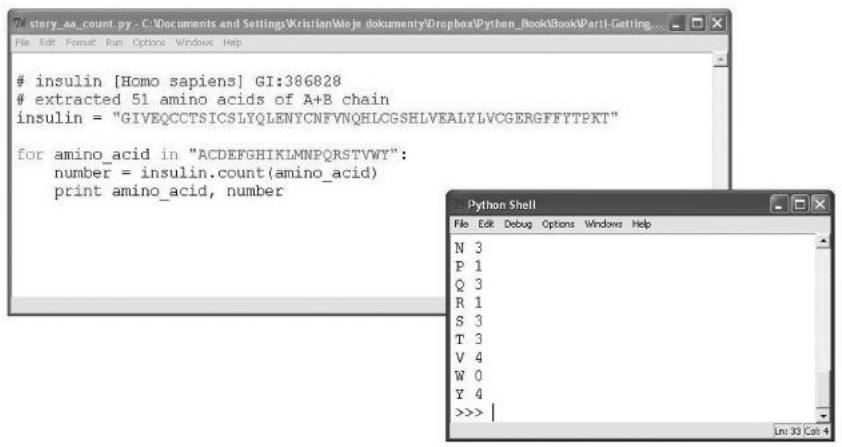  
그림 2.1 텍스트 파일과 파이썬 셸. 참고: 왼쪽 패널: 텍스트 파일에 작성된 스크립트. 오른쪽 패널: 파이썬 셸에서 스크립트 실행.

:::

### 2.2.2 예제 파이썬 세션

```txt
insulin [Homo sapiens] GI:386828  
# extracted 51 amino acids of A+B chain  
insulin = "GIVEQCCTSICSLYQLENYCNFVNQHLCGSHLVEALYLVCGERGFFYTPKT"  
for amino_acid in "ACDEFGHIJKLMNPQRSTVWY":  
    number = insulin.count( amino_acid)  
    print(amino_acid, number)
```

출처: A.Via/K.Rother가 파이썬 라이선스 하에 공개한 코드를 수정함.

### 2.3 명령어들은 무엇을 의미하나요?

프로그램은 다음과 같은 20 x 2 테이블을 생성합니다.

<table><tr><td>A</td><td>1</td></tr><tr><td>C</td><td>6</td></tr><tr><td>D</td><td>0</td></tr><tr><td>E</td><td>4</td></tr><tr><td>F</td><td>3</td></tr><tr><td>G</td><td>4</td></tr><tr><td>H</td><td>2</td></tr><tr><td>I</td><td>2</td></tr><tr><td>K</td><td>1</td></tr><tr><td>L</td><td>6</td></tr><tr><td>M</td><td>0</td></tr><tr><td>N</td><td>3</td></tr><tr><td>P</td><td>1</td></tr><tr><td>Q</td><td>3</td></tr><tr><td>R</td><td>1</td></tr><tr><td>S</td><td>3</td></tr><tr><td>T</td><td>3</td></tr><tr><td>V</td><td>4</td></tr><tr><td>W</td><td>0</td></tr><tr><td>Y</td><td>4</td></tr></table>

### 2.3.1 프로그램 실행 방법

파이썬 셸에서 작업할 때는 명령어를 입력하기 위한 창만 있었습니다. 프로그램은 어디에 입력할 수 있을까요? 물론 위의 명령어들을 파이썬 셸에 입력해도 작동할 것입니다. 하지만 그렇게 하면 인슐린 서열을 입력하는 것을 포함하여 프로그램을 사용할 때마다 매번 다시 입력해야 합니다!

더 편리한 옵션은 프로그램을 텍스트 파일에 저장하는 것입니다. 텍스트 파일은 텍스트 편집기를 사용하여 열 수 있습니다(박스 2.2 및 박스 D.2 참조). 파이썬 프로그램을 포함하는 텍스트 파일은 `.py` 확장자를 가져야 합니다(접미사가 보이지 않을 수도 있습니다). 리눅스와 맥에서는 터미널 창에서 다음과 같이 입력하여 파이썬 프로그램을 실행할 수 있습니다.

python aa_count.py


::: {.callout-note}
## 박스 2.2 프로그래밍을 위한 텍스트 편집기

프로그래밍을 위한 텍스트 편집기는 파일을 생성하고, 파일에 내용을 쓰고, 하드 디스크에 저장할 수 있어야 합니다. 기본적인 텍스트 편집기의 예로는 Notepad++, Vim(http://www.vim.org/), TextEdit, Pico, Gedit(http://projects.gnome.org/gedit/) 등이 있습니다. 이들 중 대부분은 파이썬 코드의 구문을 자동으로 강조(syntax highlighting)해 줍니다. 일반 텍스트 편집기를 사용할 때는 탭(tab)이 자동으로 공백(space)으로 바뀌도록 설정되어 있는지 확인하세요. Gedit에서는 '편집(Edit) => 기본 설정(Preferences)'에서 이를 구성할 수 있습니다. '편집기(Editor)' 탭으로 이동하여 '탭 대신 공백 삽입(Insert spaces instead of tabs)' 확인란을 선택하세요.

IDLE 편집기(윈도우에서 파이썬과 함께 자동으로 설치됨)는 코드 블록을 인식하고 조작할 수 있습니다(즉, 들여쓰기를 관리해 줍니다). 리눅스와 맥 OS X에서 iPython은 향상된 파이썬 셸로, 코드 구문 강조를 제공할 뿐만 아니라 TAB 키를 눌러 많은 함수의 자동 완성을 가능하게 합니다(http://ipython.org/ 참조).

파이썬에는 프로그래밍의 여러 측면을 도와주는 통합 개발 환경(Integrated Development Environments) 또는 IDE라고 불리는 정교한 편집기들이 여러 개 있습니다. 첫째, 편집기는 공백 추가, 키워드를 다른 색상으로 강조, 누락된 괄호 강조 등을 통해 코드를 일관되게 형식화하는 데 도움을 줍니다. 일부 IDE는 구문 오류를 강조하기도 합니다. 코드를 작성하는 동안 이름과 문서를 즉석에서 찾아볼 수 있습니다. 디버깅(debugging) 중에는 `print` 문을 추가하지 않고도 프로그램을 단계별로 진행하며 변수 값을 추적할 수 있습니다. 인기 있는 파이썬 IDE로는 Eric(리눅스), SPE(리눅스), Sublime Text(윈도우/맥/리눅스, http://www.sublimetext.com) 등이 있습니다.

윈도우에서는 IDLE 편집기('시작' '모든 프로그램' 'Python' 'IDLE'에서 새 파일 생성)에서 파이썬 파일을 열고 F5 키를 눌러 프로그램을 실행하거나 메뉴에서 '실행(Run)' '모듈 실행(Run Module)'을 선택할 수 있습니다.

:::

### 2.3.2 프로그램은 어떻게 작동하나요?

파이썬 프로그래밍 언어에서 프로그램은 한 줄씩 차례대로 실행됩니다. 각 프로그램 줄에는 파이썬 인터프리터가 수행해야 할 작업을 알려주는 지침이 들어 있습니다. `aa_count.py`의 각 줄에서 어떤 일이 일어날까요?

* # insulin. 첫 번째 줄은 아무 작업도 하지 않습니다. 해시 기호 `#`는 이것이 주석(comment)임을 나타냅니다(섹션 2.3.3 참조).
* insulin = "MALWM...". 여기서는 단백질 서열이 `insulin`이라는 변수에 저장됩니다. 단백질 서열은 문자열(string)이라고도 불리는 텍스트로 정의됩니다(섹션 2.3.4 참조). 줄 끝에 있는 백슬래시 `\`는 단백질 서열이 다음 줄에서도 계속됨을 나타냅니다.
* for amino_acid. 이 구조는 A, C, D, E...와 같은 20개의 문자를 훑는 루프(loop)를 시작하며, 각 문자에 대해 다음 두 줄의 지침을 반복합니다. `amino_acid`라는 이름은 각 라운드에서 단일 문자를 포함하는 변수입니다. 루프는 `amino_acid` 변수가 "ACDEFGHIKLMNPQRSTVWY" 문자열의 마지막 글자에 도달하면 멈춥니다.
* number = insulin.count(...). 이것은 텍스트 조각 내에서 문자가 얼마나 자주 나타나는지 계산하는 함수를 호출합니다. 이 경우 인슐린 단백질 서열에서 해당 아미노산이 몇 번 나오는지 계산합니다. 결과는 변수에 저장됩니다.
* print(amino_acid, number). 이것은 아미노산과 계산 결과를 화면에 출력합니다.

마지막 세 줄은 코드 블록(code block)을 형성합니다. 즉, 이들은 함께 실행되며, 이 경우에는 `for` 명령어가 명령어 블록을 반복하기 때문에 20번 실행됩니다. `for` 명령어와 관련된 줄들은 4개의 공백으로 들여쓰기되어 그룹화됩니다. 이 코드 블록의 효과는 프로그램이 다음과 같이 작성된 것과 같습니다.

number = insulin.count("A")   
print("A", number)   
number = insulin.count("C")   
print("C", number)   
number = insulin.count("D")   
print("D", number)   
...

따라서 루프와 명령어 블록을 결합하면 중복된 코드를 많이 작성하는 것을 피할 수 있습니다.

파이썬에서는 보통 한 줄에 하나의 지침을 가집니다. 하지만 인슐린 서열처럼 긴 지침은 여러 줄에 걸쳐 있을 수 있습니다. 그럴 경우 마지막 줄을 제외한 모든 줄의 끝에 백슬래시 문자 `\`를 붙여야 합니다.

```txt
>> 3 + 5 +  
... 7  
15 
```

### 2.3.3 주석 (Comments)

주석은 파이썬 인터프리터가 아니라 다른 프로그래머(또는 며칠, 몇 주 후에 자신의 프로그램을 읽는 본인)에게 전달하는 코드 조각입니다. 다시 말해, 코드가 무엇을 하는지 설명하기 위해 사용되는 프로그램 내부의 문서와 같습니다. 인터프리터가 무시하길 원하는 텍스트 앞에는 `#` 기호를 붙여야 합니다.

```txt
>>> print("ACCTGGCACAA") # 이것은 DNA 서열 ACCTGGCACAA입니다. 
```

### 2.3.4 문자열 변수 (String Variables)

1장에서 변수 이름에 숫자를 할당하는 것만으로 숫자를 변수에 저장할 수 있다는 것을 보았습니다.

$\mathbf{x} = 34$

텍스트 변수는 문자열(string)이라는 데이터 유형을 포함합니다. 숫자와 달리 파이썬의 문자열은 작은따옴표('abc'), 큰따옴표("abc"), 또는 삼중 따옴표('''abc''' 또는 """abc""")로 묶어야 합니다. 예를 들어, 인슐린의 단백질 서열을 `insulin`이라는 변수에 저장하려면 할당 연산자 `=`를 사용해야 합니다.

```txt
insulin = 'GIVEQCCTSICSLYQLENYCNFVNQHLCGSHLVEALYLVCGERGFFYTPKT'  
>>> print(insulin)
GIVEQCCTSICSLYQLENYCNFVNQHLCGSHLVEALYLVCGERGFFYTPKT 
```

삼중 따옴표로 묶인 문자열은 (각 줄 끝에 백슬래시를 붙일 필요 없이) 여러 줄에 걸쳐 있을 수 있습니다. 이는 더 긴 텍스트 조각을 변수에 저장할 때 유용합니다.

```txt
>>> text = '''Insulin is a protein produced in the pancreas.   
The protein is cut proteolytically.   
Its deficiency causes diabetes.'''   
>>> print(text)
Insulin is a protein produced in the pancreas.   
The protein is cut proteolytically.   
Its deficiency causes diabetes. 
```

문자열은 고유한 순서를 가지고 있습니다. 문자열에 대해 `for` 루프를 실행하면 문자들은 항상 같은 순서로 처리됩니다. 문자열은 불변(immutable) 객체입니다. 기존 문자열에서 단일 문자를 변경하거나 부분 문자열을 다른 것으로 교체할 수 없습니다. 대신 새로운 문자열을 생성해야 합니다. 문자열은 데이터를 저장하는 데 유용할 뿐만 아니라 텍스트를 조작하고 분석하는 강력한 기능을 많이 제공합니다.

#### 인덱싱 (Indexing)

대괄호 안의 수치 인덱스를 사용하여 특정 위치의 문자를 추출할 수 있습니다. 첫 번째 문자는 0번 위치로 취급됩니다.

```txt
>>> 'Protein' [0]  
'P' 
```

```txt
>>> 'Protein' [1]  
'r' 
```

음수 인덱스는 끝에서부터 문자를 지칭합니다.

```txt
>>> 'Protein' [-1]  
'n'  
>>> 'Protein' [-2]  
'i' 
```

#### 슬라이싱 (Slicing)

대괄호 안에 콜론(`:`)을 넣으면 문자열의 일부(슬라이스)를 지칭할 수 있습니다. 예를 들어 `[0:3]`은 시작 부분에서 시작하여 세 번째 문자 뒤에서 멈추는 부분 문자열을 반환합니다.

```txt
>>> 'Protein' [0:3]  
'Pro' 
```

슬라이스 `[1:]`은 첫 번째 문자 뒤에서 시작하여 문자열 끝까지 반환합니다.

```txt
>>> 'Protein' [1:]  
'rotein' 
```

# 문자열 산술 연산 (String Arithmetics)

파이썬의 문자열은 더하기(`+`) 연산자를 사용하여 더할 수 있습니다. 이는 단순히 두 문자열을 연결(concatenation)하는 결과로 이어집니다.

```txt
>>> 'Protein' + ' ' + 'degradation'  
'Protein degradation' 
```

문자열에 정수를 곱할 수도 있습니다.

```txt
>>> 'Protein' * 2  
'ProteinProtein'  
>>> '*' * 20  
'**********' 
```

# 문자열 길이 결정 (Determining String Length)

`len()` 함수는 문자열의 길이를 문자 개수로 반환합니다.

```txt
>>> len('Protein') 
6 
```

# 문자 개수 세기 (Counting Characters)

`s.count()` 함수는 문자열에서 특정 문자나 짧은 서열이 얼마나 자주 나타나는지 셉니다.

```txt
>>> 'protein'.count('r') 
1 
```

문자열에서 작동하는 더 많은 함수는 부록 A에서 찾을 수 있습니다.

Q & A: 왜 `count()` 같은 일부 문자열 함수는 점(.)과 함께 문자열 뒤에 붙고, `len()` 같은 다른 함수는 문자열을 인자로 받나요?

파이썬의 함수들은 여러 곳에 조직되어 있습니다. 일부는 이른바 내장 함수(built-in functions, 예: `len()`)입니다. 이들은 제약 없이 어디서나 사용할 수 있습니다. 이들은 널리 적용 가능합니다. 예를 들어 `len()`은 다른 데이터 유형에서도 작동합니다. 다른 함수들은 특정 데이터 유형에 특화되어 있습니다. 예를 들어 섹션 2.2.2의 프로그램에서 사용된 방식의 개수 세기는 문자열에서만 작동합니다. `count()`를 사용하려면 먼저 문자열이 있어야 합니다. 특정 유형의 객체와 굳건히 연결된 함수를 해당 객체의 메서드(method)라고도 부릅니다. 메서드를 데이터 유형에 할당하는 것은 복잡한 프로그램을 잘 조직된 상태로 유지하는 데 도움이 됩니다. 파이썬의 모듈식 측면에 대한 자세한 내용은 박스 2.3과 3부를 참조하세요.


::: {.callout-note}
## 박스 2.3 모든 것은 객체입니다

프로그램에서 새로운 데이터 조각(숫자, 텍스트 또는 더 복잡한 구조)을 사용할 때마다 파이썬 인터프리터는 객체(Object)라는 것을 생성합니다. 각 객체는 데이터가 저장되는 예약된 메모리 공간을 가집니다. 또한 파이썬 객체는 자신이 어떤 유형의 데이터인지 정확히 알고 있습니다. 예를 들어, 변수에 숫자를 할당하면

```txt
a = 1 
```

파이썬은 컴퓨터 메모리 어딘가에 정수 객체를 생성합니다. 변수 `a`는 메모리의 해당 위치를 가리킵니다. 문자열 변수를 생성할 때도 객체가 생성됩니다. `for` 루프를 사용할 때 인덱스 변수의 각 새로운 값 역시 그 자체로 하나의 객체입니다. 각 객체는 데이터를 포함하지만, 데이터에 대해 작동하는 함수를 포함할 수도 있습니다. 객체의 내용은 변수 이름에 점을 추가하여 접근할 수 있습니다. 예를 들어 `sequence.count('A')`는 `sequence` 문자열 변수의 메서드를 호출합니다.

여러분이 가져오는(import) 모듈조차도 객체입니다. 예를 들어 `math` 모듈은 데이터(`math.pi` 등)와 함수(`math.log` 등)를 포함합니다. 종합하면, 여러분이 이름을 붙일 수 있는 모든 것은 데이터와 함수를 담을 수 있는 컨테이너인 객체입니다.

:::

### 2.3.5 for 루프 (Loops with for)

제어 흐름 문장인 `for`는 동작을 반복하는 데 사용됩니다. 특히 `for` 문은 지침을 정해진 횟수만큼 실행할 수 있게 해줍니다. `for` 루프는 문자열(문자 하나씩 훑음), 숫자 리스트(하나씩 처리됨), 또는 단순히 데이터 항목의 더미(더미가 빌 때까지 처리됨)와 같은 시퀀스 형태의 객체(박스 2.3 참조)가 필요합니다. 시퀀스의 요소들은 인덱스 변수(index variable)로 사용 가능해집니다. 반복되는 지침들은 `for` 지침 다음에 오는 들여쓰기된 문장 그룹입니다.

`for` 루프의 일반적인 문법은 다음과 같습니다.

```xml
for <index variable> in <sequence>:  
    <command 1>  
    <command 2>  
    ...  
    <command x> 
```

`<sequence>`는 문자열("ACDEFGHIKLMNPQRSTVWY")이거나 리스트([1, 2, 3], 4장에서 설명)와 같은 객체들의 모음일 수 있습니다. `<index variable>`은 시퀀스를 훑으면서 시퀀스 요소의 값을 가지는 변수 이름입니다. 첫 번째 라운드에서 인덱스 변수는 시퀀스의 첫 번째 값을 가집니다. 두 번째 라운드에서는 두 번째 값을 가지고, 이런 식으로 계속됩니다. `<command 1>`과 `<command 2>` 등의 지침은 루프의 각 라운드 동안 실행됩니다. 이들은 오른쪽으로 4개의 공백만큼 이동(들여쓰기)됨으로써 루프에 속한 것으로 표시됩니다. `for` 루프에서 실행될 마지막 지침도 4개의 공백만큼 들여쓰기되어야 합니다. `<command x>` 지침은 루프가 종료되는 즉시(즉, 시퀀스의 마지막 요소까지 처리를 마친 후) 실행됩니다.

# 문자열에 대해 루프 실행하기 (Running a Loop over a String)

`for` 루프에서 사용되는 시퀀스가 문자열인 경우, 루프 내부의 코드는 각 문자에 대해 반복됩니다.

```txt
for character in 'hemoglobin': print(character, end=' ')
```

출처: A.Via/K.Rother가 파이썬 라이선스 하에 공개한 코드를 수정함.

예를 들어, 섹션 2.2.2의 예제 프로그램에 있는 루프는 20번 실행되며, 1글자 아미노산 코드 각각에 대해 한 번씩 실행됩니다.

```python
for amino_acid in "ACDEFGHIJKLMNPQRSTVWY":  
    number = insulin.count(amino_acid)  
    print(amino_acid, number)
```

`number = insulin.count(amino_acid)`와 `print(amino_acid, number)` 문장은 각각 20번씩 반복됩니다. 루프의 각 라운드에서 `amino_acid` 변수는 "ACDEFGHIKLMNPQRSTVWY" 문자열의 다음 문자 값을 가집니다. 이런 방식으로 코드를 복제하지 않고도 각 아미노산을 셀 수 있습니다. 루프는 `amino_acid` 변수가 "ACDEFGHIKLMNPQRSTVWY" 문자열의 20개 값을 모두 가져오면 멈춥니다. 즉, `amino_acid`가 "Y"와 같을 때 `for` 루프가 마지막으로 실행된 후 종료됩니다.

# 숫자 리스트에 대해 루프 실행하기 (Running a Loop over a List of Numbers)

루프는 단순히 리스트의 내용을 출력할 수 있습니다.

```txt
for i in [1, 2, 3, 4, 5]: print(i, end=' ')
```

그 결과는 다음과 같습니다.

1 2 3 4 5

루프는 함수를 사용하여 즉석에서 시퀀스를 생성할 수 있습니다. 예를 들어, 내장 함수인 `range(10)`은 0부터 9까지의 숫자 리스트를 생성합니다.

```txt
for number in range(10): print(number, end=' ')
```

결과는 다음과 같습니다.

0 1 2 3 4 5 6 7 8 9

### 2.3.6 들여쓰기 (Indentation)

섹션 2.2.2의 파이썬 세션에서 모든 코드 줄이 같은 지점에서 시작하는 것은 아닙니다. 그중 두 줄 앞에는 빈 공간이 있습니다. 이를 들여쓰기(indentation)라고 하며, 파이썬에서 함께 실행되는 코드 블록을 표시하는 데 사용됩니다.

코드 블록은 루프, 조건문(4장 참조), 함수(10장 참조), 클래스(11장 참조)에서 나타납니다. 이들은 모두 들여쓰기로 식별됩니다. 코드 블록은 콜론(`:`) 문자로 시작되고 블록의 들여쓰기된 지침들이 뒤따릅니다. 블록의 첫 번째 지침의 들여쓰기 길이는 최소 4개의 공백이어야 하며, 블록의 모든 지침은 동일한 수의 공백으로 들여쓰기되어야 합니다. 들여쓰기에 탭(tab)을 사용할 수 있지만, 일부 텍스트 편집기에서 문제를 일으킬 수 있으므로 공백을 사용하는 것이 권장됩니다.

### 2.3.7 화면에 출력하기 (Printing to the Screen)

`print` 명령어는 화면에 정보를 표시하는 다재다능한 방법입니다. 숫자와 텍스트를 텍스트 콘솔에 씁니다. 데이터가 쓰이는 방식을 여러 방법으로 조정할 수 있습니다. 가장 간단한 방법은 단순히 데이터를 출력하는 것입니다.

print(7)
은 컴퓨터 화면에 7을 출력할 것이고,

print('insulin sequence:')
는 단순히 `insulin sequence:`를 출력할 것입니다.

평범한 데이터 대신 변수를 출력할 수도 있습니다.

sequence = 'MALWMRLLPLLALLALWGPDPAAA'

print(sequence)
는 다음과 같은 출력을 생성합니다.

MALWMRLLPLLALLALWGPDPAAA

쉼표로 구분하여 한 번의 명령어에 여러 값을 출력할 수 있습니다.

print(7, 'insulin sequence:', sequence)
는 다음과 같이 출력됩니다.

7 insulin sequence: MALWMRLLPLLALLALWGPDPAAA

기본적으로 각 `print` 문 뒤에는 줄 바꿈(즉, 줄 끝 문자)이 추가됩니다. 따라서

print(7, 'insulin sequence:')

print(sequence)
는 7과 `insulin sequence:`를 한 줄에 출력하고, 서열은 다른 줄에 출력합니다. `print` 문의 마지막 항목 뒤에 쉼표를 추가하거나 `end=' '` 매개변수를 사용하면 줄 바꿈을 억제할 수 있습니다(파이썬 3 기준). 다음 명령어들은 출력을 한 줄로 생성합니다.

print(7, 'insulin sequence:', end=' ')

print(sequence)

# 이스케이프 문자와 따옴표 (Escape Characters and Quotes)

텍스트를 출력할 때(또는 문자열 변수에 할당할 때) 파이썬 문자열 내에서 모든 문자를 그대로 사용할 수는 없습니다. 일부 문자는 이스케이프 문자(escape characters)로 대체되어야 합니다. 예를 들어, 탭은 `\t`(백슬래시 사용), 줄 바꿈은 `\n`, 백슬래시는 `\\`로 써야 합니다.

물론, 문자열을 묶는 데 사용한 것과 동일한 따옴표를 문자열 내부에서 그대로 사용할 수는 없습니다. 문자열을 작은따옴표로 묶었다면 문자열 내부에서 큰따옴표를 사용할 수 있으며 그 반대도 가능합니다. 삼중 따옴표로 묶인 문자열은 두 가지 모두를 포함할 수 있습니다.

print('a single-quoted string may contain "".')

print("a double-quoted string may contain ''.")

print('''a triple-quoted string may contain '' and "".''')

텍스트와 숫자 모두 정해진 자릿수를 쓰거나 텍스트를 오른쪽 정렬하는 등 더 정교한 방식으로 형식화할 수 있습니다(3장 참조). `print` 명령어의 주요 장점은 어떤 종류의 정보든 화면에 직접 쓰는 직관적인 방법이라는 것입니다. 박스 2.4는 2장에서 소개된 새로운 개념들의 목록을 보여줍니다.


::: {.callout-note}
## 박스 2.4 새로운 파이썬 개념

* 주석 (Comments)
* 문자열 변수 (String variables)
* for 루프 (for loops)
* 들여쓰기 (Indentation)
* 출력 (Print)

:::

### 예제 2.1 무작위 서열 생성 방법

무작위 서열을 생성하기 위해 `for` 루프를 사용할 수 있습니다(레시피 2 참조). `range()` 함수를 사용하면 지침을 정해진 횟수만큼 반복할 수 있습니다. `random` 모듈을 사용하면 무작위 숫자를 생성할 수 있습니다. 이 모듈은 무작위 객체를 관리하는 여러 도구를 제공합니다. 예를 들어 `randint(i, j)` 함수는 `i`와 `j` 사이의 숫자를 동일한 확률로 생성합니다. 다음 예제 프로그램에서는 무작위 숫자(10개)와 문자열 인덱싱(AGCT)을 사용하여 ("AGCT"에서 추출된 10개의 문자로 구성된) 무작위 서열을 생성합니다.

```python
import random   
alphabet = "AGCT"   
sequence = ""   
for i in range(10): 
    index = random.randint(0,3) 
    sequence = sequence + alphabet[index]   
print(sequence)
```
출처: A.Via/K.Rother가 파이썬 라이선스 하에 공개한 코드를 수정함.

첫 번째 줄에서 `random` 라이브러리를 가져옵니다. 프로그램은 4개의 뉴클레오타이드 문자가 포함된 문자열을 정의하고 이를 `alphabet` 변수에 할당한 다음, `for` 루프를 사용하여 `alphabet`에서 무작위로 문자를 10번 추출하고 이를 비어 있는 문자열로 시작한 `sequence` 문자열(`sequence = ""`)에 추가합니다. 무작위 추출은 `random.randint()`로 생성된 무작위 인덱스를 사용하여 `alphabet`에서 문자를 가져옴으로써 수행됩니다. 프로그램 출력은 'AGCT'에서 추출된 10개 문자의 무작위 서열입니다. 예를 들면 다음과 같습니다.

# GACTAAATAC

무작위이므로 프로그램을 실행할 때마다 출력 서열이 달라집니다.

### 예제 2.2 서열에 대해 슬라이딩 윈도우 실행하기

서열 모티프(motif)를 찾을 때, 특정 길이를 가진 서열의 모든 단편을 고려해야 하는 경우가 많습니다. `for` 루프를 사용하여 서열에서 주어진 길이의 가능한 모든 부분 서열을 생성할 수 있습니다.

```python
seq = "PRQTEINSEQUENCE"  
for i in range(len(seq) - 4):  
    print(seq[i:i+5])
```

출처: A.Via/K.Rother가 파이썬 라이선스 하에 공개한 코드를 수정함.

변수 `i`는 0부터 서열 길이에서 4를 뺀 값까지 변합니다. `len(seq)`가 15이므로 `range(11)`은 0부터 10까지의 모든 숫자를 생성합니다. `seq[i:i+5]` 지침은 위치 `i`에서 서열의 5개 문자 길이의 부분 서열을 추출합니다. 파이썬은 위치를 0부터 세기 시작합니다. 첫 번째 부분 서열은 0번에서 5번 위치까지이고, 마지막 부분 서열은 10번에서 14번 위치까지입니다. 따라서 이 코드는 다음과 같은 출력을 생성합니다.

```txt
PRQTE  
RQTEI  
QTEIN  
TEINS  
...
```

`range()` 함수는 4장에서 자세히 설명합니다.

### 2.5 스스로 테스트하기

### 연습 문제 2.1 텔로머레이스 단백질 서열 내 아미노산 빈도

2009년 엘리자베스 블랙번(Elizabeth H. Blackburn), 캐롤 그리더(Carol W. Greider), 잭 쇼스택(Jack W. Szostak)은 염색체의 끝을 연장하는 효소인 텔로머레이스(telomerase)의 기능을 발견한 공로로 노벨상을 받았습니다. NCBI 단백질 데이터베이스에서 인간 텔로머레이스 이소형 1(isoform 1)의 1,132개 잔기 서열을 가져오세요. 어떤 아미노산이 가장 빈번하게 나타나나요?

### 연습 문제 2.2 DNA 서열 내 뉴클레오타이드 염기 빈도

연습 문제 2.1의 프로그램을 수정하여 4가지 DNA 염기의 빈도를 세도록 만드세요. 결과를 이미 알고 있는 DNA 서열(예: “AAAACCCGGT”)로 먼저 테스트해 보세요. 이 방법은 작은 프로그램 오류를 발견하는 것을 훨씬 쉽게 만들어 줍니다.

### 연습 문제 2.3 아미노산 서열을 한 번에 한 잔기씩 출력하기

인슐린 서열의 첫 번째 아미노산을 출력하고, 그다음에는 처음 두 개, 그다음에는 처음 세 개를 출력하는 프로그램을 작성하세요. `range()`와 `len()` 함수가 모두 필요합니다.

### 연습 문제 2.4 들여쓰기 제거

섹션 2.2.2의 아미노산 개수를 세는 예제 프로그램에서 다음 줄을

print(amino_acid, number)
이것으로 바꾸세요.

print(amino_acid, number, end=' ')

프로그램을 다시 실행해 보세요. 어떤 일이 일어나는지 설명하세요.

### 연습 문제 2.5 20개의 명령어 혹은 for 루프?

아미노산 개수를 세는 프로그램은 `for` 루프 대신 단순히 20개의 세기 명령어로 구성될 수 있습니다.

number = insulin.count("A")   
print("A", number)   
number = insulin.count("C")   
print("C", number)   
number = insulin.count("D")

이런 구현 방식을 선호하시겠습니까? 그 이유는 무엇인가요?

1부에서 여러분은 파이썬 언어의 모든 기초적인 부분들을 배웠습니다. 계산과 같은 동작을 컴퓨터가 실행하도록 할 수 있습니다. 변수가 무엇인지, 그리고 어떻게 편리하게 사용하는지 알고 있습니다. 또한 파이썬의 데이터가 정수, 부동 소수점 또는 문자열과 같은 서로 다른 유형일 수 있다는 것과, 서로 다른 데이터 유형을 다루기 위한 특정 도구들이 존재한다는 것(예: 문자열을 위한 `count()` 함수)을 보았습니다. 함수를 만났고 그중 일부가 어떻게 작동하는지 보았습니다. 또한 일부 함수는 내장형(built-in)이라는 것, 즉 '범용'이며 많은 서로 다른 객체에 작용할 수 있다는 것과, 다른 일부는 특정 객체에만 적용될 수 있다는 것을 배웠습니다. 예를 들어, `count()` 함수는 문자열 객체에만 적용될 수 있으며, 이는 점(`.`) 구문으로 표현됩니다(예: `'MALWMRLLPLLALLALWGPD'.count('L')`라고 쓰는 것). 중요하게도, 여러분은 프로그램이 반드시 단일 파일로 작성될 필요는 없으며, `import` 문을 통해 서로 연결될 수 있는 여러 모듈로 영리하게 구조화될 수 있다는 것을 배웠습니다. 특히 파이썬은 `math`와 같이 다른 프로그래머들이 여러분을 위해 작성한 수백 개의 최적화된 모듈을 제공합니다. 변수, 함수, 모듈과 같은 파이썬 객체 외에도, 무언가를 여러 번 반복해야 할 때 믿을 수 없을 정도로 유용하다는 사실이 밝혀진 파이썬 제어 흐름 구조인 `for` 루프를 만났습니다. 이는 `for` 키워드, 그 뒤에 시퀀스를 훑는 변수 이름(`i`, `j`, `john`, `amino_acid` 등), 그 뒤에 콜론과 들여쓰기된 코드 블록으로 구성됩니다. 따라서 들여쓰기가 무엇인지, 그리고 어떤 목적으로 쓰이는지도 배웠습니다. 마지막으로, 결과(또는 표시하고 싶은 텍스트)를 컴퓨터 화면에 표시하기 위해 `print` 문을 사용하는 방법을 보았습니다.

# II

# 데이터 관리 (Data Management)

## 서론 (INTRODUCTION)

책의 이 부분에서는 새로운 데이터 구조와 제어 흐름 구조를 만나게 될 것입니다. 데이터 구조는 리스트(2장에서 이미 언급됨), 튜플(tuple), 딕셔너리(dictionary), 세트(set)입니다. 이러한 구조들은 데이터를 수집하고 편리하게 조작할 수 있게 해줍니다. 이들 중 일부는 특정 데이터나 과업에 다른 것들보다 더 적합하며, 당면한 문제에 가장 잘 맞는 데이터 구조를 선택하는 것은 여러분의 몫입니다. 문자열, 리스트, 튜플은 객체의 순서가 있는 모음인 반면, 딕셔너리와 세트는 순서가 없는 객체의 모음입니다. 순서를 유지하는 것이 우선순위라면 문자열, 리스트 또는 튜플이 데이터를 관리하기에 적절한 구조이지만, 대규모 컬렉션에서 특정 요소를 빠르게 추출하거나 둘 이상의 객체 그룹 사이의 교집합을 결정하고 싶다면 딕셔너리와 세트가 적합한 선택이 될 것입니다.

여기서는 `if` 조건문과 `while` 루프라는 두 가지 제어 흐름 구조에 대해서도 배울 것입니다. 전자는 하나 이상의 조건이 충족되는 경우에만 명령어 블록을 실행할 수 있게 해줍니다. 이는 프로그램이 결정을 내리게 하는 구조입니다. `while` 루프는 `for` 루프와 `if` 조건문의 개념을 결합합니다. 실제로 이는 주어진 조건이 확인될 때까지 동작을 반복할 수 있게 해줍니다. 예를 들어, 비뉴클레오타이드 문자와 같은 이상한 것을 만날 때까지 뉴클레오타이드 서열을 읽는 데 사용할 수 있습니다. 이러한 모든 새로운 데이터 및 제어 흐름 구조는 수치 데이터 세트 조작, 서열 파일 읽기 및 쓰기, 테이블 작업, 서열 데이터 레코드 파싱, 데이터 세트에서 정보 선택적 추출, 테이블 열 정렬, 데이터 필터링 및 정렬, 서열에서 기능적 모티프 찾기 또는 PubMed 초록에서 키워드 찾기와 같은 계산 생물학의 전형적인 문제들을 해결하는 데 적용됩니다.

3장은 데이터 열(column)에 관한 내용입니다. 데이터 세트를 다루는 방법, 즉 텍스트 파일에서 데이터를 읽는 방법, 데이터 구조에 수집하고 조작하는 방법(예: 부동 소수점으로 변환, 더하기, 평균 및 표준 편차 계산 등), 그리고 텍스트 파일에 쓰는 방법을 설명합니다. 4장에서는 Uniprot, FASTA 또는 GenBank 뉴클레오타이드 파일과 같은 서열 파일에서 정보를 추출하는 방법을 배웁니다. 5장에서는 딕셔너리를 사용하여 생물학 데이터를 저장하고 매우 빠른 방식으로 검색하는 방법을 보여줍니다. 6장에서는 루프와 `if` 문을 결합하거나 `set` 데이터 유형을 사용하여 데이터를 필터링하는 방법을 보여줍니다. 7장에서는 탭으로 구분된 형식의 테이블을 읽고, 열 중 하나를 삭제하고, 쉼표로 구분된 형식의 새 파일에 쓰는 방법 등 표 형식의 데이터를 읽고, 구성하고, 조작하고, 쓰는 기술을 가르칩니다. 8장에서는 데이터를 정렬하기 위한 팁을 배우고, 9장에서는 패턴 매칭 도구, 즉 (예를 들어 다중 서열 정렬에서 추출된) 서열 합의(consensus)를 인코딩하는 문법과 생물학적 서열에서 합의 서열의 일치 항목을 검색하는 함수 세트를 보게 될 것입니다.

1부와 2부의 내용은 파이썬에 능숙해지기 위해 반복해서 익혀야 할 기초입니다.

# 데이터 열 분석하기 (Analyzing a Data Column)

학습 목표: 텍스트 파일의 숫자들로부터 평균과 표준 편차를 계산할 수 있습니다.

### 3.1 이 장에서 배울 내용

* 표에서 숫자를 읽는 방법
* 파일을 읽고 쓰는 방법
* 평균값을 계산하는 방법
* 표준 편차를 계산하는 방법

### 3.2 스토리: 수상 돌기 길이 (DENDRITIC LENGTHS)

### 3.2.1 문제 설명

신경생물학 연구는 다른 여러 가지 중에서도 어떤 조건이 뉴런을 성장시키는지 연구합니다. 뉴런 세포의 성장은 형광 현미경으로 분석할 수 있습니다. 여러분은 수상 돌기 수목(dendritic arbor)의 복잡성을 측정할 수 있는 이미지를 얻게 됩니다. Image J(Java 기반 이미지 처리 및 분석 소프트웨어, http://rsb.info.nih.gov/ij/)와 같은 소프트웨어를 사용하면 수상 돌기 길이와 같은 매개변수를 계산하고 그 값을 텍스트 파일에 기록할 수 있습니다. 간단히 말해, neuron_data.txt 파일은 단일 데이터 열에 뉴런의 길이가 포함된 텍스트 파일입니다.

16.38
139.90
441.46
29.03
40.93
202.07
142.30
346.00
300.00

텍스트 파일에 담긴 이러한 숫자 집합을 다루어야 할 때, 시작부터 몇 가지 질문이 생깁니다. 측정값이 총 몇 개인가? 가장 긴 수상 돌기 길이는 얼마인가? 가장 짧은 것은? 평균 길이는 얼마이며 표준 편차는 어떻게 되는가? 데이터를 더 자세히 분석하기 전에 이러한 빠른 요약을 볼 수 있다면 매우 좋을 것입니다.

동일한 종류의 측정값이 담긴 파일이 많다면, 이들 모두를 엑셀(Excel)로 불러오는 것은 번거로운 작업이 될 수 있습니다. 파이썬을 사용하여 어떻게 이 데이터를 읽고 분석할 수 있을까요? 섹션 3.2.2의 파이썬 세션에서는 파일을 읽기 또는 쓰기 모드로 여는 open(filename, option) 함수를 보게 될 것입니다. 이 함수는 옵션이 'r'(읽기)인지 'w'(쓰기)인지에 따라 읽거나 쓸 수 있는 파이썬 파일 객체를 생성합니다. 파일에 텍스트를 쓰려면 write(some_text)를 사용할 수 있습니다. write()는 파일 객체의 메서드이므로, 파일에 무언가를 쓰려면 점 구문(dot syntax)을 사용해야 합니다. 섹션 3.2.2에서는 open(filename) 함수가 반환한 파일 객체를 한 줄씩 읽기 위해 for 루프를 사용합니다.

### 3.2.2 예제 파이썬 세션

```python
data = []  
for line in open('neuron_data.txt'):  
    length = float(line.strip())  
    data.append(length)  
n_items = len(data)  
total = sum(data)  
shortest = min(data)  
longest = max(data)  
data.sort()  
output = open("results.txt","w")  
output.write("number of dendritic lengths: %4i \n" % (n_items))  
output.write("total dendritic length: %6.1f \n" % (total))  
output.write("shortest dendritic length: %7.2f \n" % (shortest))  
output.write("longest dendritic length: %7.2f \n" % (longest))  
output.write("%37.2f\n%37.2f" % (data[-2], data[-3]))  
output.close() 
```

출처: A.Via/K.Rother가 파이썬 라이선스 하에 공개한 코드를 수정함.

### 3.3 명령어들은 무엇을 의미하나요?

섹션 3.2.2 예제의 출력은 results.txt 출력 파일에 기록됩니다. 예제 프로그램을 실행한 후, 프로그램을 시작한 디렉토리에 results.txt라는 파일이 나타난 것을 확인할 수 있습니다. 출력 파일을 열어보면 다음과 같은 내용이 들어 있습니다.

```txt
number of neuron lengths : 9  
total length : 1658.1  
shortest neuron : 16.38  
three longest neurons : 441.46  
346.00  
300.00 
```

이 프로그램은 직관적인 입력-처리-출력 패턴을 따릅니다. 먼저 for 루프를 사용하여 neuron_data.txt 텍스트 파일에서 수상 돌기 길이를 한 줄씩 읽습니다. 공백과 줄바꿈 문자(line.strip())를 제거한 후, 각 줄(즉, 각 뉴런의 길이)을 부동 소수점 숫자로 변환하여 data 리스트에 추가합니다(data.append(length)). 그 다음, 몇 가지 내장 함수를 사용하여 수상 돌기 길이의 개수, 가장 긴 수상 돌기의 길이 등을 측정합니다. 마지막으로 계산 결과를 results.txt 텍스트 파일에 기록합니다. 이 장에서는 다음 내용에 집중합니다.

* 파일을 읽고 쓰는 방법
* 표의 열(column)을 숫자 리스트로 읽어오는 방법
* 숫자 리스트를 평가하는 방법

### 3.3.1 텍스트 파일 읽기

적은 수의 데이터 항목은 파이썬 코드에 직접 작성할 수 있습니다. 이를 정보를 하드코딩(hard-coding)한다고 부릅니다. 하지만 수십, 수백, 혹은 수백만 개의 항목에 대해서는 데이터를 하드코딩하는 것이 점점 더 비현실적이 됩니다. 입력 데이터에 텍스트 파일을 사용하면 프로그램이 짧아지고, 이미 가지고 있는 파일들을 그대로 활용할 수 있습니다.

예를 들어, 수상 돌기 길이가 neuron_data.txt라는 텍스트 파일에 있다면, 세 개의 파이썬 명령어로 전체 데이터를 읽을 수 있습니다.

```python
text_file = open('neuron_data.txt')  
lines = text_file.readlines()  
text_file.close() 
```

출처: A.Via/K.Rother가 파이썬 라이선스 하에 공개한 코드를 수정함.

이 프로그램은 세 가지 작업을 수행합니다.

1.  텍스트 파일을 엽니다. 파일은 문자열 형태(작은따옴표나 큰따옴표 사이)의 파일 이름으로 지정됩니다. 파일이 파이썬 프로그램과 동일한 디렉토리에 있다고 가정합니다. 그렇지 않으면 파일 이름 앞에 디렉토리 경로를 추가해야 합니다.
2.  파일에서 수상 돌기 길이를 읽습니다. readlines() 함수는 단순히 파일에 있는 모든 내용을 줄 단위로 읽어 각 줄을 별개의 문자열로 저장합니다. 문자열들은 문자열 리스트(list of strings)로 반환됩니다. 이와 대조적으로 read()는 파일 전체를 하나의 긴 문자열로 읽어옵니다.
3.  텍스트 파일을 닫습니다. 직접 연 파일을 닫는 것은 좋은 습관입니다. 파이썬은 프로그램이 종료되는 즉시 자동으로 파일을 닫아주지만, 닫지 않은 상태에서 동일한 파일을 두 번째로 열려고 시도하면 문제가 발생할 수 있습니다.

텍스트 파일에서 데이터를 읽는 섹션 3.2.2와 같은 많은 프로그램은 다음과 유사한 두 줄의 코드를 포함하게 됩니다.

for line in open(filename): 
    line = line.strip()


첫 번째 줄은 읽기용으로 파일을 열고 각 줄에 대해 for 루프를 실행합니다. 이 줄은 파일에 readlines() 함수를 사용하는 것보다 짧지만, 리스트 변수를 생성하지는 않습니다. 두 번째 줄은 파일의 각 줄에 대해 반복됩니다. strip() 함수는 줄 시작과 끝의 공백(있는 경우)과 줄 끝의 줄바꿈 문자를 제거합니다. 그 후 데이터는 사용할 준비가 됩니다.

### 3.3.2 텍스트 파일 쓰기

마찬가지로 프로그램의 출력을 화면 대신 파일에 쓸 수 있습니다. 이렇게 하면 결과를 스프레드시트로 작성하거나 나중에 사용하기 위해 저장할 수 있습니다. 파이썬에서 파일 쓰기는 다음과 같이 합니다.

```python
output_file = open('counts.txt', 'w') 
output_file.write('number of neuron lengths: 7\n') 
output_file.close() 
```

출처: A.Via/K.Rother가 파이썬 라이선스 하에 공개한 코드를 수정함.

이 코드는 다음을 수행합니다.

1.  쓰기용으로 텍스트 파일을 엽니다. 이는 읽기에서 사용했던 open()과 'w' 문자(write의 약자)로 구분됩니다. 'w' 플래그로 열린 파일은 쓰기용으로만 사용할 수 있습니다.
2.  파일에 문자열을 씁니다. write() 함수는 문자열 데이터만 받으므로, 쓰고 싶은 것이 무엇이든 문자열로 변환해야 합니다. 숫자를 문자열로 변환하는 방법은 나중에 설명하겠습니다. 이전 문자열은 줄바꿈 문자(\n)로 끝나는데, write()는 줄바꿈을 자동으로 삽입하지 않으므로 필요한 경우 명시적으로 추가해야 하기 때문입니다. 또는 writelines() 함수는 (각각 문자열 형태인) 줄 리스트를 인자로 받습니다.
3.  사용 후 파일을 닫습니다. 작업을 마친 후 정리하는 것은 좋은 프로그래밍 습관입니다. 파일을 닫는 것을 잊더라도 위험한 일은 일어나지 않습니다(데이터가 손실되지 않습니다). 파이썬은 프로그램 실행이 끝나면 자동으로 파일을 닫아줍니다. 하지만 동일한 파일을 다시 사용하려 할 때 문제가 발생할 수 있습니다.

```txt
>>> f = open('count.txt', 'w')
>>> f.write('this is just a dummy test')
>>> g = open('count.txt')
>>> g.read()
''
```

왜 파일이 비어 있을까요? 텍스트는 어디로 갔을까요? 그것은 여전히 컴퓨터 메모리에 "떠다니고" 있습니다. 사실 문자열은 일정 수의 문자에 도달했을 때만 실제로 파일에 저장됩니다(즉, 버퍼링됩니다). 하지만 파일을 닫으면 이전에 얼마나 많은 문자를 썼는지에 관계없이 데이터가 저장됩니다. 따라서 코드를 작성하는 더 나은 방법은 다음과 같습니다.

```txt
>>> f = open('count.txt', 'w')
>>> f.write('this is just a dummy test')
>>> f.close()
>>> g = open('count.txt')
>>> g.read()
'this is just a dummy test'
```

출처: A.Via/K.Rother가 파이썬 라이선스 하에 공개한 코드를 수정함.

### 3.3.3 리스트에 데이터 수집하기

전체 수상 돌기 길이 세트로 작업하려면 데이터를 어딘가에 넣어야 합니다. 프로그램은 이를 위해 파이썬 리스트를 사용합니다. 파이썬의 리스트는 임의의 길이를 가진 데이터 컬렉션을 위한 컨테이너입니다. 프로그램에서는 시작 부분에 빈 리스트를 만듭니다.

data = []

for 루프에서 텍스트 파일의 뉴런 길이들이 부동 소수점 숫자로 변환된 다음 리스트에 추가됩니다.

data.append(float(length))

이전 프로그램의 for 루프는 텍스트 파일의 모든 뉴런 길이를 읽어 단일 리스트 변수에 저장합니다. 루프가 끝난 후 리스트의 내용은 다음과 같습니다.

```python
data = [16.38, 139.90, 441.46, 29.03, 40.93, 202.07, 142.30, 346.00, 300.00]
```

리스트는 파이썬에서 가장 강력한 데이터 구조 중 하나입니다. 리스트를 사용하는 가장 큰 장점은 전체 데이터 세트를 단일 변수에 저장할 수 있다는 것입니다. 항목의 개수를 미리 알 필요도 없습니다. 리스트는 자동으로 늘어납니다. for 루프와 데이터를 평가하는 많은 함수에서 리스트를 사용할 수 있습니다. 리스트는 다음 장에서 더 깊이 있게 다룰 것입니다.

### 3.3.4 텍스트를 숫자로 변환하기

프로그램이 텍스트 파일에서 뉴런 길이를 읽어올 때, 그것들은 처음에는 문자열 변수입니다. 하지만 계산을 수행하려면 프로그램이 부동 소수점이나 정수 숫자로 작업해야 합니다. 파이썬에서는 float()를 사용하여 문자열을 부동 소수점 숫자로 변환할 수 있습니다.

```python
number = float('100.12') + 100.0
```

이는 '100.34' + '100.0'의 결과인 '100.34100'과는 전혀 다른 결과(200.12)를 줍니다. 문자열에서 숫자로의 변환은 텍스트가 수치적으로 의미가 없는 경우 오류를 발생시킵니다. 예를 들어,

```python
float('hello')
```

는 다음과 같은 오류를 반환합니다.

```python
ValueError: invalid literal for float(): hello
```

사실 hello는 숫자로 변환될 수 없는 문자열입니다. 프로그램에 하드코딩된 문자열을 변환하든, 아니면 다음과 같이 변수에 할당된 문자열을 변환하든 차이가 없습니다.

```python
length = float(line.strip())
```

부동 소수점 숫자를 정수로, 또는 그 반대로 변환할 수도 있습니다.

```txt
>>> number = int(100.45)
>>> number
100
>>> f_number = float(number)
>>> f_number
100.0
```

정수로 변환할 때 숫자는 소수점을 포함할 수 있지만, 소수점 이하는 버려집니다.

### 3.3.5 숫자를 텍스트로 변환하기

정보가 텍스트 파일에 기록되려면 문자열 형식이어야 합니다. 정수와 부동 소수점 숫자(그리고 다른 모든 유형의 데이터)는 동일한 변환 함수를 사용하여 문자열로 변환될 수 있습니다.

```txt
>>> text = str(number)
>>> text
'100'
```

하지만 숫자를 변환하기 위해 str() 함수를 사용하는 것에는 큰 단점이 있습니다. 텍스트 파일의 숫자들이 포맷되지 않는다는 점입니다. 숫자들이 정해진 수의 열을 차지하도록 정렬할 수 없습니다. 특히 부동 소수점 숫자는 많은 소수 자릿수를 가져서 출력의 가독성을 떨어뜨릴 수 있습니다. str()의 대안은 문자열 포매팅(string formatting)을 사용하는 것입니다. 퍼센트 기호를 사용하여 정수를 위한 자리를 할당함으로써 문자열 안에 정수를 삽입할 수 있습니다.

```txt
>>> 'Result: %3i' % (17)
'Result:  17'
```

%3i는 문자열이 3개 자리를 차지하도록 포맷된 정수를 포함해야 함을 나타냅니다. 실제 정수 값은 끝에 있는 괄호에서 옵니다. 같은 방식으로 %x.yf를 사용하여 부동 소수점 숫자를 문자열에 삽입할 수 있습니다. 여기서 x는 (점을 포함한) 총 문자 수이고 y는 소수점 이하 자리수입니다.

```txt
>>> '%8.3f' % (12.3456)
'  12.346'
```

%s를 사용하여 문자열을 포맷할 수도 있습니다.

```txt
>>> name = 'E.coli'
>>> 'Hello, %s' % (name)
'Hello, E.coli'
```

보통 %s는 단순히 문자열을 삽입하지만, %10s와 같이 써서 우측 정렬하거나 %-10s와 같이 써서 좌측 정렬할 수도 있습니다. 여러 개의 값을 동시에 삽입할 수 있으며 포매팅 문자 사이에 텍스트를 넣는 것도 허용됩니다. 이 경우 마지막에 삽입할 정확한 수의 값들을 제공해야 합니다.

```txt
>>> 'text:%25s numbers:%4i%4i%5.2f' % ('right-justified', 1, 2, 3)
'text:          right-justified numbers:   1   2 3.00'
```

요약하자면, 파이썬의 문자열 포매팅은 여러분의 데이터로부터 깔끔하게 포맷된 출력을 생성할 수 있는 강력한 옵션입니다.

### 3.3.6 데이터 열을 텍스트 파일에 쓰기

프로그램이 계산을 마쳤을 때, 결과를 텍스트 파일에 쓰고 싶을 수 있습니다. 결과가 숫자 리스트라면, 이를 문자열 리스트로 포맷한 다음 파일 객체의 writelines() 메서드에 전달할 수 있습니다.

```python
data = [16.38, 139.90, 441.46, 29.03, 40.93, 202.07, 142.30, 346.00, 300.00] 
out = [] 
for value in data: 
    out.append(str(value) + '\n') 
open('results.txt', 'w').writelines(out) 
```

출처: A.Via/K.Rother가 파이썬 라이선스 하에 공개한 코드를 수정함.

for 루프는 리스트의 각 값을 돌며 이를 문자열로 변환하고 줄바꿈 문자(\n)를 추가합니다. 값들은 문자열 리스트에 수집되어 스크립트 끝에서 파일에 기록됩니다. 앞서 언급했듯이, 문자열 리스트를 파일에 쓰기 위해 writelines() 함수를 사용할 수 있음에 유의하십시오.

결과를 하나의 긴 문자열로 포맷하고 싶다면 루프가 약간 달라집니다.

```python
out = [] 
for value in data: 
    out.append(str(value)) 
out = '\n'.join(out) 
open('results.txt', 'w').write(out) 
```

'\n'.join() 함수는 모든 값들을 줄바꿈 문자로 연결하여 하나의 문자열로 만드므로 write()를 사용할 수 있습니다. join()을 사용하면 연결 문자열(위 예제에서는 줄바꿈 문자 '\n')로 구분하여 얼마든지 많은 문자열을 하나로 붙일 수 있음에 유의하십시오.

```txt
>>> L = ['1', '2', '3', '4']
>>> '+'.join(L)
'1+2+3+4'
```

결과는 문자열입니다.

### 3.3.7 숫자 리스트에 대한 계산

숫자 리스트는 여러분의 데이터를 위한 강력한 구조입니다. 리스트를 스프레드시트의 한 열처럼 사용할 수 있습니다. 파이썬은 숫자와 문자열 리스트로 작업하기 위한 일련의 내장 함수들을 가지고 있습니다. 수상 돌기 길이가 담긴 리스트가 주어졌을 때

data = [16.38, 139.90, 441.46, 29.03, 40.93, 202.07, 142.30, 346.00, 300.00]

len() 함수는 리스트의 길이, 즉 리스트에 포함된 항목의 개수를 반환합니다.

```txt
>>> len(data)
9
```

max()로 리스트의 가장 큰 요소를 반환받을 수 있습니다.

```txt
>>> max(data)
441.46
```

마찬가지로 min()은 가장 작은 숫자를 반환합니다.

```txt
>>> min(data)
16.38
```

마지막으로 sum()은 모든 요소를 서로 더합니다.

```txt
>>> sum(data)
1658.0
```

이러한 연산의 결과를 출력하거나 추가 계산을 위해 변수에 넣을 수 있습니다. min()과 max() 함수는 일반적으로 모든 유형의 요소 리스트에서 작동합니다. 예를 들어 다음과 같이 작성할 수 있습니다.

```txt
>>> max(['a', 'b', 'c', 'd'])
'd'
```

또는

```txt
>>> max(['Primary', 100.345])
'Primary'
```

하지만 이러한 경우에는 결과에 대한 제어력이 떨어집니다.

### 3.4 예제 (EXAMPLES)

### 예제 3.1 평균값 계산 방법

다섯 개의 수상 돌기 길이를 측정했고 그 평균값을 알고 싶다고 가정해 봅시다.

```python
data = [3.53, 3.47, 3.51, 3.72, 3.43] 
average = sum(data) / len(data) 
print(average) 
```

출처: A.Via/K.Rother가 파이썬 라이선스 하에 공개한 코드를 수정함.

첫 번째 줄에서 다섯 개의 측정값을 리스트에 넣어 data 변수에 저장합니다. 두 번째 줄에서 다음 공식을 사용하여 산술 평균을 계산합니다.

$$
\mu = \frac {1}{N} \sum_{i=1}^{N} x_i
$$

sum() 함수는 data 리스트의 모든 값을 합산합니다.

```txt
>>> sum(data)
17.66
```

len() 함수는 리스트의 항목 개수(길이)를 제공합니다.

```txt
>>> len(data)
5
```

len()과 sum()의 조합을 사용하면 비어 있지 않은 어떤 리스트의 산술 평균이라도 계산할 수 있습니다. 프로그램을 작성할 때 내부에 몇 개의 항목이 있는지 알 필요가 없습니다. 데이터가 정수로 구성된 경우, 파이썬 2에서는 결과가 기본적으로 내림되지만 파이썬 3에서는 소수점까지 계산됩니다. 소수점 결과를 확실히 얻고 싶다면 합계나 길이를 float로 변환하면 됩니다.

```python
data = [1, 2, 3, 4] 
average = float(sum(data)) / len(data) 
print(average) 
```

출처: A.Via/K.Rother가 파이썬 라이선스 하에 공개한 코드를 수정함.

나눗셈의 숫자 중 하나가 float이면 결과도 float가 됩니다.

### 예제 3.2 표준 편차 계산 방법

표준 편차를 계산하는 것은 조금 더 복잡합니다. 각 값에 대해 제곱 차이를 계산하기 위해 for 루프가 필요하기 때문입니다. 이전에 계산된 평균값이 필요합니다. 그다음 각 값에 대해 평균을 빼고 결과의 제곱((값 - 평균) ** 2)을 계산해야 합니다. 모든 제곱 차이를 더하고 결과를 전체 값의 개수로 나누어야 합니다. 마지막으로 그 결과의 제곱근을 계산해야 합니다. 제곱 차이들을 합산하기 위해 변수를 0.0으로 설정하고 각 값에 대한 제곱 차이를 그 변수에 더할 수 있습니다.

표준 편차 공식은 다음과 같으며

$$
\sigma = \sqrt {\frac {1}{N} \sum_{i=1}^{N} (x_i - \mu)^2}
$$

이를 계산하는 스크립트는 다음과 같습니다.

```python
import math 
data = [3.53, 3.47, 3.51, 3.72, 3.43] 
average = sum(data) / len(data) 
total = 0.0 
for value in data: 
    total += (value - average) ** 2 
stddev = math.sqrt(total / len(data)) 
print(stddev) 
```

출처: A.Via/K.Rother가 파이썬 라이선스 하에 공개한 코드를 수정함.

### 예제 3.3 중앙값(Median) 계산 방법

또 다른 유용한 측정값은 데이터 세트를 동일한 두 부분으로 나누는 값인 중앙값(median)입니다. 숫자 리스트에서 중앙값을 계산하려면 데이터를 정렬해야 합니다. 요소의 개수가 홀수인지 짝수인지에 따라 계산 방식이 약간 다릅니다.

data.sort() 함수는 데이터를 오름차순으로 정렬합니다(자세한 내용은 8장 참조). if 문(4장에서 설명)은 리스트의 길이를 2로 나눌 수 있는 경우와 홀수인 경우를 구분하는 데 사용됩니다. 마지막으로 data[mid]와 같은 대괄호는 리스트의 개별 요소에 접근하는 데 사용됩니다(이 역시 4장에서 설명).

### 3.5 스스로 테스트하기

### 연습 문제 3.1 파일 읽고 쓰기

뉴런 길이가 담긴 파일을 읽고 해당 파일의 동일한 복사본을 저장하는 프로그램을 작성하세요.

### 연습 문제 3.2 평균 및 표준 편차 계산

섹션 3.2.2의 예제를 확장하여 평균 뉴런 길이와 표준 편차를 계산하도록 만드세요.

### 연습 문제 3.3 뉴클레오타이드 빈도

평문 파일에서 DNA 서열을 읽는 프로그램을 작성하세요. 각 염기의 빈도를 세세요. 프로그램은 가장 빈번하게 나타나는 염기가 얼마나 자주 발생하는지 결정해야 합니다.

힌트: 어떤 염기인지 식별할 필요는 없습니다.

### 연습 문제 3.4 DNA 서열의 GC 함량

평문 파일에서 DNA 서열의 GC 함량을 계산하는 프로그램을 작성하세요.

### 연습 문제 3.5

연습 문제 3.3과 3.4의 결과를 텍스트 파일에 기록하세요.

# 데이터 레코드 파싱하기 (Parsing Data Records)

학습 목표: 텍스트 파일에서 정보를 추출할 수 있습니다.

### 4.1 이 장에서 배울 내용

* 질량 분석 데이터를 대사 경로에 통합하는 방법
* FASTA 서열 파일을 파싱하는 방법
* GenBank 서열 레코드 파싱하는 방법

### 4.2 스토리: 질량 분석 데이터를 대사 경로에 통합하기

### 4.2.1 문제 설명

데이터 파일을 파싱하려면 두 가지를 알아야 합니다. 데이터를 수집하기 위해 리스트를 사용하는 방법과, 원하는 데이터를 추출하기 위해 프로그램에서 의사 결정을 내리는 방법입니다. 이 장에서는 먼저 간단한 예제를 통해 파이썬 언어의 이 두 가지 핵심 요소를 만나게 될 것입니다. 그 다음, 섹션 4.4에서 실제 생물학 데이터 파일들을 파싱할 준비가 될 것입니다.

특정 암세포에서 발현되는 특정 대사 또는 조절 경로(예: 세포 주기)에 속하는 단백질을 식별하고 싶다고 가정해 봅시다. 초기 데이터 세트는 (1) 텍스트 파일(file_a)에서 읽어온 세포 주기에 참여하는 단백질 목록(list_a, 예: Uniprot AC 형태)과 (2) 질량 분석 실험 등을 통해 특정 암세포에서 검출된 단백질 목록(list_b)으로 구성될 수 있습니다. 이러한 텍스트 파일은 Reactome(박스 4.1 참조)과 같은 리소스에서 다운로드하거나 실험 결과일 수 있습니다. 두 리스트를 비교하기 전에 먼저 데이터를 프로그램으로 읽어와야 합니다. 파일 형식은 csv(쉼표로 구분된 값)나 tsv(탭으로 구분된 값)가 읽기 쉽지만, 단백질 식별자가 포함된 단순한 텍스트 파일(섹션 4.2.2 참조)도 적절합니다.

::: {.callout-note}
## 박스 4.1 질량 분석 (MASS SPECTROMETRY)

질량 분석(MS)은 분자 샘플의 원소 구성을 결정하는 데 사용되는 기술입니다. 이 기술은 단백질의 특성 분석 및 서열 결정에 사용될 수 있으며, MS 기반 프로테오믹스(proteomics)를 적용하여 유전자 발현의 포괄적인 그림을 얻을 수 있습니다. MS 실험의 최종 출력은 연구 중인 샘플에서 검출된(즉, 발현된) 펩타이드 리스트로 구성됩니다. Mascot과 같은 특정 데이터 분석 소프트웨어를 통해 MS 펩타이드를 Uniprot 서열과 대조할 수 있으며, 결과 목록은 Uniprot ID 형태로 제공되어 보통 csv 텍스트 파일에 저장됩니다.

대사 경로의 경우 Reactome(http://www.reactome.org/)과 같은 여러 리소스를 인터넷에서 자유롭게 이용할 수 있습니다. MS 데이터를 읽고 나면, 이를 경로 데이터와 통합하는 문제는 list_a에 있는 단백질 중 list_b에도 있는 모든 단백질을 출력하는 문제가 되며, 이는 매우 간단한 작업입니다.
:::

### 4.2.2 예제 파이썬 세션

```python
# 세포 주기에 참여하는 단백질들
list_a = []   
for line in open("cell_cycle_proteins.txt"): 
    list_a.append(line.strip())   
print(list_a)

# 특정 암세포에서 발현된 단백질들
list_b = []   
for line in open("cancer_cell_proteins.txt"): 
    list_b.append(line.strip())   
print(list_b)

for protein in list_a: 
    if protein in list_b: 
        print(protein, 'detected in the cancer cell') 
    else: 
        print(protein, 'not observed')
```

출처: A.Via/K.Rother가 파이썬 라이선스 하에 공개한 코드를 수정함.

스크립트의 출력은 다음과 같습니다.

```txt
P62258 not observed  
P61981 not observed  
P62191 not observed  
P17980 not observed  
P43686 detected in the cancer cell  
P35998 not observed  
P62333 detected in the cancer cell  
Q99460 not observed  
O75832 not observed 
```

### 4.3 명령어들은 무엇을 의미하나요?

섹션 4.2.2의 파이썬 세션에서는 두 개의 작은 단백질 리스트를 텍스트 파일에서 읽어와 비교합니다. 프로그램에서 2장과 3장에서 소개된 for 루프와 리스트 데이터 구조를 확인할 수 있습니다. 두 리스트 모두 Uniprot AC를 포함하며 각각 list_a와 list_b 변수에 할당되었습니다. 마지막으로 if … else … 절이라는 새로운 언어 구조가 등장합니다. 이는 프로그램 내부에서 의사 결정을 내리는 데 사용됩니다. if ... else 절과 리스트는 단순한 식별자 리스트보다 복잡한 파일을 파싱하는 데 필수적입니다. 자신만의 파서를 작성할 계획이라면, 이 두 파이썬 구조에 먼저 익숙해지는 것이 좋습니다.

### 4.3.1 if/elif/else 문

데이터 레코드를 파싱하는 것은 본질적으로 레코드를 한 줄씩 읽고("for line in file_a:"), 각 줄에서 관련 정보를 선택하여 데이터 구조에 담거나(list_a.append(line.strip())), 나중에 사용하기 위해 새 파일에 복사하는 과정입니다. 텍스트 줄에서 특정 부분을 추출하려면 특정 조건에서만 일련의 문장들을 실행해야 합니다. 파이썬에서 선택(choice)을 하는 방법은 다음과 같습니다.

```txt
if <조건 1>:
    <문장 1>
[elif <조건 2>]: 
    <문장 2>
...
[else: <문장 N>] 
```

elif(else + if)와 else 문 및 해당 지침 블록은 선택 사항입니다.

이전 예제에서 다음 지침은

```python
for item in list_a:
```

인덱스 `item`이 `list_a`에 나열된 객체(즉, 세포 주기에 참여하는 Uniprot AC들)를 하나씩 훑게 하며, `item`이 갖는 각 값에 대해 다음 명령들이 실행됩니다.

```python
if item in list_b: 
    print(item, 'detected in the cancer cell') 
else: 
    print(item, 'not observed') 
```

즉, `list_a`의 Uniprot AC가 `list_b`에서도 발견되면 해당 항목 뒤에 'detected in the cancer cell'이라는 문자열을 붙여 출력하고, 그렇지 않으면 'not observed'라는 문자열을 붙여 출력합니다.

이를 다시 말하면 다음과 같습니다: 만약 `item in list_b`라는 조건이 참(true)이면 'detected in the cancer cell'과 함께 항목을 출력하고, 그렇지 않으면 'not observed'와 함께 항목을 출력합니다.

`if` 절에서 조건을 구성하려면 숫자나 객체를 비교하기 위한 특별한 연산자들이 필요합니다. 예를 들어 두 값이 같은지(`==`), 다른지(`!=` 또는 `<>`), 한 값이 다른 값보다 큰지 또는 작은지(`<`, `<=`, `>=`, `>`), 한 객체가 다른 객체에 포함되어 있는지(`in`, `not in`), 그리고 두 객체가 동일한 객체인지(`is`, `is not`) 등을 확인합니다. 비교 연산자에 대한 자세한 내용은 박스 4.2를 참조하세요.

`if` 절에 사용되는 모든 표현식의 공통점은 **참(True)** 또는 **거짓(False)**이라는 두 가지 가능한 값 중 하나를 결과로 낸다는 것입니다. 이 두 가지 논리적 값은 조지 불(George Boole)의 이름을 딴 **불리언(Boolean)**이라는 데이터 유형입니다. 반환된 값이 `True`이면 해당 문장 블록이 실행되고, 그렇지 않으면 실행되지 않습니다.

또한 두 가지 이상의 조건이 동시에 충족되는지, 혹은 선택적으로 충족되는지를 확인할 수도 있습니다. 세 가지 불리언 연산자인 `and`, `not`, `or`를 사용하여 조건들을 결합할 수 있습니다.

```python
seq = "MGSNKSKPDKASQRRRSLEPAENVHGAGGGAFPASQTPSKPASADGHRGPSAAFAPAAAAE"  
if 'GGG' in seq and 'RRR' in seq:  
    print('GGG is at position: ', seq.find('GGG'))  
    print('RRR is at position: ', seq.find('RRR'))  
if 'WWW' in seq or 'AAA' in seq:  
    print('Either WWW or AAA occur in the sequence')  
if 'AAA' in seq and not 'PPP' in seq:  
    print('AAA occurs in the sequence but not PPP') 
```

출처: A.Via/K.Rother가 파이썬 라이선스 하에 공개한 코드를 수정함.

* Q&A: elif 문은 어떻게 사용하나요?

`elif`는 'else if'의 줄임말로, 앞선 `if/elif` 문의 모든 조건이 충족되지 않았을 때만 조건을 테스트하는 데 사용됩니다. 예를 들어 0~30 범위의 숫자 중 2, 3, 5로 나누어지지 않아 소수(prime numbers)인 숫자를 식별할 수 있습니다(4~30 범위에서 유효). `if/elif` 문의 순서는 중요합니다. 가장 먼저 적용되는 조건이 선택되기 때문입니다. 이것이 숫자 2와 3이 각각 2와 3으로 나누어지지만 소수이기 때문에 먼저 `i < 4`인지 확인해야 하는 이유입니다.


::: {.callout-note}
## 박스 4.2 if 조건문에 사용되는 연산자

조건이 불리언 값 `True`를 반환하면 해당 블록의 문장들이 실행됩니다. `False`를 반환하면 해당 블록의 문장들은 무시됩니다.

| 조건 | 의미 | 예시 | 불리언 값 |
| :--- | :--- | :--- | :--- |
| A < B | A가 B보다 작음 | 3 < 5 | True |
| | | 5 < 3 | False |
| A <= B | A가 B보다 작거나 같음 | (1 + 3) <= 4 | True |
| | | 4 <= 3 | False |
| A > B | A가 B보다 큼 | 3*4 > 2*5 | True |
| | | 10 > 12 | False |
| A >= B | A가 B보다 크거나 같음 | 10/2 >= 5 | True |
| | | 5 >= 2 | False |
| A == B | A와 B가 같음 | 'ALA' == 'ALA' | True |
| | | 'ALA' == 'CYS' | False |
| A != B | A와 B가 다름 | 'ALA' != 'CYS' | True |
| | | 'ALA' != 'ALA' | False |
| A <> B | A와 B가 다름 | 'ALA' <> 'CYS' | True |
| | | 'ALA' <> 'ALA' | False |
| A is B | A와 B가 동일한 객체임 | 'ALA' is 'ALA' | True |
| | | 'ALA' is 'CYS' | False |
| A is not B | A와 B가 동일한 객체가 아님 | 'A' is not 'C' | True |
| | | 'A' is not 'A' | False |
| A in B | A가 시퀀스 B에 존재함 | 'A' in 'ACTTG' | True |
| | | 'U' in "ACTTG" | False |
| A not in B | A가 시퀀스 B에 존재하지 않음 | 'U' not in 'ACTTG' | True |
| | | 'A' not in 'ACTTG' | False |

조건문에서 숫자 1과 비어 있지 않은 객체(예: 비어 있지 않은 문자열)는 불리언 값 `True`에 대응하고, 0과 비어 있는 객체(예: 빈 문자열 `''` 또는 빈 리스트 `[]`)는 불리언 값 `False`에 대응합니다. 예를 들어:

```txt
>>> if 1:
...     print('This is True')
...
This is True
>>> if '':
...     print('Nothing will be printed')
...
>>>
```

```python
for i in range(30):
    if i < 4:
        print("prime number:", i)
    elif i % 2 == 0:
        print("multiple of two:", i)
    elif i % 3 == 0:
        print("multiple of three:", i)
    elif i % 5 == 0:
        print("multiple of five:", i)
    else:
        print("prime number:", i) 
```

출처: A.Via/K.Rother가 파이썬 라이선스 하에 공개한 코드를 수정함.

* Q&A: 사용할 수 있는 elif 문의 개수에 제한이 있나요?

아니요, 하지만 하나의 조건이 충족되는 즉시 동일한 `if/elif/else` 블록 내의 모든 후속 `elif` 문들은 파이썬 인터프리터에 의해 무시된다는 점을 명심하세요. 또한 `else` 문은 `if/elif/else` 블록에서 단 한 번만 사용할 수 있으며, 앞선 어떤 조건도 충족되지 않았을 때만 실행됩니다.

:::

정렬된 정수 리스트를 생성하려면 `range(i)` 함수를 사용할 수 있습니다. `i`는 함수에 의해 생성되는 정수의 개수입니다.

```python
>>> list(range(3))  
[0, 1, 2] 
```

이는 매우 긴 정수 리스트에 대해 `for` 루프를 실행하고 싶을 때 매우 유용할 수 있습니다. 내장 함수 `range()`는 10장에서 더 자세히 다룹니다(특히 박스 10.3 참조).

# 0으로 채워진 리스트 만들기

때로는 특정 개수의 0(또는 다른 숫자)으로 채워진 리스트가 필요할 때가 있습니다. `for` 루프를 쓰는 대신 곱셈 연산자를 사용할 수 있습니다.

```python
data = [0.0] * 10 
```

# 리스트 컴프리헨션 (List Comprehension)

리스트를 간결하게 생성하는 또 다른 방법은 리스트 컴프리헨션입니다. 대괄호 안에 (1) 변수(예: `x`), (2) 변수가 가질 값의 집합(예: `range(5)`의 `x`), (3) 리스트 요소의 값을 정의하는 표현식(예: `x**2`)을 넣습니다.

```txt
>>> data = [x**2 for x in range(5)]  
>>> data  
[0, 1, 4, 9, 16] 
```

다음 예제에서는 `seq` 문자열의 각 염기를 훑으며 해당 염기가 `bases` 리스트에도 있는 경우에만 `data` 리스트에 포함시킵니다.

```python
bases = ['A', 'C', 'T', 'G']   
seq = 'GGACXCAGXXGATT'   
seqlist = [base for base in seq if base in bases]   
print(seqlist)
```

출처: A.Via/K.Rother가 파이썬 라이선스 하에 공개한 코드를 수정함.

코드 실행 결과는 다음과 같습니다.

```txt
['G', 'G', 'A', 'C', 'C', 'A', 'G', 'G', 'A', 'T', 'T'] 
```

### 4.4 예제 (EXAMPLES)

`if ... elif` 구조와 리스트 데이터 유형에 대해 설명했으므로, 이제 실제 파일 파서들을 살펴볼 차례입니다. 다음 예제들에서는 단백질 서열 FASTA 파일(부록 C.1 및 C.2 참조)의 내용을 한 줄씩 읽고 `if/elif/else` 구조를 사용하여 선택을 하는 방법을 보여줍니다. 샘플 파일은 Uniprot 웹사이트(http://www.uniprot.org/)에서 다운로드할 수 있습니다.

### 예제 4.1 FASTA 형식의 서열 파일을 읽고 서열 헤더만 새 파일에 쓰기

FASTA 파일의 각 레코드는 두 부분으로 구성됩니다: 헤더 줄과 64자 길이의 서열 줄(서열 길이에 따라 줄 수는 달라짐). 헤더 줄은 첫 번째 위치의 `>` 기호로 표시되므로, 이를 사용하여 서열이 포함된 줄과 구분할 수 있습니다.

```python
fasta_file = open('SwissProt.fasta','r')  
out_file = open('SwissProt_header.txt','w')  
for line in fasta_file:  
    if line.startswith('>'):  
        out_file.write(line)  
out_file.close() 
```

출처: A.Via/K.Rother가 파이썬 라이선스 하에 공개한 코드를 수정함.

### 예제 4.2 다중 서열 FASTA 파일에서 접근 번호(Accession Code) 리스트 추출하기

섹션 4.2.2의 파이썬 스크립트용 입력 데이터 파일은 어떻게 만들어졌을까요? 파이프 기호(`|`)로 둘러싸인 접근 번호가 포함된 다음과 같은 헤더 줄을 고려해 봅시다.

```txt
>sp|P03372|ESR1_HUMAN Estrogen receptor OS = Homo sapiens GN = ESR1 PE = 1 SV = 2 
```

다음 스크립트는 파일의 각 헤더 줄에서 SwissProt 접근 번호를 추출하여 리스트에 추가하고 출력합니다.

```python
input_file = open("SwissProtSeq.fasta","r")  
ac_list = []  
for line in input_file:  
    if line.startswith('>'):  
        fields = line.split('|')  
        ac_list.append(fields[1])  
print(ac_list)
```

이 프로그램의 출력은 다음과 같습니다.

```txt
['P31946', 'P62258', 'Q04917', 'P61981', 'P31947', ...] 
```

리스트를 채우기 전에 빈 리스트로 초기화했다는 점에 유의하세요. 또한 각 헤더 줄에서 AC를 추출하기 위해 먼저 `if` 조건(FASTA 파일의 헤더 줄이 `>` 문자로 시작한다는 점을 이용)을 통해 식별합니다. 그 후 문자열 객체의 `split()` 메서드를 사용하여 문자열을 조각으로 나눕니다. 이 메서드는 괄호 안의 인자(이 경우 `'|'`)를 구분자로 사용하여 부분 문자열들로 구성된 파이썬 리스트를 반환합니다.

이 예제는 중요한 점을 가르쳐줍니다: 어떤 레코드 파일이든 프로그래밍 방식으로 파싱하려면 먼저 파일의 형식과 구조를 분석하여 관련 정보를 선택적으로 추출할 "비책(trick)"(예: 특정 줄이나 레코드를 표시하는 반복 요소, 특정 단어와 연관된 기호, 줄을 열로 나누기에 적합한 구분자 등)을 찾아야 한다는 것입니다.

### 예제 4.3 GenBank 서열 레코드 파싱하기

GenBank 항목(섹션 C.5 참조)에서 접근 번호를 추출하려면 먼저 해당 정보의 위치를 찾아야 합니다.

```txt
LOCUS 705 bp mRNA linear HTC 22-JUN-2006
DEFINITION Schistosoma japonicum SJCHGC07869 protein mRNA, partial cds.
ACCESSION AY810830
VERSION AY810830.1 GI:60600350
...
```

이제 (1) ACCESSION 키워드가 나타나는 줄을 선택하고, (2) 공백을 구분자로 사용하여 줄을 나누고, (3) `split()` 메서드에 의해 반환된 리스트의 두 번째 요소를 수집하면 됩니다.

다음 스크립트는 GenBank 파일을 읽어 뉴클레오타이드 서열을 FASTA 형식으로 새 파일에 씁니다(ACCESSION 번호를 헤더로 사용).

```python
InputFile = open("AY810830.gbk")  
OutputFile = open("AY810830.fasta","w")  
flag = 0  
for line in InputFile:  
    if line.startswith('ACCESSION'):  
        AC = line.split()[1].strip()  
        OutputFile.write('>' + AC + '\n')  
    elif line.startswith('ORIGIN'):  
        flag = 1  
    elif flag == 1:  
        fields = line.split()  
        if fields != []:  
            seq = ''.join(fields[1:])  
            OutputFile.write(seq.upper() + '\n')  
InputFile.close()  
OutputFile.close() 
```

출처: A.Via/K.Rother가 파이썬 라이선스 하에 공개한 코드를 수정함.

문자열의 `strip()` 메서드는 문자열 앞뒤의 공백을 제거합니다. 뉴클레오타이드 서열을 찾기 위해 작은 트릭을 사용했습니다: `ORIGIN` 키워드를 찾았을 때 `flag` 변수를 설정했습니다(플래그는 데이터를 저장하는 대신 어떤 일이 일어났음을 나타내기 위해 내부적으로 사용되는 일반 변수입니다). 플래그가 이미 설정되어 있다면 해당 줄은 뉴클레오타이드를 포함하고 있어야 합니다.

스크립트를 실행해 보세요. 모든 것이 명확해지면, 헤더 줄에 유기체 이름을 추가해 보세요. 이때 ACCESSION 번호와 구분하기 위해 `'|'`를 구분자로 사용하세요.

### 예제 4.4 다중 서열 FASTA 파일에서 Homo sapiens 레코드만 새 파일에 쓰기

이 예제에서는 접근 번호뿐만 아니라 전체 FASTA 레코드를 추출합니다. 이를 위해 Homo sapiens 서열이 하나 이상 포함된 다중 서열 FASTA 파일이 필요합니다.

이 스크립트는 원칙적으로 이전 것과 매우 유사합니다. 여기서는 헤더 줄을 식별하고 "homo sapiens"라는 키워드가 포함되어 있는지 확인해야 합니다. 주요 차이점은 이제 조건을 충족하는 전체 레코드(헤더 + 서열 줄)를 출력 파일에 써야 한다는 점입니다. 이로 인해 코드가 약간 더 복잡해집니다.

```python
fasta_file = open('SwissProt.fasta','r')
out_file = open('SwissProtHuman.fasta','w')
seq = ''
header = ''
for line in fasta_file:
    if line.startswith('>'):
        # 이전 레코드가 Homo sapiens인 경우 씁니다
        if "Homo sapiens" in header:
            out_file.write(header + seq)
        header = line
        seq = ''
    else:
        # 서열 줄들을 합칩니다
        seq = seq + line
# 마지막 레코드 처리
if "Homo sapiens" in header:
    out_file.write(header + seq)
out_file.close()
```

출처: A.Via/K.Rother가 파이썬 라이선스 하에 공개한 코드를 수정함.

프로그램의 도식화된 체계는 그림 4.1을 참조하세요. 이 스크립트를 실행하면 출력 파일의 서열이 입력 파일과 동일하게(즉, 줄바꿈 포함) 포맷되어 있음을 알 수 있습니다. 이는 `line` 변수에 가시적인 문자(아미노산) 외에도 파이썬 프로그래밍에서 `\n`으로 인코딩되는 줄바꿈 문자가 포함되어 있기 때문입니다. 만약 `seq = seq + line`을 `seq = seq + line.strip()`으로 교체하여 줄바꿈 문자를 제거하면 어떻게 되는지 확인해 보세요.

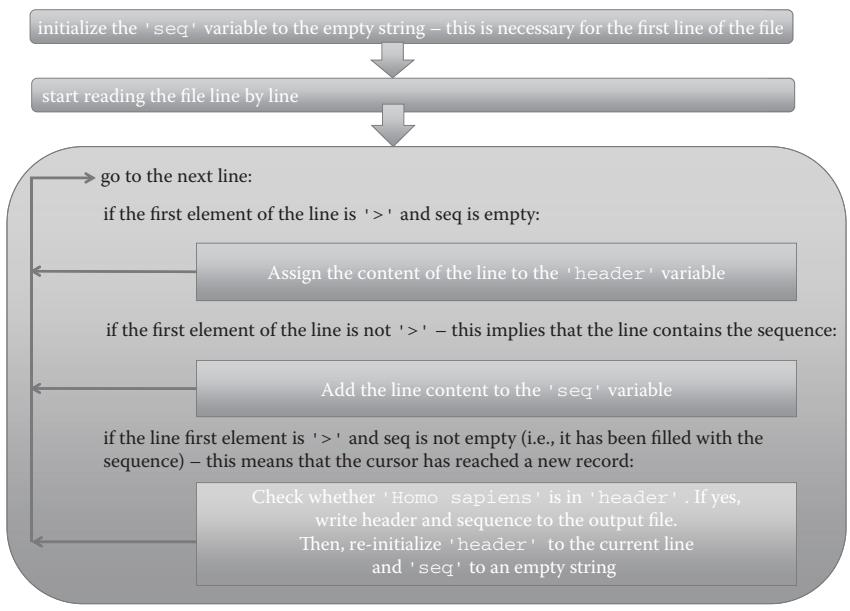  
그림 4.1 예제 4.4를 설명하는 흐름도.

### 4.5 스스로 테스트하기

### 연습 문제 4.1 다중 서열 FASTA 파일 읽고 쓰기

다중 서열 FASTA 파일을 읽고 각 레코드(헤더 + 서열)를 서로 다른 파일에 저장하는 프로그램을 작성하세요.

힌트: 출력 파일을 여는 지침을 `for` 루프 안에 넣어야 합니다(각 서열 레코드마다 새 파일을 열어야 함).

힌트: 각 헤더 줄에서 AC 번호를 선택하고( `split()` 메서드 사용), 이를 변수에 수집한 뒤(예: `AC = line.split()[1].strip()`), 출력 파일의 이름을 지정하는 데 사용하세요(예: `outfile = open(AC, "w")`).

### 연습 문제 4.2 FASTA 파일 읽기 및 필터링

다중 서열 FASTA 파일을 읽고, 메티오닌(M)으로 시작하며 최소 두 개의 트립토판(W)을 포함하는 서열만 새 파일에 저장하세요.

힌트: 이 연습 문제는 예제 4.4와 매우 유사합니다. 이 경우 헤더 변수 대신 `seq` 변수에 조건(첫 번째 문자가 'M'이고 `seq.count('W') > 2`)을 적용해야 합니다.

### 연습 문제 4.3 단일 DNA 서열의 뉴클레오타이드 빈도

FASTA 형식의 뉴클레오타이드 서열 파일을 읽고 서열 내 네 가지 뉴클레오타이드 각각의 빈도를 계산하세요.

힌트: 각 뉴클레오타이드의 발생 횟수(예: `seq.count("A")`)를 세고 이를 서열 길이(`len(seq)`)로 나누어야 합니다. 이때 길이를 부동 소수점 숫자(`float(len(seq))`)로 변환해야 나눗셈 결과가 예상과 다르게 나오지 않습니다.

### 연습 문제 4.4 여러 DNA 서열의 뉴클레오타이드 빈도

다중 서열 FASTA 파일을 사용하여 연습 문제 4.3을 다시 수행하세요. 각 레코드에 대해 AC와 네 가지(A, C, T, G) 빈도를 출력하세요. 파일 내에 특정 뉴클레오타이드 빈도가 비정상적인 서열이 있나요?

### 연습 문제 4.5 GenBank 형식의 여러 DNA 서열 빈도

GenBank 형식의 다중 레코드 파일을 사용하여 연습 문제 4.4를 다시 수행하세요.

# 데이터 검색하기 (Searching Data)

학습 목표: 딕셔너리를 사용하여 데이터를 저장하고 검색할 수 있습니다.

### 5.1 이 장에서 배울 내용

* RNA 서열을 단백질 서열로 변환하는 방법
* 딕셔너리를 사용하여 데이터를 저장하고 검색하는 방법
* 데이터 리스트를 검색하는 방법

### 5.2 스토리: RNA 서열을 해당 단백질 서열로 번역하기

### 5.2.1 문제 설명

하나 이상의 RNA 서열이 있고, 이를 유전 암호를 나타내는 코돈 표를 사용하여 해당하는 단백질 서열로 번역하고 싶다고 가정해 봅시다. 이는 RNA 서열을 한 번에 세 글자씩 읽고, 각 세 글자 그룹(즉, 코돈)에 대해 유전 암호에서 해당하는 아미노산을 찾아야 함을 의미합니다. 정지 코돈(STOP)과 불완전한 코돈(예: 각각 `*`와 `-`)과 같은 특수 문자도 고려해야 합니다. 이 과정은 RNA 서열의 첫 번째 뉴클레오타이드에서 시작하는 프레임, 두 번째에서 시작하는 프레임, 그리고 세 번째에서 시작하는 프레임 등 각 읽기 프레임(reading frame)에 대해 반복되어야 합니다. 실제로 여러분은 수많은 코돈:아미노산 대응 관계를 검색해야 합니다. 직관적으로는 리스트에서 코돈과 대응하는 아미노산을 찾기 위해 `for` 루프를 사용할 수 있습니다.

```python
genetic_code = [('GCU', 'A'), ('GCC', 'A'), ...]
for codon, amino_acid in genetic_code:
    if codon == triplet:
        seq = seq + amino_acid 
```

이 검색 패턴은 작동은 하지만 매우 비효율적입니다. 서열이 길면 프로그램이 금방 느려집니다. 유전 암호의 염기 삼중항을 사용하여 대응하는 아미노산을 직접 찾아볼 수 있는 데이터 구조가 있다면 더 좋을 것입니다. 그렇게 하면 매번 전체 데이터 구조를 훑지 않고도 특정 코돈:아미노산 쌍을 추출할 수 있습니다.

파이썬에는 이러한 종류의 데이터 구조가 존재하며 이를 **딕셔너리(dictionary)**라고 부릅니다. 딕셔너리는 데이터를 저장하고 선택적으로 빠르게 추출하는 데 유용합니다.

섹션 5.2.2의 프로그램은 유전 암호를 코돈:아미노산 쌍으로 딕셔너리에 저장하고, FASTA 파일에서 RNA 서열을 문자열로 읽어 번역합니다. 프로그램은 RNA 문자열을 세 글자씩(뉴클레오타이드 삼중항) 훑으며 각 삼중항을 해당하는 아미노산으로 교체하고 이를 새로운 단백질 문자열에 추가하여 최종적으로 화면에 출력합니다. 이 과정은 각 읽기 프레임에 대해 반복됩니다. 출력을 48개 아미노산 블록 단위로 인쇄하기 위해 `for` 루프 대신 `while` 루프를 사용합니다. `while` 루프는 주어진 조건이 충족될 때까지 일련의 문장들을 실행합니다. 섹션 5.2.2에서 조건은 `i < len(prot)`이며, 이는 전체 서열이 다 기록될 때까지 `True`입니다(박스 4.2 및 5.1 참조). 인덱스 변수 `i`가 서열 길이를 초과하면 조건은 `False`가 되고 루프가 종료됩니다.

### 5.2.2 예제 파이썬 세션

```python
codon_table = {
    'GCU': 'A', 'GCC': 'A', 'GCA': 'A', 'GCG': 'A', 'CGU': 'R', 'CGC': 'R', 
    'CGA': 'R', 'CGG': 'R', 'AGA': 'R', 'AGG': 'R', 'UCU': 'S', 'UCC': 'S', 
    'UCA': 'S', 'UCG': 'S', 'AGU': 'S', 'AGC': 'S', 'AUU': 'I', 'AUC': 'I', 
    'AUA': 'I', 'UUA': 'L', 'UUG': 'L', 'CUU': 'L', 'CUC': 'L', 'CUA': 'L', 
    'CUG': 'L', 'GGU': 'G', 'GGC': 'G', 'GGA': 'G', 'GGG': 'G', 'GUU': 'V', 
    'GUC': 'V', 'GUA': 'V', 'GUG': 'V', 'ACU': 'T', 'ACC': 'T', 'ACA': 'T', 
    'ACG': 'T', 'CCU': 'P', 'CCC': 'P', 'CCA': 'P', 'CCG': 'P', 'AAU': 'N', 
    'AAC': 'N', 'GAU': 'D', 'GAC': 'D', 'UGU': 'C', 'UGC': 'C', 'CAA': 'Q', 
    'CAG': 'Q', 'GAA': 'E', 'GAG': 'E', 'CAU': 'H', 'CAC': 'H', 'AAA': 'K', 
    'AAG': 'K', 'UUU': 'F', 'UUC': 'F', 'UAU': 'Y', 'UAC': 'Y', 'AUG': 'M', 
    'UGG': 'W', 'UAG': 'STOP', 'UGA': 'STOP', 'UAA': 'STOP' 
}

rna = ''
for line in open('A06662-RNA.fasta'): 
    if not line.startswith('>'): 
        rna = rna + line.strip()

# 한 번에 한 프레임씩 번역
for frame in range(3): 
    prot = '' 
    print('Reading frame ' + str(frame + 1)) 
    for i in range(frame, len(rna), 3): 
        codon = rna[i:i + 3] 
        if codon in codon_table: 
            if codon_table[codon] == 'STOP': 
                prot = prot + '*' 
            else: 
                prot = prot + codon_table[codon] 
        else: 
            # 너무 짧은 코돈 처리
            prot = prot + '-'

    # 48열 블록으로 포맷팅
    i = 0 
    while i < len(prot): 
        print(prot[i:i + 48]) 
        i = i + 48
```

출처: A.Via/K.Rother가 파이썬 라이선스 하에 공개한 코드를 수정함.

출력 결과는 각 읽기 프레임에 대한 번역된 서열을 포함하게 됩니다.

::: {.callout-note}
## 박스 5.1 불리언 값 True와 False

불리언 값 `True`와 `False`는 특히 `if` 조건과 `while` 루프에서 중요합니다. 특히 `if`와 `while` 문은 0, `None`, 또는 빈 객체(빈 데이터 구조 `''`, `()`, `[]`, `{}`)에 적용될 때 `False` 값을 반환하고, 0이 아닌 숫자나 비어 있지 않은 데이터 구조에 적용될 때 `True` 값을 반환합니다.

`while 1:` 뒤에 오는 문장들은 `break` 문을 넣지 않는 한 무한히 반복됩니다. 반면에 다음 루프는 조건이 `False`이기 때문에 단 한 번도 실행되지 않습니다.

`while []:`

`if`나 `while` 문 블록에 속한 문장들은 반환된 값이 `True`일 때만 실행됩니다. 예를 들어, 다음 루프는 네 번 반복됩니다.

```txt
>>> n = 0
>>> while n < 4:
...     n = n + 1
...     print(n)
1
2
3
4
```
:::

### 5.3 명령어들은 무엇을 의미하나요?

### 5.3.1 딕셔너리 (Dictionaries)

섹션 5.2.2의 시작 부분에서 정의된 `codon_table` 객체는 딕셔너리입니다. 딕셔너리는 `key:value` 쌍 형태의 비순서적(nonordered) 객체 모음이며 중괄호 `{}`로 둘러싸입니다: `{'GCU': 'A', 'GCC': 'A'}`.

더 구체적으로, 딕셔너리는 불변 객체(immutable objects, **키**)를 임의의 객체(**값**)에 매핑하기 위한 구조입니다. 불변 객체에는 숫자, 문자열, 튜플이 포함됩니다. 이는 리스트와 딕셔너리 자체는 딕셔너리 키로 사용할 수 없으며 오직 값으로만 사용할 수 있음을 의미합니다. 키와 값은 콜론(`:`)으로 구분되고, `key:value` 쌍들은 쉼표(`,`)로 구분됩니다.

딕셔너리는 정보를 빠르게 검색하는 데 유용합니다. 코돈 표 딕셔너리를 사용하여 주어진 코돈에 대한 아미노산을 검색할 수 있습니다.

```txt
>>> print(codon_table['GCU'])
'A' 
```

딕셔너리의 다른 예시는 다음과 같습니다.

1.  키가 Uniprot AC이고 값이 해당 유기체인 딕셔너리:

```python
UniprotAC_Organism = {
    'P03438': 'D.melanogaster',
    'O42785': 'C.trifolii',
    'P01119': 'S.cerevisiae'
} 
```

2.  키가 아미노산 단일 문자 코드이고 값이 루프 구조에 있을 경향성(propensity)인 딕셔너리:

```python
propensities = { 
    'N': 0.2299, 'P': 0.5523, 'Q': -0.1877, 'A': -0.2615, 
    'R': -0.1766, 'S': 0.1429, 'C': -0.01515, 'T': 0.0089, 
    'D': 0.2276, 'E': -0.2047, 'V': -0.3862, 'F': -0.2256, 
    'W': -0.2434, 'G': 0.4332, 'H': -0.0012, 'Y': -0.2075, 
    'I': -0.4222, 'K': -0.100092, 'L': 0.33793, 'M': -0.22590 
}
```

키는 유일해야 합니다. 즉, 동일한 키가 둘 이상의 값과 연관될 수 없습니다. 딕셔너리에 동일한 키를 두 번 삽입하려고 하면 나중에 입력된 것이 이전 것을 덮어씁니다.

딕셔너리는 비어 있는 중괄호로 빈 딕셔너리를 만든 후 요소를 하나씩 할당할 수도 있습니다.

```txt
>>> codon_table = {}
>>> codon_table['GCU'] = 'A'
>>> codon_table
{'GCU': 'A'}
>>> codon_table['CGA'] = 'R'
>>> codon_table
{'GCU': 'A', 'CGA': 'R'}
```

데이터 구조와 마찬가지로 딕셔너리에도 많은 연산과 메서드가 제공됩니다. 예를 들어 `del codon_table['GCU']`로 특정 쌍을 삭제하거나, 모든 키 또는 값의 리스트를 얻을 수 있고(`keys()`, `values()`), 특정 키가 있는지 확인할 수 있습니다(`if 'GCU' in codon_table:`). 딕셔너리의 메서드 전체 목록은 부록 A.2.9를 참조하세요.

### 5.3.2 while 문

섹션 5.2.2에서 번역된 단백질 서열은 문자열 변수 `prot`에 수집됩니다. 읽기 좋게 출력하기 위해 단백질 서열을 한 줄에 48개 기호씩 블록 단위로 인쇄하는데, 이는 `while` 문을 통해 달성됩니다.

```python
i = 0  
while i < len(prot):  
    print(prot[i:i + 48])  
    i = i + 48 
```

`while` 문은 어떤 조건이 충족되는 동안 문장 블록을 반복합니다. 이는 사실상 `for`와 `if` 문의 조합과 같습니다. `while` 블록을 작성할 때 가장 주의해야 할 점은 **탈출 조건**입니다. 인덱스 변수를 증가시키는 줄을 빠뜨리면 어떻게 될지 생각해 보세요.


:::{.callout-note}

Q & A: 만약 `<CONDITION>`이 절대 충족되지 않으면 어떻게 되나요?

다음 루프의 조건은 항상 불리언 `True`입니다.

```python
while 1: 
    print('while loop still running') 
```

파이썬은 스스로 실행을 멈추지 않습니다. 프로그램을 멈추려면 `Ctrl-C`를 눌러야 합니다. 따라서 `while` 조건을 신중하게 설계하고 테스트해야 합니다.
:::

### 5.3.3 while 루프로 검색하기

일반적으로 `while` 루프는 데이터 구조나 파일에서 무언가를 검색할 때 유용합니다. 검색에 성공했을 때 루프를 멈출 수 있기 때문입니다. 이는 컴퓨팅 자원의 낭비를 피하게 해줍니다. 예를 들어 전체 SwissProt 데이터베이스에서 특정 레코드를 찾을 때 사용할 수 있습니다.

```python
swissprot = open("SwissProt.fasta")  
insulin_ac = 'P61981'  
result = None  
while result == None:  
    line = swissprot.next()  
    if line.startswith('>'):  
        ac = line.split('|')[1]  
        if ac == insulin_ac:  
            result = line.strip()  
        print(result)
```

출처: A.Via/K.Rother가 파이썬 라이선스 하에 공개한 코드를 수정함.

여기서 `while` 조건은 `result`가 비어 있지 않게 될 때까지 `True`를 반환합니다. 인슐린 레코드를 찾는 즉시 조건이 충족되지 않게 되어 루프가 종료됩니다.

### 5.3.4 딕셔너리에서 검색하기

섹션 5.2.2에서 RNA 서열은 코돈 단위로 스캔됩니다. 딕셔너리를 검색하는 코드는 다음과 같습니다.

```python
codon = rna[i:i+3]   
if codon in codon_table: 
    if codon_table[codon] == 'STOP': 
        prot = prot + '*' 
    else: 
        prot = prot + codon_table[codon]   
else: 
    # 너무 짧은 코돈 처리 
    prot = prot + '-'
```

삼중항(`rna[i:i+3]`)에 대해 `codon_table` 딕셔너리에서 추출된 아미노산 단일 문자 코드가 번역 서열 `prot`에 추가됩니다.

::: {.callout-note}
## 박스 5.2 break와 continue 문

인터프리터가 `break` 문을 만나면 루프의 나머지 문장들을 실행하지 않고 즉시 루프를 탈출합니다. `continue` 문은 루프의 나머지 부분을 건너뛰고 루프의 다음 단계(반복)로 넘어갑니다.
:::

### 5.3.5 리스트에서 검색하기

입력 FASTA 파일에서 RNA 서열을 찾기 위해 `for` 루프와 `if` 문의 조합이 사용되었습니다.

```python
rna = ''
for line in open('A06662-RNA.fasta'): 
    if not line.startswith('>'):
        rna = rna + line.strip()
```

출처: A.Via/K.Rother가 파이썬 라이선스 하에 공개한 코드를 수정함.

이 조합은 매우 단순한 검색 패턴입니다. 리스트나 파일에서 검색하는 일반적인 체계는 다음과 같습니다: `for` 루프로 리스트를 훑으면서, `if/else` 조건으로 찾는 요소인지 확인하고, 원하는 데이터를 변수에 저장하는 것입니다. 리스트 내 요소를 확인하는 또 다른 방법은 `in`과 `not in` 연산자를 사용하는 것입니다.

### 5.4 예제 (EXAMPLES)

### 예제 5.1 FASTA 파일에서 Uniprot AC를 키로, 서열을 값으로 하는 딕셔너리 만들기

```python
sequences = {} 
ac = '' 
seq = '' 
for line in open("SwissProt.fasta"): 
    if line.startswith('>') and seq != '': 
        sequences[ac] = seq 
        seq = '' 
    if line.startswith('>'): 
        ac = line.split('|')[1] 
    else: 
        seq = seq + line.strip()   
# 마지막 레코드 추가
sequences[ac] = seq   
print(sequences.keys())   
print(sequences['P62258'])
```

### 예제 5.2 단순한 단백질 서열 루프(Loop) 예측기 작성하기

단백질의 특정 영역이 알파 헬릭스나 베타 시트 구조가 아닌 경우 이를 "무질서(disordered)" 또는 루프 영역이라고 합니다. 각 아미노산이 이차 구조에 포함되지 않을 경향성을 딕셔너리에 저장하고, 서열을 훑으며 이 값들을 합산하여 특정 임계값(예: 0.3)을 넘으면 소문자로, 아니면 대문자로 출력하는 프로그램입니다.

```python
propensities = {   
    'N':0.2299, 'P':0.5523, 'Q':-0.1877, 'A':-0.2615,   
    'R':-0.1766, 'S':0.1429, 'C':-0.01515, 'T':0.0089,   
    'D':0.2276, 'E':-0.2047, 'V':-0.3862, 'F':-0.2256,   
    'W':-0.2434, 'G':0.4332, 'H':-0.0012, 'Y':-0.2075,   
    'I':-0.4222, 'K':-0.1001, 'L':0.33793, 'M':-0.2259   
}   
threshold = 0.3 
input_seq = "IVGGYTCGANTVPYQVSLNSGYHFCGGSLINSQWVVSAAHCYKSGIQVRLGEDNINVVEGNEQFISASKSIVHPSYNNTLNNDIMLIKLKSAASLNSRVASISLPTSCASAGTQCLISGWNTKSSGTSYPDVLKCLKAPILSDSSCKSAYPGQITSNMFCAGYLEGGKDSCQGDSGGPVVCSGKLQGVSWGSGCAQKNKPGVTKVCNYVSWIKQTIASN"   
output_seq = '' 
for res in input_seq: 
    if res in propensities: 
        if propensities[res] >= threshold: 
            output_seq += res.upper() 
        else: 
            output_seq += res.lower() 
    else: 
        print('unrecognized character:', res) 
        break   
print(output_seq)
```

출처: A.Via/K.Rother가 파이썬 라이선스 하에 공개한 코드를 수정함.

### 예제 5.3 PDB 파일에서 아미노산 서열 추출하기

이 예제는 딕셔너리를 사용하여 세 글자 아미노산 코드를 한 글자 코드로 변환합니다. PDB 파일의 `SEQRES` 줄에서 잔기 이름을 읽어 변환한 뒤 연결하여 단백질 서열을 얻습니다.

```python
aa_codes = {
    'ALA':'A', 'CYS':'C', 'ASP':'D', 'GLU':'E', 'PHE':'F', 'GLY':'G', 'HIS':'H', 
    'LYS':'K', 'ILE':'I', 'LEU':'L', 'MET':'M', 'ASN':'N', 'PRO':'P', 'GLN':'Q', 
    'ARG':'R', 'SER':'S', 'THR':'T', 'VAL':'V', 'TYR':'Y', 'TRP':'W'
} 
seq = '' 
for line in open("1TLD.pdb"): 
    if line.startswith("SEQRES"): 
        columns = line.split() 
        for resname in columns[4:]: 
            seq = seq + aa_codes[resname] 
i = 0 
print(">1TLD") 
while i < len(seq): 
    print(seq[i:i + 64]) 
    i = i + 64
```

### 5.5 스스로 테스트하기

### 연습 문제 5.1 단순한 딕셔너리
다섯 개의 코돈과 대응하는 값을 연관시키는 딕셔너리를 만드세요.

### 연습 문제 5.2 뉴클레오타이드 서열에서 START와 STOP 코돈 세기
입력 뉴클레오타이드 서열에서 정지 코돈과 시작 코돈의 개수를 세는 프로그램을 작성하세요.

### 연습 문제 5.3 PubMed 초록에서 키워드 검색
관심 있는 논문의 제목과 초록을 텍스트 파일에 저장하세요. 두 개 이상의 키워드가 초록에 존재하는지 확인하는 프로그램을 작성하세요.

### 연습 문제 5.4 이차 구조 예측기
제시된 선호도 표를 사용하여 서열 기반의 이차 구조 예측기를 작성하세요. (힌트: 잔기별로 스캔하여 선호도 값을 비교하세요.)

### 연습 문제 5.5 단백질 서열 잔기의 용매 접근성 예측기 작성
FASTA 형식의 단백질 서열 파일을 입력으로 받아, 용매에 노출될 것으로 예측되는 잔기는 대문자로, 그렇지 않은 잔기는 소문자로 출력하는 프로그램을 작성하세요. 부록 C.10의 데이터를 활용하세요.

# 데이터 필터링하기 (Filtering Data)

학습 목표: 데이터 세트에서 공통 항목, 고유 항목 및 중복 항목을 찾을 수 있습니다.

### 6.1 이 장에서 배울 내용

* 둘 이상의 데이터 세트에서 공통 항목을 찾는 방법
* 데이터 세트를 병합하는 방법
* 데이터 세트에서 중복을 제거하는 방법
* `set` 데이터 구조를 사용하여 데이터 세트의 겹침, 교집합 및 차집합을 감지하는 방법
* NGS 원천 데이터에서 노이즈(noise)를 제거하는 방법

### 6.2 스토리: RNA-SEQ 출력 데이터 작업하기

### 6.2.1 문제 설명

NGS 데이터 분석 프로그램인 Cuffcompare의 출력은 그림 6.1의 캡션에 설명되어 있고 부록 C.9에 표시된(3개의 생물학적 샘플에 대한) `transcripts.tracking` 파일입니다. 3개 샘플(q1, q2, q3)에 대한 파일의 첫 번째 행은 다음과 같습니다.

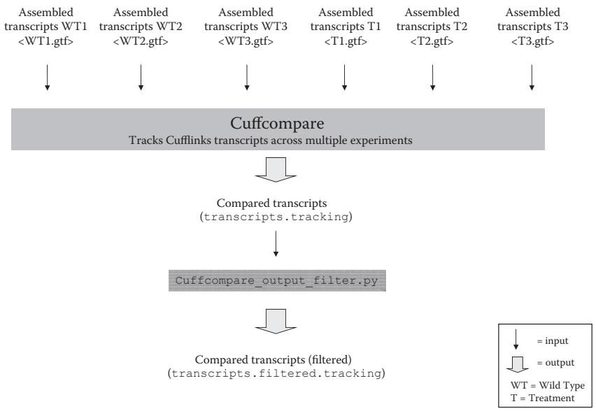  
그림 6.1 전사체 비교를 위한 Cuffcompare 프로그램의 입력 및 출력. 참고: 그림 15.1에 표시된 파이프라인을 서로 다른 샘플 세포에 적용하여 각 세포의 전사체(조립된 전사체)를 결정할 수 있습니다. 예를 들어, 야생형 세포의 3개 복제본(WT1, WT2, WT3)과 치료된 암세포의 3개 복제본(T1, T2, T3)에 적용할 수 있습니다. 더 신뢰할 수 있는 결과를 얻으려면 복제본이 필수적입니다. 서로 다른 샘플 세포에서 얻은 6개의 전사체를 비교하려면 Cufflinks 패키지의 Cuffcompare 프로그램을 사용할 수 있습니다. Cuffcompare는 Cufflinks의 .gtf 출력 파일(조립된 전사체 포함)을 입력으로 받아 여러 실험(즉, 샘플)에 걸쳐 전사체를 추적합니다. 출력 파일(`transcripts.tracking`)은 각 행이 단일 전사체에 해당하고 (탭으로 구분된) 열에 서로 다른 샘플에 대한 정보가 포함된 표로 구성됩니다. 각 전사체에 대해 특정 샘플(예: q1 기호로 표시된 샘플)에 대한 정보는 다음과 같습니다.

`q1:NSC.P419.228|uc007afh.1|100|35.109496|34.188903|36.030089|397.404732|2433`

여기서 q1은 샘플 라벨이고 파이프(|)로 구분된 나머지 모든 필드는 해당 샘플의 전사체에 대한 세부 정보를 제공합니다. 여기에는 전사체 ID(NSC.P419.228), 유전자 ID(uc007afh.1), fmi(주요 이소형의 비율, 100), fpkm(발현 평균값, 35.109496), 발현 최솟값 및 최댓값(각각 34.188903 및 36.030089), 전사체 커버리지(397.404732), 전사체 길이(2433)가 포함됩니다. 특정 전사체가 샘플에서 검출되지 않은 경우 표의 해당 셀에는 대시(-)가 포함됩니다. `transcripts.tracking` 파일은 현재 보유한 3개 복제본 중 최소 2개(또는 임의의 비율의 복제본)에서 나타나는 전사체만 남기도록 필터링할 수 있습니다. 이것이 섹션 6.2.2의 프로그램이 수행하는 작업입니다.

```
Medullo-Diff_00000001 XLOC_000001 Lypla1|uc007afh.1  
q1:NSC.P419.228|uc007afh.1|100|35.109496|34.188903|36.030089|397.404732|2433  
q2:NSC.P429.18|uc007afh.1|100|15.885823|15.240240|16.531407|171.011325|2433  
q3:NSC.P437.15|uc007afh.1|100|18.338541|17.704857|18.972224|181.643949|2433
```

이 파일은 서로 다른 DNA 서열 샘플에서 얻은 전사체를 비교한 결과를 보고하는 탭 구분 표입니다. 특히 6개 샘플이 고려됩니다: 야생형 세포 유형의 3개 복제본인 WT1, WT2, WT3(파일에서 각각 q1, q2, q3로 표시)와 약물 치료 후 동일한 세포 유형의 3개 복제본인 T1, T2, T3(파일에서 각각 q4, q5, q6로 표시, T는 treated의 약자)입니다. 데이터의 견고성을 보장하기 위해 복제본이 필요하며, 이를 위해 모든 복제본의 전사체에서 관찰되었거나 3개 중 최소 2개에서 관찰된 전사체만 유지하고 싶을 수 있습니다.

이는 `transcripts.tracking`에서 WT1, WT2, WT3(또는 T1, T2, T3) 샘플 중 단 하나에서만 나타나는 전사체(즉, 파일의 행)를 제거하는 것에 해당합니다. 특정 샘플에 전사체가 없는 경우 표의 해당 셀(그림 6.1 캡션 및 그림 6.2의 `transcripts.tracking` 파일 내용 설명 참조)은 대시(-)로 채워집니다.

다음은 6개 복제본이 있는 전체 파일의 두 행입니다. 첫 번째 행은 출력 파일에 저장될 행의 예(Medullo-Diff_00000001로 시작)이고, 두 번째 행(Medullo-Diff_00000002로 시작)은 건너뛰게 될 행입니다.

```txt
Medullo-Diff_00000001 XLOC_000001 Lypla1|uc007afh.1  
q1:NSC.P419.228|uc007afh.1|100|35.109496|34.188903|36.030089|397.404732|2433  
q2:NSC.P429.18|uc007afh.1|100|15.885823|15.240240|16.531407|171.011325|2433  
q3:NSC.P437.15|uc007afh.1|100|18.338541|17.704857|18.972224|181.643949|2433  
q4:CSC.Mmb8.236|uc007afh.1|100|22.594194|21.925964|23.262424|225.248080|2433  
q5:CSC.Mmb10.251|uc007afh.1|100|22.778360|22.025125|23.531595|255.416281|2433  
q6:CSC.Mmb21.221|uc007afh.1|100|17.288114|16.675834|17.900395|184.487708|2433  
Medullo-Diff_0000002 XLOC_000002 Tcea1|uc007afi.2=  
q1:NSC.P419.228|uc007afi.2|18|1.653393|1.409591|1.897195|18.587029|2671  
q3:NSC.P437.108|uc007afi.2|100|4.624079|4.258801|4.989356|45.379750|2671
```

`transcripts.tracking` 파일을 평가하기 위한 스크립트는 야생형 및 치료된 세포주에 대해 최소 2개의 복제본이 존재하는 행을 식별해야 합니다. (wt1, wt2, wt3) 또는 (t1, t2, t3) 중 둘 이상의 복제본이 누락된 모든 행은 건너뛰고, 그렇지 않으면 행이 출력 파일에 기록됩니다(그림 6.2 참조).

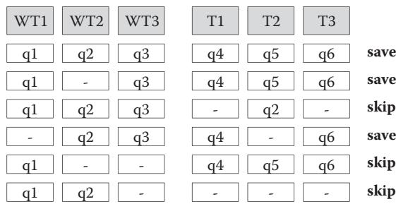  
그림 6.2 `transcripts.tracking` 파일에서 저장된 행과 건너뛴 행. 참고: 셀에 "qi"가 있다는 것은 해당 복제본에 대한 정보가 있음을 의미합니다. "-"는 정보가 없음을 의미합니다. 각 행은 서로 다른 전사체에 해당합니다.

### 6.2.2 예제 파이썬 세션

```python
tracking = open('transcripts.tracking', 'r')
out_file = open('transcripts-filtered.tracking', 'w')
for track in tracking:
    # 탭 구분 열로 분리
    columns = track.strip().split("\t")
    # q1, q2, q3 열에서 '-' 개수 세기
    wildtype = columns[4:7].count('-')
    # q4, q5, q6 열에서 '-' 개수 세기
    treatment = columns[7:10].count('-')
    # 각 그룹에서 누락된 것이 2개 미만인 경우(즉, 2개 이상 존재)
    if wildtype < 2 and treatment < 2:
        out_file.write(track)
tracking.close()
out_file.close() 
```

출처: A.Via/K.Rother가 파이썬 라이선스 하에 공개한 코드를 수정함.

### 6.3 명령어들은 무엇을 의미하나요?

섹션 6.2.2의 파이썬 스크립트는 원천 데이터 파일에서 노이즈를 제거하기 위해 리스트의 인덱싱과 `count()` 메서드를 사용합니다. 이 방법은 파일의 열 수가 고정되어 있을 때 매우 효율적입니다.

### 6.3.1 데이터 세트의 교집합과 차집합

데이터 필터링의 또 다른 일반적인 작업은 두 개 이상의 데이터 세트 사이의 관계를 찾는 것입니다. 파이썬은 이를 위해 **세트(set)**라는 데이터 구조를 제공합니다. 세트는 중복된 요소를 포함하지 않는 비순서적 모음입니다.

```python
# 세트 생성
set_a = set(['P62258', 'P61981', 'P62191', 'P43686'])
set_b = set(['P43686', 'P62333', 'O75832'])

# 교집합 (두 세트에 공통으로 있는 항목)
intersection = set_a & set_b # {'P43686'}

# 합집합 (두 세트의 모든 항목을 합치고 중복 제거)
union = set_a | set_b

# 차집합 (set_a에는 있지만 set_b에는 없는 항목)
difference = set_a - set_b
```

세트는 특히 대규모 리스트에서 중복을 제거하거나, 두 실험 결과 사이의 공통 유전자를 찾을 때 매우 유용합니다.

### 6.4 예제 (EXAMPLES)

### 예제 6.1 리스트에서 중복 제거하기

```python
raw_list = ['A', 'C', 'A', 'T', 'G', 'C', 'G']
unique_items = list(set(raw_list))
print(unique_items) # ['A', 'C', 'T', 'G'] (순서는 다를 수 있음)
```

### 예제 6.2 두 파일의 공통 유전자 찾기

```python
genes_a = set([line.strip() for line in open('genes_a.txt')])
genes_b = set([line.strip() for line in open('genes_b.txt')])
common_genes = genes_a & genes_b
print("Common genes:", len(common_genes))
```

### 6.5 스스로 테스트하기

### 연습 문제 6.1 Cuffcompare 출력 필터링
야생형 복제본 3개 중 최소 1개 이상에서 검출된 전사체만 추출하도록 섹션 6.2.2의 프로그램을 수정하세요.

### 연습 문제 6.2 세트 연산 연습
세 개의 리스트 `L1`, `L2`, `L3`가 있을 때, 세 리스트 모두에 공통으로 포함된 항목들만 찾는 코드를 작성하세요.

### 연습 문제 6.3 고유한 아미노산 찾기
주어진 단백질 서열에서 사용된 서로 다른 아미노산의 종류가 몇 가지인지 계산하는 프로그램을 작성하세요.

출처: A.Via/K.Rother가 파이썬 라이선스 하에 공개한 코드를 수정함.

출력 파일은 입력 파일과 거의 동일하지만, 다음의 경우를 제외하고는 다릅니다 —
야생형 또는 처리된 복제본에서 두 개 이상의 대시(“-”)를 포함하는 줄(즉, 두 개 미만의 복제본이 발현된 경우의 전사체)은 출력 파일에 없습니다.

### 6.3 명령어들은 무엇을 의미하나요?

### 6.3.1 단순한 for...if 조합으로 필터링하기

섹션 6.2.2의 파이썬 세션은 단순한 `for...if` 조합을 사용하여 파일의 데이터를 필터링하는 방법을 보여줍니다. `for` 루프는 파일의 모든 줄을 훑는 데 필요하며, `if` 조건문은 대시(-)의 개수에 따라 줄을 건너뛰는 데 필요합니다. 실제로 프로그램은 (1) 각 줄을 탭(`\t`)으로 구분된 필드로 나누어 `columns`라는 리스트에 저장하고, (2) `count()` 함수를 사용하여 두 그룹의 샘플(columns[4:7] 및 columns[7:10]) 각각에서 대시의 개수를 세고, (3) `if` 조건을 통해 각 그룹의 대시 개수가 2개 미만(즉, 최대 1개)인지 확인합니다.

동일한 결과를 더 명시적인 코드로 구현할 수도 있습니다. `count()` 함수를 일련의 `if` 문으로 교체하는 방식입니다.

```python
output_file = open('transcripts-filtered.tracking', 'w')
for track in open('transcripts.tracking'): 
    columns = track.strip().split("\t") 
    wt = 0 
    t = 0 
    if columns[4] != '-': wt += 1 
    if columns[5] != '-': wt += 1 
    if columns[6] != '-': wt += 1 
    if columns[7] != '-': t += 1 
    if columns[8] != '-': t += 1 
    if columns[9] != '-': t += 1 
    if wt > 1 and t > 1: 
        output_file.write(track) 
output_file.close() 
```

출처: A.Via/K.Rother가 파이썬 라이선스 하에 공개한 코드를 수정함.

여기서 프로그램은 열을 하나씩 확인하여 대시가 있는지 판단합니다. 대시가 없다면 카운터(`wt` 또는 `t`)를 1씩 증가시킵니다. 두 그룹의 샘플을 별도로 처리하기 위해 두 개의 카운터를 사용합니다. 카운터 값이 1보다 크면 전사체가 최소 두 개의 샘플에 존재한다는 의미이며, 해당 행은 출력 파일로 복사됩니다. 그렇지 않으면 무시됩니다.

### 6.3.2 두 데이터 세트 병합하기

또 다른 상황은 데이터 세트 B에도 포함된 데이터 세트 A의 항목만 남기고 싶은 경우입니다. 이는 파이썬 리스트에서 작동하는 단순한 `for...if` 조합으로 가능합니다. 다음 예제에서는 두 개의 정수 리스트를 고려하여 두 리스트 모두에 속하는 모든 요소를 새로운 리스트(`a_and_b`)에 씁니다.

```python
data_a = [1, 2, 3, 4, 5, 6]  
data_b = [1, 5, 7, 8, 9]  
a_and_b = []  
for num in data_a:  
    if num in data_b:  
        a_and_b.append(num)  
print(a_and_b)
```

이 `for` 루프와 `if` 문의 조합은 `data_a`에 있는 요소들의 순서를 유지합니다. 순서가 중요하지 않다면 섹션 6.3.6에서 설명할 `set` 데이터 유형을 사용하여 코드를 더 짧게 만들 수 있습니다.

```python
data_a = set([1, 2, 3, 4, 5, 6])
data_b = set([1, 5, 7, 8, 9])
a_and_b = data_a.intersection(data_b)
print(a_and_b)
```

출처: A.Via/K.Rother가 파이썬 라이선스 하에 공개한 코드를 수정함.

### 6.3.3 두 데이터 세트의 차이점

관련된 문제는 두 리스트에서 서로 다른 요소가 무엇인지 찾는 것입니다. 다음 예제는 `data_a`에는 있지만 `data_b`에는 없는 요소(`a_not_b`)와 `data_b`에는 있지만 `data_a`에는 없는 요소(`b_not_a`)를 수집합니다.

```python
data_a = [1, 2, 3, 4, 5, 6]  
data_b = [1, 5, 7, 8, 9]  
a_not_b = []  
b_not_a = []  
for num in data_a:  
    if num not in data_b:  
        a_not_b.append(num)  
for num in data_b:  
    if num not in data_a:  
        b_not_a.append(num)  
print(a_not_b)
print(b_not_a)
```

마찬가지로 세트(set)를 사용하면 프로그램이 짧아지지만 요소의 순서는 잃게 됩니다.

```python
data_a = set([1, 2, 3, 4, 5, 6])
data_b = set([1, 5, 7, 8, 9])
a_not_b = data_a.difference(data_b)
b_not_a = data_b.difference(data_a)
print(a_not_b)
print(b_not_a)
```

### 6.3.4 리스트, 딕셔너리, 파일에서 항목 제거하기

파이썬에는 리스트나 딕셔너리와 같은 데이터 구조 객체에서 항목을 제거하는 함수들이 있습니다.

# 리스트에서 요소 제거하기

리스트에서 항목을 제거하는 방법은 여러 가지가 있습니다. 리스트의 마지막 요소를 제거하고 싶다면 인자 없이 `pop()` 메서드를 사용합니다.

```txt
>>> data = [1, 2, 3, 6, 2, 3, 5, 7]  
>>> data.pop()  
7  
>>> data  
[1, 2, 3, 6, 2, 3, 5] 
```

`pop()`은 요소를 삭제하기 전에 그 값을 반환한다는 점에 유의하세요. 특정 위치 `i`에 있는 요소를 제거하려면 인덱스를 인자로 전달합니다.

```txt
>>> data.pop(0)  
1  
>>> data  
[2, 3, 6, 2, 3, 5, 7] 
```

또는 내장 함수 `del(data[i])`를 사용할 수도 있습니다. 특정 값(예: 숫자 3)을 가진 요소를 제거하려면 `remove()` 메서드를 사용합니다.

```txt
>>> data = [1, 2, 3, 6, 2, 3, 5, 7]  
>>> data.remove(3)  
>>> data  
[1, 2, 6, 2, 3, 5, 7] 
```

`remove()` 메서드는 해당 값이 처음 나타나는 요소만 제거한다는 점을 눈치채셨을 것입니다. 값 3을 가진 모든 요소를 제거하려면 리스트 컴프리헨션을 사용합니다.

```txt
>>> data = [x for x in data if x != 3]  
>>> data  
[1, 2, 6, 2, 5, 7] 
```

이 모든 함수는 원본 리스트를 영구적으로 수정합니다. 원본을 유지하려면 미리 복사본을 만들거나 리스트 컴프리헨션으로 생성된 리스트에 다른 변수 이름을 사용해야 합니다. 리스트의 슬라이싱 특성을 이용해 특정 부분을 제거할 수도 있습니다.

```python
data2 = data[:2] + data[3:] # 인덱스 2인 요소 제외
```

# 딕셔너리에서 요소 제거하기

`pop()` 메서드는 딕셔너리에서도 작동하지만 방식이 약간 다릅니다. 인자 없이 사용할 수 없으며, 제거하고 싶은 (키, 값) 쌍의 키를 반드시 인자로 전달해야 합니다.

```python
>>> d = {'a': 1, 'b': 2, 'c': 3}
>>> d.pop('a')
1
>>> d
{'c': 3, 'b': 2}
```

내장 함수 `del d['a']`도 같은 목적으로 사용될 수 있습니다.

# 텍스트 파일에서 특정 줄 삭제하기

텍스트 파일에서 특정 위치의 줄들을 필터링하는 간단한 방법들이 있습니다. 하나는 `readlines()`로 모든 줄을 리스트로 읽어온 뒤 슬라이싱하는 것입니다.

```python
lines = open('text.txt').readlines()
open('new.txt', 'w').writelines(lines[2:4] + lines[6:])
```

하지만 파일이 매우 큰 경우 이 방법은 효율적이지 않습니다. 대신 카운터 변수를 사용하여 줄 번호를 추적하는 `for...if` 조합이 더 좋습니다.

```python
in_file = open('text.txt')  
out_file = open('new.txt', 'w')  
index = 0  
indices_to_remove = [1, 2, 5, 6]  
for line in in_file:  
    index = index + 1  
    if index not in indices_to_remove:  
        out_file.write(line)  
out_file.close() 
```

카운터를 직접 만들지 않고 내장 함수 `enumerate()`를 사용할 수도 있습니다. `enumerate(x)`는 리스트 `x`의 인덱스 `i`와 값 `x[i]`의 튜플 `(i, x[i])`들을 반환합니다.

### 6.3.5 중복 제거하기 (순서 유지 및 미유지)

데이터의 중복을 제거하는 것은 매우 유용합니다. 요소의 순서를 유지하며 중복을 제거하거나(중요할 수 있음), 순서를 무시하고 더 빠르게 처리할 수 있습니다.

# 순서를 유지하며 중복 줄 제거하기

텍스트 파일에서 중복된 줄을 제거하고 유일한 요소만 포함된 새 파일을 만들 때 리스트를 사용할 수 있습니다. 유일한 항목들을 출력 파일에 직접 쓰는 방식은 원래의 줄 순서를 보장합니다.

```python
input_file = open('UniprotID.txt')  
output_file = open('UniprotID-unique.txt', 'w')  
unique = []  
for line in input_file:  
    if line not in unique:  
        output_file.write(line)  
        unique.append(line)  
output_file.close() 
```

# 순서를 유지하지 않고 중복 줄 제거하기

순서가 상관없다면 항목들을 세트(set)로 읽어 들이는 것이 가장 빠릅니다.

```python
input_file = open('UniprotID.txt')  
output_file = open('UniprotID-unique.txt', 'w')  
unique = set(input_file)  
for line in unique:  
    output_file.write(line) 
```

세트는 유일한 요소들의 비순서적 모음이므로 동일한 줄은 한 번만 저장됩니다.

# 90% 이상의 일치도를 가진 서열 제거하기

생물정보학에서 흔한 작업 중 하나는 서열 세트에서 중복성을 제거하는 것입니다. 특정 임계값(예: 90%) 이상의 서열 일치도를 가진 것들을 걸러내야 합니다. 이는 생각보다 복잡한데, 유사한 서열들을 그룹화할 뿐만 아니라 그중 어느 것을 선택할지에 대한 규칙도 필요하기 때문입니다. 잘 최적화된 도구로 CD-HIT가 있습니다(박스 6.1 참조).

::: {.callout-note}
## 박스 6.1 CD-HIT (CLUSTER DATABASE AT HIGH IDENTITY WITH TOLERANCE)

이는 사용자가 정의한 유사성 임계값에 따라 단백질 서열을 클러스터링하는 매우 빠른 프로그램입니다. FASTA 형식의 서열 세트를 입력으로 받아 클러스터 리스트 파일과 각 클러스터의 대표 서열 파일을 반환합니다. http://bioinformatics.org/cd-hit/ 에서 다운로드할 수 있습니다.
:::

### 6.3.6 세트 (Sets)

세트는 유일한 객체들의 비순서적 모음입니다. 리스트와 달리 순서가 없으며 동일한 요소를 중복해서 포함할 수 없습니다. 순서가 중요하지 않은 경우 중복 제거, 교집합, 합집합, 차집합 계산에 이상적인 데이터 구조입니다. 인덱싱과 슬라이싱은 지원하지 않지만 `in`과 `not in` 연산자로 멤버십 테스트를 할 수 있습니다.

# 세트 생성하기

세트를 만들려면 `set(x)` 메서드를 사용합니다. 여기서 `x`는 시퀀스형 객체(문자열, 튜플, 리스트)입니다.

```python
>>> set([1, 2, 3, 'a', 'b', 'c'])  
set(['a', 1, 2, 3, 'c', 'b']) 
```

세트의 요소는 숫자, 문자열, 튜플과 같은 불변 객체여야 합니다. 따라서 리스트나 딕셔너리는 세트의 요소가 될 수 없습니다. 세트를 생성할 때 중복된 요소는 자동으로 제거됩니다.

# 세트의 메서드

`add()` 메서드로 요소를 추가하고, `update()`로 여러 요소를 한 번에 추가합니다. `pop()`, `remove()`, `discard()`로 요소를 제거할 수 있습니다.

# 세트를 이용한 데이터 겹침/차이 확인

*   **합집합(`union` 또는 `|`)**: 두 세트의 모든 요소를 포함하는 새 세트 생성.
*   **교집합(`intersection` 또는 `&`)**: 두 세트에 공통으로 있는 요소만 포함하는 새 세트 생성.
*   **대칭 차집합(`symmetric_difference` 또는 `^`)**: 두 세트 중 어느 한쪽에만 있는 요소들로 새 세트 생성.
*   **차집합(`difference` 또는 `-`)**: 한 세트에는 있지만 다른 세트에는 없는 요소들로 새 세트 생성.

### 6.4 예제 (EXAMPLES)

### 예제 6.1 셋 이상의 데이터 세트 비교하기

세 개 이상의 데이터 세트에 공통으로 있는 요소를 찾고 싶을 때 `reduce()` 함수를 사용할 수 있습니다.

```python
from functools import reduce
a = set((1, 2, 3, 4, 5))
b = set((2, 4, 6, 7, 1))
c = set((1, 4, 5, 9)) 
triple_set = [a, b, c]
common = reduce(set.intersection, triple_set)
print(common) # {1, 4}
```

출처: A.Via/K.Rother가 파이썬 라이선스 하에 공개한 코드를 수정함.

### 예제 6.2 데이터베이스의 서로 다른 릴리스 비교/업데이트

세트를 사용하면 데이터베이스의 두 버전 사이의 차이를 쉽게 감지할 수 있습니다. 어떤 항목이 새로 추가되었는지(`difference`), 어떤 항목이 사라졌는지, 무엇이 고유한지(`symmetric_difference`) 등을 알 수 있습니다.

### 6.5 스스로 테스트하기

### 연습 문제 6.1 선택된 FASTA 레코드만 파일로 복사하기
다중 서열 FASTA 파일을 읽어 메티오닌(M)으로 시작하는 서열의 ID만 새 파일에 복사하는 프로그램을 작성하세요.

### 연습 문제 6.2 줄 필터링
텍스트 파일에서 짝수 번째(또는 홀수 번째) 줄만 제거하는 프로그램을 작성하세요. (힌트: `%` 연산자와 줄 카운터 사용)

### 연습 문제 6.3 동일한 줄 수를 가진 파일 간의 차이 찾기
두 텍스트 파일을 읽어 줄 단위로 차이점을 출력하는 프로그램을 작성하세요.

### 연습 문제 6.4 파일 간 차이 출력의 고도화
연습 문제 6.3을 발전시켜 첫 번째 파일에만 있는 줄 앞에는 `>`를, 두 번째 파일에만 있는 줄 앞에는 `<`를, 공통 줄 앞에는 `#`를 붙여 출력하세요.

### 연습 문제 6.5 전사체 필터링의 추가 조건
야생형이나 치료군에 상관없이 최소 3개 이상의 샘플에서 발현된 전사체만 남기도록 섹션 6.2.2의 프로그램을 수정하세요.

# 표 형식 데이터 관리하기 (Managing Tabular Data)

학습 목표: 표 형식의 데이터를 조직하고 편집할 수 있습니다.

### 7.1 이 장에서 배울 내용

* 중첩 리스트(nested lists)를 사용하여 2차원 표에 데이터를 저장하는 방법
* 표의 행과 열을 삽입하고 삭제하는 방법
* 빈 표를 생성하는 방법
* 딕셔너리를 사용하여 표를 표현하는 방법

### 7.2 스토리: 단백질 농도 결정하기

### 7.2.1 문제 설명

1951년 올리버 로리(Oliver Lowry)는 폴린 페놀 시약을 사용하여 단백질 농도를 측정하는 일반적인 절차를 설명했습니다. 이 테스트는 광도계를 사용하여 여러 샘플을 빠르게 측정할 수 있다는 장점이 있습니다. 로리의 논문은 역사상 가장 많이 인용된 기사가 되었습니다.

로리 분석법(Lowry assay)에서는 농도를 알고 있는 일련의 표준 샘플들의 흡광도(extinction)를 기록하여 최적 적합선(line of best fit)을 구축합니다. 그 다음, 미지 샘플의 농도는 해당 적합선 상의 흡광도 값에 대응하는 농도를 찾음으로써 결정할 수 있습니다. 1951년 당시에는 이 적합선이 종이 위에 그려졌고(그림 7.1 참조), 미지 샘플은 수동으로 결정되었습니다. 이 장의 대부분은 파이썬을 사용하여 로리의 흡광도 값을 예로 들어 많은 샘플 데이터를 처리하는 방법에 관한 것입니다.

그림 7.1 로리 데이터에 따른 최적 적합선.

표 7.1 로리의 토끼 뇌 단백질 미량 측정 데이터.

<table><tr><td>단백질 (%)</td><td>흡광도 1 (750 nm 광학 밀도)</td><td>흡광도 2 (750 nm 광학 밀도)</td><td>흡광도 3 (750 nm 광학 밀도)</td></tr><tr><td>0.16</td><td>0.038</td><td>0.044</td><td>0.040</td></tr><tr><td>0.33</td><td>0.089</td><td>0.095</td><td>0.091</td></tr><tr><td>0.66</td><td>0.184</td><td>0.191</td><td>0.191</td></tr><tr><td>1.00</td><td>0.280</td><td>0.292</td><td>0.283</td></tr><tr><td>1.32</td><td>0.365</td><td>0.367</td><td>0.365</td></tr><tr><td>1.66</td><td>0.441</td><td>0.443</td><td>0.444</td></tr></table>

이 표는 파일에서 쉽게 파싱할 수 있습니다. 하지만 적합선 공식을 계산하려면 하나의 x/y 값 세트, 즉 두 개의 열로 된 표가 필요합니다. 따라서 미지 단백질 샘플의 농도를 계산하려면 표 7.2와 같이 단일 단백질 농도-흡광도 쌍의 목록이 필요합니다.

표 7.2 표 7.1과 동일한 데이터이지만 4개 열 대신 2개 열로 분산된 형태.

어떻게 원래 데이터 표(표 7.1)를 더 단순한 형태(표 7.2)로 변환할 수 있을까요? 다음 파이썬 세션에서는 중첩 리스트로 표현된 초기 표에 대해 여러 조작 단계를 수행합니다. 섹션 7.3.4에서 자세히 설명할 `zip()` 함수를 두 번 사용합니다: 첫 번째는 표를 90도 회전시키기 위해, 두 번째는 표의 두 열을 결합하여 새로운 2차원 표를 얻기 위해 사용합니다.

### 7.2.2 예제 파이썬 세션

```python
table = [ 
    ['protein', 'ext1', 'ext2', 'ext3'], 
    [0.16, 0.038, 0.044, 0.040], 
    [0.33, 0.089, 0.095, 0.091], 
    [0.66, 0.184, 0.191, 0.191], 
    [1.00, 0.280, 0.292, 0.283], 
    [1.32, 0.365, 0.367, 0.365], 
    [1.66, 0.441, 0.443, 0.444] 
]   
# 레이블 행 제거
table = table[1:]   
# 표 회전하여 열별로 분리
protein, ext1, ext2, ext3 = zip(*table)   
# 흡광도 데이터 통합 및 농도 데이터 반복
extinction = ext1 + ext2 + ext3   
protein = protein * 3   
# 새로운 2열 표 생성
table = zip(protein, extinction)   
for prot, ext in table: 
    print(prot, ext)
```

출처: A.Via/K.Rother가 파이썬 라이선스 하에 공개한 코드를 수정함.

### 7.3 명령어들은 무엇을 의미하나요?

프로그램을 시작하면 2열 형식으로 변환된 표가 인쇄됩니다. 프로그램은 두 부분으로 나뉩니다. 위쪽에서는 데이터를 다른 리스트를 포함하는 리스트로 작성합니다. 이 중첩 리스트(nested list)를 사용하여 프로그램은 2차원 데이터를 명확하게 표현할 수 있습니다. 아래쪽에서는 다섯 단계로 변환이 이루어집니다. 첫째, 레이블이 있는 행을 제거합니다(`table[1:]`). 둘째, 각 열을 하나씩 담은 네 개의 튜플을 생성합니다(`zip(*table)`). 셋째, 흡광도 열들을 하나의 튜플로 합치고(`ext1 + ext2 + ext3`), 단백질 농도 열도 그에 맞춰 확장합니다(`protein * 3`). 넷째, 두 열을 결합하여 새로운 2차원 표를 만듭니다(`zip(protein, extinction)`). 마지막으로 표의 내용을 줄 단위로 인쇄합니다.

### 7.3.1 2차원 표 표현하기

표는 중첩 리스트로 인코딩될 수 있습니다. 예를 들어 3x3 표는 다음과 같이 표현됩니다.

`square = [[1, 2, 3], [4, 5, 6], [7, 8, 9]]`

이러한 중첩 리스트 구조는 2D 배열(array)이라고도 불립니다. 파이썬에서는 리스트 안에 리스트를 얼마나 많이 저장할 수 있는지에 대한 제한이 없습니다. 하지만 3차원 이상의 표는 데이터 크기가 매우 빠르게 커져 프로그램이 느려질 수 있으므로 신중한 계획이 필요합니다.

### 7.3.2 행과 개별 셀에 접근하기

중첩 리스트에서 각 행은 인덱스로 접근할 수 있습니다.

`second_row = table[1]`

두 번째 인덱스를 추가하면 개별 셀에 접근할 수 있습니다.

`cell = table[1][2] # 2행 3열`

이중 `for` 루프를 사용하면 표의 모든 셀에 하나씩 접근할 수 있습니다.

### 7.3.3 행 삽입 및 제거

표가 리스트로 저장되어 있으므로 모든 리스트 연산을 사용할 수 있습니다. 슬라이싱이나 `pop(0)`으로 행을 제거할 수 있고, `insert(i, new_row)`나 `append(new_row)`로 행을 추가할 수 있습니다.

### 7.3.4 열(Column)에 접근하기

중첩 리스트의 단점은 열에 직접 접근하는 것이 덜 직관적이라는 점입니다. 한 열의 데이터가 모든 행에 흩어져 있기 때문입니다. 루프를 돌려 수집할 수도 있지만, 파이썬에는 더 효율적인 방법이 있습니다.

`protein, ext1, ext2, ext3 = zip(*table)`

`zip(*table)` 명령어는 각 열을 별도의 변수에 튜플로 담아내어, 사실상 표를 90도 회전시킵니다.

# zip() 함수

`zip()` 함수는 둘 이상의 리스트에서 요소들을 하나씩 짝지어줍니다. 인자들은 이터러블(리스트, 튜플 등)이어야 하며, 각 인자의 i번째 요소들을 모은 i번째 튜플들의 리스트를 반환합니다. `*` 기호는 리스트를 여러 개의 인자로 풀어주는 역할을 합니다.

### 7.3.5 열 삽입 및 제거

`zip()`을 사용해 표를 90도 회전시킨 뒤 행을 조작하듯 열을 삽입하거나 삭제하고, 다시 `zip()`으로 원상복구하는 트릭을 쓸 수 있습니다. 다만 `zip()` 연산은 내부 리스트를 불변 객체인 튜플로 변환하므로, 셀 값을 수정하려면 다시 리스트로 변환해야 합니다. 그림 7.2는 표에서 수행할 수 있는 작업들을 요약해서 보여줍니다.

### 예제 7.1 빈 표 생성하기

`table = [[0] * 6 for i in range(6)]`와 같은 리스트 컴프리헨션을 사용하면 0으로 채워진 빈 표를 안전하게 만들 수 있습니다. `table = [[0]*3]*3`과 같이 작성하면 모든 행이 동일한 리스트 객체를 참조하게 되어 한 셀만 바꿔도 모든 행이 동시에 변하는 문제가 발생하므로 주의해야 합니다.

### 예제 7.2 딕셔너리로 표 표현하기

중첩 리스트는 수치 인덱스를 알아야 하므로 코드를 읽기 어려울 수 있습니다. 대신 딕셔너리 리스트를 사용할 수 있습니다.

`table = [{'protein': 0.16, 'ext1': 0.038, ...}, ...]`

이렇게 하면 `table[1]['ext2']`와 같이 열 이름으로 셀에 접근할 수 있어 가독성이 좋아집니다. 행에도 라벨을 붙이고 싶다면 딕셔너리 안의 딕셔너리(nested dictionary) 구조를 사용할 수 있습니다.

### 예제 7.3 표 표현 방식 변환하기

중첩 리스트는 정렬과 편집이 쉽고, 중괄호 구조(딕셔너리)는 검색이 빠르고 코드의 투명성을 유지하기 좋습니다. 상황에 따라 `for` 루프를 사용해 이 표현 방식들을 서로 변환할 수 있습니다(박스 7.1 참조).

### 예제 7.4 표 데이터 파일 읽기

탭 구분 텍스트 파일에서 표를 읽는 정형화된 패턴입니다.

```python
table = []  
for line in open('lowry_data.txt'):  
    table.append(line.strip().split('\t')) 
```

### 예제 7.5 표 데이터 파일 쓰기

중첩 리스트를 탭 구분 파일로 저장하는 패턴입니다.

```python
out = ''
for row in table: 
    line = [str(cell) for cell in row] 
    out = out + '\t'.join(line) + '\n' 
open('lowry_data.txt', 'w').write(out)
```

### 7.5 스스로 테스트하기

### 연습 문제 7.1
섹션 7.2.2의 표에 평균 농도나 흡광도를 담은 행을 추가하여 출력하세요.

### 연습 문제 7.2
섹션 7.2.2의 표를 딕셔너리 리스트로 변환하세요.

### 연습 문제 7.3 텍스트 파일에서 행렬 읽기
제시된 RNA 염기 유사성 행렬을 텍스트 파일에 쓰고, 이를 프로그램으로 읽어 화면에 출력하세요.

### 연습 문제 7.4 RNA 서열 유사도
연습 문제 7.3의 행렬을 사용하여 두 RNA 서열의 유사도(염기 쌍별 유사도의 합)를 계산하는 프로그램을 작성하세요. (힌트: `zip(seq1, seq2)` 사용)

### 연습 문제 7.5 표의 열과 행 선택적 출력
로리 표의 두 번째 행 전체와 단백질 농도 열 전체를 각각 출력하세요. 중첩 리스트와 중첩 딕셔너리 방식 모두로 구현해보고 차이점을 관찰하세요.

# 데이터 정렬하기 (Sorting Data)

학습 목표: 사용자 정의 매개변수나 특정 열을 기준으로 데이터를 정렬할 수 있습니다.

### 8.1 이 장에서 배울 내용

* 이터러블 객체(리스트, 튜플, 딕셔너리)를 정렬하는 방법
* 표를 정렬하는 방법
* 오름차순 및 내림차순으로 정렬하는 방법
* 특정 열을 기준으로 표를 정렬하는 방법
* 주어진 매개변수에 따라 BLAST 출력을 정렬하는 방법

### 8.2 스토리: 데이터 표 정렬하기

### 8.2.1 문제 설명

표를 다룰 때 흔히 필요한 작업 중 하나는 표를 정렬하는 것입니다. 이 작업은 엑셀과 같은 프로그램으로도 가능하지만, 데이터 양이 방대해지면 복잡해집니다. 또한 특정 조건에 따라 정렬을 자동화하고 싶을 수도 있습니다. 파이썬 스크립트를 사용하면 데이터를 쉽게 정렬할 수 있습니다. 다음 파이썬 세션은 입력 표의 두 번째 열 값을 기준으로 내림차순 정렬을 수행합니다. 이를 위해 내장 함수 `sorted()`와 `operator` 모듈의 `itemgetter` 함수를 함께 사용합니다. 리스트 컴프리헨션을 사용하여 문자열 요소를 부동 소수점으로 변환하고, 정렬 후 다시 문자열로 변환합니다.

### 8.2.2 예제 파이썬 세션

```python
from operator import itemgetter   
# 표를 부동 소수점 중첩 리스트로 읽기
table = [] 
for line in open("random_distribution.tsv"): 
    columns = line.split() 
    columns = [float(x) for x in columns] 
    table.append(columns)   

# 두 번째 열(인덱스 1)을 기준으로 정렬
column = 1 
table_sorted = sorted(table, key=itemgetter(column), reverse=True)   

# 결과를 문자열로 포맷팅하여 출력
for row in table_sorted: 
    row = [str(x) for x in row] 
    print("\t".join(row))
```

출처: A.Via/K.Rother가 파이썬 라이선스 하에 공개한 코드를 수정함.

### 8.3 명령어들은 무엇을 의미하나요?

섹션 8.2.2 코드의 대부분은 파일 열기, 읽기, 데이터 변환 및 인쇄에 관한 것입니다. 정렬과 직접적으로 관련된 부분은 `sorted()` 함수가 포함된 다음 한 줄입니다.

`table_sorted = sorted(table, key=itemgetter(column), reverse=True)`

### 8.3.1 파이썬 리스트는 정렬에 적합합니다

파이썬에는 데이터를 정렬하는 두 가지 기술이 있습니다: 리스트 자체를 정렬하는 `sort()` 메서드와, 모든 이터러블 구조를 정렬할 수 있는 내장 함수 `sorted()`입니다. `sort()`는 리스트를 제자리에서(in-place) 수정하는 반면, `sorted()`는 원본은 그대로 두고 새로운 정렬된 리스트를 만듭니다.

문자열은 ASCII 코드 순서(그림 8.1 참조)에 따라 정렬됩니다. 숫자가 알파벳보다 앞서고, 대문자가 소문자보다 앞선다는 점에 유의하세요.

그림 8.1 ASCII 정렬 순서 차트.

# 오름차순 및 내림차순 정렬

기본적으로 정렬은 오름차순(가장 낮은 값에서 높은 값 순)으로 이루어집니다.

```python
>>> data = [1, 5, 7, 8, 9, 2, 3, 6, 6, 10]  
>>> data.sort()  
>>> data  
[1, 2, 3, 5, 6, 6, 7, 8, 9, 10] 
```

내림차순으로 정렬하려면 `reverse=True` 옵션을 사용합니다.

```python
>>> data.sort(reverse=True)
>>> data
[10, 9, 8, 7, 6, 6, 5, 3, 2, 1]
```

### 8.3.2 복잡한 데이터 구조 정렬하기

중첩 리스트와 같은 복잡한 구조를 특정 열 기준으로 정렬하려면 `key` 매개변수를 사용해야 합니다. `itemgetter(n)`는 각 행의 n번째 요소를 추출하여 정렬 기준으로 사용하도록 해줍니다.

### 8.4 예제 (EXAMPLES)

### 예제 8.1 딕셔너리 키 정렬하기

딕셔너리는 본질적으로 순서가 없습니다. 하지만 키를 정렬하여 순서대로 출력할 수 있습니다.

```python
counts = {'A': 10, 'C': 15, 'G': 12, 'T': 8}
for base in sorted(counts.keys()):
    print(base, counts[base])
```

### 8.5 스스로 테스트하기

### 연습 문제 8.1 숫자 리스트 정렬
임의의 숫자 10개가 담긴 리스트를 만들고 이를 오름차순과 내림차순으로 각각 정렬해 보세요.

### 연습 문제 8.2 표 정렬
3개 이상의 열을 가진 텍스트 파일 표를 만들고, 세 번째 열을 기준으로 정렬하여 출력하는 프로그램을 작성하세요.

### 연습 문제 8.3 BLAST 결과 정렬
BLAST 출력 파일에서 비트 스코어(마지막 열)가 높은 순서대로 행들을 정렬하여 새 파일에 저장하세요.

내림차순으로 정렬하려면 먼저 오름차순으로 정렬한 다음 리스트를 뒤집으면 됩니다:

```txt
>>> data.reverse()
>>> data
[10, 9, 8, 7, 6, 6, 5, 3, 2, 1]
```

또는 sort() 메서드에 선택적 비교 함수를 인자로 전달할 수도 있습니다. 기본 비교 함수인 `cmp(a, b)`는 비교할 두 인자 a, b를 받아 $a < b$이면 음수 값을, $a = b$이면 0을, $a > b$이면 양수 값을 반환합니다. 이 함수는 다양한 조건에 따라 음수, 0 또는 양수 값을 반환하도록 커스텀할 수 있습니다. 내장 함수 cmp()와 이를 커스텀하는 방법에 관심이 있다면 박스 8.1을 참조하세요.


::: {.callout-note}
## 박스 8.1 내장 함수 cmp()

내장 함수 `cmp(a, b)`는 두 객체 a와 b를 비교하고 결과에 따라 정수를 반환합니다. 특히 $a < b$이면 -1을, $a = b$이면 0을, $a > b$이면 1을 반환합니다. 리스트의 `sort()` 메서드는 리스트의 모든 요소 쌍을 비교하며 암시적으로 `cmp()` 함수를 사용하여 어느 것이 더 작거나 큰지 결정합니다. 수정된 `cmp()` 함수(예: `my_cmp(a, b)`)를 `sort()`에 전달하여 반환 값을 반전시키면(즉, $a > b$일 때 -1, $a < b$일 때 1), 리스트는 내림차순으로 정렬됩니다. 이 함수를 더 수정하여 정밀한 정렬을 얻을 수도 있습니다. 예를 들어, 표의 첫 번째 열로 정렬하고 첫 번째 열의 두 개 이상의 값이 같을 때 두 번째 열로 정렬할 수 있습니다.

예를 들어 리스트를 내림차순으로 정렬하고 싶다면 다음과 같이 작성할 수 있습니다. (파이썬 2 방식이며, 파이썬 3에서는 `functools.cmp_to_key`를 사용합니다.)

```python
def my_cmp(a, b):
    if a > b: return -1
    if a == b: return 0
    if a < b: return 1

L = [1, 2, 3, 4, 5, 6, 8, 8, 9, 9, 30]
L.sort(cmp=my_cmp)
print(L) # [30, 9, 9, 8, 8, 6, 5, 4, 3, 2, 1] 
```

표가 있고 이를 첫 번째 열로 정렬한 다음 두 번째 열, 세 번째 열 순으로 정렬하려면 표를 읽어 중첩 리스트(7장 참조)에 넣은 다음, 다음과 같은 커스텀 `cmp()` 함수와 함께 `sort()` 함수를 사용하여 정렬할 수 있습니다.

```python
def my_cmp(a, b):
    if a[0] < b[0]: return 1
    if a[0] == b[0]:
        if a[1] < b[1]: return 1
        if a[1] == b[1]:
            if a[2] < b[2]: return 1
            if a[2] == b[2]: return 0
            if a[2] > b[2]: return -1
        return -1
    return -1
```

섹션 8.2.2에서 `table`은 단순한 리스트가 아니라 리스트의 리스트(중첩 리스트)라는 점에 유의하세요. 따라서 `sort()` 메서드는 리스트의 리스트를 정렬해야 합니다. 기본적으로 정렬은 각 리스트의 첫 번째 요소를 기준으로 수행됩니다.

```python
>>> data = [[1, 2], [4, 2], [9, 1], [2, 7]]  
>>> data.sort()  
>>> data  
[[1, 2], [2, 7], [4, 2], [9, 1]] 
```

하지만 두 번째 요소를 기준으로 정렬하고 싶다면 다른 접근 방식을 사용해야 합니다. 박스 8.1에 설명된 대로 `sort()` 메서드를 커스텀하거나 내장 함수인 `sorted()`를 사용합니다. 섹션 8.2.2의 파이썬 세션에서 중첩 리스트는 각 하위 리스트의 두 번째 요소(인덱스 1)에 따라 정렬됩니다.
:::

### 8.3.2 내장 함수 sorted()

리스트의 `sort()` 메서드 대신 내장 함수 `sorted()`를 사용하여 데이터를 정렬할 수 있습니다. `sorted()`의 장점은 리스트, 튜플 또는 딕셔너리 키와 같은 다양한 종류의 데이터를 정렬할 수 있다는 점입니다. 반면 `sort()` 메서드는 리스트에만 적용됩니다. 내장 함수 `sorted()`는 모든 반복 가능한(iterable) 객체로부터 새로운 정렬된 리스트를 반환합니다.

```python
>>> data = [1, 5, 7, 8, 9, 2, 3, 6, 6, 10]  
>>> newdata = sorted(data)  
>>> newdata  
[1, 2, 3, 5, 6, 6, 7, 8, 9, 10] 
```

### 8.3.3 itemgetter를 사용한 정렬

중요한 점은 내장 함수 `sorted()`를 사용하여 커스텀 매개변수(예: 표의 특정 열 값)를 기준으로 정렬할 수 있다는 것입니다. 이 결과는 섹션 8.2.2에 표시된 대로 `operator` 모듈의 `itemgetter` 함수를 사용하여 달성할 수 있습니다. `operator.itemgetter(i)(T)`는 문자열, 리스트, 튜플 또는 딕셔너리가 될 수 있는 `T`의 i번째 요소를 반환합니다. 딕셔너리의 경우 키 `i`와 관련된 값을 반환합니다. 두 개 이상의 인덱스를 사용하면 함수는 튜플을 반환합니다.

```python
from operator import itemgetter
```python
>>> data = ['ACCTGGCCA', 'ACTG', 'TACGGCAGGAGACG', 'TTGGATC']
>>> itemgetter(1)(data)
'ACTG'
>>> itemgetter(1, -1)(data)
('ACTG', 'TTGGATC') 
```

섹션 8.2.2에서 itemgetter는 두 번째 열(인덱스 1)을 기준으로 표를 정렬하는 데 사용됩니다.

표를 먼저 두 번째 열로 정렬한 다음 예를 들어 네 번째 열로 정렬하려면 itemgetter() 함수에 열 인덱스(이 경우 1과 3)를 작성하면 됩니다.

```python
new_table = sorted(table, key = itemgetter(1, 3)) 
```

Q & A: 이중 괄호 ()()는 무엇을 의미하나요?

itemgetter 함수는 함수를 반환합니다. 첫 번째 괄호는 열을 추출하기 위한 중간 함수를 생성하는 itemgetter를 호출하는 데 사용됩니다. 두 번째 괄호는 해당 함수를 데이터에 호출하여 실제 열을 생성합니다. 중간 함수를 사용하면 매우 유연한 방식으로 표의 데이터에 접근할 수 있습니다.

### 8.3.4 오름차순/내림차순 정렬

내림차순으로 정렬하려면 `reverse = True`라는 추가 인자를 sorted() 함수에 전달할 수 있습니다.

```python
>>> sorted(data, reverse = True)  
[30, 9, 9, 8, 8, 6, 5, 4, 3, 2, 1] 
```

섹션 8.2.2에서는 다음과 같이 할 수 있습니다.

```python
table = sorted(table, key = itemgetter(1), reverse = True) 
```

### 8.3.5 데이터 구조 정렬 (튜플, 딕셔너리)

# 리스트를 거쳐 딕셔너리를 키에 따라 정렬하기

딕셔너리를 정렬하려면 모든 키를 리스트로 추출하고 해당 리스트를 정렬할 수 있습니다.

```python
data = {1: 'a', 2: 'b', 4: 'd', 3: 'c', 5: 't', 6: 'm', 36: 'z'}  
keys = list(data)  
keys.sort()  
for key in keys:  
    print(key, data[key])
```

출처: A.Via/K.Rother가 파이썬 라이선스 하에 공개한 코드를 수정함.

이 프로그램의 출력은 다음과 같습니다.

```txt
1 a  
2 b  
3 c  
4 d  
5 t  
6 m  
36 z 
```

# 내장 함수 sorted()를 사용하여 딕셔너리 정렬하기

정렬된 키가 한 번만 사용되는 경우 sorted() 함수를 사용하는 것이 더 짧습니다.

```python
for key in sorted(data):
    print(key, data[key])
```

출처: A.Via/K.Rother가 파이썬 라이선스 하에 공개한 코드를 수정함.

# 리스트를 거쳐 튜플 정렬하기

튜플은 불변이므로 직접 정렬할 수 없습니다. 튜플을 정렬하려면 리스트로 변환하고 리스트를 정렬한 다음 리스트를 다시 튜플로 변환해야 합니다.

```python
data = (1, 4, 5, 3, 8, 9, 2, 6, 8, 9, 30)  
list_data = list(data)  
list_data.sort()  
new_tup = tuple(list_data)  
print(new_tup)
```

출처: A.Via/K.Rother가 파이썬 라이선스 하에 공개한 코드를 수정함.

# 내장 함수 sorted()를 사용하여 리스트 정렬하기

마찬가지로 sorted() 함수는 지름길을 제공합니다.

```python
data = (1, 4, 5, 3, 8, 9, 2, 6, 8, 9, 30) 
new_tup = tuple(sorted(data)) 
print(new_tup) 
```

표는 UNIX/Linux sort 명령어를 사용하여 정렬할 수도 있습니다(박스 8.2 참조).


::: {.callout-note}
## BOX 8.2 SORT FILES FROM THE COMMAND SHELL

텍스트 파일에 저장된 표는 셸 터미널에서 UNIX/Linux `sort` 명령어를 사용하여 정렬할 수 있습니다.

* 알파벳 순서로 정렬

```bash
%sort myfile.txt
```

* 수치 순서로 정렬

```bash
%sort –n myfile.txt
```

* 여러 열로 정렬

```bash
%sort myfile.txt –k2n –k1
```

이것은 먼저 2열(수치 순서: –k2n)로 정렬한 다음 1열을 알파벳 순서로 정렬합니다.

* 쉼표로 구분된 표 정렬

```bash
%sort -k2 -k3, -k1 -t ', ' myfile.txt 
```

# 내림차순 정렬

```bash
%sort -r myfile.txt 
```

다음 명령어는

```bash
%sort myfile.txt -nrk 2 -t '|' 
```

파이프(|)로 구분된 파일을 두 번째 열을 기준으로 내림차순 정렬합니다.

:::

### 8.3.6 길이에 따른 문자열 정렬

itemgetter 대신 람다 함수(10장, 박스 10.6 참조)와 함께 내장 함수 sorted()를 커스텀 매개변수로 사용할 수 있습니다. 예를 들어 문자열 리스트를 길이에 따라 정렬할 수 있습니다. 이를 위해 sorted()의 매개변수로 정렬에 사용될 "키"를 반환하는 단일 인자 함수를 제공해야 합니다.

```python
```python
>>> data = ['ACCTGGCCA', 'ACTG', 'TACGGCAGGAGACG', 'TTGGATC']
>>> bylength = sorted(data, key = lambda x: len(x))
>>> bylength
['ACTG', 'TTGGATC', 'ACCTGGCCA', 'TACGGCAGGAGACG'] 
```

이 예제에서 키는 인자 x의 길이를 반환하는 매우 짧은 함수입니다. 이는 `lambda` 키워드(10장, 박스 10.6)에 의해 정의됩니다. 변수 x는 리스트 data의 요소 값을 가집니다. x가 'ACTG'일 때 람다 함수는 4(len('ACTG')의 결과)를 반환하며 리스트의 각 문자열 요소에 대해 동일하게 작동합니다. 마지막으로 리스트는 가장 짧은 서열부터 가장 긴 서열까지 오름차순으로 정렬됩니다.

이 예제는 모든 생물학적 서열 세트에 적용될 수 있습니다. 이 코드를 사용하여 많은 수의 서열을 리스트에 저장하면(예: FASTA 파일에서 읽은 후), 서열을 가장 짧은 것부터 가장 긴 것까지(또는 그 반대로) 정렬할 수 있습니다.

중첩 리스트 형태의 표가 있는 경우 key 인자를 사용하여 표를 정렬할 기준 열을 지정할 수 있습니다. 람다 함수를 sorted() 함수의 인자로 사용하여(itemgetter 대체) 섹션 8.2.2의 정렬 지침을 작성하면 다음과 같습니다.

```txt
table = sorted(table, key = lambda col: col[1]) 
```

### 8.4 예제 (EXAMPLES)

### 예제 8.1 첫 번째 열, 두 번째 열, 세 번째 열 순으로 표 정렬하기

여기서 섹션 8.2.2의 표는 첫 번째 열부터 마지막 열까지 정렬됩니다.

```python
from operator import itemgetter
# 표 읽기
in_file = open("random_distribution.csv")
table = [] 
for line in in_file:  
    columns = line.split()  
    columns = [float(x) for x in columns]  
    table.append(columns)  
table_sorted = sorted(table, key=itemgetter(0, 1, 2, 3, 4, 5, 6))  
print(table_sorted)
```

출처: A.Via/K.Rother가 파이썬 라이선스 하에 공개한 코드를 수정함.

table(중첩 리스트)은 7개의 열을 가지고 있으며 내림차순으로 정렬하려면 `reverse = True` 인자를 추가해야 합니다.

### 예제 8.2 선택한 매개변수(예: 서열 일치율)에 따라 BLAST 결과 정렬하기

이 예제에서는 그림 8.2에 표시된 입력 파일을 사용합니다. 그림 설명에는 BLAST를 로컬에서 실행하여 이 파일을 얻는 방법이 설명되어 있습니다. 이 예제에서 BLAST 출력은 부동 소수점 숫자 형태의 서열 일치율(identity percentage)을 포함하는 세 번째 열(col[2])을 기준으로 내림차순 정렬됩니다.

```python
from operator import itemgetter   
input_file = open("BlastOut.csv")   
output_file = open("BlastOutSorted.csv","w")   
# BLAST 출력 표 읽기   
table = [] 
for line in input_file: 
    col = line.split(',') 
    col[2] = float(col[2]) 
    table.append(col)   
table_sorted = sorted(table, key = itemgetter(2), reverse = True)   
# 정렬된 표를 출력 파일에 쓰기   
for row in table_sorted: 
    row = [str(x) for x in row] 
    output_file.write("\t".join(row) + '\n')   
output_file.close()
```

출처: A.Via/K.Rother가 파이썬 라이선스 하에 공개한 코드를 수정함.

다음 명령어로 얻은 BLAST 출력(BlastOut.csv)의 예:

sp|060218|AK1BA_HUMAN,gi|223468663|ref|NP_064695.3|,100.00,316,0,0,1,316,1,316,0.0,654
sp|060218|AK1BA_HUMAN,gi|119388973|pdb|1ZUA|X,100.00,316,0,0,1,316,2,317,0.0,654
...

`nr -query AK1BA_HUMAN.fasta -outfmt 10 -out` 명령은 쉼표로 구분된 출력을 생성하는 옵션입니다. 출력값은 쉼표로 구분되며 seqID, 일치 길이(alignLength), 불일치(mismatches), 갭 오픈(gapopen), 쿼리 시작(qStart), 쿼리 끝(qEnd), 대상 시작(sStart), 비트 스코어(bitscore) 등을 포함합니다.

### 예제 8.3 RMSD를 기준으로 헤모글로빈 PDB 항목 정렬하기 (RCSB 리포트로부터)

이 예제에서는 그림 8.3에 표시된 입력 파일을 사용합니다. 이 입력 파일이 RCSB 리소스(http://www.rcsb.org/)에서 어떻게 얻어지는지는 그림 설명을 참조하세요. 실제로 이 예제에서 정렬은 먼저 RMSD(입력 표의 네 번째 열)를 기준으로 수행된 다음, 단백질의 서열 길이(입력 표의 다섯 번째 열)를 기준으로 수행됩니다.

```python
from operator import itemgetter  
input_file = open("PDBhaemoglobinReport.csv")  
output_file = open("PDBhaemoglobinSorted.csv", "w") 
table = []  
header = input_file.readline()  
for line in input_file:  
    col = line.split(',')  
    col[3] = float(col[3][1:-1])  
    col[4] = int(col[4][1:-2])  
    table.append(col)  
table_sorted = sorted(table, key = itemgetter(3, 4))  
output_file.write(header + '\n')  
for row in table_sorted:  
    row = [str(x) for x in row]  
    output_file.write('\t'.join(row) + '\n')  
output_file.close() 
```

출처: A.Via/K.Rother가 파이썬 라이선스 하에 공개한 코드를 수정함.

col[3]과 col[4]만 숫자로 변환하면 되므로 해당 변수들은 마지막 열의 큰따옴표와 줄바꿈 문자를 제거한 후 단순히 수치 값으로 재할당되었습니다.

만약 3열은 오름차순으로, 4열은 내림차순으로 정렬하고 싶다면 어떻게 해야 할까요? 이 경우 정렬 전에 4열의 부호를 반전시키는 트릭을 사용할 수 있습니다.

```txt
col[4] = -col[4] 
```

또는 커스텀 cmp() 함수가 유용할 수 있습니다(박스 8.1 참조).

### 8.5 스스로 테스트하기

### 연습 문제 8.1 표를 두 번째 열로 정렬하기

텍스트 파일에서 로우리(Lowry) 데이터(표 7.2 참조)가 담긴 표를 읽고 두 번째 열로 정렬한 뒤, 정렬된 표의 처음 세 줄을 새 파일에 저장하는 프로그램을 작성하세요.

### 연습 문제 8.2 서열 길이에 따른 정렬

다중 서열 FASTA 파일을 서열 길이에 따라(가장 긴 것부터 가장 짧은 것 순으로) 정렬하세요.

힌트: 먼저 4장에서 배운 대로 파일을 파싱하고 세 가지 요소(헤더, 서열, 서열 길이)를 포함하는 각 줄로 구성된 리스트의 리스트를 만들어야 합니다. 그런 다음 하위 리스트의 세 번째 요소에 따라 리스트를 정렬하고 마지막으로 정렬된 리스트를 파일에 쓰면 됩니다.

### 연습 문제 8.3 엑셀 파일로부터의 정렬

본인의 엑셀 파일 중 하나를 선택하여 쉼표로 구분된 텍스트 파일로 저장하고 파이썬을 사용하여 마지막 열부터 첫 번째 열까지 오름차순으로 정렬해 보세요.

힌트: 헤더 줄의 존재 여부에 주의하세요.

### 연습 문제 8.4 FASTA 서열 레코드를 알파벳 순서로 정렬하기

다중 서열 FASTA 파일을 읽고 그 내용을 딕셔너리 `{접근번호:서열}`에 저장하세요. 헤더의 접근 번호를 딕셔너리 키로 사용하세요. 딕셔너리 키를 알파벳 순서로 정렬하고 `키:값` 쌍을 출력하세요.

### 연습 문제 8.5 BLAST 출력을 E-value에 따라 오름차순으로 정렬하기

예제 8.2에 설명된 대로 BLAST의 .csv 출력을 사용하세요.

# 패턴 매칭 및 텍스트 마이닝 (Pattern Matching and Text Mining)

학습 목표: 서열과 자연어 텍스트에서 패턴을 찾을 수 있습니다.

### 9.1 이 장에서 배울 내용

* 정규 표현식을 사용하여 합의 서열(consensus sequence)을 표현하는 방법
* 파이썬 정규 표현식 도구를 사용하여 문자열 내 부분 문자열을 검색하는 방법
* 단백질 서열에서 기능적 모티프의 발생을 검색하는 방법
* 텍스트(예: 과학 초록)에서 주어진 단어 또는 단어 세트를 검색하는 방법
* 뉴클레오타이드 서열에서 모티프(예: 전사 인자 또는 miRNA 결합 부위)를 식별하는 방법

### 9.2 스토리: 단백질 서열에서 인산화 모티프 검색하기

### 9.2.1 문제 설명

서열 기능적 모티프(functional motif)는 기능에 관여하는 하나 이상의 잔기를 포함하는 짧은 아미노산 또는 뉴클레오타이드 서열로 정의됩니다. 인산화 부위(phosphorylation site), 만노실화 부위(mannosylation site), 인식 모티프(recognition motif), 당화 부위(glycosylation site), 전사 결합 부위 등이 기능적 모티프의 예입니다. 서열 기능적 모티프는 정규 표현식(regular expressions)이라는 특별한 표기법을 사용하여 표현할 수 있습니다. 때때로 regexp라고도 불리는 정규 표현식은 문자열 세트를 나타내는 문자와 메타 문자(metacharacter)로 구성된 문자열 구문입니다. 즉, 단일 표현식으로 여러 문자열을 나타내고 싶을 때 와일드카드, 반복 문자 및 논리적 그룹과 같은 "메타" 의미를 허용하는 규칙과 기호를 도입해야 합니다. 생물학에서 자주 사용되는 예는 DNA 서열의 문자 N입니다. 서열 AGNNT는 AGAAT, AGCTT, AGGGT 또는 다른 많은 대안 중 하나가 될 수 있습니다. 정규 표현식은 비슷한 방식으로 작동하지만 더 복잡한 특수 문자 세트를 사용합니다.

예를 들어, "AFL", "GFI", "AYI", "GWI", "GFI", "AWI", "GWL", "GYL"이라는 펩타이드 문자열을 단일 표현식으로 나타내고 싶다고 가정해 봅시다. 문자열의 한 위치에서 "A" 또는 "G"를 찾을 수 있음을 나타내기 위해 "[AG]"와 같은 기호 표현을 사용한다면, "[AG][FYW][IL]"이라는 표현을 사용하여 위의 모든 펩타이드 나타낼 수 있습니다.

우리는 "["와 "]"의 문자 그대로의 의미가 아니라 "메타" 의미를 사용하고 있다는 점에 유의하세요. 이 경우 "["와 "]"는 메타 문자라고 불리며, 문자와 메타 문자를 사용하여 문자열 세트를 인코딩하는 표현식을 정규 표현식이라고 부릅니다.

또 다른 예는 보통 짧고 불변의 위치와 가변적인 위치를 포함하는 기능적 모티프입니다. 예를 들어, Ser/Thr 인산화 모티프를 [ST]Q로 표현할 수 있습니다. 이 표현식을 단백질 서열에서 검색하면 "SQ"와 "TQ"라는 두 가지 다른 부분 서열에 대해 일치 항목(hit)이 발생합니다. 즉, 세린 또는 트레오닌 뒤에 글루타민이 오는 경우입니다. 모티프의 첫 번째 위치는 가변적이며 두 번째 위치는 보존되어 있습니다. 기능적 모티프를 전문으로 다루는 여러 공개 리소스(예: ELM: http://elm.eu.org; PROSITE: http://prosite.expasy.org/ 등)가 있습니다. 단백질 서열 또는 단백질 서열 데이터 세트에서 기능적 모티프의 발생을 검색하는 것은 단백질의 기능을 추론하는 절차로 사용될 수 있습니다. 이것이 바로 ScanProsite(http://prosite.expasy.org/scanprosite/)와 같은 도구들이 수행하는 작업입니다.

다음 프로그램은 ScanProsite의 기능 중 하나를 시뮬레이션합니다. 즉, 프로그램은 단백질 서열에서 인산화 모티프를 검색하고 모티프의 첫 번째 발생 항목을 반환합니다.

### 9.2.2 예제 파이썬 세션

```python
import re   
seq = 'VSVLTMFRYAGWLDRLYMLVGTQLAAIIHGVALPLMMLI'   
pattern = re.compile('[ST]Q')   
match = pattern.search(seq)   
if match: 
    print("%10s" % (seq[match.start() - 4: match.end() + 4])) 
    print("%6s" % match.group())   
else: 
    print("no match")
```

출처: A.Via/K.Rother가 파이썬 라이선스 하에 공개한 코드를 수정함.

### 9.3 명령어들은 무엇을 의미하나요?

프로그램의 첫 번째 줄에서 re라는 모듈을 가져옵니다. re 모듈은 정규 표현식을 작성하고 해석하며 이를 문자열 변수와 대조하기 위한 메타 문자, 규칙 및 기능을 제공합니다. A.M. Kuchling의 파이썬 정규 표현식에 대한 상세 튜토리얼은 http://docs.python.org/3/howto/regex.html 에서 확인할 수 있습니다.

다음 줄에서

```javascript
pattern = re.compile('[ST]Q') 
```

검색할 인산화 모티프는 문자열 '[ST]Q' 형태이며, re 모듈의 compile() 메서드에 의해 새로운 객체로 변환됩니다. 이 변환은 필수적입니다. 그렇지 않으면 "["와 같은 문자가 정확한 의미를 가진 메타 문자가 아니라 단순한 대괄호로 해석되기 때문입니다. re.compile() 함수는 정규 표현식 객체(regular expression object)를 반환합니다. re 모듈은 정규 표현식 객체를 다루는 메서드들을 제공합니다.

### 9.3.1 정규 표현식 컴파일하기

compile()은 문자열을 정규 표현식 객체(RegexpObject)로 컴파일하고 변환하는 메서드입니다.

```python
>>> import re
>>> regex = re.compile('[ST]Q')
>>> regex
<_sre.SRE_Pattern object at 0x22de0> 
```

문자열은 변수에 기록될 수도 있습니다.

```python
>>> motif = '[ST]Q'
>>> regexp = re.compile(motif) 
```

compile() 메서드에 인자(컴파일 플래그)를 전달하여 정규 표현식이 작동하는 일부 방식을 수정할 수 있습니다. 예를 들어 다음과 같이 대소문자를 무시할 수 있습니다.

```txt
>>> regexp = re.compile(motif, re.IGNORECASE) 
```

부록 A, 섹션 A.2.17의 "정규 표현식 컴파일 플래그" 부분을 참조하세요.

섹션 9.2.2의 파이썬 세션에서 컴파일된 패턴은 seq 변수에 저장된 서열에서 검색되며 search(), group(), start(), end()와 같은 여러 메서드를 사용하여 화면에 출력됩니다. 이제 이 메서드들이 무엇을 수행하고 무엇을 반환하는지 논의하겠습니다.

### 9.3.2 패턴 매칭 (Pattern Matching)

정규 표현식이 컴파일되어 RegexpObject가 생성되면, RegexpObject 메서드를 사용하여 문자열에서 일치 항목을 검색할 수 있습니다.

RegexpObject 메서드는 매치 객체(Match object)를 반환하며, 그 내용은 매치 객체 메서드를 사용하여 추출할 수 있습니다. 부록 A, 섹션 A.2.17의 "re 모듈 메서드" 부분을 참조하세요. 이것은 개념적으로 파일 읽기와 다르지 않습니다. 파일 내용에 접근하려면 먼저 파일을 열어 "파일 객체"를 생성한 다음, 파일 객체의 메서드(예: read(), readline() 등)를 사용하여 파일 내용을 읽어야 하는 것과 같습니다.

search() 함수는 문자열을 훑으며 정규 표현식이 처음으로 일치하는 위치를 찾습니다. 이는 search() 메서드가 서열당 최대 하나의 매치 객체만 반환함을 의미합니다. 매치 객체의 group() 메서드를 사용하여 첫 번째 일치 항목을 출력합니다.

```python
>>> motif = 'R.[ST][^P]'
>>> regex = re.compile(motif)
>>> seq = 'RQSAMGSNKSKPKDASQRRRSLEPAENVHGAGGGAFPASQRPSKP'
>>> match = regex.search(seq)
>>> match.group()
'RQSA' 
```

출처: A.Via/K.Rother가 파이썬 라이선스 하에 공개한 코드를 수정함.

정규 표현식 `'R.[ST][^P]'`는 첫 번째 위치에 아르기닌(R)이 오고, 두 번째 위치에 임의의 아미노산(.)이 오며, 세 번째 위치에 세린 또는 트레오닌([ST])이 오고, 마지막 위치에 프롤린이 아닌 임의의 아미노산([^P])이 오는 부분 문자열과 일치합니다. search() 메서드는 일치하는 부분 문자열을 직접 반환하는 것이 아니라, 일치하는 부분 문자열과 서열을 따른 시작 및 끝 위치를 인코딩하는 매치 객체를 반환한다는 점에 유의하세요. 이 정보는 매치 객체의 다음 메서드를 사용하여 검색할 수 있습니다.

* match.group()은 일치하는 부분 문자열을 반환합니다.   
* match.span()은 일치 항목의 (시작, 끝) 위치를 포함하는 튜플을 반환합니다.   
* match.start()는 일치 항목의 시작 위치를 반환합니다.   
* match.end()는 일치 항목의 끝 위치를 반환합니다.

서열의 첫 번째 위치에서 시작하는 정규 표현식 일치 항목을 찾는 데만 관심이 있다면 match() 메서드를 사용할 수 있습니다.

여기서는 search() 대신 match()를 사용하는 이전 예제를 제시합니다.

```txt
>>> match1 = regex.match(seq)  
>>> match1  
<_sre.SRE_Match object at 0x70020>  
>>> match1.group()  
'RQSA' 
```

이 특정 사례에서 match와 match1 변수는 동일한 값을 가집니다.

요약하자면, search()와 match() 메서드 모두 매치 객체를 반환하며, 이를 변수에 할당하여 매치 객체 메서드인 group(), span(), start(), end()를 통해 그 내용을 사용할 수 있습니다.

```elixir
>>> match1.span()  
(0, 4)  
>>> match1.start()  
0  
>>> match1.end()  
4 
```

UNIX/Linux는 파일에서 정규 표현식 일치 항목을 검색하는 명령어를 제공합니다(박스 9.2 참조).

Q & A: 문자열에서 첫 번째 일치 항목뿐만 아니라 모든 일치 항목을 찾고 싶다면 어떻게 해야 하나요?

re 모듈은 이 목적을 위해 두 가지 메서드를 제공합니다: findall()은 일치하는 모든 부분 문자열을 포함하는 리스트를 반환하고, finditer()는 모든 일치 항목에 해당하는 매치 객체들을 이터레이터(iterator) 형태로 반환합니다. 일반적으로 이터레이터는 파이썬에서 for 루프를 사용하여 순회할 수 있는 객체들의 "컨테이너"입니다. 이 경우 이터레이터는 매치 객체 세트를 포함하며, group(), span(), start(), end()와 같은 매치 객체 메서드를 사용하여 개별적으로 접근할 수 있습니다.

```python
>>> all = regex.findall(seq)   
>>> all   
['RQSA', 'RRSL', 'RPSK']   
>>> iter = regex.finditer(seq)   
>>> iter   
<callable-iterator object at 0x786d0>   
>>> for s in iter:
...     print(s.group())
...     print(s.span())
...     print(s.start())
...     print(s.end())
...   
RQSA   
```
(0, 4)   
0   
4   
RRSL   
(18, 22)   
18   
22   
RPSK   
(40, 44)   
40   
44

### 9.3.3 그룹화 (Grouping)

정규 표현식을 여러 하위 그룹(subgroup)으로 나누어 각 그룹이 관심 있는 서로 다른 구성 요소와 일치하도록 만들 수 있습니다. 이전 예제에서 "."에 의해 어떤 아미노산 유형이 일치되었는지 알고 싶다고 가정해 봅시다. 다음과 같이 소괄호를 사용하여 "."을 감싸는 그룹을 만들고 group() 메서드를 사용하여 일치하는 아미노산 유형을 얻을 수 있습니다.

```python
import re   
seq = 'RQSAMGSNKSKPKDASQRRRSLEPAENVHGAGGGAFPASQRPSKP'   
pattern1 = re.compile('R(.)[ST][^P]')   
match1 = pattern1.search(seq)   
print(match1.group())   
print(match1.group(1))   
pattern2 = re.compile('R(.{0,3})[ST][^P]')   
match2 = pattern2.search(seq)   
print(match2.group())   
print(match2.group(1))
```

출처: A.Via/K.Rother가 파이썬 라이선스 하에 공개한 코드를 수정함.

프로그램의 출력은 다음과 같습니다.

```txt
RQSA Q RRSL RS 
```

인자가 없거나 0인 group() 메서드는 항상 전체 일치 부분 문자열을 반환하며, 하위 그룹은 왼쪽에서 오른쪽으로 1부터 시작하여 증가하는 순서로 번호가 매겨집니다.

하위 그룹은 중첩될 수 있으며, 해당 번호를 알기 위해서는 왼쪽에서 오른쪽으로 열린 소괄호의 개수를 세면 됩니다.

```coffeescript
>>> p = re.compile('(a(b)c)d')
>>> m = p.match('abcd')
>>> m.group(0)
'abcd'
>>> m.group(1)
'abc'
>>> m.group(2)
'b' 
```

group() 메서드에 여러 인자를 전달할 수도 있습니다. 이 경우 해당 그룹들에 대한 값을 포함하는 튜플을 반환합니다.

```python
>>> m.group(2, 1, 2)  
('b', 'abc', 'b')
```

마지막으로, groups() 메서드는 모든 하위 그룹에 해당하는 부분 문자열들을 포함하는 튜플을 반환합니다.

```txt
>>> m.groups()
('abc', 'b') 
```

내용을 선택적으로 검색하기 위해 각 하위 그룹에 이름을 할당할 수도 있습니다. 예를 들어 정규 표현식의 첫 번째 그룹을 w1으로, 두 번째 그룹을 w2로 라벨을 붙인 후, 나중에 그룹 이름(w1 또는 w2)을 인자로 사용하여 group() 함수를 통해 각 그룹의 일치 항목을 검색할 수 있습니다.

```coffeescript
>>> pattern = 'R(?P<w1>.{0,3})[ST](?P<w2>[^P])'
>>> regexp = re.compile(pattern)
>>> m1 = regexp.search(seq)
>>> m1.group('w1')
'RS'
>>> m1.group('w2')
'L' 
```

그룹 라벨은 `<`와 `>` 기호 사이에 넣어야 하며(즉, `<이름>`), 그룹의 소괄호 안에 `?P`를 앞에 붙여 삽입해야 합니다(즉, `(?P<이름>...)`). 그룹은 group() 함수에 라벨을 인자로 전달하여 선택적으로 접근할 수 있습니다(`group('<이름>')`).

### 9.3.4 문자열 수정하기

re 모듈은 문자열을 수정할 수 있는 세 가지 메서드도 제공합니다: split(s), sub(r, s, [c]), subn(r, s, [c]).

split(s) 메서드는 정규 표현식 일치 항목을 기준으로 문자열 s를 나눕니다. 다음 예제에서는 모든 "|" 기호를 기준으로 문자열이 나누어집니다. "|" 문자는 정규 표현식 문법에서 메타 문자이기도 하므로(박스 9.1 참조), 파이썬에게 이를 일반 문자로 해석하도록 알려주기 위해 메타 문자 앞에 백슬래시(`\`)를 붙여야 합니다. 이는 파이썬이 메타 문자와 일반 문자를 구분하게 만드는 일반적인 규칙입니다.

```python
import re   
separator = re.compile('\\|')   
annotation = 'ATOM:CA|RES:ALA|CHAIN:B|NUMRES:166'   
columns = separator.split(annotation)   
print(columns)
```
출처: A.Via/K.Rother가 파이썬 라이선스 하에 공개한 코드를 수정함.


::: {.callout-note}
## 박스 9.1 문자와 메타 문자

정규 표현식의 모든 문자가 메타 문자인 것은 아닙니다. 정규 표현식 메타 문자는 다음과 같습니다.

```txt
[ ] ^ $ \ . | * + ? { } ( ) 
```

대괄호 `[]`는 문자 클래스를 나타내는 데 사용됩니다. 예를 들어, 문자열 s에서 [abc]의 일치 항목을 검색하면 s에 'a', 'b', 또는 'c'가 포함된 경우 일치 항목을 찾게 됩니다.

특히 [a-z]는 a부터 z까지의 알파벳 클래스와 일치하며, [0-9]는 0부터 9 사이의 정수와 일치합니다.

`[^...]` (대괄호 안에 포함된 경우)는 여집합을 나타냅니다. 즉, 해당 문자들을 제외한 모든 문자를 의미합니다. `^`가 대괄호 밖(문자열 시작 부분)에 오면 문자열의 첫 번째 위치에서만 일치 항목이 존재함을 나타냅니다.

`$`는 문자열의 마지막 위치에서만 일치 항목이 존재함을 나타냅니다.

`\`의 의미는 뒤에 메타 문자가 오는지 일반 문자가 오는지에 따라 달라집니다. 첫 번째 경우, 메타 문자의 문자 그대로의 의미를 복원하여 "보호"합니다. 두 번째 경우, 그 의미는 뒤따르는 문자에 따라 달라집니다.

* \d 는 [0-9]에 해당합니다.   
* \D 는 [^0-9]에 해당합니다.   
* \s 는 [\t\n\r\f\v], 즉 모든 공백 문자에 해당합니다.   
* \S 는 공백이 아닌 모든 문자에 해당합니다.   
* \w 는 [a-zA-Z0-9_], 즉 모든 영숫자 및 언더바에 해당합니다.   
* \W 는 영숫자가 아닌 모든 문자에 해당합니다.

`.`은 줄바꿈 문자를 제외한 모든 문자에 해당합니다.

`|`는 OR 연산자입니다. 두 정규 표현식 사이에 놓이면 왼쪽 또는 오른쪽의 정규 표현식과 일치하는 항목을 검색합니다.

`()` 소괄호는 정규 표현식에서 하위 그룹을 만드는 데 사용됩니다.

반복: `* + ? { }`

이 메타 문자들은 반복되는 항목을 찾는 데 사용됩니다.

`*` 앞의 문자가 0번 이상 반복되는 경우와 일치합니다. a*bc는 "bc", "abc", "aabc", "aaabc" 등과 일치합니다.   
`+` 앞의 문자가 1번 이상 반복되는 경우와 일치합니다. a+bc는 "abc", "aabc" 등과 일치하지만 "bc"와는 일치하지 않습니다.   
`?` 앞의 문자가 0번 또는 1번 나타나는 경우와 일치합니다. can-?can은 "can-can"과 "cancan" 모두와 일치합니다.

`{m, n}` 이 한정자는 앞의 문자가 최소 m번, 최대 n번 반복되는 경우와 일치함을 의미합니다.

:::


::: {.callout-note}
## 박스 9.2 GREP: 파일에서 단어를 검색하는 UNIX/LINUX 명령어

grep은 정규 표현식과 일치하는 줄을 텍스트 파일에서 검색하기 위한 UNIX/Linux 명령어입니다.

grep ArticleTitle PMID.html

은 PMID.html 텍스트 파일에서 ArticleTitle이라는 단어와 일치하는 모든 줄을 반환합니다.

애스터리스크(*)를 사용하여 임의의 문자를 나타낼 수 있습니다.

grep Ar*le mytext.txt

는 Ar로 시작하고 le로 끝나는 단어가 하나 이상 포함된 mytext.txt의 모든 줄을 반환합니다.

더 복잡한 정규 표현식을 사용할 수도 있습니다. 예를 들어,

grep "^>" 3G5U.fasta

는 3G5U.fasta 파일에서 ">" 문자로 시작하는 모든 줄을 반환합니다. 이 경우 ">"는 UNIX/Linux에서 리다이렉션 문자이므로 따옴표를 사용해야 합니다.

:::

이 코드는 annotation 문자열에서 분리된 요소들로 구성된 리스트를 생성합니다.

['ATOM:CA', 'RES:ALA', 'CHAIN:B', 'NUMRES:166']

`RegexpObject`의 `sub(r, s, [c])` 메서드는 문자열 `s`에서 주어진 패턴이 겹치지 않게 나타나는 부분을 모두 `r`의 값으로 교체한 새로운 문자열을 반환합니다(선택적 인자 `c`가 지정되지 않은 경우). 다음 예제에서 패턴은 `|` (separator `RegexpObject`에 인코딩됨)이며, 문자열 `s`에서 `@`로 교체됩니다.

```python
import re   
separator = re.compile('\\|')   
annotation = 'ATOM:CA|RES:ALA|CHAIN:B|NUMRES:166'
new_annotation = separator.sub('@', annotation)
print(new_annotation)
```
출처: A.Via/K.Rother가 파이썬 라이선스 하에 공개한 코드를 수정함.

결과는 다음과 같습니다.

```txt
ATOM:CA@RES:ALA@CHAIN:B@NUMRES:166
```

패턴을 문자열 `s`에서 찾지 못하면 `s`는 변경되지 않은 채로 반환됩니다. 선택적 인자인 `c`는 교체할 패턴의 최대 횟수를 지정하며, 반드시 0 이상의 정수여야 합니다. 예를 들어, 이전 예제에서 `c`를 2로 설정해 보겠습니다.

```python
new_annotation = separator.sub('@', annotation, 2)
print(new_annotation)
```

처음 두 개의 구분자만 교체됩니다.

```txt
ATOM:CA@RES:ALA@CHAIN:B|NUMRES:166 
```

subn(r, s, [c]) 메서드는 동일한 작업을 수행하지만 두 개의 요소를 가진 튜플을 반환합니다. 첫 번째 요소는 새로운 문자열이고, 두 번째 요소는 수행된 교체 횟수입니다.

```python
new_annotation = separator.subn('@', annotation)
print(new_annotation)
```

결과는 다음과 같습니다.

```txt
('ATOM:CA@RES:ALA@CHAIN:B@NUMRES:166', 3) 
```

:::


### 10.1 이 장에서 배울 내용

* 여러분만의 함수를 작성하는 방법   
* 단백질 구조의 좌표에서 서열을 추출하는 방법   
* PDB 파일에서 선택적으로 정보를 추출하는 방법   
* 단백질이나 DNA의 3차원 구조에서 원자 사이의 거리를 계산하는 방법

### 10.2 스토리: 3차원 좌표 파일 작업하기 (WORKING WITH THREE-DIMENSIONAL COORDINATE FILES)

### 10.2.1 문제 설명

단백질이나 뉴클레오타이드의 3차원(3D) 구조는 PDB 파일에 저장됩니다. PDB 파일은 생물학적 분자의 주석과 원자 좌표 $(x, y, z)$를 모두 포함하는 텍스트 파일입니다. 결정학자나 NMR 분광학자들은 구조 결정 실험을 통해 이 정보를 수집하고 단백질 구조 데이터 은행(Protein Data Bank, http://www.rcsb.org)에 제출합니다. 작성 당시 이 은행에는 약 88,000개의 구조가 포함되어 있습니다.

PDB 파일의 형식은 박스 10.1에 설명되어 있으며, 샘플은 부록 C의 C.6절 "PDB 파일 헤더 예시(일부)"와 C.7절 "PDB 파일 원자 좌표 줄 예시(일부)"에서 볼 수 있습니다.

이전 장들에서 여러분은 단백질이나 뉴클레오타이드 서열 파일을 파싱하는 방법을 배웠습니다. 여기서는 단백질 구조 파일을 파싱하는 방법을 배울 것입니다.


::: {.callout-note}
## 박스 10.1 PDB 레코드

PDB 레코드의 일부 예시는 부록 C의 C.6절과 C.7절에 나와 있습니다. 레코드의 첫 번째 부분인 헤더(header)에는 소스 유기체, 실험 기법(X-ray, NMR 등), 교차 참조, 실험 세부 사항, 원래 분자의 서열, 변이 잔기(있는 경우) 등을 포함한 여러 주석 줄이 포함됩니다. 레코드의 두 번째 부분은 표준 그룹에 대한 원자 좌표 줄을 보고합니다. 각 원자 좌표 줄은 정확히 하나의 원자를 설명합니다. 이들은 "ATOM" 키워드로 시작하며 다음과 같은 세부 정보를 포함하는 열로 구분됩니다.

열 정의:
1 - 6 레코드 이름 "ATOM".
7 - 11 원자 일련 번호.
13 - 16 원자 이름.
17 대안적 위치 표시자.
18 - 20 잔기 이름.
22 체인 식별자.
23 - 26 잔기 서열 번호.
27 잔기 삽입 코드.
31 - 38 x 좌표 (Angstrom 단위).
39 - 46 y 좌표 (Angstrom 단위).
47 - 54 z 좌표 (Angstrom 단위).
55 - 60 점유율(Occupancy).
61 - 66 온도 인자(Temperature factor).
77 - 78 원소 기호.
79 - 81 원자 전하.

이 형식은 다음과 같이 파이썬 문자열로 번역될 수 있습니다.

```python
pdb_format = '6s5s1s4s1s3s1s1s4s1s3s8s8s8s6s6s6s4s2s3s' 
```

사실 6s(s는 문자열을 의미)는 1-6열에 해당하고, 5s는 7-11열에 해당하며, 이런 식으로 계속됩니다.

PDB 파일 형식에 대한 전체 설명은 wwPDB 웹사이트(www.wwpdb.org/docs.html)에서 확인할 수 있습니다.

:::

다음 프로그램은 단백질 구조의 3D 좌표에서 아미노산 서열을 추출합니다. 더 정확하게는, PDB 파일의 ATOM 레코드에서 아미노산 서열을 3글자 코드로 읽어 1글자 코드로 변환하고, 이 서열을 각 체인별로 별도의 FASTA 파일에 씁니다. 이는 복잡한 작업이기 때문에 하위 작업들로 나누어 관리하는 것이 더 쉽습니다. 파이썬에서 이러한 하위 작업들은 함수(functions)를 사용하여 정식화될 수 있습니다.

### 10.2.2 예제 파이썬 세션

```python
import struct
pdb_format = '6s5s1s4s1s3s1s1s4s1s3s8s8s8s6s6s6s4s2s3s'
amino_acids = {
    'ALA': 'A', 'CYS': 'C', 'ASP': 'D', 'GLU': 'E',
    'PHE': 'F', 'GLY': 'G', 'HIS': 'H', 'LYS': 'K',
    'ILE': 'I', 'LEU': 'L', 'MET': 'M', 'ASN': 'N',
    'PRO': 'P', 'GLN': 'Q', 'ARG': 'R', 'SER': 'S',
    'THR': 'T', 'VAL': 'V', 'TYR': 'Y', 'TRP': 'W'
}

def threeletter2oneletter(residues):
    """
    residues 리스트의 각 리스트의 첫 번째 요소인
    아미노산 3글자 코드를 1글자 기호로 변환합니다.
    """
    for i, res_data in enumerate(residues):
        threeletter = res_data[0]
        residues[i][0] = amino_acids[threeletter]

def get_residues(pdb_file):
    """
    PDB 입력 파일을 읽고, CA 줄에서 잔기 유형과 체인을 추출하여
    둘 다 residues 리스트에 추가합니다.
    """
    residues = []
    for line in pdb_file:
        if line[0:4] == "ATOM":
            tmp = struct.unpack(pdb_format, line.encode('utf-8'))
            tmp = [c.decode('utf-8').strip() if isinstance(c, bytes) else str(c).strip() for c in tmp]
            ca = tmp[3]
            if ca == 'CA':
                res_type = tmp[5]
                chain = tmp[7]
                residues.append([res_type, chain])
    return residues

def write_fasta_record(residues, pdb_id, fasta_file):
    """
    각 PDB 체인에 대해 FASTA 레코드를 작성합니다.
    """
    seq = ""
    chain = residues[0][1]
    for aa, new_chain in residues:
        if new_chain == chain:
            seq = seq + aa
        else:
            fasta_file.write(">%s%s\n%s\n" % (pdb_id, chain, seq))
            seq = aa
            chain = new_chain
    fasta_file.write(">%s%s\n%s\n" % (pdb_id, chain, seq))

def extract_sequence(pdb_id):
    """
    메인 함수: 파일을 열고 쓰고 다른 함수들을 호출합니다.
    """
    pdb_file = open(pdb_id + ".pdb")
    fasta_file = open(pdb_id + ".fasta", "w")
    residues = get_residues(pdb_file)
    threeletter2oneletter(residues)
    write_fasta_record(residues, pdb_id, fasta_file)
    pdb_file.close()
    fasta_file.close()

extract_sequence("3G5U") 
```

### 10.3 명령어들은 무엇을 의미하나요?

섹션 10.2.2에 표시된 프로그램은 한 가지 주요 작업을 수행합니다: 단백질 구조 파일의 원자 좌표 줄에서 아미노산 서열을 추출하는 것입니다. 입력 파일은 스크립트를 실행하는 디렉토리에 있어야 합니다. 각 PDB 체인에 대해 서로 다른 FASTA 형식의 레코드가 출력 파일에 기록됩니다. 이 결과를 달성하기 위해 프로그램은 세 가지 하위 과업을 완수합니다. 이러한 각 하위 과업은 별도의 재사용 가능한 함수에 의해 수행됩니다.

get_residues(pdb_file): PDB 입력 파일을 읽고 아미노산 3글자 코드와 체인 유형을 추출하여 각 아미노산 잔기에 대해 [res_type, chain] 쌍으로 residues라는 파이썬 리스트에 저장합니다. 원자 이름이 'CA'인 원자들을 선택하는 if 조건(`if ca == 'CA'`)은 각 잔기가 한 번만 사용되도록 보장합니다(섹션 C.7 "PDB 파일 원자 좌표 줄 예시(일부)"에서 동일한 잔기에 속한 각 원자에 대해 잔기 이름이 반복되는 것을 볼 수 있습니다). 줄을 파싱하기 위해 struct 모듈을 사용하는데, 이는 섹션 10.3.3에서 논의될 것입니다.

threeletter2oneletter(residues): 아미노산 3글자 코드를 1글자 코드로 변환합니다. 이 함수는 [res_type, chain] 쌍의 리스트를 읽고 아미노산 3글자 코드인 첫 번째 요소를 해당하는 1글자 코드로 교체합니다. 아미노산 3글자 코드를 1글자 코드로 변환하기 위해 딕셔너리(5장 참조)가 사용됩니다. 내장 함수 enumerate(residues)는 (n, residues[n]) 형태의 튜플을 생성하며, 여기서 n은 0부터 시작하여 증가하는 정수입니다.

```txt
>>> data = [['ALA', 'A'], ['CYS', 'A']]  
>>> for i, j in enumerate(data):  
...     print(i, j)
...  
0 ['ALA', 'A']  
1 ['CYS', 'A']  
>>> 
```

write_fasta_records(residues, pdb_id, fasta_file): 잔기 리스트를 FASTA 형식의 문자열로 포맷하고(서열에 헤더와 줄바꿈 문자(\n) 추가), PDB 체인당 하나의 서열 항목을 출력 파일에 씁니다.

프로그램의 "메인 함수"인 extract_sequence(pdb_id) 함수에서는 앞의 세 함수가 호출되고 입력 파일 열기, PDB 파일의 각 체인에 대한 아미노산 서열 생성, 출력 파일 쓰기와 같은 여러 다른 작업이 수행됩니다.

그런데 파이썬에서 함수는 무엇에 유용할까요? 어떻게 함수를 효과적으로 작성하고 사용할 수 있을까요?

함수는 재사용 가능한 코드를 작성해야 할 때마다 유용합니다. 예를 들어, PDB 파일에서 잔기를 추출하는 코드(get_residues() 함수)는 FASTA 파일을 쓰는 대신 아미노산 빈도를 세는 데 재사용될 수 있습니다. 코드를 함수로 작성하고 함수를 호출할 때 열려 있는 PDB 파일을 인자로 전달하면 이 작업을 수행할 수 있습니다.

여러분은 이미 여러 번 함수를 만났습니다. 예를 들어, math.log()와 math.sqrt()는 math 모듈에 정의된 수학 함수입니다(1장 참조). 이들은 각각 로그와 제곱근을 계산하여 인자(괄호 안의 값)에 작용합니다. 또한 내장 함수(built-in function), 즉 파이썬 인터프리터에 내장되어 항상 사용할 수 있는 함수들도 만났습니다(박스 10.2 참조). len() 함수를 사용하고 싶다면 먼저 모듈을 가져오거나 점을 통해 객체에 연결할 필요가 없습니다. 시퀀스(문자열, 리스트, 튜플, 딕셔너리)를 함수에 인자로 전달하기만 하면 시퀀스의 길이를 반환합니다. 파이썬 코드에서 함수는 항상 인자들, 즉 함수가 특정 과업을 수행하는 데 필요할 수 있는 괄호 안에 적힌 객체들(쉼표로 구분됨)을 둘러싸는 둥근 괄호의 존재로 알아볼 수 있습니다.


::: {.callout-note}
## 박스 10.2 내장 객체 (BUILT-INS)

파이썬에는 미리 정의된 많은 객체(모듈, 함수, 클래스)가 있습니다. 그중 일부는 파이썬 인터프리터를 호출할 때 자동으로 가져와집니다. 이들을 내장 객체(built-ins)라고 부릅니다. 예를 들어 len(), sum(), range() 함수는 가져올 필요가 없습니다(박스 10.3 참조). 문자열을 사용할 때 여러분은 암시적으로 내장 객체 "str"을 사용하고 있는 것입니다(즉, 문자열이 무엇인지 정의할 필요가 없습니다). 리스트, 딕셔너리, 숫자도 마찬가지입니다. 일반적으로 정의하지 않고 무언가를 사용한다면 그것은 내장 객체를 사용하고 있다는 의미입니다. 부록 A "명령어 개요"에서 파이썬 내장 함수 목록이 담긴 표를 찾을 수 있습니다.

파이썬 인터프리터는 내장이거나 특정 모듈에 저장된 수백 개의 함수를 제공합니다(http://docs.python.org/library/ 의 파이썬 표준 라이브러리 참조). 박스 10.5는 매우 유용한 두 가지 내장 함수인 range()와 xrange()를 설명합니다. 하지만 여러분만의 함수를 직접 정의할 수도 있습니다.

:::

### 10.3.1 함수 정의 및 호출 방법

함수 정의하기

새로운 함수를 정의하는 지침은 다음과 같습니다.

```python
def my_function(arg1, arg2,...):
    '''문서화 (documentation)'''
    <지침들>
    return value1, value2, ... 
```

my_function은 함수의 이름입니다. 예약어(1장 박스 1.3 참조)를 제외하고 여러분이 원하는 어떤 이름이든 될 수 있습니다. 함수가 하는 일을 암시하는 이름을 사용하는 것이 좋은 습관입니다. 예를 들어, 두 숫자를 더하는 함수는 add(num1, num2)라고 부를 수 있습니다.

(arg1, arg2, …)는 함수의 인자(arguments)라고 불리며 선택 사항입니다(즉, 함수가 미리 정의된 텍스트를 출력하는 등 인자를 받지 않고도 과업을 수행할 수 있습니다). 인자들은 함수 호출 시 함수에 전달됩니다.

문서화(documentation)는 삼중 따옴표 주석으로 작성된 (선택적인) 설명입니다.

<지침들>은 함수가 호출될 때 실행되는 지침들입니다. 이들이 함수가 하는 일을 정의합니다.

return은 인터프리터가 함수의 추가 지침 실행을 멈추고 함수가 호출되었던 프로그램 라인으로 돌아가게 만드는 지침입니다.

value1, value2, …는 함수에 의해 반환되는 값(결과)입니다. 함수는 어떠한 값도 반환하지 않고 단순히 일련의 과업만 수행할 수도 있습니다(이 경우 "프로시저(procedure)"라고 부르기도 하지만, 이는 용어의 문제입니다).

예를 들어, 두 숫자의 합을 계산하는 함수는 다음과 같이 정의할 수 있습니다.

```python
def addition(num1, num2):
    '''두 숫자의 합을 계산합니다'''
    result = num1 + num2
    return result 
```

출처: A.Via/K.Rother가 파이썬 라이선스 하에 공개한 코드를 수정함.

addition 함수는 두 개의 인자를 받아 산술적으로 더하고 결과를 반환합니다.

함수는 스크립트를 조직화하는 데 유용하며, 특히 복잡한 계산과 같은 과업을 여러 번 반복해야 할 때 효과적입니다. 박스 10.5에 열 가지 문법적 유의 사항을 모아두었습니다. 함수를 사용하려면 최소한 한 번은 호출해야 합니다.

# 함수 호출하기

인터프리터가 <지침들> 블록을 실행하게 하려면 함수를 "호출"해야 합니다. 함수를 호출하려면 함수 이름 뒤에 둥근 괄호를 붙여야 합니다. 만약 함수가 인자를 요구한다면 호출 시 정확히 그 수만큼의 값이나 변수를 전달해야 합니다.


::: {.callout-note}
## 박스 10.3 RANGE()와 XRANGE()를 이용한 루프

for 루프에서 매우 유용한 두 가지 내장 함수는 range()와 xrange()입니다. range(n, m)은 n부터 m-1까지의 정수 리스트를 생성하고, xrange(n, m)은 이터레이터를 생성합니다. n이 생략되면 0이 기본값으로 사용됩니다.

```txt
>>> for i in range(5):
...     print(i**2)
...
0
1
4
9
16
>>> 
```

루프를 매우 많이(예: 1,000번) 실행하고 싶을 때, 0부터 999까지의 1,000개 요소를 가진 전체 시퀀스(튜플이나 리스트)를 작성하는 것은 번거롭습니다. xrange()는 range()와 매우 유사하지만 리스트를 반환하는 대신 값이 필요할 때만 해당 값을 생성합니다. 따라서 xrange()는 메모리를 적게 소모하며 큰 숫자를 다룰 때 유용합니다.

또한 두 메서드 모두 이른바 '단계(step)'를 지정할 수 있습니다. 예를 들어 인덱스가 정수 리스트의 짝수만 훑게 하고 싶을 때 유용합니다.

예를 들어,

range([start], stop, [step])

은 다음 리스트를 반환합니다.

```txt
[start, start + step, start + (2 * step), ..., stop - 1] 
```

start가 생략되면 기본값은 0입니다. step이 생략되면 기본값은 1입니다. step > 0 이면 리스트의 마지막 요소는 `start + (i * step) < stop`을 만족하는 가장 큰 값이 됩니다. step < 0 이면 리스트의 마지막 요소는 `stop < start + (i * step)`을 만족하는 가장 작은 값이 됩니다.

즉, 다음과 같습니다.

```julia
range(i, j) = [i, i+1, ..., j-1]  
range(k) = [0, 1, ..., k-1]  
range(i, j, l) = [i, i+l, i+2l, ..., j-1] (i < j)  
range(i, j, -1) = [i, i-1, i-2, ..., j+1] (i > j) 
```

예를 들어, 앞에서 정의한 addition 함수를 호출하려면 두 개의 숫자를 인자로 제공해야 합니다.

result = addition(12, 8)   
print(result)
(20을 출력함)

:::

### 10.3.2 함수의 인자

함수의 인자는 함수에 데이터를 전달하는 방법입니다(박스 10.4 참조). 파이썬 함수는 여러 개의 인자를 가질 수도 있고 아예 없을 수도 있습니다. 거의 모든 파이썬 객체를 함수의 인자로 전달할 수 있습니다. 함수 호출의 결과 역시 다른 함수의 인자가 될 수 있습니다.


::: {.callout-note}
## 박스 10.4 다중 함수 인자와 반환 값은 튜플입니다

함수에 전달되는 인자들의 시퀀스는 튜플이며, 함수가 여러 값을 반환할 때도 튜플 형식으로 반환합니다.

```txt
>>> def f(a, b):
...     return a + b, a * b, a - b
...
>>> f(10, 15)
(25, 150, -5)
# 결과를 변수에 담을 수도 있습니다
>>> result = f(10, 15)
>>> result
(25, 150, -5)
>>> sum, prod, diff = f(20, 2)

>>> sum
22
>>> prod
40
>>> diff
18 
```

:::


::: {.callout-note}
## 박스 10.5 파이썬 함수에 대해 기억해야 할 10가지

1. 함수를 정의하는 문장은 def입니다.   
2. 함수는 반드시 둥근 괄호를 사용하여 정의하고 호출해야 합니다.   
3. 함수의 본문은 콜론(:) 문자로 시작하며 들여쓰기된 지침들로 구성된 코드 블록입니다.   
4. 마지막으로 들여쓰기된 문장이 함수 정의의 끝을 나타냅니다.   
5. 함수에 인자를 전달할 수 있습니다(섹션 10.3.2 참조). 여러 인자는 튜플 형식을 가집니다(박스 10.4 참조).   
6. 함수의 본문 내에서 변수를 정의할 수 있습니다.   
7. return 문은 함수를 종료하며, 선택적으로 호출자에게 값을 반환합니다. 여러 값은 튜플 형식으로 반환됩니다(박스 10.4 참조).   
8. 값이 없는 return 문도 가능하며, return 문이 없는 함수도 가능합니다. 두 경우 모두 기본 반환 값은 None입니다.   
9. 함수의 본문에 따옴표로 묶인 문서화 문자열(docstring)을 넣을 수 있습니다. 이 문자열은 함수 호출 시 무시되지만, 함수 객체의 __doc__ 속성을 사용하여 검색할 수 있습니다.   
10. 함수가 호출되면 로컬 네임스페이스가 자동으로 생성됩니다. 함수의 본문에서 정의된 변수들은 로컬 네임스페이스에 존재하며, 스크립트나 모듈의 전역 네임스페이스에는 존재하지 않습니다. 함수 호출 시 본문에서 사용된 객체의 이름은 먼저 함수의 네임스페이스에서 검색되고, 거기서 찾지 못하면 스크립트나 모듈의 전역 네임스페이스에서 검색됩니다.

```python
def increment(number):
    '''주어진 숫자에 1을 더해 반환합니다'''
    return number + 1
def print_arg(number):
    '''인자를 출력합니다'''
    print(number)
print_arg(increment(5)) 
```

출처: A.Via/K.Rother가 파이썬 라이선스 하에 공개한 코드를 수정함.

이 코드는 숫자 6을 출력합니다. 함수조차도 다른 함수의 인자로 전달될 수 있습니다(박스 10.6 참조).

:::


::: {.callout-note}
## 박스 10.6 람다 함수 (또는 익명 함수)

lambda 문을 사용하여 작은 익명 함수(anonymous function)를 만들 수 있습니다. 이러한 함수들은 def 문을 사용하는 표준 방식으로 선언되지 않기 때문에 익명이라고 불립니다. 람다 함수는 다른 함수의 인자로 사용될 때 특히 유용합니다.

```diff
>>> # 전통적인 함수 (코드 한 줄로 작성):
>>> def f(x): return x**2
>>> print(f(8))
64
>>> # 람다 함수를 사용하여 얻은 동일한 결과:
>>> g = lambda x: x**2
>>> 
>>> print(g(8))
64
>>> (lambda x: x**2)(3)
9 
```

람다 함수는 return 문을 포함하지 않습니다. 대신 표현식을 포함하며 그 값이 항상 반환됩니다.

람다 함수는 어디서나 정의될 수 있으며, 이름을 할당하지 않고도 다른 함수의 인자로 직접 넣을 수 있습니다.

람다 함수는 임의의 개수의 인자를 가질 수 있으며 단일 표현식의 값을 반환합니다.

파이썬에는 네 가지 종류의 인자가 있습니다: 필수 인자(required arguments), 키워드 인자(keyword arguments), 기본 인자(default arguments), 가변 인자(variable-length arguments)입니다.

필수 인자: 하나 또는 여러 개의 매개변수가 함수에 전달되어야 합니다. 호출 시 인자의 순서는 함수 정의에서의 순서와 정확히 일치해야 합니다.

```txt
def print_funct(num, seq):
    print(num, seq)
print_funct(10, "ACCTGGCACAA") 
```

이 프로그램의 출력은 다음과 같습니다.

10 ACCTGGCACAA

키워드 인자: 함수의 인자에 이름을 할당할 수 있습니다. 이 경우 순서는 중요하지 않습니다.

```python
def print_funct(num, seq):
    print(num, seq)
print_funct(seq = "ACCTGGCACAA", num = 10) 
```

이 프로그램은 위와 동일한 출력을 생성합니다.

기본 인자: 기본(선택적) 인자를 사용할 수도 있습니다. 이러한 선택적 인자들은 함수 정의의 마지막 위치에 배치되어야 합니다.

```python
def print_funct(num, seq = "A"):  
    print(num, seq)
print_funct(10, "ACCTGGCACAA")  
print_funct(10) 
```

이 두 함수 호출의 출력은 다음과 같습니다.

```txt
10 ACCTGGCACAA  
10 A 
```

기본 인자는 항상 불변 유형(숫자, 문자열)이어야 합니다. 리스트나 딕셔너리를 기본 인자로 사용하지 마십시오. 매우 골치 아픈 버그로 이어질 수 있습니다.

가변 인자: 인자의 개수가 가변적일 수 있습니다(즉, 함수 호출마다 달라짐). 이들은 기호 * (튜플의 경우) 또는 ** (딕셔너리의 경우)로 표시됩니다.

```python
def print_args(*args):
    print(args)
print_args(1, 2, 3, 4, 5)
print_args("Hello world!") 
```

이 프로그램은 함수에 전달된 인자들을 튜플로 출력합니다.

```javascript
(1, 2, 3, 4, 5)
('Hello world!',)
```

** 기호를 사용할 때는 반환되는 딕셔너리에 대해 키와 값을 모두 제공해야 합니다.

```python
def print_args2(**args):
    print(args)
print_args2(num = 100, num2 = 200, seq = "ACCTGGCACAA") 
```

여기서 함수 호출은 딕셔너리를 출력합니다.

```json
{'num': 100, 'seq': 'ACCTGGCACAA', 'num2': 200} 
```

:::

### 10.3.3 struct 모듈

struct 모듈은 사용자 정의 형식에 따라 문자열을 튜플로 변환하거나 그 반대로 변환할 수 있는 메서드를 제공합니다. 이는 PDB 파일 작업에 매우 유용한 파이썬 내장 모듈입니다.

struct의 pack(format, v1, v2, ...) 메서드는 v1, v2, ... 값들을 문자열로 팩(pack)하는 데 사용될 변환 문자를 지정하는 포맷 문자열에 따라 팩된 단일 문자열을 반환합니다. 예를 들어,

```txt
format = '2s3s' 
```

는 2글자 문자열(2s에서 s는 문자열을 의미) 뒤에 3글자 문자열(3s)이 오는 것을 의미합니다.

fmt의 변환 문자가 문자열 형식인 경우, 인자 v1, v2, ... 역시 문자열이어야 합니다.

```python
>>> import struct
>>> format = '2s1s1s1s1s'
>>> a = struct.pack(format, '10', '2', '3', '4', '5')
>>> a
'102345' 
```

unpack(format, string) 메서드는 포맷에 따라 문자열을 튜플로 언팩(unpack)합니다. 문자열은 포맷 문자열에 있는 것과 동일한 수의 문자를 포함해야 합니다.

```txt
>>> import struct
>>> format = '1s2s1s1s'
>>> line = '12345'
>>> col = struct.unpack(format, line)
>>> col
('1', '23', '4', '5') 
```

calcsize(fmt) 메서드는 주어진 포맷 문자열의 전체 문자 수를 반환합니다.

```txt
>>> import struct
>>> format = '30s30s20s1s'
>>> struct.calcsize(format)
81 
```

출처: A.Via/K.Rother가 파이썬 라이선스 하에 공개한 코드를 수정함.

struct 모듈과 박스 10.1에 제공된 표를 바탕으로, PDB ATOM 줄에 대해 다음과 같은 포맷 문자열을 작성할 수 있습니다.

```python
pdb_format = '6s5s1s4s1s3s1s1s4s1s3s8s8s8s6s6s6s4s2s3s' 
```

이러한 포맷을 사용하여 PDB 파일의 ATOM 줄을 언팩하면, 각 요소가 박스 10.1에 설명된 PDB 열 중 하나에 해당하는 튜플을 얻게 됩니다. 예를 들어, 여기서는 PDB 파일의 첫 번째 ATOM 줄만 고려합니다.

```python
>>> import struct
>>> line = 'ATOM      1  N   ILE A  16      11.024   3.226  26.760  1.00 16.50           N'
>>> format = '6s5s1s4s1s3s1s1s4s1s3s8s8s8s6s6s10s2s3s'
>>> col = struct.unpack(format, line)
>>> col
('ATOM  ', '    1', ' ', ' N  ', ' ', 'ILE', ' ', 'A', '  16', ' ', '  11.024', '   3.226', '  26.760', '  1.00', ' 16.50', '          ', ' N', '  ', '') 
```

col의 6번째 요소는 아미노산 3글자 코드('ILE')에 해당하고, 8번째 요소는 PDB 체인('A')에 해당함을 관찰할 수 있습니다. 12, 13, 14번째 요소는 각각 원자의 x, y, z 좌표에 해당합니다.

요약하자면, 섹션 10.2.2의 파이썬 프로그램은 PDB 파일을 열고(extract_sequence()), 이를 읽어 ATOM 줄에서 아미노산 잔기 유형과 체인을 추출하며(get_residues()), 아미노산 3글자 코드를 1글자 코드로 "번역"하고(threeletter2oneletter()), 이를 사용하여 PDB 서열을 FASTA 형식으로 파일에 씁니다(write_fasta_records()). 프로그램을 단순하게 유지하기 위해 아미노산 서열을 (전형적인 FASTA 형식에 따른) 64자 길이의 줄로 포맷하지 않았습니다. 여러분이 직접 프로그램을 그런 방향으로 수정해 볼 수 있습니다.

### 예제 10.1 데카르트 공간에서 두 점 사이의 거리를 계산하는 함수 작성 방법

두 점 사이의 거리를 계산하는 방법은 예제 1.1에서 소개되었습니다. 여기서는 함수를 사용하여 동일한 계산을 더 유연하게 만들었습니다. 두 점 p1과 p2의 좌표를 리스트나 튜플 형식으로 파이썬 함수에 전달할 수 있습니다.

```python
from math import sqrt   
def calc_dist(p1, p2):
    '''두 3D 점 사이의 거리를 반환합니다'''
    dx = p1[0] - p2[0]
    dy = p1[1] - p2[1]
    dz = p1[2] - p2[2]
    dist_sq = pow(dx, 2) + pow(dy, 2) + pow(dz, 2)
    distance = sqrt(dist_sq)
    return distance   
print(calc_dist([3.0, 3.0, 3.0], [9.0, 9.0, 9.0]))
```

출처: A.Via/K.Rother가 파이썬 라이선스 하에 공개한 코드를 수정함.

함수 호출 결과는 다음과 같습니다.

10.3923048454

이 함수를 별도의 파이썬 파일 distance.py에 넣으면 다른 프로그램에서 가져와 사용할 수 있습니다.

### 예제 10.2 임의의 개수의 인자를 입력받아 줄바꿈 문자로 끝나는 탭 구분 문자열을 반환하는 함수 작성 방법

출력 파일을 생성할 때 요소를 탭(tabulator)으로 연결하는 것이 유용할 때가 많습니다. 하지만 써야 할 요소의 개수는 달라질 수 있습니다. 다음 예제 함수는 가변 인자를 사용하여 이를 처리합니다.

함수에 전달된 각 인자에 대해 내장 함수 str()을 사용하여 각 단일 인자를 문자열 유형으로 변환해야 한다는 점에 유의하세요. 평소와 같이 \t는 문자열에 탭을 삽입하는 파이썬 메타 문자이고, \n은 문자열에 줄바꿈 문자를 삽입하는 파이썬 메타 문자입니다.

```python
def tuple2string(*args):
    '''모든 인자를 단일 탭 구분 문자열로 반환합니다'''
    result = [str(a) for a in args]
    return '\t'.join(result) + '\n' 
```

이 함수는 뉴클레오타이드 치환 행렬(nucleotide substitution matrix)을 포함하는 파일을 생성하는 데 사용될 수 있습니다(다음 예제에 보고된 빈도 값은 대략적인 것입니다).

```txt
outfile = open("nucleotideSubstitMatrix", "w")
outfile.write(tuple2string('', 'A', 'T', 'C', 'G'))
outfile.write(tuple2string('A', 1.0))
outfile.write(tuple2string('T', 0.5, 1.0))
outfile.write(tuple2string('C', 0.1, 0.1, 1.0))
outfile.write(tuple2string('G', 0.1, 0.1, 0.5, 1.0))
outfile.close() 
```

출처: A.Via/K.Rother가 파이썬 라이선스 하에 공개한 코드를 수정함.

nucleotideSubstitMatrix 출력 파일의 내용은 다음과 같을 것입니다.

<table><tr><td></td><td>A</td><td>T</td><td>C</td><td>G</td></tr><tr><td>A</td><td>1.0</td><td></td><td></td><td></td></tr><tr><td>T</td><td>0.5</td><td>1.0</td><td></td><td></td></tr><tr><td>C</td><td>0.1</td><td>0.1</td><td>1.0</td><td></td></tr><tr><td>G</td><td>0.1</td><td>0.1</td><td>0.5</td><td>1.0</td></tr></table>

### 예제 10.3 PDB 파일에서 특정 잔기 식별 방법

여기서는 트립신(trypsin) 활성 부위의 원자 좌표를 추출하여 파일에 쓰는 방법을 배웁니다. 트립신 활성 부위는 잘 알려진 삼작(triad)인 Asp 102, His 57, Ser 195로 구성됩니다. 이를 위해 PDB 아카이브로 가서 트립신의 원자 좌표를 다운로드하여 파일로 저장해야 합니다. 이 예제에서는 1.5 Å 해상도의 소 베타트립신(bovine beta-trypsin) 결정 구조를 보고하는 PDB 파일 1TLD.pdb를 사용합니다.

```python
import struct  
pdb_format = '6s5s1s4s1s3s1s1s4s1s3s8s8s8s6s6s10s2s3s'  
def parse_atomic_line(line):  
    '''ATOM 줄을 튜플로 파싱하여 반환합니다'''  
    tmp = struct.unpack(pdb_format, line)
    atom = tmp[3].strip()   
    res_type = tmp[5].strip()   
    res_num = tmp[8].strip()   
    chain = tmp[7].strip()   
    x = float(tmp[11].strip())   
    y = float(tmp[12].strip())   
    z = float(tmp[13].strip())   
    return chain, res_type, res_num, atom, x, y, z   

def main(pdb_file, residues, outfile):   
    '''PDB 파일에서 잔기들을 출력 파일에 씁니다.'''   
    pdb = open(pdb_file)   
    out = open(outfile, "w")   
    for line in pdb: 
        if line.startswith('ATOM'): 
            res_data = parse_atomic_line(line) 
            for aa, num in residues: 
                if res_data[1] == aa and res_data[2] == num: 
                    out.write(line)   
    out.close()   

residues = [('ASP', '102'), ('HIS', '57'), ('SER', '195')]   
main("1TLD.pdb", residues, "trypsin_triad.pdb")
```

출처: A.Via/K.Rother가 파이썬 라이선스 하에 공개한 코드를 수정함.

이 코드는 작업을 위해 두 개의 함수를 사용합니다: 하나는 PDB 파일의 단일 줄을 파싱하는 함수이고, 다른 하나는 전체 파일을 처리하는 함수입니다. 잔기 유형과 번호의 실제 문자 앞뒤에 있는 공백을 제거하기 위해 문자열 메서드 strip()을 사용했다는 점에 유의하세요. 또한 parse_atomic_line()에 의해 반환된 일부 변수들은 이 예제에서 사용되지 않습니다: 이들은 함수를 더 범용적으로 만들고 예제 10.4와 10.5에서 재사용하기 위해 정의되었습니다. 더 조밀한 코드를 위해 parse_atomic_line()에 의해 반환된 값들은 단일 변수인 튜플 형식의 res_data에 수집됩니다.

### 예제 10.4 PDB 체인에서 두 원자 사이의 거리 계산 방법

이제 함수들을 결합해 보겠습니다. 예제 10.1에서 정의된 calc_dist() 함수(distance.py 모듈에 저장되었다고 가정)와 예제 10.3에서 정의된 parse_atomic_line() 함수(parse_pdb.py 모듈에 저장되었다고 가정)를 가져와서 체인 A의 123번 잔기와 209번 잔기의 CA 원자 사이의 거리를 계산하는 데 사용하겠습니다. 정보를 추출하기 위해 프로그램이 많은 일을 수행함에도 불구하고, 대부분의 작업이 가져온 함수들에서 이루어지기 때문에 코드는 짧습니다.

```python
from math import sqrt   
from distance import calc_dist   
from parse_pdb import parse_atomic_line   
pdb = open('3G5U.pdb')   
points = []   
while len(points) < 2:
    line = pdb.readline() 
    if line.startswith("ATOM"): 
        chain, res_type, res_num, atom, x, y, z = parse_atomic_line(line) 
        if res_num == '123' and chain == 'A' and atom == 'CA': 
            points.append((x, y, z)) 
        if res_num == '209' and chain == 'A' and atom == 'CA': 
            points.append((x, y, z))   
print(calc_dist(points[0], points[1]))
```

출처: A.Via/K.Rother가 파이썬 라이선스 하에 공개한 코드를 수정함.

### 예제 10.5 PDB 체인 내 모든 CA 원자 사이의 거리 계산 방법

이제 PDB 체인(예: 체인 A)에 있는 모든 CA 원자 사이의 거리를 계산하고 싶다면, 모든 CA 좌표를 수집한 다음 가능한 모든 CA 원자 쌍 사이의 거리를 계산하는 함수를 작성할 수 있습니다.

```python
from math import sqrt   
from distance import calc_dist   
from parse_pdb import parse_atomic_line   

def get_ca_atoms(pdb_file): 
    '''체인 A에 있는 모든 C-알파 원자의 리스트를 반환합니다'''
    pdf = open(pdb_file) 
    ca_list = [] 
    for line in pdf: 
        if line.startswith('ATOM'): 
            data = parse_atomic_line(line) 
            chain, res_type, res_num, atom, x, y, z = data 
            if atom == 'CA' and chain == 'A': 
                ca_list.append(data) 
    pdf.close() 
    return ca_list

ca_atoms = get_ca_atoms("1TLD.pdb")  
for i, atom1 in enumerate(ca_atoms):  
    # 좌표를 변수에 저장  
    name1 = atom1[1] + atom1[2]  
    coord1 = atom1[4:]  
    # atom1을 다른 모든 원자들과 비교  
    for j in range(i+1, len(ca_atoms)):  
        atom2 = ca_atoms[j]  
        name2 = atom2[1] + atom2[2]  
        coord2 = atom2[4:]  
        # 원자 사이의 거리 계산  
        dist = calc_dist(coord1, coord2)  
        print(name1, name2, dist)
```

출처: A.Via/K.Rother가 파이썬 라이선스 하에 공개한 코드를 수정함.

### 10.5 스스로 테스트하기

### 연습 문제 10.1 FASTA 레코드 개수 세기

FASTA 형식의 여러 단백질 레코드를 포함하는 파일을 읽고 파일 내 전체 레코드 수를 반환하는 함수를 작성하세요. 입력 파일 이름을 인자로 전달하여 함수를 호출하고 결과를 화면에 출력하세요.

힌트: 입력 FASTA 파일에 나타나는 ">" 문자의 개수를 셀 수 있습니다.

### 연습 문제 10.2 서열 레코드를 별도의 FASTA 파일로 저장하기

FASTA 형식의 여러 단백질 레코드를 포함하는 파일을 읽는 프로그램을 작성하세요. 각 레코드를 별도의 파일에 저장하는 함수를 작성하고, 각 파일의 이름을 <AC>.fasta로 지정하세요. 여기서 AC는 서열 레코드의 접근 번호입니다. 함수의 인자는 입력 FASTA 파일의 단일 서열 레코드여야 합니다.

힌트: 파일을 한 줄씩 읽으세요. 줄이 ">"로 시작하면 문자열의 split() 메서드를 사용하여 AC 번호를 선택하세요.

힌트: 4장에서 배운 트릭을 사용하여 레코드에서 서열을 추출하세요.

힌트: 두 개의 요소 [AC, sequence]를 가진 리스트를 만들어 함수에 전달하세요.

힌트: 함수는 새 파일을 열고 AC를 이름으로 사용한 뒤 서열을 씁니다.

힌트: 원한다면 입력 파일에 쓰기 전에 fastAformat() 함수를 사용하여 서열을 적절히 포맷할 수 있습니다.

### 연습 문제 10.3 단백질 구조에서 가장 가까운 두 잔기 식별하기

PDB 구조의 동일한 체인에 속하는 가장 가까운 두 잔기의 이름과 PDB 잔기 번호를 출력하세요. 두 아미노산 사이의 거리는 그들의 CA 원자 사이의 거리로 간주하세요.

힌트: 예제 10.5의 스크립트에 몇 가지 지침을 추가하여 결과를 얻어야 합니다. 변수(maxval)를 매우 큰 숫자(예: 10,000)로 초기화하고, tmp 변수(CA 원자 쌍 사이의 거리를 기록)의 값이 maxval보다 작을 때(tmp < maxval) maxval을 tmp의 값으로 재설정할 수 있습니다. 이렇게 하면 모든 비교가 끝난 후 maxval에 기록된 값이 가능한 최솟값이 됩니다.

힌트: 이를 대신 해주는 레시피(레시피 15)가 있습니다.

### 연습 문제 10.4 PDB 복합체 인터페이스

두 PDB 체인 사이의 인터페이스에 있는 잔기들을 식별하여 파일에 쓰세요.

힌트: 예제 10.5의 스크립트를 수정하여 거리가 6 Å 미만인 모든 잔기 i(체인 A에 속함, i ∈ A)와 모든 잔기 j(체인 B에 속함, j ∈ B)를 선택할 수 있습니다.

힌트: 이를 대신 해주는 레시피(레시피 16)가 있습니다.

### 연습 문제 10.5 무질서도, 2차 구조 및 용매 접근성 예측기

예제 5.2와 연습 문제 5.4, 5.5를 포함하는 단일 스크립트를 작성하세요. 각 연습 문제의 작업을 다른 함수에 넣고 raw_input()(파이썬 3의 경우 input())을 사용하여 사용자가 주어진 단백질 서열에 대해 어떤 함수를 호출할지 선택하게 하세요.

힌트: 서열 파일 이름과 어떤 예측기를 호출할지 지정하는 숫자(예: 1, 2 또는 3)를 입력으로 사용할 수 있습니다. 스크립트에서 다음과 같은 형식을 사용할 수 있습니다.

```python
sequence = input("서열 파일 이름을 입력하세요: ")   
predictor = input("1 (무질서도), 2 (sse) 또는 3 (접근성):")
F = open(sequence)   
if predictor == '1': 
    prediction = disorder(F)   
elif predictor == '2': 
    prediction = sse(F)   
else: 
    prediction = accessibility(F)
```

# 클래스로 복잡성 관리하기 (Managing Complexity with Classes)

학습 목표: 데이터와 함수를 클래스로 그룹화할 수 있습니다.

### 11.1 이 장에서 배울 내용

* 파이썬 클래스로 복잡한 사물을 표현하는 방법   
* 클래스로부터 객체를 생성하는 방법   
* 클래스를 데이터 컨테이너로 사용하는 방법   
* 클래스에 대한 메서드를 정의하는 방법   
* __repr__ 클래스 메서드를 사용하여 객체를 출력하는 방법   
* 하나 이상의 클래스를 포함하는 복잡한 구조를 구축하는 방법

### 11.2 스토리: 멘델의 유전 (MENDELIAN INHERITANCE)

### 11.2.1 문제 설명

1856년, 수도사 그레고어 멘델(Gregor Mendel)은 완두콩에 대한 실험을 수행하여 유전학의 기초를 닦았습니다. 서로 다른 계통의 완두콩을 교배할 때, 그는 표현형의 특징적인 비율을 관찰했습니다. 그의 연구는 가시적인 표현형(phenotype) 외에도 각 개별 완두콩에 숨겨진 유전자형(genotype)이 존재한다는 지식에 기여했습니다(그림 11.1 참조).

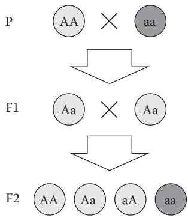  
그림 11.1 두 계통의 완두콩을 교배할 때의 가시적 및 숨겨진 유전자형.

몇 세대에 걸친 완두콩 표현형을 계산하는 프로그램을 작성하는 것은 쉽지 않습니다. 각 완두콩의 유전자형, 표현형이 유전자형과 어떻게 관련되는지, 그리고 어떻게 새로운 세대의 완두콩이 생성되는지 등 많은 작은 것들을 관리해야 합니다. 또한 결정을 내려야 합니다: 얼마나 많은 표현형 특징을 고려해야 하는가? 어떤 데이터 유형을 사용할 것인가? 출력은 어떻게 보여야 하는가? 기초적인 과학 원리는 단순할지라도 이를 프로그램 코드로 표현하는 것은 복잡합니다.

프로그래밍 기술이 향상됨에 따라, 루프와 변수 할당과 같은 일련의 명령어만 포함된 대규모 프로그램을 다루는 것이 어렵다는 것을 발견하게 될 것입니다. 단일 코드 블록으로 구성된 긴 프로그램을 디버깅하고 수정하는 것은 비효율적이고 불만족스럽습니다. 코드 라인과 당면한 생물학적 문제 사이의 연결이 더 이상 명확하지 않기 때문에 좌절감을 느낄 가능성이 큽니다.

여러분이 프로그래밍하고 있는 사물들을 더 명시적으로 설명할 수 있다면 더 좋지 않을까요? 예를 들어, 완두콩의 유전자형에 녹색 색상에 대한 두 개의 대립 유전자가 있으면 그 완두콩이 녹색이라는 것을 프로그램의 나머지 부분과 독립적으로 알려줄 수 있다면 어떨까요? 클래스(Class)는 현실 세계에서 사물들이 어떻게 작동하는지 설명하는 데 도움을 주며 복잡성을 제어하는 프로그래밍 구조입니다.

### 11.2.2 예제 파이썬 세션

클래스는 실제 또는 추상적인 객체를 나타냅니다. 이 장에서는 데이터와 함수를 클래스로 구조화하는 방법을 설명합니다. 예제 프로그램은 그레고어 멘델이 했던 것처럼 완두콩 교배 실험을 시뮬레이션하기 위해 클래스를 사용합니다. 클래스는 완두콩 색상을 결정하는 유전적 구성 요소를 관리합니다. 우성 대립 유전자(황색)는 'G'로, 열성 대립 유전자(녹색)는 'g'로 표시됩니다.

Pea 클래스는 각 개별 완두콩이 어떻게 행동하는지 정의하는 문장들을 포함합니다. 각 완두콩은 자신만의 유전자형("GG", "Gg", "gG" 또는 "gg")을 가지며, 이는 표현형("yellow" 또는 "green")이 무엇인지 알려줍니다. 마지막으로, 각 완두콩은 두 번째 완두콩과 함께 자손을 만들 수 있습니다.

```python
class Pea: 
    def __init__(self, genotype): 
        self.genotype = genotype 
    def get_phenotype(self): 
        if "G" in self.genotype: 
            return "yellow" 
        else: 
            return "green" 
    def create_offspring(self, other): 
        offspring = [] 
        for haplo1 in self.genotype: 
            for haplo2 in other.genotype: 
                new_genotype = haplo1 + haplo2 
                offspring.append(Pea(new_genotype)) 
        return offspring 
    def __repr__(self): 
        return self.get_phenotype() + " [" + self.genotype + "]"

yellow = Pea("GG") 
green = Pea("gg") 
f1 = yellow.create_offspring(green) 
f2 = f1[0].create_offspring(f1[1]) 
print(f1) 
print(f2)
```
출처: A.Via/K.Rother가 파이썬 라이선스 하에 공개한 코드를 수정함.

프로그램의 출력은 다음과 같습니다.

[yellow [Gg], yellow [Gg], yellow [Gg], yellow [Gg]] 
[yellow [GG], yellow [Gg], yellow [gG], green [gg]]

### 11.3 명령어들은 무엇을 의미하나요?

프로그램은 황색 완두콩(`yellow = Pea("GG")`)과 녹색 완두콩(`green = Pea("gg")`)을 생성하고, 이들을 교배하며(`yellow.create_offspring(green)`), 모든 자손(f1)의 표현형을 출력합니다. 그 다음 두 자손(f1[0]과 f1[1])을 다시 교배하고, 2대 자손(f2)도 출력합니다. 이 모든 일은 프로그램의 마지막 단락에서 일어납니다. Pea 클래스의 목적 중 하나는 그 마지막 단락을 이해하기 쉽게 만드는 것입니다. Pea 클래스는 그레고어 멘델이 관찰한 실제 완두콩과 공통점이 많습니다: 유전자형을 포함하고(__init__()에서 정의됨), 유전자형에 따라 결정되는 표현형을 가지며(get_phenotype()에서 계산됨), 다음 세대의 완두콩을 만들기 위해 두 번째 완두콩을 필요로 합니다(create_offspring()에서). 실제 완두콩과의 차이점은 Pea 클래스가 결정론적이라는 것입니다: 동일한 두 완두콩을 교배하면 항상 동일한 4개의 자손이 생성되며, 자손들은 유전자형의 가능한 모든 조합을 포괄합니다. 종합하면, Pea 클래스는 유전자형이 표현형으로 어떻게 번역되는지를 프로그램의 나머지 부분과 독립적인 구조로 정의합니다.

### 11.3.1 클래스는 인스턴스를 생성하는 데 사용됩니다

클래스는 실제 또는 가상의 사물에 대한 추상적인 표현입니다. 클래스는 그것이 나타내는 사물들이 어떻게 행동할지를 정의하지만, 구체적인 데이터를 포함하지는 않습니다. 구체적인 데이터는 클래스로부터 생성된 객체인 인스턴스(Instance)에 담깁니다. 예를 들어, Pea 클래스는 "완두콩은 유전자형을 가진다"라고 정의합니다. 클래스 자체는 특정한 유전자형을 가지고 있지 않습니다. 각 인스턴스는 정확히 정의된 유전자형("GG", "Gg", "gG" 또는 "gg")을 가집니다. 따라서 Pea 클래스는 플라톤적 의미에서의 모든 완두콩에 대한 "이데아"(모든 완두콩은 유전자형을 가지고, 자손을 만들기 위해 다른 완두콩을 필요로 하는 등)인 반면, 파이썬에서의 구체적인 완두콩은 인스턴스입니다(예: "GG" 유전자형으로 특징지어지는 `yellow = Pea("GG")` 완두콩). 클래스를 사용하려면 먼저 클래스를 정의하고, 생성자(즉, __init__() 함수)를 작성한 다음, 마지막으로 해당 클래스로부터 인스턴스를 생성해야 합니다.

# 클래스 정의하기

클래스는 항상 class 키워드와 그 뒤에 오는 클래스 이름으로 정의됩니다. class로 시작하는 줄은 콜론으로 끝납니다.

# class Pea:

이어지는 모든 들여쓰기된 코드 블록은 해당 클래스에 속합니다. 클래스 문장과 동일한 들여쓰기 수준에 있는 다음 지침은 더 이상 클래스에 속하지 않습니다. 클래스 블록 뒤에는 일반적인 파이썬 명령어인 지침들, 함수 또는 다른 클래스가 올 수 있습니다.

# 생성자 __init__()

생성자(Constructor)는 클래스가 어떤 종류의 데이터를 포함해야 하는지 정의하는 특별한 함수입니다.

파이썬에서 생성자는 __init__()라고 불립니다(init 앞뒤에 두 개의 언더바가 있음). Pea 클래스에서 생성자는 단일 데이터 항목을 정의합니다.

```python
def __init__(self, genotype):
    self.genotype = genotype 
```

이는 완두콩이 생성자의 두 번째 인자에 의해 지정된 유전자형을 가진다는 것을 의미합니다. 생성자 __init__은 여러분이 새로운 인스턴스를 생성할 때마다 보이지 않게 호출됩니다. 그런 다음 `self.genotype = genotype` 할당을 통해 특정 유전자형이 내부 변수에 저장됩니다. 이러한 내부 변수들을 속성(Attribute)이라고 부릅니다(섹션 11.3.2 참조). 속성은 일반 변수와 매우 비슷하게 작동하지만, 각 변수 앞에 self가 붙는다는 점이 다릅니다. 일반 함수와 마찬가지로 생성자에서 기본 매개변수를 사용할 수 있습니다. 생성자를 작성했다면 클래스를 사용할 준비가 된 것입니다.

Q & A: __init__ 시작 부분의 두 개의 언더바가 조금 보기 흉합니다. 함수에 다른 이름을 줄 수 없나요?

아니요, 생성자의 이름은 반드시 __init__이어야 합니다. 파이썬은 여러분이 클래스를 호출할 때 자동으로 생성자를 호출합니다. 파이썬이 이를 인식할 수 있도록 이름은 __init__이어야 합니다.

# 인스턴스 생성 방법

인스턴스를 생성할 때 여러분은 클래스에 구체적인 데이터를 입력합니다(그림 11.1 참조). 인스턴스를 생성하려면 함수를 호출하는 것과 유사하게 클래스를 호출하며, 생성자가 요구하는 모든 매개변수 중 하나를 제외하고 인자로 전달합니다. 사실 self 인자에 대해서는 값을 명시적으로 제공할 필요가 없습니다. self는 어떤 인스턴스가 클래스를 호출했는지 알려주는 데 사용됩니다. 예를 들어,

```txt
yellow = Pea("GG") 
```

에서 yellow는 Pea 클래스를 호출하고 있는 인스턴스(의 변수)입니다. 이 이름은 암시적으로 __init__() 생성자의 첫 번째 인자로 전달되므로,

```txt
print(yellow.genotype) 
```

을 입력하면 "GG"가 출력됩니다. 다시 말해, 클래스에서 정의된 모든 변수들은 해당 클래스를 호출하는 인스턴스의 속성이 됩니다. 속성의 구체적인 값은 클래스가 아니라 특정 인스턴스에 따라 달라집니다. "GG"는 yellow 인스턴스에 대한 genotype 속성의 구체적인 값입니다. 클래스 및 인스턴스 속성에 대한 더 많은 정보는 섹션 11.3.2에 제공됩니다. 동일한 클래스를 서로 다른 매개변수로 호출하여 생성된 인스턴스들은 동일한 구조를 공유하지만 서로 다른 데이터를 포함합니다. 예제에서는 처음에 두 개의 완두콩 인스턴스가 생성됩니다.

yellow = Pea("GG")
green = Pea("gg")

이 명령어들은 두 개의 완두콩 인스턴스(yellow와 green 변수에 저장됨)를 생성하며, 각각은 서로 다른 유전자형("GG"와 "gg")을 가집니다. 각 인스턴스는 자신만의 변수에 저장됩니다: 이들은 정말로 서로 다른 완두콩이지만, 둘 다 동일한 방식으로 사용될 수 있습니다. 즉, 이들은 Pea 클래스의 동일한 속성과 메서드를 가집니다(아래 참조).

클래스는 인스턴스를 생성하는 함수처럼 작동합니다. 생성된 객체들은 동일한 기본 구조를 가지지만 서로 다른 내용을 가집니다. 새로운 인스턴스를 생성할 때마다 기존에 이미 존재하던 인스턴스들은 변하지 않습니다. 원하는 만큼 많은 인스턴스를 병렬로 가질 수 있습니다.

### 11.3.2 클래스는 속성 형식으로 데이터를 포함합니다

인스턴스 내부의 데이터는 속성(Attribute)에 저장됩니다. 점 구문을 사용하여 이들에 접근할 수 있습니다(예: yellow.genotype). 생성자에서 정의된 모든 속성 이름을 사용할 수 있습니다. 앞에서 정의한 Pea 클래스의 경우, 주어진 Pea 인스턴스에 대해 genotype 속성에 접근할 수 있습니다.

```python
yellow = Pea('GG')  
print(yellow.genotype) 
```

그림 11.2는 Pea 클래스에서 정의된 속성들을 보여줍니다. 속성은 변수처럼 동적으로 변경될 수 있습니다. 예를 들어, 값을 재할당하여 Pea 인스턴스의 유전자형을 업데이트할 수 있습니다.

```python
yellow.genotype = 'Gg' 
```

속성은 정수, 부동 소수점 숫자, 문자열, 리스트, 딕셔너리, 심지어 다른 객체 등 어떤 유형이든 가질 수 있습니다.

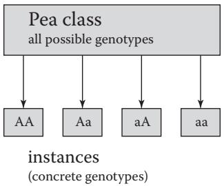  
그림 11.2 클래스 대 인스턴스: 완두콩 예제에서 각 Pea 인스턴스는 자신만의 개별 유전자형을 가집니다. Pea 클래스는 genotype 속성을 위한 플레이스홀더를 정의하지만 그 자체로는 값을 가지지 않습니다. 이는 모든 완두콩의 일반적인 속성을 나타냅니다.

Q & A: 어떤 속성이 클래스에 들어갈 수 있고 어떤 것이 안 되는지 어떻게 결정할 수 있나요?

클래스는 표 형식의 데이터를 표현하는 방법입니다. 클래스의 속성은 열(column)에 해당하고, 각 행(row)은 인스턴스에 해당합니다. 클래스 생성을 고려하고 있다면 먼저 이를 표로 생각하십시오. 예를 들어, 서로 다른 완두콩의 유전자형을 다음과 같이 표로 그룹화할 수 있습니다.

<table><tr><td>Genotype</td><td>Phenotype</td></tr><tr><td>GG</td><td>yellow</td></tr><tr><td>Gg</td><td>yellow</td></tr><tr><td>gG</td><td>yellow</td></tr><tr><td>gg</td><td>green</td></tr></table>

```python
>>> from neurons import DendriticLengths
>>> n = DendriticLengths('neuron_lengths.txt')
>>> print(n)
Data set with 9 dendritic lengths
>>> print(n.get_average())
184.233666667
>>> print(n.get_sttdev())
151.070213316 
```

# 디버깅 (Debugging)

학습 목표: 프로그램 오류를 탐지하고 제거할 수 있습니다.

### 12.1 이 장에서 배울 내용

* 프로그램이 작동하지 않을 때 해야 할 일   
* 전형적인 파이썬 오류를 찾고 수정하는 방법   
* 오류를 찾기 쉬운 프로그램을 작성하는 방법   
* 누구에게 도움을 요청해야 하는가

### 12.2 스토리: 프로그램이 작동하지 않을 때

### 12.2.1 문제 설명

인간 프로그래머는 완벽하지 않습니다. 우리는 작은 세부 사항을 간과하거나, 피곤하거나, 단순히 해결하려는 문제가 복잡하기 때문에 실수를 합니다. 매우 숙련된 프로그래머라도 항상 실수를 합니다. 이는 프로그램을 작성하는 과정의 정상적인 일부입니다. 프로그램이 커질수록 더 많은 오류가 포함될 것입니다. 프로그램에 오류가 포함될 것이라는 점을 인정한다면, 다음의 논리적인 질문들을 생각할 수 있습니다: 프로그램을 어떻게 고칠 것인가? 프로그램이 작동하지 않을 때 무엇을 할 수 있는가? 어떻게 오류를 찾아 제거할 수 있는가? 모든 오류를 고쳤다는 것을 어떻게 알 수 있는가? 후자는 특히 과학 연구에서 중요한데, 오류가 있는 계산에 기반한 연구 결과는 가치가 없기 때문입니다.

이 장에서는 파이썬에서 발생하는 다양한 유형의 오류와 이를 수정하거나 피하기 위해 무엇을 할 수 있는지 만나게 될 것입니다. 여러분은 세 가지 종류의 오류를 수정하는 방법을 배우게 됩니다: 구문 오류(syntax errors), 런타임 오류(runtime errors), 논리 오류(logical errors)입니다. 구문 오류는 프로그램 코드에 파이썬이 인식하지 못하는 잘못된 기호가 있어 프로그램이 시작조차 되지 않는 경우입니다. 런타임 오류는 코드가 실행되는 동안 프로그램이 갑자기 멈추게 만드는 오류입니다. 논리 오류는 프로그램이 정상적으로 종료되지만, 프로그램이 여러분이 생각했던 것과 다르게 동작하여 결과가 틀린 경우를 의미합니다. 여러분은 오류가 적고 오류를 찾기 쉬운 프로그램을 작성하는 데 도움이 되는 전략을 배우게 될 것입니다. 이러한 노력에도 불구하고 막혔을 때는 도움을 요청할 때입니다(박스 12.1 참조).

디버깅의 모든 측면을 배우기 위해, 여러분은 고장 난 프로그램을 분석하게 될 것입니다. 이 프로그램은 텍스트 파일에서 수상 돌기 길이를 읽어 세 가지 카테고리로 분류하도록 되어 있습니다. 입력 텍스트 파일은 기본(primary) 및 보조(secondary) 수상 돌기 길이를 담은 두 개의 열로 구성됩니다.


::: {.callout-note}
## 박스 12.1 도움 요청하기

디버깅은 어렵습니다. 많은 프로그래머들이 디버깅이 프로그래밍 그 자체보다 훨씬 더 어렵다고 말합니다. 코드에 완전히 몰입해 있을 때는 문제를 발견하기 어려울 수 있습니다. 막혔을 때는 세부 사항에 빠져 다른 사람들에게는 명백한 것을 간과하게 됩니다. 그런 상황에서는 새로운 시각이 종종 도움이 됩니다. 그 시각은 다음과 같은 사람들이 제공할 수 있습니다.

* 숙련된 프로그래머. 그들은 어려운 문제 해결을 즐깁니다.   
* 여러분의 프로그램을 설명해 줄 수 있는 비슷한 수준의 동료. 설명하는 과정 자체가 여러분의 생각이 어디서 잘못되었는지 찾는 데 도움이 되는 경우가 많습니다. 또는 동료가 던진 좋은 질문이 잘못된 코드 조각으로 여러분을 인도할 수도 있습니다.   
* 비프로그래머. 여러분이 하려는 일을 비프로그래머에게 설명하려면 개념적으로 단순화해야 하며, 이것이 여러분 자신에게도 도움이 될 수 있습니다.   
* 여러분 자신. 피곤해서 단순한 프로그래밍 버그를 간과하고 있는 것일 수 있습니다. 동일한 오류와 20분 이상 싸우고 있다면 휴식이 필요한 때입니다. 웹 브라우저를 보는 휴식이 아닙니다. 진짜 휴식입니다. 화면을 끄고 잠시 후에 돌아오십시오. 그런 다음 프로그램이 무엇을 해야 하는지 다시 생각하고, 실제로 그렇게 하고 있는지 살펴보십시오.

현재 막혔음을 인정하고 다른 사람과 대화하는 것이 문제를 즉시 해결해 줄 힌트를 얻거나, 심호흡을 하고 새로운 에너지를 가지고 코드에 접근하게 해주는 가장 빠른 방법인 경우가 많습니다.

:::

```txt
Primary 16.385  
Primary 139.907  
Primary 441.462  
Secondary 29.031  
Secondary 40.932  
Secondary 202.075  
Secondary 142.301  
Secondary 346.009  
Secondary 300.001 
```

프로그램은 100 μm보다 짧은 뉴런, 300 μm보다 긴 뉴런, 그리고 그 사이의 뉴런이 각각 몇 개인지 세어야 합니다.

### 12.2.2 예제 파이썬 세션

```python
def evaluate_data(data, lower = 100, upper = 300):
    """데이터 포인트를 세 개의 구간으로 분류하여 셉니다."""
    smaller = 0
    between = 0
    bigger = 0
    for length in data:
        if length < lower:
            smaller = smaller + 1
        elif lower < length < upper:
            between = between + 1
        elif length > upper:
            bigger = 1
    return smaller, between, bigger

def read_data(filename):
    """텍스트 파일에서 뉴런 길이를 읽습니다."""
    primary, secondary = [], []
    for line in open(filename):
        category, length = line.split("\t")
        length = float(length)
        if category == "Primary":
            primary.append(length)
        elif category == "Secondary":
            secondary.append(length)
    return primary, secondary

def write_output(filename, count_pri, count_sec):
    """계산된 값들을 파일에 씁니다."""
    output = open(filename, "w")
    output.write("category <100 100-300 >300\n")
    output.write("Primary: %5i %5i %5i\n" % count_pri)
    output.write("Secondary: %5i %5i %5i\n" % count_sec)
    output.close()

primary, secondary = read_data('neuron_data.xls')
count_pri = evaluate_data(primary)
count_sec = evaluate_data(secondary)
write_output('results.txt', count_pri, count_sec) 
```

출처: A.Via/K.Rother가 파이썬 라이선스 하에 공개한 코드를 수정함.

### 12.3 명령어들은 무엇을 의미하나요?

프로그램은 수상 돌기 길이가 담긴 2열 표를 분석하도록 되어 있습니다. 입력 표는 neuron_data.txt 파일에 있습니다. 프로그램을 실행하려고 하면 파이썬이 오류 메시지와 함께 갑자기 종료되는 것을 보게 될 것입니다.

```txt
File "neuron_sort.py", line 23
if category == "Primary"
SyntaxError: invalid syntax 
```

언뜻 보기에 코드는 괜찮아 보입니다. 무엇이 잘못되었으며, 프로그램을 어떻게 고칠 수 있을까요? 이 시점에서 오류를 하나씩 해결해 나가기 시작해야 합니다.

### 12.3.1 구문 오류 (Syntax Errors)

여러분은 아마 이전에 다음과 같은 메시지를 본 적이 있을 것입니다.

SyntaxError: invalid syntax

SyntaxError는 파이썬 인터프리터가 코드의 특정 라인을 이해하지 못해 즉시 멈췄음을 의미합니다. 오류의 원인은 대개 키워드나 특수 문자의 철자가 틀렸거나 잘못된 위치에 있기 때문입니다. 예를 들어, print 대신 prin이라고 썼거나, 리스트를 쉼표 [1, 2, 3] 대신 세미콜론 [1; 2; 3]으로 정의한 경우입니다.

구문 오류는 찾기 가장 쉬운 프로그래밍 실수입니다. 코드를 보는 것만으로 대부분의 구문 오류를 찾을 수 있습니다. 파이썬은 줄 번호(이 경우 23행)뿐만 아니라 줄의 어디에서 문제가 발생했는지 알려주는 ^ 기호를 제공하여 도움을 줍니다.

```txt
File "neuron_sort.py", line 23
if category == "Primary" 
```

오류를 즉시 발견하지 못했다면 텍스트 편집기에서 해당 줄을 확인하십시오. 줄 번호를 표시하는 텍스트 편집기를 사용하고 있는지 확인하십시오(윈도우 메모장을 제외한 거의 모든 편집기가 이를 수행합니다). 또한 IDLE 편집기와 같은 파이썬 구문 강조(syntax-highlighting) 기능은 프로그램을 실행하기 전에 실수를 발견하는 데 도움이 됩니다. Eric과 같은 일부 고급 편집기는 구문 오류를 큰 빨간 점으로 즉시 표시합니다. 일부 구문 오류는 찾기 어려울 수 있습니다. 박스 12.2는 여러분이 확인해 볼 수 있는 체크리스트입니다. 여기에 나열된 모든 것을 시도했는데도 오류를 찾지 못했다면 다른 프로그래머들에게 물어볼 때입니다. 그들은 모두 어려운 문제 해결을 좋아하기 때문에 프로그래밍을 시작했습니다.


::: {.callout-note}
## 박스 12.2 구문 오류(SYNTAXERROR) 해결 방법

* 구문 오류 메시지에서 강조된 줄의 이전 줄을 확인하십시오.   
* if, for, 또는 def 문이 있다면 줄 끝에 콜론(:)이 있습니까?   
* 이전에 시작된 문자열이 제대로 닫혔습니까(특히 """와 '''를 사용한 다중 행 문자열을 사용하는 경우)?   
* 여러 줄에 걸쳐 있는 리스트, 딕셔너리 또는 튜플에 닫는 괄호가 있습니까?   
* 코드에 들여쓰기를 위한 공백과 탭이 섞여 있는지 확인하십시오. 이들은 똑같이 보이기 때문에 처음부터 일관되게 공백을 사용하는 것이 훨씬 좋습니다.   
* 오류가 발생하는 줄이나 전체 섹션을 주석 처리하십시오. 구문 오류가 사라집니까? 다른 오류 메시지가 보인다면 문제의 위치를 파악한 것입니다.   
* 오류가 발생하는 줄이나 섹션을 제거하십시오. 이제 구문 오류가 사라집니까?   
* 파이썬 3.10 코드를 파이썬 2.x로 실행하려고 합니까? 파이썬 2.x의 print 명령은 파이썬 3.x에서 print() 함수입니다. 이 경우와 다른 여러 사례에서 파이썬 2와 3 사이에는 코드가 호환되지 않습니다.

프로그램의 23행 끝에 콜론이 빠져 있습니다. 올바른 줄은 다음과 같아야 합니다.

if category == "Primary":

:::

### 12.3.2 런타임 오류 (Runtime Errors)

누락된 콜론을 추가하고 프로그램을 다시 실행하면 다른 메시지가 나타납니다.

```python
File "neuron_sort.py", line 37, in <module> primary, secondary = read_data('neuron_data.xls') File "neuron_sort.py", line 20, in read_data for line in open(filename): IOError: [Errno 2] No such file or directory: 'neuron_data.xls' 
```

 코드에 구문 오류가 없다면 파이썬은 프로그램을 한 줄씩 실행하려고 시도합니다. 그 시점부터 보게 되는 모든 오류 메시지를 런타임 오류라고 부릅니다. 일반적으로 이는 파이썬이 코드의 특정 라인을 실행하려고 했지만 실행 중에 무언가 잘못되었음을 의미합니다. 좋은 점은 적어도 프로그램의 구문이 올바르다는 것을 이제 안다는 것입니다.

이 범주의 오류에는 많은 가능한 이유가 있습니다. 아마도 프로그램이 존재하지 않는 변수를 사용하려고 했거나, 파일을 찾지 못한 경우일 것입니다. 어떤 경우든 오류를 고치기 위해 정확히 무슨 일이 일어났는지 분석해야 합니다. 이를 위한 일반적인 전략은 오류 메시지를 맨 아래부터 읽는 것입니다. 거기서 두 가지를 식별해야 합니다.

* 마지막 줄의 오류 유형 (이 경우 IOError)   
* 가장 안쪽 함수에서 오류가 발생한 줄 (이 경우 20행; 37행은 20행으로 이어지는 함수를 호출할 뿐입니다)

파이썬은 많은 종류의 런타임 오류를 알고 있습니다. 다음으로 가장 중요한 것들을 논의합니다.

# IOError

프로그램이 입출력 장치(파일, 디렉토리 또는 웹사이트)와 통신하려고 했으나 무언가 잘못되었습니다. 파일의 경우 가장 흔한 이유는 파일이나 디렉토리 이름의 철자가 틀린 경우입니다. 또한 사용자에게 권한이 없거나 파일이 이미 열려 있어 프로그램이 특정 파일을 읽거나 쓸 수 없는 경우도 있습니다. 웹 페이지의 경우 잘못된 URL이나 인터넷 연결 문제가 원인일 수 있습니다.

다른 이유를 고려하기 전에 파일, 디렉토리 또는 웹 페이지의 이름을 확인하십시오. 오류가 발생하는 줄 바로 앞에 print 지침을 추가하여 프로그램에서 이름을 화면에 출력해 보십시오.

print(filename)
for line in open(filename):

파일 이름을 두 번 확인하고 공백과 대소문자에 주의하십시오. 파일의 경우 파일 브라우저나 터미널에서 파일이 정말로 생각한 디렉토리에 있는지 다시 확인하십시오. 프로그램이 정말로 예상한 디렉토리에서 시작되었는지 확인하십시오(프로그램의 복사본이 여러 개 있는 경우 이 오류가 매우 흔합니다).

웹사이트를 읽는 경우 주소를 복사하여 브라우저에 붙여넣어 보십시오. 파일 이름을 신중하게 다시 확인하면 IOError는 대개 고치기 쉽습니다. 동일한 문제를 다시 보지 않을 가능성이 큽니다. 섹션 12.2.2의 예제 프로그램에는 이러한 철자 실수가 있습니다. IOError를 제거하려면 파일 이름을 neuron_data.xls from neuron_data.txt로 바꾸는 것으로 충분합니다.

# NameError

이전 버그를 수정한 후 새로운 오류 메시지가 나타납니다.

```python
Traceback (most recent call last):
    File "neuron_sort.py", line 37, in <module>
    primary, secondary = read_data('neuron_data.txt')
    File "neuron_sort.py", line 26, in read_data
    secondary.append(length)
NameError: global name 'secondary' is not defined 
```

NameError는 변수, 함수 또는 다른 객체의 이름을 파이썬이 만난 순간에 알 수 없음을 나타냅니다. 오류가 발생한 줄이 중요한데, 프로그램에서 현재 사용 가능한 모든 알려진 이름과 변수의 집합인 네임스페이스(namespace)가 항상 변하기 때문입니다. 예를 들어 새로운 변수가 정의되거나, 프로그램이 함수 안으로 들어갔다 나오거나, 외부 모듈이 임포트될 때 네임스페이스가 변합니다. NameError의 빈번한 원인은 다음과 같습니다.

* 이름을 임포트하지 않았습니다. 다른 모듈에서 변수나 함수를 임포트하는 것을 잊었습니다. import *를 사용하지 않는 한, 특정 이름을 임포트했는지 확인하기 쉽습니다(따라서 import *보다는 import name을 선호하십시오).   
* 변수가 초기화되지 않았습니다. 예를 들어 카운팅을 위해 변수를 사용하고 싶고 다음과 같은 줄이 있다면

```txt
counter = counter + 1 
```

그 이전에 어딘가에서 해당 변수를 초기화해야 합니다.

counter = 0

변수 초기화가 조건에 달려 있다면 이는 까다로울 수 있습니다. 예를 들어,

if a > 5:
    counter = 0
counter = counter + 1

이 코드 조각은 a가 처음에 6 이상인 경우에만 작동합니다. 그렇지 않으면 counter가 정의되지 않았기 때문에 오류와 함께 종료됩니다. 따라서 변수 초기화는 항상 조건 없이 이루어져야 합니다.

* 변수나 함수 이름의 철자가 틀렸습니다. 이는 매우 빈번한 버그입니다. 추적하기 어렵게 만드는 점은 철자 오류가 항상 오류 메시지에 제공된 줄에 있는 것은 아니라는 점입니다. 예를 들어 이전 스크립트의 26행을 확인하면 secondary의 철자가 올바르다는 것을 알 수 있습니다. 따라서 변수 정의 부분의 철자도 올바른지 확인하기 위해 그 위의 코드를 확인해야 합니다.

NameError에 대한 좋은 진단 도구는 오류가 발생하기 전 줄에 다음 코드를 추가하는 것입니다.

```lua
print(dir()) 
```

그러면 파이썬이 알고 있는 변수들의 목록(내장 함수 제외)을 보게 될 것입니다. 이 경우:

['category', 'filename', 'length', 'line', 'primary', 'secondry']

이제 secondry의 철자가 틀렸다는 것을 더 쉽게 알 수 있습니다. 코드에서 철자가 틀린 버전을 검색하면 18행에서 찾을 수 있습니다. 따라서 18행의 secondry를 secondary로 교체하여 NameError를 수정할 수 있습니다. 또 다른 NameError가 40행에서 발생하며, 같은 줄의 write_output_file을 write_output으로 변경하여 수정할 수 있습니다. 이제 neuron_sort.py 프로그램은 오류 없이 실행되고 출력 파일을 생성합니다. 파이썬에서 빈번하게 발생하는 다른 종류의 오류로는 ImportError, ValueError, IndexError 등이 있습니다. 이들은 예제 12.1~12.3에 제시되어 있습니다.

### 12.3.3 예외 처리 (Handling Exceptions)

섹션 12.2.2의 예제 프로그램에 있는 IOError처럼 철자가 틀린 파일 이름 때문에 발생하는 오류는 매우 흔합니다. 문제가 예상되는 또 다른 상황은 프로그램이 항상 존재하지는 않는 특정 데이터 형식을 기대하는 경우입니다. 이러한 문제가 발생할 수 있다는 것을 안다면, 문제가 발생할 때마다 디버깅을 시작해야 하는 대신 프로그램이 문제를 예상하고 적절하게 반응할 수 있다면 좋을 것입니다. 파이썬의 예외 처리(exception handling)가 바로 그 역할을 합니다.

# try…except 문

try…except 문을 사용하면 프로그램 오류가 프로그램을 멈추기 전에 이를 포착할 수 있습니다. 런타임 오류가 예상되는 문장들의 집합은 try로 시작하는 들여쓰기된 블록에 삽입되고, 오류에 반응하는 문장들은 except로 시작하는 들여쓰기된 블록에 삽입됩니다. try…except 문은 except 문에서 처리하고자 하는 예외의 유형을 지정함으로써 예외를 처리할 수 있게 해줍니다. 예를 들어, 특정 오류 유형에 반응하기 위해 except 문을 사용할 수 있습니다.

```python
try: 
    a = float(input("숫자를 입력하세요:")) 
    print(a) 
except ValueError: 
    print("숫자를 입력하지 않았습니다. 다시 시도하십시오.") 
    raise SystemExit
```
출처: A.Via/K.Rother가 파이썬 라이선스 하에 공개한 코드를 수정함.

이전 예제에서 예상되는 예외(ValueError)가 except 문의 인자로 제공되었습니다: 해당 들여쓰기 블록은 ValueError 예외가 발생하는 경우에만 실행됩니다. 다른 유형의 예외는 처리되지 않습니다. `raise SystemExit`는 프로그램을 통제된 방식으로 종료시키는 예외를 생성합니다. 둘 이상의 예외를 처리하고 싶다면 처리하고자 하는 예외의 수만큼 except 블록을 추가할 수 있습니다.

except 문에 인자를 지정하지 않으면, 유형에 관계없이 try 블록의 첫 번째 예외가 발생했을 때 프로그램이 except 블록을 실행하게 됩니다. 이는 모든 경우에 프로그램의 통제된 종료를 보장하지만, 어떤 종류의 런타임 오류가 except 블록의 실행을 유발했는지 결정할 수 없기 때문에 상황에 대한 제어력이 떨어집니다.

# else 문

else 문은 선택적으로 try…except 블록 뒤에 추가될 수 있습니다. else에 의해 제어되는 문장들은 try 블록에서 예외가 발생하지 않은 경우, 즉 어떤 except 문도 실행되지 않은 경우에 실행됩니다.

```xml
try: 
    <문장들> 
except: 
    <문장들> 
else: 
    <문장들> 
```

else 문의 실질적인 용도는 키보드로부터 파일 이름을 읽고 파일이 열릴 수 있는 경우에만 파일을 처리하는 것입니다.

```python
try: 
    filename = input("파일 이름을 입력하세요:") 
    in_file = open(filename)   
except IOError: 
    print("파일 이름 %s를 찾을 수 없습니다." % filename) 
    raise SystemExit   
else: 
    for line in in_file: 
        print(line) 
    in_file.close()
```
출처: A.Via/K.Rother가 파이썬 라이선스 하에 공개한 코드를 수정함.

else를 사용하면 제어하고자 하는 예외가 발생하는 문장들만 try 블록에 넣음으로써 예외 처리를 완전히 활용하고 코드를 더 잘 조직할 수 있습니다.

요약하자면, try…except 문은 여러분의 프로그램이 오류에 반응할 수 있게 해줍니다. 먼저 try 블록이 실행됩니다. 인터프리터가 어떤 예외도 만나지 않으면 except 문은 무시되고 (존재하는 경우) else 블록이 실행됩니다. try 블록 실행 중에 예외가 발생하면 블록의 나머지는 무시되고 인터프리터는 올바른 유형의 예외가 있는 except 문으로 점프합니다. 어떤 except 문도 오류를 처리할 수 없으면 실행은 오류 메시지와 함께 종료됩니다.

### 12.3.4 오류 메시지가 없을 때

일부 프로그램 오류는 오류 메시지를 생성하지 않습니다. 이들은 조용한 버그(silent bugs)입니다. 프로그램은 실행되지만 해야 할 일을 하지 않습니다. 이는 디버깅에서 가장 도전적인 상황인데, 우선 무언가 잘못되었다는 것을 알아내야 하고 그 다음 문제의 위치를 찾아 제거해야 하기 때문입니다. 이제 코드를 읽기 시작하고, 단계별로 분석하고, 변수와 함수 이름을 확인하는 등의 작업을 할 수 있습니다. 하지만 무엇을 찾아야 할지 모르기 때문에 이는 매우 어렵습니다. 더 많은 정보가 필요합니다.

# 어디서부터 시작할까?

"아직 데이터가 없습니다. 데이터가 있기 전에 이론을 세우는 것은 중대한 실수입니다. 무의식적으로 사실을 이론에 맞추기 위해 비틀기 시작하며, 이론을 사실에 맞추지 않게 됩니다." (셜록 홈즈)*

버그를 추적하려면 가능한 한 많은 정보를 수집해야 합니다. 셜록 홈즈의 수사에서 볼 수 있는 연역적 접근 방식을 사용하십시오. 신비로운 사건에 직면했을 때, 탐정은 대개 사실을 수집하기 시작하고 가능성들을 배제해 나갑니다. 마지막으로 그는 논리적인 결론을 도출합니다. 프로그래밍에서 함수 A가 잘 작동하고 함수 C도 잘 작동한다면, 문제는 반드시 B에 있어야 합니다. 따라서 프로그램의 각 부분이 작동하는 모습을 관찰해야 합니다. 이를 수행하는 세 가지 방법이 있습니다: (1) 프로그램의 입력과 출력을 비교하기, (2) print 문 추가하기, (3) 파이썬 디버거 사용하기.

# 입력과 출력 비교하기

첫 번째 시작점은 프로그램의 입력과 출력을 비교하는 것입니다. 이 시점에서 테스트를 위해 작은 예제 파일을 사용하는 것이 도움이 됩니다. 이전의 입력 파일로 neuron_sort.py 프로그램을 실행하면 세 줄이 포함된 results.txt 파일을 얻게 됩니다.

```txt
category <100 100-300 >300  
Primary: 1 1 1  
Secondary: 2 2 1 
```

입력 파일 neuron_data.txt에는 9개의 줄이 들어 있습니다. 따라서 표에도 총 9개의 카운트가 포함되어야 합니다. 8개만 있는 것을 볼 수 있습니다. 더 정확하게는 보조(secondary) 뉴런에 대해 마지막 열에 2가 있어야 합니다. 결론적으로, 300보다 큰 하나의 뉴런 길이가 카운트되지 않게 만드는 버그가 있습니다. 표의 나머지는 영향을 받지 않은 것으로 보입니다.

# print() 문 추가하기
코드의 거의 모든 곳에 print 문을 추가하여 변수와 함수의 결과를 출력하거나 단순히 특정 줄에 도달했음을 나타낼 수 있습니다. 조용한 오류를 추적하기 위해 이 전략을 선택했다면, 오류가 의심되는 코드 조각의 앞뒤에 print 문을 추가하십시오. 그다음 프로그램을 실행하고 출력을 수동으로 확인하십시오. print 문을 위아래로 옮기면서 오류의 위치를 좁힐 수 있습니다.

neuron_sort.py 프로그램에서 6개의 보조 뉴런 중 하나가 제대로 카운트되지 않았습니다. 개별 함수들이 작동하는지 확인하기 위해 스크립트의 마지막 단락에 첫 번째 print 문을 추가할 수 있습니다.

```python
primary, secondary = read_data('neuron_data.txt')  
print(secondary)
count_pri = evaluate_data(primary)  
count_sec = evaluate_data(secondary)  
print(count_sec)
write_output('results.txt', count_pri, count_sec) 
```

첫 번째 print 문은 모든 보조 뉴런 길이의 리스트를 화면에 씁니다.

```json
[29.031, 40.932, 202.075, 142.301, 346.009, 300.001]
```

입력 파일의 6개 숫자가 모두 리스트에 있는 것을 볼 수 있습니다. 이로부터 read_data() 함수가 올바르게 작동한다는 결론을 내릴 수 있습니다.

두 번째 print 문은 세 가지 길이 구간에 대한 카운트가 담긴 튜플을 화면에 씁니다.

(2, 2, 1)

입력 데이터로부터 이 튜플은 (2, 2, 2)가 되어야 함을 알 수 있습니다. 이제 문제가 evaluate_data() 함수에 있어야 한다는 결론을 내릴 수 있습니다. 그 안의 코드를 더 자세히 조사해야 합니다. 그곳에 더 많은 print 문을 추가하거나 파이썬 디버거를 사용하여 조사할 수 있습니다.

# 파이썬 디버거 사용하기

파이썬 디버거(Python debugger)는 프로그램을 단계별로 실행하고 각 줄에서 프로그램이 무엇을 하는지 볼 수 있게 해주는 도구입니다. 변수를 확인하고 수정하며 줄을 하나씩 실행할 수 있는 셸을 제공합니다. 파이썬 디버거를 사용하려면 프로그램에 다음 두 줄을 삽입해야 합니다.

import pdb
pdb.set_trace()

이 줄들에 도달하면 파이썬은 실행을 멈추고 몇 가지 추가 명령어를 사용할 수 있는 셸 창에서 프로그램의 제어권을 여러분에게 넘겨줍니다.

* 'n'은 다음 줄을 실행합니다.   
* 's'는 다음 줄을 실행하되 함수 내부로 들어가지 않습니다.   
* 'l'은 프로그램이 현재 코드의 어디에 있는지 보여줍니다.   
* 'c'는 실행을 정상적으로 계속합니다.

그 외에도 일반적인 파이썬 셸에서 할 수 있는 모든 것이 작동합니다. neuron_sort.py의 evaluate_data() 함수에 있는 버그를 분석하기 위해 해당 함수에서 디버거를 시작할 수 있습니다.

```python
def evaluate_data(data, lower = 100, upper = 300): 
    """데이터 포인트를 세 개의 구간으로 분류하여 셉니다.""" 
    import pdb
    pdb.set_trace()
```

프로그램을 시작하면 디버거가 시작됩니다.

```txt
> neuron_sort.py(6) evaluate_data()
-> smaller = 0
(Pdb) 
```

(Pdb)는 디버거의 프롬프트입니다. 표시된 줄은 다음에 실행될 줄입니다. 이제 (Pdb) 프롬프트에 data를 입력하여 함수가 어떤 매개변수를 받았는지 확인할 수 있습니다.

```txt
(Pdb) data  
[16.385, 139.907, 441.462] 
```

이는 기본(primary) 뉴런에 대한 데이터 리스트입니다. 이미 문제가 보조(secondary) 뉴런에 있음을 알고 있으므로 'c'를 입력하여 프로그램을 계속 진행할 수 있습니다. 프로그램은 기본 뉴런에 대한 실행을 마치고 보조 뉴런에 대한 실행을 시작합니다. 잠시 후 evaluate_data() 함수가 두 번째로 호출될 때 디버거는 다시 동일한 지점에서 멈춥니다. 이번에는 보조 뉴런 데이터입니다.

```txt
(Pdb) data 
[29.031, 40.932, 202.075, 142.301, 346.009, 300.001] 
```

이제 'n'을 몇 번 입력하여 실행을 줄 단위로 추적할 수 있습니다. 다음과 같이 시작하는 줄들이

-> for length in data:

data의 6개 항목 각각에 대해 디버거 출력에서 반복되는 것을 볼 수 있을 것입니다. 'n'으로 for 문을 실행한 후 언제든지 디버거 프롬프트에 length를 입력하여 length의 값을 확인할 수 있습니다.

```txt
(Pdb) n  
> neuron_sort.py(11) evaluate_data()  
-> between = 0  
(Pdb) n  
> neuron_sort.py(12) evaluate_data()  
-> bigger = 0  
(Pdb) n  
> neuron_sort.py(14) evaluate_data()  
-> for length in data:  
(Pdb) n  
> neuron_sort.py(15) evaluate_data()  
-> if length < lower: 
```

```txt
(Pdb) length   
29.030999999999999   
(Pdb) 
```

디버거의 화면 출력은 data 리스트의 각 값에 대해 어떤 줄들이 실행되는지 보여줍니다. 처음 두 값에 대해 실행되는 줄은 다음과 같습니다.

-> if length < lower: 
-> smaller += 1

그다음 두 값에 대해서는,

```txt
-> if length < lower:  
-> elif lower < length < upper:  
-> between += 1 
```

여기서 해당 length 값에 대해 `if length < lower:` 조건이 False를 반환하는 것을 볼 수 있습니다. 그래서 이 줄 다음에 두 번째 if 조건이 대신 실행됩니다. 마지막 두 값에 대해서는,

```txt
-> if length < lower:  
-> elif lower < length < upper:  
-> elif length > upper:  
-> bigger = 1 
```

이 시점에서 `bigger = 1` 줄이 아마도 다른 두 개의 덧셈처럼 보여야 한다는 것을 알아챌 수 있습니다. 줄을 다음과 같이 바꾸면

```txt
-> bigger += 1 
```

프로그램은 실수 없이 실행될 것입니다.

### 12.4 예제 (EXAMPLES)

### 예제 12.1 ImportError

ImportError가 보인다면 이는 파이썬이 모듈을 임포트하려고 했으나 실패했음을 의미합니다. 여기에는 두 가지 이유가 있을 수 있습니다. 모듈을 찾을 수 없었거나, 모듈에 여러분이 임포트하려는 내용이 포함되어 있지 않은 경우입니다. 몇 가지 확인할 사항이 있습니다.

* 모듈 이름의 철자를 확인하십시오.   
* 프로그램을 시작한 디렉토리를 확인하십시오. 임포트하려는 모듈이 예상한 위치에 있습니까?

수동으로 설치한 파이썬 라이브러리에서 임포트하는 경우 다음을 시도해 볼 수 있습니다.

import sys 
print(sys.path)

* 임포트하려는 디렉토리가 그곳에 목록화되어 있어야 합니다. 정말로 그렇습니까? 그렇지 않다면 PYTHONPATH 변수(UNIX 또는 윈도우 수준에서)에 추가하거나 sys.path 리스트에 추가(append)해야 합니다.   
* 우선 모듈 자체를 임포트할 수 있는지 확인하십시오: import X.   
* 그 다음 내부에서 변수와 함수를 임포트할 수 있는지 시도하십시오: from X import Y.   
* 하위 디렉토리에서 임포트하는 경우(예: import tools.parser), 해당 디렉토리에 필수 파이썬 파일인 __init__.py가 포함되어 있습니까?   
* 이름 중복을 확인하십시오. 여러분의 모듈이나 함수 이름이 파이썬 표준 라이브러리에서 임포트한 함수 이름과 같다면 문제가 발생합니다. 모듈 이름을 바꾸고 문제가 지속되는지 확인하십시오. 이런 종류의 문제는 import *를 사용하는 경우 탐지하기 매우 어려우므로 사용하지 않는 것이 좋습니다.

### 예제 12.2 ValueError

ValueError는 연산을 위한 두 변수가 호환되지 않을 때 발생합니다. 예를 들어 정수를 문자열에 더하려고 할 때입니다. 파일을 읽는 동안 int()나 float() 함수를 사용하여 데이터를 변환하는 것을 잊었기 때문일 수 있습니다. 또 다른 가능성은 리스트의 요소에 접근하기 위해 [i] 인덱스를 쓰는 것을 잊은 경우입니다. 그러면 파이썬은 리스트의 내용 대신 리스트 전체를 다루려고 시도합니다. 리스트를 숫자에 더하는 것 또한 ValueError를 발생시킵니다. ValueError에 대한 좋은 진단 도구는 오류가 있는 줄 앞에 print 문을 추가하는 것입니다. 예를 들어 a와 b를 더하는 것이 오류를 발생시킨다면, 다음과 같이 그들의 유형이 호환되는지 볼 수 있습니다.

print(a, b) 
result = a + b

또는

print(type(a), type(b)) 
result = a + b

예제에서 a가 [1, 2, 3](또는 type(a)가 "list")이고 b가 4(또는 type(b)가 "int")라면, 출력에서 맞지 않는다는 것을 알 수 있을 것입니다.

### 예제 12.3 IndexError

IndexError는 파이썬이 리스트나 딕셔너리에서 요소를 찾는 데 실패했을 때 발생합니다. 예를 들어 세 개의 항목이 있는 리스트가 있을 때, [3]으로 0부터 시작하는 네 번째 항목에 접근하려고 하면 오류가 발생합니다.

```txt
>>> data = [1, 2, 3]  
>>> print(data[3])
Traceback (most recent call last):  
    File "<pyshell#3>", line 1, in <module>  
    print(data[3])
IndexError: list index out of range 
```

대규모 리스트와 딕셔너리, 인덱스를 위한 변수, 또는 더 복잡한 구조를 가지고 있을 때 IndexError를 분석하는 것은 더 복잡합니다. print 문을 추가하여 전체 데이터, 사용하는 다른 변수들, 또는 keys() 함수를 사용하여 딕셔너리의 키들을 표시할 수 있습니다. 문제가 더 복잡하다면 오류에 대해 더 철저한 분석을 수행해야 할 것입니다. 그때의 상황은 오류 메시지가 전혀 나타나지 않는 오류들과 유사합니다.

### 예제 12.4 읽기 쉬운 코드 작성하기

프로그래머로서 여러분의 일은 오류 없는 프로그램을 작성하는 것이 아닙니다. 아무도 그럴 수 없습니다. 가장 뛰어난 프로그래머조차도 첫 번째 시도에서 오류가 없는 프로그램을 작성할 수는 없습니다. 여러분의 일은 여러분 자신의 실수를 더 찾기 쉬운 방식으로 프로그램을 작성하는 것입니다. 일반적으로 코드는 (10장과 11장에서 설명한 대로) 좋은 코드 모듈화, 프로그래밍 프로젝트의 좋은 조직화(15장 참조), 그리고 잘 형식화된 코드를 통해 더 읽기 쉬워집니다. 좋은 형식화는 다음과 같은 특징을 가집니다.

* 변수와 함수에 묘사적인 이름을 사용하십시오. 다음과 같은 줄은

for line in sequence_file:

프로그램이 무엇을 하는지에 대해 다음 줄보다 훨씬 더 많은 것을 알려줍니다.

for l in f:

* 변수 이름은 단지 유형뿐만 아니라 데이터의 종류를 명시적으로 설명하는 것이 더 좋습니다: text보다는 sequence가 좋고, number보다는 seq_length가 좋습니다.   
* 함수 이름은 (함수의 동작을 표현하는) 동사로 시작해야 하며 한 개에서 세 개의 단어를 포함해야 합니다: read나 seq_file보다는 read_sequence_file이 읽기 더 쉽습니다. 영어 텍스트를 쓰듯이 프로그램을 작성할 수는 없지만, 가끔은 그에 상당히 가깝게 만들 수 있습니다.   
* 주석을 작성하십시오. 주석은 코드를 읽는 누구라도 프로그램이 무엇을 하는지 이해하는 데 도움을 줍니다. 가장 중요한 것은 프로그램이나 함수의 맨 처음에 있는 짧은 설명입니다. 하지만 모든 것에 주석을 달 필요는 없습니다. 변수와 함수 이름을 잘 짓는 것만으로도 많은 것을 이해할 수 있게 만들 수 있습니다. 프로그램이 발전함에 따라 주석은 금방 낡은 것이 됩니다. 경험 법칙상, 주석을 프로그램 단락의 제목으로 사용하고, 어렵다고 생각되는 줄을 문서화하십시오.   
* import * 문을 피하십시오. 무언가를 임포트할 때마다 임포트하는 모든 객체의 명시적인 이름을 추가하십시오. 예를 들어 다음과 같이 쓰는 대신

from math import *

다음과 같이 쓰는 것이 좋습니다.

from math import pi, sin, cos

여러분의 코드를 분석하기가 훨씬 쉬워질 것입니다.

* PEP8과 같은 통일된 코드 형식 스타일을 사용하십시오(15장 참조).

### 12.5 스스로 테스트하기

### 연습 문제 12.1 섹션 12.2.2의 파이썬 세션 디버깅

섹션 12.2.2의 예제를 텍스트 파일로 복사하고 이 장에서 설명된 모든 작업을 따라가며 디버깅해 보십시오. 특히 pdb 파이썬 디버거를 사용할 때 어떤 일이 일어나는지 확인하십시오.

### 연습 문제 12.2 try…except 문의 사용

프로그램을 디버깅했다면, 이제 입력 파일이 없는 상황에 반응하도록 만드십시오. 섹션 12.2.2에 IOError를 포착하고 깔끔하게 출력된 오류 메시지로 반응하는 적절한 try…except 문을 추가하십시오.

### 연습 문제 12.3 파일 및 숫자 처리에서의 예외 처리

텍스트 파일의 열에서 숫자 세트를 읽고, 숫자를 부동 소수점 숫자로 변환하며, 그들의 평균(3장 예제 3.1 참조)과 표준 편차(3장 예제 3.2 참조)를 계산하는 스크립트를 작성하십시오. 입력 파일에 숫자 대신 "-"가 포함된 몇 개의 줄을 추가하십시오. 이것이 어떤 오류를 발생시킵니까? 예외 처리를 사용하여 해당 줄들을 건너뛰되 경고 메시지를 출력하도록 하십시오.

### 연습 문제 12.4 중첩된 try…except 문

오류를 더 강력하게 제어하기 위해, 기존의 except 또는 else 블록 내에 추가적인 try…except 블록을 삽입하여 중첩된 try…except 문을 사용할 수 있습니다. 연습 문제 12.3의 스크립트를 수정하여 잘못된 파일 이름과 입력 데이터의 숫자가 아닌 기호 모두를 처리할 수 있도록 중첩된 try…except 블록을 사용하십시오.

### 연습 문제 12.5 표준 입력 및 숫자 처리에서의 예외 처리

연습 문제 12.3과 동일한 연습 문제를 수행하되, 파일 대신 키보드로부터 숫자를 읽으십시오. 동일한 try…except 블록을 사용해야 합니까? 왜 그렇습니까?

힌트: 표준 입력으로부터 숫자를 읽기 위해 raw_input()(파이썬 3의 경우 input())을 사용하십시오.

표준 입력을 읽을 때 숫자 입력을 중단하기 위한 조건을 삽입하십시오. 예를 들어,

```python
inputNumbers = [] 
number = None   
while number != 'q': 
    number = input("숫자를 입력하세요 (중단하려면 q):") 
    if number != 'q':
        inputNumbers.append(number)
```

# 외부 모듈 사용하기: 파이썬용 R 인터페이스 (Using External Modules: The Python Interface to R)

학습 목표: 파이썬을 사용하여 R로 통계 분석을 수행할 수 있습니다.

### 13.1 이 장에서 배울 내용

* 파이썬 스크립트에서 R 명령을 실행하는 방법   
* R 출력을 파이썬 변수에 저장하는 방법   
* 파이썬 객체(예: 튜플)로부터 R 객체(예: 벡터)를 생성하는 방법   
* 파이썬에서 R 플롯을 자동으로 생성하는 방법

13.2 스토리: 파일에서 숫자를 읽고 파이썬과 함께 R을 사용하여 평균값 계산하기

### 13.2.1 문제 설명

생물학자들은 데이터를 통계적으로 분석하고 이를 플로팅할 필요가 끊임없이 있습니다. R(www.r-project.org/)은 통계 컴퓨팅 및 그래픽 분석을 위해 가장 빈번하게 사용되는 소프트웨어 중 하나입니다. 많은 상황에서 파이썬 스크립트로부터 R을 호출할 수 있다는 것이 매우 유용하다는 것을 알게 될 것입니다.

예를 들어, 각각 다른 파일에 기록된 여러 숫자 분포의 평균값과 표준 편차를 계산해야 하고, 그 다음 하나 이상의 플롯을 자동으로 생성하고 싶다면, 계산의 많은 과업을 R에 위임하고 파이썬을 사용하여 이들을 연결할 수 있습니다. 이 장에서는 여러분이 이미 R이 어떻게 작동하는지 알고 있다고 가정합니다. 그렇지 않다면 이 장을 읽기 전에 R의 기초를 익힐 것을 강력히 권장합니다.

파이썬에는 R과 연결하기 위한 두 가지 모듈인 RPy와 RPy2가 있습니다. RPy2는 RPy의 재설계된 버전입니다. 이 장의 모든 예제는 우리가 사용을 권장하는 RPy2를 사용합니다. 이 모듈은 다운로드, 설치되어야 하며 스크립트나 파이썬 세션으로 임포트되어야 합니다(RPy2 설치에 대해서는 박스 13.1 참조).

다음 세션에서는 벡터 생성, 행렬 생성, 파일에서 데이터 읽기, 숫자 세트의 평균 계산과 같은 간단한 R 작업이 수행됩니다. 파이썬을 통해 R을 사용하는 이면의 철학을 이해하고 나면, 파이썬에서 어떤 R 함수든 접근하는 것이 쉽다는 것을 알게 될 것입니다.

### 13.2.2 예제 파이썬 세션

파이썬 명령어:   
```python
import rpy2.robjects as robjects  
r = robjects.r  
pi = r.pi  
x = r.c(1, 2, 3, 4, 5, 6)  
y = r.seq(1, 10)  
m = r.matrix(y, nrow = 5)  
n = r.matrix(y, ncol = 5)  
f = r("read.table('RandomDistribution.tsv', sep = '\\t')")  
f_matrix = r.matrix(f, ncol = 7)  
mean_first_col = r.mean(f_matrix[0]) 
```

출처: A.Via/K.Rother가 파이썬 라이선스 하에 공개한 코드를 수정함.

동일한 R 명령어:   
```python
> p = pi  
> x = c(1, 2, 3, 4, 5)  
> y = seq(1, 10)  
> m = matrix(y, nrow = 5)  
> n = matrix(y, ncol = 5)  
> f = read.table('RandomDistribution.tsv', sep = '\\t')  
> f_matrix = matrix(f, ncol = 7)  
> mean_first_col = mean(f[,1]) 
```

그림 13.1은 RandomDistribution.tsv 파일이 어떻게 생겼는지 보여줍니다.

<table><tr><td>6071</td><td>103</td><td>0.0169659034755</td><td>40</td><td>0.00658870037885</td><td>276</td><td>0.0454620326141</td></tr><tr><td>6106</td><td>109</td><td>0.0178512938094</td><td>38</td><td>0.00622338683262</td><td>265</td><td>0.0433999344907</td></tr><tr><td>6148</td><td>93</td><td>0.015126870527</td><td>65</td><td>0.01057254391670</td><td>261</td><td>0.0424528301887</td></tr><tr><td>6119</td><td>114</td><td>0.018630495179</td><td>32</td><td>0.00522961268181</td><td>239</td><td>0.0390586697173</td></tr><tr><td>6118</td><td>87</td><td>0.0142203334423</td><td>47</td><td>0.00768224910101</td><td>287</td><td>0.0469107551487</td></tr><tr><td>6154</td><td>104</td><td>0.0168995775106</td><td>52</td><td>0.00844978875528</td><td>277</td><td>0.0450113747156</td></tr><tr><td>6154</td><td>118</td><td>0.019174520637</td><td>31</td><td>0.00503737406565</td><td>258</td><td>0.0419239519012</td></tr><tr><td>6143</td><td>94</td><td>0.0153019697216</td><td>23</td><td>0.00374409897444</td><td>281</td><td>0.0457431222530</td></tr><tr><td>6120</td><td>120</td><td>0.0196078431373</td><td>26</td><td>0.00424836601307</td><td>261</td><td>0.0426470588235</td></tr><tr><td>6142</td><td>108</td><td>0.0175838489092</td><td>45</td><td>0.00732660371215</td><td>290</td><td>0.0472158905894</td></tr><tr><td>6129</td><td>107</td><td>0.017457986621</td><td>36</td><td>0.00587371512482</td><td>262</td><td>0.0427475934084</td></tr><tr><td>6117</td><td>126</td><td>0.0205983325159</td><td>37</td><td>0.00604871669119</td><td>285</td><td>0.0465914664051</td></tr><tr><td>6171</td><td>138</td><td>0.022362640739</td><td>40</td><td>0.00648193161562</td><td>255</td><td>0.0413223140496</td></tr><tr><td>6121</td><td>140</td><td>0.0228720797255</td><td>25</td><td>0.00408429995099</td><td>257</td><td>0.0419866034962</td></tr><tr><td>6090</td><td>107</td><td>0.0175697865353</td><td>39</td><td>0.00640394088670</td><td>270</td><td>0.0443349753695</td></tr><tr><td>6123</td><td>106</td><td>0.0173117752736</td></tr></table>

그림 13.1 RandomDistribution.tsv 파일의 일부.

### 13.3 명령어들은 무엇을 의미하나요?

### 13.3.1 rpy2의 robjects 객체와 r 인스턴스

여러분의 컴퓨터에 rpy2.py 모듈이 설치되어 있고(박스 13.1 참조), 여러분이 이미 R이 어떻게 작동하는지 알고 있다고 가정합니다. rpy2 패키지를 사용하기 위해 임포트해야 하는 모듈은 robjects입니다.

import rpy2.robjects as robjects

rpy2.robjects 모듈의 r 객체(robjects.r)는 파이썬에서 R로 가는 "다리"를 나타냅니다. 예제에서는 R 함수를 사용할 때마다 robjects.r을 매번 쓰는 것을 피하기 위해 robjects.r을 변수 r에 할당했습니다.

```txt
r = robjects.r 
```

### 13.3.2 파이썬에서 R 객체 접근하기

이 시점에서 파이썬에서 R을 사용하기 시작할 수 있습니다. 파이썬에서 R 객체에 접근하는 방법은 세 가지가 있습니다: (1) 점 구문을 사용하여 r 객체의 속성으로 R 객체에 접근하기; (2) 딕셔너리를 사용하듯 r에 [] 연산자 사용하기; (3) R 객체를 인자로 전달하여 r을 함수처럼 호출하기. 모든 경우에 결과는 R 벡터입니다.

점 구문을 사용하여 r 객체의 속성으로 R 객체에 접근하기

R에서는 예를 들어 다음과 같이 pi 객체(R에서 길이가 1이고 값이 3.141593인 벡터)에 접근할 수 있습니다.

```javascript
> pi[1] 3.141593 
```

파이썬에서는 다음과 같이 입력하여 pi를 얻을 수 있습니다.

```txt
>>> import rpy2.robjects as robjects
>>> r = robjects.r
>>> r.pi
<FloatVector - Python:0x10c096950/R:0x7fd1da546e18>
[3.141593] 
```

r이 R에 대한 파이썬 인터페이스이므로 이는 완벽하게 타당합니다: R 객체들은 기본적으로 r 객체의 속성들이며, 점 구문을 사용하여 간단히 접근할 수 있습니다. print 문을 사용하는 경우 결과가 약간 다르게 보일 수 있음에 주의하십시오.

```txt
>>> print(r.pi)
[1] 3.141593 
```

그리고 r.pi는 길이가 1인 벡터이므로, 수치 값을 얻고 싶다면 인덱싱을 사용해야 합니다.

```txt
>>> r.pi[0]  
3.141592653589793 
```

r에 [] 연산자를 사용하여 딕셔너리처럼 R 객체에 접근하기

R 객체 이름과 그 값을 딕셔너리의 키:값 쌍으로 생각하고 다음과 같이 'pi'의 값을 검색할 수 있습니다.

```txt
>>> pi = r['pi']
>>> pi
<FloatVector - Python:0x10f4343b0/R:0x7f8824e47f58>[3.141593]
>>> pi[0]
3.141592653589793 
```

R 객체를 인자로 전달하여 r을 함수처럼 호출하기

R 객체의 값에 접근하는 또 다른 방법은 R 객체 이름을 인자로 전달하여 r 객체를 함수처럼 호출하는 것입니다.

```txt
>>> pi = r('pi')  
>>> pi[0]  
3.141592653589793 
```

요약하자면, r 객체는 점 구문을 통한 속성을 가진 객체처럼, 딕셔너리처럼, 그리고 동일한 결과를 얻기 위한 함수처럼 작동합니다. 이러한 모든 경우에 결과는 벡터이며, 그 값은 파이썬 리스트나 튜플에서 하듯이 [] 연산자를 사용하여 접근할 수 있음에 유의하십시오.

R에서 거의 모든 것은 벡터(vector) 또는 행렬(벡터의 벡터)입니다. 따라서 이러한 객체들을 조작하는 방법, 그 요소를 추출하는 방법, 그리고 R 객체를 파이썬 객체로 변환하거나 그 반대로 변환하는 방법을 배우는 것이 중요합니다.

### 13.3.3 벡터 생성하기

R의 pi 객체와 유사하게, 벡터 생성을 위한 R 함수들은 점 구문을 사용하여 robjects.r(robjects.r이 r 변수에 저장되었음을 기억하십시오)의 속성으로 호출될 수 있습니다.

```python
>>> print(r.c(1, 2, 3, 4, 5, 6))
```

[1] 1 2 3 4 5 6

R 벡터는 c() 함수를 사용하여 생성될 수 있음을 기억하십시오. pi 객체의 경우와 마찬가지로, r 객체로부터 R 벡터를 얻기 위해 두 가지 추가적인 방법(r을 딕셔너리 또는 함수로 해석하기)을 사용할 수 있습니다.

딕셔너리 같은 접근 방식을 사용하려면 [] 연산자를 사용하여 R 함수 c()를 파이썬 함수로 번역할 수 있습니다.

```python
>>> print(r['c'](1, 2, 3, 4, 5, 6))
```

[1] 1 2 3 4 5 6

이는 r['c']를 파이썬 함수로 변환한 후 c()의 인자들을 호출할 수 있음을 의미합니다. 또한 r['c'] 함수를 먼저 변수 에 할당한 다음 파이썬에서 보통 함수를 호출하듯 호출함으로써 두 단계로 수행할 수도 있습니다.

```python
>>> c = r['c']
```

```python
>>> print(c(1, 2, 3, 4, 5, 6))
```

[1] 1 2 3 4 5 6

대신 r 객체를 함수처럼 사용하고 싶다면 다음과 같이 할 수 있습니다.

```python
>>> print(r("c(1, 2, 3, 4, 5, 6)"))
```

[1] 1 2 3 4 5 6

r 호출의 인자는 (작은따옴표를 사용하여) 문자열 유형으로 변환되어야 함에 유의하십시오.

이 세 가지 접근 방식은 모든 R 함수에 대해 작동합니다. 예를 들어 R 함수 seq()를 사용하여 파이썬에서 벡터를 생성하고 싶다면 다음과 같습니다.

```python
>>> y = r.seq(1, 10)
```

```python
>>> print(y) # 점 구문 사용
```

```txt
[1] 1 2 3 4 5 6 7 8 9 10  
>>> s = r['seq'] # 딕셔너리 방식  
>>> print(s(1, 10))  
[1] 1 2 3 4 5 6 7 8 9 10  
>>> print(r('seq(1, 10)')) # 함수 방식  
[1] 1 2 3 4 5 6 7 8 9 10 
```

* Q&A: R 객체에 접근하는 세 가지 방법 중 어떤 것을 사용해야 합니까?

우리의 제안은 이렇습니다: 단순할수록 좋지만, 많은 것은 여러분의 선호도에 달려 있습니다. 파이썬 프로그램에서 R 객체를 얻는 서로 다른 방식들을 섞어서 사용하기로 결정할 수도 있습니다. 예를 들어 r.pi는 r('pi')보다 약간 더 단순해 보이지만, 여러분은 후자를 선호할 수도 있습니다. 모든 경우에 파이썬에서 R 객체를 가져온 결과는 항상 R 벡터라는 점을 기억해야 합니다. 따라서 그 요소들에 구체적으로 접근하려면 인덱싱을 사용해야 합니다.

### 13.3.4 행렬 생성하기

R에서 행렬을 다음과 같이 생성할 수 있습니다.

> y = seq(1, 10)
> matrix(y, ncol = 5)
     [,1] [,2] [,3] [,4] [,5]
[1,]    1    3    5    7    9
[2,]    2    4    6    8   10

파이썬에서는 robjects.r을 사용하여 seq()와 matrix() R 함수 모두를 파이썬 객체로 변환해야 합니다. 섹션 13.3.3에서와 동일한 세 가지 방법으로 수행할 수 있습니다.

점 구문을 사용하여 robjects.r의 속성으로 R 함수에 접근하기

```python
>>> import rpy2.robjects as robjects
>>> r = robjects.r
>>> y = r.seq(1, 10)
>>> print(r.matrix(y, ncol = 5))
      [,1] [,2] [,3] [,4] [,5]
[1,]    1    3    5    7    9
[2,]    2    4    6    8   10 
```

```txt
>>> print(r.matrix(y, nrow = 5))  
      [,1] [,2]  
[1,]    1    6  
[2,]    2    7  
[3,]    3    8  
[4,]    4    9  
[5,]    5   10 
```

함수를 변수에 재할당한 후 사용할 수도 있음에 유의하십시오.

```python
>>> import rpy2.robjects as robjects
>>> r = robjects.r
>>> y = r.seq(1, 10)
>>> m = r.matrix
>>> print(m(y, nrow = 5))
      [,1] [,2]
[1,]    1    6
[2,]    2    7
[3,]    3    8
[4,]    4    9
[5,]    5   10 
```

r에 [] 연산자를 사용하여 딕셔너리처럼 R 함수에 접근하기

```python
>>> import rpy2.robjects as robjects
>>> r = robjects.r
>>> y = r['seq'](1, 10)
>>> print(r['matrix'](y, ncol = 5))
      [,1] [,2] [,3] [,4] [,5]
[1,]    1    3    5    7    9
[2,]    2    4    6    8   10 
```

이 경우에도 함수를 변수에 재할당한 후 사용할 수 있습니다.

```python
>>> import rpy2.robjects as robjects
>>> r = robjects.r
>>> y = r['seq'](1, 10)
>>> m = r['matrix']
>>> print(m(y, ncol = 5))
      [,1] [,2] [,3] [,4] [,5]
[1,]    1    3    5    7    9
[2,]    2    4    6    8   10 
```

R 함수를 인자로 전달하여 robjects.r을 함수처럼 호출하기

```python
>>> import rpy2.robjects as robjects
>>> r = robjects.r
>>> y = r('seq(1, 10)')
>>> print(r('matrix(' + y.r_repr() + ', ncol = 5)'))
      [,1] [,2] [,3] [,4] [,5]
[1,]    1    3    5    7    9
[2,]    2    4    6    8   10 
```

인자들이 문자열 형식으로 r 객체에 전달됨에 유의하십시오. 이는 다음과 같은 명령어들이

```python
>>> y = r('seq(1, 10)')  
>>> print(r('matrix(y, ncol = 5)')) 
```

오류 메시지를 반환함을 의미하는데, y가 문자열이 아니라 숫자 벡터이고 파이썬에서는 서로 다른 데이터 유형을 섞을 수 없기 때문입니다. 따라서 y를 먼저 문자열로 변환한 다음 'matrix()'에 연결해야 합니다. 문자열로의 변환은 r_repr() 메서드를 사용하여 깔끔하게 수행할 수 있는데, 이 메서드는 모든 R 객체에서 작동하며 R 코드로 직접 평가될 수 있는 문자열 표현을 반환합니다.

```txt
>>> y = r.seq(1, 10)  
>>> y.r_repr()  
'1:10' 
```

이는 일반적으로 모든 R 명령에 적용됩니다: 명령을 문자열로 작성한 다음 호출할 때 robjects.r에 인자로 전달할 수 있습니다. 예를 들어 다음 R 명령은

> f = read.table("RandomDistribution.tsv", sep = "\t")

파이썬에서 다음과 같이 작성될 수 있습니다.

```python
>>> import rpy2.robjects as robjects
>>> r = robjects.r
>>> f = r("read.table('RandomDistribution.tsv', sep = '\\t')") 
```

### 13.3.5 파이썬 객체를 R 객체로 변환하기

이전 예제들은 robjects.r 속성, 딕셔너리 키 또는 함수 인자 형식의 R 함수를 사용하여 파이썬에서 R 객체를 생성하는 방법을 보여줍니다. 결과 객체의 내용은 파이썬 배열에 접근하듯 접근하거나([] 연산자 사용, 예: y[0]) R 함수에서 재사용할 수 있습니다(matrix()의 y처럼). 하지만 많은 경우 파이썬 객체(예: 리스트나 튜플)를 R 함수에서 사용할 수 있는 R 객체로 변환하는 것이 매우 유용할 것입니다. 사실 그림 13.1의 표를 파일에서 읽어 파이썬의 리스트의 리스트에 저장했다고 가정해 봅시다(예: readlines() 사용). R을 사용하여 표의 첫 번째 열 값들의 평균을 계산하고 싶다면 어떻게 해야 할까요? 이 목적을 위해 robjects의 FloatVector() 메서드를 사용할 수 있는데, 이 메서드는 부동 소수점 숫자(또는 부동 소수점 숫자를 포함하는 문자열)의 리스트나 튜플을 부동 소수점 숫자의 R 배열로 변환합니다.

```python
>>> F = open('RandomDistribution.csv')
>>> lines = F.readlines()
>>> l = []
>>> for line in lines:
...     l.append(float(line.split()[0]))
>>> R_vector = robjects.FloatVector(l)
>>> print(r.mean(R_vector))
[1] 6127.931 
```

robjects의 StrVector()와 IntVector() 메서드는 각각 파이썬 리스트(또는 튜플)를 문자열과 정수의 R 배열(즉, R 함수가 읽을 수 있는 형식)로 변환합니다.

```python
>>> float_vector = robjects.FloatVector([3.66, 2.16, 7.34])
>>> print(float_vector)
[1] 3.66 2.16 7.34
>>> float_vector = robjects.FloatVector(['3.66', '2.16', '7.34'])  
>>> print(float_vector.r_repr())
c(3.66, 2.16, 7.34)
>>> string_vector = robjects.StrVector(['atg', 'aat'])  
>>> print(string_vector)
[1] "atg" "aat"
>>> print(string_vector.r_repr())
c("atg", "aat")
>>> int_vector = robjects.IntVector(['1', '2', '3'])  
>>> print(int_vector)
```

```txt
[1] 1 2 3  
>>> int_vector = robjects.IntVector([1, 2, 3])  
>>> print(int_vector.r_repr())  
1:3 
```

마지막으로, R 벡터와 유사한 객체들은 R 연산자 "["를 나타내는 델리게이터 rx를 사용하여 접근할 수 있음을 지적해야 합니다.

```txt
>>> print(float_vector.rx())
[1] 3.66 2.16 7.34
>>> print(string_vector.rx())
[1] "atg" "aat"
>>> print(string_vector.rx(1))
[1] "atg"
>>> print(int_vector.rx())
[1] 1 2 3 
```

### 13.3.6 점이 포함된 함수 인자를 다루는 방법

그림 13.1 표의 첫 번째 열에 나열된 값들의 평균을 R을 사용하여 계산하고 싶다면 다음과 같이 작성할 수 있습니다.

> f = read.table("RandomDistribution.csv", sep = "\t")
> f_matrix = matrix(f, ncol = 7)
> mean_first_col = mean(f[,1])
> mean_first_col
[1] 6127.931

이것은 파이썬에서 다음과 같이 번역됩니다.

```python
>>> import rpy2.robjects as robjects
>>> r = robjects.r
>>> f = r("read.table('RandomDistribution.tsv', sep = '\\t')")
>>> f_matrix = r.matrix(f, ncol = 7)
>>> mean_first_col = r.mean(f_matrix[0])
[1] 6127.931 

그런데 예를 들어 입력 표의 결측값(missing values)을 다루고 싶다면 어떻게 해야 할까요? R에서는 R mean() 함수의 na.rm 인자를 FALSE로 설정하면 됩니다. 하지만 파이썬에서 점(.)은 정밀한 기능을 가지고 있으며, 다른 목적으로 사용하면 프로그램이 오작동하거나 멈출 수 있습니다. 다시 말해, 파이썬에서 R 함수의 인자 이름 중 하나에 점이 포함되어 있지 않는 한 모든 것이 잘 작동합니다(예: na.rm).

이 경우 표준적인 선택은 인자 이름의 점을 "_"로 번역하는 것입니다 ( . => _ ).

```python
> f = read.table('RandomDistribution.tsv', sep = '\t')
> m = mean(f[,7], trim = 0, na.rm = FALSE) 
```

은 파이썬에서 다음과 같이 될 것입니다.

```python
>>> f = r("read.table('RandomDistribution.tsv', sep = '\\t')")  
>>> r.mean(f[3], trim = 0, na_rm = 'FALSE')  
<FloatVector - Python:0x106c82cb0/R:0x7fb41f887c08>  
```
[38.252747] 
```

이에 대한 자세한 내용은 예제 13.3을 참조하십시오.

### 13.4 예제 (EXAMPLES)

### 예제 13.1 Chi2 테스트 실행하기

다음 스크립트는 두 유전자의 발현이 상관관계가 있는지 아니면 독립적인지 테스트합니다. 입력 파일(Chi-square_input.txt)은 그림 13.2에 나와 있습니다. 첫 번째 열은 샘플 번호를 포함하고, 두 번째와 세 번째 열은 샘플 내 두 유전자(GENE1, GENE2)의 발현 수준(H = High, N = Normal)을 포함합니다.

<table><tr><td>SAMPLE</td><td>GENE1</td><td>GENE2</td></tr><tr><td>1</td><td>H</td><td>H</td></tr><tr><td>2</td><td>H</td><td>H</td></tr><tr><td>3</td><td>N</td><td>N</td></tr><tr><td>4</td><td>H</td><td>N</td></tr><tr><td>5</td><td>N</td><td>N</td></tr><tr><td>6</td><td>N</td><td>N</td></tr><tr><td>7</td><td>N</td><td>N</td></tr><tr><td>8</td><td>H</td><td>H</td></tr><tr><td>9</td><td>N</td><td>N</td></tr><tr><td>10</td><td>H</td><td>N</td></tr><tr><td>11</td><td>H</td><td>H</td></tr><tr><td>12</td><td>N</td><td>N</td></tr><tr><td>13</td><td>N</td><td>N</td></tr><tr><td>14</td><td>N</td><td>N</td></tr><tr><td>15</td><td>N</td><td>N</td></tr><tr><td>16</td><td>H</td><td>H</td></tr><tr><td>17</td><td>H</td><td>N</td></tr><tr><td>18</td><td>H</td><td>H</td></tr><tr><td>19</td><td>N</td><td>H</td></tr><tr><td>20</td><td>H</td><td>H</td></tr><tr><td>21</td><td>N</td><td>N</td></tr></table>

그림 13.2 예제 13.1에서 사용된 Chi-square_input.txt 파일의 내용. 참고: 첫 번째 열은 샘플 번호를 포함하고, 두 번째와 세 번째 열은 각 샘플에서 두 유전자(GENE1, GENE2)의 발현 수준('H' = High, N = Normal)을 포함합니다.

임포트한 모듈에 대해 더 짧은 이름을 선택할 수 있음에 유의하십시오. 예를 들어 다음과 같이 작성할 수 있습니다.

import rpy2.robjects as ro

이 예제에서는 rpy2.robjects에 대해 짧은 이름을 사용합니다.

R 세션:   
```txt
> h = read.table("Chi-square_input.txt", header = TRUE, sep = "\\t")
> names(h)
[1] "SAMPLE" "GENE1" "GENE2"
> chisq.test(table(h$GENE1, h$GENE2))
Pearson's Chi-squared test with Yates' continuity correction
data: table(h$GENE1, h$GENE2)
X-squared = 5.8599, df = 1, p-value = 0.01549
```

경고 메시지:
In chisq.test(table(h$GENE1, h$GENE2)) :
Chi-squared approximation may be incorrect

해당 파이썬 세션:
```python
import rpy2.robjects as ro
r = ro.r
table = r("read.table('Chi-square_input.txt', header=True, sep='\\t')")
print(r.names(table))
cont_table = r.table(table[1], table[2])
chitest = r['chisq.test']
print(chitest(table[1], table[2])) 
```

출처: A.Via/K.Rother가 파이썬 라이선스 하에 공개한 코드를 수정함.

Chi-제곱 테스트의 결과는 다음과 같습니다.

Pearson's Chi-squared test with Yates' continuity correction   
X-squared = 5.8599, df = 1, p-value = 0.01549

다음 코드가 기본적으로 동일한 작업을 수행함에 유의하십시오.

```python
import rpy2.robjects as ro  
r = ro.r  
table = r("read.table('Chi-square_input.txt', header=True, sep='\\t')") 
```

```python
contingency_table = r.table(table[1], table[2])
chitest = r['chisq.test']
print(chitest(contingency_table)) 
```

출처: A.Via/K.Rother가 파이썬 라이선스 하에 공개한 코드를 수정함.

### 예제 13.2 숫자 세트의 평균, 표준 편차, z-점수 및 p-값 계산하기

# R 세션:

```python
> f = read.table("RandomDistribution.tsv", sep = "\t")
> m = mean(f[3], trim = 0, na.rm = FALSE)
> sdev = sd(f[3], na.rm = FALSE)
> value = 0.01844
> zscore = (m - value)/sdev
> pvalue = pnorm(-abs(zscore))
> pvalue
[1] 0.3841792
```

해당 파이썬 세션:
```python
import rpy2.robjects as ro
r = ro.r
table = r("read.table('RandomDistribution.tsv', sep = '\\t')")
m = r.mean(table[2], trim = 0, na_rm = 'FALSE')
sdev = r.sd(table[2], na_rm = 'FALSE')
value = 0.01844
zscore = (m[0] - value) / sdev[0]
print(zscore)
x = r.abs(zscore)
pvalue = r.pnorm(-x[0])
print(pvalue[0]) 
```

출처: A.Via/K.Rother가 파이썬 라이선스 하에 공개한 코드를 수정함.

파이썬에서 입력 파일로부터 열을 추출하려면 0부터 세어야 함에 유의하십시오. 이는 R의 f[3] 열이 파이썬의 f[2] 열에 해당함을 의미합니다. 또한 robjects.r에 의해 반환된 R 객체는 벡터입니다. 따라서 그 값을 활용하려면 [] 연산자를 사용하여 추출해야 합니다. 예를 들어 이 예제에서 z-점수는 R에서 하듯이

zscore = (m - value) / sdev

를 사용하여 직접 계산할 수 없는데, m과 sdev가 벡터이기 때문입니다.

### 예제 13.3 대화형으로 플롯 생성하기

R을 이용한 플롯은 대화형으로 만들 수도 있고 그렇지 않을 수도 있습니다. 여기서는 plot()이나 hist()와 같은 함수를 사용하여 R 플롯을 대화형으로 생성하는 방법을 보여줍니다.

# R 세션:

```txt
plot(rnorm(100), xlab = "x", ylab = "y") 
```

# 해당 파이썬 세션:

```python
import rpy2.robjects as ro  
r = ro.r  
r.plot(r.pnorm(100), xlab = "y", ylab = "y") 
```

# 또 다른 예제:

# R 세션:

```lua
f = read.table("RandomDistribution.tsv", sep = "\t")  
plot(f[,2], f[,3], xlab = "x", ylab = "y")  
hist(f[,4], xlab = 'x', main = 'Distribution of values') 
```

# 해당 파이썬 세션:

```python
import rpy2.robjects as robjects  
r = robjects.r  
table = r("read.table('RandomDistribution.csv', sep = '\\t')")  
r.plot(table[1], table[2], xlab = "x", ylab = "y")  
r.hist(table[4], xlab = 'x', main = 'Distribution of values') 
```

출처: A.Via/K.Rother가 파이썬 라이선스 하에 공개한 코드를 수정함.

이 예제를 실행하는 것은 실망스러울 수 있는데, 프로그램 실행이 완료됨에 따라 플롯이 화면에 나타났다가 즉시 사라지기 때문입니다. 플롯을 화면에 예를 들어 5초 동안 유지하는 한 가지 트릭은 time 모듈의 sleep() 메서드를 사용하여 각 플롯 명령 실행 후 프로그램 실행을 5초 동안 중단시키는 것입니다.

```python
import rpy2.robjects as ro   
import time   
r = ro.r   
r.plot(r.rnorm(100), xlab = "y", ylab = "y")   
time.sleep(5)   
table = r("read.table('RandomDistribution.tsv', sep = '\\t')")
r.plot(table[1], table[2], xlab = "x", ylab = "y") 
time.sleep(5)   
r.hist(table[4], xlab = 'x', main = 'Distribution of values') 
time.sleep(5)
```

출처: A.Via/K.Rother가 파이썬 라이선스 하에 공개한 코드를 수정함.

### 예제 13.4 플롯을 파일로 저장하기

R을 사용하여 파일로 플로팅하려면 png나 pdf와 같은 그래픽 장치를 설정해야 합니다. 파이썬에서는 rpy2.robjects.packages 모듈의 메서드인 importr을 임포트해야 합니다. importr은 grDevices 객체를 검색할 수 있게 해주며, 그 속성은 grDevices.png 및 여러분이 필요로 할 수 있는 다른 장치들입니다. 플롯을 마친 후에는 dev.off() R 명령을 사용하여 그래픽 장치를 닫아야 합니다. 여기서는 예제 13.3과 동일한 예제를 보여주되, 플롯이 .png 파일로 저장됩니다.

```python
import rpy2.robjects as ro   
from rpy2.robjects.packages import importr   
r = ro.r   
grdevices = importr('grDevices')   
grdevices.png(file = "RandomPlot.png", width = 512, height = 512)
r.plot(r.rnorm(100), ylab = "random")   
grdevices.dev_off()
```

RandomPlot.png는 그림 13.3에 나와 있습니다. 두 번째 예제는 다음과 같습니다.

```python
import rpy2.robjects as ro   
from rpy2.robjects.packages import importr   
r = ro.r   
table = r("read.table('RandomDistribution.csv', sep = '\\t')")   
grdevices = importr('grDevices')   
grdevices.png(file = "Plot.png", width = 512, height = 512)
r.plot(table[1], table[2], xlab = "x", ylab = "y")   
grdevices.dev_off()   
grdevices.png(file = "Histogram.png", width = 512, height = 512)
r.hist(table[4], xlab = 'x', main = 'Distribution of values')   
grdevices.dev_off()
```

출처: A.Via/K.Rother가 파이썬 라이선스 하에 공개한 코드를 수정함.

Plot.png와 Histogram.png는 그림 13.4에 나와 있습니다.

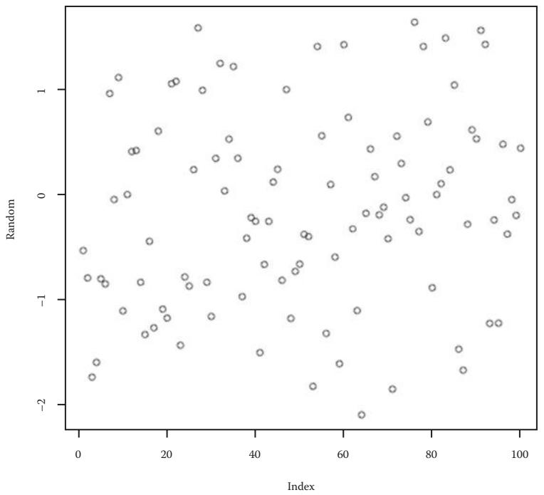  
그림 13.3 RPy2 도구로 생성된 무작위 플롯. 참고: 예제 13.4의 첫 번째 부분에서 얻은 플롯(RandomPlot.png).

### 13.5 스스로 테스트하기

### 연습 문제 13.1 통계 계산

여러분의 실험에서 얻은 값 세트의 평균, 표준 편차, z-점수 및 p-값을 계산하십시오.

### 연습 문제 13.2 흡연자와 비흡연자 및 폐암에 대한 Chi-제곱 테스트

두 변수 x와 y가 독립적인지 확인하기 위해 Chi-제곱 테스트를 수행하십시오. 여기서 x = yes/no (샘플 환자가 흡연자였으면 yes)이고 y = yes/no (샘플 환자가 폐암으로 사망했으면 yes)입니다. 인터넷에서 환자 샘플을 검색하거나 직접 만들어낼 수 있습니다.

### 연습 문제 13.3 히스토그램을 플로팅하고 .pdf 파일로 저장하기

파일에서 숫자 목록을 읽고, 파이썬과 함께 R을 사용하여 히스토그램을 플로팅하고, 플롯을 .pdf 파일로 저장하십시오.

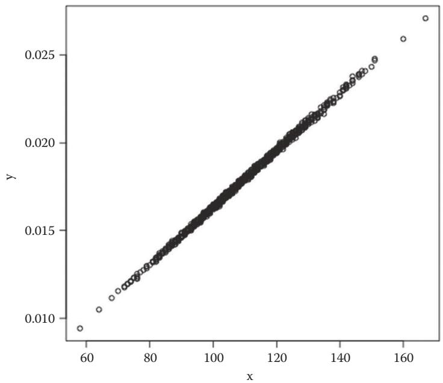

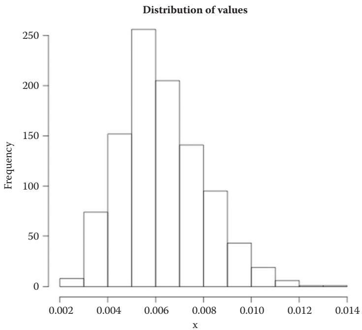  
그림 13.4 그림 13.1의 데이터로부터 RPy2 도구로 생성된 플롯과 히스토그램. 참고: 예제 13.4의 두 번째 부분에서 얻은 플롯(Plot.png 및 Histogram.png).

### 연습 문제 13.4 박스플롯 플로팅하기

여러분이 선택한 표의 두 번째, 네 번째, 다섯 번째 열의 박스플롯(boxplot)을 플로팅하십시오. 주황색으로 색을 칠하고, x 및 y 라벨과 플롯 제목을 설정하십시오. 대화형으로 수행하고 플롯을 파일로도 저장하십시오.

힌트: r.boxplot(f[1], f[3], f[5], col = "orange", xlab = "x", main = "Boxplot", ylab = "y")

### 연습 문제 13.5

두 데이터 세트의 히트맵(heatmap)을 플로팅하십시오.

# 프로그램 파이프라인 구축하기 (Building Program Pipelines)

학습 목표: 파이썬에서 여러분의 프로그램에 매개변수를 전달하고 다른 프로그램을 실행할 수 있습니다.

### 14.1 이 장에서 배울 내용

* 프로그램들을 함께 작동하게 만드는 방법   
* 파이썬에서 다른 프로그램을 실행하는 방법   
* 파이썬 프로그램에 매개변수를 전달하는 방법   
* 파이썬에서 디렉토리를 탐색하는 방법

### 14.2 스토리: NGS 파이프라인 구축하기

### 14.2.1 문제 설명

많은 연구 질문에서 하나의 프로그램으로는 충분하지 않습니다. 종종 둘 이상의 프로그램이 함께 작동하게 만들어야 합니다. 차세대 염기서열 분석(Next-Generation Sequencing, NGS) 데이터 분석이 대표적인 예입니다. NGS 기술은 오늘날 유전자의 차등 발현, 비코딩 RNA, 변이 등을 연구하는 데 널리 사용됩니다. 모든 NGS 플랫폼은 기기 구성이나 사용된 화학 작용에 관계없이 cDNA 또는 DNA 분자의 대규모 병렬 서열 분석을 수행합니다. 특히 샘플의 RNA 함량에 대한 정보를 수집하기 위한 목적으로 cDNA를 고처리량으로 분석하는 "전체 전사체 샷건 시퀀싱(whole transcriptome shotgun sequencing)" 또는 RNA-seq을 수행하는 데 사용될 수 있습니다.

RNA-seq 실험의 출력은 cDNA의 작은 조각(이를 "리드(reads)"라고 부름)의 서열이 담긴 파일입니다. 리드들은 참조 게놈(reference genome)에 매핑(map)되고 재조립되어야 전체 샘플 서열을 얻을 수 있습니다. 전형적인 NGS 데이터 분석 파이프라인을 위해 최근 몇 년간 여러 계산 도구들이 사용 가능해졌습니다. 파이프라인의 예가 그림 14.1에 나와 있습니다. 아이디어는 일루미나(Illumina) 플랫폼(또는 다른 NGS 플랫폼)에서 생성되어 텍스트 파일(예: sample.fastq)에 저장된 리드들을, 이를 참조 게놈(인터넷에서 다운로드하여 특정 디렉토리에 저장해야 함)에 매핑하는 프로그램(TopHat)이 읽을 수 있다는 것입니다. TopHat의 출력(accepted_hits.bam)은 전사체를 조립하고 추가 사용을 위해 transcripts.gtf 파일 형태의 전사체를 생성하는 프로그램(예: Cufflinks 패키지의 Cufflinks)으로 전달될 수 있습니다.

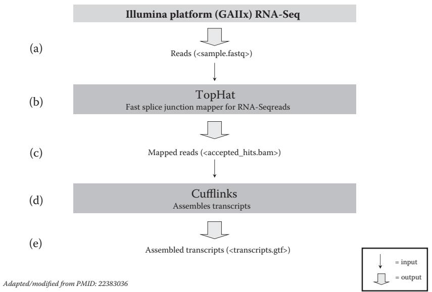

그림 14.1 NGS 데이터 분석 파이프라인의 예. 참고: (a) 일루미나 플랫폼(GAIIx)에서 생성된 RNA-seq 리드들이 sample.fastq라는 텍스트 파일에 저장됩니다. (b) sample.fastq는 TopHat 프로그램(http://tophat.cbcb.umd.edu/)의 입력이 됩니다. TopHat은 RNA-seq 리드를 위한 스플라이스 정크션 매퍼(splice junction mapper)입니다. RNA-seq 리드를 포유류 크기의 게놈에 정렬하고(참조 게놈은 TopHat이 접근할 수 있도록 로컬 디렉토리에 저장되어야 함), 매핑 결과를 분석하여 엑손 사이의 스플라이스 정크션을 식별합니다. (c) TopHat 출력은 .bam 파일(accepted_hits.bam)에 저장된 리드 정렬 목록입니다. (d) accepted_hits.bam은 Cufflinks 패키지(http://cufflinks.cbcb.umd.edu/)의 Cufflinks 프로그램 입력이 됩니다. 이 패키지는 전사체 조립(Cufflinks), 전사체 비교(Cuffcompare), RNA-seq에서의 차등 발현 및 조절 테스트(Cuffdiff)를 위한 세 개의 프로그램으로 구성됩니다. (e) Cufflinks 프로그램의 출력은 조립된 전사체(transcripts.gtf 파일)이며, 이는 Cuffcompare 프로그램을 사용하여 다른 조립된 전사체(예: 서로 다른 샘플 세포로부터 얻은 것)와 비교될 수 있습니다(6장 및 특히 그림 6.1 참조).

서로 다른 샘플(예: 야생형 및 암세포, 또는 동일한 세포 유형의 복제본; 그림 6.1 참조)에서 얻은 전사체(transcripts.gtf 파일)들은 먼저 6장 6.2절에서 설명한 대로 필터링된 다음, 고유한 참조 전사체로 재조립하기 위해 서로 비교될 수 있습니다. 이 목적을 위해 Cufflinks 패키지의 Cuffcompare 프로그램을 사용할 수 있습니다(6장 참조).

### 14.2.2 예제 파이썬 세션

```python
import os   
tophat_output_dir = '/home/RNA-seq/tophat'   
tophat_output_file = 'accepted_hits.bam'   
bowtie_index_dir = '/home/RNA-seq/index'   
cufflinks_output_dir = '/home/RNA-seq/cufflinks'   
cufflinks_output_file = 'transcripts.gtf'   
illumina_output_file = 'sample.fastq'   
tophat_command = 'tophat -o %s %s %s' % (tophat_output_dir, bowtie_index_dir, illumina_output_file)   
os.system(tophat_command)   
cufflinks_command = 'cufflinks -o %s %s%s%s' % (cufflinks_output_dir, tophat_output_dir, os.sep, tophat_output_file)   
os.system(cufflinks_command)
```

출처: A.Via/K.Rother가 파이썬 라이선스 하에 공개한 코드를 수정함.

### 14.3 명령어들은 무엇을 의미하나요?

첫 번째 줄에서 os 모듈을 가져옵니다. os는 운영체제를 사용하기 위한 모듈로, 파이썬 프로그램에서 UNIX 또는 윈도우 명령을 실행할 수 있게 해줍니다. 섹션 14.2.2에서는 os의 메서드(os.system)를 사용하여 tophat과 cufflinks 프로그램을 실행합니다. 이 프로그램들을 UNIX 명령줄에서 실행하려면 다음과 같이 입력했을 것입니다(부록 D 참조).

tophat -o /home/RNA-seq/tophat /home/RNA-seq/index sample.fastq 
cufflinks -o /home/RNA-seq/cufflinks /home/RNA-seq/tophat/accepted_hits.bam

파이썬 프로그램은 이 두 명령을 문자열로 구축하고 실행해야 합니다. 이를 알면 프로그램의 나머지는 매우 단순하다는 것을 알 수 있습니다: 임포트 후의 6개 줄은 단지 변수 할당입니다. 8행과 10행에서 두 개의 UNIX 명령 문자열이 생성되어 변수 이름(tophat_command와 cufflinks_command)에 저장됩니다. 9행과 11행에서 os 모듈의 system() 메서드가 각각 tophat과 cufflinks 프로그램을 실행하는 데 사용됩니다. (1) os.system()의 인자는 프로그램을 실행하는 데 필요한 UNIX 셸 명령으로 구성된 단일 문자열이며, (2) 명확성을 위해 이 문자열의 부분들은 이전에 정의된 변수들(2~17행)로부터 연결되었고, (3) cufflinks는 tophat 출력을 입력으로 사용함에 유의하십시오. 11행의 os.sep 변수 값은 디렉토리와 파일 이름을 연결하는 문자입니다(UNIX와 맥에서는 "/"; 윈도우에서는 "\").

os.system()을 사용하여 프로그램을 쉽게 테스트할 수 있습니다. os.system()의 문자열 인자를 복사하여 UNIX 셸의 프롬프트에 붙여넣으면, 해당 인자로 프로그램을 통해 os.system()을 실행한 것과 동일한 결과를 얻게 될 것입니다. os 모듈은 운영체제에 대한 파이썬 인터페이스를 제공하며, os.system() 메서드는 "시스템 호출(system call)"을 수행합니다. 즉, 운영체제가 메서드 인자에 지정된 명령줄을 실행하게 만듭니다.

Q & A: 저는 UNIX가 처음이라 서로 다른 두 개의 명령줄 터미널을 배우는 것이 혼란스럽습니다. UNIX 명령줄을 사용해야 할지 파이썬 명령줄을 사용해야 할지 어떻게 알 수 있나요?

먼저 여러분이 어디에 있는지 확인하십시오. 터미널 창을 열었을 때 "home/yourname>"과 유사한 프롬프트가 보인다면 UNIX 셸에 있는 것입니다. ">>>" 프롬프트가 보인다면 파이썬 셸에 있는 것입니다. 파이썬을 배우기 위해 UNIX에 대한 많은 지식이 필요하지는 않습니다. 이 책의 대부분의 예제에서 여러분은 (cd 명령을 사용하여) 디렉토리를 변경하고 파이썬을 실행(python 또는 python <프로그램 이름> 사용)하기만 하면 됩니다. 그 외의 모든 것은 파이썬 자체에서 수행될 수 있습니다.

아마도 여러분을 가장 힘들게 만드는 것은 디렉토리 이름을 정확하게 쓰는 일일 것입니다. 바탕화면에서 클릭하여 폴더를 사용하는 것에 익숙하다면 이 개념이 생소하기 때문입니다. (1) 프로그램을 시작할 수 없거나, (2) 프로그램이 파일을 찾지 못하거나, (3) 무언가 잘못되었는데 원인을 모를 때 가장 먼저 해야 할 일은 디렉토리 이름을 확인하는 것입니다. UNIX 셸에서 pwd와 ls를 입력하여 현재 어떤 디렉토리에 있고 어떤 파일들이 있는지 확인하십시오. 파이썬 프로그램에서 동일한 작업을 하려면 다음을 사용하십시오.

```python
import os  
print(os.getcwd())  
print(os.listdir('./')) 
```

또한 부록 D 3.4절을 확인하여 절대 경로와 상대 경로를 올바르게 작성하는 방법을 익히십시오. UNIX에서 파일과 디렉토리를 편안하게 탐색하는 것은 여러분의 작업 속도를 잠재적으로 높여줄 것입니다. 1시간 정도의 온라인 튜토리얼은 좋은 투자가 될 것인데, 그곳에서 배우는 내용이 파이썬 프로그래밍뿐만 아니라 온갖 종류의 생물정보학 애플리케이션에 유용하기 때문입니다.

### 14.3.1 TopHat과 Cufflinks 사용 방법

명령줄에서 TopHat의 사용법은 다음과 같습니다.

tophat -o <tophat 디렉토리> <색인 디렉토리> <입력 파일>

여기서 tophat은 프로그램 이름이고, -o는 출력 디렉토리(<tophat 디렉토리>)를 지정하는 데 필요한 옵션 플래그이며, <색인 디렉토리>는 리드를 매핑하기 위해 참조로 사용하고자 하는 색인화된 게놈을 저장한 디렉토리 이름이고, <입력 파일>은 tophat을 실행하는 디렉토리에 있어야 하는 일루미나 출력 파일 이름입니다.

Cufflinks의 사용법은 다음과 같습니다(프로그램 이름, 옵션 및 인자는 자명할 것입니다).

cufflinks -o <cufflinks 디렉토리> <tophat 디렉토리>/accepted_hits.bam

물론 TopHat과 Cufflinks는 사용자의 요구에 따라 사용 가능한 여러 옵션을 설정하여 훨씬 더 정교한 방식으로 사용될 수 있습니다(http://tophat.cbcb.umd.edu/manual.html 및 http://cufflinks.cbcb.umd.edu/manual.html 참조). 여기서는 (완벽하게 작동함에도 불구하고) 단순화된 버전이 선호되었습니다. 앞서 설명한 코드는 이른바 파이프라인(pipeline)의 단순하지만 현실적인 예입니다.

### 14.3.2 파이프라인이란 무엇인가?

파이프라인은 프로그램들을 서로 연결하는 데 사용되는 스크립트입니다. 두 개의 프로그램(예: tophat과 cufflinks)이 있고, 첫 번째 프로그램의 출력(예: accepted_hits.bam)을 두 번째 프로그램의 입력으로 사용하여 실행하고 싶다고 상상해 보십시오(그림 14.1 b, c, d 참조). 물론 이를 수동으로 할 수도 있습니다(부록 D 참조). 하지만 과정을 자동화하고 서로 다른 입력 파일들에 대해 동일한 작업을 여러 번 수행하고 싶다면, 여러분을 대신해 두 개의 외부 프로그램을 실행해 주는 프로그램이 필요합니다. 즉, 파이프라인을 구축해야 합니다.

다음은 여러 샘플에 대해 반복적으로 사용되고, 이어서 cuffcompare를 실행하기 위한 os.system() 호출이 뒤따르는 이전 예제입니다(6장 참조).

```python
import os  
input_string = ''  
for s in ('WT1', 'WT2', 'WT3', 'T1', 'T2', 'T3'):  
    os.system('tophat -o ' + tophat_dir + s + ' ' + index_dir + ' sample' + s + '.fastq')  
    os.system('cufflinks -o ' + cufflinks_dir + s + ' ' + tophat_dir + s + '/accepted_hits.bam')  
    input_string = input_string + cufflinks_dir + s + '/transcripts.gtf '  
os.system('cuffcompare ' + input_string) 
```

출처: A.Via/K.Rother가 파이썬 라이선스 하에 공개한 코드를 수정함.

이 예제에서 각기 다른 입력 파일(sampleWT1.fastq, …, sampleT1.fastq, …)에 해당하는 tophat 출력은 동일한 파일 이름(accepted_hits.bam)으로 서로 다른 디렉토리(/home/RNA-seq/tophatWT1 등)에 저장됩니다. 이는 사용자가 tophat 출력 파일 이름을 수정할 수 없지만 서로 다른 출력 디렉토리를 설정할 수 있기 때문입니다.

마찬가지로 각 입력 파일에 대한 cufflinks 출력(/home/RNA-seq/tophatWT1/accepted_hits.bam 등)은 동일한 파일 이름(transcripts.gtf)으로 서로 다른 디렉토리(/home/RNA-seq/cufflinksWT1 등)에 저장됩니다.

다른 프로그램을 실행하는 프로그램을 래퍼(wrapper)라고도 부릅니다.

파이썬에서는 다른 사람들이 작성한 프로그램을 사용할 수 있는 두 가지 가능성이 있습니다. 첫째, 파이썬 프로그램이라면 그 모듈을 임포트하여 내부의 함수를 사용할 수 있습니다. 둘째, UNIX에서 하듯이 파이썬 프로그램에서 프로그램을 시작할 수 있습니다. 해당 프로그램이 여러분의 컴퓨터에 설치되어 실행 중이어야 하며, 래퍼에서 호출해야 하는 파이썬 함수는 os.system()입니다. 이전 예제에서 TopHat, Cufflinks, Cuffcompare 프로그램은 모두 여러분의 컴퓨터에 설치되어 실행 중이어야 하며, 참조 게놈(들)은 index 디렉토리에 저장되어 있어야 하고, sampleWT1.fastq, …, sampleT3.fastq 파일들이 사용 가능해야 하며, 모든 출력 디렉토리들이 존재해야 합니다.

### 14.3.3 프로그램 간 파일 이름 및 데이터 교환

서로를 호출하는 여러 프로그램을 연결할 때, 프로그램들은 데이터를 교환해야 합니다. 두 번째 프로그램은 첫 번째 프로그램 출력의 파일 이름을 알아야 합니다. 프로그램들이 통신하게 만드는 네 가지 방법이 있습니다.

1. raw_input()(파이썬 3의 경우 input())을 사용하여 파일 이름 입력하기. 프로그램이 실행될 때마다 파일 이름이나 매개변수를 입력하도록 요청합니다. 이 접근 방식은 구현하기 가장 쉽습니다. 일어나는 일을 완벽하게 통제할 수 있으며, 특히 배우는 단계라면 수동 입력을 사용하여 파이프라인을 단계별로 진행하는 것이 도움이 될 수 있습니다. 하지만 프로그램을 몇 번 사용하다 보면 동일한 내용을 반복해서 입력하는 것이 금방 짜증스러워집니다.   
2. 파이썬 변수 사용하기. 코드에 직접 파일 이름, 매개변수, 심지어 데이터까지 문자열로 저장할 수 있습니다. 이 접근 방식은 모든 것을 한곳에 모아둔다는 장점이 있습니다. 단점은 다른 파일에 파이프라인을 사용하고 싶을 때마다 프로그램을 수정해야 한다는 점입니다.   
3. 별도의 파일에 파일 이름 저장하기. 입력 파일 이름들을 별도의 파일에 쓰고 나중에 프로그램에서 이를 열어 읽을 수 있습니다. 이는 다른 파일 이름을 사용하고 싶을 때마다 파일을 열고, 쓰고, 닫고, 저장해야 함을 의미합니다. 이 접근 방식은 프로그램이 커졌을 때 코드를 모듈화하기 쉽게 만듭니다.   
4. 명령줄 매개변수 사용하기. 명령줄 매개변수(command-line parameters)는 일부 UNIX 명령에서 쓰는 짧은 옵션이나 파일 이름들입니다(예: ls -l data/ 명령에서 -l은 긴 출력을 켜기 위한 옵션 플래그이고, data/는 디렉토리 이름인 두 개의 매개변수가 있습니다). 동일한 접근 방식을 사용하여 파이썬 프로그램에 문자열 매개변수를 전달할 수 있습니다. 파이썬 프로그램 매개변수(인자)는 sys.argv 변수의 리스트에 자동으로 저장됩니다. 다음 두 줄을 사용하면 프로그램을 실행하는 데 사용된 UNIX 명령줄로부터 프로그램 내부에서 사용 가능해진 매개변수 리스트를 출력할 수 있습니다(14.3.6절 참조).

### 14.3.4 프로그램 래퍼 작성하기

섹션 14.2.2의 파이썬 세션과 섹션 14.3.1에 표시된 코드는 단순한 NGS 파이프라인의 예입니다. 이들은 여러 방법으로 개선될 수 있습니다. 예를 들어, 시스템 호출에 전달하기 전에 디렉토리가 존재하는지 확인하는 if 조건을 삽입하는 방식입니다.

```python
tophat_dir = '/home/RNA-seq/tophat'  
index_dir = '/home/RNA-seq/index'  
if os.path.exists(tophat_dir) and os.path.exists(index_dir):  
    os.system('tophat -o ' + tophat_dir + ' ' + index_dir + ' sample.fastq')  
else:  
    print('래퍼를 실행하기 전에 tophat 및/또는 index 디렉토리를 생성해야 합니다') 
```

os.path.exists() 메서드는 인자가 컴퓨터에 존재하는 경로인 경우 True를 반환합니다.

또한 모든 경로 변수를 pathvariables.py와 같은 별도의 모듈에 할당하고 싶을 수도 있습니다. 이는 매우 좋은 습관이며 강력히 권장합니다. 실제로 이렇게 하면 파일이나 프로그램의 위치를 변경할 때 모든 프로그램과 래퍼를 뒤지며 경로 변수의 내용을 재할당할 필요가 없습니다. 가장 흔한 실행 오류는 디렉토리 이름이나 파일 위치가 변경되었을 때 경로 변수 재할당을 빠뜨리는 경우 발생합니다. 경로 변수를 사용하려면 해당 변수가 필요한 프로그램에서 모듈을 임포트해야 합니다. 다음은 이 관행에 따라 재구성된 이전 예제입니다.

```python
from pathvariables import tophat_dir, index_dir  
if os.path.exists(tophat_dir) and os.path.exists(index_dir):  
    os.system('tophat -o ' + tophat_dir + ' ' + index_dir + ' sample.fastq')  
else:  
    print('래퍼를 실행하기 전에 tophat 및/또는 index 디렉토리를 생성해야 합니다') 
```

여기서 pathvariables.py의 내용은 다음과 같습니다.

```ruby
tophat_dir = '/home/RNA-seq/tophat'  
index_dir = '/home/RNA-seq/index'  
cufflinks_dir = '/home/RNA-seq/cufflinks' 
```

pathvariables.py 모듈이 래퍼와 동일한 디렉토리에 있다면 간단히 임포트할 수 있지만, 서로 다른 디렉토리에 있는 여러 프로그램에서 모듈을 임포트하고 싶다면 어떻게 해야 할까요? 가장 쉬운 방법은 pathvariables.py 모듈을 특정 디렉토리에 저장한 다음, 이를 임포트하려는 각 프로그램에서 해당 디렉토리의 경로를 (리스트 객체인) sys.path 변수에 추가(append)하는 것입니다.

```python
import sys   
import os   
sys.path.append('/home/RNA-seq/')   
from pathvariables import tophat_dir, index_dir   
if os.path.exists(tophat_dir) and os.path.exists(index_dir): 
    os.system('tophat -o ' + tophat_dir + ' ' + index_dir + ' sample.fastq')   
else: 
    print('래퍼를 실행하기 전에 tophat 및/또는 index 디렉토리를 생성해야 합니다') 
```

출처: A.Via/K.Rother가 파이썬 라이선스 하에 공개한 코드를 수정함.

### 14.3.5 파일 닫기 시의 시차 (Lag)

파이프라인에서의 한 가지 문제는 일반적으로 두 개(이상)의 외부 프로그램을 호출하는 프로그램이 주어졌을 때, 두 번째 프로그램의 시스템 호출은 첫 번째 프로그램의 실행이 끝났을 때 발생해야 한다는 점입니다. 특히 두 번째 프로그램이 첫 번째 프로그램의 출력을 입력으로 사용하는 경우 더욱 그렇습니다. 이것이 일반적인 기대 사항입니다. 실제로 os.system()과 os.popen() 또는 subprocess.call()과 같이 서브프로세스를 호출하기 위해 사용 가능한 다른 메서드들은 명령이 완료될 때까지 기다린 다음 프로그램 종료 상태에 해당하는 값을 반환합니다(os.system() 반환 값은 성공 시 0, 실패 시 256입니다). 하지만 가끔 출력 파일을 쓰는 과정에서 시차(lag)가 발생하여, 입력 파일이 아직 준비되지 않았거나 완료되지 않았음에도 불구하고 다음 시스템 호출이 후속 프로그램의 실행을 시작해 버리는 일이 생길 수 있습니다. 이는 대개 문제를 일으킵니다.

이러한 불편을 피하기 위한 트릭이 있습니다: 한 시스템 호출 후 다음 시스템 호출 전에 어떤 동작을 삽입하고 그 성공 여부를 확인하는 것입니다. 예를 들어 가짜(dummy) 파일을 열고, 그 안에 무언가를 쓰고, 닫을 수 있습니다. 그다음 os.path.exists() 메서드를 사용하여 가짜 파일이 생성되었는지 확인할 수 있습니다.

```python
import sys   
import os   
sys.path.append('/home/RNA-seq/')   
from pathvariables import tophat_dir, index_dir, cufflinks_dir   
# tophat 프로그램이 출력 파일을 생성함   
os.system('tophat -o ' + tophat_dir + ' ' + index_dir + ' sample.fastq') 

# 여기서 tophat 출력 파일이 완료되어 사용 가능한지 알 수 없음   
# 가짜 파일을 열고 닫아 운영체제가 따라잡게 함
lag_file = open('dummy.txt', 'w') 
lag_file.write('tophat completed') 
lag_file.close() 

# 출력 파일 읽기
if os.path.exists('/home/RNA-seq/dummy.txt'): 
    os.system('cufflinks -o ' + cufflinks_dir + ' ' + tophat_dir + '/accepted_hits.bam')
```

출처: A.Via/K.Rother가 파이썬 라이선스 하에 공개한 코드를 수정함.

### 14.3.6 명령줄 매개변수 사용하기

UNIX 명령줄에서 파이썬 프로그램으로 매개변수를 전달함으로써, 프로그램을 더 쉽고 유연하게 사용할 수 있게 만들 수 있습니다. 프로그램을 변경하거나 파일을 편집하는 대신, UNIX 콘솔에서 프로그램을 시작하는 명령을 다양하게 바꿀 수 있습니다.

```bash
python ngspipeline.py dataset_one.fastq  
python ngspipeline.py dataset_two.fastq 
```

dataset_one.fastq와 dataset_two.fastq라는 파일 이름을 파이썬 프로그램 내부로 어떻게 가져올 수 있을까요? 매개변수(인자라고도 함)는 sys.argv 변수의 리스트에 자동으로 저장됩니다. 어떻게 작동하는지 확인하려면 다음 파이썬 코드를 시도해 보십시오(arguments.py 파일을 생성하십시오. 파이썬 셸에서는 작동하지 않습니다).

```txt
import sys  
print(sys.argv)
```

이제 UNIX 터미널에서 서로 다른 인자로 이 프로그램을 호출해 보십시오.

```bash
python arguments.py   
python arguments.py Hello   
python arguments.py 123   
python arguments.py -o sample.fastq 
```

UNIX 명령줄에 입력한 모든 것이 일반 파이썬 리스트의 문자열로 들어오며, 그 요소들에 대해 모든 일반 파이썬 함수를 사용할 수 있음을 알게 될 것입니다. 명령줄 인자 중 하나를 파일 이름으로 사용하는 것이 빈번한 관행입니다. 리스트의 첫 번째 요소는 항상 호출한 프로그램의 이름이므로, 첫 번째 인자는 sys.argv[1]입니다. sys.argv 리스트의 정보를 사용하여 명령줄 인자를 프로그램으로 전달할 수 있습니다. 프로그램이 많은 다양한 명령줄 옵션을 관리해야 한다면 optparse 모듈(http://docs.python.org/2/library/optparse.html 참조)을 사용하는 것을 고려해 보십시오.

### 14.3.7 모듈 테스트하기: if __name__ == '__main__'

파이썬 모듈은 객체이며, 따라서 속성과 메서드를 가집니다. 이는 내장 함수 dir()을 사용하여 시각화할 수 있습니다. 일부 속성은 모듈에 특화되어 있지만(예: localtime은 time 모듈의 특정 속성임), 특히 세 가지는 일반적인 모듈을 참조합니다: __file__, __doc__, __name__.

__file__ 속성은 모듈의 경로를 반환합니다. __doc__ 속성은 모듈 설명(문서화)이 있는 경우 이를 반환합니다. __name__ 속성은 모듈이 임포트된 경우 .py 접미사가 없는 파일 이름을 반환하고, 모듈이 직접 실행된 경우 '__main__'이라는 문자열을 반환합니다. 이는 모듈을 직접 실행하느냐 아니면 임포트하느냐에 따라 다른 작업을 수행하고 싶을 때 매우 유용할 수 있습니다. 실제로 프로그램에 다음과 같은 조건을 삽입하면

```txt
if __name__ == '__main__':
    <문장들> 
```

<문장들>은 모듈이 명령줄에서 실행될 때만 실행되고, 임포트 문을 통해 임포트될 때는 실행되지 않게 됩니다. 이 트릭은 모듈을 더 큰 스크립트에 통합하기 전에 테스트하고 싶거나, 모듈을 실행 가능하면서도 임포트 가능하게 만들고 싶을 때 특히 유용합니다. 예를 들어 모듈에 하나 이상의 함수를 정의하고 그 호출을 "if __name__ == '__main__':" 블록에 넣으면, 함수들은 명령줄에서 모듈을 실행할 때만 실행됩니다. 이 경우 __name__이 '__main__'과 같기 때문입니다. 반면에 다른 프로그램에서 모듈을 임포트하면 __name__은 모듈 이름과 같아지고, 함수들은 실행되지 않은 채 임포트만 됩니다.

### 14.3.8 파일 및 디렉토리 작업

파이프라인에서 파일 작업을 하는 것은 대개 몇 가지 관리 과업을 수반합니다: 디렉토리의 모든 파일 읽기, 임시 파일 생성, 파일의 실제 존재 여부 확인 등입니다. 파이썬의 os 모듈은 운영체제와 상호작용하는 데 매우 유용하며 파일 작업을 할 때 요긴한 많은 함수를 가지고 있습니다. 사실 이는 os와 os.path라는 두 모듈의 조합입니다. 모듈을 사용하려면 먼저 다음과 같이 활성화해야 합니다.

```txt
import os  
import os.path 
```

os를 임포트하면 os.path가 자동으로 활성화되어야 함에 유의하십시오. 따라서 os만 임포트해도 os.path가 작동해야 합니다. os.path 모듈의 매우 유용한 기능 중 하나는 디렉토리 이름을 다루는 데 도움을 준다는 것입니다. 아마도 가장 빈번하게 사용되는 함수는 파일 이름에서 디렉토리 이름을 분리하는 os.path.split(filename)일 것입니다. 프로그램이 파일 이름을 사용하지만 사용하기 전에 파일이 정말 존재하는지 확인해야 한다면, os.path.exists(filename) 함수가 True 또는 False를 반환할 것입니다.

# 디렉토리에서 파일 읽기

가장 빈번하게 사용되는 연산 중 하나는 주어진 디렉토리의 모든 파일을 리스트로 읽어들이는 os.listdir(directory) 함수입니다. 이는 폴더 안의 모든 파일에 대해 프로그램을 자동으로 실행하고 싶을 때 파이프라인에서 특히 유용합니다.

```python
import os  
for filename in os.listdir('data/'):  
    os.system('<내_프로그램> %s' % (filename)) 
```

# 디렉토리 변경하기

일부 타사 프로그램은 특정 디렉토리에서 시작되어야 합니다. UNIX 셸에서는 프로그램을 시작하기 전에 cd 명령을 사용하여 해당 디렉토리로 이동할 것입니다. os.chdir() 함수는 파이썬에서 동일한 역할을 합니다.

```txt
os.chdir('../data/') 
```

는 한 수준 위로 이동한 다음 data/ 디렉토리로 내려갑니다.

os.getcwd() 함수로 현재 디렉토리를 확인할 수 있습니다.

```txt
print(os.getcwd()) 
```

디렉토리 생성 및 제거

디렉토리를 생성하고 제거하는 os 함수는 각각 os.mkdir()와 os.rmdir()입니다.

파일 제거

파일을 삭제해야 한다면 os.remove(filename)을 사용하여 수행할 수 있습니다. 많은 프로그램을 연결하면 준비된 입력 파일, 중간 데이터, 로그 파일 등 많은 파일이 생성되며, 종종 용도를 알 수 없는 파일들이 나타납니다. 이러한 파일들은 금방 쌓여 디렉토리를 어지럽힙니다. 때때로 이들을 제거할 수 있다면 좋습니다. 이것이 os.remove() 함수가 필요한 이유입니다.

os.remove('log.txt')

물론 파일이 존재할 때만 삭제할 수 있으므로, 먼저 확인하는 것이 좋습니다.

if os.path.exists('log.txt'): 
    os.remove('log.txt')

임시 파일 생성

중간 데이터를 위해 임시 파일을 사용하는 경우, 사용 후에 자동으로 삭제됩니다. tempfile 모듈을 사용하면 임시 파일을 생성할 수 있습니다.

Q & A: 파이프라인 중간 부분이 고장 나면 어떻게 하나요?

일반적으로 대비가 되어 있어야 합니다. 더 많은 프로그램을 서로 연결할수록 전체 구조는 더 취약해집니다. 무슨 일이 일어났는지 찾아낼 수 있는 가능성을 확보해 두십시오. 호출하려는 첫 번째 프로그램에 대해 래퍼가 어떻게 작동하는지 테스트하고, 생성된 출력(있는 경우)이 예상대로인지 확인하십시오. 그 후에만 두 번째 프로그램 호출을 추가하는 식으로 진행하십시오. 여러분의 래퍼가 기본적으로 수행 중인 작업을 보고하도록 print 문을 몇 개 추가하거나 로그 파일을 작성하게 하십시오. 진단을 위해서는 중간 데이터 파일들도 유용합니다. 파이프라인이 충돌했을 때, 마지막으로 생성된 중간 데이터를 확인하여 이상한 점이 있는지 볼 수 있습니다. 또한 파이프라인이 일부 결과 파일이 이미 존재하는지 확인하고 해당 계산을 건너뛰도록 작성할 수도 있습니다. 많은 프로그램으로 구성된 파이프라인에서 여러분의 코드가 반드시 문제의 원인은 아닐 수 있습니다. 파이프라인의 프로그램들을 하나씩 수동으로 호출하여 버그가 외부 프로그램 중 하나에 있는지 확인할 수 있습니다.

### 예제 14.1 T-COFFEE 실행하기

다음 코드는 다중 서열 정렬(MSA) 알고리즘인 T-COFFEE*를 위한 래퍼입니다. 하지만 절차는 ClustalW와 같은 다른 MSA 알고리즘에 대해서도 원칙적으로 동일합니다. 래퍼 작성을 시작하기 전에 프로그램 웹 페이지(www.tcoffee.org/Projects/tcoffee/)로 가서 명령줄이 어떻게 생겼는지, 어떤 옵션이 있는지, 필수 인자는 무엇인지, 어떤 출력 파일을 기대할 수 있는지 등을 익혀야 합니다. 그다음 프로그램을 다운로드하고 설치하여 명령줄에서 예상대로 실행되는지 확인해야 합니다. 어떤 경우에는 프로그램 디렉토리 경로를 셸 변수인 PATH에 추가해야 할 수도 있습니다(부록 D 3.5절 참조). 대개 이 정보는 프로그램 사용자 매뉴얼에 제공됩니다. 프로그램의 명령줄이 준비되면 이를 os.system() 함수의 인자로 사용할 수 있습니다.

```python
import sys   
import os   
sys.path.append('pathmodules/')   
from tcoffeevariables import tcoffeeout   
cmd = 't_coffee -in="file.fasta" -run_name=' + tcoffeeout + 'tcoffee.aln -output=clustalw'   
os.system(cmd)
```

출처: A.Via/K.Rother가 파이썬 라이선스 하에 공개한 코드를 수정함.

이 파이썬 래퍼에서 변수들은 tcoffeevariables.py 모듈(래퍼 디렉토리의 하위 디렉토리인 pathmodules 디렉토리에 저장됨)에 할당됩니다. -in은 입력 파일을 위한 옵션이고, -run_name은 출력 파일에 이름을 할당하기 위한 옵션이며, -output은 출력 형식(이 경우 clustalw)을 설정하기 위한 옵션입니다.

### 예제 14.2 두 서열을 정렬하기 위해 bl2seq를 사용하는 래퍼 작성하기 (Uniprot AC를 명령줄 인자로 받음)

두 개의 Uniprot AC를 인자로 받아 래퍼를 실행하는 UNIX 명령은 다음과 같습니다.

python Bl2seqWrapper.py F1B2B3 E2CXB4

BLAST+ 패키지가 여러분의 컴퓨터에 설치되어 실행 중이어야 합니다(레시피 11 참조). 다음 프로그램은 두 개의 함수 run_blastp()와 get_seq()를 정의합니다. 전자는 (프로그램, 입력 파일, 출력 파일에 대한 옵션과 함께) blastp에 대한 시스템 호출을 포함합니다. 후자는 입력 서열의 FASTA 파일을 Uniprot 웹사이트에서 다운로드하는 함수입니다. 이 함수는 서열이 여러분의 컴퓨터(input_seq 디렉토리)에 아직 존재하지 않는 경우에만 호출됩니다. 경로 변수들은 pathmodules/ 디렉토리에 저장된 blastvariables.py 모듈에 담겨 있습니다. "if __name__ == '__main__':" 트릭을 사용하면 다른 프로그램에서 래퍼를 임포트하여 정의된 함수들을 개별적으로 사용할 수 있으며, 이때 if 조건문 내의 코드는 실행되지 않습니다.

```python
import sys   
import os   
import urllib2   
sys.path.append('pathmodules/')   
from blastvariables import *   

def run_blastp(seq1, seq2): 
    os.system("blastp -query " + input_seq + seq1 + ".fasta -subject " + input_seq + seq2 + ".fasta -out " + seq1 + "-" + seq2 + ".aln")   

def get_seq(seq1, seq2): 
    for seq in (seq1, seq2): 
        url = 'http://www.uniprot.org/uniprot/' + seq + '.fasta' 
        handler = urllib2.urlopen(url) 
        fasta = handler.read() 
        out = open(input_seq + seq + '.fasta', 'w') 
        out.write(fasta) 
        out.close()

if __name__ == '__main__':
    try:
        seq1 = sys.argv[1]
        seq2 = sys.argv[2]
    except:
        print('사용법: BlastpWrapper.py seq1-UniprotAC seq2-UniprotAC')
        raise SystemExit
    else:
        if os.path.exists(input_seq + seq1 + '.fasta') and os.path.exists(input_seq + seq2 + '.fasta'):
            run_blastp(seq1, seq2)
        else:
            get_seq(seq1, seq2)
            run_blastp(seq1, seq2) 
```

출처: A.Via/K.Rother가 파이썬 라이선스 하에 공개한 코드를 수정함.

### 14.5 스스로 테스트하기

### 연습 문제 14.1 두 프로그램을 별도로 실행하기

텍스트 파일에 단일 숫자를 쓰는 파이썬 프로그램 first.py를 작성하십시오. 해당 파일에서 숫자를 읽어 그 제곱을 출력하는 두 번째 프로그램 second.py를 작성하십시오. 명령줄에서 두 프로그램을 수동으로 실행해 보십시오.

### 연습 문제 14.2 두 프로그램을 파이프라인으로 연결하기

os.system()을 사용하여 먼저 first.py를 실행하고 그다음 second.py를 실행하는 pipeline.py 파이썬 프로그램을 작성하십시오.

### 연습 문제 14.3 명령줄 매개변수 사용하기

first.py와 second.py 모두 입력 파일 이름을 명령줄 매개변수로 받도록 파이프라인을 확장하십시오. 이는 세 프로그램 모두를 변경하고 sys.argv를 사용해야 함을 의미합니다.

### 연습 문제 14.4 디렉토리 읽기

여러분의 홈 디렉토리(/home/username 등)에 있는 파일 개수를 세는 프로그램을 작성하십시오. os.listdir() 함수를 사용하십시오.

### 연습 문제 14.5 BLAST를 실행하고 출력을 FASTA 파일로 파싱하기

로컬 BLAST 쿼리를 실행하고 출력을 XML 파일로 쓰는 프로그램을 작성하십시오. XML 출력을 읽어 각 HSP의 정렬을 별도의 FASTA 파일로 쓰는 두 번째 프로그램을 작성하십시오. 단일 명령을 사용하여 주어진 입력 서열에 대해 BLAST 쿼리를 실행하고 그 출력을 파싱할 수 있게 해주는 파이프라인을 구축하십시오. BLAST 실행 및 XML 출력 파싱에 대한 지침은 각각 레시피 11과 레시피 9를 참조하십시오.

# 좋은 프로그램 작성하기 (Writing Good Programs)

학습 목표: 여러분의 프로그램을 더 낫게 만드는 몇 가지 소프트웨어 공학 기법을 적용할 수 있습니다.

### 15.1 이 장에서 배울 내용

* 프로젝트를 작은 작업들로 나누는 방법   
* 프로그램을 함수와 클래스로 나누는 방법   
* pylint를 사용하여 프로그램 코드를 개선하는 방법   
* Mercurial을 사용하여 프로그램 버전을 추적하는 방법   
* 여러분의 프로그램을 다른 사람들과 공유하는 방법   
* 프로그램을 반복적으로 개선하는 방법   
* 여러분만의 모듈과 패키지를 구축하는 방법

### 15.2 문제 설명: 불확실성

### 15.2.1 프로그램 작성에는 불확실성이 존재합니다

지금쯤 여러분은 이미 첫 번째 프로그램들을 작성해 보았을 것입니다. 또한 프로그래밍이 과학자에게 매우 강력한 도구라는 점도 이해했을 것입니다. 여러분의 기술이 발전하고 프로그램이 더 복잡해짐에 따라, 여러분의 목표는 불확실성의 구름 속에 숨겨지게 됩니다. 시작할 때는 프로그램이 무엇을 해야 할지에 대한 나름의 생각이 있습니다. 하지만 코드를 작성하다 보면 결국 여러분에게 정말로 필요한 것은 다른 것이라는 사실을 발견하게 되고, 그래서 프로그램에 변경 사항을 도입하게 됩니다. 그리고 그렇게 하는 동안 여러분의 타겟은 계속 움직입니다. 결과적으로 큰 프로그램을 작성하는 것은 직선을 긋는 것이라기보다는 점진적인 최적화 과정과 비슷합니다. 모든 것을 미리 계획하는 것은 위험하며 거의 작동하지 않습니다. 불확실성은 거의 모든 소프트웨어 프로젝트의 특징입니다. 반면에 변화는 상수입니다: 여러분의 지도교수, 여러분의 논문 리뷰어, 그리고 무엇보다 여러분 자신의 아이디어에 의해 변화가 요구될 것입니다. 불확실성과 변화의 조건 속에서 어떻게 좋은 프로그램을 만들 수 있을까요? 이 장은 여러분이 견고하고 작동하는 소프트웨어를 만드는 데 도움이 되는 몇 가지 공학적 관행을 제공합니다.

많은 프로그래밍 프로젝트는 섹션 15.2.2에 있는 것과 같은 이메일로부터 시작됩니다.

### 15.2.2 예제 프로그래밍 프로젝트

친애하는 동료에게,

지난주 컨퍼런스에서 나중에 말씀드릴 아주 좋은 아이디어가 떠올랐습니다. 여러 유기체로부터 얻은 페닐알라닌-tRNA-합성효소(PheRS) 서열 몇 개로 BLAST 쿼리를 수행해 보았습니다. 하지만 결과에 정리가 좀 필요하군요.

서열들을 동일한 디렉토리에 FASTA 형식의 파일 세트로 저장해 두었습니다. 각 파일은 다음 형식으로 된 많은 서열을 포함하고 있습니다.

> gi|서열 이름|종 이름 아미노산서열

아미노아실-tRNA 합성효소 패밀리의 서열 다양성이 매우 높기 때문에, 결과 중에는 다른 aaRS 단백질에서 온 서열들이 많이 섞여 있습니다. 따라서 올바른 tRNA 특이성(서열 이름에 Phenylalanine, Phe 등으로 표시됨)을 갖지 않은 서열들을 걸러낼 필요가 있습니다. 아, 그리고 파일들에 중복된 항목들이 있을 수 있는데 그것들도 제거해야 합니다.

결과가 당신의 프로젝트에 잘 맞을 것 같군요. Phe에 대한 모든 서열을 찾아 단일 FASTA 파일에 넣어줄 수 있나요? 그다음 정렬(alignment) 프로그램에 전달할 수 있을 겁니다. 당신의 새로운 프로그래밍 기술이 이 작업에 요긴하게 쓰이겠네요.

그럼 이만, 지도교수 드림

추신: 이게 잘 된다면, 아마 다른 19개 아미노산에 대해서도 동일한 작업을 수행하게 될 겁니다.

### 15.3 소프트웨어 공학 (SOFTWARE ENGINEERING)

좋은 프로그램을 작성하는 방법에 초점을 맞춘 소프트웨어 공학(software engineering)이라는 학문 분야가 있습니다. 소프트웨어 공학은 대개 수만 줄 또는 수백만 줄의 코드로 구성된 프로그램들을 다룹니다. 여러분이 작성하게 될 것과 같은 작은 프로그램들의 경우, 도널드 커누스(Donald Knuth)가 언급한 '프로그래밍의 도그마'라 불리는 세 가지 기본 단계로 요약됩니다.

* 첫째, 작동하게 만드십시오 (make it work).   
* 둘째, 좋게 만드십시오 (make it nice).   
* 셋째, 정말로 필요한 경우에만, 빠르게 만드십시오 (make it fast).

이전 장들에서 여러분은 작동하는 프로그램을 작성하기 위한 도구 세트를 배웠습니다. 이 장에서는 두 번째 단계인 깨끗하고 투명한 프로그램을 작성하기 위한 기술들을 배울 것입니다. 여기에는 프로그래밍 작업을 작은 단계로 나누기, 소스 코드 형식화하기, 주석 사용하기, 변경 사항을 전자적으로 추적하기, 동료 과학자들과 프로그램 공유하기, 그리고 프로그램을 반복적으로 개선하기 등이 포함됩니다.

세 번째 사항인 프로그램을 더 빠르게 만드는 것에 대해서는 알고리즘에 대한 더 깊은 지식이 필요합니다. 여러분의 프로그램이 잘 작동하고 잘 조직되었지만 너무 느리게 실행되는 지점에 도달했을 때가 더 많은 책을 읽거나 숙련된 프로그래머에게 조언을 구하기에 좋은 시점입니다.

### 15.3.1 프로그래밍 프로젝트를 작은 작업들로 나누기

프로그램 작성을 시작하기 전에 답해야 할 질문이 있습니다: 프로그램이 무엇을 해야 하는가? 코드를 작성하기 전에 이 질문을 고려해 볼 가치가 있는데, 이는 기술적인 질문이 아니기 때문입니다. 더 정확하게 말하면, 프로그램이 혜택을 제공하기 위해 무엇을 해야 하는가 하는 질문입니다. 여러분은 프로그램을 통해 여러분의 작업이 어떻게 더 효율적이 되고, 연구가 진전되며, 혹은 누군가의 삶이 어떤 방식으로 더 나아질 것인지를 미리 파악해야 합니다. 프로그램은 정밀한 기계이기 때문에 정밀한 목표를 갖는 것이 중요하며, 이를 적어두는 것이 가장 좋습니다. 단순하고 비기술적인 단어로 목표를 공식화하는 것부터 시작하십시오. 종종 여러분은 빈손으로 시작하지 않습니다. 연구 제안서, 회의록, 이메일 등의 텍스트 설명과 대개 약간의 데이터를 가지고 시작합니다. 섹션 15.2.2의 지도교수 이메일로부터 다음과 같은 프로그램 목적을 추출할 수 있습니다.

서열 정렬을 구축하는 데 사용할 수 있도록 aaRS 단백질 서열이 담긴 FASTA 파일들을 정리하십시오.

프로젝트의 전반적인 목표가 이메일에 명확하게 명시되어 있지는 않지만("나중에 말씀드릴"), 나중에 데이터가 무엇에 사용될지는 알고 있습니다. 그 정보가 없다면 목표는 불충분하고 불완전할 것입니다: "aaRS 단백질 서열을 포함하는 FASTA 파일 정리"는 여러 가지로 해석될 수 있기 때문입니다. 만약 목표가 여전히 불분명하다면, 여러분이 던지는 각각의 질문이 수많은 프로그래밍 시간을 아껴줄 것입니다.

전반적인 목표가 설정되었다면, 프로그램의 작업들을 더 공식적으로 생각하기 시작할 수 있습니다. 특히 다음 세 가지 질문에 대한 답을 알아야 합니다.

입력(Input)은 무엇인가?

프로그램이 어떤 종류의 데이터를 읽어야 합니까? 어떤 옵션이 필수적입니까? 사용자가 추가 매개변수를 제공해야 합니까? 어떤 종류의 인터페이스가 있어야 합니까, 아니면 파일 이름을 단순히 코드에 써넣을 것입니까? aaRS 프로젝트에서 입력은 명확하게 설명되어 있습니다.

프로그램은 단백질 서열을 포함하는 많은 FASTA 파일이 있는 디렉토리를 읽습니다. 파일의 서열 항목은 다음 형식을 가집니다.

> gi|서열 이름|종 이름 아미노산서열

이 정보를 바탕으로 파일을 읽기 위한 함수 작성을 시작할 수 있습니다. 하지만 아직 시작하지 마십시오!

출력(Output)은 무엇인가?

프로그램이 어떤 종류의 파일을 생성합니까? 화면에 출력되는 내용이 있습니까? 프로그램이 세부 사항이 담긴 로그 파일을 작성해야 합니까? 프로그램이 창을 열거나 그래픽을 생성해야 합니까? 입력 데이터나 매개변수에 문제가 있는 경우 어떤 일이 일어나야 합니까?

aaRS 프로젝트에서 기대되는 출력은 명확합니다.

프로그램은 aaRS 서열이 담긴 단일 FASTA 파일을 씁니다.

하지만 이 시점에서 여러분이 세울 수 있는 가정들이 있습니다. 첫째, FASTA 파일의 형식은 입력과 동일해야 합니다. 둘째, 출력에서 서열의 순서는 중요하지 않습니다. 셋째, 설명된 FASTA 출력 형식은 서열 정렬을 생성하는 프로그램에서 읽을 수 있어야 합니다. 이러한 각각의 가정들을 적어두고, 확인하고, 프로젝트 이해관계자들과 논의할 수 있습니다. 결국 그들은 여러분이 이전에 생각하지 못했던 명확한 설명이나 중요한 세부 사항들을 제시할 것입니다.

입력과 출력 사이에 무슨 일이 일어나야 하는가?

명백히 이곳은 프로그램이 작업을 수행하는 곳입니다. 처음에는 프로그램이 수행해야 할 작업들을 사용자들이 이해할 수 있는 언어로 설명할 수 있습니다. 작업들은 명확한 혜택을 가리켜야 합니다. 대개 프로그램이 하는 일은 여러 부분으로 나뉠 수 있습니다. 예를 들어, aaRS 프로그램은 다음을 수행해야 합니다.

이름에 Phenylalanine 또는 Phe가 포함되지 않은 모든 서열을 제거하십시오.

중복된 서열 항목(동일한 서열)을 모두 제거하십시오.

두 번째 포인트는 다시 가정을 포함하고 있습니다: "중복 항목"이 정확히 무엇을 의미합니까? 서열이 동일하다는 뜻입니까, 아니면 설명이 동일하다는 뜻입니까? 혹은 둘 다입니까? 생물학 과학자들은 사용하는 많은 용어에 대해 암묵적인 합의를 하고 있을 수 있지만, 그 용어를 정밀한 언어로 옮겨야 할 때는 의견이 다를 수 있습니다. 의심스러우면 먼저 물어보고, 나중에 프로그래밍하십시오.

프로그램이 수행해야 할 일들을 일상 언어로 적어두는 것을 요구사항 수집(collecting requirements)이라고 부릅니다. 사용자 관점에서의 단일 요구사항은 사용자 스토리(user story)라고도 불립니다. 단일 요구사항이나 스토리는 종이 카드 한 장에 들어갈 정도로 짧아야 합니다(두세 문장). 우리가 강조한 네 문장이 바로 요구사항 또는 사용자 스토리입니다. 명확하게 작성된 요구사항을 갖는 것은 (자기 자신을 포함하여) 프로그램이 필요한 사람들과 의사소통하고, 조언을 구할 사람들과 소통하며, 이미 완료한 일을 추적하는 데 도움을 줍니다. 이러한 문서는 간결해야 합니다; 5~10개의 요구사항 세트면 일주일간의 프로그래밍 작업을 조직하기에 충분합니다. 명확한 요구사항은 여러분의 수많은 프로그래밍 시간을 아껴줄 것입니다.

15.3.2 프로그램을 함수와 클래스로 나누기

작은 프로그램을 작성할 때는 바로 코딩을 시작할 수 있습니다. 큰 프로그램의 경우, 함수나 클래스를 설계하여 먼저 스캐폴딩(scaffolding, 비계)을 만드는 것이 나중에 발생할 문제를 방지해 줍니다. 좋은 전략은 입력, 출력, 그리고 그 사이의 작업을 위한 별도의 함수를 정의하는 것입니다. 이전 섹션의 요구사항들이 그 재료를 제공합니다. aaRS 프로젝트 정도 규모의 프로그램에서는 요구사항 하나당 하나의 함수가 있을 수도 있습니다. 프로그램의 스캐폴딩은 다음과 같을 것입니다.

```python
def read_fasta_files(directory):
    '''단백질 서열을 포함하는 많은 FASTA 파일이 있는 디렉토리를 읽습니다.'''
    pass 

def filter_phe(sequences):
    '''이름에 Phenylalanine 또는 Phe가 포함되지 않은 모든 서열을 제거합니다.'''
    pass 

def remove_duplicate(sequences):
    '''동일한 서열을 가진 모든 서열 레코드를 제거합니다.'''
    pass 

def write_fasta(sequences, filename):
    '''aaRS 서열이 담긴 단일 FASTA 파일을 씁니다.'''
    pass 

if __name__ == '__main__':
    INPUT_DIR = 'aars/' 
    OUTPUT_FILE = 'phe-filtered.fasta' 
    seq = read_fasta_files(INPUT_DIR) 
    filter_phe(seq) 
    remove_duplicate(seq) 
    write_fasta(seq, OUTPUT_FILE)
```

요구사항의 텍스트가 각 함수에 대한 주석으로 들어갔음에 유의하십시오. pass 문은 아무것도 하지 않습니다. 이 경우 함수 본문이 비어 있지 않도록 보장할 뿐입니다. "if __name__ == '__main__':" 섹션은 프로그램을 직접 실행할 때만 실행되고, 임포트할 때는 실행되지 않습니다. 이는 파이썬에서 프로그램의 메인 부분을 작성하는 관례입니다(14장 14.3.7절 참조).

이 프로그램은 이미 실행 가능합니다. 물론 아무 일도 하지 않지만, 이것이 작동하는 것을 보면 프로그램이 정확히 어떻게 작동해야 할지 더 잘 결정할 수 있게 됩니다. 예를 들어 함수들이 정확히 어떻게 데이터를 주고받아야 할지 생각해야 합니다. 만약 작업에 대해 잘못 이해했다는 것을 깨닫더라도, 작업한 내용을 잃지 않고 변경 사항을 적용하기가 여전히 쉽습니다.

별도의 함수를 갖는 것의 큰 장점 중 하나는 각 함수를 독립적으로 분석하고 테스트할 수 있다는 점입니다. 프로그램이 크고 복잡하면 오류를 찾기 어렵습니다. 반면에 프로그램이 10줄을 넘지 않는 함수들로 구성되어 있다면, 각 함수의 코드를 한 줄씩 훑어보며 쉽게 분석할 수 있습니다. print 문을 추가하거나 샘플 데이터로 함수를 별도로 실행하여 테스트할 수도 있습니다. 함수가 작을수록 더 쉬워집니다. 따라서 프로그램을 함수로 나누는 것은 디버깅을 훨씬 쉽게 만듭니다. (박스 15.1도 참조하십시오.)


::: {.callout-note}
## 박스 15.1 더 작은 프로그램 작성하기

"오늘 프로그래밍에서 성공적인 하루를 보냈습니다: 코드 300줄을 삭제했거든요" (로렌조 카투치)라는 말이 있습니다. 프로그래밍의 미덕 중 하나는 오류를 찾기 쉬운 방식으로 프로그램을 작성하는 것입니다. 그런 의미에서 가능한 최고의 프로그램은 무엇일까요? 여러분이 할 수 있는 가장 정교한 코드로 작성한 프로그램일까요? 아니면 간단한 몇 줄을 이어 붙이고 라이브러리에 나머지를 맡긴 프로그램일까요?

파이썬 철학이 제시하는 답은 '단순한 것이 복잡한 것보다 낫다'는 것입니다. 함수를 사용하지 않고도 목표를 달성할 수 있다면 그렇게 하십시오. 복잡한 데이터 구조 없이 무언가를 할 수 있다면 그렇게 하십시오. 프로그램의 크기를 절반으로 줄여도 여전히 작업을 수행한다면 그렇게 하십시오. 궁극적으로 역사상 최고의 프로그램은 잘 읽히는 코드 단 한 줄로 작업을 완료하는 프로그램입니다. (www.catb.org/esr/writings/unix-koans/tenthousand.html 도 참조하십시오.)

하나의 큰 프로그램 대신 세 개의 작은 프로그램을 작성하고 다음과 같이 실행하여 작업을 완료할 수 있다면

> python program1.py   
> python program2.py   
> python program3.py

그것이 여러분에게 잘 맞는 한 아무런 문제가 없습니다. 나중에 자동화를 위해 더 큰 프로그램이 필요하다고 판단되면 그때 만들면 됩니다. 만약 program1~3이 아무런 인자도 받지 않는다면, 다음과 같이 다른 프로그램에서 실행할 수도 있습니다.

```txt
import program1  
import program2  
import program3
```

작고 잘 정의된 구성 요소 프로그램들을 가지고 있다면, 이 세 줄이 여러분에게 필요한 전부입니다.

프로그램을 더 작은 함수들로 나누는 것은 예술입니다. 클래스의 경우에는 더욱 그렇습니다. 첫 번째 시도에서 완벽하게 해낼 것이라고 기대하지 마십시오. 종종 함수와 클래스는 더 세분화되거나, 병합되거나, 재조립될 필요가 있습니다. 각각의 요구사항으로부터 하나의 함수를 만드는 것은 첫 번째 작동 버전을 만들기 위한 시작점입니다.

:::

### 15.3.3 잘 형식화된 코드 작성하기

지저분한 코드는 읽기 어렵습니다. 하지만 정리된 코드는 어떤 모습이어야 할까요? 파이썬에는 PEP8이라고 불리는 표준화된 코드 형식 관례가 있습니다. 예를 들어 PEP8 관례는 다음을 주장합니다.

* 쉼표와 산술 연산자 뒤에는 공백을 추가해야 합니다.   
* 함수의 변수 이름은 소문자여야 합니다.   
* 모듈의 상수는 대문자 이름이어야 합니다.   
* 각 함수 뒤에는 두 개의 빈 줄이 있어야 합니다.   
* 각 함수에는 주석으로 문서화 문자열(docstring)이 있어야 합니다.

이러한 모든 가이드라인을 하나하나 지키는 것이 지나치게 엄격해 보일 수 있지만, 코딩 표준은 전체적으로 큰 의미가 있습니다. 표준화된 프로그램 코드는 다른 프로그래머들(예: 여러분이 도움을 요청한 사람들, 혹은 오랜 휴식 후 프로그램으로 돌아온 여러분 자신)이 읽고 이해하기 훨씬 쉽습니다.

pylint 프로그램은 파이썬 코드가 PEP8 관례를 얼마나 잘 따르는지 확인할 수 있게 해줍니다. pylint를 다운로드(http://www.pylint.org/)하여 설치한 후, UNIX 명령줄에서 파이썬 파일에 대해 다음과 같이 실행할 수 있습니다.

pylint aars_filter.py

pylint는 코드를 분석하여 종합 점수와 제안 목록을 출력합니다. 여러분은 프로그램 코드를 편집하고 점수가 어떻게 개선되는지 확인할 수 있습니다. 모든 파이썬 파일에서 만점인 10.0을 얻으려고 애쓸 필요는 없습니다. 대개 합리적인 노력으로 7.0~9.0 정도의 읽기 좋은 코드를 얻을 수 있습니다.

# 독스트링 (Docstrings)

문서화 문자열(Documentation strings) 또는 독스트링은 형식 관례의 중요한 구성 요소입니다. 파이썬에서 각 함수와 클래스는 정의 바로 다음 줄에 삼중 따옴표 주석을 가져야 합니다. 이 주석은 함수나 클래스가 무엇을 하는지 짧게 설명해야 합니다.

```python
class AARSFilter(object):
    ''' 
FASTA 파일 세트를 읽고 중복된 서열 항목을 제거합니다. 
''' 
    pass 
```

주석은 금방 낡은 것이 될 수 있으므로 설명은 짧아야 하며 너무 상세하지 않아야 합니다.

# 주석 (Comments)

코드의 한 줄이나 블록을 설명하기 위해 주석(# 뒤에 오는 텍스트로 인터프리터가 무시함)을 사용하는 것은 프로그램을 훨씬 더 읽기 쉽게 만듭니다. 주석은 매우 짧으면서 동시에 정보를 많이 담고 있어야 하며, 프로그램을 수정할 때 주석도 함께 업데이트해야 합니다. 그렇지 않으면 도움보다 혼란을 더 많이 야기할 수 있습니다.

### 15.3.4 저장소를 사용하여 프로그램 버전 제어하기

프로그램을 작성할 때 프로그램은 점진적으로 발전합니다. 여러분은 시간이 지남에 따라 많은 변경 사항을 도입합니다. 그중 대부분은 좋지만, 일부는 틀린 것으로 판명되기도 합니다. 때로는 프로그램을 변경해야 하지만 변경 사항이 최종적일지, 아니면 원래 버전으로 돌아가게 될지 확신할 수 없을 때가 있습니다. 직관적인 해결책은 프로그램 코드의 사본을 만드는 것입니다. 실제로 그러한 사본들은 시간이 지남에 따라 쌓이는 경향이 있습니다.

```bash
myProgram.py   
myProgram2.py   
myProgram3.py   
myProgram3_optimized.py   
myProgram_new_version.py 
```

이 중 어느 것이 가장 최신 버전이며, 서로 어떻게 다릅니까? 이상한 임포트 문제나 다른 골치 아픈 버그들의 빈번한 원인은 여러 곳에 있는 프로그램의 여러 사본으로 작업하고 있기 때문입니다. 만약 그렇다면 무언가를 엉망으로 만들기 매우 쉽습니다. 처음부터 그렇게 하지 않는 것이 좋습니다. 이런 종류의 문제는 코드 저장소(repository)를 사용함으로써 완벽하게 해결됩니다. 저장소는 프로그래머에게 실험 노트(lab journal)와 같습니다. 저장소는 시간이 지남에 따라 프로그램에 적용한 변경 사항을 짧은 메모와 함께 기록합니다. 언제든지 저장소에 보관된 이전 버전으로 돌아가거나 버전들 사이를 왔다 갔다 할 수 있습니다. 저장소에는 프로그램 코드와 데이터를 모두 넣을 수 있습니다. 프로그램의 버전을 제어할 수 있게 해주는 많은 프로그램이 있습니다: Mercurial (http://mercurial.selenic.com/wiki/Mercurial), GIT (http://git-scm.com), Bazaar (http://bazaar.canonical.com/en/), SVN (http://subversion.apache.org) 등이 가장 널리 알려져 있습니다. 여기서는 Mercurial의 기본 사용법을 설명합니다. Mercurial을 다운로드하여 설치한 후, 프로그램 코드가 있는 디렉토리로 가서 (명령줄 셸에) 다음과 같이 입력하십시오.

```bash
hg init
```
이는 Mercurial에게 해당 디렉토리의 파일들을 추적하고 싶다고 알려주는 것입니다. 이제 각 파일을 버전 관리 시스템에 추가할 수 있습니다.

```bash
hg add aars_filter.py 
hg add phe_sequences.py
```
이제 Mercurial은 이 두 파일을 추적하고 싶어 한다는 것을 알게 되었으며 변경 사항을 기억할 것입니다. 다른 모든 파일은 Mercurial에 의해 무시됩니다. 이제 파일들을 평소처럼 편집하며 작업을 계속할 수 있습니다. 어느 정도 작업을 마친 후(전형적으로 하루의 끝에), commit 명령을 사용하여 변경 사항을 기록할 수 있습니다.

```bash
hg ci
```
Mercurial은 무엇을 변경했는지 짧게 설명하라고 요청할 것입니다. 대개 한 줄의 설명이면 충분합니다. hg ci 명령 후에 Mercurial은 모든 파일의 현재 내용을 암기했습니다. 파일을 변경하거나, 삭제하거나, 교체하더라도 백업 사본이 있는 것처럼 그 내용을 복원할 수 있습니다.

이전 버전으로 돌아가려면 다음을 사용하십시오.
```bash
hg log aars_filter.py
```
이 명령은 이전에 커밋한 모든 버전의 로그 메시지를 출력합니다. 목록에서 돌아가고 싶은 버전 번호(예: 23)를 확인하십시오. 그다음 모든 파일을 해당 버전 번호로 업데이트하십시오.
```bash
hg up -r 23
```
이 명령 후에 모든 파일은 버전 23을 커밋했을 때의 내용을 갖게 됩니다. 소스 코드를 다른 사람들과 공유하고 싶거나 서버에 백업하고 싶다면, bitbucket (https://bitbucket.org)이나 sourceforge (http://sourceforge.net) 웹사이트에 저장소를 만들 수 있습니다. 먼저 hg init을 사용하는 대신 웹사이트를 통해 저장소를 만드십시오. 사용자 이름과 비밀번호를 입력해야 할 것입니다. 웹사이트는 명령줄 셸에 복사해서 붙여넣을 수 있는 명령어를 표시해 줄 것입니다.
```bash
hg clone https://bitbucket.org/myproject/
```
명령줄 셸에서 이 명령을 실행하면 여러분의 컴퓨터에 빈 저장소가 생성될 것입니다. 그다음 앞서 설명한 대로 파일을 추가하고 변경 사항을 커밋할 수 있습니다.

서버에 저장소 사본을 보관하고 싶다면 다음 명령으로 파일을 서버에 보낼 수 있습니다.
```bash
hg push
```
나중에 서버의 변경 사항을 여러분의 컴퓨터로 업데이트할 수 있습니다.
```bash
hg pull 
hg up
```
이 두 명령 후에 여러분의 파일은 서버의 최신 버전이나 여러분의 로컬 사본 중 더 최신인 것을 포함하게 됩니다. 무료 계정의 코드는 모든 사람에게 보인다는 점에 유의하십시오. 아직 발표되지 않은 연구 결과를 저장하는 경우, 협력자 및/또는 지도교수의 동의를 받았는지 확인하십시오. 당연한 해결책은 프로그램 코드는 온라인에 저장하되 데이터는 저장하지 않는 것입니다. Mercurial에 대한 상세한 튜토리얼은 http://mercurial.selenic.com/wiki/Tutorial 에서 확인할 수 있습니다.

### 15.3.5 여러분의 프로그램을 다른 사람들에게 릴리스하는 방법

여러분의 프로그램이 다른 사람들에게 줄 만큼 충분히 좋다고 결정했다면, 어떻게 전달해야 할까요? 프로그램을 배포하려면 릴리스(release)라고 불리는 안정적인 버전을 만들어야 합니다. 릴리스를 만들기 위해서는 세 가지 일을 해야 합니다. 첫째, 버전 번호를 설정하십시오. 협력자들과 소통할 때, 이 번호는 이메일을 확인하거나 코드를 비교하지 않고도 그들이 최신 버전을 사용하고 있는지 확인하는 데 도움을 줍니다. 버전 번호를 0.1로 시작하든 1.0으로 시작하든, 혹은 날짜를 버전 번호로 사용하든 상관없습니다. 증가하는 번호를 일관되게 사용하기만 하면 됩니다. 둘째, 짧은 README.TXT 파일을 작성하십시오. 즉, 다음 사항들을 다루는 짧은 텍스트 파일입니다.

* 프로그램의 이름은 무엇입니까?   
* 여러분의 이름은 무엇이며 어떻게 연락할 수 있습니까?   
* 버전 번호는 무엇입니까?   
* 프로그램은 어디에 좋습니까? 50~100단어로 설명하십시오.   
* 프로그램을 어떻게 사용할 수 있습니까? 간단한 명령줄 예제를 포함하는 것이 좋은 아이디어입니다.   
* 어떤 조건에서 프로그램을 배포할 수 있습니까? 예를 들어 "All rights reserved"라고 쓰면 모든 사람이 여러분에게 명시적으로 허가를 요청해야 합니다. "Distributed under the conditions of the Python license"라고 쓰면 자유로운 배포와 상업적 이용이 모두 허용됩니다. 이미 만들어져 있는 많은 소프트웨어 라이선스가 있습니다. 변호사를 고용하지 않고도 여러분의 범위에 맞는 것을 찾아 사용할 수 있습니다.

마지막으로 README.TXT 파일을 포함하여 프로그램이 들어 있는 디렉토리를 zip 파일로 만드십시오. 그 파일을 여러분과 협력자들에게 편리한 방식으로 공유하십시오. 처음부터 거창한 웹 페이지를 만들 필요는 없습니다.

릴리스를 만들기 위한 더 정교한 접근 방식은 다음과 같습니다.

* 파이썬 distutils 라이브러리를 사용하여 설치 스크립트를 자동 생성하십시오.   
* py2exe 프로그램을 사용하여 사용자가 파이썬을 설치할 필요가 없는 윈도우용 실행 파일을 만드십시오.   
* sourceforge (http://sourceforge.net)나 github (https://github.com) 계정에서 릴리스를 관리하십시오.

이 주제에 대해 더 알고 싶다면 http://docs.python.org/2/distutils/introduction.html 을 살펴보십시오.

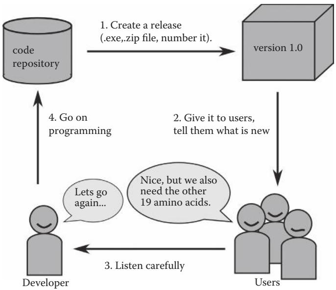  
그림 15.1 소프트웨어 개발 주기.

이러한 조치들 중 대부분은 몇 명의 사람이 사용하는 프로그램에는 필요하지 않을 것입니다. 하지만 여러분이 작성한 작은 프로그램이 더 넓은 청중에게 유용하다고 생각된다면(단독으로 출판하기에는 부족하더라도), 프로젝트를 광고하거나 동료들과 소통하기 위해 공개하는 것을 고려해 볼 수 있습니다.

### 15.3.6 소프트웨어 개발 주기

어느 시점에 이해관계자들은 여러분의 프로그램이 언제 완성될지 물을 것입니다. 하지만 공학적인 관점에서 좋은 프로그램은 결코 완성되지 않습니다. 구현할 아이디어와 추가할 세부 사항은 항상 더 있기 때문입니다. 핵심 질문은 프로그램이 완성되었느냐가 아니라, 프로그램이 과학적으로 증명될 수 있는 효과를 내느냐 하는 것입니다. 과학적 목적에 유용한 소프트웨어를 개발하는 방법론은 인식론(예: 토마스 쿤)*뿐만 아니라 기업가 이론†도 필요로 합니다. 후자에서 개발은 계획(plan), 프로그램(program), 증명(prove)의 세 단계로 구성된 순환 모델로 설명될 수 있습니다(그림 15.1 참조).

계획 (Plan). 먼저 여러분의 프로그램이 무엇을 해야 할지에 대한 대략적인 아이디어가 있어야 합니다. 프로그래밍을 시작할 수 있을 정도로만 주요 목표를 작은 작업들로 해부하십시오(15.3.1절 참조).

프로그램 (Program). 다음으로 계획을 구현해야 합니다. 초기 아이디어를 실현하는 함수, 클래스, 모듈을 만드십시오. 처음부터 데이터의 모든 상황을 다룰 필요는 없습니다. 개념 증명(proof of concept)은 장기적으로 더 많은 정보를 줄 것이며 수많은 프로그래밍 시간을 아껴줄 것입니다. 프로그램에 구문 오류가 없고 간단한 데이터 세트에서 충돌하지 않는지 확인하기 위해 초기 테스트를 수행하십시오(박스 15.2 참조).


::: {.callout-note}
## 박스 15.2 테스트를 위한 작은 데이터 파일들

계산을 수행하기 위해 긴 데이터 파일을 사용하고 출력 또한 그만큼 길다면, 여러분의 프로그램이 올바르게 실행되는지 증명하는 데 어려움을 겪을 것입니다. 반면에 입력 및 출력 데이터 파일이 화면 반 페이지에 들어온다면, 출력이 여러분의 기대에 부합하는지 빠르게 확인할 수 있습니다.

여러분은 "하지만 내 프로젝트에는 큰 데이터 파일이 있다"고 말할지 모릅니다. 물론 그렇습니다. 그것이 바로 여러분이 컴퓨터를 사용하려는 이유입니다. 요점은 실제 프로젝트 데이터에 프로그램을 사용하기 전에 테스트를 위해 인공적인 입력 데이터를 사용하라는 것입니다. 예를 들어 수상 돌기 길이를 분류하는 프로그램(12.2.2절 참조)에서, 텍스트 편집기를 열어 다음과 같은 입력 파일을 만들 수 있습니다(12.2.1절 참조).

<table><tr><td>Primary</td><td>16.385</td></tr><tr><td>Primary</td><td>139.907</td></tr><tr><td>Primary</td><td>441.462</td></tr><tr><td>Secondary</td><td>29.031</td></tr><tr><td>Secondary</td><td>40.932</td></tr><tr><td>Secondary</td><td>202.075</td></tr><tr><td>Secondary</td><td>142.301</td></tr><tr><td>Secondary</td><td>346.009</td></tr><tr><td>Secondary</td><td>300.001</td></tr></table>

이 파일은 3개의 기본(primary) 뉴런과 6개의 보조(secondary) 뉴런을 포함하며, 세 가지 크기 카테고리(<100, 100-300, 그 이상) 각각은 세 개의 항목을 포함합니다. 이 숫자들은 프로그램의 많은 가능한 상황을 포괄해야 합니다. 이들은 다음과 같은 출력을 생성합니다.

<table><tr><td>category</td><td>&lt;100</td><td>100-300</td><td>&gt;300</td></tr><tr><td>Primary:</td><td>1</td><td>1</td><td>1</td></tr><tr><td>Secondary:</td><td>2</td><td>2</td><td>2</td></tr></table>

출력에서 총 카운트 수가 9인지 아닌지를 즉시 확인할 수 있습니다. 이는 코드를 들여다보는 것보다 훨씬 일찍 문제를 발견하게 해줍니다. 작은 입력 파일에 대해 프로그램이 올바르게 작동한다고 확신이 들면, 그때 큰 파일을 시도해 보십시오.

증명 (Prove). 여러분의 프로그램을 실제 상황에 노출시키십시오. 여러분이 의도한 방식으로 작동합니까? 출력이 여러분의 연구에 부가가치를 제공합니까? 다른 사람들이 그것이 자신들에게 유용하다고 말합니까, 아니면 단지 예의상 그러는 것입니까? 프로그램이 여러분의 연구 목표에 기여하기 위해 무엇을 더 해야 합니까? 여러분 자신의 관찰 내용을 기록하고 협력자들에게 피드백을 요청하십시오. 가능하다면 여러분의 프로그램의 유용성을 증명하는 실질적인 증거(숫자, 통계)를 수집하십시오.

그다음 다시 계획 단계로 돌아가서 처음부터 다시 시작하십시오. 프로그래머로서 여러분의 일은 이 순환을 가속화하는 것입니다. 최소 기능 제품(minimal program)으로 시작하십시오. 선택적인 기능들로 고민하지 마십시오. 초기 단계에서 릴리스를 만드십시오. 실제 상황에서 사용해 보십시오. 의견과 피드백을 수집하십시오. 그다음 다음 번의 작은 개선을 하십시오. 더 나은 소프트웨어를 만드는 가장 좋은 방법은 여러분의 프로그램이 더 빠르게 진화하게 만드는 것입니다. 빠른 개발 주기는 일, 시간, 때로는 분 단위로 측정됩니다. 좋은 프로그램을 개발하기에 과학적 동료 리뷰(peer review)는 너무 느립니다. 먼저 많은 나쁜 프로그램들을 만들어 보아야만 비로소 좋은 프로그램을 만들 수 있습니다.

이 계획-프로그램-증명 순환은 현대 소프트웨어 개발 철학인 애자일(Agile, http://agilemanifesto.org/; 그림 15.2 참조)의 핵심입니다. 애자일 접근 방식은 Scrum (www.scrum.org), eXtreme Programming (www.extremeprogramming.org), Crystal (www.agilekiwi.com/other/agile/crystal-clear-methodology/)과 같이 전문 개발 팀을 위한 여러 소프트웨어 개발 방법론으로 실현되었습니다. 대부분의 애자일 방법론은 과학 연구 그룹이 사용하기에는 너무 무겁습니다. 하지만 많은 모범 사례(best practices)들을 채택할 수 있습니다.* 자동화된 테스트, 코드 리뷰, 사용자 스토리와 같이 생물정보학 연구에서 사용되는 소프트웨어 공학 기법들의 도구 상자가 설명된 바 있습니다.†

:::

### 15.4 예제 (EXAMPLES)

### 예제 15.1 여러분만의 모듈 만들기

긴 파이썬 파일은 읽기 어렵습니다. 큰 프로그램의 경우 코드를 여러 파일로 나누고 이를 임포트하는 것이 더 나은 전략입니다. 이러한 모듈들은 재사용하기 쉽습니다. 실제로 모듈은 평범한 파이썬 파일이지만, 주로 변수와 함수를 정의하는 파일입니다. 모듈을 사용하여 프로그램을 정리하려면 예를 들어 다음과 같이 할 수 있습니다.

* 파일 파싱을 위한 모든 함수를 하나의 모듈에 모으십시오.   
* 출력을 생성하기 위한 모든 함수를 하나의 모듈에 모으십시오.   
* 파일 이름이나 매개변수와 같은 상수들을 위한 모듈을 만드십시오. 상수의 이름을 대문자로 지으면 여러분은 어디서든 상수를 다루고 있다는 것을 알게 될 것입니다.   
* 데이터 파일의 경로들을 my_paths와 같은 별도의 모듈에 변수 이름으로 할당하고 이를 my_modules/와 같은 특정 디렉토리에 저장하십시오. 데이터 파일에 접근해야 하는 프로그램에서 sys 모듈을 임포트하고 sys.path 변수에 my_modules/ 경로를 추가한 다음 마지막으로 my_paths 모듈을 임포트할 수 있습니다.

```python
import sys   
sys.path.append('/Users/kate/my_modules/')   
import my_paths 
```

이렇게 하면 데이터 파일의 위치가 바뀌었을 때 이를 사용한 모든 프로그램을 일일이 수정할 필요 없이, my_paths 모듈에서 경로만 변경하면 됩니다.

임포트와 점 구문을 사용하면 프로그램의 나머지 부분과 별개로 모듈의 각 데이터 항목에 접근할 수 있습니다.

물론 동일한 데이터를 리스트, 딕셔너리 또는 클래스에 넣을 수도 있습니다. 하지만 서로 다른 곳에서 동일한 데이터에 접근하고 싶다면 모듈을 임포트하는 것이 더 쉬우며, 특히 데이터가 변경되었을 때 여러 곳을 업데이트해야 하는 번거로움을 피할 수 있습니다.

### 예제 15.2 여러분만의 패키지 만들기

파이썬에서 패키지(package)는 파이썬 모듈들을 담고 있는 폴더입니다. 모듈들을 같은 곳에 저장함으로써 패키지로 그룹화할 수 있습니다. 패키지를 임포트 가능하게 만들려면 비어 있어도 상관없는 __init__.py 파일을 추가해야 합니다. 단일 모듈이나 전체 패키지를 사용하기 위해 import를 사용할 수 있습니다. 예를 들어 다음과 같은 세 개의 파이썬 파일이 있는 neuroimaging/ 디렉토리가 있다면

```txt
neuron_count.py  
shrink_images.py  
__init__.py 
```

다음의 모든 임포트 문이 작동합니다.

```python
import neuroimaging  
from neuroimaging import neuron_count  
from neuroimaging.shrink_images import * 
```

__init__.py 파일은 세 명령 모두에 의해 자동으로 임포트됩니다. 파이썬은 모듈과 패키지를 찾는 기본 디렉토리 목록을 가지고 있습니다. 여기에는 현재 디렉토리와 site-packages/ 폴더(위치는 운영체제와 설치 상태에 따라 다름)가 포함됩니다. 앞서 언급했듯이 sys.path를 사용하여 모듈과 패키지를 위한 전체 디렉토리 목록을 보고 수정할 수 있습니다.

```python
import sys  
print(sys.path)
```

또는 PYTHONPATH 환경 변수에 파이썬 디렉토리들을 추가할 수도 있습니다(부록 D 3.5절 참조).

* Q & A: 모듈들이 서로를 순환적으로 임포트하면(A가 B를, B가 C를, C가 다시 A를 임포트) 파이썬은 어떻게 하나요?

파이썬은 단순한 순환 임포트는 처리할 수 있습니다. 하지만 이러한 종류의 더 복잡한 임포트는 문제를 일으킬 수 있습니다. 디버깅을 위해서는 모듈들을 명확한 계층 구조가 있는 비순환 그래프(acyclic graph) 형태로 배치하는 것이 더 쉽습니다. 모듈들을 영리하게 배치하는 방법에 대해 고민하고 있다면 디자인 패턴(Design Patterns, 예: http://sourcemaking.com/)에 대해 읽어보십시오.

### 15.5 스스로 테스트하기

### 연습 문제 15.1 데이터 유형

aaRS 프로젝트를 위한 스켈레톤 프로그램에서 seq, directory, filename, sequences 변수들에 어떤 데이터 유형을 사용하시겠습니까?

### 연습 문제 15.2 막 관통 헬릭스 예측

다음 프로젝트 설명에 대한 요구사항을 적어보십시오: 여러분은 막 관통 헬릭스(transmembrane helices)에서의 아미노산 상대 빈도가 담긴 표를 가지고 있습니다. 일반적으로 비극성 아미노산이 극성 아미노산보다 더 빈번합니다. 이 데이터에 기반하여 막 관통 헬릭스를 위한 단순한 예측기를 개발하십시오. 프로그램은 FASTA 파일에서 단백질 서열을 읽고 서열에 대해 슬라이딩 윈도우(2장 참조)를 실행해야 합니다. 길이가 N인 각 부분 서열에 대해 표의 빈도들을 합산하십시오. 합계가 주어진 임계값(threshold)보다 높으면, 프로그램은 막 관통 헬릭스가 발견되었다는 메시지와 함께 서열 및 위치를 출력해야 합니다. 박테리오로돕신(bacteriorhodopsin)과 리소자임(lysozyme)의 단백질 서열을 사용하여 프로그램을 테스트하십시오. 두 단백질이 명확하게 구분되는 임계값 매개변수를 결정하십시오.

### 연습 문제 15.3 스캐폴딩 만들기

막 관통 헬릭스 예측기를 위한 프로그램 스캐폴딩을 구현하십시오. 전체 코드를 작성하기 전에 프로젝트에 대해 물어봐야 할 가장 중요한 질문 세 가지를 적어보십시오.

### 연습 문제 15.4 프로그램 구현하기

막 관통 헬릭스 예측기를 구현하십시오.

### 연습 문제 15.5 pylint 실행하기

여러분의 프로그램 중 하나에 대해 pylint 프로그램을 실행하십시오. 최소 9.0의 점수를 얻을 수 있도록 형식을 개선하십시오.

3부에서 여러분은 모듈식 프로그래밍의 모든 측면을 배웠습니다. 이제 여러분만의 함수를 작성하는 방법과 함수를 사용했을 때의 여러 장점을 알고 있습니다. 10장에서는 함수를 호출하는 방법, 함수에 인자를 전달하는 방법, 그리고 함수로부터 결과를 반환하는 방법을 배웠습니다. 11장에서는 클래스가 소개되었습니다. 클래스는 코드를 구조화하고 재사용할 수 있게 해주는 유연한 객체입니다. 클래스는 추상적이고 처음에는 사용하기 어려울 수 있지만, 데이터와 메서드를 같은 곳에 그룹화하는 것은 매우 복잡한 작업을 관리하는 데 도움을 줍니다. 12장에서는 프로그래밍 오류를 처리하는 방법을 배웠습니다. 프로그래밍에서 오류는 정상이지만, 프로그램을 잘 구조화한다면 빈번한 프로그램 충돌 없이 오류를 발견하고 관리할 수 있음을 읽었습니다. 파이썬은 코드에서 오류 발생을 모니터링하고 프로그램이 구체적으로 반응하게 할 수 있는 try...except: 블록을 제공합니다. 13장은 파이썬에서 외부 모듈을 사용하는 것을 설명하기 위한 장이었습니다. 이 장에서 설명된 외부 모듈은 통계 컴퓨팅 및 그래픽 분석을 위해 가장 빈번하게 사용되는 소프트웨어인 R에 대한 파이썬 인터페이스, RPy2였습니다. 일단 하나의 외부 모듈을 사용하는 원리를 배우면, 문서 읽기에 시간을 좀 투자한다면 어떤 외부 모듈이든 사용할 수 있게 될 것입니다. 어쨌든 R은 그 자체로 생물학 데이터 분석에 매우 유용합니다. 4부와 5부에서 더 많은 외부 모듈을 만나게 될 것입니다. 14장에서는 파이프라인을 구축하는 방법, 즉 프로그램들을 서로 연결하는 방법과 프로그램을 실행하는 데 사용하는 UNIX 명령줄에서 프로그램으로 매개변수를 전달하는 방법을 보여주었습니다. 파이프라인은 한 프로그램의 입력이 다른 프로그램의 출력인 경우에 매우 유용합니다. 프로그램을 하나씩 수동으로 실행하는 대신, 외부 프로그램들을 실행하기 위한 명령줄을 파이썬 스크립트에 담은 파이프라인을 작성할 수 있습니다. 마지막으로 15장에서 여러분은 몇 가지 모범 사례들을 발견했습니다... [중략]

# IV

# 데이터 시각화 (Data Visualization)

## 서론 (INTRODUCTION)

데이터의 강력한 시각적 표현을 갖는 것은 좋은 글을 쓰는 것만큼이나 좋은 과학을 위해 중요합니다. 이것이 이 책의 4부에서 집중하는 내용입니다. 파이썬으로 과학적 이미지를 만드는 것은 기술적으로 어렵지 않습니다. 더 복잡한 프로그래밍 기술을 배웠던 3부와 대조적으로, 4부에서는 복잡성 면에서 한 걸음 물러날 것입니다. 여기서는 여러분에게 매우 큰 도움이 될 세 가지 큰 소프트웨어 패키지를 다루는 법을 배울 것입니다. 13장에서 R용 파이썬 인터페이스를 사용하여 대화형 및 비대화형으로 플롯을 생성하는 방법을 보았습니다. 여기서는 더 많은 것을 보게 될 것입니다.

그림은 우리에게 말을 겁니다. 16장에서는 matplotlib을 사용하여 데이터를 다이어그램으로 바꾸는 방법을 배울 것입니다. 이 라이브러리는 막대 그래프, 선 그래프, 산점도, 원형 차트 등을 생성하기 위한 한 줌의 명령어로 구성되어 있습니다. 다이어그램의 축척 조절 및 내보내기 함수가 설명되며, 라벨, 오차 막대, 범례 상자와 같은 추가 기능들도 다룹니다. 17장에서는 PyMOL을 사용하여 3D 분자 이미지를 만드는 방법을 배울 것입니다. PyMOL은 맞춤화되고 재현 가능한 분자 그래픽을 생성할 수 있게 해주는 강력한 스크립팅 인터페이스를 포함하고 있습니다. 여러분은 단백질, DNA, RNA 구조를 고해상도로 렌더링할 수 있게 될 것입니다. 18장은 이미지 파일을 직접 조작하는 방법을 보여줍니다. 파이썬 이미지 라이브러리(Python Imaging Library)를 사용하여 선, 상자, 원, 텍스트로부터 그림을 조립하는 방법을 배울 것입니다. 여러 장의 그림을 하나로 합치는 방법과 큰 그림을 작게 만드는 방법을 배울 것입니다. 그림에 자막을 넣거나 사진이 가득 찬 디스크의 용량을 줄이는 데 여러분의 기술을 사용할지는 여러분에게 달려 있습니다. 4부가 끝날 때쯤이면 여러분은 숙련된 이미지 마법사가 되기 위한 문을 활짝 열게 될 것입니다.

# 과학 다이어그램 생성하기 (Creating Scientific Diagrams)

학습 목표: matplotlib을 사용하여 고해상도 플롯을 생성할 수 있습니다.

### 16.1 이 장에서 배울 내용

* 막대 그래프(bar plot) 생성 방법   
* 산점도(scatterplot) 생성 방법   
* 선 그래프(line plot) 생성 방법   
* 원형 차트(pie chart) 생성 방법   
* 오차 막대(error bars) 그리는 방법   
* 히스토그램(histogram) 플로팅 방법


### 16.2 스토리: 리보솜의 뉴클레오타이드 빈도 (NUCLEOTIDE FREQUENCIES IN THE RIBOSOME)

2009년 노벨 화학상은 리보솜의 구조와 기능에 대한 연구 공로로 벤카트라만 라마크리슈난(Venkatraman Ramakrishnan), 토마스 스테이츠(Thomas Steitz), 아다 요나스(Ada Yonath)에게 돌아갔습니다. 리보솜은 알려진 가장 거대한 분자 기계 중 하나로, 세 개의 RNA 구성 요소(원핵생물의 경우 23S, 16S, 5S rRNA)와 많은 단백질로 이루어져 있습니다. RNA는 네 가지 기본 리보뉴클레오타이드와 리보솜 기능을 미세하게 조정하는 몇 가지 변형된 뉴클레오타이드로 구성됩니다.

표 16.1 23S 리보솜 서브유닛의 뉴클레오타이드 수.   

<table><tr><td>종 (Species)</td><td>A</td><td>C</td><td>G</td><td>U</td></tr><tr><td>T. thermophilus</td><td>606</td><td>759</td><td>1024</td><td>398</td></tr><tr><td>E. coli</td><td>762</td><td>639</td><td>912</td><td>591</td></tr></table>

### 16.2.1 문제 설명

표 16.1에는 라마크리슈난 등이 분석한 Thermus thermophilus 리보솜 23S 서브유닛의 정확한 뉴클레오타이드 수와 에스케리키아 콜라이(Escherichia coli)에 대한 해당 데이터가 나와 있습니다. 이 장에서는 이러한 데이터를 더 매력적인 방식으로 표시하는 방법을 배울 것입니다.

다음 프로그램은 matplotlib 라이브러리를 사용하여 막대 그래프를 생성합니다. 첫째, y-값과 막대 라벨을 리스트 변수에 넣습니다. 둘째, figure() 함수가 빈 다이어그램을 생성합니다. 셋째, bar()와 같은 다양한 matplotlib 함수가 다이어그램의 구성 요소를 그립니다. 마지막으로 savefig()가 다이어그램을 .png 파일로 저장합니다.

### 16.2.2 예제 파이썬 세션

```python
from pylab import figure, title, xlabel, ylabel, xticks, bar, legend, axis, savefig  
nucleotides = ["A", "G", "C", "U"]  
counts = [  
[606, 1024, 759, 398],  
[762, 912, 639, 591],  
]  
figure()  
title('RNA nucleotides in the ribosome')  
xlabel('RNA')  
ylabel('base count')  
x1 = [2.0, 4.0, 6.0, 8.0]  
x2 = [x - 0.5 for x in x1]  
xticks(x1, nucleotides)  
bar(x1, counts[1], width=0.5, color="#cccccc", label="E.coli 23S")  
bar(x2, counts[0], width=0.5, color="#808080", label="T. thermophilus 23S")  
legend()  
axis([1.0, 9.0, 0, 1200])  
savefig('barplot.png') 
```

출처: A.Via/K.Rother가 파이썬 라이선스 하에 공개한 코드를 수정함.

### 16.3 명령어들은 무엇을 의미하나요?

### 16.3.1 matplotlib 라이브러리

이 프로그램은 과학적 다이어그램을 위한 파이썬 라이브러리인 matplotlib을 사용합니다. 이 라이브러리는 데이터로부터 도면을 생성하기 위한 많은 함수를 포함하고 있으며, 그중 일부는 많은 옵션을 가지고 있습니다. 모든 옵션을 철저하게 설명하는 대신, 우리는 x 및 y 값과 같은 직관적인 데이터로부터 표준 다이어그램을 생성하는 데 집중합니다. 이 장에서는 여러분이 직접 맞춤화할 수 있는 다양한 종류의 플롯을 위한 기성 스크립트를 제공합니다.

Q & A: 예제를 어떻게 실행할 수 있나요?

matplotlib을 사용하려면 파이썬과 별도로 설치해야 합니다. 모든 시스템에서 다음 단일 터미널 명령으로 설치할 수 있습니다.

easy_install matplotlib

이 명령을 사용하려면 easy_install 프로그램이 설치되어 있어야 합니다.

Ubuntu Linux에서는 다음 명령을 사용할 수도 있습니다.

sudo apt-get install python-matplotlib

Mac OS X 10.6 이상에서는 .dmg 파일이 제공됩니다. Windows에서는 먼저 Scientific Python(http://scipy.org/)을 다운로드하여 설치해야 합니다.

16.2.2절의 프로그램은 파이썬 스크립트가 실행된 것과 동일한 디렉토리에 barplot.png 파일(그림 16.1 참조)을 생성합니다.

단 네 단계만으로 matplotlib을 사용하여 다이어그램을 생성할 수 있습니다.

```python
from pylab import figure, plot, savefig  
xdata = [1, 2, 3, 4]  
ydata = [1.25, 2.5, 5.0, 10.0]  
figure()  
plot(xdata, ydata)  
savefig('figure1.png') 
```

출처: A.Via/K.Rother가 파이썬 라이선스 하에 공개한 코드를 수정함.

첫째, 라이브러리를 임포트합니다. 둘째, 새로운 그림(figure)을 시작합니다. 셋째, 데이터를 플로팅합니다. 넷째, 그림을 .png 파일로 저장합니다. 이렇게 하면 데이터를 분석하는 데 즉시 사용할 수 있는 플롯을 얻게 됩니다. 아래에는 고품질 플롯을 생성하는 데 사용할 수 있는 더 많은 옵션이 제시되어 있습니다.

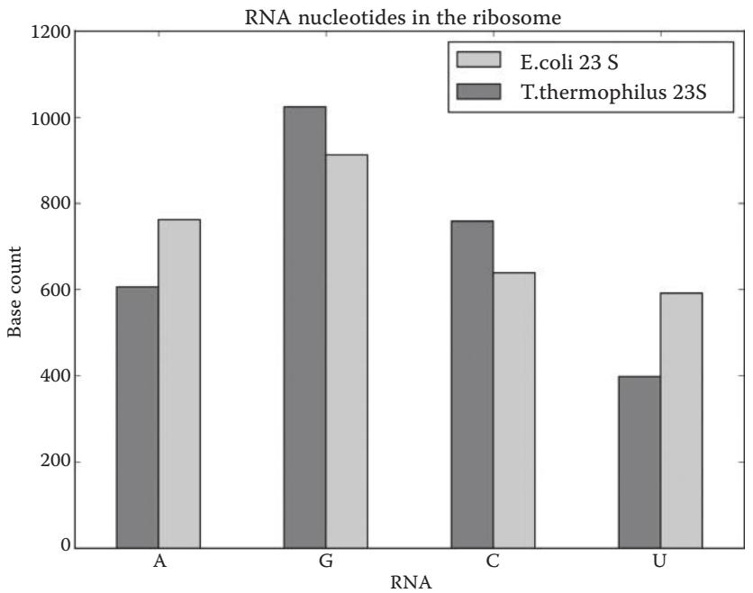  
그림 16.1 막대 그래프.

Q & A: 동일한 프로그램에서 여러 개의 그림을 생성할 수 있나요?

figure() 함수를 호출할 때마다 배경이 지워지고 새로운 플롯 생성이 시작됩니다. matplotlib은 여러 패널로 구성된 그림을 생성할 수 있는 능력이 있지만, 별도의 이미지를 생성해야 하는 몇 가지 좋은 이유가 있습니다. 첫째, 하나의 멀티 패널 이미지보다 서로 다른 목적(포스터, 발표, 출판물)을 위해 별도의 그림을 사용하는 것이 더 쉽습니다. 둘째, 별도의 프로그램에서 그림의 일부를 맞춤화하거나 주석을 달고 싶을 수 있습니다. 마지막으로, 단일 그림이 분석하기 더 쉽습니다. 여러 패널로 구성된 그림을 만드는 것은 모든 결과가 분석되고 확인된 후 원고를 준비하는 단계로 미루는 것이 좋습니다.

### 16.3.2 수직 막대 그리기

bar() 함수는 단순히 막대를 그립니다. 가장 단순한 버전에서는 x축 값과 막대 높이를 위한 두 개의 리스트를 매개변수로 받습니다.

bar([1, 2, 3], [20, 50, 100])

첫 번째 리스트 [1, 2, 3]은 x축의 어디에서 막대가 시작되어야 하는지를 나타내고, 두 번째 리스트 [20, 50, 100]은 각 막대의 높이를 나타냅니다.

마찬가지로 barh() 함수를 사용하여 수평 막대를 생성할 수 있습니다.

barh([1, 2, 3], [20, 50, 100])

16.2.2절의 예제 프로그램은 각각 두 개의 막대로 구성된 네 개의 그룹을 그립니다(그림 16.1 참조). 막대를 수평으로 라벨과 잘 정렬하고 싶다면 x 값을 신중하게 준비해야 합니다. 프로그램에는 두 개의 x-위치 리스트가 있습니다: x1은 각 그룹의 오른쪽 막대 라벨을 위해 사용되고, x2는 각 그룹의 왼쪽 막대 라벨을 위해 사용됩니다(x1에 비해 왼쪽으로 0.5만큼 이동됨). 마지막 bar() 명령에는 막대 너비, 색상, 그리고 범례 상자에 나타날 라벨을 위한 세 가지 추가 매개변수가 있습니다.

```javascript
bar(x1, counts[1], width = 0.5, color = "#cccccc", label = "E.coli 23S") 
```

### 16.3.3 x축과 y축에 라벨 추가하기

x축과 y축이 있는 모든 과학적 다이어그램은 사용된 단위를 포함하여 각 축에 대한 간결한 설명을 가지고 있어야 합니다. xlabel()과 ylabel() 함수는 각 축에 텍스트를 그립니다.

```txt
xlabel('protein concentration [mM]') 
```

라벨에는 수학 기호, 아래 첨자, 위 첨자를 사용할 수 있습니다.

```javascript
xlabel('protein concentration [\\muM]') 
```

기호의 전체 목록은 http://en.wikipedia.org/wiki/Help:Formula 에서 확인할 수 있습니다.

### 16.3.4 눈금(Tick Marks) 추가하기

축에 라벨을 다는 것만큼 중요한 것은 축을 따라 수치 또는 텍스트 마크를 추가하는 것입니다. matplotlib은 스스로 숫자를 추가하지만, 가끔 결과가 원하는 대로 되지 않을 때가 있습니다. xticks()와 yticks() 함수는 맞춤형 눈금을 그립니다.

```txt
xticks(xpos, bases) 
```

는 bases 문자열 리스트의 각 요소를 x축의 xpos 위치에 씁니다. yticks 함수도 비슷하게 작동합니다.

### 16.3.5 범례 상자 추가하기

legend() 함수는 지금까지 플로팅된 모든 데이터 세트의 라벨을 가져와 나타난 순서대로 범례 상자에 씁니다. 인자는 필요하지 않습니다.

legend()

### 16.3.6 그림 제목 추가하기

title() 함수는 16.2.2절의 예제 프로그램에서처럼 다이어그램 상단에 단순히 텍스트를 추가합니다.

title('RNA bases in the ribosome')

### 16.3.7 다이어그램의 경계 설정하기

matplotlib은 모든 데이터가 보이도록 다이어그램의 범위를 자동으로 선택합니다. 하지만 때로는 이것이 원하는 결과가 아닐 수도 있습니다. 예를 들어, 대량의 데이터 세트가 있고 하위 10%를 확대해서 보고 싶다면 axis() 함수를 사용할 수 있습니다.

axis([lower_x, upper_x, lower_y, upper_y])

axis()는 네 개의 값으로 구성된 리스트를 인자로 받습니다: x축과 y축 모두에 대한 하한 및 상한 경계입니다. 막대 그래프 프로그램에서 axis()는 다이어그램을 시각적으로 균형 있게 만들기 위해 캔버스의 왼쪽, 오른쪽, 상단 마진을 조정하는 데 사용됩니다.

axis([1.0, 9.0, 0, 1200])

### 16.3.8 저해상도 및 고해상도 이미지 파일로 내보내기

savefig() 함수는 전체 다이어그램을 .png 형식의 이미지 파일로 씁니다.

savefig('barplot.png')

기본적으로 100 dpi의 600 x 600 픽셀 이미지가 생성됩니다. 정확한 dpi 값을 추가하여 더 높은 해상도의 이미지를 생성할 수 있습니다.

savefig('barplot.png', dpi = 300)

.tif 및 .eps 형식으로도 직접 내보낼 수 있습니다.

savefig('barplot.tif', dpi = 300)

### 16.4 예제 (EXAMPLES)

### 예제 16.1 함수 플로팅 방법

matplotlib은 x/y 데이터로부터 선 그래프를 생성할 수 있습니다. plot() 함수는 길이가 같은 두 개의 값 리스트를 요구합니다. 다음 예제는 사인(sine) 함수를 플로팅합니다(그림 16.2 참조).

```python
from pylab import figure, plot, text, axis, savefig
import math
figure()
xdata = [0.1 * i for i in range(100)]
ydata = [math.sin(j) for j in xdata]
plot(xdata, ydata, 'kd', linewidth=1)
text(4.8, 0, "$y = sin(x)$", horizontalalignment='center', fontsize=20)
axis([0, 3 * math.pi, -1.2, 1.2])
savefig('sinfunc.png') 
```

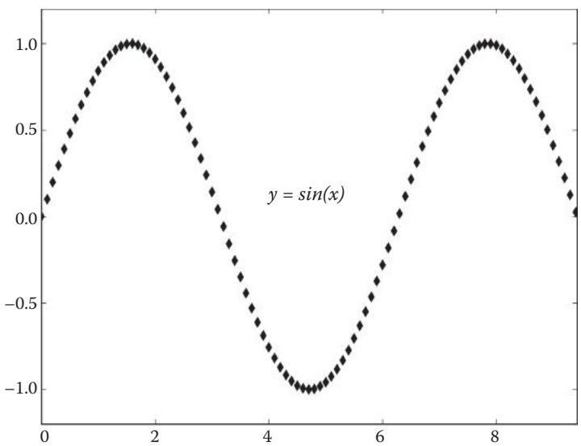  
그림 16.2 사인 함수 플롯.

먼저 프로그램은 range() 함수와 리스트 컴프리헨션(4장에서 설명)을 사용하여 등간격의 x-값 리스트를 생성합니다. y-값은 각 x-값에 대해 sin(x)를 계산하는 리스트 컴프리헨션에 의해 생성됩니다. plot 함수의 세 번째 매개변수인 'kd'는 선의 색상과 스타일을 나타냅니다. 첫 번째 문자는 색상(k: 검정, r: 빨강, g: 초록, b: 파랑 등)을 나타냅니다. 두 번째 문자는 그리기에 사용되는 기호(o: 원, s: 사각형, v 및 ^: 삼각형, d: 다이아몬드, +: 십자가, -: 선, :: 점선, .: 점)를 나타냅니다. text() 함수는 수학적 TeX 표기법(http://en.wikipedia.org/wiki/Help:Formula 참조)을 사용하여 주어진 x/y 위치에 $ 기호로 둘러싸인 텍스트를 추가합니다. axis() 함수에서 x-오른쪽 경계를 3 * math.pi로 제한하면, y = sin(x) 함수는 (순전히 미적인 이유로) 동일한 높이에서 시작하고 끝납니다.

Q & A: plot() 함수를 사용할 때 범례 상자에 두 개의 기호가 보입니다. 하나만 나오게 하려면 어떻게 하나요?

선 그래프나 산점도의 경우, 코드에 legend() 함수를 추가하면 그리기에 사용된 기호(예제에서는 다이아몬드)가 범례 상자에 두 번 나타납니다. matplotlib 내에서 이를 수정하는 방법이 있지만 복잡합니다. 범례를 생략하거나 그대로 두고, 모든 그림이 완성된 후 그래픽 프로그램에서 수동으로 범례 상자를 편집하는 것을 권장합니다.

### 예제 16.2 원형 차트 그리기

그림 16.3과 같은 원형 차트(pie chart)는 pie() 함수로 그릴 수 있습니다.

```python
from pylab import figure, title, pie, savefig  
nucleotides = 'G', 'C', 'A', 'U'  
count = [1024, 759, 606, 398]  
explode = [0.0, 0.0, 0.05, 0.05]  
colors = ["#f0f0f0", "#dddddd", "#bbbbbb", "#999999"] 
```

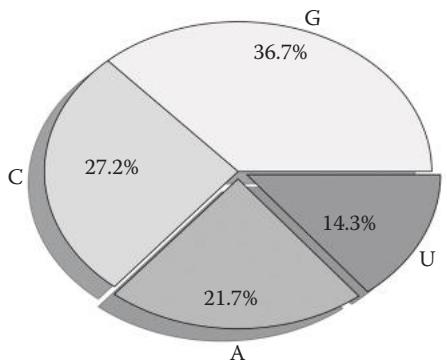  
그림 16.3 원형 차트: T. thermophilus의 23S RNA 염기.

```python
def get_percent(value):
    '''원형 조각의 부동 소수점 값을 퍼센트로 포맷합니다.'''
    return "%4.1f%%" % (value)
figure(1)
title('nucleotides in 23S RNA from T. thermophilus')
pie(count, explode=explode, labels=nucleotides, shadow=True, colors=colors, autopct=get_percent)
savefig('piechart.png', dpi=150) 
```

출처: A.Via/K.Rother가 파이썬 라이선스 하에 공개한 코드를 수정함.

T. thermophilus 리보솜에서 G와 C의 양이 전체 뉴클레오타이드의 절반 이상임을 강조하고 싶다면 원형 차트를 사용할 수 있습니다. matplotlib의 pie() 함수는 bar()나 plot()과 유사한 방식으로 작동합니다: 숫자, 라벨, 색상을 항목 리스트로 제공합니다. explode 리스트의 값을 통해 원형 조각을 중심에서 밖으로 이동시킬 수 있습니다(0.0은 다른 조각들과 붙어 있음을 의미합니다). 라벨 외에도 각 조각 안에 텍스트를 쓸 수 있습니다. autopct 매개변수는 조각의 크기 비율(0.0에서 1.0 사이)을 받아 문자열을 반환하는 함수입니다(여기서는 함수 이름이 변수처럼 사용되므로 괄호가 필요 없습니다). get_percent 함수는 숫자를 문자열로 변환하고 퍼센트 기호를 추가합니다(문자열 포매팅에 대해서는 3장 참조).

Q & A: get_percent 함수에 왜 네 개의 퍼센트 기호가 있나요?

get_percent()에 있는 네 개의 퍼센트 기호는 각각 필요하지만 의미가 모두 다릅니다.

return "%4.1f%%" % (value)

문자열 포매팅에서 단일 퍼센트 문자는 포매팅 문자의 시작(%s, %i, %f 등)으로 해석됩니다. 첫 번째 기호인 %4.1f는 문자열 내부의 부동 소수점 숫자를 위한 플레이스홀더입니다. 이중 퍼센트 문자(%%)는 일반 퍼센트 기호를 위한 플레이스홀더인데, 단일 퍼센트는 다른 포매팅 문자로 해석되기 때문입니다. 마지막으로 네 번째 퍼센트 기호는 포매팅 문자열을 삽입될 값이 담긴 튜플에 연결합니다.

### 예제 16.3 오차 막대 추가하기

오차 막대(error bars)는 산점도와 막대 그래프 모두에 추가할 수 있습니다(그림 16.4 참조). 두 경우 모두 오차 막대의 크기를 위한 세 번째 숫자 리스트가 필요합니다. 오차 막대가 있는 산점도는 errorbar() 함수(plot()과 매우 유사하게 작동)로 생성되는 반면, 막대 그래프의 경우에는 yerr 및 ecolor 매개변수를 bar() 함수에 추가할 수 있습니다.

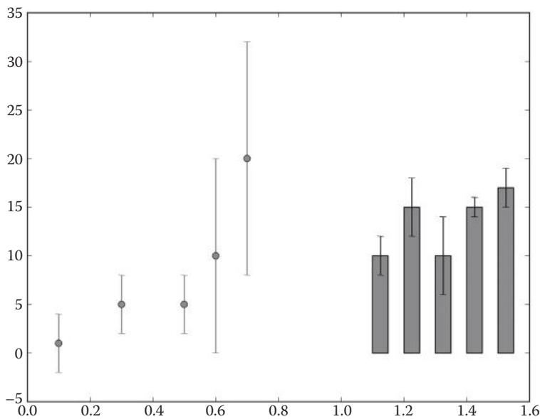  
그림 16.4 산점도와 막대 그래프의 오차 막대.

```python
from pylab import figure, errorbar, bar, savefig   
figure()   
# 오차 막대가 있는 산점도   
x1 = [0.1, 0.3, 0.5, 0.6, 0.7]   
y1 = [1, 5, 5, 10, 20]   
err1 = [3, 3, 3, 10, 12]   
errorbar(x1, y1, err1, fmt='ro')   
# 오차 막대가 있는 막대 그래프   
x2 = [1.1, 1.2, 1.3, 1.4, 1.5]   
y2 = [10, 15, 10, 15, 17]   
err2 = (2, 3, 4, 1, 2)   
width = 0.05   
bar(x2, y2, width, color='r', yerr=err2, ecolor="black")   
savefig('errorbars.png')
```

출처: A.Via/K.Rother가 파이썬 라이선스 하에 공개한 코드를 수정함.

### 예제 16.4 히스토그램 그리기

다음 코드는 정수 리스트를 받아 다섯 개의 구간(bins)에서 절대 빈도를 플로팅합니다(그림 16.5 참조).

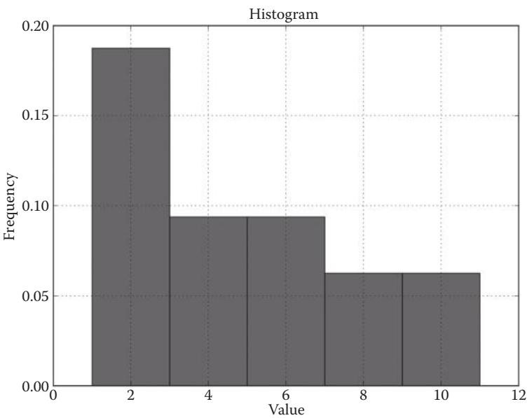  
그림 16.5 히스토그램.

```python
from pylab import figure, title, xlabel, ylabel, hist, axis, grid, savefig  
data = [1, 1, 9, 1, 3, 5, 8, 2, 1, 5, 11, 8, 3, 4, 2, 5]  
n_bins = 5  
figure()  
num, bins, patches = hist(data, n_bins, normed=1.0, histtype='bar', facecolor='green', alpha=0.75)  
title('Histogram')  
xlabel('value')  
ylabel('frequency')  
axis()  
grid(True)  
savefig('histogram.png') 
```

출처: A.Via/K.Rother가 파이썬 라이선스 하에 공개한 코드를 수정함.

hist() 함수는 막대 그래프를 생성하지만 먼저 데이터를 주어진 구간 수만큼 그룹화합니다. grid() 함수는 다이어그램 배경의 격자를 켭니다.

Q & A: 다른 다이어그램 유형을 그리기 위한 도움을 어디서 찾을 수 있나요?

matplotlib을 익히는 가장 빠른 방법은 작동하는 예제에서 빌려오는 것입니다. matplotlib 갤러리 웹 페이지(http://matplotlib.org/gallery.html)에서 여러분이 하려는 것과 가장 유사한 예제 다이어그램을 찾아보십시오. 그다음 해당 예제의 소스 코드를 복사하여 조작해 보십시오(연습 문제 16.4 참조).

### 16.5 스스로 테스트하기

### 연습 문제 16.1 막대 그래프 생성

3장의 뉴런 길이를 수평 막대 그래프로 표시하십시오.

### 연습 문제 16.2 산점도 생성

표 16.1의 T. thermophilus 염기 수 대 E. coli 염기 수를 플로팅하십시오.

### 연습 문제 16.3 히스토그램 그리기

여러 서열이 담긴 FASTA 파일을 읽으십시오. 서열 길이의 히스토그램을 플로팅하십시오.

### 연습 문제 16.4 matplotlib 갤러리 사용

matplotlib 갤러리에서 박스 수염 플롯(box-and-whisker plot)을 생성하는 방법을 찾으십시오. 예제를 파이썬 파일에 복사하여 붙여넣고 실행해 보십시오.

### 연습 문제 16.5 일련의 플롯 생성

다중 서열 FASTA 파일을 파싱하고, 각 서열에서 20가지 아미노산의 빈도를 센 다음, 각 서열에 대해 별도의 원형 차트를 생성하는 프로그램을 작성하십시오. 상위 5개의 빈도를 표시하고 나머지는 "기타"로 요약하십시오.

# PyMOL로 분자 이미지 생성하기 (Creating Molecule Images with PyMOL)

학습 목표: 분자의 고품질 이미지를 생성할 수 있습니다.

### 17.1 이 장에서 배울 내용

* 7단계로 분자를 표시하는 방법   
* 출판 품질의 분자 이미지를 생성하는 방법   
* PyMOL 명령줄을 사용하는 방법

### 17.2 스토리: 아연 집게 (THE ZINC FINGER)

아연 집게(Zinc fingers)는 단백질이 DNA에 결합하는 가장 풍부한 3차원 모티프 중 하나입니다. 단일 아연 집게는 아연 원자에 의해 특정 형태를 유지하는 두 개의 헬릭스로 구성되어, 하나의 헬릭스가 DNA의 주 홈(major groove)에 들어맞게 됩니다. 누군가에게 아연 집게 단백질이 어떻게 DNA에 결합하는지, 그리고 아연 원자의 역할이 무엇인지 설명하고 싶다면 말문이 막히는 지점에 금방 도달할 수 있습니다. 분자 구조에 대한 논의는 시각 자료를 절실히 필요로 합니다. 그렇다면 어떻게 분자의 좋은(즉, 학술지 품질의) 그림을 만들 수 있을까요?

사진술에서 아름다운 사람을 겨냥해 셔터를 누른다고 해서 바로 잡지 표지 같은 사진을 기대할 수는 없습니다. 모델에게 옷을 입히고, 메이크업을 하고, 조명을 조절하고, 이미지를 후처리하는 데 많은 공이 들어갑니다. 생체 분자의 3차원(3D) 모델도 마찬가지입니다.

다행히 PyMOL이라는 단 하나의 프로그램으로 대부분의 작업을 수행할 수 있습니다. 시작하기 전에 그림이 어떤 메시지를 전달해야 할지 생각해 볼 가치가 있습니다. 그러한 메시지는 다음과 같을 수 있습니다: "이미지는 아연 집게 단백질의 아연 이온이 DNA 및 단백질 구성 요소와 어떻게 연관되는지를 보여주어, 아연 집게 단백질의 기능을 설명할 수 있게 한다." 결과물은 그림 17.1과 같을 수 있습니다. 이 장에서는 PyMOL 소프트웨어를 사용하여 그러한 그림을 만드는 방법을 배울 것입니다.

### 17.2.1 PyMOL이란 무엇인가?

PyMOL은 분자를 위한 그림 기계입니다(www.pymol.org). 이를 사용하여 출판물, 발표 자료, 웹사이트를 위한 3D 구조의 고해상도 이미지를 생성할 수 있습니다. PyMOL은 구조의 좌표를 시각화하고 화학적 특성을 분석하는 함수들을 가지고 있습니다. 그래픽 인터페이스와 스크립팅 언어를 통해 PyMOL의 모든 함수를 사용할 수 있으며, 두 가지를 결합할 수도 있습니다. 그래픽 인터페이스를 사용하면 스냅샷을 빠르게 만드는 것이 종종 더 편합니다. 반면에 그래픽 인터페이스만으로 품질 좋은 이미지를 만드는 것은 복잡합니다. 스크립팅 인터페이스를 사용하면 수치 생성을 완전히 재현 가능하게 만들 수 있으므로, 몇 가지 세부 사항을 변경하고 싶을 때 처음부터 다시 시작할 필요가 없습니다. 종합하면, 그래픽 방식과 스크립팅 방식은 서로를 보완합니다.

PyMOL은 고(故) 워런 델라노(Warren L. DeLano)가 파이썬을 사용하여 작성했으며, 실행 시간이 중요한 부분은 C 언어로 코딩되었습니다. Windows, Linux, Mac OS에서 모두 잘 실행됩니다. PyMOL에는 무료 버전과 상업용 버전이 있습니다. 무료 버전은 모든 기능을 제한 없이 사용할 수 있습니다. 슈뢰딩거(Schrödinger) 사에서 유지 관리하는 상업용 버전은 향상된 렌더링 및 PowerPoint 통합과 같은 추가 기능을 제공합니다. 모든 운영체제에 대한 바이너리 버전은 http://sourceforge.net/projects/pymol/ 의 'Files' -> 'Legacy'에서 찾을 수 있습니다.

다음 PyMOL 스크립트는 단일 단백질 구조 파일로부터 완벽한 아연 집게 이미지를 생성합니다. 다음의 아연 집게 스크립트에서 사용된 명령들은 파이썬이 아니라 PyMOL 전용 명령입니다. 하지만 파이썬 셸을 사용하는 것과 유사한 방식으로 사용할 수 있습니다: PyMOL의 텍스트 콘솔에 명령을 입력하거나 스크립트 파일에 작성합니다. 명령줄은 그래픽 인터페이스 작업을 보조하거나, PyMOL을 제어하는 주요 수단으로 사용하거나, 단순히 프로그램의 기능을 시도해 보고 싶을 때 유용합니다. 그래픽 인터페이스 및 도움말 기능에 대한 기본 개요는 박스 17.1과 17.2를 참조하십시오.


::: {.callout-note}
## 박스 17.1 그래픽 사용자 인터페이스 (GUI)

PyMOL 그래픽 사용자 환경은 큰 창 하나와 중간 크기 창 하나로 구성됩니다(그림 17.2 참조). 다음은 가장 중요한 기능들의 목록입니다.

* 3D 화면 (큰 창의 중앙). 3D 분자들이 이곳에 나타납니다. ESC 키를 눌러 텍스트 콘솔을 켜고 끌 수 있습니다.   
* 객체 목록 (큰 창의 우측 상단). 로드된 분자들과 사용자 정의 선택 항목들이 이곳에 나타납니다. 각 항목의 이름을 클릭하여 켜고 끌 수 있습니다. 또한 S(show), H(hide), L(label), C(color) 버튼을 사용하여 각 객체에 대한 개별 표시 모드를 선택할 수 있습니다.   
* 명령줄 (큰 창과 중간 창의 하단). 이곳에 텍스트 명령을 입력할 수 있습니다. 부분적으로 작성된 명령은 TAB 키를 눌러 확장할 수 있습니다. 위쪽 화살표 키를 누르면

이전에 입력한 명령들을 볼 수 있습니다. 디렉토리를 탐색하려면 UNIX나 Windows 셸에서와 마찬가지로 PyMOL 명령줄에서 cd, dir, ls, pwd 명령을 사용하십시오. Windows에서 cd는 특히 중요한데, PyMOL이 기본적으로 '바탕화면'이나 '내 문서' 폴더가 아닌 자체 디렉토리에서 시작되기 때문입니다.

* 마우스 제어 (큰 창의 우측 하단). 키보드와 조합된 마우스 버튼의 기능들이 이곳에 요약되어 있습니다. 이 제어 상자를 클릭하면 원자를 선택하고 시각화하는 두 가지 모드 사이를 전환합니다.   
* 디스플레이(Display) 메뉴 (중간 창의 상단). 이 메뉴는 현재 장면의 품질을 미세 조정합니다.   
* 설정(Settings) 메뉴 (중간 창의 상단). 표시 모드의 색상과 세부 사항을 이곳에서 조정할 수 있습니다.   
* 마법사(Wizard) 및 플러그인(Plugin) 메뉴 (중간 창의 상단). 이 메뉴는 고급 도구들과 몇 가지 데모를 포함하고 있습니다.

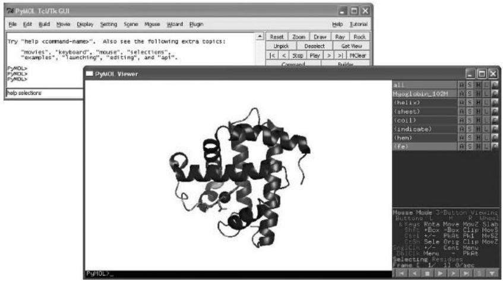  
그림 17.2 PyMOL 그래픽 인터페이스. 참고: 전경 이미지는 큰 창을 보여줍니다. 배경 이미지는 중간 창을 나타냅니다.

:::


::: {.callout-note}
## 박스 17.2 도움말 얻기

PyMOL은 훌륭한 내장 문서를 갖추고 있습니다. 모든 사용 가능한 명령 목록과 각 명령에 대한 설명을 제공합니다. 메인 도움말 페이지로 가려면 다음을 입력하십시오.

help

이는 메인 창에 사용 가능한 도움말 주제들을 표시합니다. ESC 키를 누르면 그래픽 화면으로 돌아갑니다. 특정 명령(예: orient)에 대한 도움말을 얻으려면 다음과 같이 입력할 수 있습니다.

help orient

또한 몇 가지 구체적인 도움말 주제들도 사용할 수 있습니다. 선택(selections)에 관한 것이 특히 유용합니다.

help selections

:::

### 17.2.2 예제 PyMOL 세션

```
delete *   
load 1aay.pdb   
hide everything   
bg_color white   
# 단백질   
select zinc_finger, chain a   
show cartoon, zinc_finger   
color blue, zinc_finger   
# DNA   
select dna, chain b or chain c   
select dna_backbone, elem P   
show cartoon, dna   
set cartoon_ring_mode, 3   
color green, dna   
color forest, dna_backbone   
# 아연   
select zinc, resn zn   
show spheres, zinc   
color gray, zinc   
# 결합 잔기   
select atoms_pocket, zinc around 5.0 and not zinc   
select pocket, byres atoms_pocket   
show sticks, pocket   
set valence, 1   
color marine, pocket   
set_view (\\ 0.385022461, -0.910319746, -0.151902989,\n-0.748979092, -0.212032005, -0.627752066,\n0.539247334, 0.355471820, -0.763447404,\n 
```

0.000005471, 0.000029832, -134.466125488, 1.499966264, 12.841400146, 50.074134827, 100.975906372, 167.958770752, 0.000000000

ray 800, 600

png zinc_finger.png

출처: A.Via/K.Rother가 파이썬 라이선스 하에 공개한 코드를 수정함.

* Q&A: 스크립트를 어떻게 실행하나요?

먼저 명령들을 텍스트 파일(예: zinc_finger.pml)에 복사하십시오. 둘째, PyMOL을 시작하십시오. 마지막으로 zinc_finger.pml 파일을 둔 디렉토리로 이동하여 File -> Run 옵션을 선택하고 스크립트 파일을 선택하십시오. Windows에서는 파일을 더블 클릭하는 것만으로 충분할 수 있습니다. Linux에서는 PyMOL의 텍스트 콘솔을 사용하여 @/home/your_login/Desktop/zinc_finger.pml 이라고 입력할 수 있습니다(Windows는 폴더 이름이 길고 복잡해서 이 방법이 덜 편합니다). Mac OS X에서는 파일을 둔 디렉토리에서 @zinc_finger.pml 이라고 입력할 수 있습니다.

### 17.3 고해상도 이미지를 생성하는 7단계

이 스크립트는 그림 17.1의 아연 집게 이미지를 생성합니다. 유사한 스크립트를 작성하려면 다음 7단계 패턴을 따를 수 있습니다.

1. PyMOL 스크립트 파일을 생성합니다.   
2. 분자를 로드합니다.   
3. 원자와 잔기를 선택합니다.   
4. 각 선택 항목에 대한 표시 모드를 선택합니다.   
5. 분자와 배경색을 설정합니다.   
6. 카메라 위치를 설정합니다.   
7. 고해상도 이미지를 내보냅니다.

이 7단계는 모두 PyMOL의 그래픽 인터페이스를 사용하여 수행할 수 있습니다(그림 17.2 및 박스 17.1 참조). 하지만 이 장에서는 스크립팅 인터페이스를 설명할 것인데, 이는 기존 이미지가 생성된 방식을 재현, 맞춤화 및 개선할 수 있게 해주기 때문입니다.

### 17.3.1 PyMOL 스크립트 파일 작성하기

PyMOL 텍스트 콘솔이 이해하는 명령들은 스크립트 파일에 저장될 수 있습니다. PyMOL 스크립트는 각 줄에 하나의 명령이 있는 일반 텍스트 파일입니다. 보통 텍스트 파일은 .pml 확장자를 가집니다. 스크립트는 PyMOL의 'File' 메뉴에서 불러오거나 @ 뒤에 파일 이름을 붙여 실행할 수 있습니다.

@zinc_finger.pml

PyMOL 스크립트는 항상 .pml 확장자를 가져야 합니다.

스크립트 사용의 장점은 사진이 완벽하게 재현 가능하다는 것입니다. 몇 달 또는 몇 년이 지난 후에도 스크립트를 다른 작업에 쉽게 맞출 수 있습니다. 일련의 사진을 만들고 싶다면, 이 장의 처음에 나온 것과 같은 스크립트를 시작점으로 삼아 수정하는 것이 시간을 절약해 줍니다. PyMOL의 첫 단계를 위해, 단순히 아연 집게 스크립트를 복사하여 여러분 자신의 분자에 맞게 조정할 수 있습니다.

### 17.3.2 분자 로드 및 저장

# 분자 로드

시작하려면 PDB(www.pdb.org)나 PubChem(http://pubchem.ncbi.nlm.nih.gov/) 데이터베이스에서 다운로드한 것과 같은 분자의 3D 구조 파일이 필요합니다. load 명령 뒤에 구조 파일 이름을 붙여 분자 파일을 로드할 수 있습니다.

load 1aay.pdb

분자 이름이 우측 상단 패널인 객체 목록(그림 17.2 참조)에 나타납니다. 이곳은 어떤 주어진 순간에 로드되거나 정의된 모든 것을 PyMOL이 보여주는 위치입니다. 다음과 같이 로드된 분자에 이름을 할당할 수 있습니다.

load 1aay.pdb, zinc_finger

PyMOL은 분자에 흔히 사용되는 많은 파일 형식을 읽을 수 있습니다: .ent, .pdb, .mol, .mol2, .xplor, .mmod, .ccp4, .r3d, .trj, .pse.

Q & A: 분자가 로드되지 않습니다. 무엇이 잘못되었나요?

대부분의 경우 PyMOL이 엉뚱한 디렉토리를 보고 있는 것입니다. PyMOL 명령줄에 pwd를 입력하면 PyMOL이 현재 어떤 디렉토리에 있는지 출력합니다(결과를 보려면 ESC 키를 누르십시오). cd <폴더 이름>을 사용하여 다른 디렉토리로 이동하고, 마지막으로 ls를 사용하여 모든 파일을 나열하십시오. 올바른 위치에 있고 파일이 목록에 있다면, load <파일 이름> 명령이 구조를 로드할 것입니다. 여전히 잘 안 된다면 다른 파일을 시도해 보거나 텍스트 편집기에서 파일을 열어 정말로 3D 좌표를 포함하고 있는지 확인하십시오.

# 분자 저장

마찬가지로 분자를 파일에 저장할 수 있습니다. PyMOL은 확장자로 파일 유형을 인식합니다. 단백질, DNA, RNA 구조의 경우 .pdb 형식이 가장 일반적인데, 다른 많은 프로그램(및 도움을 요청할 대부분의 사람들)이 읽을 수 있기 때문입니다. 기본적으로 PyMOL은 save 명령 뒤에 .pdb 확장자가 붙은 파일 이름을 써서 현재 로드된 모든 분자를 저장합니다.

save everything.pdb

우측 상단 목록의 특정 객체만 저장할 수도 있습니다.

save my_molecule.pdb, zinc_finger

파일 이름에 .pse 확장자를 사용하면, 색상과 카메라 원근을 포함한 전체 PyMOL 세션을 단일 파일에 저장할 수 있습니다.

save my_session.pse

.pse 세션을 로드하면 이전에 로드했던 모든 것이 삭제됩니다. 따라서 두 세션을 결합하는 것은 불가능합니다. 그 상황에서는 스크립트가 더 유용합니다. PyMOL 세션은 스크립트에서도 로드되어 사용될 수 있습니다. 스크립트 파일의 확장자 .pml을 PyMOL 세션의 확장자 .pse와 혼동하지 마십시오.

Q & A: 작업 과정을 저장하기 위해 PyMOL 세션을 사용해도 되나요?

네, 대개 구조 작업을 하는 동안 다른 파일 이름으로 세션을 작성할 수 있습니다. 이는 정전이나 다른 사고로부터 작업 내용을 저장하는 데 좋습니다. 하지만 이전 또는 이후 버전의 PyMOL에서 세션 파일을 로드하려고 하면 호환되지 않거나 디스플레이가 왜곡될 수 있습니다. 스크립트를 작성하면 스크립트에 무엇이 들어 있는지 완벽하게 제어할 수 있으므로 이 문제를 피할 수 있습니다.

### 17.3.3 분자의 일부분 선택하기

괜찮은 분자 사진을 만들려면, 사용하려는 모든 부분들을 먼저 깔끔하게 배치하는 것이 가치가 있음을 알게 될 것입니다. 아연 집게 단백질의 경우, 단백질, DNA, 아연, 그리고 결합 잔기들을 별도의 객체로 정의하는 것을 의미합니다. PyMOL에서 이러한 분자 부분들을 선택 항목(selections)이라고 부릅니다. 선택 항목은 우측 상단의 객체 목록에 나타납니다. 서열 자(sequence ruler)나 select 명령을 사용하여 선택 항목을 정의할 수 있습니다.

# 서열 자 사용하기

그래픽 인터페이스에는 아미노산이나 뉴클레오타이드 몇 개를 고를 수 있는 상자가 있습니다. 우측 하단 모서리의 작은 s 버튼(그림 17.2 참조)을 누르면, 디스플레이 상단에 여러분의 분자 서열이 담긴 선택 상자가 나타납니다. 서열에서 어떤 잔기를 클릭하든, 그것들은 즉시 객체 목록에 (sele)라는 라벨이 붙은 항목으로 표시됩니다. 선택한 잔기들을 나중에 사용하기 위해 저장하고 싶다면, 다음을 사용하여 다른 이름으로 선택 항목을 복사하는 것이 도움이 됩니다.

select my_copy, sele

# 텍스트 콘솔에서 입력하십시오.

구조에서 개별 원자들을 클릭하는 것만으로도 잔기 선택 항목을 만들 수 있습니다. 선택된 부분은 보라색 사각형으로 표시되며 객체 목록에 (sele)라는 라벨이 붙은 항목으로 나타납니다. 거기서 앞서 설명한 것과 같은 방식으로 선택 항목을 저장할 수 있습니다. 보라색 사각형을 사라지게 하고 싶다면 다음과 같이 입력하십시오.

indicate none

또는

disable sele

# select 명령

select 명령은 PyMOL에서 가장 강력하고(또한 복잡한) 명령입니다. 여러분은 아마 PyMOL을 배우는 시간의 대부분을 이 명령에 보낼 것입니다. 그 시간을 조금이라도 단축하기 위해, 여기에 제공된 예제들로 시작할 수 있습니다. 선택 대수(selection algebra)에 대한 개요는 help selections를 입력하여 볼 수 있습니다.

select 명령은 항상 다음 패턴을 따릅니다.

select <선택항목 이름>, <표현식>

<선택항목 이름>은 정의하고자 하는 부분집합의 이름입니다(쉬움). <표현식>은 무엇을 선택하고 싶은지 설명하는 규칙입니다(더 어려움). 무언가를 선택할 때마다 그것은 우측 상단 객체 목록에 선택 항목으로 나타납니다. 선택 항목은 여러분의 분자에 있는 원자들의 부분집합으로, 여러분이 별도로 조작할 수 있습니다. 예를 들어, 17.2.2절의 아연 집게 스크립트에서 select 명령은 체인, 잔기, 단일 원자들을 선택하기 위해 네 번 사용되었습니다. 많은 다양한 선택 표현식이 가능합니다.

체인 선택

select zinc_finger, chain a

이는 구조 파일에서 전체 체인 A를 선택합니다. 객체 패널에 zinc_finger라는 추가 줄이 나타날 것입니다.

select dna, chain b or chain c

DNA는 두 개의 체인으로 구성되며, 이 구조에서는 B와 C로 라벨링되어 있습니다(일부 예외를 제외하고 PyMOL은 대소문자를 구분하지 않습니다). 논리 연산자 or에 의해 두 체인 모두 동일한 선택 항목에 포함됩니다.

잔기 선택

select zinc, resn zn

마지막으로, 세 개의 개별 아연 원자들이 전체 잔기로 선택되어 단일 선택 항목(zinc)에 넣어집니다. 마찬가지로 zn을 ala, cys, val 등으로 바꾸어 아미노산 잔기들을 선택할 수 있습니다. 아연 잔기는 단일 원자로 구성되므로, 다음과 같이 아연 원자들을 선택할 수도 있습니다.

select zinc, elem ZN

이때 ZN 원소 기호는 대문자여야 합니다.

원자 선택

select dna_backbone, elem P

DNA 백본의 인산염(phosphate)은 구조에 존재하는 유일한 인산염입니다. 이 명령은 단순히 그것들을 모두 잡아 dna_backbone이라는 이름의 선택 항목에 넣습니다. 더 많은 select 명령 예시는 표 17.1에서 찾을 수 있습니다.

Q & A: 제 분자에 어떤 체인, 잔기, 원자들이 들어 있는지 어떻게 알 수 있나요?

이를 확인하는 방법은 세 가지가 있습니다. 첫째, 텍스트 편집기에서 PDB 파일을 여십시오(형식에 익숙하지 않으면 불편할 수 있습니다). 둘째, www.pdb.org 에서 구조 요약을 확인하십시오(구조가 그곳에서 온 경우). 셋째, 선택하고 싶은 체인의 원자를 마우스 왼쪽 버튼으로 클릭하십시오. 메뉴 바 아래의 텍스트 창에 PyMOL이 다음과 유사한 줄을 표시할 것입니다.

You clicked /1aay//C/DC`56/O4'

이는 여러분이 1aay 분자, C 체인, 56번 잔기인 데옥시시티딘(DC로 약칭)의 O4' 원자를 클릭했음을 의미합니다. 또는 선택하고 싶은 원자를 마우스 오른쪽 버튼으로 클릭하십시오. 옵션이 담긴 팝업 창이 나타날 것입니다.

표 17.1 PyMOL의 선택 명령들.   

<table><tr><td>선택 (Selection)</td><td>명령 (Command)</td></tr><tr><td>객체 또는 선택 항목 선택</td><td>select sel1, 1aay</td></tr><tr><td>객체 또는 선택 항목 복제</td><td>create clone1, 1aay</td></tr><tr><td>체인 선택</td><td>select dna, chain A</td></tr><tr><td>이름으로 잔기 선택</td><td>select aromatic, resn phe+tyr+trp</td></tr><tr><td>번호로 잔기 선택</td><td>select sel2, resi 1-100</td></tr><tr><td>이름으로 원자 선택</td><td>select calpha, name CA</td></tr><tr><td>원소로 원자 선택</td><td>select oxygen, elem O</td></tr><tr><td rowspan="2">단백질 2차 구조로 선택 (헬릭스 및 시트)</td><td>select helix, ss h</td></tr><tr><td>select sheet, ss s</td></tr><tr><td>"or"로 선택 항목 결합</td><td>select sel3, resi 1-100 or resi 201-300</td></tr><tr><td>"and"로 선택 항목 결합</td><td>select sel4, resn trp and name ca</td></tr><tr><td>체인 A의 모든 산소를 선택하되 물은 제외</td><td>select sel5, elem O and chain A and not resn HOH</td></tr><tr><td>리간드 주변 5.0 Å 이내의 원자 선택</td><td>select sel6, resn HEM around 5.0</td></tr><tr><td>리간드 주변 5.0 Å 이내의 전체 잔기 선택</td><td>select sel7, br. resn HEM around 5.0</td></tr></table>

# 조건 결합하기

and, or, not 키워드와 괄호를 사용하여 두 가지 이상의 조건을 결합한 선택 항목을 만들 수 있습니다. 이는 파이썬의 if 조건문에서 사용되는 논리 연산자 and, or, not과 유사한 방식으로 작동합니다(4장 4.3.1절 참조).

```sql
select sel02, resi 1-100 or resi 201-300  
select sel03, resn trp and name ca  
select sel04, ss h and not (resn ile+val+leu) 
```

이 연산자들을 사용하여 다른 선택 항목들로부터 새로운 선택 항목을 만들 수도 있습니다.

```txt
select aa, resi 1-100  
select bb, resi 201-300  
select cc, aa or bb 
```

이 표현식들은 한 줄로 쓰여질 수 있습니다.

```txt
select cc, resi 1-100 or resi 201-300 
```

# 선택 항목 대 객체 (Selections versus Objects)

이 두 개념은 더 명확히 할 필요가 있습니다. 객체(object)는 PyMOL 메모리에 있는 원자, 결합, 색상, 표시 모드를 가진 분자의 일차적 표현입니다. 선택 항목(selection)은 하나 또는 여러 객체에 있는 원자들의 정의된 세트에 대한 포인터(pointer)입니다. 따라서 각 원자는 둘 이상의 선택 항목에 속할 수 있지만, 오직 하나의 객체에만 속할 수 있습니다. PyMOL 객체 목록(그래픽 창 우측 상단)에서 선택 항목의 이름은 괄호 안에 표시됩니다. 실질적으로 이 둘의 가장 큰 차이점은 객체 이름을 클릭하면 해당 객체가 완전히 숨겨지거나 보인다는 점입니다! 로드된 모든 원자를 포함하는 (all)이라는 기본 선택 항목이 있습니다. 선택 항목과 객체의 차이는 다음 예제에서 확인할 수 있습니다.

```sql
load lysozyme.ent, lysozyme  
select calpha_sel, lysozyme and name ca  
create calpha_obj, lysozyme and name ca 
```

첫 번째 명령은 새로운 원자들을 메모리에 로드하므로 lysozyme이라는 객체를 생성합니다. 두 번째는 lysozyme의 모든 알파-탄소(alpha-carbons)에 대한 포인터들을 포함하는 calpha_sel이라는 선택 항목을 정의합니다. 세 번째 명령은 알파-탄소들의 좌표를 포함하는 calpha_obj라는 객체를 생성합니다. 실질적으로 이 원자들은 create 명령에 의해 메모리에서 복제됩니다. 예를 들어 lysozyme과 calpha_sel의 색상을 모두 변경하면, 변경 사항들이 서로를 덮어쓰게 됩니다. 반면 calpha_obj는 자신만의 원자들을 가지고 있으므로 영향을 받지 않습니다. lysozyme을 제거하면 calpha_sel 선택 항목도 사라지지만, 복제된 calpha_obj 객체는 남게 됩니다.

### 17.3.4 각 선택 항목에 대한 표시 모드 선택하기

여러분의 분자의 각 부분에 대해, 그것이 어떻게 보이길 원하는지 결정해야 합니다. 객체 목록의 S(show) 버튼을 클릭하여 표시 모드를 고를 수 있습니다(그림 17.2 참조). 단백질과 핵산은 종종 카툰(cartoon) 형태일 때 가장 보기 좋으며, 더 작은 분자와 세부 사항들은 스틱(sticks)이나 공-스틱(balls and sticks) 형태일 때 더 잘 보입니다. 홈(grooves)과 정전기적 전위(electrostatic potentials)는 구(sphere) 및 표면(surface) 표현으로 시각화될 수 있습니다.

명령줄에서 show와 hide 명령은 주어진 선택 항목이나 객체의 표시 모드를 설정합니다. 사용 가능한 모드에는 lines, sticks, cartoon, spheres, surface 등이 있습니다. show와 hide 명령의 전형적인 예는 다음과 같습니다.

hide all

이 명령은 모든 표현을 비활성화합니다. 로드된 분자들이 사라집니다.

show cartoon

이 명령은 모든 분자들을 카툰 모드로 표시합니다(단백질과 핵산; 단일 원자와 작은 분자에는 카툰 모드가 없습니다).

show cartoon, zinc_finger

이 명령은 이전과 동일한 작업을 zinc_finger 선택 항목에 대해서만 수행합니다.

hide cartoon, zinc_finger

이것은 zinc_finger 선택 항목에 대한 카툰 표현을 끕니다.

단백질, 핵산, 작은 분자, 그리고 단일 원자들을 더 잘 표시하는 데 도움이 되는 몇 가지 트릭이 있습니다.

# 단백질 카툰 표시하기

단백질 카툰의 경우, cartoon 명령을 사용하여 카툰의 유형을 변경할 수 있습니다.

cartoon arrow

arrow 대신 loop, rect, oval, tube, dumbbell 등을 사용할 수 있습니다. 카툰 모드는 특정 2차 구조 요소에 대해 구체적으로 설정될 수 있습니다.

cartoon tube, ss h 
cartoon rect, ss s or ss l

마지막으로 카툰에 대한 많은 세부 설정을 조정할 수 있습니다.

set cartoon_loop_radius, 2.0

사용 가능한 모든 설정은 'Settings' -> 'Edit All...' 메뉴에서 확인하십시오. 문서화되어 있지는 않지만 시행착오를 통해 이해할 수 있습니다.

# DNA 및 RNA 카툰 표시하기

단백질과 마찬가지로 핵산도 카툰으로 표시될 수 있습니다. DNA와 RNA에 가장 전형적인 모드는 다음과 같이 설정됩니다.

show cartoon, dna 
set cartoon_ring_mode, 3

cartoon_ring_mode 숫자는 1에서 6 사이의 값을 받습니다. 서로 다른 cartoon_ring_mode 값은 서로 다른 표현에 대응합니다.

# 작은 분자 표시하기

작은 분자(또는 거대 분자 잔기의 측쇄)에 가장 일반적인 표시 모드는 "스틱(sticks)"입니다. 한 가지 명심할 점은 단일 결합과 이중 결합의 원자가(valence)가 적절히 표시되어야 한다는 것입니다. 아연 결합 포켓의 경우, 다음 명령들로 수행됩니다.

show sticks, pocket 
set valence, 1

# 이온 및 기타 단일 원자 표시하기

아연 집게의 아연 원자들은 단순한 공 모양으로 표시됩니다.

show spheres, zinc

PDB 파일에서 자주 나타나는 물 분자들에도 동일하게 적용될 수 있습니다. 물 분자가 필요 없다면 숨길 수 있습니다.

hide nonbonded

또는 아예 삭제할 수도 있습니다.

remove resn hoh

### 17.3.5 색상 설정하기

색상은 이미지의 메시지를 지원하기 위해 많은 일을 할 수 있습니다. 특정 색상에 대해 생각하기 전에, 기본적인 제약 사항을 고려해 볼 가치가 있습니다: 어떤 배경을 갖고 싶으신가요? 인상적인 발표를 위한 것인가요, 아니면 인쇄 매체를 위한 것인가요? 컬러 사진을 인쇄할 것인가요, 아니면 흑백 사진인가요? 이러한 사항들을 미리 결정하는 것은 나중에 많은 수고를 덜어줄 수 있습니다. 결정을 미루고 싶다면, 여러분의 장면에 대한 PyMOL 스크립트를 갖는 것이 옵션을 유연하게 유지해 줍니다. 장면에 색을 입힐 때, 남성 인구의 9%가 적록색맹(deuteranopia)을 가지고 있어 빨간색과 초록색을 구별하는 데 어려움을 겪을 수 있음을 염두에 두십시오. 하지만 연구 논문을 흑백으로 인쇄하면, 빨간색과 초록색을 구별할 수 없는 연구자의 비율은 100%가 됩니다.

# 배경색 설정하기

배경색은 다른 모든 색상을 결정합니다. 라이브 발표에서는 검은색 배경이 종종 깊이감을 파악하기 더 쉽게 만듭니다. 인쇄된 페이지의 경우, 값비싼 광택지에 인쇄하지 않는 한 대개 흰색 배경이 더 좋아 보입니다(인쇄 비용도 더 저렴합니다). 다음과 같이 배경을 흰색으로 바꿀 수 있습니다.

bg_color white

# 분자의 색상 설정하기

color 명령은 전체 객체나 주어진 선택 항목의 색상을 변경합니다.

color red

color red, zinc_finger

PyMOL에는 firebrick, forest, teal, salmon, marine, slate와 같이 즉시 사용할 수 있는 미리 정의된 색상 세트가 있습니다. 색상 목록은 'Settings' 메뉴나 객체 목록의 C(color) 버튼(그림 17.2 참조)에서 확인할 수 있습니다.

# 원소별 색상 지정

분자에 색을 입히고 원소마다 다른 색을 할당하고 싶다면 특별한 함수를 사용할 수 있습니다.

util.cbag('zinc_finger')

이 함수는 탄소 원자들을 초록색으로 설정합니다. 탄소 원자에 다른 색을 할당하는 유사한 함수들로는 util.cbab (파랑), util.cbac (시안), util.cbak (밝은 마젠타), util.cbam (마젠타), util.cbao (주황), util.cbap (진한 마젠타), util.cbas (살몬), util.cbaw (흰색), util.cbay (노랑)가 있습니다.

# 나만의 색상 정의하기

set_color 명령을 사용하여 맞춤형 색상을 정의할 수 있습니다.

set_color leaves, [0.2, 0.8, 0.0] 
color leaves, dna

리스트의 세 숫자는 각각 빨강, 초록, 파랑에 대응합니다. 각 색상 숫자의 범위는 0.0에서 1.0 사이이며, 이들을 조절하여 좋아하는 색상을 얻을 수 있습니다. 예를 들어,

set_color leaves, [0.1, 0.0, 0.0] 
color leaves, dna

는 dna를 빨간색으로 칠할 것입니다.

Q & A: "RGB"와 "CMYK"는 무엇의 약자인가요?

두 가지 종류의 색상 체계가 있습니다: 화면 표시를 위한 RGB(red-green-blue)와 인쇄를 위한 CMYK(cyan-magenta-yellow-black)입니다. 일부 RGB 색상은 인쇄했을 때 끔찍해 보일 수 있지만, PyMOL에는 인쇄용 이미지를 생성할 때 활성화해야 하는 내장 CMYK 변환 기능이 있습니다. 'Display' -> 'Color Space' 메뉴에서 찾을 수 있습니다. CMYK 색상의 실제 모습은 기기에 따라 어느 정도 달라집니다. PyMOL의 대부분의 기본 색상들은 CMYK 세이프(safe)합니다.

### 17.3.6 카메라 위치 설정하기

좋은 카메라 위치를 찾는 것이 항상 쉬운 일은 아닙니다. 종종 구조의 일부가 보여주고 싶은 부분을 가리기도 하고, 여러 부위를 보여줄 때 한꺼번에 시야에 담기 어려울 때가 있습니다. 카메라 위치를 정하는 것은 절충(trade-offs)을 수반할 수 있습니다. 실질적인 해결책은 일련의 위치를 시도해 보고 나중에 가장 좋은 이미지를 고르는 것입니다(사진작가들도 그렇게 합니다!). 카메라 위치를 PyMOL 스크립트로 가져오려면, 먼저 마우스를 사용하여 분자의 위치를 잡아야 합니다. 좋은 방향을 찾았다면, 다음을 입력하여 카메라 위치를 스크립트로 전송할 수 있습니다.

get_view

이 명령은 괄호 안에 많은 숫자가 들어 있는 set_view() 명령을 출력합니다. 숫구들은 정확한 카메라 위치, 줌, 깊이 등을 나타냅니다. 실제로 여러분은 이 숫자들이 무엇을 의미하는지 걱정할 필요가 없습니다. 단순히 전체 명령을 복사하여 PyMOL 스크립트에 붙여넣으면 됩니다.

Q & A: PyMOL 창에서 텍스트를 어떻게 복사하나요?

상단의 작은 PyMOL 메뉴 바 창에 있는 텍스트 필드에서 마우스를 사용하여 텍스트를 선택하고 Ctrl-C(또는 맥의 경우 Cmd-C)를 사용하여 복사할 수 있습니다.

# 분자 중앙에 맞추기

분자를 이리저리 움직이다가 시야에서 사라졌거나 회전 중심이 이상해졌다면, 다음을 입력하여 분자(또는 그 일부)를 중앙에 맞출 수 있습니다.

orient

orient dna

### 17.3.7 고해상도 이미지 내보내기

PyMOL에는 고품질 조명 효과를 만드는 데 사용될 수 있는 내장 레이 트레이서(ray tracer)가 있습니다. 아연 집게 단백질의 최종 이미지는 다음 명령들로 생성됩니다.

indicate none

set fog, 0

ray 800, 600

png zinc_finger.png

첫 번째 명령은 선택된 원자들을 표시하는 작은 보라색 사각형들을 숨깁니다. 두 번째 명령은 안개(fog, 멀리 있는 원자들이 약간 흐릿해지는 현상) 효과를 끕니다. 'Settings' -> 'Rendering' 메뉴에서 사진 품질, 안티앨리어싱(antialiasing), 그림자 등 몇 가지 관련 옵션을 조정할 수 있습니다. ray 명령은 고품질 이미지를 생성합니다. 단순히 다음과 같이 입력하면

ray

PyMOL 그래픽 창 크기의 이미지를 표시합니다. 그렇지 않으면 이전 예제에서처럼 픽셀 크기를 명시적으로 줄 수 있습니다(박스 17.3 참조). ray 명령의 실행은 이미지의 복잡도와 크기에 따라 시간이 좀 걸릴 수 있습니다. 마지막으로 png 명령은 .png 형식의 이미지 파일을 씁니다. 계산된 이미지는 장면이 변경되는 즉시 손실되므로 png 명령을 사용하여 즉시 저장해야 합니다.


::: {.callout-note}
## 박스 17.3 300 DPI를 위해 몇 픽셀이 필요한가요?

학술지를 위해 이미지를 내보낼 때, 최종 인쇄된 이미지가 얼마나 커질지 아는 것이 중요합니다. 예를 들어 300 dpi로 7인치 너비의 컬러 그림을 준비한다면, $7 \times 300 = 2,100$ 픽셀 너비의 이미지가 필요합니다. 라벨이나 마진을 위한 공간을 남기고 싶다면, 약간 더 작은 이미지를 만들어 Photoshop이나 GIMP의 빈 캔버스에 붙여넣을 수 있습니다. 다만 어떤 상황에서도 학술지에 제출할 이미지를 축소하거나 확대하지 마십시오. 그렇게 하면 품질이 거의 필연적으로 나빠집니다.

# 라벨 (Labels)

텍스트 라벨과 기호(원, 화살표 등)를 추가하면 여러분의 이미지는 걸작이 될 것입니다. PyMOL은 원자, 잔기 등에 대한 라벨을 표시할 수 있지만, 출판용으로는 가치가 떨어집니다. 따라서 그래픽 요소들을 추가하기 위해서는 외부 프로그램(예: Photoshop, GIMP, PowerPoint)을 사용하는 것이 좋습니다.

# 마지막 조언

사진술에서는 좋은 사진을 만들기 위해 많은 사진을 찍어야 한다고 말합니다. 분자 사진에도 동일하게 적용됩니다. 종종 이미지를 얻는 가장 좋은 방법은 레이 트레이싱된 장면을 여러 표현, 다른 색상, 그리고 많은 카메라 원근으로 연속해서 저장하고 나중에 가장 좋은 샷을 고르는 것입니다. 박스 17.4에 제공된 리소스에서 PyMOL에 대해 더 많은 것을 찾을 수 있습니다.

:::


::: {.callout-note}
## 박스 17.4 PyMOL 웹사이트

일부 숙련된 PyMOL 사용자들이 PyMOL용 플러그인을 작성하여 자신의 개인 웹사이트(이미 PyMOL 위키에 있지 않은 경우)에 공개해 두었습니다.

* 사이트 www.pymol.org 에는 PyMOL 매뉴얼(150페이지 이상)이 있습니다. 마우스 내비게이션과 메뉴를 자세히 설명하고 모든 명령에 대한 레퍼런스를 포함하고 있습니다.   
* PyMOL 위키 (www.pymolwiki.org)는 사용자들이 기여한 문서를 포함하고 있습니다. 위키는 주로 중급에서 고급 주제를 높은 품질로 다루며, 예제 스크립트가 자주 제공된다는 장점이 있습니다. 메인 인덱스는 메인 페이지의 "Top level of contents" 지점을 통해 도달할 수 있습니다.   
* 로버트 캠벨(Robert Campbell)의 결정학 도구 (http://adelie.biochem.queensu.ca/~rlc/work/pymol/).   
* 여기서 설명되지 않은 많은 것들을 설명하는 튜토리얼이 가레스 스톡웰(Gareth Stockwell)에 의해 작성되었습니다 (www.ebi.ac.uk/~gareth/pymol/).

:::

### 17.4 예제 (EXAMPLES)

### 예제 17.1 공-스틱 표현(Ball-and-Stick Representation) 만들기

PyMOL에는 직접적인 공-스틱(ball-and-stick) 표현 모드가 없습니다. 하지만 스틱(sticks)과 구(spheres)를 결합하여 이를 시뮬레이션할 수 있습니다.

```
show sticks, pocket  
show spheres, pocket  
set stick_radius, 0.1, pocket  
set sphere_scale, 0.25, pocket  
color marine, pocket 
```

출처: A.Via/K.Rother가 파이썬 라이선스 하에 공개한 코드를 수정함.

두 개의 `set` 명령은 오직 `pocket` 선택 항목에 대해서만 스틱의 크기와 구의 크기를 변경합니다. 그 결과 스틱으로 연결된 작은 공들의 모습이 나타납니다.

질문 및 답변: 다른 설정에는 무엇이 있나요? 메인 메뉴의 "Setting"과 "Edit all"을 확인하여 변경할 수 있는 다른 매개변수들을 살펴보세요.

### 예제 17.2 투명한 표면(Transparent Surfaces)

분자의 일부를 보이지 않게 처리하는 것은 종종 도움이 되며 인상적인 효과를 줍니다. PyMOL은 표면(surface)을 부분적으로 투명하게 만들 수 있습니다.

```txt
hide all show surface show cartoon set transparency, 0.5 
```

만약 카툰(cartoon) 표현의 음영을 표면과 다르게 주고 싶다면, 동일한 분자를 두 번 로드하면 됩니다.

```txt
load 1aay.pdb, zf_SURFACE  
load 1aay.pdb, zf_carton  
hide all  
show cartoon, zf_carton  
show surface, zf_carface  
set transparency,0.5 
```

출처: A.Via/K.Rother가 파이썬 라이선스 하에 공개한 코드를 수정함.

이런 방식으로 동일한 구조의 복사본 두 개가 생성되지만, 서로 다르게 보이게 할 수 있습니다. 구조의 각 부분에 대해 별도의 파일을 사용하면, 예를 들어 단백질과 그 리간드에 대해 개별적인 표면을 생성할 수 있습니다.

# 진주 효과 (Pearl Effect)

투명도를 사용하여 진주와 같은 효과를 낼 수 있습니다. 원자를 복제한 다음, 하나는 불투명한 구로 만들고 다른 하나는 그보다 약간 더 큰 반투명한 구(후광, corona)로 만듭니다.

```txt
create zinc2, zinc  
set sphere_transparency, 0.4, zinc2  
set sphere_scale, 1.05, zinc2  
ray 
```

출처: A.Via/K.Rother가 파이썬 라이선스 하에 공개한 코드를 수정함.

`create` 명령은 주어진 선택 항목으로부터 추가적인 원자들을 생성합니다. 분자 또는 분자의 일부를 복제하는 것은 더 복잡한 효과를 얻고자 할 때 유용할 수 있습니다.

### 예제 17.3 원자 간 거리 강조하기

원자들을 연결하는 가는 선과 그에 해당하는 거리는 `distance` 명령을 통해 표시할 수 있습니다. 이 명령은 두 개의 원자를 인자로 받으며, 아래 예제와 같이 전체 식별자를 지정하거나 각각 하나의 원자를 포함하는 두 개의 별도 선택 항목을 지정할 수 있습니다.

distance dist = (/1aay//C/DA' 58/OP2),(/1aay//B/DG' 10/OP2) color black, dist

출처: A.Via/K.Rother가 파이썬 라이선스 하에 공개한 코드를 수정함.


### 17.5 스스로 테스트하기

### 연습 문제 17.1 고해상도 이미지 생성
헤모글로빈 분자의 헴(heme) 그룹에 있는 철 원자가 두 개의 히스티딘 잔기에 의해 어떻게 위치를 유지하는지 보여주는 고해상도 이미지를 생성하십시오(그림 17.3 참조). PDB 코드 2DN2 구조를 사용할 수 있습니다.

### 연습 문제 17.2 헤테로 그룹 선택
헤모글로빈 구조에서 헴 그룹 전체만 선택하고 다른 것은 아무것도 선택하지 않는 PyMOL 명령을 작성하십시오.

### 연습 문제 17.3 특정 잔기 선택
헴 그룹에 붙어 있는 두 개의 히스티딘만 선택하고 다른 것은 아무것도 선택하지 않는 하나 이상의 PyMOL 명령을 작성하십시오.

### 연습 문제 17.4 공-스틱 모드 그리기
헴 그룹을 공-스틱 모드로 표시하되, 스틱의 색상을 공의 색상과 다르게 설정하는 PyMOL 스크립트를 작성하십시오.

힌트: 서로 다른 이름을 사용하여 분자를 두 번 로드해야 합니다.

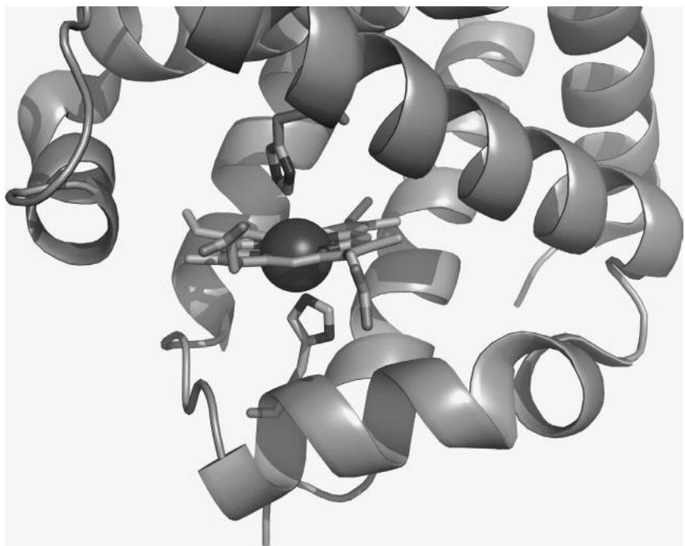  
그림 17.3 헤모글로빈 분자의 고해상도 이미지. 참고: 헤모글로빈 헴 그룹의 철 원자는 두 개의 히스티딘 잔기에 의해 위치가 유지됩니다.

### 연습 문제 17.5 동영상 만들기
PyMOL을 사용하여 헤모글로빈 구조의 구조적 특징인 폴드(fold), 헴 결합 부위, 기능적 아미노산들을 강조하는 분자 동영상을 생성하십시오. emovie.py 플러그인(www.weizmann.ac.il/ISPC/eMovie.html)을 사용하거나 직접 작성할 수 있습니다. 어떤 경우든 동영상을 조립할 수 있는 긴 .png 이미지 시퀀스를 생성해야 합니다. Windows에서는 MEncoder를 사용하여 이들을 동영상으로 조립할 수 있습니다. 모든 .png 파일이 있는 디렉토리에서 MEncoder를 실행하는 명령은 다음과 같습니다.

mencoder "mf://*.png" -mf fps=25 -o output.avi -ovc lavc -lavcopts vcodec=mpeg4

# 이미지 조작하기 (Manipulating Images)

학습 목표: 기하학적 모양과 텍스트로부터 이미지를 구성할 수 있습니다.

### 18.1 이 장에서 배울 내용

* 파이썬 이미지 라이브러리(Python Imaging Library)로 그림을 그리는 방법   
* 플라스미드(plasmid)의 도식도를 그리는 방법   
* 기하학적 모양을 그리는 방법   
* 이미지에 텍스트를 추가하는 방법   
* 여러 장의 사진을 하나의 이미지로 합치는 방법   
* 이미지 크기를 조정하는 방법   
* 컬러 이미지를 흑백 이미지로 변환하는 방법


### 18.2 스토리: 플라스미드 그리기 (PLOT A PLASMID)

최초의 인공 플라스미드 중 하나는 1977년 프란시스코 볼리바르(Francisco Bolivar)와 레이몬드 로드리게스(Raymond Rodriguez)에 의해 구축되었습니다. 이는 4,361개의 DNA 염기쌍, 복제 원점, 암피실린 내성 유전자, 그리고 테트라사이클린 내성 유전자 하나로 구성되어 있습니다. 이 플라스미드는 많은 제한 효소 부위를 포함하고 있어 유전적 벡터를 구축하는 기초 역할을 합니다.

### 18.2.1 문제 설명

모식도(schematic diagrams)는 과학적 내용을 시각화하는 핵심입니다. 나무 모양을 보지 않고 계통수(phylogenetic trees)를 설명하거나, 반응 화살표 없이 대사 경로를 설명하거나, 실제로 그리지 않고 세포를 설명하는 것을 상상해 보십시오. 유전자와 단백질의 구조에 대해서도 마찬가지입니다.

이 장에서 여러분은 pBR322 플라스미드를 그릴 것입니다. 플라스미드 이미지는 그것을 고리 모양의 구조로 보여줄 것입니다. 복제 원점과 두 내성 유전자 부위는 서로 다른 색상으로 표시되어야 합니다. 예시적인 절단 부위가 표시되어야 하며 텍스트 라벨이 추가되어야 합니다. 그리고 물론 모든 것은 정확한 뉴클레오타이드 위치에 해당하는 위치에 그려져야 합니다.

Photoshop이나 GIMP를 사용하면 비율을 수동으로 맞추기가 어렵습니다. Inkscape나 CorelDraw와 같은 벡터 그래픽 드로잉 소프트웨어가 더 나은 선택이지만 많은 수작업이 필요합니다. 웹에는 수많은 플라스미드 드로잉 프로그램들이 있으며 저마다 장단점이 있습니다. 이러한 해결책들 중 어느 것도 완벽하지 않기 때문에, 여러분은 직접 구축할 것입니다. 파이썬을 사용하면 무엇이 그려질지 완벽하게 제어할 수 있습니다. 여러분은 파이썬 이미지 라이브러리(PIL)를 사용하여 pBR322 플라스미드의 정밀한 모식도를 그릴 것입니다(박스 18.1 참조). PIL은 도면의 그래픽 요소들을 통해 이미지 부분을 이동시키고 회전시키는 것부터 이미지 전체를 변화시키는 복잡한 필터를 사용하는 것까지 이미지를 조작하는 강력한 도구들을 포함하고 있습니다. PIL은 가장 인기 있는 파이썬 라이브러리 중 하나입니다; 예를 들어 유로화 동전의 이미지도 PIL을 사용하여 만들어졌습니다. 다음 예제는 PIL에서 두 개의 모듈을 임포트하고, 몇 가지 상수를 변수 이름에 할당하고, 드로잉 도구를 활성화한 다음, 플라스미드를 실제로 그리기 위한 함수들을 정의하고 호출합니다.


::: {.callout-note}
## 박스 18.1 파이썬 이미지 라이브러리 설치 방법

Linux에서는 다음과 같이 입력하여 PIL을 설치할 수 있습니다.

sudo apt-get install python-imaging

Windows에서는 www.pythonware.com/products/pil/ 에서 바이너리 배포판을 다운로드하고 더블 클릭하여 설치해야 합니다. 두 경우 모두 설치 후 파이썬 셸을 열고 다음 임포트가 작동하면 성공한 것입니다.

>>> import PIL

:::

### 18.2.2 예제 파이썬 세션

```python
from PIL import Image, ImageDraw
import math
PLASMID_LENGTH = 4361
SIZE = (500, 500)
CENTER = (250, 250)
pBR322 = Image.new('RGB', SIZE, 'white')
DRAW = ImageDraw.Draw(pBR322)

def get_angle(bp, length=PLASMID_LENGTH):
    '''염기 위치를 각도로 변환합니다''' 
    return bp * 360 / length

def coord(angle, center, radius):
    '''원의 한 점에 대한 (x,y) 좌표를 반환합니다''' 
    rad = math.radians(90 - angle)
    x = int(center[0] + math.sin(rad) * radius)
    y = int(center[1] + math.cos(rad) * radius)
    return x, y

def draw_arrow_tip(start, direction, color):
    '''주어진 시작 각도에 삼각형을 그립니다''' 
    p1 = coord(start + direction, CENTER, 185)
    p2 = coord(start, CENTER, 160)
    p3 = coord(start, CENTER, 210)
    DRAW.polygon((p1, p2, p3), fill=color)

TET_START, TET_END = get_angle(88), get_angle(1276)
AMP_START, AMP_END = get_angle(3293), get_angle(4153)
ORI_START, ORI_END = get_angle(2519), get_angle(3133)

# 플라스미드 그리기
BOX = (50, 50, 450, 450)
DRAW.pieslice(BOX, 0, 360, fill='gray')
DRAW.pieslice(BOX, TET_START, TET_END, fill='blue')
DRAW.pieslice(BOX, AMP_START, AMP_END, fill='orange')
DRAW.pieslice(BOX, ORI_START, ORI_END, fill='darkmagenta')
DRAW.pieslice((80, 80, 420, 420), 0, 360, fill='white')
draw_arrow_tip(TET_END, 10, 'blue')
draw_arrow_tip(AMP_START, -10, 'orange')
draw_arrow_tip(ORI_START, -10, 'darkmagenta')
pBR322.save('plasmid_pBR322.png') 
```

출처: A.Via/K.Rother가 파이썬 라이선스 하에 공개한 코드를 수정함.

### 18.3 명령어들은 무엇을 의미하나요?

앞서 언급했듯이, 섹션 18.2.2는 PIL을 사용합니다(박스 18.1 참조). PIL의 가장 중요한 부분은 다음으로 임포트됩니다.

from PIL import Image, ImageDraw

PIL의 핵심에는 Image 모듈이 있습니다. 이미지에 할 수 있는 거의 모든 작업에 이 모듈이 사용됩니다. 예를 들어 파일에서 사진을 읽을 때 Image 객체를 얻게 됩니다. 그래픽 요소를 그릴 때 그것들은 Image 객체 위에 그려집니다. 텍스트를 쓸 때도—어떤 의미인지 아실 겁니다. ImageDraw 모듈은 이미지 안에 무언가를 그리기 위한 도구들의 모음입니다.

그림 18.1의 플라스미드 다이어그램은 하나의 큰 회색 원과 세 개의 표시된 영역을 위한 유색 원형 조각(pie slices)들로 구성됩니다. 플라스미드의 이 네 부분을 그린 후, 중앙에 작은 흰색 원을 그려 플라스미드의 가운데 부분을 잘라냅니다. 그 후에만 화살표 팁을 추가합니다.

프로그램의 단계에는 빈 이미지 생성, 다양한 기하학적 모양과 선 그리기, 텍스트 추가, 그리고 마지막으로 저장이 포함됩니다.

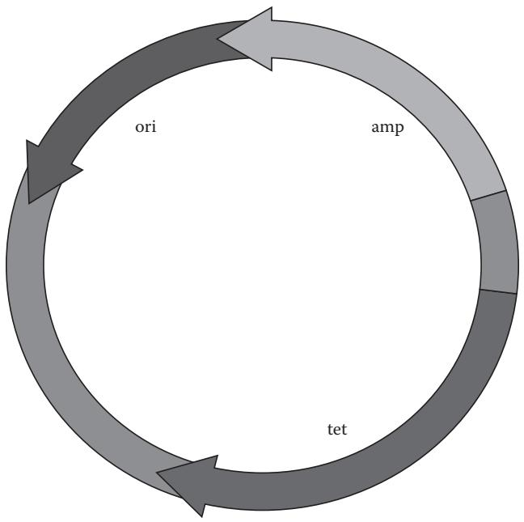  
그림 18.1 플라스미드 다이어그램.

이미지를 .png 파일로 저장합니다. 또한 프로그램은 세 가지 보조 함수인 get_angle(), coord(), draw_arrow_tip()을 정의합니다. get_angle() 함수는 염기쌍 번호로부터 각도를 계산하여 플라스미드의 모든 영역에 대한 상수를 정의하는 데 도움을 줍니다.

TET_START, TET_END = get_angle(88), get_angle(1276)

여기서 88과 1276은 get_angle() 함수가 도(degrees) 단위로 변환하는 염기 위치입니다. 다른 두 함수는 아래에서 설명합니다.

### 18.3.1 이미지 생성하기

빈 Image 객체는 세 개의 인자를 받는 Image.new()로 생성할 수 있습니다.

pBR322 = Image.new('RGB', SIZE, 'white')

문자열 'RGB'는 이미지에 빨강-초록-파랑 색상 체계가 사용되어야 함을 나타내며, 이는 대부분의 이미지에 적합합니다. (500, 500)을 포함하는 튜플 SIZE는 픽셀 단위의 이미지 가로 및 세로 크기를 나타냅니다. 마지막으로 문자열 'white'는 배경색을 흰색으로 설정합니다.

ImageDraw.Draw는 플라스미드 이미지를 위한 드로잉 도구(선, 원, 텍스트 등)를 활성화합니다. 드로잉 도구는 pBR322 Image 객체를 ImageDraw.Draw() 함수의 인자로 전달함으로써 해당 객체에 대해 활성화됩니다. 결과는 DRAW 변수에 할당됩니다.

DRAW = ImageDraw.Draw(pBR322)

DRAW 변수는 이후 스크립트 전반에 걸쳐 사용됩니다.

### 18.3.2 이미지 읽고 쓰기

PIL 라이브러리는 사실상 모든 이미지 형식을 읽고 쓸 수 있습니다(박스 18.2 참조). 다음과 같이 이미지를 파일로 저장할 수 있습니다.

image.save('plasmid_pBR322.png')

이는 18.2.2절 스크립트의 마지막 줄과 같습니다. 나중에 동일한 이미지 파일을 다음과 같이 읽어올 수 있습니다.

image = Image.open('plasmid_pBR322.png', 'r')


::: {.callout-note}
## 박스 18.2 일반적인 이미지 형식들은 어떻게 다른가요?

이미지가 단순히 색상 값의 표로 컴퓨터에 저장된다면 파일 크기가 엄청나게 커질 것입니다. 이것이 압축 절차가 발명된 이유입니다. 대부분의 이미지 형식은 정보를 압축하는 방식과 품질 손실 허용 여부에서 차이가 납니다.

* BMP: 이 형식은 사실상 픽셀들의 단순한 표입니다. 그래서 파일 크기가 매우 큽니다.   
* PNG: 이 형식은 모든 개별 픽셀의 색상을 보존합니다. 이미지를 PNG로 변환하면 정보가 손실되지 않음을 확신할 수 있습니다. PNG 이미지는 부분적으로 투명할 수 있습니다.   
* GIF: GIF는 PNG와 유사하지만 더 오래되었습니다. GIF는 애니메이션이 가능합니다(초기 웹 환경에서 인기가 있었으나 지금은 유행이 지났습니다).   
* JPG: 이 강력하게 압축된 형식은 인접한 픽셀의 색상을 약간 흐리게 하여 공간을 절약합니다. 사진에는 훌륭하지만 선으로 된 정밀한 그림(line art)은 망가뜨립니다.   
* TIF: TIF는 정확한 픽셀 형식을 가지며 PNG보다 훨씬 큽니다. LZW 압축이 널리 사용됩니다. 이 형식은 종종 레이아웃 작업 및 기타 인쇄 매체에서 사용됩니다.

읽어온 이미지에 대해 예를 들어 새로운 ImageDraw.Draw 도구 세트를 만들어 작업을 수행할 수 있습니다.

```txt
d1 = ImageDraw.Draw(image)
```

:::

### 18.3.3 좌표계 (Coordinates)

이미지의 특정 위치에서 무언가를 변경하고 싶을 때마다 좌표를 지정해야 합니다. 이 장의 예제에서는 두 종류의 좌표가 사용됩니다: 점(points)과 직사각형(rectangles)입니다. 첫째, 점은 (x, y) 튜플로 작성됩니다. 예를 들어,

point = (100, 100)

은 왼쪽 경계에서 100 픽셀, 상단 경계에서 100 픽셀 떨어진 점입니다. 좌측 상단 모서리의 좌표는 (0, 0)입니다. 둘째, 직사각형 모양은 좌측 상단 (x, y)과 우측 하단 (x', y') 모서리 위치를 설명하는 네 개의 값 (x, y, x', y') 튜플로 작성됩니다. 예를 들어,

```txt
box = (100, 100, 150, 150) 
```

는 상단과 왼쪽 경계에서 100 픽셀 지점에서 시작하고 너비가 50 픽셀인 정사각형 상자를 정의합니다. 150, 150은 상자의 우측 하단 모서리 좌표 (x', y')입니다.

18.2.2절의 스크립트에서 coord() 함수는 주어진 각도와 중심점을 가진 원 위의 점 좌표 튜플을 생성합니다.

### 18.3.4 기하학적 모양 그리기

앞서 언급했듯이, ImageDraw.Draw 명령은 드로잉 도구를 활성화합니다. 어떤 이미지든 무언가를 그리려면 이 명령을 사용해야 합니다. Image 객체를 인자로 하여 ImageDraw.Draw() 함수를 호출하고 결과를 변수에 할당하십시오. 그런 다음 이 변수에 점 구문을 사용하여 객체를 그리기 위한 ImageDraw.Draw 메서드들을 호출하십시오. 여기서는 가장 일반적인 메서드들만 다루며 원, 직사각형, 다각형, 그리고 선을 그리는 방법을 보여줍니다. 모든 예제에서 도구 객체로 DRAW 변수를 사용합니다.

# 원 그리기

d.pieslice() 함수는 원과 그 일부분을 그립니다. 가장 단순한 형태는 완전한 원입니다.

BOX = (50, 50, 450, 450)  
DRAW.pieslice(BOX, 0, 360, fill='grey')

BOX는 원을 둘러싸는 상자의 좌측 상단 및 우측 하단 모서리 좌표가 담긴 네 개의 숫자로 구성된 튜플입니다. 또는 명령에 직접 튜플을 쓸 수도 있습니다.

```txt
DRAW.pieslice((50, 50, 450, 450), 0, 360, fill='grey') 
```

원의 일부(섹션)는 원형 조각의 시작 및 끝 각도를 도(degrees) 단위로 두 개의 각도 값을 주어 그릴 수 있습니다.

DRAW.pieslice(BOX, TET_START, TET_END, fill='blue')

또는 더 명시적으로는 다음과 같습니다.

```javascript
DRAW.pieslice(BOX, 7, 105, fill='blue') 
```

이는 3시 방향을 0도로 하여 7도에서 시작하고 105도에서 끝나는 채워진 원형 조각을 그립니다.

outline 옵션을 추가하여 얇은 경계선을 추가할 수 있습니다.

DRAW.pieslice(BOX, 0, 360, fill='white', outline='black')

채워지지 않은 원의 윤곽선만 그리고 싶다면 arc 함수를 사용할 수 있습니다.

DRAW.arc(BOX, 0, 360, fill='black')

# 직사각형 그리기

직사각형과 정사각형은 그리기가 매우 쉽습니다. 좌표와 색상은 원의 경우와 동일하게 작동하지만, 각도를 줄 필요가 없습니다.

DRAW.rectangle(BOX, fill='lightblue', outline='black')

x축이나 y축에 평행하지 않은 변을 가진 직사각형을 그리려면, 다음에 설명할 다각형을 그리십시오.

# 다각형 그리기

플라스미드의 화살표 팁은 polygon() 메서드를 사용하여 삼각형으로 그려집니다. 상자 대신 (x, y) 점들의 튜플이나 리스트가 첫 번째 매개변수가 됩니다.

DRAW.polygon((point1, point2, point3), fill='lightblue', outline='blue')

18.2.2절에서 정의된 draw_arrow_tip() 함수는 먼저 coord() 함수를 사용하여 세 점(point1, point2, point3)의 좌표를 계산한 다음, 이 좌표들을 DRAW.polygon() 함수에 전달합니다. coord(angle, center, radius)는 원 위의 점들을 계산합니다. 첫 번째 인자는 각도, 두 번째는 원의 중심, 세 번째는 반지름입니다. draw_arrow_tip()의 direction 인자는 화살표 팁이 어느 방향을 가리킬지 결정하고, color는 색상을 지정합니다.

```python
def draw_arrow_tip(start, direction, color):
    '''주어진 시작 각도에 삼각형을 그립니다.''' 
    p1 = coord(start + direction, CENTER, 185)
    p2 = coord(start, CENTER, 160)
    p3 = coord(start, CENTER, 210)
    DRAW.polygon((p1, p2, p3), fill=color) 
```

polygon() 함수는 outline 옵션을 인자로 받을 수도 있습니다. 예를 들어, 모서리로 서 있는 정사각형을 그리려면 다음과 같이 작성할 수 있습니다.

```txt
DRAW.polygon([(100, 50), (50, 100), (100, 150), (150, 100)], fill='blue', outline='black') 
```

# 선 그리기

선은 다각형과 유사하게 점들의 리스트로 그려질 수 있습니다. 예를 들어, EcoRI 제한 효소 부위를 표시하기 위해 다음과 같이 플라스미드 스크립트에 선을 추가할 수 있습니다.

```txt
ECOR1 = get_angle(4359)  
p1 = coord(ECOR1, CENTER, 160)  
p2 = coord(ECOR1, CENTER, 210)  
DRAW.line((p1, p2), fill='black', width=3) 
```

두 개 이상의 점에 대해 선을 그릴 때, 끝점들이 자동으로 연결되지 않음에 주의하십시오. 따라서 이전의 다각형과 동일한 위치에 정사각형을 그리려면, DRAW.line의 첫 번째 인자의 마지막 항목으로 시작점을 다시 한 번 추가해야 합니다.

```txt
DRAW.line([(100, 50), (50, 100), (100, 150), (150, 100), (100, 50)], fill='black', width=3) 
```

### 18.3.5 이미지 회전하기

rotate() 메서드를 사용하여 이미지를 원하는 각도만큼 회전시킬 수 있습니다.

```txt
pBR322 = pBR322.rotate(45) 
```

이 메서드는 변수에 담아야 할 새로운 이미지 객체를 반환합니다. 대개 90도의 배수가 아닌 각도로 회전하면 이미지의 미세한 구조가 약간 흐릿해집니다. 따라서 가능하다면 회전한 후에 텍스트를 추가하십시오.

### 18.3.6 텍스트 라벨 추가하기

그림의 특정 위치에 텍스트를 추가하여 이미지의 각 부분에 라벨을 달 수 있습니다.

```lua
DRAW.text((370, 240), \"EcoR1\", fill=\"black\")  
DRAW.text((320, 370), \"TET\", fill=\"black\")  
DRAW.text((330, 130), \"AMP\", fill=\"black\")  
DRAW.text((150, 130), \"ORI\", fill=\"black\") 
```

여기서 (370, 240)은 텍스트가 시작되는 (x, y) 위치이며, fill은 텍스트 색상을 설정하기 위해 지정됩니다. 좌표는 시행착오를 통해 결정되었습니다. 텍스트 요소들의 좌표를 자동으로 결정하는 것이 어렵지는 않지만, 그렇게 해서 이미지를 보기 좋게 만드는 것은 매우 어렵습니다. PIL의 기본 폰트는 작고 그리 아름답지 않습니다. 다행히 PIL은 True Type Font (TTF) 파일이 있는 어떤 폰트라도 처리할 수 있습니다(여러분 컴퓨터에 있는 거의 모든 폰트가 포함됩니다; 하드 디스크나 웹에서 .ttf 파일을 검색할 수 있습니다). PIL에서 TTF 파일을 사용하려면 먼저 이를 로드해야 합니다.

```python
from PIL import ImageFont  
arial16 = ImageFont.truetype('arial.ttf', 16)  
DRAW.text((370, 240), \"EcoR1\", fill='black', font=arial16) 
```

코드의 출력은 그림 18.1에서 확인할 수 있습니다.

주의: Windows에서 TTF를 사용하려면 설치하기 까다로운 추가 라이브러리가 필요합니다. Windows에서는 드로잉 프로그램에서 라벨을 추가하거나 기본 폰트를 그대로 사용하는 것을 권장합니다.

### 18.3.7 색상

PIL에는 문자열로 쓸 수 있는 140개의 색상이 있습니다('red', 'lightred', 'magenta' 등). 또는 0에서 255 사이의 정밀한 빨강-초록-파랑(RGB) 값을 지정할 수도 있습니다. RGB에서 빨강은 (255, 0, 0), 초록은 (0, 255, 0), 파랑은 (0, 0, 255)입니다. 10진수나 16진수 값을 사용할 수 있습니다: 'white'는 (255, 255, 255) 또는 '#ffffff'로 쓸 수 있고, 'black'은 (0, 0, 0) 또는 '#000000'으로 쓸 수 있습니다.

* Q&A: 사용 가능한 모든 색상 이름을 어디서 찾을 수 있나요?

PIL에 이름이 붙은 140개의 색상은 X11 색상 이름(http://en.wikipedia.org/wiki/X11_color_names)으로 알려져 있습니다. 일부 색상 이름에는 파이썬에서 허용되지 않는 공백이 포함되어 있으므로 주의하십시오; 즉, 프로그램에서 Peach Puff 색상을 사용하려면 \"peachpuff\" 또는 \"PeachPuff\"라고 써야 합니다.

표 18.1 이미지 그리기 및 조작을 위한 파이썬 명령들.   

<table><tr><td>명령</td><td>목적</td></tr><tr><td>from PIL import Image, ImageDraw</td><td>PIL 라이브러리 임포트</td></tr><tr><td>i = Image.new(mode, size, bg_color)</td><td>빈 이미지 생성</td></tr><tr><td>i = Image.open(filename)</td><td>파일에서 이미지 읽기</td></tr><tr><td>i.save(filename)</td><td>이미지를 파일에 쓰기</td></tr><tr><td>d = ImageDraw.Draw(i)</td><td>이미지를 위한 드로잉 도구 활성화</td></tr><tr><td>d.pieslice(box, angle1, angle2, fill)</td><td>원 또는 그 일부 그리기</td></tr><tr><td>d.arc(box, angle1, angle2, fill)</td><td>원의 윤곽선 그리기</td></tr><tr><td>d.rectangle(box, fill)</td><td>직사각형 그리기</td></tr><tr><td>d.polygon(points, fill)</td><td>점 리스트로부터 다각형 그리기</td></tr><tr><td>d.line((p1, p2), fill, width)</td><td>두 점 사이에 선 그리기</td></tr><tr><td>i2 = i.rotate(angle)</td><td>이미지 전체 회전</td></tr><tr><td>d.text(pos, text, fill, font)</td><td>텍스트 쓰기</td></tr><tr><td>from PIL import ImageFont</td><td rowspan=\"2\">맞춤형 TrueType 폰트를 사용하여 텍스트 쓰기 (Linux 및 Mac OS 전용)</td></tr><tr><td>f = ImageFont.truetype(ttf, size)</td></tr><tr><td>i2 = i.resize(new_size)</td><td>축소 또는 확대된 이미지 생성</td></tr><tr><td>i.size</td><td>이미지의 x/y 크기가 담긴 튜플</td></tr></table>

표 18.1은 이미지를 조작하기 위한 파이썬 명령들과 그에 대응하는 동작들을 요약하여 보여줍니다.

### 18.3.8 보조 변수 (Helper Variables)

스크립트가 무언가를 그리기 시작하기 전에, 몇 가지 값들이 변수에 저장됩니다.

```txt
PLASMID_LENGTH = 4361  
SIZE = (500, 500)  
CENTER = (250, 250) 
```

첫 번째인 PLASMID_LENGTH는 전체 플라스미드의 총 염기쌍 수입니다. 이 숫자는 원형 구조에서의 각도를 계산하는 데 도움을 줍니다. 두 번째인 SIZE는 전체 이미지의 크기입니다. 이는 (x, y) 좌표 튜플로 저장됩니다. 세 번째인 CENTER는 플라스미드 원의 중심점으로, 이미지의 중앙에 위치합니다. 이러한 상수들을 정의하는 요점은 프로그램 코드를 읽고 편집하기 더 쉽게 만들기 위함입니다.

### 18.4 예제 (EXAMPLES)

### 예제 18.1 여러 장의 사진을 하나의 이미지로 합치기

많은 수의 이미지 시리즈가 있고 이들 모두에 동일한 요소(예: 색상 척도나 범례)를 추가하고 싶다고 상상해 보십시오. 다음 스크립트는 더 큰 이미지에 작은 라벨을 추가합니다.

```python
from PIL import Image  
image = Image.open('color.png', 'r')  
label = Image.open('label.png', 'r')  
image.paste(label, (40, 460))  
image.save('combined.png') 
```

출처: A.Via/K.Rother가 파이썬 라이선스 하에 공개한 코드를 수정함.

image.paste() 함수는 붙여넣을 두 번째 이미지와 두 번째 이미지가 붙여넣어질 좌측 상단 모서리의 좌표를 인자로 받습니다. 이미지를 붙여넣을 때 크기는 그대로 유지됩니다. 따라서 예제에서 컬러 이미지가 라벨 이미지를 수용하기에 너무 작다면, 라벨은 경계선에서 잘려 나갈 것입니다. image.paste() 함수를 사용하여 몇 개의 다이어그램으로부터 멀티 패널 그림을 만들 수 있습니다. 먼저 각 개별 다이어그램을 로드합니다. 그다음 더 큰 빈 이미지를 생성합니다. paste 함수를 사용하여 각 다이어그램을 더 큰 이미지에 복사하십시오. 마지막으로 병합된 이미지에 텍스트를 추가하고 새로운 파일 이름으로 저장하십시오.

### 예제 18.2 이미지 크기 축소하기

PIL을 사용하면 사진의 크기를 쉽게 변경할 수 있습니다. 예를 들어, 더 큰 이미지로부터 100 x 100 픽셀 이미지를 생성할 수 있습니다.

```python
from PIL import Image  
image = Image.open('big.png')  
small = image.resize((100, 100))  
small.save('small.png') 
```

출처: A.Via/K.Rother가 파이썬 라이선스 하에 공개한 코드를 수정함.

하지만 종종 한 장이 아니라 일련의 이미지들을 축소하고 싶을 때가 있습니다. 예를 들어, 디스크 공간을 덜 차지하도록 작게 만들고 싶은 사진 시리즈가 있을 수 있습니다. os.listdir()을 사용하여 디렉토리의 모든 파일에 대해 for 루프를 실행할 수 있습니다(14장 참조). 이미지들의 크기가 동일하지 않고 비율을 유지하고 싶다면, 축소하기 전에 원본 이미지의 정확한 크기를 알아내야 합니다. 다음 스크립트는 현재 디렉토리의 모든 .png 이미지를 픽셀 단위로 절반 크기로 축소합니다.

```python
from PIL import Image  
import os  
for filename in os.listdir('./'):
    if filename.endswith('.png'):
        im = Image.open(filename)  
        x = int(im.size[0] / 2)
        y = int(im.size[1] / 2)
        small = im.resize((x, y))  
        small.save('small_' + filename) 
```

출처: A.Via/K.Rother가 파이썬 라이선스 하에 공개한 코드를 수정함.

주의: 독창적인 실험 데이터가 담긴 이미지를 축소하는 것은 위험합니다. 예를 들어 웨스턴 블롯, 젤 사진, 스캔된 사진 등이 포함된 이미지를 축소하면 흐릿한 부분이 나타나거나 사라질 수 있으며, 이는 다른 해석을 낳을 수 있습니다. 발표나 출판을 위해 이미지 크기를 변경해야 할 수도 있지만, 좋은 과학적 관행을 따르기 위해 원본 이미지 파일의 사본을 반드시 보존해야 합니다.

### 예제 18.3 컬러 이미지를 흑백 이미지로 만들기

컬러 이미지를 흑백으로 만드는 한 가지 흔한 이유는 인쇄했을 때 그림이 어떻게 보일지 확인하고 싶기 때문입니다. 단순한 접근 방식은 PIL에서 모든 색상을 채도 감소(desaturate)시키고 흑백 이미지로 저장하는 것입니다.

```python
from PIL import Image  
image = Image.open('color.png', 'r')  
bw_image = Image.new('LA', image.size, (255, 255))  
bw_image.paste(image, (0, 0))  
bw_image.save('black_white.png') 
```

출처: A.Via/K.Rother가 파이썬 라이선스 하에 공개한 코드를 수정함.

먼저 컬러 이미지를 읽습니다. 그다음 빈 흑백 이미지를 생성합니다('LA'는 흑백 모드를 나타냅니다). 컬러 이미지를 흑백 이미지에 붙여넣으면 색상이 자동으로 그레이스케일로 변환됩니다. 많은 그래픽 프로그램에는 대비를 최적화하는(예: 사진에서) 더 정교한 절차들이 있습니다. 하지만 기술적인 도면이나 다이어그램의 경우, 이 절차만으로도 충분합니다.

### 18.5 스스로 테스트하기

### 연습 문제 18.1 또 다른 플라스미드 그리기

pUC19 플라스미드는 pBR322의 후속 모델로 실험실에서 다루기가 더 쉽습니다. 이는 2,686개의 염기쌍으로 구성되며, 2486-1626 위치에 Amp 유전자를, 469-146 위치에 LacZ 도메인을, 그리고 1466-852 위치에 복제 원점을 가지고 있습니다. 이 플라스미드의 이미지를 그리십시오.

### 연습 문제 18.2 아날로그 시계 그리기

시와 분을 가리키는 두 개의 바늘이 있는 아날로그 시계 이미지를 그리는 스크립트를 작성하십시오.

힌트: time 라이브러리에서 현재 시간을 얻을 수 있습니다.

```python
import time  
local = time.localtime()  
hour = local.tm_hour  
minutes = local.tm_min 
```

힌트: 시계 바늘은 중심에서 원 위의 x-y 위치까지의 선으로 그릴 수 있습니다. 정확한 좌표를 계산하기 위해 플라스미드 스크립트의 coord() 함수를 수정하여 사용할 수 있습니다.

### 연습 문제 18.3 여러분의 사진 축소하기

디지털 카메라 이미지들이 있는 폴더로 가십시오. 디스크 공간을 절약하기 위해 폴더의 모든 이미지 너비를 50%로 줄이십시오. 먼저 백업 사본으로 프로그램을 테스트하십시오.

  
그림 18.2 단백질 도메인의 모식도 이미지.

### 연습 문제 18.4 멀티 패널 그림 조립하기

16장에서 만든 네 개의 다이어그램을 하나의 멀티 패널 그림으로 만들고 각각 A, B, C, D 라벨을 붙이는 스크립트를 작성하십시오.

힌트: 스크립트는 큰 빈 이미지를 생성하고, 네 개의 패널을 별도의 이미지로 로드한 다음, 큰 이미지에 붙여넣어야 합니다. 텍스트 라벨을 추가한 후 큰 이미지를 저장하십시오.

### 연습 문제 18.5 단백질 도메인 플로팅

서열을 따라 단백질 도메인의 모식도 이미지를 생성하는 프로그램을 작성하십시오(그림 18.2의 예시 참조). 프로그램은 여러 도메인의 시작 및 끝 위치를 변수로 가지고 있어야 합니다. 이미지에 라벨을 추가하십시오.

힌트: InterPro 데이터베이스(www.ebi.ac.uk/interpro)에서 단백질 도메인 구조의 예시를 찾을 수 있습니다.

힌트: SH3 도메인을 포함하는 단백질을 검색하고 Interpro나 Uniprot의 서열 항목에서 도메인 경계를 가져오십시오.

4부에서 여러분은 데이터를 시각화하는 방법을 배웠습니다. 데이터의 유형에 따라 서로 다른 시각화 방식이 필요합니다. 두 점 세트 사이의 상관관계를 표현하고 싶다면 산점도를 그릴 수 있고, 빈도를 비교하고 싶다면 히스토그램이 여러분의 필요에 더 잘 맞을 것입니다. 하지만 논문을 위해 트립신 촉매 삼작의 3차원 구조를 보여주는 그림을 준비하거나, 슬라이드 발표를 위해 제한 효소 부위가 표시된 플라스미드를 그려야 한다면 완전히 다른 시각화 도구를 사용해야 합니다. 16장은 과학적 다이어그램에 관한 내용이었습니다. 여러분은 막대 그래프, 산점도, 선 그래프, 원형 차트, 히스토그램을 그리는 방법을 배웠습니다. 또한 플롯에 오차 막대, x축 및 y축 라벨, 눈금, 범례 상자, 그리고 그림 제목을 추가하는 방법도 배웠습니다. 17장에서는 PyMOL을 사용하여 분자의 3D 이미지를 생성하는 방법을 배웠습니다. PyMOL의 그래픽 인터페이스를 사용하고 텍스트 콘솔에 직접 명령을 입력할 수도 있지만, 복잡하고 재현 가능한 이미지를 만들거나 기존 이미지를 맞춤화하고 개선하고 싶다면 PyMOL 명령들이 나열된 .pml 확장자의 텍스트 파일인 PyMOL 스크립트 파일을 작성해야 합니다. PyMOL 스크립트는 PyMOL 그래픽 인터페이스에서 쉽게 실행할 수 있습니다. 마지막으로 18장에서는 파이썬 이미지 라이브러리(PIL)를 사용하여 이미지를 조작하는 방법을 배웠습니다. 가장 인기 있는 파이썬 라이브러리 중 하나인 PIL은 이미지를 이동시키고, 회전시키고, 수정하는 도구들을 포함하고 있습니다. 이 라이브러리는 Image 객체를 생성할 수 있게 해주며 이를 조작하기 위한 수많은 메서드를 제공합니다. 여러분은 원, 다각형, 선과 같은 다양한 기하학적 모양을 그리는 방법과 이미지를 회전시키고, 텍스트 라벨과 색상을 추가하고, 크기를 줄이는 방법을 보았습니다. 또한 여러 장의 사진을 하나의 이미지로 합치는 방법과 컬러 이미지를 흑백으로 만드는 방법도 배웠습니다.

이 단계에서 여러분은 거의 모든 종류의 이미지를 생성하고 조작하는 데 필요한 대부분의 지식을 습득했습니다. 이러한 배경을 바탕으로 여러분은 훨씬 더 정교한 그림들도 쉽게 만들 수 있게 될 것입니다.

# V

# 바이오파이썬 (Biopython)

## 서론: 대규모 프로그래밍 라이브러리 사용하기 (INTRODUCTION: USING A BIG PROGRAMMING LIBRARY)

바이오파이썬(Biopython, http://biopython.org/wiki/Main_Page)은 계산 분자 생물학을 위한 모듈들의 모음으로, 생물정보학 프로젝트에서 필요한 많은 기본 작업들을 수행할 수 있게 해줍니다.

바이오파이썬을 사용하여 수행할 수 있는 가장 일반적인 작업들은 다음과 같습니다.

* 유전자 및 단백질 서열, 단백질 구조, PubMed 레코드 등의 파일 형식 파싱(정보 추출);   
* NCBI, ExPASy 등과 같은 저장소(repositories)에서 파일 다운로드;   
* BLAST, ClustalW 등과 같이 널리 쓰이는 생물정보학 알고리즘을 로컬 또는 원격으로 실행;   
* 클러스터링, 머신러닝, 데이터 분석 및 데이터 시각화를 위해 구현된 바이오파이썬 알고리즘 실행.

또한 데이터를 다루기 위해 사용할 수 있는 클래스(예: 서열용)와 데이터에 대한 연산(예: 번역, 상보 서열 등)을 수행하는 메서드들도 제공합니다. 바이오파이썬 튜토리얼 및 요리책(Biopython Tutorial and Cookbook, http://biopython.org/DIST/docs/tutorial/Tutorial.html)은 바이오파이썬이 여러분을 위해 무엇을 할 수 있는지 파악하기 위한 좋은 시작점입니다.

특정 패키지에 대한 더 고급 튜토리얼들도 찾을 수 있습니다(예: \"The Biopython Structural Bioinformatics FAQ\", http://biopython.org/DIST/docs/cookbook/biopdb_faq.pdf).

# 바이오파이썬은 여러 방법으로 사용될 수 있습니다

바이오파이썬은 그 자체로 하나의 프로그램이 아닙니다; 생물정보학 프로그래밍을 위한 파이썬 도구들의 모음입니다. 전적으로 바이오파이썬에 기반한 연구 파이프라인을 구축할 수도 있고, 특정 작업들을 위해 새로운 코드를 작성하면서 더 표준적인 연산들을 위해 바이오파이썬을 사용할 수도 있으며, 여러분의 필요에 더 잘 맞도록 바이오파이썬의 오픈 소스 코드를 직접 수정할 수도 있습니다.

다음과 같은 경우 여러분만의 코드를 직접 작성하십시오.

* 알고리즘 구현이나 코딩 자체가 여러분에게 흥미로운 경우;   
* 바이오파이썬의 데이터 구조 매핑이 여러분의 작업에 비해 너무 복잡한 경우;   
* 바이오파이썬이 여러분의 특정 작업을 위한 도구를 제공하지 않는 경우;   
* 여러분의 코드가 하는 일을 세밀하게 제어하고 싶은 경우.

다음과 같은 경우 바이오파이썬을 사용하십시오.

* 바이오파이썬의 모듈 및/또는 메서드가 여러분의 필요에 잘 맞는 경우;   
* 여러분의 작업이 도전적이지 않거나 지루한 경우 (예: 왜 시간을 낭비하시나요? 학습 목적이 아니라면 \"바퀴를 다시 발명\"하지 마십시오);   
* 작업을 직접 구현하는 데 너무 많은 노력이 들어가는 경우.

다음과 같은 경우 바이오파이썬을 확장(즉, 바이오파이썬 소스 코드 수정)하십시오.

* 바이오파이썬의 모듈 및/또는 메서드가 여러분이 필요한 기능과 거의 비슷하지만 완전히 일치하지는 않는 경우.   
* 주의: 이는 초보자에게는 어려울 수 있습니다. 다른 사람의 코드를 읽고 이해하는 것은 쉽지 않은 일입니다.

# 다음 사항들을 기억하십시오.

* 생물학 데이터를 관리할 때, 바이오파이썬을 염두에 두고 사용 가능한 도구들을 살펴보십시오.

* 문서를 훑어보고 바이오파이썬의 기능들에 익숙해지십시오.   
* help(), type(), dir() 및 기타 내장 기능들을 사용하여 바이오파이썬 모듈들을 탐색하십시오.

# 바이오파이썬 설치하기

바이오파이썬은 공식 파이썬 배포판의 일부가 아니므로 별도로 다운로드(http://biopython.org/wiki/Download)하여 설치해야 합니다. 바이오파이썬의 전제 조건은 NumPy 패키지의 설치입니다(http://numpy.scipy.org/ 에서 다운로드 가능).

바이오파이썬 설치는 대개 어렵지 않지만(http://biopython.org/DIST/docs/install/Installation.html 의 지침을 따르십시오), NumPy는 특히 Mac에서 문제가 될 수 있으며 이를 위해 특별히 준비된 설치 프로그램들이 존재합니다(http://stronginference.com/scipy-superpack/ 참조). 주의하십시오: 바이오파이썬과 NumPy 버전은 서로 조율되어 있으므로, 특정 NumPy 릴리스에 맞는 특정 바이오파이썬 릴리스를 설치해야 합니다.

바이오파이썬이 추가 작업(주로 다양한 종류의 그래픽 출력 및 플롯)을 수행할 수 있도록 추가 패키지들을 선택적으로 설치할 수 있습니다.

# 다른 유사한 리소스들

바이오파이썬은 거대한 국제적 협력 노력의 결과물이며 현재 생물학적 계산을 위해 가장 널리 사용되는 파이썬 리소스입니다. 하지만 생물학적 데이터와 리소스를 관리하기 위해 사용 가능한 프로젝트가 이것뿐만이 아니라는 점을 언급하고 싶습니다. PyCogent(http://pycogent.org/)는 게놈 생물학을 위한 또 다른 가치 있는 소프트웨어 라이브러리입니다. 비록 RNA와 계통학에 더 초점을 맞추고 있지만 바이오파이썬과 유사한 많은 기능들을 가지고 있습니다. 이 책에서 PyCogent를 철저히 다루지는 않지만, 해당 도구들을 사용하는 몇 가지 스크립트들이 제시되어 있습니다(레시피 1 참조).

# 시작해 봅시다

바이오파이썬을 사용하기 시작하려면, 여러분의 컴퓨터에 패키지가 어디에 설치되어 있는지 알려줘야 합니다. 바이오파이썬 설치 디렉토리를 PATH 환경 변수에 추가하지 않았다면, sys.path 파이썬 변수에 이를 추가해야 합니다(이 방법이 다음 예제에 나와 있습니다). 그다음 메인 바이오파이썬 모듈인 `Bio` 모듈을 임포트해야 합니다. 다른 모든 (하위) 모듈들은 `Bio`에서 임포트될 것입니다.

```python
>>> import sys
>>> sys.path.append("/Users/home/kate/source/biopython-1.57")
>>> import Bio
>>> dir(Bio)
['BiopythonDeprecationWarning', 'MissingExternalDependencyError', 'MissingPythonDependencyError', '__builtins__', '__doc__', '__file__', '__name__', '__package__', '__path__', '__version__']
```python
>>> Bio.__version__
'1.60'
>>> help(Bio)
NAME
```
Bio - Collection of modules for dealing with biological data in Python.
FILE
    /Users/home/kate/source/biopython-1.57/Bio/__init__.py
DESCRIPTION
The Biopython Project is an international association of developers
of freely available Python tools for computational molecular biology.
http://biopython.org
PACKAGE CONTENTS
Affy (package)
Align (package)
AlignIO (package)
Alphabet (package)
Application (package)
Blast (package)
... 
```

다른 모든 모듈들은 다음과 같이 `Bio`에서 임포트됩니다.

```python
>>> from Bio import Seq
>>> from Bio.Alphabet import IUPAC
>>> from Bio.Data import CodonTable 
```

19장에서는 핵산 및 단백질 서열로 작업하기 위한 도구들을 제시합니다. 서열을 읽고 많은 기능과 메서드를 가진 서열 객체를 구축하는 방법을 보게 될 것입니다. 서열을 특정 형식(FASTA, GenBank)으로 파일에 쓰는 방법과 다양한 종류의 서열 레코드를 파싱하도록 설계된 함수들로 작업하는 방법을 배울 것입니다. 20장에서는 기본적으로 NCBI와 같은 웹 리소스에서 레코드를 검색하는 도구들을 배웁니다. 이 장은 핵산 및 단백질 서열 레코드뿐만 아니라 PubMed 레코드도 다루며, 키워드 등을 통해 이를 검색하는 방법을 설명합니다. 마지막으로 21장은 PDB 단백질 구조로 쉽게 작업할 수 있게 해주는 강력한 바이오파이썬 모듈을 설명합니다. 10장에서 PDB 파일 형식으로 작업하는 것이 얼마나 어려울 수 있는지 보았습니다. 21장에서는 고통 없이 PDB 파일에서 정보를 추출할 수 있게 해주는 바이오파이썬 구조를 보게 될 것입니다.

# 서열 데이터 작업하기 (Working with Sequence Data)

학습 목표: 바이오파이썬을 사용하여 DNA, RNA, 단백질 서열을 조작할 수 있습니다.

### 19.1 이 장에서 배울 내용

* 서열 객체 생성 방법   
* DNA 서열을 반전(reverse)시키고 전사(transcribe)하는 방법   
* RNA 서열을 단백질 서열로 번역(translate)하는 방법   
* 서열 레코드(sequence record) 생성 방법   
* 서로 다른 형식의 서열 파일을 읽는 방법   
* 형식이 지정된 서열 파일을 쓰는 방법

### 19.2 스토리: DNA 코딩 서열을 해당하는 단백질 서열로 번역하고 FASTA 파일에 쓰는 방법

### 19.2.1 문제 설명

4장에서 여러분은 문자열에 대한 기본 연산들을 사용하여 서열 파일을 파싱하는 방법을 배웠습니다. 예를 들어, FASTA 형식 파일의 첫 번째 위치에 있는 \">\" 기호가 레코드의 헤더를 시작하며 서열 ID와 몇 가지 간결한 주석을 포함한다는 것을 배웠습니다.

또한 T를 U로 교체하여 DNA 서열을 전사하고, 유전 암호 딕셔너리를 사용하여 번역할 수 있다는 것도 배웠습니다(5장 5.3.1절 참조). 여기서는 이러한 작업들과 다른 동작들이 바이오파이썬 모듈과 메서드를 사용하여 수행됩니다. 바이오파이썬은 서열과 서열 파일을 조작하기 위한 도구들을 제공함으로써 이러한 작업들을 완수하기 위한 지름길을 제공하며, 이를 통해 서로 다른 파일 형식으로 작업하고, 서열 레코드에 주석을 달고, 파일에 쓰는 등의 작업을 매우 간단하게 만들어 줍니다. 다음 파이썬 세션에서는 Bio 패키지의 네 가지 모듈이 사용됩니다: Seq는 서열 객체를 생성하는 데 필요하고; IUPAC은 서열 객체에 생물학적 알파벳(예: DNA 또는 단백질)을 할당하는 데 사용되며; SeqRecord는 ID, 주석, 설명 등을 갖춘 서열 레코드 객체를 생성할 수 있게 해주고; SeqIO는 형식이 지정된 서열 파일을 읽고 쓰는 메서드들을 제공합니다.

### 19.2.2 예제 파이썬 세션

```python
from Bio import Seq   
from Bio.Alphabet import IUPAC   
from Bio.SeqRecord import SeqRecord   
from Bio import SeqIO   
# 입력 서열 읽기
dna = open(\"hemoglobin-gene.txt\").read().strip()   
dna = Seq.Seq(dna, IUPAC.unambiguous_dna)   
# 전사 및 번역
mrna = dna.transcribe()   
protein = mrna.translate()   
# 단백질 서열을 파일에 쓰기
protein_record = SeqRecord(protein, id='sp|P69905.2|HBA_HUMAN', description=\"Hemoglobin subunit alpha, human\") 
outfile = open(\"HBA_HUMAN.fasta\", \"w\") 
SeqIO.write(protein_record, outfile, \"fasta\") 
outfile.close()
```

출처: A.Via/K.Rother가 파이썬 라이선스 하에 공개한 코드를 수정함.

### 19.3 명령어들은 무엇을 의미하나요?

19.2.2절에서 헤모글로빈 서열 알파의 DNA 코딩 서열이 평문 파일(hemoglobin-gene.txt; 부록 C 2절 \"FASTA 형식의 단일 뉴클레오타이드 서열 파일\"에 있는 것과 동일한 서열)에서 읽혀집니다. 그다음 mRNA 서열로 전사되고, 펩타이드 서열로 번역되어 HBA_HUMAN.fasta 출력 파일에 기록됩니다. 파이썬 세션에서 임포트된 객체들을 하나씩 살펴보겠습니다.

### 19.3.1 Seq 객체

첫 번째로 임포트된 이름은 Seq이며, 이는 Bio 라이브러리 내의 모듈입니다. Seq.Seq 클래스는 서열 객체, 즉 객체에 저장된 서열의 종류를 지정하는 알파벳 속성(alphabet attribute)과 연관된 서열을 생성합니다. 알파벳을 지정하거나 지정하지 않고 Seq 객체를 생성할 수 있습니다.

```python
>>> from Bio import Seq
>>> my_seq = Seq.Seq(\"AGCATCGTAGCATGCAC\")
>>> my_seq
Seq('AGCATCGTAGCATGCAC', Alphabet()) 
```

바이오파이썬은 모든 생물학적 서열 유형을 포괄하는 미리 컴파일된 알파벳 세트를 포함하고 있습니다. IUPAC 정의 알파벳(http://www.chem.qmw.ac.uk/iupac)이 가장 빈번하게 사용됩니다. 알파벳을 사용하고 싶다면 (19.2.2절에서처럼) Bio.Alphabet 모듈에서 IUPAC 모듈을 임포트해야 합니다. 여기에는 IUPACUnambiguousDNA (기본 ACGT 문자), IUPACAmbiguousDNA (모호한 문자 포함), ExtendedIUPACDNA (변형된 염기 포함), IUPACUnambiguousRNA, IUPACAmbiguousRNA, IUPACProtein (IUPAC 표준 아미노산), 그리고 ExtendedIUPACProtein (셀레노시스테인, X 등 포함) 알파벳들이 들어 있습니다. 19.2.2절에서 정의된 dna 변수는 IUPAC.unambiguous_dna 알파벳으로 특징지어지는 서열 객체입니다.

# 서열 전사 및 번역

Seq 객체의 메서드들은 생물학적 서열을 위해 특별히 설계되었습니다; 예를 들어, 19.2.2절에 나온 것처럼 transcribe 메서드를 사용하여 DNA 서열의 전사본을 얻을 수 있습니다.

```txt
>>> my_seq.transcribe()  
Seq('AGCAUCGUAGCAUGCAC', RNAAlphabet()) 
```

transcribe 메서드는 단순히 T를 U로 바꾸고 알파벳을 RNA로 설정합니다. 이 메서드는 입력 DNA 서열이 코딩 가닥(coding strand)이라고 가정합니다.

템플릿 가닥(template strand)을 가지고 있고 전사를 수행하고 싶다면, 먼저 역상보(reverse complement) 서열을 얻은 다음 전사해야 합니다.

```python
>>> dna = Seq.Seq(\"AGCATCGTAGCATGCAC\", IUPAC.unambiguous_dna)   
>>> cdna = dna.reverse_complement()   
>>> cdna   
Seq('GTGCATGCTACGATGCT', IUPACUnambiguousDNA())   
>>> mrna = dna.transcribe()   
>>> mrna   
Seq('GUGCAUGCUACGAUGCU', IUPACUnambiguousRNA())
```

또는 단일 명령줄로 가능합니다.

```python
>>> dna.reverse_complement().transcribe() 
Seq('GUGCAUGCUACGAUGCU', IUPACUnambiguousRNA()) 
```

이러한 메서드들은 단백질 알파벳이 할당된 서열에서도 사용할 수 있지만, 실행 시 오류가 발생할 것입니다.

DNA나 RNA 서열 객체는 단백질 서열로 번역될 수도 있습니다. 이를 위해 Bio.Data 모듈의 CodonTable 모듈을 통해 여러 유전 암호를 사용할 수 있습니다.

```python
>>> from Bio.Data import CodonTable 
```

CodonTable 모듈에서 사용 가능한 딕셔너리들을 통해 표에 접근할 수 있습니다 (사용 가능한 딕셔너리 목록은 dir() 함수를 사용하여 시각화할 수 있습니다). 예를 들어, unambiguous_dna_by_name 딕셔너리는 이름(예: \"Standard\", \"Vertebrate Mitochondrial\" 등)을 통해 DNA 코돈 표 세트에 접근할 수 있게 해줍니다.

```python
>>> from Bio.Data import CodonTable
>>> standard_table = CodonTable.unambiguous_dna_by_name[\"Standard\"] 
```

반면에 unambiguous_dna_by_id는 수치 식별자를 사용합니다 (1은 \"Standard\" 코돈 표에 해당하고, 2는 \"Vertebrate Mitochondrial\" 등에 해당합니다). 모든 NCBI 정의 알파벳들이 사용 가능하며 NCBI 표 식별자로 식별됩니다 (www.ncbi.nlm.nih.gov/Taxonomy/Utils/wprintgc.cgi 참조). 기본적으로 바이오파이썬 번역은 (NCBI 표 ID 1에 해당하는) 표준 유전 암호를 사용합니다.

standard_table 변수를 출력하면, 그림 19.1의 코돈 표를 얻게 됩니다. 코돈 표 객체는 시작 및 종료 코돈과 같은 다른 유용한 속성들도 가지고 있습니다.

```python
>>> standard_table.start_codons
['TTG', 'CTG', 'ATG']
>>> standard_table.stop_codons
['TAA', 'TAG', 'TGA']
>>> mito_table = CodonTable.unambiguous_dna_by_name[\"Vertebrate_Mitochondrial\"]
>>> mito_table.start_codons
['ATT', 'ATC', 'ATA', 'ATG', 'GTG']
>>> mito_table.stop_codons
['TAA', 'TAG', 'AGA', 'AGG'] 
```

translate 메서드는 기본값 또는 지정된 유전 암호를 사용하여 RNA나 DNA 서열을 번역하고 Seq 객체를 반환하며, 이때 알파벳에는 추가 정보가 포함됩니다. 다음 예제에서 출력 알파벳은 번역된 서열 내의 종료 코돈 존재와 관련된 정보를 포함합니다.

```python
>>> mrna = Seq.Seq('AUGGCCAUUGUAAUGGGCCGCUGAAAGGGAUAG', IUPAC.unambiguous_rna)  
>>> mrna.translate(table=\"Standard\")  
Seq('MAIVMGR*KG*', HasStopCodon(IUPACProtein(), '*'))  
>>> mrna.translate(table=\"Vertebrate Mitochondrial\")  
Seq('MAIVMGRWKG*', HasStopCodon(IUPACProtein(), '*')) 
```

기본적으로 핵산 서열 번역 중에 만나는 모든 종료 코돈은 별표(*)로 반환됩니다. 표준 코돈 표(table = \"Standard\")를 사용하는 경우 mRNA 서열에 두 개의 종료 코돈(UGA 및 UAG)이 있고, 척추동물 미토콘드리아 코돈 표를 사용하는 경우에는 하나만 있음에 유의하십시오. 실제로 미토콘드리아에서는 UGA 코돈이 트립토판(W)으로 인식됩니다. 첫 번째 종료 코돈을 만났을 때 번역을 멈추도록 강제할 수 있습니다.

```python
>>> mrna.translate(to_stop=True, table=1)  
Seq('MAIVMGR', IUPACProtein())  
>>> mrna.translate(to_stop=True, table=2)  
Seq('MAIVMGRWKG', IUPACProtein()) 
```

### 19.3.2 서열을 문자열처럼 다루기

바이오파이썬에서 서열 객체는 문자열과 유사한 방식으로 조작할 수 있습니다. 예를 들어 인덱싱, 슬라이싱, 나누기, 대문자나 소문자로 변환, 문자 발생 횟수 세기 등을 수행할 수 있습니다.

```python
>>> from Bio import Seq
>>> my_seq = Seq.Seq(\"AGCATCGTAGCATGCAC\")
>>> my_seq[0]
'A'
>>> my_seq[0:3]
Seq('AGC', Alphabet())
>>> my_seq.split('T')
[Seq('AGCA', Alphabet()), Seq('CG', Alphabet()), Seq('AGCA', Alphabet()), Seq('GCAC', Alphabet())]
>>> my_seq.count('A')
5
>>> my_seq.count('A') / float(len(my_seq))
0.29411764705882354 
```

Seq 객체를 슬라이싱하거나 나눌 때, 메서드들이 단순한 문자열이 아니라 다른 Seq 객체들을 반환함에 유의하십시오. 서열 객체들은 연결(concatenation)될 수도 있지만, 알파벳이 호환되는 경우(또는 일반 알파벳인 경우)에만 가능합니다.

```txt
>>> my_seq = Seq.Seq(\"AGCATCGTAGCATGCAC\", IUPAC.unambiguous_dna)  
>>> my_seq_2 = Seq.Seq(\"CGTC\", IUPAC.unambiguous_dna)  
>>> my_seq + my_seq_2  
Seq('AGCATCGTAGCATGCACCGTC', IUPACUnambiguousDNA()) 
```

find 메서드를 사용하여 서열에서 특정 부분 문자열의 발생을 검색할 수 있습니다. 부분 서열을 찾지 못하면 파이썬은 -1을 반환하고; 찾으면 대상 서열에서 가장 왼쪽 일치 문자의 위치를 반환합니다.

```python
>>> my_seq = Seq.Seq(\"AGCATCGTAGCATGCAC\", IUPAC.unambiguous_dna)  
>>> my_seq.find(\"TCGT\")  
4  
>>> my_seq.find(\"TTTT\")  
-1 
```

파이썬의 re 모듈을 사용하거나 바이오파이썬의 Bio.Motif 모듈(바이오파이썬 튜토리얼 참조)을 사용하여 정규 표현식으로 표현된 패턴을 검색하는 것도 가능합니다.

마지막으로, 바이오파이썬은 문자열에 직접 사용될 수 있는 transcribe()나 translate()와 같은 여러 함수를 제공합니다.

```python
>>> my_seq_str = \"AGCATCGTAGCATGCAC\"  
>>> Bio.Seq.transcribe(my_seq_str)  
'AGCAUCGUAGCAUGCAC'  
>>> Bio.Seq.translate(my_seq_str)  
'SIVAC'  
>>> Bio.Seq.reverse_complement(my_seq_str)  
'GTGCATGCTACGATGCT' 
```

### 19.3.3 MutableSeq 객체

Seq 객체는 파이썬 문자열과 유사하게 불변(immutable)입니다. 따라서 서열 객체에서 잔기를 재할당하려고 하면 오류 메시지를 받게 될 것입니다. 바이오파이썬은 변경 가능한 서열 객체를 생성하기 위해 MutableSeq 객체를 제공합니다.

```python
>>> my_seq = Seq.Seq(\"AGCATCGTAGCATG\", IUPAC.unambiguous_dna)  
>>> my_seq[5] = \"T\"  
Traceback (most recent call last):  
    File \"<stdin>\", line 1, in <module> 
TypeError: 'Seq' object does not support item assignment  
>>> from Bio.Seq import MutableSeq
>>> my_seq = MutableSeq(\"AGCATCGTAGCATG\", IUPAC.unambiguous_dna)  
>>> my_seq[5] = \"T\"  
>>> my_seq  
MutableSeq('AGCATTGTAGCATG', IUPACUnambiguousDNA()) 
```

출처: A.Via/K.Rother가 파이썬 라이선스 하에 공개한 코드를 수정함.

Seq 객체에서는 reverse()나 remove()와 같은 메서드들을 사용할 수 없지만, MutableSeq 객체에서는 사용할 수 있습니다.

마지막으로, Seq 객체의 tomutable() 메서드와 MutableSeq 객체의 toseq() 메서드를 사용하여 불변 Seq 객체를 가변 객체로, 또는 그 반대로 변환하는 것이 가능합니다.

```python
>>> my_mut_seq = my_seq.tomutable()
>>> my_mut_seq
MutableSeq('AGCATCGTAGCATGCAC', IUPACUnambiguousDNA())
>>> my_seq = my_mut_seq.toseq()
>>> my_seq
Seq('AGCATCGTAGCATGCAC', IUPACUnambiguousDNA()) 
```

MutableSeq 객체는 (리스트나 세트와 마찬가지로) 변경될 수 있기 때문에 딕셔너리 키로 사용될 수 없지만, Seq 객체는 가능합니다.

### 19.3.4 SeqRecord 객체

SeqRecord 클래스는 서열과 그 주석을 위한 컨테이너를 제공합니다. 19.2.2절의 파이썬 세션에서, mRNA 서열 객체를 번역하여 얻은 protein_seq 변수의 단백질 서열은 SeqRecord 객체로 변환됩니다.

```python
protein_record = SeqRecord(protein_seq, id = 'sp|P69905.2|HBA_HUMAN', description = \"Hemoglobin subunit alpha, Homo sapiens\") 
```

객체를 생성하기 위해 SeqRecord에 전달된 인자들은 Seq 객체(protein_seq 변수에 저장됨), id 및 description이며, 후자 두 개는 반드시 문자열이어야 합니다. SeqRecord 객체은 서열 객체에 식별자나 설명과 같은 기능들을 연관시킬 수 있게 해줍니다. 사용 가능한 기능들은 다음과 같습니다.

* seq: 생물학적 서열로, 전형적으로 Seq 객체 형태입니다.   
* id: 서열을 식별하는 데 사용되는 일차 ID입니다.

* name: \"일반적인\" 분자 이름입니다.   
* description: 서열/분자에 대한 설명입니다.   
* letter_annotations: 잔기별 주석이 담긴 딕셔너리입니다. 키는 주석의 유형(예: \"secondary structure\")이고, 값은 서열과 동일한 길이를 가진 파이썬 시퀀스(리스트, 튜플 또는 문자열)이며, 각 요소는 잔기별 주석입니다 (예: 단일 문자로 표시된 2차 구조 유형: S = strand, H = helix 등). 잔기에 품질 점수, 2차 구조 또는 접근성 선호도 등을 할당하는 데 유용합니다.   
* annotations: 서열에 대한 추가 정보가 담긴 딕셔너리입니다. 키는 정보의 유형이고, 정보는 값에 담깁니다.   
* features: 서열 기능에 대한 더 구조화된 정보(예: 게놈에서의 유전자 위치, 또는 단백질 서열에서의 도메인 등)를 담은 SeqFeature 객체들의 리스트입니다.   
* dbxrefs: 데이터베이스 교차 참조(cross-references) 리스트입니다.

이러한 기능들은 사용자가 수동으로 생성하거나 데이터베이스 레코드(예: GenBank 또는 SwissProt 파일; 20장 참조)에서 임포트할 수 있습니다. 19.2.2절에서는 ID와 설명을 가진 Seq 객체와 연관된 SeqRecord 객체가 생성되었습니다. 두 기능 모두 직접 검색할 수 있습니다.

```txt
>>> protein_record.id
'sp|P69905.2|HBA_HUMAN'
>>> protein_record.description
'Hemoglobin subunit alpha, Homo sapiens' 
```

기능들은 즉석에서 할당될 수도 있습니다.

```txt
>>> protein_record.name = \"Hemoglobin\" 
```

annotation 속성은 SeqRecord에서 이미 제공하는 카테고리에 속하지 않는 온갖 종류의 정보를 저장하는 데 사용될 수 있는 빈 딕셔너리입니다.

```python
>>> protein_record.annotations[\"origin\"] = \"human\"
>>> protein_record.annotations[\"subunit\"] = \"alpha\"
>>> protein_record.annotations
{'origin': 'human', 'subunit': 'alpha'} 
```

마지막으로, SeqRecord 객체를 슬라이싱할 수 있습니다: 가능한 경우 주석도 그에 따라 슬라이싱되지만(예: letter_annotations), 일부 기능(예: dbxrefs)은 슬라이싱된 객체로 확장되지 않습니다. 두 개의 SeqRecord 객체는 새로운 SeqRecord에 더함으로써 연결될 수도 있습니다. 새로운 객체는 두 부모 SeqRecord 객체에서 동일한 일부 기능(예: id)을 상속받는 반면, 일부 다른 기능(예: annotations)은 어떤 경우에도 상속되지 않습니다.

### 19.3.5 SeqIO 모듈

4장에서 표준 파이썬 명령을 사용하여 파일을 파싱하는 절차를 소개했습니다. 여기서는 바이오파이썬을 사용하여 서열 파일을 읽고 쓰는 방법을 살펴보겠습니다. SeqIO 모듈은 많은 공통 파일 형식을 파싱하고 주석이 달린 서열을 표준 파일 형식으로 쓰는 데 매우 유용합니다. 19.2.2절에서 protein_record(SeqRecord 객체)는 FASTA 형식으로 HBA_HUMAN.fasta 출력 파일에 기록됩니다.

바이오파이썬 SeqIO 모듈은 많은 공통 파일 형식에 대한 파서(parsers)를 제공합니다. 이 파서들은 입력 파일(로컬 파일 또는 데이터베이스에서 검색된 파일)에서 정보를 추출하여 자동으로 SeqRecord 객체로 변환합니다. SeqIO는 또한 SeqRecord 객체를 편리하게 포맷된 파일에 쓰는 메서드도 제공합니다.

# 파일 파싱

서열 파일 파싱을 위한 두 가지 메서드가 있습니다: SeqIO.parse()와 SeqIO.read()입니다. 둘 다 두 개의 필수 인자와 하나의 선택적 인자를 요구합니다.

1. 데이터를 읽어올 위치를 지정하는 파일(필수; \"핸들(handle)\" 객체라고도 함). 파일 이름, 읽기용으로 열린 파일, 스크립트를 사용하여 데이터베이스에서 다운로드한 데이터, 또는 다른 코드 조각의 출력이 될 수 있습니다.   
2. 데이터의 형식을 나타내는 문자열(필수; 예: \"fasta\" 또는 \"genbank\"; 지원되는 형식의 전체 목록은 http://biopython.org/wiki/SeqIO 에서 확인 가능).   
3. 서열 데이터의 알파벳을 지정하는 인자(선택적).

SeqIO.parse()와 SeqIO.read() 두 메서드의 차이점은 SeqIO.parse()가 여러 레코드가 있는 입력 파일로부터 SeqRecord 객체들을 생성하는 이터레이터(iterator)를 반환한다는 점입니다. for나 while 루프에서 이터레이터를 리스트처럼 사용할 수 있습니다. 예제 19.2를 참조하십시오. 단일 레코드를 포함하는 파일이 있다면 대신 SeqIO.read()를 사용해야 합니다. 이는 SeqRecord 객체를 반환합니다. SeqIO.parse()는 입력 핸들의 레코드 개수에 상관없이 처리할 수 있는 반면, SeqIO.read()는 먼저 핸들에 단 하나의 레코드만 있는지 확인하고 이 조건이 충족되지 않으면 오류를 발생시켜 단일 레코드 파일만 파싱합니다.

* Q&A: 이터레이터가 무엇인가요?

이터레이터(iterator)는 일련의 항목들(예: SeqRecord 객체들)을 생성하는 데이터 구조입니다. 루프에서 리스트처럼 사용될 수 있지만, 기술적으로는 리스트가 아닙니다. 이터레이터는 길이가 없으며 인덱싱과 슬라이싱을 할 수 없습니다. 오직 다음(next) 객체만을 요청할 수 있습니다. 요청을 받으면 이터레이터는 사용 가능한 레코드가 더 있는지 확인합니다. 이러한 방식으로 이터레이터는 모든 레코드를 항상 메모리에 유지할 필요가 없습니다.

# 대용량 서열 파일 파싱

이터레이터를 사용하는 것은 대량의 메모리를 소비하지 않고 큰 파일을 파싱하는 방법입니다. 매우 많은 수의 레코드에 대해서는 레코드 파일 이름과 파일 형식을 인자로 받는 SeqIO.index() 메서드를 사용할 수 있습니다. SeqIO.index() 메서드는 모든 데이터를 메모리에 유지하지 않고도 모든 레코드에 접근할 수 있게 해주는 딕셔너리 형태의 객체를 반환합니다. 딕셔너리의 키는 레코드의 ID이고, 값은 id, description 등의 속성을 통해 접근할 수 있는 전체 레코드를 포함합니다. 특정 레코드에 접근할 때, 레코드 내용은 즉석에서 파싱됩니다. 이 메서드는 유연성과 속도 면에서 약간의 손해를 보면서 거대한 파일들을 조작할 수 있게 해줍니다. 이러한 딕셔너리 형태의 객체들은 읽기 전용(read-only)이므로, 일단 생성되면 레코드를 추가하거나 제거할 수 없음에 유의하십시오.

# 파일 쓰기

SeqIO.write() 메서드는 하나 이상의 SeqRecord 객체를 사용자가 지정한 형식의 파일에 씁니다. 이 메서드는 세 개의 인자를 요구합니다: 하나 이상의 SeqRecord 객체, 핸들 객체(즉, \"w\" 모드로 열린 파일) 또는 쓸 파일 이름, 그리고 서열 형식(예: \"fasta\" 또는 \"genbank\").

첫 번째 인자는 19.2.2절에 나온 것처럼 리스트, 이터레이터 또는 개별 SeqRecord일 수 있습니다. GenBank 파일을 쓸 때는 서열에 대한 알파벳이 설정되어 있어야 합니다.

# 맺음말

어떤 경우에는 전통적인 프로그래밍을 선호할 수도 있습니다. 예를 들어 맞춤형 파서가 필요하거나 바이오파이썬이 파싱에 실패하는 비표준 형식을 가지고 있는 경우입니다. 다른 경우에는 대용량 파일을 인덱싱해야 할 때와 같이 SeqIO 모듈을 사용하는 것이 더 편리할 수 있습니다. 두 경우 모두 파일 형식은 가끔 변경될 수 있으며, 예상치 못한 문자, 줄, 예외 등을 포함할 수 있어 아무리 잘 설계된 파서라도 망가뜨릴 수 있다는 점을 인지해야 합니다.

### 19.4 예제 (EXAMPLES)

### 예제 19.1 Bio.SeqIO 모듈을 사용하여 다중 서열 FASTA 파일 파싱하기

다음 예제에서는 부록 C 4절 \"다중 서열 FASTA 파일\"에 나와 있는 다중 서열 FASTA 파일을 파싱합니다.

```python
from Bio import SeqIO  
fasta_file = open(\"Uniprot.fasta\", \"r\")  
for seq_record in SeqIO.parse(fasta_file, \"fasta\"):  
    print(seq_record.id)  
    print(repr(seq_record.seq))  
    print(len(seq_record))  
fasta_file.close() 
```

출처: A.Via/K.Rother가 파이썬 라이선스 하에 공개한 코드를 수정함.

코드는 FASTA 파일에 있는 세 항목 모두의 식별자, 서열, 길이를 씁니다.

```txt
sp|P03372|ESR1_HUMAN  
Seq('MTMTLHTKASGMALLHQIQGNELEPLNRPQLKIPLERPLGEVYLDSSKPAVNY...ATV', SingleLetterAlphabet())  
595  
sp|P62333|PRS10_HUMAN  
Seq('MADPRDKALQDYRKKLLEHKEIDGRLKELREQLKELTKQYEKSENDLKALQSVG...KPV', SingleLetterAlphabet())  
389  
sp|P62509|ERR3_MOUSE  
Seq('MDSVELCLPESFSLHYEELLCRMSNKDRHIDSSCSSFIKTEPSSPASLTDSVN...AKV', SingleLetterAlphabet())  
458 
```

핸들이 파일이므로 처리가 끝난 후 파일을 닫는 것이 좋은 습관입니다. 이터레이터가 파일을 \"비운다\"는 점을 기억하십시오. 즉, 레코드를 다시 스캔하려면 파일을 닫았다가 다시 열고 SeqIO.parse()의 핸들 인자로 다시 사용해야 합니다. 또한 핸들의 명시적인 생성 없이 파일 이름이나 전체 경로를 직접 SeqIO.parse에 전달하여 사용할 수도 있습니다. 예를 들어,

```txt
>>> for seq_record in SeqIO.parse(\"Uniprot.fasta\", \"fasta\"): 
...     print(seq_record.id)
sp|P03372|ESR1_HUMAN
sp|P62333|PRS10_HUMAN
sp|P62509|ERR3_MOUSE 
```

이터레이터의 next() 메서드를 사용하여 레코드를 하나씩 파싱할 수도 있습니다.

```txt
>>> uniprot_iterator = SeqIO.parse(\"Uniprot.fasta\", \"fasta\")
>>> print(uniprot_iterator.__next__().id) 
'sp|P03372|ESR1_HUMAN'  
>>> print(uniprot_iterator.__next__().id)  
'sp|P62333|PRS10_HUMAN' 
```

모든 레코드를 다 읽으면 next() 메서드는 (바이오파이썬 버전에 따라) None을 반환하거나 StopIteration 예외를 발생시킵니다.

### 예제 19.2 SeqIO 모듈을 사용하여 레코드 파일을 파싱하고 그 내용을 리스트나 딕셔너리에 저장하기

파일의 모든 레코드를 리스트에 쉽게 저장할 수 있습니다.

```python
from Bio import SeqIO  
uniprot_iterator = SeqIO.parse(\"Uniprot.fasta\", \"fasta\")  
records = list(uniprot_iterator)  
print(records[0].id)  
print(records[0].seq) 
```

출처: A.Via/K.Rother가 파이썬 라이선스 하에 공개한 코드를 수정함.

이 코드는 다음과 같은 출력을 생성합니다.

```txt
sp|P03372|ESR1_HUMAN MTMTLHTKASGMALLHQIQGNELEPLNRPQLKI... 
```

또는 키가 레코드 ID이고 값이 레코드 정보를 포함하는 딕셔너리를 사용할 수 있습니다.

```python
uniprot_iterator = SeqIO.parse(\"Uniprot.fasta\", \"fasta\")  
records = SeqIO.to_dict(uniprot_iterator)  
print(records['sp|P03372|ESR1_HUMAN'].id)  
print(records['sp|P03372|ESR1_HUMAN'].seq) 
```

출처: A.Via/K.Rother가 파이썬 라이선스 하에 공개한 코드를 수정함.

이 코드는 위와 동일한 출력을 생성합니다.

### 예제 19.3 SeqIO.index()를 사용하여 대용량 파일 파싱하기

index 메서드를 사용하면 메모리에 동시에 들어가지 않는 대용량 서열 파일을 처리하는 데 도움이 됩니다. 예제에서는 예제 19.1의 파일을 읽습니다.

```python
from Bio import SeqIO
records = SeqIO.index(\"Uniprot.fasta\", \"fasta\")  
print(list(records.keys()))  
print(len(records['sp|P03372|ESR1_HUMAN'].seq)) 
```

출처: A.Via/K.Rother가 파이썬 라이선스 하에 공개한 코드를 수정함.

이 코드는 다음과 같은 출력을 생성합니다.

```javascript
['sp|P03372|ESR1_HUMAN', 'sp|P62333|PRS10_HUMAN', 'sp|P62509|ERR3_MOUSE'] 595 
```

### 예제 19.4 서열 파일 형식 간 변환

Bio.SeqIO.parse()와 Bio.SeqIO.write() 메서드를 결합하여 서열 파일 형식을 변환할 수 있습니다. 다음 스크립트는 GenBank 파일을 FASTA 파일로 변환합니다.

```python
from Bio import SeqIO  
genbank_file = open(\"AY810830.gbk\", \"r\")  
output_file = open(\"AY810830.fasta\", \"w\")  
records = SeqIO.parse(genbank_file, \"genbank\")  
SeqIO.write(records, output_file, \"fasta\")  
output_file.close() 
```

출처: A.Via/K.Rother가 파이썬 라이선스 하에 공개한 코드를 수정함.

출력 파일을 닫지 않으면 쓰기가 완료되지 않을 수 있음에 유의하십시오.

### 19.5 스스로 테스트하기

### 연습 문제 19.1 단일 서열 레코드 파싱

FASTA 형식의 파일에서 단일 레코드를 읽고, 그 ID와 서열을 추출하여 출력하십시오.

### 연습 문제 19.2 SeqRecord 객체 구축 및 파일 쓰기

연습 문제 19.1의 서열 ID와 서열을 사용하여 SeqRecord 객체를 생성하십시오. 수동으로 맞춤형 설명을 추가하십시오. SeqRecord 객체를 FASTA 형식 파일과 GenBank 형식 파일에 각각 쓰십시오. GenBank 형식의 경우 Seq 객체를 생성할 때 알파벳을 할당해야 함에 주의하십시오.

### 연습 문제 19.3

다중 레코드 파일을 파싱하고 모든 레코드의 ID만 파일에 쓰십시오.

### 연습 문제 19.4 GenBank 서열을 개별 파일로 쓰기

GenBank 형식의 다중 레코드 파일을 파싱하고 각 레코드를 FASTA 형식의 개별 파일로 쓰십시오. 파일 이름으로 항목의 ID를 사용하십시오.

힌트: GenBank 웹사이트에서 직접 입력 파일을 수동으로 생성할 수 있습니다.

### 연습 문제 19.5 형식 변환

예제 19.1의 단백질 서열 FASTA 형식 파일을 (또는 유사한 파일을) GenBank 형식으로 변환해 보십시오. 어떤 일이 일어납니까?

# 웹 리소스에서 데이터 검색하기 (Retrieving Data from Web Resources)

학습 목표: 바이오파이썬을 통해 NCBI 웹사이트에서 데이터베이스 레코드를 검색하고 가져올 수 있습니다.

### 20.1 이 장에서 배울 내용

* 웹에서 서열 파일을 읽는 방법   
* PubMed 쿼리를 제출하는 방법   
* NCBI 뉴클레오타이드 데이터베이스에 쿼리를 제출하는 방법   
* Uniprot 레코드를 검색하고 파일에 쓰는 방법

### 20.2 스토리: PubMed에서 키워드로 논문 검색 및 해당 레코드 다운로드와 파싱

### 20.2.1 문제 설명

이전 장에서는 바이오파이썬을 사용하여 로컬 서열 파일(예: FASTA 및 GenBank 파일)을 조작했습니다. 이 장에서는 바이오파이썬을 사용하여 PubMed 및 GenBank와 같은 온라인 NCBI 데이터베이스와 Uniprot과 같은 Expasy 리소스에 접속하고, 그 내용을 검색하여 파싱할 것입니다. 다음 파이썬 세션은 바이오파이썬의 상보적인 파이썬 라이브러리인 PyCogent에 관한 출판물을 찾는 방법을 보여줍니다. 먼저 \"PyCogent\"라는 키워드가 포함된 PubMed 항목들을 찾아 검색하고,


::: {.callout-note}
## 박스 20.1 문서 및 샘플 쿼리

문서 (Documentation)

www.ncbi.nlm.nih.gov/books/NBK25500/

PubMed에서 논문 검색

http://eutils.ncbi.nlm.nih.gov/entrez/eutils/esearch.fcgi?db=pubmed&term=thermophilic,packing&rettype=uilist

Medline 형식으로 출판 레코드 검색

http://eutils.ncbi.nlm.nih.gov/entrez/eutils/efetch.fcgi?db=pubmed&id=11748933,11700088&retmode=text&rettype=medline

키워드로 단백질 데이터베이스 항목 검색

http://eutils.ncbi.nlm.nih.gov/entrez/eutils/esearch.fcgi?db=protein&term=cancer+AND+human

FASTA 형식으로 단백질 데이터베이스 항목 검색

http://eutils.ncbi.nlm.nih.gov/entrez/eutils/efetch.fcgi?db=protein&id=1234567&rettype=fasta

GenBank 형식으로 단백질 데이터베이스 항목 검색

http://eutils.ncbi.nlm.nih.gov/entrez/eutils/efetch.fcgi?db=protein&id=1234567&rettype=gb

뉴클레오타이드 데이터베이스 항목 검색

http://eutils.ncbi.nlm.nih.gov/entrez/eutils/efetch.fcgi?db=nucleotide&id=9790228&rettype=gb

결과 레코드들을 파싱해야 합니다. PubMed는 NCBI 데이터베이스들(www.ncbi.nlm.nih.gov/) 중 하나이므로, Entrez 데이터 검색 시스템(www.ncbi.nlm.nih.gov/Entrez)에 연결되어 있습니다. NCBI 서버에 대한 샘플 쿼리는 박스 20.1을 참조하십시오. NCBI 웹 서비스에 접속하기 위한 바이오파이썬 모듈 역시 Entrez라고 불립니다. Entrez 모듈은 NCBI 데이터베이스 레코드에 접속하고 다운로드하는 데 필요합니다. 출판 레코드를 추가로 파싱하려면 Bio.Medline 모듈의 전문 파서가 필요합니다.

:::

### 20.2.2 파이썬 세션

```python
from Bio import Entrez
from Bio import Medline
keyword = \"PyCogent\"
# PubMed에서 출판물 검색
Entrez.email = \"my_email@address.com\"
handle = Entrez.esearch(db=\"pubmed\", term=keyword)
record = Entrez.read(handle)
pmids = record['IdList']
print(pmids)
# PubMed에서 Medline 항목 검색
handle = Entrez.efetch(db=\"pubmed\", id=pmids, rettype=\"medline\", retmode=\"text\")
medline_records = Medline.parse(handle)
records = list(medline_records)
n = 1
for record in records:
    if keyword in record.get(\"TI\", \"\"):
        print(n, \") \", record[\"TI\"])
    n += 1 
```

출처: A.Via/K.Rother가 파이썬 라이선스 하에 공개한 코드를 수정함.

코드는 다음과 같은 출력을 생성합니다:


```txt
['22479120', '18230758', '17708774']  
1) Abstractions, algorithms and data structures for structural bioinformatics in PyCogent.  
2) PyCogent: a toolkit for making sense from sequence. 
```

### 20.3 명령어들은 무엇을 의미하나요?

### 20.3.1 Entrez 모듈

Entrez는 NCBI 서버의 esearch 및 efetch 도구에 대한 연결을 제공합니다. Entrez 모듈에서 사용 가능한 메서드와 속성들은 다음과 같이 입력하여 나열할 수 있습니다.

```txt
>>> from Bio import Entrez  
>>> dir(Entrez) 
```

출력 결과에서 `email` 속성과 섹션 20.2.2에서 사용된 `esearch()` 및 `efetch()` 함수를 확인할 수 있습니다. `email` 속성은 NCBI에 여러분의 이메일 주소를 알려줍니다. 이는 필수 사항은 아니지만, NCBI는 문제가 발생했을 때 사용자에게 연락할 수 있기를 원하며 이메일 주소를 제공하는 것이 공정합니다. 또한 `Entrez.esearch()`의 인자 리스트에 `email = "my_email@address.com"`을 포함시켜 NCBI에 접속할 때마다 이메일 주소를 제공할 수도 있습니다.

# Entrez.esearch()

`Entrez.esearch()`는 쿼리 텍스트를 사용하여 NCBI 데이터베이스에서 검색을 수행합니다. 이 함수는 두 개의 필수 인자를 받습니다: `db`(검색할 데이터베이스, 기본값은 pubmed)와 `term`(쿼리 텍스트)입니다.

섹션 20.2.2에서 검색할 용어는 "PyCogent"입니다. 둘 이상의 키워드를 검색하고 싶다면 온라인 검색에서와 마찬가지로 "AND" 또는 "OR"를 사용할 수 있습니다. 또한 [Year], [Organism], [Gene] 등과 같은 키워드 사양을 사용할 수도 있습니다(예제 20.2 참조). `Entrez.esearch()`는 "핸들(handle)" 형식의 데이터베이스 식별자 리스트를 반환하며, 이는 `Entrez.read()` 함수를 사용하여 읽을 수 있습니다. 후자는 "IdList"(쿼리와 일치하는 ID 리스트)와 "Count"(ID의 총 개수) 등의 키를 포함하는 딕셔너리를 반환합니다. 섹션 20.2.2에 표시된 PubMed 쿼리의 경우, PMID들은 `record` 딕셔너리의 `record['IdList']` 값에 포함되어 있습니다.

선택적 매개변수인 `retmax`(최대 가져오기)를 사용하여 검색 텍스트와 일치하는 항목 중 가져올 개수를 설정할 수 있습니다(예제 20.2 참조). 다른 유용한 선택적 인자로는 `datetype`, `reldate`, `mindate`, `maxdate`(모두 "YYYY/MM/DD" 형식)가 있습니다. `datetype`은 검색을 제한하기 위한 날짜 유형("mdat": 수정일, "pdat": 출판일, "edat": Entrez 날짜)을 선택하는 데 사용될 수 있습니다. `reldate`는 정수 n이어야 하며, 최근 n일 이내의 `datetype`과 일치하는 레코드의 ID만 반환하도록 `esearch()` 메서드에 지시합니다. `mindate`와 `maxdate`는 `datetype`에 의해 지정된 날짜 유형으로 검색을 제한하는 데 사용될 수 있는 날짜 범위를 지정합니다. 예를 들어, 다음 쿼리는 이 책이 집필된 기간 동안의 논문들만 반환합니다.

```txt
>>> handle = Entrez.esearch(db = "pubmed", \  
... term = "Python", datetype = "pdat", \  
... mindate = "2011/08/01", maxdate = "2013/10/28")  
>>> record = Entrez.read(handle)  
>>> record['Count']  
'3' 
```

일치하는 항목의 개수를 세기 위해 `Entrez.egquery()` 메서드를 사용할 수도 있습니다. 이 메서드는 각 Entrez 데이터베이스에서 검색어와 일치하는 항목의 수를 반환합니다. 이 메서드는 검색할 용어라는 단일 필수 인자를 받습니다.

```python
>>> handle = Entrez.egquery(term = "PyCogent")  
>>> record = Entrez.read(handle) 
```

```txt
>>> for r in record["eGQueryResult"]:  
...     print(r["DbName"], r["Count"])  
pubmed 3  
pmc 49  
mesh 0  
... 
```

# Entrez.efetch()

지금까지 하나 이상의 검색어에 대해 레코드의 ID를 식별하는 방법을 보았습니다. 이러한 레코드를 NCBI 서버에서 다운로드하려면 Entrez.efetch() 도구를 사용할 수 있습니다. 바이오파이썬에서 Entrez.efetch() 함수는 레코드를 가져올 데이터베이스와 다운로드하려는 레코드의 ID 하나 또는 ID 리스트를 인자로 받습니다. 20.2.2절의 파이썬 세션에서 다운로드할 PMID 리스트는 pmids 변수에 저장됩니다. 이는 나중에 efetch()의 ID 리스트로 사용됩니다.

Entrez.efetch() 함수는 많은 선택적 인자를 가지고 있습니다: retmode는 검색된 레코드의 형식(text, HTML, XML)을 지정하고, rettype은 어떤 유형의 레코드가 표시될지를 지정합니다. 이는 여러분이 접근하는 데이터베이스에 따라 달라집니다. PubMed의 경우 rettype 값은 예를 들어 abstract, citation, 또는 medline이 될 수 있습니다. Uniprot의 경우 rettype을 fasta로 설정하여 단백질 레코드의 서열을 가져올 수 있습니다(예제 20.4 참조). retmax는 가져올 레코드의 총 개수입니다(최대 10,000개).

Entrez.efetch()는 여러분의 레코드를 "포함"하는 핸들(handle)을 반환합니다. 열려 있는 파이썬 파일을 읽는 것처럼(for 루프 사용) 핸들에서 원시 데이터를 읽거나 전문 함수를 사용하여 파싱할 수 있습니다.

### 20.3.2 Medline 모듈

Entrez.efetch()로 다운로드한 PubMed 레코드를 파싱하려면, Medline.parse() 함수를 제공하는 바이오파이썬 Medline 모듈을 임포트해야 합니다. 이 함수의 결과는 리스트로 편리하게 변환될 수 있습니다. 이 리스트는 딕셔너리처럼 작동하는 Bio.Medline.Record 객체들을 포함합니다. 가장 일반적인 키는 TI(제목), PMID, PG(페이지), AB(초록), AU(저자)입니다. 각 딕셔너리에 모든 키가 존재하는 것은 아닙니다. 예를 들어, 특정 PubMed 레코드에 초록이 없는 경우 딕셔너리에서 AB 키는

누락될 것입니다. 주어진 레코드에서 사용 가능한 키들은 다음과 같이 입력하여 시각화할 수 있습니다.

```txt
>>> handle = Entrez.efetch(db = "pubmed", \
... rettype = "medline", id = ['22479120', \
... '18230758', '17708774'], \
... retmode = 'text')
>>> records = Medline.parse(handle)
>>> list(records)[0].keys()
['STAT', 'IP', 'DEP', 'DA', 'AID', 'CRDT', 'DP', 'OWN',
'PT', 'LA', 'FAU', 'JT', 'PG', 'PMC', 'TA', 'JID',
'AB', 'VI', 'IS', 'TI', 'AU', 'MHDA', 'PHST', 'EDAT',
'SO', 'PMID', 'PST'] 
```

또는 해당 값들도 함께 표시하고 싶다면:

```python
>>> for record in records:  
...     for k, v in record.items():  
...         print(k, v)
```

단일 레코드를 파싱해야 하는 경우 Medline.parse() 대신 Medline.read() 함수를 사용할 수 있음에 유의하십시오.

### 20.4 예제 (EXAMPLES)

### 예제 20.1 사용 가능한 Entrez 데이터베이스는 무엇인가요?

Entrez 데이터베이스에 대한 정보를 얻고 싶다면 Entrez.einfo() 함수를 사용할 수 있습니다. 인자 없이 사용하면 Entrez에서 사용 가능한 데이터베이스 목록이 값으로 들어 있는 단일 키:값 쌍의 딕셔너리를 얻게 됩니다. 특정 데이터베이스 이름을 Entrez.einfo()의 인자로 전달하면 해당 데이터베이스에 대한 정보를 얻을 수 있습니다.

```python
from Bio import Entrez   
handle = Entrez.einfo()   
info = Entrez.read(handle)   
print(info)
input('...PubMed의 필드 목록을 보려면 엔터를 누르세요')   
handle = Entrez.einfo(db="pubmed")   
record = Entrez.read(handle)   
print(record.keys())   
print(record['DbInfo']['Description'])   
print(record['DbInfo'])
```

출처: A.Via/K.Rother가 파이썬 라이선스 하에 공개한 코드를 수정함.

# 프로그램은 다음과 같은 출력을 생성합니다:

```javascript
{u'DbList': ['pubmed', 'protein', 'nuccore', 'nucleotide', 'nucgss', 'nucest', 'structure', 'genome', 'assembly', 'genomeprj', 'bioproject', 'biosample', 'blastdbinfo', 'books', 'cdd', 'clinvar', 'clone', 'gap', 'gapplus', 'dbvar', 'epigenomics', 'gene', 'gds', 'geoprofiles', 'homologene', 'medgen', 'journals', 'mesh', 'ncbisearch', 'nlmcatalog', 'omia', 'omim', 'pmc', 'popset', 'probe', 'proteinclusters', 'pcassay', 'biosystems', 'pccompound', 'pcsubstance', 'pubmedhealth', 'seqannot', 'snp', 'sra', 'taxonomy', ' toolkit', ' toolkitall', ' toolkitbook', 'unigene', 'unists', 'gencoll']} 
```

... 그리고 엔터를 누른 후 나타나는 긴 필드 목록.

### 예제 20.2 AND/OR를 사용하여 키워드를 조합하여 둘 이상의 용어로 PubMed 검색하기

```python
from Bio import Entrez   
handle = Entrez.esearch(db="pubmed", term="PyCogent AND RNA")   
record = Entrez.read(handle)   
print(record['IdList'])   
handle = Entrez.esearch(db="pubmed", term="PyCogent OR RNA")   
record = Entrez.read(handle)   
print(record['Count'])   
handle = Entrez.esearch(db="pubmed", term="PyCogent AND 2008 [Year]")   
record = Entrez.read(handle)   
print(record['IdList'])   
handle = Entrez.esearch(db="pubmed", term="C.elegans[Organism] AND 2008 [Year] AND Mapk [Gene]")   
record = Entrez.read(handle)   
print(record['Count'])
```

출처: A.Via/K.Rother가 파이썬 라이선스 하에 공개한 코드를 수정함.

프로그램은 네 가지 쿼리에 대한 PMID 리스트와 각각의 논문 수를 출력합니다. 선택적 매개변수인 retmax(최대 검색 항목 수)를 사용하여 검색 텍스트와 일치하는 항목 중 가져올 최대 개수를 설정할 수 있습니다.

handle = Entrez.esearch(db="pubmed", term="PyCogent OR RNA", retmax="3") 
record = Entrez.read(handle) 
print(record['IdList'])

결과는 다음과 같습니다:

['23285493', '23285311', '23285230']

### 예제 20.3 GenBank 형식으로 뉴클레오타이드 데이터베이스 항목 검색 및 파싱

이 절차는 PubMed 레코드를 검색하고 파싱하는 절차와 거의 동일합니다. 주요 차이점은 가져와야 할 ID가 서열의 GI 번호라는 점입니다. 여러 ID는 리스트 대신 쉼표로 구분된 GI 번호 문자열 형식으로 전달되어야 하며, 파일 형식(retmode)은 xml로 설정되어야 합니다.

```python
from Bio import Entrez
# 키워드 조합으로 서열 검색
handle = Entrez.esearch(db="nucleotide", term="Homo sapiens AND mRNA AND MapK")
records = Entrez.read(handle)
print(records['Count'])
top3Records = records['IdList'][0:3]
print(top3Records)
# GI 번호로 서열 가져오기
gi_list = ', '.join(top3Records)
print(gi_list)
handle = Entrez.efetch(db="nucleotide", id=gi_list, rettype="gb", retmode="xml")
records = Entrez.read(handle)
print(len(records))
print(records[0].keys())
print(records[0]['GBSeq_organism']) 
```

출처: A.Via/K.Rother가 파이썬 라이선스 하에 공개한 코드를 수정함.

작성 당시, 이 코드는 다음과 같은 출력을 생성합니다:

```txt
1053 ['472824973', '433282995', '433282994']   
472824973, 433282995, 433282994   
3 [u'GBSeq_moltype', u'GBSeq_comment', u'GBSeq_feature-table', u'GBSeq_primary', u'GBSeq_references', u'GBSeq_location', u'GBSeq_keywords', u'GBSeq_secondary-accessions', u'GBSeq_definition', u'GBSeq_organism', u'GBSeq_strandedness', u'GBSeq_source', u'GBSeq_sequence', 
```

```python
u'GBSeq_primary-accession', u'GBSeq_accession-version', u'GBSeq_length', u'GBSeq_create-date', u'GBSeq_division', u'GBSeq_update-date', u'GBSeq_topology', u'GBSeq_other-seqids', u'GBSeq_taxonomy']  
Homo sapiens 
```

단일 gi의 경우 "text" (retmode = "text") 형식도 사용할 수 있습니다.

handle = Entrez.efetch(db="nucleotide", id="186972394", rettype="gb", retmode="text") 
record = handle.read()

### 예제 20.4 키워드로 NCBI 단백질 데이터베이스 항목 검색

이 절차는 PubMed 및 뉴클레오타이드 레코드(각각 20.2.2절 및 예제 20.3)에서 보여준 것과 매우 유사합니다.

```python
from Bio import Entrez
# 키워드로 단백질 서열 ID 검색
handle = Entrez.esearch(db="protein", term="Human AND cancer AND p21")
records = Entrez.read(handle)
print(records['Count'])
id_list = records['IdList'][0:3]
# 서열 가져오기
id_list = ", ".join(id_list)
print(id_list)
handle = Entrez.efetch(db="protein", id=id_list, rettype="fasta", retmode="xml")
records = Entrez.read(handle)
rec = list(records)
print(rec[0].keys())
print(rec[0]['TSeq_defline']) 
```

출처: A.Via/K.Rother가 파이썬 라이선스 하에 공개한 코드를 수정함.

이 코드는 다음과 같은 출력을 생성합니다:

```txt
920   
229577056, 131890016, 113677036   
[u'TSeq_accver', u'TSeq_sequence', u'TSeq_length', u'TSeq_taxid', u'TSeq_orgname', u'TSeq_gi', u'TSeq_seqtype', u'TSeq_defline']   
CDC42 small effector protein 2 [Danio rerio] 
```

### 예제 20.5 SwissProt 데이터베이스 항목 검색 및 FASTA 형식으로 파일에 쓰기

바이오파이썬은 SwissProt 데이터베이스 및 기타 Expasy 리소스(http://www.expasy.org/)에 접근하기 위한 모듈(ExPASy)을 제공합니다. ExPASy 모듈의 get_sprot_raw() 메서드는 핸들을 반환하며, 이는 SeqIO.read() 메서드를 사용하여 읽을 수 있습니다(19장 참조). 따라서 먼저 SeqIO 모듈을 임포트해야 합니다. 19장에서 배웠듯이, SeqIO.read()에 의해 반환된 객체는 SeqRecord 객체이며, 따라서 id, Seq, description 속성을 가지고 있고 SeqIO.write() 메서드를 사용하여 FASTA 형식 파일로 기록될 수 있습니다.

```python
from Bio import ExPASy   
from Bio import SeqIO   
handle = ExPASy.get_sprot_raw("P04637")   
seq_record = SeqIO.read(handle, "swiss")   
out = open('myfile.fasta', 'w')   
fasta = SeqIO.write(seq_record, out, "fasta")   
out.close()
```

출처: A.Via/K.Rother가 파이썬 라이선스 하에 공개한 코드를 수정함.

여러 SwissProt AC에 대해 이 작업을 수행하려면 하나씩 검색하고 파싱해야 함에 유의하십시오.

```python
ac_list = ['P04637', 'P0CQ42', 'Q13671']
records = []
for ac in ac_list:
    handle = ExPASy.get_sprot_raw(ac)
    record = SeqIO.read(handle, "swiss")
    records.append(record)
out = open('myfile.fasta', 'w')
for rec in records:
    Bio.SeqIO.write(rec, out, "fasta")
out.close() 
```

이 코드는 로컬 다중 FASTA 파일을 생성합니다.

### 20.5 스스로 테스트하기

### 연습 문제 20.1 키워드로 PubMed 검색

Entrez.esearch()를 사용하여 2008년의 tRNA 아미노아실화(aminoacylation)에 관한 논문의 PMID 리스트를 검색하십시오. 검색어는 trna, aminoacylation, "2008"[Publication Date]를 사용하십시오. 몇 개의 논문을 찾았나요?

### 연습 문제 20.2 논문 정보를 가져와 파일에 저장하기

Entrez.efetch()를 사용하여 연습 문제 20.1에서 검색된 논문들의 정보를 Medline 형식으로 가져와 파일에 저장하십시오. 파일은 몇 줄인가요?

### 연습 문제 20.3 뉴클레오타이드 서열 가져오기

Entrez.efetch()를 사용하여 GI 433282994인 뉴클레오타이드 서열을 다운로드하고 FASTA 형식으로 파일에 쓰십시오.

### 연습 문제 20.4 키워드로 단백질 서열 검색

Entrez.esearch()를 사용하여 박테리오로돕신(bacteriorhodopsin) 단백질에 대한 단백질 서열을 찾으십시오. 처음 20개의 서열을 가져와 GenBank 형식으로 파일에 저장하십시오.

### 연습 문제 20.5

EndNote나 Mendeley와 유사한 기능을 수행하는 작은 프로그램을 작성하십시오. 프로그램은 대괄호 안의 PMID(예: [23285311])가 포함된 텍스트를 읽고, 이를 대괄호 안의 증가하는 숫자(예: [1])로 바꾸며, 문서 끝에 다음과 같이 형식이 지정된 참고 문헌을 추가해야 합니다.

# 3D 구조 데이터 작업하기 (Working with 3D Structure Data)

학습 목표: 바이오파이썬을 사용하여 거대 분자 3D 구조를 다룰 수 있습니다.

### 21.1 이 장에서 배울 내용

* 바이오파이썬으로 PDB 파일을 파싱하는 방법   
* 체인, 잔기, 원자에 접근하는 방법   
* 해당 잔기에 구조를 중첩(superimpose)하는 방법

### 21.2 스토리: PDB 파일에서 원자 이름과 3차원 좌표 추출하기

PDB 형식은 구조 생물정보학에서 거대 분자의 3D 좌표를 위한 가장 인기 있는 파일 형식입니다. 10장에서 여러분은 직접 스크립트를 작성하여 PDB 파일에서 정보를 추출하는 방법을 배웠습니다. 그것이 상당히 어려운 작업이라고 생각했을 수도 있는데, 실제로 그렇습니다. 바이오파이썬을 사용하지 않고 직접 PDB 파서를 작성할 수 있게 된다면, 여러분은 훌륭한 프로그래머가 되었다고 자부해도 좋습니다! 하지만 PDB 파일은 단순히 좌표 그 이상의 많은 정보를 포함하고 있습니다. 특히 원자, 잔기, 체인 등의 구조를 완벽하게 표현하고 싶다면 훨씬 더 많은 코드를 작성해야 합니다. 다행히 바이오파이썬 개발자들이 여러분을 위해 그 일을 해두었습니다.

Bio.PDB 패키지는 웹에서 거대 분자 구조를 검색하고, PDB 파일을 읽고 쓰고, 원자 좌표 사이의 거리와 각도를 계산하고, 구조를 중첩하기 위한 강력한 도구입니다. 이 장에서는 바이오파이썬을 사용하여 PDB 파일을 파싱하는 방법과 바이오파이썬의 Structure 객체가 어떻게 사용될 수 있는지 보게 될 것입니다.

### 21.2.1 문제 설명

이 예제에서는 단백질 구조 데이터 은행(PDB)에서 PDB 파일을 다운로드하여 Structure 객체로 읽어들입니다. Structure 객체는 PDB 항목의 구조 정보를 위한 컨테이너로, 마트료시카와 같은 계층 구조로 조직되어 있습니다: 구조(Structure)는 모델(Model)을 포함하고, 모델은 체인(Chain)을 포함하고, 체인은 잔기(Residue)를 포함하고, 잔기는 원자(Atom)를 포함합니다. 앞으로 이 계층 구조를 "SMCRA" (Structure-Models-Chains-Residues-Atoms)로 약칭하겠습니다. 다음 파이썬 세션에서는 구조에서 모델, 체인, 잔기, 원자들이 추출됩니다. 각 객체(모델, 체인, 잔기, 원자)는 다시 추가 정보를 위한 컨테이너입니다. 예를 들어, 각 원자 객체는 원자 이름, 원소, 공간 좌표를 포함합니다. 여기서는 SMCRA 계층 구조가 어떻게 작동하는지, 그리고 이를 사용하여 PDB 구조를 조작하는 방법을 보게 될 것입니다.

### 21.2.2 예제 파이썬 세션

```python
from Bio import PDB  
pdbl = PDB.PDBList()  
pdbl.retrieve_pdb_file("2DN1")  
parser = PDB.PDBParser()  
structure = parser.get_structure("2DN1", "dn/pdb2dn1.ent")  
for model in structure:  
    for chain in model:  
        print(chain)
        for residue in chain:  
            print(residue.resname, residue.id[1])  
            for atom in residue:  
                print(atom.name, atom.coord) 
```

출처: A.Via/K.Rother가 파이썬 라이선스 하에 공개한 코드를 수정함.

### 21.3 명령어들은 무엇을 의미하나요?

### 21.3.1 Bio.PDB 모듈

바이오파이썬으로 작업을 시작하려면 먼저 PDB 모듈을 임포트해야 합니다.

from Bio import PDB

스크립트는 세 부분으로 구성됩니다. 첫 번째 단락은 웹에서 PDB 구조 파일을 다운로드하여 파일로 씁니다. 두 번째 단락은 이를 Structure 객체로 읽어들입니다. 세 번째 단락은 계층적인 SMCRA 구조를 훑으며 체인, 잔기, 원자들을 출력합니다.

* Q&A: SMCRA 구조는 트리(Tree)인가요?

네, 하나의 객체(Structure)가 여러 부모-자식 관계를 통해 다른 모든 객체를 포함하고 있고, 각 자식 객체가 정확히 하나의 부모를 가지고 있기 때문에 트리 구조입니다. SMCRA 트리에서 모든 객체는 동일한 파이썬 클래스(Entity 클래스의 하위 클래스)에서 유래합니다. 이러한 구조를 컴포지트(composite)라고도 부릅니다.

# PDB 구조 다운로드

스크립트의 첫 번째 줄에서 바이오파이썬의 PDB 모듈(Bio.PDB)을 임포트합니다. 그다음 PDB.PDBList 클래스를 호출합니다. 이 클래스는 RCSB 서버의 PDB 구조 코드(예: "2DN1")에 대한 접근을 제공합니다. 각 구조의 상태(수정됨 또는 구식)도 지정됩니다. 업데이트된 목록은 매주 공개됩니다. 다음 지침은

pdbl.retrieve_pdb_file("2DN1")

파일을 다운로드하고 PDB 코드의 두 알파벳 문자에 해당하는 이름의 디렉토리(예: 2DN1의 경우 dn/)에 저장합니다. 이 디렉토리는 현재 디렉토리(스크립트를 실행 중인 위치)에 생성되며, PDB 파일은 pdb2dn1.ent라는 이름으로 저장됩니다.

# PDB 구조 파싱

다음 두 지침은 PDB.PDBParser 객체를 생성하고

parser = PDB.PDBParser() 
structure = parser.get_structure("2DN1", "dn/pdb2dn1.ent")

get_structure() 메서드를 사용하여 PDB 파일을 파싱하여 앞서 언급한 SMCRA 계층 구조의 최상단에 있는 Structure 객체를 반환합니다. 21.2.2절에서 Structure 객체는 structure 변수에 할당됩니다. get_structure() 메서드는 두 개의 인자를 받습니다: Structure 객체를 위한 텍스트 식별자(이름을 "my_PDB"로 짓든 "Jim"으로 짓든 상관없습니다)와 파싱하려는 PDB 파일 이름(및 위치)입니다. 이미 컴퓨터에 있는 파일들도 파싱할 수 있으므로 매번 다운로드할 필요는 없습니다. 만약 get_structure() 함수가 SMCRA 객체를 반환하는 데 실패한다면, 아마도 PDB 파일에 문제가 있을 가능성이 큽니다. 이는 PDB 표준을 문자 그대로 따르지 않는 오래되거나 수정된 일부 PDB 파일에서 발생할 수 있으며, 이 경우 여러분 자신의 스크립트로 PDB 파일을 파싱하거나 최소한 표준화해야 할 수도 있습니다.

# mmCIF 파일 파싱

PDB.PDBParser 클래스는 PDB 형식(보통 .pdb나 .ent로 끝남)의 파일을 파싱하는 도구를 제공합니다. 만약 mmCIF 형식(www.ebi.ac.uk/pdbe/docs/documentation/mmcif.html 참조)의 파일을 파싱하고 싶다면, 해당 형식의 파일을 다운로드하고 다른 파서를 사용해야 합니다.

parser = MMCIFParser() 
structure = parser.get_structure("2DN1", "2DN1.cif")

나머지 모든 과정은 동일하게 작동합니다.

### 21.3.2 SMCRA 객체 계층 구조

계층 구조의 첫 번째 레벨은 구조(Structure)이며, 대부분의 구조에 대해 단 하나의 모델(Model)을 포함합니다(NMR 구조는 대개 더 많이 가집니다). 모델 레벨은 주어진 모델에 있는 모든 거대 분자 체인(Chain)들을 포함합니다. 각 체인은 잔기(Residue) 객체들로 구성되며, 이는 다시 원자(Atom) 객체들로 구성됩니다. 계층 구조의 각 객체는 자신만의 속성과 메서드 세트를 가지고 있지만, 모두 Entity 클래스에서 파생되었기 때문에 공통적인 부분들을 공유합니다.

일반적으로 SMCRA의 각 객체는 식별자(identifier)를 가집니다. 체인과 원자는 문자열 식별자를 가지고, 모델과 잔기는 숫자를 가집니다. 식별자를 사용하면 딕셔너리를 사용하듯 계층 구조 내의 자식 객체들에 접근할 수 있습니다. 자식 객체에 접근하는 이 방식은 SMCRA 계층 구조의 모든 객체에 적용됩니다. 예를 들어,

model = structure[0]  
chain = model['A']  
residue = chain[2]  
atom = residue['CA']

# Structure 객체의 메서드들

21.2.2절의 파이썬 세션에서 Structure 객체에 대해 선택한 변수 이름(structure)을 인자로 하여 dir() 함수를 사용하면 Structure 객체의 메서드와 속성들을 시각화할 수 있습니다. 다음과 같이 입력하면

```python
>>> from Bio import PDB
>>> parser = PDB.PDBParser()
>>> structure = parser.get_structure("2DN1", "dn/pdb2dn1.ent")
>>> dir(structure) 
```

모든 메서드와 속성이 표시될 것입니다. 다음은 Structure 함수와 속성들의 예시와 작동 방식입니다.

```python
>>> structure.get_id()
'2DN1'
>>> structure.get_level()
'S' 
```

'S'는 "structure level"을 의미합니다.

```txt
>>> structure.child_list
[<Model id=0>] 
```

child_list 속성은 구조의 자식 목록, 즉 계층 구조의 다음 레벨에 있는 객체들인 모델들의 리스트를 반환합니다. 이 구조는 단일 모델을 가지고 있습니다(실제로 X-선 구조입니다). 다음과 같이 해도 동일한 결과를 얻으 수 있습니다.

```txt
>>> list(structure)  
[<Model id=0>] 
```

앞으로 보게 되겠지만, child_list 속성과 list() 함수는 계층 구조의 모든 객체에 적용될 수 있습니다. 이들을 사용하여 모델, 체인, 잔기 내부에 무엇이 들어 있는지 들여다볼 수 있습니다.

```python
>>> structure.header
{'structure_method': 'x-ray diffraction', 'head': 'oxygen storage/transport', ...} 
```

header는 PDB 헤더에서 정보를 수집한 딕셔너리입니다(여기서는 일부만 표시됨). 딕셔너리의 키를 사용하여 개별 필드를 추출할 수 있습니다.

```python
>>> structure.header['structure_method']  
'x-ray diffraction' 
```

# Model 객체의 메서드들

Structure 객체의 자식인 모델을 사용하려면, 먼저 변수에 할당하는 것이 편리합니다.

```erlang
>>> model = structure.child_list[0] 
```

또는 액션 없이 루프에서 변수(예: model)를 Structure 객체에 대해 실행할 수도 있습니다. 그러한 변수는 Structure 객체에 속한 Model 객체들의 값을 가지게 됩니다.

```txt
>>> for model in structure: 
...     pass 
... 
```

루프를 빠져나오면 model 변수는 Model 객체를 포함하게 됩니다. 그다음 model 변수에 dir() 함수를 적용하여 Model 객체의 메서드와 속성들을 탐색할 수 있습니다.

```txt
>>> dir(model) 
```

다른 속성들 중에서도 다음과 같은 것들이 있습니다.

```python
>>> model.child_list
[<Chain id=A>, <Chain id=B>]  
>>> list(model)
[<Chain id=A>, <Chain id=B>]  
>>> model.child_dict
{'A': <Chain id=A>, 'B': <Chain id=B>}  
>>> model.level
'M' 
```

2DN1 구조는 단 하나의 모델과 두 개의 체인 A, B를 가지고 있음을 알 수 있습니다.

# Chain 객체의 메서드들

(model 변수에 할당된) Model 객체의 id 속성을 사용하여 체인 식별자들을 얻을 수 있습니다.

```txt
>>> for chain in model: 
...     print(chain.id) 
```

```txt
A B 
```

체인 객체가 어떤 속성과 메서드를 가지고 있는지 알고 싶다면, 다시 체인 중 하나를 변수에 할당한 다음 dir() 함수를 사용하십시오.

```txt
>>> chain = model.child_list[0] 
```

또는   
```txt
>>> for chain in model: 
...     pass  
...  
>>> dir(chain) 
```

child_list 속성이나 list() 함수를 사용하여 체인이 어떤 잔기들을 포함하고 있는지 볼 수 있습니다.

```txt
>>> list(chain)  
[[<Residue HIS het=  resseq=2 icode= >, ...]] 
```

이 리스트는 체인에 있는 잔기 수만큼의 요소를 가집니다.

# Residue 객체의 메서드들

Structure, Model, Chain 객체와 마찬가지로, Chain 객체의 자식인 Residue 객체들도 id 속성을 가집니다.

```txt
>>> for residue in chain:  
...     print(residue.id)  
...  
('', 2, '')  
('', 3, '')  
... 
```

Residue 객체의 id는 Chain 객체처럼 단일 문자가 아니라 각 잔기에 대해 세 개의 요소로 구성된 튜플입니다. 세 요소는 (1) 비중합체 원자(예: 물, 이온, 리간드, "헤테로 원자"라고도 함)를 위한 플래그로, 헤테로 잔기의 이름이 XXX일 때 H_XXX(예: H_OXY)로 구성되거나 물의 경우 W입니다; (2) 체인을 따른 잔기의 서열 식별자; (3) 예를 들어 삽입 변이체를 표현하는 데 사용되는 "삽입 코드(insertion code)"입니다.

Residue 객체의 resname 속성을 통해 잔기의 유형을 검색할 수 있습니다.

```python
>>> for residue in chain:
...     print(residue.resname, residue.id)
...
HIS ('', 2, '')
LEU ('', 3, '')
THR ('', 4, '') 
```

잔기 유형은 Residue 객체를 출력할 때도 확인할 수 있음에 유의하십시오.

```python
>>> for residue in chain:
...     print(residue)
...
<Residue HIS het=  resseq=2 icode= >
<Residue LEU het=  resseq=3 icode= >
<Residue THR het=  resseq=4 icode= >
... 
```

Q & A: 특정 잔기에 접근하려면 어떻게 해야 하나요?

세 요소로 된 튜플 id를 사용하거나, Chain 객체의 딕셔너리 키로 잔기 번호를 직접 사용할 수 있습니다.

```txt
>>> residue = chain[('', 2, '')]  
>>> residue  
<Residue HIS het=  resseq=2 icode= >  
>>> residue = chain[2]  
>>> residue  
<Residue HIS het=  resseq=2 icode= > 
```

그다음 resname을 사용하여 잔기 유형을 검색할 수 있습니다.

```txt
>>> chain[2].resname 
'HIS'   
```

Residue 객체의 경우, child_list 속성과 list() 함수는 각 잔기의 원자 리스트를 반환함에 유의하십시오.

```erlang
>>> list(residue)
[<Atom N>, <Atom CA>, <Atom C>, <Atom O>]  
>>> residue.child_list
[<Atom N>, <Atom CA>, <Atom C>, <Atom O>] 
```

체인의 모든 잔기를 순회하며 resname과 child_list 속성을 출력하면 잔기들과 그 구성 원자들을 표시할 수 있습니다.

```python
>>> for residue in chain:
...     print(residue.resname, residue.child_list)
...
HIS [<Atom N>, <Atom CA>, <Atom C>, <Atom O>]
LEU [<Atom N>, <Atom CA>, <Atom C>, <Atom O>, <Atom CB>, <Atom CG>, <Atom CD1>, <Atom CD2>]
THR [<Atom N>, <Atom CA>, <Atom C>, <Atom O>, <Atom CB>, <Atom OG1>, <Atom CG2>] 
```

Q & A: 잔기들이 항상 서열에 있는 것과 동일한 순서로 나타나나요?

일반적으로는 그렇습니다. 하지만 헤테로 원자로 표현될 수 있는 변형된 잔기들을 포함하는 체인의 경우, 이들은 대개 모든 일반 잔기들 뒤에 나타납니다. 예를 들어 tRNA 구조의 변형된 뉴클레오타이드들은 가끔 구조의 끝부분에 나타납니다. 일반적인 규칙으로, PDB 파일의 순서는 해당하는 Structure 객체에서도 유지됩니다. 하지만 잔기의 순서에 의존해야 한다면 명시적으로 정렬하는 것이 더 안전합니다.

# Atom 객체의 메서드들

원자 id(또는 원자 이름)는 단순히 원소 기호가 아니라 잔기 내 원자 위치의 약어입니다. 예를 들어 CA는 단백질 구조의 모든 알파-탄소 원자의 id입니다. 각 Atom 객체는 PDB 파일에서 사용 가능한 정보를 추출하기 위한 많은 메서드를 가지고 있습니다. 주어진 잔기에 대해, 각 원자의 id, 일련 번호, 좌표를 쉽게 얻을 수 있습니다.

```txt
>>> residue = chain[2]  
>>> for atom in residue:  
...     print(atom.get_id(), atom.get_serial_number(), atom.get_coord())  
...  
N 1064 [14.4829998 15.80900002 11.95800018]  
CA 1065 [14.82299995 15.06900024 13.15100002]  
C 1066 [14.93500042 15.76099968 14.47500038]  
O 1067 [15.99600029 15.7159996 15.13099957]  
>>> 
```

Atom 객체는 다음과 같은 데이터를 검색하는 메서드들을 가지고 있습니다: 등방성 B 인자(atom.get_bfactor()), 이방성 B 인자(atom.get_anisou()), 원자 점유율(atom.get_occupancy()), 그리고 좌표 계산을 용이하게 하는 Vector 객체(atom.get_vector())입니다.

21.2.2절의 파이썬 세션은 기본적으로 모든 모델(1개), 모든 체인(A와 B), 각 체인의 모든 잔기, 그리고 각 잔기의 모든 원자를 순회합니다. 각 원자에 대해 원자 이름과 3D 좌표를 출력합니다.

Q & A: B-인자와 점유율이 무엇인가요?

B-인자(B-factor)는 주어진 원자 좌표의 신뢰도를 설명하는 통계적 척도입니다. X-선 구조에서 이는 원자의 브라운 운동과 측정의 부정확성을 나타냅니다. B-인자가 높을수록 원자의 위치가 더 불확실하다는 뜻입니다. 점유율(occupancy)은 대안적인 원자 위치에 가중치를 더하기 위해 사용됩니다. 어떤 주어진 원자에 대해 점유율의 합은 항상 1.0이어야 합니다.

### 21.4 예제 (EXAMPLES)

### 예제 21.1 원자 사이의 거리

바이오파이썬에서 두 원자 사이의 거리를 계산하려면, 두 Atom 객체에 대해 빼기 연산자를 사용할 수 있습니다.

```python
from Bio import PDB   
parser = PDB.PDBParser()   
structure = parser.get_structure("2DN1", "dn/pdb2dn1.ent")   
atom1 = structure[0]['A'][2]['CA']   
atom2 = structure[0]['A'][3]['CA']   
dist = atom1 - atom2   
print(dist)
```
출처: A.Via/K.Rother가 파이썬 라이선스 하에 공개한 코드를 수정함.

이 코드는 다음과 같은 출력을 생성합니다:

3.76608

21.2.2절 및 21.3.2절의 예제들과 달리, 여기서는 각 원자에 대해 한 줄로 계층 구조의 모든 레벨을 통과합니다(예: structure[0]["A"][2]["CA"]).

### 예제 21.2 구조에서 서열 추출하기

이 작업은 Bio.PDB 모듈의 Polypeptide 모듈에 있는 폴리펩타이드 빌더(PPBuilder 클래스)를 사용하여 수행할 수 있습니다. 먼저 클래스로부터 PPBuilder 인스턴스를 생성합니다. Structure 객체는 PPBuilder()의 build_peptides() 메서드를 사용하여 파싱될 수 있으며, 이를 통해 "펩타이드 객체" 리스트를 생성합니다. 각 폴리펩타이드 체인의 서열은 이러한 펩타이드 객체들의 get_sequence() 메서드를 사용하여 얻을 수 있습니다.

```python
from Bio import PDB   
from Bio.PDB.Polypeptide import PPBuilder   
parser = PDB.PDBParser()   
structure = parser.get_structure("2DN1", "dn/pdb2dn1.ent")   
ppb = PPBuilder()   
peptides = ppb.build_peptides(structure)   
for pep in peptides: 
    print(pep.get_sequence())
```

출처: A.Via/K.Rother가 파이썬 라이선스 하에 공개한 코드를 수정함.

이 코드는 다음과 같은 출력을 생성합니다:

```txt
LSPADKTNVKAAWGKVGAHAGEYGAEALERMFLSFPTTKTYFPHFDLSHGSAQVKGHGKKVADALTNAVAHVDDMPNALSALSDLHAHKLRVDPVNFKLLSHCLLVTLAAHLPAEFTPAVHASLDKFLASVSTVLTSKYR 
```

```txt
HLTPEEKSAVTALWGKVNVDEVGGEALGRLLVVYPTQRRFFESFGDLSTPDAVMGNPKVKAHGGKKVLGAFSDGLAHLDNLKGTFATLSELHCDKLHVDPENFRLLGNVLVCVLAHHFGKEFTPPVQAAYQKVAVGANALAHKYH 
```

단일 폴리펩타이드에 대해서도 동일한 작업을 수행할 수 있습니다.

peptides = ppb.build_peptides(structure) 
seq = peptides[0].get_sequence()

seq 변수는 다음을 포함합니다:

```javascript
Seq('LSPADKTNVKAAWGKVGAHAGEYGAEALERMFLSFPPTTKTYFPHFDLSHGSAQV... KYR', ProteinAlphabet()) 
```

펩타이드 객체의 get_sequence() 메서드가 바이오파이썬 Seq() 객체(19장 참조)를 반환한다는 점을 눈치채셨을 것입니다.

Q & A: DNA와 RNA 구조의 서열도 얻을 수 있나요?

폴리펩타이드 빌더는 단백질에 대해서만 작동합니다. 뉴클레오타이드는 RNA 비교 모델 구축을 위한 ModeRNA 라이브러리(http://iimcb.genesilico.pl/moderna/; 레시피 18 참조)를 사용하여 처리할 수 있습니다.

### 예제 21.3 두 구조의 중첩 (Superimposition)

두 구조를 시각적으로 비교하려면 중첩시키는 것이 유용합니다. 중첩 과정에서 구조들은 대응하는 원자 쌍 사이의 거리가 최소가 되도록 동일한 좌표계에 배치됩니다. 두 구조는 최소 세 쌍의 대응하는 원자들을 사용하여 중첩될 수 있습니다. 이를 위해 Bio.PDB 모듈의 Superimposer 클래스를 사용할 수 있습니다. 각 구조에서 중첩시키고 싶은 원자들을 정의하고, 어떤 구조를 좌표계에 고정(fixed)할지, 어떤 구조를 이동(moving, 즉 회전 및 평행 이동)할지 결정해야 합니다. 중첩 행렬을 구축하기 위한 원자들은 두 개의 별도 리스트에 저장되어 PDB.Superimposer() 객체의 set_atoms() 메서드에 인자로 전달될 수 있습니다. set_atoms(list_1, list_2) 함수는 list_1에 나열된 원자들 위에 list_2에 나열된 원자들을 중첩시킵니다. 중첩 함수의 한 가지 결과는 전체 구조를 이동시키는 데 사용될 수 있는 중첩 행렬입니다. 정합(fit)의 품질은 원자 쌍의 제곱평균제곱근 편차(RMSD)로 주어집니다. 이 예제에서는 중첩된 구조의 회전 및 평행 이동 행렬과 RMSD도 출력됩니다.

```python
from Bio import PDB   
parser = PDB.PDBParser()   
structure = parser.get_structure("2DN1", "dn/pdb2dn1.ent")   
atom1 = structure[0]["A"][10]["CA"]   
atom2 = structure[0]["A"][20]["CA"]   
atom3 = structure[0]["A"][30]["CA"]   
atom4 = structure[0]["B"][10]["CA"]   
atom5 = structure[0]["B"][20]["CA"]   
atom6 = structure[0]["B"][30]["CA"]   
moving = [atom1, atom2, atom3]   
fixed = [atom4, atom5, atom6]   
sup = PDB.Superimposer()
sup.set_atoms(fixed, moving)  
print(sup.rotran)  
print('RMS: ', sup.rms) 
```

출처: A.Via/K.Rother가 파이썬 라이선스 하에 공개한 코드를 수정함.

이 예제에서는 2DN1의 체인당 세 개의 CA 원자가 중첩되었습니다. 하지만 두 개의 서로 다른 세린 프로테아제의 촉매 삼작 CA 원자들에 대해 이 작업을 수행할 수도 있습니다. 이 경우 원자 삼작은 동일한 구조의 두 개의 다른 체인이 아니라 두 개의 서로 다른 구조에서 오게 될 것입니다(레시피 20 참조).

* Q&A: 바이오파이썬이 중첩할 원자 리스트를 자동으로 결정할 수 있나요?

아니요, 아쉽게도 불가능합니다. 원자들이 동일한 순서로 배치된 동일한 서열의 두 구조가 있다면 간단히 모든 원자 리스트를 가져올 수 있습니다. 하지만 종종 서로 다른 PDB 항목들 사이에서 원자들의 순서가 엉망이거나, 결정 구조에서 일부 원자들이 누락될 수 있습니다. 실제로 두 구조의 모든 원자들을 사용하는 것은 구조와 그 모델(예: 상동성 모델링으로 얻은 것)을 비교할 때만 가능한데, 이때 두 구조가 모두 완벽하고 동일한 수의 잔기/원자를 가지고 있어야 합니다.

### 예제 21.4 Structure 객체를 파일로 저장하기

PDBIO 모듈은 PDB 파일을 씁니다. 이 예제에서는 2DN1에서 얻은 Structure 객체가 'my_structure.pdb'라는 새로운 파일로 저장됩니다. 이 예제는 단순히 입력 파일의 원자 좌표를 출력 파일로 복사합니다. Structure 객체를 파일로 쓰기 위해 PDBIO()의 set_structure()와 save() 메서드를 사용할 수 있습니다.

```python
from Bio import PDB   
from Bio.PDB import PDBIO   
parser = PDB.PDBParser()   
structure = parser.get_structure("2DN1", "dn/pdb2dn1.ent")   
io = PDBIO()   
io.set_structure(structure)   
io.save('my_structure.pdb')
```

출처: A.Via/K.Rother가 파이썬 라이선스 하에 공개한 코드를 수정함.

### 21.5 스스로 테스트하기

### 연습 문제 21.1 tRNA 구조 다운로드 및 파싱

PDB 웹사이트에서 페닐알라닐-tRNA(Phenylalanyl-tRNA) 구조 1EHZ를 검색하고 바이오파이썬을 사용하여 Structure 객체로 파싱하십시오.

### 연습 문제 21.2 잔기 및 원자 수 세기

연습 문제 21.1의 Structure 객체로부터 전체 잔기 및 원자 수를 계산하십시오. 몇 개의 잔기가 헤테로 원자로 구성되어 있습니까 (즉, residue.id 튜플의 첫 번째 요소에 "H_..."가 있습니까)?

### 연습 문제 21.3 쌍을 이룬 RNA 백본 사이의 거리 계산

1EHZ 구조에서 1번과 72번 잔기는 염기 쌍을 형성하며, 54번과 64번도 마찬가지입니다. 두 쌍을 이루는 잔기들의 인산 원자(이름 P) 사이의 거리를 계산하여 출력하십시오.

### 연습 문제 21.4 이황화 결합 계산

이황화 결합(Disulphide bonds)은 일부 단백질, 대개 세포 외 매질로 분비되는 단백질의 폴딩과 안정성에 중요한 역할을 합니다. 단백질의 이황화 결합은 시스테인 잔기의 티올(thiol) 그룹 사이에서 형성되며, CB 및 SG 원자로 구성됩니다. 이황화 결합의 구조는 CB-SG-SG-CB 원자들 사이의 이면각(dihedral angle)으로 설명될 수 있으며, 대개 90도에 가깝습니다. SG-SG 사이의 거리는 대개 1.9 Å에서 2.1 Å 사이입니다. 바이오파이썬에서 비틀림 각(torsion angle)은 다음과 같이 계산할 수 있습니다.

```python
from Bio.PDB import Vector  
v1 = atom1.get_vector()  
v2 = atom2.get_vector()  
v3 = atom3.get_vector()  
v4 = atom4.get_vector()  
PDB.calc_dihedral(v1, v2, v3, v4) 
```

이 정보를 사용하여 PDB 구조 1C9X(리보뉴클레아제 A)에서 모든 잠재적인 이황화 결합을 찾는 스크립트를 작성하십시오. 몇 개의 이황화 결합을 찾을 수 있나요?

힌트: 스크립트에서 시스테인 티올 그룹의 원자들이 이면각에 대한 조건과 거리에 대한 조건을 만족하는지 확인해야 합니다.

### 연습 문제 21.5 라마찬드란 플롯 그리기

책의 마지막 연습 문제로, 단백질 구조의 PHI 및 PSI 각도를 사용하여 라마찬드란 플롯(Ramachandran plot)을 계산하고 그리는 프로그램을 작성하십시오. PHI 비틀림 각도는 백본을 따라 Ni, CAi, Ci, Ni+1 원자들 사이의 각도이고, PSI 비틀림 각도는 Ci, Ni+1, CAi+1, Ci+1 원자들 사이의 각도입니다. 플롯은 .png 파일로 저장되어야 합니다.

이 연습 문제를 완료하려면 이 책에서 배운 지식과 기술의 대부분이 필요할 것입니다. 행운을 빕니다. 즐거운 프로그래밍 되세요!

5부에서 여러분은 생물학적 데이터와 리소스를 관리하기 위한 종합 라이브러리인 바이오파이썬을 만났습니다. 바이오파이썬은 서열 및 주석이 달린 서열 레코드를 다루고, NCBI 리소스에 접근하고, PDB 구조로 작업하는 등의 작업을 위한 객체와 메서드를 가지고 있습니다. 또한 BLAST와 같은 프로그램을 실행하고 PubMed 레코드를 파싱하는 것도 가능하게 해줍니다.

19장에서는 단백질, DNA, RNA 서열 데이터를 다루기 위한 여러 객체와 메서드들이 설명되었습니다. Seq 객체는 알파벳이 보강된 서열을 조작하는 데 사용될 수 있으며 문자열과 많은 공통점을 가지고 있습니다. MutableSeq 객체는 Seq 객체와 유사하지만 서열을 수정할 수 있게 해줍니다. SeqRecord 객체는 서열뿐만 아니라 서열 ID, 소스 유기체, 문헌 교차 참조 등 여러 종류의 주석을 인코딩합니다. 19장에서는 SeqIO 모듈도 소개되었습니다. 이는 서열 파일이나 다중 정렬 파일과 같은 데이터 파일을 파싱하고 그 내용을 리스트와 딕셔너리에 저장하는 데 사용될 수 있습니다. 또한 SeqIO를 사용하여 다양한 형식(예: FASTA)으로 서열 파일을 읽고 쓸 수 있습니다.

20장은 웹 리소스에서 데이터를 검색하는 것에 관한 내용이었습니다. 이 장은 Entrez 모듈을 소개함으로써 주로 NCBI 리소스에 초점을 맞추었으며, 웹에서 뉴클레오타이드 및 단백질 서열 파일을 읽는 방법과 PubMed 쿼리를 제출하는 방법을 보여주었습니다. 또한 Uniprot 레코드를 검색하고 파일에 쓰는 방법도 설명했습니다.

마지막으로 21장에서는 바이오파이썬 PDB 모듈을 사용하여 3차원 구조로 작업하는 방법을 배웠습니다. 이 모듈을 사용하면 단백질 구조 데이터 은행(PDB)의 파일들을 Structure 객체로 읽어들일 수 있으며, 이 객체들은 "SMCRA" (Structure -> Model(s) -> Chain(s) -> Residues -> Atoms)로 약칭되는 마트료시카와 같은 계층 구조로 조직됩니다. 구조 객체로부터 특정 체인, 잔기, 심지어 원자와 그 속성들을 검색하는 것은 쉬운 작업입니다. 특히 원자 좌표를 추출하여 단백질 구조를 중첩시키고 RMSD를 계산하는 데 사용할 수 있습니다.

바이오파이썬이 이러한 목적을 위한 유일한 파이썬 라이브러리입니다. 레시피 1에서 소개된 PyCogent 역시 생물학 데이터 관리를 위한 방대한 도구 세트를 제공합니다.

# VI

# 요리책 (Cookbook)

## 서론 (INTRODUCTION)

책의 이 부분에서는 1~5부에서 명시적으로 다루지 않은 일련의 전형적인 생물정보학 작업들을 다룹니다. 원칙적으로 이 책을 읽은 후라면 여러분 스스로 이러한 작업들을 완수하기 위한 프로그램을 작성할 수 있을 것입니다. 하지만 즉시 사용할 수 있는 레시피를 갖는 것이 유용하다고 믿습니다. 여기서는 BLAST 실행이나 계통수 구축과 같은 특정 생물정보학 애플리케이션, 몇 가지 PyCogent 예제, 그리고 여러 파서(다중 서열 정렬, HTML 페이지, BLAST XML 출력, SBML 파일, RNA Vienna 파일 등)를 찾을 수 있습니다. 또한 여러 레시피들은 3D 단백질 및 RNA 구조 작업을 목표로 합니다. 레시피들은 매우 다양한 주제를 다루며, 우리는 가장 흥미롭고 빈번한 생물정보학 애플리케이션들을 포함하기 위해 최선을 다했습니다. 코드를 그대로 사용할 수도 있고, 여러분만의 프로그램을 맞춤화하기 위한 시작점으로 사용할 수도 있습니다. 우리의 레시피 동물원에 오신 것을 환영합니다!

# 레시피 1: PyCogent 라이브러리

PyCogent [1] (http://pycogent.org)는 바이오파이썬의 강력한 대안 라이브러리입니다. 서열 객체 생성, 일반적인 서열 형식 읽기 및 쓰기와 같은 많은 작업들이 바이오파이썬(20장 참조)과 유사한 방식으로 작동하지만, 세부적인 문법은 다릅니다. PyCogent는 많은 일반적인 생물정보학 애플리케이션을 위한 래퍼를 포함하고 있으며, RNA 서열 및 2차 구조 작업을 위한 많은 함수를 제공하고, 계통수를 계산하는 것을 가능하게 합니다. 이 레시피에서는 다중 서열 정렬 작업을 위해 설계된 PyCogent의 함수들을 제시합니다.

PyCogent를 사용하려면 별도로 설치해야 합니다(Linux와 Mac에서의 설치는 다운로드 페이지에 나열된 몇 가지 명령으로 작동하며; Windows에서의 설치는 이 레시피의 마지막 섹션을 참조하십시오). http://pycogent.org 에는 철저히 테스트된 코드 예제들을 포함한 방대한 PyCogent 문서가 있습니다.

다음 스크립트는 FASTA 파일에서 단백질 다중 정렬을 로드하고 각 열의 갭 비율(gap fraction)을 계산합니다.

```python
from cogent.core.alignment import Alignment   
fasta_file = open('align.fasta')   
ali = Alignment(fasta_file.read())   
print(ali.toFasta())   
for column in ali.iteratorPositions(): 
    gap_fraction = float(column.count('-')) / len(column) 
    print('%4.2f' % gap_fraction),   
print()
```

출처: A.Via/K.Rother가 파이썬 라이선스 하에 공개한 코드를 수정함.

처음 두 줄은 PyCogent에서 Alignment 클래스를 임포트하고 읽기용 FASTA 파일을 엽니다. 세 번째 줄에서 열린 파일을 매개변수로 하여 Alignment 클래스의 인스턴스가 생성됩니다. Alignment 객체는 FASTA 형식의 문자열을 반환하는 toFasta() 메서드를 가지고 있습니다. 이를 사용하여 정렬을 표시하거나 문자열을 파일에 쓸 수 있습니다.

갭 비율(한 열에서 '-' 기호의 상대적 양)을 계산하려면 iteratorPositions() 메서드를 사용하십시오. 이는 정렬의 각 열을 별도의 리스트로 반환합니다.

```txt
['L', 'S', '-']
```

이 리스트로부터 2장에서처럼 count() 메서드를 사용하여 갭의 수를 샐 수 있습니다. 갭 비율은 '-' 기호의 수를 열의 길이로 나눈 값입니다. 스크립트의 마지막 줄은 모든 갭 비율을 출력합니다. 끝에 있는 쉼표는 모든 숫자가 한 줄에 쓰여지게 만듭니다.

# Alignment 객체의 행과 열에 접근하기

PyCogent를 사용하면 정렬을 마치 표인 것처럼 다룰 수 있습니다. 예를 들어, 수치 인덱스를 사용하여 단일 또는 다중 열에 접근할 수 있습니다.

```txt
print(ali[3])   
print(ali[5:8]) 
```

인덱싱 연산의 결과는 Alignment 객체이며, 이를 출력하거나 FASTA로 변환하거나 다른 정렬과 결합할 수 있습니다.

print(ali[5:8] + ali[7:9])

정렬에서 서열을 추출하는 것은 조금 더 복잡한데, Names 딕셔너리에 접근해야 하기 때문입니다.

```txt
print(ali.getSeq(ali.Names[1])) 
```

takeSeqs() 메서드를 사용하면 선택한 몇 개의 서열로만 구성된 새로운 정렬을 생성할 수 있습니다.

```python
ali2 = ali.takeSeqs(ali.Names[2], ali.Names[0])  
print(ali2)
```

Alignment 객체는 언급할 가치가 있는 두 가지 다른 메서드인 degap()과 variablePositions()를 가지고 있습니다. degap()은 갭이 제거된 서열 모음을 반환합니다.

seq_col1 = ali.degap() 
print(seq_col1.toFasta())

두 번째인 variablePositions()는 서열들이 보존되지 않은(즉, 서열 중 적어도 하나가 다른 것들과 다른) 열 인덱스 리스트를 반환합니다.

```txt
print(ali.variablePositions()) 
```

이러한 메서드들은 PyCogent가 할 수 있는 일의 극히 일부분에 불과합니다. 종합하면, 이 라이브러리는 서열, 트리, 구조 및 다른 종류의 생물학 데이터 작업을 위한 많은 지름길을 제공합니다.

# WINDOWS에 PYCOGENT 설치하기

Windows에서의 설치는 easy_install 도구(이 역시 Windows에 설치하기 어려울 수 있습니다)를 사용하지 않는 한 몇 가지 힌트가 필요할 수 있습니다. PyCogent를 설치하기 전에 Python 2.6 또는 2.7과 Scientific Python이 설치되어 있는지 확인하십시오. Scientific Python 설치가 성공적이었는지 확인하려면 파이썬 셸을 열고 다음과 같이 입력하십시오.

```txt
>>> import numpy 
```

둘째, PyCogent 파일의 압축을 푸십시오. 셋째, Windows 셸에서 설치 스크립트를 실행하십시오.

```bash
C:\\Python26\\python.exe setup.py build 
```

정상적이라면 다음과 같이 계속할 것입니다.

```bash
C:\\Python26\\python.exe setup.py install 
```

하지만 우리는 여러 Windows 머신에서 이 과정이 실패하고 쉬운 해결책이 보이지 않는 것을 보았습니다. 대안으로, build/ 디렉토리에서 cogent/ 디렉토리를 찾아 모듈을 임포트하려는 위치로 복사하거나 C:\\Python2.6\\lib\\site-packages\\ 로 옮길 수 있습니다.

마지막으로, 파이썬에서 PyCogent 라이브러리를 임포트할 수 있는지 확인하십시오.

```python
>>> import cogent
```

# 참고 문헌 (REFERENCE)

[1] R. Knight, P. Maxwell, and A. Birmingham, “PyCogent: A Toolkit for Making Sense from Sequence,” Genome Biology 8 (2007): R171.

# 레시피 2: 서열 반전 및 무작위화

모든 서열 패턴은 우연히 서열에 나타날 수 있으므로, 뉴클레오타이드나 단백질 서열에서 기능적 모티프의 일치 항목을 찾는 것이 해당 일치 항목이 생물학적으로 의미가 있음을 보장하지는 않습니다. 다시 말해, 우리는 어떤 발생 항목이 가양성(false positive, FP) 일치, 즉 우연히 발생한 것임을 사전에 배제할 수 없습니다. 모티프 발생의 생물학적 유의성을 평가하기 위해, 조사된 서열들은 흔히 무작위 세트와 비교됩니다. 무작위화된 서열 세트에 비해 특정 서열 세트에서 유의하게 과다 표현된 서열 모티프는 기능적 특성을 인코딩할 가능성이 높습니다(즉, 생물학적으로 의미가 있을 가능성이 높습니다). 좋은 무작위 서열 세트는 생물학적 의미는 없으면서 생물학적 서열과 동일한 아미노산/뉴클레오타이드 조성을 가져야 합니다. 그러한 세트는 원래 서열을 반전시키거나, 재배열(reshuffling)하거나, 처음부터 무작위 서열을 생성하는 등 여러 방법으로 생성될 수 있습니다. 이 레시피는 파이썬을 사용하여 서열을 반전, 셔플 및 무작위화하는 방법을 설명합니다.

# 서열 반전 (REVERSING A SEQUENCE)

서열은 문자들의 문자열입니다. 문자열을 반전시키는 데는 적어도 세 가지 대안적인 방법이 있습니다.

1. 문자열을 리스트로 변환했다가 다시 되돌리기.

```python
seq = 'ABCDEFGHIJKLMNOPQRSTUVWXYZ'  
seq_list = list(seq)  
seq_list.reverse()  
rev_seq = ''.join(seq_list)  
print(rev_seq)
```

출처: A.Via/K.Rother가 파이썬 라이선스 하에 공개한 코드를 수정함.

리스트로 변환하는 이유는 리스트는 reverse() 메서드를 가지고 있지만 문자열은 가지고 있지 않기 때문입니다. 문자열 메서드 join()은 리스트의 요소들을 연결하여 문자열을 생성합니다.

2. 반복 가능한 데이터 유형(문자열, 리스트, 튜플)에 적용되어 요소들을 역순으로 순회하는 이터레이터를 반환하는 reversed() 내장 함수 사용하기.

```python
rev_seq = ''
for s in reversed(seq):
    rev_seq = rev_seq + s
print(rev_seq)
```

루프 대신 첫 번째 예제와 유사하게 직접 문자열로 변환할 수도 있습니다.

```python
rev_seq = ''.join(list(reversed(seq))) 
```

3. 객체의 시퀀스(문자열, 리스트, 튜플)에 적용되는 확장 슬라이스(extended slice) 문법 사용하기. 서열 seq가 주어졌을 때, seq[start:end:step]은 start부터 end까지 step 간격으로 seq 요소들을 포함하는 슬라이스를 반환합니다. start와 end를 비워두고(이는 start = 0, end = 마지막 요소 + 1로 설정하는 것과 같음) step = -1로 설정하면, 반전된 서열을 얻게 됩니다.

```txt
seq = 'ABCDEFGHIJKLMNOPQRSTUVWXYZ'  
rev_seq = seq[::-1]  
print(rev_seq)
```

# 서열 무작위화 (RANDOMIZING A SEQUENCE)

다음 접근 방식들은 random 모듈을 사용합니다.

1. random.sample() 사용하기.

```python
import random   
seq = 'ABCDEFGHIJKLMNOPRSTUVWXYZ'   
ran_seq = ''.join(random.sample(seq, len(seq)))   
print(ran_seq)
```
random.sample() 함수는 seq로부터 무작위로 추출된 len(seq) 길이의 요소 리스트를 반환합니다.

print(random.sample(seq, len(seq)))

는 다음과 같은 결과를 반환할 것입니다.

```javascript
['I', 'X', 'C', 'A', 'Q', 'Z', 'S', 'B', 'U', 'L', 'P', 'H', 'O', 'T', 'N', 'K', 'D', 'I', 'Y', 'R', 'M', 'E', 'W', 'G', 'V', 'F'] 
```

2. random.choice() 사용하기. 문자열 메서드 join()은 리스트의 요소들을 합쳐서 문자열을 생성합니다. 대안으로, seq에서 무작위로 단일 문자를 뽑는 random.choice() 함수를 사용할 수 있습니다. 그다음, 리스트를 생성하는 간결한 방법인 파이썬 리스트 컴프리헨션을 사용할 수 있습니다. 마지막으로 join() 문자열 메서드를 사용하여 리스트로부터 문자열을 생성합니다.

```python
import random   
seq = 'ABCDEFGHIJKLMNOPQRSTUVWXYZ' 
ran_seq = ''.join([random.choice(seq) for x in range(len(seq))])   
print(ran_seq)
```
두 접근 방식 모두에서 결과 무작위 서열의 각 문자 빈도는 평균적으로 원래 서열과 동일하지만, 셔플링(shuffling)과 달리 무작위로 변동될 수 있음에 유의하십시오.

3. 서열 셔플링. 주어진 서열과 정확히 동일한 조성을 가진 무작위 서열을 생성하려면, random.shuffle() 함수를 사용할 수 있습니다. 이는 리스트를 받아 요소들의 순서를 무작위로 변경합니다.

```python
import random   
seq = 'ABCDEFGHIJKLMNOPQRSTUVWXYZ'   
data = list(seq)   
random.shuffle(data)   
shuffled_seq = ''.join(data)   
print(shuffled_seq)
```
# 레시피 3: 확률을 적용하여 무작위 서열 생성하기

레시피 2에서 원래 서열과 동일한 아미노산 또는 뉴클레오타이드 조성을 가진 무작위 서열을 생성하는 방법을 보았습니다. 이 레시피에서는 각 기호에 대해 특정 확률(예: 주어진 GC 함량)을 가진 무작위 서열을 생성하는 방법을 배울 것입니다. 다음에서는 DNA 서열을 고려합니다. 모든 뉴클레오타이드에 대한 확률이 동일할 때, 레시피 2에서 설명한 random.choice() 함수를 사용하여 (예를 들어 길이 100의) 무작위 DNA 서열을 생성할 수 있습니다.

```python
import random  
nucleotides = list('ACGT')  
dna = ''  
while len(dna) < 100:  
    dna += random.choice(nucleotides)  
print(dna)
```

이제 뉴클레오타이드 빈도가 달라야 할 때, 이 프로그램에 두 가지를 추가해야 합니다. 첫째, 확률을 어딘가에 저장해야 합니다. 둘째, 무작위 서열을 구성할 때 확률을 고려해야 합니다.

딕셔너리는 뉴클레오타이드와 그 확률 쌍을 저장하기에 적합합니다.

probs = {'A': 0.3, 'C': 0.2, 'G': 0.2, 'T': 0.3}

이는 0.4의 GC 함량에 해당합니다. 확률 딕셔너리를 사용할 때, 특히 수동으로 편집하거나 항목이 많은 경우(예: 아미노산) 숫자들이 잘 맞는지 확인하는 것이 중요합니다. 그럴 때는 값을 자동으로 확인하는 것이 도움이 됩니다. 예를 들어, 확률의 합은 정확히 1.0이어야 합니다. 다음 줄들은 확률의 합이 1.0인지 확인하고 문제가 있다면 프로그램을 종료시킵니다.

```python
if sum(probs.values()) != 1.0: 
    raise Exception('확률의 합이 1.0이 아닙니다!') 
```

파이썬에서는 이를 더 짧은 assert 문으로 쓸 수 있습니다.

```txt
assert sum(probs.values()) == 1.0 
```

예를 들어 A + T와 C + G의 확률이 동일한지도 확인할 수 있겠지만, 생물학적 서열에서 이것이 반드시 소수점 끝자리까지 일치하는 것은 아닙니다.

확률을 고려하기 위해, 프로그램은 각 뉴클레오타이드를 수용할지 거부할지 결정하기 위해 "주사위를 굴립니다". 첫째, (동일한 확률로) random.choice()를 사용하여 뉴클레오타이드를 선택합니다. 둘째, random.random()으로 무작위 부동 소수점 숫자를 생성합니다. 셋째, 무작위 숫자가 뉴클레오타이드의 확률보다 작거나 같은 경우에만 해당 뉴클레오타이드가 DNA 서열에 추가됩니다(다음 코드의 `if dice < probs[nuc]:`에 의해 확인됨). 만약 더 크다면 뉴클레오타이드는 추가되지 않고, 프로그램의 while 루프는 서열이 원하는 길이에 도달할 때까지 한 라운드를 더 돌게 됩니다. 전체 프로그램은 다음과 같습니다.

```python
import random   
nucleotides = list('ACGT')   
probs = {'A': 0.3, 'C': 0.2, 'G': 0.2, 'T': 0.3}   
assert sum(probs.values()) == 1.0 
dna = '' 
while len(dna) < 100: 
    nuc = random.choice(nucleotides) 
    dice = random.random() 
    if dice < probs[nuc]: 
        dna += nuc   
print(dna)
```
출처: A.Via/K.Rother가 파이썬 라이선스 하에 공개한 코드를 수정함.

# 레시피 4: 바이오파이썬을 사용하여 다중 서열 정렬 파싱하기

바이오파이썬은 다중 정렬을 저장하기 위한 데이터 구조(MultipleSeqAlignment 클래스)와 다양한 파일 형식으로 이를 읽고 쓰기 위한 Bio.AlignIO 모듈을 제공합니다.

현재 작성 시점 기준으로 73개의 시드 서열을 포함하고 있는 Pfam 글로빈 패밀리(PF00149)의 다중 서열 정렬(MSA)을 고려해 봅시다. 파일은 가장 인기 있는 다중 정렬 형식 중 하나인 Stockholm 형식입니다. 이 파일을 얻으려면 Pfam 웹사이트(http://pfam.sanger.ac.uk/)로 가서 접근 번호(PF00042)나 ID(Globin)를 입력하여 Globin 항목을 검색하십시오. 글로빈 페이지에 접속하면 "Alignments" 링크(왼쪽 메뉴)를 클릭하십시오. "Format an alignment" 섹션에서 MSA 형식을 지정하고 "Generate" 버튼을 눌러 쿼리를 제출하면, Stockholm 형식의 글로빈 시드 서열들을 다운로드할 수 있습니다. 정렬을 PF00042.sth라는 이름의 파일로 저장할 수 있습니다.

Bio.AlignIO 모듈은 다중 정렬을 파싱하기 위한 두 가지 메서드를 제공합니다: 단 하나의 정렬만 파싱하고 싶을 때 사용하는 Bio.AlignIO.read()와 여러 정렬을 포함하는 파일을 파싱하는 Bio.AlignIO.parse()입니다. 두 메서드 모두 두 개의 필수 인자와 하나의 선택적 인자를 요구합니다. 필수 인자는 다음과 같습니다.

* 파일 객체이거나 파일 이름일 수 있는 다중 정렬에 대한 핸들, 그리고   
* 다중 정렬의 형식(사용 가능한 형식의 전체 목록은 http://biopython.org/wiki/AlignIO 에서 확인 가능).

필수적인 선택적 인자는 다음과 같습니다.

* 정렬에서 사용된 알파벳.

Bio.AlignIO.read()는 단일 MultipleSeqAlignment 객체를 반환하며(정렬이 둘 이상이면 오류 발생), 이를 print 문을 사용하여 화면에 출력하거나 Bio.AlignIO 모듈의 write() 메서드를 사용하여 파일에 쓸 수 있습니다.

```python
from Bio import AlignIO, SeqIO  
alignment = AlignIO.read(\"PF00042.sth\", \"stockholm\")  
print(alignment)
handle = open(\"PF00042.fasta\", \"w\")  
AlignIO.write(alignment, handle, \"fasta\")  
handle.close() 
```

출처: A.Via/K.Rother가 파이썬 라이선스 하에 공개한 코드를 수정함.

AlignIO.write() 함수는 세 개의 인자를 받습니다: MultipleSeqAlignment 객체, 파일 핸들, 그리고 출력 형식입니다. 중요한 점은 출력 형식이 원래 정렬의 형식과 다를 수 있다는 것입니다(예제에서 원래 형식은 Stockholm이고 출력 형식은 FASTA입니다). 이 트릭은 정렬의 형식을 다른 것으로 변환해 줍니다. MultipleSeqAlignment 객체를 파일에 쓰기 위해 SeqIO 모듈(19장 참조)을 사용할 수도 있음에 유의하십시오.

```python
from Bio import AlignIO, SeqIO  
alignment = AlignIO.read(\"PF00042.sth\", \"stockholm\")  
handle = open(\"PF00042.fasta\", \"w\")  
SeqIO.write(alignment, handle, \"fasta\")  
handle.close() 
```

출처: A.Via/K.Rother가 파이썬 라이선스 하에 공개한 코드를 수정함.

정렬에서 개별 서열에 대한 정보를 추출하고 싶다면, Alignment 객체를 순회할 수 있으며, 이 경우 서열, ID, 주석을 포함하는 SeqRecord 객체들을 반환합니다(19장 참조).

```python
from Bio import AlignIO, SeqIO   
alignment = AlignIO.read(\"PF00042.sth\", \"stockholm\")   
for record in alignment: 
    print(record.id, record.annotations, record.seq)
```

AlignIO.parse() 메서드는 여러 정렬을 순회하며 각 정렬에 대해 하나씩 MultipleSeqAlignment 객체를 제공하는 이터레이터를 반환합니다. 하나 이상의 MSA에서 어떻게 작동하는지 보려면, Pfam 웹사이트에서 두 번째 Stockholm 형식 MSA를 다운로드하십시오. 예를 들어 칼시뉴린 유사 인산에스테르분해효소(calcineurin-like phosphoesterases, 접근 번호: PF00149, ID: Metallophos, 작성 당시 324개 시드 서열)의 MSA를 사용하고, 한 레코드 뒤에 다른 레코드(PF00042.sth와 PF00149.sth)를 새 파일(PF00042-PF00149.sth)에 복사하여 붙여넣으십시오. 그다음 PF00042-PF00149.sth 파일 이름을 AlignIO.parse()의 인자로 사용할 수 있습니다.

```python
from Bio import AlignIO   
alignments = AlignIO.parse(\"PF00042-PF00149.sth\", \"stockholm\")   
for alignment in alignments: 
    print(alignment)
```
이는 전체 레코드가 아니라 두 개의 MSA를 차례대로 출력할 것입니다.

그리고 PF00042-PF00149.sth 파일에 있는 두 정렬 각각의 개별 서열 레코드에서 정보를 추출하고 싶다면 다음과 같습니다.

```python
from Bio import AlignIO   
alignments = AlignIO.parse("PF00042-PF00149.sth", "stockholm")   
for alignment in alignments: 
    for record in alignment: 
        print(record.id, record.annotations, record.seq)
```

마지막으로, 정렬들을 FASTA 형식의 파일에 쓰고 싶다면 다음과 같습니다.

```python
from Bio import AlignIO  
alignments = AlignIO.parse("PF00042-PF00149.sth", "stockholm")  
handle = open("PF00042-PF00149.fasta", "w")  
AlignIO.write(alignments, handle, "fasta")  
handle.close() 
```

# 레시피 5: 다중 서열 정렬로부터 합의 서열 계산하기

다중 정렬된 서열들이 있을 때, 흔한 질문 중 하나는 어떤 서열이 전체 정렬을 가장 잘 대표하느냐 하는 것입니다. 이를 합의 서열(consensus sequence)이라고 부르며, 다중 정렬의 각 열에서 가장 빈번한(즉, 가장 보존된) 잔기(들)를 표현합니다. 이를 계산하려면, 먼저 정렬의 각 열에 대해 각 문자가 얼마나 자주 나타나는지 계산해야 합니다. 둘째, 각 열에서 가장 빈번한 문자를 선택합니다. 아래 프로그램은 짧은 DNA 서열 세트에 대한 합의 서열을 계산합니다.

```python
seqs = [ 'ATCCAGCT', 'GGGCAACT', 'ATGGATCT', 'AAGCAACC', 'TTGGAACT', 'ATGCCATT', 'ATGGCACT' ]   
n = len(seqs[0])   
profile = {'A':[0]*n, 'C':[0]*n, 'G':[0]*n, 'T':[0]*n}   
for seq in seqs: 
    for i, char in enumerate(seq): 
        profile[char][i] += 1

consensus = ""
for i in range(n):
    col = [(profile[nt][i], nt) for nt in "ACGT"]
    consensus += max(col)[1]
print(consensus)
```

출처: A.Via/K.Rother가 파이썬 라이선스 하에 공개한 코드를 수정함.

서열들은 문자열 리스트인 seqs에 저장됩니다. 그다음, 각 문자에 대한 0들의 리스트를 포함하는 딕셔너리로 프로파일 표(profile table)를 생성합니다. 각 0 리스트의 길이는 서열의 길이와 같습니다. n이 8일 때 `[0] * n` 표현식은 [0, 0, 0, 0, 0, 0, 0, 0]이 됩니다.

프로그램에 사용된 두 개의 for 루프 중 첫 번째는 정렬의 각 서열의 각 위치에 있는 뉴클레오타이드를 세어 프로파일 표를 채웁니다. 서열의 위치에 해당하는 인덱스를 얻기 위해 enumerate() 함수를 사용합니다. 이 루프가 끝나면 프로파일 표는 다음과 같이 보일 것입니다.

```txt
{ 'A': [5, 1, 0, 0, 5, 5, 0, 0], 'C': [0, 0, 1, 4, 2, 0, 6, 1], 'T': [1, 5, 0, 0, 0, 1, 1, 6], 'G': [1, 1, 6, 3, 0, 1, 0, 0] } 
```

이 표는 서열의 첫 번째 위치에 5개의 A, 1개의 G, 1개의 T가 들어 있음을 보여줍니다. 프로그램의 마지막 단락은 각 위치에서 가장 빈번하게 발생하는 뉴클레오타이드를 검색하여 합의 서열을 구축합니다. 프로그램은 프로파일 표의 모든 열을 훑습니다. 다음 줄은

```txt
col = [(profile[nt][i], nt) for nt in "ACGT"] 
```

뉴클레오타이드와 그 개수를 모두 포함하는 리스트를 생성합니다. 첫 번째 위치에 대해 col은 다음을 포함하게 됩니다.

```txt
[(5, 'A'), (0, 'C'), (1, 'G'), (1, 'T')]
```

이를 통해 마지막에서 두 번째 줄의 max() 함수로 가장 빈번한 뉴클레오타이드를 식별할 수 있습니다. 동일한 결과는 다음 코드로도 얻을 수 있습니다.

```python
consensus = ""
for i in range(n):
    max_count = 0
    max_nt = 'x'
    for nt in "ACGT":
        if profile[nt][i] > max_count:
            max_count = profile[nt][i]
            max_nt = nt
    consensus += max_nt
print(consensus)
```

출처: A.Via/K.Rother가 파이썬 라이선스 하에 공개한 코드를 수정함.

여기서는 두 개의 for 루프가 사용되었으며, 각각의 가장 빈번한 뉴클레오타이드가 max_nt 변수에 기록됩니다.

가장 빈번한 뉴클레오타이드를 사용하는 것에는 단점이 있습니다; 두 뉴클레오타이드의 빈도가 같다면 알파벳 순서상 앞에 오는 것이 선택됩니다. 균형 잡힌 합의 서열이라면 빈도가 가장 높은 두 문자를 모두 표현할 것인데, 예를 들어 서열 패턴에서 [AG]와 같이 표시할 수 있습니다. 이는 프로그램을 약간만 수정하면 달성할 수 있습니다.

# 레시피 6: 계통수 노드 사이의 거리 계산하기

단백질 패밀리의 서열들은 계통수(phylogenetic trees)를 구축하는 데 자주 사용됩니다. 이 레시피는 바이오파이썬을 사용하여 계통수를 읽고 분석하는 몇 가지 방법을 제시합니다.

Newick 형식은 계통수를 표현하기 위한 보편적인 형식입니다. MrBayes, GARLI, PHYLIP, TREE-PUZZLE 등 대다수의 프로그램에서 읽을 수 있습니다. Newick 트리는 종의 이름과 조상 노드(ancestral nodes), 그들 사이의 관계, 그리고 각 노드에 할당된 값(흔히 부모 노드까지의 거리로 사용됨)을 포함합니다. 다음 프로그램은 Newick 트리를 로드하고 두 노드(클레이드(clades)라고도 함) 사이의 거리를 계산합니다.

```python
from Bio import Phylo  
tree = Phylo.read("newick_small.txt", "newick")  
Phylo.draw_ascii(tree)  
a = tree.find_clades(name='Hadrurus_virgo').__next__()  
b = tree.find_clades(name='Coleonyx_godlewskii').__next__()  
ancestor = tree.common_ancestor(a, b)  
print(tree.distance(a, b))  
print(tree.distance(ancestor, a))  
print(tree.distance(ancestor, b)) 
```

출처: A.Via/K.Rother가 파이썬 라이선스 하에 공개한 코드를 수정함.

# NEWICK 트리 파싱

바이오파이썬은 Bio.Phylo 모듈을 사용하여 Newick 파일을 쉽게 파싱할 수 있습니다.

```python
from Bio import Phylo 
tree = Phylo.read('newick_small.txt', 'newick') 
```

Phylo.read() 함수는 두 개의 매개변수를 받습니다. 첫 번째는 파일 이름, 두 번째는 형식입니다. 또는 문자열로부터 Newick 트리를 직접 파싱할 수도 있습니다.

```python
from io import StringIO  
text = '(A:0.1, (B:0.2, C:0.3):0.1, (D:5, E:0.7):0.15)'  
handle = StringIO(text)  
tree = Phylo.read(handle, 'newick') 
```

트리를 파싱하면 Tree 객체가 생성됩니다. Tree 객체는 노드들을 위한 다른 객체들을 포함하며, 이들은 다시 자신만의 객체들을 포함할 수 있어 전체 데이터 구조가 상당히 복잡합니다. Tree 객체를 사용하는 것은 다음에 설명할 몇 가지 메서드들에 의해 더 쉬워집니다.

# 트리 표시하기

Tree 객체를 출력하면 서로 중첩된 객체들을 보게 될 것입니다. 트리에 대한 첫 번째 개요를 얻으려면 최소한의 그래픽 표현이 더 유용할 수 있습니다. 바이오파이썬은 텍스트 콘솔에 트리를 그릴 수 있습니다.

```txt
Phylo.draw_ascii(tree) 
```

matplotlib이 설치되어 있다면 바이오파이썬 1.58 이상 버전에서 더 정교한 그래픽을 생성할 수 있습니다.

```txt
Phylo.draw(tree) 
```

# 종 노드 찾기

find_clades() 함수를 사용하여 트리에서 특정 종을 검색할 수 있습니다.

```python
tree.find_clades(name='Hadrurus_virgo').__next__() 
```

기본적으로 find_clades()는 같은 이름을 가진 여러 노드가 존재할 수 있기 때문에 이터레이터를 반환합니다. 줄 끝의 `__next__()` 호출은 첫 번째 발생 항목을 반환합니다. 일치하는 노드를 찾지 못하면 해당 줄은 예외를 발생시킵니다. 트리 파일에 이름 이외의 다른 주석이 제공된다면, "name" 대신 다른 키워드 인자를 사용하여 해당 주석으로 검색할 수 있습니다.

# 공통 조상 찾기

동일한 트리에서 두 개의 노드를 가져왔다면, 그들의 공통 조상(common ancestor)을 식별할 수 있습니다.

```txt
ancestor = tree.common_ancestor(a, b) 
```

# 두 트리 노드 사이의 거리 계산하기

마지막으로, Tree 객체의 distance() 메서드를 사용하여 어떤 두 노드 사이의 총 거리를 계산할 수 있습니다.

print(tree.distance(a, b))

print(tree.distance(ancestor, a))

이 기능은 조상 노드와 단말 노드(terminal nodes) 모두에 대해 작동합니다. 트리 파일의 각각의 거리 값들이 트리를 따라 합산됩니다.

바이오파이썬에서 트리를 사용하는 더 많은 예제는 http://biopython.org/wiki/Phylo 및 http://biopython.org/wiki/Phylo_cookbook 에서 찾을 수 있습니다.

# 레시피 7: 뉴클레오타이드 서열에서의 코돈 빈도

뉴클레오타이드 서열(예: 유기체의 전체 게놈)에서 코돈 발생 빈도를 계산하는 것은 진화 과정에서 어떤 코돈이 다른 것보다 선호되었는지 이해하는 데 매우 유용할 수 있습니다. 따라서 뉴클레오타이드 서열(이 예제에서는 RNA)과 20가지 아미노산 목록이 주어졌을 때, 여러분은 다음과 같은 종류의 정보에 관심을 가질 수 있습니다.

<table><tr><td>AA</td><td>코돈(codon)</td><td>적중(hits)</td><td>빈도(frequency)</td></tr><tr><td>A</td><td>GCU</td><td>0</td><td>0.000</td></tr><tr><td>A</td><td>GCC</td><td>8</td><td>0.471</td></tr><tr><td>A</td><td>GCA</td><td>7</td><td>0.412</td></tr><tr><td>A</td><td>GCG</td><td>2</td><td>0.118</td></tr><tr><td>···</td><td></td><td></td><td></td></tr></table>

각 아미노산에 대해 이와 같은 정보가 계속됩니다. 여기서 각 아미노산에 대해 코돈 X(예: GCC)의 빈도는 X의 발생 횟수(적중 수)를 입력 서열에서 해당 아미노산이 발생한 총 횟수로 나눈 값으로 측정됩니다. 앞의 예에서 GCC의 빈도는 다음과 같이 계산됩니다.

$$
\operatorname {f r e q} (\text {G C C}) = 8. 0 / (0 + 8 + 7 + 2) = 0. 4 7 1 \tag {1}
$$

여기서 0, 8, 7, 2는 각각 입력 서열에서 GCU, GCC, GCA, GCG가 발생한 횟수입니다. 파이썬에서 이 계산을 수행할 때, freq(GCC)에 대해 부동 소수점 값을 얻으려면 (1)의 분자나 분모 중 하나를 부동 소수점 숫자로 변환해야 함을 기억하십시오.

이 예제에서는 두 개의 딕셔너리가 정의됩니다. 하나(aa_codon)는 20가지 아미노산과 그에 대응하는 코돈 사이의 관계를 수집하고(`aa_codon = {'A': ['GCU', 'GCC', 'GCA', 'GCG'], ...}`), 다른 하나(codon_count)는 코돈을 키로, 정수를 값으로 가집니다(`codon_count = {'GCU': 0, 'GCC': 8, 'GCA': 7, ...}`). 이 숫자들은 각 코돈의 발생 횟수입니다. 값들은 0으로 초기화됩니다. 뉴클레오타이드 서열을 따라 코돈 X를 만날 때마다 X의 발생 횟수 n이 1씩 증가합니다. 코돈 카운트 딕셔너리가 모든 발생 횟수로 채워지면(즉, 서열 스캐닝이 끝나면), 이 딕셔너리는 calc_freq() 함수의 인자로 전달됩니다. 이 함수는 aa_codon 딕셔너리의 키들을 순회하는 두 개의 for 루프를 가지고 있습니다.

첫 번째 for 루프에서는 각 아미노산에 대한 총 코돈 적중 수가 계산되고 부동 소수점 숫자로 변환됩니다(즉, (1)의 분모가 계산됩니다). 두 번째 for 루프에서 함수는 (GCC 코돈에 대해 (1)에서 보여준 것처럼) 각 코돈의 빈도를 계산합니다.

입력 서열은 FASTA 파일에서 읽혀 단일 문자열로 저장되며, 이 문자열은 각각 첫 번째, 두 번째, 세 번째 뉴클레오타이드부터 시작하여 세 번 읽힙니다. 이를 통해 세 가지 읽기 프레임(reading frames)에 대한 코돈 빈도를 별도로 결정할 수 있습니다. (RNA 대신) DNA 서열에서 코돈 빈도를 계산하고 싶다면, aa_codon과 codon_count 딕셔너리의 모든 코돈에서 U를 T로 바꾸어야 합니다. 프로그램은 다음과 같습니다.

# 이 프로그램은 RNA 서열(전체 게놈일 수도 있음)에서의 코돈 빈도를 계산합니다.

```python
aa_codon = {
    'A': ['GCU', 'GCC', 'GCA', 'GCG'], 'C': ['UGU', 'UGC'],   
    'D': ['GAU', 'GAC'], 'E': ['GAA', 'GAG'], 'F': ['UUU', 'UUC'],   
    'G': ['GGU', 'GGC', 'GGA', 'GGG'], 'H': ['CAU', 'CAC'],   
    'K': ['AAA', 'AAG'], 'I': ['AUU', 'AUC', 'AUA'],   
    'L': ['UUA', 'UUG', 'CUU', 'CUC', 'CUA', 'CUG'], 'M': ['AUG'],   
    'N': ['AAU', 'AAC'], 'P': ['CCU', 'CCC', 'CCA', 'CCG'],   
    'Q': ['CAA', 'CAG'], 'R': ['CGU', 'CGC', 'CGA', 'CGG', 'AGA', 'AGG'],   
    'S': ['UCU', 'UCC', 'UCA', 'UCG', 'AGU', 'AGC'],   
    'Y': ['UAU', 'UAC'], 'T': ['ACU', 'ACC', 'ACA', 'ACG'],   
    'V': ['GUU', 'GUC', 'GUA', 'GUG'], 'W': ['UGG'],   
    'STOP': ['UAG', 'UGA', 'UAA']
}

codon_count = {  
    'GCU': 0, 'GCC': 0, 'GCA': 0, 'GCG': 0, 'CGU': 0, 'CGC': 0,  
    'CGA': 0, 'CGG': 0, 'AGA': 0, 'AGG': 0, 'UCU': 0, 'UCC': 0,  
    'UCA': 0, 'UCG': 0, 'AGU': 0, 'AGC': 0, 'AUU': 0, 'AUC': 0,  
    'AUA': 0, 'UUA': 0, 'UUG': 0, 'CUU': 0, 'CUC': 0, 'CUA': 0, 
    'CUG': 0, 'GGU': 0, 'GGC': 0, 'GGA': 0, 'GGG': 0, 'GUU': 0, 
    'GUC': 0, 'GUA': 0, 'GUG': 0, 'ACU': 0, 'ACC': 0, 'ACA': 0, 
    'ACG': 0, 'CCU': 0, 'CCC': 0, 'CCA': 0, 'CCG': 0, 'AAU': 0, 
    'AAC': 0, 'GAU': 0, 'GAC': 0, 'UGU': 0, 'UGC': 0, 'CAA': 0, 
    'CAG': 0, 'GAA': 0, 'GAG': 0, 'CAU': 0, 'CAC': 0, 'AAA': 0, 
    'AAG': 0, 'UUU': 0, 'UUC': 0, 'UAU': 0, 'UAC': 0, 'AUG': 0, 
    'UGG': 0, 'UAG': 0, 'UGA': 0, 'UAA': 0
} 

# 각 코돈의 빈도를 파일에 씁니다.
def calc_freq(codon_count, out_file):
    count_tot = {}
    for aa in aa_codon.keys():
        n = 0
        for codon in aa_codon[aa]:
            n = n + codon_count[codon]
        count_tot[aa] = float(n)
    for aa in aa_codon.keys():
        for codon in aa_codon[aa]:
            if count_tot[aa] != 0.0:
                freq = codon_count[codon] / count_tot[aa]
            else:
                freq = 0.0
            out_file.write("%4s\t%5s\t%4d\t%9.3f\n" % (aa, codon, codon_count[codon], freq))

# RNA 서열을 단일 문자열로 읽습니다.
in_file = open('sequence.fasta')
out_file = open('codon_freq.txt', 'w')
rna = ''  
for line in in_file:  
    if not line[0] == '>':  
       rna = rna + line.strip() 

# 서열을 프레임별로 스캔하고, 각 코돈의 발생 횟수를 세어 
# codon_count 딕셔너리에 저장합니다. 그 다음 calc_freq()를 호출합니다.
for j in range(3):  
    out_file.write('!!Codon frequency in frame %d\n' % (j+1))  
    out_file.write(' AA\tcodon\thits\tfrequency\n')  
    for i in range(j, len(rna)-2, 3):
        codon = rna[i:i + 3]
        if codon in codon_count:
            codon_count[codon] = codon_count[codon] + 1
    calc_freq(codon_count, out_file)
    # 다음 프레임을 위해 카운트 초기화
    for codon in codon_count: codon_count[codon] = 0

out_file.close() 
```

출처: A.Via/K.Rother가 파이썬 라이선스 하에 공개한 코드를 수정함.

# 레시피 8: Vienna 형식의 RNA 2D 구조 파싱하기

RNA 서열의 가장 중요한 특성 중 하나는 접혀서 염기 쌍을 형성하는 능력입니다. DNA와 달리 RNA의 염기 쌍 형성은 이중 헬릭스에 국한되지 않으며 복잡한 구조를 형성할 수 있습니다. 이러한 염기 쌍, 즉 RNA의 2차 구조를 예측하는 것은 RNA 생물정보학의 일반적인 작업입니다. Vienna 패키지(http://rna.tbi.univie.ac.at/)는 RNA 서열로부터 염기 쌍을 예측하는 것과 같은 기본 작업을 위한 명령줄 및 웹 도구들의 모음입니다 [1]. 이러한 결과들은 종종 Vienna 형식으로 표현됩니다.

```txt
> two hairpin loops
AAACCCCGUUUCGGGGAACCACCA
((((...)))).((((..)).)).
```

FASTA 형식과 마찬가지로 첫 번째 줄은 RNA 서열의 이름을, 두 번째 줄은 서열 자체를 포함합니다. 세 번째 줄은 점-괄호 표기법(dot-bracket notation)으로 된 RNA 2차 구조를 포함합니다. 대응하는 괄호는 염기 쌍을 나타내며, 쌍을 이루지 않은 염기는 점으로 표시됩니다. 예를 들어, 끝에 루프가 있는 세 개의 쌍으로 된 헬릭스는 `(((....)))`가 될 것입니다. 벌지(bulge)에 의해 중단된 헬릭스는 `((((....))..))`와 같은 식이 됩니다.

이 레시피는 Vienna 형식을 읽고 모든 염기 쌍의 위치를 추출하는 방법을 설명합니다.

```python
class RNAStructure: 
    def __init__(self, vienna): 
        lines = vienna.split("\n") 
        self.name = lines[0].strip() 
        self.sequence = lines[1].strip() 
        self.basepairs = sorted(self.parse_basepairs(lines[2].strip())) 
    def parse_basepairs(self, dotbracket): 
        stack = [] 
        for i, char in enumerate(dotbracket): 
            if char == '(' : 
                stack.append(i) 
            elif char == ')' : 
                j = stack.pop() 
                yield j, i   

vienna = """> two hairpin loops
AAACCCCGUUUCGGGGAACCACCA
((((...)))).((((..)).))."""
rna = RNAStructure(vienna)   
print(rna.name)   
print(rna.sequence)   
for base1, base2 in rna.basepairs: 
    print('(%i, %i)' % (base1, base2))
```

출처: A.Via/K.Rother가 파이썬 라이선스 하에 공개한 코드를 수정함.

# 클래스를 사용하여 VIENNA 형식 파싱하기

첫 번째 부분에서 프로그램은 Vienna 형식에서 읽은 데이터를 구조화하기 위해 RNAStructure 클래스를 정의합니다. 마지막 단락에서 프로그램은 Vienna 형식의 문자열을 사용하여 RNAStructure 클래스의 인스턴스를 생성합니다. 그다음 RNAStructure 인스턴스의 세 가지 속성인 rna.name, rna.sequence, 그리고 각각 열림 및 닫힘 위치를 가진 염기 쌍 리스트를 출력합니다.

RNAStructure 클래스는 두 개의 메서드를 가집니다. 생성자 `__init__()`은 Vienna 문자열의 별도 줄들로부터 세 가지 속성을 설정합니다. 또한 생성자는 염기 쌍 인덱스 리스트를 생성하기 위해 두 번째 메서드인 parse_basepairs()를 호출합니다.

# 염기 쌍 파싱하기

parse_basepairs() 메서드에서 각 염기 쌍에 대해 인덱스 쌍이 생성됩니다. 이 메서드는 염기 쌍 인덱스들의 리스트를 반환합니다. yield는 return처럼 작동하는 파이썬 명령이지만, 메서드가 이터레이터를 반환하게 만듭니다. 이 메서드는 점-괄호 구조의 각 문자를 훑으며 분석하는 for 루프를 포함합니다. 여는 괄호 "("와 닫는 괄호 ")" 쌍이 발견될 때마다, 그 인덱스와 마지막으로 열린 괄호의 인덱스가 튜플로 리스트 결과에 추가됩니다. 전체 점-괄호 구조가 처리되고 for 루프의 끝에 도달하면 메서드도 종료됩니다. 생성자에서 sorted() 함수는 결과 염기 쌍들을 정렬하여 rna.basepairs 리스트에 저장합니다.

# 스택(Stack)을 사용한 염기 쌍 매칭

염기 쌍 파싱의 주요 과제는 각 염기 쌍에 대응하는 괄호 쌍을 찾는 것입니다. stack 리스트는 일치하는 괄호를 찾는 데 사용됩니다. 여는 괄호를 만날 때마다 그 인덱스 i가 stack 리스트에 추가(append)됩니다. 닫는 괄호를 만날 때마다 pop()에 의해 해당 리스트에서 마지막 여는 괄호의 위치가 검색됩니다. 이러한 방식으로 여는 괄호의 위치는 추가된 순서의 역순으로 반환됩니다. pop() 메서드는 아직 닫는 괄호가 발견되지 않은 마지막 여는 괄호를 항상 반환합니다. 요소가 추가되었다가 역순으로 검색되는 이러한 리스트를 스택(stack)이라고 부릅니다. 스택은 많은 알고리즘에서 사용되는 기본적인 프로그래밍 도구입니다.

# 참고 문헌 (REFERENCE)

[1] A.R. Gruber, R. Lorenz, S.H. Bernhart, R. Neuböck, and I.L. Hofacker, “The Vienna RNA Website,” Nucleic Acids Research 36 (2008): W70–W74.

# 레시피 9: BLAST XML 출력 파싱하기

하나 이상의 서열에 대해 BLAST를 실행하면 많은 결과 파일을 얻게 됩니다. 그 상황에서 수동으로 철저히 평가하기 전에 프로그램으로 출력 데이터를 처리함으로써 시간을 절약할 수 있습니다. 이 레시피에서는 많은 출력 옵션을 제공하는 BLAST+를 사용합니다. 그중 하나가 XML입니다. 명령줄에서 BLAST를 실행할 때 `-outfmt 5` 옵션을 추가하여 XML 출력을 얻을 수 있습니다. 예를 들어,

blastp -query P05480.fasta -db nr.00 -out blast_output.xml -outfmt 5

XML은 컴퓨터가 파싱하기 쉬운 구조화된 형식입니다. 파이썬은 XML 파싱을 위한 표준 모듈을 가지고 있습니다(레시피 10 참조). 바이오파이썬은 BLAST 출력에 특화된 파서를 제공하며, 이는 출력 파일을 깔끔한 데이터 구조로 번역해 줍니다.

이 레시피는 바이오파이썬 BLAST XML 파서를 사용하여 XML BLAST 출력 파일을 읽고, e-값(e-value)으로 히트(hits)를 필터링하고, 해당 정렬 데이터를 출력하는 방법을 보여줍니다.

```python
from Bio.Blast import NCBIXML
xml_file = open("blast_output.xml")  
blast_out = NCBIXML.parse(xml_file)  
for record in blast_out:  
    for alignment in record.alignments:  
        print(alignment.title)  
        for hsp in alignment.hsps:  
            # e-값으로 필터링
            if hsp.expect < 0.0001:  
                print("score:", hsp.score)  
                print("query:", hsp.query) 
                print("match:", hsp.match)   
                print("sbjct:", hsp.sbjct)   
                print('#' * 70)   
                print() 
```

출처: A.Via/K.Rother가 파이썬 라이선스 하에 공개한 코드를 수정함.

NCBIXML.parse() 함수는 하나에서 다수의 레코드 객체를 포함하는 blast_out 인스턴스를 반환합니다 (일반적인 BLAST는 하나의 레코드지만, PSI-BLAST 등은 쿼리당 하나의 레코드가 있습니다). 각 레코드는 하나에서 다수의 히트 또는 정렬(alignments)로 구성되며, 이는 다시 하나에서 다수의 로컬 정렬(HSPs)을 포함합니다. XML 출력이 파싱되면, 프로그램은 세 개의 중첩된 for 루프를 통해 계층 구조의 이 세 레벨(records, alignments, HSPs)을 순회합니다. 코드에서 보듯이 각 레벨에서 서로 다른 속성들을 사용할 수 있습니다. hsp.expect 값과 같이 각각을 출력하거나 필터링에 사용할 수 있습니다.

모든 HSP가 반드시 전체 쿼리 서열 길이를 커버하는 것은 아님에 주의하십시오. BLAST 알고리즘은 입력 매개변수에 따라 짧고 고품질인 정렬과 길고 더 허용적인 정렬을 모두 생성할 수 있습니다. 어떤 것이 더 나은지 결정하는 것은 단순하지 않은데, 특히 다중 도메인 단백질의 서열을 검색할 때 개별 HSP들이 서로를 보완할 수 있기 때문입니다. HSP들로부터 전체 정렬을 구성하는 프로그램을 작성하는 것이 가능하지만, 그 구현에 대한 논의는 이 책의 범위를 벗어납니다.

요약하자면, Bio.Blast 모듈은 레시피의 패턴을 다양하게 변형하여 BLAST XML 출력 파일에서 정보를 선택적으로 검색할 수 있게 해주는 데이터 구조를 제공합니다.

# 레시피 10: SBML 파일 파싱하기

SBML(Systems Biology Markup Language) 형식은 경로(pathways), 반응(reactions), 그리고 조절 네트워크(regulatory networks)에 대한 정보를 저장하기 위한 표준 형식입니다. (SBML 파일로 작업하기 위해 나열된 많은 소프트웨어는 http://sbml.org 에서 확인할 수 있습니다.) 세 개의 대사산물(metabolites)을 주석 처리하는 SBML 문서는 다음과 같은 줄들을 포함할 수 있습니다.

```xml
<?xml version="1.0" encoding="UTF-8"?>
<sbml xmlns="http://www.sf.org/sbml/level2">
    <model name="SBML file with three metabolites">
        <listOfSpecies>
            <species id="M_m78" name="Inosine">
                <p>FORMULA: C10H12N4O5</p>
            </species>
            <species id="M_m79" name="Xanthosine">
                <p>FORMULA: C10H12N4O6</p>
            </species>
            <species id="M_m80" name="Xanthosine">
                <p>FORMULA: C10H12N4O6</p>
            </species>
        </listOfSpecies>
    </model>
</sbml>
```

SBML은 XML의 한 종류입니다. 이는 특별한 의미를 가진 계층적으로 조직된 태그(tags)들을 포함합니다. 예를 들어 `<species>` 태그와 `</species>` 태그 사이의 모든 것은 하나로 묶입니다. `<?xml...?>`로 시작하는 파일의 첫 번째 줄은 이것이 XML 문서임을 식별합니다. XML 정의 뒤의 첫 번째 태그인 루트 노드(root node, `<sbml...>`로 시작)는 사용된 문서의 종류를 지정합니다. 예를 들어 SBML에서는 어떤 태그 이름과 속성이 허용되는지 구체적으로 정의되어 있습니다(이러한 정의는 두 번째 줄의 웹 주소인 http://www.sbml.org/sbml/level2 에서 찾을 수 있습니다). XML 파일은 `<!--`로 시작하여 `-->`로 끝나는 주석도 포함할 수 있습니다. XML 예제는 이름(name), ID(id), 화학식(FORMULA)으로 식별되는 세 가지 화합물(SBML에서는 종(species)이라고 부름)을 포함합니다. 이 SBML 문서는 이 책을 위해 단순화되었습니다. 보통 SBML은 수십 개의 화면 페이지에 걸쳐 있으며 매우 다양한 종류의 주석을 포함합니다. 다음 예제 프로그램은 SBML 파일을 읽고, 모든 화학 화합물을 추출하여 그들의 ID, 이름, 화학식을 탭으로 구분된 표로 출력합니다.

```python
from xml.dom.minidom import parse   
document = parse('sbml_example.xml')   
species_list = document.getElementsByTagName("species")   
for species in species_list: 
    species_id = species.getAttribute('id') 
    name = species.getAttribute('name') 
    p_list = species.getElementsByTagName("p") 
    p = p_list[0] 
    text = p.childNodes[0] 
    formula = text.nodeValue 
    print("%-20s\t%5s\t%s" % (name, species_id, formula))
```

출처: A.Via/K.Rother가 파이썬 라이선스 하에 공개한 코드를 수정함.

이 프로그램은 minidom XML 파이썬 파서를 사용합니다. `xml.dom.minidom.parse` 함수는 파이썬으로 번역된 SBML 태그의 전체 트리를 나타내는 document 객체를 반환합니다. 프로그램은 SBML 파일을 읽고, `document.getElementsByTagName()` 메서드를 사용하여 모든 `<species>` 태그를 추출하여 species_list에 저장합니다. 그런 다음 for 루프가 모든 `<species>` 태그를 순회합니다. 각 종에 대해 이름과 ID 필드가 `species.getAttribute()`에 의해 추출됩니다. 화학식을 파싱하기 위해서는 `<species>` 태그 내의 `<p>` 태그도 파싱해야 합니다. `species.getElementsByTagName("p")` 명령은 주어진 종 내에 있는 `<p>` 태그만 반환합니다. 동일한 방식으로 태그 계층 구조의 여러 레벨을 분석할 수 있습니다. `<p>` 태그는 화학식이 담긴 텍스트를 포함하는 단일 자식 노드 `p.childNodes[0]`을 가집니다.

이름, ID, 공식을 포맷하여 출력하기 위해 프로그램의 마지막 줄에서 문자열 포매팅 매개변수들이 사용되었습니다. `%-20s`는 텍스트를 왼쪽 정렬하게 만듭니다.

프로그램의 출력은 다음과 같을 것입니다.

```txt
Inosine              M_m78  FORMULA: C10H12N4O5
Xanthosine           M_m79  FORMULA: C10H12N4O6
Xanthosine           M_m80  FORMULA: C10H12N4O6
```

# 파이썬에서 XML 파싱을 위한 함수들

파이썬의 `xml.dom.minidom` 모듈은 온갖 종류의 XML 파일을 파싱합니다. 이전 레시피에서 사용된 가장 중요한 함수들은 다음과 같습니다.

1. XML 파일에서 문서 읽기. `parse()` 함수는 XML 파일을 읽고 파싱하여 XML 트리의 루트 노드에 해당하는 객체를 반환합니다.

document = parse('sbml_example.xml')

2. 특정 이름을 가진 모든 태그 가져오기. 어떤 XML 태그 객체로부터든 `getElementsByTagName()` 함수를 사용하여 주어진 이름을 가진 모든 태그 리스트를 얻을 수 있습니다. 이 함수는 태그 리스트를 반환합니다. 태그가 직접 포함되어 있든 아니면 하위 태그의 하위 태그이든 상관없습니다. 예를 들어 `<listOfSpecies>` 태그를 먼저 검색하지 않고도 문서에서 모든 `<species>` 태그를 추출할 수 있습니다.

species_list = document.getElementsByTagName('species')

또한 프로그램에서 `<species>` 태그 내의 `<p>` 태그를 찾기 위해 `getElementsByTagName()` 함수가 사용되었습니다.

3. 태그로부터 자식 태그 가져오기. 각 태그는 `childNodes` 속성을 통해 직접 접근할 수 있는 자식 태그 리스트를 포함합니다. 자식이 하나뿐임을 안다면 `[0]` 인덱스를 사용하여 가져올 수 있습니다.
```
p = species.childNodes[0]
``` 
4. 태그로부터 속성 추출하기. 태그 내의 데이터에 접근하려면 `getAttribute()` 함수를 사용할 수 있습니다.

```
species_id = species.getAttribute('id')
name = species.getAttribute('name')
```

5. 태그로부터 텍스트 값 추출하기. 텍스트를 추출하는 것은 조금 더 복잡한데, minidom이 텍스트를 추가적인 자식 노드의 값으로 파싱하기 때문입니다. 텍스트 노드는 일반 태그처럼 작동하지만 XML 파일에서는 보이지 않습니다. `nodeValue` 속성은 텍스트 노드 안에 있는 텍스트를 제공합니다.

```
text = p.childNodes[0]
formula = text.nodeValue
```

출처: A.Via/K.Rother가 파이썬 라이선스 하에 공개한 코드를 수정함.

# WITH BIOPYTHON

```python
from Bio import PDB   
parser = PDB.PDBParser()   
s = parser.get_structure("2H8L","2H8L.pdb")   
first_model = s[0]   
chain_A = first_model["A"]   
chain_B = first_model["B"]   
for res1 in chain_A:
    for res2 in chain_B:
        d = res1["CA"]-res2["CA"]
        if d <= 6.0:
            print(res1.resname,res1.get_id() [1],res2.resname,\\ res2.get_id() [1],d)
```

출처: A.Via/K.Rother가 파이썬 라이선스 하에 공개한 코드를 수정함.

# 레시피 17: Modeller를 이용한 상동성 모델 구축

Modeller [1,2]는 단백질의 3차원 구조에 대한 상동성 모델(homology models)을 구축하기 위해 설계된 패키지입니다. 파이썬으로 작성되었으며 http://salilab.org/modeller/download_installation.html 에서 다운로드할 수 있습니다. 이 패키지는 여러 파이썬 스크립트로 구성되어 있으며, 사용자는 타겟-템플릿 정렬 파일의 이름과 위치, 타겟 서열 파일, 그리고 템플릿 PDB 파일의 이름을 추가하여 이를 수정해야 합니다. 또한 수행하려는 작업에 따라 모델링 매개변수를 설정하고 특정 지침을 추가하거나 제거할 수 있습니다. Modeller를 다운로드한 후, 기본 Modeller 파이썬 스크립트를 모델을 생성하려는 작업 디렉토리로 복사한 다음 텍스트 편집기로 열어 수정할 수 있습니다. 다음은 단일 템플릿 구조(1eq9A)와 타겟-템플릿 정렬(alignment.ali)로부터 3차원 모델을 구축하는 간단한 Modeller 스크립트 예제와 그에 대한 설명입니다.

```python
from modeller import *   
from modeller.autodel import *   
logverbose()   
env = environ()   
env.io(atom_files_directory = ['.']，'./atom_files')   
a = automodel(
    env, alnfile = 'alignment.ali', knowns = '1eq9A', sequence = MyTarget_Seq)

a.starting_model = 1
a.ending_model = 1
a.make()
```

출처: A.Via/K.Rother가 파이썬 라이선스 하에 공개한 코드를 수정함.

처음 두 줄에서는 모든 표준 Modeller 클래스와 `automodel` 클래스를 가져옵니다. `automodel` 클래스는 "모델 객체"를 구축하는 데 필요합니다. `log.verbose()`는 프로그램이 더 상세한 출력을 생성하게 하며, `environ()`은 모델 구축에 필요한 환경(env)을 생성합니다. `env.io.atom_files_directory` 변수는 프로그램이 템플릿의 PDB 좌표 파일을 찾을 디렉토리 경로 리스트로 설정됩니다. 템플릿의 PDB 파일은 이 리스트에 지정된 디렉토리 중 하나에 저장되어야 합니다. 예제에서 리스트의 첫 번째 요소는 현재 디렉토리(`.`)를 나타내고, 두 번째 요소는 현재 디렉토리의 상위 디렉토리에 있는 `atom_files` 디렉토리(`../atom_files`)입니다. 이어지는 줄에서는 입력 파일과 매개변수가 설정됩니다. Modeller는 타겟-템플릿 정렬 파일 이름(`alnfile = 'alignment.ali'`), 타겟 서열 파일 이름(`sequence = 'MyTarget_Seq'`), 그리고 템플릿 구조 파일 이름(`knowns = '1eq9A'`)을 알아야 합니다. `alignment.ali` 파일은 스크립트를 실행하는 디렉토리에 저장되어야 합니다. 이러한 파일들과 환경 변수(env)는 `automodel` 클래스의 인스턴스를 생성하여 "모델 객체"를 초기화하는 데 사용됩니다. 이 단계에서는 아직 모델이 구축되지 않았습니다.

그 다음 "모델 객체"의 `a.starting_model`과 `a.ending_model` 속성을 생성될 모델 수로 설정합니다. 이들은 첫 번째와 마지막 모델의 인덱스를 정의합니다. 예제에서는 하나의 모델만 생성되므로 두 변수 모두 1로 설정되었습니다. 모든 매개변수가 설정되면 `a.make()` 메서드가 실제로 작업을 수행합니다.

상동성 모델 구축을 위한 템플릿은 예를 들어 HHpred(http://toolkit.tuebingen.mpg.de/hhpred)를 사용하여 식별할 수 있으며, HHpred는 타겟-템플릿 쌍 서열 정렬도 생성해 줍니다. HHpred 정렬 파일 형식(PIR 형식, 확장자 .ali)은 Modeller에서 수용됩니다. 다음은 이 레시피를 위한 파일 예시입니다(생략된 서열은 점 세 개로 표시됨).

```bash
> P1; MyTarget_Seq  
sequence: MyTarget_Seq: 1: : 230: :: : 0.00: 0.00  
IIGGTVDVEDGKAPYLAGLVYNNSATYCGGEEHV...NSDH*  
> P1; 1eq9A  
structureX: 1eq9A: : A: : A: Chymotrypsin; FIRE ANT, proteinase, hydrolase; HET PMS; 1.70A {Solenoc SCOP b.47.1.2:Solenopsis invicta:1.70:0.26  
IVGGKDAPVGKYPQVSLRLS-GSHRCGASILD...----* 
```

# 참고 문헌

[1] A. Sali and T.L. Blundell, “Comparative Protein Modelling by Satisfaction of Spatial Restraints,” Journal of Molecular Biology 234 (1993): 779–815.   
[2] N. Eswar, M.A. Marti-Renom, B. Webb, M.S. Madhusudhan, D. Eramian, M. Shen, U. Pieper, and A. Sali, “Comparative Protein Structure Modeling with MODELLER,” Current Protocols in Bioinformatics Supplement 15 (2006): 5.6.1–5.6.30.

# 레시피 18: ModeRNA를 이용한 RNA 3D 상동성 모델링

ModeRNA [1](http://iimcb.genesilico.pl/moderna/)는 단백질용 Modeller(레시피 17 참조)와 유사하게 RNA 3D 구조를 분석, 조작 및 모델링하기 위한 파이썬 라이브러리입니다. 이 레시피에서는 ModeRNA의 30개 이상의 함수 중 몇 가지를 사용하여 tRNA 구조의 짧은 조각을 리모델링합니다. 시작하려면 ModeRNA 웹 페이지에서 패키지를 다운로드하여 설치하고, 단백질 구조 데이터 은행(http://rcsb.org/)에서 효모 유래 페닐알라닐-tRNA(PDBID: 1EHZ) 구조를 다운로드해야 합니다. 의문 사항이 있는 경우 ModeRNA 웹사이트에서 더 자세한 문서를 제공합니다.

다음은 모델을 구축하기 위한 코드입니다.

```python
from moderna import *   
ehz = load_model('1ehz.ent', 'A')   
clean_structure(ehz)   
print(get_sequence(ehz))   
print(get_secstruc(ehz))   
m = create_model()   
copy_some_residues(ehz['1':'15'], m)   
write_model(m, '1ehz_15r.ent')   
temp = load_template('1ehz_15r.ent')   
ali = load_alignment('''>>> model sequence ACUGUGAYUA[UACCU#PG
> template: first 15 bases from lehz GCGGA--UUUALCUCAG''')

model = create_model(temp,ali) print(get_sequence(model))   
```

출처: A.Via/K.Rother가 파이썬 라이선스 하에 공개한 코드를 수정함.

이 스크립트를 실행하면 (1~2분 이내에) 다음과 같은 출력이 생성됩니다.

```
GCGGAUUUACUCAGDDGGGAGAGCRCCAGABU#AAYAP?UGGAG7UC?UGUGTPCG"UCC ACAGAAUUCGCACCA $(((((((((((((((((....................))))))))))))))))) .... ACUGUGAYUA [UACCU#PG
```

다음은 프로그램을 줄 단위로 설명한 것입니다.

첫 번째 줄의 임포트 문은 이어지는 명령에서 사용되는 ModeRNA의 주요 함수들을 가져옵니다. 그 다음 tRNA 구조가 파이썬으로 로드됩니다. `load_model()` 명령은 RNA 구조 파일 '1ehz.ent'에서 체인 A를 읽어 `ehz` 변수에 저장합니다. `load_model()` 함수에 의해 반환된 객체는 Bio.PDB 라이브러리의 단순화된 버전을 제공하며, 따라서 더 짧은 방식으로 다뤄질 수 있습니다. `clean_structure()` 함수는 구조에서 물 분자, 이온 및 모델링에 방해가 될 수 있는 일부 문제 있는 원자들을 제거하고, `get_sequence()`는 RNA 서열을 반환합니다. 출력된 서열에는 ACGU 이외의 문자로 표시된 변형된 염기들이 포함되어 있음에 유의하십시오. `get_secstruc()`은 점-괄호 표기법으로 된 2차 구조를 반환합니다(레시피 8 참조).

프로그램의 다음 단락에서는 RNA 체인에서 처음 15개 잔기를 추출하여 별도의 파일에 씁니다. 이는 `create_model()`, `copy_some_residues()`, `write_model()` 세 가지 함수를 통해 이루어집니다. `create_model()` 함수는 빈 RNA 모델을 생성합니다. 그 다음 1번부터 15번까지 번호가 붙은 잔기들을 해당 모델로 복사하고, 마지막으로 `write_model()` 함수를 통해 파일에 씁니다.

모델을 구축하기 위해 Modeller(레시피 17 참조)와 마찬가지로 ModeRNA에는 두 가지가 필요합니다: 템플릿 구조와 타겟-템플릿 쌍 서열 정렬입니다. 템플릿으로는 이전 단계에서 생성된 15개 잔기 파일이 사용됩니다. 이는 `load_template()` 함수에 의해 로드됩니다. 타겟-템플릿 정렬은 `load_alignment()` 함수에 FASTA 문자열로 제공되지만, 파일에서 정렬을 읽어올 수도 있습니다. 이 경우 `load_alignment()` 함수의 인자는 정렬 파일 이름이 됩니다. 정렬의 두 번째 서열은 템플릿 구조의 서열과 동일해야 함에 유의하십시오(`get_sequence()` 함수를 사용하여 확인할 수 있습니다). 또한 정렬의 두 서열은 정확히 동일한 길이를 가져야 합니다.

마지막으로 `create_model()` 명령은 ModeRNA의 자동 상동성 모델링 절차를 시작합니다: 정렬에 명시된 대로 염기가 교체되고 변형이 추가됩니다. 갭(gap)이 있는 경우 ModeRNA는 내부 라이브러리에서 적합한 RNA 구조 조각을 찾아 템플릿의 잔기(이 경우 갭 경계의 A와 U)를 연결하기 위해 삽입합니다. 그 후 `write_model()`을 사용하여 모델을 파일에 쓰거나 파이썬에서 추가 작업을 수행할 수 있습니다. 출력에서 볼 수 있듯이 모델의 서열은 정렬의 타겟 서열과 동일합니다.

RNA 모델을 구축하는 파이썬 명령어가 쉬워 보일 수 있지만, 고품질의 모델을 얻는 것은 복잡한 일입니다. 템플릿 구조를 신중하게 선택해야 하고, 정렬은 수동으로 정교하게 다듬어야 하며, 결과 모델은 추가적인 정밀화(refinement) 과정이 필요할 수 있습니다. ModeRNA 라이브러리는 RNA 구조 모델링을 단계별로 수행할 수 있게 해주며, 결과적으로 일반적인 RNA 3D 구조 작업을 용이하게 합니다.

# 참고 문헌

[1] M. Rother, K. Rother, T. Puton, and J.M. Bujnicki, “ModeRNA: A Tool for Comparative Modeling of RNA 3D Structure,” Nucleic Acids Research 39 (2011): 4007–4022.

# 레시피 19: 3D 구조로부터 RNA 염기 쌍 계산하기

RNA 3D 구조를 분석할 때 가장 먼저 주목하게 되는 것 중 하나는 염기 쌍(base pairs)입니다. RNA의 핵심 상호작용은 전형적인 왓슨-크릭(Watson-Crick) 쌍뿐만 아니라 수많은 비전형적(noncanonical) 염기 쌍들을 포함합니다. 이 레시피에서는 PyCogent를 사용하여 파이썬에서 염기 쌍을 계산하는 방법을 설명합니다.

RNA 분자의 PDB 구조로부터 염기 쌍을 계산할 수 있는 여러 프로그램이 있습니다. 오랫동안 RNAView가 독보적인 표준이었습니다. RNAView 소프트웨어(http://ndbserver.rutgers.edu/services/download)는 Leontis와 Westhof가 정의한 12가지 유형의 비전형적 염기 쌍을 모두 식별합니다 [1, 2]. 이 프로그램은 리눅스에서 컴파일할 수 있습니다. 설치 후에는 리눅스 셸 명령어를 통해 모든 염기 쌍을 계산할 수 있습니다(예: PDB 파일 1ehz.pdb 사용 시).

```bash
rnaview 1ehz.pdb
```

RNAView는 결과로 몇 개의 텍스트 파일을 생성합니다. `basepairs.out` 파일에는 표 형식의 염기 쌍 상호작용 목록이 포함되어 있습니다.

<table><tr><td>1_72, A:</td><td>1 G-C 72</td><td>A: +/- cis</td><td>XIX</td></tr><tr><td>2_71, A:</td><td>2 C-G 71</td><td>A: +/- cis</td><td>XIX</td></tr><tr><td>3_70, A:</td><td>3 G-C 70</td><td>A: +/- cis</td><td>XIX</td></tr><tr><td>4_69, A:</td><td>4 G-C 69</td><td>A: +/- cis</td><td>XIX</td></tr><tr><td>5_68, A:</td><td>5 G-C 68</td><td>A: +/- cis</td><td>XIX</td></tr><tr><td>6_67, A:</td><td>6 A-U 67</td><td>A: W/W cis</td><td>n/a</td></tr><tr><td>7_66, A:</td><td>7 A-U 66</td><td>A: -/- cis</td><td>XX</td></tr></table>

PyCogent 라이브러리 [3](레시피 1 참조)에는 이러한 파일들을 파싱할 수 있는 파서가 포함되어 있습니다.

```python
from cogent.app.rnview import RnaView   
from cogent.parse.rnview import RnviewParser   

rna_prog = RnaView()   
result = rna_prog('1ehz.pdb')   
bpairs = result['base_pairs']   
errors = result['StdErr'].read()   
stdout = result['StdOut'].read()   
bp_dict = RnviewParser(bpairs)   
print('INFORMATION:')   
sys.stderr.write(errors)   
print(stdout)
print('BASE PAIRS:')   
for key in bp_dict:
    print(key, bp_dict[key])
```

프로그램은 두 부분으로 구성됩니다. 먼저 `cogent.app.rnaview` 모듈을 사용하여 PDB 파일에 대해 RNAView 명령줄 도구를 실행합니다. `rnaview` 모듈은 프로그램 래퍼인 `RnaView`를 포함하고 있으며(14장 참조), 이는 표준 출력(화면 메시지), 오류, 그리고 염기 쌍 출력을 위한 별도의 항목들을 가진 딕셔너리를 반환합니다. 두 번째 단계에서는 `cogent.parse.rnaview` 모듈의 염기 쌍 형식 파서를 사용합니다. `RnviewParser` 파서는 잔기 번호를 키로 하고 염기 쌍 유형을 포함한 다양한 정보를 값으로 하는 딕셔너리를 생성합니다.

# RNAVIEW의 대안들

RNAView에 대한 몇 가지 흥미로운 최신 대안들이 존재합니다. FR3D 소프트웨어(http://rna.bgsu.edu/FR3D)는 모든 종류의 염기 쌍을 식별할 수 있지만 상용 MATLAB 패키지가 필요합니다. MATLAB이 없는 경우 FR3D를 웹 인터페이스(http://rna.bgsu.edu/WebFR3D)를 통해 사용할 수 있습니다. 해당 웹사이트는 골드 표준으로 간주되는 방대한 염기 쌍 구조 카탈로그도 제공합니다(http://rna.bgsu.edu/FR3D/basepairs). RNAView는 무료 대안이기 때문에 이 레시피를 위해 선택되었습니다. 염기 쌍은 MC-Annotate 도구 [4](www-lbit.iro.umontreal.ca/mcannotate-simple)를 사용하여 온라인에서 계산할 수도 있습니다. 마지막으로, 왓슨-크릭 염기 쌍을 계산하려면 ModeRNA 소프트웨어 [5](http://iimcb.genesilico.pl/moderna; 레시피 18 참조)를 사용하여 다음과 같은 파이썬 코드 조각을 작성할 수 있습니다.

```python
from moderna import * 
struc = load_model('1ehz.pdb', 'A') 
for bp in get_base_pairs(struc): 
    print(bp)
```

ModeRNA는 비전형적 염기 쌍도 계산하지만, 작성 당시 이 기능은 개발 단계에 있습니다. 각 프로그램이 염기 쌍을 계산하는 방식이 약간씩 다르므로 결과가 100% 동일하지는 않을 수 있음을 염두에 두십시오.

# 참고 문헌

[1] M. Sarver, C.L. Zirbel, J. Stombaugh, A. Mokdad, and N.B. Leontis, “FR3D: Finding Local and Composite Recurrent Structural Motifs in RNA 3D Structures,” Journal of Mathematical Biology 56 (2008): 215–252.   
[2] H. Yang, F. Jossinet, N. Leontis, L. Chen, J. Westbrook, H. Berman, and E. Westhof, “Tools for the Automatic Identification and Classification of RNA Base Pairs,” Nucleic Acids Research 31 (2003): 3450–3460.   
[3] R. Knight, P. Maxwell, A. Birmingham, J. Carnes, J.G. Caporaso, B.C. Easton, M. Eaton, M. Hamady, H. Lindsay, Z. Liu, C. Lozupone, D. McDonald, M. Robeson, R. Sammut, S. Smit, M.J. Wakefield, J. Widmann, S. Wikman, S. Wilson, H. Ying, and G.A. Huttley, “PyCogent: A Toolkit for Making Sense from Sequence,” Genome Biology 8 (2007): R171.   
[4] P. Gendron, S. Lemieux, and F. Major, “Quantitative Analysis of Nucleic Acid Three-Dimensional Structures,” Journal of Molecular Biology 308 (2001): 919–936.   
[5] M. Rother, K. Rother, T. Puton, and J.M. Bujnicki, “ModeRNA: A Tool for Comparative Modeling of RNA 3D Structure,” Nucleic Acids Research 39 (2011): 4007–4022.

# 레시피 20: 구조 중첩의 실제 사례: 세린 프로테아제 촉매 삼작

세린 프로테아제(Serine proteases)는 단백질의 펩타이드 결합을 절단하는 효소입니다. 촉매 작용은 공간상에서 매우 가깝게 위치한 세 개의 잔기인 히스티딘(His57), 아스파르트산(Asp102), 세린(Ser195)으로 구성된 효소의 활성 부위에서 일어납니다. 이 세 개의 촉매 잔기 번호는 거의 모든 세린 프로테아제 구조에서 His57, Asp102, Ser195입니다. Ser195는 친핵성 아미노산 역할을 합니다. 활성 부위 삼작(triad)은 구조적으로 매우 잘 보존되어 있음이 관찰되었습니다. 즉, His57, Asp102, Ser195에 상동인 잔기들의 3차원 공간상 상대적 위치는 전체적으로 다른 세린 프로테아제들 사이에서도 매우 잘 보존되어 있습니다. 대부분의 경우, 촉매 잔기들은 서열상으로는 가깝지 않습니다. 세린 프로테아제는 효소의 전체적인 폴드(fold)에 따라 두 가지 범주(키모트립신/트립신 유사 및 서브틸리신 유사)로 분류됩니다.

이 예제에서는 바이오파이썬을 사용하여 서로 완전히 다른 두 세린 프로테아제의 구조를 촉매 삼작 아미노산의 백본 원자(CA 및 N)를 기준으로 중첩시킵니다(바이오파이썬을 이용한 구조 중첩은 21장 예제 21.3도 참조하십시오).

첫 번째 구조(PDB 1EQ9)는 남미에서 수입된 불개미인 *Solenopsis invicta* 유래의 키모트립신이고, 두 번째(PDB 1FXY)는 인간 응고 인자 X의 N-말단 서브도메인과 트립신의 C-말단 서브도메인을 재조합하여 얻은 키메라 단백질입니다. 두 구조를 His57, Asp102, Ser195 잔기를 기준으로 중첩시킴으로써, 두 효소 사이의 전반적인 차이에도 불구하고 촉매 삼작이 여전히 잘 보존되어 있는지 확인할 수 있습니다.

구조 중첩에서 두 구조 중 하나(타겟, target)는 고정된 위치에 유지되고, 다른 하나(프로브, probe)는 두 구조 사이의 RMSD가 최소가 될 때까지 회전 및 평행 이동합니다. 중첩은 동일한 수의 원자 세트 사이에서 수행되어야 합니다. 따라서 두 구조를 중첩시키기 전에 각 구조에서 중첩에 사용할 원자들을 결정해야 합니다. 구조 내의 모든 원자를 사용할 수도 있습니다. 이 경우 두 구조의 원자 수가 동일한지, 그리고 한 구조의 각 원자가 다른 구조의 대응하는 원자를 가지고 있는지 확인해야 합니다. 일반적으로 적은 수의 원자만 중첩시켜도 매우 좋은 결과를 얻을 수 있습니다. 특히 결합 부위와 같은 단백질의 특정 영역이나 도메인을 연구하려는 경우, 해당 결합 부위에 속하는 잔기의 원자들만 중첩시키는 것으로 충분합니다. 이 경우 두 구조에서 대응하는 결합 부위 원자들 사이의 RMSD가 계산되고 최소화될 것입니다.

이 예제에서는 1FXY 구조(프로브)를 1EQ9 구조(타겟) 위에 중첩시킵니다. 중첩 과정은 회전-평행 이동 행렬을 생성하며, 이는 1FXY로부터 회전 및 평행 이동된 구조(`1FXY-superimposed.pdb`)를 생성하는 데 사용될 수 있습니다.

프로그램의 시작 부분에서 두 구조를 PDB 웹 저장소에서 검색하여 다운로드합니다. 그 다음 바이오파이썬 구조 객체(`struct_1` 및 `struct_2`)로 읽어들입니다. 이어서 두 촉매 삼작의 잔기들을 잔기 객체 형태의 6개 변수에 기록합니다. `get_structure()` 메서드의 두 번째 인자가 PDB에서 다운로드한 PDB 파일의 경로임에 유의하십시오. 실제로 `retrieve_pdb_file()` 메서드는 다운로드한 파일을 저장할 디렉토리(1eq9.ent의 경우 `eq`, 1fxy.ent의 경우 `fx`)를 생성합니다.

각 삼작에 대해 잔기 객체에서 백본 원자 객체들을 추출하여 리스트에 추가합니다. 첫 번째 리스트는 중첩 동안 고정될 원자들을 포함하므로 `target`이라고 부르고(1EQ9에서 추출), 두 번째 리스트는 좌표계에서 회전 및 평행 이동하며 이동할 원자들을 포함하므로 `probe`라고 부릅니다(1FXY에서 추출). `target`과 `probe`는 1FXY 구조(`struct_2`)의 모든 원자(`struct_2_atoms`)에 적용될 회전-평행 이동 행렬을 계산하는 데 사용됩니다. 마지막으로 회전 및 평행 이동된 구조(`1FXY-superimposed.pdb`)를 파일로 저장합니다.

```python
# 서로 다른 두 세린 프로테아제의 촉매 삼작 중첩
# (체인 A의 H57, D102, S195 잔기의 CA 및 N 원자 기준)

from Bio import PDB

# PDB 파일 가져오기
pdbl = PDB.PDBList()
pdbl.retrieve_pdb_file("1EQ9")
pdbl.retrieve_pdb_file("1FXY")

# 두 구조 파싱
from Bio.PDB import PDBParser, Superimposer, PDBIO
parser = PDBParser()
struct_1 = parser.get_structure("1EQ9", "eq/pdb1eq9.ent")
struct_2 = parser.get_structure("1FXY", "fx/pdb1fxy.ent")

# 촉매 삼작 가져오기
res_57_struct_1 = struct_1[0]['A'][57]
res_102_struct_1 = struct_1[0]['A'][102]
res_195_struct_1 = struct_1[0]['A'][195]

res_57_struct_2 = struct_2[0]['A'][57]
res_102_struct_2 = struct_2[0]['A'][102]
res_195_struct_2 = struct_2[0]['A'][195]

# 회전-평행 이동 행렬 계산을 위한 2개의 원자 리스트 구축 (target 및 probe)
target = []
backbone_names = ['CA', 'N']
for name in backbone_names:
    target.append(res_57_struct_1[name])
    target.append(res_102_struct_1[name])
    target.append(res_195_struct_1[name])

probe = []
for name in backbone_names:
    probe.append(res_57_struct_2[name])
    probe.append(res_102_struct_2[name])
    probe.append(res_195_struct_2[name])

# target과 probe 리스트의 크기가 동일한지 확인
# 이는 회전-평행 이동 행렬 계산에 필수적임
assert len(target) == len(probe)

# 회전-평행 이동 행렬 계산
sup = Superimposer()
sup.set_atoms(target, probe)

# 행렬 적용. 원자 리스트에만 적용 가능함에 유의.
struct_2_atoms = [at for at in struct_2.get_atoms()]
sup.apply(struct_2_atoms)

# 회전 및 평행 이동된 구조 저장
out = PDBIO()
out.set_structure(struct_2)
out.save('1FXY-superimposed.pdb')
```

출처: A.Via/K.Rother가 파이썬 라이선스 하에 공개한 코드를 수정함.

이제 `1EQ9.pdb`와 `1FXY-superimposed.pdb`를 PyMOL(17장 참조)로 열어 두 구조의 촉매 잔기들이 잘 보존되어 있는지(즉, 잘 중첩되었는지) 확인할 수 있습니다.

# Appendix A: Command Overview

# A.1 유닉스 명령어 (UNIX COMMANDS)

# A.1.1 파일 및 디렉토리 목록 나열

```txt
ls          파일 및 디렉토리 목록 표시
ls -a       숨김 파일 및 디렉토리를 포함한 모든 목록 표시
mkdir       디렉토리 생성
cd 디렉토리  지정한 디렉토리로 이동
cd          홈 디렉토리로 이동
cd ~        홈 디렉토리로 이동
cd ..       상위 디렉토리로 이동
pwd         현재 디렉토리의 경로 표시
```

# A.1.2 파일 및 디렉토리 관리

```txt
cp 파일1 파일2    파일1을 파일2라는 이름으로 복사
mv 파일1 파일2    파일1의 이름을 파일2로 변경하거나 이동
rm 파일          파일 삭제
rmdir 디렉토리    디렉토리 삭제
cat 파일         파일 내용 표시
more 파일        파일 내용을 페이지 단위로 표시
head 파일        파일의 처음 몇 줄 표시
tail 파일        파일의 마지막 몇 줄 표시
grep '키워드' 파일 파일에서 키워드 검색
wc 파일          파일의 줄 수, 단어 수, 문자 수 계산
```

# A.1.3 리다이렉션 (Redirection)

```txt
명령 > 파일       표준 출력을 파일로 저장 (덮어쓰기)
명령 >> 파일      표준 출력을 파일 끝에 추가
명령 < 파일       파일로부터 표준 입력을 받음
cat 파일1 파일2 > 파일0  파일1과 파일2를 합쳐서 파일0 생성
sort             데이터 정렬
who              현재 로그인한 사용자 목록 표시
```

# A.1.4 파일 시스템 보안 (접근 권한)

```bash
ls -lag          모든 파일의 접근 권한 표시
chmod [옵션] 파일  지정한 파일의 접근 권한 변경
명령 &           명령을 백그라운드에서 실행
^c               포그라운드에서 실행 중인 작업 종료 (Ctrl-C)
^z               포그라운드에서 실행 중인 작업 일시 중단 (Ctrl-Z)
bg               일시 중단된 작업을 백그라운드로 전환
```

# A.1.5 chmod 옵션

```txt
기호 의미  
u 사용자 (User)  
g 그룹 (Group)  
o 기타 (Other)  
a 모두 (All)  
r 읽기 (Read)  
w 쓰기 (및 삭제) (Write)  
x 실행 (및 디렉토리 접근) (Execute)  
+ 권한 추가  
- 권한 제거 
```

# A.1.6 일반 규칙

* 오타를 냈을 경우 Ctrl-U를 눌러 줄 전체를 취소할 수 있습니다.   
* 유닉스는 대소문자를 구분합니다.   
* 옵션을 받을 수 있는 명령들이 있습니다.   
* 옵션은 명령의 동작을 변경합니다.   
* 유닉스는 명령줄 자동 완성 기능을 사용합니다.   
* %command_name -options <file> [Return]   
* %man <command name> [Enter]   
* %whatis <command name> [Enter]   
* Ctrl-A는 커서를 줄의 시작 부분으로 이동시킵니다.   
* Ctrl-E는 커서를 줄의 끝 부분으로 이동시킵니다.   
* 위아래 화살표 키를 사용하여 이전 명령들을 불러올 수 있습니다.   
* whereis 명령은 특정 프로그램이 어디에 있는지 알려줍니다.   
* gedit과 같은 텍스트 편집기를 사용하여 내용을 작성할 수 있습니다.

# A.2 파이썬 명령어 (PYTHON COMMANDS)

# A.2.1 개요 (Overview)

* 파이썬은 인터프리터 언어입니다.   
* 파이썬 인터프리터는 자동으로 바이트코드(.pyc 파일)를 생성합니다.   
* 파이썬은 100% 무료 소프트웨어입니다.

# 장점 (Strengths)

* 작성이 빠르고 컴파일 과정이 필요 없습니다.   
* 완전한 객체 지향 언어입니다.   
* 신뢰할 수 있는 많은 라이브러리를 가지고 있습니다.   
* 다방면에 활용 가능한 언어입니다.

# 단점 (Weakness)

* 매우 빠른 프로그램을 작성하는 것이 쉽지 않습니다.

## A.2.2 파이썬 셸 (The Python Shell)

개요

대화형 파이썬 셸(>>>)에서 어떤 파이썬 명령이든 사용할 수 있습니다.

```python
>>> print(4**2)
16  
>>> a = 'blue'  
>>> print(a)
blue  
```

# 팁 (Tips)

* 모든 파이썬 명령은 파이썬 셸과 프로그램에서 동일하게 작동합니다.   
* Ctrl-D (Linux, Mac) 또는 Ctrl-Z (Windows)를 눌러 명령줄을 나갈 수 있습니다.   
* 파이썬 셸은 휴대용 계산기로서 훌륭하게 작동합니다.   
* 파이썬 셸에서 두 줄 이상의 코드 블록을 작성하는 것은 금방 번거로워질 수 있습니다.   
* 추가 줄을 작성하여 코드 블록을 정의할 수 있습니다.

```python
>>> for i in range(3):
...     print(i)
...
0
```
1
2
```

# A.2.3 파이썬 프로그램 (Python Programs)

* 모든 프로그램 파일은 .py 확장자를 가져야 합니다.   
* 각 줄에는 정확히 하나의 명령만 포함되어야 합니다.   
* 코드 블록은 들여쓰기로 표시됩니다. 코드 블록은 공백 4칸 또는 탭 하나로 들여쓰기해야 합니다.   
* 유닉스에서 개발할 때, 각 파이썬 프로그램의 첫 번째 줄은 다음과 같아야 합니다.

```txt
#!/usr/bin/env python 
```

# 코드 포맷팅 관례 (Code Formatting Conventions)

* 탭 대신 공백을 사용하십시오 (또는 탭을 공백으로 자동 변환하는 편집기를 사용하십시오).   
* 한 줄의 길이를 80자 미만으로 유지하십시오.

# A.2.4 산술 연산자 (Arithmetic Operators)

| 연산 | 설명 |
| :--- | :--- |
| `7 + 4` | 더하기; 결과 11 (문자열과 리스트에서도 작동) |
| `7 - 4` | 빼기; 결과 3 |
| `7 * 4` | 곱하기; 결과 28 |
| `7 / 4` | 나누기; 결과 1.75 (파이썬 3 기준) |
| `7 // 4` | 몫 구하기 (소수점 버림); 결과 1 |
| `7 % 4` | 나머지 구하기; 결과 3 |
| `7 ** 2` | 거듭제곱; 결과 49 |


# A.2.5 숫자 리스트를 위한 내장 함수

```python
data = [1, 2, 3, 5]
len(data)   # 데이터의 길이 반환 (결과: 4)
min(data)   # 가장 작은 요소 반환 (결과: 1)
max(data)   # 가장 큰 요소 반환 (결과: 5)
sum(data)   # 모든 요소 합산 (결과: 11)
range(4)    # 0부터 3까지의 숫자 생성 (결과: range(0, 4))
range(1, 5) # 1부터 4까지의 숫자 생성 (결과: range(1, 5))
range(2, 9, 2) # 간격을 지정하여 생성 (결과: range(2, 9, 2))
range(5, 0, -1) # 거꾸로 생성 (결과: range(5, 0, -1))
```


# A.2.8 튜플 (Tuples)

튜플은 수정할 수 없는 요소들의 시퀀스입니다. 즉, 한 번 정의하면 요소를 변경하거나 교체할 수 없습니다. 서로 다른 유형의 요소들을 그룹화하는 데 유용합니다.

```python
t = ('bananas', '200g', 0.55)
```

괄호는 선택 사항입니다. 즉, `Tuple = (1, 2, 3)` 또는 `Tuple = 1, 2, 3` 모두 가능합니다. 단일 항목 튜플은 `Tuple = (1,)` 또는 `Tuple = 1,` 처럼 써야 합니다. 대괄호를 사용하여 리스트에서와 동일한 방식으로 튜플의 요소에 접근할 수 있습니다.

# A.2.9 딕셔너리 (Dictionaries)

딕셔너리는 순서가 없는 연관 배열입니다. `key:value` 쌍의 집합을 가집니다.

```python
prices = {'banana': 0.75, 'apple': 0.55, 'orange': 0.80} 
```

이 예제에서 'banana'는 키(key)이고, 0.75는 값(value)입니다. 딕셔너리는 정보를 빠르게 찾는 데 사용될 수 있습니다.

```python
prices['banana'] # 0.75  
prices['kiwi']   # KeyError 
```

# 딕셔너리 데이터 접근

대괄호 안에 키를 넣어 딕셔너리의 값을 요청할 수 있습니다. 키는 문자열, 정수, 부동 소수점, 튜플이 될 수 있습니다.

| 명령 | 설명 |
| :--- | :--- |
| `prices['banana']` | 'banana'의 값(0.75)을 반환합니다. |
| `prices.get('banana')` | 'banana'의 값을 반환하되, 키가 없어도 KeyError를 피하고 None을 반환합니다. |
| `prices.has_key('apple')` | 'apple'이 정의되어 있는지 확인합니다. (파이썬 2 전용, 파이썬 3에서는 'apple' in prices 사용) |
| `prices.keys()` | 모든 키의 리스트를 반환합니다. |
| `prices.values()` | 모든 값의 리스트를 반환합니다. |
| `prices.items()` | 모든 키와 값을 튜플 리스트로 반환합니다. |

# 딕셔너리 수정

| 명령 | 설명 |
| :--- | :--- |
| `prices['kiwi'] = 0.6` | 'kiwi'의 값을 설정합니다. |
| `prices.setdefault('egg', 0.9)` | 'egg'가 정의되어 있지 않은 경우에만 값을 설정합니다. |

# None 유형

변수는 `None` 값을 가질 수 있습니다. `None`을 사용하여 변수가 비어 있음을 나타낼 수 있습니다. 함수에 `return` 문이 없는 경우에도 자동으로 `None`이 사용됩니다.

```python
traffic_light = [None, None, 'green']
```

# A.2.10 제어 흐름 (Control Flow)

# 코드 블록 및 들여쓰기

콜론(:)으로 끝나는 문장 뒤에 오는 모든 들여쓰기된 명령들은 코드 블록으로 취급되며, 루프나 조건이 충족될 때 실행됩니다. 들여쓰기가 되지 않은 다음 명령이 코드 블록의 끝을 나타냅니다.

# for를 사용한 루프

루프는 명령을 반복합니다. 문자열, 리스트, 튜플, 딕셔너리와 같은 항목의 시퀀스가 필요합니다. 리스트는 반복 횟수를 미리 알고 있거나 리스트의 모든 요소에 대해 동일한 작업을 수행하고 싶을 때 유용합니다.

| 예시 | 결과 |
| :--- | :--- |
| `for base in 'AGCT': print(base)` | A, G, C, T가 포함된 네 줄을 출력합니다. |
| `for number in range(5): print(number)` | 0부터 4까지의 숫자가 담긴 다섯 줄을 출력합니다. |
| `for elem in [1, 4, 9, 16]: print(elem)` | 네 개의 숫자를 각각 별도의 줄에 출력합니다. |

# 리스트 요소 세기

`enumerate()` 함수는 리스트의 각 요소에 0부터 시작하는 정수 번호를 연결합니다. 이는 인덱스 변수가 필요한 루프에서 유용합니다.

```python
>>> fruits = ['apple', 'banana', 'orange']
>>> for i, fruit in enumerate(fruits):
...     print(i, fruit)
...
0 apple
1 banana
2 orange 
```

# 두 리스트 병합하기

`zip()` 함수는 두 리스트의 요소를 단일 튜플 리스트로 연결합니다. 남는 요소들은 무시됩니다.

```python
>>> fruits = ['apple', 'banana', 'orange']
>>> prices = [0.55, 0.75, 0.80]
>>> for fruit, price in zip(fruits, prices):
...     print(fruit, price)
...
apple 0.55
banana 0.75
orange 0.8 
```

# 딕셔너리 순회

for 루프에서 딕셔너리의 키들에 접근할 수 있습니다. 하지만 그 순서는 보장되지 않습니다.

# if를 사용한 조건문

if 문은 프로그램에서 의사 결정과 분기를 구현하는 데 사용됩니다. if 블록을 반드시 포함해야 하며, 선택적으로 하나 이상의 elif 및 else 블록을 포함할 수 있습니다.

```python
if fruit == 'apple':
    price = 0.55
elif fruit == 'banana':
    price = 0.75
elif fruit == 'orange':
    price = 0.80
else:
    print('해당 과일(%s)이 없습니다' % fruit) 
```

# 비교 연산자

if 문이 포함된 표현식에는 비교 연산자, 변수, 숫자, 함수 호출의 어떤 조합도 포함될 수 있습니다.

* a == b, a != b (같음/다름)   
* a < b, a > b, a <= b, a >= b (관계)   
* a or b, a and b, not a (불리언 논리)   
* (a or b) and (c or d) (우선순위)   
* a in b (포함 관계, b가 리스트, 튜플 또는 문자열인 경우)

#### 변수의 불리언 값

비교 연산자 외에도 if 문은 변수의 값을 직접 고려합니다. 각 변수는 불리언 논리로 해석될 수 있습니다. 다음을 제외한 모든 변수는 True입니다.

```txt
0, 0.0, '', [], {}, False, None 
```

# while을 사용한 조건부 루프

while 루프는 시작 부분에 조건식이 필요합니다. 이는 if...elif 문에서와 똑같은 방식으로 작동합니다.

```python
>>> i = 0  
>>> while i < 5:
...     print(i, end=' ')  
...     i = i + 1  
...  
0 1 2 3 4 
```

while을 사용해야 할 때

* 루프 종료 조건이 있을 때   
* 특정 조건에서만 루프를 시작하고 싶을 때   
* 아무 작업도 수행되지 않을 가능성이 있을 때   
* 반복 횟수가 사용자 입력에 달려 있을 때   
* 리스트에서 특정 요소를 검색할 때


# A.2.11 프로그램 구조 (Program Structures)

# 함수 (Functions)

함수는 하위 프로그램(subprograms)입니다. 함수는 코드를 논리적 단위로 구조화하는 데 도움을 줍니다. 함수는 자신만의 변수를 가질 수 있습니다. 또한 입력(매개변수)과 출력(반환 값)을 가집니다. 파이썬에서 함수는 def 문으로 정의하며, 그 뒤에 함수 이름, 괄호 안의 인자(들), 콜론(:), 그리고 들여쓰기된 코드 블록이 옵니다.

```python
def calc_discount(fruit, n):
    '''과일의 할인가를 반환합니다.''' 
    print('오늘의 특별 할인 품목:', fruit) 
    return 0.75 * n
print(calc_discount('banana', 10)) 
```

# 매개변수와 반환 값

함수에 대한 입력은 인자(arguments)를 통해 주어집니다. 인자는 기본값(default values)을 가질 수 있으며, 이 경우 함수 호출 시 생략 가능합니다. 기본값으로 리스트나 딕셔너리를 사용하지 마십시오!

함수의 출력은 return 문에 의해 생성됩니다. return에 주어진 값은 함수를 호출한 프로그램 부분으로 전달됩니다. 둘 이상의 값은 튜플로 반환됩니다. 어떤 경우든 return 문은 함수의 실행을 종료합니다.

```python
def calc_disc(fruit, n = 1): # 선택적 매개변수가 있는 함수
    print(fruit) 
    return n * 0.75   

def calc_disc_tuple(fruit, n = 1): # 튜플을 반환하는 함수
    fruit = fruit.upper() 
    return fruit, n * 0.75   

calc_disc('banana') # 함수 호출   
calc_disc('banana', 100)
```

# 좋은 함수 작성을 위한 스타일

* 각 함수는 하나의 목적만 가져야 합니다.   
* 이름은 명확해야 하며 동사로 시작해야 합니다.   
* 함수 시작 부분에 삼중 따옴표 주석(문서화 문자열)이 있어야 합니다.   
* 함수는 결과를 한 가지 방식으로만 반환해야 합니다.   
* 함수는 작아야 합니다(100줄 미만).

# A.2.12 모듈 (Modules)

모듈은 파이썬 파일(.py로 끝나는 파일 이름)입니다. 모듈은 다른 파이썬 프로그램에서 임포트될 수 있습니다. 모듈이 임포트되면 그 안의 코드가 자동으로 실행됩니다. 모듈에서 임포트하려면 import 문에 (.py를 제외한) 이름을 지정해야 합니다. 필요한 변수와 함수를 명시적으로 나열하는 것이 디버깅에 도움이 됩니다.

```python
import math
from math import sqrt
from math import pi
from math import sqrt, pi
from math import *
```

# 모듈 내용 확인하기

모든 모듈의 내용은 dir()과 help()로 조사할 수 있습니다.

```txt
dir(math)          # 모듈 내부의 모든 것을 보여줌
dir()              # 전역 네임스페이스의 모든 것을 보여줌
help(math.sqrt)    # 모듈이나 함수의 도움말 텍스트를 표시함
__name__           # 모듈의 이름
__doc__            # 모듈의 도움말 텍스트
__builtin__        # 모든 표준 파이썬 함수가 담긴 컨테이너
```

# 파이썬이 모듈을 찾는 위치

모듈이나 패키지를 임포트할 때 파이썬은 다음 위치를 검색합니다.

* 현재 디렉토리   
* Python/lib/site-packages 폴더   
* PYTHONPATH 환경 변수에 포함된 모든 항목. 파이썬 내에서는 다음과 같이 접근할 수 있습니다.

```python
import sys  
print(sys.path)  
sys.path.append('내_디렉토리')  
import 내패키지.내모듈 
```

# 패키지 (Packages)

매우 큰 프로그램의 경우 파이썬 코드를 여러 디렉토리로 나누는 것이 유용할 수 있습니다. 이때 두 가지를 기억해야 합니다.

* 외부에서 패키지를 임포트하려면 패키지 디렉토리에 `__init__.py` 파일(비어 있어도 됨)이 있어야 합니다.   
* 패키지가 있는 디렉토리가 파이썬 검색 경로(위 참조)에 포함되어 있어야 합니다.

# A.2.13 입력과 출력 (Input and Output)

키보드로부터 텍스트를 읽어 변수에 저장하기

사용자 입력은 안내 메시지와 함께 또는 메시지 없이 키보드로부터 읽을 수 있습니다.

```python
a = input() # 키보드로부터 텍스트를 읽어 문자열 변수에 저장
a = input('숫자를 입력하세요: ') # 메시지를 표시한 후 키보드로부터 문자열을 읽음
```

# 텍스트 출력하기

파이썬의 `print` 문은 파이썬이 시작된 콘솔에 텍스트를 씁니다. `print` 명령은 매우 다재다능하며 쉼표로 구분된 문자열, 숫자, 함수 호출, 산술 연산의 거의 모든 조합을 허용합니다. 기본적으로 `print`는 끝에 줄바꿈 문자를 생성합니다.

```python
print('Hello World')      # 텍스트 표시
print(3.4)                # 숫자 표시
print(3 + 4)              # 계산 결과 표시
print(a)                  # 변수 a의 내용 표시
print('''line one
line two
line three''')            # 여러 줄에 걸친 텍스트 표시
print('number', 77)       # 텍스트, 탭, 그리고 숫자 표시
```

```python
print(int(a) * 7) # 변수를 정수로 변환한 후 곱셈 결과 표시
print()           # 빈 줄 표시
```

# 문자열 포매팅 (String Formatting)

포매팅 문자(formatting characters)를 사용하여 변수와 문자열을 결합할 수 있습니다. 이는 `print` 문 내에서도 작동합니다. 두 경우 모두 값의 개수와 포매팅 문자의 개수가 일치해야 합니다.

```python
s = '결과: %i%%' % number
print('Hello %s!' % 'Roger')
print('(%6.3f / %6.3f)' % (a, b)) 
```

포매팅 문자에는 다음이 포함됩니다.

* `%i`: 정수   
* `%4i`: 길이가 4로 포맷된 정수   
* `%6.2f`: 총 길이 6, 소수점 이하 2자리의 부동 소수점 숫자   
* `%10s`: 길이가 10인 우측 정렬된 문자열

# 파일 읽고 쓰기

`open()` 함수를 사용하여 텍스트 파일에 접근할 수 있습니다. 이 함수는 문자열로 내용을 추출하거나 내용을 쓸 수 있는 열린 파일 객체를 반환합니다. 존재하지 않는 파일을 열려고 하면 `IOError`(파이썬 3에서는 `FileNotFoundError`)가 발생합니다.

```python
f = open('my_file.txt')      # 텍스트 파일을 열고 그 내용을
text = f.read()              # 문자열 변수로 읽어들임
f = open('my_file.txt', 'w') # 새로운 텍스트 파일을 생성하고
f.write(text)                # 문자열 변수의 내용을 파일에 씀
f = open('my_file.txt', 'a') # 기존 파일 끝에 텍스트를 추가함
f.write(text)  
f.close()                    # 사용 후 파일을 닫음. 닫는 습관은 좋지만 항상 필수는 아님
lines = f.readlines()        # 텍스트 파일의 모든 줄을 리스트로 읽어들임
for line in open(name):      # 모든 줄을 순회하며 각 줄을 출력함
    print(line)
lines = ['첫 번째 줄\n', '두 번째 줄\n'] # 줄바꿈 문자가 포함된 줄 리스트를 생성하여
f = open('my_file.txt', 'w')             # 텍스트 파일로 저장함
f.writelines(lines) 
```

# 파이썬에서의 디렉토리 이름

파일을 열 때 절대 경로나 상대 경로 디렉토리 이름을 사용할 수도 있습니다. 하지만 윈도우에서는 역슬래시(`\`)를 두 번 써서 `\\`로 대체해야 합니다 (왜냐하면 `\`는 `\n`이나 `\t`와 같은 메타 문자로도 사용되기 때문입니다).

```python
f = open('../my_file.txt')
f = open('C:\\python\\my_file.txt') 
```

# csv 모듈

열린 파일은 문자열 리스트처럼 동작합니다. 따라서 `csv` 모듈을 사용하여 한 줄씩 읽는 것이 가능합니다.

```python
import csv
reader = csv.reader(open('RSMB_HUMAN.fasta'))
for row in reader: 
    print(row)
```

마찬가지로 리스트와 튜플을 `csv`를 사용하여 파일에 쓸 수 있습니다.

```python
import csv
table = [[1, 2, 3], [4, 5, 6]]
writer = csv.writer(open('my_file.csv', 'w'))
writer.writerows(table) 
```

# csv 파일 리더/라이터 옵션

`csv` 리더와 라이터 모두 다양한 형식을 처리할 수 있습니다. 변경 가능한 옵션은 다음과 같습니다.

* `delimiter`: 열을 구분하는 기호   
* `quotechar`: 문자열을 묶는 데 사용되는 기호   
* `lineterminator`: 줄 끝 기호

```python
reader = csv.reader(open('my_file.csv'), delimiter='\t', quotechar='"')
```

# A.2.14 디렉토리 관리 (Managing Directories)

`os` 모듈을 사용하면 다른 디렉토리로 이동할 수 있습니다.

```python
import os
os.chdir('../python') 
```

또한 모든 파일 목록을 얻을 수도 있습니다.

```python
os.listdir('../python') 
```

세 번째로 중요한 함수는 파일의 존재 여부를 확인하는 것입니다.

```python
import os
print(os.access('my_file.txt', os.F_OK)) 
```

# A.2.15 현재 시간과 날짜 얻기

`time` 모듈은 현재 시간과 날짜를 얻기 위한 함수들을 제공합니다.

```python
import time  
s = time.asctime()  # 문자열 형식으로  
i = time.time()     # 부동 소수점 숫자 형식으로 
```

# A.2.16 웹 페이지 접속하기

파일을 읽는 것과 유사한 방식으로 웹 페이지의 HTML 코드와 다운로드 가능한 파일에 접근할 수 있습니다.

```python
import urllib.request   
url = 'http://www.google.com'   
page = urllib.request.urlopen(url)   
print(page.read())
```

# A.2.17 정규 표현식 (Regular Expressions)

정규 표현식은 문자열에 대한 패턴 매칭을 수행하고 정교한 방식으로 텍스트를 검색 및 교체할 수 있게 해줍니다.

```python
import re
text = 'all ways lead to Rome' 
```

텍스트 존재 여부 검색

```python
re.search('R...\s', text)
```

모든 단어 찾기

```python
re.findall('\s(.o)', text)
```

교체하기

```python
re.sub('R[meo]+', 'London', text)
```

여러분의 문제에 맞는 패턴을 찾는 방법

올바른 정규식(Regex)을 찾는 데는 많은 시행착오가 필요합니다. 프로그램을 작성하기 전에 온라인에서 정규 표현식을 테스트해 볼 수 있습니다.

http://www.regexplanet.com/simple/

정규식 패턴에 사용되는 문자들

정규 표현식(RE) 패턴에서 가장 흔히 사용되는 문자들은 다음과 같습니다.

<table><tr><td>문자</td><td>동작</td></tr><tr><td>\d</td><td>10진수 숫자 일치 [0..9]</td></tr><tr><td>\w</td><td>영문자 또는 숫자 일치 [a..z] 또는 [0..9]</td></tr><tr><td>\A</td><td>텍스트의 시작 부분 일치</td></tr><tr><td>\z</td><td>텍스트의 끝 부분 일치</td></tr><tr><td>[ABC]</td><td>A, B, C 중 하나의 문자와 일치</td></tr><tr><td>.</td><td>어떤 문자와도 일치 (와일드카드)</td></tr><tr><td>^A</td><td>A를 제외한 어떤 문자와도 일치</td></tr><tr><td>a+</td><td>패턴 a가 하나 이상 반복됨</td></tr><tr><td>a*</td><td>패턴 a가 0번 이상 반복됨</td></tr><tr><td>a|b</td><td>패턴 a 또는 b 중 하나와 일치</td></tr><tr><td>(a)</td><td>re.findall()이 a를 반환하도록 함</td></tr><tr><td>\s</td><td>공백 문자와 일치</td></tr></table>

# re 모듈 메서드

<table><tr><td>메서드</td><td>반환 객체</td><td>소속</td><td>기능</td></tr><tr><td>compile()</td><td>Regex 객체</td><td></td><td>정규 표현식을 컴파일함</td></tr><tr><td>match()</td><td>Match 객체</td><td>Regex 객체</td><td>문자열의 시작 부분에서 정규식 일치 여부 확인</td></tr><tr><td>search()</td><td>Match 객체</td><td>Regex 객체</td><td>문자열 전체를 스캔하여 정규식 일치 위치 검색</td></tr><tr><td>findall()</td><td>리스트</td><td>Regex 객체</td><td>정규식과 일치하는 모든 부분 문자열을 리스트로 반환</td></tr><tr><td>finditer()</td><td>이터레이터 객체</td><td>Regex 객체</td><td>정규식과 일치하는 모든 부분 문자열을 이터레이터로 반환</td></tr><tr><td>span()</td><td>튜플</td><td>Match 객체</td><td>일치하는 부분의 (시작, 끝) 위치 튜플 반환</td></tr><tr><td>start()</td><td>정수</td><td>Match 객체</td><td>일치하는 부분의 시작 위치 반환</td></tr><tr><td>end()</td><td>정수</td><td>Match 객체</td><td>일치하는 부분의 끝 위치 반환</td></tr><tr><td>group()</td><td>문자열</td><td>Match 객체</td><td>정규식에 의해 일치된 문자열 반환</td></tr><tr><td>groups()</td><td>튜플</td><td>Match 객체</td><td>모든 하위 그룹에 대한 문자열 튜플 반환</td></tr><tr><td>split(s)</td><td>리스트</td><td>Regex 객체</td><td>정규식이 일치하는 지점마다 문자열을 분할하여 리스트로 반환</td></tr><tr><td>sub(r, s)</td><td>문자열</td><td>Regex 객체</td><td>정규식과 일치하는 모든 부분 문자열을 다른 문자열로 교체</td></tr><tr><td>subn(r, s)</td><td>튜플</td><td>Regex 객체</td><td>sub()와 동일하지만 새로운 문자열과 교체 횟수를 반환</td></tr></table>

# 정규 표현식 컴파일 플래그

re.compile() 함수에 인자를 추가하여 패턴 매칭을 맞춤화할 수 있습니다. 예를 들어 대소문자를 구분하지 않는 검색을 하려면 re.IGNORECASE를 인자로 추가할 수 있습니다.

검색을 맞춤화하기 위해 사용할 수 있는 옵션 목록입니다.

<table><tr><td>플래그</td><td>기능</td></tr><tr><td>DOTALL, S</td><td>점(.)이 줄바꿈 문자를 포함한 모든 문자와 일치하게 함</td></tr><tr><td>IGNORECASE, I</td><td>대소문자 구분 없이 일치 여부 확인</td></tr><tr><td>LOCALE, L</td><td>로컬 시스템의 언어 설정을 고려하여 일치 여부 확인</td></tr><tr><td>MULTILINE, M</td><td>다중 행 매칭 수행. ^와 $가 각 줄의 시작과 끝에 적용됨</td></tr><tr><td>VERBOSE, V</td><td>정규식을 더 읽기 쉽고 이해하기 쉽게 작성할 수 있게 함(공백이나 주석 도입 가능)</td></tr></table>

# A.2.18 디버깅 (Debugging)

# 예외 (Exceptions)

아무리 프로그램이 훌륭하더라도 가끔은 오류가 발생합니다. 하지만 프로그램이 엉뚱한 순간에 멈추지 않도록 하여 중요한 데이터를 저장하게 할 수 있습니다. 예외(Exceptions)는 무언가 잘못되었음을 알려주는 파이썬의 메커니즘입니다.

```python
a = input('숫자를 입력하세요: ')  
try:  
    inverse = 1.0 / int(a)  
except ZeroDivisionError:  
    print(\"0은 역수를 취할 수 없습니다\") 
```

except, else, finally

try 절 내에서 해당 종류의 오류가 발생할 때마다, 프로그램 실행을 중단하지 않고 except 코드 블록이 실행됩니다.

전형적인 예외 상황들:

* ZeroDivisionError: 0으로 나누려고 할 때   
* KeyError: 딕셔너리에 키가 존재하지 않을 때   
* ValueError: 유형 변환이 실패했을 때   
* IOError: 파일을 열 수 없을 때

# 어떤 예외를 포착해야 하는가

일반적으로 프로그램이 매우 세심하게 작성되었음에도 불구하고 잘못될 수 있는 모든 것들은 포착할 가치가 있습니다. 예:

* 파일 연산   
* 웹 연산   
* 데이터베이스 연산   
* 사용자 입력, 특히 숫자

전체 프로그램을 단일 try...except 절로 감싸는 것도 가능하지만, 코드가 덜 투명해지고 디버깅이 더 어려워지기 때문에 대개는 큰 의미가 없습니다.

# 프로그램 실행 중단하기

코드의 어느 지점에든 다음 명령을 삽입하여 프로그램 실행을 중단하고 디버거를 시작할 수 있습니다.

```python
import pdb  
pdb.set_trace() 
```

디버거는 일반적인 파이썬 명령줄처럼 작동하는 셸을 보여주지만 몇 가지 추가 명령어가 있습니다.

* n (next): 다음 문장 실행   
* s (step): 다음 문장 실행 및 함수 내부로 진입   
* l (list): 소스 코드 표시   
* c (continue): 다음 중단점까지 실행 계속   
* help: 도움말 메시지 출력   
* q (quit): 프로그램 종료

# 중단점 (Breakpoints)

* 'b <줄 번호>' 명령은 해당 줄에 중단점을 설정합니다.   
* 'b' 명령은 설정된 모든 중단점을 표시합니다.

# A.2.19 주석 (Comments)

파이썬에서 줄은 해시 기호(#)나 삼중 따옴표로 주석 처리될 수 있습니다. 파이썬은 삼중 따옴표 주석을 사용하여 자동으로 문서를 생성합니다.

```python
# 주석
b = a / 2.0 # 절반 거리
'''이 프로그램은
과일 가격을 계산합니다. '''
```

# 부록 B: 파이썬 리소스 (Python Resources)

# B.1 파이썬 문서 (PYTHON DOCUMENTATION)

파이썬에 관한 일반적인 질문들에 대해 다음 웹 링크들이 유용할 것입니다.

* 파이썬 홈페이지 www.python.org
공식 파이썬 웹사이트입니다.

* 파이썬 튜토리얼 http://docs.python.org/tut/tut.html
파이썬을 처음부터 배우기 위한 긴 튜토리얼을 제공합니다. 특정 주제를 철저히 이해하는 데 유용한 장들이 많습니다. 특정 주제에 대해 전혀 모를 때 사용하십시오.

* 파이썬 표준 라이브러리 http://docs.python.org/lib/lib.html
특정 정보를 빠르게 찾는 데 유용합니다. 무엇을 찾고 있는지 알지만 파이썬에서 어떻게 쓰는지 기억나지 않을 때 사용하십시오.

* 전역 모듈 인덱스 http://docs.python.org/2.7/py-modindex.html
파이썬과 함께 제공되는 모든 모듈에 대한 문서입니다. 사용하고 싶은 모듈은 알지만 어떻게 작동하는지 모를 때 여기를 확인하십시오.

* 파이썬 튜토리얼 모음 http://awaretek.com/tutorials.html
언어의 대부분의 측면을 다루는 방대하고 포괄적인 파이썬 튜토리얼 모음입니다. 초보자, 고급 사용자, 숙련된 개발자 모두를 위한 자료가 있습니다.

# B.2 파이썬 코스 (PYTHON COURSES)

* 인스턴트 파이썬 www.hetland.org/python/instant-python.php
프로그래밍 언어 파이썬에 대한 짧고 직설적인 집중 코스입니다.

* 씽크 파이썬(Think Python) www.greenteapress.com/thinkpython/
초보자를 위한 파이썬 프로그래밍 입문서인 Think Python을 다운로드할 수 있습니다. 저작자 표시를 하고 상업적 용도로 사용하지 않는 한 자유롭게 복사, 배포, 수정할 수 있는 무료 도서입니다.

* 웹사이트 프로그래밍 애플리케이션 IV (파이썬) 정보 http://bcu.copsewood.net/python/
노트와 튜토리얼 연습 문제가 포함된 12주 파이썬 코스를 찾을 수 있습니다.

* Uta Priss의 파이썬 코스 www.upriss.org.uk/python/PythonCourse.html
주제별로 그룹화된 파이썬 연습 문제와 정답 세트를 찾을 수 있습니다.

* 파이썬 단기 코스 www.wag.caltech.edu/home/rpm/python_course/
Richard P. Muller(캘리포니아 공과대학교)가 제공하는 .ppt, .pdf, .html 형식의 짧고 훌륭한 파이썬 코스입니다.

* 다이브 인투 파이썬(Dive into Python) www.diveintopython.net
숙련된 프로그래머를 위한 무료 파이썬 도서입니다.

* 소프트웨어 카펜트리(Software Carpentry) http://software-carpentry.org
과학자들을 위한 프로그래밍 코스입니다. 1998년부터 운영되어 왔습니다.

# B.3 바이오파이썬 문서 (BIOPYTHON DOCUMENTATION)

* 바이오파이썬 홈페이지 http://biopython.org/wiki/Main_Page
바이오파이썬의 공식 웹사이트입니다.

* 바이오파이썬 설치 http://biopython.org/DIST/docs/install/Installation.html
모든 운영체제에서 바이오파이썬을 설치하는 방법에 대한 지침을 찾을 수 있습니다.

* 시작하기 http://biopython.org/wiki/Getting_Started
바이오파이썬을 시작하기 위한 기본 정보를 찾을 수 있습니다.

* 바이오파이썬 문서 http://biopython.org/wiki/Documentation
바이오파이썬 초보자와 고급 사용자를 위한 링크 및 참조 모음입니다.

* 바이오파이썬 튜토리얼 및 요리책 http://biopython.org/DIST/docs/tutorial/Tutorial.html
바이오파이썬을 처음부터 배우기 위한 긴 튜토리얼을 제공하는 사이트입니다.

* 바이오파이썬 요리책 http://biopython.org/wiki/Category:Cookbook
바이오파이썬 튜토리얼에 없는 (알파벳순으로 정리된) 실행 가능한 예제 목록을 찾을 수 있습니다.

# B.4 기타 파이썬 라이브러리

* Matplotlib http://matplotlib.org/
다이어그램 생성을 위한 이 강력한 라이브러리는 Scientific Python 라이브러리(SciPy)의 일부입니다.

* 파이썬 이미지 라이브러리 (PIL) www.pythonware.com/products/pil/
이미지 조작을 위한 다재다능한 라이브러리입니다.

* PyCogent http://pycogent.org/
바이오파이썬과 유사한 많은 함수를 가진 생물학 라이브러리입니다. RNA 처리와 계통 분석에 강점이 있습니다.

* ModeRNA http://iimcb.genesilico.pl/moderna/
RNA 구조의 3D 모델을 조사, 조작 및 구축하기 위한 파이썬 라이브러리입니다.

# B.5 파이썬으로 작성된 분자 시각화 시스템

* PyMOL www.pymol.org
오픈 소스이자 사용자 후원 방식의 분자 시각화 시스템입니다. 분자의 고품질 3D 이미지를 생성할 수 있습니다.

* UCSF Chimera www.cgl.ucsf.edu/chimera/
분자 구조 및 관련 데이터의 대화형 시각화와 분석을 위한 확장성이 뛰어난 프로그램입니다. 고품질 이미지와 애니메이션을 생성할 수 있습니다.

# B.6 비디오 (VIDEOS)

* 파이썬 태그 비디오 (from Best Tech Videos) www.bestechvideos.com/tag/python/
개발자, 디자이너, 관리자 및 기타 IT 종사자들을 위해 선별된 파이썬 관련 기술 비디오 모음입니다.

* pydb 디버거 www.bestechvideos.com/2006/12/16/introducing-the-pydb-debugger/
pydb 디버거가 어떻게 작동하는지 보여주는 라이브 데모입니다.

# B.7 일반 프로그래밍

* 프로그래밍 배우기 www.freenetpages.co.uk/hp/alan.gauld/
프로그래밍 완전 초보자를 위한 일반 가이드입니다. 코스의 대부분이 파이썬으로 작성되었지만, 원칙적으로 어떤 프로그래밍 언어에도 쉽게 적용될 수 있습니다.

# 부록 C: 레코드 샘플 (Record Samples)

# C.1 FASTA 형식의 단일 단백질 서열 파일

```
>sp|P03372|ESR1_HUMAN Estrogen receptor OS=Homo sapiens GN=ESR1 PE=1 SV=2  
MTMLHTKASGMALLHQIQGNELEPLNRPQLKIPLERPLGEVYLDSSKPAVNYYPEGAAY
EFAAAAAANAQVYGQTGLPYGPGEAAAFGSNGLGGFPLNSVSPSPLMLLHPPPQLSPFL
QPHGQQVPYYLENEPGPSYTVREAGPPAFYRPNSDNRQGGGRERLASTNDKGSMAMESAK
ETRYCAVCNDYASGYHGYVWSCEGCKAFFKRSIQGHNDYMCPATNQCTIDKNRRKSCQAC
RLRKCYEVGMMKGGIRKDRRGGRMLKHKRQRDDGEGRGEVGSAGDMRAANLWPSPLMIKR
SKKNSLALSLTADQMVSALLDAEPPILYSEYDPTRPFSEASMMGLLTNLADRELVHMINW
AKRVPGFVDTLHDQVHLLECAWLEILMIGLVWRSMEHPGKLLFAPNLLLLDRNQGKCVEG
MVEIFDMLLATSSRFRMMNLQGEEFVCLKSIILLNSGVYTFLSSTLKSLKEEKDHIRVLD
KITDTLIHLMAKAGTLQQQHRQLAQLLLILSHIRHMSNKGMEHLYSMKCKNVPLYDLL
LEMLDAHRLHAPTSRGASVEETDQSHLATAGSTSSHSLQKYYITGEAEGFPATV 
```

# C.2 FASTA 형식의 단일 뉴클레오타이드 서열 파일

```
>ENSG00000188536|hemoglobin alpha 2
ATGGTGCTGTCTCCTGCCGACAAGACCAACGTCAAGGCCGCCTGGGGTAAGGTCGGCGCGCACGCT
GGCGAGTATGGTGCGGAGGCCCTGGAGAGGATGTTCCTGTCCTTCCCCACCACCAAGACCTACTTC
CCGCACTTCGACCTGAGCCACGGCTCTGCCCAGGTTAAGGCCACGGCAAGAAGGTGGCCGACGCG
CTGACCAACGCCGTGGCGCACGTGGACGACATGCCCAACGCGCTGTCCGCCCTGAGCGACCTGCAC
GCGCACAAGCTTCGGGTGGACCCGGTCAACTTCAAGCTCCTAAGCCACTGCCTGCTGGTGACCCTG
GCCGCCCACCTCCCCGCCGAGTTCACCCCTGCGGTGCACGCCTCCCTGGACAAGTTCCTGGCTTCT
GTGAGCACCGTGCTGACCTCCAAATACCGTTAA 
```

# C.3 FASTA 형식의 RNA 서열 예시

```
>ENSG00000188536|hemoglobin alpha 2
AUGGUGCUGUCUCCUGCCGACAAGACCAACGUCAAGGCCGCCUGGGGUAAGGUCGGCGCGCACGCU
GGCGAGUAUGGUGCGGAGGCCCUGGAGAGGAUGUUCCUGUCCUUCCCCACCACCAAGACCUACUUC
CCGCACUUCGACCUGAGCCACGGCUCUGCCCAGGUUAAGGCCACGGCAAGAAGGUGGCCGACGCG
CUGACCAACGCCGUGGCGCACGUGGACGACAUGCCCAACGCGCUGUCCGCCCUGAGCGACCUGCAC
GCGCACAAGCUUCGGGUGGACCCGGUCAACUUCAAGCUCCUAAGCCACUGCCUGCUGGUGACCCUG
GCCGCCCACCUCCCCGCCGAGUUCACCCCUGCGGUGCACGCCUCCCUGGACAAGUUCCUGGCUUCU
GUGAGCACCGUGCUGACCUCCAAAUACCGUUAA
```

# C.4 FASTA 형식의 다중 서열 파일

```txt
>sp|P03372|ESR1_HUMAN Estrogen receptor OS=Homo sapiens GN=ESR1 PE=1 SV=2  
MTMLHTKASGMALLHQIQGNELEPLNRPQLKIPLERPLGEVYLDSSKPAVNYYPEGAAY  
EFAAAAAANAQVYGQTGLPYGPGEAAAFGSNGLGGFPLNSVSPSPLMLLHPPPQLSPFL  
QPHGQQVPYYLENEPGPSYTVREAGPPAFYRPNSDNRQGGGRERLASTNDKGSMAMESAK  
ETRYCAVCNDYASGYHGYVWSCEGCKAFFKRSIQGHNDYMCPATNQCTIDKNRRKSCQAC  
RLRKCYEVGMMKGGIRKDRRGGRMLKHKRQRDDGEGRGEVGSAGDMRAANLWPSPLMIKR  
SKKNSLALSLTADQMVSALLDAEPPILYSEYDPTRPFSEASMMGLLTNLADRELVHMINW  
AKRVPGFVDTLHDQVHLLECAWLEILMIGLVWRSMEHPGKLLFAPNLLLLDRNQGKCVEG  
MVEIFDMLLATSSRFRMMNLQGEEFVCLKSIILLNSGVYTFLSSTLKSLKEEKDHIRVLD  
KITDTLIHLMAKAGTLQQQHRQLAQLLLILSHIRHMSNKGMEHLYSMKCKNVPLYDLL  
LEMLDAHRLHAPTSRGASVEETDQSHLATAGSTSSHSLQKYYITGEAEGFPATV  
>sp|P62333|PRS10_HUMAN 26S protease regulatory subunit 10B OS=Homo sapiens GN=PSMC6 PE=1 SV=1  
MADPRDKALQDYRKKLLEHKIEGDRLKELREQLKELTKQYEKSVDKQIVGEV  
LKQLTEEKFIVKATNGPRVYVGCRQLDKSKLKPGTRVALDTLTIMRYLPREVDPLVY  
NMSHEPDGNVSYSEIGGLSEQIRELREVIELPTNPELFQRVGIIPPKGCLLYGPPGTGK  
TLLARVASQLDCNFLKVVSSSVDKYIGESARLIREMFNYARDHQPCIIFMDEIDAIGG  
RRFSEGTSADREIQRTLMELLNQMDGFDTLRHRVKIMATNRPDTLDPALLRPGRLDRKIH  
IDLPNEQARLDILIKIHAGPITKHGEIDYEAIVKLSDGFNGADLRNVCTEAGMFAIRADHD  
FVVQEDFMKAVRKVADSKKLESLDKYPV  
>sp|P62509|ERR3_MOUSE Estrogen-related receptor gamma OS=Mus musculus GN=Esrrg PE=1 SV=1  
MDSVELCLPESFSLHYEEELLCRMSNKDRHIDSSCSFIKTEPSSPASLTDSVNHHSPGG  
SSDASGSYSSTMGHQNGLDSPPLYPSAPILGSGPVVRKLYDDCSSTIVEDPQTKCEYML  
NSMPKRLCLVCGDIASGYHYGVASCEACKAFFKRTIQGNIEYSCPATNECEITKKRRKSC  
QACRFMKCLKVGLKEGVRLDRVGRGQRKYRRIDAENSPYLNPQLVQPAKKPNKVISH  
LLVAEPEKIYAMPDPTVPDSDKALTLCDLADRELVVIIGWAKHIPGFSTLSLADQMSL  
LQSAWMEILILGVVYRSLSFEDELVYADDYIMDEDQSKLAGLLDNNAILQLVKKKYSMK  
LEKEEFVTLKAIALANSDSMHIEDVEAVQKLQDVHEALQDYEAGQHMEDPRRAGKMLMT  
LPLLRRQTSTKAVQHFYNIKLEGKVMHKLFLEMLEAKV 
```

# C.5 GENBANK 항목

<table><tr><td>LOCUS</td><td>AY810830</td><td>705 bp</td><td>mRNA</td><td>linear</td><td>HTC 22-JUN-2006</td></tr><tr><td>DEFINITION</td><td colspan=\"5\">Schistosoma japonicum SJCHGC07869 protein mRNA, partial cds.</td></tr><tr><td>ACCESSION</td><td colspan=\"5\">AY810830</td></tr><tr><td>VERSION</td><td colspan=\"5\">AY810830.1 GI:60600350</td></tr><tr><td>KEYWORDS</td><td colspan=\"5\">HTC.</td></tr><tr><td>SOURCE</td><td colspan=\"5\">Schistosoma japonicum</td></tr><tr><td>ORGANISM</td><td colspan=\"5\">Schistosoma japonicum</td></tr><tr><td></td><td colspan=\"5\">Eukaryota; Metazoa; Platyhelminthes; Trematoda; Digenea; Strigeida; Schistosomatoidea; Schistosomatidae; Schistosoma.</td></tr><tr><td>REFERENCE</td><td colspan=\"5\">1 (bases 1 to 705)</td></tr><tr><td>AUTHORS</td><td colspan=\"5\">Liu,F., Lu,J., Hu,W., Wang,S.Y., Cui,S.J., Chi,M., Yan,Q., Wang,X.R., Song,H.D., Xu,X.N., Wang,J.J., Zhang,X.L., Zhang,X., Wang,Z.Q., Xue,C.L., Brindley,P.J., McManus,D.P., Yang,P.Y., Feng,Z., Chen,Z. and Han,Z.G.</td></tr><tr><td>TITLE</td><td colspan=\"5\">New perspectives on host-parasite interplay by comparative transcriptomic and proteomic analyses of Schistosoma japonicum</td></tr><tr><td>JOURNAL</td><td colspan=\"5\">PLoS Pathog. 2 (4), E29 (2006)</td></tr><tr><td>PUBMED</td><td colspan=\"5\">16617374</td></tr><tr><td>REFERENCE</td><td colspan=\"5\">2 (bases 1 to 705)</td></tr><tr><td>AUTHORS</td><td colspan=\"5\">Liu,F., Lu,J., Hu,W., Wang,S.-Y., Cui,S.-J., Chi,M., Yan,Q., Wang,X.-R., Song,H.-D., Xu,X.-N., Wang,J.-J., Zhang,X.-L., Wang,Z.-Q., Xue,C.-L., Brindley,P.J., McManus,D.P., Yang,P.-Y., Feng,Z., Chen,Z. and Han,Z.-G.</td></tr><tr><td>TITLE</td><td colspan=\"5\">Direct Submission</td></tr><tr><td>JOURNAL</td><td colspan=\"5\">Submitted (07-MAR-2005) Chinese National Human Genome Center at Shanghai, 351 Guo Shoujing Road, Shanghai 201203, China</td></tr><tr><td>FEATURES</td><td colspan=\"5\">Location/Qualifiers</td></tr><tr><td>source</td><td colspan=\"5\">1..705</td></tr></table>

# C.6 PDB 파일 헤더 예시 (부분)

```
HEADER    ADENYLATE KINASE                        28-JUL-95   3AKY  
TITLE     STABILITY, ACTIVITY AND STRUCTURE OF ADENYLATE KINASE  
TITLE    2 MUTANTS  
COMPND    MOL_ID: 1;  
COMPND   2 MOLECULE: ADENYLATE KINASE;  
COMPND   3 CHAIN: A;  
COMPND   4 SYNONYM: ATP:AMP PHOSPHOTRANSFERASE, MYOKINASE;  
COMPND   5 EC: 2.7.4.3;  
COMPND   6 ENGINEERED: YES;  
COMPND   7 MUTATION: YES  
SOURCE    MOL_ID: 1;  
SOURCE   2 ORGANISM_SCIENTIFIC: SACCHAROMYCES CEREVISIAE;  
SOURCE   3 ORGANISM_COMMON: BAKER'S YEAST;  
SOURCE   4 ORGANISM_TAXID: 4932;  
SOURCE   5 EXPRESSION_SYSTEM: ESCHERICHIA COLI;  
SOURCE   6 EXPRESSION_SYSTEM_TAXID: 562;  
SOURCE   7 EXPRESSION_SYSTEM_PLASMID: PUAKY  
KEYWDS    ATP:AMP PHOSPHOTRANSFERASE, MYOKINASE, ADENYLATE KINASE  
EXPDTA    X-RAY DIFFRACTION  
AUTHOR    U.ABELE, G.E.SCHULZ  
REVDAT   2   24-FEB-09 3AKY    1       VERSN  
REVDAT   1   14-NOV-95 3AKY    0  
JRNL        AUTH   P.SPUERGIN, U.ABELE, G.E.SCHULZ  
JRNL        TITL   STABILITY, ACTIVITY AND STRUCTURE OF ADENYLATE  
JRNL        TITL  2 KINASE MUTANTS.  
JRNL        REF    EUR.J.BIOCHEM.                V. 231   405 1995  
JRNL        REFN                   ISSN 0014-2956  
JRNL        PMID   7635152  
JRNL        DOI    10.1111/J.1432-1033.1995.TB20713.X  
REMARK   1  
REMARK   1 REFERENCE 1  
REMARK   1  AUTH   U.ABELE, G.E.SCHULZ  
REMARK   1  TITL   HIGH-RESOLUTION STRUCTURES OF ADENYLATE KINASE  
REMARK   1  TITL  2 FROM YEAST LIGATED WITH INHIBITOR AP5A, SHOWING  
REMARK   1  TITL  3 THE PATHWAY OF PHOSPHORYL TRANSFER  
REMARK   1  REF    PROTEIN SCI.                  V.   4  1262 1995  
REMARK   1  REFN                   ISSN 0961-8368 
```

# C.7 PDB 파일 원자 좌표 줄 예시 (부분)

<table><tr><td>ATOM</td><td>1</td><td>N</td><td>GLU A</td><td>3</td><td>14.566</td><td>13.214</td><td>-5.148</td><td>1.00</td><td>124.25</td><td>N</td></tr><tr><td>ATOM</td><td>2</td><td>CA</td><td>GLU A</td><td>3</td><td>14.723</td><td>13.413</td><td>-3.720</td><td>1.00</td><td>104.91</td><td>C</td></tr><tr><td>ATOM</td><td>3</td><td>C</td><td>GLU A</td><td>3</td><td>15.364</td><td>14.778</td><td>-3.535</td><td>1.00</td><td>90.84</td><td>C</td></tr><tr><td>ATOM</td><td>4</td><td>O</td><td>GLU A</td><td>3</td><td>16.534</td><td>14.887</td><td>-3.163</td><td>1.00</td><td>89.79</td><td>O</td></tr><tr><td>ATOM</td><td>5</td><td>CB</td><td>GLU A</td><td>3</td><td>15.618</td><td>12.318</td><td>-3.132</td><td>1.00</td><td>110.77</td><td>C</td></tr><tr><td>ATOM</td><td>6</td><td>CG</td><td>GLU A</td><td>3</td><td>15.697</td><td>11.047</td><td>-3.981</td><td>1.00</td><td>106.03</td><td>C</td></tr><tr><td>ATOM</td><td>7</td><td>CD</td><td>GLU A</td><td>3</td><td>14.442</td><td>10.186</td><td>-3.891</td><td>1.00</td><td>98.15</td><td>C</td></tr><tr><td>ATOM</td><td>8</td><td>OE1</td><td>GLU A</td><td>3</td><td>13.330</td><td>10.748</td><td>-3.800</td><td>1.00</td><td>102.08</td><td>O</td></tr><tr><td>ATOM</td><td>9</td><td>OE2</td><td>GLU A</td><td>3</td><td>14.568</td><td>8.944</td><td>-3.933</td><td>1.00</td><td>89.07</td><td>O</td></tr><tr><td>ATOM</td><td>10</td><td>H</td><td>GLU A</td><td>3</td><td>15.307</td><td>12.837</td><td>-5.660</td><td>1.00</td><td>0.00</td><td>H</td></tr><tr><td>ATOM</td><td>11</td><td>N</td><td>SER A</td><td>4</td><td>14.641</td><td>15.804</td><td>-3.965</td><td>1.00</td><td>75.08</td><td>N</td></tr><tr><td>ATOM</td><td>12</td><td>CA</td><td>SER A</td><td>4</td><td>15.109</td><td>17.173</td><td>-3.848</td><td>1.00</td><td>62.63</td><td>C</td></tr><tr><td>ATOM</td><td>13</td><td>C</td><td>SER A</td><td>4</td><td>13.930</td><td>18.076</td><td>-3.553</td><td>1.00</td><td>54.45</td><td>C</td></tr></table>

# C.8 PDB 파일의 SEQRES 줄 예시 (파일 1TLD에서)

<table><tr><td>SEQRES</td><td>1</td><td>A</td><td>223</td><td>ILE</td><td>VAL</td><td>GLY</td><td>GLY</td><td>TYR</td><td>THR</td><td>CYS</td><td>GLY</td><td>ALA</td><td>ASN</td><td>THR</td><td>VAL</td><td>PRO</td></tr><tr><td>SEQRES</td><td>2</td><td>A</td><td>223</td><td>TYR</td><td>GLN</td><td>VAL</td><td>SER</td><td>LEU</td><td>ASN</td><td>SER</td><td>GLY</td><td>TYR</td><td>HIS</td><td>PHE</td><td>CYS</td><td>GLY</td></tr><tr><td>SEQRES</td><td>3</td><td>A</td><td>223</td><td>GLY</td><td>SER</td><td>LEU</td><td>ILE</td><td>ASN</td><td>SER</td><td>GLN</td><td>TRP</td><td>VAL</td><td>VAL</td><td>SER</td><td>ALA</td><td>ALA</td></tr><tr><td>SEQRES</td><td>4</td><td>A</td><td>223</td><td>HIS</td><td>CYS</td><td>TYR</td><td>LYS</td><td>SER</td><td>GLY</td><td>ILE</td><td>GLN</td><td>VAL</td><td>ARG</td><td>LEU</td><td>GLY</td><td>GLU</td></tr><tr><td>SEQRES</td><td>5</td><td>A</td><td>223</td><td>ASP</td><td>ASN</td><td>ILE</td><td>ASN</td><td>VAL</td><td>VAL</td><td>GLU</td><td>GLY</td><td>ASN</td><td>GLU</td><td>GLN</td><td>PHE</td><td>ILE</td></tr><tr><td>SEQRES</td><td>6</td><td>A</td><td>223</td><td>SER</td><td>ALA</td><td>SER</td><td>LYS</td><td>SER</td><td>ILE</td><td>VAL</td><td>HIS</td><td>PRO</td><td>SER</td><td>TYR</td><td>ASN</td><td>SER</td></tr><tr><td>SEQRES</td><td>7</td><td>A</td><td>223</td><td>ASN</td><td>THR</td><td>LEU</td><td>ASN</td><td>ASN</td><td>ASP</td><td>ILE</td><td>MET</td><td>LEU</td><td>ILE</td><td>LYS</td><td>LEU</td><td>LYS</td></tr><tr><td>SEQRES</td><td>8</td><td>A</td><td>223</td><td>SER</td><td>ALA</td><td>ALA</td><td>SER</td><td>LEU</td><td>ASN</td><td>SER</td><td>ARG</td><td>VAL</td><td>ALA</td><td>SER</td><td>ILE</td><td>SER</td></tr><tr><td>SEQRES</td><td>9</td><td>A</td><td>223</td><td>LEU</td><td>PRO</td><td>THR</td><td>SER</td><td>CYS</td><td>ALA</td><td>SER</td><td>ALA</td><td>GLY</td><td>THR</td><td>GLN</td><td>CYS</td><td>LEU</td></tr><tr><td>SEQRES</td><td>10</td><td>A</td><td>223</td><td>ILE</td><td>SER</td><td>GLY</td></tr></table>

```
SEQRES  15 A  223  CYS SER GLY LYS LEU GLN GLY ILE VAL SER TRP GLY SER 
SEQRES  16 A  223  GLY CYS ALA GLN LYS ASN LYS PRO GLY VAL TYR THR LYS 
SEQRES  17 A  223  VAL CYS ASN TYR VAL SER TRP ILE LYS GLN THR ILE ALA 
SEQRES  18 A  223  SER ASN
```

# C.9 세 샘플(Q1, Q2, Q3)에 대한 CUFFCOMPARE 출력 예시

각 줄의 길이가 길기 때문에, 각 새 줄의 첫 번째 필드는 굵게 표시하고 다른 줄들은 들여쓰기를 사용하여 강조했습니다.

```
Medullo-Diff_0000001 XLOC_000001 Lypla1|uc007afh.1  
    q1:NSC.P419.228|uc007afh.1|100|35.109496|34.188903|36.030089|397.404732|2433 
    q2:NSC.P429.18|uc007afh.1|100|15.885823|15.240240|16.531407|171.011325|2433 
    q3:NSC.P437.15|uc007afh.1|100|18.338541|17.704857|18.972224|181.643949|2433
```

```
Medullo-Diff_00000002 XLOC_000002 Tcea1|uc007afi.2  
    q1:NSC.P419.228|uc007afi.2|18|1.653393|1.409591|1.897195|18.587029|2671  
    -q3:NSC.P437.108|uc007afi.2|100|4.624079|4.258801|4.989356|45.379750|2671 
```

```
Medullo-Diff_00000003 XLOC_000002 Tcea1|uc011wht.1  
    q1:NSC.P419.228|uc011wht.1|100|9.011253|8.560848|9.461657|101.302266|2668 
    q2:NSC.P429.116|uc011wht.1|100|6.889020|6.503460|7.274580|73.238938|2668
    q3:NSC.P437.108|uc011wht.1|90|4.170527|3.817430|4.523625|40.928694|2668
```

```txt
Medullo-Diff_00000004 XLOC_000003 Tcea1|uc007afi.2  
    q1:NSC.P419.231|NSC.P419.231.1|100|31.891396|30.892103|32.890690|379.023601|1568
    q2:NSC.P429.121|NSC.P429.121.1|100|27.991543|27.007869|28.975218|313.481210|1532 -
```

```markdown
Medullo-Diff_0000005 XLOC_000002 Tcea1|uc007afi.2  
    q1:NSC.P419.236|NSC.P419.236.1|100|1.164739|0.868895|1.460583|13.879881|--
```

```
Medullo-Diff_0000006 XLOC_000004 Atp6v1h|uc007afn.1  
    q1:NSC.P419.55|uc007afn.1|100|39.526818|38.585102|40.468533|455.599775|1976 
    q2:NSC.P429.43|uc007afn.1|100|25.034945|24.182398|25.887493|271.738343|1976 
    q3:NSC.P437.37|uc007afn.1|100|20.848047|20.043989|21.652104|205.866771|1976 
```

# C.10 알려진 단백질 구조 내 아미노산의 용매 접근성

데이터는 Domenico Bordo and Patrick Argos, “Suggestions for ‘Safe’ Residue Substitutions in Site-Directed Mutagenesis,” Journal of Molecular Biology 217 (1991): 721–729에서 가져와 상대적 값으로 변환되었습니다. 이 표의 데이터는 PDB 데이터베이스의 55개 단백질(5,624개 잔기)로부터 계산되었습니다.

<table><tr><td colspan=\"3\">아미노산</td><td colspan=\"3\">용매 노출 면적</td></tr><tr><td>이름</td><td>3문자</td><td>1문자</td><td>&gt;30 Å2(노출)</td><td>&lt;10 Å2(매몰)</td><td>10-30 Å2</td></tr><tr><td>알라닌 (Alanine)</td><td>Ala</td><td>A</td><td>48%</td><td>35%</td><td>17%</td></tr><tr><td>아르기닌 (Arginine)</td><td>Arg</td><td>R</td><td>84%</td><td>5%</td><td>11%</td></tr><tr><td>아스파르트산 (Aspartic Acid)</td><td>Asp</td><td>D</td><td>81%</td><td>9%</td><td>10%</td></tr><tr><td>아스파라긴 (Asparagine)</td><td>Asn</td><td>N</td><td>82%</td><td>10%</td><td>8%</td></tr><tr><td>시스테인 (Cysteine)</td><td>Cys</td><td>C</td><td>32%</td><td>54%</td><td>14%</td></tr><tr><td>글루탐산 (Glutamic Acid)</td><td>Glu</td><td>E</td><td>93%</td><td>4%</td><td>3%</td></tr><tr><td>글루타민 (Glutamine)</td><td>Gln</td><td>Q</td><td>81%</td><td>10%</td><td>9%</td></tr><tr><td>글리신 (Glycine)</td><td>Gly</td><td>G</td><td>51%</td><td>36%</td><td>13%</td></tr><tr><td>히스티딘 (Histidine)</td><td>His</td><td>H</td><td>66%</td><td>19%</td><td>15%</td></tr><tr><td>이소류신 (Isoleucine)</td><td>Ile</td><td>I</td><td>39%</td><td>47%</td><td>14%</td></tr><tr><td>류신 (Leucine)</td><td>Leu</td><td>L</td><td>41%</td><td>49%</td><td>10%</td></tr><tr><td>리신 (Lysine)</td><td>Lys</td><td>K</td><td>93%</td><td>2%</td><td>5%</td></tr><tr><td>메티오닌 (Methionine)</td><td>Met</td><td>M</td><td>44%</td><td>20%</td><td>36%</td></tr><tr><td>페닐알라닌 (Phenylalanine)</td><td>Phe</td><td>F</td><td>42%</td><td>42%</td><td>16%</td></tr><tr><td>프롤린 (Proline)</td><td>Pro</td><td>P</td><td>78%</td><td>13%</td><td>9%</td></tr><tr><td>세린 (Serine)</td><td>Ser</td><td>S</td><td>70%</td><td>20%</td><td>10%</td></tr><tr><td>트레오닌 (Threonine)</td><td>Thr</td><td>T</td><td>71%</td><td>16%</td><td>13%</td></tr><tr><td>트립토판 (Tryptophan)</td><td>Trp</td><td>W</td><td>49%</td><td>44%</td><td>7%</td></tr><tr><td>티로신 (Tyrosine)</td><td>Tyr</td><td>Y</td><td>67%</td><td>20%</td><td>13%</td></tr><tr><td>발린 (Valine)</td><td>Val</td><td>V</td><td>40%</td><td>50%</td><td>10%</td></tr></table>

# 부록 D: 유닉스(UNIX)를 이용한 디렉토리 및 프로그램 다루기

학습 목표: 유닉스 셸을 사용하여 디렉토리를 탐색하고 프로그램을 실행할 수 있습니다.

# D.1 이 장에서 배울 내용

* 컴퓨터 "셸(shell)"이란 무엇인가   
* 유닉스/리눅스 셸 명령 사용 방법   
* 유닉스/리눅스 환경 변수 설정 방법   
* 명령줄에서 프로그램 실행 방법

# D.2 스토리: 유닉스 명령 셸: 컴퓨터와 대화하는 또 다른 방법

컴퓨터의 운영체제(OS)와 직접 통신하기 위해 소위 셸(shell)이라는 것을 사용할 수 있습니다. 셸은 OS에 대한 인터페이스를 제공하는 프로그램으로, 그래픽 데스크톱보다 더 기초적인 수준에서 컴퓨터의 기능에 접근할 수 있게 해줍니다. 특히 셸 프로그래밍 언어를 통해 컴퓨터에 명령을 보내고 운영체제의 프로그램을 실행할 수 있습니다. 셸은 디렉토리의 내용을 표시하거나 실행 중인 프로그램의 상태를 보여주는 기능을 가지고 있습니다. 하지만 셸의 주요 목적은 다른 프로그램을 호출("실행")하는 것입니다. OS 셸은 일반적으로 텍스트 기반 또는 그래픽 기반의 두 종류가 있습니다. 명령줄 셸(command-line shell)은 텍스트 인터페이스를 제공합니다.

반면에 그래픽 셸(또는 그래픽 데스크톱)은 사용자에게 그래픽 인터페이스를 제공하여 사용자가 명령을 입력하는 대신 이미지를 사용하여 컴퓨터와 상호작용할 수 있게 해줍니다. 그래픽 데스크톱에서는 (파일 브라우저에서) 디렉토리를 탐색하고, (다양한 대화 상자를 통해) 컴퓨터에서 일어나는 일을 조사하며, (아이콘을 클릭하여) 프로그램을 시작할 수 있습니다. 중요한 점은 그래픽 데스크톱이 그 자체로 모든 것을 다 처리하는 것이 아니라 다른 프로그램을 시작함으로써 대부분의 작업을 위임한다는 것입니다. 여러분이 직접 애플리케이션을 설치할 수 있는 스마트폰에서 이 개념은 더욱 명확히 드러납니다. 명령줄 셸에서는 아이콘을 클릭하는 대신 명령을 입력하여 동일한 작업을 수행합니다. 운영체제와 사용자 인터페이스에 대한 간략한 역사적 배경은 박스 D.1에 제공되어 있습니다.

텍스트 셸과 그래픽 인터페이스의 상대적인 장점은 종종 논의의 대상이 됩니다. 특정 작업은 그래픽 인터페이스보다 셸에서 훨씬 빠르게 수행될 수 있지만, 여러 측면에서 후자가 사용하기 더 간단합니다. 최선의 선택은 종종 여러분이 컴퓨터를 사용하는 방식에 따라 결정됩니다. 유닉스/리눅스 명령 셸은 이 책의 여러 부분, 특히 프로그램 설치와 14장에서 언급됩니다. 이 부록은 리눅스나 Mac OS X에서의 유닉스 셸 기초를 설명합니다.

# D.2.1 문제 설명: 서열 파일 관리하기

서열과 관련 주석들은 종종 텍스트 파일에 기록됩니다 (텍스트 파일의 정의와 텍스트 편집기 목록은 박스 D.2 참조). 텍스트 파일은 컴퓨터의 디렉토리(폴더)에 저장됩니다. 서열 데이터 컬렉션을 관리하기 위해, 여러분은 종종 파일들을 재배치하고 여러분만의 디렉토리 시스템으로 분류해야 합니다. 어떤 파일들이 있는지 확인하고, 폴더를 생성 및 삭제하고, 파일을 복사 및 이름을 변경하고, 파일을 이동시키고 싶을 때 무엇을 해야 할까요?


::: {.callout-note}
## 박스 D.1 역사적 배경

운영체제마다 지원하는 셸 유형과 인터페이스가 다릅니다. 오늘날 운영체제의 두 가지 주요 클래스는 유닉스(UNIX)와 윈도우(Windows)입니다. 리눅스(Linux)와 Mac OS X는 유닉스 계열 시스템, 즉 1960년대 후반 벨 연구소에서 개발된 유닉스에 기반한 운영체제입니다. 리눅스는 마이크로컴퓨터(즉, 가정용 컴퓨터와 노트북)를 위해 특별히 개발된 유닉스의 오픈 소스 버전입니다. Mac OS X는 캘리포니아 대학교 버클리에서 1970년대와 1980년대 초에 개발된 유닉스 버전인 BSD(Berkeley Software Distribution)에 기반한 운영체제인 다윈(Darwin)을 사용합니다.

:::


::: {.callout-note}
## 박스 D.2 텍스트 파일과 텍스트 편집기

텍스트 파일(text file)은 평문(plain text)을 포함하는 파일의 일종입니다. 즉, 서식(예: 이탤릭체)이나 메타데이터(예: 페이지 레이아웃)를 포함하지 않습니다. 텍스트 파일은 텍스트 줄들의 시퀀스로 구조화되어 있으며 플랫폼 독립적입니다. 즉, 유닉스, 윈도우, 매킨토시 등에서 서식 차이 없이 읽을 수 있습니다. 특히 텍스트 파일은 컴퓨터 프로그램으로 읽을 수 있으며 프로그래밍 소스 코드를 작성하는 데 사용되는 파일 유형입니다. 텍스트 파일을 생성, 읽기, 쓰기 위해 운영체제에서 제공하는 "텍스트 편집기"라는 프로그램을 사용할 수 있습니다. 또는 인터넷에서 다운로드할 수도 있습니다. 일부는 사용하기 매우 간단하고(예: pico, nano, gedit), 일부는 더 복잡합니다(emacs, vi). 텍스트 편집기는 대개 파일 저장 및 종료를 포함하여 사용 가능한 명령 목록을 (텍스트나 아이콘 형태로) 보여주는 간단한 시각적 도움말을 가지고 있습니다. 여러분의 개인적 취향에 따라 텍스트 편집기를 선택할 수 있습니다. 이 책에서는 gedit(http://projects.gnome.org/gedit/)을 참조하겠습니다. gedit 그래픽 사용자 인터페이스의 스크린샷이 그림 D.1에 나와 있습니다. 여기에는 나중에 장에서 언급될 P62805.seq 파일(즉, FASTA 형식의 Uniprot 서열 P62805; http://www.uniprot.org/uniprot/P62805.fasta 에서 검색 가능)의 내용이 표시되어 있습니다.

컴퓨터의 명령 셸에 특정 지침(유닉스 명령)을 입력함으로써 이러한 각 작업을 제어할 수 있습니다. 이 부록에서는 서열 데이터가 포함된 파일과 디렉토리를 다루기 위해 유닉스 명령을 사용하는 방법을 배울 것입니다. 동일한 명령들이 그래픽 인터페이스가 없는 프로그램을 사용하고, .exe 파일을 사용할 수 없는 프로그램을 설치하고, C 프로그램을 컴파일하고, 원격 컴퓨터에 로그인하고, 시스템을 더 세밀하게 제어하고, 자주 반복되는 작업을 수행하고, 여러분의 컴퓨터가 어떻게 작동하는지 더 잘 이해하는 데 도움을 줄 것입니다.

:::

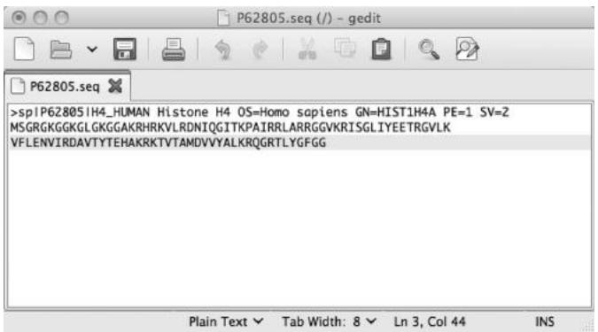  
그림 D.1 gedit 그래픽 사용자 인터페이스. 참고: gedit 인터페이스에 FASTA 형식의 P62805 Uniprot 서열 내용이 표시되어 있습니다.

# D.2.2 예제 유닉스 세션

```bash
mkdir sequences  
cp P62805.seq sequences/P62805-b.seq  
rm P62805.seq  
cd sequences  
ls  
P62805-b.seq 
```

# D.3 명령어들은 무엇을 의미하나요?

P62805.seq 파일은 www.uniprot.org/uniprot/P62805.fasta 에서 검색하여 홈 디렉토리에 저장할 수 있습니다.

섹션 D.2.2의 예제에 표시된 명령들은 터미널의 프롬프트에 입력해야 합니다. 이를 위해 먼저 터미널 세션을 시작해야 합니다.

Q & A: 프롬프트(prompt)가 정확히 무엇인가요?

키보드로 입력한 내용이 나타나는 위치를 프롬프트라고 부릅니다. 종종 커서(cursor, 가끔 깜빡이는 가는 _ 또는 | 기호)로 표시됩니다. 유닉스 프롬프트는 대개 % (Mac OS), $, 또는 > (Linux)와 같은 기호로 표시됩니다. 때때로 프롬프트에는 사용자 이름이나 현재 디렉토리 이름 뒤에 이러한 기호 중 하나가 포함되기도 합니다. 파이썬 셸(1장 참조)에도 프롬프트가 있는데, 바로 >>> 입니다.

# D.3.1 명령줄 셸 시작하기

명령줄 셸을 사용하려면, 먼저 명령을 입력할 수 있는 프롬프트가 표시된 터미널 창을 화면에 열어야 합니다(그림 D.2 참조). 터미널 창은 텍스트 콘솔, 셸 터미널, 셸 콘솔, 텍스트 터미널, 터미널 창 등으로도 불립니다. 이 책에서는 터미널이라고 부르지만 때로는 단순히 셸이라고 부르기도 합니다. 터미널을 시작하는 절차는 운영체제마다 다릅니다. 리눅스에서는 보통 '프로그램' -> '보조 프로그램' 메뉴에서 '터미널' 아이콘을 클릭하거나 Ctrl-Alt-T를 누릅니다. Mac OS X에서는 '응용 프로그램' -> '유틸리티' 디렉토리에서 '터미널' 아이콘을 클릭합니다. 윈도우에서는 '시작' -> '실행' -> 'cmd'를 통해 터미널을 열 수 있습니다. 하지만 윈도우 명령 문법은 유닉스/리눅스와 대부분 다르며 여기서는 설명하지 않습니다. 윈도우 CMD 명령의 전체 목록은 http://ss64.com/nt/ 등을 참조하십시오.

# D.3.2 명령줄 셸 사용하기

이제 컴퓨터 화면에 프롬프트가 표시된 터미널이 열려 있고(그림 D.2 참조), 컴퓨터에 명령을 보내기 위해 무엇을 해야 할지 궁금할 것입니다. 이 질문에 답하기 위해 몇 가지 추가 정보가 필요합니다.

* 그래픽 파일 브라우저와 마찬가지로, 명령 셸은 항상 특정 디렉토리에 위치합니다. 컴퓨터의 모든 파일은 디렉토리 구조에 저장됩니다. 즉, 파일 시스템은 계통수처럼 계층 구조로 배열되어 있습니다(그림 D.3 참조). 계층 구조의 최상단에 있는 디렉토리를 루트(root) 디렉토리라고 부릅니다. 새로운 터미널은 항상 여러분의 홈 디렉토리에서 시작됩니다. 이는 터미널을 시작할 때 프롬프트에 명령을 입력하여 수행하는 작업들이 홈 디렉토리의 파일과 하위 디렉토리에 영향을 미친다는 것을 의미합니다. 단, 다른 디렉토리로 이동하거나 명령이 다른 곳에 위치한 파일이나 디렉토리에 작용하도록 명시적으로 지정한 경우는 제외합니다. 명령을 입력할 때 터미널이 위치한 디렉토리를 현재 작업 디렉토리(current working directory)라고도 부릅니다.   
* 컴퓨터에 명령을 보내려면, 먼저 프롬프트 바로 뒤에 유닉스 명령을 쓰고 둘째로 Return 또는 Enter 키를 눌러야 합니다. 이 두 단계를 모두 수행해야만 작업이 실행됩니다. 명령은 명령 이름과 공백으로 구분된 0개 이상의 인자(arguments)로 구성됩니다. 또한 명령은 명령의 동작을 변경하는 "스위치(switches)"(또는 "옵션(options)")를 가질 수 있습니다. 이들은 명령 이름 뒤에 오며 보통 "-" 기호가 앞에 붙습니다. (박스 D.3도 참조하십시오.)

만약 다음과 같이 입력하고

```bash
ls -l
```

::: {.callout-note}
## 박스 D.3 유닉스 셸의 히스토리 및 자동 완성

위아래 화살표 키를 누르면 콘솔에서 가장 최근에 사용한 명령들을 볼 수 있습니다. 유닉스 셸에서 [Tab] 키는 프로그램 이름과 파일 이름을 자동 완성(autocomplete)하려고 시도합니다. 즉, 명령 이름, 파일 이름, 또는 디렉토리 이름의 시작 부분을 입력하고 [Tab] 키를 누르면 나머지 이름이 자동으로 완성됩니다. 만약 입력한 글자로 시작하는 이름이 둘 이상 있다면 삑 소리가 나며, 이때는 [Tab] 키를 다시 누르기 전에 글자를 더 입력해야 합니다. 일부 버전이나 설정에서는 화면에 입력한 글자로 시작하는 사용 가능한 이름 목록이 나타나기도 합니다. 터미널을 열고 다음과 같이 입력한 후 어떤 일이 일어나는지 확인해 보십시오.

```bash
his[Tab]
```

Return 키를 누르면, 현재 디렉토리의 내용(파일 및 하위 디렉토리)이 상세한(즉, 긴) 목록으로 화면에 표시되는 것을 볼 수 있을 것입니다. 다음 명령도 시도해 보십시오.

```bash
ls
```
차이점이 무엇인가요?

반면에 이제 "a"라고 입력하고 Return 키를 누르면, command not found라는 오류 메시지를 받게 될 것입니다(그림 D.2 참조). 이 이벤트들을 단계별로 분석해 봅시다.

* "ls -l", "ls", 또는 "a"를 입력하기 전, 그리고 프롬프트 뒤에 빈 줄이 있을 때마다 터미널은 입력을 받을 준비가 되어 있습니다.   
* "ls -l", "ls", 또는 "a"를 입력하는 동안에는 컴퓨터의 반응이 없습니다. 실제로 입력을 컴퓨터에 보내기 전까지는 원하는 만큼 많은 문자를 입력할 수 있습니다.   
* Return을 누르면 컴퓨터로부터 피드백을 받습니다. Return 버튼을 누르면 입력한 문자(즉, 여러분의 입력 명령)가 시스템으로 전송됩니다.   
* 피드백은 파일 이름 및/또는 디렉토리 이름 목록이거나 `a: command not found`라는 오류 메시지로 구성됩니다. 후자는 컴퓨터가 "a"를 명령 이름으로 인식하지 못했음을 의미합니다. 이는 여러분이 명령 이름을 알고 있어야 함을 시사합니다. 예를 들어, 이제 여러분은 `ls`가 명령 이름이고 `-l`이 가능한 명령 옵션("스위치")임을 알게 되었습니다.

터미널 창의 프롬프트에 `ls`와 같은 기존 명령 이름을 입력하고 Return 키를 누를 때 무대 뒤에서는 무슨 일이 일어날까요? 컴퓨터에서 프로그램 실행이 시작됩니다. 이 프로그램의 출력은 여러분이 내린 명령으로부터 기대하는 결과가 될 것입니다.

# D.3.3 공통 유닉스 명령어

섹션 D.2.2의 유닉스 세션에는 가장 흔한 유닉스 명령들이 등장합니다. 줄별로 설명된 그들의 목적은 다음과 같습니다.


```bash
mkdir sequences
# sequences라는 이름의 디렉토리를 생성합니다. mkdir은 유닉스 명령이고, sequences는 그 인자입니다.

cp P62805.seq sequences/P62805-b.seq
# 이전에 http://www.uniprot.org/uniprot/P62805.fasta 에서 현재 디렉토리로 다운로드한 P62805.seq 파일을 sequences 하위 디렉토리에 다른 이름(P62805.seq 대신 P62805-b.seq)으로 복사합니다. cp 명령은 두 개의 인자를 필요로 합니다: 첫째는 복사할 파일이고 둘째는 복사될 디렉토리나 파일 이름입니다.

rm P62805.seq
# 현재 작업 디렉토리에서 P62805.seq 파일을 제거합니다. 유닉스에는 삭제 취소(undeleting) 기능이 없으므로 파일은 영원히 손실됩니다!

cd sequences
# 터미널을 sequences 하위 디렉토리로 이동시킵니다 (cd = change directory).

ls
# sequences 디렉토리의 내용을 표시합니다.
```

### 예제 D.2 명령줄에서 BLAST 실행하기

BLAST는 인터넷상에서 실행할 수도 있고 로컬 컴퓨터에서 직접 실행할 수도 있습니다(레시피 11 참조). 로컬에서 BLAST를 실행하면 많은 장점이 있습니다. 예를 들어, 쿼리 서열을 자신만의 단백질 또는 유전자 서열 데이터베이스에 정렬하거나, 특정 조건이 충족될 때만 정렬을 여러 번 수행하도록 자동화할 수 있습니다. 이를 위해서는 먼저 BLAST+ 패키지를 다운로드하여 설치한 다음, 옵션과 인자를 지정하여 셸 명령줄에서 실행해야 합니다. 이 작업을 수행하는 데 필요한 모든 정보는 NCBI에서 제공하는 "Introduction to BLAST" 문서(www.ncbi.nlm.nih.gov/books/NBK1762/)에서 찾을 수 있습니다.

# D.5 스스로 테스트하기

### 연습 문제 D.1 cd 및 ls 명령어 사용하기
콘솔을 열고 바탕화면(Desktop) 폴더로 이동하여 어떤 파일들이 있는지 확인해 보세요. 그 다음 다시 홈 디렉토리로 돌아오세요.

### 연습 문제 D.2 출력 리다이렉션
터미널에서 단 하나의 명령어를 사용하여 바탕화면에 있는 모든 파일의 이름을 담은 텍스트 파일을 만드세요.

### 연습 문제 D.3 grep 사용하기
`/etc/` 폴더 내의 파일 중 여러분의 계정 이름이 포함된 파일이 있는지 찾아보세요.

### 연습 문제 D.4 심화 작업
홈 디렉토리에 `Exercises`라는 작업 디렉토리를 만드세요. 인터넷에서 여러분이 좋아하는 유전자나 단백질 서열 10개를 FASTA 형식으로 다운로드하여 `Exercises` 디렉토리 내의 `my_sequences.fasta` 파일에 차례대로 복사하세요. `grep`과 출력 리다이렉션을 사용하여 이 서열들의 헤더 줄만 골라내어 다른 파일에 저장하세요.

### 연습 문제 D.5 BLAST 실행하기
`my_sequences.fasta`(연습 문제 D.4)에서 단일 서열 레코드(헤더 + 서열)를 복사하여 다른 파일(`query_sequence.seq`)에 저장하세요. `my_sequences.fasta` 파일을 BLAST 데이터베이스로 사용할 수 있도록 포맷팅하세요. 그 다음 `query_sequence.seq`를 포맷팅된 `my_sequences.fasta` 파일에 대해 BLAST 정렬을 수행하세요.

힌트: 레시피 11을 참조하세요.
