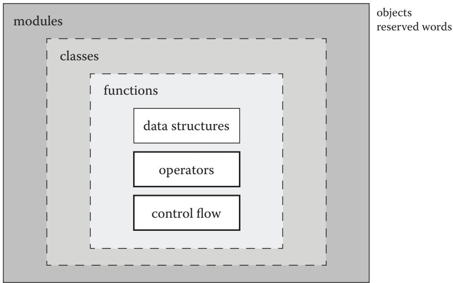
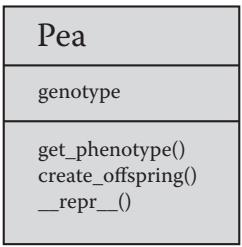
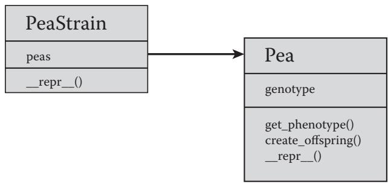
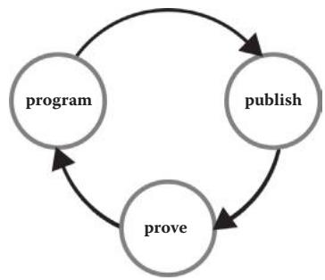
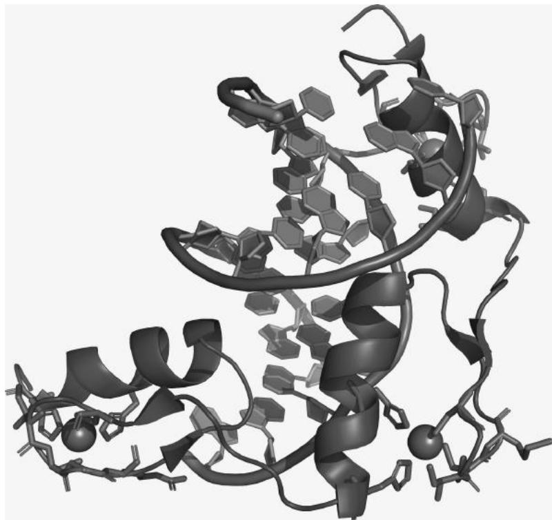
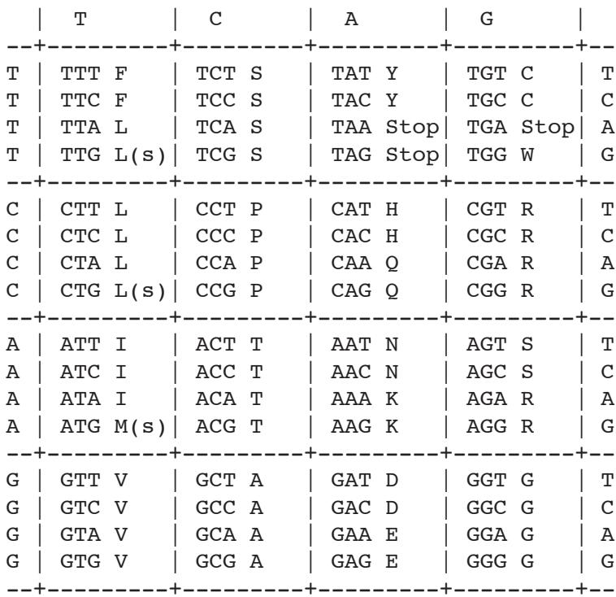
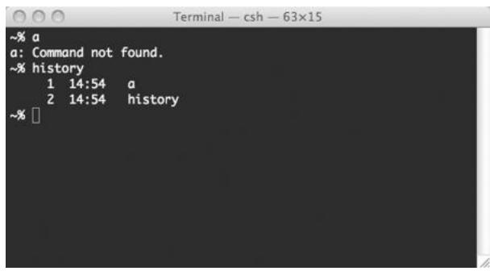
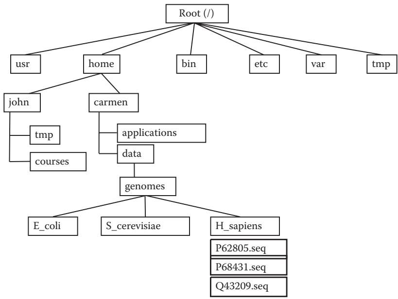

# 파이썬으로 생물학 데이터 관리하기 (Managing Your Biological Data with Python)

N. F. Britton

## 서문 (Preface)

불과 몇 년 전만 해도 프로그래밍(programming)은 계산 과학자들의 전유물에 가까웠습니다. 하지만 이제 프로그래밍은 생물학을 포함한 다른 분야의 전문가들에게도 점점 더 필수적인 능력이 되고 있습니다. 생물학자로서 반드시 전문 프로그래머가 될 필요는 없지만, 수많은 도구 중 하나로 프로그래밍을 활용한다면 여러분의 과학적 탐구에 큰 도움이 될 것입니다. 이미 눈치채셨겠지만, 프로그래밍 기술을 익히면 데이터 관리와 분석 속도를 획기적으로 높일 수 있습니다. 방대한 양의 데이터를 처리하거나, 동일한 분석을 여러 번 반복해야 할 때, 혹은 특이한 형식의 파일을 파싱(parsing)해야 할 때 프로그래밍은 매우 유용합니다. 하지만 컴퓨터 과학(computer science)이라는 분야가 "건조하고" "개념적으로 어렵게"만 느껴져 선뜻 시작하기 망설여질 수도 있습니다. 바로 그런 분들을 위해 이 책을 썼습니다.

우리는 자신의 데이터를 직접 제어하고 싶어 하는 생명과학자들을 위해, 그리고 이를 위해 프로그래밍 학습이 필요한 분들을 위해 이 책을 집필했습니다. 프로그래밍 경험이 없는 생물학자들이 파이썬(Python)을 이용해 스스로 생물학 데이터를 다룰 수 있도록 돕는 것이 이 책의 목표입니다.

서문(Preface)에서는 이 책을 통해 배울 수 있는 내용의 요약과 프로그램(program)에 대한 소개, 그리고 파이썬 프로그래밍 언어(Python programming language)의 개요를 다룹니다.

생물학자의 요구에 맞게 구성된 이 책이 여러분의 데이터 분석을 돕고, 나아가 더 가치 있는 과학적 발견을 하는 데 기여할 수 있기를 바랍니다.

# 파이썬은 배우기 쉽습니다 (Python Is Simple to Learn)

프로그램은 C, C++, 포트란(Fortran), 펄(Perl), 자바(Java), 파스칼(Pascal) 등 다양한 프로그래밍 언어(programming language) 중 하나로 작성할 수 있습니다. 모든 프로그래밍 언어에는 고유한 규칙과 키워드(문법, Syntax), 그리고 의미론(meaning)이 있습니다. 파이썬의 핵심적인 장점은 코드(code)를 읽기가 매우 쉽다는 것입니다. 코드는 인간이 이해하기 쉬울 수도 있고 어려울 수도 있는데, 예를 들어 파이썬의 다음 명령은

print('ACGT')

는 상당히 직관적이지만(컴퓨터가 화면에 ACGT라는 텍스트를 출력함), 다음과 같은 펄(Perl) 명령은

$cmd = "imgcvt -i $intype -o $outtype $old.$num";

덜 직관적입니다. 파이썬은 다른 프로그래밍 언어에 비해 상대적으로 영어와 유사하며 매우 단순한 문법을 가지고 있습니다. 우리는 이러한 점이 생물학자들이 파이썬을 배우기 쉽게 만든다고 생각합니다.

### 파이썬은 고수준 프로그래밍 언어입니다

파이썬은 매우 복잡한 작업도 수행할 수 있습니다. 트리(tree)나 네트워크(network)와 같은 복잡한 데이터 유형을 표현할 수 있고, 파이썬 내부에서 다른 프로그램(예: 생물정보학 애플리케이션)을 실행하거나 웹 페이지를 다운로드할 수도 있습니다. 또한 프로그램 내에서 오류를 감지하고 처리하는 도구도 갖추고 있습니다. 마지막으로, 파이썬은 특정 용도에만 최적화된 언어가 아닙니다. 따라서 몇 줄의 소스 코드(source code)만으로 다른 프로그램, 웹 서비스, 데이터베이스를 연결하여 맞춤형 과학 파이프라인(pipeline)을 구축하는 데 매우 적합합니다.

### 파이썬은 인터프리터 언어입니다

일부 프로그래밍 언어는 인터프리터(interpreted) 방식이고, 일부는 컴파일(compiled) 방식입니다. 컴퓨터가 프로그램을 실행하려면 명령어를 이진 기계어(binary machine code)로 번역해야 하는데, 이는 숙련된 프로그래머조차 읽기 어려운 형태입니다. 인터프리터 언어에서는 각 줄이 하나씩 차례로 번역되고 실행됩니다. 반면 컴파일 언어에서는 먼저 프로그램 전체를 번역한 후에만 실행됩니다. 일반적으로 컴파일 언어의 실행 속도가 인터프리터 언어보다 훨씬 빠르지만, 코드를 수정할 때마다 매번 프로그램을 컴파일해야 합니다. 인터프리터 언어인 파이썬을 사용하면 수정 사항의 결과를 즉시 확인할 수 있으며, 결과적으로 프로그램을 더 빠르게 작성할 수 있습니다. 따라서 우리는 입문자에게 파이썬과 같은 인터프리터 언어가 훨씬 배우기 쉽다고 생각합니다.

### 파이썬은 객체 지향 언어입니다

파이썬에서 모든 것은 객체(Object)입니다. 객체는 데이터와 명령어를 나타내는 독립적인 프로그램 구성 요소입니다. 객체를 사용하면 데이터를 유용한 기능과 연결할 수 있습니다(예: DNA 서열 데이터를 담고 있으면서 동시에 그 서열을 전사하거나 번역하는 함수를 가진 '서열 객체'를 가질 수 있습니다). 객체는 복잡한 프로그램의 구조를 잡는 데 도움을 주며, 프로그램 구성 요소를 재사용할 수 있게 해줍니다.

수많은 개발자가 파이썬 라이브러리(library)를 통해 재사용 가능한 객체들을 공개해 두었습니다. 예를 들어, 바이오파이썬(Biopython)을 사용하면 단 두 줄의 코드로 FASTA 서열 파일을 읽고 파싱(parsing)할 수 있습니다. 라이브러리가 없다면 프로그래밍 언어에 따라 10줄에서 30줄 정도를 직접 작성해야 했을 것입니다. 따라서 파이썬의 객체 지향 특성은 여러분이 짧은 프로그램을 작성하는 데 큰 도움이 됩니다.

결론적으로, 우리는 프로그래밍을 통해 생물학 데이터를 실용적으로 관리하고, 생물학적 문제를 해결하며, 과학적 발견의 지평을 넓히고자 하는 분들에게 파이썬이 이상적인 언어라고 믿습니다. 우리가 이 책을 쓰며 즐거웠던 만큼 여러분도 이 책을 즐겁게 활용하시길 바랍니다!

## 코드 다운로드 (Code Downloads)

이 책에 제시된 모든 코드 예제는 온라인 https://bitbucket.org/krother/python-for-biologists 의 "Source" 링크에서 확인할 수 있습니다.

## 감사의 글 (Acknowledgements)

지난 7년 동안 파이썬 강의를 통해 만났던 학생들과 교육생들에게 감사의 인사를 전합니다. 여러분의 질문과 문제 제기, 그리고 아이디어들이 이 책을 집필하는 데 가장 큰 영감이 되었습니다. 일일이 이름을 다 거론할 수는 없지만, 여러분의 열정과 활기, 때로는 좌절과 성공을 통해 우리가 많은 것을 배웠다는 점을 알아주셨으면 합니다.

특별히 포르투갈 굴벤키안 연구소(Gulbenkian Institute)에서 기존 자료들을 5일 코스로 압축하여 강의할 기회를 주신 코스 기획자 Pedro Fernandes에게 감사를 표합니다. 이 책의 핵심적인 질문들 중 많은 부분이 그 강의와 Astrolabio에서의 저녁 식사 후 토론 중에 정립되었습니다.

또한 Janusz M. Bujnicki, Artur Jarmolowski, Jakub Nowak, Edward Jenkins, Amelie Anglade, Janick Mathys, Victoria Schneider에게도 다양한 파이썬 교육 기회를 제공해 주신 점에 대해 감사를 드립니다.

6장과 14장의 기반이 된 RNA-Seq 출력 파서와 NGS 파이프라인 제작에 도움을 준 Francesco Cicconardi에게도 깊은 감사를 드립니다. 그는 전형적인 NGS 파이프라인을 제안해 주었을 뿐만 아니라, 코드를 제공하고 문제에 대한 생물학적/계산적 논의가 정확하고 포괄적인지 검증해 주었습니다.

예제와 건설적인 피드백을 제공해 준 Justyna Wojtczak, Katarzyna Potrzebowska, Wojciech Potrzebowski, Kaja Milanowska, Tomasz Puton, Joanna Kasprzak, Anna Philips, Teresa Szczepinska, Peter Cock, Bartosz Telenczuk, Patrick Yannul, Gavin Huttley, Rob Knight, Barbara Uszczynska, Fabrizio Ferre’, Markus Rother, Magdalena Rother에게도 감사의 인사를 전합니다.

마지막으로, 책을 기획하는 과정에서의 토론과 표지 완성에 결정적인 도움을 준 Alba Lepore에게 큰 감사를 드립니다.

## 서론 (INTRODUCTION)

2010년 폴란드 카르파치(Karpacz)에서 열린 'Python and Friends Conference' 기간 중 산 정상에 올랐던 용감한 네 명의 파이썬 수습생들에게 이 글을 바칩니다.

높은 산에 오르고 싶을 때 여러분은 어떻게 하시나요? 만약 등산 전문가라면 장비를 챙기고 동료들을 불러 모아 산을 선택한 뒤 출발할 것입니다. 전문 등반가들의 이야기에서 그들은 로프, 갈고리, 산소통을 사용하고, 때로는 맨손만으로 산을 타기도 합니다. 그들은 해발 4,000미터 이상의 고도에서 몰아치는 얼음 폭풍과 싸우고, 여러 캠프에 흩어진 대규모 팀을 조율하며, 정상 근처의 죽음의 지대에서 살아남습니다.

하지만 등산에 관심 있는 초보자라면 어떨까요? 당장 산소통을 짊어지고 출발해야 할까요? 아닙니다. 대신 아마도 쉬운 산부터 시작할 것입니다. 정상까지 안전하고 명확하게 표시된 길이 있는 산들이 있습니다. 지도 한 장과 등산화 한 켤레만 있으면 충분합니다. 그럼에도 불구하고 그런 산 정상에서 바라보는 풍경 또한 숨이 막힐 정도로 아름다울 수 있습니다.

프로그래밍도 이와 매우 비슷합니다. 프로그래밍을 배우는 생물학자로서 여러분에게는 화려한 장비나 방대한 이론적 지식이 필요하지 않습니다. 단순한 프로그램이라도 여러분의 데이터를 정복하는 강력한 도구가 될 수 있습니다. 많은 프로그래밍 작업은 제대로 작동하는 코드 조각들을 수집하고, 그것들을 조립하고 수정하는 것만으로도 가능합니다. 그 결과물이 컴퓨터 과학자가 쓴 프로그램만큼 우아하지는 않을지라도, 문제를 빠르게 해결해 줄 것입니다. 바로 여러분의 문제를 말이죠.

우리는 이 책이 여러분이 매일 겪는 데이터 관리라는 산을 오르는 데 도움이 되는 지도가 되길 바랍니다. 전문 소프트웨어 개발자가 되기 전에 프로그래밍이 여러분의 삶을 더 편하게 만들어 주기를 원합니다.

첫 번째 파트에서는 파이썬 프로그래밍 언어의 첫걸음을 떼어보겠습니다. 파이썬의 명령어는 매우 직관적이고 영어와 유사하여, 대부분의 지침을 배우고 기억하는 데 큰 노력이 필요하지 않다는 것을 알게 될 것입니다. 예를 들어, 서열의 길이를 계산하고 싶다면 `len('MALWMRLLPLLALLALWGPDPAA…')`라고 입력하기만 하면 됩니다. 1부의 두 개 장은 파이썬 문법이 얼마나 단순한지 보여줄 뿐만 아니라, 이 언어의 영리한 구조를 느끼게 해주는 데 목적이 있습니다. 파이썬은 기본적으로 서로 연결할 수 있는 일련의 모듈(Module, 프로그래밍 지침이 기록된 파일)들로 구성되어 있습니다.

독일어 같은 새로운 외국어를 배울 때, 텍스트를 읽으면서 각 단어의 성격, 역할, 위치를 분석하는 것부터 시작할 수 있습니다. 많은 텍스트를 읽고 분석한 후에는 언어의 규칙을 추출하고 자신만의 글을 쓸 수 있게 됩니다. 또는 명사, 동사, 형용사 등 어떤 종류의 객체 카테고리가 언어를 구성하는지, 그리고 그들 사이의 연결 고리(예: 전치사나 격)를 먼저 배운 다음, 좋은 사전과 함께 언어의 구조를 활용하여 글을 쓸 수도 있습니다. 이 책의 이 부분에서 여러분은 파이썬이 기본적으로 영어 또는 독일어와 같은 또 다른 언어라는 점을 파악하기 시작할 것입니다. 실제로 파이썬은 문장을 형성하기 위해 서로 연결할 수 있는 제한된 수의 객체 유형(명사, 동사 등)으로 구성되어 있습니다. 이 책에서는 분석하고 시도해 볼 수 있는 코드 예제와 언어 객체 카테고리에 대한 설명을 교차 제시함으로써, 앞서 설명한 독일어 학습의 두 가지 접근 방식을 혼합합니다. 각 카테고리에 어떤 특정 객체들이 속하는지 알려주기 위해, 파이썬은 '파이썬 표준 라이브러리(Python Standard Library, http://docs.python.org/2/library/)'라는 아주 훌륭한 온라인 사전을 제공합니다. 여기서 단일 단어의 의미를 찾아볼 수 있습니다. 일단 언어의 구조가 명확해지고 다양한 객체 카테고리를 자유롭게 다룰 수 있게 되면 거의 다 된 것입니다. 그 단계에서는 어휘를 늘리거나 사전을 효율적으로 사용함으로써 언어 지식을 향상시킬 수 있습니다. 학습의 마지막 단계는 프로그램의 좋은 설계(design)와 관련이 있습니다. 이는 일반적으로 좋은 습관이며, 나중에 큰 프로그램을 작성하거나 다른 프로그래머와 효율적으로 협업하고, 미래에 자신이나 타인의 프로그램을 유지보수/확장하거나, 전문가가 되고 싶을 때 매우 유용할 수 있습니다. 하지만 이 책에 제시된 과업을 완수하는 데 절대적으로 필수적인 것은 아닙니다. 어쨌든 책의 2부에서 좋은 프로그램을 작성하는 방법에 대한 많은 제안을 제공할 것입니다.

1장에서는 간단한 명령어를 입력할 수 있는 파이썬 셸(Python shell) 사용법을 배웁니다. 가장 단순한 연산은 휴대용 계산기와 비슷합니다. 예를 들어 파이썬 셸을 사용하면 `>>>`와 같은 프롬프트(prompt)를 볼 수 있습니다. 프롬프트 오른쪽에 간단한 수학 연산을 입력하고 엔터 키를 누르면,

>>> 1 + 1

즉시 결과값 2를 얻게 됩니다. 또한 데이터를 저장하는 방법인 변수(variable)도 만나게 될 것입니다. 숫자로 계산을 수행하고, 제곱근이나 로그와 같은 추가 기능을 제공하는 수학 모듈을 가져와 사용하는 방법을 배웁니다. 2장에서는 여러분의 첫 번째 파이썬 프로그램을 작성해 보겠습니다. 그 프로그램은 단백질 서열 내의 아미노산을 세는 프로그램이 될 것입니다. 이를 위해 텍스트를 저장하는 데이터 구조인 문자열(string)이 필요합니다. 또한 같은 줄을 반복해서 쓰는 대신 지침을 자동으로 반복하기 위해 제어 흐름(control flow) 구조를 사용할 것입니다. 1부가 끝날 때쯤이면 여러분은 파이썬 언어의 기본적인 부분들을 대부분 알게 될 것입니다.

## 파이썬 셸 (The Python Shell)

학습 목표: 파이썬을 과학 계산기처럼 사용할 수 있습니다.

### 1.1 이 장에서 배울 내용

* 파이썬 셸을 과학 계산기처럼 사용하는 방법
* ATP 가수분해의 ΔG 계산 방법
* 두 지점 사이의 거리 계산 방법
* 자신만의 파이썬 모듈을 만드는 방법

### 1.2 스토리: ATP 가수분해의 ΔG 계산하기

### 1.2.1 문제 설명

$$
\mathrm {A T P} \rightarrow \mathrm {A D P} + \mathrm {P} _ {\mathrm {i}}
$$

ATP에서 하나의 인산디에스테르 결합이 가수분해되면 표준 깁스 에너지($( \Delta \mathsf { G } ^ { 0 } )$)인 $- 3 0 . 5 \mathrm { k J } / \mathrm { m o l }$이 발생합니다. 생화학 교과서에 따르면, 실제 $\Delta G$ 값은 화합물의 농도에 따라 달라집니다. 그리고 이러한 농도는 조직마다 상당히 다를 수 있습니다(Berg 등의 자료에 따른 표 1.1 참조).

표 1.1 서로 다른 조직에서의 화합물 농도

<table><tr><td>조직 (Tissue)</td><td>[ATP] [mM]</td><td>[ADP] [mM]</td><td>[Pi][mM]</td></tr><tr><td>간 (Liver)</td><td>3.5</td><td>1.8</td><td>5.0</td></tr><tr><td>근육 (Muscle)</td><td>8.0</td><td>0.9</td><td>8.0</td></tr><tr><td>뇌 (Brain)</td><td>2.6</td><td>0.7</td><td>2.7</td></tr></table>

ATP 가수분해의 실제 ΔG 값은 어떻게 계산할 수 있을까요? 화합물 농도의 함수로서의 깁스 에너지는 다음과 같이 쓸 수 있습니다.

$$
\Delta G = \Delta G ^ {0} + R T * \ln ([ A D P ] * [ P _ {i} ] / [ A T P ])
$$

여러분은 휴대용 계산기, 윈도우 계산기 앱, 혹은 스마트폰 등 여러 도구를 사용하여 표의 값들을 이 방정식에 대입할 수 있습니다. 이 책에서는 계산과 데이터 관리를 위한 훨씬 더 효율적이고 강력한 도구인 파이썬 프로그래밍 언어를 배우게 될 것입니다.

파이썬을 사용하면 대화형 파이썬 인터프리터(그림 1.1 참조)에서 간 조직에 대한 계산을 수행할 수 있습니다. `>>>` 프롬프트는 명령어를 입력할 수 있는 위치를 나타내며, 파이썬 대화형 세션을 시작할 때 나타납니다(섹션 1.3.1 참조). 파이썬 명령어는 반드시 프롬프트의 바로 오른쪽에 입력해야 합니다.

  
그림 1.1 파이썬 셸. 참고: 실행하려면 UNIX 터미널 쉘(UNIX/Linux 또는 Mac OS X) 프롬프트에서 "python"을 입력하거나, 윈도우의 프로그램 메뉴에서 'Python (command line)'을 시작해야 합니다.

### 1.2.2 예제 파이썬 세션 (Example Python Session)

>>> ATP = 3.5
>>> ADP = 1.8
>>> Pi = 5.0
>>> R = 0.00831
>>> T = 298
>>> deltaG0 = -30.5
>>> import math
>>> deltaG0 + R * T * math.log(ADP * Pi / ATP)
-28.161154161098693

출처: A.Via/K.Rother가 파이썬 라이선스 하에 공개한 코드를 수정함.

### 1.3 명령어들은 무엇을 의미하나요?

프로그래밍에서 여러분이 하는 일의 대부분은 크게 다섯 가지로 요약할 수 있습니다. 데이터 정리, 다른 프로그램 사용, 수치 계산, 그리고 데이터 읽기와 쓰기입니다. 앞서 살펴본 예제에는 이 중 세 가지가 포함되어 있습니다. 첫째, ΔG 공식의 매개변수들을 변수(Variable)에 저장하여 정리합니다. 변수는 같은 숫자를 반복해서 쓰지 않도록 도와주는 컨테이너와 같습니다. 둘째, 로그를 계산하기 위해 외부 프로그램을 사용합니다. `math.log(x)` 함수는 x의 로그값을 계산하며, `import` 문을 통해 접근할 수 있습니다. `import` 문은 프로그램을 다른 모듈(Module, 예제에서는 math)에 연결하여 추가적인 파이썬 함수를 사용할 수 있게 해줍니다. 모듈은 변수, 함수 및 기타 유용한 객체들을 모아놓은 프로그래밍 단위로, 항상 파일에 저장됩니다. `import` 문과 파이썬 모듈에 대한 자세한 내용은 박스 1.1을 참조하세요.

마지막으로, 섹션 1.2.2의 예제는 ΔG 값을 계산합니다. 단순한 산술 계산은 휴대용 계산기를 사용하는 것과 매우 비슷합니다. 이 책의 2부에서는 데이터를 조작하는 다른 방법들을 다룹니다. 여러분이 직접 해볼 수 있는 첫 번째 일은 앞 섹션의 계산을 시작해 보는 것입니다.


::: {.callout-note}
## 박스 1.1 import 문과 모듈의 개념

다음과 같이 코드를 작성하면

>>> import math

여러분은 `math` 모듈에 연결하게 됩니다. `math`란 정확히 무엇일까요? `math`는 여러분의 컴퓨터에 있는 파일입니다. 실제 이름은 `math.py`입니다. `.py` 확장자는 파이썬(Python)을 의미하며, 이 파일에는 변수와 함수의 정의, 그리고 계산을 위한 명령어와 같은 파이썬 지침들이 들어 있습니다. 특히 `math.py` 파일에는 수학 함수(예: `sqrt()`, `log()` 등)의 정의와 계산을 위한 명령어가 포함되어 있습니다.

파이썬에서 파이썬 명령어를 포함하는 텍스트 파일을 모듈(Module)이라고 부릅니다. 외부 모듈에 접근하여 그 내용을 읽으려면 `import` 명령어가 필요합니다. 이런 방식으로 모듈에 있는 모든 정의를 사용할 수 있게 되며, 결과적으로 코드를 공유하고 여러 프로그램에서 재사용할 수 있습니다.

`math` 모듈에 어떤 수학 함수들이 정의되어 있는지 어떻게 알 수 있을까요? 인터넷을 검색하여 `math.py` 파일을 직접 열어 내용을 확인하거나, 다음 명령어를 사용할 수 있습니다.

>>> import math
>>> dir(math)

`dir(math)` 명령어는 `math` 모듈을 가져온 후에만 사용할 수 있습니다. 그렇지 않으면 `dir()` 함수가 인자가 무엇인지 알 수 없습니다. 결과적으로 `math` 모듈에 있는 변수와 함수의 전체 목록을 보게 될 것입니다.

['__doc__', ' _name _package__', 'acos', 'acosh', 'asin', 'asinh', 'atan', 'atan2', 'atanh', 'ceil', 'copysign', 'cos', 'cosh', 'degrees', 'e', 'exp', 'fabs', 'factorial', 'floor', 'fmod', 'frexp', 'fsum', 'hypot', 'isinf', 'isnan', 'ldexp', 'log', 'log10', 'log1p', 'modf', 'pi', 'pow', 'radians', 'sin', 'sinh', 'sqrt', 'tan', 'tanh', 'trunc']

예를 들어 다음과 같이 입력하면 각 함수에 대한 짧은 설명을 얻을 수 있습니다.

>>> help(math.sqrt)

:::

### 1.3.1 컴퓨터에서 예제 실행하기

파이썬 프로그래밍 언어는 사용하기 전에 먼저 실행해야 하는 프로그램입니다. 리눅스(Ubuntu)와 맥 OS X에는 파이썬이 이미 설치되어 있으며, 텍스트 콘솔의 명령줄 프롬프트에서 "python"을 입력하여 시작할 수 있습니다. 텍스트 터미널에서 프로그램을 실행하는 방법은 부록 D를 참조하세요. 윈도우에서는 먼저 파이썬을 설치한 다음, '시작' -> '모든 프로그램' -> 'Python' -> 'IDLE' 또는 'Python (command line)'을 실행하여 파이썬 셸 창을 열어야 합니다. 먼저 www.python.org 에서 파이썬 3.10 이상의 버전을 다운로드하여 설치하세요. 자세한 내용은 박스 1.2를 참조하세요. 화면의 텍스트 창에 `>>>` 표시가 나타나면 성공입니다. 이제 프로그램 코드를 작성할 준비가 되었습니다(그림 1.1 참조). 파이썬 셸은 `Ctrl+D`를 눌러 종료할 수 있습니다.


::: {.callout-note}
## 박스 1.2 파이썬 설치 방법

리눅스와 맥 OS X에는 파이썬이 이미 설치되어 있습니다. 드문 경우지만 설치되어 있지 않다면 패키지 관리자를 이용하거나 터미널에 다음과 같이 입력하여 최신 버전을 설치할 수 있습니다.

sudo apt-get install python

윈도우에서는 www.python.org 에서 파이썬 윈도우 설치 프로그램을 다운로드해야 합니다. 반드시 파이썬 3.x 버전을 다운로드하세요. 설치 과정은 대부분의 프로그램과 마찬가지로 기본 옵션을 수락하며 클릭하면 됩니다.

설치가 성공적인지 확인하려면 파이썬을 실행해 보세요. 파이썬 코드를 실행하는 방법은 두 가지가 있습니다.

1. 대화형 모드(interactive mode, 파이썬 셸) 사용: 리눅스와 맥 OS X에서는 텍스트 콘솔에서 "python"을 입력하고 엔터를 누릅니다. 윈도우에서는 '시작' -> '프로그램' -> 'Python' -> 'Python (command line)'을 선택합니다. 별도의 창에서 파이썬 셸이 시작됩니다. 또는 '시작' -> '실행' 대화상자에서 "cmd"를 입력하여 텍스트 콘솔을 열고, 파이썬이 설치된 디렉토리로 이동하여 "python"을 입력할 수도 있습니다. `>>>` 프롬프트가 보이면 설치에 성공한 것입니다.

2. `.py` 확장자를 가진 스크립트 파일(예: `my_script.py`)에 코드를 작성하고, 터미널 프롬프트에서 다음과 같이 입력하여 실행하기:

python my_script.py

섹션 2.3.1 "프로그램 실행 방법"도 참조하세요.

:::

## 파이썬 셸 (The Python Shell)

대화형 모드는 학습과 코드 조각을 테스트하는 데 이상적입니다. 각 명령어가 작성되는 즉시 직접 실행됩니다. `>>>` 표시 뒤에 지침을 작성하고 엔터를 눌러 확인할 수 있습니다.

>>> ATP = 3.5
>>> ATP
3.5

대화형 모드를 수치 계산에 사용할 수 있습니다.

```txt
>>> 3 * 4
12
>>> 12.5 / 0.5
25.0
>>> (12.5 / 0.5) * 100
2500.0
>>> 3 ** 4
81
>>> 3 ** (4 + 2)
729
```

파이썬 셸의 단점은 세션을 종료하면(`Ctrl+D`) 작성한 코드가 사라진다는 점입니다. 따라서 코드를 저장하려면 텍스트 편집기에 복사하여 붙여넣어야 합니다. 텍스트 편집기에 대한 설명은 박스 2.2와 박스 D.2에 있습니다. 코드를 저장하기 위해서는 파일에 직접 파이썬 지침을 작성하는 것이 더 편리합니다. 예제 1.1이나 2장을 참조하세요.

무언가 잘못되면 파이썬은 오류 메시지를 반환하며, 그 내용은 오류 유형에 따라 다릅니다. 예를 들어 명령어를 잘못 입력하여 `import math` 대신 다음과 같이 쓰면

```txt
>>> imprtmath
```

"SyntaxError: invalid syntax"라는 메시지와 함께 오류를 수정하는 데 도움이 되는 추가 정보가 나타납니다. 발생할 수 있는 오류와 관리 방법은 12장에 설명되어 있습니다. 프로그래밍에서 실수를 하는 것은 매우 자연스러운 일입니다.

### 1.3.2 변수 (Variables)

섹션 1.2.2에서는 여러 변수가 초기에 정의되었습니다. 즉, 계산에 사용될 값들이 이름이 붙은 컨테이너에 담겼습니다.

예를 들어 다음과 같이 작성하면

>>> ATP = 3.5

컴퓨터는 3.5라는 숫자를 `ATP`라는 이름으로 기억합니다. 나중에 다음과 같이 입력하면

```txt
>>> ATP
```

컴퓨터가 3.5라는 값을 출력합니다.

같은 방식으로 사용된 모든 숫자(1.8, 5.0, 0.00831, 298, -30.5)가 각각의 변수(ADP, Pi, R, T, deltaG0)에 기록됩니다. 모든 숫자에는 단위가 없다는 점에 유의하세요. 휴대용 계산기를 사용할 때와 마찬가지로 단위를 적절히 변환해야 합니다. 이것이 기체 상수 $R \ ( 8 . 3 1 \ J / \mathrm { k m o l } )$에 대해

```txt
>>> R = 0.00831
```

이라는 값을 사용한 이유입니다. 이는 $\Delta \mathrm { G } ^ { 0 }$의 단위(kJ/kmol)와 일치시키기 위함입니다. 계산기를 쓸 때와 마찬가지로, 숫자를 적절한 단위로 변환하는 책임은 여러분에게 있습니다.

모든 종류의 객체를 변수에 저장할 수 있습니다. 즉, 데이터 조각에 이름을 붙여 "라벨"을 붙일 수 있으며, 데이터가 필요할 때마다 전체 데이터를 다시 쓰는 대신 변수 이름만 사용하면 됩니다. 데이터가 복잡하고 자주 사용될수록(예: 전체 유전자의 뉴클레오타이드 서열) 그 자리에 변수 이름을 사용하는 것이 더 편리합니다.

따라서 ATP 가수분해의 깁스 에너지 값인

$$
\Delta G ^ {0} = - 3 0. 5 \mathrm {k J / m o l}
$$

을 여러 번 사용하고 싶다면, 이를 변수에 넣고 숫자 대신 변수 이름을 사용하는 것이 좋습니다.

객체를 변수 이름에 할당하는 데 사용되는 연산자는 등호(`=`)입니다.

```txt
>>> deltag = -30.5
```

파이썬은 정수(Integer)와 부동 소수점(Float) 숫자를 구분합니다.

```txt
>>> a = 3
>>> b = 3.0
```

파이썬 용어로, 두 변수 `a`와 `b`는 서로 다른 데이터 유형(data type)을 가졌다고 말합니다. 변수 `a`는 정수이고, `b`는 부동 소수점입니다. 이 차이는 이 숫자들을 다른 정수로 나눌 때 확인할 수 있습니다.

```txt
>>> a / 2
1 # (참고: 파이썬 3에서는 1.5가 출력되지만, // 연산자를 쓰면 1이 됩니다)
>>> b / 2
1.5
```

정수를 부동 소수점으로 나누어 강제로 부동 소수점 변환을 수행할 수 있습니다.

```txt
>>> a / 2.0
1.5
```

변수에는 숫자, 텍스트 및 기타 다양한 종류의 데이터를 할당할 수 있습니다. 더 일반적으로는 이러한 데이터를 파이썬 객체(Object)라고 부릅니다. 다음 예제에서는 부동 소수점 객체를 변수에 할당합니다.

```txt
>>> deltag = -30.5
```

기존 변수 이름에 새 값을 할당하면 두 번째 값이 첫 번째 값을 덮어씁니다. 즉,

```txt
>>> deltag = -28.16
```

으로 설정하면 `deltag`는 이제 -30.5가 아니라 -28.16이 됩니다. 이후의 장들에서 더 많은 데이터 유형을 만나게 될 것입니다.

변수 이름을 선택할 때는 몇 가지 규칙이 있습니다.

* 일부 단어는 파이썬에서 특별한 의미를 갖기 때문에 변수 이름으로 사용할 수 없습니다. 예를 들어 `import`는 변수 이름으로 사용할 수 없습니다. 예약어(reserved word)의 전체 목록은 박스 1.3을 참조하세요.
* 변수 이름의 첫 글자는 숫자가 될 수 없습니다.
* 변수 이름은 대소문자를 구분합니다. 따라서 `var`와 `Var`는 서로 다른 이름입니다.
* 대부분의 특수 문자(예: $ % @ / \ . , [ ] ( ) { } #)는 허용되지 않습니다.


::: {.callout-note}
## 박스 1.3 파이썬의 예약어

파이썬의 예약어는 파이썬 내부에서 특별한 의미를 갖기 때문에 변수 이름으로 사용할 수 없습니다. 예를 들어 `and`, `assert`, `break`, `class`, `continue`, `def`, `del`, `elif`, `else`, `except`, `exec`, `finally`, `for`, `from`, `global`, `if`, `import`, `in`, `is`, `lambda`, `not`, `or`, `pass`, `print`, `raise`, `return`, `try`, `while` 등이 있습니다.

Q & A: 변수 이름에 대문자와 소문자를 섞어 써도 상관없나요?

다음 코드를 시도해 보세요.

>>> ATP = 3.5
>>> atp = 8.0
>>> ATP

마지막 명령어의 결과는 8.0이 아니라 3.5입니다. 파이썬의 일반적인 규칙에 따라, 변수 이름을 지을 때 대문자와 소문자는 서로 다르게 취급됩니다.

Q & A: 변수를 처음 사용하면 어떤 일이 일어나나요?

일부 프로그래밍 언어에서는 사용하려는 모든 변수를 미리 나열하고 메모리를 명시적으로 예약해야 합니다. 하지만 파이썬에서는 그럴 필요가 없습니다. 파이썬 인터프리터는 모든 것을 객체로 취급합니다. 즉, 여러분이 새로운 변수 이름을 사용할 때마다 파이썬은 데이터의 성격(정수, 부동 소수점, 텍스트 등)을 인식하고 그에 맞는 메모리를 예약합니다. 또한 파이썬은 변수 유형에 따라 사용할 수 있는 기능 목록을 자동으로 연결합니다. 예를 들어, 앞에서 정의한 수치 변수 `a`와 `b`는 더하기, 빼기, 곱하기 등 표 1.2에 표시된 모든 산술 연산을 수행할 수 있다는 것을 "알고" 있습니다.

표 1.2 파이썬의 산술 연산

<table><tr><td>연산자</td><td>의미</td></tr><tr><td>a + b</td><td>더하기</td></tr><tr><td>a - b</td><td>빼기</td></tr><tr><td>a * b</td><td>곱하기</td></tr><tr><td>a / b</td><td>나누기</td></tr><tr><td>a ** b</td><td>거듭제곱 (a^b)</td></tr><tr><td>a % b</td><td>나머지 (modulo): a / b 나눗셈의 나머지</td></tr><tr><td>a // b</td><td>몫 (floor division): 소수점 이하를 버림</td></tr><tr><td>a * (b + c)</td><td>괄호: 곱셈보다 b + c 연산을 먼저 수행함</td></tr></table>

:::

### 1.3.3 모듈 가져오기 (Importing Modules)

변수를 정의한 후, 섹션 1.2.2의 파이썬 세션에서 다음 명령어는 수학 함수가 포함된 모듈을 가져옵니다. 파이썬에서 `import`는 설치된 외부 라이브러리나 개별 변수 및 함수를 활성화하는 명령어입니다. `math`는 파이썬과 함께 자동으로 설치되는 라이브러리 모듈의 이름입니다. 다음과 같이 활성화합니다.

```txt
>>> import math
```

이 장에서는 로그를 계산하기 위해 `math` 모듈의 `log` 함수를 사용하고 있습니다. `math`에서 사용할 수 있는 전체 함수 목록은 http://docs.python.org/2/library/math.html 을 참조하거나 파이썬 셸에서 다음을 입력하세요.

```txt
>>> dir(math)
```

모든 모듈은 함수와 변수를 포함할 수 있습니다. 모듈은 코드를 재사용하고, 큰 프로그램을 작은 부분으로 나누어 더 잘 조직하기 위해 사용됩니다. 예를 들어 기체 상수 $R$과 같은 상수가 필요할 때마다 매번 다시 정의하지 않고 해당 모듈에서 가져올 수 있습니다. 파이썬 표준 라이브러리에 모여 있는 모듈들은 기본적으로 다른 사람들이 여러분을 위해 미리 작성하고 최적화해 놓은 추가 함수들입니다.

파이썬은 `import` 명령어를 통해 수백 개의 모듈(즉, 함수들의 집합)을 사용할 수 있게 해줍니다. 게다가 파이썬 지침을 텍스트 파일에 쓰고 `.py` 확장자로 저장함으로써 여러분만의 모듈을 직접 만들 수도 있습니다(예제 1.2 참조). 모듈에 대해서는 이 책의 3부에서 더 자세히 다룰 것입니다.

`math` 모듈의 로그 함수를 사용하기 위해 우리는 `math.log`라는 표기법을 사용했습니다. 모듈 이름과 함수 이름 사이의 점(`.`)은 파이썬에서 매우 특별한 역할을 합니다. 점은 객체들 사이의 "연결자"입니다. 점의 오른쪽에 있는 객체는 왼쪽 객체의 속성(attribute)이라고 말합니다. 따라서

```txt
>>> math.log
```

는 `log` 객체(함수)가 `math` 객체(모듈)의 속성임을 의미합니다. 즉, `log`는 `math` 모듈의 일부이며, 모듈을 가져온 후에 이를 사용하려면 점 구문(dot syntax)을 사용하여 참조해야 합니다. 이는 파이썬의 모든 것에 해당됩니다. 객체 A가 객체 B를 포함하고 있다면 이를 사용하기 위한 구문은 `A.B`입니다. 만약 B가 C를 포함하고 있다면 `A.B.C`라고 쓸 수 있습니다.

모듈에서 특정 객체만 선택적으로 가져올 수도 있습니다. 즉, 모듈의 전체 내용 대신 단일 객체나 몇 개의 객체만 가져오고 싶을 때가 있습니다. 전체 `math` 모듈 대신 로그 함수만 가져오려면 다음과 같이 쓸 수 있습니다.

```txt
>>> from math import log
```

이제 가져온 함수를 사용하려면 `math.log` 대신 직접 `log`라고 쓰면 됩니다. 특정 시점에 어떤 변수와 함수 이름을 사용할 수 있는지는 파이썬 네임스페이스(namespace) 개념을 통해 가장 잘 설명할 수 있습니다(박스 1.4 참조).


::: {.callout-note}
## 박스 1.4 네임스페이스 (NAMESPACES)

모듈에 정의된 객체 이름(변수, 함수 등)의 집합을 해당 모듈의 네임스페이스라고 부릅니다. 각 모듈은 자신만의 네임스페이스를 가집니다. 예를 들어 `math` 모듈의 네임스페이스에는 `pi`, `sqrt`, `cos` 등의 이름이 포함되어 있습니다. 반면 `random` 모듈의 네임스페이스에는 앞의 이름들은 없지만 `randomint`나 `random` 같은 이름들이 들어 있습니다. 파이썬 셸조차도 `print` 등을 포함하는 자신만의 네임스페이스를 가지고 있습니다.

서로 다른 두 모듈에 같은 이름(예: `pi`)이 있더라도 이는 두 개의 별개 객체를 나타낼 수 있으며, 점 구문(dot syntax) 덕분에 두 모듈의 네임스페이스 사이에서 혼동을 피할 수 있습니다. `import` 명령어가 실행될 때 실제로 어떤 일이 일어날까요? 가져온 모듈에 작성된 코드가 전부 읽히고 해석되며, 해당 네임스페이스도 함께 가져오지만 가져오는 모듈의 네임스페이스와는 분리된 상태로 유지됩니다. 따라서 다음과 같이 작성하면

```txt
>>> import math
>>> sqrt(16)
```

```txt
Traceback (most recent call last):
    File "<stdin>", line 1, in <module>
NameError: name 'sqrt' is not defined
>>> 
```

점 구문을 사용하지 않는 한 `sqrt`라는 이름은 `math` 모듈의 속성으로 인식되지 않습니다.

```txt
>>> math.sqrt(16)
4.0
>>> 
```

하지만 다음과 같이 사용하면

```txt
>>> from math import sqrt
```

여러분은 실제로 `math` 네임스페이스를 파이썬 셸의 네임스페이스와 병합하는 것입니다. 이제 다음과 같이 직접 사용할 수 있습니다.

```txt
>>> sqrt(16)
4.0
>>> 
```

두 모듈의 네임스페이스를 병합할 때는 변수 이름을 어떻게 사용하고 있는지 주의해야 합니다. 실제로 다음과 같은 지침을 사용하여 `math` 모듈의 모든 내용을 가져오면

```txt
>>> from math import *
```

다음과 같은 결과를 얻게 되지만

```txt
>>> pi
3.141592653589793
```

다음과 같이 입력하면

```txt
>>> pi = 100
```

`math` 모듈에서 가져온 `pi` 변수를 실제로 덮어쓰게 되며, `pi`는 더 이상 $\pi$ 값을 갖지 않게 됩니다. 이는 계산에서 예기치 않은 결과를 초래할 수 있습니다.

Q & A: math 라이브러리가 이미 설치되어 있는데 왜 굳이 import를 해야 하나요?

파이썬에는 `math` 외에도 약 100여 개의 서로 다른 라이브러리가 있습니다. 이들을 모두 합치면 수천 개의 함수가 존재합니다. 모든 함수를 한꺼번에 검색하는 것은 숙련된 프로그래머에게도 매우 혼란스러운 일일 것입니다. 이것이 기능들이 모듈별로 그룹화된 이유입니다. 따라서 여러분은 필요한 경우에만 파이썬 프로그램에 추가 구성 요소를 더할 수 있습니다.

:::

### 1.3.4 계산 (Calculations)

ΔG 예제의 마지막 부분에서 실제 계산이 이루어집니다. 섹션 1.2.2의 공식을 코드로 옮기면 더하기(`+`), 두 개의 곱하기(`*`), 나누기(`/`), 그리고 자연로그(`math.log(...)`)가 포함됩니다. `log` 뒤의 괄호는 필수입니다. 파이썬은 빼기(`-`), 거듭제곱(`**`), 몫 계산(`//`, 소수점 버림), 그리고 나머지 계산(`%`, 나눗셈의 나머지를 반환)도 지원합니다.

```txt
>>> deltaG0 + R * T * math.log(ADP * Pi / ATP)
```

엔터를 누르면 즉시 결과가 표시됩니다.

```csv
-28.161154161098693 
```

#### 표준 산술 연산

대부분의 계산은 ΔG 값을 계산하는 것보다 간단할 것입니다. 산술 연산은 명령 프롬프트에서 바로 수행할 수 있습니다.

```diff
>>> a = 3
>>> b = 4
>>> a + b
7
```

또는 변수를 생략하고 숫자를 직접 쓸 수도 있습니다.

```txt
>>> 3 + 4
7
```

표 1.2는 파이썬에서 사용할 수 있는 산술 연산에 대한 개요를 보여줍니다.

Q & A: 숫자를 쓸 때 소수점을 꼭 붙여야 하나요?

두 가지 주의할 점이 있습니다. 첫째, 정수로 계산을 수행하면 결과도 정수가 됩니다. 둘째, 부동 소수점으로 계산하면 결과도 부동 소수점이 됩니다. 예를 들어 다음 나눗셈을 실행하면

```txt
>>> 4 / 3
1 # (참고: 파이썬 3에서는 1.333...이 나오지만, // 연산자를 쓰면 1이 됩니다)
```

결과는 정수 1입니다. 자동으로 내림되기 때문입니다. 하지만 소수점을 하나만 추가해도 결과가 달라집니다.

```txt
>>> 4.0 / 3.0
1.333333333333333
```

두 번째 나눗셈의 결과는 소수점 아래 16자리 정밀도로 제공됩니다. 계산 시 정수와 부동 소수점을 함께 사용하면 결과도 부동 소수점이 됩니다.

Q & A: 변수를 왜 사용하나요? ΔG 예제에서도 그냥 숫자를 공식에 직접 넣는 게 더 간단하지 않나요?

그럴 수도 있고 아닐 수도 있습니다. 쓰는 줄 수가 적어진다는 점에서는 그렇습니다. 하지만 코드를 읽기가 훨씬 어려워지고 재사용할 수 없게 된다는 점에서는 아닙니다. ΔG 값을 계산하는 코드를 다시 생각해 보세요.

```txt
>>> -30.5 + 0.000831 * 298 * math.log(1.8 * 5.0 / 3.5)
-30.26611541610987
```

수학적으로는 계산이 맞더라도 이 결과가 사실 틀렸다는 것을 알아내는 데 얼마나 걸릴까요? 다음과 같이 변수를 사용한다면 문제를 발견하기가 더 쉬워집니다.

```txt
>>> R = 0.000831
```

하지만 실제로는 다음과 같아야 합니다.

```txt
>>> R = 0.00831
```

첫 번째 줄에서는 단위를 변환하는 과정에서 소수점 한 자리를 빠뜨렸습니다. 이는 매우 흔한 프로그래밍 오류입니다. 종종 오류는 프로그램 자체보다는 데이터에 대한 오해에서 비롯됩니다. 이러한 문제를 더 쉽게 발견하는 방법에 대한 아이디어는 12장과 15장에 설명되어 있습니다.

#### 수학 함수

다음 명령어를 실행하면

>>> import math

`math` 모듈의 수학 함수 세트를 현재 파이썬 대화형 세션에서 사용할 수 있게 됩니다. `math` 모듈의 가장 중요한 함수들은 표 1.3에 나열되어 있습니다.

표 1.3 math 모듈에 정의된 주요 함수들

<table><tr><td>함수</td><td>의미</td></tr><tr><td>log(x)</td><td>x의 자연로그 (ln x)</td></tr><tr><td>log10(x)</td><td>x의 상용로그 (log10 x)</td></tr><tr><td>exp(x)</td><td>x의 자연지수 (e^x)</td></tr><tr><td>sqrt(x)</td><td>x의 제곱근 (square root)</td></tr><tr><td>sin(x), cos(x)</td><td>x의 사인과 코사인 (x는 라디안 단위)</td></tr><tr><td>asin(x), acos(x)</td><td>x의 아크사인과 아크코사인 (결과는 라디안 단위)</td></tr></table>

파이썬에서 함수를 사용할 때는 괄호를 반드시 써야 합니다.

```txt
>>> math.sqrt(49)
7.0
```

`math` 모듈은 상수 `math.pi`($\pi = 3.14159$)와 `math.e`($e = 2.71828$)도 정의하고 있습니다. 이들은 다른 변수와 마찬가지로 사용할 수 있습니다. 예를 들어, 길이가 $115\mathrm{mm}$이고 너비가 $30\mathrm{mm}$인 $50\mathrm{ml}$ 팔콘 튜브(Falcon tube, 원심분리에 사용되는 플라스틱 실린더)의 부피를 계산하려면 `math.pi`를 사용할 수 있습니다.

```txt
>>> diameter = 30.0
>>> radius = diameter / 2.0
>>> length = 115.0
>>> math.pi * radius ** 2 * length / 1000.0
81.2887099116359
```

출처: A.Via/K.Rother가 파이썬 라이선스 하에 공개한 코드를 수정함.

### 1.4 예제 (EXAMPLES)

### 예제 1.1 두 지점 사이의 거리 계산하기

3차원 공간의 한 점은 데카르트 좌표 $(x, y, z)$로 정의됩니다. 좌표가 각각 $(x_1, y_1, z_1)$과 $(x_2, y_2, z_2)$인 두 점 $p_1$과 $p_2$ 사이의 거리 $d$는 다음 방정식으로 주어집니다.

$$
d \left(p _ {1}, p _ {2}\right) = \sqrt {\left(x _ {1} - x _ {2}\right) ^ {2} + \left(y _ {1} - y _ {2}\right) ^ {2} + \left(z _ {1} - z _ {2}\right) ^ {2}}
$$

두 점의 좌표는 각각 x1, y1, z1 및 x2, y2, z2라는 6개의 변수에 저장할 수 있습니다. `math` 모듈에서 두 가지 메서드(`pow()`와 `sqrt()`)가 필요합니다. 다음 스크립트에서는 실제로 `math` 모듈의 모든 함수(`*`)를 가져옵니다. `pow(i, j)` 메서드는 두 개의 인자를 가집니다. 거듭제곱하려는 숫자 `i`와 지수 `j`입니다.

```txt
>>> from math import *
>>> x1, y1, z1 = 0.1, 0.0, -0.7
>>> x2, y2, z2 = 0.5, -1.0, 2.7
>>> dx = x1 - x2
>>> dy = y1 - y2
>>> dz = z1 - z2
>>> dsquare = pow(dx, 2) + pow(dy, 2) + pow(dz, 2)
>>> d = sqrt(dsquare)
>>> d
3.5665109000254018 
```

### 예제 1.2 자신만의 모듈 만들기

기술적으로 파이썬 모듈은 `.py`로 끝나는 텍스트 파일입니다(박스 1.1 참조). 여기에 변수와 파이썬 코드, 함수 등을 배치할 수 있습니다. 짧은 파이썬 모듈은 작성해서 빠르게 사용할 수 있습니다. 예를 들어 ATP 상수를 별도의 모듈로 분리하는 과정은 4단계로 이루어집니다.

1. 텍스트 편집기로 새 텍스트 파일을 만듭니다.
2. `.py`로 끝나는 이름(예: `hydrolysis.py`)을 붙입니다.
3. 코드를 추가합니다. 예를 들어 다음과 같이 ATP 상수를 추가할 수 있습니다.

ATP = -30.5

4. 마지막으로 파이썬 셸에서 모듈을 가져옵니다.

```txt
>>> import hydrolysis
또는
>>> from hydrolysis import ATP
```

`import`가 작동하려면 모듈 파일을 파이썬 셸을 시작한 것과 같은 디렉토리(리눅스와 맥) 또는 파이썬 라이브러리 경로(윈도우의 경우 `C:/Python3x/lib/site-packages/`)에 저장해야 합니다. 모듈을 다른 디렉토리에 저장하고(모든 모듈을 모아두는 특별한 디렉토리를 만들고 싶을 수도 있습니다), 그 경로를 `sys.path`라는 특별한 파이썬 변수(즉, `sys` 모듈에 속한 `path` 변수)에 추가할 수도 있습니다. 이에 대해서는 책의 후반부에서 설명하겠습니다.

### 1.5 스스로 테스트하기 (TESTING YOURSELF)

### 연습 문제 1.1 세 조직 모두에 대해 ΔG 값 계산하기

어느 조직에서 ATP 가수분해가 가장 많은 에너지를 방출합니까? 앞서 제공된 코드를 사용하여 답을 찾아보세요. (표 1.1 참조)

### 연습 문제 1.2 값을 kcal로 변환하기

세 조직 모두에 대해 세 가지 ΔG 값을 kcal/mol로 계산하세요. 변환 계수는 $1\mathrm{kcal/mol} = 4.184\mathrm{kJ/mol}$입니다.

### 연습 문제 1.3 pH 계산

어떤 용액의 양성자 농도가 0.003162 mM입니다. 이 용액의 pH는 얼마입니까?

### 연습 문제 1.4 지수적 성장

최적의 성장 조건이 주어지면, 단일 대장균(E. coli) 박테리아는 20분 이내에 분열할 수 있습니다. 조건이 최적으로 유지된다면 6시간 후에 박테리아는 몇 마리가 될까요?

### 연습 문제 1.5 박테리아 세포의 부피 계산하기

대장균 세포의 평균 길이는 $2.0\mu\mathrm{m}$이고 직경은 $0.5\mu\mathrm{m}$입니다. 박테리아 세포가 완벽한 원통형이라고 가정할 때, 세포 한 개의 부피는 얼마일까요? 파이썬을 사용하여 계산해 보세요. 매개변수에 변수를 사용하세요.

## 첫 번째 파이썬 프로그램 (Your First Python Program)

학습 목표: 입력(Input), 동작, 출력(Output)으로 구성된 프로그램을 작성할 수 있습니다.

### 2.1 이 장에서 배울 내용

* 입력, 동작, 출력으로 구성된 프로그램을 작성하는 방법
* 지침을 반복하는 방법
* 컴퓨터 화면에 결과를 출력하는 방법
* 서열에 대해 슬라이딩 윈도우(sliding window)를 실행하는 방법

### 2.2 스토리: 인슐린 서열 내 아미노산 빈도 계산하기

### 2.2.1 문제 설명

이 장에서는 인슐린(insulin)의 단백질 서열을 분석하는 방법을 배웁니다. 인슐린은 최초로 발견된 단백질 중 하나입니다. 프레데릭 배팅(Frederick Banting)과 존 매클라우드(John Macleod)는 인슐린의 기능을 발견한 공로로 1923년에 노벨상을 받았습니다. 그로부터 90년이 지난 지금, 인간 인슐린은 의학적, 경제적으로 매우 중요하며, 특히 당뇨병을 앓고 있는 2억 8,500만 명의 사람들에게 필수적입니다. 단백질의 기능적 형태 자체는 번역 생성물에서 두 개의 단편이 단백질 분해를 통해 제거된 후 51개의 아미노산 길이를 가집니다. 이 장에서 다룰 문제는 '단백질 서열에서 20가지 아미노산이 각각 얼마나 자주 나타나는가?'입니다.

단백질의 아미노산 빈도를 분석하면 얼마나 많은 시스테인(cysteine)이 이황화 결합(disulphide bond)을 형성할 수 있는지, 막 관통 도메인(transmembrane domain)을 나타내는 비극성 잔기가 비정상적으로 많은지, 혹은 핵산 결합에 관여할 수 있는 양전하 잔기가 많은지 등을 파악하는 데 도움이 됩니다. 인슐린에 대해 이러한 수치를 결정하는 데는 다음과 같은 몇 가지 가능성이 있습니다.

* 아미노산 개수를 수동으로 세기. 단백질이 짧고 분석할 단백질이 하나 또는 몇 개뿐일 때는 이 방법이 괜찮습니다.
* 즐겨 사용하는 텍스트 편집기의 '검색-교체' 기능을 각 아미노산에 대해 영리하게 활용하기. 긴 단백질의 경우 수동으로 세는 것보다 낫지만, 많은 단백질을 분석하려는 경우에는 이 역시 그다지 편리하지 않습니다.
* 컴퓨터 프로그램 작성하기. 이 장에서는 파이썬 언어로 작성된 프로그램을 사용할 것입니다. 박스 2.1에는 컴퓨터가 잔기(residue)를 세는 방식에 대한 고찰이 담겨 있습니다.


::: {.callout-note}
## 박스 2.1 C의 개수를 세는 방법

다음 서열에 C가 몇 개 있나요?

CCCHAJEAFIELAKJNFVLAIFEJLIEFJDCCCEFLEFJ

서열을 유심히 살펴보면 6개의 C가 있다는 것을 알 수 있을 것입니다. 여러분은 직관적으로 계산이 어떻게 이루어져야 하는지 이해하고 정확한 결과를 얻었습니다. 하지만 컴퓨터에게 이 작업을 대신 하도록 어떻게 말할 수 있을까요?

그 답에는 프로그래밍에 관한 많은 내용이 담겨 있습니다. 먼저 수행해야 할 작업을 완전히 이해한 다음, 그것을 정확하게 설명해야 합니다. 그렇다면 여러분은 정확히 어떻게 C를 셌나요? 아마도 다음 중 하나를 수행했을 것입니다.

* 왼쪽에서 오른쪽으로 각 문자를 확인하며 발견한 각 C를 셌습니다.
* 오른쪽에서 왼쪽으로 각 문자를 확인하며 발견한 각 C를 셌습니다.
* 모든 문자를 세는 데 시간이 너무 오래 걸릴 것이라고 판단하여 추정치를 계산했습니다.

처음 두 가지 옵션을 고려해 보세요. 두 옵션 모두 본질적으로 모든 문자를 검사하고 모든 C를 셉니다. 왼쪽에서 시작하든 오른쪽에서 시작하든 무슨 차이가 있을까요? 컴퓨터에게는 차이가 있습니다! 컴퓨터에는 직관이 없습니다. 컴퓨터는 스스로 어느 쪽에서 시작할지 결정할 수 없습니다. 여러분에게는 명백하더라도 컴퓨터는 여러분이 무엇을 기대하는지 결론 내릴 수 없습니다. 따라서 아주 작은 세부 사항까지 무엇을 해야 할지 알려줘야 합니다. 프로그램 코드로 쉽게 번역될 수 있는 정확한 지침은 다음과 같습니다.

1. 카운터(counter)를 0으로 설정합니다.
2. 서열의 첫 번째 문자를 봅니다.
3. 만약 그것이 C라면, 카운터에 1을 더합니다.
4. 마지막 문자에 도달했다면, 카운터 값을 출력합니다.
5. 그렇지 않다면, 다음 문자로 이동하여 3단계부터 반복합니다.

프로그래밍의 많은 부분은 과업을 아주 작은 작업들로 쪼개는 것입니다. 세 번째 옵션은 예상치 못한 접근 방식인 '추정'을 사용합니다. 거대한 서열의 경우, 참조 데이터로부터 합리적인 추측을 하는 것이 타당할 수 있습니다. 조건은 컴퓨터에게 추측하는 방법을 알려주고 그 추측이 충분히 정확해야 한다는 것입니다. 어떤 경우든 프로그래밍을 할 때 직관에 반하는 해결책에 대해서도 열린 마음을 가지세요. 그것이 계산이든 추측이든, 일단 컴퓨터에게 무엇을 해야 할지 알려주면 컴퓨터는 그것을 믿을 수 없을 정도로 빠르게 수행합니다. 여러분이 관심을 갖는 것이 하나의 짧은 서열이든, 수백 개의 서열이든, 아니면 전체 게놈이든, 이 박스의 시작 부분에 있는 서열이 여러분이 직접 수동으로 세어야 했던 마지막 서열이 되길 바랍니다.

이전 장에서 여러분은 변수에 데이터를 저장하고, 계산을 수행하고, 모듈을 가져와 사용하는 방법을 배웠습니다. 섹션 2.2.2의 파이썬 세션에서는 네 가지를 더 배울 것입니다. 첫째, `#` 기호를 사용하여 코드 한 줄을 주석 처리하여 파이썬 인터프리터가 이를 실행하지 않도록 하는 방법을 배웁니다. 둘째, 문자열(string)이라는 데이터 유형을 사용하여 변수에 텍스트를 저장하는 방법을 배웁니다. 아미노산을 세기 위해 단백질 문자열의 메서드(데이터 객체와 연결된 함수)를 사용할 것입니다. 셋째, 동작을 여러 번 반복하는 방법을 배웁니다. 이를 위해 `for` 루프가 사용됩니다. 넷째, 마지막으로 `print` 명령어를 사용하여 화면에 가시적인 출력을 생성하는 방법을 볼 것입니다(박스 2.4 참조).

중요하게도, 다음 파이썬 세션은 파일에 기록되어 실행되도록 의도되었습니다(박스 1.2 및 섹션 2.3.1 참조). 다음에서 파이썬 셸 프롬프트 `>>>`가 앞에 붙지 않은 코드 줄은 텍스트 파일에 기록되어 실행되어야 함을 의미합니다(그림 2.1 참조).

  
그림 2.1 텍스트 파일과 파이썬 셸. 참고: 왼쪽 패널: 텍스트 파일에 작성된 스크립트. 오른쪽 패널: 파이썬 셸에서 스크립트 실행.

:::

### 2.2.2 예제 파이썬 세션

```txt
insulin [Homo sapiens] GI:386828  
# extracted 51 amino acids of A+B chain  
insulin = "GIVEQCCTSICSLYQLENYCNFVNQHLCGSHLVEALYLVCGERGFFYTPKT"  
for amino_acid in "ACDEFGHIJKLMNPQRSTVWY":  
    number = insulin.count( amino_acid)  
    print(amino_acid, number)
```

출처: A.Via/K.Rother가 파이썬 라이선스 하에 공개한 코드를 수정함.

### 2.3 명령어들은 무엇을 의미하나요?

프로그램은 다음과 같은 20 x 2 테이블을 생성합니다.

<table><tr><td>A</td><td>1</td></tr><tr><td>C</td><td>6</td></tr><tr><td>D</td><td>0</td></tr><tr><td>E</td><td>4</td></tr><tr><td>F</td><td>3</td></tr><tr><td>G</td><td>4</td></tr><tr><td>H</td><td>2</td></tr><tr><td>I</td><td>2</td></tr><tr><td>K</td><td>1</td></tr><tr><td>L</td><td>6</td></tr><tr><td>M</td><td>0</td></tr><tr><td>N</td><td>3</td></tr><tr><td>P</td><td>1</td></tr><tr><td>Q</td><td>3</td></tr><tr><td>R</td><td>1</td></tr><tr><td>S</td><td>3</td></tr><tr><td>T</td><td>3</td></tr><tr><td>V</td><td>4</td></tr><tr><td>W</td><td>0</td></tr><tr><td>Y</td><td>4</td></tr></table>

### 2.3.1 프로그램 실행 방법

파이썬 셸에서 작업할 때는 명령어를 입력하기 위한 창만 있었습니다. 프로그램은 어디에 입력할 수 있을까요? 물론 위의 명령어들을 파이썬 셸에 입력해도 작동할 것입니다. 하지만 그렇게 하면 인슐린 서열을 입력하는 것을 포함하여 프로그램을 사용할 때마다 매번 다시 입력해야 합니다!

더 편리한 옵션은 프로그램을 텍스트 파일에 저장하는 것입니다. 텍스트 파일은 텍스트 편집기를 사용하여 열 수 있습니다(박스 2.2 및 박스 D.2 참조). 파이썬 프로그램을 포함하는 텍스트 파일은 `.py` 확장자를 가져야 합니다(접미사가 보이지 않을 수도 있습니다). 리눅스와 맥에서는 터미널 창에서 다음과 같이 입력하여 파이썬 프로그램을 실행할 수 있습니다.

python aa_count.py


::: {.callout-note}
## 박스 2.2 프로그래밍을 위한 텍스트 편집기

프로그래밍을 위한 텍스트 편집기는 파일을 생성하고, 파일에 내용을 쓰고, 하드 디스크에 저장할 수 있어야 합니다. 기본적인 텍스트 편집기의 예로는 Notepad++, Vim(http://www.vim.org/), TextEdit, Pico, Gedit(http://projects.gnome.org/gedit/) 등이 있습니다. 이들 중 대부분은 파이썬 코드의 구문을 자동으로 강조(syntax highlighting)해 줍니다. 일반 텍스트 편집기를 사용할 때는 탭(tab)이 자동으로 공백(space)으로 바뀌도록 설정되어 있는지 확인하세요. Gedit에서는 '편집(Edit) => 기본 설정(Preferences)'에서 이를 구성할 수 있습니다. '편집기(Editor)' 탭으로 이동하여 '탭 대신 공백 삽입(Insert spaces instead of tabs)' 확인란을 선택하세요.

IDLE 편집기(윈도우에서 파이썬과 함께 자동으로 설치됨)는 코드 블록을 인식하고 조작할 수 있습니다(즉, 들여쓰기를 관리해 줍니다). 리눅스와 맥 OS X에서 iPython은 향상된 파이썬 셸로, 코드 구문 강조를 제공할 뿐만 아니라 TAB 키를 눌러 많은 함수의 자동 완성을 가능하게 합니다(http://ipython.org/ 참조).

파이썬에는 프로그래밍의 여러 측면을 도와주는 통합 개발 환경(Integrated Development Environments) 또는 IDE라고 불리는 정교한 편집기들이 여러 개 있습니다. 첫째, 편집기는 공백 추가, 키워드를 다른 색상으로 강조, 누락된 괄호 강조 등을 통해 코드를 일관되게 형식화하는 데 도움을 줍니다. 일부 IDE는 구문 오류를 강조하기도 합니다. 코드를 작성하는 동안 이름과 문서를 즉석에서 찾아볼 수 있습니다. 디버깅(debugging) 중에는 `print` 문을 추가하지 않고도 프로그램을 단계별로 진행하며 변수 값을 추적할 수 있습니다. 인기 있는 파이썬 IDE로는 Eric(리눅스), SPE(리눅스), Sublime Text(윈도우/맥/리눅스, http://www.sublimetext.com) 등이 있습니다.

윈도우에서는 IDLE 편집기('시작' '모든 프로그램' 'Python' 'IDLE'에서 새 파일 생성)에서 파이썬 파일을 열고 F5 키를 눌러 프로그램을 실행하거나 메뉴에서 '실행(Run)' '모듈 실행(Run Module)'을 선택할 수 있습니다.

:::

### 2.3.2 프로그램은 어떻게 작동하나요?

파이썬 프로그래밍 언어에서 프로그램은 한 줄씩 차례대로 실행됩니다. 각 프로그램 줄에는 파이썬 인터프리터가 수행해야 할 작업을 알려주는 지침이 들어 있습니다. `aa_count.py`의 각 줄에서 어떤 일이 일어날까요?

* # insulin. 첫 번째 줄은 아무 작업도 하지 않습니다. 해시 기호 `#`는 이것이 주석(comment)임을 나타냅니다(섹션 2.3.3 참조).
* insulin = "MALWM...". 여기서는 단백질 서열이 `insulin`이라는 변수에 저장됩니다. 단백질 서열은 문자열(string)이라고도 불리는 텍스트로 정의됩니다(섹션 2.3.4 참조). 줄 끝에 있는 백슬래시 `\`는 단백질 서열이 다음 줄에서도 계속됨을 나타냅니다.
* for amino_acid. 이 구조는 A, C, D, E...와 같은 20개의 문자를 훑는 루프(loop)를 시작하며, 각 문자에 대해 다음 두 줄의 지침을 반복합니다. `amino_acid`라는 이름은 각 라운드에서 단일 문자를 포함하는 변수입니다. 루프는 `amino_acid` 변수가 "ACDEFGHIKLMNPQRSTVWY" 문자열의 마지막 글자에 도달하면 멈춥니다.
* number = insulin.count(...). 이것은 텍스트 조각 내에서 문자가 얼마나 자주 나타나는지 계산하는 함수를 호출합니다. 이 경우 인슐린 단백질 서열에서 해당 아미노산이 몇 번 나오는지 계산합니다. 결과는 변수에 저장됩니다.
* print(amino_acid, number). 이것은 아미노산과 계산 결과를 화면에 출력합니다.

마지막 세 줄은 코드 블록(code block)을 형성합니다. 즉, 이들은 함께 실행되며, 이 경우에는 `for` 명령어가 명령어 블록을 반복하기 때문에 20번 실행됩니다. `for` 명령어와 관련된 줄들은 4개의 공백으로 들여쓰기되어 그룹화됩니다. 이 코드 블록의 효과는 프로그램이 다음과 같이 작성된 것과 같습니다.

number = insulin.count("A")   
print("A", number)   
number = insulin.count("C")   
print("C", number)   
number = insulin.count("D")   
print("D", number)   
...

따라서 루프와 명령어 블록을 결합하면 중복된 코드를 많이 작성하는 것을 피할 수 있습니다.

파이썬에서는 보통 한 줄에 하나의 지침을 가집니다. 하지만 인슐린 서열처럼 긴 지침은 여러 줄에 걸쳐 있을 수 있습니다. 그럴 경우 마지막 줄을 제외한 모든 줄의 끝에 백슬래시 문자 `\`를 붙여야 합니다.

```txt
>> 3 + 5 +  
... 7  
15 
```

### 2.3.3 주석 (Comments)

주석은 파이썬 인터프리터가 아니라 다른 프로그래머(또는 며칠, 몇 주 후에 자신의 프로그램을 읽는 본인)에게 전달하는 코드 조각입니다. 다시 말해, 코드가 무엇을 하는지 설명하기 위해 사용되는 프로그램 내부의 문서와 같습니다. 인터프리터가 무시하길 원하는 텍스트 앞에는 `#` 기호를 붙여야 합니다.

```txt
>>> print("ACCTGGCACAA") # 이것은 DNA 서열 ACCTGGCACAA입니다. 
```

### 2.3.4 문자열 변수 (String Variables)

1장에서 변수 이름에 숫자를 할당하는 것만으로 숫자를 변수에 저장할 수 있다는 것을 보았습니다.

$\mathbf{x} = 34$

텍스트 변수는 문자열(string)이라는 데이터 유형을 포함합니다. 숫자와 달리 파이썬의 문자열은 작은따옴표('abc'), 큰따옴표("abc"), 또는 삼중 따옴표('''abc''' 또는 """abc""")로 묶어야 합니다. 예를 들어, 인슐린의 단백질 서열을 `insulin`이라는 변수에 저장하려면 할당 연산자 `=`를 사용해야 합니다.

```txt
insulin = 'GIVEQCCTSICSLYQLENYCNFVNQHLCGSHLVEALYLVCGERGFFYTPKT'  
>>> print(insulin)
GIVEQCCTSICSLYQLENYCNFVNQHLCGSHLVEALYLVCGERGFFYTPKT 
```

삼중 따옴표로 묶인 문자열은 (각 줄 끝에 백슬래시를 붙일 필요 없이) 여러 줄에 걸쳐 있을 수 있습니다. 이는 더 긴 텍스트 조각을 변수에 저장할 때 유용합니다.

```txt
>>> text = '''Insulin is a protein produced in the pancreas.   
The protein is cut proteolytically.   
Its deficiency causes diabetes.'''   
>>> print(text)
Insulin is a protein produced in the pancreas.   
The protein is cut proteolytically.   
Its deficiency causes diabetes. 
```

문자열은 고유한 순서를 가지고 있습니다. 문자열에 대해 `for` 루프를 실행하면 문자들은 항상 같은 순서로 처리됩니다. 문자열은 불변(immutable) 객체입니다. 기존 문자열에서 단일 문자를 변경하거나 부분 문자열을 다른 것으로 교체할 수 없습니다. 대신 새로운 문자열을 생성해야 합니다. 문자열은 데이터를 저장하는 데 유용할 뿐만 아니라 텍스트를 조작하고 분석하는 강력한 기능을 많이 제공합니다.

#### 인덱싱 (Indexing)

대괄호 안의 수치 인덱스를 사용하여 특정 위치의 문자를 추출할 수 있습니다. 첫 번째 문자는 0번 위치로 취급됩니다.

```txt
>>> 'Protein' [0]  
'P' 
```

```txt
>>> 'Protein' [1]  
'r' 
```

음수 인덱스는 끝에서부터 문자를 지칭합니다.

```txt
>>> 'Protein' [-1]  
'n'  
>>> 'Protein' [-2]  
'i' 
```

#### 슬라이싱 (Slicing)

대괄호 안에 콜론(`:`)을 넣으면 문자열의 일부(슬라이스)를 지칭할 수 있습니다. 예를 들어 `[0:3]`은 시작 부분에서 시작하여 세 번째 문자 뒤에서 멈추는 부분 문자열을 반환합니다.

```txt
>>> 'Protein' [0:3]  
'Pro' 
```

슬라이스 `[1:]`은 첫 번째 문자 뒤에서 시작하여 문자열 끝까지 반환합니다.

```txt
>>> 'Protein' [1:]  
'rotein' 
```

# 문자열 산술 연산 (String Arithmetics)

파이썬의 문자열은 더하기(`+`) 연산자를 사용하여 더할 수 있습니다. 이는 단순히 두 문자열을 연결(concatenation)하는 결과로 이어집니다.

```txt
>>> 'Protein' + ' ' + 'degradation'  
'Protein degradation' 
```

문자열에 정수를 곱할 수도 있습니다.

```txt
>>> 'Protein' * 2  
'ProteinProtein'  
>>> '*' * 20  
'**********' 
```

# 문자열 길이 결정 (Determining String Length)

`len()` 함수는 문자열의 길이를 문자 개수로 반환합니다.

```txt
>>> len('Protein') 
6 
```

# 문자 개수 세기 (Counting Characters)

`s.count()` 함수는 문자열에서 특정 문자나 짧은 서열이 얼마나 자주 나타나는지 셉니다.

```txt
>>> 'protein'.count('r') 
1 
```

문자열에서 작동하는 더 많은 함수는 부록 A에서 찾을 수 있습니다.

Q & A: 왜 `count()` 같은 일부 문자열 함수는 점(.)과 함께 문자열 뒤에 붙고, `len()` 같은 다른 함수는 문자열을 인자로 받나요?

파이썬의 함수들은 여러 곳에 조직되어 있습니다. 일부는 이른바 내장 함수(built-in functions, 예: `len()`)입니다. 이들은 제약 없이 어디서나 사용할 수 있습니다. 이들은 널리 적용 가능합니다. 예를 들어 `len()`은 다른 데이터 유형에서도 작동합니다. 다른 함수들은 특정 데이터 유형에 특화되어 있습니다. 예를 들어 섹션 2.2.2의 프로그램에서 사용된 방식의 개수 세기는 문자열에서만 작동합니다. `count()`를 사용하려면 먼저 문자열이 있어야 합니다. 특정 유형의 객체와 굳건히 연결된 함수를 해당 객체의 메서드(method)라고도 부릅니다. 메서드를 데이터 유형에 할당하는 것은 복잡한 프로그램을 잘 조직된 상태로 유지하는 데 도움이 됩니다. 파이썬의 모듈식 측면에 대한 자세한 내용은 박스 2.3과 3부를 참조하세요.


::: {.callout-note}
## 박스 2.3 모든 것은 객체입니다

프로그램에서 새로운 데이터 조각(숫자, 텍스트 또는 더 복잡한 구조)을 사용할 때마다 파이썬 인터프리터는 객체(Object)라는 것을 생성합니다. 각 객체는 데이터가 저장되는 예약된 메모리 공간을 가집니다. 또한 파이썬 객체는 자신이 어떤 유형의 데이터인지 정확히 알고 있습니다. 예를 들어, 변수에 숫자를 할당하면

```txt
a = 1 
```

파이썬은 컴퓨터 메모리 어딘가에 정수 객체를 생성합니다. 변수 `a`는 메모리의 해당 위치를 가리킵니다. 문자열 변수를 생성할 때도 객체가 생성됩니다. `for` 루프를 사용할 때 인덱스 변수의 각 새로운 값 역시 그 자체로 하나의 객체입니다. 각 객체는 데이터를 포함하지만, 데이터에 대해 작동하는 함수를 포함할 수도 있습니다. 객체의 내용은 변수 이름에 점을 추가하여 접근할 수 있습니다. 예를 들어 `sequence.count('A')`는 `sequence` 문자열 변수의 메서드를 호출합니다.

여러분이 가져오는(import) 모듈조차도 객체입니다. 예를 들어 `math` 모듈은 데이터(`math.pi` 등)와 함수(`math.log` 등)를 포함합니다. 종합하면, 여러분이 이름을 붙일 수 있는 모든 것은 데이터와 함수를 담을 수 있는 컨테이너인 객체입니다.

:::

### 2.3.5 for 루프 (Loops with for)

제어 흐름 문장인 `for`는 동작을 반복하는 데 사용됩니다. 특히 `for` 문은 지침을 정해진 횟수만큼 실행할 수 있게 해줍니다. `for` 루프는 문자열(문자 하나씩 훑음), 숫자 리스트(하나씩 처리됨), 또는 단순히 데이터 항목의 더미(더미가 빌 때까지 처리됨)와 같은 시퀀스 형태의 객체(박스 2.3 참조)가 필요합니다. 시퀀스의 요소들은 인덱스 변수(index variable)로 사용 가능해집니다. 반복되는 지침들은 `for` 지침 다음에 오는 들여쓰기된 문장 그룹입니다.

`for` 루프의 일반적인 문법은 다음과 같습니다.

```xml
for <index variable> in <sequence>:  
    <command 1>  
    <command 2>  
    ...  
    <command x> 
```

`<sequence>`는 문자열("ACDEFGHIKLMNPQRSTVWY")이거나 리스트([1, 2, 3], 4장에서 설명)와 같은 객체들의 모음일 수 있습니다. `<index variable>`은 시퀀스를 훑으면서 시퀀스 요소의 값을 가지는 변수 이름입니다. 첫 번째 라운드에서 인덱스 변수는 시퀀스의 첫 번째 값을 가집니다. 두 번째 라운드에서는 두 번째 값을 가지고, 이런 식으로 계속됩니다. `<command 1>`과 `<command 2>` 등의 지침은 루프의 각 라운드 동안 실행됩니다. 이들은 오른쪽으로 4개의 공백만큼 이동(들여쓰기)됨으로써 루프에 속한 것으로 표시됩니다. `for` 루프에서 실행될 마지막 지침도 4개의 공백만큼 들여쓰기되어야 합니다. `<command x>` 지침은 루프가 종료되는 즉시(즉, 시퀀스의 마지막 요소까지 처리를 마친 후) 실행됩니다.

# 문자열에 대해 루프 실행하기 (Running a Loop over a String)

`for` 루프에서 사용되는 시퀀스가 문자열인 경우, 루프 내부의 코드는 각 문자에 대해 반복됩니다.

```txt
for character in 'hemoglobin': print(character, end=' ')
```

출처: A.Via/K.Rother가 파이썬 라이선스 하에 공개한 코드를 수정함.

예를 들어, 섹션 2.2.2의 예제 프로그램에 있는 루프는 20번 실행되며, 1글자 아미노산 코드 각각에 대해 한 번씩 실행됩니다.

```python
for amino_acid in "ACDEFGHIJKLMNPQRSTVWY":  
    number = insulin.count(amino_acid)  
    print(amino_acid, number)
```

`number = insulin.count(amino_acid)`와 `print(amino_acid, number)` 문장은 각각 20번씩 반복됩니다. 루프의 각 라운드에서 `amino_acid` 변수는 "ACDEFGHIKLMNPQRSTVWY" 문자열의 다음 문자 값을 가집니다. 이런 방식으로 코드를 복제하지 않고도 각 아미노산을 셀 수 있습니다. 루프는 `amino_acid` 변수가 "ACDEFGHIKLMNPQRSTVWY" 문자열의 20개 값을 모두 가져오면 멈춥니다. 즉, `amino_acid`가 "Y"와 같을 때 `for` 루프가 마지막으로 실행된 후 종료됩니다.

# 숫자 리스트에 대해 루프 실행하기 (Running a Loop over a List of Numbers)

루프는 단순히 리스트의 내용을 출력할 수 있습니다.

```txt
for i in [1, 2, 3, 4, 5]: print(i, end=' ')
```

그 결과는 다음과 같습니다.

1 2 3 4 5

루프는 함수를 사용하여 즉석에서 시퀀스를 생성할 수 있습니다. 예를 들어, 내장 함수인 `range(10)`은 0부터 9까지의 숫자 리스트를 생성합니다.

```txt
for number in range(10): print(number, end=' ')
```

결과는 다음과 같습니다.

0 1 2 3 4 5 6 7 8 9

### 2.3.6 들여쓰기 (Indentation)

섹션 2.2.2의 파이썬 세션에서 모든 코드 줄이 같은 지점에서 시작하는 것은 아닙니다. 그중 두 줄 앞에는 빈 공간이 있습니다. 이를 들여쓰기(indentation)라고 하며, 파이썬에서 함께 실행되는 코드 블록을 표시하는 데 사용됩니다.

코드 블록은 루프, 조건문(4장 참조), 함수(10장 참조), 클래스(11장 참조)에서 나타납니다. 이들은 모두 들여쓰기로 식별됩니다. 코드 블록은 콜론(`:`) 문자로 시작되고 블록의 들여쓰기된 지침들이 뒤따릅니다. 블록의 첫 번째 지침의 들여쓰기 길이는 최소 4개의 공백이어야 하며, 블록의 모든 지침은 동일한 수의 공백으로 들여쓰기되어야 합니다. 들여쓰기에 탭(tab)을 사용할 수 있지만, 일부 텍스트 편집기에서 문제를 일으킬 수 있으므로 공백을 사용하는 것이 권장됩니다.

### 2.3.7 화면에 출력하기 (Printing to the Screen)

`print` 명령어는 화면에 정보를 표시하는 다재다능한 방법입니다. 숫자와 텍스트를 텍스트 콘솔에 씁니다. 데이터가 쓰이는 방식을 여러 방법으로 조정할 수 있습니다. 가장 간단한 방법은 단순히 데이터를 출력하는 것입니다.

print(7)
은 컴퓨터 화면에 7을 출력할 것이고,

print('insulin sequence:')
는 단순히 `insulin sequence:`를 출력할 것입니다.

평범한 데이터 대신 변수를 출력할 수도 있습니다.

sequence = 'MALWMRLLPLLALLALWGPDPAAA'

print(sequence)
는 다음과 같은 출력을 생성합니다.

MALWMRLLPLLALLALWGPDPAAA

쉼표로 구분하여 한 번의 명령어에 여러 값을 출력할 수 있습니다.

print(7, 'insulin sequence:', sequence)
는 다음과 같이 출력됩니다.

7 insulin sequence: MALWMRLLPLLALLALWGPDPAAA

기본적으로 각 `print` 문 뒤에는 줄 바꿈(즉, 줄 끝 문자)이 추가됩니다. 따라서

print(7, 'insulin sequence:')

print(sequence)
는 7과 `insulin sequence:`를 한 줄에 출력하고, 서열은 다른 줄에 출력합니다. `print` 문의 마지막 항목 뒤에 쉼표를 추가하거나 `end=' '` 매개변수를 사용하면 줄 바꿈을 억제할 수 있습니다(파이썬 3 기준). 다음 명령어들은 출력을 한 줄로 생성합니다.

print(7, 'insulin sequence:', end=' ')

print(sequence)

# 이스케이프 문자와 따옴표 (Escape Characters and Quotes)

텍스트를 출력할 때(또는 문자열 변수에 할당할 때) 파이썬 문자열 내에서 모든 문자를 그대로 사용할 수는 없습니다. 일부 문자는 이스케이프 문자(escape characters)로 대체되어야 합니다. 예를 들어, 탭은 `\t`(백슬래시 사용), 줄 바꿈은 `\n`, 백슬래시는 `\\`로 써야 합니다.

물론, 문자열을 묶는 데 사용한 것과 동일한 따옴표를 문자열 내부에서 그대로 사용할 수는 없습니다. 문자열을 작은따옴표로 묶었다면 문자열 내부에서 큰따옴표를 사용할 수 있으며 그 반대도 가능합니다. 삼중 따옴표로 묶인 문자열은 두 가지 모두를 포함할 수 있습니다.

print('a single-quoted string may contain "".')

print("a double-quoted string may contain ''.")

print('''a triple-quoted string may contain '' and "".''')

텍스트와 숫자 모두 정해진 자릿수를 쓰거나 텍스트를 오른쪽 정렬하는 등 더 정교한 방식으로 형식화할 수 있습니다(3장 참조). `print` 명령어의 주요 장점은 어떤 종류의 정보든 화면에 직접 쓰는 직관적인 방법이라는 것입니다. 박스 2.4는 2장에서 소개된 새로운 개념들의 목록을 보여줍니다.


::: {.callout-note}
## 박스 2.4 새로운 파이썬 개념

* 주석 (Comments)
* 문자열 변수 (String variables)
* for 루프 (for loops)
* 들여쓰기 (Indentation)
* 출력 (Print)

:::

### 예제 2.1 무작위 서열 생성 방법

무작위 서열을 생성하기 위해 `for` 루프를 사용할 수 있습니다(레시피 2 참조). `range()` 함수를 사용하면 지침을 정해진 횟수만큼 반복할 수 있습니다. `random` 모듈을 사용하면 무작위 숫자를 생성할 수 있습니다. 이 모듈은 무작위 객체를 관리하는 여러 도구를 제공합니다. 예를 들어 `randint(i, j)` 함수는 `i`와 `j` 사이의 숫자를 동일한 확률로 생성합니다. 다음 예제 프로그램에서는 무작위 숫자(10개)와 문자열 인덱싱(AGCT)을 사용하여 ("AGCT"에서 추출된 10개의 문자로 구성된) 무작위 서열을 생성합니다.

```python
import random   
alphabet = "AGCT"   
sequence = ""   
for i in range(10): 
    index = random.randint(0,3) 
    sequence = sequence + alphabet[index]   
print(sequence)
```
출처: A.Via/K.Rother가 파이썬 라이선스 하에 공개한 코드를 수정함.

첫 번째 줄에서 `random` 라이브러리를 가져옵니다. 프로그램은 4개의 뉴클레오타이드 문자가 포함된 문자열을 정의하고 이를 `alphabet` 변수에 할당한 다음, `for` 루프를 사용하여 `alphabet`에서 무작위로 문자를 10번 추출하고 이를 비어 있는 문자열로 시작한 `sequence` 문자열(`sequence = ""`)에 추가합니다. 무작위 추출은 `random.randint()`로 생성된 무작위 인덱스를 사용하여 `alphabet`에서 문자를 가져옴으로써 수행됩니다. 프로그램 출력은 'AGCT'에서 추출된 10개 문자의 무작위 서열입니다. 예를 들면 다음과 같습니다.

# GACTAAATAC

무작위이므로 프로그램을 실행할 때마다 출력 서열이 달라집니다.

### 예제 2.2 서열에 대해 슬라이딩 윈도우 실행하기

서열 모티프(motif)를 찾을 때, 특정 길이를 가진 서열의 모든 단편을 고려해야 하는 경우가 많습니다. `for` 루프를 사용하여 서열에서 주어진 길이의 가능한 모든 부분 서열을 생성할 수 있습니다.

```python
seq = "PRQTEINSEQUENCE"  
for i in range(len(seq) - 4):  
    print(seq[i:i+5])
```

출처: A.Via/K.Rother가 파이썬 라이선스 하에 공개한 코드를 수정함.

변수 `i`는 0부터 서열 길이에서 4를 뺀 값까지 변합니다. `len(seq)`가 15이므로 `range(11)`은 0부터 10까지의 모든 숫자를 생성합니다. `seq[i:i+5]` 지침은 위치 `i`에서 서열의 5개 문자 길이의 부분 서열을 추출합니다. 파이썬은 위치를 0부터 세기 시작합니다. 첫 번째 부분 서열은 0번에서 5번 위치까지이고, 마지막 부분 서열은 10번에서 14번 위치까지입니다. 따라서 이 코드는 다음과 같은 출력을 생성합니다.

```txt
PRQTE  
RQTEI  
QTEIN  
TEINS  
...
```

`range()` 함수는 4장에서 자세히 설명합니다.

### 2.5 스스로 테스트하기

### 연습 문제 2.1 텔로머레이스 단백질 서열 내 아미노산 빈도

2009년 엘리자베스 블랙번(Elizabeth H. Blackburn), 캐롤 그리더(Carol W. Greider), 잭 쇼스택(Jack W. Szostak)은 염색체의 끝을 연장하는 효소인 텔로머레이스(telomerase)의 기능을 발견한 공로로 노벨상을 받았습니다. NCBI 단백질 데이터베이스에서 인간 텔로머레이스 이소형 1(isoform 1)의 1,132개 잔기 서열을 가져오세요. 어떤 아미노산이 가장 빈번하게 나타나나요?

### 연습 문제 2.2 DNA 서열 내 뉴클레오타이드 염기 빈도

연습 문제 2.1의 프로그램을 수정하여 4가지 DNA 염기의 빈도를 세도록 만드세요. 결과를 이미 알고 있는 DNA 서열(예: “AAAACCCGGT”)로 먼저 테스트해 보세요. 이 방법은 작은 프로그램 오류를 발견하는 것을 훨씬 쉽게 만들어 줍니다.

### 연습 문제 2.3 아미노산 서열을 한 번에 한 잔기씩 출력하기

인슐린 서열의 첫 번째 아미노산을 출력하고, 그다음에는 처음 두 개, 그다음에는 처음 세 개를 출력하는 프로그램을 작성하세요. `range()`와 `len()` 함수가 모두 필요합니다.

### 연습 문제 2.4 들여쓰기 제거

섹션 2.2.2의 아미노산 개수를 세는 예제 프로그램에서 다음 줄을

print(amino_acid, number)
이것으로 바꾸세요.

print(amino_acid, number, end=' ')

프로그램을 다시 실행해 보세요. 어떤 일이 일어나는지 설명하세요.

### 연습 문제 2.5 20개의 명령어 혹은 for 루프?

아미노산 개수를 세는 프로그램은 `for` 루프 대신 단순히 20개의 세기 명령어로 구성될 수 있습니다.

number = insulin.count("A")   
print("A", number)   
number = insulin.count("C")   
print("C", number)   
number = insulin.count("D")

이런 구현 방식을 선호하시겠습니까? 그 이유는 무엇인가요?

1부에서 여러분은 파이썬 언어의 모든 기초적인 부분들을 배웠습니다. 계산과 같은 동작을 컴퓨터가 실행하도록 할 수 있습니다. 변수가 무엇인지, 그리고 어떻게 편리하게 사용하는지 알고 있습니다. 또한 파이썬의 데이터가 정수, 부동 소수점 또는 문자열과 같은 서로 다른 유형일 수 있다는 것과, 서로 다른 데이터 유형을 다루기 위한 특정 도구들이 존재한다는 것(예: 문자열을 위한 `count()` 함수)을 보았습니다. 함수를 만났고 그중 일부가 어떻게 작동하는지 보았습니다. 또한 일부 함수는 내장형(built-in)이라는 것, 즉 '범용'이며 많은 서로 다른 객체에 작용할 수 있다는 것과, 다른 일부는 특정 객체에만 적용될 수 있다는 것을 배웠습니다. 예를 들어, `count()` 함수는 문자열 객체에만 적용될 수 있으며, 이는 점(`.`) 구문으로 표현됩니다(예: `'MALWMRLLPLLALLALWGPD'.count('L')`라고 쓰는 것). 중요하게도, 여러분은 프로그램이 반드시 단일 파일로 작성될 필요는 없으며, `import` 문을 통해 서로 연결될 수 있는 여러 모듈로 영리하게 구조화될 수 있다는 것을 배웠습니다. 특히 파이썬은 `math`와 같이 다른 프로그래머들이 여러분을 위해 작성한 수백 개의 최적화된 모듈을 제공합니다. 변수, 함수, 모듈과 같은 파이썬 객체 외에도, 무언가를 여러 번 반복해야 할 때 믿을 수 없을 정도로 유용하다는 사실이 밝혀진 파이썬 제어 흐름 구조인 `for` 루프를 만났습니다. 이는 `for` 키워드, 그 뒤에 시퀀스를 훑는 변수 이름(`i`, `j`, `john`, `amino_acid` 등), 그 뒤에 콜론과 들여쓰기된 코드 블록으로 구성됩니다. 따라서 들여쓰기가 무엇인지, 그리고 어떤 목적으로 쓰이는지도 배웠습니다. 마지막으로, 결과(또는 표시하고 싶은 텍스트)를 컴퓨터 화면에 표시하기 위해 `print` 문을 사용하는 방법을 보았습니다.

# II

# 데이터 관리 (Data Management)

## 서론 (INTRODUCTION)

책의 이 부분에서는 새로운 데이터 구조와 제어 흐름 구조를 만나게 될 것입니다. 데이터 구조는 리스트(2장에서 이미 언급됨), 튜플(tuple), 딕셔너리(dictionary), 세트(set)입니다. 이러한 구조들은 데이터를 수집하고 편리하게 조작할 수 있게 해줍니다. 이들 중 일부는 특정 데이터나 과업에 다른 것들보다 더 적합하며, 당면한 문제에 가장 잘 맞는 데이터 구조를 선택하는 것은 여러분의 몫입니다. 문자열, 리스트, 튜플은 객체의 순서가 있는 모음인 반면, 딕셔너리와 세트는 순서가 없는 객체의 모음입니다. 순서를 유지하는 것이 우선순위라면 문자열, 리스트 또는 튜플이 데이터를 관리하기에 적절한 구조이지만, 대규모 컬렉션에서 특정 요소를 빠르게 추출하거나 둘 이상의 객체 그룹 사이의 교집합을 결정하고 싶다면 딕셔너리와 세트가 적합한 선택이 될 것입니다.

여기서는 `if` 조건문과 `while` 루프라는 두 가지 제어 흐름 구조에 대해서도 배울 것입니다. 전자는 하나 이상의 조건이 충족되는 경우에만 명령어 블록을 실행할 수 있게 해줍니다. 이는 프로그램이 결정을 내리게 하는 구조입니다. `while` 루프는 `for` 루프와 `if` 조건문의 개념을 결합합니다. 실제로 이는 주어진 조건이 확인될 때까지 동작을 반복할 수 있게 해줍니다. 예를 들어, 비뉴클레오타이드 문자와 같은 이상한 것을 만날 때까지 뉴클레오타이드 서열을 읽는 데 사용할 수 있습니다. 이러한 모든 새로운 데이터 및 제어 흐름 구조는 수치 데이터 세트 조작, 서열 파일 읽기 및 쓰기, 테이블 작업, 서열 데이터 레코드 파싱, 데이터 세트에서 정보 선택적 추출, 테이블 열 정렬, 데이터 필터링 및 정렬, 서열에서 기능적 모티프 찾기 또는 PubMed 초록에서 키워드 찾기와 같은 계산 생물학의 전형적인 문제들을 해결하는 데 적용됩니다.

3장은 데이터 열(column)에 관한 내용입니다. 데이터 세트를 다루는 방법, 즉 텍스트 파일에서 데이터를 읽는 방법, 데이터 구조에 수집하고 조작하는 방법(예: 부동 소수점으로 변환, 더하기, 평균 및 표준 편차 계산 등), 그리고 텍스트 파일에 쓰는 방법을 설명합니다. 4장에서는 Uniprot, FASTA 또는 GenBank 뉴클레오타이드 파일과 같은 서열 파일에서 정보를 추출하는 방법을 배웁니다. 5장에서는 딕셔너리를 사용하여 생물학 데이터를 저장하고 매우 빠른 방식으로 검색하는 방법을 보여줍니다. 6장에서는 루프와 `if` 문을 결합하거나 `set` 데이터 유형을 사용하여 데이터를 필터링하는 방법을 보여줍니다. 7장에서는 탭으로 구분된 형식의 테이블을 읽고, 열 중 하나를 삭제하고, 쉼표로 구분된 형식의 새 파일에 쓰는 방법 등 표 형식의 데이터를 읽고, 구성하고, 조작하고, 쓰는 기술을 가르칩니다. 8장에서는 데이터를 정렬하기 위한 팁을 배우고, 9장에서는 패턴 매칭 도구, 즉 (예를 들어 다중 서열 정렬에서 추출된) 서열 합의(consensus)를 인코딩하는 문법과 생물학적 서열에서 합의 서열의 일치 항목을 검색하는 함수 세트를 보게 될 것입니다.

1부와 2부의 내용은 파이썬에 능숙해지기 위해 반복해서 익혀야 할 기초입니다.

# 데이터 열 분석하기 (Analyzing a Data Column)

학습 목표: 텍스트 파일의 숫자들로부터 평균과 표준 편차를 계산할 수 있습니다.

### 3.1 이 장에서 배울 내용

* 표에서 숫자를 읽는 방법
* 파일을 읽고 쓰는 방법
* 평균값을 계산하는 방법
* 표준 편차를 계산하는 방법

### 3.2 스토리: 수상 돌기 길이 (DENDRITIC LENGTHS)

### 3.2.1 문제 설명

신경생물학 연구는 다른 여러 가지 중에서도 어떤 조건이 뉴런을 성장시키는지 연구합니다. 뉴런 세포의 성장은 형광 현미경으로 분석할 수 있습니다. 여러분은 수상 돌기 수목(dendritic arbor)의 복잡성을 측정할 수 있는 이미지를 얻게 됩니다. Image J(Java 기반 이미지 처리 및 분석 소프트웨어, http://rsb.info.nih.gov/ij/)와 같은 소프트웨어를 사용하면 수상 돌기 길이와 같은 매개변수를 계산하고 그 값을 텍스트 파일에 기록할 수 있습니다. 간단히 말해, neuron_data.txt 파일은 단일 데이터 열에 뉴런의 길이가 포함된 텍스트 파일입니다.

16.38
139.90
441.46
29.03
40.93
202.07
142.30
346.00
300.00

텍스트 파일에 담긴 이러한 숫자 집합을 다루어야 할 때, 시작부터 몇 가지 질문이 생깁니다. 측정값이 총 몇 개인가? 가장 긴 수상 돌기 길이는 얼마인가? 가장 짧은 것은? 평균 길이는 얼마이며 표준 편차는 어떻게 되는가? 데이터를 더 자세히 분석하기 전에 이러한 빠른 요약을 볼 수 있다면 매우 좋을 것입니다.

동일한 종류의 측정값이 담긴 파일이 많다면, 이들 모두를 엑셀(Excel)로 불러오는 것은 번거로운 작업이 될 수 있습니다. 파이썬을 사용하여 어떻게 이 데이터를 읽고 분석할 수 있을까요? 섹션 3.2.2의 파이썬 세션에서는 파일을 읽기 또는 쓰기 모드로 여는 open(filename, option) 함수를 보게 될 것입니다. 이 함수는 옵션이 'r'(읽기)인지 'w'(쓰기)인지에 따라 읽거나 쓸 수 있는 파이썬 파일 객체를 생성합니다. 파일에 텍스트를 쓰려면 write(some_text)를 사용할 수 있습니다. write()는 파일 객체의 메서드이므로, 파일에 무언가를 쓰려면 점 구문(dot syntax)을 사용해야 합니다. 섹션 3.2.2에서는 open(filename) 함수가 반환한 파일 객체를 한 줄씩 읽기 위해 for 루프를 사용합니다.

### 3.2.2 예제 파이썬 세션

```python
data = []  
for line in open('neuron_data.txt'):  
    length = float(line.strip())  
    data.append(length)  
n_items = len(data)  
total = sum(data)  
shortest = min(data)  
longest = max(data)  
data.sort()  
output = open("results.txt","w")  
output.write("number of dendritic lengths: %4i \n" % (n_items))  
output.write("total dendritic length: %6.1f \n" % (total))  
output.write("shortest dendritic length: %7.2f \n" % (shortest))  
output.write("longest dendritic length: %7.2f \n" % (longest))  
output.write("%37.2f\n%37.2f" % (data[-2], data[-3]))  
output.close() 
```

출처: A.Via/K.Rother가 파이썬 라이선스 하에 공개한 코드를 수정함.

### 3.3 명령어들은 무엇을 의미하나요?

섹션 3.2.2 예제의 출력은 results.txt 출력 파일에 기록됩니다. 예제 프로그램을 실행한 후, 프로그램을 시작한 디렉토리에 results.txt라는 파일이 나타난 것을 확인할 수 있습니다. 출력 파일을 열어보면 다음과 같은 내용이 들어 있습니다.

```txt
number of neuron lengths : 9  
total length : 1658.1  
shortest neuron : 16.38  
three longest neurons : 441.46  
346.00  
300.00 
```

이 프로그램은 직관적인 입력-처리-출력 패턴을 따릅니다. 먼저 for 루프를 사용하여 neuron_data.txt 텍스트 파일에서 수상 돌기 길이를 한 줄씩 읽습니다. 공백과 줄바꿈 문자(line.strip())를 제거한 후, 각 줄(즉, 각 뉴런의 길이)을 부동 소수점 숫자로 변환하여 data 리스트에 추가합니다(data.append(length)). 그 다음, 몇 가지 내장 함수를 사용하여 수상 돌기 길이의 개수, 가장 긴 수상 돌기의 길이 등을 측정합니다. 마지막으로 계산 결과를 results.txt 텍스트 파일에 기록합니다. 이 장에서는 다음 내용에 집중합니다.

* 파일을 읽고 쓰는 방법
* 표의 열(column)을 숫자 리스트로 읽어오는 방법
* 숫자 리스트를 평가하는 방법

### 3.3.1 텍스트 파일 읽기

적은 수의 데이터 항목은 파이썬 코드에 직접 작성할 수 있습니다. 이를 정보를 하드코딩(hard-coding)한다고 부릅니다. 하지만 수십, 수백, 혹은 수백만 개의 항목에 대해서는 데이터를 하드코딩하는 것이 점점 더 비현실적이 됩니다. 입력 데이터에 텍스트 파일을 사용하면 프로그램이 짧아지고, 이미 가지고 있는 파일들을 그대로 활용할 수 있습니다.

예를 들어, 수상 돌기 길이가 neuron_data.txt라는 텍스트 파일에 있다면, 세 개의 파이썬 명령어로 전체 데이터를 읽을 수 있습니다.

```python
text_file = open('neuron_data.txt')  
lines = text_file.readlines()  
text_file.close() 
```

출처: A.Via/K.Rother가 파이썬 라이선스 하에 공개한 코드를 수정함.

이 프로그램은 세 가지 작업을 수행합니다.

1.  텍스트 파일을 엽니다. 파일은 문자열 형태(작은따옴표나 큰따옴표 사이)의 파일 이름으로 지정됩니다. 파일이 파이썬 프로그램과 동일한 디렉토리에 있다고 가정합니다. 그렇지 않으면 파일 이름 앞에 디렉토리 경로를 추가해야 합니다.
2.  파일에서 수상 돌기 길이를 읽습니다. readlines() 함수는 단순히 파일에 있는 모든 내용을 줄 단위로 읽어 각 줄을 별개의 문자열로 저장합니다. 문자열들은 문자열 리스트(list of strings)로 반환됩니다. 이와 대조적으로 read()는 파일 전체를 하나의 긴 문자열로 읽어옵니다.
3.  텍스트 파일을 닫습니다. 직접 연 파일을 닫는 것은 좋은 습관입니다. 파이썬은 프로그램이 종료되는 즉시 자동으로 파일을 닫아주지만, 닫지 않은 상태에서 동일한 파일을 두 번째로 열려고 시도하면 문제가 발생할 수 있습니다.

텍스트 파일에서 데이터를 읽는 섹션 3.2.2와 같은 많은 프로그램은 다음과 유사한 두 줄의 코드를 포함하게 됩니다.

for line in open(filename): 
    line = line.strip()


The first line opens the file for reading and runs a for loop over each line. This line is shorter than using the readlines() function on a file, but it does not create a list variable. The second line will be repeated for each line of the file. The strip() function removes blank spaces at the beginning and at the end of a line (if present) and the newline character from the end of the line. After that, the data are ready to be used.

### 3.3.2 Writing Text Files

Analogously, you can write the output of your program to a file instead of to the screen. This way, you can write the results to a spreadsheet or simply save them for later. In Python, a file is written by

output_file $=$ open('counts.txt', 'w') output_file.write('number of neuron lengths: 7\n') output_file.close()

Source: Adapted from code published by A.Via/K.Rother under the Python License.

This code does the following:

1. Opens a text file for writing. This differs from the usage of open() you used for reading by the $" \mathrm { { w } } ^ { \prime }$ character $\mathbf { \check { w } = }$ write). A file opened with the $" \mathrm { \Delta w } ^ { \prime }$ flag can be used only for writing.   
2. Writes a string to the file. The write() function accepts only string data, so you need to convert to a string whatever you want to write. We will explain converting numbers to strings later. Note that the previous string ends with a newline character (the \n), because write() does not introduce line breaks automatically, so you have to add them explicitly if you need them. Alternatively, the writelines() function accepts a list of lines (each in the form of a string).   
3. Closes the file after usage. Tidying up after finishing the work is good programming style. If you forget to close the file, nothing dangerous happens (your data are not lost). Python does that automatically when the program execution is over. However, it can lead to problems if you use the same file again:

>>>f $=$ open('count.txt'，'w')   
>>>f.write('this is just a dummy test')   
>>>g $=$ open('count.txt')   
>>>g.read()

Why is the file empty? Where did the text go? It is still “floating” in the computer memory. In fact, strings are actually saved to files only when a certain number of characters has been reached (i.e., they are buffered). However, when you close the file, the data will be saved in any case, no matter how many characters you have written. Therefore, a better way to write the code is

```txt
>>> f = open('count.txt', 'w')
>>> f.write('this is just a dummy test')
>>> f.close()
>>> g = open('my_file')
>>> g.read()
'this is just a dummy test'
>>> 
```

Source: Adapted from code published by A.Via/K.Rother under the Python License.

### 3.3.3 Collecting Data in a List

To work with the entire set of dendritic lengths, you need to put the data somewhere. The program uses a Python list for that. Lists in Python are containers for collections of data with arbitrary length. In the program, an empty list is created at the beginning:

```txt
data = [] 
```

In the for loop, the neuron lengths from the text file are converted to float numbers and then added to the list:

```txt
data.append(float(length)) 
```

The for loop in the previous program reads all neuron lengths from the text file into a single list variable. The content of the list after the loop is

data = [16.38, 139.90, 441.46, 29.03, 40.93, 202.07, 142.30, $\text{346.00}$ , 300.00]

Lists are one of the most powerful data structures in Python. The main advantage of using a list is that you can store an entire data set into a single variable. You don’t even have to know the number of items in advance: the list grows automatically. You can use lists in a for loop and with many functions that evaluate data. Lists will be covered in more depth in the next chapter.

### 3.3.4 Converting Text to Numbers

When the program is reading the neuron lengths from the text file, they are string variables at first. To do calculations, however, the program must work with floating-point or integer numbers. In Python, you can convert a string to a floating-point number with float():

```txt
number = float('100.12') + 100.0 
```

which gives a totally different result (200.12) than

```python
number = '100.34' + '100.0' 
```

which results in '100.34100'. The conversion from strings to numbers results in an error if the text makes no sense numerically; for example,

float('hello')

returns the following error:

ValueError: invalid literal for float(): hello

In fact, hello is a string that cannot be converted to a number. It does not make any difference whether you convert a string that is hard-coded in the program (like above) or is assigned to a variable like in the line

length $=$ float(line.strip())

You can convert floats to integer and vice versa.

```txt
>>> number = int(100.45)  
>>> number  
100  
>>> f_number = float(number)  
>>> f_number  
100.0 
```

When converting to integer, the number may contain decimal places, but they will be truncated.

### 3.3.5 Converting Numbers to Text

For information to be written to a text file, it must be in the form of a string. Both integer and float numbers (and every other type of data) can be converted to a string using the same function for the conversion:

```lisp
>> text = str(number)  
>> text  
'100' 
```

Using the str() function to convert numbers has a big disadvantage, however: the numbers in the text file will be unformatted. You cannot align numbers to occupy a given number of columns. Especially float numbers will have many decimal places that make your output less readable. An alternative to str() is to use string formatting. You can insert

integer numbers into a string by using a percent character indicating the number of places you want to allocate for the integer:

>>> 'Result: $\% 3\mathrm{i}'$ % (17)  
'Result: 17'

The $\frac { 0 } { 0 } 3 \dot { 1 }$ indicates that the string should contain an integer formatted to three positions. The actual value for the integer comes from the parentheses at the end. In the same way, you can insert floating-point numbers into a string with %x.yf, where x is the number of total characters (also counting the dot) and y is the number of decimal places.

```txt
>> '8.3f' % (12.3456)  
' 12.346' 
```

You can also format strings with %s:

>>>name $=$ 'E.coli'   
>>>Hello，%s' $\%$ （name) 'Hello，E.coli

Normally, %s simply inserts the string, but you can also right-justify it by, e.g., $\% 1 0 \mathrm { s }$ or left-justify it by $\% - 1 0 \mathrm { s }$ . Multiple values can be inserted at the same time, and text between the formatting characters is allowed. Then, you need to take care to provide the exact number of values to insert at the end:

```yaml
'text:%25s numbers:%4i%4i%5.2f' % ('right-justified', 1, 2, 3)  
'text: right-justified numbers: 1 2 3.00'
```

Summarizing, the string formatting in Python is a powerful option to create neatly formatted output from your data.

### 3.3.6 Writing a Data Column to a Text File

When your program has finished calculations, you may want to write the results to a text file. If your result is a list of numbers, you can format them to a list of strings and then pass the list to the writelines() method of file objects:

```python
data = [16.38, 139.90, 441.46, 29.03, 40.93, 202.07, 142.30, \ 346.00, 300.00]  
out = [] 
```

```python
for value in data: out.append(str(value) + '\n') open('results.txt', 'w').writelines(out) 
```

Source: Adapted from code published by A.Via/K.Rother under the Python License.

The for loop goes through each value of the list, converts it to a string, and adds a newline character $( " \backslash \mathtt { n } ^ { \prime } )$ . The values are collected in a list of strings that is written to a file at the end of the script. Note that, as mentioned earlier, for writing a list of strings into a file, you can use the writelines() function.

If you prefer to format the result as a long single string, the loop looks slightly different:

out $=$ []   
for value in data: out.append(str(value))   
out $=$ '\n'.join(out)   
open('results.txt'，'w').write(out)

The '\n' join() function connects all values to a single string by newline characters, so that write() can be used. Notice that you can use join() to glue any number of strings together, connecting them by a linker string (a newline character $" \setminus "$ in the previous example):

```txt
>> L = ['1', '2', '3', '4']  
>>+'+'.join(L)  
'1+2+3+4' 
```

The result is a string.

### 3.3.7 Calculations on a List of Numbers

A list of numbers is a powerful structure for your data. You can use a list as you would a column in a spreadsheet. Python has a set of built-in functions for working with lists of numbers and strings. Given the dendritic lengths in a list

>>> data = [16.38, 139.90, 441.46, 29.03, 40.93, 202.07, 142.30, $\text{346.00}$ , 300.00]

the len() function returns the length of the list, i.e., the number of items in the list:

```txt
>>>len(data) 9 
```

With max() the largest element of the list is returned:

```txt
>>max(data)   
346.0 
```

Analogously, min(), returns the smallest number:

```txt
>>> min(data)  
16.38 
```

Finally, sum() adds all elements to each other:

```txt
>>> sum(data)  
1658.0 
```

You can print the results of these operations or put them into variables for further calculations. The functions min() and max() generally work on lists of elements of any type. For instance it is possible to write:

```txt
>>max（['a'，'b'，'c'，'d']） 'd'
```

or

```txt
>>max(['Primary'，100.345]) 'Primary'
```

however, in these cases, you will have less control on the result.

### 3.4 EXAMPLES

### Example 3.1 How to Calculate a Mean Value

Assume you have measured five dendritic lengths and want to know their mean value:

```txt
data = [3.53, 3.47, 3.51, 3.72, 3.43]  
average = sum(data) / len(data)  
print(average)
```

Source: Adapted from code published by A.Via/K.Rother under the Python License.

In the first line, all five measurements are put into a list and stored in the variable data. In the second line, the arithmetic mean is calculated using the formula

$$
\mu = \frac {1}{N} \sum_ {i = 1} ^ {N} x _ {i}
$$

The sum() function adds up all values in the list data.

```html
>>> sum(data) 17.66 
```

The len() function gives the number of items in the list (its length).

```txt
>>>len(data) 5 
```

By using the combination of len() and sum(), you can calculate the arithmetic mean of any list that is not empty. You don’t have to know how many items are inside at the time you write the program. If your data consist of integer numbers, the result will be rounded down by default. If you prefer to see an average with decimal places, you need to convert the sum or length to a float:

```txt
data = [1, 2, 3, 4]
average = float(sum(data)) / len(data)
print(average)
```

Source: Adapted from code published by A.Via/K.Rother under the Python License.

When one of the numbers of the division is a float, the result will be a float as well.

### Example 3.2 How to Calculate a Standard Deviation

Calculating a standard deviation is a little more complicated, because you need a for loop to calculate the square difference for each value. It is necessary to have the average calculated previously. Then, for each value, you have to subtract the average and square the result ((value – average) $\star \star \ 2 ,$ ). All squared differences must be added

together and the result divided by the total number of values. Finally, you have to calculate the square root of the result. To add together the squared differences, you can set a variable to 0.0 and add the squared difference for each value to it.

The formula for the standard deviation is

$$
\sigma = \sqrt {\frac {1}{N} \sum_ {i = 1} ^ {N} \left(x _ {i} - \mu\right) ^ {2}}
$$

and the script that calculates it is

```python
import math  
data = [3.53, 3.47, 3.51, 3.72, 3.43]  
average = sum(data) / len(data)  
total = 0.0  
for value in data:  
    total += (value - average) ** 2  
stddev = math.sqrt(total / len(data))  
print(stddev)
```

Source: Adapted from code published by A.Via/K.Rother under the Python License.

### Example 3.3 How to Calculate a Median Value

Another useful measure is the median, the value dividing a data set in two equal halves. To calculate the median from a list of numbers, it is necessary to sort the data. Depending on whether the number of elements is odd or even, the calculation differs slightly:

```python
data = [3.53, 3.47, 3.51, 3.72, 3.43]
data.sort()
mid = len(data) / 2
if len(data) % 2 == 0:
    median = (data[mid - 1] + data[mid]) / 2.0
else:
    median = data[mid]
print(median)
```

Source: Adapted from code published by A.Via/K.Rother under the Python License.

The function data.sort() sorts the data in ascending order (see Chapter 8 for details). The if statement (explained in Chapter 4) is used to distinguish between lists where the length can be divided by two and odd lengths. Finally, the square brackets, e.g., data[mid], are used to access individual elements of the list (also explained in Chapter 4).

### 3.5 TESTING YOURSELF

### Exercise 3.1 Read and Write a File

Write a program that reads the file with neuron lengths and saves an identical copy of the file.

### Exercise 3.2 Calculate Average and Standard Deviation

Extend the example in Section 3.2.2 so that it calculates the average neuron length and standard deviation.

### Exercise 3.3 Frequency of Nucleotides

Write a program that reads a DNA sequence from a plain text file. Count the frequency of each base. The program has to determine how often the most frequent base occurs.

Hint: You don’t have to identify which base it is.

### Exercise 3.4 GC-Content from a DNA Sequence

Write a program that calculates the GC-content of a DNA sequence from a plain text file.

### Exercise 3.5

Write the results of Exercises 3.3 and 3.4 to a text file.

# 데이터 레코드 파싱하기 (Parsing Data Records)

학습 목표: 텍스트 파일에서 정보를 추출할 수 있습니다.

### 4.1 이 장에서 배울 내용

* 질량 분석 데이터를 대사 경로에 통합하는 방법
* FASTA 서열 파일을 파싱하는 방법
* GenBank 서열 레코드를 파싱하는 방법

### 4.2 스토리: 질량 분석 데이터를 대사 경로에 통합하기

### 4.2.1 문제 설명

데이터 파일을 파싱하려면 두 가지를 알아야 합니다. 데이터를 수집하기 위해 리스트를 사용하는 방법과, 원하는 데이터를 추출하기 위해 프로그램에서 의사 결정을 내리는 방법입니다. 이 장에서는 먼저 간단한 예제를 통해 파이썬 언어의 이 두 가지 핵심 요소를 만나게 될 것입니다. 그 다음, 섹션 4.4에서 실제 생물학 데이터 파일들을 파싱할 준비가 될 것입니다.

특정 암세포에서 발현되는 특정 대사 또는 조절 경로(예: 세포 주기)에 속하는 단백질을 식별하고 싶다고 가정해 봅시다. 초기 데이터 세트는 (1) 텍스트 파일(file_a)에서 읽어온 세포 주기에 참여하는 단백질 목록(list_a, 예: Uniprot AC 형태)과 (2) 질량 분석 실험 등을 통해 특정 암세포에서 검출된 단백질 목록(list_b)으로 구성될 수 있습니다. 이러한 텍스트 파일은 Reactome(박스 4.1 참조)과 같은 리소스에서 다운로드하거나 실험 결과일 수 있습니다. 두 리스트를 비교하기 전에 먼저 데이터를 프로그램으로 읽어와야 합니다. 파일 형식은 csv(쉼표로 구분된 값)나 tsv(탭으로 구분된 값)가 읽기 쉽지만, 단백질 식별자가 포함된 단순한 텍스트 파일(섹션 4.2.2 참조)도 적절합니다.

::: {.callout-note}
## 박스 4.1 질량 분석 (MASS SPECTROMETRY)

질량 분석(MS)은 분자 샘플의 원소 구성을 결정하는 데 사용되는 기술입니다. 이 기술은 단백질의 특성 분석 및 서열 결정에 사용될 수 있으며, MS 기반 프로테오믹스(proteomics)를 적용하여 유전자 발현의 포괄적인 그림을 얻을 수 있습니다. MS 실험의 최종 출력은 연구 중인 샘플에서 검출된(즉, 발현된) 펩타이드 리스트로 구성됩니다. Mascot과 같은 특정 데이터 분석 소프트웨어를 통해 MS 펩타이드를 Uniprot 서열과 대조할 수 있으며, 결과 목록은 Uniprot ID 형태로 제공되어 보통 csv 텍스트 파일에 저장됩니다.

대사 경로의 경우 Reactome(http://www.reactome.org/)과 같은 여러 리소스를 인터넷에서 자유롭게 이용할 수 있습니다. MS 데이터를 읽고 나면, 이를 경로 데이터와 통합하는 문제는 list_a에 있는 단백질 중 list_b에도 있는 모든 단백질을 출력하는 문제가 되며, 이는 매우 간단한 작업입니다.
:::

### 4.2.2 예제 파이썬 세션

```python
# 세포 주기에 참여하는 단백질들
list_a = []   
for line in open("cell_cycle_proteins.txt"): 
    list_a.append(line.strip())   
print(list_a)

# 특정 암세포에서 발현된 단백질들
list_b = []   
for line in open("cancer_cell_proteins.txt"): 
    list_b.append(line.strip())   
print(list_b)

for protein in list_a: 
    if protein in list_b: 
        print(protein, 'detected in the cancer cell') 
    else: 
        print(protein, 'not observed')
```

출처: A.Via/K.Rother가 파이썬 라이선스 하에 공개한 코드를 수정함.

스크립트의 출력은 다음과 같습니다.

```txt
P62258 not observed  
P61981 not observed  
P62191 not observed  
P17980 not observed  
P43686 detected in the cancer cell  
P35998 not observed  
P62333 detected in the cancer cell  
Q99460 not observed  
O75832 not observed 
```

### 4.3 명령어들은 무엇을 의미하나요?

섹션 4.2.2의 파이썬 세션에서는 두 개의 작은 단백질 리스트를 텍스트 파일에서 읽어와 비교합니다. 프로그램에서 2장과 3장에서 소개된 for 루프와 리스트 데이터 구조를 확인할 수 있습니다. 두 리스트 모두 Uniprot AC를 포함하며 각각 list_a와 list_b 변수에 할당되었습니다. 마지막으로 if … else … 절이라는 새로운 언어 구조가 등장합니다. 이는 프로그램 내부에서 의사 결정을 내리는 데 사용됩니다. if ... else 절과 리스트는 단순한 식별자 리스트보다 복잡한 파일을 파싱하는 데 필수적입니다. 자신만의 파서를 작성할 계획이라면, 이 두 파이썬 구조에 먼저 익숙해지는 것이 좋습니다.

### 4.3.1 if/elif/else 문

데이터 레코드를 파싱하는 것은 본질적으로 레코드를 한 줄씩 읽고("for line in file_a:"), 각 줄에서 관련 정보를 선택하여 데이터 구조에 담거나(list_a.append(line.strip())), 나중에 사용하기 위해 새 파일에 복사하는 과정입니다. 텍스트 줄에서 특정 부분을 추출하려면 특정 조건에서만 일련의 문장들을 실행해야 합니다. 파이썬에서 선택(choice)을 하는 방법은 다음과 같습니다.

```txt
if <조건 1>:
    <문장 1>
[elif <조건 2>]: 
    <문장 2>
...
[else: <문장 N>] 
```

elif(else + if)와 else 문 및 해당 지침 블록은 선택 사항입니다.

In the previous example, the following instruction

for item in list_a:

makes the index item run over the objects listed in list_a (i.e., Uniprot ACs in cell cycle), and for each value taken by the index item, the following commands are carried out:

```python
if item in list_a: print item, 'detected in the cancer cell' else: print item, 'not observed' 
```

In other words, if a Uniprot AC from list_a is also found in list_b, it will be printed followed by the string 'detected in the cancer cell'; otherwise it will be printed followed by the string 'not observed'.

This can be restated as follows: if the condition item in list_b is true, print the item followed by the string 'detected in the cancer cell'; otherwise print the item followed by the string 'not observed'.

To formulate conditions in if clauses, you need special operators to compare numbers and objects and, for example, to verify if they are equal $\scriptstyle \left( = = \right)$ or different (!= or <>), if one is greater than the other or vice versa $( < , < = , > = , > )$ , if one is contained in the other or not (in, not in), and if one is the other or not (is, is not). For comparison operators, also see Box 4.2.

What all expressions used in if clauses have in common is that they will result in one of two possible values: True or False. These two possible logical values are a data type called Boolean (named after George Boole). If the returned value is True, the corresponding block of statements will be executed; otherwise it will not.

You can also verify if two or more conditions are met together or alternatively. The three Boolean operators and, not, or make it possible to combine conditions:

```python
seq = "MGSNKSKPDKASQRRRSLEPAENVHGAGGGA\FPASQTPSKPASADGHRGPSAAFAPAAAAE"  
if 'GGG' in seq and 'RRR'in seq:  
    print('GGG is at position: '), seq.find('GGG')  
    print('f')RRR is at position: ', seq.find('RRR')  
if 'WWW' in seq or 'AAA' in seq:  
    print('Either WWW or AAA occur in the sequence')  
if 'AAA' in seq and not 'PPP' in seq:  
    print('AAA occurs in the sequence but not PPP') 
```

Source: Adapted from code published by A.Via/K.Rother under the Python License.

# Q & A: HOW CAN I USE THE elif STATEMENT?

elif stands for else if, and it is used to test a condition only if all conditions of the preceding if/elif statements are not satisfied. Here, we identify numbers in the range 0–30 that are not divisible by 2, 3, 5 and therefore are prime numbers (this is true for numbers in the range 4–30). The order of the if/elif statements matters; the first condition that applies is taken. This is why we first need to check whether a number is less than 4, because 2 and 3 are divisible by 2 and 3 yet they are prime numbers.


::: {.callout-note}
## BOX 4.2 OPERATORS USED IN if CONDITIONS

If a condition returns the Boolean value True, the statements in the corresponding block will be executed. If it returns the Boolean value False, the statements in the corresponding block will be ignored.

<table><tr><td>Condition</td><td>Meaning</td><td>Example</td><td>Boolean Value</td></tr><tr><td rowspan="2">A &lt; B</td><td rowspan="2">A lower than B</td><td>3 &lt; 5</td><td>True</td></tr><tr><td>5 &lt; 3</td><td>False</td></tr><tr><td rowspan="2">A &lt;= B</td><td rowspan="2">A lower than or equal to B</td><td>(1 + 3) &lt;= 4</td><td>True</td></tr><tr><td>4 &lt;= 3</td><td>False</td></tr><tr><td rowspan="2">A &gt; B</td><td rowspan="2">A greater than B</td><td>3*4 &gt; 2*5</td><td>True</td></tr><tr><td>10 &gt; 12</td><td>False</td></tr><tr><td rowspan="2">A &gt;= B</td><td rowspan="2">A greater than or equal to B</td><td>10/2 &gt;= 5</td><td>True</td></tr><tr><td>5 &gt;= 2</td><td>False</td></tr><tr><td rowspan="2">A == B</td><td rowspan="2">A equal to B</td><td>&#x27;ALA&#x27; == &#x27;ALA&#x27;</td><td>True</td></tr><tr><td>&#x27;ALA&#x27; == &#x27;CYS&#x27;</td><td>False</td></tr><tr><td rowspan="2">A != B</td><td rowspan="2">A different from B</td><td>&#x27;ALA&#x27; != &#x27;CYS&#x27;</td><td>True</td></tr><tr><td>&#x27;ALA&#x27; != &#x27;ALA&#x27;</td><td>False</td></tr><tr><td rowspan="2">A &lt;&gt; B</td><td rowspan="2">A different from B</td><td>&#x27;ALA&#x27; &lt;&gt; &#x27;CYS&#x27;</td><td>True</td></tr><tr><td>&#x27;ALA&#x27; &lt;&gt; &#x27;ALA&#x27;</td><td>False</td></tr><tr><td rowspan="2">A is B</td><td rowspan="2">A is the same thing as B</td><td>&#x27;ALA&#x27; is &#x27;ALA&#x27;</td><td>True</td></tr><tr><td>&#x27;ALA&#x27; is &#x27;CYS&#x27;</td><td>False</td></tr><tr><td rowspan="2">A is not B</td><td rowspan="2">A is not the same thing as B</td><td>&#x27;A&#x27; is not &#x27;C&#x27;</td><td>True</td></tr><tr><td>&#x27;A&#x27; is not &#x27;A&#x27;</td><td>False</td></tr><tr><td rowspan="2">A in B</td><td rowspan="2">A is present in the sequence B</td><td>&#x27;A&#x27; in &#x27;ACTTG&#x27;</td><td>True</td></tr><tr><td>&#x27;U&#x27; in &quot;ACTTG&quot;</td><td>False</td></tr><tr><td rowspan="2">A not in B</td><td rowspan="2">A is not present in the sequence B</td><td>&quot;U&quot; not in &quot;ACTTG&quot;</td><td>True</td></tr><tr><td>&quot;A&quot; not in &quot;ACTTG&quot;</td><td>False</td></tr></table>

In conditions, the number 1 and nonempty objects (e.g., a nonempty string) correspond to the Boolean value True, and 0 and empty objects (e.g., an empty string '' or an empty list []) correspond to the Boolean value False. For example,

```txt
>>>if 1:   
... print('This is True')   
...   
This is True   
>>>if':   
... print('Nothing will be printed')   
...   
>>> 
```

```python
for i in range(30):
    if i < 4:
        print("prime number:"), i
elif i % 2 == 0:
    print("multiple of two:"), i
elif i % 3 == 0:
    print("multiple of three:"), i
elif i % 5 == 0:
    print("multiple of five:"), i
else:
    print("prime number:"), i 
```

Source: Adapted from code published by A.Via/K.Rother under the Python License.

Q & A: IS THERE A LIMIT ON THE NUMBER OF ELIF STATEMENTS THAT I CAN USE?

No, but keep in mind that as soon as one condition is met, all subsequent elif statements in the same if/elif/else block will be ignored by the Python interpreter. Moreover, you can use the else statement only once in an if/elif/else block. It will be executed provided that none of the preceding conditions have been met.

:::

### 4.3.2 리스트 데이터 구조 (List Data Structures)

파이썬은 항목들의 시퀀스(즉, 순서가 있는 객체 모음)를 다루기 위해 문자열, 튜플, 리스트의 세 가지 데이터 구조를 제공합니다. 문자열은 2장에서 다루었고, 3장에서는 문자열 집합과 숫자 집합을 저장하기 위해 리스트가 도입되었습니다. 하지만 리스트는 그보다 훨씬 많은 일을 할 수 있습니다. 리스트는 어떤 종류의 데이터든 조작할 수 있는 매우 강력하고 다재다능한 도구입니다.

리스트는 대괄호로 묶인 순서가 있고 변경 가능한(mutable) 객체(문자열, 숫자, 리스트 등)들의 집합입니다. 리스트가 변경 가능하다는 것은 언제든지 수정될 수 있음을 의미합니다. 즉, 새로운 요소를 추가하거나, 기존 요소를 교체하거나 삭제할 수 있습니다. 리스트의 요소는 숫자, 문자열, 튜플, 다른 리스트, 딕셔너리, 세트, 심지어 함수 등 어떤 종류의 객체라도 될 수 있습니다.

예를 들어,

```txt
>>> list_b = ['P43686', 'P62333'] 
```

는 문자열 리스트인 반면,

```txt
>>> list_c = [1, 2.2, 'P43686', [1.0, 2]] 
```

는 정수, 부동 소수점 숫자, 문자열, 그리고 리스트로 구성된 리스트입니다.

리스트의 다른 예시는 다음과 같습니다.

```txt
>>> d1 = []  
>>> d2 = [1, 2, 5, -9]  
>>> d3 = [1, "hello", 12.1, [1, 2, "three"], "seq", (1, 2)] 
```

첫 번째는 빈 리스트로, 나중에 프로그램에서 데이터를 수집할 때 유용합니다. 마지막 리스트 `d3`는 소괄호로 정의되는 튜플도 포함하고 있습니다(박스 4.3 참조).

::: {.callout-note}
## 박스 4.3 튜플 (TUPLES)

튜플은 불변(immutable)의 순서 있는 객체 시퀀스이며 소괄호 `(a, b, c)`로 표시하거나, 단순히 쉼표로 구분된 시퀀스로 나열합니다: `a, b, c`. 이는 한 번 튜플을 정의하면 요소를 변경하거나 교체할 수 없음을 의미합니다.

```txt
data = (item1, item2, item3, ...) 
```

괄호는 선택 사항입니다. `data = (1, 2, 3)` 또는 `data = 1, 2, 3` 모두 가능합니다. 단일 항목 튜플은 `data = (1,)` 또는 `data = 1,` 처럼 써야 합니다. 인덱싱과 슬라이싱 작업도 튜플에서 허용됩니다.

```txt
>>> my_tuple = (1, 2, 3)
>>> my_tuple[0] # 인덱싱
1
>>> my_tuple[:] # 슬라이싱
(1, 2, 3)
>>> my_tuple[2:] # 슬라이싱
(3,) 
```
:::

문자열과 마찬가지로 리스트도 인덱싱과 슬라이싱 작업을 지원합니다(2장 참조). 리스트 `d3`를 예로 들면, 인덱싱을 사용하여 리스트의 첫 번째 요소를 추출할 수 있습니다.

```txt
>>> d3[0]
1 
```

또는 슬라이싱을 사용하여 원래 리스트의 세 번째 요소부터 끝까지를 포함하는 리스트를 생성할 수 있습니다.

```txt
>>> d3[2:]
[12.1, [1, 2, "three"], "seq", (1, 2)] 
```

문자열과 마찬가지로 리스트의 첫 번째 요소의 인덱스는 0입니다. 음수 정수를 사용하여 끝에서부터 거꾸로 셀 수도 있습니다.

```txt
>>> d2[-1]
-9 
```

가끔 두 개의 대괄호 인덱스를 볼 수 있습니다.

```txt
>>> d3[3][2]
"three" 
```

여기서 무슨 일이 일어난 걸까요? 이 명령어는 리스트의 네 번째 요소(`[1, 2, "three"]`) 중 세 번째 요소(`"three"`)를 선택적으로 낚아챘습니다. 리스트가 다른 리스트를 포함할 수 있기 때문에 가능한 일입니다. `L[i][j]`는 실제로는 i번째 행과 j번째 열에 해당하는 표(또는 행렬)의 요소입니다. 리스트의 리스트를 중첩 리스트(nested list)라고 하며, 이는 7장에서 더 자세히 다룹니다.

더 많은 대괄호도 가능합니다.

```txt
>>> d3[3][2][0]
"t" 
```

이 명령어는 리스트의 네 번째 요소(`[1, 2, "three"]`) 중 세 번째 요소(`"three"`)의 첫 번째 문자(`"t"`)를 선택했습니다. 앞의 두 쌍의 대괄호는 리스트 요소를 지정하고, 마지막 대괄호는 문자열의 단일 문자를 선택합니다.

문자열, 튜플, 리스트에 공통적인 연산자와 메서드의 전체 목록은 부록 A에 보고되어 있습니다.

# 리스트는 변경 가능한 객체입니다

불변 객체인 문자열이나 튜플과 달리 리스트는 수정될 수 있습니다(부록 A.2.7 참조). 이는 매우 유연한 기능을 제공합니다. 예를 들어 리스트의 요소를 다시 할당할 수 있습니다.

```python
>>> data = [0, 1, 2, 3, 4]  
>>> data[0] = 'A'  
>>> data  
['A', 1, 2, 3, 4] 
```

이 경우 리스트의 첫 번째 요소가 교체됩니다. 항목 중 하나를 다시 할당하면 원래 리스트가 변하는 것을 볼 수 있습니다. 즉, 새로운 리스트를 만든 것이 아니라 원래 리스트를 수정한 것입니다.

리스트에서 수행할 수 있는 일부 작업은 특정 메서드에 의해 이루어집니다.

```txt
>>> data = [0, 1, 2, 3, 4]  
>>> data.append(5)  
>>> data  
[0, 1, 2, 3, 4, 5] 
```

`append()` 메서드는 괄호 안의 항목(이 경우 숫자 5)을 리스트 끝에 추가합니다. 이는 리스트 객체의 메서드이므로 점(`.`)을 사용하여 연결해야 합니다(1장 및 박스 1.4 참조).

점(`.`)은 두 객체 사이의 "연결자"입니다. 이 경우 첫 번째 객체는 리스트(`data`)이고, 두 번째 객체는 함수(`append()`)입니다. 함수가 특정 객체를 참조할 때 이를 해당 객체의 메서드(method)라고 부릅니다. 따라서 "리스트 `data`의 `append()` 메서드"라고 말할 수 있습니다. 이 개념은 이후에 보게 될 모듈의 메서드(`math.sqrt()`)나 클래스의 메서드(11장)에도 적용됩니다.

:::

### 4.3.3 리스트를 만드는 간결한 방법들 (Concise Ways to Create Lists)

# 연속된 숫자 리스트 만들기

정렬된 정수 리스트를 생성하려면 `range(i)` 함수를 사용할 수 있습니다. `i`는 함수에 의해 생성되는 정수의 개수입니다.

```python
>>> list(range(3))  
[0, 1, 2] 
```

이는 매우 긴 정수 리스트에 대해 `for` 루프를 실행하고 싶을 때 매우 유용할 수 있습니다. 내장 함수 `range()`는 10장에서 더 자세히 다룹니다(특히 박스 10.3 참조).

# 0으로 채워진 리스트 만들기

때로는 특정 개수의 0(또는 다른 숫자)으로 채워진 리스트가 필요할 때가 있습니다. `for` 루프를 쓰는 대신 곱셈 연산자를 사용할 수 있습니다.

```python
data = [0.0] * 10 
```

# 리스트 컴프리헨션 (List Comprehension)

리스트를 간결하게 생성하는 또 다른 방법은 리스트 컴프리헨션입니다. 대괄호 안에 (1) 변수(예: `x`), (2) 변수가 가질 값의 집합(예: `range(5)`의 `x`), (3) 리스트 요소의 값을 정의하는 표현식(예: `x**2`)을 넣습니다.

```txt
>>> data = [x**2 for x in range(5)]  
>>> data  
[0, 1, 4, 9, 16] 
```

다음 예제에서는 `seq` 문자열의 각 염기를 훑으며 해당 염기가 `bases` 리스트에도 있는 경우에만 `data` 리스트에 포함시킵니다.

```python
bases = ['A', 'C', 'T', 'G']   
seq = 'GGACXCAGXXGATT'   
seqlist = [base for base in seq if base in bases]   
print(seqlist)
```

출처: A.Via/K.Rother가 파이썬 라이선스 하에 공개한 코드를 수정함.

코드 실행 결과는 다음과 같습니다.

```txt
['G', 'G', 'A', 'C', 'C', 'A', 'G', 'G', 'A', 'T', 'T'] 
```

### 4.4 예제 (EXAMPLES)

`if ... elif` 구조와 리스트 데이터 유형에 대해 설명했으므로, 이제 실제 파일 파서들을 살펴볼 차례입니다. 다음 예제들에서는 단백질 서열 FASTA 파일(부록 C.1 및 C.2 참조)의 내용을 한 줄씩 읽고 `if/elif/else` 구조를 사용하여 선택을 하는 방법을 보여줍니다. 샘플 파일은 Uniprot 웹사이트(http://www.uniprot.org/)에서 다운로드할 수 있습니다.

### 예제 4.1 FASTA 형식의 서열 파일을 읽고 서열 헤더만 새 파일에 쓰기

FASTA 파일의 각 레코드는 두 부분으로 구성됩니다: 헤더 줄과 64자 길이의 서열 줄(서열 길이에 따라 줄 수는 달라짐). 헤더 줄은 첫 번째 위치의 `>` 기호로 표시되므로, 이를 사용하여 서열이 포함된 줄과 구분할 수 있습니다.

```python
fasta_file = open('SwissProt.fasta','r')  
out_file = open('SwissProt_header.txt','w')  
for line in fasta_file:  
    if line.startswith('>'):  
        out_file.write(line)  
out_file.close() 
```

출처: A.Via/K.Rother가 파이썬 라이선스 하에 공개한 코드를 수정함.

### 예제 4.2 다중 서열 FASTA 파일에서 접근 번호(Accession Code) 리스트 추출하기

섹션 4.2.2의 파이썬 스크립트용 입력 데이터 파일은 어떻게 만들어졌을까요? 파이프 기호(`|`)로 둘러싸인 접근 번호가 포함된 다음과 같은 헤더 줄을 고려해 봅시다.

```txt
>sp|P03372|ESR1_HUMAN Estrogen receptor OS = Homo sapiens GN = ESR1 PE = 1 SV = 2 
```

다음 스크립트는 파일의 각 헤더 줄에서 SwissProt 접근 번호를 추출하여 리스트에 추가하고 출력합니다.

```python
input_file = open("SwissProtSeq.fasta","r")  
ac_list = []  
for line in input_file:  
    if line.startswith('>'):  
        fields = line.split('|')  
        ac_list.append(fields[1])  
print(ac_list)
```

이 프로그램의 출력은 다음과 같습니다.

```txt
['P31946', 'P62258', 'Q04917', 'P61981', 'P31947', ...] 
```

리스트를 채우기 전에 빈 리스트로 초기화했다는 점에 유의하세요. 또한 각 헤더 줄에서 AC를 추출하기 위해 먼저 `if` 조건(FASTA 파일의 헤더 줄이 `>` 문자로 시작한다는 점을 이용)을 통해 식별합니다. 그 후 문자열 객체의 `split()` 메서드를 사용하여 문자열을 조각으로 나눕니다. 이 메서드는 괄호 안의 인자(이 경우 `'|'`)를 구분자로 사용하여 부분 문자열들로 구성된 파이썬 리스트를 반환합니다.

이 예제는 중요한 점을 가르쳐줍니다: 어떤 레코드 파일이든 프로그래밍 방식으로 파싱하려면 먼저 파일의 형식과 구조를 분석하여 관련 정보를 선택적으로 추출할 "비책(trick)"(예: 특정 줄이나 레코드를 표시하는 반복 요소, 특정 단어와 연관된 기호, 줄을 열로 나누기에 적합한 구분자 등)을 찾아야 한다는 것입니다.

### 예제 4.3 GenBank 서열 레코드 파싱하기

GenBank 항목(섹션 C.5 참조)에서 접근 번호를 추출하려면 먼저 해당 정보의 위치를 찾아야 합니다.

```txt
LOCUS 705 bp mRNA linear HTC 22-JUN-2006
DEFINITION Schistosoma japonicum SJCHGC07869 protein mRNA, partial cds.
ACCESSION AY810830
VERSION AY810830.1 GI:60600350
...
```

이제 (1) ACCESSION 키워드가 나타나는 줄을 선택하고, (2) 공백을 구분자로 사용하여 줄을 나누고, (3) `split()` 메서드에 의해 반환된 리스트의 두 번째 요소를 수집하면 됩니다.

다음 스크립트는 GenBank 파일을 읽어 뉴클레오타이드 서열을 FASTA 형식으로 새 파일에 씁니다(ACCESSION 번호를 헤더로 사용).

```python
InputFile = open("AY810830.gbk")  
OutputFile = open("AY810830.fasta","w")  
flag = 0  
for line in InputFile:  
    if line.startswith('ACCESSION'):  
        AC = line.split()[1].strip()  
        OutputFile.write('>' + AC + '\n')  
    elif line.startswith('ORIGIN'):  
        flag = 1  
    elif flag == 1:  
        fields = line.split()  
        if fields != []:  
            seq = ''.join(fields[1:])  
            OutputFile.write(seq.upper() + '\n')  
InputFile.close()  
OutputFile.close() 
```

출처: A.Via/K.Rother가 파이썬 라이선스 하에 공개한 코드를 수정함.

문자열의 `strip()` 메서드는 문자열 앞뒤의 공백을 제거합니다. 뉴클레오타이드 서열을 찾기 위해 작은 트릭을 사용했습니다: `ORIGIN` 키워드를 찾았을 때 `flag` 변수를 설정했습니다(플래그는 데이터를 저장하는 대신 어떤 일이 일어났음을 나타내기 위해 내부적으로 사용되는 일반 변수입니다). 플래그가 이미 설정되어 있다면 해당 줄은 뉴클레오타이드를 포함하고 있어야 합니다.

스크립트를 실행해 보세요. 모든 것이 명확해지면, 헤더 줄에 유기체 이름을 추가해 보세요. 이때 ACCESSION 번호와 구분하기 위해 `'|'`를 구분자로 사용하세요.

### 예제 4.4 다중 서열 FASTA 파일에서 Homo sapiens 레코드만 새 파일에 쓰기

이 예제에서는 접근 번호뿐만 아니라 전체 FASTA 레코드를 추출합니다. 이를 위해 Homo sapiens 서열이 하나 이상 포함된 다중 서열 FASTA 파일이 필요합니다.

이 스크립트는 원칙적으로 이전 것과 매우 유사합니다. 여기서는 헤더 줄을 식별하고 "homo sapiens"라는 키워드가 포함되어 있는지 확인해야 합니다. 주요 차이점은 이제 조건을 충족하는 전체 레코드(헤더 + 서열 줄)를 출력 파일에 써야 한다는 점입니다. 이로 인해 코드가 약간 더 복잡해집니다.

```python
fasta_file = open('SwissProt.fasta','r')
out_file = open('SwissProtHuman.fasta','w')
seq = ''
header = ''
for line in fasta_file:
    if line.startswith('>'):
        # 이전 레코드가 Homo sapiens인 경우 씁니다
        if "Homo sapiens" in header:
            out_file.write(header + seq)
        header = line
        seq = ''
    else:
        # 서열 줄들을 합칩니다
        seq = seq + line
# 마지막 레코드 처리
if "Homo sapiens" in header:
    out_file.write(header + seq)
out_file.close()
```

출처: A.Via/K.Rother가 파이썬 라이선스 하에 공개한 코드를 수정함.

프로그램의 도식화된 체계는 그림 4.1을 참조하세요. 이 스크립트를 실행하면 출력 파일의 서열이 입력 파일과 동일하게(즉, 줄바꿈 포함) 포맷되어 있음을 알 수 있습니다. 이는 `line` 변수에 가시적인 문자(아미노산) 외에도 파이썬 프로그래밍에서 `\n`으로 인코딩되는 줄바꿈 문자가 포함되어 있기 때문입니다. 만약 `seq = seq + line`을 `seq = seq + line.strip()`으로 교체하여 줄바꿈 문자를 제거하면 어떻게 되는지 확인해 보세요.

  
그림 4.1 예제 4.4를 설명하는 흐름도.

### 4.5 스스로 테스트하기 (TESTING YOURSELF)

### 연습 문제 4.1 다중 서열 FASTA 파일 읽고 쓰기

다중 서열 FASTA 파일을 읽고 각 레코드(헤더 + 서열)를 서로 다른 파일에 저장하는 프로그램을 작성하세요.

힌트: 출력 파일을 여는 지침을 `for` 루프 안에 넣어야 합니다(각 서열 레코드마다 새 파일을 열어야 함).

힌트: 각 헤더 줄에서 AC 번호를 선택하고( `split()` 메서드 사용), 이를 변수에 수집한 뒤(예: `AC = line.split()[1].strip()`), 출력 파일의 이름을 지정하는 데 사용하세요(예: `outfile = open(AC, "w")`).

### 연습 문제 4.2 FASTA 파일 읽기 및 필터링

다중 서열 FASTA 파일을 읽고, 메티오닌(M)으로 시작하며 최소 두 개의 트립토판(W)을 포함하는 서열만 새 파일에 저장하세요.

힌트: 이 연습 문제는 예제 4.4와 매우 유사합니다. 이 경우 헤더 변수 대신 `seq` 변수에 조건(첫 번째 문자가 'M'이고 `seq.count('W') > 2`)을 적용해야 합니다.

### 연습 문제 4.3 단일 DNA 서열의 뉴클레오타이드 빈도

FASTA 형식의 뉴클레오타이드 서열 파일을 읽고 서열 내 네 가지 뉴클레오타이드 각각의 빈도를 계산하세요.

힌트: 각 뉴클레오타이드의 발생 횟수(예: `seq.count("A")`)를 세고 이를 서열 길이(`len(seq)`)로 나누어야 합니다. 이때 길이를 부동 소수점 숫자(`float(len(seq))`)로 변환해야 나눗셈 결과가 예상과 다르게 나오지 않습니다.

### 연습 문제 4.4 여러 DNA 서열의 뉴클레오타이드 빈도

다중 서열 FASTA 파일을 사용하여 연습 문제 4.3을 다시 수행하세요. 각 레코드에 대해 AC와 네 가지(A, C, T, G) 빈도를 출력하세요. 파일 내에 특정 뉴클레오타이드 빈도가 비정상적인 서열이 있나요?

### 연습 문제 4.5 GenBank 형식의 여러 DNA 서열 빈도

GenBank 형식의 다중 레코드 파일을 사용하여 연습 문제 4.4를 다시 수행하세요.

# 데이터 검색하기 (Searching Data)

학습 목표: 딕셔너리를 사용하여 데이터를 저장하고 검색할 수 있습니다.

### 5.1 이 장에서 배울 내용

* RNA 서열을 단백질 서열로 변환하는 방법
* 딕셔너리를 사용하여 데이터를 저장하고 검색하는 방법
* 데이터 리스트를 검색하는 방법

### 5.2 스토리: RNA 서열을 해당 단백질 서열로 번역하기

### 5.2.1 문제 설명

하나 이상의 RNA 서열이 있고, 이를 유전 암호를 나타내는 코돈 표를 사용하여 해당하는 단백질 서열로 번역하고 싶다고 가정해 봅시다. 이는 RNA 서열을 한 번에 세 글자씩 읽고, 각 세 글자 그룹(즉, 코돈)에 대해 유전 암호에서 해당하는 아미노산을 찾아야 함을 의미합니다. 정지 코돈(STOP)과 불완전한 코돈(예: 각각 `*`와 `-`)과 같은 특수 문자도 고려해야 합니다. 이 과정은 RNA 서열의 첫 번째 뉴클레오타이드에서 시작하는 프레임, 두 번째에서 시작하는 프레임, 그리고 세 번째에서 시작하는 프레임 등 각 읽기 프레임(reading frame)에 대해 반복되어야 합니다. 실제로 여러분은 수많은 코돈:아미노산 대응 관계를 검색해야 합니다. 직관적으로는 리스트에서 코돈과 대응하는 아미노산을 찾기 위해 `for` 루프를 사용할 수 있습니다.

```python
genetic_code = [('GCU', 'A'), ('GCC', 'A'), ...]
for codon, amino_acid in genetic_code:
    if codon == triplet:
        seq = seq + amino_acid 
```

이 검색 패턴은 작동은 하지만 매우 비효율적입니다. 서열이 길면 프로그램이 금방 느려집니다. 유전 암호의 염기 삼중항을 사용하여 대응하는 아미노산을 직접 찾아볼 수 있는 데이터 구조가 있다면 더 좋을 것입니다. 그렇게 하면 매번 전체 데이터 구조를 훑지 않고도 특정 코돈:아미노산 쌍을 추출할 수 있습니다.

파이썬에는 이러한 종류의 데이터 구조가 존재하며 이를 **딕셔너리(dictionary)**라고 부릅니다. 딕셔너리는 데이터를 저장하고 선택적으로 빠르게 추출하는 데 유용합니다.

섹션 5.2.2의 프로그램은 유전 암호를 코돈:아미노산 쌍으로 딕셔너리에 저장하고, FASTA 파일에서 RNA 서열을 문자열로 읽어 번역합니다. 프로그램은 RNA 문자열을 세 글자씩(뉴클레오타이드 삼중항) 훑으며 각 삼중항을 해당하는 아미노산으로 교체하고 이를 새로운 단백질 문자열에 추가하여 최종적으로 화면에 출력합니다. 이 과정은 각 읽기 프레임에 대해 반복됩니다. 출력을 48개 아미노산 블록 단위로 인쇄하기 위해 `for` 루프 대신 `while` 루프를 사용합니다. `while` 루프는 주어진 조건이 충족될 때까지 일련의 문장들을 실행합니다. 섹션 5.2.2에서 조건은 `i < len(prot)`이며, 이는 전체 서열이 다 기록될 때까지 `True`입니다(박스 4.2 및 5.1 참조). 인덱스 변수 `i`가 서열 길이를 초과하면 조건은 `False`가 되고 루프가 종료됩니다.

### 5.2.2 예제 파이썬 세션

```python
codon_table = {
    'GCU': 'A', 'GCC': 'A', 'GCA': 'A', 'GCG': 'A', 'CGU': 'R', 'CGC': 'R', 
    'CGA': 'R', 'CGG': 'R', 'AGA': 'R', 'AGG': 'R', 'UCU': 'S', 'UCC': 'S', 
    'UCA': 'S', 'UCG': 'S', 'AGU': 'S', 'AGC': 'S', 'AUU': 'I', 'AUC': 'I', 
    'AUA': 'I', 'UUA': 'L', 'UUG': 'L', 'CUU': 'L', 'CUC': 'L', 'CUA': 'L', 
    'CUG': 'L', 'GGU': 'G', 'GGC': 'G', 'GGA': 'G', 'GGG': 'G', 'GUU': 'V', 
    'GUC': 'V', 'GUA': 'V', 'GUG': 'V', 'ACU': 'T', 'ACC': 'T', 'ACA': 'T', 
    'ACG': 'T', 'CCU': 'P', 'CCC': 'P', 'CCA': 'P', 'CCG': 'P', 'AAU': 'N', 
    'AAC': 'N', 'GAU': 'D', 'GAC': 'D', 'UGU': 'C', 'UGC': 'C', 'CAA': 'Q', 
    'CAG': 'Q', 'GAA': 'E', 'GAG': 'E', 'CAU': 'H', 'CAC': 'H', 'AAA': 'K', 
    'AAG': 'K', 'UUU': 'F', 'UUC': 'F', 'UAU': 'Y', 'UAC': 'Y', 'AUG': 'M', 
    'UGG': 'W', 'UAG': 'STOP', 'UGA': 'STOP', 'UAA': 'STOP' 
}

rna = ''
for line in open('A06662-RNA.fasta'): 
    if not line.startswith('>'): 
        rna = rna + line.strip()

# 한 번에 한 프레임씩 번역
for frame in range(3): 
    prot = '' 
    print('Reading frame ' + str(frame + 1)) 
    for i in range(frame, len(rna), 3): 
        codon = rna[i:i + 3] 
        if codon in codon_table: 
            if codon_table[codon] == 'STOP': 
                prot = prot + '*' 
            else: 
                prot = prot + codon_table[codon] 
        else: 
            # 너무 짧은 코돈 처리
            prot = prot + '-'

    # 48열 블록으로 포맷팅
    i = 0 
    while i < len(prot): 
        print(prot[i:i + 48]) 
        i = i + 48
```

출처: A.Via/K.Rother가 파이썬 라이선스 하에 공개한 코드를 수정함.

출력 결과는 각 읽기 프레임에 대한 번역된 서열을 포함하게 됩니다.

::: {.callout-note}
## 박스 5.1 불리언 값 True와 False

불리언 값 `True`와 `False`는 특히 `if` 조건과 `while` 루프에서 중요합니다. 특히 `if`와 `while` 문은 0, `None`, 또는 빈 객체(빈 데이터 구조 `''`, `()`, `[]`, `{}`)에 적용될 때 `False` 값을 반환하고, 0이 아닌 숫자나 비어 있지 않은 데이터 구조에 적용될 때 `True` 값을 반환합니다.

`while 1:` 뒤에 오는 문장들은 `break` 문을 넣지 않는 한 무한히 반복됩니다. 반면에 다음 루프는 조건이 `False`이기 때문에 단 한 번도 실행되지 않습니다.

`while []:`

`if`나 `while` 문 블록에 속한 문장들은 반환된 값이 `True`일 때만 실행됩니다. 예를 들어, 다음 루프는 네 번 반복됩니다.

```txt
>>> n = 0
>>> while n < 4:
...     n = n + 1
...     print(n)
1
2
3
4
```
:::

### 5.3 명령어들은 무엇을 의미하나요?

### 5.3.1 딕셔너리 (Dictionaries)

섹션 5.2.2의 시작 부분에서 정의된 `codon_table` 객체는 딕셔너리입니다. 딕셔너리는 `key:value` 쌍 형태의 비순서적(nonordered) 객체 모음이며 중괄호 `{}`로 둘러싸입니다: `{'GCU': 'A', 'GCC': 'A'}`.

더 구체적으로, 딕셔너리는 불변 객체(immutable objects, **키**)를 임의의 객체(**값**)에 매핑하기 위한 구조입니다. 불변 객체에는 숫자, 문자열, 튜플이 포함됩니다. 이는 리스트와 딕셔너리 자체는 딕셔너리 키로 사용할 수 없으며 오직 값으로만 사용할 수 있음을 의미합니다. 키와 값은 콜론(`:`)으로 구분되고, `key:value` 쌍들은 쉼표(`,`)로 구분됩니다.

딕셔너리는 정보를 빠르게 검색하는 데 유용합니다. 코돈 표 딕셔너리를 사용하여 주어진 코돈에 대한 아미노산을 검색할 수 있습니다.

```txt
>>> print(codon_table['GCU'])
'A' 
```

딕셔너리의 다른 예시는 다음과 같습니다.

1.  키가 Uniprot AC이고 값이 해당 유기체인 딕셔너리:

```python
UniprotAC_Organism = {
    'P03438': 'D.melanogaster',
    'O42785': 'C.trifolii',
    'P01119': 'S.cerevisiae'
} 
```

2.  키가 아미노산 단일 문자 코드이고 값이 루프 구조에 있을 경향성(propensity)인 딕셔너리:

```python
propensities = { 
    'N': 0.2299, 'P': 0.5523, 'Q': -0.1877, 'A': -0.2615, 
    'R': -0.1766, 'S': 0.1429, 'C': -0.01515, 'T': 0.0089, 
    'D': 0.2276, 'E': -0.2047, 'V': -0.3862, 'F': -0.2256, 
    'W': -0.2434, 'G': 0.4332, 'H': -0.0012, 'Y': -0.2075, 
    'I': -0.4222, 'K': -0.100092, 'L': 0.33793, 'M': -0.22590 
}
```

키는 유일해야 합니다. 즉, 동일한 키가 둘 이상의 값과 연관될 수 없습니다. 딕셔너리에 동일한 키를 두 번 삽입하려고 하면 나중에 입력된 것이 이전 것을 덮어씁니다.

딕셔너리는 비어 있는 중괄호로 빈 딕셔너리를 만든 후 요소를 하나씩 할당할 수도 있습니다.

```txt
>>> codon_table = {}
>>> codon_table['GCU'] = 'A'
>>> codon_table
{'GCU': 'A'}
>>> codon_table['CGA'] = 'R'
>>> codon_table
{'GCU': 'A', 'CGA': 'R'}
```

데이터 구조와 마찬가지로 딕셔너리에도 많은 연산과 메서드가 제공됩니다. 예를 들어 `del codon_table['GCU']`로 특정 쌍을 삭제하거나, 모든 키 또는 값의 리스트를 얻을 수 있고(`keys()`, `values()`), 특정 키가 있는지 확인할 수 있습니다(`if 'GCU' in codon_table:`). 딕셔너리의 메서드 전체 목록은 부록 A.2.9를 참조하세요.

### 5.3.2 while 문

섹션 5.2.2에서 번역된 단백질 서열은 문자열 변수 `prot`에 수집됩니다. 읽기 좋게 출력하기 위해 단백질 서열을 한 줄에 48개 기호씩 블록 단위로 인쇄하는데, 이는 `while` 문을 통해 달성됩니다.

```python
i = 0  
while i < len(prot):  
    print(prot[i:i + 48])  
    i = i + 48 
```

`while` 문은 어떤 조건이 충족되는 동안 문장 블록을 반복합니다. 이는 사실상 `for`와 `if` 문의 조합과 같습니다. `while` 블록을 작성할 때 가장 주의해야 할 점은 **탈출 조건**입니다. 인덱스 변수를 증가시키는 줄을 빠뜨리면 어떻게 될지 생각해 보세요.

# Q & A: 만약 <CONDITION>이 절대 충족되지 않으면 어떻게 되나요?

다음 루프의 조건은 항상 불리언 `True`입니다.

```python
while 1: 
    print('while loop still running') 
```

파이썬은 스스로 실행을 멈추지 않습니다. 프로그램을 멈추려면 `Ctrl-C`를 눌러야 합니다. 따라서 `while` 조건을 신중하게 설계하고 테스트해야 합니다.

### 5.3.3 while 루프로 검색하기

일반적으로 `while` 루프는 데이터 구조나 파일에서 무언가를 검색할 때 유용합니다. 검색에 성공했을 때 루프를 멈출 수 있기 때문입니다. 이는 컴퓨팅 자원의 낭비를 피하게 해줍니다. 예를 들어 전체 SwissProt 데이터베이스에서 특정 레코드를 찾을 때 사용할 수 있습니다.

```python
swissprot = open("SwissProt.fasta")  
insulin_ac = 'P61981'  
result = None  
while result == None:  
    line = swissprot.next()  
    if line.startswith('>'):  
        ac = line.split('|')[1]  
        if ac == insulin_ac:  
            result = line.strip()  
        print(result)
```

출처: A.Via/K.Rother가 파이썬 라이선스 하에 공개한 코드를 수정함.

여기서 `while` 조건은 `result`가 비어 있지 않게 될 때까지 `True`를 반환합니다. 인슐린 레코드를 찾는 즉시 조건이 충족되지 않게 되어 루프가 종료됩니다.

### 5.3.4 딕셔너리에서 검색하기

섹션 5.2.2에서 RNA 서열은 코돈 단위로 스캔됩니다. 딕셔너리를 검색하는 코드는 다음과 같습니다.

```python
codon = rna[i:i+3]   
if codon in codon_table: 
    if codon_table[codon] == 'STOP': 
        prot = prot + '*' 
    else: 
        prot = prot + codon_table[codon]   
else: 
    # 너무 짧은 코돈 처리 
    prot = prot + '-'
```

삼중항(`rna[i:i+3]`)에 대해 `codon_table` 딕셔너리에서 추출된 아미노산 단일 문자 코드가 번역 서열 `prot`에 추가됩니다.

::: {.callout-note}
## 박스 5.2 break와 continue 문

인터프리터가 `break` 문을 만나면 루프의 나머지 문장들을 실행하지 않고 즉시 루프를 탈출합니다. `continue` 문은 루프의 나머지 부분을 건너뛰고 루프의 다음 단계(반복)로 넘어갑니다.
:::

### 5.3.5 리스트에서 검색하기

입력 FASTA 파일에서 RNA 서열을 찾기 위해 `for` 루프와 `if` 문의 조합이 사용되었습니다.

```python
rna = ''
for line in open('A06662-RNA.fasta'): 
    if not line.startswith('>'):
        rna = rna + line.strip()
```

출처: A.Via/K.Rother가 파이썬 라이선스 하에 공개한 코드를 수정함.

이 조합은 매우 단순한 검색 패턴입니다. 리스트나 파일에서 검색하는 일반적인 체계는 다음과 같습니다: `for` 루프로 리스트를 훑으면서, `if/else` 조건으로 찾는 요소인지 확인하고, 원하는 데이터를 변수에 저장하는 것입니다. 리스트 내 요소를 확인하는 또 다른 방법은 `in`과 `not in` 연산자를 사용하는 것입니다.

### 5.4 예제 (EXAMPLES)

### 예제 5.1 FASTA 파일에서 Uniprot AC를 키로, 서열을 값으로 하는 딕셔너리 만들기

```python
sequences = {} 
ac = '' 
seq = '' 
for line in open("SwissProt.fasta"): 
    if line.startswith('>') and seq != '': 
        sequences[ac] = seq 
        seq = '' 
    if line.startswith('>'): 
        ac = line.split('|')[1] 
    else: 
        seq = seq + line.strip()   
# 마지막 레코드 추가
sequences[ac] = seq   
print(sequences.keys())   
print(sequences['P62258'])
```

### 예제 5.2 단순한 단백질 서열 루프(Loop) 예측기 작성하기

단백질의 특정 영역이 알파 헬릭스나 베타 시트 구조가 아닌 경우 이를 "무질서(disordered)" 또는 루프 영역이라고 합니다. 각 아미노산이 이차 구조에 포함되지 않을 경향성을 딕셔너리에 저장하고, 서열을 훑으며 이 값들을 합산하여 특정 임계값(예: 0.3)을 넘으면 소문자로, 아니면 대문자로 출력하는 프로그램입니다.

```python
propensities = {   
    'N':0.2299, 'P':0.5523, 'Q':-0.1877, 'A':-0.2615,   
    'R':-0.1766, 'S':0.1429, 'C':-0.01515, 'T':0.0089,   
    'D':0.2276, 'E':-0.2047, 'V':-0.3862, 'F':-0.2256,   
    'W':-0.2434, 'G':0.4332, 'H':-0.0012, 'Y':-0.2075,   
    'I':-0.4222, 'K':-0.1001, 'L':0.33793, 'M':-0.2259   
}   
threshold = 0.3 
input_seq = "IVGGYTCGANTVPYQVSLNSGYHFCGGSLINSQWVVSAAHCYKSGIQVRLGEDNINVVEGNEQFISASKSIVHPSYNNTLNNDIMLIKLKSAASLNSRVASISLPTSCASAGTQCLISGWNTKSSGTSYPDVLKCLKAPILSDSSCKSAYPGQITSNMFCAGYLEGGKDSCQGDSGGPVVCSGKLQGVSWGSGCAQKNKPGVTKVCNYVSWIKQTIASN"   
output_seq = '' 
for res in input_seq: 
    if res in propensities: 
        if propensities[res] >= threshold: 
            output_seq += res.upper() 
        else: 
            output_seq += res.lower() 
    else: 
        print('unrecognized character:', res) 
        break   
print(output_seq)
```

출처: A.Via/K.Rother가 파이썬 라이선스 하에 공개한 코드를 수정함.

### 예제 5.3 PDB 파일에서 아미노산 서열 추출하기

이 예제는 딕셔너리를 사용하여 세 글자 아미노산 코드를 한 글자 코드로 변환합니다. PDB 파일의 `SEQRES` 줄에서 잔기 이름을 읽어 변환한 뒤 연결하여 단백질 서열을 얻습니다.

```python
aa_codes = {
    'ALA':'A', 'CYS':'C', 'ASP':'D', 'GLU':'E', 'PHE':'F', 'GLY':'G', 'HIS':'H', 
    'LYS':'K', 'ILE':'I', 'LEU':'L', 'MET':'M', 'ASN':'N', 'PRO':'P', 'GLN':'Q', 
    'ARG':'R', 'SER':'S', 'THR':'T', 'VAL':'V', 'TYR':'Y', 'TRP':'W'
} 
seq = '' 
for line in open("1TLD.pdb"): 
    if line.startswith("SEQRES"): 
        columns = line.split() 
        for resname in columns[4:]: 
            seq = seq + aa_codes[resname] 
i = 0 
print(">1TLD") 
while i < len(seq): 
    print(seq[i:i + 64]) 
    i = i + 64
```

### 5.5 스스로 테스트하기 (TESTING YOURSELF)

### 연습 문제 5.1 단순한 딕셔너리
다섯 개의 코돈과 대응하는 값을 연관시키는 딕셔너리를 만드세요.

### 연습 문제 5.2 뉴클레오타이드 서열에서 START와 STOP 코돈 세기
입력 뉴클레오타이드 서열에서 정지 코돈과 시작 코돈의 개수를 세는 프로그램을 작성하세요.

### 연습 문제 5.3 PubMed 초록에서 키워드 검색
관심 있는 논문의 제목과 초록을 텍스트 파일에 저장하세요. 두 개 이상의 키워드가 초록에 존재하는지 확인하는 프로그램을 작성하세요.

### 연습 문제 5.4 이차 구조 예측기
제시된 선호도 표를 사용하여 서열 기반의 이차 구조 예측기를 작성하세요. (힌트: 잔기별로 스캔하여 선호도 값을 비교하세요.)

### 연습 문제 5.5 단백질 서열 잔기의 용매 접근성 예측기 작성
FASTA 형식의 단백질 서열 파일을 입력으로 받아, 용매에 노출될 것으로 예측되는 잔기는 대문자로, 그렇지 않은 잔기는 소문자로 출력하는 프로그램을 작성하세요. 부록 C.10의 데이터를 활용하세요.

# 데이터 필터링하기 (Filtering Data)

학습 목표: 데이터 세트에서 공통 항목, 고유 항목 및 중복 항목을 찾을 수 있습니다.

### 6.1 이 장에서 배울 내용

* 둘 이상의 데이터 세트에서 공통 항목을 찾는 방법
* 데이터 세트를 병합하는 방법
* 데이터 세트에서 중복을 제거하는 방법
* `set` 데이터 구조를 사용하여 데이터 세트의 겹침, 교집합 및 차집합을 감지하는 방법
* NGS 원천 데이터에서 노이즈(noise)를 제거하는 방법

### 6.2 스토리: RNA-SEQ 출력 데이터 작업하기

### 6.2.1 문제 설명

NGS 데이터 분석 프로그램인 Cuffcompare의 출력은 그림 6.1의 캡션에 설명되어 있고 부록 C.9에 표시된(3개의 생물학적 샘플에 대한) `transcripts.tracking` 파일입니다. 3개 샘플(q1, q2, q3)에 대한 파일의 첫 번째 행은 다음과 같습니다.

  
그림 6.1 전사체 비교를 위한 Cuffcompare 프로그램의 입력 및 출력. 참고: 그림 15.1에 표시된 파이프라인을 서로 다른 샘플 세포에 적용하여 각 세포의 전사체(조립된 전사체)를 결정할 수 있습니다. 예를 들어, 야생형 세포의 3개 복제본(WT1, WT2, WT3)과 치료된 암세포의 3개 복제본(T1, T2, T3)에 적용할 수 있습니다. 더 신뢰할 수 있는 결과를 얻으려면 복제본이 필수적입니다. 서로 다른 샘플 세포에서 얻은 6개의 전사체를 비교하려면 Cufflinks 패키지의 Cuffcompare 프로그램을 사용할 수 있습니다. Cuffcompare는 Cufflinks의 .gtf 출력 파일(조립된 전사체 포함)을 입력으로 받아 여러 실험(즉, 샘플)에 걸쳐 전사체를 추적합니다. 출력 파일(`transcripts.tracking`)은 각 행이 단일 전사체에 해당하고 (탭으로 구분된) 열에 서로 다른 샘플에 대한 정보가 포함된 표로 구성됩니다. 각 전사체에 대해 특정 샘플(예: q1 기호로 표시된 샘플)에 대한 정보는 다음과 같습니다.

`q1:NSC.P419.228|uc007afh.1|100|35.109496|34.188903|36.030089|397.404732|2433`

여기서 q1은 샘플 라벨이고 파이프(|)로 구분된 나머지 모든 필드는 해당 샘플의 전사체에 대한 세부 정보를 제공합니다. 여기에는 전사체 ID(NSC.P419.228), 유전자 ID(uc007afh.1), fmi(주요 이소형의 비율, 100), fpkm(발현 평균값, 35.109496), 발현 최솟값 및 최댓값(각각 34.188903 및 36.030089), 전사체 커버리지(397.404732), 전사체 길이(2433)가 포함됩니다. 특정 전사체가 샘플에서 검출되지 않은 경우 표의 해당 셀에는 대시(-)가 포함됩니다. `transcripts.tracking` 파일은 현재 보유한 3개 복제본 중 최소 2개(또는 임의의 비율의 복제본)에서 나타나는 전사체만 남기도록 필터링할 수 있습니다. 이것이 섹션 6.2.2의 프로그램이 수행하는 작업입니다.

```csv
Medullo-Diff_00000001 XLOC_000001 Lypla1|uc007afh.1  
q1:NSC.P419.228|uc007afh.1|100|35.109496|34.188903|36.030089|397.404732|2433  
q2:NSC.P429.18|uc007afh.1|100|15.885823|15.240240|16.531407|171.011325|2433  
q3:NSC.P437.15|uc007afh.1|100|18.338541|17.704857|18.972224|181.643949|2433
```

이 파일은 서로 다른 DNA 서열 샘플에서 얻은 전사체를 비교한 결과를 보고하는 탭 구분 표입니다. 특히 6개 샘플이 고려됩니다: 야생형 세포 유형의 3개 복제본인 WT1, WT2, WT3(파일에서 각각 q1, q2, q3로 표시)와 약물 치료 후 동일한 세포 유형의 3개 복제본인 T1, T2, T3(파일에서 각각 q4, q5, q6로 표시, T는 treated의 약자)입니다. 데이터의 견고성을 보장하기 위해 복제본이 필요하며, 이를 위해 모든 복제본의 전사체에서 관찰되었거나 3개 중 최소 2개에서 관찰된 전사체만 유지하고 싶을 수 있습니다.

이는 `transcripts.tracking`에서 WT1, WT2, WT3(또는 T1, T2, T3) 샘플 중 단 하나에서만 나타나는 전사체(즉, 파일의 행)를 제거하는 것에 해당합니다. 특정 샘플에 전사체가 없는 경우 표의 해당 셀(그림 6.1 캡션 및 그림 6.2의 `transcripts.tracking` 파일 내용 설명 참조)은 대시(-)로 채워집니다.

다음은 6개 복제본이 있는 전체 파일의 두 행입니다. 첫 번째 행은 출력 파일에 저장될 행의 예(Medullo-Diff_00000001로 시작)이고, 두 번째 행(Medullo-Diff_00000002로 시작)은 건너뛰게 될 행입니다.

```txt
Medullo-Diff_00000001 XLOC_000001 Lypla1|uc007afh.1  
q1:NSC.P419.228|uc007afh.1|100|35.109496|34.188903|36.030089|397.404732|2433  
q2:NSC.P429.18|uc007afh.1|100|15.885823|15.240240|16.531407|171.011325|2433  
q3:NSC.P437.15|uc007afh.1|100|18.338541|17.704857|18.972224|181.643949|2433  
q4:CSC.Mmb8.236|uc007afh.1|100|22.594194|21.925964|23.262424|225.248080|2433  
q5:CSC.Mmb10.251|uc007afh.1|100|22.778360|22.025125|23.531595|255.416281|2433  
q6:CSC.Mmb21.221|uc007afh.1|100|17.288114|16.675834|17.900395|184.487708|2433  
Medullo-Diff_0000002 XLOC_000002 Tcea1|uc007afi.2=  
q1:NSC.P419.228|uc007afi.2|18|1.653393|1.409591|1.897195|18.587029|2671  
q3:NSC.P437.108|uc007afi.2|100|4.624079|4.258801|4.989356|45.379750|2671
```

`transcripts.tracking` 파일을 평가하기 위한 스크립트는 야생형 및 치료된 세포주에 대해 최소 2개의 복제본이 존재하는 행을 식별해야 합니다. (wt1, wt2, wt3) 또는 (t1, t2, t3) 중 둘 이상의 복제본이 누락된 모든 행은 건너뛰고, 그렇지 않으면 행이 출력 파일에 기록됩니다(그림 6.2 참조).

  
그림 6.2 `transcripts.tracking` 파일에서 저장된 행과 건너뛴 행. 참고: 셀에 "qi"가 있다는 것은 해당 복제본에 대한 정보가 있음을 의미합니다. "-"는 정보가 없음을 의미합니다. 각 행은 서로 다른 전사체에 해당합니다.

### 6.2.2 예제 파이썬 세션

```python
tracking = open('transcripts.tracking', 'r')
out_file = open('transcripts-filtered.tracking', 'w')
for track in tracking:
    # 탭 구분 열로 분리
    columns = track.strip().split("\t")
    # q1, q2, q3 열에서 '-' 개수 세기
    wildtype = columns[4:7].count('-')
    # q4, q5, q6 열에서 '-' 개수 세기
    treatment = columns[7:10].count('-')
    # 각 그룹에서 누락된 것이 2개 미만인 경우(즉, 2개 이상 존재)
    if wildtype < 2 and treatment < 2:
        out_file.write(track)
tracking.close()
out_file.close() 
```

출처: A.Via/K.Rother가 파이썬 라이선스 하에 공개한 코드를 수정함.

### 6.3 명령어들은 무엇을 의미하나요?

섹션 6.2.2의 파이썬 스크립트는 원천 데이터 파일에서 노이즈를 제거하기 위해 리스트의 인덱싱과 `count()` 메서드를 사용합니다. 이 방법은 파일의 열 수가 고정되어 있을 때 매우 효율적입니다.

### 6.3.1 데이터 세트의 교집합과 차집합

데이터 필터링의 또 다른 일반적인 작업은 두 개 이상의 데이터 세트 사이의 관계를 찾는 것입니다. 파이썬은 이를 위해 **세트(set)**라는 데이터 구조를 제공합니다. 세트는 중복된 요소를 포함하지 않는 비순서적 모음입니다.

```python
# 세트 생성
set_a = set(['P62258', 'P61981', 'P62191', 'P43686'])
set_b = set(['P43686', 'P62333', 'O75832'])

# 교집합 (두 세트에 공통으로 있는 항목)
intersection = set_a & set_b # {'P43686'}

# 합집합 (두 세트의 모든 항목을 합치고 중복 제거)
union = set_a | set_b

# 차집합 (set_a에는 있지만 set_b에는 없는 항목)
difference = set_a - set_b
```

세트는 특히 대규모 리스트에서 중복을 제거하거나, 두 실험 결과 사이의 공통 유전자를 찾을 때 매우 유용합니다.

### 6.4 예제 (EXAMPLES)

### 예제 6.1 리스트에서 중복 제거하기

```python
raw_list = ['A', 'C', 'A', 'T', 'G', 'C', 'G']
unique_items = list(set(raw_list))
print(unique_items) # ['A', 'C', 'T', 'G'] (순서는 다를 수 있음)
```

### 예제 6.2 두 파일의 공통 유전자 찾기

```python
genes_a = set([line.strip() for line in open('genes_a.txt')])
genes_b = set([line.strip() for line in open('genes_b.txt')])
common_genes = genes_a & genes_b
print("Common genes:", len(common_genes))
```

### 6.5 스스로 테스트하기 (TESTING YOURSELF)

### 연습 문제 6.1 Cuffcompare 출력 필터링
야생형 복제본 3개 중 최소 1개 이상에서 검출된 전사체만 추출하도록 섹션 6.2.2의 프로그램을 수정하세요.

### 연습 문제 6.2 세트 연산 연습
세 개의 리스트 `L1`, `L2`, `L3`가 있을 때, 세 리스트 모두에 공통으로 포함된 항목들만 찾는 코드를 작성하세요.

### 연습 문제 6.3 고유한 아미노산 찾기
주어진 단백질 서열에서 사용된 서로 다른 아미노산의 종류가 몇 가지인지 계산하는 프로그램을 작성하세요.

Source: Adapted from code published by A.Via/K.Rother under the Python License.

The output file looks like the input file except for the absence of lines (i.e., transcripts) containing more than one dash in wild type or in treated replicas (i.e., for which less than two replicas are expressed).

### 6.3 명령어들은 무엇을 의미하나요?

### 6.3.1 단순한 for...if 조합으로 필터링하기

섹션 6.2.2의 파이썬 세션은 단순한 `for...if` 조합을 사용하여 파일의 데이터를 필터링하는 방법을 보여줍니다. `for` 루프는 파일의 모든 줄을 훑는 데 필요하며, `if` 조건문은 대시(-)의 개수에 따라 줄을 건너뛰는 데 필요합니다. 실제로 프로그램은 (1) 각 줄을 탭(`\t`)으로 구분된 필드로 나누어 `columns`라는 리스트에 저장하고, (2) `count()` 함수를 사용하여 두 그룹의 샘플(columns[4:7] 및 columns[7:10]) 각각에서 대시의 개수를 세고, (3) `if` 조건을 통해 각 그룹의 대시 개수가 2개 미만(즉, 최대 1개)인지 확인합니다.

동일한 결과를 더 명시적인 코드로 구현할 수도 있습니다. `count()` 함수를 일련의 `if` 문으로 교체하는 방식입니다.

```python
output_file = open('transcripts-filtered.tracking', 'w')
for track in open('transcripts.tracking'): 
    columns = track.strip().split("\t") 
    wt = 0 
    t = 0 
    if columns[4] != '-': wt += 1 
    if columns[5] != '-': wt += 1 
    if columns[6] != '-': wt += 1 
    if columns[7] != '-': t += 1 
    if columns[8] != '-': t += 1 
    if columns[9] != '-': t += 1 
    if wt > 1 and t > 1: 
        output_file.write(track) 
output_file.close() 
```

출처: A.Via/K.Rother가 파이썬 라이선스 하에 공개한 코드를 수정함.

여기서 프로그램은 열을 하나씩 확인하여 대시가 있는지 판단합니다. 대시가 없다면 카운터(`wt` 또는 `t`)를 1씩 증가시킵니다. 두 그룹의 샘플을 별도로 처리하기 위해 두 개의 카운터를 사용합니다. 카운터 값이 1보다 크면 전사체가 최소 두 개의 샘플에 존재한다는 의미이며, 해당 행은 출력 파일로 복사됩니다. 그렇지 않으면 무시됩니다.

### 6.3.2 두 데이터 세트 병합하기

또 다른 상황은 데이터 세트 B에도 포함된 데이터 세트 A의 항목만 남기고 싶은 경우입니다. 이는 파이썬 리스트에서 작동하는 단순한 `for...if` 조합으로 가능합니다. 다음 예제에서는 두 개의 정수 리스트를 고려하여 두 리스트 모두에 속하는 모든 요소를 새로운 리스트(`a_and_b`)에 씁니다.

```python
data_a = [1, 2, 3, 4, 5, 6]  
data_b = [1, 5, 7, 8, 9]  
a_and_b = []  
for num in data_a:  
    if num in data_b:  
        a_and_b.append(num)  
print(a_and_b)
```

이 `for` 루프와 `if` 문의 조합은 `data_a`에 있는 요소들의 순서를 유지합니다. 순서가 중요하지 않다면 섹션 6.3.6에서 설명할 `set` 데이터 유형을 사용하여 코드를 더 짧게 만들 수 있습니다.

```python
data_a = set([1, 2, 3, 4, 5, 6])
data_b = set([1, 5, 7, 8, 9])
a_and_b = data_a.intersection(data_b)
print(a_and_b)
```

출처: A.Via/K.Rother가 파이썬 라이선스 하에 공개한 코드를 수정함.

### 6.3.3 두 데이터 세트의 차이점

관련된 문제는 두 리스트에서 서로 다른 요소가 무엇인지 찾는 것입니다. 다음 예제는 `data_a`에는 있지만 `data_b`에는 없는 요소(`a_not_b`)와 `data_b`에는 있지만 `data_a`에는 없는 요소(`b_not_a`)를 수집합니다.

```python
data_a = [1, 2, 3, 4, 5, 6]  
data_b = [1, 5, 7, 8, 9]  
a_not_b = []  
b_not_a = []  
for num in data_a:  
    if num not in data_b:  
        a_not_b.append(num)  
for num in data_b:  
    if num not in data_a:  
        b_not_a.append(num)  
print(a_not_b)
print(b_not_a)
```

마찬가지로 세트(set)를 사용하면 프로그램이 짧아지지만 요소의 순서는 잃게 됩니다.

```python
data_a = set([1, 2, 3, 4, 5, 6])
data_b = set([1, 5, 7, 8, 9])
a_not_b = data_a.difference(data_b)
b_not_a = data_b.difference(data_a)
print(a_not_b)
print(b_not_a)
```

### 6.3.4 리스트, 딕셔너리, 파일에서 항목 제거하기

파이썬에는 리스트나 딕셔너리와 같은 데이터 구조 객체에서 항목을 제거하는 함수들이 있습니다.

# 리스트에서 요소 제거하기

리스트에서 항목을 제거하는 방법은 여러 가지가 있습니다. 리스트의 마지막 요소를 제거하고 싶다면 인자 없이 `pop()` 메서드를 사용합니다.

```txt
>>> data = [1, 2, 3, 6, 2, 3, 5, 7]  
>>> data.pop()  
7  
>>> data  
[1, 2, 3, 6, 2, 3, 5] 
```

`pop()`은 요소를 삭제하기 전에 그 값을 반환한다는 점에 유의하세요. 특정 위치 `i`에 있는 요소를 제거하려면 인덱스를 인자로 전달합니다.

```txt
>>> data.pop(0)  
1  
>>> data  
[2, 3, 6, 2, 3, 5, 7] 
```

또는 내장 함수 `del(data[i])`를 사용할 수도 있습니다. 특정 값(예: 숫자 3)을 가진 요소를 제거하려면 `remove()` 메서드를 사용합니다.

```txt
>>> data = [1, 2, 3, 6, 2, 3, 5, 7]  
>>> data.remove(3)  
>>> data  
[1, 2, 6, 2, 3, 5, 7] 
```

`remove()` 메서드는 해당 값이 처음 나타나는 요소만 제거한다는 점을 눈치채셨을 것입니다. 값 3을 가진 모든 요소를 제거하려면 리스트 컴프리헨션을 사용합니다.

```txt
>>> data = [x for x in data if x != 3]  
>>> data  
[1, 2, 6, 2, 5, 7] 
```

이 모든 함수는 원본 리스트를 영구적으로 수정합니다. 원본을 유지하려면 미리 복사본을 만들거나 리스트 컴프리헨션으로 생성된 리스트에 다른 변수 이름을 사용해야 합니다. 리스트의 슬라이싱 특성을 이용해 특정 부분을 제거할 수도 있습니다.

```python
data2 = data[:2] + data[3:] # 인덱스 2인 요소 제외
```

# 딕셔너리에서 요소 제거하기

`pop()` 메서드는 딕셔너리에서도 작동하지만 방식이 약간 다릅니다. 인자 없이 사용할 수 없으며, 제거하고 싶은 (키, 값) 쌍의 키를 반드시 인자로 전달해야 합니다.

```python
>>> d = {'a': 1, 'b': 2, 'c': 3}
>>> d.pop('a')
1
>>> d
{'c': 3, 'b': 2}
```

내장 함수 `del d['a']`도 같은 목적으로 사용될 수 있습니다.

# 텍스트 파일에서 특정 줄 삭제하기

텍스트 파일에서 특정 위치의 줄들을 필터링하는 간단한 방법들이 있습니다. 하나는 `readlines()`로 모든 줄을 리스트로 읽어온 뒤 슬라이싱하는 것입니다.

```python
lines = open('text.txt').readlines()
open('new.txt', 'w').writelines(lines[2:4] + lines[6:])
```

하지만 파일이 매우 큰 경우 이 방법은 효율적이지 않습니다. 대신 카운터 변수를 사용하여 줄 번호를 추적하는 `for...if` 조합이 더 좋습니다.

```python
in_file = open('text.txt')  
out_file = open('new.txt', 'w')  
index = 0  
indices_to_remove = [1, 2, 5, 6]  
for line in in_file:  
    index = index + 1  
    if index not in indices_to_remove:  
        out_file.write(line)  
out_file.close() 
```

카운터를 직접 만들지 않고 내장 함수 `enumerate()`를 사용할 수도 있습니다. `enumerate(x)`는 리스트 `x`의 인덱스 `i`와 값 `x[i]`의 튜플 `(i, x[i])`들을 반환합니다.

### 6.3.5 중복 제거하기 (순서 유지 및 미유지)

데이터의 중복을 제거하는 것은 매우 유용합니다. 요소의 순서를 유지하며 중복을 제거하거나(중요할 수 있음), 순서를 무시하고 더 빠르게 처리할 수 있습니다.

# 순서를 유지하며 중복 줄 제거하기

텍스트 파일에서 중복된 줄을 제거하고 유일한 요소만 포함된 새 파일을 만들 때 리스트를 사용할 수 있습니다. 유일한 항목들을 출력 파일에 직접 쓰는 방식은 원래의 줄 순서를 보장합니다.

```python
input_file = open('UniprotID.txt')  
output_file = open('UniprotID-unique.txt', 'w')  
unique = []  
for line in input_file:  
    if line not in unique:  
        output_file.write(line)  
        unique.append(line)  
output_file.close() 
```

# 순서를 유지하지 않고 중복 줄 제거하기

순서가 상관없다면 항목들을 세트(set)로 읽어 들이는 것이 가장 빠릅니다.

```python
input_file = open('UniprotID.txt')  
output_file = open('UniprotID-unique.txt', 'w')  
unique = set(input_file)  
for line in unique:  
    output_file.write(line) 
```

세트는 유일한 요소들의 비순서적 모음이므로 동일한 줄은 한 번만 저장됩니다.

# 90% 이상의 일치도를 가진 서열 제거하기

생물정보학에서 흔한 작업 중 하나는 서열 세트에서 중복성을 제거하는 것입니다. 특정 임계값(예: 90%) 이상의 서열 일치도를 가진 것들을 걸러내야 합니다. 이는 생각보다 복잡한데, 유사한 서열들을 그룹화할 뿐만 아니라 그중 어느 것을 선택할지에 대한 규칙도 필요하기 때문입니다. 잘 최적화된 도구로 CD-HIT가 있습니다(박스 6.1 참조).

::: {.callout-note}
## 박스 6.1 CD-HIT (CLUSTER DATABASE AT HIGH IDENTITY WITH TOLERANCE)

이는 사용자가 정의한 유사성 임계값에 따라 단백질 서열을 클러스터링하는 매우 빠른 프로그램입니다. FASTA 형식의 서열 세트를 입력으로 받아 클러스터 리스트 파일과 각 클러스터의 대표 서열 파일을 반환합니다. http://bioinformatics.org/cd-hit/ 에서 다운로드할 수 있습니다.
:::

### 6.3.6 세트 (Sets)

세트는 유일한 객체들의 비순서적 모음입니다. 리스트와 달리 순서가 없으며 동일한 요소를 중복해서 포함할 수 없습니다. 순서가 중요하지 않은 경우 중복 제거, 교집합, 합집합, 차집합 계산에 이상적인 데이터 구조입니다. 인덱싱과 슬라이싱은 지원하지 않지만 `in`과 `not in` 연산자로 멤버십 테스트를 할 수 있습니다.

# 세트 생성하기

세트를 만들려면 `set(x)` 메서드를 사용합니다. 여기서 `x`는 시퀀스형 객체(문자열, 튜플, 리스트)입니다.

```python
>>> set([1, 2, 3, 'a', 'b', 'c'])  
set(['a', 1, 2, 3, 'c', 'b']) 
```

세트의 요소는 숫자, 문자열, 튜플과 같은 불변 객체여야 합니다. 따라서 리스트나 딕셔너리는 세트의 요소가 될 수 없습니다. 세트를 생성할 때 중복된 요소는 자동으로 제거됩니다.

# 세트의 메서드

`add()` 메서드로 요소를 추가하고, `update()`로 여러 요소를 한 번에 추가합니다. `pop()`, `remove()`, `discard()`로 요소를 제거할 수 있습니다.

# 세트를 이용한 데이터 겹침/차이 확인

*   **합집합(`union` 또는 `|`)**: 두 세트의 모든 요소를 포함하는 새 세트 생성.
*   **교집합(`intersection` 또는 `&`)**: 두 세트에 공통으로 있는 요소만 포함하는 새 세트 생성.
*   **대칭 차집합(`symmetric_difference` 또는 `^`)**: 두 세트 중 어느 한쪽에만 있는 요소들로 새 세트 생성.
*   **차집합(`difference` 또는 `-`)**: 한 세트에는 있지만 다른 세트에는 없는 요소들로 새 세트 생성.

### 6.4 예제 (EXAMPLES)

### 예제 6.1 셋 이상의 데이터 세트 비교하기

세 개 이상의 데이터 세트에 공통으로 있는 요소를 찾고 싶을 때 `reduce()` 함수를 사용할 수 있습니다.

```python
from functools import reduce
a = set((1, 2, 3, 4, 5))
b = set((2, 4, 6, 7, 1))
c = set((1, 4, 5, 9)) 
triple_set = [a, b, c]
common = reduce(set.intersection, triple_set)
print(common) # {1, 4}
```

출처: A.Via/K.Rother가 파이썬 라이선스 하에 공개한 코드를 수정함.

### 예제 6.2 데이터베이스의 서로 다른 릴리스 비교/업데이트

세트를 사용하면 데이터베이스의 두 버전 사이의 차이를 쉽게 감지할 수 있습니다. 어떤 항목이 새로 추가되었는지(`difference`), 어떤 항목이 사라졌는지, 무엇이 고유한지(`symmetric_difference`) 등을 알 수 있습니다.

### 6.5 스스로 테스트하기 (TESTING YOURSELF)

### 연습 문제 6.1 선택된 FASTA 레코드만 파일로 복사하기
다중 서열 FASTA 파일을 읽어 메티오닌(M)으로 시작하는 서열의 ID만 새 파일에 복사하는 프로그램을 작성하세요.

### 연습 문제 6.2 줄 필터링
텍스트 파일에서 짝수 번째(또는 홀수 번째) 줄만 제거하는 프로그램을 작성하세요. (힌트: `%` 연산자와 줄 카운터 사용)

### 연습 문제 6.3 동일한 줄 수를 가진 파일 간의 차이 찾기
두 텍스트 파일을 읽어 줄 단위로 차이점을 출력하는 프로그램을 작성하세요.

### 연습 문제 6.4 파일 간 차이 출력의 고도화
연습 문제 6.3을 발전시켜 첫 번째 파일에만 있는 줄 앞에는 `>`를, 두 번째 파일에만 있는 줄 앞에는 `<`를, 공통 줄 앞에는 `#`를 붙여 출력하세요.

### 연습 문제 6.5 전사체 필터링의 추가 조건
야생형이나 치료군에 상관없이 최소 3개 이상의 샘플에서 발현된 전사체만 남기도록 섹션 6.2.2의 프로그램을 수정하세요.

# 표 형식 데이터 관리하기 (Managing Tabular Data)

학습 목표: 표 형식의 데이터를 조직하고 편집할 수 있습니다.

### 7.1 이 장에서 배울 내용

* 중첩 리스트(nested lists)를 사용하여 2차원 표에 데이터를 저장하는 방법
* 표의 행과 열을 삽입하고 삭제하는 방법
* 빈 표를 생성하는 방법
* 딕셔너리를 사용하여 표를 표현하는 방법

### 7.2 스토리: 단백질 농도 결정하기

### 7.2.1 문제 설명

1951년 올리버 로리(Oliver Lowry)는 폴린 페놀 시약을 사용하여 단백질 농도를 측정하는 일반적인 절차를 설명했습니다. 이 테스트는 광도계를 사용하여 여러 샘플을 빠르게 측정할 수 있다는 장점이 있습니다. 로리의 논문은 역사상 가장 많이 인용된 기사가 되었습니다.

로리 분석법(Lowry assay)에서는 농도를 알고 있는 일련의 표준 샘플들의 흡광도(extinction)를 기록하여 최적 적합선(line of best fit)을 구축합니다. 그 다음, 미지 샘플의 농도는 해당 적합선 상의 흡광도 값에 대응하는 농도를 찾음으로써 결정할 수 있습니다. 1951년 당시에는 이 적합선이 종이 위에 그려졌고(그림 7.1 참조), 미지 샘플은 수동으로 결정되었습니다. 이 장의 대부분은 파이썬을 사용하여 로리의 흡광도 값을 예로 들어 많은 샘플 데이터를 처리하는 방법에 관한 것입니다.

그림 7.1 로리 데이터에 따른 최적 적합선.

표 7.1 로리의 토끼 뇌 단백질 미량 측정 데이터.

<table><tr><td>단백질 (%)</td><td>흡광도 1 (750 nm 광학 밀도)</td><td>흡광도 2 (750 nm 광학 밀도)</td><td>흡광도 3 (750 nm 광학 밀도)</td></tr><tr><td>0.16</td><td>0.038</td><td>0.044</td><td>0.040</td></tr><tr><td>0.33</td><td>0.089</td><td>0.095</td><td>0.091</td></tr><tr><td>0.66</td><td>0.184</td><td>0.191</td><td>0.191</td></tr><tr><td>1.00</td><td>0.280</td><td>0.292</td><td>0.283</td></tr><tr><td>1.32</td><td>0.365</td><td>0.367</td><td>0.365</td></tr><tr><td>1.66</td><td>0.441</td><td>0.443</td><td>0.444</td></tr></table>

이 표는 파일에서 쉽게 파싱할 수 있습니다. 하지만 적합선 공식을 계산하려면 하나의 x/y 값 세트, 즉 두 개의 열로 된 표가 필요합니다. 따라서 미지 단백질 샘플의 농도를 계산하려면 표 7.2와 같이 단일 단백질 농도-흡광도 쌍의 목록이 필요합니다.

표 7.2 표 7.1과 동일한 데이터이지만 4개 열 대신 2개 열로 분산된 형태.

어떻게 원래 데이터 표(표 7.1)를 더 단순한 형태(표 7.2)로 변환할 수 있을까요? 다음 파이썬 세션에서는 중첩 리스트로 표현된 초기 표에 대해 여러 조작 단계를 수행합니다. 섹션 7.3.4에서 자세히 설명할 `zip()` 함수를 두 번 사용합니다: 첫 번째는 표를 90도 회전시키기 위해, 두 번째는 표의 두 열을 결합하여 새로운 2차원 표를 얻기 위해 사용합니다.

### 7.2.2 예제 파이썬 세션

```python
table = [ 
    ['protein', 'ext1', 'ext2', 'ext3'], 
    [0.16, 0.038, 0.044, 0.040], 
    [0.33, 0.089, 0.095, 0.091], 
    [0.66, 0.184, 0.191, 0.191], 
    [1.00, 0.280, 0.292, 0.283], 
    [1.32, 0.365, 0.367, 0.365], 
    [1.66, 0.441, 0.443, 0.444] 
]   
# 레이블 행 제거
table = table[1:]   
# 표 회전하여 열별로 분리
protein, ext1, ext2, ext3 = zip(*table)   
# 흡광도 데이터 통합 및 농도 데이터 반복
extinction = ext1 + ext2 + ext3   
protein = protein * 3   
# 새로운 2열 표 생성
table = zip(protein, extinction)   
for prot, ext in table: 
    print(prot, ext)
```

출처: A.Via/K.Rother가 파이썬 라이선스 하에 공개한 코드를 수정함.

### 7.3 명령어들은 무엇을 의미하나요?

프로그램을 시작하면 2열 형식으로 변환된 표가 인쇄됩니다. 프로그램은 두 부분으로 나뉩니다. 위쪽에서는 데이터를 다른 리스트를 포함하는 리스트로 작성합니다. 이 중첩 리스트(nested list)를 사용하여 프로그램은 2차원 데이터를 명확하게 표현할 수 있습니다. 아래쪽에서는 다섯 단계로 변환이 이루어집니다. 첫째, 레이블이 있는 행을 제거합니다(`table[1:]`). 둘째, 각 열을 하나씩 담은 네 개의 튜플을 생성합니다(`zip(*table)`). 셋째, 흡광도 열들을 하나의 튜플로 합치고(`ext1 + ext2 + ext3`), 단백질 농도 열도 그에 맞춰 확장합니다(`protein * 3`). 넷째, 두 열을 결합하여 새로운 2차원 표를 만듭니다(`zip(protein, extinction)`). 마지막으로 표의 내용을 줄 단위로 인쇄합니다.

### 7.3.1 2차원 표 표현하기

표는 중첩 리스트로 인코딩될 수 있습니다. 예를 들어 3x3 표는 다음과 같이 표현됩니다.

`square = [[1, 2, 3], [4, 5, 6], [7, 8, 9]]`

이러한 중첩 리스트 구조는 2D 배열(array)이라고도 불립니다. 파이썬에서는 리스트 안에 리스트를 얼마나 많이 저장할 수 있는지에 대한 제한이 없습니다. 하지만 3차원 이상의 표는 데이터 크기가 매우 빠르게 커져 프로그램이 느려질 수 있으므로 신중한 계획이 필요합니다.

### 7.3.2 행과 개별 셀에 접근하기

중첩 리스트에서 각 행은 인덱스로 접근할 수 있습니다.

`second_row = table[1]`

두 번째 인덱스를 추가하면 개별 셀에 접근할 수 있습니다.

`cell = table[1][2] # 2행 3열`

이중 `for` 루프를 사용하면 표의 모든 셀에 하나씩 접근할 수 있습니다.

### 7.3.3 행 삽입 및 제거

표가 리스트로 저장되어 있으므로 모든 리스트 연산을 사용할 수 있습니다. 슬라이싱이나 `pop(0)`으로 행을 제거할 수 있고, `insert(i, new_row)`나 `append(new_row)`로 행을 추가할 수 있습니다.

### 7.3.4 열(Column)에 접근하기

중첩 리스트의 단점은 열에 직접 접근하는 것이 덜 직관적이라는 점입니다. 한 열의 데이터가 모든 행에 흩어져 있기 때문입니다. 루프를 돌려 수집할 수도 있지만, 파이썬에는 더 효율적인 방법이 있습니다.

`protein, ext1, ext2, ext3 = zip(*table)`

`zip(*table)` 명령어는 각 열을 별도의 변수에 튜플로 담아내어, 사실상 표를 90도 회전시킵니다.

# zip() 함수

`zip()` 함수는 둘 이상의 리스트에서 요소들을 하나씩 짝지어줍니다. 인자들은 이터러블(리스트, 튜플 등)이어야 하며, 각 인자의 i번째 요소들을 모은 i번째 튜플들의 리스트를 반환합니다. `*` 기호는 리스트를 여러 개의 인자로 풀어주는 역할을 합니다.

### 7.3.5 열 삽입 및 제거

`zip()`을 사용해 표를 90도 회전시킨 뒤 행을 조작하듯 열을 삽입하거나 삭제하고, 다시 `zip()`으로 원상복구하는 트릭을 쓸 수 있습니다. 다만 `zip()` 연산은 내부 리스트를 불변 객체인 튜플로 변환하므로, 셀 값을 수정하려면 다시 리스트로 변환해야 합니다. 그림 7.2는 표에서 수행할 수 있는 작업들을 요약해서 보여줍니다.

### 예제 7.1 빈 표 생성하기

`table = [[0] * 6 for i in range(6)]`와 같은 리스트 컴프리헨션을 사용하면 0으로 채워진 빈 표를 안전하게 만들 수 있습니다. `table = [[0]*3]*3`과 같이 작성하면 모든 행이 동일한 리스트 객체를 참조하게 되어 한 셀만 바꿔도 모든 행이 동시에 변하는 문제가 발생하므로 주의해야 합니다.

### 예제 7.2 딕셔너리로 표 표현하기

중첩 리스트는 수치 인덱스를 알아야 하므로 코드를 읽기 어려울 수 있습니다. 대신 딕셔너리 리스트를 사용할 수 있습니다.

`table = [{'protein': 0.16, 'ext1': 0.038, ...}, ...]`

이렇게 하면 `table[1]['ext2']`와 같이 열 이름으로 셀에 접근할 수 있어 가독성이 좋아집니다. 행에도 라벨을 붙이고 싶다면 딕셔너리 안의 딕셔너리(nested dictionary) 구조를 사용할 수 있습니다.

### 예제 7.3 표 표현 방식 변환하기

중첩 리스트는 정렬과 편집이 쉽고, 중괄호 구조(딕셔너리)는 검색이 빠르고 코드의 투명성을 유지하기 좋습니다. 상황에 따라 `for` 루프를 사용해 이 표현 방식들을 서로 변환할 수 있습니다(박스 7.1 참조).

### 예제 7.4 표 데이터 파일 읽기

탭 구분 텍스트 파일에서 표를 읽는 정형화된 패턴입니다.

```python
table = []  
for line in open('lowry_data.txt'):  
    table.append(line.strip().split('\t')) 
```

### 예제 7.5 표 데이터 파일 쓰기

중첩 리스트를 탭 구분 파일로 저장하는 패턴입니다.

```python
out = ''
for row in table: 
    line = [str(cell) for cell in row] 
    out = out + '\t'.join(line) + '\n' 
open('lowry_data.txt', 'w').write(out)
```

### 7.5 스스로 테스트하기 (TESTING YOURSELF)

### 연습 문제 7.1
섹션 7.2.2의 표에 평균 농도나 흡광도를 담은 행을 추가하여 출력하세요.

### 연습 문제 7.2
섹션 7.2.2의 표를 딕셔너리 리스트로 변환하세요.

### 연습 문제 7.3 텍스트 파일에서 행렬 읽기
제시된 RNA 염기 유사성 행렬을 텍스트 파일에 쓰고, 이를 프로그램으로 읽어 화면에 출력하세요.

### 연습 문제 7.4 RNA 서열 유사도
연습 문제 7.3의 행렬을 사용하여 두 RNA 서열의 유사도(염기 쌍별 유사도의 합)를 계산하는 프로그램을 작성하세요. (힌트: `zip(seq1, seq2)` 사용)

### 연습 문제 7.5 표의 열과 행 선택적 출력
로리 표의 두 번째 행 전체와 단백질 농도 열 전체를 각각 출력하세요. 중첩 리스트와 중첩 딕셔너리 방식 모두로 구현해보고 차이점을 관찰하세요.

# 데이터 정렬하기 (Sorting Data)

학습 목표: 사용자 정의 매개변수나 특정 열을 기준으로 데이터를 정렬할 수 있습니다.

### 8.1 이 장에서 배울 내용

* 이터러블 객체(리스트, 튜플, 딕셔너리)를 정렬하는 방법
* 표를 정렬하는 방법
* 오름차순 및 내림차순으로 정렬하는 방법
* 특정 열을 기준으로 표를 정렬하는 방법
* 주어진 매개변수에 따라 BLAST 출력을 정렬하는 방법

### 8.2 스토리: 데이터 표 정렬하기

### 8.2.1 문제 설명

표를 다룰 때 흔히 필요한 작업 중 하나는 표를 정렬하는 것입니다. 이 작업은 엑셀과 같은 프로그램으로도 가능하지만, 데이터 양이 방대해지면 복잡해집니다. 또한 특정 조건에 따라 정렬을 자동화하고 싶을 수도 있습니다. 파이썬 스크립트를 사용하면 데이터를 쉽게 정렬할 수 있습니다. 다음 파이썬 세션은 입력 표의 두 번째 열 값을 기준으로 내림차순 정렬을 수행합니다. 이를 위해 내장 함수 `sorted()`와 `operator` 모듈의 `itemgetter` 함수를 함께 사용합니다. 리스트 컴프리헨션을 사용하여 문자열 요소를 부동 소수점으로 변환하고, 정렬 후 다시 문자열로 변환합니다.

### 8.2.2 예제 파이썬 세션

```python
from operator import itemgetter   
# 표를 부동 소수점 중첩 리스트로 읽기
table = [] 
for line in open("random_distribution.tsv"): 
    columns = line.split() 
    columns = [float(x) for x in columns] 
    table.append(columns)   

# 두 번째 열(인덱스 1)을 기준으로 정렬
column = 1 
table_sorted = sorted(table, key=itemgetter(column), reverse=True)   

# 결과를 문자열로 포맷팅하여 출력
for row in table_sorted: 
    row = [str(x) for x in row] 
    print("\t".join(row))
```

출처: A.Via/K.Rother가 파이썬 라이선스 하에 공개한 코드를 수정함.

### 8.3 명령어들은 무엇을 의미하나요?

섹션 8.2.2 코드의 대부분은 파일 열기, 읽기, 데이터 변환 및 인쇄에 관한 것입니다. 정렬과 직접적으로 관련된 부분은 `sorted()` 함수가 포함된 다음 한 줄입니다.

`table_sorted = sorted(table, key=itemgetter(column), reverse=True)`

### 8.3.1 파이썬 리스트는 정렬에 적합합니다

파이썬에는 데이터를 정렬하는 두 가지 기술이 있습니다: 리스트 자체를 정렬하는 `sort()` 메서드와, 모든 이터러블 구조를 정렬할 수 있는 내장 함수 `sorted()`입니다. `sort()`는 리스트를 제자리에서(in-place) 수정하는 반면, `sorted()`는 원본은 그대로 두고 새로운 정렬된 리스트를 만듭니다.

문자열은 ASCII 코드 순서(그림 8.1 참조)에 따라 정렬됩니다. 숫자가 알파벳보다 앞서고, 대문자가 소문자보다 앞선다는 점에 유의하세요.

그림 8.1 ASCII 정렬 순서 차트.

# 오름차순 및 내림차순 정렬

기본적으로 정렬은 오름차순(가장 낮은 값에서 높은 값 순)으로 이루어집니다.

```python
>>> data = [1, 5, 7, 8, 9, 2, 3, 6, 6, 10]  
>>> data.sort()  
>>> data  
[1, 2, 3, 5, 6, 6, 7, 8, 9, 10] 
```

내림차순으로 정렬하려면 `reverse=True` 옵션을 사용합니다.

```python
>>> data.sort(reverse=True)
>>> data
[10, 9, 8, 7, 6, 6, 5, 3, 2, 1]
```

### 8.3.2 복잡한 데이터 구조 정렬하기

중첩 리스트와 같은 복잡한 구조를 특정 열 기준으로 정렬하려면 `key` 매개변수를 사용해야 합니다. `itemgetter(n)`는 각 행의 n번째 요소를 추출하여 정렬 기준으로 사용하도록 해줍니다.

### 8.4 예제 (EXAMPLES)

### 예제 8.1 딕셔너리 키 정렬하기

딕셔너리는 본질적으로 순서가 없습니다. 하지만 키를 정렬하여 순서대로 출력할 수 있습니다.

```python
counts = {'A': 10, 'C': 15, 'G': 12, 'T': 8}
for base in sorted(counts.keys()):
    print(base, counts[base])
```

### 8.5 스스로 테스트하기 (TESTING YOURSELF)

### 연습 문제 8.1 숫자 리스트 정렬
임의의 숫자 10개가 담긴 리스트를 만들고 이를 오름차순과 내림차순으로 각각 정렬해 보세요.

### 연습 문제 8.2 표 정렬
3개 이상의 열을 가진 텍스트 파일 표를 만들고, 세 번째 열을 기준으로 정렬하여 출력하는 프로그램을 작성하세요.

### 연습 문제 8.3 BLAST 결과 정렬
BLAST 출력 파일에서 비트 스코어(마지막 열)가 높은 순서대로 행들을 정렬하여 새 파일에 저장하세요.

If you want to sort in a descending order, you may first sort in ascending order and then reverse the list:

```txt
>>> data.reverse()
>>> data
[10, 9, 8, 7, 6, 6, 5, 3, 2, 1]
```

Alternatively, you may pass an optional comparison function as an argument to the sort() method. The default comparison function $\mathtt { C m p } ( \mathtt { a } , \mathtt { b } )$ takes two arguments a,b to be compared and returns a negative value if $a < b$ , zero if $\mathtt { a } = \mathtt { b }$ , or a positive value if $a > b$ . The function can be customized to return negative values, zero, or positive values depending on different conditions. If you are interested in the built-in function cmp() and how to customize it, look at Box 8.1.


::: {.callout-note}
## BOX 8.1 THE cmp() BUILT-IN FUNCTION

The $\mathtt { C m p } ( \mathtt { a } , \mathtt { b } )$ built-in function compares two objects a and b and returns an integer depending on the outcome. In particular, it returns $^ { - 1 }$ if ${ \mathsf { a } } < { \mathsf { b } } ,$ , 0 if $a = b ,$ , and 1 if $a > b$ . The sort() method of lists compares all pairs of elements of a list and implicitly uses the cmp() function to determine which is the smaller or bigger one. If you pass a modified cmp() function to sort() (e.g., $\mathrm { m y \_ c m p ( a , b ) } ) ,$ , where you invert the returned values (i.e., $^ { - 1 }$ if $a > b$ and 1 if $a < b$ ), the list will be sorted in reverse order. This function can be further modified in order to obtain a more fine-tuned sorting. For example, you may sort by the first column of a table and, when two or more values in the first column are equal, by the second column.

For example, if you want to sort a list in descending order, you can write

```python
>>> def my_cmp(a,b):
...
...
if a > b: return -1
...
if a == b: return 0
...
if a < b: return 1
...
>>> L = [1, 2, 3, 4, 5, 6, 8, 8, 9, 9, 30]
>>> L.sort(my_cmp)
>>> L
[30, 9, 9, 8, 8, 6, 5, 4, 3, 2, 1] 
```

If you have a table and you want to sort it by the first column, then by the second, then by the third, you can read the table and put it into a list of lists (see Chapter 7) and then sort it using the sort() function in combination with the following customized cmp() function:

```python
def my_cmp(a,b):
    if a[x] < b[x]: return 1
    if a[x] == b[x]:
        if a[x + 1] < b[x + 1]: return 1
        if a[x + 1] == b[x + 1]:
            if a[x + 2] < b[x + 2]: return 1
            if a[x + 2] == b[x + 2]: return 0
            if a[x + 2] > b[x + 2]: return -1
            if a[x + 1] > b[x + 1]: return -1
        if a[x] > b[x]: return -1 
```

Notice that in Section 8.2.2, table is not a simple list but a list of lists. Therefore, the sort() method has to sort a list of lists. By default, the sorting is carried out based on the first element of each list:

```txt
>>> data = [[1, 2], [4, 2], [9, 1], [2, 7]]  
>>> data.sort()  
>>> data  
[[1, 2], [2, 7], [4, 2], [9, 1]] 
```

But if you want to sort by the second element, you have to use a different approach. Either you customize the sort() method as described in Box 8.1 or you use the sorted() built-in function. In the Python session in Section 8.2.2, the nested list is sorted according to the second element of each sublist (column $= 1$ ).

:::

### 8.3.2 The sorted() Built-in Function

Alternatively to the sort() method of lists, you can use the sorted() built-in function to sort data. The advantage of sorted() is that it can sort many kinds of data, such as lists, tuples, or dictionary keys, whereas the method sort() only applies to lists. The sorted() built-in function returns a new sorted list from any iterable:

```c
>>> data = [1, 5, 7, 8, 9, 2, 3, 6, 6, 10]  
>>> newdata = sorted(data)  
>>> newdata  
[1, 2, 3, 5, 6, 6, 7, 8, 9, 10] 
```

### 8.3.3 Sorting with itemgetter

Importantly, the sorted() built-in function can be used to sort by custom parameters (e.g., the values of a given column in a table). This result can be

achieved using the itemgetter function from the operator module, as shown in Section 8.2.2. operator.itemgetter(i)(T) returns the ith element of T, which can be a string, a list, a tuple, or a dictionary. In the case of a dictionary, it returns the value associated to key i. If you use two or more indices, the function returns a tuple:

```python
>>> from operator import itemgetter
>>> data = ['ACCTGGCCA', 'ACTG', 'TACGGCAGGAGACG', 'TTGGATC']
>>> itemgetter(1)(data)
'ACTG'
>>> itemgetter(1, -1)(data)
('ACTG', 'TTGGATC') 
```

In Section 8.2.2, itemgetter is used to sort table by the second column (column index 1).

If you want to sort table first by the second column and then, e.g., by the fourth, you can write the column indices (1 and 3 in this case) into the itemgetter() function:

```python
new_table = sorted(table, key = itemgetter(1, 3)) 
```

Q & A: WHAT DO THE DOUBLE PARENTHESES ()() MEAN?

The itemgetter function returns a function. The first pair of parentheses is used to call itemgetter, which creates an intermediate function for extracting columns. The second pair calls that function on data to produce the actual column(s). Using intermediate functions allows one to access data in tables in a very flexible way.

### 8.3.4 Sorting in Ascending/Descending Order

To sort in descending order, the additional argument reverse $=$ True can be passed to the sorted() function:

```txt
>>> sorted(data, reverse = True)  
[30, 9, 9, 8, 8, 6, 5, 4, 3, 2, 1] 
```

And in Section 8.2.2, you can do as follows:

```python
table = sorted(table, key = itemgetter(1), reverse = True) 
```

### 8.3.5 Sorting Data Structures (Tuples, Dictionaries)

Sort a Dictionary According to Its Keys Passing through a List

To sort a dictionary, you can extract all keys into a list and sort that list:

```python
data = {1: 'a', 2: 'b', 4: 'd', 3: 'c', 5: 't', 6: 'm', 36: 'z'}  
keys = list(data)  
keys.sort()  
for key in keys:  
    print key, data[key] 
```

Source: Adapted from code published by A.Via/K.Rother under the Python License.

The output of this program is:

```txt
1 a  
2 b  
3 c  
4 d  
5 t  
6 m  
36 z 
```

Sort a Dictionary Using the sorted() Built-in Function

If the sorted keys are used only once, the sorted() function is shorter to write:

```python
for key in sorted(data):
    print key, data[key] 
```

Source: Adapted from code published by A.Via/K.Rother under the Python License.

Sort a Tuple Passing through a List

Tuples are immutable and therefore cannot be sorted themselves. To sort a tuple, you need to convert it to a list, sort the list, and convert the list back to a tuple:

```python
data = (1, 4, 5, 3, 8, 9, 2, 6, 8, 9, 30)  
list_data = list(data)  
list_data.sort()  
new_tup = tuple(list_data)  
print(new_tup)
```

Source: Adapted from code published by A.Via/K.Rother under the Python License.

Sort a List Using the sorted() Built-in Function

Again, the function sorted() provides a shortcut:

```python
data = (1, 4, 5, 3, 8, 9, 2, 6, 8, 9, 30) 
```

```python
new_tup = tuplesorted(data)) 
```

```txt
print new tup 
```

Notice that tables can also be sorted using the UNIX/Linux sort command (see Box 8.2).


::: {.callout-note}
## BOX 8.2 SORT FILES FROM THE COMMAND SHELL

A table saved in a text file can be sorted using the sort UNIX/Linux command in the shell terminal.

# Sort in Alphabetical Order

%sort myfile.txt

# Sort in Numerical Order

%sort –n myfile.txt

# Sort on Multiple Columns

%sort myfile.txt –k2n –k1

This will first sort on column 2 (in numerical order: –k2n) then on column 1 in alphabetical order.

# Sort a Comma-Separated Table

```batch
%sort -k2 -k3, -k1 -t ', ' myfile.txt 
```

# Sort in Reversed Order

```batch
%sort -r myfile.txt 
```

The command

```batch
%sort myfile.txt -nrk 2 -st '' 
```

will sort a pipe-separated file in reversed order by the second column.

:::

### 8.3.6 Sorting Strings by Their Length

You can use the sorted() built-in function with a lambda function (Chapter 10, Box  10.6) as a custom parameter instead of itemgetter. For instance, you can sort a list of strings by their length. To do so, you need to provide a function with a single argument returning the “key” to be used for sorting as a parameter to sorted():

```python
>>> data = ['ACCTGGCCA', 'ACTG', 'TACGGCAGGAGACG', 'TTGGATC']
>>> bylength = sorted(data, key = lambda x: len(x))
>>> bylength
['ACTG', 'TTGGATC', 'ACCTGGCCA', 'TACGGCAGGAGACG'] 
```

In this example, the key is a very short function returning the length of its argument x. It is defined by the lambda keyword (Chapter 10, Box 10.6). The x variable takes the values of the elements of the list data. When x $\mathbf { \Sigma } = \mathbf { \Sigma } ^ { \prime } \mathbb { A } \mathbb { C } \mathrm { T } \mathbb { G } ^ { \prime }$ , the lambda function returns 4 (the result of len('ACTG')) and so on for each string element of the list. Finally, the list is sorted in ascending order from the shortest sequence to the longest.

This example can be applied to any set of biological sequences. If you store a big number of sequences in a list (e.g., after reading them from a FASTA file) with this code, you can sort your sequences from the shortest one to the longest one (or vice versa).

If you have a table in the form of a nested list, you can use the key argument to specify the column by which you want to sort your table. The sorting instruction in Section 8.2.2, with a lambda function as argument for the sorted() function (replacing itemgetter), would read

```txt
table = sorted(table, key = lambda col: col[1]) 
```

### 8.4 EXAMPLES

### Example 8.1 Sort a Table by the First Column, Then by the Second, Then by the Third, and So On

Here, the table in Section 8.2.2 is sorted by the first column to the last column:

```python
from operator import itemgetter
# read table
in_file = open("random_distribution.csv")
table = [] 
```

```python
for line in in_file:  
    columns = line.split()  
    columns = [float(x) for x in columns]  
    table.append(columns)  
tablesorted = sorted(table, key=itemgetter(0, 1, 2, 3, 4, \ 5, 6))  
print(tablesorted)
```

Source: Adapted from code published by A.Via/K.Rother under the Python License.

table (a nested list) has seven columns, and if you want to sort in reversed order, you have to add the reverse $=$ True argument.

### Example 8.2 Sort the Output of BLAST According to a Parameter of Your Choice (e.g., Sequence Identity Percentage)

This example uses the input file shown in Figure 8.2. The figure note explains how this file can be obtained by running BLAST locally. In this example, the BLAST output is sorted in descending order by the third column (col[2]), which contains the sequence identity percentage in the form of a floating-point number.

from operator import itemgetter   
input_file $\equiv$ open("BlastOut.csv")   
output_file $\equiv$ open("BlastOutSorted.csv","w")   
# read BLAST output table   
table $= []$ for line in input_file: col $=$ line.split(','） col[2] $=$ float(col[2]) table.append(col)   
table_sorted $\equiv$ sorted(table, key $\equiv$ itemgetter(2), \\ reverse $\equiv$ True)   
# write sorted table to an output file   
for row in table_sorted: row $=$ [str(x) for x in row] output_file.write("\\t".join(row) + '\n')   
output_file.close()

Source: Adapted from code published by A.Via/K.Rother under the Python License.

n of a BLAST output (BlastOut.csv) obtained with the following command   

<table><tr><td>sp|060218|AK1BA_HUMAN,gi|223468663|ref|NP_064695.3|,100.00,316,0,0,1,316,1,316,0.0,654</td></tr><tr><td>sp|060218|AK1BA_HUMAN,gi|119388973|pdb|1ZUA|X,100.00,316,0,0,1,316,2,317,0.0,654</td></tr><tr><td>sp|060218|AK1BA_HUMAN,gi|3150035|gb|AAC17469.1|,99.68,316,1,0,1,316,1,316,0.0,653</td></tr><tr><td>sp|060218|AK1BA_HUMAN,gi|30584339|gb|AAP36418.1|,99.68,316,1,0,1,316,1,316,0.0,652</td></tr><tr><td>sp|060218|AK1BA_HUMAN,gi|60832697|gb|AAX37021.1|,99.68,316,1,0,1,316,1,316,0.0,652</td></tr><tr><td>sp|060218|AK1BA_HUMAN,gi|114616054|ref|XP_001140450.1|,99.05,316,3,0,1,316,1,316,0.0,649</td></tr><tr><td>sp|060218|AK1BA_HUMAN,gi|297681560|ref|XP_002818524.1|,99.05,316,3,0,1,316,1,316,0.0,649</td></tr><tr><td>sp|060218|AK1BA_HUMAN,gi|27436418|gb|AAO13380.1|,98.73,316,4,0,1,316,1,316,0.0,645</td></tr><tr><td>sp|060218|AK1BA_HUMAN,gi|383413321|gb|AFH29874.1|,97.47,316,8,0,1,316,1,316,0.0,640</td></tr><tr><td>sp|060218|AK1BA_HUMAN,gi|384943758|gb|AFI35484.1|,97.47,316,8,0,1,316,1,316,0.0,638</td></tr><tr><td>sp|060218|AK1BA_HUMAN,gi|109068267|ref|XP_001100959.1|,97.15,316,9,0,1,316,1,316,0.0,638</td></tr><tr><td>sp|060218|AK1BA_HUMAN,gi|109068279|ref|XP_001102064.1|,96.20,316,12,0,1,316,1,316,0.0,637</td></tr><tr><td>sp|060218|AK1BA_HUMAN,gi|332224512|ref|XP_003261411.1|,97.15,316,9,0,1,316,1,316,0.0,635</td></tr><tr><td>sp|060218|AK1BA_HUMAN,gi|402913955|ref|XP_003919409.1|,95.89,316,13,0,1,316,1,316,0.0,633</td></tr><tr><td>sp|060218|AK1BA_HUMAN,gi|402864885|ref|XP_003896672.1|,96.20,316,12,0,1,316,1,316,0.0,632</td></tr><tr><td>sp|060218|AK1BA_HUMAN,gi|380790225|gb|AFE66988.1|,95.89,316,13,0,1,316,1,316,0.0,632</td></tr><tr><td>sp|060218|AK1BA_HUMAN,gi|109068275|ref|XP_001101597.1|,95.25,316,15,0,1,316,1,316,0.0,629</td></tr><tr><td>sp|060218|AK1BA_HUMAN,gi|397484839|ref|XP_003813574.1|,90.46,346,3,2,1,316,1,346,0.0,629</td></tr><tr><td>sp|060218|AK1BA_HUMAN,gi|109068273|ref|XP_001101418.1|,94.62,316,17,0,1,316,1,316,0.0,625</td></tr><tr><td>sp|060218|AK1BA_HUMAN,gi|402913957|ref|XP_003919410.1|,94.94,316,16,0,1,316,1,316,0.0,622</td></tr><tr><td>sp|060218|AK1BA_HUMAN,gi|296210580|ref|XP_002752014.1|,93.35,316,21,0,1,316,1,316,0.0,619</td></tr><tr><td>sp|060218|AK1BA_HUMAN,gi|109068285|ref|XP_001102522.1|,93.67,316,20,0,1,316,1,316,0.0,612</td></tr></table>

nr -query AK1BA _ HUMAN.fasta -outfmt 10 -out   
is the option to generate a comma-separated output. Values in the output separated by the comm   
, seqID, alignLength, mismatches, gapopen, qStart, qEnd, sStart   
itscor

<table><tr><td>PDB ID,Chain ID,Exp. Method,Resolution,Chain Length</td></tr><tr><td>&quot;1A4F&quot;,&quot;A&quot;,&quot;X-RAY DIFFRACTION&quot;,&quot;2.00&quot;,&quot;141&quot;</td></tr><tr><td>&quot;1C7C&quot;,&quot;A&quot;,&quot;X-RAY DIFFRACTION&quot;,&quot;1.80&quot;,&quot;283&quot;</td></tr><tr><td>&quot;1CG5&quot;,&quot;A&quot;,&quot;X-RAY DIFFRACTION&quot;,&quot;1.60&quot;,&quot;141&quot;</td></tr><tr><td>&quot;1FAW&quot;,&quot;A&quot;,&quot;X-RAY DIFFRACTION&quot;,&quot;3.09&quot;,&quot;141&quot;</td></tr><tr><td>&quot;1HDA&quot;,&quot;A&quot;,&quot;X-RAY DIFFRACTION&quot;,&quot;2.20&quot;,&quot;141&quot;</td></tr><tr><td>&quot;1IRD&quot;,&quot;A&quot;,&quot;X-RAY DIFFRACTION&quot;,&quot;1.25&quot;,&quot;141&quot;</td></tr><tr><td>&quot;1KFR&quot;,&quot;A&quot;,&quot;X-RAY DIFFRACTION&quot;,&quot;1.85&quot;,&quot;147&quot;</td></tr><tr><td>&quot;1QPW&quot;,&quot;A&quot;,&quot;X-RAY DIFFRACTION&quot;,&quot;1.80&quot;,&quot;141&quot;</td></tr><tr><td>&quot;1SPG&quot;,&quot;A&quot;,&quot;X-RAY DIFFRACTION&quot;,&quot;1.95&quot;,&quot;144&quot;</td></tr><tr><td>&quot;1UX8&quot;,&quot;A&quot;,&quot;X-RAY DIFFRACTION&quot;,&quot;2.15&quot;,&quot;132&quot;</td></tr><tr><td>&quot;1WXR&quot;,&quot;A&quot;,&quot;X-RAY DIFFRACTION&quot;,&quot;2.20&quot;,&quot;1048&quot;</td></tr><tr><td>&quot;2AA1&quot;,&quot;A&quot;,&quot;X-RAY DIFFRACTION&quot;,&quot;1.80&quot;,&quot;143&quot;</td></tr><tr><td>&quot;2D5X&quot;,&quot;A&quot;,&quot;X-RAY DIFFRACTION&quot;,&quot;1.45&quot;,&quot;141&quot;</td></tr><tr><td>&quot;2DHB&quot;,&quot;A&quot;,&quot;X-RAY DIFFRACTION&quot;,&quot;2.80&quot;,&quot;141&quot;</td></tr><tr><td>&quot;2H8F&quot;,&quot;A&quot;,&quot;X-RAY DIFFRACTION&quot;,&quot;1.30&quot;,&quot;143&quot;</td></tr><tr><td>&quot;2IG3&quot;,&quot;A&quot;,&quot;X-RAY DIFFRACTION&quot;,&quot;2.15&quot;,&quot;127&quot;</td></tr><tr><td>&quot;2LHB&quot;,&quot;A&quot;,&quot;X-RAY DIFFRACTION&quot;,&quot;2.00&quot;,&quot;149&quot;</td></tr><tr><td>&quot;2QMB&quot;,&quot;A&quot;,&quot;X-RAY DIFFRACTION&quot;,&quot;2.80&quot;,&quot;142&quot;</td></tr><tr><td>&quot;2W72&quot;,&quot;A&quot;,&quot;X-RAY DIFFRACTION&quot;,&quot;1.07&quot;,&quot;141&quot;</td></tr><tr><td>&quot;2WY4&quot;,&quot;A&quot;,&quot;X-RAY DIFFRACTION&quot;,&quot;1.35&quot;,&quot;140&quot;</td></tr><tr><td>&quot;3AEH&quot;,&quot;A&quot;,&quot;X-RAY DIFFRACTION&quot;,&quot;2.00&quot;,&quot;308&quot;</td></tr><tr><td>&quot;3ARL&quot;,&quot;A&quot;,&quot;X-RAY DIFFRACTION&quot;,&quot;1.81&quot;,&quot;152&quot;</td></tr><tr><td>&quot;3CY5&quot;,&quot;A&quot;,&quot;X-RAY DIFFRACTION&quot;,&quot;2.00&quot;,&quot;141&quot;</td></tr><tr><td>&quot;3D4X&quot;,&quot;A&quot;,&quot;X-RAY DIFFRACTION&quot;,&quot;2.20&quot;,&quot;141&quot;</td></tr><tr><td>&quot;3EOK&quot;,&quot;A&quot;,&quot;X-RAY DIFFRACTION&quot;,&quot;2.10&quot;,&quot;141&quot;</td></tr><tr><td>&quot;3MJU&quot;,&quot;A&quot;,&quot;X-RAY DIFFRACTION&quot;,&quot;3.50&quot;,&quot;141&quot;</td></tr><tr><td>&quot;3VRG&quot;,&quot;A&quot;,&quot;X-RAY DIFFRACTION&quot;,&quot;1.50&quot;,&quot;141&quot;</td></tr><tr><td>&quot;4ESA&quot;,&quot;A&quot;,&quot;X-RAY DIFFRACTION&quot;,&quot;1.45&quot;,&quot;143&quot;</td></tr><tr><td>&quot;4HBI&quot;,&quot;A&quot;,&quot;X-RAY DIFFRACTION&quot;,&quot;1.60&quot;,&quot;146&quot;</td></tr></table>

FIGURE 8.3 PDB tabular report for chains A of hemoglobin. Note: The report was obtained from the RCSB advanced search (www.rcsb.org/pdb/search/ advSearch.do) with the hemoglobin keyword by removing entries with $1 0 0 \%$ sequence identity. The chosen options for the tabular report are chain, experimental method, resolution, chain length.

### Example 8.3 Sort Hemoglobin PDB Entries on the Basis of Their RMSD (from a RCSB Report)

This example uses the input file shown in Figure 8.3. See the figure note to know how this input file can be obtained from the RCSB resource (http://www.rcsb.org/). Actually, in this example, sorting is carried out first by RMSD (fourth column of the input table), then by the sequence length of the protein (fifth column of the input table).

```python
from operator import itemgetter  
input_file = open("PDBhaemoglobinReport.csv")  
output_file = open("PDBhaemoglobinSorted.csv", "w") 
```

```python
table = []  
header = input_file.readline()  
for line in input_file:  
    col = line.split(','')  
    col[3] = float(col[3][1:-1])  
    col[4] = int(col[4][1:-2])  
    table.append(col)  
tablesorted = sorted(table, key = itemgetter(3, 4))  
output_file.write header + '\n')  
for row in tablesorted:  
    row = [str(x) for x in row]  
    output_file.write('\t'.join(row) + '\n')  
output_file.close() 
```

Source: Adapted from code published by A.Via/K.Rother under the Python License.

Notice that you only need to convert col[3] and col[4] into numbers, therefore the corresponding variables have been simply reassigned to their numerical values after removing the double quotes and the newline character for the last column.

What if you wanted to sort by column 3 in ascending order and by column 4 in descending order? In this case, you can help yourself by inverting the sign of column 4 before sorting:

```txt
col [4] = -col [4] 
```

Alternatively, a customized cmp() function may turn out to be useful (see Box 8.1).

### 8.5 TESTING YOURSELF

### Exercise 8.1 Sorting a Table by Its Second Column

Write a program that reads the table with Lowry data (see Table 7.2) from a text file, sorts it by the second column, and writes the first three rows of the sorted table to a new file.

### Exercise 8.2 Sorting by Sequence Length

Sort a multiple sequence FASTA file by the sequence length (from the longest to the shortest).

Hint: You first have to parse the file as you learned in Chapter 4 and create a list of lists, each line containing three elements (header, sequence, sequence length). Then you can sort the list according to the third element of the sublists and finally write the sorted list to a file.

### Exercise 8.3 Sorting from Excel Files

Choose one of your Excel files, save it as a comma-separated text file, and use Python to sort it in ascending order going from the last column to the first.

Hint: Pay attention to the presence of a header line.

### Exercise 8.4 Sorting FASTA Sequence Records in Alphabetical Order

Read a multiple sequence FASTA file and store its content in a dictionary {ac_number:sequence}. Use the AC numbers from the headers as dictionary keys. Sort the dictionary keys in alphabetical order and print the key:value pairs.

### Exercise 8.5 Sort a BLAST Output by E-value in Ascending Order

Use the .csv output of BLAST as described in Example 8.2.

# Pattern Matching and Text Mining

Lguage texts. earning goal: You can find patterns in sequences and natural lan-

### 9.1 IN THIS CHAPTER YOU WILL LEARN

* How to express a consensus sequence using a regular expression   
* How to use Python regular expression tools to search substrings in strings   
* How to search for the occurrence of a functional motif in a protein sequence   
* How to search a given word or a set of words in a text (e.g., scientific abstracts)   
* How to identify motifs in nucleotide sequences (e.g., transcription factor or miRNA binding sites)

### 9.2 STORY: SEARCH A PHOSPHORYLATION MOTIF IN A PROTEIN SEQUENCE

### 9.2.1 Problem Description

A sequence functional motif is defined as a short amino acid or nucleotide sequence containing one or more residues involved in a function. Phosphorylation sites, mannosylation sites, recognition motifs,

glycosylation sites, transcription binding sites, etc. are examples of functional motifs. Sequence functional motifs can be represented using a special notation called regular expressions. A regular expression, sometimes called regexp, is a string syntax composed of characters and metacharacters that represent sets of strings. In other words, if you want to represent several strings with a single expression, it is necessary to introduce rules and symbols that allow “meta” meanings like wildcards, repeated characters, and logical groups. An example often used in biology is the character N in DNA sequences. The sequence AGNNT could be AGAAT, AGCTT, AGGGT, or one of many other alternatives. Regular expressions work in a similar way but use a more complex set of special characters.

Suppose you want to represent, with a single expression, the following peptide strings: “AFL,” “GFI,” “AYI,” “GWI,” “GFI,” “AWI,” “GWL,” and “GYL.” If you use a symbolic expression such as “[AG]” to indicate that in a position of a string you might find either “A” or $^ { \mathrm { e } } G , ^ { \mathrm { p } }$ you can use the expression “[AG][FYW][IL]” to represent all of the peptides above.

Notice that we are using not the literal meaning of “[” and “]” but a “meta” meaning. In this case, “[” and “]” are called metacharacters, and the expression encoding a set of strings, through the use of characters and metacharacters, is called a regular expression.

Another example is represented by functional motifs, which are usually short and may contain invariable and variable positions. For instance, you can represent a Ser/Thr phophorylation motif as [ST]Q. This expression, when searched in a protein sequence, will have a hit in correspondence of two different subsequences: $^ { \mathrm { { e } } } \mathrm { { S Q } ^ { \mathrm { { p } } } }$ and “TQ,” i.e., either a serine or a threonine followed by a glutamine. The first position of the motif is variable, while the second position is conserved. There are several publicly available resources dedicated to functional motifs (e.g., ELM: http://elm. eu.org; PROSITE: http://prosite.expasy.org/; etc.). Searching occurrences of a functional motif in a protein sequence, or in a data set of protein sequences, can be used as a procedure to infer the function of proteins. This is exactly what tools such as ScanProsite (http://prosite.expasy.org/ scanprosite/) do.

The following program simulates one of the functions of ScanProsite; i.e., the program searches for a phosphorylation motif in a protein sequence, and returns the first occurrence of the motif.

### 9.2.2 Example Python Session

import re   
seq $=$ 'VSVLTMFRYAGWLDRLYMLVGTQLAAIIHGVALPLMMLI'   
pattern $=$ re.compile(['[ST]Q')   
match $=$ pattern.search(seq)   
if match: print $\% 10s$ $\%$ (seg[match.start() - 4: match.end(） + 4]) print $\% 6s$ $\%$ match.group()   
else: print("no match")

Source: Adapted from code published by A.Via/K.Rother under the Python License.

### 9.3 WHAT DO THE COMMANDS MEAN?

In the first line of the program, a module called re is imported. The re module provides metacharacters, rules, and functionalities to write and interpret regular expressions and match them to string variables. You can find an exhaustive tutorial on Python regular expressions by A.M. Kuchling at http://docs.activestate.com/activepython/2.5/python/regex/regex.html.

In the line

```javascript
pattern = re.compile(['ST]Q') 
```

the phosphorylation motif to be searched, in the form of the string '[ST]Q', is converted into a new object by the compile() method of the re module. The conversion is mandatory, otherwise characters such as "[" would be interpreted as a simple square bracket and not as a metacharacter with a precise meaning. The re.compile() function returns a regular expression object. The re module provides methods to handle regular expression objects.

### 9.3.1 Compiling Regular Expressions

compile() is the method to compile a string and convert it into a regular expression object (the RegexpObject).

```txt
>>> import re
>>> regex = re.compile(['ST]Q')
>>> regex
<_sre.SRE_Pattern object at 0x22de0> 
```

The string can also be recorded in a variable:

```txt
>>> motif = '[ST]Q'
>>> regexp = re.compile(motif) 
```

It is possible to pass arguments (compilation flags) to the compile() method, thus modifying some aspects of how regular expressions work. For instance, you can ignore uppercase and lowercase by

```txt
>>> regexp = re.compile(motif, re.IGNORECASE) 
```

See Appendix A, Section A.2.17, subsection “Regular Expression Compilation Flags.”

In the Python session in Section 9.2.2, the compiled pattern is searched in the sequence stored in the variable seq and printed to the screen using a number of methods: search(), group(), start(), and end(). We will discuss now what these methods do and what they return.

### 9.3.2 Pattern Matching

Once your regular expression is compiled, and you have a RegexpObject, you can search for its matches in a string using RegexpObject methods.

RegexpObject methods return Match objects, the content of which can be extracted using Match object methods. See Appendix A, Section A.2.17, subsection “re Module Methods.” This is not conceptually different from file reading: when you want to access the content of a file, you first have to open the file, thus creating a “file object,” then you have to use methods of file objects (e.g., read(), readline(), etc.) to read the content of the file.

The search() function scans a string, looking for a location where the regular expression matches for the first time. This means that the search() method will return at most one single match object per sequence. We use the group() method of match objects to print the first match:

```python
>>> motif = 'R.[ST][^P]'
>>> regexp = re.compile(motif)
>>> print(regexp)
<_sre.SRE_Pattern object at 0x57b00>
>>> seq = 'RQSAMGSNKSKPKDASQRRRSLEPAENVHGAGGGAFPASQRPSKP'
>>> match = regex.search(seq)
>>> match
<_sre.SRE_Match object at 0x706e8>
>>> match.group()
'RQSA' 
```

Source: Adapted from code published by A.Via/K.Rother under the Python License.

The regular expression 'R.[ST][^P]' will match a substring with an arginine (R) in the first position, any amino acid in the second position (.), either a serine or a threonine in the third position ([ST]), and any amino acid but a proline in the last position ([^P]). Notice that the search() method returns not the matching substring directly but a Match object, which encodes the matching substring and its start and end positions along the sequence. This information can be retrieved using the following methods of a match object:

* match.group() returns the matching substring.   
* match.span() returns a tuple containing the (start, end) positions of the match.   
* match.start() returns the start position of the match.   
* match.end() returns the end position of the match.

Should you only be interested in finding the regular expression match starting at the first position of a sequence, you can use the method match().

Here, we propose the previous example, using match() instead of search():

```txt
>>> match1 = regex.match(seq)  
>>> match1  
<_sre.SRE_Match object at 0x70020>  
>>> match1.group()  
'RQSA' 
```

Notice that the match and match1 variables have identical values in this specific case.

In summary, both the search() and the match() methods return a Match object, which can be assigned to a variable in order to use its content through the Match object methods group(), span(), start(), and end():

```elixir
>>> match1.span()  
(0, 4)  
>>> match1.start()  
0  
>>> match1.end()  
4 
```

Notice that UNIX/Linux provides a command to search for regular expressions matches in files (see Box 9.2).

Q & A: WHAT IF I WANT TO FIND ALL MATCHES OF A REGULAR EXPRESSION IN A STRING AND NOT ONLY THE FIRST ONE?

The re module offers two methods for this purpose: findall(), which returns a list containing all the matching substrings, and finditer(), which finds all the Match objects corresponding to the regular expression matches and returns them in the form of an iterator. More generally, an iterator is a “container” of objects that can be traversed in Python using a for loop. In this specific case, the iterator contains a set of Match objects, which can be individually accessed using Match object methods, such as group(), span(), start(), and end():

>>>all $=$ regex.findall(seq)   
>>>all   
['RQSA'，'RRSL'，'RPSK']   
>>>iter $=$ regex.findall(seq)   
>>>iter   
<callable-iterator object at 0x786d0>   
>>>for s in iter: print s.group()   
... print s.span()   
... print s.start()   
... print s.end()   
RQSA   
(0,4)   
0   
4   
RRSL   
(18,22)   
18   
22   
RPSK   
(40,44)   
40   
44

### 9.3.3 Grouping

It is possible to divide a regular expression in subgroups, each matching a different component of interest. Suppose that, in the previous example, you wanted to know what amino acid type is matched by the “.”. We can

create a group delimiting the “.” with round brackets and then get the matching amino acid type using the group() method, as follows:

import re   
seq $=$ 'QSAMGSNKSKPKDASQRRRSLEPAENVHGAGGGAFPASQRPSKP'   
pattern1 $=$ re.compile('R(.)[ST][^P]')   
match1 $=$ pattern1.search(seq)   
print match1.group()   
print match1.group(1)   
pattern2 $=$ re.compile('R(. $\{0,3\}$ ) [ST][^P]')   
match2 $=$ pattern2.search(seq)   
print match2.group()   
print match2.group(1)

Source: Adapted from code published by A.Via/K.Rother under the Python License.

The output of the program is:

```txt
RRSL R RRRL RR 
```

The group() method with no argument or the argument equal to 0 always returns the complete matching substring, whereas subgroups are numbered from left to right in increasing order (starting with 1).

Notice that subgroups could be nested, and to know the corresponding number, you have to count the number of open round brackets from left to right.

```coffeescript
>>> p = re.compile(' (a(b)c)d')
>>> m = p.match('abcd')
>>> m.group(0)
'abcd'
>>> m.group(1)
'abc'
>>> m.group(2)
'b' 
```

You can also pass multiple arguments to the group() method. In this case, it will return a tuple containing the values for the corresponding groups:

```python
>>> m.group(2, 1, 2)  
('b', 'abc', 'b')
```

Finally, the groups() method returns a tuple with the substrings corresponding to all subgroups:

```txt
>>> m/groups() ('abc', 'b') 
```

It is also possible to assign a name to each subgroup in order to selectively retrieve its content. For example, you can label a first group of a regular expression with the name w1 and a second group with w2 and later retrieve the identity of the match of each group using the group() function with the group name (w1 or w2) as argument:

```coffeescript
>>> pattern = 'R(?P<w1>.{0,3}) [ST] (?P<w2>[^P])'
>>> regexp = re.compile(pattern)
>>> m1 = regexp.search(seq)
>>> m1.group('w1')
'RR'
>>> m1.group('w2')
'L' 
```

The group label must be put between $<$ and $>$ symbols (i.e., <name>) and inserted in the round brackets of the group preceded by ?P (i.e., (?P<name>…)). A group is selectively accessible passing the label to the group() function as an argument (group(<name>)).

### 9.3.4 Modifying Strings

The re module also provides three methods that allow modifying strings: split(s), sub(r, s, [c]), and subn(r, s, [c]).

The method split(s) splits the string s at the matches of a regular expression. In the following example, a string will be split at all “|” symbols. Notice that the character “|” is also a metacharacter in the regular expression syntax (see Box 9.1). To tell Python to interpret it as a normal character, you have to put a backslash $\binom { \alpha } { \phantom { \alpha } } ^ { ( \phantom { \alpha } ) }$ before the metacharacter. This is a general rule to make Python distinguish metacharacters from normal characters.

import re   
separator $=$ re.compile('\\|')   
annotation $=$ 'ATOM:CA|RES:ALA|CHAIN:B|NUMRES:166'   
columns $=$ separator.split(annotation)   
print(columns)
Source: Adapted from code published by A.Via/K.Rother under the Python License.


::: {.callout-note}
## BOX 9.1 CHARACTERS AND METACHARACTERS

Not every character in a regular expression is a metacharacter. The regular expression metacharacters are

```txt
[ ] ^ $ \ . | * + ? { } ( ) [ ] 
```

Square brackets are used to indicate a class of characters. For example, if you search a match of [abc] in a string s, you will find it if s contains 'a', $" \mathrm { b } \cdot$ , or $^ { 1 } { \mathsf { C } } ^ { 1 }$ .

In particular, [a-z] matches the class of alphabet characters from a to $z _ { \prime }$ , whereas [0-9] matches the integers between 0 and 9.

$[ \negmedspace \widehat { \circ } ]$ indicates the complement of a, i.e., every character different from a. $\textstyle \bigwedge _ { \mathfrak { a } }$ (not enclosed in square brackets) indicates that a match exists in s only if a is in the first position of s.

a $ indicates that a match exists in s only if a is in the last position of s.

The meaning of \ depends on whether \ is followed by a metacharacter or a character. In the first case, it “protects” the metacharacter by restoring its literal meaning; in the second case, its meaning depends on the character that follows.

* \d corresponds to [0-9];   
* \D corresponds to [^0-9];   
* \s corresponds to [\t\n\r\f\v], i.e., any whitespace character   
* \S corresponds to $[ { \hat { \mathbf { \Gamma } } } \backslash \backslash \backslash \backslash \backslash \backslash \backslash \backslash ]$ , i.e., any character that is not a whitespace   
* \w corresponds to [a-zA-Z0-9], i.e., any alphanumeric character   
* \W corresponds to [^a-zA-Z0-9], i.e., any character that is not alphanumeric.

This corresponds to any character except the newline character.

This is the OR operator. If placed between two regular expressions, matches will be searched either with the regexp on its left or with the one on its right.

()

Round brackets are used to create subgroups in a regular expression.

Repetitions: $\star + ? \{ \}$

These metacharacters are used to find a match with repeated things.

The preceding character can be matched zero or more times. a*bc will match “bc,” “abc,” “aabc,” “aaabc,” “aaaabc,” etc.   
+ The preceding character can be matched one or more times. a+bc will match “abc,” “aabc,” “aaabc,” “aaaabc,” etc. but not “bc.”   
? The preceding character can be matched zero times or once. can-?can will match both “can-can” and “cancan.”

{m,n} This qualifier means that at least m and at most n repetitions of the preceding character will be matched.

:::


::: {.callout-note}
## BOX 9.2 GREP: THE UNIX/LINUX COMMAND TO SEARCH WORDS IN FILES

grep is the UNIX/Linux command for searching text files for lines matching a regular expression.

grep ArticleTitle PMID.html

will return all the lines of the PMID.html text file matching the word ArticleTitle.

You can use the asterisk to indicate any character:

grep Ar*le mytext.txt

will return all the mytext.txt lines having at least a word starting with Ar and ending with le.

You can use more complicated regular expressions. For example,

grep $\uparrow , \uparrow$ 3G5U.fasta

will return all the lines of the file 3GU.fasta starting with the character $" > "$ . In this case you have to use quotation marks because $" > "$ is a metacharacter in UNIX/Linux (it is the redirection character).

This code will produce a list with the split elements from the annotation string:

['ATOM:CA', 'RES:ALA', 'CHAIN:B', 'NUMRES:166']

The RegexpObject method sub(r, s, [c]) returns a new string where nonoverlapping occurrences of a given pattern in the s string are all replaced with the value of $\mathtt { r }$ (if the optional argument c is not specified). In the following example, the pattern is $^ { \mathfrak { c } } \backslash \backslash$ (encoded in the separator RegexpObject), and it will be replaced by $1 \textcircled { \alpha } 1$ in the s string:

import re   
separator $=$ re.compile('\\|')   
annotation $=$ 'ATOM:CA|RES:ALA|CHAIN:B|NUMRES:166'   
new_annotation $=$ separator.sub(@', annotation)   
print(new_annotation)
Source: Adapted from code published by A.Via/K.Rother under the Python License.

This results in:

ATOM:CA@RES:ALA@CHAIN:B@NUMRES:166

If the pattern is not found in the s string, s is returned unchanged. The optional argument c is the maximum number of pattern occurrences to be replaced; c must be a nonnegative integer. For example, set c to 2 in the previous example:

new_annotation $=$ separator.sub('@',annotation,2) print(new_annotation)
Only the first two separators are replaced:

```txt
ATOM:CA@RES:ALA@CHAIN:B|NUMRES:166 
```

The method subn(r, s, [c]) does the same but returns a tuple of two elements, where the first element is the new string and the second is the number of replacements that were performed:

new_annotation $=$ separator.subn('@'，annotation) print(new_annotation)
which results in:

```txt
('ATOM:CA@RES:ALA@CHAIN:B@NUMRES:166', 3) 
```

:::

### 9.4 EXAMPLES

### Example 9.1 How to Convert a PROSITE Regular Expression into a Python Regular Expression

PROSITE (http://prosite.expasy.org/) is a resource for protein domains, families, and functional sites, which are described by either signature patterns (i.e., regular expressions) or profiles (i.e., tables of position-specific amino acid weights and gap costs). The regular expression syntax used in PROSITE (see http://prosite.expasy.org/ scanprosite/scanprosite-doc.html#pattern_syntax), however, is different from the one used in Python. It can be very useful to be able to automatically convert one into the other.

The following simple script performs this task:

```python
pattern = ['DEQN] -x- [DEQN] (2) -C-x (3,14) -C-x (3,7) \
-C-x-[DN]-x(4)-[FY]-x-C'
pattern = pattern.replace(['{','\[^\prime\]}\], '^\]')
pattern = pattern.replace(['{','{}}')
pattern = pattern.replace(['','{}])
pattern = pattern.replace(['-','])
pattern = pattern.replace('x', '.')
pattern = pattern.replace('>','$')
pattern = pattern.replace('<','^')
print(pattern)
```

Source: Adapted from code published by A.Via/K.Rother under the Python License.

The PROSITE regular expression in the example corresponds to the calcium-binding EGF-like domain signature (PROSITE ID: EGF_CA; PROSITE AC: PS01187).

### Example 9.2 How to Find Transcription Factor Binding Sites in a Genomic Sequence

Suppose you have a list of transcription factor binding sites (TFBSs) and want to find out if and where they occur in the genome of a given organism. This can be easily done using Python regular expression tools. You need the text file with the nucleotide sequence of the genome you want to search and the list of TFBSs in a format that can be read by a computer program. For example, the Transcription Factor Database (http://cmgm.stanford.edu/help/manual/databases/ tfd.html) uses the following format:

```lisp
UAS(G)-pMH100 CGGAGTACTGTCCTCCG！J Mol Biol 209:423-32 (1989)  
TFIIIC-Xls-50 TGGATGGGAG！EMBO J6:3057-63 (1987)  
HSE_CS_invero CTNGAANNNTCNAG！Cell 30:517-28 (1982)  
ZDNA_CS 0 GCGTGTGCA！Nature 303:674-9 (1983)  
GCN4-his3-180 ATGACTCAT！Science 234:451-7 (1986) 
```

In this example, the 'TFBS.txt' file contains this list of TFBSs, and the 'genome.txt' file contains the sequence in FASTA format of, e.g., a whole chromosome of a eukaryotic organism of your choice.

import re   
genome_seq $\equiv$ open('genome.txt').read()   
# read transcription factor binding site patterns   
sites $= []$ for line in open('TFBS.txt'): fields $=$ line.split() tf $=$ fields[0] site $=$ fields[1] sites.append((tf,site))   
# match all TF's to the genome and print(matches)
for tf,site in sites: tfbs regexp $\equiv$ re.compile.site) allmatches $=$ tfbsregexp.findall(genome_seq) matches $=$ tfbs regexp.finditer(genome_seq) if allmatches: print tf,':' for tfbs in matches: print('\t'),tfbs.group(),tfbs.start(),tfbs.end()

Source: Adapted from code published by A.Via/K.Rother under the Python License.

### Example 9.3 Extract the Title and the Abstract Text from a PubMed HTML Page

If you go to a PubMed abstract web page (e.g., http://www.ncbi.nlm. nih.gov/pubmed/18235848), you can easily access the corresponding HTML source code. For example, this can be done through the “Develop” “Show Page Source” link in the Safari menu or “Tools” “Web Developer” “Page Source” in the Firefox menu. Spend a few minutes exploring this page. You will see that the title of the paper is enclosed between the tags ${ \tt c h l s }$ and ${ < } / \mathrm { h } 1 >$ , whereas the text of the abstract is enclosed between <h3>Abstract</h3><div $\mathtt { c l a s s } = \mathtt {" } \Psi \mathtt { 1 } > < \mathtt { p } >$ and ${ < } / { \tt p } >$ . These details are relevant for the selective extraction of the title and the abstract from a PubMed HTML abstract page.

The example script opens the HTML web page from a Python script and parses it in order to selectively fetch some parts of it (the title and the abstract in this case).

import urllib2   
import re   
pmod $=$ '18235848'   
url $=$ 'http://www.ncbi.nlm.nih.gov/pubmed?term $\equiv \% s$ % pmid   
handler $=$ urllib2(urlopen(url)   
html $=$ handler.read()   
title_regex $=$ re.compile('<h1>.{5,400} </h1>'   
title_text $=$ title_regex.search html)   
abstract_regex $=$ re.compile('<h3>Abstract</h3><div class\ = "<p>.{20,3000}</p></div>'   
abstract_text $=$ abstract_regex.search html)   
print'TITLE:'，title_text.group()   
print'ABSTRACT:'，abstract_text.group()

Source: Adapted from code published by A.Via/K.Rother under the Python License.

The urllib2 module (see Recipe 13) provides tools to connect to a URL and retrieve its content. urlopen() is the method for URL opening (i.e., the method that establishes the connection). Its argument must be a URL, and, similarly to the open() built-in function for file opening, it returns a file-type Python object (a handler), which, as such, owns a number of methods that can be used to read its content (read(), readline(), readlines(), close()). The read() method reads the handler content as a single string of text.

Once the HTML source code is stored in a variable (html) in the form of a single string, we can use the tools provided by the re module to parse it.

In this example, by having a look at the HTML at hand (you should save the HTML text to a file and manually examine it), you can identify ${ \tt { < h 1 > } }$ and ${ < } / \mathrm { h } 1 >$ as unique delimiting tags of the title. Therefore, a regular expression is defined as follows:

```txt
<h1>.{5,400}</h1> 
```

This regular expression will match any text between 5 and 400 characters delimited by ${ < } \mathrm { b } \mathrm { 1 > }$ and ${ < } / \mathrm { h } 1 >$ . This choice univocally identifies the title. It must be noticed that the number of characters

allowed between the two tags must be adapted to the maximum number of characters that can occur in titles of scientific papers. A similar procedure is applied for the selection of the abstract.

If you want to recursively extract the title and abstract from a list of PMIDs, you have to put the code in a for loop:

```python
pmids = ['18235848', '22607149', '22405002', '21630672']
for pmid in pmids:
    url = 'http://www.ncbi.nlm.nih.gov/pubmed?term=%s' + %pmid 
```

The list of PMIDs can be read from a text file and stored in the Python list.

### Example 9.4 Detect a Specific Word or a Set of Words in a Scientific Abstract

You can use what you learned in Example 9.3 to detect a word or a set of words in a scientific abstract. More generally, this example can be applied to perform very simple text mining and can be compared to the “find” tool available in Microsoft Word.

import urllib2   
import re   
# word to be searched   
keyword $=$ re.compile('schistosoma')   
# list of PMIDs where we want to search the word   
pmids $=$ ['18235848', '22607149', '22405002', '21630672']   
for pmid in pmids: url $=$ 'http://www.ncbi.nlm.nih.gov/pubmed?term $\equiv \% s$ +%pmid handler $=$ urllib2(urlopen(url) html $=$ handler.read() title_regexp $=$ re.compile('<h1>.{5,400}</h1>' title $=$ title_regexp.searchHTML title $=$ title.group() abstract_regexp $=$ re.compile('<h3> $Abstract</h3><p>.$ {20,3000}</p></div>' abstract $=$ abstract_regexp.searchHTML abstract $=$ abstract.group() word $=$ keyword.search(abstract,re.IGNORECASE) if word: # display title and where the keyword was found print title print word.group(),word.start(),word.end()

Source: Adapted from code published by A.Via/K.Rother under the Python License.

If you want to identify all the occurrences of a word in a text, you can use the finditer() method:

import urllib2   
import re   
# word to be searched   
word_regexp $=$ re.compile('schistosoma')   
# list of PMIDs where we want to search the word   
pmids $= [18235848',22607149',22405002',21630672']$ for pmid in pmids: url $=$ 'http://www.ncbi.nlm.nih.gov/pubmed?term $\equiv \% s$ $^+\%$ pmid handler $=$ urllib2(urlopen(url) html $=$ handler.read() title_regexp $=$ re.compile('<h1>.{5,400} </h1>' title $=$ title_regexp.search html) title $=$ title.group() abstract_regexp $=$ re.compile('<h3>Abstract</h3><p>.\\ {20,3000}</p></div>' abstract $=$ abstract_regexp.search html) abstract $=$ abstract.group() words $=$ keyword.finditer(abstract) if words: # display title and where the keyword was found print title for word in words: print word.group(), word.start(), word.end()

Source: Adapted from code published by A.Via/K.Rother under the Python License.

### 9.5 TESTING YOURSELF

### Exercise 9.1 Detecting Disulphide Bridge Patterns

Find all the Uniprot (SwissProt) sequences with pairs of cysteines separated by at most four residues.

Hint: Download Uniprot (SwissProt) sequences in FASTA format from http://www.uniprot.org/.

Hint: Search the following regular expression: C.{1,4}C.

### Exercise 9.2 Parsing Moby Dick

Copy and paste to a text file the text from Herman Melville’s Moby Dick (available from www.gutenberg.org). Is the word captain or whale used

more frequently in the book? Write a program to search the occurrences of words in both lowercase and uppercase.

Hint: Remember that to search a character in both lowercase and uppercase, you can use the regular expression [Aa] or the re.IGNORECASE flag.

### Exercise 9.3 Searching Phosphorylation Sites in Human Kinases

Search for threonine and serine phosphorylation sites in Uniprot (SwissProt) human kinases.

Hint: For the sake of simplicity, you can use the regular expression shown in this chapter ('R.[ST][^P]') for phosphorylation sites.

Hint: You have to parse the file downloaded in Exercise 9.1 and filter out all records that do not have the keywords kinase and Homo sapiens in the header.

### Exercise 9.4 Manually Identify Suitable HTML Tags

Print (or save to a file) a PubMed HTML page for a given publication, examine the source code of the page carefully, and try to identify unique tags delimiting the part of the HTML text containing the authors of the paper.

Hint: You could just print the content of the HTML variable of Example 9.3 or go to a PubMed abstract page and fetch the source code.

Hint: Each author is associated with a web link, so the HTML text containing authors’ names will look a bit messed up.

### Exercise 9.5

Write a regular expression to extract the authors from the HTML page of Exercise 9.4.

Hint: A good start for such a regular expression might be <div class $=$ "auths">.

We have played our cards. In Part II you encountered all parts of the Python language. You can perform calculations. You have a repertoire of data types that you can store in variables: integers, floating-point numbers, strings, lists, tuples, dictionaries, and sets. You can manipulate them using functions. You know that some functions are built-in parts of Python, others are parts of objects (e.g., strings) and have to be specified with the dot syntax, and others need to be imported from extra modules (e.g., the math module). You know control flow structures: for loops that repeat instructions, the if statement that makes decisions, and while loops that combine the two. You know how to read and write files. You know how to parse information from text. You know how to search, sort, and filter your data. You know how to manipulate tables that come as nested lists, nested dictionaries, or a mixture of both. Finally, you know how to extract information by pattern matching.

The list of the Python language components is close to complete. This means that at this stage you may have acquired all you need to manage your biological data. In fact, with them, you can practically write most of the software needed for data analysis.

# III

# Modular Programming

## INTRODUCTION

As mentioned in the summary of Part II, we have played all our cards. Or have we? Still, this book contains four more parts. What should we write?

Now imagine you have a complete genome of a biological species and the number of chromosomes and base pairs. Does that tell you how the organism works? In programming, as in biology, having a complete list of components is not enough for a thorough picture of the language structure. Part III of this book is all about structure (see the figure). You will learn how to put together the existing parts in a reasonable way. Python offers many tools to modularize your code. Writing a good program is not much different from undertaking a research project. For your project to be successful, you must have clear goals in mind and a general, though flexible, plan. At least you must plan enough to start. Then you should improve in small steps by dissecting the main aims in specific programming tasks. Each single task needs testing and feedback, if possible. Then you have to connect and harmonize all parts. A way to success is to be open to ask for help and constantly get feedback from more experienced colleagues. Working in a small team (even with a single colleague or a friend) usually improves the pleasure of working and the likelihood of achieving good results.

All these principles also apply to writing programs. Before starting a new program, think what exactly should be your input and output. What

  
FIGURE The Python structure. Note: Modules are the files where you write your code. They may or may not contain classes (this is the meaning of the dashed line), which may or may not contain functions (again the dashed line). Functions can be made up of data structures, operators, and control flow structures. Data and control flow structures, operators, and functions can be written to a module without necessarily belonging to a function or a class.

precisely do you want your program to do? Roughly plan the shape of the program, at least enough to start writing it, and structure it in small chunks, using ideas and objects you will learn in this part of the book. Avoid writing a sequence of instructions one after the other up to the end of the program; this approach may work for programs with few lines, but it can become a mess for longer programs. When a subtask (e.g., a function) is ready, carefully analyze it for the presence of errors (the so-called debugging) and test it on a single well-known piece of data before applying it to a whole genome or database. In particular, separately check that each single part (e.g., each function) of the program does exactly what you expect it to do. Do not write the whole program before debugging and testing it! When all the subtasks are achieved and the corresponding pieces of code are debugged and work properly, you can connect all the parts, for example, by calling the various functions and using the result of a function as input to the following one. When everything is connected and your program is ready, test it again on a single data sample (e.g., a file with few sequences) before running it on the whole Uniprot. During the

whole process, do not hesitate to ask for help and feedback from your colleagues, friends, and even Internet forums. Last but not least, consider that working in small groups (ideally in pairs) might be very effective, especially in the learning phase. The authors’ experience in training courses showed that learning in pairs is more fruitful than learning alone.

In Chapter 10, you will learn how to write your own functions. Functions are subprograms that take a number of input parameters, work on them, and return a result. Functions help you to divide a bigger program into smaller parts. In Chapter 11, you will learn how to use classes. Classes are containers for both data and functions. They let you connect a well-defined data structure with operations on it. By using classes, you can create components that you can reuse in other programs easily. You will also learn how to create your own modules. In Chapter 12, you will learn about debugging. Programs rarely work perfectly in the first attempt. This is why it is important to know how to eliminate program errors and how to trace down bugs that are not visible at first sight. You can also empower your program to handle exceptions by itself. Chapter 13 focuses on the R package for Python. You not only will learn how to handle a big package that consists of many modules but also will apply it to run statistical tests and generate plots. In Chapter 14, program pipelines are introduced. A pipeline is an even bigger organizational unit composed of several programs connected to each other. You will learn how to run other programs from Python and manipulate files and directories using the os module. Finally, Chapter 15 takes a perspective on programming considering the human factor. When you are facing a task or question, what steps can you take to make a program out of it? The chapter gives you a small tool kit to divide problems into smaller units, maintain quality programs, and develop a program by gradual, constant improvement over time.

By the end of Part III, you will be able to build programs that are bigger, better organized, more efficient, more maintainable, and tidier than your first programs.

# Divide a Program into Functions

Learning goal: You can use functions to organize your programs better.

### 10.1 IN THIS CHAPTER YOU WILL LEARN

* How to write your own functions   
* How to extract the sequence from the coordinates of a protein structure   
* How to selectively extract information from a PDB file   
* How to calculate the distance between atoms in a protein or DNA three-dimensional structure

### 10.2 STORY: WORKING WITH THREE-DIMENSIONAL COORDINATE FILES

### 10.2.1 Problem Description

Protein or nucleotide three-dimensional (3D) structures are stored in PDB files. PDB files are text files that contain both annotation and atomic coordinates $( x , y , z )$ of biological molecules. Crystallographers or NMR spectroscopists collect this information from structure determination experiments and submit it to the Protein Data Bank (http://www.rcsb.org), which contains about 88,000 structures at the time of writing. The format

of PDB files is described in Box 10.1, and a sample is shown in Appendix C, Section C.6, “An Example of a PDB File Header (Partial),” and Section C.7, “An Example of PDB File Atomic Coordinate Lines (Partial).”

In the previous chapters, you learned how to parse protein or nucleotide sequence files. Here, you will learn how to parse protein structure files. The


::: {.callout-note}
## BOX 10.1 PDB RECORDS

An example of a partial PDB record is reported in Appendix C, Section C.6, “An Example of a PDB File Header (Partial),” and Section C.7, “An Example of PDB File Atomic Coordinate Lines (Partial).” The first part of the record, called the header, includes several annotation lines, including source organism, experimental technique (X-ray, NMR, etc.), crossreferences, experimental details, the sequence of the original molecule, mutated residues if any, etc. The second part of the record reports the atomic coordinate lines for standard groups. Each of the atomic coordinate lines describes exactly one atom. They start with the "ATOM" keyword and are separated into columns containing the following details:

COLUMNS DEFINITION   
```txt
1 - 6 Record name "ATOM".  
7 - 11 Atom serial number.  
13 - 16 Atom name.  
17 Alternate location indicator.  
18 - 20 Residue name.  
22 Chain identifier.  
23 - 26 Residue sequence number.  
27 Code for insertion of residues.  
31 - 38 x Orthogonal coordinates for X in Angstroms.  
39 - 46 y Orthogonal coordinates for Y in Angstroms.  
47 - 54 z Orthogonal coordinates for Z in Angstroms.  
55 - 60 Occupancy.  
61 - 66 Temperature factor.  
77 - 78 Element symbol.  
79 - 81 Charge on the atom. 
```

This format can be translated into a Python string as follows:

```python
pdb_format = '6s5s1s4s1s3s1s1s4s1s3s8s8s8s6s6s6s4s2s3s' 
```

In fact, 6s (s stands for string) corresponds to columns 1–6, 5s to columns 7–11, and so on.

The complete description of the PDB file format is available from the wwPDB at www.wwpdb.org/docs.html.

following program extracts the amino acid sequence from the 3D coordinates of a protein structure. More precisely, it reads the protein sequence as three-letter codes from the ATOM records of a PDB file, converts them into one-letter codes, and writes this sequence to a FASTA file separately for each chain. Because this is a complex task, it is easier to manage by dividing it into subtasks. In Python, such subtasks can be formulated using functions.

:::

### 10.2.2 Example Python Session

```python
import struct
pdb_format = '6s5s1s4s1s3s1s4s1s3s8s8s6s6s10s2s3s'
amino_acids = {
'ALA': 'A', 'CYS': 'C', 'ASP': 'D', 'GLU': 'E',
'PHE': 'F', 'GLY': 'G', 'HIS': 'H', 'LYS': 'K',
'ILE': 'I', 'LEU': 'L', 'MET': 'M', 'ASN': 'N',
'PRO': 'P', 'GLN': 'Q', 'ARG': 'R', 'SER': 'S',
'THR': 'T', 'VAL': 'V', 'TYR': 'Y', 'TRP': 'W'
}
def threeletter2oneletter(residues):
    ...
    Converts the three-letter amino acid,
    which is the first element of each
    list in the residues list,
    to a one-letter amino acid symbol
    ...
    for i, threeletter in enumerate(residues):
        residues[i][0] = amino_acids[threeletter[0]]
    def get_residues(pdb_file):
        ...
        Reads the PDB input file, extracts the
        residue type and chain from the CA lines
        and appends both to the residues list
        ...
        residues = []
    for line in pdb_file:
        if line[0:4] == "ATOM":
            tmp = struct unpack(pdb_format, line)
            ca = tmp[3].strip()
            if ca == 'CA':
                res_type = tmp[5].strip()
                chain = tmp[7]
                residues.append([res_type, chain])
            return residues
def write_fasta_record(residues, pdb_id, fasta_file):
    ...
    Write a FASTA record for each PDB chain 
```

```python
'%' seq = ""
chain = residues[0][1]
for aa, new_chain in residues:
    if new_chain == chain:
        seq = seq + aa
    else:
        # write sequence in FASTA format
        fasta_file.write("%s%s\n%s\n" % (pdb_id, chain, \
            seq))
        seq = aa
        chain = new_chain
# write the last PDB chain
        fasta_file.write("%s%s\n%s\n" % (pdb_id, chain, seq))
def extract_sequence(pdb_id):
    '%' Main function: Opens files, writes files and calls other functions.
    '%' pdb_file = open(pdb_id + ".pdb")
    fasta_file = open(pdb_id + ".fasta", "w")
    residues = get_residues(pdb_file)
    threeletter2oneletter(residues)
    write_fasta_recordresidues, pdb_id, fasta_file)
    pdb_file.close()
    fasta_file.close()
# call the main function
extract_sequence("3G5U") 
```

Source: Adapted from code published by A.Via/K.Rother under the Python License.

### 10.3 WHAT DO THE COMMANDS MEAN?

The program shown in Section 10.2.2 does one main thing: it extracts the amino acid sequence from the atom coordinate lines of a protein structure file. The input file must be in the directory where you run the script. For each PDB chain, a different record in FASTA format is written to the output file. To achieve this result, the program accomplishes three subtasks. Each of these subtasks is carried out by a separate, reusable function:

get_residues(pdb_file): This reads the PDB input file, extracts the amino acid three-letter code and chain type, and stores them in a Python list called residues as pairs [res_type, chain] for each amino acid residue. An if condition $\mathrm { ( i f ~ c a ~ \mathsf { = } ~ \mathsf { ^ { 1 } C A ^ { \prime } } }$ ) selecting atoms with the name 'CA' makes sure each residue is used only

once (you can see in Section C.7, “An Example of PDB File Atomic Coordinate Lines (Partial),” that the residue name is repeated for each atom belonging to the same residue). For parsing the lines, the struct module is used, which will be discussed in Section 10.3.3.

threeletter2oneletter(residues): This converts the amino acid three-letter codes into one-letter codes. The function reads a list of [res_type, chain] pairs and replaces the first element, which is an amino acid three-letter code, with the corresponding one-letter code. A dictionary (see Chapter 5) is used to convert amino acid three-letter codes into one-letter codes. The built-in function enumerate(residues) generates tuples of the form (n, residues[n]), where n is an integer number counting up from zero:

```txt
>>> data = ['ALA', 'A'], ['CYS', 'A'])  
>>> for i, j in enumerate(data):  
... print(i, j)
...  
0 ['ALA', 'A']  
1 ['CYS', 'A']  
>>> 
```

write_fasta_records(residues, pdb_id, fasta_file): This formats the list of residues to strings in FASTA format (adding headers and newline characters (\n) to the sequence) and writes one sequence entry per PDB chain to an output file.

In the function extract_sequence(pdb_id), the “main function” of the program, the previous three functions are called and a number of other operations are done: opening the input file, generating an amino acid sequence for each chain of the PDB file, and writing the output file.

But what are functions useful for in Python? How can you write and use them effectively?

A function is useful every time you need to write reusable code. For example, the code for extracting the residues from a PDB file (the get_ residues() function) could be reused to count the amino acid frequencies instead of writing a FASTA file. This can be done if you write the code into a function and pass an opened PDB file as argument when you call the function.

You have already met functions several times. For example, math. log() and math.sqrt() are mathematical functions defined in the math module (see Chapter 1). They act on their argument (the value in parentheses) by calculating its logarithm and its square root, respectively. You have also met some built-in functions, i.e., functions built into the Python interpreter that are always available (see Box 10.2). If you want to use the len() function, you do not need to import a module first or link it to an object via a dot. You just have to pass a sequence (string, list, tuple, dictionary) to the function as an argument, and it will return the length of the sequence. You can always recognize a function in Python code by the presence of round brackets delimiting its arguments, i.e., objects written in the brackets (and separated by a comma) that may be necessary for the function to perform a given task.


::: {.callout-note}
## BOX 10.2 BUILT-INS

There are many objects (modules, functions, classes) that are predefined in Python; some of them are automatically imported when you invoke the Python interpreter. These are called built-ins. For example, you never need to import the functions len(), sum(), and range() (see Box 10.3). When you use strings, you are implicitly using the built-in object "str" (i.e., you do not need to define what a string is); it is the same with lists, dictionaries, and numbers. In general, whenever you use something without defining it, it means that you are using a built-in object. You can find a table listing Python built-in functions in Appendix A, “Command Overview.”

The Python interpreter provides you with hundreds of functions, either built-in or stored in specific modules (see the Python Standard Library at http://docs.python.org/library/). Box 10.5 describes two very useful built-in functions, range() and xrange(). However, you can also define your own functions.

:::

### 10.3.1 How to Define and Call Functions

Defining a Function

The instructions to define a new function are as follows:

```python
def my_function(arg1, arg2,...):
    '''documentation''
    <instructions>
    return value1, value2, ... 
```

my_function is the function name. It can be any name of your choice, except for reserved words (see Chapter 1, Box 1.3). It is good practice to use a name suggesting what the function does. For example, a function for adding two numbers could be called add(num1, num2).

(arg1, arg2, …) are called the arguments of the function and are optional (i.e., a function can perform tasks without taking arguments, for example, printing a predefined text). Arguments are passed to the function upon function call.

documentation is an (optional) description as a triple-quoted comment.

<instructions> are the instructions that are executed when the function is called. They define what the function does.

return is the instruction that makes the interpreter stop executing further instructions in the function and go back to the program line from which the function was called.

value1, value2, … are the values (the result) returned by the function. A function can just perform a number of tasks without returning any value (in this case, it will be called a “procedure,” but this is a matter of terminology).

For instance, a function that calculates the sum of two numbers can be defined like this:

```python
def addition(num1, num2):
    '''calculates the sum of two numbers'''
    result = num1 + num2
    return result 
```

Source: Adapted from code published by A.Via/K.Rother under the Python License.

The addition function takes two arguments, adds them arithmetically, and returns the result.

Functions are useful to organize your scripts, in particular, if you need to repeat a task (e.g., a complex calculation) several times. Ten syntactical reminders have been collected in Box 10.5. To use a function, you need to call it at least once.

# Calling a Function

If you want the interpreter to execute the <instructions> block, you have to “call” the function. To call a function, you have to write its name followed by round brackets. If the function requires any arguments, you need to pass exactly that many values or variables with the call. For


::: {.callout-note}
## BOX 10.3 LOOPS WITH RANGE() AND XRANGE()

Two built-in functions very useful in for loops are range() and xrange(). range $( \mathtt { n } , \mathtt { m } )$ creates a list of integers ranging from n to $\mathsf { m } { - } 1$ , and xrange $( \mathtt { n } , \mathtt { m } )$ creates an iterator. If n is omitted, 0 is used as a default value.

```txt
>> for i in range(5):
... print i**2
...
0
1
4
9
16
>>> 
```

If you want to execute a loop a high number of times (e.g., 1,000), it is not comfortable to write a full sequence (tuple or list) of 1,000 elements ranging from 0 to 999. xrange() is very similar to range(), even though it does not return a list but yields the same values as the corresponding list only at the time they are needed. Therefore, xrange() consumes less memory and can be used with big numbers.

Moreover, both methods make it possible to specify a so-called step, if you want that your index only runs, for example, on the even numbers of a list of integers.

For example,

range([start], stop, [step])

returns the list:

```txt
[start, start + step, start + (2 * step), ..., stop - 1] 
```

If start is omitted, then the default value is 0. If step is omitted, the default value is 1. If step $> 0$ , the last element of the list will be the highest value of

```txt
start + (i * step) < = stop 
```

If step $\qquad < \quad 0$ , the last list element will be the smaller value of

stop $<  =$ start $^+$ (i \* step)

In other words,

```julia
range(i,j) = [i,i+1,...,j-1]  
range(k) = [0,1,...,k-1]  
range(i,j,l) = [i,i+1,i+2l,...,j-1] (i<j)  
range(i,j,-1) = [i,i-1,i-2l,...,j+1] (i>i) 
```

instance, to call the addition function defined earlier, you need to give two numbers as arguments:

result $=$ addition(12,8)   
print(result)
(writes 20)

:::

### 10.3.2 Function Arguments

Function arguments are a way to pass data to a function (see Box 10.4). A Python function can have multiple arguments or none at all. Almost every Python object can be passed as an argument to a function. The result of a function call can be the argument of a function, too:


::: {.callout-note}
## BOX 10.4 MULTIPLE FUNCTION ARGUMENTS AND RETURNED VALUES ARE TUPLES

The sequence of arguments passed to a function is a tuple, and functions return multiple values in the form of tuples as well:

```txt
>>> def f(a, b):
...
...
return a + b, a * b, a - b
...
>>> f(10, 15)
(25, 150, -5)
# You can also put the result in a variable
>>> result = f(10, 15)
>>> result
(25, 150, -5)
>>> sum, prod, diff = f(20, 2)
>>> sum
22
>>> prod
40
>>> diff
18 
```

:::


::: {.callout-note}
## BOX 10.5 TEN THINGS TO REMEMBER ABOUT PYTHON FUNCTIONS

1. The statement to define a function is def.   
2. A function must be defined and called using round brackets.   
3. The body of a function is a block of code that is initiated by a colon character followed by indented instructions.   
4. The last indented statement marks the end of a function definition.   
5. You can pass arguments to a function (see Section 10.3.2). Multiple arguments have the form of a tuple (see Box 10.4).   
6. You can define variables in the body of a function.   
7. The statement return exits a function, optionally passing back a value to the caller. Multiple values have the form of a tuple (see Box 10.4).   
8. A return statement with no values is possible, as well as a function with no return statement. In both cases the default returned value is None.   
9. You can insert a documentation string in quotation marks in the body of a function. This string is ignored upon function call but can be retrieved using the _ _doc_ _ attribute of the function object.   
10. When a function is called, a local namespace is automatically created. The variables defined in the body of a function live in its local namespace and not in the global namespace of the script or module. When a function is called, names of the objects used in its body are first searched in the function namespace, and subsequently, if they are not found in the function body, they are searched in the global namespace of the script or module.

```python
def increment(number):
    '''returns the given number plus one'''
    return number + 1
def print_arg(number):
    '''prints the argument''
    print(number)
print_arg(increment(5)) 
```

Source: Adapted from code published by A.Via/K.Rother under the Python License.

This code prints the number 6. Even a function can be passed as an argument to another function (see Box 10.6).

:::


::: {.callout-note}
## BOX 10.6 LAMBDA FUNCTIONS (OR ANONYMOUS FUNCTIONS)

You can use the lambda statement to create small anonymous functions. These functions are called anonymous because they are not declared in the standard manner by using the def statement. Lambda functions are particularly useful when they are used as arguments of other functions.

```diff
>>> # Traditional function (in one line of code):
>>> def f(x): return x**2
>>> print f(8)
64
>>> # Same result obtained with a lambda function:
>>> g = lambda x: x**2
>>> 
>>> print g(8)
64
>>> (lambda x: x**2) (3)
9 
```

Lambda functions do not contain a return statement: they contain an expression, the value of which is always returned.

A lambda function can be defined everywhere, even in the argument of another function without assigning a name to it.

A lambda function can have an arbitrary number of arguments and returns the value of a single expression.

There are four kinds of arguments in Python: required arguments, keyword arguments, default arguments, and variable-length arguments.

Required arguments: One or multiple parameters must be passed to a function. The order of the arguments in the call must be exactly the same as the order in the function definition:

```txt
def print funct(num, seq):
    print(num, seq)
print funct(10, "ACCTGGCACAA") 
```

The output of this program is:

10 ACCTGGCACAA

Keyword arguments: It is possible to assign a name to the arguments of a function. In this case, the order is not important:

```python
def print funct(num, seq):
    print(num, seq)
print funct(seq = "ACCTGGCACAA", num = 10) 
```

This program produces the same output as the one above.

Default arguments: It is also possible to use default (optional) arguments. These optional arguments must be placed in the last position(s) of the function definition:

```python
def print funct(num, seq = "A"):  
    print(num, seq)
print funct(10, "ACCTGGCACAA")  
print funct(10) 
```

The output of these two function calls is:

```txt
10 ACCTGGCACAA  
10 A 
```

Default arguments should always be immutable types (numbers, strings). Never use lists or dictionaries as default arguments, because they can lead to very nasty bugs.

Variable-length arguments: The number of arguments can be variable (i.e., changing from one function call to the other); they are indicated by the symbol $^ { \star }$ (for a tuple) or a $\star \star$ (for a dictionary):

```python
def print_args(\*args):
    print(args)
print_args(1,2,3,4,5)
print_args("Hello world!") 
```

This program prints tuples with the arguments passed to the function:

```javascript
(1，2，3，4，5)('Hello world!','）(100，200，'ACCTGGCACAA')
```

When you use the ** symbol, you have to provide both keys and values for the returned dictionary:

```python
def print_args2(**args):
    print(args)
print_args2(num = 100, num2 = 200, seq = "ACCTGGCACAA") 
```

Here, the function call prints a dictionary:

```json
{'num':100,'seq': 'ACCTGGCACAA', 'num2': 200} 
```

:::

### 10.3.3 The struct Module

The struct module provides methods that make it possible to convert a string into a tuple on the basis of a customized format, or vice versa. It is a Python built-in module, which can be very useful to work with PDB files.

The struct method pack(format, v1, v2, …) returns a single string made up of the v1, v2, … values packed according to the format string that specifies which conversion characters will be used to pack the v1, v2, … values into a string. For example,

```txt
format = '2s3s' 
```

means a two-character string (in 2s, s stands for “string”) followed by a three-character string (3s).

If the conversion characters in fmt have the form of strings $\mathbf { \tau } ( \mathbf { s } )$ , the arguments v1, v2, … must be strings:

```python
>>> import struct
>>> format = '2s1s1s1s1s'
>>> a = struct.pack(format, '10', '2', '3', '4', '5')
>>> a
'102345' 
```

The method unpack(format, string) unpacks a string into a tuple, according to the format encoded by format. The string must contain the same number of characters present in the format string.

```txt
>>> import struct
>>> format = '1s2s1s1s'
>>> line = '12345'
>>> col = struct unpack(format, line)
>>> col
('1', '23', '4', '5') 
```

The struct method calcsize(fmt) returns the total number of characters of a given formatting string:

```txt
>>> import struct
>>> format = '30s30s20s1s'
>>> struct.calysize(format)
81 
```

Source: Adapted from code published by A.Via/K.Rother under the Python License.

Based on the struct module and on the table provided in Box 10.1, we can write the following formatting string for the PDB ATOM lines:

```python
pdb_format = '6s5s1s4s1s3s1s1s4s1s3s8s8s8s6s6s6s4s2s3s' 
```

By unpacking the ATOM lines of a PDB file using such format, we obtain a tuple where each element corresponds to one of the PDB columns described in Box 10.1. For example, here we consider only the first ATOM line of a PDB file:

```python
>>> import struct
>>> line = 'ATOM 1 N ILE A 16 11.024 3.226 26.760 1.00 16.50 N'
>>> format = '6s5s1s4s1s3s1s1s4s1s3s8s8s8s6s6s10s2s3s'
>>> col = struct unpack.format, line)
>>> col
('ATOM ', '1', ' ', 'N', ' ', 'ILE', ' ', 'A', '16', ' ', '11.024', '3.226', '26.760', '1.00', '16.50', ' ', 'N', ' ', '') 
```

You can observe that the 6th element of col corresponds to the amino acid three-letter code ('ILE') and that the 8th element corresponds to the PDB chain ('A'). The 12th, 13th, and 14th elements correspond to the atom $x \mathrm { - } , y \mathrm { - }$ , and $z$ -coordinates, respectively.

In summary, the Python program in Section 10.2.2 opens a PDB file (in extract_sequence()), reads it and extracts the amino acid residue types and chain from its ATOM lines (in get_residues()), “translates” amino acid three-letter codes into one-letter codes (in threeletter2oneletter()), and uses the latter to write to a file the PDB sequence in FASTA format (in write_fasta_records()). Notice that, in order to make the program simpler, the amino acid sequences were not formatted to 64-character-long lines (according to the typical FASTA format). You could try to modify the program in this sense.

### Example 10.1 How to Write a Function That Calculates the Distance between Two Points in Cartesian Space

Calculating the distance between two points was introduced in Example 1.1. Here, the same calculation is made more flexible using a function. The coordinates of two points, p1 and p2, can be passed to a Python function in the form of lists or tuples:

```python
from math import sqrt   
def calc_dist(p1, p2): ['returns the distance between two 3D points' dx = p1[0] - p2[0] dy = p1[1] - p2[1] dz = p1[2] - p2[2] distsq = pow(dx, 2) + pow(dy, 2) + pow(dz, 2) distance = sqrt(distsq) return distance   
print calc_dist([3.0, 3.0, 3.0], [9.0, 9.0, 9.0]) 
```

Source: Adapted from code published by A.Via/K.Rother under the Python License.

The function call results in:

10.3923048454

If you place this function in a separate Python file distance.py, you can import it from other programs.

### Example 10.2 How to Write a Function That Takes as Input Any Number of Arguments and Returns a String of Tab-Separated Arguments Ending with a Newline Character

When creating output files, you will often find it useful to join elements by tabulators. However, the number of elements to be written may vary. The following example function uses variable-length arguments to take care of that.

Notice that we have to convert each single argument into a string type using the built-in function str() on each argument passed to the function. As usual, $" \setminus \tplus$ is the Python metacharacter to insert a

TAB into a string, and $" \setminus { \mathrm { n } } ^ { \prime }$ is the Python metacharacter to insert a newline character into a string.

```python
def tuple2string(\*args):
    '''returns all arguments as a single tab-separated string'%' result = [str(a) for a in args]
return '\t'.join(result) + '\n' 
```

This function can be used to generate a file containing a nucleotide substitution matrix (the frequency values reported in the following example are approximate):

```txt
outfile = open("nucleotideSubstitMatrix", "w")
outfile.write(tuple2string(['', 'A', 'T', 'C', 'G])
outfile.write(tuple2string('A', 1.0))
outfile.write(tuple2string('T', 0.5, 1.0))
outfile.write(tuple2string('C', 0.1, 0.1, 1.0))
outfile.write(tuple2string('G', 0.1, 0.1, 0.5, 1.0))
outfile.close() 
```

Source: Adapted from code published by A.Via/K.Rother under the Python License.

The nucleotideSubstitMatrix output file will read

<table><tr><td></td><td>A</td><td>T</td><td>C</td><td>G</td></tr><tr><td>A</td><td>1.0</td><td></td><td></td><td></td></tr><tr><td>T</td><td>0.5</td><td>1.0</td><td></td><td></td></tr><tr><td>C</td><td>0.1</td><td>0.1</td><td>1.0</td><td></td></tr><tr><td>G</td><td>0.1</td><td>0.1</td><td>0.5</td><td>1.0</td></tr></table>

### Example 10.3 How to Identify Specific Residues in a PDB File

Here you will learn how to extract and write the atomic coordinates of the trypsin active site to a file. The trypsin active site is constituted by the well-known triad: Asp 102, His 57, and Ser 195. To this aim, you have to go to the PDB archive and download and save the atom coordinates of trypsin to a file. In this example, we will use the PDB file 1TLD.pdb, which reports the crystal structure of the bovine betatrypsin at 1.5 Å resolution.

```python
import struct  
pdb_format = '6s5s1s4s1s3s1s1s4s1s3s8s8s8s6s6s10s2s3s'  
def parse_atomic_line(line):  
    '''returns an ATOM line parsed to a tuple '''  
    tmp = struct unpack(pdb_format, line) 
```

atom $=$ tmp[3].strip()   
res_type $=$ tmp[5].strip()   
res_num $=$ tmp[8].strip()   
chain $=$ tmp[7].strip()   
x $=$ float(tmp[11].strip())   
y $=$ float(tmp[12].strip())   
z $=$ float(tmp[13].strip())   
return chain, res_type, res_num, atom, x, y, z   
def main(pdb_file, residues,outfile):   
'''writes residues from a PDB file to an output file.'''   
pdb $=$ open(pdb_file)   
outfile $\equiv$ open(outfile,"w")   
for line in pdb: if line.startswith('ATOM'): res_data $=$ parse Atom_line(line) for aa, num in residues: if res_data[1] $= =$ aa and res_data[2] $= =$ num: outfile.write(line)   
outfile.close()   
residues $=$ ['ASP', '102'), ('HIS', '57'), ('SER', '195') ]   
main("1TLD.pdb", residues, "trypsin_triad.pdb")

Source: Adapted from code published by A.Via/K.Rother under the Python License.

The code uses two functions to do the work: one that parses a single line from the PDB file, and another for processing the entire file. Notice that we used the string method strip() to remove the blank spaces before and/or after the actual characters of residue type and number. Furthermore, some variables returned by parse_atom line() are not used in this example: they have been defined in order to make the function more general and for reuse in Examples 10.4 and 10.5. For more compact code, the values returned by parse atom_line() are collected in a single variable, res_data, which is a tuple.

### Example 10.4 How to Calculate the Distance between Two Atoms in a PDB Chain

Now we will combine functions. We will import and use the calc dist() function defined in Example 10.1 (assuming that it was stored in the distance.py module) and the parse_atom_line() function defined in Example 10.3 (assuming that it was saved in the parse_ pdb.py module) to calculate the distance between

the CA atoms of residue 123 and 209 of chain A. Even though the program does a lot in order to extract the information, the code is short because most of the work is done in the imported functions:

from math import sqrt   
from distance import calc_dist   
from parse_pdb import parse_atom_line   
pdb = open('3G5U.pdb')   
points $=$ []   
while len(points) $<  2$ .. line $=$ pdb.readline() if line.startswith("ATOM"): chain, res_type, res_num, atom, x, y, z $=$ \ parse_atom_line(line) if res_num $= =$ '123' and chain $= =$ 'A' and atom $= =$ 'CA': points.append((x,y,z)) if res_num $= =$ '209' and chain $= =$ 'A' and atom $= =$ 'CA': points.append((x,y,z))   
print calc_dist(points[0],points[1])

Source: Adapted from code published by A.Via/K.Rother under the Python License.

### Example 10.5 How to Calculate the Distance between All CA Atoms in a PDB Chain

If you now want to calculate the distance between all the CA atoms in a PDB chain (e.g., chain A), you can write a function that collects all the CA coordinates and then calculates the distance between all the possible pairs of CA atoms:

from math import sqrt   
from distance import calc_dist   
from parse_pdb import parse_atom_line   
def get_ca_atoms(pdb_file): [' returns a list of all C-alpha atoms in chain A'] pdf = open(pdb_file) ca_list $=$ [] for line in pdf: if line.startswith('ATOM'): data $=$ parse_atom_line(line) chain, res_type, res_num, atom, x, y, z $=$ data if atom $= =$ 'CA' and chain $= =$ 'A': ca_list.append(data) pdf_file.close() return ca_list

```python
ca_atoms = get_ca_atoms("1TLD.pdb")  
for i, atom1 in enumerate(ca_atoms):  
    # save coordinates in a variable  
    name1 = atom1[1] + atom1[2]  
    coord1 = atom1[4:]  
    # compare atom1 with all other atoms  
    for j in range(i+1, len(ca_atoms)):  
        atom2 = ca_atoms[j]  
        name2 = atom2[1] + atom2[2]  
        coord2 = atom2[4:]  
    # calculate the distance between atoms  
        dist = calc_dist(coord1, coord2)  
        print(name1, name2, dist)
```

Source: Adapted from code published by A.Via/K.Rother under the Python License.

### 10.5 TESTING YOURSELF

### Exercise 10.1 Counting FASTA Records

Write a function that reads a file containing several protein records in FASTA format and returns the total number of records in the file. Call the function passing the input filename as argument and print the result on the screen.

Hint: You can count the number of $" > "$ occurring in the input FASTA file.

### Exercise 10.2 Saving Sequence Records in Separate FASTA Files

Write a program that reads a file containing several protein records in FASTA format. Write a function saving each record to a separate file and name each file <AC>.fasta, where AC is the accession number of the sequence record. The function argument must be a single sequence record from the input FASTA file.

Hint: Read the file (e.g., the one shown in Appendix C, Section C.4, “A Multiple Sequence File in FASTA Format”) line by line. If a line starts with $" > "$ , use the split() method of strings to select the AC number.

Hint: Use tricks you learned in Chapter 4 to extract the sequence from the record.

Hint: Build a list of two elements [AC, sequence] and pass this list to a function.

Hint: The function will open a new file and use the AC for its name and then will write the sequence to it.

Hint: If you want, you can use the fastAformat() function to suitably format the sequence before writing it to the input file.

### Exercise 10.3 Identifying the Two Closest Residues in a Protein Structure

Print the name and PDB residue number of the two closest residues belonging to the same chain of a PDB structure. Take as distance between two amino acids the distance between their CA atoms.

Hint: You have to add a few instructions to the script in Example 10.5 to get your result. You can initialize a variable (maxval) to a very high number (e.g., 10,000) and reset maxval to the value of a tmp variable (recording the distance between pairs of CA atoms) when tmp $<$ maxval. This ensures that, at the end of all comparisons, the value recorded in maxval will be the lowest possible.

Hint: There is a recipe (Recipe 15) that does this for you.

### Exercise 10.4 PDB Complex Interfaces

Identify the residues at the interface between two PDB chains and write them to a file.

Hint: You can modify the script in Example 10.5 to select all residues i (belonging to chain A, $\mathrm { ~ i ~ } \in \mathrm { ~ A ~ } )$ and all residues j (belonging to chain $\mathrm { \mathrm { B } , j \in \mathrm { B } } )$ the distance of which is $< 6 \mathring \mathrm { A }$ .

Hint: There is a recipe (Recipe 16) that does this for you.

### Exercise 10.5 Disorder, Secondary Structure, and Solvent Accessibility Predictor

Write a single script including Example 5.2 and Exercises 5.4 and 5.5. Put the task of each exercise in a different function and use raw_input() to allow the user to choose which function to call for a given protein sequence.

Hint: You can use as input a sequence filename and a number (e.g., 1, 2, or 3) specifying which predictor will be called. In the script, you may use something like the following:

sequence $=$ raw_input("Type the sequence filename: ")   
predictor $=$ raw_input("1 (disorder), 2 (sse), or 3 (accessibility):") $\mathbf{F} =$ open(sequence)   
if predictor $= =$ '1': prediction $=$ disorder(F)   
elif predictor $= =$ '2': prediction $=$ sse(F)   
else: prediction $=$ accessibility(F)

# Managing Complexity with Classes

Learning goal: You can group data and functions into classes.

### 11.1 IN THIS CHAPTER YOU WILL LEARN

* How to represent complex things by a Python class   
* How to create objects from a class   
* How to use a class as a data container   
* How to define methods for classes   
* How to print objects using the __repr__ class method   
* How to build complex structures involving more than one class

### 11.2 STORY: MENDELIAN INHERITANCE

### 11.2.1 Problem Description

In 1856, the monk Gregor Mendel carried out experiments on peas that laid the very foundation for genetics. When crossing different strains of peas, he observed characteristic proportions of the phenotypes. His work contributed to the knowledge that in addition to the visible phenotype, a hidden genotype exists in each individual pea (see Figure 11.1).

  
FIGURE 11.1 Visible and hidden genotypes in crossing two strains of peas.

Writing a program that calculates pea phenotypes over a few generations is not easy. You need to manage many small things: the genotype of each pea, how the phenotype relates to a genotype, and how a new generation of peas is created. Moreover, you need to make decisions: How many phenotypic traits should be considered? What data types are to be used? What should the output look like? Even though the underlying science is trivial, its representation as program code is complex.

As your programming skills increase, you may discover that writing large programs that contain just a series of commands like loops and variable assignments are difficult to handle. Debugging and modifying a long program consisting of a single big block of code is ineffective and unsatisfactory. You will feel likely frustrated because the connection between the code lines and the biological problem at hand is not clear anymore.

Wouldn’t it be better if you could describe the things you are programming more explicitly? For instance, if you know that a pea is green if it has two alleles for green color in its genotype, could you tell it to your program independently of the rest of the program? Classes are programming structures that help describe how things work in the real world, and they keep the complexity in check.

### 11.2.2 Example Python Session

Classes represent real or abstract objects. This chapter explains how to structure data and functions into classes. The example program uses a class to simulate hybridization experiments on peas like Gregor Mendel did. The class manages the genetic component determining pea color. The dominant allele (carrying yellow color) is represented by $^ { \infty } G ^ { \infty } ,$ , and the recessive allele (carrying green color) is represented by $ { \mathrm { ~  ~ \omega ~ } } _ { \mathrm { g } } ^ {  { \mathrm { ~ \tiny ~ { ~ \alpha ~ } ~ } } }$ .

The class Pea contains statements that define how each individual pea behaves. Each pea has its own genotype (“GG,” “Gg,” “gG,” or “gg”), which tells what the phenotype is (“yellow” or “green”). Finally, each pea can create offspring together with a second pea.

class Pea: def __init__(self, genotype): self.genotype = genotype def get_phenotype(self): if "G" in self.genotype: return "yellow" else: return "green" def create_offspring(self, other): offspring $= []$ new_genotype $= \mathrm{''}$ for haplo1 in self.genotype: for haplo2 in other.genotype: new_genotype $=$ haplo1 + haplo2 offspring.append(Pea(new_genotype)) return offspring def __repr__(self): return self.get_phenotype() $^+$ [%s] $\%$ self.genotype yellow $=$ Pea("GG") green $=$ Pea("gg") f1 $=$ yellow.create_offspring(green) f2 $=$ f1[0].create_offspring(f1[1]) print f1 print(f2)
Source: Adapted from code published by A.Via/K.Rother under the Python License.

The output of the program is:

[yellow [Gg], yellow [Gg], yellow [Gg], yellow [Gg]] [yellow [GG], yellow [Gg], yellow [gG], green [gg]]

### 11.3 WHAT DO THE COMMANDS MEAN?

The program creates a yellow pea $\left( \mathrm { y e l 1 o w \ } = \ \mathrm { P e a } \left( ^ { \mathfrak { w } } \mathrm { G G } ^ { \mathfrak { w } } \right) \right)$ and a green pea (green $=$ Pea("gg")), hybridizes them (yellow.create offspring(green)), and prints the phenotypes of all their children (f1). Then two of the children (f1[0] and f1[1]) are hybridized again, and the second child generation (f2) is also printed. All that happens in

the final paragraph of the program. One of the purposes of the Pea class is to make that last paragraph easy to understand. The Pea class has a lot in common with the real peas examined by Gregor Mendel: it contains a genotype (defined in __init__()), it has a phenotype that depends on the genotype (“yellow” or “green,” calculated in get_phenotype()), and it requires a second pea to create the next generation of peas (in create_offspring()). A difference to real peas is that the pea class is deterministic: hybridizing two identical peas will always result in the same four children, and the children cover all possible combinations of genotypes. Taken together, the Pea class defines how a genotype translates to a phenotype in a structure independent of the rest of the program.

### 11.3.1 Classes Are Used to Create Instances

A class is an abstract representation of real or imaginary things. The class defines how the things it represents will behave, but it does not contain any specific data. Concrete data are in objects generated from a class that are called instances. For instance, the Pea class defines “A pea has a genotype.” The class does not have any particular genotype in itself. Each instance has an exactly defined genotype $( ^ { \mathfrak { c } \mathfrak { c } } \mathrm { G G } ^ { { \mathfrak { n } } } , \ ^ { \mathfrak { c } } \mathrm { G g } ^ { { \mathfrak { n } } } , \ ^ { \mathfrak { c } } \mathrm { g G } ^ { { \mathfrak { n } } }$ , or $^ { \mathrm { \tiny { \mathfrak { c } } } } \mathrm { g g } ^ { \mathrm { \tiny { \mathfrak { n } } } } \mathrm { . }$ ). Therefore, the Pea class is the “idea” of all peas in the platonic sense (all peas have a genotype, require other peas to create next generations of peas, etc.), whereas a concrete pea in Python is an instance (e.g., the "yellow = Pea("GG")" pea characterized by the "GG" genotype). To use a class, you first need to define it, then write a constructor (i.e., an __init__() function), and finally create instances from that class.

# Defining a Class

Classes are always defined by the class keyword, followed by the name of the class. The line starting with class ends with a colon:

# class Pea:

The entire following indented code block belongs to that class. The next instruction that is on the same indentation level as the class statement does not belong to the class anymore. A class block can be followed by any regular Python command: instructions, a function, or another class.

# The Constructor __init__()

The constructor is a special function that defines what kinds of data your class should contain.

In Python, the constructor is called __init__() (with two underscores before and after init). In the Pea class, the constructor defines a single data item:

```python
def __init__(self, genotype):
    self.genotype = genotype 
```

That means that a pea has the genotype specified by the second argument of the constructor. The constructor __init__ is invisibly called whenever you create a new instance. Then a specific genotype is stored in an internal variable via the self.genotype $=$ genotype assignment. Such internal variables are called attributes (see Section 11.3.2). The attributes work much like normal variables, only that each variable is preceded by self. You can use default parameters in the constructor, as you would in a normal function. When you have written the constructor, your class is ready to be used.

```txt
Q & A: I FIND THE TWO UNDERSCORES AT THE BEGINNING OF _init_ ARE A LITTLE UGLY. CAN I GIVE THE FUNCTION A DIFFERENT NAME? 
```

```txt
No, the constructor has to be named __init__(. Python calls the constructor automatically when you call a class. The name needs to be __init__(, so that Python can recognize it. 
```

# How to Create Instances

When creating instances, you feed the class with concrete data (see Figure 11.1). To create instances, you call the class similarly as you do a function, passing as arguments all the parameters required by the constructor but one. In fact, you do not have to explicitly provide a value for the self argument. self is used to tell the class which instance has called it. For example, in

```txt
yellow = Pea("GG") 
```

yellow is the (variable of the) instance that is calling the Pea class. This name is implicitly passed as first argument to the __init__() constructor so that by typing

```txt
print yellow.genotype 
```

you will get "GG" printed. In other words, all the variables defined in a class become attributes of the instances calling that class. The concrete

values of the attributes depend on the specific instances, not on the class. "GG" is the concrete value of the genotype attribute for the yellow instance. More information on class and instance attributes is provided in Section 11.3.2. The instances resulting from calling the same class with different parameters share the same structure but contain different data. In the example, two pea instances are created at the beginning:

yellow $=$ Pea("GG") green $=$ Pea("gg")

These commands create two pea instances (stored in the yellow and green variables), each having a different genotype ("GG" and "gg", respectively). Each instance is stored in its own variable: they are really different peas, but both can be used in the same way; they have the same attributes and methods of the Pea class (see following).

A class works like a function that creates instances.* The created objects have the same basic structure but different content. Whenever you create a new instance, already existing instances do not change. You can have as many instances in parallel as you wish.

### 11.3.2 Classes Contain Data in the Form of Attributes

Data inside instances are stored in attributes. You can access them by using the dot syntax, e.g., yellow.genotype. You can use all attribute names that have been defined in the constructor. In the case of the Pea class defined earlier, you can access the genotype attribute for any given Pea instance:

```python
yellow = Pea('GG')  
print yellow.genotype 
```

Figure 11.2 illustrates the attributes defined in the Pea class. Attributes can be changed dynamically like variables. For example, you could update the genotype of a Pea instance by reassigning its value:

```python
yellow.genotype = 'Gg' 
```

Attributes can have any type: integer and floating-point numbers, strings, lists, dictionaries, and even other objects.

  
FIGURE 11.2 Classes versus instances: In the pea example, each Pea instance has its own, individual genotype. The Pea class defines a placeholder for the genotype attribute, but it has no value by itself; it represents general properties of all peas.

Q & A: How Can I Decide Which Attributes Can Go in a Class and Which Not?

Classes are a way to represent tabular data. The attributes of a class correspond to the columns, and each row corresponds to an instance. If you consider creating a class, think of it as a table first. For example, you could group genotypes for different peas in a table:

<table><tr><td>Genotype</td><td>Phenotype</td></tr><tr><td>GG</td><td>yellow</td></tr><tr><td>Gg</td><td>yellow</td></tr><tr><td>gG</td><td>yellow</td></tr><tr><td>gg</td><td>green</td></tr></table>

The Pea class is designed in such a way that the genotype is an attribute. The phenotype is calculated from the genotype, but it could also be an attribute (e.g., if the calculation would take very long). If compiling a table with such information makes sense to you, representing each row as an instance of a class will also make sense.

### 11.3.3 Classes Contain Methods

The functions within a class are called methods. Methods are used to work with the information within a class. For instance, the Pea class contains a method to calculate the phenotype from the genotype:

```python
def get Phenotype(self):
    if "G" in self.genotype:
        return "yellow"
    else:
        return "green" 
```

In this case, the get_phenotype() method uses the data from the genotype attribute. self refers to the instance that calls the method, so that the method will produce a different output for each instance. This is why you need an instance before calling a method (otherwise get_phenotype() wouldn’t know which genotype to use to calculate the phenotype):

yellow $=$ Pea('Gg') print yellow.get_phenotype()

Figure 11.3 illustrates that the Pea class has three methods: get_phenotype(), create_offspring(), and __repr__(). Methods can have default values and optional parameters in the same way that functions do. One class can have methods that analyze, edit, or format the data. Grouping functions as methods in a class is a way of dividing a big program into smaller logical units.

# The Parameter self

The main difference between a normal function and a method is that methods contain the self parameter. As mentioned earlier, the self parameter contains the instance for which the method was called. With self you can access all attributes of a class (e.g., self.genotype) and methods (e.g., self.get_phenotype()). The self parameter is automatically passed to the method. Therefore, you always call a method with one fewer parameter than there is in the method definition.

### 11.3.4 The __repr__ Method Makes Classes and Instances Printable

When you print an object created from a class, Python normally prints something like

```txt
<Pea object a FFFFx234234ou> 
```

  
FIGURE 11.3 Methods of the Pea class.

This is not very informative. You can print objects in a more meaningful way by adding a special method called __repr__() to a class:

```python
def __repr__(self):
    return self.getphenotype() + ['%s'] %self.genotype 
```

This method of the Pea class returns a string containing the genotype and phenotype of an instance. The __repr__() method takes no parameters except self. No print statement is needed inside the method definition.

Whenever you print a Pea instance, __repr__() will be called automatically. You do not need to call it explicitly. The __repr__() method is also called when you print a list containing Pea instances or convert an instance to a string using str(). When writing your own __repr__() method, you don’t have to include all information in the returned string, only what you think is necessary for a concise report. Generally __repr () helps to nicely format your data. Therefore, it should be one of the first methods you implement in a new class.

Q & A: What if I Want to Create Different Kinds of Output from My Data?

You can create several methods, one for each output format. For instance, you could add an extra method to the Pea class for tab-separated output:

```python
def get_tab-separated_text(self):
    return '%s\t%s' % (self.genotype, self.get_phenotype()) 
```

Now you can use the __repr__() format to print a concise summary of a Pea instance and get_tab_separated_text() for generating a tabular report for a generation of peas:

```txt
for pea in f2: print pea.get_tab-separated_text() 
```

### 11.3.5 Using Classes Helps to Master Complex Programs

Using classes helps to get structured, extensible code even for small tasks. But designing classes well is difficult. When you define a class, you only need to decide which attributes and methods the class should contain. As soon as you have two classes, you also need to think whether class A should know about B, B about A, or both. With even more classes, the number of available options quickly explodes.

As a nonexpert programmer, you don’t need to worry about these relationships too much. You can build classes as isolated data containers with a few helpful methods and let your main program do the rest. If this makes your data management easier, it is already a big achievement. Good methods to begin with are elementary operations that don’t require any additional data, like the get_phenotype() method. Typical examples are methods that write data from an instance to a file, calculate simple statistics, or compare two instances of the same class.

When you gather more experience, you can experiment with classes that reference other classes or inherit from them (see Example 11.3). In Python it is also possible to customize how operators like $+ , \ - , \ < , \ >$ work for your classes to facilitate, e.g., sorting. Professional design principles for defining classes efficiently are as follows. Each class should be responsible for exactly one thing, known as the Single Responsibility Principle. Code that repeats should be avoided, known as the Don’t Repeat Yourself Principle. To help you create a well-structured architecture using classes, Design Patterns offer proven ways to make classes work together (http:// sourcemaking.com/). The purpose of these sophisticated structures is to make your program easier to read and understand, not to make it more complicated.

Classes are good for controlling complexity in your programs. The most important thing is to group your data into separate objects and let them talk to each other. Using classes allows you to see how things in your program behave independently of what your program does as a whole. This makes it possible to separate responsibilities more clearly than by using functions, because in the instance of a class, data and methods are strongly connected to each other. The Pea class in the previous example is responsible for translating a genotype into a phenotype, regardless of the program it is used in. A good class helps your code become more self-explanatory and reusable.

if your program keeps growing will it pay off to introduce more structure, for instance, by using classes. Some languages like Java or Smalltalk require everything written as classes. Python is not that strict. You can mix classes with functions and unstructured code. Use this to your advantage: use classes to subdivide the complex parts of your program, and use plain code for the simple parts.

### 11.4 EXAMPLES

### Example 11.1 Importing a Class from a Module

When you want to reuse your classes, it is good to place them in separate modules. Then, you can import them and create objects in different Python programs. For instance, to reuse the Pea class, you need to do the following:

1. Create a new text file pea.py.   
2. Paste the class definition there (the entire block from the class keyword until the end of the __repr__() method).   
3. Import the class from another Python program in the same directory. You can also import classes from a different directory by appending the path of that directory to the sys.path variable, which is a list (see Chapter 14, Section 14.3.3).

Creating instances of the Pea class in a separate program is very short:

```python
from pea import Pea  
green = Pea('gg')  
print(green)
```

Source: Adapted from code published by A.Via/K.Rother under the Python License.

This way, you need to maintain only one copy of your class definition.

### Example 11.2 Combining Two Classes

The attributes of a class can store anything normal Python variables can. This allows you to combine two or more classes to create more

  
FIGURE 11.4 The PeaStrain class managing instances of the Pea class.

sophisticated structures. For instance, you could have a PeaStrain class that manages a group of peas (see Figure 11.4):

from pea import Pea   
class PeaStrain: def__init__(self,peas): self.peas $=$ peas def __repr__(self): return 'strain with $\% i$ peas'%(len(self.peas))   
yellow $=$ Pea('GG')   
green $=$ Pea('gg')   
strain $=$ PeaStrain([yellow,green])   
print(strain)
Source: Adapted from code published by A.Via/K.Rother under the Python License.

The strain instance contains a list with two Pea instances. You can access that list directly as an attribute as well:

print strain.peas

### Example 11.3 Creating Subclasses

You can extend the functionality of a class by inheriting other classes. The attributes and methods of a class can be inherited from other classes. The class inherited from is called base class or parent class, and the inheriting class is called derived class or subclass. For

instance, to allow peas to contain comments, you could define a class CommentedPea inheriting from the Pea class:

from pea import Pea   
class CommentedPea(Pea): def __init__(self, genotype, comment): Pea.__init__(self, genotype) self.comment $=$ comment def __repr__(self): return $\% s$ [%s] $(\% s)$ $\%$ (self.getphenotype(), self.genotype,self/comment)   
yellow1 $=$ CommentedPea('GG', 'homozygote')   
yellow2 $=$ CommentedPea('Gg', 'heterozygote')   
print(yellow1)
Source: Adapted from code published by A.Via/K.Rother under the Python License.

The program writes:

yellow [GG] (homozygote)

The CommentedPea subclass has the same methods and attributes as the Pea class, plus the ones you add. For instance, the get_phenotype() method of the Pea class still works in the same way as before. Note that the __init__() method calls the method of its parent class. You can redefine methods in a subclass to replace or adapt functionality. For instance, the __repr__() method added to CommentedPea returns the comment as well. Taken together, subclassing extends the functionality of existing classes. You can think of subclassing in the sense that a CommentedPea is a special kind of Pea, not that the Pea is the biological parent of a CommentedPea.

### 11.5 TESTING YOURSELF

### Exercise 11.1 Create a Class

You have a table with information about ion channel protein structures.* The table contains a protein name, an identifier of the structure in the

PDB database, and the average backbone torsion angles $\boldsymbol { \varphi }$ and $\psi$ of the transmembrane helices.

<table><tr><td>Ion Channel Name</td><td>PDB Code</td><td>Mean φ Angle</td><td>Mean ψ Angle</td></tr><tr><td>Potassium channel</td><td>1jvm</td><td>354.2</td><td>351.7</td></tr><tr><td>Mechanosensitivity channel</td><td>1msl</td><td>359.2</td><td>345.7</td></tr><tr><td>Chloride channel</td><td>1kpl</td><td>361.3</td><td>344.6</td></tr></table>

Create a class definition to represent ion channel proteins and implement the __init__() method. The attributes of the class should correspond to the column names of the table.

### Exercise 11.2 Create Objects from a Class

Create three ion channel objects that contain the data from the table in Exercise 11.1. Print each of the objects. Also print its attributes from the main program using the dot syntax. Do not write additional methods to the class.

### Exercise 11.3 Make a Class Printable

Add a method to the class that returns a well-formatted string representation of an ion channel. Print the three ion channels again.

### Exercise 11.4 Create a Separate Module for a Class

Create a second Python file that imports the ion channel class. Move the commands to the new file and import the class there. Make sure that the program produces the same output as before.

### Exercise 11.5 Implement a Class with Methods

Create a class DendriticLengths that manages a list of dendritic lengths like the ones in Chapter 3. The constructor should take a filename as a parameter and create a list of dendritic lengths as an attribute. The class should have three methods: one for calculating the average length, one for calculating the standard deviation, and a __repr__() method

that returns the number of items as a string. Write the class in such a way that the following code works without modification:

```python
>>> from neurons import DendriticLengths
>>> n = DendriticLengths('neuron_lengths.txt')
>>> print(n)
Data set with 9 dendritic lengths
>>> print n.get_average()
184.233666667
>>> print n.get_sttdev()
151.070213316 
```

# Debugging

Learning goal: You can detect and eliminate program errors.

### 12.1 IN THIS CHAPTER YOU WILL LEARN

* What to do when your program does not work   
* How to find and fix typical Python errors   
* How to write programs where errors are easy to find   
* Who to ask for help

### 12.2 STORY: WHEN YOUR PROGRAM DOES NOT WORK

### 12.2.1 Problem Description

Human programmers are not perfect. We make mistakes, because we overlook a small detail, because we are tired, or simply because the problem we are trying to solve is complicated. Even very experienced programmers make mistakes all the time. It is a normal part of writing programs. The bigger the program, the more errors it will contain. Accepting that your programs will contain errors, you can think about the next logical questions: How do you fix the program? What can you do when your program does not work? How can you find and eliminate errors? How can you know that you fixed all errors? The latter is especially relevant for scientific studies, because if they are based on erroneous calculations, the results are not worth much.

In this chapter, you will encounter different types of errors in Python and what you can do to fix or avoid them. You will learn how to fix three

kinds of errors: syntax errors, runtime errors, and logical errors. Syntax errors are wrong symbols in the program code that Python does not recognize to the point that your program won’t even start. Runtime errors are errors in the code that cause your program to stop abruptly while it is being executed. Logical errors mean that your program finishes normally, but the results are wrong because the program does something different from what you had in mind. You will learn strategies that help you write programs that contain fewer errors and where errors are easier to find. When you get stuck despite these efforts, it is time to ask for help (see Box 12.1).

To learn to know all aspects of debugging, you will analyze a broken program. The program is supposed to sort dendritic lengths from a text


::: {.callout-note}
## BOX 12.1 ASK FOR HELP

Debugging is difficult. Many programmers say it is much more difficult than programming itself. When you are fully immersed into your code, it can be hard to spot the problem. When you are stuck, you get lost in details and overlook things obvious to other people. In that situation a fresh pair of eyes often helps. That fresh pair of eyes could belong to the following:

* An experienced programmer. They like to solve difficult problems.   
* A similarly experienced colleague to whom you can explain the program. The explanation often helps you find where your thoughts might have taken a wrong turn. Or your colleague might come up with a good question that leads you to the wrong piece of code.   
* A nonprogrammer. Explaining what you are trying to do to a nonprogrammer requires you to simplify conceptually, and this might help you as well.   
* Yourself. You may simply overlook an easy programming bug because you are tired. If you are fighting with the same error for more than 20 minutes, it is time for a break. Not a break on your web browser. A real break. Switch off the screen, and come back after a while. Then consider again what your program should do, and then take a look to see whether it really does that.

Admitting that you are stuck at the moment and talking to another person are often the fastest ways to get a hint that solves the problem right away, or they allow you to take a deep breath and approach your code with fresh energy.

file into three categories. The input text file contains two columns with primary and secondary dendritic lengths:

```txt
Primary 16.385  
Primary 139.907  
Primary 441.462  
Secondary 29.031  
Secondary 40.932  
Secondary 202.075  
Secondary 142.301  
Secondary 346.009  
Secondary 300.001 
```

The program should count how many neurons are shorter than $1 0 0 \mu \mathrm { m }$ , how many are longer than $3 0 0 \mu \mathrm { m }$ , and how many are in between.

:::

### 12.2.2 Example Python Session

def evaluate_data(data,lower $= 100$ upper $= 300$ ..   
"""Counts data points in three bins.   
smaller $= 0$ between $= 0$ bigger $= 0$ for length in data: if length $<$ lower: smaller $=$ smaller $+1$ elif lower $<$ length $<$ upper: between $=$ between $+1$ elif length $>$ upper: bigger $= 1$ return smaller, between, bigger   
def read_data(filename): ""Reads neuron lengths from a text file.""" primary, secondry $= []$ , [] for line in open(filename): category, length $=$ line.split("\\t") length $=$ float(length) if category $= =$ "Primary" primary.append(length) elif category $= =$ "Secondary": secondary.append(length) return primary, secondary   
def write_output(filename,count_pri,count_sec): ""Writes counted values to a file.""" output $=$ open(filename,"w")

```python
output.write("category <100 100-300 >300\n")  
output.write("Primary: %5i %5i %5i\n" % count_pri)  
output.write("Secondary: %5i %5i %5i\n" % count_sec)  
output.close()  
primary, secondary = read_data('neuron_data.xls')  
count_pri = evaluate_data(primary)  
count(sec = evaluate_data(secondary)  
write_output_file('results.txt', count_pri, count_sec) 
```

Source: Adapted from code published by A.Via/K.Rother under the Python License.

### 12.3 WHAT DO THE COMMANDS MEAN?

The program is supposed to analyze a two-column table of dendritic lengths. The input table is in the neuron_data.txt file. When you try to run the program, you will notice that Python terminates abruptly with an error message:

```txt
File "neuron_sort.py", line 23
if category == "Primary"
SyntaxError: invalid syntax 
```

On first sight, the code looks good. What is wrong, and how can the program be fixed? At this point you should start working your way through the errors one by one.

### 12.3.1 Syntax Errors

You have probably seen messages like

SyntaxError: invalid syntax

before. SyntaxError means that the Python interpreter did not understand a particular line of code and stopped immediately. The reason for the error is usually that a keyword or special character is misspelled or in the wrong position. For example, instead of print the code contains prin, or instead of defining a list with commas [1, 2, 3] the code is written with semicolons [1; 2; 3].

A syntax error is the programming mistake that is easiest to find. You can find most syntax errors by looking at the code. Python helps you by

giving not only the line number (line 23 in this case) but also a ^ symbol indicating where in the line the problem occurred:

```txt
File "neuron_sort.py", line 23
if category == "Primary" 
```

If you don’t spot the error right away, check the corresponding line in your text editor. Make sure you are using a text editor that displays the line numbers (practically all editors except Windows Notepad do that). Also, Python syntax-highlighting like in the IDLE editor helps you spot mistakes before you try to run your program. Some advanced editors like Eric immediately mark syntax errors with big red dots. Some syntax errors may be hard to find. In Box  12.2 is a checklist of things you can try to spot. If you have tried everything listed there and still haven’t found the error, it is time to ask other programmers. They all started programming because they like to solve difficult problems.


::: {.callout-note}
## BOX 12.2 HOW TO TACKLE A SYNTAXERROR

* Check the line before the one highlighted in the syntax error message.   
* If there is an if, for, or def statement, is there a colon (:) at the end of the line?   
* If there is a string starting earlier, is it closed properly (check this especially if you are using multiline strings with """ and ''')?   
* If there is a list, dictionary, or tuple stretching over multiple lines, is there a closing bracket?   
* Check whether spaces and tabs for indentation are mixed in the code. They look the same; therefore, it is much better to consequently use spaces from the very beginning.   
* Comment the line or the entire section where the error occurs. Does the syntax error disappear? If you see a different error message, you have localized the problem.   
* Remove the line or section where the error occurs. Does the syntax error disappear now?   
* Are you trying to run Python 3.10 code with Python $3 . x \ell$ The print command in Python 2.x is a print() function in Python 3.x. In this and other cases, code is incompatible between Python 2 and 3.

In the program, the colon at the end of line 23 is missing. The correct line should be

if category $= =$ "Primary":

:::

### 12.3.2 Runtime Errors

When you add the missing colon and run the program again, you should see a different message:

```python
File "neuron_sort.py", line 37, in <module> primary, secondary = read_data('neuron_data.xls') File "neuron_sort.py", line 20, in read_data for line in openfilename): IOError: [Errno 2] No such file or directory: 'neuron_data.xls' 
```

If there are no syntax errors in your code, Python tries to execute your program line by line. All error messages you see from that point on are called runtime errors. Generally they mean that Python tried to execute a particular line of code, but something went wrong during execution. On the good side, at least you know now that the program is syntactically correct.

There are many possible reasons for this category of error. Maybe the program tried to use a variable that doesn’t exist, or a file was not found. In any case, you need to analyze what exactly has happened in order to fix the error. A common strategy to do this is to read the error message from the bottom. You need to identify two things there:

* The type of error in the last line (an IOError in this case)   
* The line where it occurred in the innermost function (line 20 in this case; line 37 just calls the function that leads to line 20)

Python knows many kinds of runtime errors. We discuss the most important next.

# IOError

Your program tried to communicate with an input or output device (a file, directory, or website), but something went wrong. With files the most common reason is that the file or directory name is misspelled. It is

also possible that the program could not read or write a given file because you as a user have no permission or the file is already open. With web pages, the reason can be a wrong URL or a problem with the Internet connection.

Before you consider any of the other reasons, check the name of the file, directory, or web page. Print the name from the program to the screen by adding a print instruction right before the line in which the error occurs:

print filename for line in open(filename):

Check the filename twice, and pay attention to whitespaces and uppercase and lowercase letters. With files, also double-check in your file browser or a terminal whether the file is really in the directory where you think it is. Check whether your program really started in the directory you expect it to be in (having multiple copies of your program makes this error very common).

If you are reading a website, copy and paste the address to your browser. When you double-check filenames carefully, IOErrors are usually easy to fix. Chances are that you won’t see the same problem again. In the example program in Section 12.2.2 there is such a spelling mistake. It is enough to change the filename from neuron_data.xls to neuron_ data.txt to get rid of the IOError.

# NameError

After fixing the previous bug, there is a new error message:

```python
Traceback (most recent call last):
    File "neuron_sort.py", line 37, in <module>
    primary, secondary = read_data('neuron_data.txt')
    File "neuron_sort.py", line 26, in read_data
    secondary.append(length)
NameError: global name 'secondary' is not defined 
```

A NameError indicates that the name of a variable, function, or another object is unknown to Python at the moment it is encountered. The line where the error occurs is important, because the namespace, the set of all known names and variables currently available in your program, changes all the time, e.g., when new variables are defined, when the

program jumps into a function and back, or when an external module is imported. Frequent reasons for a NameError are the following:

* A name was not imported. You forgot to import a variable or function from a different module. Unless you use import *, it is easy to find out whether you imported a particular name (therefore prefer import name over import *).   
* A variable has not been initialized. For instance, if you want to use a variable for counting and have a line

```txt
counter = counter + 1 
```

then you will need to initialize that variable somewhere above:

counter $= 0$

This can be tricky if your variable initialization depends on a condition, e.g.,

if $a > 5$ counter $= 0$ counter $=$ counter $+1$

This piece of code will work if a is initially 6 or bigger; otherwise it will terminate with an error because counter has not been defined. Therefore, variable initialization should always be unconditional.

* A variable or function name is misspelled. This is a very frequent bug. What can make it difficult to track is that the misspelling is not always in the line given in the error message. For instance, if you check line 26 in the previous script, you will find that secondary is spelled correctly. So you need to check the code above it to see whether the variable definition is also spelled correctly.

A good diagnostic tool for NameErrors is to add the line

```lua
print dir() 
```

to your program in the line before the error occurs. Then you will see the list of variables that are known to Python (except for the built-in functions). In this case:

['category', 'filename', 'length', 'line', 'primary', 'secondry']

Now it is easier to see that secondry is misspelled. When you search for the misspelled version in your code, you will find it in line 18. Thus, the NameError can be fixed by replacing secondry with secondary in line 18. Another NameError occurs in line 40 and can be fixed by changing write_output_file to write_output in the same line. Now the neuron_sort.py program runs without errors and produces an output file. Other types of errors that occur frequently in Python include ImportError, ValueError, and IndexError. They are presented in Examples 12.1–12.3.

### 12.3.3 Handling Exceptions

Errors that occur because of misspelled filenames like the IOError in the example program in Section 12.2.2 are very common. Another situation where you can expect problems are when your program expects a certain data format that is not always there. If you know that such problems can arise, it would be good if your program could anticipate them and react accordingly instead of you having to start debugging each time a problem occurs. Exception handling in Python does exactly that.

# The try…except Statement

The try…except statement allows you to catch program errors before they stop the program. The set of statements where you anticipate a runtime error is inserted into an indented block starting with try, whereas statements that react to the error are inserted in an indented block starting with except. try…except statements allow handling exceptions by specifying in the except statement what type of exception you want to take care of. For instance, you can use the except statement to react on specific error types:

try: a $=$ float(raw_input("Insert a number:")) print a except ValueError: print("You haven't inserted a number. Please retry.") raise SystemExit

Source: Adapted from code published by A.Via/K.Rother under the Python License.

In the previous example, the expected exception (ValueError) is given as argument to the except statement: the corresponding indented block will be entered only in case of ValueError exceptions; any other type of exception will not be handled. The raise SystemExit creates an exception that terminates the program in a controlled way. If you want to handle more than one exception, you can add as many except blocks as the number of exceptions you want to handle.

If you do not specify any arguments in the except statement, the first exception in the try block—no matter what type—will cause the program to execute the except block. This ensures a controlled termination of your program in all cases but gives you less control over what is happening (because you cannot determine what kind of runtime error in the try block caused the execution of the except block).

# The else Statement

An else statement can be optionally added after a try…except block. The set of statements controlled by else are executed if no exception has been generated in the try block, i.e., if none of the except statements have been executed.

```xml
try: <statements> except: <statements> else: <statements> 
```

A practical use for the else statement is to read a filename from the keyboard and process a file only if the file can be opened:

try: filename $=$ raw_input("Insert a filename:"） in_file $\equiv$ open(filename)   
except IOError: print("The filename %s has not been found.") % filename raise SystemExit   
else: for line in in_file: print line in_file.close()

Source: Adapted from code published by A.Via/K.Rother under the Python License.

Using else allows you to fully exploit exception handling and better organize your code by putting in the try block only those statements the exceptions of which you want to control.

Summarizing, the try…except statement allows your program to react to errors. First, the try block is executed. If the interpreter does not meet any exception, the except statement is ignored and the else block (if present) is executed. If an exception occurs during the execution of the try block, the rest of the block is ignored and the interpreter jumps to an except statement with the right type of exception. If no except statement can handle the error, execution terminates with an error message.

### 12.3.4 When There Is No Error Message

Some program errors do not produce an error message. These are silent bugs. Your program runs, but it does not do what it should. This is the most challenging situation in debugging, because you have to figure out that there is something wrong in the first place and then locate and eliminate the problem. Now, you could start reading the code, try to analyze it step by step, check variable and function names, etc. But this is very difficult, because you don’t know what to look for. You need more information.

# Where to Start?

I have no data yet. It is a capital mistake to theorise before one has data. Insensibly one begins to twist facts to suit theories, instead of theories to suit facts.*

To track a bug, you need to gather as much information as possible. Use the deductive approach found in Sherlock Holmes’s investigations. When facing a mysterious case, the sleuth usually starts collecting facts and then excludes possibilities. Finally, he draws logical conclusions. In programming, if function A works fine and function C as well, the problem must be in B. Thus, you need to watch the parts of your program at work. There are three ways to do so: (1) comparing input and output of your program, (2) adding print statements, and (3) using the Python debugger.

# Comparing Input and Output

A first starting point is to compare the input and output of your program. Using a small example file for testing helps at this point. When you run the neuron_sort.py program with the input file given previously, you obtain a file results.txt, containing three lines:

```txt
category <100 100-300 >300  
Primary: 1 1 1  
Secondary: 2 2 1 
```

The input file neuron_data.txt contains nine lines. Thus, the table should contain a sum of nine counts as well. You can see that there are only eight. More precisely, the last column should have a $^ { \alpha } 2 ^ { \gamma }$ for secondary neurons. Concluding, there is a bug causing one neuron length ${ > } 3 0 0$ not being counted. The rest of the table seems unaffected.

# Adding print(Statements)
You can add print statements almost anywhere in your code to print variables and results of functions or simply to indicate that a given line has been reached. If you choose this strategy to track a silent error, add a print statement before and after a possibly erroneous piece of code. Then run the program and check the output manually. By moving the print statements up and down, you can narrow down the location of an error.

In the neuron_sort.py program, one out of six secondary neurons was not counted properly. The first print statement could be added to the last paragraph of the script to check whether the individual functions are working:

```python
primary, secondary = read_data('neuron_data.txt')  
print(secondary)
count_pri = evaluate_data(primary)  
count_sec = evaluate_data(secondary)  
print(count_sec)
write_output('results.txt', count_pri, count_sec) 
```

The first print statement writes a list of all secondary neuron lengths to the screen:

```json
[29.031，40.932，202.075，142.301，346.009，300.001]
```

You can see that all six numbers from the input file are in the list. From that you can conclude that the read_data() function works correctly.

The second print statement writes a tuple with the counts for the three length bins to the screen:

(2, 2, 1)

From the input data, it can be seen that this tuple should be (2, 2, 2). Now you can conclude that the problem must be in the evaluate_data() function. You need to examine the code in there more closely. You can do that by adding more print statements there or by using the Python debugger.

# Using the Python Debugger

The Python debugger is a tool that allows you to execute your program step by step and see what it does in each single line. It gives you a shell from which you can check and modify variables and execute lines one by one. To use the Python debugger, you need to insert two lines into your program:

import pdb pdb.set_trace()

When these lines are reached, Python holds the execution and gives you control of the program in a shell window with a few extra commands available:

* “n” executes the next line.   
“s” executes the next line but does not descend into functions.   
* “l” shows where in the code the program currently is.   
* “c” continues execution normally.

Apart from that, everything you can do in the regular Python shell works as well. To analyze the bug in the evaluate_data() function of neuron_sort.py, you can start the debugger in that function.

def evaluate_data(data, lower $= ~ \perp 0 0$ , upper $= \phantom { - } 3 0 0$ ): """Counts data points in three bins.""" import pdb pdb.set_trace()

When you start the program, the debugger is started:

```txt
> neuron_sort.py(6) evaluate_data()
-> smaller = 0
(Pdb) 
```

(Pdb) is the prompt of the debugger. The line displayed is the next one to be executed. Now you can check what parameters the function got by typing data at the (Pdb) prompt:

```txt
(Pdb) data  
[16.385, 139.907, 441.462] 
```

This is the list of data for the primary neurons. You already know the problem is with the secondary neurons, so you can type “c” to continue the program. The program finishes running for the primary neurons and starts running for the secondary neurons. After a moment, when the evaluate_data()function is called for the second time, the debugger stops at the same point again. This time, we have the secondary neurons:

```txt
(Pdb) data [29.031, 40.932, 202.075, 142.301, 346.009, 300.001] 
```

Now you can track the execution line by line by typing “n” a couple of times. You will see that the lines starting from

-> for length in data:

are repeating in the debugger output, once for each of the six items in data. You can check the value of length anytime after executing the for statement with $" \mathrm { n } \mathrm { \Delta }$ by typing length at the debugger prompt:

```txt
(Pdb) n  
> neuron_sort.py(11) evaluate_data()  
-> between = 0  
(Pdb) n  
> neuron_sort.py(12) evaluate_data()  
-> bigger = 0  
(Pdb) n  
> neuron_sort.py(14) evaluate_data()  
-> for length in data:  
(Pdb) n  
> neuron_sort.py(15) evaluate_data()  
-> if length < lower: 
```

```txt
(Pdb) length   
29.030999999999999   
(Pdb) 
```

The screen output of the debugger shows which lines are executed for each value from the data list. For the first two values, these are as follows:

-> if length $<$ lower: -> smaller $+ = 1$

For the second two,

```txt
-> if length < lower:  
-> elif lower < length < upper:  
-> between += 1 
```

Here, you can see that the if length $<$ lower: condition, for that length value, returns False. So, after this line, the second if condition is executed instead. For the last two values,

```txt
-> if length < lower:  
-> elif lower < length < upper:  
-> elif length > upper:  
-> bigger = 1 
```

At that point, you may notice that the bigger $= 1$ line probably should look like the other two additions. When you change the line to

```txt
-> bigger += 1 
```

the program will run without mistakes.

### 12.4 EXAMPLES

### Example 12.1 ImportError

When you see an ImportError, it means that Python tried to import a module but failed. There can be two reasons for this. Either the module was not found, or the module did not contain what you tried to import. There are a few things you can check:

* You can check the spelling of the module name.   
* You can verify the directory you started the program from. Is the module you want to import where you expect it to be?

If you import from a Python library you have installed manually, you can try

import sys print sys.path

* The directory you want to import from should be listed there. Is it really? If not, you need to add it to your PYTHONPATH variable (on the UNIX or Windows level) or to append it to the sys.path list.   
* Check whether you can import the module itself in the first place: import X.   
* Then try whether you can import variables and functions from within from X import Y.   
* If you import from a subdirectory (e.g., import tools. parser), does the directory contain the mandatory Python file __init__ .py?   
* You can check for duplicate names. If the name of your module or function is the same as the name of a function imported from the Python Standard Library, this means trouble. Change the name of your module, and see whether the problem persists. This kind of problem is very hard to detect if you use import *, so it’s better that you don’t use it.

### Example 12.2 ValueError

A ValueError occurs when two variables for an operation are incompatible. For instance, when you try to add an integer to a string. The reason could be that you forgot to convert your data using the int() or float() function while reading a file. Another possibility is that you forgot to write the [i] index to access the elements of a list. Python then tries to work with the entire list instead of its contents. Adding a list to a number also gives you a ValueError. A good diagnostic tool for ValueErrors is to add a print statement before the line of the error. For instance, if adding a and b gives you an error, you can see whether their types are compatible by

print a, b result $=$ a + b

or

print type(a), type(b) result $=$ a + b

If in the example a is [1, 2, 3] (or type(a) is “list”) and b is 4 (or type(b) is “int”), which does not fit, you will see that in the output.

### Example 12.3 IndexError

An IndexError occurs when Python fails to find an element in a list or dictionary. For instance, if you have a list with three items, accessing the fourth item from zero by [3] leads to an error:

```txt
>>> data = [1, 2, 3]  
>>> print data[3]  
Traceback (most recent call last):  
    File "<pyshell#3>", line 1, in <module>  
    print data[3]  
IndexError: list index out of range 
```

When you have large lists and dictionaries, variables for the indices, or more complex structures, IndexErrors are more complicated to analyze. You can add print statements to display the entire data, other variables you use, or the keys of a dictionary using the keys() function. If the problem is more complex, you will have to do a more thorough analysis of the errors. Then, the situation is similar to errors that give you no error message at all.

### Example 12.4 Writing Readable Code

Your job as a programmer is not to write error-free programs. Nobody can. Not even the best programmers can write a program in the first attempt that is error free. Your job is to write programs in such a way that your own mistakes are easier to find. Generally, code is made more readable by good code modularization (as described in Chapters 10 and 11), by good organization of a programming project (see Chapter 15), and by well-formatted code. Good formatting is characterized by the following:

* Use descriptive names for variables and functions. A line like

for line in sequence_file:

tells much more about what your program does than

for l in f:

* Variable names are better if they explicitly describe the kinds of data, not just the types: sequence is better than text, seq_ length is better than number.   
* Function names should start with a verb (expressing the function action) and contain one to three words: read_sequence file is easier to read than read or seq_file. You cannot write programs as you would write English text, but occasionally you can get pretty close to that.   
* Write comments. Comments help anyone reading your code to understand what the program does. The most important thing is a short description at the very beginning of a program or function. However, you don’t need to comment everything. A lot can be made understandable by naming variables and functions well. When your program evolves, the comments will go out of date quickly. As a rule of thumb, use comments as headings for paragraphs in your program, and document lines you find difficult.   
* Avoid the import * statement. Whenever you import something, add the explicit names of all objects you import. For example, instead of

from math import *

it is better to write

from math import pi, sin, cos

Your code will be much easier to analyze.

* Use a uniform code formatting style like PEP8 (see Chapter 15).

### 12.5 TESTING YOURSELF

### Exercise 12.1 Debugging Python Session in Section 12.2.2

Copy the example in Section 12.2.2 to a text file and retrace all the actions described in this chapter to debug it. In particular, see what happens when you use the pdb Python debugger.

### Exercise 12.2 Use of try…except Statements

Once you have debugged the program, let it react to a missing input file. Add a suitable try…except statement to Section 12.2.2 that catches IOErrors and reacts with a neatly printed error message.

### Exercise 12.3 Exception Handling in Dealing with Files and Numbers

Write a script that reads a set of numbers from a column of a text file, converts the numbers to floating-point numbers, and calculates their mean (see Chapter 3, Example 3.1) and standard deviation (see Chapter 3, Example 3.2). Add some lines to the input file containing “–” instead of a number. Which error would this create? Use exception handling to skip those lines but print a warning message.

### Exercise 12.4 Nested try…except Statements

To obtain a greater control of errors, you can use nested try…except statements by inserting an additional try…except block into an existing except or else block. Modify the script from Exercise 12.3 to use a nested try…except block to handle both wrong filenames and nonnumber symbols in the input data.

### Exercise 12.5 Exception Handling in Dealing with Standard Input and Numbers

Do the same exercise as in Exercise 12.3 but read the numbers from the keyboard instead of a file. Do you have to use the same try…except blocks? Why?

Hint: Use raw_input() to read the numbers from the standard input.

When reading the standard input, insert a condition to stop inserting numbers. For example,

inputNumbers $= []$ number $\equiv$ None   
while number $! =$ q': number $=$ raw_input("Insert a number:" inputNumbers.append(number)

# Using External Modules: The Python Interface to R

Learning goal: You can use Python to do statistical analyses with R.

### 13.1 IN THIS CHAPTER YOU WILL LEARN

* How to run R commands from a Python script   
* How to save R output into a Python variable   
* How to generate an R object (e.g., a vector) from a Python object (e.g., a tuple)   
* How to automatically generate R plots from Python

13.2 STORY: READING NUMBERS FROM A FILE AND CALCULATING THEIR MEAN VALUE USING R WITH PYTHON

### 13.2.1 Problem Description

Biologists have a constant need to statistically analyze their data and plot them. R (www.r-project.org/) is one of the most frequently used pieces of software for statistical computing and graphical analyses. In many situations, you may find it very useful to be able to call R from a Python script.

For example, if you have to calculate the mean value and the standard deviation of several distributions of numbers, each recorded in a different file, and then you want to automatically create one or more plots, you can delegate many tasks of your calculation to R and use Python to connect them. In this chapter, we assume that you already know how R works. If not, we strongly suggest that you familiarize yourself with the basics of R before reading this chapter.

Python has two modules, RPy and RPy2, to connect with R. RPy2 is a redesigned version of RPy. All examples in this chapter use RPy2, which we recommend to use. The module must be downloaded, installed, and imported into a script or a Python session (see Box 13.1 for RPy2 installation).


::: {.callout-note}
## BOX 13.1 INSTALLING THE PYTHON INTERFACE TO R

Installing RPy or RPy2 may be the most difficult thing in this entire chapter. In fact, you have to choose a release of RPy or RPy2 that is consistent with the R and Python versions that are installed on your computer.

If easy_install is available on your computer, you can just type in a UNIX/Linux shell

sudo easy_install rpy2

easy_install is a Python module that lets you automatically download, build, install, and manage Python packages. To check if the package is available on your computer, go to the command line terminal and type

easy_install

If you get the warning (or a similar one)

error: No urls, filenames, or requirements specified (see— help)

instead of

easy_install: Command not found.

it means that you already have easy_install. Otherwise go to https://pypi.python.org/pypi/setuptools.

In the following session, simple R actions are performed, such as creating vectors, creating matrices, reading data from a file, and calculating the mean of a set of numbers. Once you get the philosophy behind

the use of R via Python, you will find it easy to access any R function from Python.

:::

### 13.2.2 Example Python Session

Python commands:   
```python
import rpy2.rojects as robjects  
r = robjects.r  
pi = r.pi  
x = r.c(1, 2, 3, 4, 5, 6)  
y = r(seq(1, 10))  
m = r.matrix(y, nrow = 5)  
n = r.matrix(y, ncol = 5)  
f = r("read.table('RandomDistribution.tsv', sep = '\t')")  
f_matrix = r.matrix(f, ncol = 7)  
mean_first_col = r.mean(f_matrix[0]) 
```

Source: Adapted from code published by A.Via/K.Rother under the Python License.

Equivalent R commands:   
```python
> p = pi  
> x = c(1,2,3,4,5)  
> y = seq(1,10)  
> m = matrix(y, nrow = 5)  
> n = matrix(y, ncol = 5)  
> f = read.table('RandomDistribution.tsv', sep = '\t')  
> f_matrix = matrix(f, ncol = 7)  
> mean_first_col = mean(f[,1]) 
```

Figure 13.1 shows how the file RandomDistribution.tsv looks.

<table><tr><td>6071</td><td>103</td><td>0.0169659034755</td><td>40</td><td>0.00658870037885</td><td>276</td><td>0.0454620326141</td></tr><tr><td>6106</td><td>109</td><td>0.0178512938094</td><td>38</td><td>0.00622338683262</td><td>265</td><td>0.0433999344907</td></tr><tr><td>6148</td><td>93</td><td>0.015126870527</td><td>65</td><td>0.01057254391670</td><td>261</td><td>0.0424528301887</td></tr><tr><td>6119</td><td>114</td><td>0.018630495179</td><td>32</td><td>0.00522961268181</td><td>239</td><td>0.0390586697173</td></tr><tr><td>6118</td><td>87</td><td>0.0142203334423</td><td>47</td><td>0.00768224910101</td><td>287</td><td>0.0469107551487</td></tr><tr><td>6154</td><td>104</td><td>0.0168995775106</td><td>52</td><td>0.00844978875528</td><td>277</td><td>0.0450113747156</td></tr><tr><td>6154</td><td>118</td><td>0.019174520637</td><td>31</td><td>0.00503737406565</td><td>258</td><td>0.0419239519012</td></tr><tr><td>6143</td><td>94</td><td>0.0153019697216</td><td>23</td><td>0.00374409897444</td><td>281</td><td>0.0457431222530</td></tr><tr><td>6120</td><td>120</td><td>0.0196078431373</td><td>26</td><td>0.00424836601307</td><td>261</td><td>0.0426470588235</td></tr><tr><td>6142</td><td>108</td><td>0.0175838489092</td><td>45</td><td>0.00732660371215</td><td>290</td><td>0.0472158905894</td></tr><tr><td>6129</td><td>107</td><td>0.017457986621</td><td>36</td><td>0.00587371512482</td><td>262</td><td>0.0427475934084</td></tr><tr><td>6117</td><td>126</td><td>0.0205983325159</td><td>37</td><td>0.00604871669119</td><td>285</td><td>0.0465914664051</td></tr><tr><td>6171</td><td>138</td><td>0.022362640739</td><td>40</td><td>0.00648193161562</td><td>255</td><td>0.0413223140496</td></tr><tr><td>6121</td><td>140</td><td>0.0228720797255</td><td>25</td><td>0.00408429995099</td><td>257</td><td>0.0419866034962</td></tr><tr><td>6090</td><td>107</td><td>0.0175697865353</td><td>39</td><td>0.00640394088670</td><td>270</td><td>0.0443349753695</td></tr><tr><td>6123</td><td>106</td><td>0.0173117752736</td><td>45</td><td>0.00734933855953</td><td>260</td><td>0.0424628450106</td></tr><tr><td>6139</td><td>141</td><td>0.0229679100831</td><td>53</td><td>0.00863332790357</td><td>225</td><td>0.0366509203453</td></tr><tr><td>6122</td><td>118</td><td>0.0192747468148</td><td>38</td><td>0.00620712185560</td><td>265</td><td>0.0432865076772</td></tr><tr><td>6084</td><td>99</td><td>0.0162721893491</td><td>33</td><td>0.00542406311637</td><td>260</td><td>0.0427350427350</td></tr><tr><td>6094</td><td>113</td><td>0.0185428290121</td><td>21</td><td>0.00344601247128</td><td>259</td><td>0.0425008204792</td></tr><tr><td>6139</td><td>102</td><td>0.0166150838899</td><td>27</td><td>0.00439811044144</td><td>289</td><td>0.0470760710213</td></tr></table>

FIGURE 13.1 Portion of the RandomDistribution.tsv file.

### 13.3 WHAT DO THE COMMANDS MEAN?

### 13.3.1 The robjects Object of rpy2 and the r Instance

We assume that the module rpy2.py is installed on your computer (see Box 13.1) and that you already know how R works. The module to be imported to use the rpy2 package is robjects:

import rpy2.robjects as robjects

The r object of the rpy2.robjects module (robjects.r) represents the “bridge” from Python to R. In the example, robjects.r has been assigned to the variable r to avoid writing robjects.r every time an R function is used:

```txt
r = robots.r 
```

### 13.3.2 Accessing an R Object from Python

At this point, you can start using R in Python. You can access R objects from Python in three ways: (1) accessing an R object as an attribute of the $\mathbb { \boldsymbol { \Sigma } }$ object, using the dot syntax; (2) using the [] operator on r like you would use a dictionary; and (3) calling $\mathtt { r }$ like you would do with a function, passing the R objects as arguments. In all cases, the result is an R vector.

Accessing an R Object as an Attribute of the r Object, Using the Dot Syntax

In R you can access, for instance, the pi object (which in R is a vector of length 1, the value of which is 3.141593) as follows:

```javascript
>pi[1]3.141593 
```

# In Python, you can get pi by typing

```txt
>>> import rpy2.rojects as robjects
>>> r = robjects.r
>>> r.pi
<FloatVector - Python:0x10c096950/R:0x7fd1da546e18>
[3.141593] 
```

This makes perfect sense, with r being the Python interface to R: R objects are basically attributes of the $\mathbb { \boldsymbol { \Sigma } }$ object, and you can access them by simply using the dot syntax. Notice that if you use the print statement, the result will look a bit different:

```txt
>>> print r.pi  
[1] 3.141593 
```

And since r.pi is a vector of length 1, if you want to get its numerical value, you have to use indexing:

```txt
>>> r.pi[0]  
3.141592653589793 
```

Accessing an R Object Using the [] Operator on r Like You Would Use a Dictionary

You can think of R object names and their values as key:value pairs of a dictionary and retrieve the value of 'pi' as follows:

```txt
>>> pi = r['pi']
>>> pi
<FloatVector - Python:0x10f4343b0/R:0x7f8824e47f58>[3.141593]
>>> pi[0]
3.141592653589793 
```

Calling r Like You Would Do with a Function, Passing the R Object as an Argument

Another way to access the value of an R object is by calling the r object as you would do with a function, passing as argument the R object name:

```txt
>>> pi = r('pi')  
>>> pi[0]  
3.141592653589793 
```

In summary, the r object works like an object with attributes through the dot syntax, like a dictionary, and like a function to achieve the same result. Notice that in all these cases, the result is a vector, the value(s) of which can be accessed using the [] operator as you do for Python lists or tuples.

Nearly everything in R is a vector or a matrix (a vector of vectors). Therefore, it is important to learn how to manipulate such objects, how to extract their elements, and how to convert R objects into Python objects and vice versa.

### 13.3.3 Creating Vectors

Similarly to the R pi object, R functions for vector building can be called as attributes of robjects.r (remember that robjects.r has been stored in the r variable) using the dot syntax:

>>> print r.c(1, 2, 3, 4, 5, 6)

[1] 1 2 3 4 5 6

Remember that R vectors can be generated using the c() function. As in the case of the pi object, you can use two additional ways to get R vectors from the $\mathtt { r }$ object: interpreting r as a dictionary or as a function.

To use the dictionary-like approach, you can translate the R function $\mathtt { C } \left( \right)$ into a Python function using the [] operator:

>>> print r['c'](1, 2, 3, 4, 5, 6)

[1] 1 2 3 4 5 6

This means that you can call the arguments of $\mathtt { C } \left( \right)$ after you have converted it to the Python function $\boldsymbol { \Sigma } \left[ \mathsf { \Pi } ^ { \mathsf { I } } \mathrm { C } ^ { \mathsf { I } } \right]$ . You can also do it in two steps by assigning the $\boldsymbol { \Sigma } \left[ \mathsf { \Pi } ^ { \mathsf { I } } \mathsf { C } ^ { \mathsf { I } } \right]$ function to a variable first and then calling it as you usually call functions in Python:

$> > > \textsf { C } = \texttt { r } [ { \texttt { \small c } } ^ { \prime } ]$

>>> print c(1, 2, 3, 4, 5, 6)

[1] 1 2 3 4 5 6

If you want to use the $\mathtt { r }$ object as a function instead, you can do it as follows:

>>> print $\Upsilon \left( \textrm { \ " C } ( 1 , 2 , 3 , 4 , 5 , 6 ) \ \textrm { \ " } \right)$

[1] 1 2 3 4 5 6

Notice that the argument in the r call is converted to a string type (using single quotation marks).

These three approaches work for any R functions, e.g., if you want to generate a vector in Python using the R function seq():

>>> y = r.seq(1, 10)

>>> print(y)
#using the dot syntax

```txt
[1] 12345678910  
>>> s = r['seq'] #dictionary-like  
>>> print s(1,10)  
[1] 12345678910  
>>> print r('seq(1,10)') #function-like  
[1] 12345678910 
```

# Q & A: WHICH OF THE THREE WAYS TO ACCESS R OBJECTS SHOULD I USE?

Our suggestion is this: the simpler the better, but much depends on your preferences. You might even decide to mix the different ways to get R objects in a Python program. For example, r.pi looks slightly simpler than $\tt { r } ( \ " \mathrm { { p i } } ^ { \prime } )$ , but you may prefer the latter. In all cases, you have to remember that the result of retrieving an R object in Python is always an R vector; therefore, you have to use indexing to specifically access its elements.

### 13.3.4 Creating Matrices

You can create a matrix in R as follows:

$>\mathrm{y}=\mathrm{seq}(1,10)$ $>$ matrix(y, ncol = 5) $[,1]$ $[,2]$ $[,3]$ $[,4]$ $[,5]$ $[1,]$ $[2,]$ $\mathbf{\Phi}_2$ $\mathbf{\Phi}_3$

In Python, you have to convert both seq() and matrix() R functions into Python objects using robjects.r. You can do it in the same three ways as in Section 13.3.3.

Accessing R Functions as Attributes of robjects.r Using the Dot Syntax

```python
>>> import rpy2.rojects as objets
>>> r = robjects.r
>>> y = r seq(1, 10)
>>> print r.matrix(y, ncol = 5)
[., 1] [., 2] [., 3] [., 4] [., 5]
[1, ] 1 3 5 7 9
[2, ] 2 4 6 8 10 
```

```txt
>>> print r.matrix(y, nrow = 5)  
[.,1] [.,2]  
[1,] 1 6  
[2,] 2 7  
[3,] 3 8  
[4,] 4 9  
[5,] 5 10 
```

Notice that you can also reassign the function to a variable and then use it:

```txt
>>> import rpy2.objects as objects
>>> r = objects.r
>>> y = r seq(1, 10)
>>> m = r.matrix
>>> print m(y, nrow = 5)
[.,1] [.,2]
[1, ] 1 6
[2, ] 2 7
[3, ] 3 8
[4, ] 4 9
[5, ] 5 10 
```

Accessing R Functions Using the [] Operator on robjects.r Like You Would Use a Dictionary

```txt
>>> import rpy2.objects as objects
>>> r = objects.r
>>> y = r['seq'] (1, 10)
>>> print r['matrix'] (y, ncol = 5)
[.,1] [.,2] [.,3] [.,4] [.,5]
[1, ] 1 3 5 7 9
[2, ] 2 4 6 8 10 
```

Also in this case you can reassign the function to a variable and then use it:

```txt
>>> import rpy2.objects as objects
>>> r = objects.r
>>> y = r['seq'].10
>>> m = r['matrix']
>>> print m(y, ncol = 5)
[.,1] [.,2] [.,3] [.,4] [.,5]
[1,] 1 3 5 7 9
[2,] 2 4 6 8 10 
```

Calling robjects.r Like You Would Do with a Function, Passing the R Functions as Arguments

```txt
>>> import rpy2.rojects as objcts
>>> r = objcts.r
>>> y = r('seq(1,10)')
>>> print(r('matrix(+y.r_repr()+', ncol = 5)'))
[.,1] [.,2] [.,3] [.,4] [.,5]
[1,] 1 3 5 7 9
[2,] 2 4 6 8 10 
```

Notice that the arguments are passed to the r object in the form of strings. This implies that the following commands

```erlang
>>> y = r('seq(1, 10)')  
>>> print(r('matrix(y, ncol = 5)')) 
```

will return an error message because y is not a string (but a vector of numbers), and in Python you cannot mix different data types. Thus, you first have to convert y into a string and then concatenate it to 'matrix()'. The conversion into a string can be nicely done with the r_repr() method, which works on all R objects and returns a string representation that can be directly evaluated as R code:

```txt
>> y = r seq(1, 10)  
>> y.r_repr()  
'1:10' 
```

This applies in general to any R commands: you can write them as strings and then pass them as arguments to robjects.r when you call it. For example, the following R command

$>$ f $=$ read.table("RandomDistribution.tsv",sep $\equiv$ "t")

can be written in Python as follows:

```python
>>> import rpy2.rojects as robjects
>>> r = robjects.r
>>> f = r("read.table('RandomDistribution.tsv', sep = '\t')") 
```

### 13.3.5 Converting Python Objects into R Objects

The previous examples show how to create R objects in Python using R functions in the form of robjects.r attributes, dictionary keys, or function arguments. The content of the resulting objects can be either accessed as you would access Python arrays (through the [] operator, e.g., y[0]) or reused in R functions (as y in matrix()). However, in many cases, it will turn out to be very useful to convert a Python object (e.g., a list or a tuple) into an R object, which can be used in R functions. In fact, suppose you read the table in Figure 13.1 from a file and save its content to a Python list of lists (e.g., using readlines()). What if you want to calculate with R the mean of the values of the table’s first column? To this purpose, you can use the FloatVector() method of robjects that converts lists or tuples of floating numbers (or of strings containing floating numbers) into an R array of floating numbers.

```python
>>> F = open('RandomDistribution.csv')
>>> lines = F.readlines()
>>> l = []
>>> for line in lines:
...     l.append(float(line.split()[0])
>>> R_vector = objects FloatVector(1)
>>> print r.mean(R_vector)
[1] 6127.931 
```

The StrVector() and IntVector() methods of robjects convert Python lists (or tuples) into R arrays (i.e., readable by R functions) of strings and integers, respectively:

```python
>>> float_vector = objectsFloatVector([3.66, 2.16, 7.34])
>>> print(float_vector)
[1] 3.66 2.16 7.34
>>> float_vector = objectsFloatVector(['3.66', '2.16', '7.34'])  
>>> print float_vector.r_repr()
c(3.66, 2.16, 7.34)
>>> string_vector = objects.StrVector(['atg', 'aat'])  
>>> print(string_vector)
[1] "atg" "aat"
>>> print string_vector.r_repr()
c("atg", "aat")
>>> int_vector = objects.IntVector(['1', '2', '3'])  
>>> print(int_vector)
```

```txt
[1] 1 2 3  
>>> int_vector = objects.IntVector([1, 2, 3])  
>>> print int_vector.r_repr()  
1:3 
```

Finally, it must be pointed out that R vector-like objects can be accessed with the delegator rx, which represents the R operator “[”:

```txt
>>> print float_vector.rx()
[1] 3.66 2.16 7.34
>>> print string_vector.rx()
[1] "atg" "aat"
>>> print string_vector.rx(1)
[1] "atg"
>>> print int_vector.rx()
[1] 1 2 3 
```

13.3.6 How to Deal with Function Arguments That Contain a Dot If you want to calculate with R the mean of the values listed in the first column of the table in Figure 13.1, you can write the following:

```erlang
> f = read.table("RandomDistribution.csv", sep = "\t")
> f_matrix = matrix(f, ncol = 7)
> mean_first_col = mean(f[,1])
> mean_first_col
[1] 6127.931 
```

This translates into Python as follows:

```python
>>> import rpy2.rojects as robjects
>>> r = robjects.r
>>> f = r("read.table('RandomDistribution.tsv', sep = '\t')")
>>> f_matrix = r.matrix(f, ncol = 7)
>>> mean_first_col = r.mean(f_matrix[0])
[1] 6127.931 
```

But what if you want to deal with, e.g., missing values in the input table? In R you would simply set the na.rm argument of the R mean() function to FALSE. However, in Python, the dot has a precise function, and its use for a different purpose would cause the program to behave wrongly or break. In other words, everything with R function arguments in Python works fine unless one of the argument names contains a dot (e.g., na.rm).

In this case, the standard choice consists of translating the dot into a “_” in $\begin{array} { c } { { \alpha \qquad \Rightarrow } } \\ { { \_ } } \end{array}$ the argument name:

```python
> f = read.table('RandomDistribution.tsv', sep = '\t')
> m = mean(f[,7], trim = 0, na.rm = FALSE) 
```

would become the following in Python:

```txt
>>> f = r("read.table('RandomDistribution.tsv', sep = '\t')")  
>>> r.mean(f[3], trim = 0, na_rm = 'FALSE')  
<FloatVector - Python:0x106c82cb0/R:0x7fb41f887c08>  
[38.252747] 
```

See Example 13.3 for more on this.

### 13.4 EXAMPLES

### Example 13.1 Running a Chi2 Test

The following script tests if the expression of two genes is correlated or independent. An input file (Chi-square_input.txt) is shown in Figure 13.2. The first column contains the sample number, and the second column contains the expression level (H = High, $\textrm { N } =$ Normal) of two genes (GENE1, GENE2) in the samples.

<table><tr><td>SAMPLE</td><td>GENE1</td><td>GENE2</td></tr><tr><td>1</td><td>H</td><td>H</td></tr><tr><td>2</td><td>H</td><td>H</td></tr><tr><td>3</td><td>N</td><td>N</td></tr><tr><td>4</td><td>H</td><td>N</td></tr><tr><td>5</td><td>N</td><td>N</td></tr><tr><td>6</td><td>N</td><td>N</td></tr><tr><td>7</td><td>N</td><td>N</td></tr><tr><td>8</td><td>H</td><td>H</td></tr><tr><td>9</td><td>N</td><td>N</td></tr><tr><td>10</td><td>H</td><td>N</td></tr><tr><td>11</td><td>H</td><td>H</td></tr><tr><td>12</td><td>N</td><td>N</td></tr><tr><td>13</td><td>N</td><td>N</td></tr><tr><td>14</td><td>N</td><td>N</td></tr><tr><td>15</td><td>N</td><td>N</td></tr><tr><td>16</td><td>H</td><td>H</td></tr><tr><td>17</td><td>H</td><td>N</td></tr><tr><td>18</td><td>H</td><td>H</td></tr><tr><td>19</td><td>N</td><td>H</td></tr><tr><td>20</td><td>H</td><td>H</td></tr><tr><td>21</td><td>N</td><td>N</td></tr></table>

FIGURE 13.2 Content of the Chi-square_input.txt file used in Example 13.1. Note: The first column contains the sample number, and the second and third columns contain the expression level $\mathrm { ' H } = \mathrm { H i g h }$ , N = Normal) of two genes (GENE1, GENE2) in each sample.

Notice that you can choose a shorter name for the imported module; e.g., you can write

import rpy2.robjects as ro

In this example, we use a short name for rpy2.robjects.

R session:   
```txt
> h = read.table("Chi-square_input.txt", header = TRUE, sep \
= "\t")
> names(h)
[1] "SAMPLE" "GENE1" "GENE2"
> chisq.test(table(h\$GENE1, h\$GENE2))
Pearson's Chi-squared test with Yates' continuity \
correction
data: table(h\$GENE1, h\$GENE2)
X-squared = 5.8599, df = 1, p-value = 0.01549
Warning message:
In chisq.test(table(h\$GENE1, h\$GENE2)) :
Chi-squared approximation may be incorrect
Corresponding Python session:
import rpy2.roj objects as ro
r = ro.r
table = r("read.table('Chi-square_input.txt', header=TRUE, \
sep=\\"t')")
print r.name(s(table)
cont_table = r.table(table[1], table[2])
chitest = r['chisq.test']
print chitest(table[1], table[2]) 
```

Source: Adapted from code published by A.Via/K.Rother under the Python License.

The result from the Chi-squared test looks like this:

Pearson's Chi-squared test with Yates' continuity \ correction   
X-squared $= 5.8599$ ,df $= 1$ ,p-value $= 0.01549$

Notice that the following code does basically the same:

```python
import rpy2.rojects as ro  
r = ro.r  
table = r("read.table('Chi-square_input.txt', header=True, sep='\t')") 
```

```python
contingency_table = r.table(table[1], table[2])
chitest = r['chisq.test']
print chitest(contingency_table) 
```

Source: Adapted from code published by A.Via/K.Rother under the Python License.

### Example 13.2 Calculating Mean, Standard Deviation, $z \mathrm { . }$ -score, and $\pmb { p }$ -value of a Set of Numbers

# R session:

```python
> f = read.table("RandomDistribution.tsv", sep = "\t")
> m = mean(f[3], trim = 0, na.rm = FALSE)
> sdev = sd(f[3], na.rm = FALSE)
> value = 0.01844
> zscore = (m -value)/sdev
> pvalue = pnorm(-abs(zscore))
> pvalue
[1] 0.3841792
Corresponding Python session:
import rpy2.objects as ro
r = ro.r
table = r("read.table('RandomDistribution.tsv', sep = '\t')")
m = r.mean(table[2], trim = 0, na_rm = 'FALSE')
sdev = r.sd(table[2], na_rm = 'FALSE')
value = 0.01844
zscore = (m[0] - value) / sdev[0]
print(zscore)
x = r.abs(zscore)
pvalue = r.pnorm(-x[0])
print pvalue[0] 
```

Source: Adapted from code published by A.Via/K.Rother under the Python License.

Notice that to extract a column from the input file, in Python you have to count from 0. This means that column f[3] in R corresponds to column f[2] in Python. Moreover, the R objects returned by robjects.r are vectors. Therefore, if you want to utilize their value, you have to extract it using the [] operator. For example, in this example, the $z$ -score cannot be calculated directly using

zscore $=$ (m - value) / sdev

as you would do in R, because m and sdev are vectors.

### Example 13.3 Creating Plots Interactively

Plots with R may or may not be made interactively. Here, we show how to create R plots interactively using functions such as plot() or hist().

# R session:

```txt
plot(rnorm(100), xlab = "x", ylab = "y") 
```

# Corresponding Python session:

```python
import rpy2.rojects as ro  
r = ro.r  
r.plot(r.pnorm(100), xlab = "y", ylab = "y") 
```

# Another example:

# R session:

```lua
f = read.table("RandomDistribution.tsv", sep = "\t")  
plot(f[,2], f[,3], xlab = "x", ylab = "y")  
hist(f[,4], xlab = 'x', main = 'Distribution of values') 
```

# Corresponding Python session:

```python
import rpy2.rojects as robjects  
r = robjects.r  
table = r("read.table('RandomDistribution.csv', sep = '\t')")  
r.plot(table[1], table[2], xlab = "x", ylab = "y")  
r.hist(table[4], xlab = 'x', main = 'Distribution of values') 
```

Source: Adapted from code published by A.Via/K.Rother under the Python License.

Running this example could be frustrating because the plots will appear and immediately disappear from your screen due to the program execution completion. One trick to keep them on the screen for, say, five seconds each, is to use the sleep() method from the time module to suspend the program run for five seconds after the execution of each plot command:

import rpy2.rojects as ro   
import time   
r = ro.r   
r.plot(r.rnorm(100),xlab $=$ "y",ylab $=$ "y")   
time.sleep(5)   
table $=$ r("read.table('RandomDistribution.tsv',sep $=$ '\t')")

r.plot(table[1],table[2],xlab $\equiv$ "x",ylab $=$ "y") time.sleep(5)   
r.hist(table[4],xlab $\equiv$ 'x',main $=$ 'Distribution of values') time.sleep(5)

Source: Adapted from code published by A.Via/K.Rother under the Python License.

### Example 13.4 Saving Plots to Files

To plot to a file with R, you have to set a graphical device like png or pdf. In Python you need to import importr, a method from the rpy2.robjects.packages module. importr makes it possible to retrieve the grDevices object, the attributes of which are grDevices.png and other devices you may need. After finishing the plot, the graphical device must be closed using the dev.off() R command. Here, we show the same examples as in Example 13.3, but plots are saved to .png files:

import rpy2.robjects as ro   
from rpy2.robjectspackages import importer   
r = ro.r   
grdevices $\equiv$ importer('grDevices')   
grdevices.png(file $=$ "RandomPlot.png",width $= 512$ ， height $= 512$ r.plot(r.rnorm(100)，ylab $=$ "random")   
grdevices_dev_off()

RandomPlot.png is shown in Figure 13.3. Here is a second example:

import rpy2.robjects as ro   
from rpy2.robjectspackages import importer   
r = ro.r   
table $=$ r("read.table('RandomDistribution.csv',sep $\equiv$ '\t')")   
grdevices $=$ importer('grDevices')   
grdevices.png(file $=$ "Plot.png",width $= 512$ height $= 512$ r.plot(table[1],table[2],xlab $=$ "x",ylab $=$ "y")   
grdevices_dev_off()   
grdevices.png(file $=$ "Histogram.png",width $= 512$ height $= 512$ r.hist(table[4],xlab $=$ 'x'，main $=$ 'Distribution of values')   
grdevices_dev_off()

Source: Adapted from code published by A.Via/K.Rother under the Python License.

Plot.png and Histogram.png are shown in Figure 13.4.

  
FIGURE 13.3 Random plot generated with RPy2 tools. Note: Plot obtained in the first part of Example 13.4 (RandomPlot.png).

### 13.5 TESTING YOURSELF

### Exercise 13.1 Statistical Calculations

Calculate mean, standard deviation, $z \mathrm { . }$ -score, and $\boldsymbol { p }$ -value of sets of values obtained from your experiments.

### Exercise 13.2 Chi-square Test for Smokers and Nonsmokers and Lung Cancer

Carry out a chi-square test to check whether two variables $x$ and $\boldsymbol { \gamma }$ are independent, where $x = \mathrm { y e s } / \mathrm { n o }$ (yes if the sample patient was a smoker) and $y = \mathrm { y e s } / \mathrm { n o }$ (yes if the sample patient died of lung cancer). You can either retrieve patient samples from the Internet or invent them.

### Exercise 13.3 Plot a Histogram and Save It to a .pdf File

Read a list of numbers from a file, use them to plot a histogram using R with Python, and save the plot to a .pdf file.


  
FIGURE 13.4 Plot and histogram generated with RPy2 tools from data in Figure 13.1. Note: Plots obtained in the second part of Example 13.4 (Plot.png and Histogram.png).

### Exercise 13.4 Plot a Boxplot

Plot the boxplot of the second, fourth, and fifth columns of a table of your choice. Color it in orange, set $x$ and $\boldsymbol { y }$ labels, and the plot title. Do it both interactively and saving the plot to a file.

Hint: r.boxplot(f[1], f[3], f[5], col $=$ "orange", xlab $=$ "x", main $=$ "Boxplot", ylab $=$ "y")

### Exercise 13.5

Plot a heatmap of two sets of data.

# Building Program Pipelines

Learning goal: You can pass pother programs from Python. arameters to your programs and run

### 14.1 IN THIS CHAPTER YOU WILL LEARN

* How to make programs work together   
* How to run other programs from Python   
* How to pass parameters to a Python program   
* How to navigate directories from Python

### 14.2 STORY: BUILDING AN NGS PIPELINE

### 14.2.1 Problem Description

For many research questions, one program is not enough. Often, you need to make two or more programs work together. Next-generation sequencing (NGS) data analysis is a representative example. NGS technologies are today widely used to study differential expression of genes, noncoding RNAs, mutations, and more. All NGS platforms perform massive parallel sequencing of cDNA or DNA molecules independently of the machine configuration and the chemistry used. In particular, they can be used to perform the “whole transcriptome shotgun sequencing” or RNA-seq, which consists of high-throughput cDNA sequencing aimed at collecting information about the RNA content of a sample.

The output of an RNA-seq experiment is a file containing the sequence of small fragments of cDNA (called “reads”). The reads have to be mapped on reference genomes and reassembled so you can obtain the overall sample sequence. For typical NGS data analysis pipelines, several computational tools have been made available in recent years. An example pipeline is shown in Figure 14.1, where the idea is that reads coming from the Illumina platform (or any other NGS platform) and stored in a text


FIGURE 14.1 An example of an NGS data analysis pipeline. Note: (a) RNAseq reads, generated by the Illumina platform (GAIIx), are stored in a text file that we called sample.fastq. (b) sample.fastq is the input of the TopHat program (http://tophat.cbcb.umd.edu/). TopHat is a splice junction mapper for RNA-seq reads. It aligns RNA-seq reads to mammalian-sized genomes (the reference genomes must be stored in a local directory so TopHat can access them), and then analyzes the mapping results to identify splice junctions between exons. (c) The TopHat output is a list of read alignments stored in a .bam file (accepted_hits.bam). (d) accepted_hits.bam is the input of the program Cufflinks from the Cufflinks package (http://cufflinks.cbcb.umd.edu/), which is made up of three programs for transcript assembling (Cufflinks), transcriptome comparison (Cuffcompare), and testing for differential expression and regulation in RNA-seq (Cuffdiff). (e) The output of the Cufflinks program is an assembled transcriptome (file transcripts.gtf), which can be compared to other assembled transcriptomes (e.g., from different sample cells) using the Cuffcompare program (see Chapter 6 and, in particular, Figure 6.1).

file (e.g., sample.fastq) can be read by a program (TopHat) that maps them onto a reference genome (which must be downloaded from the Internet and saved in a specific directory; see following text). The output of TopHat (accepted_hits.bam) can then be passed to a program (e.g., Cufflinks, from the Cufflinks package) that assembles the transcripts and generates a transcriptome in the form of a transcripts.gtf file for further use.

The transcriptomes (transcripts.gtf files) obtained from different samples (e.g., wild-type and cancer cells or replicas of the same cell type; see Figure  6.1) can be first filtered as described in Chapter 6, Section 6.2, and then compared to each other in order to reassemble them into a unique reference transcriptome. To this aim, the Cuffcompare program from the Cufflink package can be used (see Chapter 6).

### 14.2.2 Example Python Session

import os   
tophat_output_dir $=$ "/home/RNA-seq/tophat'   
tophat_output_file $=$ 'accepted_hits.bam'   
bowtie_index_dir $=$ "/home/RNA-seq/index'   
cufflinks_output_dir $=$ "/home/RNA-seq/cufflinks'   
cufflinks_output_file $=$ 'transcripts.gtf'   
illumina_output_file $=$ 'sample.fastq'   
tophat_command $=$ 'tophat -o %s %s %s' $(\mathrm{tophat\_output\_dir},$ bowtie_index_dir, $\backslash$ illumina_output_file)   
os.system(tophat_command)   
cufflinks_command $=$ 'cufflinks -o %s %s%s' $(\mathrm{cufflinks\_output\_dir},$ tophat_output_dir, os sep, $\backslash$ tophat_output_file)   
os.system(cufflinks_command)

Source: Adapted from code published by A.Via/K.Rother under the Python License.

### 14.3 WHAT DO THE COMMANDS MEAN?

In the first line, the os module is imported. os is a module for using the operating system, i.e., running UNIX or Windows commands from a Python program. In Section 14.2.2, an os method (os.system) is used to run the tophat and the cufflinks programs. To run these

programs from a UNIX command line, you would type (see Appendix D) the following:

tophat -o/home/RNA-seq/tophat/home/RNA-seq/index \ sample.fastq cufflinks -o/home/RNA-seq/cufflinks \ /home/RNAseq/tophat/accepted_hits.bam

The Python program needs to build these two commands as strings and execute them. Knowing that, you will see the rest of the program is quite simple: the six lines after the import are just variable assignments. In lines 8 and 10, two UNIX command strings are built and stored in variable names (tophat_command and cufflinks_command, respectively). In lines 9 and 11, the system() method of the os module is used to run the tophat and cufflinks programs, respectively. Notice that (1) the argument of os.system() is a single string consisting of the UNIX shell command needed to run the program; (2) for the sake of clarity, the parts of these strings are concatenated from the variables previously defined (in lines 2–17); and (3) cufflinks uses the tophat output as input. The value of the os.sep variable in line 11 is the character to connect directories and filenames $\mathbf { \chi } ^ { \prime \prime \prime }$ on UNIX and Mac; “\” on Windows).

You can easily test programs using os.system(). If you copy and paste the os.system() string argument to a prompt in a UNIX shell, you will get the same result as running os.system()from a program with that argument. The os module provides a Python interface to the operating system, and the os.system() method executes a “system call”; i.e., it makes the operating system execute the command line specified in the method argument.

Q & A: I AM NEW TO UNIX, AND LEARNING TWO DIFFERENTCOMMAND LINE TERMINALS CONFUSES ME. HOW DO I KNOWWHETHER I SHOULD USE THE UNIX OR PYTHON COMMAND LINE?

First, make sure you know where you are. If you open a terminal window and get a prompt that looks similar to “home/yourname>,” you are in a UNIX shell. If you see a ${ \bf \Phi } ^ { \prime \prime } > > { \bf \Phi } ^ { \prime \prime }$ prompt, you are in a Python shell. To learn Python, you do not need much knowledge of UNIX. For most examples in this book, you need to change directories (using the cd command) and be running Python (using python or python <program name>). Everything else can be done from Python itself.

What probably causes you the most trouble is writing directory names correctly, because the concept is new if you have used folders mostly by

clicking on a desktop. The first thing to do when (1) you can’t start a program, (2) a program does not find a file, or (3) something goes wrong but you don’t know what, is to check the directory names. On the UNIX shell, type pwd and ls to see which directory you are in and which files are there. To do the same from a Python program, use

```python
import os  
print os.getpwd()  
print os.listdir('./') 
```

Also check Appendix D, Section D.3.4, to learn how to write absolute and relative paths correctly. Comfortably navigating files and directories in UNIX will potentially speed up your work. A one-hour online tutorial is a good investment, because what you learn there not only is useful for Python programming but helps you with all kinds of bioinformatics applications.

### 14.3.1 How to Use TopHat and Cufflinks

The usage of TopHat from the command line is

tophat –o <tophat dir> <index dir> <input file>

where tophat is the program name, -o is the option flag needed to specify the output directory (<tophat dir>), <index dir> is the name of the directory where you have stored the indexed genome you want to use as a reference to map your reads, and <input file> is the name of the Illumina output file, which must be in the directory where you run tophat.

The usage of Cufflinks is as follows (the program name, the option, and the argument should be self-explanatory):

cufflinks -o <cufflinks dir> <tophat dir>/accepted_hits.bam

TopHat and Cufflinks can be used in a much more sophisticated way of course, setting the several available options depending on the user’s needs (see http://tophat.cbcb.umd.edu/manual.html and http://cufflinks. cbcb.umd.edu/manual.html). Here, a simplified version (though perfectly working) has been preferred. The code illustrated earlier is a simple but realistic example of what is called a pipeline.

### 14.3.2 What Is a Pipeline?

Pipelines are scripts used to connect programs to each other. Imagine you have two programs (e.g., tophat and cufflinks), and you want to run the second using as input the output (e.g., accepted_hits.bam) of the first (see Figure  14.1 b, c, d). Of course, you can do this manually (see

Appendix D). But, if you want to automate the process and do the same operation many times with different input files, you need a program that runs the two external programs for you. In other words, you need to build a pipeline.

Here is the previous example, iteratively used on several samples, followed by the call of os.system() to run cuffcompare (see Chapter 6):

```python
import os  
input_string = ''  
for s in ('WT1', 'WT2', 'WT3', 'T1', 'T2', 'T3'):  
    os.system('tophat -o ' + tophat_dir + s + ' ' + \index_dir + ' sample' + s + '.fastq')  
    os.system('cufflinks -o ' + cufflinks_dir + s + ' ' + \tophat_dir + s + '/accepted_hits.bam')  
    input_string = input_string + cufflinks_dir + s\+ '/transcripts.gtf'  
os.system('cuffcompare ' + input_string) 
```

Source: Adapted from code published by A.Via/K.Rother under the Python License.

In this example, the tophat output corresponding to each different input file (sampleWT1.fastq, …, sampleT1.fastq, …) is saved to a different directory (/home/RNA-seq/tophatW1, etc.) with the same filename (accepted_hits.bam). This is because the user cannot modify the tophat output filename but can set different output directories.

Similarly, the cufflinks output for each different input file (/home/ RNA-seq/tophatW1/accepted_hits.bam, etc.) is saved to a different directory (/home/RNA-seq/cufflinksWT1, etc.) with the same filename (transcripts.gtf).

A program that runs another program is also called a wrapper.

In Python, you have two possibilities to use programs written by other people. First, if it is a Python program, you can import its modules and use the functions within. Second, you can start programs from a Python program like you would in UNIX. The program must be installed and running on your computer, and the Python function you need to call in the wrapper is os.system(). In the previous examples, the TopHat, Cufflinks, and Cuffcompare programs must all be installed and running on your computer; the reference genome(s) must be stored in the index directory; the sampleWT1.fastq, … , sampleT3.fastq files must be available; and all the output directories must exist.

### 14.3.3 Exchanging Filenames and Data between Programs

When you connect several programs that call each other, they need to exchange data. The second program needs to know the filename of the first program output. There are four ways by which you can make your programs communicate:

1. Enter a filename using raw_input(). The program asks you to enter a filename or parameter each time the program runs. This approach is the easiest to implement. You retain full control of what happens, and, especially if you are learning, it may help to use the manual input to go through your pipeline step by step. But when you use the program a few times, entering the same things over and over quickly gets annoying.   
2. Use Python variables. You can store filenames, parameters, and even data in your code directly as strings. This approach has the advantage that you have everything in one place. The disadvantage is that every time you want to use your pipeline on a different file, you will have to modify the program.   
3. Store filenames in a separate file. You can write the input filenames in a separate file and then open and read them later from your program. This implies that you have to open, write, close, and save a file every time you want to use different filenames. This approach makes it easy to modularize your code if the program has become big.   
4. Use command-line parameters. Command-line parameters are the short options or filenames you write in some UNIX commands (e.g., in the ls -l data/ command, there are two parameters: the -l is the option flag for turning the long output on, and data/ is the name of a directory). You can use the same approach to pass string parameters to Python programs. Python program parameters (arguments) are automatically stored in a list in the sys.argv variable. The following two lines allow you to print the list of parameters made available inside your program from the UNIX command line used to run the program (also see Section 14.3.6):

### 14.3.4 Writing a Program Wrapper

The Python session in Section 14.2.2 and the code shown in Section 14.3.1 are examples of simple NGS pipelines. They can be improved in several ways. For example, by inserting if conditions to verify that, e.g., a directory exists before passing it to the system call

```python
tophat_dir = '/home/RNA-seq/tophat'  
index_dir = '/home/RNA-seq/index'  
if os.path.exists(tophat_dir) and os.path.exists(index_dir):  
    os.system('tophat -o ' + tophat_dir + ')' + index_dir + \sample.fastq')  
else:  
    print('You have to create tophat and/or index\directories before running your wrapper') 
```

The os.path.exists() method returns True if its argument is an existing path on your computer.

You may also want to assign all path variables in a separate module, say pathvariables.py. This is a very good practice, and we strongly recommend it. Indeed, this ensures that when you change location to your files or programs, you do not have to go through all your programs and wrappers to reassign the content of path variables. The most common execution errors arise when you miss reassignments of path variables upon directory name or file location changes. To use path variables, you have to import the module in the program where you need them. Here is the previous example reformulated according to this practice:

```python
from pathvariables import tophat_dir, index_dir  
if os.path.exists(tophat_dir) and os.path.exists(index_dir):  
    os.system('tophat -o ' + tophat_dir + ' ' + index_dir + \sample.fastq')  
else:  
    print('You have to create tophat and/or index\directories before running your wrapper') 
```

where the content of pathvariables.py is

```ruby
tophat_dir = '/home/RNA-seq/tophat'  
index_dir = '/home/RNA-seq/index'  
cufflinks_dir = '/home/RNA-seq/cufflinks' 
```

You can simply import the pathvariables.py module if it is in the same directory as your wrapper, but what if you want to import the module in several programs located in different directories? The easiest thing to do is to store the pathvariables.py module in a given directory and

then append the path of that directory to the sys.path variable (which is a list object) in each program you want to import it to:

```python
import sys   
import os   
sys.path.append('/home/RNA-seq/')   
from pathvariables import tophat_dir, index_dir   
if os.path.exists(tophat_dir) and os.path.exists(index_dir): os.system('tophat -o ' + tophat_dir + '' + index_dir +\ 'sample.fastq')   
else: print('')'You have to create tophat and/or index\\ directories before running your wrapper'' 
```

Source: Adapted from code published by A.Via/K.Rother under the Python License.

### 14.3.5 Lag When Closing Files

One problem with pipelines is that, in general, given a program calling two (or more) external programs, the system call of the second program should occur when the execution of the first program has finished, especially if the second one uses as input the output of the first one. This is what should happen in general. In fact, os.system(), and other methods available for invoking subprocesses such as os.popen() or subprocess.call(), waits for the command to complete and then return a value corresponding to the program exit status (the os.system() returned value is 0 in case of success, 256 in case of failure). However, it may happen sometimes that, for example, writing an output file involves a lag, during which the next system call starts the execution of the subsequent program even though its input file is not yet there or completed. This generally causes problems.

There is a trick to avoid such inconvenience: you can insert an action and verify its success after a system call and before the subsequent system call. For example, you can open a dummy file, write something into it, and close it. Then, you can use the os.path.exists() method to check if the dummy file has been created:

```python
import sys   
import os   
sys.path.append('/home/RNA-seq/')   
from pathvariables import tophat_dir, index_dir, cufflinks_dir   
# the tophat program creates an output file   
os.system('tophat -o ' + tophat_dir + ' ' + index_dir\ + 'sample.fastq') 
```

here we don't know whether the tophat output file is completed and available   
we open and close a dummy file, so the operating system catches up lag_file $\equiv$ open('dummy.txt', 'w') lag_file.write('tophat completed') lag_file.close() #read the output file if os.path.exists('/home/RNA-seq/dummy.txt'): os.system('cufflinks -o' $^+$ cufflinks_dir + '\+ tophat_dir +'/accepted_hits.bam')

Source: Adapted from code published by A.Via/K.Rother under the Python License.

### 14.3.6 Using Command-Line Parameters

By passing parameters from the UNIX command line to your Python programs, you can make your programs easier and more flexible to use. Instead of changing the program or editing a file, you can vary the command by which you start the program from the UNIX console:

```batch
python ngspipeline.py dataset_one.fastq  
python ngspipeline.py dataset_two.fastq 
```

How can you get the filenames dataset_one.fastq and dataset_ one.fastq into your Python program? The parameters (also called arguments) are automatically stored in a list in the sys.argv variable. To see how it works, you can try the following Python code (create a file arguments.py; it won’t work from the Python shell):

```txt
import sys  
print sys.argv 
```

Now try calling this program with different arguments from a UNIX terminal:

```batch
python arguments.py   
python arguments.py Hello   
python arguments.py 123   
python arguments.py -o sample.fastq 
```

You should see that anything you enter in the UNIX command line ends up as a string in a normal Python list on the elements of which you

can use all regular Python functions. A frequent practice is to use one of the command-line arguments as a filename. Note that the first element of the list is always the name of the program that you have called, so the first argument is sys.argv[1]. Using the information from the sys.argv list, you can pass command-line arguments into your program. If your program needs to manage many different command-line options, consider using the optparse module (see http://docs.python.org/2/library/ optparse.html).

### 14.3.7 Testing Modules: if __name__ $= = 1$ __main_

Python modules are objects, and, as such, they have attributes and methods, which can be visualized using the built-in function dir(). Some attributes are module specific (e.g., localtime is a specific attribute of the time module), whereas three in particular refer to modules in general: _file__ , __doc__ , and __name

The __file__ attribute returns the path of the module. The doc__ attribute returns the module documentation, if present. The _name__ attribute returns the name of the imported file without the .py suffix if the module is imported and the string ' __ main__ ' if the module is executed. This may turn out to be very useful when you want to do different things depending on whether you execute or import the module. In fact, if you insert the following condition in your programs

```txt
if __name__ == 'main':
<statements> 
```

you obtain that <statements> will be executed only if the module is run from the command line and not imported by means of an import statement. This trick is particularly useful if you want to test a module before integrating it in a larger script or if you want a module to be both executable and importable. For example, if you define one or more functions in a module and put their call in the “if __name_ == ' __main _':” block, the functions will be executed only when you run the module from the command line, because in this case __name__ is equal to '_ main__'. On the other hand, if you import the module from other programs, __name__ will be equal to the module name, and the functions will be imported without being executed.

### 14.3.8 Working with Files and Directories

Working with files in a pipeline usually involves some management tasks: reading all files from a directory, creating temporary files, checking whether a file really exists, etc. The Python module os is very useful for interacting with the operating system and has many functions that come in handy for working with files. In fact, it is a combination of two modules: os and os.path. Before you can use any of the modules, they need to be activated by

```txt
import os  
import os.path 
```

Notice that importing os should automatically activate os.path. Therefore, os.path should work even though you only import os. A very useful feature of the os.path module is that it helps operate with directory names. Probably the most frequently used function is os.path. split(filename), which separates a filename from directory names. If a program uses a filename, but you need to verify whether the file really exists before using it, the os.path.exists(filename) function will return True or False.

# Reading Files from Directories

Among the most frequently used operations is the function os.listdir(directory), which reads all files from a given directory into a list. This is particularly useful in a pipeline if you want to automatically run a program on all the files in a given folder:

```python
import os  
for filename in os.listdir('data/'):  
    os.system('<my_program>\%s'%(filename)) 
```

# Changing Directories

Some third-party programs require to be started from a particular directory. In the UNIX shell, you would go to that directory using the cd command before starting the program. The os.chdir() function does the same in Python:

```txt
os.chdir('/../data/' 
```

moves one level up and then descends into the data/directory.

You can determine the current directory with the os.getcwd() function:

```txt
print os.getpwd() 
```

Making and Removing Directories

os functions to make and remove directories are os.mkdir() and os.rmdir(), respectively.

Removing Files

If a file needs to be deleted, you can do this by using os.remove(filename). When you connect many programs, you will create many files: prepared input files, intermediate data, and log files, and often files appear that you have no idea what they are good for. These files tend to accumulate quickly and litter your directories. From time to time, it is good if you can get rid of them. This is where the os.remove() function comes in:

os.remove('log.txt')

Of course, you can delete a file only if it exists, so you might want to check that first:

if os.path.exists('log.txt'):os.remove('log.txt')

Creating Temporary Files

When you use temporary files for intermediate data, they get deleted automatically after you use them. The tempfile module allows you to create temporary files.

Q & A: What if One Part in the Middle of the Pipeline Breaks?

Generally, be prepared. The more programs you connect to each other, the more fragile the overall structure becomes. Make sure that you have a possibility to find out what happened. Test how the wrapper works for the first program you want to call, and check that the output generated, if any, looks as expected. Only then, add the call to the second program and so forth. Ensure your wrappers report what they are doing by adding a few print statements by default or writing a log file. For diagnosis, the intermediate data files are useful as well. When your pipeline crashes, you can check the intermediate data that was created last for the presence of any unusual things. You can also write your pipeline in such a way that it checks whether some of the result files are already present and skip calculating them again. In a pipeline consisting of many programs, your code is not necessarily responsible for the problem. You can manually call the programs in the pipeline one by one to find out whether the bug is in one of the external programs.

### Example 14.1 Running T-COFFEE

The following code is a wrapper for the multiple sequence alignment (MSA) T-COFFEE* algorithm. However, the procedure is in principle the same for any other MSA algorithm, such as ClustalW. Before starting to write the wrapper, you need to go to the program web page (www.tcoffee.org/Projects/tcoffee/) and learn how the command line to execute it looks, what options are available, which are the mandatory arguments, which output files you can expect, etc. Then, you have to download the program, install it, and check that it runs from the command line as you expect. In some cases, it will be necessary to add the program directory path to the shell variable PATH (see Appendix D, Section D.3.5). Usually this information is given in the program user manual. Once the command line for the program is ready, you can use it as argument of the os.system() function:

import sys   
import os   
sys.path.append('pathmodules/')   
from tcoffeevariables import tcoffeeout   
cmd $=$ 't_coffee -in="file.fasta" -run_name $= 1$ + \tcoffeeout $^+$ 'tcaffe.aln' -output $\equiv$ clustalw')   
os.system(cmd)

Source: Adapted from code published by A.Via/K.Rother under the Python License.

In this Python wrapper, variables are assigned in the tcoffeevariable.py module, which is stored in the pathmodules directory (which is a subdirectory of the wrapper directory). -in is the option for the input file, -run_name is the option to assign a name to the output file, and -output is the option to set the output format (clustalw, in this case).

### Example 14.2 Write a Wrapper That Uses bl2seq to Align Two Sequences, the Uniprot ACs of Which Are Command-Line Arguments

The UNIX command to run the wrapper with two Uniprot ACs as arguments is

python Bl2seqWrapper.py F1B2B3 E2CXB4

The BLAST+ package must be installed and running on your computer (see Recipe 11). The following program defines two functions: run_blastp() and get_seq(). The former contains the system call to blastp (with options for the program, the input files, and the output file). The latter is a function to download the FASTA file of the input sequences from the Uniprot website. The function is called only if the sequences are not already present in your computer (in the input_seq directory). The path variables are stored in the blastvariables.py module, which is saved in the pathmodules/ directory. The if __name $= =$ _main__' trick makes it possible to import the wrapper from another program and individually use the functions defined therein, without executing the code enclosed in the if __name__ $\mathit { \Theta } = = \mathit { \Theta } ^ { \prime }$ __main__' condition.

import sys   
import os   
import urllib2   
sys.path.append('pathmodules/')   
from blastvariables import \*   
def run_blastp(seq1, seq2): os.system("blastp -query " + input_seq + seq1 + ".fasta -subject " + input_seq + seq2 + ".fasta -out " + seq1 + "-" + seq2 +".aln")   
def get_seq(seq1, seq2): for seq in (seq1, seq2): url $=$ 'http://www.uniprot.org/uniprot/' $^+$ seq $^+$ '.fasta' handler $=$ urllib2(urlopen(url) fasta $=$ handler.read() out $=$ open(input_seq + seq +'.fasta', 'w') out.write(fasta) out.close()

```python
if _name_ == '__main':
try:
    seq1 = sys.argv[1]
    seq2 = sys.argv[2]
except:
    print('usage: BlastpWrapper.py seq1-UniprotAC \
        seq2-UniprotAC')
raise SystemExit
else:
    if os.path.exists(input_seq + seq1 + '.fasta') \ and os.path.exists(input_seq + seq2 + '.fasta':
        run_blastp(seq1, seq2)
    else:
        get_seq(seq1, seq2)
        run_blastp(seq1, seq2) 
```

Source: Adapted from code published by A.Via/K.Rother under the Python License.

### 14.5 TESTING YOURSELF

### Exercise 14.1 Execute Two Programs Separately

Write a Python program, first.py, that writes a single number to a text file. Write a second program, second.py, that reads the number from the file and prints its square. Run both programs manually from the command line.

### Exercise 14.2 Connect Two Programs to a Pipeline

Write a pipeline.py Python program that uses os.system() to first execute first.py and then execute second.py.

### Exercise 14.3 Use a Command-Line Parameter

Extend the pipeline so that both first.py and second.py accept the input filename as a command-line parameter. This requires changing all three programs and using sys.argv.

### Exercise 14.4 Read a Directory

Write a program that counts the number of files in your home directory (/ home/username on UNIX). Use the os.listdir() function.

### Exercise 14.5 Run BLAST and Parse the Output to a FASTA File

Write a program that executes a local BLAST query and writes the output to an XML file. Write a second program that reads the XML output and writes the alignments from each HSP to a separate FASTA file. Build a pipeline that allows you to execute the BLAST query and parse its output for any given input sequence using a single command. For instructions on how to run BLAST and parse its XML output, see Recipes 11 and 9, respectively.

# Writing Good Programs

Learning goal: You can apply somthat make your programs better. e software engineering techniques

### 15.1 IN THIS CHAPTER YOU WILL LEARN

* How to divide a project into smaller tasks   
* How to divide a program into functions and classes   
* How to use pylint to improve your program code   
* How to use Mercurial to keep track of program versions   
* How to share your program with other people   
* How to improve a program iteratively   
* How to build your own modules and packages

### 15.2 PROBLEM DESCRIPTION: UNCERTAINTY

### 15.2.1 There Is Uncertainty in Writing Programs

By now, you probably have already written your first programs. You also understand that programming is a very powerful tool for a scientist. As your skills develop and your programs get more complex, your goal is hidden in a cloud of uncertainty. When you start, you have a certain idea about what your program should do. But as you are writing code, you eventually find out that what you really need is

something else, so you introduce changes to the program. And while you do so, your target keeps moving. As a result, writing a big program resembles a gradual optimization process rather than a straight line. Planning everything in advance is risky and rarely works. Uncertainty is a characteristic of almost all software projects. In contrast, change is a constant: changes will be demanded by your supervisor, by your reviewers, and, most of all, by your own ideas. How can you create a good program under conditions of uncertainty and change? This chapter gives you some engineering practices that can help you create solid, working software.

Many programming projects start with an email like the one in Section 15.2.2.

### 15.2.2 Example Programming Project

Dear coworker,

At the conference last week, I had a great idea I'll tell you about later. I made some BLAST queries with a couple of sequences of Phenylalanine-tRNA-synthetases (PheRS) from different organisms. The results need some cleanup, however.

I saved the sequences in a set of files in FASTA format in the same directory. Each file contains many sequences in the following format:

> gi|sequence name|species name AMINQACIDSEQUENCE

Because the sequence diversity of the aminoacyl-tRNA synthetase family is very high, there are many sequences from other aaRS proteins among the results. We therefore need to filter out sequences that do not have the right tRNA specificity (marked by Phenylalanine, Phe etc. in the sequence name). Ah, and there might be duplicate hits in the files that need to be removed, too.

I think the results fit well into your project. Could you please find all the sequences for Phe and put them into a single FASTA file? We could then pass it to an alignment program. Your new programming skills might come in handy for that.

Best regards, Your supervisor

P.S.: If this works, we will probably do the same thing for the other 19 amino acids as well.

### 15.3 SOFTWARE ENGINEERING

There is a whole discipline called software engineering that focuses on how to write good programs. Software engineering usually relates to programs consisting of tens of thousands or even millions of lines of code. For smaller programs, as the ones you are probably going to write, it comes down to three basic steps, referred to as The Dogma of Programming by Donald Knuth:

* First, make it work.   
* Second, make it nice.   
* Third, and only if it is really necessary, make it fast.

In the previous chapters, you learned a set of tools to write working programs. In this chapter, you will learn techniques for the second step: writing clean, transparent programs. These include breaking up a programming task into smaller steps, formatting your source code, using comments, keeping track of changes electronically, sharing your program with fellow scientists, and improving a program iteratively.

For the third point, making programs faster, you need a deeper knowledge about algorithmics. When you reach the point that your programs work well and are well organized but run too slowly, it is a good moment to read more books or ask experienced programmers for advice.

### 15.3.1 Dividing a Programming Project into Smaller Tasks

Before you start writing a program, there is a question to answer: What should the program do? It is worth considering that question before you start to write code, because the question is not a technical one. More precisely, the question is, What does the program need to do to provide a benefit? You must identify in advance how you expect the program to make your work more efficient, advance your research, or make someone’s life better in some way. Because a program is a precise machine, it is important to have a precise goal, and it’s best to write it down. Start by formulating the goal in simple nontechnical words. Often, you do not start with empty hands. You have a textual description from a grant proposal, meeting notes, or an email and usually some data. From the supervisor’s email in Section 15.2.2, the following program purpose can be extracted:

Clean up FASTA files with aaRS protein sequences so that they can be used to build a sequence alignment.

Although the overall goal of the project is not clearly stated in the email (“I’ll tell you about later”), you know what the data are to be used for afterward. Without that information, the goal would be insufficient and incomplete: “Clean up FASTA files containing aaRS protein sequences” can be interpreted in different ways. If the goal is still unclear at that point, each question you ask will save you many hours of programming time.

With the overall goal set, you can start thinking of the program tasks more formally. In particular, you must know the answers to the following three questions.

What Is the Input?

What kinds of data does the program need to read? What options are essential? Should the user provide any additional parameters? Should there be some kind of interface, or will filenames simply be written into the code? In the aaRS project, the input is clearly described:

The program reads a directory with many FASTA files containing protein sequences. The sequence entries in the files have the format:

> gi|sequence name|species name AMINQACIDSEQUENCE

With that, you could start writing a function for reading the files. But don’t start yet!

What Is the Output?

What kinds of files does the program produce? Is there any output to the screen? Does the program need to write a logfile with details? Does the program need to open windows or create graphics? What should happen if something is wrong with the input data or parameters?

In the aaRS project, the output is clearly expected:

The program writes a single FASTA file with aaRS sequences.

There are, however, assumptions that you can make at this point. First, the format of the FASTA file should be the same as it is in the input. Second, the order of the sequences in the output does not matter. Third, the format described for the FASTA output must be readable by the program used for

creating a sequence alignment. Each of these assumptions can be written down, checked, and discussed with project stakeholders. Eventually, they will come up with clarifications or important details that you did not think of before.

What Should Happen between Input and Output?

Obviously, this is where the program does its work. At first, you can describe the tasks the program should perform in a language that users of the program will understand. They should point out a clear benefit. Usually, the work a program does can be divided into several parts. For instance, the aaRS program needs to do the following:

Remove all sequences that do not have Phenylalanine or Phe in its name.

Remove all duplicate sequence entries (identical sequences).

The second point contains an assumption again: What exactly does “duplicate entries” mean? Does it mean that the sequence is identical or that the description is identical? Or both? While biological scientists may have an implicit consensus about many terms they use, they may disagree when the term needs to be cast into precise language. If in doubt, ask first, program second.

Writing down things the program should do in everyday language is called collecting requirements. A single requirement from the users’ point of view is also called a user story. A single requirement or story should be short enough to fit on a paper card (two to three sentences). The four sentences we highlighted are requirements or user stories. Having clearly written requirements helps you to communicate about the program with the people who need it (including yourself) and with people you ask for advice and to track what you have already completed. Such documentation should be concise; a set of five to ten requirements on paper cards is enough to organize your work for a week of programming. Clear requirements will save you plenty of programming time.

15.3.2 Split a Program into Functions and Classes

When writing a small program, you can start coding right away. With a bigger program, it avoids trouble later to create scaffolding first: design

functions and/or classes. A good strategy is to define separate functions for the input, the output, and the work in between. The requirements from the previous sections provide the raw material for that. In a program of the size of the aaRS project, there may be even one function per requirement. A scaffolding for the program could look like this:

def read_fasta_files directory) : 'Reads a directory with many FASTA files containing protein sequences. pass def filter_phe(sequences): 'Removes all sequences that do not have Phenylalanine or Phe in their name. Pass def remove Duplicate(sequences): 'Removes all sequence records, having an identical sequence. Pass def write_fasta(sequences, filename): 'Writes a single FASTA file with aaRS sequences. Pass if _name_ $= =$ 'main': INPUT_DIR $\equiv$ 'aars/' OUTPUT_FILE $\equiv$ 'phe-filtered.fasta' seq $\equiv$ read_fasta_files(INPUT DIR) filter_phe(seq) remove Duplicate(seq) write_fasta(seq, OUTPUT_FILE)

Note that the text from the requirements found its way into the comments for each function. The pass statement does nothing. In this case, it just makes sure the function body is not empty. The if  __name_ _ $\mathit { \Theta } = = \mathit { \Theta } ^ { 1 }$ __main__': section is executed only when you run the program, not when you import it. It is a convention on how to write the main part of a program in Python (see Chapter 14, Section 14.3.7).

This program can already be executed. It does nothing, of course, but seeing that it works allows you to decide better about how exactly the program should work. For instance, you need to think how exactly the functions should exchange data. If you figure out you had misconceptions about the task, it is still easy to apply changes without losing your work.

One big advantage of having separate functions is that you can analyze and test each function independently. If a program is big and complicated, errors are difficult to find. On the other hand, if your program consists of functions not longer than 10 lines, you can easily go through the code of each function line by line and analyze it. You can add print statements or run a function separately with sample data to test it. The smaller your functions, the easier it gets. Therefore, breaking your program into functions makes debugging a lot easier. (See also Box 15.1.)


::: {.callout-note}
## BOX 15.1 WRITING SMALLER PROGRAMS

A saying goes, “Today I had a successful day at programming: I deleted 300 lines of code” (Lorenzo Catucci). One virtue of programming is to write programs in such a way that errors are easy to find. In that sense, what is the best program possible? Is it the one you write with the most sophisticated code that you are capable of? Or is it the one where you paste a few simple lines together and let libraries do the rest?

The answer given by Python philosophy is that simpler is better. When you can achieve your goals without using functions, do it. When you can do something without complex data structures, do it. When you can cut the size of your program by half and it still does the job, do it. Ultimately, the best program ever is one that gets the job done with a single line of well-readable code. (Also see www.catb.org/esr/writings/unix-koans/tenthousand.html.)

If you can get the job done by writing three small programs instead of a single big one and run them with

$>$ python program1.py   
$>$ python program2.py   
$>$ python program3.py

there is nothing wrong with that as long as it works for you. If you later figure out that you need a bigger program to automatize, you can do that later. If your programs 1–3 do not take any arguments, you can execute them from another program with

```txt
import program1  
import program2  
import program3
```

If you have small, well-defined component programs, these three lines are all you need.

Dividing your program into smaller functions is an art. This is even more the case with classes. Don’t expect to get it right in the first attempt. Often, functions and classes need to be broken down further, merged, and reassembled. Creating one function from each of your requirements is a starting point to create a first working version of your program.

:::

### 15.3.3 Writing Well-Formatted Code

Messy code is hard to read. But what should cleaned-up code look like? In Python, there is a standardized convention to format code called PEP8. The PEP8 convention claims, for instance, the following:

* You should add a space after commas and arithmetic operators.   
* Variables in functions should have lowercase names.   
* Constants in modules should have uppercase names.   
* After each function there should be two empty lines.   
* Each function should have a documentation string as a comment.

While obeying every single one of these guidelines may seem overly strict, the coding standard makes sense as a whole. A standardized program code is much easier to read and understand by other programmers (e.g., those you ask for help or yourself when you return to your program after a long break).

The program pylint allows you to check how well the Python code complies with the PEP8 convention. After downloading (http://www.pylint. org/) and installing pylint, you can run it on any Python file from the UNIX command line by

pylint aars_filter.py

pylint analyzes the code and prints an overall score and a list of suggestions. You can then edit your program code and see how your score

improves. It is not necessary to strive for the maximum score of 10.0 in all your Python files. Usually, with reasonable effort you can achieve wellreadable code scoring at 7.0–9.0.

# Docstrings

Documentation strings or docstrings are important components of formatting conventions. In Python, each function and class should have a triple-quoted comment in the line right after the function or class definition. This comment should briefly explain what the function or class does.

```python
class AARSFilter(object):
    ''' 
Reads a set of FASTA files and removes duplicate sequence entries. 
''' 
pass 
```

The description should be short and not too detailed, because the comments might go out of date quickly.

# Comments

Using comments (text preceded by a # that is ignored by the interpreter) to describe a line or a block of code makes your programs much more readable. Comments should be very short and very informative at the same time and should be kept updated when you modify a program; otherwise they generate more confusion than help.

### 15.3.4 Using a Repository to Control Program Versions

When you write a program, it develops gradually. You introduce many changes over time. Most of them are good; some turn out to be wrong. Sometimes you need to change the program, but you are not sure whether the changes will be final or whether you will return to an original version. The intuitive solution is to create copies of your program code. In practice, such copies tend to accumulate over time:

```batch
myProgram.py   
myProgram2.py   
myProgram3.py   
myProgram3_optimized.py   
myProgram_new_version.py 
```

Which of these programs is the most recent one, and how do they differ? A frequent reason for strange import problems and other nasty bugs is that you are working with multiple copies of your program in different places. If you do, it is quite easy to mess something up. It’s better that you don’t do this in the first place. This kind of problem is completely solved by using a code repository. Repositories are the equivalent of a lab journal for programmers. They record changes you apply to your program over time together with short remarks. At any point you can return to an older version stored in the repository or switch back and forth between versions. You can put both program code and data in the repository. There are many programs that allow you to control versions of program code: Mercurial (http://mercurial.selenic.com/wiki/Mercurial), GIT (http://git-scm.com), Bazaar (http://bazaar.canonical.com/en/), and SVN (http://subversion. apache.org) are the most widely known ones. Here, we explain the basic usage of Mercurial. After you download and install Mercurial, go to the directory with your program code and type (in the command-line shell)

hg init

This tells Mercurial that you want to keep track of files in that directory. Now you can add each file to the version control system:

hg add aars_filter.py hg add phe_sequences.py

Now Mercurial knows that you want to keep track of these two files and will remember changes on them. All other files will be ignored by Mercurial. Now you can continue to work normally on your files. When you finish editing them after some period of work (typically at the end of the day), you can record the changes using the commit command:

hg ci

Mercurial will prompt you to describe briefly what you have changed. Usually a single descriptive line is enough. After the hg ci command, Mercurial has memorized the current contents of all files. Even if you change, delete, or replace them, you will be able to restore their contents as if you would have a backup copy.

To return to an earlier version, use

hg log aars_filter.py

This command prints the log messages of all versions you committed earlier. You can look in the list for the version number to which you would like to return. Then update all files to that version number (e.g., 23):

hg up -r 23

After this command, all files will have the content they had when you committed version 23. If you want to share your source code with other people or want to back it up on a server, you can create a repository on the bitbucket (https://bitbucket.org) or sourceforge (http://sourceforge.net) websites. First, create a repository via the website instead of using hg init. You will need to enter a username and a password. The website will display you a command that you can copy and paste to a command shell:

hg clone https://bitbucket.org/myproject/

When you run this command in a command shell, an empty repository will be created on your computer. You can then add files and commit changes as described previously.

If you want to have a copy of the repository on the server, you can send the files to the server with

hg push

Later you can update changes from the server to your computer:

hg pull

hg up

After these two commands, your files will contain the latest version from the server or your local copy, whichever is more recent. Note that code on free accounts is visible to everyone. If you are storing unpublished research results there, make sure you have the consent of your collaborators and/or supervisor. A natural solution is to store the program code online but not the data. A detailed introduction to Mercurial can be found at http://mercurial.selenic.com/wiki/Tutorial.

### 15.3.5 How to Release Your Program to Other People

Once you decide that your program is good enough to give it to other people, how do you deliver it? To distribute a program, you create a stable version

called a release. To create a release, you need to do three things. First, set a version number. When you communicate with your collaborators, this number will help you to find out whether they used the latest version without checking email or even comparing the code. It does not matter whether you start your version number at 0.1 or 1.0 or use the date as a version number, as long as you use increasing numbers consistently. Second, write a short README.TXT file, i.e., a short text file covering the following points:

* What is the name of the program?   
* What is your name and how can you be contacted?   
* What is the version number?   
* What is the program good for? Describe it in 50–100 words.   
* How can the program be used? A good idea is to include a simple command-line example.   
* Under what conditions can the program be distributed? For example, if you write, “All rights reserved,” everybody will have to explicitly ask you for permission. If you write, “Distributed under the conditions of the Python license,” both free distribution and commercial uses are allowed. There are many more software licenses readily available. You can find and use one that fits your scope without hiring a lawyer.

Finally, create a zip file out of the directory with the program, including the README.TXT file. Share that file in whatever way is convenient for you and your collaborators. You don’t need to set up a big web page in the first place.

More sophisticated approaches to creating releases include the following:

* Use the Python distutils library to autogenerate an install script.   
* Use the py2exe program to create executable files for Windows that don’t require your users to install Python.   
* Manage releases on a sourceforge (http://sourceforge.net) or github (https://github.com) account.

If you want to know more about this topic, you can have a look at http://docs.python.org/2/distutils/introduction.html.

  
FIGURE 15.1 The cycle of software development.

Most of these measures won’t be necessary for a program that is used by a few people. But if you have written a small program that you think is useful for a wider audience (but is not sufficient for publication on its own), you can consider making it available to advertise your project or engage in communication with your peers.

### 15.3.6 The Cycle of Software Development

At some point your stakeholders will ask when your program will be finished. However, from an engineering point of view, a good program is never finished. There are always more ideas to implement, more details to add. The key question is not whether the program is finished but whether it has an effect that can be scientifically proven. The methodology to develop software useful for scientific purposes requires not only epistemology (e.g., Thomas Kuhn)* but also entrepreneurial theory.† In the latter, development can be described by a circular model with three stages: plan, program, and prove (see Figure 15.1).

Plan. You first need to have a rough idea about what your program should do. Dissect the main goal into smaller tasks only that much that you can start programming (see Section 15.3.1).

Program. Next you need to implement the plan. Create the functions, classes, and modules that realize your initial idea. You don’t have to cover all situations within your data in the first place. A proof of concept will give you more information in the long run and save you many hours of programming time. Do some initial testing to make sure your program contains no SyntaxErrors and does not crash on a simple data set (see Box 15.2).


::: {.callout-note}
## BOX 15.2 SMALL DATA FILES FOR TESTING

When you are using long data files to perform calculations, and the output is equally long, you will have a hard time proving whether your program runs correctly. In contrast, if both input and output data files fit on half a screen page, you can quickly check whether the output meets your expectations.

You might say now, “But in my project, there are big data files.” Of course there are. This is why you want to use a computer in the first place. The point is to use your program with artificial input data for testing before you use it for your real project data. For instance, in the program for sorting dendritic lengths (see Section 12.2.2), you could open a text editor and create the following input file (see Section 12.2.1):

<table><tr><td>Primary</td><td>16.385</td></tr><tr><td>Primary</td><td>139.907</td></tr><tr><td>Primary</td><td>441.462</td></tr><tr><td>Secondary</td><td>29.031</td></tr><tr><td>Secondary</td><td>40.932</td></tr><tr><td>Secondary</td><td>202.075</td></tr><tr><td>Secondary</td><td>142.301</td></tr><tr><td>Secondary</td><td>346.009</td></tr><tr><td>Secondary</td><td>300.001</td></tr></table>

This file contains 3 primary and 6 secondary neurons, and each of the three size categories $( < 1 0 0$ , 100–300, and bigger) contains three items. These numbers should cover many possible situations in the program. They produce the following output:

<table><tr><td>category</td><td>&lt;100</td><td>100-300</td><td>&gt;300</td></tr><tr><td>Primary:</td><td>1</td><td>1</td><td>1</td></tr><tr><td>Secondary:</td><td>2</td><td>2</td><td>2</td></tr></table>

In the output, you can see immediately whether the total number of counts is 9 or not. This helps you discover problems much sooner than by looking at the code. When you are sure your program works correctly for a small input file, you can try the big one.

Prove. Expose your program to a real-world situation. Does it work in the way you intended? Does the output provide an added value for your research? Do other people state that it is useful for them, or are they just being polite? What would the program have to do in order to contribute to your research objectives? Record your own observations and ask your collaborators for feedback. If possible, collect hard evidence (numbers, statistics) that prove the usefulness of your program.

Then go back to the planning phase and start over again. Your job as a programmer is to accelerate this circle. Start with a minimal program. Do not bother with optional features. Create a release early on. Try it in practice. Collect opinions and feedback. Then make the next small improvement. The best way to make better software is to make your program evolve faster. A fast development cycle is measured in days, hours, sometimes even minutes. To develop good programs, scientific peer review is far too slow. Only by creating many bad programs first will you create a good program.

This plan–program–prove circle is the essence of Agile, a modern software development philosophy (http://agilemanifesto.org/; see Figure  15.2). The Agile approach has been put to life in a number

  
FIGURE 15.2 Iterative development with Agile. Note: The “Manifesto for Agile Software Development” is summarized in four points: (1) individuals and interactions over processes and tools, (2) working software over comprehensive documentation, (3) customer collaboration over contract negotiation, and (4) responding to change over following a plan.

of software development methodologies for professional development teams such as Scrum (www.scrum.org), eXtreme Programming (www. extremeprogramming.org), and Crystal (www.agilekiwi.com/other/ agile/crystal-clear-methodology/). Most Agile methodologies are too heavy for a scientific research group. However, many best practices can be adopted.* A toolbox of software engineering techniques used in bioinformatics research, such as automated testing, code reviews, and user stories has been described.†

:::

### 15.4 EXAMPLES

### Example 15.1 Creating Your Own Module

Long Python files are hard to read. A better strategy for bigger programs is to split the code into several files and then import them. These modules are easy to reuse. In practice, a module is a normal Python file, but it’s one that mostly defines variables and functions. To clean up your program with modules you could, for instance, do the following:

* Collect all functions for file parsing in one module.   
* Collect all functions for creating output in one module.   
* Create a module for constants like filenames and parameters. When you give your constant names in uppercase, you will recognize everywhere that you are dealing with constants.   
* Assign the paths of your data files to variable names in a separate module, say my_paths, and save it in a given directory, say my_modules/. In the program where you need to access your data files, you can import the sys module and append the path of my_modules/ to the sys.path variable and finally import the my_paths module.

```python
import sys   
sys.path.append('/Users/kate/my Modules/'   
import my_paths 
```

This way, when you change the location of your data files, you do not have to remember in which programs you have used them and modify the paths in all programs one by one, but you can simply change the paths in the my_paths module.

Using import and the dot syntax, you can access each of the data items in the modules separately from the rest of your program.

Of course, you could put the same data into a list, dictionary, or class as well. But if you want to access the same data from different places, importing a module is easier, especially when the data change, and you would have to update it in several places otherwise.

### Example 15.2 Creating Your Own Package

A package in Python is a folder with Python modules. You can group together modules into packages by storing them in the same place. To make a package importable, you also need to add a file __init__.py, which may be empty. You can use import to use single modules or the entire package. For instance, if you have a directory neuroimaging/ with three Python files

```txt
neuron_count.py  
shrink_images.py  
__init__.py 
```

all of the following import statements work:

```python
import neuroimaging  
from neuroimaging import neuron_count  
from neuroimaging.shrink_images import * 
```

The __init__ .py file is imported automatically by all three commands. Python has a list of default directories where it looks for modules and packages. These include the current directory and the site-packages/ folder (the location of which depends on your operating system and installation). As mentioned earlier, you can see and modify the complete list of directories for modules and packages using sys.path:

```python
import sys  
print sys.path 
```

Alternatively, you can add Python directories to the PYTHONPATH environment variable (see Appendix D, Section D.3.5).

Q & A: WHAT DOES PYTHON DO IF MODULES IMPORT EACH OTHER IN A CIRCULAR MANNER?

Python can handle simple circular imports (A imports B, B imports C, C imports A again). However, more complex imports of this kind can lead to problems. For debugging, it is easier to arrange your modules rather as an acyclic graph where there is a clear hierarchy. When you find yourself thinking about how to arrange modules in a smart way, you should read about Design Patterns (e.g., at http://sourcemaking.com/).

### 15.5 TESTING YOURSELF

### Exercise 15.1 Data Types

In the skeleton program for the aaRS project, what data types would you use for the variables seq, directory, filename, and sequences?

### Exercise 15.2 Prediction of Transmembrane Helices

Write down requirements for the following project description: You have a table containing the relative frequencies of amino acids in transmembrane helices. Generally, the nonpolar amino acids are more frequent than the polar ones. On the basis of the data, develop a simple predictor for transmembrane helices. The program should read a protein sequence from a FASTA file and run a sliding window (see Chapter 2) over the sequence. For each subsequence of length N, sum up the frequencies from the table. If the sum is above a given threshold, the program should print a message that a transmembrane helix has been found, along with the sequence and position. Test the program using the protein sequences of bacteriorhodopsin and lysozyme. Determine a threshold parameter for which both proteins are clearly distinguished.

### Exercise 15.3 Create a Scaffolding

Implement a program scaffolding for the transmembrane helix predictor. Write down the three most important questions that you would have to ask about the project before starting to write the full code.

### Exercise 15.4 Implement the Program

Implement the transmembrane helix predictor.

### Exercise 15.5 Run pylint

Run the pylint program on one of your programs. Improve the formatting to achieve a score of at least 9.0.

In Part III, you learned all aspects of modular programming. You know now how to write your own functions and the several advantages of using them. In Chapter 10, you learned how to call functions, how to pass them arguments, and how to return results from a function. In Chapter 11, you have been introduced to classes. These are flexible objects that make it possible to structure and reuse your code. Although classes are abstract and it may be difficult to use them at first, grouping data and methods in the same place can help you to manage very complex tasks. In Chapter 12, you learned how to handle programming errors. You read that errors are normal in programming but that if you structure your programs well, you may be able to spot and manage them when they occur without frequent program crashes. Python provides try...except: blocks where you can monitor code for the occurrence of errors and let your program react specifically. Chapter 13 was aimed at illustrating the use of external modules in Python. The external module described in this chapter is RPy2, the Python interface to R, the most frequently used software for statistical computing and graphical analyses. Once you learn the principles underlying the use of one external module, you will be able to use any external modules, provided you spend some time reading their documentation. In any case, R is very useful in biological data analyses per se. You will encounter more external modules in Part IV and Part V. Chapter 14 showed how to build pipelines, i.e., how to connect programs to each other and how to pass parameters to a program from the UNIX command line you use to run the program. Pipelines are very useful when you have a program whose input is the output of another program. Instead of manually running the programs one after the other, you can write a pipeline that contains the command lines for running the external programs in a Python script. Finally, in Chapter 15, you found several best practices to write well-structured, good programs. Good programs not only have aesthetic purposes but also make it possible to easily detect errors; can be better shared, maintained, and extended; and often show higher performance.

# IV

# Data Visualization

## INTRODUCTION

Having strong visual representations of your data is as important for good science as writing good text. This is what Part IV of this book focuses on. Creating scientific images with Python is technically not difficult. In contrast to Part III, where you learned more complex programming techniques, in Part IV you will take a step back in complexity. Here you will learn to handle three big software packages that can help you very much. You saw in Chapter 13 how to create plots both interactively and noninteractively with the Python interface to R. Here you will see more.

Pictures speak to us. In Chapter 16, you will learn to turn data into diagrams with matplotlib. The library consists of a handful of commands to create bar plots, line plots, scatterplots, pie charts, and the like. Functions for scaling and exporting diagrams are explained, as are extras such as labels, error bars, and legend boxes. In Chapter 17, you will learn to create images of 3D molecules with PyMOL. PyMOL contains a powerful scripting interface that allows you to create customized, reproducible molecular graphics. You will be able to render protein, DNA, and RNA structures in high resolution. Chapter 18 shows how you can directly manipulate image files. You will learn how to assemble drawings

from lines, boxes, circles, and text with the Python Imaging Library. You will learn how to combine many pictures into one and how to make a big picture smaller. Whether you use your skills to add subtitles to pictures or shrink the size of a disk full of photographs is up to you. By the end of Part IV, you will have pushed the doors wide open toward becoming a skilled image wizard.

# Creating Scientific Diagrams

L tion plots. earning goal: You can use matplotlib to generate high-resolu-

### 16.1 IN THIS CHAPTER YOU WILL LEARN

* How to create a bar plot   
* How to create a scatterplot   
* How to create a line plot   
* How to create a pie chart   
* How to draw error bars   
* How to plot a histogram

### 16.2 STORY: NUCLEOTIDE FREQUENCIES IN THE RIBOSOME

In 2009, the Nobel Prize in Chemistry went to Venkatraman Ramakrishnan, Thomas Steitz, and Ada Yonath for their studies on the structure and function of the ribosome. The ribosome is among the biggest known molecular machines, made up of three RNA components (in prokaryotes the 23S, 16S, and 5S rRNA) and many proteins. The RNA consists of the four basic ribonucleotides and a few modified nucleotides that fine-tune the ribosomal function.

TABLE 16.1 Nucleotide Numbers in the 23S Ribosomal Subunit.   

<table><tr><td>Species</td><td>A</td><td>C</td><td>G</td><td>U</td></tr><tr><td>T. thermophilus</td><td>606</td><td>759</td><td>1024</td><td>398</td></tr><tr><td>E. coli</td><td>762</td><td>639</td><td>912</td><td>591</td></tr></table>

### 16.2.1 Problem Description

In Table  16.1, you find the exact number of nucleotides for the 23S subunit of the Thermus thermophilus ribosome resolved by Ramakrishnan et al. and the corresponding data for Escherichia coli. In this chapter, you will learn how to display these data in a more attractive way.

The following program creates a bar plot using the matplotlib library. First, the $y$ -values and bar labels are put into list variables. Second, the figure() function creates an empty diagram. Third, various matplotlib functions like bar() draw components of the diagram. Finally, savefig() saves the diagram to a .png file.

### 16.2.2 Example Python Session

```python
from pylab import figure, title, xlabel, ylabel,\xticks, bar, legend, axis, savefig  
nucleotides = ["A", "G", "C", "U"]  
counts = [  
[606, 1024, 759, 398],  
[762, 912, 639, 591],  
]  
figure()  
title('RNA nucleotides in the ribosome')  
xlabel('RNA')  
ylabel('base count')  
x1 = [2.0, 4.0, 6.0, 8.0]  
x2 = [x - 0.5 for x in x1]  
xticks(x1, nucleotides)  
bar(x1, counts[1], width=0.5, color="#cccccc", label="E.coli 23S")  
bar(x2, counts[0], width=0.5, color="#808080", label="T.\thermophilus 23S")  
legend()  
axis([1.0, 9.0, 0, 1200])  
savefig('barplot.png') 
```

Source: Adapted from code published by A.Via/K.Rother under the Python License.

### 16.3 WHAT DO THE COMMANDS MEAN?

### 16.3.1 The matplotlib Library

The program uses matplotlib, a Python library for scientific diagrams. It contains many functions to generate drawings from data, and some of them have a lot of options. Instead of explaining every option exhaustively, we focus on creating standard diagrams from straightforward data such as $x \cdot$ - and y-values. This chapter provides you with ready-made scripts for different kinds of plots that you can then customize.

Q & A: HOW CAN I EXECUTE THE EXAMPLE?

To use matplotlib, you need to install it separately from Python. On all systems this can be done by the single terminal command

easy_install matplotlib

This requires installation of the easy _ install program.

On Ubuntu Linux, you also can use

sudo apt-get install python-matplotlib

For Mac OS X 10.6 or higher, .dmg files are provided. On Windows, you need to download and install Scientific Python (http://scipy.org/) first.

The program in Section 16.2.2 creates a file barplot.png (see Figure 16.1) in the same directory in which the Python script has been executed.

You can use matplotlib to create a diagram in just four steps:

```python
from pylab import figure, plot, savefig  
xdata = [1, 2, 3, 4]  
ydata = [1.25, 2.5, 5.0, 10.0]  
figure()  
plot(xdata, ydata)  
savefig('figure1.png') 
```

Source: Adapted from code published by A.Via/K.Rother under the Python License.

First, the library is imported. Second, you start a new figure. Third, you plot some data. Fourth, you save the figure to a .png file. This gives you a plot that you can use right away to analyze your data. Below, more options are presented that you can use to create high-quality plots.

  
FIGURE 16.1 Bar plot.

Q & A: Can I Create Multiple Figures in the Same Program?

Each time you call the figure() function, the background is cleared, and you start creating a new plot. While matplotlib is capable of creating multi-panel figures, there are several good reasons to create separate images. First, you can use separate figures for different purposes (posters, presentations, publications) easier than you can use a single multi-panel image. Second, you might want to customize or annotate parts of the figure in a separate program. Finally, single figures are easier to analyze. Creating figures with multiple panels should be left for the stage of manuscript preparation when all your results have been analyzed and confirmed.

### 16.3.2 Drawing Vertical Bars

The bar() function simply draws bars. In the simplest version, it takes as parameters two lists: one for the $x \cdot$ -axis values and one for the bar heights:

bar([1, 2, 3], [20, 50, 100])

The first list [1, 2, 3] indicates where the bars should start on the $x$ -axis; the second list [20, 50, 100] indicates how high each bar should be.

Similarly, you can create horizontal bars with the barh() function:

barh([1, 2, 3], [20, 50, 100])

The example program in Section 16.2.2 draws four groups with two bars each (see Figure 16.1). If you want to nicely align the bars horizontally with their labels, you need to carefully prepare the $x$ -values. There are two lists of $x$ -positions in the program: x1 is used for the label of the right bar of each group, and $_ { \tt x 2 }$ is used for the label of the left bar of each group (shifted by 0.5 to the left with respect to $\mathbf { x } \mathbf { 1 }$ ). The final bar() command has three additional parameters for the bar widths, color, and label that is to appear in the legend box:

```javascript
bar(x1, counts[1], width = 0.5, color = "#cccccc", \ label = "E.coli 23S") 
```

### 16.3.3 Adding Labels to an $x \cdot$ -Axis and y-Axis

Every scientific diagram that has an $x$ -axis and y-axis needs to have a concise description on each axis, including the unit used. The xlabel() and ylabel() functions draw a text on the respective axis:

```txt
xlabel('protein concentration [mM]') 
```

It is possible to use mathematical symbols, subscripts, and superscripts in the labels:

```javascript
xlabel('protein concentration [\\muM\\(]') 
```

A full list of symbols can be found at http://en.wikipedia.org/ wiki/Help:Formula.

### 16.3.4 Adding Tick Marks

Equally important as labeling the axes is adding numerical or text marks along the axis. matplotlib adds numbers by itself, but sometimes the result is not what you want. The xticks() and yticks() functions draw customized ticks:

```txt
xticks(xpos, bases) 
```

writes each element of the bases list of strings at the positions xpos on the $x$ -axis. The yticks function works similarly.

### 16.3.5 Adding a Legend Box

The legend() function takes the labels of all data sets that were plotted so far and writes them to a legend box in the order of appearance. It does not need any argument:

legend()

### 16.3.6 Adding a Figure Title

The title() function simply adds text on the top of the diagram, like in the example program in Section 16.2.2:

title('RNA bases in the ribosome')

### 16.3.7 Setting the Boundaries of the Diagram

matplotlib automatically chooses the extent of the diagram in such a way that all data will be visible. Sometimes, though, this is not what you want. For instance, if you have a large set of data and want to zoom in on the lower $1 0 \%$ , you can use the axis() function:

axis([lower_x, upper_x, lower_y, upper_y])

axis() takes a list of four values: the lower and upper boundaries for both the $x$ -axis and the y-axis. In the bar plot program, axis() is used to adjust the margins on the left, right, and top of the canvas to balance the diagram optically:

axis([1.0, 9.0, 0, 1200])

### 16.3.8 Exporting an Image File in Low Resolution and High Resolution

The savefig() function writes the entire diagram to an image file in .png format:

savefig('barplot.png')

By default, a $6 0 0 \times 6 0 0$ pixel image with 100 dpi will be created. You can create higher resolution images by adding a precise dpi value:

savefig('barplot.png', dpi = 300)

You can also export to .tif and .eps formats directly:

savefig('barplot.tif', dpi = 300)

### 16.4 EXAMPLES

### Example 16.1 How to Plot a Function

matplotlib can create line plots from $x / y$ data. The plot() function requires two lists of values that have the same length. The following example plots a sine function (see Figure 16.2):

```python
from pylab import figure, plot, text, axis, savefig
import math
figure()
xdata = [0.1 * i for i in range(100)]
ydata = [math.sin(j) for j in xdata]
plot(xdata, ydata, 'kd', linewidth=1)
text(4.8, 0, "$y = sin(x)$", \h
horizontalalignment='center', fontsize=20)
axis([0, 3 * math.pi, -1.2, 1.2])
savefig('sinfunc.png') 
```

  
FIGURE 16.2 Plot of a sine function.

First, the program creates a list of equidistant $x$ -values using the range() function and a list comprehension (explained in Chapter  4). The y-values are created by a list comprehension that calculates sin(x) for each $x$ -value. The third parameter in the plot function, 'kd', indicates the color and style of the line. The first character stands for the color (k: black, r: red, g: green, b: blue; others exist). The second character indicates the symbol used for drawing (o: circles, s: squares, v and ^: triangles, d: diamonds, $+ \colon$ crosses, -: lines, :: dotted lines, .: dots). The text() function adds a text marked by the enclosing $\$ 9$ symbols at a given $x / y$ position using the mathematical TeX notation (see http://en.wikipedia.org/wiki/Help:Formula). When you limit the $x$ -right boundary to $3 ~ \star$ math.pi in the axis() function, the y $\mathbf { \mu } = \mathtt { s i n } ( \mathbf { x } )$ function begins and ends at the same height (for purely aesthetic reasons).

Q & A: When Using the plot() Function, I See Two Symbols in the Legend Box. How Can I Get Just One?

For a line plot or scatterplot, if you add the legend() function to the code, you will see the symbol used for drawing (a diamond in the example) twice in the legend box. It is possible to fix this within matplotlib, but it is complicated. We recommend leaving the legend out or as it is and edit the legend box manually in a graphics program when all your figures are finished.

### Example 16.2 Drawing a Pie Chart

A pie chart like the one in Figure 16.3 can be drawn with the pie() function:

```python
from pylab import figure, title, pie, savefig  
nucleotides = 'G', 'C', 'A', 'U'  
count = [1024, 759, 606, 398]  
explode = [0.0, 0.0, 0.05, 0.05]  
colors = ["#f0f0f0", "#dddd", "#bbbhhh", "#999999"] 
```

  
FIGURE 16.3 Pie chart: Bases in 23S RNA from T. thermophilus.

```python
def get_percent(value):
    '''Formats float values in pie slices to percent.''
    return "%4.1f%%" % (value)
figure(1)
title('nucleotides in 23S RNA from T. thermophilus')
pie(count, explode=explode, labels=nucleotides, \
    shadow=True, colors=colors, autopct=get_percent)
savefig('piechart.png', dpi=150) 
```

Source: Adapted from code published by A.Via/K.Rother under the Python License.

If you want to emphasize that the amount of G and C in the T. thermophilus ribosome is more than half of the overall nucleotides, you can use a pie chart. The pie() function in matplotlib works in a similar way as bar() or plot(): you supply the numbers, labels, and colors as lists of items. By the values in the explode list, you can move pie slices out from the center (a 0.0 means it attaches to the other slices). In addition to the labels, you can also write text into each slice. The autopct parameter is a function (the function name is used like a variable here, this is why no parentheses are needed) that gets the size fraction of a slice (from 0.0 to 1.0) and returns a string. The get_ percent function converts the number to a string and adds a percent symbol (see Chapter 3 for string formatting).

Q & A: Why Are There Four Percent Symbols in the get_ percent Function?

Each of the four percent symbols in get_ percent() is necessary, but they all have a different meaning:

return "%4.1f%%" % (value)

In string formatting, a single percent character is interpreted as the start of a formatting character (%s for a string, %i for an integer, $\% t$ for a float). The first symbol $\frac { \circ } { \circ } 4 . 1 \mathrm { { f } }$ is the placeholder for a float inside the string. The double percent character $( \frac { 0 } { 0 } \frac { 0 } { 0 } )$ is the placeholder for a normal percent symbol, because a single percent would be interpreted as another formatting character. Finally, the fourth percent symbol connects the formatting string to the tuple with values to be inserted.

### Example 16.3 Adding Error Bars

Error bars can be added to both scatterplots and bar plots (see Figure 16.4). In both cases, you need a third list of numbers for the size of the error bars. A scatterplot with error bars is created by the errorbar() function (which works very similar to plot()), whereas for a bar plot the parameters yerr and ecolor can be added to the bar() function.

  
FIGURE 16.4 Error bars in scatterplots and bar plots.

from pylab import \*   
figure()   
from pylab import figure, errorbar, bar, savefig   
figure()   
# scatterplot with error bars   
x1 $=$ [0.1, 0.3, 0.5, 0.6, 0.7]   
y1 $=$ [1, 5, 5, 10, 20]   
err1 $=$ [3, 3, 3, 10, 12]   
errorbar(x1, y1, err1, fmt='ro')   
# barplot with error bars   
x2 $=$ [1.1, 1.2, 1.3, 1.4, 1.5]   
y2 $=$ [10, 15, 10, 15, 17]   
err2 $=$ (2, 3, 4, 1, 2)   
width $=$ 0.05   
bar(x2, y2, width, color $=$ 'r', yerr=err2, ecolor="black")   
savefig('errorbars.png')

Source: Adapted from code published by A.Via/K.Rother under the Python License.

### Example 16.4 Drawing a Histogram

The following code takes a list of integers and plots their absolute frequencies in five bins (see Figure 16.5):

  
FIGURE 16.5 Histogram.

```python
from pylab import figure, title, xlabel, ylabel, \ hist, axis, grid, savefig  
data = [1, 1, 9, 1, 3, 5, 8, 2, 1, 5, 11, 8, 3, 4, 2, 5]  
n_bins = 5  
figure()  
num, bins, patches = hist(data, n_bins, normed=1.0, \ histtype='bar', facecolor='green', alpha=0.75)  
title('Histogram')  
xlabel('value')  
ylabel('frequency')  
axis()  
grid(True)  
savefig('histogram.png') 
```

Source: Adapted from code published by A.Via/K.Rother under the Python License.

The hist() function creates a bar plot but groups the data into the given number of bins first. The grid() function switches on a grid in the background of the diagram.

Q & A: WHERE CAN I FIND HELP TO DRAW FURTHER DIAGRAM TYPES?

The quickest method to find your way around matplotlib is to borrow from working examples. You can check the matplotlib gallery web page (http://matplotlib.org/gallery.html) for an example diagram that is the closest to what you want to do. Then copy the source code for the example and start manipulating it (see Exercise 16.4).

### 16.5 TESTING YOURSELF

### Exercise 16.1 Create a Bar Plot

Display the neuron lengths from Chapter 3 as a plot with horizontal bars.

### Exercise 16.2 Create a Scatterplot

Plot the number of bases in T. thermophilus versus the number of bases in E. coli from Table 16.1.

### Exercise 16.3 Draw a Histogram

Read a FASTA file with multiple sequences. Plot a histogram of the sequence lengths.

### Exercise 16.4 Use the matplotlib Gallery

Find out how to create a box-and-whisker plot in the matplotlib gallery. Copy and paste the example to a Python file and execute it.

### Exercise 16.5 Create a Series of Plots

Write a program that parses a multiple sequence FASTA file, counts the frequencies of the 20 amino acids in each sequence, and creates a separate pie chart for each sequence, showing the top five frequencies and summarizing the rest as “other.”

# Creating Molecule Images with PyMOL

Learning goal: You can create high-quality images of molecules.

### 17.1 IN THIS CHAPTER YOU WILL LEARN

* How to display a molecule in seven steps   
* How to create publication-quality images of molecules   
* How to use the PyMOL command line

### 17.2 STORY: THE ZINC FINGER

Zinc fingers are one of the most abundant three-dimensional motifs by which proteins bind DNA. A single zinc finger consists of two helices held in a specific conformation by a zinc atom so that one helix fits into the major groove of the DNA. If you want to explain to someone how zinc finger proteins bind DNA and what the role of the zinc atom is, you may quickly reach a point where words fail. Discussions about molecular structures cry for illustrations. How do we make a good (i.e., journal-quality) picture of a molecule then?

In photography, you cannot simply aim at a beautiful person, hit the trigger of your camera, and expect to have a shot for the title page of Cosmopolitan. A lot of work goes into your model getting dressed, doing the makeup, adjusting the lighting, and postprocessing the image. The same is true for three-dimensional (3D) models of biomolecules.

Fortunately, you can do most with a single program: PyMOL. Before you start, it is worth it to think about what message the picture should convey. Such a message could be as follows: “The image displays how the zinc ions in a zinc finger protein relate to the DNA and protein components, so that the function of zinc finger proteins can be explained.” The outcome could look like the one in Figure 17.1. In this chapter, you will learn to create such pictures with the PyMOL software.

### 17.2.1 What Is PyMOL?

PyMOL is a picture machine for molecules (www.pymol.org). You can use it to create high-resolution images of 3D structures for publications, presentations, and websites. PyMOL has functions for visualizing coordinates of structures and for analyzing their chemical properties. You can use all functions of PyMOL via the graphical interface and a scripting language, or you can combine both. With the graphical interface, it is often more comfortable to quickly create a snapshot. On the other hand, creating quality images is complicated with the graphical interface

  
FIGURE 17.1 A zinc finger protein bound to DNA.

alone. The scripting interface allows you to make the generation of your figures fully reproducible, so you won’t have to start over when you find out you would like to change a few details. Taken together, the graphical and scripting methods complement each other.

PyMOL was written by the late Warren L. DeLano using Python, while the time-critical parts have been coded in the C language. It runs equally well on Windows, Linux, and Mac OS. There is a free and commercial version of PyMOL available. The free version can be used without restrictions, with all functions fully available. The commercial version, currently maintained by the Schrödinger company, offers extra features like improved rendering and integration with PowerPoint. You can find binary versions for all operating systems at http://sourceforge. net/projects/pymol/ under ‘Files’ ‘Legacy’.

The following PyMOL script creates the complete zinc finger image from a single protein structure file. The commands used in the following zinc finger script are not Python but commands specific for PyMOL. However, you can use them in a similar way as you use the Python shell: you enter commands in the text console in PyMOL or write them into a script file. The command line is useful if you want to support your work on the graphical interface, to use it as the main way of controlling PyMOL, or simply to try functions of the program. See Boxes 17.1 and 17.2 for a basic overview of the graphical interface and help functions.


::: {.callout-note}
## BOX 17.1 THE GRAPHICAL USER INTERFACE (GUI)

The PyMOL graphical user environment consists of two windows, a big one and a medium one (see Figure 17.2). The following lists the most important functions:

* 3D screen (center of the big window). The 3D molecules appear here. Alternatively, a text console can be toggled on and off by pressing ESC.   
* Object list (top right of the big window). Loaded molecules and user-defined selections appear here. Each of them can be toggled on and off by clicking its name. Also, individual display modes for each object can be selected using the S (show), H (hide), L (label), and C (color) buttons.   
* Command line (bottom of the big and medium windows). Here, text commands can be entered. Partially written commands can be expanded by pressing TAB. By pressing the up arrow you can see

previously entered commands. To navigate directories, use the commands cd, dir, ls, and pwd from the PyMOL command line just as in the UNIX or Windows shell. On Windows, cd is especially important, because PyMOL starts by default in its own directory, not in the “Desktop” or the “My Documents” folders.

* Mouse controls (bottom right of the big window). The functions of the mouse buttons in combination with the keyboard are summarized here. A click into this control box toggles between two modes for selecting and visualizing atoms.   
* Display menu (top of the medium window). This menu tweaks the quality of the current scene.   
* Settings menu (top of the medium window). Colors and details of the display modes can be adjusted here.   
* Wizard and Plugin menus (top of the medium window). This menu contains advanced tools and some demos.

  
FIGURE 17.2 The PyMOL graphical interface. Note: The foreground image shows the big window. The background image represents the medium window.

:::


::: {.callout-note}
## BOX 17.2 GETTING HELP

PyMOL has excellent built-in documentation. It gives you a list of all available commands and descriptions of each command. To get to the main help page, you can type

help

This displays available help topics in the main window. By pressing ESC you get back to the graphical screen. To get help with a specific command (e.g., orient), you can type

help orient

In addition, a few specific help topics are available. The one on selections is particularly useful:

help selections

:::

### 17.2.2 Example PyMOL Session

```csv
delete \*   
load 1aay.pdb   
hide everything   
bg_color white   
# protein   
select zinc_finger, chain a   
show cartoon, zinc_finger   
color blue, zinc_finger   
# DNA   
select dna, chain b or chain c   
select dna_backbone, elem P   
show cartoon, dna   
set cartoon_ring_mode, 3   
color green, dna   
color forest, dna_backbone   
# zinc   
select zinc, resn zn   
show spheres, zinc   
color gray, zinc   
# binding residues   
select atoms_pocket, zinc around 5.0 and not zinc   
select pocket, byres atoms_pocket   
show sticks, pocket   
set valence, 1   
color marine, pocket   
set_view (\\ 0.385022461, -0.910319746, -0.151902989,\n-0.748979092, -0.212032005, -0.627752066,\n0.539247334, 0.355471820, -0.763447404,\n 
```

0.000005471, 0.000029832, -134.466125488, $\mathbf{1.499966264}$ , 12.841400146, 50.074134827, $\mathbf{100.975906372}$ , 167.958770752, 0.000000000

ray 800,600

png zinc_finger.png

Source: Adapted from code published by A.Via/K.Rother under the Python License.

# Q & A: HOW DO YOU RUN THE SCRIPT?

First, copy the commands into a text file (e.g., zinc_finger.pml). Second, start PyMOL. Finally, move to the directory where you have put the zinc_finger.pml file, choose the File->Run option, and select your script file. On Windows, it might be enough to double-click the file. On Linux, you can use the text console of PyMOL and type @/home/ your_login/Desktop/zinc_finger.pml (this is less convenient on Windows because folder names are long and complicated). On Mac OS X, you can type @zinc_finger.pml in the directory where you have put the file.

### 17.3 SEVEN STEPS TO CREATE A HIGH-RESOLUTION IMAGE

The script creates the zinc finger image in Figure 17.1. To create similar scripts, you can follow a seven-step pattern:

1. Create a PyMOL script file.   
2. Load the molecule.   
3. Select atoms and residues.   
4. Choose representations for each selection.   
5. Color the molecule and background.   
6. Set the camera position.   
7. Export a high-resolution image.

All seven steps can be done using the graphical interface of PyMOL (see Figure 17.2 and Box 17.1). In this chapter, however, the scripting interface

will be explained, because it allows you to reproduce, customize, and improve the way an existing image has been created.

### 17.3.1 Writing PyMOL Script Files

The commands that the PyMOL text console understands can be stored in script files. PyMOL scripts are plain text files with one command in each line. Usually the text files have the ending .pml. A script can be invoked from the PyMOL “File” menu or by an $@$ followed by the filename:

@zinc_finger.pml

PyMOL scripts should always have the .pml extension.

The advantage of using a script is that your picture is fully reproducible. You can easily adapt a script to other tasks, even after months or years. If you want to create a series of pictures, it saves time to have a script like the one at the beginning of the chapter as a starting point and modify it. For your first steps in PyMOL, you can simply copy the zinc finger script and adjust it to your own molecules.

### 17.3.2 Loading and Saving Molecules

# Loading Molecules

To start, you need a file with the 3D structure of your molecule, for instance, one you downloaded from the PDB (www.pdb.org) or PubChem (http://pubchem.ncbi.nlm.nih.gov/) databases. You can load a molecule file using the load command followed by the name of the structure file:

load 1aay.pdb

The molecule name appears in the panel at the top-right corner: the object list (see Figure  17.2). This is the location where PyMOL shows everything that is loaded or otherwise defined at any given moment. You can assign a name to the loaded molecule with

load 1aay.pdb, zinc_finger

PyMOL can read many file formats commonly used for molecules: .ent, .pdb, .mol, .mol2, .xplor, .mmod, .ccp4, .r3d, .trj, and .pse.

Q & A: My Molecule Does Not Load. What Went Wrong?

Most probably, PyMOL is looking in the wrong directory. When you enter pwd in the PyMOL command line, PyMOL prints which directory you are in (press ESC to see the result). Use cd <folder name> to change to a different directory, and finally use ls to list all files. If you are in the right place and your file is listed there, the command load <filename> should load the structure. If it still goes wrong, try a different file or open the file in a text editor to check if it really contains 3D coordinates.

# Saving Molecules

In the same way, you can store molecules to files. PyMOL recognizes file types by their ending. For protein, DNA, and RNA structures, the .pdb format is most common, because it can be read by many other programs (and most people you might ask for help). By default, PyMOL saves all molecules currently loaded with the save command followed by a filename with the .pdb extension:

save everything.pdb

You can also save only one object from the list in the top-right corner:

save my_molecule.pdb, zinc finger

If you use a filename with the .pse extension, PyMOL allows you to save the entire PyMOL session in a single file, including colors and the camera perspective:

save my_session.pse

When you load a .pse session, everything you had loaded previously gets deleted. Thus, it is not possible to combine two sessions. In that situation scripts are more useful. PyMOL sessions can also be loaded and used in scripts. Do not confuse the ending .pml for script files with that of PyMOL sessions .pse.

Q & A: Can I Use PyMOL Sessions to Save My Progress?

Yes, generally you can write sessions with different filenames while you are working on a structure. This is fine for saving your progress from power failure or other accidents. However, when you try to load your session files

with an older or newer PyMOL version, they may be incompatible, or the display may be distorted. Writing scripts circumvents this problem, because you have full control over what is in the script.

### 17.3.3 Selecting Parts of Molecules

To create a decent picture of your molecule, you will find it worthwhile to first neatly lay out all parts you want to use. For the zinc finger protein, this means defining the protein, the DNA, the zinc, and the binding residues as separate objects. In PyMOL, such molecule parts are called selections. Selections appear in the object list in the top-right corner. You can define selections using the sequence ruler or the select command.

# Using the Sequence Ruler

The graphical interface has a box that allows you to pick a few amino acids or nucleotides. When you press the little s button in the bottomright corner (see Figure 17.2), a selection box with the sequence of your molecule appears on the top of the display. Whatever residues you click in the sequence, they will be immediately represented in the object list as an entry labeled (sele). If you want to save the selected residues for later, it helps to copy the selection under a different name using

select my_copy, sele

# in the text console.

You can also create residue selections simply by clicking on individual atoms in the structure. The selection will be indicated by purple squares and represented in the object list as an entry labeled (sele). From there, you can store your selection in the same way as described previously. If you want the purple squares to disappear, you can type

indicate none

or

disable sele

# The select Command

The select command is the most powerful (and complex) command in PyMOL. You will probably spend most of your time learning PyMOL on this command. To make this time a little shorter, you can start with the

examples given here. An overview of the selection algebra is available by typing help selections.

The select command always follows the following pattern:

select <selection>,<expression>

<selection> is the name for the subset you want to define (easy). <expression> is a rule describing what you want to select (more difficult). Whenever you select something, it appears as a selection in the object list at the top-right corner. Selections are a subset of the atoms in your molecules that you can manipulate separately. For instance, in the zinc finger script in Section 17.2.2, the select command is used four times to select chains, residues, and single atoms. Many different expressions for selection are possible.

Selecting Chains

select zinc_finger, chain a

This chooses the entire chain A from the structure file. In the object panel, an extra line zinc_finger will appear:

select dna, chain b or chain c

The DNA consists of two chains, which in this structure are labeled B and C (apart from some exceptions, PyMOL is case insensitive). Both are included in the same selection by the logical or.

Selecting Residues

select zinc, resn zn

Finally, the three individual zinc atoms are chosen as entire residues and put into a single selection (zinc). Analogously, you can select amino acid residues replacing zn with ala, cys, val, etc. Since the zinc residue consists of a single atom, you could also select the zinc atoms with

select zinc, elem ZN

instead of selecting a residue (the ZN atom name must be uppercase).

Selecting Atoms

select dna_backbone, elem P

The phosphates in the DNA backbone are the only phosphates present in the structure. This command simply grabs all of them and puts them into a selection named dna_backbone. More examples of select commands can be found in Table 17.1.

Q & A: How Do I Know Which Chains, Residues, or Atoms My Molecule Contains?

There are three ways to achieve this. First, open the PDB file in a text editor (this may be inconvenient if you are not familiar with the format). Second, look at the summary of your structure at www.pdb.org (given that your structure is from there). Third, left-click on an atom of the chain you want to select. In the text window below the menu bar, PyMOL displays a line similar to

You clicked/1aay//C/DC‘56/O4'

This means you clicked the $\mathrm { O 4 ^ { \prime } }$ atom in the molecule 1aay, chain C, residue number 56, which is a deoxycytidine (abbreviated DC). Alternatively, you can right-click on the atom you want to select. A pop-up window with options will appear.

TABLE 17.1 Selection Commands in PyMOL.   

<table><tr><td>Selection</td><td>Command</td></tr><tr><td>Select an object or selection</td><td>select sel1, 1aay</td></tr><tr><td>Duplicate an object or selection</td><td>create clone1, 1aay</td></tr><tr><td>Select a chain</td><td>select dna, chain A</td></tr><tr><td>Select residues by name</td><td>select aromatic, resn phe+tyr+trp</td></tr><tr><td>Select residues by number</td><td>select sel2, resi 1-100</td></tr><tr><td>Select atoms by name</td><td>select calpha, name CA</td></tr><tr><td>Select atoms by element</td><td>select oxygen, elem O</td></tr><tr><td rowspan="2">Select by protein secondary structure (helices and sheets)</td><td>select helix, ss h</td></tr><tr><td>select sheet, ss s</td></tr><tr><td>Combine selections by “or”</td><td>select sel3, resi 1-100 or resi 201-300</td></tr><tr><td>Combine selections by “and”</td><td>select sel4, resn trp and name ca</td></tr><tr><td>Select all oxygens from chain A but no waters</td><td>select sel5, elem O and chain A and not resn HOH</td></tr><tr><td>Select atoms around a ligand in 5.0 Ångstroms diameter</td><td>select sel6, resn HEM around 5.0</td></tr><tr><td>Select entire residues around a ligand in 5.0 Ångstroms diameter</td><td>select sel7, br. resn HEM around 5.0</td></tr></table>

# Combining Conditions

You can create selections using more than one condition, combining them with any of the keywords and, or, or not and with parentheses. This works in a similar way to the Boolean operators and, or, and not that are used with the if condition in Python (see Chapter 4, Section 4.3.1).

```sql
select sel02, resi 1-100 or resi 201-300  
select sel03, resn trp and name ca  
select sel04, ss h and not (resn ile+val+leu) 
```

You can use these operators to create selections from other selections.

```txt
select aa, resi 1-100  
select bb, resi 201-300  
select cc, aa or bb 
```

These expressions can be written in a single line:

```txt
select cc, resi 1-100 or resi 201-300 
```

# Selections versus Objects

These two concepts need further clarification. An object is the primary representation of a molecule with all atoms, bonds, colors, and display modes in the PyMOL memory. A selection is a pointer to a defined set of atoms in one or several objects. It follows that each atom can belong to more than one selection but only to one object. In the PyMOL object list (upper-right corner of the graphical window), the names of the selections are indicated in brackets. Practically, the biggest difference between them is that clicking an object name will hide/show it completely! There is a default selection, named “(all),” that contains all atoms loaded to PyMOL. The difference between selections and objects is demonstrated in an example:

```sql
load lysozyme.ent, lysozyme  
select calpha_sel, lysozyme and name ca  
create calpha_obj, lysozyme and name ca 
```

The first command creates an object named lysozyme, as it loads new atoms to the memory. The second defines a selection, calpha_sel, which contains pointers to all alpha-carbons of lysozyme. The third command creates an object named calpha_obj, which contains the coordinates of the alpha-carbons. Effectively, these atoms are duplicated in memory by the create command. When, e.g., the color of both lysozyme and

calpha_sel are altered, the changes will override each other. In contrast, calpha_obj remains unaffected, as it has its own atoms. When lysozyme is removed, the calpha_sel selection will also disappear, but the duplicate calpha_obj object will remain.

### 17.3.4 Choose Representations for Each Selection

For each part of your molecule, you need to decide how you want it to look. You can pick display modes by clicking the S (show) buttons in the object list (see Figure 17.2). Proteins and nucleic acids often look best as cartoons, while smaller molecules and details are better visible as sticks or balls and sticks. Grooves and electrostatic potentials can be visualized by sphere and surface representations.

On the command line, the commands show and hide set the display mode of a given selection or object. The available modes include lines, sticks, cartoon, spheres, and surface. Typical examples of the show and hide commands are as follows:

hide all

This command disables all representations. The loaded molecules disappear.

show cartoon

This command displays all molecules in cartoon mode (protein and nucleic acids; for single atoms and small molecules, there is no cartoon mode).

show cartoon, zinc_finger

This command does the same thing as the previous one but for the zinc_ finger selection only.

hide cartoon, zinc_finger

This one switches the cartoon representation for the zinc finger off.

There are a few tricks that help display proteins, nucleic acids, small molecules, and single atoms better.

# Displaying Protein Cartoons

For protein cartoons, you can change the type of cartoon with the cartoon command, e.g.,

cartoon arrow

Instead of arrow, you can use loop, rect, oval, tube, and dumbbell. The cartoon mode can be set specifically for certain secondary structural elements:

cartoon tube, ss h cartoon rect, ss s or ss l

Finally, you can adjust a lot of detailed settings for cartoons, e.g.,

set cartoon_loop_radius, 2.0

Check the ‘Settings’ ‘Edit All…’ menu for all the available settings. They are not documented, but they can be understood by trial and error.

Displaying DNA and RNA Cartoons

Similar to proteins, nucleic acids can be displayed as cartoons. The most typical mode for DNA and RNA is set by

show cartoon, dna set cartoon_ring_mode, 3

The cartoon_ring_mode number accepts values from 1 to 6. Different cartoon_ring_mode values correspond to different representations.

Displaying Small Molecules

The most common display mode for small molecules (or side chains of macromolecular residues) is “sticks.” One thing to keep in mind is that the valence of single and double bonds needs to be displayed properly. For the zinc-binding pocket, this is done with the following commands:

show sticks, pocket set valence, 1

Displaying Ions and Other Single Atoms

The zinc atoms in the zinc finger are displayed as simple balls:

show spheres, zinc

The same can be applied to water molecules that frequently occur in PDB files. If the water molecules are unwanted, you can hide them:

hide nonbonded

Or you can delete them altogether:

remove resn hoh

### 17.3.5 Setting Colors

Colors can do a lot to support the message of your image. Before you start thinking about particular colors, it is worth considering basic constraints: What background do you want to have? Are you preparing for an impressive presentation or for print media? Are you going to print color or black-and-white figures? Deciding these things up front can save you a lot of trouble later. If you want to postpone the decision, having a PyMOL script for your scene keeps your options flexible. When coloring your scenery, please bear in mind that $9 \%$ of the male population has deuteranopia and may have trouble telling red and green apart. However, when you print your research article in black and white, the percentage of researchers for whom red and green are indistinguishable grows to $1 0 0 \%$ .

# Setting the Background Color

The background color determines all other colors. In live presentations, a black background often makes grasping the depth easier. For printed pages, a white background generally looks better (and is cheaper to print), unless it is printed on expensive glossy paper. You can change the background to white with

bg_color white

# Setting the Colors of Molecules

The color command changes the color of the entire object or a given selection:

color red

color red, zinc_finger

PyMOL has a predefined set of colors such as firebrick, forest, teal, salmon, marine, and slate that you can readily use with the color command. A list of colors is available from the “Settings” menu or the C (color) button in the object list (the last column in the graphical panel, top right; see Figure 17.2).

# Color by Element

If you want to color a molecule and assign different colors to elements, you can use a special function:

util.cbag('zinc_finger')

This function sets carbon atoms to green. Analogous functions assigning different colors to carbon atoms are util.cbab (blue), util.cbac (cyan), util.cbak (light magenta), util.cbam (magenta), util.cbao (orange), util.cbap (dark magenta), util.cbas (salmon), util.cbaw (white), and util.cbay (yellow).

# Defining Your Own Colors

You can use the set_color command to define custom colors:

set_color leaves, [0.2, 0.8, 0.0] color leaves, dna

The three numbers in the list correspond to red, green, and blue, respectively. Each color number ranges between 0.0 and 1.0, and you can play with them to obtain your favorite color. For example,

set_color leaves, [0.1, 0.0, 0.0] color leaves, dna

will color dna in red.

Q & A: What Do “RGB” and “CMYK” Stand For?

There are two kinds of color schemes: RGB (red-green-blue) for screen display and CMYK (cyan-magenta-yellow-black) for printing. Some RGB colors look terrible when printed, but PyMOL has a built-in CMYK translation that should be enabled when creating print images. You can find it in the ‘Display’ ‘Color Space’ menu. The actual look of CMYK colors is to some extent device dependent. Most of the default colors in PyMOL are CMYK safe.

### 17.3.6 Setting the Camera Position

Finding a good camera position is not always easy. Often, portions of a structure hide part of what you want to display, or when you show

multiple sites, it is difficult to get them all into view at the same time. Positioning the camera may involve trade-offs. A practical solution is to try a series of positions and pick the best image later (photographers do the same!). To get the camera position into your PyMOL script, you first need to position the molecule using the mouse. Once you’ve found a good orientation, you can transfer the camera position to a script by typing

get_view

The command prints a set_view() command with lots of numbers in the brackets. The numbers represent the exact camera position, zoom, depth, etc. In practice, you do not need to worry about what the numbers mean. You can simply copy the entire command into your PyMOL script.

Q & A: How Can I Copy Text from the PyMOL Window?

You can select the text from the text field in the smaller PyMOL menu bar window on the top using your mouse and copy it using Ctrl-C.

# Centering Your Molecule

If your molecule has slipped out of sight while you are moving it around or the rotation center is weird, you can center the molecule (or parts of it) by typing

orient

orient dna

### 17.3.7 Exporting a High-Resolution Image

PyMOL has a built-in ray tracer that can be used to create high-quality light effects. The final image of the zinc finger protein is generated by these commands:

indicate none

set fog, 0

ray 800, 600

png zinc_finger.png

The first command hides the small purple squares by which selected atoms are indicated. The second command turns the fog (more distant

atoms being a little blurred) off. In the ‘Setting’ ‘Rendering’ menu, a few related options such as picture quality, antialiasing, and shadows can be adjusted. The ray command generates the high-quality image. You can simply type

ray

to display an image of the size of the PyMOL graphical window. Otherwise, you can explicitly give the size in pixels, as in the previous example (see Box 17.3). The execution of the ray command can take some time depending on image complexity and size. Finally, the png command writes an image file in .png format. The calculated image should be immediately stored using the png command, as it is lost as soon as the scenery is changed.


::: {.callout-note}
## BOX 17.3 HOW MANY PIXELS DO I NEED FOR 300 DPI?

When you export your image for a journal, it is important to know how big the final printed image is going to be. If, for instance, you are preparing a 7-inch-wide color figure with 300 dpi, you need a $7 \times 3 0 0 =$ 2,100-pixel-wide image. If you want to leave room for labels or a margin, you can create a slightly smaller image and paste it into an empty canvas in Photoshop or GIMP. Just never, under any circumstances, shrink or enlarge an image you want to submit to a journal. Quality almost inevitably goes down the drain that way.

# Labels

Your image will become a masterpiece when you add text labels and symbols (circles, arrows, etc.). PyMOL can display labels for atoms, residues, etc., but they are close to worthless for publications. Therefore, it is better to use an external program (e.g., Photoshop, GIMP, or PowerPoint) to add graphical elements.

# Final Advice

In photography it is said that to make good pictures, you need to make many pictures. The same applies to molecules. Often the best way to obtain your image is to save your ray-traced scenery with several representations, different colors, and many camera perspectives in a row and choose the best shot afterward. You can find more on PyMOL in the resources given in Box 17.4.

:::


::: {.callout-note}
## BOX 17.4 PyMOL WEBSITES

Some experienced PyMOL users have written plugins for PyMOL that are available on their personal websites (if not already on the PyMOL wiki):

* The site www.pymol.org contains the PyMOL manual ( $^ { 1 5 0 + }$ pages). It explains the mouse navigation and menus in detail and contains a reference for all commands.   
* The PyMOL wiki (www.pymolwiki.org) contains user-contributed documentation. The wiki covers mostly intermediate to advanced topics in a high quality and has the advantage that example scripts are quite often given. The main index is reached via the “Top level of contents” point on the main page.   
* Robert Campbell’s crystallography tools (http://adelie.biochem. queensu.ca/~rlc/work/pymol/).   
* A tutorial that explains many things not explained here has been written by Gareth Stockwell (www.ebi.ac.uk/~gareth/pymol/).

:::

### 17.4 EXAMPLES

### Example 17.1 Creating Ball-and-Stick Representation

PyMOL has no direct ball-and-stick representation. However, it can be simulated by combining spheres and sticks:

```csv
show sticks, pocket  
show spheres, pocket  
set stick_radius, 0.1, pocket  
set sphere_scale, 0.25, pocket  
color marine, pocket 
```

Source: Adapted from code published by A.Via/K.Rother under the Python License.

The two set commands change the size of the sticks and the size of the spheres only for the pocket selection. The results are small balls connected by sticks.

Q & A: What Other Settings Are There? Check “Setting” and “Edit all” in the main menu to see what other parameters you can change.

### Example 17.2 Transparent Surfaces

It is often helpful and impressive to have a part of the molecule invisible. PyMOL can make surfaces partially transparent:

```txt
hide all show surface show cartoon set transparency, 0.5 
```

If you want to shade the cartoons differently to the surface, you can load the same molecule twice:

```txt
load 1aay.pdb, zf_SURFACE  
load 1aay.pdb, zf_carton  
hide all  
show cartoon, zf_carton  
show surface, zf_carface  
set transparency,0.5 
```

Source: Adapted from code published by A.Via/K.Rother under the Python License.

This way, two copies of the same structure are created, but they look different. Using separate files for parts of your structure, you can create separate surfaces for, e.g., a protein and its ligand.

# Pearl Effect

You can use transparency to create a pearl-like effect. You duplicate the atom and create one with a solid sphere and one with a slightly larger, translucent sphere (corona):

```txt
create zinc2, zinc  
set sphere_transparency, 0.4, zinc2  
set sphere_scale, 1.05, zinc2  
ray 
```

Source: Adapted from code published by A.Via/K.Rother under the Python License.

The create command generates extra atoms from the given selection. The duplication of molecules or parts of them is sometimes useful to achieve more complicated effects.

### Example 17.3 Highlighting Distances between Atoms

Thin lines connecting atoms and the corresponding distance can be shown by the distance command. It takes two atoms as arguments, specifying either the full identifier, as in the example below, or two separate selections containing one atom each.

distance dist $=$ (/1aay//C/DA' 58/OP2),(/1aay//B/DG' 10/OP2) color black, dist

Source: Adapted from code published by A.Via/K.Rother under the Python License.

### 17.5 TESTING YOURSELF

### Exercise 17.1 Create a High-Resolution Image

Create a high-resolution image of the hemoglobin molecule that shows how the iron atom in the heme group is kept in position by the two histidine residues (see Figure 17.3). You can use the structure with the PDB code 2DN2.

### Exercise 17.2 Select a Hetero Group

Write a PyMOL command that selects the entire heme group from the hemoglobin structure and nothing else.

### Exercise 17.3 Select Specific Residues

Write one or more PyMOL commands that select the two histidines attached to the heme group and nothing else.

### Exercise 17.4 Draw Ball-and-Stick Mode

Write a PyMOL script that displays the heme group in ball-and-stick mode but gives the sticks a color different from that of the balls.

Hint: You will need to load the molecule twice using different names.

  
FIGURE 17.3 A high-resolution image of the hemoglobin molecule. Note: The iron atom in the hemoglobin heme group is kept in position by two histidine residues.

### Exercise 17.5 Create a Movie

Use PyMOL to generate a molecular movie highlighting structural features of the hemoglobin structure: the fold, the heme-binding site, and functional amino acids. You can use the emovie.py plugin (www.weizmann.ac.il/ISPC/eMovie.html) or write your own. In any case, you need to generate a long sequence of .png images from which the movie can be assembled. On Windows you can use MEncoder to assemble them to a movie. The command for running MEncoder in the directory with all your .png files is

mencoder "mf://*.png" -mf fps $=$ 25 -o output.avi -ovc lavc -lavcopts vcodec $=$ mpeg4

# Manipulating Images

Learning and text. goal: You can compose images from geometrical shapes

### 18.1 IN THIS CHAPTER YOU WILL LEARN

* How to draw images with the Python Imaging Library   
* How to draw a schematic image of a plasmid   
* How to draw geometrical shapes   
* How to add text to an image   
* How to combine several pictures to a single image   
* How to resize an image   
* How to convert a color image to a black-and-white image

### 18.2 STORY: PLOT A PLASMID

One of the first artificial plasmids was constructed in 1977 by Francisco Bolivar and Raymond Rodriguez. It consists of 4,361 DNA base pairs, a replication origin, a gene for ampicillin resistance, and one gene for tetracycline resistance. The plasmid contains many restriction sites and thus serves as a base for constructing genetic vectors.

### 18.2.1 Problem Description

Schematic diagrams are at the core of visualizing scientific content. Imagine phylogenetic trees without seeing the tree, imagine a metabolic pathway without reaction arrows, and imagine explaining a cell without actually drawing it. The same is true for the structure of genes and proteins.

In this chapter, you are going to draw the pBR322 plasmid. An image of the plasmid would show it as a ring-shaped structure. Regions for the replication origin and both resistance genes need to be marked by different colors. An exemplary cleavage site needs to be indicated, and text labels should be added. And of course, everything must be drawn at the positions corresponding to the correct nucleotide positions.

Using Photoshop or GIMP, it is difficult to manually get the proportions right. Software for drawing vector graphics such as Inkscape or CorelDraw is a better choice but involves a lot of manual work. A multitude of plasmid drawing programs are available on the web, all having advantages and disadvantages. Because none of these solutions are perfect, you are going to build your own. With Python you are in full control of what will be drawn. You are going to draw a precise schematic diagram of the pBR322 plasmid using the Python Imaging Library (PIL) (see Box 18.1). PIL contains powerful tools to manipulate images, from moving and rotating parts over graphical elements of the drawing to using complex filters that change the entire image. PIL is one of the most popular Python libraries; for instance, the images on Euro coins were created using PIL. The following example imports two modules from PIL, assigns some constants to variable names, activates drawing tools, and then defines and calls functions for the actual drawing of the plasmid.


::: {.callout-note}
## BOX 18.1 HOW TO INSTALL THE PYTHON IMAGING LIBRARY

On Linux you can install PIL by typing

sudo apt-get install python-imaging

On Windows, you need to download a binary distribution from www. pythonware.com/products/pil/ and install it by double-clicking. In both cases you have succeeded when you open a Python shell after installing and the following import works:

>>> import PIL

:::

### 18.2.2 Example Python Session

```python
from PIL import Image, ImageDraw
import math
PLASMID_LENGTH = 4361
SIZE = (500, 500)
CENTER = (250, 250)
pBR322 = Image.new('RGB', SIZE, 'white')
DRAW = ImageDraw.Draw(pBR322)
def get_angle(bp, length=PLASMID_LENGTH):
    '''Converts base position into an angle''' return bp * 360 / length
def coord(angle, center, radius):
    '''Return (x,y) coordinates of a point in a circle''' rad = math radians(90 - angle)
    x = int(center[0] + math.sin(rad) * radius)
    y = int(center[1] + math.cos(rad) * radius)
    return x, y
def draw_arrowtip(start, direction, color):
    '''Draws a triangle at the given start angle''' p1 = coord(start + direction, CENTER, 185)
    p2 = coord(start, CENTER, 160)
    p3 = coord(start, CENTER, 210)
    DRAWpolygon((p1, p2, p3), fill=color)
TET_START, TET_END = get_angle(88), get_angle(1276)
AMP_START, AMP_END = get_angle(3293), get_angle(4153)
ORI_START, ORI_END = get_angle(2519), get_angle(3133)
# drawing the plasmid
BOX = (50, 50, 450, 450)
DRAW.pieslice(BOX, 0, 360, fill='gray')
DRAW.pieslice(BOX, TET_START, TET_END, fill='blue')
DRAW.pieslice(BOX, AMP_START, AMP_END, fill='orange')
DRAW.pieslice(BOX, ORI_START, ORI_END, fill='darkmagenta')
DRAW.pieslice((80, 80, 420, 420), 0, 360, fill='white')
draw_arrow_tip(TET_END, 10, 'blue')
draw_arrow_tip(AMP_START, -10, 'orange')
draw_arrow-tip(ORI_START, -10, 'darkmagenta')
pBR322.save('plasmid_pBR322.png') 
```

Source: Adapted from code published by A.Via/K.Rother under the Python License.

### 18.3 WHAT DO THE COMMANDS MEAN?

As mentioned earlier, Section 18.2.2 uses PIL (see Box  18.1). The most important parts of PIL are imported by

from PIL import Image, ImageDraw

At the heart of PIL is the Image module. Practically everything you can do to an image uses this module. For instance, when you read a picture from a file, you get an Image object. When you draw graphical elements, they are drawn on an Image object. When you write text—you got the idea. The ImageDraw module is a collection of tools to draw things into images.

The plasmid diagram in Figure 18.1 is composed of one big gray circle with colored pie slices for the three marked regions. After you draw these four parts of the plasmid, you draw a smaller white circle in the middle to cut out the center part of the plasmid. Only afterward do you add the arrow tips.

The steps in the program include creating an empty image, drawing various geometrical shapes and lines, adding text, and finally saving the

  
FIGURE 18.1 A plasmid diagram.

image to a .png file. The program also defines three helper functions: angle(), coord(), and draw_arrow_tip(). The angle() function helps calculate angles from base pair numbers so that you can define constants for all regions in the plasmid:

TET_START, TET_END $=$ angle(88), angle(1276)

Here, 88 and 1276 are base positions that the angle() function converts to degrees. The other two functions are explained below.

### 18.3.1 Creating an Image

An empty Image object can be created by Image.new(), which takes three arguments:

pBR322 $=$ Image.new('RGB', SIZE, 'white')

The string 'RGB' indicates that a red-green-blue color scheme shall be used for the image, which is appropriate for most images. The tuple SIZE containing (500, 500) indicates the $x$ and y size of the image in pixels. Finally, the string 'white' sets the background color to white.

ImageDraw.Draw activates the drawing tools (lines, circles, text, etc.) for the plasmid image. Drawing tools are activated on the pBR322 Image object, by passing it as argument to the ImageDraw.Draw() function. The result is assigned to the DRAW variable:

DRAW $=$ ImageDraw.Draw(pBR322)

The DRAW variable is used later throughout the script.

### 18.3.2 Reading and Writing Images

The PIL library can read and write practically all image formats (see Box 18.2). You can write an image to a file with

image.save('plasmid_pBR322.png')

as in the last line of the script in Section 18.2.2. You can read the same image file later with

image $=$ Image.open('plasmid_pBR322.png, 'r')


::: {.callout-note}
## BOX 18.2 HOW DO THE COMMON IMAGE FORMATS DIFFER?

If images were stored on computers as a simple table of color values, the files would be awfully big. This is why compression procedures have been invented. Most image formats differ in the way they compress information and whether they allow for quality losses.

* BMP: This format is actually a simple table of pixels. This is why files are awfully big.   
* PNG: This format preserves the color of every single pixel. When you convert an image to PNG, you can be sure that no information is lost. PNG images can be partially transparent.   
* GIF: GIF is similar to PNG but is older. GIFs can be animated (this used to be popular in the early days of the web but has gone out of fashion).   
* JPG: This strongly compressed format saves space by blurring colors of adjacent pixels a little. It is great for photographs but ruins the precision of line art drawings.   
* TIF: TIF has an accurate pixel format, and it makes files a lot bigger than PNG. The LZW compression is popular. This format is often used in the context of layout work and other print media.

and work on it, e.g., by creating a new ImageDraw.Draw tool set:

```txt
d1 = ImageDraw.Draw(image)
```

:::

### 18.3.3 Coordinates

Whenever you want to change something in a specific location in your image, you need to specify coordinates. In the examples in this chapter, two kinds of coordinates are used: points and rectangles. First, points are written as $( x , y )$ tuples. For instance,

point $=$ (100, 100)

is a point 100 pixels from the left border and 100 pixels from the top of the image. The top-left corner has the coordinates (0, 0). Second, rectangular shapes are written as tuples of four values $( x , y , x ^ { \prime } , y ^ { \prime } )$ describing the upper-left $( x , y )$ and lower-right $( x ^ { \prime } , y ^ { \prime } )$ corner positions. For instance,

```txt
box = (100, 100, 150, 150) 
```

defines a square-shaped box that starts 100 pixels from the top and left borders and is 50 pixels wide. The 150, 150 are the $( x ^ { \prime } , y ^ { \prime } )$ coordinates of the bottom-right corner of the box.

In the script in Section 18.2.2 the coord() function creates tuples with point coordinates on a circle with a given angle and center point.

### 18.3.4 Drawing Geometrical Shapes

As stated earlier, the ImageDraw.Draw command activates the drawing tools. For any image, you need to use it to draw anything. Call the ImageDraw.Draw() function with an Image object as the argument and assign the result to a variable. Then, use the dot syntax on this variable to call the ImageDraw.Draw methods for drawing objects. Here, we cover only the most common methods and show how to draw circles, rectangles, polygons, and lines. In all examples, we use the variable DRAW for the tool object.

# Drawing Circles

The d.pieslice() function draws circles and parts thereof. The simplest variant is a full circle:

BOX $=$ (50，50，450，450)  
DRAW.pieslice(BOX，0，360，fill $=$ 'grey')

BOX is a tuple of four numbers with the coordinates of the top-left and bottom-right corner of the box enclosing the circle. Alternatively, you could write the tuple directly in the command:

```txt
DRAW.pieslice((50, 50, 450, 450), 0, 360, fill = 'grey') 
```

Sections of circles can be drawn by giving two angle values in degrees specifying the start and end angles of the pie slice:

DRAW.pieslice(BOX，TET_START，TET_END，fill $=$ 'blue')

Or more explicitly:

```javascript
DRAW.pieslice(BOX, 7, 105, fill = 'blue') 
```

This will draw a filled slice of a circle starting at 7 degrees and ending at 105 degrees with the zero angle at 3:00.

A thin border can be added by the extra outline option:

DRAW.pieslice(BOX, 0, 360, fill $=$ 'white', outline $=$ 'black')

If you want to draw a circle outline (one that is not filled), you can use the arc function:

DRAW.arc(BOX, 0, 360, fill = 'black')

# Drawing Rectangles

Rectangles and squares are fairly easy to draw. The coordinates and colors work in the same way as for circles, but no angles need to be given:

DRAW.rectangle(BOX, fill $=$ 'lightblue', outline $=$ 'black')

To draw rectangles with sides not parallel to the $x$ -axis or $\boldsymbol { y }$ -axis, draw a polygon, as explained next.

# Drawing Polygons

The arrow tips in the plasmid are drawn as triangles with the polygon() method. Instead of a box, the first parameter is a tuple or list of (x, y) points:

DRAW.polygon((point1, point2, point3), fill $=$ 'lightblue', outline $=$ 'blue')

The draw_arrow_tip() function defined in Section 18.2.2 first calculates the coordinates of the three points (point1, point2, point3) using the coord() function and then passes the coordinates to the DRAW. polygon() function. coord(angle, center, radius) calculates points on circles. The first argument is the angle, the second is the center of the circle, and the third is the radius. The direction argument of draw_arrow_tip() determines in which direction the arrow tip should point, and color specifies its color:

```python
def draw arrow tip (start, direction, color):
    '''Draws a triangle at the given start angle.'' p1 = coord (start + direction, CENTER, 185)
    p2 = coord (start, CENTER, 160)
    p3 = coord (start, CENTER, 210)
    DRAW.polygon((p1, p2, p3), fill=color) 
```

The polygon() function can also take the outline option as an argument. For instance, to draw a square standing on a corner, you could write the following:

```txt
DRAW.polygon([ (100, 50), (50, 100), (100, 150), (150, 100)], fill = 'blue', outline = 'black') 
```

# Drawing Lines

Lines can be drawn as a list of points similar to polygons. For instance, you could add a line to the plasmid script to mark the EcoRI restriction site, as follows:

```txt
ECOR1 = angle(4359)  
p1 = coord(ECOR1, CENTER, 160)  
p2 = coord(ECOR1, CENTER, 210)  
DRAW.line((p1, p2), fill = 'black', width = 3) 
```

Notice that when you draw a line over more than two points, the end points are not automatically connected. Thus, to draw a square at the same location as the previous polygon, you need to add the starting point a second time as the last item of the first argument of DRAW.line:

```txt
DRAW.line([100, 50), (50, 100), (100, 150), (150, 100), (100, 50)], fill = 'black', width = 3) 
```

### 18.3.5 Rotating an Image

You can rotate any image by any number of degrees using the rotate() method:

```txt
pBR322 = pBR322rotate(45) 
```

This method returns a new image object that you need to put into a variable. Usually, rotating by angles other than multiples of 90 will blur fine structures of the image a little. Therefore, if possible, add text only after rotating.

### 18.3.6 Adding Text Labels

Text can be added to any location in the picture to label parts of the image.

```lua
DRAW.text((370, 240), "EcoR1", fill = "black")  
DRAW.text((320, 370), "TET", fill = "black")  
DRAW.text((330, 130), "AMP", fill = "black")  
DRAW.text((150, 130), "ORI", fill = "black") 
```

Here (370, 240) is the $( x , y )$ position at the beginning of the text, and fill is specified to set the text color. The coordinates were determined by trial and error. Although it would not be difficult to determine some coordinates for the text elements automatically, it is very difficult to make the image look good that way. The default font of PIL is small and not very beautiful. Fortunately, PIL can handle any font for which you have a True Type Font (TTF) file (this includes practically all fonts on your computer; you can search for .ttf files on your hard disk or on the web). To use a TTF file in PIL, you need to load it first:

```python
from PIL import ImageFont  
arial16 = ImageFont.truetype('arial.ttf',16)  
DRAW.text((370,240),"EcoR1",fill = 'black',font = arial16) 
```

The output of the code is visible in Figure 18.1.

Caveat: To use TTFs on Windows, you need an additional library that is difficult to install. On Windows, we recommend adding labels in a drawing program or sticking with the default font.

### 18.3.7 Colors

PIL has 140 colors that you can write as strings ('red', 'lightred', 'magenta', etc.). Alternatively, you can specify the precise red-green-blue (RGB) values ranging from 0 to 255. In RGB, red is (255, 0, 0), green is (0, 255, 0), and blue is (0, 0, 255). You can use decimal or hexadecimal values: 'white' can be written as either (255, 255, 255) or '#ffffff', and 'black' can be written as (0, 0, 0) or '#000000'.

# Q & A: WHERE DO I FIND ALL AVAILABLE COLOR NAMES?

The 140 named colors in PIL are known as the X11 color names (http:// en.wikipedia.org/wiki/X11_color_names). Take note that some color names have spaces that are not allowed in Python; i.e., to use the color Peach Puff in your programs, you need to write it as “peachpuff” or “PeachPuff.”

TABLE 18.1 Python Commands for Image Drawing and Manipulation.   

<table><tr><td>Command</td><td>Purpose</td></tr><tr><td>from Image import Image, ImageDraw</td><td>Import the PIL library</td></tr><tr><td>i = Image.new(mode, size, 
bg_color)</td><td>Create an empty image</td></tr><tr><td>i = Image.readfilename)</td><td>Read an image from a file</td></tr><tr><td>i.write(filename)</td><td>Write an image to a file</td></tr><tr><td>d = ImageDraw.Draw(i)</td><td>Activate the drawing tools for an 
image</td></tr><tr><td>d.pieslice.box, angle1, angle2, 
fill)</td><td>Draw a circle or part thereof</td></tr><tr><td>d.arc.box, angle1, angle2, fill)</td><td>Draw the outline of a circle</td></tr><tr><td>drectangle.box, fill)</td><td>Draw a rectangle</td></tr><tr><td>dpolygon(points, fill)</td><td>Draw a polygon from a list of points</td></tr><tr><td>d.line((p1, p2), fill, width)</td><td>Draw a line between two points</td></tr><tr><td>i2 = i rotate(angle)</td><td>Rotate an entire image</td></tr><tr><td>d.text(pos, text, fill, font)</td><td>Write text</td></tr><tr><td>from PIL import ImageFont</td><td>Write text using a custom TrueType 
font (Linux and Mac OS only)</td></tr><tr><td>f = ImageFont.truetype(ttf,size)</td><td></td></tr><tr><td>d.text(pos, text, fill, font)</td><td></td></tr><tr><td>i2 = iresize(new_size)</td><td>Create a shrunken or enlarged image</td></tr><tr><td>i.size</td><td>Tuple containing the x/y size of an 
image</td></tr></table>

Table  18.1 reports a summary of Python commands to manipulate images and the corresponding actions.

### 18.3.8 Helper Variables

Before the script starts to draw anything, some values are stored in variables:

```txt
PLASMid_LENGTH = 4361  
SIZE = (500, 500)  
CENTER = (250, 250) 
```

The first, PLASMID_LENGTH, is the total number of base pairs in the entire plasmid. This number helps calculate the angles in the circular structure. The second, SIZE, is the size of the entire image. It is stored as a tuple of $( x , y )$ coordinates. The third, CENTER, is the center point of the plasmid circle, which is in the center of the image. The whole point of defining these constants is to make the program code easier to read and to edit.

### 18.4 EXAMPLES

### Example 18.1 Combining Several Pictures into One Image

Imagine you have a series of many images and you would like to add the same element, e.g., a color scale or a legend, to all of them. The following script adds a small label to a bigger image:

```python
from PIL import Image  
image = Image.open('color.png', 'r')  
label = Image.open('label.png', 'r')  
image=Paste labelled, (40, 460))  
image.save('combined.png') 
```

Source: Adapted from code published by A.Via/K.Rother under the Python License.

The image.paste() function takes the second image to be pasted as an argument and the coordinates of the top-left corner where the second image is pasted. When you paste images, their size stays the same. So, if the color image in the example would be too small to accommodate the label image, the label would be cropped at the borders. You can use the image.paste() function to create multi-panel figures from a few diagrams. First, you load each of the individual diagrams. Then you create a bigger, empty image. Use the paste function to copy each diagram into the bigger one. Finally, add text to the merged image and save it under a new filename.

### Example 18.2 Shrinking the Size of Images

With PIL it is easy to change the size of a picture. For instance, you can create a $1 0 0 \times 1 0 0$ pixel image from a bigger one:

```python
import Image  
image = Image.open('big.png')  
small = imageresize((100, 100))  
small.save('small.png') 
```

Source: Adapted from code published by A.Via/K.Rother under the Python License.

However, often it would be great to shrink not just one but a series of images. For instance, you might have a series of photographs that

you want to make smaller so that they take less disk space. You can run a for loop over all files from a directory using os.listdir() (see also Chapter 14). If the images do not have the same size and you’d like to preserve their proportions, you need to find out the exact size of the original images before you shrink them. The following script shrinks all .png images in the current directory to half their size in pixels:

```python
import Image  
import os  
for filename in os.listdir():
    if filename.endsWith(.png):
        im = Image.open(filename)  
        x = im.size[0] / 2  
        y = im.size[1] / 2  
        small = imresize((x, y))  
        small.save('small_' + filename) 
```

Source: Adapted from code published by A.Via/K.Rother under the Python License.

Caveat: Shrinking images with original experimental data is dangerous. When you shrink an image containing, e.g., a western blot, gel, scanned photograph, etc., it might cause blurry regions to emerge or disappear, which can suggest a different interpretation. While it may be necessary to change the size of an image for means of presentation or publication, you obviously should preserve a copy of the original image file in order to follow good scientific practice.

### Example 18.3 Making a Black-and-White Image out of a Color Image

One common reason to create black-and-white images or color ones is that you want to check how your figures look when printed. A simple approach is to desaturate all colors in PIL and save a blackand-white image:

```python
from PIL import Image  
image = Image.open('color.png', 'r')  
bw_image = Image.new('LA', image.size, (255, 255))  
bw_image.paste(image, (0, 0))  
bw_image.save('black_white.png') 
```

Source: Adapted from code published by A.Via/K.Rother under the Python License.

First, a color image is read. Then an empty black-and-white image is created (the 'LA' indicates monochrome mode). When the color image is pasted into the black-and-white image, the colors are automatically converted to grayscale. There are more sophisticated procedures in many graphics programs that optimize contrast (e.g., in photographs). However, for technical drawings and diagrams, this procedure is sufficient.

### 18.5 TESTING YOURSELF

### Exercise 18.1 Draw Another Plasmid

The plasmid pUC19 is a successor of pBR322, which is easier to handle in the lab. It consists of 2,686 base pairs, has the Amp gene in position 2486- 1626, a LacZ domain in position 469-146, and the replication origin from 1466-852. Draw an image of the plasmid.

### Exercise 18.2 Draw an Analog Clock

Write a script that draws the image of an analog clock with two hands indicating hours and minutes.

Hint: You can get the current time from the time library:

```python
import time  
local = time.localtime()  
hour = local.tm_hour  
minutes = local.tm_min 
```

Hint: You can draw the hands of the clock as lines from the center to an $x { - } y$ position on a circle. To calculate the exact coordinates, you can adapt the coord() function from the plasmid script.

### Exercise 18.3 Shrink Your Photographs

Go to a folder with digital camera images. To save disk space, reduce the width of all images in the folder to $5 0 \%$ . Test the program on a backup copy first.

  
FIGURE 18.2 A schematic image of protein domains.

### Exercise 18.4 Assemble a Multi-panel Figure

Write a script that creates a multi-panel figure of the four diagrams you created in Chapter 16 and label them A, B, C, and D.

Hint: The script should create a big empty image, load the four panels as separate images, and paste them into the big one. Save the big image after adding text labels.

### Exercise 18.5 Plot Protein Domains

Write a program that creates schematic images of protein domains along the sequence (see Figure 18.2 for an example). The program should have the start and end positions of several domains as variables. Add labels to the image.

Hint: You can find examples of protein domain architectures in the InterPro database (www.ebi.ac.uk/interpro).

Hint: Search a protein containing an SH3 domain and retrieve the domain boundaries from Interpro or from the sequence entry in Uniprot.

In Part IV, you learned how to visualize your data. Different types of data need different ways to be visualized. If you want to represent the correlation between two sets of points, you can draw a scatterplot; if you want to compare frequencies, a histogram will fit your needs better. However, if you want to prepare a figure displaying the three-dimensional structure of the trypsin catalytic triad for a paper or to draw a plasmid with restriction sites for a slide presentation, you have to use completely different visualization tools. Chapter 16 is about scientific diagrams. You learned how to draw a bar plot, a scatterplot, a line plot, a pie chart, and a histogram. You also learned how to add error bars in a plot, labels to the $x$ -axis and y-axis, tick marks, a legend box, and a figure title. In Chapter 17, you learned how to create the 3D image of a molecule with PyMOL. You can use the graphical interface of PyMOL and type the commands in the PyMOL text console, but if you want to create complex reproducible images or customize and improve existing ones, you should write them into a PyMOL script file, which is a text file with the .pml extension, listing PyMOL commands. PyMOL scripts can be easily run from the PyMOL graphical interface. Finally, in Chapter 18, you learned how to manipulate images using the Python Imaging Library (PIL). PIL, which is one of the most popular Python libraries, contains tools to move, rotate, and modify images. The library makes it possible to create an Image object and provides a large number of methods to manipulate it. You saw how to draw different types of geometrical shapes, such as circles, polygons, and lines, and how to rotate, add text labels and colors to, and shrink an image. You also learned how to combine several pictures into one image and how to make a black-and-white image out of a color image.

At this stage, you have acquired most of what you need to create and manipulate nearly any kind of image. With this background, you will be able to easily make even more elaborate figures.

# V

# Biopython

## INTRODUCTION: USING A BIG PROGRAMMING LIBRARY

Biopython (http://biopython.org/wiki/Main_Page) is a collection of modules for computational molecular biology, which allows performing many of the basic tasks required in a bioinformatics project.

The most common tasks that can be performed using Biopython include the following:

* parsing (i.e., extracting information from) file formats for gene and protein sequences, protein structures, PubMed records, etc.;   
* downloading files from repositories such as NCBI, ExPASy, etc.;   
* running (locally or remotely) popular bioinformatics algorithms such as BLAST, ClustalW, etc.; and   
* running Biopython implementations of algorithms for clustering, machine learning, data analysis, and data visualization.

It also provides classes that you can use to handle data (such as sequences) and methods to perform operations on them (such as translation, complement, etc.). The Biopython Tutorial and Cookbook (http://biopython.org/ DIST/docs/tutorial/Tutorial.html) is a good starting point to get a grasp of what Biopython can do for you. More advanced tutorials can be found for

specific packages (e.g., “The Biopython Structural Bioinformatics FAQ,” http://biopython.org/DIST/docs/cookbook/biopdb_faq.pdf).

# YOU CAN USE BIOPYTHON IN SEVERAL WAYS

Biopython is not a program itself; it is a collection of Python tools for bioinformatics programming. You can build a research pipeline solely based on Biopython, or you can write new code for some specific tasks and use Biopython for more standard operations, or you can modify Biopython open-source code to better adapt it to your own needs.

Write your own code when

* the algorithm implementation or coding is interesting to you,   
* Biopython data structure mapping is too complex for your task,   
* Biopython does not provide tools for your specific task, or   
* you want to have fine-tuned control on what your code does.

# Use Biopython when

* its modules and/or methods fit your needs,   
* your task is unchallenging or boring (e.g., Why are you wasting your time? Don’t “re-invent the wheel” unless you’re doing it as a learning exercise), or   
* your task will take you a lot of writing effort.

# Extend Biopython (i.e., modify the Biopython source code) when

* the Biopython modules and/or methods almost do what you need but do not exactly fit your need.   
* Note that this might be challenging for a beginner. It can be difficult to read and understand someone else’s code.

# Remember the following:

* When managing biological data, keep Biopython in mind and have a look at the available tools.

* Browse the documentation and become familiar with its capabilities.   
* Use help(), type(), dir(), and other built-in features to explore Biopython modules.

# INSTALLING BIOPYTHON

Biopython is not part of the official Python distribution and, as such, must be downloaded (from http://biopython.org/wiki/Download) and installed independently. A prerequisite for Biopython is the installation of the NumPy package (downloadable from http://numpy.scipy.org/).

While Biopython installation is usually pain free (follow the instructions at http://biopython.org/DIST/docs/install/Installation.html), NumPy can be more problematic, especially on Macs, for which specially prepared installers exist (at http://stronginference.com/scipy-superpack/). Be careful: Biopython and NumPy versions are coordinated, meaning that specific Biopython releases must be installed for specific NumPy releases.

Additional packages can optionally be installed to allow Biopython to perform additional tasks (mainly for graphical output and plots of various kinds).

# OTHER SIMILAR RESOURCES

Biopython is the result of a large, international, collaborative effort and is currently the most used resource written in Python for biological computation. However, we would like to mention that it is not the only project available for managing biological data and resources. PyCogent (http:// pycogent.org/) is another valuable software library for genomic biology. It has many features similar to those of Biopython, even though it is more focused on RNA and phylogeny. Even though PyCogent is not thoroughly described in this book, some scripts are presented that make use of its tools (see Recipe 1).

# LET’S GET STARTED

To start using Biopython, you have to tell your computer where you have installed the package. Unless you have added the Biopython installation directory to your PATH environment variable, you have to add it to the sys.path Python variable (this latter solution is shown in the following example). Then you have to import the module Bio, which is the main Biopython module. All the other (sub)modules will be imported from Bio.

```txt
>>> import sys
>>> sys.path.append("/Users/home/kate/source/biopython-1.57")
>>> import Bio
>>> dir(Bio)
['BiopythonDeprecationWarning',
'MissingExternalDependencyError',
'MissingPythonDependencyError', '____builtins'],
'____doc', '____file', '____name', '____package'],
'____path', '____version']
>>> Bio.__version__
'1.60'
>>> help(Bio)
NAME
Bio - Collection of modules for dealing with biological data in Python.
FILE
    /Users/home/kate/source/biopython-1.57/Bio/_init_.py
DESCRIPTION
The Biopython Project is an international association of developers
of freely available Python tools for computational molecular biology.
http://biopython.org
PACKAGE CONTENTS
PACKAGE CONTENTS
Affy (package)
Align (package)
AlignIO (package)
Alphabet (package)
Application (package)
Blast (package)
... 
```

All other modules will be imported from Bio as follows:

```python
>>> from Bio import Seq
>>> from Bio.Altphabet import IUPAC
>>> from Bio.Data import CodonTable 
```

In Chapter 19, we present tools to work with nucleic acid and protein sequences. You will see how to read a sequence and build sequence objects owning many features and methods acting on them. You will learn how to write sequences to files in specific formats (FASTA, GenBank) and how to work with functions designed to parse different kinds of

sequence records. In Chapter 20, you will basically learn tools to retrieve records from web resources such as NCBI. This chapter deals not only with nucleic and protein sequence records but also with PubMed records and describes how to search them by, e.g., keywords. Finally, Chapter 21 describes a powerful Biopython module that makes it possible to easily work with PDB protein structures. In Chapter 10, you saw how difficult it could be to work with the PDB file format. In Chapter 21, you will see a Biopython structure that will allow you to extract information from PDB files without pain.

# Working with Sequence Data

Learning goal: You can sequences using Biopython. manipulate DNA, RNA, and protein

### 19.1 IN THIS CHAPTER YOU WILL LEARN

* How to create a sequence object   
* How to reverse and transcribe a DNA sequence   
* How to translate an RNA sequence into a protein sequence   
* How to create a sequence record   
* How to read sequence files in different formats   
* How to write formatted sequence files

### 19.2 STORY: HOW TO TRANSLATE A DNA CODING SEQUENCE INTO THE CORRESPONDING PROTEIN SEQUENCE AND WRITE IT TO A FASTA FILE

### 19.2.1 Problem Description

In Chapter 4 you learned how to parse sequence files using elementary operations on strings. For example, you learned that the $^ { \mathfrak { c } } > ^ { \mathfrak { d } }$ symbol in FASTA formatted files at the first position of a row starts the header of the record and contains the sequence ID and some concise annotations.

You also learned that you can transcribe a DNA sequence by replacing the Ts by Us and translate it using a dictionary for the genetic code (see Chapter 5, Section 5.3.1). Here, these and other actions are accomplished using Biopython modules and methods. Biopython gives you a shortcut for accomplishing these tasks by providing tools to manipulate sequences and sequence files, thus making it very simple to work with different file formats, to annotate sequence records, to write them to files, etc. In the following Python session, four modules from the Bio package are used: Seq is needed to create a sequence object; IUPAC is used to assign a biological alphabet (e.g., DNA or protein) to a sequence object; SeqRecord allows creating a sequence record object equipped with ID, annotation, description, etc.; and SeqIO provides methods to read and write formatted sequence files.

### 19.2.2 Example Python Session

from Bio import Seq   
from Bio.Alphabet import IUPAC   
from Bio.SeqRecord import SeqRecord   
from Bio import SeqIO   
# read the input sequence   
dna $=$ open("hemoglobin-gene.txt").read().strip()   
dna $=$ Seq.Seq(dna,IUPAC.unambiguous_dna)   
# transcribe and translate   
mrna $=$ dna.transcribe()   
protein $=$ mrna.translate()   
# write the protein sequence to a file   
protein_record $=$ SeqRecord(protein,\ id='sp|P69905.2|HBA_HUMAN',\ description $\equiv$ "Hemoglobin subunit alpha, human") outfile $=$ open("HBA_HUMAN.fasta","w") SeqIO.write(protein_record,outfile,"fasta") outfile.close()

Source: Adapted from code published by A.Via/K.Rother under the Python License.

### 19.3 WHAT DO THE COMMANDS MEAN?

In Section 19.2.2, the DNA coding sequence from the hemoglobin subunit alpha is read from a plain text file (hemoglobin-gene.txt; the sequence is identical to the one in Appendix C, Section C.2, “A Single Nucleotide Sequence File in FASTA Format”). It is then transcribed into an mRNA

sequence, translated into a peptide sequence, and written to the HBA HUMAN.fasta output file. Let’s look at the objects imported in the Python session one by one.

### 19.3.1 The Seq Object

The first imported name is Seq, which is a module within the Bio library. The Seq.Seq class creates a sequence object, i.e., a sequence associated with an alphabet attribute, which specifies the kind of sequence stored in the object. You can create Seq objects with or without specifying an alphabet:

```python
>>> from Bio import Seq
>>> my_seq = Seq.Seq("AGCATCGTAGCATGCAC")
>>> my_seq
Seq('AGCATCGTAGCATGCAC', Alphabet()) 
```

Biopython contains a set of precompiled alphabets that cover all biological sequence types. IUPAC-defined alphabets (http://www.chem.qmw. ac.uk/iupac) are the most frequently used. If you want to use alphabets, you have to import the IUPAC module from the Bio.Alphabet module (as in Section 19.2.2). It contains the alphabets IUPACUnambiguousDNA (basic ACGT letters), IUPACAmbiguousDNA (includes ambiguous letters), ExtendedIUPACDNA (includes modified bases), IUPACUnambiguousRNA, IUPACAmbiguousRNA, IUPACProtein (IUPAC standard amino acids), and ExtendedIUPACProtein (includes selenocysteine, X, etc.). The dna variable defined in Section 19.2.2 is a sequence object characterized by the IUPAC.unambiguous_dna alphabet.

# Transcribing and Translating Sequences

Methods of Seq objects are designed specifically for biological sequences; for example, you can obtain the transcription of a DNA sequence using the transcribe method, as shown in Section 19.2.2:

```txt
>>> my_seq.transcribe()  
Seq('AGCAUCGUAGCAUGCAC', RNA Alphabet()) 
```

The transcribe method just changes the Ts to Us and sets the alphabet to RNA. It assumes that the input DNA sequence is the coding strand.

If you have a template strand and want to perform the transcription, you need to get the reverse complement first and then transcribe it:

>>>dna $\equiv$ Seq.Seq("AGCATCGTAGCATGCAC",IUPAC.unambiguous_dna)   
>>>cdna $\equiv$ dna.reverse_complement()   
>>>cdna   
Seq('GTGCATGCTACGATGCT'，IUPACUnambiguousDNA())   
>>>mrna $\equiv$ codingStrand.transcribe()   
>>>mrna   
Seq('GUGCAUGCUACGAUGCU'，IUPACUnambiguousRNA())

Or in a single command line:

```javascript
>>>dna.reverse_complement().transcribe() Seq('GUGCAUGCUACGAUGCU',IUPACUnambiguousRNA()) 
```

These methods are available for sequences assigned to protein alphabets as well, but their execution will raise errors.

A DNA or RNA sequence object can also be translated into a protein sequence. To this aim, a number of genetic codes are available through the CodonTable module of the Bio.Data module:

```python
>>> from Bio.Data import CodonTable 
```

You can access the tables through the dictionaries available in the CodonTable module (the list of dictionaries available can be visualized using the dir() function). For example, the unambiguous_dna_by_ name dictionary makes it possible to access the set of DNA codon tables by name (e.g., "Standard", "Vertebrate Mitochondrial", etc.).

```python
>>> from Bio.Data import CodonTable
>>> standard_table = \
... CodonTable.unambiguous_dna_by_name["Standard"] 
```

In contrast, the unambiguous_dna_by_id uses a numerical identifier (1 corresponds to the "Standard" codon table, 2 to the "Vertebrate Mitochondrial", etc.). All NCBI-defined alphabets are available and identified by the NCBI table identifier (see www.ncbi.nlm.nih.gov/Taxonomy/Utils/wprintgc.cgi). By default, Biopython translation will use the standard genetic code (corresponding to the NCBI table ID 1).

If you print the standard_table variable, you will get the codon table from Figure 19.1. Codon table objects have other useful attributes as well, such as start and stop codons:

```python
>>> standard_table.startcodons
['TTG', 'CTG', 'ATG']
>>> standard_table.stopcodons
['TAA', 'TAG', 'TGA']
>>> mito_table = \
...
... CodonTable.unambiguous_dna_by_name["Vertebrate_Mitochondrial"]
>>> mito_table.startcodons
['ATT', 'ATC', 'ATA', 'ATG', 'GTG']
>>> mito_table.stopcodons
['TAA', 'TAG', 'AGA', 'AGG'] 
```

The translate method translates an RNA or DNA sequence using either the default or a specified genetic code and returns a Seq object, the alphabet of which will contain additional information. In the following

  
FIGURE 19.1 The DNA unambiguous codon table.

example, the output alphabet contains information related to the presence of stop codons in the translated sequence:

```python
>>> mrna = \  
... Seq.Seq('AUGGCCAUUGUA AUGGGCCGCUGAA AGGGAUAG',\  
... IUPAC.unambiguous_rna)  
>>> mrna.translate(table = "Standard")  
Seq('MAIVMGR*KG*', HasStopCodon(IUPACProtein(), '*'))  
>>> mrna.translate(table = "Vertebrate Mitochondrial")  
Seq('MAIVMGRWKG*', HasStopCodon(IUPACProtein(), '*')) 
```

By default, all stop codons encountered during the translation of the nucleic acid sequence are returned as stars $( ^ { \alpha } { \star } ^ { \gamma } )$ . Notice that there are two stop codons in the mRNA sequence if the standard codon table (table $=$ "Standard") is used (UGA and UAG) and only one if the vertebrate mitochondrial codon table is used (table $=$ "Vertebrate Mitochondrial"). In fact, the UGA codon is recognized as a tryptophan (W) in the mitochondrion. You can impose the translation to stop at the first encountered stop codon:

```python
>>> mrna.translate(to_stop = True, table = 1)  
Seq('MAIVMGR', IUPACProtein())  
>>> mrna.translate(to_stop = True, table = 2)  
Seq('MAIVMGRWKG', IUPACProtein()) 
```

### 19.3.2 Working with Sequences as Strings

You can manipulate sequence objects in Biopython in the same way as strings. For example, you can index, slice, split, convert the sequence to uppercase or lowercase, count occurrences of characters, and so on:

```python
>>> from Bio import Seq
>>> my_seq = Seq.Seq("AGCATCGTA GCATGCAC")
>>> my_seq[0]
'A'
>>> my_seq[0:3]
Seq('AGC', Alphabet())
>>> my_seq.split('T')
[Seq('AGCA', Alphabet'), Seq('CG', Alphabet'), Seq('AGCA', Alphabet)], Seq('GCAC', Alphabet)]
>>> my_seq.count('A')
5
>>> my_seq.count('A') / float(len(my_seq))
0.29411764705882354 
```

Notice that when you slice a Seq object, or you split it, the methods return not just strings but other Seq objects. Sequence objects can

also be concatenated, but only if their alphabets are compatible (or are generic alphabets):

```txt
>>> my_seq = Seq.Seq("AGCATCGTAGCATGCAC", IUPAC.unambiguous_dna)  
>>> my_seq_2 = Seq.Seq("CGTC", IUPAC.unambiguous_dna)  
>>> my_seq + my_seq_2  
Seq('AGCATCGTAGCATGCACCGTC', IUPACUnambiguousDNA()) 
```

You can search the sequence for the occurrence of specific substrings using the find method. If the subsequence is not found, Python will return -1; if the subsequence is found, the position of the leftmost matching character in the target sequence is returned:

```python
>>> my_seq = Seq.Seq("AGCATCGTAGCATGCAC", IUPAC.unambiguous_dna)  
>>> my_seq.find("TCGT")  
4  
>>> my_seq.find("TTTT")  
-1 
```

It is also possible to search for patterns represented by regular expressions using the Python re module or using the Biopython module Bio. Motif (see the Biopython tutorial).

Finally, Biopython provides a number of functions, such as transcribe() or translate(), that can be used on strings directly:

```python
>>> my_seq_str = "AGCATCGTAGCATGCAC"  
>>> Bio.Seq.transcribe(my_seq_str)  
'AGCAUCGUAGCAUGCAC'  
>>> Bio.Seq.translate (my_seq_str)  
'SIVAC'  
>>> Bio.Seq.reverse_complement (my_seq_str)  
'GTGCATGCTACGATGCT' 
```

### 19.3.3 The MutableSeq Object

Seq objects behave similarly to Python strings, in the sense that they are immutable. Therefore, if you try to reassign a residue in a sequence object, you will get an error message. Biopython provides the MutableSeq object to create mutable sequence objects:

```python
>>> my_seq = Seq.Seq("AGCATCGTAGCATG", IUPAC.unambiguous_dna)  
>>> my_seq[5] = "T"  
Traceback (most recent call last):  
    File "<stdin>", line 1, in <module> 
```

```python
TypeError: 'Seq' object does not support item assignment  
>>> my_seq = \  
... SeqicutableSeq("AGCATCGTAGCATG", IUPAC.unambiguous_dna)  
>>> my_seq[5] = "T"  
>>> my_seq  
icutableSeq('AGCATTGTAGCATG', IUPACUnambiguousDNA()) 
```

Source: Adapted from code published by A.Via/K.Rother under the Python License.

You cannot use methods such as reverse() or remove() on Seq objects, but you can use them on MutableSeq objects.

Finally, it is possible to convert an immutable Seq object into a mutable one, and vice versa, using the tomutable() method of Seq objects and the toseq() method of MutableSeq objects:

```python
>>> my_mut_seq = my_seq.tomutable()
>>> my_mut_seq
MutableSeq('AGCATCGTAGCATGCAC', IUPACUnambiguousDNA())
>>> my_seq = my_mut_seq.toseq()
>>> my_seq
Seq('AGCATCGTAGCATGCAC', IUPACUnambiguousDNA()) 
```

Because MutableSeq objects can change (much like lists or sets), they cannot be used as dictionary keys, while Seq objects can.

### 19.3.4 The SeqRecord Object

The SeqRecord class provides a container for a sequence and its annotation. In the Python session in Section 19.2.2, the protein sequence in the protein_seq variable, obtained by translating the mRNA sequence object, is converted into a SeqRecord object:

```python
protein_record = \SeqRecord(protein_seq, id = 'sp|P69905.2|HBA_HUMAN', \description = "Hemoglobin subunit alpha, Homo sapiens") 
```

The arguments passed to SeqRecord to create the object are a Seq object (stored in the protein_seq variable), an id and a description, which must be both strings. SeqRecord objects allow associating features to a sequence object, such as the identifier or a description. The available features are as follows:

* seq: This is a biological sequence, typically in the form of a Seq object.   
* id: This is the primary ID used to identify the sequence.

* name: This is a “common” molecule name.   
* description: This is a description of the sequence/molecule.   
* letter_annotations: This is a dictionary with per-residue annotations. Keys are the type of annotation (e.g., “secondary structure”), and values are Python sequences (lists, tuples, or strings) having the same length as the sequence, where each element is a per-residue annotation (e.g., secondary structure type indicated with a single character: $\mathrm { { S } = }$ strand, $\textrm { H } =$ helix, etc.). It is useful for assigning quality scores, secondary structure or accessibility preferences, etc. to residues.   
* annotations: This is a dictionary of additional information about the sequence. The keys are the type of information, and the information is contained in the value.   
* features: This is a list of SeqFeature objects, with more structured information about sequence features (e.g., position of genes on a genome, or domains on a protein sequence; see following text).   
* dbxrefs: This is a list of database cross-references.

Such features can be manually created by the user or imported from a database record (e.g., a GenBank or SwissProt file; see also Chapter 20). In Section 19.2.2, a SeqRecord object associated with a Seq object was created with an ID and a description. Both features can be retrieved directly:

```txt
>>> protein_record.id
'sp|P69905.2|HBA_HUMAN'
>>> protein_record.description
'Hemoglobin subunit alpha, Homo sapiens' 
```

Features can also be assigned on the fly:

```txt
>>> protein_record.name = "Hemoglobin" 
```

The annotation attribute is an empty dictionary that can be used to store all kinds of information that do not fall into the categories already provided by SeqRecord:

```python
>>> protein_recordannotations["origin"] = "human"
>>> protein_recordannotations["subunit"] = "alpha"
>>> protein_recordannotations
{'origin': 'human', 'subunit': 'alpha'} 
```

Similarly, the letter_annotations attribute is an empty dictionary the values of which must be strings, lists, or tuples of exactly the same length of the sequence:

```txt
>>> protein_record_letter YY annotations[ \
... "secondary structure"] = \
... 'HHHHHHHHHHHHHHHHHHHHHHHHHHHHHHSSSSSS... 
```

Converting SeqRecord Objects to File Formats

Once you have set attributes for your sequence, you can convert it to some of the most popular storage formats for sequences by using the format method:

```html
>>> print protein_record.format("fasta")
>>> sp|P69905.2|HBA_HUMAN Hemoglobin subunit alpha, Homo sapiens
MVLSPADKTNVKAAWGKVGAHAGEYGAEALERMFLSFPTTKTYFPHFDLSHGSAQVKGHG
KKVADALTNAVAHVDDMPNALSALSDLHAHKLRVDPVNFKLLSHCLLVTLAAHLPAEFTP
AVHASLDKFLASVSTVLTSKYR* 
```

See what happens if you use the "genbank" format:

```txt
>>> print protein_record.format("genbank")
```

Finally, you can slice a SeqRecord object: where possible, the annotation will be sliced accordingly (e.g., letter_annotations), but some features (e.g., dbxrefs) will not be extended to the sliced object. Two SeqRecord objects can be also concatenated by adding them into a new SeqRecord. The new object will inherit some of the features that are identical in the two parent SeqRecord objects (e.g., id), whereas some others are not inherited in any case (such as annotations).

### 19.3.5 The SeqIO Module

In Chapter 4, we introduced procedures to parse files using standard Python commands. Here, you will see how to read and write sequence files using Biopython. The SeqIO module is very useful to parse many common file formats and write annotated sequences to standard file formats. In Section 19.2.2, protein_record (a SeqRecord object) is written to the HBA_HUMAN.fasta output file in FASTA format.

The Biopython SeqIO module provides parsers for many common file formats. These parsers extract information from an input file (either

local or retrieved from a database) and automatically convert it into a SeqRecord object. SeqIO also provides a method to write SeqRecord objects to conveniently formatted files.

# Parsing Files

There are two methods for sequence file parsing: SeqIO.parse() and SeqIO.read(); both of them require two mandatory arguments and one optional argument:

1. a file (mandatory; also called a “handle” object) that specifies where the data must be read from (could be a filename, a file opened for reading, data downloaded from a database using a script, or the output of another piece of code);   
2. a string indicating the format of the data (mandatory; e.g., "fasta" or "genbank"; a full list of supported formats is available at http:// biopython.org/wiki/SeqIO);   
3. an argument that specifies the alphabet of the sequence data (optional).

The difference between the two methods SeqIO.parse() and SeqIO. read() is that SeqIO.parse() returns an iterator that produces SeqRecord objects from an input file of several records. You can use the iterator like a list in for or while loops. See Example 19.2. If you have a file containing a single record, you have to use SeqIO.read() instead. It returns a SeqRecord object. While SeqIO.parse() can process any number of records in the input handle, SeqIO.read() parses only singlerecord files by first checking whether there is only one record in the handle and raises an error if this condition is not met.

# Q & A: WHAT IS AN ITERATOR?

An iterator is a data structure that produces a series of entries (e.g., SeqRecord objects). It can be used like a list in loops, but technically it is not a list. An iterator has no length, and it cannot be indexed and sliced. You can only request the next object from it. When you do it, the iterator looks to see if there are more records available. This way, the iterator does not need to keep all records in the memory all the time.

# Parsing Large Sequence Files

The usage of iterators is a way to parse large files without consuming large amounts of memory. For a big number of records, you can use SeqIO. index(), a method that needs two arguments: a record filename and a file format. The SeqIO.index() method returns a dictionary-like object that gives you access to all records without keeping all data in the memory. The dictionary keys are the IDs of the records, and the values contain the entire record, which can be accessed using the attributes id, description, etc. When a particular record is accessed, the record content is parsed on the fly. This method allows you to manipulate huge files, with a little cost in flexibility and speed. Notice that these dictionary-like objects are read-only, meaning that once they are created, no records can be inserted or removed.

# Writing Files

The SeqIO.write() method writes one or more SeqRecord objects to a file in the format specified by the user. The method requires three arguments: one or more SeqRecord objects, a handle object (i.e., a file opened with the "w" modality) or a filename to write to, and a sequence format (e.g., "fasta" or "genbank").

The first argument can be a list, an iterator, or an individual SeqRecord, as shown in Section 19.2.2. When writing GenBank files, the alphabet must be set for the sequence.

# Concluding Remarks

In some cases, you may prefer to use traditional programming, e.g., if you want a customized parser or when you have a nonstandard format that Biopython fails to parse. In other cases, you may find it more convenient to use the SeqIO module, e.g., when you have to index large files. In both cases, you have to be aware that file formats change occasionally and that they may contain unexpected characters, lines, and exceptions, which could break even the best-designed parser.

### 19.4 EXAMPLES

### Example 19.1 Using the Bio.SeqIO Module to Parse a Multiple Sequence FASTA File

In the following example, the multiple sequence FASTA file shown in Appendix C, Section C.4, “A Multiple Sequence File in FASTA Format” is parsed:

```python
from Bio import SeqIO  
fasta_file = open("Uniprot.fasta","r")  
for seq_record in SeqIO.parse(fasta_file, "fasta"):  
    print seq_record.id  
    print repr(seq_record seq)  
    print len(seq_record)  
fasta_file.close() 
```

Source: Adapted from code published by A.Via/K.Rother under the Python License.

The code writes the identifiers, sequences, and lengths for all three entries in the FASTA file:

```txt
sp|P03372|ESR1_HUMAN  
Seq('MTMLETKASGMALL HQIQGNELEPLNRPQLKIPLER  
PLGEVYLDSSKPAVNY...ATV', SingleLetterAlphabet())  
595  
sp|P62333|PRS10_HUMAN  
Seq('MADPRDKALQDYRK KLLEHKEIDGRLKELREQLKelt  
KQYEKSENDLKALQSVG...KPV', SingleLetterAlphabet()))  
389  
sp|P62509|ERR3_MOUSE  
Seq('MDSVELCLPESFS LHYEELLCRMSNKDRHIDSSCSS  
FIKTEPSSPASLTDSVN...AKV', SingleLetterAlphabet()))  
458 
```

Since the handle is a file, it is a good habit to close it when the processing is done. Remember that the iterator “empties” the file, meaning that to scan the records another time, the file must be closed, then opened again, and then used again as the handle argument of SeqIO.parse(). You can also use SeqIO.parse() by omitting the explicit creation of the handle and directly passing a filename or a complete path to SeqIO.parse. For example,

```txt
>>> for seq_record in SeqIO.parse("Uniprot.fasta", "fasta"): 
... print seq_record.id
sp|P03372|ESR1_HUMAN
sp|P62333|PRS10_HUMAN
sp|P62509|ERR3_MOUSE 
```

You can also parse records one by one using the next() method of the iterator:

```txt
>>> uniprot_iterator = SeqIO.parse("Uniprot.fasta", "fasta")
>>> uniprot_iterator.next().id 
```

```txt
'sp|P03372|ESR1_HUMAN'  
>>> uniprot_iterator.next().id  
'sp|P62333|PRS10_HUMAN' 
```

When all records have been read, the next() method will return either None or a StopIteration exception (depending on your Biopython version).

### Example 19.2 Using the SeqIO Module to Parse a Record File and Store Its Content in a List or a Dictionary

You can easily store all records from a file in a list:

```python
from Bio import SeqIO  
uniprot_iterator = SeqIO.parse("Uniprot.fasta", "fasta")  
records = list(uniprot_iterator)  
print records[0].id  
print records[0].seq 
```

Source: Adapted from code published by A.Via/K.Rother under the Python License.

This code generates the output:

```txt
sp|P03372|ESR1_HUMAN MTMTLHTKASGMALLHQIQGNELEPLNRPQLKI... 
```

Alternatively, you can use a dictionary, the keys of which are the record IDs and the values of which contain the record information:

```python
uniprot_iterator = SeqIO.parse("Uniprot.fasta", "fasta")  
records = SeqIO.to_dict(uniprot_iterator)  
print records['sp|P03372|ESR1_HUMAN'].id  
print records['sp|P03372|ESR1_HUMAN'].seq 
```

Source: Adapted from code published by A.Via/K.Rother under the Python License.

This code generates the same output as above.

### Example 19.3 Using SeqIO.index()to Parse a Big File

The usage of the index method helps process large sequence files that don’t fit into the memory at the same time. In the example, the file from Example 19.1 will be read.

```txt
records = SeqIO.index("Uniprot.fasta", "fasta")  
print records.keys()  
print len(records['sp|P03372|ESR1_HUMAN'].seq) 
```

Source: Adapted from code published by A.Via/K.Rother under the Python License.

This code produces the output:

```javascript
['sp|P03372|ESR1_HUMAN', 'sp|P62333|PRS10_HUMAN', 'sp|P62509|ERR3_MOUSE'] 595 
```

### Example 19.4 Converting between Sequence File Formats

You can convert sequence file formats by combining the Bio.SeqIO. parse() and Bio.SeqIO.write() methods. The following script converts a GenBank file to a FASTA file:

```python
from Bio import SeqIO  
genbank_file = open ("AY810830.gbk", "r")  
output_file = open("AY810830.fasta", "w")  
records = SeqIO.parse(genbank_file, "genbank")  
SeqIO.write(record, output_file, "fasta")  
output_file.close() 
```

Source: Adapted from code published by A.Via/K.Rother under the Python License.

Notice that if you do not close the output file, the writing cannot be completed.

### 19.5 TESTING YOURSELF

### Exercise 19.1 Parse a Single Sequence Record

Read a single record from a FASTA formatted file, extract its ID and its sequence, and print them.

### Exercise 19.2 Build and Write a SeqRecord Object to a File

Use the sequence ID and the sequence from Exercise 19.1 to create a SeqRecord object. Manually add a customized description. Write the SeqRecord object to a file in FASTA format and to a second file in GenBank format. Note that for GenBank format an alphabet must be assigned when creating the Seq object.

### Exercise 19.3

Parse a multiple-record file and write to a file only the IDs of all records.

### Exercise 19.4 Write GenBank Sequences to Separate Files

Parse a multiple-record file in GenBank format and write each record to a separate file in FASTA format. Use the IDs of the entries to create filenames.

Hint: You can manually create the input file by going to the GenBank website.

### Exercise 19.5 Format Conversion

Try to convert the protein sequence FASTA formatted file of Example 19.1 (or a similar one) into GenBank format. What happens?

# Retrieving Data from Web Resources

Lvia Biopython. earning goal: You can search and fetch database records from NCBI

### 20.1 IN THIS CHAPTER YOU WILL LEARN

* How to read sequence files from the web   
* How to submit PubMed queries   
* How to submit queries to the NCBI nucleotide database   
* How to retrieve Uniprot records and write them to a file

### 20.2 STORY: SEARCHING PUBLICATIONS BY KEYWORDS IN PUBMED AND DOWNLOADING AND PARSING THE CORRESPONDING RECORDS

### 20.2.1 Problem Description

In the previous chapter, you used Biopython to manipulate local sequence files (e.g., FASTA and GenBank files). In this chapter, you will use Biopython to access online NCBI databases, such as PubMed and GenBank, and Expasy resources, such as Uniprot, and retrieve and parse their contents. The following Python session shows how to find publications about PyCogent, a Python library complementary to Biopython. First, PubMed entries containing the keyword “PyCogent” need to be found and retrieved, and the


::: {.callout-note}
## BOX 20.1 DOCUMENTATION AND SAMPLE QUERIES

Documentation

www.ncbi.nlm.nih.gov/books/NBK25500/

Searching for Papers in PubMed

http://eutils.ncbi.nlm.nih.gov/entrez/eutils/esearch.fcgi?db $^ { 1 = }$ pubmed&term $=$ thermophilic,packing&rettype $: =$ uilist

Retrieving Publication Records in Medline Format

http://eutils.ncbi.nlm.nih.gov/entrez/eutils/efetch.fcgi?db $^ { 1 = }$ pubmed&id=1174 8933,11700088&retmode $=$ text&rettype $=$ medline

Searching for Protein Database Entries by Keywords

http://eutils.ncbi.nlm.nih.gov/entrez/eutils/esearch.fcgi?db $=$ protein&term ${ } | = 0$ ancer+AND+human

Retrieving Protein Database Entries in FASTA Format

http://eutils.ncbi.nlm.nih.gov/entrez/eutils/efetch.fcgi?db $=$ protein&id=1234 567&rettype=fasta

Retrieving Protein Database Entries in GenBank Format

http://eutils.ncbi.nlm.nih.gov/entrez/eutils/efetch.fcgi?db $^ { 1 = }$ protein&id=1234 567&rettype=gb

Retrieving Nucleotide Database Entries

http://eutils.ncbi.nlm.nih.gov/entrez/eutils/efetch.fcgi?db $^ { 1 = }$ nucleotide&id=979 0228&rettype=gb

resulting records need to be parsed. Since PubMed is one of the NCBI databases (www.ncbi.nlm.nih.gov/), it is connected to the Entrez data retrieval system (www.ncbi.nlm.nih.gov/Entrez). See Box 20.1 for sample queries to the NCBI server. The Biopython module to access NCBI web services is called Entrez as well. The Entrez module is needed to access and download NCBI database records. To further parse publication records, you need a specialized parser from the Bio.Medline module.

:::

### 20.2.2 Python Session

from Bio import Entrez

from Bio import Medline

keyword $=$ "PyCogent"

```python
# search publications in PubMed
Entrez.email = "my_email@address.com"
handle = Entrez.esearch(db="pubmed", term="keyword")
record = Entrez.read(handle)
pmids = record['IdList']
print(pmids)
# retrieve Medline entries from PubMed
handle = Entrez.efetch(db="pubmed", id=pmids, \ rettype="medline", retmode="text")
medlineRecords = Medline.parse(handle)
records = list(medlineRecords)
n = 1
for record in records:
    if keyword in record["TI]:
        print n, ), record["TI"]
    n += 1 
```

Source: Adapted from code published by A.Via/K.Rother under the Python License.

The code produces the output:

```txt
['22479120', '18230758', '17708774']  
1) Abstractions, algorithms and data structures for structural bioinformatics in PyCogent.  
2) PyCogent: a toolkit for making sense from sequence. 
```

### 20.3 WHAT DO THE COMMANDS MEAN?

### 20.3.1 The Entrez Module

Entrez provides a connection to the esearch and efetch tools on the NCBI servers. You can list methods and attributes available in the Entrez module by typing

```txt
>>> from Bio import Entrez  
>>> dir(Entrez) 
```

In the output, you will notice the mail attribute and the esearch() and efetch() functions used in Section 20.2.2. The mail attribute tells your email address to NCBI. This is not mandatory, but NCBI wants to be able to contact users in case of problems, and supplying your email address is fair. You can also provide your email address with each single access to NCBI by including email $=$ "my_email@address.com" in the list of arguments of Entrez.esearch().

# Entrez.esearch()

The Entrez.esearch() conducts searches in NCBI databases using a query text. The function takes two mandatory arguments: db, the database to search (default is pubmed), and term, the query text.

In Section 20.2.2, the term to search is “PyCogent.” If you want to search more than one keyword you can use “AND” or “OR”, as you would do in an online search. You can also use keyword specifications such as [Year], [Organism], [Gene], etc. (see Example 20.2). Entrez.esearch() returns a list of database identifiers in the form of a “handle,” which can be read using the Entrez.read() function. The latter returns a dictionary with the keys that include, among others, “IdList” (its value is a list of IDs matching the text query) and “Count” (its value is the total number of IDs). In the case of the PubMed query shown in Section 20.2.2, the PMIDs are contained in the record['IdList'] value of the record dictionary.

You can use the optional parameter retmax (maximum retrieved) to set how many entries matching the query text are to be retrieved (see Example 20.2). Other useful optional arguments are datetype, reldate, mindate, and maxdate (both in the form “YYYY/MM/DD”). datetype can be used to choose a type of date (“mdat”: modification date, “pdat”: publication date, “edat”: Entrez date) to limit your search. reldate must be an integer n and tells the esearch() method to return only the IDs of the records matching datetype within the last n days. mindate and maxdate specify a date range that can be used to limit the search by the date type specified by datetype. For instance, the following query returns only papers in the period during which this book was written:

```txt
>>> handle = Entrezearch(db = "pubmed", \  
... term = "Python", datatype = "pdat", \  
... mindate = "2011/08/01", maxdate = "2013/10/28")  
>>> record = Entrez.read(handle)  
>>> record['Count']  
'3' 
```

To count matches, you can also use the Entrez.egquery() method, which returns the number of matches of the search term in each of the Entrez databases. It takes a single mandatory argument, which is the term to be searched:

```python
>>> handle = Entrez_egquery(term = "PyCogent")  
>>> record = Entrez.read(handle) 
```

```txt
>>> for r in record["eGQueryResult']:  
... print r["DbName"], r["Count"]  
pubmed 3  
pmc 49  
mesh 0  
... 
```

# Entrez.efetch()

So far, you have seen how to identify the IDs of records for one or more search terms. If you want to download these records from the NCBI server, you can use the Entrez.efetch() tool. In Biopython, the Entrez. efetch() function takes as arguments the database from which the records are to be retrieved and one ID or the list of IDs of the records you want to download. In the Python session in Section 20.2.2, the list of PMIDs to be downloaded is saved in the pmids variable. It is subsequently used as an ID list for efetch().

The Entrez.efetch() function has many optional arguments: retmode specifies the format of the record(s) retrieved (text, HTML, XML), and rettype specifies what types of records are shown. It depends on the database you are accessing. For PubMed the rettype value can be, for example, abstract, citation, or medline. For Uniprot you can set rettype to fasta to retrieve the sequence of a protein record (see Example 20.4); retmax is the total number of records to be retrieved (up to a maximum of 10,000).

Entrez.fetch() returns a handle that “contains” your records. You can read the raw data from the handle like you would read an open Python file (with a for loop) or parse them using specialized functions.

### 20.3.2 The Medline Module

To parse the PubMed records you downloaded with Entrez. efetch(), you have to import the Biopython Medline module, which provides the Medline.parse() function. The result of this function can be conveniently converted into a list. This list contains Bio.Medline.Record objects that work like dictionaries. The most common keys are TI (Title), PMID, PG (pages), AB (Abstract), and AU (Authors). Not all keys are present in each dictionary. For example, if there is no abstract available for a PubMed record, the AB key will be

missing in the dictionary. The keys available for a given record can be visualized by typing the following:

```txt
>>> handle = Entrez.efetch(db = "pubmed", \...
... retype = "medline", id = ['22479120', \...
... '18230758', '17708774'], \...
... retmode = 'text')
>>> records = Medline.parse(handle)
>>> list(records) [0].keys()
['STAT', 'IP', 'DEP', 'DA', 'AID', 'CRDT', 'DP', 'OWN',
'PT', 'LA', 'FAU', 'JT', 'PG', 'PMC', 'TA', 'JID',
'AB', 'VI', 'IS', 'TI', 'AU', 'MHDA', 'PHST', 'EDAT',
'SO', 'PMID', 'PST'] 
```

Or if you also want to display the corresponding values:

```python
>>> for record in records:  
... for k, v in record.items():  
... print(k, v)
```

Notice that if you have to parse a single record, you can use the Medline.read() function instead of Medline.parse().

### 20.4 EXAMPLES

### Example 20.1 What Are the Available Entrez Databases?

If you want to get information about the Entrez databases, you can use the function Entrez.einfo(). If you use it without arguments, you will get a dictionary with a single key:value pair where the value is a list of available databases in Entrez. If you pass a given database name as argument to Entrez.einfo(), you will get information about that database:

from Bio import Entrez   
handle $=$ Entrez.einfo()   
info $=$ Entrez.read(handle)   
print(info)
raw_input('...press enter for a list of fields in PubMed')   
handle $=$ Entrez.einfo(db="pubmed")   
record $=$ Entrez.read(handle)   
print record.keys()   
print record['DbInfo'] ['Description']   
print record['DbInfo']

Source: Adapted from code published by A.Via/K.Rother under the Python License.

# The program generates the output:

```javascript
{u'DbList': ['pubmed', 'protein', 'nuccore', 'nucleotide', 'nucgss', 'nucest', 'structure', 'genome', 'assembly', 'genomeprj', 'bioproject', 'biosample', 'blastdbinfo', 'books', 'cdd', 'clinvar', 'clone', 'gap', 'gapplus', 'dbvar', 'epigenomics', 'gene', 'gds', 'geoprofiles', 'homologene', 'medgen', 'journals', 'mesh', 'ncbisearch', 'nlmcatalog', 'omia', 'omim', 'pmc', 'popset', 'probe', 'proteinclusters', 'pcassay', 'biosystems', 'pccompound', 'pcsubstance', 'pubmedhealth', 'seqannot', 'snp', 'sra', 'taxonomy', ' toolkit', ' toolkitall', ' toolkitbook', 'unigene', 'unists', 'gencoll']} 
```

... and a long list of fields after pressing enter.

### Example 20.2 Searching PubMed with More Than One Term, Combining Keywords with AND/OR

from Bio import Entrez   
handle $=$ Entrez.esearch(db="pubmed",term $=$ "PyCogent AND RNA")   
record $=$ Entrez.read(handle)   
print record['IdList']   
handle $=$ Entrez.esearch(db $=$ "pubmed",term $=$ "PyCogent OR RNA")   
record $=$ Entrez.read(handle)   
print record['Count']   
handle $=$ Entrez.esearch(db $=$ "pubmed",\ term $=$ "PyCogent AND 2008 [Year]")   
record $=$ Entrez.read(handle)   
print record['IdList']   
handle $=$ Entrez.esearch(db $=$ "pubmed",term $=$ \ "C.elegans[Organism] AND 2008 [Year] AND Mapk [Gene]")   
record $=$ Entrez.read(handle)   
print record['Count']

Source: Adapted from code published by A.Via/K.Rother under the Python License.

The program writes the lists of PMIDs and respective paper counts for the four queries. The optional parameter retmax (maximum retrieved items) makes it possible to set the maximum number of retrieved matches of the query text:

handle $=$ Entrezearch(db $=$ "pubmed",term $=$ "PyCogent OR RNA",retmax $=$ "3") record $=$ Entrez.read(handle) print record['IdList']

which results in:

['23285493', '23285311', '23285230']

### Example 20.3 Retrieving and Parsing Nucleotide Database Entries in GenBank Format

This procedure is nearly identical to the procedure to retrieve and parse PubMed records. The main difference is that the IDs you need to fetch are the GI numbers of the sequences. Multiple IDs must be passed in the form of a string of comma-separated GI numbers instead of a list, and the file format (retmode) must be set to xml.

```python
from Bio import Entrez
# search sequences by a combination of keywords
handle = Entrez.search(db="nucleotide", \
term="Homo sapiens AND mRNA AND MapK")
records = Entrez.read(handle)
print records['Count']
top3Records = records['IdList'] [0:3]
print(top3Records)
# retrieve the sequences by their GI numbers
gi_list = ', '.join(top3Records)
print(gi_list)
handle = EntrezElfetch(db="nucleotide", \
id=gi_list, rettype="gb", retmode="xml")
records = Entrez.read(handle)
print len(record)
print records[0].keys()
print records[0]['GBSeq_orGANISM'] 
```

Source: Adapted from code published by A.Via/K.Rother under the Python License.

At time of writing, this code generates the output:

```txt
1053 ['472824973', '433282995', '433282994']   
472824973,433282995,433282994   
3 [u'GBSeq_moltype', u'GBSeq/comment', u'GBSeq feature-table', u'GBSeq_primary', u'GBSeqreferences', u'GBSeq_location', u'GBSeq-keywords', u'GBSeq.Secondary-accessions', u'GBSeqdefinition', u'GBSeq_organism', u'GBSeq_strandedness', u'GBSeq_source', u'GBSeq_sequence', 
```

```python
u'GBSeq_primary-accession', u'GBSeq_accession-version', u'GBSeq_length', u'GBSeq_create-date', u'GBSeq_division', u'GBSeq_update-date', u'GBSeq_topology', u'GBSeq_other-seqids', u'GBSeq_taxonomy']  
Homo sapiens 
```

For a single gi, you can also use the “text” (retmode $=$ "text") format:

handle $=$ Entrez.efetch(db $=$ "nucleotide", $\backslash$ id $=$ "186972394", rettype $=$ "gb", retmode $=$ "text") record $=$ handle.read()

### Example 20.4 Searching for NCBI Protein Database Entries by Keywords

This procedure is very similar to that shown for PubMed and nucleotide records (Section 20.2.2 and Example 20.3, respectively):

```python
from Bio import Entrez
# search IDs of protein sequences by keywords
handle = Entrezearch(db="protein", \
term="Human AND cancer AND p21")
records = Entrez.read(handle)
print records['Count']
id_list = records['IdList'] [0:3]
# retrieve sequences
id_list = "", ".join(id_list)
print(id_list)
handle = EntrezElfetch(db="protein", \
id=id_list, reotyp="fasta", retmode="xml")
records = Entrez.read(handle)
rec = list(record)
print rec[0].keys()
print rec[0]['TSeq_defline'] 
```

Source: Adapted from code published by A.Via/K.Rother under the Python License.

This code creates the output:

```txt
920   
229577056,131890016,113677036   
[u'TSeq_accver', u'TSeq_sequence', u'TSeq_length', u'TSeq_taxid', u'TSeq_orgne', u'TSeq_gi', u'TSeq_seqtype', u'TSeq_defline']   
CDC42 small effector protein 2 [Danio rerio] 
```

### Example 20.5 Retrieving SwissProt Database Entries and Writing Them to a File in FASTA Format

Biopython provides a module (called ExPASy) to access the SwissProt database and other Expasy resources (http://www.expasy.org/). The get_sprot_raw() method of the ExPASy module returns a handle, which can be read using the SeqIO.read() method (see Chapter 19). It is therefore necessary to import the SeqIO module first. As you learned in Chapter 19, the object returned by SeqIO.read() is a SeqRecord object and, as such, has id, Seq, and description attributes and can be written to a FASTA formatted file using the SeqIO.write() method.

from Bio import ExPASy   
from Bio import SeqIO   
handle $=$ ExPASy.get_sprot_raw("P04637")   
seq_record $=$ SeqIO.read(handle, "swiss")   
out $=$ open('myfile.fasta', 'w')   
fasta $=$ SeqIO.write(seq_record, out, "fasta")   
out.close()

Source: Adapted from code published by A.Via/K.Rother under the Python License.

Notice that if you want to do this for several SwissProt ACs, you have to retrieve and parse them one by one:

```python
ac_list = ['P04637', 'P0CQ42', 'Q13671']
records = []
for ac in ac_list:
    handle = ExPASy.get_sprot_raw(ac)
    record = SeqIO.read(handle, "swiss")
    records.append(record)
out = open('myfile.fasta', 'w')
for rec in records:
    fasta = Bio.SeqIO.write(rec, out, "fasta")
out.close() 
```

This code creates a local multiple FASTA file.

### 20.5 TESTING YOURSELF

### Exercise 20.1 Search PubMed by Keywords

Use Entrez.esearch() to retrieve a list of PMIDs of papers about tRNA aminoacylation from 2008, using as search terms trna, aminoacylation, “2008”[Publication Date]. How many papers do you find?

### Exercise 20.2 Get Paper Information and Save It to a File

Use Entrez.efetch() to get information from papers retrieved in Exercise 20.1 in the Medline format and save it to a file. How many lines does the file have?

### Exercise 20.3 Fetch a Nucleotide Sequence

Use Entrez.efetch() to download the nucleotide sequence with the GI 433282994 and write it to a file in FASTA format.

### Exercise 20.4 Search for Protein Sequences by Keyword

Use Entrez.esearch() to find protein sequences for the bacteriorhodopsin protein. Retrieve the first 20 sequences and save them to a file in GenBank format.

### Exercise 20.5

Write a small program that performs a function similar to that of EndNote or Mendeley. The program should read a text with PMIDs in square brackets (e.g., [23285311]) and replace them by an increasing number in square brackets (e.g., [1]), plus a formatted reference at the end of the document, e.g.,

# Working with 3D Structure Data

Learning goal: You can use Biopython to work with macromole- cular 3D structures.

### 21.1 IN THIS CHAPTER YOU WILL LEARN

* How to parse PDB files with Biopython   
* How to access chains, residues, and atoms   
* How to superimpose structures onto corresponding residues

### 21.2 STORY: EXTRACTING ATOM NAMES AND THREE-DIMENSIONAL COORDINATES FROM A PDB FILE

The PDB format is the most popular file format for 3D coordinates of macromolecules in structural bioinformatics. In Chapter 10, you learned how to extract information from a PDB file writing your own scripts. You may have thought that it is a pretty difficult task, which is true. Once you are capable of writing a PDB parser by yourself (i.e., without using Biopython), you can claim you have become a good programmer! However, PDB files contain a lot more than just coordinates. In particular, if you want to fully represent the structure of atoms, residues, chains, etc., you need to write a lot more code. Fortunately, the Biopython developers have done that for you.

The Bio.PDB package is a powerful tool to retrieve macromolecular structures from the web, to read and write PDB files, to calculate distances

and angles between atomic coordinates, and to superimpose structures. In this chapter, you will see how to parse PDB files using Biopython and how Structure objects in Biopython can be used.

### 21.2.1 Problem Description

In this example, a PDB file is downloaded from the Protein Data Bank and read into a Structure object. The Structure object is a container for the structural information in PDB entries, organized in a matryoshka-like hierarchy: a structure contains models, which contain chains, which contain residues, which contain atoms. In the following, this hierarchy will be abbreviated as “SMCRA” (Structure $ \mathrm { M o d e l } ( \mathrm { s } )  \mathrm { C h a i n } ( \mathrm { s } )  \mathrm { I }$ Residues Atoms). In the following Python session, models, chains, residues, and atoms are extracted from a structure. Each object (model, chain, residue, atom) is in turn a container for additional information. For example, each atom object contains the atom name, element, and spatial coordinates. Here, you will see how the SMCRA hierarchy works and how to use it to manipulate PDB structures.

### 21.2.2 Example Python Session

```python
from Bio import PDB  
pdbl = PDB.PDBList()  
pdbl.retrieve_pdb_file("2DN1")  
parser = PDB.PDBParser()  
structure = parser.get_structure("2DN1", "dn/pdb2dn1.ent")  
for model in structure:  
    for chain in model:  
        print(chain)
        for residue in chain:  
            print residue.resname, residue.id[1]  
            for atom in residue:  
                print atom.name, atom coord 
```

Source: Adapted from code published by A.Via/K.Rother under the Python License.

### 21.3 WHAT DO THE COMMANDS MEAN?

### 21.3.1 The Bio.PDB Module

To start working with Biopython, first you have to import the PDB module:

from Bio import PDB

The script consists of three parts. The first paragraph downloads a PDB structure file from the web and writes it to a file. The second paragraph reads it into a Structure object. The third paragraph walks through the hierarchical SMCRA structure and prints chains, residues, and atoms.

# Q & A: IS THE SMCRA STRUCTURE A TREE?

Yes, it is a tree because there is one object (Structure) that contains all others over several parent–child relationships, and each child object has exactly one parent. In the SMCRA tree, all objects originate from the same Python class (they are subclasses of the Entity class). This structure is also called a composite.

# Downloading PDB Structures

In the first line of the script, the PDB module from Biopython (Bio.PDB) is imported. Then the PDB.PDBList class is called. This class provides access to the PDB structure codes (e.g., “2DN1”) on the RCSB server. The status of each structure (modified or obsolete) is also specified. Updated lists are released each week. The instruction

pdbl.retrieve_pdb_file("2DN1")

is the one that downloads the file and saves it in a directory with a name that corresponds to the two alphabetical characters of the PDB code (e.g., dn/in the case of 2DN1). This directory is created in the current directory (i.e., where you are running the script), and the PDB file is stored with the pdb2dn1.ent name.

# Parsing PDB Structures

The following two instructions create a PDB.PDBParser object

parser $=$ PDB.PDBParser() structure $=$ parser.get_structure("2DN1", "dn/pdb2dn1.ent")

and use the get_structure() method to parse the PDB file returning the Structure object mentioned previously, which is at the top of the

SMCRA hierarchy. In Section 21.2.2, the Structure object is assigned to the structure variable. The get_structure() method takes two arguments: a textual identifier for the Structure object (it does not make a difference whether you call it “my_PDB” or “Jim”) and the PDB filename (and location) you want to parse. Notice that you also can parse files that are already present on your computer; you don’t need to download them each time. If the get_structure() function fails to return an SMCRA object, most probably there is something wrong with the PDB file. This may happen for some old or modified PDB files that do not correspond to the PDB standard by the letter, in which case you may need to parse the PDB file with your own script or at least standardize it.

# Parsing mmCIF Files

The PDB.PDBParser class provides tools to parse files in the PDB format (usually ending with .pdb or .ent). If you want to parse files in the mmCIF format (see www.ebi.ac.uk/pdbe/docs/documentation/mmcif. html), you have to download files in that format and use a different parser:

parser $=$ MMCIFParser()   
structure $=$ parser.get_structure("2DN1","2DN1.cif")

All the rest works in the same way.

### 21.3.2 The SMCRA Object Hierarchy

The first level of the hierarchy is the Structure, which contains only one Model for most structures (NMR structures usually have more). The Chain level contains all macromolecular chains in a given model. Each Chain is composed of Residue objects, which in turn are composed of Atom objects. Each object of the hierarchy has its own set of attributes and methods, although they share a common pool because they all derive from the Entity class.

Generally, each object in the SMCRA has an identifier. Chains and atoms have string identifiers, while models and residues have numbers. Using identifiers, you can access the child objects within the hierarchy like you would use a dictionary. This way of accessing child objects holds for all objects of the SMCRA hierarchy. For example,

model $=$ structure[0]  
chain $=$ model['A']  
residue $=$ chain[2]  
atom $=$ residue['CA']

# Methods of Structure Objects

You can visualize the methods and attributes of Structure objects using the dir() function, passing as argument the variable name you have chosen for the Structure object (structure in the Python session in Section 21.2.2). When you type

```python
>>> from Bio import PDB
>>> parser = PDB.PDBParser()
>>> structure = parser.get_structure("2DN1", \...
... "dn/pdb2dn1.ent")
>>> dir(structure) 
```

all methods and attributes will be displayed. Here are some examples of Structure functions and attributes and how they work:

```python
>>> structure.get_id()
'2DN1'
>>> structure.get_level()
'S' 
```

'S' stands for “structure level.”

```txt
>>> structure(child_list
[<Model id = 0>] 
```

The child_list attribute returns a list of the children of the structure, i.e., a list of objects on the next level of the hierarchy: the models. This structure has a single model (in fact it is an X-ray structure). You will obtain the same result with the following:

```txt
>>> list(structure)  
[<Model id = 0>] 
```

As you will see, the child_list attribute and the list() function can be applied to all objects of the hierarchy. You can use them to snoop inside objects and see what is contained in models, chains, and residues.

```python
>>> structure.header
{'structure_method': 'x-ray diffraction', 'head': 'oxygen storage/transport', ...} 
```

The header is a dictionary (here visualized only in part) collecting information from the PDB header. You can extract individual fields using the keys of the dictionary:

```python
>>> structure header['structure_method']  
'x-ray diffraction' 
```

# Methods of Model Objects

To use a model that is the child of a Structure object, you will find it is convenient to assign it to a variable first:

```erlang
>>> model = structure(child_list[0] 
```

Alternatively, you can just run a variable (e.g., model) over the Structure object, even without performing actions in the loop. Such a variable will take the values of the Model objects belonging to the Structure object:

```txt
>>> for model in structure: pass ... 
```

When the loop is exited, the model variable will contain a Model object. Then you can explore methods and attributes of the Model object, applying the dir() function to the model variable:

```txt
>>>dir(model) 
```

Among others, you have the following attributes:

```python
>>> model_child_list
[Chain id = A, <Chain id = B>]  
>>> list(model)
[Chain id = A, <Chain id = B]  
>>> model_child_dict
{'A': <Chain id = A, 'B': <Chain id = B}]  
>>> model.level
'M' 
```

You can see that the 2DN1 structure has only one model and two chains: A and B.

# Methods of Chain Objects

You can obtain the chain identifiers using the id attribute of a Model object (assigned to the model variable):

```txt
>>> for chain in model: .. print chain.id 
```

```txt
A B 
```

If you want to know what attributes and methods the chain objects have, again, assign one of the chains to a variable and then use the dir() function:

```txt
>> chain = model(child_list[0] 
```

or   
```txt
>>> for chain in model: pass  
...  
>>> dir(chain) 
```

You can see which residues the chain object contains using either the child_list attribute or the list() function:

```txt
>>> list(chain)  
[ \text{[Residue LEU het = resseq = 2icode = >,...]} ] 
```

This list has as many elements as there are residues in the chain.

# Methods of Residue Objects

Similar to Structure, Model, and Chain objects, Residue objects, which are the children of the Chain objects, have an id attribute:

```txt
>>> for residue in chain:  
... print residue.id  
...  
('', 2, '')  
('', 3, '')  
... 
```

The Residue object id is a tuple of three elements for each residue instead of a single character as in case of Chain objects. The three elements are (1) a f lag for nonpolymer atoms (e.g., water, ions, and ligands, also called “heteroatoms”), which consist of H_XXX, where XXX is the name of the hetero residue (e.g., H_OXY), or W in the case of water; (2) the sequence identifier of the residue along the chain; and (3) the “insertion code,” i.e., a code that is used to represent, e.g., insertion mutants.

You can retrieve the type of a residue via the resname attribute of Residue objects:

```python
>>> for residue in chain:
...
...     print residue.resname, residue.id
...
HIS ('', 2, '')
LEU ('', 3, '')
THR ('', 4, '') 
```

Keep in mind that the residue type is also visible when printing the Residue object:

```python
>>> for residue in chain:
...     print(residue)
...
<Residue HIS het = rerseq = 2 icode = >
<Residue LEU het = rerseq = 3 icode = >
<Residue THR het = rerseq = 4 icode = >
... 
```

Q & A: WHAT DO I HAVE TO DO TO ACCESS A SPECIFIC RESIDUE?

You can use the three-element tuple id or simply use the residue number as a dictionary key of a Chain object:

```txt
>>> residue = chain[('', 2, ''])]  
>>> residue  
<Residue HIS het = rsesq = 2icode = >  
>>> residue = chain[2]  
>>> residue  
<Residue HIS het = rsesq = 2icode = > 
```

Then, you can retrieve the residue type using resname:

```txt
>>>chain[2].resname 'HIS'   
>>> 
```

Notice that in case of Residue objects, the child_list attribute and the list() function will return a list of the atoms of each residue:

```erlang
>> list(residue)
[<Atom N>, <Atom CA>, <Atom C>, <Atom O>]  
>>> residue(child_list
[<Atom N>, <Atom CA>, <Atom C>, <Atom O>] 
```

Running over all residues of a chain and printing their resname and child_list attributes will display residues and their constituent atoms:

```python
>>> for residue in chain:
...     print residue.resname, residue(child_list
...
HIS [<Atom N>, <Atom CA>, <Atom C>, <Atom O)]
LEU [<Atom N>, <Atom CA>, <Atom C>, <Atom O>, <Atom CB],
            <Atom CG>, <Atom CD1>, <Atom CD2)]
THR [<Atom N>, <Atom CA>, <Atom C>, <Atom O>, <Atom CB],
            <Atom OG1>, <Atom CG2>] 
```

Q & A: DO THE RESIDUES ALWAYS APPEAR IN THE SAME ORDER AS THEY ARE IN THE SEQUENCE?

Generally they do. However, when a chain contains modified residues that may be represented by heteroatoms, these will usually appear after all normal residues. For instance, modified nucleotides in tRNA structures sometimes appear at the end of the structure. As a general rule, the PDB file order is kept in the corresponding Structure object. However, if you depend on the order of residues, it is safer to sort them explicitly.

# Methods of Atom Objects

As you may have noticed, the atom id (or atom name) is not just the element symbol but an abbreviation of the atom position within a residue. For instance, $^ { \mathrm { c c } } { \mathrm { C A } } ^ { \mathrm { v } }$ is the atom id of all C-alpha atoms in protein structures. Each Atom object has plenty of methods to extract the information available in the PDB files. For a given residue, you can easily obtain the id, serial number, and coordinates of each of its atoms:

```txt
>>> residue = chain[2]  
>>> for atom in residue:  
... print atom.get_id(), atom.getSerialized_number(),  
... atom.get_coord()  
...  
N 1064 [14.4829998 15.80900002 11.95800018]  
CA 1065 [14.82299995 15.06900024 13.15100002]  
C 1066 [14.93500042 15.76099968 14.47500038]  
O 1067 [15.99600029 15.7159996 15.13099957]  
>>> 
```

Atom objects have methods to retrieve the following data: the isotropic B factor (atom.get_bfactor()), the anisotropic B factor

(atom.get_anisou()), the atom occupancy (atom.get_occupancy()), and a Vector object (atom.get_vector()) that facilitates some calculations with coordinates.

The Python session in Section 21.2.2 basically runs over all models (1), all chains (A and B), all residues of each chain, and all atoms of each residue. For each atom, it prints the atom name and its 3D coordinates.

Q & A: WHAT ARE THE B-FACTOR AND OCCUPANCY?

The B-factor is a statistical measure that describes the reliability of the coordinates of a given atom. In X-ray structures, it represents the Brownian motion of the atom and inaccuracy of measurement. The higher the B-factor is, the more uncertain the position of the atom. The occupancy is used to add weights to alternative atom positions. For any given atom, the occupancies should always add up to 1.0.

### 21.4 EXAMPLES

### Example 21.1 Distance between Atoms

To calculate a distance between two atoms in Biopython, you can use the difference operator on two Atom objects:

from Bio import PDB   
parser $=$ PDB.PDBParser()   
structure $=$ parser.get_structure("2DN1",\ "dn/pdb2dn1.ent")   
atom1 $=$ structure[0][A'] [2][CA']   
atom2 $=$ structure[0][A'] [3][CA']   
dist $=$ atom_1 - atom_2   
print(dist)
Source: Adapted from code published by A.Via/K.Rother under the Python License.

This code generates the output:

3.76608

Note that unlike in the examples in Section 21.2.2 and Section 21.3.2, the levels of the hierarchy are all traversed by a single line for each atom here (e.g., structure[0]["A"][2]["CA"]).

### Example 21.2 Extracting the Sequence from a Structure

This task can be done using the polypeptide builder (a class named PPBuilder) from the Polypeptide module of the Bio.PDB module. You first create a PPBuilder instance from the class. A Structure object can be parsed using the build_peptides() method of PPBuilder(), thus generating a list of “peptide objects.” The sequence of each polypeptide chain can be obtained using the get_sequence() method of these peptide objects:

from Bio import PDB   
from Bio.PDB.Polypeptide import PPBuilder   
parser $=$ PDB.PDBParser()   
structure $=$ parser.get_structure("2DN1",\ "dn/pdb2dn1.ent")   
ppb $=$ PPBuilder()   
peptides $=$ ppb.build_peptides(structure)   
for pep in peptides: print pep.get_sequence()

Source: Adapted from code published by A.Via/K.Rother under the Python License.

This code generates the output:

```txt
LSPADKTNVKAAWGKVGAHAGEYGAEALERMFLSFPTTKTYFPHFDLSH GSAQVKGHGKKVADALTNAVAHVDDMPNALSALSDLAHHKLRVDPVNFK LLSHCLLVTLLAAHLPAEFTPAVHASLDKFLASVSTVLTSKYR 
```

```txt
HLTPEEKSAVTALWGKVNVDEVGGEALGRLLVVYPTQRRFFESFGDLST PDAVMGNPKVKAHGGKKVLGAFSDGLAHLDNLKGTFATLSELHCDKLHVD PENFRLLGNVLVCVLAHHFGKEFTPPVQAAYQKVAVGANALAHKYH 
```

The same can also be done for a single polypeptide:

peptides $=$ pbb.build_peptides(structure) seq $=$ peptides[0].get_sequence()

The seq variable contains:

```javascript
Seq('LSPADKNTNVKAAWGKVGAHAGEYGAEALE RMFLSFPPTTKTYFPHFDLSHGSAQV... KYR', ProteinAlphabet()) 
```

You will have noticed that the get_sequence() method of peptide objects returns a Biopython Seq() object (see Chapter 19).

Q & A: CAN I GET THE SEQUENCE OF DNA AND RNA STRUCTURES AS WELL?

The polypeptide builder works for proteins only. Nucleotides can be processed by the ModeRNA library for building comparative models of RNA (http://iimcb.genesilico.pl/moderna/; see Recipe 18).

### Example 21.3 Superimposition of Two Structures

To compare two structures visually, it is useful to superimpose them. During superposition, the structures are placed in the same coordinate system such that the distances between pairs of corresponding atoms become minimal. Two structures can be superimposed using at least three pairs of corresponding atoms. To this aim, you can use the Superimposer class of the Bio.PDB module. You have to define which atoms in each structure you want to superimpose and decide which structure will be fixed in its coordinate system and which will be moving (i.e., rotated and translated). The atoms to build a superposition matrix can be stored in two separate lists and passed as arguments to the set_atoms() method of the PDB.Superimposer() object. The set_atoms(list_1, list_2) function superimposes the atoms listed in list_2 on the atoms listed in list_1. One outcome of the superposition function is a superposition matrix that can be used to move an entire structure. The quality of the fit is given by the root mean square deviation of the atom pairs (RMSD). In this example, the rotation and translation matrix and the RMSD of the superimposed structures are also printed.

from Bio import PDB   
parser $=$ PDB.PDBParser()   
structure $=$ parser.get_structure("2DN1", "dn/pdb2dn1.ent")   
atom1 $=$ structure[0]["A"] [10]["CA"]   
atom2 $=$ structure[0]["A"] [20]["CA"]   
atom3 $=$ structure[0]["A"] [30]["CA"]   
atom4 $=$ structure[0][B][10]["CA"]   
atom5 $=$ structure[0][B][20]["CA"]   
atom6 $=$ structure[0][B][30]["CA"]   
moving $=$ [atom1, atom2, atom3]   
fixed $=$ [atom4, atom5, atom6]   
sup $=$ PDB.Superimposer()

```python
sup.set_atoms(fixed, moving)  
print sup.rotran  
print('RMS: '), sup.rms 
```

Source: Adapted from code published by A.Via/K.Rother under the Python License.

In this example, three CA atoms per chain of 2DN1 have been superimposed. However, you could do it for the CA atoms of catalytic triads of two different serine proteases. In this case, the triads of atoms will come from two different structures instead of two different chains of the same structure (see Recipe 20).

# Q & A: CAN BIOPYTHON DETERMINE THE LISTS OF ATOMS TO SUPERIMPOSE AUTOMATICALLY?

No, sorry. If you have two structures with identical sequences with atoms in the same order, you can simply take the list of all atoms. But often the order between different PDB entries is messed up, and some atoms may be missing in a crystal structure. In practice, using all atoms from two structures only works for comparing a structure with its model obtained, for example, by homology modeling, provided they are both complete and have the same number of residues/atoms.

### Example 21.4 Saving a Structure Object to a File

The PDBIO module writes PDB files. In this example, the Structure object obtained from 2DN1 is saved to a new file 'my_structure. pdb'. This example simply copies the atom coordinates from the input file to an output file. To write a Structure object to a file, you can use the set_structure() and save() methods of PDBIO():

from Bio import PDB   
from Bio.PDB import PDBIO   
parser $=$ PDB.PDBParser()   
structure $=$ parser.get_structure("2DN1", "dn/pdb2dn1.ent")   
io $=$ PDBIO()   
io.set_structure(structure)   
io.save('my_structure.pdb')

Source: Adapted from code published by A.Via/K.Rother under the Python License.

### 21.5 TESTING YOURSELF

### Exercise 21.1 Download and Parse a tRNA Structure

Retrieve the Phenylalanyl-tRNA structure 1EHZ from the PDB website and parse it to a Structure object using Biopython.

### Exercise 21.2 Count Residues and Atoms

Calculate the total number of residues and atoms from the Structure object of Exercise 21.1. How many residues consist of heteroatoms (i.e., have an “H...” in the first element of the residue.id tuple)?

### Exercise 21.3 Calculate the Distance between Paired RNA Backbones

In the 1EHZ structure, the residues 1 and 72 form a base pair, as well as 54 and 64. Calculate the distances between the phosphate atoms (name P) of both pairing residues and print them.

### Exercise 21.4 Calculate Disulphide Bonds

Disulphide bonds play an important role in the folding and stability of some proteins, usually proteins secreted to the extracellular medium. Disulphide bonds in proteins are formed between the thiol groups of cysteine residues, consisting of a $\mathrm { C \beta }$ and an $\mathrm { S } \gamma$ atom. The structure of a disulphide bond can be described by the dihedral angle between its ${ \mathrm { C } } \beta - \mathrm { S } \gamma \textrm { - } \mathrm { S } \gamma \textrm { - } \mathrm { C } \beta$ atoms, which is usually close to 90 degrees. The distance between Sγ - Sγ is usually in the range between 1.9 Å and 2.1 Å. In Biopython you can calculate a torsion angle with the following:

```python
from Bio.PDB import Vector  
v1 = atom1.get_vector()  
v2 = atom2.get_vector()  
v3 = atom3.get_vector()  
v4 = atom4.get_vector()  
Vector(calc_dihedral(v1, v2, v3, v4) 
```

Using this information, write a script that finds all potential disulphide bonds in the PDB structure 1C9X (ribonuclease A). How many disulphide bonds are you able to find?

Hint: In your script you have to verify if the atoms of the cysteine thiol groups meet a condition on the dihedral angle and one on the distance.

### Exercise 21.5 Draw a Ramachandran Plot

For the final exercise of the book, write a program that calculates and draws a Ramachandran plot using the $\boldsymbol { \Phi }$ and $\boldsymbol { \Psi }$ angles from a protein structure. The $\boldsymbol { \Phi }$ torsion angle is between the $\mathrm { N _ { i } , C a _ { \ i } , C _ { i } , }$ and $\mathrm { { N } } _ { \mathrm { { i + 1 } } }$ atoms along the backbone, the $\boldsymbol { \Psi }$ torsion angle between Ci, $\mathrm { { N } } _ { \mathrm { { i + 1 } } }$ , $\mathrm { C a } _ { \mathrm { i + 1 } } ,$ and $\mathrm { C } _ { \mathrm { i + 1 } }$ . The plot should be written to a .png file.

To complete this exercise, you will need most of the knowledge and skills you have learned in this book. We wish you good luck. Have fun programming!

In Part V, you met Biopython, a comprehensive library for managing biological data and resources. Biopython has objects and methods to deal with sequences and annotated sequence records, to access NCBI resources, to work with PDB structures, and much more. It also makes it possible to run programs such as BLAST and parse PubMed records.

In Chapter 19, several objects and methods to work with protein, DNA, and RNA sequence data are illustrated. Seq objects can be used to manipulate sequences enriched with an alphabet and have a lot in common with strings. MutableSeq objects are similar to Seq objects; they make it possible to modify sequences. A SeqRecord object encodes not only a sequence but also several kinds of annotations such as the sequence ID, its source organism, literature cross-references, etc. In Chapter 19, the SeqIO module is also introduced. It can be used to parse data files, such as sequence or multiple alignment files, and store their content in lists and dictionaries. Moreover, you can use SeqIO to read and write sequence files in a variety of formats (e.g., FASTA).

Chapter 20 is about retrieving data from web resources. The chapter focuses mainly on NCBI resources by introducing the Entrez module and shows how to read nucleotide and protein sequence files from the web and how to submit PubMed queries. It also describes how to retrieve Uniprot records and write them to a file.

Finally, in Chapter 21, you learned how to work with three-dimensional structures using the Biopython PDB module. When you use this module, files from the Protein Data Bank (PDB) can be read to Structure objects, which are organized in a matryoshka-like hierarchy abbreviated as “SMCRA” (Structure → Model(s) → Chain(s) Residues Atoms). Retrieving specific chains, residues, and even atoms and their properties from a structure object is an easy task. In particular, you can extract atom coordinates and use them to superimpose protein structures and calculate their RMSD.

Biopython is not the only Python library available for these purposes. PyCogent, introduced in Recipe 1, also provides a large set of tools for biological data management.

# VI

# Cookbook

## INTRODUCTION

In this part of the book, we cover a set of typical bioinformatics tasks that are not explicitly described in Parts I–V. In principle, after reading this book, you should be able to write programs to accomplish them on your own. In any case, we believe that it is useful to have ready-to-use recipes. You will find here some particular bioinformatics applications such as running BLAST or building phylogenetic trees, some PyCogent examples, and several parsers (of multiple sequence alignments, of HTML pages, of BLAST XML output, of SBML files, and of RNA Vienna files). Furthermore, several recipes are aimed at working with 3D protein and RNA structures. The recipes cover very diverse topics, and we did our best to include the most interesting and frequent bioinformatics applications. You can use the code as it is or use it as a starting point to customize your own programs. Welcome to our zoo of recipes!

# Recipe 1: The PyCogent Library

PyCogent [1] (http://pycogent.org) is a powerful alternative library to Biopython. Many things like creating sequence objects, and read- to Biopython. Many things like creating sequence objects, and reading and writing common sequence formats, work in a similar way as in Biopython (see Chapter 20), although the precise syntax differs. PyCogent includes wrappers for many common bioinformatics applications, provides a lot of functions to work with RNA sequences and secondary structures, and makes it possible to calculate phylogenetic trees. In this recipe, functions in PyCogent designed to work with multiple sequence alignments are presented.

To use PyCogent you need to install it separately (installation on Linux and Mac works with a few commands, listed on the download page; for installation on Windows, see the last section of this recipe). There is vast documentation for PyCogent, including thoroughly tested code examples available on http://pycogent.org.

The following script loads a multiple alignment of protein sequences from a FASTA file and calculates the gap fraction for each column:

from cogent.coreignment import Alignment   
fasta_file $\equiv$ open('align.fasta')   
ali $=$ Alignment(fasta_file.read())   
print ali.toFasta()   
for column in ali.iteratorPositions(): gap_fraction $\equiv$ float(column.count(-)) / len(column) print('4.2f') % gap_fraction,   
print

Source: Adapted from code published by A.Via/K.Rother under the Python License.

The first two lines import the Alignment class from PyCogent and open the FASTA file for reading. In the third line, an instance of the Alignment class is created with the open file as a parameter. Alignment objects have a toFasta() method that returns a string in FASTA format. You can use it to display the alignment or write the string to a file.

To calculate the gap fraction (the relative amount of '-' symbols in one column), use the iterPosition() method. It returns the columns of the alignment as separate lists:

```txt
['L'，‘S'，'-']
```

From this list the number of gaps can be counted using the count() method as in Chapter 2. The gap fraction is the number of '-' symbols divided by the length of the column. The last line of the script prints all gap fractions. The comma at the end causes all numbers to be written into one line.

# ACCESSING ROWS AND COLUMNS IN Alignment OBJECTS

PyCogent allows you to work with alignments as if they were a table. For instance, you can access single and multiple columns by numerical indices:

```txt
printali[3]   
printali[5:8] 
```

The result of the indexing operation is an Alignment object that you can print, convert to FASTA, or combine with other alignments:

printali[5:8] $^+$ ali[7:9]

Extracting sequences from the alignment is slightly more complicated, because you need to access the Names dictionary:

```txt
printali.getSeq(ali.Names[1]) 
```

The takeSeqs() method allows you to create a new alignment consisting of only a few selected sequences:

```python
ali2 = ali.takeSeqs(ali.Names[2], ali.Names[0])  
print(ali2)
```

Alignment objects have two other methods worth mentioning: degap() and variablePositions(). degap() return a collection of sequences where the gaps have been removed:

seq_col1 $=$ ali.degap() print seq_col1.toFasta()

The second, variablePositions(), returns a list of column indices where the sequences are not conserved; i.e., at least one of the sequences differs from the others:

```txt
print ali variablePositions() 
```

These methods represent only a tiny fraction of what PyCogent is capable of doing. Taken together, the library provides many shortcuts to work with sequences, trees, structures, and other kinds of biological data.

# INSTALLING PYCOGENT ON WINDOWS

The installation on Windows may require a few hints unless you use the easy_install tool (which may be challenging to install on Windows as well). Before installing PyCogent, make sure you have installed Python 2.6 or 2.7 and Scientific Python. To check whether the installation of Scientific Python was successful, open a Python shell and type

```txt
>>> import numpy 
```

Second, unzip the PyCogent file. Third, run the setup script from the Windows shell:

```batch
C:\Python26\python.exe setup.py build 
```

Normally, you would continue with

```batch
C:\Python26\python.exe setup.py install 
```

However, we have seen this fail on several Windows machines without an easy fix in sight. Alternatively, you can look for the cogent/ directory in the build/ directory and copy it to any place where you want to import the modules or move it to C:\Python2.6\lib\ site_packages\.

Finally, check whether you can import the PyCogent library from Python:

>>> import cogent

# REFERENCE

[1] R. Knight, P. Maxwell, and A. Birmingham, “PyCogent: A Toolkit for Making Sense from Sequence,” Genome Biology 8 (2007): R171.

# Recipe 2: Reversing and Randomizing a Sequence

Since every sequence pattern may occur in a sequence by chance, find-ing a match for a functional motif in a nucleotide or protein sequence does ing a match for a functional motif in a nucleotide or protein sequence does not ensure that the match is biologically meaningful. In other words, we cannot exclude a priori that an occurrence is a false positive (FP) match; namely, that it occurred by chance. To assess the biological significance of the occurrence of a motif, the examined sequences are commonly compared to a random set. Sequence motifs that are significantly overrepresented in a given set of sequences with respect to a set of randomized sequences are likely to encode a functional property (i.e., are likely to be biologically meaningful). A good set of random sequences will be devoid of biological meaning but have the same amino acid/nucleotide composition as the biological ones. Such sets can be generated in several ways, for example, by reversing the original sequences, by reshuffling them or by creating a random sequence from scratch. This recipe illustrates how to use Python to reverse, shuffle, and randomize a sequence.

# REVERSING A SEQUENCE

A sequence is a string of characters. There are at least three alternative ways to reverse a string:

1. Converting a string into a list and back.

```python
seq = 'ABCDEFGHIJKLMNOPQRSTUVWXYZ'  
seq_list = list(seq)  
seq_list.reverse()  
rev_seq = '.join(seq_list)  
print(rev_seq)
```

Source: Adapted from code published by A.Via/K.Rother under the Python License.

The reason for converting to a list is that lists have a reverse() method but strings do not. The string method join() concatenates the elements of the list and generates a string.

2. Using the reversed() built-in function, which applies to an iterable data type (string, list, tuple) and returns an iterator that loops over the elements of the iterable in reverse order.

```python
rev_seq =''
for s in reversed(seq):
    rev_seq = rev_seq + s
print(rev_seq)
```

Instead of the loop, you can directly convert to a string, similarly to the first example:

```python
rev_seq = '.join(list(reversed(seq))) 
```

3. Using the extended slice syntax that applies to sequences of objects (strings, lists, tuples). Given a sequence seq, seq[start:end:step] returns a slice of seq including seq elements from start to end with step step. By leaving start and end empty (which corresponds to setting start $= 0$ and end $=$ last element $^ { + 1 }$ ) and setting step $=$ -1, you will obtain the reversed sequence:

```txt
seq = 'ABCDEFGHIJKLMNOPQRSTUVWXYZ'  
rev_seq = seq[::-1]  
print(rev_seq)
```

# RANDOMIZING A SEQUENCE

The following approaches make use of the random module:

1. Using random.sample().

import random   
seq $=$ 'ABCDEFGHIJKLMNOPRSTUVWXYZ'   
ran_seq $=$ '.join(random.sample(seq, len(seq)))   
print(ran_seq)
The random.sample() function returns a list of length $=$ len(seq) of elements of seq randomly sampled from seq:

print random.sample(seq, len(seq))

will return:

```javascript
['I', 'X', 'C', 'A', 'Q', 'Z', 'S', 'B', 'U', 'L', 'P', 'H', 'O', 'T', 'N', 'K', 'D', 'I', 'Y', 'R', 'M', 'E', 'W', 'G', 'V', 'F'] 
```

2. Using random.choice(). The string method join() joins the elements of the list and generates a string. Alternatively, you can use the random.choice() function, which randomly picks up a single character from seq. Then, you can use the Python list comprehension, which provides a concise way to create lists. Finally, you can use the join() string method to generate a string from the list:

import random   
seq $=$ 'ABCDEFGHIJKLMNOPQRSTUVWXYZ' ran_seq $\equiv$ '.join([random.choice(seq) \ for x in range(len(seq)))])   
print(ran_seq)
Notice that in both approaches, the frequency of each character in the resulting random sequence is on average the same as in the original sequence but, unlike shuffling, may fluctuate randomly.

3. Shuffling a sequence. To create a random sequence with the exact composition of a given one, you can use the random.shuffle() function. It takes a list and changes the order of elements randomly:

import random   
seq $=$ 'ABCDEFGHIJKLMNOPQRSTUVWXYZ'   
data $=$ list(seq)   
random shuffle(data)   
shuffled_seq $=$ '.join(data)   
print(shuffled_seq)
# Recipe 3: Creating a Random Sequence with Probabilities

n Recipe 2, you saw how to create random sequences with the same Iamino acid or nucleotide composition as a given sequence. In this recipe, you will learn how to create a random sequence with specific probabilities for each symbol; e.g, a given GC-content. In the following, DNA sequences are considered. When the probabilities for all nucleotides are identical, you can use the random.choice() function described in Recipe 2 to create a random DNA sequence (of, e.g., length 100):

```python
import random  
nucleotides = list('ACGT')  
dna = ''  
while len(dna) < 100:  
    dna += random.choice(nucleotides)  
print(dna)
```

Now, when the nucleotide frequencies shall differ, two things need to be added to this program. First, the probabilities need to be stored somewhere. Second, the probabilities need to be taken into account when composing the random sequence.

A dictionary is well suited to store pairs of nucleotides and their probabilities:

probs $= \{$ 'A': 0.3, 'C': 0.2, 'G': 0.2, 'T': 0.3\}

This corresponds to a GC-content of 0.4. When you use a dictionary with probabilities, it is important to make sure that the numbers are well balanced, especially if you edit them manually or there are many of them

(e.g., amino acids). In that case it helps to check the values automatically. For instance, the sum of the probabilities should be exactly 1.0. The following lines check whether the sum of the probabilities is 1.0 and terminate the program if something is wrong:

```python
if sum(probs.values()) != 1.0: raise Exception('Sum of probabilities is not 1.0!') 
```

In Python this can be written as a shorter assert statement:

```txt
assert sum(probs.values()) == 1.0 
```

You could also check, e.g., whether the probabilities for $\mathrm { A } { + } \mathrm { T }$ and $C { + } G$ are identical, but in biological sequences this is not necessarily given to the last decimal place.

To take the probabilities into account, the program “rolls dice” to decide whether to accept or reject a nucleotide. First, a nucleotide is chosen with random.choice() (with equal probabilities). Second, a random float number is created with random.random(). Third, only if the random number is smaller or equal to the probability of the nucleotide, it will be added to the DNA sequence (checked by if dice $<$ probs[nuc]: in the following code). If it is bigger, no nucleotide is added, and the while loop in the program takes an extra round until the sequence has the desired length. The entire program looks like this:

import random   
nucleotides $=$ list('ACGT')   
probs $= \{A':0.3$ ,C':0.2，G':0.2，T':0.3}   
assert sum(probs.values()) $= = 1.0$ dna $= \prime \prime$ while len(dna) $<  100$ .. nuc $=$ random.choice(nucleotides) dice $=$ random.random() if dice $<$ probsb[nuc]: dna $+ =$ nuc   
print(dna)
Source: Adapted from code published by A.Via/K.Rother under the Python License.

# Recipe 4: Parsing Multiple Sequence Alignments Using Biopython

Biopython provides a data structure to store multiple alignments (the MultipleSeqAlignment class), and the Bio.AlignIO module for reading and writing them in various file formats.

Let’s consider a multiple sequence alignment (MSA) of the Pfam Globin Family (PF00149), containing 73 protein seed sequences at the moment of writing. The file is in the Stockholm format, which is one of the most popular formats for multiple alignments. To get this file, you need to go to the Pfam website (http://pfam.sanger.ac.uk/) and search for the Globin entry by entering either the accession (PF00042), or the ID (Globin); once on the Globin page, click on the “Alignments” link (left menu). By specifying the MSA format (“Format an alignment” section), and submitting the query (“Generate” button) in the “Alignment” page, you will download the Globin seed sequences in Stockholm format. You can save the alignment to a file with the name PF00042.sth.

The Bio.AlignIO module provides two methods to parse multiple alignments: Bio.AlignIO.read(), if you want to parse just one alignment, and Bio.AlignIO.parse(), which parses files containing many alignments. Both methods require two mandatory and one optional argument. The mandatory arguments are

* a handle to the multiple alignment that could be either a file object or a filename, and   
* the format of the multiple alignment (a full list of available formats can be found at http://biopython.org/wiki/AlignIO).

The required optional argument is

* the alphabet used by the alignment.

Bio.AlignIO.read() returns a single MultipleSeqAlignment object (or an error if there is more than one alignment), which can be printed to the screen using the print statement or written to a file using the write() method of the Bio.AlignIO module:

```python
from Bio import AlignIO, SeqIO  
alignment = AlignIO.read("PF00042.sth", "stockholm")  
print(alignment)
handle = open("PF00042.fasta", "w")  
AlignIO.write(alignment, handle, "fasta")  
handle.close() 
```

Source: Adapted from code published by A.Via/K.Rother under the Python License.

The AlignIO.write() function takes three arguments: the MultipleSeqAlignment object, a handle to a file, and the output format. Importantly, the output format can be different from the format of the original alignment (in the example, the original format is Stockholm and the output format is FASTA). This trick converts the format of an alignment into another. Notice that you can also use the SeqIO module (see Chapter 19) to write a MultipleSeqAlignment object to a file:

```python
from Bio import AlignIO, SeqIO  
alignment = AlignIO.read("PF00042.sth", "stockholm")  
handle = open("PF00042.fasta", "w")  
SeqIO.write(alignment, handle, "fasta")  
handle.close() 
```

Source: Adapted from code published by A.Via/K.Rother under the Python License.

If you want to extract information about single sequences in the alignment, you can run over an Alignment object, which, in this case, will return SeqRecord objects containing the sequence, ID, and annotations (see Chapter 19):

from Bio import AlignIO, SeqIO   
alignment $=$ AlignIO.read("PF00042.sth", "stockholm")   
for record in alignment: print record.id, record.annotations, record.seq

The AlignIO.parse() method returns an iterator that runs over several alignments providing MultipleSeqAlignment objects, one for each alignment. To see how it works on more than one MSA, you can download a second MSA in Stockholm format from the Pfam website. For example, use the MSA for calcineurin-like phosphoesterases (accession: PF00149, ID: Metallophos, 324 seed sequences at the moment of writing) and then copy and paste one record after the other (PF00042.sth and PF00149.sth) to a new file (PF00042-PF00149.sth). Then you can use the PF00042-PF00149.sth filename as an argument of AlignIO. parse():

from Bio import AlignIO   
alignments $=$ AlignIO.parse("PF00042-PF00149.sth", "stockholm")   
for alignment in alignments: print(alignment)
This will print the two MSAs one after the other (not the entire record, just the alignments).

And if you want to extract information from each single sequence record in each of the two alignments in the PF00042-PF00149.sth file:

from Bio import AlignIO   
alignments $=$ AlignIO.parse("PF00042-PF00149.sth", "stockholm")   
for alignment in alignments: for record in alignment: print record.id, record.annotations, record seq

Finally, if you want to write the alignments to a file in FASTA format:

```python
from Bio import AlignIO  
alignments = AlignIO.parse("PF00042-PF00149.sth", "stockholm")  
handle = open("PF00042-PF00149.fasta", "w")  
AlignIO.write(alignment, handle, "fasta")  
handle.close() 
```

# Recipe 5: Calculating a Consensus Sequence from a Multiple Sequence Alignment

When you have multiple aligned sequences, a common question is what sequence best represents the entire alignment. This is called a what sequence best represents the entire alignment. This is called a consensus sequence, and it expresses the most frequent residue(s) (i.e., the most conserved) in each column of the multiple alignment. To calculate it, you first need to calculate how often each character occurs for each column of the alignment. Second, you choose the most frequent character for each column. The program below calculates a consensus for a set of short DNA sequences:

seqs $=$ [ 'ATCCAGCT', 'GGGCAACT', 'ATGGATCT', 'AAGCAACC', 'TTGGAACT', 'ATGCCATT', 'ATGGCACT' ]   
n = len(seqs[0])   
profile $= \{$ A':[0]\*n,'C':[0]\*n,'G':[0]\*n,'T':[0]\*n}   
for seq in seqs: for i, char in enumerate(seq): profile[char][i] $+ = 1$

```python
consensus = ""
for i in range(n):
    col = [(profile[nt][i], nt) for nt in "ACGT"]
    consensus += max(col)[1]
print(consensus)
```

Source: Adapted from code published by A.Via/K.Rother under the Python License.

The sequences are stored in seqs, a list of strings. Next, a profile table is created as a dictionary containing a list of zeroes for each character. The length of each list of zeroes is the same as the sequence length. The expression $[ 0 ] \star \mathtt { n }$ with n equal to 8 results in [0, 0, 0, 0, 0, 0, 0, 0].

The first of two for loops used in the program fills the profile table by counting nucleotides in each position of each sequence of the alignment. It uses the enumerate() function to obtain the indices corresponding to the positions in a sequence. After this loop, the profile table will look like this:

```txt
{ 'A': [5, 1, 0, 0, 5, 5, 0, 0], 'C': [0, 0, 1, 4, 2, 0, 6, 1], 'T': [1, 5, 0, 0, 0, 1, 1, 6], 'G': [1, 1, 6, 3, 0, 1, 0, 0] } 
```

This table shows that the first position of the sequences contains five A’s, one G, and one T. The final paragraph of the program searches the most frequently occurring nucleotides in each position and builds a sequence consensus out of them. The program goes through all columns of the profile table. The line

```txt
col = [(profile[nt][i], nt) for nt in "ACGT"] 
```

creates a list containing both the nucleotide and its count. For the first position, col would contain

```txt
[（5，‘A')，（0，‘C')，（1，‘G')，（1，‘T'）]
```

This allows identification of the most frequent nucleotide by the max() function in the second-to-last line. The same could be achieved with the following code:

```python
consensus = ""
for i in range(n):
    max_count = 0
    max_nt = 'x'
    for nt in "ACGT":
        if profile[nt] [i] > max_count:
            max_count = profile[nt] [i]
            max_nt = nt
        consensus + = max_nt
print(consensus)
```

Source: Adapted from code published by A.Via/K.Rother under the Python License.

Here, two for loops are used, and the respective, most frequent nucleotide is recorded in the max_nt variable.

Using the most frequent nucleotide has a disadvantage though; if two nucleotides have the same frequency, the one preceding in the alphabet is preferred. A balanced consensus would represent both letters with the highest frequency, for example, [AG] in a sequence pattern. This could be achieved with a minor change to the program.

# Recipe 6: Calculating the Distance between Phylogenetic Tree Nodes

Sequences from protein families are frequently used to construct phylogenetic trees. This recipe presents a few ways to read and analyze phylogenetic trees. This recipe presents a few ways to read and analyze a tree with Biopython.

The Newick format is a universal format for representing phylogenetic trees. It can be read by the majority of programs, including MrBayes, GARLI, PHYLIP, TREE-PUZZLE, and many others. Newick trees contain the name of species and ancestral nodes, their relationship, and the values assigned to each node (commonly used for the distance to the parent node). The following program loads a Newick tree and calculates the distance between two nodes (also called clades):

```python
from Bio import Phylo  
tree = Phylo.read("newick_small.txt", "newick")  
Phylo.draw_assic(root)  
a = tree.find_clades(name = 'Hadrurus_virgo').next()  
b = tree.find_clades(name = 'Coleonyx_godlewskii').next()  
ancester = tree(common_ancestor(a, b))  
print tree(distance(a, b))  
print tree(distance(ancester, a))  
print tree(distance(ancester, b)) 
```

Source: Adapted from code published by A.Via/K.Rother under the Python License.

# PARSING NEWICK TREES

Biopython can easily parse a Newick file using the Bio.Phylo module:

```python
from Bio import Phylo tree = Phylo.read('newick_small.txt', 'newick') 
```

The Phylo.read() function takes two parameters. First, the filename, and second, the format. Alternatively, you can parse a Newick tree from a string directly:

```python
from cStringIO import StringIO  
text = '(A:0.1, (B:0.2, C:0.3):0.1, (D:5, E:0.7):0.15)'  
handle = StringIO(text)  
tree = Phylo.read(handle, 'newick') 
```

Parsing the tree results in a Tree object. The Tree object contains other objects for the nodes, which in turn may contain objects themselves so that the overall data structure is quite complex. Using a Tree object is made easier by a couple of methods, which will be explored in the following.

# DISPLAYING A TREE

When you print a Tree object, you will see the objects contained within each other. To get a first overview of your tree, a minimal graphical representation may be more useful. Biopython can draw a tree to the text console:

```txt
Phylo.draw_assic tree) 
```

More sophisticated graphics can be generated with Biopython 1.58 and higher versions when matplotlib is installed as well:

```txt
Phylo.draw.tree) 
```

# FINDING A SPECIES NODE

You can retrieve one particular species from the tree using the find_ clades() function:

```python
tree.find_clades(name = 'Hadrurus_virgo').next() 
```

By default, find_clades() returns an iterator, because it is possible that several nodes with the same name exist. The next() call at the end of the line returns the first occurrence of the name. If no matching nodes are found, the line will result in an exception. If your tree file provides other annotation apart from the name, it is possible to search by that annotation using a different keyword argument than “name”.

# FINDING A COMMON ANCESTOR

When you have retrieved two nodes from the same tree, you can identify their common ancestor:

```txt
ancestor = tree(common_ancestor(a, b) 
```

# CALCULATING THE DISTANCE BETWEEN TWO TREE NODES

Finally, you can calculate the total distance between any two nodes using the distance() method of the Tree object:

print tree.distance(a, b)

print tree.distance(ancestor, a)

This works for both ancestral and terminal nodes. The respective distance values from the tree file are summed up along the tree.

More examples on using trees with Biopython can be found at http://biopython.org/wiki/Phylo and http://biopython.org/wiki/Phylo_ cookbook.

# Recipe 7: Codon Frequencies in a Nucleotide Sequence

Calculating the frequency of codon occurrences in a nucleotide sequence (e.g., the whole genome of an organism) may be very usebeen preferred over others during evolution. Therefore, given a nucleotide sequence (RNA, in this example) and the list of 20 amino acids, you may be interested in the following kind of information:

<table><tr><td>AA</td><td>codon</td><td>hits</td><td>frequency</td></tr><tr><td>A</td><td>GCU</td><td>0</td><td>0.000</td></tr><tr><td>A</td><td>GCC</td><td>8</td><td>0.471</td></tr><tr><td>A</td><td>GCA</td><td>7</td><td>0.412</td></tr><tr><td>A</td><td>GCG</td><td>2</td><td>0.118</td></tr><tr><td>···</td><td></td><td></td><td></td></tr></table>

and so on for each amino acid. Here, for each amino acid, the frequency of a codon X (e.g., GCC) is measured as the number of occurrences (hits) of X divided by the total number of occurrences of the amino acid in the input sequence. In the previous example, the frequency of GCC is calculated as

$$
\operatorname {f r e q} (\text {G C C}) = 8. 0 / (0 + 8 + 7 + 2) = 0. 4 7 1 \tag {1}
$$

where 0, 8, 7, and 2 are the number of occurrences in the input sequence of GCU, GCC, GCA, and GCG, respectively. Remember that to perform this calculation in Python, you need to convert either the numerator or

the denominator in (1) to a floating-point number in order to obtain a float value for freq(GCC).

In this example, two dictionaries are defined. One (aa_codon) collects the relationships between the 20 amino acids and their corresponding codons (aa_codon $= \ \{ { } ^ { \mathsf { I } } \mathbb { A } ^ { \prime }$ : ['GCU', 'GCC', 'GCA', 'GCG'], …}), and the other (codon_count) has the codons as keys and integer numbers as values (codon_count $\begin{array} { r l } { = } & { { } \left\{ { ^ 1 { \sf G C U } ^ { ! } : 0 , } \ { ^ 1 { \sf G C C } ^ { ! } : 8 } , \ { ^ 1 { \sf G C } \mathbb { A } ^ { ! } } : 7 , \ \ldots \right\} ) } \end{array}$ . These numbers are the count of occurrences of each codon. Their values are initialized to 0. The number $n$ of occurrences of a codon X is increased by one when X is encountered along the nucleotide sequence. When the codon count dictionary has been filled with the numbers of all occurrences (i.e., when the sequence scanning is over), this is passed as argument to the calc_freq() function, which has two for loops, both running over the keys of the aa_codon dictionary.

In the first for loop, the total number of codon hits for each amino acid is calculated and converted into a floating number (in other words, the denominator of (1) is calculated). In the second for loop, the function calculates the frequency of each codon (as shown in (1) for the GCC codon).

The input sequence is read from a FASTA file, and the sequence is stored in a single string, which is read three times starting from the first, second, and third nucleotide, respectively. This makes it possible to determine the codon frequency for the three reading frames separately. If you want to calculate the codon frequency in a DNA sequence (instead of RNA), you have to replace Us with Ts in all the codons in both aa_codon and codon_count dictionaries. Here is the program:

# This program calculates the codon frequency in a RNA sequence # (it could also be an entire genome)

aaCoderon $= \{$ 'A': ['GCU', 'GCC', 'GCA', 'GCG'], 'C': ['UGU', 'UGC'],   
'D': ['GAU', 'GAC'], 'E': ['GAA', 'GAG'], 'F': ['UUU', 'UUC'],   
'G': ['GGU', 'GGC', 'GGA', 'GGG'], 'H': ['CAU', 'CAC'],   
'K': ['AAA', 'AAG'], 'I': ['AUU', 'AUC', 'AUA', 'AUU', 'AUC', 'AUA'],   
'L': ['UUA', 'UUG', 'CUU', 'CUC', 'CUA', 'CUG'], 'M': ['AUG'],   
'N': ['AAU', 'AAC'], 'P': ['CCU', 'CCC', 'CCA', 'CCG'],   
'Q': ['CAA', 'CAG'], 'R': ['CGU', 'CGC', 'CGA', 'CGG', 'AGA', 'AGG'],   
'S': ['UCU', 'UCC', 'UCA', 'UCG', 'AGU', 'AGC'],   
'Y': ['UAU', 'UAC'], 'T': ['ACU', 'ACC', 'ACA', 'ACG'],   
'V': ['GUU', 'GUC', 'GUA', 'GUG'], 'W': ['UGG'],   
'STOP': ['UAG', 'UGA', 'UAA']}

```python
codon_count = {  
'GCU': 0, 'GCC': 0, 'GCA': 0, 'GCG': 0, 'CGU': 0, 'CGC': 0,  
'CGA': 0, 'CGG': 0, 'AGA': 0, 'AGG': 0, 'UCU': 0, 'UCC': 0,  
'UCA': 0, 'UCG': 0, 'AGU': 0, 'AGC': 0, 'AUU': 0, 'AUC': 0,  
'AUA': 0, 'AUU': 0, 'AUC': 0, 'AUA': 0, 'UUA': 0, 'UUG': 0,  
'CUU': 0, 'CUC': 0, 'CUA': 0, 'CUG': 0, 'GGU': 0, 'GGC': 0,  
'GGA': 0, 'GGG': 0, 'GUU': 0, 'GUC': 0, 'GUA': 0, 'GUG': 0,  
'ACU': 0, 'ACC': 0, 'ACA': 0, 'ACG': 0, 'CCU': 0, 'CCC': 0,  
'CCA': 0, 'CCG': 0, 'AAU': 0, 'AAC': 0, 'GAU': 0, 'GAC': 0,  
'UGU': 0, 'UGC': 0, 'CAA': 0, 'CAG': 0, 'GAA': 0, 'GAG': 0,  
'CAU': 0, 'CAC': 0, 'AAA': 0, 'AAG': 0, 'UUU': 0, 'UUC': 0,  
'UAU': 0, 'UAC': 0, 'AUG': 0, 'UGG': 0, 'UAG': 0,  
'UGA': 0, 'UAA': 0} 
```

# Writes the frequency of each codon to a file
def calc_freq(codon_count, out_file):
    count_tot = {}
    for aa in aaCoder_keys():
        n = 0
        for codon in aaCoder[aa]:
            n = n + codon_count[codon]
            count_tot[aa] = float(n)
    for aa in aaCoder_keys():
        for codon in aaCoder[aa]:
            if count_tot[aa] != 0.0:
                freq = codon_count[codon] / count_tot[aa]
            else:
                freq = 0.0
            out_file.write("%4s\t%5s\t%4d\t%9.3f\n% $(\text{aa}, \text{codon}, \text{codon\_count}[\text{codon}], \text{freq}))$

```python
Reads the RNA sequence into a single string  
rna = ''  
for line in in_file:  
    if not line[0] == ':':  
       rna =rna + line.strip() 
```

```python
# Scans the sequence frame by frame,  
# counts the number of occurrences  
# of each codon, and stores it in codon_count dictionary.  
# Then calls calc_freq()  
for j in range(3):  
    out_file.write(['!!Codon frequency in frame %d\n' %(j+1))  
    out_file.write(' AA\tcodon\thits\tfrequency\n')  
    prot = '' 
```

```python
for i in range(j, len(rna), 3):
    codon = rna[i:i + 3]
    if codon in codon_count:
        codon_count[codon] = codon_count[codon] + 1
    calc_freq(codon_count, out_file)
out_file.close() 
```

Source: Adapted from code published by A.Via/K.Rother under the Python License.

# Recipe 8: Parsing RNA 2D Structures in the Vienna Format

One of the most important properties of RNA sequences is their ability to fold and form base pairs. Unlike DNA, the base pairing in abilty to fold and form base pairs. Unlike DNA, the base pairing in RNA is not restricted to double helices and can form complex structures. Predicting these base pairs, the secondary structure of RNA, is a common task in RNA bioinformatics. The Vienna package (http://rna.tbi.univie. ac.at/) is a collection of command-line and web tools for basic tasks, such as predicting base pairs from an RNA sequence [1]. These results are often represented in the Vienna format:

$>$ two hairpin loops AAACCCCGUUUCGGGGAACCACCA ((((...)))).((((..)).)).

Like in the FASTA format, the first line contains the name of the RNA sequence and the second the sequence itself. The third line contains the RNA secondary structure in dot-bracket notation. Corresponding brackets indicate a base pair, and unpaired bases are represented by dots. For instance, a helix with three pairs and a loop at the end would be (((....))). A helix interrupted by a bulge would be ((((....))..)) and so on.

This recipe explains how to read the Vienna format and extract the positions of all base pairs.

class RNAStructure: def __init__(self, vienna): lines $=$ vienna.split("\\n") self.name $=$ lines[0].strip() self(sequence $=$ lines[1].strip() self.basepairs $\equiv$ sorted(self.parse_basepairslines[2].strip())) def parse_basepairs(self, dotbracket): stack $= []$ for i, char in enumerate.dotbracket): if char $= =$ '(' : stack.append(i) elif char $= =$ ')' : j $=$ stack.pop () yield j, i   
vienna $= 111 >$ two hairpin loops AAACCCCGUUUCGGGGAACCACCA (((..)))）.((（..))）.）.   
rna $=$ RNAStructure(vienna)   
printrna.name   
printrna_sequence   
for base1,base2 inrna.basepairs: print'(%i,%i)'%(base1，base2)

Source: Adapted from code published by A.Via/K.Rother under the Python License.

# PARSING THE VIENNA FORMAT USING A CLASS

In the first part, the program defines a class, RNAStructure, to structure the data read from the Vienna format. In the final paragraph, the program creates an instance of the RNAStructure class using a string in the Vienna format. Then, three attributes of the RNAStructure instance are printed: rna.name, rna.sequence, and a list of base pairs each having an opening and closing position.

The RNAStructure class has two methods. The constructor init__() sets the three attributes from separate lines of the Vienna string. The constructor also calls the second method, parse_basepairs(), to create a list of base pair indices.

# PARSING THE BASE PAIRS

In the parse_basepairs() method, pairs of indices are generated for each base pair. The method returns a list of base pair indices. yield is a Python command that works like return, except the method will return an iterator. The method contains a for loop that goes through each character in a dot-bracket structure and analyzes them. Each time a pair of opening “(” and closing “)” brackets is found, its index and the index of the last open bracket are added to the list result as a tuple. When the entire dot-bracket structure has been processed and the end of the for loop is reached, the method also ends. In the constructor, the sorted() function sorts the resulting base pairs and stores them in the rna.basepairs list.

# MATCHING BASE PAIRS USING A STACK

The main challenge in parsing base pairs is to find the corresponding pairs of brackets for each base pair. The stack list is used to find the matching brackets. Each time an opening bracket is encountered, its index i is appended to the stack list. Each time a closing bracket is encountered, the position of the last opening bracket is retrieved from that list by pop(). This way, the positions of opening brackets are returned in the reverse order than they were added. The pop() method always returns the last opening bracket for which no closing bracket has been found yet. Such a list to which elements are appended and then retrieved in reverse order is called a stack. A stack is a basic programming tool that is used in many algorithms.

# REFERENCE

[1] A.R. Gruber, R. Lorenz, S.H. Bernhart, R. Neuböck, and I.L. Hofacker, “The Vienna RNA Website,” Nucleic Acids Research 36 (2008): W70–W74.

# Recipe 9: Parsing BLAST XML Output

When running BLAST on more than one sequence, you obtain a lot of result files. In that situation, you may save time by processing the oresult fles. In hat situation, you may save time by processig the output data with a program before you do a more thorough manual evaluation. In this recipe, we use BLAST+, which provides many output options. One of them is XML. When running BLAST from the command line, you can get XML output by adding the –outfmt 5 option. For example,

blastp -query P05480.fasta -db nr.00 -out blast_output.xml -outfmt 5

XML is a structured format that is easy for computers to parse. Python has a standard module for parsing XML (see Recipe 10). Biopython offers a parser specific for the BLAST output, which translates output files into neat data structures.

This recipe illustrates how to use the Biopython BLAST XML parser to read an XML BLAST output file, filter hits by e-value, and print the corresponding alignment data.

```python
xml_file = open("blast_output.xml")  
blast_out = NCBIXML.parse xml_file)  
for record in blast_out:  
    for alignment in record alignments:  
        print alignment.title  
        for hsp in alignment.hsps:  
            # filter by e-value  
            if hsp expects < 0.0001:  
                print("score:"), hsp.score  
                print("query:"), hsp.query 
```

```batch
print("match:")，hsp.match   
print"sbjct:"，hsp.sbjct   
print'#' \*70   
print 
```

Source: Adapted from code published by A.Via/K.Rother under the Python License.

The NCBIXML.parse() function returns a blast_out instance that contains one-to-many record objects (BLAST results in one record, but, e.g., in PSI-BLAST there is one record per query). Each record consists of one-to-many hits or alignments, which in turn contain one-to-many local alignments (or HSPs). Once the XML output has been parsed, the program goes through these three levels of the hierarchy (records, alignments, HSPs) in three nested for loops. On each level, different attributes are available, as seen in the code. Each of them can be printed or used for filtering, such as the hsp.expect value.

Note that not all HSPs necessarily cover the length of the entire query sequence. The BLAST algorithm can produce both short, high-quality alignments and long, more permissive alignments, depending on the input parameters. Deciding which is better is not trivial, especially since the individual HSPs may complement each other when searching the sequence of a multi-domain protein. It is possible to write a program to construct a full alignment from the HSPs, but discussing the implementation is beyond the scope of this book.

In summary, the Bio.Blast module provides a data structure that allows you to vary the pattern in the recipe to selectively retrieve information from BLAST XML output files.

# Recipe 10: Parsing SBML Files

The SBML (Systems Biology Markup Language) format is a stan- dard format for storing information about pathways, reactions, and regulatory networks. (See http://sbml.org for plenty of software listed to work with SBML files.) An SBML document annotating three metabolites could contain the following lines:

```xml
<?xml version="1.0" encoding="UTF-8"?>
<sbml xmlns="http://www.sf.org/sbml/level2">
    <model name="SBML file with three metabolites">
        < listOfSpecies>
            <species id="M_m78" name="Inosine">
                <p>FORMULA: C10H12N4O5</p>
            </species>
            <species id="M_m79" name="Xanthosine">
                <p>FORMULA: C10H12N4O6</p>
            </species>
            <species id="M_m80" name="Xanthosine">
                <p>FORMULA: C10H12N4O6</p>
            </species>
        </listOfSpecies>
    </model></sbml>
</model name="SBML file with three metabolites">
    <nofeature>
        <species id="M_m78" name="Inosine">
            <p>FORMULA: C10H12N4O5</p>
        </species>
        <species id="M_m79" name="Xanthosine">
            <p>FORMULA: C10H12N4O6</p>
        </species>
    </nofeature>
</model name="SBML file with three metabolites">
    <nofeature>
        <species id="M_m78" name="Inosine">
            <p>FORMULA: C10H12N4O5</p>
        </species>
        <species id="M_m79" name="Xanthosine">
            <p>FORMULA: C10H12N4O6</p>
        </species>
        </nofeature>
    </nofeature>
</model name="SBML file with three metabolites">
    <nofeature>
        <species id="M_m78" name="Inosine">
            <p>FORMULA: C10H12N4O5</p>
        </species>
        <species id="M_m79" name="Xanthosine">
            <p>FORMULA: C10H12N4O6</p;
        </species>
    </nofeature>
</model name="SBML file with three metabolites">
    <nofeature>
        <species id="M_m78" name="Inosine">
            <p>FORMULA: C10H12N4O5</p;
        </species>
        <species id="M_m79" name="Xanthosine">
            <p>FORMULA: C10H12N4O6</p;
        </species>
    </nofeature>
</model name="SBML file with three metabolites">
    <nofeature>
        <species id="M_m78" name="Inosine">
            <p>FORMULA: C10H12N4O3</p;
        </species>
        <species id="M_m79" name="Xanthosine">
            <p>FORMULA: C10H12N4O6</p;
        </species>
    </nofeature>
</model name="SBML file with three metabolites">
    <nofeature>
        <species id="M_m78" name="Inosine">
            <p>FORMULA: C10H12 N4O3</p;
        </species>
        <species id="M_m79" name="Xanthosine">
            <p>FORMULA: C10H12 N4O6</p;
        </species>
    </nofeature>
</model name="SBML file with three metabolites">
    <nofeature>
        <species id="M_m78" name="Inosine">
            <p>FORMULA: C10H12 N4O3</p;
        </species>
        <species id="M_m79" name="Xanthosine">
            <p>FORMULA: C10 H12 N4O6</p;
        </species>
    </nofeature>
</model name="SBML file with three metabolites">
    <nofeature>
        <species id="M_m78" name="Inosine">
            <p>FORMULA: C10H12 N4O3</p;
        </species>
        <species id="M_m79" name="Xanthosine">
            <p>FORMULA: G10H12 N4O6</p;
        </species>
    </nofeature>
</model name="SBML file with three metabolites">
    <nofeature>
        <species id="M_m78" name="Inosine">
            <p>FORMULA: C10H12 N4O3</p;
        </species>
        <species id="M_m79" name="Xanthosine">
            <p>FROMFormula:C10H12 N4O6</p;
        </species>
    </nofeature>
</model name="SBML file with three metabolites">
    <nofeature>
        <species id="M_m78" name="Inosine">
            <p>FORMULA: C10H12 N4O3</p;
        </species>
        <species id="M_m79" name="Xanthosine">
            <p> FROMFormula:C10H12 N4O6</p;
        </species>
    </nofeature>
</model name="SBML file with three metabolites">
    <nofeature>
        <species id="M_m78" name="Inosine">
            <p>FORMULA: C10H12 N4O3</p;
        </species>
        <species id="M_m79" name="Xanthosine">
            < p> FROMFormula:C10H12 N4O6</p;
        </species>
    </nofeature>
</model name="SBML file with three metabolites">
    <nofeature>
        <species id="M_m78" name="Inosine">
            <p> FROMFormula:C10H12 N4O3</p;
        </species>
        <species id="M_m79" name="Xanthosine">
            < p> FROMFormula:C10H12 N4O6</p;
        </species>
    </nofeature>
</model name="SBML file with three metabolites">
    <nofeature>
        <species id="M_m78" name="Inosine">
            <p> FROM Formula:C10H12 N4O3</p;
        </species>
        <species id="M_m79" name="Xanthosine">
            < p> FROMFormula:C10H12 N4O6</p;
        </species>
    </nofeature>
</model name="SBML file with three metabolites">
    <nofeature>
        <species id="M_m78" name="Inosine">
            <p>FROMFormula:C10H12 N4O3</p;
        </species>
        <species id="M_m79" name="Xanthosine">
            < p> FROMFormula:C10H12 N4O6</p;
        </species>
    </nofeature>
</model name="SBML file with three metabolites">
    <nofeature>
        <species id="M_m78" name="Inosine">
            <p >FROMFormula:C10H12 N4O3</p;
        </species>
        <species id="M_m79" name="Xanthosine">
            < p > FROMFormula:C10H12 N4O6</p;
        </species>
    </nofeature>
</model name="SBML file with three metabolites">
    <nofeature>
        <species id="M_m78" name="Inosine">
            <p >FROMFormula:C10H12 N4O3</p;
        </species>
        <species id="M_m79" name="Xanthosine">
            <p > FROMFormula:C10H12 N4O6</p;
        </species>
    </nofeature>
</model name="SBML file with three metabolites">
    <nofeature>
        <species id="M_m78" name="Inosine">
            <p >FROMFormula:C10H12 N4O3</p;
        </species>
        <species id="M_m79" name="Xanthosine">
            \text{ } = 0.5
            \text{ } = 0.5
            \text{ } = 0.5
            \text{ } = 0.5
            \text{ } = 0.5
            \text{ } = 0.5
            \text{ } = 0.5
            \text{ } = 0.5
            \text{ } = 0.5
            \text{ } = 0.5
    }
    </species>
    </nofeature>
</model name="SBML file with three metabolites">
    <nofeature>
        <species id="M_m78" name="Inosine">
            <p >FROMFormula:C10H12 N4O3</p;
        </species>
        <species id="M_m79" name="Xanthosine">
            \text{ } = 0.5
            \text{ } = 3.5
            \text{ } = 3.5
            \text{ } = 3.5
            \text{ } = 3.5
            \text{ } = 3.5
            \text{ } = 3.5
            \text{ } = 3.5
            \text{ } = 3.5
            \text{ } = 3.5
            \text{ } = 3.
            \text{ } = 3.
            \text{ } = 3.
            \text{ } = 3.
            \text{ } = 3.
            \text{ } = 3.
            \text{ } = 3.
            \text{ } = 3.
            \text{ } = 3.
            \text{ } = 3.
            \text{ } = 3.
            \text{ } = 3.
    }
    </species>
    </nofeature>
</model name="SBML file with three metabolites">
    <nofeature>
        <species id="M_m78" name="Inosine">
            <p>FROMFormula:C10H12 N4O3</p;
        </species>
        <species id="M_m79" name="Xanthosine">
            \text{ } = 0.5
            \text{ } = 0.5
            \text{ } = 0.5
            \text{ } = 0.5
            \text{ } = 0.5
            \text{ } = 0.
            \text{ } = 3.
            \text{ } = 3.
            \text{ } = 3.
            \text{ } = 3.
            \text{ } = 3.
            \text{ } = 3.
            \text{ } = 3.
            \text{ } = 3.
            \text{ } = 3.
            \text{ } = 3.
            \text{ } = 3
            \text{ } = 3.
            \text{ } = 3.
            \text{ } = 3.
            \text{ } = 3.
            \text{ } = 3.
            \text{ } = 3.
            \text{ } = 3.
            \text{ } = 3.
            \text{ } = 3.
            \text{ } = 3.
            \text{ } = 3
              . 
              . 
              . 
              . 
              . 
              . 
              . 
              . 
              . 
              . 
              . 
              . 
              . 
              . 
              . 
              . 
              . 
              . 
              . 
              . 
              . 
              . 
              . 
              . 
              . 
              . 
              . 
              . 
              . 
              . 
              . 
              . 
              . 
              . 
                 .
         </spce)
    </model name="SBML file with three metabolites"
    </nofeature>
    </model name="" SBML
    </nofeature></model 
```

SBML is an XML dialect. It contains hierarchically organized tags with a special meaning, e.g., everything between a <species> tag and a </species> tag belongs together. The first line of the file starting with <?xml.. $>$ identifies this as an XML document. The first tag after the XML definition, also called the root node (starting with <sbml...>), specifies the kind of document used. For instance, in SBML it is specifically

defined which tag names and attributes are allowed (these definitions can be found at http://www.sbml.org/sbml/level2, the web address in the second line). XML files may also contain comments, starting with $< ! - -$ and ending with -->. The XML example contains three compounds (called species in SBML), each identified by a name (name), an ID (id), and a chemical formula (FORMULA). The SBML document has been simplified for this book. Usually, SBML stretches over dozens of screen pages and contains many different kinds of annotation. The following example program reads the SBML file, extracts all chemical compounds, and prints their ID, name, and chemical formula as a tab-separated table.

from xml.dom.minidom import parse   
document $=$ parse('sbml_example.xml')   
species_list $=$ document.getElementsByTagName("species")   
for species in species_list: species_id $=$ speciesgetAttribute('id') name $=$ speciesgetAttribute('name') p_list $=$ species-HTElementsByTagName("p") $\mathbb{P} = \mathbb{P}$ list[0] text $=$ p(childNodes[0] formula $=$ text.nodeValue print"%-20s\t%5s\t%s"%(name,species_id,formula)

Source: Adapted from code published by A.Via/K.Rother under the Python License.

The program uses the minidom XML Python parser. The xml. dom.minidom.parse function returns a document object that represents the entire tree of SBML tags translated into Python. The program reads the SBML file, extracts all <species> tags using the document.getElementsByTagName() method, and stores them in species_list. The for loop then goes through all <species> tags. For each species, the name and ID fields are extracted by species. getAttribute(). For parsing the chemical formula, it is necessary to parse the $< \mathrm { p } >$ tag within the <species> tags as well. The command species.getElementsByTagName("p") only returns the $< \mathrm { p } >$ tag within the given species. In the same way, multiple levels of the tag hierarchy can be analyzed. The $< \mathrm { p } >$ tag contains a single child node, p.childNodes[0], which contains the text with the chemical formula.

To format and print the name, ID, and formula, string formatting parameters are used in the last line of the program. Note that the $\% - 2 0 \mathrm { s }$ causes the text to be left-justified.

The output of the program looks like this:

Inosine

M_m78 FORMULA: C10H12N4O5

Xanthosine

M_m79 FORMULA: C10H12N4O6

Xanthosine

M_m80 FORMULA: C10H12N4O6

# FUNCTIONS FOR PARSING XML IN PYTHON

The xml.dom.minidom module in Python parses all kinds of XML files. The most important functions used in the previous recipe include the following:

1. Reading a document from an XML file. The parse() function reads and parses an XML file and returns an object corresponding to the root node of the XML tree.

document $=$ parse('sbml_example.xml')

2. Getting all tags with a particular name. From any given XML tag object, you can get a list of all tags with a given name with the getElementsByTagName() function. The function returns a list of tags. It does not matter whether the tags are directly contained or whether they are sub-sub-tags. For instance, you can extract all <species> tags from the document without retrieving the <listOfSpecies> tag first:

species_list $=$ document.getElementsByTagName('species')

Also, the getElementsByTagName() function is used in the program to find the $< \mathrm { p } >$ tag within the <species> tag.

3. Getting child tags from a tag. Each tag contains a list of child tags you can use to access the children directly by its childNodes attribute.

If you know that there is only one child, you get it using the [0] index:

$\begin{array} { r l } { \mathrm { ~ p ~ } } & { { } = } \end{array}$ species.childNodes[0]

4. Extracting attributes from a tag. To access the data within a tag, you can use the getAttribute() function:

species_id $=$ species.getAttribute('id')

name $=$ species.getAttribute('name')

5. Extracting text values from a tag. Extracting the text is a little more complicated, because minidom parses the text as the value of an extra child node. The text node works like a regular tag, but it is invisible in the XML file. The nodeValue attribute gives the text that is inside the text node:

text = p.childNodes[0]

formula $=$ text.nodeValue

# Recipe 11: Running BLAST

You have five basic ways to run BLAST, four of which are as follows: (1) locally from the shell command line, (2) locally from a Python (1) locally from the shell command line, (2) locally from a Python script or interactive Python session, (3) locally using Biopython, and (4) through the NCBI web server using Biopython locally. The fifth way, using your browser and the BLAST web page, will not be described here. The other four methods have the advantage of being automatized easily (e.g., if you want to run BLAST for a whole set of query sequences).

What are the advantages of running BLAST locally? First of all, you can search a query sequence in a customized database, e.g., in a newly sequenced genome you are studying or a set of protein sequences of your interest (e.g., only protein kinases). Second, you may want to insert the program in a pipeline, e.g., to search a large number of query sequences instead of a single one. For example, you might wish for each of them to retain and parse the BLAST output only under certain conditions (e.g., if you have at least a match with $5 5 0 \%$ sequence identity to the query). Finally, only by running BLAST locally will you have full control over the sequence database and, by that, reproducibility of your search.

To run BLAST locally (either from the shell or from a script), you have to download and install the BLAST+ package (http://blast.ncbi. nlm.nih.gov/Blast.cgi?CMD $\stackrel { \_ } { = }$ Web&PAGE_TYPE $\ l =$ BlastDocs&DOC_ TYPE $\mathbf { \Omega } _ { 1 } = \mathbf { \Omega } _ { \cdot }$ Download). BLAST+ is a new suite of BLAST tools that utilizes the NCBI $\mathrm { C } { + + }$ Toolkit. You can find instructions on how to download and install the package at http://www.ncbi.nlm.nih.gov/books/NBK1762/.

Once the downloaded files are unpacked and the package is installed, you will have to set up two environment variables in order to tell your system where to look for the installed BLAST programs and inform the

BLAST programs in which directory to search for the databases: PATH and BLASTDB. As for the former, you will have to add the path of the BLAST bin directory to the PATH environment variable of your computer (see Appendix D, Section D.3.5). Otherwise, you have to change to the BLAST bin directory on the terminal shell and run BLAST from there.

Q & A: How Can I Know Which Is the Path of the BLAST bin Directory?

If you install the BLAST program from source, you will have to place the downloaded package under a desired directory, e.g., /home/john. When you unpack the package, a BLAST directory will appear in /home/john (e.g., / home/john/ncbi-blast- $2 . 2 . 2 3 +$ ). You have to add to the PATH environment variable the bin directory under this BLAST directory. In order to do this, under the bash shell you can use the command line:

PATH:/home/john/blast-2.2.23+/bin export PATH

Under the tcsh shell:

setenv PATH ${PATH}:/home/john/ncbi-blast-2.2.23+/bin

If you want to permanently modify the PATH variable, you can add this (these) line(s) to the .bash_profile or .cshrc sturtup files in your home directory, respectively, and restart your computer.

Notice that when you use the dmg disk to install BLAST+ on Mac OS X (10.4 or higher), all BLAST+ programs will be installed under /usr/local/ncbi/blast/bin.

Then you have to modify the BLASTDB environment variable. In order to do this, you have to create the BLAST database directory /blast/db in your home directory:

mkdir /home/john/blast/db

This is the directory where you will put all the databases (either downloaded from the BLAST website or your custom ones) that you will use with BLAST.

Create a .ncbirc text file in your home directory having the following path specification:

; Start the section for BLAST configuration [BLAST] ; Specifies the path where BLAST databases are installed BLASTDB $=$ /home/john/blast/db

The semicolon at the beginning of the first and third lines indicates a comment.

Save and exit the file. Save at least a database in /home/john/blast/ db. If you want to download a database from NCBI, go to ftp://ftp.ncbi. nlm.nih.gov/blast/db. Now you should be ready to run BLAST.

# RUNNING BLAST LOCALLY FROM THE SHELL COMMAND LINE

You have to choose the alignment program from the BLAST package you want to run. Depending on the type of query and target sequences (nucleotide or protein) and type of search (one sequence against several sequences, or pairwise), you will have different programs and/or options from which to choose. You can find a detailed user manual at http://www.ncbi.nlm.nih. gov/books/NBK1763/. Unless you use a preformatted database downloaded from the NCBI ftp site, you will need to format your custom sequence file. To this aim, the BLAST package provides the makeblastdb application, which produces BLAST databases from FASTA files:

makeblastdb -in mygenome.fasta -parse_seqids -dbtype prot

-in is the option for the input file, -parse_seqids enables parsing of sequence ids, and -dbtype specifies the type of input molecules (nucl or prot). Notice that –parse_seqids will be able to parse the sequence identifiers if they start immediately after the $^ { \mathfrak { c } } > ^ { \mathfrak { p } }$ and follow the format described in http://www.ncbi.nlm.nih.go v/books/NBK7183/?rendertype =table&id ch_demo.T5.

The query sequence can be in FASTA format and this is the structure of the command line:

blastProgram -query InputSeq.fasta -db Database -out OutFile

For example,

blastp -query P05480.fasta -db nr -out blast_output

blastp aligns protein sequences, nr is the name of the BLASTformatted database, blast_output is the name you have chosen for the BLAST output file, and P05480.fasta is a file that contains your query sequence in FASTA format. There are several other options you can add to this command line (e.g., if you want to set a threshold on the BLAST e-value). You can obtain a list of the available options by simply typing the

program name followed by –h (usage and description) or –help (usage, description, and description of arguments):

blastp -help

# RUNNING BLAST LOCALLY FROM A PYTHON SCRIPT OR INTERACTIVE SESSION

To run BLAST from a Python script, you can translate the previous command to Python code. In this case, you just have to pass the BLAST shell command line as string argument of the system method of the os module, after having imported it:

```python
import os  
cmd = "blastp -query P05480.fasta -db nr.00 -out blast_output"  
os.system(cmd) 
```

In this example, the nr.00 database downloaded from the NCBI FTP site is used. To work more flexibly with BLAST via the os.system() method, you can concatenate the command string using variables for the filenames or for other parameters.

# RUNNING BLAST LOCALLY USING BIOPYTHON

You can achieve the same results with Biopython. The only difference is that Biopython provides functions to create suitable command lines. Then you have to use os.system() anyway:

```python
from Bio.Blast.Applications import NcbiblastpCommandline  
import os  
comm_line = NcbiblastpCommandline(query = \ "P05480.fasta", db = "nr.00", out = "Blast.out")  
print(comm_line)
os.system(str Comm_line)) 
```

Source: Adapted from code published by A.Via/K.Rother under the Python License.

The advantage of this method is that the keyword parameters in NcbiblastpCommandline are a little more explicit than in the concise command previously used (this may make it easier to find out if you misspelled an argument). For example, if you want the output in XML format you can define comm_line as follows:

```txt
comm_line = NcbiblastpCommandline(query= \ "P05480.fasta", db="nr.00", out="Blast.xml", \ outfmt=5) 
```

The actual choice may depend on your personal preference, which is why we explain both versions here.

Notice that, the object to import in the case you want to run BLAST+ with nucleotide sequences is NcbiblastnCommandline. For example:

```python
cline = NcbiblastnCommandline(query="my_gene.fasta", \ db="nt", strand="plus", evalue=0.001, \ out="Blast.xml", outfmt=5) 
```

# RUNNING BLAST THROUGH THE WEB USING BIOPYTHON

```python
from Bio.Blast import NCBIWWW  
BlastResult_handle = NCBIWWW.qblast("blastp","nr","P05480")  
BlastOut = open("P05480_blastp.out","w")  
BlastOut.write(BlastResult_handle.read())  
BlastOut.close()  
BlastResult_handle.close() 
```

Source: Adapted from code published by A.Via/K.Rother under the Python License.

When running BLAST through the web, Biopython sends a query to the NCBI server and retrieves the result. The qblast() method of the NCBIWWW module of Bio.Blast runs the BLAST program by taking BLAST parameters, the input sequence, and the target data set as arguments. It returns a “handle” (BlastResult_handle) that can be read like a file using the method read() and finally written to an output file specifically opened in “w” mode. The output file is in XML format, which can be parsed using the BLAST output parser (see Recipe 9). Please note that the maintainers of the BLAST server expect you to use their service reasonably. If you are planning to run hundreds of queries, please switch to the local version in order to avoid blocking the server (in which case, the server may end up blocking your queries).

# Recipe 12: Accessing, Downloading, and Reading Web Pages

nstead of accessing remote web pages through a browser (e.g., I Internet Explorer, Firefox, Safari, etc.), you can do the same from a program. This can be useful if you want to read data from many pages or want to extract information automatically. Such a program will have to execute the following actions: (1) connect to the server hosting the web page, (2) access the web page, and (3) download the content of the web page.

To this aim, Python provides two modules dealing with URL functionalities: urllib and urllib2. These two modules differ in some aspects, as explained next.

# USING URLLIB

If you just want to access a static (e.g., HTML) web page and download its source code, you can use the urlopen() method of urllib. It allows you to read a web page in a way similar to the way you would read a file:

from urllib import urlopen   
url $=$ urlopen('http://www.uniprot.org/uniprot/P01308.fasta')   
doc $=$ url.read()   
print(doc)
Source: Adapted from code published by A.Via/K.Rother under the Python License.

This code produces the output:

```txt
>sp|P01308|INS_HUMAN Insulin OS = Homo sapiens GN = INS PE = 1 SV = 1 MALWMRLLPLLALLALWGPDPAAAFVNQHLCGSHLVEALYLVCGERGFFYTPKTRREAEDLQ VGQVELGGGPGAGSLQPLAEGSLQKRGIVEQCCTSISCSLYQLENYCN 
```

In this example, the urllib.urlopen() function accesses the URL (given as an argument to the function) and returns a handle, which can be read with the read() method, stored into a variable, and printed or saved to a file. You will have noticed that the web page (the FASTA sequence of human insulin) looks nicely formatted. This is because the URL provided corresponds to a text file, and not to an HTML file. Therefore, when you print the content of this web page, you won’t see any HTML tags. If you try to access and print the content of, for example, www.uniprot.org/uniprot/P01308, you will see that the output looks much less easy to read. In such cases, you have to save the web page content to a variable or a file and then use an HTML parser in order to extract the information you need. One way to do it is by means of regular expressions (see Chapter 9). Another is to use a specialized HTML parser such as the one described in Recipe 13.

# USING URLLIB2

You can do the same with urllib2:

```python
import urllib2  
url = urllib2(urlopen('http://www.uniprot.org/ \ uniprot/P01308.fasta')  
doc = url.read()  
print(doc)
```

Source: Adapted from code published by A.Via/K.Rother under the Python License.

This code writes:

```txt
>sp|P01308|INS_HUMAN Insulin OS = Homo sapiens GN = INS PE = 1 SV = 1 MALWMRLLPLLALLALWGPDPAAAAFVNQHLCGSHLVEALYLVCGERGFFYTPKTRREAED LQVGQVELGGGPGAGSLQPLALEGSLQKRGIVEQCCTSISCSLYQLENYCN 
```

The difference between the urllib and the urllib2 modules is that whereas urllib.urlopen() accepts only URLs (i.e., web addresses),

urllib2.urlopen() also accepts Request objects, which make it possible to send data to a server. When is this useful? Using Request objects allows you to fill in web forms automatically. For example, if you want to search Uniprot by keyword, you can send the keyword to the Uniprot search page and get back the web page created by your query. Request objects are created taking two arguments: a URL and a dictionary of data, which need to be suitably encoded using the urllib.urlencode() function to be sent.

# Recipe 13: Parsing HTML Files

For parsing HTML documents, Python provides the HTMLParser class that you can find in the HTMLParser module (yes, the same name). The class has a method feed(), which parses an HTML string passed as an argument and calls custom methods to take care of individual tags. To use the HTMLParser class in your programs, you need to create a subclass from it. In the following example, the MyHTMLParser subclass automatically receives the feed() method from its parent class but adds several methods to process the data.

from HTMLParser import HTMLParser   
import urllib   
class MyHTMLParser(HTMLParser): def handle_starttag(self, tag, attrs): self.start_tag $=$ tag print"Start tag:"，self.start_tag def handle_endtag(self, tag): self.end_tag $=$ tag print("End tag :"), self.end_tag def handle_data(self, data): self.data $=$ data.strip() if self.data: print("Data :"), self.data   
parser $=$ MyHTMLParser()   
url $=$ 'http://www.ncbi.nlm.nih.gov/pubmed/21998472'   
page $=$ urllib(urlopen(url)   
data $=$ page.read()   
parser/feed(data)

Source: Adapted from code published by A.Via/K.Rother under the Python License.

In the last paragraph of this example, an instance of MyHTMLParser is created and an HTML page is read from the web and passed as an argument to feed(). The page is retrieved from a URL using the urlopen() method of the urllib module (see Recipe 12), but you could read it from a local file. In the latter case, you can write

```txt
page = open(filename)  
data = page.read()  
parser/feed(data) 
```

In any case, no changes to the MyHTMLParser class are required.

When you call the feed() method, it automatically calls three methods for handling the HTML elements: handle_starttag(), handle_endtag(), and handle_data(). These HTML handlers, which have been inherited by MyHTMLParser from HTMLParser, are able to retrieve tags and tag contents, and are subsequently customized in order to print a sentence followed by the retrieved tag (or tag content). The feed() method expects methods with such names to be there. The handle_starttag(self,tag,attrs) method is called whenever an opening tag (like <body>) is encountered in the HTML document. The tag argument is the start tag and attrs is a list of (name, value) pairs containing the attributes found inside the tag brackets. The handle_endtag(self,tag) method is analogously called for closing tags (e.g., </body>), and handle_data(self,data) handles data between start and end tags (e.g., plain text). Additional methods are available, such as handle_comment(data), which handles comments. Notice that in handle_data(self,data), the data string has been stripped in order to obtain an empty string in the case that data was made of several blank spaces. This makes it possible to print data only if it contains at least one nonblank character.

For example, for the <title> tag, the previous program will print

```txt
Start tag: title  
Data : Human genetic variation is associated with Plas... [J Infect Dis. 2011] - PubMed - NCBI  
End tag : title 
```

The strength of the HTMLParser is that you do not have to worry about recognizing tags and data in the HTML document. The feed()

method takes care of that and calls the other methods automatically. The way the methods of MyHTMLParser are called may seem unintuitive to you at first, because you do not see any explicit method call in the code. The example program prints the encountered opening and closing tags and data so that you can follow the order in which the methods are called. You can use the code above to craft your own HTML parsers.

A simple way to save to a file the output of the previous program is to redirect it using the “>” symbol in the terminal shell when you run the program:

python myParser.py $>$ HtmlOut.txt

# Recipe 14: Splitting a PDB File into PDB Chain Files

f you work with macromolecular structures, you may need to split a Imultichain PDB file into separate files, each with the coordinates of a single polypeptide chain. In this recipe a PDB file (e.g., 2H8L.pdb) is read line by line and written to a series of output files. Whenever a new chain starts, a new file is opened and all the following lines are written to that file until a new chain identifier (ID) is encountered. The output chain filenames will be of the form: ‘2H8LA.pdb’, ‘2H8LB.pdb’, and so on. That is, they have the same name as the original PDB file except for the chain ID (which is concatenated to the name).

Instead of parsing the entire PDB file with the Bio.PDB module (see Chapter 21), the unpack() method of the struct module is used to convert PDB ATOM lines into tuples from which the chain identifier can easily be extracted. This approach generally is useful for parsing PDBformatted lines. A complete description of the PDB format for each record line type can be found at www.wwpdb.org/docs.html. See also Box 10.1 in Chapter 10.

To split the chains, the script tracks the current chain ID in the chain_old variable. When the chain ID changes, it means that the reading of the coordinates of one chain is over, the current file can be closed, and a new output file for the new chain can be opened. After the last chain ID, the last chain file must be closed after the for loop is exited. Notice that a trick has been used: the variable chain_old is initialized to the $\ " { ‰}$ value, which is never found in a PDB file (no chain

has identifier $\ " { \boldsymbol { \omega } } _ { } ^ { \flat }$ ). This ensures that when the first ATOM line is read, the “if chain $\downarrow =$ chain_old:” condition is definitely met, and a new output file is opened for the first chain.

from struct import unpack   
import os.path   
filename $=$ '2H8L.pdb'   
in_file $=$ open(filename)   
pdb_id $=$ filename.split（.）[0]   
pdb_format $=$ '6s5s1s4s1s3s1s1s4s1s3s8s8s8s6s6s6s4s2s3s'   
chain_old $=$ '@'   
for line in in_file: if line[0:4] $= =$ "ATOM": col $=$ unpack(pdb_format,line) chain $=$ col[7].strip() if chain != chain_old: if os.path.exists(pdb_id+chain_old+.pdb'): chain_file.close() print"closed:"，pdb_id+chain_old+.pdb' chain_file $=$ open(pdb_id+chain+'.pdb','w') chain_file.write(line) chain_old $\equiv$ chain else: chain_file.write(line)   
chain_file.close()   
print("closed:")，pdb_id+chain_old+.pdb'

Source: Adapted from code published by A.Via/K.Rother under the Python License.

You can also write this code in the body of a function split chains(filename), taking the PDB filename as argument. This would be very useful if you need to split several PDB files into chains.

# Recipe 15: Finding the Two Closest Cα Atoms in a PDB Structure

The script in this recipe reads a PDB file (2H8L.pdb, in this case), and finds the two residues with the closest pair of Cα atoms. The and finds the two residues with the closest pair of Ca atoms. The script first extracts the residue number and the coordinates of the Cα (CA) atoms for all the residues of an input chain. Then it calculates the distance between all pairs of CA atoms belonging to different residues and retains only the two residues with the smallest distance between their CA atoms.

The calc_dist(p1, p2) function calculates the distance between two points p1, p2 represented in the form of tuples as $\mathrm {  ~ \ p 1 ~ } = \mathrm {  ~ \left( x 1 , ~ y 1 , ~ \right. ~ }$ z1) and $\mathtt { p 2 } = \mathtt { ( x 2 , ~ y 2 , ~ z 2 ) }$ . The distance is calculated on the basis of the Pythagorean theorem as the square root of the sum of the squared differences of the x-, y-, and $z \mathrm { . }$ -coordinates of each point. To this aim, the sqrt() function from the math module is used.

The min_dist(arglist) function finds the closest CA atoms in a PDB chain. It takes as input a list of tuples, where each tuple contains the $x \mathrm { - } , y \mathrm { - }$ , and $z$ -coordinates of a CA atom as the second, third, and fourth elements of the tuple, and the corresponding residue type and number as the first element of the tuple. Then, for each pair of CA atoms, it calls the calc_dist(atom1, atom2) function to calculate their distance.

If the distance of a CA atom pair is smaller than the distance of the previous pair, the pair is retained; otherwise it is skipped. By iterating over all pairs, the last pair retained will be the one separated by the smallest distance.

The get_list_ca_atoms(PDB) function reads the input file and builds a tuple (residue type+number, x, y, z) for each CA atom of chain A. As in Recipes 14 and 16, the unpack() method of the struct module is used to convert PDB ATOM lines into a tuple from which the residue type, residue number, and $( x , y , z )$ coordinates can be easily identified (see Recipe 16 for a more accurate description of the tuple elements). List comprehension (see Chapter 4) is used to strip the content of each column returned by the unpack() method.

from math import sqrt   
from struct import unpack   
def calc_dist(p1, p2): "'returns the distance between two 3D points' tmp $=$ pow(p1[0] - p2[0], 2) + pow(p1[1] - p2[1], 2) + pow(p1[2] - p2[2], 2) tmp $=$ sqrt(tmp) return tmp   
def min_dist(arglist): ' returns the closest residue pair and their CA_CA distance #initialize variables maxval $= 10000$ residue_pair $= ()$ #read arglist starting from the 1st position for i in range(len(arglist)): #save x,y,z coordinates from the arglist #i-element into the atom1 variable atom1 $=$ arglist[i][1:] #run over all other elements for j in range(i + 1, len(arglist)): atom2 $=$ arglist[j][1:] #calculate the distance tmp $=$ calc_dist(atom1,atom2) #check if the distance is lower than #the previously recorded lowest value if tmp < maxval : #save the new data residue_pair $=$ (arglist[i][0], \ arglist[j][0]) maxval $=$ tmp   
return residue_pair, maxval

def get_list_cayatoms(pdb_file,chain):
    returnsa list of CA atoms,the residues
    theybelongto,and theirx,y,z coordinates
    from the input PDB file
    in_file $\equiv$ open(pdb_file)
    CA_list $\equiv$ []
pdb_format $=$ '6s5s1s4s1s3s1s1s4s1s3s8s8s8s6s6s6s4s2s3s'
for line in in_file:
    tmp $\equiv$ unpack(pdb_format,line)
    tmp $\equiv$ [i.strip() for i in tmp]
    #only save CA coords belonging to input chain
    if tmp[0] $\equiv$ "ATOM" and tmp[7] $\equiv$ chain and \
tmp[3] $\equiv$ "CA":#create a tuple (aa_number,x,y,x)
    tmp $\equiv$ (tmp[5]+tmp[8],float(tmp[11]),\\
    float(tmp[12]),float(tmp[13]))#add the tuple to the list
    CA_list.append(tmp)
in_file.close()
return CA_list
#obtain the list of CA atoms of Chain A
CA_list $\equiv$ get_list_ca_atoms("2H8L.pdb","A")
#identify the closest atoms
res_pair，dist $\equiv$ min_dist(CA_list)
print'The distance between'，res_pair，'is：',dist

Source: Adapted from code published by A.Via/K.Rother under the Python License.

# Recipe 16: Extracting the Interface between Two PDB Chains

n a $3 \mathrm { D }$ structure, the interface between two polypeptide chains can I be defined as all pairs of residues, of which one belongs to the first chain and the other to the second chain, at a distance threshold (e.g., distance between Cα atoms $< 6 . 0 \mathring \mathrm { A }$ ). This recipe shows how to determine such a set of residue pairs both without and with Biopython.

# WITHOUT BIOPYTHON

The PDB structure is parsed by means of the unpack method of the struct module (see also Recipes 14 and 15). This makes it possible to convert, on the basis of the format expressed by the pdb_format variable, ATOM lines from a PDB file into tuples of elements, each containing a piece of information of the atom (name, serial number, etc). Element 3 corresponds to the atom name, Element 7 to the chain ID, and Elements 11, 12, and 13 to the atom $( x , y , z )$ coordinates. The amino acid type and number can be obtained by concatenating Elements 5 and 8.

Two lists corresponding to the two protein chains, e.g., A and B, are then built, each containing tuples in the form (amino_acid, x, y, z), where the amino_acid variable is the concatenation of the amino acid name and the amino acid number and x, y, and z are the spatial coordinates of its CA. Then the distance between all pairs of CA, one from list A and one from list B, is calculated. When the distance is smaller than 6.0 Å, the pair is retained; otherwise it is ignored.

```python
import struct   
from math import sqrt   
def calcDist(p1, p2):   
tmp = pow(p1[0] - p2[0], 2) + pow(p1[1] - p2[1], 2) + \   
pow(p1[2] - p2[2], 2)   
tmp = sqrt(tmp)   
return tmp   
def getInterface(filename, chain1, chain2):   
in_file = open(filename)   
pdb_format = '6s5s1s4s1s3s1s1s4s1s3s8s8s8s6s6s6s4s2s3s'   
A, B, result = [], [], []   
for line in in_file: if line[0:4] == "ATOM": col = struct unpack(pdb_format, line) a_name = col[3].strip() chain = col[7].strip() amino_numer = col[5].strip() + col[8].strip() x = col[11].strip() y = col[12].strip() z = col[13].strip() if a_name == "CA": if chain == chain1: A.append((amino_numer, x, y, z)) if chain == chain2: B.append((amino_numer, x, y, z))   
#calculate pairs of atoms with distance < 6   
for i in range(len(A)): for j in range(len(B)): v1 = (float(A[i][1]), float(A[i][2]), float(A[i][3])) v2 = (float(B[j][1]), float(B[j][2]), float(B[j][3])) tmp = calcDist(v1, v2) if tmp < 6: result.append((A[i][0], B[j][0], tmp)) return result   
print getInterface("2H8L.pdb", "A", "B") 
```

Source: Adapted from code published by A.Via/K.Rother under the Python License.

# WITH BIOPYTHON

The same task can be accomplished more easily using Biopython. Here, the distance between two atoms is calculated using the “-” operator, as shown in Example 21.1.

from Bio import PDB   
parser $=$ PDB.PDBParser()   
s $=$ parser.get_structure("2H8L","2H8L.pdb")   
first_model $\equiv$ s[0]   
chain_A $=$ first_model["A"]   
chain_B $=$ first_model["B"]   
for res1 in chain_A: for res2 in chain_B: d $=$ res1["CA"]-res2["CA"] if d <= 6.0: print res1.resname,res1.get_id() [1],res2.resname,\\ res2.get_id() [1],d

Source: Adapted from code published by A.Via/K.Rother under the Python License.

# Recipe 17: Building Homology Models Using Modeller

Modeller [1,2] is a package designed to build homology models of protein three-dimensional structures. It is written in Python and protein three-dimensional structures. It is written in Python and can be downloaded from http://salilab.org/modeller/download_installation. html. The package consists of a number of Python scripts that you have to modify by adding the name and location of a target-template alignment file, of a target sequence file, and of a template PDB file. Also, you can set modeling parameters and add or remove specific instructions, depending on what you want to do. Once you have downloaded Modeller, you can copy a default Modeller Python script to a working directory where you want to generate your models and then open the script with a text editor and modify it. Here, a simple example of a Modeller script that builds a three-dimensional model from a single template structure (1eq9A) and a target-template alignment (alignment.ali) is displayed and discussed:

from modeller import \*   
from modeller.autodel import \*   
logverbose()   
env $=$ environ()   
env.io(atom_files_directory $=$ ['.']，'./atom_files']   
a $=$ automodel(env, alnfile $=$ 'alignment.ali', knowns $=$ '1eq9A', sequence $=$ MyTarget_Seq')

a.starting_model $= 1$ a ending_model $= 1$ a.make()

Source: Adapted from code published by A.Via/K.Rother under the Python License.

In the first two rows, all standard modeller classes are imported, as well as the automodel class. The automodel class is needed to build a “model object.” log.verbose() makes the program produce more detailed output and environ() creates an environment (env) that is required to build models. The env.io.atom_files_directory variable is set to a list of directory path(s) where the program will look for the PDB coordinate file(s) of the template(s). The PDB file of the template must be saved in at least one of the directories specified in the env.io.atom_files_ directory variable. In the example, the first element of this list indicates the current directory (.), the second element is a directory (atom_files) that is located in the parent directory of the current one (../). In the subsequent lines, input files and parameters are set. Modeller needs to know the filename of the target-template alignment file $( \mathtt { a l n f i l e } = \mathtt { \Omega ^ { \prime } a l i g n - }$ ment.ali'), the target sequence filename (sequence $=$ 'MyTarget Seq'), and the template structure filename(s) (knowns = '1eq9A '). The alignment.ali file must be saved in the directory where you run the script. These files, plus the environment variable (env), are used to initialize a “model object” by creating an instance of the automodel class. At this stage, no models have been built yet.

The a.starting_model and a.ending_model attributes of the “model object” are then set to the number of models that will be generated. They define the indices of the first and last models. In the example, only one model is generated, and therefore, both variables are set to 1. Once all parameters are set, a.make() is the method that actually does the job.

Templates for building homology models can be identified using, for example, HHpred (http://toolkit.tuebingen.mpg.de/hhpred), which also creates target-template alignments. The HHpred alignment file format (PIR format, file extension .ali) is accepted by Modeller. Here is one example of such a file (where the omitted sequences have been replaced by three dots) for this recipe:

```txt
> P1; MyTarget_Seq  
sequence: MyTarget_Seq: 1: : 230: :: : 0.00: 0.00  
IIGGTVDVEDGKAPYLAGLVYNNSATYCGGEEHV...NSDH*  
> P1; 1eq9A  
structureX: 1eq9A: : A: : A: Chymotrypsin; FIRE ANT, proteinase, hydrolase; HET PMS; 1.70A {Solenoc SCOP b.47.1.2:Solenopsis invicta:1.70:0.26  
IVGGKDAPVGKYPQVSLRLS-GSHRCGASILD...----* 
```

# REFERENCES

[1] A. Sali and T.L. Blundell, “Comparative Protein Modelling by Satisfaction of Spatial Restraints,” Journal of Molecular Biology 234 (1993): 779–815.   
[2] N. Eswar, M.A. Marti-Renom, B. Webb, M.S. Madhusudhan, D. Eramian, M. Shen, U. Pieper, and A. Sali, “Comparative Protein Structure Modeling with MODELLER,” Current Protocols in Bioinformatics Supplement 15 (2006): 5.6.1–5.6.30.

# Recipe 18: RNA 3D Homology Modeling with ModeRNA

Mlibrary for analyzing, manipulating, and modeling RNA 3D struc- tures, similar to Modeller for proteins (see Recipe 17). This recipe uses odeRNA [1] (http://iimcb.genesilico.pl/moderna/) is a Python a few of the more than 30 functions in ModeRNA to remodel a short fragment from a tRNA structure. To get started, you need to download and install ModeRNA from its web page and download the structure of Phenylalanyl-tRNA from yeast (PDBID: 1EHZ) from the Protein Data Bank (http://rcsb.org/). When in doubt, the ModeRNA website provides more detailed documentation.

This is the code to build the model:

from moderna import \*   
ehz $=$ load_model('1ehz.ent', 'A')   
clean_structure(ehz)   
print get_sequence(ehz)   
print get(secstruc(ehz)   
m $=$ create_model()   
copy(Some_residues(ehz['1':'15'], m)   
write_model(m, '1ehz_15r.ent')   
temp $=$ load_template('1ehz_15r.ent')   
ali $=$ load Alignment('>>> model sequence ACUGUGAYUA[UACCU#PG   
> template: first 15 bases from lehz GCGGA--UUUALCUCAG''')

model $=$ create_model(temp,ali) print get_sequence(model)

Source: Adapted from code published by A.Via/K.Rother under the Python License.

When you execute this script, the following output is generated (within 1–2 minutes):

GCGGAUUUACUCAGDDGGGAGAGCRCCAGABU#AAYAP?UGGAG7UC?UGUGTPCG"UCC ACAGAAUUCGCACCA $(\left(\left(\left(\left(\left(\left(\left(\left(\left(\left(\left(\left(\dots \dots \dots \dots \dots \dots \dots \dots \dots \dots \dots \dots \dots \dots \dots \dots \dots \dots \dots \dots \dots \dots \dots \dots \dots \dots \dots \dots \dots \dots \dots \dots \dots \dots \dots \dots \dots \dots \dots \dots \dots \dots \dots \dots \dots \dots \dots \dots \dots \dots \dots .\right)\right)\right)\right)\right)\right)\right)\right)\right)$ ）.... ACUGUGAYUA [UACCU#PG

In the following, the program is explained line by line.

The import statement in the first line imports the main functions of ModeRNA, which are used in the following commands. Then, the tRNA structure is loaded into Python. The load_model() command reads chain A from the RNA structure file '1ehz.ent' and saves it in the variable ehz. The object returned by the load_model() function provides a simplified version of the Bio.PDB library that can be thus addressed in a shorter way. The clean_structure() function removes from the structure water molecules, ions, and some other problematic atoms that would conflict with the modeling, while get_sequence() returns the RNA sequence. Note that the printed sequence contains modified bases, indicated by characters other than ACGU; get_secstruc() returns base pairs in dot-bracket notation (see Recipe 8).

In the next paragraph of the program, the first 15 residues are extracted from the RNA chain and written to a separate file. This is achieved using three functions: create_model(), copy_some_residues(), and write_model(). The create_model() function creates an empty RNA model. Next, the residues numbered from 1 to 15 are copied to that model and finally written to a file by the write_model() function.

To build a model, similar to Modeller (see Recipe 17), ModeRNA needs two things: the template structure and a target-template pairwise sequence alignment. As a template, the 15-residue file created in the previous step is used. It is loaded by the load_template() function. The target-template alignment is given as a FASTA string to the load_alignment() function, but reading the alignment from a file would work as well. In this case, the argument of the load_alignment() function will be the alignment

filename. Note that the second sequence in the alignment must be identical to the sequence of the template structure (you can use the get_ sequence() function to verify that). Furthermore, the two sequences in the alignment must have exactly the same length.

Finally, the create_model() command starts the automatic homology modeling procedure in ModeRNA: bases are exchanged and modifications are added as specified in the alignment. Where there are gaps, ModeRNA attempts to find a fitting piece of RNA structure in its internal library and inserts it to connect the residues from the template (the A and U at the borders of the gap, in this case). After that you can write the model to a file with write_model() or further work on it in Python. As you can see from the output, the sequence of the model is identical to the one of the target from the alignment.

Although the Python commands to build RNA models may look easy, obtaining high quality models is complicated. The template structure needs to be chosen carefully, the alignment needs to be curated manually, and the resulting model may need further refinement. The ModeRNA library allows you to perform modeling of RNA structures step by step, and therefore facilitates work with RNA 3D structures in general.

# REFERENCE

[1] M. Rother, K. Rother, T. Puton, and J.M. Bujnicki, “ModeRNA: A Tool for Comparative Modeling of RNA 3D Structure,” Nucleic Acids Research 39 (2011): 4007–4022.

# Recipe 19: Calculating RNA Base Pairs from a 3D Structure

When analyzing an RNA 3D structure, one of the first things getting attention are the base pairs. Key interactions in RNA are not only attention are the base pairs. Key interactions in RNA are not only canonical Watson-Crick pairs but also many noncanonical base pairs. This recipe explains how to calculate the base pairs from Python using PyCogent.

There are several programs that can calculate base pairs from the PDB structure of an RNA molecule: for a long time, RNAView has set an unchallenged standard. The RNAView software (http://ndbserver.rutgers. edu/services/download) identifies all 12 types of noncanonical base pairs defined by both Leontis and Westhof [1, 2]. The program can be compiled on Linux. Afterwards, all base pairs (e.g., the PDB file 1ehz.pdb) can be calculated with the Linux shell command:

rnaview 1ehz.pdb

RNAView creates a couple of text files as an output. The file basepairs.out contains a list of base pairing interactions in tabular format:

<table><tr><td>1_72, A:</td><td>1 G-C 72</td><td>A: +/- cis</td><td>XIX</td></tr><tr><td>2_71, A:</td><td>2 C-G 71</td><td>A: +/- cis</td><td>XIX</td></tr><tr><td>3_70, A:</td><td>3 G-C 70</td><td>A: +/- cis</td><td>XIX</td></tr><tr><td>4_69, A:</td><td>4 G-C 69</td><td>A: +/- cis</td><td>XIX</td></tr><tr><td>5_68, A:</td><td>5 G-C 68</td><td>A: +/- cis</td><td>XIX</td></tr><tr><td>6_67, A:</td><td>6 A-U 67</td><td>A: W/W cis</td><td>n/a</td></tr><tr><td>7_66, A:</td><td>7 A-U 66</td><td>A: -/- cis</td><td>XX</td></tr></table>

The PyCogent library [3] (see Recipe 1) contains a parser that allows you to parse these files:

from cogent.app.rnview import RnaView   
from cogent数据分析.rnview import RnviewParser   
rna_prog = RnaView()   
result $=$ rna_prog('1ehz.pdb')   
bpairs $=$ result['base_pairs']   
errors $=$ result['StdErr'].read()   
stdout $=$ result['StdOut'].read()   
bp_dict $\equiv$ RnviewParser(bpairs)   
print('INFORMATION:')   
sys/stderr.write errors)   
print(stdout)
print'BASE PAIRS:'   
for key in bp_dict: print key, bp_dict[key]

The program consists of two parts. First, the cogent.app.rnaview module is used to execute the RNAView command line tool on a PDB file. The rnaview module contains a program wrapper RnaView (see Chapter 14), which returns a dictionary with separate entries for the standard output (messages on the screen), errors, and the base pair output. In the second step, a parser for the base pair format from the module cogent. parse.rnaview is used. The RnaviewParser parser produces a dictionary with the residue numbers as keys and various information, including the base pair type, as values.

# ALTERNATIVES TO RNAVIEW

A few interesting, more recent alternatives to RNAView exist. The FR3D software (http://rna.bgsu.edu/FR3D) can identify all kinds of base pairs but requires the commercial MATLAB package. Without MATLAB, FR3D can be used via a web interface (http://rna.bgsu.edu/WebFR3D). The website also provides a huge catalog of exemplary base pair structures that count as a gold standard (http://rna.bgsu.edu/FR3D/basepairs). RNAView is a no-cost alternative, which is why we selected it for this recipe. Base pairs can also be calculated online using the MC-Annotate tool [4] (www-lbit.iro.umontreal.ca/mcannotate-simple). Finally, to calculate Watson-Crick base pairs, you can use the ModeRNA software [5] (http://iimcb.genesilico.pl/moderna; see Recipe 18), writing the following fragment of Python code:

from moderna import * struc $=$ load_model('1ehz.pdb', 'A') for bp in get_base_pairs(struc): print(bp)
ModeRNA also calculates noncanonical pairs, but at the time of writing, this feature is in a development stage. Keep in mind that each program calculates base pairs in a slightly different way, and therefore the resulting base pairs are not $1 0 0 \%$ identical.

# REFERENCES

[1] M. Sarver, C.L. Zirbel, J. Stombaugh, A. Mokdad, and N.B. Leontis, “FR3D: Finding Local and Composite Recurrent Structural Motifs in RNA 3D Structures,” Journal of Mathematical Biology 56 (2008): 215–252.   
[2] H. Yang, F. Jossinet, N. Leontis, L. Chen, J. Westbrook, H. Berman, and E. Westhof, “Tools for the Automatic Identification and Classification of RNA Base Pairs,” Nucleic Acids Research 31 (2003): 3450–3460.   
[3] R. Knight, P. Maxwell, A. Birmingham, J. Carnes, J.G. Caporaso, B.C. Easton, M. Eaton, M. Hamady, H. Lindsay, Z. Liu, C. Lozupone, D. McDonald, M. Robeson, R. Sammut, S. Smit, M.J. Wakefield, J. Widmann, S. Wikman, S. Wilson, H. Ying, and G.A. Huttley, “PyCogent: A Toolkit for Making Sense from Sequence,” Genome Biology 8 (2007): R171.   
[4] P. Gendron, S. Lemieux, and F. Major, “Quantitative Analysis of Nucleic Acid Three-Dimensional Structures,” Journal of Molecular Biology 308 (2001): 919–936.   
[5] M. Rother, K. Rother, T. Puton, and J.M. Bujnicki, “ModeRNA: A Tool for Comparative Modeling of RNA 3D Structure,” Nucleic Acids Research 39 (2011): 4007–4022.

# Recipe 20: A Real Case of Structural Superimposition: The Serine Protease Catalytic Triad

Serine proteases are enzymes cleaving peptide bonds in proteins. The catalysis occurs in the active site of the enzyme, which is made up of three residues very close in space: a histidine (His57), an aspartic acid (Asp102), and a serine (Ser195). The residue numbers of the three catalytic residues are Hist57, Asp102, and Ser195 in almost all serine protease structures. Ser195 serves as the nucleophilic amino acid. It has been observed that the active site triad is structurally very well conserved; i.e., the relative position of the residues homologous to His57, Asp102, and Ser195 in three-dimensional (3D) space is very well conserved in even globally different serine proteases. In most cases, the catalytic residues are not close in sequence. Serine proteases are classified in two categories (chymotrypsin/trypsin-like and subtilisin-like) depending on the global fold of the enzymes.

In this example, Biopython is used to superimpose the structures of two completely different serine proteases on the backbone atoms (CA and N) of the amino acids of the catalytic triad (for the use of Biopython to superimpose structures, see also Chapter 21, Example 21.3).

The first structure (PDB 1EQ9) is a chymotrypsin from Solenopsis invicta, the South American imported fire ant, and the second (PDB 1FXY) is a chimeric protein obtained by recombining the N-terminal subdomain from the human coagulation factor X with the C-terminal subdomain from a trypsin. By superimposing the two structures onto the His57, Asp102, and Ser195 residues, you can examine whether the catalytic triad is still well conserved between these two enzymes despite their overall differences.

In a structural superimposition one of the two structures (the target) is kept in a fixed position, and the other (the probe) is rotated and translated until the RMSD between the two structures reaches a minimum. A superimposition must be carried out between sets of atoms of equal size. Therefore, before superimposing two structures, you must decide which atoms of each structure you want to superimpose. These could even be all the atoms present in the structure. In this case, you have to check if the two structures have the same number of atoms and if each atom in one structure has a corresponding atom in the other structure. In general, you may obtain very good results by superimposing a small number of atoms. In particular, if you want to study a specific region or domain of a protein, e.g., a binding site, it will be sufficient to superimpose the atoms of the residues belonging to the binding site. In this case, the RMSD between corresponding binding site atoms in the two structures will be calculated and minimized.

In this example, the structure 1FXY (probe) is superimposed onto the structure 1EQ9 (target). The superimposition produces a rotation-translation matrix, which can be used to generate a rotated and translated structure out of 1FXY (1FXY-superimposed.pdb).

At the beginning of the program, the two structures are retrieved from the PDB, i.e. downloaded from the PDB Web repository. Next, they are read into Biopython structure objects (struct_1 and struct_2). Then, the residues of the two catalytic triads are recorded in six variables in the form of residue objects. Notice that the second argument of the get_ structure() method is the path to the PDB files downloaded from the PDB. Indeed, the retrieve_pdb_file() method creates directories (eq for 1eq9.ent and fx for 1fxy.ent) where it saves the downloaded file.

For each triad, backbone atom objects are extracted from the residue objects and appended to a list. The first list is called target because it contains the atoms that will be kept fixed during the superimposition (extracted from 1EQ9), the second is called probe and contains atoms

that will be moved in the coordinate system during the rotation-translation (extracted from 1FXY). target and probe are used to calculate the rotation-translation matrix that will be applied to all atoms (struct_2_ atoms) of the 1FXY structure (struct_2). Finally, the rotated and translated structure (1FXY-superimposed.pdb) is saved to a file.

```txt
Superimpose the catalytic triads of two different serine  
# proteases (on CA and N atoms of res H57, D102, and S195 of chain A) 
```

```txt
from Bio import PDB 
```

```txt
Retrieve PDB files  
pdbl = PDB.PDBList()  
pdbl.retrieve_pdb_file("1EQ9")  
pdbl.retrieve_pdb_file("1FXY") 
```

```python
# Parse the two structures
from Bio.PDB import PDBParser, Superimposer, PDBIO
parser = PDB.PDBParser()
struct_1 = parser.get_structure("1EQ9", "eq/pdb1eq9.ent")
struct_2 = parser.get結構("1FXY", "fx/pdb1fxy.ent") 
```

```python
get the catalytic triads  
res_57_struct_1 = struct_1[0] ['A'] [57]  
res_102_struct_1 = struct_1[0] ['A'] [102]  
res_195_struct_1 = struct_1[0] ['A'] [195] 
```

```python
res_57_struct_2 = struct_2[0] ['A'] [57]  
res_102_struct_2 = struct_2[0] ['A'] [102]  
res_195_struct_2 = struct_2[0] ['A'] [195] 
```

Build 2 lists of atoms for calculating a rot.-trans. matrix # (target and probe).   
target $= []$ backbone_names $\equiv$ ['CA', 'N']   
for name in backbone_names: target.append(res_57_struct_1[name]) target.append(res_102_struct_1[name]) target.append(res_195_struct_1[name])

probe $=$ []   
for name in backbone_names: probe.append(res_57_struct_2[name]) probe.append(res_102_struct_2[name]) probe.append(res_195_struct_2[name])

```python
Check whether target and probe lists are equal in size.  
# This is needed for calculating a rot.-trans. matrix  
assert len(target) == len(probe) 
```

```txt
Calculate the rotation-translation matrix.  
sup = Superimposer() 
```

sup.setisablems(target,probe)   
#Apply the matrix. Remember that it can be applied only on #lists of atoms. struct_2isablems $=$ [at for at in struct_2.getisablems()] sup.apply(struct_2isablems)   
#Write the rotation-translated structure out $=$ PDBIO() out.set_structure(struct_2) out.save('1FXY-superimposed.pdb')

Source: Adapted from code published by A.Via/K.Rother under the Python License.

Now you can open 1EQ9.pdb and 1FXY-superimposed.pdb with PyMOL (see Chapter 17) and verify whether the catalytic residues in the two structures are well conserved (i.e., if they are well superimposed).

# Appendix A: Command Overview

# A.1 UNIX COMMANDS

# A.1.1 Listing Files and Directories

```txt
ls Lists files and directories  
ls -a Lists hidden files and directories  
mkdir Creates a directory  
cd directory Changes to named directory  
cd Changes to home directory  
cd ~ Changes to home directory  
cd.. Changes to parent directory  
pwd Displays the path of the current directory 
```

# A.1.2 Handling Files and Directories

```txt
cp file1 file2 Copies file1 and calls it file2  
mv file1 file2 Moves or renames file1 to file2  
rm file Removes a file  
rmdir directory Removes a directory  
cat file Displays a file  
more file Displays a file a page at a time  
head file Displays the first few lines of a file  
tail file Displays the last few lines of a file  
grep 'keyword' file Searches a file for keywords  
wc file Counts the number of lines, words, and characters in a file 
```

# A.1.3 Redirection

```txt
command > file Redirects standard output to a file  
command >> file Appends standard output to a file  
command < file Redirects standard input from a file  
cat file1 file2 > file0 Concatenates file1 and file2 to file0  
sort Sorts data  
who List users currently logged in 
```

# A.1.4 File System Security (Access Rights)

```txt
ls -lag Lists access rights for all files  
chmod [options] file Changes access rights for named file  
command & Runs command in background  
^c Killed the job running in the foreground  
^z Suspend the job running in the foreground  
bg Backgrounds the suspended job  
jobs Lists current jobs  
fg%1 Foreground job number 1  
kill%1 Kills job number 1  
ps Lists current processes  
kill 26152 Kills process number 26152 
```

# A.1.5 chmod Options

```txt
Symbol Meaning  
u User  
g Group  
o Other  
a All  
r Read  
w Write (and delete)  
x Execute (and access directory)  
+ Add permission  
- Take away permission 
```

# A.1.6 General Rules

* If you’ve made a typo, use Ctrl-U to cancel the whole line.   
* UNIX is case-sensitive.

* There are commands that can take options.   
* The options change the behavior of the command.   
* UNIX uses command-line completion.   
* %command_name -options <file> [Return]   
* %man <command name> [Enter]   
* %whatis <command name> [Enter]   
* Ctrl-A sets the cursor at the beginning of the line.   
* Ctrl-E sets the cursor at the end of the line.   
* You can use up and down arrows to recall commands.   
* The command whereis tells you where a given program is.   
* You can use a text editor to write stuff (e.g., gedit).

# A.2 PYTHON COMMANDS

# A.2.1 Overview

* Python is an interpreted language.   
* The Python interpreter automatically generates bytecode (.pyc files).   
* It is $1 0 0 \%$ free software.

# Strengths

* It is quick to write, and there is no compilation.   
* It is fully object oriented.   
* It has many reliable libraries.   
* It is an all-round language.

# Weakness

* Writing very fast programs is not easy.

## A.2.2 The Python Shell

Overview

You can use any Python command from the interactive Python shell $\left( > > > \right)$ :

```txt
>>> print 4**2  
16  
>>> a = 'blue'  
>>> print(a)
blue  
>>> 
```

# Tips

* All Python commands work in the same way in the Python shell and in programs.   
* You can leave the command line by Ctrl-D (Linux, Mac) or Ctrl-Z (Windows).   
* The Python shell works great as a pocket calculator.   
* Writing code blocks with more than two lines in the Python shell gets painful quickly.   
* You can define code blocks by writing extra lines:

```txt
>>> for i in range(3): print(i, 012)
>>> 
```

# A.2.3 Python Programs

* All program files should have the extension .py.   
* Each line should contain exactly one command.   
* Code blocks are marked by indentation. Code blocks should be indented by four spaces or one tab.   
* When you are developing on UNIX, the first line in each Python program should be

```txt
!/usr/bin/env python 
```

# Code Formatting Conventions

* Use spaces instead of tabs (or use an editor that converts them automatically).   
* Keep lines shorter than 80 characters long.   
* Separate functions with two blank lines.   
* Separate logical chunks of long functions with a single blank line.   
* Variables and function names are in lowercase.

# The Dogma of Programming

* First, make it work.   
* Second, make it nice.   
* Third, and only if it is really necessary, make it fast.

# A.2.4 Operators

# Arithmetic Operators

<table><tr><td>7 + 4</td><td>Addition; results in 11 (works for strings and lists)</td></tr><tr><td>7 - 4</td><td>Subtraction; results in 3</td></tr><tr><td>7 * 4</td><td>Multiplication; results in 28</td></tr><tr><td>7 / 4</td><td>Division of integers; results in 1 (rounded down)</td></tr><tr><td>7 / 4.0</td><td>Division by float; results in 1.75</td></tr><tr><td>7 % 4</td><td>Modulo operator, returns the remainder of a division; results in 3</td></tr><tr><td>7 ** 2</td><td>Raising to a power; results in 49</td></tr><tr><td>7.0 // 4.0</td><td>Floor division (cuts off after point); results in 1.0</td></tr></table>

# Assignment Operators

Assignment operators create or modify variables.

#### Variables

Variable are containers for data. Variable names may be composed of letters, underscores, and, after the first position, digits. Lowercase letters are common, but uppercase is also allowed (usually used for constants). Some words such as print, import, and for are forbidden as variable names.

<table><tr><td>a = 10</td><td>Assigns the integer value 10 to the variable a</td></tr><tr><td>b = 3.0</td><td>Variable containing a floating-point number</td></tr><tr><td>a3 = 10</td><td>Variable with a digit in its name</td></tr><tr><td>PI = 3.1415</td><td>Variable written with uppercase letters</td></tr><tr><td>invitation = &#x27;Hello World&#x27;</td><td>Variable containing text (string)</td></tr><tr><td>invitation = &quot;Hello World&quot;</td><td>Variable containing text with double quotes</td></tr></table>

#### Modifying Variables

$$
+ = , \quad - = , \quad \star = ,
$$

$$
/ = , \% = , \quad \star \star =
$$

Recursive operators

$$
x + = 1 \text {i s e q u i v a l e n t} x = x + 1
$$

# Comparison Operators

All comparison variables result in either True or False.

<table><tr><td>a == b</td><td>a equal to b</td></tr><tr><td>a != b</td><td>a not equal to b</td></tr><tr><td>a &lt; b</td><td>a smaller than b</td></tr><tr><td>a &gt; b</td><td>a bigger than b</td></tr><tr><td>a &lt;= b</td><td>a smaller or equal to b</td></tr><tr><td>a &gt;= b</td><td>a smaller or equal to b</td></tr><tr><td>in, not in</td><td>The in and not in operators check if the object on their left is contained (or not contained) in the string, list, or dictionary on their right and return the Boolean value True or False.</td></tr><tr><td>is, is not</td><td>The is and is not operators check whether the object on their left is identical (or not identical) to the object on their right and return the Boolean value True or False.</td></tr><tr><td>a and b</td><td>Boolean operator: if both the condition a and b are True, it returns True; else it returns False.</td></tr><tr><td>or</td><td>Boolean operator: if either the condition a or b or both are True, it returns True; else it returns False.</td></tr><tr><td>not a</td><td>Boolean operator: if the condition a is not verified, it returns True; else it returns False.</td></tr></table>

# A.2.5 Data Structures

# Overview of Data Types

<table><tr><td>Integers</td><td>Are numbers without digits after the decimal point</td></tr><tr><td>Floats</td><td>Are numbers with digits after the decimal point</td></tr><tr><td>Strings</td><td>Are immutable ordered collections of characters and are indicated with single (&#x27;abc&#x27;) or double (&quot;abc&quot;) quotation marks</td></tr><tr><td>Lists</td><td>Are mutable ordered collections of objects and are indicated with square brackets ([a, b, c])</td></tr><tr><td>Tuples</td><td>Are immutable ordered collections of objects and are indicated with round brackets ((a, b, c)) or by listing the collection of items separated by commas (x, y, z)</td></tr><tr><td>Dictionaries</td><td>Are unordered collections of key: value pairs</td></tr><tr><td>Sets</td><td>Are collections of unique elements</td></tr><tr><td>Boolean</td><td>Are either True or False</td></tr></table>

# Type Conversions

<table><tr><td>int (value)</td><td>Creates an integer from a float or string</td></tr><tr><td>float (value)</td><td>Creates a float from an int or string</td></tr><tr><td>str(value)</td><td>Creates a string from any variable</td></tr></table>

# A.2.6 Strings

String variables are containers for text. Strings can be marked by many kinds of quotes, which are all equivalent.

<table><tr><td>s = &#x27;Hello World&#x27;</td><td>Assigns the text to a string variable</td></tr><tr><td>s = &quot;Hello World&quot;</td><td>String with double quotes</td></tr><tr><td>s = [&#x27;Hello World&#x27;]&#x27;&#x27;</td><td>Multiline string with triple single quotes</td></tr><tr><td>s = [&quot;Hello World&quot;]&#x27;&#x27;</td><td>Multiline string with triple double quotes</td></tr><tr><td>s = &#x27;Hello\tWorld\n&#x27;</td><td>String with a tab (\t) and a newline (\n)</td></tr></table>

# Accessing Characters and Substrings

Using square brackets, any character of a string can be accessed by its position. The first character has the index 0. Substrings can be formed by square brackets with two numbers separated by a colon. The position corresponding to the second number is not included in the substring. If you try to use indices bigger than the length of the string, an IndexError will be created.

<table><tr><td>print s[0]</td><td>Prints the first character</td></tr><tr><td>print s[3]</td><td>Prints the fourth character</td></tr><tr><td>print s[-1]</td><td>Prints the last character</td></tr><tr><td>print s[1:4]</td><td>Second to fourth position; results in &#x27;ell&#x27;</td></tr><tr><td>print s[:5]</td><td>From start to fifth position; results in &#x27;Hello&#x27;</td></tr><tr><td>print s[-5:]</td><td>Fifth position from the end until the end; results in &#x27;World&#x27;</td></tr></table>

# String Functions

A number of functions can be used on every string variable:

<table><tr><td>len(s)</td><td>Length of the string; results in 11</td></tr><tr><td>supper()</td><td>Converts to uppercase; results in &#x27;HELLO WORLD&#x27;</td></tr><tr><td>s(lower()</td><td>Converts to lowercase; results in &#x27;hello world&#x27;</td></tr><tr><td>strip()</td><td>Removes spaces and tabs from both ends</td></tr><tr><td>s.split(&#x27;&#x27;)</td><td>Cuts into words; results in [&#x27;Hello&#x27;, &#x27;World&#x27;]</td></tr><tr><td>s.find(&#x27;llo&#x27;)</td><td>Searches for a substring; returns starting position</td></tr><tr><td>s.replace(&#x27;World&#x27;, &#x27;Moon&#x27;)</td><td>Replaces text; results in &#x27;Hello Moon&#x27;</td></tr><tr><td>s.startwith(&#x27;Hello&#x27;)</td><td>Checks beginning; returns True or False</td></tr><tr><td>s.endsWith(&#x27;World&#x27;)</td><td>Checks end; returns True or False</td></tr></table>

# A.2.7 Lists

A list is a sequence of elements that can be modified. In many cases, all elements of a list will have the same type, but this is not mandatory.

# Accessing Elements of Lists

When you use square brackets, any element of a list can be accessed. The first character has the index 0.

<table><tr><td>data = [1,2,3,4,5]</td><td>Creates a list</td></tr><tr><td>data[0]</td><td>Accesses the first element</td></tr><tr><td>data[3]</td><td>Accesses the fourth element</td></tr><tr><td>data[-1]</td><td>Accesses the last element</td></tr><tr><td>data[0] = 7</td><td>Reassigns the first element</td></tr></table>

# Creating Lists from Other Lists

You can extract sublists from lists by applying square brackets in the same way as you would extract substrings.

<table><tr><td>data = [1,2,3,4,5]</td><td>Creates a list</td></tr><tr><td>data[1:3]</td><td>[2,3]</td></tr><tr><td>data[0:2]</td><td>[1,2]</td></tr><tr><td>data[:3]</td><td>[1,2,3]</td></tr><tr><td>data[-2:]</td><td>[4,5]</td></tr><tr><td>backup = data[:]</td><td>Creates a copy of the list</td></tr></table>

# Modifying Lists

<table><tr><td>l[i] = x</td><td>Theith element of l is replaced by x.</td></tr><tr><td>l[i:j] = t</td><td>The elements of l from i to j are replaced by t (iterable).</td></tr><tr><td>del l[i:j]</td><td>This deletes the elements of l from i to j.</td></tr><tr><td>l[i:j:k] = t</td><td>The elements l[i:j:k] are replaced by the elements of t (t must be a sequence such that len(l[i:j:k]) = len(t)).</td></tr><tr><td>del s[i:j:k]</td><td>This deletes the elements of l from i to j with step k.</td></tr><tr><td>1.append(x)</td><td>This is the same as l[len(1):len(1)] = [x].It appends the element x to the list 1.</td></tr><tr><td>1 extend(x)</td><td>This is the same as l[len(1):len(1)] = x (where x is any iterable object).</td></tr><tr><td>1.count(x)</td><td>This returns the number of elements x in 1.</td></tr><tr><td>1.index(x[, i[, j]])</td><td>This returns the smaller k such that l[k] = x and i ≤ k ≤ j.</td></tr><tr><td>1.insert(i, x)</td><td>This is the same as l[i:i] = [x].</td></tr><tr><td>1.pop(i)</td><td>This cancels theith element and returns its value. 1.pop() is the same as del l[-1]; return l[-1].</td></tr><tr><td>1.remove(x)</td><td>This is the same as del l[1.index(x)].</td></tr><tr><td>1.reverse()</td><td>This reverses the elements of l.</td></tr><tr><td>1.sort()</td><td>This sorts the list 1.</td></tr><tr><td>1.sort([[cmp[ key[, reverse]]])</td><td>This sorts the list 1. Optional arguments for the control of the comparison can be passed to the sort() method. cmp is a customized function for the comparison of element pairs that must return a negative value, zero, or a positive value depending on if the first element of the pair is lower than, equal to, or greater than the second element.</td></tr><tr><td>sorted(1)</td><td>This creates a new list made of a simple ascending sort of 1 (without modifying 1).</td></tr></table>

Functions Working on Lists   
```csv
data = [3,2,1,5] Example data
len(data) Length of data; returns 4; also works for many other types
min(data) Smallest element of data; returns 1
max(data) Biggest element of data; returns 5
sum(data) Sum of data; returns 11
range(4) Creates a list of numbers; returns [0,1,2,3]
range(1,5) Creates a list with start value; returns [1,2,3,4]
range(2,9,2) Creates a list with step size; returns [2,4,6,8]
range(5,0,-1) Creates a list counting backward from the start value;
returns [5,4,3,2,1] 
```

# A.2.8 Tuples

A tuple is a sequence of elements that cannot be modified. This means that once you have defined it, you cannot change or replace its elements. They are useful to group elements of different types.

$t = ('\text{bananas}', '200g', 0.55)$

Notice that brackets are optional; i.e., you can use either Tuple $=$ (1,2,3) or $\mathtt { T u p l e } = 1 , 2 , 3$ .

A tuple of a single item must be written either Tuple = (1,) or Tuple $= 1$ .

You can use square brackets to address elements of tuples in the same way as you would address elements of lists.

# A.2.9 Dictionaries

Dictionaries are an unordered, associative array. They have a set of key:value pairs:

```txt
prices = {'banana':0.75,'apple':0.55,'orange':0.80} 
```

In the example, 'banana' is a key, and 0.75 is a value.

Dictionaries can be used to look up things quickly:

```txt
prices['banana'] # 0.75  
prices['kiwi'] # KeyError 
```

# Accessing Data in Dictionaries

By applying square brackets with a key inside, you can request the values of a dictionary. Keys can be strings, integers, floats, and tuples.

<table><tr><td>prices[&#x27;banana&#x27;]</td><td>This returns the value of &#x27;banana&#x27; (0.75).</td></tr><tr><td>prices.get(&#x27;banana&#x27;)</td><td>This returns the value of &#x27;banana&#x27; but avoids the KeyError. If the key does not exist, it returns None.</td></tr><tr><td>prices.has_key(&#x27;apple&#x27;)</td><td>This checks whether &#x27;apple&#x27; is defined.</td></tr><tr><td>prices.keys()</td><td>This returns a list of all keys.</td></tr><tr><td>prices.values()</td><td>This returns a list of all values.</td></tr><tr><td>prices.items()</td><td>This returns all keys and values as a list of tuples.</td></tr></table>

# Modifying Dictionaries

<table><tr><td>prices[&#x27;kiwi&#x27;] = 0.6</td><td>Sets the value of &#x27;kiwi&#x27;</td></tr><tr><td>prices.setdefault(&#x27;egg&#x27;,0.9)</td><td>Sets the value of &#x27;egg&#x27; if it is not defined yet</td></tr></table>

# The None Type

Variables can contain the value None. You can also use None to indicate that a variable is empty. None is also used automatically when a function does not have a return statement.

traffic_light $=$ [None, None, 'green']

# A.2.10 Control Flow

# Code Blocks/Indentation

After any statement ending with a colon (:), all indented commands are treated as a code block and are executed within the loop if if the condition applies. The next unindented command marks the end of the code block.

# Loops with for

Loops repeat commands. They require a sequence of items that they iterate, e.g., a string, list, tuple, or dictionary. Lists are useful when you know the number of iterations in advance and when you want to do the same thing to all elements of a list.

<table><tr><td>for base in &#x27;AGCT&#x27;:
print base</td><td>Prints four lines containing A, G, C, and T</td></tr><tr><td>for number in range(5):
print number</td><td>Prints five lines with the numbers from 0 to 4</td></tr><tr><td>for elem in [1, 4, 9, 16]:
print elem</td><td>Prints the four numbers each to a separate line</td></tr></table>

# Counting through Elements of Lists

The enumerate() function associates an integer number starting from zero to each element in a list. This is helpful in loops where an index variable is required.

```python
>>> fruits = ['apple', 'banana', 'orange']
>>> for i, fruit in enumerate(fruits):
...     print(i, fruit)
...
0 apple
1 banana
2 orange 
```

# Merging Two Lists

The zip() function associates the elements of two lists to a single list of tuples. Excess elements are ignored.

```python
>>> fruits = ['apple', 'banana', 'orange']
>>> prices = [0.55, 0.75, 0.80, 1.23]
>>> for fruit, price in zip(fruits, prices):
...
print(fruit, price)
...
apple 0.55
banana 0.75
orange 0.8 
```

# Loops over a Dictionary

You can access the keys of a dictionary in a for loop. However, their order is not guaranteed.

# Conditional Statements with if

if statements are used to implement decisions and branching in the program. They must contain an if block and optionally one or many elif and else blocks:

```python
if fruit == 'apple':
    price = 0.55
elif fruit == 'banana':
    price = 0.75
elif fruit == 'orange':
    price = 0.80
else:
    print('we dont have%s')%(fruit) 
```

# Comparison Operators

An expression with if may contain any combination of comparison operators, variables, numbers, and function calls:

* a $= = \mathrm { ~ b ~ }$ , a != b (equality)   
* a < b, a > b, a <= b, a >= b (relations)   
* a or b, a and b, not a (Boolean logic)   
* (a or b) and (c or d) (priority)   
* a in b (inclusion, when b is a list, tuple, or string)

#### Boolean Value of Variables

Apart from the comparison operators, the if statement also takes the values of variables directly into account. Each variable can be interpreted by Boolean logic. All variables are True, except for

```txt
0, 0.0, '', [], {}, False, None 
```

# Conditional Loops with while

while loops require a conditional expression at the beginning. These work in exactly the same way as in if...elif statements:

```txt
>>>i=0  
>>>while i<5:printi,  
...  
i=i+1  
01234 
```

When to Use while

* When there is a loop exit condition   
* When you want to start a loop only upon a given condition   
* When it may happen that nothing is done at all   
* When the number of repeats depends on user input   
* When you are searching for a particular element in a list

# A.2.11 Program Structures

# Functions

Functions are subprograms. They help you to structure your code into logical units. A function may have its own variables. It also has an input (parameters) and output (returned values). In Python, a function is defined by the def statement, followed by the function name, the argument(s) in brackets, a colon (:), and an indented code block:

```python
def calc_discount(fruit, n):
    '''Returns a lower price of a fruit.'' print('Today we have a special offer for: '), fruit return 0.75 * n
print calc_discount('banana', 10) 
```

# Parameters and Return Values

Input for a function is given by arguments. Arguments may have default values. Then they are optional in the function call. Do not use lists or dictionaries as default values!

The output of a function is created by the return statement. The value given to return goes to the program part that called it. More than one value is returned as a tuple. In any case, the return statement ends the function execution.

def calc_disc(fruit, n = 1): # A function with an optional print fruit # parameter return n*0.75   
def calc_disc(fruit, n = 1): # A function returning a tuple fruit $=$ fruit-upper() return fruit, n\*0.75   
calc_disc('banana') # Function calls   
calc_disc('banana',100)

# Good Style for Writing Functions

* Each function should have one purpose only.   
* The name should be clear and start with a verb.   
* The function should have a triple-quoted comment at the beginning (a documentation string).   
* The function should return results in only one way.   
* Functions should be small (fewer than 100 lines).

# A.2.12 Modules

A module is a Python file (the filename ending with .py). Modules can be imported from another Python program. When a module is imported, the code within is automatically executed. To import from a module, you need to give its name (without .py) in the import statement. It is helpful to explicitly list the variables and functions required. This helps with debugging.

```python
import math
from math import sqrt
from math import pi
from math import sqrt, pi
from math import *
from math import * 
```

# Finding Out What Is in a Module

The contents of any module can be examined with dir() and help().

```txt
dir(math) Shows everything inside the module  
dir() Shows everything in the global namespace  
help(math.sqrt) Displays the help text of a module or function  
__name__ Name of a module  
__doc__ Help text of a module  
__builtin__ Container with all standard Python functions 
```

# Where Python Looks for Modules

When importing modules or packages, Python looks in

* the current directory,   
* the Python2.6/lib/site-packages folder, and

* everything in the PYTHONPATH environment variable. In Python, it can be accessed with

```python
import sys  
print sys.path  
sys.path.append('my_directory')  
import mypackage.my_module 
```

# Packages

For very big programs, you might find it useful to divide the Python code into several directories. There are two things to keep in mind when doing that:

* To import the package from outside, you need to ensure a file __ init__.py (it may be empty) is in the package directory.   
* The directory with the package needs to be in the Python search path (see above).

# A.2.13 Input and Output

Reading Text from the Keyboard into a Variable

User input can be read from the keyboard with or without a message text:

```python
a = raw_input() Reads text from the keyboard to a string variable  
a = raw_input('please Enter a number') Displays the text, then reads a string from the keyboard 
```

# Printing Text

The Python print statement writes text to the console where Python was started. The print command is very versatile and accepts almost any combination of strings, numbers, function calls, and arithmetic operations separated by commas. By default, print generates a newline character at the end.

```txt
print('Hello World') Displays a text  
print 3.4 Displays the number  
print 3 + 4 Displays the result of the calculation  
print a Displays the contents of the variable a  
print('')'line one line two line three''' Displays text stretching over multiple lines  
print('number'), 77 Displays the text, a tab, and the number 
```

print int(a) * 7

print

Displays the result of the multiplication after converting the variable to an integer

Displays an empty line

# String Formatting

Variables and strings can be combined using formatting characters. This works also within a print statement. In both cases, the number of values and formatting characters must be equal.

```txt
s = 'Result:%i%' (number)  
print('Hello%s!') ('Roger')  
print('(6.3f/%6.3f)')%(a,b) 
```

The formatting characters include the following:

* %i: an integer   
* %4i: an integer formatted to length 4   
* %6.2f: a float number with length 6 and 2 after the comma   
* %10s: a right-oriented string with length 10

# Reading and Writing Files

Text files can be accessed using the open() function. It returns an open file whose contents can be extracted as a string or strings that can be written. If you try to open a file that does not exist, an IOError will be created.

```python
f = open('my_file.txt') Reads a text file and its contents into a  
text = f.read() string variable  
f = open('my_file.txt', 'w') Creates a new text file and writes text from  
f.write(text) a string variable into it  
f = open('my_file.txt', 'a') Appends text to an already existing file  
f.write(text)  
f.close() Closes a file after usage; closing in Python  
lines = f.readlines() is good style but not always mandatory  
f.writelines lines) Reads all lines from a text file to a list  
for line in open(name): Goes through all lines and prints each line  
print(line)
lines = ['first line\n', 'second' creates a list of lines with newline  
line\n'] characters at the end and saves it to a  
f = open('my_file.txt', 'w') text file  
f.writelines (lines) 
```

# Directory Names in Python

When opening files, you can also use full or relative directory names. However, on Windows, you must replace the backslash $^ { \alpha } \backslash ^ { \gamma }$ with a double backslash $^ { \alpha } \backslash \backslash ^ { \beta }$ (because “\” is also used for $^ { \alpha } \backslash \boldsymbol { \mathrm { n } } ^ { \gamma }$ and $^ { \alpha } \backslash \ t ^ { \gamma } )$ .

```python
f = open('..\my_file.txt')
f = open('C:\python\my_file.txt') 
```

# The csv Module

An open file behaves like a list of strings. Thus, it is possible to read it line by line using the csv module:

```txt
>>> import csv
>>> reader = csv_reader(open('RSMB_HUMAN.fasta'))
>>> for row in reader: print(row)
...
['>gi|4507127|ref|NP_003084.1|U1 small nuclear ribonucleoprotein C [Homo sapiens]']
['MPFKFYCDYCDTYLTHDSPSVRKTHCSGRKHK ENVKDYYQKWMEQQAQSLLIDKTTAFQQGKPPTPFSAP']
['PPAGAMIPPPPPLPGPPRPGMMPAPHMGGPP MPPMMGPPPPGMMPVGPAPGMRRPMGGHMPMMPGPPMMR']
['PPARPMMVPTRPGMTRPDR']
[ ] 
```

Similarly, lists and tuples can be written to files using csv:

```python
>>> import csv
>>> table = [[1,2,3],[4,5,6]]
>>> writer = csv.writer(open('my_file.csv', 'w'))
>>> writer.writerow(table) 
```

# Options of csv File Readers/Writers

Both csv readers and writers can handle a lot of different formats. Options you can change include the following:

* delimiter: the symbol separating columns   
* quotechar: the symbol used to quote strings   
* lineterminator: the symbol at the end of lines

reader $=$ csv-reader(open('my_file.csv'),delimiter $= \mathrm{''\backslash t''}$ ，quotechar $= \mathrm{''''}$ ）

# A.2.14 Managing Directories

With the os module, you can change to a different directory:

```python
import os
os.chdir('..\python') 
```

You can also get a list with all files:

```javascript
os.listdir('..\python') 
```

The third most important function is for checking whether a file exists:

```txt
print os.access('my_file.txt', os.F_OK) 
```

# A.2.15 Getting the Current Time and Date

The time module offers functions for getting the current time and date:

```python
import time  
s = time.asftime()  # as string  
i = time.time()  # as float 
```

# A.2.16 Accessing Web Pages

You can access the HTML code of web pages and downloadable files from the web in a way similar to the way you read files:

import urllib   
url $=$ 'http://www.google.com'   
page $=$ urllib(urlopen(url)   
print page.read()

# A.2.17 Regular Expressions

Regular expressions allow performing pattern matching on strings and search and replace text in a sophisticated way:

```python
import re
text = 'all ways lead to Rome' 
```

Searching Whether Text Exists

re.search('R...\s', text)

Finding All Words

re.findall('\s(.o)', text)

Replacing

re.sub('R[meo]+','London', text)

How to Find the Right Pattern for Your Problem

Finding the right Regex requires lots of trial-and-error search. You can test regular expressions online before including them into your program:

http://www.regexplanet.com/simple/

Characters Used in Regex Patterns

Some of the most commonly used characters in Regular Expression (RE) patterns are as follows:

<table><tr><td>Character</td><td>Action</td></tr><tr><td>\d</td><td>Match decimal character [0..9]</td></tr><tr><td>\w</td><td>Match alphanumeric [a..z] or [0..9]</td></tr><tr><td>\A</td><td>Match at the start of the text</td></tr><tr><td>\z</td><td>Match at the end of the text</td></tr><tr><td>[ABC]</td><td>Match one of characters A,B,C</td></tr><tr><td>.</td><td>Match any character (wildcard)</td></tr><tr><td>^A</td><td>Match any character but A</td></tr><tr><td>a+</td><td>Match one or more of pattern a</td></tr><tr><td>a*</td><td>Match zero or more of pattern a</td></tr><tr><td>a|b</td><td>Match either pattern a or b</td></tr><tr><td>(a)</td><td>re.findall() returns a</td></tr><tr><td>\s</td><td>Match an empty space</td></tr></table>

# re Module Methods

<table><tr><td>Method</td><td>Returned Object</td><td>Attribute Of</td><td>Function</td></tr><tr><td>compile()</td><td>Regex object</td><td></td><td>Compiles a RE</td></tr><tr><td>match()</td><td>Match object</td><td>Regex object</td><td>Determines if the RE matches at the beginning of the string</td></tr><tr><td>search()</td><td>Match object</td><td>Regex object</td><td>Scans through a string, looking for any location where the RE matches</td></tr><tr><td>findall()</td><td>List</td><td>Regex object</td><td>Finds all substrings where the RE matches and returns them as a list</td></tr><tr><td>finditer()</td><td>Iterator object</td><td>Regex object</td><td>Finds all substrings where the RE matches and returns them as an iterator</td></tr><tr><td>span()</td><td>Tuple</td><td>Match object</td><td>Returns a tuple containing the (start, end) positions of the match</td></tr><tr><td>start()</td><td>Integer</td><td>Match object</td><td>Returns the starting position of the match</td></tr><tr><td>end()</td><td>Integer</td><td>Match object</td><td>Returns the ending position of the match</td></tr><tr><td>group()</td><td>String</td><td>Match object</td><td>Returns the string matched by the RE</td></tr><tr><td>groups()</td><td>Tuple</td><td>Match object</td><td>Returns a tuple containing the strings for all the subgroups</td></tr><tr><td>split(s)</td><td>List</td><td>Regex object</td><td>Splits the string into a list, splitting it wherever the RE matches</td></tr><tr><td>sub(r, s)</td><td>String</td><td>Regex object</td><td>Finds all substrings where the RE matches and replaces them with a different string</td></tr><tr><td>subn(r, s)</td><td>Tuple</td><td>Regex object</td><td>Does the same thing as sub() but returns the new string and the number of replacements</td></tr></table>

# Regular Expression Compilation Flags

You can customize pattern matching by adding an argument to the re.compile() function. For example, if you want to perform a caseinsensitive search, you can add re.IGNORECASE to the re.compile() arguments.

This is a list of the possible options that you can use to customize your search:

<table><tr><td>Flag</td><td>Function</td></tr><tr><td>DOTALL, S</td><td>Makes a dot (.) match any character, including newlines</td></tr><tr><td>IGNORECASE, I</td><td>Does case-insensitive matches</td></tr><tr><td>LOCALE, L</td><td>Does a locale-aware match, i.e., takes into account C libraries for local systems (e.g., other languages)</td></tr><tr><td>MULTILINE, M</td><td>Does multiline matching, affecting ^ and $: ^ ($) matches at the beginning (end) of each line in a string</td></tr><tr><td>VERBOSE, V</td><td>Enables verbose REs, which can be organized more cleanly and understandably, i.e., is allowed to write a RE in a more readable way (e.g., by introducing whitespaces or comments)</td></tr></table>

# A.2.18 Debugging

# Exceptions

No matter how good your program is, sometimes things will go wrong. However, you can make sure it doesn’t blow up in the wrong moment, so that, e.g., important data can be saved. Exceptions are the Python mechanisms that let you know that something went wrong.

```python
a = raw_input('enter a number')  
try:  
    inverse = 1.0/int(a)  
except ZeroDivisionError:  
    print("zero can't be inverted") 
```

except, else, and finally

Whenever the according kind of error occurs within a try clause, the except code block will be executed without breaking the program execution.

Typical exceptions include the following:

* ZeroDivisionError: when dividing by zero   
* KeyError: a key in a dictionary does not exist   
* ValueError: a type conversion failed   
* IOError: a file could not be opened

# What Exceptions to Catch

Generally, everything that can go wrong even though a program has been written with great diligence is worth catching. For example,

* File operations   
* Web operations   
* Database operations   
* User input, especially numbers

While it is possible to wrap an entire program into a single try... except clause, this often makes little sense, because the code gets less transparent and more difficult to debug.

# Interrupting Program Execution

You can interrupt the program execution and start the debugger by inserting these commands at any point:

```python
import pdb  
pdb.set_trace() 
```

The debugger shows a shell that works like the normal Python command line, but with some extra commands:

* n (next): execute next statement   
* s (step): execute next statement and descend into functions   
* l (list): show source code   
* c (continue): continue execution until the next breakpoint   
* help: print help message   
* q (quit): abort the program

# Breakpoints

* The command 'b <line number>' sets a breakpoint at the given line.   
* The command 'b' displays all breakpoints set.

# A.2.19 Comments

In Python, lines can be commented by the hash symbol (#) or by triple quotes. Python uses the triple quoted comments to generate documentation automatically.

```txt
# comment
b = a/2.0 # half distance
""This program
calculates fruit prices. ""
''''This program
calculates fruit prices.''
```
Single commented line
Comment after regular command
Multiline comment enclosed by
triple quotes
Multiline comment enclosed by
triple single quotes 
```

# Appendix B: Python Resources

# B.1 PYTHON DOCUMENTATION

For general questions on Python, you will find these web links to be useful.

* Python Homepage www.python.org

This is the official Python website.

* Python Tutorial http://docs.python.org/tut/tut.html

This site provides a long tutorial for learning Python from scratch. Some chapters will be useful to help you thoroughly understand a specific topic. Use this if you don’t know anything about a particular topic.

* The Python Standard Library http://docs.python.org/lib/lib.html

The standard library is good for quickly finding a particular piece of information. Use this if you have an idea of what you are looking for but don’t remember how it is spelled in Python.

* Global Module Index http://docs.python.org/2.7/py-modindex. html

This is the documentation of all modules that come with Python. Look here if you know which module you want to use but don’t know how it works.

* Python Tutorials http://awaretek.com/tutorials.html

This is a large and exhaustive collection of Python tutorials covering most of the language aspects. It’s for beginners, advanced users, and experienced developers.

# B.2 PYTHON COURSES

* Instant Python www.hetland.org/python/instant-python.php

This is a short and straight crash course in the programming language Python.

* Think Python www.greenteapress.com/thinkpython/

Here you can download Think Python, which is an introduction to Python programming for beginners. It is a Free Book, which you are free to copy, distribute, and modify, as long as you attribute the work and don’t use it for commercial purposes.

* Website Programming Applications IV (Python) Information

http://bcu.copsewood.net/python/

Here you can find a 12-week Python course with notes and tutorial exercises.

* Uta Priss’s Python Course www.upriss.org.uk/python/PythonCourse. html

Here you will find a set of Python exercises with answers grouped by topics.

* Python Short Course www.wag.caltech.edu/home/rpm/python_ course/

This is a short, nice Python course provided by Richard P. Muller (California Institute of Technology) in .ppt, .pdf, and .html formats.

* Dive into Python www.diveintopython.net

Dive into Python is a free Python book for experienced programmers.

* Software Carpentry http://software-carpentry.org

This is a programming course for scientists. It has been curated since 1998.

# B.3 BIOPYTHON DOCUMENTATION

* Biopython Home Page http://biopython.org/wiki/Main_Page

This is the official website of Biopython.

* Biopython Installation http://biopython.org/DIST/docs/install/ Installation.html

Here you can find instructions on how to install Biopython on any operating system.

* Getting Started http://biopython.org/wiki/Getting_Started

Here you can find basic information to get started with Biopython.

* Biopython Documentation http://biopython.org/wiki/Documentation

This is a collection of links and references for Biopython beginners and advanced users.

* Biopython Tutorial and Cookbook http://biopython.org/DIST/ docs/tutorial/Tutorial.html

This site provides a long tutorial for learning Biopython from scratch.

* Biopython Cookbook http://biopython.org/wiki/Category:Cookbook

Here you can find a (growing) list of Biopython working examples (in alphabetical order) that are not present in the Biopython tutorial.

# B.4 OTHER PYTHON LIBRARIES

* Matplotlib http://matplotlib.org/

This powerful library for creating diagrams is part of the Scientific Python library (SciPy).

* Python Imaging Library (PIL) www.pythonware.com/products/ pil/

PIL is a versatile library for manipulating images.

* PyCogent http://pycogent.org/

PyCogent is a biological library with many functions similar to those of Biopython. However, its main strengths are handling RNA and phylogenetic analyses.

* ModeRNA http://iimcb.genesilico.pl/moderna/

ModeRNA is a Python library to examine, manipulate, and build 3D models of RNA structures.

# B.5 MOLECULAR VISUALIZATION SYSTEMS WRITTEN IN PYTHON

* PyMOL www.pymol.org

PyMOL is an open-source, user-sponsored, molecular visualization system. It can produce high-quality 3D images of molecules.

* UCSF Chimera www.cgl.ucsf.edu/chimera/

UCSF Chimera is a highly extensible program for interactive visualization and analysis of molecular structures and related data. Highquality images and animations can be generated.

# B.6 VIDEOS

* Videos Tagged with Python (from Best Tech Videos)

www.bestechvideos.com/tag/python/

This is a collection of handpicked technical videos tagged with Python dedicated to finding the best educational content for developers, designers, managers, and other people in IT.

* The pydb Debugger www.bestechvideos.com/2006/12/16/introducing-the-pydb-debugger/

This is a live demo showing how the pydb debugger works.

# B.7 GENERAL PROGRAMMING

* Learning to Program www.freenetpages.co.uk/hp/alan.gauld/

This is a general guide for absolute beginners to programming. The majority of the course is written in Python even though, in principle, it can be easily applied to any programming language.

# Appendix C: Record Samples

# C.1 A SINGLE PROTEIN SEQUENCE FILE IN FASTA FORMAT

```html
>sp|P03372|ESR1_HUMAN Estrogen receptor OS = Homo sapiens GN = ESR1 PE = 1 SV = 2  
MTMLHTKASGMALLHQIQGNELEPLNRPQLIPLERPLGEVYLDDSSKPAVNYYPEGAAY EFAAAAAANAQVYGQTGLPYGPGEAAAFGSNGLGGFPLNSVSPSPLMLLHPPPQLSPFL QPHGQQVPYYLENEPGPSYTVREAGPPAFYRPNSNRQGGGRELASTNDKGSMAMESAK ETRYCAVCNDYASGYHYGVWSCEGCKAFFKRSIQGHNDYMCPATNQCTIDKNRRKSCQAC RLRKCYEVMKKGIRKDRRGGRMLKHKRQRDDGEGRGEVGSAGDMRAANLWPSLMIKR SKKNSLALSLTADQMVSALLDAEPPILSEYDPTRPFSEASMMGLTTNLADRELVHMINW AKRVPGFVDTLHDQVHLLECAWLEILMIGLVWRSMEHGKLLFAPNLLLLDRNQGKCVEG MVEIFDMLLATSSSRFRMMLNQGEEFVCLKSIILLNSGVYTFLSSTLKSEEKDHIRVLD KITDTLIHLMAKAGTLQQHQRLAQLLLILSHIRHMSNKGMEHLYSMKCKNVPLYDLL LELMDAHRLHAPTSRGASVEETDQSHLATAGSTSSHSLQKYYITGEAEGFPATV 
```

# C.2 A SINGLE NUCLEOTIDE SEQUENCE FILE IN FASTAFORMAT

```html
>ENSG00000188536|hemoglobin alpha 2 ATGGTGCTGTCTCCTGCCGACAAGACCAACGTCAAGGCCGCCTGGGGTAAGGTCGGCGCGCACGCT GGCGAGTATGGTGCGGAGGCCCTGGAGAGGATGTTCCTGTCCTTCCCCACCACCAAGACCTACTTC CCGCACTTCGACCTGAGCCACGGCTCTGCCCAGGTTAAGGCCACGGCAAGAAGGTGGCCGACGCG CTGACCAACGCCGTGGCGCACGTGGACGACATGCCCCAACGCGCTGTCCGCCCTGAGCGACCTGCAC GCGCACAAGCTTCGGGTGGACCCGGTCAACTTCAAGCTCCTAAGCCACTGCCTGCTGGTGACCCTG GCCCGCCCACCTCCCCGCCGAGTTCACCCCTGCGGTGCACGCCTCCCTGGACAAGTTCCTGGCTTCT GTGAGCACCGTGCTGACCTCCAAATACCGTTAA 
```

# C.3 AN EXAMPLE OF AN RNA SEQUENCE IN FASTA FORMAT

>ENSG00000188536|hemoglobin alpha 2 ATGGTGCTGTCTCCTGCCGACAAGACCAACGTCAAGGCCGCCTGGGGTAAGGTCGGCGCGCACGCT GGCGAGTATGGTGCGGAGGCCCTGGAGAGGATGTTCCTGTCCTTCCCCACCACCAAGACCTACTTC CCGCACTTCGACCTGAGCCACGGCTCTGCCCAGGTTAAGGGCCACGGCAAGAAGGTGGCCGACGCG CTGACCAACGCCGTGGCGCACGTGGACGACATGCCCAACGCGCTGTCCGCCCTGAGCGACCTGCAC GCGCACAAGCTTCGGGTGGACCCGGTCAACTTCAAGCTCCTAAGCCACTGCCTGCTGGTGACCCTG GCCGCCCACCTCCCCGCCGAGTTCACCCCTGCGGTGCACGCCTCCCTGGACAAGTTCCTGGCTTCT GTGAGCACCGTGCTGACCTCCAAATACCGTTAA

# C.4 A MULTIPLE SEQUENCE FILE IN FASTA FORMAT

```txt
>sp|P03372|ESR1_HUMAN Estrogen receptor OS = Homo sapiens GN = ESR1 PE = 1 SV = 2  
MTMLHTKASGMALLHQIQGNELEPLNRPQLIPLERPLGEVYLDSSKPAVYNYPEGAAY  
EFNAAAAANAQVYGQTGLPYGPGEAAAFGSNGLGGFPPLNSVSPSPLMLLLHPPPPQLSPF  
LQPHGQQVPYYYLENEPSGYTVREAGPPAFYRPNSDNRQGGGRERLASTNDKGSMAMESAK  
ETRYCAVCNDYASGYHGYVWSCEGCKAFFKRSIQGHNDYMCPATNQCTIDKNRRKSCQAC  
RLRKCYEVGMMGGGIRDKRRGGRMLKHKRQRDDGEGRGEVGSAGDMRAANLWPSPLMIKR  
SKKNSLALSLTADQMVSALLDAEPPILYSEYDPTRPFSEASMMGLLTNLADRELVMINW  
AKRVPGFVDTLLHDQVHLLECAWLEILMIGLVWRMSHEPGKLLFAPNLLLLDRNQGKCVEG  
MVEIFDMLLATSSFRMMNLQGEEFVCLKSIILLNSGVYTFLSSTLKSLKEEKDHIRVLD  
KITDTLIHLMAKAGTLQQQQHRQLAQLLLILSHIRHMSNKGMEHLYSMCKKNVPLYDLL  
LEMLDAHRLHAPTSRGASVEETDQSHLATAGSTSSHSLQKYYITGEAEGFPATV  
>sp|P62333|PRS10_HUMAN 26S protease regulatory subunit  
10B OS = Homo sapiens GN = PSMC6 PE = 1 SV = 1  
MADPRDKALQDYRKKLLEHKIEGDRLKELREQLKELTKQYEKSVDKQIVGEV  
LKQLTEEKFIVKATNGPRVYVGCRQLDKSKLKPGTRVALDTLTIMRYLPREVDPLVY  
NMSHEPDGNVSYSEIGGLSEQIRELREVIELPTNPELFQRVGIIPPKGCLLYGPPGTGK  
TLLARVASQLDCNFLKVVSSSVDKYIGESARLIREMFNYARDHQPCIIFMDEIDAIGG  
RRFSEGTSADREIQRTLMELLNQMDGFDTLRHRVKIMATNRPDTLDPALLRPGRLDRKIH  
IDLPNEQARLDILIKIHAGPITKHGEIDYEAIVKLSDGFNGADLRNVCTEAGMFAIRADHD  
FVVQEDFMKAVRKVADSKKLESLDKYPV  
>sp|P62509|ERR3_MOUSE Estrogen-related receptor gamma OS = Mus musculus GN = Esrrg PE = 1 SV = 1  
MDSVELCLPESFSLHYEEELLCRMSNKDRHIDSSCSFIKTEPSSPASLTDSVNHHSPGG  
SSDASGSYSSTMGHQNGLDSPPLYPSAPILGSGPVVRKLYDDCSSTIVEDPQTKCEYML  
NSMPKRLCLVCGDIASGYHYGVASCEACKAFFKRTIQGNIEYSCPATNECEITKKRRKSC  
QACRFMKCLKVGLKEGVRLDRVGRGQRKYRRIDAENSPYLNPQLVQPAKKPNKVISH  
LLVAEPEKIYAMPDPTVPDSDKALTLCDLADRELVVIIGWAKHIPGFSTLSLADQMSL  
LQSAWMEILILGVVYRSLSFEDELVYADDYIMDEDQSKLAGLLDNNAILQLVKKKYSMK  
LEKEEFVTLKAIALANSDSMHIEDVEAVQKLQDVHEALQDYEAGQHMEDPRRAGKMLMT  
LPLLRRQTSTKAVQHFYNIKLEGKVMHKLFLEMLEAKV 
```

# C.5 A GENBANK ENTRY

<table><tr><td>LOCUS</td><td>AY810830</td><td>705 bp</td><td>mRNA</td><td>linear</td><td>HTC 22-JUN-2006</td></tr><tr><td>DEFINITION</td><td colspan="5">Schistosoma japonicumSJCHGC07869 protein mRNA, partial cds.</td></tr><tr><td>ACCSSION</td><td colspan="5">AY810830</td></tr><tr><td>VERSION</td><td colspan="5">AY810830.1 GI:60600350</td></tr><tr><td>KEYWORDS</td><td colspan="5">HTC.</td></tr><tr><td>SOURCE</td><td colspan="5">Schistosoma japonicum</td></tr><tr><td>ORGANISM</td><td colspan="5">Schistosoma japonicum</td></tr><tr><td></td><td colspan="5">Eukaryota; Metazoa; Platyhelminthes; Trematoda; Digenea; Strigeida; Schistosomatoidea; Schistosomatidae; Schistosoma.</td></tr><tr><td>REFERENCE</td><td colspan="5">1 (bases 1 to 705)</td></tr><tr><td>AUTHORS</td><td colspan="5">Liu,F., Lu,J., Hu,W., Wang,S.Y., Cui,S.J., Chi,M., Yan,Q., Wang,X.R., Song,H.D., Xu,X.N., Wang,J.J., Zhang,X.L., Zhang,X., Wang,Z.Q., Xue,C.L., Brindley,P.J., McManus,D.P., Yang,P.Y., Feng,Z., Chen,Z. and Han,Z.G.</td></tr><tr><td>TITLE</td><td colspan="5">New perspectives on host-parasite interplay by comparative transcriptomic and proteomic analyses of Schistosoma japonicum</td></tr><tr><td>JOURNAL</td><td colspan="5">PLoS Pathog. 2 (4), E29 (2006)</td></tr><tr><td>PUBMED</td><td colspan="5">16617374</td></tr><tr><td>REFERENCE</td><td colspan="5">2 (bases 1 to 705)</td></tr><tr><td>AUTHORS</td><td colspan="5">Liu,F., Lu,J., Hu,W., Wang,S.-Y., Cui,S.-J., Chi,M., Yan,Q., Wang,X.-R., Song,H.-D., Xu,X.-N., Wang,J.-J., Zhang,X.-L., Wang,Z.-Q., Xue,C.-L., Brindley,P.J., McManus,D.P., Yang,P.-Y., Feng,Z., Chen,Z. and Han,Z.-G.</td></tr><tr><td>TITLE</td><td colspan="5">Direct Submission</td></tr><tr><td>JOURNAL</td><td colspan="5">Submitted (07-MAR-2005) Chinese National Human Genome Center at Shanghai, 351 Guo Shoujing Road, Shanghai 201203, China</td></tr><tr><td>FEATURES</td><td colspan="5">Location/Qualifiers</td></tr><tr><td>source</td><td colspan="5">1..705</td></tr><tr><td></td><td colspan="5">/organism=&quot;Schistosoma japonicum&quot; /mol_type=&quot;mRNA&quot; /db_xref=&quot;taxon:6182&quot; /clone=&quot;SJCHGC07869&quot;</td></tr><tr><td>CDS</td><td colspan="5">&lt;1..545 /note=&quot;similar to insulin receptor precursor&quot; /codon_start=3 /product=&quot;SJCHGC07869 protein&quot; /protein_id=&quot;AAX26719.2&quot; /db_xref=&quot;GI:76155430&quot; /translation=&quot;HVESDKVPVASIHATLNGPSIRITWSNPVKPGNLIIHYLLRYYR PRNHDQYSYTDNSNHSSSDVLSPWLTKCISMSHWSADHSHALTSSSYIAIQNKEVSRSK RGYNANSSTTDGGTSIKDLSPGSYEFQILAVSLAGNGEWSPTVIFNIPFYTDHNGTIN RMFIELLLFTVCVPCMPHHV&quot;</td></tr><tr><td>ORIGIN</td><td colspan="5">1 ctcatgttga atctgataaa gttcctgttag catctatca tgcaacattg aatgtccgggaagtagttataa tgaagttataatt atacattatt</td></tr><tr><td></td><td colspan="5">gaagatctcgattactaatcatgatc agagtttatagagatagtaac catcgtctt</td></tr><tr><td></td><td colspan="5">cagatgtgtc gctgccatg ttgacaaaat gattttcgat gagcttattg tcgcgctgacc</td></tr><tr><td></td><td colspan="5">attctgaaca cgcattgct tcaagttcatatatagctat taatcaaaaagagatatcac</td></tr><tr><td></td><td colspan="5">gaagtaaac ggttataa gctaatagta gctactactga tggcgaatc tcaattaag</td></tr><tr><td></td><td colspan="5">attatcacc aggtctat gatttcaa ttttagccgt ttctcttgt ggtaacggag</td></tr><tr><td></td><td colspan="5">aacgtaata tcaaatattc cattctatac agaccataat ggacaataa</td></tr><tr><td></td><td colspan="5">tatagaacttattattattc cagtttgtt cccatgtatc cgcatcagc</td></tr><tr><td></td><td colspan="5">tgataattgattt gatttcaattt tatacgcttctctataagt gatctttact</td></tr><tr><td></td><td colspan="5">tgctctaga atatacgatc ttcgttca atagattctaa aacaatgca</td></tr><tr><td></td><td colspan="5">attatgagtt agatttcatt aatgcatatg taagcttaatt ttcta</td></tr></table>

C.6 AN EXAMPLE OF A PDB FILE HEADER (PARTIAL)   
```proteindb
HEADER ADENYLATE KINASE 28-JUL-95 3AKY  
TITLE STABILITY, ACTIVITY AND STRUCTURE OF ADENYLATE KINASE  
TITLE 2 MUTANTS  
COMPND MOL_ID: 1;  
COMPND 2 MOLECULE: ADENYLATE KINASE;  
COMPND 3 CHAIN: A;  
COMPND 4 SYNONYM: ATP\AMP PHOSPHOTRANSFERASE, MYOKINASE;  
COMPND 5 EC: 2.7.4.3;  
COMPND 6 ENGINEERED: YES;  
COMPND 7 MUTATION: YES  
SOURCE MOL_ID: 1;  
SOURCE 2 ORGANISM_SCIENTIFIC: SACCHAROMYCES CEREVISIAE;  
SOURCE 3 ORGANISM_COMMON: BAKER'S YEAST;  
SOURCE 4 ORGANISM_TAXID: 4932;  
SOURCE 5 EXPRESSION_SYSTEM: ESCHERICHIA COLI;  
SOURCE 6 EXPRESSION_SYSTEM_TAXID: 562;  
SOURCE 7 EXPRESSION_SYSTEM_PLASMID: PUAKY  
KEYWDS ATP: AMP PHOSPHOTRANSFERASE, MYOKINASE, ADENYLATE KINASE  
EXPDTA X-RAY DIFFRACTION  
AUTHOR U.ABELE, G.E.SCHULZ  
REVDAT 2 24-FEB-09 3AKY 1 VERSN  
REVDAT 1 14-NOV-95 3AKY 0  
JRNL AUTH P.SPUERGIN, U.ABELE, G.E.SCHULZ  
JRNL TITL STABILITY, ACTIVITY AND STRUCTURE OF ADENYLATE  
JRNL TITL 2 KINASE MUTANTS.  
JRNL REF EUR.J.BIOCHEM. V. 231 405 1995  
JRNL REFN ISSN 0014-2956  
JRNL PMID 7635152  
JRNL DOI 10.1111/J.1432-1033.1995.TB20713.X  
REMARK 1  
REMARK 1 REFERENCE 1  
REMARK 1 AUTH U.ABELE, G.E.SCHULZ  
REMARK 1 TITL HIGH-RESOLUTION STRUCTURES OF ADENYLATE KINASE  
REMARK 1 TITL 2 FROM YEAST LIGATED WITH INHIBITOR AP5A, SHOWING  
REMARK 1 TITL 3 THE PATHWAY OF PHOSPHORYL TRANSFER  
REMARK 1 REF PROTEIN SCI. V. 4 1262 1995  
REMARK 1 REFN ISSN 0961-8368 
```

# C.7 AN EXAMPLE OF PDB FILE ATOMIC COORDINATE LINES (PARTIAL)

<table><tr><td>ATOM</td><td>1</td><td>N</td><td>GLU A</td><td>3</td><td>14.566</td><td>13.214</td><td>-5.148</td><td>1.00124.25</td><td></td><td>\( \mathrm{N} \)</td></tr><tr><td>ATOM</td><td>2</td><td>CA</td><td>GLU A</td><td>3</td><td>14.723</td><td>13.413</td><td>-3.720</td><td>1.00104.91</td><td></td><td>C</td></tr><tr><td>ATOM</td><td>3</td><td>C</td><td>GLU A</td><td>3</td><td>15.364</td><td>14.778</td><td>-3.535</td><td>1.00 90.84</td><td></td><td>C</td></tr><tr><td>ATOM</td><td>4</td><td>O</td><td>GLU A</td><td>3</td><td>16.534</td><td>14.887</td><td>-3.163</td><td>1.00 89.79</td><td></td><td>O</td></tr><tr><td>ATOM</td><td>5</td><td>CB</td><td>GLU A</td><td>3</td><td>15.618</td><td>12.318</td><td>-3.132</td><td>1.00110.77</td><td></td><td>C</td></tr><tr><td>ATOM</td><td>6</td><td>CG</td><td>GLU A</td><td>3</td><td>15.697</td><td>11.047</td><td>-3.981</td><td>1.00106.03</td><td></td><td>C</td></tr><tr><td>ATOM</td><td>7</td><td>CD</td><td>GLU A</td><td>3</td><td>14.442</td><td>10.186</td><td>-3.891</td><td>1.00 98.15</td><td></td><td>C</td></tr><tr><td>ATOM</td><td>8</td><td>OE1</td><td>GLU A</td><td>3</td><td>13.330</td><td>10.748</td><td>-3.800</td><td>1.00102.08</td><td></td><td>O</td></tr><tr><td>ATOM</td><td>9</td><td>OE2</td><td>GLU A</td><td>3</td><td>14.568</td><td>8.944</td><td>-3.933</td><td>1.00 89.07</td><td></td><td>O</td></tr><tr><td>ATOM</td><td>10</td><td>H</td><td>GLU A</td><td>3</td><td>15.307</td><td>12.837</td><td>-5.660</td><td>1.00 0.00</td><td></td><td>H</td></tr><tr><td>ATOM</td><td>11</td><td>\( \mathrm{N} \)</td><td>SER A</td><td>4</td><td>14.641</td><td>15.804</td><td>-3.965</td><td>1.00 75.08</td><td></td><td>\( \mathrm{N} \)</td></tr><tr><td>ATOM</td><td>12</td><td>CA</td><td>SER A</td><td>4</td><td>15.109</td><td>17.173</td><td>-3.848</td><td>1.00 62.63</td><td></td><td>C</td></tr><tr><td>ATOM</td><td>13</td><td>C</td><td>SER A</td><td>4</td><td>13.930</td><td>18.076</td><td>-3.553</td><td>1.00 54.45</td><td></td><td>C</td></tr><tr><td>ATOM</td><td>14</td><td>O</td><td>SER A</td><td>4</td><td>12.858</td><td>17.909</td><td>-4.136</td><td>1.00 57.43</td><td></td><td>O</td></tr><tr><td>ATOM</td><td>15</td><td>CB</td><td>SER A</td><td>4</td><td>15.780</td><td>17.610</td><td>-5.145</td><td>1.00 68.59</td><td></td><td>C</td></tr><tr><td>ATOM</td><td>16</td><td>OG</td><td>SER A</td><td>4</td><td>16.975</td><td>16.884</td><td>-5.352</td><td>1.00 81.78</td><td></td><td>O</td></tr><tr><td>ATOM</td><td>17</td><td>H</td><td>SER A</td><td>4</td><td>13.751</td><td>15.640</td><td>-4.335</td><td>1.00 0.00</td><td></td><td>H</td></tr><tr><td>ATOM</td><td>18</td><td>HG</td><td>SER A</td><td>4</td><td>16.747</td><td>15.954</td><td>-5.444</td><td>1.00 0.00</td><td></td><td>H</td></tr><tr><td>ATOM</td><td>19</td><td>\( \mathrm{N} \)</td><td>ILE A</td><td>5</td><td>14.130</td><td>19.027</td><td>-2.645</td><td>1.00 40.73</td><td></td><td>\( \mathrm{N} \)</td></tr><tr><td>ATOM</td><td>20</td><td>CA</td><td>ILE A</td><td>5</td><td>13.056</td><td>19.926</td><td>-2.242</td><td>1.00 29.28</td><td></td><td>C</td></tr><tr><td>ATOM</td><td>21</td><td>C</td><td>ILE A</td><td>5</td><td>13.594</td><td>21.322</td><td>-1.912</td><td>1.00 22.93</td><td></td><td>C</td></tr><tr><td>ATOM</td><td>22</td><td>O</td><td>ILE A</td><td>5</td><td>14.740</td><td>21.479</td><td>-1.485</td><td>1.00 19.39</td><td></td><td>O</td></tr><tr><td>ATOM</td><td>23</td><td>CB</td><td>ILE A</td><td>5</td><td>12.288</td><td>19.365</td><td>-1.004</td><td>1.00 25.75</td><td></td><td>C</td></tr><tr><td>ATOM</td><td>24</td><td>CG1</td><td>ILE A</td><td>5</td><td>11.029</td><td>20.188</td><td>-0.731</td><td>1.00 40.48</td><td></td><td>C</td></tr><tr><td>ATOM</td><td>25</td><td>CG2</td><td>ILE A</td><td>5</td><td>13.186</td><td>19.406</td><td>0.225</td><td>1.00 19.34</td><td></td><td>C</td></tr><tr><td>ATOM</td><td>26</td><td>CD1</td><td>ILE A</td><td>5</td><td>9.779</td><td>19.701</td><td>-1.453</td><td>1.00 43.17</td><td></td><td>C</td></tr><tr><td>ATOM</td><td>27</td><td>H</td><td>ILE A</td><td>5</td><td>15.021</td><td>19.138</td><td>-2.251</td><td>1.00 0.00</td><td></td><td>H</td></tr><tr><td>ATOM</td><td>28</td><td>\( \mathrm{N} \)</td><td>ARG A</td><td>6</td><td>12.811</td><td>22.334</td><td>-2.260</td><td>1.00 16.17</td><td></td><td>\( \mathrm{N} \)</td></tr><tr><td>ATOM</td><td>29</td><td>CA</td><td>ARG A</td><td>6</td><td>13.027</td><td>23.673</td><td>-1.755</td><td>1.00 17.99</td><td></td><td>C</td></tr><tr><td>ATOM</td><td>30</td><td>C</td><td>ARG A</td><td>6</td><td>11.709</td><td>24.062</td><td>-1.136</td><td>1.00 18.10</td><td></td><td>C</td></tr><tr><td>ATOM</td><td>31</td><td>O</td><td>ARG A</td><td>6</td><td>10.677</td><td>24.081</td><td>-1.809</td><td>1.00 16.57</td><td></td><td>O</td></tr><tr><td>ATOM</td><td>32</td><td>CB</td><td>ARG A</td><td>6</td><td>13.388</td><td>24.629</td><td>-2.895</td><td>1.00 19.64</td><td></td><td>C</td></tr><tr><td>ATOM</td><td>33</td><td>CG</td><td>ARG A</td><td>6</td><td>14.657</td><td>24.227</td><td>-3.637</td><td>1.00 18.34</td><td></td><td>C</td></tr><tr><td>ATOM</td><td>34</td><td>CD</td><td>ARG A</td><td>6</td><td>15.031</td><td>25.230</td><td>-4.717</td><td>1.00 37.27</td><td></td><td>C</td></tr><tr><td>ATOM</td><td>35</td><td>NE</td><td>ARG A</td><td>6</td><td>13.950</td><td>25.410</td><td>-5.682</td><td>1.00 59.35</td><td></td><td>\( \mathrm{N} \)</td></tr><tr><td>ATOM</td><td>36</td><td>CZ</td><td>ARG A</td><td>6</td><td>13.635</td><td>24.529</td><td>-6.626</td><td>1.00 61.85</td><td></td><td>C</td></tr></table>

# C.8 AN EXAMPLE OF THE SEQRES LINES OF A PDB FILE (FROM FILE 1TDL)

<table><tr><td>SEQRES</td><td>1</td><td>A</td><td>223</td><td>ILE</td><td>VAL</td><td>GLY</td><td>GLY</td><td>TYR</td><td>THR</td><td>CYS</td><td>GLY</td><td>ALA</td><td>ASN</td><td>THR</td><td>VAL</td><td>PRO</td></tr><tr><td>SEQRES</td><td>2</td><td>A</td><td>223</td><td>TYR</td><td>GLN</td><td>VAL</td><td>SER</td><td>LEU</td><td>ASN</td><td>SER</td><td>GLY</td><td>TYR</td><td>HIS</td><td>PHE</td><td>CYS</td><td>GLY</td></tr><tr><td>SEQRES</td><td>3</td><td>A</td><td>223</td><td>GLY</td><td>SER</td><td>LEU</td><td>ILE</td><td>ASN</td><td>SER</td><td>GLN</td><td>TRP</td><td>VAL</td><td>VAL</td><td>SER</td><td>ALA</td><td>ALA</td></tr><tr><td>SEQRES</td><td>4</td><td>A</td><td>223</td><td>HIS</td><td>CYS</td><td>TYR</td><td>LYS</td><td>SER</td><td>GLY</td><td>ILE</td><td>GLN</td><td>VAL</td><td>ARG</td><td>LEU</td><td>GLY</td><td>GLU</td></tr><tr><td>SEQRES</td><td>5</td><td>A</td><td>223</td><td>ASP</td><td>ASN</td><td>ILE</td><td>ASN</td><td>VAL</td><td>VAL</td><td>GLU</td><td>GLY</td><td>ASN</td><td>GLU</td><td>GLN</td><td>PHE</td><td>ILE</td></tr><tr><td>SEQRES</td><td>6</td><td>A</td><td>223</td><td>SER</td><td>ALA</td><td>SER</td><td>LYS</td><td>SER</td><td>ILE</td><td>VAL</td><td>HIS</td><td>PRO</td><td>SER</td><td>TYR</td><td>ASN</td><td>SER</td></tr><tr><td>SEQRES</td><td>7</td><td>A</td><td>223</td><td>ASN</td><td>THR</td><td>LEU</td><td>ASN</td><td>ASN</td><td>ASP</td><td>ILE</td><td>MET</td><td>LEU</td><td>ILE</td><td>LYS</td><td>LEU</td><td>LYS</td></tr><tr><td>SEQRES</td><td>8</td><td>A</td><td>223</td><td>SER</td><td>ALA</td><td>ALA</td><td>SER</td><td>LEU</td><td>ASN</td><td>SER</td><td>ARG</td><td>VAL</td><td>ALA</td><td>SER</td><td>ILE</td><td>SER</td></tr><tr><td>SEQRES</td><td>9</td><td>A</td><td>223</td><td>LEU</td><td>PRO</td><td>THR</td><td>SER</td><td>CYS</td><td>ALA</td><td>SER</td><td>ALA</td><td>GLY</td><td>THR</td><td>GLN</td><td>CYS</td><td>LEU</td></tr><tr><td>SEQRES</td><td>10</td><td>A</td><td>223</td><td>ILE</td><td>SER</td><td>GLY</td><td>TRP</td><td>GLY</td><td>ASN</td><td>THR</td><td>LYS</td><td>SER</td><td>SER</td><td>GLY</td><td>THR</td><td>SER</td></tr><tr><td>SEQRES</td><td>11</td><td>A</td><td>223</td><td>TYR</td><td>PRO</td><td>ASP</td><td>VAL</td><td>LEU</td><td>LYS</td><td>CYS</td><td>LEU</td><td>LYS</td><td>ALA</td><td>PRO</td><td>ILE</td><td>LEU</td></tr><tr><td>SEQRES</td><td>12</td><td>A</td><td>223</td><td>SER</td><td>ASP</td><td>SER</td><td>SER</td><td>CYS</td><td>LYS</td><td>SER</td><td>ALA</td><td>TYR</td><td>PRO</td><td>GLY</td><td>GLN</td><td>ILE</td></tr><tr><td>SEQRES</td><td>13</td><td>A</td><td>223</td><td>THR</td><td>SER</td><td>ASN</td><td>MET</td><td>PHE</td><td>CYS</td><td>ALA</td><td>GLY</td><td>TYR</td><td>LEU</td><td>GLU</td><td>GLY</td><td>GLY</td></tr><tr><td>SEQRES</td><td>14</td><td>A</td><td>223</td><td>LYS</td><td>ASP</td><td>SER</td><td>CYS</td><td>GLN</td><td>GLY</td><td>ASP</td><td>SER</td><td>GLY</td><td>GLY</td><td>PRO</td><td>VAL</td><td>VAL</td></tr></table>

SEQRES 15 A 223 CYS SER GLY LYS LEU GLN GLY ILE VAL SER TRP GLY SER SEQRES 16 A 223 GLY CYS ALA GLN LYS ASN LYS PRO GLY VAL TYR THR LYS SEQRES 17 A 223 VAL CYS ASN TYR VAL SER TRP ILE LYS GLN THR ILE ALA SEQRES 18 A 223 SER ASN

# C.9 AN EXAMPLE OF THE CUFFCOMPARE OUTPUT FOR THREE SAMPLES (Q1, Q2, AND Q3)

Because of the length of each line, the first field of each new line is in bold, and different lines are highlighted using indentation.

```csv
Medullo-Diff_0000001 XLOC_000001 Lypla1|uc007afh.1  
q1:NSC.P419.228|uc007afh.1 |100|35.109496|34.188903  
|36.030089|397.404732|2433 q2:NSC.  
P429.18|uc007afh.1|100 |15.885823|15.240240  
|16.531407|171.011325 |2433 q3:NSC.  
P437.15|uc007afh.1|100 |18.338541|17.704857|18.97222  
4|181.643949|2433
```

```csv
Medullo-Diff_00000002 XLOC_000002 Tceal|uc007afi.2  
q1:NSC.P419.228|uc007afi.2|  
18|1.653393|1.409591|1.897195 |18.587029|2671  
-q3:NSC.P437.108|uc007afi.2|100 |4.624079|4.258801|4.989356|45.379750|2671 
```

```csv
Medullo-Diff_00000003 XLOC_000002 Tceal|uc011wht.1  
q1:NSC.P419.228|uc011wht.1|100 |9.011253|8.560848  
|9.461657|101.302266|2668 q2:NSC.  
P429.116|uc011wht.1|100 |6.889020|6.503460|7.27458  
0|73.238938 |2668q3:NSC.P437.108 |uc011wht.1|90  
|4.170527 |3.817430|4.523625|40.928694|2668
```

```txt
Medullo-Diff_00000004 XLOC_000003 Tceal|uc007afi.2  
q1:NSC.P419.231|NSC.P419.231.1  
|100|31.891396|30.892103 |32.890690|379.023601  
|1568q2:NSC.P429.121|NSC.P429.121.1 |100|27.991543  
|27.007869|28.975218 |313.481210|1532 -
```

```markdown
Medullo-Diff_0000005 XLOC_000002 Tcea1|uc007afi.2  
q1:NSC.P419.236 |NSC.P419.236.1  
|100|1.164739|0.868895 |1.460583|13.879881|--
```

```csv
Medullo-Diff_0000006 XLOC_000004 Atp6v1h|uc007afn.1  
q1:NSC.P419.55|uc007afn.1 |100|39.526818 |38.58510  
2|40.468533|455.599775|1976 q2:NSC.  
P429.43|uc007afn.1 |100|25.034945 |24.182398|25.887  
493|271.738343|1976 q3:NSC.P437.37|uc007afn.1  
|100|20.848047 |20.043989|21.652104|205.866771|1976 
```

# C.10 SOLVENT ACCESSIBILITY OF AMINO ACIDS IN KNOWN PROTEIN STRUCTURES

Data are derived from Domenico Bordo and Patrick Argos, “Suggestions for ‘Safe’ Residue Substitutions in Site-Directed Mutagenesis,” Journal of Molecular Biology 217 (1991): 721–729, and converted into relative values. The data for this table were calculated from 55 proteins (5,624 residues) in the PDB database.

<table><tr><td colspan="3">Amino Acid</td><td colspan="3">Solvent Exposed Are</td></tr><tr><td>Name</td><td>3-letter</td><td>1-letter</td><td>&gt;30 Å2(exposed)</td><td>&lt;10 Å2(buried)</td><td>10-30 Å2</td></tr><tr><td>Alanine</td><td>Ala</td><td>A</td><td>48%</td><td>35%</td><td>17%</td></tr><tr><td>Arginine</td><td>Arg</td><td>R</td><td>84%</td><td>5%</td><td>11%</td></tr><tr><td>Aspartic Acid</td><td>Asp</td><td>D</td><td>81%</td><td>9%</td><td>10%</td></tr><tr><td>Asparagine</td><td>Asn</td><td>N</td><td>82%</td><td>10%</td><td>8%</td></tr><tr><td>Cysteine</td><td>Cys</td><td>C</td><td>32%</td><td>54%</td><td>14%</td></tr><tr><td>Glutamic Acid</td><td>Glu</td><td>E</td><td>93%</td><td>4%</td><td>3%</td></tr><tr><td>Glutamine</td><td>Gln</td><td>Q</td><td>81%</td><td>10%</td><td>9%</td></tr><tr><td>Glycine</td><td>Gly</td><td>G</td><td>51%</td><td>36%</td><td>13%</td></tr><tr><td>Histidine</td><td>His</td><td>H</td><td>66%</td><td>19%</td><td>15%</td></tr><tr><td>Isoleucine</td><td>Ile</td><td>I</td><td>39%</td><td>47%</td><td>14%</td></tr><tr><td>Leucine</td><td>Leu</td><td>L</td><td>41%</td><td>49%</td><td>10%</td></tr><tr><td>Lysine</td><td>Lys</td><td>K</td><td>93%</td><td>2%</td><td>5%</td></tr><tr><td>Methionine</td><td>Met</td><td>M</td><td>44%</td><td>20%</td><td>36%</td></tr><tr><td>Phenylalanine</td><td>Phe</td><td>F</td><td>42%</td><td>42%</td><td>16%</td></tr><tr><td>Proline</td><td>Pro</td><td>P</td><td>78%</td><td>13%</td><td>9%</td></tr><tr><td>Serine</td><td>Ser</td><td>S</td><td>70%</td><td>20%</td><td>10%</td></tr><tr><td>Threonine</td><td>Thr</td><td>T</td><td>71%</td><td>16%</td><td>13%</td></tr><tr><td>Tryptophan</td><td>Trp</td><td>W</td><td>49%</td><td>44%</td><td>7%</td></tr><tr><td>Tyrosine</td><td>Try</td><td>Y</td><td>67%</td><td>20%</td><td>13%</td></tr><tr><td>Valine</td><td>Val</td><td>V</td><td>40%</td><td>50%</td><td>10%</td></tr></table>

# Appendix D: Handling Directories and Programs with UNIX

Learning goal: You can nagrams using a UNIX shell. vigate through directories and run pro-

# D.1 IN THIS CHAPTER YOU WILL LEARN

* What a computer “shell” is   
* How to use UNIX/Linux shell commands   
* How to set UNIX/Linux environment variables   
* How to run programs from the command line

# D.2 STORY: THE UNIX COMMAND SHELL: ANOTHER WAY TO TALK TO YOUR COMPUTER

To directly communicate with the operating system (OS) of your computer, you can use a so-called shell. The shell is a program that provides an interface to the OS and, as such, provides access to the capabilities of your computer on a more basic level than does a graphical desktop. In particular, through shell programming languages, you can send commands to the computer and execute programs of the operating system. Shells have capabilities such as displaying the contents of directories or the status of a program during its execution. However, their main aim is to invoke (“launch”) other programs. OS shells are generally one of two types: textual or graphical. A command-line shell supplies a textual interface to the

OS. Conversely, a graphical shell (or graphical desktop) provides the user with a graphical interface, which allows the user to interact with the computer using images rather than typing commands. In a graphical desktop, you can navigate through directories (in a file browser), examine what happens on your computer (by different dialogs), and start programs (by clicking icons). The important thing to know is that a graphical desktop is not monolithic but delegates most of the work by starting other programs. On a smartphone where you can install your own applications, this concept is even more visible. In a command-line shell (or simply shell), you do the same by typing commands instead of clicking icons. A brief historical background on OS and user interfaces is provided in Box D.1.

The relative advantages of textual shells and graphical interfaces are often debated. Certain operations can be performed much faster from a shell than from a graphical interface, but the latter is simpler to use in many aspects. The best choice is often determined by the way in which you use your computer. The UNIX/Linux command shell is referred to in many parts of this book, in particular for installing programs and in Chapter 14. This appendix explains the very basics of the UNIX shell on Linux or Mac OS X.

# D.2.1 Problem Description: Managing Sequence Files

Sequences and the related annotations are often recorded in text files (see Box D.2 for a definition of text files and a selection of text editors). Text files are stored in directories (folders) on your computer. To manage a collection of sequence data, you often need to rearrange the files and sort them into your own system of directories. What do you have to do if you want to see what files are there, create and delete folders, copy and rename files, and move them around?


::: {.callout-note}
## BOX D.1 A BIT OF HISTORY

Different OSs support different shell types and interfaces. Nowadays, the two major classes of operating systems are UNIX and Windows. Linux and Mac OS X are UNIX-like systems, i.e., operating systems based on UNIX, which was developed at the Bell Laboratories in the late 1960s. Linux is an open-source version of UNIX specifically developed for microcomputers (i.e., home computers and laptops). Mac OS X uses Darwin, an OS based on BSD (Berkeley Software Distribution), the version of UNIX developed at the University of California, Berkeley, in the 1970s and early 1980s.

:::


::: {.callout-note}
## BOX D.2 TEXT FILES AND TEXT EDITORS

A text file is a kind of file that contains plain text; i.e., it contains no formatting (e.g., italics) and no metadata (e.g., page layout). Text files are structured as a sequence of text lines and are platform independent, which means that they can be read on UNIX, Windows, Macintosh, etc. without differences in the formatting. In particular, they are readable by computer programs and are the types of files used to write programming source code. To create, read, and write text files, you can use programs called “text editors,” which are often provided by the OS. Alternatively, you can download them from the Internet. Some are very simple to use (e.g., pico, nano, gedit), and some others are more complicated (emacs, vi). Text editors usually have a simple visual help listing the available commands (in the form of text or icons), including file saving and exiting. You can choose your text editor on the basis of your personal taste. In this book we will refer to gedit (http://projects.gnome.org/gedit/). A screenshot of the gedit graphical user interface is reported in Figure D.1. It displays the content of the P62805. seq file (i.e., the Uniprot sequence P62805 in FASTA format; you can retrieve it at http://www.uniprot.org/uniprot/P62805.fasta), which is mentioned later in the chapter.

You can control each of these operations by typing specific instructions (UNIX commands) in the command shell of your computer. In this appendix, you will learn how to use UNIX commands to handle files and directories with sequence data. The same commands will also help you to use programs that have no graphical interface, to install programs that

  
FIGURE D.1 The gedit graphical user interface. Note: The gedit interface displays the content of the P62805 Uniprot sequence in FASTA format (www.uniprot.org/ uniprot/P62805.fasta).

have no .exe file available, to compile C programs, to log in to remote computers, to have more control of your system, to perform operations that repeat often, to better know how your computer works, etc.

# D.2.2 Example UNIX Session

```txt
mkdir sequences  
cp P62805 seq sequences/P62805-b.seq  
rm P62805.seq  
cd sequences  
ls  
P62805-b.seq 
```

# D.3 WHAT DO THE COMMANDS MEAN?

The P62805.seq file can be retrieved at www.uniprot.org/uniprot/ P62805.fasta and saved in your home directory.

The commands displayed in the example in Section D.2.2 must be typed at the prompt in a terminal. To do this, you first have to start a terminal session.

Q & A: WHAT EXACTLY IS A PROMPT?

The location where things you enter on the keyboard will appear is called a prompt. It is often marked by a cursor (a thin _ or | symbol that is sometimes blinking). The UNIX prompt is commonly marked by a symbol such as % (Mac OS), $\ S ,$ or $>$ (Linux). Sometimes the prompt also contains the name of the user or the current directory followed by one of these symbols. In the Python shell (see Chapter 1), there is a prompt as well: the >>>.

# D.3.1 Starting a Command-Line Shell

To use the command-line shell, you first need to open a terminal window on the screen displaying a prompt where you can enter commands (see Figure D.2). The terminal window is also called text console, shell terminal, shell console, text terminal, terminal window, etc. In this book, we call it terminal, but sometimes we simply refer to it as shell. The procedure to start a terminal differs from one OS to another. On Linux you usually click on the “Terminal” icon from the Applications $>$ Accessories menu or press Ctrl-T. On Mac OS X you click on the “Terminal” icon in the Application $>$ Utilities directory. On Windows, you can open a terminal by Start Execute cmd. However, the Window command syntax is mostly different from the UNIX/Linux one and won’t be

  
FIGURE D.2 The text console. Note: The text console shows the result of typing a nonexistent command (a) and an existent command (history).

described here. See, for example, http://ss64.com/nt/ for a complete list of Windows CMD commands.

# D.3.2 Using the Command-Line Shell

Now you have a terminal on your computer screen that displays a prompt at the top left (see Figure D.2), and you are likely wondering about what you need to do in order to send a command to the computer. To answer this question, you need some additional information:

* Like a graphical file browser, a command shell is always located in a particular directory. All files on your computer are stored in a directory structure; i.e., the file system is arranged in a hierarchical structure, like a phylogenetic tree (see Figure D.3). The directory on top of the hierarchy is called the root directory. Any new terminal is started in your home directory. This means that when you start a terminal, the actions you perform by typing commands at the prompt will have an effect on your home directory files and subdirectories, unless you move to a different directory or you explicitly specify that a command must act on a file or directory located elsewhere. The directory where a terminal is when you are typing a command is also called current working directory.   
* To send a command to your computer, you first have to write a UNIX command immediately after the prompt and second press the Return or Enter key. No action will be performed unless you do both steps. A command consists of the command name (to be written in the first position near the prompt) and zero or more arguments, separated by a blank

  
FIGURE D.3 The hierarchical structure of directories.

space. Furthermore, commands may have “switches” (or “options”), which change the behavior of a command. They must follow the command name and are usually preceded by a “-”. (See also Box D.3.)

If you type

ls –l

:::


::: {.callout-note}
## BOX D.3 HISTORY AND AUTOCOMPLETION IN UNIX SHELLS

The up and down arrow keys show you the most recently used commands in the console. In UNIX shells, the [Tab] key tries to autocomplete names of programs and files. In other words, by typing the beginning of a command name, a filename, or a directory name and pressing the [Tab] key, the rest of the name will be completed automatically. If the shell finds more than one name beginning with the letter(s) you have typed, it will beep, prompting you to type more letters before pressing the [Tab] key again. In some versions or settings, a list of the available names beginning with the letters you typed will appear on the screen. Open a terminal on your computer and type

his[Tab]

and see what happens.

and then press the Return key, you will see that a long (i.e., detailed) list of the content (in terms of files and subdirectories) of the current directory is displayed on the screen. Try also

ls

What are the differences?

On the other hand, if you now type $\ " a \ "$ and then press the Return key, you will see that you receive an error message saying command not found (see Figure D.2). Let’s analyze these events step by step:

* Before you type “ls –l”, “ls”, or $\ " a \ :$ , and every time there is an empty line after the prompt, the terminal is ready to receive the input.   
* When you type “ls –l”, “ls”, or $\ " a \ "$ , you do not get any computer reaction; you can enter as many characters as you want before actually sending them to the computer.   
* When you press Return, you receive a feedback from the computer. Pressing the Return button causes the characters (i.e., your input command) to be sent to the system.   
* The feedback consists of a list of filenames and/or directory names or an error message that says a: command not found. The latter means that the computer does not recognize “a” as a command name. This implies that you are supposed to know command names. For example, now you know that ls is a command name and that $^ { - 1 }$ is a possible command option (“switch”).

What happens behind the scenes when you type an existing command name such as ls at the prompt of your terminal window and then you press the Return key? The execution of a program on your computer is started. The output of this program will be what you expect from the command you gave to the computer.

# D.3.3 Common UNIX Commands

In the UNIX session in Section D.2.2, the most common UNIX commands occur. Their purpose explained line by line is as follows:

creates a directory with the name sequences. mkdir, which is the UNIX command; sequences is its argument.

cp P62805.seq sequences/P62805-b.seq

copies the file P62805.seq, which was previously downloaded to the current directory from http://www.uniprot.org/uniprot/P62805.fasta, into the sequences subdirectory with a different name (P62805-b.seq instead of P62805.seq). The cp command requires two arguments: first the file to be copied and second the directory or filename where you want to copy it.

rm P62805.seq

removes the file P62805.seq from the current working directory. There is no undeleting in UNIX, so the file is lost forever!

cd sequences

moves the terminal to the sequences subdirectory $\operatorname { c d } =$ change directory).

ls

displays the content of the sequences directory.

Q & A: When I Start a New Terminal, in Which Directory Am I?

When you first log in or start a new terminal, your current working directory is your home directory. Your home directory has the same name as your username, for example, john, and it is where your personal files and subdirectories are saved.

Q & A: Where Can I Find the Description of a Command and Its Options?

There is a command manual where you can find the description of each command and of the option(s) a particular command can take. The manual pages for a <command name> can be accessed by typing

man <command name> [Enter]

Manual pages can be exited by typing q.

# The command

whatis <command name> [Enter]

returns a brief description of <command name>.

You will also find a detailed description of all UNIX/Linux commands and options on the Internet. The most common ones are listed in Appendix A, “Command Overview.”

Q & A: What if I Make a Typo While Typing a Command?

If you notice you have made a typo, you can press Ctrl-U to cancel the whole line. Alternatively, you can simply use the Delete key on your keyboard to remove all characters. Pressing Enter works sometimes, although there is a risk that you execute another command unintentionally. Just never try pressing Enter when your command starts with rm. (It deletes files.)

Q & A: How Many Commands Do I Need to Know?

There are hundreds of UNIX commands. For example, Siever and colleagues* report 687 commands in Linux. Notice that even in the same operating system, the number and types of commands may differ depending on the distribution you use and the software packages that have been installed. Fortunately, the most common commands (e.g., to list the content of a directory or to delete a file) remain unchanged between distributions.

When you know between 10 and 20 commands, you will be able to navigate through your system swiftly: move from one directory to another; list the contents of a directory; verify in which location you are; create, delete, copy, and rename files and directories; and, of course, start programs. With another 20 commands, you can control what happens on your computer very directly: install programs, add user accounts, and monitor and terminate running programs. When you are able to fluently use 100 or more UNIX commands, you are probably an experienced system administrator.

# D.3.4 More UNIX Commands

# Deleting Files

rm P62805.seq

has the effect of permanently removing the file P62805.seq. After the process rm P62805.seq has finished running, the shell returns the UNIX prompt ($, %, >, etc.), indicating that it is waiting for further commands.

# Listing Files and Directories

ls

This command is used for listing files and subdirectories present in the directory where you typed the command. Suppose you are Carmen (see Figure D.3), then:

ls

applications data

A file or a directory in the directory tree is univocally identified by its path, which is a sort of unique “address” for that file or directory. So, the full path of the H_sapiens directory in Figure D.3 is

/home/carmen/data/genomes/H_sapiens/

And if Carmen wishes to list the contents of this directory, she can type

ls /home/carmen/data/genomes/H_sapiens/

However, if she typed this command from her home directory (/home/ carmen/), she would be able to directly list the directories that are “below”; i.e.,

ls data/genomes/H_sapiens/

Shortcuts exist for some special directories:

* /: root directory (at the top of the hierarchy)   
* .: current directory   
..: parent directory   
* ~: home directory

Try the following commands in your terminal and see what happens:

```batch
1s /   
1s.   
1s..   
1s\~ 
```

Q & A: I Find Writing These Long Directory Names Annoying. Is This Really Necessary?

No. UNIX terminals can autocomplete names for you. Try writing the first character of a directory and press [TAB]. The terminal will try to guess the name and complete it. Only if there are several alternatives, you won’t see anything. Then you need to supply more characters and press [TAB] again or press [TAB] twice to see a list of alternatives.

# Changing Directories

You can move from one directory to another using the command cd (change directory) followed by the path of the directory you want to move to. Try the following commands (replace /home/carmen/ with the path of your home directory):

```txt
cd ..  
ls  
cd /  
ls  
cd /home/carmen/  
ls 
```

If you type, from any directory,

cd

or

cd ~

you will be moved to your home directory.

Notice that if you are in Carmen’s home directory and want to move to John’s, either you can specify the full path

cd /home/john/

or you can go first up to the parent directory (../) and then down to john, i.e.,

cd ../john

If you want to go two directories up, type

cd ../../

and so on.

Copying Files

cp file1 file2

makes a copy of file1 and calls it file2. You end up with two files with the same content.

Moving (or Renaming) Files and Directories

mv file1 file2

moves a file from one place to another. This has the effect of moving (rather than copying) the file, so you end up with one file instead of two. It can also be used to rename a file by moving the file to the same directory but giving it a different name. Moving can also be applied to entire directories.

Creating Directories

mkdir <directory name>

creates a subdirectory in your current working directory.

Removing Directories

rmdir <directory name>

removes a directory. You have to empty the directory before deleting it.

Visualizing the Path of the Current Directory

pwd

enables you to find out in which directory you are in relation to the root directory.

Search a File for Keywords

grep <keyword> myfile.txt

searches files for specified keywords or patterns. The output is printed to the screen and consists of a list of the lines in filename.txt that contain <keyword>. Notice that unless you specify the –i option, the grep command is case-sensitive. In other words, “Science” and “science” will be considered different keywords.

Displaying the Command History List If you type

history

you will get a list of the last commands entered, each accompanied by some additional information such as the time you sent the command. This means that everything you type in the terminal is recorded by the terminal (but this information is kept confidential). The history command accesses your command history and prints it to the screen.

Redirecting the Output of a Command

The $>$ symbol can be used to redirect the output of a command. For example,

grep HUMAN filename.txt > output.txt

writes a list of the lines in filename.txt that contain the keyword HUMAN to the output.txt file.

More UNIX/Linux commands and utilities are provided in Appendix A.

#### D.3.5 UNIX Variables

A UNIX variable is a symbolic name that your system associates to a piece of information, which represents the “value” of the variable. The variable name can be used every time you want to recall the variable value. They work similarly to string variables in Python. Examples of variables (name/ value pairs) are USER (your login name), OSTYPE (the type of operating system you are using), HOST (the name of the computer you are using), HOME (the path of your home directory), PRINTER (the default printer to send print jobs), and PATH (the directories the shell searches to find a command). The value of UNIX variables can be set using specific commands and procedures that will be described next.

UNIX variables can be of two types: environment variables and shell variables. The latter apply only to the current instance of the shell terminal.

An example of a shell variable is the history variable, the value of which corresponds to the number of shell commands that will be saved in the history list (which can be displayed by typing history at the prompt). The default value of this variable is 100. If now you type

history

the last 100 commands will appear on the screen (unless you have typed fewer commands so far). If you set the history variable to 200 in a given terminal, the variable will keep the default value (100) in a different terminal.

Environment variables, unlike shell variables, apply to all active terminal sessions. You can change them as well, and the new value will be active in all new terminal sessions you open after that. So, when you change environment variables, they won’t work in old terminal windows apart from the one in which you changed them. Environment variables are indicated with uppercase names, and shell variables are indicated with lowercase names.

Why are UNIX variables useful? They are basically used to configure programs. For example, if you want to run a local BLAST search, you can type (provided you have already downloaded and installed the BLAST package; see Recipe 11)

Where does the shell look for the blastp program? One time-consuming option is that the shell searches every directory in your computer. Otherwise, you can write the program name preceded by the complete path to its directory or move to the directory where the program is whenever you want to run it (e.g., /Applications/blast/blastp). This requires you to know the location of every program you run (including UNIX commands). A better approach is that the shell knows where to look for programs. It accesses a variable called PATH that contains a list of all directories where programs can be found. If you want to run a program the path of which is not present in the PATH list, you have to modify the value of the PATH variable by adding the missing path. When the system returns a message saying “command: Command not found,” this indicates that either that command doesn’t exist at all or it is simply in a directory the path of which is not recorded in your PATH variable. This is why when installing BLAST, you need to add the location of the blastp program to the PATH environment variable.

Q & A: What Is the Difference between a Program and a Command in UNIX?

There is none. For each command in the UNIX shell, there is a program somewhere that is executed when you type its name. The shell does not know any commands by itself, but every time you type something, it sees whether it can find a program that matches your input and executes it.

#### Display, Set, and Unset UNIX Variables

The shell command to display environment variables is printenv or simply env. Open a terminal and type

printenv

Shell variables can be both set and displayed using the set command. They can be unset by using the unset command. For example, to change the number of shell commands saved in the history list, you can type

set history = 200

Notice that this sets the history variable only for the lifetime of the current terminal session.

If you want to display the value associated to an environment or shell variable, you have to use the command echo followed by $<variable name>. For example, if you want to display the path of your home directory, type

echo $HOME

Notice that many environment variables are set by the system. The commands to set and unset an environment variable are setenv and unsetenv, respectively, followed by two arguments, <variable name> and <new value>, separated by a space. For example, if you are using the tcshell (which is a specific kind of shell) and want to switch to the bash shell (which is another kind of shell), you can type

setenv SHELL /bin/bash

What if you want to permanently change variable values? This can be done by setting variable values in special files, which are called initialization files. When you log in to a UNIX/Linux host, the OS always reads the initialization files present in your home directory. These files have special names and contain instructions to set up your working environment. Initialization files for the C shell and tcshell are .login and .cshrc, and for the bash shell they are .bash_login and .bashrc. Note that all these filenames begin with a dot. At login the shell automatically first reads the .cshrc (or .bashrc) file followed by .login (or .bash_login).

However, .login (.bash_login) is read only at the login, whereas .cshrc (.bashrc) is read each time a shell terminal is started. It is a good rule to set environment variables in the .login (.bash_login) file and the shell variables in the .cshrc (.bashrc) file. The setting instruction syntax depends on the shell you are using.

As an example, we show how to set the history variable in the .cshrc file. First you have to open the file with a text editor (see Box D.2). Gedit (http://projects.gnome.org/gedit) is an easy, user-friendly text editor.

gedit ~/.cshrc

Add the following line to the file:

set history = 200

Save the file and exit. If you now want the shell to read the .cshrc file, either you start a new terminal or you force the shell to reread the file in the current terminal. This can be done with the command source:

source .cshrc

새로운 history 값을 표시하고 싶다면 이제 다음과 같이 입력하면 됩니다.

```bash
echo $history
```

# D.4 예제 (EXAMPLES)

### 예제 D.1 모든 닭(Chicken) 단백질 찾기

BLAST 결과로 GenBank/Uniprot에서 다운로드한 2,000개의 단백질 서열이 하나의 큰 FASTA 파일(`sequences.fasta`)로 저장되어 있습니다. 이 파일에는 다양한 생물체의 서열이 섞여 있지만, 여러분은 닭의 단백질에만 관심이 있습니다. 분석을 시작하기 위해 이 서열들 중 일부만 골라내야 합니다. 여러분은 모든 단백질 서열에 라틴어 종 이름이 포함되어 있다는 것을 알고 있습니다.

> gi 1234567 | gallus gallus | lysozyme THISISAPRQTEINSEKWENCE...

# 해결 방법:

grep -A 2 gallus sequences.fasta > chicken.fasta

이 명령어는 무엇을 하나요? `grep`은 파일 내에서 키워드를 검색합니다. 대소문자를 구분하므로 "gallus"와 "GALLUS"는 다르게 취급됩니다. `-A 2` 옵션은 키워드가 포함된 줄뿐만 아니라 그 바로 뒤의 두 줄(서열이 포함된 줄)까지 함께 수집합니다. 마지막으로 `>` 기호는 출력 결과를 `chicken.fasta` 텍스트 파일에 저장합니다. `grep` 명령어에 대한 자세한 내용은 9장 박스 9.2를 참조하세요.

### 예제 D.2 명령줄에서 BLAST 실행하기

BLAST는 인터넷상에서 실행할 수도 있고 로컬 컴퓨터에서 직접 실행할 수도 있습니다(레시피 11 참조). 로컬에서 BLAST를 실행하면 많은 장점이 있습니다. 예를 들어, 쿼리 서열을 자신만의 단백질 또는 유전자 서열 데이터베이스에 정렬하거나, 특정 조건이 충족될 때만 정렬을 여러 번 수행하도록 자동화할 수 있습니다. 이를 위해서는 먼저 BLAST+ 패키지를 다운로드하여 설치한 다음, 옵션과 인자를 지정하여 셸 명령줄에서 실행해야 합니다. 이 작업을 수행하는 데 필요한 모든 정보는 NCBI에서 제공하는 "Introduction to BLAST" 문서(www.ncbi.nlm.nih.gov/books/NBK1762/)에서 찾을 수 있습니다.

# D.5 스스로 테스트하기 (TESTING YOURSELF)

### 연습 문제 D.1 cd 및 ls 명령어 사용하기
콘솔을 열고 바탕화면(Desktop) 폴더로 이동하여 어떤 파일들이 있는지 확인해 보세요. 그 다음 다시 홈 디렉토리로 돌아오세요.

### 연습 문제 D.2 출력 리다이렉션
터미널에서 단 하나의 명령어를 사용하여 바탕화면에 있는 모든 파일의 이름을 담은 텍스트 파일을 만드세요.

### 연습 문제 D.3 grep 사용하기
`/etc/` 폴더 내의 파일 중 여러분의 계정 이름이 포함된 파일이 있는지 찾아보세요.

### 연습 문제 D.4 심화 작업
홈 디렉토리에 `Exercises`라는 작업 디렉토리를 만드세요. 인터넷에서 여러분이 좋아하는 유전자나 단백질 서열 10개를 FASTA 형식으로 다운로드하여 `Exercises` 디렉토리 내의 `my_sequences.fasta` 파일에 차례대로 복사하세요. `grep`과 출력 리다이렉션을 사용하여 이 서열들의 헤더 줄만 골라내어 다른 파일에 저장하세요.

### 연습 문제 D.5 BLAST 실행하기
`my_sequences.fasta`(연습 문제 D.4)에서 단일 서열 레코드(헤더 + 서열)를 복사하여 다른 파일(`query_sequence.seq`)에 저장하세요. `my_sequences.fasta` 파일을 BLAST 데이터베이스로 사용할 수 있도록 포맷팅하세요. 그 다음 `query_sequence.seq`를 포맷팅된 `my_sequences.fasta` 파일에 대해 BLAST 정렬을 수행하세요.

힌트: 레시피 11을 참조하세요.

