# 서문

프로그래밍은 능력의 승수(force multiplier)와 같습니다. 컴퓨터 프로그램을 작성함으로써 우리는 지루한 수작업에서 벗어나 연구 속도를 높일 수 있습니다. 어떤 언어로든 프로그래밍을 하면 생산성이 향상되겠지만, 언어마다 학습 곡선이 다르고 코딩 과정을 돕거나 방해하는 도구들도 제각각입니다.

비즈니스 세계에는 다음과 같은 세 가지 선택지 중 두 가지만 고를 수 있다는 격언이 있습니다.

1. 빠른 속도(Fast)
2. 높은 품질(Good)
3. 저렴한 비용(Cheap)

프로그래밍 언어의 측면에서 볼 때, 파이썬은 매우 매력적인 위치를 차지하고 있습니다. 배우기 쉽고 아이디어를 작동하는 프로토타입으로 빠르게 구현할 수 있어 '빠르며', 어떤 프로그램을 작성하든 제가 가장 먼저 선택하는 언어입니다. 또한 제 노트북이나 저렴한 AWS 인스턴스에서도 충분히 잘 돌아가기 때문에 '저렴'하기도 합니다. 하지만 파이썬으로 '좋은' 프로그램을 만드는 것이 반드시 쉬운 일은 아니라고 생각합니다. 파이썬 언어 자체가 상당히 관대하기 때문입니다. 예를 들어, 연산 과정에서 문자와 숫자를 섞어 쓰는 것을 허용하는데, 이는 결국 프로그램의 충돌로 이어질 수 있습니다.

이 책은 파이썬의 모범 사례(best practices)와 다음과 같은 도구들을 배우고자 하는 예비 생명정보학 프로그래머를 위해 집필되었습니다.

* 파이썬 3.6 버전부터는 타입 힌트(type hints)를 추가할 수 있습니다. 예를 들어 변수가 숫자나 리스트여야 함을 명시하고, mypy 도구를 사용해 타입이 올바르게 사용되었는지 확인할 수 있습니다.
* pytest와 같은 테스팅 프레임워크를 사용하면 정상 데이터와 비정상 데이터를 모두 입력해 코드가 예상대로 반응하는지 검증할 수 있습니다.
* pylint나 flake8 같은 도구는 프로그램의 가독성을 해치는 잠재적 오류나 스타일 문제를 찾아낼 수 있습니다.
* argparse 모듈을 사용하면 프로그램 인자(arguments)를 문서화하고 검증할 수 있습니다.
* 파이썬 생태계에서는 Biopython과 같은 수백 개의 기존 모듈을 활용하여 프로그램을 짧고 안정적으로 만들 수 있습니다.

이러한 도구들을 개별적으로 사용하는 것만으로도 프로그램이 개선되지만, 모두 결합하면 복리 효과처럼 코드의 품질이 비약적으로 향상됩니다. 이 책은 엄밀히 말해 생명정보학 교과서는 아닙니다. 대신 재현 가능한(reproducible) 과학 프로그램을 작성하는 데 적합한 파이썬의 기능들에 초점을 맞춥니다. 즉, 동일한 입력에 대해 항상 동일한 출력을 생성하도록 프로그램을 설계하고 테스트하는 방법을 보여드릴 것입니다. 생명정보학 분야에는 제대로 작성되지 않았거나 문서화되지 않은 프로그램들이 넘쳐납니다. 저의 목표는 여러분과 함께 하나씩 프로그램을 고쳐나가며 이러한 흐름을 바꾸는 것입니다.

프로그램 재현성의 기준은 다음과 같습니다.

# 파라미터(Parameters)

모든 프로그램 파라미터는 런타임 인자로 설정할 수 있어야 합니다. 즉, 프로그램의 동작을 바꾸기 위해 소스 코드를 직접 수정해야 하는 하드코딩된 값이 없어야 함을 의미합니다.

# 문서화(Documentation)

프로그램에 --help 인자를 주었을 때 파라미터와 사용법을 출력해야 합니다.

# 테스트(Testing)

코드가 사양을 충족함을 증명하는 테스트 스위트(test suite)를 실행할 수 있어야 합니다.

이러한 과정을 거치면 논리적으로 올바른 프로그램이 만들어질 것이라 기대하겠지만, 안타깝게도 에츠허르 데이크스트라(Edsger Dijkstra)의 유명한 말처럼 "프로그램 테스트는 버그의 존재를 증명할 수는 있어도, 버그가 없음을 증명할 수는 없습니다!"

대부분의 생명정보학자들은 프로그래밍을 배운 과학자이거나 생물학을 배운 프로그래머들입니다(혹은 저처럼 두 가지를 모두 배워야 했던 사람들입니다). 어떤 경로로 생명정보학 분야에 들어왔든, 여러분이 정확한 프로그램을 빠르게 작성할 수 있도록 돕는 실무 프로그래밍 기법을 보여드리고자 합니다. 먼저 프로그램의 인자를 문서화하고 검증하는 방법부터 시작해, 프로그램이 의도한 대로 작동하는지 확인하기 위해 테스트를 작성하고 실행하는 방법을 살펴보겠습니다.

예를 들어, 1장에서는 DNA 문자열에서 4개 염기(tetranucleotide)의 빈도를 보고하는 방법을 배웁니다. 매우 간단해 보이죠? 사소한 아이디어일지 모르지만, 저는 약 40페이지에 걸쳐 이 프로그램을 어떻게 구조화하고 문서화하며 테스트하는지 설명할 것입니다. 또한 파이썬의 데이터 구조, 문법, 모듈 및 도구의 다양한 측면을 탐구할 수 있도록 여러 버전의 프로그램을 작성하고 테스트하는 데 많은 시간을 할애할 것입니다.

# 누가 읽어야 하는가?

프로그래밍이라는 기술(craft)에 관심이 있고 문서화, 인자 검증, 우아한 실패(fail gracefully), 그리고 신뢰할 수 있는 작동 방식을 갖춘 프로그램을 작성하고 싶다면 이 책을 읽어야 합니다. 테스트는 코드를 이해하고 정확성을 검증하는 데 핵심적인 기술입니다. 제가 작성한 테스트를 활용하는 방법뿐만 아니라 여러분만의 테스트를 작성하는 방법도 알려드릴 것입니다.

이 책을 최대한 활용하려면 이미 파이썬에 대한 탄탄한 이해가 있어야 합니다. 저는 문자열, 리스트, 튜플, 딕셔너리, 셋(set), 네임드 튜플(named tuple)과 같은 파이썬 데이터 구조를 다루는 《Tiny Python Projects》(Manning, 2020)에서 가르쳤던 기술들을 바탕으로 내용을 전개할 것입니다. 파이썬 전문가일 필요는 없지만, 타입(types), 정규 표현식, 고차 함수(higher-order functions)와 같은 고급 개념과 테스트 방법, 그리고 스타일과 구문, 정확성을 확인하기 위한 pylint, flake8, yapf, pytest 등의 도구 사용법을 이해할 수 있도록 이끌어 드릴 것입니다. 한 가지 눈에 띄는 차이점은 이 책의 모든 코드에 일관되게 타입 어노테이션(type annotations)을 사용하고, mypy 도구를 사용하여 타입이 올바르게 사용되었는지 확인할 것이라는 점입니다.

# 프로그래밍 스타일: OOP와 예외 처리를 피하는 이유

저는 객체 지향 프로그래밍(OOP)을 피하는 경향이 있습니다. OOP가 무엇인지 몰라도 괜찮습니다. 파이썬 자체는 객체 지향 언어이며, 문자열부터 셋에 이르기까지 거의 모든 요소가 기술적으로는 내부 상태와 메서드를 가진 객체입니다. 여러분은 OOP가 무엇인지 감을 잡을 수 있을 만큼 충분히 객체들을 접하게 되겠지만, 제가 제시하는 프로그램들은 대부분 아이디어를 표현하는 데 객체를 사용하지 않을 것입니다.

그렇긴 하지만, 1장에서는 복잡한 데이터 구조를 표현하기 위해 클래스를 사용하는 방법을 보여줍니다. 클래스를 사용하면 타입 어노테이션이 포함된 데이터 구조를 정의할 수 있어 데이터 타입을 올바르게 사용하고 있는지 확인할 수 있습니다. OOP에 대해 조금 이해하는 것은 도움이 됩니다. 예를 들어, 클래스는 객체의 속성을 정의하고 부모 클래스로부터 속성을 상속받을 수 있는데, 이것이 제가 파이썬에서 OOP를 사용하는 목적과 한계입니다. 지금 당장 완전히 이해되지 않더라도 걱정하지 마십시오. 코드를 보면 자연스럽게 이해하게 될 것입니다.

객체 지향 코드 대신, 저는 거의 전적으로 함수로 구성된 프로그램을 보여드릴 것입니다. 이러한 함수들은 입력받은 값에 대해서만 작용한다는 점에서 '순수(pure)'합니다. 즉, 순수 함수는 전역 변수와 같이 숨겨진 가변 상태에 의존하지 않으며, 동일한 인자가 주어지면 항상 동일한 값을 반환합니다. 또한 모든 함수에는 예상대로 동작하는지 확인하기 위해 실행할 수 있는 테스트가 연결되어 있습니다. 제 생각에 이러한 방식은 OOP로 작성된 솔루션보다 프로그램이 더 짧고 투명하며 테스트하기 쉽습니다. 여러분의 생각이 다를 수도 있고, 테스트만 통과한다면 여러분이 선호하는 어떤 프로그래밍 스타일로든 솔루션을 작성하셔도 좋습니다. 파이썬 공식 문서의 "Functional Programming HOWTO"는 왜 파이썬이 함수형 프로그래밍(FP)에 적합한지에 대해 잘 설명하고 있습니다.

마지막으로, 이 책의 프로그램들은 예외(exceptions) 사용을 피합니다. 이는 개인적인 용도로 작성하는 짧은 프로그램에 적합하다고 생각합니다. 프로그램의 흐름을 방해하지 않도록 예외를 관리하는 것은 프로그램을 이해하는 능력을 떨어뜨리는 또 다른 복잡성을 가중시킵니다. 저는 일반적으로 오류를 반환하는 파이썬 함수 작성 방식에 만족하지 못합니다. 많은 사람들이 예외를 발생시키고 try/catch 블록으로 실수를 처리하게 합니다. 만약 예외 처리가 정당하다고 판단되면, 저는 종종 예외를 잡지 않고(catch) 프로그램이 충돌하게 둡니다. 이런 면에서 저는 얼랑(Erlang) 언어의 창시자인 조 암스트롱(Joe Armstrong)의 생각을 따르고 있습니다. 그는 "얼랑 방식은 행복한 경로(happy path)를 작성하는 것이지, 오류 수정 코드로 가득 찬 꼬불꼬불한 작은 통로를 만드는 것이 아니다"라고 말했습니다.

만약 공개용 프로그램이나 모듈을 작성한다면 예외와 오류 처리에 대해 훨씬 더 많이 배워야 하겠지만, 그것은 이 책의 범위를 벗어납니다.

# 구조

이 책은 크게 두 부분으로 나뉩니다. 첫 번째 부분은 Rosalind.info 웹사이트에서 찾을 수 있는 14가지 프로그래밍 과제를 다룹니다. 두 번째 부분은 생명정보학에서 중요하다고 생각되는 다른 패턴이나 개념을 보여주는 더 복잡한 프로그램들을 다룹니다. 각 장에서는 여러분이 작성할 코딩 과제를 설명하고, 제대로 작동하는 프로그램을 작성했는지 판단할 수 있는 테스트 스위트를 제공합니다.

"Zen of Python"에서는 "어떤 일을 하는 데는 명확한 한 가지 방법이 있어야 하며, 가급적 하나만 있는 것이 좋다"고 하지만, 저는 하나의 문제에 대해 여러 가지 다른 접근 방식을 시도해 봄으로써 많은 것을 배울 수 있다고 믿습니다. 펄(Perl)은 제가 생명정보학으로 들어온 관문이었으며, "무언가를 하는 방법은 여러 가지가 있다(TMTOWTDI)"는 펄 커뮤니티의 정신은 여전히 저에게 울림을 줍니다. 저는 대개 각 장에서 하나의 주제와 여러 변주(theme-and-variations) 접근 방식을 따라, 파이썬 구문과 데이터 구조의 다양한 측면을 탐구할 수 있는 여러 솔루션을 보여드릴 것입니다.

# 테스트 주도 개발

테스트를 수행하는 행위보다 테스트를 설계하는 행위 자체가 버그를 예방하는 가장 좋은 방법 중 하나입니다. 유용한 테스트를 만들기 위해 고민하는 과정에서 코드를 작성하기 전에 버그를 발견하고 제거할 수 있습니다. 실제로 테스트 설계 사고는 소프트웨어 개발의 모든 단계, 즉 구상부터 사양 정의, 설계, 코딩 등에 이르기까지 버그를 발견하고 제거할 수 있게 해줍니다.

—보리스 바이저(Boris Beizer), Software Testing Techniques (Thompson Computer Press)

모든 실험의 밑바탕에는 프로그램이 계속 올바르게 작동하는지 확인하기 위해 끊임없이 실행할 테스트 스위트가 있을 것입니다. 기회가 있을 때마다 저는 켄트 벡(Kent Beck)의 저서(Addison-Wesley, 2002)에서 설명된 개념인 테스트 주도 개발(TDD)을 가르치려 노력합니다. TDD는 코드를 작성하기 전에 코드에 대한 테스트를 먼저 작성할 것을 권장합니다. 전형적인 주기는 다음과 같습니다.

1. 테스트 추가
2. 모든 테스트를 실행하고 새 테스트가 실패하는지 확인
3. 코드 작성
4. 테스트 실행
5. 코드 리팩터링
6. 반복

이 책의 GitHub 저장소에서 여러분이 작성할 각 프로그램에 대한 테스트를 찾을 수 있습니다. 테스트를 실행하고 작성하는 방법을 설명해 드릴 것이며, 이 과정을 마칠 때쯤이면 TDD를 사용하는 것이 상식이자 기본적인 예의라는 점을 믿게 되기를 바랍니다. 테스트를 먼저 생각하는 것이 코딩을 이해하고 탐구하는 방식을 바꾸기 시작하기를 바랍니다.

# 명령줄 사용 및 파이썬 설치

생명정보학에서의 제 경험은 항상 유닉스(Unix) 명령줄을 중심으로 이루어졌습니다. 제 일상 업무의 상당 부분은 리눅스 서버에서 쉘 스크립트, 펄, 파이썬을 사용해 기존 명령줄 프로그램들을 연결하는 것이었습니다. 제 노트북에서 프로그램이나 파이프라인을 작성하고 디버깅할 수도 있지만, 실제로는 제 도구들을 고성능 컴퓨팅(HPC) 클러스터에 배포하곤 합니다. 그곳에서는 스케줄러가 제 감독이나 개입 없이 한밤중이나 주말에 비동기적으로 프로그램을 실행합니다. 또한 데이터베이스와 웹사이트 구축, 서버 관리 등 제 모든 작업이 전적으로 명령줄에서 이루어지기 때문에, 생명정보학에서 성공하려면 이 환경을 마스터해야 한다고 굳게 믿습니다.

저는 맥(Macintosh)을 사용해 이 책의 모든 내용을 작성하고 테스트했으며, macOS에는 명령줄로 사용할 수 있는 터미널(Terminal) 앱이 있습니다. 또한 다양한 리눅스 배포판에서 모든 프로그램을 테스트했으며, GitHub 저장소에는 도커(Docker)를 사용해 리눅스 가상 머신을 사용하는 방법에 대한 지침이 포함되어 있습니다. 뿐만 아니라 윈도우 10에서도 WSL(Windows Subsystem for Linux) 버전 1의 우분투(Ubuntu) 배포판을 사용해 모든 프로그램을 테스트했습니다. 윈도우 사용자들에게는 진정한 유닉스 명령줄을 사용할 수 있는 WSL을 강력히 추천하지만, cmd.exe, PowerShell, Git Bash와 같은 윈도우 쉘도 일부 프로그램에는 충분히 잘 작동할 수 있습니다.

프로그램을 작성, 실행, 테스트하는 데 도움이 되는 VS Code, PyCharm, Spyder와 같은 통합 개발 환경(IDE)을 살펴보시길 권장합니다. 이러한 도구들은 텍스트 에디터, 도움말 문서, 터미널을 통합하고 있습니다. 저는 모든 프로그램과 테스트, 심지어 이 책까지 터미널의 vim 에디터를 사용해 작성했지만, 대부분의 사람들은 최소한 Sublime, TextMate, Notepad++와 같은 더 현대적인 텍스트 에디터를 사용하는 것을 선호할 것입니다.

저는 파이썬 3.8.6 및 3.9.1 버전을 사용해 모든 예제를 작성하고 테스트했습니다. 일부 예제는 3.6 버전에는 없는 파이썬 구문을 사용하므로 해당 버전은 사용하지 마실 것을 권장합니다. 파이썬 2.x 버전은 더 이상 지원되지 않으므로 사용해서는 안 됩니다. 저는 주로 파이썬 다운로드 페이지에서 최신 버전의 파이썬 3를 내려받지만, 아나콘다(Anaconda) 파이썬 배포판을 사용하는 것도 좋은 방법입니다. 우분투의 apt나 맥의 brew와 같은 패키지 관리자를 통해 최신 버전을 설치하거나, 소스에서 직접 빌드할 수도 있습니다. 플랫폼이나 설치 방법이 무엇이든, 언어가 계속 발전하고 있으므로 가급적 가장 최신 버전을 사용하시길 권장합니다.

저는 여러 가지 이유로 프로그램을 주피터 노트북(Jupyter Notebook)이 아닌 명령줄 프로그램으로 제시하기로 했습니다. 데이터 탐색에는 노트북을 좋아하지만, 노트북의 소스 코드는 줄 단위 텍스트가 아닌 JSON 형식으로 저장됩니다. 이로 인해 diff와 같은 도구를 사용해 두 노트북 간의 차이점을 찾기가 매우 어렵습니다. 또한 노트북은 파라미터화할 수 없습니다. 즉, 동작을 바꾸기 위해 프로그램 외부에서 인자를 전달할 수 없고 소스 코드 자체를 수정해야 합니다. 이는 프로그램의 유연성을 떨어뜨리고 자동화된 테스트를 불가능하게 만듭니다. 파이썬을 실행하는 대화형 방식으로서 노트북을 활용하는 것은 권장하지만, 저는 명령줄 프로그램을 작성하는 방법에 집중할 것입니다.

# 코드와 테스트 가져오기

모든 코드와 테스트는 이 책의 GitHub 저장소에서 이용할 수 있습니다. (설치가 필요할 수도 있는) Git 프로그램을 사용하여 다음 명령어로 코드를 컴퓨터에 복사할 수 있습니다. 이 명령어는 여러분의 컴퓨터에 저장소의 내용이 담긴 `biofx_python`이라는 새 디렉터리를 생성할 것입니다.

$ git clone https://github.com/kyclark/biofx_python

IDE를 즐겨 사용한다면 그림 P-1에 표시된 것처럼 해당 인터페이스를 통해 저장소를 클론할 수도 있습니다. 많은 IDE가 프로젝트 관리와 코드 작성을 도와주지만, 작동 방식은 모두 다릅니다. 간단하게 설명하기 위해 저는 명령줄을 사용해 대부분의 작업을 수행하는 방법을 보여드리겠습니다.

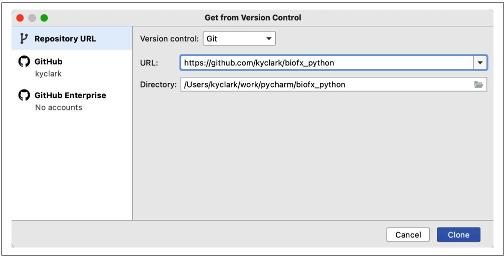  
그림 P-1. PyCharm 도구는 GitHub 저장소를 직접 클론해줄 수 있습니다.


PyCharm과 같은 일부 도구는 프로젝트 디렉터리 내에 가상 환경을 자동으로 생성하려고 할 수도 있습니다. 이는 컴퓨터의 다른 프로젝트로부터 파이썬 버전과 모듈을 격리하는 방법입니다. 가상 환경 사용 여부는 개인의 취향이며 필수 사항은 아닙니다.

수정 사항을 추적하고 솔루션을 다른 사람들과 공유할 수 있도록 자신의 계정에 코드 복사본을 만드는 것을 선호할 수도 있습니다. 이를 포크(fork)라고 하는데, 제 코드에서 갈라져 나와 저장소에 여러분의 프로그램을 추가하는 것이기 때문입니다.

제 GitHub 저장소를 포크하려면 다음을 수행하십시오.

1. GitHub.com에서 계정을 생성합니다.
2. https://github.com/kyclark/biofx_python 으로 이동합니다.
3. 오른쪽 상단의 Fork 버튼(그림 P-2 참조)을 클릭하여 자신의 계정에 저장소 복사본을 만듭니다.

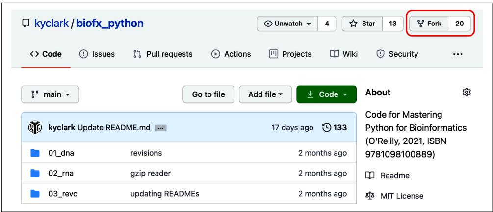  
그림 P-2. 제 GitHub 저장소의 Fork 버튼을 누르면 여러분의 계정에 코드 복사본이 만들어집니다.

이제 저장소에 제 모든 코드의 복사본이 생겼으므로, Git을 사용해 그 코드를 컴퓨터로 복사할 수 있습니다. `YOUR_GITHUB_ID` 부분을 실제 GitHub ID로 바꾸는 것을 잊지 마십시오.

$ git clone https://github.com/YOUR_GITHUB_ID/biofx_python

여러분이 복사본을 만든 후에도 제가 저장소를 업데이트할 수 있습니다. 이러한 업데이트를 받고 싶다면 제 저장소를 업스트림(upstream) 소스로 설정하도록 Git을 구성해야 합니다. 저장소를 컴퓨터로 클론한 후 `biofx_python` 디렉터리로 이동하십시오.

$ cd biofx_python

그 다음 이 명령어를 실행하십시오.

$ git remote add upstream https://github.com/kyclark/biofx_python.git

제 저장소에서 여러분의 저장소를 업데이트하고 싶을 때마다 다음 명령어를 실행하면 됩니다.

$ git pull upstream main

# 모듈 설치

여러 파이썬 모듈과 도구를 설치해야 합니다. 저장소의 최상위 디렉터리에 `requirements.txt` 파일을 포함해 두었습니다. 이 파일에는 이 책의 프로그램을 실행하는 데 필요한 모든 모듈이 나열되어 있습니다. 일부 IDE는 이 파일을 감지하고 설치를 제안할 수도 있으며, 또는 다음 명령어를 사용할 수 있습니다.

$ python3 -m pip install -r requirements.txt

또는 pip3 도구를 사용하십시오.

$ pip3 install -r requirements.txt

때때로 pylint가 프로그램의 일부 변수 이름에 대해 불평하거나, mypy가 타입 어노테이션이 없는 모듈을 임포트할 때 문제를 제기할 수 있습니다. 이러한 에러를 조용히 시키기 위해, 해당 프로그램들이 동작을 사용자 정의하는 데 사용할 초기화 파일을 홈 디렉터리에 생성할 수 있습니다. 소스 저장소의 루트에는 `pylintrc`와 `mypy.ini`라는 파일이 있는데, 이를 다음과 같이 홈 디렉터리로 복사해야 합니다.

$ cp pylintrc ~/.pylintrc

$ cp mypy.ini ~/.mypy.ini

또는 다음 명령어로 새로운 `pylintrc`를 생성할 수도 있습니다.

$ cd ~

$ pylint --generate-rcfile > .pylintrc

취향에 맞게 이 파일들을 자유롭게 커스터마이징하십시오.

# new.py 프로그램 설치

저는 파이썬 프로그램을 생성하는 `new.py`라는 파이썬 프로그램을 작성했습니다. 참 메타적이죠? 빈 화면에서 프로그램을 작성하기 시작하는 것이 꽤 어렵다고 생각해서 저를 위해 작성한 다음 학생들에게 나누어 주었습니다. `new.py` 프로그램은 명령줄 인자를 해석하기 위해 argparse 모듈을 사용하는 구조가 잘 잡힌 새로운 파이썬 프로그램을 생성합니다. 이전 섹션의 모듈 의존성 설치 시 함께 설치되었어야 합니다. 그렇지 않다면 다음과 같이 pip 모듈을 사용하여 설치할 수 있습니다.

$ python3 -m pip install new-py

이제 `new.py`를 실행하면 다음과 같은 내용을 볼 수 있을 것입니다.

usage: new.py [-h] [-n NAME] [-e EMAIL] [-p PURPOSE] [-t] [-f] [--version]
              program

new.py: error: the following arguments are required: program

각 실습에서는 새 프로그램을 작성할 때 `new.py`를 사용할 것을 권장합니다. 예를 들어 1장에서는 `01_dna` 디렉터리에 다음과 같이 `dna.py`라는 프로그램을 생성하게 됩니다.

$ cd 01_dna/
$ new.py dna.py
Done, see new script "dna.py".

그 다음 `./dna.py --help`를 실행하면 프로그램 사용법에 대한 도움말 문서가 생성되는 것을 볼 수 있습니다. 에디터에서 `dna.py` 프로그램을 열고 인자를 수정한 후, 프로그램과 테스트의 요구 사항을 충족하는 코드를 추가하십시오.

`new.py`를 사용하는 것이 필수는 아닙니다. 단지 시작을 돕기 위한 도구로 제공하는 것뿐입니다. 저 역시 모든 프로그램을 이렇게 시작하지만, 여러분은 다른 방식을 선호할 수도 있습니다. 여러분의 프로그램이 테스트 스위트를 통과하기만 한다면 어떤 방식으로 작성하든 괜찮습니다.

# 왜 이 책을 썼는가?

리처드 해밍(Richard Hamming)은 벨 연구소(Bell Labs)에서 수학자이자 연구원으로 수십 년을 보냈습니다. 그는 잘 모르는 사람들을 찾아가 그들의 연구에 대해 묻는 것으로 유명했습니다. 그러고는 그들에게 그들 분야에서 가장 크고 시급한 미해결 과제가 무엇이라고 생각하는지 묻곤 했습니다. 만약 두 질문에 대한 답이 일치하지 않으면 그는 이렇게 물었습니다. "그런데 왜 그 일을 하고 있지 않습니까?"

저는 생명정보학에서 가장 시급한 문제 중 하나가 많은 소프트웨어가 제대로 작성되지 않았고, 적절한 문서화나 테스트가 아예 없거나 부족하다는 점이라고 생각합니다. 타입, 테스트, 린터, 포맷터를 사용하는 것이 생각보다 어렵지 않으며, 시간이 지날수록 새로운 기능을 추가하고 더 나은 소프트웨어를 출시하는 것이 더 쉬워진다는 점을 보여드리고 싶습니다. 여러분은 적어도 어느 정도의 정확성 측면에서 자신의 프로그램이 확실히 올바르다는 자신감을 갖게 될 것입니다.

이를 위해 저는 소프트웨어 개발의 모범 사례들을 보여드릴 것입니다. 비록 파이썬을 매개체로 사용하고 있지만, 그 원칙은 C부터 R, 자바스크립트에 이르기까지 모든 언어에 적용됩니다. 이 책에서 배울 수 있는 가장 중요한 것은 소프트웨어를 개발, 테스트, 문서화, 출시 및 지원하는 기술이며, 이를 통해 우리 모두가 함께 과학 연구 컴퓨팅을 발전시킬 수 있기를 바랍니다.

생명정보학에서의 제 경력은 방랑과 기분 좋은 우연의 산물이었습니다. 대학에서 영문학과 음악을 공부한 뒤 데이터베이스와 HTML을 만지기 시작했고, 1990년대 중반에 업무를 통해 프로그래밍을 배웠습니다. 2001년 무렵에는 제법 괜찮은 펄 해커가 되었고, 콜드 스프링 하버 연구소(CSHL)에서 여러 펄 모듈과 서적의 저자인 링컨 스타인(Lincoln Stein) 박사의 연구실에 웹 개발자로 취업할 수 있었습니다. 그와 제 상사인 도린 웨어(Doreen Ware) 박사는 제가 그들이 원하는 프로그램을 작성할 수 있을 정도로 충분한 생물학 지식을 끈기 있게 가르쳐 주었습니다. 저는 Gramene.org라는 식물 비교 유전체 데이터베이스 프로젝트에서 13년 동안 일하며 프로그래밍 언어와 컴퓨터 과학을 계속 탐구하는 동시에 상당한 양의 과학 지식을 쌓았습니다.

링컨은 데이터와 코드부터 교육에 이르기까지 모든 것을 공유하는 데 열정적이었습니다. 그는 유닉스 명령줄, 펄 프로그래밍, 생명정보학 기술을 가르치는 2주간의 집중 단기 코스인 CSHL의 'Programming for Biology' 과정을 시작했습니다. 이 과정은 요즘은 파이썬을 사용하지만 여전히 교육 중이며, 저도 조교로 활동할 기회가 여러 번 있었습니다. 저는 누군가가 자신의 연구를 발전시키는 데 사용할 기술을 배우도록 돕는 것이 항상 보람차다고 생각합니다.

CSHL에 재직하는 동안 보니 허위츠(Bonnie Hurwitz)를 만났고, 그녀는 나중에 애리조나 대학교(UA)에서 박사 학위를 받기 위해 떠났습니다. 그녀가 UA에 자신의 연구실을 열었을 때 제가 첫 번째 직원이었습니다. 보니와 저는 수년간 함께 일했고, 가르치는 일은 제가 가장 좋아하는 업무 중 하나가 되었습니다. 링컨의 과정과 마찬가지로, 우리는 컴퓨팅 접근 방식을 확장하려는 과학자들에게 기본적인 프로그래밍 기술을 소개했습니다.

이 수업들을 위해 작성했던 자료 중 일부가 제 첫 번째 책인 《Tiny Python Projects》의 기초가 되었습니다. 그 책에서 저는 파이썬 언어 문법의 핵심 요소와 프로그램이 정확하고 재현 가능함을 보장하기 위해 테스트를 사용하는 방법을 가르치려 노력했습니다. 이는 과학 프로그래밍에서 매우 중요한 요소들입니다. 이 책은 거기서 이어지며 생물학을 위한 프로그램을 작성하는 데 도움이 될 파이썬의 요소들에 집중합니다.

# 이 책에서 사용하는 규칙

이 책에서는 다음과 같은 타이포그래피 규칙을 사용합니다.

# 이탤릭체(Italic)

새로운 용어, URL, 이메일 주소, 파일명, 파일 확장자, 그리고 코돈(codon)과 DNA 염기를 나타냅니다.

# 고정 폭 글꼴(Constant width)

코드 리스트뿐만 아니라 단락 내에서 변수나 함수 이름, 데이터베이스, 데이터 타입, 환경 변수, 문(statements), 키워드와 같은 프로그램 요소를 참조할 때 사용합니다.

# 고정 폭 굵은 글꼴(Constant width bold)

사용자가 그대로 입력해야 하는 명령어 나 텍스트를 나타냅니다.

# 고정 폭 이탤릭체(Constant width italic)

사용자가 제공한 값이나 문맥에 의해 결정된 값으로 대체되어야 하는 텍스트를 나타냅니다.


이 요소는 팁이나 제안을 의미합니다.

# 코드 예제 사용하기

추가 자료(코드 예제, 실습 등)는 https://github.com/kyclark/biofx_python 에서 내려받을 수 있습니다.

기술적인 질문이나 코드 예제 사용 중 발생한 문제는 bookquestions@oreilly.com으로 이메일을 보내주십시오.

이 책은 여러분의 업무 수행을 돕기 위해 작성되었습니다. 일반적으로 이 책과 함께 제공되는 예제 코드는 여러분의 프로그램이나 문서에서 사용할 수 있습니다. 코드의 상당 부분을 복제하지 않는 한 허락을 받기 위해 저희에게 연락하실 필요는 없습니다. 예를 들어 이 책의 코드 조각을 여러 개 사용하는 프로그램을 작성하는 데는 허락이 필요하지 않습니다. O’Reilly 책의 예제를 판매하거나 배포하는 데는 허락이 필요합니다. 이 책을 인용하고 예제 코드를 인용하여 질문에 답하는 데는 허락이 필요하지 않습니다. 이 책의 예제 코드를 제품 문서에 상당 부분 포함하는 데는 허락이 필요합니다.

필수는 아니지만 출처를 밝혀주시면 감사하겠습니다. 출처 표시에는 일반적으로 제목, 저자, 출판사, ISBN이 포함됩니다. 예: “Ken Youens-Clark 저, 《Mastering Python for Bioinformatics》(O’Reilly). Copyright 2021 Charles Kenneth Youens-Clark, 978-1-098-10088-9.”

코드 예제 사용이 공정 이용(fair use)이나 위에서 부여한 허용 범위를 벗어난다고 생각되면 permissions@oreilly.com으로 문의해 주십시오.

# O’Reilly 온라인 학습

O'REILLY

40년 넘게 O’Reilly Media는 기업의 성공을 돕기 위해 기술 및 비즈니스 교육, 지식, 통찰력을 제공해 왔습니다.

전문가와 혁신가들로 구성된 독특한 네트워크가 도서, 기사, 온라인 학습 플랫폼을 통해 자신들의 지식과 전문성을 공유합니다. O’Reilly의 온라인 학습 플랫폼은 라이브 교육 과정, 심층 학습 경로, 대화형 코딩 환경, 그리고 O’Reilly와 200여 개 이상의 다른 출판사의 방대한 텍스트 및 비디오 컬렉션에 대한 온디맨드 액세스를 제공합니다. 자세한 정보는 http://oreilly.com 을 방문하십시오.

# 연락처

이 책에 관한 의견이나 질문은 다음 출판사 주소로 보내주십시오.

O’Reilly Media, Inc.
1005 Gravenstein Highway North
Sebastopol, CA 95472
800-998-9938 (미국 또는 캐나다)
707-829-0515 (국제 또는 지역)
707-829-0104 (팩스)

이 책의 웹 페이지에서는 오탈자, 예제 및 추가 정보를 확인할 수 있습니다. 이 페이지는 https://oreil.ly/mastering-bioinformaticspython 에서 접속할 수 있습니다.

이 책에 대한 의견이나 기술적인 질문은 bookquestions@oreilly.com으로 이메일을 보내주십시오.

도서 및 교육 과정에 대한 뉴스나 정보는 http://oreilly.com 을 방문하십시오.

페이스북: http://facebook.com/oreilly
트위터: http://twitter.com/oreillymedia
유튜브: http://www.youtube.com/oreillymedia

# 감사의 말

이 책을 검토해 준 편집자 코빈 콜린스(Corbin Collins), 특히 제작 편집자인 케이틀린 게건(Caitlin Ghegan)을 포함한 제작팀 전체, 기술 검토자인 알 셰어러(Al Scherer), 브래드 풀턴(Brad Fulton), 빌 루바노빅(Bill Lubanovic), 랑가라잔 자나니(Rangarajan Janani), 조슈아 오비스(Joshua Orvis), 그리고 마크 헨더슨(Mark Henderson), 마크 바뇰스 토르네로(Marc Bañuls Tornero), 스콧 케인(Scott Cain) 박사를 포함해 소중한 피드백을 준 많은 분께 감사의 마음을 전합니다.

전문적인 경력을 쌓는 동안 저를 성장시키고 더 나아지도록 밀어준 훌륭한 상사, 지도자, 동료들을 만난 것은 큰 행운이었습니다. 에릭 토르센(Eric Thorsen)은 제가 코딩을 배울 잠재력이 있다는 것을 처음으로 알아봐 준 사람으로, 여러 언어와 데이터베이스뿐만 아니라 영업과 지원에 대한 중요한 교훈들을 가르쳐 주었습니다. 스티브 레푸치(Steve Reppucci)는 boston.com에서의 제 상사였으며, 펄과 유닉스에 대한 깊은 이해와 정직하고 사려 깊은 팀 리더가 되는 법을 일깨워 주었습니다. CSHL의 링컨 스타인 박사는 생물학 지식이 전혀 없는 사람을 자신의 연구실에 채용하는 모험을 감행했고, 제가 상상하지 못했던 프로그램을 만들도록 격려해 주었습니다. 도린 웨어 박사는 인내심을 갖고 생물학을 가르쳐 주었으며 제가 리더 역할을 맡고 논문을 발표하도록 독려해 주었습니다. 보니 허위츠 박사는 고성능 컴퓨팅, 더 많은 프로그래밍 언어, 멘토링, 교육, 집필을 배우는 수년 동안 저를 지원해 주었습니다. 모든 직장에서 저는 프로그래밍뿐만 아니라 인간이 되는 법에 대해 가르쳐 준 많은 동료를 만났으며, 지금까지 저를 도와준 모든 분께 감사드립니다.

개인적으로는 저를 사랑하고 지지해 준 가족이 없었다면 저는 아무것도 아니었을 것입니다. 부모님은 제 인생 전반에 걸쳐 큰 힘이 되어 주셨고, 부모님이 아니었다면 지금의 저는 없었을 것입니다. 로리 킨들러(Lori Kindler)와 저는 결혼한 지 25년이 되었으며 그녀 없는 삶은 상상할 수 없습니다. 우리는 함께 놀라움과 도전의 원천인 세 자녀를 얻었습니다.

# Rosalind.info 챌린지

이 장들에서는 구조가 잘 잡히고 문서화되었으며 테스트와 재현이 가능한 프로그램을 작성할 수 있게 해주는 파이썬 문법과 도구들을 살펴봅니다. Rosalind.info의 14가지 과제를 해결하는 방법을 보여드릴 것입니다. 이 문제들은 짧고 집중적이며, 파이썬을 탐구하는 데 도움이 되는 다양한 솔루션을 허용합니다. 또한 테스트를 가이드 삼아 프로그램 작성이 언제 끝나는지 알 수 있도록 단계별로 프로그램을 작성하는 법을 가르쳐 드릴 것입니다. 각 문제에 대한 Rosalind 페이지를 읽어보시길 권장합니다. 지면 관계상 그곳의 모든 배경 지식과 정보를 여기에 다 담을 수는 없기 때문입니다.

# 1장. 4개 염기 빈도: 숫자 세기

DNA의 염기를 세는 것은 생명정보학의 "Hello, World!"라고 할 수 있습니다. Rosalind DNA 챌린지는 DNA 서열을 입력받아 A, C, G, T가 각각 몇 개씩 있는지 출력하는 프로그램을 설명합니다. 파이썬에서 숫자를 세는 방법은 놀라울 정도로 다양하며, 저는 이 언어가 제공하는 기능들을 탐구해 볼 것입니다. 또한 인자를 검증하고 문서화된 구조적 프로그램을 작성하는 방법과, 프로그램이 올바르게 작동하는지 확인하기 위해 테스트를 작성하고 실행하는 방법을 보여드릴 것입니다.

이 장에서 배울 내용:

* `new.py`를 사용하여 새 프로그램을 시작하는 방법
* argparse를 사용하여 명령줄 인자를 정의하고 검증하는 방법
* pytest를 사용하여 테스트 스위트를 실행하는 방법
* 문자열의 문자를 반복(iterate)하는 방법
* 컬렉션 내의 요소를 세는 방법
* if/elif 문을 사용하여 결정 트리(decision tree)를 만드는 방법
* 문자열 형식을 지정하는 방법(formatting)

# 시작하기

시작하기 전에 서문의 “코드와 테스트 가져오기”(xvi페이지)를 읽었는지 확인하십시오. 로컬 컴퓨터에 코드 저장소 복사본이 준비되었다면 `01_dna` 디렉터리로 이동하십시오.

$ cd 01_dna

여기에는 프로그램이 올바르게 작동하는지 확인하는 데 사용할 입력 데이터 및 테스트와 함께 여러 개의 `solution*.py` 프로그램이 있습니다. 프로그램이 어떻게 작동해야 하는지 감을 잡기 위해 첫 번째 솔루션을 `dna.py`라는 프로그램으로 복사해 보겠습니다.

$ cp solution1_iter.py dna.py

이제 인자 없이 프로그램을 실행하거나, `-h` 또는 `--help` 플래그와 함께 실행해 보십시오. 사용법 문서가 출력될 것입니다(usage가 출력의 첫 번째 단어임에 유의하십시오).

$ ./dna.py
usage: dna.py [-h] DNA
dna.py: error: the following arguments are required: DNA


만약 “permission denied(권한 거부)”와 같은 오류가 발생한다면, `chmod +x dna.py`를 실행하여 실행 비트를 추가해 프로그램 모드를 변경해야 할 수도 있습니다.

이것이 재현성의 첫 번째 요소 중 하나입니다. 프로그램은 작동 방식에 대한 문서를 제공해야 합니다. README 파일이나 프로그램을 설명하는 논문이 있는 것이 일반적이지만, 프로그램 자체도 파라미터와 출력에 대한 문서를 제공해야 합니다. 저는 argparse 모듈을 사용하여 인자를 정의하고 검증할 뿐만 아니라 문서를 생성하는 방법도 보여드릴 것입니다. 즉, 프로그램에서 생성된 사용법 문구가 틀릴 가능성은 전혀 없습니다. README 파일이나 변경 이력(change log) 등이 프로그램 개발 속도를 따라가지 못해 서로 맞지 않게 되는 경우와 대조해 보면, 이러한 방식의 문서화가 매우 효과적이라는 점을 이해하실 수 있을 것입니다.

사용법 라인을 보면 프로그램이 `DNA`와 같은 인자를 기대하고 있음을 알 수 있으니 서열을 입력해 봅시다. Rosalind 페이지에 설명된 대로, 프로그램은 A, C, G, T의 각 염기 개수를 순서대로 출력하며 각 숫자는 공백 하나로 구분합니다.

$ ./dna.py ACCGGGTTTT
1 2 3 4

Rosalind.info 웹사이트에서 과제를 해결할 때 프로그램의 입력은 다운로드된 파일로 제공됩니다. 따라서 파일의 내용도 읽을 수 있도록 프로그램을 작성하겠습니다. `cat`(concatenate의 약자) 명령어를 사용하여 `tests/inputs` 디렉터리에 있는 파일 중 하나의 내용을 출력해 볼 수 있습니다.

```txt
$ cat tests/Input2.txt
AGCTTTTCATTCTGACTGCAACGGGCAATATGTCTCTGTGTGGATTAAAAAAAGAGTGTCTGATAGCAGC 
```

이는 웹사이트의 예제와 동일한 서열입니다. 따라서 프로그램의 출력은 다음과 같아야 함을 알 수 있습니다.

```txt
$ ./dna.py tests/Input2.txt
20 12 17 21 
```

책 전반에 걸쳐 저는 프로그램이 예상대로 작동하는지 확인하는 테스트를 실행하기 위해 pytest 도구를 사용할 것입니다. `pytest` 명령을 실행하면 현재 디렉터리에서 테스트처럼 보이는 파일과 함수를 재귀적으로 찾습니다. 윈도우 사용자라면 `python3 -m pytest` 또는 `pytest.exe`를 실행해야 할 수도 있습니다. 지금 실행해 보면 `tests/dna_test.py` 파일에 있는 4개의 테스트를 모두 통과했음을 나타내는 다음과 같은 결과가 표시될 것입니다.

```rst
$ pytest
============================== test session starts ==============================
      
...
collected 4 items
tests/dna_test.py .... [100%]
============================== 4 passed in 0.41s ===============================
```


소프트웨어 테스트의 핵심 요소는 알려진 입력을 사용하여 프로그램을 실행하고 그것이 올바른 출력을 생성하는지 확인하는 것입니다. 당연한 이야기처럼 들리겠지만, 저는 단순히 프로그램을 실행만 할 뿐 올바르게 동작하는지 확인하지 않는 "테스트" 방식에 반대해야 했습니다.

# new.py를 사용하여 프로그램 만들기

앞 섹션에서 보여드린 것처럼 솔루션 중 하나를 복사했다면, 처음부터 시작할 수 있도록 해당 프로그램을 삭제하십시오.

$ rm dna.py

제 솔루션을 아직 보지 말고, 이 문제를 스스로 해결해 보시기 바랍니다. 필요한 정보가 모두 있다고 생각되면 바로 `dna.py` 버전을 작성하고 제공된 테스트를 `pytest`로 실행해 보십시오. 저와 함께 단계별로 프로그램을 작성하고 테스트를 실행하는 방법을 배우고 싶다면 계속 읽어주시기 바랍니다.

이 책의 모든 프로그램은 일부 명령줄 인자를 받아들여 명령줄의 텍스트나 새 파일과 같은 출력을 생성합니다. 저는 항상 서문에 설명된 `new.py` 프로그램을 사용하여 시작하지만, 이것이 필수 사항은 아닙니다. 원하는 어떤 지점에서든 프로그램을 작성할 수 있지만, 사용법 문구 생성 및 인자의 적절한 검증과 같은 기능은 갖추고 있어야 합니다.

`01_dna` 디렉터리에 `dna.py` 프로그램을 생성하십시오. 이 디렉터리에 프로그램용 테스트 파일이 들어 있기 때문입니다. 제가 `dna.py` 프로그램을 시작하는 방법은 다음과 같습니다. `--purpose` 인자는 프로그램 문서화에 사용됩니다.

$ new.py --purpose 'Tetranucleotide frequency' dna.py
Done, see new script "dna.py".

새로 만든 `dna.py` 프로그램을 실행해 보면, 명령줄 프로그램에서 공통적으로 쓰이는 다양한 유형의 인자들을 정의하고 있음을 알 수 있습니다.

$ ./dna.py --help
usage: dna.py [-h] [-a str] [-i int] [-f FILE] [-o] str

Tetranucleotide frequency 1

positional arguments:
  str                   A positional argument 2

optional arguments:
  -h, --help            show this help message and exit
  -a str, --arg str     A named string argument (default: )
  -i int, --int int     A named integer argument (default: 0) 5
  -f FILE, --file FILE  A readable file (default: None)
  -o, --on              A boolean flag (default: False) 7

1 new.py의 --purpose가 여기에서 프로그램을 설명하는 데 사용됩니다.
2 프로그램은 단일 위치 문자열 인자를 받습니다.
3 -h와 --help 플래그는 argparse에 의해 자동으로 추가되며 사용법 출력을 트리거합니다.
4 이는 문자열 값을 위한 단축 이름(-a)과 긴 이름(--arg)을 가진 명명된 옵션입니다.
5 이는 정수 값을 위한 단축 이름(-i)과 긴 이름(--int)을 가진 명명된 옵션입니다.
6 이는 파일 인자를 위한 단축 이름(-f)과 긴 이름(--file)을 가진 명명된 옵션입니다.
7 이는 -o나 --on이 있을 때는 True, 없을 때는 False가 되는 불리언 플래그입니다.

이 프로그램에는 `str` 위치 인자만 필요하며, `metavar` 값을 `DNA`로 사용하여 사용자에게 인자의 의미를 알려줄 수 있습니다. 다른 모든 파라미터는 삭제하십시오. `-h`와 `--help` 플래그는 argparse가 내부적으로 사용법 요청에 응답하는 데 사용하므로 사용자가 직접 정의하지 않는다는 점에 유의하십시오. 다음 섹션에서 보여드릴 것처럼 사용법이 다음과 같이 출력되도록 프로그램을 수정해 보십시오(아직 사용법을 생성할 수 없더라도 걱정하지 마십시오).

$ ./dna.py -h

usage: dna.py [-h] DNA

Tetranucleotide frequency

positional arguments:
  DNA         Input DNA sequence

optional arguments:
  -h, --help  show this help message and exit

이렇게 작동하게 만들 수 있다면, 이 프로그램이 정확히 하나의 위치 인자만 받아들인다는 점을 말씀드리고 싶습니다. 만약 다른 개수의 인자로 실행하려고 하면 프로그램은 즉시 중단되고 에러 메시지를 출력합니다.

$ ./dna.py AACC GGTT
usage: dna.py [-h] DNA
dna.py: error: unrecognized arguments: GGTT

마찬가지로 프로그램은 알 수 없는 플래그나 옵션을 거부합니다. 아주 적은 양의 코드로 여러분은 프로그램 인자를 검증하고 문서화된 프로그램을 만들었습니다. 이는 재현성을 향한 매우 기본적이고 중요한 단계입니다.

# argparse 사용하기

`new.py`에 의해 생성된 프로그램은 argparse 모듈을 사용하여 프로그램 파라미터를 정의하고, 인자가 올바른지 검증하며, 사용자를 위한 사용법 문서를 생성합니다. argparse 모듈은 파이썬 표준 모듈이므로 항상 설치되어 있습니다. 다른 모듈도 이러한 작업을 수행할 수 있으며, 프로그램의 이 부분을 처리하기 위해 선호하는 어떤 방법이든 자유롭게 사용할 수 있습니다. 단지 프로그램이 테스트를 통과할 수 있게 하십시오.

저는 《Tiny Python Projects》를 위해 작성한 `new.py` 버전을 해당 책의 GitHub 저장소 `bin` 디렉터리에 두었습니다. 그 버전은 제가 지금 여러분이 사용하길 원하는 버전보다 다소 간단합니다. 먼저 이 이전 버전의 `new.py`를 사용하여 만든 `dna.py` 버전을 보여드리겠습니다.

#!/usr/bin/env python3 1

""" Tetranucleotide frequency """ 2

import argparse 3

```python
def get_args(): 4
    ''' 명령줄 인자 가져오기 ''' 5
    parser = argparse.ArgumentParser( 6
        description='Tetranucleotide frequency',
        formatter_class=argparse.ArgumentDefaultsHelpFormatter)
    parser.add_argument('dna', metavar='DNA', help='Input DNA sequence') 7
    return parser.parse_args() 8

def main(): 9
    ''' 여기에 코드를 작성하십시오 '''
    args = get_args() 10
    print(args.dna) 11

if __name__ == '__main__': 12
    main()
```

1 구어체로 쉬뱅(shebang, #!)이라고 불리는 이 줄은 운영 체제에 env 명령(environment)을 사용하여 프로그램의 나머지 부분을 실행할 python3를 찾으라고 지시합니다.
2 이것은 프로그램 또는 모듈 전체에 대한 독스트링(docstring, 문서화 문자열)입니다.
3 명령줄 인자를 처리하기 위해 argparse 모듈을 임포트합니다.
4 argparse 코드를 처리하기 위해 항상 `get_args()` 함수를 정의합니다.
5 함수에 대한 독스트링입니다.
6 parser 객체는 프로그램의 파라미터를 정의하는 데 사용됩니다.
7 `dna` 인자를 정의합니다. 이름이 대시(-)로 시작하지 않으므로 위치 인자가 됩니다. `metavar`는 요약 사용법에 표시될 인자에 대한 짧은 설명입니다. 다른 인자는 필요하지 않습니다.
8 함수는 인자를 파싱한 결과를 반환합니다. 도움말 플래그나 인자 관련 문제가 발생하면 argparse는 사용법 문구 또는 에러 메시지를 출력하고 프로그램을 종료합니다.
9 이 책의 모든 프로그램은 항상 `main()` 함수에서 시작합니다.
10 `main()`의 첫 번째 단계는 항상 `get_args()`를 호출하는 것입니다. 이 호출이 성공하면 인자가 유효했다는 의미입니다.
11 DNA 값은 인자의 이름이 `dna`이므로 `args.dna` 속성에서 사용할 수 있습니다.
12 프로그램이 (임포트되는 대신) 직접 실행될 때를 감지하여 `main()` 함수를 실행하는 파이썬 프로그램의 흔한 관용구입니다.


쉬뱅 라인은 `./dna.py`와 같이 프로그램이 실행될 때 유닉스 쉘에서 사용됩니다. 윈도우에서는 작동하지 않으며, 프로그램을 실행하려면 `python.exe dna.py`를 실행해야 합니다.

이 코드는 완벽하게 작동하지만, `get_args()`에서 반환된 값은 프로그램 실행 시 동적으로 생성되는 `argparse.Namespace` 객체입니다. 즉, 저는 `parser.add_argument()`와 같은 코드를 사용해 런타임에 이 객체의 구조를 수정하고 있으므로, 파이썬은 컴파일 시점에 파싱된 인자에서 어떤 속성을 사용할 수 있는지 또는 그 타입이 무엇인지 확실히 알 수 없습니다. 필수 문자열 인자가 하나만 있다는 것이 여러분에게는 명확할지라도, 파이썬이 이를 식별하기에는 코드 내 정보가 충분하지 않습니다.


프로그램을 컴파일한다는 것은 컴퓨터가 실행할 수 있는 기계어로 바꾸는 것을 의미합니다. C와 같은 일부 언어는 실행 전에 별도로 컴파일해야 합니다. 파이썬 프로그램은 종종 컴파일과 실행이 한 단계로 이루어지지만 여전히 컴파일 단계가 존재합니다. 일부 에러는 컴파일 시점에 잡힐 수 있고, 다른 에러들은 런타임까지 나타나지 않습니다. 예를 들어 구문 에러는 컴파일을 방해합니다. 런타임 에러보다는 컴파일 시점 에러가 발생하는 것이 더 바람직합니다.

이것이 왜 문제가 될 수 있는지 알아보기 위해 `main()` 함수를 수정하여 타입 에러를 도입해 보겠습니다. 즉, 의도적으로 `args.dna` 값의 타입을 잘못 사용해 보겠습니다. 별도로 명시하지 않는 한, argparse가 명령줄에서 반환하는 모든 인자 값은 문자열입니다. 만약 문자열인 `args.dna`를 정수 값 2로 나누려고 하면, 파이썬은 예외를 발생시키고 런타임에 프로그램을 중단시킬 것입니다.

```python
def main():
    args = get_args()
    print(args.dna / 2) # 1
```

1 문자열을 정수로 나누면 예외가 발생합니다.

프로그램을 실행하면 예상대로 중단됩니다.

```txt
$ ./dna.py ACGT
Traceback (most recent call last):
    File "./dna.py", line 30, in <module>
        main()
    File "./dna.py", line 25, in main
        print(args.dna / 2)
TypeError: unsupported operand type(s) for /: 'str' and 'int' 
```

우리의 크고 말랑말랑한 뇌는 이것이 조만간 발생할 수밖에 없는 오류라는 것을 알고 있지만, 파이썬은 이 문제를 감지하지 못합니다. 우리에게 필요한 것은 프로그램이 실행될 때 수정할 수 없는 정적인 인자 정의입니다. 이어지는 내용을 통해 타입 어노테이션과 다른 도구들이 어떻게 이러한 종류의 버그를 찾아낼 수 있는지 알아보겠습니다.

# 코드 내 오류를 찾는 도구들

여기서의 목표는 파이썬으로 정확하고 재현 가능한 프로그램을 작성하는 것입니다. 숫자 연산에 문자열을 잘못 사용하는 것과 같은 문제를 발견하고 피할 수 있는 방법이 있을까요? `python3` 인터프리터는 코드를 실행하는 데 방해가 되는 어떠한 문제도 발견하지 못했습니다. 즉, 프로그램은 구문적으로는 올바르며, 앞 섹션의 코드는 프로그램을 실행할 때만 오류가 발생하는 런타임 에러(run-time error)를 생성합니다. 수년 전 제가 일하던 그룹에서는 "컴파일만 되면 일단 출시해!"라는 농담을 하곤 했습니다. 파이썬으로 코딩할 때 이런 방식은 명백히 근시안적인 접근입니다.

린터(linters)나 타입 체커(type checkers)와 같은 도구를 사용하면 코드에서 몇 가지 종류의 문제를 찾아낼 수 있습니다. 린터는 프로그램 스타일과 잘못된 구문 이외의 여러 가지 오류를 확인하는 도구입니다. `pylint` 도구는 제가 거의 매일 사용하는 인기 있는 파이썬 린터입니다. 이 도구가 문제를 찾을 수 있을까요? 보시다시피 최고의 찬사를 보내며 찾지 못하는 것 같습니다.

$ pylint dna.py

Your code has been rated at 10.00/10 (previous run: 9.78/10, +0.22)

`flake8`은 제가 `pylint`와 함께 자주 사용하는 또 다른 린터로, 서로 다른 종류의 오류를 보고합니다. `flake8 dna.py`를 실행했을 때 아무런 출력이 없다면, 보고할 오류를 찾지 못했다는 의미입니다.

`mypy` 도구는 파이썬을 위한 정적 타입 체커로, 문자열을 숫자로 나누려는 시도와 같이 잘못 사용된 타입을 찾도록 설계되었습니다. `pylint`나 `flake8`은 타입 에러를 잡도록 설계되지 않았으므로, 그들이 버그를 놓쳤다고 해서 정당하게 놀랄 일은 아닙니다. 그렇다면 `mypy`는 무엇이라고 말할까요?

$ mypy dna.py
Success: no issues found in 1 source file

음, 조금 실망스럽군요. 하지만 `mypy`가 문제를 보고하지 못하는 이유는 타입 정보가 없기 때문이라는 점을 이해해야 합니다. 즉, `mypy`는 `args.dna`를 2로 나누는 것이 잘못되었다고 말할 정보가 없습니다. 곧 이 문제를 해결해 보겠습니다.

# 파이썬 대화형 인터프리터 사용하기

다음 섹션에서는 파이썬의 대화형 인터프리터인 `python3`를 사용하여 짧은 코드를 실행하는 방법을 보여드리고자 합니다. 이러한 종류의 인터페이스는 때때로 REPL이라고 불리는데, 이는 Read-Evaluate-Print-Loop의 약자이며 저는 '레플'이라고 발음합니다. REPL에 코드를 입력할 때마다 파이썬은 즉시 표현식을 읽고(Read) 평가하며(Evaluate), 결과를 출력하고(Print), 다시 루프(Loop)를 돌아 다음 입력을 기다립니다.

REPL 사용이 생소할 수 있으므로 잠시 개념을 소개해 보겠습니다. 저는 `python3`를 사용하여 시연하겠지만, 그림 1-1과 같이 `idle3`, `ipython`, 주피터 노트북, 또는 VS Code 같은 통합 개발 환경(IDE) 내부의 파이썬 콘솔을 사용하는 것을 선호하실 수도 있습니다.

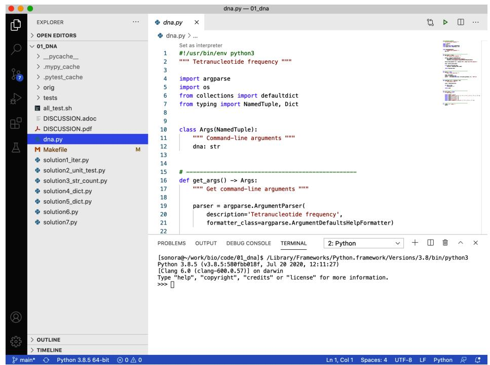  
그림 1-1. VS Code 내부에서 대화형 파이썬 인터프리터를 실행할 수 있습니다.

어떤 것을 선택하든 모든 예제를 직접 입력해 보시길 강력히 권장합니다. 파이썬 인터프리터와 상호작용하면서 정말 많은 것을 배우게 될 것입니다.

REPL을 시작하려면 `python3`를 입력하십시오. 컴퓨터에 따라 최신 버전을 가리키는 `python`만 입력해도 될 수 있습니다. 제 컴퓨터에서는 다음과 같이 보입니다.

```txt
$ python3
Python 3.9.1 (v3.9.1:1e5d33e9b9, Dec 7 2020, 12:10:52)
[Clang 6.0 (clang-600.0.57)] on darwin
Type "help", "copyright", "credits" or "license" for more information.
>>> 
```

표준 `python3` REPL은 `>>>`를 프롬프트로 사용합니다. `>>>` 프롬프트 자체는 입력하지 말고, 그 뒤에 오는 텍스트만 입력해야 함에 주의하십시오. 예를 들어, 두 숫자를 더하는 과정을 다음과 같이 보여준다면:

```txt
>>> 3 + 5
8 
```

여러분은 `3 + 5<Enter>`만 입력해야 합니다. 만약 앞의 프롬프트까지 포함하면 다음과 같이 에러가 발생합니다.

```txt
>>> >>> 3 + 5
  File "<stdin>", line 1
    >>> 3 + 5
    ^
SyntaxError: invalid syntax 
```

저는 특히 문서를 읽을 때 REPL을 사용하는 것을 좋아합니다. 예를 들어 `help(str)`을 입력하여 파이썬의 문자열 클래스에 대해 읽어보십시오. 도움말 문서 내에서 `F` 키, `Ctrl-F` 또는 스페이스바를 누르면 앞으로 이동할 수 있고, `B` 키 또는 `Ctrl-B`를 누르면 뒤로 이동할 수 있습니다. 검색하려면 `/` 키를 누른 뒤 문자열을 입력하고 `Enter`를 누르십시오. 도움말에서 나가려면 `Q`를 누르십시오. REPL을 종료하려면 `exit()`를 입력하거나 `Ctrl-D`를 누르십시오.

# 네임드 튜플(Named Tuples) 소개

동적으로 생성되는 객체로 인한 문제를 피하기 위해, 이 책의 모든 프로그램은 `get_args()`로부터 전달받은 인자들을 정적으로 정의하기 위해 네임드 튜플(named tuple) 데이터 구조를 사용할 것입니다. 튜플은 본질적으로 불변(immutable) 리스트이며, 파이썬에서 레코드 형태의 데이터 구조를 표현하는 데 자주 사용됩니다. 설명할 내용이 많으니 잠시 리스트로 돌아가 보겠습니다.

우선, 리스트는 아이템들이 정렬된 시퀀스입니다. 아이템들은 이질적(heterogeneous)일 수 있습니다. 이론적으로는 모든 아이템이 서로 다른 타입일 수 있다는 뜻이지만, 실제로 타입을 섞어 쓰는 것은 대개 좋지 않은 아이디어입니다. `python3` REPL을 사용해 리스트의 몇 가지 측면을 살펴보겠습니다. `help(list)`를 사용해 문서를 읽어보시길 권장합니다.

시퀀스를 담을 빈 리스트를 만들려면 빈 대괄호(`[]`)를 사용하십시오.

>>> seqs = []

`list()` 함수를 사용해도 비어 있는 새 리스트를 만들 수 있습니다.

```txt
>>> seqs = list() 
```

`type()` 함수를 사용하여 변수의 타입을 반환함으로써 이것이 리스트인지 확인하십시오.

```txt
>>> type(seqs)
<class 'list'> 
```

리스트에는 리스트 끝에 값을 추가하는 메서드들이 있습니다. 하나의 값을 추가하려면 `list.append()`를 사용합니다.

```txt
>>> seqs.append('ACT')  
>>> seqs  
['ACT'] 
```

여러 값을 추가하려면 `list.extend()`를 사용합니다.

```txt
>>> seqs.extend(['GCA', 'TTT'])  
>>> seqs  
['ACT', 'GCA', 'TTT'] 
```

REPL에서 변수 이름만 입력하면 평가가 이루어지고 텍스트 형태의 표현으로 문자열화됩니다.

```txt
>>> seqs
['ACT', 'GCA', 'TTT']
```

이것은 기본적으로 변수를 `print()`했을 때 일어나는 일과 같습니다.

```txt
>>> print(seqs)
['ACT', 'GCA', 'TTT'] 
```

인덱스를 사용하여 어떤 값이라도 즉시 수정할 수 있습니다. 파이썬의 모든 인덱싱은 0부터 시작하므로, 0이 첫 번째 요소임을 기억하십시오. 첫 번째 서열을 `TCA`로 바꿉니다.

```perl
>>> seqs[0] = 'TCA' 
```

수정되었는지 확인합니다.

```txt
>>> seqs
['TCA', 'GCA', 'TTT'] 
```

리스트와 마찬가지로 튜플도 이질적인 객체들이 정렬된 시퀀스입니다. 일련의 아이템 사이에 쉼표를 넣으면 튜플이 생성됩니다.

```txt
>>> seqs = 'TCA', 'GCA', 'TTT'
>>> type(seqs)
<class 'tuple'> 
```

튜플임을 더 명확히 하기 위해 튜플 값 주위에 괄호를 두는 것이 일반적입니다.

>>> seqs = ('TCA', 'GCA', 'TTT')
>>> type(seqs)
<class 'tuple'>

리스트와 달리 튜플은 한 번 생성되면 변경할 수 없습니다. `help(tuple)`을 읽어보면 튜플이 내장된 불변 시퀀스임을 알 수 있습니다. 따라서 값을 추가할 수 없습니다.

```python
>>> seqs.append('GGT')
Traceback (most recent call last):
    File "<stdin>", line 1, in <module>
AttributeError: 'tuple' object has no attribute 'append' 
```

기존 값을 수정할 수도 없습니다.

```python
>>> seqs[0] = 'TCA'
Traceback (most recent call last):
    File "<stdin>", line 1, in <module>
TypeError: 'tuple' object does not support item assignment 
```

파이썬에서 레코드를 표현하기 위해 튜플을 사용하는 것은 꽤 흔한 일입니다. 예를 들어 고유 ID와 염기 서열 문자열을 가진 `Sequence`를 다음과 같이 표현할 수 있습니다.

```txt
>>> seq = ('CAM_0231669729', 'GTGTTTATTCAATGCTAG') 
```

리스트와 마찬가지로 인덱싱을 사용해 튜플의 값을 가져올 수도 있지만, 이는 번거롭고 오류가 발생하기 쉽습니다. 네임드 튜플을 사용하면 필드에 이름을 지정할 수 있어 훨씬 사용하기 편리해집니다. 네임드 튜플을 사용하려면 `collections` 모듈에서 `namedtuple()` 함수를 임포트하면 됩니다.

```python
>>> from collections import namedtuple 
```

그림 1-2에 표시된 것처럼, `namedtuple()` 함수를 사용하여 `id`와 `seq` 필드를 가진 `Sequence`의 개념을 생성합니다.

```txt
>>> Sequence = namedtuple('Sequence', ['id', 'seq']) 
```

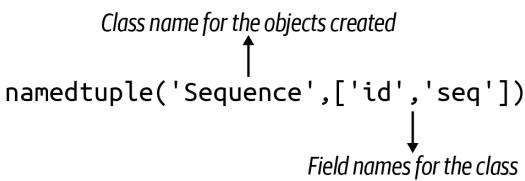  
그림 1-2. `namedtuple()` 함수는 `id`와 `seq` 필드를 가진 `Sequence` 클래스의 객체를 만드는 방법을 생성합니다.

여기서 `Sequence`는 정확히 무엇일까요?

```txt
>>> type(Sequence)
<class 'type'> 
```

방금 새로운 타입을 만들었습니다. `Sequence()` 함수는 `Sequence` 클래스의 새로운 객체를 생성하는 데 사용되므로 '팩토리(factory)'라고 부를 수 있습니다. 이러한 팩토리 함수와 클래스 이름은 일반적인 이름과 구분하기 위해 단어의 첫 글자를 대문자로 쓰는 TitleCase 방식을 따르는 것이 관례입니다.

`list()` 함수로 새 리스트를 만드는 것처럼, `Sequence()` 함수로 새 `Sequence` 객체를 만들 수 있습니다. 클래스에 정의된 순서와 일치하도록 `id`와 `seq` 값을 위치 인자로 전달할 수 있습니다.

```txt
>>> seq1 = Sequence('CAM_0231669729', 'GTGTTTATTCAATGCTAG')
>>> type(seq1)
<class '__main__.Sequence'>
```

또는 필드 이름을 사용하여 키/값 쌍으로 원하는 순서대로 전달할 수 있습니다.

```python
>>> seq2 = Sequence(seq='GTGTTTATTCAATGCTAG', id='CAM_0231669729')
>>> seq2
Sequence(id='CAM_0231669729', seq='GTGTTTATTCAATGCTAG') 
```

인덱스를 사용해 ID와 서열에 접근할 수도 있지만:

```txt
>>> 'ID = ' + seq1[0]  
'ID = CAM_0231669729'  
>>> 'seq = ' + seq1[1]  
'seq = GTGTTTATTCAATGCTAG' 
```

...네임드 튜플을 사용하는 핵심 목적은 필드 이름을 사용하는 것입니다.

```txt
>>> 'ID = ' + seq1.id
'ID = CAM_0231669729'
>>> 'seq = ' + seq1.seq
'seq = GTGTTTATTCAATGCTAG' 
```

레코드의 값은 불변 상태로 유지됩니다.

```txt
>>> seq1.id = 'XXX'
Traceback (most recent call last):
    File "<stdin>", line 1, in <module>
AttributeError: can't set attribute 
```

저는 종종 코드 내에서 값이 실수로 변경되지 않음을 보장받고 싶어 합니다. 파이썬에는 변수를 상수나 불변으로 선언하는 방법이 따로 없습니다. 튜플은 기본적으로 불변이므로, 프로그램의 인자들을 변경할 수 없는 데이터 구조로 표현하는 것이 타당하다고 생각합니다. 입력값은 신성하며 (거의) 절대로 수정되어서는 안 됩니다.

# 네임드 튜플에 타입 추가하기

`namedtuple()`도 훌륭하지만, `typing` 모듈에서 `NamedTuple` 클래스를 임포트하여 `Sequence`의 베이스 클래스로 사용하면 훨씬 더 좋아집니다. 또한 이 구문을 사용해 필드에 타입을 할당할 수 있습니다. REPL에서 블록이 완료되었음을 알리기 위해 빈 줄을 입력해야 함에 유의하십시오.

```python
>>> from typing import NamedTuple
>>> class Sequence(NamedTuple):
...      id: str
...      seq: str
... 
```


여기서 보이는 `...`은 줄 바꿈(line continuation)을 의미합니다. REPL은 지금까지 입력된 내용이 완전한 표현식이 아님을 보여주고 있습니다. 코드 블록 작성을 마쳤음을 REPL에 알리려면 빈 줄을 입력해야 합니다.

`namedtuple()` 방식과 마찬가지로 `Sequence`는 새로운 타입입니다.

```txt
>>> type(Sequence)
<class 'type'> 
```

새로운 `Sequence` 객체를 인스턴스화하는 코드는 동일합니다.

```txt
>>> seq3 = Sequence('CAM_0231669729', 'GTGTTTATTCAATGCTAG')
>>> type(seq3)
<class '__main__.Sequence'> 
```

여전히 필드 이름으로 접근할 수 있습니다.

```txt
>>> seq3.id, seq3.seq
('CAM_0231669729', 'GTGTTTATTCAATGCTAG') 
```

두 필드를 모두 `str` 타입으로 정의했으므로, 다음 코드는 작동하지 않을 것이라고 추측할 수도 있습니다.

```txt
>>> seq4 = Sequence(id='CAM_0231669729', seq=3.14) 
```

유감스럽게도 파이썬 자체는 타입 정보를 무시합니다. `str`이기를 바랐던 `seq` 필드가 실제로는 `float`인 것을 확인할 수 있습니다.

```html
>>> seq4
Sequence(id='CAM_0231669729', seq=3.14)
>>> type(seq4.seq)
<class 'float'> 
```

그렇다면 이것이 우리에게 어떤 도움이 될까요? REPL에서는 도움이 되지 않지만, 소스 코드에 타입을 추가하면 `mypy`와 같은 타입 체크 도구가 이러한 오류를 찾을 수 있게 해줍니다.

# NamedTuple로 인자 표현하기

저는 프로그램의 인자를 표현하는 데이터 구조에 타입 정보가 포함되기를 원합니다. `Sequence` 클래스와 마찬가지로, `NamedTuple` 타입에서 파생된 클래스를 정의하여 타입을 가진 데이터 구조를 정적으로 정의할 수 있습니다. 저는 이 클래스를 보통 `Args`라고 부르지만, 원하는 대로 이름을 지어도 좋습니다. 이것이 마치 작은 못을 박기 위해 커다란 대형 망치를 휘두르는 것처럼 보일 수도 있겠지만, 저를 믿으십시오. 이러한 디테일은 나중에 분명 큰 도움이 될 것입니다.

최신 버전의 `new.py`는 `typing` 모듈의 `NamedTuple` 클래스를 사용합니다. 다음과 같이 인자를 정의하고 표현하시길 권장합니다.

```python
#!/usr/bin/env python3
""" Tetranucleotide frequency """

import argparse
from typing import NamedTuple # 1

class Args(NamedTuple): # 2
    """ 명령줄 인자 """
    dna: str # 3

def get_args() -> Args: # 4
    ''' 명령줄 인자 가져오기 '''
    parser = argparse.ArgumentParser(
        description='Tetranucleotide frequency',
        formatter_class=argparse.ArgumentDefaultsHelpFormatter)
    parser.add_argument('dna', metavar='DNA', help='Input DNA sequence')
    args = parser.parse_args() # 5
    return Args(args.dna) # 6

def main() -> None: # 7
    ''' 여기에 코드를 작성하십시오 '''
    args = get_args()
    print(args.dna / 2) # 8

if __name__ == '__main__':
    main()
```

1 `typing` 모듈에서 `NamedTuple` 클래스를 임포트합니다.
2 `NamedTuple` 클래스를 기반으로 인자를 위한 클래스를 정의합니다. 다음 노트를 참고하십시오.
3 클래스는 `str` 타입을 가진 `dna`라는 단일 필드를 가집니다.
4 `get_args()` 함수의 타입 어노테이션은 이 함수가 `Args` 타입의 객체를 반환함을 보여줍니다.
5 이전과 같이 인자를 파싱합니다.
6 `args.dna`의 단일 값을 포함하는 새로운 `Args` 객체를 반환합니다.
7 `main()` 함수는 반환문(return)이 없으므로 기본값인 `None`을 반환합니다.
8 이전 프로그램에서 발생했던 타입 에러입니다.


이 프로그램에 대해 `pylint`를 실행하면 "Inheriting NamedTuple, which is not a class. (inherit-non-class)" 및 "Too few public methods (0/2) (too-few-public-methods)" 오류가 발생할 수 있습니다. `pylintrc` 파일의 "disable" 섹션에 "inherit-non-class"와 "too-few-public-methods"를 추가하여 이 경고를 비활성화하거나, GitHub 저장소 루트에 포함된 `pylintrc` 파일을 사용할 수 있습니다.

이 프로그램을 실행하면 여전히 잡히지 않는 동일한 예외가 발생합니다. `flake8`과 `pylint`는 프로그램이 괜찮아 보인다고 계속 보고하겠지만, 이제 `mypy`가 무엇을 알려주는지 보십시오.

$ mypy dna.py
dna.py:32: error: Unsupported operand types for / ("str" and "int")
Found 1 error in 1 file (checked 1 source file)

에러 메시지는 32번 줄의 피연산자(나눗셈 `/` 연산자의 인자들)에 문제가 있음을 보여줍니다. 문자열과 정수 값을 섞어 쓰고 있습니다. 타입 어노테이션이 없다면 `mypy`는 버그를 찾을 수 없었을 것입니다. `mypy`로부터 이러한 경고를 받지 못했다면, 에러가 포함된 코드 브랜치를 직접 실행해 보면서 프로그램을 돌려봐야만 버그를 찾을 수 있었을 것입니다. 이 경우에는 에러가 명백하고 사소해 보이지만, 수많은 함수와 논리 브랜치(예: if/else)가 있는 수백, 수천 줄의 코드(LOC)로 이루어진 훨씬 큰 프로그램에서는 이러한 에러를 우연히 발견하지 못할 수도 있습니다. 저는 오로지 테스트에만 의존하거나, 더 나쁘게는 사용자가 버그를 보고할 때까지 기다리는 대신, 이러한 종류의 에러를 교정하기 위해 타입과 `mypy`(그리고 `pylint`, `flake8` 등)와 같은 프로그램에 의존합니다.

# 명령줄 또는 파일로부터 입력 읽기

Rosalind.info 웹사이트에서 여러분의 프로그램이 작동함을 증명하려 할 때, 프로그램의 입력값이 담긴 데이터 파일을 다운로드하게 될 것입니다. 보통 이 데이터는 문제에 설명된 샘플 데이터보다 훨씬 큽니다. 예를 들어, 이 문제의 샘플 DNA 문자열은 70개 염기 길이지만, 제가 시도했을 때 다운로드한 서열은 910개 염기였습니다.

다운로드한 파일의 내용을 복사해서 붙여넣을 필요가 없도록, 명령줄과 텍스트 파일 양쪽에서 입력을 읽을 수 있게 프로그램을 만들어 봅시다. 이는 제가 자주 사용하는 일반적인 패턴이며, 명령줄 인자 처리와 관련이 있으므로 `get_args()` 함수 내부에서 이 옵션을 처리하는 것을 선호합니다.

먼저 나눗셈 없이 `args.dna` 값을 출력하도록 프로그램을 수정하십시오.

```python
def main() -> None:  
    args = get_args()  
    print(args.dna) # 1
```

1 나눗셈 타입 에러를 제거합니다.

작동하는지 확인합니다.

$ ./dna.py ACGT
ACGT

다음 단계로, 운영 체제와 상호작용하기 위해 `os` 모듈을 가져와야 합니다. 상단의 다른 임포트 문에 `import os`를 추가한 뒤, `get_args()` 함수에 다음 두 줄을 추가하십시오.

```python
def get_args() -> Args:
    ''' 명령줄 인자 가져오기 '''
    parser = argparse.ArgumentParser(
        description='Tetranucleotide frequency',
        formatter_class=argparse.ArgumentDefaultsHelpFormatter)
    parser.add_argument('dna', metavar='DNA', help='Input DNA sequence')
    args = parser.parse_args()

    if os.path.isfile(args.dna): # 1
        args.dna = open(args.dna).read().rstrip() # 2

    return Args(args.dna)
```

1 `dna` 값이 파일인지 확인합니다.
2 `open()`을 호출하여 파일 핸들을 연 다음, `fh.read()` 메서드를 연결해 문자열을 반환받고, 다시 `str.rstrip()` 메서드를 연결해 끝부분의 공백을 제거합니다.


`fh.read()` 함수는 파일 전체를 읽어 변수에 담습니다. 이 경우 입력 파일이 작으므로 괜찮지만, 생명정보학에서는 기가바이트 크기의 파일을 처리하는 일이 매우 흔합니다. 큰 파일에 `read()`를 사용하면 프로그램이나 컴퓨터 전체가 멈출 수 있습니다. 나중에 이를 피하기 위해 파일을 한 줄씩 읽는 방법을 보여드리겠습니다.

이제 프로그램이 문자열 값으로 잘 작동하는지 확인하십시오.

$ ./dna.py ACGT
ACGT

그 다음 텍스트 파일을 인자로 사용해 보십시오.

$ ./dna.py tests/inputs/input2.txt
AGCTTTTCATTCTGACTGCAACGGGCAATATGTCTCTGTGTGGATTAAAAAAAGAGTGTCTGATAGCAGC

이제 두 가지 소스에서 입력을 읽는 유연한 프로그램을 갖게 되었습니다. `mypy dna.py`를 실행하여 문제가 없는지 확인하십시오.

# 프로그램 테스트하기

Rosalind 설명에 따르면 `ACGT`가 입력되었을 때 프로그램은 `1 1 1 1`을 출력해야 합니다. 이는 각각 A, C, G, T의 개수입니다. `01_dna/tests` 디렉터리에는 `dna.py` 프로그램을 위한 테스트가 포함된 `dna_test.py` 파일이 있습니다. 여러분이 프로그램을 개발하면서 프로그램이 확실히 정확해지는 시점을 알 수 있는 방법을 경험해 보실 수 있도록 제가 이 테스트들을 작성해 두었습니다. 테스트는 매우 기본적입니다. 입력 문자열이 주어지면 프로그램이 4개 염기에 대해 정확한 개수를 출력해야 합니다. 프로그램이 정확한 숫자를 보고하면 성공입니다.

`01_dna` 디렉터리 내에서 `pytest`(또는 윈도우의 경우 `python3 -m pytest`나 `pytest.exe`)를 실행해 보시기 바랍니다. 이 프로그램은 이름이 `test_`로 시작하거나 `_test.py`로 끝나는 모든 파일을 재귀적으로 찾습니다. 그런 다음 이 파일들에서 이름이 `test_`로 시작하는 모든 함수를 실행합니다.

`pytest`를 실행하면 많은 출력이 표시될 텐데, 그 중 대부분은 실패한 테스트들일 것입니다. 왜 테스트들이 실패하는지 이해하기 위해 `tests/dna_test.py` 모듈을 살펴보겠습니다.

""" dna.py에 대한 테스트 """ # 1

import os # 2
import platform # 3
from subprocess import getstatusoutput # 4

PRG = './dna.py' # 5
RUN = f'python {PRG}' if platform.system() == 'Windows' else PRG # 6

TEST1 = ('./tests/inputs/input1.txt', '1 2 3 4') # 7
TEST2 = ('./tests/inputs/input2.txt', '20 12 17 21')
TEST3 = ('./tests/inputs/input3.txt', '196 231 237 246')

1 모듈의 독스트링입니다.
2 표준 `os` 모듈은 운영 체제와 상호작용합니다.
3 `platform` 모듈은 윈도우에서 실행 중인지 판단하는 데 사용됩니다.
4 `subprocess` 모듈로부터 `dna.py` 프로그램을 실행하고 출력과 상태를 캡처하는 함수를 임포트합니다.
5 다음 줄들은 프로그램을 위한 전역 변수들입니다. 저는 테스트 이외의 곳에서는 전역 변수를 피하는 편입니다. 여기서는 함수에서 사용할 몇 가지 값들을 정의하고자 합니다. 전역 가시성을 강조하기 위해 `UPPERCASE_NAMES` 형식을 사용하는 것을 좋아합니다.
6 `RUN` 변수는 `dna.py` 프로그램을 실행하는 방법을 결정합니다. 윈도우에서는 파이썬 프로그램을 실행하기 위해 `python` 명령어를 사용해야 하지만, 유닉스 플랫폼에서는 `dna.py`를 직접 실행할 수 있습니다.
7 `TEST*` 변수들은 DNA 서열이 포함된 파일과 해당 서열에 대해 기대되는 프로그램의 출력을 정의하는 튜플입니다.

`pytest` 모듈은 테스트 파일에 정의된 순서대로 테스트 함수를 실행합니다. 저는 종종 가장 간단한 사례부터 복잡한 사례 순으로 테스트를 구성하므로, 실패가 발생한 뒤에 테스트를 계속 진행하는 것은 대개 의미가 없습니다. 예를 들어, 첫 번째 테스트는 항상 테스트할 프로그램이 존재하는지 확인하는 것입니다. 프로그램이 존재하지 않는다면 더 이상의 테스트는 무의미합니다. 첫 번째 실패 지점에서 중단하도록 `-x` 플래그를 사용하고, 상세 출력을 위해 `-v` 플래그를 함께 사용하여 `pytest`를 실행하시길 권장합니다.

첫 번째 테스트를 살펴보겠습니다. `pytest`가 찾을 수 있도록 함수 이름은 `test_exists()`로 지었습니다. 함수 본문에서는 하나 이상의 `assert` 문을 사용하여 어떤 조건이 참인지 확인합니다. 여기서는 `dna.py` 프로그램이 존재하는지 확인합니다. 이것이 여러분의 프로그램이 이 디렉터리에 있어야만 하는 이유입니다. 그렇지 않으면 테스트에서 찾을 수 없습니다.

```python
def test_exists(): # 1
    """ 프로그램이 존재하는지 확인 """
    assert os.path.exists(PRG) # 2
```

1 `pytest`가 찾을 수 있도록 함수 이름은 `test_`로 시작해야 합니다.
2 `os.path.exists()` 함수는 주어진 인자가 파일로 존재할 경우 `True`를 반환합니다. 만약 `False`를 반환하면 단언(assertion)이 실패하고 이 테스트도 실패하게 됩니다.

제가 작성하는 그 다음 테스트는 항상 프로그램이 `-h` 및 `--help` 플래그에 대해 사용법 문구를 생성하는지 확인하는 것입니다. `subprocess.getstatusoutput()` 함수는 단축 및 긴 도움말 플래그와 함께 `dna.py` 프로그램을 실행합니다. 각 경우에 프로그램이 `usage:`라는 단어로 시작하는 텍스트를 출력하는지 확인하고자 합니다. 완벽한 테스트는 아닙니다. 문서 내용이 정확한지까지는 확인하지 않고, 단지 사용법 문구처럼 보이는 무언가가 나타나는지만 확인합니다. 저는 모든 테스트가 완벽하게 철저할 필요는 없다고 생각합니다. 테스트 코드는 다음과 같습니다.

```python
def test_usage() -> None:
    ''' 사용법 문구 출력 확인 '''
    for arg in ['-h', '--help']: # 1
        rv, out = getstatusoutput(f'{RUN} {arg}') # 2
        assert rv == 0 # 3
        assert out.lower().startswith('usage:') # 4
```

1 단축 및 긴 도움말 플래그를 반복합니다.
2 인자와 함께 프로그램을 실행하고 반환값과 출력을 캡처합니다.
3 프로그램이 성공적인 종료 값인 0을 보고하는지 확인합니다.
4 프로그램의 출력을 소문자로 변환했을 때 `usage:` 텍스트로 시작하는지 확인합니다.


명령줄 프로그램은 대개 0이 아닌 값을 반환하여 운영 체제에 에러가 발생했음을 알립니다. 프로그램이 성공적으로 실행되었다면 0을 반환해야 합니다. 때때로 0이 아닌 값은 내부 에러 코드와 관련이 있을 수도 있지만, 대개는 무언가 잘못되었다는 뜻입니다. 제가 작성하는 프로그램들도 마찬가지로 성공적인 실행에는 항상 0을 보고하고, 에러가 있을 때는 0이 아닌 값을 보고하려 노력할 것입니다.

다음으로, 인자가 주어지지 않았을 때 프로그램이 종료되는지 확인하고 싶습니다.

```python
def test_dies_no_args() -> None:
    ''' 인자가 없을 때 종료 확인 '''
    rv, out = getstatusoutput(RUN) # 1
    assert rv != 0 # 2
    assert out.lower().startswith('usage:') # 3
```

1 인자 없이 프로그램을 실행하여 반환값과 출력을 캡처합니다.
2 반환값이 0이 아닌 실패 코드인지 확인합니다.
3 출력이 사용법 문구처럼 보이는지 확인합니다.

테스트의 이 시점에서, 저는 올바른 이름을 가진 프로그램이 존재하고 문서 출력을 위해 실행될 수 있음을 알게 됩니다. 이는 프로그램이 적어도 구문적으로는 올바르다는 것을 의미하며, 테스트를 시작하기에 꽤 괜찮은 지점입니다. 만약 프로그램에 오타가 있다면, 이 단계에 도달하기 위해서라도 오타를 수정해야만 할 것입니다.

# 출력을 테스트하기 위해 프로그램 실행하기

이제 프로그램이 의도한 대로 작동하는지 확인할 차례입니다. 프로그램을 테스트하는 방법은 많지만, 저는 '안에서 밖으로(inside-out)'와 '밖에서 안으로(outside-in)'라고 부르는 두 가지 기본 접근 방식을 즐겨 사용합니다. '안에서 밖으로' 접근 방식은 프로그램 내부의 개별 함수를 테스트하는 단계에서 시작합니다. 함수는 컴퓨팅의 기본 단위로 간주될 수 있으므로 이를 흔히 '유닛 테스트(unit testing)'라고 부르며, 솔루션 섹션에서 다룰 예정입니다. 여기서는 '밖에서 안으로' 접근 방식부터 시작하겠습니다. 이는 사용자가 프로그램을 실행하는 것과 똑같이 명령줄에서 프로그램을 실행하는 것을 의미합니다. 코드 조각들이 함께 작동하여 올바른 출력을 생성하는지 확인하는 총체적인 접근 방식이므로, 때때로 '통합 테스트(integration test)'라고도 불립니다.

그러한 첫 번째 테스트는 DNA 문자열을 명령줄 인자로 전달하고, 프로그램이 정확한 문자열 형식으로 계산된 개수를 생성하는지 확인하는 것입니다.

```python
def test_arg():
    ''' 명령줄 인자 사용 확인 '''
    for file, expected in [TEST1, TEST2, TEST3]: # 1
        dna = open(file).read() # 2
        retval, out = getstatusoutput(f'{RUN} {dna}') # 3
        assert retval == 0 # 4
        assert out == expected # 5
```

1 튜플을 DNA 문자열을 포함한 파일과 이 입력을 실행했을 때 프로그램에서 기대하는 값으로 해제(unpack)합니다.
② 파일을 열고 내용에서 DNA를 읽습니다.
3 `subprocess.getstatusoutput()` 함수를 사용하여 주어진 DNA 문자열로 프로그램을 실행합니다. 이 함수는 프로그램의 반환 값과 텍스트 출력(STDOUT, '표준 출력'이라고 읽음)을 모두 제공합니다.
4 반환 값이 0인지 확인합니다. 이는 성공(또는 오류 0개)을 나타냅니다.
⑤ 프로그램의 출력이 기대하는 숫자 문자열과 일치하는지 확인합니다.

다음 테스트는 거의 동일하지만, 이번에는 파일 내용을 직접 전달하는 대신 파일 이름을 프로그램 인자로 전달하여 파일에서 DNA를 올바르게 읽는지 확인합니다.

```python
def test_file():
    ''' 파일 인자 사용 확인 ''' 
```

```python
for file, expected in [TEST1, TEST2, TEST3]:  
    retval, out = getstatusoutput(f'[RUN] {file}')  
    assert retval == 0  
    assert out == expected 
```

1 첫 번째 테스트와의 유일한 차이점은 파일 내용 대신 파일 이름을 전달한다는 것입니다.

이제 테스트를 살펴보았으니, 다시 돌아가서 테스트를 실행해 봅시다. 이번에는 상세 출력을 위해 `-v` 플래그와 함께 `pytest -xv`를 사용하세요. `-x`와 `-v`는 모두 짧은 플래그이므로 `-xv`나 `-vx`처럼 결합할 수 있습니다. 출력을 자세히 읽어보면 프로그램이 DNA 시퀀스를 출력하고 있지만, 테스트는 숫자 시퀀스를 기대하고 있다는 것을 알 수 있습니다.

```txt
$ pytest -xv
============================== test session starts
      
...
tests/dna_test.py::test_exists PASSED [25%]
tests/dna_test.py::testusage PASSED [50%]
tests/dna_test.py::test_arg Failed [75%] 
```

```txt
- - - - - - - - - - - - - - - - - - - - - - - - - - - - - - - - - - - - - - - - - - - - - - - - - - - - - - - - - - - - - - - - - - - - - - - - - - - - - - - - - - - - - - - - - - - - - - - - - - - - - 
```

```python
def test_arg(   ):
	""" 명령줄 인자 사용 """
	for file, expected in [TEST1, TEST2, TEST3]:
		dna = open(file).read(   )
	(retval, out = getstatusoutput(f' \{RUN\} \{dna\}') assert retval == 0
		> assert out == expected \(①\)
	E AssertionError: assert 'ACCGGGTTTT' == '1 2 3 4' \(②\) E - 1 2 3 4
	E + ACCGGGTTTT
tests/dna_test.py:36: AssertionError
	\(= = = = = = = = = = = = = = = = = = = = = = = = = = = = = = = = = = = = = = = = = = = = = = = = = = = = = = = = = = = = = = = = = = = = = = = = = = = = = = = = = = = short test summary info \(= = = = = = = = = =\) FAVED tests/dna_test.py::test_arg - AssertionError: assert 'ACCGGGTTTT' == '...
>>> stopping after 1 failures ! ! ! ! ! ! ! ! ! ! ! ! ! ! ! ! ! ! ! ! ! ! ! ! ! ! ! ! ! ! ! ! ! ! ! ! ! ! ! ! ! ! ! ! ! ! ! ! ! ! ! ! ! ! ! ! !!
>>> 1 failed, 2 passed in 0.35s \(= = =\) 
```

1 이 줄 시작 부분의 `>`는 이곳이 오류의 원인임을 나타냅니다.
2 프로그램의 출력은 'ACCGGGTTTT' 문자열이었지만, 기대값은 '1 2 3 4'였습니다. 이 두 값이 같지 않기 때문에 `AssertionError` 예외가 발생합니다.

이 문제를 해결해 봅시다. 프로그램을 어떻게 완성해야 할지 알 것 같다면 바로 여러분만의 솔루션을 작성해 보세요. 먼저, 프로그램이 'A'의 개수를 올바르게 보고하는지 확인해 보는 것이 좋습니다.

```txt
$ ./dna.py A 1 0 0 0 
```

그 다음 'C'에 대해서도 확인합니다.

```txt
$ ./dna.py C 0 1 0 0 
```

이런 식으로 'G'와 'T'에 대해서도 확인해 보세요. 그런 다음 `pytest`를 실행하여 모든 테스트를 통과하는지 확인합니다.

작동하는 버전을 만든 후에는 동일한 정답을 얻을 수 있는 최대한 다양한 방법을 찾아보세요. 이를 프로그램 리팩터링(refactoring)이라고 합니다. 올바르게 작동하는 것부터 시작해서 개선해 나가는 것입니다. 개선 사항은 여러 가지 척도로 측정할 수 있습니다. 아마도 더 적은 코드를 사용하여 동일한 아이디어를 작성하는 방법을 찾거나, 더 빠르게 실행되는 솔루션을 찾을 수도 있을 것입니다. 어떤 지표를 사용하든 `pytest`를 계속 실행하여 프로그램의 정확성을 보장하세요.

# 솔루션 1: 문자열 순회 및 문자 개수 세기

어디서부터 시작해야 할지 모르겠다면 제가 첫 번째 솔루션을 함께 진행해 드리겠습니다. 목표는 DNA 문자열의 모든 염기를 훑어보는 것입니다. 그러기 위해서는 먼저 REPL에서 어떤 값을 할당하여 `dna`라는 변수를 만들어야 합니다.

>>>dna $\equiv$ 'ACGT'

작은따옴표나 큰따옴표로 감싸진 모든 값은 문자열입니다. 파이썬에서는 단일 문자조차도 문자열로 간주됩니다. 저는 변수의 타입을 확인하기 위해 `type()` 함수를 자주 사용하는데, 여기서 `dna`가 `str`(문자열) 클래스임을 알 수 있습니다.

```txt
>>> type(dna)
<class str> 
```


REPL에서 `help(str)`을 입력하여 문자열로 할당할 수 있는 수많은 기능들을 확인해 보세요. 이 데이터 타입은 시퀀스 데이터가 많은 유전체학(genomics)에서 특히 중요합니다.

파이썬의 용어로 설명하자면, 문자열의 문자들, 즉 이 경우에는 DNA의 뉴클레오타이드를 순회(iterate)하려고 합니다. `for` 루프가 그 역할을 수행합니다. 파이썬은 문자열을 문자들이 순서대로 나열된 시퀀스로 보며, `for` 루프는 처음부터 끝까지 각 문자를 방문합니다.

```txt
>>> for base in dna: ①  
... print(base) ②  
...  
A  
C  
G  
T 
```

1 `dna` 문자열의 각 문자가 `base` 변수에 복사됩니다. 이 변수를 `char`나 문자를 뜻하는 `c` 등 원하는 이름으로 부를 수 있습니다.
② `print()`를 호출할 때마다 줄바꿈으로 끝나므로 각 염기가 별도의 줄에 표시됩니다.

나중에 `for` 루프가 리스트, 딕셔너리, 셋, 그리고 파일의 각 줄 등 기본적으로 모든 순회 가능한(iterable) 데이터 구조에서 사용될 수 있음을 보게 될 것입니다.

# 뉴클레오타이드 개수 세기

이제 시퀀스의 각 염기를 방문하는 방법을 알았으니, 출력하는 대신 각 염기의 개수를 세어야 합니다. 즉, 네 가지 뉴클레오타이드 각각의 숫자를 추적할 변수가 필요합니다. 한 가지 방법은 각 염기에 대해 정수 카운트를 저장하는 네 개의 변수를 만드는 것입니다. 네 개의 변수를 0으로 설정하여 초기화하겠습니다.

```txt
>>> count_a = 0  
>>> count_c = 0  
>>> count_g = 0  
>>> count_t = 0 
```

앞서 보여드린 튜플 언패킹 구문을 사용하여 한 줄로 작성할 수도 있습니다.

```txt
>>> count_a, count_c, count_g, count_t = 0, 0, 0, 0 
```

# 변수 명명 규칙

변수 이름을 `countA`, `CountA`, `COUNTA`, `count_A` 등 여러 가지 방식으로 지을 수 있었겠지만, 저는 항상 파이썬 코드 스타일 가이드인 PEP8의 권장 명명 규칙을 따릅니다. PEP8은 함수와 변수 이름에 대해 "소문자여야 하며, 가독성을 높이기 위해 필요한 경우 단어를 언더스코어로 구분해야 한다"고 명시하고 있습니다.

이제 각 염기를 살펴보고 어떤 변수를 1씩 증가(increment)시킬지 결정해야 합니다. 예를 들어 현재 염기가 'C'라면 `count_c` 변수를 증가시켜야 합니다. 다음과 같이 작성할 수 있습니다.

```python
for base in dna:  
    if base == 'C': ①  
        count_c = count_c + 1 ② 
```

1 `==` 연산자는 두 값이 같은지 비교하는 데 사용됩니다. 여기서는 현재 염기가 문자열 'C'와 같은지 확인합니다.
2 `count_c`를 현재 값보다 1 큰 값으로 설정합니다.


`==` 연산자는 두 값이 같은지 비교하는 데 사용됩니다. 두 문자열이나 두 숫자를 비교할 때 작동합니다. 앞서 `/`를 사용한 나눗셈에서 문자열과 숫자를 섞어 쓰면 예외가 발생한다고 말씀드렸습니다. 만약 이 연산자에서 타입을 섞어 쓰면 어떻게 될까요? 예를 들어 `"3" == 3`은 어떨까요? 타입을 먼저 비교하지 않고도 이 연산자를 안전하게 사용할 수 있을까요?

그림 1-3에서 보듯이, 변수를 증가시키는 더 짧은 방법은 `+=` 연산자를 사용하는 것입니다. 이 연산자는 표현식의 우변(RHS, Righthand side)에 있는 값을 좌변(LHS, Lefthand side)에 있는 변수에 더합니다.

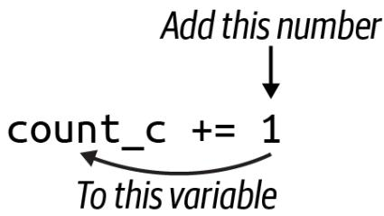  
그림 1-3. `+=` 연산자는 우변의 값을 좌변의 변수에 더합니다.

확인해야 할 뉴클레오타이드가 네 개이므로 세 개의 `if` 표현식을 더 결합할 방법이 필요합니다. 파이썬에서는 `else if` 대신 `elif`를 사용하고, 마지막이나 기본 케이스에 `else`를 사용합니다. 다음은 프로그램이나 REPL에 입력하여 간단한 결정 트리(decision tree)를 구현할 수 있는 코드 블록입니다.

```python
dna = 'ACCGGGTTTT'  
count_a, count_c, count_g, count_t = 0, 0, 0, 0  
for base in dna:  
    if base == 'A':  
        count_a += 1  
    elif base == 'C':  
        count_c += 1  
    elif base == 'G':  
        count_g += 1 
```

elif base == 'T':

count_t += 1

결과적으로 정렬된 염기들에 대해 각각 1, 2, 3, 4라는 카운트를 얻어야 합니다.

```txt
>>> count_a, count_c, count_g, count_t  
(1, 2, 3, 4) 
```

이제 결과를 사용자에게 보고해야 합니다.

```txt
>>> print(count_a, count_c, count_g, count_t)  
1 2 3 4 
```

이것이 프로그램이 기대하는 정확한 출력입니다. `print()`는 여러 값을 인자로 받아 출력할 수 있으며, 각 값 사이에 공백을 삽입한다는 점에 주목하세요. REPL에서 `help(print)`를 읽어보면 `sep` 인자를 사용해 이 구분자를 변경할 수 있음을 알 수 있습니다.

```txt
>>> print(count_a, count_c, count_g, count_t, sep=':')
1:2:3:4 
```

`print()` 함수는 출력 끝에 줄바꿈 문자도 넣는데, 이 역시 `end` 옵션을 사용해 변경할 수 있습니다.

```erlang
>>> print(count_a, count_c, count_g, count_t, end='\n-종료-\n')
1 2 3 4
-종료- 
```

# 솔루션 작성 및 검증

앞서 설명한 코드를 사용하여 모든 테스트를 통과하는 프로그램을 만들 수 있을 것입니다. 코드를 작성하면서 `pylint`, `flake8`, `mypy`를 정기적으로 실행하여 소스 코드에 잠재적인 오류가 있는지 확인하시길 권장합니다. 더 나아가 이러한 테스트를 일상적으로 포함할 수 있도록 `pytest` 확장 도구들을 설치하는 것을 추천합니다.

$ python3 -m pip install pytest-pylint pytest-flake8 pytest-mypy

또는 GitHub 저장소의 루트 디렉토리에 이 책 전체에서 사용할 다양한 의존성 목록을 담은 `requirements.txt` 파일을 두었습니다. 다음 명령으로 이 모든 모듈을 설치할 수 있습니다.

$ python3 -m pip install -r requirements.txt

이러한 확장 도구들을 사용하면 `tests/dna_test.py` 파일에 정의된 테스트뿐만 아니라 린팅(linting) 및 타입 체크 테스트도 함께 실행할 수 있습니다.

```txt
$ pytest -xv --pylint --flake8 --mypy tests/dna_test.py
============================== test session starts
      
...
collected 7 items
tests/dna_test.py::FLAKE8 SKIPPED [12%] 
```

```txt
tests/dna_test.py::mypy PASSED [25%]
tests/dna_test.py::test_exists PASSED [37%]
tests/dna_test.py::testusage PASSED [50%]
tests/dna_test.py::test_dies_no_args PASSED [62%]
tests/dna_test.py::test_arg PASSED [75%]
tests/dna_test.py::test_file PASSED [87%]
::mypy PASSED [100%] 
```

성공: 1개의 소스 파일에서 아무런 문제가 발견되지 않았습니다.

===== 7 passed, 1 skipped in 0.58s ====


캐시된 버전에서 마지막 테스트 이후 변경된 사항이 없음을 나타낼 때 일부 테스트는 건너뛰어집니다(skipped). 테스트를 강제로 실행하려면 `--cache-clear` 옵션과 함께 `pytest`를 실행하세요. 또한 코드가 제대로 포맷팅되거나 들여쓰기되지 않은 경우 린팅 테스트에서 실패할 수 있습니다. `yapf`나 `black`을 사용하여 코드를 자동으로 포맷팅할 수 있습니다. 대부분의 IDE와 에디터에서 자동 포맷 옵션을 제공합니다.

입력해야 할 내용이 많으므로 디렉토리에 `Makefile` 형태의 단축키를 만들어 두었습니다.

```txt
$ cat Makefile
.PHONY: test
test:
    python3 -m pytest -xv --flake8 --pylint --pylint-rcfile=../pylintrc \
    --mypy dna.py tests/dna_test.py
all:
    ../bin/all_test.py dna.py 
```

부록 A를 읽어보면 이러한 파일들에 대해 더 자세히 배울 수 있습니다. 지금은 시스템에 `make`가 설치되어 있다면 `make test` 명령을 사용하여 `Makefile`의 테스트 타겟에 정의된 명령을 실행할 수 있다는 것만 이해하면 충분합니다. `make`가 설치되어 있지 않거나 사용하고 싶지 않아도 괜찮지만, `Makefile`을 사용하여 프로세스를 문서화하고 자동화하는 방법을 살펴보는 것을 권장합니다.

테스트를 통과하는 `dna.py`를 작성하는 방법은 여러 가지가 있으며, 솔루션을 읽기 전에 계속 탐구해 보시길 권장합니다. 무엇보다 여러분이 프로그램을 변경한 다음 테스트를 실행하여 작동 여부를 확인하는 습관에 익숙해지길 바랍니다. 이것이 바로 프로그램이 올바르게 작동하는지 판단할 지표를 먼저 만드는 테스트 주도 개발(TDD)의 주기입니다. 이 경우에는 `pytest`에 의해 실행되는 `dna_test.py` 프로그램이 그 지표가 됩니다.

테스트는 목표에서 벗어나지 않게 해주며, 프로그램의 요구사항을 충족했을 때 이를 알려줍니다. 테스트는 실행 가능한 프로그램으로서 구체화된 사양(specs)입니다. 테스트 없이 프로그램이 제대로 작동하는지, 혹은 완성되었는지를 어떻게 알 수 있을까요? 루이스 스라이글리(Louis Srygley)가 말했듯이, "요구사항이나 설계가 없는 프로그래밍은 빈 텍스트 파일에 버그를 추가하는 기술"일 뿐입니다.

테스트는 재현 가능한 프로그램을 만드는 데 필수적입니다. 정상 데이터와 비정상 데이터 모두에 대해 프로그램의 정확성과 예측 가능성을 절대적이고 자동으로 증명할 수 없다면, 좋은 소프트웨어를 작성하고 있다고 할 수 없습니다.

# 추가 솔루션

이 장의 앞부분에서 작성한 프로그램은 GitHub 저장소의 `solution1_iter.py` 버전이므로 그 버전은 다시 검토하지 않겠습니다. 대신 간단한 아이디어에서 더 복잡한 아이디어로 발전하는 몇 가지 대체 솔루션을 보여드리고 싶습니다. 이것이 '나쁜 것'에서 '좋은 것'으로 발전한다는 의미로 받아들이지는 마십시오. 모든 버전이 테스트를 통과하므로 모두 동등하게 유효합니다. 핵심은 일반적인 문제를 해결하기 위해 파이썬이 제공하는 기능들을 탐구하는 것입니다. `get_args()` 함수와 같이 모든 솔루션이 공통으로 사용하는 코드는 생략하겠습니다.

# 솔루션 2: count() 함수 생성 및 유닛 테스트 추가

첫 번째 변형은 `main()` 함수에서 개수를 세는 모든 코드를 `count()` 함수로 옮기는 것입니다. 이 함수는 프로그램의 어느 곳에나 정의할 수 있지만, 저는 보통 `get_args()`를 첫 번째로, `main()`을 두 번째로 배치하고, 다른 함수들은 그 뒤에 배치한 후 마지막으로 `main()`을 호출하는 두 줄의 코드를 둡니다.

다음 함수를 위해서는 `typing.Tuple` 값을 임포트해야 합니다.

```python
def count(dna: str) -> Tuple[int, int, int, int]: ①
    ''' DNA 염기 개수 세기 '''
    count_a, count_c, count_g, count_t = 0, 0, 0, 0 ②
    for base in dna:
        if base == 'A':
            count_a += 1
        elif base == 'C':
            count_c += 1
        elif base == 'G':
            count_g += 1
        elif base == 'T':
            count_t += 1
    return (count_a, count_c, count_g, count_t) ③ 
```

1 타입 어노테이션은 이 함수가 문자열을 입력받아 네 개의 정수 값을 포함하는 튜플을 반환함을 보여줍니다.
2 개수를 세는 `main()`의 코드입니다.
3 네 개의 카운트로 구성된 튜플을 반환합니다.

이 코드를 함수로 옮겨야 할 이유는 많습니다. 우선, 이는 계산의 단위(unit of computation)입니다. DNA 문자열이 주어지면 4개 염기 빈도를 반환하는 것이므로 이를 캡슐화하는 것이 합리적입니다. 이렇게 하면 `main()`이 더 짧고 가독성이 좋아지며, 함수에 대한 유닛 테스트(unit test)를 작성할 수 있습니다. 함수의 이름이 `count()`이므로 유닛 테스트의 이름은 `test_count()`로 짓겠습니다. 편의상 이 함수를 `dna_test.py`가 아닌 `dna.py` 프로그램의 `count()` 함수 바로 뒤에 두었습니다. 짧은 프로그램의 경우 함수와 유닛 테스트를 소스 코드에 함께 두는 경향이 있지만, 프로젝트가 커지면 유닛 테스트를 별도의 모듈로 분리할 것입니다. 테스트 함수는 다음과 같습니다.

```python
def test_count() -> None: ①
    ''' count 함수 테스트 '''  
    assert count('') == (0, 0, 0, 0) ②  
    assert count('123XYZ') == (0, 0, 0, 0)  
    assert count('A') == (1, 0, 0, 0) ③  
    assert count('C') == (0, 1, 0, 0)  
    assert count('G') == (0, 0, 1, 0)  
    assert count('T') == (0, 0, 0, 1)  
    assert count('ACCGGGTTTT') == (1, 2, 3, 4) 
```

1 `pytest`가 찾을 수 있도록 함수 이름은 `test_`로 시작해야 합니다. 타입 어노테이션은 이 테스트가 인자를 받지 않으며 반환 문이 없으므로 기본값인 `None`을 반환함을 보여줍니다.
2 함수가 합리적인 값을 반환하는지 확인하기 위해 기대하는 값과 기대하지 않는 값 모두로 함수를 테스트하는 것이 좋습니다. 빈 문자열은 모두 0을 반환해야 합니다.
3 나머지 테스트는 각 염기가 올바른 위치에 보고되는지 확인합니다.

함수가 작동하는지 확인하기 위해 `dna.py` 프로그램에서 `pytest`를 실행할 수 있습니다.

```txt
$ pytest -xv dna.py
============================== test session starts
      
...
dna.py::test_count PASSED [100%]
============================== 1 passed in 0.01s 
```

첫 번째 테스트는 빈 문자열을 전달하고 카운트로 모두 0을 얻기를 기대합니다. 솔직히 이는 판단의 문제입니다. 입력이 없을 때 사용자에게 불평하도록 프로그램을 만들 수도 있습니다. 즉, 빈 문자열을 입력으로 사용하여 프로그램을 실행할 수 있으며, 이 버전은 다음과 같이 보고할 것입니다.

```txt
$ ./dna.py "" 
0 0 0 0 
```

마찬가지로 빈 파일을 전달해도 같은 결과를 얻게 됩니다. `touch` 명령을 사용해 빈 파일을 만듭니다.

```txt
$ touch empty
$ ./dna.py empty
0 0 0 0 
```

유닉스 시스템에서 `/dev/null`은 아무것도 반환하지 않는 특수한 파일 핸들입니다.

```txt
$ ./dna.py /dev/null 
0 0 0 0 
```

입력이 없는 것을 오류로 간주하고 그렇게 보고하고 싶을 수도 있습니다. 테스트에서 중요한 점은 그것에 대해 생각하게 만든다는 것입니다. 예를 들어, `count()` 함수에 빈 문자열이 주어졌을 때 0을 반환해야 할까요, 아니면 예외를 발생시켜야 할까요? 빈 입력에 대해 프로그램을 중단하고 0이 아닌 상태로 종료해야 할까요? 이러한 것들은 여러분이 프로그램을 위해 내려야 할 결정들입니다.

이제 `dna.py` 코드에 유닛 테스트가 포함되었으므로 해당 파일에 대해 `pytest`를 실행하여 통과 여부를 확인할 수 있습니다.

```rst
$ pytest -v dna.py
============================== test session starts
      
...
collected 1 item
dna.py::test_count PASSED [100%]
============================== 1 passed in 0.01s 
```

코드를 작성할 때, 저는 가능한 한 적은 파라미터를 사용해 하나의 제한된 일만 수행하는 함수를 작성하는 것을 좋아합니다. 그런 다음 소스 코드의 함수 바로 뒤에 `test_`와 함수 이름을 붙인 테스트를 작성합니다. 만약 이런 종류의 유닛 테스트가 많아진다면, 테스트들을 별도의 파일로 옮기고 `pytest`가 그 파일을 실행하도록 할 것입니다.

이 새로운 함수를 사용하도록 `main()`을 다음과 같이 수정합니다.

```python
def main() -> None:  
    args = get_args()  
    count_a, count_c, count_g, count_t = count(args.dna) ①  
    print('{} {} {} {}'.format(count_a, count_c, count_g, count_t)) ② 
```

1 `count()`에서 반환된 네 개의 값을 별도의 변수로 해제(unpack)합니다.
2 `str.format()`을 사용해 출력 문자열을 생성합니다.

잠시 파이썬의 `str.format()`에 집중해 봅시다. 그림 1-4에서 보듯이, '{} {} {} {}' 문자열은 생성하려는 출력의 템플릿이며, 문자열 리터럴에서 직접 `str.format()` 함수를 호출하고 있습니다. 이는 `str.join()` 함수에서도 볼 수 있는 파이썬의 일반적인 관용구입니다. 파이썬에서는 리터럴 문자열(소스 코드 내부에서 따옴표 안에 존재하는 문자열)조차도 메서드를 호출할 수 있는 객체라는 점을 기억하는 것이 중요합니다.

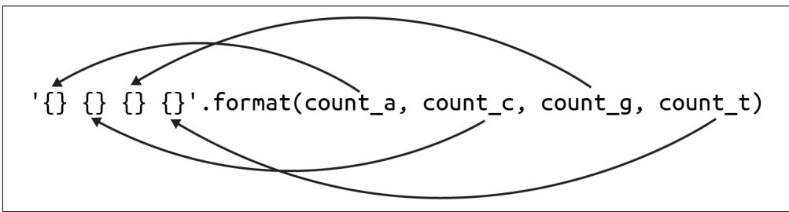  
그림 1-4. `str.format()` 함수는 중괄호를 포함한 템플릿을 사용하여 인자 값으로 채워질 플레이스홀더를 정의합니다.

문자열 템플릿의 각 `{}`는 함수에 인자로 제공되는 값을 위한 플레이스홀더입니다. 이 함수를 사용할 때는 플레이스홀더의 개수와 인자의 개수가 일치하는지 확인해야 합니다. 인자들은 제공된 순서대로 삽입됩니다. `str.format()` 함수에 대해서는 나중에 더 자세히 말씀드리겠습니다.

`count()` 함수가 반환한 튜플을 반드시 해제할 필요는 없습니다. 튜플 앞에 별표(`*`)를 붙여 '스플랫(splat)'하면 튜플 전체를 `str.format()` 함수의 인자로 전달할 수 있습니다. 이는 파이썬에게 튜플을 개별 값들로 확장하라고 지시하는 것입니다.

```python
def main() -> None:  
    args = get_args()  
    counts = count(args.dna) ①  
    print('{} {} {} {}'.format(*counts)) ② 
```

1 `counts` 변수는 정수형 염기 카운트로 구성된 4개 요소의 튜플입니다.
2 `*counts` 구문은 튜플을 포맷 문자열에 필요한 네 개의 값으로 확장합니다. 그렇지 않으면 튜플이 단일 값으로 해석됩니다.

`counts` 변수를 한 번만 사용하므로 할당 과정을 생략하고 다음과 같이 한 줄로 줄일 수 있습니다.

```txt
def main() -> None:  
    args = get_args()  
    print('{} {} {} {}'.format(*count(args.dna))) 1 
```

1 `count()`의 반환 값을 `str.format()` 메서드에 직접 전달합니다.

첫 번째 솔루션이 가독성과 이해 측면에서 더 낫다고 할 수 있으며, `flake8`과 같은 도구는 `{}` 플레이스홀더의 개수가 변수의 개수와 일치하지 않을 때 이를 찾아낼 수 있습니다. 단순하고 장황하며 명확한 코드가 종종 간결하고 영리한 코드보다 낫습니다. 하지만 나중에 다룰 프로그램들에서 튜플 언패킹과 스플랫 변수 아이디어들을 사용할 것이므로 이에 대해 알아두는 것이 좋습니다.

# 솔루션 3: str.count() 사용

이전의 `count()` 함수는 결과적으로 꽤 장황해졌습니다. `str.count()` 메서드를 사용하여 단 한 줄의 코드로 함수를 작성할 수 있습니다. 이 함수는 한 문자열이 다른 문자열 내에 나타나는 횟수를 세어줍니다. REPL에서 보여드리겠습니다.

```txt
>>> seq = 'ACCGGGTTTT'  
>>> seq.count('A')  
1  
>>> seq.count('C')  
2 
```

문자열을 찾지 못하면 0을 보고하므로, 입력 시퀀스에 하나 이상의 염기가 빠져 있더라도 네 가지 뉴클레오타이드를 모두 세는 데 안전합니다.

```txt
>>> 'AAA'.count('T')  
0 
```

이 아이디어를 사용한 새로운 버전의 `count()` 함수입니다.

```python
def count(dna: str) -> Tuple[int, int, int, int]: ①
    ''' DNA 염기 개수 세기 '''
    return (dna.count('A'), dna.count('C'), dna.count('G'), dna.count('T')) ② 
```

1 시그니처는 이전과 동일합니다.
2 네 가지 염기 각각에 대해 `dna.count()` 메서드를 호출합니다.

이 코드는 훨씬 간결하며, 동일한 유닛 테스트를 사용하여 정확성을 검증할 수 있습니다. 이것이 핵심입니다. 함수는 블랙박스처럼 작동해야 합니다. 즉, 박스 안에서 무슨 일이 일어나는지 알 필요도 없고 신경 쓸 필요도 없습니다. 무언가 들어가서 답이 나오면 되고, 오직 그 답이 정확한지만 신경 쓰면 됩니다. 외부와의 계약(파라미터와 반환 값)이 동일하게 유지되는 한 박스 내부에서 일어나는 일을 자유롭게 변경할 수 있습니다.

다음은 파이썬의 f-문자열(f-string) 구문을 사용하여 `main()` 함수에서 출력 문자열을 만드는 또 다른 방법입니다.

```python
def main() -> None:  
    args = get_args()  
    count_a, count_c, count_g, count_t = count(args.dna) ①  
    print(f'{count_a} {count_c} {count_g} {count_t}') ② 
```

1 튜플을 네 개의 개별 카운트로 해제합니다.
2 f-문자열을 사용하여 변수 보간(variable interpolation)을 수행합니다.


따옴표 앞에 'f'가 붙기 때문에 f-문자열이라고 부릅니다. 저는 이것이 문자열을 포맷(format)하는 것이라고 기억하기 위해 이 용어를 사용합니다. 파이썬에는 나중에 설명할 'r'이 붙는 원시 문자열(raw string)도 있습니다. 파이썬의 모든 문자열(일반, f-, r-문자열)은 작은따옴표나 큰따옴표로 감쌀 수 있으며, 차이는 없습니다.

f-문자열을 사용하면 `{}` 플레이스홀더에서 변수 보간을 수행할 수 있는데, 이는 변수를 그 내용으로 바꾼다는 의미입니다. 중괄호 안에서는 코드도 실행할 수 있습니다. 예를 들어 `len()` 함수는 문자열의 길이를 반환하며 중괄호 안에서 실행할 수 있습니다.

```txt
>>> seq = 'ACGT'  
>>> f'시퀀스 "{seq}"의 길이는 {len(seq)}입니다.'  
'시퀀스 "ACGT"의 길이는 4입니다.' 
```

저는 보통 f-문자열이 `str.format()`을 사용한 동일한 코드보다 읽기 쉽다고 생각합니다. 무엇을 선택할지는 주로 스타일의 결정입니다. 코드를 더 읽기 쉽게 만드는 쪽을 권장합니다.

# 솔루션 4: 딕셔너리를 사용하여 모든 문자 세기

지금까지 파이썬의 문자열, 리스트, 튜플에 대해 살펴보았습니다. 다음 솔루션은 키/값 저장소인 딕셔너리(dictionary)를 소개합니다. 이해해야 할 몇 가지 중요한 점들을 짚어보기 위해 내부적으로 딕셔너리를 사용하는 `count()` 함수 버전을 보여드리고 싶습니다.

```coffeescript
def count(dna: str) -> Tuple[int, int, int, int]: ①
    ''' DNA 염기 개수 세기 '''  
    counts = {} ②  
    for base in dna: ③  
        if base not in counts: ④  
            counts[base] = 0 ⑤  
        counts[base] += 1 ⑥  
    return (counts.get('A', 0), ⑦  
            counts.get('C', 0),  
            counts.get('G', 0),  
            counts.get('T', 0)) 
```

1 내부적으로 딕셔너리를 사용하지만, 함수의 시그니처는 변하지 않습니다.
2 카운트를 저장할 빈 딕셔너리를 초기화합니다.
3 `for` 루프를 사용하여 시퀀스를 순회합니다.
4 딕셔너리에 해당 염기가 아직 존재하지 않는지 확인합니다.
5 해당 염기에 대한 값을 0으로 초기화합니다.
6 해당 염기의 카운트를 1 증가시킵니다.
7 `dict.get()` 메서드를 사용하여 각 염기의 카운트 또는 기본값인 0을 가져옵니다.

다시 말하지만, 이 함수의 계약(타입 시그니처)은 변하지 않았습니다. 여전히 입력은 문자열이고 출력은 정수들의 4개 요소 튜플입니다. 함수 내부에서는 빈 중괄호를 사용하여 초기화할 딕셔너리를 사용할 것입니다.

```hcl
>>> counts = {} 
```

`dict()` 함수를 사용할 수도 있습니다. 어느 쪽이든 상관없습니다.

```txt
>>> counts = dict() 
```

`type()` 함수를 사용해 이것이 딕셔너리인지 확인할 수 있습니다.

```txt
>>> type(counts)
<class 'dict'> 

`isinstance()` 함수는 변수의 타입을 확인하는 또 다른 방법입니다.

```txt
>>> isinstance(counts, dict) 
True 
```

제 목표는 각 염기를 키(key)로, 해당 염기가 나타나는 횟수를 값(value)으로 갖는 딕셔너리를 만드는 것입니다. 예를 들어, 시퀀스가 'ACCGGGTTT'라면 `counts`가 다음과 같이 보이기를 원합니다.

```python
>>> counts
{'A': 1, 'C': 2, 'G': 3, 'T': 4} 
```

다음과 같이 대괄호와 키 이름을 사용하여 값에 접근할 수 있습니다.

```txt
>>> counts['G'] 
3 
```

존재하지 않는 딕셔너리 키에 접근하려고 하면 파이썬은 `KeyError` 예외를 발생시킵니다.

```txt
>>> counts['N']
Traceback (most recent call last):
    File "<stdin>", line 1, in <module>
KeyError: 'N' 
```

`in` 키워드를 사용하여 딕셔너리에 키가 존재하는지 확인할 수 있습니다.

```txt
>>> 'N' in counts  
False  
>>> 'T' in counts  
True 
```

시퀀스의 각 염기를 순회할 때, 해당 염기가 `counts` 딕셔너리에 존재하는지 확인해야 합니다. 만약 존재하지 않는다면 0으로 초기화해야 합니다. 그런 다음 `+=` 할당 연산자를 사용하여 안전하게 염기의 카운트를 1 증가시킬 수 있습니다.

```txt
>>> seq = 'ACCGGGTTTT'  
>>> counts = {}  
>>> for base in seq:  
...     if not base in counts:  
...         counts[base] = 0  
...     counts[base] += 1  
...  
>>> counts  
{'A': 1, 'C': 2, 'G': 3, 'T': 4} 
```

마지막으로 각 염기에 대한 카운트로 구성된 4개 요소의 튜플을 반환하고 싶습니다. 다음과 같이 하면 될 것이라고 생각할 수도 있습니다.

```txt
>>> counts['A'], counts['C'], counts['G'], counts['T'] 
(1, 2, 3, 4) 
```

하지만 시퀀스에서 염기 중 하나가 빠져 있다면 어떻게 될지 생각해 보세요. 제가 작성한 유닛 테스트를 통과할 수 있을까요? 절대 안 됩니다. 빈 문자열을 사용하는 첫 번째 테스트에서 `KeyError` 예외가 발생하여 실패할 것입니다. 딕셔너리에 값을 요청하는 안전한 방법은 `dict.get()` 메서드를 사용하는 것입니다. 키가 존재하지 않으면 `None`이 반환됩니다.

```txt
>>> counts.get('T')  
4  
>>> counts.get('N') 
```

# 파이썬의 None 값

두 번째 호출은 REPL에서 `None`을 표시하지 않기 때문에 아무것도 하지 않는 것처럼 보입니다. `type()` 함수를 사용하여 반환 값을 확인해 보겠습니다. `NoneType`은 `None` 값의 타입입니다.

```txt
>>> type(counts.get('N'))
<class 'NoneType'> 
```

`==` 연산자를 사용하여 반환 값이 `None`인지 확인할 수 있습니다.

```txt
>>> counts.get('N') == None  
True 
```

하지만 PEP8은 "`None`과 같은 싱글톤(singleton)과의 비교는 항상 `is`나 `is not`을 사용해야 하며, 절대 동등 연산자를 사용해서는 안 된다"고 권장합니다. 다음은 어떤 값이 `None`인지 확인하는 규정된 방법입니다.

```txt
>>> counts.get('N') is None 
True 
```

`dict.get()` 메서드는 키가 존재하지 않을 때 반환할 기본값을 두 번째 인자로 받을 수 있습니다. 따라서 이것이 염기 카운트의 4개 요소 튜플을 반환하는 가장 안전한 방법입니다.

```txt
>>> counts.get('A', 0), counts.get('C', 0), counts.get('G', 0), counts.get('T', 0)  
(1, 2, 3, 4) 
```


`count()` 함수 내부에 무엇을 작성하든, `test_count()` 유닛 테스트를 통과하는지 확인하세요.

# 솔루션 5: 원하는 염기만 세기

이전 솔루션은 입력 시퀀스의 모든 문자를 세지만, 만약 네 가지 뉴클레오타이드만 세고 싶다면 어떻게 해야 할까요? 이 솔루션에서는 원하는 염기들에 대해 값을 0으로 하여 딕셔너리를 초기화할 것입니다. 이 코드를 실행하려면 `typing.Dict`도 가져와야 합니다.

```python
def count(dna: str) -> Dict[str, int]: ①
    ''' DNA 염기 개수 세기 ''' 
    counts = {'A': 0, 'C': 0, 'G': 0, 'T': 0} ②
    for base in dna: ③
        if base in counts: ④
            counts[base] += 1 ⑤
    return counts ⑥ 
```

1 이제 시그니처는 키는 문자열이고 값은 정수인 딕셔너리를 반환함을 나타냅니다.
2 네 가지 염기를 키로 하고 값을 0으로 하여 `counts` 딕셔너리를 초기화합니다.
3 염기들을 순회합니다.
4 해당 염기가 `counts` 딕셔너리의 키로 존재하는지 확인합니다.
5 존재한다면 해당 염기의 카운트를 1 증가시킵니다.
6 `counts` 딕셔너리를 반환합니다.

`count()` 함수가 이제 튜플이 아닌 딕셔너리를 반환하므로, `test_count()` 함수도 변경되어야 합니다.

```python
def test_count() -> None:
    ''' count 함수 테스트 ''' 
    assert count('') == {'A': 0, 'C': 0, 'G': 0, 'T': 0} ①
    assert count('123XYZ') == {'A': 0, 'C': 0, 'G': 0, 'T': 0} ②
    assert count('A') == {'A': 1, 'C': 0, 'G': 0, 'T': 0} 
    assert count('C') == {'A': 0, 'C': 1, 'G': 0, 'T': 0} 
    assert count('G') == {'A': 0, 'C': 0, 'G': 1, 'T': 0} 
    assert count('T') == {'A': 0, 'C': 0, 'G': 0, 'T': 1} 
    assert count('ACCGGGTTTT') == {'A': 1, 'C': 2, 'G': 3, 'T': 4} 
```

1 반환된 딕셔너리는 항상 A, C, G, T 키를 갖게 됩니다. 빈 문자열의 경우에도 이 키들이 존재하며 값은 0으로 설정됩니다.
② 다른 모든 테스트는 동일한 입력을 갖지만, 이제 결과가 딕셔너리로 돌아오는지 확인합니다.

이러한 테스트를 작성할 때 딕셔너리에서 키의 순서는 중요하지 않다는 점에 유의하세요. 다음 코드의 두 딕셔너리는 정의 방식이 다르더라도 동일한 내용을 담고 있습니다.

```txt
>>> counts1 = {'A': 1, 'C': 2, 'G': 3, 'T': 4}  
>>> counts2 = {'T': 4, 'G': 3, 'C': 2, 'A': 1}  
>>> counts1 == counts2  
True 
```


`test_count()` 함수는 함수의 정확성을 보장할 뿐만 아니라 문서화 역할도 한다는 점을 강조하고 싶습니다. 이러한 테스트를 읽으면 함수에서 가능한 입력의 구조와 기대되는 출력을 파악하는 데 도움이 됩니다.

반환된 딕셔너리를 사용하도록 `main()` 함수를 변경하는 방법은 다음과 같습니다.

```python
def main() -> None:  
    args = get_args()  
    counts = count(args.dna) ①  
    print('{} {} {} {}'.format(counts['A'], counts['C'], counts['G'], ②  
                    counts['T'])) 
```

1 `counts`는 이제 딕셔너리입니다.
2 `str.format()` 메서드를 사용하여 딕셔너리의 값들로 출력을 생성합니다.

# 솔루션 6: collections.defaultdict() 사용

`collections` 모듈의 `defaultdict()` 함수를 사용하면 딕셔너리를 초기화하고 키를 확인하는 등의 이전의 모든 수고를 덜 수 있습니다.

>>> from collections import defaultdict

`defaultdict()` 함수를 사용하여 새 딕셔너리를 만들 때 값의 기본 타입을 알려줍니다. `defaultdict` 타입은 제가 참조하는 모든 키가 존재하지 않을 경우 기본 타입의 대표 값을 사용하여 자동으로 생성해 주기 때문에, 키를 사용하기 전에 확인할 필요가 없습니다. 뉴클레오타이드의 개수를 세는 경우 `int` 타입을 사용하고 싶습니다.

>>> counts = defaultdict(int)

기본 `int` 값은 0이 됩니다. 존재하지 않는 키를 참조하면 값이 0인 상태로 키가 생성됩니다.

```txt
>>> counts['A']  
0 
```

이는 한 단계에서 어떤 염기든 인스턴스화하고 증가시킬 수 있음을 의미합니다.

```txt
>>> counts['C'] += 1
>>> counts
defaultdict(<class 'int'>, {'A': 0, 'C': 1}) 
```

이 아이디어를 사용하여 `count()` 함수를 다시 작성하는 방법은 다음과 같습니다.

```python
def count(dna: str) -> Dict[str, int]:
    ''' DNA 염기 개수 세기 ''' 
    counts: Dict[str, int] = defaultdict(int) ①
    for base in dna:
        counts[base] += 1 ②
    return counts 
```

1 `counts`는 정수 값을 갖는 `defaultdict`가 될 것입니다. 여기서 타입 어노테이션은 `mypy`가 반환 값이 올바른지 확인할 수 있도록 하는 데 필요합니다.
② 해당 염기의 카운트를 안전하게 증가시킬 수 있습니다.

`test_count()` 함수는 꽤 다르게 보입니다. 정답들이 이전 버전들과 매우 다르다는 것을 한눈에 알 수 있습니다.

```python
def test_count() -> None:
    ''' count 함수 테스트 ''' 
    assert count('') == {}
    assert count('123XYZ') == {'1': 1, '2': 1, '3': 1, 'X': 1, 'Y': 1, 'Z': 1} ②
    assert count('A') == {'A': 1} ③
    assert count('C') == {'C': 1} 
    assert count('G') == {'G': 1} 
    assert count('T') == {'T': 1} 
    assert count('ACCGGGTTTT') == {'A': 1, 'C': 2, 'G': 3, 'T': 4} 
```

1 빈 문자열이 주어지면 빈 딕셔너리가 반환됩니다.
② 문자열의 모든 문자가 딕셔너리의 키가 된다는 점에 주목하세요.
③ 'A'만 존재하며 카운트는 1입니다.

반환된 딕셔너리에 모든 염기가 포함되어 있지 않을 수도 있다는 사실을 고려할 때, `main()`의 코드는 각 염기의 빈도를 가져오기 위해 `count.get()` 메서드를 사용해야 합니다.

```python
def main() -> None:  
    args = get_args()  
    counts = count(args.dna) ①  
    print(counts.get('A', 0), counts.get('C', 0), counts.get('G', 0), ②  
                    counts.get('T', 0)) 
```

1 `counts`는 모든 뉴클레오타이드를 포함하지 않을 수도 있는 딕셔너리가 될 것입니다.
② `dict.get()` 메서드에 기본값 0을 함께 사용하는 것이 가장 안전합니다.

# 솔루션 7: collections.Counter() 사용

완벽함이란 더 이상 보탤 것이 없을 때가 아니라, 더 이상 뺄 것이 없을 때 이루어집니다.

—앙투안 드 생텍쥐페리(Antoine de Saint-Exupéry)

저는 사실 앞의 세 가지 솔루션을 그렇게 좋아하지 않지만, 여러분이 `collections.Counter()`를 사용하는 것의 단순함을 이해할 수 있도록 딕셔너리를 수동으로 그리고 `defaultdict()`로 사용하는 과정을 거쳐야 했습니다.

```python
>>> from collections import Counter
>>> Counter('ACCGGGTTT')
Counter({'G': 3, 'T': 3, 'C': 2, 'A': 1}) 
```

가장 좋은 코드는 여러분이 작성하지 않는 코드입니다. `Counter()`는 여러분이 전달하는 순회 가능한 객체(iterable)에 포함된 아이템들의 빈도를 담은 딕셔너리를 반환하는 미리 패키징된 함수입니다. 이를 '백(bag)'이나 '멀티셋(multiset)'이라고 부르기도 합니다. 여기서 순회 가능한 객체는 문자들로 구성된 문자열이며, 결과적으로 이전 두 솔루션과 동일한 딕셔너리를 얻게 되지만 코드는 한 줄도 작성하지 않았습니다.

이것은 매우 간단해서 `count()`와 `test_count()` 함수를 거의 생략하고 `main()`에 직접 통합할 수 있을 정도입니다.

```python
def main() -> None:  
    args = get_args()  
    counts = Counter(args.dna) ①  
    print(counts.get('A', 0), counts.get('C', 0), counts.get('G', 0), ②  
                    counts.get('T', 0)) 
```

① `counts`는 `args.dna`에 있는 문자들의 빈도를 담은 딕셔너리가 될 것입니다.
② 모든 염기가 존재하는지 확신할 수 없으므로 여전히 `dict.get()`을 사용하는 것이 가장 안전합니다.

이 코드가 `count()` 함수에 속해야 한다고 주장하며 테스트를 유지할 수도 있겠지만, `Counter()` 함수는 이미 테스트되었고 잘 정의된 인터페이스를 가지고 있습니다. 저는 이 함수를 인라인(inline)으로 사용하는 것이 더 합리적이라고 생각합니다.

# 더 나아가기

여기서 다룬 솔루션들은 '대문자 텍스트'로 제공된 DNA 시퀀스만 처리합니다. 이러한 시퀀스들이 소문자로 제공되는 경우를 보는 것도 드문 일이 아닙니다. 예를 들어, 식물 유전체학에서는 반복되는 DNA 영역을 나타내기 위해 소문자 염기를 사용하는 것이 일반적입니다. 다음과 같이 하여 대소문자를 모두 처리할 수 있도록 프로그램을 수정해 보세요.

1. 대소문자가 섞인 새로운 입력 파일을 추가합니다.
2. `tests/dna_test.py`에 이 새로운 파일을 사용하고 대소문자를 구분하지 않는 기대 카운트를 명시하는 테스트를 추가합니다.
3. 새로운 테스트를 실행하고 프로그램이 실패하는지 확인합니다.
4. 새로운 테스트와 이전의 모든 테스트를 통과할 때까지 프로그램을 수정합니다.

사용 가능한 모든 문자를 세기 위해 딕셔너리를 사용한 솔루션들은 더 유연해 보입니다. 즉, 일부 테스트는 A, C, G, T 염기만 고려하지만, 만약 입력 시퀀스가 시퀀싱의 모호성을 나타내는 IUPAC 코드를 사용하여 인코딩되었다면 프로그램 전체를 다시 작성해야 할 것입니다. 네 가지 뉴클레오타이드만 보도록 하드코딩된 프로그램은 다른 알파벳을 사용하는 단백질 시퀀스에는 쓸모가 없을 것입니다. 첫 번째 열에는 발견된 각 문자를, 두 번째 열에는 해당 문자의 빈도를 출력하는 두 개의 열로 구성된 출력을 생성하는 프로그램 버전을 작성해 보세요. 사용자가 어느 열로든 오름차순 또는 내림차순으로 정렬할 수 있게 만드세요.

# 검토

이번 장은 꽤 방대한 분량이었습니다. 다음 장들에서는 여기서 다룬 많은 기초적인 아이디어들을 바탕으로 내용을 전개할 것이므로 조금 더 짧아질 것입니다.

* `new.py` 프로그램을 사용하여 `argparse`를 통해 명령줄 인자를 받고 검증하는 파이썬 프로그램의 기본 구조를 만들 수 있습니다.
* `pytest` 모듈은 이름이 `test_`로 시작하는 모든 함수를 실행하고 얼마나 많은 테스트가 통과했는지 결과를 보고합니다.
* 유닛 테스트는 함수를 위한 것이고, 통합 테스트는 프로그램이 전체적으로 작동하는지 확인합니다.
* `pylint`, `flake8`, `mypy`와 같은 프로그램은 코드에서 다양한 종류의 오류를 찾아낼 수 있습니다. 또한 `pytest`가 이러한 검사들을 자동으로 실행하여 코드가 통과하는지 확인하게 할 수도 있습니다.
* 복잡한 명령은 `Makefile`의 타겟으로 저장하고 `make` 명령을 사용하여 실행할 수 있습니다.
* 일련의 `if/else` 문을 사용하여 결정 트리를 만들 수 있습니다.
* 문자열의 모든 문자를 세는 방법은 많습니다. `collections.Counter()` 함수를 사용하는 것이 문자 빈도 딕셔너리를 만드는 가장 간단한 방법일 것입니다.
* 변수와 함수에 타입을 어노테이션할 수 있으며, `mypy`를 사용하여 타입이 올바르게 사용되었는지 확인할 수 있습니다.
* 파이썬 REPL은 코드 예제를 실행하고 문서를 읽기 위한 대화형 도구입니다.
* 파이썬 커뮤니티는 일반적으로 PEP8과 같은 스타일 가이드를 따릅니다. `yapf`나 `black` 같은 도구는 이러한 제안에 따라 코드를 자동으로 포맷팅할 수 있으며, `pylint`와 `flake8` 같은 도구는 가이드라인에서 벗어난 부분을 보고합니다.
* 파이썬의 문자열, 리스트, 튜플, 딕셔너리는 매우 강력한 데이터 구조이며, 각각 유용한 메서드와 방대한 문서를 갖추고 있습니다.
* 네임드 튜플에서 파생된 커스텀 불변(immutable) 타입 클래스를 만들 수 있습니다.

일곱 가지 솔루션 중 어떤 것이 가장 좋은지 궁금하실 것입니다. 인생의 많은 일들이 그렇듯, 상황에 따라 다릅니다. 어떤 프로그램은 작성하기 더 짧고 이해하기 쉽지만, 대규모 데이터셋을 마주했을 때는 성능이 떨어질 수 있습니다. 2장에서는 대량의 입력을 사용한 여러 번의 실행을 통해 서로 경쟁시켜 어떤 프로그램이 가장 우수한 성능을 보이는지 벤치마킹하는 방법을 보여드리겠습니다.

# DNA를 mRNA로 전사하기: 문자열 수정, 파일 읽고 쓰기

생명을 유지하는 데 필요한 단백질을 발현시키기 위해, DNA 영역은 메신저 RNA(mRNA)라고 불리는 RNA 형태로 전사되어야 합니다. DNA와 RNA 사이에는 흥미로운 생화학적 차이가 많지만, 우리의 목적상 유일한 차이점은 DNA 시퀀스에서 티민(thymine) 염기를 나타내는 모든 문자 'T'를 우라실(uracil)을 뜻하는 'U'로 바꾸어야 한다는 것입니다. Rosalind RNA 페이지에 설명된 대로, 제가 작성법을 보여드릴 프로그램은 'ACGT'와 같은 DNA 문자열을 입력받아 전사된 mRNA 'ACGU'를 출력할 것입니다. 파이썬의 `str.replace()` 함수를 사용하면 이를 한 줄로 수행할 수 있습니다.

```javascript
>>> 'GATGGAACTTGACTACGTAAATT'.replace('T', 'U') 
'GAUGGAACUUGACUACGUAAAAUU'
```

여러분은 이미 1장에서 명령줄이나 파일로부터 DNA 시퀀스를 입력받아 결과를 출력하는 프로그램을 작성하는 방법을 보았으므로, 이를 다시 반복한다면 배울 점이 별로 없을 것입니다. 저는 생명정보학에서 흔히 볼 수 있는 패턴을 다룸으로써 이 프로그램을 더 흥미롭게 만들 것입니다. 즉, 하나 이상의 입력 파일을 처리하고 그 결과를 출력 디렉토리에 저장하는 방법을 보여드리겠습니다. 예를 들어, 시퀀싱 작업 결과를 품질 검사 및 필터링이 필요한 파일들이 담긴 디렉토리로 받고, 정제된 시퀀스들을 분석을 위한 새로운 디렉토리에 넣는 것은 매우 일반적인 일입니다. 여기서 입력 파일들은 한 줄에 하나씩 DNA 시퀀스를 포함하고 있으며, 저는 출력 디렉토리에 동일한 이름의 파일들로 mRNA 시퀀스들을 작성할 것입니다.

이 장에서 여러분은 다음을 배우게 됩니다.

* 하나 이상의 파일 입력을 요구하는 프로그램을 작성하는 방법
* 디렉토리를 생성하는 방법
* 파일을 읽고 쓰는 방법
* 문자열을 수정하는 방법

# 시작하기

프로그램이 어떻게 작동해야 하는지 파악하기 위해 먼저 솔루션 중 하나를 실행해 보는 것이 도움이 될 수 있습니다. `02_rna` 디렉토리로 이동하여 첫 번째 솔루션을 `rna.py` 프로그램으로 복사하는 것부터 시작하세요.

```txt
$ cd 02_rna
$ cp solution1_str_replace.py rna.py 
```

`-h` 플래그를 사용하여 프로그램 사용법을 요청합니다.

```txt
$ ./rna.py -h
usage: rna.py [-h] [-o DIR] FILE [FILE ...] ① 
```

```txt
DNA를 RNA로 전사하기 
```

```txt
positional arguments: ② 
  FILE                  입력 DNA 파일 
```

```txt
optional arguments: 
  -h, --help            이 도움말 메시지를 표시하고 종료 
  -o DIR, --out_dir DIR 출력 디렉토리 (기본값: out) ③ 
```

1 대괄호(`[]`)로 둘러싸인 인자들은 선택 사항입니다. `[FILE ...]` 구문은 이 인자가 반복될 수 있음을 의미합니다.
② 입력 `FILE` 인자(들)는 위치 인자(positional argument)가 될 것입니다.
③ 선택 사항인 출력 디렉토리의 기본값은 'out'입니다.

프로그램의 목표는 각각 DNA 시퀀스를 포함하고 있는 하나 이상의 파일을 처리하는 것입니다. 여기 첫 번째 테스트 입력 파일이 있습니다.

```txt
$ cat tests/Input1.txt 
GATGGAACTTGACTACGTAAATT 
```

이 입력 파일로 `rna.py` 프로그램을 실행하고 출력을 확인하세요.

```txt
$ ./rna.py tests/Input1.txt
완료, 1개 디렉토리에 1개 파일로 1개 시퀀스를 작성했습니다. 
```

이제 `input1.txt`라는 파일을 포함하는 `out` 디렉토리가 있어야 합니다.

```batch
$ ls out/ 
input1.txt 
```

해당 파일의 내용은 입력 DNA 시퀀스와 일치해야 하지만 모든 'T'가 'U'로 바뀌어 있어야 합니다.

```txt
$ cat out/input1.txt 
GAUGGAACUUGACUACGUAAAUU 
```

여러 입력을 사용하여 프로그램을 실행하고 출력 디렉토리에 여러 파일이 생성되는지 확인해야 합니다. 여기서는 `rna`라는 출력 디렉토리와 함께 모든 테스트 입력 파일들을 사용할 것입니다. 요약 텍스트에서 시퀀스(sequence)와 파일(file)에 대해 단수/복수를 올바르게 사용하는 방식에 주목하세요.

```txt
$ ./rna.py --out_dir rna tests/Input/* 
완료, "rna" 디렉토리에 3개 파일로 5개 시퀀스를 작성했습니다. 
```

`wc`(단어 수 세기) 프로그램에 `-l` 옵션을 사용하여 출력 파일의 줄 수를 세고, `rna` 디렉토리의 3개 파일에 5개의 시퀀스가 기록되었는지 확인할 수 있습니다.

```txt
$ wc -l rna/*  
1 rna/Input1.txt  
2 rna/Input2.txt  
3 rna/Input3.txt  
4 total 
```

# 프로그램 파라미터 정의하기

앞서 본 사용법에서 알 수 있듯이, 여러분의 프로그램은 다음 파라미터들을 받아들여야 합니다.

* 하나 이상의 위치 인자. 이는 전사할 DNA 문자열을 포함하는 읽기 가능한 텍스트 파일이어야 합니다.
* RNA 시퀀스를 기록할 출력 디렉토리의 이름을 지정하는 선택적인 `-o` 또는 `--out_dir` 인자. 기본값은 'out'이어야 합니다.

여러분은 원하는 대로 프로그램을 작성하고 구조화할 수 있지만(테스트를 통과하기만 한다면), 저는 항상 `new.py`와 1장에서 보여드린 구조를 사용하여 프로그램을 시작할 것입니다. `--force` 플래그는 기존의 `rna.py`를 덮어써야 함을 나타냅니다.

```txt
$ new.py --force -p "DNA를 RNA로 전사하기" rna.py 
새 스크립트 "rna.py"를 확인하세요. 
```

# 선택적 파라미터 정의하기

이전 섹션에서 설명한 파라미터들을 수용하도록 `get_args()` 함수를 수정합니다. 우선 `out_dir` 파라미터를 정의합니다. `new.py`에 의해 생성된 `-a|--arg` 옵션을 다음과 같이 변경할 것을 권장합니다.

```python
parser.add_argument('-o', # 1
                    '--out_dir', # 2
                    help='출력 디렉토리', # 3
                    metavar='DIR', # 4
                    type=str, # 5
                    default='out') # 6 
```

1 이것은 짧은 플래그 이름입니다. 짧은 플래그는 단일 대시(`-`)로 시작하며 단일 문자가 뒤따릅니다.
2 이것은 긴 플래그 이름입니다. 긴 플래그는 두 개의 대시(`--`)로 시작하며 짧은 플래그보다 기억하기 쉬운 문자열이 뒤따릅니다. 이는 또한 `argparse`가 값에 접근하는 데 사용할 이름이 됩니다.
3 이는 인자를 설명하기 위해 사용법 문구에 포함될 것입니다.
4 `metavar`는 사용법에도 표시되는 짧은 설명입니다.
5 모든 인자의 기본 타입은 `str`(문자열)이므로 이는 기술적으로 불필요하지만 문서를 위해 남겨두는 것도 나쁘지 않습니다.
6 기본값은 'out' 문자열이 됩니다. 옵션을 정의할 때 `default` 속성을 지정하지 않으면 기본값은 `None`이 됩니다.

# 하나 이상의 필수 위치 파라미터 정의하기

`FILE` 값(들)을 위해 기본 `-f|--file` 파라미터를 다음과 같이 수정할 수 있습니다.

```python
parser.add_argument('file', # 1
                    help='입력 DNA 파일(들)', # 2
                    metavar='FILE', # 3
                    nargs='+', # 4
                    type=argparse.FileType('rt')) # 5
```

1 `-f` 짧은 플래그와 `--file`에서 두 개의 대시를 제거하여 이것을 `file`이라는 이름의 위치 인자로 만듭니다. 선택적 파라미터는 대시로 시작하고, 위치 인자는 그렇지 않습니다.
2 도움말 문자열은 인자가 DNA 시퀀스를 포함하는 하나 이상의 파일이어야 함을 나타냅니다.
3 이 문자열은 인자가 파일임을 나타내기 위해 짧은 사용법에 출력됩니다.
4 이는 인자의 개수를 나타냅니다. `+`는 하나 이상의 값이 필요함을 나타냅니다.
5 이는 `argparse`가 강제할 실제 타입입니다. 저는 모든 값이 읽기 가능한 텍스트(`rt`) 파일이어야 함을 요구하고 있습니다.

# nargs를 사용하여 인자의 개수 정의하기

프로그램 인자의 개수를 설명하기 위해 `nargs`를 사용합니다. 허용되는 정확한 값의 개수를 나타내기 위해 정수 값을 사용하는 것 외에도 표 2-1에 표시된 세 가지 기호를 사용할 수 있습니다.

표 2-1. nargs에 가능한 값들

| 기호 | 의미 |
| :--- | :--- |
| ? | 0개 또는 1개 |
| * | 0개 이상 |
| + | 1개 이상 |

`nargs`에 `+`를 사용하면 `argparse`는 인자들을 리스트로 제공합니다. 인자가 하나뿐이더라도 하나의 요소를 포함하는 리스트를 얻게 됩니다. 적어도 하나의 인자가 필요하기 때문에 절대 빈 리스트를 얻지는 않을 것입니다.

# argparse.FileType()을 사용하여 파일 인자 검증하기

`argparse.FileType()` 함수는 매우 강력하며, 이를 사용하면 파일 입력 검증 시간을 대폭 절약할 수 있습니다. 이 타입으로 파라미터를 정의하면, 인자 중 하나라도 파일이 아닐 경우 `argparse`는 오류 메시지를 출력하고 프로그램 실행을 중단합니다. 예를 들어, 여러분의 `02_dna` 디렉토리에 'blargh'라는 파일이 없다고 가정해 보겠습니다. 해당 값을 전달했을 때의 결과를 확인해 보세요.

```txt
$ ./rna.py blargh
usage: rna.py [-h] [-o DIR] FILE [FILE ...]
rna.py: error: argument FILE: can't open 'blargh': [Errno 2] 
No such file or directory: 'blargh'
```

여기서 명확히 드러나지는 않지만, `argparse`가 다음 작업들을 수행했기 때문에 프로그램은 `get_args()` 함수를 벗어나지도 못했습니다.

1. 'blargh'가 유효한 파일이 아님을 감지했습니다.
2. 짧은 사용법 문구를 출력했습니다.
3. 유용한 오류 메시지를 출력했습니다.
4. 0이 아닌 값으로 프로그램을 종료했습니다.

이것이 잘 작성된 프로그램이 작동해야 하는 방식이며, 가능한 한 빨리 잘못된 인자를 감지하고 거부하며 사용자에게 문제를 알리는 것입니다. 이 모든 일이 제가 원하는 인자의 종류에 대한 좋은 설명을 작성하는 것 외에 아무것도 하지 않고도 일어났습니다. 다시 말하지만, 가장 좋은 코드는 여러분이 작성하지 않는 코드입니다(엘론 머스크가 말했듯, "가장 좋은 부품은 부품이 없는 것이고, 가장 좋은 프로세스는 프로세스가 없는 것이다.")

파일 타입을 사용하고 있기 때문에, 리스트의 요소들은 파일 이름을 나타내는 문자열이 아니라 대신 열려 있는 파일 핸들(filehandle)이 될 것입니다. 파일 핸들은 파일의 내용을 읽고 쓰기 위한 메커니즘입니다. 지난 장에서 DNA 인자가 파일 이름이었을 때 파일 핸들을 사용했습니다.


소스 코드에서 이러한 파라미터들을 정의하는 순서는 이 경우 중요하지 않습니다. 위치 인자 전이나 후에 옵션들을 정의할 수 있습니다. 순서는 여러 개의 위치 인자가 있을 때만 중요합니다. 첫 번째 파라미터는 첫 번째 위치 인자를 위한 것이고, 두 번째 파라미터는 두 번째 위치 인자를 위한 것, 이런 식입니다.

# Args 클래스 정의하기

마지막으로 인자들을 나타낼 `Args` 클래스를 정의하는 방법이 필요합니다.

```python
from typing import NamedTuple, List, TextIO # 1

class Args(NamedTuple): 
    """ 명령줄 인자 """ 
    files: List[TextIO] # 2
    out_dir: str
```

1 `typing` 모듈에서 리스트를 설명하는 `List`와 열려 있는 파일 핸들을 위한 `TextIO`라는 두 개의 새로운 임포트가 필요합니다.
2 `files` 속성은 열려 있는 파일 핸들들의 리스트가 될 것입니다.
3 `out_dir` 속성은 문자열이 될 것입니다.

이 클래스를 사용하여 `get_args()`로부터 반환 값을 생성할 수 있습니다. 다음 구문은 파일이 첫 번째 필드이고 `out_dir`이 두 번째 필드가 되도록 위치 표기법을 사용합니다. 필드가 한두 개일 때는 위치 표기법을 사용하는 경향이 있습니다.

```python
return Args(args.file, args.out_dir)
```

필드 이름을 명시적으로 사용하는 것이 더 안전하고 읽기 쉬우며, 필드가 더 많아지면 필수적이게 될 것입니다.

```python
return Args(files=args.file, out_dir=args.out_dir)
```

이제 입력을 정의하고, 문서화하고, 검증하는 모든 코드를 갖추었습니다. 다음으로 프로그램의 나머지 부분이 어떻게 작동해야 하는지 보여드리겠습니다.

# 의사코드를 사용하여 프로그램 윤곽 잡기

입력 및 출력 파일을 처리하는 방법을 일반적으로 설명하기 위해 코드와 의사코드(pseudocode)를 섞어서 `main()` 함수에 프로그램 로직의 기본 사항을 스케치해 보겠습니다. 새로운 프로그램을 작성하다가 막힐 때마다 이 접근 방식은 무엇을 해야 할지 파악하는 데 도움이 될 수 있습니다. 그런 다음 그 일을 어떻게 할지 알아낼 수 있습니다.

```python
def main() -> None:  
    args = get_args()  
    if not os.path.isdir(args.out_dir): ①  
        os.makedirs(args.out_dir) ②  
    num_files, num_seqs = 0, 0 ③  
    for fh in args.files: ④ 
```

1 os.path.isdir() 함수는 출력 디렉토리가 존재하는지 알려줍니다.
2 os.makedirs() 함수는 디렉토리 경로를 생성합니다.
3 프로그램 종료 시 제공할 피드백에서 사용할, 작성된 파일 수와 시퀀스 수에 대한 변수를 초기화합니다.
4 for 루프를 사용하여 args.files에 있는 파일 핸들 리스트를 순회합니다. 반복 변수 fh는 타입(filehandle)을 상기시키는 데 도움이 됩니다.
5 각 파일 핸들에 대해 수행해야 할 단계들을 설명하는 의사코드입니다.
6 사용자에게 무슨 일이 일어났는지 알 수 있도록 요약 내용을 출력합니다.


os.makedirs() 함수는 디렉토리와 모든 상위 디렉토리를 생성하는 반면, os.mkdir() 함수는 상위 디렉토리가 존재하지 않으면 실패합니다. 저는 제 코드에서 오직 첫 번째 함수만 사용합니다.

프로그램을 어떻게 완성해야 할지 알 것 같다면 자유롭게 진행해 보십시오. 코드가 올바른지 확인하기 위해 반드시 pytest(또는 make test)를 실행해 보시기 바랍니다. 파일을 읽고 쓰는 방법에 대해 좀 더 안내가 필요하다면 저와 함께 계속 진행해 봅시다. 다음 섹션들에서 의사코드를 하나씩 다룰 것입니다.

# 입력 파일 순회하기

args.files는 List[TextIO], 즉 파일 핸들들의 리스트라는 점을 기억하십시오. for 루프를 사용하여 이러한 리스트와 같은 모든 순회 가능한 객체의 각 요소를 방문할 수 있습니다.

for fh in args.files:

여기서 제가 각 값이 파일 핸들이기 때문에 fh라는 반복 변수 이름을 선택했다는 점을 강조하고 싶습니다. 가끔 for 루프에서 항상 i나 x 같은 반복 변수 이름을 사용하는 사람들을 보는데, 이는 설명적인 변수 이름이 아닙니다. 물론 다음과 같이 숫자를 순회할 때는 n(number)이나 i(integer) 같은 변수 이름을 사용하는 것이 매우 일반적이라는 점은 인정합니다.

for i in range(10):

그리고 가끔은 일반적인 값의 하나 또는 여러 개를 나타내기 위해 x와 xs(엑스들)를 사용하기도 합니다.

for x in xs:

그 외의 경우에는 자신이 나타내는 대상을 정확하게 묘사하는 변수 이름을 사용하는 것이 매우 중요합니다.

# 출력 파일 이름 생성하기

의사코드에 따르면, 첫 번째 목표는 출력 파일을 여는 것입니다. 그러기 위해서는 출력 디렉토리 이름과 입력 파일의 베이스 이름(basename)을 결합한 파일 이름이 필요합니다. 즉, 입력 파일이 dna/input1.txt이고 출력 디렉토리가 rna라면, 출력 파일 경로는 rna/input1.txt가 되어야 합니다.

os 모듈은 운영체제(Windows, macOS, 리눅스 등)와 상호작용하는 데 사용되며, os.path 모듈에는 유용한 함수가 많이 있습니다. 예를 들어 파일 경로에서 디렉토리 이름을 가져오는 os.path.dirname() 함수와 파일의 이름을 가져오는 os.path.basename() 함수가 있습니다(그림 2-1 참조).

```txt
>>> import os
>>> os.path.dirname('./tests/Input1.txt')
'/tests/Input1'
>>> os.path.basename('./tests/Input1.txt')
'input1.txt' 
```

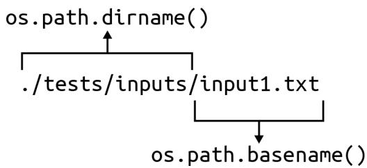  
그림 2-2. os.path.join()은 출력 디렉토리와 입력 파일의 베이스 이름을 결합하여 출력 경로를 생성합니다.

그림 2-1. os.path module에는 파일 경로에서 특정 부분을 추출하는 dirname() 및 basename()과 같은 유용한 함수들이 포함되어 있습니다.

새로운 시퀀스들은 args.out_dir에 있는 출력 파일에 기록될 것입니다. 그림 2-2에서 보듯이, 입력 파일의 베이스 이름을 사용하여 출력 파일 이름을 만들기 위해 os.path.join() 함수를 사용할 것을 권장합니다. 이렇게 하면 각각 슬래시(/)와 역슬래시(\)라는 서로 다른 경로 구분자를 사용하는 유닉스와 윈도우 모두에서 출력 파일 이름이 올바르게 작동함을 보장할 수 있습니다. 유사한 기능을 위해 pathlib 모듈을 조사해 볼 수도 있습니다.

os.path.dirname("tests/Input/output1.txt")
os.path.join("rna", "input1.txt") -> "rna/Input1.txt"
args.out_dir

파일 핸들의 fh.name 속성에서 파일의 경로를 가져올 수 있습니다.

for fh in args.files:
    out_file = os.path.join(args.out_dir, os.path.basename(fh.name))
    print(fh.name, '->', out_file)

프로그램을 실행하여 다음과 같이 보이는지 확인하십시오.

```batch
$ ./rna.py tests/Input/*
tests/Input1.txt -> out/Input1.txt
tests/Input2.txt -> out/Input2.txt
tests/Input3.txt -> out/Input3.txt 
```

프로그램이 해야 할 일을 향해 아주 조금씩 나아가고 있습니다. 한두 줄의 코드를 작성한 다음 프로그램을 실행하여 올바른지 확인하는 과정은 매우 중요합니다. 저는 학생들이 프로그램을 실행해 보기도 전에 많은 양의 코드, 심지어 프로그램 전체를 한꺼번에 작성하려는 모습을 자주 봅니다. 그런 방식은 절대 잘 풀리지 않습니다.

# 출력 파일 열기

이 출력 파일 이름을 사용하여 open()으로 파일 핸들을 열어야 합니다. 1장에서 입력 파일로부터 DNA를 읽기 위해 이 함수를 사용했었습니다. 기본적으로 open()은 파일을 읽는 것만 허용하지만, 여기서는 파일을 써야 합니다. 두 번째 인자로 '쓰기'를 뜻하는 문자열 'w'를 전달하여 파일을 쓰기용으로 열고 싶다는 것을 나타낼 수 있습니다.


기존에 존재하는 파일을 'w' 모드로 열면 파일이 덮어써지며, 이는 이전의 내용이 즉시 영구적으로 사라짐을 의미합니다. 필요한 경우 os.path.isfile() 함수를 사용하여 기존 파일을 열고 있는지 확인할 수 있습니다.

표 2-2에서 보듯이, 읽기를 위한 'r'(기본값)과 기존 파일 끝에 더 많은 내용을 추가하여 쓸 수 있게 해주는 'a'(추가, append) 값도 사용할 수 있습니다.

표 2-2. 파일 쓰기 모드

| 모드 | 의미 |
| :--- | :--- |
| w | 쓰기(Write) |
| r | 읽기(Read) |
| a | 추가(Append) |

표 2-3은 모드 't'와 'b'를 사용하여 각각 텍스트 또는 원시 바이트(raw bytes)를 읽고 쓸 수도 있음을 보여줍니다.

표 2-3. 파일 내용 모드

| 모드 | 의미 |
| :--- | :--- |
| t | 텍스트(Text) |
| b | 바이트(Bytes) |

이들을 조합할 수 있습니다. 예를 들어 바이트를 읽기 위해 'rb'를 사용하고 텍스트를 쓰기 위해 'wt'를 사용할 수 있는데, 이것이 지금 우리가 원하는 것입니다.

for fh in args.files:
    out_file = os.path.join(args.out_dir, os.path.basename(fh.name))
    out_fh = open(out_file, 'wt') # 1

1 이것이 출력 파일 핸들임을 상기하기 위해 변수 이름을 out_fh로 지었음에 주목하십시오.

# 출력 시퀀스 작성하기

의사코드를 다시 보면, 두 단계의 순회가 있습니다. 하나는 각 입력 파일 핸들에 대한 것이고, 다른 하나는 파일 핸들 내의 각 DNA 줄에 대한 것입니다. 열려 있는 파일 핸들에서 각 줄을 읽기 위해 또 다른 for 루프를 사용할 수 있습니다.

```txt
for fh in args.files:
    for dna in fh: 
```

input2.txt 파일에는 각각 줄바꿈으로 끝나는 두 개의 시퀀스가 있습니다.

```shell
$ cat tests/Input2.txt
TTAGCCCAGACTAGGACTTT
AACTAGTCAAAGTACACC 
```

우선 각 시퀀스를 콘솔에 출력하는 방법을 보여드린 다음, print()를 사용하여 파일 핸들에 내용을 쓰는 방법을 시연하겠습니다. 1장에서 print() 함수는 별도로 지시하지 않는 한 자동으로 줄바꿈(\n 또는 \r\n)을 추가한다고 언급했습니다. 다음 코드에서 시퀀스로부터 오는 줄바꿈 하나와 print()에서 오는 줄바꿈 하나, 총 두 개의 줄바꿈이 생기는 것을 피하기 위해 다음과 같이 str.rstrip() 함수를 사용하여 시퀀스에서 줄바꿈을 제거할 수 있습니다.

>>> fh = open('./tests/inputs/Input2.txt')
>>> for dna in fh:
...     print(dna.rstrip()) # 1
TTAGCCCAGACTAGGACTTT
AACTAGTCAAAGTACACC

1 dna.rstrip()을 사용하여 끝에 붙은 줄바꿈을 제거합니다.

또는 print()의 end 옵션을 사용할 수도 있습니다.

>>> fh = open('./tests/inputs/Input2.txt')
>>> for dna in fh:
...     print(dna, end='') # 1
TTAGCCCAGACTAGGACTTT
AACTAGTCAAAGTACACC

1 줄바꿈 대신 빈 문자열을 끝에 사용합니다.

목표는 각 DNA 시퀀스를 RNA로 전사하고 결과를 out_fh에 기록하는 것입니다. 이 장의 서론에서 str.replace() 함수를 사용할 수 있다고 제안했습니다. REPL에서 help(str.replace)를 읽어보면 "모든 이전 부분 문자열(old)이 새로운 문자열(new)로 교체된 복사본을 반환한다"는 것을 알 수 있습니다.

>>> dna = 'ACTG'
>>> dna.replace('T', 'U')
'ACUG'

'T'를 'U'로 바꾸는 다른 방법들도 나중에 살펴보겠습니다. 우선, 파이썬의 문자열은 불변(immutable)이어서 그 자리에서 변경할 수 없다는 점을 짚고 넘어가고 싶습니다. 즉, DNA 문자열에 글자 'T'가 있는지 확인하고 str.index() 함수로 위치를 찾아 글자 'U'로 덮어쓰려고 시도할 수 있지만, 이는 예외를 발생시킵니다.

>>> dna = 'ACTG'
>>> if 'T' in dna:
...     dna[dna.index('T')] = 'U'
Traceback (most recent call last):
  File "<stdin>", line 2, in <module>
TypeError: 'str' object does not support item assignment

대신 str.replace()를 사용하여 새로운 문자열을 만들 것입니다.

```txt
>>> dna.replace('T', 'U')
'ACUG'
>>> dna
'ACTG'
```

이 새로운 문자열을 out_fh 출력 파일 핸들에 기록해야 합니다. 두 가지 옵션이 있습니다. 첫째, print() 함수의 file 옵션을 사용하여 문자열을 어디에 출력할지 지정할 수 있습니다. REPL에서 help(print) 문서를 확인해 보십시오.

```txt
print(value, ..., sep=' ', end='\n', file=sys.stdout, flush=False)
값들을 스트림에 출력하거나, 기본적으로 sys.stdout에 출력합니다.
선택적 키워드 인자:
file: 파일과 유사한 객체(스트림); 기본값은 현재의 sys.stdout입니다. # 1
sep: 값들 사이에 삽입될 문자열, 기본값은 공백입니다.
end: 마지막 값 뒤에 추가될 문자열, 기본값은 줄바꿈입니다.
flush: 스트림을 강제로 비울지(flush) 여부입니다.
```

1 문자열을 열려 있는 파일 핸들에 출력하기 위해 필요한 옵션입니다.

out_fh 파일 핸들을 file 인자로 사용해야 합니다. 기본 file 값은 sys.stdout이라는 점을 말씀드리고 싶습니다. 명령줄에서 STDOUT(스탠다드 아웃)은 프로그램 출력이 나타나는 표준 장소이며, 보통 콘솔입니다.

또 다른 옵션은 파일 핸들 자체의 out_fh.write() 메서드를 사용하는 것이지만, 이 함수는 줄바꿈을 추가하지 않는다는 점에 유의하십시오. 줄바꿈을 언제 추가할지는 여러분의 결정에 달려 있습니다. 줄바꿈으로 끝나는 이러한 시퀀스들을 읽는 경우에는 별도의 줄바꿈이 필요하지 않습니다.

# 상태 보고서 출력하기

저는 제 프로그램이 실행을 마쳤을 때 최소한 끝까지 도달했다는 것을 알 수 있도록 무언가를 출력하는 것을 거의 항상 좋아합니다. "완료!"와 같이 간단한 것일 수도 있습니다. 하지만 여기서는 얼마나 많은 파일에서 얼마나 많은 시퀀스가 처리되었는지 알고 싶습니다. 또한 기본 출력 디렉토리 이름을 잊어버렸을 경우를 대비해 어디에서 출력을 찾을 수 있는지도 알고 싶습니다.

테스트에서는 여러분이 숫자를 묘사할 때 올바른 문법을 사용할 것을 기대합니다. 예를 들어, 1 sequence 및 1 file과 같은 식입니다.

$ ./rna.py tests/inputs/input1.txt
완료, "out" 디렉토리에 1개 파일로 1개 시퀀스를 작성했습니다.

또는 3 sequences 및 2 files:

$ ./rna.py --out_dir rna tests/inputs/input[12].txt
완료, "rna" 디렉토리에 2개 파일로 3개 시퀀스를 작성했습니다.

1 input[12].txt 구문은 1 또는 2가 나타날 수 있음을 의미하므로 input1.txt와 input2.txt가 모두 일치하게 됩니다.

# 테스트 스위트 사용하기

pytest -xv를 실행하여 tests/rna_test.py를 실행할 수 있습니다. 통과된 테스트 스위트는 다음과 같이 보입니다.

```txt
$ pytest -xv
============================== test session starts
      
...
tests/rna_test.py::test_exists PASSED [14%] ①
tests/rna_test.py::testusage PASSED [28%] ②
tests/rna_test.py::test_no_args PASSED [42%] ③
tests/rna_test.py::test_bad_file PASSED [57%] ④
tests/rna_test.py::test_good_input1 PASSED [71%] ⑤
tests/rna_test.py::test_good_input2 PASSED [85%] 
tests/rna_test.py::test_good_multiple_entries PASSED [100%] 
```

1 rna.py 프로그램이 존재합니다.
2 프로그램이 요청 시 사용법 문구를 출력합니다.
3 인자가 주어지지 않았을 때 프로그램이 오류와 함께 종료됩니다.
4 잘못된 파일 인자가 주어졌을 때 프로그램이 오류 메시지를 출력합니다.
5 다음 테스트들은 모두 올바른 입력이 주어졌을 때 프로그램이 제대로 작동하는지 검증합니다.

일반적으로 저는 좋은 입력을 주기 전에 프로그램을 고장내려는 테스트를 먼저 작성합니다. 예를 들어, 파일이 주어지지 않거나 존재하지 않는 파일이 주어졌을 때 프로그램이 실패하기를 원합니다. 최고의 형사가 범죄자처럼 생각할 수 있는 것처럼, 저도 프로그램을 망가뜨릴 수 있는 모든 방법을 상상해 보고 그러한 상황에서도 프로그램이 예측 가능하게 행동하는지 테스트합니다.

처음 세 가지 테스트는 1장과 정확히 동일합니다. 네 번째 테스트에서는 존재하지 않는 파일을 전달하고, 사용법 및 오류 메시지와 함께 0이 아닌 종료 값을 기대합니다. 오류 메시지에는 문제가 된 값, 즉 여기서는 잘못된 파일 이름이 구체적으로 명시되어야 합니다. 사용자에게 무엇이 문제인지, 그리고 어떻게 해결해야 하는지 정확히 알려주는 피드백을 만들기 위해 노력해야 합니다.

```python
def test_bad_file():
    ''' 입력 파일 부재 시 중단 확인 '''  
    bad = random_filename() # 1
    retval, out = getstatusoutput(f'{RUN} {bad}') # 2
    assert retval != 0 # 3
    assert re.match('usage: ', out, re.IGNORECASE) # 4
    assert re.search(f'No such file or directory: .{bad}.', out) # 5 
```

1 무작위 문자열을 생성하기 위해 제가 작성한 함수입니다.
2 존재하지 않는 파일로 프로그램을 실행합니다.
3 종료 값이 0이 아닌지 확인합니다.
4 정규 표현식(regex)을 사용하여 출력에서 usage:를 찾습니다.
5 또 다른 정규 표현식을 사용하여 잘못된 입력 파일 이름을 설명하는 오류 메시지를 찾습니다.

아직 정규 표현식을 소개하지 않았지만, 이는 나중에 제가 작성할 솔루션들에서 핵심적인 역할을 하게 될 것입니다. 정규 표현식이 왜 유용한지 확인하기 위해, 잘못된 파일을 입력하여 프로그램을 실행했을 때의 출력을 살펴보십시오.

```txt
$ ./rna.py dKej82
usage: rna.py [-h] [-o DIR] FILE [FILE ...]
rna.py: error: argument FILE: can't open 'dKej82':
[Errno 2] No such file or directory: 'dKej82' 
```

re.match() 함수를 사용하여 출력 텍스트의 시작 부분에서 특정 패턴을 찾고 있습니다. re.search() 함수를 사용해서는 출력 텍스트 내부 어딘가에 있는 다른 패턴을 찾습니다. 나중에 정규 표현식에 대해 훨씬 더 많은 이야기를 하겠지만, 지금은 그것들이 매우 유용하다는 점만 짚고 넘어가겠습니다.

올바른 입력이 제공되었을 때 프로그램이 제대로 실행되는지 검증하는 마지막 테스트를 하나 더 보여드리겠습니다. 이러한 테스트를 작성하는 방법은 많으므로, 이것이 정석이라고 생각하지는 마십시오.

```python
def test_good_input1():
    ''' 정상 입력 시 실행 확인 '''  
    out_dir = 'out' # 1
    try:
        # 2
        if os.path.isdir(out_dir):
            shutil.rmtree(out_dir) # 4
        retval, out = getstatusoutput(f'{RUN} {INPUT1}') # 5
        assert retval == 0
        assert out == 'Done, wrote 1 sequence in 1 file to directory "out".'
        assert os.path.isdir(out_dir) # 6
        out_file = os.path.join(out_dir, 'input1.txt')
        assert os.path.isfile(out_file) # 7
        assert open(out_file).read().rstrip() == 'GAUGGAACUUGACUACGUAAAUU' # 8
    finally:
        # 9
        if os.path.isdir(out_dir):
            # 10
            shutil.rmtree(out_dir) 
```

1 기본 출력 디렉토리 이름입니다.
2 try/finally 블록은 테스트 실패 시 정리를 보장하는 데 도움이 됩니다.
3 이전 실행에서 남은 출력 디렉토리가 있는지 확인합니다.
4 shutil.rmtree() 함수를 사용하여 디렉토리와 그 내용을 제거합니다.
5 알려진 정상 입력 파일로 프로그램을 실행합니다.
6 기대한 출력 디렉토리가 생성되었는지 확인합니다.
7 기대한 출력 파일이 생성되었는지 확인합니다.
8 출력 파일의 내용이 올바른지 확인합니다.
9 try 블록에서 무언가 실패하더라도 이 finally 블록은 실행됩니다.
10 테스트 환경을 정리합니다.

프로그램이 수행해야 할 모든 측면을 확인하는 것이 얼마나 중요한지 다시 한번 강조하고 싶습니다. 여기서 프로그램은 몇 개의 입력 파일을 처리하고, 출력 디렉토리를 만든 다음, 처리된 데이터를 출력 디렉토리의 파일들에 넣어야 합니다. 저는 알려진 입력을 사용하여 기대한 출력이 생성되는지 확인하면서 이러한 모든 요구사항을 테스트하고 있습니다.

이미 보여드린 것과 유사하기 때문에 여기서는 다루지 않겠지만, tests/rna_test.py 프로그램 전체를 읽어보시길 권장합니다. 첫 번째 입력 파일에는 하나의 시퀀스가 있습니다. 두 번째 입력 파일에는 두 개의 시퀀스가 있으며, 저는 이를 사용하여 출력 파일에 두 개의 시퀀스가 기록되는지 테스트합니다. 세 번째 입력 파일에는 매우 긴 두 개의 시퀀스가 있습니다. 이러한 입력들을 개별적으로 또는 함께 사용함으로써, 제가 상상할 수 있는 프로그램의 모든 측면을 테스트하려고 노력합니다.

pytest를 사용하여 tests/rna_test.py의 테스트를 실행할 수 있지만, pylint, flake8, mypy를 사용하여 프로그램을 점검할 것도 강력히 권장합니다. make test 단축키를 사용하면 이러한 도구들을 실행하기 위한 추가 인자와 함께 pytest를 실행해 주므로 편리합니다. 여러분의 목표는 완전히 깨끗한 테스트 결과를 얻는 것이어야 합니다.


pylint가 fh와 같은 변수 이름이 너무 짧거나, 소문자 단어들을 언더스코어로 연결하는 snake_case가 아니라고 불평할 수도 있습니다. 저는 GitHub 저장소의 루트 디렉토리에 pylintrc 설정 파일을 포함해 두었습니다. 이러한 오류들을 무시하려면 이 파일을 여러분의 홈 디렉토리에 .pylintrc라는 이름으로 복사하십시오.

이제 이 프로그램을 완성하는 데 도움이 될 충분한 정보와 테스트를 갖추었습니다. 제 솔루션을 보기 전에 스스로 작동하는 프로그램을 작성해 본다면 이 책에서 가장 큰 도움을 얻을 수 있을 것입니다. 일단 작동하는 버전을 하나 만들었다면, 그것을 해결할 다른 방법들을 찾아보십시오. 정규 표현식에 대해 알고 있다면 그것은 훌륭한 솔루션이 될 것입니다. 모른다면 제가 그것을 사용하는 버전을 보여드리겠습니다.

# 솔루션

다음 두 솔루션은 'T'를 'U'로 바꾸는 방법만 다릅니다. 첫 번째는 str.replace() 메서드를 사용하고, 두 번째는 정규 표현식을 도입하여 파이썬의 re.sub() 함수를 사용합니다.

# 솔루션 1: str.replace() 사용

이 장의 서론에서 논의했던 str.replace() 메서드를 사용하는 전체 솔루션은 다음과 같습니다.

```txt
#!/usr/bin/env python3
""" DNA를 RNA로 전사하기 """
import argparse 
```

import os
from typing import NamedTuple, List, TextIO

class Args(NamedTuple):
    """ 명령줄 인자 """
    files: List[TextIO]
    out_dir: str

def get_args() -> Args:
    """ 명령줄 인자 가져오기 """
    parser = argparse.ArgumentParser(
        description='DNA를 RNA로 전사하기',
        formatter_class=argparse.ArgumentDefaultsHelpFormatter)

    parser.add_argument('file',
                        help='입력 DNA 파일',
                        metavar='FILE',
                        type=argparse.FileType('rt'),
                        nargs='+')

    parser.add_argument('-o',
                        '--out_dir',
                        help='출력 디렉토리',
                        metavar='DIR',
                        type=str,
                        default='out')

    args = parser.parse_args()
    return Args(args.file, args.out_dir)

def main() -> None:
    """ 여기서 작업을 수행합니다 """
    args = get_args()

    if not os.path.isdir(args.out_dir):
        os.makedirs(args.out_dir)

    num_files, num_seqs = 0, 0 # 1

    for fh in args.files: # 2
        num_files += 1 # 3
        out_file = os.path.join(args.out_dir, os.path.basename(fh.name))
        out_fh = open(out_file, 'wt') # 4

        for dna in fh: # 5
            num_seqs += 1 # 6
            out_fh.write(dna.replace('T', 'U')) # 7

        out_fh.close() # 8

    print(f'Done, wrote {num_seqs} sequence{"s" if num_seqs != 1 else ""} '
          f'in {num_files} file{"s" if num_files != 1 else ""} '
          f'to directory "{args.out_dir}".') # 9

if __name__ == '__main__':
    main()
```

1 파일과 시퀀스를 위한 카운터를 초기화합니다.
② 파일 핸들들을 순회합니다.
3 파일 카운터를 증가시킵니다.
4 이 입력 파일에 대한 출력 파일을 엽니다.
5 입력 파일의 시퀀스들을 순회합니다.
6 시퀀스 카운터를 증가시킵니다.
7 전사된 시퀀스를 출력 파일에 씁니다.
8 출력 파일 핸들을 닫습니다.
9 상태를 출력합니다. 하나의 출력 문자열을 만들기 위해 인접한 문자열들을 암시적으로 결합하는 파이썬의 기능에 의존하고 있음에 주목하십시오.

# 솔루션 2: re.sub() 사용

앞서 이 문제를 해결하기 위해 정규 표현식을 사용하는 방법을 탐구해 볼 수도 있다고 제안했습니다. 정규 표현식(Regex)은 텍스트 패턴을 기술하기 위한 언어입니다. 정규 표현식은 파이썬이 발명되기 훨씬 전인 수십 년 전부터 존재해 왔습니다. 처음에는 다소 벅차 보일 수 있지만, 정규 표현식은 배울 가치가 충분합니다.

파이썬에서 정규 표현식을 사용하려면 re 모듈을 임포트해야 합니다.

```txt
>>> import re
```

이전에 저는 다른 문자열 내부에서 텍스트 패턴을 찾기 위해 re.search() 함수를 사용했습니다. 이 프로그램의 경우, 제가 찾고 있는 패턴은 글자 'T'이며, 이를 리터럴 문자열로 작성할 수 있습니다.

```txt
>>> re.search('T', 'ACGT') # 1
<re.Match object; span=(3, 4), match='T'> # 2
```

1 문자열 'ACGT' 내부에서 패턴 'T'를 검색합니다.
2 'T'를 찾았기 때문에, 발견된 패턴의 위치를 보여주는 re.Match 객체가 반환됩니다. 검색에 실패했다면 None이 반환되었을 것입니다.

span=(3, 4)는 패턴 'T'가 발견된 시작 및 종료 인덱스를 보고합니다. 이러한 위치를 사용하여 슬라이스(slice)로 부분 문자열을 추출할 수 있습니다.

```txt
>>> 'ACGT'[3:4]
'T' 
```

하지만 단순히 'T'를 찾는 대신, 문자열 'T'를 'U'로 바꾸고 싶습니다. 그림 2-3에서 보듯이, re.sub()('substitute'의 약자) 함수가 이 일을 해줍니다.

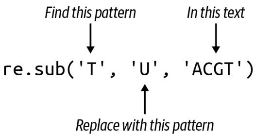  
그림 2-3. re.sub() 함수는 모든 패턴 인스턴스가 새로운 문자열로 교체된 새로운 문자열을 반환합니다.

결과는 'T'가 모두 'U'로 교체된 새로운 문자열입니다.

```txt
>>> re.sub('T', 'U', 'ACGT') # 1
'ACGU' # 2 
```

1 문자열 'ACGT'에서 모든 'T'를 'U'로 바꿉니다.
2 치환된 결과인 새로운 문자열입니다.

이 버전을 사용하기 위해, 다음과 같이 내부 for 루프를 수정할 수 있습니다. print()가 줄바꿈을 추가할 것이기 때문에 입력 DNA 문자열 끝의 줄바꿈을 제거하기 위해 str.rstrip() 메서드를 사용하기로 했습니다.

for dna in fh:
    num_seqs += 1
    print(re.sub('T', 'U', dna.rstrip()), file=out_fh) # 1

1 dna에서 줄바꿈을 제거하고, 모든 'T'를 'U'로 치환한 다음, 결과 문자열을 출력 파일 핸들에 출력합니다.

# 벤치마킹

어떤 솔루션이 더 빠른지 궁금하실 것입니다. 프로그램들의 상대적인 실행 시간을 비교하는 것을 벤치마킹(benchmarking)이라고 하며, 몇 가지 기본적인 배시(bash) 명령을 사용하여 이 두 솔루션을 비교하는 간단한 방법을 보여드리겠습니다. 가장 큰 테스트 파일인 ./tests/inputs/input3.txt 파일을 사용하겠습니다. 배시에서도 파이썬과 거의 동일한 구문으로 for 루프를 작성할 수 있습니다. 가독성을 위해 이 명령에서 줄바꿈을 사용하고 있으며, 배시는 줄 이어짐을 >로 표시합니다. 세미콜론(;)을 사용하여 이를 한 줄로 작성할 수도 있습니다.

```txt
$ for py in ./solution*
> do echo $py && time $py ./tests/inputs/Input3.txt
> done
./solution1_str_replace.py
Done, wrote 2 sequences in 1 file to directory "out".
real     0m1.539s
user     0m0.046s
sys     0m0.036s
./solution2_re_sub.py
Done, wrote 2 sequences in 1 file to directory "out".
real     0m0.179s
user     0m0.035s
sys     0m0.013s 
```

정규 표현식을 사용한 두 번째 솔루션이 더 빠른 것처럼 보이지만, 확실히 하기에는 데이터가 충분하지 않습니다. 더 실질적인 입력 파일이 필요합니다. 02_rna 디렉토리에는 제가 작성한 genseq.py라는 프로그램이 있는데, 이는 seq.txt라는 파일에 1,000,000개 염기로 구성된 1,000개의 시퀀스를 생성해 줍니다. 물론 파라미터를 수정할 수도 있습니다.

```txt
$ ./genseq.py --help
usage: genseq.py [-h] [-l int] [-n int] [-o FILE]
긴 시퀀스 생성
선택적 인자:
-h, --help 이 도움말 메시지를 표시하고 종료
-l int, --len int 시퀀스 길이 (기본값: 1000000)
-n int, --num int 시퀀스 개수 (기본값: 100) 
```

```txt
-o FILE, --outfile FILE 출력 파일 (기본값: seq.txt) 
```

기본값으로 생성된 seq.txt 파일은 약 95MB입니다. 좀 더 현실적인 입력 파일에 대해 프로그램들이 어떻게 작동하는지는 다음과 같습니다.

```txt
$ for py in ./solution*; do echo $py && time $py seq.txt; done
./solution1_str_replace.py
Done, wrote 100 sequences in 1 file to directory "out".
real 0m0.456s
user 0m0.372s
sys 0m0.064s
./solution2_re_sub.py
Done, wrote 100 sequences in 1 file to directory "out".
real 0m3.100s
user 0m2.700s
sys 0m0.385s 
```

이제 첫 번째 솔루션이 더 빠른 것으로 나타납니다. 참고로 저는 몇 가지 다른 솔루션들도 생각해 냈는데, 그 모든 것들이 이 두 가지보다 훨씬 좋지 않은 결과를 냈습니다. 저는 제가 점점 더 똑똑한 솔루션들을 만들어 내고 있고, 그것이 결국 최고의 성능으로 이어질 것이라고 생각했습니다. 하지만 제가 최고라고 생각했던 프로그램이 이 두 프로그램보다 수십 배나 느리다는 사실을 알았을 때 제 자존심은 큰 상처를 입었습니다. 가설이 있을 때는 흔히 말하듯 "믿되, 검증하라(Trust, but verify)"는 원칙을 지켜야 합니다.

# 더 나아가기

전사된 RNA 대신 시퀀스의 길이를 출력 파일에 출력하도록 프로그램을 수정해 보십시오. 최종 상태 보고서에는 시퀀스 길이의 최대값, 최소값, 평균값이 포함되도록 하십시오.

# 검토

이 장의 핵심 사항:

* argparse.FileType 옵션은 파일 인자를 검증합니다.
* argparse의 nargs 옵션을 사용하면 파라미터에 대해 유효한 인자의 개수를 정의할 수 있습니다.
* os.path.isdir() 함수는 디렉토리가 존재하는지 감지할 수 있습니다.
* os.makedirs() 함수는 디렉토리 구조를 생성합니다.
* open() 함수는 기본적으로 파일 읽기만 허용합니다. 파일 핸들에 쓰기 위해서는 w 옵션을 사용해야 하며, 기존 파일에 값을 추가하려면 a 옵션을 사용해야 합니다.
* 파일 핸들은 텍스트(기본값)를 위한 t 옵션이나, 이미지 파일을 읽을 때와 같이 바이트를 위한 b 옵션으로 열 수 있습니다.

그림 3-3에서 보듯이, 첫 번째 단계에서 T로 바뀌었던 모든 A가 다시 A로 바뀌어 버렸습니다. 이런 방식은 정말 엉망진창이 될 수밖에 없습니다.

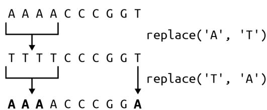  
그림 3-3. str.replace()를 반복적으로 사용하면 값이 이중으로 교체되어 잘못된 답을 얻게 됩니다.

다행히 파이썬에는 바로 이런 목적을 위한 str.translate() 함수가 있습니다. help(str.translate)를 읽어보면 이 함수는 "유니코드 코드 포인트(ordinal)에서 유니코드 코드 포인트, 문자열 또는 None으로의 매핑이어야 하는 테이블"이 필요하다는 것을 알 수 있습니다. trans 딕셔너리 테이블을 사용할 수 있지만, 먼저 상보 테이블을 키의 코드 포인트 값을 사용하는 형식으로 변환하기 위해 str.maketrans() 함수에 전달해야 합니다.

```txt
>>> trans = {
...     'A': 'T', 'C': 'G', 'G': 'C', 'T': 'A',
...     'a': 't', 'c': 'g', 'g': 'c', 't': 'a'
... }
>>> str.maketrans(trans)
{65: 'T', 67: 'G', 71: 'C', 84: 'A', 97: 't', 99: 'g', 103: 'c', 116: 'a'} 
```

문자열 키 'A'가 정수 값 65로 바뀐 것을 볼 수 있습니다. 이는 ord() 함수가 반환하는 값과 동일합니다.

```txt
>>> ord('A') 
65
```

이 값은 ASCII(미국 정보 교환 표준 부호) 테이블에서 문자 'A'의 서수 위치를 나타냅니다. 즉, 'A'는 테이블의 65번째 문자입니다. chr() 함수는 이 과정을 반대로 수행하여, 코드 포인트 값이 나타내는 문자를 제공합니다.

```txt
>>> chr(65) 
'A' 
```

str.translate() 함수는 상보 테이블의 키가 코드 포인트 값이어야 하는데, 이것이 바로 str.maketrans()를 통해 얻는 결과입니다.

```txt
>>> 'AAAAACCCGGT'.translate(str.maketrans(trans)) 
'TTTTGGGCCA' 
```

마지막으로 상보 서열을 뒤집어야 합니다. 이러한 아이디어들을 모두 통합한 솔루션은 다음과 같습니다.

```python
def main() -> None:  
    args = get_args()  
    trans = str.maketrans({ # 1 
        'A': 'T', 'C': 'G', 'G': 'C', 'T': 'A', 
        'a': 't', 'c': 'g', 'g': 'c', 't': 'a'
    })  
    print(''.join(reversed(args.dna.translate(trans)))) # 2 
```

1 str.translate() 함수에 필요한 변환 테이블을 만듭니다.
2 trans 테이블을 사용하여 DNA를 상보 서열로 바꿉니다. 이를 뒤집고 결합하여 새로운 문자열을 만듭니다.

하지만 잠깐만요, 더 있습니다! 이를 작성하는 훨씬 더 짧은 방법이 하나 더 있습니다. help(str.translate) 문서에 따르면 다음과 같습니다.

인자가 하나만 있는 경우, 유니코드 코드 포인트(정수) 또는 문자를 유니코드 코드 포인트, 문자열 또는 None으로 매핑하는 딕셔너리여야 합니다. 그러면 문자 키는 코드 포인트로 변환됩니다. 인자가 두 개 있는 경우, 길이가 동일한 문자열이어야 하며, 결과 딕셔너리에서 x의 각 문자는 y의 동일한 위치에 있는 문자로 매핑됩니다.

따라서 trans 딕셔너리를 제거하고 전체 솔루션을 다음과 같이 작성할 수 있습니다.

```python
def main() -> None:  
    args = get_args()  
    trans = str.maketrans('ACGTacgt', 'TGCAtgca') # 1  
    print(''.join(reversed(args.dna.translate(trans)))) # 2 
```

1 동일한 길이의 두 문자열을 사용하여 변환 테이블을 만듭니다.
2 역상보 서열을 생성합니다.

누군가의 하루를 망치고 싶다면 (그리고 십중팔구 그 사람은 미래의 여러분일 것입니다), 이 코드를 단 한 줄로 응축할 수도 있습니다.

# 솔루션 5: Bio.Seq 사용

이 장의 시작 부분에서 최종 솔루션은 기존 함수를 포함할 것이라고 말씀드렸습니다. 생명정보학 분야에서 일하는 많은 파이썬 프로그래머들이 Biopython이라는 이름 아래 일련의 모듈에 기여해 왔습니다. 그들은 믿을 수 없을 정도로 유용한 수많은 알고리즘을 작성하고 테스트했으므로, 다른 사람의 코드를 사용할 수 있을 때 굳이 자신만의 코드를 작성할 이유는 거의 없습니다.

먼저 다음 명령을 실행하여 biopython이 설치되어 있는지 확인하십시오.

$ python3 -m pip install biopython

import Bio를 사용하여 전체 모듈을 가져올 수도 있지만, 필요한 코드만 가져오는 것이 훨씬 합리적입니다. 여기서는 Seq 클래스만 필요합니다.

>>> from Bio import Seq

이제 Seq.reverse_complement() 함수를 사용할 수 있습니다.

>>> Seq.reverse_complement('AAAACCCGGT') 
'ACCGGGTTTT'

이 최종 솔루션은 가장 짧을 뿐만 아니라, 파이썬을 이용한 생명정보학에서 거의 편재하다시피 한 검증되고 문서화된 기존 모듈을 사용하므로 제가 권장하는 버전입니다.

```python
def main() -> None: 
    args = get_args() 
    print(Seq.reverse_complement(args.dna)) # 1
```

1 Bio.Seq.reverse_complement() 함수를 사용합니다.

이 솔루션에 대해 mypy를 실행하면 (모든 프로그램에 대해 mypy를 실행하고 계시죠?), 다음과 같은 오류가 발생할 수 있습니다.

FAILURES revc.py
6: error: Skipping analyzing 'Bio': found module but no type hints or library stubs   
6: note: See https://mypy.readthedocs.io/en/latest/running_mypy.html#missing-imports
mypy
Found 1 error in 1 file (checked 2 source files)
mypy.ini: No [mypy] section in config file

```txt
short test summary info  
FAILED revc.py::mypy  
!!!!!!!!!!!!! stopping after 1 failures !!!!!!!!!!!!!  
--- 1 failed, 1 skipped in 0.20s 
```

이 오류를 무시하려면 mypy에게 타입 어노테이션이 없는 임포트된 파일들을 무시하라고 지시할 수 있습니다. 이 책의 GitHub 저장소 루트 디렉토리에는 다음과 같은 내용의 mypy.ini 파일이 있습니다.

```ini
$ cat mypy.ini
[mypy]
ignore_missing_imports = True 
```

어런 작업 디렉토리에든 mypy.ini 파일을 추가하면 해당 디렉토리에서 mypy를 실행할 때 mypy가 사용하는 기본 설정을 변경할 수 있습니다. 어떤 디렉토리에 있든 mypy가 이를 사용하도록 전역적으로 변경하고 싶다면, 동일한 내용을 $HOME/.mypy.ini 파일에 넣으십시오.

# 검토

DNA의 역상보 서열을 수동으로 만드는 것은 일종의 통과의례와 같습니다. 제가 보여드린 내용은 다음과 같습니다.

* 일련의 if/else 문을 사용하거나 딕셔너리를 조회 테이블로 사용하여 결정 트리를 작성할 수 있습니다.
* 문자열과 리스트는 매우 유사합니다. 둘 다 for 루프로 순회할 수 있으며, += 연산자를 사용하여 둘 다에 추가할 수 있습니다.
* 리스트 컴프리헨션은 for 루프를 사용하여 시퀀스를 순회하고 새로운 리스트를 생성합니다.
* reversed() 함수는 시퀀스 요소들의 역순 반복자를 반환하는 지연 함수입니다.
* REPL에서 list() 함수를 사용하여 지연 함수, 반복자, 제너레이터가 값을 생성하도록 강제할 수 있습니다.
* str.maketrans() 및 str.translate() 함수는 문자열 치환을 수행하고 새로운 문자열을 생성할 수 있습니다.
* ord() 함수는 문자의 코드 포인트 값을 반환하며, 반대로 chr() 함수는 주어진 코드 포인트 값에 해당하는 문자를 반환합니다.
* Biopython은 생명정보학에 특화된 모듈과 함수들의 모음입니다. DNA의 역상보 서열을 만드는 선호되는 방법은 Bio.Seq.reverse_complement() 함수를 사용하는 것입니다.

# 피보나치 수열 만들기: 알고리즘 작성, 테스트 및 벤치마킹

피보나치 수열 (Fibonacci sequence) 구현을 작성하는 것은 코더가 되기 위한 영웅의 여정에서 또 다른 단계입니다. Rosalind의 피보나치 설명에 따르면, 이 수열의 기원은 몇 가지 중요하고 (비현실적인) 가정을 바탕으로 한 토끼 번식의 수학적 시뮬레이션이었습니다.

* 첫 번째 달은 갓 태어난 토끼 한 쌍으로 시작합니다.
* 토끼는 한 달 후에 번식할 수 있습니다.
* 매달 번식 연령이 된 모든 토끼는 번식 연령이 된 다른 토끼와 짝짓기를 합니다.
* 두 토끼가 짝짓기를 한 지 정확히 한 달 후에, 그들은 동일한 크기의 새끼 한 배를 낳습니다.
* 토끼는 불사신이며 짝짓기를 절대 멈추지 않습니다.

수열은 항상 0과 1로 시작합니다. 그림 4-1에서 보듯이, 리스트의 직전 두 값을 더함으로써 그 다음 숫자들을 무한히 생성할 수 있습니다.

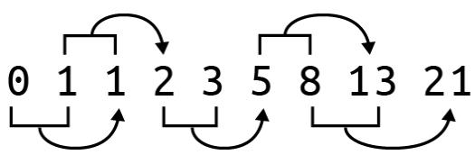  
그림 4-1. 피보나치 수열의 처음 8개 숫자. 초기 0과 1 이후, 다음 숫자들은 이전의 두 숫자를 더해서 만들어집니다.

인터넷에서 솔루션을 검색해 보면 수열을 생성하는 수십 가지의 서로 다른 방법을 찾을 수 있을 것입니다. 저는 상당히 다른 세 가지 접근 방식에 집중하고 싶습니다. 첫 번째 솔루션은 알고리즘이 모든 단계를 엄격하게 정의하는 명령형 (imperative) 접근 방식을 사용합니다. 다음 솔루션은 제너레이터 (generator) 함수를 사용하고, 마지막은 재귀적 (recursive) 솔루션에 집중할 것입니다. 재귀는 흥미롭기는 하지만 수열을 더 많이 생성하려고 할수록 속도가 급격히 느려지는데, 이러한 성능 문제는 캐싱 (caching)을 사용하여 해결할 수 있음이 밝혀졌습니다.

여러분은 다음을 배우게 됩니다.

* 인자를 수동으로 검증하고 오류를 발생시키는 방법
* 리스트를 스택 (stack)으로 사용하는 방법
* 제너레이터 함수를 작성하는 방법
* 재귀 함수를 작성하는 방법
* 재귀 함수가 왜 느려질 수 있는지와 메모이제이션 (memoization)으로 이를 해결하는 방법
* 함수 데코레이터 (decorator)를 사용하는 방법

# 시작하기

이 장의 코드와 테스트는 04_fib 디렉토리에 있습니다. 첫 번째 솔루션을 fib.py로 복사하는 것부터 시작하십시오.

```shell
$ cd 04_fib/
$ cp solution1_list.py fib.py 
```

파라미터가 어떻게 정의되어 있는지 사용법을 물어보십시오. n과 k를 사용할 수도 있지만, 저는 generations와 litter라는 이름을 사용하기로 했습니다.

```makefile
$ ./fib.py -h
usage: fib.py [-h] generations litter

피보나치 계산

positional arguments:
  generations  세대 수
  litter       세대당 새끼 수

optional arguments:
  -h, --help   이 도움말 메시지를 표시하고 종료 
```

이 프로그램은 문자열이 아닌 인자를 받는 첫 번째 프로그램이 될 것입니다. Rosalind 과제는 프로그램이 두 개의 양의 정수 값을 받아야 함을 나타냅니다.

* 세대 수를 나타내는 n ≤ 40
* 한 쌍의 토끼가 낳는 새끼 수인 k ≤ 5

정수가 아닌 값을 전달해 보고 프로그램이 어떻게 실패하는지 확인하십시오.

```yaml
$ ./fib.py foo
usage: fib.py [-h] generations litter
fib.py: error: argument generations: invalid int value: 'foo' 
```

겉으로는 드러나지 않지만, 짧은 사용법과 유용한 오류 메시지를 출력하는 것 외에도 프로그램은 0이 아닌 종료 값을 생성했습니다. 유닉스 명령줄에서 종료 값 0은 성공을 나타냅니다. 저는 이를 '오류 0개'라고 생각합니다. 배시 (bash) 쉘에서는 $? 변수를 조사하여 가장 최근 프로세스의 종료 상태를 확인할 수 있습니다. 예를 들어 echo Hello 명령은 0이라는 값으로 종료되어야 하며, 실제로 그렇습니다.

```txt
$ echo Hello
Hello
$ echo $?
0 
```

이전에 실패했던 명령을 다시 시도한 다음, $?를 조사해 보십시오.

```txt
$ ./fib.py foo
usage: fib.py [-h] generations litter
fib.py: error: argument generations: invalid int value: 'foo'
$ echo $?
2 
```

종료 상태가 2라는 것보다 중요한 사실은 그 값이 0이 아니라는 점입니다. 이는 잘못된 인자를 거부하고 유용한 오류 메시지를 출력하며 0이 아닌 상태로 종료하므로 잘 작동하는 프로그램입니다. 만약 이 프로그램이 데이터 처리 단계의 파이프라인 (부록 A에서 다루는 Makefile 등)의 일부였다면, 0이 아닌 종료 값은 전체 프로세스를 중단시켰을 것이며 이는 바람직한 일입니다. 잘못된 값을 묵묵히 받아들이고 조용히 혹은 아예 실패하지 않는 프로그램은 재현 불가능한 결과로 이어질 수 있습니다. 프로그램이 인자를 적절히 검증하고, 계속 진행할 수 없을 때 확실하게 실패하도록 만드는 것은 매우 중요합니다.

이 프로그램은 받아들이는 숫자의 타입에 대해서도 매우 엄격합니다. 값은 반드시 정수여야 합니다. 부동 소수점 값도 거부할 것입니다.

```yaml
$ ./fib.py 5 3.2
usage: fib.py [-h] generations litter
fib.py: error: argument litter: invalid int value: '3.2' 
```


프로그램으로 들어오는 모든 명령줄 인자는 기술적으로는 문자열로 수신됩니다. 명령줄의 5가 숫자 5처럼 보일지라도, 그것은 문자 "5"입니다. 저는 이 상황에서 argparse가 문자열을 정수로 변환하도록 시도하는 것에 의존하고 있습니다. 변환에 실패하면 argparse는 이러한 유용한 오류 메시지를 생성합니다.

또한 프로그램은 generations 및 litter 파라미터에 대해 허용된 범위를 벗어난 값을 거부합니다. 오류 메시지에 인자 이름과 문제가 된 값이 포함되어 있어, 여러분이 문제를 해결할 수 있도록 충분한 피드백을 제공한다는 점에 주목하십시오.

```shell
$ ./fib.py -3 2
usage: fib.py [-h] generations litter
fib.py: error: generations "-3" must be between 1 and 40
$ ./fib.py 5 10
usage: fib.py [-h] generations litter
fib.py: error: litter "10" must be between 1 and 5 
```

1 세대 수 인자 -3이 명시된 값의 범위에 있지 않습니다.
② 새끼 수 인자 10이 너무 높습니다.

이것이 어떻게 작동하는지 확인하기 위해 솔루션의 첫 번째 부분을 살펴보겠습니다.

```python
import argparse   
from typing import NamedTuple   

class Args(NamedTuple): 
    """ 명령줄 인자 """ 
    generations: int # 1 
    litter: int # 2   

def get_args() -> Args: 
    """ 명령줄 인자 가져오기 """   
    parser = argparse.ArgumentParser(
        description='피보나치 계산',
        formatter_class=argparse.ArgumentDefaultsHelpFormatter)   
    parser.add_argument('gen', # 3 
                        metavar='generations', 
                        type=int, # 4 
                        help='세대 수')   
    parser.add_argument('litter', # 5 
                        metavar='litter', 
                        type=int, 
                        help='세대당 새끼 수')   
    args = parser.parse_args() # 6   
    if not 1 <= args.gen <= 40: # 7 
        parser.error(f'generations "{args.gen}" must be between 1 and 40') # 8   
    if not 1 <= args.litter <= 5: # 9 
        parser.error(f'litter "{args.litter}" must be between 1 and 5') # 10 
    return Args(generations=args.gen, litter=args.litter)
```

1 generations 필드는 반드시 int여야 합니다.
2 litter 필드 또한 반드시 int여야 합니다.
3 gen 위치 파라미터가 먼저 정의되었으므로, 첫 번째 위치의 값을 받게 됩니다.
4 type=int는 값의 필수 클래스를 나타냅니다. int는 클래스의 이름이 아니라 클래스 자체를 가리킨다는 점에 유의하십시오.
5 litter 위치 파라미터가 두 번째로 정의되었으므로, 두 번째 위치의 값을 받게 됩니다.
6 인자 파싱을 시도합니다. 실패할 경우 오류 메시지가 출력되고 프로그램은 0이 아닌 값으로 종료됩니다.
7 args.gen 값은 이제 실제 int 값이므로 숫자 비교를 수행할 수 있습니다. 수용 가능한 범위에 있는지 확인합니다.
8 parser.error() 함수를 사용하여 오류를 생성하고 프로그램을 종료합니다.
9 마찬가지로 args.litter 인자의 값을 확인합니다.
10 사용자가 문제를 해결하는 데 필요한 정보를 포함한 오류를 생성합니다.
11 프로그램이 이 지점까지 도달했다면 인자들은 허용 범위 내의 유효한 정수 값이므로 Args를 반환합니다.

main() 함수에서 generations 및 litter 값이 올바른 범위에 있는지 확인할 수도 있었겠지만, 저는 유용한 메시지를 생성하고 0이 아닌 값으로 프로그램을 종료하기 위해 parser.error() 함수를 사용할 수 있도록 get_args() 함수 내부에서 가능한 한 많은 인자 검증을 수행하는 것을 선호합니다.

fib.py 프로그램을 제거하고 new.py나 선호하는 방법으로 새로 시작하십시오.

```txt
$ new.py -f -p '피보나치 계산' fib.py 
새 스크립트 "fib.py"를 확인하세요. 
```

get_args() 정의를 앞서 설명한 코드로 교체한 다음, main() 함수를 다음과 같이 수정할 수 있습니다.

```python
def main() -> None:  
    args = get_args()  
    print(f'generations = {args.generations}')  
    print(f'litter = {args.litter}') 
```

잘못된 입력을 넣어 프로그램을 실행해 보고 앞서 보았던 종류의 오류 메시지가 나타나는지 확인하십시오. 허용되는 값으로 프로그램을 실행해 보고 다음과 같은 종류의 출력이 나타나는지 확인하십시오.

```txt
$ ./fib.py 1 2
generations = 1
litter = 2 
```

pytest를 실행하여 프로그램이 무엇을 통과하고 무엇을 실패하는지 확인하십시오. 처음 네 개의 테스트는 통과하고 다섯 번째 테스트는 실패해야 합니다.

```txt
$ pytest -xv
============================== test session starts
      
...
tests/fib_test.py::test_exists PASSED [14%]
tests/fib_test.py::testusage PASSED [28%]
tests/fib_test.py::test_bad_generations PASSED [42%]
tests/fib_test.py::test_bad_litter PASSED [57%]
tests/fib_test.py::test_1 FAILED [71%] ① 
```

```txt
- - - - - - - - - - - - - - - - - - - - - - - - - - - - - - - - - - - - - - - - - - - - - - - - - - - - - - - - - - - - - - - - - - - - - - - - - - - - - - - - - - - - - - - - - - - - - - - - - - - - - 
```

```python
def test_1():
    """ 정상 입력에서 실행 확인 """
    rv, out = getstatusoutput(f'{RUN} 5 3') # 2
    assert rv == 0
    assert out == '19' # 3
    E AssertionError: assert 'generations = 5\nlitter = 3' == '19' # 4
    E - 19 # 5
    E + generations = 5 # 6
    E + litter = 3
```

```txt
tests/fib_test.py:60: AssertionError
============== short test summary info
FAILED tests/fib_test.py::test_1 - AssertionError: assert 'generations...
>>> 1 failed, 4 passed in 0.38s 
```

1 첫 번째 실패한 테스트입니다. -x 플래그 때문에 여기서 테스트가 중단됩니다.
2 세대 수로 5, 새끼 수로 3을 사용하여 프로그램을 실행합니다.
3 출력은 19여야 합니다.
4 비교되는 두 문자열이 같지 않음을 보여줍니다.
5 기대값은 19였습니다.
6 수신된 출력입니다.

pytest의 출력은 무엇이 잘못되었는지 정확히 지적하기 위해 매우 노력하고 있습니다. 프로그램이 어떻게 실행되었는지, 그리고 생산된 결과와 대비하여 무엇을 기대했는지를 보여줍니다. 프로그램은 새끼 수 3을 사용할 때 피보나치 수열의 다섯 번째 숫자인 19를 출력해야 합니다. 직접 프로그램을 완성하고 싶다면 바로 시작하십시오. 모든 테스트를 통과하는지 확인하기 위해 pytest를 사용해야 합니다. 또한 pylint, flake8, mypy를 사용하여 프로그램을 점검하기 위해 make test를 실행하십시오. 안내가 필요하다면 제가 설명한 첫 번째 접근 방식을 다루어 보겠습니다.

# 명령형 접근 방식

그림 4-2는 피보나치 수열의 성장을 묘사합니다. 작은 토끼들은 더 큰 번식 쌍으로 성장해야 하는 비번식 쌍을 나타냅니다.
그림 4-2. 새끼 수 1을 사용하는 토끼 번식 쌍으로서의 피보나치 수열 성장 시각화

처음 두 숫자 이후의 어떤 숫자를 생성하기 위해서라도 이전의 두 숫자를 알아야 한다는 것을 알 수 있습니다. 피보나치 수열 (F)의 어떤 위치 n의 값을 설명하기 위해 이 공식을 사용할 수 있습니다.

$$
F_n = F_{n-1} + F_{n-2}
$$

숫자 시퀀스를 순서대로 유지하고 위치에 따라 참조할 수 있게 해주는 파이썬의 데이터 구조는 무엇일까요? 바로 리스트입니다. $F_1 = 0$ 및 $F_2 = 1$로 시작하겠습니다.

```python
>>> fib = [0, 1]
```

$F_3$ 값은 $F_2 + F_1 = 1 + 0 = 1$입니다. 다음 숫자를 생성할 때 항상 시퀀스의 마지막 두 요소를 참조하게 될 것입니다. 리스트 끝으로부터의 위치를 나타내기 위해 음수 인덱싱을 사용하는 것이 가장 쉬울 것입니다. 리스트의 마지막 값은 항상 -1 위치에 있습니다.

```python
>>> fib[-1]
1
```

그 바로 앞의 값은 -2에 있습니다.

```python
>>> fib[-2]
0
```

해당 세대가 만들어낸 새끼 수를 계산하기 위해 이 값에 새끼 수를 곱해야 합니다. 우선 새끼 수 1을 고려해 보겠습니다.

```python
litter = 1
fib[-2] * litter
0
```

이 두 숫자를 더해서 리스트에 추가하고 싶습니다.

```python
>>> fib.append((fib[-2] * litter) + fib[-1])
>>> fib
[0, 1, 1]
```

이 작업을 다시 수행하면 올바른 시퀀스가 나타나는 것을 볼 수 있습니다.

```python
>>> fib.append((fib[-2] * litter) + fib[-1])
>>> fib
[0, 1, 1, 2]
```

이 동작을 generations 번 반복해야 합니다. (기술적으로 파이썬은 0 기반 인덱싱을 사용하므로 generations-1번이 될 것입니다.) 파이썬의 range() 함수를 사용하여 0부터 종료 값 직전까지의 숫자 리스트를 생성할 수 있습니다. 특정 횟수만큼 순회하는 부수 효과 (side effect)만을 위해 이 함수를 호출하는 것이므로, range() 함수가 생성하는 값들은 필요하지 않습니다. 값을 무시하겠다는 의도를 나타내기 위해 언더스코어 (_) 변수를 사용하는 것이 일반적입니다.

```python
>>> fib = [0, 1]
>>> litter = 1
>>> generations = 5
>>> for _ in range(generations - 1):
...     fib.append((fib[-2] * litter) + fib[-1])
... 
>>> fib
[0, 1, 1, 2, 3, 5]
```

이 정도면 테스트를 통과하는 솔루션을 만들기에 충분할 것입니다. 다음 섹션에서는 파이썬의 매우 흥미로운 부분들을 강조하는 다른 두 가지 솔루션을 다룰 것입니다.

# 솔루션

다음의 모든 솔루션은 앞서 보여드린 것과 동일한 get_args()를 공유합니다.

# 솔루션 1: 리스트를 스택으로 사용하는 명령형 솔루션

제가 작성한 명령형 솔루션입니다. 과거의 값들을 추적하기 위해 리스트를 일종의 스택 (stack)으로 사용하고 있습니다. 모든 값이 필요한 것은 아니고 마지막 두 개만 필요하지만, 리스트를 계속 키워가며 마지막 두 값을 참조하는 것은 꽤 쉽습니다.

```python
def main() -> None:  
    args = get_args()  
    fib = [0, 1] # 1  
    for _ in range(args.generations - 1): # 2  
        fib.append((fib[-2] * args.litter) + fib[-1]) # 3  
    print(fib[-1]) # 4 
```

1 0과 1로 시작합니다.
2 range() 함수를 사용하여 적절한 횟수만큼 루프를 돌립니다.
3 시퀀스에 다음 값을 추가합니다.
4 시퀀스의 마지막 숫자를 출력합니다.


for 루프에서 변수를 사용하지 않겠다는 뜻으로 _ 변수 이름을 사용했습니다. 언더스코어는 유효한 파이썬 식별자이며, 버려지는 값을 나타내기 위해 사용하는 관례이기도 합니다. 예를 들어 린팅 도구는 제가 변수에 어떤 값을 할당하고 사용하지 않은 것을 보고 잠재적인 오류로 간주할 수 있습니다. 언더스코어 변수는 제가 그 값을 사용할 의도가 없음을 보여줍니다. 이 경우, 저는 순회에 필요한 횟수를 생성하는 부수 효과만을 위해 range() 함수를 사용하고 있습니다.

코드가 알고리즘의 모든 지침을 직접 인코딩하고 있기 때문에 이는 명령형 솔루션으로 간주됩니다. 재귀 솔루션을 읽어보면 알고리즘을 좀 더 선언적인 방식으로 작성할 수 있음을 알게 될 것이며, 여기에는 제가 처리해야 할 의도치 않은 결과들도 수반됩니다.

이에 대한 약간의 변형은 이 코드를 fib()라는 함수 내부에 두는 것입니다. 파이썬에서는 함수 내부에 다른 함수를 선언하는 것이 가능하므로, 여기서는 main() 내부에 fib()를 만들겠습니다. 이렇게 하는 이유는 args.litter 파라미터를 참조하여 클로저 (closure)를 만들기 위해서인데, 함수가 실행 시점의 새끼 수 값을 캡처하기 때문입니다.

```python
def main() -> None:  
    args = get_args()  
    def fib(n: int) -> int: # 1  
        nums = [0, 1] # 2  
        for _ in range(n - 1): # 3  
            nums.append((nums[-2] * args.litter) + nums[-1]) # 4  
        return nums[-1] # 5  
    print(fib(args.generations)) # 6 
```

1 정수 파라미터 n을 받고 정수를 반환하는 fib() 함수를 만듭니다.
2 이전과 동일한 코드입니다. 이 리스트는 함수 이름과 충돌하지 않도록 nums라고 지었습니다.
3 세대 수를 순회하기 위해 range() 함수를 사용합니다. 값들을 무시하기 위해 _를 사용합니다.
4 함수가 args.litter 파라미터를 참조하므로 클로저가 생성됩니다.
5 return을 사용하여 최종 값을 호출자에게 돌려보냅니다.
6 args.generations 파라미터를 사용하여 fib() 함수를 호출합니다.

위의 예시에서 fib() 함수의 범위 (scope)는 main() 함수로 제한됩니다. 범위란 특정 함수 이름이나 변수가 보이거나 합법적인 프로그램의 부분을 말합니다.

꼭 클로저를 사용할 필요는 없습니다. 다음은 표준 함수로 동일한 아이디어를 표현하는 방법입니다.

```python
def main() -> None:  
    args = get_args()  
    print(fib(args.generations, args.litter)) # 1  

def fib(n: int, litter: int) -> int: # 2
    nums = [0, 1]  
    for _ in range(n - 1):  
        nums.append((nums[-2] * litter) + nums[-1])  
    return nums[-1] 
```

1 fib() 함수는 반드시 두 개의 인자와 함께 호출되어야 합니다.
2 함수는 세대 수와 새끼 수 모두를 필요로 합니다. 함수 본체는 본질적으로 동일합니다.

위의 코드에서 보듯이 클로저는 새끼 수가 캡처되었기 때문에 하나의 인자만 필요했지만, 이 버전에서는 두 개의 인자를 fib()에 전달해야 합니다. 값을 바인딩하고 파라미터 수를 줄이는 것은 클로저를 만드는 타당한 이유입니다. 클로저를 작성하는 또 다른 이유는 함수의 범위를 제한하기 위해서입니다. fib()의 클로저 정의는 오직 main() 함수 내부에서만 유효하지만, 이전 버전은 프로그램 전체에서 보입니다. 함수를 다른 함수 내부에 숨기면 테스트하기가 더 어려워집니다. 이 경우 fib() 함수가 프로그램의 거의 전부이므로, 테스트는 이미 tests/fib_test.py에 작성되어 있습니다.

# 솔루션 2: 제너레이터 함수 만들기

이전 솔루션에서는 요청된 값까지 피보나치 수열을 생성하고 멈췄습니다. 하지만 수열은 무한합니다. 수열의 모든 숫자를 생성할 수 있는 함수를 만들 수 있을까요? 기술적으로는 가능하지만, 무한하기 때문에 절대 끝나지 않을 것입니다.

파이썬에는 무한할 수도 있는 시퀀스를 생성하는 함수를 일시 중단하는 방법이 있습니다. yield를 사용하여 함수로부터 값을 반환하고, 나중에 다음 값이 요청될 때 동일한 상태에서 다시 시작하도록 함수를 잠시 떠날 수 있습니다. 이런 종류의 함수를 제너레이터 (generator)라고 부르며, 이를 사용하여 수열을 생성하는 방법은 다음과 같습니다.

```python
def fib(k: int) -> Generator[int, None, None]: # 1
    x, y = 0, 1 # 2  
    yield x # 3
    while True: # 4  
        yield y # 5   
        x, y = y, x + (y * k) # 6
```

1 타입 시그니처는 함수가 정수형 파라미터 k (새끼 수)를 받는다는 것을 나타냅니다. 이 함수는 int 값을 산출 (yield)하고 보내기 (send)나 반환 (return) 타입이 없는 특수한 함수 타입인 Generator를 반환합니다.
2 마지막 두 세대만 추적하면 되므로, 이들을 0과 1로 초기화합니다.
3 0을 산출합니다.
4 무한 루프를 만듭니다.
5 마지막 세대를 산출합니다.
6 x (두 세대 전)를 이전의 y (한 세대 전)로 설정합니다. y를 현재 두 세대의 합으로 설정하되, 번식 가능한 쌍에 새끼 수 k를 곱합니다. (수정: x, y = y, x + y * k가 로직에 더 맞을 수 있음. 원문 참고 필요.)

제너레이터는 반복자처럼 작동하여, 소진될 때까지 코드의 요청에 따라 값을 생성합니다. 이 제너레이터는 오직 값만 산출 (yield)하므로, 보내기와 반환 타입은 None입니다. 그 외에 이 코드는 첫 번째 버전의 프로그램이 했던 것과 정확히 동일한 작업을 수행하지만, 멋진 제너레이터 함수 내부에서 이루어집니다. 두 가지 다른 새끼 수에 대해 함수가 어떻게 작동하는지 보려면 그림 4-3을 참고하십시오.

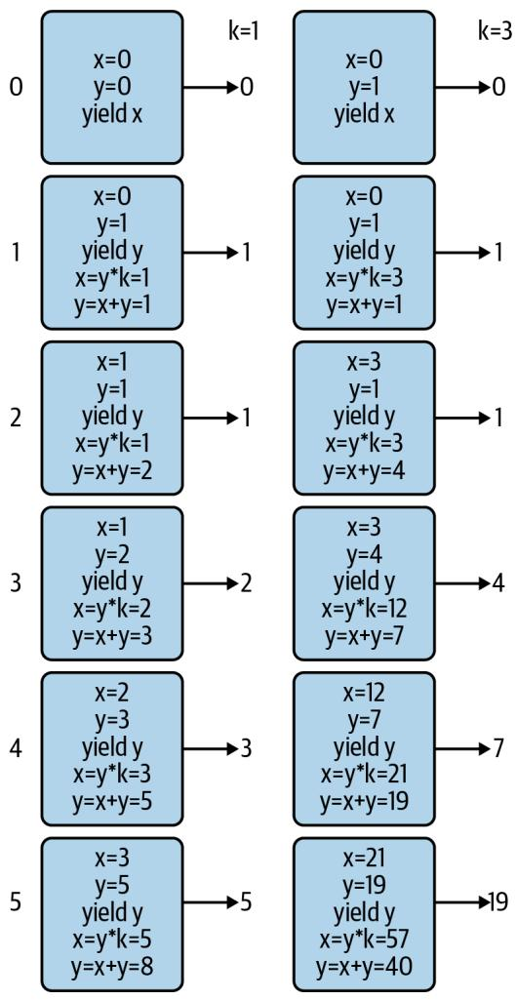  
그림 4-3. 두 가지 새끼 수 k=1 및 k=3에 대해 fib() 제너레이터의 상태가 시간에 따라 (n=5) 어떻게 변하는지 묘사한 것

Generator의 타입 시그니처는 산출, 보내기, 반환에 대한 타입을 정의하기 때문에 조금 복잡해 보입니다. 여기서 더 깊이 파고들 필요는 없지만, typing 모듈에 대한 문서를 읽어보시길 권장합니다.

이를 사용하는 방법은 다음과 같습니다.

```python
def main() -> None:  
    args = get_args()  
    gen = fib(args.litter) # 1  
    seq = [next(gen) for _ in range(args.generations + 1)] # 2  
    print(seq[-1]) # 3 
```

1 fib() 함수는 새끼 수를 인자로 받아 제너레이터를 반환합니다.
2 next() 함수를 사용하여 제너레이터로부터 다음 값을 가져옵니다. 리스트 컴프리헨션을 사용하여 요청된 값까지 수열을 생성하도록 이를 적절한 횟수만큼 수행합니다.
3 수열의 마지막 숫자를 출력합니다.


range() 함수가 다른 이유는 첫 번째 버전에서는 이미 0과 1이 준비되어 있었기 때문입니다. 여기서는 해당 값들을 생성하기 위해 제너레이터를 두 번 더 호출해야 합니다.

그림 3-3에서 보듯이, 첫 번째 단계에서 T로 바뀌었던 모든 A가 다시 A로 바뀌어 버렸습니다. 이런 방식은 정말 엉망진창이 될 수밖에 없습니다.

  
그림 3-3. str.replace()를 반복적으로 사용하면 값이 이중으로 교체되어 잘못된 답을 얻게 됩니다.

다행히 파이썬에는 바로 이런 목적을 위한 str.translate() 함수가 있습니다. help(str.translate)를 읽어보면 이 함수는 "유니코드 코드 포인트(ordinal)에서 유니코드 코드 포인트, 문자열 또는 None으로의 매핑이어야 하는 테이블"이 필요하다는 것을 알 수 있습니다. trans 딕셔너리 테이블을 사용할 수 있지만, 먼저 상보 테이블을 키의 코드 포인트 값을 사용하는 형식으로 변환하기 위해 str.maketrans() 함수에 전달해야 합니다.

```txt
>>> trans = {
...     'A': 'T', 'C': 'G', 'G': 'C', 'T': 'A',
...     'a': 't', 'c': 'g', 'g': 'c', 't': 'a'
... }
>>> str.maketrans(trans)
{65: 'T', 67: 'G', 71: 'C', 84: 'A', 97: 't', 99: 'g', 103: 'c', 116: 'a'} 
```

문자열 키 'A'가 정수 값 65로 바뀐 것을 볼 수 있습니다. 이는 ord() 함수가 반환하는 값과 동일합니다.

```txt
>>> ord('A') 
65
```

이 값은 ASCII(미국 정보 교환 표준 부호) 테이블에서 문자 'A'의 서수 위치를 나타냅니다. 즉, 'A'는 테이블의 65번째 문자입니다. chr() 함수는 이 과정을 반대로 수행하여, 코드 포인트 값이 나타내는 문자를 제공합니다.

```txt
>>> chr(65) 
'A' 
```

str.translate() 함수는 상보 테이블의 키가 코드 포인트 값이어야 하는데, 이것이 바로 str.maketrans()를 통해 얻는 결과입니다.

```txt
>>> 'AAAAACCCGGT'.translate(str.maketrans(trans)) 
'TTTTGGGCCA' 
```

마지막으로 상보 서열을 뒤집어야 합니다. 이러한 아이디어들을 모두 통합한 솔루션은 다음과 같습니다.

```python
def main() -> None:  
    args = get_args()  
    trans = str.maketrans({ # 1 
        'A': 'T', 'C': 'G', 'G': 'C', 'T': 'A', 
        'a': 't', 'c': 'g', 'g': 'c', 't': 'a'
    })  
    print(''.join(reversed(args.dna.translate(trans)))) # 2 
```

1 str.translate() 함수에 필요한 변환 테이블을 만듭니다.
2 trans 테이블을 사용하여 DNA를 상보 서열로 바꿉니다. 이를 뒤집고 결합하여 새로운 문자열을 만듭니다.

하지만 잠깐만요, 더 있습니다! 이를 작성하는 훨씬 더 짧은 방법이 하나 더 있습니다. help(str.translate) 문서에 따르면 다음과 같습니다.

인자가 하나만 있는 경우, 유니코드 코드 포인트(정수) 또는 문자를 유니코드 코드 포인트, 문자열 또는 None으로 매핑하는 딕셔너리여야 합니다. 그러면 문자 키는 코드 포인트로 변환됩니다. 인자가 두 개 있는 경우, 길이가 동일한 문자열이어야 하며, 결과 딕셔너리에서 x의 각 문자는 y의 동일한 위치에 있는 문자로 매핑됩니다.

따라서 trans 딕셔너리를 제거하고 전체 솔루션을 다음과 같이 작성할 수 있습니다.

```python
def main() -> None:  
    args = get_args()  
    trans = str.maketrans('ACGTacgt', 'TGCAtgca') # 1  
    print(''.join(reversed(args.dna.translate(trans)))) # 2 
```

1 동일한 길이의 두 문자열을 사용하여 변환 테이블을 만듭니다.
2 역상보 서열을 생성합니다.

누군가의 하루를 망치고 싶다면 (그리고 십중팔구 그 사람은 미래의 여러분일 것입니다), 이 코드를 단 한 줄로 응축할 수도 있습니다.

# 솔루션 5: Bio.Seq 사용

이 장의 시작 부분에서 최종 솔루션은 기존 함수를 포함할 것이라고 말씀드렸습니다. 생명정보학 분야에서 일하는 많은 파이썬 프로그래머들이 Biopython이라는 이름 아래 일련의 모듈에 기여해 왔습니다. 그들은 믿을 수 없을 정도로 유용한 수많은 알고리즘을 작성하고 테스트했으므로, 다른 사람의 코드를 사용할 수 있을 때 굳이 자신만의 코드를 작성할 이유는 거의 없습니다.

먼저 다음 명령을 실행하여 biopython이 설치되어 있는지 확인하십시오.

$ python3 -m pip install biopython

import Bio를 사용하여 전체 모듈을 가져올 수도 있지만, 필요한 코드만 가져오는 것이 훨씬 합리적입니다. 여기서는 Seq 클래스만 필요합니다.

>>> from Bio import Seq

이제 Seq.reverse_complement() 함수를 사용할 수 있습니다.

>>> Seq.reverse_complement('AAAACCCGGT') 
'ACCGGGTTTT'

이 최종 솔루션은 가장 짧을 뿐만 아니라, 파이썬을 이용한 생명정보학에서 거의 편재하다시피 한 검증되고 문서화된 기존 모듈을 사용하므로 제가 권장하는 버전입니다.

```python
def main() -> None: 
    args = get_args() 
    print(Seq.reverse_complement(args.dna)) # 1
```

1 Bio.Seq.reverse_complement() 함수를 사용합니다.

이 솔루션에 대해 mypy를 실행하면 (모든 프로그램에 대해 mypy를 실행하고 계시죠?), 다음과 같은 오류가 발생할 수 있습니다.

FAILURES revc.py
6: error: Skipping analyzing 'Bio': found module but no type hints or library stubs   
6: note: See https://mypy.readthedocs.io/en/latest/running_mypy.html#missing-imports
mypy
Found 1 error in 1 file (checked 2 source files)
mypy.ini: No [mypy] section in config file

```txt
short test summary info  
FAILED revc.py::mypy  
!!!!!!!!!!!!! stopping after 1 failures !!!!!!!!!!!!!  
--- 1 failed, 1 skipped in 0.20s 
```

이 오류를 무시하려면 mypy에게 타입 어노테이션이 없는 임포트된 파일들을 무시하라고 지시할 수 있습니다. 이 책의 GitHub 저장소 루트 디렉토리에는 다음과 같은 내용의 mypy.ini 파일이 있습니다.

```ini
$ cat mypy.ini
[mypy]
ignore_missing_imports = True 
```

어런 작업 디렉토리에든 mypy.ini 파일을 추가하면 해당 디렉토리에서 mypy를 실행할 때 mypy가 사용하는 기본 설정을 변경할 수 있습니다. 어떤 디렉토리에 있든 mypy가 이를 사용하도록 전역적으로 변경하고 싶다면, 동일한 내용을 $HOME/.mypy.ini 파일에 넣으십시오.

# 검토

DNA의 역상보 서열을 수동으로 만드는 것은 일종의 통과의례와 같습니다. 제가 보여드린 내용은 다음과 같습니다.

* 일련의 if/else 문을 사용하거나 딕셔너리를 조회 테이블로 사용하여 결정 트리를 작성할 수 있습니다.
* 문자열과 리스트는 매우 유사합니다. 둘 다 for 루프로 순회할 수 있으며, += 연산자를 사용하여 둘 다에 추가할 수 있습니다.
* 리스트 컴프리헨션은 for 루프를 사용하여 시퀀스를 순회하고 새로운 리스트를 생성합니다.
* reversed() 함수는 시퀀스 요소들의 역순 반복자를 반환하는 지연 함수입니다.
* REPL에서 list() 함수를 사용하여 지연 함수, 반복자, 제너레이터가 값을 생성하도록 강제할 수 있습니다.
* str.maketrans() 및 str.translate() 함수는 문자열 치환을 수행하고 새로운 문자열을 생성할 수 있습니다.
* ord() 함수는 문자의 코드 포인트 값을 반환하며, 반대로 chr() 함수는 주어진 코드 포인트 값에 해당하는 문자를 반환합니다.
* Biopython은 생명정보학에 특화된 모듈과 함수들의 모음입니다. DNA의 역상보 서열을 만드는 선호되는 방법은 Bio.Seq.reverse_complement() 함수를 사용하는 것입니다.

# 피보나치 수열 만들기: 알고리즘 작성, 테스트 및 벤치마킹

피보나치 수열 (Fibonacci sequence) 구현을 작성하는 것은 코더가 되기 위한 영웅의 여정에서 또 다른 단계입니다. Rosalind의 피보나치 설명에 따르면, 이 수열의 기원은 몇 가지 중요하고 (비현실적인) 가정을 바탕으로 한 토끼 번식의 수학적 시뮬레이션이었습니다.

* 첫 번째 달은 갓 태어난 토끼 한 쌍으로 시작합니다.
* 토끼는 한 달 후에 번식할 수 있습니다.
* 매달 번식 연령이 된 모든 토끼는 번식 연령이 된 다른 토끼와 짝짓기를 합니다.
* 두 토끼가 짝짓기를 한 지 정확히 한 달 후에, 그들은 동일한 크기의 새끼 한 배를 낳습니다.
* 토끼는 불사신이며 짝짓기를 절대 멈추지 않습니다.

수열은 항상 0과 1로 시작합니다. 그림 4-1에서 보듯이, 리스트의 직전 두 값을 더함으로써 그 다음 숫자들을 무한히 생성할 수 있습니다.

  
그림 4-1. 피보나치 수열의 처음 8개 숫자. 초기 0과 1 이후, 다음 숫자들은 이전의 두 숫자를 더해서 만들어집니다.

인터넷에서 솔루션을 검색해 보면 수열을 생성하는 수십 가지의 서로 다른 방법을 찾을 수 있을 것입니다. 저는 상당히 다른 세 가지 접근 방식에 집중하고 싶습니다. 첫 번째 솔루션은 알고리즘이 모든 단계를 엄격하게 정의하는 명령형 (imperative) 접근 방식을 사용합니다. 다음 솔루션은 제너레이터 (generator) 함수를 사용하고, 마지막은 재귀적 (recursive) 솔루션에 집중할 것입니다. 재귀는 흥미롭기는 하지만 수열을 더 많이 생성하려고 할수록 속도가 급격히 느려지는데, 이러한 성능 문제는 캐싱 (caching)을 사용하여 해결할 수 있음이 밝혀졌습니다.

여러분은 다음을 배우게 됩니다.

* 인자를 수동으로 검증하고 오류를 발생시키는 방법
* 리스트를 스택 (stack)으로 사용하는 방법
* 제너레이터 함수를 작성하는 방법
* 재귀 함수를 작성하는 방법
* 재귀 함수가 왜 느려질 수 있는지와 메모이제이션 (memoization)으로 이를 해결하는 방법
* 함수 데코레이터 (decorator)를 사용하는 방법

# 시작하기

이 장의 코드와 테스트는 04_fib 디렉토리에 있습니다. 첫 번째 솔루션을 fib.py로 복사하는 것부터 시작하십시오.

```shell
$ cd 04_fib/
$ cp solution1_list.py fib.py 
```

파라미터가 어떻게 정의되어 있는지 사용법을 물어보십시오. n과 k를 사용할 수도 있지만, 저는 generations와 litter라는 이름을 사용하기로 했습니다.

```makefile
$ ./fib.py -h
usage: fib.py [-h] generations litter

피보나치 계산

positional arguments:
  generations  세대 수
  litter       세대당 새끼 수

optional arguments:
  -h, --help   이 도움말 메시지를 표시하고 종료 
```

이 프로그램은 문자열이 아닌 인자를 받는 첫 번째 프로그램이 될 것입니다. Rosalind 과제는 프로그램이 두 개의 양의 정수 값을 받아야 함을 나타냅니다.

* 세대 수를 나타내는 n ≤ 40
* 한 쌍의 토끼가 낳는 새끼 수인 k ≤ 5

정수가 아닌 값을 전달해 보고 프로그램이 어떻게 실패하는지 확인하십시오.

```yaml
$ ./fib.py foo
usage: fib.py [-h] generations litter
fib.py: error: argument generations: invalid int value: 'foo' 
```

겉으로는 드러나지 않지만, 짧은 사용법과 유용한 오류 메시지를 출력하는 것 외에도 프로그램은 0이 아닌 종료 값을 생성했습니다. 유닉스 명령줄에서 종료 값 0은 성공을 나타냅니다. 저는 이를 '오류 0개'라고 생각합니다. 배시 (bash) 쉘에서는 $? 변수를 조사하여 가장 최근 프로세스의 종료 상태를 확인할 수 있습니다. 예를 들어 echo Hello 명령은 0이라는 값으로 종료되어야 하며, 실제로 그렇습니다.

```txt
$ echo Hello
Hello
$ echo $?
0 
```

이전에 실패했던 명령을 다시 시도한 다음, $?를 조사해 보십시오.

```txt
$ ./fib.py foo
usage: fib.py [-h] generations litter
fib.py: error: argument generations: invalid int value: 'foo'
$ echo $?
2 
```

종료 상태가 2라는 것보다 중요한 사실은 그 값이 0이 아니라는 점입니다. 이는 잘못된 인자를 거부하고 유용한 오류 메시지를 출력하며 0이 아닌 상태로 종료하므로 잘 작동하는 프로그램입니다. 만약 이 프로그램이 데이터 처리 단계의 파이프라인 (부록 A에서 다루는 Makefile 등)의 일부였다면, 0이 아닌 종료 값은 전체 프로세스를 중단시켰을 것이며 이는 바람직한 일입니다. 잘못된 값을 묵묵히 받아들이고 조용히 혹은 아예 실패하지 않는 프로그램은 재현 불가능한 결과로 이어질 수 있습니다. 프로그램이 인자를 적절히 검증하고, 계속 진행할 수 없을 때 확실하게 실패하도록 만드는 것은 매우 중요합니다.

이 프로그램은 받아들이는 숫자의 타입에 대해서도 매우 엄격합니다. 값은 반드시 정수여야 합니다. 부동 소수점 값도 거부할 것입니다.

```yaml
$ ./fib.py 5 3.2
usage: fib.py [-h] generations litter
fib.py: error: argument litter: invalid int value: '3.2' 
```


프로그램으로 들어오는 모든 명령줄 인자는 기술적으로는 문자열로 수신됩니다. 명령줄의 5가 숫자 5처럼 보일지라도, 그것은 문자 "5"입니다. 저는 이 상황에서 argparse가 문자열을 정수로 변환하도록 시도하는 것에 의존하고 있습니다. 변환에 실패하면 argparse는 이러한 유용한 오류 메시지를 생성합니다.

또한 프로그램은 generations 및 litter 파라미터에 대해 허용된 범위를 벗어난 값을 거부합니다. 오류 메시지에 인자 이름과 문제가 된 값이 포함되어 있어, 여러분이 문제를 해결할 수 있도록 충분한 피드백을 제공한다는 점에 주목하십시오.

```shell
$ ./fib.py -3 2
usage: fib.py [-h] generations litter
fib.py: error: generations "-3" must be between 1 and 40
$ ./fib.py 5 10
usage: fib.py [-h] generations litter
fib.py: error: litter "10" must be between 1 and 5 
```

1 세대 수 인자 -3이 명시된 값의 범위에 있지 않습니다.
② 새끼 수 인자 10이 너무 높습니다.

이것이 어떻게 작동하는지 확인하기 위해 솔루션의 첫 번째 부분을 살펴보겠습니다.

```python
import argparse   
from typing import NamedTuple   

class Args(NamedTuple): 
    """ 명령줄 인자 """ 
    generations: int # 1 
    litter: int # 2   

def get_args() -> Args: 
    """ 명령줄 인자 가져오기 """   
    parser = argparse.ArgumentParser(
        description='피보나치 계산',
        formatter_class=argparse.ArgumentDefaultsHelpFormatter)   
    parser.add_argument('gen', # 3 
                        metavar='generations', 
                        type=int, # 4 
                        help='세대 수')   
    parser.add_argument('litter', # 5 
                        metavar='litter', 
                        type=int, 
                        help='세대당 새끼 수')   
    args = parser.parse_args() # 6   
    if not 1 <= args.gen <= 40: # 7 
        parser.error(f'generations "{args.gen}" must be between 1 and 40') # 8   
    if not 1 <= args.litter <= 5: # 9 
        parser.error(f'litter "{args.litter}" must be between 1 and 5') # 10 
    return Args(generations=args.gen, litter=args.litter)
```

1 generations 필드는 반드시 int여야 합니다.
2 litter 필드 또한 반드시 int여야 합니다.
3 gen 위치 파라미터가 먼저 정의되었으므로, 첫 번째 위치의 값을 받게 됩니다.
4 type=int는 값의 필수 클래스를 나타냅니다. int는 클래스의 이름이 아니라 클래스 자체를 가리킨다는 점에 유의하십시오.
5 litter 위치 파라미터가 두 번째로 정의되었으므로, 두 번째 위치의 값을 받게 됩니다.
6 인자 파싱을 시도합니다. 실패할 경우 오류 메시지가 출력되고 프로그램은 0이 아닌 값으로 종료됩니다.
7 args.gen 값은 이제 실제 int 값이므로 숫자 비교를 수행할 수 있습니다. 수용 가능한 범위에 있는지 확인합니다.
8 parser.error() 함수를 사용하여 오류를 생성하고 프로그램을 종료합니다.
9 마찬가지로 args.litter 인자의 값을 확인합니다.
10 사용자가 문제를 해결하는 데 필요한 정보를 포함한 오류를 생성합니다.
11 프로그램이 이 지점까지 도달했다면 인자들은 허용 범위 내의 유효한 정수 값이므로 Args를 반환합니다.

main() 함수에서 generations 및 litter 값이 올바른 범위에 있는지 확인할 수도 있었겠지만, 저는 유용한 메시지를 생성하고 0이 아닌 값으로 프로그램을 종료하기 위해 parser.error() 함수를 사용할 수 있도록 get_args() 함수 내부에서 가능한 한 많은 인자 검증을 수행하는 것을 선호합니다.

fib.py 프로그램을 제거하고 new.py나 선호하는 방법으로 새로 시작하십시오.

```txt
$ new.py -f -p '피보나치 계산' fib.py 
새 스크립트 "fib.py"를 확인하세요. 
```

get_args() 정의를 앞서 설명한 코드로 교체한 다음, main() 함수를 다음과 같이 수정할 수 있습니다.

```python
def main() -> None:  
    args = get_args()  
    print(f'generations = {args.generations}')  
    print(f'litter = {args.litter}') 
```

잘못된 입력을 넣어 프로그램을 실행해 보고 앞서 보았던 종류의 오류 메시지가 나타나는지 확인하십시오. 허용되는 값으로 프로그램을 실행해 보고 다음과 같은 종류의 출력이 나타나는지 확인하십시오.

```txt
$ ./fib.py 1 2
generations = 1
litter = 2 
```

pytest를 실행하여 프로그램이 무엇을 통과하고 무엇을 실패하는지 확인하십시오. 처음 네 개의 테스트는 통과하고 다섯 번째 테스트는 실패해야 합니다.

```txt
$ pytest -xv
============================== test session starts
      
...
tests/fib_test.py::test_exists PASSED [14%]
tests/fib_test.py::testusage PASSED [28%]
tests/fib_test.py::test_bad_generations PASSED [42%]
tests/fib_test.py::test_bad_litter PASSED [57%]
tests/fib_test.py::test_1 FAILED [71%] ① 
```

```txt
- - - - - - - - - - - - - - - - - - - - - - - - - - - - - - - - - - - - - - - - - - - - - - - - - - - - - - - - - - - - - - - - - - - - - - - - - - - - - - - - - - - - - - - - - - - - - - - - - - - - - 
```

```python
def test_1():
    """ 정상 입력에서 실행 확인 """
    rv, out = getstatusoutput(f'{RUN} 5 3') # 2
    assert rv == 0
    assert out == '19' # 3
    E AssertionError: assert 'generations = 5\nlitter = 3' == '19' # 4
    E - 19 # 5
    E + generations = 5 # 6
    E + litter = 3
```

```txt
tests/fib_test.py:60: AssertionError
============== short test summary info
FAILED tests/fib_test.py::test_1 - AssertionError: assert 'generations...
>>> 1 failed, 4 passed in 0.38s 
```

1 첫 번째 실패한 테스트입니다. -x 플래그 때문에 여기서 테스트가 중단됩니다.
2 세대 수로 5, 새끼 수로 3을 사용하여 프로그램을 실행합니다.
3 출력은 19여야 합니다.
4 비교되는 두 문자열이 같지 않음을 보여줍니다.
5 기대값은 19였습니다.
6 수신된 출력입니다.

pytest의 출력은 무엇이 잘못되었는지 정확히 지적하기 위해 매우 노력하고 있습니다. 프로그램이 어떻게 실행되었는지, 그리고 생산된 결과와 대비하여 무엇을 기대했는지를 보여줍니다. 프로그램은 새끼 수 3을 사용할 때 피보나치 수열의 다섯 번째 숫자인 19를 출력해야 합니다. 직접 프로그램을 완성하고 싶다면 바로 시작하십시오. 모든 테스트를 통과하는지 확인하기 위해 pytest를 사용해야 합니다. 또한 pylint, flake8, mypy를 사용하여 프로그램을 점검하기 위해 make test를 실행하십시오. 안내가 필요하다면 제가 설명한 첫 번째 접근 방식을 다루어 보겠습니다.

# 명령형 접근 방식

그림 4-2는 피보나치 수열의 성장을 묘사합니다. 작은 토끼들은 더 큰 번식 쌍으로 성장해야 하는 비번식 쌍을 나타냅니다.
그림 4-2. 새끼 수 1을 사용하는 토끼 번식 쌍으로서의 피보나치 수열 성장 시각화

처음 두 숫자 이후의 어떤 숫자를 생성하기 위해서라도 이전의 두 숫자를 알아야 한다는 것을 알 수 있습니다. 피보나치 수열 (F)의 어떤 위치 n의 값을 설명하기 위해 이 공식을 사용할 수 있습니다.

$$
F_n = F_{n-1} + F_{n-2}
$$

숫자 시퀀스를 순서대로 유지하고 위치에 따라 참조할 수 있게 해주는 파이썬의 데이터 구조는 무엇일까요? 바로 리스트입니다. $F_1 = 0$ 및 $F_2 = 1$로 시작하겠습니다.

```python
>>> fib = [0, 1]
```

$F_3$ 값은 $F_2 + F_1 = 1 + 0 = 1$입니다. 다음 숫자를 생성할 때 항상 시퀀스의 마지막 두 요소를 참조하게 될 것입니다. 리스트 끝으로부터의 위치를 나타내기 위해 음수 인덱싱을 사용하는 것이 가장 쉬울 것입니다. 리스트의 마지막 값은 항상 -1 위치에 있습니다.

```python
>>> fib[-1]
1
```

그 바로 앞의 값은 -2에 있습니다.

```python
>>> fib[-2]
0
```

해당 세대가 만들어낸 새끼 수를 계산하기 위해 이 값에 새끼 수를 곱해야 합니다. 우선 새끼 수 1을 고려해 보겠습니다.

```python
litter = 1
fib[-2] * litter
0
```

이 두 숫자를 더해서 리스트에 추가하고 싶습니다.

```python
>>> fib.append((fib[-2] * litter) + fib[-1])
>>> fib
[0, 1, 1]
```

이 작업을 다시 수행하면 올바른 시퀀스가 나타나는 것을 볼 수 있습니다.

```python
>>> fib.append((fib[-2] * litter) + fib[-1])
>>> fib
[0, 1, 1, 2]
```

이 동작을 generations 번 반복해야 합니다. (기술적으로 파이썬은 0 기반 인덱싱을 사용하므로 generations-1번이 될 것입니다.) 파이썬의 range() 함수를 사용하여 0부터 종료 값 직전까지의 숫자 리스트를 생성할 수 있습니다. 특정 횟수만큼 순회하는 부수 효과 (side effect)만을 위해 이 함수를 호출하는 것이므로, range() 함수가 생성하는 값들은 필요하지 않습니다. 값을 무시하겠다는 의도를 나타내기 위해 언더스코어 (_) 변수를 사용하는 것이 일반적입니다.

```python
>>> fib = [0, 1]
>>> litter = 1
>>> generations = 5
>>> for _ in range(generations - 1):
...     fib.append((fib[-2] * litter) + fib[-1])
... 
>>> fib
[0, 1, 1, 2, 3, 5]
```

이 정도면 테스트를 통과하는 솔루션을 만들기에 충분할 것입니다. 다음 섹션에서는 파이썬의 매우 흥미로운 부분들을 강조하는 다른 두 가지 솔루션을 다룰 것입니다.

# 솔루션

다음의 모든 솔루션은 앞서 보여드린 것과 동일한 get_args()를 공유합니다.

# 솔루션 1: 리스트를 스택으로 사용하는 명령형 솔루션

제가 작성한 명령형 솔루션입니다. 과거의 값들을 추적하기 위해 리스트를 일종의 스택 (stack)으로 사용하고 있습니다. 모든 값이 필요한 것은 아니고 마지막 두 개만 필요하지만, 리스트를 계속 키워가며 마지막 두 값을 참조하는 것은 꽤 쉽습니다.

```python
def main() -> None:  
    args = get_args()  
    fib = [0, 1] # 1  
    for _ in range(args.generations - 1): # 2  
        fib.append((fib[-2] * args.litter) + fib[-1]) # 3  
    print(fib[-1]) # 4 
```

1 0과 1로 시작합니다.
2 range() 함수를 사용하여 적절한 횟수만큼 루프를 돌립니다.
3 시퀀스에 다음 값을 추가합니다.
4 시퀀스의 마지막 숫자를 출력합니다.


for 루프에서 변수를 사용하지 않겠다는 뜻으로 _ 변수 이름을 사용했습니다. 언더스코어는 유효한 파이썬 식별자이며, 버려지는 값을 나타내기 위해 사용하는 관례이기도 합니다. 예를 들어 린팅 도구는 제가 변수에 어떤 값을 할당하고 사용하지 않은 것을 보고 잠재적인 오류로 간주할 수 있습니다. 언더스코어 변수는 제가 그 값을 사용할 의도가 없음을 보여줍니다. 이 경우, 저는 순회에 필요한 횟수를 생성하는 부수 효과만을 위해 range() 함수를 사용하고 있습니다.

코드가 알고리즘의 모든 지침을 직접 인코딩하고 있기 때문에 이는 명령형 솔루션으로 간주됩니다. 재귀 솔루션을 읽어보면 알고리즘을 좀 더 선언적인 방식으로 작성할 수 있음을 알게 될 것이며, 여기에는 제가 처리해야 할 의도치 않은 결과들도 수반됩니다.

이에 대한 약간의 변형은 이 코드를 fib()라는 함수 내부에 두는 것입니다. 파이썬에서는 함수 내부에 다른 함수를 선언하는 것이 가능하므로, 여기서는 main() 내부에 fib()를 만들겠습니다. 이렇게 하는 이유는 args.litter 파라미터를 참조하여 클로저 (closure)를 만들기 위해서인데, 함수가 실행 시점의 새끼 수 값을 캡처하기 때문입니다.

```python
def main() -> None:  
    args = get_args()  
    def fib(n: int) -> int: # 1  
        nums = [0, 1] # 2  
        for _ in range(n - 1): # 3  
            nums.append((nums[-2] * args.litter) + nums[-1]) # 4  
        return nums[-1] # 5  
    print(fib(args.generations)) # 6 
```

1 정수 파라미터 n을 받고 정수를 반환하는 fib() 함수를 만듭니다.
2 이전과 동일한 코드입니다. 이 리스트는 함수 이름과 충돌하지 않도록 nums라고 지었습니다.
3 세대 수를 순회하기 위해 range() 함수를 사용합니다. 값들을 무시하기 위해 _를 사용합니다.
4 함수가 args.litter 파라미터를 참조하므로 클로저가 생성됩니다.
5 return을 사용하여 최종 값을 호출자에게 돌려보냅니다.
6 args.generations 파라미터를 사용하여 fib() 함수를 호출합니다.

위의 예시에서 fib() 함수의 범위 (scope)는 main() 함수로 제한됩니다. 범위란 특정 함수 이름이나 변수가 보이거나 합법적인 프로그램의 부분을 말합니다.

꼭 클로저를 사용할 필요는 없습니다. 다음은 표준 함수로 동일한 아이디어를 표현하는 방법입니다.

```python
def main() -> None:  
    args = get_args()  
    print(fib(args.generations, args.litter)) # 1  

def fib(n: int, litter: int) -> int: # 2
    nums = [0, 1]  
    for _ in range(n - 1):  
        nums.append((nums[-2] * litter) + nums[-1])  
    return nums[-1] 
```

1 fib() 함수는 반드시 두 개의 인자와 함께 호출되어야 합니다.
2 함수는 세대 수와 새끼 수 모두를 필요로 합니다. 함수 본체는 본질적으로 동일합니다.

위의 코드에서 보듯이 클로저는 새끼 수가 캡처되었기 때문에 하나의 인자만 필요했지만, 이 버전에서는 두 개의 인자를 fib()에 전달해야 합니다. 값을 바인딩하고 파라미터 수를 줄이는 것은 클로저를 만드는 타당한 이유입니다. 클로저를 작성하는 또 다른 이유는 함수의 범위를 제한하기 위해서입니다. fib()의 클로저 정의는 오직 main() 함수 내부에서만 유효하지만, 이전 버전은 프로그램 전체에서 보입니다. 함수를 다른 함수 내부에 숨기면 테스트하기가 더 어려워집니다. 이 경우 fib() 함수가 프로그램의 거의 전부이므로, 테스트는 이미 tests/fib_test.py에 작성되어 있습니다.

# 솔루션 2: 제너레이터 함수 만들기

이전 솔루션에서는 요청된 값까지 피보나치 수열을 생성하고 멈췄습니다. 하지만 수열은 무한합니다. 수열의 모든 숫자를 생성할 수 있는 함수를 만들 수 있을까요? 기술적으로는 가능하지만, 무한하기 때문에 절대 끝나지 않을 것입니다.

파이썬에는 무한할 수도 있는 시퀀스를 생성하는 함수를 일시 중단하는 방법이 있습니다. yield를 사용하여 함수로부터 값을 반환하고, 나중에 다음 값이 요청될 때 동일한 상태에서 다시 시작하도록 함수를 잠시 떠날 수 있습니다. 이런 종류의 함수를 제너레이터 (generator)라고 부르며, 이를 사용하여 수열을 생성하는 방법은 다음과 같습니다.

```python
def fib(k: int) -> Generator[int, None, None]: # 1
    x, y = 0, 1 # 2  
    yield x # 3
    while True: # 4  
        yield y # 5   
        x, y = y, x + (y * k) # 6
```

1 타입 시그니처는 함수가 정수형 파라미터 k (새끼 수)를 받는다는 것을 나타냅니다. 이 함수는 int 값을 산출 (yield)하고 보내기 (send)나 반환 (return) 타입이 없는 특수한 함수 타입인 Generator를 반환합니다.
2 마지막 두 세대만 추적하면 되므로, 이들을 0과 1로 초기화합니다.
3 0을 산출합니다.
4 무한 루프를 만듭니다.
5 마지막 세대를 산출합니다.
6 x (두 세대 전)를 이전의 y (한 세대 전)로 설정합니다. y를 현재 두 세대의 합으로 설정하되, 번식 가능한 쌍에 새끼 수 k를 곱합니다. (수정: x, y = y, x + y * k가 로직에 더 맞을 수 있음. 원문 참고 필요.)

제너레이터는 반복자처럼 작동하여, 소진될 때까지 코드의 요청에 따라 값을 생성합니다. 이 제너레이터는 오직 값만 산출 (yield)하므로, 보내기와 반환 타입은 None입니다. 그 외에 이 코드는 첫 번째 버전의 프로그램이 했던 것과 정확히 동일한 작업을 수행하지만, 멋진 제너레이터 함수 내부에서 이루어집니다. 두 가지 다른 새끼 수에 대해 함수가 어떻게 작동하는지 보려면 그림 4-3을 참고하십시오.

  
그림 4-3. 두 가지 새끼 수 k=1 및 k=3에 대해 fib() 제너레이터의 상태가 시간에 따라 (n=5) 어떻게 변하는지 묘사한 것

Generator의 타입 시그니처는 산출, 보내기, 반환에 대한 타입을 정의하기 때문에 조금 복잡해 보입니다. 여기서 더 깊이 파고들 필요는 없지만, typing 모듈에 대한 문서를 읽어보시길 권장합니다.

이를 사용하는 방법은 다음과 같습니다.

```python
def main() -> None:  
    args = get_args()  
    gen = fib(args.litter) # 1  
    seq = [next(gen) for _ in range(args.generations + 1)] # 2  
    print(seq[-1]) # 3 
```

1 fib() 함수는 새끼 수를 인자로 받아 제너레이터를 반환합니다.
2 next() 함수를 사용하여 제너레이터로부터 다음 값을 가져옵니다. 리스트 컴프리헨션을 사용하여 요청된 값까지 수열을 생성하도록 이를 적절한 횟수만큼 수행합니다.
3 수열의 마지막 숫자를 출력합니다.


range() 함수가 다른 이유는 첫 번째 버전에서는 이미 0과 1이 준비되어 있었기 때문입니다. 여기서는 해당 값들을 생성하기 위해 제너레이터를 두 번 더 호출해야 합니다.

range() 함수가 다른 이유는 첫 번째 버전에서는 이미 0과 1이 준비되어 있었기 때문입니다. 여기서는 해당 값들을 생성하기 위해 제너레이터를 두 번 더 호출해야 합니다.

리스트 컴프리헨션을 더 선호하기는 하지만, 전체 리스트가 다 필요한 것은 아닙니다. 저는 오직 최종 값에만 관심이 있으므로 다음과 같이 작성할 수도 있었습니다.

```python
def main() -> None:  
    args = get_args()  
    gen = fib(args.litter)  
    answer = 0  
    for _ in range(args.generations + 1):  
        answer = next(gen)  
    print(answer) # 4
```

1 answer를 0으로 초기화합니다.
2 적절한 횟수의 루프를 생성합니다.
3 현재 세대의 값을 가져옵니다.
4 정답을 출력합니다.

공교롭게도 리스트를 생성하기 위해 함수를 반복적으로 호출하는 것은 매우 흔한 일이라서, 이를 대신 해주는 함수가 있습니다. itertools.islice() 함수는 "순회 가능한 객체(iterable)에서 선택된 요소들을 반환하는 반복자를 만든다"는 일을 합니다. 다음과 같이 사용할 수 있습니다.

```python
def main() -> None:  
    args = get_args()  
    seq = list(islice(fib(args.litter), args.generations + 1)) # 1  
    print(seq[-1]) # 2 
```

1 islice()의 첫 번째 인자는 호출될 함수이고, 두 번째 인자는 호출할 횟수입니다. 이 함수는 지연 함수이므로, 값을 강제로 생성하기 위해 list()를 사용합니다.
2 마지막 값을 출력합니다.

seq 변수를 한 번만 사용하기 때문에 해당 할당을 생략할 수도 있습니다. 만약 벤치마킹을 통해 다음 버전이 가장 성능이 좋은 것으로 입증된다면, 기꺼이 한 줄짜리 코드로 작성할 수도 있을 것입니다.

```python
def main() -> None:  
    args = get_args()  
    print(list(islice(fib(args.litter), args.generations + 1))[-1]) 
```

교묘한(clever) 코드는 재미있지만 가독성이 떨어질 수 있습니다. 경고했습니다.

제너레이터는 멋지지만 리스트를 생성하는 것보다 더 복잡합니다. 제너레이터는 코드에서 요구할 때만 다음 값을 계산하는 지연 방식이므로, 매우 크거나 잠재적으로 무한한 값의 시퀀스를 생성하는 데 적합한 방법입니다.

# 솔루션 3: 재귀 및 메모이제이션 사용

무한한 일련의 숫자를 생성하는 알고리즘을 작성하는 더 재미있는 방법들이 많이 있지만, 함수가 자기 자신을 호출하는 방식인 재귀(recursion)를 사용하는 방법을 하나만 더 보여드리겠습니다.

```python
def main() -> None:  
    args = get_args()  
    def fib(n: int) -> int: # 1  
        return 1 if n in (1, 2) \ # 2  
            else fib(n - 2) * args.litter + fib(n - 1) # 3  
    print(fib(args.generations)) # 4 
```

1 원하는 세대 번호를 int로 받아 int를 반환하는 fib() 함수를 정의합니다.
2 세대 번호가 1 또는 2라면 1을 반환합니다. 이것은 재귀 호출을 하지 않는 매우 중요한 '기본 케이스(base case)'입니다.
3 그 외의 모든 경우에는 fib() 함수를 두 번 호출합니다. 한 번은 두 세대 전을 위해, 다른 한 번은 직전 세대를 위해 호출합니다. 이전과 마찬가지로 새끼 수(litter size)를 고려합니다.
4 주어진 세대 수에 대한 fib() 함수의 결과를 출력합니다.


fib() 함수 내부에서 args.litter 값을 사용하기 위해 main() 함수 내부에 fib() 함수를 클로저로 정의한 또 다른 사례입니다. 이는 args.litter를 감싸서 해당 값을 함수에 효과적으로 바인딩하기 위함입니다. 만약 함수를 main() 함수 외부에 정의했다면, 재귀 호출을 할 때마다 args.litter 인자를 전달해야 했을 것입니다.

이것은 거의 모든 컴퓨터 과학 입문 수업에서 가르치는 정말 우아한 솔루션입니다. 공부하기에는 재미있지만, 함수를 너무 많이 호출하게 되어 지독하게 느려진다는 점이 밝혀졌습니다. 즉, fib(5)는 해당 값들을 더하기 위해 fib(4)와 fib(3)을 호출해야 합니다. 이어서 fib(4)는 fib(3)과 fib(2)를 호출해야 하는 식입니다. 그림 4-4는 fib(5)가 5개의 뚜렷한 값을 생성하기 위해 14번의 함수 호출을 발생시킨다는 것을 보여줍니다. 예를 들어, fib(2)는 세 번 계산되지만, 우리는 이를 한 번만 계산하면 됩니다.

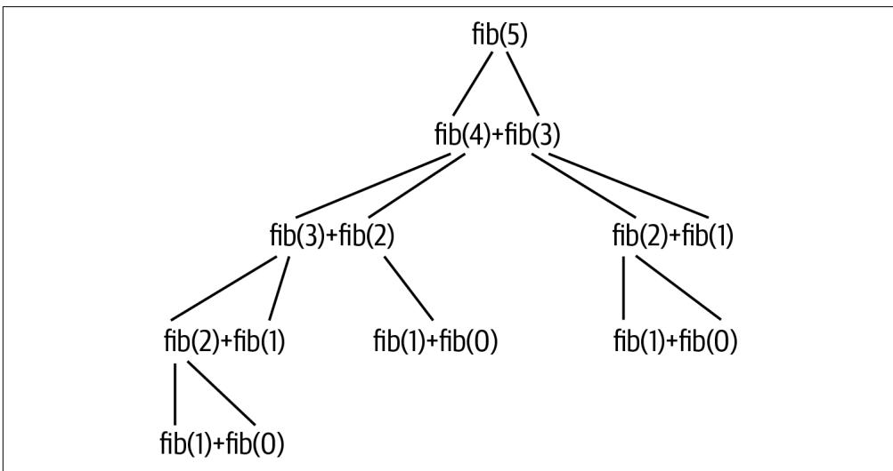  
그림 4-4. fib(5)에 대한 콜 스택은 함수에 대한 수많은 재귀 호출을 발생시키며, 그 횟수는 입력 값이 증가함에 따라 대략 기하급수적으로 증가합니다.

문제를 설명하기 위해, 이 프로그램이 최대 n인 40까지 도달하는 데 걸리는 시간을 샘플링해 보겠습니다. 다시 한번 배시(bash)의 for 루프를 사용하여 명령줄에서 이러한 프로그램을 일반적으로 벤치마킹하는 방법을 보여드리겠습니다.

```asm
$ for n in 10 20 30 40;
> do echo "=> $n <=" && time ./solution3_recursion.py $n 1
> done
=== 10 ===
55
real     0m0.045s
user     0m0.032s
sys     0m0.011s
=== 20 ===
6765
real     0m0.041s
user     0m0.031s
sys     0m0.009s
=== 30 ===
832040
real     0m0.292s
user     0m0.281s
sys     0m0.009s
=== 40 ===
102334155
real     0m31.629s
user     0m31.505s
sys     0m0.043s 
```

n=30일 때 0.29초에서 n=40일 때 31초로의 도약은 엄청납니다. 50 이상으로 간다고 상상해 보십시오. 이를 가속화할 방법을 찾거나 재귀에 대한 모든 희망을 버려야 합니다. 해결책은 이전에 계산된 결과들을 캐싱하는 것입니다. 이를 메모이제이션(memoization)이라고 하며, 이를 구현하는 방법은 많습니다. 다음은 그중 한 가지 방법입니다. typing.Callable을 임포트해야 한다는 점에 유의하십시오.

```python
def memoize(f: Callable) -> Callable: # 1
    """ 함수의 결과를 메모이제이션합니다 """
    cache = {} # 2
    def memo(x): # 3
        if x not in cache: # 4
            cache[x] = f(x) # 5
        return cache[x] # 6
    return memo # 7
```

1 함수(호출 가능한 것)를 인자로 받아 함수를 반환하는 함수를 정의합니다.
2 캐시된 값들을 저장하기 위해 딕셔너리를 사용합니다.
3 cache를 감싸는 클로저로 memo()를 정의합니다. 이 함수는 호출될 때 어떤 파라미터 x를 받게 됩니다.
4 인자 값이 캐시에 있는지 확인합니다.
5 만약 없다면, 인자와 함께 함수를 호출하고 해당 인자 값에 대한 캐시를 결과로 설정합니다.
6 인자에 대한 캐시된 값을 반환합니다.
7 새로운 함수를 반환합니다.

memoize() 함수가 새로운 함수를 반환한다는 점에 주목하십시오. 파이썬에서 함수는 일급 객체(first-class objects)로 간주되는데, 이는 함수가 다른 종류의 변수들처럼 사용될 수 있음을 의미합니다. 즉, 함수를 인자로 전달할 수도 있고 함수의 정의를 덮어쓸 수도 있습니다. memoize() 함수는 다른 함수들을 인자로 받기 때문에 고차 함수(Higher-Order Function, HOF)의 한 예입니다. 저는 책 전반에 걸쳐 filter() 및 map()과 같은 다른 고차 함수들을 사용할 것입니다.

memoize() 함수를 사용하기 위해, fib()를 정의한 다음 메모이제이션된 버전으로 다시 정의하겠습니다. 이렇게 실행하면 n이 아무리 커지더라도 거의 즉각적인 결과를 보게 될 것입니다.

```python
def main() -> None:  
    args = get_args()  
    def fib(n: int) -> int:  
        return 1 if n in (1, 2) else fib(n - 2) * args.litter + fib(n - 1)  
    fib = memoize(fib) # 1  
    print(fib(args.generations)) 
```

1 기존의 fib() 정의를 메모이제이션된 함수로 덮어씁니다.

이를 달성하기 위해 선호되는 방법은 다른 함수를 수정하는 함수인 데코레이터(decorator)를 사용하는 것입니다.

```python
def main() -> None:  
    args = get_args()  
    @memoize # 1  
    def fib(n: int) -> int: 
        return 1 if n in (1, 2) else fib(n - 2) * args.litter + fib(n - 1)  
    print(fib(args.generations)) 
```

1 fib() 함수를 memoize() 함수로 데코레이팅합니다.

메모이제이션 함수를 직접 작성하는 것도 재미있지만, 이 역시 매우 공통적인 요구 사항이라 다른 사람들이 이미 우리를 위해 해결해 두었습니다. memoize() 함수를 제거하고 대신 functools.lru_cache(최근 최소 사용 캐시) 함수를 임포트할 수 있습니다.

from functools import lru_cache

fib() 함수를 lru_cache() 함수로 데코레이팅하여 최소한의 주의 분산으로 메모이제이션을 적용하십시오.

```python
def main() -> None:  
    args = get_args()  
    @lru_cache() # 1  
    def fib(n: int) -> int:  
        return 1 if n in (1, 2) else fib(n - 2) * args.litter + fib(n - 1)  
    print(fib(args.generations)) 
```

1 lru_cache() 함수를 사용한 데코레이션을 통해 fib() 함수를 메모이제이션합니다. 파이썬 3.6에서는 괄호가 필요하지만, 3.8 및 이후 버전에서는 필요하지 않다는 점에 유의하십시오.

# 솔루션 벤치마킹하기

어떤 솔루션이 가장 빠를까요? 명령의 실행 시간을 비교하기 위해 배시의 for 루프와 time 명령을 사용하는 방법을 보여드렸습니다.

```asm
$ for py in ./solution1_list.py ./solution2_generator_islice.py \
./solution3_recursion_lru_cache.py; do echo $py && time $py 40 5; done 
./solution1_list.py
148277527396903091
real     0m0.070s
user     0m0.043s
sys     0m0.016s
./solution2_generator_islice.py
148277527396903091
real     0m0.049s
user     0m0.033s
sys     0m0.013s
./solution3_recursion_lru_cache.py
148277527396903091
real     0m0.041s 
user 0m0.030s 
sys 0m0.010s 
```

LRU 캐싱을 사용한 재귀 솔루션이 가장 빠른 것처럼 보이지만, 이번에도 데이터가 너무 적습니다. 프로그램당 단 한 번의 실행뿐입니다. 또한, 이 데이터를 눈으로 직접 확인하고 어떤 것이 가장 빠른지 알아내야 합니다.

더 좋은 방법이 있습니다. 저는 각 명령을 여러 번 실행하고 결과를 비교하기 위해 hyperfine이라는 도구를 설치했습니다.

```txt
$ hyperfine -L prg ./solution1_list.py,./solution2_generator_islice.py,\  
./solution3_recursion_lru_cache.py '{prg} 40 5' --prepare 'rm -rf __pycache__'  
Benchmark #1: ./solution1_list.py 40 5  
  Time (mean ± σ):      38.1 ms ±   1.1 ms    [User: 28.3 ms, System: 8.2 ms]  
  Range (min … max):    36.6 ms …  42.8 ms    60 runs 
```

Benchmark #2: ./solution2_generator_islice.py 40 5 
  Time (mean ± σ):      38.0 ms ±   0.6 ms    [User: 28.2 ms, System: 8.1 ms] 
  Range (min … max):    36.7 ms …  39.2 ms    66 runs

Benchmark #3: ./solution3_recursion_lru_cache.py 40 5 
  Time (mean ± σ):      37.9 ms ±   0.6 ms    [User: 28.1 ms, System: 8.1 ms] 
  Range (min … max):    36.6 ms …  39.4 ms    65 runs

```txt
Summary
  './solution3_recursion_lru_cache.py 40 5' ran
    1.00 ± 0.02 times faster than './solution2_generator_islice.py 40 5'
    1.01 ± 0.03 times faster than './solution1_list.py 40 5' 
```

hyperfine이 각 명령을 60~66번 실행하여 결과를 평균냈으며, solution3_recursion_lru_cache.py 프로그램이 아주 근소하게 더 빠른 것으로 나타났습니다. 유용하게 쓰일 수 있는 또 다른 벤치마킹 도구로는 bench가 있지만, 인터넷에서 여러분의 취향에 더 맞는 다른 도구들을 찾아볼 수도 있습니다. 어떤 도구를 사용하든, 벤치마킹은 테스트와 더불어 여러분의 코드에 대한 가정을 검증하는 데 필수적입니다.


hyperfine에게 명령을 실행하기 전에 __pycache__ 디렉토리를 제거하라고 지시하기 위해 --prepare 옵션을 사용했습니다. 이 디렉토리는 파이썬이 프로그램의 바이트코드를 캐싱하기 위해 생성하는 곳입니다. 프로그램의 소스 코드가 마지막 실행 이후 변경되지 않았다면, 파이썬은 컴파일 과정을 건너뛰고 __pycache__ 디렉토리에 있는 바이트코드 버전을 사용할 수 있습니다. hyperfine이 명령을 실행할 때 아마도 캐싱 효과 때문에 통계적 이상치를 감지했기 때문에 이를 제거해야 했습니다.

# 좋은 것, 나쁜 것, 그리고 추한 것을 테스트하기

모든 과제에 대해 여러분이 테스트 코드를 읽는 데 시간을 할애하시길 바랍니다. 테스트를 설계하고 작성하는 법을 배우는 것은 제가 보여드리는 다른 어떤 것만큼이나 중요합니다. 앞서 언급했듯이, 제 첫 번째 테스트들은 기대하는 프로그램이 존재하는지, 그리고 요청 시 사용법 문구를 생성하는지 확인합니다. 그 후에 저는 보통 프로그램이 실패하는지 확인하기 위해 잘못된 입력들을 제공합니다. 잘못된 n 및 k 파라미터에 대한 테스트를 강조하고 싶습니다. 두 테스트는 본질적으로 동일하므로, 첫 번째 것만 보여드리겠습니다. 이 테스트는 음수이거나 너무 높은, 유효하지 않은 정수 값을 무작위로 선택하는 방법을 보여줍니다.

```python
def test_bad_n():
    ''' n이 잘못되었을 때 중단 확인 '''  
    n = random.choice(list(range(-10, 0)) + list(range(41, 50))) # 1  
    k = random.randint(1, 5) # 2  
    rv, out = getstatusoutput(f'{RUN} {n} {k}') # 3  
    assert rv != 0 # 4  
    assert out.lower().startswith('usage:') # 5  
    assert re.search(f'generations "{n}" must be between 1 and 40', out) # 6 
```

1 유효하지 않은 숫자 범위의 두 리스트를 합치고 그중 하나의 값을 무작위로 선택합니다.
2 1에서 5 사이의 정수(양 끝값 포함)를 무작위로 선택합니다.
3 인자들과 함께 프로그램을 실행하고 출력을 캡처합니다.
4 프로그램이 실패(0이 아닌 종료 값)를 보고했는지 확인합니다.
5 출력이 사용법 문구로 시작하는지 확인합니다.
6 n 인자의 문제점을 설명하는 오류 메시지를 찾습니다.

저는 테스트할 때 무작위로 선택된 유효하지 않은 값들을 사용하는 것을 종종 즐깁니다. 이는 부분적으로는 학생들이 단 하나의 잘못된 입력에만 실패하는 프로그램을 작성하지 않도록 테스트를 만들던 습관에서 비롯되었지만, 특정 입력 값에만 맞춰 코딩하지 않도록 도와준다는 점도 발견했습니다. 아직 random 모듈을 다루지 않았지만, 이 모듈은 의사 난수(pseudorandom) 선택을 할 수 있는 방법을 제공합니다. 우선 모듈을 임포트해야 합니다.

```txt
>>> import random
```

예를 들어, random.randint()를 사용하여 주어진 범위에서 단일 정수를 선택할 수 있습니다.

```txt
>>> random.randint(1, 5)
2
>>> random.randint(1, 5)
5 
```

또는 random.choice() 함수를 사용하여 어떤 시퀀스에서 하나의 값을 무작위로 선택할 수 있습니다. 여기서는 양수 범위와 분리된 음수 범위로 구성된 불연속적인 범위를 만들고 싶었습니다.

```txt
>>> random.choice(list(range(-10, 0)) + list(range(41, 50)))
46
>>> random.choice(list(range(-10, 0)) + list(range(41, 50)))
-1 
```

그다음에 나오는 테스트들은 모두 프로그램에 정상적인 입력들을 제공합니다. 예를 들면 다음과 같습니다.

```python
def test_2():
    ''' 정상 입력에서 실행 확인 ''' 
    rv, out = getstatusoutput(f'{RUN} 30 4') # 1 
    assert rv == 0 # 2 
    assert out == '436390025825' # 3
```

1 이 값들은 제가 Rosalind 과제를 해결하려고 시도하는 동안 받았던 값들입니다.
2 프로그램이 이 입력에 대해 실패해서는 안 됩니다.
3 Rosalind에 따른 정답입니다.

테스트는 문서화와 마찬가지로 미래의 여러분에게 보내는 러브레터입니다. 테스트가 지루하게 느껴질 수도 있겠지만, 새로운 기능을 추가하려다가 이전에 잘 작동하던 것을 실수로 망가뜨렸을 때 실패하는 테스트의 고마움을 알게 될 것입니다. 테스트를 부지런히 작성하고 실행하는 것은 망가진 프로그램을 배포하는 것을 방지할 수 있습니다.

# 모든 솔루션에 대해 테스트 스위트 실행하기

각 장에서 제가 문제 해결을 위한 다양한 방법들을 탐구하기 위해 여러 솔루션들을 작성하는 것을 보셨을 것입니다. 저는 제 프로그램의 정확성을 확인하기 위해 전적으로 제 테스트에 의존합니다. 제가 모든 개별 솔루션을 테스트하는 과정을 어떻게 자동화했는지 궁금하실 것입니다. Makefile을 살펴보고 'all' 타겟을 찾아보십시오.

```txt
$ cat Makefile
.PHONY: test
test:
    python3 -m pytest -xv --flake8 --pylint --mypy fib.py tests/fib_test.py
all:
    ../bin/all_test.py fib.py 
```


all_test.py 프로그램은 테스트 스위트를 실행하기 전에 fib.py 프로그램을 각각의 솔루션들로 덮어씁니다. 이 과정에서 여러분의 솔루션이 덮어써질 수 있습니다. make all을 실행하기 전에 반드시 여러분의 버전을 Git에 커밋하거나 최소한 복사본을 만들어 두십시오. 그렇지 않으면 작업 내용을 잃을 수 있습니다.

다음은 'all' 타겟에 의해 실행되는 all_test.py 프로그램입니다. 이를 두 부분으로 나누어 get_args()까지의 첫 번째 부분부터 시작하겠습니다. 대부분의 내용은 이제 익숙하실 것입니다.

```python
#!/usr/bin/env python3   
""" 모든 solution*.py 파일에 대해 테스트 스위트를 실행합니다 """   
import argparse   
import os   
import re   
import shutil   
import sys   
from subprocess import getstatusoutput   
from functools import partial   
from typing import NamedTuple 

class Args(NamedTuple): 
    """ 명령줄 인자 """ 
    program: str # 1 
    quiet: bool # 2 

def get_args() -> Args:
    ''' 명령줄 인자 가져오기 '''  
    parser = argparse.ArgumentParser(
        description='모든 solution*.py 파일에 대해 테스트 스위트를 실행합니다',
        formatter_class=argparse.ArgumentDefaultsHelpFormatter)
    parser.add_argument('program', metavar='prg', help='테스트할 프로그램') # 3
    parser.add_argument('-q', '--quiet', action='store_true', help='상세 출력 안 함') # 4
    args = parser.parse_args()
    return Args(args.program, args.quiet) 
```

1 테스트할 프로그램의 이름으로, 이 경우에는 fib.py입니다.
2 더 많거나 적은 출력을 생성하기 위한 불리언(Boolean) 값 True 또는 False입니다.
3 기본 타입은 str입니다.
4 action='store_true'는 이를 불리언 플래그로 만듭니다. 플래그가 존재하면 값은 True가 되고, 그렇지 않으면 False가 됩니다.

main() 함수는 실제로 테스트가 일어나는 곳입니다.

```python
def main() -> None:  
    args = get_args()  
    cwd = os.getcwd() # 1  
    solutions = list( # 2  
        filter(partial(re.match, r'solution.*\.py'), os.listdir(cwd))) # 3  
    for solution in sorted(solutions): # 4  
        print(f' => {solution} <=')  
        shutil.copyfile(solution, os.path.join(cwd, args.program)) # 5  
        subprocess.run(['chmod', '+x', args.program], check=True) # 6  
        rv, out = getstatusoutput('make test') # 7  
        if rv != 0: # 8  
            sys.exit(out) # 9  
        if not args.quiet: # 10  
            print(out)  
    print('Done.') # 11 
```

1 현재 작업 디렉토리를 가져옵니다. 명령을 실행할 때 04_fib 디렉토리에 있다면 해당 디렉토리가 됩니다.
2 현재 디렉토리에서 모든 solution*.py 파일을 찾습니다.
3 filter()와 partial()은 모두 고차 함수(HOF)입니다. 다음에 이어서 설명하겠습니다.
4 파일 이름들은 무작위 순서로 되어 있으므로, 정렬된 파일들을 순회합니다.
5 solution*.py 파일을 테스트용 파일 이름으로 복사합니다.
6 프로그램을 실행 가능하게 만듭니다.
7 'make test' 명령을 실행하고 반환 값과 출력을 캡처합니다.
8 반환 값이 0이 아닌지 확인합니다.
9 테스트 결과를 출력하고 0이 아닌 값을 반환하며 이 프로그램을 종료합니다.
10 프로그램이 조용히(quiet) 실행되어야 하는 것이 아니라면, 테스트 결과를 출력합니다.
11 사용자에게 프로그램이 정상적으로 종료되었음을 알립니다.

위의 코드에서 저는 프로그램을 즉시 중단하고 오류 메시지를 출력하며 0이 아닌 종료 값을 반환하기 위해 sys.exit()를 사용하고 있습니다. 문서를 찾아보시면 sys.exit()를 인자 없이, 또는 정수 값이나 제가 사용한 것처럼 문자열과 같은 객체와 함께 호출할 수 있음을 알 수 있습니다.

```prolog
exit(status=None, /)  
SystemExit(status) 예외를 발생시켜 인터프리터를 종료합니다. 
```

상태(status)가 생략되거나 None이면 0(즉, 성공)으로 기본 설정됩니다. 상태가 정수라면 시스템 종료 상태로 사용됩니다.
만약 다른 종류의 객체라면, 해당 객체가 출력되고 시스템 종료 상태는 1(즉, 실패)이 됩니다.

앞의 프로그램은 제가 아직 다루지 않은 filter() 또는 partial() 함수도 사용합니다. 이 둘은 모두 고차 함수(HOF)입니다. 제가 이것들을 어떻게 그리고 왜 사용하고 있는지 설명하겠습니다. 우선, os.listdir() 함수는 파일과 디렉토리를 포함하여 디렉토리의 전체 내용을 반환합니다.

```coffeescript
>>> import os
>>> files = os.listdir() 
```

내용이 많으므로, 이를 보기 좋게 출력하기 위해 pprint 모듈에서 pprint() 함수를 가져오겠습니다.

```python
>>> from pprint import pprint
>>> pprint(files)
['solution3_recursion_memoize_decorator.py',
 'solution2_generator_for_loop.py',
 '.pytest_cache',
 'Makefile',
 'solution2_generator_islice.py',
 'tests',
 '_pycache_',
 'fib.py',
 'README.md',
 'solution3_recursion_memoize.py',
 'bench.html',
 'solution2_generator.py',
 '.mypy_cache',
 '.gitignore',
 'solution1_list.py',
 'solution3_recursion_lru_cache.py',
 'solution3_recursion.py'] 
```

저는 이 파일들을 'solution'으로 시작해서 '.py'로 끝나는 이름들로 필터링하고 싶습니다. 명령줄에서는 별표(*)가 0개 이상의 문자를 의미하고 점(.)이 문자 그대로의 마침표를 의미하는 'solution*.py'와 같은 파일 글로브(glob)를 사용하여 이 패턴을 매칭할 것입니다. 이 패턴의 정규 표현식 버전은 약간 더 복잡한 'solution.*\.py'인데, 여기서 점(.)은 모든 문자를 나타내는 정규 표현식 메타 문자이고 별표(*)는 0개 이상을 의미합니다(그림 4-5 참조). 문자 그대로의 마침표를 나타내려면 백슬래시(\.)를 사용하여 이스케이프해야 합니다. 이 패턴을 감싸기 위해 r-문자열(raw string)을 사용하는 것이 현명하다는 점에 유의하십시오.

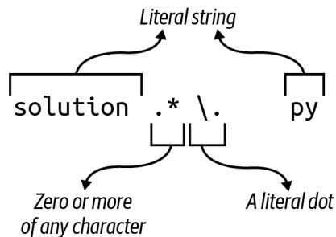  
그림 4-5. 파일 글로브 solution*.py와 일치하는 파일을 찾기 위한 정규 표현식

매칭에 성공하면 re.Match 객체가 반환됩니다.

```txt
>>> import re
>>> re.match(r'solution.*\.py', 'solution1.py')
<re.Match object; span=(0, 12), match='solution1.py'> 
```

매칭에 실패하면 None 값이 반환됩니다. REPL에서는 None 값이 표시되지 않으므로 type()을 사용해야 합니다.

```txt
>>> type(re.match(r'solution.*\.py', 'fib.py'))
<class 'NoneType'> 
```

저는 이 매칭을 os.listdir()에 의해 반환된 모든 파일에 적용하고 싶습니다. 익명 함수를 만들기 위해 filter()와 lambda 키워드를 사용할 수 있습니다. files에 있는 각 파일 이름은 매칭에 사용되는 name 인자로 전달됩니다. filter() 함수는 주어진 함수로부터 참 같은 값(truthy value)을 반환하는 요소들만 반환하므로, 매칭에 실패하여 None을 반환하는 파일 이름들은 제외됩니다.

```python
>>> pprint(list(filter(lambda name: re.match(r'solution.*\.py', name), files)))
['solution3_recursion_memoize_decorator.py',
 'solution2_generator_for_loop.py',
 'solution2_generator_islice.py',
 'solution3_recursion_memoize.py',
 'solution2_generator.py',
 'solution1_list.py',
 'solution3_recursion_lru_cache.py',
 'solution3_recursion.py'] 
```

re.match() 함수가 두 개의 인자(패턴과 매칭할 문자열)를 받는 것을 보셨을 것입니다. partial() 함수를 사용하면 함수의 인자 일부를 미리 적용할 수 있으며, 그 결과는 새로운 함수가 됩니다. 예를 들어 operator.add() 함수는 두 개의 값을 기대하고 그 합을 반환합니다.

```python
>>> import operator
>>> operator.add(1, 2)
3 
```

다음과 같이 어떤 값에 1을 더하는 함수를 만들 수 있습니다.

```python
>>> from functools import partial
>>> import operator as op
>>> succ = partial(op.add, 1) 
```

succ() 함수는 하나의 인자를 필요로 하며, 그 다음 숫자(successor)를 반환할 것입니다.

```erlang
>>> succ(3)   
4   
>>> succ(succ(3))   
5 
```

마찬가지로, 첫 번째 인자인 정규 표현식 패턴이 미리 적용된 re.match() 함수인 f() 함수를 만들 수 있습니다.

```txt
>>> f = partial(re.match, r'solution.*\.py') 
```

f() 함수는 매칭을 적용할 문자열을 기다리고 있습니다.

```txt
>>> type(f('solution1.py'))
<class 're.Match'>  
>>> type(f('fib.py'))
<class 'NoneType'> 
```

인자 없이 호출하면 예외가 발생합니다.

```txt
>>> f()
Traceback (most recent call last):
  File "<stdin>", line 1, in <module>
TypeError: match() missing 1 required positional argument: 'string' 
```

lambda를 filter()의 첫 번째 인자로서 부분 적용된 함수로 바꿀 수 있습니다.

```python
>>> pprint(list(filter(f, files)))
['solution3_recursion_memoize_decorator.py',
 'solution2_generator_for_loop.py',
 'solution2_generator_islice.py',
 'solution3_recursion_memoize.py',
 'solution2_generator.py',
 'solution1_list.py',
 'solution3_recursion_lru_cache.py',
 'solution3_recursion.py'] 
```

그림 3-3에서 보듯이, 첫 번째 단계에서 T로 바뀌었던 모든 A가 다시 A로 바뀌어 버렸습니다. 이런 방식은 정말 엉망진창이 될 수밖에 없습니다.

  
그림 3-3. str.replace()를 반복적으로 사용하면 값이 이중으로 교체되어 잘못된 답을 얻게 됩니다.

다행히 파이썬에는 바로 이런 목적을 위한 str.translate() 함수가 있습니다. help(str.translate)를 읽어보면 이 함수는 "유니코드 코드 포인트(ordinal)에서 유니코드 코드 포인트, 문자열 또는 None으로의 매핑이어야 하는 테이블"이 필요하다는 것을 알 수 있습니다. trans 딕셔너리 테이블을 사용할 수 있지만, 먼저 상보 테이블을 키의 코드 포인트 값을 사용하는 형식으로 변환하기 위해 str.maketrans() 함수에 전달해야 합니다.

```txt
>>> trans = {
...     'A': 'T', 'C': 'G', 'G': 'C', 'T': 'A',
...     'a': 't', 'c': 'g', 'g': 'c', 't': 'a'
... }
>>> str.maketrans(trans)
{65: 'T', 67: 'G', 71: 'C', 84: 'A', 97: 't', 99: 'g', 103: 'c', 116: 'a'} 
```

문자열 키 'A'가 정수 값 65로 바뀐 것을 볼 수 있습니다. 이는 ord() 함수가 반환하는 값과 동일합니다.

```txt
>>> ord('A') 
65
```

이 값은 ASCII(미국 정보 교환 표준 부호) 테이블에서 문자 'A'의 서수 위치를 나타냅니다. 즉, 'A'는 테이블의 65번째 문자입니다. chr() 함수는 이 과정을 반대로 수행하여, 코드 포인트 값이 나타내는 문자를 제공합니다.

```txt
>>> chr(65) 
'A' 
```

str.translate() 함수는 상보 테이블의 키가 코드 포인트 값이어야 하는데, 이것이 바로 str.maketrans()를 통해 얻는 결과입니다.

```txt
>>> 'AAAAACCCGGT'.translate(str.maketrans(trans)) 
'TTTTGGGCCA' 
```

마지막으로 상보 서열을 뒤집어야 합니다. 이러한 아이디어들을 모두 통합한 솔루션은 다음과 같습니다.

```python
def main() -> None:  
    args = get_args()  
    trans = str.maketrans({ # 1 
        'A': 'T', 'C': 'G', 'G': 'C', 'T': 'A', 
        'a': 't', 'c': 'g', 'g': 'c', 't': 'a'
    })  
    print(''.join(reversed(args.dna.translate(trans)))) # 2 
```

1 str.translate() 함수에 필요한 변환 테이블을 만듭니다.
2 trans 테이블을 사용하여 DNA를 상보 서열로 바꿉니다. 이를 뒤집고 결합하여 새로운 문자열을 만듭니다.

하지만 잠깐만요, 더 있습니다! 이를 작성하는 훨씬 더 짧은 방법이 하나 더 있습니다. help(str.translate) 문서에 따르면 다음과 같습니다.

인자가 하나만 있는 경우, 유니코드 코드 포인트(정수) 또는 문자를 유니코드 코드 포인트, 문자열 또는 None으로 매핑하는 딕셔너리여야 합니다. 그러면 문자 키는 코드 포인트로 변환됩니다. 인자가 두 개 있는 경우, 길이가 동일한 문자열이어야 하며, 결과 딕셔너리에서 x의 각 문자는 y의 동일한 위치에 있는 문자로 매핑됩니다.

따라서 trans 딕셔너리를 제거하고 전체 솔루션을 다음과 같이 작성할 수 있습니다.

```python
def main() -> None:  
    args = get_args()  
    trans = str.maketrans('ACGTacgt', 'TGCAtgca') # 1  
    print(''.join(reversed(args.dna.translate(trans)))) # 2 
```

1 동일한 길이의 두 문자열을 사용하여 변환 테이블을 만듭니다.
2 역상보 서열을 생성합니다.

누군가의 하루를 망치고 싶다면 (그리고 십중팔구 그 사람은 미래의 여러분일 것입니다), 이 코드를 단 한 줄로 응축할 수도 있습니다.

# 솔루션 5: Bio.Seq 사용

이 장의 시작 부분에서 최종 솔루션은 기존 함수를 포함할 것이라고 말씀드렸습니다. 생명정보학 분야에서 일하는 많은 파이썬 프로그래머들이 Biopython이라는 이름 아래 일련의 모듈에 기여해 왔습니다. 그들은 믿을 수 없을 정도로 유용한 수많은 알고리즘을 작성하고 테스트했으므로, 다른 사람의 코드를 사용할 수 있을 때 굳이 자신만의 코드를 작성할 이유는 거의 없습니다.

먼저 다음 명령을 실행하여 biopython이 설치되어 있는지 확인하십시오.

$ python3 -m pip install biopython

import Bio를 사용하여 전체 모듈을 가져올 수도 있지만, 필요한 코드만 가져오는 것이 훨씬 합리적입니다. 여기서는 Seq 클래스만 필요합니다.

>>> from Bio import Seq

이제 Seq.reverse_complement() 함수를 사용할 수 있습니다.

>>> Seq.reverse_complement('AAAACCCGGT') 
'ACCGGGTTTT'

이 최종 솔루션은 가장 짧을 뿐만 아니라, 파이썬을 이용한 생명정보학에서 거의 편재하다시피 한 검증되고 문서화된 기존 모듈을 사용하므로 제가 권장하는 버전입니다.

```python
def main() -> None: 
    args = get_args() 
    print(Seq.reverse_complement(args.dna)) # 1
```

1 Bio.Seq.reverse_complement() 함수를 사용합니다.

이 솔루션에 대해 mypy를 실행하면 (모든 프로그램에 대해 mypy를 실행하고 계시죠?), 다음과 같은 오류가 발생할 수 있습니다.

FAILURES revc.py
6: error: Skipping analyzing 'Bio': found module but no type hints or library stubs   
6: note: See https://mypy.readthedocs.io/en/latest/running_mypy.html#missing-imports
mypy
Found 1 error in 1 file (checked 2 source files)
mypy.ini: No [mypy] section in config file

```txt
short test summary info  
FAILED revc.py::mypy  
!!!!!!!!!!!!! stopping after 1 failures !!!!!!!!!!!!!  
--- 1 failed, 1 skipped in 0.20s 
```

이 오류를 무시하려면 mypy에게 타입 어노테이션이 없는 임포트된 파일들을 무시하라고 지시할 수 있습니다. 이 책의 GitHub 저장소 루트 디렉토리에는 다음과 같은 내용의 mypy.ini 파일이 있습니다.

```ini
$ cat mypy.ini
[mypy]
ignore_missing_imports = True 
```

어런 작업 디렉토리에든 mypy.ini 파일을 추가하면 해당 디렉토리에서 mypy를 실행할 때 mypy가 사용하는 기본 설정을 변경할 수 있습니다. 어떤 디렉토리에 있든 mypy가 이를 사용하도록 전역적으로 변경하고 싶다면, 동일한 내용을 $HOME/.mypy.ini 파일에 넣으십시오.

# 검토

DNA의 역상보 서열을 수동으로 만드는 것은 일종의 통과의례와 같습니다. 제가 보여드린 내용은 다음과 같습니다.

* 일련의 if/else 문을 사용하거나 딕셔너리를 조회 테이블로 사용하여 결정 트리를 작성할 수 있습니다.
* 문자열과 리스트는 매우 유사합니다. 둘 다 for 루프로 순회할 수 있으며, += 연산자를 사용하여 둘 다에 추가할 수 있습니다.
* 리스트 컴프리헨션은 for 루프를 사용하여 시퀀스를 순회하고 새로운 리스트를 생성합니다.
* reversed() 함수는 시퀀스 요소들의 역순 반복자를 반환하는 지연 함수입니다.
* REPL에서 list() 함수를 사용하여 지연 함수, 반복자, 제너레이터가 값을 생성하도록 강제할 수 있습니다.
* str.maketrans() 및 str.translate() 함수는 문자열 치환을 수행하고 새로운 문자열을 생성할 수 있습니다.
* ord() 함수는 문자의 코드 포인트 값을 반환하며, 반대로 chr() 함수는 주어진 코드 포인트 값에 해당하는 문자를 반환합니다.
* Biopython은 생명정보학에 특화된 모듈과 함수들의 모음입니다. DNA의 역상보 서열을 만드는 선호되는 방법은 Bio.Seq.reverse_complement() 함수를 사용하는 것입니다.

# 피보나치 수열 만들기: 알고리즘 작성, 테스트 및 벤치마킹

피보나치 수열 (Fibonacci sequence) 구현을 작성하는 것은 코더가 되기 위한 영웅의 여정에서 또 다른 단계입니다. Rosalind의 피보나치 설명에 따르면, 이 수열의 기원은 몇 가지 중요하고 (비현실적인) 가정을 바탕으로 한 토끼 번식의 수학적 시뮬레이션이었습니다.

* 첫 번째 달은 갓 태어난 토끼 한 쌍으로 시작합니다.
* 토끼는 한 달 후에 번식할 수 있습니다.
* 매달 번식 연령이 된 모든 토끼는 번식 연령이 된 다른 토끼와 짝짓기를 합니다.
* 두 토끼가 짝짓기를 한 지 정확히 한 달 후에, 그들은 동일한 크기의 새끼 한 배를 낳습니다.
* 토끼는 불사신이며 짝짓기를 절대 멈추지 않습니다.

수열은 항상 0과 1로 시작합니다. 그림 4-1에서 보듯이, 리스트의 직전 두 값을 더함으로써 그 다음 숫자들을 무한히 생성할 수 있습니다.

  
그림 4-1. 피보나치 수열의 처음 8개 숫자. 초기 0과 1 이후, 다음 숫자들은 이전의 두 숫자를 더해서 만들어집니다.

인터넷에서 솔루션을 검색해 보면 수열을 생성하는 수십 가지의 서로 다른 방법을 찾을 수 있을 것입니다. 저는 상당히 다른 세 가지 접근 방식에 집중하고 싶습니다. 첫 번째 솔루션은 알고리즘이 모든 단계를 엄격하게 정의하는 명령형 (imperative) 접근 방식을 사용합니다. 다음 솔루션은 제너레이터 (generator) 함수를 사용하고, 마지막은 재귀적 (recursive) 솔루션에 집중할 것입니다. 재귀는 흥미롭기는 하지만 수열을 더 많이 생성하려고 할수록 속도가 급격히 느려지는데, 이러한 성능 문제는 캐싱 (caching)을 사용하여 해결할 수 있음이 밝혀졌습니다.

여러분은 다음을 배우게 됩니다.

* 인자를 수동으로 검증하고 오류를 발생시키는 방법
* 리스트를 스택 (stack)으로 사용하는 방법
* 제너레이터 함수를 작성하는 방법
* 재귀 함수를 작성하는 방법
* 재귀 함수가 왜 느려질 수 있는지와 메모이제이션 (memoization)으로 이를 해결하는 방법
* 함수 데코레이터 (decorator)를 사용하는 방법

# 시작하기

이 장의 코드와 테스트는 04_fib 디렉토리에 있습니다. 첫 번째 솔루션을 fib.py로 복사하는 것부터 시작하십시오.

```shell
$ cd 04_fib/
$ cp solution1_list.py fib.py 
```

파라미터가 어떻게 정의되어 있는지 사용법을 물어보십시오. n과 k를 사용할 수도 있지만, 저는 generations와 litter라는 이름을 사용하기로 했습니다.

```makefile
$ ./fib.py -h
usage: fib.py [-h] generations litter

피보나치 계산

positional arguments:
  generations  세대 수
  litter       세대당 새끼 수

optional arguments:
  -h, --help   이 도움말 메시지를 표시하고 종료 
```

이 프로그램은 문자열이 아닌 인자를 받는 첫 번째 프로그램이 될 것입니다. Rosalind 과제는 프로그램이 두 개의 양의 정수 값을 받아야 함을 나타냅니다.

* 세대 수를 나타내는 n ≤ 40
* 한 쌍의 토끼가 낳는 새끼 수인 k ≤ 5

정수가 아닌 값을 전달해 보고 프로그램이 어떻게 실패하는지 확인하십시오.

```yaml
$ ./fib.py foo
usage: fib.py [-h] generations litter
fib.py: error: argument generations: invalid int value: 'foo' 
```

겉으로는 드러나지 않지만, 짧은 사용법과 유용한 오류 메시지를 출력하는 것 외에도 프로그램은 0이 아닌 종료 값을 생성했습니다. 유닉스 명령줄에서 종료 값 0은 성공을 나타냅니다. 저는 이를 '오류 0개'라고 생각합니다. 배시 (bash) 쉘에서는 $? 변수를 조사하여 가장 최근 프로세스의 종료 상태를 확인할 수 있습니다. 예를 들어 echo Hello 명령은 0이라는 값으로 종료되어야 하며, 실제로 그렇습니다.

```txt
$ echo Hello
Hello
$ echo $?
0 
```

이전에 실패했던 명령을 다시 시도한 다음, $?를 조사해 보십시오.

```txt
$ ./fib.py foo
usage: fib.py [-h] generations litter
fib.py: error: argument generations: invalid int value: 'foo'
$ echo $?
2 
```

종료 상태가 2라는 것보다 중요한 사실은 그 값이 0이 아니라는 점입니다. 이는 잘못된 인자를 거부하고 유용한 오류 메시지를 출력하며 0이 아닌 상태로 종료하므로 잘 작동하는 프로그램입니다. 만약 이 프로그램이 데이터 처리 단계의 파이프라인 (부록 A에서 다루는 Makefile 등)의 일부였다면, 0이 아닌 종료 값은 전체 프로세스를 중단시켰을 것이며 이는 바람직한 일입니다. 잘못된 값을 묵묵히 받아들이고 조용히 혹은 아예 실패하지 않는 프로그램은 재현 불가능한 결과로 이어질 수 있습니다. 프로그램이 인자를 적절히 검증하고, 계속 진행할 수 없을 때 확실하게 실패하도록 만드는 것은 매우 중요합니다.

이 프로그램은 받아들이는 숫자의 타입에 대해서도 매우 엄격합니다. 값은 반드시 정수여야 합니다. 부동 소수점 값도 거부할 것입니다.

```yaml
$ ./fib.py 5 3.2
usage: fib.py [-h] generations litter
fib.py: error: argument litter: invalid int value: '3.2' 
```


프로그램으로 들어오는 모든 명령줄 인자는 기술적으로는 문자열로 수신됩니다. 명령줄의 5가 숫자 5처럼 보일지라도, 그것은 문자 "5"입니다. 저는 이 상황에서 argparse가 문자열을 정수로 변환하도록 시도하는 것에 의존하고 있습니다. 변환에 실패하면 argparse는 이러한 유용한 오류 메시지를 생성합니다.

또한 프로그램은 generations 및 litter 파라미터에 대해 허용된 범위를 벗어난 값을 거부합니다. 오류 메시지에 인자 이름과 문제가 된 값이 포함되어 있어, 여러분이 문제를 해결할 수 있도록 충분한 피드백을 제공한다는 점에 주목하십시오.

```shell
$ ./fib.py -3 2
usage: fib.py [-h] generations litter
fib.py: error: generations "-3" must be between 1 and 40
$ ./fib.py 5 10
usage: fib.py [-h] generations litter
fib.py: error: litter "10" must be between 1 and 5 
```

1 세대 수 인자 -3이 명시된 값의 범위에 있지 않습니다.
② 새끼 수 인자 10이 너무 높습니다.

이것이 어떻게 작동하는지 확인하기 위해 솔루션의 첫 번째 부분을 살펴보겠습니다.

```python
import argparse   
from typing import NamedTuple   

class Args(NamedTuple): 
    """ 명령줄 인자 """ 
    generations: int # 1 
    litter: int # 2   

def get_args() -> Args: 
    """ 명령줄 인자 가져오기 """   
    parser = argparse.ArgumentParser(
        description='피보나치 계산',
        formatter_class=argparse.ArgumentDefaultsHelpFormatter)   
    parser.add_argument('gen', # 3 
                        metavar='generations', 
                        type=int, # 4 
                        help='세대 수')   
    parser.add_argument('litter', # 5 
                        metavar='litter', 
                        type=int, 
                        help='세대당 새끼 수')   
    args = parser.parse_args() # 6   
    if not 1 <= args.gen <= 40: # 7 
        parser.error(f'generations "{args.gen}" must be between 1 and 40') # 8   
    if not 1 <= args.litter <= 5: # 9 
        parser.error(f'litter "{args.litter}" must be between 1 and 5') # 10 
    return Args(generations=args.gen, litter=args.litter)
```

1 generations 필드는 반드시 int여야 합니다.
2 litter 필드 또한 반드시 int여야 합니다.
3 gen 위치 파라미터가 먼저 정의되었으므로, 첫 번째 위치의 값을 받게 됩니다.
4 type=int는 값의 필수 클래스를 나타냅니다. int는 클래스의 이름이 아니라 클래스 자체를 가리킨다는 점에 유의하십시오.
5 litter 위치 파라미터가 두 번째로 정의되었으므로, 두 번째 위치의 값을 받게 됩니다.
6 인자 파싱을 시도합니다. 실패할 경우 오류 메시지가 출력되고 프로그램은 0이 아닌 값으로 종료됩니다.
7 args.gen 값은 이제 실제 int 값이므로 숫자 비교를 수행할 수 있습니다. 수용 가능한 범위에 있는지 확인합니다.
8 parser.error() 함수를 사용하여 오류를 생성하고 프로그램을 종료합니다.
9 마찬가지로 args.litter 인자의 값을 확인합니다.
10 사용자가 문제를 해결하는 데 필요한 정보를 포함한 오류를 생성합니다.
11 프로그램이 이 지점까지 도달했다면 인자들은 허용 범위 내의 유효한 정수 값이므로 Args를 반환합니다.

main() 함수에서 generations 및 litter 값이 올바른 범위에 있는지 확인할 수도 있었겠지만, 저는 유용한 메시지를 생성하고 0이 아닌 값으로 프로그램을 종료하기 위해 parser.error() 함수를 사용할 수 있도록 get_args() 함수 내부에서 가능한 한 많은 인자 검증을 수행하는 것을 선호합니다.

fib.py 프로그램을 제거하고 new.py나 선호하는 방법으로 새로 시작하십시오.

```txt
$ new.py -f -p '피보나치 계산' fib.py 
새 스크립트 "fib.py"를 확인하세요. 
```

get_args() 정의를 앞서 설명한 코드로 교체한 다음, main() 함수를 다음과 같이 수정할 수 있습니다.

```python
def main() -> None:  
    args = get_args()  
    print(f'generations = {args.generations}')  
    print(f'litter = {args.litter}') 
```

잘못된 입력을 넣어 프로그램을 실행해 보고 앞서 보았던 종류의 오류 메시지가 나타나는지 확인하십시오. 허용되는 값으로 프로그램을 실행해 보고 다음과 같은 종류의 출력이 나타나는지 확인하십시오.

```txt
$ ./fib.py 1 2
generations = 1
litter = 2 
```

pytest를 실행하여 프로그램이 무엇을 통과하고 무엇을 실패하는지 확인하십시오. 처음 네 개의 테스트는 통과하고 다섯 번째 테스트는 실패해야 합니다.

```txt
$ pytest -xv
============================== test session starts
      
...
tests/fib_test.py::test_exists PASSED [14%]
tests/fib_test.py::testusage PASSED [28%]
tests/fib_test.py::test_bad_generations PASSED [42%]
tests/fib_test.py::test_bad_litter PASSED [57%]
tests/fib_test.py::test_1 FAILED [71%] ① 
```

```txt
- - - - - - - - - - - - - - - - - - - - - - - - - - - - - - - - - - - - - - - - - - - - - - - - - - - - - - - - - - - - - - - - - - - - - - - - - - - - - - - - - - - - - - - - - - - - - - - - - - - - - 
```

```python
def test_1():
    """ 정상 입력에서 실행 확인 """
    rv, out = getstatusoutput(f'{RUN} 5 3') # 2
    assert rv == 0
    assert out == '19' # 3
    E AssertionError: assert 'generations = 5\nlitter = 3' == '19' # 4
    E - 19 # 5
    E + generations = 5 # 6
    E + litter = 3
```

```txt
tests/fib_test.py:60: AssertionError
============== short test summary info
FAILED tests/fib_test.py::test_1 - AssertionError: assert 'generations...
>>> 1 failed, 4 passed in 0.38s 
```

1 첫 번째 실패한 테스트입니다. -x 플래그 때문에 여기서 테스트가 중단됩니다.
2 세대 수로 5, 새끼 수로 3을 사용하여 프로그램을 실행합니다.
3 출력은 19여야 합니다.
4 비교되는 두 문자열이 같지 않음을 보여줍니다.
5 기대값은 19였습니다.
6 수신된 출력입니다.

pytest의 출력은 무엇이 잘못되었는지 정확히 지적하기 위해 매우 노력하고 있습니다. 프로그램이 어떻게 실행되었는지, 그리고 생산된 결과와 대비하여 무엇을 기대했는지를 보여줍니다. 프로그램은 새끼 수 3을 사용할 때 피보나치 수열의 다섯 번째 숫자인 19를 출력해야 합니다. 직접 프로그램을 완성하고 싶다면 바로 시작하십시오. 모든 테스트를 통과하는지 확인하기 위해 pytest를 사용해야 합니다. 또한 pylint, flake8, mypy를 사용하여 프로그램을 점검하기 위해 make test를 실행하십시오. 안내가 필요하다면 제가 설명한 첫 번째 접근 방식을 다루어 보겠습니다.

# 명령형 접근 방식

그림 4-2는 피보나치 수열의 성장을 묘사합니다. 작은 토끼들은 더 큰 번식 쌍으로 성장해야 하는 비번식 쌍을 나타냅니다.
그림 4-2. 새끼 수 1을 사용하는 토끼 번식 쌍으로서의 피보나치 수열 성장 시각화

처음 두 숫자 이후의 어떤 숫자를 생성하기 위해서라도 이전의 두 숫자를 알아야 한다는 것을 알 수 있습니다. 피보나치 수열 (F)의 어떤 위치 n의 값을 설명하기 위해 이 공식을 사용할 수 있습니다.

$$
F_n = F_{n-1} + F_{n-2}
$$

숫자 시퀀스를 순서대로 유지하고 위치에 따라 참조할 수 있게 해주는 파이썬의 데이터 구조는 무엇일까요? 바로 리스트입니다. $F_1 = 0$ 및 $F_2 = 1$로 시작하겠습니다.

```python
>>> fib = [0, 1]
```

$F_3$ 값은 $F_2 + F_1 = 1 + 0 = 1$입니다. 다음 숫자를 생성할 때 항상 시퀀스의 마지막 두 요소를 참조하게 될 것입니다. 리스트 끝으로부터의 위치를 나타내기 위해 음수 인덱싱을 사용하는 것이 가장 쉬울 것입니다. 리스트의 마지막 값은 항상 -1 위치에 있습니다.

```python
>>> fib[-1]
1
```

그 바로 앞의 값은 -2에 있습니다.

```python
>>> fib[-2]
0
```

해당 세대가 만들어낸 새끼 수를 계산하기 위해 이 값에 새끼 수를 곱해야 합니다. 우선 새끼 수 1을 고려해 보겠습니다.

```python
litter = 1
fib[-2] * litter
0
```

이 두 숫자를 더해서 리스트에 추가하고 싶습니다.

```python
>>> fib.append((fib[-2] * litter) + fib[-1])
>>> fib
[0, 1, 1]
```

이 작업을 다시 수행하면 올바른 시퀀스가 나타나는 것을 볼 수 있습니다.

```python
>>> fib.append((fib[-2] * litter) + fib[-1])
>>> fib
[0, 1, 1, 2]
```

이 동작을 generations 번 반복해야 합니다. (기술적으로 파이썬은 0 기반 인덱싱을 사용하므로 generations-1번이 될 것입니다.) 파이썬의 range() 함수를 사용하여 0부터 종료 값 직전까지의 숫자 리스트를 생성할 수 있습니다. 특정 횟수만큼 순회하는 부수 효과 (side effect)만을 위해 이 함수를 호출하는 것이므로, range() 함수가 생성하는 값들은 필요하지 않습니다. 값을 무시하겠다는 의도를 나타내기 위해 언더스코어 (_) 변수를 사용하는 것이 일반적입니다.

```python
>>> fib = [0, 1]
>>> litter = 1
>>> generations = 5
>>> for _ in range(generations - 1):
...     fib.append((fib[-2] * litter) + fib[-1])
... 
>>> fib
[0, 1, 1, 2, 3, 5]
```

이 정도면 테스트를 통과하는 솔루션을 만들기에 충분할 것입니다. 다음 섹션에서는 파이썬의 매우 흥미로운 부분들을 강조하는 다른 두 가지 솔루션을 다룰 것입니다.

# 솔루션

다음의 모든 솔루션은 앞서 보여드린 것과 동일한 get_args()를 공유합니다.

# 솔루션 1: 리스트를 스택으로 사용하는 명령형 솔루션

제가 작성한 명령형 솔루션입니다. 과거의 값들을 추적하기 위해 리스트를 일종의 스택 (stack)으로 사용하고 있습니다. 모든 값이 필요한 것은 아니고 마지막 두 개만 필요하지만, 리스트를 계속 키워가며 마지막 두 값을 참조하는 것은 꽤 쉽습니다.

```python
def main() -> None:  
    args = get_args()  
    fib = [0, 1] # 1  
    for _ in range(args.generations - 1): # 2  
        fib.append((fib[-2] * args.litter) + fib[-1]) # 3  
    print(fib[-1]) # 4 
```

1 0과 1로 시작합니다.
2 range() 함수를 사용하여 적절한 횟수만큼 루프를 돌립니다.
3 시퀀스에 다음 값을 추가합니다.
4 시퀀스의 마지막 숫자를 출력합니다.


for 루프에서 변수를 사용하지 않겠다는 뜻으로 _ 변수 이름을 사용했습니다. 언더스코어는 유효한 파이썬 식별자이며, 버려지는 값을 나타내기 위해 사용하는 관례이기도 합니다. 예를 들어 린팅 도구는 제가 변수에 어떤 값을 할당하고 사용하지 않은 것을 보고 잠재적인 오류로 간주할 수 있습니다. 언더스코어 변수는 제가 그 값을 사용할 의도가 없음을 보여줍니다. 이 경우, 저는 순회에 필요한 횟수를 생성하는 부수 효과만을 위해 range() 함수를 사용하고 있습니다.

코드가 알고리즘의 모든 지침을 직접 인코딩하고 있기 때문에 이는 명령형 솔루션으로 간주됩니다. 재귀 솔루션을 읽어보면 알고리즘을 좀 더 선언적인 방식으로 작성할 수 있음을 알게 될 것이며, 여기에는 제가 처리해야 할 의도치 않은 결과들도 수반됩니다.

이에 대한 약간의 변형은 이 코드를 fib()라는 함수 내부에 두는 것입니다. 파이썬에서는 함수 내부에 다른 함수를 선언하는 것이 가능하므로, 여기서는 main() 내부에 fib()를 만들겠습니다. 이렇게 하는 이유는 args.litter 파라미터를 참조하여 클로저 (closure)를 만들기 위해서인데, 함수가 실행 시점의 새끼 수 값을 캡처하기 때문입니다.

```python
def main() -> None:  
    args = get_args()  
    def fib(n: int) -> int: # 1  
        nums = [0, 1] # 2  
        for _ in range(n - 1): # 3  
            nums.append((nums[-2] * args.litter) + nums[-1]) # 4  
        return nums[-1] # 5  
    print(fib(args.generations)) # 6 
```

1 정수 파라미터 n을 받고 정수를 반환하는 fib() 함수를 만듭니다.
2 이전과 동일한 코드입니다. 이 리스트는 함수 이름과 충돌하지 않도록 nums라고 지었습니다.
3 세대 수를 순회하기 위해 range() 함수를 사용합니다. 값들을 무시하기 위해 _를 사용합니다.
4 함수가 args.litter 파라미터를 참조하므로 클로저가 생성됩니다.
5 return을 사용하여 최종 값을 호출자에게 돌려보냅니다.
6 args.generations 파라미터를 사용하여 fib() 함수를 호출합니다.

위의 예시에서 fib() 함수의 범위 (scope)는 main() 함수로 제한됩니다. 범위란 특정 함수 이름이나 변수가 보이거나 합법적인 프로그램의 부분을 말합니다.

꼭 클로저를 사용할 필요는 없습니다. 다음은 표준 함수로 동일한 아이디어를 표현하는 방법입니다.

```python
def main() -> None:  
    args = get_args()  
    print(fib(args.generations, args.litter)) # 1  

def fib(n: int, litter: int) -> int: # 2
    nums = [0, 1]  
    for _ in range(n - 1):  
        nums.append((nums[-2] * litter) + nums[-1])  
    return nums[-1] 
```

1 fib() 함수는 반드시 두 개의 인자와 함께 호출되어야 합니다.
2 함수는 세대 수와 새끼 수 모두를 필요로 합니다. 함수 본체는 본질적으로 동일합니다.

위의 코드에서 보듯이 클로저는 새끼 수가 캡처되었기 때문에 하나의 인자만 필요했지만, 이 버전에서는 두 개의 인자를 fib()에 전달해야 합니다. 값을 바인딩하고 파라미터 수를 줄이는 것은 클로저를 만드는 타당한 이유입니다. 클로저를 작성하는 또 다른 이유는 함수의 범위를 제한하기 위해서입니다. fib()의 클로저 정의는 오직 main() 함수 내부에서만 유효하지만, 이전 버전은 프로그램 전체에서 보입니다. 함수를 다른 함수 내부에 숨기면 테스트하기가 더 어려워집니다. 이 경우 fib() 함수가 프로그램의 거의 전부이므로, 테스트는 이미 tests/fib_test.py에 작성되어 있습니다.

# 솔루션 2: 제너레이터 함수 만들기

이전 솔루션에서는 요청된 값까지 피보나치 수열을 생성하고 멈췄습니다. 하지만 수열은 무한합니다. 수열의 모든 숫자를 생성할 수 있는 함수를 만들 수 있을까요? 기술적으로는 가능하지만, 무한하기 때문에 절대 끝나지 않을 것입니다.

파이썬에는 무한할 수도 있는 시퀀스를 생성하는 함수를 일시 중단하는 방법이 있습니다. yield를 사용하여 함수로부터 값을 반환하고, 나중에 다음 값이 요청될 때 동일한 상태에서 다시 시작하도록 함수를 잠시 떠날 수 있습니다. 이런 종류의 함수를 제너레이터 (generator)라고 부르며, 이를 사용하여 수열을 생성하는 방법은 다음과 같습니다.

```python
def fib(k: int) -> Generator[int, None, None]: # 1
    x, y = 0, 1 # 2  
    yield x # 3
    while True: # 4  
        yield y # 5   
        x, y = y, x + (y * k) # 6
```

1 타입 시그니처는 함수가 정수형 파라미터 k (새끼 수)를 받는다는 것을 나타냅니다. 이 함수는 int 값을 산출 (yield)하고 보내기 (send)나 반환 (return) 타입이 없는 특수한 함수 타입인 Generator를 반환합니다.
2 마지막 두 세대만 추적하면 되므로, 이들을 0과 1로 초기화합니다.
3 0을 산출합니다.
4 무한 루프를 만듭니다.
5 마지막 세대를 산출합니다.
6 x (두 세대 전)를 이전의 y (한 세대 전)로 설정합니다. y를 현재 두 세대의 합으로 설정하되, 번식 가능한 쌍에 새끼 수 k를 곱합니다. (수정: x, y = y, x + y * k가 로직에 더 맞을 수 있음. 원문 참고 필요.)

제너레이터는 반복자처럼 작동하여, 소진될 때까지 코드의 요청에 따라 값을 생성합니다. 이 제너레이터는 오직 값만 산출 (yield)하므로, 보내기와 반환 타입은 None입니다. 그 외에 이 코드는 첫 번째 버전의 프로그램이 했던 것과 정확히 동일한 작업을 수행하지만, 멋진 제너레이터 함수 내부에서 이루어집니다. 두 가지 다른 새끼 수에 대해 함수가 어떻게 작동하는지 보려면 그림 4-3을 참고하십시오.

  
그림 4-3. 두 가지 새끼 수 k=1 및 k=3에 대해 fib() 제너레이터의 상태가 시간에 따라 (n=5) 어떻게 변하는지 묘사한 것

Generator의 타입 시그니처는 산출, 보내기, 반환에 대한 타입을 정의하기 때문에 조금 복잡해 보입니다. 여기서 더 깊이 파고들 필요는 없지만, typing 모듈에 대한 문서를 읽어보시길 권장합니다.

이를 사용하는 방법은 다음과 같습니다.

```python
def main() -> None:  
    args = get_args()  
    gen = fib(args.litter) # 1  
    seq = [next(gen) for _ in range(args.generations + 1)] # 2  
    print(seq[-1]) # 3 
```

1 fib() 함수는 새끼 수를 인자로 받아 제너레이터를 반환합니다.
2 next() 함수를 사용하여 제너레이터로부터 다음 값을 가져옵니다. 리스트 컴프리헨션을 사용하여 요청된 값까지 수열을 생성하도록 이를 적절한 횟수만큼 수행합니다.
3 수열의 마지막 숫자를 출력합니다.


range() 함수가 다른 이유는 첫 번째 버전에서는 이미 0과 1이 준비되어 있었기 때문입니다. 여기서는 해당 값들을 생성하기 위해 제너레이터를 두 번 더 호출해야 합니다.

```python
'solution2_generator.py',
'solution1_list.py',
'solution3_recursion_lru_cache.py',
'solution3_recursion.py'] 
```

제 프로그래밍 스타일은 순수 함수형 프로그래밍(functional programming) 아이디어에 크게 의존합니다. 저는 이러한 스타일이 레고 블록을 가지고 노는 것과 비슷하다고 생각합니다. 작고 잘 정의되었으며 테스트된 함수들을 조합하여 잘 작동하는 더 큰 프로그램을 만들 수 있기 때문입니다.

# 더 나아가기

프로그래밍에는 절차형, 함수형, 객체지향형 등 다양한 스타일이 있습니다. 파이썬과 같은 객체지향 언어 내에서도 코드를 작성하는 매우 다른 접근 방식들을 사용할 수 있습니다. 첫 번째 솔루션은 더 큰 문제를 작은 문제들로 먼저 해결함으로써 풀려고 하기 때문에 동적 계획법(dynamic programming) 접근 방식으로 간주될 수 있습니다. 만약 재귀 함수가 흥미롭다면 '하노이의 탑' 문제는 또 다른 고전적인 연습 과제입니다. 하스켈(Haskell)과 같은 순수 함수형 언어는 for 루프와 같은 구조를 대부분 피하고 재귀와 고차 함수에 크게 의존합니다. 사용하는 언어(자연어와 프로그래밍 언어 모두)는 우리가 생각하는 방식을 형성합니다. 다른 알고리즘들을 어떻게 작성할 수 있는지 알아보기 위해 여러분이 알고 있는 다른 언어들을 사용하여 이 문제를 해결해 보시길 권장합니다.

# 검토

이 장의 핵심 사항:

* get_args() 함수 내부에서 인자에 대한 수동 검증을 수행하고 parser.error() 함수를 사용하여 argparse 오류를 수동으로 생성할 수 있습니다.
* 요소를 넣고(push) 빼는(pop) 방식으로 리스트를 스택처럼 사용할 수 있습니다.
* 함수에서 yield를 사용하면 해당 함수는 제너레이터가 됩니다. 함수가 값을 산출(yield)하면 값이 반환되고 함수의 상태는 다음 값이 요청될 때까지 보존됩니다. 제너레이터는 잠재적으로 무한한 값의 스트림을 생성하는 데 사용될 수 있습니다.
* 재귀 함수는 자기 자신을 호출하며, 재귀는 심각한 성능 문제를 일으킬 수 있습니다. 한 가지 해결책은 메모이제이션을 사용하여 값을 캐싱하고 재계산을 피하는 것입니다.
* 고차 함수는 다른 함수를 인자로 받는 함수입니다.
* 파이썬의 함수 데코레이터는 고차 함수를 다른 함수에 적용합니다.
* 벤치마킹은 가장 성능이 좋은 알고리즘을 결정하기 위한 중요한 기술입니다. hyperfine 및 bench 도구를 사용하면 여러 번의 반복을 통해 명령의 실행 시간을 비교할 수 있습니다.
* random 모듈은 값의 의사 난수 선택을 위한 많은 함수를 제공합니다.

# GC 함량 계산: FASTA 파싱 및 시퀀스 분석

1장에서는 DNA 문자열의 모든 염기 개수를 세었습니다. 이번 연습에서는 Rosalind GC 페이지에 설명된 대로 시퀀스에서 G와 C의 개수를 세고 이를 시퀀스의 전체 길이로 나누어 GC 함량(GC content)을 결정해야 합니다. GC 함량은 여러 면에서 유용한 정보를 제공합니다. 분자 생물학에서 높은 GC 함량은 상대적으로 더 높은 용융 온도(melting temperature)를 나타내며, 단백질을 인코딩하는 DNA 시퀀스는 GC가 풍부한 지역에서 발견되는 경향이 있습니다. 이 문제를 해결하는 방법은 많으며, 모든 방법은 생명정보학의 핵심 파일 형식인 FASTA 파일을 파싱하기 위해 Biopython을 사용하는 것에서 시작합니다. Bio.SeqIO 모듈을 사용하여 파일 내의 시퀀스들을 순회하고 GC 함량이 가장 높은 시퀀스를 식별하는 방법을 보여드리겠습니다.

# 여러분은 다음을 배우게 됩니다:

* Bio.SeqIO를 사용하여 FASTA 형식을 파싱하는 방법
* STDIN(스탠다드 인)을 읽는 방법
* 리스트 컴프리헨션, filter(), map()을 사용하여 for 루프의 개념을 표현하는 여러 가지 방법
* 대용량 파일을 파싱할 때 메모리 할당과 같은 런타임 문제를 해결하는 방법
* sorted() 함수에 대해 더 알아보기
* 포맷 문자열에 포맷팅 지침을 포함하는 방법
* sum() 함수를 사용하여 숫자 리스트를 합산하는 방법
* 정규 표현식을 사용하여 문자열에서 패턴의 출현 횟수를 세는 방법

# 시작하기

이 프로그램의 모든 코드와 테스트는 05_gc 디렉토리에 있습니다. 이 프로그램의 이름을 gc.py로 짓고 싶지만, 공교롭게도 이는 메모리 해제 등 가비지 컬렉션(garbage collection)에 사용되는 매우 중요한 파이썬 모듈인 gc.py와 충돌합니다. 대신 GC 계산을 뜻하는 cgc.py를 사용하겠습니다.


프로그램 이름을 gc.py로 지으면 제 코드가 내장 모듈인 gc를 가리게 되어(shadow) 사용할 수 없게 됩니다. 마찬가지로 len이나 dict와 같은 이름으로 변수나 함수를 만들면 해당 내장 함수들을 가리게 됩니다. 이는 많은 나쁜 결과를 초래할 수 있으므로 이러한 이름들은 피하는 것이 좋습니다. pylint나 flake8 같은 프로그램들이 이런 문제들을 찾아낼 수 있습니다.

첫 번째 솔루션을 복사하고 사용법을 확인하는 것부터 시작하십시오.

$ cp solution1_list.py cgc.py
$ ./cgc.py -h

usage: cgc.py [-h] [FILE]

GC 함량 계산

positional arguments:
  FILE        입력 시퀀스 파일 (기본값: <_io.TextIOWrapper name='<stdin>' mode='r' encoding='utf-8'>) # 2

optional arguments:
  -h, --help  이 도움말 메시지를 표시하고 종료

1 위치 인자 [FILE]이 대괄호 안에 있는 것은 선택 사항임을 나타냅니다.
② 기본 입력이 STDIN임을 설명하려고 하는 다소 투박한 메시지입니다.

2장과 마찬가지로, 이 프로그램은 파일을 입력으로 기대하며 유효하지 않거나 읽을 수 없는 파일은 거부합니다. 두 번째 사항을 설명하기 위해 touch를 사용하여 빈 파일을 만든 다음, chmod(모드 변경)를 사용하여 권한을 000(모든 읽기/쓰기/실행 비트 끔)으로 설정해 보겠습니다.

$ touch cant-touch-this
$ chmod 000 cant-touch-this

오류 메시지가 파일 읽기 권한이 없음을 구체적으로 알려주는 것을 확인하십시오.

$ ./cgc.py cant-touch-this
usage: cgc.py [-h] [FILE]
cgc.py: error: argument FILE: can't open 'cant-touch-this': [Errno 13] Permission denied: 'cant-touch-this'

이제 정상적인 입력으로 프로그램을 실행해 보십시오. 프로그램이 GC 비율이 가장 높은 레코드의 ID를 출력하는 것을 볼 수 있습니다.

```txt
$ ./cgc.py tests/inputs/1.fa
Rosalind_0808 60.919540 
```

이 프로그램은 STDIN으로부터 읽을 수도 있습니다. 단순히 재미있어서 배시(bash) 쉘에서 파이프 연산자(|)를 사용하여 한 프로그램의 STDOUT을 다른 프로그램의 STDIN으로 전달하는 방법을 보여드리겠습니다. 예를 들어 cat 프로그램은 파일의 내용을 STDOUT으로 출력합니다.

```txt
$ cat tests/inputs/1.fa
>Rosalind_6404
CCTGCGGAAGATCGGCACTAGAATAGCCAGAACCGTTTCTCTGAGGCTTCCGGCCTTCCC
TCCCACTAATAATTCTGAGG
>Rosalind_5959
CCATCGGTAGCGCATCCTTAGTCCAATTAAGTCCCTATCCAGGCGCTCCGCCGAAGGTCT
ATATCCATTTGTCAGCAGACACGC
>Rosalind_0808
CCACCCTCGTGGTATGGCTAGGCATTCAGGAACCGGAGAACGCTTCAGACCAGCCCGGAC
TGGGAACCTGCGGGCAGTAGGTGGAAT 
```

파이프를 사용하여 이를 제 프로그램에 입력으로 줄 수 있습니다.

```powershell
$ cat tests/inputs/1.fa | ./cgc.py
Rosalind_0808 60.919540 
```

또한 < 연산자를 사용하여 파일로부터 입력을 리다이렉트(redirect)할 수도 있습니다.

```batch
$ ./cgc.py < tests/inputs/1.fa
Rosalind_0808 60.919540 
```

시작하기 위해 기존 프로그램을 제거하고 새로 시작하십시오.

```txt
$ new.py -f -p 'GC 함량 계산' cgc.py
새 스크립트 "cgc.py"를 확인하세요. 
```

다음은 유효하고 읽기 가능한 단일 위치 인자 파일을 받도록 프로그램의 첫 번째 부분을 수정하는 방법을 보여줍니다.

```python
import argparse  
import sys  
from typing import NamedTuple, TextIO, List, Tuple  
from Bio import SeqIO 

class Args(NamedTuple): 
    """ 명령줄 인자 """ 
    file: TextIO # 1 

def get_args() -> Args:
    ''' 명령줄 인자 가져오기 '''  
    parser = argparse.ArgumentParser(
        description='GC 함량 계산',
        formatter_class=argparse.ArgumentDefaultsHelpFormatter)
    parser.add_argument('file',
                        metavar='FILE',
                        type=argparse.FileType('rt'), # 2
                        nargs='?',
                        default=sys.stdin,
                        help='입력 시퀀스 파일')
    args = parser.parse_args()
    return Args(args.file) 
```

1 Args 클래스의 유일한 속성은 파일 핸들입니다.
2 제공될 경우 반드시 읽기 가능한 텍스트 파일이어야 하는 위치 인자 file을 만듭니다.

위치 인자를 선택 사항으로 만드는 것은 드문 일이지만, 이 경우에는 단일 파일 입력을 처리하거나 STDIN으로부터 읽기를 원합니다. 이를 위해 파라미터가 0개 또는 1개의 인자를 받아야 함을 나타내는 nargs='?'를 사용하고(54페이지 "출력 파일 열기"의 표 2-2 참조), default=sys.stdin으로 설정합니다. 2장에서 sys.stdout이 항상 쓰기용으로 열려 있는 파일 핸들이라고 언급했습니다. 마찬가지로 sys.stdin은 항상 STDIN을 읽을 수 있는 열려 있는 파일 핸들입니다. 이것이 프로그램을 파일이나 STDIN 중 하나에서 읽을 수 있도록 만드는 데 필요한 코드의 전부이며, 꽤 깔끔하고 정돈된 방식이라고 생각합니다.

파일의 이름을 출력하도록 main()을 수정하십시오.

```python
def main() -> None:  
    args = get_args()  
    print(args.file.name) 
```

작동하는지 확인하십시오.

```shell
$ ./cgc.py tests/inputs/1.fa
tests/inputs/1.fa 
```

pytest를 실행하여 진행 상황을 확인하십시오. 처음 세 개의 테스트는 통과하고 네 번째 테스트에서 실패해야 합니다.

```txt
$ pytest -xv
============================== test session starts
      
...
tests/cgc_test.py::test_exists PASSED [20%]
tests/cgc_test.py::testusage PASSED [40%] 
```

```python
tests/cgc_test.py::test_bad_input PASSED [60%]
tests/cgc_test.py::test_good_input1 FAILED [80%]
__________FAILURES ____________ test_good_input1 ____________
def test_good_input1():
    ''' 정상 입력에서 실행 확인 ''' 
    rv, out = getstatusoutput(f'{RUN} {SAMPLE1}') # 1 
    assert rv == 0
    > assert out == 'Rosalind_0808 60.919540' # 2
    E AssertionError: assert './tests/inputs/1.fa' == 'Rosalind_0808 60.919540'
    E - Rosalind_0808 60.919540 # 3
    E + ./tests/inputs/1.fa # 4
tests/cgc_test.py:48: AssertionError
__________short test summary info ____________
FAILED tests/cgc_test.py::test_good_input1 - AssertionError: assert './tes...'
------stopping after 1 failures !! !! !! !! !! !! !! !! !! !! !! !! !! !! !! !! !! !! !! !! !! !! !! !! !! !! !! !! !! !! !! !! !! !! !! !! !! !! !! !! !! !! !! !! !! !! !! !! !! !! !! !! !! !! !! !! !! !! !! !! !! !! !! !! !! !! !! !! !! !! !! !! !! !! !! !.
__________ 1 failed, 3 passed in 0.34s ____________ 
```

1 테스트는 첫 번째 입력 파일을 사용하여 프로그램을 실행하고 있습니다.
2 출력은 지정된 문자열이 될 것으로 기대됩니다.
3 이것이 기대되는 문자열입니다.
4 이것이 실제로 출력된 문자열입니다.

지금까지 여러분은 상대적으로 적은 노력으로 파일 입력을 검증하는, 구문적으로 올바르고 잘 구조화된 문서화된 프로그램을 만들었습니다. 다음으로, GC 함량이 가장 높은 시퀀스를 찾는 방법을 알아내야 합니다.

# Biopython을 사용하여 FASTA 파싱하기

들어오는 파일이나 STDIN의 데이터는 생물학적 시퀀스를 나타내는 일반적인 방식인 FASTA 형식이어야 합니다. 형식을 이해하기 위해 첫 번째 파일을 살펴보겠습니다.

```txt
$ cat tests/inputs/1.fa
>Rosalind_6404 # 1
CCTGCGGAAGATCGGCACTAGAATAGCCAGAACCGTTTCTCTGAGGCTTCCGGCCTTCCC # 2
TCCCACTAATAATTCTGAGG
>Rosalind_5959
CCATCGGTAGCGCATCCTTAGTCCAATTAAGTCCCTATCCAGGCGCTCCGCCGAAGGTCT
ATATCCATTTGTCAGCAGACACGC
>Rosalind_0808
CCACCCTCGTGGTATGGCTAGGCATTCAGGAACCGGAGAACGCTTCAGACCAGCCCGGAC
TGGGAACCTGCGGGCAGTAGGTGGAAT 
```

1 FASTA 레코드는 줄 시작 부분의 >로 시작합니다. 시퀀스 ID는 그 뒤에 오는 첫 번째 공백까지의 텍스트입니다.
2 시퀀스는 어떤 길이든 가능하며 여러 줄에 걸쳐 있거나 한 줄에 배치될 수 있습니다.


FASTA 파일의 헤더는 매우 빠르게 지저분해질 수 있습니다. 국립 생물공학 정보 센터(NCBI)에서 실제 시퀀스를 다운로드하거나 더 많은 예시를 위해 17_synth/tests/inputs 디렉토리에 있는 파일들을 살펴보시길 권장합니다.

이 파일을 수동으로 파싱하는 방법을 가르쳐 드리는 것도 재미있겠지만(특정한 재미의 기준에서), 바로 Biopython의 Bio.SeqIO 모듈을 사용하는 것으로 넘어가겠습니다.

```python
>>> from Bio import SeqIO
>>> recs = SeqIO.parse('tests/inputs/1.fa', 'fasta') 
```

1 첫 번째 인자는 입력 파일의 이름입니다. 이 함수는 다양한 레코드 형식을 파싱할 수 있으므로, 두 번째 인자는 데이터의 형식입니다.

평소처럼 type()을 사용하여 recs의 타입을 확인할 수 있습니다.

```txt
>>> type(recs)
<class 'Bio.SeqIO.FastaIO.FastaIterator'> 
```

앞서 반복자(iterator)를 몇 번 보여드렸으며, 4장에서도 하나 만들었습니다. 해당 연습에서는 피보나치 수열 제너레이터로부터 다음 값을 가져오기 위해 next() 함수를 사용했습니다. 여기에서도 첫 번째 레코드를 가져와 타입을 조사하기 위해 똑같이 하겠습니다.

```txt
>>> rec = next(recs)
>>> type(rec)
<class 'Bio.SeqRecord.SeqRecord'> 
```

시퀀스 레코드에 대해 더 자세히 알아보려면 REPL에서 help(rec)를 사용하는 것 외에도 SeqRecord 문서를 읽어보실 것을 강력히 추천합니다. FASTA 레코드의 데이터는 반드시 파싱되어야 하는데, 이는 구문과 구조로부터 데이터의 의미를 파악하는 것을 의미합니다. REPL에서 rec를 보면 딕셔너리처럼 보이는 것을 알 수 있습니다. 이 출력은 "객체의 표준 문자열 표현을 반환"하는 데 사용되는 repr(seq)의 출력과 동일합니다.

```txt
SeqRecord(
seq=Seq('CCTGCGGAAGATCGGCACTAGAATAGCCAGAACCGTTTCTCTGAGGCTTCCGGC...AGG'), # 1
id='Rosalind_6404', # 2
name='Rosalind_6404', # 3
description='Rosalind_6404',
dbxrefs=[]
) 
```

1 시퀀스의 여러 줄이 Seq 객체로 표현되는 단일 시퀀스로 결합됩니다.
2 FASTA 레코드의 ID는 헤더에서 > 이후부터 첫 번째 공백까지의 모든 문자입니다.
3 SeqRecord 객체는 이름, 설명, 데이터베이스 상호 참조(dbxrefs)와 같이 더 많은 필드를 가진 데이터도 처리할 수 있도록 설계되었습니다. FASTA 레코드에는 이러한 필드들이 없으므로 ID가 이름과 설명에 복제되고 dbxrefs 값은 빈 리스트가 됩니다.

시퀀스를 출력하면 이 정보가 문자열화되어 읽기 조금 더 쉬워집니다. 이 출력은 객체에 대한 유용한 문자열 표현을 제공하기 위한 str(rec)의 출력과 동일합니다.

```txt
>>> print(rec)
ID: Rosalind_6404
Name: Rosalind_6404
Description: Rosalind_6404
Number of features: 0
Seq('CCTGCGGAAGATCGGCACTAGAATAGCCAGAACCGTTTCTCTGAGGCTTCCGGC...AGG') 
```

이 프로그램에서 가장 두드러진 특징은 레코드의 시퀀스입니다. 이것이 str일 것으로 예상할 수도 있지만, 실제로는 또 다른 객체입니다.

```txt
>>> type(rec.seq)
<class 'Bio.Seq.Seq'> 
```

help(rec.seq)를 사용하여 Seq 객체가 어떤 속성과 메서드를 제공하는지 확인하십시오. 저는 DNA 시퀀스 자체만 원하므로, str() 함수를 사용하여 시퀀스를 문자열로 변환하여 얻을 수 있습니다.

```txt
>>> str(rec.seq)  
'CCTGCGGAAGATCGGCACTAGAATAGCCAGAACCGTTTCTCTGAGGCTTCCGGCCTT...AGG' 
```

이것은 3장의 마지막 솔루션에서 역상보 서열을 만들기 위해 사용했던 것과 동일한 클래스임에 유의하십시오. 여기서는 다음과 같이 사용할 수 있습니다.

```cmake
>>> rec.seq.reverse_complement()  
Seq('CCTCAGAATTATTAGTGGGAGGGAAGGCCGGAAGCCTCAGAGAAACGGTTCTGG...AGG') 
```

Seq 객체는 유용한 메서드를 많이 가지고 있으며, 시간을 크게 절약할 수 있으므로 문서를 탐구해 보시길 권장합니다. 이 시점에서 여러분은 과제를 완수하기에 충분한 정보를 얻었다고 느낄 수 있습니다. 모든 시퀀스를 순회하고, G 또는 C인 염기의 비율을 결정하고, 최대값을 가진 레코드의 ID와 GC 함량을 반환해야 합니다. 스스로 솔루션을 작성해 보시길 권합니다. 더 도움이 필요하다면 한 가지 접근 방식을 보여드리고, 솔루션 섹션에서 여러 변형들을 다루겠습니다.

# for 루프를 사용하여 시퀀스 순회하기

지금까지 SeqIO.parse()가 첫 번째 인자로 파일 이름을 받는다는 것을 보여드렸지만, args.file 인자는 열려 있는 파일 핸들이 될 것입니다. 다행히 이 함수는 파일 핸들도 받아들입니다.

```python
>>> from Bio import SeqIO
>>> recs = SeqIO.parse(open('./tests/inputs/1.fa'), 'fasta') 
```

for 루프를 사용하여 각 레코드를 순회하며 각 시퀀스의 ID와 처음 10개 염기를 출력할 수 있습니다.

```python
>>> for rec in recs:
...     print(rec.id, rec.seq[:10])
...
Rosalind_6404 CCTGCGGAAG
Rosalind_5959 CCATCGGTAG
Rosalind_0808 CCACCCTCGT 
```

잠시 시간을 내어 해당 줄들을 다시 실행해 보고 아무것도 출력되지 않는 것을 확인하십시오.

```txt
>>> for rec in recs:  
...     print(rec.id, rec.seq[:10])  
... 
```

앞서 recs가 Bio.SeqIO.FastaIO.FastaIterator임을 보여드렸습니다. 모든 반복자와 마찬가지로, 이는 소진될 때까지 값을 생성합니다. 레코드들을 다시 루프 돌고 싶다면 SeqIO.parse() 함수를 사용하여 recs 객체를 다시 만들어야 합니다.

잠시 시퀀스가 다음과 같다고 가정해 봅시다.

```html
>>> seq = 'CCACCCTCGTGGTATGGCT' 
```

해당 문자열에 C와 G가 얼마나 나타나는지 찾아야 합니다. 시퀀스의 각 염기를 순회하는 또 다른 for 루프를 사용하고, 염기가 G 또는 C일 때마다 카운터를 증가시킬 수 있습니다.

```txt
gc = 0 # 1  
for base in seq: # 2  
    if base in ('G', 'C'): # 3  
        gc += 1 # 4 
```

1 G/C 염기 개수를 위한 변수를 초기화합니다.
2 시퀀스의 각 염기(문자)를 순회합니다.
3 염기가 G 또는 C를 포함한 튜플 안에 있는지 확인합니다.
4 GC 카운터를 증가시킵니다.

GC 함량의 비율을 찾으려면, GC 개수를 시퀀스의 길이로 나눕니다.

```txt
>>> gc   
12   
>>> len(seq)   
19   
>>> gc / len(seq)   
0.631578947368421 
```

프로그램의 출력은 GC 개수가 가장 높은 시퀀스의 ID, 공백 하나, 그리고 유효 숫자 6자리까지 절사된 GC 함량이어야 합니다. 숫자의 형식을 맞추는 가장 쉬운 방법은 str.format()에 대해 더 배우는 것입니다. 도움말에는 문서화된 내용이 많지 않으므로, 고급 문자열 포맷팅에 대한 PEP 3101을 읽어보시길 권장합니다.

1장에서 str.format()이나 f-문자열을 사용하여 변수를 삽입하기 위해 {}를 플레이스홀더로 사용할 수 있음을 보여드렸습니다. 중괄호 안의 콜론(:) 뒤에 포맷팅 지침을 추가할 수 있습니다. 구문은 C 계열 언어의 printf() 함수와 유사하므로, {:0.6f}는 소수점 이하 6자리까지의 부동 소수점 숫자입니다.

```python
>>> '{:0.6f}'.format(gc * 100 / len(seq))
'63.157895' 
```

또는 f-문자열 내부에서 코드를 직접 실행할 수도 있습니다.

>>> f'{(gc * 100 / len(seq)):0.6f}'
'63.157895'

최대 GC 개수를 가진 시퀀스를 파악하기 위해 몇 가지 옵션이 있으며, 솔루션에서 두 가지 모두를 보여드리겠습니다.

* 모든 ID와 GC 함량의 리스트를 만듭니다(튜플 리스트가 유용할 것입니다). GC 함량에 따라 리스트를 정렬하고 최대값을 취합니다.
* 최대값의 ID와 GC 함량을 추적합니다. 새로운 최대값이 발견되면 이를 덮어씁니다.

이 정도면 솔루션을 완성하기에 충분할 것 같습니다. 여러분은 할 수 있습니다. 두려움은 정신을 갉아먹습니다. 린팅과 타입 체크를 포함하여 모든 테스트를 통과할 때까지 계속 나아가십시오. 테스트 출력은 다음과 같이 보일 것입니다.

```txt
$ make test
python3 -m pytest -xv --disable-pytest-warnings --flake8 --pylint \
--pylint-rcfile=../pylintrc --mypy cgc.py tests/cgc_test.py
============================== test session starts============================== 
... 
collected 10 items 
```

```txt
cgc.py::FLAKE8 SKIPPED [9%]  
cgc.py::mypy PASSED [18%]  
tests/cgc_test.py::FLAKE8 SKIPPED [27%]  
tests/cgc_test.py::mypy PASSED [36%]  
tests/cgc_test.py::test_exists PASSED [45%]  
tests/cgc_test.py::testusage PASSED [54%]  
tests/cgc_test.py::test_bad_input PASSED [63%]  
tests/cgc_test.py::test_good_input1 PASSED [72%]  
tests/cgc_test.py::test_good_input2 PASSED [81%]  
tests/cgc_test.py::test_std PASSED [90%]  
::mypy PASSED [100%] 
```

성공: 2개의 소스 파일에서 아무런 문제가 발견되지 않았습니다.

====== 9 passed, 2 skipped in 1.67s ====
Hello World

그렇다면 과연 어떤 것이 승자일까요? seqs.fa 파일로 모든 solution*.py에 대해 hyperfine을 실행하는 bench.sh 프로그램이 있습니다. 결과는 다음과 같습니다.

```txt
Summary
  './solution3_max_var.py seqs.fa' ran
    2.15 ± 0.03 times faster than './solution8_list_comp_map.py seqs.fa'
    3.88 ± 0.05 times faster than './solution7_re.py seqs.fa'
    5.38 ± 0.11 times faster than './solution2_unit_test.py seqs.fa'
    5.45 ± 0.18 times faster than './solution4_list_comp.py seqs.fa'
    5.46 ± 0.14 times faster than './solution1_list.py seqs.fa'
    6.22 ± 0.08 times faster than './solution6_map.py seqs.fa'
    6.29 ± 0.14 times faster than './solution5_filter.py seqs.fa' 
```

# 더 나아가기

FASTA 파서를 직접 작성해 보십시오. faparser라는 새로운 디렉토리를 만듭니다.

$ mkdir faparser

해당 디렉토리로 이동하여 -t|--write_test 옵션과 함께 new.py를 실행합니다.

```txt
$ cd faparser/
$ new.py -t faparser.py
새 스크립트 "faparser.py"를 확인하세요. 
```

이제 테스트용 파일이 포함된 tests 디렉토리를 포함하는 구조가 생겼을 것입니다.

```txt
$ tree . 
```

```txt
Makefile  
faparser.py  
tests  
  └── faparser_test.py 
```

1개 디렉토리, 3개 파일

make test 또는 pytest를 실행하여 모든 것이 일단 실행되는지 확인하십시오. 05_gc의 tests/inputs 디렉토리를 새로운 tests 디렉토리로 복사하여 테스트 입력 파일들을 확보하십시오. 이제 여러분의 새로운 프로그램이 어떻게 작동하길 원하는지 생각해 보십시오. 하나 이상의 읽기 가능한 텍스트 파일을 입력으로 받을 것이므로, 그에 따라 인자들은 정의할 수 있습니다. 그런 다음 프로그램이 그 데이터로 무엇을 할까요? 예를 들어, 각 시퀀스의 ID와 길이를 출력하게 하고 싶으신가요? 이제 입력 FASTA 파일들을 수동으로 파싱하고 출력을 인쇄하는 테스트와 코드를 작성해 보십시오. 스스로에게 도전해 보십시오.

# 검토

이 장의 핵심 사항:

* 열려 있는 파일 핸들 sys.stdin으로부터 STDIN을 읽을 수 있습니다.
* Bio.SeqIO.parse() 함수는 FASTA 형식의 시퀀스 파일을 레코드로 파싱하며, 이를 통해 레코드의 ID와 시퀀스에 접근할 수 있게 해줍니다.
* for 루프, 리스트 컴프리헨션, filter() 및 map() 함수를 포함하여 순회 가능한 객체의 모든 요소를 방문하는 여러 구조를 사용할 수 있습니다.
* 가드가 포함된 리스트 컴프리헨션은 가드에 대해 참 같은 값을 반환하는 요소들만 생성합니다. 이는 filter() 함수를 사용해서도 표현할 수 있습니다.
* 입력 파일의 모든 데이터를 저장하려는 알고리즘은 피하십시오. 기기의 가용 메모리를 초과할 수 있기 때문입니다.
* sorted() 함수는 동질적인(homogeneous) 문자열 리스트와 숫자 리스트를 각각 사전순과 수치순으로 정렬합니다. 또한 튜플의 각 위치를 순서대로 사용하여 동질적인 튜플 리스트를 정렬할 수도 있습니다.
* 문자열을 위한 포맷팅 템플릿은 출력값이 표시되는 방식을 제어하기 위해 printf() 스타일의 지침을 포함할 수 있습니다.
* sum() 함수는 숫자 리스트를 합산합니다.
* 파이썬에서 불리언은 실제로 정수입니다.
* 정규 표현식은 텍스트 패턴을 찾을 수 있습니다.

대신, 저는 람다 변수를 보통 `tup` 또는 `t`라고 불러서 이것이 튜플임을 상기합니다. 0번째 위치의 요소와 1번째 위치의 요소를 비교하기 위해 위치 튜플 표기법을 사용할 것입니다. `filter()`는 두 요소가 서로 다른 튜플들만 생성할 것입니다.

```txt
>>> seq1, seq2 = 'AC', 'ACGT'  
>>> list(filter(lambda t: t[0] != t[1], zip_longest(seq1, seq2)))  
[(None, 'G'), (None, 'T')] 
```

그렇다면 해밍 거리는 이 리스트의 길이입니다. `len()` 함수는 `filter()`가 값을 생성하도록 유도하지 않는다는 점에 유의하십시오.

```python
>>> len(filter(lambda t: t[0] != t[1], zip_longest(seq1, seq2)))
Traceback (most recent call last):
  File "<stdin>", line 1, in <module>
TypeError: object of type 'filter' has no len() 
```

이것은 지연 함수인 `filter()`가 결과를 생성하도록 강제하기 위해 `list()`를 반드시 사용해야 하는 경우 중 하나입니다. 이러한 아이디어들을 통합하는 방법은 다음과 같습니다.

```python
def hamming(seq1: str, seq2: str) -> int:
    ''' 해밍 거리를 계산합니다 ''' 
    distance = filter(lambda t: t[0] != t[1], zip_longest(seq1, seq2)) # 1
    return len(list(distance)) # 2 
```

1 `filter()`를 사용하여 서로 다른 문자들로 구성된 튜플 쌍을 찾습니다.
2 결과 리스트의 길이를 반환합니다.

# 솔루션 7: zip_longest()와 함께 map() 함수 사용

이 솔루션은 튜플을 해제할 수 없는 동일한 제약이 적용됨을 보여드리기 위해 `filter()` 대신 `map()`을 사용합니다. `map()`을 사용하여 문자 쌍이 일치하는지 여부를 나타내는 불리언 값 리스트를 만들고 싶습니다.

```python
>>> seq1, seq2 = 'AC', 'ACGT'
>>> list(map(lambda t: t[0] != t[1], zip_longest(seq1, seq2)))
[False, False, True, True] 
```

여기서 람다는 어떤 요소가 통과할 수 있는지 결정하는 술어(predicate)로 사용되었던 `filter()`의 것과 동일합니다. 여기서 코드는 그림 6-6에 표시된 대로 요소들을 인자에 람다 함수를 적용한 결과로 변환합니다. `map()`은 항상 소비한 요소와 동일한 수의 요소를 반환하지만, `filter()`는 더 적게 반환하거나 아예 반환하지 않을 수도 있다는 점을 기억하십시오.

map(lambda t: t[0] != t[1], zip_longest('AC', 'ACGT'))   
map(lambda t: t[0] != t[1], [('A', 'A'), ('C', 'C'), (None, 'G'), (None, 'T')]) 
lambda('A', 'A'): 'A' != 'A' -> False 
lambda('C', 'C'): 'C' != 'C' -> False 
lambda(None, 'G'): None != 'G' -> True 
lambda(None, 'T'): None != 'T' -> True

그림 6-6. `map()` 함수는 각 튜플을 두 요소의 불일치를 나타내는 불리언 값으로 변환합니다.

이러한 불리언 값들을 합산하여 일치하지 않는 쌍의 개수를 얻을 수 있습니다.

```python
>>> seq1, seq2 = 'GAGCCTACTAACGGGAT', 'CATCGTAATGACGGCCT'
>>> sum(map(lambda t: t[0] != t[1], zip_longest(seq1, seq2)))
7 
```

이 아이디어를 사용한 함수는 다음과 같습니다.

```python
def hamming(seq1: str, seq2: str) -> int:
    ''' 해밍 거리를 계산합니다 ''' 
    return sum(map(lambda t: t[0] != t[1], zip_longest(seq1, seq2))) 
```

비록 이러한 함수들이 10줄 이상의 코드에서 단 한 줄로 줄어들었지만, 여전히 설명적인 이름과 테스트를 가진 함수로 만드는 것이 합리적입니다. 결국 여러분은 프로젝트 전반에서 공유할 수 있는 재사용 가능한 코드 모듈을 만들기 시작하게 될 것입니다.

# 솔루션 8: starmap() 및 operator.ne() 함수 사용

마지막 솔루션을 보여드리기 위해 앞선 몇 가지 솔루션들을 단계적으로 설명했습니다. 먼저 람다를 변수에 할당하는 방법부터 보여드리겠습니다.

```txt
>>> not_same = lambda t: t[0] != t[1] 
```

이는 권장되는 구문이 아니며, `pylint`는 확실히 이 코드에서 실패를 보고하고 대신 `def`를 사용할 것을 권장할 것입니다.

```python
def not_same(t): 
    return t[0] != t[1] 
```

둘 다 튜플을 인자로 받아 두 요소가 같은지 여부를 반환하는 `not_same()`이라는 함수를 만듭니다.

```erlang
>>> not_same(('A', 'A'))  
False  
>>> not_same(('A', 'T'))  
True
```

하지만 만약 함수가 두 개의 위치 인자를 받도록 작성했다면, 이전에 보았던 것과 동일한 오류가 발생할 것입니다.

```python
>>> not_same = lambda a, b: a != b
>>> list(map(not_same, zip_longest(seq1, seq2)))
Traceback (most recent call last):
  File "<stdin>", line 1, in <module>
TypeError: <lambda>() missing 1 required positional argument: 'b' 
```

제가 필요한 것은 1장에서 처음 보여드렸던 것처럼 들어오는 튜플을 요소들로 확장하기 위해 별표(*)가 붙은 '스플랫(splat)'을 적용할 수 있는 `map()` 버전이며, 이것이 바로 `itertools.starmap()` 함수가 하는 일입니다 (그림 6-7 참조).

```python
>>> from itertools import zip_longest, starmap
>>> seq1, seq2 = 'AC', 'ACGT'
>>> list(starmap(not_same, zip_longest(seq1, seq2)))
[False, False, True, True] 
```

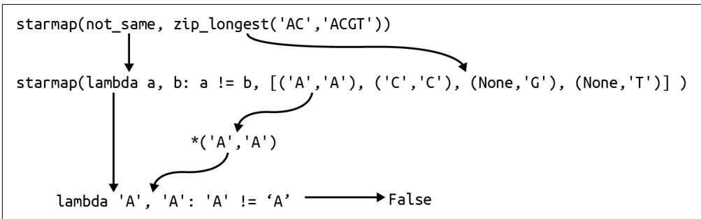  
그림 6-7. `starmap()` 함수는 들어오는 튜플에 스플랫을 적용하여 람다가 기대하는 두 개의 값으로 변환합니다.

하지만 잠깐만요, 더 있습니다! 이미 우리에게는 보통 `!=` 연산자로 쓰는 `operator.ne()`(not equal) 함수가 있기 때문에 직접 `not_same()` 함수를 작성할 필요조차 없습니다.

```txt
>>> import operator
>>> operator.ne('A', 'A')
False
>>> operator.ne('A', 'T')
True 
```

연산자(operator)는 함수 이름이 보통 인자들 사이에 위치하는 `+`와 같은 기호인 특수한 이항 함수(두 개의 인자를 받는 함수)입니다. `+`의 경우, 파이썬은 이것이 `operator.add()`를 의미하는지 결정해야 합니다.

```erlang
>>> 1 + 2   
3   
>>> operator.add(1, 2)   
3 
```

아니면 `operator.concat()`을 의미하는지도 결정해야 합니다.

```python
>>> 'AC' + 'GT'  
'ACGT'  
>>> operator.concat('AC', 'GT')  
'ACGT' 
```

핵심은 두 개의 인자를 기대하고 그들이 같은지 여부를 반환하는 기존 함수가 이미 있다는 것이며, 튜플을 필요한 인자들로 적절히 확장하기 위해 `starmap()`을 사용할 수 있다는 점입니다.

```txt
>>> seq1, seq2 = 'AC', 'ACGT'
>>> list(starmap(operator.ne, zip_longest(seq1, seq2)))
[False, False, True, True] 
```

이전과 마찬가지로 해밍 거리는 일치하지 않는 쌍들의 합입니다.

```txt
>>> seq1, seq2 = 'GAGCCTACTAACGGGAT', 'CATCGTAATGACGGCCT'
>>> sum(starmap(operator.ne, zip_longest(seq1, seq2)))
7 
```

실제 함수로 구현하면 다음과 같습니다.

```python
def hamming(seq1: str, seq2: str) -> int:
    ''' 해밍 거리를 계산합니다 ''' 
    return sum(starmap(operator.ne, zip_longest(seq1, seq2))) 
```

1 시퀀스들을 묶고, 튜플들을 불리언 비교 결과로 변환하고, 이를 합산합니다.

이 최종 솔루션은 제가 직접 작성하지 않은 네 가지 함수를 조합하는 것에 전적으로 의존합니다. 저는 가장 좋은 코드는 여러분이 직접 작성(하거나 테스트하거나 문서화)하지 않는 코드라고 믿습니다. 저는 이 순수 함수형 솔루션을 선호하지만, 이 코드가 너무 교묘하다고 느끼실 수도 있습니다. 여러분이 1년 뒤에도 이해할 수 있는 버전을 사용하십시오.

# 더 나아가기

* 소스 코드를 보지 않고 `zip_longest()` 버전을 직접 작성해 보십시오. 반드시 테스트부터 시작하고, 테스트를 통과하는 함수를 작성하십시오.
* 두 개 이상의 입력 시퀀스를 처리할 수 있도록 프로그램을 확장하십시오. 프로그램이 모든 시퀀스 쌍 사이의 해밍 거리를 출력하게 하십시오. 이는 프로그램이 $n! / k!(n - k)!$인 $n \text{ choose } k$ 개의 숫자를 출력함을 의미합니다. 세 개의 시퀀스에 대해 프로그램은 $3! / (2!(3 - 2)!) = 6 / 2 = 3$개의 거리 쌍을 출력할 것입니다.
* 예를 들어 시퀀스 AAACCCGGGTTT와 AACCCGGGTTTA 사이에 단 하나의 차이만 있음을 보여줄 수 있는 시퀀스 정렬 알고리즘을 작성해 보십시오.

# 검토

해밍 거리를 찾는 과정이 꽤 깊었지만, 파이썬 함수에 관한 흥미로운 부분들을 많이 다루었습니다.

* 내장 함수 `zip()`은 두 개 이상의 리스트를 튜플 리스트로 결합하여 공통 위치의 요소들을 그룹화합니다. 가장 짧은 시퀀스에서 멈추므로, 가장 긴 시퀀스까지 가고 싶다면 `itertools.zip_longest()` 함수를 사용하십시오.
* `map()`과 `filter()` 모두 어떤 값들의 순회 가능한 객체에 함수를 적용합니다. `map()` 함수는 함수에 의해 변환된 새로운 시퀀스를 반환하는 변면, `filter()`는 함수가 적용되었을 때 참 같은 값을 반환하는 요소들만 반환합니다.
* `map()`과 `filter()`에 전달되는 함수는 `lambda`로 생성된 익명 함수이거나 기존 함수일 수 있습니다.
* `operator` 모듈은 `map()` 및 `filter()`와 함께 사용할 수 있는 `ne()`(not equal)와 같은 많은 함수를 포함하고 있습니다.
* `itertools.starmap()` 함수는 `map()`처럼 작동하지만, 함수의 입력 값들을 리스트로 확장하기 위해 스플랫(splat)을 적용합니다.

# mRNA를 단백질로 번역하기: 더 많은 함수형 프로그래밍

분자 생물학의 중심 원리(Central Dogma)에 따르면, DNA는 mRNA를 만들고, mRNA는 단백질을 만듭니다. 2장에서는 DNA를 mRNA로 전사하는 방법을 보여드렸으므로, 이제 mRNA를 단백질 시퀀스로 번역할 시간입니다. Rosalind PROT 페이지에 설명된 대로, 이제 mRNA 문자열을 입력받아 아미노산 시퀀스를 생성하는 프로그램을 작성해야 합니다. 리스트, for 루프, 리스트 컴프리헨션, 딕셔너리, 고차 함수를 사용하는 여러 가지 솔루션을 보여드리겠지만, 결국에는 Biopython 함수를 사용하게 될 것임을 고백합니다. 그래도 아주 재미있을 것입니다.

주로 솔루션을 만들기 위해 작은 함수들을 작성하고, 테스트하고, 조합하는 방법에 집중할 것입니다. 여러분은 다음을 배우게 됩니다:

* 문자열 슬라이스를 사용하여 시퀀스에서 코돈(codon)/k-mer를 추출하는 방법
* 딕셔너리를 조회 테이블(lookup table)로 사용하는 방법
* for 루프를 리스트 컴프리헨션 및 `map()` 표현식으로 번역하는 방법
* `takewhile()` 및 `partial()` 함수를 사용하는 방법
* Bio.Seq 모듈을 사용하여 mRNA를 단백질로 번역하는 방법

# 시작하기

이 연습을 위해 07_prot 디렉토리에서 작업해야 합니다. 첫 번째 솔루션을 `prot.py`로 복사하고 사용법을 확인하는 것부터 시작하시길 권장합니다.

$ cp solution1_for.py prot.py
$ ./prot.py -h

usage: prot.py [-h] RNA

RNA를 단백질로 번역

positional arguments:
  RNA         RNA 시퀀스

optional arguments:
  -h, --help  이 도움말 메시지를 표시하고 종료

프로그램은 단일 위치 인자로 RNA 시퀀스를 요구합니다. 이제부터는 RNA라는 용어를 사용하겠지만, mRNA를 의미한다는 것을 알아두십시오. 다음은 Rosalind 페이지의 예시 문자열을 사용한 결과입니다.

$ ./prot.py AUGGCCAUGGCGCCCAGAACUGAGAUCAAUAGUACCCGUAUUAACGGGUGA
MAMAPRTEINSTRING

프로그램이 올바르게 작동하는지 확인하기 위해 `make test`를 실행하십시오. 프로그램이 어떻게 작동하는지 어느 정도 감을 잡았다면, 처음부터 시작하십시오.

$ new.py -f -p 'RNA를 단백질로 번역' prot.py
새 스크립트 "prot.py"를 확인하세요.

파라미터를 정의하는 방법은 다음과 같습니다.

```python
class Args(NamedTuple): # 1
    ''' 명령줄 인자 '''
    rna: str

def get_args() -> Args:
    ''' 명령줄 인자 가져오기 '''
    parser = argparse.ArgumentParser(
        description='RNA를 단백질로 번역',
        formatter_class=argparse.ArgumentDefaultsHelpFormatter)
    parser.add_argument('rna', type=str, metavar='RNA', help='RNA 시퀀스')
    args = parser.parse_args()
    return Args(args.rna) 
```

1 유일한 파라미터는 mRNA 문자열입니다.
2 rna를 위치 문자열 인자로 정의합니다.

프로그램이 올바른 사용법을 출력할 때까지 인자들을 수정하고, 입력된 RNA 문자열을 출력하도록 `main()`을 수정하십시오.

```python
def main() -> None:  
    args = get_args()  
    print(args.rna) 
```

작동하는지 확인하십시오.

$ ./prot.py AUGGCCAUGGCGCCCAGAACUGAGAUCAAUAGUACCCGUAUUAACGGGUGA
AUGGCCAUGGCGCCCAGAACUGAGAUCAAUAGUACCCGUAUUAACGGGUGA

진행 상황을 확인하기 위해 `pytest`나 `make test`를 실행하십시오. 처음 두 개의 테스트는 통과하고, 출력이 단백질 번역 결과여야 하는 세 번째 테스트에서 실패해야 합니다. 여러분이 이 문제를 해결할 수 있을 것 같다면 솔루션을 계속 진행하십시오. 어려움을 겪어도 괜찮습니다. 서두를 필요가 없으니 필요하다면 며칠 시간을 가지십시오. 집중적인 코딩 시간 외에도 낮잠과 산책(확산적 사고 시간)을 반드시 포함하십시오. 도움이 필요하다면 계속 읽어보십시오.

# K-mer와 코돈

지금까지 DNA 염기와 같은 문자열의 문자들을 순회하는 많은 예시들을 보셨습니다. 여기서는 각 아미노산에 해당하는 세 개의 뉴클레오타이드 시퀀스인 코돈(codon)을 읽기 위해 RNA 염기들을 세 개씩 묶어야 합니다. 표 7-1에 표시된 대로 64개의 코돈이 있습니다.

표 7-1. RNA 코돈 테이블은 RNA의 3-mer/코돈이 22개의 아미노산을 인코딩하는 방식을 설명합니다.

AAA K, AAC N, AAG K, AAU N, ACA T, 
ACC T, ACG T, ACU T, AGA R, AGC S, 
AGG R, AGU S, AUA I, AUC I, AUG M, 
AUU I, CAA Q, CAC H, CAG Q, CAU H, 
CCA P, CCC P, CCG P, CCU P, CGA R, 
CGC R, CGG R, CGU R, CUA L, CUC L, 
CUG L, CUU L, GAA E, GAC D, GAG E, 
GAU D, GCA A, GCC A, GCG A, GCU A, 
GGA G, GGC G, GGG G, GGU G, GUA V, 
GUC V, GUG V, GUU V, UAC Y, UAU Y, 
UCA S, UCC S, UCG S, UCU S, UGC C, 
UGG W, UGU C, UUA L, UUC F, UUG L, 
UUU F, UAA Stop, UAG Stop, UGA Stop

주어진 RNA 문자열에 대해:

>>> rna = 'AUGGCCAUGGCGCCCAGAACUGAGAUCAAUAGUACCCGUAUUAACGGGUGA'

첫 번째 세 염기인 AUG를 읽고 싶습니다. 그림 7-1에서 보듯이, 문자열 슬라이스를 사용하여 인덱스 0에서 3까지의 문자들을 수동으로 가져올 수 있습니다(상한값은 포함되지 않음을 기억하십시오).

>>> rna[0:3]
'AUG'

  
그림 7-1. 문자열 슬라이스를 사용하여 RNA에서 코돈 추출하기

다음 코돈은 시작 및 종료 위치에 3을 더해서 찾을 수 있습니다.

```txt
>>> rna[3:6] 
'GCC' 
```

패턴이 보이시나요? 첫 번째 숫자는 0에서 시작하여 3씩 더해야 합니다. 두 번째 숫자는 첫 번째 숫자에 3을 더해야 합니다 (그림 7-2 참조).

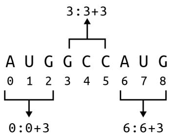  
그림 7-2. 각 슬라이스는 코돈의 시작 위치에 대한 함수이며, 이는 `range()` 함수를 사용하여 찾을 수 있습니다.

첫 번째 부분은 한 개, 두 개 또는 세 개의 인자가 주어지면 0부터 해당 값 직전까지의 모든 숫자를 생성합니다. REPL에서 `list()`를 사용하여 이 지연 함수가 값을 생성하게 하겠습니다.

```txt
>>> list(range(10))  
[0, 1, 2, 3, 4, 5, 6, 7, 8, 9] 
```

두 개의 인자가 주어지면 `range()`는 첫 번째를 시작으로, 두 번째를 종료로 간주합니다.

```txt
>>> list(range(5, 10))  
[5, 6, 7, 8, 9] 
```

세 번째 인자는 보폭(step size)으로 해석됩니다. 3장에서 문자열을 뒤집기 위해 시작이나 종료 위치 없이 보폭 -1과 함께 `range()`를 사용했었습니다. 이 경우, RNA의 길이에 도달할 때까지 3씩 건너뛰며 0부터 세고 싶습니다. 이것들이 코돈의 시작 위치입니다.

```txt
>>> list(range(0, len(rna), 3))  
[0, 3, 6, 9, 12, 15, 18, 21, 24, 27, 30, 33, 36, 39, 42, 45, 48] 
```

리스트 컴프리헨션을 사용하여 시작 및 종료 값을 튜플로 생성할 수 있습니다. 종료 위치는 시작 위치보다 3이 더 큽니다. 처음 다섯 개만 보여드리겠습니다.

>>> [(n, n + 3) for n in range(0, len(rna), 3)][:5]
[(0, 3), (3, 6), (6, 9), (9, 12), (12, 15)]

해당 값들을 사용하여 RNA의 슬라이스를 취할 수 있습니다.

>>> [rna[n:n + 3] for n in range(0, len(rna), 3)][:5]
['AUG', 'GCC', 'AUG', 'GCG', 'CCC']

코돈은 RNA의 부분 시퀀스이며, k-mer와 유사합니다. k는 크기(여기서는 3)이고, mer은 폴리머(polymer)라는 단어에서처럼 몫이나 부분을 뜻합니다. k-mer를 그 크기로 부르는 것이 일반적이므로, 여기서는 3-mer라고 부를 수 있습니다. k-mer는 한 글자씩 겹치므로 윈도우가 한 염기씩 오른쪽으로 이동합니다. 그림 7-3은 입력 RNA의 처음 아홉 염기에서 발견되는 처음 일곱 개의 3-mer를 보여줍니다.

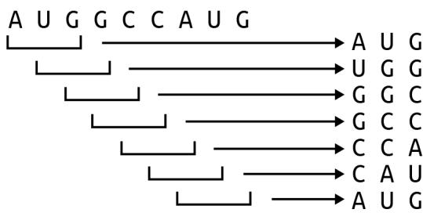  
그림 7-3. RNA 시퀀스의 처음 아홉 염기에 있는 모든 3-mer

어떤 시퀀스 s에 있는 k-mer의 개수 n은 다음과 같습니다.

$$
n = \operatorname{len}(s) - k + 1
$$

이 RNA 시퀀스의 길이는 51이므로 49개의 3-mer를 포함합니다.

>>> len(rna) - 3 + 1 
49

14장에서 보여드릴 멀티프레임 번역을 고려할 때를 제외하고, 코돈은 겹치지 않으므로 3개 위치씩 이동하며(그림 7-4 참조), 17개의 코돈을 남깁니다.

>>> len([rna[n:n + 3] for n in range(0, len(rna), 3)]) 
17

  
그림 7-4. 코돈은 겹치지 않는 3-mer입니다.

# 코돈 번역하기

이제 RNA에서 코돈을 추출하는 방법을 알았으니, 코돈을 단백질로 번역하는 방법을 고려해 봅시다. Rosalind 페이지는 다음과 같은 번역 테이블을 제공합니다.

UUU F, CUU L, AUU I, GUU V, 
UUC F, CUC L, AUC I, GUC V, 
UUA L, CUA L, AUA I, GUA V, 
UUG L, CUG L, AUG M, GUG V, 
UCU S, CCU P, ACU T, GCU A, 
UCC S, CCC P, ACC T, GCC A, 
UCA S, CCA P, ACA T, GCA A, 
UCG S, CCG P, ACG T, GCG A, 
UAU Y, CAU H, AAU N, GAU D, 
UAC Y, CAC H, AAC N, GAC D, 
UAA Stop, CAA Q, AAA K, GAA E, 
UAG Stop, CAG Q, AAG K, GAG E, 
UGU C, CGU R, AGU S, GGU G, 
UGC C, CGC R, AGC S, GGC G, 
UGA Stop, CGA R, AGA R, GGA G, 
UGG W, CGG R, AGG R, GGG G

딕셔너리는 'AUG'와 같은 문자열을 찾아 그것이 단백질 'M'으로 번역된다는 것을 알아내는 데 자연스러운 데이터 구조일 것입니다. 'M'은 단백질 시퀀스의 시작을 나타내는 코돈이기도 합니다. 이 데이터를 여러분의 프로그램에 통합하는 작업은 여러분의 몫으로 남겨두겠습니다. 참고로, 저는 제 딕셔너리에서 단백질 시퀀스의 끝을 나타내는 종결 코돈(stop codon)에 대해 'Stop'을 '*'로 바꾸었습니다. 제 딕셔너리 이름을 `codon_to_aa`라고 지었으며, 다음과 같이 사용할 수 있습니다.

>>> rna = 'AUGGCCAUGGCGCCCAGAACUGAGAUCAAUAGUACCCGUAUUAACGGGUGA'   
>>> aa = [] 
>>> for codon in [rna[n:n + 3] for n in range(0, len(rna), 3)]: 
...     aa.append(codon_to_aa[codon])   
>>> aa   
['M', 'A', 'M', 'A', 'P', 'R', 'T', 'E', 'I', 'N', 'S', 'T', 'R', 'I', 'N', 'G', '*']

'*' 코돈은 번역이 끝나는 지점을 나타내며, 종결 코돈이 발견되어 단백질이 완성되었음을 알 수 있도록 종종 표시됩니다. Rosalind 테스트를 통과하기 위해서는 출력에 종결 코돈을 포함해서는 안 됩니다. 종결 코돈은 RNA 문자열의 끝 이전에 나타날 수도 있다는 점에 유의하십시오. 이 정도면 여러분이 테스트를 통과하는 솔루션을 만드는 데 충분한 힌트가 될 것입니다. 프로그램이 논리적으로나 스타일적으로 올바른지 확인하기 위해 반드시 `pytest`와 `make test`를 실행하십시오.

# 솔루션

이 섹션에서는 RNA 코돈 테이블을 딕셔너리로 인코딩하는 완전히 수동적인 솔루션부터 Biopython의 함수를 사용하는 한 줄짜리 코드까지, RNA를 단백질로 번역하는 다섯 가지 변형을 보여드리겠습니다. 모든 솔루션은 앞서 보여드린 것과 동일한 `get_args()`를 사용합니다.

# 솔루션 1: for 루프 사용

딕셔너리를 통한 번역을 위해 코돈을 순회하는 for 루프를 사용하는 제 첫 번째 솔루션의 전체 내용입니다.

```python
def main() -> None:  
    args = get_args()  
    rna = args.rna.upper()  
    codon_to_aa = { # 2  
        'AAA': 'K', 'AAC': 'N', 'AAG': 'K', 'AAU': 'N', 'ACA': 'T', 'ACC': 'T', 'ACG': 'T', 'ACU': 'T', 'AGA': 'R', 'AGC': 'S', 'AGG': 'R', 'AGU': 'S', 'AUA': 'I', 'AUC': 'I', 'AUG': 'M', 'AUU': 'I', 'CAA': 'Q', 'CAC': 'H', 'CAG': 'Q', 'CAU': 'H', 'CCA': 'P', 'CCC': 'P', 'CCG': 'P', 'CCU': 'P', 'CGA': 'R', 'CGC': 'R', 'CGU': 'R', 'CUA': 'L', 'CUC': 'L', 'CUG': 'L', 'CUU': 'L', 'GAA': 'E', 'GAC': 'D', 'GAG': 'E', 'GAU': 'D', 'GCA': 'A', 'GCC': 'A', 'GCG': 'A', 'GCU': 'A', 'GGA': 'G', 'GGC': 'G', 'GGU': 'G', 'GUA': 'V', 'GUC': 'V', 'GUG': 'V', 'GUU': 'V', 'UAC': 'Y', 'UAU': 'Y', 'UCA': 'S', 'UCC': 'S', 'UCG': 'S', 'UCU': 'S', 'UGC': 'C', 'UGG': 'W', 'UGU': 'C', 'UUA': 'L', 'UUC': 'F', "UUG": "L", 'UUU': 'F', 'UAA': '*', 'UAG': '*', 'UGA': '*'
    }  
    k = 3  
    protein = ''  
    for codon in [rna[i:i+k] for i in range(0, len(rna), k)]: # 5  
        aa = codon_to_aa.get(codon, '-') # 6  
        if aa == '*': # 7  
            break # 8  
        protein += aa # 9
    print(protein) # 10
```

1 입력된 RNA를 복사하고 대문자로 강제 변환합니다.
2 딕셔너리를 사용하여 코돈/아미노산 조회 테이블을 만듭니다.
3 k-mer를 찾기 위한 k의 크기를 설정합니다.
4 단백질 시퀀스를 빈 문자열로 초기화합니다.
5 RNA의 코돈들을 순회합니다.
6 `dict.get()`을 사용하여 이 코돈에 대한 아미노산을 찾고, 찾지 못하면 대시(-)를 반환합니다.
7 이것이 종결 코돈인지 확인합니다.
8 for 루프를 빠져나옵니다.
9 아미노산을 단백질 시퀀스에 추가합니다.
10 단백질 시퀀스를 출력합니다.

# 솔루션 2: 유닛 테스트 추가

첫 번째 솔루션은 충분히 잘 작동하며, 이렇게 짧은 프로그램으로서는 괜찮은 구성을 가지고 있습니다. 문제는 짧은 프로그램이 보통 긴 프로그램이 된다는 것입니다. 함수가 점점 더 길어지는 것은 흔한 일이므로, `main()`의 코드를 테스트가 포함된 몇 개의 작은 함수들로 분리하는 방법을 보여드리고 싶습니다. 일반적으로, 저는 함수가 아무리 길어도 50줄 이내에 들어오는 것을 선호합니다. 함수가 얼마나 짧을 수 있는지에 대해서는, 단 한 줄의 코드라도 반대하지 않습니다.

제 첫 번째 직관은 코돈을 찾는 코드를 추출하여 유닛 테스트가 포함된 함수로 만드는 것입니다. 함수의 인자와 결과값의 타입을 생각하는 데 도움이 되는 타입 시그니처와 함께 함수의 플레이스홀더를 정의하는 것부터 시작하겠습니다.

```python
def codons(seq: str) -> List[str]: # 1
    ''' 시퀀스에서 코돈 추출 ''' 
    return [] # 2 
```

1 함수는 문자열을 인자로 받아 문자열 리스트를 반환합니다.
2 지금은 그냥 빈 리스트를 반환합니다.

다음으로, 어떻게 작동할지 구상하기 위해 `test_codons()` 함수를 정의합니다. 함수 파라미터로 문자열이 있을 때마다, 저는 항상 빈 문자열을 전달하여 유용한 값을 반환하는지 확인해 봅니다. (정수 파라미터가 있을 때는 항상 0을 전달해 봅니다.) 그런 다음 다른 가능한 값들을 시도해 보고 함수가 무엇을 해야 할지 상상해 봅니다. 보시다시피, 저는 세 염기보다 짧은 문자열을 반환함으로써 어느 정도 판단을 내리고 있습니다. 저는 오직 함수가 문자열을 최소 세 염기 이상의 부분 문자열로 쪼개는 것만 기대합니다. 여기서 완벽함이 충분히 좋은 것의 적이 되게 할 이유는 없습니다.

```python
def test_codons() -> None:
    ''' codons 테스트 ''' 
    assert codons('') == []
    assert codons('A') == ['A']
    assert codons('ABC') == ['ABC']
    assert codons('ABCDE') == ['ABC', 'DE']
    assert codons('ABCDEF') == ['ABC', 'DEF'] 
```

이제 이러한 테스트들을 만족시킬 함수를 작성하겠습니다. `main()`에서 관련 코드를 `codons()` 함수로 옮기면 다음과 같습니다.

```python
def codons(seq: str) -> List[str]:  
    ''' 시퀀스에서 코돈 추출 '''  
    k = 3  
    ret = []  
    for codon in [seq[i:i+k] for i in range(0, len(seq), k)]:  
        ret.append(codon)  
    return ret 
```

이 프로그램에 대해 `pytest`를 실행해 보면 통과하는 것을 볼 수 있습니다. 만세! for 루프가 반환 리스트를 구축하는 데 사용되고 있으므로, 스타일 면에서 리스트 컴프리헨션을 사용하는 것이 더 낫습니다.

```python
def codons(seq: str) -> List[str]:  
    ''' 시퀀스에서 코돈 추출 '''  
    k = 3  
    return [seq[i:i+k] for i in range(0, len(seq), k)] 
```

이는 문서화되고 테스트되었으며 나머지 코드의 가독성을 높여줄 멋진 작은 함수입니다.

```python
def main() -> None:  
    args = get_args()  
    rna = args.rna.upper()  
    codon_to_aa = {  
        'AAA': 'K', 'AAC': 'N', 'AAG': 'K', 'AAU': 'N', 'ACA': 'T',  
        'ACC': 'T', 'ACG': 'T', 'ACU': 'T', 'AGA': 'R', 'AGC': 'S',  
        'AGG': 'R', 'AGU': 'S', 'AUA': 'I', 'AUC': 'I', 'AUG': 'M',  
        'AUU': 'I', 'CAA': 'Q', 'CAC': 'H', 'CAG': 'Q', 'CAU': 'H',  
        'CCA': 'P', 'CCC': 'P', 'CCG': 'P', 'CCU': 'P', 'CGA': 'R',  
        'CGC': 'R', 'CGG': 'R', 'CGU': 'R', 'CUA': 'L', 'CUC': 'L',  
        'CUG': 'L', 'CUU': 'L', 'GAA': 'E', 'GAC': 'D', 'GAG': 'E',  
        'GAU': 'D', 'GCA': 'A', 'GCC': 'A', 'GCG': 'A', 'GCU': 'A',  
        'GGA': 'G', 'GGC': 'G', 'GGG': 'G', 'GGU': 'G', 'GUA': 'V',  
        'GUC': 'V', 'GUG': 'V', 'GUU': 'V', 'UAC': 'Y', 'UAU': 'Y',  
        'UCA': 'S', 'UCC': 'S', 'UCG': 'S', 'UCU': 'S', 'UGC': 'C', 
        'UGG': 'W', 'UGU': 'C', 'UUA': 'L', 'UUC': 'F', 'UUG': 'L', 
        'UUU': 'F', 'UAA': '*', 'UAG': '*', 'UGA': '*', 
    }   
    protein = '' 
    for codon in codons(rna): # 1 
        aa = codon_to_aa.get(codon, '-') 
        if aa == '*': 
            break 
        protein += aa   
    print(protein)
```

1 코돈을 찾는 복잡성이 함수 내부에 숨겨졌습니다.

나아가, 이 함수(와 그 테스트)는 이제 다른 프로그램에 통합하기 더 쉬워질 것입니다. 가장 간단한 방법은 이 줄들을 복사해서 붙여넣는 것이겠지만, 더 좋은 해결책은 함수를 공유하는 것입니다. REPL을 사용하여 시연해 보겠습니다. `prot.py` 프로그램에 `codons()` 함수가 있다면, 해당 함수를 임포트하십시오.

>>> from prot import codons

이제 `codons()` 함수를 실행할 수 있습니다.

```txt
>>> codons('AAACCCGGGTTT') 
['AAA', 'CCC', 'GGG', 'TTT'] 
```

또는 전체 `prot` 모듈을 임포트하고 다음과 같이 함수를 호출할 수도 있습니다.

```python
>>> import prot
>>> prot.codons('AAACCCGGGTTT')
['AAA', 'CCC', 'GGG', 'TTT'] 
```

파이썬 프로그램은 재사용 가능한 코드 모듈이기도 합니다. 때로는 소스 코드 파일을 실행하여 프로그램이 되기도 하지만, 파이썬에서 프로그램과 모듈 사이에는 큰 구분이 없습니다. 이것이 모든 프로그램 끝에 있는 다음 두 줄의 의미입니다.

```python
if __name__ == '__main__': # 1
    main() 
```

파이썬 프로그램이 프로그램으로서 실행될 때, `__name__`의 값은 `__main__`이 됩니다.
② 프로그램을 시작하기 위해 `main()` 함수를 호출합니다.


파이썬 모듈이 다른 코드에 의해 임포트될 때, `__name__`은 모듈의 이름이 됩니다. 예를 들어 `prot.py`의 경우 `prot`이 됩니다. 만약 `__name__`을 확인하지 않고 프로그램 끝에서 단순히 `main()`을 호출했다면, 여러분의 모듈이 임포트될 때마다 `main()`이 실행될 것인데 이는 바람직하지 않습니다.

파이썬 코드를 더 많이 작성하다 보면, 동일한 문제들 중 일부를 반복해서 해결하고 있다는 것을 발견하게 될 것입니다. 코드 조각들을 복사해서 붙여넣기보다는 프로젝트 전반에서 공유할 수 있는 함수들을 작성하여 공통된 솔루션들을 공유하는 것이 훨씬 더 좋습니다. 파이썬은 재사용 가능한 함수들을 모듈에 넣고 다른 프로그램에서 임포트하는 것을 매우 쉽게 만들어 줍니다.

# 솔루션 3: 또 다른 함수와 리스트 컴프리헨션 사용

`codons()` 함수는 깔끔하고 유용하며 `main()` 함수를 더 이해하기 쉽게 만들어 줍니다. 하지만 `main()`에 남아 있는 모든 코드는 단백질을 번역하는 것과 관련이 있습니다. 저는 이것을 `translate()` 함수 안에 숨기고 싶으며, 제가 사용하고 싶은 테스트는 다음과 같습니다.

```python
def test_translate() -> None:
    ''' translate 테스트 ''' 
    assert translate('') == '' # 1
    assert translate('AUG') == 'M' # 2
    assert translate('AUGCCGUAAUCU') == 'MP' # 3
    assert translate('AUGGCCAUGGCGCCCAGAACUGAGAU'
                     'CAAUAGUACCCGUAUUAACGGGUGA') == 'MAMAPRTEINSTRING' # 5 
```

1 저는 보통 문자열 파라미터를 빈 문자열로 테스트합니다.
2 단일 아미노산에 대해 테스트합니다.
3 시퀀스 끝 이전에 종결 코돈을 사용하는 테스트입니다.
4 인접한 문자열 리터럴들이 하나의 문자열로 결합된다는 점에 주목하십시오. 이는 소스 코드에서 긴 줄을 나누는 유용한 방법입니다.
5 Rosalind의 예시를 사용한 테스트입니다.

`main()`의 모든 코드를 이 함수로 옮기고, for 루프를 리스트 컴프리헨션으로 변경하며, 리스트 슬라이스를 사용하여 종결 코돈에서 단백질을 자르겠습니다.

```python
def translate(rna: str) -> str:
    ''' 코돈 시퀀스 번역 '''
    codon_to_aa = {
        'AAA': 'K', 'AAC': 'N', 'AAG': 'K', 'AAU': 'N', 'ACA': 'T',
        # ... (중략) ...
        'UAA': '*', 'UAG': '*', 'UGA': '*',
    }
    aa = [codon_to_aa.get(codon, '-') for codon in codons(rna)] # 1
    if '*' in aa: # 2
        aa = aa[:aa.index('*')] # 3
    return ''.join(aa) # 4 
```

1 리스트 컴프리헨션을 사용하여 코돈 리스트를 아미노산 리스트로 번역합니다.
2 아미노산 리스트에 종결 코돈(*)이 있는지 확인합니다.
3 종결 코돈의 인덱스까지 리스트 슬라이스를 사용하여 아미노산들을 덮어씁니다.
4 아미노산들을 빈 문자열로 결합하고 새로운 단백질 시퀀스를 반환합니다.

이를 이해하기 위해 다음 RNA 시퀀스를 고려해 보십시오.

```html
>>> rna = 'AUGCCGUAAUCU' 
```

`codons()` 함수를 사용하여 코돈들을 얻을 수 있습니다.

```python
>>> from solution3_list_comp_slice import codons, translate
>>> codons(rna)
['AUG', 'CCG', 'UAA', 'UCU'] 
```

그리고 리스트 컴프리헨션을 사용하여 이들을 아미노산으로 바꿉니다.

```python
>>> codon_to_aa = { # ... (생략) ... }
>>> aa = [codon_to_aa.get(c, '-') for c in codons(rna)]
>>> aa
['M', 'P', '*', 'S'] 
```

종결 코돈이 있는 것을 볼 수 있습니다.

```txt
>>> '*' in aa 
True 
```

따라서 인덱스 2에서 시퀀스를 잘라야 합니다.

```txt
>>> aa.index('*') 
2 
```

리스트 슬라이스를 사용하여 종결 코돈의 위치까지 선택할 수 있습니다. 시작 위치가 제공되지 않으면 파이썬은 인덱스 0을 가정합니다.

```erlang
>>> aa = aa[:aa.index('*')]  
>>> aa  
['M', 'P'] 
```

마지막으로, 이 리스트를 빈 문자열로 결합해야 합니다.

```txt
>>> ''.join(aa) 
'MP' 
```

새로운 함수를 통합한 `main()` 함수는 매우 읽기 좋은 프로그램이 됩니다.

```python
def main() -> None:  
    args = get_args()  
    print(translate(args.rna.upper())) 
```

이는 유닛 테스트가 프로그램을 통해 RNA를 단백질로 번역하는 것을 검증하는 통합 테스트를 거의 복제하는 또 다른 사례입니다. 후자는 프로그램이 작동하고, 문서를 생성하고, 인자를 처리하는 등의 일을 보장하기 때문에 여전히 중요합니다. 이 솔루션이 과도하게 설계된 것처럼 보일 수도 있지만, 저는 여러분이 프로그램을 이해하고, 테스트하고, 구성하고, 공유할 수 있는 더 작은 함수들로 나누는 방법에 집중하시길 바랍니다.

# 솔루션 4: map(), partial(), takewhile() 함수를 이용한 함수형 프로그래밍

다음 솔루션에서는 `map()`, `partial()`, `takewhile()`이라는 세 가지 고차 함수(HOF)를 사용하여 일부 로직을 다시 작성하는 방법을 보여드리고 싶습니다. 그림 7-5가 리스트 컴프리헨션이 `map()`으로 어떻게 다시 작성될 수 있는지 보여줍니다.

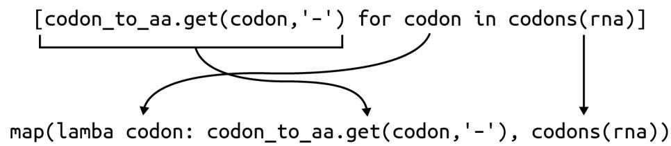  
그림 7-5. 리스트 컴프리헨션은 `map()`으로 다시 작성될 수 있습니다.

`map()`을 사용하여 아미노산 시퀀스를 얻을 수 있습니다. 이것이 리스트 컴프리헨션보다 읽기 쉽다고 느낄 수도 있고 아닐 수도 있지만, 포인트는 이들이 기능적으로 동일하며 둘 다 하나의 리스트를 새로운 리스트로 변환한다는 점을 이해하는 것입니다.

>>> aa = list(map(lambda codon: codon_to_aa.get(codon, '-'), codons(rna)))   
>>> aa   
['M', 'P', '*', 'S']

종결 코돈을 찾아 리스트를 자르는 코드는 `itertools.takewhile()` 함수를 사용하여 다시 작성할 수 있습니다.

>>> from itertools import takewhile

이름에서 알 수 있듯이, 이 함수는 술어(predicate)가 충족되는 동안 시퀀스에서 요소들을 가져옵니다. 술어가 실패하면 함수는 값 생성을 중단합니다. 여기의 조건은 잔기(residue)가 * (종결)이 아니어야 한다는 것입니다.

```html
>>> list(takewhile(lambda residue: residue != '*', aa)) 
['M', 'P'] 
```

이러한 종류의 고차 함수를 사용하는 것을 좋아하신다면, 4장에서 보여드린 `functools.partial()` 함수를 사용하여 한 단계 더 나아갈 수 있습니다. 여기서는 `operator.ne()` (같지 않음) 함수를 부분적으로 적용하고 싶습니다.

```python
>>> from functools import partial
>>> import operator
>>> not_stop = partial(operator.ne, '*') 
```

`not_stop()` 함수는 값을 반환하기 전에 하나의 문자열 값이 더 필요합니다.

```txt
>>> not_stop('F')  
True  
>>> not_stop('*')  
False 
```

이 함수들을 조합하면 거의 영어 문장처럼 읽힙니다.

```txt
>>> list(takewhile(not_stop, aa)) 
['M', 'P'] 
```

순수 함수형 아이디어로 `translate()` 함수를 작성하는 방법은 다음과 같습니다.

```python
def translate(rna: str) -> str:
    ''' 코돈 시퀀스 번역 '''
    codon_to_aa = { # ... (동일한 딕셔너리) ... }
    # ... (생략) ...
```

# 솔루션 5: Bio.Seq.translate() 사용

약속드린 대로, 마지막 솔루션은 Biopython을 사용합니다. 3장에서 `Bio.Seq.reverse_complement()` 함수를 사용했었는데, 여기서는 `Bio.Seq.translate()`를 사용할 수 있습니다. 먼저 `Bio.Seq` 클래스를 임포트하십시오.

```txt
>>> from Bio import Seq 
```

그런 다음 `translate()` 함수를 호출합니다. 종결 코돈은 *로 표시됨에 유의하십시오.

>>> rna = 'AUGGCCAUGGCGCCCAGAACUGAGAUCAAUAGUACCCGUAUUAACGGGUGA'   
>>> Seq.translate(rna)   
'MAMAPRTEINSTRING*'

기본적으로 이 함수는 종결 코돈에서 번역을 멈추지 않습니다.

```txt
>>> Seq.translate('AUGCCGUAAUCU') 
'MP*S'
```

REPL에서 `help(Seq.translate)`를 읽어보면, 이를 Rosalind 과제에서 기대하는 버전으로 바꾸기 위한 `to_stop` 옵션을 찾을 수 있습니다.

```txt
>>> Seq.translate('AUGCCGUAAUCU', to_stop=True) 
'MP'
```

이 모든 것을 종합한 방법은 다음과 같습니다.

```python
def main() -> None:  
    args = get_args()  
    print(Seq.translate(args.rna, to_stop=True)) 
```

이 솔루션은 널리 사용되는 Biopython 모듈에 의존하기 때문에 제가 권장하는 방식입니다. 수동으로 솔루션을 코딩하는 방법을 탐구하는 것도 재미있고 유익했지만, 헌신적인 개발자 팀에 의해 이미 작성되고 테스트된 코드를 사용하는 것이 훨씬 더 좋은 관행입니다.

# 벤치마킹

어떤 솔루션이 가장 빠를까요? 4장에서 소개한 hyperfine 벤치마킹 프로그램을 사용하여 프로그램들의 실행 시간을 비교할 수 있습니다. 이 프로그램은 매우 짧기 때문에, 저장소의 `bench.sh` 프로그램에 기록된 대로 각 프로그램을 최소 1,000번씩 실행하기로 했습니다.

두 번째 솔루션이 가장 빠르게 실행되며, Biopython 버전보다 최대 1.5배 정도 더 빠를 수도 있지만, 저는 여전히 후자를 사용할 것을 권장합니다. Biopython은 커뮤니티에서 널리 사용되는 철저히 문서화되고 테스트된 모듈이기 때문입니다.

# 더 나아가기

기본값이 0이고 0~2(포함) 사이의 값을 허용하는 `--frame-shift` 인자를 추가하십시오. 프레임 시프트를 사용하여 RNA를 다른 위치부터 읽기 시작하게 만드십시오.

# 검토

이 장의 초점은 당면한 문제를 해결하기 위해 함수를 작성하고, 테스트하고, 조합하는 방법에 맞춰져 있었습니다. 시퀀스에서 코돈을 찾고 RNA를 번역하는 함수들을 작성했습니다. 그런 다음 다른 함수들을 조합하기 위해 고차 함수를 사용하는 방법을 보여드렸고, 마지막으로 Biopython의 기존 함수를 사용했습니다.

* K-mer는 시퀀스의 모든 k 길이 부분 시퀀스입니다.
* 코돈은 특정 프레임에서 겹치지 않는 3-mer입니다.
* 딕셔너리는 코돈을 아미노산으로 번역하는 것과 같이 조회 테이블로서 유용합니다.
* for 루프, 리스트 컴프리헨션, `map()`은 모두 하나의 시퀀스를 다른 시퀀스로 변환하는 방법입니다.
* `takewhile()` 함수는 값들에 대한 술어나 테스트를 바탕으로 시퀀스에서 값들을 받아들인다는 점에서 `filter()` 함수와 비슷합니다.
* `partial()` 함수는 함수의 인자들을 부분적으로 적용할 수 있게 해줍니다.
* `Bio.Seq.translate()` 함수는 RNA 시퀀스를 단백질 시퀀스로 번역합니다.

# DNA에서 모티프 찾기: 시퀀스 유사성 탐구

Rosalind SUBS 과제에서는 한 시퀀스 내부에 다른 시퀀스가 나타나는 모든 경우를 검색할 것입니다. 공유된 부분 시퀀스는 마커, 유전자 또는 조절 시퀀스와 같은 보존된 요소를 나타낼 수 있습니다. 두 유기체 사이의 보존된 시퀀스는 어떤 유전적 또는 수렴적 특성을 시사할 수 있습니다. 파이썬의 `str`(문자열) 클래스를 사용하여 솔루션을 작성하는 방법을 알아보고 문자열을 리스트와 비교해 보겠습니다. 그런 다음 고차 함수를 사용하여 이러한 아이디어들을 표현하는 방법을 알아보고 7장에서 시작했던 k-mer에 대한 논의를 이어가겠습니다. 마지막으로 정규 표현식이 어떻게 패턴을 찾을 수 있는지 보여드리고 겹치는 매칭(overlapping matches)의 문제점을 짚어보겠습니다.

이 장에서 저는 다음을 시연할 것입니다:

* `str.find()`, `str.index()` 및 문자열 슬라이스 사용 방법
* 셋(set)을 사용하여 고유한 요소들의 컬렉션을 만드는 방법
* 고차 함수들을 조합하는 방법
* k-mer를 사용하여 부분 시퀀스를 찾는 방법
* 정규 표현식을 사용하여 겹칠 가능성이 있는 시퀀스들을 찾는 방법

# 시작하기

이 장의 코드와 테스트는 `08_subs`에 있습니다. 첫 번째 솔루션을 `subs.py` 프로그램으로 복사하고 도움말을 요청하는 것부터 시작하시길 권장합니다.

```shell
$ cd 08_subs/
$ cp solution1_str_find.py subs.py
$ ./subs.py -h 
```

usage: subs.py [-h] seq subseq

부분 시퀀스 찾기

positional arguments:
  seq         시퀀스
  subseq      부분 시퀀스

optional arguments:
  -h, --help  이 도움말 메시지를 표시하고 종료

프로그램은 시퀀스 내에서 부분 시퀀스가 발견되는 시작 위치들을 보고해야 합니다. 그림 8-1에서 보듯이, 부분 시퀀스 ATAT는 시퀀스 GATATATGCATATACTT의 2, 4, 10번 위치에서 발견될 수 있습니다.

$ ./subs.py GATATATGCATATACTT ATAT
2 4 10

  
그림 8-1. 부분 시퀀스 ATAT는 2, 4, 10번 위치에서 발견될 수 있습니다.

무엇이 기대되는지 이해하기 위해 테스트를 실행해 본 다음, 프로그램을 처음부터 시작하십시오.

$ new.py -f -p '부분 시퀀스 찾기' subs.py
새 스크립트 "subs.py"를 확인하세요.

프로그램 파라미터를 두 개의 시퀀스인 두 개의 위치 인자로 정의합니다.

```python
class Args(NamedTuple): # 1
    """ 명령줄 인자 """
    seq: str
    subseq: str

def get_args() -> Args:
    """ 명령줄 인자 가져오기 """
    parser = argparse.ArgumentParser(
        description='부분 시퀀스 찾기',
        formatter_class=argparse.ArgumentDefaultsHelpFormatter)
    parser.add_argument('seq', metavar='seq', help='시퀀스')
    parser.add_argument('subseq', metavar='subseq', help='부분 시퀀스')
    args = parser.parse_args()
    return Args(args.seq, args.subseq) 
```

1 Args 클래스는 `seq`와 `subseq`라는 두 개의 문자열 필드를 가질 것입니다.
② 함수는 Args 객체를 반환합니다.
3 Args를 사용하여 인자들을 패키징하고 반환합니다.

`main()`에서 시퀀스와 부분 시퀀스를 출력하게 만드십시오.

```python
def main() -> None:  
    args = get_args()  
    print(f'sequence = {args.seq}')  
    print(f'subsequence = {args.subseq}') 
```

기대되는 입력값들로 프로그램을 실행하고 인자들이 올바르게 출력되는지 확인하십시오.

```ini
$ ./subs.py GATATATGCATATACTT ATAT
sequence = GATATATGCATATACTT
subsequence = ATAT 
```

이제 처음 두 개의 테스트를 통과할 프로그램이 준비되었습니다. 스스로 이 프로그램을 완성할 수 있을 것 같다면 계속 진행하십시오. 그렇지 않다면 한 문자열이 다른 문자열 내부에 있는 위치를 찾는 한 가지 방법을 보여드리겠습니다.

# 부분 시퀀스 찾기

부분 시퀀스를 찾는 방법을 시연하기 위해, REPL에서 다음과 같이 시퀀스와 부분 시퀀스를 정의하는 것부터 시작하겠습니다.

```txt
>>> seq = 'GATATATGCATATACTT'  
>>> subseq = 'ATAT' 
```

한 시퀀스가 다른 시퀀스의 부분 집합인지 확인하기 위해 `in`을 사용할 수 있습니다. 이는 리스트, 셋의 멤버십 확인이나 딕셔너리의 키 확인에도 작동합니다.

```txt
>>> subseq in seq 
True 
```

좋은 정보지만, 문자열이 어디에서 발견되는지는 알려주지 않습니다. 다행히 `str.find()` 함수가 있는데, `subseq`가 인덱스 1(두 번째 문자)에서 시작하여 발견된다고 알려줍니다.

```txt
>>> seq.find(subseq) 
1 
```

Rosalind 설명으로부터 정답이 2, 4, 10이어야 함을 알고 있습니다. 방금 2를 찾았는데, 다음 위치는 어떻게 찾을 수 있을까요? 동일한 함수를 다시 호출하면 같은 답만 얻게 될 것이므로 그렇게 할 수는 없습니다. 시퀀스의 더 뒷부분을 찾아봐야 합니다. `help(str.find)`가 도움이 될 수 있을까요?

```txt
>>> help(str.find)
find()
S.find(sub[, start[, end]]) -> int
S 내에서 부분 문자열 sub가 발견되는 가장 낮은 인덱스를 반환하며, sub는 S[start:end] 내에 포함되어야 합니다. 선택적 인자 start와 end는 슬라이스 표기법처럼 해석됩니다. 실패 시 -1을 반환합니다. 
```

시작 위치를 지정할 수 있는 것 같습니다. 첫 번째 부분 시퀀스가 발견된 위치인 1보다 1 큰 위치, 즉 2부터 검색해 보겠습니다.

```txt
>>> seq.find(subseq, 2)  
3 
```

좋습니다. 그것이 다음 정답입니다. (사실 4가 다음 정답이지만, 무슨 뜻인지 아실 겁니다.) 이번에는 4부터 시작하여 다시 시도해 보겠습니다.

```txt
>>> seq.find(subseq, 4) 
9 
```

방금 기대했던 마지막 값을 찾았습니다. 시작 위치로 10을 사용하면 어떻게 될까요? 문서에 나와 있듯이, 부분 시퀀스를 찾을 수 없음을 나타내기 위해 -1이 반환될 것입니다.

```txt
>>> seq.find(subseq, 10) 
-1 
```

부분 시퀀스를 더 이상 찾을 수 없을 때까지 마지막으로 발견된 위치를 기억하며 시퀀스를 순회하는 방법을 생각할 수 있으신가요?

또 다른 옵션은 부분 시퀀스가 존재할 때만 `str.index()`를 사용하는 것입니다.

```txt
>>> if subseq in seq: 
...     seq.index(subseq) 
1 
```

다음 출현 위치를 찾기 위해 마지막으로 알려진 위치를 사용하여 시퀀스를 슬라이스할 수 있습니다. 해당 위치를 시작 위치에 더해야 하겠지만, 본질적으로 부분 시퀀스가 존재하는지 그리고 어디에 있는지를 찾기 위해 시퀀스의 더 뒷부분으로 이동하는 것과 동일한 작업입니다.

```txt
>>> if subseq in seq[2:]: 
...     seq.index(subseq[2:]) 
1 
```

`help(str.index)`를 읽어보시면 `str.find()`와 마찬가지로 이 함수도 검색을 시작할 인덱스인 두 번째 선택적 시작 위치를 받는다는 것을 알 수 있습니다.

```txt
>>> if subseq in seq[2:]: 
...     seq.index(subseq, 2) 
3 
```

세 번째 접근 방식은 k-mer를 사용하는 것입니다. 부분 시퀀스가 존재한다면, 정의상 그것은 부분 시퀀스의 길이와 같은 k를 가진 k-mer입니다. 7장의 코드를 사용하여 시퀀스에서 모든 k-mer와 그 위치를 추출하고, 부분 시퀀스와 일치하는 k-mer의 위치를 기록하십시오.

마지막으로, 텍스트 패턴을 찾고 있는 것이므로 정규 표현식을 사용할 수도 있습니다. 5장에서 DNA에서 모든 G와 C를 찾기 위해 `re.findall()` 함수를 사용했었습니다. 이와 유사하게 시퀀스 내의 모든 부분 시퀀스를 찾기 위해 이 메서드를 사용할 수 있습니다.

```python
>>> import re
>>> re.findall(subseq, seq)
['ATAT', 'ATAT'] 
```

여기에는 몇 가지 문제점이 있는 것 같습니다. 하나는 세 개가 있다는 것을 알고 있는데 두 개의 부분 시퀀스만 반환했다는 것입니다. 다른 문제는 매칭된 위치가 어디인지에 대한 정보를 제공하지 않는다는 점입니다. 걱정하지 마십시오. `re.finditer()` 함수가 이 두 번째 문제를 해결해 줍니다.

```txt
>>> list(re.finditer(subseq, seq))
[<re.Match object; span=(1, 5), match='ATAT'>,
 <re.Match object; span=(9, 13), match='ATAT'>] 
```

이제 첫 번째와 마지막 부분 시퀀스를 찾는다는 것이 명확해졌습니다. 왜 두 번째 인스턴스는 찾지 못할까요? 정규 표현식은 겹치는 패턴을 잘 처리하지 못하는 것으로 드러났지만, 검색 패턴에 약간의 내용을 추가하면 이를 해결할 수 있습니다. 해결책을 찾기 위해 인터넷 검색을 해보시길 여러분의 몫으로 남겨두겠습니다.

이 문제를 해결하기 위한 네 가지 옵션을 제시했습니다. 각 접근 방식을 사용하여 솔루션을 작성해 보십시오. 포인트는 파이썬의 구석구석을 탐구하여 여러분이 작성할 미래의 프로그램에서 결정적인 역할을 할 수 있는 맛있는 정보와 요령들을 저장해 두는 것입니다. 이를 해결하는 데 몇 시간이나 며칠을 보내도 괜찮습니다. `pytest`와 `make test`를 모두 통과하는 솔루션을 얻을 때까지 계속 도전하십시오.

# 솔루션

모든 솔루션은 앞서 보여드린 것과 동일한 `get_args()`를 공유합니다.

# 솔루션 1: str.find() 메서드 사용

`str.find()` 메서드를 사용한 제 첫 번째 솔루션입니다.

```python
def main() -> None:  
    args = get_args()  
    last = 0 # 1  
    found = [] # 2  
    while True: # 3  
        pos = args.seq.find(args.subseq, last) # 4  
        if pos == -1: # 5  
            break  
        found.append(pos + 1) # 6  
        last = pos + 1 # 7  
    print(*found) # 8 
```

1 마지막 위치를 시퀀스의 시작인 0으로 초기화합니다.
2 부분 시퀀스가 발견된 모든 위치를 담을 리스트를 초기화합니다.
3 `while`을 사용하여 무한 루프를 만듭니다.
4 마지막으로 알려진 위치를 사용하여 부분 시퀀스를 찾기 위해 `str.find()`를 사용합니다.
5 반환값이 -1이면 부분 시퀀스를 찾지 못한 것이므로 루프를 종료합니다.
6 발견된 인덱스보다 1 큰 값을 발견된 위치 리스트에 추가합니다.
7 마지막으로 알려진 위치를 발견된 인덱스보다 1 큰 값으로 업데이트합니다.
8 리스트를 요소들로 확장하기 위해 `*`를 사용하여 발견된 위치들을 출력합니다. 함수는 여러 값 사이에 공백을 구분자로 사용할 것입니다.

이 솔루션은 부분 시퀀스가 마지막으로 발견된 위치를 계속 추적하는 것에 달려 있습니다. 이를 0으로 초기화합니다.

>>> last = 0

마지막으로 알려진 위치부터 시작하여 부분 시퀀스를 찾기 위해 `str.find()`를 사용합니다.

```txt
>>> seq = 'GATATATGCATATACTT'  
>>> subseq = 'ATAT'  
>>> pos = seq.find(subseq, last)  
>>> pos  
1 
```

`seq.find()`가 -1 이외의 값을 반환하는 동안, 다음 문자부터 검색을 시작하도록 마지막 위치를 1 증가시켜 업데이트합니다.

```txt
>>> last = pos + 1
>>> pos = seq.find(subseq, last)
>>> pos
3
```

함수를 한 번 더 호출하면 마지막 인스턴스를 찾습니다.

>>> last = pos + 1
>>> pos = seq.find(subseq, last)   
>>> pos   
9

마지막으로, `seq.find()`는 패턴을 더 이상 찾을 수 없음을 나타내기 위해 -1을 반환합니다.

>>> last = pos + 1
>>> pos = seq.find(subseq, last)   
>>> pos   
-1

이 솔루션은 C 프로그래밍 언어 배경을 가진 사람이라면 즉시 이해할 수 있을 것입니다. 알고리즘의 상태를 업데이트하기 위한 많은 세부 로직이 포함된 매우 명령형(imperative) 접근 방식입니다. 상태(State)란 프로그램의 데이터가 시간이 지남에 따라 어떻게 변하는지를 의미합니다. 예를 들어, 마지막으로 알려진 위치를 적절히 업데이트하고 사용하는 것이 이 접근 방식을 작동하게 만드는 핵심입니다. 이후의 접근 방식들은 훨씬 덜 명시적인 코딩을 사용합니다.

# 솔루션 2: str.index() 메서드 사용

다음 솔루션은 마지막으로 알려진 위치를 사용하여 시퀀스를 슬라이스하는 변형입니다.

```python
def main() -> None:  
    args = get_args()  
    seq, subseq = args.seq, args.subseq # 1  
    found = []  
    last = 0  
    while subseq in seq[last:]: # 2  
        last = seq.index(subseq, last) + 1 # 3  
        found.append(last) # 4  
    print(*found) # 5 
```

1 시퀀스와 부분 시퀀스를 변수에 할당합니다.
2 마지막으로 발견된 위치부터 시작하는 시퀀스의 슬라이스에 부분 시퀀스가 나타나는지 묻습니다. `while` 루프는 이 조건이 참인 동안 계속 실행됩니다.
3 부분 시퀀스의 시작 위치를 얻기 위해 `str.index()`를 사용합니다. `last` 변수는 다음 시작 위치를 만들기 위해 부분 시퀀스 인덱스에 1을 더해 업데이트됩니다.
4 이 위치를 발견된 위치 리스트에 추가합니다.
5 `*`를 사용하여 리스트를 확장하여 인쇄합니다.

여기서도 부분 시퀀스가 마지막으로 발견된 위치를 추적하는 것에 의존합니다. 인덱스 0, 즉 문자열의 시작부터 시작합니다.

```txt
>>> last = 0
>>> if subseq in seq[last:]:
...     last = seq.index(subseq, last) + 1
...
>>> last
2 
```

첫 번째 솔루션의 `while True` 루프는 무한 루프를 시작하는 일반적인 방법입니다. 여기의 `while` 루프는 시퀀스의 슬라이스에서 부분 시퀀스가 발견되는 동안에만 실행되므로, 루프를 언제 빠져나올지 수동으로 결정할 필요가 없습니다.

```txt
>>> last = 0
>>> found = []
>>> while subseq in seq[last:]:
...     last = seq.index(subseq, last) + 1
...     found.append(last)
...
>>> found
[2, 4, 10]
```

이 경우 발견된 위치들은 정수 값들의 리스트입니다. 첫 번째 솔루션에서는 리스트를 스플랫(*)하기 위해 `*found`를 사용했고, 값을 문자열로 강제 변환하고 공백으로 결합하기 위해 `print()`에 의존했습니다. 만약 대신 `str.join()`을 사용하여 `found`로부터 새로운 문자열을 만들려고 했다면 문제에 부딪혔을 것입니다. `str.join()` 함수는 여러 문자열을 하나의 문자열로 결합하므로, 문자열이 아닌 값을 주면 예외를 발생시킵니다.

```txt
>>> ' '.join(found)
Traceback (most recent call last):
  File "<stdin>", line 1, in <module>
TypeError: sequence item 0: expected str instance, int found 
```

리스트 컴프리헨션을 사용하여 `str()` 함수로 각 숫자 `n`을 문자열로 바꿀 수 있습니다.

```python
>>> ' '.join([str(n) for n in found])
'2 4 10' 
```

이는 `map()`을 사용해서 작성할 수도 있습니다.

```txt
>>> ' '.join(map(lambda n: str(n), found)) 
'2 4 10' 
```

`str()` 함수는 단일 인자를 기대하고, `map()`은 자연스럽게 `found`의 각 값을 `str()`의 인자로 제공할 것이므로 람다를 완전히 생략할 수 있습니다. 이것이 정수 리스트를 문자열 리스트로 바꾸는 제가 선호하는 방법입니다.

```txt
>>> ' '.join(map(str, found)) 
'2 4 10' 
```

# 솔루션 3: 순수 함수형 접근 방식

다음 솔루션은 순수 함수형 접근 방식을 사용하여 앞선 아이디어 중 많은 것들을 결합합니다. 시작하기 위해, 발견된 리스트에 음수가 아닌 값들을 추가하는 데 사용되었던 처음 두 솔루션의 `while` 루프를 고려해 보십시오. 그것이 리스트 컴프리헨션이 할 수 있는 일처럼 들리나요? 순회할 값의 범위는 0부터 시퀀스 길이에서 부분 시퀀스 길이를 뺀 값까지의 모든 위치 `n`을 포함합니다.

```txt
>>> r = range(len(seq) - len(subseq))  
>>> [n for n in r]  
[0, 1, 2, 3, 4, 5, 6, 7, 8, 9, 10, 11, 12] 
```

리스트 컴프리헨션은 이러한 값들을 `str.find()`와 함께 사용하여 각 위치 `n`에서 시작하는 시퀀스 내의 부분 시퀀스를 검색할 수 있습니다. 0과 1 위치에서 시작하면 부분 시퀀스는 인덱스 1에서 발견될 수 있습니다. 2와 3 위치에서 시작하면 부분 시퀀스는 인덱스 3에서 발견될 수 있습니다. 이는 해당 위치 `n`들에 대해 부분 시퀀스가 존재하지 않음을 나타내는 -1이 나올 때까지 계속됩니다.

```txt
>>> [seq.find(subseq, n) for n in r]
[1, 1, 3, 3, 9, 9, 9, 9, 9, 9, -1, -1, -1] 
```

저는 음수가 아닌 값들만 원하므로, `filter()`를 사용하여 제거합니다.

```txt
>>> list(filter(lambda n: n >= 0, [seq.find(subseq, n) for n in r]))
[1, 1, 3, 3, 9, 9, 9, 9, 9, 9] 
```

이는 람다의 비교를 반대로 해서 작성할 수도 있습니다.

```txt
>>> list(filter(lambda n: 0 <= n, [seq.find(subseq, n) for n in r]))
[1, 1, 3, 3, 9, 9, 9, 9, 9, 9] 
```

저는 람다 표현식을 좋아하지 않기 때문에 `operator.le()` (작거나 같음) 함수와 함께 `partial()`을 사용하고 싶어서 이를 보여드렸습니다.

```python
>>> from functools import partial
>>> import operator
>>> ok = partial(operator.le, 0)
>>> list(filter(ok, [seq.find(subseq, n) for n in r]))
[1, 1, 3, 3, 9, 9, 9, 9, 9, 9] 
```

리스트 컴프리헨션을 `map()`으로 바꾸고 싶습니다.

```txt
>>> list(filter(ok, map(lambda n: seq.find(subseq, n), r)))  
[1, 1, 3, 3, 9, 9, 9, 9, 9, 9] 
```

하지만 다시 한번 `partial()`을 사용하여 람다를 제거하고 싶습니다.

```txt
>>> find = partial(seq.find, subseq)  
>>> list(filter(ok, map(find, r)))  
[1, 1, 3, 3, 9, 9, 9, 9, 9, 9] 
```

`set()`을 사용하여 중복 없는 리스트를 얻을 수 있습니다.

```txt
>>> set(filter(ok, map(find, r)))
{1, 3, 9}
```

이것들은 거의 정답에 가까운 값들이지만, 0부터 시작하는 인덱스 위치들입니다. 저는 1 큰 값들이 필요하므로, 1을 더하는 함수를 만들어 `map()`을 사용하여 적용할 수 있습니다.

```txt
>>> add1 = partial(operator.add, 1)
>>> list(map(add1, set(filter(ok, map(find, r)))))
[2, 4, 10] 
```

이 제한된 예시들에서는 결과가 적절히 정렬되어 있지만, 셋으로부터 얻은 값들의 순서는 결코 신뢰할 수 없습니다. 반드시 `sorted()` 함수를 사용하여 수치적으로 올바르게 정렬되도록 해야 합니다.

```txt
>>> sorted(map(add1, set(filter(ok, map(find, r)))))
[2, 4, 10] 
```

마지막으로, 여전히 정수 리스트로 존재하는 이 값들을 출력해야 합니다.

```txt
>>> print(sorted(map(add1, set(filter(ok, map(find, r))))))
[2, 4, 10] 
```

거의 다 되었습니다. 첫 번째 솔루션에서와 마찬가지로, `print()`가 개별 요소들을 볼 수 있도록 결과들을 스플랫(*)해야 합니다.

```txt
>>> print(*sorted(map(add1, set(filter(ok, map(find, r))))))
2 4 10 
```

닫는 괄호가 정말 많네요. 이 코드는 조금 Lisp 언어처럼 보이기 시작합니다. 이 모든 아이디어들을 결합하면 명령형 솔루션과 동일한 정답을 얻게 되지만, 이제는 오직 함수들만을 결합하여 수행하게 됩니다.

```python
def main() -> None:  
    args = get_args()  
    seq, subseq = args.seq, args.subseq # 1  
    r = list(range(len(seq) - len(subseq))) # 2  
    ok = partial(operator.le, 0) # 3  
    find = partial(seq.find, subseq) # 4  
    add1 = partial(operator.add, 1) # 5  
    print(*sorted(map(add1, set(filter(ok, map(find, r)))))) # 6 
```

1 시퀀스와 부분 시퀀스를 변수에 할당합니다.
2 시퀀스 길이에서 부분 시퀀스 길이를 뺀 값까지의 숫자 범위를 생성합니다.
3 주어진 숫자가 0보다 크거나 같은지 여부를 반환할 부분 적용 함수 `ok()`를 만듭니다.
4 시작 파라미터가 제공되었을 때 시퀀스에서 부분 시퀀스를 찾을 부분 적용 함수 `find()`를 만듭니다.
5 인자보다 1 큰 값을 반환할 부분 적용 함수 `add1()`을 만듭니다.
6 범위의 모든 숫자들을 `find()` 함수에 적용하고, 음수 값들을 걸러내고, `set()` 함수를 사용하여 유일한 값으로 만든 뒤, 값들에 1을 더하고, 출력하기 전에 숫자들을 정렬합니다.

이 솔루션은 순수 함수들만을 사용하며 Haskell 프로그래밍 언어 배경을 가진 사람에게는 상당히 이해하기 쉬울 것입니다. 만약 이것이 여러분에게 혼란스럽게 느껴진다면, 이 모든 함수들이 어떻게 완벽하게 맞물리는지 이해할 때까지 REPL에서 각 조각들을 하나씩 실행해 보시길 권장합니다.

# 솔루션 4: k-mer 사용

부분 시퀀스가 시퀀스 내에 존재한다면, 그것은 정의상 부분 시퀀스의 길이와 같은 k를 가진 k-mer라고 언급했습니다. 이는 7장에서 보여드렸던 내용입니다.

```python
>>> seq = 'GATATATGCATATACTT'  
>>> subseq = 'ATAT'  
>>> k = len(subseq)  
>>> k  
4 
```

시퀀스에 있는 모든 4-mer입니다.

```python
>>> kmers = [seq[i:i + k] for i in range(len(seq) - k + 1)]  
>>> kmers  
['GATA', 'ATAT', 'TATA', 'ATAT', 'TATG', 'ATGC', 'TGCA', 'GCAT', 'CATA', 'ATAT', 'TATA', 'ATAC', 'TACT', 'ACTT'] 
```

제가 찾고 있는 부분 시퀀스와 동일한 4-mer들입니다.

```txt
>>> list(filter(lambda s: s == subseq, kmers))
['ATAT', 'ATAT', 'ATAT'] 
```

k-mer뿐만 아니라 그 위치도 알아야 합니다. `enumerate()` 함수는 시퀀스의 모든 요소에 대해 인덱스와 값을 모두 반환합니다. 처음 네 개입니다.

>>> kmers = list(enumerate([seq[i:i + k] for i in range(len(seq) - k + 1)]))
>>> kmers[:4]
[(0, 'GATA'), (1, 'ATAT'), (2, 'TATA'), (3, 'ATAT')]

이를 `filter()`와 함께 사용할 수 있지만, 이제 람다는 인덱스와 값을 포함한 튜플을 받으므로 두 번째 필드(인덱스 1)를 확인해야 합니다.

>>> list(filter(lambda t: t[1] == subseq, kmers))
[(1, 'ATAT'), (3, 'ATAT'), (9, 'ATAT')]

저는 실제로 매칭되는 k-mer들의 인덱스만 얻고 싶습니다. 일치할 때는 인덱스 위치를 반환하고 그렇지 않으면 `None`을 반환하도록 `map()`과 if 표현식을 사용하여 다시 작성할 수 있습니다.

>>> list(map(lambda t: t[0] if t[1] == subseq else None, kmers))
[None, 1, None, 3, None, None, None, None, None, 9, None, None, None, None]

표준 `map()` 함수가 람다에 단일 값만 전달할 수 있다는 점이 아쉽습니다. 제가 필요한 것은 1장에서 처음 보여드렸던 것처럼 튜플을 두 개의 값으로 확장하기 위해 별표(*)를 사용하는 방식이며, 이것이 바로 `itertools.starmap()` 함수가 하는 일입니다. 이 함수는 람다 인자에 별표를 추가하여 스플랫합니다. 이를 통해 `(0, 'GATA')`와 같은 튜플 값을 인덱스 값 0을 가진 변수 `i`와 'GATA' 값을 가진 `kmer`로 해제할 수 있습니다. 이를 통해 `kmer`를 부분 시퀀스와 비교하고 인덱스(`i`)에 1을 더할 수 있습니다.

>>> from itertools import starmap
>>> list(starmap(lambda i, kmer: i + 1 if kmer == subseq else None, kmers))
[None, 2, None, 4, None, None, None, None, None, 10, None, None, None, None]

이것이 이상한 선택처럼 보일 수 있지만, `filter()`에 람다로 `None`을 전달하면 각 값의 참거짓(truthiness)을 사용하므로 `None` 값들이 제외됩니다. 이 줄의 코드가 꽤 길어지고 있으므로, `map()`을 위한 함수 `f()`를 별도의 줄에 작성하겠습니다.

>>> f = lambda i, kmer: i + 1 if kmer == subseq else None
>>> list(filter(None, starmap(f, kmers)))
[2, 4, 10]

k-mer 솔루션을 명령형 기법을 사용하여 표현할 수 있습니다.

```python
def main() -> None:  
    args = get_args()  
    seq, subseq = args.seq, args.subseq  
    k = len(subseq)  
    kmers = [seq[i:i+k] for i in range(len(seq) - k + 1)]  
    found = [i + 1 for i, kmer in enumerate(kmers) if kmer == subseq]  
    print(*found) 
```

1 k-mer를 찾을 때, k는 부분 시퀀스의 길이입니다.
2 리스트 컴프리헨션을 사용하여 시퀀스에서 모든 k-mer를 생성합니다.
3 모든 k-mer의 인덱스와 값을 순회하며, k-mer가 부분 시퀀스와 같을 때 인덱스 위치보다 1 큰 값을 반환합니다.
4 발견된 위치들을 출력합니다.

이러한 아이디어들을 순수 함수형 기법을 사용하여 표현할 수도 있습니다. `mypy`는 `found` 변수에 대해 타입 어노테이션을 요구한다는 점에 유의하십시오.

```python
def main() -> None:  
    args = get_args()  
    seq, subseq = args.seq, args.subseq  
    k = len(subseq)  
    kmers = enumerate(seq[i:i+k] for i in range(len(seq) - k + 1))  
    found: Iterator[int] = filter(
        None, starmap(lambda i, kmer: i + 1 if kmer == subseq else None, kmers))  
    print(*found) 
```

1 k-mer들의 열거된 리스트를 생성합니다.
2 부분 시퀀스와 일치하는 k-mer들의 위치를 선택합니다.
3 결과를 출력합니다.

저는 명령형 버전이 더 읽기 쉽다고 생각하지만, 여러분이 가장 직관적이라고 느끼는 버전을 사용하시길 권장합니다. 어떤 솔루션을 선호하든, 흥미로운 점은 k-mer가 부분 시퀀스 비교와 같은 많은 상황에서 매우 유용하게 쓰일 수 있다는 점입니다.

# 솔루션 5: 정규 표현식을 사용한 겹치는 패턴 찾기

지금까지 문자열 내에서 문자 패턴을 찾기 위해 꽤 복잡한 솔루션들을 작성해 왔습니다. 이것은 정확히 정규 표현식의 영역이므로, 수동으로 솔루션을 작성하는 것은 조금 비효율적입니다. 이 장의 앞부분에서 `re.finditer()` 함수가 겹치는 매칭을 찾지 못하여 세 개가 있다는 것을 아는데도 두 개의 히트만 반환한다는 것을 보여드렸습니다.

```python
>>> import re
>>> list(re.finditer(subseq, seq))
[<re.Match object; span=(1, 5), match='ATAT'>, <re.Match object; span=(9, 13), match='ATAT'>] 
```


이 해결책이 꽤 간단하다는 것을 보여드릴 것이지만, 저도 인터넷 검색을 하기 전까지는 이 해결책을 몰랐다는 점을 강조하고 싶습니다. 정답을 찾는 열쇠는 어떤 검색어를 사용해야 할지 아는 것이었습니다. 'regex overlapping patterns'와 같은 검색어는 몇 가지 유용한 결과들을 보여주었습니다. 이 점을 짚고 넘어가는 이유는 아무도 모든 정답을 알 수는 없으며, 여러분도 존재조차 몰랐던 문제들에 대한 해결책을 끊임없이 검색하게 될 것이기 때문입니다. 중요한 것은 무엇을 아느냐가 아니라 무엇을 배울 수 있느냐입니다.

문제는 정규 표현식 엔진이 매칭되는 동안 문자열을 소비한다는 것이었습니다. 즉, 엔진이 첫 번째 'ATAT'를 매칭하고 나면 매칭이 끝난 지점부터 다시 검색을 시작합니다. 해결책은 엔진이 매칭된 문자열을 소비하지 않도록 `(?=<pattern>)` 구문을 사용하여 검색 패턴을 전방 탐색(look-ahead) 어설션으로 감싸는 것입니다. 이는 긍정형 전방 탐색이며, 부정형 전방 탐색 어설션뿐만 아니라 긍정형 및 부정형 후방 탐색(look-behind) 어설션도 존재합니다.

따라서 부분 시퀀스가 'ATAT'라면 패턴은 `(?=ATAT)`가 되길 원합니다. 이제 문제는 정규 표현식 엔진이 매칭된 내용을 저장하지 않는다는 것입니다. 엔진에게 이 패턴을 찾으라고만 했지 발견된 텍스트로 무엇을 할지 말하지 않았기 때문입니다. 캡처 그룹을 만들기 위해 어설션을 괄호로 한 번 더 감싸야 합니다.

```python
>>> list(re.finditer('(?=(ATAT))', 'GATATATGCATATACTT'))
[<re.Match object; span=(1, 1), match=''>, <re.Match object; span=(3, 3), match=''>, <re.Match object; span=(9, 9), match=''>] 
```

이 반복자(iterator)에 대해 리스트 컴프리헨션을 사용하여 각 `re.Match` 객체의 `match.start()` 함수를 호출하고, 위치를 교정하기 위해 1을 더할 수 있습니다.

```python
>>> [match.start() + 1 for match in re.finditer(f'(?=({subseq}))', seq)]  
[2, 4, 10] 
```

이 문제를 해결하는 가장 좋은 방법으로 제가 추천하는 최종 솔루션입니다.

```python
def main() -> None:  
    args = get_args()  
    seq, subseq = args.seq, args.subseq  
    print(*[m.start() + 1 for m in re.finditer(f'(?=({subseq}))', seq)]) 
```

# 벤치마킹

어떤 솔루션이 가장 빠르게 실행되는지 보는 것은 항상 흥미롭습니다. 다시 한번 `hyperfine`을 사용하여 각 버전을 1,000번씩 실행해 보겠습니다.

```txt
Summary
  './solution2_str_index.py GATATATGCATATACTT ATAT' 가
    './solution4_kmers_imperative.py GATATATGCATATACTT ATAT' 보다 1.01 ± 0.11 배 빠름
    './solution5_re.py GATATATGCATATACTT ATAT' 보다 1.02 ± 0.14 배 빠름
    './solution3_functional.py GATATATGCATATACTT ATAT' 보다 1.02 ± 0.14 배 빠름
    './solution4_kmers_functional.py GATATATGCATATACTT ATAT' 보다 1.03 ± 0.13 배 빠름
    './solution1_str_find.py GATATATGCATATACTT ATAT' 보다 1.09 ± 0.18 배 빠름
```

제 생각에 성능 차이가 단지 성능만으로 선택을 좌우할 만큼 크지는 않습니다. 텍스트 패턴을 찾기 위해 특별히 설계되었다는 점을 고려할 때, 정규 표현식을 사용하는 것을 선호합니다.

# 더 나아가기

부분 시퀀스 패턴을 찾을 수 있도록 프로그램을 확장해 보십시오. 예를 들어 "GA가 26번 반복됨"을 의미하는 `GA(26)`과 같은 단순 반복 시퀀스(SSR 또는 마이크로위성)를 검색할 수 있습니다. 또는 "GA가 15번 반복되고 그 뒤에 GT, 그리고 다시 GA가 2번 반복됨"을 의미하는 `(GA)15GT(GA)2`와 같은 반복을 찾을 수도 있습니다. 또한 1장에서 언급한 IUPAC 코드를 사용하여 표현된 부분 시퀀스를 찾는 방법도 고려해 보십시오. 예를 들어 `R`은 A 또는 G를 나타내므로, `ARC`는 `AAC` 및 `AGC` 시퀀스와 매칭될 수 있습니다.

# 검토

이 장의 핵심 사항:

* `str.find()` 및 `str.index()` 메서드는 주어진 문자열에 부분 시퀀스가 존재하는지 확인할 수 있습니다.
* 셋(set)은 유일한 요소들의 컬렉션을 만드는 데 사용될 수 있습니다.
* 정의상 k-mer는 부분 시퀀스이며, 추출 및 비교가 상대적으로 빠릅니다.
* 정규 표현식은 전방 탐색 어설션과 캡처 그룹을 결합하여 겹치는 시퀀스들을 찾을 수 있습니다.

# 오버랩 그래프: 공유 k-mer를 이용한 시퀀스 어셈블리

그래프는 객체들 사이의 쌍 관계(pairwise relationships)를 나타내는 데 사용되는 구조입니다. Rosalind GRPH 과제에 설명된 대로, 이 연습의 목표는 한 시퀀스의 끝부분과 다른 시퀀스의 시작 부분의 겹침(overlap)을 사용하여 연결될 수 있는 시퀀스 쌍들을 찾는 것입니다. 이것의 실제 응용 사례는 짧은 DNA 리드(read)들을 더 긴 인접 시퀀스(contig)나 심지어 전체 유전체로 연결하는 것입니다. 우선은 두 시퀀스를 연결하는 것에만 집중하겠지만, 프로그램의 두 번째 버전은 완전한 어셈블리에 가깝게 만들기 위해 어떤 수의 시퀀스든 연결할 수 있는 그래프 구조를 사용할 것입니다. 이 구현에서는 시퀀스들을 연결하는 데 사용되는 겹치는 영역이 정확히 일치해야 합니다. 실제 어셈블러는 겹치는 시퀀스들의 크기와 구성의 변이를 허용해야 합니다.

여러분은 다음을 배우게 됩니다:

* k-mer를 사용하여 오버랩 그래프를 만드는 방법
* 런타임 메시지를 파일에 로깅하는 방법
* `collections.defaultdict()` 사용 방법
* 셋 인터섹션(set intersection)을 사용하여 컬렉션들 사이의 공통 요소들을 찾는 방법
* `itertools.product()`를 사용하여 리스트들의 데카르트 곱(Cartesian product)을 만드는 방법
* `iteration_utilities.starfilter()` 함수를 사용하는 방법
* Graphviz를 사용하여 그래프 구조를 모델링하고 시각화하는 방법

# 시작하기

이 연습의 코드와 테스트는 `09_grph` 디렉토리에 있습니다. 솔루션 중 하나를 `grph.py` 프로그램으로 복사하고 사용법을 요청하는 것부터 시작하십시오.

```txt
$ cd 09_grph/
$ cp solution1.py grph.py
$ ./grph.py -h
usage: grph.py [-h] [-k size] [-d] FILE
Overlap Graphs
positional arguments:
  FILE                  FASTA 파일
optional arguments:
  -h, --help            이 도움말 메시지를 표시하고 종료
  -k size, --overlap size
                        겹침 크기 (기본값: 3)
  -d, --debug           디버그 (기본값: False) 
```

1 위치 파라미터는 필수인 FASTA 형식의 시퀀스 파일입니다.
② `-k` 옵션은 겹치는 문자열의 길이를 제어하며 기본값은 3입니다.
③ 이것은 플래그 또는 불리언 파라미터입니다. 인자가 있으면 `True`, 없으면 `False` 값을 가집니다.

Rosalind 페이지에 표시된 샘플 입력은 첫 번째 샘플 입력 파일의 내용이기도 합니다.

```perl
$ cat tests/inputs/1.fa
>Rosalind_0498
AAATAAA
>Rosalind_2391
AAATTTT
>Rosalind_2323
TTTTCCC
>Rosalind_0442
AAATCCC
>Rosalind_5013
GGGTGGG 
```

Rosalind 문제는 항상 세 염기의 겹침 창을 가정합니다. 이 파라미터를 하드코딩할 이유가 없으므로, 제 버전은 겹침 창의 크기를 나타내는 `k` 파라미터를 포함합니다. 예를 들어 `k`가 기본값인 3일 때, 세 쌍의 시퀀스가 연결될 수 있습니다.

```txt
$ ./grph.py tests/inputs/1.fa
Rosalind_0498 Rosalind_2391
Rosalind_0498 Rosalind_0442
Rosalind_2391 Rosalind_2323 
```

그림 9-1은 이 시퀀스들이 어떻게 세 개의 공통 염기로 겹치는지 보여줍니다.
그림 9-1. 3-mer로 연결될 때 세 쌍의 시퀀스가 오버랩 그래프를 형성합니다.

그림 9-2에서 보듯이, 겹침 창이 네 염기로 늘어나면 이들 중 단 한 쌍만 연결될 수 있습니다.

$ ./grph.py -k 4 tests/inputs/1.fa
Rosalind_2391 Rosalind_2323

그림 9-2. 4-mer로 연결될 때 단 한 쌍의 시퀀스만이 오버랩 그래프를 형성합니다.

마지막으로, `--debug` 옵션은 플래그이며, 인자가 있으면 `True`, 없으면 `False`인 불리언 파라미터입니다. 이 옵션이 있으면 프로그램은 현재 작업 디렉토리의 `.log`라는 파일에 런타임 로깅 메시지를 출력합니다. 이것은 Rosalind 과제의 요구 사항은 아니지만, 메시지를 로깅하는 방법을 아는 것이 중요하다고 생각합니다. 작동 확인을 위해 옵션과 함께 프로그램을 실행해 보십시오.

$ ./grph.py tests/inputs/1.fa --debug
Rosalind_0498 Rosalind_2391
Rosalind_0498 Rosalind_0442
Rosalind_2391 Rosalind_2323


`--debug` 플래그는 위치 인자 앞이나 뒤에 올 수 있으며, `argparse`가 그 의미를 올바르게 해석할 것입니다. 다른 인자 파서들은 모든 옵션과 플래그가 위치 인자 앞에 와야 합니다. 이것이 차이점이죠.

이제 `.log` 파일이 생겼을 것이며 다음과 같은 내용을 담고 있습니다. 그 의미는 나중에 더 명확해질 것입니다.

```txt
$ cat .log
DEBUG:root:STARTS
defaultdict(<class 'list'>,
            {'AAA': ['Rosalind_0498', 'Rosalind_2391', 'Rosalind_0442'],
             'GGG': ['Rosalind_5013'],
             'TTT': ['Rosalind_2323']}) 
```

프로그램이 어떻게 작동해야 하는지 이해했다면, 새로운 `grph.py` 프로그램으로 다시 시작하십시오.

```txt
$ new.py -f -p 'Overlap Graphs' grph.py
새 스크립트 "grph.py"를 확인하세요. 
```

인자들을 정의하고 검증하는 방법은 다음과 같습니다.

```python
from typing import List, NamedTuple, TextIO

class Args(NamedTuple): # 1   
    """ 명령줄 인자 """   
    file: TextIO   
    k: int   
    debug: bool   

def get_args() -> Args:   
    """ 명령줄 인자 가져오기 """   
    parser = argparse.ArgumentParser(
        description='Overlap Graphs',
        formatter_class=argparse.ArgumentDefaultsHelpFormatter)   
    # ... (인자 정의) ...
```

이를 인코딩하기 위해, 저는 그래프 구조를 표현하고 시각화하기 위해 Graphviz 도구를 사용합니다. 이 작업이 작동하려면 여러분의 기기에 Graphviz가 설치되어 있어야 합니다. 예를 들어, macOS에서는 Homebrew 패키지 관리자(`brew install graphviz`)를 사용할 수 있고, Ubuntu 리눅스에서는 `apt install graphviz`를 사용할 수 있습니다.

Graphviz의 출력은 Dot 언어 형식의 텍스트 파일이며, 이는 Graphviz `dot` 도구에 의해 그림 형태의 그래프로 변환될 수 있습니다. 저장소의 두 번째 솔루션에는 출력 파일 이름을 제어하고 이미지를 자동으로 열지 여부를 결정하는 옵션들이 있습니다.

```txt
$ ./solution2_graph.py -h
usage: solution2_graph.py [-h] [-k size] [-o FILE] [-v] [-d] FILE

Overlap Graphs

positional arguments:
  FILE                  FASTA 파일

optional arguments:
  -h, --help            이 도움말 메시지를 표시하고 종료
  -k size, --overlap size
                        겹침 크기 (기본값: 3)
  -o FILE, --outfile FILE
                        출력 파일 이름 (기본값: graph.txt) # 1
  -v, --view            출력 파일 보기 (기본값: False) # 2
  -d, --debug           디버그 (기본값: False) 
```

1 기본 출력 파일 이름은 `graph.txt`입니다. 그래프의 시각적 표현인 `.pdf` 파일도 자동으로 생성됩니다.
2 이 옵션은 프로그램이 종료될 때 PDF를 자동으로 열지 여부를 제어합니다.

첫 번째 테스트 입력에 대해 이 프로그램을 실행하면, 테스트 스위트를 통과할 수 있도록 이전과 동일한 출력을 보게 될 것입니다.

```txt
$ ./solution2_graph.py tests/inputs/1.fa -o 1.txt
Rosalind_2391 Rosalind_2323
Rosalind_0498 Rosalind_2391
Rosalind_0498 Rosalind_0442 
```

이제 Dot 언어로 인코딩된 그래프 구조를 포함하는 `1.txt`라는 새로운 출력 파일도 생겼을 것입니다.

```txt
$ cat 1.txt
digraph {
Rosalind_0498
Rosalind_2391
Rosalind_0498 -> Rosalind_2391
Rosalind_0498
Rosalind_0442
Rosalind_0498 -> Rosalind_0442
Rosalind_2391
Rosalind_2323
Rosalind_2391 -> Rosalind_2323 
```

`dot` 프로그램을 사용하여 이를 시각화 자료로 바꿀 수 있습니다. 다음은 그래프를 PNG 파일로 저장하는 명령입니다.

```batch
$ dot -Tpng 1.txt -o 1.png
```

그림 9-4는 첫 번째 FASTA 파일의 모든 시퀀스를 연결하는 그래프의 시각화 결과를 보여주며, 이는 그림 9-3의 수동 정렬을 재현합니다.

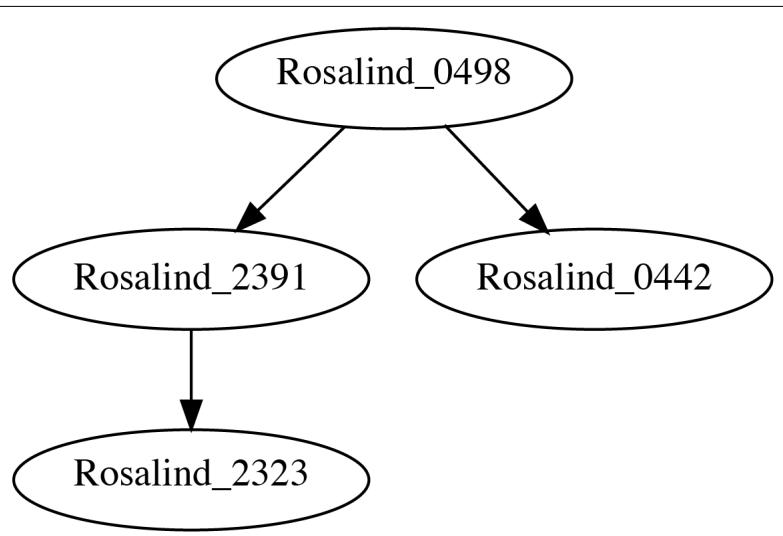  
그림 9-4. 3-mer로 연결될 때 첫 번째 입력 파일의 시퀀스 어셈블리를 보여주는 `dot` 프로그램의 출력 결과

`-v|--view` 플래그와 함께 프로그램을 실행하면 이 이미지가 자동으로 표시되어야 합니다. 그래프 용어로 각 시퀀스는 노드(node)이고, 두 시퀀스 사이의 관계는 에지(edge)입니다.

그래프는 방향성을 가질 수도 있고 가지지 않을 수도 있습니다. 그림 9-4는 관계가 한 노드에서 다른 노드로 흐른다는 것을 암시하는 화살표를 포함하고 있으므로, 이는 유향 그래프(directed graph)입니다. 다음 코드는 제가 이 그래프를 생성하고 시각화하는 방법을 보여줍니다. 유향 그래프를 만들기 위해 `graphviz.Digraph`를 임포트했으며, 이 코드는 실제 솔루션의 일부인 로깅 코드를 생략했음에 유의하십시오.

```python
def main() -> None:  
    args = get_args()  
    start, end = defaultdict(list), defaultdict(list)  
    for rec in SeqIO.parse(args.file, 'fasta'):  
        if kmers := find_kmers(str(rec.seq), args.k):  
            start[kmers[0]].append(rec.id)  
            end[kmers[-1]].append(rec.id)  
    dot = Digraph() # 1
    for kmer in set(start).intersection(set(end)): # 2
        for s1, s2 in starfilter(op.ne, product(end[kmer], start[kmer])): # 3
            print(s1, s2) # 4
            dot.node(s1) # 5
            dot.node(s2)
            dot.edge(s1, s2) # 6
    args.outfile.close() # 7
    dot.render(args.outfile.name, view=args.view) # 8 
```

1 유향 그래프를 생성합니다.
2 공유된 k-mer들을 순회합니다.
3 k-mer를 공유하는 시퀀스 쌍을 찾고, 두 시퀀스 ID를 `s1`과 `s2`로 해제합니다.
4 테스트를 위해 출력을 인쇄합니다.
5 각 시퀀스에 대한 노드를 추가합니다.
6 노드들을 연결하는 에지를 추가합니다.
7 그래프가 파일 이름에 쓸 수 있도록 출력 파일 핸들을 닫습니다.
8 출력 파일 이름으로 그래프 구조를 씁니다. `args.view` 옵션에 따라 이미지를 여는 `view` 옵션을 사용합니다.

이 몇 줄의 코드는 프로그램의 출력에 엄청난 영향을 미칩니다. 예를 들어, 그림 9-5는 이 프로그램이 두 번째 입력 파일에 있는 100개의 시퀀스에 대해 본질적으로 전체 어셈블리를 생성할 수 있음을 보여줍니다.

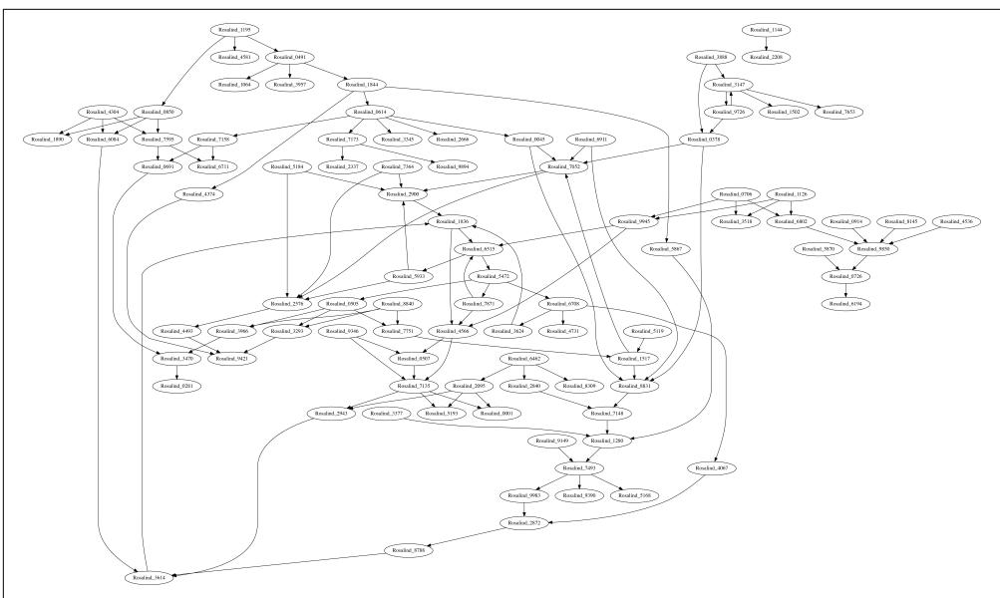  
그림 9-5. 두 번째 테스트 입력 파일의 그래프

이 이미지(페이지에 맞게 축소되었지만)는 데이터의 복잡성과 완전성에 대해 많은 것을 말해줍니다. 예를 들어, 오른쪽 상단 모서리에 있는 시퀀스 쌍인 `Rosalind_1144`와 `Rosalind_2208`은 다른 어떤 시퀀스와도 연결될 수 없습니다. `k`를 4로 늘리고 결과 그래프를 조사하여 완전히 다른 결과를 확인해 보시길 권장합니다.

그래프는 정말 강력한 데이터 구조입니다. 이 장의 서론에서 언급했듯이, 그래프는 쌍 관계를 인코딩합니다. 그림 9-5에서 100개 시퀀스의 어셈블리가 이렇게 적은 줄의 코드로 나타나는 것을 보는 것은 놀라운 일입니다. 파이썬의 리스트와 딕셔너리를 남용하여 그래프를 표현하는 것도 가능하지만, Graphviz 도구가 이를 훨씬 더 간단하게 만들어 줍니다.

이 연습에서는 유향 그래프를 사용했지만, 반드시 그럴 필요는 없었습니다. 무향 그래프(undirected graph)일 수도 있었겠지만, 저는 화살표가 좋습니다. 노드가 자기 자신으로 다시 연결되는 순환(cycle)이 없는 유향 그래프를 나타내는 유향 비순환 그래프(DAG)라는 용어를 접할 수도 있습니다. 선형 유전체의 경우 순환은 잘못된 어셈블리를 나타낼 수 있지만, 박테리아와 같은 원형 유전체에서는 필요할 수도 있습니다. 이러한 아이디어들이 흥미롭다면, 겹치는 k-mer들로부터 종종 구축되는 드 브루인(De Bruijn) 그래프를 조사해 보십시오.

# 더 나아가기

겹치는 시퀀스가 지정된 편집 거리를 가질 수 있도록 허용하는 해밍 거리 옵션을 추가하십시오. 즉, 거리가 1이면 단일 염기 차이가 있는 시퀀스들의 겹침을 허용합니다.

# 검토

이 장의 핵심 사항:

* 겹치는 영역을 찾기 위해, 각 시퀀스의 처음과 마지막 `k` 염기를 찾기 위해 k-mer를 사용했습니다.
* `logging` 모듈은 파일로의 런타임 메시지 로깅을 쉽게 켜고 끌 수 있게 해줍니다.
* 존재하지 않는 키를 빈 리스트라는 기본값으로 자동 생성해 주는 `defaultdict(list)`를 사용하여 딕셔너리를 만들었습니다.
* 셋 인터섹션(set intersection)은 두 딕셔너리 사이에 공유된 키와 같이 컬렉션들 사이의 공통 요소들을 찾을 수 있습니다.
* `itertools.product()` 함수는 시퀀스들의 가능한 모든 쌍을 찾았습니다.
* `iteration_utilities.starfilter()` 함수는 `itertools.starmap()`이 `map()`에 대해 하는 것처럼 `filter()`의 람다에 인자를 스플랫(splat)하여 전달합니다.
* Graphviz 도구는 복잡한 그래프 구조를 효율적으로 표현하고 시각화할 수 있습니다.
* 그래프는 Dot 언어를 사용하여 텍스트로 표현될 수 있으며, `dot` 프로그램은 다양한 형식으로 그래프의 시각화 결과물을 생성할 수 있습니다.
* 오버랩 그래프는 두 개 이상의 시퀀스에 대한 전체 어셈블리를 생성하는 데 사용될 수 있습니다.

# 가장 긴 공유 부분 시퀀스 찾기: k-mer 찾기, 함수 작성 및 이진 탐색 사용

Rosalind LCSM 과제에 설명된 대로, 이 연습의 목표는 주어진 FASTA 파일의 모든 시퀀스에 의해 공유되는 가장 긴 부분 문자열(substring)을 찾는 것입니다. 8장에서는 시퀀스들 내에서 주어진 모티프를 검색했습니다. 이 과제에서는 공유된 모티프가 존재하는지, 심지어 그 크기나 구성이 어떠한지 사전에 알지 못하므로 모든 시퀀스에 존재하는 모든 길이의 시퀀스를 찾아볼 것입니다. 이는 이전 장들에서 보여드린 많은 아이디어들을 한데 모으는 도전적인 연습입니다. 솔루션을 사용하여 알고리즘 설계, 함수, 테스트 및 코드 구성을 탐구할 것입니다.

여러분은 다음을 배우게 됩니다:

* k-mer를 사용하여 공유된 부분 시퀀스를 찾는 방법
* `itertools.chain()`을 사용하여 리스트들의 리스트를 연결하는 방법
* 이진 탐색(binary search)을 사용하는 방법과 이유
* 함수를 극대화하는 한 가지 방법
* `min()` 및 `max()`와 함께 `key` 옵션을 사용하는 방법

# 시작하기

이 과제의 모든 코드와 테스트는 `10_lcsm` 디렉토리에 있습니다. 첫 번째 솔루션을 `lcsm.py` 프로그램으로 복사하고 도움말을 요청하는 것부터 시작하십시오.

```shell
$ cp solution1_kmers_imperative.py lcsm.py
$ ./lcsm.py -h
usage: lcsm.py [-h] FILE

Longest Common Substring

positional arguments:
  FILE        입력 FASTA

optional arguments:
  -h, --help  이 도움말 메시지를 표시하고 종료 
```

필요한 유일한 인자는 FASTA 형식의 DNA 시퀀스들이 담긴 단일 위치 파일입니다. 파일을 받는 다른 프로그램들과 마찬가지로, 프로그램은 유효하지 않거나 읽을 수 없는 입력을 거부할 것입니다. 다음은 제가 사용할 첫 번째 입력입니다. 이 시퀀스들에서 가장 긴 공통 부분 시퀀스는 `CA`, `TA`, `AC`이며, 마지막 것이 출력 예시에 굵게 표시되어 있습니다.

```txt
$ cat tests/inputs/1.fa
>Rosalind_1
GATTACA
>Rosalind_2
TAGACCA
>Rosalind_3
ATACA 
```

이들 중 어떤 답이든 허용됩니다. 첫 번째 테스트 입력으로 프로그램을 실행하고, 허용 가능한 2-mer 중 하나를 무작위로 선택하는 것을 확인하십시오.

```txt
$ ./lcsm.py tests/inputs/1.fa
CA 
```

두 번째 테스트 입력은 훨씬 더 크며, 프로그램이 답을 찾는 데 상당히 더 오랜 시간이 걸린다는 것을 알게 될 것입니다. 제 노트북에서는 거의 40초가 걸립니다. 솔루션에서 이진 탐색을 사용하여 실행 시간을 대폭 줄이는 방법을 보여드리겠습니다.

```powershell
$ time ./lcsm.py tests/inputs/2.fa
GCCTTTGATTTAACGTTTATCGGGTGTAGTAAGATTGCGCGCTAATTCCAATAAAACGTATGGAGGACATTCCCCGT 

real    0m39.244s  
user    0m33.708s  
sys     0m6.202s 
```

과제의 요구 사항은 아니지만, 공유된 부분 시퀀스가 없는 하나의 입력 파일을 포함했으며 프로그램은 이에 대해 적절한 응답을 생성해야 합니다.

```txt
$ ./lcsm.py tests/inputs/none.fa
No common subsequence. 
```

`lcsm.py` 프로그램을 처음부터 시작하십시오.

```powershell
$ new.py -f -p 'Longest Common Substring' lcsm.py
새 스크립트 "lcsm.py"를 확인하세요. 
```

인자들을 다음과 같이 정의하십시오.

```python
class Args(NamedTuple): # 1   
    """ 명령줄 인자 """   
    file: TextIO   

def get_args() -> Args:   
    """ 명령줄 인자 가져오기 """   
    parser = argparse.ArgumentParser(
        description='Longest Common Substring',
        formatter_class=argparse.ArgumentDefaultsHelpFormatter)   
    parser.add_argument('file', # 2
                        help='입력 FASTA',
                        metavar='FILE',
                        type=argparse.FileType('rt'))   
    args = parser.parse_args()   
    return Args(args.file) # 3
```

1 이 프로그램의 유일한 입력은 FASTA 형식의 파일입니다.
2 단일 파일 인자를 정의합니다.
3 열려 있는 파일 핸들을 포함하는 Args 객체를 반환합니다.

그런 다음 들어오는 파일 이름을 출력하도록 `main()` 함수를 업데이트하십시오.

```python
def main() -> None:  
    args = get_args()  
    print(args.file.name) 
```

올바른 사용법이 표시되는지, 프로그램이 파일 이름을 올바르게 출력하는지 확인하십시오.

```batch
$ ./lcsm.py tests/inputs/1.fa
tests/inputs/1.fa 
```

이 시점에서 여러분의 프로그램은 처음 세 개의 테스트를 통과해야 합니다. 프로그램을 어떻게 완성해야 할지 알 것 같다면 직접 해보십시오. 힌트가 필요하다면 계속 읽어보십시오.

# FASTA 파일에서 가장 짧은 시퀀스 찾기

FASTA 파일을 읽는 것은 이제 익숙할 것입니다. 이전처럼 `Bio.SeqIO.parse()`를 사용하겠습니다. 이 문제에 대한 제 첫 번째 아이디어는 `k`를 최대화하면서 공유된 k-mer를 찾는 것이었습니다. 가장 긴 부분 시퀀스는 파일에 있는 가장 짧은 시퀀스보다 길 수 없으므로, `k`를 그것과 같게 설정하는 것부터 시작하기로 했습니다. 가장 짧은 시퀀스를 찾으려면 먼저 모든 레코드를 훑어봐야 합니다. 어떻게 하는지 복습하자면, `Bio.SeqIO.parse()` 함수는 각 FASTA 레코드에 접근할 수 있게 해주는 반복자를 반환합니다.

```python
>>> from Bio import SeqIO
>>> fh = open('./tests/inputs/1.fa')
>>> recs = SeqIO.parse(fh, 'fasta')
>>> type(recs)
<class 'Bio.SeqIO.FastaIO.FastaIterator'> 
```

4장에서 처음 보여드린 `next()` 함수를 사용하여 반복자가 다음 값을 생성하도록 강제할 수 있으며, 그 타입은 `SeqRecord`입니다.

```txt
>>> rec = next(recs)
>>> type(rec)
<class 'Bio.SeqRecord.SeqRecord'> 
```

시퀀스 자체 외에도 FASTA 레코드는 시퀀스 ID, 이름 등과 같은 메타데이터를 포함하고 있습니다.

```txt
>>> rec
SeqRecord(seq=Seq('GATTACA'), id='Rosalind_1', name='Rosalind_1', description='Rosalind_1', dbxrefs=[]) 
```

읽어 들인 정보는 `Seq` 객체로 감싸져 있으며, REPL에서 `help(rec.seq)`를 사용하여 흥미롭고 유용한 메서드들을 탐구해 볼 수 있습니다. 저는 가공되지 않은 시퀀스에만 관심이 있으므로, `str()` 함수를 사용하여 이를 문자열로 강제 변환할 수 있습니다.

```txt
>>> str(rec.seq) 
'GATTACA' 
```

가장 짧은 시퀀스의 길이를 찾을 수 있도록 모든 시퀀스를 리스트에 담아야 합니다. 이 시퀀스들을 여러 번 사용할 것이므로 리스트 컴프리헨션을 사용하여 파일 전체를 리스트로 읽어 들일 수 있습니다.

>>> fh = open('./tests/inputs/1.fa') # 1   
>>> seqs = [str(rec.seq) for rec in SeqIO.parse(fh, 'fasta')] # 2   
>>> seqs   
['GATTACA', 'TAGACCA', 'ATACA']

1 파일 핸들을 다시 열지 않으면 기존 파일 핸들은 두 번째 읽기부터 계속될 것입니다.
2 각 레코드의 시퀀스를 문자열로 강제 변환하여 리스트를 생성합니다.


시퀀스 파일은 수백만 개의 리드를 포함할 수 있으며, 이를 리스트에 저장하면 가용 메모리를 쉽게 초과하여 컴퓨터를 다운시킬 수 있습니다. (제가 어떻게 아는지 묻지 마세요.) 문제는 다음 단계에서 모든 시퀀스에 공통인 부분 시퀀스를 찾기 위해 모든 시퀀스가 필요하다는 점입니다. `10_lcsm` 디렉토리에는 여러분이 테스트할 수 있도록 공통 모티프를 가진 대용량 FASTA 입력을 생성하는 `genseq.py` 프로그램이 포함된 여러 Makefile 타겟이 있습니다. 이 프로그램은 Rosalind에서 제공하는 데이터셋에 대해 적절히 작동합니다.

동일한 아이디어를 `map()` 함수를 사용하여 표현할 수 있습니다.

>>> fh = open('./tests/inputs/1.fa')   
>>> seqs = list(map(lambda rec: str(rec.seq), SeqIO.parse(fh, 'fasta')))   
>>> seqs   
['GATTACA', 'TAGACCA', 'ATACA']

가장 짧은 시퀀스의 길이를 찾으려면 모든 시퀀스의 길이를 찾아야 하며, 이는 리스트 컴프리헨션을 사용하여 수행할 수 있습니다.

```txt
>>> [len(seq) for seq in seqs]  
[7, 7, 5] 
```

저는 `map()`을 사용하여 이를 작성하는 짧은 방식을 선호합니다.

```txt
>>> list(map(len, seqs)) 
[7, 7, 5] 
```

파이썬에는 리스트에서 최소값 또는 최대값을 반환하는 내장 함수 `min()`과 `max()`가 있습니다.

```txt
>>> min(map(len, seqs))
5
>>> max(map(len, seqs))
7 
```

따라서 가장 짧은 시퀀스는 길이들의 최소값과 같습니다.

>>> shortest = min(map(len, seqs))   
>>> shortest   
5

# 시퀀스에서 k-mer 추출하기

가장 긴 공유 부분 시퀀스는 가장 짧은 시퀀스보다 길 수 없으며 모든 리드에 의해 공유되어야 합니다. 따라서 제 다음 단계는 가장 짧은 시퀀스의 길이(5)와 같은 `k`에서 시작하여 모든 시퀀스의 모든 k-mer를 찾는 것입니다. 9장에서 `find_kmers()` 함수와 테스트를 작성했으므로, 해당 코드를 이 프로그램으로 복사하겠습니다. 이를 위해 `typing.List`를 임포트하는 것을 잊지 마십시오.

```python
def find_kmers(seq: str, k: int) -> List[str]:  
    ''' 문자열에서 k-mer 찾기 ''' 
    n = len(seq) - k + 1
    return [] if n < 1 else [seq[i:i + k] for i in range(n)]

def test_find_kmers() -> None:
    ''' find_kmers 테스트 ''' 
    assert find_kmers('', 1) == []
    assert find_kmers('ACTG', 1) == ['A', 'C', 'T', 'G']
    assert find_kmers('ACTG', 2) == ['AC', 'CT', 'TG']
    assert find_kmers('ACTG', 3) == ['ACT', 'CTG']
    assert find_kmers('ACTG', 4) == ['ACTG']
    assert find_kmers('ACTG', 5) == []
```

한 가지 논리적인 접근 방식은 `k`의 최대 가능 값에서 시작하여 모든 시퀀스에 의해 공유되는 k-mer를 찾을 때까지 거꾸로 세는 것입니다. 지금까지 저는 숫자를 올리는 데만 `range()` 함수를 사용했습니다. 거꾸로 세기 위해 시작과 종료 값을 뒤집을 수 있을까요? 안타깝게도 안 됩니다. 시작 값이 종료 값보다 크면 `range()`는 빈 리스트를 생성합니다.

```txt
>>> list(range(shortest, 0))  
[] 
```

7장에서 코돈을 읽을 때, `range()` 함수는 제가 거기서 한 번에 세 염기씩 점프하기 위해 사용했던 보폭(step)을 포함하여 최대 세 개의 인자를 받는다고 언급했습니다. 여기서는 거꾸로 세기 위해 보폭으로 -1을 사용해야 합니다. 종료 값은 포함되지 않는다는 점을 기억하십시오.

```txt
>>> list(range(shortest, 0, -1))  
[5, 4, 3, 2, 1] 
```

거꾸로 세는 또 다른 방법은 숫자를 올린 다음 그 결과를 뒤집는 것입니다.

```txt
>>> list(reversed(range(1, shortest + 1)))  
[5, 4, 3, 2, 1] 
```

어느 쪽이든, 모든 시퀀스에 의해 공유되는 k-mer를 찾을 때까지 감소하는 `k` 값들에 대해 순회하고 싶습니다. 시퀀스는 동일한 k-mer의 복사본을 여러 개 포함할 수 있으므로, `set()` 함수를 사용하여 결과를 유일하게 만드는 것이 중요합니다.

```python
>>> from lcsm import find_kmers
>>> from pprint import pprint
>>> for k in range(shortest, 0, -1):
...     print(f' => {k} <=')
...     pprint([set(find_kmers(s, k)) for s in seqs])
...
 => 5 <=
[{'TTACA', 'GATTA', 'ATTAC'}, {'TAGAC', 'AGACC', 'GACCA'}, {'ATACA'}]
 => 4 <=
[{'ATTA', 'TTAC', 'TACA', 'GATT'}, {'GACC', 'AGAC', 'TAGA', 'ACCA'}, {'TACA', 'ATAC'}]
 => 3 <=
[{'ACA', 'TAC', 'GAT', 'ATT', 'TTA'}, {'AGA', 'TAG', 'CCA', 'ACC', 'GAC'}, {'ACA', 'ATA', 'TAC'}]
 => 2 <=
[{'AC', 'AT', 'CA', 'TA', 'TT', 'GA'}, {'AC', 'CA', 'CC', 'TA', 'AG', 'GA'}, {'AC', 'AT', 'CA', 'TA'}]
 => 1 <=
[{'G', 'C', 'T', 'A'}, {'G', 'C', 'T', 'A'}, {'C', 'T', 'A'}]
```

각 `k` 값에 대해 모든 k-mer의 개수를 세기 위해 이 아이디어를 사용하는 방법을 생각할 수 있으신가요? 빈도가 시퀀스의 개수와 일치하는 k-mer들을 찾아보십시오. 만약 하나 이상을 찾는다면, 그중 아무 것이나 출력하십시오.

# 솔루션

이 프로그램의 두 가지 변형은 가장 긴 공유 부분 시퀀스를 찾기 위해 동일한 기본 로직을 사용합니다. 첫 번째 버전은 가능한 모든 `k` 길이를 단계적으로 선형적으로 순회하기 때문에 입력 크기가 커질수록 성능이 떨어지는 것으로 드러납니다. 두 번째 버전은 `k`에 대한 좋은 시작 값을 찾기 위해 이진 탐색을 도입한 다음, 최대 `k` 값을 찾기 위해 힐클라이밍(hill-climbing) 탐색을 시작합니다.

# 솔루션 1: k-mer의 빈도 세기

이전 섹션에서 저는 FASTA 파일의 가장 짧은 시퀀스 길이에서 시작하여 1까지 내려가며 시퀀스들의 모든 k-mer를 찾는 과정까지 진행했습니다. 여기서는 첫 번째 FASTA 파일의 가장 짧은 시퀀스 길이였던 5와 같은 `k`에서 시작하겠습니다.

>>> fh = open('./tests/inputs/1.fa')   
>>> seqs = [str(rec.seq) for rec in SeqIO.parse(fh, 'fasta')]   
>>> shortest = min(map(len, seqs))   
>>> kmers = [set(find_kmers(seq, shortest)) for seq in seqs]   
>>> kmers   
[{'TTACA', 'GATTA', 'ATTAC'}, {'TAGAC', 'AGACC', 'GACCA'}, {'ATACA'}]

모든 시퀀스에 걸쳐 각 k-mer가 몇 번 나타나는지 세는 방법이 필요합니다. 한 가지 접근 방식은 1장에서 처음 보여드린 `collections.Counter()`를 사용하는 것입니다.

```txt
>>> from collections import Counter  
>>> counts = Counter() 
```

시퀀스들의 각 k-mer 그룹을 순회하고 `Counter.update()` 메서드를 사용하여 추가할 수 있습니다.

```python
>>> for group in kmers:
...     counts.update(group)
...
>>> pprint(counts)
Counter({'TTACA': 1, 'GATTA': 1, 'ATTAC': 1, 'TAGAC': 1, 'AGACC': 1, 'GACCA': 1, 'ATACA': 1}) 
```

또는 `itertools.chain()`을 사용하여 수많은 k-mer 리스트들을 하나의 리스트로 연결할 수도 있습니다.

```python
>>> from itertools import chain
>>> list(chain.from_iterable(kmers))
['TTACA', 'GATTA', 'ATTAC', 'TAGAC', 'AGACC', 'GACCA', 'ATACA'] 
```

이를 `Counter()`의 입력으로 사용하면 동일한 결과가 생성되며, 각 5-mer가 유일하여 한 번씩만 나타난다는 것을 보여줍니다.

```python
>>> counts = Counter(chain.from_iterable(kmers))  
>>> pprint(counts)  
Counter({'TTACA': 1, 'GATTA': 1, 'ATTAC': 1, 'TAGAC': 1, 'AGACC': 1, 'GACCA': 1, 'ATACA': 1}) 
```

`Counter()`는 내부적으로 일반 딕셔너리이므로 모든 딕셔너리 메서드에 접근할 수 있습니다. `dict.items()` 메서드를 사용하여 키와 값의 쌍을 순회하며 k-mer의 카운트가 시퀀스의 개수와 같은 경우를 찾고 싶습니다.

```txt
>>> n = len(seqs)  
>>> candidates = []  
>>> for kmer, count in counts.items():  
...     if count == n:  
...         candidates.append(kmer)  
...  
>>> candidates  
[] 
```

`k`가 5일 때는 후보 시퀀스가 없으므로 더 작은 값으로 다시 시도해야 합니다. 정답이 2라는 것을 알고 있으므로, `k = 2`로 이 코드를 다시 실행하여 다음 딕셔너리를 생성하겠습니다.

```txt
>>> k = 2  
>>> kmers = [set(find_kmers(seq, k)) for seq in seqs]  
>>> counts = Counter(chain.from_iterable(kmers)) 
```

```txt
>>> pprint(counts) 
Counter({'CA': 3, 'AC': 3, 'TA': 3, 'GA': 2, 'AT': 2, 'TT': 1, 'AG': 1, 'CC': 1})
```

이를 통해 빈도가 3(시퀀스 개수와 동일)인 세 개의 후보 2-mer를 찾았습니다.

>>> candidates = [] 
>>> for kmer, count in counts.items(): 
...     if count == n: 
...         candidates.append(kmer)   
>>> candidates   
['CA', 'AC', 'TA']

후보들 중 어떤 것을 선택하든 상관없으므로, 리스트에서 하나의 값을 반환하는 `random.choice()` 함수를 사용하겠습니다.

```txt
>>> import random
>>> random.choice(candidates)
'AC' 
```

이 흐름이 마음에 들므로, 테스트할 수 있도록 함수에 넣고 싶습니다.

```python
def common_kmers(seqs: List[str], k: int) -> List[str]:  
    ''' 모든 시퀀스에 공통인 k-mer 찾기 '''  
    kmers = [set(find_kmers(seq, k)) for seq in seqs]  
    counts = Counter(chain.from_iterable(kmers))  
    n = len(seqs)  
    return [kmer for kmer, freq in counts.items() if freq == n] 
```

1 시퀀스의 개수를 찾습니다.
2 빈도가 시퀀스 개수와 동일한 k-mer들을 반환합니다.

이는 꽤 읽기 좋은 `main()`을 만들어 줍니다.

```python
import random   
import sys   

def main() -> None: 
    args = get_args() 
    seqs = [str(rec.seq) for rec in SeqIO.parse(args.file, 'fasta')] # 1 
    shortest = min(map(len, seqs)) # 2
    for k in range(shortest, 0, -1): # 3 
        if kmers := common_kmers(seqs, k): # 4 
            print(random.choice(kmers)) # 5 
            sys.exit(0) # 6  
    print('No common subsequence.') # 7 
```

1 모든 시퀀스를 리스트로 읽어 들입니다.
2 가장 짧은 시퀀스의 길이를 찾습니다.
3 가장 짧은 시퀀스부터 거꾸로 숫자를 셉니다.
4 이 `k` 값을 사용하여 모든 공통 k-mer를 찾습니다.
5 공통 k-mer가 발견되면 무작위로 하나를 출력합니다.
6 종료 값 0(오류 없음)을 사용하여 프로그램을 종료합니다.
7 이 지점까지 도달했다면, 사용자에게 공유된 시퀀스가 없음을 알립니다.

앞의 코드에서 저는 다시 한번 5장에서 소개했던 바다코끼리 연산자(`:=`)를 사용하여 `common_kmers()` 호출 결과를 `kmers` 변수에 먼저 할당한 다음 `kmers`의 참거짓 여부를 평가하고 있습니다. 파이썬은 `kmers`가 참일 때, 즉 이 `k` 값에 대해 공통 k-mer가 발견되었을 때만 다음 블록으로 들어갑니다. 이 언어 기능이 추가되기 전에는 할당과 평가를 다음과 같이 두 줄로 작성해야 했습니다.

```python
kmers = common_kmers(seqs, k) 
if kmers: 
    print(random.choice(kmers))
```

# 솔루션 2: 이진 탐색으로 속도 높이기

이 장의 서론에서 언급했듯이, 이 솔루션은 입력 크기가 커질수록 훨씬 느려집니다. 프로그램의 진행 상황을 추적하는 한 가지 방법은 `for` 루프 시작 부분에 `print(k)` 문을 넣는 것입니다. 두 번째 입력 파일로 이를 실행해 보면, 1,000부터 거꾸로 세기 시작하여 `k`가 78에 도달할 때까지 정답에 이르지 못하는 것을 볼 수 있습니다.

1씩 거꾸로 세는 것은 너무 오래 걸립니다. 만약 친구가 여러분에게 1에서 1,000 사이의 숫자를 맞춰보라고 했을 때, 친구가 "너무 높아"라고 말할 때마다 1,000부터 시작해서 1씩 줄여가며 계속 추측하지는 않을 것입니다. 500을 추측하는 것이 훨씬 빠르고(우정에도 더 좋습니다) 효율적입니다. 만약 친구가 선택한 숫자가 453이라면 친구는 "너무 높아"라고 말할 것이고, 그러면 여러분은 250을 선택하는 것이 현명할 것입니다. 친구가 "너무 낮아"라고 대답하면, 여러분은 정답을 찾을 때까지 마지막 높고 낮은 추측값 사이의 차이를 계속 절반으로 나누어 나갈 것입니다. 이것이 바로 이진 탐색(binary search)이며, 정렬된 값들의 리스트에서 원하는 값의 위치를 빠르게 찾는 아주 좋은 방법입니다.

이를 더 잘 이해하기 위해 `10_lcsm` 디렉토리에 `binsearch.py`라는 프로그램을 포함해 두었습니다.

```txt
$ ./binsearch.py -h
usage: binsearch.py [-h] -n int -m int

Binary Search

optional arguments:
  -h, --help            show this help message and exit
  -n int, --num int     맞출 숫자 (기본값: None)
  -m int, --max int     최대 범위 (기본값: None) 
```

다음은 프로그램의 관련 부분입니다. 원하신다면 인자 정의를 위한 소스 코드를 읽어보셔도 좋습니다. `binary_search()` 함수는 4장의 피보나치 수열 문제 솔루션 중 하나처럼 재귀적(recursive)입니다. 이진 탐색이 작동하려면 검색할 값들이 반드시 정렬되어 있어야 하는데, `range()` 함수가 이를 제공합니다.

```python
def main() -> None:
    args = get_args()
    nums = list(range(args.maximum + 1))
    pos = binary_search(args.num, nums, 0, args.maximum)
    print(f'{args.num}을(를) 찾았습니다!' if pos > 0 else f'{args.num}이(가) 존재하지 않습니다.')

def binary_search(x: int, xs: List[int], low: int, high: int) -> int:
    print(f'{low:4} {high:4}', file=sys.stderr)
    if high >= low: # 1
        mid = (high + low) // 2 # 2
        if xs[mid] == x: # 3
            return mid
        if xs[mid] > x: # 4
            return binary_search(x, xs, low, mid - 1) # 5
        return binary_search(x, xs, mid + 1, high) # 6
    return -1 # 7 
```

1 재귀를 종료하기 위한 기본 케이스(base case)입니다. 이 조건이 거짓이면 재귀가 멈춥니다.
2 바닥 나눗셈(floor division)을 사용하여 `high`와 `low` 사이의 중간 지점을 찾습니다.
3 요소가 중간에 있다면 중간 지점(`mid`)을 반환합니다.
4 중간 지점의 값이 찾으려는 값보다 큰지 확인합니다.
5 더 낮은 값들의 영역을 탐색합니다.
6 더 높은 값들의 영역을 탐색합니다.
7 값을 찾지 못했습니다.


`binary_search()` 함수에서 `x`와 `xs`라는 이름은 각각 단수와 복수를 의미합니다. 저는 제 머릿속에서 이를 '엑스'와 '엑스들'이라고 읽습니다. 이러한 표기법은 순수 함수형 프로그래밍에서 흔히 쓰이는데, `x`가 어떤 종류의 값인지 설명하려고 애쓰지 않기 때문입니다. 문자열일 수도, 숫자일 수도, 혹은 그 무엇일 수도 있습니다. 중요한 점은 `xs`가 동일한 타입의 비교 가능한 값들의 컬렉션이라는 점입니다.

이전 숫자들을 사용하여 실행했을 때 `low`와 `high`가 10단계 만에 어떻게 목표 숫자로 수렴하는지 볼 수 있도록 `print()` 문을 포함했습니다.

```txt
$ ./binsearch.py -n 453 -m 1000
   0 1000
   0  499
 250  499
 375  499
 438  499
 438  467
 453  467
 453  459
 453  455
 453  453
453을(를) 찾았습니다! 
```

숫자가 존재하지 않는다는 것을 확인하는 데는 단 8번의 반복만 걸립니다.

```txt
$ ./binsearch.py -n 453 -m 100
   0  100
  51  100
  76  100
  89  100
  95  100
  98  100
 100  100
 101  100
453이(가) 존재하지 않습니다. 
```

이진 탐색은 값이 리스트에 존재하는지 여부를 알려줄 수 있지만, 이것이 제 문제의 정답은 아닙니다. 대부분의 데이터셋에 공통적으로 최소 2-mer나 1-mer는 존재할 것이라고 확신하지만, 하나도 없는 파일도 포함해 두었습니다.

```perl
$ cat tests/inputs/none.fa
>Rosalind_1
GGGGGGG
>Rosalind_2
AAAAAAAA
>Rosalind_3
CCCC
>Rosalind_4
TTTTTTTT 
```

만약 `k`에 대해 수용 가능한 값이 있다면, 저는 최대값을 찾아야 합니다. 저는 이진 탐색을 사용하여 최대값을 찾기 위한 힐클라이밍(hill-climbing) 탐색의 시작점을 찾기로 결정했습니다. 먼저 `main()`을 보여드리고, 그다음에 다른 함수들을 분석하겠습니다.

```python
def main() -> None:  
    args = get_args()  
    seqs = [str(rec.seq) for rec in SeqIO.parse(args.file, 'fasta')] # 1  
    shortest = min(map(len, seqs)) # 2  
    common = partial(common_kmers, seqs) # 3  
    start = binary_search(common, 1, shortest) # 4  
    if start >= 0: # 5  
        candidates = [] # 6  
        for k in range(start, shortest + 1): # 7  
            if kmers := common(k): # 8  
                candidates.append(random.choice(kmers)) # 9  
            else:  
                break # 10  
        print(max(candidates, key=len)) # 11  
    else:  
        print('공통 부분 시퀀스가 없습니다.') # 12 
```

1 시퀀스들을 문자열 리스트로 가져옵니다.
2 가장 짧은 시퀀스의 길이를 찾습니다.
3 `seqs` 입력을 사용하여 `common_kmers()` 함수를 부분 적용합니다.
4 이진 탐색을 사용하여 주어진 함수에 대한 시작점을 찾습니다. 이때 `k`의 최소값으로 1을, 최대값으로 가장 짧은 시퀀스의 길이를 사용합니다.
5 이진 탐색이 유용한 결과를 찾았는지 확인합니다.
6 후보 값들의 리스트를 초기화합니다.
7 이진 탐색 결과로부터 힐클라이밍을 시작합니다.
8 공통 k-mer가 있는지 확인합니다.
9 있다면 후보 리스트에 무작위로 하나를 추가합니다.
10 공통 k-mer가 더 이상 없으면 루프를 빠져나옵니다.
11 길이가 가장 긴 후보 시퀀스를 선택합니다.
12 사용자에게 정답이 없음을 알립니다.

위의 코드에서 설명할 내용이 많지만, 특히 `max()` 호출을 강조하고 싶습니다. 앞서 이 함수가 리스트에서 최대값을 반환한다는 것을 보여드렸습니다. 보통 숫자 리스트에서 이를 사용한다고 생각할 것입니다.

```txt
>>> max([4, 2, 8, 1]) 
8
```

앞의 코드에서 저는 리스트에 있는 가장 긴 문자열을 찾고 싶습니다. `len()` 함수를 `map()`으로 적용하여 그 길이를 찾을 수 있습니다.

```txt
>>> seqs = ['A', 'CC', 'GGGG', 'TTT']  
>>> list(map(len, seqs))  
[1, 2, 4, 3] 
```

이는 세 번째 시퀀스인 `GGGG`가 가장 길다는 것을 보여줍니다. `max()` 함수는 비교하기 전에 각 요소에 적용할 함수인 선택적인 `key` 인자를 받습니다. 만약 `len` 함수를 사용하면 `max()`는 가장 긴 시퀀스를 올바르게 식별합니다.

```txt
>>> max(seqs, key=len) 
'GGGG' 
```

제 필요에 맞게 `binary_search()` 함수를 어떻게 수정했는지 살펴보겠습니다.

```python
def binary_search(f: Callable, low: int, high: int) -> int: # 1
    """ 이진 탐색 """
    hi, lo = f(high), f(low) # 2
    mid = (high + low) // 2 # 3
    if hi and lo: # 4
        return high
    if lo and not hi: # 5
        return binary_search(f, low, mid)
    if hi and not lo: # 6
        return binary_search(f, mid, high)
    return -1 # 7 
```

1 이 함수는 다른 함수 `f()`와 함께 `low`, `high` 값을 인자로 받습니다. 이 사례에서 함수 `f()`는 공통 k-mer들을 반환하지만, 이 함수는 여러분이 원하는 어떤 계산이든 수행할 수 있습니다.
2 `k`의 최대값과 최소값으로 함수 `f()`를 호출합니다.
3 `k`의 중간값을 찾습니다.
4 함수 `f()`가 높은 `k`와 낮은 `k` 모두에 대해 공통 k-mer를 찾았다면, 가장 높은 `k`를 반환합니다.
5 높은 `k`에서는 k-mer를 찾지 못했지만 낮은 값에서는 찾았다면, `k`의 더 낮은 범위에서 탐색하도록 함수를 재귀적으로 호출합니다.
6 낮은 `k`에서는 k-mer를 찾지 못했지만 높은 값에서는 찾았다면, `k`의 더 높은 범위에서 탐색하도록 함수를 재귀적으로 호출합니다.
7 `f()`에 대한 높은 인자와 낮은 인자 모두를 사용하여 k-mer가 발견되지 않았음을 나타내기 위해 -1을 반환합니다.

다음은 이에 대해 제가 작성한 테스트입니다.

```python
def test_binary_search() -> None:
    ''' binary_search 테스트 ''' 
    seqs1 = ['GATTACA', 'TAGACCA', 'ATACA'] # 1
    f1 = partial(common_kmers, seqs1) # 2
    assert binary_search(f1, 1, 5) == 2 # 3
    seqs2 = ['GATTACTA', 'TAGACTCA', 'ATACTA'] # 4
    f2 = partial(common_kmers, seqs2)
    assert binary_search(f2, 1, 6) == 3 # 5 
```

1 세 개의 공유된 2-mer를 가진 시퀀스들입니다.
2 첫 번째 시퀀스 세트에서 k-mer를 찾는 함수를 정의합니다.
3 탐색 결과 정답인 `k` 값 2를 찾습니다.
4 이전과 같지만 이제 공유된 3-mer를 가진 시퀀스들입니다.
5 탐색 결과 `k` 값 3을 찾습니다.

이전의 이진 탐색과 달리, 제 버전은 (반드시) 정확한 답을 반환하지는 않으며 단지 괜찮은 시작점을 제공할 뿐입니다. 어떤 크기 `k`에 대해서도 공유된 시퀀스가 없다면 사용자에게 알립니다.

$ ./solution2_binary_search.py tests/inputs/none.fa 
공통 부분 시퀀스가 없습니다.

공유된 부분 시퀀스가 있다면, 이 버전은 훨씬 더 빠르게 실행됩니다. 아마도 28배 정도 더 빠를 것입니다.

```txt
$ hyperfine -L prg ./solution1_kmers_functional.py,./solution2_binary_search.py \
'{prg} tests/inputs/2.fa'
Benchmark #1: ./solution1_kmers_functional.py tests/inputs/2.fa
  Time (mean ± σ):     40.686 s ±  0.443 s    [User: 35.208 s, System: 6.042 s]
  Range (min … max):   40.165 s … 41.349 s    10 runs
Benchmark #2: ./solution2_binary_search.py tests/inputs/2.fa
  Time (mean ± σ):      1.441 s ±  0.037 s    [User: 1.903 s, System: 0.255 s]
  Range (min … max):    1.378 s …  1.492 s    10 runs
Summary
  './solution2_binary_search.py tests/inputs/2.fa' ran
    28.24 ± 0.79 times faster than './solution1_kmers_functional.py tests/inputs/2.fa' 
```

최대 `k` 값에서부터 아래로 순회하며 검색했을 때, 저는 가능한 모든 값들에 대해 선형 탐색(linear search)을 수행하고 있었습니다. 이는 검색 시간이 값의 개수 `n`에 비례하여(선형적으로) 증가함을 의미합니다. 반면 이진 탐색은 log n의 속도로 증가합니다. 알고리즘의 실행 시간 증가를 설명할 때 빅 오(Big O) 표기법을 사용하는 것이 일반적이므로, 이진 탐색은 O(log n)으로 기술되는 반면 선형 탐색은 훨씬 좋지 않은 O(n)으로 기술되는 것을 볼 수 있을 것입니다.

# 더 나아가기

9장의 제안과 마찬가지로, 공유된 k-mer를 결정할 때 지정된 횟수만큼의 차이를 허용하는 해밍 거리 옵션을 추가해 보십시오.

# 검토

이 장의 핵심 사항:

* K-mer는 시퀀스의 보존된 영역을 찾는 데 사용될 수 있습니다.
* 리스트들의 리스트는 `itertools.chain()`을 사용하여 단일 리스트로 결합될 수 있습니다.
* 이진 탐색은 정렬된 값들에 대해 리스트를 선형적으로 검색하는 것보다 더 빠르게 값을 찾는 데 사용될 수 있습니다.
* 힐클라이밍은 함수의 입력을 극대화하는 한 가지 방법입니다.
* `min()`과 `max()`의 `key` 옵션은 값들을 비교하기 전에 적용할 함수입니다.

# 단백질 모티프 찾기: 데이터 가져오기 및 정규 표현식 사용

우리는 지금까지 시퀀스 모티프를 찾는 데 꽤 많은 시간을 보냈습니다. Rosalind MPRT 과제에 설명된 대로, 단백질에서 공유되거나 보존된 시퀀스는 공유된 기능을 의미합니다. 이번 연습에서는 N-글리코실화(N-glycosylation) 모티프를 포함하는 단백질 시퀀스를 식별해야 합니다. 프로그램의 입력은 UniProt 웹사이트에서 시퀀스를 다운로드하는 데 사용될 단백질 ID 리스트입니다. 데이터를 수동 및 프로그래밍 방식으로 다운로드하는 방법을 보여드린 후, 정규 표현식을 사용하거나 수동 솔루션을 작성하여 모티프를 찾는 방법을 보여드리겠습니다.

여러분은 다음을 배우게 됩니다:

* 인터넷에서 데이터를 프로그래밍 방식으로 가져오는 방법
* N-글리코실화 모티프를 찾기 위한 정규 표현식을 작성하는 방법
* N-글리코실화 모티프를 수동으로 찾는 방법

# 시작하기

이 프로그램의 모든 코드와 테스트는 `11_mprt` 디렉토리에 있습니다. 먼저 첫 번째 솔루션을 `mprt.py` 프로그램으로 복사하십시오.

```shell
$ cd 11_mprt
$ cp solution1_regex.py mprt.py 
```

사용법을 확인하십시오.

```txt
$ ./mprt.py -h
usage: mprt.py [-h] [-d DIR] FILE 

N-글리코실화 모티프의 위치 찾기

positional arguments:
  FILE                  UniProt ID가 담긴 입력 텍스트 파일 # 1

optional arguments:
  -h, --help            이 도움말 메시지를 표시하고 종료
  -d DIR, --download_dir DIR
                        다운로드 디렉토리 (기본값: fasta) # 2
```

1 필수 위치 인자는 단백질 ID 파일입니다.
2 선택적인 다운로드 디렉토리 이름의 기본값은 `fasta`입니다.

입력 파일은 한 줄에 하나씩 단백질 ID를 나열할 것입니다. Rosalind 예시에서 제공된 단백질 ID들이 첫 번째 테스트 입력 파일을 구성합니다.

$ cat tests/inputs/1.txt
A2Z669
B5ZC00
P07204_TRBM_HUMAN
P20840_SAG1_YEAST

이 파일을 인자로 사용하여 프로그램을 실행하십시오. 프로그램의 출력은 N-글리코실화 모티프를 포함하는 각 단백질 ID와 그것이 발견된 위치들을 나열합니다.

$ ./mprt.py tests/inputs/1.txt
B5ZC00
85 118 142 306 395
P07204_TRBM_HUMAN
47 115 116 382 409
P20840_SAG1_YEAST
79 109 135 248 306 348 364 402 485 501 614

앞의 명령을 실행한 후, 기본값인 `fasta` 디렉토리가 생성된 것을 볼 수 있을 것입니다. 그 안에는 네 개의 FASTA 파일이 들어 있어야 합니다. 이러한 단백질 ID들을 사용하는 이후의 모든 실행은 `make clean` 등을 실행하여 다운로드 디렉토리를 삭제하지 않는 한 캐시된 데이터를 사용하므로 더 빨라질 것입니다.

`head -2` 명령을 사용하여 각 파일의 처음 두 줄을 살펴보십시오. 일부 FASTA 레코드의 헤더가 상당히 길어 줄이 바뀌지 않도록 여기서 끊었지만, 실제 헤더는 반드시 한 줄에 있어야 합니다.

```txt
$ head -2 fasta/*  
==> fasta/A2Z669.fasta <==
>sp|A2Z669|CSPLT_ORYSI CASP-like protein 5A2 OS=Oryza sativa subsp. indica OX=39946 GN=OsI_33147 PE=3 SV=1
MRASRPVVHPVEAPPPAALAVAAAAVAVEAGVGAGGGAAAHGGENAQPRGVRMKDPPGAP
==> fasta/B5ZC00.fasta <==
>sp|B5ZC00|SYG_UREU1 Glycine--tRNA ligase OS=Ureaplasma urealyticum serovar 10 (strain ATCC 33699 / Western) OX=565575 GN=glyQS PE=3 SV=1
MKNKFKTQEELVNHLKTVGFVFANSEIYNGLANAWDYGPLGVLLKNLKNLWWKEFVTKQ
==> fasta/P07204_TRBM_HUMAN.fasta <==
>sp|P07204|TRBM_HUMAN Thrombomodulin OS=Homo sapiens OX=9606 GN=THBD PE=1 SV=2
MLGVLVLGALALAGLGFAPAPEQPGGSQCVEHDCFALYPGPATFLNASQICDGLRGHLM
==> fasta/P20840_SAG1_YEAST.fasta <==
>sp|P20840|SAG1_YEAST Alpha-agglutinin OS=Saccharomyces cerevisiae (strain ATCC 204508 / S288c) OX=559292 GN=SAG1 PE=1 SV=2
MFTFLKILWFLSLALASAININDITFSNLEITPLTANKQPDQGWATFDFSIADASSIR
```

`make test`를 실행하여 프로그램이 통과해야 할 테스트의 종류를 확인하십시오. 준비가 되면 프로그램을 처음부터 시작하십시오.

```powershell
$ new.py -f -p 'N-글리코실화 모티프의 위치 찾기' mprt.py
새 스크립트 "mprt.py"를 확인하세요. 
```

프로그램의 인자로 위치 파일 인자와 선택적인 다운로드 디렉토리를 정의해야 합니다.

```python
class Args(NamedTuple):
    ''' 명령줄 인자 '''
    file: TextIO
    download_dir: str

def get_args() -> Args:
    ''' 명령줄 인자 가져오기 '''
    parser = argparse.ArgumentParser(
        description='N-글리코실화 모티프의 위치 찾기',
        formatter_class=argparse.ArgumentDefaultsHelpFormatter)
    parser.add_argument('file',
                        help='UniProt ID가 담긴 입력 텍스트 파일',
                        metavar='FILE',
                        type=argparse.FileType('rt')) # 3
    parser.add_argument('-d',
                        '--download_dir',
                        help='다운로드 디렉토리',
                        metavar='DIR',
                        type=str,
                        default='fasta') # 4
    args = parser.parse_args()
    return Args(args.file, args.download_dir)
```

1 파일은 파일 핸들이 될 것입니다.
2 다운로드 디렉토리는 문자열이 될 것입니다.
3 파일 인자가 읽기 가능한 텍스트 파일인지 확인합니다.
4 다운로드 디렉토리는 합리적인 기본값을 가진 선택적인 문자열입니다.

프로그램이 사용법을 생성할 수 있는지 확인한 다음, 파일에서 단백질 ID들을 출력하는 것부터 시작하십시오. 각 ID는 줄바꿈 문자로 끝나므로, 오른쪽의 모든 공백을 제거하기 위해 `str.rstrip()` (right strip) 메서드를 사용하겠습니다.

```python
def main() -> None:  
    args = get_args()  
    for prot_id in map(str.rstrip, args.file):  
        print(prot_id) 
```

프로그램을 실행하고 단백질 ID들이 표시되는지 확인하십시오.

```txt
$ ./mprt.py tests/inputs/1.txt
A2Z669
B5ZC00
P07204_TRBM_HUMAN
P20840_SAG1_YEAST 
```

`pytest`를 실행하면 처음 세 개의 테스트는 통과하고 네 번째 테스트에서 실패해야 합니다.

# 명령줄에서 시퀀스 파일 다운로드하기

다음 순서는 단백질 시퀀스를 가져오는 것입니다. 각 단백질에 대한 UniProt 정보는 URL `http://www.uniprot.org/uniprot/{uniprot_id}`에 단백질 ID를 대입하여 찾을 수 있습니다. 대신 이 문자열을 출력하도록 프로그램을 변경하겠습니다.

```python
def main() -> None:  
    args = get_args()  
    for prot_id in map(str.rstrip, args.file):  
        print(f'http://www.uniprot.org/uniprot/{prot_id}') 
```

이제 다음과 같은 출력을 보게 될 것입니다.

```txt
$ ./mprt.py tests/inputs/1.txt
http://www.uniprot.org/uniprot/A2Z669
http://www.uniprot.org/uniprot/B5ZC00
http://www.uniprot.org/uniprot/P07204_TRBM_HUMAN
http://www.uniprot.org/uniprot/P20840_SAG1_YEAST 
```

첫 번째 URL을 웹 브라우저에 붙여넣고 페이지를 살펴보십시오. 사람이 읽을 수 있는 형식의 방대한 데이터가 있습니다. 시퀀스 부분까지 스크롤을 내리면 203개의 아미노산을 볼 수 있습니다. 시퀀스를 추출하기 위해 이 페이지를 파싱해야 한다면 정말 끔찍할 것입니다. 다행히 URL 끝에 `.fasta`를 추가하면 시퀀스 데이터가 담긴 FASTA 파일을 얻을 수 있습니다.

파이썬을 사용하여 시퀀스를 다운로드하는 방법을 보여드리기 전에, 여러분이 명령줄 도구들을 사용하여 이를 수행하는 방법을 알아야 한다고 생각합니다. 명령줄에서 `curl`(설치가 필요할 수 있음)을 사용하여 시퀀스를 다운로드할 수 있습니다. 기본적으로 이 명령은 파일의 내용을 표준 출력(STDOUT)으로 출력합니다.

```shell
$ curl https://www.uniprot.org/uniprot/A2Z669.fasta
>sp|A2Z669|CSPLT_ORYSI CASP-like protein 5A2 OS=Oryza sativa subsp. indica OX=39946 GN=OsI_33147 PE=3 SV=1
MRASRPVVHPVEAPPPAALAVAAAAVAVEAGVGAGGGAAAHGGENAQPRGVRMKDPPGAP
GTPGGLRLLVQAFFAAAALAVMASTDDFPSVSACYLVAAILQCLWSLSLAVVDIYAL
LVKRSLRNPQAVCIFTIGDGITGTLTLGAACASAGITVLIGNDLNICANNHCASFETATA
MAFISWFALAPSCVLNFWSMASR 
```

이 결과를 파일로 리다이렉트하거나:

```txt
$ curl https://www.uniprot.org/uniprot/A2Z669.fasta > A2Z669.fasta 
```

또는 `-o|--output` 옵션을 사용하여 출력 파일의 이름을 지정할 수 있습니다.

```txt
$ curl -o A2Z669.fasta https://www.uniprot.org/uniprot/A2Z669.fasta 
```

또한 `wget`(web get, 역시 설치가 필요할 수 있음)을 사용하여 다음과 같이 시퀀스 파일을 다운로드할 수도 있습니다.

```txt
$ wget https://www.uniprot.org/uniprot/A2Z669.fasta 
```

어떤 도구를 사용하든, 이제 시퀀스 데이터가 담긴 `A2Z669.fasta`라는 파일을 갖게 되었을 것입니다.

```txt
$ cat A2Z669.fasta
>sp|A2Z669|CSPLT_ORYSI CASP-like protein 5A2 OS=Oryza sativa subsp. indica OX=39946 GN=OsI_33147 PE=3 SV=1
MRASRPVVHPVEAPPPAALAVAAAAVAVEAGVGAGGGAAAHGGENAQPRGVRMKDPPGAP
GTPGGLRLLVQAFFAAAALAVMASTDDFPSVSACYLVAAILQCLWSLSLAVVDIYAL
LVKRSLRNPQAVCIFTIGDGITGTLTLGAACASAGITVLIGNDLNICANNHCASFETATA
MAFISWFALAPSCVLNFWSMASR 
```

이것은 파이썬에 관한 책이지만, 기본적인 배시(bash) 프로그램을 작성하는 법을 배울 가치가 있습니다. 어떤 이야기는 하이쿠로 들려줄 수 있고 어떤 이야기는 방대한 소설인 것처럼, 어떤 작업은 몇 개의 쉘 명령어로 쉽게 표현될 수 있고 어떤 작업은 더 복잡한 언어로 된 수천 줄의 코드가 필요합니다. 때때로 저는 필요한 일을 하기 위해 10줄의 배시를 작성할 수 있습니다. 배시가 약 30줄 정도가 되면 저는 대개 파이썬이나 러스트(Rust)로 옮겨갑니다.

다음은 배시 스크립트를 사용하여 단백질 다운로드를 자동화하는 방법입니다.

```shell
#!/usr/bin/env bash
if [[ $# -ne 1 ]] ; then
  printf "usage: %s FILE\n" "$(basename "$0")" # 3
  exit 1
fi 

OUT_DIR="fasta" # 5
[[ ! -d "$OUT_DIR" ]] && mkdir -p "$OUT_DIR" # 6
while read -r PROT_ID; do
  echo "$PROT_ID"
  URL="https://www.uniprot.org/uniprot/${PROT_ID}.fasta" # 9
  OUT_FILE="$OUT_DIR/${PROT_ID}.fasta"
  wget -q -O "$OUT_FILE" "$URL" # 11
done < "$1" # 12
echo "Done, see output in \"$OUT_DIR\"."
```

1 쉬뱅(#!)은 배시를 찾기 위해 `env`(environment)를 사용해야 합니다.
2 인자의 개수($#)가 1인지 확인합니다.
3 프로그램의 베이스 이름($0)을 사용하여 사용법 문구가 출력합니다.
4 0이 아닌 값으로 종료합니다.
5 출력 디렉토리를 `fasta`로 정의합니다. 배시에서 변수 할당 시 `=` 주변에 공백이 없어야 함에 유의하십시오.
6 출력 디렉토리가 존재하지 않으면 생성합니다.
7 파일의 각 줄을 `PROT_ID` 변수로 읽어 들입니다.
8 사용자가 진행 상황을 알 수 있도록 현재 단백질 ID를 출력합니다.
9 변수 보간을 사용하여 URL을 구성합니다.
10 출력 디렉토리와 단백질 ID를 결합하여 출력 파일 이름을 구성합니다.
11 `-q` (quiet) 플래그와 함께 `wget`을 호출하여 URL의 내용을 출력 파일로 가져옵니다.
12 입력 파일 이름인 첫 번째 위치 인자($1)로부터 각 줄을 읽습니다.
13 프로그램이 종료되었음을 알리고 출력을 어디서 찾을 수 있는지 사용자에게 알려줍니다.

다음과 같이 실행할 수 있습니다.

```csv
$ ./fetch_fasta.sh tests/inputs/1.txt
A2Z669
B5ZC00
P07204_TRBM_HUMAN
P20840_SAG1_YEAST
Done, see output in "fasta". 
```

B5ZC00
P07204_TRBM_HUMAN 
```

P20840_SAG1_YEAST 
완료, 출력을 "fasta"에서 확인하세요.

이제 네 개의 FASTA 파일을 포함하는 `fasta` 디렉토리가 있을 것입니다. `mprt.py` 프로그램을 작성하는 한 가지 방법은 이와 같은 유틸리티를 사용하여 모든 입력 파일을 먼저 가져온 다음 FASTA 파일들을 인자로 제공하는 것입니다. 이는 생명정보학에서 매우 흔한 패턴이며, 이와 같은 쉘 스크립트를 작성하는 것은 분석을 위해 데이터를 어떻게 가져왔는지 정확하게 기록하는 좋은 방법입니다. 이러한 프로그램들을 항상 소스 저장소에 커밋하고, 다음과 같이 왼쪽에 정렬된 이름 뒤에 콜론이 오고 다음 줄에 탭 문자로 들여쓰기된 명령이 오는 `fasta`라는 이름의 Makefile 타겟을 추가하는 것을 고려해 보십시오.

fasta: ./fetch_fasta.sh tests/inputs/1.txt

이제 `make fasta`를 실행하여 데이터 수집 과정을 자동화할 수 있습니다. 입력 파일을 하드코딩하는 대신 인자로 받도록 프로그램을 작성함으로써, 이 프로그램과 여러 Makefile 타겟을 사용하여 다양한 데이터셋을 다운로드하는 과정을 자동화할 수 있습니다. 재현성을 위한 승리입니다.

# 파이썬으로 시퀀스 파일 다운로드하기

이제 배시 유틸리티를 파이썬으로 옮겨보겠습니다. 앞선 프로그램에서 보셨듯이, 각 시퀀스 파일을 가져오는 데는 여러 단계가 포함됩니다. 저는 이 코드가 `main()`의 일부가 되어 프로그램을 복잡하게 만드는 것을 원하지 않으므로, 이를 위한 함수를 작성하겠습니다.

```python
def fetch_fasta(fh: TextIO, fasta_dir: str) -> List[str]: # 1
    ''' FASTA 파일들을 다운로드 디렉토리로 가져오기 ''' 
    return [] # 2 
```

1 이 함수는 단백질 ID를 위한 파일 핸들과 다운로드 디렉토리 이름을 인자로 받고, 다운로드되었거나 이미 존재하는 파일들의 리스트를 반환할 것입니다. 임포트문에 `typing.List`를 추가하는 것을 잊지 마십시오.
2 지금은 빈 리스트를 반환합니다.

다음과 같이 호출하고 싶습니다.

```python
def main() -> None:  
    args = get_args()  
    files = fetch_fasta(args.file, args.download_dir)  
    print('\n'.join(files)) 
```

프로그램을 실행하여 컴파일이 잘 되고 아무것도 출력되지 않는지 확인하십시오. 이제 시퀀스를 가져오기 위해 다음 파이썬 코드를 추가하십시오. `os`, `sys`, 그리고 웹 요청을 위한 라이브러리인 `requests`를 임포트해야 합니다.

```python
def fetch_fasta(fh: TextIO, fasta_dir: str) -> List[str]:
    """ FASTA 파일들을 다운로드 디렉토리로 가져오기 """
    if not os.path.isdir(fasta_dir): # 1
        os.makedirs(fasta_dir) # 2
    files = [] # 3
    for prot_id in map(str.rstrip, fh): # 4
        fasta = os.path.join(fasta_dir, prot_id + '.fasta') # 5
        if not os.path.isfile(fasta): # 6
            url = f'http://www.uniprot.org/uniprot/{prot_id}.fasta' # 7
            response = requests.get(url) # 8
            if response.status_code == 200: # 9
                print(response.text, file=open(fasta, 'wt')) # 10
            else:
                print(f'Error fetching "{url}": {response.status_code}', file=sys.stderr) # 11
                continue # 12
        files.append(fasta) # 13
    return files # 14
```

1 출력 디렉토리가 존재하지 않으면 생성합니다.
2 디렉토리와 필요한 모든 상위 디렉토리를 생성합니다.
3 반환할 파일 이름 리스트를 초기화합니다.
4 파일에서 각 단백질 ID를 읽어 들입니다.
5 출력 디렉토리와 단백질 ID를 결합하여 출력 파일 이름을 구성합니다.
6 파일이 이미 존재하는지 확인합니다.
7 FASTA 파일에 대한 URL을 구성합니다.
8 파일에 대해 GET 요청을 보냅니다.
9 응답 코드 200은 성공을 의미합니다.
10 응답 텍스트를 출력 파일에 씁니다.
11 파일을 가져올 수 없음을 표준 에러(STDERR)로 경고합니다.
12 다음 반복으로 넘어갑니다.
13 파일을 반환 리스트에 추가합니다.
14 이제 로컬에 존재하는 파일들을 반환합니다.


`os.makedirs()`는 실패할 경우 예외를 발생시키는 함수의 한 예입니다. 이는 사용자가 디렉토리를 생성할 권한이 없거나 디스크 오류로 인해 발생할 수 있습니다. 제가 이러한 에러를 잡아서 처리하는 데 무슨 의미가 있을까요? 제 프로그램이 문제를 해결할 수 없다면, 에러 코드와 무엇이 잘못되었는지 보여주는 스택 트레이스(stacktrace)를 생성하며 요란하게 죽는 것이 낫다고 생각합니다. 사람이 프로그램이 작동하기 전에 근본적인 문제를 해결해야 할 것입니다. 예외를 잡아서 잘못 처리하는 것은 프로그램을 그냥 죽게 내버려 두는 것보다 훨씬 나쁩니다.

이 로직은 배시 프로그램의 로직과 거의 정확히 일치합니다. 프로그램을 다시 실행하면 네 개의 파일이 들어 있는 `fasta` 디렉토리가 생겨야 하며, 프로그램은 다운로드된 파일의 이름들을 출력해야 합니다.

```batch
$ ./mprt.py tests/inputs/1.txt
fasta/A2Z669.fasta
fasta/B5ZC00.fasta
fasta/P07204_TRBM_HUMAN.fasta
fasta/P20840_SAG1_YEAST.fasta 
```

# 모티프를 찾기 위한 정규 표현식 작성하기

Rosalind 페이지의 설명입니다.

다양한 형태의 존재를 허용하기 위해, 단백질 모티프는 다음과 같은 약어로 표현됩니다. [XY]는 X 또는 Y를 의미하고 {X}는 X를 제외한 모든 아미노산을 의미합니다. 예를 들어, N-글리코실화 모티프는 N{P}[ST]{P}로 쓰여집니다.

Prosite 웹사이트는 단백질 도메인, 패밀리 및 기능적 부위에 대한 데이터베이스입니다. N-글리코실화 모티프에 대한 상세 정보는 N-{P}-[ST]-{P}라는 합의 패턴에 대해 유사한 관례를 보여줍니다. 두 패턴 모두 그림 11-1에 표시된 정규 표현식과 매우 유사합니다.

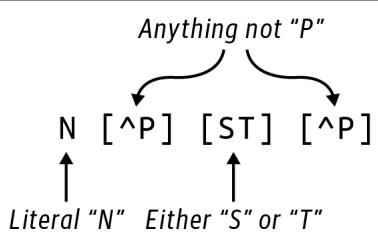  
그림 11-1. N-글리코실화 단백질 모티프를 위한 정규 표현식

이 정규 표현식에서 `N`은 리터럴 문자 N을 나타냅니다. `[ST]`는 문자 S 또는 T를 나타내는 문자 클래스입니다. 이는 5장에서 G 또는 C를 찾기 위해 작성했던 정규 표현식 `[GC]`와 같습니다. `[^P]`는 부정형 문자 클래스로, P가 아닌 모든 문자와 매칭됨을 의미합니다.

어떤 사람들(네, 주로 저입니다)은 그림 11-2에 표시된 것과 같은 유한 상태 기계(FSM) 표기법을 사용하여 정규 표현식을 표현하는 것을 좋아합니다. 패턴이 왼쪽에서 들어온다고 상상해 보십시오. 다음 단계로 진행하기 위해 먼저 글자 N을 찾아야 합니다. 다음은 P가 아닌 모든 문자가 올 수 있습니다. 그 후 그래프는 S 또는 T를 통과하는 두 개의 대체 경로를 가지며, 그 뒤에는 다시 P가 아닌 문자가 와야 합니다. 패턴이 이중 원에 도달하면 매칭에 성공한 것입니다.

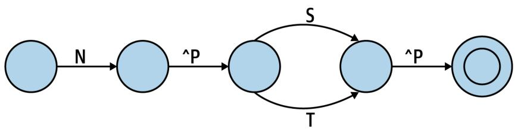  
그림 11-2. N-글리코실화 모티프를 식별하기 위한 FSM의 도식적 표현

8장에서 정규 표현식을 사용하여 겹치는 텍스트를 찾을 때 발생하는 문제점을 짚어드렸습니다. 첫 번째 테스트 파일에는 이러한 사례가 없지만, 제가 이 문제를 해결하기 위해 사용했던 다른 데이터셋 중 하나에는 두 개의 겹치는 모티프가 있었습니다. REPL에서 시연해 보겠습니다.

```txt
>>> import re
>>> regex = re.compile('N[^P][ST][^P]') 
```


저는 여기서 정규 표현식 엔진이 패턴을 파싱하고 매칭을 수행하는 데 필요한 내부 코드를 생성하도록 강제하기 위해 `re.compile()` 함수를 사용하고 있습니다. 이는 C와 같은 컴파일 언어가 인간이 편집하고 읽을 수 있는 소스 코드를 컴퓨터가 직접 실행할 수 있는 기계어로 사용하는 방식과 유사합니다. 이러한 변환은 `re.compile()`을 사용할 때 한 번만 일어나는 반면, `re.search()`와 같은 함수는 매 호출 시마다 정규 표현식을 다시 컴파일해야 합니다.

다음은 첫 번째와 두 번째 위치 모두에서 패턴이 시작되는 `P07204_TRBM_HUMAN` 단백질 시퀀스의 관련 부분입니다(그림 11-3 참조). `re.findall()` 함수는 첫 번째 위치에서 시작하는 패턴만 발견된다는 것을 보여줍니다.

```txt
>>> seq = 'NNTSYS'  
>>> regex.findall(seq)  
['NNTS'] 
```

그림 11-3. 이 시퀀스는 겹치는 두 개의 모티프 복사본을 포함하고 있습니다.

8장에서와 마찬가지로, 해결책은 정규 표현식을 `(?=<pattern>)`를 사용하는 전방 탐색(look-ahead) 어설션으로 감싸는 것이며, 이 어설션 자체를 캡처 괄호로 감싸야 합니다.

```txt
>>> regex = re.compile('(?=(N[^P][ST][^P]))')
>>> regex.findall(seq)
['NNTS', 'NTSY'] 
```

매칭된 위치를 알아야 하는데, 이는 `re.finditer()`로부터 얻을 수 있습니다. 이는 `re.Match` 객체들의 리스트를 반환하며, 각 객체는 매칭의 시작 위치에 대한 0 오프셋 인덱스를 반환하는 `match.start()` 함수를 가집니다. 1부터 시작하는 카운팅을 사용하여 위치를 보고하기 위해 1을 더해야 합니다.

```txt
>>> [match.start() + 1 for match in regex.finditer(seq)]  
[1, 2] 
```

이 정도면 나머지 문제를 해결하기에 충분할 것입니다. 모든 테스트를 통과할 때까지 계속 해보십시오. Rosalind 사이트에서 데이터셋을 다운로드하여 여러분의 솔루션이 그에 대해서도 테스트를 통과하는 답을 내놓는지 반드시 확인하십시오. 정규 표현식을 사용하지 않는 버전도 작성해 보십시오. FSM 모델로 돌아가서 공부하고 이러한 아이디어들을 파이썬 코드로 어떻게 구현할 수 있을지 생각해 보십시오.

# 솔루션

이 문제를 해결하기 위한 두 가지 변형을 제시하겠습니다. 둘 다 앞서 보여드린 것과 동일한 `get_args()`와 `fetch_fasta()` 함수를 사용합니다. 첫 번째는 모티프를 찾기 위해 정규 표현식을 사용하고, 두 번째는 정규 표현식이 존재하지 않는 끔찍하고 황량한 지적 불모지에서 문제를 해결하는 상황을 가정합니다.

# 솔루션 1: 정규 표현식 사용하기

정규 표현식을 사용한 제 최종 솔루션입니다. 이를 위해 `re`와 `Bio.SeqIO`를 임포트하는 것을 잊지 마십시오.

```python
def main():  
    args = get_args()  
    files = fetch_fasta(args.file, args.download_dir) # 1  
    regex = re.compile('(?=(N[^P][ST][^P]))') # 2  
    for file in files: # 3  
        prot_id, _ = os.path.splitext(os.path.basename(file)) # 4  
        recs = SeqIO.parse(file, 'fasta') # 5  
        if rec := next(recs): # 6
            if matches := list(regex.finditer(str(rec.seq))): # 7
                print(prot_id) # 8
                print(*[match.start() + 1 for match in matches]) # 9
```

1 주어진 파일에 있는 단백질 ID들에 대한 시퀀스 파일들을 가져옵니다. 파일들을 지정된 다운로드 디렉토리에 넣습니다.
2 N-글리코실화 모티프를 위한 정규 표현식을 컴파일합니다.
3 파일들을 순회합니다.
4 파일 확장자를 제외한 파일의 베이스 이름에서 단백질 ID를 가져옵니다.
5 파일에서 FASTA 시퀀스들을 가져오기 위해 지연 반복자를 생성합니다.
6 반복자로부터 첫 번째 시퀀스 레코드를 가져오려고 시도합니다.
7 시퀀스를 문자열로 강제 변환한 다음 모티프에 대한 모든 매칭을 찾으려고 시도합니다.
8 단백질 ID를 출력합니다.
9 1부터 시작하는 카운팅으로 교정하여 모든 매칭 위치를 출력합니다.

이 솔루션에서 저는 `os.path.basename()`과 `os.path.splitext()` 함수를 사용했습니다. 저는 이 함수들을 자주 사용하므로 여러분이 이들이 정확히 무엇을 하는지 이해하고 넘어가길 바랍니다. `os.path.basename()`은 2장에서 처음 소개했습니다. 이 함수는 디렉토리가 포함될 수 있는 경로에서 파일 이름만을 반환합니다.

```python
>>> import os
>>> basename = os.path.basename('fasta/B5ZC00.fasta')
>>> basename
'B5ZC00.fasta' 
```

`os.path.splitext()` 함수는 파일 이름을 파일 확장자 이전 부분과 확장자로 나눕니다.

```txt
>>> os.path.splitext(basename) 
('B5ZC00', '.fasta') 
```


파일 확장자는 파일에 대한 유용한 메타데이터를 제공할 수 있습니다. 예를 들어, 여러분의 운영체제는 `.xls`나 `.xlsx`로 끝나는 파일을 열기 위해 마이크로소프트 엑셀을 사용하는 법을 알고 있을 것입니다. `.fasta`, `.fa`, `.fna`(뉴클레오타이드용), `.faa`(아미노산용)를 포함하여 FASTA 확장자에는 많은 관례가 있습니다. FASTA 파일에 어떤 확장자든 붙일 수 있고 아예 붙이지 않을 수도 있지만, FASTA 파일은 항상 일반 텍스트 파일이며 이를 보기 위해 특별한 애플리케이션이 필요하지 않다는 점을 기억하십시오. 또한 단지 파일이 FASTA와 같은 확장자를 가졌다고 해서 그것이 반드시 FASTA 파일이라는 보장은 없습니다. 구매자가 주의할 부분(Caveat emptor)입니다.

앞선 코드에서 저는 확장자가 필요하지 않으므로, 값을 사용할 의도가 없음을 나타내는 관례인 변수 `_` (언더스코어)에 할당했습니다. 함수로부터 첫 번째 요소를 가져오기 위해 리스트 슬라이스를 사용할 수도 있었습니다.

```txt
>>> os.path.splitext(basename)[0] 
'B5ZC00' 
```

# 솔루션 2: 수동 솔루션 작성하기

만약 실무에서 사용하기 위해 이와 같은 프로그램을 작성한다면, 저는 모티프를 찾기 위해 정규 표현식을 사용할 것입니다. 하지만 이 문맥에서는 수동 솔루션을 찾는 데 도전해보고 싶었습니다. 평소처럼 이 아이디어를 캡슐화하기 위해 함수를 작성하고 뼈대를 만듭니다.

```python
def find_motif(text: str) -> List[int]: # 1
    ''' 텍스트에서 패턴 찾기 ''' 
    return [] # 2 
```

1 함수는 텍스트를 받아서 텍스트에서 모티프가 발견될 수 있는 정수들의 리스트를 반환할 것입니다.
2 지금은 빈 리스트를 반환합니다.

함수를 만드는 가장 큰 이유는 제가 매칭되기를 기대하거나 실패하기를 기대하는 예시들을 인코딩하는 테스트를 작성하기 위해서입니다.

```python
def test_find_motif() -> None:
    ''' find_motif 테스트 ''' 
    assert find_motif('') == [] # 1
    assert find_motif('NPTX') == [] # 2
    assert find_motif('NXTP') == [] # 3
    assert find_motif('NXSX') == [0] # 4
    assert find_motif('ANXTX') == [1] # 5
    assert find_motif('NNTSYS') == [0, 1] # 6
    assert find_motif('XNNTSYS') == [1, 2] # 7
    assert find_motif('XNNTSYSXNNTSYS') == [1, 2, 8, 9] # 8 
```

1 빈 문자열이 주어졌을 때 예외를 발생시키는 등의 어리석은 짓을 하지 않는지 확인합니다.
2 두 번째 위치에 P가 있으므로 실패해야 합니다.
3 네 번째 위치에 P가 있으므로 실패해야 합니다.
4 문자열 시작 부분에서 모티프를 찾아야 합니다.
5 문자열 시작 부분이 아닌 곳에서 모티프를 찾아야 합니다.
6 문자열 시작 부분에서 겹치는 모티프들을 찾아야 합니다.
7 문자열 시작 부분이 아닌 곳에서 겹치는 모티프들을 찾아야 합니다.
8 네 개의 모티프 복사본을 포함하는 약간 더 복잡한 패턴입니다.

이러한 함수들을 제 `mprt.py` 프로그램에 추가할 수 있고 해당 소스 코드에 대해 `pytest`를 실행하여 테스트들이 예상대로 실패하는지 확인할 수 있습니다. 이제 이러한 테스트들을 통과할 `find_motif()` 코드를 작성해야 합니다. 저는 다시 한번 k-mer를 사용하기로 결정했으므로, 9장과 10장에서 사용했던 `find_kmers()` 함수(물론 테스트도 포함하지만 여기서는 생략합니다)를 가져오겠습니다.

```python
def find_kmers(seq: str, k: int) -> List[str]:
    ''' 문자열에서 k-mer 찾기 '''
    n = len(seq) - k + 1
    return [] if n < 1 else [seq[i:i+k] for i in range(n)] 
```

모티프의 길이가 네 글자이므로, 이를 사용하여 시퀀스에서 모든 4-mer를 찾을 수 있습니다.

```python
>>> from solution2_manual import find_kmers
>>> seq = 'NNTSYS'
>>> find_kmers(seq, 4)
['NNTS', 'NTSY', 'TSYS'] 
```

그들의 위치도 필요할 것입니다. 8장에서 소개한 `enumerate()` 함수는 시퀀스에 있는 아이템들의 인덱스와 값을 모두 제공할 것입니다.

>>> list(enumerate(find_kmers(seq, 4)))
[(0, 'NNTS'), (1, 'NTSY'), (2, 'TSYS')]

순회하는 동안 다음과 같이 각 위치와 k-mer를 해제할 수 있습니다.

```c
>>> for i, kmer in enumerate(find_kmers(seq, 4)): 
...     print(i, kmer)   
0 NNTS   
1 NTSY   
2 TSYS 
```

첫 번째 k-mer인 `NNTS`를 예로 들어보겠습니다. 이 패턴을 테스트하는 한 가지 방법은 각 인덱스를 수동으로 확인하는 것입니다.

```txt
>>> kmer = 'NNTS'  
>>> kmer[0] == 'N' and kmer[1] != 'P' and kmer[2] in 'ST' and kmer[3] != 'P'  
True 
```

처음 두 k-mer가 매칭되어야 한다는 것을 알고 있으며, 이는 입증되었습니다.

>>> for i, kmer in enumerate(find_kmers(seq, 4)):   
...     kmer[0] == 'N' and kmer[1] != 'P' and kmer[2] in 'ST' and kmer[3] != 'P'   
...
True 
True 
False 

효과적이긴 하지만 지루한 작업입니다. 이 코드를 함수 안에 숨기고 싶습니다.

```python
def is_match(seq: str) -> bool:
    ''' N-글리코실화 모티프 확인 '''  
    return len(seq) == 4 and (seq[0] == 'N' and seq[1] != 'P' and seq[2] in 'ST' and seq[3] != 'P') 
```

다음은 이 함수를 위해 작성한 테스트입니다.

```python
def test_is_match() -> None:
    ''' is_match 테스트 ''' 
    assert not is_match('') # 1
    assert is_match('NASA') # 2
    assert is_match('NATA') 
    assert not is_match('NATAN') # 3
    assert not is_match('NPTA') # 4
    assert not is_match('NASP') # 5 
```

1 문자열 파라미터를 받는 함수라면 항상 빈 문자열로 테스트합니다.
2 다음 두 시퀀스는 매칭되어야 합니다.
3 이 시퀀스는 너무 길어서 거부되어야 합니다.
4 이 시퀀스는 두 번째 위치에 P가 있어 거부되어야 합니다.
5 이 시퀀스는 네 번째 위치에 P가 있어 거부되어야 합니다.

덕분에 코드가 훨씬 더 읽기 쉬워졌습니다.

```c
>>> for i, kmer in enumerate(find_kmers(seq, 4)): 
...     print(i, kmer, is_match(kmer))   
0 NNTS True   
1 NTSY True   
2 TSYS False 
```

저는 매칭되는 k-mer들만 원합니다. 5장과 6장에서 보여드린 가드가 포함된 if 표현식을 사용하여 이를 작성할 수 있습니다.

```erlang
>>> kmers = list(enumerate(find_kmers(seq, 4)))   
>>> [i for i, kmer in kmers if is_match(kmer)]   
[0, 1] 
```

또는 9장에서 보여드린 `starfilter()` 함수를 사용할 수도 있습니다.

```python
>>> from iteration_utilities import starfilter
>>> list(starfilter(lambda i, s: is_match(s), kmers))
[(0, 'NNTS'), (1, 'NTSY')] 
```

각 튜플에서 첫 번째 요소들만 원하므로, 이들을 선택하기 위해 `map()`을 사용할 수 있습니다.

```python
>>> matches = starfilter(lambda i, s: is_match(s), kmers)  
>>> list(map(lambda t: t[0], matches))  
[0, 1] 
```

참고로, Haskell은 튜플을 광범위하게 사용하며 프렐류드(prelude)에 두 개의 편리한 함수를 포함하고 있습니다. 2-튜플에서 첫 번째 요소를 가져오는 `fst()`와 두 번째 요소를 가져오는 `snd()`입니다. 이 코드를 위해 `typing.Tuple`과 `Any`를 임포트하십시오.

```python
from typing import Tuple, Any

def fst(t: Tuple[Any, Any]) -> Any:
    return t[0]

def snd(t: Tuple[Any, Any]) -> Any:
    return t[1] 
```

이 함수들을 사용하면 `starfilter()`를 다음과 같이 제거할 수 있습니다.

```txt
>>> list(map(fst, filter(lambda t: is_match(snd(t)), kmers))) 
[0, 1] 
```

하지만 제가 몇 번 보여드렸던 `filter()`/`starmap()` 기법을 사용하려고 할 때 매우 미묘한 버그가 발생하는 것을 주목하십시오.

```python
>>> from itertools import starmap
>>> list(filter(None, starmap(lambda i, s: i if is_match(s) else None, kmers)))
[1] 
```

두 번째 매칭만 반환됩니다. 왜 그럴까요? `filter()`의 술어로 `None`을 사용했기 때문입니다. `help(filter)`에 따르면, "함수가 None이면 참(true)인 아이템들만 반환한다"고 되어 있습니다. 1장에서 참 같은(truthy) 값과 거짓 같은(falsey) 값의 개념을 소개했습니다. 불리언 값 `True`와 `False`는 각각 정수 값 1과 0으로 표현됩니다. 따라서 실제 숫자 0(정수든 부동 소수점이든)은 기술적으로 `False`이며, 이는 0이 아닌 모든 숫자가 `not-False`, 즉 참 같은 값임을 의미합니다. 파이썬은 많은 데이터 타입을 불리언 문맥에서 평가하여 참 같은지 거짓 같은지 결정합니다.

이 사례에서 `filter()`의 술어로 `None`을 사용하면 숫자 0이 제거됩니다.

```txt
>>> list(filter(None, [1, 0, 2]))
[1, 2] 
```


저는 펄(Perl)과 자바스크립트(JavaScript) 배경을 가지고 파이썬을 접했는데, 이 언어들도 다른 문맥에서 값들을 조용히 강제 변환하기 때문에 이러한 동작에 그다지 놀라지 않았습니다. 자바(Java), C 또는 Haskell처럼 타입이 더 엄격한 언어에서 오셨다면 이는 아마 꽤 당혹스러운 일일 것입니다. 저는 종종 여러분이 항상 자신이 무엇을 하고 있는지 정확히 알고 있다면 파이썬이 매우 강력한 언어라고 느낍니다. 이는 높은 기준이므로 파이썬을 작성할 때는 타입과 테스트를 관대하게 사용하는 것이 매우 중요합니다.

결국 저는 리스트 컴프리헨션이 가장 읽기 쉽다고 느꼈습니다. 단백질 모티프를 수동으로 식별하기 위해 제가 작성한 함수는 다음과 같습니다.

```python
def find_motif(text: str) -> List[int]:
    """ 텍스트에서 패턴 찾기 """   
    kmers = list(enumerate(find_kmers(text, 4))) # 1 
    return [i for i, kmer in kmers if is_match(kmer)] # 2
```

1 텍스트에서 4-mer들의 위치와 값을 가져옵니다.
2 모티프와 일치하는 k-mer들의 위치를 선택합니다.

이 함수를 사용하는 것은 정규 표현식을 사용하는 방법과 거의 동일하며, 이것이 복잡한 로직을 함수 뒤에 숨기는 이유입니다.

```python
def main() -> None:  
    args = get_args()  
    files = fetch_fasta(args.file, args.download_dir)  
    for file in files:  
        prot_id, _ = os.path.splitext(os.path.basename(file))  
        recs = SeqIO.parse(file, 'fasta')  
        if rec := next(recs):  
            if matches := find_motif(str(rec.seq)): # 1  
                pos = map(lambda p: p + 1, matches) # 2  
                print(prot_id)
                print(' '.join(map(str, pos))) # 3 
```

1 모티프에 대한 매칭이 있는지 찾습니다.
2 매칭 결과는 0부터 시작하는 인덱스 리스트이므로 각각에 1을 더합니다.
3 정수 값들을 문자열로 변환하고 공백으로 결합하여 출력합니다.

비록 이 작업이 잘 작동했고 작성하는 것도 재미있었지만(개인차는 있겠지만), 저는 이 코드를 사용하거나 유지보수하고 싶지는 않습니다. 저는 정규 표현식이 우리를 위해 얼마나 많은 일을 해주고 있는지 여러분이 느끼시길 바랍니다. 정규 표현식은 '어떻게'가 아니라 '무엇을' 원하는지 기술할 수 있게 해줍니다.

# 더 나아가기

Eukaryotic Linear Motifs 데이터베이스 예시는 단백질의 기능적 부위를 정의하는 모티프를 찾기 위한 정규 표현식들을 제공합니다. 주어진 FASTA 파일 세트에서 어떤 패턴이든 출현 여부를 검색하는 프로그램을 작성해 보십시오.

# 검토

이 장의 핵심 사항:

* `curl` 및 `wget`과 같은 명령줄 유틸리티를 사용하여 인터넷에서 데이터를 가져올 수 있습니다. 때로는 이러한 작업을 위해 쉘 스크립트를 작성하는 것이 합리적이며, 때로는 파이썬과 같은 언어로 인코딩하는 것이 더 낫습니다.
* 정규 표현식은 N-글리코실화 모티프를 찾을 수 있지만, 겹치는 매칭을 찾기 위해 전방 탐색 어설션과 캡처 괄호로 감싸는 것이 필요합니다.
* N-글리코실화 모티프를 수동으로 찾는 것도 가능하지만 쉽지 않습니다.
* `os.path.splitext()` 함수는 파일 이름에서 확장자를 분리해야 할 때 유용합니다.
* 파일 확장자는 관례일 뿐이며 신뢰할 수 없을 수도 있습니다.

# 단백질로부터 mRNA 추론하기: 리스트의 곱과 축소

Rosalind mRNA 과제에 설명된 대로, 이 프로그램의 목표는 주어진 단백질 시퀀스를 생성할 수 있는 mRNA 문자열의 개수를 찾는 것입니다. 이 숫자는 매우 커질 수 있으므로, 최종 답은 주어진 값으로 나눈 나머지(remainder)가 될 것입니다. 저는 특정 패턴에 매칭될 수 있는 모든 문자열을 생성하려고 시도함으로써 정규 표현식을 역이용하는 모습을 보여드리고 싶습니다. 또한 값과 리스트의 곱(product)을 생성하는 방법과 모든 값의 리스트를 단일 값으로 축소(reduce)하는 방법을 보여드릴 것이며, 그 과정에서 문제를 일으킬 수 있는 몇 가지 메모리 이슈에 대해 이야기하겠습니다.

# 여러분은 다음을 배우게 됩니다:

* `functools.reduce()` 함수를 사용하여 숫자 곱셈을 위한 수학적인 `product()` 함수를 만드는 방법
* 파이썬의 나머지(%) 연산자 사용 방법
* 버퍼 오버플로우(buffer overflow) 문제에 대하여
* 모노이드(monoid)란 무엇인가
* 키와 값을 뒤집어 딕셔너리를 반전시키는 방법

# 시작하기

저장소의 `12_mrna` 디렉토리에서 작업하십시오. 먼저 첫 번째 솔루션을 `mrna.py` 프로그램으로 복사하십시오.

$ cd 12_mrna/   
$ cp solution1_dict.py mrna.py

평소처럼 사용법을 먼저 확인하십시오.

```txt
$ ./mrna.py -h
usage: mrna.py [-h] [-m int] protein

Inferring mRNA from Protein

positional arguments:
  protein               입력 단백질 또는 파일

optional arguments:
  -h, --help            이 도움말 메시지를 표시하고 종료
  -m int, --modulo int  나머지 연산 값 (기본값: 1000000) 
```

1 필수 위치 인자는 단백질 시퀀스 또는 단백질 시퀀스를 포함하는 파일입니다.
2 `--modulo` 옵션의 기본값은 1,000,000입니다.

Rosalind 예시인 `MA`를 사용하여 프로그램을 실행하고, 이 단백질 시퀀스를 인코딩할 수 있는 가능한 mRNA 시퀀스의 개수를 1,000,000으로 나눈 나머지인 12가 출력되는지 확인하십시오.

```txt
$ ./mrna.py MA
12 
```

프로그램은 시퀀스를 위해 입력 파일도 읽을 것입니다. 첫 번째 입력 파일은 998개 잔기(residue) 길이의 시퀀스를 가지고 있으며, 결과는 448832여야 합니다.

```txt
$ ./mrna.py tests/inputs/1.txt
448832 
```

다른 입력들로 프로그램을 실행해 보고 `make test`로 테스트도 실행해 보십시오. 프로그램이 어떻게 작동해야 하는지 이해했다면 처음부터 다시 시작하십시오.

```powershell
$ new.py -f -p 'Infer mRNA from Protein' mrna.py
새 스크립트 "mrna.py"를 확인하세요. 
```

사용법에 설명된 대로 파라미터를 정의하십시오. 단백질은 문자열일 수도 파일 이름일 수도 있지만, 저는 파라미터를 문자열로 모델링하기로 결정했습니다. 사용자가 파일을 제공하면 내용을 읽어서 3장에서 처음 보여드렸던 것처럼 프로그램에 전달할 것입니다.

```python
class Args(NamedTuple):
    ''' 명령줄 인자 '''
    protein: str
    modulo: int

def get_args() -> Args:
    ''' 명령줄 인자 가져오기 '''
    parser = argparse.ArgumentParser(
        description='Infer mRNA from Protein',
        formatter_class=argparse.ArgumentDefaultsHelpFormatter)
    parser.add_argument('protein', metavar='protein', type=str, help='입력 단백질 또는 파일')
    parser.add_argument('-m', '--modulo', metavar='int', type=int, default=1000000, help='나머지 연산 값')
    args = parser.parse_args()
    if os.path.isfile(args.protein): # 3
        args.protein = open(args.protein).read().rstrip()
    return Args(args.protein, args.modulo)
```

1 필수 `protein` 인자는 파일 이름일 수도 있는 문자열이어야 합니다.
2 `modulo` 옵션은 정수이며 기본값은 1,000,000입니다.
3 만약 `protein` 인자가 존재하는 파일의 이름이라면, 파일로부터 단백질 시퀀스를 읽어 들입니다.

단백질 시퀀스를 출력하도록 `main()`을 수정하십시오.

```python
def main() -> None:  
    args = get_args()  
    print(args.protein) 
```

명령줄과 파일 모두로부터 프로그램이 단백질을 출력하는지 확인하십시오.

```txt
$ ./mrna.py MA
MA
$ ./mrna.py tests/inputs/1.txt | wc -c 
998 
```

4 `wc` 명령의 `-c` 옵션은 입력값의 문자(바이트) 수만 세겠다는 것을 의미합니다.

여러분의 프로그램은 처음 두 개의 테스트는 통과하고 세 번째 테스트에서 실패해야 합니다.

# 리스트의 곱(Product) 생성하기

입력이 `MA`일 때, 프로그램은 응답으로 12를 출력해야 합니다. 이는 그림 12-1에 표시된 것처럼 이 단백질 시퀀스를 생성할 수 있는 가능한 mRNA 문자열의 개수입니다. 7장의 RNA 인코딩 테이블을 사용하면, 아미노산 메티오닌(M)은 mRNA 코돈 시퀀스 `AUG`에 의해 인코딩되고, 알라닌(A)은 네 개의 가능한 코돈(`GCA`, `GCC`, `GCG`, `GCU`)을 가지며, 종결 코돈은 세 개(`UAA`, `UAG`, `UGA`)임을 알 수 있습니다. 이 세 그룹의 곱은 $1 \times 4 \times 3 = 12$입니다.

| 아미노산 | 코돈 | 가능한 조합 예시 |
| :--- | :--- | :--- |
| **M** | **AUG** | AUG, GCA, UAA |
| | | AUG, GCA, UAG |
| | | AUG, GCA, UGA |
| | | AUG, GCC, UAA |
| **A** | **GCA** | AUG, GCC, UAG |
| | **GCC** | AUG, GCC, UGA |
| | **GCG** | AUG, GCG, UAA |
| | **GCU** | AUG, GCG, UAG |
| **Stop** | **UAA** | AUG, GCG, UGA |
| | **UAG** | AUG, GCU, UAA |
| | **UGA** | AUG, GCU, UAG |
| | | AUG, GCU, UGA |

그림 12-1. 단백질 시퀀스 `MA`를 인코딩하는 모든 코돈의 데카르트 곱(Cartesian product)은 12개의 mRNA 시퀀스를 생성합니다.

9장에서 값들의 리스트로부터 데카르트 곱을 생성하는 `itertools.product()` 함수를 소개했습니다. REPL에서 다음과 같이 12개 코돈의 모든 가능한 조합을 생성할 수 있습니다.

```python
>>> from itertools import product
>>> from pprint import pprint
>>> combos = product(*codons)
```

내용을 확인하기 위해 `pprint(combos)`를 출력해 보면, 값들의 리스트가 아니라 `product` 객체임을 알게 될 것입니다. 즉, 이것은 필요할 때까지 값 생성을 기다리는 또 다른 지연(lazy) 객체입니다.

```txt
>>> pprint(combos)
<itertools.product object at 0x7fbdd822dac0>
```

`list()` 함수를 사용하여 값을 강제로 생성할 수 있습니다.

```python
>>> pprint(list(combos))
[('AUG', 'GCA', 'UAA'),
 ('AUG', 'GCA', 'UAG'),
 ('AUG', 'GCA', 'UGA'),
 ('AUG', 'GCC', 'UAA'),
 ('AUG', 'GCC', 'UAG'),
 ('AUG', 'GCC', 'UGA'),
 ('AUG', 'GCG', 'UAA'),
 ('AUG', 'GCG', 'UAG'),
 ('AUG', 'GCG', 'UGA'),
 ('AUG', 'GCU', 'UAA'),
 ('AUG', 'GCU', 'UAG'),
 ('AUG', 'GCU', 'UGA')]
```

여기서 여러분을 기다리고 있는 교묘하고 작은 버그 하나를 보여드리고 싶습니다. `combos`를 다시 출력해 보십시오.

```txt
>>> pprint(list(combos))
[]
```

이 `product` 객체는 제너레이터와 마찬가지로 값을 한 번만 산출(yield)하고 나면 소진됩니다. 이후의 모든 호출은 빈 리스트를 생성할 것입니다. 결과를 저장하려면 강제 변환된 리스트를 변수에 담아야 합니다.

```python
>>> combos = list(product(*codons))
```

이 곱의 길이는 12이며, 이는 단백질 시퀀스 `MA`를 생성하기 위해 해당 아미노산들을 조합하는 방법이 12가지라는 뜻입니다.

```txt
>>> len(combos)
12
```

# 나머지 곱셈을 통한 오버플로우 방지

입력 단백질 시퀀스의 길이가 길어질수록 가능한 조합의 수는 기하급수적으로 늘어납니다. 예를 들어, 두 번째 테스트는 998개 잔기를 가진 단백질 파일을 사용하는데, 그 결과 약 $8.98 \times 10^{29}$개의 추정 mRNA 시퀀스가 생성됩니다. Rosalind 과제는 다음과 같이 설명합니다.

메모리 고려 사항 때문에 대부분의 언어에 내장된 데이터 형식에는 정수 크기의 상한선이 있습니다. 일부 파이썬 버전에서는 `int` 변수가 $2^{31} – 1$ 또는 2,147,483,647보다 크지 않아야 할 수도 있습니다. 결과적으로 Rosalind에서 매우 큰 숫자를 다루기 위해서는, 실제로 큰 숫자를 저장하지 않고도 큰 숫자를 조작할 수 있는 시스템을 고안해야 합니다.

매우 큰 숫자는 특히 오래된 32비트 시스템에서 정수 크기에 대한 메모리 제한을 초과할 위험이 있습니다. 이를 피하기 위해 최종 답은 조합의 수를 1,000,000으로 나눈 나머지(modulo)여야 합니다. 나머지 연산은 한 숫자를 다른 숫자로 나누었을 때 남는 값을 반환합니다. 예를 들어 5 modulo 2는 1인데, 5를 2로 나누면 몫이 2이고 나머지가 1이기 때문입니다. 파이썬은 나머지를 계산하기 위해 `%` 연산자를 사용합니다.

```txt
>>> 5 % 2
1
```

998개 잔기 단백질에 대한 정답은 448,832이며, 이는 $8.98 \times 10^{29}$를 1,000,000으로 나눈 나머지입니다.

```txt
$ ./mrna.py tests/inputs/1.txt
448832
```

5장에서 수학 연산을 위한 NumPy 모듈을 소개했습니다. 예상하시겠지만 숫자 리스트의 곱을 계산하는 `numpy.prod()` 함수가 있습니다. 불행히도 1,000의 팩토리얼(factorial)과 같이 큰 값을 계산하려고 하면 조용히 실패하고 0을 반환할 수 있습니다.

```txt
>>> import numpy as np
>>> np.prod(range(1, 1001))
0
```

여기서 문제는 NumPy가 파이썬보다 빠른 C 언어로 구현되어 있으며, C 코드가 정수용 가용 메모리에 담을 수 있는 것보다 더 큰 숫자를 저장하려고 시도한다는 점입니다. 그 안타까운 결과가 바로 0입니다. 이러한 유형의 에러를 버퍼 오버플로우(buffer overflow)라고 부르며, 여기서 버퍼는 정수 변수이지만 문자열, 부동 소수점 숫자, 리스트 또는 다른 어떤 컨테이너도 될 수 있습니다. 일반적으로 파이썬 프로그래머는 다른 언어의 프로그래머들처럼 메모리 할당에 대해 걱정할 필요가 없지만, 여기서는 하위 라이브러리의 한계를 인지해야 합니다. `int`의 최대 크기는 기기마다 다를 수 있으므로 `numpy.prod()`는 신뢰할 수 없는 솔루션이며 피해야 합니다.

파이썬 3.8부터는 1,000의 팩토리얼과 같이 엄청나게 큰 곱을 계산할 수 있는 `math.prod()` 함수가 존재합니다. 모든 계산이 파이썬 내부에서 일어나며, 파이썬의 정수는 사실상 무제한(virtually unbounded)이기 때문입니다. 즉, 여러분 기기의 가용 메모리에 의해서만 제한됩니다. 여러분의 컴퓨터에서 다음을 실행해 보십시오.

```python
>>> import math
>>> math.prod(range(1, 1001))
```

하지만 나머지 연산을 적용했을 때 결과가 0이 되는 것을 주목하십시오.

```txt
>>> math.prod(range(1, 1001)) % 10000000
0
```

다시 한번 조용히 실패하는 오버플로우에 부딪혔는데, 이는 파이썬이 나눗셈 연산에서 유한한 타입인 부동 소수점(float)을 사용하기 때문입니다. 제공된 테스트들의 경우, `math.prod()`를 사용하고 결과에 나머지 연산을 적용한다면 큰 문제를 겪지 않을 것입니다. 솔루션에서는 정수 오버플로우를 피하기 위해 나머지 연산을 사용하여 임의의 큰 숫자 세트의 곱을 계산하는 방법을 보여드리겠습니다. 이 정도면 문제를 해결하기에 충분할 것입니다. 프로그램이 모든 테스트를 통과할 때까지 계속 작업하십시오.

# 솔루션

RNA 번역 정보를 나타내는 데 사용되는 딕셔너리의 구조와 숫자 리스트의 수학적 곱을 계산하는 방법이 주로 다른 세 가지 솔루션을 제시합니다.

# 솔루션 1: RNA 코돈 테이블을 위한 딕셔너리 사용

첫 번째 솔루션으로, 7장의 RNA 코돈 테이블을 사용하여 각 잔기에 대한 코돈의 개수를 찾았습니다.

```python
>>> c2aa = {
... 'AAA': 'K', 'AAC': 'N', 'AAG': 'K', 'AAU': 'N', 'ACA': 'T',
... 'ACC': 'T', 'ACG': 'T', 'ACU': 'T', 'AGA': 'R', 'AGC': 'S',
... 'AGG': 'R', 'AGU': 'S', 'AUA': 'I', 'AUC': 'I', 'AUG': 'M',
... 'AUU': 'I', 'CAA': 'Q', 'CAC': 'H', 'CAG': 'Q', 'CAU': 'H',
... 'CCA': 'P', 'CCC': 'P', 'CCG': 'P', 'CCU': 'P', 'CGA': 'R',
... 'CGC': 'R', 'CGG': 'R', 'CGU': 'R', 'CUA': 'L', 'CUC': 'L',
... 'CUG': 'L', 'CUU': 'L', 'GAA': 'E', 'GAC': 'D', 'GAG': 'E',
... 'GAU': 'D', 'GCA': 'A', 'GCC': 'A', 'GCG': 'A', 'GCU': 'A',
... 'GGA': 'G', 'GGC': 'G', 'GGG': 'G', 'GGU': 'G', 'GUA': 'V',
... 'GUC': 'V', 'GUG': 'V', 'GUU': 'V', 'UAC': 'Y', 'UAU': 'Y',
... 'UCA': 'S', 'UCC': 'S', 'UCG': 'S', 'UCU': 'S', 'UGC': 'C',
... 'UGG': 'W', 'UGU': 'C', 'UUA': 'L', 'UUC': 'F', 'UUG': 'L',
... 'UUU': 'F', 'UAA': '*', 'UAG': '*', 'UGA': '*',
... }
```

단백질 시퀀스 `MA`의 각 아미노산과 종결 코돈을 순회하며 인코딩하는 모든 코돈을 찾고 싶습니다. Rosalind의 시퀀스는 종결 코돈으로 끝나지 않으므로 반드시 `*`를 덧붙여야 합니다. 이를 표현하기 위해 가드(guard)가 있는 리스트 컴프리헨션을 사용할 수 있습니다.

```python
>>> protein = 'MA'
>>> for aa in protein + '*':
...     print(aa, [c for c, res in c2aa.items() if res == aa])
...
M ['AUG']
A ['GCA', 'GCC', 'GCG', 'GCU']
* ['UAA', 'UAG', 'UGA']
```

주어진 잔기를 인코딩하는 실제 코돈 리스트는 필요하지 않고, 오직 개수만 필요하므로 `len()` 함수를 사용하여 찾을 수 있습니다.

```python
>>> possible = [
...     len([c for c, res in c2aa.items() if res == aa])
...     for aa in protein + '*'
... ]
>>> possible
[1, 4, 3]
```

정답은 이 값들을 곱하는 데 있습니다. 이전 섹션에서 `math.prod()` 함수를 사용할 수 있다고 제안했습니다.

```txt
>>> import math
>>> math.prod(possible)
12
```

이 방법이 완벽하게 잘 작동하겠지만, 이 기회에 값들의 시퀀스를 단일 값으로 축소(reducing)하는 것에 대해 이야기하고 싶습니다. 5장에서 숫자 1, 4, 3을 더해 결과 8을 만드는 `sum()` 함수를 소개했습니다.

```txt
>>> sum(possible)
8
```

이 함수는 쌍을 지어 작업을 수행하는데, 먼저 $1 + 4$를 더해 5를 얻고, 그 다음 $5 + 3$을 더해 8을 얻습니다. 만약 `+` 연산자를 `*`로 바꾸면 곱을 얻게 되고 결과는 12가 됩니다(그림 12-2 참조).

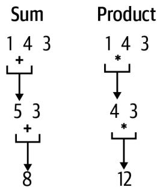  
그림 12-2. 덧셈과 곱셈을 사용하여 숫자 리스트 축소하기

이것이 값들의 리스트를 축소한다는 아이디어이며, 바로 `functools.reduce()` 함수가 우리를 도와주는 일입니다. 이것은 `filter()`, `map()` 및 이 책 전체에서 사용한 다른 함수들과 같은 또 다른 고차 함수(HOF)이지만, 중요한 차이점이 있습니다. 람다 함수가 하나가 아닌 두 개의 인자를 받는다는 점입니다. 문서는 `sum()`을 작성하는 방법을 보여줍니다.

```txt
reduce(...)
    reduce(function, sequence[, initial]) -> value
    시퀀스의 항목들에 대해 두 개의 인자를 받는 함수를 왼쪽에서 오른쪽으로 누적하여 적용함으로써 시퀀스를 단일 값으로 축소합니다. 예를 들어, reduce(lambda x, y: x+y, [1, 2, 3, 4, 5])는 ((((1+2)+3)+4)+5)를 계산합니다. 만약 initial이 제공되면 계산 시 시퀀스 항목들 앞에 놓이며, 시퀀스가 비어있을 때 기본값 역할을 합니다.
```

제 방식대로 `sum()` 버전을 작성하는 방법은 다음과 같습니다.

```python
>>> from functools import reduce
>>> reduce(lambda x, y: x + y, possible)
8
```

곱을 생성하려면 덧셈을 곱셈으로 바꾸면 됩니다.

```python
>>> reduce(lambda x, y: x * y, possible)
12
```

# 모노이드(Monoids)

참고로, 숫자나 문자열의 동질적인 리스트는 모노이드라고 생각할 수 있습니다. 모노이드는 단일 결합 이항 연산과 항등원(identity element)을 가진 대수 구조입니다. 덧셈 연산 하에서의 숫자 리스트의 경우, 이항 연산은 `+`이고 항등원은 0입니다. 항등원 또는 중립 원소(neutral element)는 이항 연산 하에서 다른 원소와 결합했을 때 그 원소를 변경하지 않고 그대로 두는 특별한 값입니다. $0 + n = n$이므로, 0은 덧셈에 대한 항등원이며 `reduce()`의 `initial` 인자로 적절한 값입니다.

```python
>>> reduce(lambda x, y: x + y, [1, 2, 3, 4], 0)
10
```

이는 빈 숫자 리스트를 더할 때의 적절한 반환 값이기도 합니다.

```txt
>>> reduce(lambda x, y: x + y, [], 0)
0
```

곱셈 하에서의 연산자는 `*`이고 항등원은 1입니다. $1 * n = n$이기 때문입니다.

```python
>>> reduce(lambda x, y: x * y, [1, 2, 3, 4], 1)
24
```

빈 리스트의 곱은 1이므로, 이것이 `reduce()`를 위한 올바른 초기값입니다.

```python
>>> reduce(lambda x, y: x * y, [], 1)
1
```

연결(concatenation) 하에서의 문자열 리스트 역시 `+`를 사용하며 결과는 새로운 문자열입니다.

```python
>>> reduce(lambda x, y: x + y, ['M', 'A'], '')
'MA'
```

문자열에 대한 항등원은 빈 문자열입니다.

```python
>>> reduce(lambda x, y: x + y, [], '')
''
```

이는 `str.join()`에 빈 리스트를 전달했을 때 반환되는 값과 같습니다.

```txt
>>> ''.join([])
''
```

리스트 그 자체조차도 모노이드입니다. `+` 연산자나 `operator.concat()`을 사용하여 결합될 수 있으며, 항등값은 빈 리스트입니다.

```python
>>> reduce(operator.concat, [['A'], ['list', 'of'], ['values']], [])
['A', 'list', 'of', 'values']
```

이러한 항등값들은 `collections.defaultdict()`의 기본값들입니다. 즉, `defaultdict(int)`는 0으로, `defaultdict(str)`은 빈 문자열로, `defaultdict(list)`는 빈 리스트로 초기화됩니다.

이러한 모노이드들은 결합 이항 연산을 점진적으로 적용함으로써 단일 값으로 축소될 수 있으며, 이것이 `reduce()` 함수의 이름이 유래된 이유입니다. 만약 이런 종류의 이론이 흥미롭다면 Haskell 프로그래밍 언어와 카테고리 이론(category theory)에 대해 더 배워보시길 권장합니다.

파이썬에는 "객체의 정체성(identity)을 반환"하는 `id()` 함수가 있는데, 이는 메모리 주소와 유사한 파이썬 내 값의 고유한 수치적 표현이므로 모노이드의 항등원과는 전혀 다릅니다.

`functools.reduce()`를 사용하여 저만의 `product()` 함수를 작성할 수 있습니다.

```python
def product(xs: List[int]) -> int: # 1
    ''' 곱 반환 ''' 
    return reduce(lambda x, y: x * y, xs, 1) # 2 
```

1 정수 리스트의 곱을 반환합니다.
2 `functools.reduce()` 함수를 사용하여 값들을 점진적으로 곱합니다. 빈 리스트가 1을 반환하도록 초기 결과값으로 1을 사용합니다.

왜 이렇게 할까요? 우선은 지적 호기심 때문이지만, 이 버전이 수행하는 파이썬의 무제한 정수에 의존하지 않고 작동하는 함수를 작성하는 법을 보여드리고 싶기 때문이기도 합니다. 축소의 모든 단계에서 오버플로우를 피하기 위해, 최종 결과에 나머지 연산을 적용하는 대신 함수 자체에 나머지 연산을 포함시켜야 합니다. 제가 수학 천재는 아니어서 이런 함수를 작성하는 법을 몰랐기에, 인터넷을 검색하여 찾은 코드를 다음과 같이 수정했습니다.

```python
def mulmod(a: int, b: int, mod: int) -> int: # 1
    """ 나머지가 있는 곱셈 """
    def maybemod(x): # 2
        ret = (x % mod) if mod > 1 and x > mod else x
        return ret or x # 3
    res = 0 # 4
    a = maybemod(a) # 5
    while b > 0: # 6
        if b % 2 == 1: # 7
            res = maybemod(res + a) # 8
        a = maybemod(a * 2) # 9
        b //= 2 # 10
    return res
```

1 `mulmod()` 함수는 정수 나머지 값 `mod`를 사용하여 곱할 두 정수 `a`와 `b`를 인자로 받습니다.
2 이는 `mod` 값을 감싸는 클로저로, 필요시 `mod`로 나눈 나머지를 반환합니다.
3 결과가 0이면 원래 값을 반환하고, 그렇지 않으면 계산된 값을 반환합니다.
4 결과를 초기화합니다.
5 `a`의 크기를 줄일 수 있다면 줄입니다.
6 `b`가 0보다 큰 동안 루프를 돕니다.
7 `b`가 홀수인지 확인합니다.
8 결과에 `a`를 더하고 결과에 나머지 연산을 적용할 수도 있습니다.
9 `a`를 두 배로 만들고 값에 나머지 연산을 적용할 수도 있습니다.
10 바닥 나눗셈을 사용하여 `b`를 반으로 나누며, 결국 0이 되어 루프가 종료됩니다.

다음은 제가 작성한 테스트입니다.

```python
def test_mulmod() -> None:
    ''' mulmod 테스트 ''' 
    assert mulmod(2, 4, 3) == 2
    assert mulmod(9223372036854775807, 9223372036854775807, 1000000) == 501249 
```

저 큰 숫자들을 선택한 이유는 제 기기의 `sys.maxsize`이기 때문입니다.

```txt
>>> import sys
>>> sys.maxsize
9223372036854775807 
```

이는 `math.prod()`로부터 얻을 수 있는 답과 동일하지만, 제 버전은 파이썬의 동적 정수 크기 조절에 의존하지 않으며 제 기기의 가용 메모리에 (그만큼은) 얽매이지 않습니다.

```txt
>>> import math
>>> math.prod([9223372036854775807, 9223372036854775807]) % 1000000
501249
```

이를 통합하기 위해 `modprod()` 함수를 작성하고 다음과 같이 테스트를 추가했습니다.

```python
def modprod(xs: List[int], modulo: int) -> int:
    ''' 특정 값으로 나눈 나머지가 있는 곱 반환 ''' 
    return reduce(lambda x, y: mulmod(x, y, modulo), xs, 1)

def test_modprod() -> None:
    ''' modprod 테스트 ''' 
    assert modprod([1, 4, 3], 1000000) == 12
    n = 9223372036854775807
    assert modprod([n, n], 1000000) == 501249 
```

이 함수가 앞서 예로 든 1,000의 팩토리얼을 처리할 수 있음에 주목하십시오. 이 답은 여전히 출력하기에 너무 크지만, 포인트는 정답이 0이 아니라는 것입니다.

```txt
>>> modprod(range(1, 1001), 1000000)
```

최종 답은 주어진 인자로 나눈 이 숫자들의 곱입니다. 이 모든 것을 종합하는 방법은 다음과 같습니다.

```python
def main() -> None:  
    args = get_args()  
    codon_to_aa = { # 1  
        'AAA': 'K', 'AAC': 'N', 'AAG': 'K', 'AAU': 'N', 'ACA': 'T',  
        # ... (생략) ...
        'UUU': 'F', 'UAA': '*', 'UAG': '*', 'UGA': '*',  
    }  
    possible = [ # 2  
        len([c for c, res in codon_to_aa.items() if res == aa])  
        for aa in args.protein + '*'
    ]  
    print(modprod(possible, args.modulo)) # 3 
```

1 RNA 코돈을 아미노산으로 인코딩하는 딕셔너리입니다.
2 단백질의 잔기들과 종결 코돈을 순회하며, 주어진 아미노산과 일치하는 코돈의 개수를 찾습니다.
3 가능성들의 곱을 주어진 값으로 나눈 나머지를 출력합니다.

# 솔루션 2: 역발상

다음 솔루션을 위해, 고유한 아미노산이 키가 되고 값은 코돈 리스트가 되도록 RNA 코돈 딕셔너리의 키와 값을 뒤집기로 결정했습니다. 이처럼 딕셔너리를 뒤집는 법을 알아두면 편리하지만, 이는 오직 값들이 유일할 때만 작동합니다. 예를 들어, A 또는 T와 같은 DNA 염기에서 그들의 이름으로 가는 조회 테이블을 만들 수 있습니다.

```python
>>> base_to_name = dict(A='adenine', G='guanine', C='cytosine', T='thymine')
>>> base_to_name['A']
'adenine' 
```

이를 반대로 돌려 이름에서 염기로 가게 하려면, `dict.items()`를 사용하여 키/값 쌍을 가져올 수 있습니다.

```python
>>> list(base_to_name.items())
[('A', 'adenine'), ('G', 'guanine'), ('C', 'cytosine'), ('T', 'thymine')] 
```

그 다음 `reversed()`를 통해 `map()`을 적용하여 이들을 뒤집고, 마지막으로 결과를 `dict()` 함수에 전달하여 딕셔너리를 생성합니다.

```txt
>>> dict(map(reversed, base_to_name.items())) 
{'adenine': 'A', 'guanine': 'G', 'cytosine': 'C', 'thymine': 'T'}
```

하지만 첫 번째 솔루션의 RNA 코돈 테이블에 이 작업을 시도하면 다음과 같은 결과를 얻게 됩니다.

```python
>>> pprint(dict(map(reversed, c2aa.items())))  
{'*': 'UGA',  
 'A': 'GCU',  
 'C': 'UGU',  
 'D': 'GAU',  
 'E': 'GAG',  
 'F': 'UUU',  
 'G': 'GGU',  
 'H': 'CAU',  
 'I': 'AUU',  
 'K': 'AAG',  
 'L': 'UUG',  
 'M': 'AUG',  
 'N': 'AAU',  
 'P': 'CCU',  
 'Q': 'CAG',  
 'R': 'CGU',  
 'S': 'UCU',  
 'T': 'ACU',  
 'V': 'GUU',  
 'W': 'UGG',  
 'Y': 'UAU'} 
```

대부분의 코돈이 사라진 것을 볼 수 있습니다. 오직 M과 W만이 하나의 코돈을 가집니다. 나머지는 어떻게 된 걸까요? 딕셔너리를 생성할 때, 파이썬은 키에 대해 기존에 존재하는 값을 최신 값으로 덮어썼습니다. 예를 들어 원래 테이블에서 L에 대해 마지막으로 명시된 값이 `UUG`였기 때문에, 그 값만이 남게 된 것입니다. 딕셔너리의 키/값을 뒤집을 때는 이 트릭을 기억하되 값들이 반드시 유일해야 함을 명심하십시오. 참고로 제가 이 작업을 해야 한다면 `collections.defaultdict()` 함수를 사용할 것입니다.

```python
>>> from collections import defaultdict
>>> aa2codon = defaultdict(list)
>>> for k, v in c2aa.items():
...     aa2codon[v].append(k)
...
>>> pprint(aa2codon)
defaultdict(<class 'list'>,
 {
 '*': ['UAA', 'UAG', 'UGA'],
 'A': ['GCA', 'GCC', 'GCG', 'GCU'],
 'C': ['UGC', 'UGU'],
 'D': ['GAC', 'GAU'],
 'E': ['GAA', 'GAG'],
 'F': ['UUC', 'UUU'],
 'G': ['GGA', 'GGC', 'GGG', 'GGU'],
 'H': ['CAC', 'CAU'],
 'I': ['AUA', 'AUC', 'AUU'],
 'K': ['AAA', 'AAG'],
 'L': ['CUA', 'CUC', 'CUG', 'CUU', 'UUA', 'UUG'],
 'M': ['AUG'],
 'N': ['AAC', 'AAU'],
 'P': ['CCA', 'CCC', 'CCG', 'CCU'],
 'Q': ['CAA', 'CAG'],
 'R': ['AGA', 'AGG', 'CGA', 'CGC', 'CGG', 'CGU'],
 'S': ['AGC', 'AGU', 'UCA', 'UCC', 'UCG', 'UCU'],
 'T': ['ACA', 'ACC', 'ACG', 'ACU'],
 'V': ['GUA', 'GUC', 'GUG', 'GUU'],
 'W': ['UGG'],
 'Y': ['UAC', 'UAU']}) 
```

이것이 다음 솔루션에서 사용한 데이터 구조입니다. 또한 직접 만들지 않고 `math.prod()` 함수를 사용하는 방법도 보여드립니다.

```python
def main():  
    args = get_args()  
    aa_to_codon = { # 1  
        'A': ['GCA', 'GCC', 'GCG', 'GCU'],  
        'C': ['UGC', 'UGU'],  
        'D': ['GAC', 'GAU'],  
        'E': ['GAA', 'GAG'],  
        'F': ['UUC', 'UUU'],  
        'G': ['GGA', 'GGC', 'GGG', 'GGU'],  
        'H': ['CAC', 'CAU'],  
        'I': ['AUA', 'AUC', 'AUU'],  
        'K': ['AAA', 'AAG'],  
        'L': ['CUA', 'CUC', 'CUG', 'CUU', 'UUA', 'UUG'],  
        'M': ['AUG'],  
        'N': ['AAC', 'AAU'],  
        'P': ['CCA', 'CCC', 'CCG', 'CCU'],  
        'Q': ['CAA', 'CAG'],  
        'R': ['AGA', 'AGG', 'CGA', 'CGC', 'CGG', 'CGU'],  
        'S': ['AGC', 'AGU', 'UCA', 'UCC', 'UCG', 'UCU'],  
        'T': ['ACA', 'ACC', 'ACG', 'ACU'],  
        'V': ['GUA', 'GUC', 'GUG', 'GUU'],  
        'W': ['UGG'],  
        'Y': ['UAC', 'UAU'],  
        '*': ['UAA', 'UAG', 'UGA'],  
    }  
    possible = [len(aa_to_codon[aa]) for aa in args.protein + '*'] # 2  
    print(math.prod(possible) % args.modulo) # 3 
```

1 잔기를 키로 하고 코돈을 값으로 하여 딕셔너리를 표현합니다.
2 단백질 시퀀스의 각 아미노산과 종결 코돈을 인코딩하는 코돈의 개수를 찾습니다.
3 `math.prod()`를 사용하여 곱을 계산한 다음 나머지 연산자를 적용합니다.

이 버전은 훨씬 짧으며 기기가 곱을 계산하기에 충분한 메모리를 가지고 있다고 가정합니다. (파이썬이 천문학적으로 큰 숫자를 표현하기 위한 메모리 요구 사항을 처리할 것입니다.) Rosalind가 저에게 준 모든 데이터셋에 대해 이는 사실이었지만, 여러분의 여정에서 언젠가는 `mulmod()`와 같은 함수를 사용해야 할 필요성을 마주하게 될 수도 있습니다.

# 솔루션 3: 최소한의 정보 인코딩

이전 솔루션은 솔루션을 찾는 데 필요한 것보다 더 많은 정보를 인코딩했습니다. 실제 코돈 리스트가 아닌 주어진 아미노산을 인코딩하는 코돈의 개수만 필요하므로, 대신 이 조회 테이블을 만들 수 있었습니다.

```python
>>> codons = {  
... 'A': 4, 'C': 2, 'D': 2, 'E': 2, 'F': 2, 'G': 4, 'H': 2, 'I': 3,  
... 'K': 2, 'L': 6, 'M': 1, 'N': 2, 'P': 4, 'Q': 2, 'R': 6, 'S': 6,  
... 'T': 4, 'V': 4, 'W': 1, 'Y': 2, '*': 3,  
... } 
```

리스트 컴프리헨션이 곱에 필요한 숫자들을 반환할 것입니다. 제 딕셔너리에 존재하지 않는 잔기를 발견할 경우를 대비해 `dict.get()`의 기본 인자로 1을 사용하겠습니다.

```python
>>> [codons.get(aa, 1) for aa in 'MA*']
[1, 4, 3]
```

이는 다음과 같은 코드로 이어집니다.

```python
def main():  
    args = get_args()  
    codons = { # 1  
        'A': 4, 'C': 2, 'D': 2, 'E': 2, 'F': 2, 'G': 4, 'H': 2, 'I': 3,  
        'K': 2, 'L': 6, 'M': 1, 'N': 2, 'P': 4, 'Q': 2, 'R': 6, 'S': 6,  
        'T': 4, 'V': 4, 'W': 1, 'Y': 2, '*': 3,  
    }  
    nums = [codons.get(aa, 1) for aa in args.protein + '*'] # 2  
    print(math.prod(nums) % args.modulo) # 3 
```

1 각 아미노산에 대한 코돈의 개수를 인코딩합니다.
2 각 아미노산과 종결 코돈에 대한 코돈 개수를 찾습니다.
3 조합들의 곱을 주어진 값으로 나눈 나머지를 출력합니다.

# 더 나아가기

어떤 의미에서 저는 매치될 수 있는 모든 가능한 문자열을 생성함으로써 정규 표현식 매칭의 아이디어를 뒤집었습니다. 즉, 단백질 `MA`를 생성할 수 있는 12개의 패턴은 다음과 같습니다.

```txt
$ ./showpatterns.py MA
1: AUGGCAUAA
2: AUGGCAUAG
3: AUGGCAUGA
4: AUGGCCUAA
5: AUGGCCUAG
6: AUGGCCUGA
7: AUGGCGUAA
8: AUGGCGUAG
9: AUGGCGUGA
10: AUGGCUUAA
11: AUGGCUUAG
12: AUGGCUUGA 
```

기본적으로 저는 이 정보를 사용하여 하나의 통합된 정규 표현식을 만들려고 시도할 수 있습니다. 그것이 쉽지 않거나 심지어 불가능할 수도 있지만, 단백질의 게놈 소스를 찾는 데 도움이 될 수 있는 아이디어입니다. 예를 들어, 처음 두 시퀀스는 마지막 염기만 다릅니다. `A`와 `G` 사이의 교체는 문자 클래스 `[AG]`로 표현될 수 있습니다.

```json
AUGGCAUAA + AUGGCAUAG -> AUGGCAUA[AG] 
```

여러 정규 표현식 패턴을 하나로 결합하는 도구를 작성할 수 있겠습니까?

# 검토

이 장의 핵심 사항:

* `itertools.product()` 함수는 순회 가능한 객체들의 리스트로부터 데카르트 곱을 생성합니다.
* `functools.reduce()`는 순회 가능한 객체의 요소 쌍들을 점진적으로 결합하는 방법을 제공하는 고차 함수입니다.
* 파이썬의 `%` (나머지) 연산자는 나눗셈 후의 나머지를 반환합니다.
* 숫자나 문자열의 동질적인 리스트는 덧셈, 곱셈, 연결과 같은 모노이드 연산 하에서 단일 값으로 축소될 수 있습니다.
* 유일한 값들을 가진 딕셔너리는 키와 값을 뒤집어서 반전시킬 수 있습니다.
* 파이썬에서 정수 값의 크기는 가용 메모리에 의해서만 제한됩니다.

# 제한 효소 부위 찾기: 코드 사용, 테스트 및 공유

DNA에서 회문(palindromic) 시퀀스는 두 가닥 모두에서 5'에서 3' 방향의 염기 서열이 동일한 것을 말합니다. 예를 들어, 그림 13-1은 DNA 시퀀스 `GCATGC`의 역상보 서열이 자기 자신과 동일함을 보여줍니다.

  
그림 13-1. 역회문(reverse palindrome)은 자신의 역상보 서열과 같습니다.

코드로 이를 확인할 수 있습니다.

```python
>>> from Bio import Seq  
>>> seq = 'GCATGC'  
>>> Seq.reverse_complement(seq) == seq
True 
```

Rosalind REVP 과제에 설명된 대로, 제한 효소(restriction enzyme)는 제한 효소 부위(restriction site)로 알려진 DNA의 특정 회문 시퀀스를 인식하고 그 안을 절단합니다. 이들은 일반적으로 4~12개 뉴클레오타이드 길이를 가집니다. 이번 연습의 목표는 DNA 시퀀스에서 모든 추정 제한 효소 부위의 위치를 찾는 것입니다. 이 문제를 해결하기 위한 코드는 매우 복잡해질 수 있지만, 몇 가지 함수형 프로그래밍 기법을 명확히 이해하면 짧고 우아한 솔루션을 만들 수 있습니다. `map()`, `zip()`, `enumerate()`뿐만 아니라 테스트를 거친 많은 작은 함수들을 탐구해 보겠습니다.

여러분은 다음을 배우게 됩니다:

* 역회문을 찾는 방법
* 공통 함수를 공유하기 위해 모듈을 만드는 방법
* `PYTHONPATH` 환경 변수에 대하여

# 시작하기

이 연습의 코드와 테스트는 `13_revp` 디렉토리에 있습니다. 솔루션 하나를 `revp.py` 프로그램으로 복사하는 것부터 시작하십시오.

```shell
$ cd 13_revp
$ cp solution1_zip_enumerate.py revp.py 
```

사용법을 확인하십시오.

```shell
$ ./revp.py -h
usage: revp.py [-h] FILE

제한 효소 부위 위치 찾기

positional arguments:
  FILE        입력 FASTA 파일

optional arguments:
  -h, --help  이 도움말 메시지를 표시하고 종료 
```

1 필요한 유일한 인자는 FASTA 형식의 DNA 시퀀스들이 담긴 단일 위치 파일입니다.

첫 번째 테스트 입력 파일을 살펴보십시오. 내용은 Rosalind 페이지의 예시와 동일합니다.

```txt
$ cat tests/inputs/1.fa
>Rosalind_24
TCAATGCATGCGGGTCTATATGCAT 
```

이 입력으로 프로그램을 실행하고, 그림 13-2에 설명된 대로 문자열 내에서 4~12 사이의 길이를 가진 모든 역회문의 위치(1부터 시작하는 카운팅 사용)와 길이를 확인하십시오. 결과의 순서는 중요하지 않습니다.

```shell
$ ./revp.py tests/inputs/1.fa
5 4
7 4
17 4 
... (중략) ...
6 6
20 6
```

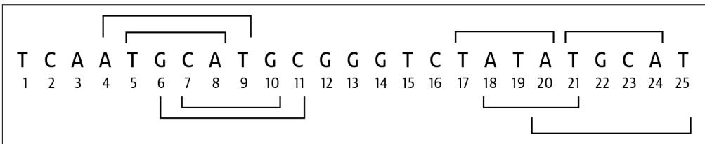  
그림 13-2. 시퀀스 `TCAATGCATGCGGGTCTATATGCAT`에서 발견된 8개의 역회문 위치

테스트를 실행하여 프로그램이 통과하는지 확인한 다음, 처음부터 다시 시작하십시오.

```txt
$ new.py -f -p '제한 효소 부위 위치 찾기' revp.py
새 스크립트 "revp.py"를 확인하세요. 
```

프로그램의 파라미터를 정의하는 방법은 다음과 같습니다.

```python
class Args(NamedTuple):
    ''' 명령줄 인자 '''
    file: TextIO

def get_args() -> Args:
    ''' 명령줄 인자 가져오기 '''
    parser = argparse.ArgumentParser(
        description='제한 효소 부위 위치 찾기',
        formatter_class=argparse.ArgumentDefaultsHelpFormatter)
    parser.add_argument('file', # 2
        help='입력 FASTA 파일',
        metavar='FILE',
        type=argparse.FileType('rt'))
    args = parser.parse_args()
    return Args(args.file)
```

1 유일한 파라미터는 파일입니다.
2 읽기 가능한 텍스트 파일이어야 하는 파라미터를 정의합니다.

지금은 `main()` 함수가 입력 파일 이름을 출력하게 하십시오.

```python
def main() -> None:  
    args = get_args()  
    print(args.file.name) 
```

프로그램이 올바른 사용법을 생성하고, 가짜 파일을 거부하며, 유효한 입력 이름을 출력하는지 수동으로 확인하십시오.

```txt
$ ./revp.py tests/inputs/1.fa
tests/inputs/1.fa 
```

`make test`를 실행하면 일부 테스트를 통과하게 될 것입니다. 이제 프로그램의 뼈대를 작성할 준비가 되었습니다.

# k-mer를 사용하여 모든 부분 시퀀스 찾기

첫 번째 단계는 FASTA 입력 파일에서 시퀀스를 읽는 것입니다. `SeqIO.parse()`를 사용하여 지연 반복자를 만든 다음, `next()`를 사용하여 첫 번째 시퀀스를 가져올 수 있습니다.

```python
>>> from Bio import SeqIO
>>> recs = SeqIO.parse(open('tests/inputs/1.fa'), 'fasta')
>>> rec = next(recs)
>>> seq = str(rec.seq)
>>> seq
'TCAATGCATGCGGGTCTATATGCAT' 
```


파일이 비어 있는 경우(예: `tests/inputs/empty.fa`) 앞선 코드는 안전하지 않습니다. 비어 있는 파일을 같은 방식으로 열고 `next()`를 호출하려고 시도하면, 파이썬은 `StopIteration` 예외를 발생시킵니다. 여러분의 코드에서는 반복자의 소진을 감지하고 우아하게 종료되는 `for` 루프를 사용할 것을 권장합니다.

```python
>>> empty = SeqIO.parse(open('tests/inputs/empty.fa'), 'fasta')
>>> next(empty)
Traceback (most recent call last):
  ...
StopIteration 
```

4~12개 염기 길이 사이의 모든 시퀀스를 찾아야 합니다. 이는 또 다른 k-mer 작업처럼 들리므로, 9장에서 사용했던 `find_kmers()` 함수를 가져오겠습니다.

```python
>>> def find_kmers(seq, k):  
...     n = len(seq) - k + 1  
...     return [] if n < 1 else [seq[i:i + k] for i in range(n)]  
... 
```

`range()`를 사용하여 4에서 12 사이의 모든 숫자를 생성할 수 있습니다. 종료 위치는 포함되지 않으므로 13까지 지정해야 함을 기억하십시오. 각 `k`에 대해 많은 k-mer가 있으므로, `k` 값과 발견된 k-mer의 개수를 출력해 보겠습니다.

```txt
>>> for k in range(4, 13):  
...     print(k, len(find_kmers(seq, k)))  
...  
4 22  
5 21  
6 20  
7 19  
8 18  
9 17  
10 16  
11 15  
12 14 
```

# 모든 역상보 서열 찾기

3장에서 역상보 서열을 찾는 많은 방법들을 보여드렸고, `Bio.Seq.reverse_complement()`가 아마도 가장 쉬운 방법이라는 결론을 내렸습니다. 모든 12-mer를 찾는 것부터 시작해 보겠습니다.

```txt
>>> kmers = find_kmers(seq, 12)  
>>> kmers  
['TCAATGCATGCG', 'CAATGCATGCGG', 'AATGCATGCGGG', 'ATGCATGCGGGT', 'TGCATGCGGGTC', 'GCATGCGGGTCT', 'CATGCGGGTCTA', 'ATGCGGGTCTAT', 'TGCGGGTCTATA', 'GCGGGTCTATAT', 'CGGGTCTATATG', 'GGGTCTATATGC', 'GGTCTATATGCA', 'GTCTATATGCAT'] 
```

역상보 서열들의 리스트를 만들기 위해 리스트 컴프리헨션을 사용할 수 있습니다.

```python
>>> from Bio import Seq
>>> revc = [Seq.reverse_complement(kmer) for kmer in kmers] 
```

또는 `map()`을 사용할 수도 있습니다.

```python
>>> revc = list(map(Seq.reverse_complement, kmers)) 
```

어느 쪽이든 12개의 역상보 서열을 얻게 될 것입니다.

```txt
>>> revc  
['CGCATGCATTGA', 'CCGCATGCATTG', 'CCCGCATGCATT', 'ACCCGCATGCAT', 'GACCCGCATGCA', 'AGACCCGCATGC', 'TAGACCCGCATG', 'ATAGACCCGCAT', 'TATAGACCCGCA', 'ATATAGACCCGC', 'CATATAGACCCG', 'GCATATAGACCC', 'TGCATATAGACC', 'ATGCATATAGAC'] 
```

# 하나로 합치기

이제 이 과제를 완수하기 위해 필요한 거의 모든 것을 갖추었습니다. 먼저 모든 k-mer를 그들의 역상보 서열과 짝을 짓고, 동일한 것들을 찾아 그 위치를 출력하십시오. `for` 루프로 순회할 수도 있고, 6장에서 처음 살펴보았던 `zip()` 함수를 사용하여 쌍을 만들 수도 있습니다. 이것은 흥미로운 과제이며, 제 버전을 읽기 전에 여러분이 스스로 작동하는 솔루션을 찾아낼 수 있을 것이라고 확신합니다.

# 솔루션

제한 효소 부위를 찾기 위한 세 가지 변형을 보여드릴 텐데, 이들은 프로그램의 복잡성을 숨기기 위해 점진적으로 함수에 더 많이 의존하게 됩니다.

# 솔루션 1: zip() 및 enumerate() 함수 사용하기

첫 번째 솔루션에서는 먼저 `zip()`을 사용하여 k-mer와 역상보 서열을 짝짓습니다. `k = 4`라고 가정해 봅시다.

```python
>>> seq = 'TCAATGCATGCGGGTCTATATGCAT'  
>>> kmers = find_kmers(seq, 4)  
>>> revc = list(map(Seq.reverse_complement, kmers))  
>>> pairs = list(zip(kmers, revc)) 
```

쌍들의 위치도 알아야 하므로 `enumerate()`로부터 얻을 수 있습니다. 쌍들을 조사해 보면 일부(4, 6, 16, 17, 20)가 동일함을 알 수 있습니다.

```txt
>>> pprint(list(enumerate(pairs)))  
[(0, ('TCAA', 'TTGA')), (1, ('CAAT', 'ATTG')), (2, ('AATG', 'CATT')), (3, ('ATGC', 'GCAT')), (4, ('TGCA', 'TGCA')), (5, ('GCAT', 'ATGC')), (6, ('CATG', 'CATG')), (7, ('ATGC', 'GCAT')), (8, ('TGCG', 'CGCA')), (9, ('GCGG', 'CCGC')), (10, ('CGGG', 'CCCG')), (11, ('GGGT', 'ACCC')), (12, ('GGTC', 'GACC')), (13, ('GTCT', 'AGAC')), (14, ('TCTA', 'TAGA')), (15, ('CTAT', 'ATAG')), (16, ('TATA', 'TATA')), (17, ('ATAT', 'ATAT')), (18, ('TATG', 'CATA')), (19, ('ATGC', 'GCAT')), (20, ('TGCA', 'TGCA')), (21, ('GCAT', 'ATGC'))] 
```

가드가 있는 리스트 컴프리헨션을 사용하여 쌍이 동일한 모든 위치를 찾을 수 있습니다. 1부터 시작하는 위치를 얻기 위해 인덱스 값에 1을 더한다는 점에 유의하십시오.

```txt
>>> [pos + 1 for pos, pair in enumerate(pairs) if pair[0] == pair[1]]
[5, 7, 17, 18, 21] 
```

11장에서 2-튜플에서 첫 번째 또는 두 번째 요소를 가져오기 위한 `fst()`와 `snd()` 함수를 소개했습니다. 여기서는 튜플 인덱싱을 사용하지 않기 위해 이 함수들을 사용하고 싶습니다. 또한 이전 장들에서 사용했던 `find_kmers()` 함수도 계속 사용하고 있습니다. 이제 이러한 함수들을 복사하는 대신 필요할 때 임포트할 수 있도록 별도의 모듈에 넣을 때가 된 것 같습니다.

`common.py` 모듈을 조사해 보면 이러한 함수들과 그 테스트들을 볼 수 있을 것입니다. `pytest`를 실행하여 모두 통과하는지 확인할 수 있습니다.

```batch
$ pytest -v common.py
============================== test session starts
...
common.py::test_fst PASSED [33%]
common.py::test_snd PASSED [66%]
common.py::test_find_kmers PASSED [100%]
============================== 3 passed in 0.01s 
```

`common.py`가 현재 디렉토리에 있으므로, 원하는 함수를 임포트할 수 있습니다.

```python
>>> from common import fst, snd
>>> [pos + 1 for pos, pair in enumerate(pairs) if fst(pair) == snd(pair)]
[5, 7, 17, 18, 21] 
```

# PYTHONPATH

재사용 가능한 코드 모듈을 모든 프로젝트에서 공유되는 디렉토리에 배치할 수도 있습니다. `PYTHONPATH` 환경 변수를 사용하여 파이썬이 모듈을 찾아야 할 추가 디렉토리 위치를 지정할 수 있습니다. `PYTHONPATH` 문서에 따르면 다음과 같습니다.

모듈 파일에 대한 기본 검색 경로를 보강합니다. 형식은 쉘의 `PATH`와 같습니다. 즉, `os.pathsep`(유닉스에서는 콜론, 윈도우에서는 세미콜론)으로 구분된 하나 이상의 디렉토리 경로 이름입니다. 존재하지 않는 디렉토리는 조용히 무시됩니다.

부록 B에서 바이너리와 스크립트를 `$HOME/.local/bin`과 같은 위치에 설치하고 `$HOME/.bashrc` 등을 사용하여 `PATH`에 이 디렉토리를 포함시킬 것을 권장합니다. (일반적인 디렉토리 목록에서 숨겨지도록 `.local`을 선호합니다.) 이와 마찬가지로 공통 파이썬 함수와 모듈을 공유하기 위한 위치를 정의하고 `PYTHONPATH`에 이 위치(예: `$HOME/.local/lib`)를 포함시킬 것을 제안합니다.

첫 번째 솔루션에서 이러한 아이디어들을 통합한 방법은 다음과 같습니다.

```python
def main() -> None:  
    args = get_args()  
    for rec in SeqIO.parse(args.file, 'fasta'): # 1  
        for k in range(4, 13): # 2  
            kmers = find_kmers(str(rec.seq), k) # 3  
            revc = list(map(Seq.reverse_complement, kmers)) # 4  
            for pos, pair in enumerate(zip(kmers, revc)): # 5  
                if fst(pair) == snd(pair): # 6  
                    print(pos + 1, k) # 7 
```

1 FASTA 파일의 레코드들을 순회합니다.
2 모든 `k` 값에 대해 순회합니다.
3 이 `k`에 대한 k-mer들을 찾습니다.
4 k-mer들의 역상보 서열을 찾습니다.
5 k-mer/역상보 쌍과 그 위치를 순회합니다.
6 쌍의 첫 번째 요소가 두 번째 요소와 같은지 확인합니다.
7 위치에 1을 더하고(0 기반 인덱싱 교정) 시퀀스의 크기 `k`를 출력합니다.

# 솔루션 2: operator.eq() 함수 사용하기

`fst()`와 `snd()` 함수를 좋아하고 모듈 및 함수 공유 방법을 강조하고 싶기도 하지만, 사실 `operator.eq()` 함수와 역할이 겹칩니다. 저는 이 모듈을 6장에서 `operator.ne()` (같지 않음) 함수를 사용하기 위해 처음 소개했고, 다른 곳에서도 `operator.le()` (작거나 같음) 및 `operator.add()` 함수를 사용해 왔습니다.

앞선 솔루션의 일부를 다음과 같이 다시 작성할 수 있습니다.

```python
for pos, pair in enumerate(zip(kmers, revc)): 
    if operator.eq(*pair): # 1 
        print(pos + 1, k) 
```

1 쌍의 요소들을 비교하기 위해 `==` 연산자의 함수 버전을 사용합니다. 튜플을 두 개의 값으로 확장하기 위해 쌍을 스플랫(*)해야 한다는 점에 유의하십시오.

저는 이 코드를 응축하기 위해 가드가 있는 리스트 컴프리헨션을 선호합니다.

```python
def main() -> None:  
    args = get_args()  
    for rec in SeqIO.parse(args.file, 'fasta'):  
        for k in range(4, 13):  
            kmers = find_kmers(str(rec.seq), k) 
            revc = map(Seq.reverse_complement, kmers)  
            pairs = enumerate(zip(kmers, revc)) 
            for pos in [pos + 1 for pos, pair in pairs if operator.eq(*pair)]: # 1
                print(pos, k)
```

1 동등 비교를 위해 가드를 사용하고, 리스트 컴프리헨션 내부에서 위치를 교정합니다.

# 솔루션 3: revp() 함수 작성하기

이 마지막 솔루션에서는 `revp()` 함수를 작성하고 테스트를 만드는 것이 마땅합니다. 이렇게 하면 프로그램을 더 읽기 쉽게 만들 뿐만 아니라, 다른 프로젝트에서도 공유할 수 있도록 이 함수를 `common.py`와 같은 모듈로 옮기는 것도 더 쉬워집니다.

평소처럼 함수의 시그니처를 구상해 봅니다.

```python
def revp(seq: str, k: int) -> List[int]: # 1
    ''' 역회문의 위치 반환 ''' 
    return [] # 2 
```

1 시퀀스와 `k` 값을 전달받아 주어진 크기의 역회문이 발견된 위치들의 리스트를 반환하고 싶습니다.
2 지금은 빈 리스트를 반환합니다.

다음은 제가 작성한 테스트입니다. 함수가 인덱스를 1부터 시작하는 카운팅으로 교정해야 한다고 결정했음에 유의하십시오.

```python
def test_revp() -> None:
    ''' revp 테스트 ''' 
    assert revp('CGCATGCATTGA', 4) == [3, 5]
    assert revp('CGCATGCATTGA', 5) == []
    assert revp('CGCATGCATTGA', 6) == [2, 4]
    assert revp('CGCATGCATTGA', 7) == []
    assert revp('CCCGCATGCATT', 4) == [5, 7]
    assert revp('CCCGCATGCATT', 5) == []
    assert revp('CCCGCATGCATT', 6) == [4, 6] 
```

이 테스트들을 `revp.py` 프로그램에 추가하고 `pytest revp.py`를 실행하면 당연히 테스트가 실패할 것입니다. 이제 코드를 채워보겠습니다.

```python
def revp(seq: str, k: int) -> List[int]:
    ''' 역회문의 위치 반환 '''
    kmers = find_kmers(seq, k)
    revc = map(Seq.reverse_complement, kmers)
    pairs = enumerate(zip(kmers, revc))
    return [pos + 1 for pos, pair in pairs if operator.eq(*pair)] 
```

`pytest`를 다시 실행하면 테스트를 통과하게 될 것입니다. 이제 `main()` 함수는 훨씬 더 읽기 좋아졌습니다.

```python
def main() -> None:  
    args = get_args()  
    for rec in SeqIO.parse(args.file, 'fasta'):  
        for k in range(4, 13): # 1  
            for pos in revp(str(rec.seq), k): # 2  
                print(pos, k) # 3 
```

1 각 `k` 값에 대해 순회합니다.
2 시퀀스에서 발견된 크기 `k`인 각 역회문을 순회합니다.
3 역회문의 위치와 크기를 출력합니다.

리스트 컴프리헨션 내부에서 하나 이상의 반복자를 사용할 수도 있습니다. 다음과 같이 두 개의 `for` 루프를 하나로 합칠 수 있습니다.

```python
for k, pos in [(k, pos) for k in range(4, 13) for pos in revp(seq, k)]: 
    print(pos, k) # 1
```

1 먼저 `k` 값들을 순회한 다음, 그 값들을 사용하여 `revp()` 값들을 순회하고 두 값을 튜플로 반환합니다.

저는 아마 이 구조를 사용하지는 않을 것입니다. "작성하기 어려웠다면 읽기도 어려워야 한다!"고 농담하던 제 옛 동료 조(Joe)가 생각나네요.

# 프로그램 테스트하기

`tests/revp_test.py`에 있는 통합 테스트를 잠시 살펴보겠습니다. 처음 두 테스트는 항상 동일하며, 기대한 프로그램이 존재하는지 그리고 요청 시 사용법 문구를 생성하는지 확인합니다. 이 프로그램처럼 파일을 입력으로 받는 프로그램의 경우, 유효하지 않은 파일을 거부하는지 확인하는 테스트를 포함합니다. 또한 인자가 거부되는지 보장하기 위해 정수가 기대되는 곳에 문자열을 전달하는 등 다른 입력들도 테스트해 봅니다.

프로그램의 모든 인자들이 검증되는 것을 확인한 후에는, 프로그램이 예상대로 작동하는지 보기 위해 정상적인 입력값들을 제공하기 시작합니다. 이는 유효하고 알려진 입력을 사용하고 프로그램이 정확하고 기대되는 출력을 생성하는지 검증하는 것을 요구합니다. 이 경우, 입력과 출력을 `tests/inputs` 디렉토리에 있는 파일들을 사용하여 인코딩했습니다. 예를 들어, 입력 파일 `1.fa`에 대한 기대 출력은 `1.fa.out`에서 찾을 수 있습니다.

```txt
$ ls tests/inputs/  
1.fa 2.fa  
1.fa.out 2.fa.out 
```

다음은 첫 번째 입력입니다.

```txt
$ cat tests/inputs/1.fa
>Rosalind_24
TCAATGCATGCGGGTCTATATGCAT 
```

기대되는 출력은 다음과 같습니다.

```csv
$ cat tests/inputs/1.fa.out
5 4
7 4
17 4
18 4
21 4
4 6
6 6
20 6 
```

두 번째 입력 파일은 첫 번째보다 상당히 큽니다. 이는 Rosalind 문제들에서 흔히 볼 수 있는 일이며, 따라서 테스트 프로그램에 입력과 출력 값을 리터럴 문자열로 포함시키려고 하면 지저분해질 것입니다. 두 번째 파일에 대한 기대 출력은 70줄에 달합니다. 마지막 테스트는 빈 파일에 대한 것으로, 기대 출력은 빈 문자열입니다. 당연해 보일 수도 있지만, 포인트는 빈 입력 파일에 대해 프로그램이 예외를 발생시키지 않는지 확인하는 것입니다.

`tests/revp_test.py`에서 저는 입력 파일의 이름을 받아 기대 출력 파일 이름을 읽고, 해당 입력으로 프로그램을 실행하여 출력을 확인하는 `run()` 헬퍼 함수를 작성했습니다.

```python
def run(file: str) -> None: # 1
    ''' 테스트 실행 '''  
    expected_file = file + '.out' # 2
    assert os.path.isfile(expected_file) # 3
    rv, out = getstatusoutput(f'{PRG} {file}') # 4
    assert rv == 0 # 5
    expected = set(open(expected_file).read().splitlines()) # 6
    assert set(out.splitlines()) == expected # 7 
```

1 함수는 입력 파일의 이름을 인자로 받습니다.
2 출력 파일의 이름은 입력 파일 이름 뒤에 `.out`이 붙은 것입니다.
3 출력 파일이 존재하는지 확인합니다.
4 입력 파일로 프로그램을 실행하고 반환 값과 출력을 캡처합니다.
5 프로그램이 성공적으로 실행되었는지 확인합니다.
6 기대 출력 파일을 열어 줄 단위로 읽고 셋으로 변환합니다.
7 프로그램 출력을 줄 단위로 쪼개고 셋으로 변환한 뒤, 기대값과 같은지 확인합니다.

결과의 순서가 중요하지 않다고 명시되어 있기 때문에, 두 출력을 비교하기 전에 셋(set)으로 변환하고 있습니다.

# 검토

DNA에서 제한 효소 부위를 찾는 것은 파이썬의 강력한 도구들을 사용하여 짧고 우아한 코드로 해결할 수 있는 훌륭한 예시였습니다.

* 역회문은 자신의 역상보 서열과 동일한 DNA 시퀀스입니다.
* `find_kmers()`와 같은 공통 기능을 별도의 모듈로 추출하여 여러 프로젝트에서 공유할 수 있습니다.
* `PYTHONPATH` 환경 변수는 파이썬이 모듈을 검색할 추가 디렉토리 위치를 지정하는 데 사용됩니다.
* `zip()` 함수를 사용하여 k-mer와 그 역상보 서열을 짝지을 수 있고, `enumerate()`를 사용하여 그들의 위치를 알 수 있습니다.
* `operator.eq()` 함수는 두 요소가 동일한지 비교하는 연산자의 함수 버전입니다.
* 리스트 컴프리헨션은 중첩된 `for` 루프를 간결하게 표현할 수 있는 강력한 도구입니다.
* 정교한 통합 테스트를 작성하여 프로그램이 다양한 입력에 대해 정확하게 작동하는지 검증하는 것이 중요합니다.

# 오픈 리딩 프레임 찾기: 정규 표현식, 딕셔너리, 그리고 리스트의 결합

DNA 시퀀스에서 단백질로 번역될 수 있는 잠재적인 영역을 오픈 리딩 프레임(ORF, Open Reading Frame)이라고 합니다. Rosalind ORF 과제에 설명된 대로, ORF는 시작 코돈(`AUG`)으로 시작하고 종결 코돈(`UAA`, `UAG`, `UGA`)으로 끝나는 시퀀스입니다. 이번 연습의 목표는 DNA 시퀀스에서 발견되는 모든 가능한 ORF로부터 생성될 수 있는 모든 고유한 단백질 시퀀스를 식별하는 것입니다. 시퀀스는 두 가닥 모두에서, 그리고 세 가지 리딩 프레임 각각에서 읽힐 수 있으므로 총 6가지 경우를 고려해야 합니다.

여러분은 다음을 배우게 됩니다:

* 6가지 리딩 프레임에서 ORF를 식별하는 방법
* 정규 표현식을 사용하여 복잡한 패턴을 찾는 방법
* 셋(set)을 사용하여 고유한 단백질 시퀀스 컬렉션을 유지하는 방법
* 복잡한 문제를 해결하기 위해 이전에 작성한 함수들을 재사용하는 방법

# 시작하기

이 과제의 코드와 테스트는 `14_orf` 디렉토리에 있습니다. 첫 번째 솔루션을 `orf.py` 프로그램으로 복사하고 사용법을 확인하십시오.

```shell
$ cd 14_orf
$ cp solution1_regex.py orf.py
$ ./orf.py -h
usage: orf.py [-h] FILE

모든 오픈 리딩 프레임 찾기

positional arguments:
  FILE        입력 FASTA 파일

optional arguments:
  -h, --help  이 도움말 메시지를 표시하고 종료 
```

1 필수 위치 인자는 단일 FASTA 파일입니다.

Rosalind 예시에 제공된 DNA 시퀀스를 포함하는 첫 번째 테스트 입력 파일을 사용하여 프로그램을 실행해 보십시오.

```txt
$ cat tests/inputs/1.fa
>Rosalind_99
AGCCATGTAGCTAACTCAGGTTACATGGGGATGACCCCGCGACTTGGATTAGAGTCTCTTTTGGAATAATT 
```

프로그램은 이 시퀀스의 6가지 리딩 프레임에서 발견되는 모든 고유한 단백질 시퀀스를 출력해야 합니다. 결과의 순서는 중요하지 않습니다.

```shell
$ ./orf.py tests/inputs/1.fa
MLLGSFRLMIPMG
M
MGMTPRLGLESLLE
MTPRLGLESLLE 
```

테스트를 실행하여 모든 것이 정상적으로 작동하는지 확인한 다음, 처음부터 시작하십시오.

```txt
$ new.py -f -p '모든 오픈 리딩 프레임 찾기' orf.py
새 스크립트 "orf.py"를 확인하세요. 
```

이전 장들과 마찬가지로 FASTA 파일을 받도록 인자를 정의하십시오.

```python
class Args(NamedTuple):
    ''' 명령줄 인자 '''
    file: TextIO

def get_args() -> Args:
    ''' 명령줄 인자 가져오기 '''
    parser = argparse.ArgumentParser(
        description='모든 오픈 리딩 프레임 찾기',
        formatter_class=argparse.ArgumentDefaultsHelpFormatter)
    parser.add_argument('file',
        help='입력 FASTA 파일',
        metavar='FILE',
        type=argparse.FileType('rt'))
    args = parser.parse_args()
    return Args(args.file)
```

`main()` 함수에서 입력 파일 이름을 출력하도록 설정하고 작동하는지 확인하십시오.

```python
def main() -> None:  
    args = get_args()  
    print(args.file.name) 
```

# 리딩 프레임 이해하기

DNA 시퀀스는 3개 염기씩 코돈으로 읽힙니다. 시퀀스를 어디서부터 읽기 시작하느냐에 따라 서로 다른 코돈 세트가 만들어지는데, 이를 리딩 프레임(reading frame)이라고 합니다. 한 가닥에는 세 가지 가능한 시작 위치(인덱스 0, 1, 2)가 있으므로 세 가지 리딩 프레임이 존재합니다. DNA는 이중 가닥이며 상보적인 가닥은 반대 방향으로 읽히므로, 반대 가닥에도 세 가지 리딩 프레임이 더 존재하여 총 6가지 리딩 프레임을 고려해야 합니다.

예를 들어, 시퀀스 `AGCCATGTAGCTAACTCAGGTTACATGGGGATGACCCCGCGACTTGGATTAGAGTCTCTTTTGGAATAATT`를 고려해 봅시다.

1.  **순방향 가닥 (Forward strand):**
    *   프레임 1 (인덱스 0 시작): `AGC CAT GTA GCT ...`
    *   프레임 2 (인덱스 1 시작): `GCC ATG TAG CTA ...`
    *   프레임 3 (인덱스 2 시작): `CCA TGT AGC TAA ...`

2.  **역방향 가닥 (Reverse strand):** 먼저 원래 시퀀스의 역상보 서열을 구한 뒤 동일하게 세 가지 프레임을 적용합니다.

각 리딩 프레임에서 시작 코돈(`ATG`)을 찾고, 그 뒤에 나오는 종결 코돈까지의 시퀀스를 추출하여 단백질로 번역해야 합니다. 하나의 리딩 프레임 안에 여러 개의 시작 코돈이 존재할 수 있으며, 각 시작 코돈은 동일한 종결 코돈에서 끝나는 서로 다른 길이의 단백질 시퀀스를 생성할 수 있음에 유의하십시오.

# 정규 표현식을 사용하여 ORF 찾기

정규 표현식은 특정 패턴을 찾는 데 매우 강력합니다. ORF는 `ATG`로 시작하고, 그 뒤에 3의 배수만큼의 염기들이 오며, 종결 코돈(`TAA`, `TAG`, `TGA`)으로 끝나는 패턴입니다. 하지만 정규 표현식만으로는 겹치는 ORF를 모두 찾는 것이 복잡할 수 있습니다. 대신, 각 리딩 프레임에서 시퀀스를 단백질로 번역한 후 단백질 시퀀스 내에서 모티프를 찾는 것이 더 간단할 수 있습니다.

단백질 수준에서 ORF는 `M`(메티오닌)으로 시작하고 시퀀스의 끝(종결 코돈에 의해 번역이 중단된 지점)까지 이어지는 시퀀스입니다.

1.  DNA 시퀀스를 6가지 프레임으로 번역합니다. (3장의 `reverse_complement`와 7장의 `translate` 기능 활용)
2.  번역된 단백질 시퀀스에서 `M`으로 시작하는 모든 부분 시퀀스를 찾습니다.
3.  번역 시 종결 코돈이 나타나지 않은 시퀀스는 Rosalind의 정의에 따른 ORF가 아니므로 제외해야 할 수도 있습니다. 하지만 Rosalind 과제는 "종결 코돈으로 끝나는" 시퀀스에서 파생된 단백질을 요구하므로, 번역 함수에서 종결 코돈을 만났을 때 멈추도록 설정하는 것이 중요합니다.

# 솔루션

제 최종 솔루션은 Biopython을 사용하여 6가지 리딩 프레임을 생성하고, 각 프레임을 단백질로 번역한 뒤, `M`으로 시작하는 모든 단백질 시퀀스를 추출합니다.

```python
import re
from Bio import SeqIO
from Bio.Seq import Seq

def find_orfs(dna: Seq) -> set:
    """ DNA 시퀀스에서 모든 단백질 ORF 찾기 """
    proteins = set()
    # 순방향 및 역방향 가닥 모두 고려
    for strand in [dna, dna.reverse_complement()]:
        # 3가지 리딩 프레임
        for frame in range(3):
            # 해당 프레임에서 번역 (종결 코돈에서 멈추지 않음)
            # 나중에 정규 표현식으로 처리하기 위해 전체를 번역
            trans = str(strand[frame:].translate(table=1))
            
            # 정규 표현식을 사용하여 M으로 시작하고 *로 끝나는 패턴 찾기
            # 겹치는 매칭을 위해 전방 탐색(?=...) 사용
            for match in re.finditer(r'(?=(M[^*]*\*))', trans):
                proteins.add(match.group(1)[:-1]) # 마지막 * 제외하고 추가
                
    return proteins

def main() -> None:
    args = get_args()
    for rec in SeqIO.parse(args.file, 'fasta'):
        orfs = find_orfs(rec.seq)
        for orf in orfs:
            print(orf)
```

이 솔루션에서는 다음과 같은 핵심 기술을 사용했습니다:

*   `dna.reverse_complement()`를 사용하여 역방향 가닥을 쉽게 얻었습니다.
*   `translate(table=1)`를 사용하여 표준 유전 암호로 번역했습니다. 이때 `to_stop=False` (기본값)를 유지하여 종결 코돈 이후의 정보도 포함된 전체 문자열을 얻었습니다.
*   정규 표현식 `(?=(M[^*]*\*))`를 사용하여:
    *   `M`으로 시작하고
    *   `*`(종결 코돈)이 아닌 문자들(`[^*]*`)이 오며
    *   `*`로 끝나는 패턴을 찾았습니다.
    *   `(?=...)` 전방 탐색을 통해 겹치는 ORF(예: `M...M...*`)를 모두 포착했습니다.
*   `set`을 사용하여 중복된 단백질 시퀀스를 자동으로 제거했습니다.

# 검토

*   오픈 리딩 프레임(ORF)은 유전자가 될 가능성이 있는 시퀀스 영역입니다.
*   DNA 시퀀스는 6가지 리딩 프레임(순방향 3개, 역방향 3개)을 가집니다.
*   Biopython의 `Seq` 객체는 역상보 및 번역 기능을 내장하고 있어 ORF 분석에 매우 유용합니다.
*   정규 표현식의 전방 탐색 어설션은 동일한 문자열 내에서 시작 위치가 다른 겹치는 패턴을 찾는 데 필수적입니다.
*   `set` 데이터 구조는 고유한 결과 집합을 유지하는 가장 효율적인 방법입니다.
Test line

# 기타 프로그램

이 파트의 장들에서는 제가 생명정보학에서 반복적으로 사용해 온 패턴들을 담은 여러 프로그램들을 소개하겠습니다. 먼저, 시퀀스 파일에서 기본 통계를 구하고 출력 표의 서식을 지정하는 프로그램을 작성하는 방법을 보여드리겠습니다. 다음으로는 헤더 정보의 패턴 매칭을 사용하여 시퀀스를 선택하는 방법을 설명하고, 이어서 훈련 파일에서 학습한 데이터를 사용하여 인공 DNA 시퀀스를 생성하는 프로그램을 다루겠습니다. 그 후에는 무작위성을 탐구하여 시퀀스를 서브샘플링(subsample)하는 프로그램을 살펴보고, 마지막으로 헤더 정보가 있거나 없는 구분된 텍스트 파일을 파이썬으로 파싱하는 방법으로 마무리하겠습니다. 여러분이 자신만의 프로그램을 작성할 때 이 프로그램들에서 유용한 패턴을 찾으시길 바랍니다.

# Seqmagique: 보고서 생성 및 서식 지정

생명정보학 프로젝트를 하다 보면 FASTA나 FASTQ 형식의 시퀀스 파일이 가득 찬 디렉토리를 마주하게 되는 경우가 많습니다. 아마도 각 파일에 얼마나 많은 시퀀스가 들어 있는지, 시퀀스의 평균, 최소, 최대 길이는 얼마인지 등 파일 내 시퀀스의 분포를 파악하는 것부터 시작하고 싶을 것입니다. 또한 시퀀싱 센터에서 파일이 완전히 전송되지 않았거나, 일부 샘플의 리드(read) 수가 훨씬 적어 시퀀싱 작업이 잘못되었을 가능성이 있는 등 파일이 손상되었는지도 확인해야 합니다. 이 장에서는 해시(hash)와 Seqmagick 도구를 사용하여 시퀀스 파일을 확인하는 몇 가지 기술을 소개하겠습니다. 그런 다음 Seqmagick의 일부 기능을 흉내 내어 서식 있는 텍스트 표를 만드는 작은 유틸리티를 작성해 보겠습니다. 이 프로그램은 주어진 파일 세트의 모든 레코드를 처리하고 요약 통계 표를 생성해야 하는 모든 프로그램의 템플릿 역할을 할 것입니다.

이 장에서 배울 내용:

* seqmagick 도구 설치 방법
* MD5 해시 사용 방법
* argparse에서 choices를 사용하여 인자를 제한하는 방법
* numpy 모듈 사용 방법
* 파일 핸들(filehandle) 모방(mock) 방법
* tabulate 및 rich 모듈을 사용하여 출력 표 서식을 지정하는 방법

# Seqmagick을 사용한 시퀀스 파일 분석

seqmagick은 시퀀스 파일을 처리하는 데 유용한 명령줄 유틸리티입니다. 서문의 설정 지침을 따랐다면 다른 파이썬 모듈과 함께 설치되었을 것입니다. 설치되지 않았다면 pip로 설치할 수 있습니다.

```bash
$ python3 -m pip install seqmagick
```

`seqmagick --help`를 실행하면 이 도구가 제공하는 많은 옵션을 볼 수 있습니다. 여기서는 `info` 서브커맨드에만 집중하겠습니다. `15_seqmagique` 디렉토리에 있는 테스트 입력 FASTA 파일들에 대해 다음과 같이 실행해 볼 수 있습니다.

```txt
$ cd 15_seqmagique
$ seqmagick info tests/Input/*.fa
name alignment min_len max_len avg_len num_seqs
tests/inputs/1.fa FALSE 50 50 50.00 1
tests/inputs/2.fa FALSE 49 79 64.00 5
tests/inputs/empty.fa FALSE 0 0 0.00 0 
```

이 연습에서는 이 출력을 흉내 내는 `seqmagique.py`(프랑스어 억양을 섞어 '시퀀스 매지끄'라고 발음해 보세요)라는 프로그램을 만들 것입니다. 이 프로그램의 목적은 주어진 파일 세트의 시퀀스에 대한 기본적인 개요를 제공하여, 예를 들어 잘리거나 손상된 파일을 찾아낼 수 있도록 하는 것입니다.

먼저 솔루션을 `seqmagique.py`로 복사하고 사용법을 확인하는 것부터 시작해 보겠습니다.

```txt
$ cp solution1.py seqmagique.py
$ ./seqmagique.py -h
usage: seqmagique.py [-h] [-t table] FILE [FILE ...]

Mimic seqmagick

positional arguments:
  FILE                  입력 FASTA 파일(들) (1)

optional arguments:
  -h, --help            이 도움말 메시지를 표시하고 종료
  -t table, --tablefmt table (2)
                        Tabulate 표 스타일 (기본값: plain)
```

1. 이 프로그램은 FASTA 형식이어야 하는 하나 이상의 입력 파일을 받습니다.
2. 이 옵션은 출력 표의 서식을 제어합니다.

동일한 파일들에 대해 이 프로그램을 실행해 보면, `alignment` 열이 생략된 것을 제외하고는 출력이 거의 동일하다는 것을 알 수 있습니다.

```shell
$ ./seqmagique.py tests/Input/*.fa
name min_len max_len avg_len num_seqs
tests/Input/1.fa 50 50 50.00 1
tests/Input/2.fa 49 79 64.00 5
tests/Input/empty.fa 0 0 0.00 0
```

`--tablefmt` 옵션은 출력 표의 서식 지정 방식을 제어합니다. 이 프로그램은 값을 주어진 리스트로 제한하는 방식을 처음으로 사용해 보는 프로그램입니다. 이를 확인하기 위해 `blargh`와 같은 엉터리 값을 사용해 보십시오.

```txt
$ ./seqmagique.py -t blargh tests/Input/1.fa
usage: seqmagique.py [-h] [-t table] FILE [FILE ...]
seqmagique.py: error: argument -t/--tablefmt: invalid choice: 'blargh'
(choose from 'plain', 'simple', 'grid', 'pipe', 'orgtbl', 'rst',
'mediawiki', 'latex', 'latex_raw', 'latex_booktabs')
```

그러면 다른 표 스타일로 프로그램을 실행해 본 다음 테스트 스위트를 실행해 보십시오. 다음으로, 프로그램이 분석할 데이터를 가져오는 방법에 대해 알아보겠습니다.

# MD5 해시를 사용한 파일 확인

대부분의 유전체학 프로젝트의 첫 번째 단계는 분석을 수행할 위치로 시퀀스 파일을 전송하는 것이며, 데이터 손상에 대한 첫 번째 방어선은 파일이 완전히 복사되었는지 확인하는 것입니다. 파일의 출처는 시퀀싱 센터일 수도 있고, GenBank나 SRA(Sequence Read Archive)와 같은 공공 저장소일 수도 있습니다. 파일은 USB 드라이브에 담겨 올 수도 있고 인터넷에서 다운로드할 수도 있습니다. 후자의 경우 연결이 끊어져 일부 파일이 잘리거나 손상될 수 있습니다. 이러한 유형의 오류를 어떻게 찾을 수 있을까요?

파일이 완전한지 확인하는 한 가지 방법은 로컬 파일 크기를 서버의 파일 크기와 비교하는 것입니다. 예를 들어, `ls -l` 명령을 사용하여 파일 크기(바이트 단위)가 표시되는 파일 목록을 길게 볼 수 있습니다. 대용량 시퀀스 파일의 경우 이 숫자가 매우 클 것이며, 원본과 대상의 파일 크기를 수동으로 비교해야 하는데 이는 지루하고 오류가 발생하기 쉽습니다.

또 다른 기술은 파일의 해시(hash) 또는 메시지 다이제스트(message digest)를 사용하는 것입니다. 이는 단방향 암호화 알고리즘에 의해 생성된 파일 내용의 서명으로, 가능한 모든 입력에 대해 고유한 출력을 생성합니다. 해시를 만드는 데 사용할 수 있는 도구는 많지만, 여기서는 MD5 알고리즘을 사용하는 도구에 집중하겠습니다. 이 알고리즘은 원래 암호화 및 보안 맥락에서 개발되었지만, 이후 연구자들이 수많은 결함을 발견하여 지금은 데이터 무결성 확인과 같은 목적으로만 적합합니다.

macOS에서는 `md5`를 사용하여 첫 번째 테스트 입력 파일의 내용으로부터 128비트 해시 값을 생성할 수 있습니다.

```txt
$ md5 -r tests/Input/1.fa
c383c386a44d83c37ae287f0aa5ae11d tests/Input/1.fa
```

`openssl`을 사용할 수도 있습니다.

```txt
$ openssl md5 tests/Input/1.fa
MD5(tests/Input/1.fa)= c383c386a44d83c37ae287f0aa5ae11d
```

리눅스에서는 `md5sum`을 사용합니다.

```txt
$ md5sum tests/Input/1.fa
c383c386a44d83c37ae287f0aa5ae11d tests/Input/1.fa
```

보시다시피 도구나 플랫폼에 관계없이 동일한 입력 파일에 대한 해시 값은 동일합니다. 입력 파일의 단 1비트만 변경해도 다른 해시 값이 생성됩니다. 반대로, 동일한 해시 값을 생성하는 다른 파일을 찾았다면 두 파일의 내용은 동일합니다. 예를 들어, `empty.fa` 파일은 테스트를 위해 만든 크기가 0인 파일이며 다음과 같은 해시 값을 가집니다.

```txt
$ md5 -r tests/Input/empty.fa
d41d8cd98f00b204e9800998ecf8427e tests/Input/empty.fa
```

`touch foo` 명령을 사용하여 다른 빈 파일을 만들면 동일한 서명을 가짐을 알 수 있습니다.

```txt
$ touch foo
$ md5 -r foo
d41d8cd98f00b204e9800998ecf8427e foo
```

데이터 제공자가 체크섬(checksum) 파일을 만들어 데이터 사본이 완전한지 확인할 수 있도록 하는 것이 일반적입니다. 저는 다음과 같이 `tests/inputs/checksums.md5`를 만들었습니다.

```powershell
$ cd tests/Input
$ md5 -r *.fa > checksums.md5
```

그 내용은 다음과 같습니다.

```shell
$ cat checksums.md5
c383c386a44d83c37ae287f0aa5ae11d 1.fa
863ebc53e28fdbfe6689278e40992db9d 2.fa
d41d8cd98f00b204e9800998ecf8427e empty.fa
```

`md5sum` 도구에는 주어진 파일에 있는 체크섬과 파일이 일치하는지 자동으로 확인하는 데 사용할 수 있는 `--check` 옵션이 있습니다. macOS의 `md5` 도구에는 이 옵션이 없지만, `brew install md5sha1sum`을 사용하여 이 작업을 수행할 수 있는 동일한 `md5sum` 도구를 설치할 수 있습니다.

```batch
$ md5sum --check checksums.md5
1.fa: OK
2.fa: OK
empty.fa: OK
```

MD5 체크섬은 수동으로 파일 크기를 확인하는 것보다 데이터 무결성을 검증하는 더 완벽하고 쉬운 방법을 제공합니다. 파일 다이제스트는 이 연습의 직접적인 부분은 아니지만, 분석을 시작하기 전에 완전하고 손상되지 않은 데이터를 가지고 있는지 확인하는 방법을 이해하는 것이 중요하다고 생각합니다.

# 시작하기

이 연습은 `15_seqmagique` 디렉토리에서 수행해야 합니다. 평소처럼 프로그램을 시작하겠습니다.

```bash
$ new.py -fp 'Mimic seqmagick' seqmagique.py
Done, see new script "seqmagique.py".
```

먼저 프로그램이 하나 이상의 텍스트 파일을 위치 인자로 받도록 해야 합니다. 또한 출력 표 서식을 제어하는 옵션도 만들고 싶습니다. 코드는 다음과 같습니다.

```python
import argparse
from typing import NamedTuple, TextIO, List

class Args(NamedTuple):
    """ 명령줄 인자 """
    files: List[TextIO]
    tablefmt: str

def get_args() -> Args:
    """ 명령줄 인자 가져오기 """
    parser = argparse.ArgumentParser(
        description='Argparse Python 스크립트',
        formatter_class=argparse.ArgumentDefaultsHelpFormatter)
    
    parser.add_argument('file',
                        metavar='FILE',
                        type=argparse.FileType('rt'),
                        nargs='+',
                        help='입력 FASTA 파일(들)')
    
    parser.add_argument('-t',
                        '--tablefmt',
                        metavar='table',
                        type=str,
                        choices=[
                            'plain', 'simple', 'grid', 'pipe', 'orgtbl', 'rst',
                            'mediawiki', 'latex', 'latex_raw', 'latex_booktabs'
                        ],
                        default='plain',
                        help='Tabulate 표 스타일')
    
    args = parser.parse_args()
    return Args(args.file, args.tablefmt)
```

1. 하나 이상의 읽기 가능한 텍스트 파일을 위한 위치 파라미터를 정의합니다.
2. `choices`를 사용하여 인자를 리스트의 값으로 제한하는 옵션을 정의하고, 적절한 기본값을 설정합니다.

`--tablefmt`에 `choices`를 사용하면 사용자 입력을 검증하는 데 드는 많은 노력을 줄일 수 있습니다. 290페이지의 "Seqmagick을 사용한 시퀀스 파일 분석"에서 보았듯이, 표 서식 옵션에 잘못된 값을 입력하면 유용한 오류 메시지가 표시됩니다.

`main()` 함수를 수정하여 입력 파일 이름을 출력하도록 합니다.

```python
def main() -> None:
    args = get_args()
    for fh in args.files:
        print(fh.name)
```

그리고 이것이 작동하는지 확인합니다.

```txt
$ ./seqmagique.py tests/Input/*.fa
tests/Input/1.fa
tests/Input/2.fa
tests/Input/empty.fa
```

목표는 각 파일을 순회하며 다음을 출력하는 것입니다.

*   `name`: 파일 이름
*   `min_len`: 가장 짧은 시퀀스의 길이
*   `max_len`: 가장 긴 시퀀스의 길이
*   `avg_len`: 모든 시퀀스의 평균 길이
*   `num_seqs`: 시퀀스의 개수

프로그램에 사용할 실제 입력 파일을 원한다면, NCBI의 `fastq-dump` 도구를 사용하여 "North Pacific Subtropical Gyre의 플랑크톤 미생물 군집" 연구에서 시퀀스를 다운로드할 수 있습니다.

# tabulate()를 사용한 텍스트 표 서식 지정

프로그램의 출력은 해당 모듈의 `tabulate()` 함수를 사용하여 서식이 지정된 텍스트 표가 될 것입니다. 설명서를 꼭 읽어보세요.

```python
>>> from tabulate import tabulate
>>> help(tabulate)
```

표의 헤더를 정의해야 하는데, 저는 Seqmagick과 동일한 헤더를 사용하기로 했습니다(`alignment` 열 제외).

```python
>>> hdr = ['name', 'min_len', 'max_len', 'avg_len', 'num_seqs']
```

첫 번째 테스트 파일인 `tests/inputs/1.fa`에는 50개 염기로 구성된 시퀀스가 하나만 있으므로 이 파일의 열은 다음과 같습니다.

```python
>>> f1 = ['tests/Input/1.fa', 50, 50, 50.00, 1]
```

두 번째 테스트 파일인 `tests/inputs/2.fa`에는 49개에서 79개 염기 사이의 시퀀스 5개가 있으며 평균 길이는 64개 염기입니다.

```python
>>> f2 = ['tests/Input/2.fa', 49, 79, 64.00, 5]
```

`tabulate()` 함수는 표 데이터를 리스트의 리스트 형식으로 위치 인자로 받으며, 헤더는 키워드 인자로 지정할 수 있습니다.

```python
>>> print(tabulate([f1, f2], headers=hdr))
name                min_len    max_len    avg_len    num_seqs
----------------  ---------  ---------  ---------  ----------
tests/Input/1.fa         50         50         50           1
tests/Input/2.fa         49         79         64           5
```

또는 헤더를 데이터의 첫 번째 행으로 배치하고 이것이 헤더의 위치임을 나타낼 수도 있습니다.

```python
>>> print(tabulate([hdr, f1, f2], headers='firstrow'))
name                min_len    max_len    avg_len    num_seqs
----------------  ---------  ---------  ---------  ----------
tests/Input/1.fa         50         50         50           1
tests/Input/2.fa         49         79         64           5
```

`tabulate()` 함수의 기본 표 스타일은 `simple`이지만, Seqmagick의 출력과 일치시키려면 `plain` 형식이 필요합니다. `tablefmt` 옵션으로 이를 설정할 수 있습니다.

```python
>>> print(tabulate([f1, f2], headers=hdr, tablefmt='plain'))
name              min_len    max_len    avg_len    num_seqs
tests/Input/1.fa       50         50         50           1
tests/Input/2.fa       49         79         64           5
```

한 가지 더 주목할 점은 `avg_len` 열의 값이 정수로 표시되고 있지만 소수점 둘째 자리까지 부동 소수점 숫자로 표시되어야 한다는 것입니다. `floatfmt` 옵션이 이를 제어하며, 이전에 보여드린 f-string 숫자 서식 지정과 유사한 구문을 사용합니다.

```python
>>> print(tabulate([f1, f2], headers=hdr, tablefmt='plain', floatfmt='.2f'))
name              min_len    max_len    avg_len    num_seqs
tests/Input/1.fa       50         50      50.00           1
tests/Input/2.fa       49         79      64.00           5
```

여러분이 할 일은 각 파일의 모든 시퀀스를 처리하여 통계를 구하고 최종 표를 출력하는 것입니다. 이것으로 문제를 해결하기에 충분할 것입니다. 모든 테스트를 통과할 때까지 뒤의 내용을 읽지 마십시오.

# 솔루션

파일 통계를 보여주지만 출력 서식 지정 방식이 서로 다른 두 가지 솔루션을 제시하겠습니다. 첫 번째 솔루션은 `tabulate()` 함수를 사용하여 ASCII 텍스트 표를 만들고, 두 번째 솔루션은 `rich` 모듈을 사용하여 실험실 동료와 책임 연구원(PI)에게 깊은 인상을 줄 수 있는 더 화려한 표를 만듭니다.

# 솔루션 1: tabulate()를 사용한 서식 지정

제 솔루션에서는 먼저 각 입력 파일을 처리할 `process()` 함수를 작성하기로 했습니다. 항목 리스트를 처리해야 하는 문제에 접근할 때마다 저는 항목 중 하나만 처리하는 방법에 먼저 집중하는 것을 선호합니다. 즉, 모든 파일에 대한 모든 통계를 한꺼번에 구하려 하기보다는 먼저 파일 하나에 대한 정보를 구하는 방법을 찾아내고 싶습니다.

함수는 파일 이름과 네 가지 지표(최소/최대/평균 시퀀스 길이 및 시퀀스 수)를 반환해야 합니다. `Args` 클래스와 마찬가지로, 이를 위해 `NamedTuple`을 기반으로 유형을 만들어 mypy가 검증할 수 있는 정적 유형 데이터 구조를 갖는 것이 좋습니다.

```python
class FastaInfo(NamedTuple):
    """ FASTA 파일 정보 """
    filename: str
    min_len: int
    max_len: int
    avg_len: float
    num_seqs: int
```

이제 이 데이터 구조를 반환하는 함수를 정의할 수 있습니다. 평균 길이를 구하기 위해 `numpy.mean()` 함수를 사용하고 있음에 주목하십시오. `numpy` 모듈은 숫자 데이터를 처리하기 위한 많은 강력한 수학 연산을 제공하며, 특히 다차원 배열과 선형 대수 함수에 유용합니다. 종속성을 임포트할 때 `numpy` 모듈을 `np`라는 별칭으로 임포트하는 것이 일반적입니다.

```python
import numpy as np
from tabulate import tabulate
from Bio import SeqIO
```

REPL에서 `help(np)`를 실행하여 설명서를 읽을 수 있습니다. 제가 이 함수를 작성한 방법은 다음과 같습니다.

```python
def process(fh: TextIO) -> FastaInfo:
    """ 파일 처리 """
    lengths = [len(rec.seq) for rec in SeqIO.parse(fh, 'fasta')]
    if lengths:
        return FastaInfo(filename=fh.name,
                         min_len=min(lengths),
                         max_len=max(lengths),
                         avg_len=round(float(np.mean(lengths)), 2),
                         num_seqs=len(lengths))
    return FastaInfo(filename=fh.name,
                     min_len=0,
                     max_len=0,
                     avg_len=0,
                     num_seqs=0)
```

1. 함수는 파일 핸들을 받고 `FastaInfo` 객체를 반환합니다.
2. 리스트 컴프리헨션을 사용하여 파일 핸들에서 모든 시퀀스를 읽습니다. `len()` 함수를 사용하여 각 시퀀스의 길이를 반환합니다.
3. 파일 이름은 `fh.name` 속성을 통해 사용할 수 있습니다.
4. `min()` 함수는 최솟값을 반환합니다.
5. `max()` 함수는 최댓값을 반환합니다.
6. `np.mean()` 함수는 값 리스트에서 평균을 반환합니다. `round()` 함수는 이 부동 소수점 값을 유효 숫자 두 자리로 반올림하는 데 사용됩니다.
7. 시퀀스 수는 리스트의 길이입니다.
8. 시퀀스가 없으면 모든 값에 대해 0을 반환합니다.

항상 그렇듯이 이에 대한 단위 테스트를 작성하고 싶습니다. 제가 작성한 통합 테스트가 프로그램의 이 부분을 다루는 것은 사실이지만, 파일을 읽는 함수에 대한 단위 테스트를 작성하는 방법을 보여드리고 싶습니다. 실제 파일에 의존하는 대신 모방(mock) 또는 가짜 파일 핸들을 만들겠습니다.

첫 번째 테스트 파일은 다음과 같습니다.

```shell
$ cat tests/Input/1.fa
>SEQ0
GGATAAAGCGAGAGGCTGGATCATGCACCAACTGCGTGCAACGAAGGAAT
```

`io.StringIO()` 함수를 사용하여 파일 핸들처럼 동작하는 객체를 만들 수 있습니다.

```python
>>> import io
>>> f1 = '>SEQ0\nGGATAAAGCGAGAGGCTGGATCATGCACCAACTGCGTGCAACGAAGGAAT\n'
>>> fh = io.StringIO(f1)
>>> for line in fh:
...     print(line, end='')
...
>SEQ0
GGATAAAGCGAGAGGCTGGATCATGCACCAACTGCGTGCAACGAAGGAAT
```

1. 첫 번째 입력 파일의 데이터입니다.
2. 모의 파일 핸들을 만듭니다.
3. 모의 파일 핸들의 라인을 순회합니다.
4. 라인에는 줄바꿈 문자(\n)가 포함되어 있으므로 추가 줄바꿈을 생략하기 위해 `end=''`를 사용합니다.

하지만 `process()` 함수가 입력 파일 이름을 가져오기 위해 `fh.name` 속성을 호출할 때 예외가 발생한다는 약간의 문제가 있습니다.

```typescript
>>> fh.name
Traceback (most recent call last):
  File "<stdin>", line 1, in <module>
AttributeError: '_io.StringIO' object has no attribute 'name'
```

다행히 파이썬의 표준 `unittest` 모듈을 사용하여 모의 파일 핸들을 만드는 다른 방법이 있습니다. 저는 거의 모든 작업에 `pytest` 모듈을 선호하지만, `unittest` 모듈은 오랫동안 사용되어 왔으며 테스트를 작성하고 실행하기 위한 또 다른 유능한 프레임워크입니다. 이 경우 `unittest.mock.mock_open()` 함수를 임포트해야 합니다. 다음은 첫 번째 테스트 파일의 데이터로 모의 파일 핸들을 만드는 방법입니다. `read_data`를 사용하여 `fh.read()` 메서드에 의해 반환될 데이터를 정의합니다.

```python
>>> from unittest.mock import mock_open
>>> fh = mock_open(read_data=f1)()
>>> fh.read()
'>SEQ0\nGGATAAAGCGAGAGGCTGGATCATGCACCAACTGCGTGCAACGAAGGAAT\n'
```

테스트 맥락에서 저는 파일 이름에는 신경 쓰지 않고, 이것이 문자열을 반환하고 예외를 던지지 않는다는 것만 확인하면 됩니다.

```python
>>> fh.name
<MagicMock name='open().name' id='140349116126880'>
```

저는 종종 단위 테스트를 테스트 대상 함수와 동일한 모듈에 배치하지만, 이 경우에는 메인 프로그램을 짧게 유지하기 위해 별도의 `unit.py` 모듈에 넣고 싶습니다. 빈 파일, 시퀀스가 하나인 파일, 시퀀스가 두 개 이상인 파일(세 개의 입력 테스트 파일에도 반영됨)을 처리하도록 테스트를 작성했습니다. 아마도 함수가 이 세 가지 경우에 대해 작동한다면 다른 모든 경우에 대해서도 작동할 것입니다.

```python
from unittest.mock import mock_open
from seqmagique import process

def test_process() -> None:
    ''' process 테스트 '''
    # 모든 값에 대해 0이어야 하는 모의 빈 파일 핸들
    empty = process(mock_open(read_data='')())
    assert empty.min_len == 0
    assert empty.max_len == 0
    assert empty.avg_len == 0
    assert empty.num_seqs == 0

    # 3개 염기로 구성된 단일 시퀀스
    one = process(mock_open(read_data='>SEQ0\nAAA')())
    assert one.min_len == 3
    assert one.max_len == 3
    assert one.avg_len == 3
    assert one.num_seqs == 1

    # 3개와 4개 염기로 구성된 두 개의 시퀀스가 있는 파일 핸들
    two = process(mock_open(read_data='>SEQ0\nAAA\n>SEQ1\nCCCC')())
    assert two.min_len == 3
    assert two.max_len == 4
    assert two.avg_len == 3.5
    assert two.num_seqs == 2
```

1. `mock_open()` 함수를 임포트합니다.
2. 테스트하려는 `process()` 함수를 임포트합니다.
3. 모든 값이 0이어야 하는 모의 빈 파일 핸들입니다.
4. 3개 염기로 구성된 단일 시퀀스입니다.
5. 3개와 4개 염기로 구성된 두 개의 시퀀스가 있는 파일 핸들입니다.

pytest를 사용하여 테스트를 실행합니다.

```txt
$ pytest -xv unit.py
============================== test session starts ==============================
...
unit.py::test_process PASSED                                             [100%]
=============================== 1 passed in 2.55s ===============================
```

# 단위 테스트를 배치할 위치

앞서 언급한 `unit.py` 모듈은 `seqmagique.py` 모듈에서 `process()` 함수를 임포트하므로 두 모듈 모두 동일한 디렉토리에 있어야 합니다. `unit.py`를 `tests` 디렉토리로 옮기면 pytest가 작동하지 않을 것입니다. 다음을 시도해 보고 오류를 확인해 보시기 바랍니다.

`ModuleNotFoundError: No module named 'seqmagique'`와 같은 알림을 받게 될 것입니다.

```powershell
$ cp unit.py tests
$ pytest -xv tests/unit.py
```

설명서에 명시된 대로, `seqmagique.py`를 찾을 수 있도록 `sys.path`에 현재 디렉토리를 추가하려면 다음과 같이 pytest를 호출해야 합니다.

```shell
$ python3 -m pytest -xv tests/unit.py
```

`unit.py`를 테스트하려는 코드와 동일한 디렉토리에 두는 것이 더 짧은 pytest 명령을 실행할 수 있어 약간 더 편리하지만, 모든 테스트를 `tests` 디렉토리에 그룹화하는 것이 더 깔끔합니다. 저는 보통 pytest가 자동으로 발견할 수 있도록 이 모듈을 `tests/unit_test.py`로 두고, 더 긴 명령을 실행하기 위해 make 타겟을 사용합니다. 주로 여러분이 코드와 테스트를 구성하는 다양한 방법을 알고 있기를 바랍니다.

`main()`에서 `process()` 함수를 사용하는 방법은 다음과 같습니다.

```python
def main() -> None:
    args = get_args()
    data = [process(fh) for fh in args.files] (1)
    hdr = ['name', 'min_len', 'max_len', 'avg_len', 'num_seqs'] (2)
    print(tabulate(data, tablefmt=args.tablefmt, headers=hdr, floatfmt='.2f')) (3)
```

1. 모든 입력 파일을 `FastaInfo` 객체(튜플) 리스트로 처리합니다.
2. 표 헤더를 정의합니다.
3. `tabulate()` 함수를 사용하여 서식이 지정된 출력 표를 출력합니다.

이 프로그램을 테스트하기 위해 다음 입력으로 실행합니다.

* 빈 파일

*   시퀀스가 하나인 파일
*   시퀀스가 두 개인 파일
*   모든 입력 파일

먼저 기본 표 스타일로 이 모든 파일을 실행합니다. 그런 다음 10가지 표 스타일이 모두 올바르게 생성되는지 확인해야 합니다. 가능한 모든 테스트 입력과 모든 표 스타일을 결합하면 순환 복잡도(cyclomatic complexity, 파라미터가 결합될 수 있는 서로 다른 방법의 수)가 매우 높아집니다.

이를 테스트하기 위해 먼저 프로그램이 올바르게 작동하는지 수동으로 확인해야 합니다. 그런 다음 테스트하려는 각 조합에 대해 샘플 출력을 생성해야 합니다. 저는 입력 파일과 표 스타일의 특정 조합에 대해 출력 파일을 생성하는 다음과 같은 bash 스크립트를 작성했습니다.

```shell
$ cat mk-outs.sh
#!/usr/bin/env bash

PRG="./seqmagique.py" (1)
DIR="./tests/inputs" (2)
INPUT1="${DIR}/1.fa" (3)
INPUT2="${DIR}/2.fa"
EMPTY="${DIR}/empty.fa"

# 세 개의 입력 파일과 기본 표 스타일을 사용하여 프로그램 실행
$PRG $INPUT1 > "${INPUT1}.out" (4)
$PRG $INPUT2 > "${INPUT2}.out"
$PRG $EMPTY > "${EMPTY}.out"
$PRG $INPUT1 $INPUT2 $EMPTY > "$DIR/all.fa.out"

STYLES="plain simple grid pipe orgtbl rst mediawiki latex latex_raw latex_booktabs"

for FILE in $INPUT1 $INPUT2; do (5)
    for STYLE in $STYLES; do
        $PRG -t $STYLE $FILE > "$FILE.${STYLE}.out"
    done
done

echo "Done."
```

1. 테스트 대상 프로그램입니다.
2. 입력 파일이 있는 디렉토리입니다.
3. 입력 파일들입니다.
4. 세 개의 입력 파일과 기본 표 스타일을 사용하여 프로그램을 실행합니다.
5. 두 개의 입력 파일과 모든 표 스타일을 사용하여 프로그램을 실행합니다.

`tests/seqmagique_test.py`에 있는 테스트는 주어진 파일로 프로그램을 실행하고 그 출력을 `tests/inputs` 디렉토리에 있는 출력 파일 중 하나와 비교합니다. 이 모듈의 상단에서 다음과 같이 입력 및 출력 파일을 정의합니다.

```javascript
TEST1 = ('./tests/inputs/1.fa', './tests/inputs/1.fa.out')
```

모듈에 `run()` 함수를 정의하여 입력 파일로 프로그램을 실행하고 실제 출력을 기대 출력과 비교합니다. 이는 프로그램의 출력을 테스트하는 데 복사해서 사용할 수 있는 기본적인 패턴입니다.

```python
def run(input_file: str, expected_file: str) -> None:
    ''' 명령줄 입력에서 실행 '''
    expected = open(expected_file).read().strip() # 1
    rv, out = getstatusoutput(f'{RUN} {input_file}') # 2
    assert rv == 0 # 3
    assert out == expected # 4
```

1. 파일에서 기대 출력을 읽습니다.
2. 기본 표 스타일을 사용하여 주어진 입력 파일로 프로그램을 실행합니다.
3. 반환 값이 0인지 확인합니다.
4. 출력이 기대값과 일치하는지 확인합니다.

다음과 같이 사용합니다.

```python
def test_input1() -> None:
    ''' 명령줄 입력에서 실행 '''
    run(*TEST1) (1)
```

1. 튜플을 해제(splat)하여 두 값을 `run()` 함수에 위치 인자로 전달합니다.

테스트 스위트는 표 스타일도 확인합니다.

```python
def test_styles() -> None:
    ''' 표 스타일 테스트 '''
    styles = [ (1)
        'plain', 'simple', 'grid', 'pipe', 'orgtbl', 'rst', 'mediawiki',
        'latex', 'latex_raw', 'latex_booktabs'
    ]
    for file in [TEST1[0], TEST2[0]]: (2)
        for style in styles: (3)
            expected_file = file + '.' + style + '.out' (4)
            assert os.path.exists(expected_file) (5)
            expected = open(expected_file).read().strip() (6)
            flag = '--tablefmt' if random.choice([0, 1]) else '-t' (7)
            rv, out = getstatusoutput(f'{RUN} {flag} {style} {file}') (8)
            assert rv == 0 (9)
            assert out == expected
```

1. 가능한 모든 스타일 리스트를 정의합니다.
2. 비어 있지 않은 두 파일을 사용합니다.
3. 각 스타일을 순회합니다.
4. 출력 파일 이름은 입력 파일 이름에 스타일과 `.out` 확장자를 더한 것입니다.
5. 파일이 존재하는지 확인합니다.
6. 파일에서 기대값을 읽습니다.
7. 테스트를 위해 짧은 플래그와 긴 플래그 중 하나를 무작위로 선택합니다.
8. 플래그 옵션, 스타일, 파일을 사용하여 프로그램을 실행합니다.
9. 프로그램이 오류 없이 실행되고 정확한 출력을 생성하는지 확인합니다.

프로그램을 변경하여 이전과 같은 출력을 생성하지 못하게 되면 이 테스트들이 이를 잡아낼 것입니다. 이것은 프로그램이 현재 어떻게 작동하는지를 이전 작동 방식과 비교하는 회귀 테스트(regression test)입니다. 즉, 동일한 출력을 생성하지 못하는 것은 회귀(regression)로 간주됩니다. 제 테스트 스위트가 완전히 완벽하지는 않지만, 프로그램이 올바르다고 확신할 수 있을 만큼 충분한 조합을 다루고 있습니다.

# 솔루션 2: rich를 사용한 서식 지정

이 두 번째 솔루션에서는 `rich` 모듈을 사용하여 입력 파일의 처리 과정을 추적하고 더 화려한 출력 표를 만드는, 출력 표를 생성하는 다른 방법을 보여드리고 싶습니다. 그림 15-1은 출력이 어떻게 보이는지 보여줍니다.

```txt
$ ./seqmagique_rich.py tests/inputs/*.fa
Working... ━━━━━━━━━━━━━━━━━━━━━━━━━━━━━━━━━━━━━━━━ 100% 0:00:00
```

| Name                 | Min. Len | Max. Len | Avg. Len | Num. Seqs |
|----------------------|---------:|---------:|---------:|----------:|
| tests/inputs/1.fa    |       50 |       50 |    50.00 |         1 |
| tests/inputs/2.fa    |       49 |       79 |    64.00 |         5 |
| tests/inputs/empty.fa|        0 |        0 |     0.00 |         0 |

그림 15-1. rich 모듈을 사용한 진행 표시줄과 출력 표가 더 화려합니다.

파일을 처리하는 방식은 동일하므로 유일한 차이점은 출력을 생성하는 부분입니다. 먼저 필요한 함수들을 임포트해야 합니다.

```python
from rich.console import Console
from rich.progress import track
from rich.table import Table, Column
```

사용 방법은 다음과 같습니다.

```python
def main() -> None:
    args = get_args()
    table = Table('Name', (1))
                  Column(header='Min. Len', justify='right'),
                  Column(header='Max. Len', justify='right'),
                  Column(header='Avg. Len', justify='right'),
                  Column(header='Num. Seqs', justify='right'),
                  header_style="bold black")
    
    for fh in track(args.files): (2)
        file_info = process(fh) (3)
        table.add_row(file_info.filename,
                      str(file_info.min_len),
                      str(file_info.max_len), (4)
                      str(file_info.avg_len),
                      str(file_info.num_seqs))
    
    console = Console() (5)
    console.print(table)
```

1. 데이터를 담을 표를 생성합니다. 'Name' 열은 표준 왼쪽 정렬 문자열 필드입니다. 나머지는 모두 오른쪽 정렬이 필요하며 사용자 정의 `Column` 객체가 필요합니다.
2. `track()` 함수를 사용하여 각 파일 핸들을 순회하며 사용자에게 진행 표시줄을 보여줍니다.
3. 파일을 처리하여 통계를 가져옵니다.
4. 파일 통계를 표에 추가합니다. 모든 값은 문자열이어야 함에 유의하십시오.
5. `Console` 객체를 생성하고 이를 사용하여 출력을 출력합니다.

# 더 나아가기

seqmagick 도구에는 다른 유용한 옵션이 많이 있습니다. 가능한 한 많이 여러분만의 버전으로 구현해 보십시오.

# 검토

이 장의 핵심 내용:

* seqmagick 도구는 시퀀스 파일을 검사하는 많은 방법을 제공합니다.
* 파일 크기 확인부터 MD5 해시와 같은 메시지 다이제스트 사용에 이르기까지, 입력 파일이 완전하고 손상되지 않았는지 확인하는 방법은 여러 가지가 있습니다.
* argparse 파라미터의 `choices` 옵션은 사용자가 주어진 리스트에서 값을 선택하도록 강제합니다.
* `tabulate`와 `rich` 모듈은 데이터의 텍스트 표를 생성할 수 있습니다.
* `numpy` 모듈은 많은 수학 연산에 유용합니다.
* `io.StringIO()`와 `unittest.mock.mock_open()` 함수는 테스트를 위해 파일 핸들을 모방하는 두 가지 방법을 제공합니다.
* 회귀 테스트는 프로그램이 이전과 같이 계속 작동하는지 확인합니다.

# FASTX grep: 시퀀스 선택 유틸리티 만들기

한 동료가 저에게 FASTQ 파일에서 설명이나 이름에 'LSU'(대형 소단위 RNA, long subunit RNA)라는 문자열이 포함된 모든 RNA 시퀀스를 찾아달라고 요청한 적이 있습니다. `grep` 프로그램을 사용하여 어떤 패턴과 일치하는 파일의 모든 라인을 찾음으로써 FASTQ 파일에 대한 이 문제를 해결할 수도 있지만, 파이썬으로 솔루션을 작성하면 FASTA와 같은 다른 형식을 처리하거나 길이나 GC 함량과 같은 다른 기준에 따라 레코드를 선택하도록 프로그램을 확장할 수 있습니다. 또한 출력 시퀀스 형식을 변경하는 옵션을 추가하고, 파일 확장자를 기반으로 입력 파일의 형식을 추측하는 것과 같은 사용자 편의 기능을 도입할 수도 있습니다.

이 장에서 배울 내용:

* FASTQ 파일의 구조
* 대소문자를 구분하지 않는 정규 표현식 매칭 수행 방법
* 코드에서의 DWIM(Do What I Mean) 및 DRY(Don't Repeat Yourself) 개념
* Boolean 값과 비트를 줄이기 위해 `and` 및 `or` 연산을 사용하는 방법

# grep을 사용하여 파일에서 라인 찾기

`grep` 프로그램은 주어진 패턴과 일치하는 파일의 모든 라인을 찾을 수 있습니다. FASTQ 파일 중 하나에서 'LSU'를 검색하면 이 패턴을 포함하는 두 개의 헤더 라인을 찾을 수 있습니다.

```bash
$ grep LSU tests/inputs/lsu.fq
@ITSLSUmock2p.ITS_M01380:138:000000000-C9GKM:1:1101:14440:2042 2:N:0
@ITSLSUmock2p.ITS_M01384:138:000000000-C9GKM:1:1101:14440:2043 2:N:0
```

단순히 얼마나 많은 시퀀스에 이 문자열이 포함되어 있는지 확인하는 것이 목표라면, 이를 `wc`(word count)로 파이프하여 `-l` 옵션으로 라인 수를 셀 수 있습니다.

```bash
$ grep LSU tests/inputs/lsu.fq | wc -l
2
```

하지만 제 목표는 헤더에 'LSU' 부분 문자열이 포함된 시퀀스 레코드를 추출하는 것이므로 조금 더 작업이 필요합니다. 입력 파일이 FASTQ 형식이면 여전히 `grep`을 사용할 수 있지만, 이를 위해서는 형식에 대한 더 깊은 이해가 필요합니다.

# FASTQ 레코드의 구조

FASTQ 시퀀스 형식은 각 염기에 대한 염기 호출(base calls)과 품질 점수(quality scores)를 모두 포함하므로 시퀀서에서 시퀀스 데이터를 받는 일반적인 방식입니다. 즉, 시퀀서는 일반적으로 염기와 그 염기가 정확하다는 확신의 척도를 모두 보고합니다. 예를 들어 일부 시퀀싱 기술은 많은 A가 반복되는 폴리(A) 구간과 같은 호모폴리머(homopolymer) 구간에서 정확한 개수를 세는 데 어려움을 겪을 수 있습니다. 또한 많은 시퀀서는 리드(read)가 길어짐에 따라 염기 호출에 대한 신뢰도를 잃습니다. 품질 점수는 품질이 낮은 리드를 거부하거나 자르는 중요한 수단입니다.

시퀀서에 따라 일부 염기는 구별하기 어려울 수 있으며, 이러한 모호성은 1장에서 설명한 IUPAC 코드(예: A 또는 G를 나타내는 R, 모든 염기를 나타내는 N)를 사용하여 보고될 수 있습니다.

FASTQ 형식은 Rosalind 과제의 많은 문제에서 사용된 FASTA 형식과 다소 비슷합니다. 다시 상기시켜 드리자면, FASTA 레코드는 `>` 기호로 시작하고 그 뒤에 시퀀스를 식별하고 메타데이터를 포함할 수 있는 헤더 라인이 옵니다. 그 뒤에 시퀀스 자체가 오는데, 이는 한 줄의 긴 텍스트일 수도 있고 여러 줄로 나뉠 수도 있습니다. 반면, FASTQ 레코드는 그림 16-1에서 보는 것처럼 항상 정확히 네 줄이어야 합니다.

그림 16-1. FASTQ 레코드의 구성 요소 — 이 디스플레이에서는 긴 줄이 줄바꿈되어 보이지만, 실제 레코드는 정확히 네 줄을 포함합니다.

이 그림의 내용을 더 자세히 살펴보겠습니다.

1. 첫 번째 줄은 `@` 기호로 시작하며 헤더 정보를 포함합니다.
2. 두 번째 줄은 줄바꿈 없는 시퀀스를 포함합니다.
3. 세 번째 줄은 `+` 기호로 시작합니다. 종종 이 기호만 있기도 하지만, 때로는 헤더 정보가 반복되기도 합니다.
4. 네 번째 줄은 시퀀스의 각 염기에 대한 품질 점수를 포함하며 줄바꿈이 없습니다.
5. 시퀀스 ID는 첫 번째 공백까지의 모든 문자입니다.
6. ID 뒤에 추가 메타데이터가 올 수 있으며 설명에 포함됩니다.
7. 시퀀스의 각 염기는 품질 라인에 해당 염기가 정확하다는 확신을 나타내는 파트너를 가집니다.

FASTQ 헤더는 `>` 대신 `@`로 시작한다는 점을 제외하면 FASTA 레코드의 헤더와 동일한 구조를 가집니다. 시퀀스 식별자는 대개 `@` 뒤의 첫 번째 공백까지의 모든 문자입니다. 시퀀스를 포함하는 두 번째 줄은 줄바꿈을 포함할 수 없으며, 시퀀스의 각 염기는 네 번째 줄에 해당하는 품질 값을 가집니다. 네 번째 줄의 품질 점수는 문자의 ASCII 값을 사용하여 염기 호출의 확실성을 인코딩합니다. 이 점수들은 3장에서 처음 소개된 ASCII 테이블의 출력 가능한 문자들을 사용하여 표현됩니다.

ASCII 테이블의 처음 32개 값은 출력할 수 없는 제어 문자와 공백입니다. 출력 가능한 문자는 33번부터 시작하며, 구두점 뒤에 숫자가 옵니다. 첫 번째 글자인 A는 65번에 위치하며, 대문자가 소문자보다 앞에 옵니다. 다음은 저장소에 포함된 `asciitbl.py` 프로그램의 출력으로, ASCII 테이블의 128개 값에 대한 서수(ordinal) 값을 보여줍니다.

그림 16-1의 FASTQ 레코드 품질 라인을 보면 문자가 앞부분의 대문자와 같은 높은 값에서 뒷부분의 구두점 및 숫자와 같은 낮은 값으로 어떻게 변하는지 확인할 수 있습니다. 네 번째 줄의 `@` 및 `+` 기호는 가능한 품질 값을 나타낼 뿐 레코드의 시작이나 구분선을 나타내는 메타문자가 아니라는 점에 유의하십시오. 이러한 이유로 FASTQ 레코드는 (FASTA 레코드처럼) 시퀀스나 품질 라인을 나누기 위해 줄바꿈을 사용할 수 없습니다. `@`와 `+` 기호가 라인의 첫 번째 문자로 오게 되면 레코드의 시작을 찾을 수 없게 되기 때문입니다. 시퀀스 데이터 분석 시 종종 단일 `+` 기호로만 구성되거나 때로는 불필요하게 모든 헤더 정보를 반복하는 완전히 쓸모없는 세 번째 줄과 결합해 보면, 왜 생물학자들에게 파일 형식을 정의하도록 허용해서는 안 되는지 알 수 있습니다.

FASTQ 레코드는 네 줄 길이어야 하므로, `grep`의 `-A | --after-context` 옵션을 사용하여 각 매칭 뒤에 이어지는 컨텍스트 라인 수를 지정할 수 있습니다.

```bash
$ grep -A 3 LSU tests/inputs/lsu.fq | head -n 4
@ITSLSUmock2p.ITS_M01380:138:000000000-C9GKM:1:1101:14440:2042 2:N:0
CAAGTTACTTCCTCTAAATGACCAAGCCTAGTGTAGAACCATGTCGTCAGTGTCAGTCTGAGTGTAGATCTCGGTGGTCGCCGTATCATTAAAAAAAAAAATGTAATACTACTAGTAATTATTAATATTATAATATTTTGTCTATTAGCATCTTATTATAGATAGAAGATATTATTCATATTTCACTATCTTATACTGATATCAGCTTTATCAGATCACACTCTAGTGAAGATTGTTCTTAACTGAAATTCCTTCTTCATACAGACACATTAATCTTACCTA
+
EFGGGGGGGGCGGGGGFCFFFGGGGFGGGGGGGGGGFGGGGGGGFFFFFCFGGFFGGGGGGGGFGGGGFGGGDG<FD@4@CFFGGGGCFFAFEFG+,9,,,,,99,,,,,5,,49,4,8,4,444,4,4,,,,,,,,,,,,,,,,,,,,,,,,,,,,,,,,,,,,,,,,,,,,,,,,,,,,,,,,,,,,,,,,,,,,,,,,,,,,,,,,,,,,,,,,,,,,,,,,,,,,,,,,,,,,,,,,,,,,,,8,,,,63,,,,,,376,3,,,,.8,,,,,,+++++++++3++25++0+*0+*+**)*)0)1/++**********.*****.*********/((,(/).))1).).
```

이 방식은 관심 있는 부분 문자열이 레코드의 첫 번째 줄인 헤더에만 나타나는 한 작동합니다. 만약 `grep`이 레코드의 다른 줄에서 매칭을 찾게 되면, 그 줄과 뒤따르는 세 줄을 출력하게 되어 사용할 수 없는 쓰레기 데이터가 생성될 것입니다. 레코드의 어느 부분을 검색할지 정확히 제어하고 싶다는 점과 입력 파일이 FASTQ, FASTA 또는 수많은 다른 형식일 수 있다는 사실을 고려하면, `grep`만으로는 한계가 있다는 것이 금세 분명해집니다.

# 시작하기

먼저 제 솔루션이 어떻게 작동하는지 보여드린 다음, 여러분만의 버전을 구현해 보도록 제안하겠습니다. 이 연습의 모든 코드와 테스트는 저장소의 `16_fastx_grep` 디렉토리에 있습니다. 이 디렉토리로 이동하여 솔루션을 `fastx_grep.py`로 복사하는 것부터 시작하십시오.

```bash
$ cd 16_fastx_grep
$ cp solution.py fastx_grep.py
```

`grep` 사용법을 보면 패턴과 하나 이상의 파일이라는 두 가지 위치 인자를 받는 것을 알 수 있습니다. `fastx_grep.py` 프로그램에 도움말을 요청하면 패턴과 하나 이상의 입력 파일이 필요하다는 유사한 인터페이스를 가지고 있음을 확인할 수 있습니다. 또한 이 프로그램은 다양한 입력 파일 형식을 파싱하고, 다양한 출력 형식을 생성하며, 출력을 파일에 쓰고, 대소문자를 구분하지 않는 매칭을 수행할 수 있습니다.

```txt
$ ./fastx_grep.py -h
usage: fastx_grep.py [-h] [-f str] [-q str] [-o FILE] [-i]
                     PATTERN FILE [FILE ...]

Grep through FASTX files

positional arguments:
  PATTERN               검색 패턴 (1)
  FILE                  입력 파일(들) (2)

optional arguments:
  -h, --help            이 도움말 메시지를 표시하고 종료
  -f str, --format str  입력 파일 형식 (기본값: -) (3)
  -q str, --outfmt str  출력 파일 형식 (기본값: -) (4)
  -o FILE, --outfile FILE
                        출력 파일 (기본값: <_io.TextIOWrapper name='<stdout>' mode='w' encoding='utf-8'>) (5)
  -i, --insensitive     대소문자 구분 없는 검색 (기본값: False) (6)
```

1. 정규 표현식(패턴)은 첫 번째 위치 인자입니다.
2. 하나 이상의 위치 파일 인자가 두 번째로 필요합니다.
3. 시퀀스의 입력 파일 형식으로, `fasta` 또는 `fastq` 중 하나입니다. 기본값은 파일 확장자에서 추측하는 것입니다.
4. 출력 파일 형식으로, `fasta`, `fastq` 또는 `fasta-2line` 중 하나입니다. 기본값은 입력 파일과 동일한 형식을 사용하는 것입니다.
5. 출력 파일 이름이며 기본값은 STDOUT입니다.
6. 대소문자 구분 없는 매칭을 수행할지 여부이며 기본값은 False입니다.

이 프로그램은 1부의 많은 프로그램보다 복잡한 인자 세트를 가지고 있습니다. 평소와 같이 옵션을 모델링하기 위해 `NamedTuple`을 사용하는 것이 좋습니다.

```python
from typing import List, NamedTuple, TextIO

class Args(NamedTuple):
    """ 명령줄 인자 """
    pattern: str          # 사용할 정규 표현식
    files: List[TextIO]   # 하나 이상의 입력 파일
    input_format: str     # FASTA나 FASTQ와 같은 입력 파일 형식
    output_format: str    # 출력 파일 형식
    outfile: TextIO       # 출력 파일 이름
    insensitive: bool     # 대소문자 구분 없는 검색 여부
```

프로그램의 파라미터를 정의하는 방법은 다음과 같습니다.

```python
def get_args() -> Args:
    ''' 명령줄 인자 가져오기 '''
    parser = argparse.ArgumentParser(
        description='FASTX 파일 검색(grep)',
        formatter_class=argparse.ArgumentDefaultsHelpFormatter)
    
    parser.add_argument('pattern',
                        metavar='PATTERN',
                        type=str,
                        help='검색 패턴')
    
    parser.add_argument('file',
                        metavar='FILE',
                        nargs='+',
                        type=argparse.FileType('rt'),
                        help='입력 파일(들)')
    
    parser.add_argument('-f',
                        '--format',
                        help='입력 파일 형식',
                        metavar='str',
                        choices=['fasta', 'fastq'],
                        default='-')
    
    parser.add_argument('-q',
                        '--outfmt',
                        help='출력 파일 형식',
                        metavar='str',
                        choices=['fasta', 'fastq', 'fasta-2line'],
                        default='-')
    
    parser.add_argument('-o',
                        '--outfile',
                        help='출력 파일',
                        type=argparse.FileType('wt'),
                        metavar='FILE',
                        default=sys.stdout)
    
    parser.add_argument('-i',
                        '--insensitive',
                        help='대소문자 구분 없는 검색',
                        action='store_true')
    
    args = parser.parse_args()
    return Args(pattern=args.pattern,
                files=args.file,
                input_format=args.format,
                output_format=args.outfmt,
                outfile=args.outfile,
                insensitive=args.insensitive)
```

1. 패턴은 문자열이 됩니다.
2. 입력은 읽기 가능한 텍스트 파일이어야 합니다.
3. `choices`를 사용하여 입력 값을 제한합니다. 기본값은 입력 파일 확장자에서 추측됩니다.
4. `choices`를 사용하여 값을 제한하며, 기본적으로 입력 형식을 사용합니다. `fasta-2line` 옵션은 긴 시퀀스를 여러 줄로 나누지 않으므로 레코드당 두 줄만 사용합니다.
5. 출력 파일은 쓰기 가능한 텍스트 파일이 됩니다. 기본값은 STDOUT입니다.
6. 대소문자 구분 없는 검색을 나타내는 플래그입니다. 기본값은 False입니다.

다음 명령을 실행하여 `lsu.fq` 테스트 파일에서 'LSU'를 검색하면 두 개의 FASTQ 레코드를 나타내는 8줄의 출력이 표시되어야 합니다.

```bash
$ ./fastx_grep.py LSU tests/inputs/lsu.fq | wc -l
8
```

하지만 소문자 'lsu'를 검색하면 출력이 없어야 합니다.

```bash
$ ./fastx_grep.py lsu tests/inputs/lsu.fq | wc -l
0
```

대소문자 구분 없는 검색을 수행하려면 `-i | --insensitive` 플래그를 사용하십시오.

```bash
$ ./fastx_grep.py -i lsu tests/inputs/lsu.fq | wc -l
8
```

STDOUT 대신 파일에 결과를 쓰려면 `-o | --outfile` 옵션을 사용할 수 있습니다.

```bash
$ ./fastx_grep.py -o out.fq -i lsu tests/inputs/lsu.fq
$ wc -l out.fq
8 out.fq
```

`out.fq` 파일을 보면 원래 입력과 마찬가지로 FASTQ 형식인 것을 알 수 있습니다. `-q | --outfmt` 옵션을 사용하여 이를 FASTA와 같은 형식으로 변경하고 출력 파일을 확인하여 형식을 검증할 수 있습니다.

```bash
$ ./fastx_grep.py -q fasta -o out.fa -i lsu tests/inputs/lsu.fq
$ head -n 3 out.fa
>ITSLSUmock2p.ITS_M01380:138:000000000-C9GKM:1:1101:14440:2042 2:N:0
CAAGTTACTTCCTCTAAATGACCAAGCCTAGTGTAGAACCATGTCGTCAGTGTCAGTCTGAGTGTAGATCTCGGTGGTCGCCGTATCATTAAAAAAAAAAATGTAATACTACTAGTAATTATTAATATTATAATATTTTGTCTATTAGCATCTTATTATAGATAGAAGATATTATTCATATTTCACTATCTTATACTGATATCAGCTTTATCAGATCACACTCTAGTGAAGATTGTTCTTAACTGAAATTCCTTCTTCATACAGACACATTAATCTTACCTA
```

`fasta-2line` 출력 형식을 사용하여 긴 시퀀스가 여러 줄로 나뉘지 않는지 확인해 보십시오. 프로그램은 파일 형식을 지정하지 않아도 `.fa` 파일 확장자에서 형식을 추측하므로 FASTA 입력에서도 작동합니다.

```bash
$ ./fastx_grep.py -o out.fa -i lsu tests/inputs/lsu.fa
$ ../15_seqmagique/seqmagique.py out.fa
name      min_len    max_len    avg_len    num_seqs
------  ---------  ---------  ---------  ----------
out.fa        281        301     291.00           2
```

`pytest -v`를 실행하여 파일 형식 추측, 빈 파일 처리, 대소문자 구분 여부에 따른 소문자 및 대문자 입력 검색, 출력 파일 쓰기, 다양한 출력 형식 쓰기 등 프로그램의 모든 테스트를 확인하십시오. 프로그램이 처리해야 하는 모든 옵션을 이해했다고 생각되면 처음부터 시작하십시오.

```bash
$ new.py -fp 'Grep through FASTX files' fastx_grep.py
Done, see new script "fastx_grep.py".
```

# 파일 형식 추측하기

이전 섹션에서 생성된 `out.fa`를 보면 입력 형식과 일치하는 FASTA 형식인 것을 알 수 있지만, 입력 파일 형식을 명시한 적은 없습니다. 프로그램은 지능적으로 입력 파일의 확장자를 확인하고 표 16-1의 가정을 사용하여 형식을 추측합니다. 마찬가지로 출력 형식이 지정되지 않으면 입력 파일 형식이 원하는 출력 형식인 것으로 간주합니다. 이것이 소프트웨어 개발에서의 DWIM 원칙인 '내가 의도한 대로 하라(Do What I Mean)'의 예입니다.

표 16-1. FASTA/Q 파일의 일반적인 파일 확장자

| 확장자 | 형식 |
|--------|------|
| .fasta | FASTA |
| .fa     | FASTA |
| .fna    | FASTA (핵산) |
| .faa    | FASTA (아미노산) |
| .fq     | FASTQ |
| .fastq  | FASTQ |

여러분의 프로그램도 마찬가지로 입력 파일의 형식을 추측해야 합니다. 저는 파일 이름을 받아 `fasta` 또는 `fastq` 문자열을 반환하는 `guess_format()` 함수를 만들었습니다. 다음은 함수의 스텁(stub)입니다.

```python
def guess_format(filename: str) -> str:
    ''' 확장자에서 형식 추측 '''
    return ''
```

다음은 제가 작성한 테스트입니다. 인자를 정의한 후 이 함수부터 시작하는 것이 좋습니다. 코드가 이 테스트를 통과할 때까지 다음으로 진행하지 마십시오.

```python
def test_guess_format() -> None:
    ''' guess_format 테스트 '''
    assert guess_format('/foo/bar.fa') == 'fasta'
    assert guess_format('/foo/bar.fna') == 'fasta'
    assert guess_format('/foo/bar.faa') == 'fasta'
    assert guess_format('/foo/bar.fasta') == 'fasta'
    assert guess_format('/foo/bar.fq') == 'fastq'
    assert guess_format('/foo/bar.fastq') == 'fastq'
    assert guess_format('/foo/bar.fx') == ''
```

프로그램이 어떻게 작동해야 하는지 대략적으로 구상해 보는 것이 도움이 될 수 있습니다.

```txt
def main():
    프로그램 인자를 가져옵니다.
    각 입력 파일에 대해:
        입력 형식을 추측하거나 추측할 수 없다고 경고합니다.
        인자에서 출력 형식을 파악하거나 입력 형식을 사용합니다.
        입력 파일의 각 레코드에 대해:
            시퀀스 ID나 설명이 패턴과 일치하면:
                시퀀스를 출력 형식으로 출력 파일에 씁니다.
```

예를 들어, 쉘 글로브 `*.f[aq]`를 사용하여 `f`로 시작하고 `a` 또는 `q`가 뒤따르는 확장자를 가진 모든 파일을 지정함으로써 세 개의 입력 파일에 대해 프로그램을 실행할 수 있습니다.

```bash
$ ls tests/inputs/*.f[aq]
tests/inputs/empty.fa  tests/inputs/lsu.fa  tests/inputs/lsu.fq
```

이 명령은 `out.fa` 파일에 네 개의 시퀀스를 써야 합니다.

```bash
$ ./fastx_grep.py -q fasta -o out.fa -i lsu tests/inputs/*.fq
$ ../15_seqmagique/seqmagique.py out.fa
name      min_len    max_len    avg_len    num_seqs
------  ---------  ---------  ---------  ----------
out.fa        281        301     291.00           4
```

이것은 완료하는 데 꽤 오랜 시간이 걸릴 수 있는 복잡한 프로그램입니다. 고군분투하는 과정에 가치가 있으므로, 여러분의 프로그램을 검증하는 방법인 테스트를 읽고 실행하면서 계속해서 코드를 작성해 보십시오.

# 솔루션

제 경험상, 이것은 제가 자주 작성하는 많은 패턴을 담고 있는 현실적으로 복잡한 프로그램입니다. 먼저 여러 입력 파일을 검증하고 처리하는 것으로 시작합니다. 저는 프로그램에 가능한 한 적은 정보를 주고 싶어 하는 진정으로 게으른 프로그래머이므로, 저 대신 파일 형식을 추측해 주는 약간의 코드를 작성하는 것을 좋아합니다.

# 파일 확장자에서 파일 형식 추측하기

파일 확장자에서 파일 형식을 추측하는 함수부터 시작하겠습니다.

```python
def guess_format(filename: str) -> str:
    ''' 확장자에서 형식 추측 '''
    ext = os.path.splitext(filename)[1].lower() (1)
    return 'fasta' if re.match(r'\.f(ast|a|n)?a$', ext) else \
           'fastq' if re.match(r'\.f(ast)?q$', ext) else '' (2)
```

1. `os.path.splitext()` 함수를 사용하여 파일 확장자를 가져오고 소문자로 변환합니다.
2. 확장자가 표 16-1의 FASTA 파일 패턴 중 하나와 일치하면 `fasta` 문자열을 반환하고, FASTQ 패턴과 일치하면 `fastq`를 반환하며, 그렇지 않으면 빈 문자열을 반환합니다.

`os.path.splitext()`는 파일 이름의 루트와 확장자를 2-튜플로 반환한다는 점을 기억하십시오.

```python
>>> import os
>>> os.path.splitext('/foo/bar.fna')
('/foo/bar', '.fna')
```

두 번째 부분에만 관심이 있으므로 `_`를 사용하여 첫 번째 멤버를 무시하고 할당할 수 있습니다.

```python
>>> _, ext = os.path.splitext('/foo/bar.fna')
>>> ext
'.fna'
```

대신 튜플의 인덱스를 사용하여 확장자만 선택할 수도 있습니다.

```python
>>> ext = os.path.splitext('/foo/bar.fna')[1]
>>> ext
'.fna'
```

확장자 앞에 붙은 점(.)을 원하지 않으므로 문자열 슬라이싱을 사용하여 이를 제거할 수도 있지만, 제 눈에는 다소 암호 같고 가독성이 떨어져 보입니다.

```python
>>> ext = os.path.splitext('/foo/bar.fna')[1][1:]
>>> ext
'fna'
```

대신 2장에서 처음 소개한 `re.sub()` 함수를 사용하는 것을 선호합니다. 제가 찾는 패턴은 문자열 시작 부분의 리터럴 점입니다. 캐럿(`^`)은 문자열의 시작을 나타내고, `.`은 어떤 문자 하나를 의미하는 메타문자입니다. 리터럴 점을 원한다는 것을 나타내려면 `\.`처럼 앞에 백슬래시를 두거나 `[^.]`와 같이 캐릭터 클래스 안에 넣어야 합니다.

```python
>>> import re
>>> ext = re.sub(r'^\.', '', os.path.splitext('/foo/bar.fna')[1])
>>> ext
'fna'
```

1. `re.sub()`를 사용하여 파일 확장자 시작 부분의 리터럴 점을 제거합니다.

표 16-1에 나와 있듯이 FASTA 파일에 대한 네 가지 공통 확장자가 있으며, 이를 하나의 간결한 정규 표현식으로 표현할 수 있습니다. `re` 모듈에는 검색을 위한 두 가지 함수가 있다는 점을 기억하십시오.

*   `re.match()`: 문자열의 시작 부분에서 일치하는 항목을 찾습니다.
*   `re.search()`: 문자열의 어느 위치에서든 일치하는 항목을 찾습니다.

이 예제에서는 `re.match()` 함수를 사용하여 패턴(첫 번째 인자)이 확장자(두 번째 인자)의 시작 부분에서 발견되도록 합니다.

```python
>>> re.match('f(ast|a|n)?a$', ext)
<re.Match object; span=(0, 3), match='fna'>
```

`re.search()`에서 동일한 결과를 얻으려면 패턴을 문자열의 시작 부분에 고정하기 위해 시작 부분에 캐럿을 사용해야 합니다.

```python
>>> re.search('^f(ast|a|n)?a$', ext)
<re.Match object; span=(0, 3), match='fna'>
```

그림 16-2는 정규 표현식의 각 부분을 설명합니다.

그림 16-2. 네 가지 FASTA 패턴을 매칭하기 위한 정규 표현식

그림 16-3에 표시된 유한 상태 기계(finite state machine) 다이어그램으로 그려진 것을 보면 도움이 될 수 있습니다.

그림 16-3. 네 가지 FASTA 패턴을 매칭하기 위한 유한 상태 기계 다이어그램

FASTQ 파일에 대한 패턴은 두 가지뿐이므로 다소 간단합니다.

```python
>>> re.search('^f(ast)?q$', 'fq')
<re.Match object; span=(0, 2), match='fq'>
>>> re.search('^f(ast)?q$', 'fastq')
<re.Match object; span=(0, 5), match='fastq'>
```

그림 16-4는 이 정규 표현식을 설명합니다.

그림 16-4. 두 가지 FASTQ 패턴을 매칭하기 위한 정규 표현식

그림 16-5는 동일한 개념을 유한 상태 기계로 표현한 것입니다.

그림 16-5. 두 가지 FASTQ 패턴을 매칭하기 위한 유한 상태 기계 다이어그램

# 계획이 맞아떨어질 때의 즐거움

다음은 장의 첫 부분에서 소개한 구조를 사용하여 `main()`을 작성한 방법입니다.

```python
def main() -> None:
    args = get_args()
    # 패턴을 찾기 위한 정규 표현식 컴파일
    regex = re.compile(args.pattern, re.IGNORECASE if args.insensitive else 0) (1)
    
    for fh in args.files: (2)
        # 입력 형식을 사용하거나 파일 이름에서 추측
        input_format = args.input_format if args.input_format != '-' else \
                       guess_format(fh.name) (3)
        
        if not input_format: (4)
            sys.exit(f'[{fh.name}]의 파일 형식을 지정해 주세요.')
        
        # 출력 형식을 사용하거나 입력 형식을 사용
        output_format = args.output_format if args.output_format != '-' else \
                        input_format (5)
        
        for rec in SeqIO.parse(fh, input_format): (6)
            # 시퀀스 ID나 설명이 패턴과 일치하는지 확인
            if any(map(regex.search, [rec.id, rec.description])): (7)
                SeqIO.write(rec, args.outfile, output_format) (8)
```

1. 주어진 패턴을 찾기 위해 정규 표현식을 컴파일합니다.
2. 입력 파일들을 순회합니다.
3. 입력 형식을 사용하거나 파일 이름에서 추측합니다.
4. 입력 파일 형식이 없으면 오류와 함께 종료합니다.
5. 출력 형식을 사용하거나 입력 형식을 사용합니다.
6. 파일의 각 시퀀스를 순회합니다.
7. 시퀀스 ID나 설명 중 하나라도 패턴과 일치하는지 확인합니다.
8. 일치하면 시퀀스를 출력 파일에 씁니다.

강조하고 싶은 몇 가지 항목이 있는데, 먼저 출력 파일 형식을 결정할 수 없는 경우 파일 처리 중간에 프로그램을 중단하기 위해 `sys.exit()`를 사용한 부분부터 시작하겠습니다. 이는 반드시 사용자로부터 기대하는 값은 아니며, 프로그램이 실행될 때 제가 알아낼 수 있기를 바라는 값입니다. 만약 알아낼 수 없다면 사용자에게 오류 메시지를 반환하고 운영 체제에 실패를 나타내는 종료 값을 반환해야 합니다. 제가 계속 진행하기 전에 사용자가 다시 시작해서 누락된 정보를 수정해야 합니다.

또한 `any()` 함수의 사용에 대해서도 언급하고 싶습니다. 이 함수는 `all()` 함수와 짝을 이룹니다. 두 함수 모두 참 같은(truthy) 값의 리스트를 단일 불리언(Boolean) 값으로 축약합니다. `all()` 함수는 모든 값이 참 같으면 `True`를 반환하고, 그렇지 않으면 `False`를 반환합니다.

```python
>>> all([True, True, True])
True
>>> all([True, False, True])
False
```

반면 `any()` 함수는 값 중 하나라도 참 같으면 `True`를 반환하고, 그렇지 않으면 `False`를 반환합니다.

```python
>>> any([True, False, True])
True
>>> any([False, False, False])
False
```

저는 컴파일된 정규 표현식으로 레코드의 ID와 설명 필드를 검색할 때 이 함수를 사용합니다. 해당 정규 표현식은 대소문자 구분 없는 매칭을 켜기 위해 `re.IGNORECASE` 플래그도 사용하고 있습니다. 이를 설명하기 위해 파이썬이 `and`와 `or`를 사용하여 불리언 값을 결합하고, 각각의 비트 단위 연산자 `&`와 `|`를 사용하여 비트를 결합하는 방법에 대해 잠시 곁다리로 이야기해 보겠습니다.

# 정규 표현식 검색 플래그 결합하기

기본적으로 정규 표현식은 대소문자를 구분하지만, 이 프로그램은 대소문자 구분 검색과 구분 없는 검색을 모두 처리해야 합니다. 예를 들어 소문자 `lsu`를 검색하는데 레코드 헤더에는 대문자 `LSU`만 있다면 실패할 것으로 예상됩니다.

```python
>>> import re
>>> type(re.search('lsu', 'This contains LSU'))
<class 'NoneType'>
```

대소문자를 무시하는 한 가지 방법은 검색 패턴과 문자열을 모두 대문자나 소문자로 강제 변환하는 것입니다.

```python
>>> re.search('lsu'.upper(), 'This contains LSU'.upper())
<re.Match object; span=(14, 17), match='LSU'>
```

또 다른 방법은 `re.search()` 함수에 선택적 플래그를 제공하는 것입니다.

```python
>>> re.search('lsu', 'This contains LSU', re.IGNORECASE)
<re.Match object; span=(14, 17), match='LSU'>
```

이는 `re.I`로 줄여 쓸 수 있습니다.

```python
>>> re.search('lsu', 'This contains LSU', re.I)
<re.Match object; span=(14, 17), match='LSU'>
```

프로그램에서 정규 표현식을 컴파일할 때 이 기능을 사용합니다.

```python
regex = re.compile(args.pattern, re.IGNORECASE if args.insensitive else 0)
```

1. `args.insensitive`가 `True`이면 패턴을 컴파일할 때 `re.IGNORECASE` 옵션을 사용하고, 그렇지 않으면 옵션 없음을 의미하는 0을 사용합니다.

정규 표현식을 컴파일하는 방법은 11장에서 처음 보여드렸습니다. 장점은 파이썬이 패턴을 한 번만 파싱하면 된다는 것인데, 이는 대개 코드 실행 속도를 높여줍니다. 여기서는 선택적 플래그를 사용하여 대소문자 구분 없는 매칭으로 변경할지 결정해야 합니다. 이러한 다른 플래그들을 사용하여 정규 표현식 매칭의 많은 측면을 변경할 수 있으며, 이들은 비트 단위 OR 연산자 `|`를 사용하여 결합할 수 있습니다. `help(re)`의 설명서부터 시작하는 것이 가장 좋습니다.

`purge`와 `escape`를 제외한 각 함수는 `|`로 연결된 하나 이상의 다음 모듈 상수로 구성된 선택적 'flags' 인자를 받을 수 있습니다. A, L, U는 상호 배타적입니다.

*   A ASCII: 문자열 패턴의 경우 `\w`, `\W`, `\b`, `\B`, `\d`, `\D`가 (기본값인 전체 유니코드 범주가 아닌) 해당 ASCII 문자 범주와 일치하도록 합니다. 바이트 패턴의 경우 이 플래그가 유일하게 사용 가능한 동작이므로 지정할 필요가 없습니다.
*   I IGNORECASE: 대소문자 구분 없는 매칭을 수행합니다.
*   L LOCALE: `\w`, `\W`, `\b`, `\B`가 현재 로케일에 의존하도록 합니다.
*   M MULTILINE: `^`가 문자열뿐만 아니라 (줄바꿈 이후의) 라인 시작 부분과도 일치하게 합니다. `$`는 문자열 끝뿐만 아니라 (줄바꿈 이전의) 라인 끝부분과도 일치하게 합니다.
*   S DOTALL: `.`이 줄바꿈을 포함한 모든 문자와 일치하게 합니다.
*   X VERBOSE: 정규 표현식을 더 보기 좋게 만들기 위해 공백과 주석을 무시합니다.
*   U UNICODE: 호환성용으로만 사용됩니다. 문자열 패턴의 경우 무시되며(기본값임), 바이트 패턴의 경우 금지됩니다.

자세히 살펴보면 `re.IGNORECASE`가 가능한 값들의 `enum` 또는 열거형(enumeration)임을 알 수 있습니다.

```python
>>> type(re.IGNORECASE)
<enum 'RegexFlag'>
```

설명서에 따르면 이는 "비트 단위 연산자를 사용하여 결합해도 IntFlag 멤버십을 잃지 않는 열거형 상수를 만들기 위한 기본 클래스"인 `enum.IntFlag`의 서브클래스입니다. IntFlag 멤버는 `int`의 서브클래스이기도 합니다.

이것은 `re.IGNORECASE`가 깊은 곳에서는 `int`라는 것을 의미합니다. `False`가 실제로는 0이고 `True`가 실제로는 1인 것과 마찬가지입니다. 저는 0을 더해봄으로써 플래그들의 정수 값을 알아내는 약간의 탐정 놀이를 해보았습니다.

```python
>>> for flag in sorted([re.A, re.I, re.L, re.M, re.S, re.X, re.U]):
...     print(f'{str(flag):15} {flag + 0:5} {0 + flag:#011b}')
...
re.IGNORECASE       2 0b000000010
re.LOCALE           4 0b000000100
re.MULTILINE        8 0b000001000
re.DOTALL          16 0b000010000
re.UNICODE         32 0b000100000
re.VERBOSE         64 0b001000000
re.ASCII          256 0b100000000
```

각 값이 2의 거듭제곱이어서 각 플래그가 단일하고 고유한 비트로 표현될 수 있음에 주목하십시오. 이를 통해 설명서에 언급된 `|` 연산자를 사용하여 플래그를 결합할 수 있습니다. 시연을 위해 접두사 `0b`를 사용하여 원시 바이트 문자열을 나타낼 수 있습니다. 다음은 숫자 1과 2의 이진수 표현입니다. 각각 1로 설정된 비트가 하나뿐임에 주목하십시오.

```python
>>> one = 0b001
>>> two = 0b010
```

`|`를 사용하여 비트들을 OR 연산하면, 세 비트 각각은 표 16-2에 표시된 진리표를 사용하여 결합됩니다.

표 16-2. OR(|)의 진리표

| 첫 번째 | 두 번째 | 결과 |
|---------|---------|------|
| T       | T       | T    |
| T       | F       | T    |
| F       | T       | T    |
| F       | F       | F    |

그림 16-6에 나와 있듯이, 파이썬은 각 비트를 살펴보고 두 비트 중 하나라도 1이면 1을 선택하고, 두 비트가 모두 0인 경우에만 0을 선택합니다. 그 결과 1번과 2번 위치의 비트가 모두 설정되었기 때문에 숫자 3의 이진 표현인 `0b011`이 됩니다.

```python
>>> one | two
3
```

그림 16-6. 각 비트 열을 OR 연산할 때, 어떤 위치에서든 1이 있으면 1이 되며, 모든 비트가 0인 경우에만 결과가 0이 됩니다.

`&` 연산자를 사용할 때 파이썬은 두 비트가 모두 1일 때만 1을 산출하고, 그렇지 않으면 0을 반환합니다(표 16-3 참조).

표 16-3. AND(&)의 진리표

| 첫 번째 | 두 번째 | 결과 |
|---------|---------|------|
| T       | T       | T    |
| T       | F       | F    |
| F       | T       | F    |
| F       | F       | F    |

따라서 `&`를 사용하여 `one`과 `two`를 결합하면 숫자 0의 이진 표현인 `0b000` 값이 됩니다.

```python
>>> one & two
0
```

`|` 연산자를 사용하여 여러 개의 정규 표현식 비트 플래그를 결합할 수 있습니다. 예를 들어 `re.IGNORECASE`는 2이며 `0b010`으로 표현되고, `re.LOCALE`은 4이며 `0b100`으로 표현됩니다. 비트 단위 OR는 이들을 숫자 6인 `0b110`으로 결합합니다.

```python
>>> 0b010 | 0b100
6
```

이것이 사실인지 확인할 수 있습니다.

```python
>>> (re.IGNORECASE | re.LOCALE) == 6
True
```

`re.compile()` 함수로 돌아가서, 기본값은 대소문자를 구분하는 것입니다.

```python
>>> regex = re.compile('lsu')
>>> type(regex.search('This contains LSU'))
<class 'NoneType'>
```

사용자가 대소문자 구분 없는 검색을 원한다면 다음과 같은 것을 실행하고 싶습니다.

```python
>>> regex = re.compile('lsu', re.IGNORECASE)
>>> regex.search('This contains LSU')
<re.Match object; span=(14, 17), match='LSU'>
```

이를 피하는 한 가지 방법은 `if` 문을 사용하는 것입니다.

```python
regex = None
if args.insensitive:
    regex = re.compile(args.pattern, re.IGNORECASE)
else:
    regex = re.compile(args.pattern)
```

저는 이 솔루션이 DRY(Don't Repeat Yourself, 반복하지 마라) 원칙을 위반하기 때문에 싫어합니다. 대신 `if` 표현식을 사용하여 `re.IGNORECASE` 플래그나 플래그 없음을 의미하는 기본값(숫자 0으로 밝혀짐) 중 하나를 선택하도록 작성할 수 있습니다.

```python
regex = re.compile(args.pattern, re.IGNORECASE if args.insensitive else 0)
```

이 프로그램을 확장하여 설명서에 있는 추가 검색 플래그를 포함하고 싶다면 `|`를 사용하여 결합할 수 있습니다. 6장과 12장에서는 여러 값을 단일 값으로 축약(reducing)하는 개념에 대해 이야기했습니다. 예를 들어 덧셈을 사용하여 숫자 리스트를 합계로 축약하거나, 곱셈으로 곱을 만들고, `str.join()` 함수를 사용하여 문자열 리스트를 단일 값으로 축약할 수 있습니다. 마찬가지로 비트 단위 `|`를 사용하여 모든 정규 표현식 플래그를 축약할 수 있습니다.

```python
>>> (re.A | re.I | re.L | re.M | re.S | re.X | re.U) + 0
382
```

이러한 플래그들은 고유한 비트를 사용하기 때문에, `&` 연산자를 사용하여 특정 비트가 켜져 있는지 확인 함으로써 특정 값을 생성하는 데 어떤 플래그들이 사용되었는지 정확히 알아낼 수 있습니다. 예를 들어, 앞서 `|`를 사용하여 `re.IGNORECASE`와 `re.LOCALE` 플래그를 결합하는 방법을 보여드렸습니다.

```python
>>> flags = re.IGNORECASE | re.LOCALE
```

`flags` 변수에 특정 플래그가 있는지 확인하려면 `&`를 사용합니다. 두 값 모두에 존재하는 1인 비트만 반환되기 때문입니다.

```python
>>> flags & re.IGNORECASE
<RegexFlag.IGNORECASE: 2>
```

결합된 값에 존재하지 않는 플래그를 AND 연산하면 결과는 0이 됩니다.

```python
>>> (flags & re.VERBOSE) + 0
0
```

비트 결합에 대해 정말 많은 정보를 다뤘네요. 이제 여러분도 잘 아시게 되었을 겁니다.

# 불리언 값 축약하기

이 프로그램에서 사용한 `any()` 함수로 다시 돌아가 보겠습니다. 정수 값의 비트 단위 결합과 마찬가지로, 여러 불리언 값도 축약할 수 있습니다. 즉, 다음은 표 16-2와 동일한 정보로 `or` 연산자를 사용하여 불리언을 결합한 것입니다.

```python
>>> True or True
True
>>> True or False
True
>>> False or True
True
>>> False or False
False
```

이는 불리언 리스트에 `any()`를 사용하는 것과 같습니다. 값 중 하나라도 참 같으면 전체 표현식은 `True`가 됩니다.

```python
>>> any([True, True])
True
>>> any([True, False])
True
>>> any([False, True])
True
>>> any([False, False])
False
```

그리고 다음은 표 16-3과 동일한 데이터로 `and`를 사용하여 불리언을 결합한 것입니다.

```python
>>> True and True
True
>>> True and False
False
>>> False and True
False
>>> False and False
False
```

이는 `all()`을 사용하는 것과 같습니다. 모든 값이 참 같아야만 전체 표현식이 `True`가 됩니다.

```python
>>> all([True, True])
True
>>> all([True, False])
False
>>> all([False, True])
False
>>> all([False, False])
False
```

제가 이 개념을 사용한 코드 줄은 다음과 같습니다.

```python
if any(map(regex.search, [rec.id, rec.description])):
```

`map()` 함수는 `rec.id`와 `rec.description` 값을 각각 `regex.search()` 함수에 전달하여 참/거짓 여부를 판단할 수 있는 값들의 리스트를 생성합니다. 이 중 하나라도 참 같으면(적어도 한 필드에서 매칭을 찾았음을 의미) `any()`는 `True`를 반환하고 시퀀스는 출력 파일에 기록되어야 합니다.

# 더 나아가기

가끔 시퀀스 헤더에는 "Organism П Oryza sativa"와 같이 키/값 메타데이터가 포함되어 있습니다. 이러한 값을 검색하는 옵션을 추가해 보십시오. `tests/inputs` 디렉토리에 입력 파일 예제를 추가하고 `tests/fastx_grep_test.py`에 적절한 테스트를 추가해야 합니다.

GenBank, EMBL, SwissProt과 같은 추가 입력 시퀀스 형식을 처리하도록 프로그램을 확장해 보십시오. 마찬가지로 프로그램이 작동하는지 확인하기 위해 예제 파일과 테스트를 추가해야 합니다.

최소 길이와 품질 점수가 있는 시퀀스를 선택하도록 프로그램을 수정해 보십시오.

# 검토

이 장의 핵심 내용:

* FASTQ 파일 형식은 각 레코드가 헤더, 시퀀스, 구분선, 품질 점수의 네 줄로 표현되어야 합니다.
* 정규 표현식 매칭은 대소문자 구분 없는 매칭 수행 여부 등을 제어하는 플래그를 받을 수 있습니다. 기본적으로 정규 표현식은 대소문자를 구분합니다.
* 여러 정규 표현식 플래그를 지정하려면 비트 단위 OR 연산자 `|`를 사용하여 플래그의 정수 값을 결합합니다.
* 불리언 값은 `any()` 및 `all()` 함수뿐만 아니라 `and`와 `or` 연산을 사용하여 축약할 수 있습니다.
* DWIM(Do What I Mean) 미학은 사용자가 프로그램이 자연스럽고 지능적으로 수행하기를 원하는 작업을 예측하려고 노력하는 것을 의미합니다.
* DRY(Don't Repeat Yourself) 원칙은 코드에서 동일한 아이디어를 절대 중복하지 않고 하나의 지점이나 함수로 격리하는 것을 의미합니다.

# DNA Synthesizer: 마르코프 체인을 이용한 인공 데이터 생성

마르코프 체인(Markov chain)은 주어진 데이터셋에서 발견되는 가능성들의 시퀀스를 표현하기 위한 모델입니다. 입력 데이터로부터 패턴을 발견하거나 학습하기 때문에 머신러닝(ML) 알고리즘의 일종입니다. 이 연습에서는 DNA 시퀀스 세트로 훈련된 마르코프 체인을 사용하여 새로운 DNA 시퀀스를 생성하는 방법을 보여드리겠습니다.

이 연습에서 여러분은 다음을 수행하게 됩니다:

* 여러 입력 시퀀스 파일을 읽어 주어진 $k$에 대한 모든 고유한 k-mer를 찾습니다.
* 이러한 k-mer를 사용하여 마르코프 체인을 만들고, 최소 및 최대 길이로 제한된 몇 개의 새로운 시퀀스를 생성합니다.
* 제너레이터(generator)에 대해 배웁니다.
* 무작위 선택을 재현하기 위해 무작위 시드(random seed)를 사용합니다.

# 마르코프 체인 이해하기

클로드 섀넌(Claude Shannon)의 "통신의 수학적 이론"(1948)에서 저자는 제가 정규 표현식을 설명하기 위해 사용해 온 그래프나 유한 상태 다이어그램과 놀라울 정도로 유사한 마르코프 프로세스를 설명합니다. 섀넌은 이 프로세스를 "시스템의 유한한 수의 가능한 상태"와 한 상태가 다른 상태로 이어질 "전이 확률(transition probabilities)의 세트"로 설명합니다.

마르코프 프로세스의 한 예로, 섀넌은 영어 알파벳 26자와 공백 중에서 무작위로 선택하여 텍스트 문자열을 생성하는 시스템을 설명합니다. "0차 근사(zero-order approximation)"에서는 각 문자가 선택될 확률이 동일합니다. 이 프로세스는 `bz`나 `qr`과 같은 글자 조합이 `st`나 `qu`만큼 자주 나타나는 문자열을 생성합니다. 하지만 실제 영어 단어를 조사해 보면 후자의 두 조합이 전자의 두 조합보다 수만 배 더 흔하다는 것을 알 수 있습니다.

```bash
$ for LETTERS in bz qr st qu; do
> echo -n "$LETTERS " && grep -i $LETTERS /usr/share/dict/words | wc -l; done
bz 4
qr 1
st 21433
qu 3553
```

한 글자에서 다른 글자로의 가능한 전이를 더 정확하게 모델링하기 위해, 섀넌은 "각 글자가 자연어에서 갖는 것과 동일한 확률을 가지면서 연속적인 글자들을 독립적으로 선택하여 얻은... 1차 근사(first-order approximation)"를 도입합니다. 이 모델을 위해서는 영어를 대표하는 텍스트로 선택 프로세스를 훈련시켜야 합니다. 섀넌은 그림 17-1에 표시된 것처럼 글자 `e`가 영어 단어에서 사용되는 빈도를 반영하여 0.12의 확률을 갖는 반면, 훨씬 덜 사용되는 `w`는 0.02의 확률을 갖는다는 점에 주목합니다.

그림 17-1. 영어의 모든 문자에서 'e' 또는 'w'로 이동할 확률을 포함하는 유한 상태 다이어그램

섀넌은 이어서 후속 글자들이 "첫 번째 글자 뒤에 오는 다양한 글자들의 빈도에 따라 선택되는" "2차 근사(second-order approximation)"를 설명합니다. 이는 제가 1부에서 여러 번 사용한 k-mer와 관련이 있습니다. 언어학에서는 이를 N-gram이라고 부릅니다. 예를 들어 2-mer인 `th`가 주어졌을 때 어떤 3-mer가 만들어질 수 있을까요? `e`나 `r`과 같은 글자가 올 가능성이 상당히 높은 반면, `z`는 영어 단어에 `thz`라는 시퀀스가 포함되지 않으므로 불가능할 것입니다.

이러한 패턴을 얼마나 자주 찾을 수 있는지 대략적으로 추정해 볼 수 있습니다. 시스템 사전을 사용하여 라인 수를 세어보면 약 23만 6천 개의 영어 단어를 찾을 수 있습니다.

```bash
$ wc -l /usr/share/dict/words
235886 /usr/share/dict/words
```

부분 문자열의 빈도를 찾으려면 일부 단어에 패턴이 두 번 나타날 수 있다는 사실을 고려해야 합니다. 예를 들어, `the`라는 패턴이 두 번 이상 나타나는 단어는 다음과 같습니다.

```bash
$ grep -E '.*the.*the.*' /usr/share/dict/words | head -n 3
diathermotherapy
enthelminthes
hyperthermesthesia
```

`grep -io`를 사용하여 대소문자 구분 없이(`-i`) `thr`과 `the` 문자열을 검색할 수 있으며, `-o` 플래그는 `grep`이 일치하는 문자열만 반환하도록 하여 각 단어의 모든 일치 항목을 드러내게 합니다. 조사 결과 `thr`은 1,270번, `the`는 3,593번 나타나는 것을 확인했습니다.

```bash
$ grep -io thr /usr/share/dict/words | wc -l
1270
$ grep -io the /usr/share/dict/words | wc -l
3593
```

이 숫자들을 전체 단어 수로 나누면 그림 17-2에 표시된 것처럼 `thr`은 0.005, `the`는 0.015의 빈도가 나옵니다.

그림 17-2. 'th'에서 'r' 또는 'e'로 이동할 확률을 보여주는 유한 상태 다이어그램

이러한 아이디어를 적용하여 샘플 시퀀스를 읽고 10개 염기쌍(bp)과 같은 특정 k-mer 수준에서 염기의 순서를 기록함으로써 새로운 DNA 시퀀스를 생성할 수 있습니다. 훈련 텍스트에 따라 모델이 달라진다는 점에 유의해야 합니다. 예를 들어, 영어 단어와 철자는 시간이 지남에 따라 변했으므로 《베오울프》(Beowulf)나 《캔터베리 이야기》(Canterbury Tales)와 같은 오래된 영어 텍스트로 훈련시키면 현대 신문 기사와는 다른 결과가 나옵니다. 이것이 머신러닝의 '학습' 부분입니다. 많은 ML 알고리즘은 일부 데이터 세트에서 패턴을 찾아 다른 세트에 적용하도록 설계되었습니다. 이 프로그램의 경우, 생성된 시퀀스는 구성 면에서 입력 시퀀스와 어느 정도 유사성을 갖게 될 것입니다. 인간 게놈을 훈련 데이터로 사용하여 프로그램을 실행하면 해양 열수구의 바이러스 메타게놈을 사용했을 때와 다른 결과가 나옵니다.

# 시작하기

이 프로그램에 대한 입력값과 테스트가 포함된 `17_synth` 디렉토리에서 작업해야 합니다. 솔루션을 `synth.py` 프로그램으로 복사하는 것부터 시작하십시오.

```bash
$ cd 17_synth
$ cp solution.py synth.py
```

이 프로그램은 많은 수의 파라미터를 가지고 있습니다. 도움말을 실행하여 확인해 보십시오.

```txt
$ ./synth.py -h
usage: synth.py [-h] [-o FILE] [-f format] [-n number] [-x max] [-m min]
                [-k kmer] [-s seed] FILE [FILE ...]

마르코프 체인을 이용한 인공 DNA 생성

positional arguments:
  FILE                  훈련용 파일(들) (1)

optional arguments:
  -h, --help            이 도움말 메시지를 표시하고 종료
  -o FILE, --outfile FILE
                        출력 파일 이름 (기본값: out.fa) (2)
  -f format, --format format
                        입력 파일 형식 (기본값: fasta) (3)
  -n number, --num number
                        생성할 시퀀스 수 (기본값: 100) (4)
  -x max, --max_len max
                        최대 시퀀스 길이 (기본값: 75) (5)
  -m min, --min_len min
                        최소 시퀀스 길이 (기본값: 50) (6)
  -k kmer, --kmer kmer  k-mer 크기 (기본값: 10) (7)
  -s seed, --seed seed  무작위 시드 값 (기본값: None) (8)
```

1. 유일한 필수 파라미터는 하나 이상의 입력 파일입니다.
2. 출력 파일 이름의 기본값은 `out.fa`입니다.
3. 입력 형식은 `fasta` 또는 `fastq` 중 하나여야 하며 기본값은 전자입니다.
4. 생성될 시퀀스 수의 기본값은 100개입니다.
5. 기본 최대 시퀀스 길이는 75bp입니다.
6. 기본 최소 시퀀스 길이는 50bp입니다.
7. 기본 k-mer 길이는 10bp입니다.
8. 기본 무작위 시드는 `None` 값입니다.

평소와 같이 이러한 파라미터를 표현하기 위해 `Args` 클래스를 만듭니다. 다음과 같이 타이핑 임포트를 사용합니다. `Dict`는 프로그램 뒷부분에서 사용됨에 유의하십시오.

```python
from typing import NamedTuple, List, TextIO, Dict, Optional
```

```python
class Args(NamedTuple):
    """ 명령줄 인자 """
    files: List[TextIO] (1)
    outfile: TextIO (2)
    file_format: str (3)
    num: int (4)
    min_len: int (5)
    max_len: int (6)
    k: int (7)
    seed: Optional[int] (8)
```

1. 입력 파일들은 열려 있는 파일 핸들의 리스트입니다.
2. `outfile`은 열려 있는 파일 핸들입니다.
3. 입력 파일의 `file_format`은 문자열입니다.
4. 생성할 시퀀스 수(`num`)는 정수입니다.
5. `min_len`은 정수입니다.
6. `max_len`은 정수입니다.
7. k-mer 길이를 나타내는 `k`는 정수입니다.
8. 무작위 시드는 `None`이거나 정수일 수 있습니다.

프로그램의 파라미터를 정의하는 방법은 다음과 같습니다.

```python
def get_args() -> Args:
    ''' 명령줄 인자 가져오기 '''
    parser = argparse.ArgumentParser(
        description='마르코프 체인을 이용한 인공 DNA 생성',
        formatter_class=argparse.ArgumentDefaultsHelpFormatter)
    
    parser.add_argument('file',
                        help='훈련용 파일(들)',
                        metavar='FILE',
                        nargs='+',
                        type=argparse.FileType('rt')) (1)
    
    parser.add_argument('-o',
                        '--outfile',
                        help='출력 파일 이름',
                        metavar='FILE',
                        type=argparse.FileType('wt'), (2)
                        default='out.fa')
    
    parser.add_argument('-f',
                        '--format',
                        help='입력 파일 형식',
                        metavar='format',
                        type=str,
                        choices=['fasta', 'fastq'], (3)
                        default='fasta')
    
    parser.add_argument('-n',
                        '--num',
                        help='생성할 시퀀스 수',
                        metavar='number',
                        type=int,
                        default=100) (4)
    
    parser.add_argument('-x',
                        '--max_len',
                        help='최대 시퀀스 길이',
                        metavar='max',
                        type=int,
                        default=75) (5)
    
    parser.add_argument('-m',
                        '--min_len',
                        help='최소 시퀀스 길이',
                        metavar='min',
                        type=int,
                        default=50) (6)
    
    parser.add_argument('-k',
                        '--kmer',
                        help='k-mer 크기',
                        metavar='kmer',
                        type=int,
                        default=10) (7)
    
    parser.add_argument('-s',
                        '--seed',
                        help='무작위 시드 값',
                        metavar='seed',
                        type=int,
                        default=None) (8)
    
    args = parser.parse_args()
    return Args(files=args.file,
                outfile=args.outfile,
                file_format=args.format,
                num=args.num,
                min_len=args.min_len,
                max_len=args.max_len,
                k=args.kmer,
                seed=args.seed)
```

1. `type`은 값을 읽기 가능한 텍스트 파일로 제한하고, `nargs`는 하나 이상의 값을 요구합니다.
2. `type`은 값을 쓰기 가능한 텍스트 파일로 제한하며, 기본 파일 이름은 `out.fa`가 됩니다.
3. `choices`는 값을 `fasta` 또는 `fastq`로 제한하며, 기본값은 `fasta`입니다.
4. `type`은 이 값을 유효한 정수 값으로 제한하며, 기본값은 100입니다.
5. `type`은 이 값을 유효한 정수 값으로 제한하며, 기본값은 75입니다.
6. `type`은 이 값을 유효한 정수 값으로 제한하며, 기본값은 50입니다.
7. `type`은 이 값을 유효한 정수 값으로 제한하며, 기본값은 10입니다.
8. `type`은 이 값을 유효한 정수 값으로 제한하며, 기본값은 `None`입니다.

`None`은 정수가 아니기 때문에 `seed`의 `type=int`이면서 기본값이 `None`인 것이 조금 이상하게 보일 수 있습니다. 여기서 의미하는 바는 사용자가 시드 값을 제공한다면 반드시 유효한 정수여야 하며, 그렇지 않으면 값은 `None`이 된다는 것입니다. 이는 `Args.seed` 정의에서 `Optional[int]`로 반영되어 있는데, 이는 값이 `int`이거나 `None`일 수 있음을 의미합니다. 이는 `typing.Union[int, None]`, 즉 `int` 타입과 `None` 값의 합집합과 동일하다는 점에 유의하십시오.

# 무작위 시드(Random Seeds)의 이해

시퀀스를 생성할 때 이 프로그램에는 무작위 요소가 포함됩니다. 각 염기를 독립적으로 무작위 선택하는 섀넌의 0차 구현부터 시작해 보겠습니다. `random.choice()` 함수를 사용하여 염기 하나를 선택할 수 있습니다.

```python
>>> bases = list('ACGT')
>>> import random
>>> random.choice(bases)
'G'
```

10bp 시퀀스를 생성하고 싶다면 `range()` 함수와 함께 리스트 컴프리헨션을 다음과 같이 사용할 수 있습니다.

```python
>>> [random.choice(bases) for _ in range(10)]
['G', 'T', 'A', 'A', 'C', 'T', 'C', 'T', 'C', 'T']
```

`random.randint()` 함수를 사용하여 최소 길이와 최대 길이 사이에서 무작위로 시퀀스 길이를 선택할 수도 있습니다.

```python
>>> [random.choice(bases) for _ in range(random.randint(10, 20))]
['G', 'T', 'C', 'A', 'C', 'C', 'A', 'G', 'C', 'A', 'G']
```

위의 코드를 여러분의 컴퓨터에서 실행한다면 여기에 표시된 것과 동일한 출력을 볼 가능성은 매우 희박합니다. 다행히 이러한 선택은 난수 생성기(RNG)에 의해 결정론적으로 생성되므로 '의사 무작위(pseudorandom)'입니다. 진정으로 무작위이고 재현 불가능한 선택이라면 이 프로그램을 테스트하는 것이 불가능할 것입니다.

시드(seed) 또는 초기값을 사용하여 의사 무작위 선택을 예측 가능하게 만들 수 있습니다. `help(random.seed)`를 읽어보면 "지원되는 시드 타입은 None, int, float, str, bytes, bytearray입니다"라는 내용을 볼 수 있습니다. 예를 들어 정수를 사용하여 시드를 설정할 수 있습니다.

```python
>>> random.seed(1)
>>> [random.choice(bases) for _ in range(random.randint(10, 20))]
['A', 'G', 'A', 'T', 'T', 'T', 'C', 'A', 'T', 'A', 'T']
```

문자열을 사용할 수도 있습니다.

```python
>>> random.seed('markov')
>>> [random.choice(bases) for _ in range(random.randint(10, 20))]
['G', 'A', 'G', 'C', 'T', 'A', 'A', 'C', 'G', 'T', 'C', 'C', 'G', 'G']
```

위의 코드를 실행하면 표시된 것과 정확히 동일한 출력을 얻어야 합니다. 기본적으로 무작위 시드는 `None`이며, 이는 프로그램의 기본값이기도 합니다. 이는 시드를 전혀 설정하지 않는 것과 같으므로 프로그램이 기본값으로 실행될 때는 의사 무작위 방식으로 작동합니다. 테스트할 때는 프로그램이 올바르게 작동하는지 검증하기 위해 알려진 결과를 생성하는 값을 제공할 수 있습니다.

참고로 저는 사용자가 정수 값을 제공하도록 강제했습니다. 저는 정수를 사용하는 것이 편리하다고 생각하지만, 여러분만의 프로그램을 작성할 때는 문자열, 숫자 또는 바이트를 사용하여 시드를 설정할 수 있습니다. 정수 4와 문자열 "4"는 서로 다른 값이며 다른 결과를 생성한다는 점만 기억하십시오.

```python
>>> random.seed(4) (1)
>>> [random.choice(bases) for _ in range(random.randint(10, 20))]
['G', 'A', 'T', 'T', 'C', 'A', 'A', 'A', 'T', 'G', 'A', 'C', 'G']
>>> random.seed('4') (2)
>>> [random.choice(bases) for _ in range(random.randint(10, 20))]
['G', 'A', 'T', 'C', 'G', 'G', 'A', 'G', 'A', 'C', 'C', 'A']
```

1. 정수 값 4를 사용하여 시드 설정
2. 문자열 값 "4"를 사용하여 시드 설정

무작위 시드는 그 시점 이후의 모든 무작위 함수 호출에 영향을 미칩니다. 이는 프로그램에 전역적인 변화를 일으키므로 매우 주의해서 다루어야 합니다. 일반적으로 저는 인자를 검증한 직후 프로그램에서 무작위 시드를 설정합니다.

```python
def main() -> None:
    args = get_args()
    random.seed(args.seed)
```

시드가 기본값인 `None`이면 무작위 함수에 영향을 주지 않습니다. 사용자가 시드 값을 제공했다면 이후의 모든 무작위 호출이 영향을 받게 됩니다.

# 훈련 파일 읽기

제 프로그램의 첫 번째 단계는 훈련 파일을 읽는 것입니다. `argparse`로 이 인자를 정의한 방식 덕분에 입력 파일 검증 프로세스가 처리되었으며, 열려 있는 파일 핸들의 리스트인 `List[TextIO]`를 갖게 된다는 것을 알고 있습니다. 이전 장에서와 마찬가지로 시퀀스를 읽기 위해 `Bio.SeqIO.parse()`를 사용할 것입니다.

훈련 파일로부터 각 k-mer 뒤에 올 수 있는 가중치 있는 염기들을 설명하는 딕셔너리를 생성하고 싶습니다. 이를 설명하기 위해 몇 가지 새로운 타입을 정의하는 타입 별칭(type alias)을 사용하는 것이 도움이 될 것 같습니다. 먼저, T와 같은 염기를 이 염기를 선택할 확률을 설명하는 0과 1 사이의 부동 소수점 값으로 매핑하는 딕셔너리가 필요합니다. 이를 `WeightedChoice`라고 부르겠습니다.

```python
WeightedChoice = Dict[str, float]
```

예를 들어 `ACGTACGC` 시퀀스에서 3-mer인 `ACG` 뒤에는 `T` 또는 `C`가 동일한 확률로 뒤따릅니다. 이를 다음과 같이 표현합니다.

```python
>>> choices = {'T': 0.5, 'C': 0.5}
```

다음으로, k-mer `ACG`를 선택지(`choices`)로 매핑하는 타입이 필요합니다. 이것이 마르코프 체인을 나타내므로 `Chain`이라고 부르겠습니다.

```python
Chain = Dict[str, WeightedChoice]
```

다음과 같은 모습일 것입니다.

```python
>>> weighted = {'ACG': {'T': 0.5, 'C': 0.5}}
```

입력 파일 시퀀스의 각 k-mer는 다음 염기를 선택할 때 사용할 가중치 있는 옵션의 딕셔너리를 갖게 됩니다. 훈련 파일을 읽는 함수를 정의할 때 이를 사용하는 방법은 다음과 같습니다.

```python
def read_training(fhs: List[TextIO], file_format: str, k: int) -> Chain: (1)
    ''' 훈련 파일을 읽고 체인 딕셔너리 반환 '''
    pass (2)
```

1. 함수는 파일 핸들 리스트, 파일 형식, 읽을 k-mer 크기를 인자로 받습니다. `Chain` 타입을 반환합니다.
2. 현재로서는 아무것도 하지 않고 `None`을 반환하도록 `pass`를 사용합니다.

이 솔루션에서 k-mer가 중요하게 다뤄지므로 1부의 `find_kmers()` 함수를 사용하고 싶을 것입니다. 상기시켜 드리자면, 다음과 같은 시그니처를 가진 함수입니다.

```python
def find_kmers(seq: str, k: int) -> List[str]:
    ''' 문자열에서 k-mer 찾기 '''
```

저는 다음과 같은 테스트를 사용할 것입니다.

```python
def test_find_kmers() -> None:
    ''' find_kmers 테스트 '''
    assert find_kmers('ACTG', 2) == ['AC', 'CT', 'TG']
    assert find_kmers('ACTG', 3) == ['ACT', 'CTG']
    assert find_kmers('ACTG', 4) == ['ACTG']
```

이 함수에 무엇이 입력되고 무엇이 반환되기를 기대하는지 정확히 확인하는 것이 도움이 된다고 생각합니다. `tests/unit_test.py` 파일에서 이 프로그램에 대한 모든 단위 테스트를 찾을 수 있습니다. 이 함수에 대한 테스트는 다음과 같습니다.

```python
def test_read_training() -> None: (1)
    """ read_training 테스트 """
    f1 = io.StringIO('>1\nACGTACGC\n') (2)
    assert read_training([f1], 'fasta', 4) == { (3)
        'ACG': {'T': 0.5, 'C': 0.5},
        'CGT': {'A': 1.0},
        'GTA': {'C': 1.0},
        'TAC': {'G': 1.0}
    }
    f2 = io.StringIO('@1\nACGTACGC\n+\n!!!!!') (4)
    assert read_training([f2], 'fastq', 5) == { (5)
        'ACGT': {'A': 1.0},
        'CGTA': {'C': 1.0},
        'GTAC': {'G': 1.0},
        'TACG': {'C': 1.0}
    }
```

1. 함수는 인자를 받지 않고 `None`을 반환합니다.
2. FASTA 형식의 단일 시퀀스를 포함하는 모의 파일 핸들을 정의합니다.
3. 데이터를 FASTA 형식으로 읽고 4-mer에 대한 마르코프 체인을 반환합니다.
4. FASTQ 형식의 단일 시퀀스를 포함하는 모의 파일 핸들을 정의합니다.
5. 데이터를 FASTQ 형식으로 읽고 5-mer에 대한 마르코프 체인을 반환합니다.

k-mer를 더 잘 이해할 수 있도록 주어진 시퀀스에서 겹치는 k-mer를 보여주는 `kmer_tiler.py`라는 프로그램을 포함했습니다. 앞의 함수에 있는 첫 번째 테스트는 3-mer `ACG` 뒤에 `T` 또는 `C`가 동일한 확률로 뒤따라 4-mer인 `ACGT`와 `ACGC`를 만드는지 확인합니다. `kmer_tiler.py`의 출력을 보면 이 두 가지 가능성을 확인할 수 있습니다.

```bash
$ ./kmer_tiler.py ACGTACGC -k 4
"ACGTACGC"에는 5개의 4-mer가 있습니다.
ACGTACGC
ACGT (1)
 CGTA
  GTAC
   TACG
    ACGC (2)
```

1. `ACG` 뒤에 `T`가 오는 경우
2. `ACG` 뒤에 `C`가 오는 경우

이 정보를 사용하여 섀넌의 2차 근사를 만들 수 있습니다. 예를 들어, 새로운 시퀀스 생성을 시작하기 위해 무작위로 3-mer `ACG`를 선택했다면 `T` 또는 `C`를 동일한 확률로 추가할 수 있습니다. 이 훈련 데이터가 주어지면 이러한 패턴이 나타나지 않기 때문에 `A` 또는 `G`를 덧붙일 수는 없을 것입니다.

이 함수는 작성하기가 까다로우므로 몇 가지 힌트를 드리겠습니다. 먼저 모든 파일의 모든 시퀀스에서 모든 k-mer를 찾아야 합니다. 각 k-mer에 대해 길이가 k - 1인 시퀀스의 모든 가능한 끝을 찾아야 합니다. 즉, k가 4라면 먼저 모든 4-mer를 찾은 다음 앞부분의 3-mer가 마지막 염기와 어떻게 결합하는지 기록합니다.

저는 `collections.Counter()`를 사용했고 다음과 같은 중간 데이터 구조를 얻었습니다.

```json
{
    "ACG": Counter({"T": 1, "C": 1}),
    "CGT": Counter({"A": 1}),
    "GTA": Counter({"C": 1}),
    "TAC": Counter({"G": 1})
}
```

입력 파일이 모두 DNA 시퀀스이므로 각 k-mer는 최대 4가지 선택지를 가질 수 있습니다. 마르코프 체인의 핵심은 이러한 값에 가중치를 부여하는 것이므로, 다음으로 각 옵션을 전체 옵션 수로 나누어야 합니다. `ACG`의 경우 각각 한 번씩 발생하는 두 개의 가능한 값이 있으므로 각각 1/2 또는 0.5의 가중치를 갖게 됩니다. 이 함수에서 반환하는 데이터 구조는 다음과 같습니다.

```javascript
{
    "ACG": {"T": 0.5, "C": 0.5},
    "CGT": {"A": 1.0},
    "GTA": {"C": 1.0},
    "TAC": {"G": 1.0}
}
```

먼저 이 테스트를 통과하는 함수를 작성하는 데 집중하시길 권장합니다.

# 시퀀스 생성하기

다음으로 `Chain`을 사용하여 새로운 시퀀스를 생성하는 데 집중하시길 권장합니다. 함수의 스텁은 다음과 같습니다.

```python
def gen_seq(chain: Chain, k: int, min_len: int, max_len: int) -> Optional[str]: (1)
    ''' 시퀀스 생성 '''
    return '' (2)
```

1. 함수는 `Chain`, k-mer 크기, 시퀀스의 최소 및 최대 길이를 인자로 받습니다. 잠시 후에 설명할 이유로 새로운 시퀀스를 문자열로 반환할 수도 있고 반환하지 않을 수도 있습니다.
2. 현재로서는 빈 문자열을 반환합니다.

함수 스텁을 만들 때 `pass`를 사용하거나 더미 값을 반환하는 것을 번갈아 사용합니다. 여기서는 함수가 `str`을 반환하므로 빈 문자열을 사용합니다. 요점은 파이썬이 파싱할 수 있고 테스트에 사용할 수 있는 함수를 만드는 것뿐입니다. 이 시점에서 함수는 실패할 것으로 예상됩니다.

이를 위해 제가 작성한 테스트는 다음과 같습니다.

```python
def test_gen_seq() -> None: (1)
    ''' gen_seq 테스트 '''
    chain = { (2)
        'ACG': {'T': 0.5, 'C': 0.5},
        'CGT': {'A': 1.0},
        'GTA': {'C': 1.0},
        'TAC': {'G': 1.0}
    }
    state = random.getstate() (3)
    random.seed(1) (4)
    assert gen_seq(chain, k=4, min_len=6, max_len=12) == 'CGTACGTACG' (5)
    random.seed(2) (6)
    assert gen_seq(chain, k=4, min_len=5, max_len=10) == 'ACGTA' (7)
    random.setstate(state) (8)
```

1. 함수는 인자를 받지 않고 `None`을 반환합니다.
2. 이는 `read_training()` 함수에 의해 반환된 데이터 구조입니다.
3. `random` 모듈의 현재 전역 상태를 저장합니다.
4. 시드를 알려진 값인 1로 설정합니다.
5. 적절한 시퀀스가 생성되는지 확인합니다.
6. 시드를 다른 알려진 값인 2로 설정합니다.
7. 적절한 시퀀스가 생성되는지 확인합니다.
8. `random` 모듈을 이전 상태로 복구합니다.

앞서 언급했듯이 `random.seed()`를 호출하면 `random` 모듈의 상태가 전역적으로 수정됩니다. 저는 수정하기 전에 `random.getstate()`를 사용하여 현재 상태를 저장하고 테스트가 끝나면 해당 상태를 복구합니다.

이 함수는 작성하기가 까다로우므로 방향을 좀 알려드리겠습니다. 먼저 생성할 시퀀스의 길이를 무작위로 선택해야 하며, `random.randint()` 함수가 바로 그 역할을 합니다. 상한과 하한이 포함된다는 점에 유의하십시오.

```python
>>> min_len, max_len = 5, 10
>>> import random
>>> seq_len = random.randint(min_len, max_len)
>>> seq_len
9
```

다음으로 마르코프 체인 구조의 키 중 하나를 사용하여 시퀀스를 초기화해야 합니다. "dict_keys 객체는 인덱싱할 수 없습니다"라는 오류를 피하기 위해 `list(chain.keys())`로 강제 변환해야 함에 유의하십시오.

```python
>>> chain = {
...     'ACG': {'T': 0.5, 'C': 0.5},
...     'CGT': {'A': 1.0},
...     'GTA': {'C': 1.0},
...     'TAC': {'G': 1.0}
... }
>>> seq = random.choice(list(chain.keys()))
>>> seq
'ACG'
```

저는 시퀀스의 길이가 선택된 시퀀스 길이보다 짧은 동안 반복되는 루프를 설정하기로 했습니다. 루프 내부에서 염기를 계속 추가할 것입니다.

새로운 염기를 각각 선택하려면 점점 길어지는 시퀀스의 마지막 k - 1개 염기를 가져와야 하는데, 이는 리스트 슬라이싱과 음수 인덱싱을 사용하여 수행할 수 있습니다. 다음은 루프를 한 번 통과하는 과정입니다.

```python
>>> k = 4
>>> while len(seq) < seq_len:
...     prev = seq[-(k - 1):]
...     print(prev)
...     break
...
ACG
```

이 이전 값(`prev`)이 주어진 체인에 존재한다면 `random.choices()` 함수를 사용하여 다음 염기를 선택할 수 있습니다. `help(random.choices)`를 읽어보면 이 함수가 선택할 대상이 되는 모집단(population), 선택 시 고려할 가중치(weights), 그리고 반환할 선택 횟수 k를 인자로 받는 것을 알 수 있습니다. 주어진 k-mer에 대한 체인의 키들이 모집단이 됩니다.

```python
>>> opts = chain['ACG']
>>> pop = opts.keys()
>>> pop
dict_keys(['T', 'C'])
```

체인의 값들이 가중치가 됩니다.

```python
>>> weights = opts.values()
>>> weights
dict_values([0.5, 0.5])
```

`list()`를 사용하여 키와 값을 강제 변환해야 하며, `random.choices()`는 하나만 요청하더라도 항상 리스트를 반환하므로 첫 번째 값을 선택해야 한다는 점에 유의하십시오.

```python
>>> from random import choices
>>> next_base = choices(population=list(pop), weights=list(weights), k=1)
>>> next_base
['T']
```

이를 시퀀스에 추가할 수 있습니다.

```python
>>> seq += next_base[0]
>>> seq
'ACGT'
```

시퀀스가 올바른 길이가 되거나 체인에 존재하지 않는 이전 값을 선택할 때까지 루프가 반복됩니다. 다음번 루프를 통과할 때 이전 3-mer는 `seq`의 마지막 세 염기인 `CGT`가 될 것입니다. 마침 `CGT`가 체인의 키로 존재하지만, 다음 k-mer가 체인에 존재하지 않아 시퀀스를 계속할 방법이 없는 경우를 가끔 발견할 수 있습니다. 이 경우 루프를 종료하고 함수에서 `None`을 반환할 수 있습니다. 이것이 `gen_seq()` 함수의 시그니처가 `Optional[str]`을 반환하는 이유입니다. 함수가 너무 짧은 시퀀스를 반환하는 것을 원하지 않기 때문입니다. 이 함수가 단위 테스트를 통과할 때까지 다음으로 넘어가지 마시길 권장합니다.

# 프로그램 구조화하기

훈련 파일을 읽고 마르코프 체인 알고리즘을 사용하여 새로운 시퀀스를 생성할 수 있게 되면, 새로운 시퀀스를 출력 파일에 출력할 준비가 된 것입니다. 다음은 제 프로그램이 작동하는 방식에 대한 일반적인 개요입니다.

```python
def main() -> None:
    args = get_args()
    random.seed(args.seed)
    chains = read_training(...)
    # gen_seq(...)를 호출하여 시퀀스들을 얻음
    # 각 시퀀스를 출력 파일에 출력
    # 최종 상태 출력
```

프로그램은 FASTA 출력만 생성하며 각 시퀀스의 ID는 1부터 번호를 매겨야 함에 유의하십시오. 즉, 출력 파일은 다음과 같은 모습이어야 합니다.

```txt
>1
GGATTAGATA
>2
AGTCAACG
```

확인해야 할 옵션이 매우 많기 때문에 테스트 스위트가 상당히 큽니다. `make test`를 실행하거나 `Makefile`을 읽어 모든 단위 테스트와 통합 테스트를 적절히 실행하고 있는지 확인하는 것이 좋습니다.

# 솔루션

이 프로그램은 충분히 복잡하기 때문에 하나의 솔루션만 제시하겠습니다. 먼저 훈련 파일을 읽는 함수부터 시작하겠습니다. `collections` 모듈에서 `defaultdict()`와 `Counter()`를 임포트해야 합니다.

```python
def read_training(fhs: List[TextIO], file_format: str, k: int) -> Chain:
    ''' 훈련 파일을 읽고 체인 딕셔너리 반환 '''
    counts: Dict[str, Dict[str, int]] = defaultdict(Counter) (1)
    for fh in fhs: (2)
        for rec in SeqIO.parse(fh, file_format): (3)
            for kmer in find_kmers(str(rec.seq), k): (4)
                counts[kmer[:k - 1]][kmer[-1]] += 1 (5)
    
    def weight(freqs: Dict[str, int]) -> Dict[str, float]: (6)
        total = sum(freqs.values()) (7)
        return {base: freq / total for base, freq in freqs.items()} (8)
    
    return {kmer: weight(freqs) for kmer, freqs in counts.items()} (9)
```

1. 마르코프 체인을 담을 딕셔너리를 초기화합니다.
2. 각 파일 핸들을 순회합니다.
3. 파일 핸들의 각 시퀀스를 순회합니다.
4. 시퀀스의 각 k-mer를 순회합니다.
5. k-mer의 접두사를 마르코프 체인의 키로 사용하고, 마지막 염기의 개수를 추가합니다.
6. 개수를 가중치 값으로 변환하는 함수를 정의합니다.
7. 염기의 총합을 구합니다.
8. 각 염기의 빈도를 총합으로 나눕니다.
9. 딕셔너리 컴프리헨션을 사용하여 원시 개수를 가중치로 변환합니다.

이 함수는 1부의 `find_kmers()` 함수를 사용하며, 그 내용은 다음과 같습니다.

```python
def find_kmers(seq: str, k: int) -> List[str]:
    ''' 문자열에서 k-mer 찾기 '''
    n = len(seq) - k + 1 (1)
    return [] if n < 1 else [seq[i:i + k] for i in range(n)] (2)
```

1. k-mer의 개수는 시퀀스 길이에서 k를 빼고 1을 더한 값입니다.
2. 리스트 컴프리헨션을 사용하여 시퀀스에서 모든 k-mer를 선택합니다.

다음은 단일 시퀀스를 생성하기 위해 작성한 `gen_seq()` 함수입니다.

```python
def gen_seq(chain: Chain, k: int, min_len: int, max_len: int) -> Optional[str]:
    """ 시퀀스 생성 """
    seq = random.choice(list(chain.keys())) (1)
    seq_len = random.randint(min_len, max_len) (2)
    
    while len(seq) < seq_len: (3)
        prev = seq[-(k - 1):] (4)
        if choices := chain.get(prev): (5)
            next_base = random.choices(population=list(choices.keys()), (6)
                                       weights=list(choices.values()),
                                       k=1)[0]
            seq += next_base
        else:
            break (7)
            
    return seq if len(seq) >= min_len else None (8)
```

1. 체인의 키 중 하나를 무작위로 선택하여 시퀀스를 초기화합니다.
2. 시퀀스의 길이를 선택합니다.
3. 시퀀스의 길이가 원하는 길이보다 짧은 동안 루프를 실행합니다.
4. 마지막 k - 1개 염기를 선택합니다.
5. 이 k-mer에 대한 선택지 리스트를 가져오려고 시도합니다.
6. 가중치 있는 선택지를 사용하여 무작위로 다음 염기를 선택합니다.
7. 체인에서 이 k-mer를 찾을 수 없으면 루프를 종료합니다.
8. 시퀀스가 충분히 길면 새로운 시퀀스를 반환하고, 그렇지 않으면 `None`을 반환합니다.

이 모든 것을 통합하기 위한 `main()` 함수는 다음과 같습니다.

```python
def main() -> None:
    args = get_args()
    random.seed(args.seed) (1)
    
    if chain := read_training(args.files, args.file_format, args.k): (2)
        seqs = (gen_seq(chain, args.k, args.min_len, args.max_len) (3)
                for _ in count())
        
        for i, seq in enumerate(filter(None, seqs), start=1): (4)
            print(f'>{i}\n{seq}', file=args.outfile) (5)
            if i == args.num: (6)
                break
        
        print(f'Done, see output in "{args.outfile.name}".') (7)
    else:
        sys.exit(f'입력 시퀀스에 {args.k}-mer가 없습니다.') (8)
```

1. 무작위 시드를 설정합니다.
2. 주어진 k 크기를 사용하여 주어진 형식의 훈련 파일을 읽습니다. 시퀀스가 k보다 짧으면 실패할 수 있습니다.
3. 시퀀스를 생성할 제너레이터를 만듭니다.
4. `filter()`와 `None` 술어(predicate)를 사용하여 `seqs` 제너레이터에서 거짓 같은 요소를 제거합니다. `enumerate()`를 사용하여 0 대신 1부터 시작하는 인덱스 위치와 시퀀스를 순회합니다.
5. 인덱스 위치를 ID로 사용하여 FASTA 형식으로 시퀀스를 출력합니다.
6. 충분한 수의 시퀀스가 생성되면 루프를 중단합니다.
7. 최종 상태를 출력합니다.
8. 시퀀스를 생성할 수 없는 이유를 사용자에게 알립니다.

앞의 코드에서 사용한 제너레이터에 대해 잠시 설명하겠습니다. 저는 원하는 개수의 시퀀스를 생성하기 위해 `range()` 함수를 사용했습니다. 다음과 같이 리스트 컴프리헨션을 사용할 수도 있었습니다.

```python
>>> from solution import gen_seq, read_training
>>> import io
>>> f1 = io.StringIO('>1\nACGTACGC\n')
>>> chain = read_training([f1], 'fasta', k=4)
>>> [gen_seq(chain, k=4, min_len=3, max_len=5) for _ in range(3)]
['CGTACG', 'CGTACG', 'TACGTA']
```

리스트 컴프리헨션은 다음 줄로 넘어가기 전에 모든 시퀀스를 강제로 생성합니다. 만약 수백만 개의 시퀀스를 생성한다면 프로그램은 여기서 멈추고 모든 시퀀스를 저장하기 위해 많은 양의 메모리를 사용할 것입니다. 리스트 컴프리헨션의 대괄호 `[]`를 괄호 `()`로 바꾸면 지연 제너레이터(lazy generator)가 됩니다.

```python
>>> seqs = (gen_seq(chain, k=4, min_len=3, max_len=5) for _ in range(3))
>>> type(seqs)
<class 'generator'>
```

여전히 값을 순회하며 리스트처럼 다룰 수 있지만, 이 값들은 필요할 때만 생성됩니다. 즉, 제너레이터를 생성하는 코드 줄은 거의 즉시 실행되고 `for` 루프로 넘어갑니다. 또한 프로그램은 다음 시퀀스를 생성하는 데 필요한 만큼의 메모리만 사용합니다.

`range()`와 시퀀스 개수를 사용할 때의 한 가지 작은 문제는 `gen_seq()` 함수가 무작위 선택으로 인해 충분히 긴 시퀀스를 생성하지 못할 때 가끔 `None`을 반환할 수 있다는 점입니다. 저는 상한선 없이 제너레이터를 실행해야 하며, 충분한 시퀀스가 생성되었을 때 시퀀스 요청을 중단하는 코드를 작성할 것입니다. `itertools.count()`를 사용하여 무한 시퀀스를 만들 수 있으며, `filter()`와 `None` 술어를 사용하여 거짓 같은 요소를 제거합니다.

```python
>>> seqs = ['ACGT', None, 'CCCGT']
>>> list(filter(None, seqs))
['ACGT', 'CCCGT']
```

기본값을 사용하여 최종 프로그램을 실행하고 출력 파일을 만들 수 있습니다.

```bash
$ ./synth.py tests/inputs/*
Done, see output in "out.fa".
```

그런 다음 15장의 `seqmagique.py`를 사용하여 예상 범위 내에서 올바른 수의 시퀀스가 생성되었는지 확인할 수 있습니다.

```bash
$ ../15_seqmagique/seqmagique.py out.fa
name      min_len    max_len    avg_len    num_seqs
------  ---------  ---------  ---------  ----------
out.fa         50         75      63.56         100
```

아주 멋지네요.

# 더 나아가기

DNA 또는 RNA 중 하나를 생성할 수 있도록 시퀀스 `--type` 옵션을 추가해 보십시오.

정방향 및 역방향 리드가 두 개의 별도 파일에 있는 페어드 엔드(paired-end) 시퀀스를 처리하도록 프로그램을 확장해 보십시오.

이제 마르코프 체인을 이해했으므로 생명정보학의 다른 분야에서 마르코프 체인이 어떻게 사용되는지 찾아보는 것도 흥미로울 것입니다. 예를 들어 HMMER 도구는 은닉 마르코프 모델(Hidden Markov Models)을 사용하여 시퀀스 데이터베이스에서 상동기관(homologs)을 찾고 시퀀스 정렬을 생성합니다.

# 검토

이 장의 핵심 내용:

* 무작위 시드(Random seeds)는 의사 무작위 선택을 재현하는 데 사용됩니다.
* 마르코프 체인은 그래프의 한 노드가 다른 노드나 상태로 이동할 수 있는 확률을 인코딩하는 데 사용될 수 있습니다.
* 리스트 컴프리헨션은 대괄호를 괄호로 바꿈으로써 지연 제너레이터(lazy generator)로 만들 수 있습니다.

# FASTX Sampler: 시퀀스 파일의 무작위 서브샘플링

유전체학 및 메타게놈학의 시퀀스 데이터 세트는 위협적일 정도로 커질 수 있으며, 이를 분석하는 데는 막대한 시간과 컴퓨팅 리소스가 필요합니다. 많은 시퀀서가 샘플당 수천만 개의 리드(read)를 생성할 수 있으며, 많은 실험이 수십에서 수백 개의 샘플을 포함하고 각 샘플은 여러 번의 기술적 반복 실험을 거쳐 기가바이트에서 테라바이트 규모의 데이터를 생성합니다. 시퀀스를 무작위로 서브샘플링(subsampling)하여 입력 파일의 크기를 줄이면 데이터를 더 빠르게 탐색할 수 있습니다. 이 장에서는 파이썬의 `random` 모듈을 사용하여 FASTA/FASTQ 시퀀스 파일에서 리드의 일부를 선택하는 방법을 보여드리겠습니다.

배울 내용:

* 비결정론적 샘플링(Nondeterministic sampling)

# 시작하기

이 연습의 코드와 테스트는 `18_fastx_sampler` 디렉토리에 있습니다. `sampler.py`라는 프로그램의 솔루션을 복사하는 것부터 시작하십시오.

```bash
$ cd 18_fastx_sampler
$ cp solution.py sampler.py
```

이 프로그램을 테스트하기 위한 FASTA 입력 파일은 17장에서 작성한 `synth.py` 프로그램으로 생성됩니다. 해당 프로그램을 완성하지 못했다면 솔루션을 해당 파일 이름으로 복사한 후 `make fasta`를 실행하여 1K, 10K, 100K개의 리드(각각 75~200bp 길이)를 가진 세 개의 FASTA 파일 `n1k.fa`, `n10k.fa`, `n100k.fa`를 생성하십시오. `seqmagique.py`를 사용하여 파일이 올바른지 확인하십시오.

```bash
$ ../15_seqmagique/seqmagique.py tests/inputs/n1*
name                    min_len    max_len    avg_len    num_seqs
--------------------  ---------  ---------  ---------  ----------
tests/inputs/n100k.fa        75        200     136.08      100000
tests/inputs/n10k.fa         75        200     136.13       10000
tests/inputs/n1k.fa          75        200     135.16        1000
```

`sampler.py`를 실행하여 가장 작은 파일에서 기본값인 10%의 시퀀스를 선택합니다. 무작위 시드 값을 1로 사용하면 95개의 리드를 얻어야 합니다.

```bash
$ ./sampler.py -s 1 tests/inputs/n1k.fa
Wrote 95 sequences from 1 file to directory "out"
```

결과는 `out`이라는 이름의 출력 디렉토리에 있는 `n1k.fa` 파일에서 찾을 수 있습니다. 이를 검증하는 한 가지 방법은 `grep -c`를 사용하여 각 레코드의 시작 부분에서 `>` 기호를 몇 번 찾는지 세는 것입니다.

```bash
$ grep -c '>' out/n1k.fa
95
```

만약 `>` 주위에 따옴표를 넣는 것을 잊어버린다면 치명적인 오류가 기다리고 있습니다.

```bash
$ grep -c > out/n1k.fa
usage: grep [-abcDEFGHhIiJLlmnOoqRSsUVvwxZ] [-A num] [-B num] [-C [num]]
            [-e pattern] [-f file] [--binary-files=value] [--color=when]
            [--context [=num]] [--directories=action] [--label]
            [--line-buffered] [--null] [pattern] [file ...]
```

잠시만요, 무슨 일이 일어난 걸까요? `>`는 한 프로그램의 STDOUT을 파일로 리다이렉션하는 bash 연산자라는 점을 기억하십시오. 앞의 명령에서 저는 인자를 충분히 주지 않은 채 `grep`을 실행했고 출력을 `out/n1k.fa`로 리다이렉션했습니다. 여러분이 보고 있는 출력은 STDERR로 출력된 사용법(usage)입니다. STDOUT에는 아무것도 출력되지 않았으므로 이 빈 출력이 `out/n1k.fa` 파일을 덮어썼고 이제 파일은 비어 있습니다.

```bash
$ wc out/n1k.fa
0 0 0 out/n1k.fa
```

이런 실수 때문에 제가 여러 시퀀스 파일을 날려버린 적이 있어서 말씀드리는 것입니다. 데이터가 영구적으로 손실되었으므로 파일을 재생성하기 위해 이전 명령을 다시 실행해야 합니다. 파일을 재생성한 후에는 대신 `seqmagique.py`를 사용하여 내용을 확인하시길 권장합니다.

```bash
$ ../15_seqmagique/seqmagique.py out/n1k.fa
name          min_len    max_len    avg_len    num_seqs
----------  ---------  ---------  ---------  ----------
out/n1k.fa         75        200     128.42          95
```

# 프로그램 파라미터 검토하기

이 프로그램은 옵션이 상당히 많은 복잡한 프로그램입니다. `sampler.py` 프로그램을 실행하여 도움말을 요청해 보십시오. 모든 옵션이 합리적인 기본값으로 설정되어 있으므로 필수 인자는 입력 파일뿐이라는 점에 주목하십시오.

```bash
$ ./sampler.py -h
usage: sampler.py [-h] [-f format] [-p reads] [-m max] [-s seed] [-o DIR]
                  FILE [FILE ...]

Probabilistically subset FASTA files

positional arguments:
  FILE                  입력 FASTA/Q 파일(들) (1)

optional arguments:
  -h, --help            이 도움말 메시지를 표시하고 종료
  -f format, --format format
                        입력 파일 형식 (기본값: fasta) (2)
  -p reads, --percent reads
                        리드의 비율 (기본값: 0.1) (3)
  -m max, --max max     최대 리드 수 (기본값: 0) (4)
  -s seed, --seed seed  무작위 시드 값 (기본값: None) (5)
  -o DIR, --outdir DIR  출력 디렉토리 (기본값: out) (6)
```

1. 하나 이상의 FASTA 또는 FASTQ 파일이 필요합니다.
2. 입력 파일의 기본 시퀀스 형식은 FASTA입니다.
3. 기본적으로 프로그램은 리드의 10%를 선택합니다.
4. 이 옵션은 지정된 최대치에 도달하면 샘플링을 중단합니다.
5. 이 옵션은 선택을 재현하기 위해 무작위 시드를 설정합니다.
6. 출력 파일의 기본 디렉토리는 `out`입니다.

이전 프로그램들과 마찬가지로 프로그램은 유효하지 않거나 읽을 수 없는 입력 파일을 거부하며, 무작위 시드 인자는 정수 값이어야 합니다. `-p | --percent` 옵션은 0과 1 사이(0과 1 미포함)의 부동 소수점 값이어야 하며, 프로그램은 해당 범위를 벗어나는 모든 값을 거부합니다. 저는 4장과 9장에서 했던 것처럼 이 인자를 수동으로 검증하고 `parser.error()`를 사용합니다.

```txt
$ ./sampler.py -p 3 tests/inputs/n1k.fa
usage: sampler.py [-h] [-f format] [-p reads] [-m max] [-s seed] [-o DIR]
                  FILE [FILE ...]
sampler.py: error: --percent "3.0" must be between 0 and 1
```

`-f | --format` 옵션은 `fasta` 또는 `fastq` 값만 허용하며 첫 번째 값이 기본값입니다. 15장과 16장에서처럼 `argparse`의 `choices` 옵션을 사용하여 원치 않는 값을 자동으로 거부합니다. 예를 들어 프로그램은 `fastb`라는 값을 거부할 것입니다.

```bash
$ ./sampler.py -f fastb tests/inputs/n1k.fa
usage: sampler.py [-h] [-f format] [-p reads] [-m max] [-s seed] [-o DIR]
                  FILE [FILE ...]
sampler.py: error: argument -f/--format: invalid choice: 'fastb' (choose from 'fasta', 'fastq')
```

마지막으로 `-m | --max` 옵션의 기본값은 0이며, 이는 상한선 없이 약 `--percent`만큼의 리드를 샘플링함을 의미합니다. 실제로 수천만 개의 리드가 있는 입력 파일이 있지만 각 파일에서 최대 10만 개만 원하는 경우가 있을 수 있습니다. 원하는 수에 도달했을 때 샘플링을 중단하려면 이 옵션을 사용하십시오. 예를 들어 리드 30개에서 샘플링을 중단하려면 `-m 30`을 사용할 수 있습니다.

```bash
$ ./sampler.py -m 30 -s 1 tests/inputs/n1k.fa
  1: n1k.fa
Wrote 30 sequences from 1 file to directory "out"
```

프로그램이 어떻게 작동해야 하는지 이해했다면 여러분만의 버전으로 시작해 보십시오.

```bash
$ new.py -fp 'Probabilistically subset FASTA files' sampler.py
Done, see new script "sampler.py".
```

# 파라미터 정의하기

프로그램의 인자에는 다양한 데이터 타입이 포함되어 있으며, 이를 다음과 같은 클래스로 표현합니다.

```python
class Args(NamedTuple):
    """ 명령줄 인자 """
    files: List[TextIO] (1)
    file_format: str (2)
    percent: float (3)
    max_reads: int (4)
    seed: Optional[int] (5)
    outdir: str (6)
```

1. 파일들은 열려 있는 파일 핸들의 리스트입니다.
2. 입력 파일 형식은 문자열입니다.
3. 리드의 백분율은 부동 소수점 값입니다.
4. 최대 리드 수는 정수입니다.
5. 무작위 시드 값은 선택적인 정수입니다.
6. 출력 디렉토리 이름은 문자열입니다.

`argparse`를 사용하여 인자를 정의하는 방법은 다음과 같습니다.

```python
def get_args() -> Args:
    parser = argparse.ArgumentParser(
        description='FASTA 파일을 확률적으로 샘플링(subset)',
        formatter_class=argparse.ArgumentDefaultsHelpFormatter)
    
    parser.add_argument('file',
                        metavar='FILE',
                        type=argparse.FileType('rt'), (1)
                        nargs='+',
                        help='입력 FASTA/Q 파일(들)')
    
    parser.add_argument('-f',
                        '--format',
                        help='입력 파일 형식',
                        metavar='format',
                        type=str,
                        choices=['fasta', 'fastq'], (2)
                        default='fasta')
    
    parser.add_argument('-p',
                        '--percent',
                        help='리드의 비율',
                        metavar='reads',
                        type=float,
                        default=0.1) (3)
    
    parser.add_argument('-m',
                        '--max',
                        help='최대 리드 수',
                        metavar='max',
                        type=int,
                        default=0) (4)
    
    parser.add_argument('-s',
                        '--seed',
                        help='무작위 시드 값',
                        metavar='seed',
                        type=int,
                        default=None) (5)
    
    parser.add_argument('-o',
                        '--outdir',
                        help='출력 디렉토리',
                        metavar='DIR',
                        type=str,
                        default='out') (6)
    
    args = parser.parse_args()
    
    if not 0 < args.percent < 1: (7)
        parser.error(f'--percent "{args.percent}" must be between 0 and 1')
        
    if not os.path.isdir(args.outdir): (8)
        os.makedirs(args.outdir)
        
    return Args(files=args.file, (9)
                file_format=args.format,
                percent=args.percent,
                max_reads=args.max,
                seed=args.seed,
                outdir=args.outdir)
```

1. 파일 입력을 하나 이상의 읽기 가능한 텍스트 파일로 정의합니다.
2. `choices`를 사용하여 파일 형식을 제한하고 기본값을 `fasta`로 설정합니다.
3. `percent` 인자는 기본값이 10%(0.1)인 부동 소수점 값입니다.
4. 최대 리드 수는 정수여야 하며 기본값은 0입니다.
5. 무작위 시드 값은 선택 사항이지만, 있는 경우 유효한 정수여야 합니다.
6. 출력 디렉토리는 기본값이 `out`인 문자열입니다.
7. 백분율이 0과 1 사이인지 확인합니다.
8. 출력 디렉토리가 존재하지 않으면 생성합니다.
9. `Args` 객체를 반환합니다.

프로그램은 FASTA와 FASTQ 입력을 모두 받지만, 출력 파일은 FASTA 형식으로만 기록해야 한다는 점에 유의하십시오.

# 비결정론적 샘플링

시퀀스에는 고유한 순서가 없기 때문에 사용자가 지정한 처음 몇 개의 시퀀스를 가져오고 싶은 유혹을 느낄 수도 있습니다. 예를 들어 `head`를 사용하여 각 파일에서 일정 수의 라인을 선택할 수 있습니다. 이는 라인 수가 4의 배수인 경우 FASTQ 파일에서 작동하겠지만, 이러한 접근 방식은 멀티라인 FASTA나 Swiss-Prot과 같은 거의 모든 다른 시퀀스 형식에서 유효하지 않은 파일을 만들 수 있습니다.

파일에서 시퀀스를 읽고 선택하는 여러 프로그램을 보여드렸으므로, 그중 하나를 용도에 맞게 변경하여 원하는 수에 도달할 때까지 레코드를 선택하게 할 수도 있습니다. 상사가 저에게 처음 이 프로그램을 작성해 달라고 요청했을 때 저는 정확히 그렇게 했습니다. 하지만 출력물은 사용할 수 없었는데, 입력값이 동료가 메타게놈(알 수 없는 유기체로 구성된 환경 샘플)을 시뮬레이션하기 위해 만든 인공 데이터 세트라는 사실을 깨닫지 못했기 때문입니다. 입력 파일은 알려진 게놈에서 추출한 다양한 리드를 연결하여 만들어졌습니다. 예를 들어 처음 1만 개 리드는 세균에서, 다음 1만 개는 다른 세균에서, 다음 1만 개는 대표적인 고세균에서, 다음 1만 개는 바이러스에서 가져온 식이었습니다. 단순히 처음 $N$개의 레코드만 가져오는 방식은 입력 데이터의 다양성을 포함하는 데 실패했습니다. 작성하기에 지루한 프로그램이었을 뿐만 아니라, 더 나쁜 것은 항상 동일한 출력을 생성했기 때문에 서로 다른 서브샘플을 만드는 데 사용할 수 없었다는 점입니다. 이것은 동일한 입력에 대해 출력이 항상 같았기 때문에 결정론적(deterministic) 프로그램의 예입니다.

리드의 일부를 무작위로 선택하는 방법을 찾아야 했기 때문에, 제 첫 생각은 리드 수를 세어서 10%가 몇 개인지 알아내는 것이었습니다. 이를 위해 모든 시퀀스를 리스트에 저장하고 `len()`을 사용하여 몇 개가 있는지 파악한 다음, 이 범위 내에서 숫자의 10%를 무작위로 선택했습니다. 이러한 접근 방식은 매우 작은 입력 파일에서는 작동할 수 있겠지만, 이것이 어떤 의미 있는 방식으로도 확장(scale)되지 않는다는 것을 여러분도 알 수 있을 것입니다. 수천만 개의 리드가 있는 입력 파일을 마주하는 것은 드문 일이 아닙니다. 그 모든 데이터를 파이썬 리스트 같은 곳에 보관한다면 기기에서 사용 가능한 메모리보다 더 많은 메모리가 필요할 수 있습니다.

결국 저는 한 번에 하나의 시퀀스를 읽고 그것을 선택할지 거부할지 무작위로 결정하는 솔루션을 채택했습니다. 즉, 각 시퀀스에 대해 0과 1 사이의 연속 균등 분포(continuous uniform distribution)에서 무작위로 숫자를 선택합니다. 이는 이 범위의 모든 값이 선택될 확률이 동일함을 의미합니다. 그 숫자가 주어진 백분율보다 작거나 같으면 해당 리드를 선택합니다. 이 접근 방식은 한 번에 하나의 시퀀스 레코드만 메모리에 보관하므로 최소한 선형적으로 또는 $O(n)$으로 확장됩니다.

선택 프로세스를 보여드리기 위해 `random` 모듈을 임포트하고 `random.random()` 함수를 사용하여 0과 1 사이의 숫자를 선택해 보겠습니다.

```python
>>> import random
>>> random.random()
0.465289867914331
```

여러분이 저와 같은 숫자를 얻을 가능성은 낮습니다. 둘 다 동일한 값을 생성하려면 시드에 합의해야 합니다. 정수 1을 사용하면 이 숫자를 얻어야 합니다.

```python
>>> random.seed(1)
>>> random.random()
0.13436424411240122
```

`random.random()` 함수는 균등 분포를 사용합니다. `random` 모듈은 정규 분포나 가우스 분포와 같은 다른 분포에서도 샘플링할 수 있습니다. 이러한 다른 함수들과 사용 방법은 `help(random)`을 참조하십시오.

각 파일의 시퀀스를 순회하면서 이 함수를 사용하여 숫자를 선택합니다. 숫자가 선택된 백분율보다 작거나 같으면 시퀀스를 출력 파일에 쓰고 싶습니다. 즉, `random.random()` 함수는 약 10%의 확률로 0.10보다 작거나 같은 숫자를 생성해야 합니다. 이런 방식으로 샘플링에 비결정론적(nondeterministic) 접근 방식을 사용하고 있는데, 무작위 시드를 설정하지 않는 한 프로그램을 실행할 때마다 선택되는 리드가 달라지기 때문입니다. 이를 통해 동일한 입력 파일에서 다양한 서브샘플을 생성할 수 있으며, 이는 분석을 위한 기술적 반복 실험(technical replicates)을 생성하는 데 유용할 수 있습니다.

# 프로그램 구조화하기

이 프로그램의 복잡함에 다소 압도당할 수도 있으므로 도움이 될 만한 의사코드를 제시해 드리겠습니다.

```txt
무작위 시드를 설정합니다.
각 입력 파일에 대해:
    출력 파일 이름을 출력 디렉토리와 입력 파일의 기본 이름(basename)을 합쳐서 설정합니다.
    출력 파일 핸들을 엽니다.
    가져온 레코드 수를 세기 위한 카운터를 초기화합니다.
    입력 파일의 각 레코드를 순회합니다:
        0과 1 사이의 무작위 숫자를 선택합니다.
        이 숫자가 백분율보다 작거나 같으면:
            시퀀스를 FASTA 형식으로 출력 파일 핸들에 씁니다.
            레코드 카운터를 1 증가시킵니다.
        최대 레코드 수가 지정되어 있고 가져온 수가 그와 같으면:
            루프를 빠져나갑니다.
    출력 파일 핸들을 닫습니다.
몇 개의 파일에서 몇 개의 시퀀스를 가져와 어디에 저장했는지 출력합니다.
```

`solution.py` 프로그램을 한 파일에 대해 실행한 다음 여러 파일에 대해 실행해 보고 출력을 역설계(reverse-engineer)해 보시길 권장합니다. 프로그램이 올바른 방향으로 가고 있는지 확인하기 위해 계속해서 테스트 스위트를 실행하십시오.

이 프로그램이 여러 입력 파일을 처리하고 출력을 생성하는 이전의 많은 프로그램과 구조가 얼마나 유사한지 알 수 있을 것입니다. 예를 들어 2장에서는 DNA 시퀀스 파일을 처리하여 출력 디렉토리에 RNA 시퀀스 파일을 생성했습니다. 15장에서는 시퀀스 파일을 처리하여 통계 요약 표를 생성했습니다. 16장에서는 시퀀스 파일을 처리하여 패턴과 일치하는 레코드를 선택하고 선택된 시퀀스를 출력 파일에 기록했습니다. 2장과 16장의 프로그램이 여기서 해야 할 일과 가장 비슷하므로 해당 솔루션을 참고하시길 권장합니다.

# 솔루션

두 가지 버전의 솔루션을 공유하고 싶습니다. 첫 번째 솔루션은 설명된 대로 정확히 문제를 해결합니다. 두 번째 솔루션은 원래 요구 사항을 넘어서는데, 대규모 생명정보학 데이터 세트를 처리할 때 직면할 수 있는 두 가지 일반적인 문제인 너무 많은 파일 핸들을 여는 것과 압축된 파일을 읽는 문제를 극복하는 방법을 보여드리고 싶기 때문입니다.

# 솔루션 1: 일반 파일 읽기

압축되지 않은 입력 파일의 수가 제한적인 경우 다음과 같은 솔루션이 적합합니다.

```python
def main() -> None:
    args = get_args()
    random.seed(args.seed) (1)
    
    total_num = 0 (2)
    for i, fh in enumerate(args.files, start=1): (3)
        basename = os.path.basename(fh.name)
        out_file = os.path.join(args.outdir, basename)
        print(f'{i:3}: {basename}')
        
        out_fh = open(out_file, 'wt') (5)
        num_taken = 0 (6)
        for rec in SeqIO.parse(fh, args.file_format): (7)
            if random.random() <= args.percent: (8)
                num_taken += 1
                SeqIO.write(rec, out_fh, 'fasta')
                
                if args.max_reads and num_taken == args.max_reads: (9)
                    break
                    
        out_fh.close() (10)
        total_num += num_taken
        
    num_files = len(args.files) (11)
    seq_s = '' if total_num == 1 else 's'
    file_s = '' if num_files == 1 else 's'
    print(f'Wrote {total_num:,} sequence{seq_s} '
          f'from {num_files:,} file{file_s} '
          f'to directory "{args.outdir}"')
```

1. 무작위 시드가 있으면 설정합니다. 기본값인 `None`은 시드를 설정하지 않는 것과 같습니다.
2. 선택된 총 시퀀스 수를 기록할 변수를 초기화합니다.
3. 각 입력 파일 핸들을 순회합니다.
4. 출력 디렉토리와 파일의 기본 이름을 결합하여 출력 파일 이름을 구성합니다.
5. 텍스트 쓰기용으로 출력 파일 핸들을 엽니다.
6. 이 파일에서 가져온 시퀀스 수를 기록할 변수를 초기화합니다.
7. 입력 파일의 각 시퀀스 레코드를 순회합니다.
8. 레코드가 무작위로 선택되면 카운터를 증가시키고 시퀀스를 출력 파일에 씁니다.
9. 최대 제한이 정의되어 있고 선택된 레코드 수가 이와 같으면 내부 `for` 루프를 종료합니다.
10. 출력 파일 핸들을 닫고 가져온 총 레코드 수를 증가시킵니다.
11. 처리된 파일 수를 기록하고 사용자에게 최종 상태를 알립니다.

# 솔루션 2: 대량의 압축 파일 읽기

원래 문제에는 압축 파일을 읽는 내용이 포함되어 있지 않지만, 데이터를 전송할 때 대역폭을 절약하고 저장할 때 디스크 공간을 절약하기 위해 데이터가 이런 방식으로 저장된 것을 자주 보게 될 것입니다. 파이썬은 `zip`이나 `gzip`과 같은 도구로 압축된 파일을 직접 읽을 수 있으므로 처리하기 전에 입력 파일의 압축을 풀 필요가 없습니다.

또한 수백에서 수천 개의 입력 파일을 처리하는 경우, 운영 체제가 허용하는 최대 열린 파일 수를 초과하여 `type=argparse.FileType()`을 사용하면 프로그램이 실패할 수 있습니다. 이 경우 `Args.files`를 `List[str]`로 선언하고 파라미터를 다음과 같이 생성해야 합니다.

```python
parser.add_argument('file', metavar='FILE', type=str, (1)
                    nargs='+', help='입력 FASTA/Q 파일(들)')
```

1. 파라미터 타입을 하나 이상의 문자열 값으로 설정합니다.

이것은 입력 파일을 직접 검증해야 함을 의미하며, 다음과 같이 `get_args()` 함수에서 수행할 수 있습니다.

```python
if bad_files := [file for file in args.file if not os.path.isfile(file)]: (1)
    parser.error(f'Invalid file: {", ".join(bad_files)}') (2)
```

1. 유효한 파일이 아닌 모든 인자를 찾습니다.
2. `parser.error()`를 사용하여 잘못된 입력을 보고합니다.

`args.files`가 이제 문자열 리스트이므로 `main()` 처리가 약간 변경되어야 합니다. `open()`을 사용하여 직접 파일 핸들을 열어야 하며, 이것이 압축 파일을 처리하는 데 필요한 프로그램의 핵심적인 변경 사항입니다. 파일 확장자가 `.gz`인지 확인하여 파일이 압축되었는지 판단하는 간단한 휴리스틱(heuristic)을 사용하고, 그런 경우 대신 `gzip.open()` 함수를 사용하여 파일을 열 것입니다.

```python
import gzip

def main() -> None:
    args = get_args()
    random.seed(args.seed)
    
    total_num = 0
    for i, file in enumerate(args.files, start=1): (1)
        basename = os.path.basename(file)
        out_file = os.path.join(args.outdir, basename)
        print(f'{i:3}: {basename}')
        
        # 확장자를 확인하여 압축 파일 여부 판단
        ext = os.path.splitext(file)[1] (2)
        fh = gzip.open(file, 'rt') if ext == '.gz' else open(file, 'rt') (3)
        
        out_fh = open(out_file, 'wt')
        num_taken = 0
        for rec in SeqIO.parse(fh, args.file_format):
            if random.random() <= args.percent:
                num_taken += 1
                SeqIO.write(rec, out_fh, 'fasta')
                if args.max_reads and num_taken == args.max_reads:
                    break
                    
        out_fh.close()
        total_num += num_taken
        
    num_files = len(args.files)
    seq_s = '' if total_num == 1 else 's'
    file_s = '' if num_files == 1 else 's'
    print(f'Wrote {total_num:,} sequence{seq_s} '
          f'from {num_files:,} file{file_s} '
          f'to directory "{args.outdir}"')
```

1. `args.files`는 이제 파일 핸들이 아니라 문자열 리스트입니다.
2. 파일 확장자를 가져옵니다.
3. 파일 확장자가 `.gz`이면 `gzip.open()`을 사용하여 파일을 열고, 그렇지 않으면 일반 `open()` 함수를 사용합니다.

마지막으로 `nargs='+'`조차 작동하지 않을 때가 있습니다. 한 프로젝트에서 저는 35만 개 이상의 XML 파일을 다운로드해야 했습니다. 이 모든 파일을 인자로 전달하면 명령줄 자체에서 "인자 목록이 너무 김(Argument list too long)" 오류가 발생합니다. 제 해결책은 인자로 디렉토리 이름을 받는 것입니다.

```python
parser.add_argument('-d',
                    '--dir',
                    metavar='DIR',
                    type=str,
                    nargs='+',
                    help='입력 FASTA/Q 파일(들)의 디렉토리')
```

그런 다음 파이썬을 사용하여 디렉토리에서 파일을 재귀적으로 검색합니다. 이 코드를 위해 `pathlib`에서 `Path`를 임포트하여 `Path.rglob()` 함수를 사용할 수 있도록 했습니다.

```python
files = []
for dirname in args.dir:
    if os.path.isdir(dirname):
        files.extend(list(Path(dirname).rglob('*')))
        
if not files:
    parser.error('Found no files')
    
return Args(files=files, ...)
```

파이썬은 수십만 개의 항목을 리스트에 저장하는 데 문제가 없으므로 프로그램은 이전과 같이 계속할 수 있습니다.

# 더 나아가기

이 프로그램은 항상 FASTA 출력을 생성합니다. 출력 형식을 지정할 수 있도록 `--outfmt` 옵션을 추가해 보십시오. 16장에서 했던 것과 같은 방식으로 입력 파일 형식을 감지하고 출력 형식을 작성하는 것을 고려해 보십시오. 프로그램이 작동하는지 확인하기 위해 적절한 테스트를 추가해야 합니다.

# 검토

* FASTA 파일의 `>` 레코드 마커는 bash에서 리다이렉션 연산자이기도 하므로 명령줄에서 이 값을 사용할 때는 따옴표로 묶도록 주의해야 합니다.
* 결정론적 접근 방식은 주어진 입력에 대해 항상 동일한 출력을 생성합니다. 비결정론적 접근 방식은 동일한 입력에 대해 서로 다른 출력을 생성합니다.
* `random` 모듈에는 균등 분포 및 정규 분포와 같은 다양한 분포에서 숫자를 선택하는 함수가 있습니다.

# Blastomatic: 구분된 텍스트 파일 파싱

구분된 텍스트 파일(Delimited text files)은 열(columnar) 데이터를 인코딩하는 표준적인 방법입니다. 마이크로소프트 엑셀이나 구글 스프레드시트와 같은 스프레드시트 프로그램에 익숙하실 텐데, 각 워크시트 상단에는 열이 있고 아래로 레코드가 이어지는 데이터 세트가 담겨 있습니다. 이 데이터를 데이터 열이 문자(구분자)로 구분된 텍스트 파일로 내보낼 수 있습니다. 구분자는 쉼표인 경우가 많으며 파일 확장자는 `.csv`가 됩니다. 이 형식을 CSV(Comma-Separated Values)라고 부릅니다. 구분자가 탭(tab)인 경우 확장자는 `.tab`, `.txt` 또는 TSV(Tab-Separated Values)를 의미하는 `.tsv`가 될 수 있습니다. 파일의 첫 번째 줄에는 대개 열 이름이 포함됩니다. 특히 생명정보학에서 시퀀스를 비교하는 데 가장 널리 사용되는 도구 중 하나인 BLAST(Basic Local Alignment Search Tool)의 표 형식 출력물은 이와 경우가 다릅니다. 이 장에서는 `csv`와 `pandas` 모듈을 사용하여 이 출력물을 파싱하고, BLAST 결과를 다른 구분된 텍스트 파일의 메타데이터와 병합하는 방법을 보여드리겠습니다.

이 연습에서 배울 내용:

* `csvkit` 및 `csvchk`를 사용하여 구분된 텍스트 파일을 보는 방법
* `csv` 및 `pandas` 모듈을 사용하여 구분된 텍스트 파일을 파싱하는 방법

# BLAST 소개

BLAST 프로그램은 시퀀스 유사성을 결정하기 위해 생명정보학에서 가장 널리 쓰이는 도구 중 하나입니다. 6장에서 두 시퀀스 사이의 해밍 거리(Hamming distance)가 유사성의 한 척도임을 보여드렸고 이를 정렬(alignment) 개념과 비교했습니다. 해밍 거리는 두 시퀀스를 처음부터 비교하는 반면, BLAST를 이용한 정렬은 두 시퀀스가 겹치기 시작하는 모든 지점에서 시작하며 삽입(insertion), 삭제(deletion), 불일치(mismatch)를 허용하여 가능한 가장 긴 유사 영역을 찾습니다.

국립생물공학정보센터(NCBI)의 BLAST 웹 인터페이스를 보여드리겠지만, BLAST가 로컬에 설치되어 있다면 `blastn`을 사용해도 됩니다. 저는 GOS(Global Ocean Sampling Expedition)에서 얻은 100개의 시퀀스를 NCBI의 시퀀스 데이터베이스와 비교할 것입니다. GOS는 2000년대 초반 크레이그 벤터(Craig Venter) 박사가 전 세계의 해양 샘플을 수집하고 분석하기 위해 2년 간의 탐사 자금을 지원하면서 시작된 초기 메타게놈 연구 중 하나입니다. 유전 물질을 환경 샘플에서 직접 채취했기 때문에 메타게놈 프로젝트입니다. BLAST를 사용하는 목적은 알려지지 않은 GOS 시퀀스를 NCBI의 알려진 시퀀스와 비교하여 가능한 분류학적 분류를 결정하는 것입니다.

18장의 FASTX sampler를 사용하여 `tests/inputs/gos.fa`에서 100개의 입력 시퀀스를 무작위로 선택했습니다.

```bash
$ ../15_seqmagique/seqmagique.py tests/inputs/gos.fa
name                min_len    max_len    avg_len    num_seqs
----------------  ---------  ---------  ---------  ----------
tests/inputs/gos.fa       216       1212    1051.48         100
```

저는 이 시퀀스들을 nr/nt(비중복 핵산) 데이터베이스와 비교하기 위해 NCBI BLAST 도구를 사용했으며, 핵산을 비교하기 위해 `blastn` 프로그램을 사용했습니다. 결과 페이지에서는 100개 시퀀스 각각에 대한 상세 결과를 선택할 수 있습니다. 그림 19-1에 표시된 것처럼 첫 번째 시퀀스는 알려진 시퀀스와 4개의 히트(hits, 일치 항목)가 있습니다. 가장 좋은 첫 번째 히트는 SAR11 계통의 해양 세균인 *Candidatus Pelagibacter* 게놈의 일부와 전체 길이의 99%에 걸쳐 약 93%가 일치합니다. GOS 쿼리 시퀀스가 바다에서 왔다는 점을 고려하면 이는 가능성이 높은 일치입니다.

그림 19-1. 첫 번째 GOS 시퀀스는 nr/nt에서 4개의 가능한 일치 항목을 가집니다.

그림 19-2는 쿼리 시퀀스가 *Candidatus Pelagibacter* 게놈 영역과 얼마나 유사한지 보여줍니다. 정렬 과정에서 시퀀스 사이의 결실이나 삽입으로 인해 발생하는 갭(gaps)과 단일 염기 변이(SNV)가 어떻게 허용되는지 확인해 보십시오. 자신에게 도전해보고 싶다면 시퀀스 정렬기(aligner)를 직접 작성해 보십시오. 그림 19-2에서 예시를 볼 수 있습니다.

그림 19-2. 최상위 BLAST 히트의 정렬 결과

개별 히트를 탐색하는 것도 흥미롭지만, 모든 히트가 담긴 표를 다운로드하고 싶습니다. 11가지 다운로드 형식이 있는 'Download All' 메뉴가 있습니다. 저는 "Hit table(csv)" 형식을 선택했고 이 데이터를 `tests/inputs` 디렉토리에 `hits1.csv`와 `hits2.csv`로 나누어 저장했습니다.

```bash
$ wc -l tests/inputs/hits*.csv
     500 tests/inputs/hits1.csv
     255 tests/inputs/hits2.csv
     755 total
```

이 파일들을 텍스트 에디터로 열어보면 쉼표로 구분된 값들이 들어 있는 것을 볼 수 있습니다. 엑셀과 같은 스프레드시트 프로그램으로 파일을 열어 열 형식의 데이터를 볼 수도 있는데, 열 이름이 지정되지 않았음을 알 수 있을 것입니다. 만약 클러스터 노드와 같은 원격 기기에 있다면 결과를 확인하기 위해 엑셀과 같은 그래픽 프로그램을 사용하지 못할 수도 있습니다. 게다가 엑셀은 약 100만 개의 행과 16,000개의 열로 제한되어 있습니다. 실제 생명정보학에서는 이 두 수치를 모두 초과하기가 매우 쉬우므로, 구분된 텍스트 파일을 살펴보는 데 사용할 수 있는 명령줄 도구들을 소개해 드리겠습니다.

# csvkit 및 csvchk 사용하기

먼저 "CSV로 변환하고 작업하기 위한 명령줄 도구 모음"인 `csvkit` 모듈을 소개하겠습니다. 저장소의 `requirements.txt` 파일에 이 모듈이 종속성으로 나열되어 있으므로 아마 설치되어 있을 것입니다. 설치되어 있지 않다면 다음 명령으로 설치할 수 있습니다.

```bash
$ python3 -m pip install csvkit
```

이 명령은 유용한 여러 유틸리티를 설치할 것이며, 설명서를 읽어보며 익혀보시길 권장합니다. 그중에서 "CSV 파일을 콘솔에 마크다운 호환 고정 폭 표로 렌더링하는" `csvlook`을 강조하고 싶습니다. `csvlook --help`를 실행하여 사용법을 확인하면 헤더 행이 없는 파일을 보기 위한 `-H | --no-header-row` 옵션이 있음을 알 수 있습니다. 다음 명령은 히트 표의 처음 세 행을 표시합니다. 화면 크기에 따라 읽기 어려울 수도 있습니다.

```bash
$ csvlook -H --max-rows 3 tests/inputs/hits1.csv
```

`csvchk` 프로그램은 이와 같이 가로로 넓은 레코드를 열 이름이 상단이 아닌 왼쪽에 오도록 세로로 전치(transpose)하여 보여줍니다. 이 도구 역시 다른 모듈 종속성과 함께 설치되었을 것이지만 필요한 경우 pip를 사용하여 설치할 수 있습니다.

```bash
$ python3 -m pip install csvchk
```

사용법을 읽어보면 이 도구에도 `-N | --no-headers` 옵션이 있음을 알 수 있습니다. `csvchk`를 사용하여 동일한 히트 파일의 첫 번째 레코드를 검사해 보십시오.

```bash
$ csvchk -N tests/inputs/hits1.csv
// **** Record 1 **** //
```

Field1 : CAM_READ_0234442157
Field2 : CP031125.1
Field3 : 92.941
Field4 : 340
Field5 : 21
Field6 : 3
Field7 : 3
Field8 : 340
Field9 : 801595
Field10 : 801257
Field11 : 6.81e-135
Field12 : 492
```

NCBI BLAST에서 다운로드할 수 있는 출력 파일은 핵산 비교를 위한 `blastn`, 단백질 비교를 위한 `blastp` 등 명령줄 버전의 BLAST 프로그램에서 생성되는 출력 형식과 일치합니다. `blastn`의 도움말 문서를 보면 0에서 18 사이의 숫자를 사용하여 출력 형식을 지정하는 `-outfmt` 옵션이 있습니다. 앞의 출력 파일 형식은 "Tabular" 옵션인 6번입니다.

```txt
*** Formatting options
-outfmt <String>
alignment view options:
    0 = Pairwise,
    1 = Query-anchored showing identities,
    2 = Query-anchored no identities,
    3 = Flat query-anchored showing identities,
    4 = Flat query-anchored no identities,
    5 = BLAST XML,
    6 = Tabular,
    7 = Tabular with comment lines,
    8 = Seqalign (Text ASN.1),
    9 = Seqalign (Binary ASN.1),
    10 = Comma-separated values,
    11 = BLAST archive (ASN.1),
    12 = Seqalign (JSON),
    13 = Multiple-file BLAST JSON,
    14 = Multiple-file BLAST XML2,
    15 = Single-file BLAST JSON,
    16 = Single-file BLAST XML2,
    17 = Sequence Alignment/Map (SAM),
    18 = Organism Report
```

왜 표 형식의 출력 파일에 열 헤더가 포함되어 있지 않은지 의아해하실 수도 있습니다. 모든 서식 옵션을 읽어 내려가다 보면 7번 옵션이 "Tabular with comment lines"인 것을 발견하고 '이 옵션이 열 이름을 포함하는 옵션인가?'라고 자문하실 수도 있습니다. 독자 여러분, 유감스럽게도 그렇지 않다는 사실에 실망하실 것입니다. 7번 옵션은 NCBI BLAST 페이지의 "Hits table(text)" 옵션과 동일합니다. 그 파일을 다운로드해서 열어보면 검색에 대한 메타데이터가 `#` 문자로 시작하는 줄에 구조화되지 않은 텍스트로 포함되어 있음을 알 수 있습니다. 파이썬을 포함한 많은 언어에서 이 문자를 무시해야 할 줄을 나타내는 주석 문자로 사용하기 때문에, 메타데이터가 '주석 처리되었다(commented out)'고 말하며 많은 구분된 텍스트 파서들이 이 줄들을 건너뜁니다.

그렇다면 열 이름은 무엇일까요? 저는 수백 줄에 달하는 `blastn` 사용법을 뒤져서 "6, 7, 10, 17번 옵션은 53개의 선택적 필드를 포함하도록 추가로 설정할 수 있다"는 내용을 찾아내야 했습니다. 필드가 지정되지 않은 경우의 기본 필드는 다음과 같습니다.

* `qaccver`: 쿼리(Query) 시퀀스 액세션 번호/ID
* `saccver`: 대상(Subject) 시퀀스 액세션 번호/ID
* `pident`: 일치하는 염기의 백분율(Percent identity)
* `length`: 정렬(Alignment) 길이
* `mismatch`: 불일치 수
* `gapopen`: 갭 열기(gap openings) 수
* `qstart`: 쿼리 시퀀스 내 정렬 시작 위치
* `qend`: 쿼리 시퀀스 내 정렬 종료 위치
* `sstart`: 대상 시퀀스 내 정렬 시작 위치
* `send`: 대상 시퀀스 내 정렬 종료 위치
* `evalue`: 기대값(Expect value)
* `bitscore`: 비트 점수(Bit score)

`csvchk`의 사용법을 다시 보면 레코드의 필드 이름을 지정하는 `-f | --fieldnames` 옵션이 있음을 알 수 있습니다. 다음은 히트 파일의 첫 번째 레코드를 보면서 열 이름을 지정하는 방법입니다.

```bash
$ csvchk -f 'qseqid,sseqid,pident,length,mismatch,gapopen,qstart,qend,sstart,send,evalue,bitscore' tests/inputs/hits1.csv
// **** Record 1 **** //
qseqid   : CAM_READ_0234442157
sseqid   : CP031125.1
pident   : 92.941
length   : 340
mismatch : 21
gapopen  : 3
qstart   : 3
qend     : 340
sstart   : 801595
send     : 801257
evalue   : 6.81e-135
bitscore : 492
```

이것이 훨씬 더 유용한 출력입니다. 이 명령이 마음에 든다면 bash에서 다음과 같이 `blstchk`라는 별칭(alias)을 만들 수 있습니다.

```bash
alias blstchk='csvchk -f "qseqid,sseqid,pident,length,mismatch,gapopen,qstart,qend,sstart,send,evalue,bitscore"'
```

대부분의 쉘(shell)은 새로운 쉘을 시작할 때마다 읽어들이는 파일에 이와 같은 별칭을 정의할 수 있게 해줍니다. bash의 경우 `.bash_profile`, `.bashrc` 또는 `.profile`과 같이 홈 디렉토리에 있는 파일에 이 라인을 추가할 수 있습니다. 다른 쉘들도 유사한 속성을 가집니다. 별칭은 자주 사용하는 명령에 대한 전역 단축키를 만드는 편리한 방법입니다. 특정 프로젝트나 디렉토리 내에서 명령 단축키를 만들고 싶다면 `Makefile`의 타겟(target)을 사용하는 것을 고려해 보십시오.

다음은 `blstchk` 명령을 사용하는 방법입니다.

```bash
$ blstchk tests/inputs/hits1.csv
// **** Record 1 **** //
qseqid   : CAM_READ_0234442157
sseqid   : CP031125.1
pident   : 92.941
length   : 340
mismatch : 21
gapopen  : 3
qstart   : 3
qend     : 340
sstart   : 801595
send     : 801257
evalue   : 6.81e-135
bitscore : 492
```

이 장에서 만들 프로그램의 목표는 BLAST 히트 결과를 `tests/inputs/meta.csv` 파일에 있는 GOS 시퀀스의 수심 및 위치 정보와 연결하는 것입니다. `csvchk`의 `-g | --grep` 옵션을 사용하여 앞서 본 쿼리 시퀀스 `CAM_READ_0234442157`을 찾아보겠습니다.

```bash
$ csvchk -g CAM_READ_0234442157 tests/inputs/meta.csv
// **** Record 1 **** //
seq_id     : CAM_READ_0234442157
sample_acc : CAM_SMPL_GS112
date       : 8/8/05
depth      : 4573
salinity   : 32.5
temp       : 26.6
lat_lon    : -8.50525,80.375583
```

BLAST 결과와 메타데이터는 전자의 `qseqid`와 후자의 `seq_id`가 같은 지점에서 결합(join)될 수 있습니다. 이를 정확히 수행하는 `join`이라는 명령줄 도구가 있습니다. 두 입력 파일이 모두 정렬되어 있어야 하며, 쉼표가 필드 구분자임을 나타내기 위해 `-t` 옵션을 사용하겠습니다. 기본적으로 `join`은 각 파일의 첫 번째 열이 공통 값이라고 가정하는데, 여기서는 그 가정이 맞습니다. 출력은 두 파일의 필드들이 쉼표로 결합된 형태입니다.

```bash
$ cd tests/inputs/
$ join -t, <(sort hits1.csv) <(sort meta.csv) | csvchk -N - | head -n 20
// **** Record 1 **** //
Field1 : CAM_READ_0234442157
Field2 : CP046232.1
Field3 : 83.810
Field4 : 105
Field5 : 12
Field6 : 5
Field7 : 239
Field8 : 340
Field9 : 212245
Field10 : 212143
Field11 : 2.24e-15
Field12 : 95.3
Field13 : CAM_SMPL_GS112
Field14 : 8/8/05
Field15 : 4573
Field16 : 32.5
Field17 : 26.6
Field18 : -8.50525,80.375583
```

1. `join`에 대한 두 위치 입력은 쉘 리다이렉션 `<`를 사용하여 두 입력 파일을 정렬한 결과를 읽어들입니다. `join`의 출력은 `csvchk`로 파이프됩니다.

`join` 사용법을 아는 것은 좋지만, 이 출력은 열 헤더가 없기 때문에 특별히 유용하지는 않습니다. (또한 요점은 파이썬에서 이를 수행하는 방법을 배우는 것입니다.) 이 정보에 헤더를 어떻게 추가할 수 있을까요? bash 스크립트나 `Makefile` 타겟에서 몇 가지 쉘 명령을 짜깁기하시겠습니까, 아니면 파이썬 프로그램을 작성하시겠습니까? 계속 진행해 볼까요? 다음으로 프로그램이 어떻게 작동해야 하는지, 그리고 어떤 출력을 생성하는지 보여드리겠습니다.

# 시작하기

이 연습의 모든 코드와 테스트는 저장소의 `19_blastomatic` 디렉토리에 있습니다. 이 디렉토리로 이동하여 두 번째 솔루션을 `blastomatic.py` 프로그램으로 복사하십시오.

```bash
$ cd 19_blastomatic/
$ cp solution2_dict_writer.py blastomatic.py
```

프로그램은 BLAST 히트 파일과 메타데이터 파일을 입력으로 받아 시퀀스 ID, 일치 백분율, 수심, 샘플의 위도와 경도를 보여주는 출력 파일을 생성합니다. 선택적으로 일치 백분율에 따라 출력을 필터링할 수 있습니다. 프로그램의 도움말을 요청하여 옵션을 확인하십시오.

```txt
$ ./blastomatic.py -h
usage: blastomatic.py [-h] -b FILE -a FILE [-o FILE] [-d DELIM] [-p PCTID]

Annotate BLAST output

optional arguments:
  -h, --help            이 도움말 메시지를 표시하고 종료
  -b FILE, --blasthits FILE
                        BLAST -outfmt 6 (기본값: None) (1)
  -a FILE, --annotations FILE
                        어노테이션 파일 (기본값: None) (2)
  -o FILE, --outfile FILE
                        출력 파일 (기본값: out.csv) (3)
  -d DELIM, --delimiter DELIM
                        출력 필드 구분자 (기본값: ) (4)
  -p PCTID, --pctid PCTID
                        최소 일치 백분율 (기본값: 0.0) (5)
```

1. BLAST 검색의 `-outfmt 6` 표 형식 출력 파일입니다.
2. 시퀀스에 대한 메타데이터가 포함된 어노테이션 파일입니다.
3. 출력 파일 이름이며 기본값은 `out.csv`입니다.
4. 출력 파일 구분자이며, 기본값은 출력 파일 확장자에 기반하여 추측됩니다.
5. 최소 일치 백분율이며 기본값은 0입니다.

첫 번째 히트 파일을 사용하여 프로그램을 실행하면 500개의 시퀀스가 출력 파일 `out.csv`에 기록됩니다.

```bash
$ ./blastomatic.py -b tests/inputs/hits1.csv -a tests/inputs/meta.csv
Exported 500 to "out.csv".
```

`csvlook`의 `--max-rows` 옵션을 사용하여 표의 처음 두 행을 볼 수 있습니다.

```bash
$ csvlook --max-rows 2 out.csv
| qseqid              | pident | depth | lat_lon             |
| ------------------- | ------ | ----- | ------------------- |
| CAM_READ_0234442157 | 92.941 | 4,573 | -8.50525,80.375583  |
| CAM_READ_0234442157 | 85.000 | 4,573 | -8.50525,80.375583  |
```

또는 `csvchk`의 `-l | --limit` 옵션을 사용하여 동일한 작업을 수행할 수 있습니다.

```bash
$ csvchk --limit 2 out.csv
// **** Record 1 **** //
qseqid  : CAM_READ_0234442157
pident  : 92.941
depth   : 4573
lat_lon : -8.50525,80.375583
// **** Record 2 **** //
qseqid  : CAM_READ_0234442157
pident  : 85.000
depth   : 4573
lat_lon : -8.50525,80.375583
```

일치 백분율이 90% 이상인 히트만 내보내고 싶다면 `-p | --pctid` 옵션을 사용하여 190개의 레코드만 찾아낼 수 있습니다.

```bash
$ ./blastomatic.py -b tests/inputs/hits1.csv -a tests/inputs/meta.csv -p 90
Exported 190 to "out.csv".
```

파일을 살짝 들여다보면 올바른 데이터가 선택된 것을 확인할 수 있습니다.

```bash
$ csvlook --max-rows 4 out.csv
| qseqid                  | pident | depth | lat_lon             |
| ----------------------- | ------ | ----- | ------------------- |
| CAM_READ_0234442157     | 92.941 | 4,573 | -8.50525,80.375583  |
| JCVI_READ_1091145027519 | 97.368 |     2 | 44.137222,-63.644444|
| JCVI_READ_1091145742680 | 98.714 |    64 | 44.690277,-63.637222|
| JCVI_READ_1091145742680 | 91.869 |    64 | 44.690277,-63.637222|
```

# 구분된 텍스트에 awk 및 cut 사용하기

데이터의 두 번째 열만 검사하고 싶다면 `cut` 도구를 사용할 수 있습니다. `-f` 옵션으로 두 번째 필드를 선택하고(1부터 시작), `-d` 옵션으로 쉼표를 구분자로 지정합니다.

```bash
$ cut -f2 -d, out.csv
```

또는 `awk`를 사용하여 `-F` 옵션으로 쉼표를 필드 구분자로 지정하고, `{print $2}` 지시어(역시 1부터 시작)를 사용하여 두 번째 필드를 출력하게 할 수 있습니다.

```bash
$ awk -F, '{print $2}' out.csv
```

`awk` 명령의 따옴표는 bash에서 작은따옴표로 묶어야 합니다. 큰따옴표를 사용하면 변수 `$2`를 보간(interpolate)하려고 시도하기 때문입니다. 아, 쉘 인용의 묘미란 이런 것이죠.

추가로 두 번째 열의 모든 값이 실제로 90 이상인지 확인하고 싶다면 `cut`과 함께 `awk`를 사용할 수 있습니다. `awk`가 값을 정수로 취급하도록 첫 번째 필드에 0을 더해야 한다는 점에 유의하십시오.

```bash
$ cut -f2 -d, out.csv | awk '$1 + 0 >= 90' | wc -l
190
```

또는 `awk`만 사용하여 2번 열의 값이 90 이상일 때만 출력하게 할 수도 있습니다.

```bash
$ awk -F, '$2 + 0 >= 90 {print $2}' out.csv | wc -l
190
```

또는 제가 처음으로 진정 사랑했던 언어 중 하나인 Perl을 사용한 한 줄 명령(one-liner)입니다.

```bash
$ perl -F, -ane '$F[1] >= 90 && print("$F[1]\n")' out.csv | wc -l
190
```

`join`, `paste`, `comm`, `awk`, `sed`, `grep`, `cut`, `sort`, 그리고 Perl과 같은 작고 제한적인 도구들을 사용하는 법을 배우는 것은 충분히 시간을 투자할 가치가 있습니다. 이러한 도구들과 유닉스 파이프에 능숙해지면 긴 파이썬 프로그램을 작성할 필요가 없어지는 경우가 많습니다.

`blastomatic.py` 프로그램은 기본적으로 쉼표로 구분된 파일인 `out.csv`에 출력을 기록합니다. `-d | --delimiter` 옵션을 사용하여 다른 구분자를 지정할 수 있고, `-o | --outfile` 옵션으로 다른 파일을 지정할 수 있습니다. 구분자가 지정되지 않은 경우 출력 파일 이름의 확장자에서 구분자를 추측한다는 점에 유의하십시오. 확장자가 `.csv`이면 쉼표로 간주하고, 그렇지 않으면 탭이 사용됩니다.

전체 테스트 스위트를 보려면 `make test`를 실행하십시오. 프로그램이 어떻게 작동해야 하는지 이해했다면 새로 시작해 보십시오.

```bash
$ new.py -fp 'Annotate BLAST output' blastomatic.py
Done, see new script "blastomatic.py".
```

# 인자 정의하기

인자를 정의하기 위해 사용한 클래스는 다음과 같습니다.

```python
class Args(NamedTuple):
    """ 명령줄 인자 """
    hits: TextIO         # BLAST 히트 파일 (열려 있는 파일 핸들)
    annotations: TextIO  # 메타데이터 파일 (열려 있는 파일 핸들)
    outfile: TextIO      # 출력 파일 (열려 있는 파일 핸들)
    delimiter: str       # 출력 파일 구분자 (문자열)
    pctid: float         # 일치 백분율 (부동 소수점 숫자)
```

인자를 파싱하고 검증하는 방법은 다음과 같습니다.

```python
def get_args() -> Args:
    ''' 명령줄 인자 가져오기 '''
    parser = argparse.ArgumentParser(
        description='BLAST 출력에 어노테이션 추가',
        formatter_class=argparse.ArgumentDefaultsHelpFormatter)
    
    parser.add_argument('-b',
                        '--blasthits',
                        metavar='FILE',
                        type=argparse.FileType('rt'), (1)
                        help='BLAST -outfmt 6',
                        required=True)
    
    parser.add_argument('-a',
                        '--annotations',
                        help='어노테이션 파일',
                        metavar='FILE',
                        type=argparse.FileType('rt'),
                        required=True)
    
    parser.add_argument('-o',
                        '--outfile',
                        help='출력 파일',
                        metavar='FILE',
                        type=argparse.FileType('wt'),
                        default='out.csv')
    
    parser.add_argument('-d',
                        '--delimiter',
                        help='출력 필드 구분자',
                        metavar='DELIM',
                        type=str,
                        default='')
    
    parser.add_argument('-p',
                        '--pctid',
                        help='최소 일치 백분율',
                        metavar='PCTID',
                        type=float,
                        default=0.0)
    
    args = parser.parse_args()
    
    return Args(hits=args.blasthits, (6)
                annotations=args.annotations,
                outfile=args.outfile,
                delimiter=args.delimiter or guess_delimiter(args.outfile.name), (7)
                pctid=args.pctid)
```

1. BLAST 파일은 읽기 가능한 텍스트 파일이어야 합니다.
2. 메타데이터 파일은 읽기 가능한 텍스트 파일이어야 합니다.
3. 출력 파일은 쓰기 가능한 텍스트 파일이어야 합니다.
4. 출력 필드 구분자는 문자열이며, 기본값은 출력 파일 이름에서 추측할 빈 문자열입니다.
5. 최소 일치 백분율은 부동 소수점 숫자여야 하며 기본값은 0입니다.
6. `Args` 객체를 생성합니다. `Args`의 필드 이름이 파라미터 이름과 일치할 필요는 없음에 유의하십시오.
7. 출력 파일 이름에서 구분자를 추측하는 함수를 작성했습니다.

이 프로그램에는 두 가지 필수 파일 인자인 BLAST 히트와 어노테이션이 있습니다. 이들을 위치 인자로 만들지 않은 이유는 사용자가 순서를 기억해야 하기 때문입니다. 이름이 있는 옵션으로 만드는 것이 더 좋지만, 그렇게 하면 옵션(optional)이 되어버리는데 이것도 원치 않는 상황입니다. 이를 극복하기 위해 두 파일 파라미터 모두에 `required=True`를 사용하여 사용자가 반드시 제공하도록 했습니다.

`guess_delimiter()` 함수부터 시작하는 것이 좋을 것 같습니다. 제가 작성한 테스트는 다음과 같습니다.

```python
def test_guess_delimiter() -> None:
    ''' guess_delimiter 테스트 '''
    assert guess_delimiter('/foo/bar.csv') == ','
    assert guess_delimiter('/foo/bar.txt') == '\t'
    assert guess_delimiter('/foo/bar.tsv') == '\t'
    assert guess_delimiter('/foo/bar.tab') == '\t'
    assert guess_delimiter('') == '\t'
```

작동할 만한 최소한의 코드로 `main()`을 시작하십시오.

```python
def main() -> None:
    args = get_args()
    print('hits:', args.hits.name)
    print('meta:', args.annotations.name)
```

작동하는지 확인합니다.

```bash
$ ./blastomatic.py -a tests/inputs/meta.csv -b tests/inputs/hits1.csv
hits: tests/inputs/hits1.csv
meta: tests/inputs/meta.csv
```

이 시점에서 `make test`를 실행하면 여러 테스트를 통과할 수 있을 것입니다. 다음으로 구분된 텍스트 파일을 파싱하는 방법을 보여드리겠습니다.

# csv 모듈을 사용하여 구분된 텍스트 파일 파싱하기

파이썬에는 구분된 텍스트 파일을 쉽게 처리할 수 있는 `csv` 모듈이 있지만, 이 모듈이 얼마나 많은 수고를 덜어주는지 알 수 있도록 먼저 이 모듈이 정확히 무엇을 하는지 보여드리고 싶습니다. 시작하기 위해 메타데이터 파일을 열고 첫 번째 줄에서 헤더를 읽어보겠습니다. 파일 핸들에서 `fh.readline()` 메서드를 호출하여 텍스트 한 줄을 읽을 수 있습니다. 여기에는 여전히 줄바꿈 문자가 붙어 있으므로 `str.rstrip()`을 호출하여 문자열 오른쪽의 모든 공백을 제거합니다. 마지막으로 `str.split(',')`을 호출하여 구분자인 쉼표를 기준으로 라인을 나눕니다.

```python
>>> fh = open('tests/inputs/meta.csv')
>>> headers = fh.readline().rstrip().split(',')
>>> headers
['seq_id', 'sample_acc', 'date', 'depth', 'salinity', 'temp', 'lat_lon']
```

지금까지는 순조롭습니다. 다음 데이터 라인을 파싱해 보겠습니다.

```python
>>> line = fh.readline()
>>> data = line.split(',')
>>> data
['JCVI_READ_1092301105055', 'JCVI_SMPL_1103283000037', '2/11/04', '1.6', '', '25.4', '"-0.5938889', '-91.06944"\n']
```

여기서 문제점을 찾으셨나요? 쉼표가 포함된 `lat_lon` 필드가 두 개의 값으로 나뉘어, 7개 필드에 대해 8개의 값이 생겼습니다.

```python
>>> len(headers), len(data)
(7, 8)
```

`str.split()`을 사용하면 구분자가 필드 값의 일부인 경우를 고려하지 못하기 때문에 작동하지 않습니다. 즉, 필드 구분자가 따옴표로 묶여 있으면 필드 구분자가 아닙니다. `lat_lon` 값이 따옴표로 올바르게 묶여 있는 것을 확인하십시오.

```python
>>> line[50:]
'11/04,1.6,,25.4,"-0.5938889,-91.06944"\n'
```

이 라인을 올바르게 파싱하는 한 가지 방법은 `pyparsing` 모듈을 사용하는 것입니다.

```python
>>> import sys
# 실제로는 파이썬 표준 라이브러리의 csv 모듈을 사용하는 것이 정석입니다.
# 여기서는 수동 파싱의 어려움을 보여주고 있습니다.
```

원하는 결과를 얻기 위해 정규 표현식을 사용하여 따옴표를 제거할 수 있습니다.

```python
>>> import re
>>> data = list(map(lambda s: re.sub(r'^"|"$', '', s), data)) (1)
```

1. 이 정규 표현식은 문자열의 시작이나 끝에 고정된 따옴표를 빈 문자열로 바꿉니다.

이제 특정 레코드에 대한 헤더 리스트와 데이터 리스트가 생겼으므로, 이들을 서로 엮어(zipping) 딕셔너리를 만들 수 있습니다. 6장과 13장에서 두 리스트를 튜플의 리스트로 결합하기 위해 `zip()` 함수를 사용했습니다. `zip()`은 지연(lazy) 함수이므로 평가를 강제하기 위해 REPL에서 `list()` 함수를 사용해야 합니다.

```python
>>> from pprint import pprint
>>> pprint(list(zip(headers, data)))
[('seq_id', 'JCVI_READ_1092301105055'),
 ('sample_acc', 'JCVI_SMPL_1103283000037'),
 ('date', '2/11/04'),
 ('depth', '1.6'),
 ('salinity', ''),
 ('temp', '25.4'),
 ('lat_lon', '-0.5938889,-91.06944')]
```

`list()` 함수를 `dict()`로 바꾸어 딕셔너리로 만들 수 있습니다.

```python
>>> pprint(dict(zip(headers, data)))
{'date': '2/11/04',
 'depth': '1.6',
 'lat_lon': '-0.5938889,-91.06944',
 'salinity': '',
 'sample_acc': 'JCVI_SMPL_1103283000037',
 'seq_id': 'JCVI_READ_1092301105055',
 'temp': '25.4'}
```

파일의 각 라인을 순회하며 헤더와 데이터를 엮어 레코드의 딕셔너리를 만들 수 있습니다. 그렇게 해도 잘 작동하겠지만, 이 모든 작업은 이미 `csv` 모듈에 구현되어 있습니다. 다음은 `csv.DictReader()`를 사용하여 동일한 파일을 딕셔너리 리스트로 파싱하는 방법입니다. 기본적으로 쉼표를 구분자로 사용합니다.

```python
>>> import csv
>>> reader = csv.DictReader(open('tests/inputs/meta.csv'))
>>> for rec in reader:
...     pprint(rec)
...     break
...
{'date': '2/11/04',
 'depth': '1.6',
 'lat_lon': '-0.5938889,-91.06944',
 'salinity': '',
 'sample_acc': 'JCVI_SMPL_1103283000037',
 'seq_id': 'JCVI_READ_1092301105055',
 'temp': '25.4'}
```

훨씬 쉽네요. 다음은 시퀀스 ID를 키로 하여 모든 어노테이션의 딕셔너리를 만드는 방법입니다. 이를 위해 `from pprint import pprint`를 추가해야 합니다.

```python
def main():
    args = get_args()
    annots_reader = csv.DictReader(args.annotations, delimiter=',') (1)
    annots = {row['seq_id']: row for row in annots_reader} (2)
    pprint(annots)
```

1. `csv.DictReader()`를 사용하여 어노테이션 파일 핸들의 CSV 데이터를 파싱합니다.
2. 딕셔너리 컴프리헨션을 사용하여 각 레코드의 `seq_id` 필드를 키로 하는 딕셔너리를 생성합니다.

입력 파일을 사용하여 이를 실행해보고 합리적인 데이터 구조가 나오는지 확인하십시오. 여기서는 STDOUT을 `out` 파일로 리다이렉션하고 `head`를 사용하여 검사해 보겠습니다.

```bash
$ ./blastomatic.py -a tests/inputs/meta.csv -b tests/inputs/hits1.csv > out
$ head out
{'CAM_READ_0231669837': {'date': '8/4/05',
                         'depth': '7',
                         'lat_lon': '-12.092617,96.881733',
                         'salinity': '32.4',
                         'sample_acc': 'CAM_SMPL_GS108',
                         'seq_id': 'CAM_READ_0231669837',
                         'temp': '25.8'},
```

BLAST 히트를 읽기 전에 출력 파일 핸들을 열고 싶습니다. 출력 파일의 형식은 또 다른 구분된 텍스트 파일이어야 합니다. 기본적으로 CSV 파일이 되지만 사용자는 탭 구분자와 같은 다른 것을 선택할 수 있습니다. 파일의 첫 번째 줄은 헤더여야 하므로 즉시 기록하겠습니다.

```python
def main():
    args = get_args()
    annots_reader = csv.DictReader(args.annotations, delimiter=',')
    annots = {row['seq_id']: row for row in annots_reader}
    
    headers = ['qseqid', 'pident', 'depth', 'lat_lon'] (1)
    args.outfile.write(args.delimiter.join(headers) + '\n') (2)
```

1. 출력 파일의 열 이름들입니다.
2. `args.outfile`은 텍스트 쓰기용으로 열린 파일 핸들입니다. `args.delimiter` 문자열로 연결된 헤더를 씁니다. 줄바꿈 문자를 잊지 마십시오.

또는 `file` 인자와 함께 `print()`를 사용할 수도 있습니다.

```python
print(args.delimiter.join(headers), file=args.outfile)
```

다음으로 BLAST 히트를 순회하겠습니다. 파일의 첫 번째 줄에 열 이름이 없으므로 `csv.DictReader()`에 필드 이름(`fieldnames`)을 제공해야 합니다.

```python
def main():
    args = get_args()
    annots_reader = csv.DictReader(args.annotations, delimiter=',')
    annots = {row['seq_id']: row for row in annots_reader}
    
    headers = ['qseqid', 'pident', 'depth', 'lat_lon']
    args.outfile.write(args.delimiter.join(headers) + '\n')
    
    # BLAST 히트 파일 파싱
    hits_reader = csv.DictReader(
        args.hits, (1)
        delimiter=',',
        fieldnames=[
            'qseqid', 'sseqid', 'pident', 'length', 'mismatch', 'gapopen',
            'qstart', 'qend', 'sstart', 'send', 'evalue', 'bitscore'
        ])
```

```python
    for hit in hits_reader: (2)
        # 일치 백분율이 최소 기준보다 낮으면 건너뜀
        if float(hit.get('pident', -1)) < args.pctid: (3)
            continue
        print(hit.get('qseqid')) (4)
```

1. BLAST CSV 파일을 파싱합니다.
2. 각 BLAST 히트를 순회합니다.
3. 일치 백분율이 최솟값보다 작은 히트는 건너뜁니다. `float()` 함수를 사용하여 텍스트를 부동 소수점 값으로 변환합니다.
4. 쿼리 시퀀스 ID를 출력합니다.

최소 일치 백분율을 90으로 설정하여 이 버전의 프로그램을 실행하고, 첫 번째 파일에서 190개의 히트를 얻는지 확인하십시오.

```bash
$ ./blastomatic.py -a tests/inputs/meta.csv -b tests/inputs/hits1.csv -p 90 | wc -l
190
```

BLAST 히트의 `qseqid` 값이 메타데이터 파일에서 `seq_id`로 발견되면, 시퀀스 ID, BLAST 히트의 일치 백분율, 그리고 메타데이터 파일의 수심 및 위도/경도 값을 출력 파일에 기록하십시오. 이것으로 이 프로그램을 시작하기 위한 충분한 정보가 되었을 것입니다. 테스트를 실행하여 프로그램이 올바른지 확인하십시오.

# pandas 모듈을 사용하여 구분된 텍스트 파일 파싱하기

`pandas` 모듈은 구분된 파일을 읽는 또 다른 효과적인 방법을 제시합니다. 이 모듈은 NumPy와 더불어 데이터 과학에서 사용되는 파이썬의 핵심 라이브러리 중 하나입니다. 저는 `pd.read_csv()` 함수를 사용할 것인데, 이 함수는 R 프로그래밍 언어의 `read_csv()` 함수와 매우 유사합니다. 이 함수는 `sep` 파라미터를 사용하여 지정한 어떤 구분자로도 텍스트를 읽을 수 있으며, 기본값은 쉼표입니다.

보통 구분자는 단일 문자이지만, 문자열을 사용하여 텍스트를 나눌 수도 있습니다. 그렇게 하면 "ParserWarning: Falling back to the python engine because the c engine does not support regex separators..."와 같은 경고를 만날 수 있는데, `engine='python'`을 지정하여 이 경고를 피할 수 있습니다.

일반적으로 `pandas`는 `pd`라는 별칭으로 임포트합니다.

```python
>>> import pandas as pd
>>> meta = pd.read_csv('tests/inputs/meta.csv')
```

`pandas`의 많은 부분은 R의 아이디어에 기반하고 있습니다. pandas 데이터프레임(dataframe)은 R의 데이터프레임과 마찬가지로 메타데이터 파일의 모든 열과 행을 단일 객체에 담는 2차원 객체입니다. 즉, 이전 예제의 reader는 각 레코드를 순차적으로 가져오는 인터페이스인 반면, pandas 데이터프레임은 파일의 모든 데이터를 온전히 표현합니다. 따라서 데이터프레임의 크기는 컴퓨터의 메모리 양으로 제한됩니다. `fh.read()`를 사용하여 파일 전체를 메모리로 읽어 들이는 것에 대해 경고했듯이, `pandas`를 사용하여 실제로 읽을 수 있는 파일이 무엇인지 신중하게 판단해야 합니다. 기가바이트 크기의 파일에 수백만 행의 텍스트가 담겨 있다면, 한 번에 한 레코드씩 처리하는 `csv.DictReader()`를 사용하는 것이 좋습니다.

REPL에서 `meta` 객체를 평가하면 표의 샘플이 표시됩니다. `pandas`가 파일의 첫 번째 행을 열 헤더로 사용했음을 알 수 있습니다. 화면 너비 제한으로 인해 일부 열은 생략 기호(...)로 표시됩니다.

```txt
>>> meta
                     seq_id  ...               lat_lon
0   JCVI_READ_1092301105055  ...   -0.5938889,-91.06944
1   JCVI_READ_1092351051817  ...   -0.5938889,-91.06944
2   JCVI_READ_1092301096881  ...   -0.5938889,-91.06944
3   JCVI_READ_1093017101914  ...   -0.5938889,-91.06944
4   JCVI_READ_1092342065252  ...     9.164444,-79.83611
..                      ...  ...                   ...
95  JCVI_READ_1091145742670  ...   44.690277,-63.637222
96  JCVI_READ_1091145742680  ...   44.690277,-63.637222
97  JCVI_READ_1091150268218  ...   44.690277,-63.637222
98  JCVI_READ_1095964929867  ...  -1.9738889,-95.014725
99  JCVI_READ_1095994150021  ...  -1.9738889,-95.014725

[100 rows x 7 columns]
```

데이터프레임의 행과 열 수를 확인하려면 `meta.shape` 속성을 조사하십시오. 이는 메서드 호출이 아니므로 뒤에 괄호가 붙지 않습니다. 이 데이터프레임은 100개의 행과 7개의 열을 가지고 있습니다.

```python
>>> meta.shape
(100, 7)
```

`meta.columns` 속성으로 열 이름을 확인할 수 있습니다.

```python
>>> meta.columns
Index(['seq_id', 'sample_acc', 'date', 'depth', 'salinity', 'temp', 'lat_lon'],
      dtype='object')
```

데이터프레임의 장점 중 하나는 딕셔너리의 필드에 접근하는 것과 유사한 구문을 사용하여 열의 모든 값을 쿼리할 수 있다는 것입니다. 여기서는 염도(`salinity`) 값을 선택해 보겠습니다. `pandas`가 값을 텍스트에서 부동 소수점 숫자로 변환했으며, 누락된 값은 `NaN`(Not a Number)으로 표시했음에 주목하십시오.

```txt
>>> meta['salinity']
0      NaN
1      NaN
2      NaN
3      NaN
4      0.1
      ... 
95    30.2
96    30.2
97    30.2
98     NaN
99     NaN
Name: salinity, Length: 100, dtype: float64
```

R과 거의 동일한 구문을 사용하여 염도가 50보다 큰 행들을 찾을 수 있습니다. 이는 "염도가 50보다 크다"는 술어에 기반한 불리언 값의 배열을 반환합니다.

```txt
>>> meta['salinity'] > 50
0     False
1     False
2     False
3     False
4     False
      ...  
95    False
96    False
97    False
98    False
99    False
Name: salinity, Length: 100, dtype: bool
```

이 불리언 값들을 마스크(mask)로 사용하여 이 조건이 `True`인 행들만 선택할 수 있습니다.

```txt
>>> meta[meta['salinity'] > 50]
                     seq_id  ...               lat_lon
23  JCVI_READ_1092351234516  ...  -1.2283334,-90.42917
24  JCVI_READ_1092402566200  ...  -1.2283334,-90.42917
25  JCVI_READ_1092402515846  ...  -1.2283334,-90.42917

[3 rows x 7 columns]
```

결과는 새로운 데이터프레임이므로, 발견된 염도 값들만 볼 수도 있습니다.

```python
>>> meta[meta['salinity'] > 50]['salinity']
23    63.4
24    63.4
25    63.4
Name: salinity, dtype: float64
```

`pandas`로 BLAST 히트 파일을 읽으려면 이전 예제에서처럼 열 이름을 제공해야 합니다.

```python
>>> cols = ['qseqid', 'sseqid', 'pident', 'length', 'mismatch', 'gapopen', 
...         'qstart', 'qend', 'sstart', 'send', 'evalue', 'bitscore']
>>> hits = pd.read_csv('tests/inputs/hits1.csv', names=cols)
>>> hits
                  qseqid      sseqid  ...        evalue bitscore
0    CAM_READ_0234442157  CP031125.1  ...  6.810000e-135    492.0
1    CAM_READ_0234442157  LT840186.1  ...   7.260000e-90    342.0
2    CAM_READ_0234442157  CP048747.1  ...   6.240000e-16     97.1
3    CAM_READ_0234442157  CP046232.1  ...   2.240000e-15     95.3
4    JCVI_READ_1095946186912  CP038852.1  ...   0.000000e+00   1158.0
..                   ...         ...  ...            ...      ...
495  JCVI_READ_1095403503430  EU805356.1  ...   0.000000e+00   1834.0
496  JCVI_READ_1095403503430  EU804987.1  ...   0.000000e+00   1834.0
497  JCVI_READ_1095403503430  EU804799.1  ...   0.000000e+00   1834.0
498  JCVI_READ_1095403503430  EU804695.1  ...   0.000000e+00   1834.0
499  JCVI_READ_1095403503430  EU804645.1  ...   0.000000e+00   1834.0

[500 rows x 12 columns]
```

이 프로그램의 한 요소는 일치 백분율이 최소 기준 이상인 히트만 선택하는 것입니다. `pandas`는 자동으로 `pident` 열을 부동 소수점 값으로 변환합니다. 여기서는 일치 백분율이 90 이상인 히트들을 선택해 보겠습니다.

```python
>>> wanted = hits[hits['pident'] >= 90]
>>> wanted
                  qseqid      sseqid  ...        evalue bitscore
0    CAM_READ_0234442157  CP031125.1  ...  6.810000e-135    492.0
12   JCVI_READ_1091145027519  CP058306.1  ...   6.240000e-06     65.8
13   JCVI_READ_1091145742680  CP000084.1  ...   0.000000e+00   1925.0
14   JCVI_READ_1091145742680  CP038852.1  ...   0.000000e+00   1487.0
111  JCVI_READ_1091145742680  CP022043.2  ...   1.320000e-07     71.3
..                   ...         ...  ...            ...      ...
495  JCVI_READ_1095403503430  EU805356.1  ...   0.000000e+00   1834.0
496  JCVI_READ_1095403503430  EU804987.1  ...   0.000000e+00   1834.0
497  JCVI_READ_1095403503430  EU804799.1  ...   0.000000e+00   1834.0
498  JCVI_READ_1095403503430  EU804695.1  ...   0.000000e+00   1834.0
499  JCVI_READ_1095403503430  EU804645.1  ...   0.000000e+00   1834.0

[190 rows x 12 columns]
```

데이터프레임의 행을 순회하려면 `wanted.iterrows()` 메서드를 사용하십시오. 이는 `enumerate()` 함수처럼 작동하여 행 인덱스와 행 값의 튜플을 반환합니다.

```python
>>> for i, hit in wanted.iterrows():
...     print(hit)
...     break
... 
qseqid      CAM_READ_0234442157
sseqid               CP031125.1
pident                   92.941
length                      340
mismatch                     21
gapopen                       3
qstart                        3
qend                        340
sstart                   801595
send                     801257
evalue                        0
bitscore                    492
Name: 0, dtype: object
```

데이터프레임 레코드에서 단일 필드를 출력하려면 대괄호를 통한 필드 접근이나 익숙한 `dict.get()` 메서드를 사용하여 레코드를 딕셔너리처럼 취급할 수 있습니다. 딕셔너리와 마찬가지로 첫 번째 방법은 필드 이름을 잘못 입력하면 예외를 발생시키고, 후자의 방법은 조용히 `None`을 반환합니다.

```python
>>> for i, hit in wanted.iterrows():
...     print(hit['qseqid'], hit.get('pident'), hit.get('nope'))
...     break
... 
CAM_READ_0234442157 92.941 None
```

이전 예제에서처럼 메타데이터를 먼저 읽은 다음 BLAST 히트를 순회하시길 권장합니다. `meta` 데이터프레임에서 `seq_id` 필드를 검색하여 메타데이터를 찾아볼 수 있습니다. 메타데이터 파일의 시퀀스 ID는 고유하므로 기껏해야 하나만 찾아야 합니다.

```python
>>> seqs = meta[meta['seq_id'] == 'CAM_READ_0234442157']
>>> seqs
                 seq_id      sample_acc  ...  temp             lat_lon
91  CAM_READ_0234442157  CAM_SMPL_GS112  ...  26.6  -8.50525,80.375583

[1 rows x 7 columns]
```

일치하는 항목들을 순회하거나 `iloc` 접근자를 사용하여 첫 번째(0번째) 레코드를 가져올 수 있습니다.

```python
>>> seqs.iloc[0]
seq_id        CAM_READ_0234442157
sample_acc         CAM_SMPL_GS112
date                       8/8/05
depth                        4573
salinity                     32.5
temp                         26.6
lat_lon        -8.50525,80.375583
Name: 91, dtype: object
```

매칭되는 항목을 찾지 못하면 빈 데이터프레임을 얻게 됩니다.

```python
>>> seqs = meta[meta['seq_id'] == 'X']
>>> seqs
Empty DataFrame
Columns: [seq_id, sample_acc, date, depth, salinity, temp, lat_lon]
Index: []
```

`seqs.empty` 속성을 조사하여 비어 있는지 확인할 수 있습니다.

```python
>>> seqs.empty
True
```

또는 `seqs.shape[0]`에서 행 값을 확인할 수도 있습니다.

```python
>>> seqs.shape[0]
0
```

데이터프레임은 `to_csv()` 메서드를 사용하여 값을 파일에 쓸 수도 있습니다. `read_csv()`와 마찬가지로 `sep` 필드 구분자를 지정할 수 있으며 기본값은 쉼표입니다. 기본적으로 `pandas`는 출력 파일의 첫 번째 필드로 행 인덱스를 포함합니다. 저는 보통 이를 생략하기 위해 `index=False`를 사용합니다. 예를 들어 염도가 50보다 큰 메타데이터 레코드를 한 줄의 코드로 `salty.csv` 파일에 저장해 보겠습니다.

```python
>>> meta[meta['salinity'] > 50].to_csv('salty.csv', index=False)
```

`csvchk`나 `csvlook`을 사용하여 데이터가 기록되었는지 확인할 수 있습니다.

```bash
$ csvchk salty.csv
// **** Record 1 **** //
seq_id     : JCVI_READ_1092351234516
sample_acc : JCVI_SMPL_1103283000038
date       : 2/19/04
depth      : 0.2
salinity   : 63.4
temp       : 37.6
lat_lon    : -1.2283334,-90.42917
```

`pandas`를 철저히 검토하는 것은 이 책의 범위를 훨씬 벗어나지만, 이 정도면 솔루션을 찾아내기에 충분할 것입니다. 더 자세히 배우고 싶다면 웨스 맥키니(Wes McKinney)의 《파이썬 라이브러리를 활용한 데이터 분석》(O'Reilly, 2017)과 제이크 밴더플라스(Jake VanderPlas)의 《파이썬 데이터 과학 핸드북》(O'Reilly, 2016)을 추천합니다.

# 솔루션

네 가지 솔루션이 있는데, 두 개는 `csv` 모듈을 사용하고 나머지 두 개는 `pandas`를 사용합니다. 모든 솔루션은 제가 다음과 같이 작성한 동일한 `guess_delimiter()` 함수를 사용합니다.

```python
def guess_delimiter(filename: str) -> str:
    ''' 파일 확장자에서 필드 구분자 추측 '''
    ext = os.path.splitext(filename)[1] (1)
    return ',' if ext == '.csv' else '\t' (2)
```

1. `os.path.splitext()`에서 파일 확장자를 선택합니다.
2. 파일 확장자가 `.csv`이면 쉼표를 반환하고, 그렇지 않으면 탭 문자를 반환합니다.

# 솔루션 1: 딕셔너리를 사용하여 수동으로 테이블 결합하기

이 버전은 이 장의 앞부분에서 제시한 모든 제안을 충실히 따릅니다.

```python
def main():
    args = get_args()
    # 어노테이션 파일용 파서 생성
    annots_reader = csv.DictReader(args.annotations, delimiter=',') (1)
    # 시퀀스 ID를 키로 하여 모든 어노테이션을 딕셔너리에 읽어들임
    annots = {row['seq_id']: row for row in annots_reader} (2)
    
    headers = ['qseqid', 'pident', 'depth', 'lat_lon'] (3)
    args.outfile.write(args.delimiter.join(headers) + '\n') (4)
    
    # BLAST 히트용 파서 생성
    hits = csv.DictReader(
        args.hits, (5)
        delimiter=',',
        fieldnames=[
            'qseqid', 'sseqid', 'pident', 'length', 'mismatch', 'gapopen',
            'qstart', 'qend', 'sstart', 'send', 'evalue', 'bitscore'
        ])
    
    num_written = 0 (6)
    for hit in hits: (7)
        if float(hit.get('pident', -1)) < args.pctid: (8)
            continue
            
        if seq_id := hit.get('qseqid'): (9)
            if seq := annots.get(seq_id): (10)
                num_written += 1 (11)
                # 구분자를 보호하기 위해 모든 필드를 따옴표로 감쌈
                args.outfile.write(
                    args.delimiter.join( (12)
                        map(lambda s: f'"{s}"', [
                            seq_id,
                            hit.get('pident'),
                            seq.get('depth'),
                            seq.get('lat_lon')
                        ])) + '\n')
                        
    args.outfile.close() (13)
    # 최종 상태 출력. num_written 포맷팅의 쉼표는 천 단위 구분 기호를 추가함
    print(f'Exported {num_written:,} to "{args.outfile.name}".') (14)
```

# 솔루션 2: csv.DictWriter()를 사용하여 출력 파일 쓰기

다음 솔루션은 `csv.DictWriter()`를 사용하여 출력 파일을 쓴다는 점만 첫 번째 솔루션과 다릅니다. 저는 보통 이 방법을 선호하는데, 필드 구분자가 포함된 필드를 적절히 인용 처리해 주는 등의 작업을 알아서 해주기 때문입니다.

```python
def main():
    args = get_args()
    annots_reader = csv.DictReader(args.annotations, delimiter=',')
    annots = {row['seq_id']: row for row in annots_reader}
    
    # 출력 파일을 생성할 writer 객체 생성
    writer = csv.DictWriter( (1)
        args.outfile,
        fieldnames=['qseqid', 'pident', 'depth', 'lat_lon'],
        delimiter=args.delimiter)
    
    # 출력 파일에 헤더 행 기록
    writer.writeheader() (2)
    
    hits = csv.DictReader(
        args.hits,
        delimiter=',',
        fieldnames=[
            'qseqid', 'sseqid', 'pident', 'length', 'mismatch', 'gapopen',
            'qstart', 'qend', 'sstart', 'send', 'evalue', 'bitscore'
        ])
        
    num_written = 0
    for hit in hits:
        if float(hit.get('pident', -1)) < args.pctid:
            continue
            
        if seq_id := hit.get('qseqid'):
            if seq := annots.get(seq_id):
                num_written += 1
                # writer에 정의된 fieldnames와 동일한 키를 가진 딕셔너리 전달
                writer.writerow({ (3)
                    'qseqid': seq_id,
                    'pident': hit.get('pident'),
                    'depth': seq.get('depth'),
                    'lat_lon': seq.get('lat_lon'),
                })
                
    print(f'Exported {num_written:,} to "{args.outfile.name}".') (4)
```

# 솔루션 3: pandas를 사용하여 파일 읽고 쓰기

pandas 버전은 어떤 면에서는 조금 더 간단하고 어떤 면에서는 조금 더 복잡합니다. 저는 모든 출력 레코드를 파이썬 리스트에 저장하고, 그것으로부터 새로운 데이터프레임을 생성하여 출력 파일을 쓰는 방식을 선택했습니다.

```python
def main():
    args = get_args()
    # 메타데이터 파일을 데이터프레임으로 읽음
    annots = pd.read_csv(args.annotations, sep=',') (1)
    # BLAST 히트를 데이터프레임으로 읽음
    hits = pd.read_csv( (2)
        args.hits,
        sep=',',
        names=[
            'qseqid', 'sseqid', 'pident', 'length', 'mismatch', 'gapopen',
            'qstart', 'qend', 'sstart', 'send', 'evalue', 'bitscore'
        ])
        
    data = [] (3)
    # 최소 일치 백분율 이상인 모든 BLAST 히트 선택
    for _, hit in hits[hits['pident'] >= args.pctid].iterrows(): (4)
        # 주어진 쿼리 시퀀스 ID에 대한 메타데이터 선택
        meta = annots[annots['seq_id'] == hit['qseqid']] (5)
        
        if not meta.empty: (6)
            # 메타데이터 레코드 순회 (보통 하나뿐임)
            for _, seq in meta.iterrows(): (7)
                data.append({ (8)
                    'qseqid': hit['qseqid'],
                    'pident': hit['pident'],
                    'depth': seq['depth'],
                    'lat_lon': seq['lat_lon'],
                })
                
    # 출력 데이터로부터 새로운 데이터프레임 생성
    df = pd.DataFrame.fromrecords(data=data) (9)
    # 데이터프레임 인덱스 값을 제외하고 출력 파일에 기록
    df.to_csv(args.outfile, index=False, sep=args.delimiter) (10)
    print(f'Exported {len(data):,} to "{args.outfile.name}"') (11)
```

# 솔루션 4: pandas를 사용하여 파일 결합(Join)하기

이 마지막 솔루션에서는 앞서 설명한 `join` 프로그램과 매우 유사하게 pandas를 사용하여 메타데이터와 BLAST 데이터프레임을 결합합니다.

```python
def main():
    args = get_args()
    # 어노테이션 파일을 읽고 인덱스 열을 seq_id로 설정
    annotations = pd.read_csv(args.annotations, sep=',', index_col='seq_id') (1)
    # BLAST 히트를 읽고 인덱스 열을 qseqid로 설정
    hits = pd.read_csv(
        args.hits,
        sep=',',
        index_col='qseqid', (2)
        names=[
            'qseqid', 'sseqid', 'pident', 'length', 'mismatch', 'gapopen',
            'qstart', 'qend', 'sstart', 'send', 'evalue', 'bitscore'
        ])
        
    # 원하는 일치 백분율인 히트를 선택하고, 인덱스 열을 사용하여 어노테이션과 내부 결합(inner join) 수행
    joined = hits[hits['pident'] >= args.pctid].join(annotations, how='inner') (3)
    
    # 결합된 데이터프레임에서 원하는 열들을 지정된 구분자를 사용하여 출력 파일에 기록
    joined.to_csv(
        args.outfile, (4)
        index=True,
        index_label='qseqid',
        columns=['pident', 'depth', 'lat_lon'],
        sep=args.delimiter)
        
    print(f'Exported {joined.shape[0]:,} to "{args.outfile.name}".')
```

결합(join) 작업은 다소 복잡하므로 잠시 설명해 드리겠습니다. 먼저 각 데이터프레임은 고유한 인덱스를 가져야 하며, 기본값은 행 인덱스입니다.

```python
>>> import pandas as pd
>>> annots = pd.read_csv('tests/inputs/meta.csv')
>>> annots.index
RangeIndex(start=0, stop=100, step=1)
```

대신 `index_col` 인자를 사용하여 `seq_id` 열을 인덱스로 사용하도록 지정하고 싶습니다.

```python
>>> annots = pd.read_csv('tests/inputs/meta.csv', index_col='seq_id')
```

0번째 필드를 지정할 수도 있습니다.

```python
>>> annots = pd.read_csv('tests/inputs/meta.csv', index_col=0)
```

이제 인덱스가 `seq_id`로 설정되었습니다.

```python
>>> annots.index[:10]
Index(['JCVI_READ_1092301105055', 'JCVI_READ_1092351051817',
       'JCVI_READ_1092301096881', 'JCVI_READ_1093017101914',
       'JCVI_READ_1092342065252', 'JCVI_READ_1092256406745',
       'JCVI_READ_1092258001174', 'JCVI_READ_1092959499253',
       'JCVI_READ_1092959656555', 'JCVI_READ_1092959499263'],
      dtype='object', name='seq_id')
```

마찬가지로 BLAST 히트도 쿼리 시퀀스 ID를 인덱스로 갖기를 원합니다.

```python
>>> cols = ['qseqid', 'sseqid', 'pident', 'length', 'mismatch', 'gapopen', 
...         'qstart', 'qend', 'sstart', 'send', 'evalue', 'bitscore']
>>> hits = pd.read_csv('tests/inputs/hits1.csv', names=cols, index_col='qseqid')
>>> hits.index[:5]
Index(['CAM_READ_0234442157', 'CAM_READ_0234442157', 'CAM_READ_0234442157',
       'CAM_READ_0234442157', 'JCVI_READ_1095946186912'],
      dtype='object', name='qseqid')
```

`pident`가 기준치 이상인 BLAST 히트를 선택할 수 있습니다. 예를 들어 90인 행은 190개가 나옵니다.

```python
>>> wanted = hits[hits['pident'] >= 90]
>>> wanted.shape
(190, 11)
```

결과 데이터프레임은 여전히 `qseqid` 열을 인덱스로 가지고 있으므로, 인덱스 값(시퀀스 ID)이 공통인 어노테이션과 결합할 수 있습니다. 기본적으로 `pandas`는 왼쪽 결합(left join)을 수행하여 첫 번째(왼쪽) 데이터프레임의 모든 행을 선택하고 오른쪽 데이터프레임에 짝이 없는 행은 null 값으로 대체합니다. 오른쪽 결합(right join)은 그 반대입니다. 저는 어노테이션이 있는 히트만 원하므로 내부 결합(inner join)을 사용합니다. 그림 19-3은 벤다이어그램을 사용하여 결합을 설명합니다.

그림 19-3. 왼쪽 결합은 왼쪽 테이블의 모든 레코드를 선택하고, 오른쪽 결합은 오른쪽 테이블의 모든 레코드를 선택하며, 내부 결합은 양쪽 모두에 존재하는 레코드만 선택합니다.

결합 작업은 364페이지의 "csvkit 및 csvchk 사용하기"에서 보여드린 `join` 도구와 마찬가지로 두 데이터프레임의 열을 모두 가진 새로운 데이터프레임을 생성합니다.

```txt
>>> joined = wanted.join(annots, how='inner')
>>> joined
                               sseqid  pident  ...  temp             lat_lon
qseqid                                         ...                          
CAM_READ_0234442157        CP031125.1  92.941  ...  26.6  -8.50525,80.375583
JCVI_READ_1091120852400    CP012541.1 100.000  ...  25.0       24.488333,-83.07
...
[190 rows x 17 columns]
```

이를 작성하는 또 다른 방법은 기본적으로 내부 결합을 수행하는 `pd.merge()` 함수를 사용하는 것입니다. 왼쪽과 오른쪽 데이터프레임에서 결합에 사용할 열을 지정해야 하는데, 이 경우에는 인덱스입니다.

```python
>>> joined = pd.merge(wanted, annots, left_index=True, right_index=True)
```

`joined.to_csv()` 메서드를 사용하여 데이터프레임을 출력 파일에 쓸 수 있습니다. 공통 시퀀스 ID는 인덱스이며 열 이름이 없다는 점에 유의하십시오. 인덱스가 출력 파일에 포함되기를 원하므로 `index=True`와 `index_label='qseqid'`를 사용하여 파일이 기대 출력과 일치하도록 합니다.

```python
>>> out_fh = open('out.csv', 'wt')
>>> joined.to_csv(out_fh, index=True, index_label='qseqid',
...               columns=['pident', 'depth', 'lat_lon'], sep=',')
```

# 더 나아가기

온도, 염도 또는 BLAST e-value와 같은 다른 필드로 필터링하는 옵션을 추가해 보십시오.

기본적으로 두 파일의 모든 열을 출력 파일에 포함하고, 열의 하위 집합을 선택하는 옵션을 추가해 보십시오.

# 검토

이 장의 핵심 내용:

* 쉘 별칭(aliases)은 자주 사용하는 명령에 대한 단축키를 만드는 데 사용될 수 있습니다.
* 구분된 텍스트 파일에 항상 열 헤더가 있는 것은 아닙니다. BLAST의 표 형식 출력 형식이 그런 경우입니다.
* `csv`와 `pandas` 모듈은 구분된 텍스트 파일을 읽고 쓸 수 있습니다.
* 데이터 세트는 `join` 명령줄 도구를 사용하거나, 파이썬에서 딕셔너리의 공통 키 또는 pandas 데이터프레임의 공통 인덱스를 사용하여 공통 열을 기준으로 결합할 수 있습니다.
* 메모리에 있는 모든 데이터에 접근해야 하는 경우(예: 통계 분석을 수행하거나 특정 열의 모든 값에 빠르게 접근하려는 경우) 구분된 파일을 읽는 데 `pandas`가 좋은 선택입니다. 매우 큰 구분된 파일을 파싱해야 하고 각 레코드를 독립적으로 처리할 수 있다면 더 나은 성능을 위해 `csv` 모듈을 사용하십시오.

# make를 이용한 명령 문서화 및 워크플로 생성

`make` 프로그램은 1976년에 소스 코드 파일로부터 실행 가능한 프로그램을 빌드하는 것을 돕기 위해 만들어졌습니다. 원래는 C 언어 프로그래밍을 돕기 위해 개발되었지만, 특정 언어에 국한되지 않으며 코드 컴파일 작업에만 한정되지도 않습니다. 매뉴얼에 따르면 "다른 파일이 변경될 때마다 일부 파일이 자동으로 업데이트되어야 하는 모든 작업에 사용할 수 있다"고 합니다. `make` 프로그램은 빌드 도구로서의 역할을 훨씬 넘어서 워크플로 시스템으로 진화했습니다.

# Makefile은 레시피입니다

`make` 명령을 실행하면 현재 작업 디렉토리에서 `Makefile`(또는 `makefile`)이라는 파일을 찾습니다. 이 파일에는 어떤 출력을 만들기 위해 결합되는 개별 동작들을 설명하는 레시피(recipes)가 포함되어 있습니다. 레몬 머랭 파이 레시피가 특정 순서와 조합으로 완료되어야 하는 단계들로 구성되어 있는 것을 생각해 보십시오. 예를 들어 파이 껍질(crust), 속(filling), 머랭을 따로 만든 다음, 이들을 합쳐서 구워야 맛있는 파이를 즐길 수 있습니다. 이를 그림 A-1에 표시된 것과 같은 스트링 다이어그램(string diagram)으로 시각화할 수 있습니다.

그림 A-1. 파이를 만드는 방법을 설명하는 스트링 다이어그램

파이 껍질을 전날 미리 만들어 차갑게 보관하는지는 중요하지 않을 수 있고 속도 마찬가지일 수 있지만, 반드시 껍질이 먼저 그릇에 담기고 그 위에 속을 채운 뒤 마지막에 머랭을 얹어야 한다는 것은 분명한 사실입니다. 실제 레시피는 껍질과 머랭을 만드는 일반적인 레시피를 참조하고 레몬 속을 만드는 단계와 굽는 방법만 나열할 수도 있습니다.

이러한 아이디어들을 모사한 `Makefile`을 작성해 볼 수 있습니다. 껍질이나 속과 같은 출력 파일들(`crust.txt`, `filling.txt`)에 다양한 재료를 모으는 척하기 위해 쉘 스크립트를 사용하겠습니다. `app01_makefiles/pie` 디렉토리에 파일 이름과 파일에 넣을 "재료" 리스트를 인자로 받는 `combine.sh` 스크립트를 작성해 두었습니다.

```bash
$ cd app01_makefiles/pie/
$ ./combine.sh
usage: combine.sh FILE ingredients
```

다음과 같이 파이 껍질을 만드는 척해볼 수 있습니다.

```bash
$ ./combine.sh crust.txt flour butter water
```

이제 다음과 같은 내용이 담긴 `crust.txt` 파일이 생깁니다.

```bash
$ cat crust.txt
Will combine flour butter water
```

`Makefile`의 레시피가 반드시 출력 파일을 생성해야 하는 것은 아니지만, 대개는 생성합니다. 이 예제에서 `clean` 타겟이 파일을 삭제하는 방식에 주목하십시오.

```makefile
all: crust.txt filling.txt meringue.txt (1)
	./combine.sh pie.txt crust.txt filling.txt meringue.txt (2)
	./cook.sh pie.txt 375 45

filling.txt: (3)
	./combine.sh filling.txt lemon butter sugar

meringue.txt: (4)
	./combine.sh meringue.txt eggwhites sugar

crust.txt: (5)
	./combine.sh crust.txt flour butter water

clean: (6)
	rm -f crust.txt meringue.txt filling.txt pie.txt
```

1. `all`이라는 타겟을 정의합니다. 타겟을 지정하지 않고 `make`를 실행하면 첫 번째 타겟이 실행됩니다. 관례적으로 `all` 타겟은 소프트웨어 빌드와 같은 기본 목표를 달성하는 데 필요한 모든 타겟을 실행합니다. 여기서는 구성 파일들로부터 `pie.txt`를 만들고 "굽기(cook)"를 원합니다. `all`이라는 이름보다 중요한 것은 이것이 가장 먼저 정의되었다는 사실입니다. 타겟 이름 뒤에는 콜론(`:`)이 오고, 그 뒤에 이 타겟을 실행하기 전에 충족되어야 하는 의존성(dependencies)이 나열됩니다.
2. `all` 타겟에는 실행할 두 개의 명령이 있습니다. 각 명령은 탭(Tab) 문자로 들여쓰기되어야 합니다.
3. `filling.txt` 타겟입니다. 이 타겟의 목표는 `filling.txt`라는 파일을 만드는 것입니다. 출력 파일 이름을 타겟 이름으로 사용하는 것이 일반적이지만 필수사항은 아닙니다. 이 타겟에는 속 재료를 결합하는 하나의 명령만 있습니다.
4. `meringue.txt` 타겟이며, 달걀 흰자와 설탕을 결합합니다.
5. 밀가루, 버터, 물을 결합하는 `crust.txt` 타겟입니다.
6. 빌드 과정에서 생성된 파일들을 제거하기 위해 `clean` 타겟을 두는 것이 일반적입니다.

앞의 예제에서 보았듯이 타겟은 이름 뒤에 콜론이 붙습니다. 콜론 뒤에는 실행하려는 순서대로 의존적인 동작들을 나열할 수 있습니다. 타겟에 대한 동작은 그림 A-2에 표시된 것처럼 탭 문자로 들여쓰기해야 하며, 원하는 만큼 많은 명령을 정의할 수 있습니다.

그림 A-2. Makefile 타겟은 콜론으로 끝나며 선택적으로 의존성이 뒤따릅니다. 모든 타겟의 동작은 단일 탭 문자로 들여쓰기해야 합니다.

# 특정 타겟 실행하기

`Makefile`의 각 동작을 타겟(target), 규칙(rule) 또는 레시피(recipe)라고 부릅니다. 첫 번째 타겟이 기본값이 된다는 점 외에 타겟들의 순서는 중요하지 않습니다. 파이썬 프로그램의 함수와 마찬가지로, 타겟은 파일의 앞이나 뒤에 정의된 다른 타겟을 참조할 수 있습니다.

특정 타겟을 실행하려면 `make 타겟명`을 실행하여 해당 레시피의 명령을 수행하게 합니다.

```bash
$ make filling.txt
./combine.sh filling.txt lemon butter sugar
```

이제 `filling.txt` 파일이 생성되었습니다.

```bash
$ cat filling.txt
Will combine lemon butter sugar
```

이 타겟을 다시 실행하려고 하면, 파일이 이미 존재하므로 수행할 작업이 없다는 메시지가 뜹니다.

```bash
$ make filling.txt
make: 'filling.txt' is up to date.
```

`make`가 존재하는 이유 중 하나는 원본 소스가 변경되지 않는 한 파일을 생성하기 위해 불필요한 추가 작업을 하지 않기 위해서입니다. 소프트웨어를 빌드하거나 파이프라인을 실행할 때, 소스 코드가 수정되는 등의 입력값 변화가 없다면 출력을 다시 생성할 필요가 없습니다. `make`가 `filling.txt` 타겟을 강제로 실행하게 하려면 해당 파일을 삭제하거나 `make clean`을 실행하여 생성된 모든 파일을 제거하면 됩니다.

```bash
$ make clean
rm -f crust.txt meringue.txt filling.txt pie.txt
```

# 타겟 없이 실행하기

인자 없이 `make` 명령을 실행하면 자동으로 첫 번째 타겟이 실행됩니다. 이것이 `all` 타겟(또는 그와 유사한 것)을 맨 처음에 두는 주요 이유입니다. `clean` 타겟과 같이 파괴적인 타겟을 맨 처음에 두지 않도록 주의하십시오. 실수로 실행하여 소중한 데이터를 삭제하게 될 수도 있기 때문입니다.

앞의 `Makefile`이 있는 상태에서 `make`를 실행했을 때의 출력 결과입니다.

```bash
$ make
./combine.sh crust.txt flour butter water (2)
./combine.sh filling.txt lemon butter sugar (3)
./combine.sh meringue.txt eggwhites sugar (4)
./combine.sh pie.txt crust.txt filling.txt meringue.txt (5)
./cook.sh pie.txt 375 45 (6)
Will cook "pie.txt" at 375 degrees for 45 minutes.
```

1. 인자 없이 `make`를 실행합니다. 현재 작업 디렉토리의 `Makefile`에서 첫 번째 타겟을 찾습니다.
2. `crust.txt` 레시피가 먼저 실행됩니다. 타겟을 지정하지 않았으므로 `make`는 가장 먼저 정의된 `all` 타겟을 실행하는데, 이 타겟의 첫 번째 의존성으로 `crust.txt`가 나열되어 있기 때문입니다.
3. 다음으로 `filling.txt` 타겟이 실행됩니다.
4. 이어서 `meringue.txt`가 실행됩니다.
5. 그다음 `pie.txt`를 조립합니다.
6. 그리고 파이를 375도에서 45분간 "굽습니다."

`make`를 다시 실행하면 `crust.txt`, `filling.txt`, `meringue.txt` 파일을 생성하는 중간 단계들이 이미 파일이 존재하므로 건너뛰는 것을 볼 수 있습니다.

```bash
$ make
./combine.sh pie.txt crust.txt filling.txt meringue.txt
./cook.sh pie.txt 375 45
Will cook "pie.txt" at 375 degrees for 45 minutes.
```

이 파일들을 강제로 다시 만들고 싶다면 `make clean && make`를 실행할 수 있습니다. 여기서 `&&`는 첫 번째 명령이 성공했을 때만 두 번째 명령을 실행하는 논리적 AND 연산자입니다.

```bash
$ make clean && make
rm -f crust.txt meringue.txt filling.txt pie.txt
./combine.sh crust.txt flour butter water
./combine.sh filling.txt lemon butter sugar
./combine.sh meringue.txt eggwhites sugar
./combine.sh pie.txt crust.txt filling.txt meringue.txt
./cook.sh pie.txt 375 45
Will cook "pie.txt" at 375 degrees for 45 minutes.
```

# Makefile은 DAG를 만듭니다

각 타겟은 먼저 완료되어야 하는 전제 조건이나 의존성으로 다른 타겟을 지정할 수 있습니다. 이러한 동작들은 시작점과 타겟들을 통과하는 경로를 거쳐 마침내 출력 파일들을 생성하는 그래프 구조를 만듭니다. 모든 타겟에 대해 기술된 경로는 그림 A-3에 표시된 것처럼 방향이 있고(시작에서 끝으로) 순환이 없는(루프가 없는) 그래프, 즉 DAG(Directed Acyclic Graph)여야 합니다.

그림 A-3. 타겟들은 서로 연결되어 어떤 결과를 만들어내기 위한 동작들의 방향성 비순환 그래프(DAG)를 묘사할 수 있습니다.

많은 분석 파이프라인이 바로 이러한 형태입니다. FASTA 시퀀스 파일과 같은 입력값이 있고, 여러 변환 과정(트리밍, 필터링, 비교)을 거쳐 BLAST 히트, 유전자 예측, 기능 어노테이션과 같은 출력값이 생성되는 그래프입니다. `make`가 여러분의 작업을 문서화하고 완전한 기능을 갖춘 분석 파이프라인을 만드는 데 얼마나 광범위하게 활용될 수 있는지 알면 놀라실 것입니다.

# make를 사용하여 C 프로그램 컴파일하기

저는 `make`가 존재하는 이유를 이해하기 위해 평생에 한 번은 원래 용도대로 사용해 보는 것이 도움이 된다고 생각합니다. 잠시 시간을 내어 C 언어로 된 "Hello, World" 예제를 작성하고 컴파일해 보겠습니다. `app01_makefiles/c-hello` 디렉토리에서 "Hello, World!"를 출력하는 간단한 C 프로그램을 찾을 수 있습니다. 다음은 `hello.c` 소스 코드입니다.

```c
#include <stdio.h> (1)

int main() { (2)
    printf("Hello, World!\n"); (3)
    return 0; (4)
} (5)
```

1. bash에서와 마찬가지로 `#` 문자는 C 언어에서 주석을 나타내지만, 이는 외부 코드 모듈을 사용할 수 있게 해주는 특수한 주석입니다. 여기서는 `printf`(print-format) 함수를 사용하고 싶으므로 `stdio`라고 불리는 표준 I/O(입출력) 모듈을 포함해야 합니다. 해당 모듈의 함수 정의를 가져오기 위해 "헤더" 파일인 `stdio.h`만 포함하면 됩니다. 이것은 표준 모듈이며 C 컴파일러는 이를 찾기 위해 여러 위치를 검색합니다. 때로는 소스 코드에서 C(또는 C++) 프로그램을 컴파일할 때 특정 헤더 파일을 찾을 수 없어 실패하는 경우가 있습니다. 예를 들어 `gzip` 라이브러리는 데이터 압축/해제에 자주 사용되지만, 다른 프로그램이 이런 방식으로 포함할 수 있는 라이브러리 형태로 항상 설치되어 있지는 않습니다. 따라서 `libgz` 프로그램을 다운로드하여 설치해야 하며, 헤더 파일이 적절한 인클루드(include) 디렉토리에 설치되었는지 확인해야 합니다. `apt-get`이나 `yum`과 같은 패키지 관리자에는 이러한 헤더를 얻기 위해 설치해야 하는 `-dev` 또는 `-devel` 패키지가 있는 경우가 많습니다. 즉, `libgz`와 `libgz-dev`를 모두 설치해야 할 수도 있습니다.
2. C 언어의 함수 선언 시작 부분입니다. 함수 이름(`main`) 앞에 반환 타입(`int`)이 옵니다. 함수의 파라미터는 이름 뒤의 괄호 안에 나열됩니다. 이 경우에는 없으므로 괄호가 비어 있습니다. 여는 중괄호(`{`)는 함수에 속한 코드의 시작을 나타냅니다. C는 자동으로 `main()` 함수를 실행하며, 모든 C 프로그램은 프로그램이 시작되는 `main()` 함수를 반드시 가져야 합니다.
3. `printf()` 함수는 주어진 문자열을 명령줄에 출력합니다. 이 함수는 `stdio` 라이브러리에 정의되어 있으므로 앞에서 헤더 파일을 `#include` 해야 했습니다.
4. `return`은 함수를 종료하고 0 값을 반환합니다. 이것이 `main()` 함수의 반환 값이므로 전체 프로그램의 종료 값이 됩니다. 0 값은 프로그램이 정상적으로 실행되었음을 나타냅니다("오류 0개"라고 생각하십시오). 0이 아닌 값은 실패를 나타냅니다.
5. 닫는 중괄호(`}`)는 2번 라인의 괄호와 짝을 이루며 `main()` 함수의 끝을 표시합니다.

이를 실행 가능한 프로그램으로 만들려면 기기에 C 컴파일러가 있어야 합니다. 예를 들어 GNU C 컴파일러인 `gcc`를 사용할 수 있습니다.

```bash
$ gcc hello.c
```

그러면 `a.out`이라는 실행 파일이 생성됩니다. 매킨토시에서 `file` 명령은 다음과 같이 보고합니다.

```bash
$ file a.out
a.out: Mach-O 64-bit executable arm64
```

이를 실행할 수 있습니다.

```bash
$ ./a.out
Hello, World!
```

하지만 `a.out`이라는 이름이 마음에 들지 않으므로 `-o` 옵션을 사용하여 출력 파일 이름을 `hello`로 지정할 수 있습니다.

```bash
$ gcc -o hello hello.c
```

결과물인 `hello` 실행 파일을 실행해 보십시오. 동일한 출력이 나올 것입니다.

`hello.c`를 수정할 때마다 매번 `gcc -o hello hello.c`를 입력하는 대신, 이를 `Makefile`에 넣을 수 있습니다.

```makefile
hello:
	gcc -o hello hello.c
```

이제 `make hello`를 실행하거나, 이것이 첫 번째 타겟이라면 그냥 `make`를 실행하면 됩니다.

```bash
$ make
gcc -o hello hello.c
```

`make`를 다시 실행하면 `hello.c` 파일이 변경되지 않았으므로 아무 일도 일어나지 않습니다.

```bash
$ make
make: 'hello' is up to date.
```

`hello.c` 코드를 수정하여 "Hello" 대신 "Hola"를 출력하게 한 다음 `make`를 다시 실행하면 어떻게 될까요?

```bash
$ make
gcc -o hello hello.c
```

`-B` 옵션을 사용하여 타겟을 강제로 실행할 수 있습니다.

```bash
$ make -B
gcc -o hello hello.c
```

이제 새로운 프로그램이 컴파일되었습니다.

```bash
$ ./hello
Hola, World!
```

이는 아주 사소한 예제라 시간을 얼마나 절약해 주는지 의아할 수 있습니다. C 언어나 다른 언어로 된 실제 프로젝트는 함수들을 기술하는 헤더(`.h` 파일)와 함께 여러 개의 `.c` 파일을 갖게 될 것이고, 다른 `.c` 파일들이 이들을 사용할 것입니다. C 컴파일러는 각 `.c` 파일을 `.o`(출력) 파일로 변환한 다음 이들을 하나의 실행 파일로 연결(link)해야 합니다. 수십 개의 `.c` 파일이 있고 그중 한 파일의 코드 한 줄을 변경했다고 상상해 보십시오. 모든 코드를 재컴파일하고 연결하기 위해 수십 개의 명령을 직접 입력하고 싶으신가요? 당연히 아닐 것입니다. 여러분은 그러한 동작들을 자동화해 주는 도구를 만들 것입니다.

`Makefile`에 새로운 파일을 생성하지 않는 타겟을 추가할 수도 있습니다. 더 이상 필요하지 않은 파일과 디렉토리를 정리하는 `clean` 타겟을 두는 것이 일반적입니다. 여기서는 `hello` 실행 파일을 제거하는 `clean` 타겟을 만들 수 있습니다.

```makefile
clean:
	rm -f hello
```

`hello` 타겟을 실행하기 전에 실행 파일이 항상 제거되었는지 확인하고 싶다면, 이를 의존성으로 추가할 수 있습니다.

```makefile
hello: clean
	gcc -o hello hello.c
```

타겟의 결과가 새로 생성된 파일이 아닌 경우, `make`에게 이것이 '가짜(phony)' 타겟임을 알려주는 것이 좋습니다. `.PHONY:` 타겟을 사용하고 모든 가짜 타겟들을 나열합니다. 완성된 `Makefile`은 다음과 같습니다.

```bash
$ cat Makefile
.PHONY: clean

hello: clean
	gcc -o hello hello.c

clean:
	rm -f hello
```

이 `Makefile`이 있는 상태에서 `make`를 실행하면 다음과 같은 결과를 볼 수 있습니다.

```bash
$ make
rm -f hello
gcc -o hello hello.c
```

이제 디렉토리에 실행할 수 있는 `hello` 실행 파일이 생겼을 것입니다.

```bash
$ ./hello
Hello, World!
```

`clean` 타겟이 실제로 언급되기 전이라도 `hello` 타겟의 의존성으로 나열될 수 있음에 주목하십시오. `make`는 파일 전체를 읽은 다음 의존성을 사용하여 그래프를 해석합니다. 만약 `foo`를 `hello`의 추가 의존성으로 넣고 `make`를 다시 실행한다면 다음과 같은 메시지를 보게 될 것입니다.

```bash
$ make
make: *** No rule to make target 'foo', needed by 'hello'.  Stop.
```

`Makefile`을 사용하면 의존성에 따라 순서가 정해진 독립적인 동작 그룹들을 작성할 수 있습니다. 이들은 고수준 언어의 함수와 비슷합니다. 저는 본질적으로 출력이 또 다른 프로그램인 프로그램을 작성한 것입니다.

`cat hello`를 실행하여 `hello` 파일의 내용을 확인해 보시길 권장합니다. 대부분 외계어처럼 보이는 바이너리 정보겠지만, 평범한 영어 문장도 일부 알아볼 수 있을 것입니다. `strings hello` 명령을 사용하여 텍스트 문자열만 추출해 볼 수도 있습니다.

# make를 단축키로 사용하기

`Makefile`을 명령 단축키를 만드는 용도로 어떻게 활용할 수 있는지 살펴보겠습니다. `app01_makefiles/hello` 디렉토리에서 다음 `Makefile`을 볼 수 있습니다.

```bash
$ cat Makefile
.PHONY: hello

hello: (2)
	echo "Hello, World!" (3)
```

1. `hello` 타겟은 파일을 생성하지 않으므로 가짜(phony) 타겟으로 나열합니다.
2. `hello` 타겟입니다. 타겟 이름은 영문자와 숫자로만 구성되어야 하며, 앞에 공백이 없어야 하고 콜론(`:`)이 뒤따릅니다.
3. `hello` 타겟을 위해 실행할 명령은 탭 문자로 들여쓰기된 줄에 나열됩니다.

`make`로 이를 실행할 수 있습니다.

```bash
$ make
echo "Hello, World!"
Hello, World!
```

저는 종종 다양한 인자와 함께 명령을 호출하는 방법을 기억하기 위해 `Makefile`을 사용합니다. 즉, 분석 파이프라인을 작성한 다음 다양한 파라미터와 함께 여러 데이터 세트에서 프로그램을 실행하는 방법을 문서화할 수 있습니다. 이런 방식으로 작업을 문서화하면 타겟을 실행함으로써 즉시 재현할 수 있습니다.

# 변수 정의하기

다음은 제가 짧은 리드(read)에 대해 분류학적 할당(taxonomic assignments)을 수행하는 Centrifuge 프로그램을 어떻게 사용했는지 문서화하기 위해 작성한 `Makefile`의 예입니다.

```makefile
INDEX_DIR = /data/centrifuge-indexes (1)

clean_paired: (2)
	rm -rf $(HOME)/work/data/centrifuge/paired-out

run_paired: clean_paired (3)
	./run_centrifuge.py \
	-q $(HOME)/work/data/centrifuge/paired \ (4)
	-I $(INDEX_DIR) \ (5)
	-i 'p_compressed+h+v' \
	-x "9606, 32630" \
	-o $(HOME)/work/data/centrifuge/paired-out \
	-T "C/Fe Cycling"
```

1. `INDEX_DIR` 변수를 정의하고 값을 할당합니다. `=` 양옆에 공백이 있어야 함에 유의하십시오. 저는 변수 이름에 대문자만 사용하는 것을 선호하지만, 이는 개인적인 취향입니다.
2. 이 타겟을 실행하기 전에 `clean_paired` 타겟을 먼저 실행합니다. 이는 이전 실행의 잔여 출력물이 남지 않도록 보장합니다.
3. 동작이 길어서 명령줄에서와 마찬가지로 백슬래시(`\`)를 사용하여 명령이 다음 줄로 이어진다는 것을 나타냈습니다.
4. `make`가 `$HOME` 환경 변수의 값을 참조하거나 사용하게 하려면 `$(HOME)` 구문을 사용합니다.
5. `$(INDEX_DIR)`은 상단에 정의된 변수를 참조합니다.

# 워크플로 작성하기

`app01_makefiles/yeast` 디렉토리에는 워크플로를 `make` 타겟으로 작성하는 방법의 예가 있습니다. 목표는 효모(yeast) 게놈을 다운로드하고 다양한 유전자 유형을 "Dubious", "Uncharacterized", "Verified" 등으로 분류하는 것입니다. 이는 `wget`, `grep`, `awk`와 같은 명령줄 도구 모음과 `download.sh`라는 커스텀 쉘 스크립트를 조합하고, `make`에 의해 순서대로 실행됨으로써 달성됩니다.

```makefile
.PHONY: all fasta genome chr-count chr-size features gene-count verified-genes \
        uncharacterized-genes gene-types terminated-genes test

FEATURES = http://downloads.yeastgenome.org/curation/chromosomal_feature/SGD_features.tab

all: fasta genome chr-count chr-size features gene-count verified-genes \
     uncharacterized-genes gene-types terminated-genes test

clean:
	find . \( -name "*gene*" -o -name "chr-*" \) -exec rm {} \;
	rm -rf fasta SGD_features.tab

fasta:
	./download.sh

genome: fasta
	(cd fasta && cat *.fsa > genome.fa)

chr-count: genome
	grep -e '^>' "fasta/genome.fa" | grep 'chromosome' | wc -l > chr-count

chr-size: genome
	grep -ve '^>' "fasta/genome.fa" | wc -c > chr-size

features:
	wget -nc $(FEATURES)

gene-count: features
	cut -f 2 SGD_features.tab | grep ORF | wc -l > gene-count

verified-genes: features
	awk -F"\t" '$$3 == "Verified" {print}' SGD_features.tab | wc -l > verified-genes

uncharacterized-genes: features
	awk -F"\t" '$$2 == "ORF" && $$3 == "Uncharacterized" {print $$2}' \
	SGD_features.tab | wc -l > uncharacterized-genes

gene-types: features
	awk -F"\t" '{print $$3}' SGD_features.tab | sort | uniq -c > gene-types

terminated-genes:
	grep -o '/G=[^ ]*' palinsreg.txt | cut -d = -f 2 | sort -u > terminated-genes

test:
	pytest -xv ./test.py
```

명령어 하나하나에 대해 설명하지는 않겠습니다. 주로 `Makefile`을 사용하여 워크플로를 만드는 데 얼마나 광범위하게 활용할 수 있는지 보여드리고 싶었습니다. 모든 단계를 문서화했을 뿐만 아니라 `make` 명령 하나만으로 실행할 수 있습니다. `make`를 사용하지 않았다면 이를 수행하기 위해 쉘 스크립트를 작성하거나, 파이썬과 같은 더 강력한 언어로 옮겨가야 했을 것입니다. 어느 언어로 작성하든 그 결과물인 프로그램은 아마도 더 길고, 버그가 더 많으며, 이해하기 더 어려웠을 것입니다. 때로는 `Makefile`과 몇 가지 쉘 명령만 있으면 충분합니다.

# 다른 워크플로 관리 도구들

`make`의 한계에 부딪히게 되면 다른 워크플로 관리 도구로 옮겨가는 것을 선택할 수 있습니다. 선택지는 많습니다. 예를 들면 다음과 같습니다.

* **Snakemake**: 파이썬을 사용하여 `make`의 기본 개념을 확장합니다.
* **CWL (Common Workflow Language)**: 설정 파일(YAML)에 워크플로와 파라미터를 정의하고, `cwltool`이나 `cwl-runner`(둘 다 파이썬으로 구현됨)와 같은 도구를 사용하여 인자를 설명하는 또 다른 설정 파일과 함께 워크플로를 실행합니다.
* **WDL (Workflow Description Language)**: 워크플로와 인자를 기술하기 위해 유사한 접근 방식을 취하며 `Cromwell` 엔진으로 실행할 수 있습니다.
* **Pegasus**: 파이썬 코드를 사용하여 워크플로를 기술하면 이를 XML 파일로 작성하고, 이 XML 파일이 코드를 실행할 엔진의 입력값이 됩니다.
* **Nextflow**: 자바의 서브셋인 `Groovy`라는 완전한 프로그래밍 언어를 사용하여 워크플로를 작성하며 `Nextflow` 엔진에 의해 실행됩니다.

이 모든 시스템은 `make`와 동일한 기본 아이디어를 따르므로, `make`가 어떻게 작동하는지, 워크플로의 조각들을 어떻게 작성하는지, 그리고 그들이 어떻게 상호작용하는지 이해하는 것은 여러분이 만들 더 큰 분석 워크플로의 기초가 됩니다.

# 더 읽을거리

`make`에 대해 더 배울 수 있는 자료들입니다.

* GNU Make 매뉴얼
* 《The GNU Make Book》 (John Graham-Cumming 저, No Starch Press, 2015)
* 《Managing Projects with GNU Make》 (Robert Mecklenburg 저, O’Reilly, 2004)

# $PATH의 이해와 명령줄 프로그램 설치

`PATH`는 주어진 명령을 찾기 위해 검색할 디렉토리들을 정의하는 환경 변수입니다. 즉, 제가 `foo`라고 입력했을 때 쉘이 `foo`로 실행할 수 있는 내장 명령, 쉘 함수, 명령 별칭 또는 프로그램이 `PATH`의 어느 곳에도 없다면 이 명령을 찾을 수 없다는 메시지를 받게 됩니다.

```bash
$ foo
-bash: foo: command not found
```

윈도우 파워쉘(PowerShell)에서는 `echo $env:Path`로 `PATH`를 확인할 수 있고, 유닉스 플랫폼에서는 `echo $PATH` 명령을 사용합니다. 두 경로 모두 공백 없이 긴 문자열로 출력되며, 윈도우에서는 세미콜론(`;`)으로, 유닉스에서는 콜론(`:`)으로 디렉토리 이름들이 구분됩니다. 운영 체제에 경로라는 개념이 없다면 주어진 명령을 찾기 위해 기기의 모든 디렉토리를 검색해야 할 것입니다. 이는 몇 분에서 몇 시간까지 걸릴 수 있으므로 검색 범위를 단 몇 개의 디렉토리로 제한하는 것이 합리적입니다.

다음은 제 매킨토시에서의 경로입니다. `PATH`라는 리터럴 문자열이 아니라 변수임을 쉘(bash)에 알리기 위해 이름 앞에 달러 기호(`$`)를 붙여야 함에 유의하십시오. 가독성을 높이기 위해 펄(Perl)을 사용하여 콜론을 줄바꿈으로 바꾸겠습니다. 이 명령은 펄이 설치된 유닉스 명령줄에서만 작동합니다.

```bash
$ echo $PATH | perl -pe 's/:/\n/g' (1)
/Users/kyclark/.local/bin (2)
/Library/Frameworks/Python.framework/Versions/3.9/bin (3)
/usr/local/bin (4)
/usr/bin (5)
/bin
/usr/sbin
/sbin
```

1. 펄의 치환(`s///`) 명령은 첫 번째 패턴(`:`)을 두 번째 패턴(`\n`)으로 전역적으로(`g`) 바꿉니다.
2. 제 프로그램을 설치하기 위해 보통 만드는 커스텀 디렉토리입니다.
3. 파이썬이 설치된 위치입니다.
4. 사용자가 설치한 소프트웨어를 위한 표준 디렉토리입니다.
5. 나머지는 프로그램을 찾기 위한 더 일반적인 디렉토리들입니다.

디렉토리들은 정의된 순서대로 검색되므로 순서가 매우 중요할 수 있습니다. 예를 들어 파이썬 경로가 시스템 경로보다 먼저 나열되어 있으므로, 제가 `python3`라고 입력하면 시스템에 미리 설치되어 있을 수 있는 버전보다 제 로컬 파이썬 디렉토리에 있는 버전을 먼저 사용하게 됩니다.

제 `PATH`에 있는 모든 디렉토리 이름이 `bin`으로 끝나는 것을 확인하십시오. 이는 바이너리(binaries)의 약자로, 많은 프로그램이 바이너리 형태로 존재한다는 사실에서 유래했습니다. 예를 들어 C 프로그램의 소스 코드는 영어와 유사한 언어로 작성되지만, 기계가 읽을 수 있는 실행 파일로 컴파일됩니다. 이 파일의 내용은 운영 체제가 실행할 수 있는 바이너리로 인코딩된 명령어들입니다.

반면 파이썬 프로그램은 대개 소스 코드 파일 자체로 설치되며 실행 시점에 파이썬에 의해 실행됩니다. 파이썬 프로그램 중 하나를 전역적으로 설치하고 싶다면, 이미 `PATH`에 나열된 디렉토리 중 하나로 복사하는 것이 좋습니다. 예를 들어 `/usr/local/bin`은 사용자가 소프트웨어를 로컬에 설치할 때 사용하는 전형적인 디렉토리입니다. 매우 일반적인 디렉토리이므로 보통 `PATH`에 포함되어 있습니다. 관리자 권한이 있는 노트북과 같은 개인 기기에서 작업 중이라면 이 위치에 새 파일을 쓸 수 있을 것입니다.

예를 들어 1장의 `dna.py` 프로그램을 소스 코드의 전체 경로를 입력하지 않고도 실행하고 싶다면, 이를 `PATH`에 있는 위치로 복사할 수 있습니다.

```bash
$ cp 01_dna/dna.py /usr/local/bin
```

하지만 이를 수행할 충분한 권한이 없을 수도 있습니다. 유닉스 시스템은 처음부터 다중 사용자 운영 체제로 설계되었으며, 이는 여러 사람이 동시에 시스템을 사용하는 것을 지원함을 의미합니다. 사용자가 권한이 없는 파일을 쓰거나 삭제하는 것을 방지하는 것이 중요하므로, 운영 체제는 여러분이 소유하지 않은 디렉토리에 `dna.py`를 쓰는 것을 막을 수 있습니다. 예를 들어 대학의 공유 고성능 컴퓨팅(HPC) 시스템에서 작업 중이라면 확실히 그런 권한이 없을 것입니다.

시스템 디렉토리에 설치할 수 없는 경우, 여러분의 홈(HOME) 디렉토리에 그러한 파일들을 위한 위치를 만드는 것이 가장 쉽습니다. 제 노트북에서 홈 디렉토리는 다음과 같습니다.

```bash
$ echo $HOME
/Users/kyclark
```

거의 모든 제 시스템에서 저는 프로그램 설치를 위해 `$HOME/.local` 디렉토리를 만듭니다. 대부분의 쉘은 물결표(`~`)를 `HOME`으로 해석합니다.

```bash
$ mkdir ~/.local
```

관례적으로 이름이 점(`.`)으로 시작하는 파일과 디렉토리는 `ls` 명령에 의해 숨겨집니다. 디렉토리의 모든 내용을 보려면 `ls -a`를 사용할 수 있습니다. 여러 프로그램에서 옵션이나 프로그램 상태를 유지하기 위해 사용하는 다른 많은 도트 파일(dotfiles)을 발견할 수 있을 것입니다. 저는 보통 디렉토리 목록에서 보이지 않도록 이 디렉토리를 `.local`이라고 이름 짓는 것을 좋아합니다.

소프트웨어 설치를 위해 홈 디렉토리에 디렉토리를 만드는 것은 생명정보학에서 매우 흔한 작업인 소스 코드로부터 프로그램을 컴파일할 때 특히 유용합니다. 이러한 종류의 설치는 대개 C 컴파일러의 위치 등 여러분의 시스템 정보를 수집하는 `configure` 프로그램을 사용하는 것으로 시작합니다. 이 프로그램은 거의 항상 `--prefix` 옵션을 가지고 있는데, 저는 이를 이 디렉토리로 설정할 것입니다.

```bash
$ ./configure --prefix=$HOME/.local
```

결과적으로 설치 과정에서 컴파일된 바이너리 파일들은 `$HOME/.local/bin`에 놓이게 됩니다. 헤더 파일, 매뉴얼 페이지 및 기타 지원 데이터도 `$HOME/.local` 내의 다른 디렉토리에 설치될 수 있습니다.

로컬 프로그램을 어디에 설치하기로 결정하든, 기존 경로에 더해 해당 디렉토리를 검색하도록 `PATH`가 업데이트되었는지 확인해야 합니다. 저는 주로 bash 쉘을 사용하는데, 제 홈 디렉토리의 도트 파일 중 하나인 `.bashrc`(또는 `.bash_profile`이나 `.profile`)라는 파일이 있습니다. 제 커스텀 디렉토리를 `PATH`의 맨 앞에 두기 위해 이 라인을 추가할 수 있습니다.

```bash
export PATH=$HOME/.local/bin:$PATH
```

다른 쉘을 사용 중이라면 약간 다른 설정이 필요할 수 있습니다. 최근 매킨토시는 `zsh`(Z shell)를 기본 쉘로 사용하기 시작했고, 여러분의 HPC 시스템은 또 다른 쉘을 사용하고 있을 수도 있습니다. 이들 모두 `PATH`라는 개념을 가지고 있으며 어떤 방식으로든 이를 커스터마이징할 수 있게 해줍니다. 윈도우에서는 다음 명령을 사용하여 경로에 디렉토리를 추가할 수 있습니다.

```powershell
> $env:Path += ";~/.local/bin"
```

다음은 디렉토리를 만들고 프로그램을 복사하는 방법입니다.

```bash
$ mkdir -p ~/.local/bin
$ cp 01_dna/dna.py ~/.local/bin
```

이제 유닉스 기기 어디에서나 `dna.py`를 실행할 수 있어야 합니다.

```bash
$ dna.py
usage: dna.py [-h] DNA
dna.py: error: the following arguments are required: DNA
```

`cmd.exe`나 `PowerShell`과 같은 윈도우 쉘은 유닉스 쉘처럼 쉬뱅(shebang)을 읽고 실행하지 않으므로, 프로그램 이름 앞에 `python.exe`나 `python3.exe` 명령을 포함해야 합니다.

```powershell
> python.exe C:\Users\kyclark\.local\bin\dna.py
usage: dna.py [-h] DNA
dna.py: error: the following arguments are required: DNA
```

`python.exe --version`을 실행하여 버전 2가 아닌 버전 3을 사용하고 있는지 확인하십시오. 최신 버전의 파이썬을 설치해야 할 수도 있습니다. 윈도우 명령에서 `python.exe`가 파이썬 3를 의미한다고 가정하고 보여드렸지만, 시스템에 따라 `python3.exe`를 사용해야 할 수도 있습니다.

# 에필로그

> 우리가 사용하는 도구는 우리의 사고 습관에 지대하고(그리고 교묘한!) 영향을 미치며, 결과적으로 우리의 사고 능력에도 영향을 미칩니다. — 에츠허르 데이크스트라(Edsger Dijkstra)

이 책은 제가 수년 동안 다시 살펴본 로잘린드(Rosalind) 문제들로부터 영감을 받았습니다. 처음에는 생물학을 더 잘 이해하려고 노력하면서, 그다음에는 새로운 프로그래밍 언어를 배우면서 말이죠. 저는 처음에 펄(Perl)로 시도했고, 이후 자바스크립트, 하스켈, 파이썬, 러스트를 사용하여 다양한 성공을 거두며 시도해 왔습니다. 여러분도 알고 있는 다른 언어들을 사용하여 솔루션을 작성해 보시길 권합니다.

저는 여러분이 자신만의 프로그램에서 재사용할 수 있는 파이썬 패턴들을 보여드리려 노력했습니다. 무엇보다도 타입(types)과 테스트(tests), 그리고 다양한 포맷팅 및 린팅(linting) 도구들이 여러분이 작성하는 프로그램을 획기적으로 개선할 수 있다는 점을 보여드렸기를 바랍니다.
