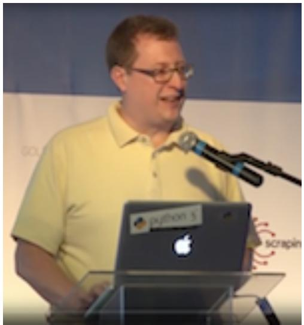
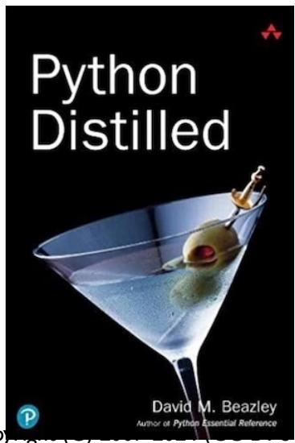
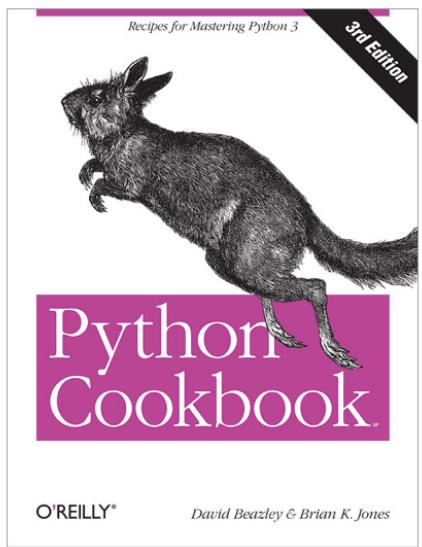
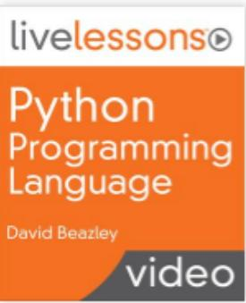
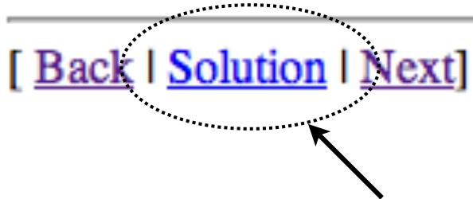

# 고급 파이썬 마스터리 (Advanced Python Mastery)

David Beazley (@dabeaz)  
https://www.dabeaz.com

## 과정 소개

이 과정은 파이썬의 고급 기능을 소개하며, 특히 대규모 애플리케이션 및 프레임워크에서의 활용 방식에 초점을 맞춥니다. 대상 독자는 소프트웨어 개발자 및 파이썬 기술을 단순한 스크립트 작성을 넘어 훨씬 더 발전시키고자 하는 모든 분들입니다.

이 과정의 주요 목표는 언어 자체의 동작을 제어하고 애플리케이션의 요구에 맞게 변형하는 방법을 이해하는 것입니다. 과정을 마칠 때쯤이면 프레임워크에서 사용되는 마법 같은 기능들, 다양한 설계 옵션 및 관련 트레이드오프(tradeoff)에 대해 깊이 있게 이해하게 될 것입니다. 파이썬의 힘은 그것을 사용하는 사람의 기술과 경험에 따라 커집니다. 이 과정은 단순한 튜토리얼을 넘어 "진짜" 프로그램을 작성하려는 개발자들을 위한 내용을 담고 있습니다.

### 목차

1. 파이썬 복습 (선택 사항)
2. 관용적인 데이터 처리
3. 클래스와 객체
4. 파이썬 객체 내부
5. 함수, 에러 및 테스트
6. 코드 작업
7. 메타프로그래밍
8. 반복자, 제너레이터 및 코루틴
9. 모듈 및 패키지

### 저자 소개

David Beazley는 1996년부터 파이썬을 작성해 왔으며, "Python Distilled" (Addison-Wesley), "Python Cookbook, 3rd Edition" (O'Reilly Media)의 저자이자 "Python Programming Language: LiveLessons" 비디오 시리즈 (Addison-Wesley)의 제작자입니다. 그는 정기적으로 고급 프로그래밍 및 컴퓨터 과학 과정을 강의하고 있습니다.



### 참고 도서 및 비디오

David Beazley의 다양한 저서와 비디오 강의를 통해 파이썬에 대한 이해를 넓힐 수 있습니다.





추가적인 자료는 Safari Books Online 및 저자의 홈페이지에서 확인 가능합니다.

### 과정 라이선스 및 사용

공식 과정 자료는 [GitHub 리포지토리](https://github.com/dabeaz-course/python-mastery)에서 확인할 수 있습니다. 이 과정은 크리에이티브 커먼즈 저작자표시-동일조건변경허락 4.0 국제 (CC BY-SA 4.0) 라이선스 하에 배포됩니다. 원저작자를 명시하는 한 이 자료를 자유롭게 사용하고 수정할 수 있습니다.


## 대상 독자 및 요구 사항

이 과정은 다른 사람들이 사용할 파이썬 코드(라이브러리, 애플리케이션 프레임워크, 도메인 특정 언어 등)를 작성하는 프로그래머를 주 대상으로 합니다. 주제는 소프트웨어 개발에 강력하게 초점을 맞추고 있으며, 파이썬 기능의 올바른 사용, 성능 트레이드오프, 그리고 설계 옵션을 다룹니다.

### 시스템 요구 사항
* 파이썬 3.6 이상이 필요하며, 가급적 최신 버전을 권장합니다.
* 로컬 개발 환경이 필요하며, 운영 체제는 제한이 없습니다.

### 선수 학습
이 과정은 여러분이 이미 파이썬을 어느 정도 사용해 보았다고 가정합니다. 온라인 튜토리얼을 마쳤거나 입문 과정을 수강했으며, 인터프리터를 실행하고 프로그램을 작성하는 기본 사항을 알고 있어야 합니다.

## 섹션 0: 과정 설정

본격적인 학습을 시작하기 위해 필요한 파일과 작업 환경을 설정합니다.

### 필요한 파일 및 리포지토리
파이썬이 설치되어 있지 않다면 [python.org](http://www.python.org)에서 다운로드할 수 있습니다. 이 클래스를 위한 실습 문제는 [GitHub 리포지토리](https://github.com/dabeaz-course/python-mastery)에서 제공되므로, 먼저 이 리포지토리를 클론(clone)하거나 포크(fork)해야 합니다.

### 작업 환경
이 과정은 입문 과정이 아니므로, 여러분이 현재 파이썬 코드를 개발할 때 사용하는 에디터나 IDE 등 익숙한 도구를 그대로 사용하시면 됩니다. 대부분의 내용은 플랫폼 중립적이므로 어떤 환경에서도 작동합니다.

### 실습 진행 방법 (Lab)
실습 설명은 `python-mastery/Exercises/` 디렉토리에서 찾을 수 있습니다. 모든 실습에는 작동하는 솔루션 코드가 `python-mastery/Solutions/`에 준비되어 있습니다. 각 실습 번호에 맞는 디렉토리(예: `2_1/`, `2_2/`)를 확인하세요.

실습을 진행할 때는 다음 팁을 참고하세요:
* 모든 작업은 `python-mastery` 폴더 내에 저장하십시오.
* 실습은 순서대로 진행하는 것이 좋습니다.
* 진행 중 막히는 부분이 있다면 솔루션 코드를 참고하여 다음 단계로 나아갈 수 있습니다.



## 섹션 1: 파이썬 복습 (Python Review)

이 섹션에서는 파이썬의 핵심 기초 사항들을 빠르게 복습합니다. 이 과정을 수강하시는 분들이라면 이미 알고 있어야 할 절대적인 기초부터, 이후 클래스와 객체를 깊이 있게 다룰 때 필수적인 세부 사항들까지 포함하고 있습니다.

### 파이썬 실행 및 프로그램 구성

파이썬 프로그램은 인터프리터 내부에서 실행됩니다. 인터프리터는 일반적으로 Unix 쉘과 같은 커맨드 쉘에서 시작되는 콘솔 기반 애플리케이션입니다.

#### 대화형 모드 (Interactive Mode)
인터프리터는 사용자가 입력한 문장을 즉시 실행하고 결과를 보여주는 "Read-Eval-Print Loop (REPL)"를 실행합니다. 이는 디버깅이나 언어의 기능을 탐색할 때 매우 유용합니다.

```python
>>> print('hello world')
hello world
>>> 37 * 42
1554
```

#### 프로그램 작성 및 실행
파이썬 소스 코드는 보통 `.py` 확장자를 가진 텍스트 파일에 저장됩니다. 예를 들어 `helloworld.py` 파일을 만들어 `print('hello world')` 코드를 작성한 후, 커맨드 라인에서 `python3 helloworld.py` 명령으로 실행할 수 있습니다. 

디버깅을 위해 `python3 -i helloworld.py`와 같이 `-i` 옵션을 사용하면 프로그램을 실행한 후 대화형 쉘로 진입하여 변수 상태 등을 확인할 수 있어 매우 편리합니다.

### 기본 문법 및 변수

파이썬 프로그램은 일련의 문장(statements)으로 구성되며, 각 문장은 개행(newline)으로 끝납니다. 인터프리터는 파일 끝에 도달할 때까지 이 문장들을 차례대로 실행합니다.

#### 주석 (Comments)
주석은 `#` 기호로 시작하며, 해당 라인의 끝까지 이어집니다. 파이썬에는 별도의 블록 주석 문법은 없으나, 문자열(`""" ... """`)을 사용하여 코드의 일부를 무시하게 만드는 트릭을 종종 사용하기도 합니다.

#### 변수와 명명 규칙
변수는 값에 이름을 붙이는 것입니다. 파이썬은 동적 타이핑 언어이므로 변수를 선언할 때 타입을 명시할 필요가 없습니다. 변수명은 유니코드 문자와 숫자를 포함할 수 있지만, 일반적으로 영문 소문자와 언더스코어(`_`)를 사용하는 스네이크 케이스(snake_case)를 권장합니다. 내부적으로만 사용되는 "비공개" 이름에는 앞에 언더스코어(`_`)를 붙이는 관례가 있습니다.

### 표현식과 제어 흐름

수학 연산은 일반적인 우선순위와 결합 법칙을 따릅니다. 파이썬 특유의 연산자로는 버림 나눗셈(`//`)과 거듭제곱(``)이 있습니다.

#### 조건문 (Conditionals)
`if`, `elif`, `else`를 사용하여 조건에 따른 흐름을 제어합니다. `and`, `or`, `not`을 사용하여 복잡한 불리언 표현식을 작성할 수 있습니다.

#### 루프 (Looping)
`while` 문은 조건이 참인 동안 반복하며, `for` 문은 리스트나 다른 순회 가능한 객체의 아이템들을 순회합니다. 루프 도중 `break`로 종료하거나 `continue`로 다음 반복으로 건너뛸 수 있습니다.

### 입출력과 데이터 타입

#### 출력하기
`print()` 함수를 사용하여 화면에 데이터를 출력합니다. 현대적인 파이썬에서는 f-문자열(f-strings)을 사용하여 가독성 좋고 효율적인 포맷팅을 수행할 수 있습니다.

```python
print(f'{name:>10s} {shares:>10d} {price:>10.2f}')
```

#### 핵심 객체 타입
파이썬은 `None`, `True/False`, 숫자(정수, 부동소수점, 복소수), 문자열(유니코드 및 바이트), 리스트, 튜플, 딕셔너리 등 풍부한 내장 데이터 타입을 제공합니다. 모든 것은 객체이며, 각 객체는 고유한 메서드와 연산자를 가집니다.

### 파일 입출력 (I/O)

파일을 다룰 때는 `open()` 함수를 사용하며, 사용이 끝난 후에는 반드시 `close()`로 닫아주어야 합니다. 현대적인 파이썬에서는 `with` 문을 사용하는 것이 관례이며, 이를 통해 블록이 끝날 때 파일이 자동으로 닫히도록 보장할 수 있습니다.

```python
with open('foo.txt', 'r') as f:
    for line in f:
        print(line, end='')
```

텍스트 파일을 읽을 때는 기본적으로 유니코드로 처리되며, 필요한 경우 `encoding` 인자를 지정할 수 있습니다. 바이너리 데이터의 경우 `'rb'` 또는 `'wb'` 모드를 사용합니다.

### 함수와 예외 처리

#### 함수 (Functions)
재사용 가능한 코드 블록은 `def`를 사용하여 함수로 정의합니다. 함수 내부 변수는 로컬 범위를 가지며, `return`을 통해 결과를 반환합니다.

#### 예외 처리 (Exception Handling)
에러는 예외(Exceptions)로 보고됩니다. 이를 적절히 처리하려면 `try-except` 문을 사용합니다. `finally` 블록은 예외 발생 여부와 상관없이 리소스 해제 등의 작업을 위해 항상 실행됩니다.

```python
try:
    shares = int(fields[1])
except ValueError as e:
    print(f"파싱 에러: {e}")
finally:
    # 항상 실행되는 코드
    pass
```

### 객체와 클래스 개요

파이썬은 객체 지향 언어이며 모든 것이 객체입니다. `class`를 사용하여 자신만의 객체 타입을 정의할 수 있습니다. `__init__` 메서드는 인스턴스를 초기화하는 역할을 하며, 모든 메서드의 첫 번째 인자는 관례적으로 `self`라고 부르는 인스턴스 자신입니다.

### 모듈 및 패키지

모든 파이썬 파일은 모듈입니다. `import` 문을 통해 다른 모듈의 기능을 가져와 사용할 수 있습니다. `if __name__ == '__main__':` 블록을 사용하면 해당 파일이 스크립트로 직접 실행될 때만 특정 코드가 작동하도록 설정할 수 있습니다. 모듈은 `sys.path`에 정의된 경로에서 검색됩니다.

---

연습 문제 및 실습
* 실습 1.1 - 1.6: 각 주제별로 제공된 실습을 통해 기본 문법과 파일 입출력, 함수 및 클래스의 기초를 복습해 보시기 바랍니다. (각 실습 권장 시간: 5~15분)

### 딕셔너리의 내부 작동 원리

파이썬의 딕셔너리는 해시 테이블(Hash Table)을 사용하여 구현됩니다. 키를 해시 함수에 통과시켜 얻은 해시 값을 인덱스로 사용하여 값을 저장하고 조회합니다.

*   충돌 해결 (Collision Resolution): 서로 다른 키가 동일한 해시 인덱스를 가질 경우, 파이썬은 빈 슬롯을 찾을 때까지 해시 인덱스를 재계산(Perturb)하는 과정을 거칩니다. 딕셔너리에 빈 슬롯이 충분히 많을 때 이 과정이 더 효율적으로 작동하므로, 파이썬은 항상 일정 비율 이상의 빈 공간을 유지하려고 노력합니다.
*   해시 가능한 객체: 딕셔너리의 키로 사용되려면 객체는 반드시 `__hash__()`와 `__eq__()` 메서드를 구현해야 합니다. 이는 객체의 내용이 변하지 않아야 함을 의미하며, 따라서 리스트나 딕셔너리 자체는 키가 될 수 없습니다.

### 컨테이너 프로토콜과 분류

파이썬의 컨테이너 객체들은 특정 프로토콜을 따릅니다. 예를 들어 `a[1]`은 내부적으로 `a.__getitem__(1)`을 호출하고, `item in a`는 `a.__contains__(item)`를 호출합니다.

새로운 컨테이너 클래스를 만들 때는 `collections.abc` 모듈의 베이스 클래스(Mapping, Sequence, Set 등)를 상속받는 것이 좋습니다. 이를 통해 필요한 메서드들을 모두 구현했는지 강제로 확인할 수 있으며, 표준적인 인터페이스를 유지할 수 있습니다.

### 파이썬의 할당(Assignment)과 참조

파이썬에서 가장 중요한 개념 중 하나는 할당이 값을 복사하지 않는다는 점입니다. 모든 할당은 단순히 객체에 대한 참조(포인터)를 복사하는 행위입니다.

*   참조 복사: `a = [1, 2, 3]; b = a`라고 하면 `a`와 `b`는 메모리 상의 동일한 리스트 객체를 가리킵니다. 따라서 `a`를 수정하면 `b`를 통해 보았을 때도 수정된 내용이 나타납니다.
*   객체에 의한 호출 (Call by Object): 함수에 인자를 전달할 때도 객체는 복사되지 않습니다. 함수 내부에서 가변 객체(리스트 등)를 수정하면 호출한 쪽의 원본 객체도 함께 수정됩니다.
*   정체성(Identity): `is` 연산자는 두 변수가 메모리 상에서 정확히 동일한 객체를 가리키는지 확인합니다. `id()` 함수를 통해 객체의 고유 식별자(메모리 주소)를 확인할 수 있습니다.

### 복사(Copying)의 기술

데이터를 공유하는 것이 아니라 독립적인 복사본이 필요한 경우, 명시적으로 복사를 수행해야 합니다.

*   얕은 복사 (Shallow Copy): 리스트의 경우 `list(a)`나 `a.copy()`를 사용합니다. 하지만 컨테이너 내부의 객체들까지는 복사되지 않고 참조만 복사됩니다.
*   깊은 복사 (Deep Copy): 객체 내부에 포함된 모든 객체들까지 재귀적으로 복사하려면 `copy.deepcopy()`를 사용해야 합니다.

### 모든 것이 객체인 파이썬 (First-class Objects)

파이썬에서는 숫자, 문자열부터 함수, 클래스, 심지어 예외까지 모든 것이 일급 객체(First-class Object)입니다. 이는 이들이 변수에 할당될 수 있고, 함수의 인자로 전달될 수 있으며, 컨테이너에 담길 수 있음을 의미합니다.

예를 들어, 복잡한 `if-elif` 문을 함수들을 담고 있는 딕셔너리로 대체하여 더 깔끔하고 확장성 있는 코드를 작성할 수 있습니다. 파이썬의 이러한 특성은 메타프로그래밍이나 고차 함수를 활용한 우아한 설계를 가능하게 합니다.

---

연습 문제 및 실습
*   실습 2.5 - 2.6: 사용자 정의 컨테이너 구현과 파이썬의 객체 참조 및 복사 메커니즘을 심도 있게 이해하기 위한 실습을 진행합니다. (각 실습 권장 시간: 25분)

## 섹션 3: 클래스와 객체 (Classes and Objects)

파이썬에서 객체 지향 프로그래밍(OOP)은 단순히 데이터를 저장하는 것을 넘어, 데이터와 그 데이터를 다루는 동작(Behavior)을 하나로 묶는 것에 핵심이 있습니다. 객체는 내부 상태를 가지며, 메서드를 통해 자신만의 개성을 드러냅니다.

### 클래스 정의와 인스턴스화

`class` 문을 사용하여 새로운 객체 타입을 정의합니다. 클래스는 인스턴스에 대해 수행할 연산(메서드)들의 집합입니다.

*   인스턴스(Instances): 클래스를 함수처럼 호출하여 생성하며, 프로그램에서 실제로 조작하는 실체입니다.
*   __init__ 메서드: 새로운 인스턴스가 생성될 때 호출되어 초기 상태를 설정합니다.
*   self 인자: 모든 인스턴스 메서드의 첫 번째 인자로, 현재 작업 중인 인스턴스 자신을 가리킵니다. 이는 관례적인 이름이며, 파이썬의 명시적인 스타일을 보여줍니다.

### 속성(Attributes)과 메서드 제어

파이썬에서 속성은 점(`.`) 연산자를 통해 액세스되는 모든 것을 의미합니다. 

*   속성 조작: `getattr()`, `setattr()`, `delattr()`, `hasattr()` 함수를 사용하여 런타임에 동적으로 속성을 제어할 수 있습니다.
*   바운드 메서드 (Bound Methods): 인스턴스에서 메서드를 조회하면 해당 인스턴스에 결합된 상태가 됩니다. 이를 바운드 메서드라고 하며, 나중에 호출하더라도 원래의 인스턴스에 대해 작동합니다.

### 클래스 수준의 기능

*   클래스 변수: 모든 인스턴스가 공유하는 변수입니다. 주로 공통 설정이나 상수를 정의할 때 사용합니다.
*   클래스 메서드 (@classmethod): 클래스 자체를 첫 번째 인자(`cls`)로 받으며, 대체 초기화 메서드(Alternate Initializers)를 만들 때 자주 사용됩니다.
*   정적 메서드 (@staticmethod): 인스턴스나 클래스에 의존하지 않는 유틸리티 함수를 클래스 내부에 그룹화할 때 사용합니다.

### 캡슐화와 관리되는 속성

파이썬은 언어 차원에서 엄격한 접근 제한을 강제하기보다는 관례를 중시합니다.

*   프라이빗 속성: 이름 앞에 언더스코어 하나(`_name`)를 붙여 내부용임을 나타냅니다. 두 개(`__name`)를 붙이면 이름 장식(Name Mangling)을 통해 서브클래스에서의 이름 충돌을 방지합니다.
*   프로퍼티 (@property): 단순한 속성 액세스처럼 보이면서도 실제로는 메서드를 호출하게 하여 유효성 검사나 계산된 속성을 구현할 수 있게 합니다. 이는 기존 코드의 변경 없이 내부 로직을 확장할 수 있는 우아한 방법입니다.
*   __slots__: 클래스가 가질 수 있는 속성 이름을 제한하여 메모리 사용량을 최적화하고 오타를 방지합니다.

### 상속 (Inheritance)

기존 클래스를 확장하거나 전문화할 때 상속을 사용합니다.

*   메서드 오버라이딩: 부모의 메서드를 재정의하여 새로운 동작을 구현합니다. `super()`를 사용하여 부모의 원래 구현을 호출할 수 있습니다.
*   is-a 관계: 상속받은 자식 객체는 부모 타입의 일종으로 간주됩니다(`isinstance` 체크 가능).

### 특수 메서드와 매직 메서드

파이썬의 연산자나 내장 함수들은 특수 메서드를 통해 동작합니다.

*   문자열 표현: 사람이 읽기 좋은 `__str__`과 프로그래머를 위한 디버깅용 `__repr__`을 정의할 수 있습니다.
*   컨테이너 프로토콜: `__getitem__`, `__setitem__`, `__len__` 등을 구현하여 사용자 정의 객체를 리스트나 딕셔너리처럼 다룰 수 있습니다.
*   수학 연산: `__add__`, `__sub__` 등을 통해 객체 간의 산술 연산을 정의합니다.

### 객체의 생명주기와 메모리 관리

*   생성 단계: `__new__` 메서드가 실제 인스턴스를 생성하고, 이후 `__init__`이 초기화합니다.
*   소멸 단계: `__del__` 소멸자는 참조 횟수가 0이 될 때 호출되지만, 예측 불가능하므로 중요한 리소스 해제는 `with` 문(컨텍스트 매니저)을 사용하는 것이 좋습니다.
*   컨텍스트 매니저: `__enter__`와 `__exit__` 메서드를 통해 리소스의 안전한 할당과 해제를 보장합니다.

### 코드 재사용과 디자인 패턴

*   추상 베이스 클래스 (ABC): 필수적으로 구현해야 할 메서드를 정의하는 인터페이스 역할을 합니다.
*   핸들러(Handler) 클래스: 특정 알고리즘의 단계를 별도의 객체에 위임하는 전략 패턴입니다.
*   믹스인(Mixin): 다중 상속을 통해 클래스에 선택적인 기능을 추가하는 조각 클래스입니다. `super()`와 함께 사용하여 여러 클래스와 유연하게 결합될 수 있습니다.

---

연습 문제 및 실습
*   실습 3.1 - 3.8: 클래스 정의부터 속성 관리, 상속, 특수 메서드 구현, 그리고 믹스인을 활용한 다중 상속 실습을 통해 객체 지향 설계를 익힙니다. (각 실습 권장 시간: 15~20분)

## 섹션 4: 파이썬 객체 내부 (Inside Python Objects)

파이썬의 객체 시스템은 표면적으로는 단순해 보이지만, 그 내부에는 딕셔너리와 특수한 프로토콜들이 촘촘하게 얽혀 있습니다. 이 섹션에서는 객체가 메모리에서 어떻게 표현되고, 우리가 점(.)을 찍어 속성에 접근할 때 실제로 어떤 일이 일어나는지 깊이 있게 파헤칩니다.

### 객체의 기반: 딕셔너리

파이썬에서 거의 모든 사용자 정의 객체는 딕셔너리를 기반으로 합니다. 인스턴스의 데이터는 `__dict__`라는 프라이빗 딕셔너리에 저장되며, 우리가 `self.name = name`과 같이 할당할 때 실제로 이 딕셔너리가 채워집니다. 중요한 점은 각 인스턴스가 자신만의 독립적인 딕셔너리를 가진다는 것이며, 클래스 또한 자신의 멤버(메서드, 클래스 변수 등)를 보관하는 별도의 딕셔너리를 가집니다.

인스턴스와 클래스는 `__class__` 속성을 통해 연결되어 있습니다. 속성을 읽을 때 파이썬은 먼저 인스턴스의 `__dict__`를 찾고, 없으면 해당 클래스의 `__dict__`를, 거기서도 없으면 베이스 클래스들을 차례로 검색합니다.

### 상속과 MRO (Method Resolution Order)

다중 상속이 가능한 파이썬에서는 속성을 찾는 경로가 복잡해질 수 있습니다. 파이썬은 이를 해결하기 위해 C3 선형화(Linearization) 알고리즘을 사용하여 상속 체인을 하나의 순서로 평탄화하는데, 이를 MRO라고 합니다. 클래스의 `__mro__` 속성을 통해 이 순서를 확인할 수 있으며, 파이썬은 이 리스트를 따라가며 가장 먼저 발견되는 속성을 사용합니다.

`super()`는 단순히 "부모 클래스"를 가리키는 것이 아니라, MRO 상의 다음 클래스를 가리킵니다. 따라서 협력적 다중 상속을 설계할 때는 모든 클래스에서 `super()`를 사용하고 메서드 시그니처를 호환되게 유지해야 체인이 끊기지 않고 의도대로 작동합니다.

### 디스크립터 프로토콜 (Descriptor Protocol)

우리가 객체의 속성에 접근할 때 일어나는 가장 교묘한 마법은 바로 디스크립터입니다. 클래스 속성 중 `__get__`, `__set__`, `__delete__` 메서드를 하나라도 구현한 객체가 있다면 이를 디스크립터라고 부릅니다. 인스턴스 메서드, `staticmethod`, `classmethod`, `property`는 모두 이 프로토콜을 사용하여 구현된 것들입니다.

예를 들어, 메서드 호출 시 `obj.method()`에서 `obj.method` 부분은 디스크립터의 `__get__`을 트리거하여 함수를 인스턴스에 바인딩된 '바운드 메서드' 객체로 변환해 반환합니다. 이처럼 디스크립터는 런타임에서 인스턴스와 클래스를 연결하는 강력한 접착제 역할을 합니다.

### 속성 액세스 가로채기

클래스는 속성 접근을 직접 제어할 수 있는 특수 메서드들을 제공합니다.
*   `__getattribute__`: 모든 속성 읽기 시도 시 가장 먼저 호출됩니다.
*   `__getattr__`: 표준 검색으로 속성을 찾지 못했을 때 마지막 보루로 호출됩니다.
*   `__setattr__`, `__delattr__`: 속성을 설정하거나 삭제할 때 호출됩니다.

이 메서드들을 재정의하면 프록시(Proxy) 객체나 위임(Delegation) 패턴을 매우 쉽게 구현할 수 있습니다.

---

## 섹션 5: 함수와 에러 처리 (Functions)

함수는 파이썬 프로그램을 구성하는 가장 기본적인 단위입니다. 좋은 함수 설계는 코드의 예측 가능성과 유지보수성을 결정짓습니다.

### 함수 설계 원칙과 유연성

가장 이상적인 함수는 입력 인자에만 의존하고 숨겨진 부수 효과가 없는 '자기 완비적'인 함수입니다. 파이썬은 다음과 같은 기능을 통해 함수의 인터페이스를 풍부하게 만듭니다.
*   키워드 전용 인자: `*` 이후의 인자들을 키워드로만 받게 강제하여 코드의 명확성을 높일 수 있습니다.
*   가변 인자: `*args`와 `kwargs`를 통해 임의의 개수의 위치 및 키워드 인자를 수용합니다.
*   타입 힌트: PEP 484를 통해 인자와 반환값의 타입을 명시함으로써 문서화와 도구 지원을 강화합니다. 다만, 파이썬의 동적 특성상 너무 엄격한 타입 체크보다는 실용적인 접근이 권장됩니다.

### 함수형 프로그래밍과 클로저 (Closures)

파이썬 함수는 일급 객체로, 다른 함수의 인자로 전달되거나 결과로 반환될 수 있습니다. 
*   람다(Lambda): 짧은 일회성 익명 함수를 정의할 때 유용합니다.
*   클로저: 내부 함수가 반환될 때 자신을 감싸고 있던 외부 범위의 변수들을 함께 캡처하여 유지하는 현상입니다. 이는 상태를 안전하게 은닉하거나 지연 평가를 구현할 때 필수적인 도구입니다. `nonlocal` 선언을 통해 클로저 내부에서 외부 변수를 수정할 수도 있습니다.

### 에러 처리 및 테스트 전략

에러는 예외(Exception)를 통해 보고됩니다. 효과적인 예외 처리를 위해서는 다음을 기억해야 합니다.
1.  복구 가능한 에러만 처리: 단순히 에러를 덮기 위해 모든 예외를 잡는 `except Exception: pass`는 최악의 습관입니다.
2.  리소스 관리: `finally` 블록이나 `with` 문(컨텍스트 매니저)을 사용하여 파일이나 네트워크 연결이 항상 올바르게 닫히도록 보장하세요.
3.  유닛 테스트: 파이썬은 컴파일러가 없으므로 테스트가 곧 검증의 전부입니다. 내장된 `unittest` 모듈이나 `pytest`와 같은 도구를 활용하여 코드의 모든 경로를 실행해 보는 습관이 중요합니다.

---

## 섹션 6: 코드 작업과 인트로스펙션 (Working with Code)

이 섹션에서는 파이썬 코드가 실행되는 환경을 조사하고, 런타임에 동적으로 코드를 조작하는 고급 기법들을 다룹니다.

### 변수 스코프와 실행 환경

파이썬은 전역(Global)과 로컬(Local) 두 가지 주요 스코프에서 변수를 관리합니다. `globals()`와 `locals()` 함수를 통해 각 환경의 내용을 딕셔너리 형태로 엿볼 수 있습니다. 함수 내에서 전역 변수를 수정해야 한다면 `global` 선언이 필요합니다.

### 함수 객체의 조사 (Introspection)

함수 또한 객체이므로 독스트링(`__doc__`), 어노테이션(`__annotations__`), 그리고 임의로 추가한 사용자 정의 속성들을 가질 수 있습니다. `inspect` 모듈을 사용하면 함수의 시그니처를 분석하거나 인자를 동적으로 바인딩하는 등 고도의 메타 프로그래밍을 위한 정보를 얻을 수 있습니다.

### 동적 코드 실행: eval()과 exec()

`eval()`은 표현식을 평가하고, `exec()`은 임의의 파이썬 문장들을 실행합니다. 이 기능들은 매우 강력하지만, 보안 문제와 디버깅의 어려움 때문에 신뢰할 수 없는 입력을 처리할 때는 극도로 주의해야 합니다.

---

## 섹션 7: 메타프로그래밍 (Metaprogramming)

메타프로그래밍은 '코드를 조작하는 코드'를 작성하는 기술입니다. 반복적인 코드를 줄이고 프레임워크 수준의 추상화를 제공하는 데 사용됩니다.

### 데코레이터 (Decorators)

데코레이터는 함수나 클래스를 래핑하여 추가 기능을 주입하는 가장 일반적인 방법입니다. `@decorator` 구문을 사용하면 함수 정의 시점에 래핑이 일어나며, 로깅, 실행 시간 측정, 접근 제어 등을 구현하는 데 매우 효과적입니다. `functools.wraps`를 사용하여 원본 함수의 메타데이터를 보존하는 것이 모범 사례입니다.

### 클래스 데코레이터와 상속 감시

함수 데코레이터와 마찬가지로 클래스 정의 전체를 조작할 수 있습니다. 또한 파이썬 3.6부터 도입된 `__init_subclass__`를 사용하면 명시적인 데코레이터 없이도 상속 관계에 있는 클래스들을 감시하고 수정할 수 있습니다.

### 메타클래스 (Metaclasses)

메타클래스는 '클래스를 만드는 클래스'입니다. 모든 클래스의 기본 메타클래스는 `type`이며, 이를 상속받아 클래스 생성 과정(이름 확인, 베이스 클래스 설정, 딕셔너리 구성 등)을 완전히 통제할 수 있습니다. 메타클래스는 매우 강력하지만 복잡하므로, 라이브러리나 프레임워크 제작자가 아니라면 일반적인 클래스 데코레이터로 해결 가능한지 먼저 검토하는 것이 좋습니다.

---

## 섹션 8: 반복자, 제너레이터 및 코루틴 (Iterators, Generators, Coroutines)

반복(Iteration)은 파이썬의 가장 핵심적인 동작 중 하나입니다.

### 반복 프로토콜과 제너레이터

`for` 루프는 내부적으로 `__iter__`와 `__next__` 메서드로 구성된 로우 레벨 반복 프로토콜을 사용합니다. `yield` 키워드를 사용하는 제너레이터 함수는 이 프로토콜을 아주 쉽게 구현하게 해줍니다. 제너레이터는 실행 상태를 유지한 채 값을 하나씩 생성하므로 대용량 데이터를 메모리 효율적으로 처리할 때 탁월합니다.

### 제너레이터 파이프라인과 데이터 흐름

제너레이터를 사슬처럼 연결하면 데이터 처리 파이프라인을 구축할 수 있습니다. 생산자(Producer), 중간 처리기(Processor), 소비자(Consumer) 단계를 거치며 데이터가 점진적으로 흐르게 되어 코드의 결합도를 낮추고 유연성을 높입니다.

### 코루틴과 비동기 프로그래밍

`yield`를 할당문의 우측(`line = yield`)에 사용하면 데이터를 받을 수 있는 코루틴이 됩니다. 코루틴은 외부에서 `send()`를 통해 전달된 값을 받아 처리를 수행하며, 이는 현대 파이썬 비동기 프로그래밍(`async`/`await`)의 근간이 됩니다. `yield from` 구문을 통해 제너레이터나 코루틴의 실행을 다른 객체에 위임할 수도 있습니다.

---

## 섹션 9: 모듈과 패키지 (Modules and Packages)

작성된 코드를 조직화하고 배포하는 방법을 다룹니다.

### 모듈 시스템의 이해

모듈은 `sys.modules`에 캐시되어 단 한 번만 로드됩니다. 모듈 로딩 과정은 소스 코드를 읽어 새로운 네임스페이스(딕셔너리)에서 실행하는 과정입니다. 모듈 리로딩(`reload`)은 부작용이 크므로 운영 환경에서는 지양해야 합니다.

### 패키지 구조화

프로젝트 규모가 커지면 디렉토리 구조의 패키지로 정리해야 합니다. `__init__.py`는 디렉토리를 패키지로 인식하게 하며, 서브모듈들을 통합하여 사용자에게 단일한 임포트 인터페이스를 제공하는 용도로 사용됩니다. 패키지 내에서는 점(.)을 이용한 상대 경로 임포트를 통해 모듈 간의 관계를 명시할 수 있습니다.

### 실행 가능한 패키지와 배포

`__main__.py`를 포함하면 패키지 자체를 `python -m packagename` 명령으로 직접 실행할 수 있습니다. 최종적으로 완성된 코드는 PyPI와 같은 저장소에 배포하기 위해 표준적인 패키징 절차를 따르게 됩니다.

---

### 마무리하며

이 과정은 파이썬의 단순한 사용법을 넘어, 그 이면에 숨겨진 '동작 원리'를 이해하는 데 목적이 있습니다. 딕셔너리부터 메타클래스까지 이어지는 파이썬의 내부 메커니즘을 마스터함으로써, 여러분은 단순한 코더를 넘어 강력한 도구와 프레임워크를 설계할 수 있는 아키텍트로 거듭날 것입니다.

David Beazley의 여정에 함께해주셔서 감사합니다!
