# Advanced Python Mastery

David Beazley (@dabeaz)

https://www.dabeaz.com

# Table of Contents

0. Course Setup   
1. Python Review (Optional)   
2. Idiomatic Data Handling   
3. Classes and Objects   
4. Inside Python Objects   
5. Functions, errors, and testing   
6. Working with Code   
7. Metaprogramming   
8. Iterators, Generators, and Coroutines   
9. Modules and Packages

This course is an introduction to Python's more advanced features, with a focus on how they are applied in larger applications and frameworks. The target audience is software developers and anyone who wants to take their Python skills far beyond simple script writing. A major goal of the course is to understand how you can take control over the behavior of the language itself and bend it in ways that serve the needs of your application. By the end of this course, you'll know a lot more about the magic used by frameworks, different design options, and associated tradeoffs.

# About the Author

David Beazley has been writing Python since 1996 and is the author of "Python Distilled" (Addison-Wesley), "Python Cookbook, 3rd Edition" (O'Reilly Media), and the "Python Programming Language: LiveLessons" video series (Addison-Wesley). He regularly teaches advanced programming and computer science courses

https://www.dabeaz.com/courses.html


# Books/Video


Python Programming Language 50 reviews by David Beazley

https://www.safaribooksonline.com

# Course License and Usage

* Official course materials are here

https://github.com/dabeaz-course/python-mastery

This course is released under the Creative Commons Attribution-Share Alike 4.0 International (CC-SA 4.0) license.

You are free to use and adapt this material in any way that you wish as you as you give attribution to the original source. If you choose to use selected presentation slides in your own course, I kindly ask that the copyright notice, license, and authorship in the lower-left corner remain present.


# About This Course

Overheard:

"The power of Python grows according to the skill and experience of the person using it."

This course is about that!   
Going far beyond the tutorial   
Looking at things that you might care about if you're going to write "real" programs

# Target Audience

Programmers who are writing Python code that will be used by others (libraries, application frameworks, domain-specific languages, etc.)   
* Topics strongly focus on software development

* Proper usage of Python features   
Performance tradeoffs   
Design options

# System Requirements

* You should be using Python 3.6 or newer   
Try to use the latest version   
* You need a local development environment   
* Any operating system is fine

# Prerequisites

This course assumes that you have already been using Python in some manner   
Previously completed some kind of online tutorial, taken an introductory course, or just worked on some code yourself.   
You should know the basics of running the interpreter and writing programs

# Section 0

# Course Setup

# Required Files

* Where to get Python (if not installed)

http://www.python.org

* This course is written for Python 3.6 or newer   
* Exercises for this class

github.com/dabeaz-course/python-mastery

* You should clone/fork the repo first

# Working Environment

* This is not an introductory course   
* Use whatever tools you currently use to develop Python code   
Editors, IDEs, etc.   
* Almost everything in this course is platformneutral and will work everywhere

# Class Exercises

Exercise descriptions are found in

python-mastery/Exercises/

* All exercises have solution code

Write a program that opens this file, reads all lines, int (s ) . To convert a string to a floating point, use :


Look for the link at the bottom!

# Class Exercises

* Working solution code can be found in

python-mastery/Solutions

* Each problem has its own directory

2_1/

Exercise 2.1

2_2/

Exercise 2.2

# General Tips

* Save all of your work in "python-mastery"   
Exercises assume this structure   
Exercises are meant to be worked in order   
If stuck, you can often start by copying solution code from Solutions/ and working forward.

# Section 1

# Python Review

(Optional)

# Overview

* A very fast-paced review of Python   
The absolute basics that you should already know if you are taking this course   
Essential details for later parts of the class

# All Things Python

http://www.python.org

Downloads   
Documentation and tutorial   
Community Links   
* News and more   
Tutorial

# Running Python

Python programs run inside an interpreter   
The interpreter is a simple "console-based" application that normally starts from a command shell (e.g., the Unix shell)

```txt
bash % python3  
Python 3.6.0 (default, Jan 27 2017, 13:20:23)  
[GCC 4.2.1 Compatible Apple LLVM 6.1.0 (clang-602.0.53)]  
>>> 
```

# Interactive Mode

The interpreter runs a "read-eval" loop

```txt
>>> print('hello world')  
hello world  
>>> 37*42  
1554  
>>> for i in range(5):  
... print(i)  
0  
1  
2  
3  
4  
>>> 
```

Executes simple statements typed in directly   
* Very useful for debugging, exploration

# Creating Programs

Programs are put in .py files

# helloworld.py print('hello world')

Source files are simple text files   
* Create with your favorite editor (e.g., emacs)   
* Make sure you use "python" mode

# Running Programs

# Command line

```batch
bash % python3 helloworld.py  
hello world  
bash % 
```

# #! (Unix)

```txt
!/usr/bin/env python3 # helloworld.py print('hello world') 
```

# python

* For debugging, use python -i

```txt
bash % python3 -i helloworld.py  
hello world  
>>> 
```

Runs your program and then enters the Python interactive shell afterwards   
Quite useful for debugging, testing, etc.

# Exercise

Time: 10 minutes

# Program Execution

* A Python program is a sequence of statements   
Each statement is terminated by a newline   
Statements are executed one after the other until you reach the end of the file.   
When there are no more statements, the program stops

# Comments

Comments are started by #

# This is a comment

height = 442

# Meters

* There are no block comments (e.g., /* ... */).   
* However, may see ignored code in strings

# All of this code is ignored

I II

for i in range(10):

print("Hello", i)

I II

"Stringy" code is not a proper comment, but is often a useful trick when debugging

# Variables

* A variable is a name for some value   
Variable names usually follow same rules as C [A-Za-z_][A-Za-z0-9_]*   
* You do not declare types (int, float, etc.)

```txt
height = 442 # An integer  
height = 442.0 # Floating point  
height = 'Really tall' # A string 
```

Differs from C++/Java where variables have a fixed type that must be declared.

# A Bit More on Names

Variable names can actually consist of any Unicode letters and digits.   
So, writing code like this is valid

$$
\pi = 3. 1 4 1 5 9
$$

$$
\tau = 2 * \pi
$$

However, if it's hard to type on the keyboard or explain, you should probably avoid it

# Naming Conventions

* Use "snake case" for multiple words

```hcl
first_name = "Guido"  
last_name = "van Rossum" 
```

Prefer lowercase   
* Use leading _ for "private" names

```python
def __internal ,( : 
```

# Expressions

* Math works normally (precedence, assoc, etc.)

$$
\begin{array}{l} a = 2 + 3 \\ b = 2 + 3 * 4 \\ c = (2 + 3) * 4 \\ \end{array}
$$

Operators are same as C

$$
+, -, *, /, \%, <   <  , > >, \& , |, ^ {\wedge}, \dots
$$

* Other operators (Python-specific)

7 // 4

Truncating division

7 ** 4

Power operator

# Conditionals

# If-else

if $a <   b$ print('Computer says no') else: print('Computer says yes')

# If-elif-else

```txt
if a == ' +':  
    op = PLUS  
elif a == '-':  
    op = MINUS  
elif a == '*':  
    op = TIMES  
else:  
    op = UNKNOWN 
```

# Relations

Relational operators

```html
< > <= >= == != 
```

Boolean expressions (and, or, not)

```txt
if b >= a and b <= c: print('b is between a and c')  
if not (b < a or b > c): print('b is still between a and c') 
```

# Looping

* While statement loops on a condition

while count $>0$ . print('T-minus',count) count $\text{一} = 1$ print('Boom!')

For-loop iterates over items (e.g., foreach)

nums = [1,7,10,23]

for x in nums:

print(x) # Prints 1, 7, 10, 23

# Looping Control-Flow

break - terminates a loop early

for name in names: if name == 'python': break

continue - skip to next iteration

for line in lines: if line == '\n': # Ignore blank lines continue

# Printing

The print function

print(x) print(x,y,z) print('Your name is', name)

Produces a single line of text   
* Items are separated by spaces

# Formatted Printing

f-strings

print(f'{name:>10s} {shares:>10d} {price:>10.2f}')

* .format() method

print('{:10s} {:10d} {:10.2f}'.format(name,shares,price))

Use % operator

print('%10s %10d %10.2f' % (name, shares, price))

# pass statement

Sometimes you will need to specify an empty block of code

```txt
if name in namelist: # Not implemented yet (or nothing) pass else: statements 
```

pass is a "no-op" statement   
It does nothing, but serves as a placeholder for statements (possibly to be added later)

# Core Python Objects

Programs are built upon a core set of built-in datatypes (numbers, strings, lists, etc.)

```txt
None # Nothing, nada, nil, ...  
True # Boolean  
23 # Integer  
2.3 # Float  
2+3j # Complex  
'Hello World' # String (Unicode)  
b'Hello' # Byte string  
('www.python.org',80) # Tuple  
[1,2,3,4] # List  
{'name':'IBM',...} # Dictionary 
```

You should have already used most of these types if you've written any Python at all

# Manipulating Objects

* Objects are manipulated by operators

```txt
a + b # Add  
x = a[i] # Indexed lookup  
y = a[i:j] # Slicing  
a[i] = val # Indexed assignment  
x in a # Containment  
... many others ... 
```

* Also manipulated by various methods

```python
a.find('python')  
a.split(['','])  
b.append(2)  
...
```

Available operators/methods depends on the object being manipulated

# Exercise 1.2

Time: 15 minutes

# File Input and Output

# Opening a file

$$
f = \text {o p e n} \left(^ {\prime} f o o. t x t ^ {\prime}, ^ {\prime} r ^ {\prime}\right)
$$

# Open for reading

$$
g = \text {o p e n} \left(^ {\prime} b a r. t x t ^ {\prime}, ^ {\prime} w ^ {\prime}\right)
$$

# Open for writing

$$
h = \text {o p e n} \left(^ {\prime} \log . t x t ^ {\prime}, ^ {\prime} a ^ {\prime}\right)
$$

# Open for appending

# To read data

$$
\text {l i n e} = \text {f . r e a d l i n e ()}
$$

# Read a line of text

$$
d a t a = f. r e a d ([ m a x b y t e s ])
$$

# Read data

# To write text to a file

g.write('some text')

# Closing a file (when done)

f.close()

# Closing Files

Files need to be closed after use

```txt
f = open('foo.txt', 'r')
# Use f
...
f.close() 
```

In modern Python, use 'with'

```python
with open('foo.txt','r') as f: # Use f. # Automatically closed here 
```

# Common Idioms

Reading a file line-by-line

with open('foo.txt','r') as f: for line in f: # Process the line

* Reading an entire file into a string

with open('foo.txt','r') as f: data $=$ f.read()

Write to a file

with open('foo.txt','w') as f: f.write('some text\n')

# Text Data

* When reading text, Python 3 assumes unicode   
* You might need to give an encoding

$$
f = \text {o p e n} \left(^ {\prime} f o o. t x t ^ {\prime}, ^ {\prime} r ^ {\prime}, \text {e n c o d i n g} = ^ {\prime} l a t i n - 1 ^ {\prime}\right)
$$

# Binary Data

Make sure you use the right file modes if reading binary-encoded data

$$
f = \text {o p e n} \left(^ {\prime} f o o. d a t ^ {\prime}, ^ {\prime} r b ^ {\prime}\right)
$$

$$
g = \text {o p e n} \left(^ {\prime} b a r. b i n ^ {\prime}, ^ {\prime} w b ^ {\prime}\right)
$$

Data read/written to binary-mode files uses normal 8-bit strings   
Will just have a lot of non-printing control characters, embedded nulls, etc. for non-text

# Exercise 1.3

Time: 10 minutes

# Simple Functions

* Use functions for code you want to reuse

```python
def sumcount(n):
    total = 0
    while n > 0:
        total += n
        n -= 1
    return total 
```

Calling a function

```txt
a = sumcount(100) 
```

* A function is just a series of statements that perform some task and return a result

# Simple Functions

* Functions behave in a sane manner

Inner variables have local scope   
Things like recursion work fine   
* You can have default arguments

Will say more about functions later, but you should already know how to define and use simple function definitions

# Exception Handling

Errors are reported as exceptions   
* An exception causes the program to stop

```txt
>>> int('N/A')
Traceback (most recent call last):
    File "<stdin>", line 1, in <module>
ValueError: invalid literal for int() with base 10: 'N/A'
>>> 
```

For debugging, message describes what happened, where the error occurred, along with a traceback.

# Exceptions

Exceptions can be caught and handled   
* To catch, use try-except statement

for line in f: fields $=$ line.split() try: shares $=$ int.fields[1]) except, ValueError: print("Couldn't parse",line) Name must match the kind of error you're trying to catch $\ggg$ int("N/A") Traceback (most recent call last): File "<stdin>", line 1, in <module> ValueError: invalid literal for int(） with base 10:'N/A' >>>

# Exceptions

* To raise an exception, use the raise statement

raise RuntimeError('What a kerfuffle')

* Will cause the program to abort with an exception traceback (unless caught by tryexcept)

% python3 foo.py Traceback (most recent call last): File "foo.py", line 21, in <module> raise RuntimeError("What a kerfuffle") RuntimeError: What a kerfuffle

# Exception Values

* Most exceptions have an associated value   
* More information about what's wrong raise RuntimeError('Invalid user name')   
* Passed to variable supplied in except try: except RuntimeError as e: ...

* It's an instance of the exception type, but often looks like a string

except RuntimeError as e: print('Failed : Reason', e)

# Catching Multiple Errors

Can catch different kinds of exceptions try:

except ValueError as e: except TypeError as e:

* Alternatively, if handling is the same

try: except (ValueError, TypeError) as e:

* Catching any exception (danger awaits)

try: except Exception as e:

# finally statement

Specifies code that must run regardless of whether or not an exception occurs

```python
lock = Lock()
...
lock.acquire()
try:
...
finally:
    lock.release()  # release the lock 
```

Commonly use to properly manage resources (especially locks, files, etc.)

# Exercise 1.4

Time: 10 minutes

# Objects

Python is an object-oriented language   
All of the basic data types (integers, strings, lists, etc.) are examples of "objects"   
Objects involve data and a set of "methods" that carry out various operations

```python
a = 'Hello World' # A string object  
b = a-upper() # A method applied to the string  
items = [1,2,3] # A list object  
items.append(4) # A method applied to the list 
```

# Classes

* You can make your own objects

class Player:

```python
def __init__(self, x, y):
    self.x = x
    self.y = y
    self.health = 100 
```

```python
def move(self, dx, dy): self.x += dx self.y += dy 
```

def damage(self, pts): self.health $= =$ pts

What is a class?   
It's all of the function definitions that implement the various methods

# Instances

Created by calling the class as a function

>>> a = Player(2, 3)

>>> b = Player(10, 20)

>>>

Each instance gets its own data

```txt
>>> a.x 2   
>>> b.x 10   
>>> 
```

* Invoke the methods as follows

```prolog
>>> a.move(1, 2)  
>>> a.damage(10)  
>>> 
```

# init method

* This method initializes a new instance   
* Called whenever a new object is created

```python
>>> a = Player(2, 3)  
class Player:  
    def __init__(self, x, y):  
        self.x = x  
        self.y = y  
        self.health = 100  
        newly created object 
```

* Mostly, it just stores the data attributes

# Methods

* Functions that operate on instances

class Player:

```python
def move(self, dx, dy): self.x += dx self.y += dy 
```

* The object is passed as first argument

```python
>>> a.move(1, 2)  
def move(self, dx, dy): 
```

* By convention, the instance is called "self"

The name is unimportant---the object is always passed as the first argument. It is simply Python programming style to call this argument "self." It's similar to the "this" pointer in C++.

# Exercise 1.5

Time: 10 minutes

# Modules

* Any Python source file is a module

```txt
foo.py def grok(a): def spam(b): 
```

* import statement loads and executes a module

```txt
import foo  
a = foo.grok(2)  
b = foo.spam('Hello')  
... 
```

# Namespaces

* A module is a collection of named values (i.e., it's said to be a "namespace")   
The names are simply all of the global variables and functions defined in the source file   
* After import, module name used as a prefix

>>> import foo  
>>> foo.grok(2)   
>>>

* Module name is tied to source (foo -> foo.py)

# Globals Revisited

Everything defined in the "global" scope is what populates the module namespace

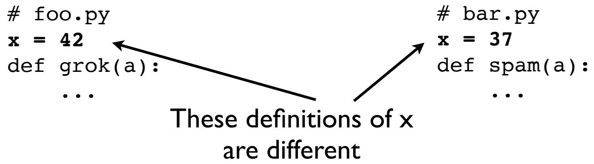

Different modules can use the same names and those names don't conflict with each other (modules are isolated)

# import as statement

* Changes the local name of a module

# bar.py import math as m

$$
a = m. \sin (x)
$$

Exactly the same as import except the module object is assigned a different name   
The new name only applies locally within the source file that did the import (other files can import using the standard name without any confusion)

# from module import

Lifts selected symbols out of a module and puts them into local scope

# bar.py from math import sin,cos

def rectangular(r,theta): x = r*cos(theta) y = r*sin(theta) return x,y

Allows parts of a module to be used without having to type the module prefix

# from module import *

Takes all symbols from a module and places them into local scope

```txt
bar.py from math import \* 
```

```python
def rectangular(r, theta):
    x = r * cos(theta)
    y = r * sin(theta)
    return x, y 
```

Useful if you are going to use a lot of functions from a module and it's annoying to specify the module prefix all of the time

# from module import *

You should almost never use it in practice because it leads to poor code readability   
Example:

from math import * from random import *

r = gauss(0.0,1.0) # In what module?

Makes it very difficult to understand someone else's code if you need to locate the original definition of a library function

# Main Module

Python has no "main" function or method   
Instead, there is a "main" module   
* It's simply the source file that runs first

bash % python3 foo.py

Whatever module you give to the interpreter at startup becomes "main"

# main check

It is standard practice for modules that can run as a main program to use this convention:

foo.py   
if__name $\equiv =$ 'main'： #Running as the main program statements

Statements enclosed inside the if-statement become the "main" program

# Locating Modules

Modules are loaded from directories on a special module search path (sys.path)

```txt
>>> import sys   
>>> sys.path   
['', '/usr/local/lib/python36.zip'， '/usr/local/lib/python3.6'， '/usr/local/lib/python3.6/plat-darwin'， '/usr/local/lib/python3.6/lib-dynload'，'/usr/local/lib/python3.6/site-packages']   
>>>
```

Most ImportError exceptions are due to issues with the path and/or filenames

# Module Search Path

sys.path contains search path   
* Can manually adjust if you need to

import sys

sys.path.append('/project/foo/pyfiles')

Paths also added via environment variables

% env PYTHONPATH $\mathbf { \equiv }$ /project/foo/pyfiles python3

Python 3.6.1 (default, Mar 24 2017, 17:58:49)

[GCC 4.2.1 Compatible Apple LLVM 8.0.0 (clang-800.0.38)]

>>> import sys

>>> sys.path

['', '/project/foo/pyfiles', ..., ]

# Summary

* This has been an overview of basics   
If you've already been programming Python for awhile, you should already know this material   
* Later sections go into much more depth

# Exercise 1.6

Time: 5 minutes

# Section 2

# Data Handling

# Core Topics

Data structures   
Containers and collections   
Iteration   
Understanding the builtins   
Object model

# Data Structures

* Real programs must deal with complex data   
Example: A holding of stock

100 shares of GOOG at $490.10

* An "object" with three parts

Name ("GOOG", a string)   
* Number of shares (100, an integer)   
Price (490.10, a float)

# Data Structures

Some options

Tuple   
Dictionary   
Class instance

* Let's take a short tour

# Tuples

* A collection of values packed together

$$
s = \left(^ {\prime} G O O G ^ {\prime}, 1 0 0, 4 9 0. 1\right)
$$

Can use like an array

$$
\begin{array}{l} \text {n a m e} = \mathbf {s} [ 0 ] \\ \text {c o s t} = \mathbf {s} [ 1 ] * \mathbf {s} [ 2 ] \end{array}
$$

* Unpacking into separate variables

$$
\text {n a m e , s h a r e s , p r i c e} = \mathrm {s}
$$

Immutable

$$
s [ 1 ] = 7 5 \quad \# T y p e R e r r o r. N o i t e m a s s i g n m e n t
$$

# Dictionaries

* An unordered set of values indexed by "keys"

```txt
s = {
    'name' : 'GOOG',
    'shares' : 100,
    'price' : 490.1
} 
```

* Use the key name to access

```python
name = s['name']
cost = s['shares'] * s['price'] 
```

Modifications are allowed

```txt
s['shares'] = 75  
s['date'] = '7/25/2015'  
del s['name'] 
```

# User-Defined Classes

# * A simple data structure class

```python
class Stock: def __init__(self, name, shares, price): self.name = name self.share = shares self.price = price 
```

# * This gives you the nice object syntax...

>>>s $\equiv$ Stock('GOOG'，100，490.1)   
>>>s.name   
'GOOG'   
>>>s.share \* s.price   
49010.0   
>>>

# Variations on Classes

* Class definitions have some variants

* Slots - Saves memory   
* Dataclasses - Reduces coding   
* Named tuples - Immutability/tuple behavior

Let's take a quick tour

# Classes and Slots

* For data structures, consider adding __slots__

```python
class Stock: __slots__ = ('name', 'shares', 'price') def __init__(self, name, shares, price): self.name = name self.share = shares self.price = price 
```

Slots is a performance optimization that is specifically aimed at data structures   
* Greatly reduces the memory usage

# Dataclasses

from dataclasses import dataclass

@dataclass

class Stock:

name : str

shares : int

price: float

* Possibly a convenience for reducing the amount of code that must be written   
* Some useful methods get created automatically   
However, types are NOT enforced

# Named Tuples

* Another variant on class definition

import typing

class Stock(typing.NamedTuple): name: str shares: int price: float

* Alternate formulation (in older code)

from collections import namedtuple

Stock = namedtuple('Stock', ['name', 'shares', 'price'])

Main feature: immutability

# Named Tuples

Named tuples have same features as tuples (immutability, unpacking, indexing, etc.)

>>>s = Stock('GOOG',100,490.1)   
>>>s[0] 'GOOG'   
>>>name,shares,price $=$ s   
>>>print('%10s %10d %10.2f' $\%$ s) GOOG 100 490.10   
>>>isinstance(s,tuple)   
True   
>>>s.name $=$ 'ACME'   
Traceback (most recent call last) File "<stdin>",line 1,in <mod AttributeError: can't set attribu

# Exercise 2.1

Time : 30 minutes

# Containers

* Programs often have to work many objects

* Lists (ordered data)   
* Sets (unordered data, no duplicates)   
Dictionaries (unordered key-value data)

* The choice depends on the problem

# Lists

* Use a list when the order of data matters   
Example: A list of tuples

```python
portfolio = [
    ('GOOG', 100, 490.1),
    ('IBM', 50, 91.1),
    ('CAT', 150, 83.44)
] 
```

* Lists can be sorted and rearranged

# Sets

* A set is an unordered collection of unique items

$$
a = \left\{^ {\prime} I B M ^ {\prime}, ^ {\prime} A A ^ {\prime}, ^ {\prime} A A P L ^ {\prime} \right\}
$$

Sets eliminate duplicates

names = ['IBM','YHOO','IBM','CAT','MSFT','CAT','IBM'] unique_names $=$ set(names)

Sets are useful for membership tests

members $=$ set()

members.add(item) # Add an item members.remove(item) # Remove an item

if item in members: # Test for membership ...

# Dicts

* Useful for indices and lookup tables

prices $=$ { 'GOOG' : 513.25, 'CAT' : 87.22, 'IBM' : 93.37, 'MSFT' : 44.12 }

Common use

```python
p = prices['IBM'] # Value lookup  
p = prices.get('AAPL', 0.0) # Lookup with default value  
prices['HPE'] = 37.42 # Assignment  
if name in prices: # Membership test 
```

# Dicts, Composite Keys

# * Use tuples for multi-part keys

prices $=$ { ('ACME'，'2017-01-01') : 513.25, ('ACME'，'2017-01-02') : 512.10, ('ACME'，'2017-01-03') : 512.85, ('SPAM'，'2017-01-01') : 42.1, ('SPAM'，'2017-01-02') : 42.34, ('SPAM'，'2017-01-03') : 42.87, }

# Usage:

```python
p = prices['ACME', '2017-01-01']
prices['ACME', '2017-01-04'] = 515.20 
```

# Comprehensions

List comprehension

[ expression for item in sequence if condition ]

Set comprehension

{ expression for item in sequence if condition }

Dict comprehension

{ key:value for item in sequence if condition }

These often simplify the creation of lists, sets, and dictionaries from existing data

# Comprehensions

General syntax

[expression for item in sequence if condition]

What it means

result $=$ []   
for item in sequence: if condition: result.append(expression)

Similar for set and dict comprehensions

# Comprehension Examples

Collecting values from data

names = [s['name'] for s in portfolio]

Unique values

unique_names = {s['name'] for s in portfolio}

Performing database-like queries

results = [s for s in portfolio if s['price'] > 100 and s['shares'] > 50 ]

* Quick mathematics over sequences

cost $=$ sum([s['shares']*s['price'] for s in portfolio])

# Collections Module

Provides some variations on common data structures (useful for specialized problems)

defaultdict   
Counter   
deque   
... and more

# defaultdict

# * Automatic initialization of missing dict keys

from collections import defaultdict

>>>d $=$ defaultdict(list)   
>>>d   
defaultdict(<class 'list'>，{}）   
>>>d['x']   
[]   
>>>d   
defaultdict(<class 'list'>，{'x'：[]})   
>>>

# * Allows combined operations

```txt
>>>d['y'].append(42)   
>>>d['y']   
[42]   
>>> 
```

# Counter

* A dictionary specialized for counting items

from collections import Counter

>>> totals $=$ Counter()   
>>> totals['IBM'] += 20   
>>> totals['AA'] += 50   
>>> totals['ACME'] += 75   
>>> totals

Counter({'ACME': 75, 'AA': 50, 'IBM': 20})

>>>

* Has some other nice features (i.e., ranking)

>>> totals.most_common(2)

[('ACME', 75), ('AA', 50)]

>>>

# deque

# Double-ended queue

from collections import deque

>>> q = deque()   
>>> q.append(1)   
>>> q.append(2)  
>>> q.appendleft(3)   
>>> q.appendleft(4)   
>>> q

deque([4, 3, 1, 2])  
>>> q.pop()   
2   
>>> q.popleft()  
4   
>>>

* More efficient than a list for queuing problems

# Keeping a History

* Problem: Keep a history of the last N things

```txt
line1 line2 
```

```txt
line3 line4 line5 
```

```txt
history = [ line3, line4, line5 ] 
```

Solution: Use a deque

from collections import deque

history $=$ deque(maxlen $\equiv$ N)   
with open(FILEname) as f: for line in f: history.append(line)

# Multi-Search

# Problem: Search multiple places

techs $=$ { auto $\equiv$ { IBM':91.23, 'GM':23.45, 'AAPL':123.45, 'TM':87.20, HPE':34.23 F':51.1, } 'TTA':64.45, }

# Solution: ChainMap

from collections import ChainMap allprices $=$ ChainMap(techs, auto)

```txt
>>> allprices['HPE'] 34.23   
>>> allprices['F'] 51.1   
>>> 
```

# Commentary

* collections is a useful module to know   
* Simplifies many common data handling problems   
* If you're not using it, you're missing out

# Exercise 2.2

Time : 45 minutes

# Iteration

The for-loop iterates over a sequence

>>>names $=$ ['IBM'，'YHOO'，'AA'，'CAT']   
>>>for name in names: print(name)   
IBM   
YHOO   
AA   
CAT   
>>>

It seems simple enough...

# Iterating on Tuples

# Consider a list of tuples

portfolio $=$ [ ('GOOG',100,490.1), ('IBM',50,91.1), ('CAT',150,83.44), ('IBM',100,45.23), ('GOOG',75,572.45), ('AA',50,23.15)]

# Iteration with unpacking

for name, shares, price in portfolio:

# Iteration with a "throwaway" value (use _)

for name, _, price in portfolio: ..

# Iterating on Varying Records

* Consider a list of varying sized data structures

prices $=$ [ ['GOOG',490.1,485.25，487.5]， ['IBM'，91.5]， ['HPE'，13.75，12.1，13.25，14.2，13.5]， ['CAT'，52.5，51.2] ]

* Wildcard unpacking (Python 3 only)

for name, *values in prices: print(name, values)

```txt
name values  
'GOOG' [490.1, 485.25, 487.5]  
'IBM' [91.5]  
'HPE' [13.75, 12.1, 13.25, 14.2, 13.5]  
'CAT' [52.5, 51.2] 
```

# zip() function

Iterate on multiple sequences in parallel

columns = ['name','shares','price']

values = ['GOOG',100, 490.1 ]

for colname, val in zip(columns, values):

# Loops with colname $=$ 'name' val='GOOG'

# colname ${ } = { }$ 'shares' $\mathtt { v a l } { = } 1 0 0$

# colname $=$ 'price' val=490.1

Common use: Making dictionaries

record $=$ dict(zip(columns,values))

Caution: Truncates to shortest input length

zip(['a','b','c'], [1,2]) ('a', 1), ('b', 2)

# Keeping a Running Count

enumerate(sequence [, start])

```python
names = ['IBM', 'YHOO', 'CAT']  
for n, name in enumerate names)  
    # Loops with n=0 name='IBM'  
    # n=1 name='YHOO'  
    # n=2 name='CAT' 
```

Example: Line number tracking on a file

```txt
with open(filename) as f: for lineno, line in enumerate(f, start=1): 
```

# Iterating on Integers

range([start,] end [,step])

for i in range(100):

# i = 0,1,...,99

for j in range(10,20):

# j = 10,11,..., 19

for k in range(10,50,2):

# k = 10,12,...,48

* Note: The ending value is never included   
Caution: range() is often a "code smell" for problems being solved the "hard way"

# Sequence Reductions

sum(s), min(s), max(s)

>>> s = [1, 2, 3, 4]

>>> sum(s)

10

>>> min(s)

1

>>> max(s)

4

>>>

Boolean tests: any(s), all(s)

>>> s = [False, True, True, False]

>>> any(s)

True

>>> all(s)

False

>>>

# Unpacking Iterables

Consider these iterables

$$
\begin{array}{l} a = (1, 2, 3) \\ b = [ 4, 5 ] \\ \end{array}
$$

* Making lists and tuples (Python 3.5+)

$$
\begin{array}{l} c = [ * a, * b ] \quad \# c = [ 1, 2, 3, 4, 5 ] \quad (l i s t) \\ d = \left( \begin{array}{l l} * a, & * b \end{array} \right) \quad \# d = (1, 2, 3, 4, 5) \quad (t u p l e) \\ \end{array}
$$

* It's subtle, but maybe better than using +

$$
\gg \gg c = a + b
$$

Traceback (most recent call last):

File "<stdin>", line 1, in <module>

TypeError: can only concatenate tuple (not "list") to tuple >>>

# Unpacking Dictionaries

# Consider these dicts

```python
a = {'name': 'GOOG', 'shares': 100, 'price': 490.1}  
b = {'date': '6/11/2007', 'time': '9:45am'} 
```

# * Combining into a single dict (Python 3.5+)

$\mathbf{c} = \{\text{**a}, \text{**b}\}$ >>> c  
{ 'name': 'GOOG', 'shares': 100, 'price': 490.1, 'date': '6/11/2007', 'time': '9:45am' }  
>>>

# Argument Passing

Iterables can expand to positional args

$$
\begin{array}{l} a = (1, 2, 3) \\ b = (4, 5) \\ \end{array}
$$

func(*a, *b) # func(1,2,3,4,5)

* Dictionaries can expand to keyword args

$$
c = \left\{^ {\prime} x ^ {\prime}: 1, ^ {\prime} y ^ {\prime}: 2 \right\}
$$

func(**c) func(x=1, y=2)

Combinations fine as long as positional go first

func(*a, **c)

func(*a, *b, **c)

func(0, *a, *b, 6, spam=37, **c)

# Generator Expressions

* A variant of a list comprehension that produces the results via iteration   
* Slightly different syntax (parentheses)

$$
\begin{array}{l} \text {n u m s} = [ 1, 2, 3, 4 ] \\ \text {s q u a r e s} = (\mathrm {x} ^ {*} \mathrm {x} \text {f o r x i n n u m s}) \end{array}
$$

* Use iteration to get the results

for n in squares:

# Generators

* A generator can only be consumed once   
Example:

```prolog
>>> nums = [1,2,3,4]  
>>> squares = (x*x for x in nums)  
>>> for n in squares:  
    print(n, end='')  
1 4 9 16  
>>> for n in squares:  
    print(n, end='')  
← notice no output (spent)  
>>> 
```

# Using Generators

Generators are useful in contexts where the result is an intermediate step   
* For example:

```python
def sumsquares(nums):
    squares = (x * x for x in nums)
    total = sum(squares)
    return total 
```

Observe: squares is a temporary value-- no need to make a list

# Generator Arguments

Generators expressions are sometimes embedded as a function argument

sum( $\mathbf { x } \star \mathbf { x }$ for x in nums)

print(','.join(str(x) for x in items))

if any(name.endswith('.py') for name in filenames): ...

* It acts as a filter/transform on an iterable

sum(x*x for x in nums)

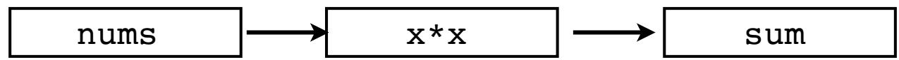

# Generator Functions

* A function that feeds iteration

def squares(nums): for x in nums: yield $x^{*}x$ # Emit a value

* To get the results, use iteration

```txt
for n in squares([1,2,3,4]): 
```

This a more general form that can be used if the iteration processing is more complicated

# Exercise 2.3

Time : 10 minutes

# Secrets of the Builtins

Programmers use the built-in types without giving them much thought   
However, they have some subtle behavior that is worth knowing about   
Especially if you want to write better code

# What is a Builtin?

* An object that's part of the Python interpreter   
* Usually implemented entirely in C   
In some sense, the most primitive kind of object that you can use in a program

# Under the Hood

* All objects have an id, class and a reference count

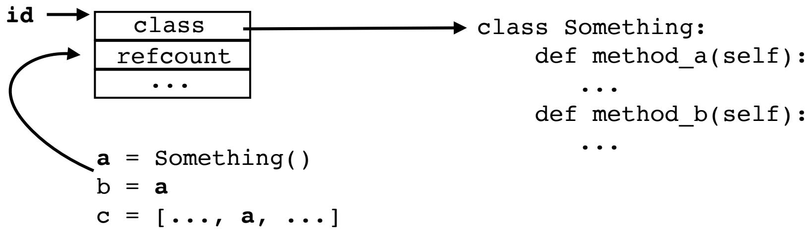

* The id is the memory address   
The class is the "type"   
* Reference count used for garbage collection

# Builtin Representation

* None (a singleton)

<table><tr><td>class</td></tr><tr><td>refcount</td></tr></table>

(16 bytes)

float (64-bit double precision)

<table><tr><td>class</td></tr><tr><td>refcount</td></tr><tr><td>value</td></tr></table>

(24 bytes)

int (arbitrary precision)

<table><tr><td>class</td></tr><tr><td>refcount</td></tr><tr><td>size</td></tr><tr><td>digits</td></tr><tr><td>···</td></tr><tr><td>digits</td></tr></table>

(28-??? bytes)

digits stored in 30-bit chunks

# String Representation

```txt
class refcount length hash flags meta data 
```

* Strings adapt to Unicode (size may vary)

```txt
>>> a = 'n' 
```

```txt
>>> b = 'til' 
```

```txt
>>> sys.getsizeof(a) 
```

```txt
50 
```

```txt
>>> sys.getsizeof(b) 
```

```txt
74 
```

```txt
>>> 
```

# Memory Overhead

* There is inherent memory overhead   
* Can investigate with sys.getsizeof()

```txt
>>> import sys  
>>> a = 2  
>>> sys.getsizeof(a)  
28  
>>> b = 2.5  
>>> sys.getsizeof(b)  
24  
>>> c = '2.5'  
>>> sys.getsizeof(c)  
52  
>>> 
```

* A big part of memory use in earlier exercises

# Operation of the Builtins

The builtin types operate according to predefined "protocols" (special methods)

```txt
>>> a = 2  
>>> b = 3  
>>> a + b  
5  
>>> a._add__(b) # Protocol  
5  
>>> c = 'hello'  
>>> len(c)  
5  
>>> c._len_( ) # Protocol  
5 
```

# Object Protocols

The object protocols are baked into the interpreter at a very low level (byte code)

```python
>>> def f(x, y): return x + y  
>>> import dis  
>>> dis.dis(f)  
2 0 LOAD 
```

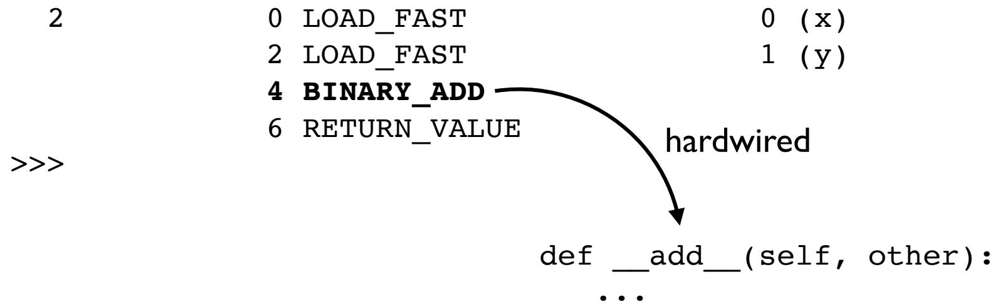

# Making New "Builtins"

Awareness of protocols allows you to make new objects that behave like the builtins   
Example: decimals, fractions

```python
>>> from fractions import Fraction  
>>> a = Fraction(2, 3)  
>>> b = Fraction(1, 2)  
>>> a + b  
Fraction(7, 6)  
>>> a > 0.5  
True 
```

# Exercise 2.4

Time : 30 Minutes

# Container Representation

* Container objects only hold references (pointers) to their stored values

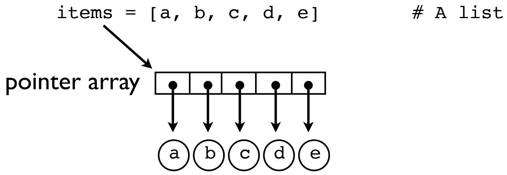

* All operations involving the container internals only manipulate the pointers (not the objects)

# Over-allocation

* All mutable containers (lists, dicts, sets) tend to over-allocate memory so that there are always some free slots available

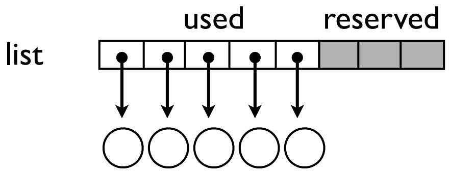

* This is a performance optimization   
* Goal is to make appends, insertions fast

# Example : List Memory

* Example of list memory allocation

```txt
items = []
items.append(1)
items.append(2)
items.append(3)
items.append(4)
items.append(5)
items.append(6)
items.append(7) 
```

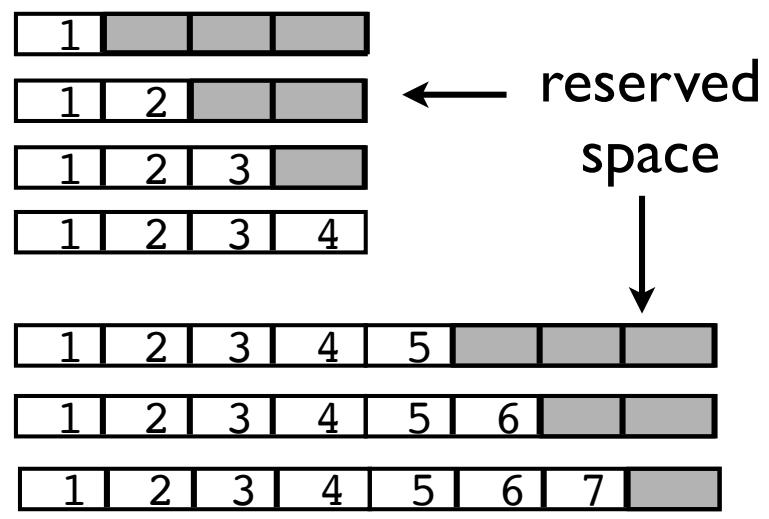

Extra space means that most append() operations are very fast (space is already available, no memory allocation required)

# Container Growth

Memory use of containers grows in proportion to the number of stored values   
Lists : Increase by ~12.5% when full   
Sets : Increases by factor 4 when 2/3 full   
Dicts : Increases by a factor 2 when 2/3 full

# Set/Dict Hashing

* Sets and dictionaries are based on hashing   
Keys are used to determine an integer "hashing value" (__hash__() method)

a = 'Python'

b = 'Guido'

c = 'Dave'

>>> a.__hash__()

-539294296

>>> b.__hash__()

1034194775

>>> c.__hash__()

2135385778

* Value used internally (implementation detail)

# Key Restrictions

* Sets/dict keys restricted to “hashable” objects

```erlang
>>> a = {'IBM', 'AA', 'AAPL'}  
>>> b = [[1,2], [3,4]]  
Traceback (most recent call last):  
    File "<stdin>", line 1, in <module>  
TypeError: unhashable type: 'list'  
>>> 
```

This usually means you can only use strings, numbers, or tuples (no lists, dicts, sets, etc.)   
* Requires __hash__() and __eq__() methods

# Dict Layout

Hashing in a nutshell….

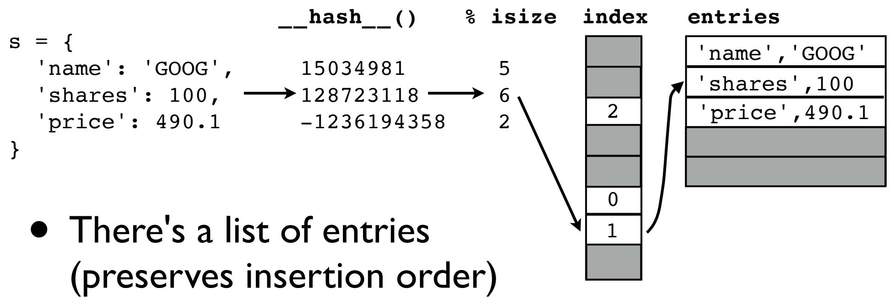

* A hashed index (holds entry positions)

# Collision Resolution

* Hash index is perturbed until an open slot found

$$
\begin{array}{l} \text {k e y} = ^ {\prime} \text {n a m e} ^ {\prime} \\ h = k e y. \_ \_ h a s h \_ \_ () - > 1 5 0 3 4 9 8 1 \\ i = h \% i s i z e \rightarrow 5 \\ \end{array}
$$

Recurrence

$$
\begin{array}{l} i, h = \text {p e r t u r b} (i, h, \text {s i z e}) \\ i = 7, 6, 1, 4, 5, 2, 3, 0, \dots \\ \end{array}
$$

entry index

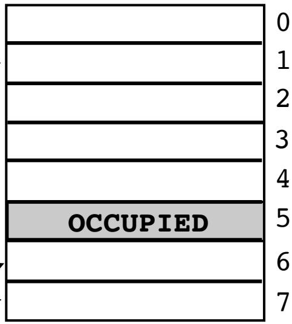

Every slot is tried eventually   
* Works better if many open slots available

# Container Protocols

* Containers also work through "protocols"

```txt
>>> a = ['x', 'y', 'z']  
>>> a[1]  
'Y'  
>>> a._getitem_(1) # Protocol  
'Y'  
>>> 'z' in a  
True  
>>> a._contains__( 'z') # Protocol  
True 
```

You can make custom container objects by implementing the required methods   
Examples: numpy, Pandas, etc.

# Container Taxonomy

For new containers, consider collections.abc

Mapping, MutableMapping Sequence, MutableSequence Set, MutableSet

* Use these as a base class

class MyContainer(collections.abc.MutableMapping): .

* Forces you to implement required methods

```python
>>> c = MyContainer()
Traceback (most recent call last):
    File "<stdin>", line 1, in <module>
TypeError: Can't instantiate abstract class MyContainer with abstract methods __delitem__, __getitem__, __iter__, __len__, __setitem__
>>> 
```

# Exercise 2.5

Time : 25 Minutes

# Understanding Assignment

Many operations in Python are related to "assigning" or "storing" values

a = value # Assignment to a variable

s[n] = value # Assignment to an list

s.append(value) # Appending to a list

d['key'] = value # Adding to a dictionary

* A caution : assignment operations never make a copy of the value being assigned   
* All assignments are merely reference copies (or pointer copies if you prefer)

# Assignment Example

* Consider this code fragment:

$$
\begin{array}{l} a = [ 1, 2, 3 ] \\ b = a \\ c = [ a, b ] \\ \end{array}
$$

* A picture of the underlying memory

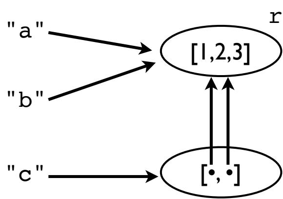

$$
\mathrm {r e f} = 4
$$

There is only one list object [1,2,3], but there are four different references to it.

# Assignment Caution

Modifying a value affects all references

```diff
>>> a.append(999)  
>>> a  
[1,2,3,999]  
>>> b  
[1,2,3,999]  
>>> c  
[[1,2,3,999], [1,2,3,999]]  
>>> 
```

* Notice how a change to the original list shows up everywhere else (yikes!)   
This is because no copies were ever made-- everything is pointing at the same thing

# Call by Object

* Objects are never copied on function call

def func(items): items.append(42)

```txt
>>> a = [1,2,3]  
>>> func(a)  
>>> a  
[1, 2, 3, 42]  
>>> 
```

* Mutations affect the original object   
Reminder: many objects are immutable

# Reassigning Names

* Reassigning a name never overwrites the memory used by the previous value

$$
\begin{array}{l} a = [ 1, 2, 3 ] \\ \texttt {b} = \texttt {a} \\ \end{array}
$$

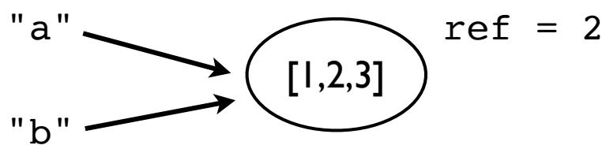

$$
a = [ 4, 5, 6 ]
$$

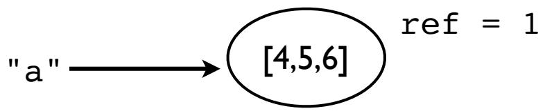

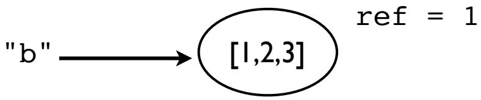

* The name now refers to a different object

# Identity and References

* Use the "is" operator to check if two values are exactly the same in memory

$$
\begin{array}{l} \ggg a = [ 1, 2, 3 ] \\ \ggg \mathbf {b} = \mathbf {a} \\ \ggg a i s b \\ \mathbf {T r u e} \\ \ggg \\ \end{array}
$$

* Every object also has an integer identifier

$$
\begin{array}{l} \ggg \mathbf {i d} (\mathbf {a}) \\ 2 7 7 4 7 6 0 \\ \ggg \mathbf {i d} (\mathbf {b}) \\ 2 7 7 4 7 6 0 \\ \ggg \\ \end{array}
$$

The object identifier is kind of like

a pointer. If two names have the

same id value, they're referring to

the same object.

# Exploiting Immutability

Immutable values can be safely shared

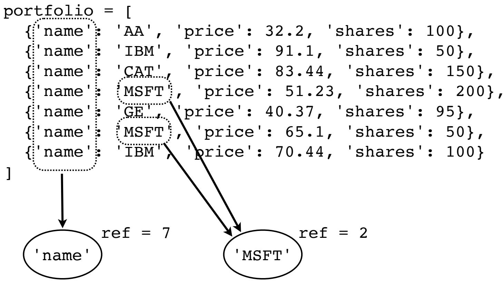

* Sharing can save significant memory

# Shallow Copies

* Containers have methods for copying

$$
\begin{array}{l} \ggg a = [ 2, 3, [ 1 0 0, 1 0 1 ], 4 ] \\ \ggg \mathbf {b} = \operatorname {l i s t} (\mathbf {a}) \\ \ggg a i s b \\ \end{array}
$$

False

# Make a copy

* However, items are copied by reference

$$
\begin{array}{l} \ggg a [ 2 ] \cdot a p p e n d (1 0 2) \\ \ggg \mathbf {b} [ 2 ] \\ [ 1 0 0, 1 0 1, 1 0 2 ] \\ \ggg \\ \end{array}
$$

This inner list is still being shared

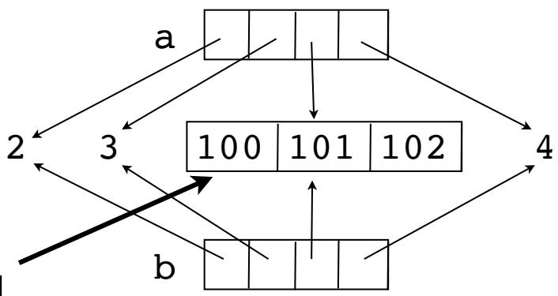

Known as a "shallow copy"

# Deep Copying

Sometimes you need to makes a copy of an object and all objects contained within it   
Use the copy module

```txt
>>> a = [2,3,[100,101],4]  
>>> import copy  
>>> b = copy.copy(a)  
>>> a[2].append(102)  
>>> b[2]  
[100,101]  
>>> 
```

* This is the only safe way to copy something

# Everything is an object

* Numbers, strings, lists, functions, exceptions, classes, instances, etc...   
* All objects are said to be "first-class"   
Meaning: All objects that can be named can be passed around as data, placed in containers, etc., without any restrictions.   
* There are no "special" kinds of objects

# Example: Emulating Cases

A big conditional with many cases

Reformulation using a dict of functions

if op $= =$ ' +':  
    r = add(x, y)  
elif op == '-':  
    r = sub(x, y)  
elif op == '*':  
    r = mul(x, y)  
elif op == '/':  
    r = div(x, y)

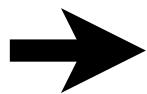

ops $=$ { $\begin{array}{rl}{\mathrm{\bf~\sf~\sf~\sf~\sf~\sf~\sf~\sf~\sf~\sf~\sf~\sf~\sf~\sf~\sf~\sf~\sf~\sf~\sf~\sf~\sf~\sf~\sf~\sf~\sf~\sf~\sf~\sf~\sf~\sf~\sf~\sf~\sf~\sf~\sf ~}} & {}\\ {\mathrm{\bf~\sf~\sf~\sf~\sf~\sf~\sf~\sf~\sf~\sf~\sf~\sf~\sf~\sf~\sf~\sf~\sf~\sf~\sf~\sf~\sf~\sf~\sf~\sf~\sf~\sf~\sf~\sf~\sf~\sf~\sf~\sf~\sf ~}} & {{}^{\prime} + {}^{\prime}\quad :  \mathrm{add},}\\ {\mathrm{\bf~\sf~\sf~\sf~\sf~\sf~\sf~\sf~\sf~\sf~\sf~\sf~\sf~\sf~\sf~\sf~\sf~\sf~\sf~\sf~\sf~\sf~\sf~\sf~\sf~ \mathrm{sub}},}\\ {\mathrm{\bf~\sf~\sf~\sf~\sf~\sf~\sf~\sf~\sf~\sf~\sf~\sf~ \mathrm{mul}},}\\ {\mathrm{\bf~\sf~ \mathrm{ / / } \mathrm{ : ~ \rm div}}} \\ \end{array}$ }   
r $=$ ops[op](x,y)

* Key idea: Can make data structures from anything

# Exercise 2.6

Time : 25 Minutes

# Section 3

# Classes and Objects

# When to use Objects?

Object oriented programming is largely concerned with the modeling of "behavior."   
* An "object" consists of some internal state, but more importantly, has methods that make it do various things.   
* The methods give an object its personality

# An Example

Data

$$
\text {h o s t} = \left(^ {\prime} \mathrm {w w w}. \text {p y t h o n}. \mathrm {o r g} ^ {\prime}, 8 0\right)
$$

Behavior

```txt
c = Connection('www.python.org', 80)  
c.open()  
c.send(data)  
c.recv()  
c.close() 
```

Data and behavior are bound together

# The class statement

* Use 'class' to define a new object

class Player:

```python
def __init__(self, x, y):
    self.x = x
    self.y = y
    self.health = 100 
```

```python
def move(self, dx, dy):
    self.dx += dx
    self.dy += dy 
```

def damage(self, pts): self.health $= =$ pts

* What is a class?   
Mostly, it's a set of functions that carry out various operations on so-called "instances"

# Instances

Instances are the actual "objects" that you manipulate in your program   
* Created by calling the class as a function

>>> a = Player(2, 3)   
>>> b = Player(10, 20)   
>>>

Emphasize: The class statement is just the definition (it does nothing by itself)

# Instance Data

* Each instance has its own local data

```txt
>>> a.x 2   
>>> b.x 10 
```

* This data is initialized by __init__()

```python
class Player: def __init__(self, x, y):  
    self.x = x  
    self.y = y  
    self.health = 100  
is instance data 
```

* There are no restrictions on the total number or type of attributes stored

# Instance Methods

Functions applied to instances of an object class Player:

```python
def move(self, dx, dy): self.x += dx self.y += dy 
```

* The object is always passed as first argument

```txt
>>> a.move(1, 2) def move(self, dx, dy): ... 
```

By convention, the instance is called "self"

The name is unimportant---the object is always passed as the first argument. It is simply Python programming style to call this argument "self."

# Attributes

* A word on terminology   
"Attribute" is anything accessed via (.)

>>> a.x # Attribute of an instance 2   
>>> Player.move # Attribute of a class <function Player.move at 0x10e7f6400>   
>>> import math  
>>> math.pi # Attribute of a module

Don't read too much into it

# History Lesson

Python classes were one of the last major features implemented in the language   
Design goals included no changes in syntax (other than the class statement itself) and no changes to function scoping rules   
Hence : Instance methods are normal function definitions that simply receive the instance as the first argument (self)   
That's it

# Class Scoping

Caution: Classes do not define a scope

```python
>>> NameError
class Player:
    ...
    def move(self, dx, dy):
        self.x += dx
        self.y += dy
    def left(self, amt):
        move(-amt, 0)  # NO. Calls global move()
        self.move(-amt, 0)  # YES. 
```

If want to operate on an instance, you always have to refer to it explicitly (e.g., self)

# Exercise 3.1

Time : 20 Minutes

# Manipulating Instances

* There are only three operations on instances

obj Attr #Get an attribute obj.Attr $=$ value #Set an attribute del obj.Attr #Delete an attribute

Attributes can be freely added and deleted after an instance is created

```txt
>>> s = Stock('ACME', 50, 91.1)  
>>> s.share  
50  
>>> s.date = '10/31/2017' # Add an attribute  
>>> del s.name # Delete an attribute  
>>> 
```

# Attribute Access Functions

These functions may be used to manipulate attributes given an attribute name string

```python
getattr(obj, 'name') # Same as obj.name  
setattr(obj, 'name', value) # Same as obj.name = value  
delattr(obj, 'name') # Same as del obj.name  
hasattr(obj, 'name') # Tests if attribute exists 
```

Example: Output

```python
attributes = ['name', 'shares', 'price']
for attr in attributes:
    print(attr, ':=' , getattr(obj, attr)) 
```

* Note: getattr() has a useful default value arg

```txt
x = getattr(obj, 'x', None) 
```

# Method Invocation

* Invoking a method is a two-step process   
Lookup: The . operator   
* Method call: The () operator

class Stock: def cost(self): return self.share \* self.price >>>s =Stock('ACME'，50,91.1) >>>c $=$ s.cost Lookup >>>c <bound method Stock.cost of <Stock object at 0x590d0>> >>> c() 4555.0 Method call

# Bound Methods

A method that has not yet been invoked by the function call operator () is known as a "bound method"   
* It operates on the instance where it originated

>>>s = Stock('ACME'，50,91.1)   
>>>s   
 STOCKobjectat $0\mathrm{x}590\mathrm{d}0>$ >>>c $\equiv$ s.cost binding   
>>>c   
<bound methodStock.cost of <Stock object at 0x590d0>>   
>>>c()   
4555.0   
>>>

# Bound Methods

Why would you care?   
* Often a source of careless non-obvious errors

```txt
>>> s = Stock('ACME', 50, 91.1)  
>>> print('Cost: %0.2f' % s.cost)  
Traceback (most recent call last):  
    File "<stdin>", line 1, in <module>  
TypeError: a float is required  
>>> 
```

* Or devious behavior that's hard to debug

f = open(filename, 'w')  
...  
f.close $\leftarrow$ Oops. Didn't do anything at all

# Exercise 3.2

Time : 15 Minutes

# More on Class Definitions

* A class contains definitions that are shared by all instances of the class

```python
class Stock: def __init__(self, name, shares, price): self.name = name self.share = shares self.price = price 
```

```python
def cost(self):
    return self.share * self.price 
```

* Shared : Defined once, used by all instances   
Example : There is one cost() function that gets used by all instances created

# Class Variables

Classes may also define variables   
* Known as "class variables"

class SomeClass: debug $=$ False def init_self, x): self.x = x

* There are two access routes

```txt
>>> SomeClass(debug  
False  
>>> s = SomeClass(42)  
>>> s(debug  
False  
>>> 
```

```txt
(On the class itself) (On an instance of the class) 
```

# Using Class Variables

* Often used for settings applied to all instances

```python
class Date: datefmt = '{year}-{month}-{day}' def __init__(self, year, month, day): self.year = year self.month = month self.day = day def __str__(self): return self.datefmt.format(year= self.year, month= self.month, day= self.day) 
```

Possibly changed via inheritance

```python
class USDate(Date):
    datefmt = '{month}'/{day}'/{year}' 
```

# Class Methods

* A method that operates on the class itself

```txt
class SomeClass: @classmethod def yow(cls): print('SomeClass.yow',cls) 
```

* It's invoked on the class, not an instance

```txt
>>> SomeClass.yow()
SomeClass.yow <class __main__.SomeClass>
>>> 
```

* The class is passed as the first argument

```txt
SomeClass.yow() @classmethod def yow(c1s): 
```

# Using Class Methods

Class methods are often used as a tool for defining alternate initializers

class Date: def __init__(self, year, month, day): self.year $=$ year self.month $=$ month self.day $\equiv$ day @classsmethod def today(c1s): tm $=$ time.localtime() return c1s(tm.tm_year, tm.tm_mon, tm.tm_mday) Notice how the class passed as an argument. d $=$ Date.Today()

# Using Class Methods

* Class methods solve some tricky problems with features like inheritance

class Date:   
...   
@classmethod   
def today(c1s): tm $=$ time.localtime() return c1s(tm.tm_year, tm.tm_mon, tm.tm_mday)   
class NewDate(Date): Gets the correct class (e.g.,NewDate)   
d $=$ NewDate.Today()

# Static Methods

* A function that's defined as part of a class, but does not operate on instances or the class

```ruby
class SomeClass: @staticmethod def yow(): print('SomeClass.yow') 
```

* Example:

```txt
>>> SomeClass.yow()  
SomeClass.yow  
>>> 
```

* Notice: There is no hidden self argument

# Using Static Methods

Uses vary:

* Utility functions used by various methods   
Instance management/tracking   
* Finalization, resource management   
Certain design patterns

Might improve code clarity--grouping related functionality together within a class

# Exercise 3.3

Time : 15 Minutes

# Classes and Encapsulation

One of the primary roles of a class is to encapsulate data and internal implementation details of an object   
However, a class also defines a "public" interface that the outside world is supposed to use to manipulate the object   
This distinction between implementation details and the public interface is important

# Python Encapsulation

Python relies on programming conventions to indicate the intended use of something   
Typically, this is based on naming   
There is a general attitude that it is up to the programmer to observe the rules as opposed to having the language enforce rules

# Private Attributes

Any attribute name with a leading _ is considered to be "private"

```python
class Base: def __init__(self, name): self._name = name 
```

* However, this is only a programming style   
You can still access it

```txt
>>> b = Base('Guido')
>>> b._name
'Guido'
>>> b._name = 'Dave'
>>> 
```

# Complication

* Are "private" attributes visible to subclasses?

```python
class Base: def __init__(self, name): self._name = name   
class Child(Base): def spam(self): print('Spam', self._name) 
```

* As a general rule, this is accepted practice   
Subclasses often extend/enhance the functionality of the parent (may need attributes)

# Avoiding Name Collisions

* Variant : Attribute names with two leading _

class Base: def init__(self, name): self.__name $=$ name

* Attribute is not visible in subclasses

class Child(Base): def spam(self): print('Spam', self.__name) # AttributeError

Implemented as a name mangling trick

```txt
>>> b = Base('Guido')  
>>> b._Base__name  
'Guido'  
>>> 
```

# Problem: Simple Attributes

# Consider the following class

```python
class Stock: def __init__(self, name, shares, price): self.name = name self.share = shares self.price = price s = Stock('GOOG', 100, 490.1) s.share = 50 
```

* Suppose you later wanted to add validation

s.share $= 50$ #-->TypeError

How would you do it?

# Managed Attributes

# * You might introduce accessor methods

class Stock:

def __init__(self, name, shares, price):

self.name $=$ name

self.set_shares(shares)

self.price $=$ price

functions that layer get/

set operations on top of

a private attribute

def get_shares(self):

return self._shares

def set_shares(self, value):

if not isinstance(value, int):

raise TypeError('Expected an int')

self._shares $=$ value

# * Too bad this breaks all existing code

s.shares = 50

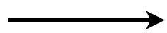

s.set_shares(50)

# Properties

* An alternative approach to accessor methods

class Stock:

```python
def __init__(self, name, shares, price):
    self.name = name
    self.share = shares
    self.price = price 
```

@property

```python
def shares(self):
    return self._shares 
```

@shares.setter

```python
def shares(self, value): if not isinstance(value, int): raise TypeError('Expected int') self._shares = value 
```

* The syntax is a little jarring at first

# Properties

# * Normal attribute access triggers the methods

class Stock:

def __init__(self, name, shares, price):

self.name $=$ name

self.shares $=$ shares

self.price $=$ price

get >>> s = Stock(...) >>> s = Stock(...) >>> s.shares >>> s.shares @property 100 100

def shares(self):

return self._shares

set

>>> s.shares = 50

>>>

@shares.setter

def shares(self, value):

if not isinstance(value, int):

raise TypeError('Expected int')

self._shares $=$ value

# * No changes needed to other source code

# Properties

* You don't change existing attribute access

class Stock:

def __init__(self, name, shares, price):

self.shares $=$ shares

@property

def shares(self):

return self._shares

assignment calls the setter

@shares.setter

def shares(self, value):

if not isinstance(value, int):

raise TypeError('Expected int')

self._shares $=$ value

Common confusion: property vs private name

# Properties

Properties are also useful if you are creating objects where you want to have a very consistent programming interface   
Example : Computed data attributes

```python
class Stock: def __init__(self, name, shares, price): self.name = name self.share = shares self.price = price @property def cost(self): return self.share * self.price 
```

# Properties

# * Example use:

```txt
>>> s = Stock('ACME', 50, 91.1)  
>>> s.name Instance Variable  
'ACME'  
>>> s.cost Computed Property  
4555.0  
>>> 
```

Commentary : Notice how there is no obvious difference between the attributes as seen by the user of the object

# slots Attribute

* You can restrict the set of attribute names

```python
class Stock: __slots__ = ('name', 'shares', 'price') ... 
```

* Produces errors for other attributes

```txt
>>> s = Stock('ACME', 50, 91.1)  
>>> s.share = 75  
>>> s.share = 75  
Traceback (most recent call last):  
    File "<stdin>", line 1, in ?  
AttributeError: 'Stock' object has no attribute 'share' 
```

This is a performance optimization (uses less memory, runs faster)

# slots Cautions

slots should only be used sparingly   
Be aware that it's presence can cause strange interaction with other parts of Python that are related to objects   
* Advice : Do not use it except with classes that are simply going to serve as simple data structures

# Commentary

The features described so far cover virtually everything that you will see in most Python class definitions   
Essential pieces

Instance data (assignment in __init__)   
Methods (instance, static, class)   
Properties   
Private attributes, __slots_

# Exercise 3.4

Time : 15 Minutes

# Inheritance

* A tool for specializing existing objects

class Parent:

class Child(Parent):

* New class called a derived class or subclass   
Parent known as base class or superclass   
Parent is specified in () after class name

# Inheritance

* What do you mean by "specialize?"   
* Take an existing class and ...

* Add new methods   
Redefine some of the existing methods   
* Add new attributes to instances

In a nutshell: Extending existing code

# Inheritance Example

# Adding a new method

class MyStock(Stock): def panic(self): self sell(self.share)   
>>>s $\equiv$ MyStock('GOOG'，100，490.1) >>>sSell(25)   
>>>s.share   
75   
>>>s.panic()   
>>>s.share   
0   
>>>

# * You can give new capabilities to existing objects

# Inheritance Example

# Redefining a method

class MyStock(Stock): def cost(self): return 1.25 \* self.share \* self.price   
>>>s $=$ MyStock('GOOG'，100，490.1)   
>>>s.cost()   
61262.5   
>>>

* The new method takes the place of the old one   
* Other methods are unaffected

# Inheritance and Overriding

Sometimes a class extends an existing method, but it has to use the original implementation

class Stock: def cost(self): return self.share \* self.price class MyStock(Stock): def cost(self): actual_cost $=$ super().cost() return 1.25 \* actual_cost

* Use super() to call previous version   
Caution: Python 2 is different

actual_cost $=$ super(MyStock, self).cost()

# Inheritance and init

* With inheritance, you must initialize parents

class Stock:

def __init__(self, name, shares, price):

self.name $=$ name

self.shares $=$ shares

self.price $=$ price

class MyStock(Stock):

def __init__(self, name, shares, price, factor):

super().__init__(name, shares, price)

self.factor $=$ factor

def cost(self):

return self.factor * super().cost()

* Again, you should use super() as shown

# I: is a" relationship

* Inheritance establishes a type relationship

class Stock:   
class MyStock(Stock):   
>>>s $\equiv$ MyStock('ACME'，50，91.1) >>>isinstance(s，Stock) True   
>>>

Important: objects defined via inheritance are a special version of the parent (same capabilities)

# object base class

Sometimes a class will use object as parent

class Stock(object):

object is the parent of all objects in Python (even if you don't specify it in Python 3)   
Note: There is some historical baggage with Python 2 so it's common to see it in old code

# Multiple Inheritance

* You can specify multiple base classes

```python
class Parent1:   
...   
class Parent2:   
...   
class Child(Parent1,Parent2): 
```

* The new class inherits features from both parents   
But there are some really tricky details (later)   
* Don't do it unless you understand it

# Using Inheritance

Inheritance is often used as a code customization/extensibility feature   
For example, certain parts of a framework might involve inheriting from an existing class and redefining a handful of methods   
* Idea: you add bits and pieces to existing code to make it do custom processing

# Exercise 3.5

Time : 20 Minutes

# Special Methods

* Classes can customize almost every aspect of their behavior   
This is done through special methods

```python
class Point: def __init__(self, x, y): ... def __str__(self): 
```

* There are dozens of these methods   
Instead of showing every possible customization, will show essential ones

# String Conversions

* Objects have two string representations

```txt
>>> from datetime import date  
>>> d = date(2012, 12, 21)  
>>> print(d)  
2012-12-21  
>>> d  
datetime.date(2012, 12, 21)  
>>> 
```

str(x) - Printable output >>> str(d) '2012-12-21' >>>   
repr(x) - For programmers >>> repr(d) 'datetime.date(2012, 12, 21)' >>>

# String Conversions

class Date:

```python
def __init__(self, year, month, day):
    self.year = year
    self.month = month
    self.day = day 
```

```python
def __str__(self):
    return 'd-%d-%d' % (self.year, self.month, self.day) 
```

```python
def __repr__(self):
    return 'Date(%r,%r,%r)' % (self.year, self.month, self.day) 
```

Note: The convention for __repr__() is to return a string that, when fed to eval() , will recreate the underlying object. If this is not possible, some kind of easily readable representation is used instead.

# Methods: Item Access

* Methods used to implement containers

```txt
len(x) x._len_(x[a] x._getitem_(a)  
x[a] = v x._setitem_(a,v)  
del x[a] x._delitem_(a)  
a in x x._contains_(a) 
```

Definition in a class

```python
class Container: def __len__(self): def __getitem__(self,a): def __setitem__(self,a,v): def __delitem__(self,a): def __contains__(self,a): 
```

# Methods: Mathematics

# Mathematical operators

a + b a.__add__(b)   
a - b a.__sub__(b)   
a * b a.__mul__(b)   
a / b a.__div__(b)   
a // b a.__floordiv__(b)   
a % b a.__mod__(b)   
a << b a.__lshift__(b)   
a >> b a.__rshift__(b)   
a & b a.__and__(b)   
a | b a.__or__(b)   
a ^ b a.__xor__(b)   
a ** b a.__pow__(b)   
-a a.__neg__()   
~a a.__invert__()   
abs(a) a.__abs__()

# * Consult reference for further details

# Instance Creation

Instances are created in two steps

class Date:

def __init__(self, year, month, day):

self.year = year

self.month $=$ month

self.day $=$ day

d = Date(2012, 12, 21)

Under the hood

d = Date.__new__(Date, 2012, 12, 21)

d.__init__(2012, 12, 21)

# Using new

* Sometimes you might use __new__() directly

class Date:

```python
...
@classmethod
def today(cls):
    t = time.localtime()
    self = cls._new__(cls)
    self.year = t.tm_year
    self.month = t.tm_mon
    self.day = t.tm_mday
    return self 
```

```txt
d = Date today() 
```

* Creates an instance, but bypasses __init__()

# Defining new

Classes may define __new__() C

```python
class A: @staticmethod def __new__(cls, x, y): return super().__new__(cls) def __init__(self, x, y): 
```

* Not common, but sometimes used when altering some tricky aspect of instance creation

Instance caching   
Immutability

# del method

* Classes might define a "destructor" method

class Connection:

```python
def __del__(self):
    # Cleanup statements 
```

* Called when the reference count reaches 0   
* Confusion: Not related to “del” operator

$\mathbf{c} = \mathbf{\text{Con}}$ nnection() #refcnt $= 1$ d=c # refcnt $= 2$

```python
del d # Doesn't call d._del_( (refcnt = 1)  
c = None # Calls c._del_( (refcnt = 0) 
```

# del method

Typical uses:   
Proper shutdown of system resources (e.g., network connections)   
* Releasing locks (e.g., threading)   
* Avoid defining it for any other purpose

# Weak References

* A weak reference is a reference to an object that does not increase its reference count   
Sometimes this is desired in when there is a complicated relationship between objects and there are issues with memory management   
Supported by weakref library module

# weakref module

Creating a weak reference

```python
>>> import weakref
>>> f = Foo()
>>> ref = weakref.ref(f)
>>> ref
<weakref at 0x4203c0; to 'Foo' at 0x41cff0> 
```

* Getting the object being pointed at

```txt
>>> g = ref() # Dereference  
>>> print(g)  
<__main__.Foo object at 0x41dfff0> 
```

* If object is dead, deference returns None

```txt
>>> g = freq()  
>>> print(g)  
None 
```

# Using Weak References

Weak references are sometimes used where there are reference cycles between objects   
Example : graphs, trees, observers, caches,etc.   
Not something you should consider unless dealing with really tricky memory problems   
* More features in the weakref module

# Context Managers

For resources, consider the use of the 'with' statement instead of relying on __del__()

```txt
with obj as val: val = obj.__enter__(  ) statements statements statements statements statements obj._exit_(ty, val, tb) 
```

* Allows you to customize entry/exit steps

# Context Managers

# Example:

```python
class Manager: def __enter__(self): print('Entering') return self def __exit__(self,ty，val，tb): print('Leaving') if ty: print('An exception occurred') 
```

# * Example use:

```txt
>>> m = Manager()
>>> with m:
...
...
print('Hello World')
...
Entering
Hello World
Leaving
>>> 
```

Note: the ty, val, tb arguments have information about pending exceptions (if any)

# Exercise 3.6

Time : 15 Minutes

# Code Reuse

* A major theme of object oriented programming concerns code reuse and making things extensible   
A big topic   
* There are a number of common techniques

# Interfaces

Classes often serve as a kind of design specification or programming interface

```python
class IStream: def read(self, maxbytes=None): raise NotImplementedError(): def write(self, data): raise NotImplementedError() 
```

This class isn't used directly, but is usually included as a base class for other objects

```python
class UnixPipe(IStream): def read(self, maxbytes=None): def write(self, data): 
```

# Abstract Base Classes

Consider defining interfaces as an abstract base class (ABC) instead

from abc import ABC, abstractmethod

```python
class IStream(ABC):
    @abstractmethod
        def read(self, maxbytes=None):
            pass
        @abstractmethod
            def write(self, data):
                pass 
```

Doesn't allow instantiation unless all of the abstract methods have been fully implemented

# Abstract Base Classes

* ABCs may simplify type checking

```python
def write_data(data, stream):
    if not isinstance(stream, IStream):
        raise TypeError('Expected a Stream') 
```

* ABCs catch careless usage errors

```python
class UnixPipe(IStream): def recv(self, maxbytes=None): def write(self, data): pass >>> p = UnixPipe() Traceback (most recent call last): File "<stdin>", line 1, in <module> ValueError: Can't instantiate abstract class UnixPipe with abstract methods read >>> 
```

# Handler Classes

Sometimes code will implement a general purpose algorithm, but will defer certain steps to a separately supplied handler object   
Sometimes known as the "strategy" design pattern.

# Handler Classes

# * Example :

def print_table(record, fields,formatter):   
Calls to   
handler   
methods for r in records: rowdata $=$ [getattr(r, fieldname,'undef') for fieldname in fields] $\rightarrow$ formatter(row(rowdata)

Notice how various steps of the algorithm are deferred to a separate handler object

# Handler Classes

* Handlers have their own class definition

class TableFormatter: def headings(self, headings): raise NotImplementedError def row(self, rowdata): raise NotImplementedError

The handler only contains the methods that need to be implemented/customized   
Important idea : Decoupling of the class that produces the table from the handler methods

# Handler Classes

# Example Use

```python
class TextTableFormatter(TableFormatter): def headings(self, headers): for h in headers: print('%10s' % h, end='') print() print('-*10+' * len(columns)) def row(self, rowdata): for d in rowdata: print('%10s' % d, end='') print() 
```

```python
formatter = TextTableFormatter()
print_table笑着说, ['name', 'shares'],formatter) 
```

# Commentary

The use of handler classes is extremely common throughout the Python standard library (might be the most popular OO design pattern used in Python)   
Rationale : This approach provides flexibility   
* Handlers are decoupled from implementation   
* Allows handler code to be reused in other contexts (other classes can use the same handler objects).

# Classes as a Template

* A class might implement a generalpurpose algorithm, but delegate certain steps to a subclass   
* Will illustrate with a simple example

# Template Example

* A class that parses a CSV file into a list

class CSVParser: def parse(self, filename): records $=$ [] with open(filename) as f: rows $=$ csv-reader(f) self Headers $=$ nextrows) for row in rows: record $=$ self.make_record(row) records.append(record) return records

```python
Step that must be implemented def make_record(self, row): raiseRuntimeError('Must implement') 
```

* Note: Class is useless by itself

# Template Example

* Using the template (use inheritance)

```python
class DictCSVParser(CSVParser): defmake_record(self,row): returndict(zip(self.headers,row)) 
```

parser $=$ DictCSVParser()   
portfolio $\equiv$ parser.parse('portfolio.csv')

Critical idea : User defines a small class that supplies the one missing piece, but most of the real functionality is in the base class

# Prefer Functions

* The template pattern is often overcomplicated   
* Consider a function + callback instead

```python
def parse_csv(filename, make_record): records = [] with open(filename) as f: rows = csv-reader(f) headers = next(rows) for row in rows: record = make_record(headers, row) records.append(record) return records 
```

```python
def make_record(headers, row):
    # User implements 
```

# Exercise 3.7

Time : 15 Minutes

# Advanced Inheritance

Recall: Inheritance is a tool for code reuse (customization and extension)

```python
class Parent: def spam(self): class Child(Parent): def spam(self): print('Different spam') super().spam() 
```

* Child classes can customize their parents   
* Sometimes see use of super() function (shown)

# Multiple Inheritance

Classes can have multiple parents

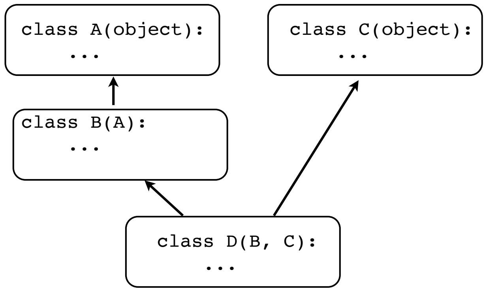

* The child will inherit features from all parents   
But, it's a lot sneakier than this

# Cooperative Inheritance

Python uses "cooperative multiple inheritance"   
Big idea: A child class can specifically arrange its parents to cooperate with each other

class Child(Parent1, Parent2, Parent3):

The order of the parents has significance   
* Attribute search may jump parent-to-parent

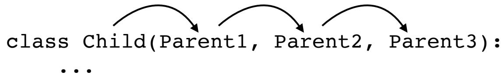

# Cooperative Inheritance

* Example: Consider this arrangement

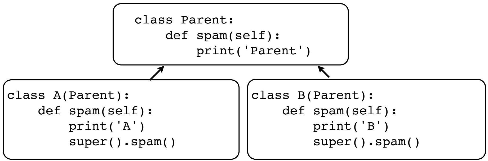

* Now, this:

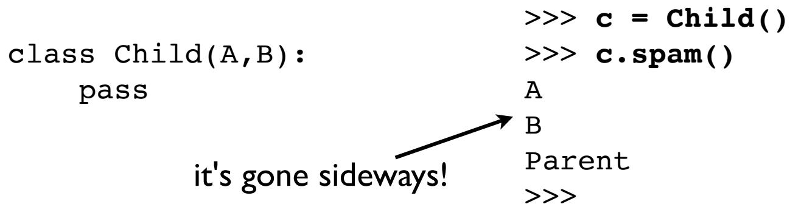

# Cooperative Inheritance

There are applications

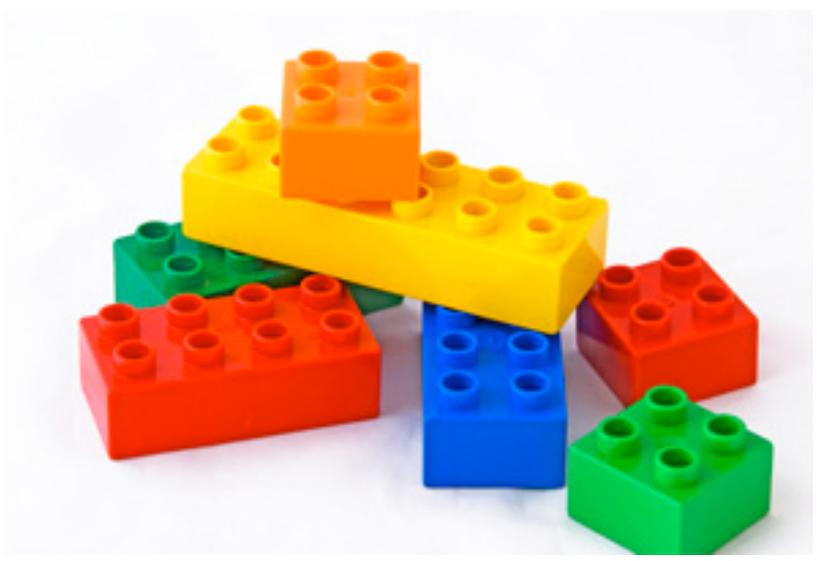

You can make collections of classes that are meant to be stacked together to make more interesting things

# An Odd Code Reuse

```python
class Dog: def noise(self): return 'Woof' def chase(self): return 'Chasing!'   
class LoudDog(Dog): def noise(self): return super()\ .noise().upper() 
```

```txt
class Bike: def noise(self): return 'On Your Left' def pedal(self): return 'Pedaling!' class LoudBike(Bike): def noise(self): return super()\ .noise().upper() 
```

Completely unrelated objects   
But, there is a code commonality

# Mixin Classes

A mixin is a class whose purpose is to add extra functionality to other class definitions   
* Idea : If a user implements some basic features in their class, a mixin can be used to fill out the class with extra functionality   
* Sometimes used as a technique for reducing the amount of code that must be written

# Mixin Example

* A class with a fragment of code

class Loud:

def noise(self):

return super().noise().upper()

Not usable in isolation   
* Mixes with other classes via inheritance

class LoudDog(Loud, Dog): pass

class LoudBike(Loud, Bike): pass

# How it works

Example:

```python
class LoudDog(Loud, Dog):
    pass super() 
```

```txt
>>>d = LoudDog() 
```

```txt
>>> d.noise() 
```

```txt
'WOOF' 
```

```txt
>>> 
```

* super() moves to the next class   
* Allows mixins to combine with arbitrary classes

# Use of Mixins

Mixin classes are sometimes used as a way to add optional features to more basic objects   
For example, added thread support, persistence, etc.   
User assembles an object from the different parts that they're going to use

# Exercise 3.8

Time : 15 Minutes

# Section 4

# Inside Python Objects

# Overview

Inner details on how Python objects work   
Object representation   
Attribute binding   
Type checking   
Descriptors   
Attribute special methods

# Dictionaries Revisited

* A dictionary is a collection of named values

```gradle
stock = {
    'name': 'GOOG',
    'shares': 100,
    'price': 490.10
} 
```

Dictionaries are commonly used for simple data structures (shown above)   
However, they are used for critical parts of the interpreter and may be the most important type of data in Python

# Dicts and Objects

* User-defined objects use dictionaries

* Instance data   
Class members

In fact, the entire object system is mostly just an extra layer that's put on top of dictionaries   
* Let's take a look...

# Dicts and Instances

* A dictionary holds instance data (__dict__)

```txt
>>> s = Stock('GOOG', 100, 490.10) 
```

```txt
>>>s.__dict__ 
```

```txt
{'name': 'GOOG', 'shares': 100, 'price': 490.10} 
```

* You populate this dict when assigning to self

class Stock:

```python
def __init__(self, name, shares, price): 
```

```txt
self.name = name 
```

```txt
self.share = shares 
```

```txt
self.price = price 
```

self._dict_ $\longrightarrow$ { 'name'：'GOOG', 'shares'：100, 'price'：490.10 }

instance data

# Dicts and Instances

Critical point : Each instance gets its own private dictionary

$$
s = \text {S t o c k} \left(^ {\prime} G O O G ^ {\prime}, 1 0 0, 4 9 0. 1 0\right)
$$

$$
t = \text {S t o c k} \left(^ {\prime} \mathrm {A A P L} ^ {\prime}, 5 0, 1 2 3. 4 5\right)
$$

$$
\left\{ \begin{array}{l} \quad \text { ' n a m e ' : ' G O O G ' ,} \\ \quad \text { ' s h a r e s ' : 1 0 0 ,} \\ \quad \text { ' p r i c e ' : 4 9 0 . 1 0} \\ \end{array} \right.
$$

* So, if you created 100 instances of some class, there are 100 dictionaries sitting around holding data

$$
\left\{ \begin{array}{l} \text { ' n a m e ' : ' A A P L ' ,} \\ \text { ' s h a r e s ' : 5 0 ,} \\ \text { ' p r i c e ' : 1 2 3 . 4 5} \\ \end{array} \right.
$$

# Dicts and Classes

# * A dictionary holds the members of a class

class Stock: def __init__(self, name, shares, pr self.name = name self.share = shares self.price = price def cost(self): return self.share * self.price def sell(self, nshares): self.share $= =$ nshares

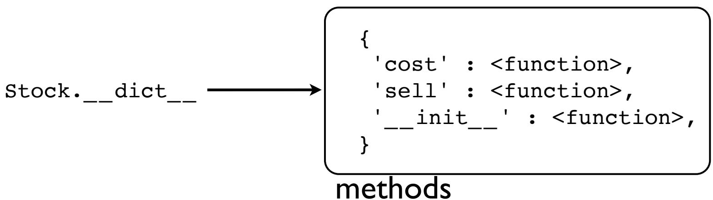

# Instances and Classes

Instances and classes are linked together   
_ _ class_ _ attribute refers back to the class

>>>s $\equiv$ Stock('GOOG'，100，490.10)   
>>>s._dict_   
{'name':'GOOG','shares':100,'price':490.10}   
>>>s._class_   
<class__main__.Stock'>   
>>>

The instance dictionary holds data unique to each instance whereas the class dictionary holds data collectively shared by all instances

# Instances and Classes

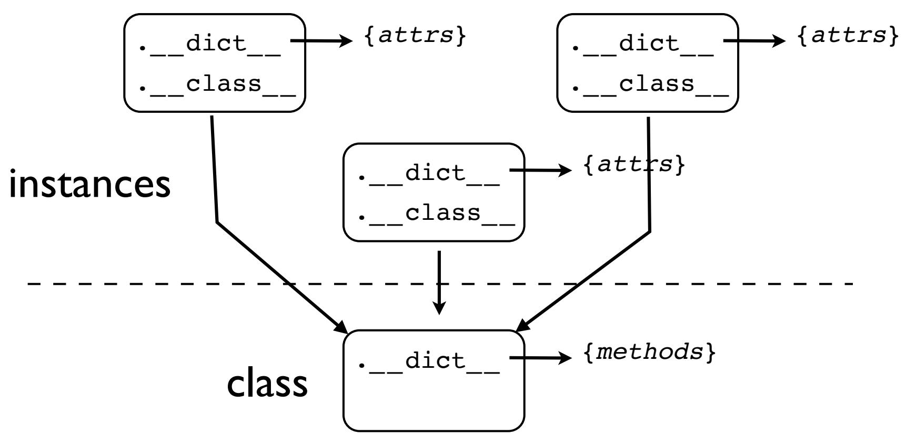

# Attribute Access

* When you work with objects, you access data and methods using the (.) operator

```txt
x = obj.name #Getting obj.name = value #Setting del obj.name #Deleting 
```

These operations are directly tied to the dictionaries sitting underneath the covers

# Modifying Instances

Operations that modify an object always update the underlying dictionary

>>>s $\equiv$ Stock('GOOG'，100,490.10)   
>>>s.__dict_   
{'name':'GOOG'，'shares':100，'price':490.10}

$\longrightarrow$ >>> s≧shares = 50

```txt
→ >>> s.date = '6/7/2007' 
```

```txt
>>>s.__dict_
{'name':'GOOG','shares':50,'price':490.10, 'date':'6/7/2007'} 
```

$\longrightarrow$ >>> del s.share

```txt
>>>s.__dict__
{'name':'GOOG', 'price':490.10, 'date':'6/7/2007'}  
>>> 
```

# Reading Attributes

* Suppose you read an attribute on an instance

$$
x = o b j. n a m e
$$

* Attribute may exist in two places

Local instance dictionary   
Class dictionary

* So, both dictionaries may be checked

# Reading Attributes

First check in local _ dict_   
If not found, look in _ _ dict_ _ of class

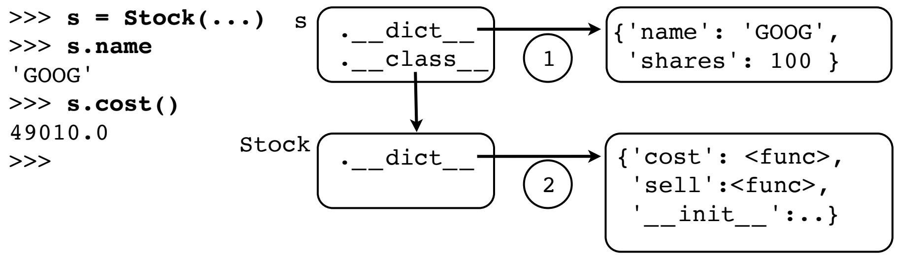

This lookup scheme is how the members of a class get shared by all instances

# Exercise 4.1

Time : 10 Minutes

# How Inheritance Works

* Classes may inherit from other classes class A(B,C): ...   
Bases are stored as a tuple in each class >>> A.__bases_ (<class _main__.B'>,<class '__main__.C'>) >>>   
* This provides a link to parent classes   
This link simply extends the search process used to find attributes

# Reading Attributes

First check in local __dict__   
* If not found, look in _ _ dict_ _ of class   
* If not found in class, look in base classes

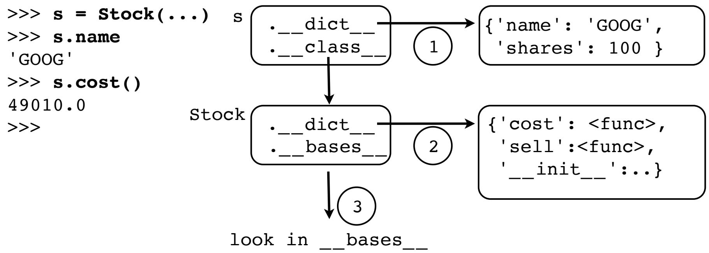

# Single Inheritance

In inheritance hierarchies, attributes are found by walking up the inheritance tree

class A(object): pass

class B(A): pass

class C(A): pass

class D(B): pass

class E(D): pass

With single inheritance, there is a single path to the top   
* You stop with the first match

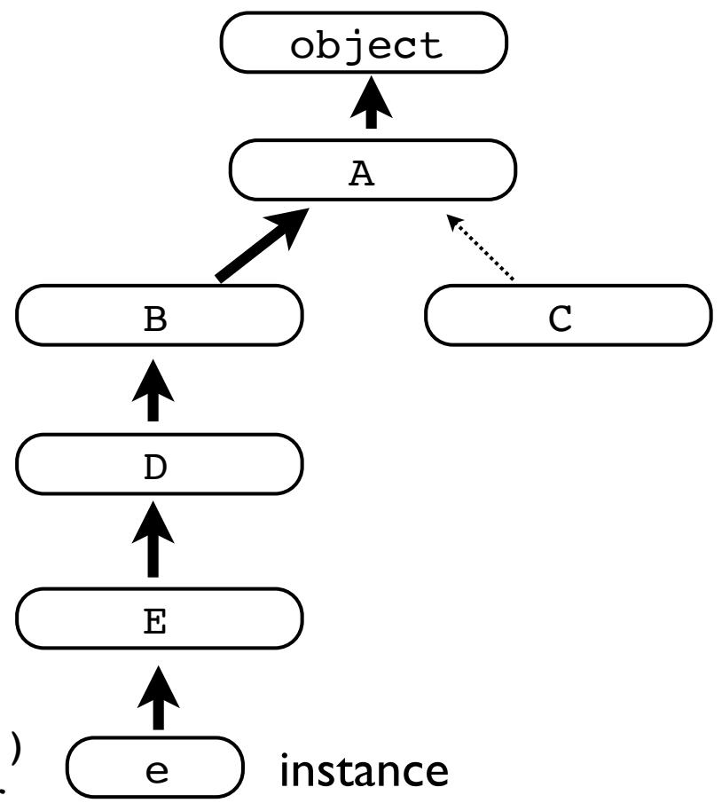

e = E()

e.attr

# The MRO

The inheritance chain is precomputed and stored in an "MRO" attribute on the class

```txt
>>> E.__mro__(<class__main__.E>， <class__main__.D>， <class__main__.B>， <class__main__.A>， <type 'object'>)   
>>>
```

"Method Resolution Order"   
* To find attributes, Python walks the MRO   
First match wins

# Multiple Inheritance

# Consider this hierarchy

class A(object): pass

class B(object): pass

class C(A,B): pass

class D(B): pass

class E(C,D): pass

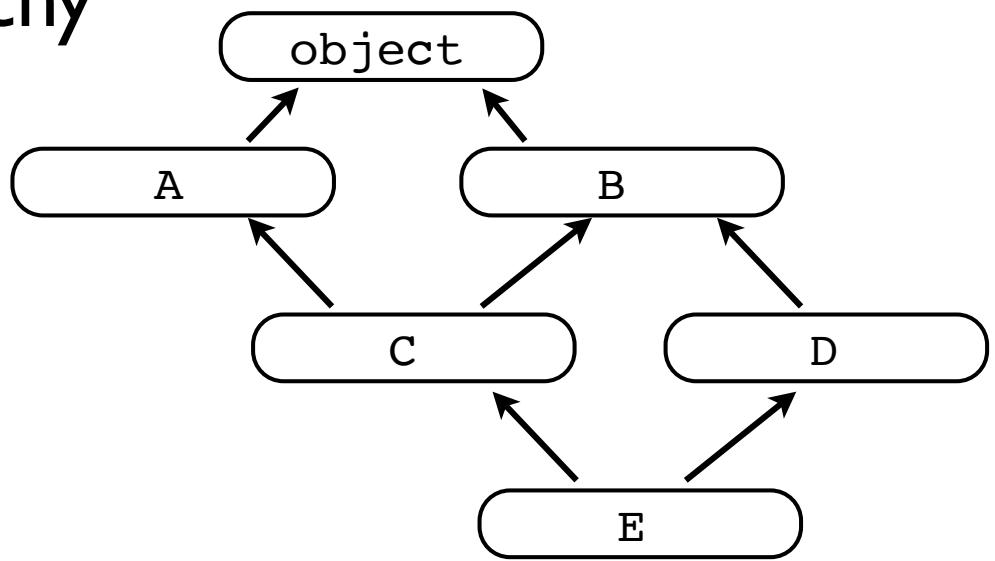

# What happens here?

$$
\begin{array}{l} e = E (.) \\ e. a t t r \\ \end{array}
$$

# * A similar search process is carried out, but there is an added complication in that there may be many possible search paths

# Multiple Inheritance

Python uses "cooperative multiple inheritance"   
* There are some ordering rules:

Rule 1: Children before parents

Rule 2: Parents go in order

Inheritance works in two directions (up the hierarchy, across the list of parents)

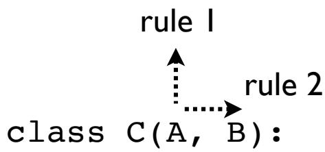

# Multiple Inheritance

* Multiple inheritance hierarchy is flattened

```txt
>>> E.__mro__(<class 'main'.E>'》，<class 'main.C'>，<class 'main.A'>，<class 'main.D'>，<class 'main.B'>，<class 'object'>)  
>>> 
```

Calculated using the C3 Linearization algorithm   
* A constrained merge sort of parent MROs   
An ordering based on "the rules"   
* Note: If you must know, there's also a third rule (first listed parent wins if there's a "tie").

# Multiple Inheritance

* Consider classes with a common parent

class Base:

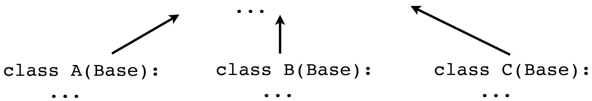

* All children of a common parent go first

class D(A,B,C):

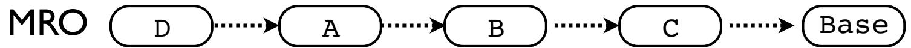

# Why super()?

* Always use super() when overriding methods

class A(Base): def spam(self): return super().spam()

super() delegates to the next class on the MRO

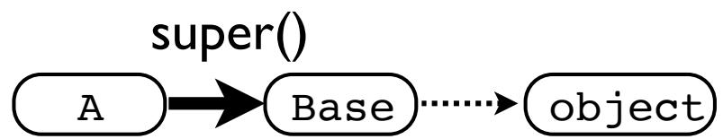

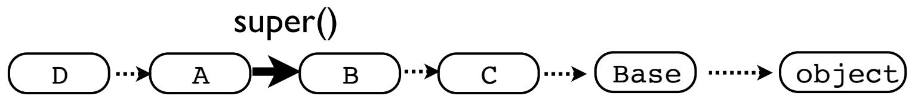

* Tricky bit: You don't know what it is

# super() Explained

super() is one of the most poorly understood Python features

class A(Base):

def spam(self): vs. Base.spam(self)

class A(Base):

def spam(self):

super().spam()

* These two classes are not the same   
super() binds to the next implementation that is defined according to the instance's MRO   
* It's not necessarily the immediate parent

# Designing for Inheritance

Rule 1: Compatible Method Arguments

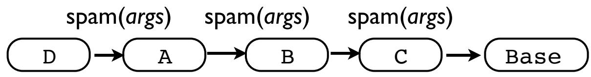

Overridden methods must have a compatible signature across the entire hierarchy   
Remember: super() might not go to the immediate parent   
Tip: If there are varying method signatures, use keyword arguments

# Designing for Inheritance

Rule 2: Method chains must terminate

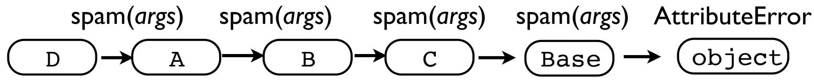

* You can't use super() forever--some class has to terminate the search chain

class Base: def spam(self): pass

* Typically the role of an abstract base class

# Designing for Inheritance

Rule 3: use super() everywhere

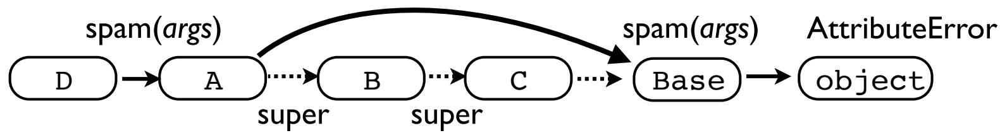

* Direct parent calls might explode heads

```python
class A(Base):
    def spam(self):
        Base.spam(self)  # NO! 
```

If multiple inheritance is used, a direct parent call will probably violate the MRO

# Exercise 4.2

Time : 25 Minutes

# Dicts and Classes (Reprise)

# Recall, a dictionary holds class members

class Stock: def __init__(self, name, shares, pr self.name = name self.share = shares self.price = price def cost(self): return self.share * self.price def sell(self, nshares): self.share $= =$ nshares


# Reading Attributes (Reprise)

Recall that a two-step process is used to locate attributes on objects

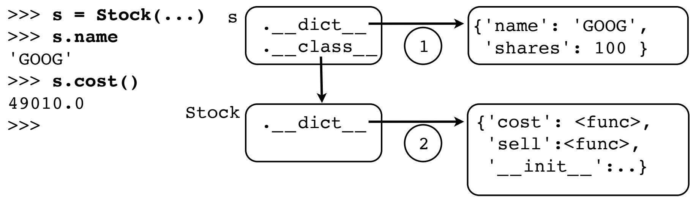

This is mostly correct   
* Except for the extra hidden magic (not shown)

# Attribute Binding

Access to attributes of classes involves one extra processing step   
* Something known as the "descriptor protocol"   
It's so sneaky that most Python programmers don't even know it exists   
* Yet, it holds the whole object system together

# Descriptor Protocol

Whenever an attribute is accessed on a class, the attribute is checked to see if it is an object that looks like a so-called "descriptor"   
* A descriptor is an object with one or more of the following special methods

d.__get__(obj, cls)   
d.__set__(obj, value)   
d.__delete__(obj)

If a descriptor is detected, one of the above methods gets triggered on access

# Descriptor Demo

Here is a class that implements a dummy descriptor (with prints for debugging)

```python
class Descriptor: def __init__(self, name): self.name = name def __get__(self, instance, cls): print('%s:__get__' % self.name) def __set__(self, instance, value): print('%s:__set__%s' % (self.name, value)) def __delete__(self, instance): print('%s:__delete__' % self.name) 
```

Basically, a descriptor is just an object with get, set, and delete methods

# Descriptor Demo

* Descriptors are placed in class definitions

class Foo:

a = Descriptor('a')

b = Descriptor('b')

* Now, watch what happens on access:

>>> f = Foo()   
>>> f.a   
a:__get__   
>>> f.a = 42   
a:__set__ 42   
>>> del f.a   
a:__delete_   
>>> f.b   
b:__get__

# Descriptor Demo

Descriptors are presented with information about the instance, class, and values

```python
class Descriptor: def __init__(self, name): f = Foo() self.name = name f.a def __get__(self, instance, cls): f.a = 42 print('%s:__get__' % self.name) del f.a def __set__(self, instance, value): print('%s:__set__' % (self.name, value)) def __delete__(self, instance): print('%s:__delete__' % self.name) 
```

Confusion: self is the descriptor itself, instance is the object it's operating on.

# Descriptor Storage

# Descriptors store and retrieve data

```python
class Descriptor: def __init__(self, name): self.name = name def __get__(self, instance, cls=None): return instance.__dict__(self.name) def __set__(self, instance, value): instance.__dict__(self.name] = value 
```

# Example:

```python
class Foo(object):
    a = Descriptor('a')
    b = Descriptor('b') 
```

Direct manipulation of the instance dictionary

```txt
f = Foo() 
```

```python
f.a = 23 # Stores value in f.__dict__['a'] 
```

# Descriptor Binding

* Descriptors always override __dict_

```python
class Foo:  
    a = Descriptor('a')  
    b = Descriptor('b') 
```

* Modify the instance dict and try accessing

```txt
>>> f = Foo()
>>> f.__dict__['a'] = 42
>>> f.__dict__
{'a': 42}
>>> f.a
a:__get__
>>> notice how the descriptor runs regardless
the value in the instance dictionary 
```

# Who Cares?

Every major feature of classes is implemented using descriptors

* Instance methods   
Static methods (@staticmethod)   
* Class methods (@classmethod)   
Properties (@property)   
_slots_

Descriptors provide the glue that connects instances and classes together in the runtime

# Descriptors in Action

* Recall that . and () are separate operations

>>>s = Stock('GOOG',100,490.10)   
>>>s.cost   
<body methodStock.cost of $<  _{**}$ main_.Stock object at 0x37e250>>   
>>>s.cost()   
49010.0   
>>>

* Focus on that "bound method" result   
* How did that get created? Magic?   
No, a descriptor did that.

# Descriptors in Action

Behind the scenes of method lookup

```txt
>>> s = Stock('GOOG', 100, 490.10) 
```

class attribute lookup >>> value $=$ Stock._dict_[cost'] >>>value <function cost at 0x378770> >>>hasattr(value,"__get__")   
descripctor check and invocation True >>> result $=$ value._get_(s,Stock) >>>result <bound method Stock.cost of $<  _{ - }$ main_.Stock object at 0x37e250>> >>> result() 49010.0

Functions are descriptors where __get__() creates the bound method object

# Descriptors and Properties

* Consider a class with a property attribute

```python
class Stock: @property def shares(self): return self._shares @shares setter def shares(self, value): self._shares = value 
```

* A property is also a descriptor

>>>s $\equiv$ Stock()   
>>>p $=$ Stock.__dict__['shares']   
>>>p   
<property object at 0x3759c0>   
>>>p._set_(s,100） #Same as s.share $= 100$ >>>p._get_(s,Stock)#Same as s.share   
100   
>>>s.share   
100

# Descriptors and slots

Consider a class with slots

class Foo:

$$
\_ \text {s l o t s} _ {- - } = \left(^ {\prime} x ^ {\prime}, ^ {\prime} y ^ {\prime}, ^ {\prime} z ^ {\prime}\right)
$$

$$
\begin{array}{c c c} \bullet & \bullet & \bullet \end{array}
$$

Internally, an array is allocated

0 1 2

<table><tr><td>x</td><td>y</td><td>z</td></tr></table>

Each slot name is used to create a descriptor that simply gets or sets values in the appropriate array position (internals are implemented in C and hard to view though)

# Descriptor Commentary

Descriptors are one of Python's most powerful customizations (you own the dot)   
Experts can create their own custom descriptors and use them to change what happens in the low levels of the object system   
* Often used in advanced programming frameworks and as an encapsulation tool

# Descriptor Application

A common use of descriptors is in describing data (e.g., Object Relational Mapping, etc.)

```python
class Stock:  
    name = String('name', maxlen=8)  
    shares = Integer('shares')  
    price = Real('price') 
```

* Provide more precise control than properties.   
Results in less repetitive code

# Descriptor Application

# Example descriptor code:

```python
class Integer: def __init__(self, name): self.name = name def __get__(self, instance, cls): return instance.__dict__(self.name] def __set__(self, instance, value): if not isinstance(value, int): raise TypeError('Expected an integer') instance.__dict__(self.name] = value 
```

# Minor note: __get__() can be omitted if the name exactly matches that in the instance dict

# Tricky Bits with get

__get__ can be accessed in two ways class Foo: a = Descriptor('a')

Through an instance (bound)

$$
\begin{array}{l} \text {f = F O O ()} \\ \text {f . a} \end{array}
$$

* On the class definition itself (unbound) Foo.a   
Example : Instance vs. class methods

# Tricky Bits with get

Recommended __get__ implementation

```python
class Descriptor: def __get__(self, instance, cls): if instance is None: # If no instance given, return the descriptor # object itself return self else: # Return the instance value return instance.__dict__(self.name] 
```

* Always check for presence of an instance (instance). If None, return the descriptor itself

# Method Descriptors

* A weaker descriptor that only has __get__   
class MethodDescriptor: def __get__(self, instance, cls): print('Getting!')   
* Only triggered if obj.__dict__ doesn't match

```python
class Foo(object):
    a = MethodDescriptor("a")
>>> f = Foo()
>>> f.a
Getting!
>>> f.__dict__['a'] = 42
>>> f.a
42
>>> Notice how the value in the dictionary hides the descriptor 
```

# Descriptor Naming

# * Descriptors can define a name setter

```python
class Descriptor: def __init__(self, name=None): self.name = name def __get__(self, instance, cls): return instance.__dict__(self.name) def __set_name__(self, cls, name): self.name = name 
```

# Gets information about definition context

```python
class Spam(object):
    x = Descriptor()
        x._set_name__(Spam, 'x') 
```

# Python 3.6+ only

# Descriptor Conflicts

* Multiple descriptors per attribute aren't allowed

```python
class Point: _sLOTS_ = ('x', 'y') x = Integer() y = Integer() 
```

```txt
Traceback (most recent call last):
    File "<stdin>", line 1, in <module>
ValueError: 'x' in __slots__ conflicts with class variable 
```

* There can only one descriptor in charge   
* Coordination is possible (but tricky)

# Exercise 4.3

Time : 15 Minutes

# Attribute Access Methods

Classes can intercept attribute access   
Set of special methods for setting, deleting, and getting attributes

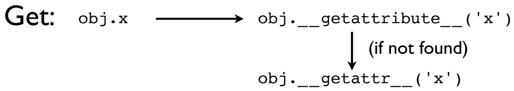

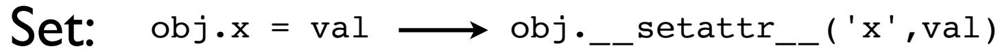

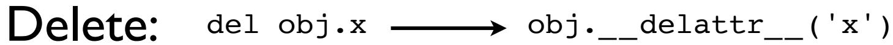

# _getattribute ()

__getattribute__(self,name)   
* Called every time an attribute is read   
Default behavior looks for descriptors, checks the instance dictionary, checks bases classes (inheritance), etc.   
If it can't find the attribute after all of those steps, it invokes _ _ getattr_ _ (self,name)

# __getattr () method

__getattr__(self,name)   
* A failsafe method. Called if an attribute can't be found using the standard mechanism   
* Default behavior is to raise AttributeError   
Sometimes customized

# setattr () method

_ setattr_ _ (self,name,value)   
* Called every time an attribute is set   
Default behavior checks for descriptors, stores values in the instance dictionary, etc.

# delattr () method

delattr_ _ (self,name)   
* Called every time an attribute is deleted   
Default behavior checks for descriptors and deletes from the instance dictionary

# Customizing Access

A class can redefine the attribute access methods to implement custom processing   
The most common application of this is for creating wrapper objects, proxies, and other similar kinds of objects

# Example : Proxy

# Consider this class

```python
class Proxy: def __init__(self,obj): self._obj = obj def __getattr__(self,name): print('getattr:'，name) return getattr(self._obj，name) 
```

* It holds an internal reference to an object   
* Attribute access is redirected to held object

# Example : Proxy

# * Example use:

```txt
>>> c = Circle(4.0)  
>>> c.radius  
4.0  
>>> c.area()  
50.26548245743669  
>>> p = Proxy(c)  
>>> p  
<__main__.Proxy object at 0x37f130>  
>>> p radius  
getattr: radius  
4.0  
>>> p.area()  
gets captured by __getattr__  
getattr: area  
50.26548245743669  
>>> notice how attribute access gets captured by __getattr__ and then redirected to the original object 
```

# Example: Delegation

class A:

```python
def foo(self):
    print('A.foo')
def bar(self):
    print('A.bar') 
```

class B:

```python
def __init__(self):
    self._a = A()
def bar(self):
    print('B.bar')
    self._a.bar()
def __getattr__(self, name):
    return getattr(self._a, name) 
```

Example:

```txt
>>> b = B()  
>>> b.foo()  
A.foo  
>>> b.bar()  
B.bar  
A.bar  
>>> 
```

* Sometimes used as an alternative to inheritance

# Delegation Caution

__getattr__ doesn't apply to special methods (e.g., __len__, __getitem__, etc.)   
* Must delegate manually (if needed)

class B:

def init__(self): self._a = A()

def __getitem__(self, index): return self._a[index]

def __getattr__(self, name): return getattr(self._a, name)

# Exercise 4.4

Time : 10 Minutes

# Section 5

# Functions

# Overview

Function design   
* Functional Programming   
Error handling and Logging   
Testing

# Functions

Functions are a basic building block   
− Top-level functions in a module   
* Methods of a class   
* Almost all of your code should live in a function

# Function Design

* Try to make functions "self-contained"

arguments


function


result

* Only operate on passed arguments   
* Produce the same result for same arguments   
* Avoid hidden side-effects   
Goals: Simplicity and Predictability

# Function Invocation

* Names and arguments are the "interface"

```txt
result = some_func(args) 
```

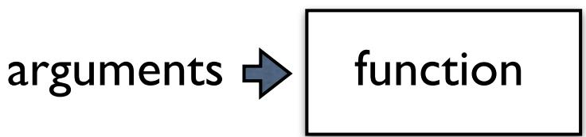

* Calling a function should be intuitive and easy   
* It's a core component of making an API

# Naming Conventions

* There is a preferred Python "style"   
* Functions should use lowercase names and

def read_data(filename): *

def readData(filename): ..

Yes

No

* Use a leading _ for internal/private funcs

def _internal_func():

# Default Arguments

* Sometimes you want default arguments

def read_data(filename, debug=False):

If an argument value is assigned, the argument is optional in function calls

$$
\begin{array}{l} d = \text {r e a d} _ {\text {d a t a}} \left(^ {\prime} \text {d a t a . c s v} ^ {\prime}\right) \\ e = \text {r e a d} _ {\text {d a t a}} \left(^ {\prime} \text {d a t a . c s v} ^ {\prime}, \text {d e b u g} = \text {T r u e}\right) \\ \end{array}
$$

* Default arguments must appear last in definition

# Keyword Arguments

* Prefer keywords for passing optional arguments

a = read_data('data.csv', debug $=$ True) # YES!

b = read_data('data.csv', True) # NO!

Keywords result in better code clarity   
* You can force the use of keyword arguments

def read_data(filename, *, debug=False):

All arguments after the * must be given as by keyword

# Default Values

* Don't use mutable values as defaults

```python
def func(a, items = [ ]):
    items.append(a)
    return items 
```

The default value is only created once for the whole program--mutations are "sticky"

```erlang
>>> func(1)  
[1]  
>>> func(2)  
[1, 2]  
>>> func(3)  
[1, 2, 3] 
```

# Default Values

Advice: Only use immutable values such as None, True, False, numbers, or strings

```python
def func(a, items=None): if items is None: items = [] items.append(a) return items 
```

This avoids the problem of the default being modified by accident

```txt
>>> func(1)  
[1]  
>>> func(2)  
[2]  
>>> 
```

# Optional Values

* Sometimes you need to express optional values   
* Most common convention is to use None

name $=$ None # Not assigned name $=$ 'Guido' # Assigned

* Test against None when you use it

if name is not None: print('Hello', name)

* Caution: Often error-prone if not careful

# Argument Transformation

# Consider

def read_data(filename): records $=$ [] with open(filename) as f: for line in f: records.append(record) return records Compare with def read_data lines): records $= [ ]$ for line in lines: records.append(record) return records

# Argument Transforms

* This version is far more flexible

def read_data lines): records $= \left[\right]$ for line in lines: records.append(record) return records

```python
with open('Data.csv') as f: data = read_data(f)   
with gzip.open('Data.csv.gz', 'rt') as f: data = read_data(f)   
r = requests.get('http://place/data.csv')   
data = read_data(r.iteratorlinesdecode_unICODE='utf-8')) 
```

* Question: Should you embrace flexibility?

# Doc Strings

* Functions should have a doc string

```python
def add(x, y):
    ...
    Adds x and y together.
    ...
    return x + y 
```

* Feeds the help() command and development tools

# Type Hints (PEP 484)

* Optional annotations can indicate types

```python
def add(x:int, y:int) -> int:
    ...
    Adds x and y together.
    ...
    return x + y 
```

The type hints do nothing, but may be useful for code checkers, documentation, IDEs, etc.

```txt
>>> help (add)  
Help on function add in module __main__:  
add(x:int, y:int) -> int  
Adds x and y 
```

# Commentary on Type Hints

On the whole, it is probably a good idea to add type-hints to your code if it makes code easier for others to understand. However, if your goal is to automatically type-check Python with the rigor of a compiled language (e.g., C++, Java, etc.) you need to be aware that type hints have been retrofitted on Python as a late addition to the language and that this has introduced a wide variety of very complex issues beyond the scope of this course. Moreover, there are many classic Python programming idioms that are notoriously difficult to accurately "type" in straightforward way. Yes, you could spend a lot of time trying to make the type-checker happy. Or, not. Personally, I tend to take a pragmatic approach to types. If I'm writing new code, I'll try to make it type-friendly. However, if the complexity starts to spiral out of control, I'm more inclined to rethink my approach as opposed to playing some kind of whack-a-mole game with the type checker. Your mileage might vary. -- Dave

# Exercise 5.1

Time : 10 Minutes

# Function Results

* Have the function cleanly return a result

function


result

* Return multiple values with a tuple if needed

```python
def divide(x, y):
    quotient = x // y
    remainder = x % y
    return (quotient, remainder) 
```

# Returning Optionals

* Sometimes a function returns an "optional" value   
* Common convention is to return None   
Example: Pattern Matching (re module)

```txt
>>> import re   
>>> m = re.match('\\d'+,'abc')   
>>> print(m)   
None   
>>> m = re.match('\\d'+,'123')   
>>> print(m)   
<_sre.SRE_Match object; span=(0, 3), match='123'>   
>>> 
```

* For errors: raise an exception instead

# Concurrency

* Functions might execute concurrently (threads)

```python
def foo():
    ...
def bar():
    ...
from threading import Thread
t1 = Thread(target=foo)
t1.start()
t2 = thread(target=bar)
t2.start() 
```

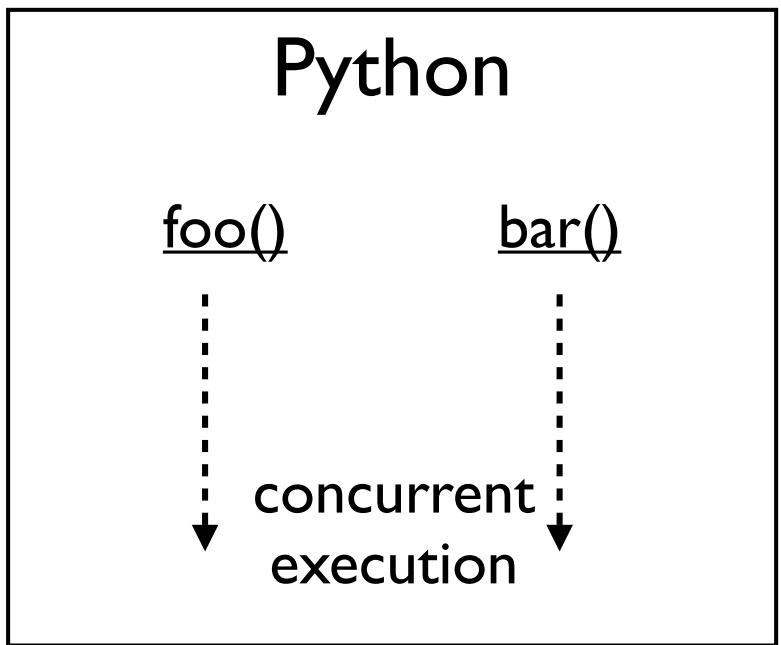

* Shared state, execution in single interpreter

# Futures

Represents a future result (to be computed)

from concurrent.futures import Future

fut $=$ Future()

To store a result

fut.set_result(value)

To wait for a result

value $=$ fut.result()

Coordination is required

# Future Example

def func(x, y, fut):

time.sleep(20)

fut.set_result(x+y)

def caller():

fut $=$ Future()

threading.Thread(target $=$ func, args=(2, 3, fut)).start()

result $=$ fut.result()

print('Got:', result)

* Reminder: Concurrent execution of both functions   
This underlying pattern is used in many contexts (threads, async, multiprocessing, etc.)

# Exercise 5.2

Time : 15 Minutes

# Functional Programming

* Programming style characterized by

Functions   
No sides effects/mutability   
Higher order functions

# Higher Order Functions

Essential features...

Functions can accept functions as input   
Functions can return functions as results

Python supports both

# Functions as Input

# * Consider these two functions

```python
def sum_squares(nums):
    total = 0
    for n in nums:
        total += n * n
    return total
def sum_cubes(nums):
    total = 0
    for n in nums:
        total += n ** 3
    return total 
```

# They're almost identical (one line differs)

# Functions as Input

* Recognizing commonality is part of abstraction

def sum_map(func, nums): total = 0 for n in nums: total += func(n) return total def square(x): return x * x   
nums $= [1$ ,2,3,4]   
r = sum_map(square, nums)

* This version allows any function to be passed   
* Sometimes referred to as a "callback function"

# Lambda Functions

* One-expression functions can use lambda

```python
def sum_map(func, nums): total = 0 for n in nums: total += func(n) return total 
```

$\mathbf{nums} = [1,2,3,4]$ result $=$ sum_map( lambda $\mathbf{x}$ : $\mathbf{x}^{*}\mathbf{x}$ ,nums)

Creates an anonymous function (on the spot)   
* Can only contain a single expression   
* No control flow, exceptions, etc.

# Partial Application

* Lambda often used to alter function args

```txt
def distance(x, y): return abs(x - y) 
```

```erlang
>>> distance(10, 20)  
10  
>>> dist_from10 = lambda y: distance(10, y)  
>>> dist_from10(3)  
7  
>>> dist_from10(14)  
4  
>>> 
```

functools.partial

```python
from functools import partial dist_from10 = partial(distance, 10) 
```

# Map-Reduce

* You can sometimes decompose the code further

```txt
def sum_map(func, nums): total = 0 for n in nums: func(n) Mapping total += func(n) return total + = Reduction  
nums = [1, 2, 3, 4] r = sum_map(lambda x: x*x, nums) 
```

* There are two basic operations (+, func)

# Map-Reduce

```python
def map(func, values): result = [] for x in values: result.append(func(x)) return result 
```

```python
def reduce(func, values, initial=0):
    result = initial
    for n in values:
        result = func(n, result)
    return result 
```

```txt
def sum(x, y): return x + y 
```

```python
def square(x): return x * x 
```

$\mathrm{nums} = [1,2,3,4]$ result $=$ reduce(sum，map(square，nums))

# Commentary

Subdividing problems into small composable parts is a useful software architecture tool

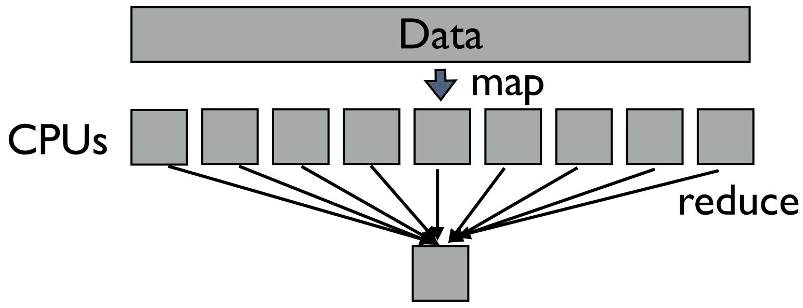

* Functions are the basic building blocks

# Exercise 5.3

Time : 10 Minutes

# Returning Functions

Consider the following function

```python
def add(x, y):
    def do_add():
        print(f' {x} + {y} -> {x+y}')
    return do_add 
```

* A function that returns another function?

```txt
>>> a = add(3,4)  
>>> a  
<function do_add at 0x6a670>  
>>> a()  
3 + 4 -> 7  
>>> 
```

* Notice that it works, but ponder it...

# Nested Scopes

Observe how the inner function refers to variables defined by the outer function

```python
def add(x, y):
    def do_add():
        print(f' {x} + {y} -> {x+y}')
    return do_add 
```

Further observe that those variables are somehow kept alive after add() has finished

```txt
>>> a = add(3,4)  
>>> a  
<function do_add at 0x6a670>  
>>> a()  
3 + 4 -> 7  
Where are the x,y values coming from? 
```

# Closures

If an inner function is returned as a result, the inner function is known as a "closure"

```python
def add(x, y):
    def do_add():
        print(f' {x} + {y} -> {x+y}') 
```

Essential feature : A "closure" retains the values of all variables needed for the function to run properly later on

# Closures

* To make it work, references to the outer variables (bound variables) get carried along with the function

```python
def add(x, y):
    def do_add():
        print(f' {x} + {y} -> {x+y}')
    return do_add
>>> a = add(3, 4)
>>> a._closure_
(<cell at 0x54f30: int object at 0x54fe0>, <cell at 0x54fd0: int object at 0x54f60>) >>> a._closure_[0].cell相关内容
>>> a._closure_[1].cell相关内容 
```

# Closures

# Closures only capture used variables

```python
def add(x, y):
    result = x + y
    def get_result():
        return result
    return get_result 
```

```txt
>>> a = add(3, 4)  
>>> a._closure_  
(<cell at 0x10bb52708: int object at 0x10b5d3610>,)  
>>> a._closure_[0].cell相关内容  
7  
>>> 
```

# Carefully observe: x and y are not included (not needed in the function body)

# Closures and Mutability

* Closure variables are mutable (nonlocal decl)

```python
def counter(n):
    def incr():
        nonlocal n
        n += 1
        return n
    return incr 
```

```txt
>>> c = counter(10)  
>>> c()  
11  
>>> c()  
12  
>>> 
```

Can be used to hold mutable internal state, much like an object or class

# Using Closures

* Closures are an essential feature of Python   
Common applications:

* Alternate evaluation (e.g., "delayed evaluation)   
Callback functions   
Code creation ("macros")

# Exercise 5.4

Time : 10 Minutes

# Function Error Checking

* As you know, exceptions indicate errors raise RuntimeError("You're dead")   
Exceptions can be caught

```typescript
try: statements except RuntimeError as e: # Handle the runtime error 
```

The mechanics of exception handling is usually straightforward, but proper usage is often a lot trickier than it looks

# What Exceptions to Handle?

Functions should only handle exceptions where recovery is possible (and makes sense):

```python
def read_csv(filename):
    f = open(filename)
    for row in csv-reader(f):
        try:
            name = row[0]
            shares = int(row[1])
            price = float(row[2])
        except ValueError as e:
            print('Bad row: ', row)
        continue
    ... 
```

* Let all other exceptions propagate--they usually indicate a more serious problem

# Example

Don't worry about things like this

```txt
>>> read_csv('bogus.csv')   
Traceback (most recent call last): File "<stdin>", line 1, in <module> File "reader.py", line 10, in read_csv f = open(filename)   
FileNotFoundError: [Errno 2] No such file or directory: 'bogus.csv'   
>>> 
```

There is no sensible recovery. The failure is someone else's problem.

# Catching All Errors

Never catch all exceptions unless you report/ record the actual exception that occurred

```python
try: # Some complicated operation except Exception as e: print("Sorry, it didn't work.") print("Reason:", e) 
```

Not reporting actual exception information is the fastest way to create undebuggable code

# Ignoring Errors

# No! No! No!

try: # Some complicated operation except Exception: pass

# Argh!!!! Boom!

try: # Some complicated operation * except Exception: # !! TODO pass

# Catastrophic failures are often a result of exception handling gone terribly wrong.

  
Ariane 5

# Reraising Exceptions

# Log/re-raise

```python
try: # Some complicated operation except Exception as e: print("Sorry, it didn't work.") print("Reason:", e) raise 
```

Useful if you want to do something with the exception, but allow it to propagate

# Wrapped Exceptions

* Wrapping an exception in another exception

try:

except Exception as e:

raise TaskError('It failed') from e

Unwrapping it later

try:

except TaskError as e: print("It didn't seem to work.") print("Reason:", e.__cause__)

Forms an exception chain

# Managing Resources

* Take care to manage system resources correctly

```python
def read_data(filename):
    f = open(filename)
    try:
        ... do whatever ...
    finally:
        f.close() 
```

* A more modern version (context manager)

```python
def read_data(filename):
    f = open(filename)
    with f:
        ... do whatever ... 
```

Failure to do this might cause leaky file descriptors, deadlock, or other problems

# What Exceptions to Raise?

* Applications should have their own exceptions

class ApplicationError(Exception): pass

class SomeOtherError(ApplicationError): pass

Issue: How do you distinguish between programming mistakes and exceptions that you meant to raise?   
Reserve Python's built-in exceptions for programming mistakes. Catch, don't raise.

# Return Codes

Don't use return codes (usually)

```python
def read_data(filename):
    # Some complicated thing
    ...
    if error:
        return -1  # Oops
    else:
        return result 
```

Return codes are not the "standard" way of signaling errors in Python   
Callers will often forget and program will crash for a different reason later.

# Logging

* Use logging for recording diagnostics

```python
import logging  
log = logging.getLogger(_name__) 
```

```python
def read_data(filename):
    ...
    try:
        name = row[0]
        shares = int(row[1])
        price = float(row[2])
    except ValueError as e:
        log.warn("Bad row: %s", row)
        log.debug("Reason: %s", e) 
```

* Usually a better option than print() functions

# Exercise 5.5

Time : 15 Minutes

# Testing Rocks, Debugging Sucks

* What else is there to say?   
Dynamic nature of Python makes testing critically important to most applications   
* There is no compiler to find your bugs   
Only way to find bugs is to run the code and make sure you exercise all of its features

# Example Code

* Suppose you have this function

simple.py   
def add(x,y): Addx and y. return $\mathbf{x} + \mathbf{y}$ >>>add(2,2)   
4   
>>>add('hello','world') 'helloworld'   
>>>

Let's test it

# Assertions/Contracts

# * Assertions are runtime checks

```python
def add(x, y):
    ...
    Adds x and y
    ...
    assert isinstance(x, int)
    assert isinstance(y, int)
    return x + y 
```

# Function will fail on bad input

```txt
>>> add(2, 3)  
5  
>>> add('2', '3')  
Traceback (most recent call last):  
...  
AssertionError  
>>> 
```

# Assertions/Contracts

* Assertions are not meant to check user inputs   
Should validate program invariants (internal conditions that must always hold true)   
Failure indicates a programming error and assign blame (e.g., to the caller)   
Can be disabled (python -O)

bash % python3 -O prog.py

# unittest Module

Built-in module used for testing   
* Used by the standard library   
Commonly used in other applications   
Will briefly illustrate

# Using unittest

* First, you create a separate file

```python
# testsimple.py
import simple
import unittest 
```

* Then you define testing classes

```txt
class TestAdd(unittest.TestCase): 
```

* They must inherit from unittest.TestCase

# Using unittest

# Define testing methods

class TestAdd(unittest.TestCase): def test.simple(self): #Test with simple integer arguments r $=$ simple.add(2,2) self.assertEqual(r,5)

```python
def test_str(self):
    # Test with strings
    r = simple.add('hello', 'world')
    self.assertEqual(r, 'helloworld') 
```

* Each method must start with "test..."

# Using unittest

# Each test uses special assertions

# Assert that expr is True self.assertTrue(expr)

# Assert that x == y self.assertEqual(x,y)

# Assert that x is near y self.assertAlmostEqual(x,y,places)

# Assert that an exception is raised with self.assertRaises(SomeError): statement1 statement2 ..

# There are others

# Running unittests

* To run tests, add the following code

# testsimple.py

if _name _main__' unittest.main()

Then run Python on the test file

bash % python3 testsimple.py F.

FAIL: test_simple (__main__.TestAdd)

Traceback (most recent call last): File "testsimple.py", line 8, in test_simple self.assertEqual(r, 5)

AssertionError: 4 != 5

Ran 2 tests in 0.000s

FAILED (failures=1)

# unittest comments

Can grow to be quite complicated for large applications   
The unittest module has a huge number of options related to test runners, collection of results, and other aspects of testing (consult documentation for details)   
* Look at pytest as an alternative

# Exercise 5.6

Time : 15 Minutes

# Section 6

# Working with Code

# Overview

* Advanced function usage/definition   
Introspection   
* Code generation (eval, exec)   
Callables

# Function Arguments

* Functions operate on passed arguments

def func(x,y,z): statements

arguments

There are two calling styles

a = func(1,2,3)

# Positional arguments

a $=$ func(x=1,y=2,z=3)

# Keyword arguments

* You can mix the two styles

$$
a = \operatorname {f u n c} (1, z = 3, y = 2)
$$

Positional args always go first. Each argument gets one and only one value

# Variable Arguments

* Function that accepts any number of args

def func(x, *args):

* Here, the arguments get passed as a tuple

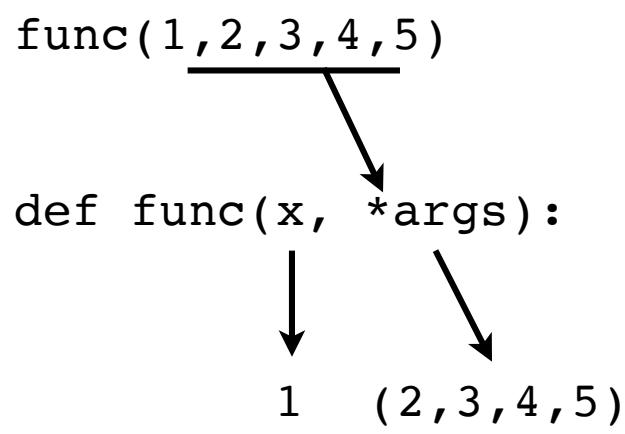

# Variable Arguments

Function that accepts any keyword args

def func(x, y, **kwargs):

Extra keywords get passed in a dict

```python
func(2, 3, flag=True, mode="fast", header="debug")
def func(x, y, **kwargs):
    {
        'flag': True,
        'mode': 'fast',
        'header': 'debug' 
```

# Variable Arguments

* A function that takes any arguments

def func(*args, **kwargs): statements

* This will accept any combination of positional or keyword arguments   
Sometimes used when writing wrappers or when you want to pass arguments through to another function

# Passing Tuples and Dicts

* Tuples can expand into function args

$$
\begin{array}{l} \text {a r g s} = (2, 3, 4) \\ \operatorname {f u n c} (1, * \text {a r g s}) \quad \# \text {S a m e a s f u n c} (1, 2, 3, 4) \\ \end{array}
$$

* Dictionaries can expand to keyword args

kwargs $=$ { color': 'red', delimiters': ',', width'：400}

```txt
func(data, **kwargs) 
```

```txt
Same as func(data,color='red', delimiter=','width=400) 
```

# Exercise 6.1

Time : 20 minutes

# Scoping Rules

* Programs assign values to variables

x = value # Global variable

def func():

y = value # Local variable

* Python manages variables in two scopes

Globals (assigned outside functions)   
* Locals (assignments inside functions)

# Statement Execution

* All statements execute within two scopes (even statements not part of a function)   
Global scope is always the module in which a function is defined   
* Local scope is either private to a function or the same as the global scope (for statements executed at module level)

# Modifying Globals

* If you want to modify a global variable you must declare it as such in the function

$$
\textbf {x} = 4 2
$$

def func(): global x x = 37

global declaration must appear before use   
* Only necessary for globals that will be modified (globals are already readable)

# globals() and locals()

globals() - Give you a dictionary representing the contents of global scope   
locals() - Gives you a dictionary representing the contents of local scope   
Can use these to inspect the environment in which a statement will execute

# builtins module

Built-in functions are in a special module   
Consulted last when looking up names

>>> abs(-45)   
45   
>>> import builtins   
>>> builtins.abs(-45)   
45   
>>>

* You can modify it (but probably not advised)

>>> builtins.pi $=$ 3.1415926   
>>> pi   
3.1415926

# Exercise 6.2

Time : 15 minutes

# Function Objects

When you define a function, the function itself becomes a kind of object that you can manipulate   
Can assign to variables, place in containers, pass around as data, etc.   
Functions can also be inspected

# Documentation Strings

First line of function may be string

def func(a, b): 'This function does something.'

* The doc string is stored in __doc__ >>> func.__doc_ 'This function does something.' >>>   
Help tools look at __doc__, but other programs might examine it for various purposes (testing, etc.)

# Annotations/Type Hints

* Arguments and return might be annotated

def func(a:int, b:int) -> int:

Stored in _annotations

>>> func.__annotations {'a': <class 'int'>, 'b': <class 'int'>, 'return': <class 'int'>} >>>

Annotations do nothing--purely informational for other code that might want to look at them.

# Function Attributes

Little known fact : You can attach arbitrary attributes to a function

def func(a, b): 'This function does something.'

func.threadsafe $=$ False func.blah = 42

Under the hood, each function has a dictionary (__dict__) that holds these values   
* Useful for code that manipulates functions

# Function Inspection

Almost every aspect of a function can be inspected if you know where to look

```python
def func(a, b, c=42):
    'This function does something.' 
```

* Use the dir() function to see more

# inspect Module

* Use the inspect module to get details about functions in a more useful form

def func(a, b, $\mathtt { C } = 4 2$ ):

>>> import inspect

>>> sig $=$ inspect.signature(func)

>>> print(sig)

(a, b, $\mathtt { C } = 4 2$ )

>>> list(sig.parameters)

['a', 'b', 'c']

>>> sig.parameters['c'].default

42

>>>

* Many more module features (not shown)

# Signature Binding

Signatures can be bound to *args, **kwargs

sig $=$ inspect.signature(some_func)

args = (1, 2)

kwargs = {'c': 10}

bound $=$ sig.bind(*args, **kwargs)

for name, val in bound.arguments.items():

print(name, '=', val)

Performs all error checking   
* Might simplify code using *args, **kwargs

# Exercise 6.3

Time : 15 minutes

# eval() and exec()

eval(code) - Evaluates an expression

```txt
>>> x = 10 
```

```txt
>>>eval('3\*x-2') 
```

```txt
28 
```

```txt
>>> 
```

exec(code) - Executes arbitrary statements

```txt
>>> exec('for i in range(5): print(i)') 
```

```txt
0 
```

```txt
1 
```

```txt
2 
```

```txt
3 
```

```txt
4 
```

```txt
>>> 
```

* Code executes in current globals()/locals()

# eval() and exec()

Caution: Modifications to local scope are lost

```txt
def func():
    x = 10
    exec('x = 15; print(x)')  # ---> 15
    print(x)  # ---> 10  ???? 
```

eval(expr [, globals [, locals])   
exec(code [, globals [, locals])

```python
def func():
    x = 10
    loc = locals()
    exec('x = 15; print(x)', globals(), loc) # ---> 15
    x = loc['x']
    print(x) # ---> 15 
```

# eval/exec Caution

* Use these features with extreme care   
* Overuse will likely make people hate you   
* Tricky interaction with scoping/variables   
* Potential security issue with untrusted inputs

# Exercise 6.4

Time : 15 minutes

# Callable Objects

You can define your own objects that emulate Python functions (e.g., "callables")

```python
class Callable: def __call__(self, *args, **kwargs): print('Calling', args, kwargs) 
```

* Must implement __call__ special method

```python
>>> c = Callable()
>>> c(2,3,color='red')
Calling (2,3) {'color': 'red'} 
```

* Free to do anything you want in __call__

# Defining Callables

Callable objects sometimes defined when you need to have more than just a function (e.g., storing extra data, caching, etc.)

```python
class Memoize: def __init__(self, func): self._cache = {}. self._func = func def __call__(self, *args): if args in self._cache: return self._cache(args) r = self._func(*args) self._cache(args) = r return r def clear(self): self._cache.clear() 
```

# Exercise 6.5

Time : 15 Minutes

# Section 7

# Metaprogramming

# Introduction

* Writing programs where there is a lot of code replication is usually problematic   
Tedious to write   
* Hard to maintain   
Painful if you decide that you need to make a change (or fix a bug) in all of that extremely repetitive code

# Metaprogramming

Metaprogramming pertains to the problem of writing code that manipulates other code   
Common examples:

* Macros   
Wrappers   
Aspects

Essentially, it's doing things to code

# Python Metaprogramming

Major features

Decorators   
Class decorators   
* Metaclasses

* We're going to talk about all of them   
* They are not as difficult to grasp as you think

# Decorators

* A decorator is a function that creates a wrapper around another function   
The wrapper is a new function that works exactly like the original function (same arguments, same return value) except that some kind of extra processing is carried out   
Let's see a simple example first

# Wrapper Functions

Here is a simple function:

def add(x, y): return x + y

Here is an example of a wrapper function

def logged_add(x, y): print('Calling add') return add(x, y)

* Example use:

>>> add(3, 4) 7 >>> logged_add(3, 4) This extra output is created by the Calling add wrapper, but the original function 7>>> is still called to get the result

# Creating Wrappers

Insight : You can write a function that makes a wrapper around any function

def logged(func): #Defineawrpperfunctionaroundfunc defwrapper $\text{串} _ { \text{串} }$ args，\*\*kwargs）: print('Calling'，func._name_） return func $\text{串} _ { \text{串} }$ args，\*\*kwargs) return wrapper

Usage:

```txt
>>> logged_add = logged(add)  
>>> logged_add  
<function wrapper at 0x378670>  
>>> logged_add(3, 4)  
Calling add  
7  
>>> 
```

# Wrappers as Replacements

* When you create a wrapper, you often want to replace the original function with it

```txt
def add(x, y): return x + y 
```

Replace add with a wrapped version add $=$ logged(add)

* Other code continues to use the original function name, but is unaware that a wrapper has been injected (that's the whole point)

```txt
>>> add(3, 4)  
Calling add  
7  
>>> 
```

# Decorator Concept

* When you replace a function with a wrapper, you are usually giving the function extra functionality   
* This process is known as "decoration"   
* You are "decorating" a function with some extra features

# Decorator Syntax

The definition of a function and wrapping almost always occur together

```python
def add(x, y):
    return x + y
add = logged(add) 
```

* However, it looks weird and is error prone   
* The @decorator syntax simplifies it

```txt
@logged def add(x, y): return x + y 
```

# Decorator Syntax

* Whenever you see a decorator, a function is getting wrapped. That's it   
Example : In classes

```python
class MyClass: class MyClass: @staticmethod def bar(): def bar(): ... . bar = staticmethod(bar) @classmethod def spam(cls): def spam(cls): spam = classmethod(spam) @property def name(self): name = property(name) def name(self): 
```

# Using Decorators

Use a decorator anytime you want to define a kind of "macro" involving function definitions   
* There are many possible applications

Debugging and diagnostics   
Avoiding code replication   
Enabling/disabling optional features

# Timing Measurements

# * A decorator that reports execution time

import time   
def timethis func): def wrapper(\*args, \*\*kwargs): start $=$ time.time() r $=$ func(\*args, \*\* kwargs) end $=$ time.time() print(func._name_,end - start) return r return wrapper

# Usage:

```txt
@timethis  
def bigcalculation():  
    statements  
    statements 
```

# Exercise 7.1

Time : 15 Minutes

# Advanced Decorators

There are a few tricky additional details

Multiple decorators   
Decorators and metadata   
Decorators with arguments

# Multiple Decorators

* You can apply as many decorators as you want

@foo

@bar

@spam

def add(x, y):

return x + y

This is the same as this:

add $=$ foo(bar(spam(add)))

To keep your sanity, it's probably not a good idea to go overboard with it

# Function Metadata

* When you define a function, there is some extra information stored (name, doc strings, etc.)

```python
def add(x, y):
    'Adds x and y'
    return x + y
>>> add.__name__
'add'
>>> add.__doc__
'Adds x and y'
>>> help(add)
Help on function add in module __main__:
add(x, y)
    Adds x and y 
```

# The Metadata Problem

# * Decorators don't preserve metadata

@logged   
def add(x,y): 'Adds x and y' return $\mathbf{x} + \mathbf{y}$ >>>add._name_   
'wrapper'   
>>>add._doc_   
>>>help(add)   
Help on function wrapper in module __main_:   
wrapper(*args，\*\*kwargs)   
>>>

# This is a problem

# Copying Metadata

# * Decorators should copy metadata

```python
def logged(func):
    def wrapper(*args, **kwargs):
        print('Calling', func.__name__).
    return func(*args, **kwargs)
manual wrapper.__name__ = func.__name__
wrapper.__doc__ = func.__doc__
metadata return wrapper 
```

# * A better solution : use @wraps

from functools import wraps

```txt
Copies def logged func): metadata @wraps func) from func to def wrapper \*args, \*\*kwargs): the wrapper print('Calling',func._name_) return func \*args, \*\*kwargs) return wrapper 
```

# Decorators with Args

Decorators can accept arguments

```txt
@decorator(x, y, z) def func():
```

* It's mind boggling, but here's what happens def func(): ...

```txt
func = decorator(x, y, z) (func) 
```

The decorator function must return a function which is called to make a wrapper

# Decorators with Args

Example: Logging with a custom message

```python
def logmsg(message):
    def logged(func):
        @wraps(func)
        def wrapper(*args, **kwargs):
            print(message.format(name=func.__name__))
            return func(*args, **kwargs)
            return wrapper
    return logged 
```

Example use:

```txt
@logmsg('You called {name}') def add(x, y): return x + y 
```

# Decorators with Args

* Example: Logging with a custom message

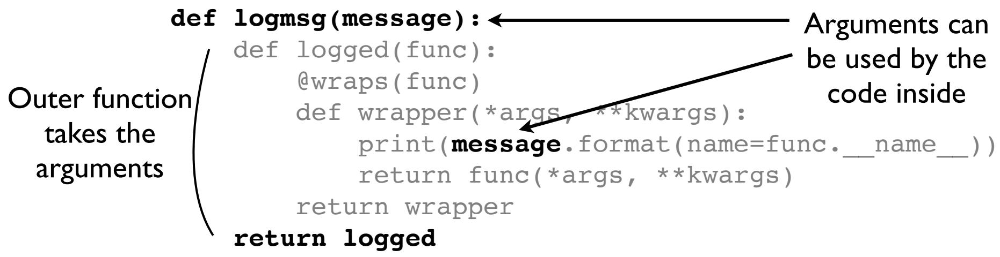

The outer function is like an enclosing environment that gets added to the decorator to accept the extra arguments

# Decorators with Args

* Example: Logging with a custom message

def logmsg(message):

def logged(func):

The same decorator code as before

@wraps(func)

def wrapper(*args, **kwargs):

print(message.format(name $=$ func.__name__))

return func(*args, **kwargs)

return wrapper

return logged

Inner functions are standard decorator code

# Decorators with Args

* Decorators with args are more general   
* You can specialize to a no-argument case

logged $=$ logmsg('Calling {name}')

@logged

def add(x, y):

return x + y

* This is subtle, but useful for simplifying code

# Exercise 7.2

Time : 15 Minutes

# Class Decorators

* Decorators can be applied to class definitions

```txt
@decorator   
class MyClass: def bar(self): def spam(self): 
```

* It's exactly the same as doing this:

class MyClass: def bar(self): def spam(self): MyClass $=$ decorator“MyClass)

Manipulates or wraps a class

# Class Decorators

Most class decorators inspect or do something special with the class definition   
Typical prototype

```python
def decorator(cls):
    # Do something with cls
    ...
    # Return the original class back
    return cls 
```

* Observe: The original class is not replaced

# Example

# Recording all attribute lookups

```python
def logged_getattr(cls):
    # Get the original implementation
    orig_getattribute = cls.__getattribute__
    # Replacement method
    def __getattribute__(self, name):
        print('Getting:', name)
        return orig_getattribute(self, name)
    # Attach to the class
    cls.__getattribute__ = __getattribute__
    return cls 
```

# * This is replacing a method of the class

# Example

```txt
@logged_getattr class MyClass: def foo(self): pass def bar(self): pass 
```

>>>s $\equiv$ MyClass()   
>>>s.x $= 23$ >>>s.x   
Getting:x   
>>>s.foo()   
Getting: foo   
>>>s.bar()   
Getting: bar   
>>>

Notice how all lookups now have logging

# Decoration via Inheritance

* Base classes can observe inheritance

```python
class Parent: @classmethod def __init_subclass__(cls, **kwargs): # Do something with cls (the subclass)   
class Child1(Parent): pass   
class Child2(Parent, a=1, b=2): pass 
```

* Makes it easier to have implicit class decorators

# Exercise 7.3

Time : 15 Minutes

# Disclaimer

* What follows is Python's most advanced bit   
Took years for programmers to even understand what anyone was talking about   
Even now, the details are somewhat hairy   
* Also known as the "killer joke"

# Types

As you hopefully know, all values in Python have an associated type   
Example:

```txt
>>> x = 42  
>>> type(x)  
<class 'int'>  
>>> s = 'Hello'  
>>> type(s)  
<class 'str'>  
>>> items = [1,2,3]  
>>> type(items)  
<class 'list'>  
>>> 
```

# Type Constructor

The "type" is usually a callable for creating objects of that type   
Example:

```txt
>>> items = [1,2,3]  
>>> type(item)  
<class 'list'>  
>>> a = list()  # Create a new list object  
>>> a  
[ ]  
>>> b = tuple(items)  # Convert to a tuple 
```

* Type conversions like this are common

# Types and Classes

* Classes also define new types

class Spam: pass   
>>>s $=$ Spam()   
>>>type(s)   
<class 'main>.Spam'>   
>>>

* It is exactly the same as with built-ins   
* The class is the type of instances created   
* The class is a callable that creates instances

# Types of Classes

* Classes are instances of types   
* Observe by getting the type of a class itself

```txt
>>>class Spam:   
... pass   
>>>type(Spam)   
<class 'type'>   
>>>isinstance(Spam,type)   
True   
>>> 
```

Recall: type() tells you the type of an object. Here we're using it on a class itself.

This requires some thought, but it should make some sense (a class is simply a type)

# Creating Types

Head explosion: types are represented by their own class (type)

```txt
class type:
    ...
>>> type
<class 'type'> 
```

* This class creates new "type" objects   
In fact, this is the class that processes class definitions when you define your own classes

# Classes Deconstructed

# Consider a class:

```python
class Spam(object): def __init__(self, name): self.name = name def yow(self): print("Yow! ", self.name) 
```

# What are its components?

Name ("Spam")   
* Base classes (object)   
Functions (__init__, yow)

# Creating a Class

* You can create a class manually from pieces

```python
Define some method functions def __init__(self, name): self.name = name def yow(self): print("Yow!", self.name) 
```

Make a method table methods $=$ {'init': init, 'yow': yow}

```txt
Make a new type (Spam)  
Spam = type('Spam', (object), methods) 
```

* These steps mimic the class statement

# Class Definition Process

* What happens during class definition?

```python
class Spam(object): def __init__(self, name): self.name = name def yow(self): print("Yow! ", self.name) 
```

Step1: Body of class is captured

body $=$ def init_self, name): self.name $\equiv$ name def yow(self): print("Yow! ", self.name)

# Class Definition Process

* Step 2: A dictionary is created

__dict__ = type.__prepare__('Spam', (object,))

* Normally, you get a plain Python dictionary

```prolog
>>> type._prepare__(‘Spam', (object,)  
{}  
>>> 
```

Some extra metadata is inserted

```python
__dict__['__qualname__'] = 'Spam'  
__dict__['__module__'] = 'modulo' 
```

# Class Definition Process

* Step 3: Class body is executed in the dict

exec(body, globals(), __dict__)

* The statements in the body run like a script   
* Afterwards, __dict__ is populated

```txt
>>> _dict_  
{  
    '__init__': <function __init__ at 0x4da10>,  
    'yow': <function yow at 0x4dd70>},  
    '__qualname__': 'Spam',  
    '__module__': 'modulename'  
}  
>>> 
```

# Class Definition Process

Step 4: Class is constructed from its name, base classes, and the dictionary

```txt
>>> Spam = type('Spam', (object), __dict__)  
>>> Spam  
<class__main__.Spam'>  
>>> s = Spam('Guido')  
>>> s.yow()  
Yow! Guido  
>>> 
```

type(name, bases, dict) constructs a class object

# Exercise 7.4

Time : 15 Minutes

# Metaclasses Defined

* A class that creates classes is called a metaclass   
type is an example of a metaclass

# The Metaclass Hook

Python provides a hook that allows you to override the class creation steps   
You can use a different metaclass than "type"   
Using this, you can completely customize what happens when a class is created.

# Metaclass Selection

metaclass keyword argument   
* Sets the class used to create the class object

```python
class Spam(metaclass=type): def __init__(self, name): self.name = name def yow(self): print("Yow! ", self.name) 
```

By default, it's set to 'type', but you change it to something else (more shortly)

# Metaclass Selection

Compatibility note: Python 2 is different   
* Use the __metaclass__ attribute instead

```python
class Spam: __metaclass__ = type # Python 2 only
def __init__(self, name):
    self.name = name
def yow(self):
    print("Yow!", self.name) 
```

Comment: Very difficult to provide Py2/3 compatibility due to syntax difference

# Metaclass Inheritance

If no metaclass is set, Python uses the same type as the base class

```python
class Spam(object): def __init__(self, name): self.name = name def yow(self): print("Yow!") >>> object._class_ <class 'type'> >>> type(Foo) <class 'type'> 
```

Note: this is why you rarely see it

# Creating a New Metaclass

* You inherit from type and redefine methods such as __new__, __prepare__, etc.

```python
class mytype(type):
    @staticmethod
    def __new__(meta, name, bases, methods):
        print('Creating class: ', name)
        print('Base classes: ', bases)
        print('Attributes: ', list(methods))
    return super().__new__(meta, name, bases, methods) 
```

* Then you define a new root-object

class myobject(metaclass=mytype): pass

# Using a Metaclass

* To use the new metaclass, define classes so that they inherit from your root object

```python
class Spam(myobject):
    def __init__(self, name):
        self.name = name
    def yow(self):
        print("Yow!", self.name) 
```

* You should see your metaclass at work

```txt
Creating class : Spam  
Base classes : (<class '__main__.myobject'>,)  
Attributes : ['yow', '__module__', '__init__'] 
```

# Exercise 7.5

Time : 10 Minutes

# Typical Applications

Metaclasses allow alteration of the class definition process itself   
* Setting up the class definition environment   
Changing instance creation   
Coding conventions/rules

# Using a Metaclass

Metaclasses allow class definitions to be monitored and manipulated   
* There are 4 main interception points

```python
type._prepare__(name, bases)  
type._new__(type, name, bases, dict)  
type._init__(cls, name, bases, dict) 
```

class definition

type.__call__(cls, *args, **kwargs)

instance creation

# Example: Duplicate Check

class dupedict(dict): def __setitem__(self, key, value): assert key not in self, '%s duplicated' % key super().__setitem__(key, value)

class dupemeta(type): @classmethod def __prepare__(cls, name, bases): return dupedict()

Example:

class A(metaclass $=$ dupemeta): def bar(self): pass def bar(self):pass Fails! Duplicate

# Example: Decoration

def decorator(func):

```txt
...   
# Decorator   
. 
```

```python
class meta(type):
    @staticmethod
    def __new__(meta, clsname, bases, dict):
        for key, val in dict.items():
            if callable(val):
                dict[key] = decorator(val)
            return super().__new__(meta, clsname, bases, dict) 
```

* This class wraps all methods with a decorator

# Example: Instance Creation

```python
class meta(type): def __call__(cls, *args, **kwargs): print('Creating instance of', cls) return super().__call__((*args, **kwargs) 
```

Example:

```txt
>>> class A(metaclass=meta): pass 
```

```txt
>>> a = A()
Creating instance of <class '__main__.A'> 
```

Potentially useful for special cases (singletons, caching, etc.)

# Commentary

Metaclasses are not something you should be defining without really good reasons   
Target audience:

Framework builders   
Library developers

Consider using a class decorator first   
End users should not be messing around with metaclasses in their own code

# Exercise 7.6

Time : 10 Minutes

# Section 8

# Iterators, Generators, and Coroutines

# Iteration

Iteration defined: Looping over items

$$
a = [ 2, 4, 1 0, 3 7, 6 2 ]
$$

# Iterate over a

for x in a:

* A very common pattern   
* loops, list comprehensions, etc.   
* Most programs do a huge amount of iteration

# Iteration: Protocol

# Iteration

for x in obj: # statements

# Underneath the covers

__iter = obj.__iter__(  ) # Get iterator object while True: try: $\mathbf{x} =$ _iter._next_( #Get next item except StopIteration: #No more items break #statements

# Objects that work with the for-loop all implement this low-level iteration protocol

# Iteration: Protocol

# Example: Manual iteration over a list

```txt
>>> x = [1,2,3]  
>>> it = x.__iter__(  )  
>>> it  
<順次iterator object at 0x590b0>  
>>> it._next__()  
1  
>>> it._next__()  
2  
>>> it._next__()  
3  
>>> it._next__()  
Traceback (most recent call last):  
    File "<stdin>", line 1, in ?  
StopIteration  
>>> 
```

# Delegating Iteration

* Sometimes custom containers will delegate

```python
class Portfolio: def __init__(self): self._holdings = [] def __iter__(self): return self._holdings._iter_() 
```

* Making containers iterable usually a good idea

# Generators

# Generators simplify customized iteration

```python
def countdown(n):
    print('Counting down from', n)
    while n > 0:
        yield n
        n -= 1 
```

```txt
>>> for i in countdown(5): print('T-minus', i)   
Counting down from 5   
T-minus 5   
T-minus 4   
T-minus 3   
T-minus 2   
T-minus 1   
>>> 
```

# Generator Functions

* Behavior is different than normal func   
* Calling a generator function creates an generator object. It does not start running the function.

```python
def countdown(n):
    print('Counting down from', n)
    while n > 0:
        yield n
        n -= 1
>>> x = countdown(10) < Notice that no output was produced
>>> x
<generator object at 0x58490>
>>> 
```

# Generator Functions

* Function only executes on next()

```txt
>>> x = countdown(10)  
>>> x  
<generator object at 0x58490>  
>>> next(x) # invokes x._next_()  
Counting down from 10  
Function starts  
10 executing here 
```

yield produces a value, but suspends function   
Function resumes on next call to next()

```txt
>>> next(x)   
9   
>>> next(x)   
8   
>>> 
```

# Generator Functions

* When the generator returns, iteration stops

```erlang
>>> next(x)   
1   
>>>next(x)   
Traceback (most recent call last): File "<stdin>", line 1, in ?   
StopIteration   
>>> 
```

Observation : A generator function implements the same low-level protocol that the for statement uses on lists, tuples, dicts, files, etc.

# Reusing Generators

# Generators are one-time use

```txt
>>> c = countdown(5)  
>>> for x in c:  
... print('T-minus', x)  
...  
T-minus 5  
T-minus 4  
T-minus 3  
T-minus 2  
T-minus 1  
>>> for x in c:  
... print('T-minus', x)  
...  
>>> 
```

# * You can recreate to start again

```rust
>>> c = countdown(5) 
```

# Reusable Generators

* Subtle trick: Make a class with __iter__()

class Countdown:

```python
def __init__(self, n):
    self.n = n 
```

```python
def __iter__(self):
    n = self.n
while n > 0:
    yield n
    n -= 1 
```

* Every use of iteration makes a new generator

# Exercise 8.

Time : 20 Minutes

# Producers & Consumers

Generators are closely related to various forms of "producer-consumer" programming

producer

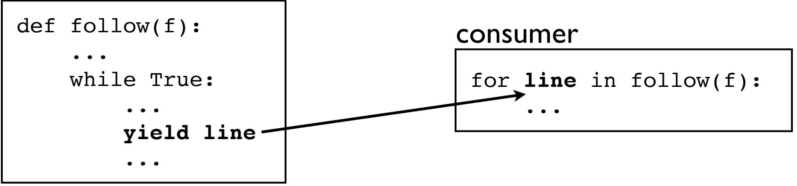

yield produces values   
for consume values

# Generator Pipelines

You can use this aspect of generators to set up processing pipelines (like Unix pipes)   
Big picture:

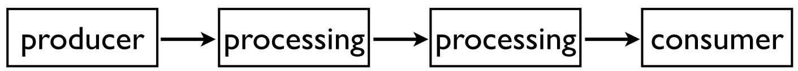

Processing pipes have an initial data producer, some set of intermediate processing stages, and a final consumer

# Generator Pipelines


def producer():

yield item

Producer is typically a generator (although it could also be a list or some other sequence)   
yield feeds data into the pipeline

# Generator Pipelines

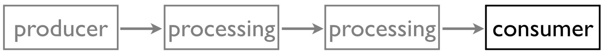

def producer():

yield item

def consumer(s):

for item in s:

Consumer is just a simple for-loop   
* It gets items and does something with them

# Generator Pipelines


def producer():

yield item

def processing(s):

for item in s:

yield newitem

def consumer(s):

for item in s:

Intermediate processing stages simultaneously consume and produce items   
* They might modify the data stream   
* They can also filter (discarding items)

# Generator Pipelines

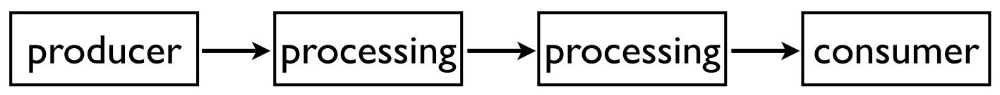

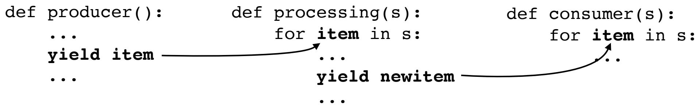

Pipeline setup (in your program)

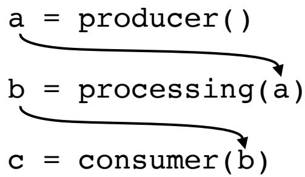

You will notice that data incrementally flows through the different functions

# Exercise 8.2

Time : 15 minutes

# Yield as an Expression

* In generators, yield can be used as an expression   
* For example, on the right side of an assignment

```python
def match(pattern):
    print('Looking for %s' % pattern)
while True:
    line = yield
    if pattern in line:
        print(line) 
```

Question : What is its value?

# Coroutines

* If you use yield like this, you get a "coroutine"   
* It defines a function to which you send values

```txt
>>> g = match('python')
>>> g.send(None) # Prime it (explained shortly)
Looking for python
>>> g.send('Yeah, but no, but yeah, but no')
>>> g.send('A series of tubes')
>>> g.send('python generators rock!')
python generators rock!
>>> 
```

Sent values are returned by (yield)

# Coroutine Execution

Execution is the same as for a generator   
* When you call a coroutine, nothing happens   
* Only runs in response to send() method

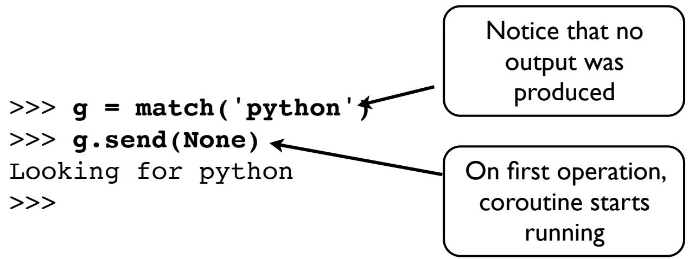

# Coroutine Priming

* All coroutines must be "primed" by first calling send(None)   
This advances execution to the location of the first yield expression.

```python
def match(pattern):
    print('Looking for %s' % pattern)
while True:
    line = yield
    if pattern in line:
        print(line) 
```

* At this point, it's ready to receive a value

# Using a Decorator

* Remembering the first send() is easy to forget   
* Solved by wrapping coroutines with a decorator

def consumer(func): def start(*args, \*\*kwargs): cr $=$ func(\*args,\*\*kwargs) cr.send(None) return cr return start @consumer def match(pattern):

# Processing Pipelines

* Coroutines can also be used to set up pipes

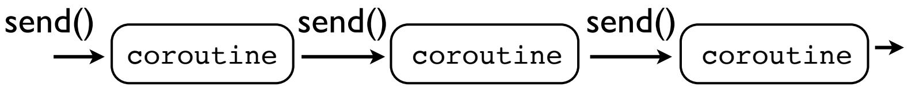

You just chain coroutines together and push data through the pipe with send() operations

# An Example

# * A source that mimics Unix 'tail -f'

import time   
def follow(filename, target): f = open(filename) f.seek(0,2) # Go to the end of the file while True: line $=$ f.readline() if line $! =$ :: target.send(line) else: time.sleep(0.1) # Sleep briefly=

# * A consumer that just prints the lines

@consumer   
def printer(): while True: line $=$ yield print(line, end $\equiv$

# An Example

# A filter coroutine

@consumer

def match(pattern, target): while True:

line $=$ yield # Receive a line

if pattern in line:

target.send(line) # Send to next stage

# Hooking it up

follow('access-log', match('python', printer()))

# A picture

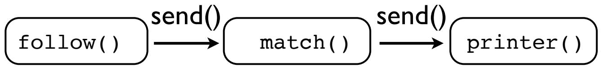

# Dataflow

* With coroutines, you can "fan out"

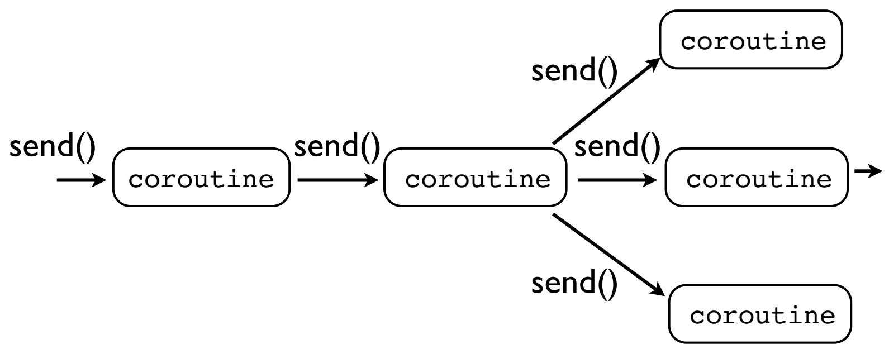

* More possibilities than a simple pipeline

# Exercise 8.3

Time : 15 Minutes

# Generator Control Flow

Generators have support for forced termination and exception handling

* .close() method - terminates   
* .throw() method - raise an exception

Examples follow

# Closing a Generator

* Use .close() method to shutdown

```txt
g = genfunc() # A generator  
...  
g.close() 
```

This raises GeneratorExit at yield

```python
def genfunc():
    ...
    try:
        yield item
except GeneratorExit:
    # .close() was invoked
    # perform cleanup (if any)
    ...
    return 
```

# Raising Exceptions

* Use .throw(type [,val [, tb]]) for exceptions

```lua
g = genfunc() # A generator  
...  
gthrow(RuntimeError, "You're dead") 
```

* This raises an exception at the yield

```txt
def genfunc(): try: yield item exceptRuntimeas e: # Handle the exception 
```

# Exercise 8.4

Time : 10 Minutes

# Managed Generators

Observation: A generator function can not execute solely by itself. It must be driven by something else (e.g., for-loop, send(), etc)   
Observation: The yield statement represents a point of preemption. Generators suspend at the yield and don't resume until instructed.

# Managed Generators

# manager

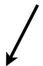

next() .send()

.throw() .close()


generator

generator

generator

generator

generator

generator

Idea: A manager will coordinate the execution of a collection of executing generators

# Managed Generators

Typical applications

Concurrency (tasklets, greenlets, etc.)   
* Actors   
Event simulation

This is a big topic   
* Will give a simple example

# Example : Concurrency

# − Define some "task" functions

```python
def countdown(n):
    while n > 0:
        print('T-minus', n)
        yield
        n -= 1 
```

```python
def countup(n):
    x = 0
    while x < n:
        print('Up we go', x)
        yield
        x += 1 
```

# * Carefully observe: just a bare "yield"

# Example : Concurrency

Instantiate some tasks in a queue

```txt
tasks = deque([countdown(10), countdown(5), countup(20)] 
```

Run a little scheduler (the manager)

```python
def run():
    while tasks:
        t = tasks.popleft()
        try:
            t.send(None)
            tasks.append(t)  # Run to yield
            except StopIteration:
                pass 
```

# Example : Concurrency

# Output

```txt
T-minus 10  
T-minus 5  
Up we go 0  
T-minus 9  
T-minus 4  
Up we go 1  
T-minus 8  
T-minus 4  
Up we go 2  
... 
```

* We see tasks cycling, but there are no threads

# Exercise 8.5

Time : 20 Minutes

# Delegating Generation

* Problem: Library functions involving generators

```python
def countdown(n):
    while n > 0:
        yield n
        n -= 1 
```

```python
def countup(end): n = 0 while n < end: yield n n += 1 
```

```python
def up_and_down(n):
    countup(n)
    countdown(n) 
```

Problem: It doesn't run...   
* Generators can't run on their own.

# Delegating Generation

* Option 1: Drive the generator yourself

```python
def up_and_down(n):
    for x in countup(n):
        yield x
    for x in countdown(n):
        yield x 
```

You need to manually control each generator with for-loops, send(), throw(), etc.   
* Can get quite complicated for coroutines

# Delegating Generation

* Option 2: Let Python drive it (yield from)

def up_and_down(n): yield from countup(n) yield from countdown(n)

Whatever "outer" code runs the generator will take care of it (you don't worry about it)

for x in up_and_down(5): # 0,1,2,3,4,5,4,3,2,1 ...

# Async/Await

* Alternate syntax for defining a coroutine (async)

async def greeting(name): return f'Hello {name}'

```txt
>>> g = greeting('Guido')
>>> g
<coroutine object greeting at 0x10b8b8258>
>>> g.send(None)
Traceback (most recent call last):
    File "<stdin>", line 1, in <module>
StopIteration: Hello Guido 
```

Syntax for calling a coroutine (await)

```python
async def main(): names = ['Guido', 'Dave', 'Paula'] for name in names: g = await greeting(name) print(g) 
```

# Async/Await

async/await mainly associated with asynchronous I/O, the asyncio module, and related tools   
* Provides a better environment for multitasking   
* The topic of a whole different course   
See: "Fear and Awaiting in Async"

https://www.youtube.com/watch?v=E-1Y4kSsAFc

# More Information

"Generator Tricks for Systems Programmers" tutorial from PyCon'08 http://www.dabeaz.com/generators   
* "A Curious Course on Coroutines and Concurrency" tutorial from PyCon'09 http://www.dabeaz.com/coroutines   
"Generators: The Final Frontier" tutorial from PyCon'14 http://www.dabeaz.com/finalgenerator

# Exercise 8.6

Time : 15 Minutes

# Section 9

# Modules and Packages

# Introduction

You've written some code   
* Now you need to organize it   
* Possibly give it to others   
* How do you do it?

# Modules Revisited

* As you know, every source file is a module

```txt
foo.py def grok(a): def spam(b): 
```

* import statement loads and executes a module

```txt
import foo  
a = foo.grok(2)  
b = foo.spam('Hello')  
... 
```

# Module Objects

Modules are objects

```txt
>>> import foo
>>> foo
<module 'foo' from 'foo.py>
>>> 
```

* A "namespace" for definitions inside

```txt
>>> foo.grok(2)  
>>> 
```

* Actually a layer on top of a dictionary (globals)

```html
>>> foo.__dict__['grok']
<function grok at 0x1006b6c80>
>>> 
```

# Special Variables

* A few special variables defined in a module

```python
__file__ # Name of the source file  
__name__ # Name of the module  
__doc__ # Module documentation string 
```

Example: "main" check

```python
if __name__ == '__main__':
    print('Running as the main program')
else:
    print('Imported as a module using import') 
```

# Import Implementation

# Import in a nutshell (pseudocode)

import types

```python
def import_module(name):
    # locate the module and get source code
    filename = find_module(name)
    code = open(filename).read() 
```

```txt
Create the enclosing module object mod = types_Module(name) 
```

```txt
Run it exec(code, mod.__dict__, mod.__dict__) return mod 
```

Source is exec'd in module dictionary   
* Contents are whatever is left over

# import statement

import executes the entire module

```txt
bar.py import foo
```

It inserts a name reference to the module object into the dictionary used by the code that made the import

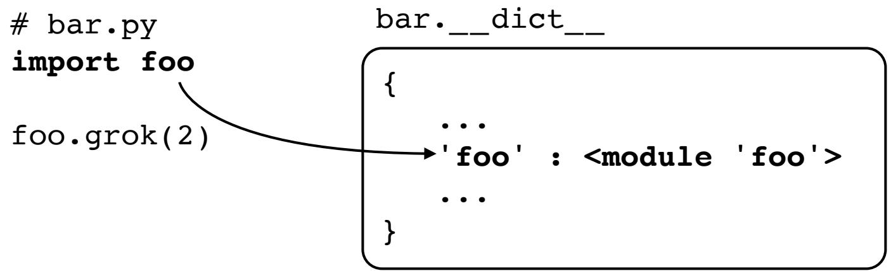

# Module Cache

Each module is loaded only once   
Repeated imports just return a reference to the previously loaded module   
sys.modules is a dict of all loaded modules

```python
>>> import sys   
>>> list(sys/modules)   
['copy_reg', '__main__', 'site', '__builtin__',   
'encodings', 'encodings.ENCODINGS', 'posixpath', ...]   
>>> 
```

# Import Caching

# Import (pseudocode)

import types import sys

```python
def import_module(name):
    # Check for cached module
    if name in sys/modules:
        return sys/modules[name]
    filename = find_module(name)
    code = open(filename).read()
    mod = typesModuleType(name)
    sys/modules[name] = mod 
```

```python
exec(code, mod.__dict__, mod.__dict__) return mod 
```

# * There is more, but this is basically it

# from module import

* Selected symbols can be imported locally

# bar.py

from foo import grok

grok(2)

* Useful for frequently used names   
Confusion: This does not change how import works. The entire module executes and is cached. This merely copies a name.

$$
\text {g r o k} = \text {s y s . m o d u l e s} [ ^ {\prime} f o o ^ {\prime} ] \cdot \text {g r o k}
$$

# from module import *

Takes all symbols from a module and places them into the caller's namespace

# bar.py from foo import *

grok(2) spam('Hello')

However, it only applies to names that don't start with an underscore (_)   
_name often used when defining nonimported values in a module.

# Module Reloading

* Modules can sometimes be reloaded

```haskell
>>> import foo   
>>> import importlib   
>>> importlib.reload(foo)   
<module 'foo' from 'foo.py'>   
>>> 
```

It re-executes the module source on top of the already defined module dictionary

```python
# pseudocode
def reload(mod):
    code = open(mod.__file__, 'r').read()
    exec(code, mod.__dict__, mod.__dict__).
return mod 
```

# Module Reloading Danger

Module reloading is not advised   
Problem: Existing instances of classes will continue to use old code after reload   
Problem: Doesn't update definitions loaded with 'from module import name'   
Problem: Likely breaks code that performs typechecks or uses super()

# Locating Modules

When looking for modules, Python first looks in the same directory as the source file that's executing the import   
If a module can't be found there, an internal module search path is consulted

```txt
>>> import sys   
>>> sys.path   
['', '/usr/local/lib/python36.zip'， '/usr/local/lib/python3.6'， '/usr/local/lib/python3.6/plat-darwin'， '/usr/local/lib/python3.6/lib-dynload'，'/usr/local/lib/python3.6/site-packages']
```

# Module Search Path

sys.path contains search path   
* Can manually adjust if you need to

import sys

sys.path.append('/project/foo/pyfiles')

Paths also added via environment variables

```txt
% env PATH=/project/foo/pyfiles python3   
Python 3.6.0 (default, Jan 12 2017, 13:20:23)   
[GCC 4.2.1 Compatible Apple LLVM 6.1.0 (clang-602.0.53)]   
>>> import sys   
>>> sys.path   
['', '/project/foo/pyfiles', '/usr/local/lib/python36.zip', ... ] 
```

# Exercise 9.

10 minutes

# Organizing Libraries

It is standard practice for Python libraries to be organized as a hierarchical set of modules that sit under a top-level package name

```txt
packagename  
packagename.foo  
packagename.bar  
packagename.utils  
packagename.utils.spam  
packagename.utils.grok  
packagename.parsers  
packagename.parsers.xml  
packagename.parsers.json  
... 
```

Other programming languages have a similar convention (e.g., Java)

# Creating a Package

* To create the module library hierarchy, organize files on the filesystem in a directory with the desired structure

```txt
packagename/ foo.py bar.py utils/ spam.py grok.py parsers/ xml.py json.py 
```

# Creating a Package

* Add __init__.py files to each directory

```txt
package name/  
__init__.py  
foo.py  
bar.py  
utils/  
__init__.py  
spam.py  
grok.py  
 parsers/  
__init__.py  
xml.py  
json.py
```

* These can be empty, but they should exist

# Using a Package

Once you have the __init__.py files, the import statement should just "work"

import packagename.foo

import packagename.parsers.xml

from packagename.parsers import xml

Almost everything should work the same way that it did before except that import statements now have multiple levels

# Fixing Relative Imports

Relative imports of submodules don't work

spam/

init__.pyfoo.pybar.py

# bar.py import foo # Fails (not found)

The issue: Resolving name clashes between top-level packages and submodules

spam/

init__.pyos.pybar.py

# bar.py import os # ??? (uses stdlib)

imports are always "absolute" (from top level)

# Absolute Imports

* One approach : use absolute imports

```txt
spam/ init.py foo.py bar.py 
```

* Example :

```txt
bar.py from spam import foo 
```

* Notice use of top-level package name

# Package Relative Imports

Consider a package

```batch
spam/ __init__.py foo.py bar.py grok/ __init__.py blah.py 
```

Package relative imports

# bar.py

```python
from . import foo # Imports ./foo.py  
from . foo import name # Load a specific name  
from . grok import blah # Imports ./grok/blah.py 
```

# Package Environment

Packages define a few useful variables

```txt
__package__ __path__ 
```

```txt
Name of the enclosing package # Search path for subcomponents 
```

Example:

```gemfile
>>> import xml
>>> xml._package__
'xml'
>>> xml._path__
['/usr/local/lib/python3.5/xml'] 
```

* Useful if code needs to obtain information about its enclosing environment

# Exercise 9.2

10 minutes

# init _.py Usage

* What are you supposed to do in those files?   
Main use: stitching together multiple source files into a "unified" top-level import

# Module Assembly

* Consider two submodules in a package

spam/

foo.py

# foo.py

class Foo:

bar.py

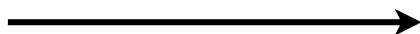

# bar.py

class Bar:

* Suppose you wanted to combine them

# Module Assembly

Combine in _init__.py

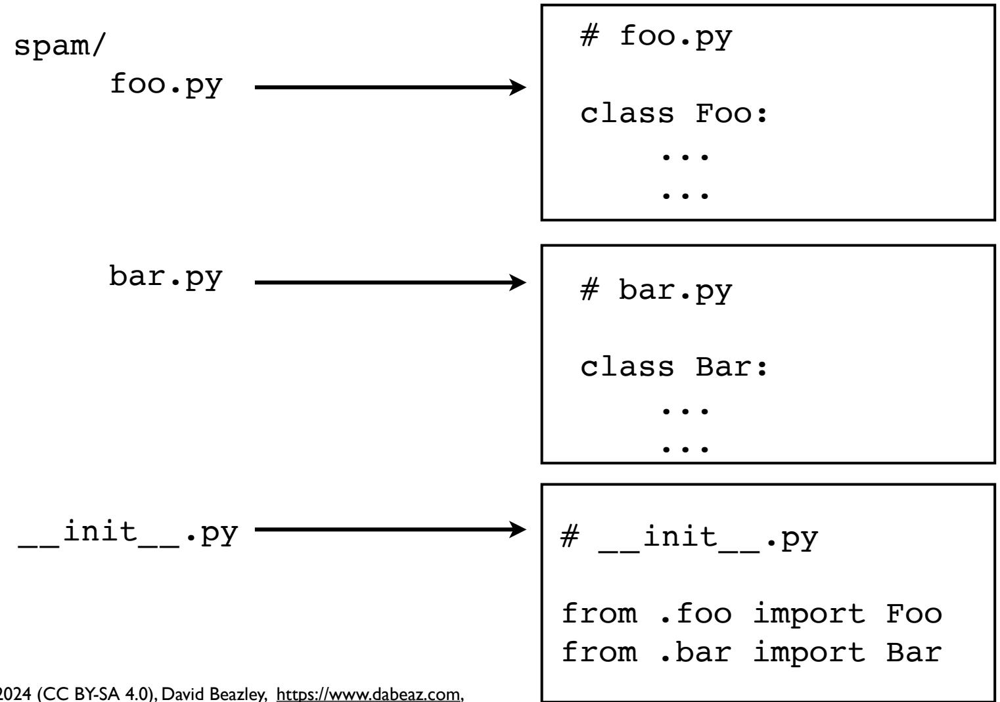

# Module Assembly

* Users see a single unified top-level package

import spam

$$
f = \operatorname {s p a m}. F o o (  )
$$

$$
b = \text {s p a m . B a r ()}
$$

$$
\begin{array}{c c c} \bullet & \bullet & \bullet \\ \hline \end{array}
$$

Split across submodules is hidden

# Case Study

The collections "module"   
* It's actually a package with a few components

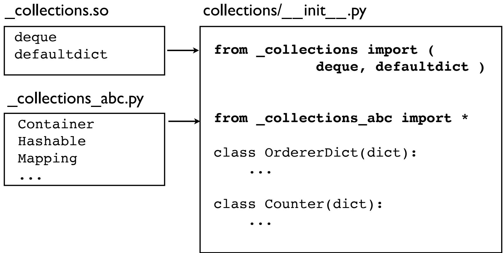

# Controlling Exports

Submodules should define __all_

# foo.py

# bar.py

__all__ = ['Foo']

__all__ = ['Bar']

class Foo(object):

class Bar(object):

Controls 'from module import *'   
* Allows easy combination in __init__.py

# __init__.py

from .foo import *

from .bar import *

__all__ = [ *foo.__all__, *bar.__all__ ]

# Module Splitting

* Suppose you have a large module

# spam.py

class Foo:

class Bar:

* You want to split it into multiple files   
But keep it as a single import

# Module Splitting

* Step 1: Turn into a directory with multiple files

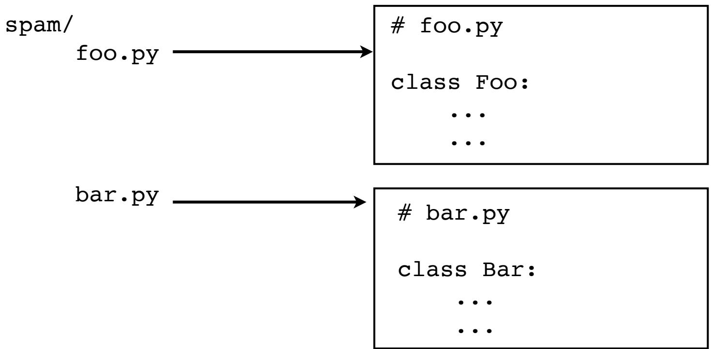

Split the code you wish

# Module Splitting

* Step 2: Stitch back together in __init__.py

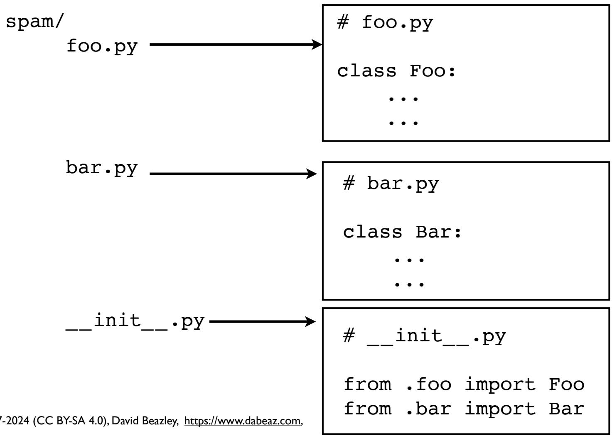

# Exercise 9.3

20 minutes

# Circular Imports

Great care must be given to circular imports within a package

```python
spam/base.py   
from . import child   
class Base: 
```

```python
# spam/child.py
from .base import Base
class Child(Base):
    ... 
```

Follow the control-flow   
Definition order matters!

# Circular Imports

* You may have to place imports somewhere else

```python
# spam/base.py
class Base:
...
from . import child 
```

* Rule of thumb: Avoid circular dependencies   
* Keep in mind: Not always practical

# Main Modules

python -m module   
* Runs a specified module as a main program

```txt
spam/ __init__.py foo.py bar.py 
```

bash % python3 -m spam.foo

# Runs spam.foo as main

Can use to enclose supporting scripts/applications within a package

# Main Entry Point

main__.py designates an entry point   
* Makes a package directory executable

spam/

_init__.py

main__.py

foo.py

bar.py

# Starting module

bash % python3 -m spam

# Run package as main

More useful than you might think

# Executable Subpackages

# Example

```batch
spam/ init.py foo.py bar.py test/ 
```

```txt
__init__.py  
__main__.py  
foo.py  
bar.py
```

bash % python3 -m spam.test

Could have a variety of such tools/utilities embedded within a package   
* Nice feature: they stay with the package

# Exercise 9.4

15 minutes

# More Information

"Modules and Packages: Live and Let Die" - PyCon 2015 Tutorial

http://www.dabeaz.com/modulepackage/

* More than you ever wanted to know...

# Preparing For Distribution

* Suppose you want to give code to others   
* Packaging is a constantly evolving topic   
* Best bet: Look at the official docs   
https://packaging.python.org/en/latest/

# That's it!

You've reached the end!   
Thanks!   
* Is there even more to learn? Yes. Always.   
* I welcome your feedback: dave@dabeaz.com   
Courses: https://www.dabeaz.com/courses.html